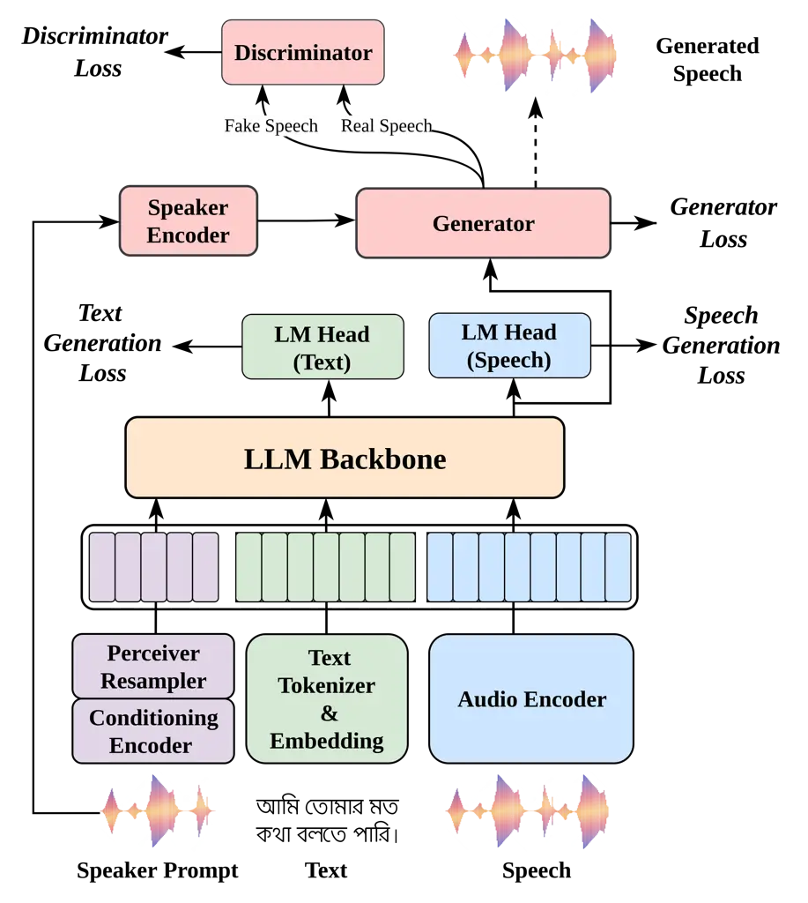
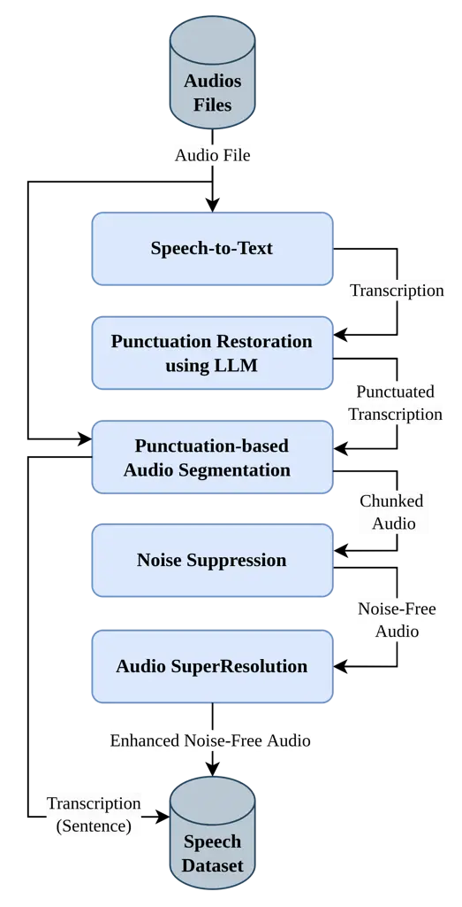
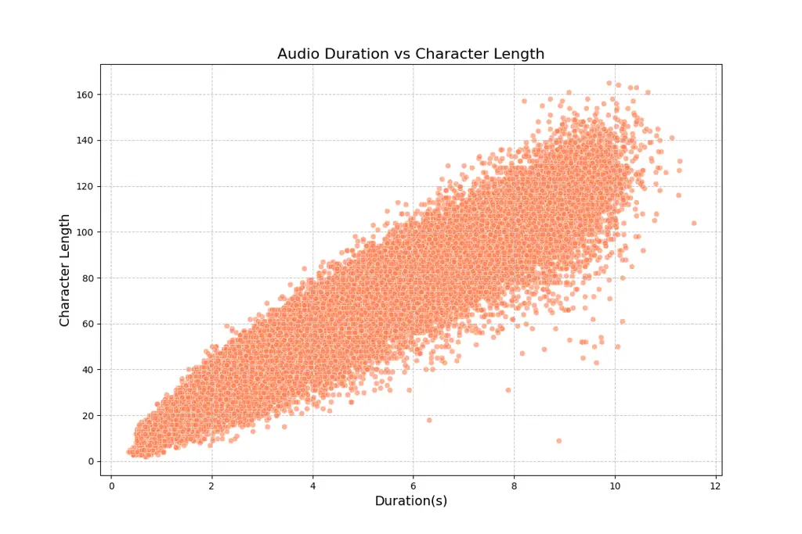
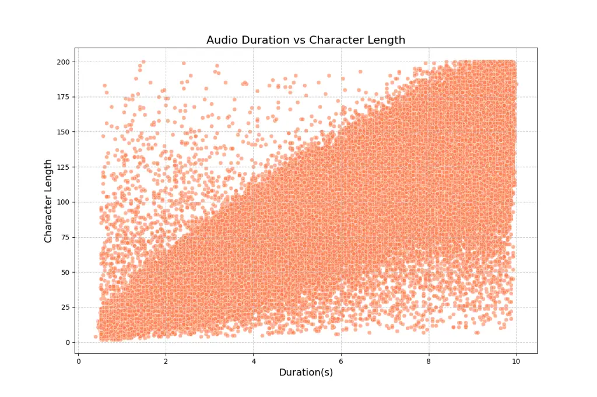
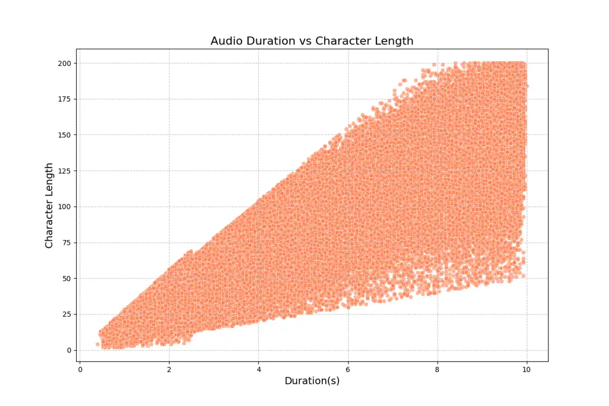

# BnTTS: Few-Shot Speaker Adaptation in Low-Resource Setting

Mohammad Jahid Ibna Basher Affiliation: Hishab Singapore Pte. Ltd,
Singapore    Md Kowsher Affiliation: University of Central Florida, USA
   Md Saiful Islam Affiliation: Hishab Singapore Pte. Ltd, Singapore   
Rabindra Nath Nandi Affiliation: Hishab Singapore Pte. Ltd, Singapore   
Nusrat Jahan Prottasha Affiliation: University of Central Florida, USA
   Mehadi Hasan Menon Affiliation: Hishab Singapore Pte. Ltd, Singapore
   Tareq Al Muntasir Affiliation: Hishab Singapore Pte. Ltd, Singapore
   Shammur Absar Chowdhury Affiliation: Qatar Computing Research
Institute, Qatar    Firoj Alam Affiliation: Qatar Computing Research
Institute, Qatar    Niloofar Yousefi Affiliation: University of Central
Florida, USA    Ozlem Ozmen Garibay Affiliation: University of Central
Florida, USA

###### Abstract

This paper introduces BnTTS (Bangla Text-To-Speech), the first framework
for Bangla speaker adaptation-based TTS, designed to bridge the gap in
Bangla speech synthesis using minimal training data. Building upon the
XTTS architecture, our approach integrates Bangla into a multilingual
TTS pipeline, with modifications to account for the phonetic and
linguistic characteristics of the language. We pretrain BnTTS on 3.85k
hours of Bangla speech dataset with corresponding text labels and
evaluate performance in both zero-shot and few-shot settings on our
proposed test dataset. Empirical evaluations in few-shot settings show
that BnTTS significantly improves the naturalness, intelligibility, and
speaker fidelity of synthesized Bangla speech. Compared to
state-of-the-art Bangla TTS systems, BnTTS exhibits superior performance
in Subjective Mean Opinion Score (SMOS), Naturalness, and Clarity
metrics.

## 1 Introduction

Speaker adaptation in Text-to-Speech (TTS) technology has seen
substantial advancements in recent years, particularly with
speaker-adaptive models enhancing the naturalness and intelligibility of
synthesized speech Eren and Demiroglu (2023). Notably, recent
innovations have emphasized zero-shot and one-shot adaptation approaches
Kodirov et al. (2015). Zero-shot TTS models eliminate the need for
speaker-specific training by generating speech from unseen speakers
using reference audio samples Min et al. (2021). Despite this progress,
zero-shot models often require large datasets and face challenges with
out-of-distribution (OOD) voices, as they struggle to adapt effectively
to novel speaker traits Le et al. (2023); Ju et al. (2024).
Alternatively, one-shot adaptation fine-tunes pre-trained models using a
single data instance, offering improved adaptability with reduced data
and computational demands Yan et al. (2021); Wang et al. (2023);
however, the pretraining stage still necessitates substantial datasets
Zhang et al. (2021).

Recent works such as YourTTS Bai et al. (2022) and VALL-E X Xu et al.
(2022) have made strides in cross-lingual zero-shot TTS, with YourTTS
exploring English, French, and Portuguese, and VALL-E X incorporating
language identification to extend support for a broader range of
languages Xu et al. (2022). These advancements highlight the potential
for multilingual TTS systems to achieve cross-lingual speech synthesis.
Furthermore, the XTTS model Casanova et al. (2024) represents a
significant leap by expanding zero-shot TTS capabilities across 16
languages. Based on the Tortoise model Casanova et al. (2024), XTTS
enhances voice cloning accuracy and naturalness but remains focused on
high- and medium-resource languages, leaving low-resource languages such
as Bangla underserved Zhang et al. (2022); Xu et al. (2023).

The scarcity of extensive datasets has hindered the adaptation of
state-of-the-art (SOTA) TTS models for low-resource languages. Models
like YourTTS Bai et al. (2022), VALL-E X Baevski et al. (2022a), and
Voicebox Baevski et al. (2022b) have demonstrated success in
multilingual settings, yet their primary focus remains on languages with
rich resources like English, Spanish, French, and Chinese. While a few
Bangla TTS systems exist Gutkin et al. (2016), they often produce
robotic tones Hossain et al. (2018) or are limited to a small set of
static speakers Gong et al. (2024), lacking instant speaker adaptation
capabilities and typically not being open-source.

To address these challenges, we propose the first framework for few-shot
speaker adaptation in Bangla TTS. Our approach integrates Bangla into
the XTTS training pipeline, with architectural modifications to
accommodate Bangla’s unique phonetic and linguistic features. Our model
is optimized for effective few-shot voice cloning, addressing the needs
of low-resource language settings. Our contributions are summarized as
follows: (i) we present the first speaker-adapted Bangla TTS system;
(ii) we integrate Bangla into a multilingual XTTS pipeline, optimizing
the framework to accommodate the unique challenges of low-resource
languages; (iii) we make the developed BnTTSTextEval evaluation dataset
public.

## 2 BnTTS



Figure 1: Overview of BnTTS Model.

Preliminaries: Given a text sequence with $`N`$ tokens,
$`\mathbf{T}=\{t_{1},t_{2},\ldots,t_{N}\}`$, and a speaker’s
mel-spectrogram $`\mathbf{S}=\{s_{1},s_{2},\ldots,s_{L}\}`$, the
objective is to generate speech $`\hat{\mathbf{Y}}`$ that matches the
speaker’s characteristics. The ground truth mel-spectrogram frames for
the target speech are denoted as
$`\mathbf{Y}=\{y_{1},y_{2},\ldots,y_{M}\}`$. The synthesis process can
be described as:

```math
\hat{\mathbf{Y}}=\mathcal{F}(\mathbf{S},\mathbf{T})
```

where $`\mathcal{F}`$ produces speech conditioned on both the text and
the speaker’s spectrogram.

Audio Encoder: A Vector Quantized-Variational AutoEncoder (VQ-VAE)
Betker (2023) encodes mel-spectrogram frames $`\mathbf{Y}`$ into
discrete tokens $`M\in\mathcal{C}`$, where $`\mathcal{C}`$ is vocab or
codebook. An embedding layer then transforms these tokens into a
$`d`$-dimensional vector: $`\mathbf{Y_{e}}\in\mathbb{R}^{M\times d}`$.

Conditioning Encoder & Perceiver Resampler: The Conditioning Encoder
Casanova et al. (2024) consists of $`l`$ layers of $`k`$-head Scaled
Dot-Product Attention, followed by a Perceiver Resampler. The speaker
spectrogram $`\mathbf{S}`$ is transformed into an intermediate
representation $`\mathbf{S_{z}}\in\mathbb{R}^{L\times d}`$, where each
attention layer applies a scaled dot-product attention mechanism. The
Perceiver Resampler generates a fixed output dimensionality
$`\mathbf{R}\in\mathbb{R}^{P\times d}`$ from a variable input length
$`L`$.

Text Encoder: The text tokens
$`\mathbf{T}=\{t_{1},t_{2},\ldots,t_{N}\}`$ are projected into a
continuous embedding space, yielding
$`\mathbf{T_{e}}\in\mathbb{R}^{N\times d}`$.

Large Language Model (LLM): The transformer-based LLM Radford et al.
(2019) utilizes the decoder portion. Speaker embeddings
$`\mathbf{S_{p}}`$, text embeddings $`\mathbf{T_{e}}`$, and ground truth
spectrogram embeddings $`\mathbf{Y_{e}}`$ are concatenated to form the
input:

```math
\mathbf{X}=\mathbf{S_{p}}\oplus\mathbf{T_{e}}\oplus\mathbf{Y_{e}}\in\mathbb{R}^{(N+P+M)\times d}
```

The LLM processes $`\mathbf{X}`$, producing output $`\mathbf{H}`$ with
hidden states for the text, speaker, and spectrogram embeddings. During
inference, only text and speaker embeddings are concatenated, generating
spectrogram embeddings $`\{h_{1}^{Y},h_{2}^{Y},\ldots,h_{P}^{Y}\}`$ as
the output.

HiFi-GAN Decoder: The HiFi-GAN Decoder Kong et al. (2020) converts the
LLM’s output into realistic speech, preserving the speaker’s
characteristics. Specifically, it takes the LLM’s speech head output
$`\mathbf{H}_{\text{Y}}=\{h_{1}^{Y},h_{2}^{Y},\ldots,h_{P}^{Y}\}`$. The
speaker embedding $`\mathbf{S}`$ is resized to match
$`\mathbf{H}_{\text{Y}}`$, resulting in
$`\mathbf{S}^{\prime}\in\mathbb{R}^{P\times d}`$. The final audio
waveform $`\mathbf{W}`$ is then generated by:

```math
\mathbf{W}=g_{\text{HiFi}}(\mathbf{H}_{\text{Y}}+\mathbf{S}^{\prime})
```

Thus, the HiFi-GAN decoder produces speech that reflects the input text
while maintaining the speaker’s unique qualities.

## 3 Experiments

BnTTS model: BnTTS employs the pretrained XTTS checkpoint Casanova
et al. (2024) as its base model, chosen for resource efficiency. The
Conditioning Encoder has six attention blocks with 32 heads, capturing
contextual information. The Perceiver Resampler reduces the sequence to
a fixed length of 32. The model maintains GPT-2’s dimensionality, with a
hidden size of 1024 and an intermediate layer size of 3072, handling
sequences of up to 400 tokens. (Details in Appendix D).

Dataset: We continuously pre-trained the BnTTS model (initialized from
the XTTS checkpoint) on 3.85k hours of Bengali speech data, sourced from
open-source datasets, pseudo-labeled data, and synthetic datasets. The
pseudo-labeled data were collected using an in-house automated TTS Data
Acquisition Framework, which segments speech into 0.5 to 11-second
chunks with time-aligned transcripts. These segments were further
refined using neural speech models and custom algorithms to enhance
quality and accuracy. For speaker adaptation, we incorporated 4.22 hours
of high-quality studio recordings from four speakers, referred to as
In-House HQ Data.

For evaluation, we propose two datasets: (1) BnStudioEval, derived from
our In-House HQ Data, to assess high-fidelity speech generation and
speaker adaptation, and (2) BnTTSTextEval, a text-only dataset
consisting of three subsets: BengaliStimuli53 (assessing phonetic
diversity), BengaliNamedEntity1000 (evaluating named entity
pronunciation), and ShortText200 (measuring conversational fluency in
short sentences, filler words, and common phrases used in everyday
dialogue). Further details are provided in Appendices A, B, and C.

Training Setup: We initialized the BnTTS model from the XTTS checkpoint
and do continual pre-training using the AdamW optimizer with betas of
0.9 and 0.96, weight decay of 0.01, and an initial learning rate of
2e-05. The batch size was 12, with gradient accumulation over 24 steps
per GPU, and the learning rate decay(0.66) was applied using
MultiStepLR. All experiments are run on a single NVIDIA A100 GPU with
80GB of VRAM. The pretraining process consists of two stages:

a) Partial Audio Prompting: In this stage, a random segment of the
ground truth audio is used as the speaker prompt. Training in this phase
lasted for 5 epochs.

b) Complete Audio Prompting: Here, the full duration of audio is used as
the speaker prompt. This stage continues from the checkpoint and
optimizer state of the first phase and lasts for 1 epoch.

Additionally, the HiFi-GAN vocoder was fine-tuned separately using GPT-2
embeddings derived from the model in stage b. The vocoder was fine-tuned
for three days to ensure optimal performance. The audio encoder and
speaker encoder remain frozen across all experiments.

Few-shot Speaker Adaptation: For few-shot speaker adaptation, we
fine-tuned the BnTTS model using our In-House HQ dataset, which
comprises studio recordings from four speakers. We randomly selected 20
minutes of audio for each speaker and fine-tuned the model in a
multi-speaker setting for 10 epochs. This fine-tuning approach is more
meaningful with the XTTS-like architecture pretrained on large-scale
datasets. The evaluation results are presented in Section 4.

Evaluation Metric: We evaluate the BnTTS system using six criteria. The
Subjective Mean Opinion Score (SMOS) including Naturalness and Clarity
evaluates perceived audio quality from Streijl et al. (2016), while the
ASR-based Character Error Rate (CER) Nandi et al. (2023) measures
transcription accuracy, SpeechBERTScore assesses similarity to reference
speech, and Speaker Encoder Cosine Similarity (SECS) evaluates speaker
identity fidelity Saeki et al. (2024); Casanova et al. (2021);
Thienpondt and Demuynck (2024). See Appendix E for details.

## 4 Results

We evaluated the pretrained BnTTS (BnTTS-0) and speaker-adapted BnTTS
(BnTTS-n) alongside IndicTTS Kumar et al. (2023) and two commercial
systems: Google Cloud TTS (GTTS) and Azure TTS (AzureTTS). The
evaluation was conducted on both the BnStudioEval and BnTTSTextEval
datasets. For a time-efficient subjective evaluation, we randomly
selected 200 sentences from the BengaliNamedEntity1000 subset, which
originally contains 1000 samples, maintaining a comprehensive assessment
while reducing evaluation overhead.

Reference-aware Evaluation: Table 1 shows the performance of various TTS
systems on the BnStudioEval dataset. GTTS outperforms other methods in
the CER metric, even surpassing the Ground Truth (GT) in transcription
accuracy. As for the subjective measures, the proposed BnTTS-n closely
follows the GT, with competitive scores in SMOS (4.624 vs 4.809),
Naturalness (4.600 vs 4.798), and Clarity (4.869 vs 4.913). Meanwhile,
BnTTS-0 achieves SMOS, Naturalness, and Clarity scores of 4.456, 4.447,
and 4.577, respectively. IndicTTS, AzureTTS, and GTTS perform poorly in
the subjective metrics.

In speaker similarity evaluation, GT attains a perfect SECS (reference)
score and high SECS (prompt) scores. BnTTS-n outperforms BnTTS-0 in both
SECS (reference) (0.548 vs 0.529) and SECS (prompt) (0.586 vs 0.576).
Additionally, BnTTS-n achieves a SpeechBERTScore of 0.791, slightly
higher than BnTTS-0 at 0.789, while GT retains a perfect score of 1.0.
IndicTTS, GTTS, and AzureTTS do not support speaker adaptation, so SECS
and SpeechBERTScore were not evaluated for these systems.

Reference-independent Evaluation: Table 2 presents the comparative
performance of various TTS systems evaluated on the BnTTSTextEval
dataset. The AzureTTS and GTTS consistently achieve lower CER scores,
with BnTTS-n and BnTTS-0 following closely in third and fourth place,
respectively, and IndicTTS trailing behind. BnTTS-n performs strongly in
subjective evaluations, excelling in SMOS, Naturalness, and Clarity
scores across the BengaliStimuli53, BengaliNamedEntity1000, and
ShortText200 subsets. Overall, BnTTS-n achieves the highest scores in
SMOS (4.601), Naturalness (4.578), and Clarity (4.832). Meanwhile,
AzureTTS performs competitively, surpassing other commercial and
open-source models and achieving scores comparable to BnTTS-0.

| Method        | GT    | IndicTTS | GTTS  | AzureTTS | BnTTS-0 | BnTTS-n |
| ------------- | ----- | -------- | ----- | -------- | ------- | ------- |
| CER           | 0.030 | 0.058    | 0.020 | 0.021    | 0.052   | 0.034   |
| SMOS          | 4.809 | 3.475    | 4.017 | 4.154    | 4.456   | 4.624   |
| Naturalness   | 4.798 | 3.406    | 3.949 | 4.100    | 4.447   | 4.600   |
| Clarity       | 4.913 | 4.160    | 4.700 | 4.686    | 4.577   | 4.869   |
| SECS (Ref.)   | 1.0   | \-       | \-    | \-       | 0.529   | 0.548   |
| SECS (Prompt) | 0.641 | \-       | \-    | \-       | 0.576   | 0.586   |
| SpeechBERT-   |       |          |       |          |         |         |
| Score         | 1.0   | \-       | \-    | \-       | 0.789   | 0.791   |

Table 1: Comparative average performance for reference-aware
BnStudioEval dataset. SECS and SpeechBERTScore are not reported for
IndicTTS, GTTS, and AzureTTS as these systems do not support speaker
adaption.

| Dataset    | Method   | CER   | SMOS  | Naturalness | Clarity |
| ---------- | -------- | ----- | ----- | ----------- | ------- |
| Bengali-   | IndicTTS | 0.110 | 3.445 | 3.403       | 3.857   |
| Stimuli-53 | GTTS     | 0.063 | 4.006 | 3.937       | 4.688   |
|            | AzureTTS | 0.060 | 4.108 | 4.064       | 4.542   |
|            | BnTTS-0  | 0.092 | 4.622 | 4.613       | 4.719   |
|            | BnTTS-n  | 0.086 | 4.654 | 4.634       | 4.854   |
| Bengali-   | IndicTTS | 0.049 | 3.527 | 3.462       | 4.179   |
| Named-     | GTTS     | 0.037 | 4.037 | 3.969       | 4.712   |
| Entity-    | AzureTTS | 0.032 | 4.182 | 4.135       | 4.654   |
| 1000       | BnTTS-0  | 0.043 | 4.585 | 4.613       | 4.698   |
| \(200\)    | BnTTS-n  | 0.040 | 4.635 | 4.614       | 4.841   |
| Short-     | IndicTTS | 0.204 | 3.233 | 3.325       | 3.893   |
| Text-200   | GTTS     | 0.043 | 4.058 | 3.993       | 4.705   |
|            | AzureTTS | 0.050 | 4.294 | 4.256       | 4.675   |
|            | BnTTS-0  | 0.116 | 4.297 | 4.271       | 4.556   |
|            | BnTTS-n  | 0.092 | 4.554 | 4.528       | 4.816   |
| Overall    | IndicTTS | 0.125 | 3.388 | 3.325       | 4.017   |
|            | GTTS     | 0.049 | 4.042 | 3.976       | 4.706   |
|            | AzureTTS | 0.045 | 4.223 | 4.180       | 4.650   |
|            | BnTTS-0  | 0.081 | 4.463 | 4.445       | 4.639   |
|            | BnTTS-n  | 0.069 | 4.601 | 4.578       | 4.832   |

Table 2: Comparative average performance analysis on the
reference-independent BnTTSTextEval dataset.

[TABLE]

Table 3: Impact of prompt duration, temperature (T), and Top-K on
BnTTS-n performance in the Short-BnStudioEval Dataset.

Zero-shot vs. Few-shot BnTTS: BnTTS-0 consistently falls short of
BnTTS-n across all metrics in both reference-aware and
reference-independent evaluations. The BnTTS-n model produces more
natural and intelligible speech with high speaker fidelity, leading to
improved SMOS, CER, and SECS scores. This performance gap is
particularly evident in the ShortText-200 dataset, which assesses
conversational fluency in short, everyday phrases. The results affirm
that finetuning can significantly improve the XTTS-based model for
generating natural, fluent, and speaker-adapted speech.

High CER in Text Generation: Both BnTTS models exhibited higher CER
compared to AzureTTS and GTTS in both BnStudioEval and BnTTSTextEval
datasets. The AzureTTS and GTTS also achieved a lower CER score than the
GT. The BnTTS generates speech with more conversational prosody and
expressiveness, which, while improving perceived quality, may negatively
impact CER. ASR systems, used for CER evaluation, are often better
suited to transcribing standardized speech patterns, as seen in AzureTTS
and GTTS. The consistent loudness and simplified prosody in these
systems create clearer phonetic boundaries, making them more easily
transcribed by the ASR model Choi et al. (2022); Wagner et al. (2019).

Effect of Sampling and Prompt Length on Short Speech Generation: The
generation of short audio sequences presents challenges in the BnTTS
models, particularly for texts containing fewer than 30 characters when
using the default generation settings (Temperature $`T=0.85`$ and TopK =
50). The issues observed are twofold: (1) the generated speech often
lacks intelligibility, and (2) the output speech tends to be longer than
expected. To investigate this, we extracted a subset of 23 short
text-speech pairs from the BnStudioEval dataset, which we call
ShortBnStudioEval dataset. For evaluation, we utilize the CER metric to
assess intelligibility and DurationEquality (Appendix: E) to quantify
duration discrepancies in the BnTTS-n model.

Under the default settings (Exp. 1 in Table 3), the model achieves a CER
of 0.081 and a DurationEquality score of 0.699. We hypothesize that this
issue stems from its training process. During training, the model is
accustomed to short audio prompts for short sequences. By aligning the
inference with this training strategy and using short prompts, the
generation performance improves vastly, as evidenced by a higher
DurationEquality score of 0.820 and a lower CER of 0.029 (Exp. 2).
Further, by adjusting the temperature to $`T=1.0`$ and reducing the
top-K value to 2, we observed an improvement in the DurationEquality
score from 0.699 to 0.701, accompanied by a substantial reduction in CER
from 0.081 to 0.023 (Exp. 3). Combining the short prompt with the
adjusted temperature and top-K values yielded the best results. In this
configuration, the DurationEquality score improved to 0.827, with a CER
of 0.015, demonstrating that both factors are crucial for accurate short
speech generation.

## 5 Related Works

The development of Bangla TTS technology presents unique challenges due
to the language’s rich morphology and phonetic diversity. The first
Bangla TTS system, Katha Alam et al. (2007), was developed using diphone
concatenation within the Festival Framework. However, this approach
struggled with natural prosody and efficient runtime. Later
advancements, such as Subhachan Naser et al. (2010), aimed to improve
these aspects but still faced similar limitations. The introduction of
LSTM-based models Gutkin et al. (2016) showed promising results in
Bangla speech synthesis. Beyond Bangla-specific TTS, broader efforts on
Indian language synthesis have contributed to Indic-TTS systems. Prakash
and Murthy (2020) employed Tacotron2 for text-to-mel-spectrogram
conversion and WaveGlow as a vocoder. Another study Kumar et al. (2023)
demonstrated that monolingual models utilizing FastPitch and HiFi-GAN
V1, trained on both male and female voices, outperformed previous
approaches. However, these works supported a limited number of speakers
and lacked speaker adaptability. To address this gap, we explore the
LLM-based XTTS model for Bangla, developing the first Bangla TTS system
designed for low-resource speaker adaptation.

## 6 Conclusion

In this work, we introduced BnTTS, the first speaker-adaptive TTS system
for Bangla, capable of generating natural and clear speech with minimal
training data. Built on the XTTS pipeline, BnTTS effectively supports
zero-shot and few-shot speaker adaptation, outperforming existing Bangla
TTS systems in sound quality, naturalness, and clarity. Despite its
strengths, BnTTS faces challenges in handling diverse dialects and
short-sequence generation. Future work will focus on training BnTTS from
scratch, developing medium and small model variants, and exploring
knowledge distillation to optimize inference speed for real-time
applications.

## 7 Limitations

Despite the significant performance of BnTTS, the system has several
limitations. It struggles to adapt to speakers with unique vocal traits,
especially without prior training on their voices, limiting its
effectiveness in speaker adaptation tasks. We found poor performance on
short text due to pre-existing issues in the XTTS foundation model.
Although we improved performance by modifying generation settings and
incorporating additional training with Complete Audio Prompting, the
model still fails to generate sequences under two words or 20 characters
in some cases. We did not investigate the performance of the XTTS model
by training from scratch; instead, we used continual pretraining due to
resource constraints, which may have yielded better results.

## 8 Acknowledgments

We are grateful to HISHAB¹¹ 1
[https://www.verbex.ai/](https://www.verbex.ai/) for providing us with
all the necessary working facilities, computational resources, and an
appropriate environment through- out our entire work.

## 9 Ethical Considerations

The development of BnTTS raises ethical concerns, particularly regarding
the potential misuse for unauthorized voice impersonation, which could
impact privacy and consent. Protections, such as requiring speaker
approval and embedding markers in synthetic speech, are essential.
Diverse training data is also crucial to reduce bias and reflect
Bangla’s dialectal variety. Additionally, synthesized voices risk
diminishing dialectal diversity. As an open-source tool, BnTTS requires
clear guidelines for responsible use, ensuring adherence to ethical
standards and positive community impact.

## References

- Alam et al. (2007) Firoj Alam, Promila Kanti Nath, and Mumit
  Khan. 2007. Text to speech for bangla language using festival.
  Technical report, BRAC University.
- Baevski et al. (2022a) A. Baevski et al. 2022a. Vall-e: A generative
  neural audio codec for zero-shot tts. In _Proceedings of the 2022
  Conference on Empirical Methods in Natural Language Processing_, pages
  234–245. Association for Computational Linguistics.
- Baevski et al. (2022b) A. Baevski et al. 2022b. Voicebox: A generalist
  neural speech synthesizer. In _Proceedings of the 2022 Conference on
  Neural Information Processing Systems_, pages 3001–3011. NeurIPS.
- Bai et al. (2022) Y. Bai et al. 2022. Yourtts: Towards zero-shot
  multilingual text-to-speech. In _Proceedings of the 2022 Conference on
  Empirical Methods in Natural Language Processing_, pages 123–132.
  Association for Computational Linguistics.
- Betker (2023) James Betker. 2023. Better speech synthesis through
  scaling. _arXiv preprint arXiv:2305.07243_.
- Casanova et al. (2021) Edresson Casanova, Christopher Shulby, Eren
  Gölge, Nicolas Michael Müller, Frederico Santos de Oliveira, Arnaldo
  Candido Jr., Anderson da Silva Soares, Sandra Maria Aluisio, and
  Moacir Antonelli Ponti. 2021. [SC-GlowTTS: An Efficient Zero-Shot
  Multi-Speaker Text-To-Speech
  Model](https://doi.org/10.21437/Interspeech.2021-1774). In _Proc.
  Interspeech 2021_, pages 3645–3649.
- Casanova et al. (2024) P. Casanova et al. 2024. Xtts: Extending
  zero-shot tts to multilingual domains. In _Proceedings of the 2024
  Conference on Empirical Methods in Natural Language Processing_, pages
  300–310. Association for Computational Linguistics.
- Choi et al. (2022) Yeunju Choi, Youngmoon Jung, Youngjoo Suh, and
  Hoirin Kim. 2022. [Learning to maximize speech quality directly using
  mos prediction for neural
  text-to-speech](https://doi.org/10.1109/ACCESS.2022.3175810). _IEEE
  Access_, 10:52621–52629.
- Défossez et al. (2019) Alexandre Défossez, Nicolas Usunier, Léon
  Bottou, and Francis Bach. 2019. Music source separation in the
  waveform domain. _arXiv preprint arXiv:1911.13254_.
- Eren and Demiroglu (2023) Eray Eren and Cenk Demiroglu. 2023. Deep
  learning-based speaker-adaptive postfiltering with limited adaptation
  data for embedded text-to-speech synthesis systems. _Computer Speech &
  Language_, 81:101520.
- Gong et al. (2024) Cheng Gong, Erica Cooper, Xin Wang, Chunyu Qiang,
  Mengzhe Geng, Dan Wells, Longbiao Wang, Jianwu Dang, Marc Tessier,
  Aidan Pine, et al. 2024. An initial investigation of language
  adaptation for tts systems under low-resource scenarios. _arXiv
  preprint arXiv:2406.08911_.
- Gutkin et al. (2016) Alexander Gutkin, Linne Ha, Martin Jansche, Knot
  Pipatsrisawat, and Richard Sproat. 2016. Tts for low resource
  languages: A bangla synthesizer. In _Proceedings of the Tenth
  International Conference on Language Resources and Evaluation
  (LREC’16)_, pages 2005–2010.
- Hossain et al. (2018) Md Jakir Hossain, Sayed Mahmud Al Amin,
  Md Saiful Islam, et al. 2018. Development of robotic voice conversion
  for ribo using text-to-speech synthesis. In _2018 4th International
  Conference on Electrical Engineering and Information & Communication
  Technology (iCEEiCT)_, pages 422–425. IEEE.
- Ju et al. (2024) H. Ju et al. 2024. Naturalspeech3: Speech generation
  with naturalness and flexibility. In _Proceedings of the 2024
  Conference on Neural Information Processing Systems_, pages 456–467.
  NeurIPS.
- Kodirov et al. (2015) Elyor Kodirov, Tao Xiang, Zhenyong Fu, and
  Shaogang Gong. 2015. Unsupervised domain adaptation for zero-shot
  learning. In _Proceedings of the IEEE international conference on
  computer vision_, pages 2452–2460.
- Kong et al. (2020) Jungil Kong, Jaehyeon Kim, and Jaekyoung Bae. 2020.
  Hifi-gan: Generative adversarial networks for efficient and high
  fidelity speech synthesis. _Advances in neural information processing
  systems_, 33:17022–17033.
- Kumar et al. (2023) Gokul Karthik Kumar, Praveen S V, Pratyush Kumar,
  Mitesh M. Khapra, and Karthik Nandakumar. 2023. [Towards building
  text-to-speech systems for the next billion
  users](https://doi.org/10.1109/ICASSP49357.2023.10096069). In _ICASSP
  2023 - 2023 IEEE International Conference on Acoustics, Speech and
  Signal Processing (ICASSP)_, pages 1–5.
- Le et al. (2023) Q. Le et al. 2023. Voicebox: A versatile neural
  speech synthesis system. In _Proceedings of the 2023 Conference on
  Empirical Methods in Natural Language Processing_, pages 120–130.
  Association for Computational Linguistics.
- Liu et al. (2021) Haohe Liu, Qiuqiang Kong, Qiao Tian, Yan Zhao,
  DeLiang Wang, Chuanzeng Huang, and Yuxuan Wang. 2021. [Voicefixer:
  Toward general speech restoration with neural
  vocoder](https://arxiv.org/abs/2109.13731). _Preprint_,
  arXiv:2109.13731.
- Min et al. (2021) Dongchan Min, Dong Bok Lee, Eunho Yang, and Sung Ju
  Hwang. 2021. Meta-stylespeech: Multi-speaker adaptive text-to-speech
  generation. In _International Conference on Machine Learning_, pages
  7748–7759. PMLR.
- Nandi et al. (2023) Rabindra Nath Nandi, Mehadi Menon, Tareq Muntasir,
  Sagor Sarker, Quazi Sarwar Muhtaseem, Md. Tariqul Islam, Shammur
  Chowdhury, and Firoj Alam. 2023. [Pseudo-labeling for domain-agnostic
  Bangla automatic speech
  recognition](https://doi.org/10.18653/v1/2023.banglalp-1.16). In
  _Proceedings of the First Workshop on Bangla Language Processing
  (BLP-2023)_, pages 152–162, Singapore. Association for Computational
  Linguistics.
- Naser et al. (2010) Abu Naser, Devojyoti Aich, and Md Ruhul
  Amin. 2010. Implementation of subachan: Bengali text to speech
  synthesis software. In _International Conference on Electrical &
  Computer Engineering (ICECE)_, pages 574–577.
- OpenAI et al. (2023) R OpenAI et al. 2023. Gpt-4 technical report.
  _ArXiv_, 2303:08774.
- Plaquet and Bredin (2023) Alexis Plaquet and Hervé Bredin. 2023.
  Powerset multi-class cross entropy loss for neural speaker
  diarization. In _Proc. INTERSPEECH 2023_.
- Prakash and Murthy (2020) A. Prakash and H. A. Murthy. 2020. [Generic
  indic text-to-speech synthesisers with rapid adaptation in an
  end-to-end framework](https://doi.org/10.21437/Interspeech.2020-2663).
  In _Interspeech 2020, 21st Annual Conference of the International
  Speech Communication Association_, page 2962–2966. ISCA.
- Radford et al. (2019) Alec Radford, Jeffrey Wu, Rewon Child, David
  Luan, Dario Amodei, Ilya Sutskever, et al. 2019. Language models are
  unsupervised multitask learners. _OpenAI blog_, 1(8):9.
- Saeki et al. (2024) Takaaki Saeki, Soumi Maiti, Shinnosuke Takamichi,
  Shinji Watanabe, and Hiroshi Saruwatari. 2024. SpeechBERTScore:
  Reference-aware automatic evaluation of speech generation leveraging
  nlp evaluation metrics. _arXiv preprint arXiv:2401.16812_.
- Singh et al. (2024) Abhayjeet Singh, Amala Nagireddi, Deekshitha G,
  Jesuraja Bandekar, Roopa R, Sandhya Badiger, Sathvik Udupa,
  Prasanta Kumar Ghosh, Hema A Murthy, Pranaw Kumar, Keiichi Tokuda,
  Mark Hasegawa-Johnson, and Philipp Olbrich. 2024. [Limmits’24:
  Multi-speaker, multi-lingual indic tts with voice
  cloning](https://doi.org/10.1109/ICASSPW62465.2024.10626897). In _2024
  IEEE International Conference on Acoustics, Speech, and Signal
  Processing Workshops (ICASSPW)_, pages 61–62.
- Sodimana et al. (2018) Keshan Sodimana, Knot Pipatsrisawat, Linne Ha,
  Martin Jansche, Oddur Kjartansson, Pasindu De Silva, and
  Supheakmungkol Sarin. 2018. [A Step-by-Step Process for Building TTS
  Voices Using Open Source Data and Framework for Bangla, Javanese,
  Khmer, Nepali, Sinhala, and
  Sundanese](http://dx.doi.org/10.21437/SLTU.2018-14). In _Proc. The 6th
  Intl. Workshop on Spoken Language Technologies for Under-Resourced
  Languages (SLTU)_, pages 66–70, Gurugram, India.
- Srivastava et al. (2020) Nimisha Srivastava, Rudrabha Mukhopadhyay,
  Prajwal K R, and C V Jawahar. 2020. [IndicSpeech: Text-to-speech
  corpus for Indian
  languages](https://aclanthology.org/2020.lrec-1.789). In _Proceedings
  of the Twelfth Language Resources and Evaluation Conference_, pages
  6417–6422, Marseille, France. European Language Resources Association.
- Streijl et al. (2016) Robert C Streijl, Stefan Winkler, and David S
  Hands. 2016. Mean opinion score (mos) revisited: methods and
  applications, limitations and alternatives. _Multimedia Systems_,
  22(2):213–227.
- Thienpondt and Demuynck (2024) Jenthe Thienpondt and Kris
  Demuynck. 2024. Ecapa2: A hybrid neural network architecture and
  training strategy for robust speaker embeddings. _arXiv preprint
  arXiv:2401.08342_.
- Wagner et al. (2019) Petra Wagner, Jonas Beskow, Simon Betz, Jens
  Edlund, Joakim Gustafson, Gustav Eje Henter, Sébastien Le Maguer,
  Zofia Malisz, Éva Székely, Christina Tånnander, et al. 2019. Speech
  synthesis evaluation—state-of-the-art assessment and suggestion for a
  novel research program. In _Proceedings of the 10th Speech Synthesis
  Workshop (SSW10)_.
- Wang et al. (2023) Z. Wang et al. 2023. Neural speech synthesis:
  One-shot voice cloning techniques. In _Proceedings of the 2023
  Conference on Empirical Methods in Natural Language Processing_, pages
  200–210. Association for Computational Linguistics.
- Xu et al. (2022) Y. Xu et al. 2022. Vall-e x: A generative speech
  model for zero-shot tts and speech-to-speech translation. In
  _Proceedings of the 2022 Conference on Empirical Methods in Natural
  Language Processing_, pages 400–410. Association for Computational
  Linguistics.
- Xu et al. (2023) Y. Xu et al. 2023. Cross-lingual transfer for
  low-resource text-to-speech. In _Proceedings of the 2023 Conference on
  Empirical Methods in Natural Language Processing_, pages 510–520.
  Association for Computational Linguistics.
- Yan et al. (2021) Y. Yan et al. 2021. Adaspeech 2: Adaptive
  text-to-speech with one-shot voice cloning. In _Proceedings of the
  2021 Conference on Neural Information Processing Systems_, pages
  122–134. NeurIPS.
- Zhang et al. (2021) Mingyang Zhang, Yi Zhou, Li Zhao, and Haizhou
  Li. 2021. Transfer learning from speech synthesis to voice conversion
  with non-parallel training data. _IEEE/ACM Transactions on Audio,
  Speech, and Language Processing_, 29:1290–1302.
- Zhang et al. (2022) W. Zhang et al. 2022. Universal text-to-speech for
  low-resource languages. _Journal of Speech Technology_, 14(3):210–220.

## Appendix A TTS Data Acquisition Framework



Figure 2: Overview of our TTS Data Acquisition Framework. The
acquisition process involves using a Speech-to-Text model to obtain
transcription, an LLM to restore transcription’s punctuation, a noise
suppression model to remove unwanted noise, and finally an audio
superresolution model to enhance audio quality and loudness.

Bangla is a low-resource language, and large-scale, high-quality TTS
speech data are particularly scarce. To address this gap, we developed a
TTS Data Acquisition Framework (Figure 2) designed to collect
high-quality speech data with aligned transcripts. This framework
leverages advanced speech processing models and carefully designed
algorithms to process raw audio inputs and generate refined audio
outputs with word-aligned transcripts. Below, we provide a detailed
breakdown of the key components of the framework.

1. Speech-to-Text (STT): The audio files are first processed through an
   in-house our STT system, which transcribes the spoken content into text.
   The STT system used here is an enhanced version of the model proposed in
   Nandi et al. (2023).

2. Punctuation Restoration Using LLM: Following transcription, a LLM is
   employed to restore appropriate punctuation OpenAI et al. (2023). This
   step is crucial for improving grammatical accuracy and ensuring that the
   text is clear and coherent, aiding in further processing.

3. Audio and Transcription Segmentation: The audio and transcription are
   segmented based on terminal punctuation (full-stop, question mark,
   exclamatory mark, comma). This ensures that each audio segment aligns
   with a complete sentence, maintaining the speaker’s prosody throughout.

4. Noise and Music Suppression: To improve audio quality, noise and
   music suppression techniques Défossez et al. (2019) are applied. This
   step ensures that the resulting audio is free of background
   disturbances, which could degrade TTS performance.

5. Audio SuperResolution: After noise suppression, the audio files
   undergo super-resolution processing to enhance audio fidelity Liu et al.
   (2021). This ensures high-quality audio, crucial for producing
   natural-sounding TTS outputs.

This pipeline effectively enhances raw audio and corresponding
transcription, resulting in a high-quality pseudo-labeled dataset. By
combining ASR, LLM-based punctuation restoration, noise suppression, and
super-resolution, the framework can generate very high-quality speech
data suitable for training speech synthesis models.

### A.1 Dataset Filtering Criteria

The pseudo-labeled data are further refined using the following
criteria:

- •
  Diarization: Pyannote’s Speaker Diarization v3.1 is employed to filter
  audio files by separating multi-speaker audios, ensuring that each
  instance contains only one speaker Plaquet and Bredin (2023), which is
  essential for effective TTS model training.
- •
  Audio Duration: Audio segments shorter than 0.5 seconds are discarded,
  as they provide insufficient information for our model. Similarly,
  segments longer than 11 seconds are excluded to match the model’s
  sequence length.
- •
  Text Length: Segments with transcriptions exceeding 200 characters are
  removed to ensure manageable input size during training.
- •
  Silence-based Filtering: Audio files where over 35% of the duration
  consists of silence are discarded, as they negatively impact model
  performance.
- •
  Text-to-Audio Ratio: Based on our analysis, audio segments where the
  text-to-audio duration ratio falls outside (Figure 3(b)) the range of
  6 to 25 are excluded (Figure 3(c)), ensuring alignment with natural
  speech patterns observed in Pseudo-labeled data from Phase A (Figure
  3(a)).



(a) The diagram illustrates the linear relationship between audio
duration and character length in manually-reviewed Pseudo-labeled Data -
Phase A.



(b) The diagram depicts the relationship between audio duration and
character length in Pseudo-Labeled Data - Phase B.



(c) The diagram illustrates the audio duration vs. character length
graph in Pseudo-Labeled Data - Phase B after filtering.

Figure 3: These figures demonstrate how the ratio of text length to
audio duration changes before and after processing the data.

## Appendix B Human Guided Data Preparation

We curated approximately 82.39 hours of speech data through human-level
observation, which we refer to as Pseudo-Labeled Data - Phase A (Table
4). The audio samples, averaging 10 minutes in duration, are sourced
from copyright-free audiobooks and podcasts, preferably featuring a
single speaker in most cases.

Annotators were tasked with identifying prosodic sentences by segmenting
the audio into meaningful chunks while simultaneously correcting
ASR-generated transcriptions and restoring proper punctuation in the
provided text. If a selected audio chunk contained multiple speakers, it
was discarded to maintain dataset consistency. Additionally, background
noise, mispronunciations, and unnatural speech patterns were carefully
reviewed and eliminated to ensure the highest quality TTS training data.

## Appendix C Dataset

Table 4 summarizes the statistics and metadata of the datasets used in
this study. We utilized four open-source datasets: OpenSLR Bangla TTS
Dataset Sodimana et al. (2018), Limmits Singh et al. (2024),
Comprehensive Bangla TTS Dataset Srivastava et al. (2020), and CRBLP TTS
Dataset Alam et al. (2007), amounting to a total of 117 hours of
training data. To further enhance our dataset, we synthesized 16.44
hours of speech using Google’s TTS API, ensuring high-quality
transcriptions. Additionally, 4.22 hours of professionally recorded
studio speech from four speakers were collected for fine-tuning.

The majority of our dataset originates from Pseudo-Labeled Data-Phase A
and Phase B. Phase A, containing 82.39 hours of speech, underwent
thorough evaluation, with insights from this phase informing the
refinement of the large-scale data acquisition process used in Phase B.
In contrast, Phase B was generated through our TTS Data Acquisition
Framework and was not manually reviewed.

[TABLE]

Table 4: Dataset Information

### C.1 Evaluation Dataset

For evaluating the performance of our TTS system, we curated two
datasets: BnStudioEval and BnTTSTextEval, each serving distinct
evaluation purposes.

BnStudioEval: This dataset comprises 80 high-quality instances (text and
audio pair) taken from our in-house studio recordings. This dataset was
selected to assess the model’s capability in replicating high-fidelity
speech output with speaker impersonation.

BnTTSTextEval: The BnTTSTextEval dataset encompasses three subsets:

- •
  BengaliStimuli53: A linguist-curated set of 53 instances, created to
  cover a comprehensive range of Bengali phonetic elements. This subset
  ensures that the model handles diverse phonemes.
- •
  BengaliNamedEntity1000: A set of 1,000 instances focusing on proper
  nouns such as person, place, and organization names. This subset tests
  the model’s handling of named entities, which is crucial for
  real-world conversational accuracy.
- •
  ShortText200: Composed of 200 instances, this subset includes short
  sentences, filler words, and common conversational phrases (less than
  three words) to evaluate the model’s performance in natural,
  day-to-day dialogue scenarios.

The BnStudioEval dataset, with reference audio for each text, will be
for reference-aware evaluation, while BnTTSTextEval supports
reference-independent evaluation. Together, these datasets provide a
comprehensive basis for evaluating various aspects of our TTS
performance, including phonetic diversity, named entity pronunciation,
and conversational fluency.

## Appendix D Training Objectives

Our BnTTS model is composed of two primary modules (GPT-2 and HiFi-GAN),
which are trained separately. The GPT-2 module is trained using a
Language Modeling objective, while the HiFi-GAN module is optimized
using HiFi-GAN loss objective. This section provides an overview of the
loss functions applied during training.

### D.1 Language Modeling Loss

1\. Text Generation Loss: Denoted as $`\mathcal{L}_{\text{text}}`$, it
quantifies the difference between predicted logits and ground truth
labels using cross-entropy. Let $`\hat{y}_{\text{text}}`$ represent the
predicted logits and $`y_{\text{text}}`$ the ground truth target labels.
For a sequence with $`N`$ text tokens, the Text Generation Loss is
calculated as:

```math
\mathcal{L}_{\text{text}}=\frac{1}{N}\sum_{i=1}^{N}\text{CE}(\hat{y}_{\text{text}}^{(i)},y_{\text{text}}^{(i)}) \tag{1}
```

2\. Audio Generation Loss: Denoted as $`\mathcal{L}_{\text{audio}}`$, it
evaluates the accuracy of generated acoustic tokens against target
VQ-VAE codes using cross-entropy loss:

```math
\mathcal{L}_{\text{audio}}=\frac{1}{N}\sum_{i=1}^{N}\text{CE}(\hat{y}_{\text{audio}}^{(i)},y_{\text{audio}}^{(i)}) \tag{2}
```

where $`\hat{y}_{\text{audio}}`$ represents the predicted logits for the
audio token, $`y_{\text{audio}}`$ are the corresponding target VQ-VAE
tokens, and $`N`$ is the number of audio token in the sequence.

Total loss combines the text generation and audio generation losses with
weighted factors:

```math
\mathcal{L}_{\text{total}}=\alpha\mathcal{L}_{\text{text}}+\beta\mathcal{L}_{\text{audio}}\quad(\alpha=0.01,\beta=1.0) \tag{3}
```

where $`\alpha`$ and $`\beta`$ are scaling factors that control the
relative importance of each loss term.

### D.2 HiFi-GAN Loss

We used a HiFi-GAN-based vocoder Kong et al. (2020) that comprises
multiple discriminators: the Multi-Period Discriminator, and Multi-Scale
Discriminator. For the sake of clarity, we will refer to these
discriminators as a single entity. The HiFi-GAN module is trained using
multiple losses mentioned below:

1\. Adversarial Loss: The adversarial losses for the generator $`G`$ and
the discriminator $`D`$ are defined as follows:

```math
\displaystyle\mathcal{L}_{\text{Adv}}(D;G) \displaystyle=\mathbb{E}_{(x,s)}\left[(D(x)-1)^{2}+D(G(s))^{2}\right] \tag{4}
```

```math
\displaystyle\mathcal{L}_{\text{Adv}}(G;D) \displaystyle=\mathbb{E}_{s}\left[(D(G(s))-1)^{2}\right] \tag{5}
```

where $`x`$ represents the real audio samples, and $`s`$ denotes the
input conditions.

2\. Mel-Spectrogram Loss: This loss calculates L1 distance between the
mel-spectrograms of the real and generated audio. This loss is
formulated as:

```math
\displaystyle\mathcal{L}_{\text{Mel}}(G)=\mathbb{E}_{(x,s)}\left[\left\|\phi(x)-\phi(G(s))\right\|_{1}\right] \tag{6}
```

where $`\phi`$ represents the transformation function that maps a
waveform to its corresponding mel-spectrogram.

3\. Feature Matching Loss: The feature matching loss calculates the L1
distance between the intermediate features of the real and generated
audio, as extracted from multiple layers of the discriminator. It is
defined as:

```math
\displaystyle\mathcal{L}_{\text{FM}}(G;D)=\mathbb{E}_{(x,s)}\sum_{i=1}^{T}\frac{1}{N_{i}}\left\|D^{i}(x)-D^{i}(G(s))\right\|_{1} \tag{7}
```

where $`T`$ denotes the number of discriminator layers, and $`D^{i}`$
and $`N_{i}`$ represent the features and number of features at the
$`i`$-th layer, respectively.

#### Final Loss:

Given that the discriminator is composed of multiple sub-discriminators,
the final objectives for training the generator and the discriminator
are defined as follows:

```math
\displaystyle\mathcal{L}_{G} \displaystyle=\sum_{k=1}^{K}\left[\mathcal{L}_{\text{Adv}}(G;D_{k})+\lambda_{\text{FM}}\mathcal{L}_{\text{FM}}(G;D_{k})\right]
```

```math
\displaystyle\quad+\lambda_{\text{Mel}}\mathcal{L}_{\text{Mel}}(G) \tag{8}
```

```math
\displaystyle\mathcal{L}_{D} \displaystyle=\sum_{k=1}^{K}\mathcal{L}_{\text{Adv}}(D_{k};G) \tag{9}
```

where $`D_{k}`$ denotes the $`k`$-th sub-discriminator and
$`\lambda_{\text{FM}}=2`$, $`\lambda_{\text{Mel}}=45`$.

## Appendix E Evaluation Metrics

We employed a combination of subjective and objective metrics to
rigorously evaluate the performance of our TTS system, focusing on
intelligibility, naturalness, speaker similarity, and transcription
accuracy.

Subjective Mean Opinion Score (SMOS): SMOS is a perceptual evaluation
where listeners rate synthesized speech on a Likert scale from 1 (poor)
to 5 (excellent). It considers naturalness, clarity, and fluency,
providing an absolute score for each sample. A higher SMOS indicates
better overall speech quality.

SpeechBERTScore: SpeechBERTScore adapts BERTScore for speech, using
self-supervised learning (SSL) models to compare dense representations
of generated and reference speech. For generated speech waveform
$`\hat{X}`$ and reference waveform $`X`$, the feature representations
$`\hat{Z}`$ and $`Z`$ are extracted using a pretrained model.
SpeechBERTScore is defined as the average maximum cosine similarity
between feature vectors:

```math
\text{SpeechBERTScore}=\frac{1}{N_{\text{gen}}}\sum_{i=1}^{N_{\text{gen}}}\max_{j}\text{cos}(\hat{\mathbf{z}}_{i},\mathbf{z}_{j})
```

where $`\hat{\mathbf{z}}_{i}`$ and $`\mathbf{z}_{j}`$ represent the SSL
embeddings for generated and reference speech, respectively.

Character Error Rate (CER): CER measures transcription accuracy by
calculating the ratio of errors (substitutions $`S`$, deletions $`D`$,
and insertions $`I`$) in automatic speech recognition (ASR)
transcriptions:

```math
CER=\frac{S+D+I}{N}
```

where $`N`$ is the total number of characters in the reference
transcription. A lower CER indicates better transcription accuracy.

Speaker Encoder Cosine Similarity (SECS): SECS evaluates speaker
similarity by calculating the cosine similarity between speaker
embeddings of the reference and synthesized speech:

```math
\text{SECS}=\frac{e_{\text{ref}}\cdot e_{\text{syn}}}{\|e_{\text{ref}}\|\|e_{\text{syn}}\|},
```

where $`e_{\text{ref}}`$ and $`e_{\text{syn}}`$ are the speaker
embeddings for reference and synthesized speech, respectively. SECS
ranges from -1 (low similarity) to 1 (high similarity).

Duration Equality Score: This metric quantifies how closely the
durations of the reference ($`a`$) and synthesized ($`b`$) speech match,
with a score of 1 indicating identical durations:

```math
\text{DurationEquality}(a,b)=\frac{1}{\max\left(\frac{a}{b},\frac{b}{a}\right)}.
```

This score helps in assessing duration similarity between reference and
generated audio, ensuring consistency in pacing.

Each metric provides a different perspective, allowing a holistic
evaluation of the synthesized speech quality.

## Appendix F Subjective Evaluation

For subjective evaluation of our system, we employ the Mean Opinion
Score (MOS), a widely recognized metric primarily focusing on assessing
the perceptual quality of audio outputs. To ensure the reliability and
accuracy of our evaluations, we carefully select a panel of ten experts
who are thoroughly trained in the intricacies of MOS scoring. These
experts are equipped with the necessary skills and knowledge to
critically assess and score the system, providing invaluable insights
that help guide the refinement and enhancement of our technology. This
structured approach guarantees that our evaluations are both
comprehensive and precise, reflecting the true quality of the audio
outputs under review.

### F.1 Evaluation Guideline

For calculating MOS, we consider five essential evaluation criteria:

- •
  Naturalness: Evaluates how closely the TTS output resembles natural
  human speech.
- •
  Clarity: Assesses the intelligibility and clear articulation of the
  spoken words.
- •
  Fluency: Examines the smoothness of speech, including appropriate
  pacing, pausing, and intonation.
- •
  Consistency: Checks the uniformity of voice quality across different
  texts.
- •
  Emotional Expressiveness: Measures the ability of the TTS system to
  convey the intended emotion or tone.

In the evaluation, we employ a five-point rating scale to meticulously
assess performance based on specific criteria. This scale ranges from 1,
denoting ’Bad’ where the output has significant distortions, to 5,
representing ’Excellent’ where the output nearly replicates natural
human speech and excels in all evaluation aspects. To capture more
subtle nuances in the TTS output that might not perfectly fit into these
whole-number categories, we also recommend using fractional scores. For
example, a 1.5 indicates quality between ’Bad’ and ’Poor,’ a 2.5
signifies improvement over ’Poor’ but not quite reaching ’Fair,’ a 3.5
suggests better than ’Fair’ but not up to ’Good,’ and a 4.5 reflects
performance that surpasses ’Good’ but falls short of ’Excellent.’ This
fractional scoring allows for a more precise and detailed reflection of
the system’s quality, enhancing the accuracy and depth of the MOS
evaluation.

### F.2 Evaluation Process

We have developed an evaluation platform specifically designed for the
subjective assessment of Text-to-Speech (TTS) systems. This platform
features several key attributes that enhance the effectiveness and
reliability of the evaluation process. Key features include anonymity of
audio sources, ensuring that evaluators are unaware of whether the audio
is synthetically generated or recorded from studio environment, or which
TTS model, if any, was used. This promotes unbiased assessments based
purely on audio quality. Comprehensive evaluation criteria allow
evaluators to rate each audio sample on naturalness, clarity, fluency,
consistency, and emotional expressiveness, ensuring a holistic review of
speech synthesis quality. The user-centric interface is streamlined for
ease of use, enabling efficient playback of audio samples and score
entry, which reduces evaluator fatigue and maintains focus on the task.
Finally, the structured data collection method systematically captures
all ratings, facilitating precise analysis and enabling targeted
improvements to TTS technologies. This platform is a vital tool for
developers and researchers aiming to refine the effectiveness and
naturalness of speech outputs in TTS systems.

### F.3 Evaluator Statistics

For our evaluation process, we carefully selected 10 expert native
speakers, achieving a balanced representation with 5 males and 5
females. The age range for these evaluators is between 20 to 28 years,
ensuring a youthful perspective that aligns well with our target
demographic. All evaluators are either currently enrolled as graduate
students or have already completed their graduate studies. They hail
from a variety of academic backgrounds, including economics,
engineering, computer science, and social sciences, which provides a
diverse range of insights and expertise. This careful selection of
qualified individuals ensures a comprehensive and informed assessment
process, suitable for our needs in evaluating advanced systems or
processes where diverse, educated opinions are crucial.

### F.4 Subjective Evaluation Data Preparation

For reference-aware evaluation, we selected 20 audio samples from each
of the four speakers, resulting in 80 Ground Truth (GT) audios. To
facilitate comparison, we generated 400 synthetic samples (80 × 5) using
the TTS systems examined in this study. Including the GT samples, the
total dataset for this evaluation amounts to 480 audio files (400 + 80).

For the reference-independent evaluation, we utilized 453 text samples
from BnTTSTextEval, comprising BengaliStimuli53 (53),
BengaliNamedEntity1000 (200), and ShortText200 (200). Given the four
speakers in both BnTTS-0 and BnTTS-n, this resulted in 3,624 audio
samples (4 × 453 × 2). Additionally, IndicTTS, GTTS, and AzureTTS
contributed 1,359 samples (3 × 453). IndicTTS samples were evenly
distributed between two male and female speakers, while GTTS and
AzureTTS used the "bn-IN-Wavenet-C" and "bn-IN-TanishaaNeural" voices,
respectively.

In total, the reference-independent evaluation dataset comprised 5,436
audio samples. When combined with the 480 samples from the
reference-aware evaluation, the overall dataset for subjective
evaluation amounted to 5,916 audio files. These samples were randomly
mixed and distributed to the reviewer team to ensure unbiased
evaluations.

## Appendix G Use of AI assistant

We used AI assistants such as GPT-4o for spelling and grammar checking
for the text of the paper.

## Appendix H Symbols and Notations

| Variable                             | Description                                         |
| ------------------------------------ | --------------------------------------------------- |
| $`\mathbf{T}`$                       | Text sequence with $`N`$ tokens                     |
| $`N`$                                | Number of tokens in the text sequence               |
| $`\mathbf{S}`$                       | Speaker’s mel-spectrogram with $`L`$ frames         |
| $`\hat{\mathbf{Y}}`$                 | Generated speech                                    |
| $`\mathbf{Y}`$                       | Ground truth mel-spectrogram                        |
| $`\mathcal{F}`$                      | LLM Model                                           |
| $`\mathbf{z}`$                       | Discrete codes                                      |
| $`\mathcal{C}`$                      | Codebook of discrete codes                          |
| $`l`$                                | Number of layers                                    |
| $`k`$                                | Number of attention heads i                         |
| $`\mathbf{S_{z}}`$                   | speaker spectrogram embd.$`\mathbb{R}^{L\times d}`$ |
| $`d`$                                | Embedding                                           |
| $`\mathbf{Q},\mathbf{K},\mathbf{V}`$ | Query, Key, Value                                   |
| $`P`$                                | Perceiver Resampler                                 |
| $`\mathbf{R}`$                       | Fixed-size output in $`\mathbb{R}^{P\times d}`$     |
| $`\mathbf{T_{e}}`$                   | Continuous embedding $`\mathbb{R}^{N\times d}`$     |
| $`\mathbf{S_{p}}`$                   | Speaker embeddings                                  |
| $`\mathbf{Y_{z}}`$                   | Ground truth                                        |
| $`\mathbf{X}`$                       | Input of LLM                                        |
| $`\oplus`$                           | Concatenation operation                             |
| $`\mathbf{H}`$                       | Output from the LLM                                 |
| $`\mathbf{H}_{\text{Y}}`$            | Spectrogram embedding                               |
| $`\mathbf{S}^{\prime}`$              | Resized embedding $`\mathbf{H}_{\text{Y}}`$         |
| $`\mathbf{W}`$                       | Final audio waveform                                |
| $`g_{\text{HiFi}}`$                  | HiFi-GAN function                                   |

Table 5: Table of Variables and Descriptions
