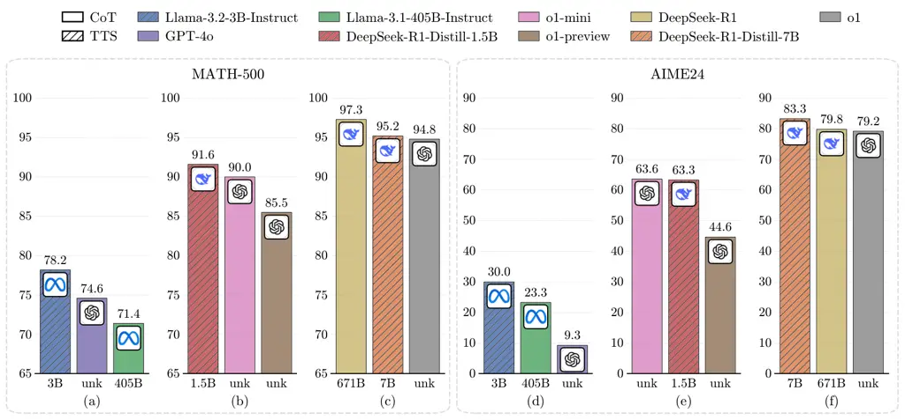
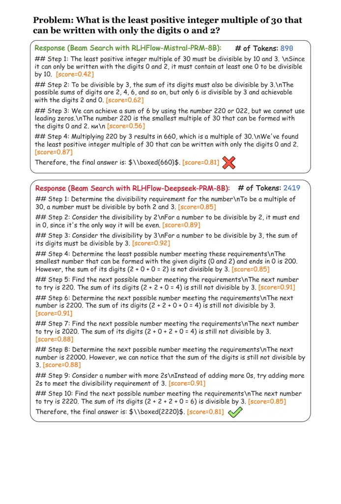
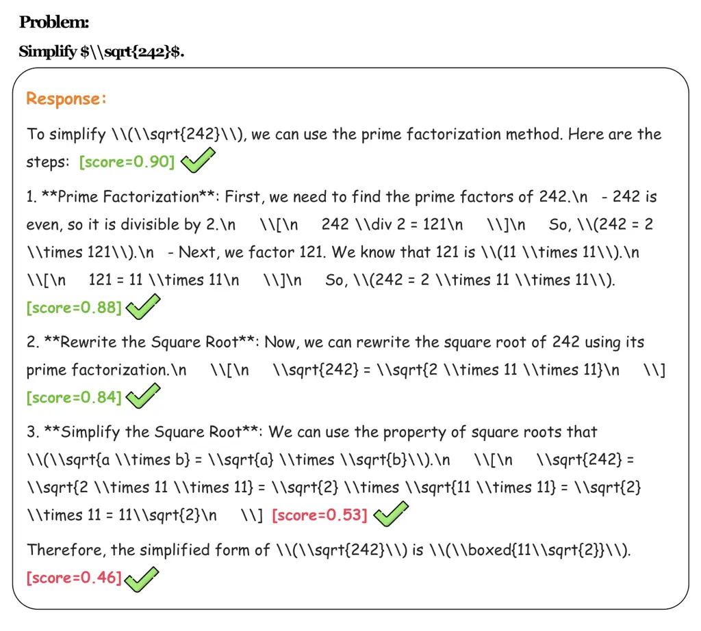
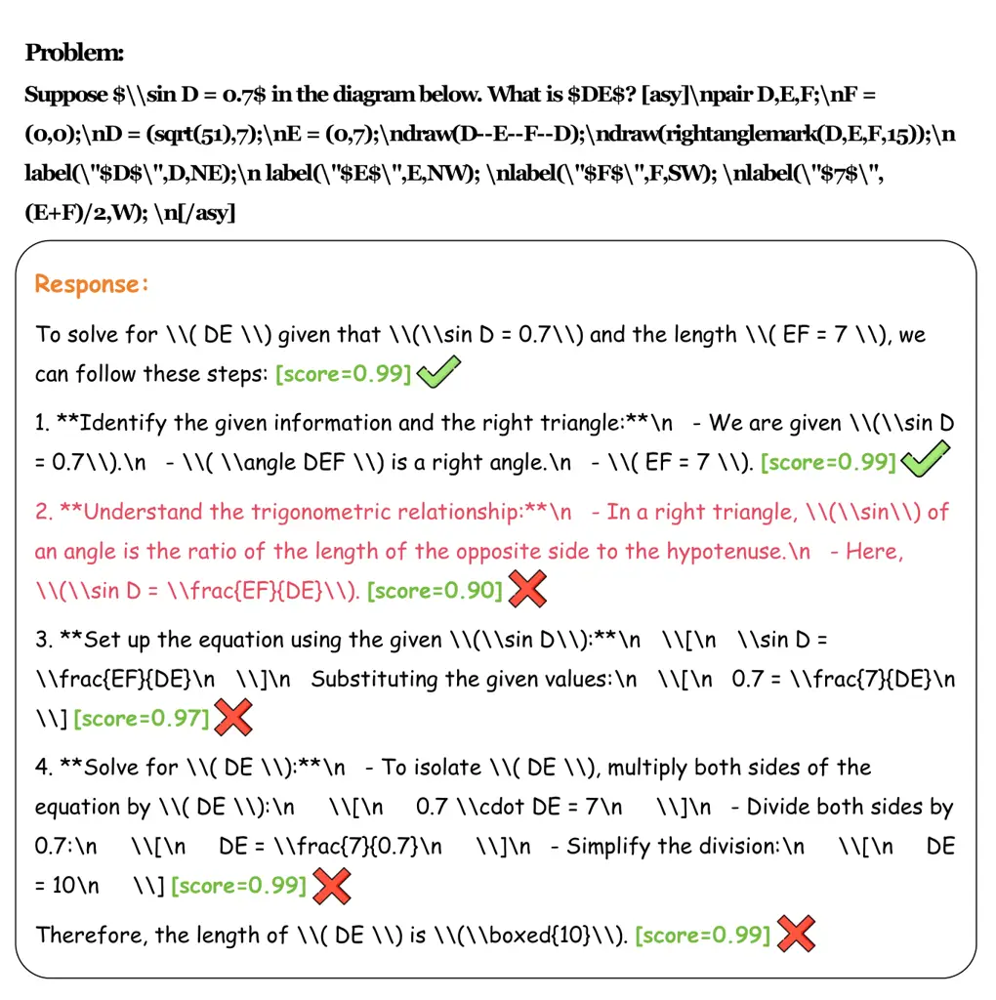
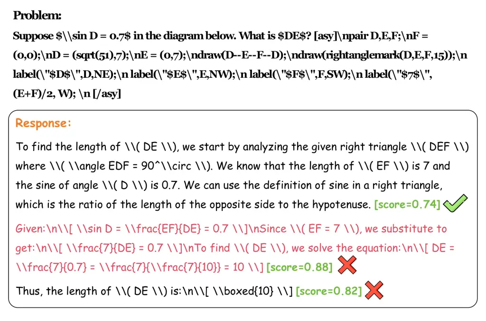
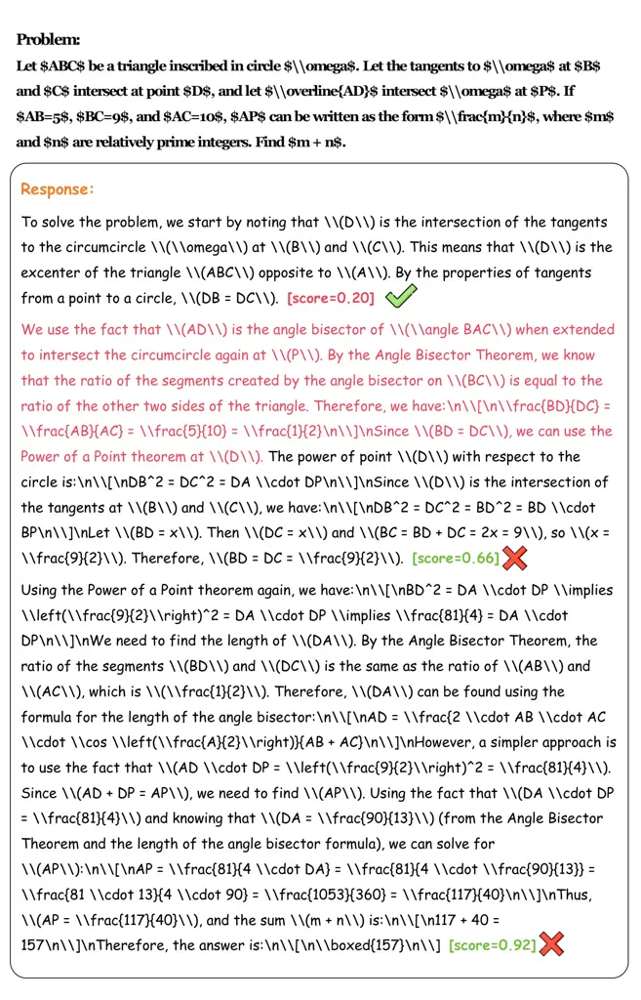
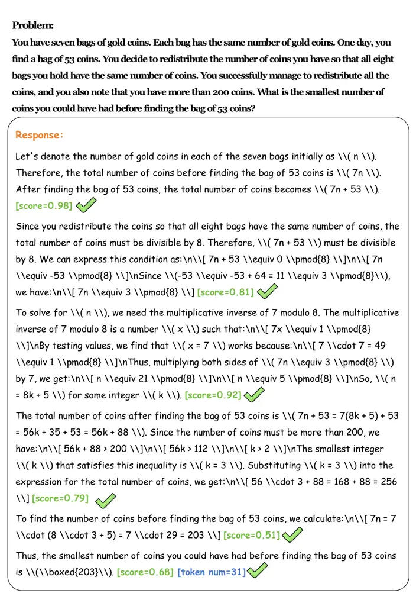
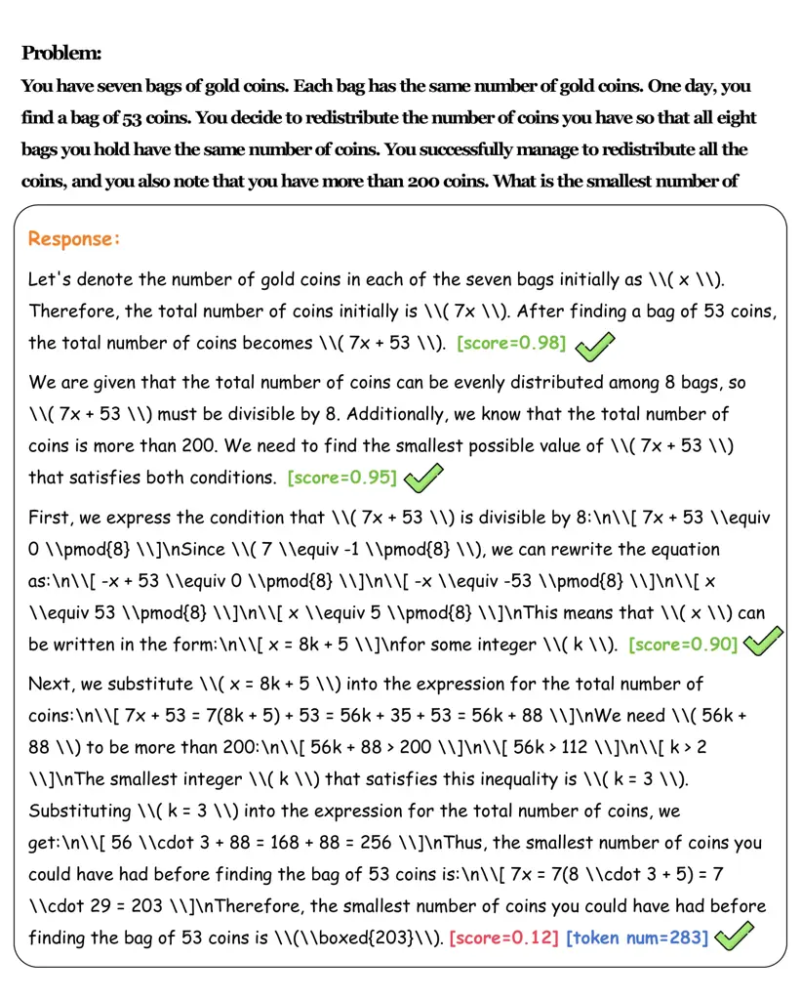

^(†)^(†) ^(∗) Work done during an internship at Shanghai AI
Laboratory^(†)^(†) ^(†) Corresponding authors: Biqing Qi
(qibiqing@pjlab.org.cn), Bowen Zhou (zhoubowen@tsinghua.edu.cn)

# Can 1B LLM Surpass 405B LLM? Rethinking Compute-Optimal Test-Time Scaling

Runze Liu Affiliation: Shanghai AI Laboratory Affiliation: Tsinghua
University    Junqi Gao Affiliation: Shanghai AI Laboratory Affiliation:
Harbin Institute of Technology    Jian Zhao Affiliation: BUPT    Kaiyan
Zhang Affiliation: Tsinghua University    Xiu Li Affiliation: Tsinghua
University    Biqing Qi Affiliation: Shanghai AI Laboratory    Wanli
Ouyang Affiliation: Shanghai AI Laboratory    Bowen Zhou Affiliation:
Shanghai AI Laboratory Affiliation: Tsinghua University

###### Abstract

Test-Time Scaling (TTS) is an important method for improving the
performance of Large Language Models (LLMs) by using additional
computation during the inference phase. However, current studies do not
systematically analyze how policy models, Process Reward Models (PRMs),
and problem difficulty influence TTS. This lack of analysis limits the
understanding and practical use of TTS methods. In this paper, we focus
on two core questions: (1) What is the optimal approach to scale
test-time computation across different policy models, PRMs, and problem
difficulty levels? (2) To what extent can extended computation improve
the performance of LLMs on complex tasks, and can smaller language
models outperform larger ones through this approach? Through
comprehensive experiments on MATH-500 and challenging AIME24 tasks, we
have the following observations: (1) The compute-optimal TTS strategy is
highly dependent on the choice of policy model, PRM, and problem
difficulty. (2) With our compute-optimal TTS strategy, extremely small
policy models can outperform larger models. For example, a 1B LLM can
exceed a 405B LLM on MATH-500. Moreover, on both MATH-500 and AIME24, a
0.5B LLM outperforms GPT-4o, a 3B LLM surpasses a 405B LLM, and a 7B LLM
beats o1 and DeepSeek-R1, while with higher inference efficiency. These
findings show the significance of adapting TTS strategies to the
specific characteristics of each task and model and indicate that TTS is
a promising approach for enhancing the reasoning abilities of LLMs. Our
website is available at
[https://ryanliu112.github.io/compute-optimal-tts](https://ryanliu112.github.io/compute-optimal-tts).



Figure 1: Comparison between the performance of smaller LLMs
compute-optimal TTS and that of larger LLMs CoT on MATH-500 and AIME24.
(a) & (d) Llama-3.2-3B-Instruct surpasses Llama-3.1-405B-Instruct and
GPT-4o on MATH-500 and AIME24; (b) & (e) DeepSeek-R1-Distill-1.5B
outperforms o1-preview on MATH-500 and AIME24, and surpasses o1-mini on
MATH-500; (c) & (f) DeepSeek-R1-Distill-7B beats o1 on MATH-500 and
AIME24, and exceeds DeepSeek-R1 on AIME24.

## 1 Introduction

Large Language Models (LLMs) have shown significant improvements across
a variety of domains (OpenAI, 2023; Hurst et al., 2024; Anthropic, 2023;
OpenAI, 2024; DeepSeek-AI et al., 2025). Recently, OpenAI o1 (OpenAI, 2024) has demonstrated that Test-Time Scaling (TTS) can enhance the
reasoning capabilities of LLMs by allocating additional computation at
inference time, making it an effective approach for improving LLM
performance (Qwen Team, 2024; Kimi Team et al., 2025; DeepSeek-AI et
al., 2025).

TTS approaches can be divided into two main categories: (1) Internal
TTS, which trains the LLMs to “think” slowly with long Chain-of-Thought
(CoT) (OpenAI, 2024; DeepSeek-AI et al., 2025), and (2) External TTS,
which improves the reasoning performance via sampling or search-based
methods with fixed LLMs (Wu et al., 2024; Snell et al., 2024). The key
challenge of external TTS is how to scale compute optimally, that is,
allocating the optimal computation for each problem (Snell et al.,
2024). Current TTS methods guide the generation process and select the
final answer using Process Reward Models (PRMs), which effectively scale
test-time compute (Wu et al., 2024; Snell et al., 2024; Beeching et al.,
2024). These TTS methods involve several important factors, such as
policy models¹¹ 1 Following Snell et al. (2024), we use “policy models”
to refer to LLMs that generate solutions, and “verifiers” for PRMs.,
PRMs, and problem difficulty levels. However, there is limited
systematic analysis of how policy models, PRMs, and problem difficulty
influence these TTS strategies. This limitation prevents the community
from fully understanding the effectiveness of this method and developing
insights for compute-optimal TTS strategies.

To address these issues, this paper aims to investigate the influence of
policy models, PRMs, and problem difficulty on TTS through comprehensive
experimental analysis. Furthermore, we explore the concrete
characteristics and performance boundaries of TTS methods. Specifically,
we conduct extensive experiments on MATH-500 (Lightman et al., 2024) and
the challenging AIME24 (AI-MO, 2024) tasks using a range of PRMs
(spanning from 1.5B to 72B across different model series) across
multiple policy models (ranging from 0.5B to 72B across two model
families). Our results show that the compute-optimal TTS strategy
heavily depends on the specific policy model, PRM, and problem
difficulty level. Even smaller models (e.g., a 1B model) can outperform
larger models (e.g., a 405B model) and even state-of-the-art reasoning
models, such as o1 or DeepSeek-R1, in challenging reasoning tasks by
applying compute-optimal TTS.

The contributions of this work can be summarized as follows:

1.  1.  We conduct a comprehensive evaluation of different TTS methods using
        various up-to-date policy models, multiple PRMs, diverse scaling
        methods, and more challenging tasks.
2.  2.  Our analysis highlights the necessity of considering the influence
        of rewards in the TTS process and introduces reward-aware
        compute-optimal TTS. We also demonstrate that the compute-optimal
        scaling strategy varies with different policy models, PRMs, and
        problem difficulty levels.
3.  3.  The empirical results demonstrate the significant potential of
        smaller language models to outperform larger models through TTS.
        Using the reward-aware Compute-optimal TTS strategy, we show that a
        3B LLM can outperform a 405B LLM, and a 7B LLM can surpass o1 and
        DeepSeek-R1 on MATH-500 and AIME24 tasks.

## 2 Setup & Preliminaries

### 2.1 Problem Formulation

We formulate the reasoning problem as a Markov Decision Process (MDP)
(Sutton and Barto, 2018), defined by the tuple
$`(\mathcal{S},\mathcal{A},\mathcal{P},\mathcal{R},\gamma)`$, where
$`\mathcal{S}`$ is the state space, $`\mathcal{A}`$ is the action space,
$`\mathcal{P}:\mathcal{S}\times\mathcal{A}\rightarrow\mathcal{S}`$ is
the transition function,
$`\mathcal{R}:\mathcal{S}\times\mathcal{A}\rightarrow\mathbb{R}`$ is the
reward function, and $`\gamma\in[0,1]`$ is the discount factor. Given a
prompt $`x\sim\mathcal{X}`$, the policy with parameters $`\theta`$
generates the initial action $`a_{1}\sim\pi_{\theta}(\cdot\mid s_{1})`$,
where $`s_{1}=x`$ is the initial state. The policy receives a reward
$`\mathcal{R}(s_{1},a_{1})`$, and the state transitions to
$`s_{2}=[s_{1},a_{1}]`$, where $`[\cdot,\cdot]`$ denotes the
concatenation of two strings. This process continues until the episode
terminates, either by reaching the maximum number of steps or by
generating an \<EOS\> token. A trajectory of length $`H`$ is represented
as $`\tau=\{a_{1},a_{2},\cdots,a_{H}\}`$. The process can be summarized
as follows:

```math
\begin{array}[]{ll}\text{Initial State:}&s_{1}=x\sim\mathcal{X}\\
\text{Action:}&a_{t}\sim\pi_{\theta}(\cdot\mid s_{t})\\
\text{State Transition:}&s_{t+1}=\mathcal{P}(\cdot\mid s_{t},a_{t})=[s_{t},a_{t}]\\
\text{Reward:}&r_{t}=\mathcal{R}(s_{t},a_{t})\\
\end{array} \tag{1}
```

### 2.2 Test-Time Scaling Method

We consider three TTS methods: Best-of-N (BoN) (Brown et al., 2024),
beam search (Snell et al., 2024), and Diverse Verifier Tree Search
(DVTS) (Beeching et al., 2024). As pointed out by Snell et al. (2024),
lookahead search is inefficient due to multi-step sampling, so we do not
evaluate it or other methods involving lookahead operations, such as
Monte Carlo Tree Search (MCTS). The TTS methods are shown in Figure 2.

Figure 2: Comparison of different external TTS methods.

#### Best-of-N.

In the BoN approach, the policy model generates $`N`$ responses, after
which scoring and voting methods are applied to select the final answer.

#### Beam Search.

Given beam width $`N`$ and beam size $`M`$, the policy model first
generates $`N`$ steps. The verifier selects the top $`\frac{N}{M}`$
steps for subsequent search. In the next step, the policy model samples
$`M`$ steps for each selected previous step. This process repeats until
the maximum depth is reached or an \<EOS\> token is generated.

#### Diverse Verifier Tree Search.

To increase diversity, DVTS extends beam search by dividing the search
process into $`\frac{N}{M}`$ subtrees, each of which is explored
independently using beam search. As shown in Beeching et al. (2024),
DVTS outperforms beam search on easy and medium problems with a large
computational budget $`N`$. A similar trend is observed in Chen et al.
(2024), where increasing the number of parallel subtrees proves to be
more effective than increasing the beam width under the same budget.

### 2.3 Compute-Optimal Test-Time Scaling

To maximize the performance of TTS, Snell et al. (2024) proposes a
test-time compute-optimal scaling strategy, which selects
hyperparameters corresponding to a given test-time strategy to maximize
performance benefits on a specific prompt. Given a prompt $`x`$, let
$`\operatorname{Target}(\theta,N,x)`$ represent the output distribution
over $`x`$ produced by the policy model with parameters $`\theta`$ and a
compute budget of $`N`$.

```math
\theta^{*}_{x,y^{*}(x)}(N)=\underset{\theta}{\arg\max}\left(\mathbb{E}_{y\sim\operatorname{Target}(\theta,N,x)}\left[\mathbbm{1}_{y=y^{*}(x)}\right]\right), \tag{2}
```

where $`y^{*}(x)`$ denotes the ground-truth correct response for $`x`$,
and $`\theta^{*}_{x,y^{*}(x)}(N)`$ represents the test-time
compute-optimal scaling strategy for the problem $`x`$ with compute
budget $`N`$.

## 3 Rethinking Compute-Optimal Test-Time Scaling

### 3.1 Compute-Optimal Scaling Strategy Should be Reward-Aware

Compute-optimal TTS aims to allocate the optimal compute for each
problem (Snell et al., 2024). Previous works on TTS use a single PRM as
verifier (Snell et al., 2024; Wu et al., 2024; Beeching et al., 2024).
Snell et al. (2024) trains a PRM on the responses of a policy model and
uses it as the verifier to do TTS with the same policy model, while Wu
et al. (2024); Beeching et al. (2024) use a PRM trained on a different
policy model to do TTS. From the perspective of Reinforcement Learning
(RL), we obtain an on-policy PRM in the former case and an offline PRM
in the latter case. The on-policy PRM produces more accurate rewards for
the responses of the policy model, while the offline PRM often generates
inaccurate rewards due to out-of-distribution (OOD) issues (Snell et
al., 2024; Zheng et al., 2024).

For practical applications of compute-optimal TTS, training a PRM for
each policy model to prevent OOD issues is computationally expensive.
Therefore, we investigate the compute-optimal TTS strategy in a more
general setting, where the PRM might be trained on a different policy
model than the one used for TTS. For search-based methods, PRMs guide
the selection at each response step, while for sampling-based methods,
PRMs evaluate the responses after generation. This indicates that (1)
the reward influences response selection across all methods; (2) for
search-based methods, the reward also influences the search process.

To analyze these points, we perform a preliminary case study using beam
search with Llama-3.1-8B-Instruct as the policy model and
RLHFlow-PRM-Mistral-8B and RLHFlow-PRM-Deepseek-8B as PRMs. The results
in Figure 12 demonstrate that the reward significantly affects the
generation process and outcomes. RLHFlow-PRM-Mistral-8B assigns high
rewards to short responses, leading to incorrect answers, while
searching with RLHFlow-Deepseek-PRM-8B produces correct answers but uses
more tokens. In Section 4, we also empirically show that rewards have
great influence on TTS performance and output tokens.

Based on these findings, we propose that rewards should be integrated
into the compute-optimal TTS strategy. Let us denote the reward function
as $`\mathcal{R}`$. Our reward-aware compute-optimal TTS strategy is
formulated as:

```math
\theta^{*}_{x,y^{*}(x),\mathcal{R}}(N)=\underset{\theta}{\arg\max}\left(\mathbb{E}_{y\sim\operatorname{Target}(\theta,N,x,\mathcal{R})}\left[\mathbbm{1}_{y=y^{*}(x)}\right]\right), \tag{3}
```

where $`\operatorname{Target}(\theta,N,x,\mathcal{R})`$ represents the
output distribution of the policy model $`\theta`$, adjusted by the
reward function $`\mathcal{R}`$, under a compute budget $`N`$ and prompt
$`x`$. For sampling-based scaling methods,
$`\operatorname{Target}(\theta,N,x,\mathcal{R})=\operatorname{Target}(\theta,N,x)`$.
This reward-aware strategy ensures that compute-optimal scaling adapts
to the policy model, prompt, and reward function, leading to a more
general framework for practical TTS.

### 3.2 Absolute Problem Difficulty Criterion is More Effective Than Quantiles

To consider the influence of problem difficulty on TTS, Snell et al.
(2024) group problems into five difficulty levels based on Pass@1
accuracy quantiles. However, we find that using difficulty levels from
MATH (Hendrycks et al., 2021) or oracle labels based on Pass@1 accuracy
quantiles (Snell et al., 2024) is not effective since different policy
models have different reasoning capabilities. As shown in Figure 3,
Qwen2.5-72B-Instruct achieves Pass@1 accuracy above $`80\%`$ on
$`76.2\%`$ of MATH-500 problems. Therefore, we use absolute thresholds
instead of quantiles to measure problem difficulty. Specifically, we
define three difficulty levels based on Pass@1 accuracy: easy
($`50\%\sim 100\%`$), medium ($`10\%\sim 50\%`$), and hard
($`0\%\sim 10\%`$).

Figure 3: Distribution of Pass@1 accuracy of Qwen2.5-72B-Instruct on
MATH-500, divided into five bins.

## 4 How to Scale Test-Time Compute Optimally?

In this section, we aim to answer the following questions:

- •
  Q1: How does TTS improve with different policy models and PRMs?
- •
  Q2: How does TTS improve for problems with different difficulty
  levels?
- •
  Q3: Does PRMs have bias towards specific response lengths or
  sensitivity to voting methods?

### 4.1 Setup

#### Datasets.

We conduct experiments on competition-level mathematical datasets,
including MATH-500 (Lightman et al., 2024) and AIME24 (AI-MO, 2024).
MATH-500 contains 500 representative problems from the test set of MATH
(Hendrycks et al., 2021), and this subset is used following Snell et al.
(2024); Beeching et al. (2024). As recent LLMs show significant progress
in mathematical reasoning (OpenAI, 2024; DeepSeek-AI et al., 2025), we
include the more challenging AIME24 for experiments.

#### Policy Models.

For test-time methods, we use policy models from Llama 3 (Dubey et al., 2024) and Qwen2.5 (Yang et al., 2024b) families with different sizes. We
use the Instruct version for all policy models.

#### Process Reward Models.

We consider the following open-source PRMs for evaluation:

- •
  Math-Shepherd (Wang et al., 2024b): Math-Shepherd-PRM-7B is trained on
  Mistral-7B (Jiang et al., 2023) using PRM data generated from
  Mistral-7B fine-tuned on MetaMath (Yu et al., 2024).
- •
  RLHFlow Series (Xiong et al., 2024): RLHFlow includes
  RLHFlow-PRM-Mistral-8B and RLHFlow-PRM-Deepseek-8B, which are trained
  on data from Mistral-7B fine-tuned on MetaMath (Yu et al., 2024) and
  deepseek-math-7b-instruct (Shao et al., 2024), respectively. The base
  model for both PRMs is Llama-3.1-8B-Instruct (Dubey et al., 2024).
- •
  Skywork Series (Skywork o1 Team, 2024): The Skywork series comprises
  Skywork-PRM-1.5B and Skywork-PRM-7B, trained on
  Qwen2.5-Math-1.5B-Instruct and Qwen2.5-Math-7B-Instruct (Yang et al.,
  2024c), respectively. The training data is generated from Llama-2
  (Touvron et al., 2023) fine-tuned on a mathematical dataset and
  Qwen2-Math (Yang et al., 2024a) series models.
- •
  Qwen2.5-Math Series (Zhang et al., 2025): We evaluate
  Qwen2.5-Math-PRM-7B and Qwen2.5-Math-PRM-72B, trained on
  Qwen2.5-Math-7B-Instruct and Qwen2.5-Math-72B-Instruct (Yang et al.,
  2024c), respectively. The data for training is generated using
  Qwen2-Math (Yang et al., 2024a) and Qwen2.5-Math series models (Yang
  et al., 2024c). Among all the PRMs listed, Qwen2.5-Math-PRM-72B is the
  strongest open-source PRM for mathematical tasks, while
  Qwen2.5-Math-PRM-7B is the most capable PRM among those with 7B/8B
  parameters, as demonstrated in Zhang et al. (2025).

#### Scoring and Voting Methods.

Following Wang et al. (2024a), we consider three scoring methods:
PRM-Min, PRM-Last, and PRM-Avg, and three voting methods: Majority Vote,
PRM-Max, and PRM-Vote. To obtain the final answer, we first use the
scoring methods to evaluate the answers. For a trajectory of length
$`H`$, the scores for each trajectory with different scoring methods are
calculated as follows: (1) PRM-Min scores each trajectory by the minimum
reward among all steps, i.e.,
$`\operatorname{score}=\min_{\mathcal{R}}\{\mathcal{R}_{t}\}_{t=0}^{H}`$.
(2) PRM-Last scores each trajectory by the reward of the last step,
i.e., $`\operatorname{score}=\mathcal{R}_{H}`$. (3) PRM-Avg scores each
trajectory by the average reward among all steps, i.e.,
$`\operatorname{score}=\frac{1}{H}\sum_{t=0}^{H}\mathcal{R}_{t}`$. The
voting methods then aggregate the scores to determine the final answer.
Majority Vote selects the answer with the majority of votes (Wang et
al., 2023), while PRM-Max selects the answer with the highest score, and
PRM-Vote first accumulates the scores of all identical answers and then
selects the answer with the highest score.

We use OpenR²² 2
[https://github.com/openreasoner/openr](https://github.com/openreasoner/openr),
which is an open-source LLM reasoning framework as our codebase. For
compute budgets, we use $`\{4,16,64,256\}`$ in most experiments. The
division of steps follows the format `\n\n` as in prior works (Xiong et
al., 2024; Zhang et al., 2025). For beam search and DVTS, the beam width
is set to $`4`$. The temperature of CoT is $`0.0`$, while it is $`0.7`$
for other methods. For CoT and BoN, we restrict the maximum number of
new tokens to $`8192`$. For search-based methods, the token limit is
$`2048`$ for each step and $`8192`$ for the total response.

### 4.2 How does TTS improve with different policy models and PRMs? (Q1)

Figure 4: Performance of Llama-3.1-8B-Instruct and Qwen2.5-7B-Instruct
on MATH-500 with different PRMs and TTS strategies.

Figure 5: Performance of Llama-3.1-8B-Instruct and Qwen2.5-7B-Instruct
on AIME24 with different PRMs and TTS strategies.

PRMs are hard to generalize across policy models and tasks. As shown in
Figure 4, for Llama-3.1-8B-Instruct, the performance of search-based
methods with Skywork and Qwen2.5-Math PRMs improves significantly with
larger compute budgets, while the results of searching with
Math-Shepherd and RLHFlow PRMs remain relatively poor, even worse than
majority voting. For Qwen2.5-7B-Instruct, the performance of searching
with Skywork-PRM-7B and Qwen2.5-Math PRMs scales well with more budgets,
while the performance of other PRMs remains poor. In Figure 5, although
the Pass@k accuracy of both policy models improves a lot with larger
compute budgets, the performance improvement of TTS remains moderate.
These results demonstrate that the generalization of PRMs is
particularly challenging across different policy models and tasks,
especially for more complex tasks.

The optimal TTS method depends on the PRM used. As shown in Figure 4,
BoN outperforms other strategies most of the time when using
Math-Shepherd and RLHFlow PRMs, while search-based methods perform
better with Skywork and Qwen2.5-Math PRMs. This difference occurs
because using a PRM for OOD policy responses leads to sub-optimal
answers, as PRMs show limited generalization across policy models.
Moreover, if we select each step with OOD PRMs, it is likely to obtain
answers trapped in local optima and worsen the performance. This may
also be related to the base model of the PRM, since the PRM trained with
PRM800K (Lightman et al., 2024) on Qwen2.5-Math-7B-Instruct generalizes
better than PRMs with Mistral and Llama as base models (Zhang et al.,
2025). Further analysis is provided in Section 4.4 and Appendix C. These
results suggest that the choice of the optimal TTS strategy depends on
the specific PRMs used, emphasizing the importance of considering reward
information in compute-optimal TTS. We also explore the relationship
between TTS performance and the process supervision abilities of
different PRMs. As shown in Figure 6, TTS performance is positively
correlated with the process supervision abilities of PRMs, and the
fitted function is $`Y=7.66\log(X)+44.31`$, where $`Y`$ represents TTS
performance and $`X`$ represents the process supervision abilities of
the PRM (Zhang et al., 2025).

Figure 6: The relationship between TTS performance and process
supervision abilities of different PRMs on MATH, where the size of each
circle represents the number of parameters of the PRM and the curve
represents the fitted function.

Figure 7: TTS performance of policy models with parameters from 0.5B to
72B on MATH-500 with different scaling methods.

The optimal TTS method varies with policy models. To study the
relationship between the parameters of the policy models and the optimal
TTS methods, we conduct experiments with Qwen2.5 family LLMs (Yang et
al., 2024b), including models with 0.5B, 1.5B, 3B, 7B, 14B, 32B, and 72B
parameters. The results in Figure 7 show that the optimal TTS methods
depend on the specific policy models. For small policy models,
search-based methods outperform BoN, while for large policy models, BoN
is more effective than search-based methods. This difference occurs
because larger models have stronger reasoning capabilities and do not
need a verifier to perform step-by-step selection. In contrast, smaller
models rely on a verifier to select each step, ensuring the correctness
of each intermediate step.

### 4.3 How does TTS improve for problems with different difficulty levels? (Q2)

Following Snell et al. (2024), we conduct a comprehensive evaluation of
tasks with varying difficulty levels. However, as explained in Section
3.2, we observe that using the difficulty levels defined in MATH
(Hendrycks et al., 2021) or the oracle labels based on the quantile of
Pass@1 accuracy (Snell et al., 2024) is not appropriate because
different policy models exhibit different reasoning abilities. To
address this, we categorize the difficulty levels into three groups
based on the absolute value of Pass@1 accuracy: easy
($`50\%\sim 100\%`$), medium ($`10\%\sim 50\%`$), and hard
($`0\%\sim 10\%`$).

The optimal TTS methods vary with different difficulty levels. The
results in Figure 8 and Figure 9 show that for small policy models
(i.e., with fewer than 7B parameters), BoN is better for easy problems,
while beam search works better for harder problems. For policy models
with parameters between 7B and 32B, DVTS performs well for easy and
medium problems, and beam search is preferable for hard problems. For
policy models with 72B parameters, BoN is the best method for all
difficulty levels.

Figure 8: TTS performance of three Llama policy models on MATH-500 with
three difficulty levels.

### 4.4 Does PRMs have bias towards specific response lengths or sensitivity to voting methods? (Q3)

#### PRMs are biased towards the length of steps.

|                            |                  |                   |
| -------------------------- | ---------------- | ----------------- |
|                            | Mistral-PRM-Data | Deepseek-PRM-Data |
| Average Token per Response | 236.9            | 333.1             |
| Average Token per Step     | 46.6             | 58.4              |

Table 1: Statistics of training data of RLHFlow PRMs.

Although we perform TTS under the same budget in pervious experiments,
we find that the number of inference tokens with different PRMs varies
singificantly. For example, given the same budget and the same policy
model, the number of inference tokens of scaling with
RLHFlow-PRM-Deepseek-8B is consistently larger than that of
RLHFlow-PRM-Mistral-8B, nearly $`2\times`$. The training data of RLHFlow
series PRMs are sampled from different LLMs, which may lead to the bias
towards the length of the output. To verify this point, we analyze
several properties of the training data of RLHFlow-PRM-Mistral-8B³³ 3
[https://huggingface.co/datasets/RLHFlow/Mistral-PRM-Data](https://huggingface.co/datasets/RLHFlow/Mistral-PRM-Data)
and RLHFlow-PRM-Deepseek-8B⁴⁴ 4
[https://huggingface.co/datasets/RLHFlow/Deepseek-PRM-Data](https://huggingface.co/datasets/RLHFlow/Deepseek-PRM-Data).
As shown in Table 1, both the average token per response and the average
token per step of DeepSeek-PRM-Data are larger than those of
Mistral-PRM-Data, indicating that the training data of
RLHFlow-PRM-Deepseek-8B is longer than that of RLHFlow-PRM-Mistral-8B.
This may lead to the bias towards the length of the output. We also find
that the number of inference tokens of scaling with Qwen2.5-Math-7B is
larger than that of Skywork-PRM-7B, but the performance is very near,
which indicates that searching with Skywork-PRM-7B is more efficient
than searching with Qwen2.5-Math-7B.

#### PRMs are sensitive to voting methods.

|               |                |                     |
| ------------- | -------------- | ------------------- |
|               | Skywork-PRM-7B | Qwen2.5-Math-PRM-7B |
| Majority Vote | 86.8           | 87.6                |
| PRM-Min-Max   | 83.0           | 87.4                |
| PRM-Min-Vote  | 86.6           | 87.6                |
| PRM-Last-Max  | 84.4           | 87.6                |
| PRM-Last-Vote | 87.0           | 87.6                |
| PRM-Avg-Max   | 85.8           | 87.8                |
| PRM-Avg-Vote  | 86.8           | 87.6                |

Table 2: Performance of TTS with different voting methods on MATH-500.

From the results in Table 2, it is shown that Skywork-PRM-7B works
better with PRM-Vote than with PRM-Max, while Qwen2.5-Math-PRM-7B is not
very sensitive to voting methods. The main reason is that the training
data of Qwen2.5-Math PRMs are processed with LLM-as-a-judge (Zheng et
al., 2023), which removes the wrong intermediate steps labeled as
positive steps in the training data and makes the outputted large reward
values more likely to be correct. This shows that the training data of
PRMs is important for improving the ability to find errors in the search
process.

## 5 Results for Compute-Optimal Test-Time Scaling

With the compute-optimal TTS strategy explored in Section 4, we conduct
further experiments to explore the following questions:

- •
  Q4: Can smaller policy models outperform larger models with the
  compute-optimal TTS strategy?
- •
  Q5: How does compute-optimal TTS improve compared with CoT and
  majority voting?
- •
  Q6: Is TTS more effective than long-CoT-based methods?

### 5.1 Can smaller policy models outperform larger models with the compute-optimal TTS strategy (Q4)

Scaling test-time compute of small policy models is crucially important
for improving the reasoning performance of LLMs. We are interested in
whether smaller policy models can outperform larger ones, GPT-4o, even
o1 and DeepSeek-R1, with the compute-optimal TTS strategy. First, we
compare the performance of Llama-3.2-3B-Instruct (compute-optimal TTS)
with that of Llama-3.1-405B-Instruct (CoT) on MATH-500 and AIME24. Also,
we compare the performance of Qwen2.5-0.5B-Instruct,
Qwen2.5-1.5B-Instruct, Llama-3.2-1B-Instruct, and Llama-3.2-3B-Instruct
with GPT-4o on the above two tasks. As AIME24 is challenging for current
LLMs, we also compare the performance of DeepSeek-R1-Distill-Qwen-1.5B
and DeepSeek-R1-Distill-Qwen-7B with o1 on AIME24.

|                                |          |        |      |
| ------------------------------ | -------- | ------ | ---- |
| Policy Model                   | MATH-500 | AIME24 | Avg. |
| Proprietary LLMs (CoT)         |          |        |      |
| GPT-4o                         | 74.6     | 9.3    | 42.0 |
| o1-preview                     | 85.5     | 44.6   | 65.1 |
| o1-mini                        | 90.0     | 63.6   | 76.8 |
| o1                             | 94.8     | 79.2   | 87.0 |
| Open-Source LLMs (CoT)         |          |        |      |
| Llama-3.1-70B-Inst.            | 65.2     | 16.7   | 41.0 |
| Llama-3.1-405B-Inst.           | 71.4     | 23.3   | 47.4 |
| QwQ-32B-Preview                | 90.6     | 50.0   | 70.3 |
| DeepSeek-R1                    | 97.3     | 79.8   | 88.6 |
| Open-Source LLMs (TTS)         |          |        |      |
| Llama-3.2-1B-Inst.             | 66.2     | 16.7   | 41.5 |
| Llama-3.2-1B-Inst. ($`N=512`$) | 72.2     | 10.0   | 41.1 |
| Llama-3.2-3B-Inst.             | 75.6     | 30.0   | 52.8 |
| Qwen2.5-0.5B-Inst.             | 76.4     | 10.0   | 43.2 |
| Qwen2.5-1.5B-Inst.             | 81.8     | 20.0   | 50.9 |
| DeepSeek-R1-Distill-Qwen-1.5B  | 91.6     | 63.3   | 77.5 |
| DeepSeek-R1-Distill-Qwen-7B    | 95.2     | 83.3   | 89.3 |

Table 3: Comparison of small policy models (compute-optimal TTS) with
frontier reasoning LLMs (CoT) on MATH-500 and AIME24.

From the results in Table 3, we have the following observations: (1)
Llama-3.2-3B-Instruct with the compute-optimal TTS strategy outperforms
Llama-3.1-405B-Instruct on MATH-500 and AIME24, meaning that smaller
models can outperform 135$`\times`$ larger models using the
compute-optimal TTS strategy. Compared with previous works on TTS (Snell
et al., 2024; Beeching et al., 2024), we improve the result by 487.0%
($`23\times\rightarrow 135\times`$). (2) If we further increase the
compute budget to $`N=512`$, Llama-3.2-1B-Instruct with the
compute-optimal TTS strategy beats Llama-3.1-405B-Instruct on MATH-500,
but underperforms Llama-3.1-405B-Instruct on AIME24.⁵⁵ 5 Since some
outputs of Llama-3.2-1B-Instruct do not contain \boxed, which is used
for answer extraction, we use Qwen2.5-32B-Instruct to extract the
answers of Llama-3.2-1B-Instruct. (3) Qwen2.5-0.5B-Instruct and
Llama-3.2-3B-Instruct with the compute-optimal TTS strategy outperforms
GPT-4o, indicating that small models can exceed GPT-level performance
with the compute-optimal TTS strategy. (4) DeepSeek-R1-Distill-Qwen-1.5B
with the compute-optimal TTS strategy outperforms o1-preview and o1-mini
on MATH-500 and AIME24. We also show that DeepSeek-R1-Distill-Qwen-7B
with the compute-optimal TTS strategy outperforms o1 and DeepSeek-R1 on
MATH-500 and AIME24. These results demonstrate small reasoning-enhanced
models can outperform frontier reasoning LLMs with the compute-optimal
TTS strategy.

#### FLOPS Comparison.

To answer the question of whether compute-optimal TTS is more effective
than increasing the model size, we compare the FLOPS of evaluated models
in Table 4 following Snell et al. (2024), where the computed FLOPS is
corresponded to the results in Table 3. From the results, we can see
that small policy models even surpass large ones with less inference
FLOPS and reduce the total FLOPS by $`100\times\sim 1000\times`$.

|                        |                        |                        |                        |
| ---------------------- | ---------------------- | ---------------------- | ---------------------- |
| Policy Model           | Pre-training FLOPS     | Inference FLOPS        | Total FLOPS.           |
| Llama-3.2-3B-Inst.     | $`1.62\times 10^{23}`$ | $`3.07\times 10^{17}`$ | $`1.62\times 10^{23}`$ |
| Llama-3.1-405B-Inst.   | $`3.65\times 10^{25}`$ | $`4.25\times 10^{17}`$ | $`3.65\times 10^{25}`$ |
| DeepSeek-R1-Distill-7B | $`7.56\times 10^{23}`$ | $`8.15\times 10^{17}`$ | $`7.56\times 10^{23}`$ |
| DeepSeek-R1            | $`5.96\times 10^{25}`$ | $`4.03\times 10^{18}`$ | $`5.96\times 10^{25}`$ |

Table 4: FLOPS comparison between smaller policy models (compute-optimal
TTS) and larger ones (CoT).

### 5.2 How does compute-optimal TTS improve compared with CoT and majority voting? (Q5)

Based on the findings of compute-optimal TTS with different policy
models, PRMs, and difficulty levels, we summarize the results of
compute-optimal TTS for each policy model on MATH-500 in Table 5. We
find that compute-optimal TTS can be $`256\times`$ more efficient than
majority voting and improve reasoning performance by $`154.6\%`$ over
CoT. These results demonstrate that compute-optimal TTS significantly
enhances the reasoning capabilities of LLMs. However, as the number of
parameters in the policy model increases, the improvement of TTS
gradually decreases. This suggests that the effectiveness of TTS is
directly related to the reasoning ability of the policy model.
Specifically, for models with weak reasoning abilities, scaling
test-time compute leads to a substantial improvement, whereas for models
with strong reasoning abilities, the gain is limited.

|                    |      |        |                     |                  |                   |
| ------------------ | ---- | ------ | ------------------- | ---------------- | ----------------- |
| Policy Model       | CoT  | Major. | Compute-Optimal TTS | Performance Gain | Efficiency Gain   |
| Llama-3.2-1B-Inst. | 26.0 | 39.0   | 66.2                | 154.6%           | \>256.0$`\times`$ |
| Llama-3.2-3B-Inst. | 41.4 | 58.4   | 78.2                | 88.9%            | 14.1$`\times`$    |
| Llama-3.1-8B-Inst. | 49.8 | 66.4   | 80.6                | 61.8%            | 43.9$`\times`$    |
| Qwen2.5-0.5B-Inst. | 31.6 | 47.2   | 76.4                | 141.8%           | \>64.0$`\times`$  |
| Qwen2.5-1.5B-Inst. | 54.4 | 68.4   | 85.6                | 57.4%            | \>256.0$`\times`$ |
| Qwen2.5-3B-Inst.   | 64.0 | 77.0   | 87.6                | 36.9%            | 58.4$`\times`$    |
| Qwen2.5-7B-Inst.   | 76.8 | 83.6   | 91.0                | 18.5%            | 35.9$`\times`$    |
| Qwen2.5-14B-Inst.  | 80.2 | 85.6   | 91.0                | 13.5%            | 51.4$`\times`$    |
| Qwen2.5-32B-Inst.  | 82.4 | 87.0   | 90.6                | 10.0%            | 0.8$`\times`$     |
| Qwen2.5-72B-Inst.  | 83.8 | 87.2   | 91.8                | 9.5%             | 12.9$`\times`$    |

Table 5: Comparison of compute-optimal TTS, CoT, and majority voting
with different policy models on MATH-500.

### 5.3 Is TTS more effective than long-CoT-based methods? (Q6)

Recently, long-CoT-based methods have shown substantial progress in
mathematical reasoning (Guan et al., 2025; Cui et al., 2025; Zeng et
al., 2025; DeepSeek-AI et al., 2025). We compare the performance of TTS
with these approaches.

#### Setup.

We evaluate the following methods: (1) rStar-Math (Guan et al., 2025):
This method first generates reasoning data via MCTS, followed by online
policy and preference model learning. (2) Eurus-2 (Cui et al., 2025):
This method enhances the reasoning abilities of LLMs through implicit
process rewards and online RL. (3) SimpleRL (Zeng et al., 2025): This
method replicates self-reflection with only 8K training data. (4) Satori
(Shen et al., 2025): This method first learn the format and then
improves the reasoning abilities via RL. (5) DeepSeek-R1-Distill-Qwen-7B
(DeepSeek-AI et al., 2025): This method distills 800K high-quality
reasoning samples from DeepSeek-R1 with 671B parameters into a 7B LLM.

#### Results.

As shown in Table 6, we find that TTS with Qwen2.5-7B-Instruct
outperforms rStar-Math, Eurus-2, SimpleRL, and Satori on both MATH-500
and AIME24. However, while the performance of TTS on MATH-500 is close
to that of DeepSeek-R1-Distill-Qwen-7B, it shows a significant drop on
AIME24. These results indicate that TTS is more effective than methods
applying direct RL or SFT on the data generated via MCTS but is less
effective than distilling from strong reasoning models. Also, TTS is
more effective on simpler tasks than on more complex tasks.

|                                    |          |        |      |
| ---------------------------------- | -------- | ------ | ---- |
| Policy Model                       | MATH-500 | AIME24 | Avg. |
| Open-Source LLMs (CoT)             |          |        |      |
| Qwen2.5-7B-Inst.                   | 76.8     | 13.3   | 45.1 |
| Qwen2.5-Math-7B-Inst.              | 79.8     | 13.3   | 46.6 |
| Long-CoT Methods (CoT)             |          |        |      |
| rStar-Math-7B                      | 78.4     | 26.7   | 52.6 |
| Eurus-2-7B-PRIME                   | 79.2     | 26.7   | 53.0 |
| Qwen2.5-7B-SimpleRL-Zero           | 77.2     | 33.3   | 55.3 |
| Qwen2.5-7B-SimpleRL                | 82.4     | 26.7   | 54.6 |
| Satori-Qwen-7B                     | 83.6     | 23.3   | 53.5 |
| DeepSeek-R1-Distill-Qwen-7B        | 92.4     | 63.3   | 77.9 |
| Open-Source LLMs (TTS)             |          |        |      |
| Qwen2.5-7B-Inst. w/ 7B PRM (Ours)  | 88.0     | 33.3   | 60.5 |
| Qwen2.5-7B-Inst. w/ 72B PRM (Ours) | 91.0     | 36.7   | 63.9 |

Table 6: Comparison of compute-optimal TTS with long-CoT methods on
MATH-500 and AIME24.

## 6 Related Work

#### LLM Test-Time Scaling.

Scaling LLM test-time compute is an effective way to improve the
performance (OpenAI, 2024). Previous works explore majority voting (Wang
et al., 2023), search-based methods (Yao et al., 2023; Xie et al., 2023;
Khanov et al., 2024; Wan et al., 2024), and refinement (Qu et al., 2024)
to improve the performance. For verification-guided test-time compute,
Brown et al. (2024) explores inference compute with repeated sampling
and domain verifiers, while Kang et al. (2024); Wu et al. (2024); Snell
et al. (2024) further explore search-based methods with process reward
guidance and Wang et al. (2024c) extends this setting to VLMs. To
eliminate the need for external reward models and the generation of
extensive samples, Manvi et al. (2024) proposes a self-evaluation method
for adaptive and efficient test-time compute. A recent work (Beeching et
al., 2024) explores TTS via search methods with diversity. However,
these works lack a evaluation with either strong verifiers or policies
with different sizes / capabilities. In this paper, we aim to provide a
more systematically evaluation with up-to-date policies and verifiers,
more challenging tasks, and provide some principles for practical TTS.

#### Improving Mathematical Reasoning Abilities of LLMs.

Prior methods for improving mathematical reasoning abilities can be
divided into training-time methods and test-time methods. For
training-time methods, previous works explore large-scale mathematical
corpus pre-training (OpenAI, 2023; Azerbayev et al., 2024; Shao et al., 2024) and supervised fine-tuning (Luo et al., 2023; Yu et al., 2024; Gou
et al., 2024; Tang et al., 2024; Tong et al., 2024; Zeng et al., 2024)
to improve mathematical capabilities. Another line of works explore
self-training and self-improvement strategies (Zelikman et al., 2022;
Gulcehre et al., 2023; Trung et al., 2024; Hosseini et al., 2024;
Zelikman et al., 2024; Zhang et al., 2024a; Setlur et al., 2024a; Kumar
et al., 2024; Cui et al., 2025), which improve the reasoning abilities
by fine-tuning on self-generated solutions. Recently, many works improve
the mathematical reasoning abilities with long CoT (Qin et al., 2024;
Huang et al., 2024; Kimi, 2024; DeepSeek-AI et al., 2025; Qwen Team,
2024; Skywork, 2024; Zhao et al., 2024), as OpenAI o1 (OpenAI, 2024)
shows significantly powerful reasoning capabilities with long thinking.

For test-time methods, prompt-based approaches have been extensively
studied to enhance reasoning without altering the model parameters.
Techniques such as Chain-of-Thought (CoT) (Wei et al., 2022) and its
variants (Yao et al., 2023; Leang et al., 2024) guide the model to
decompose problems into manageable sub-steps, thereby improving accuracy
and coherence in mathematical reasoning. Beyond prompting strategies,
self-refinement techniques (Madaan et al., 2023) allow models to review
and correct their outputs, while external tool integration (Gao et al.,
2023; Chen et al., 2023) leverages program interpreter or symbolic
manipulators to perform precise calculations and validations.
Self-verification approaches (Weng et al., 2023) enable models to assess
the correctness of their own reasoning processes, further increasing
robustness. These test-time strategies complement training-time
enhancements, collectively contributing to significant improvements in
LLMs’ mathematical reasoning capabilities. Our work mainly enhances the
reasoning performance via scaling test-time compute via PRM-guided
search methods.

#### Process Reward Models.

Previous works show that PRMs are more effective than ORMs (Uesato et
al., 2022; Lightman et al., 2024). However, collecting high-quality PRMs
data, such as PRM800K (Lightman et al., 2024), is often costly. The
researchers explores automatic PRM data collection via direct Monte
Carlo estimation (Wang et al., 2024b), detecting relative scores of ORMs
(Lu et al., 2024), and efficient MCTS with binary search (Luo et al.,
2024). Recently, more advanced PRMs are explored from advantage modeling
(Setlur et al., 2024b), $`Q`$-value rankings (Li and Li, 2024), implicit
rewards (Yuan et al., 2024), and entropy regularization (Zhang et al.,
2024b) perspectives. Additionally, more open-source PRMs are released
(Xiong et al., 2024; Skywork, 2024; Zhang et al., 2024b; Li and Li,
2024; Yuan et al., 2024; Zhang et al., 2025), showing strong performance
on mathematical tasks. With the rapid development of PRMs, ProcessBench
(Zheng et al., 2024) and PRMBench (Song et al., 2025) are proposed to
provide comprehensive evaluation of PRMs. Zhang et al. (2025) provides
guidelines for practical development of PRMs and releases the most
capable PRMs for mathematical tasks up-to-date.

## 7 Conclusion & Discussion

In this paper, we present a thorough empirical analysis of
compute-optimal test-time scaling from the perspectives of different
policy models, PRMs, and more challenging evaluation tasks. Our findings
demonstrate the dependency of compute-optimal TTS strategies on policy
models, PRMs, and problem difficulty, validating that smaller language
models can perform better than larger models when applying
compute-optimal TTS. Our results show that a 1B model can achieve better
performance than a 405B model through TTS. Additionally, we demonstrate
that a 7B PRM can achieve strong TTS results by supervising a more
capable 72B policy model, which suggests the importance of investigating
a true “weak-to-strong” approach instead of the current “strong-to-weak”
supervision for policy optimization. To achieve this goal, we need to
develop more efficient supervision methods, as both PRM-based and
RL-based approaches have limitations due to their dependence on
high-quality supervision. Future work should focus on developing more
adaptable and universal supervision mechanisms to boost the performance
of small language models on complex tasks and provide new approaches for
developing efficient reasoning strategies.

#### Limitations.

Although we provide a comprehensive evaluation of TTS on mathematical
tasks, there are still some limitations and future directions to
explore: (1) Extending TTS to more tasks such as coding and chemistry
tasks. (2) Exploring more effective methods for compute-optimal TTS.

## References

- AI-MO (2024) AI-MO. Aime 2024, 2024. URL
  [https://huggingface.co/datasets/AI-MO/aimo-validation-aime](https://huggingface.co/datasets/AI-MO/aimo-validation-aime).
- Anthropic (2023) Anthropic. Introducing Claude, 2023. URL
  [https://www.anthropic.com/index/introducing-claude/](https://www.anthropic.com/index/introducing-claude/).
- Azerbayev et al. (2024) Zhangir Azerbayev, Hailey Schoelkopf, Keiran
  Paster, Marco Dos Santos, Stephen Marcus McAleer, Albert Q. Jiang, Jia
  Deng, Stella Biderman, and Sean Welleck. Llemma: An open language
  model for mathematics. In _International Conference on Learning
  Representations (ICLR)_, 2024. URL
  [https://openreview.net/forum?id=4WnqRR915j](https://openreview.net/forum?id=4WnqRR915j).
- Beeching et al. (2024) Edward Beeching, Lewis Tunstall, and Sasha
  Rush. Scaling test-time compute with open models, 2024. URL
  [https://huggingface.co/spaces/HuggingFaceH4/blogpost-scaling-test-time-compute](https://huggingface.co/spaces/HuggingFaceH4/blogpost-scaling-test-time-compute).
- Brown et al. (2024) Bradley Brown, Jordan Juravsky, Ryan Ehrlich,
  Ronald Clark, Quoc V Le, Christopher Ré, and Azalia Mirhoseini. Large
  language monkeys: Scaling inference compute with repeated sampling.
  _arXiv preprint arXiv:2407.21787_, 2024.
- Chen et al. (2024) Guoxin Chen, Minpeng Liao, Chengxi Li, and Kai Fan.
  Alphamath almost zero: Process supervision without process. In
  _Advances in Neural Information Processing Systems (NeurIPS)_, 2024.
  URL
  [https://openreview.net/forum?id=VaXnxQ3UKo](https://openreview.net/forum?id=VaXnxQ3UKo).
- Chen et al. (2023) Wenhu Chen, Xueguang Ma, Xinyi Wang, and William W.
  Cohen. Program of thoughts prompting: Disentangling computation from
  reasoning for numerical reasoning tasks. _Transactions on Machine
  Learning Research (TMLR)_, 2023. ISSN 2835-8856. URL
  [https://openreview.net/forum?id=YfZ4ZPt8zd](https://openreview.net/forum?id=YfZ4ZPt8zd).
- Cui et al. (2025) Ganqu Cui, Lifan Yuan, Zefan Wang, Hanbin Wang,
  Wendi Li, Bingxiang He, Yuchen Fan, Tianyu Yu, Qixin Xu, Weize Chen,
  Jiarui Yuan, Huayu Chen, Kaiyan Zhang, Xingtai Lv, Shuo Wang, Yuan
  Yao, Xu Han, Hao Peng, Yu Cheng, Zhiyuan Liu, Maosong Sun, Bowen Zhou,
  and Ning Ding. Process reinforcement through implicit rewards. _arXiv
  preprint arXiv:2502.01456_, 2025.
- DeepSeek-AI et al. (2025) DeepSeek-AI, Daya Guo, Dejian Yang, Haowei
  Zhang, Junxiao Song, Ruoyu Zhang, Runxin Xu, Qihao Zhu, Shirong Ma,
  Peiyi Wang, Xiao Bi, Xiaokang Zhang, Xingkai Yu, Yu Wu, Z. F. Wu,
  Zhibin Gou, Zhihong Shao, Zhuoshu Li, Ziyi Gao, Aixin Liu, Bing Xue,
  Bingxuan Wang, Bochao Wu, Bei Feng, Chengda Lu, Chenggang Zhao,
  Chengqi Deng, Chenyu Zhang, Chong Ruan, Damai Dai, Deli Chen, Dongjie
  Ji, Erhang Li, Fangyun Lin, Fucong Dai, Fuli Luo, Guangbo Hao,
  Guanting Chen, Guowei Li, H. Zhang, Han Bao, Hanwei Xu, Haocheng Wang,
  Honghui Ding, Huajian Xin, Huazuo Gao, Hui Qu, Hui Li, Jianzhong Guo,
  Jiashi Li, Jiawei Wang, Jingchang Chen, Jingyang Yuan, Junjie Qiu,
  Junlong Li, J. L. Cai, Jiaqi Ni, Jian Liang, Jin Chen, Kai Dong, Kai
  Hu, Kaige Gao, Kang Guan, Kexin Huang, Kuai Yu, Lean Wang, Lecong
  Zhang, Liang Zhao, Litong Wang, Liyue Zhang, Lei Xu, Leyi Xia,
  Mingchuan Zhang, Minghua Zhang, Minghui Tang, Meng Li, Miaojun Wang,
  Mingming Li, Ning Tian, Panpan Huang, Peng Zhang, Qiancheng Wang,
  Qinyu Chen, Qiushi Du, Ruiqi Ge, Ruisong Zhang, Ruizhe Pan, Runji
  Wang, R. J. Chen, R. L. Jin, Ruyi Chen, Shanghao Lu, Shangyan Zhou,
  Shanhuang Chen, Shengfeng Ye, Shiyu Wang, Shuiping Yu, Shunfeng Zhou,
  Shuting Pan, S. S. Li, Shuang Zhou, Shaoqing Wu, Shengfeng Ye, Tao
  Yun, Tian Pei, Tianyu Sun, T. Wang, Wangding Zeng, Wanjia Zhao, Wen
  Liu, Wenfeng Liang, Wenjun Gao, Wenqin Yu, Wentao Zhang, W. L. Xiao,
  Wei An, Xiaodong Liu, Xiaohan Wang, Xiaokang Chen, Xiaotao Nie, Xin
  Cheng, Xin Liu, Xin Xie, Xingchao Liu, Xinyu Yang, Xinyuan Li,
  Xuecheng Su, Xuheng Lin, X. Q. Li, Xiangyue Jin, Xiaojin Shen, Xiaosha
  Chen, Xiaowen Sun, Xiaoxiang Wang, Xinnan Song, Xinyi Zhou, Xianzu
  Wang, Xinxia Shan, Y. K. Li, Y. Q. Wang, Y. X. Wei, Yang Zhang,
  Yanhong Xu, Yao Li, Yao Zhao, Yaofeng Sun, Yaohui Wang, Yi Yu, Yichao
  Zhang, Yifan Shi, Yiliang Xiong, Ying He, Yishi Piao, Yisong Wang,
  Yixuan Tan, Yiyang Ma, Yiyuan Liu, Yongqiang Guo, Yuan Ou, Yuduan
  Wang, Yue Gong, Yuheng Zou, Yujia He, Yunfan Xiong, Yuxiang Luo,
  Yuxiang You, Yuxuan Liu, Yuyang Zhou, Y. X. Zhu, Yanhong Xu, Yanping
  Huang, Yaohui Li, Yi Zheng, Yuchen Zhu, Yunxian Ma, Ying Tang, Yukun
  Zha, Yuting Yan, Z. Z. Ren, Zehui Ren, Zhangli Sha, Zhe Fu, Zhean Xu,
  Zhenda Xie, Zhengyan Zhang, Zhewen Hao, Zhicheng Ma, Zhigang Yan,
  Zhiyu Wu, Zihui Gu, Zijia Zhu, Zijun Liu, Zilin Li, Ziwei Xie, Ziyang
  Song, Zizheng Pan, Zhen Huang, Zhipeng Xu, Zhongyu Zhang, and Zhen
  Zhang. Deepseek-r1: Incentivizing reasoning capability in llms via
  reinforcement learning. _arXiv preprint arXiv:2501.12948_, 2025.
- Dubey et al. (2024) Abhimanyu Dubey, Abhinav Jauhri, Abhinav Pandey,
  Abhishek Kadian, Ahmad Al-Dahle, Aiesha Letman, Akhil Mathur, Alan
  Schelten, Amy Yang, Angela Fan, et al. The llama 3 herd of models.
  _arXiv preprint arXiv:2407.21783_, 2024.
- Gao et al. (2023) Luyu Gao, Aman Madaan, Shuyan Zhou, Uri Alon,
  Pengfei Liu, Yiming Yang, Jamie Callan, and Graham Neubig. PAL:
  Program-aided language models. In _International Conference on Machine
  Learning (ICML)_, volume 202, pages 10764–10799, 2023.
- Gou et al. (2024) Zhibin Gou, Zhihong Shao, Yeyun Gong, yelong shen,
  Yujiu Yang, Minlie Huang, Nan Duan, and Weizhu Chen. ToRA: A
  tool-integrated reasoning agent for mathematical problem solving. In
  _International Conference on Learning Representations (ICLR)_, 2024.
  URL
  [https://openreview.net/forum?id=Ep0TtjVoap](https://openreview.net/forum?id=Ep0TtjVoap).
- Guan et al. (2025) Xinyu Guan, Li Lyna Zhang, Yifei Liu, Ning Shang,
  Youran Sun, Yi Zhu, Fan Yang, and Mao Yang. rStar-Math: Small llms can
  master math reasoning with self-evolved deep thinking. _arXiv preprint
  arXiv:2501.04519_, 2025.
- Gulcehre et al. (2023) Caglar Gulcehre, Tom Le Paine, Srivatsan
  Srinivasan, Ksenia Konyushkova, Lotte Weerts, Abhishek Sharma, Aditya
  Siddhant, Alex Ahern, Miaosen Wang, Chenjie Gu, et al. Reinforced
  self-training (rest) for language modeling. _arXiv preprint
  arXiv:2308.08998_, 2023.
- Hendrycks et al. (2021) Dan Hendrycks, Collin Burns, Saurav Kadavath,
  Akul Arora, Steven Basart, Eric Tang, Dawn Song, and Jacob Steinhardt.
  Measuring mathematical problem solving with the MATH dataset. In
  _Advances in Neural Information Processing Systems Datasets and
  Benchmarks Track (Round 2)_, 2021. URL
  [https://openreview.net/forum?id=7Bywt2mQsCe](https://openreview.net/forum?id=7Bywt2mQsCe).
- Hosseini et al. (2024) Arian Hosseini, Xingdi Yuan, Nikolay Malkin,
  Aaron Courville, Alessandro Sordoni, and Rishabh Agarwal. V-star:
  Training verifiers for self-taught reasoners. _arXiv preprint
  arXiv:2402.06457_, 2024.
- Huang et al. (2024) Zhen Huang, Haoyang Zou, Xuefeng Li, Yixiu Liu,
  Yuxiang Zheng, Ethan Chern, Shijie Xia, Yiwei Qin, Weizhe Yuan, and
  Pengfei Liu. O1 replication journey–part 2: Surpassing o1-preview
  through simple distillation, big progress or bitter lesson? _arXiv
  preprint arXiv:2411.16489_, 2024.
- Hurst et al. (2024) Aaron Hurst, Adam Lerer, Adam P Goucher, Adam
  Perelman, Aditya Ramesh, Aidan Clark, AJ Ostrow, Akila Welihinda, Alan
  Hayes, Alec Radford, et al. Gpt-4o system card. _arXiv preprint
  arXiv:2410.21276_, 2024.
- Jiang et al. (2023) Albert Q Jiang, Alexandre Sablayrolles, Arthur
  Mensch, Chris Bamford, Devendra Singh Chaplot, Diego de las Casas,
  Florian Bressand, Gianna Lengyel, Guillaume Lample, Lucile Saulnier,
  et al. Mistral 7b. _arXiv preprint arXiv:2310.06825_, 2023.
- Kang et al. (2024) Jikun Kang, Xin Zhe Li, Xi Chen, Amirreza Kazemi,
  Qianyi Sun, Boxing Chen, Dong Li, Xu He, Quan He, Feng Wen, et al.
  MindStar: Enhancing math reasoning in pre-trained llms at inference
  time. _arXiv preprint arXiv:2405.16265_, 2024.
- Khanov et al. (2024) Maxim Khanov, Jirayu Burapacheep, and Yixuan Li.
  ARGS: Alignment as reward-guided search. In _International Conference
  on Learning Representations (ICLR)_, 2024. URL
  [https://openreview.net/forum?id=shgx0eqdw6](https://openreview.net/forum?id=shgx0eqdw6).
- Kimi (2024) Kimi. k0-math, November 2024. URL
  [https://kimi.moonshot.cn/](https://kimi.moonshot.cn/).
- Kimi Team et al. (2025) Kimi Team, Angang Du, Bofei Gao, Bowei Xing,
  Changjiu Jiang, Cheng Chen, Cheng Li, Chenjun Xiao, Chenzhuang Du,
  Chonghua Liao, et al. Kimi k1.5: Scaling reinforcement learning with
  llms. _arXiv preprint arXiv:2501.12599_, 2025.
- Kumar et al. (2024) Aviral Kumar, Vincent Zhuang, Rishabh Agarwal, Yi
  Su, John D Co-Reyes, Avi Singh, Kate Baumli, Shariq Iqbal, Colton
  Bishop, Rebecca Roelofs, et al. Training language models to
  self-correct via reinforcement learning. _arXiv preprint
  arXiv:2409.12917_, 2024.
- Leang et al. (2024) Joshua Ong Jun Leang, Aryo Pradipta Gema, and Shay
  B Cohen. CoMAT: Chain of mathematically annotated thought improves
  mathematical reasoning. _arXiv preprint arXiv:2410.10336_, 2024.
- Li and Li (2024) Wendi Li and Yixuan Li. Process reward model with
  q-value rankings. _arXiv preprint arXiv:2410.11287_, 2024.
- Lightman et al. (2024) Hunter Lightman, Vineet Kosaraju, Yuri Burda,
  Harrison Edwards, Bowen Baker, Teddy Lee, Jan Leike, John Schulman,
  Ilya Sutskever, and Karl Cobbe. Let’s verify step by step. In
  _International Conference on Learning Representations (ICLR)_, 2024.
  URL
  [https://openreview.net/forum?id=v8L0pN6EOi](https://openreview.net/forum?id=v8L0pN6EOi).
- Lu et al. (2024) Jianqiao Lu, Zhiyang Dou, WANG Hongru, Zeyu Cao,
  Jianbo Dai, Yunlong Feng, and Zhijiang Guo. Autopsv: Automated
  process-supervised verifier. In _Advances in Neural Information
  Processing Systems (NeurIPS)_, 2024.
- Luo et al. (2023) Haipeng Luo, Qingfeng Sun, Can Xu, Pu Zhao,
  Jianguang Lou, Chongyang Tao, Xiubo Geng, Qingwei Lin, Shifeng Chen,
  and Dongmei Zhang. Wizardmath: Empowering mathematical reasoning for
  large language models via reinforced evol-instruct. _arXiv preprint
  arXiv:2308.09583_, 2023.
- Luo et al. (2024) Liangchen Luo, Yinxiao Liu, Rosanne Liu, Samrat
  Phatale, Harsh Lara, Yunxuan Li, Lei Shu, Yun Zhu, Lei Meng, Jiao Sun,
  et al. Improve mathematical reasoning in language models by automated
  process supervision. _arXiv preprint arXiv:2406.06592_, 2024.
- Madaan et al. (2023) Aman Madaan, Niket Tandon, Prakhar Gupta, Skyler
  Hallinan, Luyu Gao, Sarah Wiegreffe, Uri Alon, Nouha Dziri, Shrimai
  Prabhumoye, Yiming Yang, Shashank Gupta, Bodhisattwa Prasad Majumder,
  Katherine Hermann, Sean Welleck, Amir Yazdanbakhsh, and Peter Clark.
  Self-refine: Iterative refinement with self-feedback. In _Advances in
  Neural Information Processing Systems (NeurIPS)_, volume 36, pages
  46534–46594, 2023.
- Manvi et al. (2024) Rohin Manvi, Anikait Singh, and Stefano Ermon.
  Adaptive inference-time compute: Llms can predict if they can do
  better, even mid-generation. _arXiv preprint arXiv:2410.02725_, 2024.
- OpenAI (2023) OpenAI. Gpt-4 technical report. _arXiv preprint
  arXiv:2303.08774_, 2023.
- OpenAI (2024) OpenAI. Learning to reason with llms, 2024. URL
  [https://openai.com/index/learning-to-reason-with-llms/](https://openai.com/index/learning-to-reason-with-llms/).
- Qin et al. (2024) Yiwei Qin, Xuefeng Li, Haoyang Zou, Yixiu Liu,
  Shijie Xia, Zhen Huang, Yixin Ye, Weizhe Yuan, Hector Liu, Yuanzhi Li,
  et al. O1 replication journey: A strategic progress report–part 1.
  _arXiv preprint arXiv:2410.18982_, 2024.
- Qu et al. (2024) Yuxiao Qu, Tianjun Zhang, Naman Garg, and Aviral
  Kumar. Recursive introspection: Teaching language model agents how to
  self-improve. In _Advances in Neural Information Processing Systems
  (NeurIPS)_, 2024. URL
  [https://openreview.net/forum?id=DRC9pZwBwR](https://openreview.net/forum?id=DRC9pZwBwR).
- Qwen Team (2024) Qwen Team. Qwq: Reflect deeply on the boundaries of
  the unknown, November 2024. URL
  [https://qwenlm.github.io/blog/qwq-32b-preview/](https://qwenlm.github.io/blog/qwq-32b-preview/).
- Setlur et al. (2024a) Amrith Setlur, Saurabh Garg, Xinyang Geng, Naman
  Garg, Virginia Smith, and Aviral Kumar. Rl on incorrect synthetic data
  scales the efficiency of llm math reasoning by eight-fold. _arXiv
  preprint arXiv:2406.14532_, 2024a.
- Setlur et al. (2024b) Amrith Setlur, Chirag Nagpal, Adam Fisch,
  Xinyang Geng, Jacob Eisenstein, Rishabh Agarwal, Alekh Agarwal,
  Jonathan Berant, and Aviral Kumar. Rewarding progress: Scaling
  automated process verifiers for llm reasoning. _arXiv preprint
  arXiv:2410.08146_, 2024b.
- Shao et al. (2024) Zhihong Shao, Peiyi Wang, Qihao Zhu, Runxin Xu,
  Junxiao Song, Xiao Bi, Haowei Zhang, Mingchuan Zhang, YK Li, Y Wu, et
  al. DeepSeekMath: Pushing the limits of mathematical reasoning in open
  language models. _arXiv preprint arXiv:2402.03300_, 2024.
- Shen et al. (2025) Maohao Shen, Guangtao Zeng, Zhenting Qi, Zhang-Wei
  Hong, Zhenfang Chen, Wei Lu, Gregory Wornell, Subhro Das, David Cox,
  and Chuang Gan. Satori: Reinforcement learning with
  chain-of-action-thought enhances llm reasoning via autoregressive
  search. _arXiv preprint arXiv:2502.02508_, 2025.
- Skywork (2024) Skywork. Skywork-o1, November 2024. URL
  [https://www.tiangong.cn/](https://www.tiangong.cn/).
- Skywork o1 Team (2024) Skywork o1 Team. Skywork-o1 open series.
  [https://huggingface.co/Skywork](https://huggingface.co/Skywork),
  November 2024. URL
  [https://huggingface.co/Skywork](https://huggingface.co/Skywork).
- Snell et al. (2024) Charlie Snell, Jaehoon Lee, Kelvin Xu, and Aviral
  Kumar. Scaling llm test-time compute optimally can be more effective
  than scaling model parameters. _arXiv preprint
  arXiv:2408.03314_, 2024.
- Song et al. (2025) Mingyang Song, Zhaochen Su, Xiaoye Qu, Jiawei Zhou,
  and Yu Cheng. Prmbench: A fine-grained and challenging benchmark for
  process-level reward models. _arXiv preprint arXiv:2501.03124_, 2025.
- Sutton and Barto (2018) Richard S Sutton and Andrew G Barto.
  _Reinforcement learning: An introduction_. MIT press, 2018.
- Tang et al. (2024) Zhengyang Tang, Xingxing Zhang, Benyou Wang, and
  Furu Wei. MathScale: Scaling instruction tuning for mathematical
  reasoning. In _International Conference on Machine Learning (ICML)_,
  volume 235, pages 47885–47900, 2024.
- Tong et al. (2024) Yuxuan Tong, Xiwen Zhang, Rui Wang, Ruidong Wu, and
  Junxian He. DART-math: Difficulty-aware rejection tuning for
  mathematical problem-solving. In _Advances in Neural Information
  Processing Systems (NeurIPS)_, 2024. URL
  [https://openreview.net/forum?id=zLU21oQjD5](https://openreview.net/forum?id=zLU21oQjD5).
- Touvron et al. (2023) Hugo Touvron, Louis Martin, Kevin Stone, Peter
  Albert, Amjad Almahairi, Yasmine Babaei, Nikolay Bashlykov, Soumya
  Batra, Prajjwal Bhargava, Shruti Bhosale, et al. Llama 2: Open
  foundation and fine-tuned chat models. _arXiv preprint
  arXiv:2307.09288_, 2023.
- Trung et al. (2024) Luong Trung, Xinbo Zhang, Zhanming Jie, Peng Sun,
  Xiaoran Jin, and Hang Li. Reft: Reasoning with reinforced fine-tuning.
  In _Proceedings of the 62nd Annual Meeting of the Association for
  Computational Linguistics (Volume 1: Long Papers)_, pages
  7601–7614, 2024.
- Uesato et al. (2022) Jonathan Uesato, Nate Kushman, Ramana Kumar,
  Francis Song, Noah Siegel, Lisa Wang, Antonia Creswell, Geoffrey
  Irving, and Irina Higgins. Solving math word problems with process-and
  outcome-based feedback. _arXiv preprint arXiv:2211.14275_, 2022.
- Wan et al. (2024) Ziyu Wan, Xidong Feng, Muning Wen, Stephen Marcus
  Mcaleer, Ying Wen, Weinan Zhang, and Jun Wang. AlphaZero-like
  tree-search can guide large language model decoding and training. In
  _International Conference on Machine Learning (ICML)_, volume 235,
  pages 49890–49920, 2024.
- Wang et al. (2024a) Jun Wang, Meng Fang, Ziyu Wan, Muning Wen, Jiachen
  Zhu, Anjie Liu, Ziqin Gong, Yan Song, Lei Chen, Lionel M Ni, et al.
  Openr: An open source framework for advanced reasoning with large
  language models. _arXiv preprint arXiv:2410.09671_, 2024a.
- Wang et al. (2024b) Peiyi Wang, Lei Li, Zhihong Shao, Runxin Xu, Damai
  Dai, Yifei Li, Deli Chen, Yu Wu, and Zhifang Sui. Math-shepherd:
  Verify and reinforce llms step-by-step without human annotations. In
  _Proceedings of the 62nd Annual Meeting of the Association for
  Computational Linguistics (Volume 1: Long Papers)_, pages 9426–9439,
  2024b.
- Wang et al. (2024c) Xiyao Wang, Zhengyuan Yang, Linjie Li, Hongjin Lu,
  Yuancheng Xu, Chung-Ching Lin, Kevin Lin, Furong Huang, and Lijuan
  Wang. Scaling inference-time search with vision value model for
  improved visual comprehension. _arXiv preprint arXiv:2412.03704_,
  2024c.
- Wang et al. (2023) Xuezhi Wang, Jason Wei, Dale Schuurmans, Quoc V Le,
  Ed H. Chi, Sharan Narang, Aakanksha Chowdhery, and Denny Zhou.
  Self-consistency improves chain of thought reasoning in language
  models. In _International Conference on Learning Representations
  (ICLR)_, 2023. URL
  [https://openreview.net/forum?id=1PL1NIMMrw](https://openreview.net/forum?id=1PL1NIMMrw).
- Wei et al. (2022) Jason Wei, Xuezhi Wang, Dale Schuurmans, Maarten
  Bosma, Fei Xia, Ed Chi, Quoc V Le, Denny Zhou, et al. Chain-of-thought
  prompting elicits reasoning in large language models. In _Advances in
  neural information processing systems (NeurIPS)_, volume 35, pages
  24824–24837, 2022.
- Weng et al. (2023) Yixuan Weng, Minjun Zhu, Fei Xia, Bin Li, Shizhu
  He, Shengping Liu, Bin Sun, Kang Liu, and Jun Zhao. Large language
  models are better reasoners with self-verification. In _Findings of
  the Association for Computational Linguistics: EMNLP 2023_, pages
  2550–2575, 2023.
- Wu et al. (2024) Yangzhen Wu, Zhiqing Sun, Shanda Li, Sean Welleck,
  and Yiming Yang. Inference scaling laws: An empirical analysis of
  compute-optimal inference for problem-solving with language models.
  _arXiv preprint arXiv:2408.00724_, 2024.
- Xie et al. (2023) Yuxi Xie, Kenji Kawaguchi, Yiran Zhao, James Xu
  Zhao, Min-Yen Kan, Junxian He, and Michael Xie. Self-evaluation guided
  beam search for reasoning. In _Advances in Neural Information
  Processing Systems (NeurIPS)_, volume 36, pages 41618–41650, 2023.
- Xiong et al. (2024) Wei Xiong, Hanning Zhang, Nan Jiang, and Tong
  Zhang. An implementation of generative prm.
  [https://github.com/RLHFlow/RLHF-Reward-Modeling](https://github.com/RLHFlow/RLHF-Reward-Modeling), 2024.
- Yang et al. (2024a) An Yang, Baosong Yang, Binyuan Hui, Bo Zheng,
  Bowen Yu, Chang Zhou, Chengpeng Li, Chengyuan Li, Dayiheng Liu, Fei
  Huang, Guanting Dong, Haoran Wei, Huan Lin, Jialong Tang, Jialin Wang,
  Jian Yang, Jianhong Tu, Jianwei Zhang, Jianxin Ma, Jin Xu, Jingren
  Zhou, Jinze Bai, Jinzheng He, Junyang Lin, Kai Dang, Keming Lu, Keqin
  Chen, Kexin Yang, Mei Li, Mingfeng Xue, Na Ni, Pei Zhang, Peng Wang,
  Ru Peng, Rui Men, Ruize Gao, Runji Lin, Shijie Wang, Shuai Bai, Sinan
  Tan, Tianhang Zhu, Tianhao Li, Tianyu Liu, Wenbin Ge, Xiaodong Deng,
  Xiaohuan Zhou, Xingzhang Ren, Xinyu Zhang, Xipin Wei, Xuancheng Ren,
  Yang Fan, Yang Yao, Yichang Zhang, Yu Wan, Yunfei Chu, Yuqiong Liu,
  Zeyu Cui, Zhenru Zhang, and Zhihao Fan. Qwen2 technical report. _arXiv
  preprint arXiv:2407.10671_, 2024a.
- Yang et al. (2024b) An Yang, Baosong Yang, Beichen Zhang, Binyuan Hui,
  Bo Zheng, Bowen Yu, Chengyuan Li, Dayiheng Liu, Fei Huang, Haoran Wei,
  Huan Lin, Jian Yang, Jianhong Tu, Jianwei Zhang, Jianxin Yang, Jiaxi
  Yang, Jingren Zhou, Junyang Lin, Kai Dang, Keming Lu, Keqin Bao, Kexin
  Yang, Le Yu, Mei Li, Mingfeng Xue, Pei Zhang, Qin Zhu, Rui Men, Runji
  Lin, Tianhao Li, Tingyu Xia, Xingzhang Ren, Xuancheng Ren, Yang Fan,
  Yang Su, Yichang Zhang, Yu Wan, Yuqiong Liu, Zeyu Cui, Zhenru Zhang,
  and Zihan Qiu. Qwen2.5 technical report. _arXiv preprint
  arXiv:2412.15115_, 2024b.
- Yang et al. (2024c) An Yang, Beichen Zhang, Binyuan Hui, Bofei Gao,
  Bowen Yu, Chengpeng Li, Dayiheng Liu, Jianhong Tu, Jingren Zhou,
  Junyang Lin, Keming Lu, Mingfeng Xue, Runji Lin, Tianyu Liu, Xingzhang
  Ren, and Zhenru Zhang. Qwen2.5-math technical report: Toward
  mathematical expert model via self-improvement. _arXiv preprint
  arXiv:2409.12122_, 2024c.
- Yao et al. (2023) Shunyu Yao, Dian Yu, Jeffrey Zhao, Izhak Shafran,
  Tom Griffiths, Yuan Cao, and Karthik Narasimhan. Tree of thoughts:
  Deliberate problem solving with large language models. In _Advances in
  Neural Information Processing Systems (NeurIPS)_, volume 36, pages
  11809–11822, 2023.
- Yu et al. (2024) Longhui Yu, Weisen Jiang, Han Shi, Jincheng YU,
  Zhengying Liu, Yu Zhang, James Kwok, Zhenguo Li, Adrian Weller, and
  Weiyang Liu. MetaMath: Bootstrap your own mathematical questions for
  large language models. In _International Conference on Learning
  Representations (ICLR)_, 2024. URL
  [https://openreview.net/forum?id=N8N0hgNDRt](https://openreview.net/forum?id=N8N0hgNDRt).
- Yuan et al. (2024) Lifan Yuan, Wendi Li, Huayu Chen, Ganqu Cui, Ning
  Ding, Kaiyan Zhang, Bowen Zhou, Zhiyuan Liu, and Hao Peng. Free
  process rewards without process labels. _arXiv preprint
  arXiv:2412.01981_, 2024.
- Zelikman et al. (2022) Eric Zelikman, Yuhuai Wu, Jesse Mu, and Noah
  Goodman. STaR: Bootstrapping reasoning with reasoning. In _Advances in
  Neural Information Processing Systems (NeurIPS)_, volume 35, pages
  15476–15488, 2022.
- Zelikman et al. (2024) Eric Zelikman, Georges Raif Harik, Yijia Shao,
  Varuna Jayasiri, Nick Haber, and Noah Goodman. Quiet-STar: Language
  models can teach themselves to think before speaking. In _Conference
  on Language Modeling (COLM)_, 2024. URL
  [https://openreview.net/forum?id=oRXPiSOGH9](https://openreview.net/forum?id=oRXPiSOGH9).
- Zeng et al. (2024) Liang Zeng, Liangjun Zhong, Liang Zhao, Tianwen
  Wei, Liu Yang, Jujie He, Cheng Cheng, Rui Hu, Yang Liu, Shuicheng Yan,
  et al. Skywork-Math: Data scaling laws for mathematical reasoning in
  large language models–the story goes on. _arXiv preprint
  arXiv:2407.08348_, 2024.
- Zeng et al. (2025) Weihao Zeng, Yuzhen Huang, Wei Liu, Keqing He, Qian
  Liu, Zejun Ma, and Junxian He. 7b model and 8k examples: Emerging
  reasoning with reinforcement learning is both effective and efficient.
  [https://hkust-nlp.notion.site/simplerl-reason](https://hkust-nlp.notion.site/simplerl-reason), 2025.
  Notion Blog.
- Zhang et al. (2024a) Dan Zhang, Sining Zhoubian, Ziniu Hu, Yisong Yue,
  Yuxiao Dong, and Jie Tang. ReST-MCTS\*: LLM self-training via process
  reward guided tree search. In _Advances in Neural Information
  Processing Systems (NeurIPS)_, 2024a. URL
  [https://openreview.net/forum?id=8rcFOqEud5](https://openreview.net/forum?id=8rcFOqEud5).
- Zhang et al. (2024b) Hanning Zhang, Pengcheng Wang, Shizhe Diao, Yong
  Lin, Rui Pan, Hanze Dong, Dylan Zhang, Pavlo Molchanov, and Tong
  Zhang. Entropy-regularized process reward model. _arXiv preprint
  arXiv:2412.11006_, 2024b.
- Zhang et al. (2025) Zhenru Zhang, Chujie Zheng, Yangzhen Wu, Beichen
  Zhang, Runji Lin, Bowen Yu, Dayiheng Liu, Jingren Zhou, and Junyang
  Lin. The lessons of developing process reward models in mathematical
  reasoning. _arXiv preprint arXiv:2501.07301_, 2025.
- Zhao et al. (2024) Yu Zhao, Huifeng Yin, Bo Zeng, Hao Wang, Tianqi
  Shi, Chenyang Lyu, Longyue Wang, Weihua Luo, and Kaifu Zhang.
  Marco-o1: Towards open reasoning models for open-ended solutions.
  _arXiv preprint arXiv:2411.14405_, 2024.
- Zheng et al. (2024) Chujie Zheng, Zhenru Zhang, Beichen Zhang, Runji
  Lin, Keming Lu, Bowen Yu, Dayiheng Liu, Jingren Zhou, and Junyang Lin.
  Processbench: Identifying process errors in mathematical reasoning.
  _arXiv preprint arXiv:2412.06559_, 2024.
- Zheng et al. (2023) Lianmin Zheng, Wei-Lin Chiang, Ying Sheng, Siyuan
  Zhuang, Zhanghao Wu, Yonghao Zhuang, Zi Lin, Zhuohan Li, Dacheng Li,
  Eric Xing, et al. Judging llm-as-a-judge with mt-bench and chatbot
  arena. In _Advances in Neural Information Processing Systems
  (NeurIPS)_, volume 36, pages 46595–46623, 2023.

## Appendix A Prompt Template for Test-Time Scaling

The system prompt for Llama 3 series models (Dubey et al., 2024) and
Qwen2.5 series models (Yang et al., 2024b) are listed in Table 7 and
Table 8, respectively. Following Beeching et al. (2024), we use the
system prompt of the official evaluation⁶⁶ 6
[https://huggingface.co/datasets/meta-llama/Llama-3.2-1B-Instruct-evals](https://huggingface.co/datasets/meta-llama/Llama-3.2-1B-Instruct-evals)
for Llama 3 to prevent performance drop.


Table 7: System prompt for Llama 3 series models.


Table 8: System prompt for Qwen2.5 series models.

## Appendix B Full Results of Test-Time Scaling with Different Policy Models, PRMs, and Scaling Methods

The full results of TTS with different policy models, PRMs, and scaling
methods are shown in Figure 10 and Figure 11.

Figure 9: TTS performance of three Llama policy models on MATH-500 with
different difficulty levels.

Figure 10: TTS performance of different policy models on MATH-500 with
different PRMs and scaling strategies.

Figure 11: TTS performance of different policy models on AIME24 with
different PRMs and scaling strategies.

## Appendix C Cases

In this section, we provide cases for TTS and summarize several problems
for PRMs. By analyzing the output of TTS, we identify several issues
with PRMs. Specifically, we observe four major categories: (1)
Over-Criticism: As shown in Figure 13, the PRM assigns low scores even
to mathematically correct steps, resulting in false negatives. (2) Error
Neglect: As shown in Figure 14 and Figure 15, the PRM sometimes assigns
relatively high scores to steps with clear mathematical errors, failing
to detect these errors during the reasoning process. (3) Error
Localization Bias: As shown in Figure 16, the PRM assigns lower scores
to certain intermediate steps that are not where the critical errors
actually occur. This indicates a misalignment between the scoring signal
and the actual error locations. (4) Scoring Bias: As shown in Figure 17
and Figure 18, certain training biases, such as sensitivity to the token
length of intermediate steps, result in large discrepancies in scores
for equally correct reasoning steps.

Notably, these issues persist across both OOD datasets (e.g., the AIME24
dataset, which was not used during PRM training) and in-distribution
data (e.g., the MATH dataset used to train the model). These problems
distort the reasoning search process, degrade overall performance, and
reduce the reliability of PRM-assisted reasoning. Addressing these
biases in future model architectures and training procedures is
necessary to improve the robustness and interpretability of PRMs.



Figure 12: Toy case of beam search with RLHFlow-Mistral-PRM-8B and
RLHFlow-Deepseek-PRM-8B.



Figure 13: TTS case of Over-Criticism.



Figure 14: TTS case of Error Neglect.



Figure 15: TTS case of Error Neglect.



Figure 16: TTS case of Error Localization Bias.



Figure 17: TTS case of Scoring Bias.



Figure 18: TTS case of Scoring Bias.
