# A Survey on Bridging EEG Signals and Generative AI: From Image and Text to Beyond

Journal: Nuclear Physics A

Shreya Shukla Address:  School of Information, The University of Texas
at Austin, Austin, TX, USA    Jose Torres Address:  School of
Information, The University of Texas at Austin, Austin, TX, USA   
Akshaj Murhekar Address:  School of Information, The University of Texas
at Austin, Austin, TX, USA    Christina Liu Address:  School of
Information, The University of Texas at Austin, Austin, TX, USA   
Abhijit Mishra Address:  School of Information, The University of Texas
at Austin, Austin, TX, USA Corresponding author: Correspondence to:
Abhijit Mishra, 1616 Guadalupe St Suite 5.202, Austin, TX, USA, 78701.  
E-mail addresses: abhijitmishra@utexas.edu, shreya.shukla@utexas.edu   
Jacek Gwizdka Address:  School of Information, The University of Texas
at Austin, Austin, TX, USA Address:  Institute of Applied Computer
Science, Łódź University of Technology, Łódź, Poland    Shounak
Roychowdhury Address:  School of Information, The University of Texas at
Austin, Austin, TX, USA

###### Abstract

Decoding neural activity into human-interpretable representations is a
key research direction in brain-computer interfaces (BCIs) and
computational neuroscience. Recent progress in machine learning and
generative AI has driven growing interest in transforming non-invasive
Electroencephalography (EEG) signals into images, text, and audio. This
survey consolidates and analyzes developments across EEG-to-image
synthesis, EEG-to-text generation, and EEG-to-audio reconstruction. We
conducted a structured literature search across major databases
(2017-2025), extracting key information on datasets, generative
architectures (GANs, VAEs, transformers, diffusion models), EEG
feature-encoding techniques, evaluation metrics, and the major
challenges shaping current work in this area. Our review finds that
EEG-to-image models predominantly employ encoder-decoder architectures
built on GANs, VAEs, or diffusion models; EEG-to-text approaches
increasingly leverage transformer-based language models for
open-vocabulary decoding; and EEG-to-audio methods commonly map EEG
signals to mel-spectrograms that are subsequently rendered into audio
using neural vocoders. Despite promising advances, the field remains
constrained by small and heterogeneous datasets, limited cross-subject
generalization, and the absence of standardized benchmarks. By
consolidating methodological trends and available datasets, this survey
provides a foundational reference for advancing EEG-based generative AI
and supporting reproducible research. We further highlight open-source
datasets and baseline implementations to facilitate systematic
benchmarking and accelerate progress in EEG-driven neural decoding.

###### Keywords: 

EEG , Generative AI , Electroencephalography , EEG to Text , EEG to
Image , EEG to Audio , neural signals , generation

## 1 Introduction & Motivation

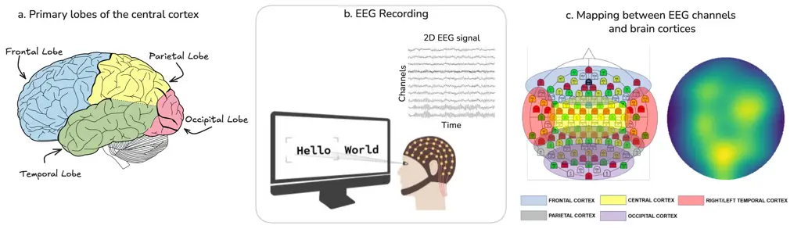

Figure 1: (a) Diagram of the primary lobes of cerebral cortex, including
frontal, parietal, temporal, and occipital, highlighting their
anatomical boundaries.(b) EEG Recording: Illustration of EEG activity
recorded while participants view text stimuli, showing eye-gaze position
and a 2-dimensional representation of the corresponding EEG signals. (c)
Mapping between EEG channels and brain cortices: On the left is the
visualization of each electrode in the 128-Channel EEG electrode
placement mapped to a specific cortical region, with mappings shown
across frontal, central, temporal, parietal, and occipital cortices. On
the right is the neural activation visualization taken from the top of
the scalp (Palazzo et al., 2020).

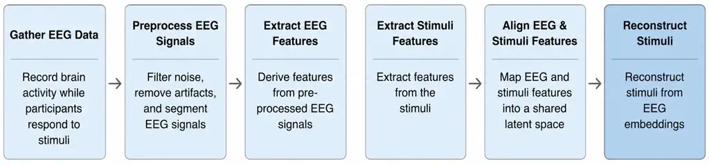

Figure 2: General pipeline for EEG-based generative modeling. EEG
signals are collected while participants respond to external stimuli,
preprocessed to remove artifacts and noise, and transformed into feature
representations. These features are aligned with stimulus
representations in a shared latent space, enabling the reconstruction of
images, text, or audio from EEG embeddings.

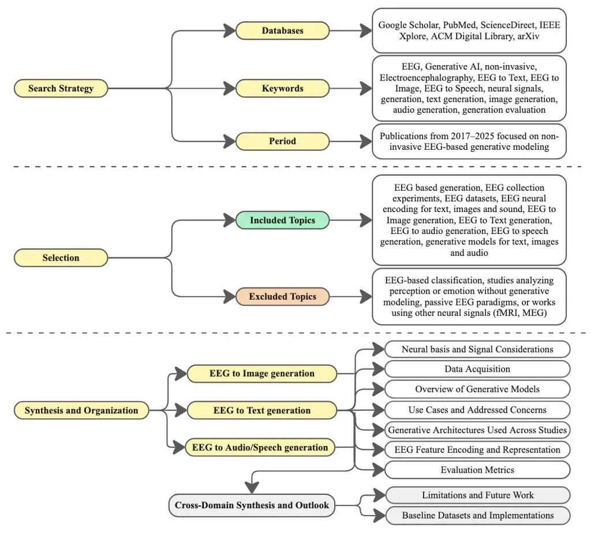

Figure 3: Overview of the literature search, selection, and synthesis
framework for this topical review. The upper tiers summarize the search
strategy and inclusion criteria for EEG-based generative modeling
studies. The synthesis and organization tier maps to modality-specific
sections (EEG-to-image, EEG-to-text, and EEG-to-audio/speech
generation), each analyzed through dimensions such as neural basis,
generative architectures, challenges tackled by studies, and evaluation
methods. The cross-domain synthesis and outlook section integrates
future research directions and suggested baseline implementations for
practitioners.

The convergence of Brain-Computer Interfaces (BCIs) and Generative
Artificial Intelligence (GenAI) is opening a transformative path toward
direct brain-to-device communication. Advances in human-computer
interaction have already supported applications in assistive
communication for individuals with disabilities, cognitive neuroscience,
mental health assessment, augmented and virtual reality (AR/VR), and
neural art generation. Although invasive and minimally invasive BCIs are
beginning to show real viability for industrial deployment, non-invasive
systems remain comparatively underdeveloped and are still mostly
confined to academic research and prototypes. Their broader adoption is
constrained by the lower spatial and temporal resolution of different
non-invasive signals, which presents significant challenges. These
constraints highlight the need to examine recent progress in generative
methods for non-invasive neural data in order to clarify emerging
methodologies, identify current limitations, and opportunities for
advancement in this domain.

Among non-invasive neural recording techniques such as functional
Magnetic Resonance Imaging (fMRI), Electroencephalography (EEG), and
Magnetoencephalography (MEG), this survey primarily focuses on EEG. EEG
measures the brain’s electrical activity from the scalp, providing high
temporal resolution that enables detection of rapid neural changes at
the millisecond scale. Figure 1 illustrates the EEG acquisition process:
electrical signals generated by neural activity are captured using
headsets equipped with 12-256 electrodes (or channels) while
participants are exposed to external stimuli such as images, text, or
audio. These electrodes are spatially mapped to specific cortical
regions, enabling localized observation of brain responses. While EEG
has lower spatial resolution compared to fMRI or MEG, numerous studies
demonstrate that it can still capture distinct activity patterns across
different cortical regions in response to various stimuli (Lutzenberger
et al., 1995; Pfurtscheller et al., 1994; Khadir et al., 2023;
Bastiaansen et al., 2008; Marinković, 2004). EEG serves as a key
neuro-physiological tool for assessing brain activity, particularly
within the cerebral cortex, which is organized into four major lobes:
frontal, temporal, parietal, and occipital, shown in Figure 1(a). The
frontal lobe is associated with higher cognitive functions and
decision-making; the temporal lobe plays a primary role in auditory
processing and multimodal sensory integration; the parietal lobe is
involved in attention and language-related processes; and the occipital
lobe processes visual information.

EEG signals are inherently spatiotemporal, consisting of a temporal
component that reflects dynamic neural oscillations and a spatial
component defined by the configuration of electrodes across the scalp.
Typical EEG amplitudes range from 2–500 µV and frequencies from
1–100 Hz. These signals are conventionally grouped into five frequency
bands: $`\delta`$ (delta, 0.5–4 Hz), $`\theta`$ (theta, 4–7 Hz),
$`\alpha`$ (alpha, 8–12 Hz), $`\beta`$ (beta, 13–30 Hz), and $`\gamma`$
(gamma, 30–100 Hz). Throughout this survey, we use these symbols and
band names interchangeably.

Traditionally, researchers have investigated the synchronization and
desynchronization of EEG rhythms across these bands to understand how
neural activity changes in response to cognitive engagement or external
stimuli (Pfurtscheller et al., 1994; Krause et al., 1996; Krause et al.,
1997). Synchronization occurs when oscillations across cortical regions
become more coordinated and rhythmic, often reflecting an idle or
resting state with reduced information processing. Desynchronization, in
contrast, reflects a reduction in rhythmic coherence and is typically
associated with active cortical engagement during sensory or cognitive
tasks. These changes in oscillatory activity across frequency bands
provide a window into large-scale neural dynamics in response to stimuli
(Marinković, 2004; Bastiaansen et al., 2008; Weiss et al., 2005;
Lutzenberger et al., 1995; Pfurtscheller et al., 1994), and may contain
decodable traces of perceptual, cognitive, and semantic representations.

We hypothesize that frequency-specific and region-specific oscillatory
patterns enrich the information content available in EEG signals,
thereby enabling EEG-to-media generation models to decode and
reconstruct underlying perceptual, cognitive, and semantic
representations. Building on this hypothesis, and given that EEG
supports both passive and active Brain-Computer Interface (BCI)
paradigms, it holds significant potential for adaptive human-computer
interaction (Zander et al., 2010; Wolpaw and Boulay, 2010).

In light of recent breakthroughs in Generative AI, this survey presents
a comprehensive review of advances in EEG-based cross-modal generation,
focusing on two primary directions. The first is EEG-to-image
generation, which involves the generation and reconstruction of visual
stimuli from brain signals by leveraging models such as Generative
Adversarial Networks (GANs) and Diffusion Models (Goodfellow et al.,
2020; Ho et al., 2020) to decode visual perception. The second direction
explores EEG-to-text translation, where Recurrent Neural Networks (RNNs)
and Transformer-based language models (Vaswani et al., 2017) are
employed to learn and generate linguistic representations from neural
activity. Beyond these two main lines of research, this survey also
discusses emerging efforts in audio/speech decoding from EEG signals and
multimodal integration, where the stimuli presented to subjects and the
generated media belong to different modalities.

We highlight in Figure 2 a high-level overview of the EEG-to-stimuli
generation pipeline, illustrating the key stages from neural data
acquisition to the generation of text, images, or audio, serving as a
conceptual starting point for the survey. The survey is organized into
three main sections: EEG-to-Image, EEG-to-Text, and EEG-to-Audio/Speech
generation, with each section progressing in a linear and structured
manner. Because survey papers can be conceptually dense, we encourage
readers to follow the sections in order for a coherent understanding of
the field. We first outline the neural basis of EEG responses to
different modalities, describing the relevant cortical regions, how EEG
captures their activity, and the dominant frequency bands involved.
Next, we summarize data collection procedure and highlight the
characteristics of datasets used across the literature. We then provide
an overview of foundational Generative AI methodologies to establish the
technological context for interpreting the studies that follow. The
modality-specific sections then review the use cases examined in prior
work, the challenges addressed, the generative architectures, EEG
feature-encoding techniques employed, and the reported evaluation
metrics.

Finally, we discuss the limitations identified across studies, propose
future research directions, and highlight baseline datasets and
implementations in A that can support reproducibility and enable
systematic tracking of progress in the field. By consolidating these
developments, this survey aims to provide researchers and practitioners
with a cohesive understanding of EEG-based generative AI and its
potential to expand the frontiers of brain-computer interaction.

## 2 Related Work

The growing application of generative AI to EEG-based media generation
and brain–computer interfaces (BCIs) has led to several surveys
examining different aspects of this rapidly evolving field. These
reviews can be broadly divided into two groups: those focusing on
EEG-based media generation and those examining the wider role of
generative AI in EEG based BCI systems, including data augmentation,
sensor design and optimization, and performance enhancement across a
range of neural decoding tasks.

Early work by Cao (2020) provided a broad overview of artificial
intelligence in EEG-based BCIs, covering machine learning and deep
learning methods for monitoring and providing feedback on cognitive
states, as well as BCI-related applications in computer vision, natural
language processing, and robotic control. More directly related to media
generation, Sabharwal and Rama (2024) conducted a systematic review of
EEG-to-output research. Their study summarized generative architectures
such as GANs, VAEs, and transformers, along with commonly used
evaluation metrics and challenges, including the lack of standardized
datasets for EEG-based image, video, and audio generation.

Other surveys have examined have examined the broader application of
generative AI in EEG-based BCIs. Eldawlatly (2024) reviewed its use for
EEG data augmentation, improving the spatiotemporal resolution of EEG
recordings, and enhancing cross-subject generalization. Focusing
specifically on generative adversarial networks, Habashi et al. (2023)
surveyed the use of GANs to improve BCI performance across paradigms
such as motor imagery, P300-based systems, emotion recognition, and
epileptic seizure detection and prediction. From a causal perspective,
Barbera et al. (2026) discussed AI-based EEG–BCI systems in relation to
distribution shifts, data acquisition, data augmentation, and
subject-invariant modeling. Their review also highlighted the emergence
of EEG foundation models, limitations caused by data scarcity and the
lack of interventional datasets, and directions for addressing current
methodological and technological gaps. Extending this broader
perspective, Wang et al. (2026a) surveyed generative AI for BCIs across
both invasive and non-invasive neural signals. Their review covered
neural decoding, sensor design and optimization, data augmentation,
fairness, cross-subject generalization, and broader security, privacy,
and ethical concerns.

Although these surveys provide valuable perspectives on AI-enabled BCIs
and selected forms of EEG-based generation, a comprehensive synthesis
centered specifically on EEG-based generative media remains limited. Our
work addresses this gap by reviewing EEG-to-image, EEG-to-text, and
EEG-to-audio generation within a unified framework. In addition to
summarizing the datasets, generative architectures, EEG feature
extraction methods, and evaluation methodologies used across these
modalities, we compare shared and modality-specific methodological
trends, identify persistent limitations, discuss ethical and security
considerations, and highlight future research directions for advancing
EEG-based generative AI.

## 3 Method

To capture the breadth of work at the intersection of EEG and generative
AI, we conducted a literature search across multiple indexing services,
including Google Scholar, PubMed, ScienceDirect, IEEE Xplore, ACM
Digital Library, and arXiv. Search strings combined terms such as “EEG,”
“Electroencephalography,” “text generation,” “image reconstruction,”
“speech synthesis,” and “generative AI.” These terms were iteratively
refined to capture studies across different modalities and
architectures. In Figure 3, we present a flowchart outlining the search
strategy, selection criteria, and organizational synthesis of the
reviewed studies and associated technologies. Our primary focus was on
work published between 2017 and 2025, reflecting the period during which
deep learning and generative modeling have driven most advances in this
field. Studies were included if they used non-invasive EEG signals and
applied machine learning or generative AI approaches to produce
cross-modal outputs such as text, images, or audio. We considered both
peer-reviewed publications and influential preprints. Excluded works
included those that focused exclusively on classification tasks (e.g.,
sentiment analysis, motor imagery recognition, emotion recognition),
used other non-invasive techniques like functional magnetic resonance
imaging (fMRI), magnetoencephalography (MEG) or invasive neural
recordings as these fall outside the scope of EEG-based generative
modeling.

For each selected study, we compiled structured notes in tabular form,
which had the investigated modality (image, text, audio or speech),
study use case, addressed challenges, model architectures employed by
studies (e.g., GANs, VAEs, transformers, diffusion models), EEG feature
encoding strategies, datasets used and reported evaluation metrics.
These tables provided a consistent framework to compare studies and
enabled us to identify patterns across the literature. We then grouped
studies into three major categories of EEG-driven generation-image,
text, and audio-and within each modality, analyzed use cases,
architectures, encoding techniques, and evaluation practices. This
organization allowed us to highlight both common challenges and emerging
trends.

Additionally, for the foundational knowledge required to interpret the
reviewed studies, we also include background on the neural basis of EEG
responses to different stimuli and an overview of generative methods
used across modalities. Our goal overall is to provide a balanced,
comprehensive and structured overview, ensuring that readers can follow
how different approaches have been applied, what challenges they help
overcome, existing limitations, and the future direction for further
progress in this field.

| Dataset                        | Reference                  | Stimuli Type          | Channels /Electrodes | Stimuli Details                                                                                                 | Sampling rate                                       | Subjects | Availability and License                        |
| ------------------------------ | -------------------------- | --------------------- | -------------------- | --------------------------------------------------------------------------------------------------------------- | --------------------------------------------------- | -------- | ----------------------------------------------- |
| Zuco 1.0                       | Hollenstein et al. (2018)  | Text                  | 128                  | Sentences from Stanford Sentiment Treebank, Wikipedia corpus                                                    | 500 Hz                                              | 12       | Public (OSF; CC BY 4.0 International)           |
| Zuco 2.0                       | Hollenstein et al. (2019)  | Text                  | 128                  | Expanded subjects with similar content as Zuco 1.0                                                              | 500 hz                                              | 18       | Public (OSF; CC BY 4.0 International)           |
| Envisioned Speech              | Kumar et al. (2018)        | Imagined Speech       | 14                   | 20 text stimuli (digits, characters), 10 objects                                                                | 2048 Hz (downsampled to 128 Hz)                     | 23       | On request, public mirror accessible on Kaggle  |
| Chisco                         | Zhang et al. (2024)        | Text, Imagined Speech | 128                  | 6,681 sentences of daily Chinese expressions                                                                    | 1,000Hz                                             | 3        | Public (OpenNeuro; CC0 1.0)                     |
| ChineseEEG                     | Lu et al. (2025)           | Text                  | 128                  | 2 Chinese novels, each character shown 350 ms without punctuation                                               | 250 Hz (Reading Aloud) 1,000 Hz (Passive Listening) | 10       | Public (OpenNeuro; CC0 1.0)                     |
| Neural Spelling                | Jiang et al. (2025)        | Text/Handwriting      | 64                   | 26 letters, tablet stylus; 25 reps/letter (650 trials)                                                          | 1,000 Hz                                            | 28       | On request                                      |
| OCED                           | Kaneshiro et al. (2015)    | Image                 | 128                  | 12 images per 6 object categories                                                                               | 1,000 Hz (downsampled to 62.5 Hz)                   | 10       | Pubic (Stanford Digital Repository; CC BY 3.0)  |
| ImageNet EEG                   | Spampinato et al. (2017)   | Image                 | 128                  | 40 ImageNet classes, 50 images/class, 2000 total                                                                | 1,000 Hz                                            | 6        | Public (GitHub)                                 |
| Texture Perception             | Orima and Motoyoshi (2021) | Image                 | 19                   | 166 grayscale natural texture images                                                                            | 1,000 Hz                                            | 15       | On request                                      |
| THINGS-EEG                     | Grootswagers et al. (2022) | Image                 | 64                   | 22,248 images across 1854 object concepts                                                                       | 1,000 Hz                                            | 50       | Public (OSF; CC BY 4.0)                         |
| DCAE dataset                   | Zeng et al. (2023b)        | Image                 | 32                   | 200 ImageNet images (cats, dogs, flowers, pandas)                                                               | 128 Hz                                              | 26       | Unavailable (confidential)                      |
| Alljoined                      | Xu et al. (2024)           | Image                 | 64                   | 10,000 images per participant from 80 MS-COCO categories                                                        | 512 Hz                                              | 8        | Previously public; current access unavailable   |
| Low-Density EEG Reconstruction | Guenther et al. (2024)     | Image                 | 8                    | 600 images/session (20 classes, 19 ImageNet + Faces), 2s on-screen, random shuffling                            | 250 Hz                                              | 9        | On request                                      |
| Alljoined-1.6M                 | Xu et al. (2025)           | Image                 | 32                   | 26,000 high-resolution photographs spanning 1,854 everyday object categories                                    | 256 Hz                                              | 20       | Public (HuggingFace; CC BY-NC-SA 4.0)           |
| ThoughtViz                     | Tirupattur et al. (2018)   | Imagined Objects      | 14                   | EEG recorded while participants imagined digits, characters, and objects                                        | 128                                                 | 23       | Public (Github)                                 |
| KARA ONE                       | Zhao and Rudzicz (2015)    | Text, Audio, Speech   | 64                   | Rest state, stimulus, imagined speech, speaking task                                                            | 1,000 Hz                                            | 12       | Public (University of Toronto)                  |
| NMED-H                         | Kaneshiro et al. (2016)    | Music                 | 125                  | 4 versions of 4 songs, total 16 stimuli                                                                         | 1,000 Hz (downsampled to 125 Hz)                    | 48       | Public (Stanford Digital Repository; CC BY 3.0) |
| NMED-T                         | Losorelli et al. (2017)    | Music                 | 128                  | 10 songs (4:30-5:00 mins) with tempos 56-150 BPM                                                                | 1,000 Hz (downsampled to 125 Hz)                    | 20       | Public (Stanford Digital Repository; CC BY 3.0) |
| Narrative Speech               | Broderick et al. (2019)    | Audio                 | 128                  | Audio book of The old man and the sea by Hemingway                                                              | 512 Hz (downsampled to 128 Hz)                      | 19       | Public (Dryad; CC0 1.0)                         |
| Alice                          | Bhattasali et al. (2020)   | Audio                 | 61 + 1 ground        | 2,129 words, 84 sentences from Alice in Wonderland                                                              | 500 Hz                                              | 52       | Public (OpenNeuro; CC0 1.0)                     |
| N400                           | Toffolo et al. (2022)      | Audio                 | 128                  | 402 sentences, each containing 5-8 words contained in Medical Research Council Psycholinguistic (MRCP) database | 512 Hz                                              | 20       | Public (Dryad; CC0 1.0)                         |
| Japanese Speech EEG            | Mizuno et al. (2024)       | Audio                 | 64                   | 503 spoken sentences (male/female speaker)                                                                      | 8,192 Hz (downsampled to 1,024 Hz)                  | 1        | Not publicly available/specified                |
| Phrase/Word Speech EEG         | Park et al. (2024)         | Audio                 | 64                   | Audio of 13 words/phrases, followed by speech replication                                                       | 2,500 Hz                                            | 10       | Not publicly available/specified                |

Table 1: EEG-based datasets from surveyed studies using text, image, and
audio/speech/music stimuli. Public availability and licensing are
reported where specified. CC BY allows reuse with credit; CC BY-NC-SA
allows noncommercial reuse with credit under the same license; CC0
allows reuse without restrictions.

## 4 EEG-to-Image Generation

### 4.1 Neural Basis and Signal Considerations

In EEG-based generation studies, the underlying neural basis is often
overlooked, which we believe is essential to motivate how perceptual,
semantic, and auditory information can be reconstructed from the
recorded signals.

EEG has long been used as a tool to study visual perception. An early
study by Lutzenberger et al. (1995) investigates the effect of visual
field presentation by changing the stimulus position in the upper versus
lower visual field. The authors found that coherent stimuli in the upper
visual field, which is processed by the lower half of the retina and
thus the more ventral (lower) sites of the primary visual cortex,
elicited a 40 Hz spectral power enhancement over lower occipital
electrodes. Conversely, stimuli presented in the lower visual field
produced a corresponding enhancement over upper occipital electrodes.
These findings demonstrate that EEG can reliably capture
location-specific cortical responses to visual stimuli.

Beyond this, EEG has been extensively used to understand the broader
dynamics of visual perception. Cognitive activity in response to visual
stimuli unfolds through successive stages, including primary visual
processing, feature extraction, higher-level cognitive analysis, and
attentional modulation. Although early visual processing is primarily
associated with occipital regions, EEG studies consistently show that
visual processing engages a broader network spanning occipito-parietal,
and frontal areas as information progresses from low-level sensory
analysis to higher-order cognitive interpretation. To understand the
timing (relative to stimulus onset) and spatial distribution (across
cortical regions) of these processes, researchers commonly examine
changes in oscillatory activity across EEG frequency bands, such as
event-related desynchronization (ERD), along with visual evoked
potentials (VEPs), which reflect electrical responses originating in the
visual cortex.

ERD in the alpha band serves as a well-established marker of cortical
activation: while high alpha amplitude is characteristic of a resting or
“idle” state, a reduction in alpha power (desynchronization) indicates a
change from a resting to an activated state. A foundational study by
Pfurtscheller et al. (1994) analyzed ERD in alpha sub-bands during
visual processing and identified two distinct components: (i) a
short-lasting upper-alpha(10-12 Hz) desynchronization localized over
occipital regions, and (ii) a longer-lasting lower-alpha (6-8 Hz)
desynchronization that is more broadly distributed, with maximal effects
over parietal areas. The occipital ERD component peaks approximately
200-300 ms after stimulus onset, whereas the parietal component reaches
its maximum around 300-500 ms, reflecting the progression from early
visual analysis to broader cognitive engagement. These temporal and
spatial patterns, observed through EEG, provide a useful way to trace
how visual information propagates through cortical networks.

Cross-frequency interactions also play a role in visual perception.
Another study by Demiralp et al. (2007) examined the interaction between
theta and gamma oscillations during visual perception using EEG. They
found that event-related gamma activity was strongly dependent on the
phase of concurrent theta oscillations, indicating that theta rhythms
modulate gamma-band responses. This cross-frequency coupling is believed
to play an important role in perceptual and cognitive processes,
including visual perception. In their findings, gamma activity was
primarily localized over the occipital cortex, whereas theta activity
was more broadly distributed, extending into frontal regions,
highlighting the integration of localized sensory processing in response
to visual stimuli, with more widespread cognitive networks.

EEG studies have also examined how oscillatory activity varies with
color perception. Khadir et al. (2023) analyzed theta, alpha, beta, and
gamma oscillations across occipital, occipito-parietal, and prefrontal
regions and identified distinct spectral patterns associated with
different colors. Green stimuli elicited slower beta-band oscillations
over occipital areas relative to red and blue stimuli, while blue
stimuli showed a decrease in theta-band power during the late
post-stimulus period in occipital electrodes. The authors also reported
increased phase consistency across trials for green stimuli, in contrast
to a decrease for blue stimuli. These findings demonstrate that color
information is represented through frequency-specific and
region-specific oscillatory patterns, highlighting the potential of EEG
signals to support the decoding of fine-grained visual attributes.

Collectively, these studies show that visual perception is represented
in distributed, frequency-specific oscillatory patterns that evolve
across cortical regions over time. This spatiotemporal structure forms
the neural basis upon which EEG-to-image decoding methods can operate.

### 4.2 Data Acquisition

We highlight key EEG datasets captured for image stimuli in Table 1.
Here, we include a key dataset to highlight relevant factors like the
number and demographics of subjects, the nature of visual tasks, the
image corpus, EEG recording setup, and the total size of the collected
data.

Dataset experimental details: EEG-Based Visual Classification Dataset by
Spampinato et al. (2017), has widely been used for EEG-to-image
generation. The dataset was collected from six healthy subjects who were
presented with visual stimuli drawn from a subset of ImageNet,
comprising 2,000 images (50 per class across 40 object categories). Each
image was displayed for 0.5 seconds, with bursts of 25 seconds followed
by a 10-second pause on a black screen. The entire experiment lasted
1,400 seconds (approximately 23 minutes). EEG was recorded using a
128-channel actiCAP system with active, low-impedance electrodes,
yielding 12,000 EEG sequences (2,000 per subject across 6 participants).
The dataset includes data already filtered in three frequency ranges:
14-70Hz, 5-95Hz and 55-95Hz.

This dataset has since been used in multiple studies on EEG-based image
classification and visual stimulus reconstruction, making it one of the
most widely used benchmarks for EEG-to-image generation studies.

### 4.3 Overview of Generative Models and Techniques for Image Generation

In this section, we review some key generative models and machine
learning techniques for image generation as a preliminary foundation
before discussing their application in the EEG-image generation domain.

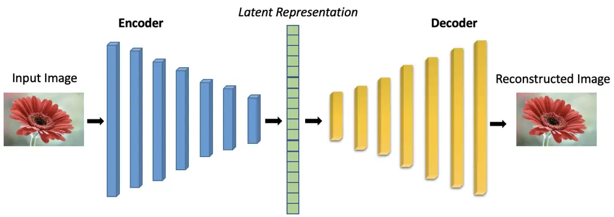

Figure 4: Traditional CNN-based encoder-decoder architecture. The
encoder processes a high-dimensional input image and generates a
lower-dimensional latent representation capturing the most important
features of the data. The decoder then reconstructs the image from this
latent representation. Model parameters are updated by minimizing the
reconstruction loss between the original and reconstructed images.

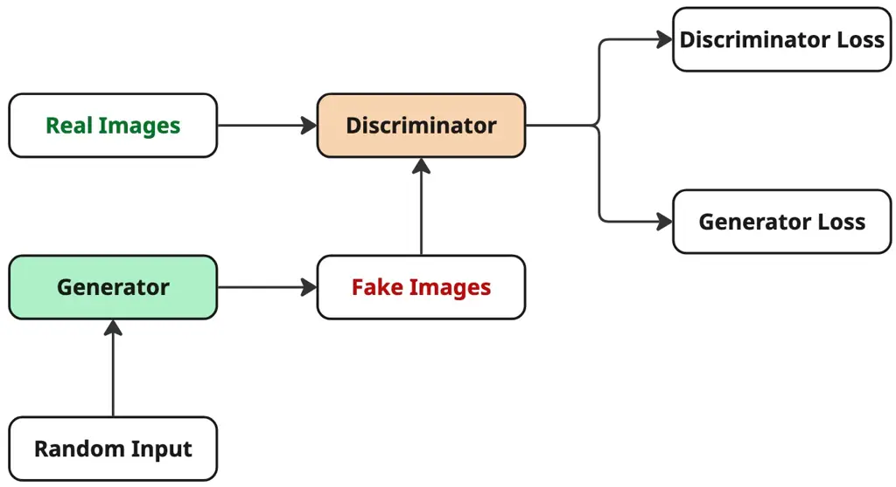

Figure 5: Structure of a Generative Adversarial Network (GAN). The model
is trained through an adversarial process, where the generator creates
fake images to fool the discriminator, while the discriminator learns to
distinguish between real and generated images.

A traditional encoder-decoder architecture, as shown in Figure 4, is a
neural network framework in which the encoder takes an input and
compresses it into a lower-dimensional latent representation (latent
space). This concept of dimensionality reduction is what makes these
architectures extremely useful in different domains. This process forces
the model to learn the most salient and informative features (latent
variables) of the input data rather than modeling every fine-grained,
high-dimensional detail. The decoder then takes this latent
representation and attempts to reconstruct the original input. In the
context of image generation from EEG signals, this becomes a cross-modal
encoder-decoder setup. The training data consists of EEG-image pairs,
where the encoder learns to map EEG signals into a shared latent space,
and the decoder learns to reconstruct the corresponding image from that
representation. During training, the model minimizes a reconstruction
loss, a measure of how different the generated image is from the
original one. Minimizing this loss enables the model to align EEG
features with visual representations in the latent space, allowing it to
generate images that reflect brain signal patterns.

While encoder-decoder models are deterministic, Variational Autoencoders
(VAEs) (Kingma et al., 2019) are probabilistic, encoding a continuous
representation of the latent space. This allows them not only to
reconstruct the input but also to generate new samples similar to the
original data using variational inference. Instead of fixed latent
variables, VAEs learn a distribution (mean and variance) over the latent
variables and generate outputs by sampling from it. The latent space
should be continuous (nearby points yield similar decoded content) and
complete (every point produces meaningful output). To ensure this, the
latent space is regularized to follow a standard normal (Gaussian)
distribution using the Kullback-Leibler (KL divergence), which minimizes
the difference between the learned and target distributions. The model
is trained with KL divergence loss in addition to reconstruction loss.
The probabilistic nature of VAEs might be particularly useful for EEG
data, which often has a low signal-to-noise ratio.

Another model architecture used extensively for image generation is
Generative Adversarial Network (GAN) (Goodfellow et al., 2020), which
consist of two components - a generator and a discriminator. They are
trained through an adversarial process, where the generator produces
images from random noise and attempts to fool the discriminator into
classifying them as real. The discriminator, in turn, evaluates both the
generated images and real samples from the training data to determine
whether each is real or fake, thereby improving its ability to
distinguish between them. The generator is trained using a generator
loss, which measures how successfully it can deceive the discriminator;
a lower generator loss indicates more realistic outputs. The
discriminator loss measures how accurately the discriminator can
distinguish real from fake data; a lower discriminator loss means it is
effectively identifying generated samples. The outline of the
adversarial process is illustrated in Figure 5. Through this adversarial
training, both networks improve simultaneously, enabling the generator
to produce increasingly realistic images over time.

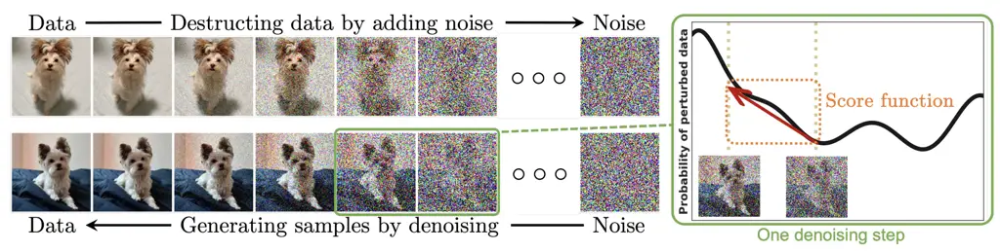

Figure 6: Probabilistic diffusion process, where data is gradually
diffused into noise during the forward process, and the model learns to
reconstruct data from noise by reversing these steps in the reverse
diffusion process. (Yang et al., 2023b)

Diffusion models (Ho et al., 2020) are another class of generative
models used for image generation. Their core idea can be understood in
three stages. In the forward diffusion process, an image from the
training dataset is gradually transformed into pure noise, typically
following a Gaussian distribution. In the reverse diffusion process, the
model learns to reverse these steps, reconstructing the original image
from noisy inputs, as shown in Figure 6. During image generation, the
trained model starts from random noise and progressively refines it into
a high-quality image by applying the learned reverse diffusion steps.
The number of steps during generation need not exactly match those used
in training, since the model is trained to predict the noise added at
each step rather than directly predicting the denoised image. This
sampling process introduces randomness, enabling diffusion models to
generate new and diverse images that closely resemble the training data.
Latent Diffusion Models (LDMs) extend diffusion models by operating in a
latent representation of the data instead of directly using
high-dimensional input. This architecture employs an encoder, similar to
that in a Variational Autoencoder (VAE), to first project the input
image into a lower-dimensional latent space where the diffusion process
is applied. The diffusion steps are thus performed more efficiently
while retaining semantic quality. Stable Diffusion is a widely used
implementation of this latent diffusion framework.

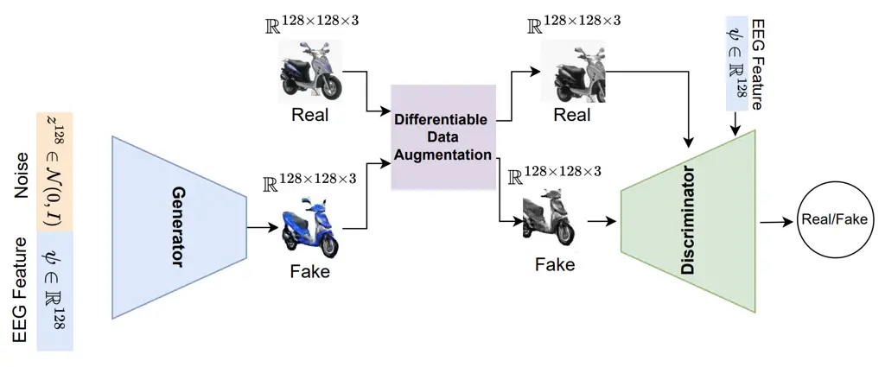

Figure 7: The Conditional GAN (cGAN) implementation from the EEG2Image
framework by Singh et al. (2023) uses EEG features as conditioning
inputs to guide the image generation process, enabling the model to
generate images that correspond to the brain activity captured by EEG.

For cross-modal generation, several mechanisms such as contrastive
learning, attention mechanisms, adversarial training, and conditional
modeling have been employed. These approaches are often integrated with
the primary generative architectures discussed above to enhance image
generation from EEG signals. In the context of EEG, contrastive learning
can help a model learn more robust representations by distinguishing
between EEG signals corresponding to the same image versus different
images, or between signals from different subjects. Vanilla VAEs and
GANs have the limitation that users have no control over the outputs
produced by the models. To generate specific or guided outputs,
especially in cross-modal settings, conditioning mechanisms are
introduced. By incorporating elements of supervised or semi-supervised
learning, such as class labels or conditions, conditioning enables the
model to generate outputs that are guided by specific inputs. In the
context of EEG to Image generation, EEG features are used as conditional
input, as shown in Figure 7. Well-conditioned generators have been shown
to perform better in practice (Odena et al., 2018). Conditioning can
also be combined with adversarial objectives and self-attention
mechanisms to improve image generation quality by modeling long-range
dependencies (Zhang et al., 2019a) and enhancing feature consistency
across modalities.

In the upcoming sections on EEG-to-image generation studies, knowledge
of these fundamental generative architectures will be useful to grasp
the underlying workings of proposed frameworks in this domain.

### 4.4 Use Cases and Addressed Concerns

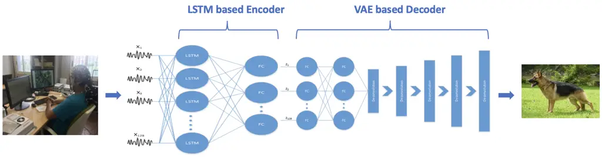

Figure 8: Encoder-decoder framework for EEG-to-image generation. In this
Brain2Image implementation, an LSTM-based encoder extracts compact EEG
representations, which are then mapped to the image space by a VAE-based
decoder (Kavasidis et al., 2017).

Before discussing the technological aspects of generating images from
EEG signals, we highlight the key challenges addressed in existing
studies. A primary limitation lies in the inherent noise of EEG
recordings, which results in a low signal-to-noise ratio (Bai et al.,
2023; Lan et al., 2023; Zeng et al., 2023a) and restricts the amount of
discriminative information that can be extracted from EEG signal.
Mapping EEG embeddings and image embeddings into a shared latent space
further compounds the difficulty, especially given inter-subject
variability in neural responses (Bai et al., 2023). Cross-modal
encoder-decoder networks give limited performance on images of natural
objects compared to simpler stimuli such as digits or characters (Mishra
et al., 2023) and experimental constraints often lead to small datasets
(Singh et al., 2023), limiting the robustness and generalizability of
generative models. Moreover, applying convolution layers separately
along temporal and spatial dimensions has been shown to disrupt
inter-channel correlations, thereby hindering the preservation of
spatial properties in brain activity (Song et al., 2023).

To overcome the challenges of low signal quality and limited
discriminative power in EEG data, Kavasidis et al. (2017), Song et al.
(2023), and Mishra et al. (2023) extract image class-specific EEG
encodings to capture features that better distinguish between
categories, capture class discriminative information and therefore
enhance generation quality. To overcome the loss of temporal and spatial
information, Nemrodov et al. (2018) uses spatiotemporal EEG features to
understand the neural correlates of facial identity, while Khaleghi et
al. (2022) map EEG activity to visual saliency maps to highlight the
image regions most relevant to human perception. Other approaches focus
on improving alignment between brain signals and visual data: for
example, projecting EEG into a shared subspace with image embeddings
(Shimizu and Srinivasan, 2022) or generating image class-specific latent
representations (Mishra et al., 2023). Similarly, Lan et al. (2023)
decodes multi-level perceptual information to produce more detailed,
multi-grained outputs. To overcome the large data demands of supervised
learning, Li et al. (2020); Song et al. (2023) explore self-supervised
and semi-supervised training paradigms to reduce reliance on extensive
labeled datasets.

Furthermore, recent studies have aimed to enhance the robustness and
interpretability of EEG-based image generation. Singh et al. (2024)
emphasizes on improving the generalizability of feature-extraction
pipelines across diverse datasets , Sugimoto et al. (2024) examine the
relative contribution of different EEG electrode settings and Li et al.
(2024) explore attention mechanisms to highlight the importance of
specific channels or frequency bands, thereby improving model
performance and interpretability.

More recent studies have shifted focus toward achieving practical BCI
implementation and enhanced model interpretability. Addressing the need
for real-world usability, Guenther et al. (2024) demonstrated that image
classification and reconstruction are possible using only an 8-channel
portable EEG setup, greatly improving affordability and mobility over
traditional high-density systems. For a streamlined, real-time BCI,
Lopez et al. (2025) proposed an efficient pipeline using minimal
preprocessing and a lightweight adapter, successfully surpassing prior
methods in both generation quality and semantic correctness.

To improve interpretability and semantic fidelity, intermediate,
structured semantic representations are used as mediators between the
EEG signal and the generative model. Studies like Mehmood et al. (2025),
Rezvani et al. (2025), and Cheng et al. (2025) bypass direct, noisy
EEG-to-image generation by aligning EEG signals with interpretable,
structured semantic prompts, such as multilevel captions or fine-grained
visual attributes (e.g., color and texture). This text- or
feature-mediated approach enables cognitively aligned decoding and
precise control over the image generation process.

Beyond interpretability and semantic alignment, practical deployment
requires addressing challenges related to adaptation to new subjects,
achieving robust performance with affordable EEG hardware, and enabling
the large-scale deployment of computationally intensive architectures.
To address scalability and subject adaptation, Kneeland et al. (2026)
proposed ENIGMA, a multi-subject EEG-to-image decoding model with a
simplified architecture requiring less than 1% of the trainable
parameters used by previous subject-specific approaches. For a
30-subject deployment, ENIGMA reduces the total parameter count by a
factor of 165 compared with the subject-specific model of Li et al.
(2024). Despite its substantially lower computational requirements, the
model achieves state-of-the-art performance on the THINGS-EEG2 (Hebart
et al., 2019) and Alljoined-1.6M (Xu et al., 2025) datasets and can
adapt to new subjects using as little as 15 minutes of calibration data.
These findings demonstrate the potential of parameter-efficient,
multi-subject architectures to support more scalable EEG-based
generation. However, further research on computational efficiency,
cross-subject generalization, low-cost EEG systems, and
minimal-calibration adaptation remains necessary for translating
EEG-based generative AI into practical real-world applications.

### 4.5 Generative Architectures Used Across Studies

An encoder-decoder (overview in Section 4.3) based framework, introduced
in Brain2Image (Kavasidis et al., 2017), is illustrated in Figure 8 to
generate images from EEG signals. Since EEG is a time-series signal with
both temporal dynamics and spatial structure across electrodes, an
effective encoder must capture both dimensions. Encoders are often
designed using recurrent units (e.g., LSTMs or GRUs) to model temporal
dependencies, convolutional layers to capture spatial patterns across
channels, or a hybrid combination of the two. Formally, given EEG
signals $`\mathbf{E}`$ recorded during the presentation of a visual
stimulus, the encoder $`f_{\theta}`$ maps $`\mathbf{E}`$ into a latent
representation $`\mathbf{z}=f_{\theta}(\mathbf{E})`$, where
$`\mathbf{z}`$ is compact and class-discriminative. The decoder then
learns to generate images conditioned on the EEG representation
$`\mathbf{z}`$ and is commonly implemented with CNN-based architectures
such as GANs and VAEs, or more recently with Transformer and diffusion
models. For further performance improvement, the decoder can be
conditioned on auxiliary information, such as image class labels or
additional EEG-derived features, which strengthens the alignment between
neural representations and image space.

We provide a detailed overview of these methodologies in Section 4.3 and
here we outline the major approaches found in surveyed studies,
describing how they work and highlighting their relevance to the task of
translating EEG signals into images specifically.

- 1.  Variational Autoencoders (VAEs) are well-suited for handling noisy
      signals and extracting structured latent features. Early work, such as
      Kavasidis et al. (2017); Wakita et al. (2021) employed VAEs to map EEG
      representations into compact embeddings that support image
      reconstruction tasks.
- 2.  In the context of EEG decoding, Generative Adversarial Networks
      (GANs), have been widely used to reconstruct visual stimuli (Kavasidis
      et al., 2017; Khaleghi et al., 2022; Mishra et al., 2023; Singh et
      al., 2024; Li et al., 2024). Conditional GANs extend this by
      conditioning on image stimuli labels, thereby improving alignment
      between EEG inputs and generated outputs (Singh et al., 2023; Ahmadieh
      et al., 2024).
- 3.  Diffusion Models are employed either to refine EEG embeddings into
      visual priors (Shimizu and Srinivasan, 2022) or as pre-trained
      backbones, such as Stable Diffusion (Bai et al., 2023). Further
      extensions leveraging U-Net architectures have been shown to improve
      reconstruction quality (Zeng et al., 2023a; Lan et al., 2023). The
      current state-of-the-art leverages pre-trained Latent Diffusion Models
      (LDMs), with recent advancements focusing on highly effective
      conditioning mechanisms: Guenther et al. (2024) introduced double
      conditioning to guide the LDM’s cross-attention and time-embedding
      simultaneously with EEG features, while Lopez et al. (2025) proposed
      using a ControlNet adapter trained exclusively on EEG features to
      condition a frozen LDM, streamlining the image generation process.
- 4.  Contrastive Learning is used to enhance discriminative feature
      extraction (Singh et al., 2023; Lan et al., 2023; Song et al., 2023;
      Sugimoto et al., 2024), often using cosine similarity to enforce
      cross-modal alignment (Song et al., 2023).
- 5.  Attention Mechanisms is used to weigh the relative importance of EEG
      channels or frequency bands, enhancing interpretability and spatial
      correlation modeling. They have been integrated into generative
      pipelines to improve both image quality and channel-level
      interpretability (Mishra et al., 2023; Song et al., 2023; Li et al.,
      2024).
- 6.  Hybrid Strategies adopt combined approaches to exploit complementary
      strengths. For example, attention modules have been integrated into
      GANs Mishra et al. (2023), and diffusion models have been coupled with
      contrastive learning frameworks Lan et al. (2023), resulting in more
      robust EEG-to-image generation systems. More recently, Kneeland et
      al. (2026) proposed a simplified hybrid architecture comprising a
      spatio-temporal CNN for EEG feature extraction, subject-wise latent
      alignment layers to account for inter-subject variability, an MLP
      projector that maps EEG representations into the CLIP embedding space,
      and a pretrained Stable Diffusion model for image generation.

  Another major contemporary trend is Semantic-Mediated Generation,
  which aligns noisy EEG with an interpretable semantic space (like CLIP
  text embeddings or multilevel captions) that then condition a frozen
  Latent Diffusion Model (LDM). This semantic mediation approach is
  exemplified by:
  - (a)
    Systems that align EEG with CLIP text embeddings and use
    class-guided caption re-ranking to inject context-aware information
    for thought visualization (Mehmood et al., 2025).
  - (b)
    Models that map EEG to multilevel captions generated by large
    language models (LLMs) to enhance both the semantic alignment and
    the interpretability of the decoding process (Rezvani et al., 2025).
  - (c)
    Frameworks that integrate both high- and low-level semantic features
    and use a conditional mechanism like FiLM (Feature-wise Linear
    Modulation) to achieve fine-grained control over generation (Cheng
    et al., 2025).

  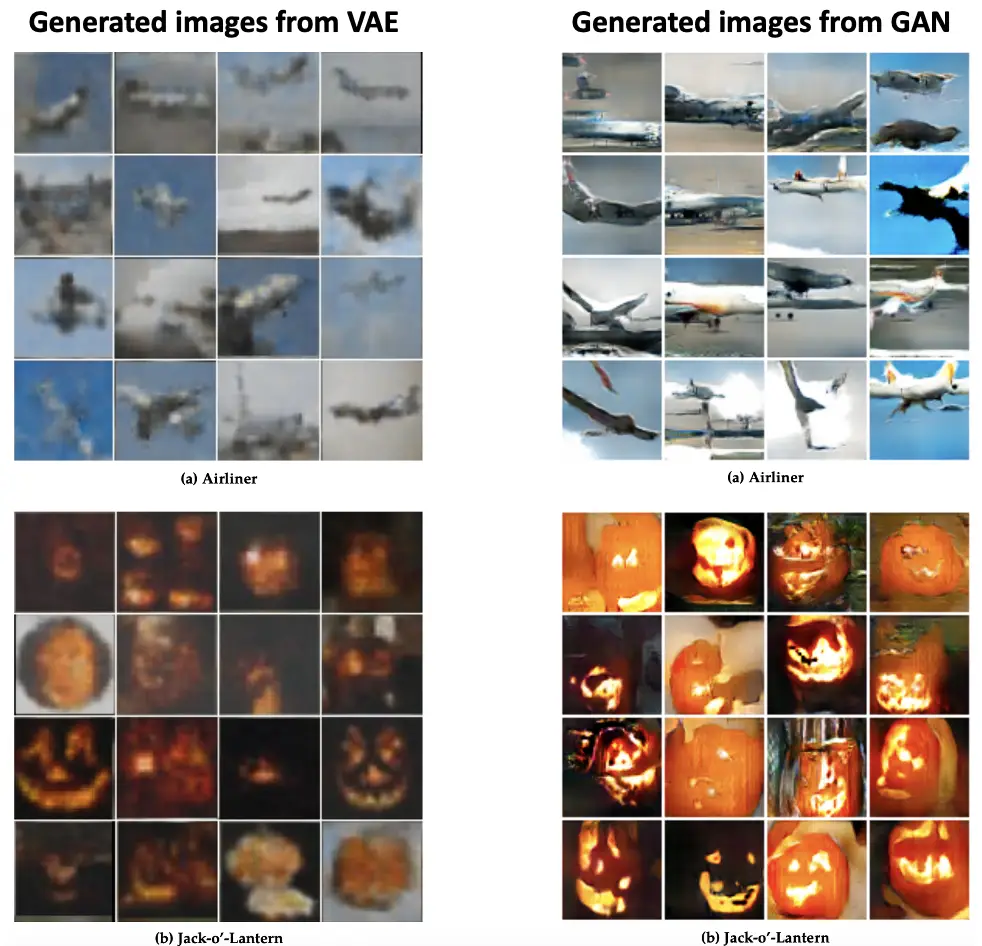
  Figure 9: Examples of images generated from EEG signals for two object
  categories (Airplane and Jack-o’-Lantern) using VAE- and GAN-based
  decoders Kavasidis et al. (2017).

  | EEG-to-Image Generation Evaluation Metrics |                                  |                                                                                                                                                                                |                                                                                                                          |
  | ------------------------------------------ | -------------------------------- | ------------------------------------------------------------------------------------------------------------------------------------------------------------------------------ | ------------------------------------------------------------------------------------------------------------------------ |
  | Category                                   | Metric                           | Description / Usage in Studies                                                                                                                                                 | References                                                                                                               |
  | Classification                             | Top-$`k`$ Accuracy               | Evaluates whether the correct class appears among the top-$`k`$ predictions, confirming EEG features are class-discriminative.                                                 | Shimizu and Srinivasan (2022); Lan et al. (2023); Song et al. (2023)                                                     |
  | Image quality / realism                    | Inception Score (IS)             | Measures image quality and diversity using a pretrained classifier; adapted from computer vision to EEG-to-image pipelines.                                                    | Salimans et al. (2016); Kavasidis et al. (2017); Li et al. (2020); Bai et al. (2023); Singh et al. (2023)                |
  |                                            | Frechet Inception Distance (FID) | Quantifies realism by comparing feature distributions of generated and real images.                                                                                            | Bai et al. (2023); Singh et al. (2024); Ahmadieh et al. (2024)                                                           |
  |                                            | Kernel Inception Distance (KID)  | Computes Maximum Mean Discrepancy (MMD) between real and generated distributions; complements FID.                                                                             | Singh et al. (2024)                                                                                                      |
  |                                            | LPIPS                            | Learned perceptual similarity metric that assesses patch-level similarity between generated and reference images.                                                              | Bai et al. (2023)                                                                                                        |
  |                                            | Diversity Score                  | Diversity Score evaluates the variety of generated images, providing an indication of how well the model avoids mode collapse (i.e., producing limited or repetitive outputs). | Mishra et al. (2023)                                                                                                     |
  | Perceptual / Semantic                      | SSIM                             | Structural Similarity Index, measuring perceptual similarity and structural fidelity.                                                                                          | Khaleghi et al. (2022); Shimizu and Srinivasan (2022); Bai et al. (2023); Ahmadieh et al. (2024); Sugimoto et al. (2024) |
  |                                            | PixCorr                          | Pixel-wise correlation coefficient between generated and target images.                                                                                                        | Shimizu and Srinivasan (2022)                                                                                            |
  |                                            | CLIP Score                       | Measures semantic alignment using CLIP features against ground-truth caption or class.                                                                                         | Rezvani et al. (2025); Cheng et al. (2025)                                                                               |
  |                                            | Feature Distance                 | Measures image similarity using features from modern backbones (e.g., AlexNet Top-$`k`$, SwAV).                                                                                | Rezvani et al. (2025); Cheng et al. (2025)                                                                               |
  | Qualitative                                | Visual Inspection / User Study   | Human-perceived quality assessment, often reported via expert visual inspection or user studies.                                                                               | –                                                                                                                        |

  Table 2: Evaluation metrics used in EEG-to-image generation studies.

### 4.6 EEG Feature Encoding and Representation

Feature encoding is a critical step in EEG-to-image reconstruction, as
it defines how spatial patterns across electrodes and temporal dynamics
of neural activity are extracted from raw signals and transformed into
latent representations for generation. Existing approaches can be
broadly categorized into temporal modeling, spatial modeling,
graph-based approaches, hybrid temporal-spatial models, and
self/contrastive learning strategies.

Temporal modeling aims to analyze and learn the time-varying patterns in
electroencephalogram (EEG) signals to understand brain activity over
time, commonly implemented using Long Short-Term Memory (LSTM) networks,
to capture temporal dependencies in EEG signals. Kavasidis et al. (2017)
employ an LSTM to generate compact, class-discriminative feature vectors
that can also be used for object recognition. Building on this idea,
Singh et al. (2023) integrate an LSTM encoder with a triplet-loss-based
contrastive learning framework to improve feature discrimination, while
Singh et al. (2024) extend the design by combining CNN and LSTM encoders
under triplet-loss supervision to further enhance discriminative
learning. Similarly, Ahmadieh et al. (2024) apply LSTMs across EEG
channels and temporal windows and augment the extracted features through
regression methods, including polynomial regression, neural network
regression, and fuzzy regression.

Spatial modeling uses spatial arrangement and relationships between
electrode locations on the scalp to create a richer understanding of
brain activity. This has been addressed primarily through convolutional
neural networks (CNNs), which naturally capture dependencies across EEG
channels. For instance, Li et al. (2020) apply a feedforward neural
network to project EEG signals into semantic features and Wakita et al.
(2021) adopt a one-dimensional convolutional encoder-decoder within a
multimodal VAE to get mean and variance vectors for EEG signal
representation. More recent work has integrated attention with CNN
architectures. Mishra et al. (2023) used a convolutional encoder-decoder
framework enhanced with an attention module to emphasize the most
informative EEG channels. Other studies leverage specialized EEG network
architectures like EEGNet Lawhern et al. (2018) and Sinc-EEGNet (Bria et
al., 2021), integrating attention mechanisms to highlight relevant
frequency bands and channels (Sugimoto et al., 2024; Li et al., 2024).

Graph-based methods have also been explored, where EEG signals are
represented as connectivity graphs. Khaleghi et al. (2022) construct
graph embeddings derived from EEG functional connectivity and process
them with a Geometric Deep Network (GDN) to obtain EEG feature vectors.
Likewise, Song et al. (2023) integrate temporal-spatial convolution with
self-attention and graph attention modules to improve feature extraction
from EEG signals.

Hybrid temporal-spatial models aim to jointly exploit both domains. Zeng
et al. (2023a) design a framework inspired by EEGChannelNet (Palazzo et
al., 2020) and ResNet-18, combining spatial, temporal, and multi-kernel
residual blocks. Similarly, Shimizu and Srinivasan (2022) introduce a
time-series-inspired architecture with channel-wise transformations and
temporal-spatial convolution to capture richer EEG representations.

Finally, self-supervised and contrastive learning strategies have been
explored to improve EEG feature extraction while reducing dependence on
labeled datasets. These approaches broadly fall into two categories:
masking/reconstruction and cross-modal alignment (contrastive learning).

- 1.  Bai et al. (2023) apply masked signal modeling with a masked
      autoencoder that reconstructs partially masked EEG tokens, thereby
      refining latent representations.
- 2.  The cross-modal alignment methods primarily rely on contrastive
      learning to align EEG with semantic or visual information. Lan et
      al. (2023) use contrastive learning to align EEG and image embeddings,
      enabling extraction of pixel-level semantics and generation of
      saliency maps; their framework further integrates CLIP-based image
      caption embeddings with an EEG sample-level encoder to strengthen
      cross-modal alignment. More recently, Mehmood et al. (2025) and
      Rezvani et al. (2025) use a symmetric InfoNCE loss (similar to CLIP)
      to align EEG embeddings directly with corresponding text caption
      embeddings.

An interesting alternative approach for semantic feature extraction is
knowledge distillation, used by Cheng et al. (2025) to train a
high-level EEG encoder. In this method, a frozen ResNet50 classifier
provides soft-target supervision, distilling its learned representations
into the EEG encoder.

### 4.7 Evaluation Metrics

Evaluation of EEG-to-image generation involves both classification-based
measures (to verify that EEG features capture class discriminative
information) and image quality metrics (to assess the fidelity and
realism of generated outputs). Example of generated images from
Kavasidis et al. (2017) are shown in Figure 9. Table 2 lists the key
evaluation metrics with brief descriptions and exemplary studies that
have used them.

## 5 EEG-to-Text Generation

### 5.1 Neural Basis and Signal Considerations

In this section, we highlight studies that examine EEG activity in
response to text stimuli and the underlying neural basis of language
processing, which is essential for motivating how linguistic information
can be reconstructed from the recorded signals.

Neural activity during reading unfolds through a sequence of cognitive
operations, beginning with the visual perception of written text,
followed by lexical retrieval, syntactic processing, and ultimately
semantic unification into a coherent mental representation. Each of
these stages engages distributed neural networks rather than a single
brain region, and their dynamics are reflected in the spatiotemporal
oscillatory patterns captured by EEG. Importantly, EEG frequency bands
do not map one-to-one onto specific language operations; instead,
language comprehension emerges from a dynamic interplay across
$`\alpha`$, $`\beta`$, $`\theta`$, and $`\gamma`$ rhythms, modulated by
task demands and cortical region.

Studies show that neurocognitive aspects of language processing are
associated with brain oscillations at various frequencies. A
foundational review by Bastiaansen and Hagoort (2006) synthesizes
oscillatory signatures associated with language processing. Their
findings show that $`\theta`$-band (4-7 Hz) synchronization increases
during memory retrieval operations, whereas $`\beta`$ (12-30 Hz) and
$`\gamma`$ ($`>`$30 Hz) synchronization are associated with unification
processes, where lexical, syntactic, and semantic information are
integrated.

Further evidence comes from Bastiaansen et al. (2008), study that
investigated neural dynamics elicited by open-class (semantic-bearing)
and closed-class (function) words. Both word types produced $`\theta`$
power increases and $`\alpha`$/$`\beta`$ power decreases over left
occipital (visual processing) and midfrontal regions. Notably,
open-class words elicited an additional $`\theta`$ power increase in the
left temporal cortex, consistent with its role in lexical-semantic
retrieval. Moreover, words with auditory semantic properties produced
greater $`\theta`$ power over electrodes near the left auditory cortex,
whereas visually descriptive words produced stronger $`\theta`$
responses over the left visual cortex. These findings reinforce the view
that $`\theta`$ synchronization supports lexical-semantic retrieval.
Studies have also linked semantic memory operations to $`\alpha`$-band
power changes.

Working memory (WM) is crucial for maintaining linguistic input during
comprehension. Bastiaansen et al. (2002) associated $`\theta`$
synchronization with the formation of a working-memory trace, while
Weiss et al. (2005) reported stronger $`\theta`$ coherence in
syntactically demanding object-relative clauses compared to
subject-relative clauses.

Semantic unification processes also demonstrate frequency-specific
markers. For example, Hagoort et al. (2004) observed increased
$`\gamma`$-band activity when sentences violated world knowledge as
compared to violations of semantic features. Similarly, Weiss and
Mueller (2003) found greater $`\gamma`$ coherence for semantically
congruent versus incongruent sentence endings.

To examine EEG coherence patterns associated with syntactic unification,
Haarmann et al. (2002) investigated the neural processes involved in gap
filling during online sentence comprehension and found that
$`\beta`$-band coherence was significantly larger during verb processing
in sentences requiring gap filling compared to those without syntactic
gaps. Extending this line of evidence, Weiss and Mueller (2012)
emphasized that $`\beta`$-band activity plays a key role in cognitive
and linguistic manipulations during language processing, noting its
involvement in higher-order linguistic functions such as word-category
discrimination, semantic memory operations, and syntactic binding that
supports meaning construction during sentence comprehension.

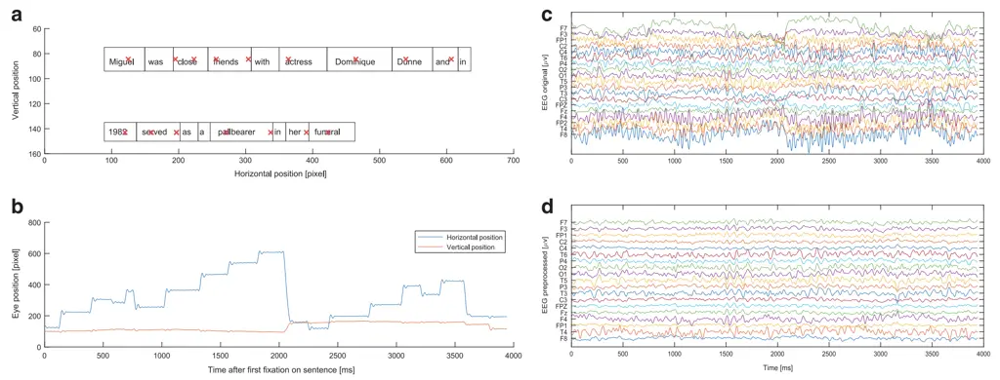

Figure 10: Visualization of single trial EEG and eye-tracking data
(Hollenstein et al., 2018) (a) Fixations at the word level EEG marked
with red cross and boxes. (b) Raw fixation gaze data. (c) Raw EEG
signals. (d) EEG signals after preprocessing.

Another important aspect of language comprehension is the concurrent
activation of multiple regions within a distributed cortical network.
Marinković (2004) showed that processing written words begins in
sensory-specific occipital areas and then progresses anteriorly along
the ventral processing streams toward supramodal regions, including the
temporal and inferior prefrontal cortices. The integration of a word
into its contextual meaning peaks around 400 ms after word onset, driven
largely by coordinated activity between left temporal and inferior
prefrontal regions during reading. EEG studies further support this
spatiotemporal progression: Fahimi Hnazaee et al. (2018) reported that
early word processing starts with visual processing in the occipital
cortex, followed by activation along the ventral stream-first engaging
left posterior occipital regions around 200 ms, then reaching the
posterior temporal cortex during the semantic-processing window (around
400 ms). At later stages, anterior temporal, inferior frontal, and
orbital regions become involved, reflecting the transition from
perceptual processing to higher-order lexico-semantic integration.

Together, these findings demonstrate that EEG captures a rich hierarchy
of lexical, syntactic, and semantic processes distributed across
cortical networks, providing the neural foundation from which
EEG-to-text generation models attempt to decode and reconstruct
linguistic information.

### 5.2 Data Acquisition

We highlight major EEG datasets captured for text stimuli in Table 1.
For such datasets, the most relevant factors are the number and
demographics of subjects, the nature of tasks performed, the EEG
recording setup, the method of aligning neural signals with text (often
via eye-tracking), and the overall dataset size.

ZuCo Dataset experimental details: To provide additional context, we
describe the data acquisition process for one key dataset, the Zurich
Cognitive Language Processing Corpus (ZuCo) (Hollenstein et al., 2018),
which has become a benchmark for EEG-text research. The dataset was
collected from 12 healthy native English speakers engaged in
naturalistic reading tasks, where sentences were drawn from the Stanford
Sentiment Treebank (movie reviews) and the Wikipedia Relation Extraction
corpus (famous people labeled with relation types). Participants
completed three tasks: sentiment analysis of movie reviews, relation
recognition in Wikipedia sentences, and a task-specific relation
classification, with a total reading duration of 4-6 hours per subject
across two sessions.

Eye movements were simultaneously recorded with an EyeLink 1000 Plus
tracker (sampling rate of 500 Hz). Eye movement data is essential for
providing word-level alignment between text and EEG signals, as it
defines the precise onset and duration of fixations during reading.
Figure 10 shows how eye position coordinates are used to capture word
boundaries. High-density EEG was captured using a 128-channel HydroCel
system (500 Hz, 0.1-100 Hz bandpass). The final corpus includes over
21,000 words across 1,100 sentences and approximately 154,000 gaze
fixations, providing a uniquely synchronized dataset of EEG and
eye-tracking signals.

ZuCo Dataset frequency bands: EEG signals captured across entire task
period for eight different frequency bands resulting in a time-series
for each frequency band - $`\theta_{1}`$ (4-6 Hz), $`\theta`$2 (6.5-8
Hz), $`\alpha_{1}`$ (8.5-10 Hz), $`\alpha_{2}`$ (10.5-13 Hz),
$`\beta_{1}`$ (13.5-18 Hz), $`\beta_{2}`$ (18.5-30Hz), $`\gamma_{1}`$
(30.5-40 Hz), $`\gamma_{2}`$ (40-49.5 Hz).

Word level EEG Input for ZuCo: Out of 128 channels, 9 EOG channels were
used for artifact removal. Additionally, 14 channels primarily located
on the neck and face were excluded from analysis. Each word-level EEG
feature has a fixed dimension of 105. To obtain word level EEG input,
EEG data was aggregated on gaze duration. Features are concatenated from
all 8 frequency bands, into one feature vector with a dimension of 840.

By enabling precise mapping between neural activity at word-level, ZuCo
supports applications in NLP tasks such as sentiment analysis and
relation extraction, as well as cognitive neuroscience research on
natural reading. Beyond reading and comprehension analysis, the ZuCo
dataset has also been used extensively in EEG-text generation studies.

### 5.3 Overview of Generative Models and Techniques for Text Generation

In the domain of text generation, technological advancements are largely
driven by probabilistic language models. Early foundational work dates
to the early 2000s, when Bengio et al. (2003) proposed "learning a
statistical model of the distribution of word sequences by neural
networks", such that word representations capture the probability
distribution of natural language sequences. Given a context c (a set of
preceding words), the model predicts the next word w in the sequence
according to the conditional probability $`P(w\mid c)`$, where $`|c|`$
denotes the size of the context window. This core autoregressive
principle extends naturally to Large Language Models (LLMs), which are
trained on vast amount of data and can be trained or fine-tuned to
perform tasks in diverse domains, from text-to-text generation
(prompt-based) to cross-modal generation such as image-to-text,
audio-to-text, or even EEG-to-text translation.

The text generation models inherently perform temporal modeling i.e.
predicting the next element in a sequence, which aligns closely with the
temporal dynamics of EEG signals. Moreover, their ability to support
many-to-many sequence generation (as in machine translation tasks) makes
them particularly suitable for EEG-to-text generation applications. For
EEG-to-text generation, we provide an overview of language models that
are either used to obtain robust EEG representations for text generation
(such as RNNs and GRUs) or that utilize EEG representations to generate
natural language text (such as large language models (LLMs) like BART).

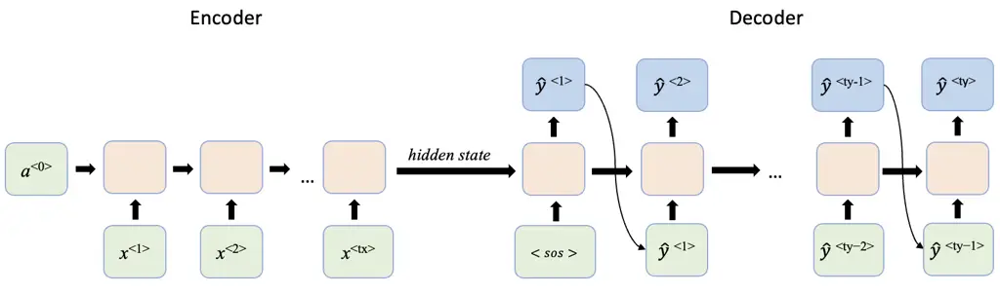

Figure 11: A traditional RNN architecture for many-to-many sequence
generation in a machine translation task. It consists of an encoder that
processes the input sequence $`x`$ and a decoder that takes the
encoder’s hidden state $`a`$ as input and autoregressively generates the
output sequence $`\hat{y}`$. The diagram shows an unrolled RNN
illustrating sequence processing at each time steps $`t`$.

Recurrent Neural Networks (RNNs), in contrast to simple feedforward
neural networks, allow previous outputs to be reused as inputs through
hidden states, enabling them to model sequential dependencies in
time-series data. Given a sequence $`x_{1}`$, $`x_{2}`$, $`x_{4}`$, ..,
$`x_{t-1}`$, $`x_{t}`$, the activation corresponding to $`x_{1}`$ is
used in processing $`x_{2}`$, and so on, as illustrated in Figure 11.
This recurrent structure allows RNNs to "remember" previous information
and maintain context over time, which is particularly useful for
capturing temporal dependencies in data such as EEG signals and natural
language. However, as information propagates over many time steps, RNNs
struggle to capture long-term dependencies due to the vanishing and
exploding gradient problems. To overcome these limitations, advanced
variants such as Long Short-Term Memory (LSTM) and Gated Recurrent Unit
(GRU) networks have been proposed. LSTMs introduce memory "cells" in the
hidden state, regulated by three gates: the forget gate (determining
what information to discard), the input gate (selecting what new
information to store), and the output gate (controlling what information
is passed to the next time step). GRUs, on the other hand, simplify this
mechanism by using only two gates: reset and update, and by merging the
cell and hidden states, thus reducing computational complexity while
maintaining comparable performance. Additionally, Bidirectional RNNs
(BiRNNs) extend these architectures by processing the sequence in both
forward and backward directions, allowing the model to incorporate
context from both past and future time steps. In the context of
EEG-to-text generation, RNN-based architectures, including LSTMs, GRUs,
and BiRNNs, are frequently employed for EEG feature extraction due to
their ability to effectively capture the temporal dynamics inherent in
EEG signals.

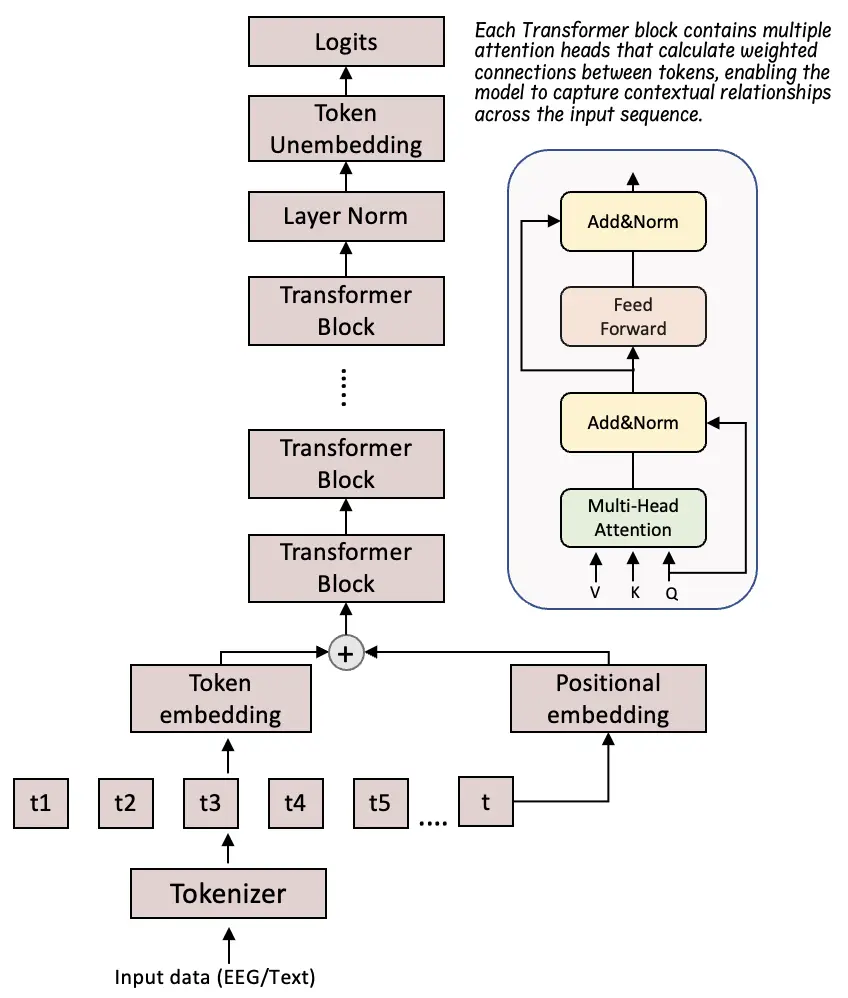

Figure 12: Multi-layer Transformer architecture and Transformer block
illustration. The model takes a sequence as input and outputs logits,
which are then used to generate text.

Over the past decade, Transformer architectures have dominated text
generation, particularly in sequence-to-sequence (seq2seq) applications.
While RNNs process data sequentially at each time step, they are limited
in their ability to capture long-range dependencies within the data.
Transformers, with their self-attention mechanism, can model multiple
dependencies simultaneously. In a traditional Transformer based
architecture, as shown in Figure 12, the input data is first divided
into tokens, which are then passed to a series of transformer layers
where the attention mechanism assigns weights that represent the
relationships between these tokens, allowing the model to "attend" to
the most relevant parts of the input sequence. This mechanism, combined
with the Transformer’s ability to process data in parallel, greatly
enhances its capacity to capture complex relationships and dependencies
in large-scale datasets.

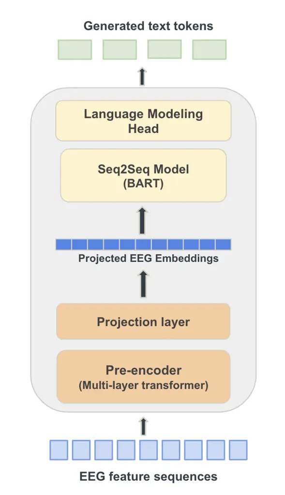

Figure 13: Illustration of the EEG-to-Text framework adapted from Wang
and Ji (2022). The framework employs a multi-layer Transformer to
extract EEG embeddings from input features, followed by an
encoder-decoder based BART language model that generates text from the
projected EEG embeddings.

A typical EEG-to-text generation framework, illustrated in Figure 13,
consists of a multi-layer Transformer, used as a pre-encoder to extract
embedding representations from EEG signals. These embeddings are then
passed to a pre-trained BART (Bidirectional and Auto-Regressive
Transformer) language model to generate text from EEG-derived features.
BART employs a bidirectional encoder that captures contextual
information in both directions to learn latent EEG representations, and
an autoregressive decoder that generates coherent natural language text
based on these learned representations.

In addition to this, for cross-modal learning, techniques such as
contrastive learning and masked signal modeling have been employed.
Contrastive learning, as described in Section 4.3, helps the model learn
more robust representations by distinguishing between EEG signals
corresponding to the same text versus different text, or between signals
from different subjects in EEG-to-text generation. In masked signal
modeling, portions of the input sequence are masked, and the encoder is
trained to reconstruct the original sequence, thereby learning robust
contextual representations. Separate Transformer-based encoders, such as
BART or other multi-layer Transformers, have been used independently for
text and EEG masked signal modeling.

This overview provides a strong foundation for the upcoming sections,
where we discuss how they have been integrated into various
architectures for EEG-to-text generation tasks.

### 5.4 Use Cases and Addressed Concerns

In the domain of generating text from EEG signals, early work has
typically relied on closed-vocabulary approaches, where decoding is
limited to a fixed set of predefined words (Biswal et al., 2019;
Srivastava and Shinde, 2020; Yang et al., 2023a; Rathod et al., 2024).
Among these, Srivastava and Shinde (2020) and Yang et al. (2023a)
explore the use of Morse code representations, in which users’ active
intent is mapped to Morse sequences that are subsequently translated
into text.

More recent studies have moved toward open-vocabulary generation,
enabling decoding beyond fixed word sets and aiming to support
naturalistic conversation (Wang and Ji, 2022; Feng et al., 2023; Duan et
al., 2023; Liu et al., 2024a; Wang et al., 2024; Amrani et al., 2024;
Tao et al., 2024; Mishra et al., 2024; Ikegawa et al., 2024; Chen et
al., 2025b; Gedawy et al., 2025; Masry et al., 2025; Liu et al., 2025;
Lu et al., 2025; Jiang et al., 2025). These works address several
important concerns, including subject-dependent variability in EEG
representations (Feng et al., 2023; Amrani et al., 2024; Gedawy et al.,
2025), learning cross-modal alignment between EEG and text embeddings
(Wang et al., 2024; Tao et al., 2024), and modeling long-term
dependencies and contextual information that may be missed by
conventional architectures (Rathod et al., 2024; Chen et al., 2025b;
Chen et al., 2025a).

A persistent challenge in EEG-to-text research is the reliance on
eye-tracking fixation data to define word-level markers, which has been
addressed by studies such as Duan et al. (2023) and Liu et al. (2024a).
To mitigate the difficulty of defining word boundaries in EEG signals
and to broaden applicability across languages, some studies have
proposed language-agnostic solutions (Mishra et al., 2024; Ikegawa et
al., 2024), where signals are captured through visual stimuli and
decoded via advances in image-text intermodality. Data scarcity also
remains a limiting factor, and Chen et al. (2025b) propose a VAE-based
augmentation technique to expand EEG-text datasets and improve training
efficiency.

Another major concern has been the semantic fidelity of generated text,
since shallow lexical matching often fails to capture the intended
meaning of the text. Approaches that explicitly encourage interpretable
and semantically aligned representations, for example through
contrastive learning (Feng et al., 2023; Tao et al., 2024; Liu et al.,
2025), have been introduced to reduce semantic drift and improve the
quality of open-vocabulary generation. A pioneering study by Zhou et al.
(2024) trains a conformer- and transformer-based multi-task model with
query prompts to enhance the encoding and decoding performance from EEG
signals to achieve coherent and readable sentence decoding results from
noninvasive EEG signals.

Relatedly, cross-lingual generalization has begun to receive attention,
with studies like Lu et al. (2025) demonstrating that EEG-to-text
decoding can extend beyond English by aligning Chinese EEG signals with
text embeddings. Beyond reading-based tasks, EEG signals associated with
handwriting have been used to decode individual alphabet letters to
further generate fluent text, aiming toward a Spell-Based BCI System
(Jiang et al., 2025).

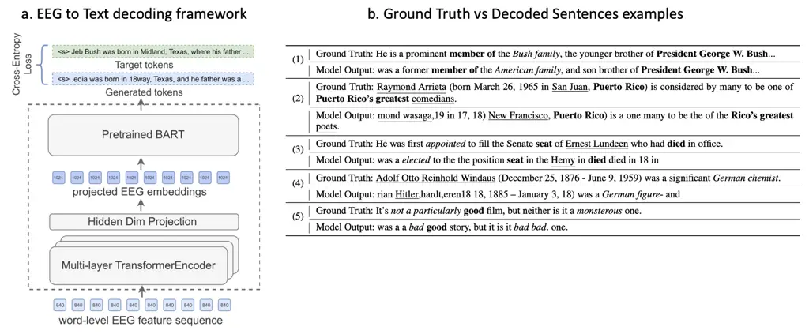

Figure 14: (a) EEG decoding framework that takes word level EEG as input
and follows a sequence-to-sequence neural machine translation task to
predict output text. (b) Comparison of Ground Truth and Decoded
sentences for exact word match and semantic resemblance (Wang and Ji,
2022).

### 5.5 Generative Architectures Used Across Studies

EEG-to-text generation draws on a diverse set of modeling and
representation learning approaches. We have found that
sequence-to-sequence (seq2seq) generation serves as a major overarching
framework. The idea is to formulate EEG to text generation as a neural
machine translation task (Wang and Ji, 2022) and maximizing the
probability of decoded sentence which is the conditional probability of
predicting the sequence $`s_{t}`$, given the EEG signal $`\mathcal{E}`$
and previously decoded sequences, where $`T`$ is the length of the
target text sequence:

```math
p(\mathcal{S}|\mathcal{E})=\prod_{t=1}^{T}p(s_{t}\in\mathcal{V}|\mathcal{E},s_{<t}) \tag{1}
```

After extracting word-level EEG inputs, as described in Section 5.2, an
EEG-to-text decoding framework similar to Figure 14 is used to generate
output text. Instead of requiring an exact sentence-level match, the
generated text is evaluated against the original reference using
semantic similarity and word-overlap metrics.

We now outline the major state-of-the-art techniques applied to
EEG-to-text generation, explaining the underlying approach of each
method and its relevance.

- 1.  Large Language Models (LLMs) are widely used due to their ability to
      capture long-range dependencies in text and generate coherent
      linguistic output. Several studies employ BART as the core text
      generation model (Wang and Ji, 2022; Liu et al., 2024a; Wang et al.,
      2024; Amrani et al., 2024; Tao et al., 2024; Chen et al., 2025a). In
      addition, Mishra et al. (2024) fine-tuned LLMs on EEG embeddings
      alongside image-text data during training, enabling text generation
      directly from EEG signals during inference. Liu et al. (2025)
      introduces a contrastive–generative framework that aligns EEG
      representations with a frozen Flan-T5 (LLM) latent space, (Jiang et
      al., 2025) explores letter-level decoding followed by generation with
      BART language model.
- 2.  Contrastive learning is frequently applied to align EEG and text
      embeddings in a shared space, further enhancing cross-modal alignment
      and improve feature discrimination (Feng et al., 2023; Tao et al.,
      2024; Wang et al., 2024; Liu et al., 2025).
- 3.  Masked signal modeling is used as self-supervised pretraining strategy
      to learn robust EEG representations. For example, Liu et al. (2024a)
      employ a transformer trained to reconstruct randomly masked segments
      of EEG data, thereby learning contextual and semantic dependencies at
      the sentence level. An integrated framework by Tao et al. (2024)
      combines contrastive learning with masked signal modeling, where
      word-level EEG feature sequences are randomly masked and
      sentence-level sequences deliberately masked, guided by an
      intra-modality self-reconstruction objective.
- 4.  Recurrent Neural Networks (RNNs) have been adopted to capture the
      sequential dynamics of EEG signals. Amrani et al. (2024) use
      bidirectional GRUs to process word-level EEG signals of varying
      lengths, while Chen et al. (2025a) extend this to a hierarchical GRU
      design that captures both local contextual information and long-range
      dependencies through the organization of hidden layers hierarchically.
      Similarly, Gedawy et al. (2025) employs bidirectional GRUs to model
      temporal dynamics followed by a subject-specific adaptation layer to
      extract subject-dependent features.
- 5.  Ensemble-based methods have also been explored to enhance robustness
      and address class imbalance in the dataset. Rathod et al. (2024)
      propose a folded ensemble deep CNN for text suggestion and a folded
      ensemble bidirectional LSTM for text generation, to improve accuracy
      of generated text.

| EEG-to-Text Generation Evaluation Metrics |           |                                                                      |                                                                                                                                                                                                                                          |
| ----------------------------------------- | --------- | -------------------------------------------------------------------- | ---------------------------------------------------------------------------------------------------------------------------------------------------------------------------------------------------------------------------------------- |
| Category                                  | Metric    | Description / Usage in Studies                                       | References                                                                                                                                                                                                                               |
| Lexical overlap                           | BLEU      | $`n`$-gram precision overlap between generated and reference text.   | Papineni et al. (2002); Biswal et al. (2019); Wang and Ji (2022); Feng et al. (2023); Mishra et al. (2024); Zhou et al. (2024); Gedawy et al. (2025); Masry et al. (2025); Liu et al. (2025); Lu et al. (2025); Jiang et al. (2025)      |
|                                           | ROUGE     | Recall-oriented lexical overlap, emphasizes $`n`$-gram recall.       | Lin (2004); Wang and Ji (2022); Feng et al. (2023); Duan et al. (2023); Liu et al. (2024a); Wang et al. (2024); Mishra et al. (2024); Zhou et al. (2024); Gedawy et al. (2025); Masry et al. (2025); Liu et al. (2025); Lu et al. (2025) |
|                                           | METEOR    | Includes stemming and synonymy for nuanced alignment.                | Banerjee and Lavie (2005); Biswal et al. (2019); Chen et al. (2025a); Mishra et al. (2024); Masry et al. (2025); Gedawy et al. (2025)                                                                                                    |
| Semantic similarity                       | BERTScore | Embedding-based contextual similarity beyond lexical overlap.        | Zhang et al. (2019b); Amrani et al. (2024); Mishra et al. (2024); Gedawy et al. (2025); Liu et al. (2025)                                                                                                                                |
|                                           | BLEURT    | Learned evaluation metric based on pretrained language models.       | Sellam et al. (2020); Chen et al. (2025a)                                                                                                                                                                                                |
| Error-based                               | WER       | Word-level transcription error rate.                                 | Feng et al. (2023); Jiang et al. (2025)                                                                                                                                                                                                  |
|                                           | TER       | Translation Error Rate; number of edits required to match reference. | Chen et al. (2025a)                                                                                                                                                                                                                      |

Table 3: Evaluation metrics used in EEG-to-text generation studies.

### 5.6 EEG Feature Encoding and Representation

Feature encoding is a critical step in EEG-to-text generation, as it
transforms raw neural activity into structured representations aligned
with linguistic output. Several distinct approaches have been proposed
for encoding EEG signals, varying in how they model temporal dynamics,
spatial dependencies, and higher-level semantic representations.

Spatial-Temporal EEG Features are critical for effective EEG-to-text
decoding. Biswal et al. (2019) extract shift-invariant features using
stacked CNNs and model temporal dependencies using RCNNs, followed by
processing by hierarchical LSTMs for medical report generation.
Similarly, Srivastava and Shinde (2020) combine spatial variation
modeling using CNNs with extracting temporal dynamics with LSTMs , while
Chen et al. (2025b) enhance feature extraction under both classification
and seq2seq objectives by incorporating residual blocks to effectively
capturing spatial-temporal EEG patterns. This strategy continues in
recent work, where to better represent spatial feature maps and temporal
dependencies across subjects, bi-GRUs paired with subject-adaptive
encoders and transformer layers are employed Gedawy et al. (2025). More
recently, Alharbi and Alotaibi (2024) propose a hybrid deep learning
model that combines 3D CNNs with various RNN architectures (LSTM,
stacked LSTM, BiLSTM) to jointly capture spatial and temporal dynamics
in EEG for speech decoding.

Spectral and Statistical Features are incorporated in some studies to
enrich EEG representations beyond spatio-temporal patterns. Spectral
features capture the distribution of signal energy across frequency
bands, such as power spectral density, band power, or spectral entropy,
providing information about oscillatory brain activity. Yang et al.
(2023a) apply the Short-Term Fourier Transform (STFT) to derive these
spectral features and concatenate them with statistical measures (e.g.,
minimum and maximum per channel), combining them with CNNs and RNNs to
model spatial and temporal dynamics, respectively. Similarly, Rathod et
al. (2024) employ Wavelet Transform (WT), Common Spatial Patterns (CSP),
and statistical descriptors to construct discriminative feature vectors
for closed-vocabulary text classification. For open-vocabulary decoding,
Masry et al. (2025) use a combination of EEG spectral features and
synchronized eye-tracking features: fixation duration (FFD), total
reading time (TRT), and gaze duration (GD) to drive joint generation and
sentiment classification.

Contextual EEG Representations have recently been advanced through
transformer-based architectures that excel at modeling long-range
dependencies. Wang and Ji (2022) employ a multi-layer transformer
encoder to map word-level EEG sequences into text representations, while
Feng et al. (2023) use a transformer-based pre-encoder to project
word-level EEG features into the Seq2Seq embedding space. Building on
this, Tao et al. (2024) introduce a cross-modal codebook that stores EEG
embeddings alongside word embeddings obtained from BART. To further
enhance contextual EEG representations neural signals are aligned with
pre-trained language model spaces. In this paradigm, Liu et al. (2025)
aligns neural features with a frozen Flan-T5 latent space, enabling
semantically grounded and interpretable EEG-to-text decoding, while Lu
et al. (2025) align transformer-based EEG decoding with MiniLM
embeddings to improve cross-modal contextual decoding. To extract
task-specific contextual EEG representations, Zhou et al. (2024)
proposed the Q-Conformer, comprising a discrete conformer, a Context
Transformer (C-Former), and a learnable query prompt. The discrete
conformer tokenizes EEG embeddings into discrete EEG tokens, while the
C-Former extracts task-specific contextual representations through
self-attention and cross-attention guided by the query prompt. The
extracted representations are aligned with language using Byte Pair
Encoding (BPE)-level contrastive learning and connected to a frozen LLM
via prefix tuning.

Marker-Free and Sentence-Level EEG Representations address the
limitations of relying on eye-tracking markers, which restrict the
generalizability of word-level EEG features. Duan et al. (2023) extract
both marker-aligned word-level features using multi-head transformers
and raw EEG embeddings without markers using a multi-layer transformer
encoder. For raw EEG waves, the encoder is trained to self-reconstruct
waveforms while transforming signals into sequences of embeddings. Liu
et al. (2024a) pretrain a convolutional transformer on sentence-level
EEG signals with a masking objective and employ a multi-view transformer
to separately encode brain regions using dedicated convolutional
transformers. Similarly, Wang et al. (2024) integrate word-level and
sentence-level EEG features, applying random masking at the word level
and compulsory masking at the sentence level to enhance contextual
representations.

Hierarchical Temporal EEG Representations continue to be effectively
modeled using recurrent-hierarchical architectures. Chen et al. (2025a)
propose a hierarchical GRU decoder with a Masked Residual Attention
Mechanism to capture both local and global contextual information.
Similarly, Amrani et al. (2024) employ bidirectional GRUs to process
variable-length word-level EEG sequences, integrating them with a
subject-specific 1D convolutional layer and a multi-layer transformer
for richer feature encoding.

More recently, Topographic maps have been used by Alharbi and Alotaibi
(2024) to capture the brain’s dynamic responses, where raw EEG for each
’imagined word’ is represented as a single image composed of sixteen
time-domain topographic brain maps, to capture both spatial
distributions across electrodes and temporal dynamics of EEG into a
unified representation.

### 5.7 Evaluation Metrics

Evaluation of EEG-to-text generation relies on established natural
language processing metrics that compare generated text against
reference text. As noted previously, the generated text is compared with
the original reference using semantic similarity and word-overlap
measures, rather than requiring an exact sentence level match. Figure 14
(b) shows example of actual and decoded sentences. The metrics can
broadly be grouped into lexical overlap metrics, semantic similarity
metrics, and error-based metrics. Table 3 lists the key evaluation
metrics with brief descriptions and exemplary studies that have used
them.

Several EEG-to-text studies adopt the same baseline and report a common
set of evaluation metrics, enabling quantitative cross-study comparison.
Accordingly, Table 4 summarizes results obtained on the ZuCo dataset
using the open-vocabulary EEG-to-text model proposed by Wang and Ji
(2022) as the baseline. ZuCo includes three reading tasks: sentiment
reading (SR), normal reading of Wikipedia passages (NR), and
task-specific reading of Wikipedia passages (TSR). ZuCo v1.0 contains
recordings from 12 participants, whereas ZuCo v2.0 contains recordings
from 18 participants. For each reading task, sentences were divided into
training, development, and test sets using an 80%/10%/10% split based on
unique sentences, ensuring that all test sentences were unseen during
training.

| Method                                                                                      | BLEU-N (%) |       |       |       | ROUGE-1 (%) |       |       |
| ------------------------------------------------------------------------------------------- | ---------- | ----- | ----- | ----- | ----------- | ----- | ----- |
|                                                                                             | N=1        | N=2   | N=3   | N=4   | P           | R     | F1    |
| EEG2Text / Wang and Ji (baseline) (Wang and Ji, 2022)                                       | 40.10      | 23.10 | 12.50 | 6.80  | 31.70       | 28.80 | 30.10 |
| BrainBART-Large (w/ C-SCL) (Feng et al., 2023)                                              | 35.91      | 25.96 | 21.31 | 18.89 | –           | –     | –     |
| DeWave (Duan et al., 2023)                                                                  | 41.35      | 24.15 | 13.92 | 8.22  | 33.71       | 28.82 | 30.69 |
| EEG2TEXT (+ Multi-View Transformer) (Liu et al., 2024a)                                     | 45.20      | 29.10 | 19.70 | 14.10 | 36.90       | 32.00 | 34.20 |
| E2T-PTR (Wang et al., 2024)                                                                 | 42.09      | 25.13 | 14.84 | 8.99  | 35.86       | 30.01 | 32.61 |
| Deep Representation Learning for Open-Vocabulary EEG-to-Text Decoding (Amrani et al., 2024) | 42.75      | 25.90 | 15.66 | 9.56  | 36.71       | 30.60 | 33.28 |
| ETS (BART) (Masry et al., 2025)                                                             | 43.39      | 30.36 | 23.67 | 20.22 | 37.70       | 35.77 | 36.66 |
| BELT-2 (Zhou et al., 2024)                                                                  | 43.06      | 25.57 | 15.05 | 9.09  | 34.12       | 30.28 | 31.99 |
| BELT-2 + LLM (T5) (Zhou et al., 2024)                                                       | 52.38      | 36.28 | 25.28 | 17.95 | 39.47       | 36.08 | 37.59 |

Table 4: Cross-study comparison of EEG-to-text generation performance on
the ZuCo dataset. All values are reported as percentages; dashes
indicate metrics that were not reported, and the best results are
highlighted in bold.

### 5.8 EEG-to-Text Evaluation Methodology Concerns

There have been growing efforts to develop more rigorous evaluation
methodologies for open-vocabulary EEG-to-text models and to determine
whether conventional text-generation metrics accurately reflect the
linguistic information encoded in EEG signals. Jo et al. (2024) argue
that existing open-vocabulary EEG-to-text studies often lack robust
evaluation protocols and identify two key concerns. First, several
studies use teacher-forced evaluation, in which the decoder receives the
ground-truth previous token, together with the EEG representation, when
predicting the next token. Although teacher forcing is commonly used
during training, its use during evaluation makes it difficult to
determine whether the generated text is driven primarily by the EEG
signal or by the language model. Second, many studies do not compare
their models against appropriate control baselines, such as random
noise. Evaluating the same model using EEG and matched random or control
inputs can help determine whether the decoded linguistic information is
genuinely attributable to EEG rather than to the language model or the
evaluation procedure. Consequently, commonly reported BLEU and ROUGE
scores should be interpreted with caution, as they may overestimate the
extent to which current models decode linguistic information from EEG.

In a subsequent study, the same authors (Jo et al., 2025) proposed the
following best practices for more rigorous evaluation of EEG-to-text
models:

- 1.  Noise-baseline testing: Compare performance on EEG data with
      performance on random noise of matching dimensionality to distinguish
      genuine EEG-based learning from language-model priors or memorized
      textual patterns. Where applicable, report the signal-to-noise ratio
      (SNR) used to construct the baseline.
- 2.  Statistical significance testing: Report statistical comparisons
      between EEG and noise baselines using bootstrapped significance
      testing, along with confidence intervals and effect sizes.
- 3.  Non-teacher-forced evaluation: Prioritize evaluation under
      non-teacher-forced conditions, where models generate text
      autoregressively without access to ground-truth tokens during
      inference.
- 4.  Standardized data handling: Use sentence-level train, validation, and
      test splits with no overlap between sets to prevent memorization of
      textual patterns.
- 5.  Transparent preprocessing: Clearly document preprocessing procedures,
      including filtering parameters, artifact removal methods, feature
      extraction settings (e.g., frequency bands and temporal windows), and
      the resulting feature dimensionality.
- 6.  Performance comparison reporting: Demonstrate that EEG-based models
      significantly outperform noise baselines before claiming genuine EEG
      signal learning, and report confidence intervals and effect sizes for
      all statistical comparisons.

## 6 EEG-to-Audio/Speech Generation

### 6.1 Neural Basis and Signal Considerations

Different types of sound stimuli, such as pure tones, speech, and music,
elicit distinct patterns of brain activity across cortical regions. When
captured through EEG, this activity is reflected in the amplitudes or
spectral power of different EEG frequency bands which vary across brain
regions and reveal how auditory information is processed in the brain.
Primarily, sound is identified and processed in the auditory cortex
located within the temporal lobe, however, auditory processing is not
confined to this region alone. Several studies have examined how the
brain responds to different types of auditory stimuli.

As observed by Krause et al. (1997), neural signals evoked by sound
stimuli that do not involve higher-level processing such as semantic
interpretation or memorization are likely processed primarily within the
auditory cortex, which is part of the temporal lobe. In contrast, sound
stimuli requiring speech perception engage additional brain regions
beyond the auditory cortex. To evaluate this distinction, the authors
compared EEG responses while subjects listened to text played backward
(lacking high-level processing) and text played forward (involving
semantic comprehension).

For both types of stimuli, synchronization and desynchronization of EEG
$`\alpha`$ band activity (8-10 Hz and 10-12 Hz) were observed.
Generally, increased cortical activity is associated with a decrease in
$`\alpha`$ amplitude, meaning that $`\alpha`$ desynchronization
signifies cortical activation. In the 10-12 Hz band, listening to
forward (meaningful) text elicited desynchronization, whereas listening
to backward (non-semantic) text elicited synchronization in the
parieto-occipital area. The increased activity (synchronization)
observed in the parieto-occipital area while listenting to backward text
indicates that auditory stimuli not involving higher level processing
(semantics or memorization) are processed directly on the auditory
cortex. This dissociation was not observed in the 8-10 Hz band, where
both stimulus types produced event-related desynchronization (ERD),
which the authors attributed to non-specific cognitive processes such as
sustained attention.

However, some studies examining the characteristics of different brain
waves across brain regions have reported frequency-specific activity in
multiple cortical areas, even for sound stimuli that do not require
higher-level processing. Di et al. (2018) investigated EEG responses to
intermittent pure tone stimuli, analyzing $`\theta`$ (4-7.5 Hz),
$`\alpha`$ (8-13 Hz), and $`\beta`$ (14-30 Hz) waves across different
brain regions, specifically, the four lobes (frontal, temporal,
parietal, occipital) and both hemispheres (eight regions in total). The
study found that mean theta-wave amplitudes differed significantly among
the frontal, temporal, and parietal regions (but not the occipital
region) across four time periods, one with sound stimulation and three
without, highlighting the significance of temporal factors on auditory
EEG responses. Significant interaction effects were also observed for
mean alpha wave amplitude in the frontal region, and a significant main
effect of hemisphere was found in the temporal region. Additionally,
differences in the interaction among hemisphere, frequency, and loudness
were detected in the mean beta-wave amplitude within the parietal
region, suggesting that auditory processing of even simple tone stimuli
involves complex, region and frequency dependent neural dynamics.

Other studies, such as Farahani et al. (2021), have examined both
cortical and subcortical contributions to auditory processing in the
brain. Relatively high sound modulation frequencies (e.g., 40 and 80 Hz)
are believed to engage subcortical neural generators more strongly than
cortical ones (Herdman et al., 2002). To investigate these mechanisms,
researchers often analyze Auditory Steady-State Responses (ASSRs), which
are brain responses evoked by modulated or repetitive acoustic stimuli
and serve as reliable indicators of auditory temporal processing.
Because of its excellent temporal resolution, EEG is particularly
well-suited for capturing the auditory system’s synchronized responses
to such stimuli, providing rich information about the dynamics of neural
activity and the interaction between cortical and subcortical brain
networks involved in auditory perception.

These findings form the neurophysiological basis for EEG-to-audio
generation. The observed synchronization and desynchronization patterns,
frequency-specific activations, and cortical-subcortical interactions
reflect how the brain encodes different aspects of auditory information.
EEG signals thus capture both low-level acoustic features and
higher-level speech perception. EEG-to-audio techniques aim to leverage
these patterns to reconstruct or generate audio by learning the mapping
between neural activity and auditory representations.

### 6.2 Data Acquisition

We summarize major EEG datasets collected for audio-related stimuli in
Table 1. For speech-synthesis tasks, datasets may be recorded using
either audio or text prompts, with participants engaged in reading,
vocalized speech, or imagined speech activities. We highlight a
representative dataset to illustrate how EEG data are collected,
including details on the recording equipment and experimental stimuli
and tasks.

Dataset Experimental Details: A notable resource for EEG-to-speech
synthesis is the KARA ONE corpus (Zhao and Rudzicz, 2015), which
includes recordings of both imagined and vocalized speech. This
multimodal dataset integrates EEG, facial motion, and audio data.
Recordings were collected from 12 participants using a 64-channel
Neuroscan Quick-Cap for EEG acquisition and a Microsoft Kinect (v1.8)
sensor to capture synchronized facial video and speech audio.

Each recording session lasted approximately 30–40 minutes and consisted
of repeated sequences of four successive states: (i) a 5-second rest
state, (ii) a stimulus state in which a text prompt appeared on screen
and its auditory utterance was played through speakers, followed by a
2-second preparation phase (iii) a 5-second imagined speech state, and
(iv) an overt speaking state, in which participants vocalized the prompt
while facial and audio data were captured by the Kinect.

In total, each prompt was presented 12 times across 132 trials. The
stimuli included seven phonemic/syllabic prompts (/iy/, /uw/, /piy/,
/tiy/, /diy/, /m/, /n/) and four phonetically similar words (pat, pot,
knew, gnaw), selected to balance nasals, plosives, and vowels, as well
as voiced and unvoiced phonemes. The data was filtered between 1 and 50
Hz, and mean values were subtracted from each channel. This multimodal
dataset provides a valuable benchmark for studying both imagined and
spoken speech decoding from EEG.

### 6.3 Overview of Generative Models and Techniques for Audio Generation

In this section, we provide an overview of the machine learning models
and techniques used for EEG-to-audio generation. Some of the underlying
architectures, such as RNNs, GRUs, Transformers, and Latent Diffusion
Models, have already been discussed in Section 4.3 and Section 5.3.
Readers are referred to these sections for an overview of their
architectures and functionality.

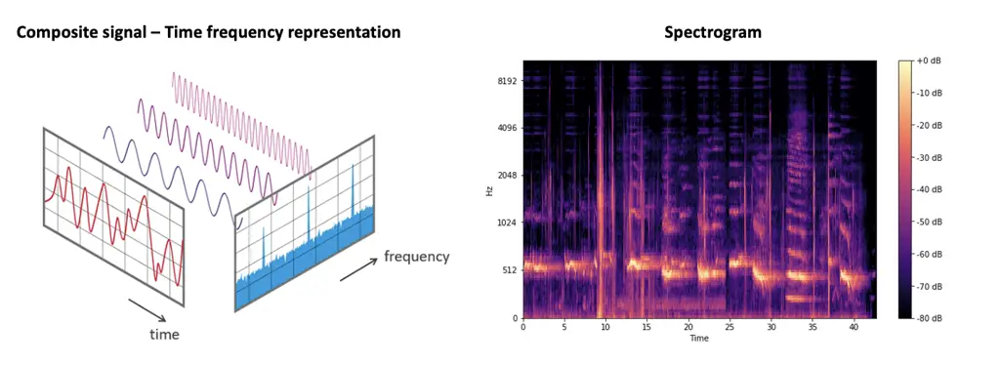

Figure 15: Time-frequency representation of a composite signal and a
spectrogram representation showing time on the x-axis, frequency on the
y-axis, and color intensity indicating signal amplitude.

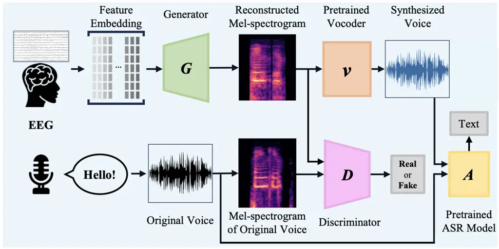

Figure 16: Overall framework for EEG to speech synthesis (Park et al.,
2024): $`G`$ denotes the generator, which maps EEG embeddings to
mel-spectrograms; $`D`$ is the discriminator that compares real and
generated mel-spectrograms; $`V`$ is a pre-trained vocoder that converts
mel-spectrograms into audio waveforms; and $`A`$ is a pre-trained ASR
model for speech-to-text conversion.

Signal-based data, contains both frequency and time-domain components,
is illustrated in Figure 15. Instead of a single frequency, the actual
signal is a composite waveform formed by the superposition of multiple
frequencies. In the context of EEG, band-pass filtering is applied to
separate specific frequency bands from the raw composite EEG data. When
applying deep learning techniques, instead of using raw signal data
directly, it is often transformed into an image representation. These
image representations are typically mel-spectrograms. Of the surveyed
studies in the domain of EEG-to-Audio/Speech generation, most studies
use mel-spectrogram as the intermediate input.

A spectrogram, shown in Figure 15, is a visual representation of a
signal with time on the x-axis and frequency on the y-axis, providing a
snapshot of how the frequency content of a composite waveform evolves
over time. It uses color intensity to indicate the amplitude or power of
each frequency component. Spectrograms are created using Fourier
Transform, which decompose the signal into its constituent frequencies
and displays the amplitude of each frequency present in the signal. In
the case of audio signals, a mel-spectrogram is used, which applies the
mel scale (a nonlinear, logarithmic frequency scale based on human
auditory perception) on the y-axis and represents amplitude in decibels
through color. Mel-spectrograms more closely reflect human perception of
audio and music. For EEG-to-audio generation, to maintain representation
consistency between modalities, several studies used mel-spectrograms
for both EEG and audio data.

Deep learning models such as Convolutional Neural Networks (CNNs),
Recurrent Neural Networks (RNNs), and hybrid architectures like CNN-GRU
can be employed to generate spectrograms. In the EEG-to-audio generation
domain, these models are trained to construct spectrograms from EEG
signals by minimizing the loss between EEG-generated and audio-generated
spectrograms, as shown in Figure 16. Neural vocoders such as the
High-Fidelity Generative Adversarial Network (HiFi-GAN) (Kong et al., 2020) are then used to reconstruct audio waveforms using the learned
spectrogram representations. HiFi-GAN, in addition to being a GAN-based
architecture, employs two types of discriminators: multi-scale
discriminators, which analyze the generated audio at different scales or
resolutions, and multi-period discriminators, which learn diverse
implicit structures by examining different parts of the input. This
combination allows HiFi-GAN to capture both the overall speech structure
and fine-grained details, thereby producing longer, high-fidelity audio
outputs.

An overview of composite signals, mel-spectrogram representations, and
the model architectures discussed in this and previous sections for
image and text generation provides a strong foundation for the upcoming
sections, where we examine how these models have been integrated into
various architectures for EEG-to-audio/speech generation tasks.

### 6.4 Use Cases and Addressed Concerns

For EEG-based audio/speech generation, reported use cases include speech
synthesis (Krishna et al., 2021; Lee et al., 2023a),music decoding and
reconstruction (Ramirez-Aristizabal and Kello, 2022; Postolache et al.,
2024), emotive music generation (Jiang et al., 2024), voice
reconstruction (Lee et al., 2023b), talking-face generation Park et al.
(2024), and speech recovery (Mizuno et al., 2024). While many of these
studies focus on decoding auditory information during listening tasks in
speech or music perception (Krishna et al., 2021; Ramirez-Aristizabal
and Kello, 2022; Park et al., 2024; Mizuno et al., 2024; Postolache et
al., 2024; Jiang et al., 2024; Lee et al., 2024; Lee et al., 2025),
others explore speaking tasks and imagined speech (Krishna et al., 2021;
Lee et al., 2023b; Lee et al., 2023a; Xiong et al., 2025; Park et al.,
2025).

For more naturalistic communication, Lee et al. (2023b) convert EEG
signals recorded during imagined speech into the user’s own voice,
enabling personalized speech synthesis. Similarly, Park et al. (2024)
generate speech from EEG while simultaneously producing a synchronized
talking face with accurate lip movements.

For speech decoding from listened speech, Lee et al. (2024) propose an
end-to-end framework that directly reconstructs natural speech waveforms
from non-invasive EEG recorded while subjects listen to
closed-vocabulary sentences. In a related work, the same authors Lee et
al. (2025) extend this framework with a BiLSTM based phoneme predictor
that outputs decoded phoneme sequences in the text modality, enabling
listened speech to be reconstructed in both modalities: speech waveforms
and textual phoneme sequences.

These studies address key challenges, including the generation of
fragmented or abstract outputs (Park et al., 2024), the difficulty of
synthesizing complete and continuous speech from EEG (Mizuno et al.,
2024), the limitation of music reconstruction to relatively simple
compositions with limited timbres (Postolache et al., 2024), the absence
of temporally aligned acoustic targets in imagined speech Park et al.
(2025), the lack of standardized vocabularies for aligning EEG with
audio data (Jiang et al., 2024), the reliance on intermediate acoustic
feature mappings such as mel-spectrograms (Lee et al., 2024) and
maintaining the integrity of signals in both the EEG and audio domains
by preventing information loss introduced through transitional signals
(Ma et al., 2025).

| EEG-to-Audio/Speech Generation Evaluation Metrics |            |                                                                                                                                 |                                                                                                                       |
| ------------------------------------------------- | ---------- | ------------------------------------------------------------------------------------------------------------------------------- | --------------------------------------------------------------------------------------------------------------------- |
| Category                                          | Metric     | Description / Usage in Studies                                                                                                  | References                                                                                                            |
| Signal-based                                      | RMSE       | Root Mean Square Error; measures the average reconstruction error between generated and reference signals.                      | Krishna et al. (2021); Park et al. (2024); Park et al. (2025)                                                         |
|                                                   | PCC        | Pearson Correlation Coefficient; measures the linear correlation between reconstructed and reference signals.                   | Park et al. (2025); Ma et al. (2025)                                                                                  |
| Spectral / acoustic                               | MCD        | Mel Cepstral Distortion; quantifies spectral distortion between generated and reference speech.                                 | Krishna et al. (2021); Park et al. (2024); Lee et al. (2024); Lee et al. (2025); Park et al. (2025); Ma et al. (2025) |
|                                                   | SSIM       | Structural Similarity Index; assesses perceptual similarity between generated and reference spectrograms.                       | Ramirez-Aristizabal and Kello (2022); Ma et al. (2025)                                                                |
|                                                   | PSNR       | Peak Signal-to-Noise Ratio; measures reconstruction fidelity of generated spectrograms.                                         | Ramirez-Aristizabal and Kello (2022)                                                                                  |
| Linguistic accuracy                               | WER        | Word Error Rate; percentage of word-level transcription errors, indicating intelligibility of reconstructed speech.             | Mizuno et al. (2024); Park et al. (2025)                                                                              |
|                                                   | CER        | Character Error Rate; measures character-level transcription accuracy.                                                          | Mizuno et al. (2024); Park et al. (2025)                                                                              |
|                                                   | BERTScore  | Embedding-based semantic similarity between reconstructed and reference transcripts.                                            | Mizuno et al. (2024)                                                                                                  |
| Perceptual quality                                | FAD        | Fréchet Audio Distance; measures perceptual similarity by comparing the feature distributions of generated and reference audio. | Postolache et al. (2024)                                                                                              |
|                                                   | MOS        | Mean Opinion Score; listener-based subjective evaluation of speech naturalness and quality.                                     | Lee et al. (2023b)                                                                                                    |
| Task-specific                                     | Hits@$`k`$ | Retrieval-based evaluation metric measuring whether the correct target appears within the top-$`k`$ retrieved results.          | Jiang et al. (2024)                                                                                                   |

Table 5: Evaluation metrics commonly used in EEG-to-audio and
EEG-to-speech generation studies.

### 6.5 Generative Architectures Used Across Studies

EEG-to-speech and EEG-to-audio generation builds on a range of modeling
and representation learning approaches. As we highlighted before, a
prominent strategy is to leverage the shared signal modality between EEG
and audio by mapping both into a common intermediate representation,
such as a mel-spectrogram.

We now outline the major state-of-the-art techniques for EEG-to-speech
generation, highlighting the underlying approaches of each method and
their relevance.

- 1.  Convolutional Neural Network (CNN)-based models have been widely
      employed to generate audio waveforms from EEG input (Krishna et al.,
      2021; Ramirez-Aristizabal and Kello, 2022). Krishna et al. (2021)
      propose a CNN architecture comprising temporal convolution layers, 1D
      convolutional layers, and a time-distributed layer to synthesize audio
      waveforms directly from EEG recorded during both speaking and
      listening tasks. Similarly, Ramirez-Aristizabal and Kello (2022) use
      sequential CNN regressors to reconstruct music stimuli by mapping EEG
      features to mel-spectrogram representations.
- 2.  Recurrent Neural Networks (RNNs)-based models, particularly GRUs and
      LSTMs, have been widely used for sequential EEG encoding in speech
      reconstruction tasks. In the NeuroTalk framework, Lee et al. (2023b)
      employ a GRU-based generator to reconstruct mel-spectrograms from
      imagined-speech EEG, which are subsequently converted into speech
      waveforms using the HiFi-GAN vocoder (Kong et al., 2020) and
      transcribed into text using HuBERT (Hsu et al., 2021) for evaluation.
      Park et al. (2024) further extend NeuroTalk by integrating
      synchronized talking-face generation using Wave2Lip (Prajwal et al.,
  2020) and Apple’s Avatar API to achieve realistic lip synchronization
        with the synthesized speech.
- 3.  GAN-based Architectures have also been employed for EEG-to-speech
      generation. Ma et al. (2025) proposed a DualGAN architecture with
      multi-scale optimization and cycle-consistency loss for end-to-end
      EEG-to-speech translation. The model incorporates a multi-scale
      feature extraction module based on InceptionV4 (Szegedy et al., 2017)
      to improve feature learning during signal downsampling. Furthermore,
      the cycle-consistency loss facilitates cross-modal translation between
      the EEG and audio domains while maintaining the integrity of signals
      in both domains. In addition, pretrained HiFi-GAN vocoders have been
      widely adopted in EEG-to-speech pipelines to convert generated
      mel-spectrograms into speech waveforms, serving as the final speech
      synthesis stage in models such as NeuroTalk and EEG-to-Voice (Lee et
      al., 2023b; Park et al., 2024; Park et al., 2025).
- 4.  Encoder-decoder based architectures. Park et al. (2025) employ a
      subject-specific encoder-decoder architecture for direct EEG-to-voice
      reconstruction. By leveraging local temporal context, the model
      generates mel-spectrograms from EEG without requiring explicit
      temporal alignment or dynamic time warping (DTW). The generated
      mel-spectrograms are subsequently converted into speech waveforms
      using a pretrained HiFi-GAN vocoder, transcribed using HuBERT, and
      further refined using an instruction-tuned language model to correct
      ASR errors while preserving semantic structure.
- 5.  Transformers and latent diffusion models have recently been adopted to
      capture long-range dependencies and improve audio reconstruction
      quality. Mizuno et al. (2024) employ transformer-based architectures
      for EEG-to-speech reconstruction, while Jiang et al. (2024) use a
      transformer encoder to generate emotive music from EEG signals. In the
      domain of naturalistic music decoding, Postolache et al. (2024)
      integrate EEG features with AudioLDM2 (Liu et al., 2024b), a
      pre-trained latent diffusion model, guided by a ControlNet adapter
      (Zhang et al., 2023) to achieve controllable and high-quality music
      generation.

### 6.6 EEG Feature Encoding and Representation

Feature encoding determines how neural signals are transformed into
intermediate acoustic representations or directly mapped into audio
features. Existing studies employ a variety of strategies, including the
extraction of articulatory and acoustic features, temporal feature
encoding, and the use of mel-spectrograms as shared representations.

Articulatory and acoustic features provide an interpretable bridge
between EEG signals and speech outputs. Krishna et al. (2021)
incorporate an attention model to predict articulatory features from EEG
activity and an attention-regression model to convert these into
acoustic features for waveform synthesis.

Temporal feature encoding has also been explored as a pathway to
represent EEG dynamics for speech and music generation. Jiang et al.
(2024) derive EEG tokens through a multi-step process that includes
DBSCAN clustering to extract temporal features, which are then augmented
with positional encoding to yield structured EEG tokens that can be used
in downstream decoding tasks.

Mel-spectrograms provide a shared latent space between EEG and audio
signals and thereby facilitating cross-modal translation.
Ramirez-Aristizabal and Kello (2022) employ a sequential CNN regressor
to map EEG signals directly to time-aligned music spectrograms and Xiong
et al. (2025) use a CNN-GRU based decoder to convert learned EEG latent
representation to mel-spectrograms. Similarly, Park et al. (2025)
propose a subject-specific generator comprising an EEG embedding layer,
an encoder, a local-context adapter, and a mel-spectrogram decoder that
reconstructs mel-spectrograms from preprocessed EEG signals.

In a related approach, Lee et al. (2023a) adapt spoken EEG into the
subspace of imagined EEG by applying Common Spatial Pattern (CSP)
filters trained on imagined speech, capturing temporal oscillatory
patterns and reducing distributional differences between spoken and
imagined EEG to enable user-specific voice synthesis. Similarly,
Postolache et al. (2024) apply CSP filtering while temporally aligning
EEG with speech, using triggers to mark onset intervals and segment
continuous brain signals into utterance-specific intervals.

### 6.7 Evaluation Metrics

Evaluation of EEG-to-speech generation relies on established speech and
audio metrics that assess similarity to reference signals,
intelligibility, perceptual quality, and subjective human judgments.
These can be broadly grouped into signal-based metrics, spectrogram
similarity metrics, linguistic accuracy metrics, perceptual quality
metrics, and subjective assessments. Table 5 lists the key evaluation
metrics with brief descriptions and exemplary studies that have used
them.

## 7 Cross-Modal Analysis of EEG-Based Generation

| Encoding Methodology             | EEG-to-Image                               | EEG-to-Text                          | EEG-to-Audio                      | Cross-Modal Interpretation                       |
| -------------------------------- | ------------------------------------------ | ------------------------------------ | --------------------------------- | ------------------------------------------------ |
| CNN-based spatial/local encoding | Common                                     | Common                               | Common                            | Broadly transferable                             |
| LSTM/GRU temporal encoding       | Common                                     | Common                               | Common                            | Broadly transferable                             |
| Hybrid spatial-temporal encoding | Common                                     | Common                               | Common                            | Shared architectural foundation                  |
| Transformer-based encoding       | Emerging                                   | Prominent                            | Emerging                          | Transferable, but unevenly adopted               |
| Attention mechanisms             | Channel, frequency, and semantic attention | Contextual and cross-modal attention | Temporal and contextual attention | Role varies by modality                          |
| Contrastive alignment            | Common                                     | Common                               | Limited                           | Strong image-text, audio-text transfer potential |
| Masked signal modeling           | Reported                                   | Reported                             | Not commonly reported             | Modality-independent potential                   |
| Graph-based encoding             | Prominent                                  | Rare                                 | Rare                              | Mostly image-oriented                            |
| Word- or marker-aligned features | –                                          | Prominent                            | –                                 | Text-specific                                    |
| Mel-spectrogram representation   | –                                          | –                                    | Prominent                         | Audio-specific                                   |

Table 6: Cross-modal comparison of EEG feature-encoding strategies used
in EEG-based media generation.

### 7.1 Cross-Modal EEG Feature Encoding: General Principles and Modality-Specific Adaptation

Across EEG-to-image, EEG-to-text, and EEG-to-audio generation, feature
encoding serves a common objective: transforming noisy, high-dimensional
EEG signals into compact representations that preserve information
relevant to the target output. Although the specific architectures vary,
the surveyed studies reveal several recurring principles, including
temporal modeling, spatial modeling, joint spatial-temporal encoding,
representation alignment, self-supervised learning, and subject-specific
adaptation.

Temporal and spatial modeling represents the most widely shared EEG
encoding principles across modalities. Since EEG signals contain both
temporal dependencies and spatial relationships across electrodes,
RNN-based, CNN-based, and hybrid architectures are commonly used across
EEG-to-image, EEG-to-text, and EEG-to-audio studies. LSTMs and GRUs have
been employed to capture temporal dynamics in image reconstruction
(Kavasidis et al., 2017; Singh et al., 2023; Singh et al., 2024), text
generation (Srivastava and Shinde, 2020; Amrani et al., 2024; Chen et
al., 2025a; Gedawy et al., 2025), and mel-spectrogram generation for
speech or audio reconstruction (Lee et al., 2023b; Xiong et al., 2025).
Similarly, CNN-based encoders have been used for spatial and local
feature extraction in image pipelines (Wakita et al., 2021; Mishra et
al., 2023; Zeng et al., 2023a), text pipelines (Biswal et al., 2019;
Srivastava and Shinde, 2020; Alharbi and Alotaibi, 2024), and audio
pipelines (Krishna et al., 2021; Ramirez-Aristizabal and Kello, 2022).
These studies indicate that hybrid spatial-temporal encoders provide one
of the most generalizable architectural foundations for cross-modal EEG
generation.

Transformer- and attention-based encoding represents another
transferable strategy, although its role varies across modalities. In
EEG-to-text generation, transformers are frequently used as contextual
EEG encoders because they can model long-range dependencies across
word-level and sentence-level EEG sequences (Wang and Ji, 2022; Feng et
al., 2023; Duan et al., 2023; Liu et al., 2024a). In EEG-to-image
pipelines, attention mechanisms are commonly used to emphasize
informative channels, frequency bands, or semantic features (Mishra et
al., 2023; Song et al., 2023; Li et al., 2024). Transformer- and
attention-based components are also increasingly used to refine EEG
representations and project them into pretrained visual-semantic or
generative spaces. In EEG-to-audio generation, transformer encoders have
been applied to capture long-range temporal dependencies and support
speech, audio, and music reconstruction (Mizuno et al., 2024; Jiang et
al., 2024). Transformer-based modeling is therefore applicable across
modalities, although its use as a direct contextual EEG encoder is most
established in EEG-to-text generation.

Cross-modal representation alignment is used to reduce the semantic gap
between EEG signals and the target modality. Contrastive objectives
align EEG embeddings with representations obtained from images,
captions, words, or pretrained multimodal models. In EEG-to-image
generation, contrastive learning has been used to align EEG with visual
or text-image embeddings and improve class discrimination (Singh et al.,
2023; Lan et al., 2023; Song et al., 2023; Mehmood et al., 2025; Rezvani
et al., 2025). In EEG-to-text generation, related objectives align
neural representations with word embeddings or pretrained language-model
spaces (Feng et al., 2023; Tao et al., 2024; Wang et al., 2024; Liu et
al., 2025). Comparable contrastive EEG–audio alignment is less common in
the surveyed audio literature, indicating that this strategy is
transferable but remains unevenly explored across modalities.

Masked signal modeling provides a potentially modality-independent
self-supervised strategy for EEG feature learning. Rather than relying
entirely on labeled EEG-stimulus pairs, masked modeling trains the
encoder to reconstruct missing signal segments or latent tokens. This
approach has been applied in EEG-to-image reconstruction through masked
autoencoding (Bai et al., 2023) and in EEG-to-text generation through
word-level and sentence-level masking objectives (Liu et al., 2024a; Tao
et al., 2024; Wang et al., 2024). Its also use represents an opportunity
for future cross-modal adaptation in EEG-to-audio generation.

Subject-specific and subject-adaptive encoding is also relevant across
modalities because EEG patterns vary substantially between individuals.
Subject-wise latent alignment has been introduced in image-generation
systems (Kneeland et al., 2026), subject-specific convolutional or
adaptation layers have been used in text decoding (Amrani et al., 2024;
Gedawy et al., 2025), and subject-specific generators or encoders have
been adopted for speech reconstruction (Park et al., 2025). These
approaches suggest that subject adaptation should be treated as a
general component of EEG representation learning rather than as a
modality-specific design choice.

Despite these shared principles, modality-specific preferences emerge
from the structure of the target representation. EEG-to-image generation
places greater emphasis on spatial organization, visual-category
discrimination, and alignment with visual-semantic spaces. Consequently,
graph-based models, attention mechanisms for identifying informative
channels, class-discriminative objectives, and projection into CLIP or
diffusion-conditioning spaces are particularly relevant (Khaleghi et
al., 2022; Song et al., 2023; Lan et al., 2023; Mehmood et al., 2025;
Cheng et al., 2025). EEG-to-text generation prioritizes sequential
organization, variable-length contextual information, and alignment with
linguistic representations. Word-level segmentation, hierarchical
recurrent models, transformer encoders, and projection into pretrained
language-model embedding spaces are therefore commonly employed (Wang
and Ji, 2022; Duan et al., 2023; Tao et al., 2024; Zhou et al., 2024;
Liu et al., 2025). Marker-free and sentence-level encoders have also
emerged as alternatives to eye-tracking-dependent word segmentation
(Duan et al., 2023; Liu et al., 2024a; Wang et al., 2024). EEG-to-audio
generation places greater emphasis on preserving fine-grained temporal
continuity and acoustic structure. Temporal convolutions, recurrent
encoders, CSP-based spatial filtering, articulatory features, and
mel-spectrogram reconstruction are therefore especially relevant
(Krishna et al., 2021; Ramirez-Aristizabal and Kello, 2022; Lee et al.,
2023a; Postolache et al., 2024; Park et al., 2025).

Overall, the surveyed literature suggests a general cross-modal
framework in which EEG signals are first transformed by a
spatial–temporal encoder and then adapted to the requirements of the
target modality. The resulting representations may be aligned with
visual, linguistic, or acoustic latent spaces before being passed to a
modality-specific generation module. Table 6 summarizes the shared
encoding strategies and modality-specific preferences identified across
the three modalities.

### 7.2 Cross-Modal Evaluation Methodologies

Table 7 presents a cross-modal comparison of the evaluation
methodologies used in EEG-based media generation studies. Although the
overall evaluation objectives are similar across modalities, the
specific metrics and experimental protocols differ substantially,
revealing opportunities for both unified benchmarking and methodological
transfer. The metrics are organized into common evaluation dimensions to
identify gaps within individual modalities and to examine whether
successful evaluation strategies can be adapted across EEG-to-image,
EEG-to-text, and EEG-to-audio generation.

A major gap across all three modalities is the lack of standardized
evaluation protocols. Issues such as subject leakage, inconsistent
data-splitting strategies, and inflated performance estimates are not
modality-specific and therefore require common evaluation guidelines.
Establishing modality-independent protocols for subject-wise splitting,
cross-subject validation, reporting standards, and baseline comparison
would improve the reliability and comparability of results across the
field.

As modern generative models increasingly rely on learned embedding
spaces, there is an opportunity to develop evaluation measures that
assess reconstruction and semantic fidelity in a modality-agnostic
manner. Evaluation approaches developed within one modality, such as
retrieval-based assessment, embedding-based similarity, or
human-centered perceptual evaluation, may also be adapted to address
corresponding gaps in other EEG-based generative tasks.

| Evaluation Dimension             | Image                                                                                    | Text                                                                                                                       | Audio/Speech                                  | Shared? | Cross-pollination Opportunity                                                                                                                                                  |
| -------------------------------- | ---------------------------------------------------------------------------------------- | -------------------------------------------------------------------------------------------------------------------------- | --------------------------------------------- | ------- | ------------------------------------------------------------------------------------------------------------------------------------------------------------------------------ |
| Semantic fidelity                | CLIP Score                                                                               | BERTScore, BLEURT                                                                                                          | BERTScore (transcripts)                       | Partial | Develop unified multimodal embedding-based semantic evaluation (e.g., CLIP/CLAP/BERTScore).                                                                                    |
| Perceptual quality               | FID, IS, LPIPS, Inception Score, Diversity Score, Feature Distance (AlexNet, SwAV based) | Human fluency and relevance judgments                                                                                      | FAD, MOS                                      | No      | Extend perceptual and human-centered evaluation protocols across all modalities.                                                                                               |
| Signal / Reconstruction fidelity | SSIM, PixCorr                                                                            | BLEU, ROUGE, METEOR, WER, TER                                                                                              | RMSE, PCC, MCD, SSIM (spectrograms), WER, CER | Partial | Investigate modality-independent reconstruction fidelity measures for continuous outputs.                                                                                      |
| Task-specific performance        | Top-$`k`$ Accuracy, Recall@$`k`$                                                         | -                                                                                                                          | Hits@$`k`$                                    | Partial | Standardize downstream and retrieval-based evaluation across modalities.                                                                                                       |
| Evaluation protocol              | Limited standardized protocols                                                           | Teacher-forced vs. autoregressive decoding, noise baselines, statistical significance testing (recommended best practices) | Limited standardized protocols                | No      | Adopt standardized evaluation protocols, including subject-independent testing, statistical significance analysis, and appropriate baseline comparisons across all modalities. |

Table 7: Cross-modal comparison of evaluation methodologies used in
EEG-based media generation.

## 8 Limitations and Future Work

This section outlines the major limitations observed across all
modalities and explores potential directions for advancing the field by
addressing these challenges and leveraging the gaps identified in
existing studies.

1.  1.  ML features vs. EEG-domain features. In existing studies, temporal
        and spatial EEG features are typically extracted using
        machine-learning architectures such as CNNs and autoregressive
        sequence models. However, these learned representations are rarely
        compared with traditional EEG-domain features, including time-domain
        waveform oscillations, Event-Related Potentials (ERPs), or
        phase-synchronization indices. However, direct quantitative
        comparisons between modern embedding-based representations and
        traditional EEG-domain features remain scarce, particularly in
        EEG-based generative decoding, as few studies evaluate these feature
        representations under identical experimental settings. Establishing
        a comparison between ML-derived features and neuroscience-informed
        EEG features, or integrating EEG-domain features to guide or augment
        the generative process, remains an open and promising direction for
        future research.
2.  2.  Embedding based features lack cognitive intuitiveness. Most current
        EEG-to-media models rely on embedding-based representations learned
        by deep networks, but these features are difficult to interpret and
        offer limited insight into the underlying cognitive processes. This
        lack of interpretability reduces our ability to connect model
        representations with established neuroscientific knowledge and
        hinders trust in the decoding pipeline. There is a need to integrate
        principles from cognitive psychology and neuroscience to design
        features that more directly reflect brain activity. Additionally,
        emerging ML interpretability techniques could be leveraged to map
        embedding-based representations onto cognitive processes and improve
        the transparency of generative models.
3.  3.  Algorithm Optimization. Although some studies explore multimodal
        fusion, this area remains largely underdeveloped. Advancing
        multimodal fusion strategies and designing EEG-specific deep
        learning frameworks could lead to more effective modeling of how the
        brain processes information across different modalities. Such
        optimized architectures may better capture the complementary
        relationships between EEG signals and visual, auditory, or
        linguistic stimuli, ultimately improving the quality and robustness
        of EEG-to-media generation.
4.  4.  Laboratory-grade versus affordable and portable EEG acquisition.
        Most EEG-based media-generation studies rely on carefully controlled
        acquisition conditions and research-grade EEG systems. Practical
        deployment, however, may require affordable, portable, and
        lower-density devices. This transition introduces two important
        challenges:
    - (a)
      Reduced spatial information: Moving from high-density laboratory
      systems with (128–256) channels to portable systems with
      substantially fewer electrodes, typically (8–32) channels, reduces
      the spatial coverage of scalp activity. Sparse electrode sampling
      limits the ability to distinguish localized and distributed neural
      responses, potentially reducing the information available for
      decoding.
    - (b)
      Reduced and more variable signal quality: Recordings collected
      outside controlled laboratory environments are more susceptible to
      muscle activity, eye movements, electrode-contact variability, and
      environmental interference. These artifacts can lower the
      signal-to-noise ratio (SNR) and make it more difficult to learn
      reliable mappings between EEG signals and visual, linguistic, or
      acoustic representations.

    Recent studies have explored several approaches to mitigate these
    hardware limitations. One direction is the use of generative AI for
    EEG spatial super-resolution. For example, Wang et al. (2025)
    proposed a spatio-temporal adaptive diffusion model that
    reconstructs high-resolution, 256-channel EEG from recordings
    containing 64 or fewer channels. The reconstructed signals improved
    downstream classification and source-localization performance,
    demonstrating the potential of generative super-resolution for EEG
    analysis. However, its effectiveness as a preprocessing stage for
    EEG-to-image, EEG-to-text, or EEG-to-audio generation has not yet
    been directly evaluated.

    A second direction is the development of streamlined generation
    pipelines for portable or low-density EEG. Guenther et al. (2024)
    demonstrated image classification and reconstruction from visually
    evoked activity recorded using a portable eight-channel EEG system.
    Similarly, Lopez et al. (2025) introduced a streamlined EEG-to-image
    framework that uses a ControlNet adapter to condition a latent
    diffusion model, reducing the need for extensive preprocessing and
    multiple auxiliary components.

    Large-scale data collection may also improve decoding from
    affordable hardware. The Alljoined-1.6M dataset contains more than
    1.6 million visual-stimulus trials from 20 participants, recorded
    using a 32-channel consumer-grade system costing approximately
    \$2,200 (Xu et al., 2025). The study demonstrates semantic category
    decoding, image retrieval, and EEG-to-image reconstruction despite
    the lower signal fidelity of the acquisition system. It also reports
    approximately log-linear improvements in decoding performance as the
    amount of training data increases, indicating that data scaling
    remains beneficial for consumer-grade EEG. However, these findings
    do not establish that dataset scale fully compensates for reduced
    channel coverage or lower signal quality. Further research is needed
    to evaluate these approaches under uncontrolled recording
    conditions, across devices and subjects, and in real-time EEG-based
    media-generation systems.

5.  5.  Cross-subject generalization and evaluation. Cross-subject
        generalization in EEG-based media generation remains largely
        understudied. Nevertheless, many of the challenges identified in EEG
        classification literature are equally applicable to generative
        models, making this body of work a valuable reference. Li et
        al. (2026) comprehensively review cross-subject EEG decoding methods
        for classification tasks, categorizing existing approaches into
        feature alignment, adversarial learning, feature disentanglement,
        contrastive learning, transfer learning, and related techniques.
        These methodologies provide promising directions for learning
        subject-invariant representations in EEG-based generative AI.

    Reliable assessment of such methods also requires appropriate
    evaluation protocols. Li et al. (2026) emphasize the importance of
    subject-independent evaluation, in which the participants included
    in the training and test sets are strictly disjoint. By contrast, in
    a subject-dependent evaluation setup, recordings from the same
    participant may appear in both sets, particularly when data are
    randomly split without accounting for subject identity. This overlap
    can introduce data leakage and produce overly optimistic performance
    estimates (Brookshire et al., 2024). Supporting this concern, Wang
    et al. (2026b) show that performance can decline substantially under
    subject-independent evaluation, with some benchmark datasets
    exhibiting absolute F1-score reductions exceeding 30 percentage
    points relative to subject-dependent evaluation. These findings
    highlight the need for participant-disjoint evaluation protocols to
    accurately assess whether EEG-based generative models can generalize
    to unseen subjects.

6.  6.  Inherent limitations of EEG. EEG suffers from a relatively low
        signal-to-noise ratio, which poses challenges for reliably capturing
        fine-grained neural information. Existing studies typically mitigate
        this limitation through preprocessing techniques such as filtering,
        artifact removal, and spatial filtering. However, the lack of
        standardized preprocessing pipelines makes it difficult to fairly
        compare models and assess the robustness of EEG-based generative
        systems. Recent work has shown promising progress in EEG media
        generation, and the combination of EEG with complementary
        modalities, such as functional near-infrared spectroscopy (fNIRS),
        could further improve signal quality and robustness. Moreover, EEG
        primarily captures cortical surface activity, with limited
        sensitivity to subcortical structures that play crucial roles in
        auditory, emotional, and temporal processing. Consequently,
        EEG-to-media generation models rely predominantly on cortical
        correlates and may fail to capture important subcortical neural
        activity, particularly for tasks such as speech reconstruction and
        auditory decoding. Integrating EEG with complementary modalities
        that better capture subcortical dynamics (e.g., fNIRS, MEG, or
        auditory brainstem responses) could provide richer neural
        representations and improve generation quality.
7.  7.  Lack of standardized benchmarks and cross-study comparison
        challenge. A major challenge is the absence of standardized
        paradigms for EEG-to-media research, including consistent protocols
        for data collection, data splitting, feature extraction, model
        development, and evaluation. Studies also differ substantially in
        the datasets, generative architectures, and evaluation metrics they
        use, making direct cross-study comparison difficult and obscuring
        how generation performance has evolved over time. Without
        standardized experimental settings, it is difficult to determine
        whether reported improvements are genuinely attributable to
        architectural advances or instead arise from differences in
        datasets, splits, preprocessing, or evaluation procedures. Similar
        concerns have been raised in recent benchmarking studies of EEG
        foundation models, where variations in pre-training objectives,
        fine-tuning strategies, downstream tasks, and evaluation protocols
        hinder fair comparison across models (Xiong et al., 2026).
        Establishing standardized baselines, such as shared datasets,
        reference frameworks, and evaluation metrics, would enable more
        reliable comparisons, improve reproducibility, and support
        systematic progress in future research.

## 9 Ethical Considerations and Emerging Regulation

EEG and other neural signals are widely studied for clinical
applications and brain–computer interfaces (BCIs), which enable users to
interact with external devices through brain activity. As neural
decoding becomes more advanced, concerns arise about what information
can be inferred from these signals and the resulting implications for
privacy, autonomy, and “mind reading.” Although most EEG studies remain
limited to controlled settings, they raise ethical issues that are also
relevant to other forms of neural data.

To address these ethical considerations, several frameworks have been
proposed to guide the responsible conduct of human research. One such
framework is the seven ethical requirements proposed by Emanuel et al.
(2000), which provide a strong foundation that can also be applied to
EEG-based studies. These requirements include social or scientific
value, scientific validity, fair subject selection, a favorable
risk-benefit ratio, independent review, informed consent, and respect
for the rights, interests, and well-being of participants. These
principles provide a useful foundation for EEG data-collection studies.
The seven ethical requirements proposed by Emanuel et al. (2000), which
provide a general foundation for EEG data-collection studies, are
summarized in Appendix Table 1.

Beyond these general requirements, EEG and other neural-signal research
raises additional ethical concerns. The following sections discuss the
key issues identified in the literature.

### 9.1 Subject Re-Identification Risks

Researchers have investigated raw EEG signals and derived features for
subject identification, authentication, and biometric recognition, with
several studies reporting high classification performance. Early studies
focused on specific tasks: Poulos et al. (1999) obtained classification
scores of 72% to 84% for EEG signals collected in a resting state with
eyes closed, while Paranjape et al. (2001) observed classification
accuracy ranging from 49% to 85% for EEG collected from 40 subjects with
eyes open. Brigham and Kumar (2010) achieved a higher accuracy of 98.96%
across 102 subjects using EEG collected during an imagined speech task.

More recent work has focused on methods that generalize subject
identification across multiple cognitive tasks. Kong et al. (2019)
proposed an EEG-based biometric identification method that extracts
phase synchronization (PS) features for subject identification across a
variety of tasks. The method achieved 97% classification accuracy on two
datasets in the beta and gamma bands, collected from 20 subjects
watching a video and 12 subjects driving, respectively. It also achieved
97% accuracy on a motor imagery BCI dataset across all frequency bands,
showing that phase synchronization of EEG signals has task-free
biometric properties. Other studies use multi-task methods that
integrate EEG features from multiple tasks (Ruiz-Blondet et al., 2016;
Ruiz-Blondet et al., 2017) to improve the reliability of biometric
systems.

However, subject identification from EEG signals is not without
limitations, as discussed by Chan et al. (2018). Classification and
identification systems often require extensive or complicated setups,
and performance can deteriorate over time, making identification harder
even a few days after initial data collection. Physiological changes
such as aging and psychological changes such as stress or shifting
mental states also affect brainwaves, which can reduce identification
accuracy in real-world or long-term settings. Together, these findings
suggest that although EEG poses a genuine re-identification risk,
particularly for datasets collected under controlled conditions,
maintaining reliable subject identification over extended periods and in
practical deployments still remains a significant challenge.

### 9.2 Mental Privacy and Cognitive Liberty

A major ethical concern is the compromise of mental privacy. EEG signals
are among the most sensitive forms of human data, as they encode neural
correlates of cognition, perception, emotion, and potentially intent.
The trajectory of EEG-based generative AI raises longer-term concerns
about non-consensual or coercive applications, including workplace
monitoring, lie detection, and surveillance. If neural data become
commoditized, they could be used by third parties to influence users’
behavior and, in more extreme cases, enable neurosurveillance with
broader societal and political implications.

When mental privacy is at risk, cognitive liberty is also threatened. As
noted by Rainey et al. (2020), brain activity collected to infer mental
contents can provide insight into a person’s thoughts, potentially
undermining an individual’s unique and privileged access to their own
thoughts and, consequently, their cognitive liberty. The authors also
express concern that technologies capable of decoding neural activity
may influence an individual’s thought processes and self-conception. If
mental data were to become accessible to third parties or collected and
analyzed beyond an individual’s control, individuals may no longer feel
free to think certain thoughts, even for the purpose of analysis, for
fear that those thoughts could be inferred, scrutinized, or exposed.

For EEG-based studies, these concerns emphasize the importance of
ensuring that participants are fully informed about how their neural
data will be collected, analyzed, stored, shared, and used. They also
highlight the need for regulatory safeguards governing the responsible
collection, management, and use of neural data to protect mental privacy
and cognitive liberty.

### 9.3 Informed Consent

Informed consent plays a central role in protecting research
participants. Its three pillars, disclosure, capacity, and
voluntariness, provide a useful framework for guiding the ethical
considerations that should be addressed before, during, and after EEG
experiments. Relevant information about the study should be disclosed to
a capable participant who voluntarily chooses to enroll.

As discussed by Hendriks et al. (2019), several factors should be
considered when obtaining informed consent from research participants -

Disclosure: Participants should be informed about the risks and benefits
of the study, the procedures involved, and any additional procedures
that are not part of standard EEG recording.

Capacity: Researchers should assess a participant’s capacity to provide
informed consent by evaluating their understanding, appreciation,
reasoning, and ability to communicate a choice regarding participation.
In some cases, participants may have the capacity to consent but be
unable to communicate their decision. In such situations, alternative
communication methods should be used to enable participants to provide
consent or assent.

Voluntariness: Researchers should ensure that participants understand
that participation is voluntary and should be sensitive to any potential
pressure that may influence their decision to participate.

These pillars provide a strong foundation for informed consent, but a
single framework may not be sufficient across different cultural and
social contexts. Botes et al. (2025) emphasize that the informed consent
process should be culturally attuned in addition to being ethically
sound to foster genuine understanding, trust, and voluntariness. The
authors recommend using consent materials that are accessible across
languages and adapted to local literacy levels. They also advocate
extending the consent process beyond the individual to include family or
kin when health-related decisions are made collectively within a
cultural context. These considerations can help ensure that informed
consent is both ethical and culturally appropriate across diverse
populations.

Other significant challenges to informed consent in neurological
research include cognitive and communication impairments, mistrust of
medical research, time constraints, literacy barriers, lack of available
social support, and practical or resource-related constraints (Sankary
et al., 2023). To address these challenges, the authors recommend
involving family members or close others in the consent process when
appropriate, training researchers to obtain informed consent
effectively, encouraging participants to review consent materials before
discussions, using written and visual aids to improve understanding, and
actively addressing misconceptions, mistrust, and external pressures
that may influence participants’ decision-making.

### 9.4 Emerging Regulations

As neurotechnology continues to advance across academia and industry,
establishing appropriate ethical and regulatory frameworks has become
increasingly important. Such frameworks can help ensure the responsible
development and deployment of neurotechnology while protecting
individuals from the misuse of neural data. In response, governments and
international organizations have introduced a range of legal, policy,
and governance initiatives to regulate the collection and use of neural
data. Some of the key developments are summarized below.

- 1.  Chile (2021): Chile became the first country to introduce
      constitutional protections related to neurorights by amending its
      Constitution to protect the physical and mental integrity of its
      citizens, including special protection for brain activity and the
      information derived from it (República de Chile, 2021).
- 2.  OECD Recommendation (2019): The OECD Recommendation provides the first
      international standard for the responsible innovation of
      neurotechnology. It outlines principles for promoting responsible
      innovation, safety, transparency, privacy, human rights, and the
      anticipation of unintended uses and misuse of neurotechnology
      (Organisation for Economic Co-operation and Development (OECD), 2019).
- 3.  UNESCO Recommendation (2025): UNESCO adopted the Recommendation on the
      Ethics of Neurotechnology (UNESCO, 2025). The Recommendation
      highlights the potential misuse of neural data for surveillance,
      targeted marketing, and political influence, as well as the risk of
      widening social inequalities through unequal access to
      neurotechnology. It calls on Member States to establish governance and
      regulatory frameworks that protect human rights, mental privacy,
      autonomy, freedom of thought, and mental integrity while ensuring the
      responsible development and deployment of neurotechnology.
- 4.  Colorado House Bill 24-1058 (2024): Colorado became the first U.S.
      state to explicitly protect neural data by amending the Colorado
      Privacy Act. The law classifies biological data, including neural
      data, as sensitive data, requires opt-in consent for its processing,
      and extends consumer rights, including access, correction, and
      deletion, to such data (Colorado General Assembly, 2024).
- 5.  California SB 1223 (2025): California enacted SB 1223, amending the
      CCPA/CPRA to explicitly classify neural data as sensitive personal
      information. The law defines neural data as information generated by
      measuring activity of the central or peripheral nervous system and
      extends existing CCPA protections, including consumers’ right to limit
      the use and disclosure of such data (Colorado General Assembly, 2024).
- 6.  Management of Individuals’ Neural Data (MIND) Act (United States,
      proposed, 2025): The proposed MIND Act directs the Federal Trade
      Commission to study the governance of neural and related data and
      develop recommendations for their collection, processing, use,
      transfer, and protection. It emphasizes informed consent,
      transparency, and safeguards against the misuse of neural data for
      behavioral inference, influence, and manipulation (United States
      Congress, 2025).

## 10 Conclusion

With rapid progress in machine learning, generative AI in particular,
EEG is emerging as a viable foundation for cross-modal generation,
including text, image, and speech synthesis directly from brain signals.
Despite persistent challenges such as low signal-to-noise ratio and
limited spatial resolution, this growing research area demonstrates a
meaningful shift toward more ambitious, non-invasive brain–computer
interface (BCI) capabilities.

In this survey, we reviewed the landscape of EEG-based generative AI
research across text, image, and audio domains, highlighting
representative use cases, datasets, generative frameworks, and open
challenges. We provided a comprehensive synthesis of methods employed in
EEG-driven generative tasks, summarizing major datasets and the core
model architectures adopted across the surveyed studies. To ground these
developments, we also included foundational background on generative
modeling and an overview of the neural basis through which EEG reflects
perceptual and cognitive activity elicited by different types of
stimuli. In addition, we identified key limitations of existing work,
including small and heterogeneous datasets, low signal fidelity, limited
cross-subject generalization, and the need for more interpretable and
neurally aligned generative frameworks.

Progress in this field will require the development of standardized
benchmarks with consistent data splits, preprocessing pipelines, and
evaluation metrics. Such standardization would improve reproducibility,
enable fairer comparisons, and help clarify which methodological
innovations genuinely advance performance. Ethical considerations,
including privacy, informed consent, and responsible use of neural data,
should remain central as research continues to evolve.

Overall, while EEG-driven generative AI remains an emerging and highly
experimental area, continued research, supported by better datasets,
unified evaluation practices, and deeper integration with
neuroscientific principles, is essential for advancing understanding and
expanding the scope of what non-invasive neural decoding can achieve.

## References

- Ahmadieh et al. (2024) H. Ahmadieh, F. Gassemi, and M. H. Moradi
  Visual image reconstruction based on eeg signals using a generative
  adversarial and deep fuzzy neural network. Biomedical Signal
  Processing and Control 87, pp. 105497. Cited by: item 2, §4.6, Table
  2, Table 2.
- Alharbi and Alotaibi (2024) Y. F. Alharbi and Y. A. Alotaibi Decoding
  imagined speech from eeg data: a hybrid deep learning approach to
  capturing spatial and temporal features. Life 14 (11), pp. 1501. Cited
  by: §5.6, §5.6, §7.1.
- Amrani et al. (2024) H. Amrani, D. Micucci, and P. Napoletano Deep
  representation learning for open vocabulary
  electroencephalography-to-text decoding. IEEE Journal of Biomedical
  and Health Informatics. Cited by: item 1, item 4, §5.4, §5.6, Table 3,
  Table 4, §7.1, §7.1.
- Bai et al. (2023) Y. Bai, X. Wang, Y. Cao, Y. Ge, C. Yuan, and Y. Shan
  Dreamdiffusion: generating high-quality images from brain eeg signals.
  arXiv preprint arXiv:2306.16934. Cited by: item 3, item 1, §4.4, Table
  2, Table 2, Table 2, Table 2, §7.1.
- Banerjee and Lavie (2005) S. Banerjee and A. Lavie METEOR: an
  automatic metric for mt evaluation with improved correlation with
  human judgments. In Proceedings of the acl workshop on intrinsic and
  extrinsic evaluation measures for machine translation and/or
  summarization, pp. 65–72. Cited by: Table 3.
- Barbera et al. (2026) T. Barbera, J. Burger, A. D’Amelio, S. Zini, S.
  Bianco, R. Lanzarotti, P. Napoletano, G. Boccignone, and J. L.
  Contreras-Vidal On using ai for eeg-based bci applications: problems,
  current challenges and future trends. International Journal of
  Human–Computer Interaction 42 (11), pp. 7791–7810. Cited by: §2.
- Bastiaansen et al. (2008) M. C. Bastiaansen, R. Oostenveld, O. Jensen,
  and P. Hagoort I see what you mean: theta power increases are involved
  in the retrieval of lexical semantic information. Brain and language
  106 (1), pp. 15–28. Cited by: §1, §1, §5.1.
- Bastiaansen et al. (2002) M. C. Bastiaansen, J. J. Van Berkum, and P.
  Hagoort Event-related theta power increases in the human eeg during
  online sentence processing. Neuroscience letters 323 (1), pp. 13–16.
  Cited by: §5.1.
- Bastiaansen and Hagoort (2006) M. Bastiaansen and P. Hagoort
  Oscillatory neuronal dynamics during language comprehension. Progress
  in brain research 159, pp. 179–196. Cited by: §5.1.
- Bengio et al. (2003) Y. Bengio, R. Ducharme, P. Vincent, and C. Jauvin
  A neural probabilistic language model. Journal of machine learning
  research 3 (Feb), pp. 1137–1155. Cited by: §5.3.
- Bhattasali et al. (2020) S. Bhattasali, J. Brennan, W. Luh, B.
  Franzluebbers, and J. Hale The alice datasets: fmri & eeg observations
  of natural language comprehension. In Proceedings of the Twelfth
  Language Resources and Evaluation Conference, pp. 120–125. Cited by:
  Table 1.
- Biswal et al. (2019) S. Biswal, C. Xiao, M. B. Westover, and J. Sun
  Eegtotext: learning to write medical reports from eeg recordings. In
  Machine Learning for Healthcare Conference, pp. 513–531. Cited by:
  §5.4, §5.6, Table 3, Table 3, §7.1.
- Botes et al. (2025) M. Botes, M. Labuschaigne, C. Casteleyn, B.
  Inkster, and M. Sheppard Decoding the brain, respecting the person: a
  neuroethical inquiry into consent and cognitive liberty in south
  africa. Neuroethics 18 (3), pp. 43. Cited by: §9.3.
- Bria et al. (2021) A. Bria, C. Marrocco, and F. Tortorella Sinc-based
  convolutional neural networks for eeg-bci-based motor imagery
  classification. In International Conference on Pattern Recognition,
  pp. 526–535. Cited by: §4.6.
- Brigham and Kumar (2010) K. Brigham and B. V. Kumar Subject
  identification from electroencephalogram (eeg) signals during imagined
  speech. In 2010 Fourth IEEE International Conference on Biometrics:
  Theory, Applications and Systems (BTAS), pp. 1–8. Cited by: §9.1.
- Broderick et al. (2019) M. P. Broderick, A. J. Anderson, and E. C.
  Lalor Semantic context enhances the early auditory encoding of natural
  speech. Journal of Neuroscience 39 (38), pp. 7564–7575. Cited by:
  Table 1.
- Brookshire et al. (2024) G. Brookshire, J. Kasper, N. M. Blauch, Y. C.
  Wu, R. Glatt, D. A. Merrill, S. Gerrol, K. J. Yoder, C. Quirk, and C.
  Lucero Data leakage in deep learning studies of translational eeg.
  Frontiers in neuroscience 18, pp. 1373515. Cited by: item 5.
- Cao (2020) Z. Cao A review of artificial intelligence for eeg-based
  brain- computer interfaces and applications. Brain Science Advances 6
  (3), pp. 162–170. Cited by: §2.
- Chan et al. (2018) H. Chan, P. Kuo, C. Cheng, and Y. Chen Challenges
  and future perspectives on electroencephalogram-based biometrics in
  person recognition. Frontiers in neuroinformatics 12, pp. 66. Cited
  by: §9.1.
- Chen et al. (2025a) Q. Chen, Y. Wang, F. Wang, D. Sun, and Q. Li
  Decoding text from electroencephalography signals: a novel
  hierarchical gated recurrent unit with masked residual attention
  mechanism. Engineering Applications of Artificial Intelligence 139,
  pp. 109615. Cited by: item 1, item 4, §5.4, §5.6, Table 3, Table 3,
  Table 3, §7.1.
- Chen et al. (2025b) T. Y. Chen, Y. Chen, P. Soederhaell, S. Agrawal,
  and K. Shapovalenko Decoding eeg speech perception with transformers
  and vae-based data augmentation. arXiv preprint arXiv:2501.04359.
  Cited by: §5.4, §5.4, §5.6.
- Cheng et al. (2025) W. Cheng, J. Tan, L. Wang, M. T. Herrero, and H.
  Zeng Fine-grained image generation with eeg multi-level semantics.
  Computer Methods and Programs in Biomedicine, pp. 108909. Cited by:
  item 6c, §4.4, §4.6, Table 2, Table 2, §7.1.
- Colorado General Assembly (2024) Colorado General Assembly HB24-1058:
  Protect Privacy of Biological Data. Note: Signed April 17, 2024
  External Links: [Link](https://leg.colorado.gov/bills/hb24-1058) Cited
  by: item 4, item 5.
- Demiralp et al. (2007) T. Demiralp, Z. Bayraktaroglu, D. Lenz, S.
  Junge, N. A. Busch, B. Maess, M. Ergen, and C. S. Herrmann Gamma
  amplitudes are coupled to theta phase in human eeg during visual
  perception. International journal of psychophysiology 64 (1),
  pp. 24–30. Cited by: §4.1.
- Di et al. (2018) G. Di, M. Fan, and Q. Lin An experimental study on
  eeg characteristics induced by intermittent pure tone stimuli at
  different frequencies. Applied Acoustics 141, pp. 46–53. Cited by:
  §6.1.
- Duan et al. (2023) Y. Duan, J. Zhou, Z. Wang, Y. Wang, and C. Lin
  Dewave: discrete eeg waves encoding for brain dynamics to text
  translation. arXiv preprint arXiv:2309.14030. Cited by: §5.4, §5.4,
  §5.6, Table 3, Table 4, §7.1, §7.1.
- Eldawlatly (2024) S. Eldawlatly On the role of generative artificial
  intelligence in the development of brain-computer interfaces. BMC
  Biomedical Engineering 6 (1), pp. 4. Cited by: §2.
- Emanuel et al. (2000) E. J. Emanuel, D. Wendler, and C. Grady What
  makes clinical research ethical?. Jama 283 (20), pp. 2701–2711. Cited
  by: Table 1, §9.
- Fahimi Hnazaee et al. (2018) M. Fahimi Hnazaee, E. Khachatryan,
  and M. M. Van Hulle Semantic features reveal different networks during
  word processing: an eeg source localization study. Frontiers in human
  neuroscience 12, pp. 503. Cited by: §5.1.
- Farahani et al. (2021) E. D. Farahani, J. Wouters, and A. van
  Wieringen Brain mapping of auditory steady-state responses: a broad
  view of cortical and subcortical sources. Human brain mapping 42 (3),
  pp. 780–796. Cited by: §6.1.
- Feng et al. (2023) X. Feng, X. Feng, B. Qin, and T. Liu Aligning
  semantic in brain and language: a curriculum contrastive method for
  electroencephalography-to-text generation. IEEE Transactions on Neural
  Systems and Rehabilitation Engineering. Cited by: item 2, §5.4, §5.4,
  §5.6, Table 3, Table 3, Table 3, Table 4, §7.1, §7.1.
- Gedawy et al. (2025) M. E. Gedawy, O. Nabil, O. Mamdouh, M.
  Nady, N. A. Adel, and A. Fares Bridging brain signals and language: a
  deep learning approach to eeg-to-text decoding. arXiv preprint
  arXiv:2502.17465. Cited by: item 4, §5.4, §5.6, Table 3, Table 3,
  Table 3, Table 3, §7.1, §7.1.
- Goodfellow et al. (2020) I. Goodfellow, J. Pouget-Abadie, M. Mirza, B.
  Xu, D. Warde-Farley, S. Ozair, A. Courville, and Y. Bengio Generative
  adversarial networks. Communications of the ACM 63 (11), pp. 139–144.
  Cited by: §1, §4.3.
- Grootswagers et al. (2022) T. Grootswagers, I. Zhou, A. K.
  Robinson, M. N. Hebart, and T. A. Carlson Human eeg recordings for
  1,854 concepts presented in rapid serial visual presentation streams.
  Scientific Data 9 (1), pp. 3. Cited by: Table 1.
- Guenther et al. (2024) S. Guenther, N. Kosmyna, and P. Maes Image
  classification and reconstruction from low-density eeg. Scientific
  Reports 14 (1), pp. 16436. Cited by: Table 1, item 3, §4.4, item 4.
- Haarmann et al. (2002) H. J. Haarmann, K. A. Cameron, and D. S.
  Ruchkin Neural synchronization mediates on-line sentence processing:
  eeg coherence evidence from filler-gap constructions. Psychophysiology
  39 (6), pp. 820–825. Cited by: §5.1.
- Habashi et al. (2023) A. G. Habashi, A. M. Azab, S. Eldawlatly,
  and G. M. Aly Generative adversarial networks in eeg analysis: an
  overview. Journal of neuroengineering and rehabilitation 20 (1),
  pp. 40. Cited by: §2.
- Hagoort et al. (2004) P. Hagoort, L. Hald, M. Bastiaansen, and K. M.
  Petersson Integration of word meaning and world knowledge in language
  comprehension. science 304 (5669), pp. 438–441. Cited by: §5.1.
- Hebart et al. (2019) M. N. Hebart, A. H. Dickter, A. Kidder, W. Y.
  Kwok, A. Corriveau, C. Van Wicklin, and C. I. Baker THINGS: a database
  of 1,854 object concepts and more than 26,000 naturalistic object
  images. PloS one 14 (10), pp. e0223792. Cited by: §4.4.
- Hendriks et al. (2019) S. Hendriks, C. Grady, K. M. Ramos, W.
  Chiong, J. J. Fins, P. Ford, S. Goering, H. T. Greely, K.
  Hutchison, M. L. Kelly, et al. Ethical challenges of risk, informed
  consent, and posttrial responsibilities in human research with neural
  devices: a review. JAMA neurology 76 (12), pp. 1506–1514. Cited by:
  §9.3.
- Herdman et al. (2002) A. T. Herdman, O. Lins, P. Van Roon, D. R.
  Stapells, M. Scherg, and T. W. Picton Intracerebral sources of human
  auditory steady-state responses. Brain topography 15 (2), pp. 69–86.
  Cited by: §6.1.
- Ho et al. (2020) J. Ho, A. Jain, and P. Abbeel Denoising diffusion
  probabilistic models. Advances in neural information processing
  systems 33, pp. 6840–6851. Cited by: §1, §4.3.
- Hollenstein et al. (2018) N. Hollenstein, J. Rotsztejn, M.
  Troendle, A. Pedroni, C. Zhang, and N. Langer ZuCo, a simultaneous eeg
  and eye-tracking resource for natural sentence reading. Scientific
  data 5 (1), pp. 1–13. Cited by: Table 1, Figure 10, §5.2.
- Hollenstein et al. (2019) N. Hollenstein, M. Troendle, C. Zhang,
  and N. Langer ZuCo 2.0: a dataset of physiological recordings during
  natural reading and annotation. arXiv preprint arXiv:1912.00903. Cited
  by: §A.2, Table 1.
- Hsu et al. (2021) W. Hsu, B. Bolte, Y. H. Tsai, K. Lakhotia, R.
  Salakhutdinov, and A. Mohamed Hubert: self-supervised speech
  representation learning by masked prediction of hidden units. IEEE/ACM
  transactions on audio, speech, and language processing 29,
  pp. 3451–3460. Cited by: item 2.
- Ikegawa et al. (2024) Y. Ikegawa, R. Fukuma, H. Sugano, S. Oshino, N.
  Tani, K. Tamura, Y. Iimura, H. Suzuki, S. Yamamoto, Y. Fujita, et al.
  Text and image generation from intracranial electroencephalography
  using an embedding space for text and images. Journal of Neural
  Engineering 21 (3), pp. 036019. Cited by: §5.4, §5.4.
- Jiang et al. (2024) H. Jiang, Y. Chen, D. Wu, and J. Yan EEG-driven
  automatic generation of emotive music based on transformer. Frontiers
  in Neurorobotics 18, pp. 1437737. Cited by: item 5, §6.4, §6.4, §6.6,
  Table 5, §7.1.
- Jiang et al. (2025) X. Jiang, C. Zhou, Y. Duan, Z. Zhao, T. Do, and C.
  Lin Neural spelling: a spell-based bci system for language neural
  decoding. arXiv preprint arXiv:2501.17489. Cited by: Table 1, item 1,
  §5.4, §5.4, Table 3, Table 3.
- Jo et al. (2024) H. Jo, Y. Yang, J. Han, Y. Duan, H. Xiong, and W. H.
  Lee Are eeg-to-text models working?. arXiv preprint arXiv:2405.06459.
  Cited by: §5.8.
- Jo et al. (2025) H. Jo, Y. Yang, J. Han, Y. Duan, H. Xiong, and W. H.
  Lee Evaluating eeg-to-text models through noise-based performance
  analysis. Scientific Reports. Cited by: §5.8.
- Kaneshiro et al. (2016) B. Kaneshiro, D. T. Nguyen, J. P.
  Dmochowski, A. M. Norcia, and J. Berger Naturalistic music eeg
  dataset—hindi (nmed-h). Stanford Digit. Repository. Note: Stanford
  Digital Repository Cited by: Table 1.
- Kaneshiro et al. (2015) B. Kaneshiro, M. Perreau Guimaraes, H.
  Kim, A. M. Norcia, and P. Suppes A representational similarity
  analysis of the dynamics of object processing using single-trial eeg
  classification. Plos one 10 (8), pp. e0135697. Cited by: Table 1.
- Kavasidis et al. (2017) I. Kavasidis, S. Palazzo, C. Spampinato, D.
  Giordano, and M. Shah Brain2image: converting brain signals into
  images. In Proceedings of the 25th ACM international conference on
  Multimedia, pp. 1809–1817. Cited by: §A.1, Figure 8, Figure 9, item 1,
  item 2, §4.4, §4.5, §4.6, §4.7, Table 2, §7.1.
- Khadir et al. (2023) A. Khadir, M. Maghareh, S. Sasani Ghamsari,
  and B. Beigzadeh Brain activity characteristics of rgb stimulus: an
  eeg study. Scientific Reports 13 (1), pp. 18988. Cited by: §1, §4.1.
- Khaleghi et al. (2022) N. Khaleghi, T. Y. Rezaii, S. Beheshti, S.
  Meshgini, S. Sheykhivand, and S. Danishvar Visual saliency and image
  reconstruction from eeg signals via an effective geometric deep
  network-based generative adversarial network. Electronics 11 (21),
  pp. 3637. Cited by: item 2, §4.4, §4.6, Table 2, §7.1.
- Kingma et al. (2019) D. P. Kingma M. Welling et al. An introduction to
  variational autoencoders. Foundations and Trends® in Machine Learning
  12 (4), pp. 307–392. Cited by: §4.3.
- Kneeland et al. (2026) R. Kneeland, W. Jiang, U. B. Nunes, P. S.
  Scotti, A. Delorme, and J. Xu ENIGMA: eeg-to-image in 15 minutes using
  less than 1% of the parameters. arXiv preprint arXiv:2602.10361. Cited
  by: item 6, §4.4, §7.1.
- Kong et al. (2020) J. Kong, J. Kim, and J. Bae Hifi-gan: generative
  adversarial networks for efficient and high fidelity speech synthesis.
  Advances in neural information processing systems 33, pp. 17022–17033.
  Cited by: item 2, §6.3.
- Kong et al. (2019) W. Kong, L. Wang, S. Xu, F. Babiloni, and H. Chen
  EEG fingerprints: phase synchronization of eeg signals as biomarker
  for subject identification. IEEE Access 7, pp. 121165–121173. Cited
  by: §9.1.
- Krause et al. (1996) C. M. Krause, A. H. Lang, M. Laine, M. Kuusisto,
  and B. Pörn Event-related. eeg desynchronization and synchronization
  during an auditory memory task. Electroencephalography and clinical
  neurophysiology 98 (4), pp. 319–326. Cited by: §1.
- Krause et al. (1997) C. M. Krause, B. Pörn, A. H. Lang, and M. Laine
  Relative alpha desynchronization and synchronization during speech
  perception. Cognitive brain research 5 (4), pp. 295–299. Cited by: §1,
  §6.1.
- Krishna et al. (2021) G. Krishna, C. Tran, M. Carnahan, and A. H.
  Tewfik Advancing speech synthesis using eeg. In 2021 10th
  International IEEE/EMBS Conference on Neural Engineering (NER),
  pp. 199–204. Cited by: item 1, §6.4, §6.6, Table 5, Table 5, §7.1,
  §7.1.
- Kumar et al. (2018) P. Kumar, R. Saini, P. P. Roy, P. K. Sahu,
  and D. P. Dogra Envisioned speech recognition using eeg sensors.
  Personal and Ubiquitous Computing 22, pp. 185–199. Cited by: Table 1.
- Lan et al. (2023) Y. Lan, K. Ren, Y. Wang, W. Zheng, D. Li, B. Lu,
  and L. Qiu Seeing through the brain: image reconstruction of visual
  perception from human brain signals. arXiv preprint arXiv:2308.02510.
  Cited by: item 3, item 4, item 6, item 2, §4.4, §4.4, Table 2, §7.1,
  §7.1.
- Lawhern et al. (2018) V. J. Lawhern, A. J. Solon, N. R.
  Waytowich, S. M. Gordon, C. P. Hung, and B. J. Lance EEGNet: a compact
  convolutional neural network for eeg-based brain–computer interfaces.
  Journal of neural engineering 15 (5), pp. 056013. Cited by: §4.6.
- Lee et al. (2025) J. Lee, T. Feng, A. Kommineni, S. R. Kadiri, and S.
  Narayanan Enhancing listened speech decoding from eeg via parallel
  phoneme sequence prediction. In ICASSP 2025-2025 IEEE International
  Conference on Acoustics, Speech and Signal Processing (ICASSP),
  pp. 1–5. Cited by: §6.4, §6.4, Table 5.
- Lee et al. (2024) J. Lee, A. Kommineni, T. Feng, K. Avramidis, X.
  Shi, S. Kadiri, and S. Narayanan Toward fully-end-to-end listened
  speech decoding from eeg signals. arXiv preprint arXiv:2406.08644.
  Cited by: §6.4, §6.4, §6.4, Table 5.
- Lee et al. (2023a) Y. Lee, S. Kim, S. Lee, J. Lee, S. Kim, and S. Lee
  Speech synthesis from brain signals based on generative model. In 2023
  11th International Winter Conference on Brain-Computer Interface
  (BCI), pp. 1–4. Cited by: §6.4, §6.6, §7.1.
- Lee et al. (2023b) Y. Lee, S. Lee, S. Kim, and S. Lee Towards voice
  reconstruction from eeg during imagined speech. In Proceedings of the
  AAAI Conference on Artificial Intelligence, Vol. 37, pp. 6030–6038.
  Cited by: §A.3, item 2, item 3, §6.4, §6.4, Table 5, §7.1.
- Li et al. (2020) D. Li, C. Du, and H. He Semi-supervised cross-modal
  image generation with generative adversarial networks. Pattern
  Recognition 100, pp. 107085. Cited by: §4.4, §4.6, Table 2.
- Li et al. (2024) D. Li, C. Wei, S. Li, J. Zou, H. Qin, and Q. Liu
  Visual decoding and reconstruction via eeg embeddings with guided
  diffusion. arXiv preprint arXiv:2403.07721. Cited by: item 2, item 5,
  §4.4, §4.4, §4.6, §7.1.
- Li et al. (2026) T. Li, Y. Yan, F. Dou, W. Song, and X. Zhang
  Cross-subject generalization for eeg decoding: a survey of deep
  learning methods. Progress in Biomedical Engineering 8 (2),
  pp. 022013. Cited by: item 5, item 5.
- Lin (2004) C. Lin Rouge: a package for automatic evaluation of
  summaries. In Text summarization branches out, pp. 74–81. Cited by:
  Table 3.
- Liu et al. (2024a) H. Liu, D. Hajialigol, B. Antony, A. Han, and X.
  Wang EEG2TEXT: open vocabulary eeg-to-text decoding with eeg
  pre-training and multi-view transformer. arXiv preprint
  arXiv:2405.02165. Cited by: item 1, item 3, §5.4, §5.4, §5.6, Table 3,
  Table 4, §7.1, §7.1, §7.1.
- Liu et al. (2024b) H. Liu, Y. Yuan, X. Liu, X. Mei, Q. Kong, Q.
  Tian, Y. Wang, W. Wang, Y. Wang, and M. D. Plumbley Audioldm 2:
  learning holistic audio generation with self-supervised pretraining.
  IEEE/ACM Transactions on Audio, Speech, and Language Processing. Cited
  by: item 5.
- Liu et al. (2025) X. Liu, D. Shen, and X. Liu Learning interpretable
  representations leads to semantically faithful eeg-to-text generation.
  arXiv preprint arXiv:2505.17099. Cited by: item 1, item 2, §5.4, §5.4,
  §5.6, Table 3, Table 3, Table 3, §7.1, §7.1.
- Lopez et al. (2025) E. Lopez, L. Sigillo, F. Colonnese, M. Panella,
  and D. Comminiello Guess what i think: streamlined eeg-to-image
  generation with latent diffusion models. In ICASSP 2025-2025 IEEE
  International Conference on Acoustics, Speech and Signal Processing
  (ICASSP), pp. 1–5. Cited by: item 3, §4.4, item 4.
- Losorelli et al. (2017) S. Losorelli, D. T. Nguyen, J. P. Dmochowski,
  and B. Kaneshiro NMED-t: a tempo-focused dataset of cortical and
  behavioral responses to naturalistic music.. In ISMIR, Vol. 3, pp. 5.
  Cited by: Table 1.
- Lu et al. (2025) J. T. Lu, J. Chiang, C. Chen, A. N. Tung, H. W. Hu,
  and Y. C. Cheng EEG2TEXT-cn: an exploratory study of open-vocabulary
  chinese text-eeg alignment via large language model and contrastive
  learning on chineseeeg. arXiv preprint arXiv:2506.00854. Cited by:
  Table 1, §5.4, §5.4, §5.6, Table 3, Table 3.
- Lutzenberger et al. (1995) W. Lutzenberger, F. Pulvermüller, T.
  Elbert, and N. Birbaumer Visual stimulation alters local 40-hz
  responses in humans: an eeg-study. Neuroscience letters 183 (1-2),
  pp. 39–42. Cited by: §1, §1, §4.1.
- Ma et al. (2025) C. Ma, Y. Zhang, Y. Guo, X. Liu, H. Shangguan, J.
  Wang, and L. Zhao Fully end-to-end eeg to speech translation using
  multi-scale optimized dual generative adversarial network with
  cycle-consistency loss. Neurocomputing 616, pp. 128916. Cited by:
  item 3, §6.4, Table 5, Table 5, Table 5.
- Marinković (2004) K. Marinković Spatiotemporal dynamics of word
  processing in the human cortex. The Neuroscientist 10 (2),
  pp. 142–152. Cited by: §1, §1, §5.1.
- Masry et al. (2025) M. Masry, M. Amen, M. Elzyat, M. Hamed, N. Magdy,
  and M. Khaled ETS: open vocabulary electroencephalography-to-text
  decoding and sentiment classification. arXiv preprint
  arXiv:2506.14783. Cited by: §5.4, §5.6, Table 3, Table 3, Table 3,
  Table 4.
- Mehmood et al. (2025) T. Mehmood, H. Ahmad, M. H. Shakeel, and M. Taj
  CATVis: context-aware thought visualization. In International
  Conference on Medical Image Computing and Computer-Assisted
  Intervention, pp. 98–108. Cited by: item 6a, item 2, §4.4, §7.1, §7.1.
- Mishra et al. (2024) A. Mishra, S. Shukla, J. Torres, J. Gwizdka,
  and S. Roychowdhury Thought2Text: text generation from eeg signal
  using large language models (llms). arXiv preprint arXiv:2410.07507.
  Cited by: item 1, §5.4, §5.4, Table 3, Table 3, Table 3, Table 3.
- Mishra et al. (2023) R. Mishra, K. Sharma, R. R. Jha, and A. Bhavsar
  NeuroGAN: image reconstruction from eeg signals via an attention-based
  gan. Neural Computing and Applications 35 (12), pp. 9181–9192. Cited
  by: item 2, item 5, item 6, §4.4, §4.4, §4.6, Table 2, §7.1, §7.1.
- Mizuno et al. (2024) T. Mizuno, T. Kishida, N. Yoshimura, and T.
  Nakashika An investigation on the speech recovery from eeg signals
  using transformer. In 2024 Asia Pacific Signal and Information
  Processing Association Annual Summit and Conference (APSIPA ASC),
  pp. 1–6. Cited by: Table 1, item 5, §6.4, §6.4, Table 5, Table 5,
  Table 5, §7.1.
- Nemrodov et al. (2018) D. Nemrodov, M. Niemeier, A. Patel, and A.
  Nestor The neural dynamics of facial identity processing: insights
  from eeg-based pattern analysis and image reconstruction. Cited by:
  §4.4.
- Odena et al. (2018) A. Odena, J. Buckman, C. Olsson, T. Brown, C.
  Olah, C. Raffel, and I. Goodfellow Is generator conditioning causally
  related to gan performance?. In International conference on machine
  learning, pp. 3849–3858. Cited by: §4.3.
- Organisation for Economic Co-operation and Development (OECD) (2019)
  Organisation for Economic Co-operation and Development (OECD)
  Recommendation of the council on responsible innovation in
  neurotechnology. OECD. Note: Adopted 11 December 2019 External Links:
  [Link](https://legalinstruments.oecd.org/en/instruments/OECD-LEGAL-0457)
  Cited by: item 2.
- Orima and Motoyoshi (2021) T. Orima and I. Motoyoshi Analysis and
  synthesis of natural texture perception from visual evoked potentials.
  Frontiers in Neuroscience 15, pp. 698940. Cited by: Table 1.
- Palazzo et al. (2020) S. Palazzo, C. Spampinato, I. Kavasidis, D.
  Giordano, J. Schmidt, and M. Shah Decoding brain representations by
  multimodal learning of neural activity and visual features. IEEE
  Transactions on Pattern Analysis and Machine Intelligence 43 (11),
  pp. 3833–3849. Cited by: §A.1, Figure 1, §4.6.
- Papineni et al. (2002) K. Papineni, S. Roukos, T. Ward, and W. Zhu
  Bleu: a method for automatic evaluation of machine translation. In
  Proceedings of the 40th annual meeting of the Association for
  Computational Linguistics, pp. 311–318. Cited by: Table 3.
- Paranjape et al. (2001) R. Paranjape, J. Mahovsky, L. Benedicenti,
  and Z. Koles The electroencephalogram as a biometric. In Canadian
  Conference on Electrical and Computer Engineering 2001. Conference
  Proceedings (Cat. No. 01TH8555), Vol. 2, pp. 1363–1366. Cited by:
  §9.1.
- Park et al. (2025) H. Park, Y. Cho, and H. Kim EEG-to-voice decoding
  of spoken and imagined speech using non-invasive eeg. arXiv preprint
  arXiv:2512.22146. Cited by: item 3, item 4, §6.4, §6.4, §6.6, Table 5,
  Table 5, Table 5, Table 5, Table 5, §7.1, §7.1.
- Park et al. (2024) J. Park, S. Lee, and S. Lee Towards eeg-based
  talking-face generation for brain signal-driven dynamic communication.
  In 2024 46th Annual International Conference of the IEEE Engineering
  in Medicine and Biology Society (EMBC), pp. 1–5. Cited by: Table 1,
  Figure 16, item 2, item 3, §6.4, §6.4, §6.4, Table 5, Table 5.
- Pfurtscheller et al. (1994) G. Pfurtscheller, C. Neuper, and W. Mohl
  Event-related desynchronization (erd) during visual processing.
  International journal of psychophysiology 16 (2-3), pp. 147–153. Cited
  by: §1, §1, §4.1.
- Postolache et al. (2024) E. Postolache, N. Polouliakh, H. Kitano, A.
  Connelly, E. Rodolà, L. Cosmo, and T. Akama Naturalistic music
  decoding from eeg data via latent diffusion models. arXiv preprint
  arXiv:2405.09062. Cited by: item 5, §6.4, §6.4, §6.6, Table 5, §7.1.
- Poulos et al. (1999) M. Poulos, M. Rangoussi, V. Chrissikopoulos,
  and A. Evangelou Person identification based on parametric processing
  of the eeg. In ICECS’99. Proceedings of ICECS’99. 6th IEEE
  international conference on electronics, circuits and systems (cat.
  No. 99EX357), Vol. 1, pp. 283–286. Cited by: §9.1.
- Prajwal et al. (2020) K. Prajwal, R. Mukhopadhyay, V. P. Namboodiri,
  and C. Jawahar A lip sync expert is all you need for speech to lip
  generation in the wild. In Proceedings of the 28th ACM international
  conference on multimedia, pp. 484–492. Cited by: item 2.
- Rainey et al. (2020) S. Rainey, S. Martin, A. Christen, P. Mégevand,
  and E. Fourneret Brain recording, mind-reading, and neurotechnology:
  ethical issues from consumer devices to brain-based speech decoding.
  Science and engineering ethics 26 (4), pp. 2295–2311. Cited by: §9.2.
- Ramirez-Aristizabal and Kello (2022) A. G. Ramirez-Aristizabal and C.
  Kello EEG2Mel: reconstructing sound from brain responses to music.
  arXiv preprint arXiv:2207.13845. Cited by: item 1, §6.4, §6.6, Table
  5, Table 5, §7.1, §7.1.
- Rathod et al. (2024) V. S. Rathod, A. Tiwari, and O. G. Kakde Folded
  ensemble deep learning based text generation on the brain signal.
  Multimedia Tools and Applications, pp. 1–29. Cited by: item 5, §5.4,
  §5.4, §5.6.
- República de Chile (2021) República de Chile Ley n.° 21.383: modifica
  la carta fundamental, para establecer el desarrollo científico y
  tecnológico al servicio de las personas. Biblioteca del Congreso
  Nacional de Chile. Note: Published October 25, 2021. Accessed July 6,
  2026 External Links:
  [Link](https://www.leychile.cl/navegar?idNorma=1166983) Cited by:
  item 1.
- Rezvani et al. (2025) A. Rezvani, A. Akbari, K. S. Arani, M.
  Mirian, E. Arasteh, and M. J. McKeown Interpretable eeg-to-image
  generation with semantic prompts. arXiv preprint arXiv:2507.07157.
  Cited by: item 6b, item 2, §4.4, Table 2, Table 2, §7.1.
- Ruiz-Blondet et al. (2016) M. V. Ruiz-Blondet, Z. Jin, and S. Laszlo
  CEREBRE: a novel method for very high accuracy event-related potential
  biometric identification. IEEE Transactions on Information Forensics
  and Security 11 (7), pp. 1618–1629. Cited by: §9.1.
- Ruiz-Blondet et al. (2017) M. V. Ruiz-Blondet, Z. Jin, and S. Laszlo
  Permanence of the cerebre brain biometric protocol. Pattern
  Recognition Letters 95, pp. 37–43. Cited by: §9.1.
- Sabharwal and Rama (2024) Y. Sabharwal and B. Rama Comprehensive
  review of eeg-to-output research: decoding neural signals into images,
  videos, and audio. arXiv preprint arXiv:2412.19999. Cited by: §2.
- Salimans et al. (2016) T. Salimans, I. Goodfellow, W. Zaremba, V.
  Cheung, A. Radford, and X. Chen Improved techniques for training gans.
  Advances in neural information processing systems 29. Cited by: Table 2.
- Sankary et al. (2023) L. R. Sankary, M. E. Zelinsky, P. J. Ford, E. C.
  Blackstone, and R. J. Fox Overcoming barriers to informed consent in
  neurological research: perspectives from a national survey. Research
  ethics 19 (1), pp. 42–61. Cited by: §9.3.
- Sellam et al. (2020) T. Sellam, D. Das, and A. P. Parikh BLEURT:
  learning robust metrics for text generation. arXiv preprint
  arXiv:2004.04696. Cited by: Table 3.
- Shimizu and Srinivasan (2022) H. Shimizu and R. Srinivasan Improving
  classification and reconstruction of imagined images from eeg signals.
  biorxiv. retrieved july 5, 2022. Cited by: item 3, §4.4, §4.6, Table
  2, Table 2, Table 2.
- Singh et al. (2024) P. Singh, D. Dalal, G. Vashishtha, K. Miyapuram,
  and S. Raman Learning robust deep visual representations from eeg
  brain recordings. In Proceedings of the IEEE/CVF Winter Conference on
  Applications of Computer Vision, pp. 7553–7562. Cited by: item 2,
  §4.4, §4.6, Table 2, Table 2, §7.1.
- Singh et al. (2023) P. Singh, P. Pandey, K. Miyapuram, and S. Raman
  EEG2IMAGE: image reconstruction from eeg brain signals. In ICASSP
  2023-2023 IEEE International Conference on Acoustics, Speech and
  Signal Processing (ICASSP), pp. 1–5. Cited by: Figure 7, item 2,
  item 4, §4.4, §4.6, Table 2, §7.1, §7.1.
- Song et al. (2023) Y. Song, B. Liu, X. Li, N. Shi, Y. Wang, and X. Gao
  Decoding natural images from eeg for object recognition. arXiv
  preprint arXiv:2308.13234. Cited by: item 4, item 5, §4.4, §4.4, §4.6,
  Table 2, §7.1, §7.1, §7.1.
- Spampinato et al. (2017) C. Spampinato, S. Palazzo, I. Kavasidis, D.
  Giordano, N. Souly, and M. Shah Deep learning human mind for automated
  visual classification. In Proceedings of the IEEE conference on
  computer vision and pattern recognition, pp. 6809–6817. Cited by:
  §A.1, Table 1, §4.2.
- Srivastava and Shinde (2020) A. Srivastava and T. Shinde Think2Type:
  thoughts to text using eeg waves. International Journal of Engineering
  Research & Technology (IJERT) 9 (06), pp. 2278–018. Cited by: §5.4,
  §5.6, §7.1.
- Sugimoto et al. (2024) Y. Sugimoto, G. Pongthanisorn, and G. Capi
  Image generation using eeg data: a contrastive learning based
  approach. In 2024 IEEE Canadian Conference on Electrical and Computer
  Engineering (CCECE), pp. 794–798. Cited by: item 4, §4.4, §4.6, Table 2.
- Szegedy et al. (2017) C. Szegedy, S. Ioffe, V. Vanhoucke, and A. Alemi
  Inception-v4, inception-resnet and the impact of residual connections
  on learning. In Proceedings of the AAAI conference on artificial
  intelligence, Vol. 31, pp. 4278–4284. Cited by: item 3.
- Tao et al. (2024) Y. Tao, Y. Liang, L. Wang, Y. Li, Q. Yang, and H.
  Zhang SEE: semantically aligned eeg-to-text translation. arXiv
  preprint arXiv:2409.16312. Cited by: item 1, item 2, item 3, §5.4,
  §5.4, §5.6, §7.1, §7.1, §7.1.
- Tirupattur et al. (2018) P. Tirupattur, Y. S. Rawat, C. Spampinato,
  and M. Shah Thoughtviz: visualizing human thoughts using generative
  adversarial network. In Proceedings of the 26th ACM international
  conference on Multimedia, pp. 950–958. Cited by: Table 1.
- Toffolo et al. (2022) K. K. Toffolo, E. G. Freedman, and J. J. Foxe
  Evoking the n400 event-related potential (erp) component using a
  publicly available novel set of sentences with semantically
  incongruent or congruent eggplants (endings). Neuroscience 501,
  pp. 143–158. Cited by: Table 1.
- UNESCO (2025) UNESCO Recommendation on the ethics of neurotechnology.
  United Nations Educational, Scientific and Cultural Organization.
  Note: Adopted 11 November 2025 External Links:
  [Link](https://www.unesco.org/en/legal-affairs/recommendation-ethics-neurotechnology)
  Cited by: item 3.
- United States Congress (2025) United States Congress S.2925:
  Management of Individuals’ Neural Data Act of 2025. Note: Introduced
  September 29, 2025 External Links:
  [Link](https://www.congress.gov/bill/119th-congress/senate-bill/2925)
  Cited by: item 6.
- Vaswani et al. (2017) A. Vaswani, N. Shazeer, N. Parmar, J.
  Uszkoreit, L. Jones, A. N. Gomez, Ł. Kaiser, and I. Polosukhin
  Attention is all you need. Advances in neural information processing
  systems 30. Cited by: §1.
- Wakita et al. (2021) S. Wakita, T. Orima, and I. Motoyoshi
  Photorealistic reconstruction of visual texture from eeg signals.
  Frontiers in Computational Neuroscience 15, pp. 754587. Cited by:
  item 1, §4.6, §7.1.
- Wang et al. (2024) J. Wang, Z. Song, Z. Ma, X. Qiu, M. Zhang, and Z.
  Zhang Enhancing eeg-to-text decoding through transferable
  representations from pre-trained contrastive eeg-text masked
  autoencoder. arXiv preprint arXiv:2402.17433. Cited by: item 1,
  item 2, §5.4, §5.6, Table 3, Table 4, §7.1, §7.1, §7.1.
- Wang et al. (2026a) S. Wang, Y. Guo, Y. Dong, Y. Shen, Z. Zhang, A. C.
  Cheung, J. Pu, S. Zhong, R. K. Tong, Y. Li, et al. Generative ai
  empowers brain-computer interfaces: a review-perspective on technical
  realities and future visions. IEEE Transactions on Consumer
  Electronics. Cited by: §2.
- Wang et al. (2025) S. Wang, T. Zhou, Y. Shen, Y. Li, G. Huang, and Y.
  Hu Generative ai enables eeg super-resolution via spatio-temporal
  adaptive diffusion learning. IEEE Transactions on Consumer Electronics
  71 (1), pp. 1034–1045. Cited by: item 4.
- Wang et al. (2026b) Y. Wang, T. Li, Y. Yan, W. Song, and X. Zhang What
  causes performance degradation in cross-subject eeg classification?.
  External Links: 2410.03057, [Link](https://arxiv.org/abs/2410.03057)
  Cited by: item 5.
- Wang and Ji (2022) Z. Wang and H. Ji Open vocabulary
  electroencephalography-to-text decoding and zero-shot sentiment
  classification. In Proceedings of the AAAI Conference on Artificial
  Intelligence, Vol. 36, pp. 5350–5358. Cited by: §A.2, Figure 13,
  Figure 14, item 1, §5.4, §5.5, §5.6, §5.7, Table 3, Table 3, Table 4,
  §7.1, §7.1.
- Weiss et al. (2005) S. Weiss, H. M. Mueller, B. Schack, J. W. King, M.
  Kutas, and P. Rappelsberger Increased neuronal communication
  accompanying sentence comprehension. International journal of
  psychophysiology 57 (2), pp. 129–141. Cited by: §1, §5.1.
- Weiss and Mueller (2003) S. Weiss and H. M. Mueller The contribution
  of eeg coherence to the investigation of language. Brain and language
  85 (2), pp. 325–343. Cited by: §5.1.
- Weiss and Mueller (2012) S. Weiss and H. M. Mueller “Too many betas do
  not spoil the broth”: the role of beta brain oscillations in language
  processing. Frontiers in psychology 3, pp. 201. Cited by: §5.1.
- Wolpaw and Boulay (2010) J. R. Wolpaw and C. B. Boulay Brain signals
  for brain–computer interfaces. In Brain-Computer Interfaces:
  Revolutionizing Human-Computer Interaction, pp. 29–46. Cited by: §1.
- Xiong et al. (2026) W. Xiong, J. Li, J. Li, K. Zhu, and C. Jiang
  EEG-fm-bench: a comprehensive benchmark for the systematic evaluation
  and diagnostic analyses of eeg foundation models. In Forty-third
  International Conference on Machine Learning, Cited by: item 7.
- Xiong et al. (2025) W. Xiong, L. Ma, and H. Li Synthesizing
  intelligible utterances from eeg of imagined speech. Frontiers in
  Neuroscience 19, pp. 1565848. Cited by: §6.4, §6.6, §7.1.
- Xu et al. (2024) J. Xu, B. Aristimunha, M. E. Feucht, E. Qian, C.
  Liu, T. Shahjahan, M. Spyra, S. Z. Zhang, N. Short, J. Kim, et al.
  Alljoined–a dataset for eeg-to-image decoding. arXiv preprint
  arXiv:2404.05553. Cited by: Table 1.
- Xu et al. (2025) J. Xu, U. B. Nunes, W. Jiang, S. Ryther, J.
  Pringle, P. S. Scotti, A. Delorme, and R. Kneeland Alljoined-1.6 m: a
  million-trial eeg-image dataset for evaluating affordable
  brain-computer interfaces. arXiv preprint arXiv:2508.18571. Cited by:
  Table 1, §4.4, item 4.
- Yang et al. (2023a) J. Yang, M. Awais, M. A. Hossain, L. Yee, M.
  Haowei, I. M. Mehedi, and A. Iskanderani Thoughts of brain eeg
  signal-to-text conversion using weighted feature fusion-based
  multiscale dilated adaptive densenet with attention mechanism.
  Biomedical Signal Processing and Control 86, pp. 105120. Cited by:
  §5.4, §5.6.
- Yang et al. (2023b) L. Yang, Z. Zhang, Y. Song, S. Hong, R. Xu, Y.
  Zhao, W. Zhang, B. Cui, and M. Yang Diffusion models: a comprehensive
  survey of methods and applications. ACM computing surveys 56 (4),
  pp. 1–39. Cited by: Figure 6.
- Zander et al. (2010) T. O. Zander, C. Kothe, S. Jatzev, and M.
  Gaertner Enhancing human-computer interaction with input from active
  and passive brain-computer interfaces. Brain-computer interfaces:
  Applying our minds to human-computer interaction, pp. 181–199. Cited
  by: §1.
- Zeng et al. (2023a) H. Zeng, N. Xia, D. Qian, M. Hattori, C. Wang,
  and W. Kong DM-re2i: a framework based on diffusion model for the
  reconstruction from eeg to image. Biomedical Signal Processing and
  Control 86, pp. 105125. Cited by: item 3, §4.4, §4.6, §7.1.
- Zeng et al. (2023b) H. Zeng, N. Xia, M. Tao, D. Pan, H. Zheng, C.
  Wang, F. Xu, W. Zakaria, and G. Dai DCAE: a dual conditional
  autoencoder framework for the reconstruction from eeg into image.
  Biomedical Signal Processing and Control 81, pp. 104440. Cited by:
  Table 1.
- Zhang et al. (2019a) H. Zhang, I. Goodfellow, D. Metaxas, and A. Odena
  Self-attention generative adversarial networks. In International
  conference on machine learning, pp. 7354–7363. Cited by: §4.3.
- Zhang et al. (2023) L. Zhang, A. Rao, and M. Agrawala Adding
  conditional control to text-to-image diffusion models. In Proceedings
  of the IEEE/CVF International Conference on Computer Vision,
  pp. 3836–3847. Cited by: item 5.
- Zhang et al. (2019b) T. Zhang, V. Kishore, F. Wu, K. Q. Weinberger,
  and Y. Artzi Bertscore: evaluating text generation with bert. arXiv
  preprint arXiv:1904.09675. Cited by: Table 3.
- Zhang et al. (2024) Z. Zhang, X. Ding, Y. Bao, Y. Zhao, X. Liang, B.
  Qin, and T. Liu Chisco: an eeg-based bci dataset for decoding of
  imagined speech. Scientific Data 11 (1), pp. 1265. Cited by: Table 1.
- Zhao and Rudzicz (2015) S. Zhao and F. Rudzicz Classifying
  phonological categories in imagined and articulated speech. In 2015
  IEEE international conference on acoustics, speech and signal
  processing (ICASSP), pp. 992–996. Cited by: §A.3, Table 1, §6.2.
- Zhou et al. (2024) J. Zhou, Y. Duan, F. Chang, T. Do, Y. Wang, and C.
  Lin Belt-2: bootstrapping eeg-to-language representation alignment for
  multi-task brain decoding. arXiv preprint arXiv:2409.00121. Cited by:
  §5.4, §5.6, Table 3, Table 3, Table 4, Table 4, §7.1.

## Appendix A Baseline Datasets and Implementations

In this section, we summarize key datasets, one for each modality,
previously described in the modality-specific subsections, together with
reference resources for recommended baseline architectures used to
generate images, text, and audio from EEG signals. Our aim is to provide
researchers with a clear starting point by presenting both widely used
open-source datasets and representative baseline models for each
modality.

### A.1 EEG-to-Image

Key resources: EEG-Based Visual Classification dataset Spampinato et al.
(2017); Palazzo et al. (2020) and EEG encoder framework for Brain2Image
Kavasidis et al. (2017).

Dataset:  
The EEG-Based Visual Classification dataset contains 128-channel EEG
recordings from 6 subjects while viewing images from the ImageNet
dataset. Stimuli comprised 40 object classes with 50 images per class,
for a total of 2,000 images. Dataset is publicly available at [this
link](https://tinyurl.com/eeg-visual-classification).

EEG encoder framework:  
An open-source repository of LSTM- and deep neural network (DNN)-based
EEG encoders, primarily developed for visual classification tasks from
EEG signals. Code implementation is available at [this
link](https://github.com/perceivelab/eeg_visual_classification).

### A.2 EEG-to-Text

Key resources: Zurich Cognitive Language Processing Corpus 2.0 (ZuCo
2.0) dataset Hollenstein et al. (2019); EEG-to-Text sequence-to-sequence
decoding framework leveraging pre-trained language models (e.g., BART)
Wang and Ji (2022).

Dataset:  
The ZuCo 2.0 dataset provides multimodal recordings of eye gaze and
128-channel EEG brain activity from 18 participants. Subjects read a
stimulus set of 739 English sentences, including 349 in a normal reading
paradigm and 390 in a task-specific paradigm. Dataset is publicly
available at [this link](https://osf.io/2urht/wiki/home/).

EEG-to-Text decoding framework:  
An open-source sequence-to-sequence framework for decoding EEG signals
into text, leveraging pre-trained language models such as BART. Code
implementation is available at [this
link](https://github.com/MikeWangWZHL/EEG-To-Text).

### A.3 EEG-to-Audio

Key resources: KARA One dataset Zhao and Rudzicz (2015); Voice
reconstruction framework from EEG during imagined speech using
mel-spectrograms as intermediate representations Lee et al. (2023b).

Dataset:  
The KARA One dataset provides multimodal recordings from 8 participants
across three modalities: 64-channel EEG, facial motion, and audio. Data
were collected during both imagined and vocalized phonemic and
single-word prompts. Dataset is publicly available at [this
link](https://www.cs.toronto.edu/~complingweb/data/karaOne/karaOne.html).

EEG-to-Speech synthesis framework:  
The EEG-to-speech synthesis framework leverages mel-spectrograms as an
intermediate representation. It comprises (i) a generator that maps EEG
embeddings to mel-spectrograms, (ii) a discriminator that evaluates real
versus generated spectrograms, and (iii) a vocoder that converts
mel-spectrograms into audio waveforms. Code implementation is available
at [this link](https://github.com/youngeun1209/NeuroTalk).

We further encourage future work to adopt these suggested baselines to
facilitate meaningful performance comparisons across architectures,
thereby enabling more systematic and reproducible progress in generative
modeling from EEG signals.

## Appendix B Ethical requirements of research trial

| Requirement                                 | Explanation                                                                                                                                                                                                                                                                             | Justifying Ethical Values                                                      | Expertise for Evaluation                                                                              |
| ------------------------------------------- | --------------------------------------------------------------------------------------------------------------------------------------------------------------------------------------------------------------------------------------------------------------------------------------- | ------------------------------------------------------------------------------ | ----------------------------------------------------------------------------------------------------- |
| Social or scientific value                  | Evaluation of a treatment, intervention, or theory that will improve health and well-being or increase knowledge                                                                                                                                                                        | Scarce resources and nonexploitation                                           | Scientific knowledge; citizens’ understanding of social priorities                                    |
| Scientific validity                         | Use of accepted scientific principles and methods, including statistical techniques, to produce reliable and valid data                                                                                                                                                                 | Scarce resources and nonexploitation                                           | Scientific and statistical knowledge; knowledge of the condition and population to assess feasibility |
| Fair subject selection                      | Selection of subjects so that stigmatized and vulnerable individuals are not targeted for risky research and the rich and socially powerful are not favored for potentially beneficial research                                                                                         | Justice                                                                        | Scientific knowledge; ethical and legal knowledge                                                     |
| Favorable risk–benefit ratio                | Minimization of risks; enhancement of potential benefits; risks to the subject are proportionate to the benefits to the subject and society                                                                                                                                             | Nonmaleficence, beneficence, and nonexploitation                               | Scientific knowledge; citizens’ understanding of social values                                        |
| Independent review                          | Review of the design of the research trial, its proposed subject population, and risk-benefit ratio by individuals unaffiliated with the research                                                                                                                                       | Public accountability; minimizing influence of potential conflicts of interest | Intellectual, financial, and otherwise independent researchers; scientific and ethical knowledge      |
| Informed consent                            | Provision of information to subjects about the purpose of the research, its procedures, potential risks, benefits, and alternatives, so that the individual understands this information and can make a voluntary decision whether to enroll and continue to participate                | Respect for subject autonomy                                                   | Scientific knowledge; ethical and legal knowledge                                                     |
| Respect for potential and enrolled subjects | Respect for subjects by: (1) permitting withdrawal from the research; (2) protecting privacy through confidentiality; (3) informing subjects of newly discovered risks or benefits; (4) informing subjects of results of clinical research; and (5) maintaining the welfare of subjects | Respect for subject autonomy and welfare                                       | Scientific knowledge; ethical and legal knowledge; knowledge of the particular subject population     |

Table 1: Seven requirements for determining whether a research trial is
ethical, adapted from Emanuel et al. (2000). The requirements are listed
chronologically from the conception of research through its formulation
and implementation.
