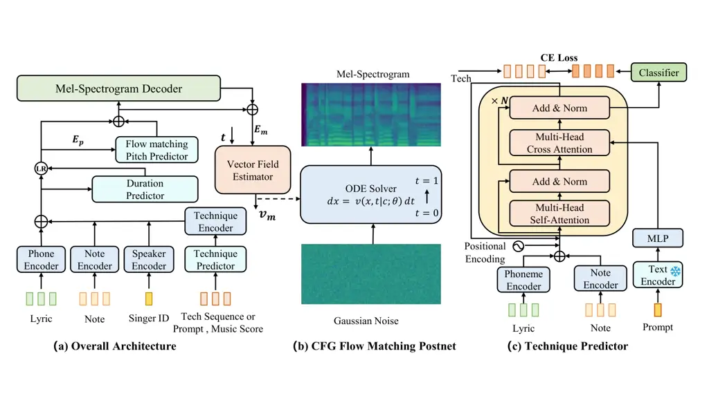
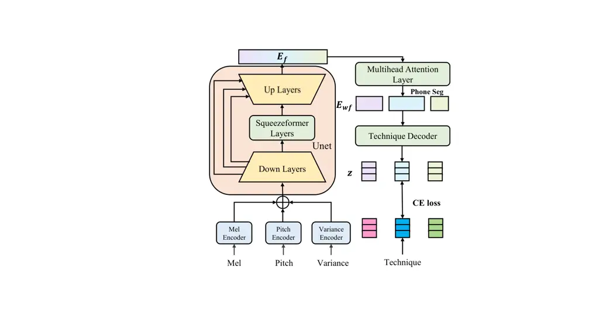
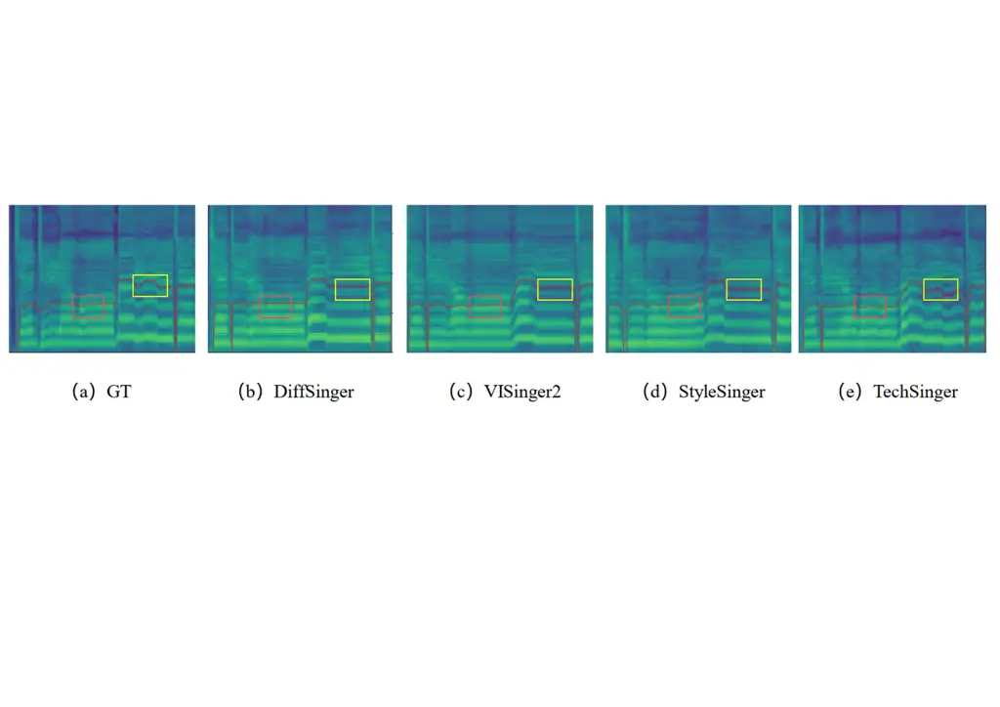
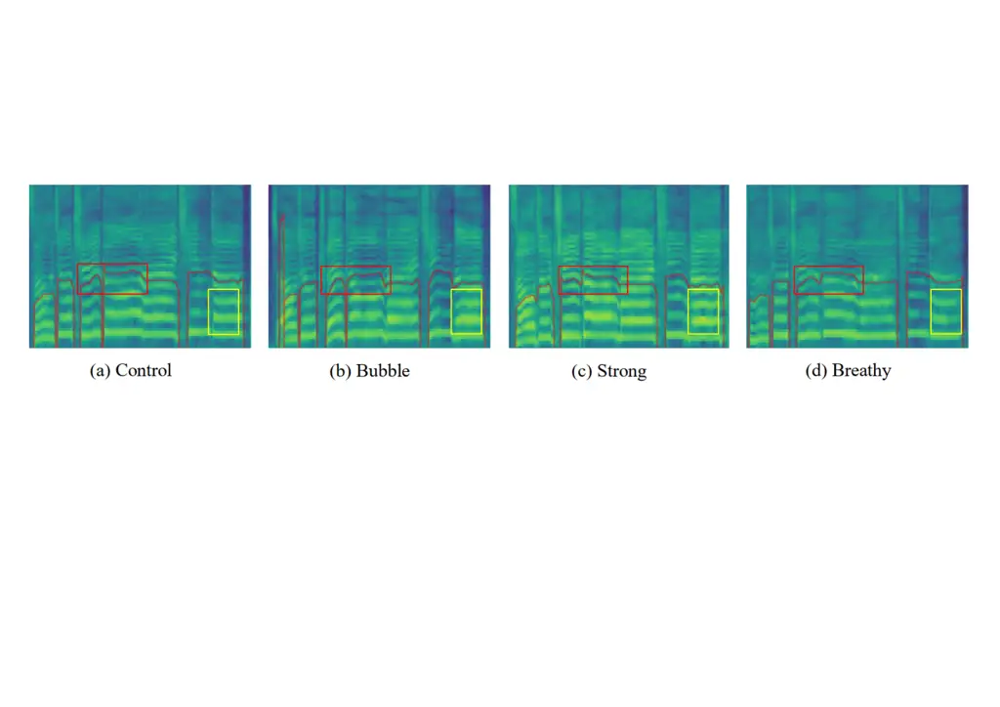
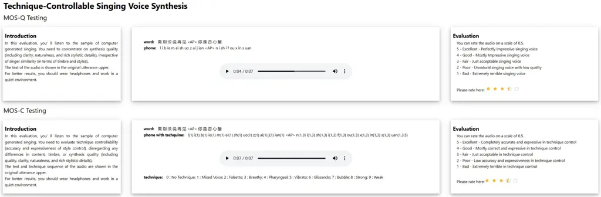
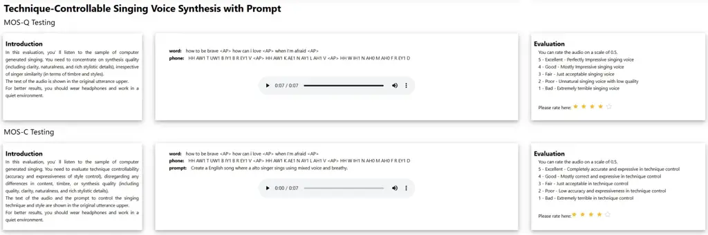
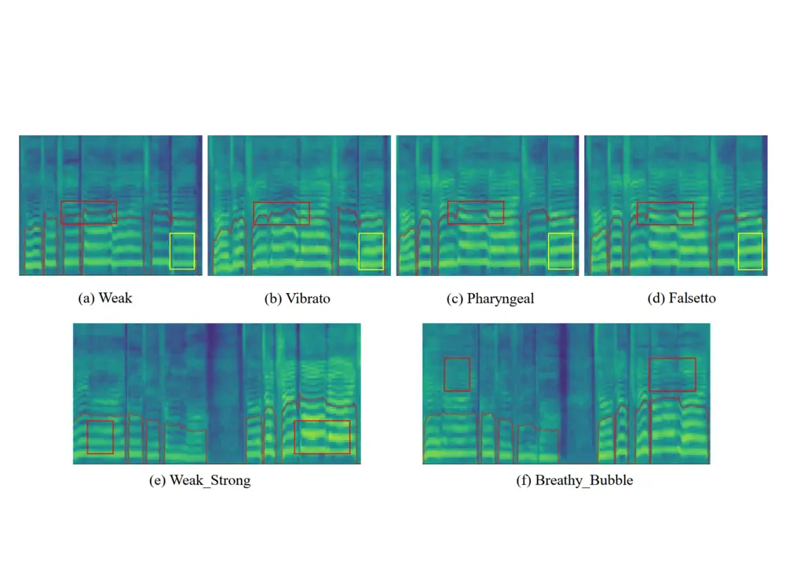

# TechSinger: Technique Controllable Multilingual Singing Voice Synthesis via Flow Matching

Wenxiang Guo    Yu Zhang    Changhao Pan    Rongjie Huang    Li Tang   
Ruiqi Li    Zhiqing Hong    Yongqi Wang    Zhou Zhao ^(†)^(†)thanks:
Corresponding author

###### Abstract

Singing voice synthesis has made remarkable progress in generating
natural and high-quality voices. However, existing methods rarely
provide precise control over vocal techniques such as intensity, mixed
voice, falsetto, bubble, and breathy tones, thus limiting the expressive
potential of synthetic voices. We introduce TechSinger, an advanced
system for controllable singing voice synthesis that supports five
languages and seven vocal techniques. TechSinger leverages a
flow-matching-based generative model to produce singing voices with
enhanced expressive control over various techniques. To enhance the
diversity of training data, we develop a technique detection model that
automatically annotates datasets with phoneme-level technique labels.
Additionally, our prompt-based technique prediction model enables users
to specify desired vocal attributes through natural language, offering
fine-grained control over the synthesized singing. Experimental results
demonstrate that TechSinger significantly enhances the expressiveness
and realism of synthetic singing voices, outperforming existing methods
in terms of audio quality and technique-specific control.

Zhejiang University

{guowx314,yuzhang34,panch,zhaozhou}@zju.edu.cn

Code — https://github.com/gwx314/TechSinger

Demo — https://gwx314.github.io/tech-singer/

## Introduction

Singing voice synthesis (SVS) aims to produce high-fidelity vocal
performances that capture the nuances of human singing, including pitch,
pronunciation, emotional expression, and vocal techniques. This field
has attracted considerable attention due to its potential to
revolutionize music creation and expand the boundaries of artistic
expression. In recent years, rapid advancements in deep learning and
generative models have driven substantial progress in singing voice
synthesis (Resna and Rajan 2023; Liu et al. 2022; Huang et al. 2022; Kim
et al. 2023; Hong et al. 2023).

As singing voice synthesis technology advances, real-world applications,
such as personalized virtual singers, content creation for multimedia
platforms, and music production tools, highlight the growing need for
controllable singing synthesis systems. However, challenges remain in
achieving fine-grained control over specific vocal techniques during
synthesis. Techniques like vibrato, breathy, and other stylistic nuances
require precise manipulation to elevate the artistic expressiveness of
synthesized singing voices. While recent algorithms have enabled
accurate reproduction of acoustic features like pitch and timbre (Kumar
et al. 2021), further advancements are needed to integrate detailed
control over vocal techniques. This capability is essential for meeting
the personalized and creative demands of modern music production,
offering artists and creators more expressive and versatile tools for
their work.

Although the task of technique-controllable singing voice synthesis
holds great promise to revolutionize how we create and interact with
vocal performances, it faces several significant challenges: 1) Most
existing SVS datasets, like M4Singer (Zhang et al. 2022a) and OpenCPOP
(Wang et al. 2022), focus on basic features such as pitch and emotion
but lack detailed annotations for singing techniques. Although Gtsinger
(Zhang et al. 2024c) provides a dataset with several technique
annotations, such datasets are still relatively rare. The absence of
annotations for techniques limits models’ ability to perform singing
techniques. 2) Achieving fine-grained control over various singing
techniques remains a core challenge. While many studies have advanced
expressive singing voice synthesis by controlling features like
intensity, vibrato, and breathy, they still face limitations in finely
controlling multiple complex vocal techniques. Precisely modeling and
reproducing various techniques while maintaining natural pitch and
timbre variation is a current research focus. 3) Utilizing the prompts
for more convenient and intuitive control of singing voice synthesis
based on fine-grained phoneme-level annotations is an innovative
research direction (Wang et al. 2024). The prompt mechanism allows users
to instruct the model on the desired singing style and techniques using
natural language, lowering the technical barrier and enhancing user
experience. However, designing effective prompt representations,
training models to understand and respond to these prompts, and
achieving flexible technique control while ensuring high-quality
generated singing voices require further research and practice.

To address these challenges, we employ various strategies. Firstly, we
tackle the scarcity of technique-annotated datasets by training a
technique detector to automatically annotate technique information in
open-source singing voice data. Secondly, we introduce the first
flow-matching-based singing voice synthesis, enabling fine-grained
control of multiple singing techniques and enhancing generated singing
voices’ realism and artistic expressiveness. To accurately model the
complex relationship between pitch variations and technique expressions,
we also use a flow-matching strategy to predict pitch. Lastly, we
leverage pre-trained language models GPT-4o to construct comprehensible
prompts and train a technique predictor, allowing users to easily
specify desired singing styles and techniques through natural language
input, thereby simplifying the operational process, enhancing user
experience, and further promoting the development of personalized and
customized music creation. TechSinger achieves the best results, with
subjective MOS 3.89 / 4.10 in terms of the quality and
technique-expressive of the singing voice generation.

In summary, this paper makes the following significant contributions to
the field of singing voice synthesis:

- •
  We introduce TechSinger, the first multi-lingual singing voice
  synthesis model via flow matching that achieves fine-grained control
  over multiple techniques.
- •
  To tackle the challenge of limited technique-annotated datasets, we
  develop an automatic technique detector for annotating singing
  techniques in open-source data.
- •
  We unveil the Flow Matching Pitch Predictor (FMPP) and the
  Classifier-Free Guidance Flow Matching Mel-Spectrogram Postnet
  (CFGFMP) to improve quality.
- •
  We leverage GPT-4o to create a prompt-based singing dataset and, based
  on this dataset, propose a technique predictor that allows for
  controlling singing techniques through natural language prompts.
- •
  Experiments show that our model excels in generating high-quality,
  technique-controlled singing voices.

## Related Works

### Singing Voice Synthesis

Singing Voice Synthesis (SVS) has advanced significantly with deep
learning, aiming to generate high-quality singing from musical scores
and lyrics. Early models like XiaoiceSing (Lu et al. 2020) and
DeepSinger (Ren et al. 2020b) utilize non-autoregressive and
feed-forward transformers to synthesize singing voice. VISinger (Zhang
et al. 2022b) employs the VITS (Kim, Kong, and Son 2021) architecture
for end-to-end SVS. GANs have also been used for high-fidelity voice
synthesis (Wu and Luan 2020; Huang et al. 2022), and DiffSinger (Liu
et al. 2022) introduces diffusion for improved mel-spectrogram
generation. Despite these advancements, precise control over singing
techniques remains a challenge, which is essential for enhancing
artistic expressiveness. Controllable SVS focuses on managing aspects
like timbre, emotion, style, and techniques. Existing works often target
specific controls, such as Muse-SVS (Kim et al. 2023) for pitch and
emotion, StyleSinger (Zhang et al. 2024a) and TCSinger (Zhang et al.
2024b) for style transfer, and models for vibrato control (Liu et al.
2021; Song et al. 2022; Ikemiya, Itoyama, and Okuno 2014). However, we
advance technique controllable SVS by enabling control over seven
techniques across five languages.

### Prompt-guided Voice Generation

In terms of voice generation, previous controls rely on texts, scores,
and feature labels. Prompt-based control is emerging as a simpler, more
intuitive alternative and has achieved great success in text, image, and
audio generation tasks (Brown et al. 2020; Ramesh et al. 2021; Kreuk
et al. 2022) In speech generation, PromptTTS (Guo et al. 2023) and
InstructTTS (Yang et al. 2023) use text descriptions to guide synthesis,
offering precise control over style and content. In singing voice
generation, Prompt-Singer (Wang et al. 2024) uses natural language
prompts to control attributes like the singer’s gender and volume but
lacks advanced technique control. This paper addresses this gap by
integrating multiple techniques into prompt-based control, allowing for
more sophisticated and expressive singing voice generation.

### Flow Matching Generative Models

Flow matching (Lipman et al. 2022) is an advanced generative modeling
technique that optimizes the mapping between noise distributions and
data samples by ensuring a smooth transport path, reducing sampling
complexity. It has significantly improved audio generation tasks.
Voicebox (Le et al. 2024) uses flow matching for high-quality
text-to-speech synthesis, noise removal, and content editing. Audiobox
(Vyas et al. 2023) leverages flow matching to enhance multi-modal audio
generation with better controllability and efficiency. Matcha-TTS (Mehta
et al. 2024) applies optimal-transport conditional flow matching for
high-quality, fast, and memory-efficient text-to-speech synthesis.
VoiceFlow (Guo et al. 2024) utilizes rectified flow matching to generate
superior mel-spectrograms with fewer steps. Inspired by these successes,
we use flow matching for controllable singing voice synthesis to boost
quality and efficiency.

## Preliminary: Rectified Flow Matching

Firstly, we introduce the preliminaries of the flow matching generative
model (Liu, Gong et al. 2022). When constructing a generative model, the
true data distribution is $`q(x_{1})`$ which we can sample, but whose
density function is inaccessible. Suppose there is a probability path
$`p_{t}(x_{t})`$, where $`x_{0}\sim p_{0}(x)`$ is a known simple
distribution (such as a standard Gaussian distribution), and
$`x_{1}\sim p_{1}(x)`$ approximates the realistic data distribution. The
goal of flow matching is to directly model this probability path, which
can be expressed in the form of an ordinary differential equation (ODE):

```math
\mathrm{d}x=u(x,t)\mathrm{d}t,t\in[0,1], \tag{1}
```

where $`u`$ represents the target vector field, and $`t`$ represents the
time position. If the vector field $`u`$ is known, we can obtain the
realistic data through reverse steps. We can regress the vector field
$`u`$ using a vector field estimator $`v(\cdot)`$ with the flow matching
objective:

```math
\mathcal{L}_{\mathrm{FM}}(\theta)=\mathbb{E}_{t,p_{t}(x)}\left\|v(x,t;\theta)-u(x,t)\right\|^{2}, \tag{2}
```

where $`p_{t}(x)`$ is the distribution of $`x`$ at timestep $`t`$. To
guide the regression by incorporating a condition $`c`$, we can use the
conditional flow matching objective (Lipman et al. 2022):

```math
\mathcal{L}_{\mathrm{CFM}}(\theta)=\mathbb{E}_{t,p_{1}(x_{1}),p_{t}(x|x_{1})}\left\|v(x,t|c;\theta)-u(x,t|x_{1},c)\right\|^{2}, \tag{3}
```

Flow matching proposes using a straight path to transform from noise to
data. We adopt the linear interpolation schedule between the data
$`x_{1}`$ and a Gaussian noise sample $`x_{0}`$ to get the sample
$`x_{t}=(1-t)x_{0}+tx_{1}`$. Therefore, the conditional vector field is
$`u(x,t|x_{1},c)=x_{1}-x_{0}`$, and the rectified flow matching (RFM)
loss used in gradient descent is:

```math
\left\|v(x,t|c;\theta)-(x_{1}-x_{0})\right\|^{2}, \tag{4}
```

If the vector field $`u`$ can be obtained, we can generate realistic
data by propagating sampled Gaussian noise through various ODE solvers
at discrete time steps. A common approach for the reverse flow is the
Euler ODE:

```math
x_{t+\epsilon}=x+\epsilon v(x,t|c;\theta). \tag{5}
```

where $`\epsilon`$ is the step size. In this work, we use the notes,
lyrics, and technique as condition $`c`$, while the data $`x_{1}`$ is
fundamental frequencies (F0) or mel-spectrograms.

## TechSinger

In this section, we outline the overall framework of TechSinger,
followed by detailed descriptions of its key components, including the
flow matching pitch predictor, classifier-free flow matching postnet,
technique detector, and technique predictor. We conclude with an
explanation of TechSinger’s two-stage training and inference process.

### Overview



Figure 1: The overall architecture of TechSinger. In Figure (a), the
technique predictor can predict technique sequences with natural
language prompts. The flow matching pitch predictor (FMPP) conditions on
the expanded input encoding $`E_{p}`$ to generate the F0 sequences. The
mel decoder generates the coarse mel-spectrogram. The vector field
estimator infers the vector field $`v_{m}`$. In Figure (b), $`v_{m}`$ is
used to flow the standard Gaussian noise into a fine mel-spectrogram via
an ODE solver. In Figure (c), the input of the technique predictor is
prompt, note, and lyrics. The text encoder is a pre-trained language
model.

The architecture of TechSinger is illustrated in Figure 1. Initially,
the phoneme encoder processes the lyrics while the note encoder captures
the musical rhythm by encoding note pitches, note durations, and note
types. Technique information is provided by encoding a sequence of
techniques, and for more precise control over the singing style, a
technique predictor is utilized, which generates corresponding technique
sequences from the natural language prompt. The technique embeddings,
along with the musical information, are then used to predict durations
and extend to produce frame-level intermediate features $`E_{p}`$. The
flow matching-based model employs $`E_{p}`$ as the condition to generate
fundamental frequencies (F0). Subsequently, the coarse mel decoder
predicts coarse mel-spectrograms. Finally, the flow matching-based
postnet refines these predictions to generate high-quality
mel-spectrograms. The process concludes with the use of HiFi-GAN
vocoder (Kong, Kim, and Bae 2020), which converts the mel-spectrograms
into audio signals.

### Flow Matching Pitch Predictor

Reconstructing fundamental frequencies (F0) using only L1 loss makes it
difficult to model the complex mapping between different techniques and
F0. To precisely model the pitch contour variations across different
techniques, we introduce the Flow Matching Pitch Predictor (FMPP). The
fundamental frequency (F0) can be regarded as one-dimensional continuous
data. The corresponding condition $`c`$ is the combination features
$`E_{p}`$ of the music score and technique sequence, and the sampled
$`x_{1}`$ is the F0 extracted by open-source tool RMVPE (Wei et al. 2023) as the target $`f0_{g}`$. Inspired by Lipman et al. (2022), we
perform linear interpolation between a F0 sample $`x_{1}=f0_{g}`$ and
Gaussian noise $`x_{0}`$ to create a conditional probability path
$`x_{t}=(1-t)x_{0}+tx_{1}`$. We then use the vector field estimator
$`v_{p}`$ to predict the vector field and train it using the
$`L_{pflow}`$ loss:

```math
\min_{\theta}\mathbb{E}_{t,p_{1}(x_{1}\mid c),p_{0}(x_{0})}\left\|v_{p}(x,t|c;\theta)-(x_{1}-x_{0})\right\|^{2} \tag{6}
```

### CFG Flow Matching Postnet

During the first stage, the mel-spectrogram decoder primarily leverages
simple losses (e.g., L1 or L2) to reconstruct the generated
mel-spectrograms. Following FastSpeech2 (Ren et al. 2020a), we combine
pitch and technique features as inputs and employ stacked FFT (Feed
Forward Transformer) blocks with L2 loss for generation training:

```math
L_{mel}=\left\|mel_{p}-mel_{g}\right\|^{2}, \tag{7}
```

However, the generator optimized under the assumption of an unimodal
distribution yields mel-spectrograms that lack naturalness and
diversity. To further enhance the quality and expressiveness of the
mel-spectrograms, we adopt the CFG flow matching mel postnet (CFGFMP).
In this work, we utilize the coarsely generated mel-spectrograms
$`mel_{p}`$ and the combined pitch and technique features $`E_{m}`$ as
conditioning information $`c`$ to guide the training and generation of
optimized mel-spectrograms $`mel_{g}`$. The $`L_{mflow}`$ loss is
analogous to the $`L_{pflow}`$ loss, as shown in equation 6.

For the reverse process, we randomly sample noise and use the Euler
solver to generate samples. To further control the quality of the
generated singing voice and its alignment with the intended technique,
we implement the classifier-free guidance (CFG) strategy. Specifically,
we introduce an unconditional label $`2`$ alongside the conditional
labels $`\{0,1\}`$. During the first two stages, we randomly drop the
technique labels for entire phrases or partial phonemes at a rate of
$`0.1`$. During sampling, we modify the vector field as follows:

```math
v_{\mathrm{CFG}}(x,t|c;\theta)=\gamma v_{m}(x,t|c;\theta)+(1-\gamma)v_{m}(x,t|\varnothing;\theta), \tag{8}
```

where $`\gamma`$ is the classifier free guidance scale. Additionally,
since the technique detector output contains errors, this random drop
approach ensures the generative model doesn’t blindly trust the labels,
to enhance the robustness of the model. For the pseudo-code of the
algorithm, please refer to Algorithm 1 and Algorithm 2 provided in
Appendix B.1.

### Technique Predictor

For controllable singing synthesis, such as timbre and emotion, many
approaches use deterministic labels or corresponding audio to control
the generation (Liu et al. 2022; Zhang et al. 2024a). We use natural
language as a more intuitive and convenient means to control singing
techniques.

However, open-source datasets don’t provide corresponding prompts for
each sample. Therefore, we devise a method to generate descriptions.
Unlike Prompt-Singer (Wang et al. 2024), which focuses on simple
controls like gender, vocal range, and volume, we need to control the
singing techniques. We incorporate the singer’s identity (e.g., Alto,
Tenor), singing techniques, and language into prompt statements to
annotate each sample. First, we collect the singer identity information
and the global technique labels from the dataset. Then, we use GPT-4o to
generate synonyms for each singer’s identity and singing technique. We
create over 60 prompt templates, each containing placeholders for the
song’s global technique label, language, and identity. We randomly
select these templates and fill in the corresponding synonyms of
techniques, identities, and languages to form prompt descriptions for
each item. We provide the prompt templates and keywords in the appendix
A.1.

As shown in Figure 1(c), our technique predictor comprises two
components: a frozen natural language encoder for extracting semantic
features and a technique decoder. For the natural language encoder, we
evaluate both BERT (Devlin et al. 2018) and FLAN-T5 (Chung et al. 2022)
encoders. For the technique decoder, we inject semantic conditions
through cross-attention transformers, allowing the model to integrate
linguistic cues more effectively. Finally, several classification heads
are added to perform multi-task, multi-label classification for
different techniques. Singing techniques are classified into three
categories: mixed-falsetto and intensity, and four binary categories:
breathy, bubble, vibrato, and pharyngeal. The glissando technique can be
identified from the music score by determining if a word corresponds to
multiple notes.The $`L_{\text{tech}}`$ classification loss is:

```math
\displaystyle L_{\text{CE}}^{(i)}=-\sum_{k=1}^{3}y_{k}^{(i)}\log(p_{k}^{(i)}) \tag{9}
```

```math
\displaystyle L_{\text{BCE}}^{(j)}=-\left[y^{(j)}\log(p^{(j)})+(1-y^{(j)})\log(1-p^{(j)})\right]
```

```math
\displaystyle L_{\text{tech}}=\sum_{i=1}^{2}L_{\text{CE}}^{(i)}+\sum_{j=1}^{4}L_{\text{BCE}}^{(j)} \tag{10}
```

where $`L_{\text{CE}}^{(i)}`$ represents the cross-entropy loss for the
$`i`$-th three-class technique group, and $`L_{\text{BCE}}^{(j)}`$
represents the binary cross entropy loss for the $`j`$-th binary
technique group.

### Technique Detector

Due to the scarcity of technique-labeled singing voice synthesis
datasets and the cost and complexity of annotating, we train a singing
technique detector to obtain phone-level technique labels. We can also
annotate the glissando technique sequence by the same rule as the
technique predictor.

As shown in Figure 2, we start by extracting features from the audio,
including the mel-spectrogram, fundamental frequency (F0), and other
variances features (e.g., energy, and breathiness). These features are
encoded and combined as the input feature. We then pass them through a
U-Net architecture to extract frame-level intermediate features. To
capture the high-level audio features, we utilize the Squeezeformer (Kim
et al. 2022) network, one of the most popular ASR models. Inspired by
ROSVOT (Li et al. 2024), rather than just using simple averaging or
median operations to obtain phoneme-level audio features, we employ a
weight prediction average approach. Suppose the frame-level output
features are $`E_{f}\in\mathbb{R}^{T\times C}`$, where $`T`$ is the
number of frames and $`C`$ is the number of channels. We predict weights
$`W_{f}=\sigma(E_{f}W_{\text{A}})`$ using a linear layer and the sigmoid
operation, where $`W_{\text{A}}\in\mathbb{R}^{C\times N}`$, $`N`$ is the
number of heads, and $`W_{f}\in\mathbb{R}^{T\times N}`$. We then apply
the weights to element-wise multiply $`E_{f}`$ to obtain weighted
features $`E_{wf}=E_{f}\odot W_{f}`$. Assume that phone $`i`$
corresponds to a sequence starting from frame $`j`$ with a length of
$`k`$. we perform a weighted average method across the frame-level
embeddings to obtain the final phoneme-level features $`E_{wp}`$:

```math
E_{wp}^{i}=\frac{\sum_{t=1}^{k}E_{wf}^{i+j+t}}{\sum_{t=1}^{k}W_{f}^{i+j+t}} \tag{11}
```

where $`E_{wp}\in\mathbb{R}^{L\times C\times N}`$, $`L`$ is the length
of phones. Next, we average different heads to get the final
phoneme-level features $`z\in\mathbb{R}^{L\times C}`$. Finally, we also
use cross-entropy (CE) loss $`L_{p}`$ to optimize the multi-task,
multi-label technique classification task like the technique predictor.



Figure 2: The architecture of the technique detector.

### Training and Inference Procedures

The training process of TechSinger comprises two stages. During the
first stage, we optimize the entire model, excluding the post-processing
flow-matching network, and use gradient descent to minimize the
$`L_{1}`$ loss:

```math
L_{1}=L_{pflow}+L_{mel}+L_{dur} \tag{12}
```

where $`L_{pflow}`$, $`L_{mel}`$, and $`L_{dur}`$ represent the F0 flow
matching, mel-spectrogram, and duration losses, respectively. During the
second stage, we freeze the components trained in the first phase and
optimize the classifier-free flow matching postnet ($`L_{mflow}`$) using
adding feature $`E_{m}`$ of the predicted fundamental frequency, coarse
mel-spectrogram, and technique encoding as the condition. During the
inference generation process, we can get the technique sequence based on
input or prompt statements, which are then combined with lyrics and
notes to generate a coarse mel-spectrogram. Subsequently, the
flow-matching network refines this coarse mel-spectrogram to produce the
final output.

## Experiments

### Experimental Setup

|                     |                    |                    |                    |                    |
| ------------------- | ------------------ | ------------------ | ------------------ | ------------------ |
| Method              | MOS-Q $`\uparrow`$ | MOS-C $`\uparrow`$ | FFE $`\downarrow`$ | MCD $`\downarrow`$ |
| Refernece           | 4.54 $`\pm`$ 0.05  | \-                 | \-                 | \-                 |
| Reference (vocoder) | 4.15 $`\pm`$ 0.06  | 4.30 $`\pm`$ 0.09  | 0.034              | 0.919              |
| DiffSinger          | 3.59 $`\pm`$ 0.07  | 3.84 $`\pm`$ 0.08  | 0.255              | 3.897              |
| VISinger2           | 3.52 $`\pm`$ 0.05  | 3.85 $`\pm`$ 0.11  | 0.296              | 3.944              |
| StyleSinger         | 3.69 $`\pm`$ 0.09  | 3.93 $`\pm`$ 0.08  | 0.328              | 3.981              |
| TechSinger (ours)   | 3.89 $`\pm`$ 0.07  | 4.10 $`\pm`$ 0.08  | 0.245              | 3.823              |

Table 1: Technique controllable singing voice synthesis performance
comparison with different systems. We employ MOS-Q and MOS-C for
subjective measurement and use FFE and MCD for objective measurement.



Figure 3: Visualization of the mel-spectrograms and pitch contour of the
ground-truth and results of different SVS systems.



Figure 4: Visualization of the mel-spectrogram results generated by
TechSinger under different techniques. The red box contains the
fundamental pitch, and the yellow box contains the details of harmonics.

#### Dataset and Process

Current singing synthesis datasets typically lack the diverse and
detailed technique labels necessary for training high-quality models. We
use the GTSinger dataset (Zhang et al. 2024c), focusing on its Chinese,
English, Spanish, German, and French subsets. Additionally, we collect
and annotate a 30-hour Chinese dataset with two singers and four
technique annotations (e.g., intensity, mixed-falsetto, breathy, bubble)
at the phone and sentence levels. Additionally, to further expand the
dataset, we use a trained technique predictor and glissando judgment
rule to annotate the M4Singer dataset at the phoneme level, which is
used under the CC BY-NC-SA 4.0 license. Finally, we randomly select 804
segments covering different singers and techniques as a test set. The
audio used for training has a sample rate of 48 kHz, with a window size
of 1024, a hop size of 256, and 80 mel bins for the extracted
mel-spectrograms. Chinese lyrics are phonemicized with pypinyin, English
lyrics follow the ARPA standard, while Spanish, German, and French
lyrics are phonemicized according to the Montreal Forced Aligner (MFA)
standard.

#### Implementation Details

In this experiment, the number of training steps for the F0 and Mel
vector field estimator is 100 steps. Their architectures are based on
non-causal WaveNet architecture (van den Oord et al. 2016). The number
of the technique detector Squeezeformer layers and the technique
predictor Transformer layers are both 2. In the first stage, training is
performed for 200k steps with an NVIDIA 2080 Ti GPU, and in the second
stage, for 120k steps. We train the technique detector and predictor for
120k and 80k steps. Further details are provided in the appendix B.2.

#### Evaluation Details

For technique-controllable SVS experiments, we use both subjective and
objective evaluation metrics. For objective evaluation, we use F0 Frame
Error (FFE) to assess the accuracy of F0 prediction and Mean Cepstral
Distortion (MCD) to measure the quality of the mel-spectrograms. For
subjective evaluation, we use MOS-Q to assess the quality and
naturalness of the audio and MOS-C to evaluate the expressiveness of the
technique control. We use objective metrics precision, recall, F1, and
accuracy to evaluate the technique predictor and the technique detector.
More details are provided in the appendix D.2.

#### Baseline Models

In this section, we compare our approach with state-of-the-art singing
voice synthesis models. However, due to the limitations of current
datasets, existing singing voice synthesis models are unable to control
the techniques of the generation singing audio. Therefore, we augment
these baseline systems with a phoneme-level technique embedding layer to
enable technique control. The baseline systems we compared are as
follows: 1) GT: The ground truth audio sample; 2) GT (vocoder): The
original audio is converted to mel-spectrograms and then synthesized
back to audio using the HiFi-GAN vocoder; 3) DiffSinger (Liu et al.
2022): A diffusion-based singing voice synthesis model; 4) VISinger2
(Zhang et al. 2022c): An end-to-end high-fidelity singing voice
synthesis model; 5) StyleSinger (Zhang et al. 2024a): A
style-controllable singing voice synthesis system; 6) TechSinger: The
foundational singing voice synthesis system proposed in this paper.

### Main Results

#### Singing Voice Synthesis

As shown in the Table 1, we can draw the following conclusions: (1) In
terms of objective metrics, our FFE and MCD values are the lowest, which
demonstrates that our TechSinger, through flow matching strategies, can
better model pitch and mel-spectrograms under different singing
techniques. (2) On the subjective metric MOS-Q, our TechSinger shows
higher quality than other baseline models, indicating that our model
generates audio with superior quality. Similarly, on the subjective
metric MOS-C, our model also outperforms other models, proving that our
generation model can faithfully generate corresponding singing voices
based on technique conditions. This can be observed from Figure 3, where
the F0 generated by our model exhibits more variation and details
compared to the relatively flat F0 of other models. Additionally, our
mel-spectrogram is closer to the ground truth mel-spectrograms,
showcasing rich details in frequency bins between adjacent harmonics and
high-frequency components. The above results demonstrate that our
controllable singing voice generation model surpasses other models in
terms of both quality and expressiveness in controlling technique
generation.

Furthermore, to examine the technique controllability of our model, we
present mel-spectrograms and F0 results for the same segments under
different technique conditions. As shown in Figure 4, Figure (a)
represents the control group without any technique, and Figure (b)
displays the result for the bubble, showing more pronounced changes in
F0 and mel-spectrograms with a stuttering effect, effectively reflecting
the ”cry-like” tone. Figure (c) shows the strong intensity, which
appears brighter compared to the control group, enhancing the resonance
and intensity of the singing. Figure (d) is the breathy tone result,
where harmonics are less distinct and there is more noise, due to the
vocal cords not fully closing as air passes through them, causing the
breathy sound. From the figures, it is evident that our generated
mel-spectrograms can accurately understand and generate features
corresponding to different techniques. More visualization results can be
found in the Appendix D.3

| Method             | MOS-Q $`\uparrow`$ | MOS-C $`\uparrow`$ |
| ------------------ | ------------------ | ------------------ |
| TechSinger(GT)     | 3.89 $`\pm`$ 0.07  | 4.10 $`\pm`$ 0.08  |
| TechSinger(Rand)   | 3.78 $`\pm`$ 0.05  | 3.76 $`\pm`$ 0.08  |
| TechSinger(Prompt) | 3.85 $`\pm`$ 0.05  | 4.04 $`\pm`$ 0.07  |

Table 2: The quality and relevance to the technique controllablity via
different controlling strategies.

#### Technique Predictor

| Method             | Precision | Recall | F1    | Acc   |
| ------------------ | --------- | ------ | ----- | ----- |
| bert-base-uncased  | 0.819     | 0.811  | 0.807 | 0.845 |
| bert-large-uncased | 0.809     | 0.789  | 0.786 | 0.827 |
| flan-t5-small      | 0.814     | 0.808  | 0.802 | 0.837 |
| flan-t5-base       | 0.828     | 0.826  | 0.817 | 0.851 |
| flan-t5-large      | 0.825     | 0.836  | 0.818 | 0.846 |

Table 3: Objective metrics for different text representations, including
precision, recall, F1-score, and accuracy.

We employ different text encoders to encode prompts, incorporating their
embeddings into the technique sequence prediction through a
cross-attention mechanism, with the results shown in Table 3. Overall,
the FLAN-T5 model’s performance tends to improve with the increasing
size of the encoder. The choice of encoder also has an impact, with
FLAN-T5 generally outperforming BERT. Based on these observations, we
select the FLAN-T5-Large model for the subsequent experiments. More
results can be found in the Appendix A.2

To validate the effectiveness of the technique predictor, we compare
several different methods of providing techniques for generating
results. Among them, TechSinger (GT) represents the results obtained
from the annotated technique sequences, TechSinger (Prompt) represents
the results predicted by our predictor based on prompts, and TechSinger
(Random) represents the results when no techniques are provided and the
model generates them automatically. From Table 2, we can see that the
mean opinion scores for quality (MOS-Q) and mean opinion scores for
controllability (MOS-C) indicate that the ”Prompt” strategy
significantly outperforms the ”Random” results and are very close to the
”GT” effect. This demonstrates that our singing voice synthesis model
can achieve controllable technique generation through the natural
language. Additionally, we can manually adjust the predicted sequences
to control the technique used in the generation of singing voices
further.

### Ablation Study

#### Technique Detector

| Setting  | Precision $`\uparrow`$ | Recall $`\uparrow`$ | F1 $`\uparrow`$ | Acc $`\uparrow`$ |
| -------- | ---------------------- | ------------------- | --------------- | ---------------- |
| whole    | 0.815                  | 0.761               | 0.770           | 0.833            |
| ConvUnet | 0.759                  | 0.726               | 0.742           | 0.783            |
| Average  | 0.807                  | 0.756               | 0.763           | 0.831            |

Table 4: Ablation experiments for the technique detector.

As shown in Table 4, we conduct ablation experiments on the methods used
in our technique detector to prove their effectiveness. We evaluate the
results using objective metrics—precision, recall, F1 score, and
accuracy—on six techniques other than glissando, which can be determined
by rule-based judgment. By comparing these, we find that the whole
technique detector achieves the highest scores across all metrics.
Specifically, we replace the Squeezeformer structure with convolution
and the multi-head weight prediction method with averaging, conducting
separate experiments for each. From the table, we can see that the full
skill detector outperforms in all metrics, with an F1 score improvement
of 0.5% over convolution and 2.8% over averaging, thus validating the
effectiveness of the Squeezeformer and the multi-head weight prediction.
For more detailed objective metric results of the individual techniques,
please refer to Appendix C.

#### Singing Voice Synthesis

| Setting     | CMOSQ $`\uparrow`$ | CMOSC $`\uparrow`$ | FFE $`\downarrow`$ |
| ----------- | ------------------ | ------------------ | ------------------ |
| TechSinger  | 0.00               | 0.00               | 0.2448             |
| w/o Pitch   | -0.25              | -0.23              | 0.2537             |
| w/o Postnet | -0.33              | -0.27              | 0.2680             |
| w/o CFG     | -0.10              | -0.18              | 0.2453             |

Table 5: Ablation experiments for technique controllable singing voice
synthesis with different settings.

As depicted in Table 5, in this experiment, we compare the results using
CMOSQ, CMOSC, and FFE. As shown in the first two rows of the table, when
we remove the flow-matching pitch predictor, both the F0 prediction
accuracy and the quality of the generated audio decline, making it
difficult to control the techniques effectively. Comparing the first and
third rows, we observe a noticeable decrease in the quality of the
synthesized singing when the postnet is omitted. By contrasting the
first and fourth rows, we demonstrate that the classifier-free guidance
strategy enhances the quality of the generated singing.

## Conclusion

In this paper, we introduce TechSinger, the first multi-lingual,
multi-technique controllable singing synthesis system built upon the
flow-matching framework. We train a technique detector to effectively
annotate and expand the dataset. To model the fundamental frequencies
with high precision, we develop a Flow Matching Pitch Predictor (FMPP),
which captures the nuances of diverse vocal techniques. Additionally, we
employ Classifier-free Guidance Flow Matching Mel Postnet (CFGFMP) to
refine the coarse mel-spectrograms into fine-grained representations,
leading to more technique-controllable and expressive singing voice
synthesis. Moreover, we train a prompt-based technique predictor to
enable more intuitive interaction for controlling the singing techniques
during synthesis. Extensive experiments demonstrate that our model can
generate high-quality, expressive, and technique-controllable singing
voices.

## Ethical Statement

TechSinger’s ability to synthesize singing voices with controllable
techniques raises concerns about potential unfair competition and the
possible displacement of professional singers in the music industry.
Furthermore, its application in the entertainment sector, including
short videos and other multimedia content, could lead to copyright
issues. To address these concerns, we will implement restrictions on our
code and models to prevent unauthorized use, ensuring that TechSinger is
deployed ethically and responsibly.

## Acknowledgments

This work was supported in part by the National Natural Science
Foundation of China under Grant No.62222211 and Grant No.U24A20326.

## References

- Brown et al. (2020) Brown, T.; Mann, B.; Ryder, N.; Subbiah, M.;
  Kaplan, J. D.; Dhariwal, P.; Neelakantan, A.; Shyam, P.; Sastry, G.;
  Askell, A.; et al. 2020. Language models are few-shot learners.
  _Advances in neural information processing systems_, 33: 1877–1901.
- Chung et al. (2022) Chung, H. W.; Hou, L.; Longpre, S.; Zoph, B.; Tay,
  Y.; Fedus, W.; Li, E.; Wang, X.; Dehghani, M.; Brahma, S.; Webson, A.;
  Gu, S. S.; Dai, Z.; Suzgun, M.; Chen, X.; Chowdhery, A.; Valter, D.;
  Narang, S.; Mishra, G.; Yu, A. W.; Zhao, V.; Huang, Y.; Dai, A. M.;
  Yu, H.; Petrov, S.; hsin Chi, E. H.; Dean, J.; Devlin, J.; Roberts,
  A.; Zhou, D.; Le, Q. V.; and Wei, J. 2022. Scaling
  Instruction-Finetuned Language Models. _ArXiv_, abs/2210.11416.
- Devlin et al. (2018) Devlin, J.; Chang, M.-W.; Lee, K.; and
  Toutanova, K. 2018. BERT: Pre-training of Deep Bidirectional
  Transformers for Language Understanding. _arXiv preprint
  arXiv:1810.04805_.
- Guo et al. (2024) Guo, Y.; Du, C.; Ma, Z.; Chen, X.; and Yu, K. 2024.
  VoiceFlow: Efficient Text-to-Speech with Rectified Flow Matching. In
  _ICASSP 2024-2024 IEEE International Conference on Acoustics, Speech
  and Signal Processing (ICASSP)_, 11121–11125. IEEE.
- Guo et al. (2023) Guo, Z.; Leng, Y.; Wu, Y.; Zhao, S.; and
  Tan, X. 2023. PromptTTS: Controllable text-to-speech with text
  descriptions. In _ICASSP 2023-2023 IEEE International Conference on
  Acoustics, Speech and Signal Processing (ICASSP)_, 1–5. IEEE.
- Hong et al. (2023) Hong, Z.; Cui, C.; Huang, R.; Zhang, L.; Liu, J.;
  He, J.; and Zhao, Z. 2023. Unisinger: Unified end-to-end singing voice
  synthesis with cross-modality information matching. In _Proceedings of
  the 31st ACM International Conference on Multimedia_, 7569–7579.
- Huang et al. (2022) Huang, R.; Cui, C.; Chen, F.; Ren, Y.; Liu, J.;
  Zhao, Z.; Huai, B.; and Wang, Z. 2022. Singgan: Generative adversarial
  network for high-fidelity singing voice generation. In _Proceedings of
  the 30th ACM International Conference on Multimedia_, 2525–2535.
- Ikemiya, Itoyama, and Okuno (2014) Ikemiya, Y.; Itoyama, K.; and
  Okuno, H. G. 2014. Transferring vocal expression of f0 contour using
  singing voice synthesizer. In _Modern Advances in Applied
  Intelligence: 27th International Conference on Industrial Engineering
  and Other Applications of Applied Intelligent Systems, IEA/AIE 2014,
  Kaohsiung, Taiwan, June 3-6, 2014, Proceedings, Part II 27_, 250–259.
  Springer.
- Kim, Kong, and Son (2021) Kim, J.; Kong, J.; and Son, J. 2021.
  Conditional variational autoencoder with adversarial learning for
  end-to-end text-to-speech. In _International Conference on Machine
  Learning_, 5530–5540. PMLR.
- Kim et al. (2022) Kim, S.; Gholami, A.; Shaw, A. E.; Lee, N.;
  Mangalam, K.; Malik, J.; Mahoney, M. W.; and Keutzer, K. 2022.
  Squeezeformer: An Efficient Transformer for Automatic Speech
  Recognition. _ArXiv_, abs/2206.00888.
- Kim et al. (2023) Kim, S.; Kim, Y.; Jun, J.; and Kim, I. 2023.
  MuSE-SVS: Multi-Singer Emotional Singing Voice Synthesizer that
  Controls Emotional Intensity. _IEEE/ACM Transactions on Audio, Speech,
  and Language Processing_.
- Kong, Kim, and Bae (2020) Kong, J.; Kim, J.; and Bae, J. 2020.
  Hifi-gan: Generative adversarial networks for efficient and high
  fidelity speech synthesis. _Advances in neural information processing
  systems_, 33: 17022–17033.
- Kreuk et al. (2022) Kreuk, F.; Synnaeve, G.; Polyak, A.; Singer, U.;
  Défossez, A.; Copet, J.; Parikh, D.; Taigman, Y.; and Adi, Y. 2022.
  Audiogen: Textually guided audio generation. _arXiv preprint
  arXiv:2209.15352_.
- Kumar et al. (2021) Kumar, N.; Goel, S.; Narang, A.; and
  Lall, B. 2021. Normalization Driven Zero-Shot Multi-Speaker Speech
  Synthesis. In _Interspeech_, 1354–1358.
- Le et al. (2024) Le, M.; Vyas, A.; Shi, B.; Karrer, B.; Sari, L.;
  Moritz, R.; Williamson, M.; Manohar, V.; Adi, Y.; Mahadeokar, J.;
  et al. 2024. Voicebox: Text-guided multilingual universal speech
  generation at scale. _Advances in neural information processing
  systems_, 36.
- Li et al. (2024) Li, R.; Zhang, Y.; Wang, Y.; Hong, Z.; Huang, R.; and
  Zhao, Z. 2024. Robust Singing Voice Transcription Serves Synthesis.
  arXiv:2405.09940.
- Lipman et al. (2022) Lipman, Y.; Chen, R. T.; Ben-Hamu, H.; Nickel,
  M.; and Le, M. 2022. Flow Matching for Generative Modeling. In _The
  Eleventh International Conference on Learning Representations_.
- Liu et al. (2022) Liu, J.; Li, C.; Ren, Y.; Chen, F.; and
  Zhao, Z. 2022. Diffsinger: Singing voice synthesis via shallow
  diffusion mechanism. In _Proceedings of the AAAI conference on
  artificial intelligence_, volume 36, 11020–11028.
- Liu et al. (2021) Liu, R.; Wen, X.; Lu, C.; Song, L.; and Sung,
  J. S. 2021. Vibrato learning in multi-singer singing voice synthesis.
  In _2021 IEEE Automatic Speech Recognition and Understanding Workshop
  (ASRU)_, 773–779. IEEE.
- Liu, Gong et al. (2022) Liu, X.; Gong, C.; et al. 2022. Flow Straight
  and Fast: Learning to Generate and Transfer Data with Rectified Flow.
  In _The Eleventh International Conference on Learning
  Representations_.
- Lu et al. (2020) Lu, P.; Wu, J.; Luan, J.; Tan, X.; and Zhou, L. 2020.
  Xiaoicesing: A high-quality and integrated singing voice synthesis
  system. _arXiv preprint arXiv:2006.06261_.
- Mehta et al. (2024) Mehta, S.; Tu, R.; Beskow, J.; Székely, É.; and
  Henter, G. E. 2024. Matcha-TTS: A fast TTS architecture with
  conditional flow matching. In _ICASSP 2024-2024 IEEE International
  Conference on Acoustics, Speech and Signal Processing (ICASSP)_,
  11341–11345. IEEE.
- Ramesh et al. (2021) Ramesh, A.; Pavlov, M.; Goh, G.; Gray, S.; Voss,
  C.; Radford, A.; Chen, M.; and Sutskever, I. 2021. Zero-shot
  text-to-image generation. In _International Conference on Machine
  Learning_, 8821–8831. PMLR.
- Ren et al. (2020a) Ren, Y.; Hu, C.; Tan, X.; Qin, T.; Zhao, S.; Zhao,
  Z.; and Liu, T.-Y. 2020a. Fastspeech 2: Fast and high-quality
  end-to-end text to speech. _arXiv preprint arXiv:2006.04558_.
- Ren et al. (2020b) Ren, Y.; Tan, X.; Qin, T.; Luan, J.; Zhao, Z.; and
  Liu, T.-Y. 2020b. Deepsinger: Singing voice synthesis with data mined
  from the web. In _Proceedings of the 26th ACM SIGKDD International
  Conference on Knowledge Discovery & Data Mining_, 1979–1989.
- Resna and Rajan (2023) Resna, S.; and Rajan, R. 2023. Multi-voice
  singing synthesis from lyrics. _Circuits, Systems, and Signal
  Processing_, 42(1): 307–321.
- Song et al. (2022) Song, Y.; Song, W.; Zhang, W.; Zhang, Z.; Zeng, D.;
  Liu, Z.; and Yu, Y. 2022. Singing voice synthesis with vibrato
  modeling and latent energy representation. In _2022 IEEE 24th
  International Workshop on Multimedia Signal Processing (MMSP)_, 1–6.
  IEEE.
- van den Oord et al. (2016) van den Oord, A.; Dieleman, S.; Zen, H.;
  Simonyan, K.; Vinyals, O.; Graves, A.; Kalchbrenner, N.; Senior,
  A. W.; and Kavukcuoglu, K. 2016. WaveNet: A Generative Model for Raw
  Audio. In _Speech Synthesis Workshop_.
- Vyas et al. (2023) Vyas, A.; Shi, B.; Le, M.; Tjandra, A.; Wu, Y.-C.;
  Guo, B.; Zhang, J.; Zhang, X.; Adkins, R.; Ngan, W.; et al. 2023.
  Audiobox: Unified audio generation with natural language prompts.
  _arXiv preprint arXiv:2312.15821_.
- Wang et al. (2024) Wang, Y.; Hu, R.; Huang, R.; Hong, Z.; Li, R.; Liu,
  W.; You, F.; Jin, T.; and Zhao, Z. 2024. Prompt-Singer: Controllable
  Singing-Voice-Synthesis with Natural Language Prompt. _arXiv preprint
  arXiv:2403.11780_.
- Wang et al. (2022) Wang, Y.; Wang, X.; Zhu, P.; Wu, J.; Li, H.; Xue,
  H.; Zhang, Y.; Xie, L.; and Bi, M. 2022. Opencpop: A high-quality open
  source chinese popular song corpus for singing voice synthesis. _arXiv
  preprint arXiv:2201.07429_.
- Wei et al. (2023) Wei, H.; Cao, X.; Dan, T.; and Chen, Y. 2023. RMVPE:
  A Robust Model for Vocal Pitch Estimation in Polyphonic Music. _arXiv
  preprint arXiv:2306.15412_.
- Wu and Luan (2020) Wu, J.; and Luan, J. 2020. Adversarially trained
  multi-singer sequence-to-sequence singing synthesizer. _arXiv preprint
  arXiv:2006.10317_.
- Yang et al. (2023) Yang, D.; Liu, S.; Huang, R.; Lei, G.; Weng, C.;
  Meng, H.; and Yu, D. 2023. Instructtts: Modelling expressive tts in
  discrete latent space with natural language style prompt. _arXiv
  preprint arXiv:2301.13662_.
- Zhang et al. (2022a) Zhang, L.; Li, R.; Wang, S.; Deng, L.; Liu, J.;
  Ren, Y.; He, J.; Huang, R.; Zhu, J.; Chen, X.; et al. 2022a. M4singer:
  A multi-style, multi-singer and musical score provided mandarin
  singing corpus. _Advances in Neural Information Processing Systems_,
  35: 6914–6926.
- Zhang et al. (2022b) Zhang, Y.; Cong, J.; Xue, H.; Xie, L.; Zhu, P.;
  and Bi, M. 2022b. Visinger: Variational inference with adversarial
  learning for end-to-end singing voice synthesis. In _ICASSP 2022-2022
  IEEE International Conference on Acoustics, Speech and Signal
  Processing (ICASSP)_, 7237–7241. IEEE.
- Zhang et al. (2024a) Zhang, Y.; Huang, R.; Li, R.; He, J.; Xia, Y.;
  Chen, F.; Duan, X.; Huai, B.; and Zhao, Z. 2024a. StyleSinger: Style
  Transfer for Out-of-Domain Singing Voice Synthesis. In _Proceedings of
  the AAAI Conference on Artificial Intelligence_, volume 38,
  19597–19605.
- Zhang et al. (2024b) Zhang, Y.; Jiang, Z.; Li, R.; Pan, C.; He, J.;
  Huang, R.; Wang, C.; and Zhao, Z. 2024b. TCSinger: Zero-Shot Singing
  Voice Synthesis with Style Transfer and Multi-Level Style Control. In
  _Proceedings of the 2024 Conference on Empirical Methods in Natural
  Language Processing_, 1960–1975.
- Zhang et al. (2024c) Zhang, Y.; Pan, C.; Guo, W.; Li, R.; Zhu, Z.;
  Wang, J.; Xu, W.; Lu, J.; Hong, Z.; Wang, C.; et al. 2024c. Gtsinger:
  A global multi-technique singing corpus with realistic music scores
  for all singing tasks. _arXiv preprint arXiv:2409.13832_.
- Zhang et al. (2022c) Zhang, Y.; Xue, H.; Li, H.; Xie, L.; Guo, T.;
  Zhang, R.; and Gong, C. 2022c. VISinger 2: High-Fidelity End-to-End
  Singing Voice Synthesis Enhanced by Digital Signal Processing
  Synthesizer. _ArXiv_, abs/2211.02903.

## Appendix A Technique Predictor

### A.1 Prompt Templates

| Keyword                                                              | Synonym                                          |
| -------------------------------------------------------------------- | ------------------------------------------------ |
| Identity                                                             |                                                  |
| alto                                                                 | contralto, low lady voice, female low range      |
| tenor                                                                | high male voice, tenor vocalist, male high range |
| Technique                                                            |                                                  |
| breathy                                                              | airy, whispery, soft-spoken                      |
| strong                                                               | powerful, robust, forceful                       |
| falsetto                                                             | head voice, light voice, false voice             |
| Language                                                             |                                                  |
| English, Chinese, French, Spanish, German                            |                                                  |
| Templates                                                            |                                                  |
| Could you generate a song where the singer employs \[tech\]?         |                                                  |
| Compose a melody featuring the \[tech\] style of singing.            |                                                  |
| Design a vocal performance using \[tech\], delivered by a \[id\].    |                                                  |
| Create a \[lan\] song that integrates \[tech\] into the vocal style. |                                                  |
| Develop a \[lan\] song with \[tech\] in the vocals of a \[id\].      |                                                  |

Table 6: The keyword and synonyms for each prompt attribute and
different templates.

As shown in Table 6, we provide some prompt labels and their synonyms.
We also give different template samples. Prompt templates contain the
technique attribute and may randomly include language and singer
identity.

### A.2 Details of the Predictor Results

| Text Encoder       | Metric    | Technique Prediction Accuracy |        |            |         |                |             |
| ------------------ | --------- | ----------------------------- | ------ | ---------- | ------- | -------------- | ----------- |
|                    |           | breathy                       | bubble | pharyngeal | vibrato | mixed-falsetto | strong-weak |
| bert-base-uncased  | Precision | 0.959                         | 0.569  | 0.946      | 0.546   | 0.778          | 0.999       |
|                    | Recall    | 0.911                         | 0.442  | 0.985      | 0.532   | 0.778          | 0.999       |
|                    | F1        | 0.913                         | 0.427  | 0.956      | 0.498   | 0.778          | 0.999       |
|                    | Accuracy  | 0.892                         | 0.775  | 0.937      | 0.853   | 0.778          | 0.999       |
| flan-t5-large      | Precision | 0.931                         | 0.535  | 0.950      | 0.506   | 0.802          | 0.999       |
|                    | Recall    | 0.865                         | 0.575  | 0.946      | 0.674   | 0.802          | 0.999       |
|                    | F1        | 0.876                         | 0.466  | 0.933      | 0.515   | 0.802          | 0.999       |
|                    | Accuracy  | 0.848                         | 0.774  | 0.913      | 0.798   | 0.802          | 0.999       |
| Setting            | Metric    | Technique Detection Accuracy  |        |            |         |                |             |
|                    |           | breathy                       | bubble | pharyngeal | vibrato | mixed-falsetto | strong-weak |
| Technique Detector | Precision | 0.928                         | 0.883  | 0.893      | 0.589   | 0.771          | 0.872       |
|                    | Recall    | 0.855                         | 0.702  | 0.892      | 0.316   | 0.771          | 0.872       |
|                    | F1        | 0.854                         | 0.757  | 0.872      | 0.374   | 0.771          | 0.872       |
|                    | Accuracy  | 0.851                         | 0.918  | 0.848      | 0.847   | 0.771          | 0.872       |

Table 7: Precision, recall, F1, and accuracy of the technique predictor
results in different natural language text encoders and the technique
detection model results.

As shown in Table 7, we use torchmetrics to calculate precision, recall,
F1, and accuracy metrics. Our prediction model can predict singing
techniques such as breathy, pharyngeal, mixed-falsetto, and strong-weak
with reasonable accuracy. However, we notice that the prediction of
bubble and vibrato is relatively poor. In specific audio samples, we can
observe that the use of bubble sounds has a high degree of randomness
and is difficult to model.

## Appendix B Details of Postnet

### B.1 Pseudo-Code of the Mel Postnet

The algorithm of the Post-Net training and inference stage is
illustrated in Algorithm 1 and Algorithm 2.

0:  $`\bm{x}_{1}`$: the sample mel-spectrogram, $`\bm{c}`$: the
condition of the coarse mel-spectrogram, timbre and technique,
$`\bm{up}`$: probability to drop the technique condition by setting the
technique label to 2, $`\bm{\varnothing}`$: the condition of dropping
the technique condition, $`\bm{v}_{m}`$: the vector field estimator.

0:  The neural network weights $`\bm{\theta}`$.

1:  function TrainStep($`\bm{v}_{m},\bm{x}_{0},\bm{x}_{1},\bm{c}`$)

2:    Sample $`t\sim\operatorname{Uniform}[0,1]`$

3:    Sample $`\bm{x}_{t}=t\bm{x}_{1}+(1-t)\bm{x}_{0}`$

4:   
$`\mathcal{L}_{\text{CFM}}\leftarrow\left\|\bm{v}_{m}(\bm{x}_{t}|\bm{c};\bm{\theta})-(\bm{x}_{1}-\bm{x}_{0})\right\|^{2}`$

5:    Gradient descent on $`\mathcal{L}_{\text{CFM}}`$

6:  Initialize neural network weights $`\bm{\theta}`$ randomly  

7:  while train the CFG flow matching do

8:   Take batch and sample $`\bm{x}_{0}`$ from
$`\mathcal{N}(\bm{0},\bm{I})`$

9:   Sample $`p\sim\operatorname{Uniform}[0,1]`$  

10:   if $`p<\bm{up}`$ then

11:    TrainStep($`\bm{v_{m}},\bm{x}_{0},\bm{x}_{1},\bm{\varnothing}`$)

 

12:   else

13:    TrainStep($`\bm{v_{m}},\bm{x}_{0},\bm{x}_{1},\bm{c}`$)  

14:   end if

15:  end while

Algorithm 1 Pseudo-Code of the Postnet Training Stage

0:  $`\bm{c}`$: the condition of the coarse mel-spectrogram, timbre and
technique, $`\bm{\gamma}`$: the scale of classifier free guidance,
$`\bm{\varnothing}`$: the condition of dropping the technique,
$`\bm{v}_{m}`$: the vector field estimator, $`\bm{N}`$: the inference
steps

0:  The generation sample $`\bm{x}_{1}`$.

1:  $`\bm{\epsilon}=1/N`$

2:  $`\bm{t}=0`$

3:  while $`\bm{t}<1`$ do

4:     $`\bm{v}_{\mathrm{CFG}}\leftarrow`$

5:     
$`\bm{\gamma}\bm{v}_{m}(\bm{x},\bm{t}|\bm{c};\theta)+(1-\bm{\gamma})\bm{v}_{m}(\bm{x},\bm{t}|\bm{\varnothing};\bm{\theta})`$

6:    
$`\bm{x}_{t+\bm{\epsilon}}=\bm{x}_{t}+\epsilon\bm{v}_{\mathrm{CFG}}`$

7:     $`\bm{t}=\bm{t}+\bm{\epsilon}`$

8:  end while

9:  return $`\bm{x}_{1}`$

Algorithm 2 Pseudo-Code of the Postnet Inference Stage

|                               |                            |            |
| ----------------------------- | -------------------------- | ---------- |
| Hyperparameter                |                            | TechSinger |
| Phoneme Encoder               | Phoneme Embedding          | 256        |
|                               | Encoder Layers             | 4          |
|                               | Encoder Hidden             | 256        |
|                               | Encoder Conv1D Kernel      | 9          |
|                               | Encoder Conv1D Filter Size | 1024       |
|                               | Encoder Attention Heads    | 2          |
|                               | Encoder Dropout            | 0.1        |
| Note Encoder                  | Pitches Embedding          | 256        |
|                               | Type Embedding             | 256        |
|                               | Duration Hidden            | 256        |
| Flow Matching Pitch Predictor | Conv Layers                | 12         |
|                               | Kernel Size                | 3          |
|                               | Residual Channel           | 192        |
|                               | Hidden Channel             | 256        |
|                               | Training Steps             | 100        |
| CFG Flow Mathing Postnet      | Conv Layers                | 20         |
|                               | Kernel Size                | 3          |
|                               | Residual Channel           | 256        |
|                               | Hidden Channel             | 256        |
|                               | Training Steps             | 100        |
|                               | CFG Scale $`\gamma`$       | 1.2        |
| Sample ODE Solver             |                            | Euler      |

Table 8: Hyper-parameters of TechSinger modules.

### B.2 Vector Field Estimator

Figure 5: The detailed architecture of the vector field estimator

We illustrate the architecture of the vector field estimator in Figure 5. We use the non-causal WaveNet architecture (van den Oord et al. 2016)
as the backbone of our mel vector field estimator, due to its proven
capability in modeling sequential data. We concatenate the mel
spectrograms generated in the first stage with the generated
conditioning features as conditions and use 1x1 convolutions to encode
the noise mel, predicting the generated vector field. Similarly, the
structure of the F0 vector field estimator is the same, except that the
input changes from noise mel to noise F0, and the conditioning
transforms into the extracted conditioning features. We list the
hyperparameters in Table 8.

## Appendix C Technique Detector

As shown in Table 7, we also use the precision, recall, F1, and accuracy
objective metrics. The glissando can also be judged by a rule based on
the number of notes corresponding to a single word, we mainly focus on
detecting the other six techniques in the singing audio. From the table,
we can see that the model can predict the other techniques relatively
accurately. However, due to a significant imbalance between positive and
negative examples in the vibrato data, we set a higher drop probability
for this technique in the generative model, thereby enhancing the
model’s robustness.

## Appendix D Details of Experiments

### D.1 Dataset

To conduct experiments on technique-controllable singing synthesis, we
have curated and annotated a Chinese high-quality, multi-technique
dataset to expand both the dataset size and the variety of singing
techniques. The annotated techniques include intensity, mixed-falsetto,
breathy, and bubble. The intensity category is further subdivided into
three labels: no technique, strong, and weak. The mixed-falsetto
category includes chest voice, falsetto, and mixed voice. The remaining
techniques are labeled as either present or absent.

We select one male and one female professional singer for the
recordings. During the recording sessions, the singers are instructed to
apply and annotate the technique labels at both the sentence and phoneme
levels. Phoneme segmentation is subsequently refined using the Montreal
Forced Aligner (MFA), with additional manual adjustments to ensure
accuracy. To further enrich the diversity of the dataset, we train a
technique detector using the annotated data and apply it to label
techniques in the open-source M4Singer dataset. The pre-processing code
is available at https://github.com/gwx314/TechSinger.

### D.2 Evaluation Metrics



Figure 6: Screenshot of MOS-Q and MOS-C testing of label guided
technique-controllable SVS.



Figure 7: Screenshot of MOS-Q and MOS-C testing of prompt guided
technique-controllable SVS.

We randomly select 40 segments from the test set for subjective
evaluation. Each generated sample and its corresponding ground-truth
singing sample are evaluated by 20 professional listeners. For the MOS-Q
score, listeners only evaluate the quality and expressiveness of the
generated singing. For MOS-C, listeners need to compare whether the
performance of the techniques in the generated singing matched the
technique sequence. Both MOS-Q and MOS-C scores are rated on a
five-point scale. For the ablation study, listeners compare the
differences in quality and technique expressiveness between singing
samples generated with different configurations and provide CMOSQ and
CMOSC scores. The screenshots of the testing instructions for listeners
are shown in Figure 6 and Figure 7.

We use Mel Cepstral Distortion (MCD) and F0 Frame Error (FFE) as
objective measures to evaluate the F0 accuracy and singing quality of
the generated vocals. We calculate the Mean Cepstral Distortion (MCD) as
the formula:

```math
\displaystyle\text{MCD}=\frac{10}{\ln 10}\sqrt{2\sum_{d=1}^{D}(m_{t}(d)-\hat{m}_{t}(d))^{2}}, \tag{13}
```

where $`m_{t}(d)`$ and $`\hat{m}_{t}(d)`$ is the $`d`$-th MFCC of the
target and predicted frame at time $`t`$, and $`D`$ is the number of
MFCC dimensions. For the technique detector and technique predictor, we
primarily use torchmetrics to calculate precision, recall, F1, and
accuracy metrics.

### D.3 Singing Voice Synthesis

As shown in Figure 8, we present the visual results of other techniques.
At the same time, we made comparisons with different techniques applied
to the first and second halves of the utterances. For Figure (e)
”weak-strong”, the first half represents a weak intensity while the
second half represents a strong intensity, with the latter showing
higher brightness in the lower frequencies. For Figure (f)
”breathy-bubble,” the first half has more blurred overtones, and the
second half exhibits more pitch breaks, achieving a bubbly sound effect.



Figure 8: Visualization of the mel-spectrogram results generated under
different techniques.
