# Playing with Voices: Tabletop Role-Playing Game Recordings as a Diarization Challenge

Lian Remme Affiliation: Heinrich Heine University Düsseldorf
Email: [lian.remme@uni-duesseldorf.de](mailto:)    Kevin Tang
Affiliation: Heinrich Heine University Düsseldorf
Email: [kevin.tang@uni-duesseldorf.de](mailto:)

###### Abstract

This paper provides a proof of concept that audio of tabletop
role-playing games (TTRPG) could serve as a challenge for diarization
systems. TTRPGs are carried out mostly by conversation. Participants
often alter their voices to indicate that they are talking as a
fictional character. Audio processing systems are susceptible to voice
conversion with or without technological assistance. TTRPG present a
conversational phenomenon in which voice conversion is an inherent
characteristic for an immersive gaming experience. This could make it
more challenging for diarizers to pick the real speaker and determine
that impersonating is just that. We present the creation of a small
TTRPG audio dataset and compare it against the AMI and the ICSI corpus.
The performance of two diarizers, pyannote.audio and wespeaker, were
evaluated. We observed that TTRPGs’ properties result in a higher
confusion rate for both diarizers. Additionally, wespeaker strongly
underestimates the number of speakers in the TTRPG audio files. We
propose TTRPG audio as a promising challenge for diarization systems.

## 1 Introduction

Speaker diarization is the process of determining how many people speak
in a raw audio file and who spoke in which time frames Ryant et al.
(2021); Park et al. (2022). Rapid improvements have been made due to
recent deep learning techniques Park et al. (2022). However, the
performance of diarization systems varies depending on the domain it is
applied to, and is especially bad if multiple speakers talk in a
restaurant setting Ryant et al. (2021). It has also been shown that the
performance is not yet good enough for in-person role-play dialogues in
health care education Medaramitta (2021).

This study proposes tabletop role-playing games (TTRPGs) as a challenge
for speaker diarization systems. TTRPGs are mostly played by
conversation. Multiple people pretend to be characters and either
describe their characters (_descriptive_) or speak as their characters
(_in-character_). During in-character conversations, people usually
alter voices, e.g. by adjusting tone or speed, or even by using an
accent. This property of TTRPG makes it a natural challenge for
diarization. A diarizer should be able to recognize which person is
speaking, even if the speaker impersonates another (probably fictional)
character. We provide a proof of concept for how TTRPGs can potentially
be used as an additional benchmark for a diarizer. We create a small
TTRPG audio dataset, apply pyannote.audio Bredin (2023) (MIT license)
and wespeaker Wang et al. (2023) (Apache-2.0) on it and compare the
diarizers’ performance with their performance on the AMI dataset Kraaij
et al. (2005) and the ICSI dataset Janin et al. (2003) (both CC-BY 4.0).
We show that the error rate, especially the confusion about who is
speaking when, is higher for the TTRPG audio than other datasets.
Furthermore, we find that wespeaker underestimates the number of speaker
in the TTRPG audio.

## 2 Background

This section introduces diarization systems and how they can be fooled.
We explain TTRPGs and why they could pose an interesting challenge, and
we give details about the AMI and ICSI datasets.

### 2.1 Challenges in diarization systems

There are various applications for diarization systems Nagavi et al.
(2024), such as forensic analysis Grünert et al. (2023). Since the
1990s, there has been continuous development in diarization systems. New
deep learning techniques have brought rapid improvements Park et al.
(2022). Speech diarizers are usually trained on and/or evaluated against
datasets like CALLHOME Canavan et al. (1997), the AMI corpus Kraaij
et al. (2005), the ICSI Meeting Corpus Janin et al. (2003), the dataset
of the CHiME-6 challenge Watanabe et al. (2020), People’s Speech Galvez
et al. (2021), or VoxConverse Chung et al. (2020). These datasets are
sourced from different speech domains and differ in a wide range of
settings. They are unscripted telephone conversations Canavan et al.
(1997), meeting recordings Kraaij et al. (2005); Janin et al. (2003),
dinner party recordings Watanabe et al. (2020), or YouTube videos Chung
et al. (2020). Particularly notable diarizers include
pyannote.audio Bredin (2023); Plaquet and Bredin (2023), wespeaker Wang
et al. (2023) and USTC-NELSLIP Wang et al. (2021).

Identifying which domains or speaker behaviors are challenging for an
audio processing tool is an important part of making models more robust
in the future. In the most recent DIHARD Diarization Challenge Ryant
et al. (2021), the best performing diarization system Wang et al. (2021)
achieved a Diarization Error Rate (DER) of $`19.37\%`$ in a
domain-balanced evaluation set (core evaluation set) in Track 2
(diarization from scratch). Of the 11 domains examined, the three
hardiest domains were speech in restaurant by 4 to 7 speakers, web
videos mostly containing multiple speakers, and meetings containing 3 to
7 speakers with a DER ranging from $`35\%`$ to $`45\%`$ Ryant et al.
(2021). This suggests that domains with three or more speakers which
naturally contains more overlapping speech still pose a challenge for
state-of-the-art systems.

The identification and mitigation of ways to worsen an audio processing
result is an active area of research, especially in the field of speaker
identification and diarization. One common approach in this field is
voice spoofing, which is by creating a speech sample that mimics a
target speaker (see Yan et al. (2022) for an overview). Existing
techniques include replaying speech samples recorded from a target
speaker, speech synthesis, voice conversion, and human impersonation
which is by mimicking a target speaker without technologies. Both voice
professionals and non-professionals are able to spoof a system via
impersonation, especially if the impersonator’s natural voice is similar
to that of the target speaker Lau et al. (2004); Lau et al. (2005).

Speaker recognition and diarization systems also struggle with
non-adversarial attacks. For instance, speech from identical twins is a
phenomenon which is difficult to recognize Revathi et al. (2021) and
distinguish because of similar vocal tract structure and other
anatomical, physiological and physical characteristics. As even
non-professionals are able to spoof speaker identification by changing
their voices, speakers changing their voice to act as someone else could
be a natural challenge for diarizers. This assumption is supported by
the fact that diarizers’ performances are not yet good enough for
in-person role-play dialogues in health care education Medaramitta
(2021).

### 2.2 Tabletop Role-Playing Games – TTRPGs

TTRPG are mostly played out by conversation. One or more players take
the role of a character living in a world created by a game master (GM).
Two types of conversations can occur: In-character conversations, in
which the participants talk as if they were characters, and descriptive
conversations, in which the participants say what their characters are
doing or what is happening in the world. Most TTRPG consist of battle
scenes in which the characters fight, and role-playing scenes in which
the characters do something else, e.g. talk to each other or interact
with the Non-Player Characters (NPCs).

These conversations exhibit interesting linguistic properties. The
linguistic information can falsely indicate a change of speaker. A
sentence like “I walk towards the innkeeper: ‘Could I have something to
drink?’”, could be said by one person. The role of the GM is
particularly challenging, as they play every NPC in the world, and thus
change between different direct speech without actually changing the
speaker. For example, a GM says: “‘Can I have something to drink?’ – ‘We
have water’ – ‘One water, please!’” representing the speech of three
characters.

TTRPG players tend to change their voice during in-character
conversations. This can be adjusting the speed rate, voice quality,
pitch range or even speaking in an accent. This change can be a
challenge for diarization systems Lau et al. (2004); Lau et al. (2005).
Even context switching can cause the diarization performance to drop, as
lexical information contains information about when speakers
changed Park et al. (2019). The diarizer has access to lexical
information in principle and could use it to determine speaker change.
This could result into a performance drop when the lexical information
about a speaker change is inaccurate.

Due to these unique properties of TTRPG conversations, which we will be
referring to as linguistic properties of TTRPGs, we look into whether
TTRPGs can serve as a new speech domain for the evaluation of
diarization systems. A diarizer should be able to distinguish between a
real change of speakers and the change of a voice due to impersonation.
Only the former should be detected as change of speaker by a diarization
system. Evaluating diarization systems against TTRPG dialogues could
lead to more robust diarizers. Unintentional voice changes appear
naturally in everyday conversations because of mood changes, quoted
speech or to contextualize an utterance Günthner (1999). Therefore,
robustness against voice change could be beneficial for diarizing of
natural conversation as well.

### 2.3 Reference datasets: AMI and ICSI corpora

To evaluate how TTRPG properties influence diarization, we used
reference datasets from a similar speech domain: The AMI corpus (headset
mix) Kraaij et al. (2005) and the ICSI Meeting corpus (headset
mix) Janin et al. (2003); Janin et al. (2004). They share multiple
properties with the TTRPG domain. They are unscripted, conversational
recordings from multiple speakers in a meeting scenario. Both datasets
are in English and contain native and non-native English speakers. They
have been annotated by multiple annotators and their agreement has been
assessed. However, the inter-annotator agreement has not been reported.

The AMI corpus consists of 170 audio files with
$`97\text{\,}\mathrm{h}`$ and $`40\text{\,}\mathrm{min}`$ of audio, the
ICSI corpus of 75 audio files with $`71\text{\,}\mathrm{h}`$ and
$`41\text{\,}\mathrm{min}`$ of audio.

As one of the applied diarizers, pyannote.audio Bredin (2023) (see
section 4.2) was trained on the AMI corpus, it should perform
particularly well on it. This means a comparison with the AMI corpus
keeps our findings of pyannote.audio conservative. Therefore, we only
used the test dataset which pyannote.audio was not trained on (16 files)
from the AMI corpus on pyannote.audio. These test files contain
$`9\text{\,}\mathrm{h}`$ and $`4\text{\,}\mathrm{min}`$ of audio.

## 3 Related Work

Previous work suggested that TTRPG dialogues provide an appropriate
challenge for artificial intelligence Ellis and Hendler (2017); Martin
et al. (2018). Datasets of written TTRPGs conversations Callison-Burch
et al. (2022); Louis and Sutton (2018); Rameshkumar and Bailey (2020)
have been applied to different tasks, such as text
generating Callison-Burch et al. (2022); Newman and Liu (2022); Si
et al. (2021) and character understanding Louis and Sutton (2018).

We extend the application of TTRPG dialogues from the written to the
audio domain. Audio processing is done, for example, in automatic speech
recognition Huang et al. (2023), voice-based writing Goswami et al.
(2023), or diarization Qamar et al. (2023); Qasemi et al. (2022) which
we focus on.

Previous work showed that people can spoof speaker identification models
by changing their voice Lau et al. (2004); Lau et al. (2005) and
diarization models have poor performance for dialogues in which people
pretend to be someone else Medaramitta (2021). While TTRPG players
usually do not try to mimick an existing person, many do change their
voices while speaking in-character, thus posing a naturalistic challenge
for diarization.

## 4 Data and methods

This section provides an overview about how we created our TTRPG dataset
and how we applied a diarizer on the audio files. Our TTRPG dataset was
compiled using publicly available videos and subtitles. As this paper is
a proof of concept and the data are not shared to any third-party, we
had no ethical concerns in experimenting with the audio files (see
section 8). All scripts for the data processing and analyses, and links
to the source videos we compiled the TTRPG data from are publicly
available.¹¹ 1
[https://github.com/LiRem101/playing-with-voices](https://github.com/LiRem101/playing-with-voices)
The processed annotated transcripts are available from the authors upon
request.

### 4.1 Creating TTRPG dataset

The TTRPG dataset was created by extracting the audio files of English
TTRPG campaigns from YouTube during August 2023. The campaigns was
selected with the following steps: i) access YouTube in a Firefox
browser (incognito mode), ii) search for “TTRPG campaign episode 1”,
iii) include only videos that have manually added subtitles, and iv)
select the first six campaigns with distinct (i.e., non-overlapping)
speakers. Only videos with manually added subtitles were used. This was
done because speech-to-text systems do not perform well on natural
conversations, and overlap of speech (which frequently happens in the
videos) remains a key challenge Liesenfeld et al. (2023).

Five of the six campaigns consisted of battle and role-playing scenes
(see section 2), one contained roleplay scenes only. We selected one
hour of roleplay and, if available, one hour of battle audio from each
campaign. We identified the onset of the roleplay portion using the
first interaction between two player characters, and the onset of the
battle portion when the GM signals the start of the battle. One campaign
was removed, as cursory inspection revealed high subtitle inaccuracies.
This resulted in 21 files with $`3\text{\,}\mathrm{h}`$ and
$`52\text{\,}\mathrm{min}`$ of battle, and $`4\text{\,}\mathrm{h}`$ and
$`57\text{\,}\mathrm{min}`$ of roleplay. The speakers speak American
English. We could determine the age of $`72\%`$ of the speakers (mean:
$`36`$ years, min: $`27`$, max: $`48`$). This was determined by checking
the people’s Wikipedia entries or their public social media channels and
using the day the respective video was uploaded as the reference date.

The subtitles were used to create the ground truth diarization files.
Some included the information about who spoke what, for others this was
added manually. We applied forced alignment to the audio files and
subtitles using Wav2Vec2FABundle Baevski et al. (2020). Combined with
the knowledge of who said which words, we created diarization ground
truth files by looking at the time stamps of each word and treating a
gap of $`0.5\text{\,}\mathrm{s}`$ or less between two words of the same
speaker as one utterance. While how short pauses are handled is not
described for AMI and ICSI, a different approach from ours for the
reference datasets should not influence our results, because we ignore
$`0.5\text{\,}\mathrm{s}`$ around the start and the end of an utterance
in the evaluation (see section 5.2).

A shortcoming of creating diarization ground truth this way is that
overlapping speech as well as utterances that are not included in the
subtitles files are not taken into account. These are further
investigated in section 5.3. To overcome this, we manually annotated ten
minutes of one role-playing audio manually without help of subtitle
files or forced alignment. This annotation contains the information of
whether the speech was in-character or not. As this is a proof of
concept, the annotations was created by only one person (one of the
authors, ANON) with the help of spectrograms, therefore
inter-annotation-agreement was not evaluated.

### 4.2 Applying the diarizers

We applied the diarizers pyannote.audio (v. 3.1.0) Bredin (2023) and
wespeaker (v. 1.2.0) Wang et al. (2023) on AMI, ISCI and our TTRPG
dataset. A computing cluster was used to diarize the audio files. It
took $`2.2\text{\,}\mathrm{s}`$ and $`0.67\text{\,}\mathrm{s}`$ per
second of audio on average for pyannote.audio and wespeaker
respectively, using a single CPU (Intel Xeon Gold 6136 (Skylake),
$`3.00\text{\,}\mathrm{GHz}`$).

#### 4.2.1 pyannote.audio’s algorithm

pyannote.audio diarizes audio files by first applying local speaker
segmentation and embedding pyannote (2023). This is done on overlapping
frames of $`5\text{\,}\mathrm{s}`$ with $`500\text{\,}\mathrm{ms}`$
steps. A maximum of three speakers can be determined in each frame.
Afterward, global agglomerative clustering is used to assign each local
speaker to a global cluster.

#### 4.2.2 wespeaker’s algorithm

wespeaker diarizes an audio file by first dividing the audio into frames
of voice activity detected by Silero-VAD Team (2021), and then applying
a pre-trained ResNet34 architecture Zeinali et al. (2019) on these
frames for embedding extraction.

Spectral clustering is applied on the cosine similarity matrix of the
embedding extraction to determine the number of speakers $`n`$. The
largest $`n`$ eigenvalues of the cosine similarity matrix and their
corresponding eigenvectors are used to determine the active speaker(s)
of each frame, by using kmeans and demanding $`n`$ clusters. $`n`$ is
either given, if the number of speaker is known, or determined by the
largest difference between the $`i`$-th and $`j`$-th eigenvalue. $`i`$
and $`j`$ default to $`1`$ and $`20`$.

## 5 Results

In this section, we present our findings about the diarization of TTRPG
audio files compared to the AMI and ICSI dataset. We used pyannote.audio
(v. 3.1.0) and wespeaker (v. 1.2.0) to diarize 21 TTRPG audio files, the
171 (16 for pyannote.audio) AMI audio files, and the 75 ICSI audio
files. The evaluation was done using pyannote.metrics (v. 3.2.1) Bredin
(2017). We applied Mann-Whitney U tests Mann and Whitney (1947) to some
result datasets to check whether the distributions of the datasets were
significantly different, using a significance threshold of $`5\%`$. In
this section, we only comment if the differences were significant or
not. The exact values of the Mann-Whitney U tests can be found in
appendix A.

### 5.1 Amount of detected speakers

\HyColor@XZeroOneThreeFour\pc

@goptd@color\pc@hyenc@colorpdfcommentcolor\HyColor@XZeroOneThreeFour\pc@goptd@fontcolor\pc@hyenc@fontcolorpdfcommentcolor\HyColor@XZeroOneThreeFour\pc@goptd@icolor\pc@hyenc@icolorpdfcommentcolor\pdfmark\[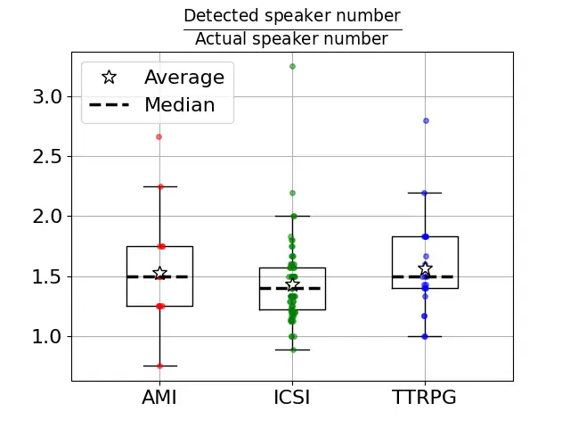\]pdfmark=/ANN,Subtype=/Widget,Raw=/TU
(A boxplot diagram showing the detected speaker number divided through
the actual speaker number for AMI, ICSI and TTRPG. AMI: Average 1.53,
median 1.5, 1. quartile 1.25, 3. quartile 1.75, interquartile range from
0.75 to 2.25, outliners at 2.67. ICSI: Average 1.43, median 1.4, 1.
quartile 1.22, 3. quartile 1.57, interquartile range from 0.89 to 2.0,
outliners at 2.2 and 3.25. TTRPG: Average 1.56, median 1.5, 1. quartile
1.4, 3. quartile 1.83, interquartile range from 1 to 2.2, outliners at
2.8.\textCR(\pc@goptd@deadline)) /T (tooltip zref@0) /C \[ \] /FT/Btn /F
768 /Ff 65536 /H/N /BS \<\< /W 0 \>\>

Figure 1: The relative amount of detected speakers by pyannote.audio
compared to the amount of actual speakers in the audio files.
Differences between TTRPG and AMI ($`U=155`$, $`p=0.70`$) and TTRPG and
ICSI ($`U=606.5`$, $`p=0.11`$) were not significant (two-sided).

\HyColor@XZeroOneThreeFour\pc

@goptd@color\pc@hyenc@colorpdfcommentcolor\HyColor@XZeroOneThreeFour\pc@goptd@fontcolor\pc@hyenc@fontcolorpdfcommentcolor\HyColor@XZeroOneThreeFour\pc@goptd@icolor\pc@hyenc@icolorpdfcommentcolor\pdfmark\[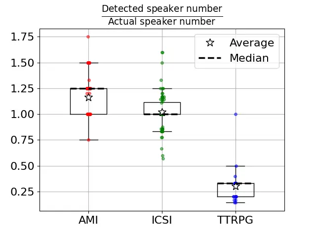\]pdfmark=/ANN,Subtype=/Widget,Raw=/TU
(A boxplot diagram showing the detected speaker number divided through
the actual speaker number for AMI, ICSI and TTRPG. AMI: Average 1.16,
median 1.25, 1. quartile 1.00, 3. quartile 1.25, interquartile range
from 0.75 to 1.50, outliner at 1.75. ICSI: Average 1.02, median 1.00, 1.
quartile 1.00, 3. quartile 1.12, interquartile range from 0.83 to 1.25,
outliners at 0.57, 0.60, 0.67, 0.78, 1.33, 1.50 and 1.60. TTRPG: Average
0.30, median 0.33, 1. quartile 0.2, 3. quartile 0.33, interquartile
range from 0.14 to 0.50, outliner at 1.00.\textCR(\pc@goptd@deadline))
/T (tooltip zref@1) /C \[ \] /FT/Btn /F 768 /Ff 65536 /H/N /BS \<\< /W 0
\>\>

Figure 2: The relative amount of detected speakers by wespeaker compared
to the amount of actual speakers in the audio files. Significant
differences (two-sided) were found between all distributions (AMI/ICSI
$`U=9459`$, $`p=2\cdot 10^{-11}`$, AMI/TTRPG $`U=3495`$,
$`p=2\cdot 10^{-15}`$, ICSI/TTRPG $`U=1539`$, $`p=5\cdot 10^{-12}`$).

In TTRPGs, the speakers change their voices during talking to emphasize
that they talk in the role of a character. We therefore expected that a
diarizer would detect more individual speakers in TTRPGs than dialogues
that do not have this property, such as the AMI. The 21 TTRPG files
contained $`5.48`$ speakers on average, the 171 AMI files $`3.99`$ (16
AMI files $`3.94`$) speakers on average, and the 75 ICSI files $`5.95`$
speakers on average.

The hypothesis of the diarizer finding more speakers in the TTRPG
dataset was not supported. We measured the relative amount of detected
speakers divided by the amount of actual speakers. The results of
pyannote.audio can be seen in fig. 1. It found $`1.52`$ on average for
the AMI dataset, $`1.42`$ for the ICSI dataset, and $`1.56`$ for the
TTRPG dataset. This difference was not statistically significant in a
two-sided Mann-Whitney U test (table 2, appendix A). The results of
wespeaker can be seen in fig. 2. It found $`1.17`$ on average for the
AMI dataset, $`1.01`$ for the ICSI dataset, and $`0.30`$ for the TTRPG
dataset. A two-sided Mann-Whitney U test Mann and Whitney (1947) showed
significant differences between all distributions (table 2, appendix A).

Considering AMI and ICSI, the relation of detected speakers against the
actual number of speakers is significantly smaller for wespeaker than
for pyannote.audio (table 2, appendix A), and wespeaker’s predictions
are closer to the actual value. However, wespeaker drastically
underestimates the number of speakers in TTRPG.

### 5.2 Diarization errors

The _Diarization Error Rate_ (DER) captures three types of errors Park
et al. (2022) – Missed detection (the diarizer failed to detect speech
in the ground truth), False alarm (the diarizer detected speech that is
not in the ground truth) and Confusion (the wrong speaker(s) assigned to
detected speech). The DER is the sum of these errors divided by the
audio time. A $`0.5\text{\,}\mathrm{s}`$ collar around the start and the
end of a speaker talking was removed from the evaluation
($`0.25\text{\,}\mathrm{s}`$ before and after, respectively). This was
done because it is difficult to pinpoint when exactly speech has begun.

All average error rates and Mann-Whitney U test results used in this
section to check for significant differences can be found in table 3
(appendix A).

Both pyannote.audio and wespeaker had the highest average DER while
diarizing the TTRPG, with $`0.33`$ (pyannote.audio) and $`0.48`$
(wespeaker) respectively (figs. 6 and 7, appendix B). The results on the
other datasets were significantly lower. pyannote.audio reached an
average of $`0.12`$ on AMI and $`0.28`$ on ICSI, while wespeaker had an
average of $`0.19`$ on AMI and $`0.27`$ on ICSI (table 3, appendix A).

To understand this difference in DER better, we examined each of the
three error types separately.

The missed detection rates between TTRPG and AMI are not significantly
different for pyannote.audio or wespeaker, while ICSI differs
significantly from AMI and TTRPG for both diarizers (table 3,
appendix A). The respective boxplots can be found in figs. 8 and 9,
appendix B.

The TTRPG false alarm rates are significantly higher than the AMI rates
for both pyannote.audio and wespeaker. The TTRPG dataset’s false alarm
also differs significantly from the ICSI dataset, but is not
significantly higher, since the ICSI dataset shows the highest false
alarm rate of all datasets (table 3, appendix A). The distributions can
be seen in figs. 10 and 11, appendix B.

As with both diarizers ICSI has higher false alarm but lower missed
detection than AMI, we suspect that the differences between those two
datasets root in a more careful annotation on ICSI’s reference files.
This is backed up by fewer interjections in the ICSI reference files
than in the AMI reference files (see section 5.3) and the fact that both
diarizers showed this result.

However, the diarizers do not score well on missed detection or false
alarm on the TTRPG dataset. We suspected that this was not due to the
poor performance of the diarizer, but by the quality of the ground truth
files. This is further evaluated in sections 5.3 and 5.4.

\HyColor@XZeroOneThreeFour\pc

@goptd@color\pc@hyenc@colorpdfcommentcolor\HyColor@XZeroOneThreeFour\pc@goptd@fontcolor\pc@hyenc@fontcolorpdfcommentcolor\HyColor@XZeroOneThreeFour\pc@goptd@icolor\pc@hyenc@icolorpdfcommentcolor\pdfmark\[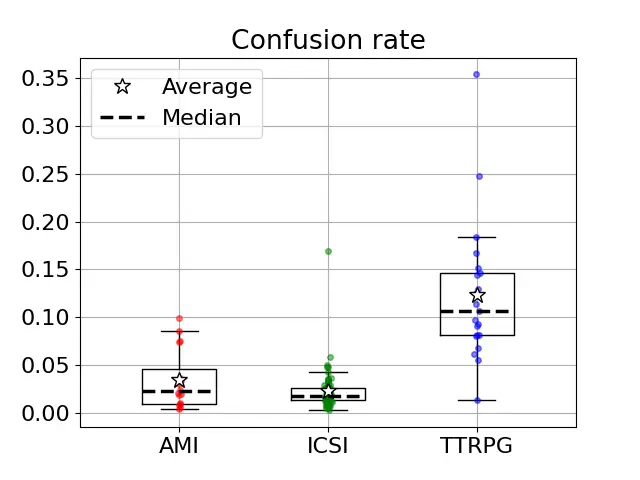\]pdfmark=/ANN,Subtype=/Widget,Raw=/TU
(A boxplot diagram showing the confusion rate for AMI, ICSI and TTRPG.
AMI: Average 0.034, median 0.022, 1. quartile 0.01, 3. quartile 0.045,
interquartile range from 0.004 to 0.085, outliners at 0.1. ICSI: Average
0.022, median 0.017, 1. quartile 0.013, 3. quartile 0.025, interquartile
range from 0.002 to 0.043, outliners at 0.048, 0.048, 0.050, 0.058 and
0.169. TTRPG: Average 0.123, median 0.106, 1. quartile 0.081, 3.
quartile 0.145, interquartile range from 0.013 to 0.183, outliners at
0.25 and 0.35.\textCR(\pc@goptd@deadline)) /T (tooltip zref@2) /C \[ \]
/FT/Btn /F 768 /Ff 65536 /H/N /BS \<\< /W 0 \>\>

Figure 3: Confusion rates of the AMI, ICSI and the TTRPG datasets by
pyannote.audio. TTRPG shows significantly higher confusion than AMI
($`U=32`$, $`p=2\cdot 10^{-5}`$, one-sided test) and ICSI ($`U=75`$,
$`p=1\cdot 10^{-10}`$, one-sided test).

\HyColor@XZeroOneThreeFour\pc

@goptd@color\pc@hyenc@colorpdfcommentcolor\HyColor@XZeroOneThreeFour\pc@goptd@fontcolor\pc@hyenc@fontcolorpdfcommentcolor\HyColor@XZeroOneThreeFour\pc@goptd@icolor\pc@hyenc@icolorpdfcommentcolor\pdfmark\[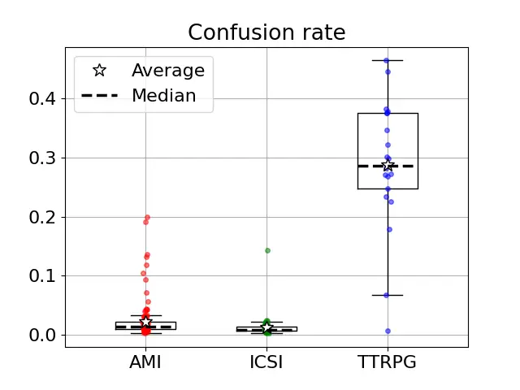\]pdfmark=/ANN,Subtype=/Widget,Raw=/TU
(A boxplot diagram showing the confusion rate for AMI, ICSI and TTRPG.
AMI: Average 0.022, median 0.015, 1. quartile 0.011, 3. quartile 0.022,
interquartile range from 0.003 to 0.040, outliners at 0.042, 0.043,
0.044, 0.045, 0.057, 0.072, 0.093, 0.105, 0.118, 0.132, 0.136, 0.192 and
0.199. ICSI: Average 0.012, median 0.009, 1. quartile 0.007, 3. quartile
0.013, interquartile range from 0.002 to 0.023, outliner at 0.143.
TTRPG: Average 0.287, median 0.286, 1. quartile 0.247, 3. quartile
0.375, interquartile range from 0.067 to 0.464, outliner at
0.007.\textCR(\pc@goptd@deadline)) /T (tooltip zref@3) /C \[ \] /FT/Btn
/F 768 /Ff 65536 /H/N /BS \<\< /W 0 \>\>

Figure 4: Confusion rates of the AMI, ICSI and the TTRPG datasets by
wespeaker. TTRPG shows significantly higher confusion than AMI
($`U=165`$, $`p=7\cdot 10^{-12}`$, one-sided test) and ICSI ($`U=54`$,
$`p=4\cdot 10^{-11}`$, one-sided test).

Figures 3 and 4 show the confusion of the diarizers for the TTRPG
dataset compared to the AMI and ICSI dataset. For the confusion, the
TTRPG rates are significantly higher than the AMI rates and the ICSI
rates for both diarizers, while the confusion of AMI and ICSI datasets
does not differ significantly on pyannote.audio, but does differ on
wespeaker (table 3, appendix).

To establish whether these performance differences are independent of
the diarizer’s ability to detect the number of speakers (section 5.1),
we repeated our diarization experiments with the actual number of
speakers given to the system. This modification did not influence the
error rates of missed detection and false alarm. While we expected that
it would decrease the confusion error, it in fact led to an increase of
the AMI and ICSI dataset confusion on pyannote.audio, to a point where
the difference between both datasets was no longer significant (AMI:
$`0.034\rightarrow 0.19`$, $`+459\%`$, ICSI: $`0.022\rightarrow 0.15`$,
$`+582\%`$, TTRPG: $`0.12\rightarrow 0.15`$, $`+25\%`$). On wespeaker,
the average confusion rates changed for AMI and ICSI if we gave the
number of speakers to the diarizer (AMI: $`0.022\rightarrow 0.018`$,
$`-19\%`$, ICSI: $`0.012\rightarrow 0.019`$, $`+58\%`$, TTRPG:
$`0.29\rightarrow 0.29`$, $`\pm 0\%`$). However, the AMI and ICSI
confusion stayed significantly smaller than the TTRPG confusion
(table 3, appendix A). The respective boxplots can be found at figs. 12
and 13, appendix B.

### 5.3 Weaknesses of the TTRPG reference files

The TRPG reference files were created with subtitles and forced
alignment, as described in section 4.1. While with this approach the
ground truth can be efficiently obtained, it does negatively influence
its quality because it depends on the quality of the subtitles and of
the forced alignment process. This has been especially evident when we
had to exclude one of the chosen campaigns, after noticing its gross
error rates and finding that its subtitle was far from being verbatim
(see section 4.1).

Even after excluding campaigns with gross transcription issues, the
approach of using subtitles had two problems. First, subtitles often
lacked filler words like “uhmm” or “ehh” and paraphrased the meaning of
words. Secondly, the use of subtitles and forced alignment ignored
overlapping speech by multiple speakers. It either ignores all but one
speaker or appears as if the words would have been said after each
other. Both problems would lead to missing speech in the ground truth,
which can result in an apparently higher false alarm rate we observed in
section 5.2 compared to AMI. To verify this further, we evaluated the
properties of the TTRPG dataset and compared it to AMI and ICSI.

spaCy’s en_core_web_trf (v. 3.7.3) Honnibal and Montani (2023) was used
to identify the number of words tagged as an interjection in our ground
truth, AMI, and ICSI. The TTRPG dataset subtitles have $`4\%`$ of
interjections, while AMI transcriptions have $`13\%`$ and ICSI
transcriptions $`9.5\%`$. Additionally, we calculated the amount of
overlapped speech given by the reference files. The TTRPG files
consisted of $`0.2\%`$ of overlapped speech, while AMI has $`6.5\%`$ and
ICSI $`3.8\%`$. These differences suggest that the reference files of
our own dataset do not depict overlapping speech sequences correctly,
and that some utterances may be missing. This is also backed by the
manually annotated reference TTRPG file, which contains $`4,6\%`$ of
overlapped speech.

### 5.4 Manually annotated reference file

To estimate how much the aforementioned issue of the reference files
influenced our results, we annotated $`10\text{\,}\mathrm{min}`$ of one
TTRPG audio file manually with the information which speaker spoke at
what time and repeated and extended our error analyses.²² 2 To manually
annotate the whole TTRPG dataset was not feasible given our resources
and we will leave this for future research. To get a representative
example of TTRPG, we chose a role-playing file whose DER, confusion,
false alarm and missed detection rate was among the ones closest to the
average. We annotated a continuous portion that contained frequent
speech from all speakers and in-character conversations.

The resulting error rates can be seen in table 1, compared to the error
rates from the automatically created reference files. The manually
created reference files result in overall smaller error rates when
pyannote.audio was used. While the confusion rate only decreased by
$`5\%`$, the false alarm decreased by $`61\%`$ and the missed detection
by $`50\%`$. If the number of speakers was given to the diarizer
upfront, the rates decreased by $`8\%`$, $`60\%`$, and $`40\%`$
respectively. For wespeaker, all error rates but missed detection got
smaller. The confusion rate decreased by $`13\%`$ ($`8\%`$ if speaker
number was given) and the false alarm by $`56\%`$ ($`71\%`$). The missed
detection rate raised by $`83\%`$ ($`83\%`$).

These results suggest that the higher confusion error on TTRPG datasets
was due to the linguistic properties of TTRPG datasets, while the higher
false alarm rates were caused by imperfect reference files.³³ 3 We
cannot offer an explanation for why the missed detection for wespeaker
increases. The point that the quality of the reference files does not
influence our findings is not affected.

[TABLE]

Table 1: The error rates created by 10 min of manually annotated
reference files compared to the error rates that are created by the
subtitle reference files.MAN: manual, AUTO: automatic, DER: diarization
error rate, Conf: confusion; FA: false alarm, and MD: missed detection.
PA: pyannote.audio, WS: wespeaker.

### 5.5 Detailed error analyses

\HyColor@XZeroOneThreeFour\pc

@goptd@color\pc@hyenc@colorpdfcommentcolor\HyColor@XZeroOneThreeFour\pc@goptd@fontcolor\pc@hyenc@fontcolorpdfcommentcolor\HyColor@XZeroOneThreeFour\pc@goptd@icolor\pc@hyenc@icolorpdfcommentcolor\pdfmark\[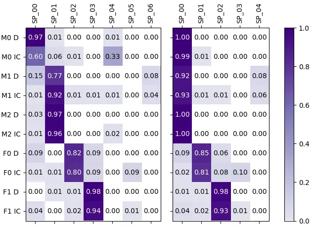\]pdfmark=/ANN,Subtype=/Widget,Raw=/TU
(Two confusion matrices. Left one: The x-axis has the values SP_00,
SP_01, SP_02, SP_03, SP_04, SP_05 and SP_06. The y-axis has the values
M0 D, M0 IC, M1 D, M1 IC, M2 D, M2 IC, F0 D, F0 IC, F1 D and F1 IC. The
values are \[\[0.97, 0.01, 0.00, 0.00, 0.01, 0.00, 0.00\], \[0.60, 0.06,
0.01, 0.00, 0.33, 0.00, 0.00\], \[0.15, 0.77, 0.00, 0.00, 0.00, 0.00,
0.08\], \[0.01, 0.92, 0.01, 0.01, 0.01, 0.00, 0.04\], \[0.03, 0.97,
0.00, 0.00, 0.00, 0.00, 0.00\], \[0.01, 0.96, 0.00, 0.00, 0.02, 0.00,
0.00\], \[0.09, 0.00, 0.82, 0.09, 0.00, 0.00, 0.00\], \[0.01, 0.01,
0.80, 0.09, 0.00, 0.09, 0.00\], \[0.00, 0.01, 0.01, 0.98, 0.00, 0.00,
0.00\], \[0.04, 0.00, 0.02, 0.94, 0.00, 0.01, 0.00\]\]. Right: The
x-axis has the values SP_00, SP_01, SP_02, SP_03 and SP_04. The y-axis
has the values M0 D, M0 IC, M1 D, M1 IC, M2 D, M2 IC, F0 D, F0 IC, F1 D
and F1 IC. The values are \[\[1.00, 0.00, 0.00, 0.00, 0.00\], \[0.99,
0.01, 0.00, 0.00, 0.00\], \[0.92, 0.00, 0.00, 0.00, 0.08\], \[0.93,
0.01, 0.01, 0.00, 0.06\], \[1.00, 0.00, 0.00, 0.00, 0.00\], \[1.00,
0.00, 0.00, 0.00, 0.00\], \[0.09, 0.85, 0.06, 0.00, 0.00\], \[0.02,
0.81, 0.08, 0.10, 0.00\], \[0.01, 0.01, 0.98, 0.00, 0.00\], \[0.04,
0.02, 0.93, 0.01, 0.00\]\].\textCR(\pc@goptd@deadline)) /T (tooltip
zref@4) /C \[ \] /FT/Btn /F 768 /Ff 65536 /H/N /BS \<\< /W 0 \>\>

(a) Confusion matrix created by pyannote.audio, right if the speaker
number is given, left if it is not.

\HyColor@XZeroOneThreeFour\pc

@goptd@color\pc@hyenc@colorpdfcommentcolor\HyColor@XZeroOneThreeFour\pc@goptd@fontcolor\pc@hyenc@fontcolorpdfcommentcolor\HyColor@XZeroOneThreeFour\pc@goptd@icolor\pc@hyenc@icolorpdfcommentcolor\pdfmark\[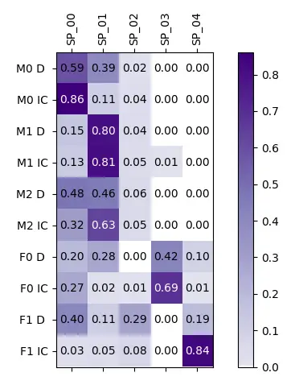\]pdfmark=/ANN,Subtype=/Widget,Raw=/TU
(A confusion matrix. The x-axis has the values SP_00, SP_01, SP_02,
SP_03 and SP_04. The y-axis has the values M0 D, M0 IC, M1 D, M1 IC, M2
D, M2 IC, F0 D, F0 IC, F1 D and F1 IC. The values are \[\[0.59, 0.39,
0.02, 0.00, 0.00\], \[0.86, 0.11, 0.04, 0.00, 0.00\], \[0.15, 0.80,
0.04, 0.00, 0.00\], \[0.13, 0.81, 0.05, 0.01, 0.00\], \[0.48, 0.46,
0.06, 0.00, 0.00\], \[0.32, 0.63, 0.05, 0.00, 0.00\], \[0.20, 0.28,
0.00, 0.42, 0.10\], \[0.27, 0.02, 0.01, 0.69, 0.01\], \[0.40, 0.11,
0.29, 0.00, 0.19\], \[0.03, 0.05, 0.08, 0.00,
0.84\]\].\textCR(\pc@goptd@deadline)) /T (tooltip zref@5) /C \[ \]
/FT/Btn /F 768 /Ff 65536 /H/N /BS \<\< /W 0 \>\>

(b) Confusion matrix for wespeaker (given speaker number). No given
number resulted in one detected speaker.

Figure 5: The confusion matrices for the $`10\text{\,}\mathrm{min}`$
manually annotated audio. The audio contained 5 speakers, 3 male (M0 to
M2) and 2 female (F0 and F1). The reference (rows) for each speaker is
divided into what the speaker said in their descriptive voice (D) and
their in-character voice (IC). The predictions are given by the columns,
normalized with respect to the reference. Shown for pyannote.audio
result (fig. 5(a)) and wespeaker result (fig. 5(b)).

To further understand the errors of the diarizer, we examined the
confusion matrices for the manually created reference (see fig. 5; the
rows of the matrices are normalized). For the matrices, we only examined
regions that have been labeled as speech in the reference and the
prediction, ignoring false alarm and missed detection. The manually
created reference contained information whether speech was
“in-character” or “descriptive”. We differentiated in the matrices
between these two ways of speaking for every person.

Figure 5(a) (left) is the confusion matrix when pyannote.audio has not
been given the number of actual speakers. Two male speakers (M1 and M2)
have been “merged” and are mostly mapped to the predicted SP_01. In this
audio file, M0 has had the position of the GM, meaning that the speaker
had not one in-character voice but several (see section 2.2). This seems
to lead to wrong predictions by the diarizer, such as that in-character
of M0 “creates” a new speaker SP_04. Additionally, SP_0 has been
assigned to many other actual speakers, especially M1 and F0.

pyannote.audio identifies three speakers that get mapped to small
amounts of actual speakers. SP_04 is a speaker created by M0’s
in-character voice. SP_05 is a speaker created mostly by the
in-character voice of F0. SP_06 seem to be parts of the actual M1. It is
interesting to note that the in-character voices of the two female
voices (F0 IC and F1 IC) and M0 IC seem to be more distinctive
“speakers” respectively than M1 and M2, who are merged into one detected
speaker. To examine how distributed the mappings are, Shannon entropy
Shannon (1948) was calculated over each row in the confusion matrix (the
higher the entropy, the more distributed a mapping is). The average
entropy over all rows, descriptive voices and in-character voices are
$`0.59`$, $`0.48`$ and $`0.70`$ respectively. This shows that the change
of voice of the players results into a higher scattering of detected
speakers if pyannote.audio is used.

Figure 5(a) (right) is the confusion matrix when pyannote.audio has been
given the number of actual speakers. All male speakers are mapped to the
same predicted speaker. Two extra speakers (SP_04 and SP_03) consist of
some of M1’s utterances and the in-character voice of F0. Again, the
change of voice leads to a higher scattering of detected speakers. The
average entropy over all rows, descriptive voices and in-character
voices are $`0.32`$, $`0.27`$, and $`0.38`$ respectively.

Figure 5(b) shows the confusion matrix when wespeaker has been given the
number of actual speakers. A confusion matrix without the speaker number
given has not been created, since wespeaker predicted only one speaker
in this case. This aligns with our findings that wespeaker finds small
numbers of speakers for the TTRPG files (see section 5.1). The average
entropy over all rows, descriptive voices and in-character voices are
$`1.17`$, $`1.38`$, and $`0.96`$. In the case of wespeaker, the
in-character voices are not more scattered than the descriptive voices.
However, the scattering is higher than pyannote.audio’s overall.

## 6 Conclusion

This paper aimed to provide a proof of concept that TTRPG audio files
serve as a complex but natural challenge to diarization systems. We were
able to show that pyannote.audio’s and wespeaker’s speaker confusion
increased for TTRPG compared to AMI and ICSI audio files (see
sections 5.2 and 5.4), which we consider to be similar except for the
unique TTRPG properties (see section 2.3). We found evidence that a
low-resource method of annotating a TTRPG dataset does not conceal the
fact that a diarizer gets confused by TTRPGs’ properties. Additionally,
we found that it could be advantageous to annotate whether utterances
are in-character or descriptive, to be able to evaluate the diarization
performance in more depth. pyannote.audio’s and wespeaker’s confusion
increased for TTRPG audios. Nevertheless, the relative amount of
speakers pyannote.audio found compared to the amount of speakers that
actually are in the audio file did not change. In case of wespeaker we
found that the number decreased, indicating that its clustering
algorithm gets confused by people changing their voices frequently (see
section 5.1).

The fact that TTRPG data confuse the diarizers aligns with the findings
of other work showing that diarization performance is not yet good
enough for other naturalistic dialogues such as in-person role-play
dialogues in health care education Medaramitta (2021). We conclude that
using a dataset of this kind as a challenge or even train a diarizer on
it could make diarizers more robust.

## 7 Limitations

This work presents a proof of concept which needs further investigation
to ensure our findings can be generalized. Other SOTA diarizers should
be tested on top of pyannote.audio and wespeaker. Additionally, we only
compared the diarization performance to the AMI and ICSI corpora and had
a relatively small sample size. As mentioned in section 5.3, the ground
truth for the TTRPGs is imperfect, however as shown in section 5.4 we
showed evidence that the imperfect ground truth do not compromise our
core findings. Our claim concerning the reduction in confusion error
rates for manually aligned audio in Section 5.4 needs to be further
validated statistically. This can be done in a larger study that
examines multiple sets of manual and automatic annotated audio.

As pyannote.audio has been trained on parts of the AMI dataset, we
probably have a bias towards the diarization of AMI, even though we
tested pyannote.audio on the AMI audio files that have not been used to
train it. Nevertheless, our comparison between AMI and TTRPG could be
unfair. However, as we also used the ICSI corpus and wespeaker had
similar results about the confusion rate, we have evidence that the bias
towards AMI did not influence our results.

We did not examine whether our results would still hold after taking
into account of lexical information which has been shown to improve DER
over acoustic only systems Flemotomos and Dimitriadis (2020).
Additionally, the acted speech in TTRPG context may not be helpful for
training diarizers that are meant to be applied to naturalistic speech,
as acted conversation does not represent natural conversation
accurately Schuller et al. (2010).

We were not able to take into account the voice-artist skills, and age
group (children vs. adults) of the players, since our players were all
adults and their voice-artist skills were not quantified. The players’
attributes, such as these, must be considered to fully establish TTRPGs
as benchmarks for diarization systems.

## 8 Ethical considerations

Our TTRPG dataset was compiled using publicly available videos and
subtitles. The processing was performed on an off-line computing
cluster, meaning we did not upload the speaker files to any third-party.
As this paper is a proof of concept and the data are not published or
shared to any third-party, we had no ethical concerns in experimenting
with the audio files.

The findings of our paper and the publishing of the YouTube links to the
TTRPG videos we used puts TTRPG content at risk to be downloaded for
dataset-creation or used as training data without the creators’ consent.
We appeal to researchers to only create datasets and train models with
data for which consent of the creators was given. We believe that we
have only slightly increased the risk of YouTube videos being used
without the creators’ consent, as the videos could already be copied
relatively easy from YouTube.

The usage of pyannote.audio, wespeaker, the AMI and the ICSI dataset in
this work are compatible with their intended use for research.

The involved university does not require IRB approval for this kind of
study, which uses publicly available data.

We do not see any other concrete risks concerning dual use of our
research results. Of course, in the long run, any research results on AI
methods based on large language models could potentially be used in
contexts of harmful and unsafe applications of AI. But this danger is
rather low in our concrete case.

## References

- Baevski et al. (2020) Alexei Baevski, Yuhao Zhou, Abdelrahman Mohamed,
  and Michael Auli. 2020. [wav2vec 2.0: A framework for self-supervised
  learning of speech
  representations](https://proceedings.neurips.cc/paper_files/paper/2020/file/92d1e1eb1cd6f9fba3227870bb6d7f07-Paper.pdf).
  In _Advances in Neural Information Processing Systems_, volume 33,
  pages 12449–12460. Curran Associates, Inc.
- Bredin (2017) Hervé Bredin. 2017. [pyannote.metrics: a toolkit for
  reproducible evaluation, diagnostic, and error analysis of speaker
  diarization systems](http://pyannote.github.io/pyannote-metrics). In
  _Interspeech 2017, 18th Annual Conference of the International Speech
  Communication Association_, Stockholm, Sweden.
- Bredin (2023) Hervé Bredin. 2023. [pyannote.audio 2.1 speaker
  diarization pipeline: principle, benchmark, and
  recipe](https://doi.org/10.21437/Interspeech.2023-105). In _Proc.
  Interspeech 2023_, pages 1983–1987.
- Callison-Burch et al. (2022) Chris Callison-Burch, Gaurav Singh Tomar,
  Lara J. Martin, Daphne Ippolito, Suma Bailis, and David Reitter. 2022.
  [Dungeons and Dragons as a dialog challenge for artificial
  intelligence](https://doi.org/10.18653/v1/2022.emnlp-main.637). In
  _Proceedings of the 2022 Conference on Empirical Methods in Natural
  Language Processing_, pages 9379–9393, Abu Dhabi, United Arab
  Emirates. Association for Computational Linguistics.
- Canavan et al. (1997) Alexandra Canavan, David Graff, and George
  Zipperlen. 1997. [CALLHOME American English Speech
  LDC97S42](https://doi.org/10.35111/exq3-x930). _Philadelphia:
  Linguistic Data Consortium_.
- Chung et al. (2020) Joon Son Chung, Jaesung Huh, Arsha Nagrani,
  Triantafyllos Afouras, and Andrew Zisserman. 2020. [Spot the
  conversation: Speaker diarisation in the
  wild](https://doi.org/10.21437/Interspeech.2020-2337). In _Proc.
  Interspeech 2020_, pages 299–303.
- Ellis and Hendler (2017) Simon Ellis and James Hendler. 2017.
  [Computers play chess, computers play go…humans play Dungeons &
  Dragons](https://doi.org/10.1109/MIS.2017.3121545). _IEEE Intelligent
  Systems_, 32(4):31–34.
- Flemotomos and Dimitriadis (2020) Nikolaos Flemotomos and Dimitrios
  Dimitriadis. 2020. [A memory augmented architecture for continuous
  speaker identification in
  meetings](https://doi.org/10.1109/ICASSP40776.2020.9053152). In
  _ICASSP 2020 - 2020 IEEE International Conference on Acoustics, Speech
  and Signal Processing (ICASSP)_, pages 6524–6528.
- Galvez et al. (2021) Daniel Galvez, Greg Diamos, Juan Ciro,
  Juan Felipe Cerón, Keith Achorn, Anjali Gopi, David Kanter, Maximilian
  Lam, Mark Mazumder, and Vijay Janapa Reddi. 2021. [The people’s
  speech: A large-scale diverse English speech recognition dataset for
  commercial usage](https://arxiv.org/abs/2111.09344). _Preprint_,
  arXiv:2111.09344.
- Goswami et al. (2023) Koustava Goswami, Priya Rani, Theodorus Fransen,
  and John McCrae. 2023. [Weakly-supervised deep cognate detection
  framework for low-resourced languages using morphological knowledge of
  closely-related
  languages](https://doi.org/10.18653/v1/2023.findings-emnlp.38). In
  _Findings of the Association for Computational Linguistics: EMNLP
  2023_, pages 531–541, Singapore. Association for Computational
  Linguistics.
- Grünert et al. (2023) David Grünert, Alexandre de Spindler, and Volker
  Dellwo. 2023. [Speaker diarization systems in the context of forensic
  audio
  analysis](https://www.iafpa2023.uzh.ch/dam/jcr:519171ea-58b0-4ff4-8333-91664dc44a54/BoA-IAFPA23.pdf).
  In _31st Annual Conference of the International Association for
  Forensic Phonetics and Acoustics (IAFPA), Zurich, Switzerland, 9-12
  July 2023_, pages 74–75. Centre for Forensic Phonetics and Acoustics
  (CFPA).
- Günthner (1999) Susanne Günthner. 1999. [Polyphony and the ‘layering
  of voices’ in reported dialogues: An analysis of the use of prosodic
  devices in everyday reported
  speech](<https://doi.org/10.1016/S0378-2166(98)00093-9>). _Journal of
  Pragmatics_, 31(5):685–708.
- Honnibal and Montani (2023) Matthew Honnibal and Ines Montani. 2023.
  [spacy · Industrial-strength Natural Language Processing in
  Python](https://spacy.io/).
- Huang et al. (2023) Zhiqi Huang, Dongsheng Chen, Zhihong Zhu, and
  Xuxin Cheng. 2023. [MCLF: A multi-grained contrastive learning
  framework for ASR-robust spoken language
  understanding](https://doi.org/10.18653/v1/2023.findings-emnlp.533).
  In _Findings of the Association for Computational Linguistics: EMNLP
  2023_, pages 7936–7949, Singapore. Association for Computational
  Linguistics.
- Janin et al. (2003) A. Janin, D. Baron, J. Edwards, D. Ellis,
  D. Gelbart, N. Morgan, B. Peskin, T. Pfau, E. Shriberg, A. Stolcke,
  and C. Wooters. 2003. [The ICSI meeting
  corpus](https://doi.org/10.1109/ICASSP.2003.1198793). In _2003 IEEE
  International Conference on Acoustics, Speech, and Signal
  Processing, 2003. Proceedings. (ICASSP ’03)._, volume 1, pages I–I.
- Janin et al. (2004) Adam Janin, Jeremy Ang, Sonali Bhagat, Rajdip
  Dhillon, Jane Edwards, Javier Macias-Guarasa, Nelson Morgan, Barbara
  Peskin, Elizabeth Shriberg, Andreas Stolcke, et al. 2004. The ICSI
  meeting project: Resources and research. In _Proceedings of the 2004
  ICASSP NIST Meeting Recognition Workshop_.
- Kraaij et al. (2005) Wessel Kraaij, Thomas Hain, Mike Lincoln, and
  Wilfried Post. 2005. The AMI meeting corpus. In _Proceedings of
  Measuring Behavior 2005, 5th International Conference on Methods and
  Techniques in Behavioral Research_, pages 137–140. Noldus Information
  Technology.
- Lau et al. (2005) Yee W. Lau, Dat Tran, and Michael Wagner. 2005.
  [Testing voice mimicry with the YOHO speaker verification
  corpus](https://doi.org/10.1007/11554028_3). In _Knowledge-Based
  Intelligent Information and Engineering Systems_, pages 15–21, Berlin,
  Heidelberg. Springer Berlin Heidelberg.
- Lau et al. (2004) Yee Wah Lau, M. Wagner, and D. Tran. 2004.
  [Vulnerability of speaker verification to voice
  mimicking](https://doi.org/10.1109/ISIMP.2004.1434021). In
  _Proceedings of 2004 International Symposium on Intelligent
  Multimedia, Video and Speech Processing, 2004._, pages 145–148.
- Liesenfeld et al. (2023) Andreas Liesenfeld, Alianda Lopez, and Mark
  Dingemanse. 2023. [The timing bottleneck: Why timing and overlap are
  mission-critical for conversational user interfaces, speech
  recognition and dialogue
  systems](https://doi.org/10.18653/v1/2023.sigdial-1.45). In
  _Proceedings of the 24th Annual Meeting of the Special Interest Group
  on Discourse and Dialogue_, pages 482–495, Prague, Czechia.
  Association for Computational Linguistics.
- Louis and Sutton (2018) Annie Louis and Charles Sutton. 2018. [Deep
  Dungeons and Dragons: Learning character-action interactions from
  role-playing game transcripts](https://doi.org/10.18653/v1/N18-2111).
  In _Proceedings of the 2018 Conference of the North American Chapter
  of the Association for Computational Linguistics: Human Language
  Technologies, Volume 2 (Short Papers)_, pages 708–713, New Orleans,
  Louisiana. Association for Computational Linguistics.
- Mann and Whitney (1947) Henry B Mann and Donald R Whitney. 1947. [On a
  Test of Whether one of Two Random Variables is Stochastically Larger
  than the Other](https://doi.org/10.1214/aoms/1177730491). _The Annals
  of Mathematical Statistics_, 18(1):50 – 60.
- Martin et al. (2018) Lara J Martin, Srijan Sood, and Mark O
  Riedl. 2018. [Dungeons and DQNs: Toward reinforcement learning agents
  that play tabletop roleplaying
  games](https://ceur-ws.org/Vol-2321/paper4.pdf). In _Proceedings of
  the Joint Workshop on Intelligent Narrative Technologies and Workshop
  on Intelligent Cinematography and Editing_. CEUR-WS.
- Medaramitta (2021) Raveendra Medaramitta. 2021. [Evaluating the
  performance of using speaker diarization for speech separation of
  in-person role-play
  dialogues](https://corescholar.libraries.wright.edu/etd_all/2517/).
  Master’s thesis, Wright State University.
- Nagavi et al. (2024) Trisiladevi C. Nagavi, S. Samanvitha, Shreya
  Sudhanva, Sukirth Shivakumar, and Vibha Hullur. 2024. [_Comprehensive
  Analysis of State-of-the-Art Approaches for Speaker
  Diarization_](https://doi.org/10.1002/9781394214624.ch19), chapter 19.
  John Wiley & Sons, Ltd.
- Newman and Liu (2022) Pax Newman and Yudong Liu. 2022. [Generating
  descriptive and rules-adhering spells for Dungeons & Dragons Fifth
  Edition](https://aclanthology.org/2022.games-1.7/). In _Proceedings of
  the 9th Workshop on Games and Natural Language Processing within the
  13th Language Resources and Evaluation Conference_, pages 54–60,
  Marseille, France. European Language Resources Association.
- Park et al. (2019) Tae Jin Park, Kyu J. Han, Jing Huang, Xiaodong He,
  Bowen Zhou, Panayiotis Georgiou, and Shrikanth Narayanan. 2019.
  [Speaker diarization with lexical
  information](https://doi.org/10.21437/Interspeech.2019-1947). In
  _Proc. Interspeech 2019_, pages 391–395.
- Park et al. (2022) Tae Jin Park, Naoyuki Kanda, Dimitrios Dimitriadis,
  Kyu J Han, Shinji Watanabe, and Shrikanth Narayanan. 2022. [A review
  of speaker diarization: Recent advances with deep
  learning](https://doi.org/10.1016/j.csl.2021.101317). _Computer Speech
  & Language_, 72:101317.
- Plaquet and Bredin (2023) Alexis Plaquet and Hervé Bredin. 2023.
  [Powerset multi-class cross entropy loss for neural speaker
  diarization](https://doi.org/10.21437/Interspeech.2023-205). In _Proc.
  Interspeech 2023_, pages 3222–3226.
- pyannote (2023) pyannote. 2023. [Release Version 2.1.1 ·
  pyannote/pyannote-audio](https://github.com/pyannote/pyannote-audio/releases/tag/2.1.1).
- Qamar et al. (2023) Ayesha Qamar, Adarsh Pyarelal, and Ruihong
  Huang. 2023. [Who is speaking? speaker-aware multiparty dialogue act
  classification](https://doi.org/10.18653/v1/2023.findings-emnlp.678).
  In _Findings of the Association for Computational Linguistics: EMNLP
  2023_, pages 10122–10135, Singapore. Association for Computational
  Linguistics.
- Qasemi et al. (2022) Ehsan Qasemi, Filip Ilievski, Muhao Chen, and
  Pedro Szekely. 2022. [PaCo: Preconditions attributed to commonsense
  knowledge](https://doi.org/10.18653/v1/2022.findings-emnlp.505). In
  _Findings of the Association for Computational Linguistics: EMNLP
  2022_, pages 6781–6796, Abu Dhabi, United Arab Emirates. Association
  for Computational Linguistics.
- Rameshkumar and Bailey (2020) Revanth Rameshkumar and Peter
  Bailey. 2020. [Storytelling with dialogue: a critical role Dungeons
  and Dragons dataset](https://doi.org/10.18653/v1/2020.acl-main.459).
  In _Proceedings of the 58th Annual Meeting of the Association for
  Computational Linguistics_, pages 5121–5134, Online. Association for
  Computational Linguistics.
- Revathi et al. (2021) A. Revathi, N. Sasikaladevi, and
  K. Geetha. 2021. [Forensic investigation for twin identification from
  speech: perceptual and gamma-tone features and
  models](https://doi.org/10.1007/s11042-021-10639-z). _Multimedia Tools
  and Applications_, 80(12):18301–18315.
- Ryant et al. (2021) Neville Ryant, Prachi Singh, Venkat Krishnamohan,
  Rajat Varma, Kenneth Church, Christopher Cieri, Jun Du, Sriram
  Ganapathy, and Mark Liberman. 2021. [The Third DIHARD Diarization
  Challenge](https://doi.org/10.21437/Interspeech.2021-1208). In _Proc.
  Interspeech 2021_, pages 3570–3574.
- Schuller et al. (2010) Björn Schuller, Bogdan Vlasenko, Florian Eyben,
  Martin Wöllmer, André Stuhlsatz, Andreas Wendemuth, and Gerhard
  Rigoll. 2010. [Cross-corpus acoustic emotion recognition: Variances
  and strategies](https://doi.org/10.1109/T-AFFC.2010.8). _IEEE
  Transactions on Affective Computing_, 1(2):119–131.
- Shannon (1948) Claude Elwood Shannon. 1948. [A mathematical theory of
  communication](https://doi.org/10.1002/j.1538-7305.1948.tb01338.x).
  _The Bell System Technical Journal_, 27(3):379–423.
- Si et al. (2021) Wai Man Si, Prithviraj Ammanabrolu, and Mark
  Riedl. 2021. [Telling stories through multi-user dialogue by modeling
  character relations](https://doi.org/10.18653/v1/2021.sigdial-1.30).
  In _Proceedings of the 22nd Annual Meeting of the Special Interest
  Group on Discourse and Dialogue_, pages 269–275, Singapore and Online.
  Association for Computational Linguistics.
- Team (2021) Silero Team. 2021. Silero VAD: pre-trained
  enterprise-grade voice activity detector (VAD), number detector and
  language classifier.
  [https://github.com/snakers4/silero-vad](https://github.com/snakers4/silero-vad).
- Wang et al. (2023) Hongji Wang, Chengdong Liang, Shuai Wang, Zhengyang
  Chen, Binbin Zhang, Xu Xiang, Yanlei Deng, and Yanmin Qian. 2023.
  [Wespeaker: A research and production oriented speaker embedding
  learning toolkit](https://doi.org/10.1109/ICASSP49357.2023.10096626).
  In _ICASSP 2023 - 2023 IEEE International Conference on Acoustics,
  Speech and Signal Processing (ICASSP)_, pages 1–5.
- Wang et al. (2021) Yuxuan Wang, Mao-Kui He, Shutong Niu, Lei Sun, Tian
  Gao, Xin Fang, Jia Pan, Jun Du, and Chin-Hui Lee. 2021. [USTC-NELSLIP
  system description for DIHARD-III
  challenge](https://arxiv.org/abs/2103.10661). _CoRR_, abs/2103.10661.
- Watanabe et al. (2020) Shinji Watanabe, Michael Mandel, Jon Barker,
  Emmanuel Vincent, Ashish Arora, Xuankai Chang, Sanjeev Khudanpur,
  Vimal Manohar, Daniel Povey, Desh Raj, David Snyder, Aswin Shanmugam
  Subramanian, Jan Trmal, Bar Ben Yair, Christoph Boeddeker, Zhaoheng
  Ni, Yusuke Fujita, Shota Horiguchi, Naoyuki Kanda, Takuya Yoshioka,
  and Neville Ryant. 2020. [CHiME-6 challenge: Tackling multispeaker
  speech recognition for unsegmented
  recordings](https://doi.org/10.21437/CHiME.2020-1). In _6th
  International Workshop on Speech Processing in Everyday Environments
  (CHiME 2020)_, pages 1–7.
- Yan et al. (2022) Chen Yan, Xiaoyu Ji, Kai Wang, Qinhong Jiang, Zizhi
  Jin, and Wenyuan Xu. 2022. [A survey on voice assistant security:
  Attacks and countermeasures](https://doi.org/10.1145/3527153). _ACM
  Comput. Surv._, 55(4).
- Zeinali et al. (2019) Hossein Zeinali, Shuai Wang, Anna Silnova, Pavel
  Matějka, and Oldřich Plchot. 2019. [BUT system description to VoxCeleb
  speaker recognition challenge 2019](https://arxiv.org/abs/1910.12592).
  _Preprint_, arXiv:1910.12592.

## Appendix A Mann-Whitney U test results

For a better overview, we provide the values of the Mann-Whitney U
tests Mann and Whitney (1947) in this paper.

| Model | Computational property                                            | Set $`1`$ (Average) | Set $`2`$ (Average) | Type      | U         | p                         |
| ----- | ----------------------------------------------------------------- | ------------------- | ------------------- | --------- | --------- | ------------------------- |
| PA    | $`\frac{\text{Detected speaker no.}}{\text{Actual speaker no.}}`$ | AMI ($`1.53`$)      | ICSI ($`1.43`$)     | two-sided | $`684`$   | $`0.38`$                  |
| PA    | $`\frac{\text{Detected speaker no.}}{\text{Actual speaker no.}}`$ | AMI ($`1.53`$)      | TTRPG ($`1.56`$)    | two-sided | $`155`$   | $`0.70`$                  |
| PA    | $`\frac{\text{Detected speaker no.}}{\text{Actual speaker no.}}`$ | ICSI ($`1.43`$)     | TTRPG ($`1.56`$)    | two-sided | $`606.5`$ | $`0.11`$                  |
| WS    | $`\frac{\text{Detected speaker no.}}{\text{Actual speaker no.}}`$ | AMI ($`1.17`$)      | ICSI ($`1.01`$)     | two-sided | $`9458`$  | $`2\cdot 10^{-11}`$\*\*\* |
| WS    | $`\frac{\text{Detected speaker no.}}{\text{Actual speaker no.}}`$ | AMI ($`1.17`$)      | TTRPG ($`0.30`$)    | two-sided | $`155`$   | $`2\cdot 10^{-15}`$\*\*\* |
| WS    | $`\frac{\text{Detected speaker no.}}{\text{Actual speaker no.}}`$ | ICSI ($`1.01`$)     | TTRPG ($`0.30`$)    | two-sided | $`606.5`$ | $`5\cdot 10^{-12}`$\*\*\* |
| PA/WS | $`\frac{\text{Detected speaker no.}}{\text{Actual speaker no.}}`$ | AMI PA ($`1.53`$)   | AMI WS ($`1.17`$)   | one-sided | $`2169`$  | $`4\cdot 10^{-6}`$\*\*\*  |
| PA/WS | $`\frac{\text{Detected speaker no.}}{\text{Actual speaker no.}}`$ | ICSI PA ($`1.43`$)  | ICSI WS ($`1.01`$)  | one-sided | $`5195`$  | $`6\cdot 10^{-19}`$\*\*\* |

Table 2: The Mann-Whitney U test Mann and Whitney (1947) results of the
tests of section 5.1. PA: pyannote.audio, WS: wespeaker.

| Model | Computational property | Set $`1`$ (Average) | Set $`2`$ (Average) | Type      | U         | p                         |
| ----- | ---------------------- | ------------------- | ------------------- | --------- | --------- | ------------------------- |
| PA    | DER                    | AMI ($`0.12`$)      | TTRPG ($`0.33`$)    | one-sided | $`14`$    | $`1\cdot 10^{-6}`$\*\*\*  |
| PA    | DER                    | ICSI ($`0.28`$)     | TTRPG ($`0.33`$)    | one-sided | $`492`$   | $`0.004`$\*\*             |
| WS    | DER                    | AMI ($`0.19`$)      | TTRPG ($`0.48`$)    | one-sided | $`126`$   | $`1\cdot 10^{-12}`$\*\*\* |
| WS    | DER                    | ICSI ($`0.27`$)     | TTRPG ($`0.48`$)    | one-sided | $`152`$   | $`9\cdot 10^{-9}`$\*\*\*  |
| PA    | MD                     | AMI ($`0.066`$)     | ICSI ($`0.018`$)    | two-sided | $`1147`$  | $`1\cdot 10^{-8}`$\*\*\*  |
| PA    | MD                     | AMI ($`0.066`$)     | TTRPG ($`0.066`$)   | two-sided | $`176`$   | $`0.82`$                  |
| PA    | MD                     | ICSI ($`0.018`$)    | TTRPG ($`0.066`$)   | two-sided | $`58`$    | $`1\cdot 10^{-10}`$\*\*\* |
| WS    | MD                     | AMI ($`0.13`$)      | ICSI ($`0.052`$)    | two-sided | $`11910`$ | $`2\cdot 10^{-28}`$\*\*\* |
| WS    | MD                     | AMI ($`0.13`$)      | TTRPG ($`0.11`$)    | two-sided | $`2079`$  | $`0.18`$                  |
| WS    | MD                     | ICSI ($`0.052`$)    | TTRPG ($`0.11`$)    | two-sided | $`66`$    | $`2\cdot 10^{-10}`$\*\*\* |
| PA    | FA                     | AMI ($`0.018`$)     | TTRPG ($`0.15`$)    | one-sided | $`4`$     | $`3\cdot 10^{-7}`$\*\*\*  |
| PA    | FA                     | ICSI ($`0.24`$)     | TTRPG ($`0.15`$)    | two-sided | $`1224`$  | $`1\cdot 10^{-4}`$\*\*\*  |
| WS    | FA                     | AMI ($`0.040`$)     | TTRPG ($`0.078`$)   | one-sided | $`538`$   | $`1\cdot 10^{-7}`$\*\*\*  |
| WS    | FA                     | ICSI ($`0.21`$)     | TTRPG ($`0.078`$)   | two-sided | $`1473`$  | $`1\cdot 10^{-9}`$\*\*\*  |
| PA    | Conf                   | AMI ($`0.034`$)     | ICSI ($`0.022`$)    | two-sided | $`700`$   | $`0.30`$                  |
| PA    | Conf                   | AMI ($`0.034`$)     | TTRPG ($`0.12`$)    | one-sided | $`32`$    | $`2\cdot 10^{-5}`$\*\*\*  |
| PA    | Conf                   | ICSI ($`0.022`$)    | TTRPG ($`0.12`$)    | one-sided | $`75`$    | $`1\cdot 10^{-10}`$\*\*\* |
| WS    | Conf                   | AMI ($`0.022`$)     | ICSI ($`0.012`$)    | two-sided | $`9411`$  | $`8\cdot 10^{-10}`$\*\*\* |
| WS    | Conf                   | AMI ($`0.022`$)     | TTRPG ($`0.29`$)    | one-sided | $`165`$   | $`7\cdot 10^{-12}`$\*\*\* |
| WS    | Conf                   | ICSI ($`0.012`$)    | TTRPG ($`0.29`$)    | one-sided | $`54`$    | $`4\cdot 10^{-11}`$\*\*\* |
| PA    | Conf (SG)              | AMI($`0.19`$)       | TTRPG ($`0.15`$)    | two-sided | $`207`$   | $`0.24`$                  |
| PA    | Conf (SG)              | ICSI ($`0.14`$)     | TTRPG ($`0.15`$)    | two-sided | $`605`$   | $`0.11`$                  |
| WS    | Conf (SG)              | AMI ($`0.018`$)     | TTRPG ($`0.29`$)    | one-sided | $`148`$   | $`4\cdot 10^{-12}`$\*\*\* |
| WS    | Conf (SG)              | ICSI ($`0.019`$)    | TTRPG ($`0.29`$)    | one-sided | $`54`$    | $`3\cdot 10^{-10}`$\*\*\* |

Table 3: The Mann-Whitney U test Mann and Whitney (1947) results of the
tests of section 5.2. PA: pyannote.audio, WS: wespeaker, DER:
diarization error rate, MD: missed detection rate, FA: false alarm rate,
Conf: confusion rate, SG: speaker given.

## Appendix B Additional Figures

\HyColor@XZeroOneThreeFour\pc

@goptd@color\pc@hyenc@colorpdfcommentcolor\HyColor@XZeroOneThreeFour\pc@goptd@fontcolor\pc@hyenc@fontcolorpdfcommentcolor\HyColor@XZeroOneThreeFour\pc@goptd@icolor\pc@hyenc@icolorpdfcommentcolor\pdfmark\[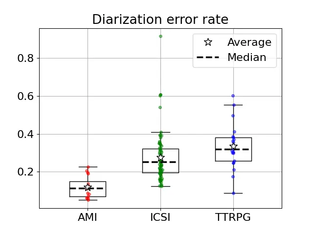\]pdfmark=/ANN,Subtype=/Widget,Raw=/TU
(A boxplot diagram showing the diarization error rate for AMI, ICSI and
TTRPG. AMI: Average 0.12, median 0.11, 1. quartile 0.07, 3. quartile
0.15, interquartile range from 0.05 to 0.23, no outliners. ICSI: Average
0.28, median 0.25, 1. quartile 0.19, 3. quartile 0.32, interquartile
range from 0.12 to 0.41, outliners at 0.54, 0.60, 0.61, 0.61 and 0.92.
TTRPG: Average 0.33, median 0.32, 1. quartile 0.26, 3. quartile 0.38,
interquartile range from 0.09 to 0.55, outliner at
0.60.\textCR(\pc@goptd@deadline)) /T (tooltip zref@6) /C \[ \] /FT/Btn
/F 768 /Ff 65536 /H/N /BS \<\< /W 0 \>\>

Figure 6: The DER by pyannote.audio. A one-sided Mann-Whitney U
test Mann and Whitney (1947) showed that the TTRPG dataset was
significant higher than AMI ($`U=14`$, $`p=1\cdot 10^{-6}`$) or ICSI
($`U=492`$, $`p=0.004`$).

\HyColor@XZeroOneThreeFour\pc

@goptd@color\pc@hyenc@colorpdfcommentcolor\HyColor@XZeroOneThreeFour\pc@goptd@fontcolor\pc@hyenc@fontcolorpdfcommentcolor\HyColor@XZeroOneThreeFour\pc@goptd@icolor\pc@hyenc@icolorpdfcommentcolor\pdfmark\[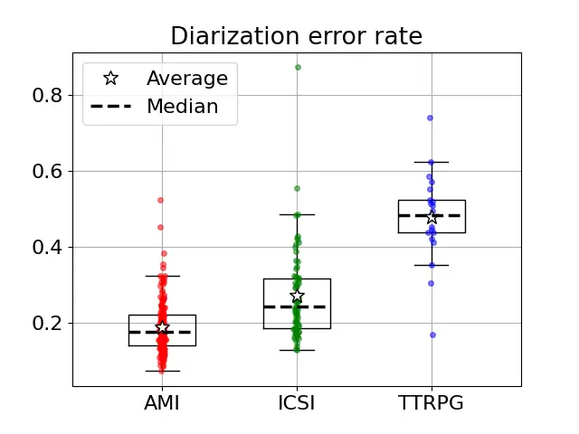\]pdfmark=/ANN,Subtype=/Widget,Raw=/TU
(A boxplot diagram showing the diarization error rate for AMI, ICSI and
TTRPG. AMI: Average 0.188, median 0.176, 1. quartile 0.140, 3. quartile
0.220, interquartile range from 0.072 to 0.346, outliners at 0.35,
0.383, 0.452 and 0.524. ICSI: Average 0.270, median 0.242, 1. quartile
0.187, 3. quartile 0.318, interquartile range from 0.129 to 0.485,
outliners at 0.554 and 0.874. TTRPG: Average 0.478, median 0.484, 1.
quartile 0.438, 3. quartile 0.523, interquartile range from 0.353 to
0.624, outliner at 0.170, 0.305 and 0.741.\textCR(\pc@goptd@deadline))
/T (tooltip zref@7) /C \[ \] /FT/Btn /F 768 /Ff 65536 /H/N /BS \<\< /W 0
\>\>

Figure 7: The DER by wespeaker. A one-sided Mann-Whitney U test Mann and
Whitney (1947) showed that the TTRPG dataset was significant higher than
AMI ($`U=126`$, $`p=2\cdot 10^{-12}`$) or ICSI ($`U=152`$,
$`p=9\cdot 10^{-9}`$).

\HyColor@XZeroOneThreeFour\pc

@goptd@color\pc@hyenc@colorpdfcommentcolor\HyColor@XZeroOneThreeFour\pc@goptd@fontcolor\pc@hyenc@fontcolorpdfcommentcolor\HyColor@XZeroOneThreeFour\pc@goptd@icolor\pc@hyenc@icolorpdfcommentcolor\pdfmark\[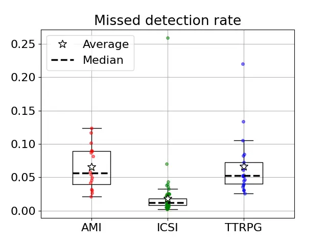\]pdfmark=/ANN,Subtype=/Widget,Raw=/TU
(A boxplot diagram showing the missed detection rate for AMI, ICSI and
TTRPG. AMI: Average 0.066, median 0.056, 1. quartile 0.039, 3. quartile
0.090, interquartile range from 0.021 to 0.124, no outliners. ICSI:
Average 0.018, median 0.012, 1. quartile 0.008, 3. quartile 0.018,
interquartile range from 0.002 to 0.032, outliners at 0.036, 0.038,
0.040, 0.043, 0.070 and 0.26. TTRPG: Average 0.066, median 0.052, 1.
quartile 0.040, 3. quartile 0.072, interquartile range from 0.026 to
0.106, outliners at 0.13 and 0.22.\textCR(\pc@goptd@deadline)) /T
(tooltip zref@8) /C \[ \] /FT/Btn /F 768 /Ff 65536 /H/N /BS \<\< /W 0
\>\>

Figure 8: The missed detection by pyannote.audio. A two-sided
Mann-Whitney U test Mann and Whitney (1947) did not show significant
differences between AMI and TTRPG ($`U=176`$, $`p=0.8`$), but ICSI
differs significantly from AMI ($`U=1147`$, $`p=1\cdot 10^{-8}`$) and
TTRPG ($`U=58`$, $`p=1\cdot 10^{-10}`$).

\HyColor@XZeroOneThreeFour\pc

@goptd@color\pc@hyenc@colorpdfcommentcolor\HyColor@XZeroOneThreeFour\pc@goptd@fontcolor\pc@hyenc@fontcolorpdfcommentcolor\HyColor@XZeroOneThreeFour\pc@goptd@icolor\pc@hyenc@icolorpdfcommentcolor\pdfmark\[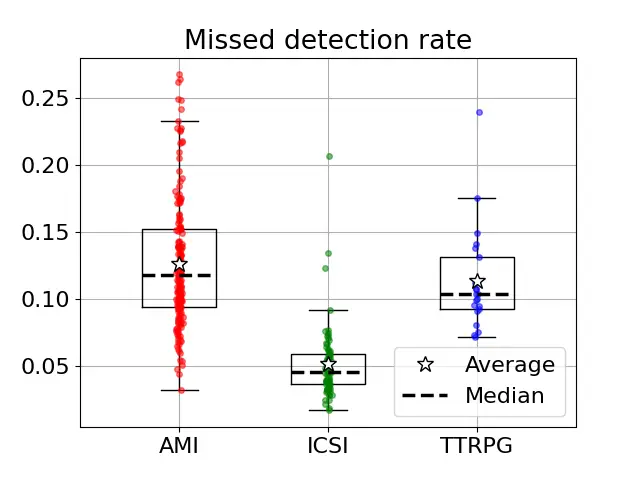\]pdfmark=/ANN,Subtype=/Widget,Raw=/TU
(A boxplot diagram showing the missed detection rate for AMI, ICSI and
TTRPG. AMI: Average 0.126, median 0.118, 1. quartile 0.094, 3. quartile
0.152, interquartile range from 0.032 to 0.232, outliners at 0.242,
0.248, 0.249, 0.264, 0.261 and 0.267. ICSI: Average 0.052, median
0.046, 1. quartile 0.037, 3. quartile 0.059, interquartile range from
0.017 to 0.092, outliners at 0.124, 0.134 and 0.207. TTRPG: Average
0.114, median 0.104, 1. quartile 0.092, 3. quartile 0.131, interquartile
range from 0.072 to 0.175, outliner at
0.240.\textCR(\pc@goptd@deadline)) /T (tooltip zref@9) /C \[ \] /FT/Btn
/F 768 /Ff 65536 /H/N /BS \<\< /W 0 \>\>

Figure 9: The missed detection by wespeaker. A two-sided Mann-Whitney U
test Mann and Whitney (1947) did not show significant differences
between AMI and TTRPG ($`U=2079`$, $`p=0.2`$), but ICSI differs
significantly from AMI ($`U=11910`$, $`p=2\cdot 10^{-28}`$) and TTRPG
($`U=66`$, $`p=2\cdot 10^{-10}`$).

\HyColor@XZeroOneThreeFour\pc

@goptd@color\pc@hyenc@colorpdfcommentcolor\HyColor@XZeroOneThreeFour\pc@goptd@fontcolor\pc@hyenc@fontcolorpdfcommentcolor\HyColor@XZeroOneThreeFour\pc@goptd@icolor\pc@hyenc@icolorpdfcommentcolor\pdfmark\[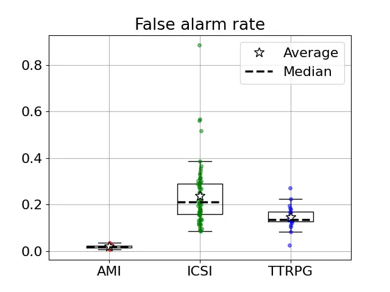\]pdfmark=/ANN,Subtype=/Widget,Raw=/TU
(A boxplot diagram showing the false alarm rate for AMI, ICSI and TTRPG.
AMI: Average 0.018, median 0.018, 1. quartile 0.015, 3. quartile 0.023,
interquartile range from 0.006 to 0.035, no outliners. ICSI: Average
0.24, median 0.21, 1. quartile 0.16, 3. quartile 0.29, interquartile
range from 0.086 to 0.38, outliners at 0.52, 0.56 and 0.88. TTRPG:
Average 0.145, median 0.134, 1. quartile 0.126, 3. quartile 0.168,
interquartile range from 0.083 to 0.224, outliners at 0.025 and
0.271.\textCR(\pc@goptd@deadline)) /T (tooltip zref@10) /C \[ \] /FT/Btn
/F 768 /Ff 65536 /H/N /BS \<\< /W 0 \>\>

Figure 10: The false alarm by pyannote.audio. A two-sided Mann-Whitney U
test Mann and Whitney (1947) showed a significant difference between
ICSI and TTRPG ($`U=1224`$, $`p=1\cdot 10^{-4}`$). A one-sided test
showed the TTRPG rates to be significantly higher than the AMI rates
($`U=4`$, $`p=3\cdot 10^{-7}`$).

\HyColor@XZeroOneThreeFour\pc

@goptd@color\pc@hyenc@colorpdfcommentcolor\HyColor@XZeroOneThreeFour\pc@goptd@fontcolor\pc@hyenc@fontcolorpdfcommentcolor\HyColor@XZeroOneThreeFour\pc@goptd@icolor\pc@hyenc@icolorpdfcommentcolor\pdfmark\[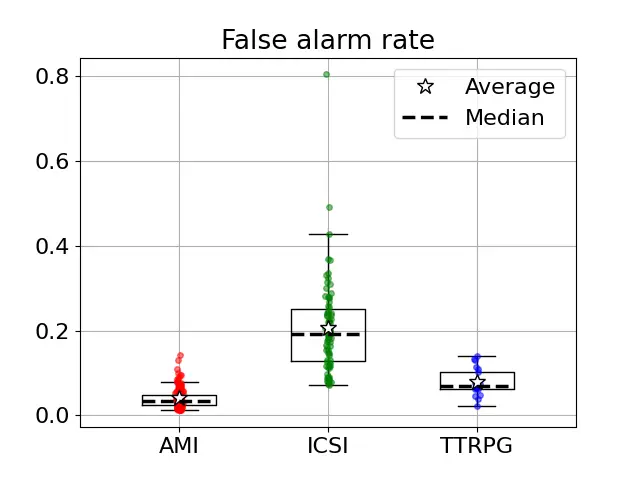\]pdfmark=/ANN,Subtype=/Widget,Raw=/TU
(A boxplot diagram showing the false alarm rate for AMI, ICSI and TTRPG.
AMI: Average 0.040, median 0.034, 1. quartile 0.025, 3. quartile 0.047,
interquartile range from 0.011 to 0.086, outliners at 0.087, 0.089,
0.094, 0.096, 0.099, 0.110, 0.130 and 0.142. ICSI: Average 0.207, median
0.192, 1. quartile 0.128, 3. quartile 0.251, interquartile range from
0.073 to 0.428, outliners at 0.491 and 0.804. TTRPG: Average 0.078,
median 0.069, 1. quartile 0.062, 3. quartile 0.102, interquartile range
from 0.022 to 0.139, no outliners.\textCR(\pc@goptd@deadline)) /T
(tooltip zref@11) /C \[ \] /FT/Btn /F 768 /Ff 65536 /H/N /BS \<\< /W 0
\>\>

Figure 11: The false alarm by wespeaker. A two-sided Mann-Whitney U
test Mann and Whitney (1947) showed a significant difference between
ICSI and TTRPG ($`U=1473`$, $`p=1\cdot 10^{-9}`$). A one-sided test
showed the TTRPG rates to be significantly higher than the AMI rates
($`U=538`$, $`p=1\cdot 10^{-7}`$).

\HyColor@XZeroOneThreeFour\pc

@goptd@color\pc@hyenc@colorpdfcommentcolor\HyColor@XZeroOneThreeFour\pc@goptd@fontcolor\pc@hyenc@fontcolorpdfcommentcolor\HyColor@XZeroOneThreeFour\pc@goptd@icolor\pc@hyenc@icolorpdfcommentcolor\pdfmark\[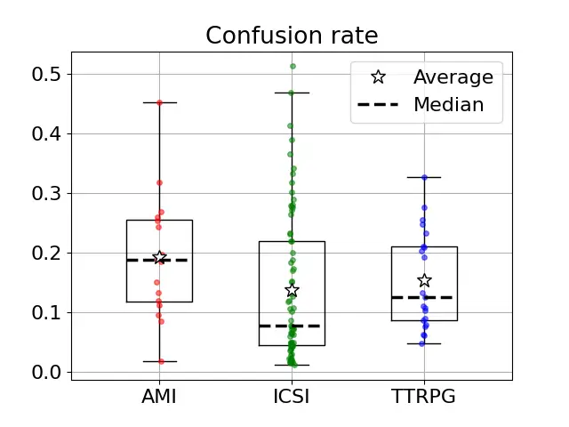\]pdfmark=/ANN,Subtype=/Widget,Raw=/TU
(A boxplot diagram showing the confusion rate for AMI, ICSI and TTRPG.
AMI: Average 0.193, median 0.188, 1. quartile 0.118, 3. quartile 0.256,
interquartile range from 0.017 to 0.452, no outliners. ICSI: Average
0.138, median 0.077, 1. quartile 0.043, 3. quartile 0.219, interquartile
range from 0.011 to 0.469, outliner at 0.513. TTRPG: Average 0.154,
median 0.126, 1. quartile 0.086, 3. quartile 0.211, interquartile range
from 0.048 to 0.328, no outliners.\textCR(\pc@goptd@deadline)) /T
(tooltip zref@12) /C \[ \] /FT/Btn /F 768 /Ff 65536 /H/N /BS \<\< /W 0
\>\>

Figure 12: The confusion by pyannote.audio if the numbers of speakers
has been given. A two-sided Mann-Whitney U test Mann and Whitney (1947)
did not show significant differences between AMI and TTRPG ($`U=207`$,
$`p=0.2`$) or ICSI and TTRPG ($`U=605`$, $`p=0.1`$).

\HyColor@XZeroOneThreeFour\pc

@goptd@color\pc@hyenc@colorpdfcommentcolor\HyColor@XZeroOneThreeFour\pc@goptd@fontcolor\pc@hyenc@fontcolorpdfcommentcolor\HyColor@XZeroOneThreeFour\pc@goptd@icolor\pc@hyenc@icolorpdfcommentcolor\pdfmark\[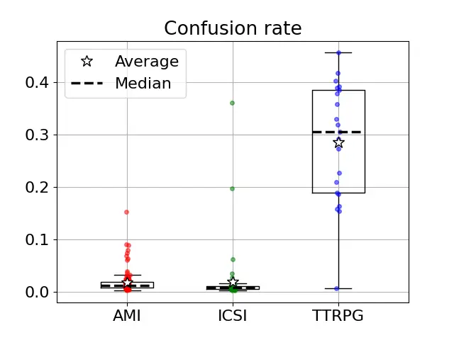\]pdfmark=/ANN,Subtype=/Widget,Raw=/TU
(A boxplot diagram showing the confusion rate for AMI, ICSI and TTRPG.
AMI: Average 0.018, median 0.013, 1. quartile 0.009, 3. quartile 0.019,
interquartile range from 0.003 to 0.037, outliners at 0.040, 0.061,
0.064, 0.070, 0.074, 0.080, 0.089, 0.091 and 0.153. ICSI: Average
0.0.019, median 0.008, 1. quartile 0.006, 3. quartile 0.011,
interquartile range from 0.002 to 0.022, outliners at 0.028, 0.036,
0.062, 0.20 and 0.361. TTRPG: Average 0.285, median 0.305, 1. quartile
0.189, 3. quartile 0.385, interquartile range from 0.007 to 0.456, no
outliners.\textCR(\pc@goptd@deadline)) /T (tooltip zref@13) /C \[ \]
/FT/Btn /F 768 /Ff 65536 /H/N /BS \<\< /W 0 \>\>

Figure 13: The confusion by wespeaker if the number of speakers has been
given. A two-sided Mann-Whitney U test Mann and Whitney (1947) showed
significant differences between AMI and TTRPG ($`U=148`$,
$`p=1\cdot 10^{-12}`$) or ICSI and TTRPG ($`U=54`$,
$`p=3\cdot 10^{-10}`$).
