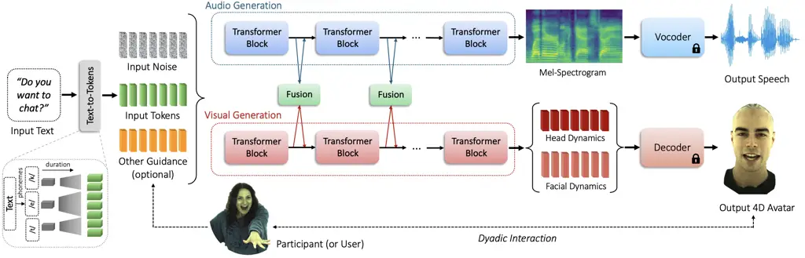
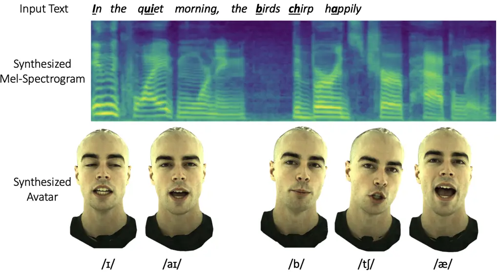
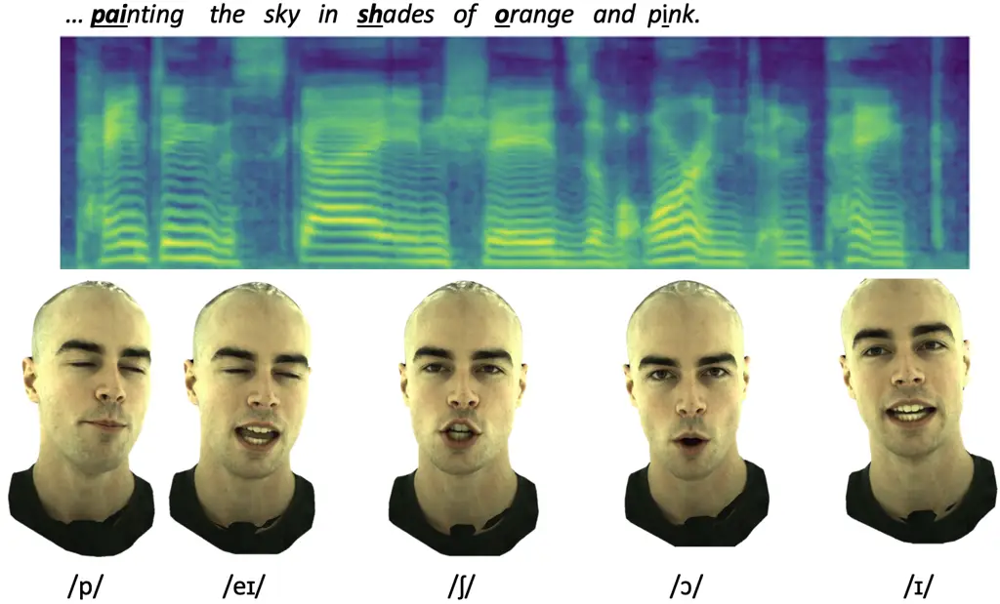
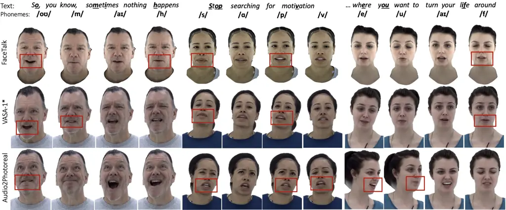
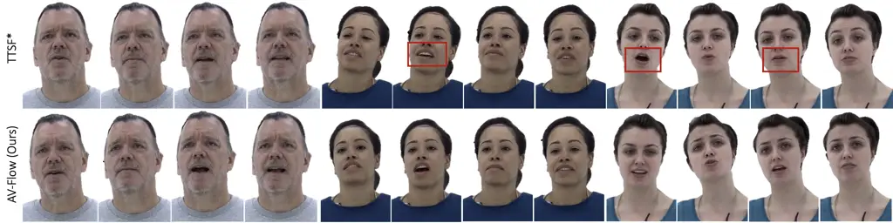
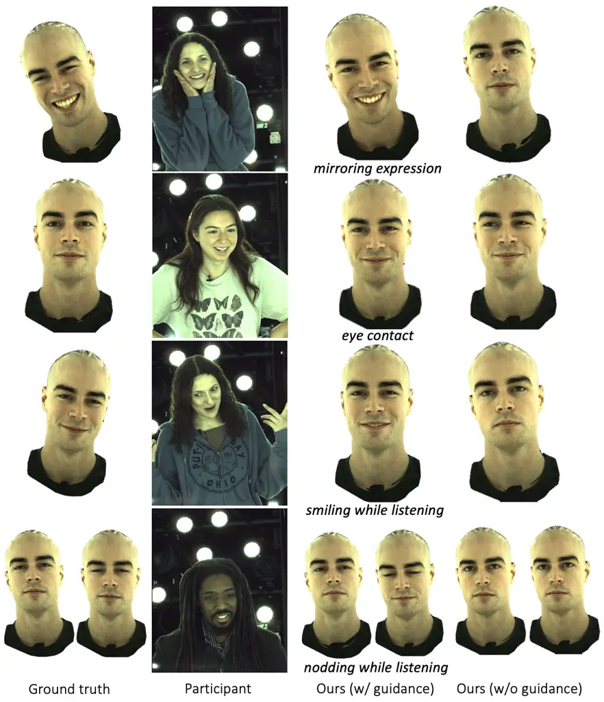
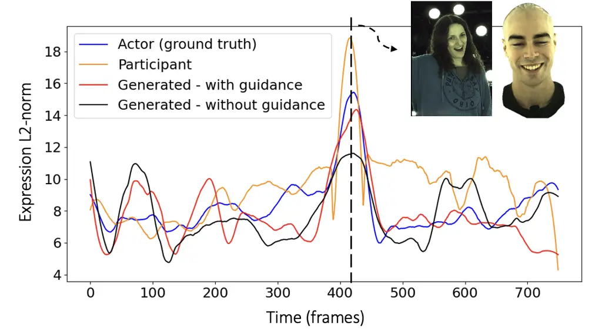
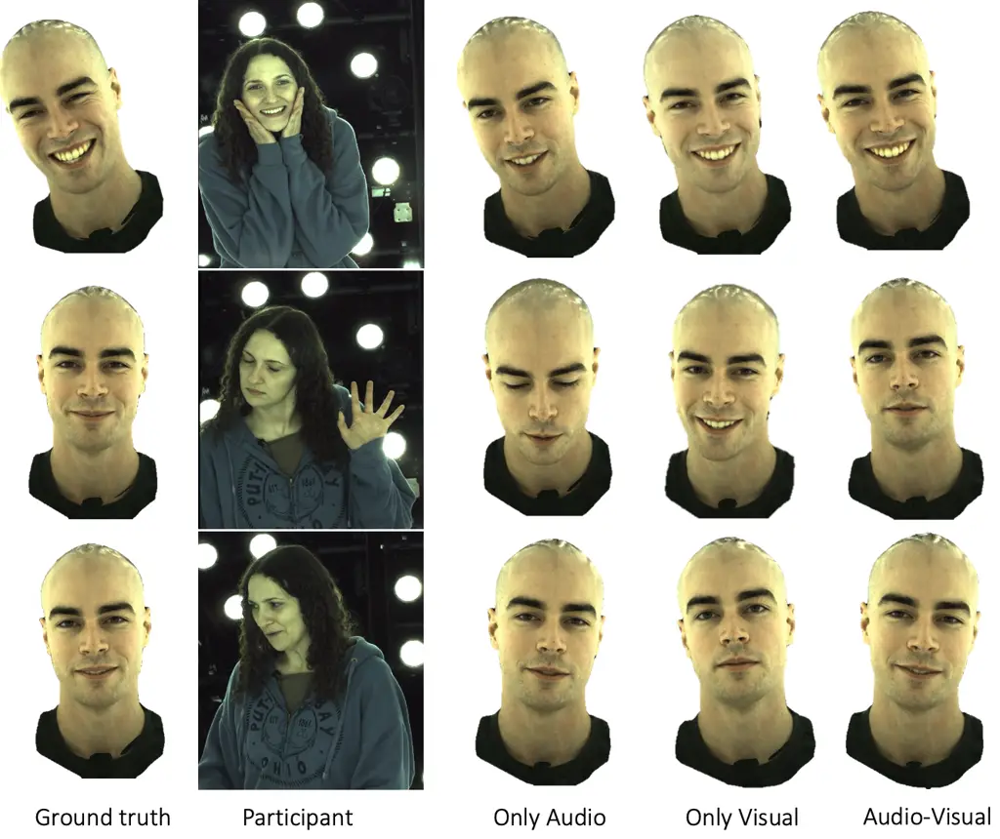
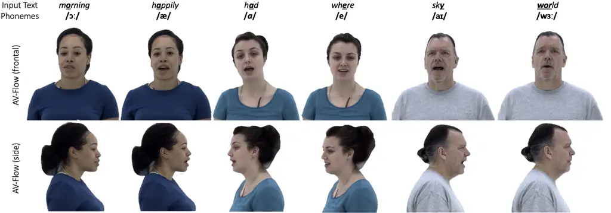
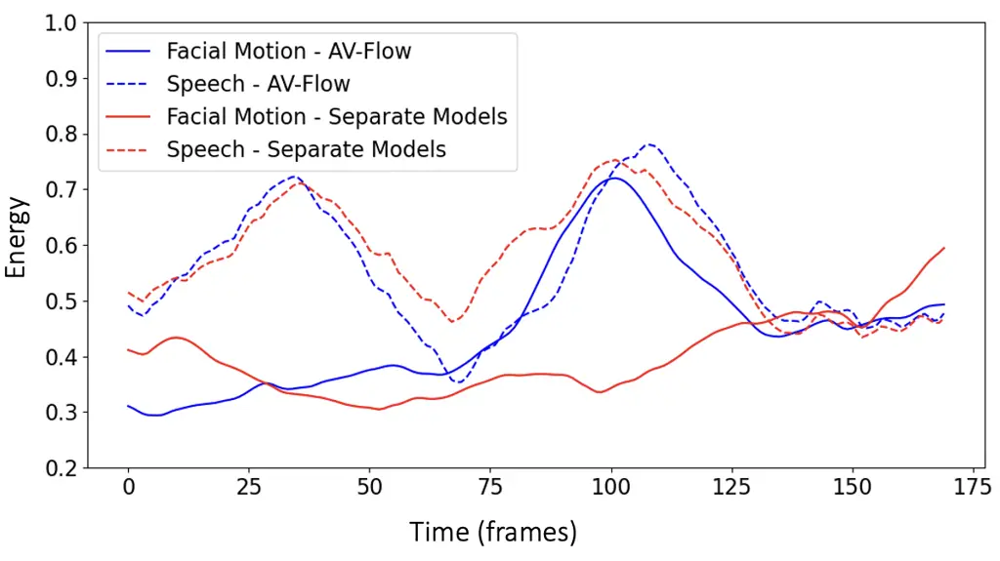

# AV-Flow: Transforming Text to Audio-Visual Human-like Interactions

Aggelina Chatziagapi Affiliation: Stony Brook University
Email: [aggelina@cs.stonybrook.edu](mailto:)    Louis-Philippe Morency
Affiliation: Meta AI Email: [lpmorency@meta.com](mailto:)    Hongyu Gong
Affiliation: Meta AI Email: [hygong@meta.com](mailto:)    Michael
Zollhöfer Affiliation: Codec Avatars Lab, Meta
Email: [zollhoefer@meta.com](mailto:)    Dimitris Samaras
Affiliation: Stony Brook University
Email: [samaras@cs.stonybrook.edu](mailto:)    Alexander Richard
Affiliation: Codec Avatars Lab, Meta
Email: [richardalex@meta.com](mailto:)

###### Abstract

We introduce AV-Flow, an audio-visual generative model that animates
photo-realistic 4D talking avatars given only text input. In contrast to
prior work that assumes an existing speech signal, we synthesize speech
and vision jointly. We demonstrate human-like speech synthesis,
synchronized lip motion, lively facial expressions and head pose; all
generated from just text characters. The core premise of our approach
lies in the architecture of our two parallel diffusion transformers.
Intermediate highway connections ensure communication between the audio
and visual modalities, and thus, synchronized speech intonation and
facial dynamics (e.g., eyebrow motion). Our model is trained with flow
matching, leading to expressive results and fast inference. In case of
dyadic conversations, AV-Flow produces an always-on avatar, that
actively listens and reacts to the audio-visual input of a user. Through
extensive experiments, we show that our method outperforms prior work,
synthesizing natural-looking 4D talking avatars. Project page:
[https://aggelinacha.github.io/AV-Flow/](https://aggelinacha.github.io/AV-Flow/).

![[Uncaptioned
image]](arxiv-2502-13133--fc0655c6ad64.figures/figure-1.webp)

Figure 1: We present AV-Flow, a novel method for joint audio-visual
generation of 4D talking avatars, given text input only (_e.g_. obtained
from an LLM). Inter-connected diffusion transformers ensure cross-modal
communication, synthesizing synchronized speech, facial motion, and head
motion, based on the flow matching objective. AV-Flow further enables
empathetic dyadic interactions, by animating an always-on avatar that
actively listens and reacts to the audio-visual input of a user.

## 1 Introduction

With the rise of large language models (LLMs), such as ChatGPT or Llama,
we have entered an era where we can communicate and interact with
artificial intelligence and knowledge-based systems using human
language. However, such communication is currently largely limited to
text only, with some speech-based exceptions like GPT-4o. As beings with
spatial audio-visual sensing, humans evolved to communicate best through
speech and facial expressions. An immersive and natural interaction
between a human and an AI system therefore requires more than just text.

In this work, we aim to get one step closer to closing this gap. We
demonstrate a method that synthesizes a photo-realistic 4D avatar, based
on text input only, and generates speech, facial expressions, head
motion, and lip sync simultaneously. Since listening and reactive
expressions are just as much part of a communication as speaking, we
further show that we can learn active listening behavior – like
back-channeling of expressions – from the audio-visual input from a
user. Overall, our approach allows to animate an always-on 4D avatar by
transforming text (_e.g_., as obtained from an LLM) into expressive
speech and facial motion, and exhibits active listening and expressive
reactions, leading to empathetic dyadic interactions.

Our work is closely related to talking face generation, which has been a
topic of research exploration for many years. Early works learn
phoneme-to-viseme mappings \[6, 5\]. More recent approaches model
talking faces with deep neural networks, conditioned on speech signals,
either for 2D videos \[57, 24, 95, 93\] or for 3D meshes \[12, 61, 19,
1\]. Generative adversarial networks (GANs) \[23\] have repeatedly shown
appealing results \[57, 77, 97, 28\]. Currently, diffusion models \[25\]
have taken over the generative modeling space, with VASA-1 \[86\]
achieving lifelike generation of audio-driven talking faces in 2D
videos.

However, these works tend to fall short on one or multiple axes. First,
most are limited to cascaded systems. They assume that an input speech
signal is already provided, either as a real recording of a human voice
or generated by a pre-trained text-to-speech system, and mainly focus on
precise lip synchronization. Connecting these systems to an LLM requires
a cascaded approach of text-to-speech, followed by speech-to-vision. In
contrast, we propose an architecture that jointly generates audio and
visual outputs, directly from text. In this way, we achieve natural
synchronization of different modalities (_e.g_., speech intonation and
corresponding eyebrow motion) and avoid latency and error accumulation
that cascaded systems suffer from. Second, existing systems typically
focus on monadic settings. They can generate facial animation given text
or speech, yet do not consider non-speech cases. In other words,
existing systems can actively speak, but they do not generate authentic
listening behavior. We demonstrate that conditioning on audio-visual
user input creates authentic listening behavior, such as back-channeling
of smiles. Third, most existing works operate on 2D video or on
untextured 3D meshes which lack detail. Our approach operates on
high-quality photo-realistic 4D avatars instead.

Our proposed AV-Flow (Audio-Visual Flow Matching) consists of two
inter-connected diffusion transformers. Given input text tokens, one
transformer generates the speech signal and the other one generates the
visual output. Through intermediate highway connections, we ensure
communication between the speech and visual modalities. In this way,
AV-Flow synthesizes highly correlated speech and vision (_e.g_.,
synchronized speech intonation with facial dynamics). With additional
conditioning on a user’s video and audio, we allow our system to reason
over the user’s behavior and generate avatar motion accordingly, leading
to richer expressions, back-channeling of emotional cues like smiles, or
affirming head nods. We resort to flow matching \[40\] as a training
objective, in order to achieve fast inference and synthesize human-like
speech and 4D visual outputs, that capture natural nuances and
expressive motion.

In brief, our contributions are as follows:

- •
  We introduce AV-Flow, a novel approach for joint audio-visual
  generation of 4D talking avatars using flow matching, given just input
  text.
- •
  Our fully-parallel diffusion transformers ensure cross-modal
  interaction through intermediate highway connections, generating
  correlated speech and visual outputs.
- •
  AV-Flow enables dyadic conversations, by animating an always-on avatar
  that actively listens and reacts to the audio-visual input of a user.

## 2 Related Work

Audio-driven Talking Heads. Earlier approaches for audio-driven talking
face generation, such as Video Rewrite \[6\] and Voice Puppetry \[5\],
propose probabilistic models that map phonemes extracted from an audio
signal to corresponding mouth shapes (visemes). This phoneme-to-viseme
mapping can be learned by hidden Markov models (HMMs) \[63, 21\],
decision trees \[32\], or long short-term memory (LSTM) units \[18\].
Synthesizing Obama \[71\] is one of the first notable works that
produces photo-realistic lip synced videos of former U.S. President
Barack Obama. Subsequent works propose encoder-decoder architectures,
most of them trained as generative adversarial networks (GANs) \[23\],
using large video datasets  \[57, 27, 77, 9, 94, 95, 97, 75, 34\]. Most
operate in the 2D space, generating low-resolution videos, while some of
them use intermediate representations, like landmarks or 3DMM
parameters \[4, 93\]. They mainly focus on precise lip synchronization,
_e.g_., Wav2Lip \[57\]. A few enable additional control of head
pose \[95, 97\] or emotion \[14, 84, 29, 79, 22\]. Recent approaches
produce higher-resolution images, by learning a 3D representation of the
human head based on neural radiance fields (NeRFs) \[24, 42, 88, 90, 89,
8\] or gaussian splatting \[10, 36\]. Still, the output is a 2D video
and they require a pre-recorded speech signal as input.

Another line of work addresses the problem of audio-driven 4D facial
animation. Several works learn to animate subject-specific face
models \[30, 56, 59, 7\] or artist-designed character rigs \[72, 15,
96\] based on input speech. Works \[12, 1, 74, 83, 55, 70\], like
VOCA \[12\], MeshTalk \[60\], FaceFormer \[19\], and FaceTalk \[1\] show
expressive animation of 3D meshes, accurately lip syncing to speech
inputs. However, they do not learn head motion and only use untextured
3D meshes that lack detail.

Diffusion models \[25, 66, 67\] have recently taken over in the
generative modeling domain. They have already shown improved results in
talking faces \[68, 64, 46, 76, 85, 81, 31\]. Some of them operate in
the image space, while more recent ones propose latent diffusion models;
conditioned on audio, they generate latent face embeddings.
VASA-1 \[86\] achieves lifelike generation of audio-driven talking
faces. However, all these can only produce 2D videos. More related to
our work, Audio2Photoreal \[51\] synthesizes photo-realistic 4D humans.
While it generates natural-looking gestures, it lacks in lip syncing,
and again assumes existing speech signal as input. In contrast, we
propose a method that can animate 4D avatars from just text.
Furthermore, we use flow matching \[40\], which compared to diffusion
models, achieves faster inference and better performance.



Figure 2: Overview of AV-Flow. Given any input text, our method
synthesizes expressive audio-visual 4D talking avatars, jointly
generating head and facial dynamics and the corresponding speech signal.
Two parallel diffusion transformers with intermediate highway
connections ensure communication between the audio and visual
modalities. AV-Flow can be additionally conditioned on the audio-visual
input of a user, in order to synthesize conversational avatars in dyadic
interactions.

Text-driven Talking Heads. The problem of text-driven talking faces is
much less explored. Very early works, like MikeTalk \[17\], are based on
phoneme-to-viseme mappings \[73, 78\]. Subsequently, neural networks
learn text-to-lip positions in the image space \[33, 41, 11\], but they
work on low-resolution 2D videos. Some works propose cascaded
approaches, _i.e_., text-to-speech (TTS) and then speech or latent codes
to vision \[92, 91, 50\]. However, cascaded methods usually are slower
and prone to error accumulation. Other works use text for video
editing \[20\], or as a description \[80, 39, 13, 84, 45\], in order to
control the emotional state or the identity of the generated subject.
Most related with us are TTSF \[28\] and NEUTART \[49\], which jointly
generate speech and video. However, they again work with low-resolution
2D videos. In contrast, we synthesize high-quality, photo-realistic 4D
avatars. Through our fully-parallel architecture, trained end-to-end
with flow matching, we achieve fast inference and natural-looking
talking heads. Additionally, our method enables an always-on avatar that
actively listens and reacts, leading to empathetic interactions with a
user.

## 3 Method

We present AV-Flow, a novel method for joint audio-visual generation of
4D talking avatars, driven by just text inputs. An overview of our
approach is illustrated in Fig. 2. AV-Flow consists of two
inter-connected diffusion transformers, one for audio and one for visual
generation. Given input text tokens, the audio transformer generates a
mel-spectrogram, through a series of transformer blocks.
Correspondingly, the vision transformer generates head and facial
dynamics. We design intermediate highway connections that ensure
communication between the audio and visual modalities. The synthesized
mel-spectrogram is decoded to a speech signal via a pre-trained vocoder.
Correspondingly, the predicted head and facial dynamics are rendered to
the output 4D avatar with a pre-trained decoder. The overall method
produces audio and visual outputs in a fully-parallel way. In case of
dyadic interactions, we additionally condition on audio-visual signals
from a user, which guides the synthesis of natural-looking
conversational 4D avatars.

### 3.1 Representations

Our training data consist of dyadic conversations between a main
subject, dubbed as “actor”, and a “participant” (or user). The raw audio
includes one channel for each of them. The 3D avatar representation of
the actor corresponds to the latent space of a Codec Avatar \[43, 82\].
For the participant, we have access to a monocular video showing their
face. We first present our basic AV-Flow model, which is trained on the
actor’s data only (pairs of audio, head and face encodings). In
Sec. 3.5, we demonstrate how we can additionally condition on
participant’s information to model dyadic interactions.

Input Tokens. We transcribe the raw audio using a pre-trained Wav2Vec2
model \[2\] for speech recognition (ASR) \[52, 87\]. We extract the
outputs of the last layer (logits), which essentially correspond to text
character predictions. We use the logits $`a_{i}\in\mathbb{R}^{29}`$ per
frame $`i`$ as input tokens of our model. At inference time, we can
drive our model from raw text alone, by learning a text-to-tokens module
that maps raw text to character-level logits (see Sec. 3.4).

Facial Dynamics. Our data include facial expression codes
$`\bm{f}_{i}\in\mathbb{R}^{256}`$ per frame $`i`$ of the actor, which
correspond to the latent space of a VAE \[43\]. These represent the
holistic facial motion, including facial expression, lip motion, eyebrow
and eyelid movements.

Head Dynamics. Our data also include a 6-DoF head rotation and
translation. We convert the rotation matrix to quarternion
representation and concatenate with the translation vector, leading to a
head pose $`\hat{\bm{h}}_{i}\in\mathbb{R}^{7}`$ per frame $`i`$. We
train a small temporal VAE on the head poses, with one transformer
encoder layer for the encoder and one for the decoder, in order to learn
a more robust and temporally consistent representation. We use the
latent space of this VAE to encode the head dynamics
$`\bm{h}_{i}\in\mathbb{R}^{8}`$ per frame $`i`$.

### 3.2 Architecture

Diffusion Transformers. We construct 2 parallel diffusion transformers,
one for the audio generation and one for the visual generation. Each of
them is based on the original architecture of latent diffusion
transformer (DiT) models \[54\], and consists of $`N`$ blocks. We follow
the variant of in-context conditioning, concatenating input noise with
the input tokens. The transformers are trained to progressively denoise
the input noise, in order to restore the corresponding signal, and model
the appropriate distribution. Formally, for a sequence of $`n`$ frames
with input tokens $`A=\{\bm{a}_{1},\bm{a}_{2},\dots,\bm{a}_{n}\}`$, the
audio transformer learns to synthesize the corresponding mel-spectrogram
$`S\in\mathbb{R}^{n\times 80}`$, and the visual transformer learns to
synthesize the corresponding head poses
$`H=\{\bm{h}_{1},\bm{h}_{2},\dots,\bm{h}_{n}\}`$ and facial encodings
$`F=\{\bm{f}_{1},\bm{f}_{2},\dots,\bm{f}_{n}\}`$. In order to facilitate
the communication between the modalities and achieve exact
correspondence of the number of frames and spectrogram dimension, we
upsample the ground truth annotations to the rate of the spectrogram
bins (at 86 fps).

Audio-Visual Fusion. We design intermediate highway connections that
enable communication between the audio and visual modalities. In this
way, we achieve synchronized speech intonation with facial and head
dynamics. Formally, for an output
$`\bm{x}^{a}_{l}\in\mathbb{R}^{d_{l}}`$ of a DiT block $`l`$ of the
audio transformer ($`l=1,\dots,N`$), and the corresponding output
$`\bm{x}^{v}_{l}\in\mathbb{R}^{d_{l}}`$ of the vision transformer, we
learn a linear fusion:

```math
\displaystyle\bm{y}^{a}_{l}=\bm{x}^{a}_{l}+\bm{U}_{l}^{\intercal}[\bm{x}^{a}_{l};\bm{x}^{v}_{l}]+\bm{b}_{l}, \tag{1}
```

```math
\displaystyle\bm{y}^{v}_{l}=\bm{x}^{v}_{l}+\bm{V}_{l}^{\intercal}[\bm{x}^{a}_{l};\bm{x}^{v}_{l}]+\bm{c}_{l}, \tag{2}
```

where $`\bm{U}_{l},\bm{V}_{l}\in\mathbb{R}^{2d_{l}\times d_{l}}`$ and
$`\bm{b}_{l},\bm{c}_{l}\in\mathbb{R}^{d_{l}}`$ are learnable parameters.
The resulting features $`\bm{y}^{a}_{l}`$ and $`\bm{y}^{v}_{l}`$ are
then fed as input into the next transformer block $`l+1`$ of the audio
and visual transformer, respectively (see Fig. 2).

Vocoder. We decode the synthesized mel-spectrogram to a speech signal
using a pre-trained BigVGAN vocoder \[35\]. We use the base version that
is trained with speech signals sampled at 22050 Hz and spectrograms with
80 mel bands. We keep its weights frozen.

Avatar Decoder and Renderer. We use the mesh-based Codec Avatar decoder
and renderer released in \[51, 3\].

### 3.3 Flow Matching

Flow matching is an efficient approach for generative modeling, recently
introduced by Lipman _et al_. \[40\]. It combines ideas from continuous
normalizing flows (CNF) and diffusion models. It leads to simpler paths
with straight line trajectories, compared to the curved paths of
diffusion models. Thus, it enables faster training and inference. In
this section, we describe an overview of flow matching, that we use to
train AV-Flow. We refer the interested reader to \[40\].

Let $`\bm{x}\in\mathbb{R}^{d}`$ an observation in the data space (that
can be a spectrogram sample or head pose or face encoding in our case),
sampled from an unknown distribution $`q(\bm{x})`$. A probability
density path is a time-dependent probability density function
$`p_{t}:[0,1]\times\mathbb{R}^{d}\rightarrow\mathbb{R}^{+}`$. CNFs
construct a probability path $`p_{t}`$ such that $`p_{0}`$ is a simple
prior distribution, _i.e_., a standard normal distribution
$`p_{0}(\bm{x})=\mathcal{N}(\bm{x};\bm{0},\bm{I})`$, and $`p_{1}`$
approximates the distribution $`q`$. A time-dependent vector field
$`u_{t}:[0,1]\times\mathbb{R}^{d}\rightarrow\mathbb{R}^{d}`$ generates
the path $`p_{t}`$, and is used to construct a flow
$`\phi_{t}:[0,1]\times\mathbb{R}^{d}\rightarrow\mathbb{R}^{d}`$;
$`\phi_{t}`$ pushes the data from the prior towards the target
distribution and is defined via the ordinary differential equation
(ODE):

```math
\frac{d}{dt}\phi_{t}(\bm{x})=v_{t}(\phi_{t}(\bm{x}));\quad\phi_{0}(\bm{x})=\bm{x}. \tag{3}
```

The vector field $`v_{t}`$ is approximated by a neural network with
parameters $`\bm{\theta}`$. Flow matching proposes the following
objective, that allow us to flow from $`p_{0}`$ to $`p_{1}`$:

```math
\mathcal{L}_{\text{FM}}(\bm{\theta})=\mathop{\mathbb{E}_{t,p_{t}(\bm{x})}}\|v_{t}(\bm{x};\bm{\theta})-u_{t}(\bm{x})\|^{2}. \tag{4}
```

As a tractable instantiation of Eq. (4), we follow the Optimal Transport
(OT) formulation from \[40\] where the flow from $`p_{0}`$ to $`p_{1}`$
is modeled by a straight line. Then,

```math
\displaystyle\phi_{t}(\bm{x})=(1-(1-\sigma_{\text{min}})t)\bm{x}+t\bm{x}_{1} \tag{5}
```

and the network $`v_{t}`$ predicting the flow from a random Gaussian
sample $`\bm{x}_{0}\sim p_{0}(\bm{x})`$ to a data sample
$`\bm{x}_{1}\sim q(\bm{x}_{1})`$ can be trained by optimizing the
conditional flow matching objective:

```math
\displaystyle\mathcal{L}_{\text{CFM}}=\mathbb{E}_{t,\bm{x}_{0},\bm{x}_{1}}\|v_{t}(\phi_{t}(\bm{x}_{0}))-\big(\bm{x}_{1}-(1-\sigma_{\text{min}})\bm{x}_{0}\big)\|^{2}. \tag{6}
```

We empirically found that an L1 loss leads to more realistic results
than an L2 loss. Therefore, we optimize the objective:

```math
\mathcal{L}_{\text{AV-Flow}}=\lambda_{s}\mathcal{L}_{s}+\lambda_{h}\mathcal{L}_{h}+\lambda_{f}\mathcal{L}_{f}\;, \tag{7}
```

where $`\mathcal{L}_{s}`$, $`\mathcal{L}_{h}`$, $`\mathcal{L}_{f}`$ are
the objectives as in Eq. (6) for the mel-spectrograms $`S`$, head poses
$`H`$, and facial dynamics $`F`$ correspondingly, using L1 norm instead
of L2. Once the network $`v_{t}`$ is trained, any ODE solver can be used
to solve Eq. (3). We use the Euler solver in our work.

### 3.4 Text-Driven Generation

As mentioned in Sec. 3.1, during training, our input tokens are logits
extracted from an ASR model, since we do not have available any text
annotations. These input tokens are essentially predictions of text
characters. Thus, our model easily generalizes to any input text at
inference. To demonstrate this capability, we train a small
text-to-tokens model (see Fig. 2), that maps raw text to logits, using
the LJSpeech dataset \[26\]. It follows a similar architecture
with \[48\]. It first maps the input text to phonemes and learns
corresponding embeddings. It then predicts their duration and projects
them to character-level logits at 86 fps (see also suppl.).

### 3.5 Dyadic Conversations

An important capability of AV-Flow is that it can be easily conditioned
to other input signals, that can guide the audio-visual generation
accordingly. Using our conversational data (described in more detail in
Sec. 4), we demonstrate how we can guide the 4D talking avatar in a
dyadic interaction, based on the audio-visual input of a user (see
Fig. 2). In this way, we synthesize a conversational avatar, that
actively listens and reacts (_e.g_., with facial expressions or head
nodding), leading to empathetic interactions.

We propose to provide audio and visual guidance from the raw monocular
video of the participant. Given each video frame $`i`$, we extract
features $`\bm{s}_{i}`$ using SMIRK \[58\]. SMIRK predicts FLAME \[38\]
parameters given a single image and faithfully captures a large variety
of facial expressions. The features
$`\bm{s}_{i}=[\bm{e}_{i};\bm{j}_{i};\bm{r}_{i}]`$ include facial
expressions $`\bm{e}_{i}\in\mathbb{R}^{50}`$, jaw pose
$`\bm{j}_{i}\in\mathbb{R}^{3}`$, and head rotation
$`\bm{r}_{i}\in\mathbb{R}^{3}`$ per frame $`i`$. We further extract ASR
tokens $`\bm{a}_{i}^{p}`$ from the audio channel of the user, similarly
with our input tokens for the actor. Both $`\bm{s}_{i}`$ and
$`\bm{a}_{i}^{p}`$ are concatenated with the input tokens, giving
audio-visual guidance to our method and enabling dyadic interaction with
a user.

## 4 Experiments





Figure 3: Qualitative Results of AV-Flow. From just raw text characters
as input, AV-Flow synthesizes expressive audio signal (shown as
mel-spectrogram on top) and corresponding head and facial dynamics of
our 4D talking avatar.

|                 | Lip Sync               | Realism               | Diversity            |                      | AV-Alignment        |                     | Audio Quality     |                   |
| --------------- | ---------------------- | --------------------- | -------------------- | -------------------- | ------------------- | ------------------- | ----------------- | ----------------- |
| Method          | F1\_(lips)$`\uparrow`$ | FD\_(e)$`\downarrow`$ | Div\_(h)$`\uparrow`$ | Div\_(e)$`\uparrow`$ | BC\_(h)$`\uparrow`$ | BC\_(e)$`\uparrow`$ | MCD$`\downarrow`$ | WER$`\downarrow`$ |
| Separate Models | 0.933                  | 0.981                 | 0.023                | 0.614                | 0.218               | 0.184               | 1.009             | 0.179             |
| Shared Weights  | 0.910                  | 0.862                 | 0.024                | 0.664                | 0.208               | 0.174               | 0.986             | 0.287             |
| Cascaded        | 0.848                  | 1.223                 | 0.026                | 0.571                | 0.222               | 0.222               | 1.009             | 0.179             |
| AV-Flow (Ours)  | 0.964                  | 0.861                 | 0.029                | 0.680                | 0.258               | 0.229               | 0.900             | 0.157             |

Table 1: Ablation Study. We compare with the following variants: (a)
Separate Models: 2 separate DiTs (one for audio and one for visual
generation), without any connections, (b) Shared Weights: 1 model for
both modalities with shared weights, (c) Cascaded Method: sequence of
audio DiT (tokens-to-speech) and visual DiT (speech-to-video). Our
proposed AV-Flow achieves the best results.

Datasets. We use the publicly available dataset proposed by
Audio2Photoreal \[51\]. This dataset includes dyadic conversations
between 4 pairs of subjects. Each session lasts about 2 hours, with a
total duration of 8 hours. There are 4 individuals. In each session one
is the main “actor” and the other one is the “participant”. The actors
are prompted to a diversity of situations, including informal and more
professional interactions. Both subjects are captured simultaneously in
multi-view capture domes, enabling photo-realistic rendering. The data
include the raw audio, face expression codes of the actors, and
pre-trained personalized renderers.

In addition to this dataset, we capture an internal dataset of 50 hours
in a similar setting. It includes 1 main actor, who is engaged in dyadic
conversations with 20 different participants. Similarly with \[51\], we
extract the raw audio at 48 kHz. Applying a simple voice activity
detection (VAD), we separate the audio of the actor from the audio of
the participant. We extract face encodings and head poses of the full 50
hours for the actor. We also have the raw video of the participant from
one camera view and a pre-trained personalized renderer for the actor.

Evaluation Metrics. Since our approach synthesizes both audio and
vision, we evaluate both modalities. Regarding the visual part, we
follow similar works \[51, 60, 59\] and choose a combination of metrics
that capture:

- •
  Lip synchronization: We first reconstruct the ground truth and
  generated 3D meshes per frame. We determine the lip closures when the
  corresponding vertices of the inner upper and lower lips match
  (_i.e_., the distance is almost zero). We compute the F1-score to
  emphasize the importance of both high precision and high
  recall \[59\].
- •
  Realism: We measure the Fréchet distance between ground truth and
  generated face expressions (FD\_(e)), in order to estimate the
  distribution distance.
- •
  Diversity: We measure the diversity of the generated head poses
  (Div*(h)) and expressions (Div*(e)) as the standard deviation across
  samples in our test set.

An important contribution of our method is the correlation between our
synthesized audio and video:

- •
  Audio-visual alignment: We calculate the Beat Align Score \[93, 98,
  65, 37\] between audio and head motion (BC*(h)) and between audio and
  facial motion (BC*(e)). The audio beats are estimated by detecting
  peaks in onset strength \[16, 47\] in the generated speech, and the
  motion beats as the local minima of the kinetic velocity \[37\].

Finally, we evaluate our synthesized speech signal:

- •
  Audio quality: We measure the mel cepstral distortion (MCD), which
  estimates the difference between mel cepstra with dynamic time
  warping \[35, 28\], and the word error rate (WER) to evaluate the
  intelligibility \[53, 87\].

Implementation Details. In  Eq. 7, we use $`\lambda_{s}=3.0`$,
$`\lambda_{f}=1.0`$, and $`\lambda_{h}=0.2`$. We notice that 8 steps for
the Euler solver give similar results with 16 or 32 steps, and lead to
faster inference. We use rotary positional embeddings \[69\] and windows
of 10 frames for the DiTs. For our input data rate of 86 fps
(see Sec. 3.2), this leads to a negligible starting latency of around
120 ms, and real-time synthesis.

### 4.1 Ablation Study

We first conduct an ablation study, comparing our proposed audio-visual
fusion with different variants: (a) Separate models: we train 2 separate
transformers in parallel (one for audio and one for visual generation),
without any connections. (b) Shared weights: we train a single model for
both modalities by concatenating the inputs/outputs. (c) Cascaded
approach: we learn the audio DiT (tokens-to-speech) followed by the
visual DiT (speech-to-video). Tab. 1 shows the corresponding
quantitative results. AV-Flow achieves the best results across all the
metrics. It produces well-synchronized lips, with accurate lip closures,
which is crucial for photo-realistic 4D talking avatars. In addition,
the proposed audio-visual fusion leads to the best correlation between
audio and motion, as measured by the BC*(h) and BC*(e) metrics.

Fig. 3 shows qualitative results of our method. From just raw text
characters as input (no audio available), AV-Flow synthesizes expressive
audio signal and corresponding facial and head dynamics of our 4D
talking avatar. Notice the accuracy of the lip motion for each phoneme
(written at the bottom), as well as the expressiveness of the avatar.





Figure 4: Qualitative Evaluation. We compare with state-of-the-art
methods for audio-driven talking faces, namely FaceTalk \[1\],
VASA-1 \[86\], Audio2Photoreal \[51\], and the text-driven TTSF \[28\]
(the only one that can generate speech from text like ours). We
re-implement VASA-1 and TTSF (denoted with an asterisk) for our data
(face encodings and renderers). FaceTalk only animates the face (not
head motion). Our proposed AV-Flow synthesizes the corresponding phoneme
(shown on top) more accurately.

|                        |                        |                       |                      |                      |                     |                     |                   |                   |                        |
| ---------------------- | ---------------------- | --------------------- | -------------------- | -------------------- | ------------------- | ------------------- | ----------------- | ----------------- | ---------------------- |
|                        | Lip Sync               | Realism               | Diversity            |                      | AV-Alignment        |                     | Audio Quality     |                   | Speed                  |
| Method                 | F1\_(lips)$`\uparrow`$ | FD\_(e)$`\downarrow`$ | Div\_(h)$`\uparrow`$ | Div\_(e)$`\uparrow`$ | BC\_(h)$`\uparrow`$ | BC\_(e)$`\uparrow`$ | MCD$`\downarrow`$ | WER$`\downarrow`$ | Time (s)$`\downarrow`$ |
| FaceTalk               | 0.851                  | 0.873                 | N/A                  | 0.670                | N/A                 | 0.209               | N/A               | N/A               | 1.443                  |
| VASA-1^(∗)             | 0.846                  | 0.887                 | 0.032                | 0.664                | 0.210               | 0.204               | N/A               | N/A               | 0.965                  |
| Audio2Photoreal        | 0.920                  | 0.879                 | 0.022                | 0.586                | 0.198               | 0.202               | N/A               | N/A               | 1.578                  |
| VASA-1^(∗) w/ TTS      | 0.710                  | 2.665                 | 0.033                | 0.678                | 0.190               | 0.201               | N/A               | N/A               | 1.265                  |
| Audio2Photoreal w/ TTS | 0.813                  | 3.289                 | 0.021                | 0.538                | 0.168               | 0.175               | N/A               | N/A               | 1.778                  |
| TTSF^(∗)               | 0.929                  | 0.962                 | 0.023                | 0.630                | 0.233               | 0.211               | 1.229             | 0.285             | 0.400                  |
| AV-Flow (Ours)         | 0.964                  | 0.861                 | 0.029                | 0.680                | 0.258               | 0.229               | 0.900             | 0.157             | 0.398                  |

Table 2: Quantitative Evaluation. We compare with state-of-the-art
methods for audio-driven talking faces, namely FaceTalk \[1\],
VASA-1 \[86\], and Audio2Photoreal \[51\]. We convert them to
text-driven by attaching our TTS (denoted w/ TTS), and compare with
TTSF \[28\] which is the only method that can generate speech from text
like ours. We re-implement VASA-1 and TTSF (denoted with an asterisk)
for our 3D data. We evaluate the synthesis quality, as well as the
inference speed (seconds for generating 20 sec. offline).

### 4.2 Evaluation

Baselines. Very few works for talking faces have addressed the problem
of text-driven generation, and even fewer the problem of joint
audio-visual generation. To the best of our knowledge, our proposed
AV-Flow is the first approach that can generate audio-visual 4D talking
heads from only text input. A concurrent work with us is TTSF \[28\].
However, we identify the following main differences: (a) TTSF only
generates 2D videos (not 4D avatars). (b) We propose a fully-parallel
architecture with intermediate highway connections, focusing on the
audio-visual fusion. (c) Our architecture is trained end-to-end with
flow matching, achieving fast inference, compared with the GAN-based
TTSF. (d) We additionally address the case of dyadic conversations,
where our model communicates with a user. Since TTSF’s code is not
available, we implement their method for our data (TTSF^(∗)), where we
train a personalized model that predicts face encodings and head motion
(therefore, without any GAN-based losses and identity prediction).

Most of the state-of-the-art methods are audio-driven and focus on the
generation of 2D talking faces. We choose to compare with the seminal
VASA-1 \[86\] that similarly with us trains a DiT (but not with flow
matching) on the latent space of head and facial dynamics. We adapt
VASA-1 to be able to deal with our 3D data (encodings and renderer) and
name the variant VASA-1^(∗). We also compare with the audio-driven face
generation of Audio2Photoreal \[78\], as well as FaceTalk \[1\]. Note
that FaceTalk only generates expressions, not head motion, but focuses
on 4D avatars compared with the other 2D methods. Finally, we attach our
text-to-speech (TTS) model and convert VASA-1^(∗) and Audio2Photoreal to
text-driven methods. For fair comparison with all these methods, in our
evaluation we use input audio from our test set that is converted to
audio features (audio-driven) or text tokens (text-driven).

Quantitative Evaluation. Tab. 2 demonstrates the corresponding
quantitative results. AV-Flow produces the best audio-visual alignment,
as well as the most accurate lip synchronization. It also synthesizes
diverse face and head motion. VASA-1^(∗) with TTS seems to slightly
surpass our method in the head diversity (Div\_(h)). However,
qualitatively we noticed that this is because it generates more noisy
head motion (higher variance). Our input tokens are also more robust as
input: in the case of our conversational data, VASA-1^(∗) generates
noisy and random motion during pauses of the actor. Additionally, we
produce better audio quality compared with TTSF \[28\].

Inference Speed. Since our method is based on flow-matching end-to-end,
it achieves faster inference than the other methods. We measure the
inference speed as the time for a single pass of the model on a single
A100 GPU, averaged across multiple runs. We assume audio features stored
and omit the renderer for this calculation. The last column of Tab. 2
shows this time in seconds. Using only 8 steps for the Euler solver,
AV-Flow needs only around 200ms to synthesize around 20 seconds of
audio-visual content (offline speed). With the additional text-to-tokens
module, it requires less than 400ms. Our TTSF^(∗) does not include any
identity prediction or StyleGAN-based architecture, and thus the
inference becomes faster from the original TTSF \[28\]. In comparison,
the text-driven VASA-1^(∗) that is diffusion-based needs more than 1
second for the same length of video generation.

Qualitative Evaluation. Fig. 4 shows qualitative comparisons with
state-of-the art methods for talking face generation. We use test audio
from the EARS dataset \[62\], and convert it to input audio features or
text tokens accordingly. Since this input comes from a different
individual than the training subject, lip syncing becomes more
challenging. We show a variety of phonemes (on top) and corresponding
mouth positions for each method. AV-Flow demonstrates significant
robustness, expressively and accurately animating the 4D talking
avatars, under any input text. We also encourage the readers to watch
our supplemental video.



Figure 5: Audio-Visual Guidance in Dyadic Conversations. The actor
reacts (with their gaze or smile) according to the participant’s
expression and/or voice (AV-Flow with guidance).



Figure 6: Guidance over time. L2 norm of expression codes for the ground
truth actor, the participant, and the generated actor with or without
guidance. With guidance, AV-Flow produces the appropriate reaction in
dyadic interactions.

### 4.3 Audio-Visual Guidance in Conversations

As mentioned in Sec. 3.5, we propose to provide audio-visual guidance
from a participant in dyadic conversations, extending AV-Flow to
conversational avatars. Very few methods put avatars in this setting,
actively talking and listening, although this interaction is common in
everyday life. Audio2Photoreal \[51\] produces listening behavior based
on audio input, but cannot react to participant’s expressions.

Fig. 5 shows the same actor talking with different participants. The
basic AV-Flow (without any guidance) is shown in the last column. With
our audio-visual guidance (3rd col.), the generated avatar reacts with
their gaze and/or smile, according to the participant’s expression or
voice. Fig. 6 shows the L2 norm of the SMIRK \[58\] expression codes
over time for the ground truth actor, participant, and generated actor
with and without guidance. The graph shows how the actor reacts at the
same time or before/after the participant, while they interact. With the
proposed guidance, AV-Flow produces the appropriate expression, leading
to empathetic interactions. We also noticed a $`2\%`$ decrease in FD\_(e)
for our test set with this guidance (see also suppl.).

## 5 Conclusion

In conclusion, we introduce a novel method for joint audio-visual
generation of 4D talking avatars, given only text inputs (_e.g_.,
obtained by an LLM). Our fully-parallel diffusion-based architecture
ensures cross-modal communication, leading to synchronized audio and
visual modalities. Trained with flow matching, AV-Flow leads to fast
inference and natural-looking talking faces. It also enables dyadic
conversations, animating an always-on avatar that actively listens and
reacts to the audio-visual input of a user. We believe that this work
gets one step closer to enabling natural interaction between a human and
an AI system.

Limitations and Ethical Considerations. While our method produces
natural-looking avatars, it does not have any understanding of the
semantic content of the inputs. E.g., if a user makes a joke without
laughing themselves, the model would not know that it was a joke and
could not react accordingly. This will be an interesting exploration for
future work. In this work, we only use consenting participants. Since
our method is identity-specific, only these can be rendered. This
addresses ethical concerns of generating non-consenting subjects.

## References

- \[1\] Shivangi Aneja, Justus Thies, Angela Dai, and Matthias Nießner.
  Facetalk: Audio-driven motion diffusion for neural parametric head
  models. In _Proc. IEEE Conf. on Computer Vision and Pattern
  Recognition (CVPR)_, 2024.
- \[2\] Alexei Baevski, Yuhao Zhou, Abdelrahman Mohamed, and Michael
  Auli. wav2vec 2.0: A framework for self-supervised learning of speech
  representations. _Advances in neural information processing systems_,
  33:12449–12460, 2020.
- \[3\] Timur Bagautdinov, Chenglei Wu, Tomas Simon, Fabián Prada,
  Takaaki Shiratori, Shih-En Wei, Weipeng Xu, Yaser Sheikh, and Jason
  Saragih. Driving-signal aware full-body avatars. _ACM Transactions on
  Graphics (TOG)_, 40(4):1–17, 2021.
- \[4\] Volker Blanz and Thomas Vetter. A morphable model for the
  synthesis of 3d faces. In _Proceedings of the 26th annual conference
  on Computer graphics and interactive techniques_, pages 187–194, 1999.
- \[5\] Matthew Brand. Voice puppetry. In _Proceedings of the 26th
  Annual Conference on Computer Graphics and Interactive Techniques_,
  page 21–28, USA, 1999. ACM Press/Addison-Wesley Publishing Co.
- \[6\] Christoph Bregler, Michele Covell, and Malcolm Slaney. Video
  rewrite: Driving visual speech with audio. In _Proceedings of the 24th
  annual conference on Computer graphics and interactive techniques_,
  pages 353–360, 1997.
- \[7\] Yong Cao, Wen C Tien, Petros Faloutsos, and Frédéric Pighin.
  Expressive speech-driven facial animation. _ACM Transactions on
  Graphics (TOG)_, 24(4):1283–1302, 2005.
- \[8\] Aggelina Chatziagapi, ShahRukh Athar, Abhinav Jain, Rohith MV,
  Vimal Bhat, and Dimitris Samaras. Lipnerf: What is the right feature
  space to lip-sync a nerf? In _2023 IEEE 17th International Conference
  on Automatic Face and Gesture Recognition (FG)_, pages 1–8, 2023.
- \[9\] Lele Chen, Ross K Maddox, Zhiyao Duan, and Chenliang Xu.
  Hierarchical cross-modal talking face generation with dynamic
  pixel-wise loss. In _Proceedings of the IEEE/CVF Conference on
  Computer Vision and Pattern Recognition_, pages 7832–7841, 2019.
- \[10\] Kyusun Cho, Joungbin Lee, Heeji Yoon, Yeobin Hong, Jaehoon Ko,
  Sangjun Ahn, and Seungryong Kim. Gaussiantalker: Real-time
  high-fidelity talking head synthesis with audio-driven 3d gaussian
  splatting. _arXiv preprint arXiv:2404.16012_, 2024.
- \[11\] Jeongsoo Choi, Minsu Kim, Se Jin Park, and Yong Man Ro.
  Text-driven talking face synthesis by reprogramming audio-driven
  models. In _ICASSP 2024-2024 IEEE International Conference on
  Acoustics, Speech and Signal Processing (ICASSP)_, pages 8065–8069.
  IEEE, 2024.
- \[12\] Daniel Cudeiro, Timo Bolkart, Cassidy Laidlaw, Anurag Ranjan,
  and Michael Black. Capture, Learning, and Synthesis of 3D Speaking
  Styles. In _Proceedings IEEE Conf. on Computer Vision and Pattern
  Recognition (CVPR)_, pages 10101–10111, 2019.
- \[13\] Xingjian Diao, Ming Cheng, Wayner Barrios, and SouYoung Jin.
  Ft2tf: First-person statement text-to-talking face generation. _arXiv
  preprint arXiv:2312.05430_, 2023.
- \[14\] Nikita Drobyshev, Antoni Bigata Casademunt, Konstantinos
  Vougioukas, Zoe Landgraf, Stavros Petridis, and Maja Pantic.
  Emoportraits: Emotion-enhanced multimodal one-shot head avatars. In
  _Proceedings of the IEEE/CVF Conference on Computer Vision and Pattern
  Recognition_, pages 8498–8507, 2024.
- \[15\] Pif Edwards, Chris Landreth, Eugene Fiume, and Karan Singh.
  Jali: an animator-centric viseme model for expressive lip
  synchronization. _ACM Transactions on graphics (TOG)_,
  35(4):1–11, 2016.
- \[16\] Daniel PW Ellis. Beat tracking by dynamic programming. _Journal
  of New Music Research_, 36(1):51–60, 2007.
- \[17\] Tony Ezzat and Tomaso Poggio. Visual speech synthesis by
  morphing visemes. _International Journal of Computer Vision_,
  38:45–57, 2000.
- \[18\] Bo Fan, Lijuan Wang, Frank K. Soong, and Lei Xie. Photo-real
  talking head with deep bidirectional lstm. In _2015 IEEE International
  Conference on Acoustics, Speech and Signal Processing (ICASSP)_, pages
  4884–4888, 2015.
- \[19\] Yingruo Fan, Zhaojiang Lin, Jun Saito, Wenping Wang, and Taku
  Komura. Faceformer: Speech-driven 3d facial animation with
  transformers. In _Proceedings of the IEEE/CVF Conference on Computer
  Vision and Pattern Recognition_, pages 18770–18780, 2022.
- \[20\] Ohad Fried, Ayush Tewari, Michael Zollhöfer, Adam Finkelstein,
  Eli Shechtman, Dan B Goldman, Kyle Genova, Zeyu Jin, Christian
  Theobalt, and Maneesh Agrawala. Text-based editing of talking-head
  video. _ACM Transactions on Graphics (TOG)_, 38(4):1–14, 2019.
- \[21\] Shengli Fu, Ricardo Gutierrez-Osuna, Anna Esposito, Praveen K
  Kakumanu, and Oscar N Garcia. Audio/visual mapping with cross-modal
  hidden markov models. _IEEE Transactions on Multimedia_,
  7(2):243–252, 2005.
- \[22\] Yuan Gan, Zongxin Yang, Xihang Yue, Lingyun Sun, and Yi Yang.
  Efficient emotional adaptation for audio-driven talking-head
  generation. In _Proceedings of the IEEE/CVF International Conference
  on Computer Vision (ICCV)_, pages 22634–22645, 2023.
- \[23\] Ian Goodfellow, Jean Pouget-Abadie, Mehdi Mirza, Bing Xu, David
  Warde-Farley, Sherjil Ozair, Aaron Courville, and Yoshua Bengio.
  Generative adversarial nets. _Advances in neural information
  processing systems_, 27, 2014.
- \[24\] Yudong Guo, Keyu Chen, Sen Liang, Yong-Jin Liu, Hujun Bao, and
  Juyong Zhang. Ad-nerf: Audio driven neural radiance fields for talking
  head synthesis. In _Proceedings of the IEEE/CVF International
  Conference on Computer Vision_, pages 5784–5794, 2021.
- \[25\] Jonathan Ho, Ajay Jain, and Pieter Abbeel. Denoising diffusion
  probabilistic models. _Advances in neural information processing
  systems_, 33:6840–6851, 2020.
- \[26\] Keith Ito and Linda Johnson. The lj speech dataset.
  [https://keithito.com/LJ-Speech-Dataset/](https://keithito.com/LJ-Speech-Dataset/), 2017.
- \[27\] Amir Jamaludin, Joon Son Chung, and Andrew Zisserman. You said
  that?: Synthesising talking faces from audio. _International Journal
  of Computer Vision_, 127, 2019.
- \[28\] Youngjoon Jang, Ji-Hoon Kim, Junseok Ahn, Doyeop Kwak, Hong-Sun
  Yang, Yoon-Cheol Ju, Il-Hwan Kim, Byeong-Yeol Kim, and Joon Son Chung.
  Faces that speak: Jointly synthesising talking face and speech from
  text. In _Proceedings of the IEEE/CVF Conference on Computer Vision
  and Pattern Recognition (CVPR)_, pages 8818–8828, 2024.
- \[29\] Xinya Ji, Hang Zhou, Kaisiyuan Wang, Qianyi Wu, Wayne Wu, Feng
  Xu, and Xun Cao. Eamm: One-shot emotional talking face via audio-based
  emotion-aware motion model. In _ACM SIGGRAPH 2022 Conference
  Proceedings_, 2022.
- \[30\] Tero Karras, Timo Aila, Samuli Laine, Antti Herva, and Jaakko
  Lehtinen. Audio-driven facial animation by joint end-to-end learning
  of pose and emotion. _ACM Transactions on Graphics (TOG)_,
  36(4):1–12, 2017.
- \[31\] Seyeon Kim, Siyoon Jin, Jihye Park, Kihong Kim, Jiyoung Kim,
  Jisu Nam, and Seungryong Kim. Moditalker: Motion-disentangled
  diffusion model for high-fidelity talking head generation. _arXiv
  preprint arXiv:2403.19144_, 2024.
- \[32\] Taehwan Kim, Yisong Yue, Sarah Taylor, and Iain Matthews. A
  decision tree framework for spatiotemporal sequence prediction. In
  _Proceedings of the 21th ACM SIGKDD international conference on
  knowledge discovery and data mining_, pages 577–586, 2015.
- \[33\] Rithesh Kumar, Jose Sotelo, Kundan Kumar, Alexandre
  De Brebisson, and Yoshua Bengio. Obamanet: Photo-realistic lip-sync
  from text. _arXiv preprint arXiv:1801.01442_, 2017.
- \[34\] Avisek Lahiri, Vivek Kwatra, Christian Frueh, John Lewis, and
  Chris Bregler. Lipsync3d: Data-efficient learning of personalized 3d
  talking faces from video using pose and lighting normalization. In
  _Proceedings of the IEEE/CVF Conference on Computer Vision and Pattern
  Recognition (CVPR)_, pages 2755–2764, 2021.
- \[35\] Sang-gil Lee, Wei Ping, Boris Ginsburg, Bryan Catanzaro, and
  Sungroh Yoon. Bigvgan: A universal neural vocoder with large-scale
  training. _arXiv preprint arXiv:2206.04658_, 2022.
- \[36\] Jiahe Li, Jiawei Zhang, Xiao Bai, Jin Zheng, Xin Ning, Jun
  Zhou, and Lin Gu. Talkinggaussian: Structure-persistent 3d talking
  head synthesis via gaussian splatting. In _European Conference on
  Computer Vision_, pages 127–145. Springer, 2025.
- \[37\] Ruilong Li, Shan Yang, David A Ross, and Angjoo Kanazawa. Ai
  choreographer: Music conditioned 3d dance generation with aist++. In
  _Proceedings of the IEEE/CVF International Conference on Computer
  Vision_, pages 13401–13412, 2021.
- \[38\] Tianye Li, Timo Bolkart, Michael. J. Black, Hao Li, and Javier
  Romero. Learning a model of facial shape and expression from 4D scans.
  _ACM Transactions on Graphics, (Proc. SIGGRAPH Asia)_,
  36(6):194:1–194:17, 2017.
- \[39\] Jun Ling, Yiwen Wang, Han Xue, Rong Xie, and Li Song. Posetalk:
  Text-and-audio-based pose control and motion refinement for one-shot
  talking head generation. _arXiv preprint arXiv:2409.02657_, 2024.
- \[40\] Yaron Lipman, Ricky TQ Chen, Heli Ben-Hamu, Maximilian Nickel,
  and Matt Le. Flow matching for generative modeling. _arXiv preprint
  arXiv:2210.02747_, 2022.
- \[41\] Jinglin Liu, Zhiying Zhu, Yi Ren, Wencan Huang, Baoxing Huai,
  Nicholas Yuan, and Zhou Zhao. Parallel and high-fidelity text-to-lip
  generation. In _Proceedings of the AAAI Conference on Artificial
  Intelligence_, pages 1738–1746, 2022a.
- \[42\] Xian Liu, Yinghao Xu, Qianyi Wu, Hang Zhou, Wayne Wu, and Bolei
  Zhou. Semantic-aware implicit neural audio-driven video portrait
  generation. _arXiv_, abs/2201.07786, 2022b.
- \[43\] Stephen Lombardi, Jason Saragih, Tomas Simon, and Yaser Sheikh.
  Deep appearance models for face rendering. _ACM Trans. Graph._,
  37(4):68:1–68:13, 2018.
- \[44\] I Loshchilov. Decoupled weight decay regularization. _arXiv
  preprint arXiv:1711.05101_, 2017.
- \[45\] Yifeng Ma, Suzhen Wang, Yu Ding, Bowen Ma, Tangjie Lv, Changjie
  Fan, Zhipeng Hu, Zhidong Deng, and Xin Yu. Talkclip: Talking head
  generation with text-guided expressive speaking styles. _arXiv
  preprint arXiv:2304.00334_, 2023a.
- \[46\] Yifeng Ma, Shiwei Zhang, Jiayu Wang, Xiang Wang, Yingya Zhang,
  and Zhidong Deng. Dreamtalk: When expressive talking head generation
  meets diffusion probabilistic models. _arXiv preprint
  arXiv:2312.09767_, 2023b.
- \[47\] Brian McFee, Colin Raffel, Dawen Liang, Daniel PW Ellis, Matt
  McVicar, Eric Battenberg, and Oriol Nieto. librosa: Audio and music
  signal analysis in python. In _SciPy_, pages 18–24, 2015.
- \[48\] Shivam Mehta, Ruibo Tu, Jonas Beskow, Éva Székely, and
  Gustav Eje Henter. Matcha-TTS: A fast TTS architecture with
  conditional flow matching. In _Proc. ICASSP_, 2024.
- \[49\] Georgios Milis, Panagiotis P Filntisis, Anastasios Roussos, and
  Petros Maragos. Neural text to articulate talk: Deep text to
  audiovisual speech synthesis achieving both auditory and
  photo-realism. _arXiv preprint arXiv:2312.06613_, 2023.
- \[50\] Kentaro Mitsui, Yukiya Hono, and Kei Sawada. Uniflg: Unified
  facial landmark generator from text or speech. _arXiv preprint
  arXiv:2302.14337_, 2023.
- \[51\] Evonne Ng, Javier Romero, Timur Bagautdinov, Shaojie Bai,
  Trevor Darrell, Angjoo Kanazawa, and Alexander Richard. From audio to
  photoreal embodiment: Synthesizing humans in conversations. In
  _Proceedings of the IEEE/CVF Conference on Computer Vision and Pattern
  Recognition_, pages 1001–1010, 2024.
- \[52\] Vassil Panayotov, Guoguo Chen, Daniel Povey, and Sanjeev
  Khudanpur. Librispeech: an asr corpus based on public domain audio
  books. In _2015 IEEE international conference on acoustics, speech and
  signal processing (ICASSP)_, pages 5206–5210. IEEE, 2015.
- \[53\] Adam Paszke, Sam Gross, Francisco Massa, Adam Lerer, James
  Bradbury, Gregory Chanan, Trevor Killeen, Zeming Lin, Natalia
  Gimelshein, Luca Antiga, et al. Pytorch: An imperative style,
  high-performance deep learning library. _Advances in neural
  information processing systems_, 32, 2019.
- \[54\] William Peebles and Saining Xie. Scalable diffusion models with
  transformers. In _Proceedings of the IEEE/CVF International Conference
  on Computer Vision_, pages 4195–4205, 2023.
- \[55\] Ziqiao Peng, Haoyu Wu, Zhenbo Song, Hao Xu, Xiangyu Zhu, Jun
  He, Hongyan Liu, and Zhaoxin Fan. Emotalk: Speech-driven emotional
  disentanglement for 3d face animation. In _Proceedings of the IEEE/CVF
  International Conference on Computer Vision (ICCV)_, pages
  20687–20697, 2023.
- \[56\] Hai X Pham, Samuel Cheung, and Vladimir Pavlovic. Speech-driven
  3D facial animation with implicit emotional awareness: a deep learning
  approach. In _Proceedings of the IEEE conference on computer vision
  and pattern recognition workshops_, pages 80–88, 2017.
- \[57\] K R Prajwal, Rudrabha Mukhopadhyay, Vinay P. Namboodiri, and
  C.V. Jawahar. A lip sync expert is all you need for speech to lip
  generation in the wild. In _Proceedings of the 28th ACM International
  Conference on Multimedia_, page 484–492, 2020.
- \[58\] George Retsinas, Panagiotis P. Filntisis, Radek Danecek,
  Victoria F. Abrevaya, Anastasios Roussos, Timo Bolkart, and Petros
  Maragos. 3d facial expressions through analysis-by-neural-synthesis.
  In _Conference on Computer Vision and Pattern Recognition
  (CVPR)_, 2024.
- \[59\] Alexander Richard, Colin Lea, Shugao Ma, Jurgen Gall, Fernando
  De la Torre, and Yaser Sheikh. Audio-and gaze-driven facial animation
  of codec avatars. In _Proceedings of the IEEE/CVF winter conference on
  applications of computer vision_, pages 41–50, 2021a.
- \[60\] Alexander Richard, Michael Zollhöfer, Yandong Wen, Fernando
  De la Torre, and Yaser Sheikh. Meshtalk: 3d face animation from speech
  using cross-modality disentanglement. In _Proceedings of the IEEE/CVF
  International Conference on Computer Vision_, pages 1173–1182, 2021b.
- \[61\] Alexander Richard, Michael Zollhöfer, Yandong Wen, Fernando De
  la Torre, and Yaser Sheikh. MeshTalk: 3D Face Animation from Speech
  using Cross-Modality Disentanglement. _arXiv preprint
  arXiv:2104.08223_, 2021c.
- \[62\] Julius Richter, Yi-Chiao Wu, Steven Krenn, Simon Welker,
  Bunlong Lay, Shinjii Watanabe, Alexander Richard, and Timo Gerkmann.
  EARS: An anechoic fullband speech dataset benchmarked for speech
  enhancement and dereverberation. In _Interspeech_, 2024.
- \[63\] Shinji Sako, Keiichi Tokuda, Takashi Masuko, Takao Kobayashi,
  and Tadashi Kitamura. Hmm-based text-to-audio-visual speech synthesis.
  In _Sixth International Conference on Spoken Language
  Processing_, 2000.
- \[64\] Shuai Shen, Wenliang Zhao, Zibin Meng, Wanhua Li, Zheng Zhu,
  Jie Zhou, and Jiwen Lu. Difftalk: Crafting diffusion models for
  generalized audio-driven portraits animation. In _Proceedings of the
  IEEE/CVF Conference on Computer Vision and Pattern Recognition_, pages
  1982–1991, 2023.
- \[65\] Li Siyao, Weijiang Yu, Tianpei Gu, Chunze Lin, Quan Wang, Chen
  Qian, Chen Change Loy, and Ziwei Liu. Bailando: 3d dance generation
  via actor-critic gpt with choreographic memory. In _CVPR_, 2022.
- \[66\] Jiaming Song, Chenlin Meng, and Stefano Ermon. Denoising
  diffusion implicit models. _arXiv preprint arXiv:2010.02502_, 2020a.
- \[67\] Yang Song, Jascha Sohl-Dickstein, Diederik P Kingma, Abhishek
  Kumar, Stefano Ermon, and Ben Poole. Score-based generative modeling
  through stochastic differential equations. _arXiv preprint
  arXiv:2011.13456_, 2020b.
- \[68\] Michal Stypulkowski, Konstantinos Vougioukas, Sen He, Maciej
  Zieba, Stavros Petridis, and Maja Pantic. Diffused heads: Diffusion
  models beat gans on talking-face generation. In _Proceedings of the
  IEEE/CVF Winter Conference on Applications of Computer Vision_, pages
  5091–5100, 2024.
- \[69\] Jianlin Su, Murtadha Ahmed, Yu Lu, Shengfeng Pan, Wen Bo, and
  Yunfeng Liu. Roformer: Enhanced transformer with rotary position
  embedding. _Neurocomputing_, 568:127063, 2024.
- \[70\] Zhiyao Sun, Tian Lv, Sheng Ye, Matthieu Lin, Jenny Sheng,
  Yu-Hui Wen, Minjing Yu, and Yong-jin Liu. Diffposetalk: Speech-driven
  stylistic 3d facial animation and head pose generation via diffusion
  models. _ACM Transactions on Graphics (TOG)_, 43(4):1–9, 2024.
- \[71\] Supasorn Suwajanakorn, Steven M Seitz, and Ira
  Kemelmacher-Shlizerman. Synthesizing obama: learning lip sync from
  audio. _ACM Transactions on Graphics (ToG)_, 36(4):1–13, 2017.
- \[72\] Sarah Taylor, Taehwan Kim, Yisong Yue, Moshe Mahler, James
  Krahe, Anastasio Garcia Rodriguez, Jessica Hodgins, and Iain Matthews.
  A deep learning approach for generalized speech animation. _ACM
  Transactions on Graphics (TOG)_, 36(4):1–11, 2017.
- \[73\] Sarah L Taylor, Moshe Mahler, Barry-John Theobald, and Iain
  Matthews. Dynamic units of visual speech. In _Proceedings of the 11th
  ACM SIGGRAPH/Eurographics conference on Computer Animation_, pages
  275–284, 2012.
- \[74\] Balamurugan Thambiraja, Ikhsanul Habibie, Sadegh Aliakbarian,
  Darren Cosker, Christian Theobalt, and Justus Thies. Imitator:
  Personalized speech-driven 3d facial animation. In _Proceedings of the
  IEEE/CVF International Conference on Computer Vision_, pages
  20621–20631, 2023.
- \[75\] Justus Thies, Mohamed Elgharib, Ayush Tewari, Christian
  Theobalt, and Matthias Nießner. Neural voice puppetry: Audio-driven
  facial reenactment. In _European Conference on Computer Vision_, pages
  716–731. Springer, 2020.
- \[76\] Linrui Tian, Qi Wang, Bang Zhang, and Liefeng Bo. Emo: Emote
  portrait alive-generating expressive portrait videos with audio2video
  diffusion model under weak conditions. _arXiv preprint
  arXiv:2402.17485_, 2024.
- \[77\] Konstantinos Vougioukas, Stavros Petridis, and Maja Pantic.
  End-to-end speech-driven realistic facial animation with temporal
  gans. In _Proceedings of the IEEE/CVF Conference on Computer Vision
  and Pattern Recognition (CVPR) Workshops_, 2019.
- \[78\] Vincent Wan, Robert Anderson, Art Blokland, Norbert
  Braunschweiler, Langzhou Chen, BalaKrishna Kolluru, Javier Latorre,
  Ranniery Maia, Björn Stenger, Kayoko Yanagisawa, et al.
  Photo-realistic expressive text to talking head synthesis. In
  _INTERSPEECH_, pages 2667–2669, 2013.
- \[79\] Duomin Wang, Yu Deng, Zixin Yin, Heung-Yeung Shum, and Baoyuan
  Wang. Progressive disentangled representation learning for
  fine-grained controllable talking head synthesis. In _Proceedings of
  the IEEE/CVF Conference on Computer Vision and Pattern Recognition
  (CVPR)_, 2023.
- \[80\] Yuchi Wang, Junliang Guo, Jianhong Bai, Runyi Yu, Tianyu He, Xu
  Tan, Xu Sun, and Jiang Bian. Instructavatar: Text-guided emotion and
  motion control for avatar generation, 2024.
- \[81\] Huawei Wei, Zejun Yang, and Zhisheng Wang. Aniportrait:
  Audio-driven synthesis of photorealistic portrait animations, 2024.
- \[82\] Cheng-hsin Wuu, Ningyuan Zheng, Scott Ardisson, Rohan Bali,
  Danielle Belko, Eric Brockmeyer, Lucas Evans, Timothy Godisart, Hyowon
  Ha, Xuhua Huang, et al. Multiface: A dataset for neural face
  rendering. _arXiv preprint arXiv:2207.11243_, 2022.
- \[83\] Jinbo Xing, Menghan Xia, Yuechen Zhang, Xiaodong Cun, Jue Wang,
  and Tien-Tsin Wong. Codetalker: Speech-driven 3d facial animation with
  discrete motion prior. In _Proceedings of the IEEE/CVF Conference on
  Computer Vision and Pattern Recognition_, pages 12780–12790, 2023.
- \[84\] Chao Xu, Junwei Zhu, Jiangning Zhang, Yue Han, Wenqing Chu,
  Ying Tai, Chengjie Wang, Zhifeng Xie, and Yong Liu. High-fidelity
  generalized emotional talking face generation with multi-modal emotion
  space learning. In _Proceedings of the IEEE/CVF conference on computer
  vision and pattern recognition_, pages 6609–6619, 2023.
- \[85\] Mingwang Xu, Hui Li, Qingkun Su, Hanlin Shang, Liwei Zhang, Ce
  Liu, Jingdong Wang, Yao Yao, and Siyu zhu. Hallo: Hierarchical
  audio-driven visual synthesis for portrait image animation, 2024a.
- \[86\] Sicheng Xu, Guojun Chen, Yu-Xiao Guo, Jiaolong Yang, Chong Li,
  Zhenyu Zang, Yizhong Zhang, Xin Tong, and Baining Guo. Vasa-1:
  Lifelike audio-driven talking faces generated in real time. _arXiv
  preprint arXiv:2404.10667_, 2024b.
- \[87\] Yao-Yuan Yang, Moto Hira, Zhaoheng Ni, Anjali Chourdia, Artyom
  Astafurov, Caroline Chen, Ching-Feng Yeh, Christian Puhrsch, David
  Pollack, Dmitriy Genzel, Donny Greenberg, Edward Z. Yang, Jason Lian,
  Jay Mahadeokar, Jeff Hwang, Ji Chen, Peter Goldsborough, Prabhat Roy,
  Sean Narenthiran, Shinji Watanabe, Soumith Chintala, Vincent
  Quenneville-Bélair, and Yangyang Shi. Torchaudio: Building blocks for
  audio and speech processing. _arXiv preprint arXiv:2110.15018_, 2021.
- \[88\] Shunyu Yao, RuiZhe Zhong, Yichao Yan, Guangtao Zhai, and
  Xiaokang Yang. DFA-NeRF: Personalized Talking Head Generation via
  Disentangled Face Attributes Neural Rendering. _arXiv_,
  abs/2201.00791, 2022.
- \[89\] Zhenhui Ye, Jinzheng He, Ziyue Jiang, Rongjie Huang, Jiawei
  Huang, Jinglin Liu, Yi Ren, Xiang Yin, Zejun Ma, and Zhou Zhao.
  Geneface++: Generalized and stable real-time audio-driven 3d talking
  face generation. _arXiv preprint arXiv:2305.00787_, 2023a.
- \[90\] Zhenhui Ye, Ziyue Jiang, Yi Ren, Jinglin Liu, Jinzheng He, and
  Zhou Zhao. Geneface: Generalized and high-fidelity audio-driven 3d
  talking face synthesis. _arXiv preprint arXiv:2301.13430_, 2023b.
- \[91\] Zhenhui Ye, Ziyue Jiang, Yi Ren, Jinglin Liu, Chen Zhang, Xiang
  Yin, Zejun Ma, and Zhou Zhao. Ada-tta: Towards adaptive high-quality
  text-to-talking avatar synthesis. _arXiv preprint arXiv:2306.03504_,
  2023c.
- \[92\] Sibo Zhang, Jiahong Yuan, Miao Liao, and Liangjun Zhang.
  Text2video: Text-driven talking-head video synthesis with personalized
  phoneme-pose dictionary. In _ICASSP 2022-2022 IEEE International
  Conference on Acoustics, Speech and Signal Processing (ICASSP)_, pages
  2659–2663. IEEE, 2022.
- \[93\] Wenxuan Zhang, Xiaodong Cun, Xuan Wang, Yong Zhang, Xi Shen, Yu
  Guo, Ying Shan, and Fei Wang. Sadtalker: Learning realistic 3d motion
  coefficients for stylized audio-driven single image talking face
  animation. In _Proceedings of the IEEE/CVF Conference on Computer
  Vision and Pattern Recognition_, pages 8652–8661, 2023.
- \[94\] Hang Zhou, Yu Liu, Ziwei Liu, Ping Luo, and Xiaogang Wang.
  Talking face generation by adversarially disentangled audio-visual
  representation. In _Proceedings of the AAAI Conference on Artificial
  Intelligence_, pages 9299–9306, 2019.
- \[95\] Hang Zhou, Yasheng Sun, Wayne Wu, Chen Change Loy, Xiaogang
  Wang, and Ziwei Liu. Pose-controllable talking face generation by
  implicitly modularized audio-visual representation. In _Proceedings of
  the IEEE Conference on Computer Vision and Pattern Recognition
  (CVPR)_, 2021.
- \[96\] Yang Zhou, Zhan Xu, Chris Landreth, Evangelos Kalogerakis,
  Subhransu Maji, and Karan Singh. Visemenet: Audio-driven
  animator-centric speech animation. _ACM Transactions on Graphics
  (TOG)_, 37(4):1–10, 2018.
- \[97\] Yang Zhou, Xintong Han, Eli Shechtman, Jose Echevarria,
  Evangelos Kalogerakis, and Dingzeyu Li. Makeittalk: Speaker-aware
  talking-head animation. _ACM Transactions on Graphics_, 39(6), 2020.
- \[98\] Lingting Zhu, Xian Liu, Xuanyu Liu, Rui Qian, Ziwei Liu, and
  Lequan Yu. Taming diffusion models for audio-driven co-speech gesture
  generation. In _Proceedings of the IEEE/CVF Conference on Computer
  Vision and Pattern Recognition_, pages 10544–10553, 2023.

Supplementary Material

## Contents

The supplementary document is organized as follows:

1.  A.
    Additional Results
2.  B.
    Implementation Details
3.  C.
    Ethical Considerations

We strongly encourage the readers to watch our supplementary video.

## A Additional Results

Audio-Visual Guidance. As mentioned in Sec. 3.5, we propose to provide
audio-visual guidance from a participant in dyadic conversations. We
condition the model to visual information, by extracting features
$`\bm{s}_{i}`$ using SMIRK \[58\] from the monocular video of the
participant. For the audio, we further extract ASR tokens
$`\bm{a}_{i}^{p}`$ from the audio channel of the participant. We notice
that both modalities are important, in order to produce realistic and
meaningful interactions. However, overall for our conversational data,
the results feel realistic even if we condition on only one modality.
In Fig. 7, we demonstrate some cases where we notice some difference
when only one modality is available. In the first row, the avatar better
mirrors the expression, with a wider smile, when visual information is
present. In the second row, it produces a realistic but unnecessary
smile with only visual guidance, whereas it loses eye contact with only
audio guidance. In the third row, the audio seems to play an important
role that makes the user to smile. Overall, since we have available both
audio and video, we propose to condition AV-Flow to both modalities to
produce our photo-realistic _always-on_ avatar.

Tab. 3 shows the quantitative results for the basic AV-Flow without
guidance and with audio-visual guidance. We compute the F1-score for the
lip closures, as well as the F1-score for the smiles. The lip closures
are detected by measuring the distance of the vertices of the inner
upper and lower lips for the 3D mesh per frame. Similarly, smiling is
detected when the distance of the left and right corners of the mouth is
larger than a threshold. We also compute the Fréchet distance between
ground truth and generated face expressions (FD*(e)) to estimate the
distribution distance. With our proposed guidance, we notice an increase
in F1-score for the smiles and a decrease in FD*(e) for the dyadic
setting, as the avatar produces more realistic reactions and facial
expressions while listening to the user. Our basic AV-Flow achieves a
slightly more accurate lip synchronization.



Figure 7: Audio-Visual Guidance. AV-Flow with audio-visual guidance
produces more realistic expressions while listening. In audio-only
guidance, the avatar might lose eye contact or not mirror a smile. In
visual-only guidance, it might produce more smiles than needed.

| Method               | F1\_(lips)$`\uparrow`$ | F1\_(smiles)$`\uparrow`$ | FD\_(e)$`\downarrow`$ |
| -------------------- | ---------------------- | ------------------------ | --------------------- |
| AV-Flow w/o guidance | 0.964                  | 0.611                    | 0.861                 |
| AV-Flow w/ guidance  | 0.933                  | 0.685                    | 0.845                 |

Table 3: AV-Flow with or without Guidance. In dyadic conversations, the
proposed audio-visual guidance leads to more realistic reactions and
facial expressions, while the avatar is listening to the user. Without
guidance, our basic AV-Flow achieves slightly more accurate lip
synchronization.

Audio-Visual Alignment. We design intermediate highway connections that
enable communication between the audio and visual diffusion
transformers. In our ablation study in Sec. 4.1, we notice that our
proposed audio-visual fusion leads to the best correlation between audio
and motion, as measured by the BC*(h) and BC*(e) metrics. This
audio-visual correlation is also shown in Fig. 9. We observe patterns
where the energy of the facial motion matches the energy of the
corresponding synthesized audio (plotted as the normalized squared
L2-norm of the generated facial dynamics and mel-spectrogram over time).
We compare with the variant of the separate models, without any
cross-modal connections, where the correlation is lower.



Figure 8: Qualitative Results of AV-Flow. We show frontal and side views
for corresponding phonemes. We use pre-trained personalized
renderers \[3\] that synthesize photo-realistic 3D avatars.



Figure 9: Audio-Visual Alignment. Correlation between synthesized speech
and facial motion by AV-Flow, compared to the variant of separate models
without any connections. Energy is estimated as the normalized squared
L2-norm of the generated facial dynamics and mel-spectrogram over time.

Additional Qualitative Results. Fig. 8 shows additional qualitative
results of our method, rendered in frontal and side views. We use
pre-trained personalized renderers \[3, 51\] that produce
photo-realistic 3D avatars. Therefore, we can render the generated
avatars from any viewpoint. In this work, we are mostly interested in
the facial expression, lip synchronization and realistic head motion
over time. We only provide the side views for completeness. We refer the
interested reader to \[3, 43\] for more details in Codec Avatars.

Video Results. We encourage the readers to watch our supplementary
video.

## B Implementation Details

Text-to-Tokens. Since our training dataset does not include any text
annotations, we extract tokens (logits) from the raw audio using an ASR
model (see Sec. 3.1). At inference time, in order to be able to
synthesize audio-visual content directly from text characters, we learn
a text-to-tokens model. Inspired by the architecture proposed by
Matcha-TTS \[48\], we first map the input text to phonemes. We learn
phoneme embeddings (192-dimensional) that are passed through a text
encoder of 3 1D convolutional layers. A duration predictor gives their
duration. A diffusion transformer of 3 layers maps the features to
logits, which can be used as input tokens to our model. We follow the
rest hyperparameters, architecture and training with flow matching of
Matcha-TTS \[48\]. Our main difference is that we predict
character-level logits, not mel-spectrograms. We use LJSpeech \[26\] to
train our text-to-tokens model.

Architecture. We use $`N=8`$ blocks for our audio and visual DiTs. We
first project the inputs to 512-dimensional through a linear layer. Each
transformer block has input and output dimensions of 512, hidden size of
1024, and 4 heads for the multi-head self-attention. We use windows of
10 frames, looking only 2 frames in the future. With this windowing, we
achieve only 120ms latency, as mentioned in Sec. 4. We have also tried
windows of 20 frames, getting similar results, but a bit higher latency.
As described in Sec. 3.2, we upsample the data at 86fps to achieve exact
correspondence between audio and video. We extract mel-spectrograms
following the same extraction as BigVGAN \[35\]. In this way, we
directly use the pre-trained BigVGAN as our vocoder to get the output
speech signal. Our input tokens are extracted from a pre-trained
Wav2Vec2 model with the base architecture, that is trained for ASR using
960 hours of unlabeled audio from the LibriSpeech dataset \[53, 52,
87\].

Training. During training, we use a batch size of 16 segments. Each
segment corresponds to a duration of 20 seconds. We set
$`\sigma_{\text{min}}=10^{-6}`$. Our implementation is based on
PyTorch \[53\]. We use AdamW optimizer \[44\] with a learning rate of
$`10^{-4}`$, and hyperparameters $`\beta_{1}=0.9`$, $`\beta_{2}=0.98`$,
$`\epsilon=10^{-9}`$. We train AV-Flow for about 36 hours (1 million
iterations) on a single A100 GPU.

## C Ethical Considerations

We use the publicly available dataset proposed by
Audio2Photoreal \[51\]. We also collected an additional dataset of 50
hours in a similar setting. Both datasets include dyadic conversations
between individuals. The data include raw audio and video, as well as
face expression codes and head poses for the actors, paired with
pre-trained personalized renderers \[3, 43\]. During collection of the
data, we have followed appropriate procedures and all individuals have
provided their full consent for our research work. Our model is
identity-specific and thus, only those individuals can be rendered and
no one else. This addresses ethical concerns of generating subjects
without their consent, or generating misleading content. We have also
used audio from the EARS dataset \[62\] to test lip synchronization to
custom input speech and the widely used LJSpeech \[26\] to train our
text-to-tokens module.

Although we have strictly followed all these procedures in collecting
and using our data, we would like to note the potential misuse of
similar technologies in generating photo-realistic human avatars. Apart
from the benefits for education, virtual communication, healthcare, etc,
there is still the possibility of generating misleading content.
Research on fake content detection and forensics is crucial. We intend
to release our source code to help improving such research.
