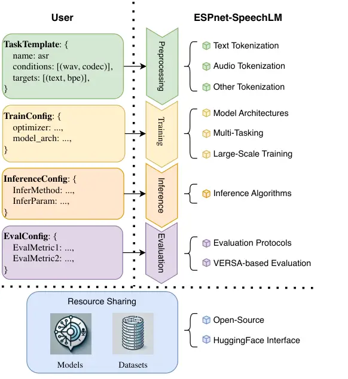
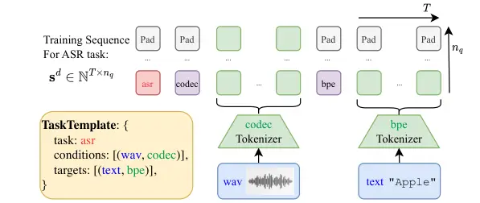

# ESPnet-SpeechLM: An Open Speech Language Model Toolkit

Jinchuan Tian Affiliation: Carnegie Mellon University    Jiatong Shi
Affiliation: Carnegie Mellon University    William Chen
Affiliation: Carnegie Mellon University    Siddhant Arora
Affiliation: Carnegie Mellon University    Yoshiki Masuyama
Affiliation: Mitsubishi Electric Research Laboratories    Takashi
Maekaku Affiliation: LY Corporation    Yihan Wu Affiliation: Carnegie
Mellon University Affiliation: Renmin University of China    Junyi Peng
Affiliation: Carnegie Mellon University Affiliation: Brno University of
Technology    Shikhar Bharadwaj Affiliation: Carnegie Mellon University
   Yiwen Zhao Affiliation: Carnegie Mellon University    Samuele Cornell
Affiliation: Carnegie Mellon University    Yifan Peng
Affiliation: Carnegie Mellon University    Xiang Yue
Affiliation: Carnegie Mellon University    Chao-Han Huck Yang
Affiliation: NVIDIA Research
Correspondence:[jinchuat@andrew.cmu.edu](mailto:jinchuat@andrew.cmu.edu)
   Graham Neubig Affiliation: Carnegie Mellon University    Shinji
Watanabe Affiliation: Carnegie Mellon University

###### Abstract

We present ESPnet-SpeechLM, an open toolkit designed to democratize the
development of speech language models (SpeechLMs) and voice-driven
agentic applications. The toolkit standardizes speech processing tasks
by framing them as universal sequential modeling problems, encompassing
a cohesive workflow of data preprocessing, pre-training, inference, and
task evaluation. With ESPnet-SpeechLM, users can easily define task
templates and configure key settings, enabling seamless and streamlined
SpeechLM development. The toolkit ensures flexibility, efficiency, and
scalability by offering highly configurable modules for every stage of
the workflow. To illustrate its capabilities, we provide multiple use
cases demonstrating how competitive SpeechLMs can be constructed with
ESPnet-SpeechLM, including a 1.7B-parameter model pre-trained on both
text and speech tasks, across diverse benchmarks. The toolkit and its
recipes are fully transparent and reproducible at:
[https://github.com/espnet/espnet/tree/speechlm](https://github.com/espnet/espnet/tree/speechlm).

## 1 Introduction

Figure 1: The overview of ESPnet-SpeechLM workflow.

|                                |                   |       |        |       |         |            |         |             |             |                 |
| ------------------------------ | ----------------- | ----- | ------ | ----- | ------- | ---------- | ------- | ----------- | ----------- | --------------- |
|                                | Open-Source Level |       |        |       |         | \#Released | \#Tasks | \#Tokenizer | \#Tokenizer | \#Architectures |
| Codebase                       | Data              | Train | Infer. | Eval. | Weights | Models     |         | Types       | Choices     |                 |
| VoxtLM Maiti et al. (2024)     | ✓                 | ✓     | ✓      | ✓     | ✓       | 1          | 4       | 2           | 2           | 1               |
| UniAudio Yang et al. (2024b)   | ✓                 | ✓     | ✓      | ✓     | ✓       | 1          | 11      | 5           | 5           | 1               |
| Moshi Défossez et al. (2024)   |                   |       | ✓      |       | ✓       | 13         | N/A     | 2           | 2           | 1               |
| Mini-Omni Xie and Wu (2024)    |                   |       | ✓      |       | ✓       | 1          | N/A     | 2           | 2           | 1               |
| GLM-4-Voice Zeng et al. (2024) |                   |       | ✓      |       | ✓       | 3          | N/A     | 2           | 2           | 1               |
| ESPnet-SpeechLM (this work)    | ✓                 | ✓     | ✓      | ✓     | ✓       | 3          | 15      | 10          | N/A         | 4               |

Table 1: Comparison between ESPnet-SpeechLM and other open-sourced
SpeechLM codebases. For open-ended SpeechLM dialogue systems, the
\#Tasks are not well-defined and left N/A. ESPnet-SpeechLM provides
multiple interfaces to bridge a massive number of tokenizer choices and
the exact number is also left N/A. Details of the supported features in
ESPnet-SpeechLM are in Tab.2. Information as of Dec 2024.

The advent of large language models (LLMs) has significantly advanced
machine intelligence, particularly in the text domain Achiam et al.
(2023); Dubey et al. (2024). As research expands beyond text, LLMs are
increasingly applied to multimodal scenarios Yin et al. (2024); Hurst
et al. (2024); Fu et al. (2024), such as speech Cui et al. (2024); Peng
et al. (2024a) and vision Zhang et al. (2024a), with the aim of
achieving higher-level intelligence and enhancing human-computer
interactions. Within this context, Speech Language Models (SpeechLMs)
have emerged as a powerful paradigm addressing challenges unique to
speech processing.

SpeechLMs have demonstrated remarkable progress across a variety of
speech tasks, including zero-shot generalization Wang et al. (2023),
low-resource modeling Kharitonov et al. (2023), multi-task learning
Maiti et al. (2024); Yang et al. (2024b), instruction following Lu
et al. (2024), real-time interaction Défossez et al. (2024); Xie and Wu
(2024), and emergent abilities Yang et al. (2024a). Similarly to
text-based LLMs Kaplan et al. (2020), SpeechLMs benefit from scaling
data volume, parameter size, and computational resources Cuervo and
Marxer (2024). These advances have fueled a growing interest in SpeechLM
research within the speech and language processing community.

However, despite these advances, the development of SpeechLMs remains a
complex and resource-intensive endeavor Défossez et al. (2024). Building
such models requires significant expertise and effort across diverse
tasks, from data preparation to training, inference, and evaluation. To
address these challenges and democratize SpeechLM research, we introduce
ESPnet-SpeechLM, an open-source toolkit designed to streamline and
accelerate SpeechLM development.

ESPnet-SpeechLM unifies speech tasks under a sequential modeling
framework and organizes the SpeechLM development process into a
standardized workflow. As illustrated in Fig.1, users begin by defining
a custom task template, followed by configuring key parameters. The
toolkit then automates all phases of the pipeline: preprocessing,
training, inference, and evaluation (§3.2). This modular workflow
supports a wide range of design choices, including tokenization methods,
model architectures, dynamic multi-tasking, etc. In addition,
ESPnet-SpeechLM provides a HuggingFace-compatible interface for sharing
datasets and models (§3.3). The toolkit is fully open-source, ensuring
reproducibility and accessibility.

To showcase its versatility, we present several use cases demonstrating
the scalability and efficiency of ESPnet-SpeechLM. These include
building competitive SpeechLM-based automatic speech recognition (ASR)
and text-to-speech (TTS) systems on datasets exceeding 200k hours of
speech-text paired data (§4.2). We also detail the creation of a
1.7B-parameter multi-task SpeechLM, pre-trained on ASR, TTS, TextLM, and
AudioLM tasks, by leveraging 240 billion text tokens or audio frames
(§4.3).

## 2 Related Work

The ESPnet-SpeechLM toolkit builds upon prior works in two main
directions:

Text LLM ecosystem: Some popular development tools in text LLM
ecosystems can be generalized to any large-scale sequential modeling
task, which means they are also suitable for SpeechLM training. Examples
of this include DeepSpeed Rajbhandari et al. (2020) and FlashAttention
Dao (2023). To preserve text capability, it is common to initialize
SpeechLMs from pre-trained text LLMs, which can rely on open-source
platforms like HuggingFace Transformers¹¹ 1
[https://github.com/huggingface/transformers](https://github.com/huggingface/transformers).
These tools are integrated into ESPnet-SpeechLM. We also noticed that
current text LLM training frameworks Shoeybi et al. (2019); Zheng et al.
(2024) provide limited support for speech features. Our toolkit is
presented as a supplement in this direction.

Open-Sourced SpeechLMs and Speech Toolkits: Current research on
SpeechLMs and their transparency has been significantly advanced by
prior open-source SpeechLM research works Zeng et al. (2024); Xie and Wu
(2024); Défossez et al. (2024); Yang et al. (2024b); Maiti et al.
(2024). SpeechLM research also greatly benefits from general speech
processing and sequence-to-sequence modeling toolkits Watanabe et al.
(2018); Ravanelli et al. (2021); Zhang et al. (2024b); Yang et al.
(2021); Kuchaiev et al. (2019); Ott et al. (2019), as they provide a
wide range of components applicable to SpeechLM development.
ESPnet-SpeechLM is presented as a combination of cutting-edge SpeechLM
research and well-established speech processing techniques within the
open-sourced community. More specifically, it is built upon the existing
ESPnet Watanabe et al. (2018) codebase to better exploit prior community
efforts and compare with existing non-SpeechLM works. We summarize
ESPnet-SpeechLM and related codebases in Tab.1.

## 3 ESPnet-SpeechLM Toolkit

This section outlines the hierarchical design of the ESPnet-SpeechLM
toolkit. We first introduce the fundamental concepts of SpeechLMs in
§3.1 followed by a detailed description of the ESPnet-SpeechLM workflow
in §3.2. Lastly, we highlight key features of our toolkit in §3.3.

### 3.1 Speech Language Model

Speech tasks can be generically formulated as predicting target
sequences $`\mathbf{y}=[\mathbf{y}_{1},...,\mathbf{y}_{N}]`$ given input
conditions $`\mathbf{x}=[\mathbf{x}_{1},...,\mathbf{x}_{M}]`$, where
each $`\mathbf{x}_{m}`$ and $`\mathbf{y}_{n}`$ represents individual
data items. $`M`$ and $`N`$ stand for the number of data items in
conditions and targets, respectively. E.g., for ASR, $`\mathbf{x}_{1}`$
is the input speech; $`\mathbf{y}_{1}`$ is the corresponding
transcription. Commonly, the training objective is to maximize the
posterior $`P(\mathbf{y}|\mathbf{x})`$.

ESPnet-SpeechLM uniformly frames speech tasks as sequential modeling
problems using auto-regressive prediction over discrete token sequences
within a decoder-only Transformer Vaswani et al. (2017). Specifically,
all data items $`\mathbf{x}_{m}`$ and $`\mathbf{y}_{n}`$ are first
tokenized into discrete token sequences $`\mathbf{x}_{m}^{\text{d}}`$
and $`\mathbf{y}_{n}^{\text{d}}`$. Then, the spliced sequence
$`\mathbf{s}^{\text{d}}=[\mathbf{x}_{1}^{\text{d}},...,\mathbf{x}_{M}^{\text{d}},\mathbf{y}_{1}^{\text{d}},...,\mathbf{y}_{N}^{\text{d}}]`$
serves as the input for model training. Cross-entropy loss optimization
over $`\mathbf{y}_{1}^{\text{d}},...,\mathbf{y}_{N}^{\text{d}}`$
approximates the objective $`P(\mathbf{y}|\mathbf{x})`$. Predicting
$`\hat{\mathbf{y}}_{1}^{\text{d}},...,\hat{\mathbf{y}}_{N}^{\text{d}}`$
based on the conditions
$`\mathbf{x}_{1}^{\text{d}},...,\mathbf{x}_{M}^{\text{d}}`$ and then
detokenizing them into $`\hat{\mathbf{y}}_{1},...,\hat{\mathbf{y}}_{N}`$
yield the final system prediction.

ESPnet-SpeechLM specifically supports multi-stream language models,
i.e., $`\mathbf{s}^{\text{d}}\in\mathbb{N}^{T\times n_{q}}`$ where $`T`$
stands for the sequence length and $`n_{q}`$ stands for the number of
streams (See Fig.2). This capability is especially critical for audio
codec models Défossez et al. (2022); Zeghidour et al. (2021), which
encode each audio frame into multiple tokens. Padding tokens are added
to align non-audio data when splicing
$`\mathbf{s}^{\text{d}}=[\mathbf{x}_{1}^{\text{d}},...,\mathbf{x}_{M}^{\text{d}},\mathbf{y}_{1}^{\text{d}},...,\mathbf{y}_{N}^{\text{d}}]`$.
These multi-stream models require specialized design considerations
discussed in §3.3.

### 3.2 ESPnet-SpeechLM Workflow

The ESPnet-SpeechLM workflow begins with single-task scenarios and
extends naturally to multitask training. In the following, we introduce
the concept of the task template (§3.2.1) and describe the end-to-end
pipeline from preprocessing to evaluation (§3.2.2-3.2.5). Multitasking
is described in 3.2.6.

#### 3.2.1 Task Template

As in §3.1, regardless of the exact sequence $`\mathbf{s}^{\text{d}}`$,
the SpeechLM performs sequential modeling indiscriminately. It is the
definition of conditions $`\mathbf{x}`$, targets $`\mathbf{y}`$, and the
corresponding tokenization methods that give the distinctive composition
of $`\mathbf{s}^{\text{d}}`$ and thus the support of different tasks
within SpeechLMs.

Figure 2: The training sequence $`\mathbf{s}^{\text{d}}`$ is assembled
based on the task template, e.g. single-task ASR as depicted here. The
sequence is multi-stream with an extra $`n_{q}`$-axis because the codec
tokenizes each frame into multiple tokens.

To handle different speech tasks uniformly, ESPnet-SpeechLM defines each
task using a task template, which specifies the composition of the
training sequence $`\mathbf{s}^{\text{d}}`$. As shown in Fig.2, the task
template defines the name of the task, the conditions, and the targets.
For each data item $`\mathbf{x}_{m}`$ or $`\mathbf{y}_{n}`$, the
item_name and tokenizer are specified. The training sequence starts from
the task identifier, followed by the tokenized sequences from all the
data items. For each data item, the first token is a tokenizer
indicator; the raw data is tokenized by the specified tokenizer. For
single-stream data items and special tokens, padding tokens are added.
With this template, the training sequences can be assembled
automatically from the given raw data.

#### 3.2.2 Preprocessing

Preprocessing primarily involves tokenization. As some tokenizers are
neural network-based and heavy, it is more efficient to conduct the
tokenization offline. The tokenization is handled automatically by
ESPnet-SpeechLM after receiving a folder for each train/valid/test set
as follows. Specifically, an index file is provided for each data item,
with the format of example-id content in each line. The name of these
index files should correspond to the item_name in the task template.

> (folder) train  
> ——– \|– (file) wav  
> ———— \|– (line) example-id1 path-to-wav1  
> ———— \|– (line) example-id2 path-to-wav2  
> ——– \|– (file) text  
> ———— \|– (line) example-id1 text1  
> ———— \|– (line) example-id2 text2

ESPnet-SpeechLM processes these files to generate a unified data.json
file for each dataset, which contains tokenized results and metadata.
data.json is the data format in both training and evaluation. During
preprocessing, all tokenizers in use are detected, and a joint
vocabulary is constructed automatically.

| Task Templates      | TextLM, AudioLM, Text-to-Speech, Automatic Speech Recognition, Machine Translation,                    |                                                                                                                                                  |                                                                                                                               |
| ------------------- | ------------------------------------------------------------------------------------------------------ | ------------------------------------------------------------------------------------------------------------------------------------------------ | ----------------------------------------------------------------------------------------------------------------------------- |
|                     | Speech-to-Text Translation, Speech-to-Speech Translation, Text-to-Audio, Text-to-Music, Audio Caption, |                                                                                                                                                  |                                                                                                                               |
|                     | Text-to-Music, Singing Voice Synthesis, Speech Enhancement, Target Speaker Extraction, Visual TTS      |                                                                                                                                                  |                                                                                                                               |
| Tokenization        | Text                                                                                                   | Subword                                                                                                                                          | [SentencePiece](https://github.com/google/sentencepiece), [HuggingFace Tokenizers](https://github.com/huggingface/tokenizers) |
|                     |                                                                                                        | G2P                                                                                                                                              | [30 choices](https://github.com/espnet/espnet/blob/master/espnet2/text/phoneme_tokenizer.py)                                  |
|                     | Audio                                                                                                  | Codec                                                                                                                                            | ESPnet-Codec Shi et al. (2024), DAC Kumar et al. (2024),                                                                      |
|                     |                                                                                                        |                                                                                                                                                  | Encodec Défossez et al. (2022), UniAudio Yang et al. (2024b)                                                                  |
|                     |                                                                                                        | SSL                                                                                                                                              | XEUS Chen et al. (2024b), S3PRL Yang et al. (2021),                                                                           |
|                     |                                                                                                        |                                                                                                                                                  | FairSeq Ott et al. (2019)                                                                                                     |
|                     |                                                                                                        | Codec_SSL                                                                                                                                        | Combine Codec and SSL frame-by-frame                                                                                          |
|                     | Others                                                                                                 | Music Score Wu et al. (2024), Vision Token Shi et al. (2022),                                                                                    |                                                                                                                               |
|                     |                                                                                                        | Classification Label, Speaker Identity, LLM Embeddings                                                                                           |                                                                                                                               |
| Modeling & Training | Transformer Body                                                                                       | ESPnet Builtin, [HuggingFace AutoModelForCausalLM](https://huggingface.co/docs/transformers/en/model_doc/auto#transformers.AutoModelForCausalLM) |                                                                                                                               |
|                     | Multi-Stream                                                                                           | Vall-E Wang et al. (2023), MultiScale-Transformer Yang et al. (2024b)                                                                            |                                                                                                                               |
|                     | Language Model                                                                                         | Parallel Interleave, Delay Interleave Copet et al. (2024)                                                                                        |                                                                                                                               |
|                     | Efficiency                                                                                             | DeepSpeed Rajbhandari et al. (2020), FlashAttention Dao (2023), [Liger-Kernel](https://github.com/linkedin/Liger-Kernel)                         |                                                                                                                               |
| Inference           | Greedy Search, Beam Search, Top-k Sampling, Top-p Sampling                                             |                                                                                                                                                  |                                                                                                                               |
| Evaluation          | VERSA Shi et al. (2024), with 61 evaluation metrics for speech and audio                               |                                                                                                                                                  |                                                                                                                               |
| Sharing             | Task Template                                                                                          | [ESPnet GitHub Repository](https://github.com/espnet/espnet)                                                                                     |                                                                                                                               |
|                     | Datasets & Models                                                                                      | [ESPnet HuggingFace Hub](https://huggingface.co/espnet)                                                                                          |                                                                                                                               |

Table 2: Summary of supported features in ESPnet-SpeechLM toolkit

#### 3.2.3 Training

The training behavior of ESPnet-SpeechLM is specified by a configuration
file. Besides common training configurations like optimization, batch
size, and distributed training setup, the toolkit also supports flexible
model architecture configurations for SpeechLM development.

ESPnet-SpeechLM provides multiple implementations of multi-stream
language models Wang et al. (2023); Copet et al. (2024); Yang et al.
(2024b). The implementations of multi-stream language models all rely on
the Transformer body implementation. We provide the ESPnet built-in
Transformer implementation to maximize flexibility; alternatively, we
support any AutoModelForCausalLM from HuggingFace Transformers to
leverage pre-trained text LLMs Also, following Défossez et al. (2024),
custom weights can be provided during loss computing to balance the
tokens from different tokenization methods. This is usually to guarantee
one audio frame has the same loss weight as one non-audio token. Lastly,
in addition to applying the cross-entropy loss, the toolkit also
supports reinforcement learning from human feedback (RLHF) for SpeechLMs
(see Tian et al. (2024b) for details).

#### 3.2.4 Inference

For each of the supported multi-stream language models, we provide
multiple inference methods, such as greedy search, beam search, and
top-k/top-p sampling. Our implementation also allows multiple heuristics
like the min/max generation length. One important heuristic is essential
to SpeechLM: unlike text LLMs that only predict text, SpeechLMs need to
know the modality of the current predicting target, so that tokens from
other modalities can be filtered out to avoid invalid predictions. The
current modality is known from the most recent tokenizer indicator
(§3.2.1), and will switch when a new tokenizer indicator is predicted.

#### 3.2.5 Evaluation

We create an evaluation script for each supported task. Within these
scripts, we consistently adopt the VERSA ²² 2
[https://github.com/shinjiwlab/versa](https://github.com/shinjiwlab/versa),
a comprehensive collection of \>60 speech and audio evaluation metrics
Shi et al. (2024). Besides the existing evaluation scripts, a model in a
new task can be evaluated simply by specifying the metrics, the
inference results, and the reference (if needed).

#### 3.2.6 Multitasking

To build SpeechLMs with versatile functionalities, ESPnet-SpeechLM
flexibly supports multitasking. As the SpeechLMs have the same modeling
procedure for all tasks, achieving multitasking training is to fuse the
training sequences from different tasks in the mini-batches. Similar to
single-task training, for each task, the task template definition
(§3.2.1) and preprocessing (§3.2.2) are completed separately, which
gives multiple tokenized datasets and the corresponding data.json
files³³ 3 Especially, these preprocessing works are easy to distribute
and are suitable for collaborative works. . The data loader accepts a
list of data.json and fuses these datasets before training, which allows
the users to dynamically change the multitasking data setups.
Mini-batches are sampled from the fused datasets during training.
Additionally, the sampling ratio among these datasets is adjustable to
emphasize some specific data portions.

|                                  |         |        |           |        |      |
| -------------------------------- | ------- | ------ | --------- | ------ | ---- |
|                                  | Whisper |        | OWSM v3.1 |        | ours |
|                                  | small   | medium | small     | medium |      |
| Test sets                        | 244M    | 769M   | 367M      | 1.02B  | 442M |
| LS-Clean Panayotov et al. (2015) | 3.3     | 2.8    | 2.5       | 2.4    | 1.9  |
| LS-Other Panayotov et al. (2015) | 7.7     | 6.5    | 5.8       | 5.0    | 4.6  |
| MLS Pratap et al. (2020)         | 9.1     | 10.2   | 8.1       | 7.1    | 7.2  |
| TEDLIUM3 Hernandez et al. (2018) | 4.6     | 5.1    | 5.0       | 5.1    | 5.7  |
| WSJ Paul and Baker (1992)        | 4.3     | 2.9    | 3.8       | 3.5    | 5.2  |
| FLEURS Conneau et al. (2022)     | 9.6     | 6.4    | 10.3      | 9.0    | 7.7  |
| Avg.                             | 6.4     | 5.7    | 5.9       | 5.4    | 5.4  |

Table 3: English ASR performance (WER%$`\downarrow`$) comparison among
whisper Radford et al. (2023), OWSM v3.1 Peng et al. (2024b) and
ESPnet-SpeechLM ASR (ours). All results are derived from the greedy
search.

### 3.3 Supported Features

We summarize the core configurable features in ESPnet-SpeechLM workflow
in Tab.2 and highlight them as follows:

Tokenization: For text, we support subword models and
grapheme-to-phoneme (G2P) tools, with an emphasis on HuggingFace
tokenizers. For audio tokenization, we support both audio codec models
and self-supervised learning (SSL) tokens. We provide multiple options
for these two tokenization methods, with an emphasis on ESPnet-Codec Shi
et al. (2024) and XEUS Chen et al. (2024b). Additionally, we find that
concatenating codec and SSL tokens frame-by-frame behaves well in both
speech understanding and generation. Besides text and audio, these
multi-modal models can leverage information from auxiliary modalities,
such as music score Wu et al. (2024), vision token Shi et al. (2022),
classification labels (e.g., bool, time-stamp), speaker-identity and the
continuous LLM embeddings.

Training: As in §3.2.3, for the Transformer body, we provide the ESPnet
built-in implementation as well as the HuggingFace Transformers
implementation. Upon the Transfomer, we support 4 distinctive
multi-stream language model implementations Wang et al. (2023); Yang
et al. (2024b); Copet et al. (2024). For training efficiency, we
leverage DeepSpeed Rajbhandari et al. (2020), FlashAttention Dao (2023)
and Liger-Kernel⁴⁴ 4
[https://github.com/linkedin/Liger-Kernel](https://github.com/linkedin/Liger-Kernel).
These modules enable us to achieve model FLOPs utility (MFU) Chowdhery
et al. (2023) as high as 35% with multi-node training using NVIDIA H100
GPUs.

Inference, Evaluation, and Sharing: For all supported architecture, we
provide all 4 inference methods. VERSA provides more than 60
speech-related evaluation metrics. To ensure transparency and
reproducibility, the code and task templates are released through the
ESPnet GitHub repository; tokenized datasets and pre-trained models are
released through ESPnet Huggingface Hub.

| Model                                 | WER($`\downarrow`$) | SPK_SIM($`\uparrow`$) | Proxy MOS($`\uparrow`$) |
| ------------------------------------- | ------------------- | --------------------- | ----------------------- |
| ChatTTS 2Noise (2024)                 | 7.1                 | \-                    | 3.52                    |
| CosyVoice Du et al. (2024)            | 5.0                 | 0.51                  | 4.15                    |
| Parler-TTS Lacombe et al. (2024)      | 4.7                 | \-                    | 3.83                    |
| WhisperSpeech Collabora (2024)        | 13.5                | \-                    | 4.06                    |
| VallE-X $`\star`$ Zhang et al. (2023) | 27.3                | 0.35                  | 3.38                    |
| VallE 2 $`\star`$ Chen et al. (2024a) | 27.8                | 0.46                  | 3.65                    |
| ESPnet-SpeechLM TTS (ours)            | 3.1                 | 0.55                  | 4.03                    |

Table 4: TTS performance on full LibriSpeech Test-Clean Panayotov et al.
(2015). SPK_SIM is measured only when zero-shot speaker prompting is
supported. The speaker prompts are the same for all tests. All results
from VERSA. No post-selection applied. $`\star`$ means third-party
implementation.

## 4 User Cases

|                                |      |                     |                     |                       |                         |                    |                     |                  |                    |                            |
| ------------------------------ | ---- | ------------------- | ------------------- | --------------------- | ----------------------- | ------------------ | ------------------- | ---------------- | ------------------ | -------------------------- |
| Task                           |      | ASR                 | TTS                 |                       |                         | TextLM             |                     |                  |                    | AudioLM                    |
| Metric                         | Size | WER($`\downarrow`$) | WER($`\downarrow`$) | SPK_SIM($`\uparrow`$) | Proxy MOS($`\uparrow`$) | MMLU($`\uparrow`$) | ARC-C($`\uparrow`$) | HS($`\uparrow`$) | OBQA($`\uparrow`$) | Perplexity($`\downarrow`$) |
| LLaMA-3.2 Dubey et al. (2024)  | 1B   | \-                  | \-                  | \-                    | \-                      | 32.2               | 32.8                | 41.2             | 29.2^(⋆)           | \-                         |
| VoxtLM Maiti et al. (2024)     | 1.3B | 2.7 / 6.5           | \-                  | \-                    | \-                      | \-                 | \-                  | \-               | \-                 | 40.9                       |
| Moshi Défossez et al. (2024)   | 7B   | 5.7 / -             | 4.7                 | \-                    | \-                      | 49.8               | \-                  | \-               | \-                 | \-                         |
| MiniOmni Xie and Wu (2024)     | 0.5B | 4.5 / 9.7           | \-                  | \-                    | \-                      | \-                 | \-                  | \-               | \-                 | \-                         |
| VITA Fu et al. (2024)          | 8x7B | 8.1 / 18.4          | \-                  | \-                    | \-                      | 71.0               | \-                  | \-               | \-                 | \-                         |
| GLM-4-Voice Zeng et al. (2024) | 9B   | 2.8 / 7.7           | 5.6                 | \-                    | \-                      | \-                 | \-                  | \-               | \-                 | \-                         |
| ESPnet-SpeechLM (ours)         | 1.7B | 2.8 / 5.9           | 6.0                 | 0.701                 | 3.99                    | 30.5               | 41.3                | 50.4             | 31.4               | 16.4                       |

Table 5: Evaluation on the multitask pre-trained SpeechLM using
ESPnet-SpeechLM and its comparison with prior text LLM, SpeechLMs, and
Multimodal LMs. The numbers of competitors are from their own report
unless marked by $`\star`$. - means unreported numbers.

This section provides several user cases to demonstrate the performance
of SpeechLMs built from ESPnet-SpeechLM. We first build single-task
SpeechLM-Style ASR and TTS models in §4.2. As a highlight of this demo,
we present a 1.7B pre-trained SpeechLM that covers 4 tasks similar to
Maiti et al. (2024): ASR, TTS, text auto-regressive prediction (TextLM),
and speech auto-regressive prediction (AudioLM) (§4.3). These models are
released through ESPnet HuggingFace Hub⁵⁵ 5
[https://huggingface.co/espnet](https://huggingface.co/espnet).

### 4.1 Experimental Setups

Model and Tokenization: We consistently leverage the pre-trained text
LLM, SmolLM2 series⁶⁶ 6
[https://huggingface.co/HuggingFaceTB](https://huggingface.co/HuggingFaceTB),
for SpeechLM initialization. We adopt the 360M and 1.7B versions for
single-task and multi-task models, respectively. We adopt delay
interleave Copet et al. (2024) as the multi-stream language model
architecture. In terms of tokenization, we adopt the Codec_SSL method
(§3.3) for speech representation. To preserve full transparency and
self-consistency, ESPnet-Codec⁷⁷ 7
[https://huggingface.co/ftshijt/espnet_codec_dac_large_v1.4_360epoch](https://huggingface.co/ftshijt/espnet_codec_dac_large_v1.4_360epoch)
and XEUS⁸⁸ 8
[https://huggingface.co/espnet/xeus](https://huggingface.co/espnet/xeus);
K-Means tokenizer trained on its last layer of representation using 5k
clusters are adopted for codec and SSL tokenizers respectively.

Data, Training, and Inference: We collect open-sourced data for all
experiments. Our data contains 200k hours of speech and 115B tokens of
text, most in English. When expanding speech data into ASR, TTS, and
AudioLM tasks, this is equivalent to 240B text tokens or audio frames.
Detailed data composition is in Appendix A. We balance the weights for
text, SSL, and codec tokens as 1: 0.5: 0.0625⁹⁹ 9 Each audio frame is
represented by 1 SSL token and 8 codec tokens. This ratio is to ensure
(1) the text tokens have the same weight as the audio frames, and (2)
SSL tokens have the same weight as 8 codec tokens combined.. The
training used 8/24 H100 GPUs for single/multi-task training. We use
batch size as large as around 2M frames or tokens and a constant
learning rate of 2e-4, with 10k warmup steps. We train the model for 2
data passes. We use greedy search for ASR and top-k sampling for TTS
($`k=30,temperature=0.8`$).

Evaluation: Following Maiti et al. (2024); Tian et al. (2024b), we test
word error rate (WER) for ASR; ASR WER, Speaker Similarty and Proxy MOS
for TTS; perplexity for AudioLM. We measure the TextLM ability using
popular metrics like MMLU Hendrycks et al. (2020), ARC-Challenge (ARC-C)
Clark et al. (2018), HellaSwag (HS)Zellers et al. (2019), and OpenBookQA
(OBQA) Mihaylov et al. (2018).

### 4.2 ASR and TTS Experiments

We evaluate our ASR system on multiple benchmarks and compare it with
the popular open-sourced ASR models: whisper-v3-large Radford et al.
(2023) and OWSM v3.1-medium Peng et al. (2024b). As suggested in Tab.3,
our SpeechLM-based ASR system achieves comparable results in English
with these two popular speech recognizers even using much fewer
parameters. In Tab.4, we compare the ESPnet-SpeechLM TTS system with
other discrete-based TTS systems¹⁰¹⁰ 10 For VallE-X and VallE 2, we use
the third-party implementations:
[https://huggingface.co/Plachta/VALL-E-X/resolve/main/vallex-checkpoint.pt](https://huggingface.co/Plachta/VALL-E-X/resolve/main/vallex-checkpoint.pt),
[https://huggingface.co/amphion/valle](https://huggingface.co/amphion/valle).
The results suggest our TTS system achieves decent performance on all
evaluation metrics.

### 4.3 Multi-Task Experiments

We demonstrate the performance of our multitask pre-trained SpeechLM in
Tab.5. Compared with other SpeechLMs Maiti et al. (2024); Xie and Wu
(2024); Zeng et al. (2024); Fang et al. (2024) and multimodal LMs Fu
et al. (2024), our pre-trained model still preserves decent ASR, TTS and
AudioLM performance even with limited parameter budget. In terms of text
capability, the pre-trained model preserves close performance compared
with the text-only LLM LLaMA-3.2-1B Dubey et al. (2024).

## 5 Future Works

We will continue the development of the ESPnet-SpeechLM toolkit, such as
supporting more tokenization methods, more task templates, more modeling
options, and LLM inference engines Kwon et al. (2023). We are also
interested in applying this toolkit to our SpeechLM research. For
pre-training, we are interested in larger-scale models and models that
can capture rich paralinguistic information in speech. For
post-training, we are interested in achieving conversational
interactions, speech-based instruction following ability, and even
agent-alike behaviors. Our plan also includes real-time and duplex
design, HFRL for SpeechLM and SpeechLMs that trained from flat start.

## 6 Conclusion

This demo presents ESPnet-SpeechLM, a toolkit that covers the whole
workflow of speech language model development, with comprehensive
support in multiple design choices. We also provide user cases for both
single-task and multi-task training, showing competitive performance
with other models in the market. The toolkit promises to keep full
transparency in data, code, recipes, and pre-trained models.

## References

- 2Noise (2024) 2Noise. 2024. [Chattts: A generative speech model for
  daily dialogue.](https://github.com/2noise/ChatTTS) Available at
  [https://github.com/2noise/ChatTTS](https://github.com/2noise/ChatTTS).
- Achiam et al. (2023) Josh Achiam et al. 2023. Gpt-4 technical report.
  _arXiv preprint arXiv:2303.08774_.
- Chen et al. (2024a) Sanyuan Chen et al. 2024a. Vall-e 2: Neural codec
  language models are human parity zero-shot text to speech
  synthesizers. _arXiv preprint arXiv:2406.05370_.
- Chen et al. (2024b) William Chen et al. 2024b. Towards robust speech
  representation learning for thousands of languages. _arXiv preprint
  arXiv:2407.00837_.
- Chowdhery et al. (2023) Aakanksha Chowdhery et al. 2023. Palm: Scaling
  language modeling with pathways. _Journal of Machine Learning
  Research_, 24(240):1–113.
- Clark et al. (2018) Peter Clark et al. 2018. Think you have solved
  question answering? try arc, the ai2 reasoning challenge. _arXiv
  preprint arXiv:1803.05457_.
- Collabora (2024) Collabora. 2024. [Whisperspeech: A speech processing
  toolkit](https://github.com/collabora/WhisperSpeech). Available at
  [https://github.com/collabora/WhisperSpeech](https://github.com/collabora/WhisperSpeech).
- Conneau et al. (2022) Alexis Conneau et al. 2022. FLEURS: Few-Shot
  Learning Evaluation of Universal Representations of Speech. In _SLT_.
- Copet et al. (2024) Jade Copet et al. 2024. Simple and controllable
  music generation. _Advances in Neural Information Processing
  Systems_, 36.
- Cuervo and Marxer (2024) Santiago Cuervo and Ricard Marxer. 2024.
  Scaling properties of speech language models. _arXiv preprint
  arXiv:2404.00685_.
- Cui et al. (2024) Wenqian Cui et al. 2024. Recent advances in speech
  language models: A survey. _arXiv preprint arXiv:2410.03751_.
- Dao (2023) Tri Dao. 2023. Flashattention-2: Faster attention with
  better parallelism and work partitioning. _arXiv preprint
  arXiv:2307.08691_.
- Défossez et al. (2022) Alexandre Défossez et al. 2022. High fidelity
  neural audio compression. _arXiv preprint arXiv:2210.13438_.
- Défossez et al. (2024) Alexandre Défossez et al. 2024. Moshi: a
  speech-text foundation model for real-time dialogue. _arXiv preprint
  arXiv:2410.00037_.
- Du et al. (2024) Zhihao Du et al. 2024. Cosyvoice: A scalable
  multilingual zero-shot text-to-speech synthesizer based on supervised
  semantic tokens. _arXiv preprint arXiv:2407.05407_.
- Dubey et al. (2024) Abhimanyu Dubey et al. 2024. The llama 3 herd of
  models. _arXiv preprint arXiv:2407.21783_.
- Fang et al. (2024) Qingkai Fang, Shoutao Guo, Yan Zhou, Zhengrui Ma,
  Shaolei Zhang, and Yang Feng. 2024. Llama-omni: Seamless speech
  interaction with large language models. _arXiv preprint
  arXiv:2409.06666_.
- Fu et al. (2024) Chaoyou Fu et al. 2024. Vita: Towards open-source
  interactive omni multimodal llm. _arXiv preprint arXiv:2408.05211_.
- He et al. (2024) Haorui He et al. 2024. Emilia: An extensive,
  multilingual, and diverse speech dataset for large-scale speech
  generation. _arXiv preprint arXiv:2407.05361_.
- Hendrycks et al. (2020) Dan Hendrycks et al. 2020. Measuring massive
  multitask language understanding. _arXiv preprint arXiv:2009.03300_.
- Hernandez et al. (2018) François Hernandez et al. 2018. TED-LIUM 3:
  Twice as much data and corpus repartition for experiments on speaker
  adaptation. In _Speech & Computer_, pages 198–208.
- Huang et al. (2024) Siming Huang, Tianhao Cheng, Jason Klein Liu,
  Jiaran Hao, Liuyihan Song, Yang Xu, J Yang, JH Liu, Chenchen Zhang,
  Linzheng Chai, et al. 2024. Opencoder: The open cookbook for top-tier
  code large language models. _arXiv preprint arXiv:2411.04905_.
- Hurst et al. (2024) Aaron Hurst et al. 2024. Gpt-4o system card.
  _arXiv preprint arXiv:2410.21276_.
- Kaplan et al. (2020) Jared Kaplan et al. 2020. Scaling laws for neural
  language models. _arXiv preprint arXiv:2001.08361_.
- Kharitonov et al. (2023) Eugene Kharitonov et al. 2023. Speak, read
  and prompt: High-fidelity text-to-speech with minimal supervision.
  _Transactions of the Association for Computational Linguistics_,
  11:1703–1718.
- Kuchaiev et al. (2019) Oleksii Kuchaiev et al. 2019. Nemo: a toolkit
  for building ai applications using neural modules. _arXiv preprint
  arXiv:1909.09577_.
- Kumar et al. (2024) Rithesh Kumar et al. 2024. High-fidelity audio
  compression with improved rvqgan. _Advances in Neural Information
  Processing Systems_, 36.
- Kwon et al. (2023) Woosuk Kwon et al. 2023. Efficient memory
  management for large language model serving with pagedattention. In
  _Proceedings of the ACM SIGOPS 29th Symposium on Operating Systems
  Principles_.
- Lacombe et al. (2024) Yoach Lacombe et al. 2024. Parler-tts.
- Li et al. (2023) Xinjian Li et al. 2023. Yodas: Youtube-oriented
  dataset for audio and speech. In _2023 IEEE Automatic Speech
  Recognition and Understanding Workshop (ASRU)_, pages 1–8.
- Lu et al. (2024) Ke-Han Lu et al. 2024. Developing
  instruction-following speech language model without speech
  instruction-tuning data. _arXiv preprint arXiv:2409.20007_.
- Maiti et al. (2024) Soumi Maiti et al. 2024. Voxtlm: Unified
  decoder-only models for consolidating speech recognition, synthesis
  and speech, text continuation tasks. In _ICASSP 2024-2024 IEEE
  International Conference on Acoustics, Speech and Signal Processing
  (ICASSP)_, pages 13326–13330. IEEE.
- Mihaylov et al. (2018) Todor Mihaylov et al. 2018. Can a suit of armor
  conduct electricity? a new dataset for open book question answering.
  _arXiv preprint arXiv:1809.02789_.
- Ott et al. (2019) Myle Ott et al. 2019. [fairseq: A fast, extensible
  toolkit for sequence modeling](https://doi.org/10.18653/v1/N19-4009).
  In _Proceedings of the 2019 Conference of the North American Chapter
  of the Association for Computational Linguistics (Demonstrations)_,
  pages 48–53, Minneapolis, Minnesota. Association for Computational
  Linguistics.
- Panayotov et al. (2015) Vassil Panayotov et al. 2015. Librispeech: an
  ASR corpus based on public domain audio books. In _2015 IEEE
  international conference on acoustics, speech and signal processing
  (ICASSP)_, pages 5206–5210. IEEE.
- Paul and Baker (1992) Douglas B Paul and Janet Baker. 1992. The design
  for the Wall Street Journal-based CSR corpus. In _Proc. Workshop on
  Speech and Natural Language_.
- Peng et al. (2024a) Jing Peng et al. 2024a. A survey on speech large
  language models. _arXiv preprint arXiv:2410.18908_.
- Peng et al. (2024b) Yifan Peng et al. 2024b. Owsm v3.1: Better and
  faster open whisper-style speech models based on e-branchformer. In
  _Interspeech 2024_, pages 352–356.
- Pratap et al. (2020) Vineel Pratap et al. 2020. MLS: A large-scale
  multilingual dataset for speech research. In _Interspeech_.
- Radford et al. (2023) Alec Radford et al. 2023. Robust speech
  recognition via large-scale weak supervision. In _International
  conference on machine learning_, pages 28492–28518. PMLR.
- Rajbhandari et al. (2020) Samyam Rajbhandari et al. 2020. Zero: Memory
  optimizations toward training trillion parameter models. In _SC20:
  International Conference for High Performance Computing, Networking,
  Storage and Analysis_, pages 1–16. IEEE.
- Ravanelli et al. (2021) Mirco Ravanelli et al. 2021. [SpeechBrain: A
  general-purpose speech toolkit](https://arxiv.org/abs/2106.04624).
  _Preprint_, arXiv:2106.04624. ArXiv:2106.04624.
- Shi et al. (2022) Bowen Shi et al. 2022. Learning audio-visual speech
  representation by masked multimodal cluster prediction. In
  _International Conference on Learning Representations_.
- Shi et al. (2024) Jiatong Shi et al. 2024. Espnet-codec: Comprehensive
  training and evaluation of neural codecs for audio, music, and speech.
  _arXiv preprint arXiv:2409.15897_.
- Shoeybi et al. (2019) Mohammad Shoeybi et al. 2019. Megatron-lm:
  Training multi-billion parameter language models using model
  parallelism. _arXiv preprint arXiv:1909.08053_.
- Tian et al. (2024a) Jinchuan Tian et al. 2024a. On the effects of
  heterogeneous data sources on speech-to-text foundation models. In
  _Interspeech 2024_, pages 3959–3963.
- Tian et al. (2024b) Jinchuan Tian et al. 2024b. Preference alignment
  improves language model-based tts. _arXiv preprint arXiv:2409.12403_.
- Vaswani et al. (2017) Ashish Vaswani et al. 2017. Attention is all you
  need. _Advances in Neural Information Processing Systems_.
- Wang et al. (2023) Chengyi Wang et al. 2023. Neural codec language
  models are zero-shot text to speech synthesizers. _arXiv preprint
  arXiv:2301.02111_.
- Watanabe et al. (2018) Shinji Watanabe et al. 2018. [ESPnet:
  End-to-end speech processing
  toolkit](https://doi.org/10.21437/Interspeech.2018-1456). In
  _Proceedings of Interspeech_, pages 2207–2211.
- Wu et al. (2024) Yuning Wu et al. 2024. Muskits-espnet: A
  comprehensive toolkit for singing voice synthesis in new paradigm. In
  _Proceedings of the 32nd ACM International Conference on Multimedia_,
  pages 11279–11281.
- Xie and Wu (2024) Zhifei Xie and Changqiao Wu. 2024. Mini-omni:
  Language models can hear, talk while thinking in streaming. _arXiv
  preprint arXiv:2408.16725_.
- Yang et al. (2024a) Dongchao Yang et al. 2024a. Uniaudio 1.5: Large
  language model-driven audio codec is a few-shot audio task learner. In
  _The Thirty-eighth Annual Conference on Neural Information Processing
  Systems_.
- Yang et al. (2024b) Dongchao Yang et al. 2024b. Uniaudio: Towards
  universal audio generation with large language models. In _Forty-first
  International Conference on Machine Learning_.
- Yang et al. (2021) Shu-Wen Yang et al. 2021. SUPERB: Speech Processing
  Universal PERformance Benchmark. In _Proc. Interspeech 2021_, pages
  1194–1198.
- Yin et al. (2024) Shukang Yin et al. 2024. A survey on multimodal
  large language models. _National Science Review_, page nwae403.
- Zeghidour et al. (2021) Neil Zeghidour et al. 2021. Soundstream: An
  end-to-end neural audio codec. _IEEE/ACM Transactions on Audio,
  Speech, and Language Processing_, 30:495–507.
- Zellers et al. (2019) Rowan Zellers et al. 2019. Hellaswag: Can a
  machine really finish your sentence? _arXiv preprint
  arXiv:1905.07830_.
- Zeng et al. (2024) Aohan Zeng et al. 2024. [Glm-4-voice: Towards
  intelligent and human-like end-to-end spoken
  chatbot](https://arxiv.org/abs/2412.02612). _Preprint_,
  arXiv:2412.02612.
- Zhang et al. (2024a) Jingyi Zhang et al. 2024a. Vision-language models
  for vision tasks: A survey. _IEEE Transactions on Pattern Analysis and
  Machine Intelligence_.
- Zhang et al. (2024b) Xueyao Zhang et al. 2024b. Amphion: An
  open-source audio, music and speech generation toolkit. In _IEEE
  Spoken Language Technology Workshop, SLT 2024_.
- Zhang et al. (2023) Ziqiang Zhang et al. 2023. Speak foreign languages
  with your own voice: Cross-lingual neural codec language modeling.
  _arXiv preprint arXiv:2303.03926_.
- Zheng et al. (2024) Yaowei Zheng et al. 2024. Llamafactory: Unified
  efficient fine-tuning of 100+ language models. In _Proceedings of the
  62nd Annual Meeting of the Association for Computational Linguistics
  (Volume 3: System Demonstrations)_, Bangkok, Thailand. Association for
  Computational Linguistics.

## Appendix A Data Details

The statistics of our training data are in Tab.6. We highlight as
follows.

Speech Data: We collected 213k hours of open-source speech data and
applied the following preprocessing. (1) We only use the English subset
of Emilia He et al. (2024); (2) We use the Emilia pipeline He et al.
(2024) to process the raw audio files in the English subset of Yodas Li
et al. (2023); and (3) We only use the English subset of the OWSM Tian
et al. (2024a) dataset. We exclude the MLS to avoid duplication. This
data is not applied to TTS as the speaker identity is absent.

Text-Only Data: The text pretraining dataset is a diverse and extensive
collection of text data sourced from three primary domains, encompassing
a total of 115.69 billion tokens. The largest segment, contributing
82.36 billion tokens, is derived from general web content
(FineWeb-EDU¹¹¹¹ 11
https://huggingface.co/datasets/HuggingFaceFW/fineweb-edu ), offering a
rich variety of information spanning numerous topics and styles,
suitable for broad language understanding tasks. Complementing this is
20.56 billion tokens of multilingual text from the Multilingual CC News
dataset¹²¹² 12
https://huggingface.co/datasets/intfloat/multilingual_cc_news, which
enhances the model’s ability to comprehend and generate text across
multiple languages, catering to global linguistic diversity. Lastly,
12.77 billion tokens are sourced from the OpenCoder Annealing
Corpus Huang et al. (2024), a code-centric dataset, which bolsters the
model’s proficiency in understanding and generating programming
languages and technical instructions. Together, these datasets provide a
balanced blend of general, multilingual, and technical data, creating a
robust foundation for versatile language model capabilities.

|                                     |         |                                 |       |        |         |
| ----------------------------------- | ------- | ------------------------------- | ----- | ------ | ------- |
| Dataset                             | \#Hours | Text Tokens or Audio Frames (B) |       |        |         |
|                                     |         | ASR                             | TTS   | TextLM | AudioLM |
| LibriSpeech Panayotov et al. (2015) | 960     | 0.18                            | 0.33  | \-     | 0.17    |
| MLS Pratap et al. (2020)            | 55k     | 9.88                            | 16.13 | \-     | 9.15    |
| Emilia He et al. (2024)             | 50k     | 9.10                            | 18.16 | \-     | 8.33    |
| Yodas Li et al. (2023)              | 80k     | 12.14                           | 23.75 | \-     | 11.14   |
| OWSM Tian et al. (2024a)            | 27k     | 5.29                            | \-    | \-     | 4.95    |
| General Text                        |         |                                 |       | 82.36  |         |
| Multilingual Text                   |         |                                 |       | 20.56  |         |
| Code                                |         |                                 |       | 12.77  |         |
| Total                               | 213k    | 36.59                           | 58.37 | 115.69 | 33.74   |

Table 6: Detailed composition of the training data used in this work
