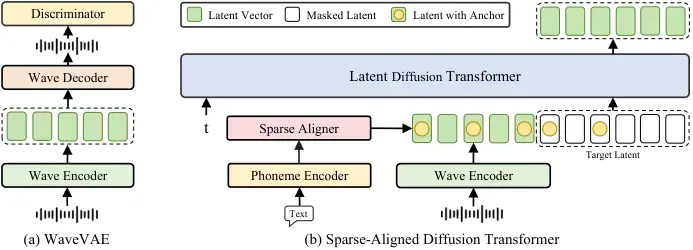
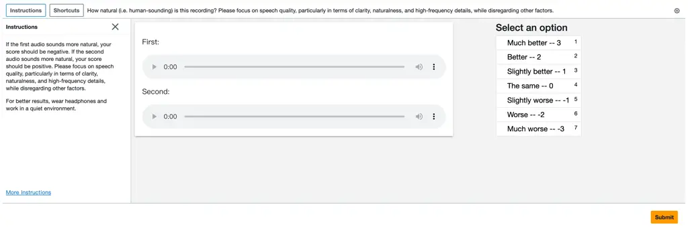
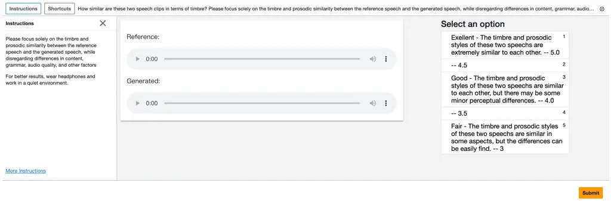
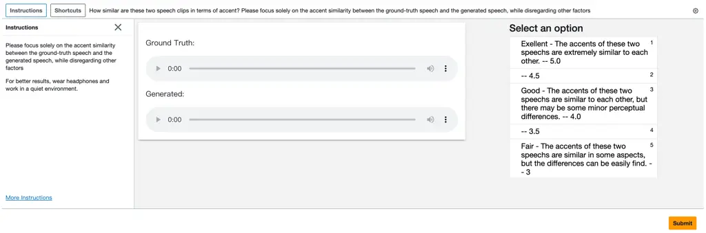
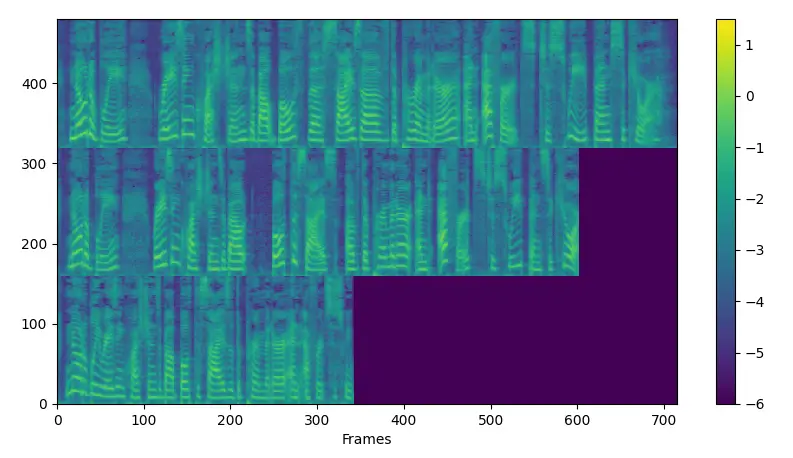
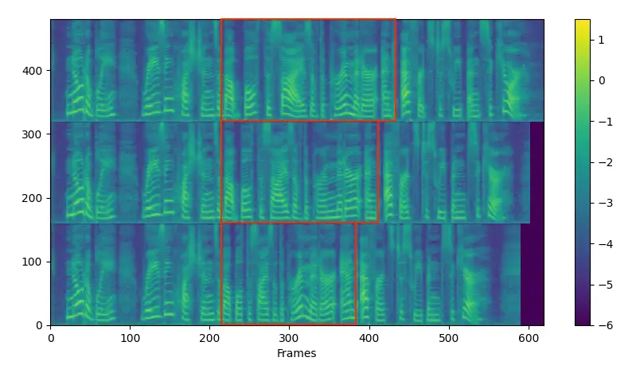
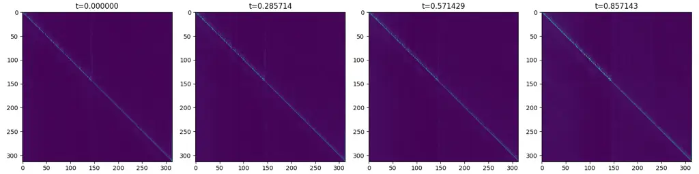
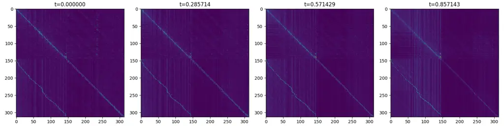
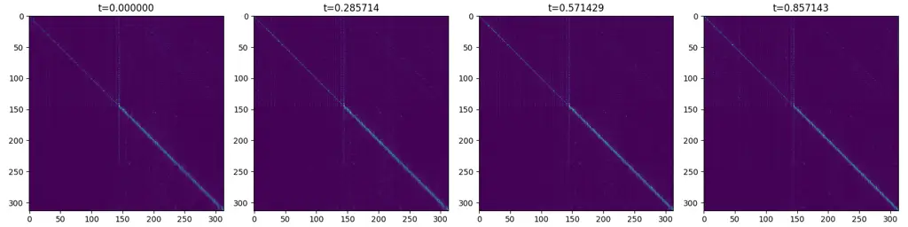

# MegaTTS 3: Sparse Alignment Enhanced Latent Diffusion Transformer for Zero-Shot Speech Synthesis

Ziyue Jiang ^(†)^(†)thanks: Intern at ByteDance. Affiliation: Zhejiang
University Affiliation: ByteDance
Email: <ziyuejiang341@gmail.comziyuejiang341@gmail.com>    Yi Ren
Affiliation: ByteDance Email: <zhaozhou@zju.edu.cnzhaozhou@zju.edu.cn>
   Ruiqi Li Affiliation: Zhejiang University Affiliation: ByteDance   
Shengpeng Ji Affiliation: Zhejiang University    Boyang Zhang
Affiliation: Zhejiang University    Zhenhui Ye Affiliation: Zhejiang
University    Chen Zhang Affiliation: ByteDance    Bai Jionghao
Affiliation: Zhejiang University    Xiaoda Yang Affiliation: Zhejiang
University    Jialong Zuo Affiliation: Zhejiang University    Yu Zhang
Affiliation: Zhejiang University    Rui Liu Affiliation: Inner Mongolia
University    Xiang Yin Affiliation: ByteDance    Zhou Zhao
Affiliation: Zhejiang University

###### Abstract

While recent zero-shot text-to-speech (TTS) models have significantly
improved speech quality and expressiveness, mainstream systems still
suffer from issues related to speech-text alignment modeling: 1) models
without explicit speech-text alignment modeling exhibit less robustness,
especially for hard sentences in practical applications; 2) predefined
alignment-based models suffer from naturalness constraints of forced
alignments. This paper introduces MegaTTS 3, a TTS system featuring an
innovative sparse alignment algorithm that guides the latent diffusion
transformer (DiT). Specifically, we provide sparse alignment boundaries
to MegaTTS 3 to reduce the difficulty of alignment without limiting the
search space, thereby achieving high naturalness. Moreover, we employ a
multi-condition classifier-free guidance strategy for accent intensity
adjustment and adopt the piecewise rectified flow technique to
accelerate the generation process. Experiments demonstrate that MegaTTS
3 achieves state-of-the-art zero-shot TTS speech quality and supports
highly flexible control over accent intensity. Notably, our system can
generate high-quality one-minute speech with only 8 sampling steps.
Audio samples are available
at [https://sditdemo.github.io/sditdemo/](https://sditdemo.github.io/sditdemo/).

## 1 Introduction

In recent years, neural codec language models (Wang et al., 2023; Zhang
et al., 2023; Song et al., 2024; Xin et al., 2024) and large-scale
diffusion models  (Shen et al., 2023; Matthew et al., 2023; Lee et al.,
2024a; Eskimez et al., 2024; Ju et al., 2024; Yang et al., 2024d; Yang
et al., 2024b) have brought considerable advancements to the field of
speech synthesis. Unlike traditional text-to-speech (TTS) systems (Shen
et al., 2018; Jia et al., 2018; Li et al., 2019; Kim et al., 2020; Ren
et al., 2019; Kim et al., 2021; Kim et al., 2022), these models are
trained on large-scale, multi-domain speech corpora, which contributes
to notable improvements in the naturalness and expressiveness of
synthesized audio. Given only seconds of speech prompt, they can
synthesize identity-preserving speech in a zero-shot manner.

To generate high-quality speech with clear and expressive pronunciation,
a TTS model must establish an alignment mapping from text to speech
signals (Kim et al., 2020; Tan et al., 2021). However, from the
perspective of speech-text alignment, current solutions suffer from the
following issues:

- •
  Models with implicit speech-text alignment achieve the soft alignment
  paths through attention mechanisms (Wang et al., 2023; Chen et al.,
  2024a; Du et al., 2024). These models can be categorized into: 1)
  autoregressive codec language models (AR LM), which are inefficient
  and lack robustness. The lengthy discrete speech codes, which
  typically require a bit rate of 1.5 kbps (Kumar et al., 2024; Wu
  et al., 2024), impose a significant burden on these autoregressive
  language models; 2) diffusion-based models without explicit duration
  modeling (Lee et al., 2024a; Eskimez et al., 2024; Lovelace et al.,
  2023; Gao et al., 2023; Cámbara et al., 2024; Yang et al., 2024d; Yang
  et al., 2024b), which significantly speeds up the speech generation
  process. However, when compared with methods that adopt forced
  alignment, these models exhibit a decline in speech intelligibility.
  Besides, these methods cannot provide fine-grained control over the
  duration of specific pronunciations and can only adjust the overall
  speech rate.
- •
  Predefined alignment-based methods have prosodic naturalness
  constraints of forced alignments. During training, alignment
  paths (Ren et al., 2020; Kim et al., 2020) are directly introduced
  into their models (Matthew et al., 2023; Shen et al., 2023; Ju et al., 2024) to reduce the complexity of text-to-speech generation, which
  achieves higher intelligibility. Nevertheless, they suffer from the
  following limitations: 1) predefined alignments constrain the model’s
  search space to produce more natural-sounding speech (Anastassiou
  et al., 2024; Chen et al., 2024a); 2) the overall naturalness is
  highly dependent on the performance of duration models.

Intuitively, we can integrate the two aforementioned diffusion-based
methods to pursue optimal performance. To be specific, we propose a
novel sparse speech-text alignment strategy to enhance the latent
diffusion transformer (DiT), termed MegaTTS 3. In our approach, phoneme
tokens are sparsely distributed within the corresponding forced
alignment regions to provide coarse pronunciation information that is
then refined by the latent DiT model. Experimental results demonstrate
that MegaTTS 3 achieves nearly state-of-the-art speech intelligibility
and speaker similarity on the LibriSpeech test-clean set (Panayotov
et al., 2015) with only 8 sampling steps, while also exhibiting high
speech naturalness. The main contributions of this work are summarized
as follows:

- •
  We design a sparse alignment enhanced latent diffusion transformer
  model, which effectively integrates the strengths of the two
  aforementioned speech-text alignment approaches. Notably, our model
  also demonstrates greater robustness to duration prediction errors
  compared to methods with forced alignment.
- •
  To achieve higher generation quality and more flexible control, we
  propose a multi-condition CFG strategy to adjust the guidance scales
  for speaker timbre and text content separately. Furthermore, we
  discover that the text guidance scale can also be used to modulate the
  intensity of personal accents, offering a new direction for enhancing
  speech expressiveness.
- •
  We successfully reduce the inference steps from 25 to 8 with the
  piecewise rectified flow (PeRFLow) technique, achieving highly
  efficient zero-shot TTS with minimal quality degradation. We also
  visualize the attention matrices across various layers of MegaTTS 3
  and obtain insightful findings in Appendix F.

## 2 Background

#### Zero-shot TTS.

Zero-shot TTS (Casanova et al., 2022; Wang et al., 2023; Zhang et al.,
2023; Shen et al., 2023; Matthew et al., 2023; Jiang et al., 2024; Liu
et al., 2024b; Lee et al., 2024a; Li et al., 2024; Lee et al., 2023; Ju
et al., 2024; Meng et al., 2024; Chen et al., 2024b) aims to synthesize
unseen voices with speech prompts. Among them, neural codec language
models (Chen et al., 2024a) are the first that can autoregressively
synthesize speech that rivals human recordings in naturalness and
expressiveness. However, they still face several challenges, such as the
lossy compression in discrete audio tokenization and the time-consuming
nature of autoregressive generation. To address these issues, some
subsequent works explore solutions based on continuous vectors and
non-autoregressive diffusion models (Shen et al., 2023; Matthew et al.,
2023; Lee et al., 2024a; Eskimez et al., 2024; Yang et al., 2024d; Yang
et al., 2024b; Chen et al., 2024b). These works can be categorized into
two main types: 1) the first type directly models speech-text alignments
using attention mechanisms without explicit duration modeling (Lee
et al., 2024a; Eskimez et al., 2024). Although these models perform well
in terms of generation speed and quality, their robustness, especially
in challenging cases, still requires enhancement. The second
category (Shen et al., 2023; Matthew et al., 2023) utilizes predefined
alignments to simplify alignment learning. However, the search space of
the generated speech of these models is limited by predefined
alignments. To address these limitations, we propose a sparse alignment
mechanism to reduce the constraints of predefined alignment-based
methods while also reducing the difficulty of speech-text alignment
learning.



Figure 1: (a) The WaveVAE model; (b) Overview of our model. We insert
the sparse alignment anchors into the latent vector sequence to provide
coarse alignment information. The transformer blocks in MegaTTS 3 will
automatically build fine-grained alignment paths.

#### Accented TTS.

While accented TTS is not yet mainstream in the field of speech
synthesis, it offers valuable potential for customized TTS services, by
enhancing the expressiveness of speech synthesis systems and improving
listeners’ comprehension of speech content (Tan et al., 2021;
Melechovsky et al., 2022; Badlani et al., 2023; Zhou et al., 2024; Shah
et al., 2024; Ma et al., 2023; Inoue et al., 2024; Zhong et al., 2024).
With the emergence of conversational AI systems, accented TTS technology
has even broader application scenarios. In this paper, we focus on a
specific task of accented TTS: adjusting the accent intensity of
speakers to make them sound like native English speakers or accented
speakers who use English as a second language (Liu et al., 2024a).
Unlike previous work, our approach does not require paired data or
accurate accent labels; instead, it allows for flexible control over the
accent intensity using the proposed multi-condition CFG mechanism. In
addition, we describe the CFG mechanism used in zero-shot TTS systems in
Appendix B.

## 3 Method

This section introduces MegaTTS 3. To begin with, we describe the
architecture design of MegaTTS 3. Then, we provide detailed explanations
of the sparse alignment mechanism, the piecewise rectified flow
acceleration technique, and the multi-condition classifier-free guidance
strategy.

### 3.1 Architecture

#### WaveVAE.

As shown in Figure 1 (a), given a speech waveform $`s`$, the VAE encoder
$`E`$ encodes $`s`$ into a latent vector $`z`$, and the wave decoder
$`D`$ reconstructs the waveform $`x=D(z)=D(E(s))`$. To reduce the
computational burden of the model and simplify speech-text alignment
learning, the encoder $`E`$ downsamples the waveform by a factor of
$`d`$ in length. The encoder $`E`$ is similar to the one used in Ji
et al. (2024), and the decoder $`D`$ is based on Kong et al. (2020). We
also adopt the multi-period discriminator (MPD), multi-scale
discriminator (MSD), and multi-resolution discriminator (MRD)  (Kong
et al., 2020; Jang et al., 2021) to model the high-frequency details in
waveforms, which ensure perceptually high-quality reconstructions. The
training loss of the speech compression model can be formulated as
$`\mathcal{L}=\mathcal{L}_{\mathrm{rec}}+\mathcal{L}_{\mathrm{KL}}+\mathcal{L}_{\mathrm{Adv}}`$,
where $`\mathcal{L}_{\mathrm{rec}}=\|s-\hat{s}\|^{2}`$ is the
spectrogram reconstruction loss, $`\mathcal{L}_{\mathrm{KL}}`$ is the
slight KL-penalty loss (Rombach et al., 2022), and
$`\mathcal{L}_{\mathrm{Adv}}`$ is the LSGAN-styled adversarial loss (Mao
et al., 2017). After training, a one-second speech clip can be encoded
into 25 vector frames. For more details, please refer to Appendix A.1
and 4.5.

#### Latent Diffusion Transformer with Masked Speech Modeling.

The latent diffusion transformer is used to predict speech that matches
the style of the given speaker and the content of the provided text.
Given the random variables $`Z_{0}`$ sampled from a standard Gaussian
distribution $`\pi_{0}`$ and $`Z_{1}`$ sampled from the latent space
given by the speech compression model with data density $`\pi_{1}`$, we
adopt the rectified flow Liu et al. (2022) to implicitly learn the
transport map $`T`$, which yields $`Z_{1}:=T(Z_{0})`$. The rectified
flow learns $`T`$ by constructing the following ordinary differential
equation (ODE):

```math
\mathrm{d}Z_{t}=v(Z_{t},t)\,\mathrm{d}t, \tag{1}
```

where $`t\in[0,1]`$ denotes time and $`v`$ is the drift force.
Equation 1 converts $`Z_{0}`$ from $`\pi_{0}`$ to $`Z_{1}`$ from
$`\pi_{1}`$. The drift force $`v`$ drives the flow to follow the
direction $`(Z_{1}-Z_{0})`$. The latent diffusion transformer,
parameterized by $`\theta`$, can be trained by estimating $`v(Z_{t},t)`$
with $`v_{\theta}(Z_{t},t)`$ through minimizing the least squares loss
with respect to the line directions $`(Z_{1}-Z_{0})`$:

```math
\min_{v}\int_{0}^{1}\mathbb{E}\left[\|(Z_{1}-Z_{0})-v(Z_{t},t)\|^{2}\right]\,\mathrm{d}t. \tag{2}
```

We use the standard transformer block from LLAMA (Dubey et al., 2024) as
the basic structure for MegaTTS 3 and adopt the Rotary Position
Embedding (RoPE) (Su et al., 2024) as the positional embedding. During
training, we randomly divide the latent vector sequence into a prompt
region $`z_{prompt}`$ and a masked target region $`z_{target}`$, with
the proportion of $`z_{prompt}`$ being $`\gamma\sim U(0.1,0.9)`$. We use
$`v_{\theta}`$ to predict the masked target vector $`\hat{z}_{target}`$
conditioned on $`z_{prompt}`$ and the phoneme embedding $`p`$, denoted
as $`v_{\theta}(\hat{z}_{target}|z_{prompt},p)`$. The loss is calculated
using only the masked region $`z_{target}`$. MegaTTS 3 learns the
average pronunciation from $`p`$ and the specific characteristics such
as timbre, accent, and prosody of the corresponding speaker from
$`z_{prompt}`$.

### 3.2 Sparse Alignment Enhanced Latent Diffusion Transformer (MegaTTS 3)

In this subsection, we describe the sparse alignment strategy as the
foundation of MegaTTS 3, followed by the piecewise rectified flow and
multi-condition CFG strategies to further enhance MegaTTS 3’s capacity.

#### Sparse Alignment Strategy.

Let’s first analyze the reasons behind the characteristics of different
speech-text alignment modeling methods in depth. Implicitly modeling
speech-text alignment is a relatively challenging task, which
consequently leads to suboptimal speech intelligibility, particularly in
hard cases. On the other hand, employing predefined hard alignment paths
constrains the model’s search space to produce more natural-sounding
speech. The characteristics of these systems motivate us to design an
approach that combines the advantages of both: we first provide a rough
alignment to MegaTTS 3 and then use attention mechanisms in Transformer
blocks to construct the fine-grained implicit alignment path. The
visualizations of the implicit alignment paths are included in
Appendix F. In specific, denote the latent speech vector sequence as
$`z=[z_{1},z_{2},\cdots,z_{n}]`$, the phoneme sequence as
$`p=[p_{1},p_{2},\cdots,p_{m}]`$, and the phoneme duration sequence as
$`d=[d_{1},d_{2},\cdots,d_{m}]`$, where $`n`$, $`m`$ is the length of
the sequence. The length of the speech vector that corresponds to a
phoneme $`p_{i}`$ is the duration $`d_{i}`$. Given $`d=[2,2,3]`$, the
hard speech-text alignment path can be denoted as
$`a=[p_{1},p_{1},p_{2},p_{2},p_{3},p_{3},p_{3}]`$. To construct the
rough alignment $`\tilde{a}`$, we randomly retain only one anchor for
each phoneme:
$`\tilde{a}=[\underline{M},p_{1},p_{2},\underline{M},\underline{M},\underline{M},P_{3}]`$,
where $`\underline{M}`$ represents the mask token. $`\tilde{a}`$ is
downsampled with convolution layers to match the length of the latent
sequence $`z`$. Then, we directly concatenate the downsampled
$`\tilde{a}`$ and $`z`$ along the channel dimension. The anchors in
$`\tilde{a}`$ provide MegaTTS 3 with approximate positional information
for each phoneme, simplifying the learning process of speech-text
alignment. At the same time, the rough alignment information does not
limit MegaTTS 3’s search space and also enables fine-grained control
over each phoneme’s duration.

#### Piecewise Rectified Flow Acceleration.

We adopt Piecewise Rectified Flow (PeRFlow) (Yan et al., 2024) to
distill the pretrained MegaTTS 3 model into a more efficient generator.
Although our MegaTTS 3 is non-autoregressive in terms of the time
dimension, it requires multiple iterations to solve the Flow ODE. The
number of iterations (i.e., number of function evaluations, NFE) has a
great impact on inference efficiency, especially when the model scales
up further. Therefore, we adopt the PeRFlow technique to further reduce
NFE by segmenting the flow trajectories into multiple time windows.
Applying reflow operations within these shortened time intervals,
PeRFlow eliminates the need to simulate the full ODE trajectory for
training data preparation, allowing it to be trained in real-time
alongside large-scale real data during the training process. Given
number of windows $`K`$, we divide the time $`t\in[0,1]`$ into $`K`$
time windows $`\{(t_{k-1},t_{k}]\}^{K}_{k=1}`$. Then, we randomly sample
$`k\in\{1,\cdots,K\}`$ uniformly. We use the startpoint of the sampled
time window
$`z_{t_{k-1}}=\sqrt{1-\sigma^{2}(t_{k-1})}z_{1}+\sigma(t_{k-1})\epsilon`$
to solve the endpoint of the time window
$`\hat{z}_{t_{k}}=\phi_{\theta}(z_{t_{k-1}},t_{k-1},t_{k})`$, where
$`\epsilon\sim\mathcal{N}(0,I)`$ is the random noise, $`\sigma(t)`$ is
the noise schedule, and $`\phi_{\theta}`$ is the ODE solver of the
teacher model. Since $`z_{t_{k-1}}`$ and $`\hat{z}_{t_{k}}`$ is
available, the student model $`\hat{\theta}`$ can be trained via the
following objectives:

```math
\ell=\left\lVert v_{\hat{\theta}}(z_{t},t)-\frac{\hat{z}_{t_{k}}-z_{t_{k-1}}}{t_{k}-t_{k-1}}\right\lVert^{2}, \tag{3}
```

where $`v_{\hat{\theta}}`$ is the estimated drift force with parameter
$`\hat{\theta}`$ and $`t`$ is uniformly sampled from
$`(t_{k-1},t_{k}]`$. We provide details of PeRFlow training for MegaTTS
3 in Appendix C.

#### Multi-condition Classifier-Free Guidance (CFG).

We employ classifier-free guidance approach (Ho and Salimans, 2022) to
steer the model $`g_{\theta}`$’s output towards the conditional
generation $`g_{\theta}(z_{t},c)`$ and away from the unconditional
generation $`g_{\theta}(z_{t},\varnothing)`$:

```math
\hat{g}_{\theta}(z_{t},c)=g_{\theta}(z_{t},\varnothing)+\alpha\cdot\left[g_{\theta}(z_{t},c)-g_{\theta}(z_{t},\varnothing)\right], \tag{4}
```

where $`c`$ denotes the conditional state, $`\varnothing`$ denotes the
unconditional state, and $`\alpha`$ is the guidance scale selected based
on experimental results. Unlike standard classifier-free guidance,
MegaTTS 3’s conditional states $`c`$ consist of two components: phoneme
embeddings $`p`$ and the speaker prompt $`z_{prompt}`$. In the
experiments, as the text guidance scale increases, we observe that the
pronunciation changes according to the following pattern: 1) starting
with improper pronunciation; 2) then shifting to pronouncing with the
current speaker’s accent; 3) and finally approaching the standard
pronunciation of the target language. The detailed experimental setup is
described in Appendix K. This allows us to use the text guidance scale
$`\alpha_{txt}`$ to control the accent intensity. At the same time, the
speaker guidance scale $`\alpha_{spk}`$ should be a relatively high
value to ensure a high speaker similarity. Therefore, we adopt the
multi-condition classifier-free guidance technique to separately control
$`\alpha_{txt}`$ and $`\alpha_{spk}`$:

```math
\begin{split}\hat{g}_{\theta}(z_{t},p,z_{prompt})=&\alpha_{spk}\left[g_{\theta}(z_{t},p,z_{prompt})-g_{\theta}(z_{t},p,\varnothing)\right]\\
&+\alpha_{txt}\left[g_{\theta}(z_{t},p,\varnothing)-g_{\theta}(z_{t},\varnothing,\varnothing)\right]\\
&+g_{\theta}(z_{t},\varnothing,\varnothing)\\
\end{split} \tag{5}
```

In training, we randomly drop condition $`z_{prompt}`$ with a
probability of $`p_{spk}=0.10`$. Only when $`z_{prompt}`$ is dropped, we
randomly drop condition $`p`$ with a probability of 50%. Therefore, our
model is able to handle all three types of conditional inputs described
in Equation 5. We select the guidance scale $`\alpha_{spk}`$ and
$`\alpha_{txt}`$ based on experimental results.

|                       |          |                   |                   |                   |                   |                  |                  |                   |
| --------------------- | -------- | ----------------- | ----------------- | ----------------- | ----------------- | ---------------- | ---------------- | ----------------- |
| Model                 | \#Params | Training Data     | SIM-O$`\uparrow`$ | SIM-R$`\uparrow`$ | WER$`\downarrow`$ | CMOS$`\uparrow`$ | SMOS$`\uparrow`$ | RTF$`\downarrow`$ |
| GT                    | \-       | \-                | 0.68              | \-                | 1.94%             | +0.12            | 3.92             | \-                |
| VALL-E 2^(∗)          | 0.4B     | LibriHeavy        | 0.64              | 0.68              | 2.44%             | \-               | \-               | \-                |
| VoiceBox^(†)          | 0.4B     | Collected (60kh)  | 0.64              | 0.67              | 2.03%             | -0.20            | 3.81             | 0.340             |
| DiTTo-TTS^(∗)         | 0.7B     | Collected (55kh)  | 0.62              | 0.65              | 2.56%             | \-               | \-               | \-                |
| NaturalSpeech 3^(†)   | 0.5B     | LibriLight        | 0.67              | 0.76              | 1.81%             | -0.10            | 3.95             | 0.296             |
| CosyVoice             | 0.4B     | Collected (172kh) | 0.62              | \-                | 2.24%             | -0.18            | 3.93             | 1.375             |
| MaskGCT               | 1.0B     | Emilia (100kh)    | 0.69              | \-                | 2.63%             | \-               | \-               | \-                |
| F5-TTS                | 0.3B     | Emilia (100kh)    | 0.66              | \-                | 1.96%             | -0.12            | 3.96             | 0.307             |
| MegaTTS 3             | 0.3B     | LibriLight        | 0.71              | 0.78              | 1.82%             | 0.00             | 3.98             | 0.188             |
| MegaTTS 3-accelerated | 0.3B     | LibriLight        | 0.70              | 0.78              | 1.86%             | -0.03            | 3.96             | 0.124             |

Table 1: Zero-shot TTS results on the LibriSpeech test-clean set
following NaturalSpeech 3 (Ju et al., 2024). ^(∗) means the results are
obtained from the paper. ^(†) means the results are obtained from the
authors. \#Params denotes the number of parameters. RTF denotes the
real-time factor.

| Model     | \#Params | SIM-O$`\uparrow`$ | WER$`\downarrow`$ |
| --------- | -------- | ----------------- | ----------------- |
| GT        | \-       | 0.69              | 2.23%             |
| CosyVoice | 0.3B     | 0.66              | 3.59%             |
| E2 TTS    | 0.3B     | 0.69              | 2.95%             |
| F5-TTS    | 0.3B     | 0.66              | 2.42%             |
| MegaTTS 3 | 0.3B     | 0.70              | 2.31%             |

Table 2: Zero-shot TTS results on the LibriSpeech-PC test-clean set
following F5-TTS (Chen et al., 2024b). \#Params denotes the number of
parameters.

## 4 Experiments

In this subsection, we describe the datasets, training, inference, and
evaluation metrics. We provide the model configuration and detailed
hyper-parameter setting in Appendix A.1.

### 4.1 Experimental setup

#### Datasets.

We train MegaTTS 3 on the LibriLight (Kahn et al., 2020) dataset, which
contains 60k hours of unlabeled speech derived from LibriVox audiobooks.
All speech data are sampled at 16KHz. We transcribe the speeches using
an internal ASR system and extract the predefined speech-text alignment
using the external alignment tool (McAuliffe et al., 2017). We utilize
three benchmark datasets: 1) the librispeech (Panayotov et al., 2015)
test-clean set following NaturalSpeech 3 (Ju et al., 2024) for zero-shot
TTS evaluation; 2) the LibriSpeech-PC test-clean set following
F5-TTS (Chen et al., 2024b) for zero-shot TTS evaluation; 3) the
L2-arctic dataset (Zhao et al., 2018) following (Melechovsky et al.,
2022; Liu et al., 2024a) for accented TTS evaluation.

#### Training and Inference.

We train the WaveVAE model and MegaTTS 3 on 8 NVIDIA A100 GPUs. The
batch sizes, optimizer settings, and learning rate schedules are
described in Appendix A.1. It takes 2M steps for the WaveVAE model’s
training and 1M steps for MegaTTS 3’s training until convergence. The
pre-training of MegaTTS 3 requires 800k steps and PeRFlow distillation
requires 200k steps.

#### Objective Metrics.

1\) For zero-shot TTS, we evaluate speech intelligibility using the word
error rate (WER) and speaker similarity using SIM-O (Ju et al., 2024).
To measure SIM-O, we utilize the WavLM-TDCNN speaker embedding model¹¹ 1
[https://github.com/microsoft/UniSpeech/tree/main/downstreams/speaker_verification](https://github.com/microsoft/UniSpeech/tree/main/downstreams/speaker_verification)
to calculate the cosine similarity score between the generated samples
and the prompt. As SIM-R (Matthew et al., 2023) is not comparable across
baselines using different acoustic tokenizers, we recommend focusing on
SIM-O in our experiments. The similarity score is in the range of
$`\left[-1,1\right]`$, where a higher value indicates greater
similarity. In terms of WER, we use the publicly available HuBERT-Large
model (Hsu et al., 2021), fine-tuned on the 960-hour LibriSpeech
training set, to transcribe the generated speech. The WER is calculated
by comparing the transcribed text to the original target text. All
samples from the test set are used for the objective evaluation; 2) For
accented TTS, we evaluate the Mel Cepstral Distortion (MCD) in dB level
and the moments (standard deviation ($`\sigma`$), skewness ($`\gamma`$)
and kurtosis ($`\kappa`$)) (Andreeva et al., 2014; Niebuhr and
Skarnitzl, 2019) of the pitch distribution to evaluate whether the model
accurately captures accent variance.

#### Subjective Metrics.

We conduct the MOS (mean opinion score) evaluation on the test set to
measure the audio naturalness via Amazon Mechanical Turk. We keep the
text content and prompt speech consistent among different models to
exclude other interference factors. We randomly choose 40 samples from
the test set of each dataset for the subjective evaluation, and each
audio is listened to by at least 10 testers. We analyze the MOS in three
aspects: CMOS (quality, clarity, naturalness, and high-frequency
details), SMOS (speaker similarity in terms of timbre reconstruction and
prosodic pattern), and ASMOS (accent similarity). We tell the testers to
focus on one corresponding aspect and ignore the other aspect when
scoring.

### 4.2 Results of Zero-Shot Speech Synthesis

#### Evaluation Baselines.

We compare the zero-shot speech synthesis performance of MegaTTS 3 with
11 strong baselines, including: 1) VALL-E 2 (Chen et al., 2024a); 2)
VoiceBox (Matthew et al., 2023); 3) DiTTo-TTS (Lee et al., 2024a); 4)
NaturalSpeech 3 (Ju et al., 2024); 5) CosyVoice (Du et al., 2024); 6)
MaskGCT (Wang et al., 2024); 7) F5-TTS (Chen et al., 2024b); 8) E2
TTS (Eskimez et al., 2024). Explanation and details of the selected
baseline systems are provided in Appendix A.4.

#### Analysis

As shown in Table 1, we can see that 1) MegaTTS 3 achieves
state-of-the-art SIM-O, SMOS, and WER scores, comparable to
NaturalSpeech 3 (the counterpart with forced alignment), and
significantly surpasses other baselines without explicit alignments. The
improved SIM-O and SMOS suggest that the proposed sparse alignment
effectively simplifies the text-to-speech mapping challenge like
predefined forced duration information, allowing the model to focus more
on learning timbre information. And the improved WER indicates that
MegaTTS 3 also enjoys strong robustness; 2) MegaTTS 3 significantly
surpasses all baselines in terms of CMOS, demonstrating the
effectiveness of the proposed sparse alignment strategy; 3) After the
PeRFlow acceleration, the student model of MegaTTS 3 shows on par
quality with the teacher model and enjoys fast inference speed. We also
conduct the experiments on the LibriSpeech-PC test-clean set provided by
F5-TTS and the results are shown in Table 2, which also demonstrates
that our method achieves state-of-the-art performance in terms of
speaker similarity and speech intelligibility. The duration
controllability of MegaTTS 3 is verified in Appendix E. In the demo
page, we also demonstrate that our method can maintain high naturalness
even when the performance of the duration predictor is suboptimal (while
MegaTTS 3 with forced alignment fails).

| Model     | MCD (dB) $`\downarrow`$ | $`\sigma`$ $`\uparrow`$ | $`\gamma`$ $`\downarrow`$ | $`\kappa`$ $`\downarrow`$ | ASMOS $`\uparrow`$ | CMOS $`\uparrow`$ | SMOS $`\uparrow`$ |
| --------- | ----------------------- | ----------------------- | ------------------------- | ------------------------- | ------------------ | ----------------- | ----------------- |
| GT        | \-                      | 45.1                    | 0.591                     | 0.783                     | 4.03               | +0.09             | 3.95              |
| CTA-TTS   | 5.98                    | 41.1                    | 0.602                     | 0.799                     | 3.72               | -0.60             | 3.64              |
| MegaTTS 3 | 5.69                    | 42.3                    | 0.601                     | 0.790                     | 3.84               | +0.00             | 3.89              |

Table 3: The objective and subjective experimental results for accented
TTS. MCD (dB) denotes the Mel Cepstral Distortion at the dB level.
$`\sigma`$, $`\gamma`$, and $`\kappa`$ are the standard deviation,
skewness, and kurtosis of the pitch distribution.

| Method          | MCD$`\downarrow`$ | GPE$`\downarrow`$ | VDE$`\downarrow`$ | FFE$`\downarrow`$ |
| --------------- | ----------------- | ----------------- | ----------------- | ----------------- |
| NaturalSpeech 3 | 4.45              | 0.44              | 0.33              | 0.37              |
| Ours w/ F.A.    | 4.48              | 0.44              | 0.35              | 0.40              |
| Ours w/ S.A.    | 4.42              | 0.31              | 0.29              | 0.34              |

Table 4: Comparisons about prosodic naturalness metrics on LibriSpeech
test-clean set. “F.A.” denotes forced alignment and “S.A.” denotes
sparse alignment.

### 4.3 Experiments of Prosodic Naturalness

We also measure the objective metrics MCD, SSIM, STOI, GPE, VDE, and FFE
following InstructTTS (Yang et al., 2024c) to evaluate the prosodic
naturalness of our method. The results are presented in Table 4.
Specifically, our method with sparse alignment (Ours w/ S.A.) achieves
the best performance across all metrics, with an MCD of 4.42, GPE of
0.31, VDE of 0.29, and FFE of 0.34. These results indicate a significant
improvement in prosodic naturalness compared to the baseline
NaturalSpeech 3 and our method with forced alignment (Ours w/ F.A.),
further validating the effectiveness of our sparse alignment strategy.
Our method provides a noval and effective solution for speech synthesis
applications that require high robustness and exceptional
expressiveness, such as audiobook narration and virtual assistants.

### 4.4 Results of Accented TTS

In this subsection, we evaluate the accented TTS performance of our
model on the L2-ARCTIC dataset (Zhao et al., 2018). This corpus includes
recordings from non-native speakers of English whose first languages are
Hindi, Korean, etc. In this experiment, we focus on verifying whether
our model and baseline can synthesize natural speech with different
accent types (standard English or English with specific accents) while
maintaining consistent vocal timbre. We compare our MegaTTS 3 model with
CTA-TTS (Liu et al., 2024a). More details of the baseline model are
provided in Appendix A.5. 1) First, we evaluate whether the models can
synthesize high-quality speeches with accents. As shown in Table 3, our
MegaTTS 3 model significantly outperforms the CTA-TTS baseline in terms
of the subjective accent similarity MOS core, the MCD (dB) values, and
the statistical moments ($`\sigma`$, $`\gamma`$, and $`\kappa`$) of
pitch distributions. These results demonstrate the superior accent
learning capability of MegaTTS 3 compared to the baseline system.
Besides, the MegaTTS 3 model achieves higher CMOS and SMOS scores
compared to CTA-TTS, indicating a significant improvement in speech
quality and speaker similarity; 2) Secondly, we evaluate whether the
models can accurately control the accent types of the generated
speeches. We follow CTA-TTS to conduct the intensity classification
experiment (Liu et al., 2024a). At run-time, we generate speeches with
two accent types, and the listeners are instructed to classify the
perceived accent categories, including “standard” and “accented”.
Figure 2 shows that our MegaTTS 3 significantly surpasses CTA-TTS in
terms of accent controllability.

Figure 2: The confusion matrices between the perceived and intended
accent categories of synthesized speech. The X-axis and Y-axis represent
the intended and perceived categories, respectively.

| Models       | Tokens/s | Latent Layer | Type       | PESQ$`\uparrow`$ | STOI$`\uparrow`$ | ViSQOL$`\uparrow`$ | MCD$`\downarrow`$ | UTMOS$`\uparrow`$ |
| ------------ | -------- | ------------ | ---------- | ---------------- | ---------------- | ------------------ | ----------------- | ----------------- |
| Encodec      | 600      | 8            | Discrete   | 3.16             | 0.94             | 4.31               | 1.63              | 3.07              |
| DAC          | 450      | 9            | Discrete   | 4.13             | 0.97             | 4.68               | 1.05              | 4.01              |
| WavTokenizer | 75       | 1            | Discrete   | 2.55             | 0.88             | 3.83               | 1.99              | 4.07              |
| X-codec2     | 50       | 1            | Discrete   | 3.03             | 0.91             | 4.12               | 1.72              | 4.13              |
| WaveVAE      | 25       | 1            | Continuous | 3.84             | 0.96             | 4.71               | 1.03              | 4.10              |

Table 5: Comparison of the reconstruction quality. The sampling rate are
set to 16 kHz. Bold and Underline values indicate the best and second
best results. “Tokens/s” means how many tokens a one-second speech will
be compressed into.

| Setting    | SIM-O$`\uparrow`$ | WER$`\downarrow`$ |
| ---------- | ----------------- | ----------------- |
| Ours       | 0.71              | 1.82%             |
| w/ Encodec | 0.56              | 2.24%             |
| w/ DAC     | 0.64              | 1.93%             |

Table 6: Comparison of zero-shot TTS performance of MegaTTS 3 using
different speech compression models on the LibriSpeech test-clean set.

### 4.5 Evaluation of WaveVAE

First, we evaluate the reconstruction quality of the WaveVAE model, with
results presented in Table 5. We report the objective metrics, including
Perceptual Evaluation of Speech Quality (PESQ), Virtual Speech Quality
Objective Listener (ViSQOL), and Mel-Cepstral Distortion (MCD). We
select the following codec models as baselines: 1) EnCodec (Défossez
et al., 2022), a representative and pioneering work in the field of
speech codec; 2) DAC (Kumar et al., 2024), a high-bitrate audio codec
model with high reconstruction quality; 3) WavTokenizer (Ji et al.,
2024), a low-bitrate speech codec model that focuses more on perceptual
reconstruction quality; 4) X-codec2 (Ye et al., 2025), a low-bitrate
speech codec model, leveraging the representations of a pre-trained
model to further enhance overall quality. The results demonstrates that,
despite applying higher compression rate, our solution achieves superior
performance on various reconstruction metrics, such as MCD and ViSQOL.

Second, to demonstrate the impact of different speech compression models
on the overall performance of the TTS system, we extracted the latents
from Encodec and DAC, respectively, for training our MegaTTS 3 model. We
report the experimental results in Table 6. It can be seen that our
method outperforms “w/ DAC” and “w/ Encodec”, due to the fact that the
latent space of our speech compression model is more compact (only 25
tokens per second). The results demonstrate the importance of our
WaveVAE, a high-compression, high-reconstruction-quality speech codec
model, for TTS systems. This conclusion is also verified by a previous
work (Lee et al., 2024a), which shows compact target latents facilitate
learning in diffusion models.

### 4.6 Ablation Studies

|         |                   |                   |                  |                  |
| ------- | ----------------- | ----------------- | ---------------- | ---------------- |
| Setting | SIM-O$`\uparrow`$ | WER$`\downarrow`$ | CMOS$`\uparrow`$ | SMOS$`\uparrow`$ |
| Ours    | 0.71              | 1.82$`\%`$        | 0.00             | 3.94             |
| w/ F.A. | 0.70              | 1.80%             | -0.17            | 3.94             |
| w/o A.  | 0.67              | 2.14%             | -0.12            | 3.88             |
| w/ CFG  | 0.68              | 1.79%             | -0.02            | 3.89             |
| w/o CFG | 0.43              | 6.85%             | -0.56            | 3.35             |

Table 7: Ablation studies of alignment strategies and CFG mechanisms on
the LibriSpeech test-clean set.

We test the following four settings: 1) w/ FA, which replaces the sparse
alignment in MegaTTS 3 with forced alignment used in  (Matthew et al.,
2023; Shen et al., 2023); 2) w/o A., we do not use the predefined
alignments and modeling the duration information implicitly; 3) w/ CFG,
we use the standard CFG following the common practice in Diffusion-based
TTS; 4) w/o CFG, we do not use the CFG mechanism. All tests follow the
experimental setup described in Section 4.2. The results are shown in
Table 7. For settings 1) and 2), it can be observed that both forced
alignment and sparse alignment can enhance the performance of speech
synthesis models. However, compared to forced alignment, sparse
alignment does not constrain the model’s search space, leading to a
prosodic naturalness (see Section 4.3). Therefore, the sparse alignment
strategy achieves $`+0.17`$ CMOS compared to the forced alignment
strategy. For setting 3), compared with the standard CFG, our
multi-condition CFG performs slightly better as it allows for flexible
control over the weights between the text prompt and the speaker prompt.
Setting 4) proves that the CFG mechanism is crucial for MegaTTS 3.
Additionally, we visualize the attention score matrices from different
transformer layers in MegaTTS 3 in Appendix F, leading to some
interesting observations.

## 5 Conclusions

In this paper, we introduce MegaTTS 3, a zero-shot TTS framework that
leverages novel sparse alignment boundaries to ease the difficulty of
alignment learning while retaining the naturalness of the generated
speeches. This strategy allows MegaTTS 3 to combine the strengths of
methods with both implicit alignments and predefined hard alignments.
Additionally, we employ the PeRFlow technique to further accelerate the
generation process and design a multi-condition CFG strategy to offer
more flexible control over accents. Experimental results show that
MegaTTS 3 achieves state-of-the-art zero-shot TTS speech quality while
maintaining a more efficient pipeline. Moreover, the sparse alignment
strategy also shows enhanced prosodic naturalness and higher robustness
against a suboptimal duration predictor. Due to space constraints,
further discussions are provided in the appendix.

## Limitations

In this section, we discuss the limitations of the proposed method and
outline potential strategies for addressing them in future research.

- •
  Language Coverage. Although our model currently supports both English
  and Chinese, there are far more languages in the world. We plan to
  incorporate additional training data from a wider range of languages
  and apply adaptation-based techniques, such as LoRA tuning (Hu et al.,
  2021), to enhance speech quality for low-resource languages.
- •
  Function Coverage. We can make MegaTTS 3 more user-friendly by
  enabling it to generate speech in various styles according to text
  descriptions through instruction-based fine-tuning. We can further
  fine-tune MegaTTS 3 on the paralinguistic corpus, allowing it to
  generate speech that is closer to a natural human style.

## References

- Anastassiou et al. (2024) Philip Anastassiou, Jiawei Chen, Jitong
  Chen, Yuanzhe Chen, Zhuo Chen, Ziyi Chen, Jian Cong, Lelai Deng,
  Chuang Ding, Lu Gao, et al. 2024. Seed-tts: A family of high-quality
  versatile speech generation models. _arXiv preprint arXiv:2406.02430_.
- Andreeva et al. (2014) Bistra Andreeva, Grażyna Demenko, Bernd Möbius,
  Frank Zimmerer, Jeanin Jügler, and Magdalena Oleskowicz-Popiel. 2014.
  Differences of pitch profiles in germanic and slavic languages. In
  _Fifteenth Annual Conference of the International Speech Communication
  Association_.
- Ardila et al. (2019) Rosana Ardila, Megan Branson, Kelly Davis,
  Michael Henretty, Michael Kohler, Josh Meyer, Reuben Morais, Lindsay
  Saunders, Francis M Tyers, and Gregor Weber. 2019. Common voice: A
  massively-multilingual speech corpus. _arXiv preprint
  arXiv:1912.06670_.
- Badlani et al. (2023) Rohan Badlani, Rafael Valle, Kevin J Shih,
  Joao Felipe Santos, Siddharth Gururani, and Bryan Catanzaro. 2023.
  Multilingual multiaccented multispeaker tts with radtts. _arXiv
  preprint arXiv:2301.10335_.
- Cámbara et al. (2024) Guillermo Cámbara, Patrick Lumban Tobing,
  Mikolaj Babianski, Ravichander Vipperla, Duo Wang Ron Shmelkin,
  Giuseppe Coccia, Orazio Angelini, Arnaud Joly, Mateusz Lajszczak, and
  Vincent Pollet. 2024. Mapache: Masked parallel transformer for
  advanced speech editing and synthesis. In _ICASSP 2024-2024 IEEE
  International Conference on Acoustics, Speech and Signal Processing
  (ICASSP)_, pages 10691–10695. IEEE.
- Casanova et al. (2022) Edresson Casanova, Julian Weber, Christopher D
  Shulby, Arnaldo Candido Junior, Eren Gölge, and Moacir A Ponti. 2022.
  Yourtts: Towards zero-shot multi-speaker tts and zero-shot voice
  conversion for everyone. In _International Conference on Machine
  Learning_, pages 2709–2720. PMLR.
- Chen et al. (2021) Guoguo Chen, Shuzhou Chai, Guanbo Wang, Jiayu Du,
  Wei-Qiang Zhang, Chao Weng, Dan Su, Daniel Povey, Jan Trmal, Junbo
  Zhang, et al. 2021. Gigaspeech: An evolving, multi-domain asr corpus
  with 10,000 hours of transcribed audio. _arXiv preprint
  arXiv:2106.06909_.
- Chen et al. (2024a) Sanyuan Chen, Shujie Liu, Long Zhou, Yanqing Liu,
  Xu Tan, Jinyu Li, Sheng Zhao, Yao Qian, and Furu Wei. 2024a. Vall-e 2:
  Neural codec language models are human parity zero-shot text to speech
  synthesizers. _arXiv preprint arXiv:2406.05370_.
- Chen et al. (2024b) Yushen Chen, Zhikang Niu, Ziyang Ma, Keqi Deng,
  Chunhui Wang, Jian Zhao, Kai Yu, and Xie Chen. 2024b. F5-tts: A
  fairytaler that fakes fluent and faithful speech with flow matching.
  _arXiv preprint arXiv:2410.06885_.
- Défossez et al. (2022) Alexandre Défossez, Jade Copet, Gabriel
  Synnaeve, and Yossi Adi. 2022. High fidelity neural audio compression.
  _arXiv preprint arXiv:2210.13438_.
- Du et al. (2024) Zhihao Du, Qian Chen, Shiliang Zhang, Kai Hu, Heng
  Lu, Yexin Yang, Hangrui Hu, Siqi Zheng, Yue Gu, Ziyang Ma,
  et al. 2024. Cosyvoice: A scalable multilingual zero-shot
  text-to-speech synthesizer based on supervised semantic tokens. _arXiv
  preprint arXiv:2407.05407_.
- Dubey et al. (2024) Abhimanyu Dubey, Abhinav Jauhri, Abhinav Pandey,
  Abhishek Kadian, Ahmad Al-Dahle, Aiesha Letman, Akhil Mathur, Alan
  Schelten, Amy Yang, Angela Fan, et al. 2024. The llama 3 herd of
  models. _arXiv preprint arXiv:2407.21783_.
- Eskimez et al. (2024) Sefik Emre Eskimez, Xiaofei Wang, Manthan
  Thakker, Canrun Li, Chung-Hsien Tsai, Zhen Xiao, Hemin Yang, Zirun
  Zhu, Min Tang, Xu Tan, et al. 2024. E2 tts: Embarrassingly easy fully
  non-autoregressive zero-shot tts. _arXiv preprint arXiv:2406.18009_.
- Gao et al. (2023) Yuan Gao, Nobuyuki Morioka, Yu Zhang, and Nanxin
  Chen. 2023. E3 tts: Easy end-to-end diffusion-based text to speech. In
  _2023 IEEE Automatic Speech Recognition and Understanding Workshop
  (ASRU)_, pages 1–8. IEEE.
- Ho and Salimans (2022) Jonathan Ho and Tim Salimans. 2022.
  Classifier-free diffusion guidance. _arXiv preprint arXiv:2207.12598_.
- Hsu et al. (2021) Wei-Ning Hsu, Benjamin Bolte, Yao-Hung Hubert Tsai,
  Kushal Lakhotia, Ruslan Salakhutdinov, and Abdelrahman Mohamed. 2021.
  Hubert: Self-supervised speech representation learning by masked
  prediction of hidden units. _IEEE/ACM Transactions on Audio, Speech,
  and Language Processing_, 29:3451–3460.
- Hu et al. (2021) Edward J Hu, Yelong Shen, Phillip Wallis, Zeyuan
  Allen-Zhu, Yuanzhi Li, Shean Wang, Lu Wang, and Weizhu Chen. 2021.
  Lora: Low-rank adaptation of large language models. _arXiv preprint
  arXiv:2106.09685_.
- Inoue et al. (2024) Sho Inoue, Shuai Wang, Wanxing Wang, Pengcheng
  Zhu, Mengxiao Bi, and Haizhou Li. 2024. Macst: Multi-accent speech
  synthesis via text transliteration for accent conversion. _arXiv
  preprint arXiv:2409.09352_.
- Jang et al. (2021) Won Jang, Dan Lim, Jaesam Yoon, Bongwan Kim, and
  Juntae Kim. 2021. Univnet: A neural vocoder with multi-resolution
  spectrogram discriminators for high-fidelity waveform generation.
  _arXiv preprint arXiv:2106.07889_.
- Ji et al. (2024) Shengpeng Ji, Ziyue Jiang, Wen Wang, Yifu Chen,
  Minghui Fang, Jialong Zuo, Qian Yang, Xize Cheng, Zehan Wang, Ruiqi
  Li, et al. 2024. Wavtokenizer: an efficient acoustic discrete codec
  tokenizer for audio language modeling. _arXiv preprint
  arXiv:2408.16532_.
- Jia et al. (2018) Ye Jia, Yu Zhang, Ron Weiss, Quan Wang, Jonathan
  Shen, Fei Ren, Patrick Nguyen, Ruoming Pang, Ignacio Lopez Moreno,
  Yonghui Wu, et al. 2018. Transfer learning from speaker verification
  to multispeaker text-to-speech synthesis. _Advances in neural
  information processing systems_, 31.
- Jiang et al. (2024) Ziyue Jiang, Jinglin Liu, Yi Ren, Jinzheng He,
  Zhenhui Ye, Shengpeng Ji, Qian Yang, Chen Zhang, Pengfei Wei, Chunfeng
  Wang, et al. 2024. Mega-tts 2: Boosting prompting mechanisms for
  zero-shot speech synthesis. In _The Twelfth International Conference
  on Learning Representations_.
- Ju et al. (2024) Zeqian Ju, Yuancheng Wang, Kai Shen, Xu Tan, Detai
  Xin, Dongchao Yang, Yanqing Liu, Yichong Leng, Kaitao Song, Siliang
  Tang, et al. 2024. Naturalspeech 3: Zero-shot speech synthesis with
  factorized codec and diffusion models. _arXiv preprint
  arXiv:2403.03100_.
- Kahn et al. (2020) Jacob Kahn, Morgane Rivière, Weiyi Zheng, Evgeny
  Kharitonov, Qiantong Xu, Pierre-Emmanuel Mazaré, Julien Karadayi,
  Vitaliy Liptchinsky, Ronan Collobert, Christian Fuegen, et al. 2020.
  Libri-light: A benchmark for asr with limited or no supervision. In
  _ICASSP 2020-2020 IEEE International Conference on Acoustics, Speech
  and Signal Processing (ICASSP)_, pages 7669–7673. IEEE.
- Kim et al. (2022) Heeseung Kim, Sungwon Kim, and Sungroh Yoon. 2022.
  Guided-tts: A diffusion model for text-to-speech via classifier
  guidance. In _International Conference on Machine Learning_, pages
  11119–11133. PMLR.
- Kim et al. (2020) Jaehyeon Kim, Sungwon Kim, Jungil Kong, and Sungroh
  Yoon. 2020. Glow-tts: A generative flow for text-to-speech via
  monotonic alignment search. _Advances in Neural Information Processing
  Systems_, 33:8067–8077.
- Kim et al. (2021) Jaehyeon Kim, Jungil Kong, and Juhee Son. 2021.
  Conditional variational autoencoder with adversarial learning for
  end-to-end text-to-speech. In _International Conference on Machine
  Learning_, pages 5530–5540. PMLR.
- Kong et al. (2020) Jungil Kong, Jaehyeon Kim, and Jaekyoung Bae. 2020.
  Hifi-gan: Generative adversarial networks for efficient and high
  fidelity speech synthesis. _Advances in Neural Information Processing
  Systems_, 33:17022–17033.
- Kumar et al. (2024) Rithesh Kumar, Prem Seetharaman, Alejandro Luebs,
  Ishaan Kumar, and Kundan Kumar. 2024. High-fidelity audio compression
  with improved rvqgan. _Advances in Neural Information Processing
  Systems_, 36.
- Lee et al. (2024a) Keon Lee, Dong Won Kim, Jaehyeon Kim, and Jaewoong
  Cho. 2024a. Ditto-tts: Efficient and scalable zero-shot text-to-speech
  with diffusion transformer. _arXiv preprint arXiv:2406.11427_.
- Lee et al. (2023) Sang-Hoon Lee, Ha-Yeong Choi, Seung-Bin Kim, and
  Seong-Whan Lee. 2023. Hierspeech++: Bridging the gap between semantic
  and acoustic representation of speech by hierarchical variational
  inference for zero-shot speech synthesis. _arXiv preprint
  arXiv:2311.12454_.
- Lee et al. (2024b) Yeonghyeon Lee, Inmo Yeon, Juhan Nam, and Joon Son
  Chung. 2024b. Voiceldm: Text-to-speech with environmental context. In
  _ICASSP 2024-2024 IEEE International Conference on Acoustics, Speech
  and Signal Processing (ICASSP)_, pages 12566–12571. IEEE.
- Li et al. (2019) Naihan Li, Shujie Liu, Yanqing Liu, Sheng Zhao, and
  Ming Liu. 2019. Neural speech synthesis with transformer network. In
  _Proceedings of the AAAI conference on artificial intelligence_,
  volume 33, pages 6706–6713.
- Li et al. (2024) Yinghao Aaron Li, Cong Han, Vinay Raghavan, Gavin
  Mischler, and Nima Mesgarani. 2024. Styletts 2: Towards human-level
  text-to-speech through style diffusion and adversarial training with
  large speech language models. _Advances in Neural Information
  Processing Systems_, 36.
- Liu et al. (2024a) Rui Liu, Berrak Sisman, Guanglai Gao, and Haizhou
  Li. 2024a. Controllable accented text-to-speech synthesis with fine
  and coarse-grained intensity rendering. _IEEE/ACM Transactions on
  Audio, Speech, and Language Processing_.
- Liu et al. (2022) Xingchao Liu, Chengyue Gong, and Qiang Liu. 2022.
  Flow straight and fast: Learning to generate and transfer data with
  rectified flow. _arXiv preprint arXiv:2209.03003_.
- Liu et al. (2024b) Zhijun Liu, Shuai Wang, Sho Inoue, Qibing Bai, and
  Haizhou Li. 2024b. Autoregressive diffusion transformer for
  text-to-speech synthesis. _arXiv preprint arXiv:2406.05551_.
- Livingstone and Russo (2018) Steven R Livingstone and Frank A
  Russo. 2018. The ryerson audio-visual database of emotional speech and
  song (ravdess): A dynamic, multimodal set of facial and vocal
  expressions in north american english. _PloS one_, 13(5):e0196391.
- Loizou (2011) Philipos C Loizou. 2011. Speech quality assessment. In
  _Multimedia analysis, processing and communications_, pages 623–654.
  Springer.
- Lovelace et al. (2023) Justin Lovelace, Soham Ray, Kwangyoun Kim,
  Kilian Q Weinberger, and Felix Wu. 2023. Simple-tts: End-to-end
  text-to-speech synthesis with latent diffusion.
- Ma et al. (2023) Linhan Ma, Yongmao Zhang, Xinfa Zhu, Yi Lei, Ziqian
  Ning, Pengcheng Zhu, and Lei Xie. 2023. Accent-vits: accent transfer
  for end-to-end tts. In _National Conference on Man-Machine Speech
  Communication_, pages 203–214. Springer.
- Mao et al. (2017) Xudong Mao, Qing Li, Haoran Xie, Raymond YK Lau,
  Zhen Wang, and Stephen Paul Smolley. 2017. Least squares generative
  adversarial networks. In _Proceedings of the IEEE international
  conference on computer vision_, pages 2794–2802.
- Matthew et al. (2023) Le Matthew, Vyas Apoorv, Shi Bowen, Karrer
  Brian, Sari Leda, Moritz Rashel, Williamson Mary, Manohar Vimal, Adi
  Yossi, Mahadeokar Jay, and Hsu Wei-Ning. 2023. [Voicebox: Text-guided
  multilingual universal speech generation at
  scale](https://voicebox.metademolab.com/).
- McAuliffe et al. (2017) Michael McAuliffe, Michaela Socolof, Sarah
  Mihuc, Michael Wagner, and Morgan Sonderegger. 2017. Montreal forced
  aligner: Trainable text-speech alignment using kaldi. In
  _Interspeech_, volume 2017, pages 498–502.
- Melechovsky et al. (2022) Jan Melechovsky, Ambuj Mehrish, Berrak
  Sisman, and Dorien Herremans. 2022. Accented text-to-speech synthesis
  with a conditional variational autoencoder. _arXiv preprint
  arXiv:2211.03316_.
- Meng et al. (2024) Lingwei Meng, Long Zhou, Shujie Liu, Sanyuan Chen,
  Bing Han, Shujie Hu, Yanqing Liu, Jinyu Li, Sheng Zhao, Xixin Wu,
  et al. 2024. Autoregressive speech synthesis without vector
  quantization. _arXiv preprint arXiv:2407.08551_.
- Niebuhr and Skarnitzl (2019) Oliver Niebuhr and Radek Skarnitzl. 2019.
  Measuring a speaker’s acoustic correlates of pitch–but which? a
  contrastive analysis based on perceived speaker charisma. In
  _Proceedings of 19th International Congress of Phonetic Sciences_.
- Panayotov et al. (2015) Vassil Panayotov, Guoguo Chen, Daniel Povey,
  and Sanjeev Khudanpur. 2015. Librispeech: an asr corpus based on
  public domain audio books. In _2015 IEEE international conference on
  acoustics, speech and signal processing (ICASSP)_, pages 5206–5210.
  IEEE.
- Peng et al. (2024) Puyuan Peng, Po-Yao Huang, Shang-Wen Li,
  Abdelrahman Mohamed, and David Harwath. 2024. Voicecraft: Zero-shot
  speech editing and text-to-speech in the wild. _arXiv preprint
  arXiv:2403.16973_.
- Ren et al. (2020) Yi Ren, Chenxu Hu, Xu Tan, Tao Qin, Sheng Zhao, Zhou
  Zhao, and Tie-Yan Liu. 2020. Fastspeech 2: Fast and high-quality
  end-to-end text to speech. _arXiv preprint arXiv:2006.04558_.
- Ren et al. (2019) Yi Ren, Yangjun Ruan, Xu Tan, Tao Qin, Sheng Zhao,
  Zhou Zhao, and Tie-Yan Liu. 2019. Fastspeech: Fast, robust and
  controllable text to speech. _Advances in neural information
  processing systems_, 32.
- Rombach et al. (2022) Robin Rombach, Andreas Blattmann, Dominik
  Lorenz, Patrick Esser, and Björn Ommer. 2022. High-resolution image
  synthesis with latent diffusion models. In _Proceedings of the
  IEEE/CVF Conference on Computer Vision and Pattern Recognition_, pages
  10684–10695.
- Shah et al. (2024) Neil Shah, Saiteja Kosgi, Vishal Tambrahalli,
  S Neha, Anil Nelakanti, and Vineet Gandhi. 2024. Parrottts:
  Text-to-speech synthesis exploiting disentangled self-supervised
  representations. In _Findings of the Association for Computational
  Linguistics: EACL 2024_, pages 79–91.
- Shen et al. (2018) Jonathan Shen, Ruoming Pang, Ron J Weiss, Mike
  Schuster, Navdeep Jaitly, Zongheng Yang, Zhifeng Chen, Yu Zhang,
  Yuxuan Wang, Rj Skerrv-Ryan, et al. 2018. Natural tts synthesis by
  conditioning wavenet on mel spectrogram predictions. In _2018 IEEE
  international conference on acoustics, speech and signal processing
  (ICASSP)_, pages 4779–4783. IEEE.
- Shen et al. (2023) Kai Shen, Zeqian Ju, Xu Tan, Yanqing Liu, Yichong
  Leng, Lei He, Tao Qin, Sheng Zhao, and Jiang Bian. 2023. Naturalspeech
  2: Latent diffusion models are natural and zero-shot speech and
  singing synthesizers. _arXiv preprint arXiv:2304.09116_.
- Song et al. (2024) Yakun Song, Zhuo Chen, Xiaofei Wang, Ziyang Ma, and
  Xie Chen. 2024. Ella-v: Stable neural codec language modeling with
  alignment-guided sequence reordering. _arXiv preprint
  arXiv:2401.07333_.
- Su et al. (2024) Jianlin Su, Murtadha Ahmed, Yu Lu, Shengfeng Pan, Wen
  Bo, and Yunfeng Liu. 2024. Roformer: Enhanced transformer with rotary
  position embedding. _Neurocomputing_, 568:127063.
- Tan et al. (2021) Xu Tan, Tao Qin, Frank Soong, and Tie-Yan Liu. 2021.
  A survey on neural speech synthesis. _arXiv preprint
  arXiv:2106.15561_.
- Wang et al. (2023) Chengyi Wang, Sanyuan Chen, Yu Wu, Ziqiang Zhang,
  Long Zhou, Shujie Liu, Zhuo Chen, Yanqing Liu, Huaming Wang, Jinyu Li,
  et al. 2023. Neural codec language models are zero-shot text to speech
  synthesizers. _arXiv preprint arXiv:2301.02111_.
- Wang et al. (2024) Yuancheng Wang, Haoyue Zhan, Liwei Liu, Ruihong
  Zeng, Haotian Guo, Jiachen Zheng, Qiang Zhang, Xueyao Zhang, Shunsi
  Zhang, and Zhizheng Wu. 2024. Maskgct: Zero-shot text-to-speech with
  masked generative codec transformer. _arXiv preprint
  arXiv:2409.00750_.
- Wu et al. (2024) Haibin Wu, Xuanjun Chen, Yi-Cheng Lin, Kai-wei Chang,
  Ho-Lam Chung, Alexander H Liu, and Hung-yi Lee. 2024. Towards audio
  language modeling-an overview. _arXiv preprint arXiv:2402.13236_.
- Xin et al. (2024) Detai Xin, Xu Tan, Kai Shen, Zeqian Ju, Dongchao
  Yang, Yuancheng Wang, Shinnosuke Takamichi, Hiroshi Saruwatari, Shujie
  Liu, Jinyu Li, et al. 2024. Rall-e: Robust codec language modeling
  with chain-of-thought prompting for text-to-speech synthesis. _arXiv
  preprint arXiv:2404.03204_.
- Yan et al. (2024) Hanshu Yan, Xingchao Liu, Jiachun Pan, Jun Hao Liew,
  Qiang Liu, and Jiashi Feng. 2024. Perflow: Piecewise rectified flow as
  universal plug-and-play accelerator. _arXiv preprint
  arXiv:2405.07510_.
- Yang et al. (2024a) An Yang, Baosong Yang, Binyuan Hui, Bo Zheng,
  Bowen Yu, Chang Zhou, Chengpeng Li, Chengyuan Li, Dayiheng Liu, Fei
  Huang, et al. 2024a. Qwen2 technical report. _arXiv preprint
  arXiv:2407.10671_.
- Yang et al. (2024b) Dongchao Yang, Rongjie Huang, Yuanyuan Wang,
  Haohan Guo, Dading Chong, Songxiang Liu, Xixin Wu, and Helen Meng.
  2024b. Simplespeech 2: Towards simple and efficient text-to-speech
  with flow-based scalar latent transformer diffusion models. _arXiv
  preprint arXiv:2408.13893_.
- Yang et al. (2024c) Dongchao Yang, Songxiang Liu, Rongjie Huang, Chao
  Weng, and Helen Meng. 2024c. Instructtts: Modelling expressive tts in
  discrete latent space with natural language style prompt. _IEEE/ACM
  Transactions on Audio, Speech, and Language Processing_.
- Yang et al. (2024d) Dongchao Yang, Dingdong Wang, Haohan Guo, Xueyuan
  Chen, Xixin Wu, and Helen Meng. 2024d. Simplespeech: Towards simple
  and efficient text-to-speech with scalar latent transformer diffusion
  models. _arXiv preprint arXiv:2406.02328_.
- Yang et al. (2024e) Jinhyeok Yang, Junhyeok Lee, Hyeong-Seok Choi,
  Seunghun Ji, Hyeongju Kim, and Juheon Lee. 2024e. Dualspeech:
  Enhancing speaker-fidelity and text-intelligibility through dual
  classifier-free guidance. _arXiv preprint arXiv:2408.14423_.
- Ye et al. (2025) Zhen Ye, Xinfa Zhu, Chi-Min Chan, Xinsheng Wang,
  Xu Tan, Jiahe Lei, Yi Peng, Haohe Liu, Yizhu Jin, Zheqi DAI,
  et al. 2025. Llasa: Scaling train-time and inference-time compute for
  llama-based speech synthesis. _arXiv preprint arXiv:2502.04128_.
- Zen et al. (2019) Heiga Zen, Viet Dang, Rob Clark, Yu Zhang, Ron J
  Weiss, Ye Jia, Zhifeng Chen, and Yonghui Wu. 2019. Libritts: A corpus
  derived from librispeech for text-to-speech. _arXiv preprint
  arXiv:1904.02882_.
- Zhang et al. (2022) Binbin Zhang, Hang Lv, Pengcheng Guo, Qijie Shao,
  Chao Yang, Lei Xie, Xin Xu, Hui Bu, Xiaoyu Chen, Chenchen Zeng,
  et al. 2022. Wenetspeech: A 10000+ hours multi-domain mandarin corpus
  for speech recognition. In _ICASSP 2022-2022 IEEE International
  Conference on Acoustics, Speech and Signal Processing (ICASSP)_, pages
  6182–6186. IEEE.
- Zhang et al. (2023) Ziqiang Zhang, Long Zhou, Chengyi Wang, Sanyuan
  Chen, Yu Wu, Shujie Liu, Zhuo Chen, Yanqing Liu, Huaming Wang, Jinyu
  Li, et al. 2023. Speak foreign languages with your own voice:
  Cross-lingual neural codec language modeling. _arXiv preprint
  arXiv:2303.03926_.
- Zhao et al. (2018) Guanlong Zhao, Sinem Sonsaat, Alif Silpachai, Ivana
  Lucic, Evgeny Chukharev-Hudilainen, John Levis, and Ricardo
  Gutierrez-Osuna. 2018. [L2-arctic: A non-native english speech
  corpus](https://doi.org/10.21437/Interspeech.2018-1110). In _Proc.
  Interspeech_, pages 2783–2787.
- Zhong et al. (2024) Jinzuomu Zhong, Korin Richmond, Zhiba Su, and Siqi
  Sun. 2024. Accentbox: Towards high-fidelity zero-shot accent
  generation. _arXiv preprint arXiv:2409.09098_.
- Zhou et al. (2024) Xuehao Zhou, Mingyang Zhang, Yi Zhou, Zhizheng Wu,
  and Haizhou Li. 2024. Multi-scale accent modeling with disentangling
  for multi-speaker multi-accent tts synthesis. _arXiv preprint
  arXiv:2406.10844_.

## Appendix A Detailed Experimental Settings

### A.1 Model Configuration

- •
  The WaveVAE model consists of a VAE encoder, a wave decoder, and
  discriminators; The VAE encoder follows the architecture used in (Ji
  et al., 2024). The wave decoder consists of a convolutional upsampler
  and a Hifi-GAN decoder (Kong et al., 2020). The latent channel size is
  set to 32. The weight of the KL loss is set to $`1\times 10^{-3}`$,
  which only imposes a slight KL penalty on the learned latent. In
  training, we use batches of fixed length, consisting of 72,000 wavform
  frames, with a batch size set to 40 for each GPU. We use the Adam
  optimizer with a learning rate of $`1\times 10^{-4}`$,
  $`\beta_{1}=0.9`$, $`\beta_{2}=0.999`$, and 10K warmup steps.
- •
  The MegaTTS 3 model use the standard transformer block from
  LLAMA (Dubey et al., 2024) as the basic structure, which comprises a
  24-layer Transformer with 16 attention heads and 1024 embedding
  dimensions. It contains 339M parameters in total. We adopt the Rotary
  Position Embedding (RoPE) (Su et al., 2024) as the positional
  embedding following the common practice in LLAMA implementations. For
  simplicity, we do not use the phoneme encoder and style encoder like
  previous works. We only use a linear projection layer to transform
  these features to the same dimension. During training, we use 8 A100
  80GB GPUs with a batch size of 10K latent frames per GPU for 1M steps.
  We use the Adam optimizer with a learning rate of $`5\times 10^{-5}`$,
  $`\beta_{1}=0.9`$, $`\beta_{2}=0.999`$, and 10K warmup steps. In
  zero-shot TTS experiments, we set the text guidance scale
  $`\alpha_{txt}`$ and the speaker guidance scale $`\alpha_{spk}`$ to
  2.5 and 3.5, respectively. In accented TTS experiments, we set
  $`\alpha_{spk}=6.5`$, $`\alpha_{txt}=1.5`$ to generate the accented
  speech and set $`\alpha_{spk}=2.0`$, $`\alpha_{txt}=5.0`$ to generate
  the speech with standard English.

### A.2 Random Seeds

We ran objective experiments 10 times with 10 different random seeds and
obtained the averaged results. The chosen random seeds are \[4475, 5949,
6828, 6744, 3954, 3962, 6837, 1237, 3824, 3163\].

### A.3 Sampling Strategy

For MegaTTS 3, we applied the Euler sampler with a fixed step size
following the common practice in flow ODE sampling. We use 25 and 8
sampling steps for MegaTTS 3 and MegaTTS 3-accelerated, respectively.

### A.4 Details about Zero-Shot TTS Baselines

In this subsection, we provide the details about the baselines in our
zero-shot TTS experiments:

- •
  VALL-E 2 (Chen et al., 2024a), based on VALL-E, introduces Repetition
  Aware Sampling to stabilize the decoding process and proposes the
  Grouped Code Modeling to effectively address the challenges of long
  sequence modeling.
- •
  VoiceBox (Matthew et al., 2023) is a non-autoregressive flow-matching
  model designed to infill mel-spectrograms based on provided speech
  context and text. We obtained the samples by contacting the authors.
- •
  DiTTo-TTS (Lee et al., 2024a) addresses the challenge of text-speech
  alignment via cross-attention mechanisms with the prediction of the
  total length of speech representations. We directly obtain the results
  of objective evaluations from their paper.
- •
  NaturalSpeech 3 (Ju et al., 2024) designs a neural codec with
  factorized vector quantization (FVQ) to disentangle speech waveform
  into subspaces of content, prosody, timbre, and acoustic details and
  propose a factorized diffusion model to generate attributes in each
  subspace following its corresponding prompt. We obtained the samples
  by contacting the authors.
- •
  CosyVoice (Du et al., 2024) utilizes an LLM for text-to-token
  generation and a conditional flow matching model for token-to-speech
  synthesis. We use the official code and the model snapshot named
  ‘‘CosyVoice-300M’’ in our experiments²² 2
  [https://github.com/FunAudioLLM/CosyVoice](https://github.com/FunAudioLLM/CosyVoice).
- •
  MaskGCT (Wang et al., 2024) proposes a fully non-autoregressive
  codec-based TTS model that eliminates the need for explicit alignment
  information between text and speech supervision, as well as
  phone-level duration prediction. We directly obtain the results of
  objective evaluations from their paper.
- •
  F5-TTS (Chen et al., 2024b) proposes a fully non-autoregressive
  text-to-speech system based on flow matching with Diffusion
  Transformer (DiT). We use the official code and pretrained model in
  our experiments³³ 3
  [https://github.com/SWivid/F5-TTS](https://github.com/SWivid/F5-TTS).
- •
  E2 TTS (Eskimez et al., 2024) proposes an easy non-autoregressive
  zero-shot TTS system, that offers human-level naturalness and
  state-of-the-art speaker similarity and intelligibility. We use the
  code implemented by F5-TTS authors in our experiments⁴⁴ 4
  [https://github.com/SWivid/F5-TTS](https://github.com/SWivid/F5-TTS).

The evaluation is conducted on a server with 1 NVIDIA V100 GPU and batch
size 1. RTF denotes the real-time factor, i.e., the seconds required for
the system (together with the vocoder) to synthesize one-second audio.

### A.5 Details about the Accented TTS Baseline

CTA-TTS (Liu et al., 2024a) is a TTS framework that uses a phoneme
recognition model to quantify the accent intensity in phoneme level for
accent intensity control. CTA-TTS first trains the phoneme recognition
model on the standard pronunciation LibriSpeech dataset, and then uses
the output probability distribution of the model to assess the accent
intensity and create accent labels on the accented L2Arctic dataset.
These labels were input into the TTS model to enable control over accent
intensity.

Systems like CTA-TTS require precise accent annotations during training,
so we trained them on the L2-ARCTIC dataset. However, our model does not
require accent annotations and learns different accent patterns from
large-scale data, using only the multi-condition CFG mechanism to
achieve accent intensity control. Therefore, we directly compare the
zero-shot results of our model with the baselines, which is a more
challenging task.

### A.6 Details in Subjective Evaluations

We conduct evaluations of audio quality, speaker similarity, and accent
similarity on Amazon Mechanical Turk (MTurk). We inform the participants
that the data will be utilized for scientific research purposes. For
each dataset, 40 samples are randomly selected from the test set, and
the TTS systems are then used to generate corresponding audio samples.
Each audio sample is listened to by a minimum of 10 listeners. For CMOS,
following the approach of  Loizou (2011), listeners are asked to compare
pairs of audio generated by systems A and B and indicate their
preference between the two. They are then asked to choose one of the
following scores: 0 indicating no difference, 1 indicating a slight
difference, 2 indicating a significant difference and 3 indicating a
very large difference. We instruct listeners to “Please focus on speech
quality, particularly in terms of clarity, naturalness, and
high-frequency details, while disregarding other factors”. For SMOS and
ASMOS, each participant is instructed to rate the sentence on a 1-5
Likert scale based on their subjective judgment. For speaker similarity
evaluations (SMOS), we instruct listeners to “Please focus solely on the
timbre and prosodic similarity between the reference speech and the
generated speech, while disregarding differences in content, grammar,
audio quality, and other factors”. For accent similarity evaluations
(ASMOS), we instruct listeners to “Please focus solely on the accent
similarity between the ground-truth speech and the generated speech,
while disregarding other factors”. The screenshots of instructions for
testers are shown in Figure 3. Additionally, we insert audio samples
with known quality levels (e.g., reference recordings with no artifacts
or intentionally corrupted audio with noticeable distortions) into the
evaluation set to verify whether evaluators are attentive and
professional. We also randomly repeat some audio clips in the evaluation
set to check whether evaluators provide consistent ratings for the same
sample. If large deviations in scores (larger than 1.0) for repeated
clips occurs, we will select a new rater to evaluate this audio clip. We
paid \$8 to participants hourly and totally spent about \$500 on
participant compensation.



\(a\) Screenshot of CMOS testing.



\(b\) Screenshot of SMOS testing.



\(c\) Screenshot of ASMOS testing.

Figure 3: Screenshots of subjective evaluations.

## Appendix B Classifier-Free Guidance Used in Zero-Shot TTS

Classifier-Free Guidance (CFG) (Ho and Salimans, 2022) is a technique
that balances sample fidelity and mode coverage in diffusion models by
combining the score estimates from both a conditional and an
unconditional model. The unconditional model is trained alongside the
conditional model by randomly omitting the conditioning variable $`c`$
with a certain probability, allowing the same model to provide score
estimates for both $`p(x)`$ and $`p(x|c)`$. In large-scale zero-shot
TTS, VoiceBox (Matthew et al., 2023) and NaturalSpeech 2 (Shen et al., 2023) achieve CFG mechanism by dropping the text and prompt speech
features. However, these works overlook that text and timbre should be
controlled separately. Inspired by VoiceLDM (Lee et al., 2024b) that
introduces separate control of environmental conditions and speech
contents, a concurrent work (Yang et al., 2024e) proposes separately
controlling the speaker fidelity and text intelligibility. However, this
work is limited to improving the audio quality of TTS and does not
explore the impact of CFG on accent.

## Appendix C Details of PeRFlow Training Procedure

Once the pretrained ODE solver of the teacher model $`\phi_{\theta}`$ is
available, we perform the PeRFlow technique to train an accelerated
solver in real time. When training, we only consider the shortened
segments of the ODE trajectories, reducing the computational load of
inference for the teacher model at each training step, and accelerating
the training process.

At each training step, given a data sample $`z_{1}`$ and a sample
$`z_{0}`$ drawn from the source distribution (in this case,
$`z_{0}\sim\mathcal{N}(0,I)`$, i.e., Gaussian distribution), we randomly
select a time window $`(t_{k-1},t_{k}]`$ and compute the standpoint of
the segmented probability path
$`z_{t_{k-1}}=\sqrt{1-\sigma^{2}(t_{k-1})}z_{1}+\sigma(t_{k-1})z_{0}`$,
where $`K`$ is a hyperparameter indicating the total number of segments,
$`k\in\{1,\cdots,K\}`$, $`t_{k}=k/K`$, and $`\sigma(t)`$ is the noise
schedule. The teacher solver only needs to infer the endpoint of this
segmented path,
$`\hat{z}_{t_{k}}=\phi_{\theta}(z_{t_{k-1}},t_{k-1},t_{k})`$, with a
remarkably smaller number of iterations $`\widehat{T}`$, comparing to
that of a full trajectory, $`T`$. Finally, the student model is
optimized on the segmented trajectory from $`z_{t_{k-1}}`$ to
$`\hat{z}_{t_{k}}`$. We set $`T`$ to 25 and $`\widehat{T}`$ to 8,
achieving a non-negligible acceleration of the training process.

## Appendix D Details about Data and Model Scaling Experiments

#### Training Corpus.

The data/model scalability is crucial for practical TTS systems. To
evaluate the scalability of MegaTTS 3 in Section 4.6, we construct a
600kh internal multilingual training corpus comprising both English and
Chinese speech. Most of the audiobook recordings are crawled from
YouTube and online podcasts like novelfm⁵⁵ 5
[https://novelfm.changdunovel.com/](https://novelfm.changdunovel.com/).
We also include the academic datasets like LibriLight (Kahn et al.,
2020), WenetSpeech (Zhang et al., 2022), and GigaSpeech (Chen et al.,
2021). Since the crawled corpus may contain unlabelled speeches. We
transcribe them using an internal ASR model.

#### Test Set.

Most prior studies of zero-shot TTS evaluate performances using the
reading-style LibriSpeech test set, which may be different from
real-world speech generation scenarios. In section 4.6, we evaluate our
model using the test sets collected from various sources, including: 1)
CommonVoice (Ardila et al., 2019), a large voice corpus containing noisy
speeches from various scenarios; 2) RAVDESS (Livingstone and Russo,
2018), an emotional TTS dataset featuring 8 emotions and 2 emotional
intensity. We follow Ju et al. (2024) and use strong-intensity samples
to validate the model’s ability to handle emotional variance; 3)
LibriTTS (Zen et al., 2019), a high-quality speech corpus; 4) we collect
samples from videos, movies, and animations to test whether our model
can simulate timbres with distinctly strong individual characteristics.
The test set consists of 40 audio samples extracted from each source.

#### Experimental Setup

We scale up MegaTTS 3 from 0.5B to 7.0B following the hyper-parameter
settings in Qwen 2 (Yang et al., 2024a). In this experiment, we only
increase the parameters of the MegaTTS 3 model to verify its
scalability. The parameters of the speech compression VAE remained
unchanged. In theory, expanding the parameters of both models could
yield the optimal results, which we leave for future work.

#### Speech-Text Alignment Labels for Large-Scale Data.

Training an MFA model directly on a 600k-hour dataset is impractical.
Therefore, we randomly sampled a 10k-hour subset from the dataset to
train a robust MFA model, which is then used to align the full dataset.
Since data processing inherently requires some alignment model (such as
an ASR model) for speech segmentation, using a pretrained MFA model for
alignment extraction does not limit the system’s data scalability.

|         |                   |                   |
| ------- | ----------------- | ----------------- |
| Setting | SIM-O$`\uparrow`$ | WER$`\downarrow`$ |
| 2kh     | 0.52              | 4.27%             |
| 40kh    | 0.63              | 2.98%             |
| 200kh   | 0.65              | 2.34%             |
| 600kh   | 0.66              | 2.10%             |
| 0.5B    | 0.66              | 2.10%             |
| 1.5B    | 0.72              | 1.98%             |
| 7.0B    | 0.74              | 1.90%             |

Table 8: Results of data and model scaling experiments.

#### Results

We evaluate the effectiveness of data and model scaling for the proposed
MegaTTS 3 model. In this experiment, we train models with 0.5B
parameters on multilingual internal datasets with data sizes of 2kh,
40kh, 200kh, and 600kh, respectively. We also train models with 0.5B,
1.5B, and 7.0B parameters on the 600kh dataset. We evaluate the
zero-shot TTS performance in terms of speaker similarity (Sim-O) and
speech intelligibility (WER) on an internal test set consisting of 400
speech samples from various sources. Based on Table 8, we conclude
that: 1) as the data size increases from 2kh to 600kh, both the model’s
speaker similarity and speech intelligibility improve consistently,
demonstrating strong data scalability of our model; 2) as the model size
scales from 0.5B to 7.0B parameters, SIM-O improves by 12.1% and WER
decreases by 9.52%, validating the model scalability of MegaTTS 3.
Additionally, we find that increasing the model parameters enhances its
para-linguistic capabilities, with specific audio examples available on
the demo page.



Figure 4: Sentence-level duration control.



Figure 5: Phoneme-level duration control.

## Appendix E Duration Controllability of MegaTTS 3

In this section, we aim to verify MegaTTS 3’s duration control
capabilities through case studies. We randomly selected a speech prompt
from the test set and used the sentence “Notably, raising questions
about both the size of the perimeter and efforts to sweep and secure.”
as the target sentence to generate speeches. In the generation process,
we first control the sentence-level duration by multiplying the time
coordinates of the phoneme anchors described in Section 3.2 by a fixed
value. As shown in Figure 5, our MegaTTS 3 demonstrates good
sentence-level duration control. Moreover, our MegaTTS 3 is also capable
of fine-grained phoneme-level duration control. As illustrated in
Figure 5, we multiplied the anchor coordinates of the phoneme within the
red box by a fixed value while keeping the relative positions of other
phoneme anchors unchanged. The figure shows that our MegaTTS 3 also
exhibits good fine-grained phoneme-level duration controllability.



\(a\) Layer 8 with different timesteps.



\(b\) Layer 16 with different timesteps.



\(c\) Layer 27 with different timesteps.

Figure 6: Visualization of Attention Matrices from different layers in
MegaTTS 3.

## Appendix F Visualization of Attention Matrices

We visualize the attention matrices from all layers in the 1.4B MegaTTS
3 model, using 8 sampling steps. From Figure 6, we observe: 1) within
the same layer, despite different timesteps, the attention matrices
remain identical. In other words, the function of each layer stays
consistent across timesteps; 2) the functions of the transformer layers
can be categorized into three types. As shown in Figure 6 (a), the
bottom layers handle text and audio feature extraction; in Figure 6 (b),
the middle layers focus on speech-text alignment; and in Figure 6 (c),
the top layers refine the target latent features.

| Method                       | MCD$`\downarrow`$ | SSIM$`\uparrow`$ | STOI$`\uparrow`$ | GPE$`\downarrow`$ | VDE$`\downarrow`$ | FFE$`\downarrow`$ |
| ---------------------------- | ----------------- | ---------------- | ---------------- | ----------------- | ----------------- | ----------------- |
| Ours w/ Sparse Alignment     | 4.56              | 0.52             | 0.62             | 0.34              | 0.30              | 0.35              |
| Ours w/ Forced Alignment     | 4.62              | 0.45             | 0.62             | 0.42              | 0.34              | 0.40              |
| Ours w/ Standard CFG         | 4.59              | 0.51             | 0.61             | 0.36              | 0.32              | 0.37              |
| Ours w/ Standard AR Duration | 4.58              | 0.50             | 0.62             | 0.36              | 0.31              | 0.36              |

Table 9: Comparisons about “expressiveness” metrics on the LibriSpeech
test-clean set.

|                           |                   |                   |
| ------------------------- | ----------------- | ----------------- |
| Model - with Longer Texts | WER$`\downarrow`$ | SIM-O$`\uparrow`$ |
| VoiceCraft                | 12.81%            | 0.62              |
| CosyVoice                 | 5.52%             | 0.68              |
| MegaTTS 3                 | 2.39%             | 0.70              |
| Model - with Short Texts  | WER$`\downarrow`$ | SIM-O$`\uparrow`$ |
| VoiceCraft                | 4.07%             | 0.58              |
| CosyVoice                 | 2.24%             | 0.62              |
| MegaTTS 3                 | 1.82%             | 0.71              |

Table 10: Comparisons with longer texts.

## Appendix G About Different Lengths of Context

An imbalanced distribution of prompt and target lengths during training
can lead to unstable generation performance during inference. For
example, if the majority of the sampled data during training consists of
20-second targets, the generation performance for audio with a 40-second
target will be worse than that of 20-second targets in inference. To
solve the imbalanced distribution issue, we recommend using the
following multi-sentence data sampling strategy: we concatenate all
audio recordings of the same speaker in the dataset in time order, and
then randomly extract audio segments of length
$`t\sim U(t_{min},t_{max})`$ from the concatenated audio, where
$`t_{min}`$ is the minimum sampling time and $`t_{max}`$ is the maximum
sampling time. Then, following Section 3.1, we randomly divide the
sampled sequence into a prompt region and a target region. Although we
do not use this strategy in our experiments in order to make a fair
comparison with other methods, this strategy is effective in practical
scenarios.

## Appendix H Experiments of Prosodic Naturalness for Zero-Shot TTS

We also conduct the ablation studies using the objective metrics MCD,
SSIM, STOI, GPE, VDE, and FFE following InstructTTS (Yang et al., 2024c)
to evaluate the prosodic naturalness of our proposed method. We conduct
experiments on the LibriSpeech test-clean 2.2-hour subset (following the
setup in VALL-E 2 and Voicebox). The results are shown in the Table
below. We compare MegaTTS 3 with the following baselines: 1) “Ours w/
Forced Alignment”, we replace the sparse alignment with the forced
alignment; 2) “Ours w/ Standard CFG”, we replace the multi-condition CFG
with standard CFG; 3) “Ours w/ Standard AR Duration”, we replace the
duration from F-LM with the duration from standard AR duration predictor
following SimpleSpeech 2 (Yang et al., 2024b). The results in Table 9
show that sparse alignment brings significant improvements, and both
multi-condition CFG and F-LM duration contribute positively to the
performance.

## Appendix I Experiments with Longer Samples

To directly compare MegaTTS 3’s robustness to long sequences against
other AR models, we have conducted experiemnts for a test set with
longer samples. Specifically, we randomly select 10 sentences, each
containing more than 50 words. For each speaker in the LibriSpeech
test-clean set, we randomly chose a 3-second clip as a prompt, resulting
in 400 target samples in total. To make our results more convincing, we
include strong-performing TTS models, VoiceCraft (Peng et al., 2024) and
CosyVoice (AR+NAR) (Du et al., 2024), as our baselines. The results for
longer samples are presented in Table 10. As shown, compared to the
baseline systems, MegaTTS 3 does not exhibit a significant decline in
speech intelligibility when generating longer sentences, illustrating
the effectiveness of the combination of F-LM and MegaTTS 3.

| Model     | WER$`\downarrow`$ | Substitution$`\downarrow`$ | Deletion$`\downarrow`$ | Insertion$`\downarrow`$ |
| --------- | ----------------- | -------------------------- | ---------------------- | ----------------------- |
| E2-TTS    | 8.49%             | 3.65%                      | 4.75%                  | 0.09%                   |
| F5-TTS    | 4.28%             | 1.78%                      | 2.28%                  | 0.22%                   |
| MegaTTS 3 | 3.95%             | 1.80%                      | 2.07%                  | 0.08%                   |

Table 11: Comparisons with hard sentences. The results of the baselines
are infered from offical checkpoints.

## Appendix J Experiments with Hard Sentences

The transcriptions on the LibriSpeech test-clean set are relatively
simple since they come from audiobooks. To further indicate the speech
intelligibility of different methods, we evaluate our model on the
challenging set containing 100 difficult textual patterns from
ELLA-V (Song et al., 2024). Since the speech prompts used by ELLA-V are
not publicly available, we randomly sample 3-second-long speeches in the
LibriSpeech test-clean set as speech prompts. For this evaluation, we
used the official checkpoint of F5-TTS (Chen et al., 2024b) and the
E2-TTS (Eskimez et al., 2024) inference API provided on F5-TTS’s Hugging
Face page. We employ Whisper-large-v3 for WER calculation. Based on the
results presented in Table 11, our model shows stronger robustness
against hard transcriptions.

## Appendix K Additional Details for Multi-Condition CFG

In Section 3.2, regarding the multi-condition CFG technique, the
experimental setup for the preliminary experiment for accent control is:
fixing $`\alpha_{spk}`$ at 2.5 and varying $`\alpha_{txt}`$ from 1.0 to
6.0. Specifically, as $`\alpha_{txt}`$ increases from 1.0 to 1.5, the
generated speeches contains improper pronunciations and distortions.
When $`\alpha_{txt}`$ ranges from 1.5 to 2.5, the pronunciations align
with the speaker’s accent. Finally, once $`\alpha_{txt}`$ exceeds 4.0,
the generated speech converges toward the standard pronunciation of the
target language. Notably, the optimal values for parameters
$`\alpha_{txt}`$ and $`\alpha_{spk}`$ may vary across different models.
The values reported here are specific to the model used in our
experiments.

## Appendix L Ethics Statement

The proposed model, MegaTTS 3, is designed to advance zero-shot TTS
technologies, making it easier for users to generate personalized
speech. When used responsibly and legally, this technique can enhance
applications such as movies, games, podcasts, and various other
services, contributing to increasing convenience in everyday life.
However, we acknowledge the potential risks of misuse, such as voice
cloning for malicious purposes. To mitigate this risk, solutions like
building a corresponding deepfake detection model will be considered.
Additionally, we plan to incorporate watermarks and verification methods
for synthetic audio to ensure ethical use in real-world applications.
Restrictions will also be included in the licensing of our project to
further prevent misuse. By addressing these ethical concerns, we aim to
contribute to the development of responsible and beneficial AI
technologies, while remaining conscious of the potential risks and
societal impact.

## Appendix M Reproducibility Statement

We have taken several steps to ensure the reproducibility of the
experiments and results presented in this paper: 1) the architecture and
algorithm of the MegaTTS 3 model are described in Section 3 and and
relevant hyperparameters are fully described in Appendix A.1; 2) The
evaluation metrics, including WER, SIM-O, MCD (dB), the moments of the
pitch distribution, alignment error, CMOS, SMOS, and ASMOS, are
described in detail in Section 4.1; 3) For most of the key experiments,
we utilize publicly available datasets such as LibriLight, LibriSpeech,
and L2Arctic. The selection of the test sets is identical to that used
in previous zero-shot TTS research. However, as the publicly available
datasets are insufficient for our data scaling experiments, we construct
a larger dataset, which is described in detail in Appendix D; 4) To
ensure reproducibility of the results, we have carefully set random
seeds in our experiments and the random seeds are provided in
Appendix A.2. All objective results reported are based on the average
performance across multiple runs.
