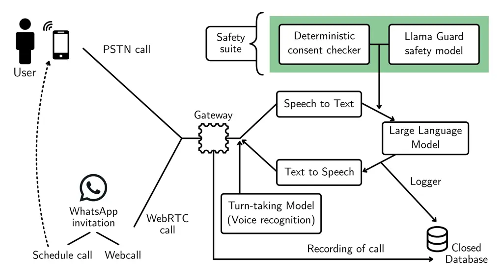
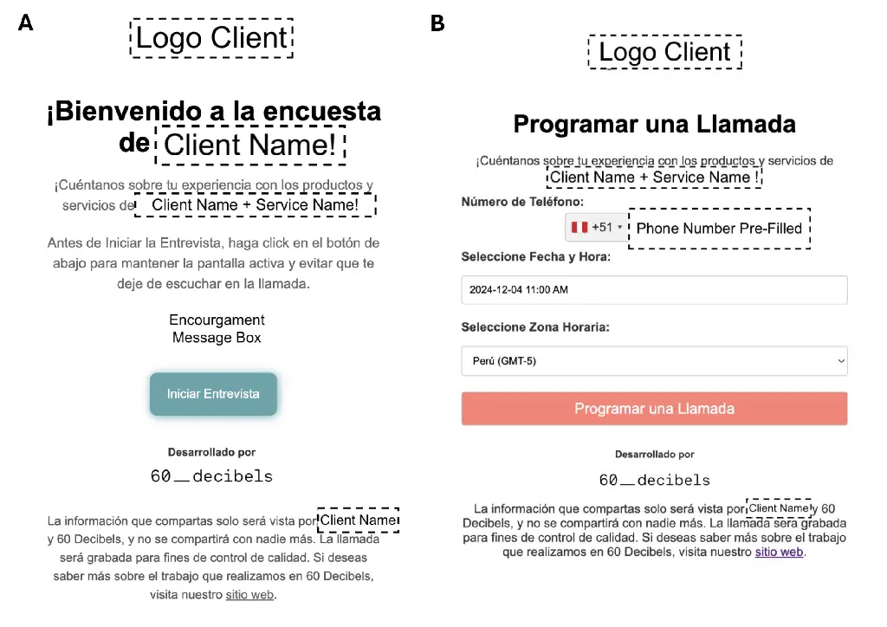
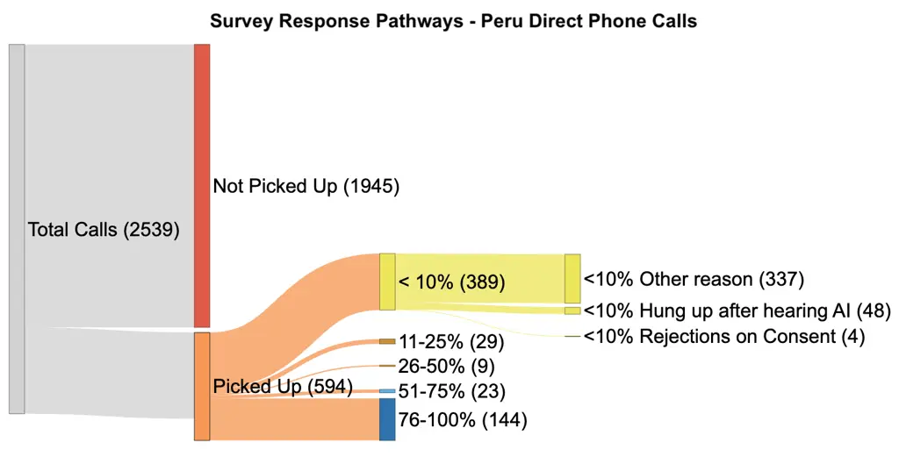
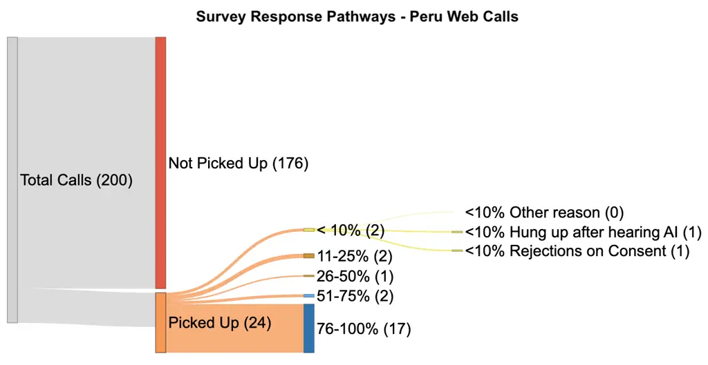
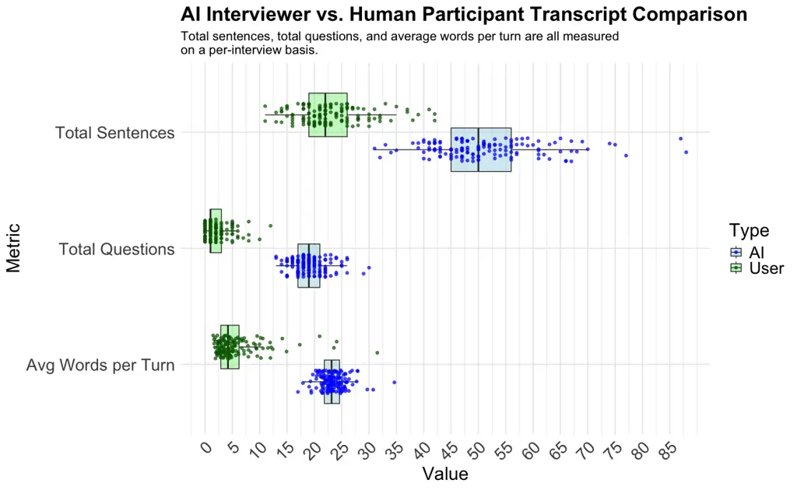
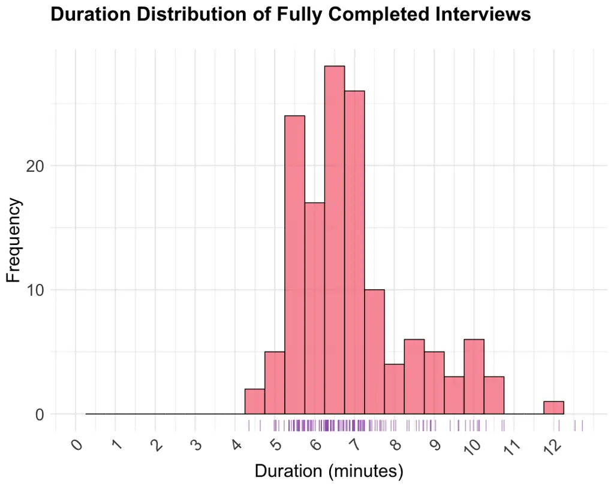

# Telephone Surveys Meet Conversational AI: Evaluating a LLM-Based Telephone Survey System at Scale

Max M. Lang

Affiliation: 60 Decibels Inc., United States of America Affiliation:
University of Oxford, United Kingdom    Sol Eskenazi Affiliation: 60
Decibels Inc., United States of America

## 1.  Introduction

Telephone surveys have long been a cornerstone of data collection in
social research, public opinion polling, and impact evaluation.
Traditionally, they are conducted through either Computer-Assisted
Telephone Interviewing (CATI) or Interactive Voice Response (IVR)
systems. CATI allows human interviewers to follow a scripted
questionnaire on a computer, enabling real-time adjustments and
rapport-building. In contrast, IVR systems fully automate the process,
using pre-recorded questions with respondents providing answers via
keypad input or simple speech recognition. Efforts to automate survey
interviewing began throughout the 1990s and early 2000s with rule-based
voice systems and early automated dialog systems (Levin, 1998a; Singh et
al., 1999a; Cole et al., 1997a; Zeigler & Bazor, 1994a; Boyce, 2000a;
Stent et al., 2006a).

In the 2010s, Johnston et al., 2013a conducted one of the first
large-scale evaluations of an automated spoken dialog system
administering social surveys, finding that with appropriate dialog
management (e.g., response confirmation), such systems could approximate
data quality levels seen in CATI. The study was part of a larger
research project comparing different modes of survey administration
(Conrad et al., 2013a), motivated by Conrad & Schober, 2007a in the book
Envisioning the Survey Interview of the Future which remains relevant
until today. More recent advancements in AI-driven interviewing, such as
DeVault et al., 2014a, showed that virtual AI interviewers could elicit
more candid responses than human interviewers, particularly in sensitive
topics, due to reduced social desirability bias. These systems paved the
way for more advanced automated survey methods. Recent research has
leveraged the rapid advancements in speech-to-text (STT) models, large
language models (LLMs), and text-to-speech (TTS) engines, significantly
enhancing the naturalness and adaptability of automated interviewers
(Inoue et al., 2020a; Nagasawa et al., 2023a; Ge et al., 2022a; Zeng et
al., 2023a; Cuevas et al., 2024a). Zeng et al., 2023a demonstrated that
LLMs could conduct semi-structured interviews, and Wuttke et al., 2024a
showed that LLMs were able to conduct conversational interviews,
retrieving data comparable to traditional methods with additional
scalability. Taking into consideration studies from the domain of
medical interviewing, Wang et al., 2024c and Hong et al., 2022a both
conducted small-scale assessments of automated telephone follow-ups or
web-based interviews when prior contact has been established.

Clearly automated interviewing has emerged as an interdisciplinary field
of survey methodology, natural language processing, and human-computer
interaction. Recent studies within the domain of survey research do
employ LLMs but tend to focus on primarily text-based interactions in
smaller samples or to support semi-structured follow-up generation
rather than conducting a full interview flow (Ge et al., 2022a; Zeng et
al., 2023a; Wuttke et al., 2024a).  
We present a large-scale telephone survey system that seamlessly
integrates STT, a transformer-based LLM, and TTS to fully mimic the
flexibility of a human enumerator—i.e., one that can ask open-ended
questions, interpret responses, and spontaneously formulate subsequent
queries without strictly following a preset script. This set of
capabilities has been described as full-duplex Spoken Dialogue Models
(SDMs) in general literature (Lin et al., 2022a; Wang et al., 2024b;
Zhang et al., 2025a).

We aim to bridge the gap between the extensive literature of telephone
surveys, automated interviewing systems, and conversational AI by
developing and deploying an automated telephone survey system that
integrates a pipeline of STT $`\leftrightarrow`$ LLM $`\leftrightarrow`$
TTS at scale. In collaboration with 60 Decibels Inc., a global impact
measurement firm, we deployed a scalable AI interviewer that uses
state-of-the-art conversational AI to carry out phone interviews on a
large scale. This work advances prior research by demonstrating a fully
automated, scalable telephone survey system that uses the recent
advancements in conversational AI technology to emulate human
enumerators at scale. Such a system has broad relevance: while motivated
by impact evaluation, a robust AI telephone interviewer could be applied
to social science research, opinion polling, and customer feedback
surveys, especially in regions or populations where telephone outreach
remain crucial.

## 2.  Methods

This section outlines the development and implementation of the AI
survey system, including its architecture, deployment strategies, and
evaluation methods. We first describe the system’s core components and
their role in enabling a human-like telephone-based survey. We then
detail survey deployment and introduce our study population, including
recruitment strategies. Finally, we present our approach to evaluating
the performance of the automated telephone-based interviewing system.

### 2.1 AI Survey System Architecture

The survey system was implemented as a voice-based conversational AI
agent that conducts phone surveys in natural language, mimicking a human
enumerator (see Figure 1). The pipeline integrates three key
components—STT $`\leftrightarrow`$ LLM $`\leftrightarrow`$ TTS. First,
an automated speech recognition module transcribes participants’ spoken
responses into text (STT), then the transcription gets passed into an
LLM that generates the next appropriate reply based on the conversation
history, and finally, a TTS engine converts the LLM’s textual output
into a natural-sounding voice response. These components worked in
sequence to enable a real-time dialog: participants heard the AI agent’s
questions, responded orally, and the system replied, creating an
interactive interview experience (see Figure 1). Alongside these three
components, we implemented a turn-taking model that allows the user to
interrupt the AI after a set number of (user) spoken words, triggers
idle messages if the user remains silent, and defines a silence timeout
to manage pauses effectively.

All models used for each stage were internally fine-tuned versions of
state-of-the-art LLMs, optimized for this survey domain. Specific model
identities are omitted due to confidentiality, but each was internally
evaluated to perform with high transcription accuracy and coherent,
contextually appropriate dialog generation. All processing was performed
in real time to maintain a smooth conversational flow. We also tested
non-fine-tuned models to assess their general suitability for survey
administration and found that they can function adequately for broad
topics. However, given the specialized nature of application (impact
research) and our existing data resources, we opted to employ a
fine-tuned approach to achieve more precise handling of domain-specific
questions and to maximize the performance of the system.

Figure 1: System architecture of the voice-based conversational AI
survey agent

### 2.2 Survey Deployment and Sampling

We conducted a pilot study in the United States followed by the main
study in Peru, with different sample characteristics and recruitment
procedures for each. In the U.S. pilot, we recruited $`n=75`$
participants from a general population sample as part of an impact
research survey. In Peru, we targeted $`n=2,739`$ participants who were
primarily university students on behalf of a client that initiated the
survey and recruited the participants. The pilot study was conducted in
October 2024 and the main study was conducted over the first two weeks
of November 2024.

We employed three outreach strategies to connect participants with the
AI survey agent. We used WhatsApp invitations that included links for
both a (1) web-based call and (2) call scheduling, and conducted (3)
direct telephone calls made during pre-determined time windows.

1.  1.  WhatsApp Invitations  
        Participants received a WhatsApp message that included a brief
        introduction to the survey mentioning that they would be talking to
        an AI and two personalized links: one to initiate a web-based call
        and another to schedule a call at a later time. By clicking the
        first link, participants accessed an in-browser calling interface
        with on-screen survey instructions (see Figure 2). This interface
        automatically connected them to an AI agent via a WebRTC call
        (Uberti et al., 2024a). As users engaged with the survey, they
        interacted with the browser window, speaking towards it. To enhance
        engagement, they received encouragement messages at 25%, 50%, and
        75% completion. The second link directed participants to a
        scheduling interface. Their phone number and time zone were
        pre-filled, although both could be updated if necessary. Users then
        selected a preferred date and time window, upon which the system
        automatically initiated a call via the AI agent at the chosen time.
2.  2.  Direct Telephone Calls  
        We conducted direct telephone calls to participants during
        pre-determined "optimal" time windows based on our experience from
        previous surveys in the region.

Figure 2: Web Calling and Call Scheduling Interfaces: Panel A shows the
Web Calling interface, where participants start an AI survey call via
WebRTC directly in their browser. Panel B displays the Call Scheduling
interface, allowing users to schedule a call with a pre-filled phone
number and time zone.

All U.S. participants received the personalized links (web call or
option to schedule a call) through WhatsApp, and no direct phone calls
were made for the pilot study. The pilot primarily served to test the
system’s performance and refine the survey flow. As an incentive each
U.S. participant who completed the survey was offered a \$10 Amazon gift
card.

For the Peruvian survey, we sent out $`200`$ WhatsApp invitations
(WebRTC call link, and the scheduling option) and conducted $`2,539`$
direct calls via a local Peruvian number for caller ID (Uberti et al.,
2024a). Peruvian calls and messages were conducted in Spanish with a
Peruvian accent. As an anti-fraud and engagement measure, participants
who received direct calls were sent a primer via SMS a day in advance to
inform the person that they would receive a call by the number used for
the survey to give feedback on the client’s service. To encourage
participation, those who completed the survey in Peru were entered into
a raffle to win a pair of headphones, which was organized by the client
who initiated the survey. Participants who missed the call received a
voicemail introducing the study and inviting them to redial the same
local number to initiate the survey when they were available.

If a participant engaged with the AI agent via a web call or by
answering the phone, the participants were greeted by the AI survey
agent with their first name, which was obtained from a personalized
hyperlink unique identifier or via the phone call setup. The agent then
delivered a structured introductory message, stating its identity as a
60 Decibels AI virtual researcher, the purpose of the survey, the
expected duration, and a prompt for consent. Figure 3 shows the
introduction used.

Figure 3: AI Assistant Introduction: Original (Spanish) and translated
(English) version of the Survey Participant Greeting

Following the initial greeting, participants were informed about how
their data would be used and with whom it would be shared. Both this
disclosure and the consent prompt were managed through a deterministic
approach, following guidelines laid out in existing literature (Jiang et
al., 2021a; Bach et al., 2024a). If the participant’s response was any
form of “No” (declining consent), the system immediately terminated the
survey call without any pressure or additional questions. The agent
would acknowledge the decision (e.g. “Thank you for your time, have a
great day”) and end the call.

We also implemented safeguards to maintain appropriate and secure
interactions throughout the conversation. All user inputs were monitored
by a secondary LLM-based safety model, LlamaGuard3, which acted as a
real-time filter for any inappropriate content or attempt at prompt
injection (Dubey et al., 2024a). If a user’s input was flagged (for
example, containing offensive language or instructions aiming to derail
the survey), the system would intervene by either steering the
conversation back on track or gracefully ending the interaction if
needed.

The survey questionnaire consisted of closed-ended and open-ended items
to collect both quantitative data and qualitative feedback. It included
simple yes/no questions, NPS items with a range from 0 to 10, several
Likert-scale questions to measure attitudes or levels of agreement, and
a number of open-ended questions that invited participants to elaborate
on their opinions or experiences in their own words (Likert, 1932a;
Reichheld, 2003a). The questionnaire also included conditional branching
logic for follow-ups: certain questions would only be asked based on a
previous response or different questions would be asked based on the
rating given. For example, if a participant answered “Yes” to a yes/no
question about having used a particular service the AI agent would ask
an open-ended follow-up such as “Could you briefly describe your
experience with it?” Conversely, if the answer was “No” the agent would
skip that follow-up and move to the next topic. The overall survey
length was designed to be about 10–15 minutes, though the actual
duration varied depending on how much detail participants provided in
open-ended responses. The survey questionnaire cannot be shared, as it
contains proprietary information.

### 2.3 Evaluation of the AI Survey System

After the data collection phase, we conducted both quantitative and
qualitative assessments to evaluate the AI agent’s performance in
conducting a survey with real participants, the effectiveness of our
outreach methods, and the quality of the responses elicited. We defined
a fully completed interview (100% survey completion) as a “successful
response”, while interviews falling between 76% and 100% completion were
categorized as “partially completed”. Response rates for both
definitions were reported according to the outreach method. Both fully
completed and partially completed interviews were considered in response
rate calculations, following AAPOR’s Response Rate 1 (RR1) and Response
Rate 2 (RR2) definitions (AAPOR, 2023a).

We documented the total call time for fully completed responses,
measured from the moment the participant answered until the call ended.
As for web calls participants could start multiple calls, we would
select the call with the longest duration. Call outcomes were
categorized based on participants’ progress through the survey
transcript. If there was no answer, the outcome was recorded as "Not
Picked Up" or for web calls "Not Clicked Through". For those who
answered but progressed through less than 10% of the survey, we noted
whether they ended the call after learning it was an AI agent, or
explicitly refused participation. Beyond this point, calls were
considered according to the following progress intervals: 11–25%,
26–50%, 51–75%, and 76–100%.  
To assess dialog dynamics, we calculated the total number of turns,
defined as the sum of individual speaker utterances (either respondent
or AI), User-AI ratio defined as
$`\frac{\text{Number of User Responses}}{\text{Number of AI Responses}}`$
and calculated the Flesch Reading Ease scores on the transcripts of the
fully completed responses (Flesch, 1948a). We also analyzed the
transcript content for both the AI agent and human respondents on a
per-interview basis, however, only for fully completed interviews. We
measured for both human respondents and AI agent:

- •
  Total number of sentences
- •
  Total number of questions asked
- •
  Average words per turn

Beyond these quantitative metrics, we carried out qualitative reviews of
the AI-collected fully completed responses to verify that their depth,
consistency, and contextual alignment matched the standard attained by
human enumerators. Specifically, our team evaluated whether the AI agent
was able to (i) identify responses out of the allowed answer range
(e.g., 1-10), and (ii) able to gather sufficiently detailed information
for meaningful interpretation. Transcripts were then compared to data
typically gathered by experienced human enumerators.

## 3.  Results

This section presents the results of our study, beginning with response
rates across different outreach methods in both the U.S. pilot and the
main survey in Peru. We then analyze the structure and dynamics of
AI-mediated survey interactions using quantitative metrics, including
conversation length, turn-taking balance, and linguistic complexity.
Finally, we provide a qualitative assessment of the AI’s ability to
engage participants, maintain coherence, and elicit meaningful responses
in comparison to human interviewers.

Figure 4: Sankey diagram illustrating the flow of phone call attempts in
Peru.

Figure 5: Sankey diagram illustrating the flow of web call attempts in
Peru.

### 3.1 Response Rates

In the U.S. pilot study, we observed an RR1 of 4%. Out of 75 calls, 3
resulted in a fully completed survey (100% of questions answered), and
an additional 5 calls reached at least 75% survey completion (RR2 6.7%).
Notably, no participants requested a scheduled call.

In the main study in Peru, we received 11 fully completed surveys (100%
completion) and 17 surveys with more than 75% completion out of 200 web
calls, corresponding to an RR1 of 5.5% and RR2 of 8.5%, respectively.
For direct telephone calls (i.e., outbound calls initiated by the
system), $`131`$ out of $`2,539`$ call attempts successfully reached a
respondent and yielded fully completed surveys, while 144 calls resulted
in a partially completed survey (\>75% of questions answered). We had
three individuals calling the AI agent back after initially not picking
up and then fully completing the survey, such that they are included in
the 131 fully complete responses. These outcomes translated to an RR1 of
5.2% and an RR2 of 5.7%. As in the U.S. pilot, no participants in Peru
requested to schedule a call.

Table 1summarizes and compares the results from the U.S. pilot and the
Peru main study. Figure 4 and Figure 5 illustrate the recruitment flow
for phone calls and web calls in Peru using Sankey diagrams, showing how
many calls connected to a respondent and ultimately led to a completed
or partially completed survey. In subsection 3.2 and subsection 3.3 we
will only focus on fully completed interviews.

| U.S. (Pilot) |                 |                 |                     |      |      |
| ------------ | --------------- | --------------- | ------------------- | ---- | ---- |
| n            | Outreach Method | Fully Completed | Partially Completed | RR1  | RR2  |
| 75           | Webcall         | 3               | 5                   | 4%   | 6.7% |
|              | Scheduled Call  | 0               | 0                   |      |      |
| 0            | Direct Call     | -               | -                   | \-   | \-   |
| Peru (Main)  |                 |                 |                     |      |      |
| n            | Outreach Method | Fully Completed | Partially Completed | RR1  | RR2  |
| 200          | Webcall         | 11              | 17                  | 5.5% | 8.5% |
|              | Scheduled Call  | 0               | 0                   |      |      |
| 2539         | Direct Call     | 131             | 144                 | 5.2% | 5.7% |

Table 1: Comparison of Outreach Results in U.S. (Pilot) and Peru (Main)

### 3.2 Quantitative Text Analysis

As shown in Table 2, each conversation between the AI interviewer and a
participant consisted of a series of turns, where a turn represents a
single exchange by either the AI or the user. On average, each
conversation consisted of 52.95 turns (median = 53) and lasted on
average approximately 7:00 minutes (median = 6:38 minutes). The balance
of interaction was nearly even, with a mean User-AI turn ratio of 0.96
(median = 0.96). The overall interview text had on average a Flesch
Reading Ease score of 28.87 (median 26.13).

|                                            |       |       |        |       |       |       |
| ------------------------------------------ | ----- | ----- | ------ | ----- | ----- | ----- |
| Metric                                     | Min   | Q1    | Median | Mean  | Q3    | Max   |
| Overall Conversation                       |       |       |        |       |       |       |
| Total turns per conversation               | 39    | 49    | 53     | 52.95 | 57    | 91    |
| Duration of conversation                   | 4:21  | 5:53  | 6:38   | 7:00  | 7:29  | 12:43 |
| User-AI turn ratio                         | 0.92  | 0.96  | 0.96   | 0.96  | 0.97  | 1.00  |
| Overall Flesch Reading Ease                | 10.77 | 23.92 | 26.13  | 28.87 | 30.85 | 45.95 |
| AI Agent                                   |       |       |        |       |       |       |
| Number of AI conversational turns          | 20    | 25    | 27     | 26.94 | 29    | 46    |
| Total AI sentences                         | 31    | 45    | 50     | 51.29 | 56    | 88    |
| Number of AI questions                     | 13    | 17    | 19     | 19.14 | 21    | 30    |
| Words per AI turn                          | 17.00 | 21.82 | 23.00  | 23.35 | 24.59 | 34.64 |
| Participant                                |       |       |        |       |       |       |
| Number of participant conversational turns | 19    | 24    | 26     | 26.01 | 28    | 45    |
| Total participant sentences                | 11    | 19    | 22     | 22.92 | 26    | 42    |
| Number of participant questions            | 0     | 1     | 1      | 2.05  | 3     | 12    |
| Words per participant turn (overall)       | 1.47  | 2.89  | 4.20   | 5.59  | 6.22  | 31.51 |
| Words per participant turn (open-ended)    | 3.33  | 9.00  | 13.00  | 18.58 | 22.38 | 65.50 |

Table 2: Summary of Conversation Metrics with Minimum, Maximum, and
Quartiles

Next, we examined the content of both the AI agent’s prompts and the
participants’ responses. The AI agent’s survey script contained on
average 26.94 conversational turns (median 27) and on average 51.29
total sentences (median 50) spoken by the AI in each conversation.
Within these, the AI asked on average 19.14 questions (median 19) per
interview. Human participants contributed an average of 26.01
conversational turns (median 26) and responded on average 22.92 total
sentences (median 22). The participants themselves asked few questions,
with an average of 2.05 questions per interview (median 1).

Each AI conversational turn contained on average 23.35 words (median
23). Human utterances were typically shorter, at a mean of 5.59 words
per turn (median 4.20). However, this includes brief answers to yes/no
questions and Net Promoter Score (NPS) ratings, where participants might
respond with a single number. For open-ended questions, participants
contributed on average 18.58 words per response (median 13).

Figure 6illustrates the per interview metrics for both AI and human
utterances (e.g., total sentences, total questions, and average words
per turn) and in the appendix Figure A1 displays the duration
distribution of fully completed interviews, most of which range roughly
from 5 to 9 minutes. In the boxplots for “Total Sentences” and “Total
Questions,” each dot represents a single interview, whereas in the
boxplot for “Average Words per Turn,” each dot reflects the average
words per turn for that interview.

Figure 6: Comparison of AI vs. Human Participant Transcript Metrics
(total sentences, total questions, and average words per turn).

### 3.3 Qualitative Text Analysis

In addition to the quantitative metrics, we examined the call
transcripts qualitatively. In terms of consistency and contextual
alignment, the AI agent generally succeeded in detecting contradictory
responses or answers that fell outside the scope of the question,
allowing it to guide most participants effectively through the entire
survey. The majority of respondents provided suitable answers on the
first attempt, particularly for categorical questions. When faced with
ambiguity or incompleteness, the AI agent followed up to clarify and
prompt respondents toward an appropriate response category. The AI
agent’s performance was comparable to that of an experienced human
enumerator.

Regarding depth, the AI agent did not reach the human benchmark in
probing for richer information, especially during open-ended questions
or when participants seemed hesitant to elaborate. As a result,
responses were often shorter and less rich than those elicited by human
interviewers, yet still exceeded the level of detail typical of online
self-administered surveys.

## 4.  Discussion

This study provides one of the first large-scale demonstrations of
automating telephone surveys using an integration of an LLM with TTS and
STT technologies. We deployed an AI “enumerator” capable of conducting
entire phone interviews without human assistance. Contributing to the
existing literature on phone surveys and automated voice surveys, we
show that the current state of conversational AI can provide a user
experience that goes beyond simple interactive Voice Response systems
and more closely mimics a human enumerator (Conrad et al., 2013a;
DeVault et al., 2014a; Wuttke et al., 2024a; Johnston et al., 2013a).
Moreover, our work contributes to the evolving literature of full-duplex
Spoken Dialogue Modeling and its applications (Lin et al., 2022a; Wang
et al., 2024b; Zhang et al., 2025a; Jin et al., 2021a; Lu et al.,
2025a). Finally, our work shows that a fully AI-driven telephone survey
can be effectively scaled for real-world data collection.

The AI agent successfully completed hundreds of interviews following a
non-trivial questionnaire which included several conditional branches
and did not expose any major hallucinations, such as making up questions
that were not in the questionnaire. The implementation of a turn-taking
model and idle messages was beneficial, as it prevented silence timeouts
for persons eager to continue, despite network issues preventing the
transcription from reaching the LLM stage of our system. Interestingly,
the AI survey agent was able to ensure that respondents gave valid and
complete answers. It could detect when a response was unclear or outside
expected parameters (for example, if a numeric answer was out of range)
and would politely prompt the respondent to correct or clarify, much as
a human interviewer would. This helped in obtaining usable data and in
preventing respondent mistakes. However, we found that the AI agent
lacked the probing ability that human interviewers have for eliciting
richer qualitative insights, which can be seen in the lower average
duration (7:00 minutes) of a questionnaire that humanly led would take
approximately 15 minutes. If a respondent’s answer was brief or vaguely
worded, the AI typically accepted it and moved on, whereas a human
interviewer might have asked “Could you tell me more about that?” or
rephrased the question to probe deeper. This is consistent with recent
literature and motivates the use of a potential multi-agent system that
uses a separate model for probing and generating follow-up questions
(Wuttke et al., 2024a; Zeng et al., 2023a; Ge et al., 2022a; Wei et al.,
2024a; Cuevas et al., 2024a). We are hypothesizing that the limited
probing ability might be due to implemented safety measures of
foundational models, as the model rejects to fixate on, for example, a
personal problem of a human participant (Abdulhai et al., 2023a; Ranaldi
& Pucci, 2023a; Röttger et al., 2023a). Nevertheless, we found that the
open-ended responses were still of better quality than responses
received through online self-administered surveys.  
Our deployment included both web-based voice calls and standard
telephone calls, and we observed notable differences in response quality
between these modes. Web-based calls often suffer from competing for the
participant’s attention, as respondents might have been distracted by
on-screen notifications or other apps. As a result, their answers during
web calls seemed often rushed or less thoughtful. In contrast, when the
AI reached participants via a traditional phone call, respondents
appeared more focused on the conversation. Although scheduling a
traditional phone call—rather than sending a link for a web call—gave
the research team control over the exact timing, this approach did not
always align with the unknown schedules of potential respondents. Given
that the AI agent would leave a voicemail and is available around the
clock, this offers a best-of-both-worlds solution, as participants could
receive or return survey calls at any time. We found that the three
respondents who opted to call back were committed to providing rich
feedback and valuable insights, which otherwise might have been missed.
Moreover, we discovered that this method facilitates fast, near
real-time deployment of telephone surveys at scale, since it eliminates
the requirement for training and practice time required for human
enumerators. However, this comes with potential trade-offs in data
quality that researchers must consider depending on their objectives.

### 4.1 Limitations

This research was conducted in an industry setting, which influenced
certain methodological choices. Notably, we did not incorporate specific
study designs, such as a human enumerator control group for the
questionnaire, as all data in this campaign were collected exclusively
by the AI agent. Consequently, this approach limits our ability to
derive deeper insights into the system’s comparative performance.
Additionally, several factors limit the generalizability of these
results. First, the sample of the main study in Peru primarily consisted
of university students, who may be more technically savvy and more open
to AI-driven interactions than the general population (Nikolenko &
Astapenko, 2023a; Horowitz et al., 2024a). As a result, the findings
should be interpreted with caution when discussing the potential
challenges or varying levels of comfort in broader demographic groups.
Second, while the AI system functioned autonomously during the
interviews, human intervention was still necessary for tasks such as
scheduling, sending reminders, and monitoring the system’s performance.
Consequently, a fully automated pipeline from participant recruitment to
data collection remains an objective for future research. Third, we only
analyzed completed interviews and did not receive feedback from those
who dropped out, limiting our understanding of drop-off reasons and
overall user experience. Finally, for confidentiality reasons, we do not
disclose the specific (fine-tuned) models used in the system, which may
limit the reproducibility of our approach in other contexts.

### 4.2 Future Research

Future research should expand participant pools beyond university
students to validate the generalizability of these findings among older
adults, and other demographic groups. Since LLM-based systems can be
adapted for multiple languages, testing the AI enumerator in different
linguistic contexts would be an important step to determine whether
certain languages or dialects pose unique challenges for automated
survey interviewing using state-of-the-art TTS and STT. Efforts to
improve the AI system’s probing and contextual understanding are also
warranted, potentially through dynamic scripts or multi-agent approaches
for generating follow-up questions. Running a similar campaign with
human enumerators as a baseline would contribute to a better
understanding of the AI agent’s capabilities for phone surveys. Finally,
further exploration of TTS options, including different voice types and
degrees of expressiveness, may reveal strategies to increase engagement
and reduce attrition, as traditional phone surveys found a difference in
response behavior based on the interviewer’s voice (Irvine et al.,
2013a; Laar et al., 2004a; Groves et al., 2008a; Schober et al., 2015a).
By addressing these aspects, it may be possible to achieve a fully
automated, highly adaptable telephone survey system, balancing efficient
data collection with the depth and quality of respondent feedback
traditionally associated with human-led interviews.

## 5.  Conclusion

This study presents and evaluates a fully automated, AI-driven telephone
survey system integrating STT, LLM, and TTS for large-scale data
collection. Our findings demonstrate that this approach can reliably
engage respondents in real-time, automatically prompt clarifications,
and capture both quantitative and open-ended responses. However, the AI
agent did not probe for deeper, more detailed elaborations in open-ended
questions as thoroughly as human interviewers typically do. Moreover,
additional human oversight is currently required for tasks like
scheduling calls or sending reminders and monitoring system performance,
limiting the true end-to-end automation of the pipeline. Despite these
challenges, our results underscore the practical viability of leveraging
conversational AI for phone-based research at scale. Future efforts
could focus on improving the AI’s probing strategies, expanding language
coverage, and comparing AI-driven interviews to human-led surveys in
diverse populations. With continued refinements, this system has the
potential to serve as a scalable and rapidly deployable alternative to
traditional telephone surveying methods.

## Acknowledgments

We thank 60 Decibels for supporting this research, with special
appreciation to Sasha Dichter, Adriana Baqueiro, Ramiro Rejas, and the
entire LATAM team for their contributions. MML also acknowledges Frauke
Kreuter for recognizing the potential of this project early on,
providing continuous support, and facilitating the connection with 60
Decibels. Thank you for making this research possible.

## References

- AAPOR (2023) AAPOR “Final dispositions of case codes and outcome rates
  for surveys” In _The American Association for Public Opinion
  Research_, 2023
- Abdulhai et al. (2023) Marwa Abdulhai et al. “Moral foundations of
  large language models” In _arXiv preprint arXiv:2310.15337_, 2023
- Bach et al. (2024) Tita Bach, Jenny Kristiansen, Aleksandar Babic and
  Alon Jacovi “Unpacking human-AI interaction in safety-critical
  industries: a systematic literature review” In _IEEE Access_ IEEE,
  2024
- Boyce (2000) Susan Boyce “Natural spoken dialogue systems for
  telephony applications” In _Communications of the ACM_ 43.9 ACM New
  York, NY, USA, 2000, pp. 29–34
- Cole et al. (1997) Ronald Cole et al. “Experiments with a spoken
  dialogue system for taking the US census” In _Speech Communication_
  23.3 Elsevier, 1997, pp. 243–260
- Conrad & Schober (2007) F.G. Conrad and M.F. Schober “Envisioning the
  Survey Interview of the Future”, Wiley Series in Survey Methodology
  Wiley, 2007 URL:
  [https://books.google.co.uk/books?id=fpRP1WJRbz4C](https://books.google.co.uk/books?id=fpRP1WJRbz4C)
- Conrad et al. (2013) Frederick Conrad et al. “Mode choice on an iPhone
  increases survey data quality” In _Annual Conference of the American
  Association for Public Opinion Research, Boston_, 2013
- Cuevas et al. (2024) Alejandro Cuevas et al. “Collecting Qualitative
  Data at Scale with Large Language Models: A Case Study”
  arXiv:2309.10187 \[cs\] arXiv, 2024 DOI:
  [10.48550/arXiv.2309.10187](https://dx.doi.org/10.48550/arXiv.2309.10187)
- DeVault et al. (2014) David DeVault et al. “SimSensei Kiosk: A virtual
  human interviewer for healthcare decision support” In _Proceedings of
  the 2014 international conference on Autonomous agents and multi-agent
  systems_, 2014, pp. 1061–1068
- Dubey et al. (2024) Abhimanyu Dubey et al. “The llama 3 herd of
  models” In _arXiv preprint arXiv:2407.21783_, 2024
- Flesch (1948) Rudolph Flesch “A new readability yardstick.” In
  _Journal of applied psychology_ 32.3 American Psychological
  Association, 1948, pp. 221
- Ge et al. (2022) Yubin Ge et al. “What should i ask: A
  knowledge-driven approach for follow-up questions generation in
  conversational surveys” In _arXiv preprint arXiv:2205.10977_, 2022
- Groves et al. (2008) Robert Groves et al. “Telephone interviewer voice
  characteristics and the survey participation decision” In _Advances in
  telephone survey methodology_ Wiley Online Library, 2008, pp. 385–400
- Hong et al. (2022) Grace Hong, Margaret Smith and Steven Lin “The AI
  Will See You Now: Feasibility and Acceptability of a Conversational AI
  Medical Interviewing System” Copyright - © 2022. This work is licensed
  under https://creativecommons.org/licenses/by/4.0/ (the “License”).
  Notwithstanding the ProQuest Terms and Conditions, you may use this
  content in accordance with the terms of the License; Last updated -
  2023-11-26 In _JMIR Formative Research_ 6.6, 2022 URL:
  [https://www.proquest.com/scholarly-journals/ai-will-see-you-now-feasibility-acceptability/docview/2682567709/se-2](https://www.proquest.com/scholarly-journals/ai-will-see-you-now-feasibility-acceptability/docview/2682567709/se-2)
- Horowitz et al. (2024) Michael Horowitz, Lauren Kahn, Julia Macdonald
  and Jacquelyn Schneider “Adopting AI: how familiarity breeds both
  trust and contempt” In _AI & society_ 39.4 Springer, 2024, pp.
  1721–1735
- Inoue et al. (2020) Koji Inoue et al. “A job interview dialogue system
  that asks follow-up questions: Implementation and evaluation with an
  autonomous android” In _Transactions of the Japanese Society for
  Artificial Intelligence_ 35.5, 2020, pp. D–K43
- Irvine et al. (2013) Annie Irvine, Paul Drew and Roy Sainsbury “‘Am I
  not answering your questions properly?’Clarification, adequacy and
  responsiveness in semi-structured telephone and face-to-face
  interviews” In _Qualitative research_ 13.1 Sage Publications Sage UK:
  London, England, 2013, pp. 87–106
- Jiang et al. (2021) Jialun Jiang, Kandrea Wade, Casey Fiesler and Jed
  Brubaker “Supporting serendipity: Opportunities and challenges for
  Human-AI Collaboration in qualitative analysis” In _Proceedings of the
  ACM on Human-Computer Interaction_ 5.CSCW1 ACM New York, NY, USA,
  2021, pp. 1–23
- Jin et al. (2021) Chunxiang Jin, Minghui Yang and Zujie Wen “Duplex
  Conversation in Outbound Agent System.” In _Interspeech_, 2021, pp.
  4866–4867
- Johnston et al. (2013) Michael Johnston et al. “Spoken dialog systems
  for automated survey interviewing” In _Proceedings of the SIGDIAL 2013
  Conference_, 2013, pp. 329–333
- Levin (1998) Esther Levin “Automatic evaluation of spoken dialogue
  systems”, 1998
- Likert (1932) Rensis Likert “A technique for the measurement of
  attitudes” In _Archives of Psychology_, 1932
- Lin et al. (2022) Ting-En Lin et al. “Duplex conversation: Towards
  human-like interaction in spoken dialogue systems” In _Proceedings of
  the 28th ACM SIGKDD Conference on Knowledge Discovery and Data
  Mining_, 2022, pp. 3299–3308
- Lu et al. (2025) Xiangyu Lu et al. “DuplexMamba: Enhancing Real-time
  Speech Conversations with Duplex and Streaming Capabilities” In _arXiv
  preprint arXiv:2502.11123_, 2025
- Nagasawa et al. (2023) Fuminori Nagasawa, Shogo Okada, Takuya Ishihara
  and Katsumi Nitta “Adaptive Interview Strategy Based on Interviewees
  Speaking Willingness Recognition for Interview Robots” In _IEEE
  Transactions on Affective Computing_ IEEE, 2023
- Nikolenko & Astapenko (2023) Oksana Nikolenko and Evgeniya Astapenko
  “The attitude of young people to the use of artificial intelligence”
  In _E3S Web of Conferences_ 460, 2023, pp. 05013 EDP Sciences
- Ranaldi & Pucci (2023) Leonardo Ranaldi and Giulia Pucci “When Large
  Language Models contradict humans? Large Language Models’ Sycophantic
  Behaviour” In _arXiv preprint arXiv:2311.09410_, 2023
- Reichheld (2003) Fred Reichheld “The One Number You Need to Grow” In
  _Harvard Business Review_, 2003 URL:
  [https://hbr.org/2003/12/the-one-number-you-need-to-grow](https://hbr.org/2003/12/the-one-number-you-need-to-grow)
- Röttger et al. (2023) Paul Röttger et al. “Xstest: A test suite for
  identifying exaggerated safety behaviours in large language models” In
  _arXiv preprint arXiv:2308.01263_, 2023
- Schober et al. (2015) Michael Schober et al. “Precision and disclosure
  in text and voice interviews on smartphones” In _PloS one_ 10.6 Public
  Library of Science San Francisco, CA USA, 2015, pp. e0128337
- Singh et al. (1999) Satinder Singh, Michael Kearns, Diane Litman and
  Marilyn Walker “Reinforcement learning for spoken dialogue systems” In
  _Advances in neural information processing systems_ 12, 1999
- Stent et al. (2006) Amanda Stent, Svetlana Stenchikova and Matthew
  Marge “Dialog systems for surveys: The Rate-a-Course system” In _2006
  IEEE Spoken Language Technology Workshop_, 2006, pp. 210–213 IEEE
- Uberti et al. (2024) Justin Uberti et al. “WebRTC: Real-Time
  Communication in Browsers” Google, 2024 URL:
  [https://www.w3.org/TR/webrtc/](https://www.w3.org/TR/webrtc/)
- Laar et al. (2004) MC van Laar, R Licht, HA Franken and VM Hendriks
  “Event-related potentials indicate motivational relevance of cocaine
  cues in abstinent cocaine addicts” In _Psychopharmacology_ 177.1/2
  Springer Verlag, 2004, pp. 121–129
- Wang et al. (2024) Peng Wang et al. “A full-duplex speech dialogue
  scheme based on large language models” In _arXiv preprint
  arXiv:2405.19487_, 2024
- Wang et al. (2024a) Siyuan Wang et al. “Telephone follow-up based on
  artificial intelligence technology among hypertension patients:
  Reliability study” In _The Journal of Clinical Hypertension_ Wiley
  Online Library, 2024
- Wei et al. (2024) Jing Wei, Sungdong Kim, Hyunhoon Jung and Young-Ho
  Kim “Leveraging large language models to power chatbots for collecting
  user self-reported data” In _Proceedings of the ACM on Human-Computer
  Interaction_ 8.CSCW1 ACM New York, NY, USA, 2024, pp. 1–35
- Wuttke et al. (2024) Alexander Wuttke et al. “AI Conversational
  Interviewing: Transforming Surveys with LLMs as Adaptive Interviewers”
  In _arXiv preprint arXiv:2410.01824_, 2024
- Zeigler & Bazor (1994) BL Zeigler and B Bazor “Dialog design for a
  speech-interactive automation system” In _Proceedings of 2nd IEEE
  Workshop on Interactive Voice Technology for Telecommunications
  Applications_, 1994, pp. 113–116 IEEE
- Zeng et al. (2023) Jie Zeng, Yukiko Nakano and Tatsuya Sakato
  “Question Generation to Elicit Users’ Food Preferences by Considering
  the Semantic Content” In _Proceedings of the 24th Annual Meeting of
  the Special Interest Group on Discourse and Dialogue_, 2023, pp.
  190–196
- Zhang et al. (2025) Hao Zhang et al. “LLM-Enhanced Dialogue Management
  for Full-Duplex Spoken Dialogue Systems” In _arXiv preprint
  arXiv:2502.14145_, 2025

## References

- AAPOR (2023a) AAPOR “Final dispositions of case codes and outcome
  rates for surveys” In _The American Association for Public Opinion
  Research_, 2023
- Abdulhai et al. (2023a) Marwa Abdulhai et al. “Moral foundations of
  large language models” In _arXiv preprint arXiv:2310.15337_, 2023
- Bach et al. (2024a) Tita Bach, Jenny Kristiansen, Aleksandar Babic and
  Alon Jacovi “Unpacking human-AI interaction in safety-critical
  industries: a systematic literature review” In _IEEE Access_ IEEE,
  2024
- Boyce (2000a) Susan Boyce “Natural spoken dialogue systems for
  telephony applications” In _Communications of the ACM_ 43.9 ACM New
  York, NY, USA, 2000, pp. 29–34
- Cole et al. (1997a) Ronald Cole et al. “Experiments with a spoken
  dialogue system for taking the US census” In _Speech Communication_
  23.3 Elsevier, 1997, pp. 243–260
- Conrad & Schober (2007a) F.G. Conrad and M.F. Schober “Envisioning the
  Survey Interview of the Future”, Wiley Series in Survey Methodology
  Wiley, 2007 URL:
  [https://books.google.co.uk/books?id=fpRP1WJRbz4C](https://books.google.co.uk/books?id=fpRP1WJRbz4C)
- Conrad et al. (2013a) Frederick Conrad et al. “Mode choice on an
  iPhone increases survey data quality” In _Annual Conference of the
  American Association for Public Opinion Research, Boston_, 2013
- Cuevas et al. (2024a) Alejandro Cuevas et al. “Collecting Qualitative
  Data at Scale with Large Language Models: A Case Study”
  arXiv:2309.10187 \[cs\] arXiv, 2024 DOI:
  [10.48550/arXiv.2309.10187](https://dx.doi.org/10.48550/arXiv.2309.10187)
- DeVault et al. (2014a) David DeVault et al. “SimSensei Kiosk: A
  virtual human interviewer for healthcare decision support” In
  _Proceedings of the 2014 international conference on Autonomous agents
  and multi-agent systems_, 2014, pp. 1061–1068
- Dubey et al. (2024a) Abhimanyu Dubey et al. “The llama 3 herd of
  models” In _arXiv preprint arXiv:2407.21783_, 2024
- Flesch (1948a) Rudolph Flesch “A new readability yardstick.” In
  _Journal of applied psychology_ 32.3 American Psychological
  Association, 1948, pp. 221
- Ge et al. (2022a) Yubin Ge et al. “What should i ask: A
  knowledge-driven approach for follow-up questions generation in
  conversational surveys” In _arXiv preprint arXiv:2205.10977_, 2022
- Groves et al. (2008a) Robert Groves et al. “Telephone interviewer
  voice characteristics and the survey participation decision” In
  _Advances in telephone survey methodology_ Wiley Online Library, 2008,
  pp. 385–400
- Hong et al. (2022a) Grace Hong, Margaret Smith and Steven Lin “The AI
  Will See You Now: Feasibility and Acceptability of a Conversational AI
  Medical Interviewing System” Copyright - © 2022. This work is licensed
  under https://creativecommons.org/licenses/by/4.0/ (the “License”).
  Notwithstanding the ProQuest Terms and Conditions, you may use this
  content in accordance with the terms of the License; Last updated -
  2023-11-26 In _JMIR Formative Research_ 6.6, 2022 URL:
  [https://www.proquest.com/scholarly-journals/ai-will-see-you-now-feasibility-acceptability/docview/2682567709/se-2](https://www.proquest.com/scholarly-journals/ai-will-see-you-now-feasibility-acceptability/docview/2682567709/se-2)
- Horowitz et al. (2024a) Michael Horowitz, Lauren Kahn, Julia Macdonald
  and Jacquelyn Schneider “Adopting AI: how familiarity breeds both
  trust and contempt” In _AI & society_ 39.4 Springer, 2024, pp.
  1721–1735
- Inoue et al. (2020a) Koji Inoue et al. “A job interview dialogue
  system that asks follow-up questions: Implementation and evaluation
  with an autonomous android” In _Transactions of the Japanese Society
  for Artificial Intelligence_ 35.5, 2020, pp. D–K43
- Irvine et al. (2013a) Annie Irvine, Paul Drew and Roy Sainsbury “‘Am I
  not answering your questions properly?’Clarification, adequacy and
  responsiveness in semi-structured telephone and face-to-face
  interviews” In _Qualitative research_ 13.1 Sage Publications Sage UK:
  London, England, 2013, pp. 87–106
- Jiang et al. (2021a) Jialun Jiang, Kandrea Wade, Casey Fiesler and Jed
  Brubaker “Supporting serendipity: Opportunities and challenges for
  Human-AI Collaboration in qualitative analysis” In _Proceedings of the
  ACM on Human-Computer Interaction_ 5.CSCW1 ACM New York, NY, USA,
  2021, pp. 1–23
- Jin et al. (2021a) Chunxiang Jin, Minghui Yang and Zujie Wen “Duplex
  Conversation in Outbound Agent System.” In _Interspeech_, 2021, pp.
  4866–4867
- Johnston et al. (2013a) Michael Johnston et al. “Spoken dialog systems
  for automated survey interviewing” In _Proceedings of the SIGDIAL 2013
  Conference_, 2013, pp. 329–333
- Levin (1998a) Esther Levin “Automatic evaluation of spoken dialogue
  systems”, 1998
- Likert (1932a) Rensis Likert “A technique for the measurement of
  attitudes” In _Archives of Psychology_, 1932
- Lin et al. (2022a) Ting-En Lin et al. “Duplex conversation: Towards
  human-like interaction in spoken dialogue systems” In _Proceedings of
  the 28th ACM SIGKDD Conference on Knowledge Discovery and Data
  Mining_, 2022, pp. 3299–3308
- Lu et al. (2025a) Xiangyu Lu et al. “DuplexMamba: Enhancing Real-time
  Speech Conversations with Duplex and Streaming Capabilities” In _arXiv
  preprint arXiv:2502.11123_, 2025
- Nagasawa et al. (2023a) Fuminori Nagasawa, Shogo Okada, Takuya
  Ishihara and Katsumi Nitta “Adaptive Interview Strategy Based on
  Interviewees Speaking Willingness Recognition for Interview Robots” In
  _IEEE Transactions on Affective Computing_ IEEE, 2023
- Nikolenko & Astapenko (2023a) Oksana Nikolenko and Evgeniya Astapenko
  “The attitude of young people to the use of artificial intelligence”
  In _E3S Web of Conferences_ 460, 2023, pp. 05013 EDP Sciences
- Ranaldi & Pucci (2023a) Leonardo Ranaldi and Giulia Pucci “When Large
  Language Models contradict humans? Large Language Models’ Sycophantic
  Behaviour” In _arXiv preprint arXiv:2311.09410_, 2023
- Reichheld (2003a) Fred Reichheld “The One Number You Need to Grow” In
  _Harvard Business Review_, 2003 URL:
  [https://hbr.org/2003/12/the-one-number-you-need-to-grow](https://hbr.org/2003/12/the-one-number-you-need-to-grow)
- Röttger et al. (2023a) Paul Röttger et al. “Xstest: A test suite for
  identifying exaggerated safety behaviours in large language models” In
  _arXiv preprint arXiv:2308.01263_, 2023
- Schober et al. (2015a) Michael Schober et al. “Precision and
  disclosure in text and voice interviews on smartphones” In _PloS one_
  10.6 Public Library of Science San Francisco, CA USA, 2015, pp.
  e0128337
- Singh et al. (1999a) Satinder Singh, Michael Kearns, Diane Litman and
  Marilyn Walker “Reinforcement learning for spoken dialogue systems” In
  _Advances in neural information processing systems_ 12, 1999
- Stent et al. (2006a) Amanda Stent, Svetlana Stenchikova and Matthew
  Marge “Dialog systems for surveys: The Rate-a-Course system” In _2006
  IEEE Spoken Language Technology Workshop_, 2006, pp. 210–213 IEEE
- Uberti et al. (2024a) Justin Uberti et al. “WebRTC: Real-Time
  Communication in Browsers” Google, 2024 URL:
  [https://www.w3.org/TR/webrtc/](https://www.w3.org/TR/webrtc/)
- Laar et al. (2004a) MC van Laar, R Licht, HA Franken and VM Hendriks
  “Event-related potentials indicate motivational relevance of cocaine
  cues in abstinent cocaine addicts” In _Psychopharmacology_ 177.1/2
  Springer Verlag, 2004, pp. 121–129
- Wang et al. (2024b) Peng Wang et al. “A full-duplex speech dialogue
  scheme based on large language models” In _arXiv preprint
  arXiv:2405.19487_, 2024
- Wang et al. (2024c) Siyuan Wang et al. “Telephone follow-up based on
  artificial intelligence technology among hypertension patients:
  Reliability study” In _The Journal of Clinical Hypertension_ Wiley
  Online Library, 2024
- Wei et al. (2024a) Jing Wei, Sungdong Kim, Hyunhoon Jung and Young-Ho
  Kim “Leveraging large language models to power chatbots for collecting
  user self-reported data” In _Proceedings of the ACM on Human-Computer
  Interaction_ 8.CSCW1 ACM New York, NY, USA, 2024, pp. 1–35
- Wuttke et al. (2024a) Alexander Wuttke et al. “AI Conversational
  Interviewing: Transforming Surveys with LLMs as Adaptive Interviewers”
  In _arXiv preprint arXiv:2410.01824_, 2024
- Zeigler & Bazor (1994a) BL Zeigler and B Bazor “Dialog design for a
  speech-interactive automation system” In _Proceedings of 2nd IEEE
  Workshop on Interactive Voice Technology for Telecommunications
  Applications_, 1994, pp. 113–116 IEEE
- Zeng et al. (2023a) Jie Zeng, Yukiko Nakano and Tatsuya Sakato
  “Question Generation to Elicit Users’ Food Preferences by Considering
  the Semantic Content” In _Proceedings of the 24th Annual Meeting of
  the Special Interest Group on Discourse and Dialogue_, 2023, pp.
  190–196
- Zhang et al. (2025a) Hao Zhang et al. “LLM-Enhanced Dialogue
  Management for Full-Duplex Spoken Dialogue Systems” In _arXiv preprint
  arXiv:2502.14145_, 2025

## Appendix A Appendix

Figure A1: Distribution of fully completed interview durations (in
minutes).
