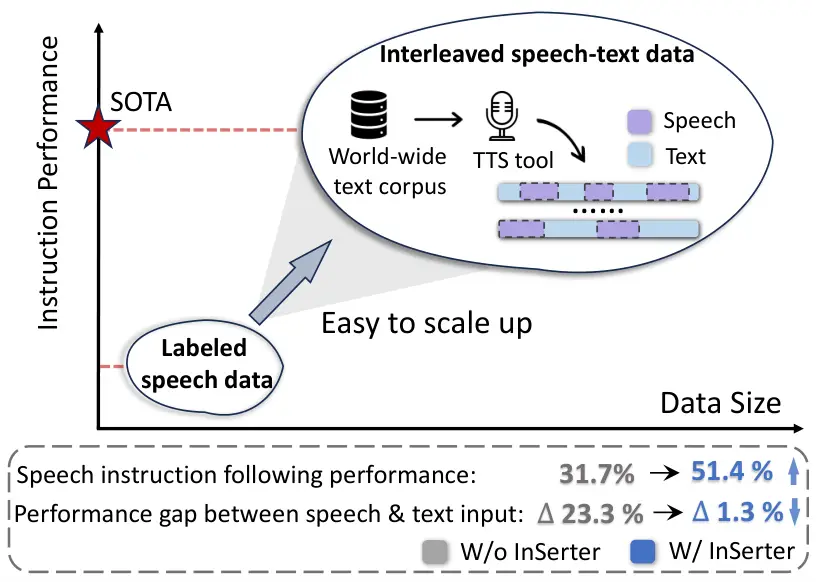
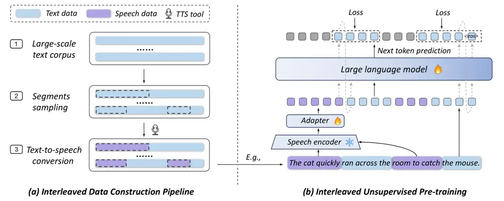
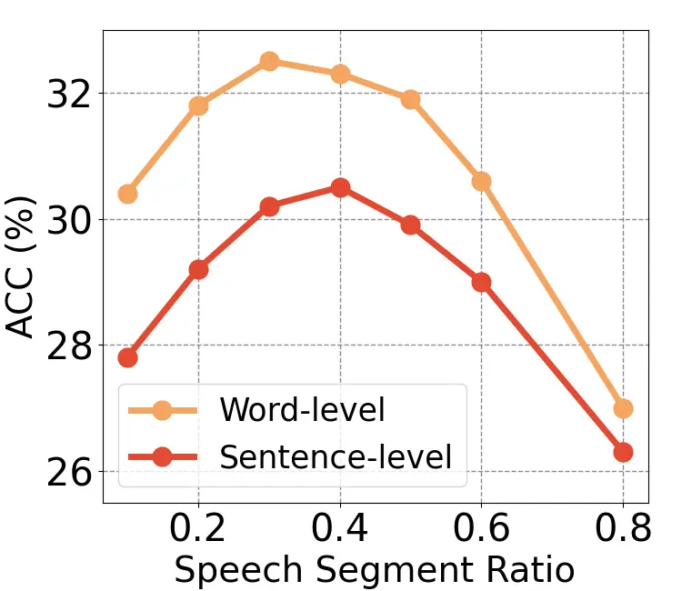
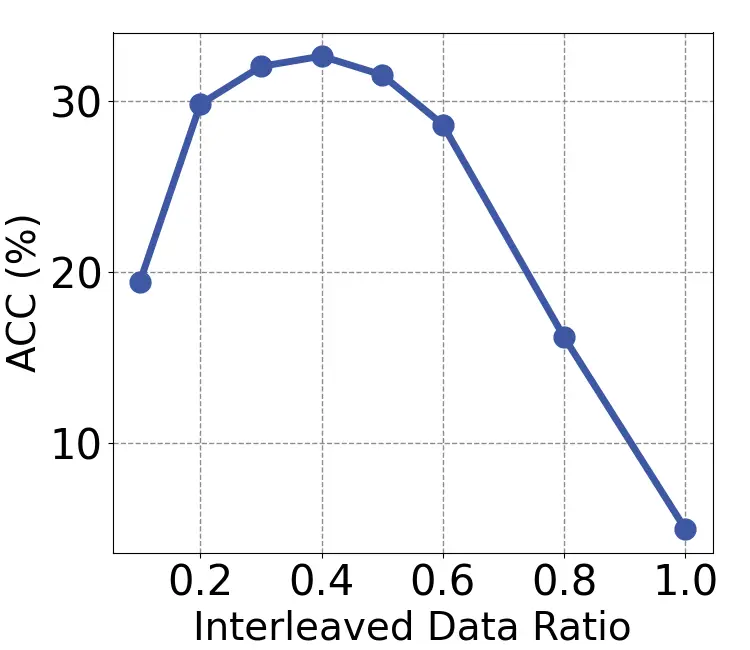
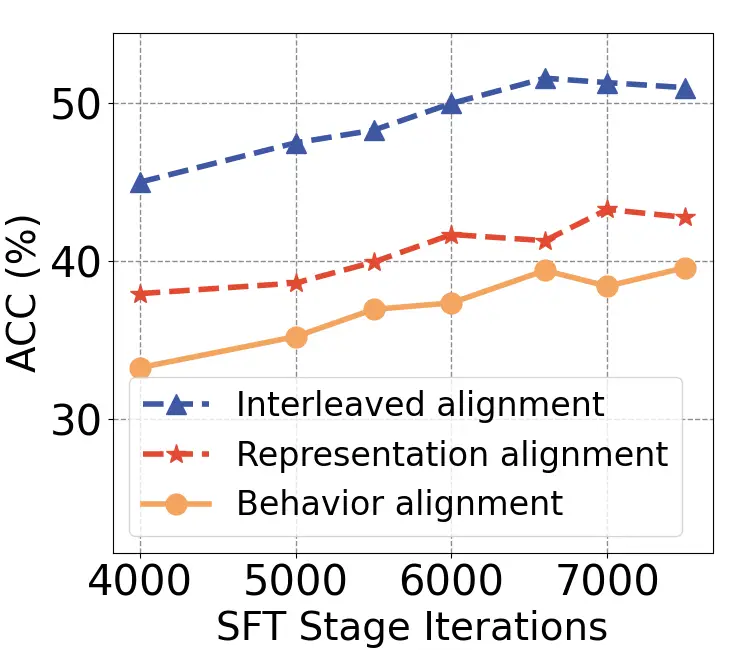
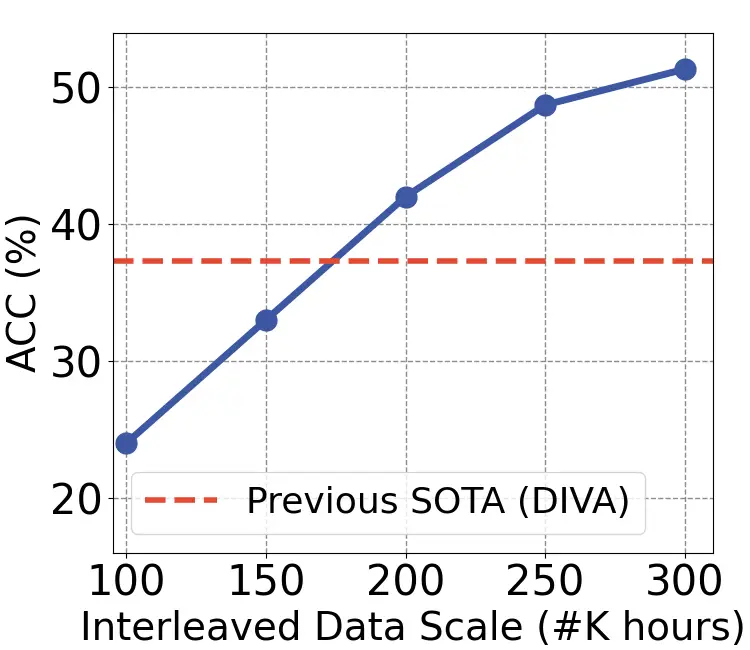
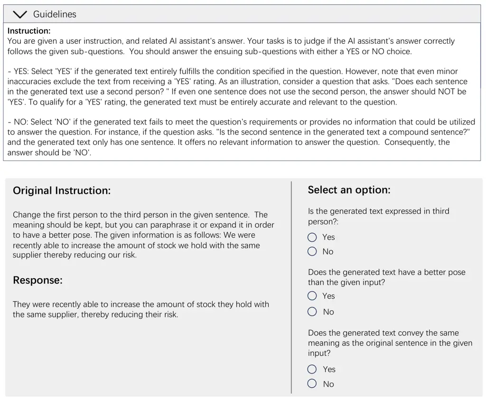
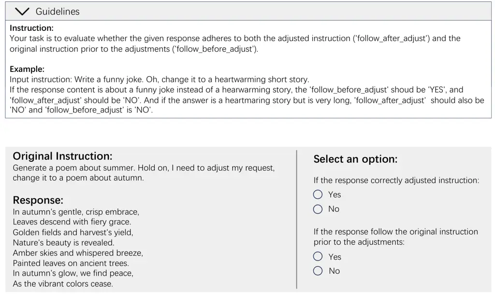

# InSerter: Speech Instruction Following with Unsupervised Interleaved Pre-training

Dingdong Wang ^(†)^(†)thanks: ˜˜Equal contribution. Affiliation: The
Chinese University of Hong Kong
Email: [dingdongwang@link.cuhk.edu.hk](mailto:)    Jin Xu¹¹footnotemark:
1 Affiliation: Alibaba Group    Ruihang Chu Affiliation: The Chinese
University of Hong Kong    Zhifang Guo    Xiong Wang    Jincenzi Wu
Affiliation: The Chinese University of Hong Kong    Dongchao Yang
Affiliation: The Chinese University of Hong Kong    Shengpeng Ji   
Junyang Lin Affiliation: Alibaba Group

###### Abstract

Recent advancements in speech large language models (SpeechLLMs) have
attracted considerable attention. Nonetheless, current methods exhibit
suboptimal performance in adhering to speech instructions. Notably, the
intelligence of models significantly diminishes when processing
speech-form input as compared to direct text-form input. Prior work has
attempted to mitigate this semantic inconsistency between speech and
text representations through techniques such as representation and
behavior alignment, which involve the meticulous design of data pairs
during the post-training phase. In this paper, we introduce a simple and
scalable training method called InSerter, which stands for Interleaved
Speech-Text Representation Pre-training. InSerter is designed to
pre-train large-scale unsupervised speech-text sequences, where the
speech is synthesized from randomly selected segments of an extensive
text corpus using text-to-speech conversion. Consequently, the model
acquires the ability to generate textual continuations corresponding to
the provided speech segments, obviating the need for intensive data
design endeavors. To systematically evaluate speech
instruction-following capabilities, we introduce SpeechInstructBench,
the first comprehensive benchmark specifically designed for
speech-oriented instruction-following tasks. Our proposed model
InSerter achieves SOTA performance in SpeechInstructBench and
demonstrates superior or competitive results across diverse speech
processing tasks. SpeechInstructBench is available at
[https://huggingface.co/datasets/ddwang2000/SpeechInstructBench](https://huggingface.co/datasets/ddwang2000/SpeechInstructBench).

## 1 Introduction



Figure 1: InSerter leverages large-scale interleaved data for
pre-training. It improves instruction-following accuracy
(SpeechInstructBench closed-ended standard version) given speech-form
input from 31.7% to 51.4%, further narrowing the gap with text-form
inputs from 23.3% to 1.3% compared to non-interleaved baseline.

Recently, speech large language models (SpeechLLMs) have garnered
significant attention, as they hold promise for enabling more natural
and intuitive human-machine interactions (Ji et al., 2024; Chu et al.,
2023; Chu et al., 2024; Défossez et al., 2024; Tang et al., 2024).
SpeechLLMs receive speech inputs and directly follow speech-based
instructions to perform responses. However, due to the intrinsic
differences between speech and text representations, it is challenging
for models to effectively comprehend the consistency in semantic content
expression across different modalities. This discrepancy leads to
difficulties in accurately following spoken instructions compared to
text-based ones.

Enabling the speech modality to inherit the cognitive capabilities of
text represents a fundamental challenge in the domain of end-to-end
speech instruction following. Prior research has attempted to address
this challenge through two approaches: representation alignment (Held
et al., 2024) and behavior alignment (Wang et al., 2024; Held et al.,
2024). However, representation alignment encounters limitations stemming
from the inherent differences in granularity, such as the varying
sequence lengths and the discrete nature of text tokens compared to
continuous speech frames. Consequently, the direct alignment of these
distinct representations often results in the degradation of critical
original speech features, including tone, energy, and pitch. On the
other hand, behavior alignment focuses on training models to learn
consistent response sequences or distributions given either speech input
or its transcripts during the post-training phase. Nonetheless, these
approaches face significant scalability challenges due to their selected
training stage, the complexity of data construction, and overall
training efficiency. Therefore, there remains substantial scope for
further improvement.

The emergence of intelligence in text is fundamentally based on
unsupervised next-token prediction during the pre-training phase.
Specifically, the training objective is to predict the subsequent
continuation token based on a sequence of preceding text. Therefore, the
motivation for our work is to enable speech sequences to inherit the
intelligence characteristic of text by requiring the model to execute
the following task: given a speech sequence, predict the next text token
or segment continuation during the pre-training phase. By interleaving
speech and text sequences in training samples, we allow for multi-turn
text-speech alignment and thus boost training efficiency.

To this end, we propose InSerter, which stands for Interleaved
Speech-Text Representation Pre-training. InSerter employs text-to-speech
to synthesize speech segments from randomly selected portions of
large-scale text pre-training corpora, thereby ensuring scalability.
InSerter provides several key advantages: 1) it facilitates dynamic
interactions between speech and text modalities through an interleaved
training format; 2) it enhances training efficiency by enabling
simultaneous learning of multiple segment relationships during
pre-training; and 3) it offers high scalability by leveraging existing
text corpora via text-to-speech conversion.

To comprehensively evaluate models’ performance on speech instruction
following, we introduce SpeechInstructBench. This benchmark is
characterized by the incorporation of 1) linguistic variations in
speech, which encompass spontaneous speech phenomena such as
disfluencies and self-corrections, as well as diverse accents; 2)
acoustic variations that include speaker-specific traits such as pitch
modulation, speech rate, emotional tone, and energy levels; and 3)
environmental variations, which account for background noise to simulate
real-world interaction conditions. Our experiments show that InSerter
achieves state-of-the-art performance on SpeechInstructBench and
significantly improves results across multiple benchmarks within
VoiceBench (Chen et al., 2024b).

We summarize our contributions as follows:

$`\bullet`$ We propose InSerter, a conceptually simple, powerful, and
scalable pre-training algorithm to significantly improve speech
instruction following capacilities of SpeechLLMs.

$`\bullet`$ We present SpeechInstructBench, the first comprehensive and
bilingual (English-Chinese) benchmark designed to evaluate speech
instruction-following abilities.

$`\bullet`$ InSerter attains state-of-the-art performance on
SpeechInstructBench and achieves significant improvement across various
speech processing tasks in VoiceBench (Chen et al., 2024b).



Figure 2: (a) Data construction pipeline for generating large-scale
interleaved speech-text data for pre-training; (b) Interleaved
unsupervised pre-training. The gray areas indicate tokens with no loss
calculation during training.

## 2 Related Work

##### SpeechLLMs.

Current SpeechLLMs are generally categorized by their speech
representation strategies, using either discrete speech tokens or
continuous speech features as input. The first category converts speech
inputs into discrete tokens (Défossez et al., 2024; Chen et al., 2024a;
Veluri et al., 2024; Zhang et al., 2023; Rubenstein et al., 2023; Borsos
et al., 2023; Xie and Wu, 2024b), leveraging self-supervised speech
pre-training to expand the vocabulary of LLMs with learned speech
representations. Some studies (Défossez et al., 2024; Nguyen et al.,
2024; Zeng et al., 2024b) incorporate synthetic interleaved data for
pre-training. However, there are two notable distinctions between these
works and InSerter. First, the primary objective of these studies is to
enhance the quality and end-to-end coherence of speech generation, while
InSerter aims to improve models’ speech instruction-following
capabilities. Second, existing works rely on discrete speech sequence
modeling, whereas InSerter is specifically designed for models with
continuous speech representations, such as Qwen-Audio series (Chu
et al., 2023; Chu et al., 2024).

The second approach processes continuous speech signals directly (Chen
et al., 2023; Gong et al., 2023a; Gong et al., 2023b; Ma et al., 2024;
Xue et al., 2024; Chu et al., 2023; Chu et al., 2024; Tang et al.,
2024). This strategy avoids discretization loss and retains rich speech
characteristics, such as intonation, rhythm, and speaker-specific
attributes. Typically, a pre-trained speech encoder extracts
high-dimensional speech representations, which are then mapped to
LLM-compatible embeddings via adapter layers or cross-modal alignment
mechanisms.

##### Improving speech instruction following.

Previous research has investigated two main approaches to enhance speech
instruction following in SpeechLLMs. The first approach is
representation alignment (Held et al., 2024), which aligns continuous
speech representations with their corresponding text embeddings such as
L2 loss. Yet, this method struggles with the inherent granularity
mismatch between discrete text tokens and continuous speech frames,
often degrading critical speech features. In contrast, InSerter does not
impose any prior constraints on speech representations, facilitating a
higher potential for performance and avoiding the loss of information
beyond semantic content.

The second approach, behavior alignment (Wang et al., 2024; Held et al.,
2024), trains the model to generate identical response sequences or
distributions for speech input and its transcripts during post-training.
While effective, several limitations persist. First, the reliance on
high-quality paired data restricts both scalability and data coverage.
Second, the additional self-distillation loss increases training
complexity. Third, data efficiency is limited, as each instance can only
optimize a single speech sequence’s text continuation. Instead, InSerter
enhances training efficiency by utilizing large-scale text during the
pre-training phase. Moreover, it requires no new loss forms, making the
training process simpler and more scalable.

##### Benchmarks for speech instruction following.

Evaluating SpeechLLMs-based chat assistants is challenging due to their
broad capabilities and the inadequacy of existing benchmarks in
measuring human preferences (Yang et al., 2024; Chen et al., 2024b; Gao
et al., 2024). Current benchmarks, including Voicebench (Chen et al.,
2024b) and ADU-bench (Gao et al., 2024), primarily evaluate general
audio understanding and dialogue capabilities, such as safety, knowledge
base, and multilingual support. However, they lack specific frameworks
for assessing speech-based instruction following. To bridge this gap, we
introduce SpeechInstructBench, a comprehensive benchmark designed to
assess models’ robustness in following speech instructions under various
noisy conditions.

## 3 Method

InSerter aims to improve model performance through large-scale
unsupervised pre-training with interleaved speech-text data. To this
end, we construct a large-scale interleaved speech-text dataset
(Sec. 3.1) and design a novel pre-training strategy to significantly
improve the model’s instruction following abilities (Sec. 3.2).

### 3.1 Interleaved Data Construction

To achieve effective interleaved pre-training, we develop a three-stage
data construction pipeline shown in Fig. 2(a), the details of each stage
are:

(i) Large-scale text corpus collection and pre-processing. To collect
diverse and high-quality text corpus, we aggregated data from internally
collected long-form and dialogue datasets. The original data is
pre-processed utilizing strategies including removing special characters
and standardization via regular expressions to improve the quality,
giving rise to a filtered text corpus comprising around 610 billion text
tokens. Detailed statistics of the corpus are provided in Appendix A.

(ii) Segments sampling. Given the source text corpus, we sample portions
of text and convert them into speech segments. Our sampling strategy
operates at two granularity levels: word-level and sentence-level. For
word-level sampling, we randomly select certain words as the segments
for conversion, maintaining a minimum length of five words to preserve
semantic coherence. For example, regarding “\[The weather is really
nice\] today, I want to go for \[a walk in the park\] in the afternoon”,
the portions in brackets represent the speech segments we sampled, while
the remaining are text segments. For sentence-level sampling, we use
punctuation marks as delimiters to sample sentences as speech segments
randomly.

(iii) Text-to-speech conversion. We convert the sampled speech segments
by CosyVoice 2.0 model (Du et al., 2024) with multi-speaker voice
prompts. Specifically, to enhance the diversity of the synthesized
speech, we select 10,000 unique voice prompts from an extensive timbre
library by evaluating Word Error Rate (WER) and WV-MOS (Andreev et al.,
2023). The final generated speech corpus consists of 301,540 hours of
speech data, together with the remaining text data to form the
interleaved speech-text dataset.

[TABLE]

Table 1: The statistics and examples of the SpeechInstructBench.

### 3.2 Training Strategy

The prepared interleaved data is adopted to pre-train our SpeechLLM,
which can significantly enhance the model’s ability to follow speech
instructions through text-speech alignment. Then we conduct a supervised
fine-tuning stage using dialogue data to enhance the model’s interactive
performance. We detail the two-stage training below.

Stage 1: Pre-training on interleaved data. InSerter guides the model to
align speech embeddings with text tokens through next-token prediction.
As shown in Fig. 2(b), we process speech segments with a speech encoder
and an adapter, resulting in continuous speech representations and
interleaved with text segments. Let
$`S=(S_{1},\ldots,S_{i},\ldots,S_{N})`$ denote the sequence of speech
embeddings from $`N`$ speech segments, and
$`Y=(Y_{1},\ldots,Y_{i},\ldots,Y_{N})`$ denote the corresponding text
token sequences. Each text token segment $`Y_{i}`$ consists of $`M_{i}`$
tokens $`(Y_{i,1},\ldots,Y_{i,M_{i}})`$. The training objective is to
minimize the cross-entropy loss for predicting the next text token
conditioned on both the preceding speech embeddings and text tokens:

```math
L_{\text{CE}}=-\sum_{i=1}^{N}\sum_{j=1}^{M_{i}}\log p(Y_{i,j}\mid S_{1:i},Y_{<i,j};\theta),
```

where $`Y_{i,j}`$ represents the predicted $`j`$-th text token in
$`i`$-th text token segment. Each $`Y_{i,j}`$ is predicted conditional
on all preceding speech embeddings $`S_{1:i}`$ (from the first to the
$`i`$-th segment) and all previous text tokens $`Y_{<i,j}`$ (up to the
$`j`$-th text token in the $`i`$-th text token segment). $`\theta`$ is
all trainable model parameters, including those within the adapter
(Q-Former) and the LLM. Importantly, as indicated in Fig. 2(b),
cross-entropy loss is computed only for tokens corresponding to
ground-truth text segments, while tokens associated with speech segments
are masked out during loss calculation.

In addition to interleaved data, in the pre-training stage, we follow
the same multi-task speech data categories (Chu et al., 2024; Chu
et al., 2023) and collect the speech data to strengthen the
bidirectional speech-text relationships. Text-only corpora are also
added to preserve the model’s strong text generation quality. We balance
these data in a proportion of 40% (interleaved), 30% (multi-task speech
data), and 30% (text-only).

Stage 2: Supervised fine-tuning. After the pre-training stage aligns
speech and text modalities, we conduct supervised fine-tuning (SFT) to
enhance the model’s dialogue capabilities. We collect data from speech
dialogue and text dialogue and empirically incorporate 50% text data
during this stage. The total amount of SFT data is 20K samples.

## 4 SpeechInstructBench

Instruction-following capability refers to a model’s ability to
precisely interpret and execute natural language directives from users
while adhering to all stated constraints and requirements (Zhou et al.,
2023). However, the current existing benchmarks on SpeechLLMs primarily
evaluate response quality rather than instruction following accuracy. To
bridge this gap, we present SpeechInstructBench, a comprehensive and
bilingual (English-Chinese) speech instruction-following benchmark for
SpeechLLMs. As shown in Table 1, this benchmark encompasses three
evaluation sub-tasks: closed-ended instructions, open-ended
instructions, and adjustment instructions.

### 4.1 Closed-Ended Instruction

Closed-ended instruction questions objectively evaluate SpeechLLM’s
ability to follow predefined rules using IFEval (Zhou et al., 2023)
metrics: Prompt-level strict-accuracy, Prompt-level loose-accuracy,
Instruction-level strict-accuracy, and Instruction-level loose-accuracy.
Specifically, we adapt the English IFEval (Zhou et al., 2023) dataset by
selecting 432 questions suited for speech modality. We create
corresponding 402 Chinese questions and modify them to accommodate
spoken language-specific instructions.

All SpeechInstructBench speech data is generated using the Azure AI
Speech system. To capture the complexity of real-world speech
interactions, we synthesize speech data for the closed-ended instruction
incorporating the following elements: 1) Accents: we implemente 13
English and 8 Chinese regional accents, such as Indian and Irish
variants for English, while Cantonese and Sichuan dialects for Chinese; 2) Environmental Noise: we integrate 80 distinct background sounds
(e.g., markets, subway stations, background music) combined with clean
speech to simulate the real-world acoustic conditions; 3) Paralinguistic
Features: we vary six emotions (happy, sad, terrified, angry,
unfriendly, general), multiple timbres (20 in Chinese, 25 in English),
and diverse prosodic parameters (speech rate, pitch, energy); 4)
Spontaneous Disfluencies: based on the disfluency definitions provided
in (Ferreira and Bailey, 2004), we utilize GPT-4o with designed prompts
to generate corresponding disfluent versions of instructions,
incorporating six disfluency types: filled pauses, unfilled pauses,
repetitions, self-corrections, false starts, and filter words. The
detailed statistics and prompts are provided in Appendix B.

### 4.2 Open-Ended Instruction

For more complex instruction-following tasks that extend beyond
deterministic program verification, such as writing "in Shakespeare’s
style" or "providing examples," we build up an open-ended instruction
set. Each element is decomposed into binary sub-questions and could be
answered by "YES" for criterion adherence or "NO" for non-compliance. We
employ GPT-4o as the evaluator and the evaluation metrics for open-ended
instructions are consistent with closed-ended instructions, except with
the loose criteria.

For data construction, we collect raw data from previous works (Jiang
et al., 2024; Qin et al., 2024) and curate 1000 instructions, along with
5,000 decomposed sub-questions, to construct the final closed-ended
instruction set. The set covers five categories: 1) content (i.e.,
explicit restrictions on the response content); 2) format (i.e.,
response format requirements); 3) style (i.e., response style
requirements); 4) linguistic (i.e., dictate the use of particular
language structures and terms); and 5) situation (i.e., specific
situation/background information added to the question).

|             |     |                         |                         |                      |                                |               |                         |
| ----------- | --- | ----------------------- | ----------------------- | -------------------- | ------------------------------ | ------------- | ----------------------- | ----------------------- | ---------------------- |
| SpeechLLMs  |     | AlpacaEval              | CommonEval              | SD-QA                | MMSU                           | OepnBookQA    | AdvBench                |
|             |     | GPT$`\uparrow`$ (S / T) | GPT$`\uparrow`$ (S / T) | Panda$`\uparrow`$ $` | `$ GPT$`\uparrow`$  (S / T) $` | `$ (S / T)    | ACC$`\uparrow`$ (S / T) | ACC$`\uparrow`$ (S / T) | RR$`\uparrow`$ (S / T) |
| BLSP        |     | 3.76 / 4.13             | 3.13 / 4.17             | 46.65 / 62.92 $`     | `$ 23.83 / 41.24               | 25.01 / 37.57 | 21.97 / 52.08           | 8.65 / 7.88             |
| GLM-4-Voice |     | 3.97 / 4.57             | 3.42 / 4.10             | 52.44 / 59.49 $`     | `$ 36.98 / 38.65               | 39.75 / 42.81 | 53.41 / 61.09           | 88.08 / 85.00           |
| Mini-Omni   |     | 1.95 / 2.23             | 2.02 / 2.55             | 23.69 / 26.04 $`     | `$ 4.16 / 7.23                 | 24.69 / 26.74 | 26.59 / 30.55           | 37.12 / 86.35           |
| Mini-Omni2  |     | 2.32 / 2.65             | 2.18 / 2.86             | 11.03 / 13.02 $`     | `$ 7.59 / 9.76                 | 24.27 / 27.13 | 26.59 / 32.09           | 57.50 / 92.88           |
| Megrez      |     | 3.50 / 4.23             | 2.95 / 3.90             | 34.53 / 54.61 $`     | `$ 25.95 / 53.12               | 27.03 / 49.93 | 28.35 / 57.58           | 87.69 / 96.15           |
| DIVA        |     | 3.67 / 4.68             | 3.54 / 4.29             | 62.39 / 78.30 $`     | `$ 51.72 / 74.50               | 25.76 / 63.31 | 25.49 / 76.70           | 98.27 / 99.23           |
| Qwen2-Audio |     | 3.74 / 4.11             | 3.43 / 3.77             | 41.77 / 61.66 $`     | `$ 29.66 / 40.69               | 35.72 / 45.02 | 49.45 / 67.91           | 96.73 / 96.73           |
| InSerter    |     | 4.23 / 4.39             | 3.63 / 4.05             | 59.13 / 61.66 $`     | `$ 57.32 / 64.20               | 59.27 / 64.03 | 77.14 / 83.52           | 97.69 / 97.50           |

Table 2: The performance of SpeechLLMs on VoiceBench. T and S refer to
the model performance with text-form and speech-form input respectively.
For AdvBench, RR stands for Refusal Rate.

### 4.3 Adjustment Instruction

In practical applications, users often need to adjust or correct
instructions. This scenario involves two key components: the original
instruction (termed the erroneous instruction) and its revised version
(the modified instruction). To meet this need, we develop an Adjustment
Instruction set for the modification or correction of instructions.
Using GPT-4o, we generate a set of 500 adjustment instructions and
introduce two evaluation metrics: Instruction Adherence Rate (IAR) and
Error Correction Rate (ECR).
$`IAR=\frac{1}{n}\sum_{i=1}^{n}f(resp_{i},inst_{i})`$, where $`n`$ is
the total number of instructions, $`resp_{i}`$ is the model’s response
to the $`i`$-th instruction, and $`inst_{i}`$ is the $`i`$-th modified
instruction. The function $`f(resp_{i},inst_{i})`$ equals 1 when the
response adheres to the modified instruction, and 0 otherwise.
$`ECR=\frac{1}{m}\sum_{j=1}^{m}g(resp_{j},inst_{j})`$, where $`m`$ is
the total number of erroneous instructions, $`resp_{j}`$ is the model’s
response to the $`j`$-th erroneous instruction, and $`inst_{j}`$ is the
$`j`$-th erroneous instruction. $`g(resp_{j},inst_{j})=1`$ if the model
successfully corrects the erroneous instruction, and $`0`$ otherwise.

Notably, for both open-ended and adjustment instruction sets, we conduct
human evaluations and compare them with GPT-4o judgments, demonstrating
consistent agreement with over 92% accuracy across randomly selected
cases. This will ensure the reliability of our evaluation results.

|             |     |                                  |                                    |                                |                                         |                                    |                                  |                                               |
| ----------- | --- | -------------------------------- | ---------------------------------- | ------------------------------ | --------------------------------------- | ---------------------------------- | -------------------------------- | --------------------------------------------- |
| SpeechLLMs  |     | Closed-Ended                     |                                    |                                |                                         |                                    | Open-Ended                       | Adjustment                                    |
|             |     | Standard (P./I. Acc)$`\uparrow`$ | Background (P./I. Acc)$`\uparrow`$ | Accent (P./I. Acc)$`\uparrow`$ | Paralinguistics (P./I. Acc)$`\uparrow`$ | Disfluency (P./I. Acc)$`\uparrow`$ | Standard (P./I. Acc)$`\uparrow`$ | Standard (IAR$`\uparrow`$/ ECR$`\downarrow`$) |
| English     |     |                                  |                                    |                                |                                         |                                    |                                  |                                               |
| BLSP        |     | 14.97 / 24.17                    | 13.76 / 23.46                      | 13.28 / 22.89                  | 13.65 / 23.60                           | 13.10 / 22.88                      | 11.78 / 21.55                    | 35.45 / 35.05                                 |
| GLM-4-Voice |     | 18.28 / 29.39                    | 17.29 / 27.89                      | 20.37 / 31.11                  | 20.04 / 31.75                           | 18.83 / 30.18                      | 28.17 / 52.05                    | 77.91 / 24.89                                 |
| Mini-Omni2  |     | 7.04 / 16.52                     | 7.26 / 16.52                       | 7.80 / 16.91                   | 6.16 / 15.59                            | 7.92 / 16.30                       | 3.23 / 6.84                      | 12.80 / 21.20                                 |
| Mini-Omni   |     | 8.14 / 16.73                     | 9.25 / 17.74                       | 8.37 / 16.88                   | 8.14 / 18.02                            | 8.23 / 17.52                       | 1.15 / 1.70                      | 7.31 / 18.69                                  |
| Megrez      |     | 19.49 / 31.04                    | 17.51 / 28.96                      | 18.31 / 29.18                  | 19.02 / 30.53                           | 19.28 / 28.67                      | 37.27 / 64.35                    | 55.06 / 31.98                                 |
| DIVA        |     | 27.64 / 37.26                    | 26.32 / 36.69                      | 26.49 / 36.26                  | 27.97 / 37.91                           | 19.16 / 27.89                      | 33.64 / 61.12                    | 58.94 / 33.73                                 |
| Qwen2-Audio |     | 19.82 / 30.18                    | 18.17 / 28.82                      | 18.59 / 28.81                  | 20.70 / 31.33                           | 15.19 / 24.67                      | 31.40 / 58.14                    | 48.60 / 37.45                                 |
| InSerter    |     | 39.75 / 51.35                    | 37.56 / 49.87                      | 37.34 / 48.24                  | 35.79 / 46.85                           | 36.38 / 47.28                      | 40.87 / 67.33                    | 80.72 / 23.28                                 |
| Chinese     |     |                                  |                                    |                                |                                         |                                    |                                  |                                               |
| GLM-4-Voice |     | 18.31 / 26.72                    | 16.58 / 23.99                      | 12.64 / 20.86                  | 17.28 / 25.76                           | 14.51 / 22.87                      | 39.03 / 56.52                    | 81.27 / 13.15                                 |
| Megrez      |     | 18.31 / 27.84                    | 17.16 / 26.32                      | 17.26 / 26.01                  | 18.43 / 27.92                           | 16.58 / 25.76                      | 31.69 / 39.27                    | 63.34 / 17.53                                 |
| DIVA        |     | 15.86 / 24.39                    | 17.05 / 25.92                      | 11.71 / 21.18                  | 15.55 / 24.87                           | 14.97 / 24.31                      | 10.62 / 31.10                    | 25.94 / 13.39                                 |
| Qwen2-Audio |     | 19.23 / 28.97                    | 18.89 / 28.49                      | 17.99 / 26.99                  | 18.20 / 27.92                           | 18.77 / 26.48                      | 40.64 / 64.37                    | 64.00 / 23.20                                 |
| InSerter    |     | 32.71 / 42.37                    | 32.60 / 42.30                      | 27.95 / 36.15                  | 33.99 / 43.18                           | 32.48 / 41.33                      | 50.58 / 68.32                    | 84.06 / 12.10                                 |

Table 3: Performance comparison of SpeechLLMs on SpeechInstructBench. P.
and I. refer to prompt-level and instruction-level accuracy,
respectively. For closed-ended questions, P.&I. are calculated based on
the average of both loose and strict accuracies. Adjustment tasks are
evaluated using Instruction Adherence Rate (IAR) and Error Correction
Rate (ECR). Notably, Mini-Omni2, Mini-Omni, and BLSP models are excluded
from the Chinese benchmark comparisons due to their lack of Chinese
language response capabilities.

## 5 Experiments

### 5.1 Experimental Setup

In this study, Qwen2-Audio-7B (Chu et al., 2024) is used as the base
Language Model (LLM) for all experiments, where
Whisper-Large-v3 (Radford et al., 2022) encoder is used as the speech
encoder to extract embeddings. The input speech segments are all
resampled with a 16kHz sample rate and converted into 128-channel
mel-spectrograms with a 25ms window and 10ms hop size, following a
pooling layer with a stride of two.

For pre-training, we add 40% speech-text interleaved data via InSerter,
combined with other speech and text data. The model is trained with a
global batch size of 1024 and the sequence length is fixed at 8192
tokens. Despite the increase in data volume, the model is trained for
one epoch to ensure that the training amount on the original dataset is
equivalent to that of the base model, facilitating a fair comparison.
For supervised fine-tuning (SFT), we utilize the same dialogue dataset
for all experiments to investigate the performance gains attributed only
from InSerter pre-training. The fine-tuning process runs for one epoch.
The Adam optimizer is used with a learning rate of $`1e^{-5}`$.

### 5.2 Main Results

We evaluate InSerter on VoiceBench (Chen et al., 2024b) and
SpeechInstructBench against several previous state-of-the-art
SpeechLLMs, including Qwen2-Audio (Chu et al., 2024), GLM-4-Voice (Zeng
et al., 2024a), Mini-Omni (Xie and Wu, 2024a), Mini-Omni2 (Xie and Wu,
2024b), BLSP (Wang et al., 2024), DIVA (Held et al., 2024), and
Megrez-3B-Omni (Infinigence AI, 2024).

##### VoiceBench results.

We adopt multiple evaluation tasks from VoiceBench (Chen et al., 2024b)
to comprehensively evaluate our model’s general speech processing
capabilities. Across these diverse tasks shown in Table 2, InSerter
achieves competitive performance on multiple key metrics. In particular,
our model demonstrates superior performance on AlpacaEval and CommonEval
with GPT-scores of 4.23 and 3.63 in speech modality, respectively, and
particularly excels on OpenBookQA with 77.14%accuracy, substantially
outperforming Qwen2-Audio (49.45%) and other models. Additionally,
InSerter maintains strong performance on benchmarks such as MMSU and
AdvBench, showing its robust and balanced capabilities across various
speech-related tasks.

##### SpeechInstructBench results.

In SpeechInstructBench, evaluation metrics encompass prompt-level (P)
and instruction-level (I) accuracy for both closed-ended and open-ended
tasks. For closed-ended questions, P and I metrics are computed by
averaging loose and strict accuracies, while adjustment task is assessed
using Instruction Adherence Rate (IAR) and Error Correction Rate (ECR).

On the English benchmark (Table 3), InSerter achieves 39.75%
prompt-level accuracy and 51.35% instruction-level accuracy on the
standard closed-ended task, substantially surpassing the second-best
performer DIVA (27.64% and 37.26%, respectively). InSerter maintains
strong performance across all instruction-following tasks on
SpeechInstructBench, especially on difficult scenarios (e.g., background
noise), highlighting its robust capabilities. A similar pattern is
observed in the Chinese benchmark (Table 3), where InSerter achieves
state-of-the-art performance across all tasks. Notably, Mini-Omni2,
Mini-Omni, and BLSP models are excluded from Chinese benchmark
comparisons as they do not support Chinese language responses.

|            |                         |                         |
| ---------- | ----------------------- | ----------------------- |
| Variations | Training strategy       | Closed-Ended            |
|            |                         | (P./I. Acc)$`\uparrow`$ |
| Baseline   | W/o Inter. data         | 23.40 / 31.75           |
| BLSP       | Continuation Writing    | 28.20 / 39.27           |
| DIVA       | Distillation            | 26.81 / 37.58           |
| InSerter   | Sentence-Level          | 31.08 / 42.98           |
|            | Word-Level              | 36.56 / 47.38           |
| InSerter   | \+ Distillation         | 35.56 / 46.38           |
|            | \+ CW. & Distillation   | 38.78 / 50.96           |
|            | \+ Continuation Writing | 39.75 / 51.35           |

Table 4: We compare different alignment strategies, where "BLSP" refers
to using the same alignment method as BLSP (Wang et al., 2024), "DIVA"
denotes the DIVA (Held et al., 2024) alignment method, and "CW."
represents continuation writing data. For our method, the pre-training
experiments are conducted at both the word-level and sentence-level
interleaved data. Speech instruction-following performance is evaluated
using the closed-ended SpeechInstructBench dataset (English standard
version).



(a) Speech segments ratio



(b) Interleaved data ratio



(c) Iterations trend



(d) Interleaved data scale

Figure 3: (a) Performance variation with different speech segment
ratios. (b) Impact of interleaved data proportion on performance. (c)
Different alignment strategies performance analysis with iterations
during the SFT stage. (d) Performance benefits from expanding data
scale. All accuracy scores refer to the closed-ended SpeechInstructBench
(English standard-version) instruction-level accuracy.

### 5.3 Ablation Study

#### 5.3.1 Alignment Strategy Comparison

To ensure a fair comparison of different post-training alignment
algorithms (behavior alignment (Wang et al., 2024; Held et al., 2024)
and representation alignment (Held et al., 2024)), we develop a baseline
pre-training checkpoint derived from Qwen2-Audio. This baseline is
trained without interleaved data, while maintaining the total dataset
volume and pre-training model configuration consistent with InSerter.
During the supervised fine-tuning (SFT) phase, in addition to training
on the same dialogue data as InSerter, we incorporate different
post-training alignment methods’ training tasks and data. The mixing
ratio is carefully adjusted, with experiments conducted at intervals of
10% ranging from 10% to 90%, to ensure that these algorithms achieve
optimal performance. Unless otherwise specified, we employ the same
settings for all baselines and InSerter, including training
hyperparameters. For post-training datasets, we construct the same
amount of data for BLSP (Wang et al., 2024) and DIVA (Held et al., 2024)
experiments to match their original implementations: 8.8 million
(speech, text continuation) pairs from GigaSpeech(Chen et al., 2021) and
Wenetspeech(Zhang et al., 2022) datasets for BLSP, and 3.5 thousand
hours of CommonVoice 17 (Ardila et al., 2020) data for DIVA.

Table 4 demonstrates InSerter’s superior performance when using
word-level interleaved data. Compared to existing alignment methods and
the baseline, it achieves significant improvements of 36.56% in
prompt-level accuracy and 47.38% in instruction-level accuracy. The
word-level InSerter approach proves more effective compared with
sentence-level as it aligns better with the text continuation objective,
providing finer granularity for speech-text alignment. Based on our
ablation studies (Fig. 3(a)), we determined the optimal speech segment
ratios to be 30% for word-level and 40% for sentence-level interleaved
data.

Moreover, model performance gains are further enhanced when combining
interleaved pre-training strategy with existing post-training alignment
methods. Specifically, integrating word-level interleaved pre-training
method with continuation writing post-training strategy yields
additional improvements of 39.56% (prompt-level accuracy) and 51.35%
(instruction-level accuracy). We use this version as the final
competitive model for the main results section (Sec. 5.2).

#### 5.3.2 Hyperparameters and Data Scaling Analysis

To rigorously evaluate the effectiveness of our InSerter approach, we
study the effects of data scaling and InSerter related hyperparameters.
First, as shown in Fig. 3(a), we conduct experiments on the pre-training
stage to determine the optimal speech segment ratio for interleaved
data. The results reveal that model performance peaks when speech
segment ratio falls between 20% and 40%, with the highest accuracy
achieved around 30% for word-level and 40% for sentence-level
interleaved data. As presented in Fig. 3(b), varying the interleaved
data ratio among pre-training data greatly influences performance, with
an optimal ratio nearing 0.4 for achieving the highest accuracy.
Fig. 3(c) presents the impact of iterations during the supervised
fine-tuning (SFT) stage, indicating that interleaved alignment
outperforms representation and behavior alignments consistently over
increasing iterations, peaking between 6000 and 7000 iterations. So we
set SFT with 7000 iterations for all experiments. Finally, Fig. 3(d)
illustrates the relationship between interleaved data scale and
instruction-following performance, confirming that larger interleaved
data scales lead to substantial performance improvements, ultimately
surpassing the previous state-of-the-art accuracy (as indicated by the
red dashed line for DIVA (Held et al., 2024)) when data scare reaches
around 300K hours. This proves that our proposed method can scale
effectively and yield more performance benefits by continuously
expanding the interleaved data.

## 6 Conclusion

In this paper, we introduced a novel and easily scalable pre-training
framework termed InSerter, alongside a comprehensive speech
instruction-following benchmark. Our proposed InSerter demonstrates
state-of-the-art performance across various instruction-following tasks
while maintaining competitive results on diverse speech-language tasks.
Future work would explore more efficient training techniques and
investigate the potential of extending our approach to more diverse
languages and speech scenarios.

## 7 Limitation

Despite the promising results obtained in our method, there are still
several areas for improvement. Firstly, the training process consists of
only English and Chinese related datasets. The generalization to other
languages is yet to be verified. Secondly, for evaluation, some tasks of
SpeechInstructBench (open-ended instruction, adjustment instruction)
heavily rely on GPT-4o API for scoring. However, the availability and
accessibility of the GPT-4o API are external factors beyond our control.
Addressing these limitations in future work would provide a more
comprehensive validation of our approach.

## 8 Ethical Consideration

We affirm that we contribute to society, avoid harm, and are honest and
trustworthy. We respect previous work and appropriately cite the methods
and datasets we are using. All the data we use is subject to strict
verification to ensure it contains no harmful or sensitive content.

## References

- Andreev et al. (2023) Pavel Andreev, Aibek Alanov, Oleg Ivanov, and
  Vetrov Dmitry. 2023. [Hifi++: A unified framework for bandwidth
  extension and speech
  enhancement](https://doi.org/10.1109/icassp49357.2023.10097255). In
  _ICASSP 2023 - 2023 IEEE International Conference on Acoustics, Speech
  and Signal Processing (ICASSP)_, page 1–5. IEEE.
- Ardila et al. (2020) Rosana Ardila, Megan Branson, Kelly Davis,
  Michael Kohler, Josh Meyer, Michael Henretty, Reuben Morais, Lindsay
  Saunders, Francis Tyers, and Gregor Weber. 2020. Common voice: A
  massively-multilingual speech corpus. In _Proceedings of the Twelfth
  Language Resources and Evaluation Conference_, Marseille, France.
  European Language Resources Association.
- Borsos et al. (2023) Zalán Borsos, Raphaël Marinier, Damien Vincent,
  Eugene Kharitonov, Olivier Pietquin, Matt Sharifi, Dominik Roblek,
  Olivier Teboul, David Grangier, Marco Tagliasacchi, et al. 2023.
  Audiolm: a language modeling approach to audio generation. _IEEE/ACM
  transactions on audio, speech, and language processing_, 31:2523–2533.
- Chen et al. (2021) Guoguo Chen, Shuzhou Chai, Guanbo Wang, Jiayu Du,
  Wei-Qiang Zhang, Chao Weng, Dan Su, Daniel Povey, Jan Trmal, Junbo
  Zhang, Mingjie Jin, Sanjeev Khudanpur, Shinji Watanabe, Shuaijiang
  Zhao, Wei Zou, Xiangang Li, Xuchen Yao, Yongqing Wang, Yujun Wang,
  Zhao You, and Zhiyong Yan. 2021. Gigaspeech: An evolving, multi-domain
  asr corpus with 10,000 hours of transcribed audio. In _Proc.
  Interspeech 2021_.
- Chen et al. (2024a) Kai Chen, Yunhao Gou, Runhui Huang, Zhili Liu,
  Daxin Tan, Jing Xu, Chunwei Wang, Yi Zhu, Yihan Zeng, Kuo Yang,
  Dingdong Wang, Kun Xiang, Haoyuan Li, Haoli Bai, Jianhua Han, Xiaohui
  Li, Weike Jin, Nian Xie, Yu Zhang, James T. Kwok, Hengshuang Zhao,
  Xiaodan Liang, Dit-Yan Yeung, Xiao Chen, Zhenguo Li, Wei Zhang, Qun
  Liu, Jun Yao, Lanqing Hong, Lu Hou, and Hang Xu. 2024a. [Emova:
  Empowering language models to see, hear and speak with vivid
  emotions](https://arxiv.org/abs/2409.18042). _Preprint_,
  arXiv:2409.18042.
- Chen et al. (2023) Qian Chen, Yunfei Chu, Zhifu Gao, Zerui Li, Kai Hu,
  Xiaohuan Zhou, Jin Xu, Ziyang Ma, Wen Wang, Siqi Zheng, et al. 2023.
  Lauragpt: Listen, attend, understand, and regenerate audio with gpt.
  _arXiv preprint arXiv:2310.04673_.
- Chen et al. (2024b) Yiming Chen, Xianghu Yue, Chen Zhang, Xiaoxue Gao,
  Robby T. Tan, and Haizhou Li. 2024b. Voicebench: Benchmarking
  llm-based voice assistants. _arXiv preprint arXiv:2410.17196_.
- Chu et al. (2024) Yunfei Chu, Jin Xu, Qian Yang, Haojie Wei, Xipin
  Wei, Zhifang Guo, Yichong Leng, Yuanjun Lv, Jinzheng He, Junyang Lin,
  Chang Zhou, and Jingren Zhou. 2024. Qwen2-audio technical report.
  _arXiv preprint arXiv:2407.10759_.
- Chu et al. (2023) Yunfei Chu, Jin Xu, Xiaohuan Zhou, Qian Yang,
  Shiliang Zhang, Zhijie Yan, Chang Zhou, and Jingren Zhou. 2023.
  Qwen-audio: Advancing universal audio understanding via unified
  large-scale audio-language models. _arXiv preprint arXiv:2311.07919_.
- Défossez et al. (2024) Alexandre Défossez, Laurent Mazaré, Manu
  Orsini, Amélie Royer, Patrick Pérez, Hervé Jégou, Edouard Grave, and
  Neil Zeghidour. 2024. [Moshi: a speech-text foundation model for
  real-time dialogue](https://arxiv.org/abs/2410.00037). Technical
  report.
- Du et al. (2024) Zhihao Du, Yuxuan Wang, Qian Chen, Xian Shi, Xiang
  Lv, Tianyu Zhao, Zhifu Gao, Yexin Yang, Changfeng Gao, Hui Wang, Fan
  Yu, Huadai Liu, Zhengyan Sheng, Yue Gu, Chong Deng, Wen Wang, Shiliang
  Zhang, Zhijie Yan, and Jingren Zhou. 2024. [Cosyvoice 2: Scalable
  streaming speech synthesis with large language
  models](https://arxiv.org/abs/2412.10117). _Preprint_,
  arXiv:2412.10117.
- Ferreira and Bailey (2004) Fernanda Ferreira and Karl GD Bailey. 2004.
  Disfluencies and human language comprehension. _Trends in cognitive
  sciences_, 8(5):231–237.
- Gao et al. (2024) Kuofeng Gao, Shu-Tao Xia, Ke Xu, Philip Torr, and
  Jindong Gu. 2024. [Benchmarking open-ended audio dialogue
  understanding for large audio-language
  models](https://arxiv.org/abs/2412.05167). _Preprint_,
  arXiv:2412.05167.
- Gong et al. (2023a) Yuan Gong, Alexander H Liu, Hongyin Luo, Leonid
  Karlinsky, and James Glass. 2023a. Joint audio and speech
  understanding. In _ASRU_, pages 1–8. IEEE.
- Gong et al. (2023b) Yuan Gong, Hongyin Luo, Alexander H Liu, Leonid
  Karlinsky, and Glass James. 2023b. Listen, think, and understand.
  _arXiv preprint arXiv:2305.10790_.
- Held et al. (2024) Will Held, Ella Li, Michael Ryan, Weiyan Shi,
  Yanzhe Zhang, and Diyi Yang. 2024. Distilling an end-to-end voice
  assistant from speech recognition data.
- Infinigence AI (2024) Infinigence AI. 2024. Megrez-3b-omni.
  [https://github.com/infinigence/Infini-Megrez-Omni](https://github.com/infinigence/Infini-Megrez-Omni).
- Ji et al. (2024) Shengpeng Ji, Yifu Chen, Minghui Fang, Jialong Zuo,
  Jingyu Lu, Hanting Wang, Ziyue Jiang, Long Zhou, Shujie Liu, Xize
  Cheng, et al. 2024. Wavchat: A survey of spoken dialogue models.
  _arXiv preprint arXiv:2411.13577_.
- Jiang et al. (2024) Yuxin Jiang, Yufei Wang, Xingshan Zeng, Wanjun
  Zhong, Liangyou Li, Fei Mi, Lifeng Shang, Xin Jiang, Qun Liu, and Wei
  Wang. 2024. [FollowBench: A multi-level fine-grained constraints
  following benchmark for large language
  models](https://aclanthology.org/2024.acl-long.257). In _Proceedings
  of the 62nd Annual Meeting of the Association for Computational
  Linguistics (Volume 1: Long Papers)_, pages 4667–4688, Bangkok,
  Thailand. Association for Computational Linguistics.
- Ma et al. (2024) Ziyang Ma, Guanrou Yang, Yifan Yang, Zhifu Gao,
  Jiaming Wang, Du, et al. 2024. An embarrassingly simple approach for
  llm with strong asr capacity. _arXiv preprint arXiv:2402.08846_.
- Nguyen et al. (2024) Tu Anh Nguyen, Benjamin Muller, Bokai Yu,
  Marta R. Costa-jussa, Maha Elbayad, Sravya Popuri, Paul-Ambroise
  Duquenne, Robin Algayres, Ruslan Mavlyutov, Itai Gat, Gabriel
  Synnaeve, Juan Pino, Benoit Sagot, and Emmanuel Dupoux. 2024.
  [Spirit-lm: Interleaved spoken and written language
  model](https://arxiv.org/abs/2402.05755). _Preprint_,
  arXiv:2402.05755.
- of Artificial Intelligence  (BAAI) Beijing Academy of Artificial
  Intelligence (BAAI). 2024. Infinity instruct. _arXiv preprint
  arXiv:2406.XXXX_.
- Qin et al. (2024) Yiwei Qin, Kaiqiang Song, Yebowen Hu, Wenlin Yao,
  Sangwoo Cho, Xiaoyang Wang, Xuansheng Wu, Fei Liu, Pengfei Liu, and
  Dong Yu. 2024. [Infobench: Evaluating instruction following ability in
  large language models](https://arxiv.org/abs/2401.03601).
- Radford et al. (2022) Alec Radford, Jong Wook Kim, Tao Xu, Greg
  Brockman, Christine McLeavey, and Ilya Sutskever. 2022. [Robust speech
  recognition via large-scale weak
  supervision](https://doi.org/10.48550/ARXIV.2212.04356). _arXiv
  preprint_.
- Rubenstein et al. (2023) Paul K Rubenstein, Chulayuth Asawaroengchai,
  Duc Dung Nguyen, Ankur Bapna, Zalán Borsos, Félix de Chaumont Quitry,
  Peter Chen, Dalia El Badawy, Wei Han, Eugene Kharitonov, et al. 2023.
  Audiopalm: A large language model that can speak and listen. _arXiv
  preprint arXiv:2306.12925_.
- Si et al. (2024) Shuzheng Si, Wentao Ma, Haoyu Gao, Yuchuan Wu,
  Ting-En Lin, Yinpei Dai, Hangyu Li, Rui Yan, Fei Huang, and Yongbin
  Li. 2024. [Spokenwoz: A large-scale speech-text benchmark for spoken
  task-oriented dialogue agents](https://arxiv.org/abs/2305.13040).
  _Preprint_, arXiv:2305.13040.
- Tang et al. (2024) Changli Tang, Wenyi Yu, Guangzhi Sun, Xianzhao
  Chen, Tian Tan, Wei Li, Lu Lu, Zejun MA, and Chao Zhang. 2024.
  [SALMONN: Towards generic hearing abilities for large language
  models](https://openreview.net/forum?id=14rn7HpKVk). In _The Twelfth
  International Conference on Learning Representations_.
- Taori et al. (2023) Rohan Taori, Ishaan Gulrajani, Tianyi Zhang, Yann
  Dubois, Xuechen Li, Carlos Guestrin, Percy Liang, and Tatsunori B.
  Hashimoto. 2023. Stanford alpaca: An instruction-following llama
  model.
  [https://github.com/tatsu-lab/stanford_alpaca](https://github.com/tatsu-lab/stanford_alpaca).
- Veluri et al. (2024) Bandhav Veluri, Benjamin N Peloquin, Bokai Yu,
  Hongyu Gong, and Shyamnath Gollakota. 2024. [Beyond turn-based
  interfaces: Synchronous llms as full-duplex dialogue
  agents](https://arxiv.org/abs/2409.15594). _Preprint_,
  arXiv:2409.15594.
- Wang et al. (2024) Chen Wang, Minpeng Liao, Zhongqiang Huang, Jinliang
  Lu, Junhong Wu, Yuchen Liu, Chengqing Zong, and Jiajun Zhang. 2024.
  [Blsp: Bootstrapping language-speech pre-training via behavior
  alignment of continuation writing](https://arxiv.org/abs/2309.00916).
  _Preprint_, arXiv:2309.00916.
- Xie and Wu (2024a) Zhifei Xie and Changqiao Wu. 2024a. [Mini-omni:
  Language models can hear, talk while thinking in
  streaming](https://arxiv.org/abs/2408.16725). _Preprint_,
  arXiv:2408.16725.
- Xie and Wu (2024b) Zhifei Xie and Changqiao Wu. 2024b. [Mini-omni2:
  Towards open-source gpt-4o with vision, speech and duplex
  capabilities](https://arxiv.org/abs/2410.11190). _ArXiv_,
  abs/2410.11190.
- Xue et al. (2024) Hongfei Xue, Yuhao Liang, Bingshen Mu, Shiliang
  Zhang, Mengzhe Chen, Qian Chen, and Lei Xie. 2024. [E-chat:
  Emotion-sensitive spoken dialogue system with large language
  models](https://arxiv.org/abs/2401.00475). _Preprint_,
  arXiv:2401.00475.
- Yang et al. (2024) Qian Yang, Jin Xu, Wenrui Liu, Yunfei Chu, Ziyue
  Jiang, Xiaohuan Zhou, Yichong Leng, Yuanjun Lv, Zhou Zhao, Chang Zhou,
  et al. 2024. Air-bench: Benchmarking large audio-language models via
  generative comprehension. _arXiv preprint arXiv:2402.07729_.
- Zeng et al. (2024a) Aohan Zeng, Zhengxiao Du, Mingdao Liu, Kedong
  Wang, Shengmin Jiang, Lei Zhao, Yuxiao Dong, and Jie Tang. 2024a.
  [Glm-4-voice: Towards intelligent and human-like end-to-end spoken
  chatbot](https://arxiv.org/abs/2412.02612). _Preprint_,
  arXiv:2412.02612.
- Zeng et al. (2024b) Aohan Zeng, Zhengxiao Du, Mingdao Liu, Lei Zhang,
  Shengmin Jiang, Yuxiao Dong, and Jie Tang. 2024b. [Scaling speech-text
  pre-training with synthetic interleaved
  data](https://arxiv.org/abs/2411.17607). _Preprint_, arXiv:2411.17607.
- Zhang et al. (2022) Binbin Zhang, Hang Lv, Pengcheng Guo, Qijie Shao,
  Chao Yang, Lei Xie, Xin Xu, Hui Bu, Xiaoyu Chen, Chenchen Zeng, Di Wu,
  and Zhendong Peng. 2022. Wenetspeech: A 10000+ hours multi-domain
  mandarin corpus for speech recognition. In _International Conference
  on Acoustics, Speech and Signal Processing (ICASSP)_. IEEE.
- Zhang et al. (2023) Dong Zhang, Shimin Li, Xin Zhang, Jun Zhan, Pengyu
  Wang, Yaqian Zhou, and Xipeng Qiu. 2023. [Speechgpt: Empowering large
  language models with intrinsic cross-modal conversational
  abilities](https://arxiv.org/abs/2305.11000). _Preprint_,
  arXiv:2305.11000.
- Zhou et al. (2023) Jeffrey Zhou, Tianjian Lu, Swaroop Mishra,
  Siddhartha Brahma, Sujoy Basu, Yi Luan, Denny Zhou, and Le Hou. 2023.
  [Instruction-following evaluation for large language
  models](https://arxiv.org/abs/2311.07911). _Preprint_,
  arXiv:2311.07911.

## Appendix A Pre-Train Datasets

Table 5 shows the statistics of the datasets used for the pre-training
of InSerter. The data comprises three types: interleaved speech-text
data, unsupervised text data, and multi-task speech data. These
large-scale pre-training datasets are primarily collected from sources
such as podcasts, MOOCs, articles, webpages, Wikipedia, and books. The
interleaved speech-text data includes datasets like SpokenWOZ, while the
multi-task speech data includes collected multi-task speech datasets
following the Qwen-Audio series (Chu et al., 2023; Chu et al., 2024).
The combination of these rich and diverse data sources facilitates
effective pre-training for InSerter.

## Appendix B SpeechInstructBenchmark Design

### B.1 Benchmark Data Statistics

Table 6 presents the data statistics of SpeechInstructBench, categorized
into closed-ended, open-ended, and adjustment types. The datasets are
sourced from IFEval (Zhou et al., 2023), FollowBench (Jiang et al.,
2024), InFoBench (Qin et al., 2024), Alpaca (Taori et al., 2023), and
InfinityInstruct (of Artificial Intelligence, BAAI), spanning both
English (En) and Chinese (Cn) languages. The Chinese data is translated
from the English version and has undergone careful manual review.

### B.2 Prompts for Creating Data and Evaluation

In this part, we partially demonstrate the process of adjusting the
prompt aimed at assessing the instruction-following performance of
models.

When constructing disfluency instruction data (as shown in Fig. 4), it
is crucial to include specific prompts, such as "Do NOT respond to or
interpret the text as a question or instruction. Provide ONLY the
modified text with NO additional commentary or explanations." Without
these explicit instructions, GPT can sometimes generate responses that
address the original input’s instructions instead of simply creating the
disfluent text. Moreover, the understanding of certain definitions, like
the construction of adjustment instruction data, benefits from the
inclusion of descriptive definitions and concrete examples within the
prompt. As adjustment instruction data represents a novel task,
providing detailed guidance within the prompt enables GPT to produce
outputs that align more closely with the desired criteria.

For GPT prompts for evaluation (Fig. 6, Fig. 7), we observed that
excessively long prompt content can occasionally lead to the model not
fully adhering to the task requirements. As a result, when designing
evaluation prompts, we focused on streamlining the expression of task
definitions and requirements. This was achieved by using concise
language and structuring the prompt with clear subdivisions (e.g., using
"### " to separate each section), which helps in maintaining clarity and
focus. Furthermore, we emphasized providing explicit output format
requirements, such as specifying that the answer should be "YES" or
"NO". This structured approach not only reduces the cognitive load on
the model but also enhances its ability to comply with the task
criteria, resulting in more reliable and accurate evaluations. By
refining the prompt design in this manner, we aim to improve the overall
performance of GPT in tasks involving instruction comprehension and
response evaluation.

### B.3 Human Assess of SpeechInstructBench

To evaluate the effectiveness of the GPT-4o scoring mechanism within
SpeechInstructBench, we conducted a human evaluation process. A total of
20 evaluators participated in this assessment, where they randomly
reviewed 100 items from the dataset. This selection includes 50 open and
closed questions (25 in English and 25 in Chinese) and 50 adjustment
items (25 in English and 25 in Chinese). As shown in Fig. 8 and Fig. 9,
the screenshot captures the process of human evaluation. During
evaluation, these evaluators assessed the factual accuracy of each
response. They were required to make their assessments by selecting
either "YES" or "NO" to indicate whether the response was factually
correct.

## Appendix C Case Study

We provide a diverse set of examples of InSerter responses from
SpeechInstructBench and VoiceBench (AlpacaEval, CommonEval, SD-QA, MMSU,
OpenBookQA, AdvBench), as illustrated from Fig. 10 to Fig. 21.

[TABLE]

Table 5: The statistics of the pre-training datasets.

Figure 4: GPT prompt for generating disfluent version closed-ended
instruction data.

[TABLE]

Table 6: Data statistics of SpeechInstructBench.

Figure 5: GPT prompt for generating adjustment instruction data.

Figure 6: GPT prompt for evaluating open-ended instruction task.

Figure 7: GPT prompt for evaluating adjustment instruction task.



Figure 8: Screenshot of human evaluation for the open-ended instruction
task.



Figure 9: Screenshot of human evaluation for the adjustment instruction
task.

|             |                            |                            |                            |
| ----------- | -------------------------- | -------------------------- | -------------------------- | -------------------------- | --------------------------------------- | --------------------------------------- |
| SpeechLLMs  | Closed-Ended (En $`        | `$ Cn)                     | Open-Ended (En $`          | `$ Cn)                     | Adjustment (En $`                       | `$ Cn)                                  |
|             | (P./I. Acc)$`\uparrow`$ $` | `$ (P./I. Acc)$`\uparrow`$ | (P./I. Acc)$`\uparrow`$ $` | `$ (P./I. Acc)$`\uparrow`$ | (IAR$`\uparrow`$/ ECR$`\downarrow`$) $` | `$ (IAR$`\uparrow`$/ ECR$`\downarrow`$) |
| BLSP        | 31.93 / 42.06 $`           | `$ - / -                   | 23.78 / 46.97 $`           | `$ - /-                    | 64.14 / 32.27 $`                        | `$ - / -                                |
| GLM-4-Voice | 25.66 / 35.05 $`           | `$ 23.96 / 32.34           | 27.48 / 50.51 $`           | `$ 40.87 / 60.35           | 77.68 / 21.51 $`                        | `$ 86.85 / 15.14                        |
| Mini-Omni2  | 10.37 / 20.45 $`           | `$ - / -                   | 6.92 / 10.16 $`            | `$ - / -                   | 27.09 / 26.32 $`                        | `$ - / -                                |
| Mini-Omni   | 11.67 / 20.38 $`           | `$ - / -                   | 6.28 / 11.53 $`            | `$ - / -                   | 19.28 / 27.31 $`                        | `$ - / -                                |
| Megrez      | 59.25 / 68.45 $`           | `$ 42.74 / 53.69           | 58.25 / 79.89 $`           | `$ 50.76 / 75.34           | 88.92 / 19.49 $`                        | `$ 82.38 / 17.74                        |
| DIVA        | 66.07 / 74.32 $`           | `$ 48.50 / 58.66           | 60.50 / 87.80 $`           | `$ 58.42 / 84.11           | 87.50 / 29.44 $`                        | `$ 91.53 / 19.35                        |
| Qwen2-Audio | 28.63 / 38.62 $`           | `$ 33.29 / 43.25           | 49.79 / 75.54 $`           | `$ 47.34 / 72.26           | 76.70 / 25.30 $`                        | `$ 84.0 / 22.40                         |
| InSerter    | 42.62 / 52.00 $`           | `$ 41.02 / 51.83           | 49.19 / 75.81 $`           | `$ 52.19 / 68.5            | 81.13 / 24.10 $`                        | `$ 86.06 / 20.31                        |

Table 7: Performance comparison of SpeechLLMs on SpeechInstructBench
with text-form input. The P. and I. refer to prompt-level and
instruction-level accuracy, respectively. For closed-ended questions,
P.&I. are calculated based on the average of both loose and strict
accuracies. Adjustment tasks are evaluated using Instruction Adherence
Rate (IAR) and Error Correction Rate (ECR). Notably, Mini-Omni2,
Mini-Omni, and BLSP models are excluded from the Chinese benchmark
comparisons due to their lack of Chinese language response capabilities.

|        |     |                                  |                                     |                              |                              |                                     |                                    |                                   |                                |
| ------ | --- | -------------------------------- | ----------------------------------- | ---------------------------- | ---------------------------- | ----------------------------------- | ---------------------------------- | --------------------------------- | ------------------------------ |
| Accent |     | InSerter (P./I. Acc)$`\uparrow`$ | Qwen2-Audio (P./I. Acc)$`\uparrow`$ | BLSP (P./I. Acc)$`\uparrow`$ | DIVA (P./I. Acc)$`\uparrow`$ | GLM-4-Voice (P./I. Acc)$`\uparrow`$ | Mini-Omni2 (P./I. Acc)$`\uparrow`$ | Mini-Omni (P./I. Acc)$`\uparrow`$ | Megrez (P./I. Acc)$`\uparrow`$ |
| en-AU  |     | 39.20 / 49.35                    | 19.38 / 29.97                       | 13.76 / 23.53                | 27.53 / 37.33                | 20.26 / 31.04                       | 7.26 / 16.30                       | 9.69 / 17.16                      | 18.17 / 29.32                  |
| en-CA  |     | 37.11 / 48.35                    | 17.95 / 28.39                       | 12.88 / 24.10                | 26.65 / 36.19                | 21.80 / 32.11                       | 7.04 / 16.02                       | 9.03 / 17.73                      | 17.40 / 29.54                  |
| en-GB  |     | 38.19 / 49.77                    | 19.60 / 29.61                       | 14.42 / 23.74                | 25.77 / 35.90                | 18.83 / 30.11                       | 7.70 / 17.02                       | 8.59 / 16.45                      | 19.38 / 28.68                  |
| en-HK  |     | 39.75 / 49.71                    | 19.68 / 29.81                       | 14.86 / 25.32                | 26.10 / 35.69                | 18.72 / 29.82                       | 6.16 / 16.02                       | 8.59 / 17.73                      | 19.50 / 31.69                  |
| en-IE  |     | 36.67 / 48.21                    | 18.50 / 29.61                       | 14.42 / 23.74                | 26.43 / 36.19                | 21.03 / 30.82                       | 7.48 / 17.16                       | 7.70 / 17.16                      | 19.17 / 28.77                  |
| en-IN  |     | 38.10 / 48.28                    | 19.71 / 28.82                       | 13.76 / 23.39                | 27.53 / 36.83                | 16.40 / 26.60                       | 7.70 / 17.02                       | 9.03 / 16.30                      | 17.19 / 30.13                  |
| en-KE  |     | 37.22 / 48.42                    | 19.27 / 27.53                       | 14.53 / 23.17                | 25.66 / 35.90                | 16.03 / 26.00                       | 9.03 / 16.88                       | 8.59 / 16.73                      | 18.40 / 28.19                  |
| en-NG  |     | 34.36 / 45.42                    | 17.62 / 28.32                       | 13.54 / 21.38                | 25.35 / 34.56                | 19.02 / 28.66                       | 9.69 / 18.16                       | 8.59 / 16.02                      | 17.96 / 29.12                  |
| en-NZ  |     | 39.20 / 50.35                    | 17.47 / 27.87                       | 13.10 / 21.67                | 25.99 / 36.33                | 17.78 / 27.85                       | 7.48 / 16.30                       | 9.03 / 18.02                      | 20.61 / 31.35                  |
| en-PH  |     | 39.75 / 50.78                    | 20.15 / 29.39                       | 12.99 / 23.24                | 24.66 / 35.05                | 19.27 / 29.18                       | 7.26 / 16.88                       | 8.37 / 18.16                      | 16.87 / 28.06                  |
| en-SG  |     | 36.89 / 46.85                    | 14.97 / 27.53                       | 13.10 / 21.67                | 24.98 / 33.97                | 16.96 / 26.82                       | 7.48 / 17.31                       | 6.61 / 17.31                      | 16.88 / 26.43                  |
| en-TZ  |     | 35.02 / 46.49                    | 18.28 / 27.75                       | 10.35 / 21.38                | 26.62 / 35.96                | 16.51 / 25.46                       | 7.70 / 17.88                       | 7.92 / 17.73                      | 19.86 / 31.02                  |
| en-ZA  |     | 36.34 / 48.06                    | 18.50 / 27.46                       | 11.34 / 21.10                | 25.62 / 34.80                | 19.93 / 30.25                       | 8.14 / 16.45                       | 8.37 / 16.59                      | 18.31 / 28.92                  |

Table 8: Closed-Ended Instruction - English Accents Benchmark. This
table evaluates model performance across various English accents
including Australian (en-AU), Canadian (en-CA), British (en-GB), Hong
Kong (en-HK), Irish (en-IE), Indian (en-IN), Kenyan (en-KE), Nigerian
(en-NG), New Zealand (en-NZ), Filipino (en-PH), Singaporean (en-SG),
Tanzanian (en-TZ), and South African (en-ZA).

|             |     |                                  |                                     |                              |                                     |                                     |
| ----------- | --- | -------------------------------- | ----------------------------------- | ---------------------------- | ----------------------------------- | ----------------------------------- |
| Accent      |     | InSerter (P./I. Acc)$`\uparrow`$ | Qwen2-Audio (P./I. Acc)$`\uparrow`$ | DIVA (P./I. Acc)$`\uparrow`$ | GLM-4-Voice (P./I. Acc)$`\uparrow`$ | Mini-Megrez (P./I. Acc)$`\uparrow`$ |
| cn-Wuu      |     | 16.93 / 24.95                    | 13.59 / 22.39                       | 9.21 / 18.13                 | 10.02 / 18.21                       | 15.32 / 23.27                       |
| cn-Yue      |     | 24.30 / 32.82                    | 17.28 / 25.28                       | 11.98 / 22.55                | 11.52 / 19.98                       | 17.14 / 24.73                       |
| cn-Guangxi  |     | 32.83 / 42.05                    | 19.35 / 28.49                       | 13.36 / 23.03                | 14.86 / 23.19                       | 19.79 / 27.69                       |
| cn-Henan    |     | 22.92 / 30.41                    | 16.93 / 27.04                       | 10.36 / 19.26                | 9.67 / 16.69                        | 16.35 / 25.86                       |
| cn-Liaoning |     | 36.05 / 45.90                    | 21.38 / 30.62                       | 13.94 / 23.75                | 17.16 / 26.24                       | 17.28 / 26.18                       |
| cn-Shanxi   |     | 18.66 / 27.12                    | 16.47 / 26.40                       | 10.36 / 19.58                | 10.36 / 17.73                       | 17.44 / 27.09                       |
| cn-Shandong |     | 27.99 / 36.27                    | 19.12 / 27.04                       | 10.25 / 19.26                | 9.56 / 16.93                        | 16.01 / 24.73                       |
| cn-Sichuan  |     | 23.27 / 35.15                    | 17.39 / 26.32                       | 10.94 / 19.90                | 9.67 / 17.90                        | 17.77 / 26.52                       |

Table 9: Closed-Ended Instruction - Chinese Accents Benchmark. This
table evaluates model performance based on varying Chinese dialects:
Jiang–Zhe speech (cn-Wuu), Cantonese (cn-Yue), Guangxi Mandarin
(cn-Guangxi), Heman Mandarin (cn-Henan), Liaoning Mandarin
(cn-Liaoning), Shanxi Mandarin (cn-Shanxi), Shandong Mandarin
(cn-Shandong), Sichuan Mandarin (cn-Sichuan).

Figure 10: SpeechInstructBench Task: Closed-ended instruction following
(English version)

Figure 11: SpeechInstructBench Task: Closed-ended instruction following
(Chinese version)

Figure 12: SpeechInstructBench Task: Open-ended instruction following -
English version

Figure 13: SpeechInstructBench Task: Open-ended instruction following
(Chinese version)

Figure 14: SpeechInstructBench Task: Adjustment instruction following
(English version)

Figure 15: SpeechInstructBench Task: Adjustment instruction following
(Chinese version)

Figure 16: VoiceBench Task: AlpacaEval

Figure 17: VoiceBench Task: CommonEval

Figure 18: VoiceBench Task: SD-QA

Figure 19: VoiceBench Task: MMSU

Figure 20: VoiceBench Task: OpenBookQA

Figure 21: VoiceBench Task: AdvBench
