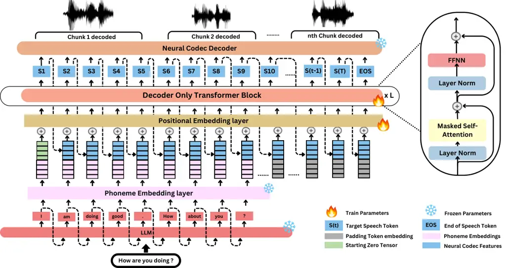
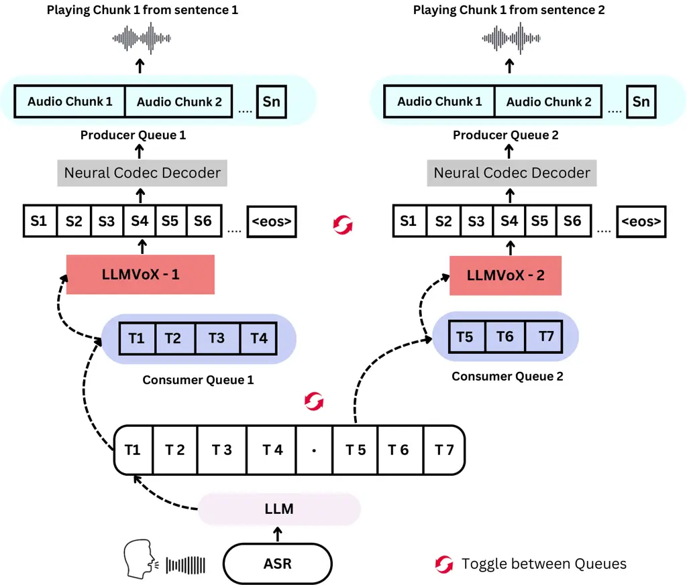

# LLMVoX: Autoregressive Streaming Text-to-Speech Model for Any LLM

Sambal Shikhar Affiliation: Mohamed Bin Zayed University of Artificial
Intelligence (MBZUAI), UAE Email: [sambal.shikar@mbzuai.ac.ae](mailto:)
   Mohammed Irfan Kurpath Affiliation: Mohamed Bin Zayed University of
Artificial Intelligence (MBZUAI), UAE
Email: [hisham.cholakkal@mbzuai.ac.ae](mailto:)    Sahal Shaji
Mullappilly Affiliation: Mohamed Bin Zayed University of Artificial
Intelligence (MBZUAI), UAE    Jean Lahoud Affiliation: Mohamed Bin Zayed
University of Artificial Intelligence (MBZUAI), UAE    Fahad Khan
Affiliation: Mohamed Bin Zayed University of Artificial Intelligence
(MBZUAI), UAE Affiliation: Linköping University, Sweden    Rao Muhammad
Anwer Affiliation: Mohamed Bin Zayed University of Artificial
Intelligence (MBZUAI), UAE    Salman Khan Affiliation: Mohamed Bin Zayed
University of Artificial Intelligence (MBZUAI), UAE    Hisham Cholakkal
Affiliation: Mohamed Bin Zayed University of Artificial Intelligence
(MBZUAI), UAE

###### Abstract

Recent advancements in speech-to-speech dialogue systems leverage LLMs
for multimodal interactions, yet they remain hindered by fine-tuning
requirements, high computational overhead, and text-speech misalignment.
Existing speech-enabled LLMs often degrade conversational quality by
modifying the LLM, thereby compromising its linguistic capabilities. In
contrast, we propose LLMVoX, a lightweight 30M-parameter, LLM-agnostic,
autoregressive streaming TTS system that generates high-quality speech
with low latency, while fully preserving the capabilities of the base
LLM. Our approach achieves a significantly lower Word Error Rate
compared to speech-enabled LLMs, while operating at comparable latency
and UTMOS score. By decoupling speech synthesis from LLM processing via
a multi-queue token streaming system, LLMVoX supports seamless,
infinite-length dialogues. Its plug-and-play design also facilitates
extension to various tasks with different backbones. Furthermore, LLMVoX
generalizes to new languages with only dataset adaptation, attaining a
low Character Error Rate on an Arabic speech task. Additionally, we have
integrated LLMVoX with a Vision-Language Model to create an omni-model
with speech, text, and vision capabilities, without requiring additional
multimodal training. Our code base and project page is available at
[mbzuai-oryx.github.io/LLMVoX](https://mbzuai-oryx.github.io/LLMVoX/)

## 1 Introduction

Large Language Models (LLMs) have excelled in the new era of
conversational AI, transforming how machines understand, generate, and
interact with humans. While most LLMs were initially designed for
text-based interactions, there are some recent efforts toward more
natural and intuitive _speech-to-speech_ dialogue systems, allowing
users to engage with AI models through spoken language.


Figure 1: Speech quality (WER) vs latency (milliseconds) comparison of
recent speech-enabled LLMs. Our LLMVoX is LLM-agnostic streaming TTS
that generates high-quality speech (lower WER) comparable to XTTS
Casanova et al. (2024) while operating $`~10`$× faster. In the plot,
$`\triangle`$ represents LLM-dependent methods, and $`\bigstar`$ denotes
LLM-agnostic methods. The size of each symbol is proportional to the GPT
score, indicating overall response quality. All methods are evaluated
under similar settings and use similarly sized base LLMs.

Existing speech-enabled LLMs typically aims to unify text and speech
processing within a single, fine-tuned LLM. Recent models such as Kyōtai
Moshi Défossez et al. (2024), Mini-Omni Xie and Wu (2024),
LLaMA-Omni Fang et al. (2024), and Freeze-Omni Wang et al. (2024) extend
or modify pretrained text-based LLMs, enabling them to directly handle
spoken inputs and outputs. Although these end-to-end systems can offer
faster and streamlined speech generation, they require large-scale
fine-tuning of LLM on multimodal data. This fine-tuning with speech data
often compromises the original reasoning and expressive capabilities of
the base LLM Chen et al. (2024b); Défossez et al. (2024); Kalajdzievski
(2024); Zhai et al. (2023), while also imposing substantial
computational and data requirements for speech adaptation. Moreover,
these architectures often condition speech adaptation on LLM hidden
states, making them inherently LLM-dependent, thereby requiring
re-adaptation for each base LLM.

Alternatively, an LLM-agnostic approach is to leverage a cascaded
pipeline, where speech is converted to text via automatic speech
recognition (ASR), processed by an LLM to generate a textual response,
and finally passed through a text-to-speech (TTS) module for speech
output. This cascaded approach offers several advantages, including the
availability of diverse off-the-shelf ASR Radford et al. (2023), LLM
Fang et al. (2024), and TTS Casanova et al. (2024) models, the
preservation of base LLM capabilities, improved speech quality, and an
LLM-agnostic design that allows seamless adaptation to any base LLM in a
plug-and-play manner, without the need for computationally expensive
model retraining. However, such cascaded approaches often introduce high
latency (see Cascaded-XTTS in Figure 1), making real-time interactions
challenging. The primary reason for this high latency is the
incompatibility between the autoregressive nature of LLM-based text
generation and conventional TTS models, which typically process text
inputs collectively, despite the text being available incrementally from
LLM. This prevents speech generation from starting until the entire text
response, or a large chunk of it, has been generated by the LLM.
Furthermore, many existing TTS models rely on non-streaming speech
decoders, leading to a larger delay between text and speech generation.

To address the aforementioned limitations of existing speech-enabled
LLMs, we propose LLMVoX, an _autoregressive_, _LLM-agnostic_ streaming
framework. It aims to _preserve the underlying LLM’s capabilities_ by
completely decoupling speech synthesis from the LLM, while enabling
high-quality, low-latency speech generation (Figure 1) in an
autoregressive setting, running in parallel with the LLM’s text
generation.

### 1.1 Contributions

Our LLMVoX leverages a lightweight transformer Waswani et al. (2017) to
generate _discretized speech tokens_ in an autoregressive manner from
streaming LLM text, making it straightforward to “plug” into any
existing LLM pipeline without model retraining or fine-tuning.

LLMVoX adopts a multi-queue streaming approach to enable continuous and
potentially infinite-length speech generation. By maintaining acoustic
continuity and avoiding awkward pauses during extended dialogues, this
design helps sustain a fluid user experience with minimal latency of 475
milliseconds for the entire cascaded pipeline including ASR Radford
et al. (2023), LLaMA-3.1-8B Fang et al. (2024), and LLMVoX (Figure 1).

Furthermore, we demonstrate the generalization ability of the LLMVoX
architecture to languages other than English by adapting it to Arabic
for seamless plugging with Arabic LLM like Jais Sengupta et al.
(2023).This adaptation requires only a simple change in the LLMVoX
training data to Arabic, without any architectural modifications, such
as explicit Grapheme-to-Phoneme (G2P) conversion Nguyen et al. (2023);
Cherifi and Guerti (2021); Jung et al. (2006), and can be similarly
applied to any new language. Moreover, we integrated LLMVoX with a
Vision Language Model (VLM) to obtain an omni-model with speech, text,
and vision capabilities without explicit multimodal training.

The key contributions of our method are summarized below:  
(i) We introduce LLMVoX, a lightweight 30M-parameter, LLM-agnostic,
autoregressive streaming TTS framework that offers a plug-and-play
solution for seamless integration with any off-the-shelf LLM or
VLM—without fine-tuning or architectural modifications.

(ii) We use a multi-queue streaming mechanism that enables continuous,
low-latency speech generation and _infinite-length speech_, effectively
adapting to LLMs with different context lengths.  
(iii) Our comprehensive experiments demonstrate that LLMVoX performs
favorably compared to state-of-the-art speech-enabled LLMs in speech
quality and latency while preserving the underlying LLM capabilities.
Our cascaded system with LLMVoX achieves a WER of 3.70, maintains high
speech quality with a UTMOS of 4.05, and delivers an end-to-end latency
of 475ms (see Figure 1).  
(iv) We demonstrate LLMVoX’s ability to generalize to other languages,
such as Arabic, by simply modifying the training data-without any
architectural changes. To this end, we generated 1,500 hours (450k
pairs) of a synthetic, single-speaker Arabic text-speech dataset .

(v) Adapting LLMVoX to Arabic results in the first streaming,
autoregressive Arabic speech generator that can be seamlessly integrated
with any Arabic LLM, such as Jais Sengupta et al. (2023), to create
Arabic speech-enabled LLMs. LLMVoX achieves a CER of $`\sim 8\%`$
comparable to even non-streaming Arabic TTS methods, while operating at
lower latency—demonstrating the scalability and adaptability of our
approach.  
(vi) We further integrate LLMVoX with QWen 2.5-VL-7B VLM  Team (2025) to
obtain an omni-model with speech, text, and vision capabilities that do
not require explicit multimodal training. This model performs favorably
when compared to the state-of-the-art omni-model, MiniCPM-o 2.6 Yao
et al. (2025), in visual speech question answering on LLaVA-Bench (in
the wild) Liu et al. (2024), while achieving 30% lower latency.

## 2 Related Work

Here, we review recent speech-enabled LLMs, followed by various speech
tokenization methods employed in TTS models and speech-enabled LLMs.

Speech-enabled LLMs: Models such as Qwen-2 Audio Chu et al. (2024),
VITA Fu et al. (2024), Ichigo Dao et al. (2024), and Baichuan-Omni Li
et al. (2024) append speech adapters to LLMs for speech-to-text tasks,
yet still rely on separate TTS modules, inheriting latency issues from
cascaded pipelines. SpeechGPT Zhang et al. (2023a), AudioPaLM Rubenstein
et al. (2023), EMOVA Chen et al. (2024a), and AnyGPT Zhan et al. (2024)
integrate speech tokens directly into LLM vocabularies for end-to-end
multimodal inference; however, as chain-of-modality methods, they incur
latency by waiting for the complete text response before speech
generation. Recent speech-enabled LLMs targeting low-latency
interactions include Kyōtai Moshi Défossez et al. (2024), which employs
a dual-channel architecture with Mimi Neural Audio Codec for real-time
dialogue; Mini-Omni Xie and Wu (2024), which combines text and speech
modeling with batch-parallel inference to reduce delays; and
LLaMA-Omni Fang et al. (2024), which uses a CTC-based mechanism (latency
$`\sim`$236ms). GLM-4-Voice Zeng et al. (2024) trains on a trillion
bilingual tokens with a low-bitrate (175bps) tokenizer for high-fidelity
synthesis at higher compute cost; MiniCPM-o 2.6 Yao et al. (2025); Yao
et al. (2024) adopts an omni-modal LLM with a streaming speech decoder
for real-time synthesis. Closer to our approach, Freeze-Omni Wang et al.
(2024) mitigates catastrophic forgetting by freezing the base LLM and
integrating speech-specific modules. They employ a 3 stage training
where LLM parameters are kept frozen throughout but in the final stage
of training, Freeze-Omni conditions its speech decoder on LLM hidden
states, necessitating retraining the speech components for any new base
LLM, thereby limiting its plug-and-play capability. Speech Tokenization:
Mapping waveforms to discrete tokens compatible with transformers has
advanced speech-to-speech modeling. Neural acoustic codecs (e.g.,
EnCodec Défossez et al. (2022), LauraGPT Du et al. (2023)) employ
residual vector quantization (RVQ) for high-fidelity synthesis; hybrid
approaches (e.g., SpeechTokenizer Zhang et al. (2023b)) use hierarchical
RVQ layers to enhance phonetic representation; and supervised tokenizers
(e.g., CosyVoice Du et al. (2024)) integrate vector quantization into
ASR for improved text-speech alignment. Mimi Défossez et al. (2024)
employs split-RVQ for balanced phonetic discrimination and quality.

## 3 Methodology



Figure 2: Overview of the proposed architecture. Text from the LLM is
tokenized via a ByT5-based Grapheme-to-Phoneme(G2P) model, producing
byte-level phoneme embeddings (teal). These are concatenated with the
previous speech token’s feature vector (blue), L2-normalized, and fed
into a decoder-only Transformer to generate the next token. A neural
codec (WavTokenizer) decoder (orange) reconstructs speech every n speech
tokens predicted.

Our proposed LLMVoX system in Figure 2 is a fully autoregressive
Text-to-Speech (TTS) framework designed to convert text outputs from an
upstream Large Language Model (LLM) into high-fidelity streaming speech.
The central motivation behind our design is to decouple the speech
synthesis component from the text-generation process so that the
inherent reasoning and expressive capabilities of the LLM remain
unaltered while not compromising latency. By recasting TTS as a token
prediction task over discrete acoustic units, we leverage Transformers
architecture Waswani et al. (2017) and neural audio representations to
achieve natural, low-latency speech generation.

In our approach, the speech signal is represented as a sequence of
discrete tokens drawn from a fixed vocabulary of 4096 entries. These
tokens are generated by a neural audio codec, and the speech token is
predicted token-by-token in an autoregressive manner. Figure 2 provides
an overview of the overall architecture, where phoneme-aware embeddings
derived from Grapheme-to-Phoneme (G2P) Zhu et al. (2022) model are
combined with previous acoustic context and processed by a decoder-only
Transformer to predict the next speech token.

### 3.1 Neural Audio Tokenization

To model speech generation as an autoregressive task using Transformers
Wang et al. (2023), we use a neural audio codec that discretizes the
continuous audio waveform using a single-layer residual vector
quantization (RVQ) such as WavTokenizer Ji et al. (2024). WavTokenizer
yields a compact representation that supports high-quality speech
reconstruction while keeping sequence lengths manageable. Given a 24 kHz
waveform $`\mathbf{x}`$, the encoder $`\mathrm{Enc}(\cdot)`$ extracts
latent feature vectors
$`\{\mathbf{f}_{1},\mathbf{f}_{2},\dots,\mathbf{f}_{T}\}`$, where $`T`$
is the number of tokens. Each feature $`\mathbf{f}_{t}`$ is quantized
via $`S_{t}=\mathrm{VQ}(\mathbf{f}_{t})`$ with
$`S_{t}\in\{1,\dots,4096\}`$. Typically, 40–75 tokens represent one
second of speech. The decoder $`\mathrm{Dec}(\cdot)`$ then reconstructs
the audio waveform from these discrete token indices.

### 3.2 Byte-Level Grapheme-to-Phoneme Embedding

To infuse phonetic information into the synthesis process without
incurring the overhead of explicit phoneme prediction, we employ the
embedding layer of a ByT5-based Grapheme-to-Phoneme (G2P) model Zhu
et al. (2022). This decision is driven by two main considerations: (1)
Phonetic Richness: This ByT5 based G2P model is fine-tuned on over 100
languages, so its embeddings capture subtle phonetic similarities and
distinctions, ensuring accurate pronunciation, and (2) Computational
Efficiency: By directly reusing the learned embeddings as a “table
lookup”, we avoid extra computation needed for explicit phoneme
conversion, thus reducing latency.

##### Embedding Extraction and Padding Alignment.

Let $`\tilde{t}_{1},\tilde{t}_{2},\dots,\tilde{t}_{N}`$ denote the
sequence of words produced by the LLM. Each word $`\tilde{t}_{i}`$ is
decomposed into byte-level sub-tokens using the ByT5 tokenizer, i.e.,
$`\tilde{t}_{i}\rightarrow[\beta^{i}_{1},\beta^{i}_{2},\dots,\beta^{i}_{n_{i}}]`$,
where $`n_{i}`$ is the number of sub-tokens for token $`\tilde{t}_{i}`$.
Let $`M`$ be the total number of sub-tokens from all text tokens. Each
sub-token $`\beta^{i}_{j}`$ is then mapped to an embedding vector as
$`\mathbf{b}^{i}_{j}=\mathrm{Embed}_{\mathrm{ByT5}}(\beta^{i}_{j})`$,
where $`\mathbf{b}^{i}_{j}\in\mathbb{R}^{256}`$.

The ground-truth speech is tokenized into a sequence of $`T`$ discrete
speech tokens using WavTokenizerJi et al. (2024), where typically
$`T>M`$. To align the length mismatch we pad the sub-token sequence to
length $`T`$. Formally, the padded text embedding sequence
$`\{\mathbf{b}_{1},\mathbf{b}_{2},\dots,\mathbf{b}_{T}\}`$ is defined
as:

```math
\mathbf{b}_{t}=\begin{cases}\mathrm{Embed}_{\mathrm{ByT5}}(\beta_{t}),&\text{if }1\leq t\leq M,\\
\mathbf{b}_{\mathrm{PAD}},&\text{if }M<t\leq T,\end{cases}
```

where $`\beta_{t}`$ is the $`t`$-th sub-token and
$`\mathbf{b}_{\mathrm{PAD}}\in\mathbb{R}^{256}`$ is the embedding for
the \<PAD\> token (obtained from the ByT5 embedding layer)Xue et al.
(2022). Although $`\mathbf{b}_{\mathrm{PAD}}`$ does not encode phonetic
information, the Transformer’s self-attention mechanism will use context
from the previous inputs to refine its representation.

### 3.3 Input Representation

At each time step $`t`$ ($`t=1,\dots,T`$), the input vector is
constructed by concatenating the phoneme embedding
$`\mathbf{b}_{t}\in\mathbb{R}^{256}`$ with the latent acoustic feature
vector $`\mathbf{f}_{t-1}\in\mathbb{R}^{512}`$ from the previous speech
token $`S_{t-1}`$, forming
$`\mathbf{x}_{t}=[\mathbf{b}_{t};\mathbf{f}_{t-1}]\in\mathbb{R}^{768}`$.
This vector is L2-normalized, and a learnable positional embedding
$`\mathbf{r}_{t}\in\mathbb{R}^{768}`$ is added, yielding
$`\mathbf{z}_{t}=\mathbf{x}_{t}+\mathbf{r}_{t}`$. The sequence
$`\{\mathbf{z}_{1},\mathbf{z}_{2},\dots,\mathbf{z}_{T}\}`$ is then fed
into the decoder-only Transformer as shown in Figure 2.

### 3.4 Decoder-Only Transformer for Speech Token Generation

The core of our synthesis model is a lightweight decoder-only
Transformer (4 layers) that autoregressively predicts the sequence of
speech tokens $`S_{1},S_{2},\dots,S_{T}`$. Our objective is to model the
conditional probability
$`p\bigl(S_{t}\mid S_{1},S_{2},\dots,S_{t-1},\{\mathbf{z}_{1},\mathbf{z}_{2},\dots,\mathbf{z}_{T}\},\theta\bigr)`$
for each $`t=1,\dots,T`$, where $`\theta`$ denotes the transformer’s.
Moreover, At $`t=1`$, no previous speech token is available. We thus
initialize the acoustic context with a zero tensor ensuring that the
model receives a consistent starting signal.

### 3.5 Training Objective and Procedure

Training LLMVoX involves minimizing the cross entropy loss over the
ground-truth speech token sequence $`\{S_{1},\dots,S_{T}\}`$:

```math
\mathcal{L}=-\sum_{t=1}^{T}\log p\bigl(S_{t}\mid S_{<t},\mathbf{z},\theta\bigr).
```

A causal mask is applied within the Transformer to enforce the
autoregressive property.

1: Speech query $`\mathbf{x}_{\text{user}}`$

2: Real-time speech $`\hat{\mathbf{x}}`$

3: $`ASR\text{-}Text\leftarrow\mathrm{ASR}(\mathbf{x}_{\text{user}})`$

4: $`\mathrm{LLM\text{-}Text}\leftarrow\mathrm{LLM}(ASR\text{-}Text)`$
 // Generate text tokens in parallel

5: Enqueue generated text tokens into FIFO queue $`\mathcal{Q}_{0}`$

6: Split $`\mathcal{Q}_{0}`$ into FIFO queues $`\mathcal{Q}_{1}`$ and
$`\mathcal{Q}_{2}`$ (by sentence boundaries)

7: for all $`i\in\{1,2\}`$ in parallel do

8:
  $`\{S_{1},\dots,S_{M}\}\leftarrow\mathrm{LLMVoX}_{i}(\mathcal{Q}_{i})`$
 // Generate speech tokens

9:   $`chunk\_size\leftarrow n,\;startIdx\leftarrow 1`$

10:   while $`startIdx\leq M`$ and speech ongoing do

11:    $`endIdx\leftarrow\min(startIdx+chunk\_size-1,M)`$

12:    Decode
$`\{S_{startIdx},\dots,S_{endIdx}\}\to\hat{\mathbf{x}}^{(m)}_{i}`$;
Enqueue into $`\mathcal{P}_{i}`$

13:
   $`startIdx\leftarrow endIdx+1,\;chunk\_size\leftarrow 2\cdot chunk\_size`$

14:   end while

15: end for

16: Stream speech: Dequeue and stream chunks from $`\mathcal{P}_{1}`$
and $`\mathcal{P}_{2}`$ concurrently until complete.

Algorithm 1 Streaming Inference with Adaptive Chunk Size (Parallel Text
Generation)

## 4 Streaming Inference

We adopt a low-latency streaming inference pipeline (Figure 3 and
Algorithm 1) for real-time speech dialogue system. Given the user’s
speech input $`\mathbf{x}_{\text{user}}`$, we first transcribe it using
an ASR model (e.g., Whisper) to obtain
$`t_{\text{query}}=\mathrm{ASR}(\mathbf{x}_{\text{user}})`$. An LLM then
generates a stream of words
$`\{\tilde{t}_{1},\tilde{t}_{2},\dots,\tilde{t}_{N}\}=\mathrm{LLM}(t_{\text{query}})`$,
which are alternately enqueued into two FIFO queues, $`\mathcal{Q}_{1}`$
and $`\mathcal{Q}_{2}`$, based on sentence boundaries. Two replica TTS
modules, $`\mathrm{LLMVoX}_{1}`$ and $`\mathrm{LLMVoX}_{2}`$,
concurrently dequeue words from $`\mathcal{Q}_{1}`$ and
$`\mathcal{Q}_{2}`$ and predict speech tokens
$`\{S_{1},S_{2},\dots,S_{T}\}=\mathrm{LLMVoX}_{i}(\mathcal{Q}_{i})`$ for
$`i\in\{1,2\}`$. Every $`n`$ speech token generated is then decoded into
speech by WavTokenizer decoder and placed in producer queues
$`\mathcal{P}_{1}`$ and $`\mathcal{P}_{2}`$ accordingly which is then
streamed to the user immediately ensuring uninterrupted playback. The
initial chunk size is $`n`$ tokens, and after each segment is decoded,
the chunk size doubles, leveraging the playback interval of previous
speech to allow extra processing time as decoding larger chunks gives
better speech output. This toggling mechanism seamlessly handles long or
continuous text without requiring models with an extended or large
context window.



Figure 3: Overview of our streaming inference pipeline. Two replica TTS
modules process text in parallel from two queues and place them into two
producer queues.

## 5 Experimental Settings

Training Dataset: We use the _VoiceAssistant-400K_ dataset from the
Mini-Omni series Xie and Wu (2024), which contains over 400K
GPT-4o-generated question-answer pairs with corresponding synthesized
speech, curated for speech assistant fine-tuning. Our training pipeline
uses only the answer text and synthetic speech, resulting in
approximately 2,200 hours of single-speaker English speech data. For
Arabic, we collected 450K text entries of varying lengths from diverse
Hugging Face corpora, cleaned the data, and generated corresponding
speech using XTTS Casanova et al. (2024) at a low-temperature setting,
yielding about 1,500 hours of single-speaker Arabic speech data.

Training Configuration: Our streaming TTS model is a 4-layer,
decoder-only Transformer ($`n_{\mathrm{embd}}=768`$,
$`n_{\mathrm{head}}=8`$) trained with a micro-batch size of 4,
gradient_accumulation_steps of 8, and a context block size of 8192
tokens. We use AdamWLoshchilov et al. (2017) (lr=$`3\times 10^{-4}`$,
weight_decay=0.1) with a 50K-step warmup, then decay the learning rate
over 1M steps to $`3\times 10^{-6}`$. Gradients are clipped at a norm of
1.0. The system runs on 4 A100 GPUs for around 3 days, using bfloat16
precision. We use flash-attentionDao et al. (2022) for efficient and
fast training while also using KV-Cache while inferencing. Under these
settings, we separately train English and Arabic models on 2,200 and
1,500 hours of single-speaker speech data, respectively.

## 6 Results and Evaluation

|                           |              |                             |           |      |                      |                      |                          |
| ------------------------- | ------------ | --------------------------- | --------- | ---- | -------------------- | -------------------- | ------------------------ |
| Model                     | Base LLM     | GPT-4o Score ($`\uparrow`$) |           |      | UTMOS ($`\uparrow`$) | WER ($`\downarrow`$) | Latency ($`\downarrow`$) |
|                           |              | General QA                  | Knowledge | Avg. | (1-5)                | (%)                  | (ms)                     |
| Whisper+LLM+XTTS          | LLaMA 3.1 8B | 6.70                        | 7.70      | 7.20 | 4.23                 | 1.70                 |  4200                    |
| SpeechGPT                 | LLaMA 2 13B  | 1.40                        | 2.20      | 1.80 | 3.86                 | 66.57                |  4000                    |
| Mini-Omni                 | Qwen2 0.5B   | 2.7                         | 2.4       | 2.55 | 3.24                 | 26.12                |  350                     |
| Llama-Omni                | LLaMA 3.1 8B | 3.44                        | 3.84      | 3.64 | 3.32                 | 9.18                 |  220                     |
| Moshi                     | Helium 7B    | 2.71                        | 3.91      | 3.31 | 3.92                 | 7.97                 |  320                     |
| GLM-4-Voice               | GLM-4 9B     | 5.24                        | 5.67      | 5.30 | 3.97                 | 6.40                 |  2500                    |
| Freeze-Omni               | Qwen2 7B     | 3.48                        | 4.98      | 4.23 | 4.38                 | 14.05                |  340                     |
| MiniCPM-o 2.6             | Qwen2.5 7B   | 5.46                        | 6.21      | 5.84 | 3.87                 | 10.60                |  1200                    |
| Whisper+LLM+LLMVoX (Ours) | LLaMA 3.1 8B | 6.14                        | 7.62      | 6.88 | 4.05                 | 3.70                 |  475                     |

Table 1: Performance comparison of our framework (Whisper+LLM+LLMVoX)
with other streaming speech-enabled LLMs and cascaded systems. Our
system, which integrates Whisper Small (224M) for ASR and LLMVoX (30M)
for text generation, achieves superior QA capabilities (6.14/7.62)
compared to fine-tuned speech-enabled LLMs, while maintaining
competitive speech quality (UTMOS 4.05) and low latency (475ms). Our
model demonstrates superior text-speech alignment with a WER of 3.70%.

### 6.1 Evaluation Tasks

We evaluate LLMVoX on five key tasks: General QA Capability assesses the
model’s ability to generate coherent and informative responses to
general queries, reflecting the preservation of the LLM’s reasoning;
Knowledge Retention measures the accuracy on fact-based questions to
ensure robust information; Speech Quality examines the naturalness and
clarity of the generated speech; Speech-Text Alignment verifies the
consistency between the synthesized speech and corresponding text
generated by the LLM. Latency is defined as the total elapsed time from
when a query is submitted to when the model begins speaking.

### 6.2 Evaluation Datasets and Baselines

##### Datasets.

We evaluate LLMVoX using diverse datasets spanning multiple dimensions.
For General QA, we use questions from the AlpacaEval helpful-base and
Vicuna subset Li et al. (2023), excluding math-related queries. For
Knowledge QA, 100 fact-based questions are sourced from Web Questions
Berant et al. (2013) and TriviaQA-verified Joshi et al. (2017). To
assess multilingual adaptability, we synthesize approximately 1,000
Arabic sentences from various domains. Additionally, for Chunk Size
Analysis, we synthesize around 1,000 English sentences covering various
topics, benchmarking the effects of chunk size on WER, CER, UTMOS, and
latency. We also evaluate on Visual Speech Question Answering task
(VSQA) on LLaVA-Bench (In-the-Wild) Liu et al. (2024), which consists of
24 diverse images and 60 open-ended questions spanning various domains
that suit conversational systems. We convert the text question to speech
queries using XTTS  Casanova et al. (2024).

##### Comparison Models.

LLMVoX is compared against recent speech-enabled LLMs: SpeechGPT Zhang
et al. (2023a) (7B, expanded vocabulary), Mini-Omni Xie and Wu (2024)
(0.5B, trained on VoiceAssistant-400K), Llama-Omni Fang et al. (2024)
(LLaMA-3.1-8B with CTC speech head), Moshi Défossez et al. (2024) (7B
Helium model, dual-channel processing), GLM-4-Voice Zeng et al. (2024)
(9B bilingual model with ultra-low bitrate tokenizer), and
Freeze-Omni Wang et al. (2024) (7B model with frozen LLM core) and
MiniCPM-o 2.6 Yao et al. (2025). We also benchmark a cascaded pipeline
with non-streaming TTS like XTTSCasanova et al. (2024). All the models
were evaluated on the basis of the best configuration given in the paper
or the default configuration in the codebase. For Arabic TTS, no
streaming comparison exists; hence we compare to non-streaming models -
XTTSCasanova et al. (2024), ArTST Toyin et al. (2023), FastPitch
Łańcucki (2021), Tacotron 2 Elias et al. (2021) and Seamless Barrault
et al. (2023) in Table 3.

### 6.3 Evaluation Protocol

General QA and Knowledge Tasks: The questions are first converted into
speech using XTTS with multiple speaker modes to introduce input
variation. Model streaming speech responses are saved and transcribed
using Whisper-Large-v3 Radford et al. (2023), and GPT-4o evaluates the
quality and correctness of these transcriptions. For General QA,
responses are scored from 1 to 10 based on coherence, informativeness,
and fluency, following MT-Bench protocols Zheng et al. (2023). For
Knowledge QA, GPT-4o compares responses against ground-truth answers,
with scores 0 for incorrect and 1 for correct response. The total
accuracy score is then normalized from 1 to 10. Details of the
evaluation prompts are given in Appendix 9.1.

Speech Quality: Naturalness is assessed using UTMOS Saeki et al. (2022),
predicting MOS scores on a 1-5 scale.

Speech-Text Alignment: ASR Word Error Rate (WER) is calculated by
comparing Whisper-Large-v3 Radford et al. (2023) transcriptions of the
speech outputs with the LLM generated text averaged over General and
Knowledge QA tasks.

Latency: Measured from the reception of speech input to the first speech
output, capturing both processing and synthesis delays.

Human Evaluation: We compare our system with Freeze-Omni, one of the
closely related approaches that freeze the base LLM. For setup details,
see Appendix 9.2.

Figure 4: Human evaluation: Comparing with Freeze-Omni on Answer
Relevance and Speech Quality.

### 6.4 Experimental Results

Linguistic Capabilities: Our modular setup with Whisper for ASR, LLama
3.1 8B Dubey et al. (2024) and LLMVoX achieves the highest GPT-4o score
(see Table 1) among streaming models with 6.14 (General QA) and 7.62
(Knowledge QA) demonstrating its ability to preserve LLaMA 3.2 8B’s
language understanding capabilities. Although XTTS slightly outperforms
LLMVoX sharing the same base LLM due to lower WER, its high latency
(4200ms vs 475ms) makes it impractical for real-time use, highlighting
the efficiency of LLMVoX. Notably, LLaMA-Omni, despite using the same
LLaMA 3.1 8B base, underperforms in both QA tasks (3.44 vs. 6.14, 3.84
vs. 7.62), suggesting LLM degradation. Similarly, Freeze-Omni, despite
freezing its LLM backbone, suffers from a high WER (14.05%), which
lowers coherence and response quality. Also, based on human evaluation
results in Figure  4, we observe that the response quality of our
framework is much better than similar approach like Freeze-Omni that
also its LLM parameters frozen.

Speech Quality & Alignment: While Freeze-Omni yields a high UTMOS
(Table 1), its WER is substantially high (14.05%), indicating a
misalignment between the generated speech and text. In contrast, LLMVoX
achieves the lowest WER at 3.70%, demonstrating superior text-to-speech
consistency while maintaining a strong UTMOS score of 4.05. From the
human evaluation results in Figure 4, our approach favours speech
clarity compared to Freeze-Omni by a significant margin.

Figure 5: Breakdown of average end-to-end latency (in milliseconds) at a
chunk size of 40 for a single query.

Latency Analysis: One of the key challenges in real-time TTS is
balancing low latency with high speech quality. LLMVoX successfully
achieves this, delivering an end-to-end latency of 475ms, making it
competitive with end-to-end streaming-capable models while significantly
improving upon cascaded approaches like Whisper+LLM+XTTS (4200ms). While
Llama-Omni achieves lower latency (220ms), its trade-off in WER (9.18%)
and low UTMOS score of 3.32. In contrast, LLMVoX achieves a more optimal
balance, reducing latency by nearly 86% compared to XTTS while
maintaining superior WER. This is crucial for applications where both
real-time response and textual accuracy are equally important, such as
voice assistants. Figure 5 shows that LLMVoX starts generating speech
tokens the moment LLM generates the first word, unlike other
chain-of-modality models and cascaded pipelines, to achieve very low
latency while operating in parallel to the LLM.

|     |     |
| --- | --- |
|     |     |
|     |     |

Figure 6: Effect of chunk size on WER, CER, UTMOS, and latency. Larger
chunks enhance speech quality and reduce error rates.

|               |        |             |
| ------------- | ------ | ----------- |
| LLM           | Params | Latency (s) |
| Qwen 2.5      | 0.5B   | 0.33        |
| Lamma 3.2     | 3B     | 0.36        |
| Lamma 3.1     | 8B     | 0.47        |
| Phi 4         | 14B    | 0.95        |
| Mixtral Small | 24B    | 1.25        |
| Qwen 2.5      | 32B    | 1.40        |
| Lamma 3.3     | 70B    | 1.91        |

Table 2: End-to-end latency(ASR included) of LLMVoX with various LLMs at
chunk size of 40.

|                             |           |                      |                      |
| --------------------------- | --------- | -------------------- | -------------------- |
| Model                       | Streaming | WER ($`\downarrow`$) | CER ($`\downarrow`$) |
| XTTS                        | No        | 0.062                | 0.017                |
| ArTST                       | No        | 0.264                | 0.125                |
| FastPitch Arabic Finetuned  | No        | 0.493                | 0.153                |
| Tacotron 2 Arabic Finetuned | No        | 0.663                | 0.268                |
| Tacotron 2 Arabic Finetuned | No        | 0.663                | 0.268                |
| Seamless-M4t-Large          | No        | 0.342                | 0.145                |
| LLMVoX (Ours)               | Yes       | 0.234                | 0.082                |

Table 3: Arabic TTS performance comparison. LLMVoX achieves competitive
error rates in a streaming setup, operating at nearly 10x faster speed
compared to state-of-the-art XTTS.

|               |       |       |           |             |
| ------------- | ----- | ----- | --------- | ----------- |
| Model         | WER   | CER   | GPT Score | Latency (s) |
| MiniCPM-o 2.6 | 0.053 | 0.036 | 6.32      | 1.45        |
| LLMVoX (Ours) | 0.042 | 0.022 | 6.41      | 1.05        |

Table 4: VSQA performance on LLaVA-Bench (In-the-Wild) with Qwen 2.5 VL
7B as the backbone.

Observations on Chunk Size Impact: From Figure 6, we see that increasing
the initial chunk size improves overall synthesis quality without
significantly increasing latency. Key observations include: UTMOS
improves from 3.75 to 4.41 as chunk size increases, suggesting speech
reconstruction from larger chunk size results in smoother and more
natural prosody. WER decreases from 0.041 to 0.036 confirming that
larger chunks improve phonetic consistency. Latency remains under 1
second for chunk sizes as large as 160 ensuring real-time usability
despite larger chunk sizes.

Latency Analysis with LLM Integration Table 2 shows that LLMVoX latency
at a chunk size of 40 increases with LLM size. Smaller models like Qwen
2.5 (0.5B) and Lamma 3.2 (3B) achieve lower latencies (0.33–0.36s),
while larger models such as Phi 4 (14B) and Lamma 3.3 (70B) exceed 1s.
This indicates that while larger LLMs impose higher computational costs,
architectural optimizations also impact latency.

### 6.5 Arabic Multilingual Performance:

On the curated Arabic eval set, LLMVoX achieves a CER of 8.2%,
outperforming most non-streaming TTS methods except XTTS which was used
to synthesize the Arabic Training data suggesting robust adaptability to
new languages without explicit Grapheme-to-Phone(G2P) conversion or
training.

### 6.6 Adaptability with Vision language Models

To demonstrate our method’s versatility, we integrate LLMVoX into a
multimodal pipeline for Visual Speech Question Answering (VSQA). Our
setup combines Whisper-Small for ASR, Qwen 2.5-VL-7B Team (2025) for
visual-language processing, and LLMVoX for speech synthesis. Table 4
compares our system with the omni-multimodal MiniCPM-o 2.6 modelYao
et al. (2025). We report word error rate (WER), character error rate
(CER), and GPT-4o score. Our system achieves lower WER and a comparable
GPT score, demonstrating that LLMVoX can be effectively plugged into
state-of-the-art VLM pipelines for challenging speech VQA tasks.

## 7 Conclusion

We introduce LLMVoX, an LLM-agnostic autoregressive streaming TTS that
decouples speech synthesis from text generation. Leveraging a
lightweight Transformer and multi-queue streaming, LLMVoX delivers
high-quality, continuous speech with minimal latency while preserving
LLM reasoning. Experiments on English and Arabic tasks show that LLMVoX
outperforms or matches other speech-enabled LLMs, offering a scalable
solution for real-time multimodal AI.

## 8 Limitations

LLMVoX achieves low-latency streaming TTS without modifying the
underlying LLM, but it has the following limitations. First, the system
lacks voice cloning, which limits its ability to generate
speaker-specific vocal characteristics—a key feature for personalized
interactions. Second, while we use Whisper for ASR, it is not fully
integrated into the streaming pipeline, leaving potential latency
reductions unexplored. Future work will focus on incorporating voice
cloning and extending the streaming architecture to the ASR input,
further enhancing personalization and real-time performance.

## References

- Barrault et al. (2023) Loïc Barrault, Yu-An Chung, Mariano Coria
  Meglioli, David Dale, Ning Dong, Mark Duppenthaler, Paul-Ambroise
  Duquenne, Brian Ellis, Hady Elsahar, Justin Haaheim, et al. 2023.
  Seamless: Multilingual expressive and streaming speech translation.
  _arXiv preprint arXiv:2312.05187_.
- Berant et al. (2013) Jonathan Berant, Andrew Chou, Roy Frostig, and
  Percy Liang. 2013. Semantic parsing on freebase from question-answer
  pairs. In _Proceedings of the 2013 conference on empirical methods in
  natural language processing_, pages 1533–1544.
- Casanova et al. (2024) Edresson Casanova, Kelly Davis, Eren Gölge,
  Görkem Göknar, Iulian Gulea, Logan Hart, Aya Aljafari, Joshua Meyer,
  Reuben Morais, Samuel Olayemi, et al. 2024. Xtts: a massively
  multilingual zero-shot text-to-speech model. _arXiv preprint
  arXiv:2406.04904_.
- Chen et al. (2024a) Kai Chen, Yunhao Gou, Runhui Huang, Zhili Liu,
  Daxin Tan, Jing Xu, Chunwei Wang, Yi Zhu, Yihan Zeng, Kuo Yang, et al.
  2024a. Emova: Empowering language models to see, hear and speak with
  vivid emotions. _arXiv preprint arXiv:2409.18042_.
- Chen et al. (2024b) Yiming Chen, Xianghu Yue, Chen Zhang, Xiaoxue Gao,
  Robby T Tan, and Haizhou Li. 2024b. Voicebench: Benchmarking llm-based
  voice assistants. _arXiv preprint arXiv:2410.17196_.
- Cherifi and Guerti (2021) El-Hadi Cherifi and Mhania Guerti. 2021.
  Arabic grapheme-to-phoneme conversion based on joint multi-gram model.
  _International Journal of Speech Technology_, 24(1):173–182.
- Chu et al. (2024) Yunfei Chu, Jin Xu, Qian Yang, Haojie Wei, Xipin
  Wei, Zhifang Guo, Yichong Leng, Yuanjun Lv, Jinzheng He, Junyang Lin,
  et al. 2024. Qwen2-audio technical report. _arXiv preprint
  arXiv:2407.10759_.
- Dao et al. (2024) Alan Dao, Dinh Bach Vu, and Huy Hoang Ha. 2024.
  Ichigo: Mixed-modal early-fusion realtime voice assistant. _arXiv
  preprint arXiv:2410.15316_.
- Dao et al. (2022) Tri Dao, Dan Fu, Stefano Ermon, Atri Rudra, and
  Christopher Ré. 2022. Flashattention: Fast and memory-efficient exact
  attention with io-awareness. _Advances in Neural Information
  Processing Systems_, 35:16344–16359.
- Défossez et al. (2022) Alexandre Défossez, Jade Copet, Gabriel
  Synnaeve, and Yossi Adi. 2022. High fidelity neural audio compression.
  _arXiv preprint arXiv:2210.13438_.
- Défossez et al. (2024) Alexandre Défossez, Laurent Mazaré, Manu
  Orsini, Amélie Royer, Patrick Pérez, Hervé Jégou, Edouard Grave, and
  Neil Zeghidour. 2024. Moshi: a speech-text foundation model for
  real-time dialogue. _arXiv preprint arXiv:2410.00037_.
- Du et al. (2024) Zhihao Du, Qian Chen, Shiliang Zhang, Kai Hu, Heng
  Lu, Yexin Yang, Hangrui Hu, Siqi Zheng, Yue Gu, Ziyang Ma,
  et al. 2024. Cosyvoice: A scalable multilingual zero-shot
  text-to-speech synthesizer based on supervised semantic tokens. _arXiv
  preprint arXiv:2407.05407_.
- Du et al. (2023) Zhihao Du, Jiaming Wang, Qian Chen, Yunfei Chu, Zhifu
  Gao, Zerui Li, Kai Hu, Xiaohuan Zhou, Jin Xu, Ziyang Ma, et al. 2023.
  Lauragpt: Listen, attend, understand, and regenerate audio with gpt.
  _arXiv preprint arXiv:2310.04673_.
- Dubey et al. (2024) Abhimanyu Dubey, Abhinav Jauhri, Abhinav Pandey,
  Abhishek Kadian, Ahmad Al-Dahle, Aiesha Letman, Akhil Mathur, Alan
  Schelten, Amy Yang, Angela Fan, et al. 2024. The llama 3 herd of
  models. _arXiv preprint arXiv:2407.21783_.
- Elias et al. (2021) Isaac Elias, Heiga Zen, Jonathan Shen, Yu Zhang,
  Ye Jia, RJ Skerry-Ryan, and Yonghui Wu. 2021. Parallel tacotron 2: A
  non-autoregressive neural tts model with differentiable duration
  modeling. _arXiv preprint arXiv:2103.14574_.
- Fang et al. (2024) Qingkai Fang, Shoutao Guo, Yan Zhou, Zhengrui Ma,
  Shaolei Zhang, and Yang Feng. 2024. Llama-omni: Seamless speech
  interaction with large language models. _arXiv preprint
  arXiv:2409.06666_.
- Fu et al. (2024) Chaoyou Fu, Haojia Lin, Zuwei Long, Yunhang Shen,
  Meng Zhao, Yifan Zhang, Shaoqi Dong, Xiong Wang, Di Yin, Long Ma,
  et al. 2024. Vita: Towards open-source interactive omni multimodal
  llm. _arXiv preprint arXiv:2408.05211_.
- Ji et al. (2024) Shengpeng Ji, Ziyue Jiang, Wen Wang, Yifu Chen,
  Minghui Fang, Jialong Zuo, Qian Yang, Xize Cheng, Zehan Wang, Ruiqi
  Li, et al. 2024. Wavtokenizer: an efficient acoustic discrete codec
  tokenizer for audio language modeling. _arXiv preprint
  arXiv:2408.16532_.
- Joshi et al. (2017) Mandar Joshi, Eunsol Choi, Daniel S Weld, and Luke
  Zettlemoyer. 2017. Triviaqa: A large scale distantly supervised
  challenge dataset for reading comprehension. _arXiv preprint
  arXiv:1705.03551_.
- Jung et al. (2006) Youngim Jung, Aesun Yoon, and Hyuk-Chul Kwon. 2006.
  Grapheme-to-phoneme conversion of arabic numeral expressions for
  embedded tts systems. _IEEE transactions on audio, speech, and
  language processing_, 15(1):296–309.
- Kalajdzievski (2024) Damjan Kalajdzievski. 2024. Scaling laws for
  forgetting when fine-tuning large language models. _arXiv preprint
  arXiv:2401.05605_.
- Łańcucki (2021) Adrian Łańcucki. 2021. Fastpitch: Parallel
  text-to-speech with pitch prediction. In _ICASSP 2021-2021 IEEE
  International Conference on Acoustics, Speech and Signal Processing
  (ICASSP)_, pages 6588–6592. IEEE.
- Li et al. (2023) Xuechen Li, Tianyi Zhang, Yann Dubois, Rohan Taori,
  Ishaan Gulrajani, Carlos Guestrin, Percy Liang, and Tatsunori B.
  Hashimoto. 2023. Alpacaeval: An automatic evaluator of
  instruction-following models.
  [https://github.com/tatsu-lab/alpaca_eval](https://github.com/tatsu-lab/alpaca_eval).
- Li et al. (2024) Yadong Li, Haoze Sun, Mingan Lin, Tianpeng Li,
  Guosheng Dong, Tao Zhang, Bowen Ding, Wei Song, Zhenglin Cheng, Yuqi
  Huo, et al. 2024. Baichuan-omni technical report. _arXiv preprint
  arXiv:2410.08565_, 3(7).
- Liu et al. (2024) Yuan Liu, Haodong Duan, Yuanhan Zhang, Bo Li,
  Songyang Zhang, Wangbo Zhao, Yike Yuan, Jiaqi Wang, Conghui He, Ziwei
  Liu, et al. 2024. Mmbench: Is your multi-modal model an all-around
  player? In _European conference on computer vision_, pages 216–233.
  Springer.
- Loshchilov et al. (2017) Ilya Loshchilov, Frank Hutter, et al. 2017.
  Fixing weight decay regularization in adam. _arXiv preprint
  arXiv:1711.05101_, 5.
- Nguyen et al. (2023) Linh The Nguyen, Thinh Pham, and Dat Quoc
  Nguyen. 2023. Xphonebert: A pre-trained multilingual model for phoneme
  representations for text-to-speech. _arXiv preprint arXiv:2305.19709_.
- Radford et al. (2023) Alec Radford, Jong Wook Kim, Tao Xu, Greg
  Brockman, Christine McLeavey, and Ilya Sutskever. 2023. Robust speech
  recognition via large-scale weak supervision. In _International
  conference on machine learning_, pages 28492–28518. PMLR.
- Rubenstein et al. (2023) Paul K Rubenstein, Chulayuth Asawaroengchai,
  Duc Dung Nguyen, Ankur Bapna, Zalán Borsos, Félix de Chaumont Quitry,
  Peter Chen, Dalia El Badawy, Wei Han, Eugene Kharitonov, et al. 2023.
  Audiopalm: A large language model that can speak and listen. _arXiv
  preprint arXiv:2306.12925_.
- Saeki et al. (2022) Takaaki Saeki, Detai Xin, Wataru Nakata, Tomoki
  Koriyama, Shinnosuke Takamichi, and Hiroshi Saruwatari. 2022. Utmos:
  Utokyo-sarulab system for voicemos challenge 2022. _arXiv preprint
  arXiv:2204.02152_.
- Sengupta et al. (2023) Neha Sengupta, Sunil Kumar Sahu, Bokang Jia,
  Satheesh Katipomu, Haonan Li, Fajri Koto, William Marshall, Gurpreet
  Gosal, Cynthia Liu, Zhiming Chen, et al. 2023. Jais and jais-chat:
  Arabic-centric foundation and instruction-tuned open generative large
  language models. _arXiv preprint arXiv:2308.16149_.
- Team (2025) Qwen Team. 2025.
  [Qwen2.5-vl](https://qwenlm.github.io/blog/qwen2.5-vl/).
- Toyin et al. (2023) Hawau Olamide Toyin, Amirbek Djanibekov, Ajinkya
  Kulkarni, and Hanan Aldarmaki. 2023. Artst: Arabic text and speech
  transformer. _arXiv preprint arXiv:2310.16621_.
- Wang et al. (2023) Chengyi Wang, Sanyuan Chen, Yu Wu, Ziqiang Zhang,
  Long Zhou, Shujie Liu, Zhuo Chen, Yanqing Liu, Huaming Wang, Jinyu Li,
  et al. 2023. Neural codec language models are zero-shot text to speech
  synthesizers. _arXiv preprint arXiv:2301.02111_.
- Wang et al. (2024) Xiong Wang, Yangze Li, Chaoyou Fu, Lei Xie, Ke Li,
  Xing Sun, and Long Ma. 2024. Freeze-omni: A smart and low latency
  speech-to-speech dialogue model with frozen llm. _arXiv preprint
  arXiv:2411.00774_.
- Waswani et al. (2017) A Waswani, N Shazeer, N Parmar, J Uszkoreit,
  L Jones, A Gomez, L Kaiser, and I Polosukhin. 2017. Attention is all
  you need. In _NIPS_.
- Xie and Wu (2024) Zhifei Xie and Changqiao Wu. 2024. Mini-omni:
  Language models can hear, talk while thinking in streaming. _arXiv
  preprint arXiv:2408.16725_.
- Xue et al. (2022) Linting Xue, Aditya Barua, Noah Constant, Rami
  Al-Rfou, Sharan Narang, Mihir Kale, Adam Roberts, and Colin
  Raffel. 2022. Byt5: Towards a token-free future with pre-trained
  byte-to-byte models. _Transactions of the Association for
  Computational Linguistics_, 10:291–306.
- Yao et al. (2025) Yuan Yao, Tianyu Yu, Chongyi Wang, Junbo Cui, Bokai
  Xu, Hongji Zhu, Tianchi Cai, Fuwei Huang, Tianran Wang, Wenshuo Ma,
  Yixuan Zhou, Haoye Zhang, Zonghao Guo, Chi Chen, Haoyu Wang, Zhihui
  He, Haoyu Li, Hanyu Liu, Luoyuan Zhang, Ge Zhou, Siyuan Li, Zhi Zheng,
  Jie Zhou, Yuxuan Li, Kaihuo Zhang, Yudong Mei, Hanqing Zhao, Yueying
  Chen, Zhongwu Zhai, Hanbin Wang, Ganqu Cui, Ning Ding, Xu Han, Zhiyong
  Wu, Zhiyuan Liu, and Maosong Sun. 2025. Minicpm-o 2.6: A gpt-4o level
  mllm for vision, speech, and multimodal live streaming on your phone.
  [https://github.com/OpenBMB/MiniCPM-o](https://github.com/OpenBMB/MiniCPM-o).
- Yao et al. (2024) Yuan Yao, Tianyu Yu, Ao Zhang, Chongyi Wang, Junbo
  Cui, Hongji Zhu, Tianchi Cai, Haoyu Li, Weilin Zhao, Zhihui He,
  et al. 2024. Minicpm-v: A gpt-4v level mllm on your phone. _arXiv
  preprint arXiv:2408.01800_.
- Zeng et al. (2024) Aohan Zeng, Zhengxiao Du, Mingdao Liu, Kedong Wang,
  Shengmin Jiang, Lei Zhao, Yuxiao Dong, and Jie Tang. 2024.
  Glm-4-voice: Towards intelligent and human-like end-to-end spoken
  chatbot. _arXiv preprint arXiv:2412.02612_.
- Zhai et al. (2023) Yuexiang Zhai, Shengbang Tong, Xiao Li, Mu Cai,
  Qing Qu, Yong Jae Lee, and Yi Ma. 2023. Investigating the catastrophic
  forgetting in multimodal large language models. _arXiv preprint
  arXiv:2309.10313_.
- Zhan et al. (2024) Jun Zhan, Junqi Dai, Jiasheng Ye, Yunhua Zhou, Dong
  Zhang, Zhigeng Liu, Xin Zhang, Ruibin Yuan, Ge Zhang, Linyang Li,
  et al. 2024. Anygpt: Unified multimodal llm with discrete sequence
  modeling. _arXiv preprint arXiv:2402.12226_.
- Zhang et al. (2023a) Dong Zhang, Shimin Li, Xin Zhang, Jun Zhan,
  Pengyu Wang, Yaqian Zhou, and Xipeng Qiu. 2023a. Speechgpt: Empowering
  large language models with intrinsic cross-modal conversational
  abilities. In _Findings of the Association for Computational
  Linguistics: EMNLP 2023_, pages 15757–15773.
- Zhang et al. (2023b) Xin Zhang, Dong Zhang, Shimin Li, Yaqian Zhou,
  and Xipeng Qiu. 2023b. Speechtokenizer: Unified speech tokenizer for
  speech large language models. _arXiv preprint arXiv:2308.16692_.
- Zheng et al. (2023) Lianmin Zheng, Wei-Lin Chiang, Ying Sheng, Siyuan
  Zhuang, Zhanghao Wu, Yonghao Zhuang, Zi Lin, Zhuohan Li, Dacheng Li,
  Eric Xing, et al. 2023. Judging llm-as-a-judge with mt-bench and
  chatbot arena. _Advances in Neural Information Processing Systems_,
  36:46595–46623.
- Zhu et al. (2022) Jian Zhu, Cong Zhang, and David Jurgens. 2022. Byt5
  model for massively multilingual grapheme-to-phoneme conversion. In
  _Interspeech_.

## 9 Appendix

### 9.1 Prompt for Evaluating Spoken Chatbots

This section describes the two primary GPT-4o prompts we use for
evaluating spoken chatbot responses. Each prompt targets a different
aspect of performance: (1) the overall quality of an answer (General QA)
and (2) the correctness of the answer compared to reference responses
(Knowledge).

#### 9.1.1 General QA

\[Instruction\]  
Please act as an impartial judge and evaluate the quality of the
response provided by an AI assistant to the user question displayed
below. Your evaluation should consider factors such as the helpfulness,
relevance, accuracy, depth, creativity, and level of detail of the
response. Begin your evaluation by providing a short explanation. Be as
objective as possible. After providing your explanation, you must rate
the response on a scale of 1 to 10 by strictly following this format:
“Rating: \[\[5\]\]”.

\[Question\]  
{User’s question goes here}

\[The Start of Assistant’s Answer\]  
{Assistant’s response begins here}  
\[The End of Assistant’s Answer\]

#### 9.1.2 Knowledge

\[Instruction\]  
You will be given a question, the reference answers to that question,
and an answer to be judged. Your task is to judge whether the answer to
be judged is correct, given the question and reference answers. An
answer is considered correct if it expresses the same meaning as at
least one of the reference answers.

You should respond in JSON format. First provide a concise one-sentence
analysis in the field “analysis”, then your final judgment in the field
“judgment”, which can be “correct” or “incorrect”.

\[Question\]  
{User’s question}

\[Reference Answer\]  
{targets}

\[Answer To Be Judged\]  
{answer_to_be_judged}

Example Output (in JSON format):

{ "analysis": "A concise explanation of correctness or incorrectness.",
"judgment": "correct"}

These prompts enable both qualitative (General QA) and correctness-based
(Knowledge) evaluations of AI-generated spoken responses, ensuring a
comprehensive assessment of the system’s performance.

### 9.2 Human Evaluation Setup and Conclusion

We conducted a human evaluation to compare the streaming speech outputs
of our proposed system with those of Freeze-Omni. Specifically, we
randomly selected 30 questions from various domains and generated
responses using both systems. These responses were distributed in
batches of five per user, with a total of 20 users participating in the
evaluation. For our system, we use Whisper-Small for ASR, LLaMA 3.1 8B
as the LLM, and LLMVoX for streaming TTS, while Freeze-Omni served as
the baseline. The streaming speech responses were recorded and a custom
user interface was developed to facilitate evaluation. Participants
listened to each response and rated the best response based on two
metrics:  
(i)Answer Relevance: Evaluates how factual, useful, and relevant the
answer is to the question.  
(ii)Speech Quality: Assesses the flow, word clarity, and pronunciation
of the generated speech.  
These choices were then aggregated to compare the overall performance of
the two systems. The aggregated results are illustrated in Figure 4 Our
human evaluation results indicate that our proposed system outperforms
Freeze-Omni on both key metrics. Based on responses to the 30 questions,
LLMVoX integrated with Whisper-Small for ASR and LLaMA 3.1 8B as the LLM
received higher user ratings for both answer relevance and speech
quality. Specifically, our model achieved wins in 52% of cases for
answer relevance and 62% for speech quality, compared to Freeze-Omni’s
20% wins on each metric. These findings suggest that decoupling speech
synthesis from text generation not only preserves the linguistic
capabilities of the LLM but also produces more natural, clear, and
engaging speech output, demonstrating the effectiveness of our approach
for real-time dialogue applications.
