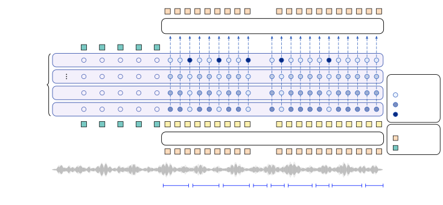
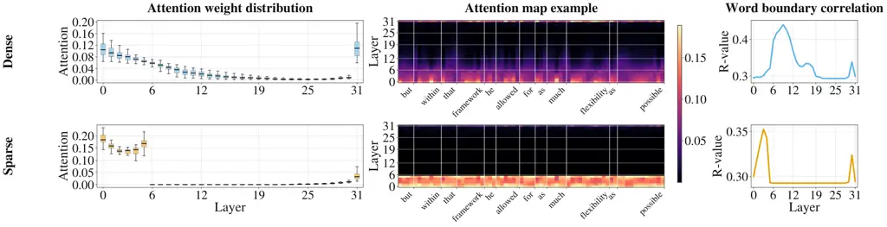

# LF²AR: Accounting for Layerwise Dynamics to Improve Multimodal Adaptation of Language Models

Santiago Cuervo¹ Adel Moumen² Yanis Labrak⁶ Sameer
Khurana^(3,$`\dagger`$) Antoine Laurent^(5,$`\dagger`$) Mickael Rouvier⁴
Phil Woodland² Ricard Marxer^(1,7)  
¹Université de Toulon, Aix-Marseille Université, CNRS, LIS; ²Department
of Engineering, University of Cambridge; ³Mitsubishi Electric Research
Laboratories; ⁴LIA, Avignon Université; ⁵LIUM, Le Mans Université;
⁶Idiap Research Institute; ⁷CNRS, ILLS ^($`\dagger`$)Contributed while
at the listed affiliations.

###### Abstract

Text-pretrained language models (LMs) encode rich world knowledge, but
adapting them to process and generate perceptual modalities such as
audio and images while effectively leveraging that knowledge remains
challenging. Perceptual modalities are finer-grained and less
semantically dense than text, making it unclear how functions learned
during text pretraining can be reused. We study this problem through the
lens of a layerwise abstraction-refinement dynamic observed in
transformer LMs: representations first become more abstract and
compositional, then are refined into representations predictive of
fine-grained structure. This perspective suggests that adapting an LM to
finer-grained modalities requires: (i) allocating additional
fine-to-coarse processing at the input and coarse-to-fine processing at
the output, consistent with late modality fusion and an output-side
analogue we term late fission; and (ii) allowing the output predictor to
preserve input-dependent selective access to both high-level semantic
structure and low-level perceptual detail, motivating our use of
attention residuals in fission. We instantiate this view in LF²AR, a
simple architecture combining these mechanisms, and study it on
text-as-images and speech, two modalities for which semantic
correspondence to text can be controlled. Across models ranging from
135M to 2B parameters and adapted to these modalities, we find that
these components increase feature abstraction, strengthen cross-modal
alignment, enable such alignment to emerge at smaller compute budgets,
improve preservation of text-like predictive structure, and yield better
performance on text-as-images and speech versions of language
understanding and reasoning benchmarks. Additionally, attention
residuals induce sparse, interpretable use of deep backbone layers,
enabling early-exit decoding with a 1.9$`\times`$ generation speedup.

|     |
| --- |
|     |

## 1 Introduction

The remarkable capabilities of large language models (LLMs) trained on
web-scale text corpora, together with the relative scarcity of equally
rich semantic supervision in other modalities, have made transfer of
text-pretrained knowledge a central goal in multimodal AI (Alayrac et
al., 2022; Li et al., 2023; Girdhar et al., 2023; Shi et al., 2025). A
common strategy is to fine-tune pretrained text LLMs on multimodal
corpora and instruction-tuning data so that they can consume and
generate non-textual signals while reusing capabilities acquired during
text pretraining. This recipe underlies much recent progress in
multimodal language modeling. Yet the resulting transfer is often
imperfect: models frequently underperform when semantically equivalent
content is presented in non-textual rather than textual form (Tang et
al., 2025; Venhoff et al., 2025; Cuervo et al., 2026), and multimodal
adaptation can also induce forgetting of text-only capabilities (Zhang
et al., 2024; Cuervo et al., 2026). These failures highlight the
challenge of adapting LLMs to multimodal signals in a way that preserves
and reuses what was learned during text pretraining.

We study the challenge of multimodal adaptation primarily as one of
cross-modal transfer: semantically equivalent content should engage
similar computations across modalities. For example, the sentence “Your
submission has been accepted” should light up similar neural circuits of
positive emotions, whether heard aloud or read in an email. A central
obstacle to such transfer is a mismatch in representational granularity.
Text token sequences are semantically dense, with each token typically
corresponding to a word-like unit. By contrast, visual or audio signals
are represented as much longer streams of lower-level units—pixels or
patches and audio frames, respectively—over which semantics are
distributed more sparsely along spatial or temporal dimensions and mixed
with modality-specific information. As a result, cross-modal transfer is
non-trivial: even when the underlying semantics are the same, the
representation space of perceptual modalities differs substantially from
the input space over which text-learned functions are defined.

A large body of prior work has attempted to address these challenges
through complex multi-stage training pipelines and modular architectures
with adapters that bridge the granularity mismatch between perceptual
signals and language representations, both at the input—a family of
methods often termed as doing *late modality fusion* (Alayrac et al.,
2022; Li et al., 2023; Jiang et al., 2024; Yang et al., 2024; Shi et
al., 2025; Tseng et al., 2026)—and at the output (Li et al., 2023; Dong
et al., 2024; Xu et al., 2025), which we analogously term *late modality
fission*¹¹ 1 Perhaps a non-standard term, but with precedents in the
literature (Landragin, 2007; Marinov et al., 2023).. Many other works,
however, adopt and advocate for simpler, more monolithic architectures
that rely on lightweight linear mappings for multimodal
adaptation (Chameleon Team, 2024; Nguyen et al., 2025; Zeng et al.,
2025; Wu et al., 2025; Cui et al., 2025). These methods are commonly
referred to as _native_ multimodal LMs or, in our preferred terminology,
as performing _early modality fusion_; correspondingly, we refer to
their output-side analogue as _early modality fission_. The trade-offs
between these approaches remain an active area of research (Shukor et
al., 2025; Venhoff et al., 2025; Diao et al., 2026).

In this work, rather than starting from complex multimodal adaptation
pipelines or from the early-versus-late fusion/fission dichotomy alone,
we ask what the internal organization of a text-pretrained LM implies
about how multimodal adaptation should be structured. Our starting point
is recent work suggesting that transformer LMs exhibit a consistent
two-phase representational dynamic across layers: earlier layers tend to
compose lower-level features into more abstract and compositional ones,
whereas later layers refine these abstractions into lower-level features
predictive of upcoming finer-grained structure (Valeriani et al., 2023;
Antonello and Cheng, 2024; Cheng et al., 2025; Queipo-de-Llano et al.,
2026). We refer to this as the layerwise abstraction-refinement
dynamics. Because perceptual signals are finer-grained than text,
effective adaptation that preserves and leverages this dynamic should
provide additional modality-specific layers for fine-to-coarse
processing before the pretrained backbone and coarse-to-fine processing
after it. We study these as simple instances of _late fusion_ and _late
fission_, respectively, and analyze their effects on representation
dynamics across layers to better understand their relation to
cross-modal transfer.

Additionally, we hypothesize that, given the finer granularity of
perceptual signals in time and/or space relative to text, generating
them should rely only sparsely on higher-level semantic features and
more often on low-level local detail. For example, in the context of
speech generation, given the utterance ‘‘we submitted the paper to the
’’, predicting upcoming speech tokens may initially benefit from
high-level features, such as anticipating ‘‘conference’’. However, once
the model begins generating ‘‘conference’’, accurate prediction depends
on fine-grained local context—for instance, knowing that the current
phone is ‘f‘ is necessary to predict the next phone ‘e‘. This leads us
to propose a novel design primitive based on *attention
residuals* (similar to Kimi Team et al. (2026)), which gives the fission
mechanism dynamic access to multiple representation levels and allows it
to switch between coarse semantic information and fine perceptual detail
as needed.

Our main contributions can be summarized as follows:

- •
  We introduce simple architectural instantiations of late fusion and
  late fission, together with a framework for studying their effects on
  cross-modal transfer through the lens of layerwise
  abstraction-refinement dynamics.
- •
  We propose an additional design primitive for multimodal adaptation of
  LMs: attention residuals to augment modality fission.
- •
  We apply this framework to the study of text LMs adapted for
  generation of text-as-images and speech, and through extensive
  ablations demonstrate the effects of these multimodal adaptation
  architectural choices.
- •
  We show that fission with attention residuals learns sparse use of
  backbone depth, and leverage it to speed up generation through dynamic
  compute allocation.

## 2 Preliminaries

### Multimodal adaptation of language models.

Let $`\mathbf{w}=(w_{1},\dots,w_{T})`$ denote a sequence of text tokens,
with $`w_{i}\in\mathcal{V}_{\text{text}}`$. A text LM $`P_{\theta}`$
defines the autoregressive distribution
$`P_{\theta}(\mathbf{w})=\prod_{i=1}^{T}P_{\theta}(w_{i}\mid\mathbf{w}_{<i}),`$
and is pretrained by maximum likelihood over a text corpus,
$`\mathcal{D}_{\text{text}}`$:
$`\mathcal{L}_{\text{text}}(\theta)=-\sum_{\mathbf{w}\in\mathcal{D}_{\text{text}}}\sum_{i=1}^{|\mathbf{w}|}\log P_{\theta}(w_{i}\mid\mathbf{w}_{<i})`$.
We study _multimodal adaptation_ as a second stage of training applied
to such a pretrained text LM. Our focus is on models adapted not only
for multimodal understanding, but also for multimodal generation,
through continued autoregressive modeling of sequences interleaving text
with tokens from an additional modality. Let
$`\mathbf{x}=(x_{1},\dots,x_{T})`$ denote such a sequence, where each
token belongs either to the text vocabulary
$`\mathcal{V}_{\text{text}}`$ or to the vocabulary $`\mathcal{V}_{m}`$
of one target modality $`m`$, i.e.,
$`x_{i}\in\mathcal{V}_{\text{mm}}=\mathcal{V}_{\text{text}}\cup\mathcal{V}_{m}.`$
Starting from the pretrained LM, multimodal adaptation yields a model
$`P_{\theta^{\prime}}`$, where $`\theta^{\prime}`$ may include both the
original backbone parameters and any additional modality-specific
parameters. $`P_{\theta^{\prime}}`$ is trained to autoregressively model
$`\mathbf{x}`$:

```math
\mathcal{L}_{\text{mm}}(\theta^{\prime})=-\sum_{\mathbf{x}\in\mathcal{D}_{\text{mm}}}\sum_{i=1}^{|\mathbf{x}|}\log P_{\theta^{\prime}}(x_{i}\mid\mathbf{x}_{<i}). \tag{1}
```

In this paper, we study two concrete instances of this setup: LMs
adapted for _pixel language modeling_ (Rust et al., 2023) and _speech
language modeling_ (Lakhotia et al., 2021). In both cases, multimodal
sequences are constructed by switching between text and the target
modality at the word level according to a fixed interleaving rate,
similarly to Nguyen et al. (2025). In the pixel LM setting, the
additional modality consists of rendered text images represented as
sequences of flattened binary image patches
$`\mathbf{p}_{j}\in\{0,1\}^{K}`$. The adapted model predicts each patch
through a factorized Bernoulli distribution over its pixels,
$`P_{\theta^{\prime}}(\mathbf{p}_{j}\mid\mathbf{x}_{<j})=\prod_{k=1}^{K}P_{\theta^{\prime}}(p_{j,k}\mid\mathbf{x}_{<j}),`$
conditioned on the preceding multimodal context. In the speech LM
setting, the additional modality consists of vector-quantized
self-supervised speech representations, as in Lakhotia et al. (2021).
These speech tokens are treated as elements of a modality-specific
vocabulary $`\mathcal{V}_{\text{speech}}`$.

### Abstraction-refinement dynamics in transformer language models.

Recent work suggests a consistent picture of how transformer LMs
organize computation across depth. Rather than changing monotonically,
hidden representations appear to pass through two broad phases, which we
refer to jointly as the layerwise abstraction-refinement dynamic. In the
_abstraction_ phase, lower-level features are progressively composed
into coarser and more abstract ones; geometric analyses based on
intrinsic dimensionality and neighborhood structure associate this phase
with an expansion of the representation manifold, suggesting that the
model is constructing a richer feature basis in which linguistic
structure can be represented (Valeriani et al., 2023; Cheng et al.,
2025). A useful intuition comes from the compositional nature of
language: in a character-level LM, for example, a vocabulary of a few
dozen symbols must be composed into a far larger space of morphemes,
words, and multi-word meanings. In the subsequent _refinement_ phase,
the model increasingly shifts toward deriving lower-level features
conditioned on the coarser representations composed earlier, in ways
that are useful for next token prediction (Cheng et al., 2025; Antonello
and Cheng, 2024; Queipo-de-Llano et al., 2026).

## 3 Accounting for Layerwise Abstraction-Refinement Dynamics

### Architectural hypotheses.

A lesson from the abstraction-refinement literature is that different
layers tend to operate at characteristic abstraction levels.
Consequently, text-pretrained computations are not uniformly reusable
across depth: a circuit trained to respond to word-level features, for
example, may fail to activate if the representations reaching it are
characters. Because perceptual modalities are finer-grained than text,
this view suggests the need for additional processing on both sides of
the pretrained backbone.


The abstraction-refinement literature also suggests that such additional
composition and refinement need not rely on the specialized training
algorithms and architectures often used in late fusion/fission. The
standard language modeling objective with transformer layers already
appears sufficient to induce these phases in text-pretrained backbones.
We therefore adopt such a minimalist approach, implementing late fusion
and late fission as additional layers placed before and after the
backbone, respectively, applied only to the target modality, and trained
end-to-end with the same autoregressive objective as the rest of the
model.

Regarding how fine-grained modeling should use the pretrained model, we
posit that high-level text features may be most useful when selecting
the next linguistic unit, whereas low-level local structure may matter
more when unfolding that unit into a sequence of perceptual features. If
so, effective adaptation should avoid forcing such low-level detail to
be propagated throughout the pretrained backbone, where it may interfere
with the formation and reuse of higher-level text-like features. For
example, as illustrated in the introduction, in speech generation,
predicting the beginning of a word may benefit from text-like features
that anticipate the next lexical item, while predicting the following
phones within that word depends on local phonetic context.


We instantiate this hypothesis through _attention residuals_. Let
$`\mathbf{c}_{i}^{(1)},\dots,\mathbf{c}_{i}^{(L)}\in\mathbb{R}^{d}`$
denote the residual-stream²² 2 For potentially useful background on the
transformer architecture, please refer to Appendix G. representations at
position $`i`$ from the $`L`$ layers of the model up to the backbone
output. In a standard residual operation, a layer augments its current
representation with a fixed skip contribution from an earlier
computation. Here, we use the same basic idea, but make the residual
input-dependent: rather than adding a fixed skip connection, we let the
fission module attend over the residual states of previous layers and
form an input-dependent weighted residual summary. In our
implementation, we first construct a lightweight summary
$`\mathbf{c}_{i}^{\prime}=\sum_{l=1}^{L}\phi^{(l)}\mathbf{c}_{i}^{(l)},`$
where $`\phi^{(l)}\in\mathbb{R}`$ are learned fixed scalar weights. A
selector $`S:\mathbb{R}^{d}\rightarrow\mathbb{R}^{L}`$ then uses this
summary to produce input-dependent layer attention weights, which are
used to compute the attention residual $`\bar{\mathbf{c}}_{i}`$:

```math
\boldsymbol{\omega}_{i}=\mathrm{Softmax}(S(\mathbf{c}_{i}^{\prime})),\qquad\bar{\mathbf{c}}_{i}=\sum_{l=1}^{L}\omega_{i}^{(l)}\mathbf{c}_{i}^{(l)},\qquad\tilde{\mathbf{c}}_{i}=\mathbf{c}_{i}^{(L)}+\bar{\mathbf{c}}_{i}. \tag{2}
```

In this way, $`\tilde{\mathbf{c}}_{i}`$, used as input to the modality
fission process, allows it to draw selectively on whichever abstraction
level is most useful at each step.

Figure 1 illustrates LF²AR (Late Fusion and Late Fission with Attention
Residuals), the studied architecture, in the speech setting.



Figure 1: Late Fusion and Late Fission with Attention Residuals (LF²AR),
illustrated for a text–speech sequence. Text interfaces directly with
the pretrained backbone, while speech representations pass through
additional composition and refinement layers. An attention residual
allows the refinement module to selectively access residual-stream
states across backbone depths. The attention weights illustrate our
hypothesized sparse use of depth.

### Analysis tools.

Our architectural hypotheses are framed in terms of _benefit_: late
fusion, late fission, and attention residuals should help multimodal
adaptation if they better support cross-modal transfer. To make this
concrete, we next introduce a set of layerwise metrics that let us study
these benefits in the model’s internal representations.

- •
  Dataset intrinsic dimensionality. Following the abstraction-refinement
  literature, we use the intrinsic dimensionality of the dataset
  representation manifold as a geometric proxy for feature abstraction
  and compositionality (Valeriani et al., 2023). For each layer $`l`$,
  let $`\mathcal{H}^{(l)}=\{\mathbf{h}_{n}^{(l)}\}_{n=1}^{N}`$ denote
  the set of sample representations extracted from that layer. We
  estimate the intrinsic dimensionality of $`\mathcal{H}^{(l)}`$, using
  the Generalized Ratios Intrinsic Dimension Estimator (GRIDE) (Denti et
  al., 2022). Higher intrinsic dimension is interpreted as evidence of a
  richer, more compositional feature basis.
- •
  Word-level cross-modal similarity. Because our multimodal sequences
  are interleaved at the word level, we can use alignments between text
  tokens and modality tokens corresponding to the same linguistic unit.
  Let $`\mathcal{B}`$ denote the set of aligned word boundaries, and let
  $`\mathbf{h}^{(l)}_{\text{text},j}`$ and
  $`\mathbf{h}^{(l)}_{\text{mod},j}`$ denote the text and
  target-modality representations at boundary $`j\in\mathcal{B}`$ in
  layer $`l`$. We define word-level cross-modal similarity as
  $`\frac{1}{|\mathcal{B}|}\sum_{j\in\mathcal{B}}\cos\!\left(\mathbf{h}^{(l)}_{\text{text},j},\mathbf{h}^{(l)}_{\text{mod},j}\right)`$.
  This gives a simple measure of cross-modal alignment at the level of
  linguistic units.
- •
  BERT alignment. To measure semanticity, we compare the neighborhood
  structure of target-modality representations to that induced by a
  pretrained BERT-style text embedding model. For each layer $`l`$, we
  compute the $`k`$-nearest-neighbor graphs of target-modality
  representations and aligned text semantic embeddings across samples in
  $`\mathcal{H}^{(l)}`$, and compute their overlap. Higher values
  indicate more semantic representations.
- •
  We train TunedLens-style affine probes (Belrose et al., 2025) at every
  layer. We consider three prediction tasks:
  - –
    Current-modality-token perplexity measures how easily the current
    perceptual unit can be reconstructed from the representation. Lower
    perplexity indicates that more low-level modality-specific
    information remains available. Because the model’s unembedding layer
    is trained for next-token prediction rather than decoding the
    current modality token, we use a separate learned output projection.
  - –
    Next-modality-token perplexity measures how far the representation
    has been refined toward predicting the next fine-grained
    target-modality unit.
  - –
    Next-text-token perplexity is measured from target-modality
    representations at aligned word boundaries. Lower perplexity
    indicates stronger preservation of the text-like next-token
    predictions learned during pretraining.

For dataset intrinsic dimensionality, BERT alignment, and
next-text-token perplexity, we also report as reference the
corresponding values obtained from text inputs.

## 4 Experimental Setup

### Models.

We conduct our experiments on SmolLM backbones (Ben allal et al., 2025),
available in three sizes—135M, 360M, and 1.7B—which we adapt to process
and generate text-as-images or speech. To study our architectural
hypotheses, we train model variants ranging from an early fusion/fission
model, denoted _Base_, to a late fusion, late fission model with
attention residuals, denoted _LF²AR_. To assess both component-wise
effects and their interactions, we use complementary ablations: additive
ablations from _Base_ for pixel-adapted LMs, and subtractive ablations
from _LF²AR_ for speech-adapted LMs. We implement late fusion and late
fission as two decoder layers each, with the same architecture as the
backbone, placed before and after it, respectively. In preliminary
experiments, additional layers brought little gain in dataset intrinsic
dimensionality, so we kept this configuration throughout. We use the
MiniLM-L6-v2³³ 3
[https://huggingface.co/sentence-transformers/all-MiniLM-L6-v2](https://huggingface.co/sentence-transformers/all-MiniLM-L6-v2)
embedding model for the calculation of BERT alignment.

### Data.

For pixel-adapted LMs, we train on the English subset of
FineWiki (Penedo, 2025), comprising 6.6M documents. We render it as
images using the renderer of Lotz et al. (2023), yielding 7.04B image
patches, together with word-level alignments. For speech-adapted LMs, we
train on a collection of public English speech datasets, described in
Appendix B, totaling 160k hours of audio. We tokenize them using the
speech tokenizer of Hassid et al. (2023), yielding 10.89B speech tokens,
and use the forced aligner of Pratap et al. (2024) to obtain word
timestamps. All representation-analysis metrics are reported on a
held-out set.

### Training.

All models are trained end-to-end to minimize Equation 1 using the AdamW
optimizer (Loshchilov and Hutter, 2019). We train the models adapted
from SmolLM 135M and 360M for up to 16B tokens. We use the 1.7B backbone
only for speech and train it for up to 32B tokens. We adopt
Warmup-Stable-Decay learning-rate schedules, with different peak
learning rates for the backbone and the late fusion/fission layers. We
tuned the peak learning rates separately for each setup, selecting the
largest stable values.

### Benchmarks.

We evaluate on multiple-choice benchmarks commonly used for LLMs:
image-rendered versions of MMLU (Hendrycks et al., 2021),
HellaSwag (Zellers et al., 2019), and StoryCloze (Mostafazadeh et al., 2016) for pixel LMs, and the spoken version of StoryCloze (Hassid et
al., 2023) for speech LMs. For all benchmarks, we also implement
cross-modal variants in which questions and answers may be presented in
different modalities. We report the accuracy with which the model
assigns higher likelihood to the correct answer.

See Appendix B for more details on the experimental setup.

Figure 2: Layerwise analyses for pixel-adapted LMs across additive
ablations. Late fusion improves early abstraction and alignment, late
fission preserves deeper text-like predictive structure, and attention
residuals provide additional gains. Solid curves indicate the means and
shaded regions indicate $`\pm 1`$ standard deviation across five
1,024-sample subsets.

Figure 3: Layerwise analyses for speech-adapted LMs across subtractive
ablations. Removing late fusion/fission or attention residuals lowers
abstraction, alignment, and semanticity, with attention residuals having
the strongest effect on retaining low-level speech detail. Solid curves
indicate the means and shaded regions indicate $`\pm 1`$ standard
deviation across five 1,024-sample subsets.

## 5 Results

### Representation analyses.

We analyze the layerwise metrics across the different ablated model
variants. For this experiment, we use only the 360M backbone. Figures 3
and 3 present the results for the pixel-adapted and speech-adapted LMs,
respectively. In both modalities, _Base_ and _LF²AR_ score on average
the lowest and highest, respectively, in compositionality, as measured
by dataset intrinsic dimensionality, word-level cross-modal alignment,
and semanticity as measured by BERT alignment. Overall, _Base_ also
exhibits stronger retention of low-level information and worse
language-modeling performance. Notably, _LF²AR_ image representations
are as semantic and predictive as text representations.

Figure 3 shows that, for pixel adaptation, adding late fusion yields
higher compositionality and word-level cross-modal alignment. This
effect persists through roughly the first two-thirds of the model depth,
after which both metrics drop toward _Base_ levels. At that point,
next-image-patch perplexity indicates that the model begins to
specialize in fine-grained prediction. In the deeper layers, late fusion
also yields representations with higher semanticity than _Base_ and that
are more predictive of language, as shown by next-text-token perplexity.
The addition of late fusion also leads to a rapid early loss of
low-level detail. Figure 3 shows a similar picture for speech
adaptation: removing late fusion produces early-layer representations
that are less abstract and less semantic, while also retaining more
low-level detail and exhibiting overall worse language-modeling
performance.


The clearest effect of late fission is to eliminate the specialization
of the deepest layers for fine-grained prediction, which in turn yields
higher compositionality, cross-modal alignment, semanticity, and greater
use of high-level information predictive of text. In speech, removing
late fission produces the corresponding effect, reducing these metrics
in the deepest layers. Interestingly, Figure 4 illustrates the same
phenomenon in the open-weight speech-adapted LLMs SpiritLM-7B (Nguyen et
al., 2025) and GLM-4-Voice-9B (Zeng et al., 2025), showing that
specialization of the deepest layers toward the target modality
consistently coincides with the loss of next-word-predictive features.
Notably, our adaptation of the 1.7B backbone, _LF²AR_ 2B, seems⁴⁴ 4 We
qualify this statement because, despite reporting bits per byte,
different tokenizations induce factorizations of the sequence
distribution of varying prediction difficulty. to achieve stronger
next-text-token prediction despite being a substantially smaller model.
We note that, in this comparison, we report bits-per-byte (BPB) rather
than perplexity to allow a fairer comparison across models with
different tokenizers.


Figure 4: In open-weight speech LLMs with early fission, deeper layers
become specialized for fine-grained speech prediction and lose
next-word-predictive structure.

Adding attention residuals to late fission in pixel-adapted LMs does not
alter the layerwise dynamics of late fission alone, but provides a
modest consistent boost in compositionality, cross-modal alignment, and
semanticity. In speech, however, removing attention residuals leads to a
marked increase in the retention of low-level detail and a corresponding
drop in compositionality, cross-modal alignment, and semanticity. Across
all subtractive ablations, removing attention residuals has the
strongest effect on the retention of low-level detail. We hypothesize
that this stronger effect in speech reflects its higher entropy relative
to artificially rendered text, which causes greater interference with
the backbone’s normal function when propagated through it.


For additional experiments on the importance of capacity placement and
the dynamic weighting implemented by attention residuals, see
Appendices D and E.

Figure 5: Downstream benchmark accuracy for pixel-adapted LMs across
additive ablations from _Base_. Gains are largest when reasoning must be
recovered from image input and expressed in text
(Img$`\rightarrow`$Txt), with late fusion contributing most of the
improvement and late fission plus attention residuals adding consistent
further gains.

### Effects on downstream performance.

Figures 5 and 11 show that the above representation-level changes
translate into consistent downstream gains. For pixel-adapted LMs,
improvements are modest when both input and output remain in the image
modality, but much larger when the model must answer in text. Across
StoryCloze, MMLU, and HellaSwag, _LF²AR_ performs best in the
Img$`\rightarrow`$Txt setting, with late fusion accounting for most of
the gain and late fission plus attention residuals adding further
improvements. This matches the layerwise analyses: stronger early
abstraction and preserved late text-like refinement are especially
useful when textual reasoning must be recovered from perceptual input.
The pattern holds for speech LMs. _LF²AR_ outperforms _Base_, while
removing late fusion/fission or attention residuals hurts performance.
Late fusion has the largest effect, while late fission and attention
residuals provide additional gains, especially in cross-modal settings.


Figures 6 and 12 show that these gains persist across compute scale. For
pixels, _LF²AR_ improves over _Base_ at both 150M and 375M parameters,
with the largest gains on Img$`\rightarrow`$Txt. For speech adaptation,
_LF²AR_ scales much more favorably. Most notably, the cross-modal
T$`\rightarrow`$S and S$`\rightarrow`$T settings improve sharply with
scale for _LF²AR_, whereas _Base_ remains nearly flat. These
architectural gains often exceed what is obtained by scaling the
baseline alone: e.g., 150M _LF²AR_ models are competitive with or
stronger than 360M _Base_ models, and 400M _LF²AR_ models consistently
outperform 1.7B-scale _Base_ in cross-modal transfer.


Figure 6: Scaling curves for speech-adapted LMs. _LF²AR_ improves test
negative-log-likelihood (NLL) and spoken StoryCloze performance across
compute (in FLOPs) scales.

Table 5 shows that speech-adapted _LF²AR_ models achieve strong
performance on StoryCloze, competitive with literature baselines trained
with orders of magnitude more compute.

|                      |              |      |           |           |       |
| -------------------- | ------------ | ---- | --------- | --------- | ----- |
| Model                | t-StoryCloze |      |           |           | Tok/s |
|                      | T            | S    | T$`\to`$S | S$`\to`$T |       |
| LF²AR+               | 91.0         | 83.9 | 79.9      | 84.6      | 25.1  |
| LF²AR+ w/ early exit | 91.0         | 83.3 | 79.3      | 85.0      | 47.7  |

Table 1: Early-exit decoding for _LF²AR_. Skipping deeper layers guided
by the attention residual weights preserves performance while increasing
throughput $`1.9\times`$.

### Dynamical depth with attention residuals.

Figure 7 shows that attention residuals learn the two-mode pattern
hypothesized in Section 3. Most attention mass concentrates on lower
layers and the deepest backbone layer, while intermediate layers receive
little attention. The attention maps also show that access to the
deepest layer is sparse in the sequence dimension. To interpret this
sparsity, we measure the correlation between attention spikes and word
boundaries by treating attention peaks as boundary predictions and
computing an $`R`$-value segmentation score (Räsänen et al., 2009). As
shown in the right panel of Figure 7, the layers that receive the most
attention are also those whose spikes correlate most strongly with word
boundaries. This suggests that attention residuals learn to consult
high-level textual features sparsely and at a dynamic rate that matches
the changes in linguistic units.

This phenomenon suggests that much of the deep-backbone computation
could be made conditional. To test this, we continue training for
roughly 100M tokens, retuning the selector to use a fixed weighted
summary of only the first six backbone layers and adding auxiliary
losses that encourage sparse depth use, yielding the sparser attention
patterns in Figure 7 (bottom). We then train a lightweight router on the
same prefix summary to decide whether each token should use a
prefix-only approximation or continue through deeper layers. Further
details are in Appendix C. Table 1 shows that this preserves performance
while increasing throughput by $`1.9\times`$ under autoregressive
decoding without KV caching.




Figure 7: Attention residuals learn sparse, interpretable backbone depth
access. Left: Layer-attention distributions before/after sparsity
tuning. Middle: example token-level attention maps. Right: word-boundary
detection score using attention spikes as predictors.

## 6 Limitations

The scope of this paper is restricted in three respects. First, we study
perceptual signals—spoken language and rendered text—for which semantic
correspondence to text can be controlled closely enough to support
word-level alignment and straightforward cross-modal analyses. Whether
the same layer dynamics and architectural choices extend to modalities
without such near one-to-one correspondence to text, such as natural
visual scenes, remains to be established. Second, we study adaptation of
a pretrained text LM, whose layerwise organization is established before
exposure to another modality. Native multimodal pretraining may instead
organize representations and computations across depth differently from
the outset. Third, our experiments are limited to models of up to 2B
parameters, and extrapolation to substantially larger scales remains
uncertain.

Finally, the throughput gains from dynamic depth allocation do not
translate directly to deployment in standard autoregressive inference
pipelines. Such pipelines assume a uniform computation path and maintain
a key–value cache at every layer for each preceding token. Realizing
robust serving gains will therefore require specialized inference
implementations, as in other conditional-depth methods (Raposo et al.,
2024).

## 7 Conclusions

We argued that multimodal adaptation should account for the layerwise
abstraction-refinement dynamics of text language models. From this view,
we derived simple architectural hypotheses: finer-grained modalities
benefit from extra fine-to-coarse processing before the backbone, extra
coarse-to-fine processing after it, and dynamic access to multiple
backbone representation levels during generation. Across text-as-images
and speech, these design choices consistently improved compositionality,
cross-modal alignment, preservation of text-like predictive structure,
and downstream accuracy, often with gains that exceeded baseline
parameter scaling alone. Attention residuals further induced sparse,
interpretable use of deep layers and enabled early-exit decoding with a
1.9$`\times`$ speedup. Taken together, these results show that effective
multimodal adaptation benefits from matching the layerwise organization
learned during text pretraining.

## Acknowledgments

Santiago and Ricard are grateful to the French National Research Agency
for its support through grant ANR-20-CE23-0012-01 (MIM), as well as to
the Institute of Convergence ILCB, supported by grants from France 2030
(ANR-16-CONV-0002) and the Excellence Initiative of Aix-Marseille
University (A\*MIDEX). Adel is funded by the Cambridge Trust and is
grateful to his former supervisor in Avignon, Professor Yannick Estève,
for involving him in this project and providing sponsorship. Other
authors also received funding from the European Union’s Horizon 2020
research and innovation programme under Marie Skłodowska-Curie grant
agreement No. 101007666. This work was supported by HPC GENCI-IDRIS
under grants AD011014044R1, AD011014044R2, A0161014876, AD011015344,
A0161015099, AD011013061R3, and A0161014871.

Finally, we thank the JSALT 2024 workshop and the Center for Language
and Speech Processing at Johns Hopkins University for generously hosting
the event, where some of the earliest ideas behind this work began to
take shape and where fruitful collaborations and friendships emerged in
a stimulating and welcoming environment.

## References

- Alayrac et al. (2022) J. Alayrac, J. Donahue, P. Luc, A. Miech, I.
  Barr, Y. Hasson, K. Lenc, A. Mensch, K. Millican, M. Reynolds, R.
  Ring, E. Rutherford, S. Cabi, T. Han, Z. Gong, S. Samangooei, M.
  Monteiro, J. Menick, S. Borgeaud, A. Brock, A. Nematzadeh, S.
  Sharifzadeh, M. Binkowski, R. Barreira, O. Vinyals, A. Zisserman,
  and K. Simonyan Flamingo: a visual language model for few-shot
  learning. In Advances in Neural Information Processing Systems, A. H.
  Oh, A. Agarwal, D. Belgrave, and K. Cho (Eds.), External Links:
  [Link](https://openreview.net/forum?id=EbMuimAbPbs) Cited by: §1, §1.
- Antonello and Cheng (2024) R. Antonello and E. Cheng Evidence from
  fMRI supports a two-phase abstraction process in language models. In
  UniReps: 2nd Edition of the Workshop on Unifying Representations in
  Neural Models, External Links:
  [Link](https://openreview.net/forum?id=VZipjFlBpl) Cited by: §1, §2.
- Baumann et al. (2019) T. Baumann, A. Köhn, and F. Hennig The spoken
  wikipedia corpus collection: harvesting, alignment and an application
  to hyperlistening. Lang. Resour. Eval. 53 (2), pp. 303–329. External
  Links: ISSN 1574-020X,
  [Link](https://doi.org/10.1007/s10579-017-9410-y),
  [Document](https://dx.doi.org/10.1007/s10579-017-9410-y) Cited by:
  Appendix B.
- Belrose et al. (2025) N. Belrose, I. Ostrovsky, L. McKinney, Z.
  Furman, L. Smith, D. Halawi, S. Biderman, and J. Steinhardt Eliciting
  latent predictions from transformers with the tuned lens. External
  Links: 2303.08112, [Link](https://arxiv.org/abs/2303.08112) Cited by:
  4th item.
- Ben allal et al. (2025) L. Ben allal, A. Lozhkov, E. Bakouch, G. M.
  Blazquez, G. Penedo, L. Tunstall, A. Marafioti, A. P. Lajarín, H.
  Kydlíček, V. Srivastav, J. Lochner, C. Fahlgren, X. S. NGUYEN, B.
  Burtenshaw, C. Fourrier, H. Zhao, H. Larcher, M. Morlon, C. Zakka, C.
  Raffel, L. V. Werra, and T. Wolf SmolLM2: when smol goes big —
  data-centric training of a fully open small language model. In Second
  Conference on Language Modeling, External Links:
  [Link](https://openreview.net/forum?id=3JiCl2A14H) Cited by: §4.
- Ben Allal et al. (2024) SmolLM-corpus External Links:
  [Link](https://huggingface.co/datasets/HuggingFaceTB/smollm-corpus)
  Cited by: Appendix B.
- Chameleon Team (2024) Chameleon Team Chameleon: Mixed-Modal
  Early-Fusion Foundation Models. External Links: 2405.09818,
  [Link](https://arxiv.org/abs/2405.09818) Cited by: §1.
- Cheng et al. (2025) E. Cheng, D. Doimo, C. Kervadec, I. Macocco, L.
  Yu, A. Laio, and M. Baroni Emergence of a high-dimensional abstraction
  phase in language transformers. In The Thirteenth International
  Conference on Learning Representations, External Links:
  [Link](https://openreview.net/forum?id=0fD3iIBhlV) Cited by: Appendix
  B, §1, §2.
- Chu et al. (2023) Y. Chu, J. Xu, X. Zhou, Q. Yang, S. Zhang, Z.
  Yan, C. Zhou, and J. Zhou Qwen-audio: advancing universal audio
  understanding via unified large-scale audio-language models. External
  Links: 2311.07919, [Link](https://arxiv.org/abs/2311.07919) Cited by:
  Appendix A.
- Cuervo and Marxer (2024) S. Cuervo and R. Marxer ”Scaling properties
  of speech language models”. In Proceedings of the 2024 Conference on
  Empirical Methods in Natural Language Processing, Y. Al-Onaizan, M.
  Bansal, and Y. Chen (Eds.), Miami, Florida, USA, pp. 351–361. External
  Links: [Link](https://aclanthology.org/2024.emnlp-main.21/),
  [Document](https://dx.doi.org/10.18653/v1/2024.emnlp-main.21) Cited
  by: Appendix B.
- Cuervo et al. (2026) S. Cuervo, S. Seto, M. de Seyssel, R. H. Bai, Z.
  Gu, T. Likhomanenko, N. Jaitly, and Z. Aldeneh Closing the gap between
  text and speech understanding in LLMs. In The Fourteenth International
  Conference on Learning Representations, External Links:
  [Link](https://openreview.net/forum?id=dDHnO3Vhyj) Cited by: §1.
- Cui et al. (2025) Y. Cui, H. Chen, H. Deng, X. Huang, X. Li, J.
  Liu, Y. Liu, Z. Luo, J. Wang, W. Wang, Y. Wang, C. Wang, F. Zhang, Y.
  Zhao, T. Pan, X. Li, Z. Hao, W. Ma, Z. Chen, Y. Ao, T. Huang, Z. Wang,
  and X. Wang Emu3.5: native multimodal models are world learners.
  External Links: 2510.26583, [Link](https://arxiv.org/abs/2510.26583)
  Cited by: §1.
- Denti et al. (2022) F. Denti, D. Doimo, A. Laio, and A. Mira The
  generalized ratios intrinsic dimension estimator. Scientific Reports
  12 (1), pp. 20005. External Links: ISSN 2045-2322,
  [Document](https://dx.doi.org/10.1038/s41598-022-20991-1),
  [Link](https://doi.org/10.1038/s41598-022-20991-1) Cited by: Appendix
  B, 1st item.
- Diao et al. (2026) H. Diao, M. Li, S. Wu, L. Dai, X. Wang, H. Deng, L.
  Lu, D. Lin, and Z. Liu From pixels to words – towards native
  vision-language primitives at scale. In The Fourteenth International
  Conference on Learning Representations, External Links:
  [Link](https://openreview.net/forum?id=DF6udvxuvY) Cited by: §1.
- Dong et al. (2024) R. Dong, C. Han, Y. Peng, Z. Qi, Z. Ge, J. Yang, L.
  Zhao, J. Sun, H. Zhou, H. Wei, X. Kong, X. Zhang, K. Ma, and L. Yi
  DreamLLM: synergistic multimodal comprehension and creation. In The
  Twelfth International Conference on Learning Representations, External
  Links: [Link](https://openreview.net/forum?id=y01KGvd9Bw) Cited by:
  §1.
- Galvez et al. (2021) D. Galvez, G. Diamos, J. M. C. Torres, J. F.
  Cerón, K. Achorn, A. Gopi, D. Kanter, M. Lam, M. Mazumder, and V. J.
  Reddi The people’s speech: a large-scale diverse english speech
  recognition dataset for commercial usage. In Thirty-fifth Conference
  on Neural Information Processing Systems Datasets and Benchmarks Track
  (Round 1), External Links:
  [Link](https://openreview.net/forum?id=R8CwidgJ0yT) Cited by: Appendix
  B.
- Girdhar et al. (2023) R. Girdhar, A. El-Nouby, Z. Liu, M. Singh, K. V.
  Alwala, A. Joulin, and I. Misra ImageBind: one embedding space to bind
  them all. In Proceedings of the IEEE/CVF Conference on Computer Vision
  and Pattern Recognition (CVPR), pp. 15180–15190. Cited by: §1.
- Glielmo et al. (2022) A. Glielmo, I. Macocco, D. Doimo, M. Carli, C.
  Zeni, R. Wild, M. d’Errico, A. Rodriguez, and A. Laio DADApy:
  distance-based analysis of data-manifolds in python. Patterns 3 (10),
  pp. 100589. External Links:
  [Document](https://dx.doi.org/10.1016/j.patter.2022.100589),
  [Link](https://doi.org/10.1016/j.patter.2022.100589) Cited by:
  Appendix B.
- Hassid et al. (2023) M. Hassid, T. Remez, T. A. Nguyen, I. Gat, A.
  Conneau, F. Kreuk, J. Copet, A. Défossez, G. Synnaeve, E. Dupoux, R.
  Schwartz, and Y. Adi Textually pretrained speech language models. In
  Thirty-seventh Conference on Neural Information Processing Systems,
  External Links: [Link](https://openreview.net/forum?id=UlHueVjAKr)
  Cited by: §4, §4.
- Hendrycks et al. (2021) D. Hendrycks, C. Burns, S. Basart, A. Zou, M.
  Mazeika, D. Song, and J. Steinhardt Measuring massive multitask
  language understanding. In International Conference on Learning
  Representations, External Links:
  [Link](https://openreview.net/forum?id=d7KBjmI3GmQ) Cited by: §4.
- Hernandez et al. (2018) F. Hernandez, V. Nguyen, S. Ghannay, N.
  Tomashenko, and Y. Estève TED-LIUM 3: twice as much data and corpus
  repartition for experiments on speaker adaptation. In Speech and
  Computer, A. Karpov, O. Jokisch, and R. Potapova (Eds.), Cham,
  pp. 198–208. External Links: ISBN 978-3-319-99579-3 Cited by: Appendix
  B.
- Huh et al. (2024) M. Huh, B. Cheung, T. Wang, and P. Isola Position:
  the platonic representation hypothesis. In Proceedings of the 41st
  International Conference on Machine Learning, R. Salakhutdinov, Z.
  Kolter, K. Heller, A. Weller, N. Oliver, J. Scarlett, and F.
  Berkenkamp (Eds.), Proceedings of Machine Learning Research, Vol. 235,
  pp. 20617–20642. External Links:
  [Link](https://proceedings.mlr.press/v235/huh24a.html) Cited by:
  Appendix B.
- Jiang et al. (2024) C. Jiang, J. Hongrui, H. Xu, W. Ye, M. Dong, M.
  Yan, J. Zhang, F. Huang, and S. Zhang MaVEn: an effective
  multi-granularity hybrid visual encoding framework for multimodal
  large language model. In The Thirty-eighth Annual Conference on Neural
  Information Processing Systems, External Links:
  [Link](https://openreview.net/forum?id=fHxmoekQBh) Cited by: §1.
- Kahn et al. (2020) J. Kahn, M. Rivière, W. Zheng, E. Kharitonov, Q.
  Xu, P.E. Mazaré, J. Karadayi, V. Liptchinsky, R. Collobert, C.
  Fuegen, T. Likhomanenko, G. Synnaeve, A. Joulin, A. Mohamed, and E.
  Dupoux Libri-light: a benchmark for asr with limited or no
  supervision. In IEEE International Conference on Acoustics, Speech and
  Signal Processing (ICASSP), Vol. , pp. 7669–7673. External Links:
  [Document](https://dx.doi.org/10.1109/ICASSP40776.2020.9052942) Cited
  by: Appendix B.
- Kimi Team et al. (2026) Kimi Team, G. Chen, Y. Zhang, J. Su, W. Xu, S.
  Pan, Y. Wang, Y. Wang, G. Chen, B. Yin, Y. Chen, J. Yan, M. Wei, Y.
  Zhang, F. Meng, C. Hong, X. Xie, S. Liu, E. Lu, Y. Tai, Y. Chen, X.
  Men, H. Guo, Y. Charles, H. Lu, L. Sui, J. Zhu, Z. Zhou, W. He, W.
  Huang, X. Xu, Y. Wang, G. Lai, Y. Du, Y. Wu, Z. Yang, and X. Zhou
  Attention residuals. External Links: 2603.15031,
  [Link](https://arxiv.org/abs/2603.15031) Cited by: §1.
- Lakhotia et al. (2021) K. Lakhotia, E. Kharitonov, W. Hsu, Y. Adi, A.
  Polyak, B. Bolte, T. Nguyen, J. Copet, A. Baevski, A. Mohamed, and E.
  Dupoux On generative spoken language modeling from raw audio.
  Transactions of the Association for Computational Linguistics 9,
  pp. 1336–1354. External Links:
  [Link](https://aclanthology.org/2021.tacl-1.79),
  [Document](https://dx.doi.org/10.1162/tacl%5Fa%5F00430) Cited by: §2.
- Landragin (2007) F. Landragin Physical, semantic and pragmatic levels
  for multimodal fusion and fission. In Proceedings of the Seventh
  International Workshop on Computational Semantics (IWCS-7),
  pp. 346–350. External Links:
  [Link](https://shs.hal.science/halshs-00138503) Cited by: footnote 1.
- Li et al. (2023) J. Li, D. Li, S. Savarese, and S. Hoi BLIP-2:
  bootstrapping language-image pre-training with frozen image encoders
  and large language models. In Proceedings of the 40th International
  Conference on Machine Learning, ICML’23. Cited by: §1, §1.
- Loshchilov and Hutter (2019) I. Loshchilov and F. Hutter Decoupled
  weight decay regularization. In International Conference on Learning
  Representations, External Links:
  [Link](https://openreview.net/forum?id=Bkg6RiCqY7) Cited by: §4.
- Lotz et al. (2023) J. Lotz, E. Salesky, P. Rust, and D. Elliott Text
  rendering strategies for pixel language models. In Proceedings of the
  2023 Conference on Empirical Methods in Natural Language
  Processing, H. Bouamor, J. Pino, and K. Bali (Eds.), Singapore,
  pp. 10155–10172. External Links:
  [Link](https://aclanthology.org/2023.emnlp-main.628/),
  [Document](https://dx.doi.org/10.18653/v1/2023.emnlp-main.628) Cited
  by: §4.
- Marinov et al. (2023) Z. Marinov, S. Reiß, D. Kersting, J. Kleesiek,
  and R. Stiefelhagen Mirror u-net: marrying multimodal fission with
  multi-task learning for semantic segmentation in medical imaging. In
  Proceedings of the IEEE/CVF International Conference on Computer
  Vision (ICCV) Workshops, pp. 2283–2293. Cited by: footnote 1.
- Mostafazadeh et al. (2016) N. Mostafazadeh, N. Chambers, X. He, D.
  Parikh, D. Batra, L. Vanderwende, P. Kohli, and J. Allen A corpus and
  cloze evaluation for deeper understanding of commonsense stories. In
  Proceedings of the 2016 Conference of the North American Chapter of
  the Association for Computational Linguistics: Human Language
  Technologies, K. Knight, A. Nenkova, and O. Rambow (Eds.), San Diego,
  California, pp. 839–849. External Links:
  [Link](https://aclanthology.org/N16-1098/),
  [Document](https://dx.doi.org/10.18653/v1/N16-1098) Cited by: §4.
- Nguyen et al. (2025) T. A. Nguyen, B. Muller, B. Yu, M. R.
  Costa-jussa, M. Elbayad, S. Popuri, C. Ropers, P. Duquenne, R.
  Algayres, R. Mavlyutov, I. Gat, M. Williamson, G. Synnaeve, J.
  Pino, B. Sagot, and E. Dupoux SpiRit-LM: interleaved spoken and
  written language model. Transactions of the Association for
  Computational Linguistics 13, pp. 30–52. External Links:
  [Link](https://aclanthology.org/2025.tacl-1.2/),
  [Document](https://dx.doi.org/10.1162/tacl%5Fa%5F00728) Cited by: §1,
  §2, §5.
- Panayotov et al. (2015) V. Panayotov, G. Chen, D. Povey, and S.
  Khudanpur Librispeech: an ASR corpus based on public domain audio
  books. In IEEE International Conference on Acoustics, Speech and
  Signal Processing (ICASSP), pp. 5206–5210. Cited by: Appendix B.
- Penedo (2025) G. Penedo FineWiki. Hugging Face Datasets. Note: Source:
  Wikimedia Enterprise Snapshot API
  (https://api.enterprise.wikimedia.com/v2/snapshots). Text licensed
  under CC BY-SA 4.0 with attribution to Wikipedia contributors.
  External Links:
  [Link](https://huggingface.co/datasets/HuggingFaceFW/finewiki) Cited
  by: §4.
- Pratap et al. (2024) V. Pratap, A. Tjandra, B. Shi, P. Tomasello, A.
  Babu, S. Kundu, A. Elkahky, Z. Ni, A. Vyas, M. Fazel-Zarandi, A.
  Baevski, Y. Adi, X. Zhang, W. Hsu, A. Conneau, and M. Auli Scaling
  speech technology to 1,000+ languages. Journal of Machine Learning
  Research 25 (97), pp. 1–52. External Links:
  [Link](http://jmlr.org/papers/v25/23-1318.html) Cited by: §4.
- Queipo-de-Llano et al. (2026) E. Queipo-de-Llano, A. Arroyo, F.
  Barbero, X. Dong, M. M. Bronstein, Y. LeCun, and R. Shwartz-Ziv
  Attention sinks and compression valleys in LLMs are two sides of the
  same coin. In The Fourteenth International Conference on Learning
  Representations, External Links:
  [Link](https://openreview.net/forum?id=c5TFhCJ6fs) Cited by: §1, §2.
- Raposo et al. (2024) D. Raposo, S. Ritter, B. A. Richards, T. P.
  Lillicrap, P. C. Humphreys, and A. Santoro Mixture-of-depths:
  dynamically allocating compute in transformer-based language models.
  arXiv preprint arXiv:2404.02258. External Links:
  [Document](https://dx.doi.org/10.48550/arXiv.2404.02258), 2404.02258
  Cited by: §6.
- Räsänen et al. (2009) O. J. Räsänen, U. K. Laine, and T. Altosaar An
  improved speech segmentation quality measure: the r-value. In Tenth
  Annual Conference of the International Speech Communication
  Association (Interspeech 2009), pp. 1851–1854. Note: Funded by EU FP6
  FET project ACORNS (FP6-034362) External Links:
  [Link](http://www.isca-speech.org/archive/interspeech_2009/i09_1851.html)
  Cited by: §5.
- Rust et al. (2023) P. Rust, J. F. Lotz, E. Bugliarello, E. Salesky, M.
  de Lhoneux, and D. Elliott Language modelling with pixels. In The
  Eleventh International Conference on Learning Representations,
  External Links: [Link](https://openreview.net/forum?id=FkSp8VW8RjH)
  Cited by: §2.
- Shi et al. (2025) W. Shi, X. Han, C. Zhou, W. Liang, X. V. Lin, L.
  Zettlemoyer, and L. YU LMFusion: adapting pretrained language models
  for multimodal generation. In The Thirty-ninth Annual Conference on
  Neural Information Processing Systems, External Links:
  [Link](https://openreview.net/forum?id=Kc1WTxZbrP) Cited by: §1, §1.
- Shukor et al. (2025) M. Shukor, E. Fini, V. G. T. da Costa, M.
  Cord, J. Susskind, and A. El-Nouby Scaling laws for native multimodal
  models. In Proceedings of the IEEE/CVF International Conference on
  Computer Vision (ICCV), pp. 12–23. Cited by: §1.
- Tang et al. (2024) C. Tang, W. Yu, G. Sun, X. Chen, T. Tan, W. Li, L.
  Lu, Z. MA, and C. Zhang SALMONN: towards generic hearing abilities for
  large language models. In The Twelfth International Conference on
  Learning Representations, External Links:
  [Link](https://openreview.net/forum?id=14rn7HpKVk) Cited by: Appendix
  A.
- Tang et al. (2025) Z. Tang, D. Jiao, B. Yang, and A. Anderson SEAM:
  semantically equivalent across modalities benchmark for
  vision-language models. In Second Conference on Language Modeling,
  External Links: [Link](https://openreview.net/forum?id=lI4LgGv4sX)
  Cited by: §1.
- Tseng et al. (2026) L. Tseng, Y. Chen, K. Y. Lee, D. Shiu, and H. Lee
  TASTE: text-aligned speech tokenization and embedding for spoken
  language modeling. In The Fourteenth International Conference on
  Learning Representations, External Links:
  [Link](https://openreview.net/forum?id=6STb8DauN1) Cited by: §1.
- Valeriani et al. (2023) L. Valeriani, D. Doimo, F. Cuturello, A.
  Laio, A. ansuini, and A. Cazzaniga The geometry of hidden
  representations of large transformer models. In Thirty-seventh
  Conference on Neural Information Processing Systems, External Links:
  [Link](https://openreview.net/forum?id=cCYvakU5Ek) Cited by: §1, §2,
  1st item.
- Venhoff et al. (2025) C. Venhoff, A. Khakzar, S. Joseph, P. Torr,
  and N. Nanda Too late to recall: explaining the two-hop problem in
  multimodal knowledge retrieval. In The Thirty-ninth Annual Conference
  on Neural Information Processing Systems, External Links:
  [Link](https://openreview.net/forum?id=qeL8fi8GS7) Cited by: §1, §1.
- Wang et al. (2021) C. Wang, M. Riviere, A. Lee, A. Wu, C. Talnikar, D.
  Haziza, M. Williamson, J. Pino, and E. Dupoux VoxPopuli: a large-scale
  multilingual speech corpus for representation learning,
  semi-supervised learning and interpretation. In Proceedings of the
  59th Annual Meeting of the Association for Computational Linguistics
  and the 11th International Joint Conference on Natural Language
  Processing (Volume 1: Long Papers), C. Zong, F. Xia, W. Li, and R.
  Navigli (Eds.), Online, pp. 993–1003. External Links:
  [Link](https://aclanthology.org/2021.acl-long.80),
  [Document](https://dx.doi.org/10.18653/v1/2021.acl-long.80) Cited by:
  Appendix B.
- Wu et al. (2025) C. Wu, X. Chen, Z. Wu, Y. Ma, X. Liu, Z. Pan, W.
  Liu, Z. Xie, X. Yu, C. Ruan, and P. Luo Janus: decoupling visual
  encoding for unified multimodal understanding and generation. In
  Proceedings of the Computer Vision and Pattern Recognition Conference
  (CVPR), pp. 12966–12977. Cited by: §1.
- Xie and Wu (2024) Z. Xie and C. Wu Mini-omni: language models can
  hear, talk while thinking in streaming. External Links: 2408.16725,
  [Link](https://arxiv.org/abs/2408.16725) Cited by: Appendix A.
- Xu et al. (2025) J. Xu, Z. Guo, J. He, H. Hu, T. He, S. Bai, K.
  Chen, J. Wang, Y. Fan, K. Dang, B. Zhang, X. Wang, Y. Chu, and J. Lin
  Qwen2.5-omni technical report. External Links: 2503.20215,
  [Link](https://arxiv.org/abs/2503.20215) Cited by: Appendix A, §1.
- Yang et al. (2024) S. Yang, Y. Chen, Z. Tian, C. Wang, J. Li, B. Yu,
  and J. Jia VisionZip: longer is better but not necessary in vision
  language models. 2025 IEEE/CVF Conference on Computer Vision and
  Pattern Recognition (CVPR), pp. 19792–19802. External Links:
  [Link](https://api.semanticscholar.org/CorpusID:274514545) Cited by:
  §1.
- Yu et al. (2024) W. Yu, C. Tang, G. Sun, X. Chen, T. Tan, W. Li, L.
  Lu, Z. Ma, and C. Zhang Connecting speech encoder and large language
  model for asr. In IEEE International Conference on Acoustics, Speech
  and Signal Processing (ICASSP), Vol. , pp. 12637–12641. External
  Links:
  [Document](https://dx.doi.org/10.1109/ICASSP48485.2024.10445874) Cited
  by: Appendix A.
- Zellers et al. (2019) R. Zellers, A. Holtzman, Y. Bisk, A. Farhadi,
  and Y. Choi HellaSwag: can a machine really finish your sentence?. In
  Proceedings of the 57th Annual Meeting of the Association for
  Computational Linguistics (ACL), Cited by: §4.
- Zeng et al. (2025) A. Zeng, Z. Du, M. Liu, L. Zhang, shengmin
  jiang, Y. Dong, and J. Tang Scaling speech-text pre-training with
  synthetic interleaved data. In The Thirteenth International Conference
  on Learning Representations, External Links:
  [Link](https://openreview.net/forum?id=3tukjsVyrE) Cited by: §1, §5.
- Zhang et al. (2024) Y. Zhang, S. Lu, Y. Li, Y. Ma, Q. Chen, Z. Xu, W.
  Luo, K. Zhang, D. Zhan, and H. Ye Wings: learning multimodal LLMs
  without text-only forgetting. In The Thirty-eighth Annual Conference
  on Neural Information Processing Systems, External Links:
  [Link](https://openreview.net/forum?id=nqWaya7hiX) Cited by: §1.
- Zhao et al. (2026) X. Zhao, Z. Xu, L. Jin, Y. Wang, H. Chen, Y.
  Jiang, K. Chen, R. Li, M. Chen, R. Wang, W. Zhang, Q. Cheng, Z.
  Fei, S. Li, and X. Qiu Towards true speech-to-speech models without
  text guidance. In The Fourteenth International Conference on Learning
  Representations, External Links:
  [Link](https://openreview.net/forum?id=zjaV5zmlkl) Cited by: Appendix
  A.

## Appendix A Related Work

Many prior works adopt late-fusion architectures to improve modality
adaptation. In the speech domain, relevant examples include Yu et al.
(2024); Chu et al. (2023); Tang et al. (2024). More recently, several
models have focused on decoupling speech generation from the text LM
backbone through additional speech-specific output modules (Xu et al., 2025) or modality-specific forward passes (Xie and Wu, 2024), an idea
aligned with the intuition behind our late-fission approach: non-textual
modalities may also benefit from additional output-side processing.
Unlike these works, we adopt a much simpler approach to modality fusion
and fission and motivate it through the abstraction-refinement
phenomenon observed in transformer models, as described in Section 3. We
also do not rely on paired text conditioning for speech generation.

Perhaps most relevant is the work of Zhao et al. (2026), which studies a
modality-based layer-splitting architecture to improve the coupling of
speech with pretrained text LLMs and similarly reports
representation-level and downstream benefits, albeit using a less
comprehensive set of measures. Our attention residuals can be viewed as
enabling an input-dependent, dynamic form of layer selection rather than
relying on a fixed layer-splitting strategy. We further show that this
dynamic selection enables variable-depth allocation and can yield
decoding speedups. More broadly, relative to prior work, our
representation analyses provide additional insight into the roles and
effects of different fusion and fission strategies in multimodal
adaptation.

## Appendix B Additional Setup Details

### Training.

All models use a weight decay of 0.1. We use a peak learning rate of
3e-4 for backbone parameters in the 135M and 360M models, and 1e-4 for
the 1.7B model. The learning rate for non-backbone parameters is
uniformly set to 10$`\times`$ that of the backbone parameters. We use a
linear warmup of 100 steps and linearly decay the learning rate over the
final 20% of training. We use a batch size of 1M tokens with a context
length of 2048 tokens. Each batch contains equal proportions of
target-modality-only, text-only, and interleaved
text-and-target-modality sequences. To produce interleaved cross-modal
sequences, we segment each utterance into subsequences and interleave
spans of random length at runtime: $`10`$–$`30`$ words for text and
pixel segments and $`5`$–$`15`$ words for speech segments. For the
affine probes, we use a learning rate of 1.0 and linearly decay it to
zero over 1000 training steps, with a batch size of 256 samples.

### Data.

For speech-adapted LMs, we use LibriSpeech (Panayotov et al., 2015),
LibriLight (Kahn et al., 2020), SWC (Baumann et al., 2019), Tedlium
(Hernandez et al., 2018), People (Galvez et al., 2021), Vox Populi (Wang
et al., 2021), and sTinyStories (Cuervo and Marxer, 2024). As noted
above, we also train the models on text-only data. For this, we use a
12-billion-token subset of the SmolLM corpus (Ben Allal et al., 2024),
with a data distribution matching that used to pretrain the SmolLM
models⁵⁵ 5 As reported in
[https://github.com/huggingface/smollm/blob/main/pre-training/](https://github.com/huggingface/smollm/blob/main/pre-training/).

### Representation analysis.

We compute all metrics over five subsets of 1,024 samples, independently
sampled with replacement, with each sample consisting of 20 words in the
corresponding modality. For pixel models, we use a held-out set from
FineWiki, amounting to 0.1% of the training set. For speech, we use data
from the StoryCloze benchmark. Curves report the mean across the five
subsets, with shaded regions indicating $`\pm 1`$ standard deviation.
For probe-based perplexity metrics, we additionally train each probe
with three random seeds and compute the mean and standard deviation
jointly across sample subsets and probe seeds. To compute intrinsic
dimensionality and BERT alignment, we pool one representation per
sample: for intrinsic dimensionality, we take the final representation
in the sequence; for BERT alignment, we use average pooling. We use
average pooling for BERT alignment because we found that it yields more
discriminative results. Since transformer representations exhibit large
activation outliers, when computing intrinsic dimensionality and BERT
alignment we truncate feature elements (i.e., individual activations)
that exceed the 99th percentile across the dataset, following Huh et al.
(2024). To estimate intrinsic dimensionality, we use the GRIDE
estimator (Denti et al., 2022) implemented in dadapy (Glielmo et al.,
2022), following the procedure described by Cheng et al. (2025).

### Benchmarking.

We synthesize target-modality versions of the benchmark text data using
the Kokoro-TTS model⁶⁶ 6
[https://github.com/hexgrad/kokoro-82M](https://github.com/hexgrad/kokoro-82M)
with the af-heart voice, and the same text renderer used to generate the
text-as-images training data. All benchmarks are multiple choice. For
each task, the model estimates the normalized log probability of each
answer given the context, and accuracy is computed by checking whether
the highest-scoring option matches the gold answer. Table 2 presents the
prompt templates used for each task.

|                                                                             |
| --------------------------------------------------------------------------- |
| StoryCloze                                                                  |
| \<story prefix\> \<answer\>                                                 |
| MMLU                                                                        |
| The following are multiple choice questions (with answers) about \<topic\>. |
| Question: \<question\>                                                      |
| Answer: \<answer\>                                                          |
| HellaSwag                                                                   |
| \<context\> \<answer\>                                                      |

Table 2: Evaluation task prompts. Placeholders are shown in monospace.
Blue highlights denote text/target-modality inputs, and orange
highlights denote continuations where likelihood is evaluated.

## Appendix C Sparse Selector Tuning and Early Exit

Figure 8: Example router decisions for the sparsity-tuned 360M speech
_LF²AR_ model. The router, conditioned on a six-layer prefix summary,
assigns each token a probability of continuing through the deeper
backbone layers (top) and yields a corresponding hard early-exit versus
deep-route decision (bottom). Deep routing is used only sparsely along
the sequence, illustrating how the model allocates additional compute
selectively.

For the early-exit experiment in Section 5, we start from the 360M
speech _LF²AR_ model and continue training for roughly 100M speech
tokens using speech-only batches. During this stage, we freeze the
pretrained backbone and update only the speech-specific input/output
layers, the fixed layer weights $`\phi^{(l)}`$, the selector $`S`$, and,
in the routing stage, a small linear router head.

To make sparse depth decisions available before the full backbone has
run, we replace the selector controller input in Equation 2 by a fixed
weighted summary of only the first six backbone layers. Concretely, if
$`\mathbf{c}_{i}^{(1)},\dots,\mathbf{c}_{i}^{(6)}`$ are the first six
residual-stream states, we define

```math
\mathbf{c}^{\prime}_{i}=\sum_{l=1}^{6}\tilde{\phi}^{(l)}\mathbf{c}_{i}^{(l)},
```

where $`\tilde{\phi}^{(l)}`$ are the learned fixed layer weights
restricted and renormalized to those six layers.

We then add a sparse-selector penalty to the language-modeling objective
($`\mathcal{L}_{\mathrm{mm}}`$):

```math
\mathcal{L}=\mathcal{L}_{\mathrm{mm}}+\lambda_{D}\sum_{l=1}^{L}\frac{l-1}{L-1}\,\omega_{i}^{(l)}+\lambda_{\mathrm{KL}}\mathrm{KL}(\boldsymbol{\omega}_{i}\,\|\,\mathbf{q}),
```

averaged over speech positions. We use $`\lambda_{D}=0.05`$, and
$`\lambda_{\mathrm{KL}}=0.02`$, with a linear warmup over the first 20
optimization steps. The target distribution $`\mathbf{q}`$ assigns
$`0.8`$ total mass to the first six layers in proportion to the
renormalized fixed layer weights, $`0.2`$ mass to the final backbone
layer, and negligible mass elsewhere.

To obtain actual conditional computation at inference time, we train a
lightweight router $`r(\mathbf{c}^{\prime}_{i})`$ with a binary
cross-entropy loss of weight $`1.0`$. The router target is $`1`$ iff, in
a frozen dense teacher model, the selector peaks on the final backbone
layer at position $`i`$. At inference time, the first six backbone
layers are always evaluated. If
$`\sigma(r(\mathbf{c}^{\prime}_{i}))<0.5`$, the model uses a prefix-only
proxy for the audio context; otherwise it continues through the deeper
backbone layers. Figure 8 illustrates the router predictions for a given
sample.

## Appendix D Matched-Capacity Layer-Placement Controls

A potential alternative explanation for the gains of LF²AR is that they
arise from its additional modality-specific capacity rather than from
where that capacity is placed. We therefore conduct a matched-capacity
placement ablation in the 400M speech setup. All variants use the same
pretrained 360M backbone, the same four newly initialized
modality-specific decoder layers, the same attention-residual mechanism,
and the same training budget. They differ only in the placement of the
additional layers: all four layers before the backbone (2$`\times`$
input-side), all four layers after the backbone (2$`\times`$
output-side), or two layers at each interface as in LF²AR.

Figure 9: Layerwise analyses for matched-capacity placement controls.
Input-side placement primarily improves early abstraction and word-level
alignment, whereas output-side placement better preserves modality- and
text-predictive structure in later layers. Splitting the additional
depth across both interfaces, as in LF²AR, yields the strongest overall
abstraction, cross-modal alignment, semantic alignment, and reuse of
text-learned predictive structure. Solid curves indicate the means and
shaded regions indicate $`\pm 1`$ standard deviation across five
1,024-sample subsets.

Figure 9 shows that the two controls produce the directional effects
expected from their placement. Concentrating the additional computation
before the backbone produces stronger early abstraction and word-level
alignment than concentrating it after the backbone. Conversely, the
output-side control provides better next-speech and next-text
prediction, consistent with allocating more modality-specific
computation to refinement. Neither placement alone reproduces the
complete LF²AR profile. Splitting the layers across the two interfaces
combines stronger fine-to-coarse processing before the backbone with
improved coarse-to-fine refinement after it.

|                                        |                |                |                                |                                |
| -------------------------------------- | -------------- | -------------- | ------------------------------ | ------------------------------ |
| Model                                  | T $`\uparrow`$ | S $`\uparrow`$ | T$`\rightarrow`$S $`\uparrow`$ | S$`\rightarrow`$T $`\uparrow`$ |
| 2$`\times`$ input-side                 | 90.9           | 82.4           | 76.8                           | 81.2                           |
| 2$`\times`$ output-side                | 90.6           | 80.7           | 70.6                           | 82.8                           |
| LF²AR                                  | 91.3           | 84.6           | 80.9                           | 85.0                           |
| $`p`$-value vs. best placement control | 0.54           | 0.010          | $`1.4{\times}10^{-5}`$         | 0.0096                         |

Table 3: Downstream performance of the matched-capacity placement
controls on tStoryCloze. All variants have the same newly initialized
modality-specific capacity. We report two-sided two-proportion tests
comparing LF²AR with the strongest placement control in each evaluation
setting.

As shown in Table 3, LF²AR performs best in all four modality
configurations. The difference is small when both input and output are
text, where the pretrained backbone already operates in its native
modality, but is larger in the speech and cross-modal settings. In
particular, the improvements in S, T$`\rightarrow`$S, and
S$`\rightarrow`$T are significant relative to the strongest
matched-capacity placement control. These results indicate that the
gains are not explained solely by the number of additional
modality-specific layers: where the added computation is placed
materially affects cross-modal transfer.

## Appendix E Fixed Summary Weights and a Static-Residual Alternative

The attention-residual mechanism first constructs the lightweight
summary

```math
\mathbf{c}^{\prime}_{i}=\sum_{l=1}^{L}\phi^{(l)}\mathbf{c}^{(l)}_{i}, \tag{3}
```

where the learned scalars $`\phi^{(l)}`$ are fixed across inputs. A
selector then uses $`\mathbf{c}^{\prime}_{i}`$ to produce the
input-dependent weights $`\omega_{i}`$ used by the fission module.
Figure 10 shows the learned fixed summary weights from the 400M LF²AR
model.

Figure 10: Learned fixed summary weights in the main 400M LF²AR model.
The weights $`\phi^{(l)}`$ place large positive weight on early backbone
states, suppress intermediate and deep layers, and return to a positive
value at the final layer. These are the fixed weights used to construct
the input to the attention-residual selector, rather than the
input-dependent selector weights $`\omega_{i}`$ themselves.

The learned profile exhibits the two-mode organization expected from the
abstraction–refinement view. Early states provide the selector with
low-level and local perceptual information, while the positive
final-layer weight provides access to the backbone’s most
text-predictive representation. Intermediate and deep layers are
comparatively suppressed.

To determine whether fixed access to multiple representation levels is
sufficient, we additionally train a static-residual control. This model
uses the same pretrained backbone, modality-specific capacity, and
training budget as LF²AR, but removes the input-dependent selector and
supplies the summary in Equation 3 as the residual to the fission
module. The comparison therefore isolates the contribution of
dynamically selecting representation depth from the more general benefit
of accessing intermediate backbone states.

|                      |                |                |                                |                                |
| -------------------- | -------------- | -------------- | ------------------------------ | ------------------------------ |
| Model                | T $`\uparrow`$ | S $`\uparrow`$ | T$`\rightarrow`$S $`\uparrow`$ | S$`\rightarrow`$T $`\uparrow`$ |
| LF²AR-400M           | 91.3           | 84.6           | 80.9                           | 85.0                           |
| Static residual-400M | 90.8           | 84.0           | 80.1                           | 83.9                           |

Table 4: Dynamic versus static residual access on tStoryCloze. The
static-residual control has access to the same intermediate backbone
states but cannot select among them as a function of the input. Dynamic
attention residuals perform best in every modality configuration.

Table 4 shows that fixed residual access recovers part of the benefit
but remains consistently weaker than input-dependent attention
residuals. The largest difference occurs in S$`\rightarrow`$T, where
successful transfer requires recovering text-like predictive structure
from speech representations. Moreover, unlike dynamic attention
residuals, the static alternative cannot support input-dependent depth
selection and therefore does not provide the variable-compute early-exit
mechanism.

## Appendix F Additional Figures and Tables

Figure 11: Downstream benchmark performance for speech-adapted LMs
across subtractive ablations from _LF²AR_. Late fusion has the largest
individual effect, while late fission and attention residuals provide
additional gains, especially in cross-modal settings.

Figure 12: Scaling curves for pixel-adapted LMs. _LF²AR_ outperforms
_Base_ at both scales, with the largest gains in Img→Txt, indicating
that the architectural changes improve transfer efficiency beyond
parameter scaling alone.

|                  |         |              |             |      |           |           |             |      |           |           |                  |
| ---------------- | ------- | ------------ | ----------- | ---- | --------- | --------- | ----------- | ---- | --------- | --------- | ---------------- |
| Model            | Params. | Tokens       | tStoryCloze |      |           |           | sStoryCloze |      |           |           | MMLU             |
|                  |         |              | T           | S    | T$`\to`$S | S$`\to`$T | T           | S    | T$`\to`$S | S$`\to`$T | T (adapted/base) |
| SpiritLM-Base-7B | 7B      | $`\sim`$175B | 95.8        | 90.5 | 78.6      | 94.3      | 74.0        | 66.3 | 64.7      | 71.7      | 37.7 / 39.0      |
| GLM-4-Voice 1.5B | 1.5B    | 1T           | —           | 77.5 | 81.4      | 90.1      | —           | 55.4 | 58.6      | 64.0      | —                |
| GLM-4-Voice 9B   | 9B      | 1T           | —           | 83.0 | 85.0      | 93.6      | —           | 62.4 | 63.2      | 76.3      | —                |
| LF²AR-150M       | 150M    | 16B          | 88.4        | 82.0 | 75.2      | 81.0      | 64.1        | 55.0 | 58.8      | 58.4      | 30.0 / 30.2      |
| LF²AR-400M       | 400M    | 16B          | 91.3        | 84.6 | 80.9      | 85.0      | 68.4        | 57.5 | 62.3      | 62.1      | 34.0 / 34.2      |
| LF²AR-2B         | 2B      | 32B          | 92.6        | 87.6 | 84.3      | 87.1      | 73.6        | 61.4 | 64.2      | 64.2      | 40.1 / 40.0      |

Table 5: Comparison against literature baselines on downstream
evaluations. Best results are bold and underlined; second best are bold.
For MMLU, “best” denotes the model with the smallest post-adaptation
degradation relative to its text-only base model.

## Appendix G Transformer Background

We briefly fix terminology for the transformer architecture used
throughout the paper. Our models are causal decoder-only transformers
that process a sequence of discrete tokens from a vocabulary
$`\mathcal{V}`$ autoregressively through a stack of layers. Let
$`c_{i}^{(l)}\in\mathbb{R}^{d}`$ denote the representation at sequence
position $`i`$ after layer $`l`$. We refer to the sequence
$`\{c_{i}^{(l)}\}_{l=0}^{L}`$ as the _residual stream_ at position
$`i`$. Each decoder layer updates the current residual-stream state by
adding the output of its submodules to the running representation
inherited from previous layers. Ignoring normalization details, a layer
can be written as

```math
\displaystyle\hat{c}_{i}^{(l)} \displaystyle=c_{i}^{(l-1)}+\mathrm{Attn}^{(l)}(c_{\leq i}^{(l-1)}), \tag{4}
```

```math
\displaystyle c_{i}^{(l)} \displaystyle=\hat{c}_{i}^{(l)}+\mathrm{MLP}^{(l)}(\hat{c}_{i}^{(l)}). \tag{5}
```

Thus, rather than replacing the previous representation, each layer
incrementally refines a shared state. This residual-stream view is
useful because intermediate layers can be understood as exposing
different levels of abstraction of the same token position. In an
autoregressive language model, the top-layer representation
$`c_{i}^{(L)}`$ is projected to logits over the next token, defining a
distribution over $`\mathcal{V}`$ conditioned on the preceding context.
In this paper, we use the terminology _backbone_ to refer to this stack
of pretrained transformer layers.

## Author contributions

Santiago proposed and led the project, defining the hypotheses, model,
and experimental design, developed most of the training, modeling,
evaluation, and analysis codebase, and led the writing of the
manuscript. Adel contributed to speech data preprocessing, synthesis,
and evaluation, while also contributing model-design insights. Ricard
provided supervision throughout and contributed to the data pipeline,
experimental codebase, and analysis. Yanis assisted with experiment
implementation, execution, and discussions. Phil contributed to the
manuscript and discussions, as well as to Adel’s supervision.. The other
authors contributed to early-stage discussions and supervision during
the JSALT 2024 workshop.
