# AudioX: A Unified Framework for Anything-to-Audio Generation

Zeyue Tian Affiliation: Hong Kong University of Science and Technology
   Zhaoyang Liu Affiliation: Hong Kong University of Science and
Technology    Yizhu Jin Affiliation: Hong Kong University of Science and
Technology    Ruibin Yuan Affiliation: Hong Kong University of Science
and Technology    Liumeng Xue Affiliation: Hong Kong University of
Science and Technology    Xu Tan Affiliation: Independent Researcher   
Qifeng Chen Affiliation: Hong Kong University of Science and Technology
   Wei Xue    Yike Guo

###### Abstract

Audio and music generation based on flexible multimodal control signals
is a widely applicable topic, with the following key challenges: 1) a
unified multimodal modeling framework, and 2) large-scale, high-quality
training data. As such, we propose AudioX, a unified framework for
anything-to-audio generation that integrates varied multimodal
conditions (_i.e._, text, video, and audio signals) in this work. The
core design in this framework is a Multimodal Adaptive Fusion module,
which enables the effective fusion of diverse multimodal inputs,
enhancing cross-modal alignment and improving overall generation
quality. To train this unified model, we construct a large-scale,
high-quality dataset, IF-caps, comprising over 7 million samples curated
through a structured data annotation pipeline. This dataset provides
comprehensive supervision for multimodal-conditioned audio generation.
We benchmark AudioX against state-of-the-art methods across a wide range
of tasks, finding that our model achieves superior performance,
especially in text-to-audio and text-to-music generation. These results
demonstrate our method is capable of audio generation under multimodal
control signals, showing powerful instruction-following potential. The
code and datasets will be available at
[https://zeyuet.github.io/AudioX/](https://zeyuet.github.io/AudioX/).

|     |
| --- |
|     |

²²footnotetext: Corresponding Authors

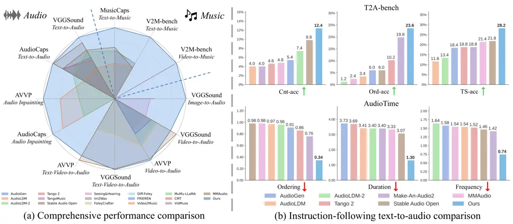

Figure 1: Performance comparison of AudioX against baselines. (a)
Comprehensive comparison across multiple benchmarks via Inception Score.
(b) Results on instruction-following benchmarks.

## 1 Introduction

In recent years, audio generation, especially for sound effects and
music, has emerged as a crucial element in multimedia creation, showing
practical values in enhancing user experiences across a wide range of
applications. For example, in social media, film production, and video
games, sound effects and music significantly intensify emotional
resonance and engagement with the audience. The ability to create
high-quality audio not only enriches multimedia content but also opens
up new avenues for creative expression.

However, the manual production of audio is time-consuming and requires
specialized skills, presenting a compelling research opportunity to
automate audio generation. Despite notable advancements (Liu et al.,
2023; Copet et al., 2024; Wang et al., 2024), the field has
predominantly focused on specialized models with constrained inputs and
outputs. These models often operate with a single conditioning modality,
such as text-to-audio or video-to-audio, and are typically restricted to
a single output domain, like generating either sound effects (Cheng et
al., 2025) or music (Tian et al., 2025) exclusively. While a recent
trend towards unification is emerging, with some pioneering works
accommodating multiple inputs (Polyak et al., 2024; Zhang et al., 2024),
they often lack the flexibility to support diverse modal combinations
and exhibit weak instruction-following abilities. As a result, the
potential of unified models still remains underexplored. We find that a
major factor behind these limitations is the scarcity of high-quality,
multimodal data suitable for training unified systems. Existing datasets
are often task-specific, typically providing supervision for only one
conditioning modality, such as text-to-audio (Kim et al., 2019),
video-to-audio (Chen et al., 2020), or video-to-music (Tian et al.,
2025). This lack of datasets with diverse and combinable control signals
has significantly hindered the development and training of unified
models.

To this end, we propose a unified framework termed AudioX for
anything-to-audio generation. We observe that Transformer-based works
(Wu et al., 2023a; Liu et al., 2024b; Lin et al., 2023) have effectively
tackled multi-modal alignment, and we build on this success by
incorporating Transformer-based methods into our framework for
multi-modal condition handling. Furthermore, diffusion models have
increasingly become leading-edge techniques in the field of high-quality
audio and music generation (Evans et al., 2024a; Evans et al., 2024b),
outperforming next-token prediction in terms of audio fidelity (Evans et
al., 2024a; Majumder et al., 2024). Therefore, we mainly build on
Diffusion Transformer (DiT) to unify multimodal conditions and generate
high-fidelity audio. To further enhance multimodal representation
learning and alignment, we introduce a lightweight Multimodal Adaptive
Fusion module that adaptively weights and aligns conditioning modalities
before fusion, enabling stronger cross-modal control and yielding
significant improvements in generation quality.

To support the training of a unified model, we designed a pipeline using
structured annotation and data augmentation to build IF-caps
(Instruction-Following), a large-scale, high-quality multimodal dataset.
The dataset serves as a robust foundation for our approach, containing
over 1.3 million general audio samples and 5.7 million music samples.
Training on this large-scale, fine-grained dataset allows our model to
handle flexible multimodal conditions and generate diverse audio genres,
including music and sound effects. Consequently, AudioX enables a range
of tasks, including text-to-audio generation, video-to-audio generation,
audio inpainting, and text-guided music completion.

With this unified design and trained on our large-scale dataset, our
model demonstrates exceptional performance and strong
instruction-following capabilities. To validate our model’s
capabilities, we benchmark it against state-of-the-art methods across a
comprehensive suite of tasks and established benchmarks. In addition, to
rigorously evaluate its instruction-following ability on T2A tasks, we
construct a new benchmark, T2A-bench. As demonstrated in Sec. 5.3,
AudioX achieves state-of-the-art or comparable results across multiple
benchmarks and various tasks, while substantially outperforming prior
methods in instruction-following capabilities. A notable finding from
our unified training approach is that we observe a _cross-modal
regularization effect_ under unified training: improving the quality and
granularity of textual supervision reduces alignment noise and leads to
better modality alignment, which jointly improves performance across
conditioning modalities (see Sec. 5.4). This observation provides
empirical insight for future multimodal audio generation.

In summary, the main contributions of this work are as follows: 1) We
propose AudioX, a unified framework for anything-to-audio generation
that overcomes the limitations of constrained inputs and outputs. The
proposed framework supports audio and music generation from varied
multi-modal conditions, contributing to a new insight into studying
generalist models for audio generation.

2\) To overcome data scarcity for unified training, we design a data
curation pipeline and construct a large-scale, high-quality dataset,
IF-caps, containing over 7 million samples with fine-grained
annotations.

3\) We conduct comprehensive experiments on a wide array of tasks,
systematically benchmarking state-of-the-art methods categorized by
their input modalities and output domains. Our extensive experiments
demonstrate our model’s strong multi-task capabilities and superior
instruction-following ability.

## 2 Related work

Audio and music generation. Recent advances in deep generative models
have greatly broadened the scope of audio and music synthesis. However,
most existing methods remain confined to a single modality or support
only limited types of conditioning. For instance, _text-to-audio_
approaches (Liu et al., 2023; Kreuk et al., 2022; Ghosal et al., 2023;
Majumder et al., 2024; Evans et al., 2024a; Evans et al., 2024b; Jiang
et al., 2025; Huang et al., 2023) focus on generating diverse
soundscapes from textual prompts, while _text-to-music_ systems (Copet
et al., 2024; Liu et al., 2023; Liu et al., 2024a; Ghosal et al., 2023;
Ziv et al., 2024b) specialize in composing coherent musical pieces.
Separate lines of work tackle tasks like *audio inpainting* (Liu et al.,
2023; Liu et al., 2024a), primarily with text conditioning. Meanwhile,
_video-to-audio_ methods (Zhang et al., 2024; Luo et al., 2024; Wang et
al., 2024; Polyak et al., 2024; Chen et al., 2024) typically generate
foley or environmental sounds synchronized to visual cues. Some of these
also incorporate text for additional context, thereby bridging visual
and textual modalities. Beyond sound effects, _video-to-music_
approaches (Kang et al., 2024; Liu et al., 2024c; Di et al., 2021; Tian
et al., 2025; Li et al., 2024b; Lin et al., 2024; Li et al., 2024a)
align musical compositions with the visual content to enhance narrative
depth in multimedia applications. Despite these advances, current
frameworks often specialize in only one modality or rely on a limited
set of input conditions, hindering multi-task adaptation and restricting
their ability to scale or transfer knowledge across related tasks. In
contrast, our _unified_ approach supports both audio and music
generation for a broad range of input conditions—including text, video,
and audio—all within a single framework.

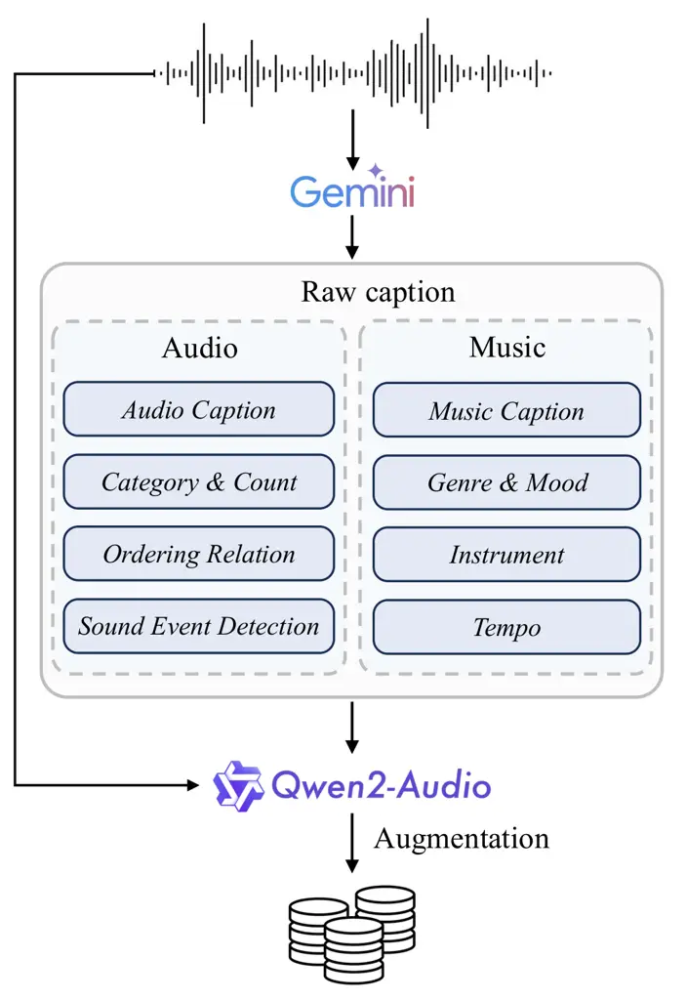

Figure 2: Dataset process pipeline.

Audio Datasets. While substantial research efforts have led to the
creation of valuable datasets for specific tasks like text-to-audio (Kim
et al., 2019; Mei et al., 2024; Drossos et al., 2020; Wu et al., 2023b),
text-to-music (Copet et al., 2024; Liu et al., 2024c; Ramires et al.,
2020), video-to-audio (Chen et al., 2020; Hershey et al., 2021; Tian et
al., 2020), and video-to-music (Tian et al., 2025; Zhou et al., 2025),
their utility for training a generalist unified model remains limited.
These resources are typically constrained to a single conditioning
modality and a narrow output domain (e.g., only sound effects or only
music). This fragmentation of data has significantly hindered progress
towards developing more versatile and robust systems. To overcome this
critical data scarcity, we introduce a large-scale, multimodal dataset
constructed via a novel annotation and augmentation pipeline,
specifically designed to provide the comprehensive supervision required
for unified audio and music generation.

Diffusion models. Denoising diffusion models (Ho et al., 2020; Song et
al., 2020) have become a cornerstone of modern generative modeling,
achieving state-of-the-art results in image (Rombach et al., 2022;
Ramesh et al., 2022; Brooks et al., 2023), video (Chen et al., 2023; Ho
et al., 2022; Guo et al., 2023; He et al., 2024), and audio synthesis
(Popov et al., 2021; Jeong et al., 2021; Liu et al., 2024a; Liu et al.,
2023; Liu et al., 2022; Evans et al., 2024a). However, their application
in the audio domain has predominantly been limited to single-condition
tasks (e.g., text-to-audio), falling short of the more generalized
“anything-to-audio” scenarios where inputs can be multimodal. To bridge
this gap, our unified framework leverages the power of diffusion models
for multi-condition generation, offering a more flexible and universal
solution.

## 3 Dataset process

Existing audio datasets often lack the high-quality, multimodal
conditioning signals necessary to train versatile, unified models. To
address this gap, we designed an effective annotation pipeline that
processes existing video datasets (Chen et al., 2020; Hershey et al.,
2021; Tian et al., 2025), allowing us to construct IF-caps, a
large-scale dataset with diverse, multi-modal conditions. Our pipeline,
as shown in Fig. 2, operates as follows: _First_, we employ a powerful
multimodal LLM (Gemini 2.5 Pro) to generate a comprehensive set of
initial annotations by processing the audio track of each 10-second
video-audio clip. These annotations consist of a holistic global caption
and a set of structured fields. For general audio, these fields include
sound event classification and count; for music, they specify attributes
like genre and instrumentation. _Then_, since using the
resource-intensive Gemini model for the entire dataset is costly, we
leverage the open-source Qwen2-Audio (Chu et al., 2024) model to augment
these structured fields at a large scale. Conditioned on both the
initial annotations and the raw audio, the model generates varied
captions, enhancing data diversity while managing costs. _Finally_, this
process yields comprehensive, fine-grained captions for approximately
1.3 million video-audio clips and 5.7 million video-music clips. The
diversity of our curated dataset is highlighted by the word clouds in
Fig. 3. More details and samples of our annotated data are provided in
the Appendix A.1.2.

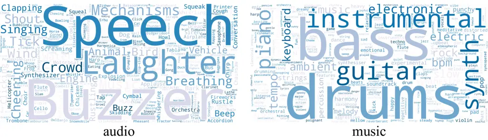

Figure 3: Word clouds for our curated dataset, illustrating the
diversity of terms for the general audio (left) and music (right)
domains.

## 4 Method

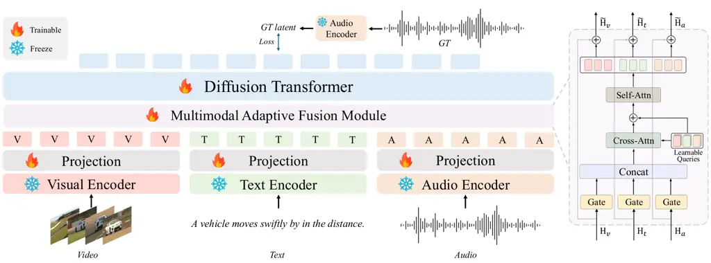

Figure 4: The AudioX Framework. Specialized encoders process diverse
modalities, and a MAF module unifies these signals into a conditioning
embedding $`H_{c}`$. The DiT backbone processes the noisy latent input
$`z_{t}`$, conditioning on $`H_{c}`$ via cross-attention to generate
high-quality audio and music. ($`z_{t}`$ and $`H_{c}`$ notations are
omitted for visual clarity).

### 4.1 Model design

Our framework, AudioX, as shown in Fig. 4, is built upon a DiT backbone
designed for high-fidelity audio synthesis. Given video
$`\mathbf{X}_{\texttt{v}}`$, text $`\mathbf{X}_{\texttt{t}}`$, and audio
$`\mathbf{X}_{\texttt{a}}`$, each modality is passed through
corresponding specialized encoders. To capture the temporal dynamics,
the resulting video and audio features are then processed by a temporal
transformer. Finally, the features from all three modalities are mapped
through a projection head to produce the domain-specific embeddings
($`\mathbf{H}_{\texttt{v}}`$, $`\mathbf{H}_{\texttt{t}}`$,
$`\mathbf{H}_{\texttt{a}}`$). These embeddings are then fused into a
unified condition embedding, which is ultimately passed to the Diffusion
Transformer to guide the generation process.

A key challenge in training a unified model is that signals from
different modalities can interfere with each other, making effective
fusion and well-aligned conditioning critical. To address this, we
introduce the lightweight Multimodal Adaptive Fusion (MAF) module. As
shown in Fig. 4 (right), the MAF module operates as follows: _First_,
the initial feature embeddings from each modality are fed into _gates_,
which filter and reweight them to suppress noise and retain the most
informative cues. _Next_, the gated embeddings are concatenated and
attended by _learnable queries_ via cross-attention. These queries are
organized into three modality-specific sets, acting as experts to assess
and aggregate evidence across the different data streams. _Finally_, a
_self-attention_ layer consolidates this aggregated context, and the
refined information is dispatched back to the modality paths via
residual updates. This process yields calibrated, modality-specific
outputs which are then concatenated to form the final multimodal
condition embedding, $`\mathbf{H}_{\texttt{c}}`$:

```math
\tilde{\mathbf{H}}_{\texttt{v}},\ \tilde{\mathbf{H}}_{\texttt{t}},\ \tilde{\mathbf{H}}_{\texttt{a}}=\mathrm{MAF}\!\left(\mathbf{H}_{\texttt{v}},\,\mathbf{H}_{\texttt{t}},\,\mathbf{H}_{\texttt{a}}\right),\quad\mathbf{H}_{\texttt{c}}=\mathrm{Concat}\!\left(\tilde{\mathbf{H}}_{\texttt{v}},\,\tilde{\mathbf{H}}_{\texttt{t}},\,\tilde{\mathbf{H}}_{\texttt{a}}\right). \tag{1}
```

This final embedding, along with a diffusion timestep $`t`$, is what
conditions the DiT backbone for the final audio synthesis. As we
demonstrate in our ablation studies (Sec. 5.4), the MAF module is
essential for reducing cross-modal interference while improving both the
overall generation quality on multimodal tasks and the model’s
instruction-following capabilities.

### 4.2 Training

The objective of the training process is to effectively integrate
multimodal inputs and optimize the DiT model for generating high-quality
audio or music through a robust diffusion and denoising framework. The
details of the training data are provided in Table A.1 in the Appendix.
During training, for each pair ($`\mathbf{X}_{\texttt{v}}`$,
$`\mathbf{X}_{\texttt{t}}`$, $`\mathbf{X}_{\texttt{a}}`$ $`|`$
$`\mathbf{A}`$), where $`\mathbf{A}`$ is the ground truth we aim to
generate, if the pair lacks video or audio modality input, we use
zero-padding to fill the missing modality. If it lacks text modality
input, we substitute with natural language descriptions, such as
“Generate music for the video.” for the video-to-music generation task.
For the tasks of audio inpainting and music completion, the audio
modality input is required. In audio inpainting,
$`\mathbf{X}_{\texttt{a}}`$ is a masked version of the ground truth
audio $`\mathbf{A}`$, and the model’s objective is to fill in the masked
sections. For music completion, $`\mathbf{X}_{\texttt{a}}`$ is the
preceding music segment of $`\mathbf{A}`$, and the model aims to
generate the subsequent music segment of $`\mathbf{X}_{\texttt{a}}`$.

Diffusion process. The DiT model processes the multimodal embedding
$`\mathbf{H}_{\texttt{c}}`$ in the latent space through a denoising
diffusion process. Initially, the ground truth $`\mathbf{A}`$ is encoded
using an encoder $`\mathcal{E}`$, which projects $`\mathbf{A}`$ into the
latent space, yielding the latent representation $`\mathbf{z}`$ =
$`\mathcal{E}(\mathbf{A})`$. The data then undergoes a forward diffusion
process, producing noisy latent states at each timestep $`t`$.

The forward diffusion is defined as a Markov process over $`T`$
timesteps, where the latent state at timestep $`t`$ is produced based on
the latent state at $`t-1`$:

```math
q(\mathbf{z}_{t}|\mathbf{z}_{t-1})=\mathcal{N}(\mathbf{z}_{t};\sqrt{1-\beta_{t}}\mathbf{z}_{t-1},\beta_{t}\mathbf{I}), \tag{2}
```

where $`\beta_{t}`$ represents the predefined variance at timestep
$`t`$, and $`\mathcal{N}`$ denotes a Gaussian distribution. The forward
diffusion process gradually adds noise to the latent state.

The reverse denoising process involves training a transformer network
$`\mathbf{\epsilon}_{\theta}`$ to gradually remove noise at each
timestep and reconstruct the clean data. The reverse process is modeled
as follows:

```math
p_{\theta}\left(\mathbf{z}_{t-1}|\mathbf{z}_{t}\right)=\mathcal{N}\left(\mathbf{z}_{t-1};\mathbf{\mu}_{\theta}\left(\mathbf{z}_{t},t,\mathbf{H}_{\texttt{c}}\right),\mathbf{\Sigma}_{\theta}\left(\mathbf{z}_{t},t,\mathbf{H}_{\texttt{c}}\right)\right), \tag{3}
```

where $`\mathbf{\mu}_{\theta}`$ and $`\mathbf{\Sigma}_{\theta}`$ are the
predicted mean and covariance of the reverse diffusion, conditioned on
$`\mathbf{z}_{t}`$, $`t`$, and $`\mathbf{H}_{\texttt{c}}`$. These
parameters define the Gaussian distribution from which
$`\mathbf{z}_{t-1}`$ is sampled.

The denoiser network $`\mathbf{\epsilon}_{\theta}`$ takes as input the
noisy latent state $`\mathbf{z}_{t}`$, timestep $`t`$, and the
multimodal condition embedding $`\mathbf{H}_{\texttt{c}}`$. The goal is
to minimize the noise estimation error at each timestep, which is
formulated as:

```math
\min_{\theta}\mathbb{E}_{t,\mathbf{z}_{t},\mathbf{\epsilon}}\left\|\mathbf{\epsilon}-\mathbf{\epsilon}_{\theta}\left(\mathbf{z}_{t},t,\mathbf{H}_{\texttt{c}}\right)\right\|_{2}^{2}, \tag{4}
```

where $`\mathbf{\epsilon}`$ is the simulated noise at timestep $`t`$,
and
$`\mathbf{\epsilon}_{\theta}(\mathbf{z}_{t},t,\mathbf{H}_{\texttt{c}})`$
is the predicted noise from the model. The training objective is to
minimize the mean squared error between the simulated and predicted
noise across all timesteps.

By training the DiT model in this manner, we effectively unify
multimodal inputs into a latent space, enabling the generation of
high-quality audio or music that is coherent and aligned with the input
conditions.

## 5 Experiments

In this section, we provide the implementation details of our
experiments and conduct extensive evaluations. These assessments
comprehensively measure the effectiveness of our proposed method from
both subjective and objective viewpoints. The evaluations aim to offer
valuable insights into the generation of audio and music from various
inputs.

Dataset Method Task KL $`\downarrow`$ IS $`\uparrow`$ FD $`\downarrow`$
FAD $`\downarrow`$ PC $`\uparrow`$ PQ $`\uparrow`$ Align.$`\uparrow`$
AudioCaps AudioGen(Kreuk et al., 2022) T2A 1.39 10.22 13.29 1.72 3.26
5.25 0.27 AudioLDM-L-Full(Liu et al., 2023) T2A 2.00 6.51 37.27 8.37
2.82 5.67 0.20 AudioLDM-2-Large(Liu et al., 2024a) T2A 1.49 8.46 26.34
1.97 2.86 5.77 0.22 Tango 2(Majumder et al., 2024) T2A 1.11 10.37 12.22
3.20 3.63 5.82 0.36 Stable Audio Open(Evans et al., 2024b) T2A 2.01
10.37 29.01 3.15 2.77 6.16 0.21 MAGNET-large(Ziv et al., 2024a) T2A 1.62
7.46 24.88 2.99 3.25 5.15 0.15 MMAudio(Cheng et al., 2025) T2A 1.35
12.03 12.63 4.71 3.06 5.64 0.30 AudioX T2A 1.27 12.48 11.51 1.59 3.32
5.80 0.30 VGGSound AudioGen(Kreuk et al., 2022) T2A 2.16 11.09 15.94
2.48 3.30 5.45 0.29 AudioLDM-L-Full(Liu et al., 2023) T2A 2.41 6.52
31.15 7.05 2.93 5.99 0.27 AudioLDM-2-Large(Liu et al., 2024a) T2A 2.10
13.86 16.32 2.05 2.95 6.35 0.30 Tango 2(Majumder et al., 2024) T2A 2.31
10.00 22.96 3.47 3.93 5.99 0.29 Stable Audio Open(Evans et al., 2024b)
T2A 2.36 14.45 26.00 2.60 2.64 6.53 0.33 MAGNET-large(Ziv et al., 2024a)
T2A 2.03 8.53 22.17 2.74 3.65 5.25 0.26 MMAudio(Cheng et al., 2025) T2A
2.17 17.83 11.52 2.50 3.02 6.12 0.32 AudioX T2A 1.74 19.58 9.01 1.33
3.34 6.31 0.33 Seeing&Hearing(Xing et al., 2024) V2A 2.58 5.15 27.21
5.23 3.42 5.33 0.36 FoleyCrafter(Zhang et al., 2024) V2A 2.39 8.70 17.68
2.23 3.31 5.99 0.27 Diff-Foley(Luo et al., 2024) V2A 3.01 8.35 56.54
5.89 2.57 5.85 0.20 FRIEREN(Wang et al., 2024) V2A 2.58 6.91 50.88 3.13
2.98 6.06 0.20 VATT(Liu et al., 2024d) V2A 1.40 10.02 11.71 2.55 3.64
5.85 0.25 VAB(Su et al., 2024) V2A 2.30 8.15 20.21 3.05 3.52 5.93 0.24
MMAudio(Cheng et al., 2025) V2A 1.97 14.95 6.18 2.04 3.38 5.91 0.35
AudioX V2A 2.21 12.60 7.84 1.28 3.49 6.21 0.26 FoleyCrafter(Zhang et
al., 2024) TV2A 1.94 11.32 19.16 2.13 3.38 6.06 0.26 MMAudio(Cheng et
al., 2025) TV2A 1.51 17.79 6.60 2.20 3.31 5.99 0.33 AudioX TV2A 1.48
17.91 6.97 1.06 3.46 6.29 0.26 AVVP Seeing&Hearing(Xing et al., 2024)
V2A 2.30 4.02 40.38 8.66 3.64 5.16 0.35 FoleyCrafter(Zhang et al., 2024)
V2A 2.13 6.46 28.68 3.77 3.25 5.87 0.28 Diff-Foley(Luo et al., 2024) V2A
3.14 5.97 76.96 10.95 2.55 5.71 0.16 FRIEREN(Wang et al., 2024) V2A 2.73
4.71 66.46 6.49 3.08 5.88 0.17 MMAudio(Cheng et al., 2025) V2A 1.22 8.40
13.51 3.25 3.55 5.89 0.34 AudioX V2A 1.89 8.60 17.2 2.24 3.65 6.09 0.28
FoleyCrafter(Zhang et al., 2024) TV2A 1.81 6.22 26.76 2.85 3.62 5.60
0.27 MMAudio(Cheng et al., 2025) TV2A 1.74 9.52 14.18 2.74 3.64 5.81
0.34 AudioX TV2A 1.88 9.03 16.33 2.38 3.65 6.04 0.28 MusicCaps
MusicGen(Copet et al., 2024) T2M 1.43 2.24 25.40 4.55 5.19 7.16 0.18
AudioLDM-L-Full(Liu et al., 2023) T2M 1.45 2.49 34.44 6.34 4.72 6.10
0.22 AudioLDM-2-Large(Liu et al., 2024a) T2M 1.26 2.84 15.61 2.80 5.22
6.70 0.23 TangoMusic(Ghosal et al., 2023) T2M 1.13 2.86 15.00 1.88 5.57
7.06 0.23 Stable Audio Open(Evans et al., 2024b) T2M 1.51 2.94 36.33
3.23 3.91 7.18 0.23 MAGNET-large(Ziv et al., 2024a) T2M 1.32 1.98 23.88
4.24 5.84 6.71 0.19 AudioX T2M 0.96 3.55 9.76 1.53 5.21 6.70 0.24
V2M-bench MusicGen(Copet et al., 2024) T2M 0.76 1.31 40.59 3.25 5.57
7.43 0.14 AudioLDM-L-Full(Liu et al., 2023) T2M 0.72 1.37 36.63 2.97
5.08 7.01 0.16 AudioLDM-2-Large(Liu et al., 2024a) T2M 0.62 1.46 25.80
1.63 5.57 6.90 0.14 TangoMusic(Ghosal et al., 2023) T2M 0.72 1.46 38.19
2.43 5.78 7.46 0.14 Stable Audio Open(Evans et al., 2024b) T2M 0.72 1.34
42.02 2.72 4.36 7.72 0.17 MAGNET-large(Ziv et al., 2024a) T2M 0.60 1.26
34.24 3.15 5.89 7.04 0.17 AudioX T2M 0.47 1.50 19.62 1.68 5.91 7.12 0.14
Video2Music(Kang et al., 2024) V2M 1.78 1.01 144.88 18.72 3.34 8.14 0.14
MuMu-LLaMA(Liu et al., 2024c) V2M 1.00 1.25 52.25 5.10 5.60 7.97 0.18
CMT(Di et al., 2021) V2M 1.22 1.24 85.70 8.64 4.98 8.20 0.12
VidMuse(Tian et al., 2025) V2M 0.73 1.32 29.95 2.46 5.88 6.89 0.20
AudioX V2M 0.70 1.37 24.01 1.67 5.24 7.04 0.23 AudioX TV2M 0.45 1.52
18.64 1.44 5.42 7.24 0.22

Table 1: Performance evaluation across various tasks and datasets. Task
abbreviations are: T2A (Text-to-Audio), V2A (Video-to-Audio), TV2A
(Text-and-Video-to-Audio), T2M (Text-to-Music), V2M (Video-to-Music),
and TV2M (Text-and-Video-to-Music). For alignment (Align.), we use the
CLAP score for text and the Imagebind AV score for video inputs.

### 5.1 Implementation details

For encoding the visual features, we use CLIP-ViT-B/32 (Radford et al., 2021) to extract video frame features at a rate of 5 fps, and
Synchformer (Iashin et al., 2024) to extract synchronization features at
25 fps. The CLIP and Synchformer features are fused via addition. The
text inputs are encoded using T5-base (Raffel et al., 2020), while the
audio is encoded and decoded using an audio Autoencoder (Evans et al.,
2024b). The model has a total of 2.4B parameters (1.1B trainable). Our
proposed MAF module constitutes only 60M of these parameters,
highlighting its lightweight nature. The DiT model, consisting of 24
layers, uses a pretrained model from (Evans et al., 2024b).

The training process uses the AdamW optimizer with a base learning rate
of 1e-5, weight decay of 0.001, and a learning rate scheduler
incorporating exponential ramp-up and decay phases. To improve inference
stability, we maintain an exponential moving average of the model
weights. Training is conducted on three clusters of NVIDIA H800 GPUs,
each with 80GB of memory, requiring approximately 4k GPU hours in total.
The batch size is set to 48. During inference, we perform 250 steps
using classifier-free guidance with a scale of 7.0. Please refer to
Appendix A.1.1 for further details on our training and evaluation
datasets.

### 5.2 Evaluation metrics

To provide a comprehensive assessment of our model, we employ a suite of
objective and subjective metrics. Further details for each metric are
provided in the Appendix A.2.

##### Objective Evaluation.

For overall audio quality and semantic alignment, we use several
established metrics. These include: Kullback-Leibler Divergence (KL);
Inception Score (IS); Fréchet Distance (FD) with PANNs embeddings (Kong
et al., 2020); Fréchet Audio Distance (FAD) with VGGish embeddings
(Hershey et al., 2017); Production Complexity (PC) and Production
Quality (PQ) (Tjandra et al., 2025). As a prompt-free metric for both
quality and diversity, we chose IS for the unified comparison in Fig. 1.
For alignment, we use the CLAP score (Wu et al., 2023b) for text inputs
and the Imagebind AV score (Girdhar et al., 2023) for video inputs. To
assess the model’s instruction-following capabilities in T2A, we report
metrics on two benchmarks. On our proposed T2A-bench (detailed in
Appendix A.3), we measure category, count, ordering, and timestamp
accuracy (Cat-acc, Cnt-acc, Ord-acc, TS-acc). On AudioTime (Xie et al.,
2025), we use its established metrics for Ordering, Duration, Frequency,
and Timestamp.

##### Subjective Evaluation.

We conducted a formal user study with 10 professional audio experts to
evaluate the subjective quality of our generated samples against
baselines. The study followed the established methodologies of prior
work (Kreuk et al., 2022; Liu et al., 2023), where experts rated
anonymized samples from 1 to 100 on Overall Quality (OVL) and Relevance
(REL) to the prompt.

### 5.3 Main results

This work introduces a unified model capable of generating audio and
music from flexible combinations of video, text, and audio inputs.
Through extensive experimentation, we benchmark our model against SOTA
specialist models across all supported tasks. Results demonstrate that
our single model consistently achieves SOTA or highly competitive
performance on the majority of metrics.

Audio generation. Results of our audio generation are in Table 1, which
includes the outcomes of generating audio or music from any combination
of video and text modalities. The upper part of the table presents the
audio generation tasks, while the lower part displays the music
generation tasks.

For text-to-audio generation, we evaluate on the AudioCaps (Kim et al., 2019) and VGGSound (Chen et al., 2020) datasets. On AudioCaps, our model
achieves SOTA performance, while on VGGSound, the advantage is even more
pronounced. This demonstrates that our model is a powerful text-to-audio
generator. Furthermore, both our model and baseline results on VGGSound
confirm the effectiveness of our curated caption data. For
video-to-audio generation, we experiment on VGGSound and AVVP (Tian et
al., 2020), AVVP is an out-of-domain test dataset for all methods. Our
model achieves results comparable to SOTA on both VGGSound and AVVP,
proving that it is not only a strong video-to-audio generator but also
exhibits excellent generalization on out-of-domain datasets. For audio
generation conditioned on both text and video, we benchmark against the
strong baselines FoleyCrafter (Zhang et al., 2024) and MMAudio (Cheng et
al., 2025), achieving results that are comparable to them. We find that
when both text and video inputs are provided, the model effectively
integrates the information from both modalities to generate better
results.

The bottom part of Table 1 shows the results of music generation tasks.
On the V2M dataset (Tian et al., 2025), we evaluate text-to-music,
video-to-music, and video-and-text-to-music. The text-to-music task is
additionally evaluated on the MusicCaps (Copet et al., 2024) dataset.
Our model achieves SOTA performance across these tasks, demonstrating
its effectiveness in generating high-quality music conditioned on
diverse inputs.

Method T2A-bench AudioTime Cat-acc $`\uparrow`$ Cnt-acc $`\uparrow`$
Ord-acc $`\uparrow`$ TS-acc $`\uparrow`$ Ordering $`\downarrow`$
Duration $`\downarrow`$ Frequency $`\downarrow`$ Timestamp$`\uparrow`$
AudioGen 24.40 5.40 6.00 18.40 0.91 3.73 1.58 0.54 AudioLDM 18.60 4.00
3.40 11.60 0.97 3.41 1.54 0.41 AudioLDM-2 20.10 7.40 1.20 13.40 0.96
3.40 1.64 0.54 Tango 2 25.20 4.60 10.20 18.80 0.86 3.70 1.52 0.61
Make-An-Audio2 32.40 4.00 19.80 18.80 0.76 3.40 1.42 0.56 Stable Audio
Open 31.20 9.80 6.00 21.80 0.98 3.07 1.46 0.53 MMAudio 26.60 4.80 2.40
21.40 0.98 3.33 1.54 0.50 AudioX 34.20 12.40 23.60 28.20 0.34 1.30 0.74
0.81

Table 2: Evaluation of instruction-following T2A ability on the
T2A-bench and AudioTime.

Instruction-following text-to-audio generation. As shown in Figure 1 and
Table 2, AudioX substantially outperforms all baselines in tasks
requiring fine-grained control. On our T2A-bench, AudioX demonstrates a
commanding lead across all dimensions, from category generation to count
and temporal control. For instance, it surpasses the temporally-enhanced
Make-An-Audio2 baseline in Ord-acc. This advantage is reaffirmed on the
AudioTime benchmark. We also note that the performance trends between
AudioTime’s Ordering metric and our Ord-acc are consistent across all
models, which helps validate the design of our benchmark for evaluating
temporal adherence. Furthermore, an insight from these comparisons is
that high audio fidelity does not necessarily correlate with
instruction-following prowess. For instance, Tango2, despite its
high-quality synthesis, delivers only moderate performance on these
control-focused metrics. Collectively, these results underscore our
model’s superior fine-grained control, setting a new standard for
controllable T2A generation.

User study. We conducted a user study to evaluate the quality of the
generated audio and music. We randomly selected 25 samples for each
audio generation task, including T2A, T2M, V2A, and V2M. 10 audio
experts are asked to rate the quality of the generated audio and music.
The results are shown in Fig. A.2 in the Appendix. The evaluation shows
that our model achieves subjective SOTA performance in terms of OVL and
REL scores in most tasks, indicating high user satisfaction.

To further demonstrate the versatility of our model, we present results
for additional tasks, including audio inpainting, music completion, and
image-to-audio generation, in Appendix A.4.1. The results further
underscore our model’s strong performance and broad applicability across
a variety of audio generation tasks.

### 5.4 Ablation study

In this section, we conduct a series of ablation studies to investigate
the contribution of our key design choices. We systematically validate
the efficacy of our data curation strategy and the architectural
integrity of the proposed MAF module. An additional ablation study on
the impact of different conditioning modalities is detailed in
Appendix A.4.2.

Efficacy of data curation strategy.

To verify the impact of our data curation strategy, we evaluate models
trained on different textual supervision sources (Table 3): 1) Labels:
using raw class labels from the source datasets; 2) AudioSetCaps: using
captions from a recent concurrent dataset (Bai et al., 2025); 3)
QwenCap: using captions generated directly by Qwen2-Audio; 4) GeminiCap:
using only the initial annotations generated by Gemini 2.5 Pro; and 5)
GeminiCap-aug: our full pipeline. The results show that GeminiCap-aug
outperforms all baselines, including the external AudioSetCaps dataset
and the single-stage generation methods. It not only achieves the best
scores on general-purpose tasks (T2A, V2A, TV2A) but also enhances the
model’s instruction-following capabilities. Collectively, these results
validate the superior quality of our constructed dataset and the
effectiveness of the proposed two-stage curation pipeline. Notably, we
observe that the benefits of high-quality textual supervision are not
limited to text-to-audio generation. The marked improvement in the V2A
task provides strong empirical evidence of a _cross-modal regularization
effect_. This insight leads to a crucial conclusion for future work:
high-quality textual data should be viewed not only as an input, but
also as an effective strategy for building more capable and robust
multimodal models.

| Caption Method | Instruction-following T2A |                      |                      | T2A             |                    | V2A             |                    | TV2A            |                    |
| -------------- | ------------------------- | -------------------- | -------------------- | --------------- | ------------------ | --------------- | ------------------ | --------------- | ------------------ |
|                | Cat-acc $`\uparrow`$      | Cnt-acc $`\uparrow`$ | Ord-acc $`\uparrow`$ | IS $`\uparrow`$ | FAD $`\downarrow`$ | IS $`\uparrow`$ | FAD $`\downarrow`$ | IS $`\uparrow`$ | FAD $`\downarrow`$ |
| Labels         | 17.35                     | 2.80                 | 4.60                 | 7.59            | 6.02               | 10.46           | 1.81               | 10.62           | 3.41               |
| AudioSetCaps   | 27.85                     | 6.40                 | 4.80                 | 10.08           | 3.19               | 11.35           | 1.33               | 12.39           | 1.56               |
| QwenCap        | 24.60                     | 6.40                 | 6.20                 | 9.74            | 4.40               | 10.57           | 1.67               | 11.79           | 1.95               |
| GeminiCap      | 28.05                     | 9.60                 | 7.60                 | 10.81           | 3.02               | 11.48           | 1.31               | 12.78           | 1.70               |
| GeminiCap-aug  | 28.91                     | 10.20                | 7.80                 | 10.93           | 2.91               | 11.69           | 1.15               | 12.90           | 1.48               |

Table 3: Ablation study on data curation strategies. We compare our
model’s performance when trained with captions from different sources.
The results show a clear trend of improvement with higher-quality data.
Our full pipeline (GeminiCap-aug) not only achieves the best performance
on all general tasks (T2A, V2A, TV2A) but is also essential for enabling
fine-grained control.

| Components | Gate           | Query          | KL $`\downarrow`$ | IS $`\uparrow`$ | FD $`\downarrow`$ | FAD $`\downarrow`$ | Duration $`\downarrow`$ | Frequency $`\downarrow`$ | Ordering $`\downarrow`$ |
| ---------- | -------------- | -------------- | ----------------- | --------------- | ----------------- | ------------------ | ----------------------- | ------------------------ | ----------------------- |
| w/o MAF    | $`\times`$     | $`\times`$     | 1.83              | 10.70           | 11.60             | 2.67               | 3.022                   | 1.359                    | 0.912                   |
| w/o Gate   | $`\times`$     | $`\checkmark`$ | 1.69              | 11.66           | 9.72              | 2.00               | 2.945                   | 1.348                    | 0.876                   |
| w/o Query  | $`\checkmark`$ | $`\times`$     | 1.71              | 11.72           | 9.65              | 2.08               | 2.841                   | 1.328                    | 0.912                   |
| Full MAF   | $`\checkmark`$ | $`\checkmark`$ | 1.68              | 11.84           | 9.64              | 1.98               | 2.827                   | 1.302                    | 0.888                   |

Table 4: Ablation study of the MAF architecture components. We evaluate
the contribution of the Gate and Query mechanisms by removing them
individually. The results show that the Full MAF, which includes both
components, achieves the best performance across most metrics. This
confirms that our complete design is essential for effective multimodal
fusion.

Architectural ablation of the MAF module. We conduct an architectural
ablation of the MAF module to validate its design (Table 4). The results
confirm that each component is integral, with the most severe
performance deterioration observed when the MAF module is omitted
entirely. Removing the Gate mechanism or the Query-based attention
individually also results in a performance decline, confirming their
respective contributions. This analysis validates our design choices,
underscoring that the complete MAF architecture is critical for optimal
multimodal fusion, thereby enhancing cross-modal alignment and improving
generation quality.

### 5.5 Discussion

Our extensive experiments provide a multi-faceted validation of AudioX,
consistently demonstrating state-of-the-art performance from broad audio
generation to a commanding lead in fine-grained instruction-following.
Our ablation studies confirm that this success is directly attributable
to two core principles: a data curation strategy that provides a rich
semantic foundation via a powerful cross-modal regularization effect,
and an MAF architecture essential for translating these signals into
precisely controlled outputs. The synergy between this data-centric
foundation and purpose-built architecture culminates in our model’s SOTA
performance on challenging instruction-following benchmarks, validating
our approach for unifying generative versatility with fine-grained
control.

## 6 Conclusion

In this work, we present AudioX, a unified framework that transcends the
modality and domain constraints prevalent in prior specialist models for
audio generation. By leveraging a DiT backbone and our designed MAF
module, our model effectively unifies diverse inputs like text, video,
and audio to produce high-quality outputs. The training of our model is
supported by IF-caps, our large-scale, fine-grained dataset, which
provides a robust foundation for unified training and evaluation.
Notably, our training methodology induces an effective cross-modal
regularization effect, enhancing the model’s internal representations.
Extensive experiments demonstrate that our single, unified model not
only matches or outperforms specialist models but also unlocks superior
instruction-following capabilities, showcasing its command of both
generative versatility and fine-grained control.

## References

- Bai et al. (2023) J. Bai, S. Bai, S. Yang, S. Wang, S. Tan, P.
  Wang, J. Lin, C. Zhou, and J. Zhou Qwen-vl: a frontier large
  vision-language model with versatile abilities. arXiv preprint
  arXiv:2308.12966. Cited by: §A.4.1.
- Bai et al. (2025) J. Bai, H. Liu, M. Wang, D. Shi, W. Wang, M. D.
  Plumbley, W. Gan, and J. Chen Audiosetcaps: an enriched audio-caption
  dataset using automated generation pipeline with large audio and
  language models. IEEE Transactions on Audio, Speech and Language
  Processing. Cited by: §5.4.
- Brooks et al. (2023) T. Brooks, A. Holynski, and A. A. Efros
  Instructpix2pix: learning to follow image editing instructions. In
  Proceedings of the IEEE/CVF Conference on Computer Vision and Pattern
  Recognition, pp. 18392–18402. Cited by: §2.
- Chen et al. (2023) H. Chen, M. Xia, Y. He, Y. Zhang, X. Cun, S.
  Yang, J. Xing, Y. Liu, Q. Chen, X. Wang, et al. Videocrafter1: open
  diffusion models for high-quality video generation. arXiv preprint
  arXiv:2310.19512. Cited by: §2.
- Chen et al. (2020) H. Chen, W. Xie, A. Vedaldi, and A. Zisserman
  Vggsound: a large-scale audio-visual dataset. In ICASSP 2020-2020 IEEE
  International Conference on Acoustics, Speech and Signal Processing
  (ICASSP), pp. 721–725. Cited by: §1, §2, §3, §5.3.
- Chen (2022) X. Chen AnimeGANv2. Note:
  [https://github.com/TachibanaYoshino/AnimeGANv2/](https://github.com/TachibanaYoshino/AnimeGANv2/)
  Cited by: §A.4.1.
- Chen et al. (2024) Z. Chen, P. Seetharaman, B. Russell, O. Nieto, D.
  Bourgin, A. Owens, and J. Salamon Video-guided foley sound generation
  with multimodal controls. arXiv preprint arXiv:2411.17698. Cited by:
  §2.
- Cheng et al. (2025) H. K. Cheng, M. Ishii, A. Hayakawa, T. Shibuya, A.
  Schwing, and Y. Mitsufuji MMAudio: taming multimodal joint training
  for high-quality video-to-audio synthesis. In Proceedings of the
  Computer Vision and Pattern Recognition Conference, pp. 28901–28911.
  Cited by: §1, §5.3, Table 1, Table 1, Table 1, Table 1, Table 1, Table
  1.
- Chu et al. (2024) Y. Chu, J. Xu, Q. Yang, H. Wei, X. Wei, Z. Guo, Y.
  Leng, Y. Lv, J. He, J. Lin, et al. Qwen2-audio technical report. arXiv
  preprint arXiv:2407.10759. Cited by: §3.
- Copet et al. (2024) J. Copet, F. Kreuk, I. Gat, T. Remez, D. Kant, G.
  Synnaeve, Y. Adi, and A. Défossez Simple and controllable music
  generation. Advances in Neural Information Processing Systems 36.
  Cited by: §1, §2, §2, §5.3, Table 1, Table 1.
- Di et al. (2021) S. Di, Z. Jiang, S. Liu, Z. Wang, L. Zhu, Z. He, H.
  Liu, and S. Yan Video background music generation with controllable
  music transformer. In Proceedings of the 29th ACM International
  Conference on Multimedia, pp. 2037–2045. Cited by: §2, Table 1.
- Donahue et al. (2018) C. Donahue, J. McAuley, and M. Puckette
  Adversarial audio synthesis. arXiv preprint arXiv:1802.04208. Cited
  by: §A.2.
- Drossos et al. (2020) K. Drossos, S. Lipping, and T. Virtanen Clotho:
  an audio captioning dataset. In ICASSP 2020-2020 IEEE International
  Conference on Acoustics, Speech and Signal Processing (ICASSP),
  pp. 736–740. Cited by: §2.
- Elizalde et al. (2023) B. Elizalde, S. Deshmukh, M. Al Ismail, and H.
  Wang Clap learning audio concepts from natural language supervision.
  In ICASSP 2023-2023 IEEE International Conference on Acoustics, Speech
  and Signal Processing (ICASSP), pp. 1–5. Cited by: §A.2.
- Evans et al. (2024a) Z. Evans, J. D. Parker, C. Carr, Z. Zukowski, J.
  Taylor, and J. Pons Long-form music generation with latent diffusion.
  arXiv preprint arXiv:2404.10301. Cited by: §1, §2, §2.
- Evans et al. (2024b) Z. Evans, J. D. Parker, C. Carr, Z. Zukowski, J.
  Taylor, and J. Pons Stable audio open. arXiv preprint
  arXiv:2407.14358. Cited by: §1, §2, §5.1, Table 1, Table 1, Table 1,
  Table 1.
- Gemmeke et al. (2017) J. F. Gemmeke, D. P. Ellis, D. Freedman, A.
  Jansen, W. Lawrence, R. C. Moore, M. Plakal, and M. Ritter Audio set:
  an ontology and human-labeled dataset for audio events. In 2017 IEEE
  international conference on acoustics, speech and signal processing
  (ICASSP), pp. 776–780. Cited by: §A.2.
- Ghosal et al. (2023) D. Ghosal, N. Majumder, A. Mehrish, and S. Poria
  Text-to-audio generation using instruction-tuned llm and latent
  diffusion model. arXiv preprint arXiv:2304.13731. Cited by: §2, Table
  1, Table 1.
- Girdhar et al. (2023) R. Girdhar, A. El-Nouby, Z. Liu, M. Singh, K. V.
  Alwala, A. Joulin, and I. Misra Imagebind: one embedding space to bind
  them all. In Proceedings of the IEEE/CVF Conference on Computer Vision
  and Pattern Recognition, pp. 15180–15190. Cited by: §A.2, §5.2.
- Guo et al. (2023) Y. Guo, C. Yang, A. Rao, Z. Liang, Y. Wang, Y.
  Qiao, M. Agrawala, D. Lin, and B. Dai Animatediff: animate your
  personalized text-to-image diffusion models without specific tuning.
  arXiv preprint arXiv:2307.04725. Cited by: §2.
- He et al. (2024) Y. He, Z. Liu, J. Chen, Z. Tian, H. Liu, X. Chi, R.
  Liu, R. Yuan, Y. Xing, W. Wang, et al. Llms meet multimodal generation
  and editing: a survey. arXiv preprint arXiv:2405.19334. Cited by: §2.
- Hershey et al. (2017) S. Hershey, S. Chaudhuri, D. P. Ellis, J. F.
  Gemmeke, A. Jansen, R. C. Moore, M. Plakal, D. Platt, R. A.
  Saurous, B. Seybold, et al. CNN architectures for large-scale audio
  classification. In 2017 ieee international conference on acoustics,
  speech and signal processing (icassp), pp. 131–135. Cited by: §A.2,
  §5.2.
- Hershey et al. (2021) S. Hershey, D. P. Ellis, E. Fonseca, A.
  Jansen, C. Liu, R. C. Moore, and M. Plakal The benefit of
  temporally-strong labels in audio event classification. In ICASSP
  2021-2021 IEEE International Conference on Acoustics, Speech and
  Signal Processing (ICASSP), pp. 366–370. Cited by: §2, §3.
- Heusel et al. (2017) M. Heusel, H. Ramsauer, T. Unterthiner, B.
  Nessler, and S. Hochreiter Gans trained by a two time-scale update
  rule converge to a local nash equilibrium. Advances in neural
  information processing systems 30. Cited by: §A.2.
- Ho et al. (2020) J. Ho, A. Jain, and P. Abbeel Denoising diffusion
  probabilistic models. Advances in neural information processing
  systems 33, pp. 6840–6851. Cited by: §2.
- Ho et al. (2022) J. Ho, T. Salimans, A. Gritsenko, W. Chan, M.
  Norouzi, and D. J. Fleet Video diffusion models. Advances in Neural
  Information Processing Systems 35, pp. 8633–8646. Cited by: §2.
- Huang et al. (2023) J. Huang, Y. Ren, R. Huang, D. Yang, Z. Ye, C.
  Zhang, J. Liu, X. Yin, Z. Ma, and Z. Zhao Make-an-audio 2:
  temporal-enhanced text-to-audio generation. arXiv preprint
  arXiv:2305.18474. Cited by: §2.
- Iashin et al. (2024) V. Iashin, W. Xie, E. Rahtu, and A. Zisserman
  Synchformer: efficient synchronization from sparse cues. In ICASSP
  2024-2024 IEEE International Conference on Acoustics, Speech and
  Signal Processing (ICASSP), pp. 5325–5329. Cited by: §5.1.
- Jeong et al. (2021) M. Jeong, H. Kim, S. J. Cheon, B. J. Choi,
  and N. S. Kim Diff-tts: a denoising diffusion model for
  text-to-speech. arXiv preprint arXiv:2104.01409. Cited by: §2.
- Jiang et al. (2025) Y. Jiang, Z. Chen, Z. Ju, C. Li, W. Dou, and J.
  Zhu Freeaudio: training-free timing planning for controllable
  long-form text-to-audio generation. arXiv preprint arXiv:2507.08557.
  Cited by: §2.
- Kang et al. (2024) J. Kang, S. Poria, and D. Herremans Video2music:
  suitable music generation from videos using an affective multimodal
  transformer model. Expert Systems with Applications 249, pp. 123640.
  Cited by: §2, Table 1.
- Kim et al. (2019) C. D. Kim, B. Kim, H. Lee, and G. Kim Audiocaps:
  generating captions for audios in the wild. In Proceedings of the 2019
  Conference of the North American Chapter of the Association for
  Computational Linguistics: Human Language Technologies, Volume 1 (Long
  and Short Papers), pp. 119–132. Cited by: §A.4.1, §1, §2, §5.3.
- Kong et al. (2020) Q. Kong, Y. Cao, T. Iqbal, Y. Wang, W. Wang,
  and M. D. Plumbley Panns: large-scale pretrained audio neural networks
  for audio pattern recognition. IEEE/ACM Transactions on Audio, Speech,
  and Language Processing 28, pp. 2880–2894. Cited by: §A.2, §5.2.
- Kreuk et al. (2022) F. Kreuk, G. Synnaeve, A. Polyak, U. Singer, A.
  Défossez, J. Copet, D. Parikh, Y. Taigman, and Y. Adi Audiogen:
  textually guided audio generation. arXiv preprint arXiv:2209.15352.
  Cited by: §A.2, §2, §5.2, Table 1, Table 1.
- Li et al. (2024a) R. Li, S. Zheng, X. Cheng, Z. Zhang, S. Ji, and Z.
  Zhao MuVi: video-to-music generation with semantic alignment and
  rhythmic synchronization. arXiv preprint arXiv:2410.12957. Cited by:
  §2.
- Li et al. (2024b) S. Li, Y. Qin, M. Zheng, X. Jin, and Y. Liu
  Diff-bgm: a diffusion model for video background music generation. In
  Proceedings of the IEEE/CVF Conference on Computer Vision and Pattern
  Recognition, pp. 27348–27357. Cited by: §2.
- Lin et al. (2023) B. Lin, Y. Ye, B. Zhu, J. Cui, M. Ning, P. Jin,
  and L. Yuan Video-llava: learning united visual representation by
  alignment before projection. arXiv preprint arXiv:2311.10122. Cited
  by: §1.
- Lin et al. (2024) Y. Lin, Y. Tian, L. Yang, G. Bertasius, and H. Wang
  VMAS: video-to-music generation via semantic alignment in web music
  videos. arXiv preprint arXiv:2409.07450. Cited by: §2.
- Liu et al. (2023) H. Liu, Z. Chen, Y. Yuan, X. Mei, X. Liu, D.
  Mandic, W. Wang, and M. D. Plumbley Audioldm: text-to-audio generation
  with latent diffusion models. arXiv preprint arXiv:2301.12503. Cited
  by: §A.2, §A.2, §A.4.1, §1, §2, §2, §5.2, Table 1, Table 1, Table 1,
  Table 1.
- Liu et al. (2024a) H. Liu, Y. Yuan, X. Liu, X. Mei, Q. Kong, Q.
  Tian, Y. Wang, W. Wang, Y. Wang, and M. D. Plumbley Audioldm 2:
  learning holistic audio generation with self-supervised pretraining.
  IEEE/ACM Transactions on Audio, Speech, and Language Processing. Cited
  by: §A.4.1, Table A.4, Table A.4, §2, §2, Table 1, Table 1, Table 1,
  Table 1.
- Liu et al. (2024b) H. Liu, C. Li, Q. Wu, and Y. J. Lee Visual
  instruction tuning. Advances in neural information processing systems 36. Cited by: §1.
- Liu et al. (2022) J. Liu, C. Li, Y. Ren, F. Chen, and Z. Zhao
  Diffsinger: singing voice synthesis via shallow diffusion mechanism.
  In Proceedings of the AAAI conference on artificial intelligence, Vol.
  36, pp. 11020–11028. Cited by: §2.
- Liu et al. (2024c) S. Liu, A. S. Hussain, Q. Wu, C. Sun, and Y. Shan
  MuMu-llama: multi-modal music understanding and generation via large
  language models. arXiv preprint arXiv:2412.06660. Cited by: §2, §2,
  Table 1.
- Liu et al. (2024d) X. Liu, K. Su, and E. Shlizerman Tell what you hear
  from what you see - video to audio generation through text. In
  Advances in Neural Information Processing Systems 38: Annual
  Conference on Neural Information Processing Systems 2024, NeurIPS
  2024, Vancouver, BC, Canada, December 10 - 15, 2024, A. Globersons, L.
  Mackey, D. Belgrave, A. Fan, U. Paquet, J. M. Tomczak, and C. Zhang
  (Eds.), External Links:
  [Link](http://papers.nips.cc/paper%5C_files/paper/2024/hash/b782a3462ee9d566291cff148333ea9b-Abstract-Conference.html)
  Cited by: Table 1.
- Luo et al. (2024) S. Luo, C. Yan, C. Hu, and H. Zhao Diff-foley:
  synchronized video-to-audio synthesis with latent diffusion models.
  Advances in Neural Information Processing Systems 36. Cited by: §2,
  Table 1, Table 1.
- Majumder et al. (2024) N. Majumder, C. Hung, D. Ghosal, W. Hsu, R.
  Mihalcea, and S. Poria Tango 2: aligning diffusion-based text-to-audio
  generations through direct preference optimization. In Proceedings of
  the 32nd ACM International Conference on Multimedia, pp. 564–572.
  Cited by: §A.2, §A.4.1, §1, §2, Table 1, Table 1.
- Mei et al. (2024) X. Mei, C. Meng, H. Liu, Q. Kong, T. Ko, C.
  Zhao, M. D. Plumbley, Y. Zou, and W. Wang Wavcaps: a chatgpt-assisted
  weakly-labelled audio captioning dataset for audio-language multimodal
  research. IEEE/ACM Transactions on Audio, Speech, and Language
  Processing. Cited by: §2.
- Polyak et al. (2024) A. Polyak, A. Zohar, A. Brown, A. Tjandra, A.
  Sinha, A. Lee, A. Vyas, B. Shi, C. Ma, C. Chuang, et al. Movie gen: a
  cast of media foundation models. arXiv preprint arXiv:2410.13720.
  Cited by: §1, §2.
- Popov et al. (2021) V. Popov, I. Vovk, V. Gogoryan, T. Sadekova,
  and M. Kudinov Grad-tts: a diffusion probabilistic model for
  text-to-speech. In International Conference on Machine Learning,
  pp. 8599–8608. Cited by: §2.
- Radford et al. (2021) A. Radford, J. W. Kim, C. Hallacy, A. Ramesh, G.
  Goh, S. Agarwal, G. Sastry, A. Askell, P. Mishkin, J. Clark, et al.
  Learning transferable visual models from natural language supervision.
  In International conference on machine learning, pp. 8748–8763. Cited
  by: §5.1.
- Raffel et al. (2020) C. Raffel, N. Shazeer, A. Roberts, K. Lee, S.
  Narang, M. Matena, Y. Zhou, W. Li, and P. J. Liu Exploring the limits
  of transfer learning with a unified text-to-text transformer. Journal
  of machine learning research 21 (140), pp. 1–67. Cited by: §5.1.
- Ramesh et al. (2022) A. Ramesh, P. Dhariwal, A. Nichol, C. Chu, and M.
  Chen Hierarchical text-conditional image generation with clip latents.
  arXiv preprint arXiv:2204.06125 1 (2), pp. 3. Cited by: §2.
- Ramires et al. (2020) A. Ramires, F. Font, D. Bogdanov, J. B.
  Smith, Y. Yang, J. Ching, B. Chen, Y. Wu, H. Wei-Han, and X. Serra The
  freesound loop dataset and annotation tool. arXiv preprint
  arXiv:2008.11507. Cited by: §2.
- Rombach et al. (2022) R. Rombach, A. Blattmann, D. Lorenz, P. Esser,
  and B. Ommer High-resolution image synthesis with latent diffusion
  models. In Proceedings of the IEEE/CVF conference on computer vision
  and pattern recognition, pp. 10684–10695. Cited by: §2.
- Sheffer and Adi (2023) R. Sheffer and Y. Adi I hear your true colors:
  image guided audio generation. In ICASSP 2023-2023 IEEE International
  Conference on Acoustics, Speech and Signal Processing (ICASSP),
  pp. 1–5. Cited by: §A.4.1, Table A.6.
- Song et al. (2020) Y. Song, J. Sohl-Dickstein, D. P. Kingma, A.
  Kumar, S. Ermon, and B. Poole Score-based generative modeling through
  stochastic differential equations. arXiv preprint arXiv:2011.13456.
  Cited by: §2.
- Su et al. (2024) K. Su, X. Liu, and E. Shlizerman From vision to audio
  and beyond: A unified model for audio-visual representation and
  generation. In Forty-first International Conference on Machine
  Learning, ICML 2024, Vienna, Austria, July 21-27, 2024, External
  Links: [Link](https://openreview.net/forum?id=jU6iPouOZ6) Cited by:
  Table 1.
- Tian et al. (2020) Y. Tian, D. Li, and C. Xu Unified multisensory
  perception: weakly-supervised audio-visual video parsing. In Computer
  Vision–ECCV 2020: 16th European Conference, Glasgow, UK, August 23–28,
  2020, Proceedings, Part III 16, pp. 436–454. Cited by: §A.4.1, §2,
  §5.3.
- Tian et al. (2025) Z. Tian, Z. Liu, R. Yuan, J. Pan, Q. Liu, X.
  Tan, Q. Chen, W. Xue, and Y. Guo Vidmuse: a simple video-to-music
  generation framework with long-short-term modeling. In Proceedings of
  the Computer Vision and Pattern Recognition Conference,
  pp. 18782–18793. Cited by: §A.4.1, §1, §2, §2, §3, §5.3, Table 1.
- Tjandra et al. (2025) A. Tjandra, Y. Wu, B. Guo, J. Hoffman, B.
  Ellis, A. Vyas, B. Shi, S. Chen, M. Le, N. Zacharov, et al. Meta
  audiobox aesthetics: unified automatic quality assessment for speech,
  music, and sound. arXiv preprint arXiv:2502.05139. Cited by: §A.2,
  §5.2.
- Wang et al. (2024) Y. Wang, W. Guo, R. Huang, J. Huang, Z. Wang, F.
  You, R. Li, and Z. Zhao Frieren: efficient video-to-audio generation
  with rectified flow matching. arXiv preprint arXiv:2406.00320. Cited
  by: §1, §2, Table 1, Table 1.
- Wu et al. (2023a) S. Wu, H. Fei, L. Qu, W. Ji, and T. Chua Next-gpt:
  any-to-any multimodal llm. arXiv preprint arXiv:2309.05519. Cited by:
  §1.
- Wu et al. (2023b) Y. Wu, K. Chen, T. Zhang, Y. Hui, T.
  Berg-Kirkpatrick, and S. Dubnov Large-scale contrastive language-audio
  pretraining with feature fusion and keyword-to-caption augmentation.
  In ICASSP 2023-2023 IEEE International Conference on Acoustics, Speech
  and Signal Processing (ICASSP), pp. 1–5. Cited by: §A.2, §2, §5.2.
- Xie et al. (2025) Z. Xie, X. Xu, Z. Wu, and M. Wu Audiotime: a
  temporally-aligned audio-text benchmark dataset. In ICASSP 2025-2025
  IEEE International Conference on Acoustics, Speech and Signal
  Processing (ICASSP), pp. 1–5. Cited by: §A.2, §5.2.
- Xing et al. (2024) Y. Xing, Y. He, Z. Tian, X. Wang, and Q. Chen
  Seeing and hearing: open-domain visual-audio generation with diffusion
  latent aligners. In Proceedings of the IEEE/CVF Conference on Computer
  Vision and Pattern Recognition, pp. 7151–7161. Cited by: §A.4.1, Table
  A.6, Table 1, Table 1.
- Zhang et al. (2024) Y. Zhang, Y. Gu, Y. Zeng, Z. Xing, Y. Wang, Z. Wu,
  and K. Chen Foleycrafter: bring silent videos to life with lifelike
  and synchronized sounds. arXiv preprint arXiv:2407.01494. Cited by:
  §1, §2, §5.3, Table 1, Table 1, Table 1, Table 1.
- Zhou et al. (2025) Z. Zhou, K. Mei, Y. Lu, T. Wang, and F. Rao
  Harmonyset: a comprehensive dataset for understanding video-music
  semantic alignment and temporal synchronization. In Proceedings of the
  Computer Vision and Pattern Recognition Conference, pp. 3152–3162.
  Cited by: §2.
- Ziv et al. (2024a) A. Ziv, I. Gat, G. L. Lan, T. Remez, F. Kreuk, J.
  Copet, A. Défossez, G. Synnaeve, and Y. Adi Masked audio generation
  using a single non-autoregressive transformer. In The Twelfth
  International Conference on Learning Representations, ICLR 2024,
  Vienna, Austria, May 7-11, 2024, External Links:
  [Link](https://openreview.net/forum?id=Ny8NiVfi95) Cited by: Table 1,
  Table 1, Table 1, Table 1.
- Ziv et al. (2024b) A. Ziv, I. Gat, G. L. Lan, T. Remez, F. Kreuk, A.
  Défossez, J. Copet, G. Synnaeve, and Y. Adi Masked audio generation
  using a single non-autoregressive transformer. arXiv preprint
  arXiv:2401.04577. Cited by: §2.

## Appendix A Appendix

### Use of Large Language Models

Large Language Models (LLMs) are utilized in two parts in this work. As
components of our methodology, Gemini 2.5 Pro is employed for
high-quality initial data annotation, benchmark generation, and as an
automated evaluator, while Qwen2-Audio performs large-scale data
augmentation. Additionally, an LLM assistant (Google’s Gemini) is used
as a writing tool to improve the clarity, grammar, and vocabulary of the
manuscript. All scientific ideation, experimental design, and analysis
are conceived and performed exclusively by the human authors.

### Appendix overview

This appendix supplements the main paper with expanded details on our
datasets, evaluation methodologies, and a broader range of experimental
results. We begin by detailing our data and evaluation frameworks:
Section A.1 delves into the specifics of our datasets and the annotation
process, Section A.2 introduces evaluation metrics, while Section A.3
introduces T2A-bench, our benchmark for instruction-following, along
with its automated evaluation pipeline. Subsequently, we present an
expanded set of results. Section A.4 provides further quantitative
comparisons, and finally, Section A.5 showcases a comprehensive gallery
of qualitative examples and analyses.

|       |                  |                 |          |               |          |
| ----- | ---------------- | --------------- | -------- | ------------- | -------- |
| Split | Task             | Dataset         | \# Clips | Dur./Clip (s) | Dur. (h) |
| Train | T2A              | AudioCaps       | 45.0k    | 10            | 125.1    |
|       |                  | WavCaps         | 108.3k   | 10            | 300.8    |
|       |                  | IF-caps         | 1268k    | 10            | 3524.4   |
|       |                  | AudioTime       | 20k      | 10            | 355.5    |
|       | V2A              | VGGSound        | 176.9k   | 10            | 491.4    |
|       |                  | AudioSet Strong | 67.3k    | 10            | 187.14   |
|       |                  | Greatest Hits   | 1.0k     | 10            | 2.71     |
|       | TV2A             | IF-caps         | 1268k    | 10            | 3524.4   |
|       |                  | Greatest Hits   | 1.0k     | 10            | 2.71     |
|       | T2M              | Private         | 175.2k   | 240           | 11679.3  |
|       |                  | V2M             | 5685.7k  | 10            | 15793.58 |
|       |                  | MUCaps          | 22.0k    | 208           | 1273.6   |
|       | V2M              | V2M             | 5685.7k  | 10            | 15793.58 |
|       | TV2M             | V2M             | 5685.7k  | 10            | 15793.58 |
|       | Audio Inpainting | All audio data  | 398.5k   | 10            | 1107.15  |
|       | Music Completion | All music data  | 5882.9k  |  17.6         | 28746.48 |
| Test  | T2A              | AudioCaps       | 4,875    | 10            | 13.54    |
|       |                  | VGGSound        | 14,931   | 10            | 41.475   |
|       |                  | T2A-bench       | 2000     | 10            | 5.55     |
|       |                  | AudioTime       | 2000     | 10            | 5.55     |
|       | V2A              | VGGSound        | 14,931   | 10            | 41.475   |
|       |                  | AVVP            | 1,120    | 10            | 3.11     |
|       | TV2A             | VGGSound        | 14,931   | 10            | 41.475   |
|       | T2M              | MusicCaps       | 5,526    | 10            | 15.35    |
|       |                  | V2M             | 3105     | 10            | 9.01     |
|       | V2M              | V2M             | 300      | 108           | 9.01     |
|       | TV2M             | V2M             | 300      | 108           | 9.01     |
|       | Audio Inpainting | AudioCaps       | 4,875    | 10            | 13.54    |
|       |                  | AVVP            | 1,120    | 10            | 3.11     |
|       | Music Completion | V2M             | 300      | 108           | 9.01     |

Table A.1: Comprehensive overview of training and test datasets,
detailing the number of clips (# Clips), average duration per clip
(Dur./Clip in seconds), and total duration (Dur. in hours) for each task
and split. T2A: Text-to-Audio, V2A: Video-to-Audio, TV2A:
Text-and-Video-to-Audio, T2M: Text-to-Music, V2M: Video-to-Music, TV2M:
Text-and-Video-to-Music.

| Source Dataset  | Data Type | \# Clips | Dur./Clip (s) | Dur. (h) |
| --------------- | --------- | -------- | ------------- | -------- |
| VGGSound        | Audio     | 191.8K   | 10            | 532.81   |
| AudioSet Strong | Audio     | 67.3K    | 10            | 187.14   |
| AVVP Test Split | Audio     | 1.1K     | 10            | 3.11     |
| Greatest Hits   | Audio     | 1.0K     | 10            | 2.71     |
| V2M             | Music     | 5.7M     | 10            | 15793.58 |

Table A.2: Overview of our labeled captions, detailing the number of
clips, average duration per clip, and total duration for each source
dataset.

### A.1 Datasets

#### A.1.1 Training and test datasets

Table A.1 provides an overview of all datasets used in this work.
Table A.2 outlines the new captions we annotated for training and
testing our unified model. We will open-source these caption datasets to
facilitate further research.

#### A.1.2 Further details on the IF-caps dataset

As described in the main text, the IF-caps dataset is generated via a
multi-step pipeline designed to produce rich, structured annotations for
existing video-audio clips. This section provides a detailed breakdown
of our annotation schema and showcases representative samples.

Annotation Schema. Each sample in IF-caps is accompanied by a
comprehensive set of annotations designed to provide multi-faceted
supervision for training. The key fields are as follows:

- •
  caption: A holistic, high-level natural language description of the
  audio content, summarizing the main events and their context.
- •
  category: A structured dictionary that provides sound event
  classification and, where applicable, the discrete count of each
  event. For continuous or unquantifiable sounds (e.g., background
  noise, speech), the count is marked as null.
- •
  SED (Sound Event Detection): A list providing fine-grained temporal
  localization. Each entry in the list maps a precise timestamp (e.g.,
  ”00:02-00:06”) to a description of the sound event occurring within
  that specific time frame.
- •
  time_relation: A field describing the temporal relationship between
  distinct sound events. This can specify a sequential order (e.g.,
  ”Event A, Event B”) or more complex relationships like ”interleave”
  for overlapping sounds.

This structured format allows our model to learn not just what sounds
are present, but also how many, when, and in what order, which is
critical for developing advanced instruction-following capabilities.

Annotation Samples. Below are two examples from IF-caps that illustrate
the richness and detail of our annotation schema. The first example
demonstrates a complex scene with overlapping, continuous, and countable
events. The second example shows a clear sequence of discrete events.


Data Augmentation Process. As mentioned in the main text, a key step in
our pipeline is to leverage a cost-effective model (Qwen2-Audio) to
augment the initial, high-quality annotations generated by Gemini 2.5
Pro. The goal is to increase the linguistic and structural diversity of
our dataset. By generating multiple, semantically equivalent but
stylistically different captions for the same audio clip, we train our
model to be robust to variations in user prompts and to develop a more
generalized understanding of the relationship between language and
sound. The augmentation process is guided by the structured fields of
the original annotation. The model is prompted to generate new captions
from different perspectives: rephrasing the original description, or
generating new descriptions based purely on the category and count, the
SED timestamps, or the time_relation fields. Below, we use the second
example from the previous section to illustrate this structured
augmentation process.


This single, rich annotation serves as the seed for generating a variety
of new training captions, each emphasizing a different aspect of the
audio content.


This structured augmentation strategy ensures our model is exposed to a
wide variety of textual descriptions, learning to associate not only
high-level captions but also explicit instructions about count, timing,
and order with the corresponding audio features. Similarly, for music
data, this process generates varied descriptions of genre, mood,
instrumentation, and tempo, teaching the model to comprehend both
high-level artistic direction and specific musical components.


This structured music annotation is then used to generate diverse new
training captions, each focusing on a different attribute:


### A.2 Details of evaluation metrics

Fréchet Audio Distance (FAD). To evaluate the perceptual quality of the
generated audio, we employ FAD, a reference-free metric analogous to the
FID (Heusel et al., 2017) score used in image generation. The metric
functions by comparing the statistical distance between embedding
distributions of generated audio and real-world audio. A smaller
distance suggests the generated audio is of higher acoustic quality. For
our calculations, we utilize the VGGish (Hershey et al., 2017) feature
extractor.

Fréchet Distance (FD). While similar in principle to FAD, FD serves as a
distinct measure of audio similarity by employing a different feature
extractor. We use an FD variant based on PANNs (Kong et al., 2020)
embeddings. Given that PANNs models are pretrained on the extensive
AudioSet (Gemmeke et al., 2017), this metric is considered to be highly
robust for evaluating audio fidelity.

Kullback-Leibler Divergence (KL). The KL divergence is used to
approximate the acoustic similarity between generated and reference
audio samples. This is achieved by measuring the divergence between the
multi-label class prediction distributions produced by a PANNs model for
both sets of samples.

Inception Score (IS). The IS is a widely used metric to evaluate the
performance of generative models. Besides assessing the diversity of the
generated samples, IS also evaluates their quality, measuring the
clarity and recognizability of individual audio events (Donahue et al.,
2018; Majumder et al., 2024; Liu et al., 2023). Given its ability to
provide a single, holistic score reflecting both of these aspects
without needing a reference prompt, we selected IS as the unified metric
for the comprehensive performance comparison in our teaser Fig. 1. This
allows for a fair and consistent visualization of our model’s
capabilities across the wide array of supported tasks.

ImageBind Score (Girdhar et al., 2023). We assess the semantic alignment
between generated audio and conditioning videos using the ImageBind
Score. This score is calculated as the cosine similarity between the
audio and video embeddings from the respective branches of the ImageBind
model.

CLAP Score. The Contrastive Language-Audio Pretraining (CLAP) model
(Elizalde et al., 2023) learns a joint embedding space where audio clips
and their corresponding text descriptions are aligned. We use the CLAP
Score to evaluate the semantic alignment between generated audio and a
text prompt, calculated as the cosine similarity between their
respective embeddings from the pretrained CLAP encoders (Wu et al.,
2023b). A higher score indicates better alignment.

Production Complexity (PC) and Production Quality (PQ). These metrics
are derived from the Meta Audiobox Aesthetics framework (Tjandra et al.,
2025). PQ focuses on the objective, technical aspects of an audio
recording, such as its clarity, fidelity, dynamics, and frequency
balance. In contrast, PC evaluates the complexity of an audio scene by
measuring the number of distinct audio components present, such as
multiple instruments or the co-occurrence of speech, music, and sound
effects. Both are designed as no-reference metrics, allowing for the
assessment of individual audio clips without needing a ground-truth
comparison sample.

Ordering, Duration, Frequency, and Timestamp. These metrics are
components of the STEAM evaluation framework, proposed in the AudioTime
(Xie et al., 2025) to assess the temporal controllability of audio
generation models. Ordering is an error rate that measures whether sound
events are generated in the specified sequence. Duration and Frequency
are calculated as the L1 error between the specified and detected event
durations and occurrence counts, respectively. Timestamp evaluates the
precise timing of events (onset and offset) using the F1-score, a common
metric in sound event detection.

Category, Count, Ordering, and Timestamp accuracy. See  A.3. Overall
Quality (OVL) and Relevance (REL). For our subjective evaluation, 10
professional audio experts rated each generated sample on a scale of 1
to 100 on two standard criteria. OVL assesses the intrinsic perceptual
fidelity of the audio itself—focusing on aspects like clarity and
freedom from artifacts—independent of the prompt. In parallel, REL
measures the semantic alignment between the audio and its conditioning
input, evaluating how accurately the content reflects the instructions
from the provided text or video. This evaluation protocol follows the
established methodologies of prior work (Kreuk et al., 2022; Liu et al.,
2023). Example of the questionnaire interface is shown in Table A.3.

| File Name | Prompt (Text or Video)                            | OVL (1-100) | REL (1-100) |
| --------- | ------------------------------------------------- | ----------- | ----------- |
| 9964.wav  | A loud white noise and then some beeping.         | 55          | 65          |
| 0928.wav  | An uplifting folk-pop instrumental track.         | 70          | 55          |
| 1441.wav  | \[Video of a person walking on dry leaves\]       | 80          | 70          |
| 1701.wav  | \[Video of a drone shot over a sunrise mountain\] | 65          | 60          |
| …         | …                                                 | …           | …           |

Table A.3: Simplified example of the questionnaire for human evaluation,
showcasing the four main task types. Experts provided scores for OVL and
REL.

### A.3 Benchmark and metrics for instruction-following in T2A

To rigorously and scalably evaluate the instruction-following
capabilities of Text-to-Audio generation models, we introduce a new
benchmark, T2A-bench, and a corresponding automated evaluation pipeline.
This framework is designed to dissect a model’s ability to adhere to
complex compositional instructions.

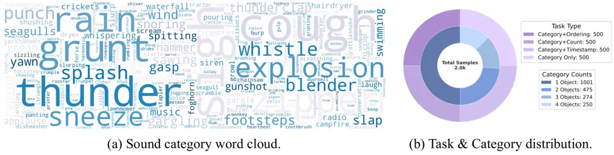

Figure A.1: The composition of the T2A-bench benchmark. (a) Word cloud
of sound event categories. (b) Distribution of task types and category
counts.

T2A-bench Composition and Design. T2A-bench is a prompt-based benchmark
comprising 2k challenging, natural language prompts generated by Gemini
2.5 Pro. It is structured to systematically probe four key dimensions of
controllability. As illustrated in Figure A.1, our benchmark encompasses
a diverse vocabulary of sound categories and a balanced task structure
to enable a rigorous and comprehensive evaluation. The benchmark is
divided into four task types, each containing 500 prompts:

- •
  Category-only: Evaluates the generation of correct sound events.
  Prompts contain between one and five distinct sound categories (100
  prompts for each count).
- •
  Category+Count: Assesses the ability to generate a precise number of
  sound events. To avoid ambiguity, prompts in this category feature
  only a single sound type, with the required count ranging from one to
  five (100 prompts for each count).
- •
  Category+Ordering: Measures adherence to temporal sequence. Prompts
  specify an order for either two or three distinct sound categories.
- •
  Category+Timestamp: Tests temporal localization. To ensure clarity,
  prompts specify a start and end time for a single sound category.

Below are representative examples for each task type, including the
prompt and its corresponding structured metadata.


Evaluation Metrics. Corresponding to the benchmark’s structure, we
define four strict, accuracy-based metrics: Category Accuracy (Cat-acc),
Count Accuracy (Cnt-acc), Ordering Accuracy (Ord-acc), and Timestamp
Accuracy (TS-acc). The final score for each metric is the percentage of
“correct” judgments.

- •
  Cat-acc: A judgment is “correct” only if all sound categories
  specified in the prompt are detected in the generated audio. This is
  evaluated on all 2,000 samples.
- •
  Cnt-acc: A judgment is “correct” only if the detected count for the
  specified category exactly matches the prompt’s instruction.
- •
  Ord-acc: A judgment is “correct” only if the detected temporal order
  of sound events exactly matches the specified sequence.
- •
  TS-acc: A judgment is “correct” only if the detected event’s start and
  end times fall within a 1-second tolerance window of the target times
  specified in the prompt.

Automated Evaluation Pipeline. To ensure objective and scalable
evaluation while preventing information leakage, we designed a novel
two-step pipeline that leverages the state-of-the-art audio
understanding of a powerful Multimodal Large Model (MLLM), Gemini 2.5
Pro, as an automated judge.

- •
  Step 1: Blind Audio Annotation. In the first step, the MLLM judge
  receives only the audio sample generated by the model under
  evaluation. It performs a blind, detailed analysis to produce a
  structured annotation of the audio’s content. This annotation includes
  detected sound categories, their counts, temporal relationships, and
  precise sound event detection (SED) timestamps. For sounds where
  counting is ambiguous (e.g., continuous water flow) or ordering is not
  distinct, the corresponding fields are populated with null.

  

- •
  Step 2: LLM-based Judgment. In the second step, the MLLM judge is
  provided with the original prompt from T2A-bench and the structured
  annotation generated in Step 1. Acting like an examiner with an answer
  key, the MLLM compares the annotated audio content against the
  prompt’s instructions. It then outputs a binary score (1 for correct,
  0 for incorrect) for the relevant metric, along with a detailed
  textual analysis explaining its decision.

  

In summary, our framework, combining T2A-bench, fine-grained metrics,
and a robust two-step evaluation pipeline, provides a comprehensive and
replicable methodology for quantifying the instruction-following
capabilities of T2A models. We will open-source our proposed benchmark
and evaluation pipeline to facilitate future research in this area.

### A.4 More results

#### A.4.1 Comparison results

Audio inpainting. As shown in Table A.4, we conducted experiments on
audio inpainting tasks, where our model outperformed the baselines (Liu
et al., 2023; Liu et al., 2024a) on the AudioCaps (Kim et al., 2019) and
AVVP (Tian et al., 2020) test datasets. Additionally, to explore audio
inpainting with various input modalities, we performed experiments on
unconditioned audio inpainting, as well as video-guided and
text-and-video-guided audio inpainting tasks (on AVVP). The results
indicate that both text and video can effectively guide the audio
inpainting task, with text providing better guidance than video. When
both text and video are conditioned, the model can integrate the two
modalities to achieve superior results.

|                                          |       |            |            |
| ---------------------------------------- | ----- | ---------- | ---------- |
| Method                                   | Input | Dataset    |            |
|                                          |       | AudioCaps  | AVVP       |
| Unprocessed                              | \-    | 6.51/11.34 | 4.94/6.70  |
| AudioLDM-L-Full(Liu et al., 2024a)       | A+T   | 8.06/2.64  | 5.11/3.30  |
| AudioLDM-2-Full-Large(Liu et al., 2024a) | A+T   | 4.24/10.17 | 3.99/11.58 |
| AudioX                                   | A     | 4.63/5.35  | 3.94/5.44  |
| AudioX                                   | A+T   | 9.84/2.25  | 6.12/2.05  |
| AudioX                                   | A+V   | N/A        | 5.63/2.16  |
| AudioX                                   | A+T+V | N/A        | 6.25/1.99  |

Table A.4: Inpainting Performance Comparison. This table shows the
performance comparison for audio inpainting on the AudioCaps and AVVP
datasets. The values before and after the slash represent the IS and FAD
metrics, respectively. A, V, and T represent Audio, Video, and Text
conditions. The baseline methods are all under audio and text
conditions.

Music Completion. Music completion is a task where the model generates
music based on a given music clip. We evaluate our model on the
V2M-bench (Tian et al., 2025) dataset. The results are shown in
Table A.5. We find that our model can generate music that extends the
input music clip. As the number of input modalities increases, the
model’s performance improves, demonstrating its strong inter-modal
learning capability and ability to leverage multi-modal information to
generate better music.

| Input | KL $`\downarrow`$ | IS $`\uparrow`$ | FD $`\downarrow`$ | FAD $`\downarrow`$ |
| ----- | ----------------- | --------------- | ----------------- | ------------------ |
| M     | 0.96              | 1.21            | 52.77             | 5.76               |
| T+M   | 0.51              | 1.49            | 21.42             | 2.14               |
| V+M   | 0.70              | 1.37            | 24.28             | 2.29               |
| T+V+M | 0.46              | 1.52            | 18.69             | 1.67               |

Table A.5: Performance for our method under different conditions in the
music completion task. M, T, and V represent Music, Text, and Video,
respectively.

Image-to-audio generation. To evaluate the model’s capability in
handling static visual inputs, we conduct a zero-shot image-to-audio
generation experiment. Adopting the experimental protocol of
Seeing&Hearing (Xing et al., 2024), we perform evaluations on 3k clips
from the VGGSound test set, where keyframes were processed using
AnimeGANv2 (Chen, 2022) to transfer them into “Paprika style” prior to
generation. For comparison, we benchmark AudioX against Seeing&Hearing
(Xing et al., 2024), Im2Wav (Sheffer and Adi, 2023), and also
constructed a baseline by combining an image caption model (Bai et al., 2023) with a text-to-audio model (Majumder et al., 2024). The results
are shown in Table A.6 in the Appendix. We find that our model
demonstrates excellent performance in the image-to-audio generation task
even without any specific training with image data.

| Method                            | KL $`\downarrow`$ | IS $`\uparrow`$ | FD $`\downarrow`$ | FAD $`\downarrow`$ | Align. $`\uparrow`$ |
| --------------------------------- | ----------------- | --------------- | ----------------- | ------------------ | ------------------- |
| Caption2Audio                     | 2.76              | 7.48            | 32.97             | 5.54               | 0.21                |
| Im2Wav(Sheffer and Adi, 2023)     | 2.61              | 7.06            | 19.63             | 7.58               | 0.41                |
| Seeing&Hearing(Xing et al., 2024) | 2.69              | 6.15            | 20.96             | 6.87               | 0.29                |
| AudioX                            | 2.90              | 13.48           | 16.42             | 2.71               | 0.23                |

Table A.6: Comparison of Methods for the Image2Audio Task.

User study. We conducted a user study to evaluate the quality of the
generated audio and music. We randomly selected 25 samples for each
audio generation task, including text-to-audio (T2A), text-to-music
(T2M), video-to-audio (V2A), and video-to-music (V2M). 10 audio experts
are asked to rate the quality of the generated audio and music. The
results are shown in Fig. A.2. The evaluation shows that our model
achieves subjective SOTA performance in terms of OVL and REL scores in
most tasks, indicating high user satisfaction.

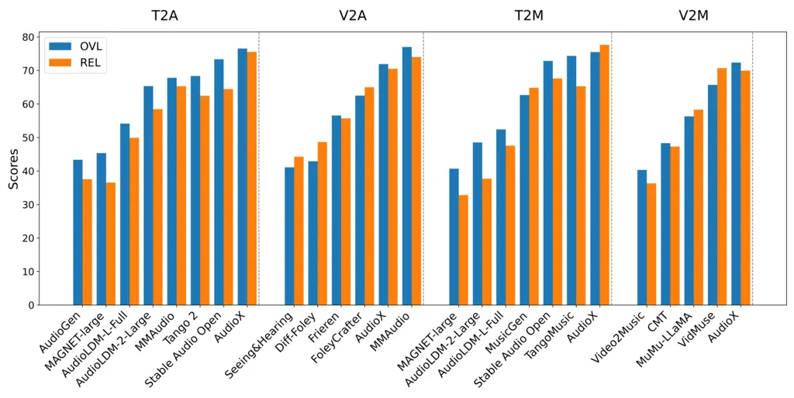

Figure A.2: User study results of generated audio and music. The values
represent the average OVL and REL scores across Text-to-Audio (on
AudioCaps), Text-to-Music (on MusicCaps), Video-to-Audio (on VGGSound),
Video-to-Music (on V2M-bench).

#### A.4.2 Ablation results

Unified model performance.

We investigate our unified model’s intra- and inter-modal performance in
Fig. A.3. For the intra-modal study, we compare our single unified model
against specialist models trained on individual tasks (T2A, V2A, and
audio inpainting). The results show our unified model consistently
outperforms these specialist models, demonstrating strong intra-modal
capabilities. For the inter-modal study on music generation, we find
that performance progressively improves as more conditioning modalities
are added (e.g., from video-only to video+text). This confirms the
model’s robust ability to effectively integrate multiple modalities to
enhance generation quality.

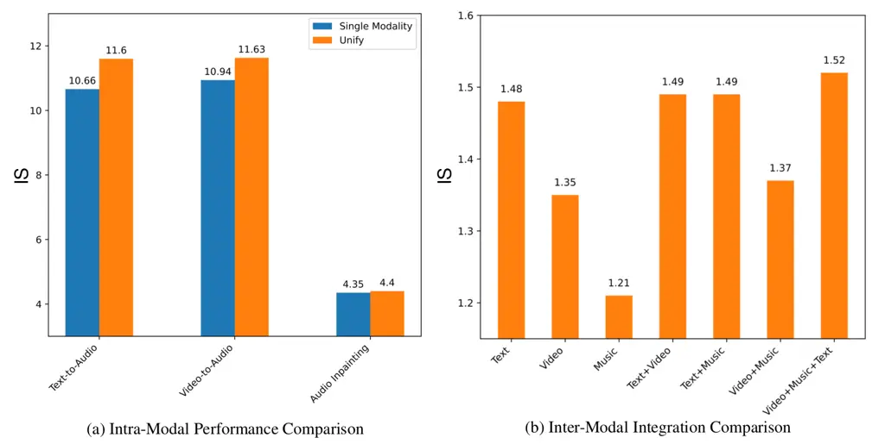

Figure A.3: Ablation study comparing intra-modal and inter-modal
performance of the unified model. The left compares single-modality
models on text-to-audio, video-to-audio, and audio inpainting tasks. The
right shows the effect of adding modalities on music generation, with
performance improvements noted for each added modality. Results are
based on the Inception Score (IS) metric.

### A.5 Qualitative Results

Figures A.4 and A.5 present comprehensive qualitative results.

|                                                            |                                                           |
| ---------------------------------------------------------- | --------------------------------------------------------- |
| 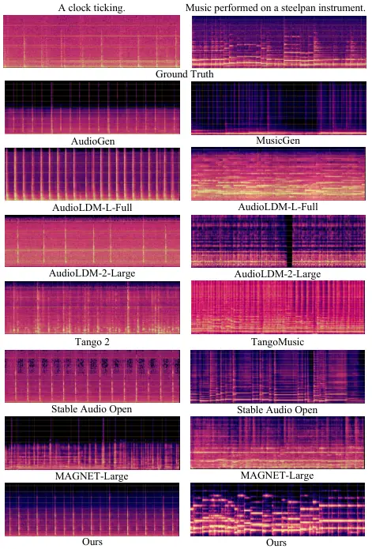  | 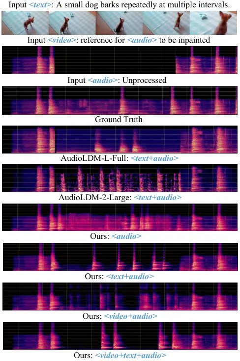 |
| \(a\) T2A and T2M Results.                                 | \(b\) Inpainting Results.                                 |
| 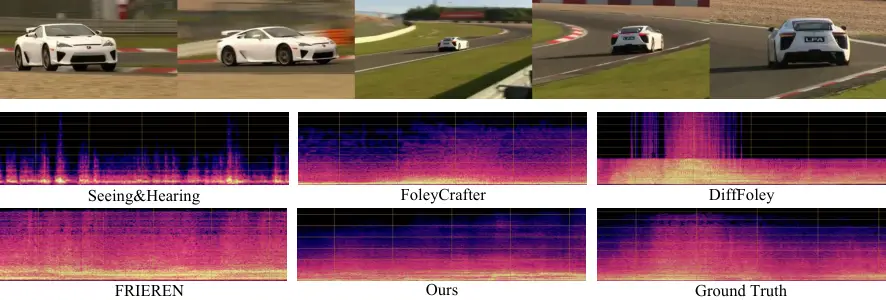 |                                                           |
| \(c\) V2A Results.                                         |                                                           |

Figure A.4: Qualitative comparison across various tasks: (a) In
Text-to-Audio (T2A) and Text-to-Music (T2M) tasks, our model uniquely
excels by consistently generating the “ticking” sound of a clock and
accurately following the prompt ”Music performed on a steelpan
instrument,” outperforming baselines in both rhythmic precision and
genre fidelity. (b) Audio inpainting results demonstrate our model’s
strong context-aware capabilities and its ability to effectively
integrate different input modalities. (c) Video-to-Audio (V2A) results
show our model’s proficiency in capturing dynamic motion sounds, such as
the immersive “drifting” of a car, providing a richer auditory
experience compared to baselines.

|                                                            |
| ---------------------------------------------------------- |
| 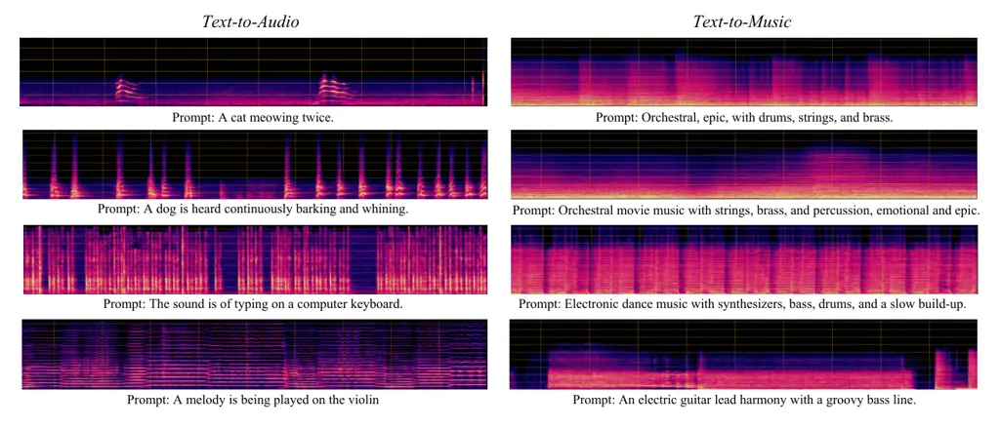 |
| \(a\) Text-to-Audio and Text-to-Music                      |
| 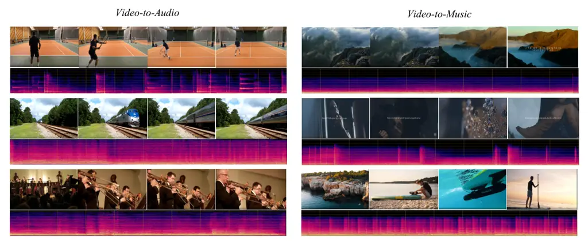 |
| \(b\) Video-to-Audio and Video-to-Music                    |
| 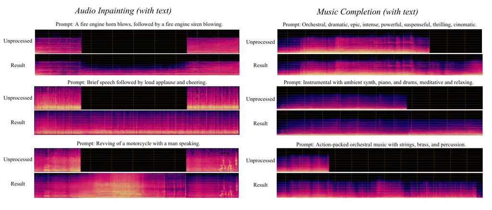 |
| \(c\) Audio Inpainting and Music Completion                |

Figure A.5: Comprehensive qualitative analysis of our model’s
performance across various tasks: (a) Text-to-Audio and Text-to-Music
synthesis, (b) Video-to-Audio and Video-to-Music generation, and (c)
Audio Inpainting and Music Completion.
