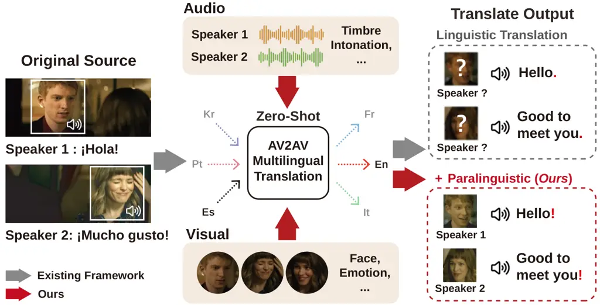
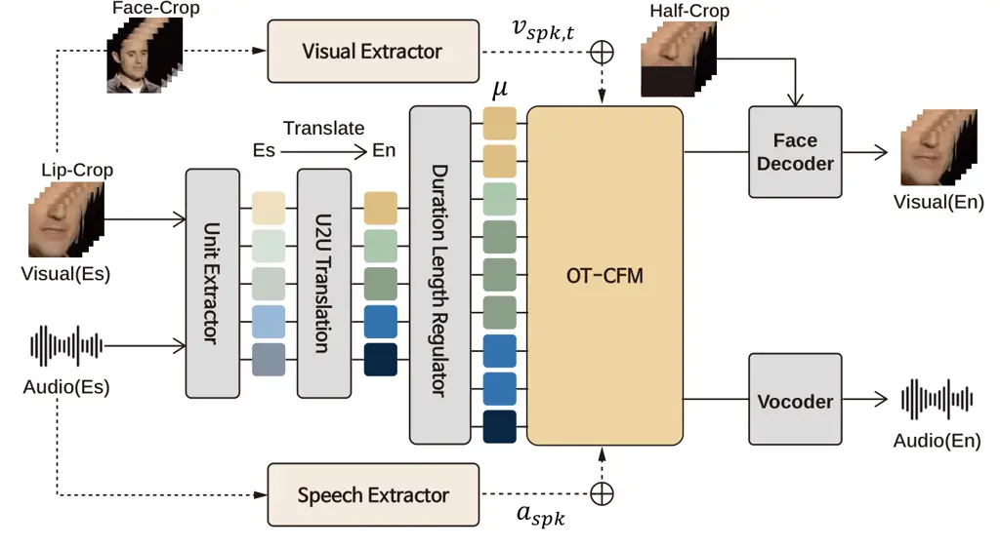
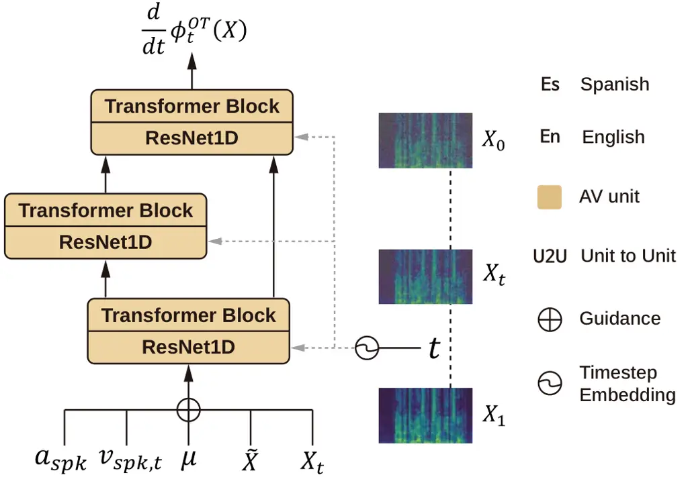
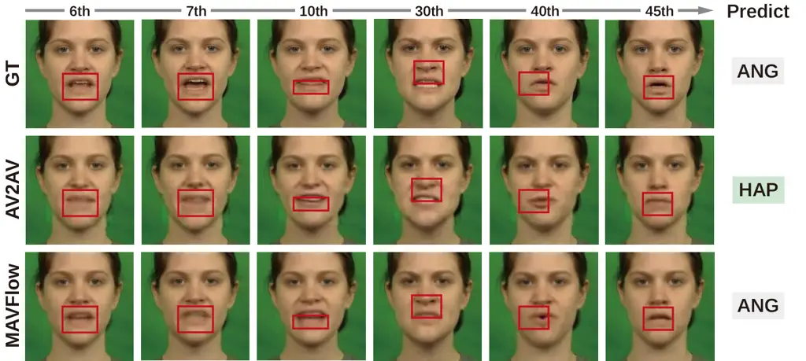
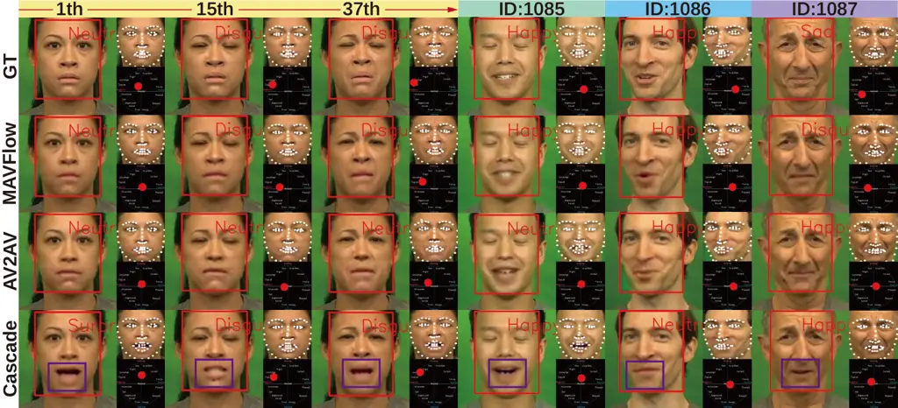

# MAVFlow: Preserving Paralinguistic Elements with Conditional Flow Matching for Zero-Shot AV2AV Multilingual Translation

Sungwoo Cho Email: <peter8526@kaist.ac.kr>    Jeongsoo Choi
Affiliation: KAIST AI  KAIST EE Email: <jeongsoo.choi@kaist.ac.kr>   
Sungnyun Kim Email: <ksn4397@kaist.ac.kr>    Se-Young Yun
Email: <yunseyoung@kaist.ac.kr>

###### Abstract

Despite recent advances in text-to-speech (TTS) models,
audio-visual-to-audio-visual (AV2AV) translation still faces a critical
challenge: maintaining speaker consistency between the original and
translated vocal and facial features. To address this issue, we propose
a conditional flow matching (CFM) zero-shot audio-visual renderer that
utilizes strong dual guidance from both audio and visual modalities. By
leveraging multimodal guidance with CFM, our model robustly preserves
speaker-specific characteristics and enhances zero-shot AV2AV
translation abilities. For the audio modality, we enhance the CFM
process by integrating robust speaker embeddings with x-vectors, which
serve to bolster speaker consistency. Additionally, we convey emotional
nuances to the face rendering module. The guidance provided by both
audio and visual cues remains independent of semantic or linguistic
content, allowing our renderer to effectively handle zero-shot
translation tasks for monolingual speakers in different languages. We
empirically demonstrate that the inclusion of high-quality
mel-spectrograms conditioned on facial information not only enhances the
quality of the synthesized speech but also positively influences facial
generation, leading to overall performance improvements in LSE and FID
score. Our code is available at
[https://github.com/Peter-SungwooCho/MAVFlow](https://github.com/Peter-SungwooCho/MAVFlow).

## 1 Introduction

With the rapid proliferation of multimedia content and increasing
cross-cultural interactions, the expansion from one language to another
has become essential to enrich user engagement and comprehension.
Traditional approaches in language translation, such as subtitle
processing via neural machine translation (NMT) \[42\] or
single-modality methods like speech-to-speech translation and
dubbing \[20\], often fail to deliver a fully immersive experience. For
instance, in dubbed films, discrepancies between the original visual
content and the dubbed audio can lead to unnatural lip synchronization
and a mismatch between the expected and dubbed voices. Such
inconsistencies disrupt the viewer’s concentration and diminish the
overall experience. The adverse effects of audio-visual incongruence on
user perception have been substantiated by the McGurk effect \[43\];
notably, when the dubbed voice deviates from the expected voice of
original actors, the naturalness of the content significantly
deteriorates \[32\].



Figure 1: Overview of the existing audio-visual translation (AV2AV)
framework. Conventional AV2AV methods primarily focus on linguistic
content, often neglecting crucial paralinguistic features, such as
speaker identity and emotional nuance, which are essential for
maintaining consistent speaker characteristics.

At a fundamental level, the transition from single-modality to
dual-modality translation is achievable via cascaded approaches. A
typical pipeline involves using an automatic speech recognition (ASR)
model \[3, 52\] to transcribe the source audio into text, subsequently
applying NMT \[19, 15\] for language conversion, and finally
synthesizing speech via text-to-speech (TTS) systems \[7, 65, 8\] in
conjunction with talking face generation (TFG) models \[69, 51, 49\].
However, such cascaded methods are complex and often suffer from
significant information loss due to repeated modality transformations
and intermediate text representations. To overcome these challenges,
direct audio-visual-to-audio-visual (AV2AV) translation approaches have
been introduced \[25, 13, 12\]. These methods bypass textual
representations by leveraging discrete units obtained from
self-supervised multimodal models (_e.g_., multilingual AV-HuBERT \[55,
13\]), enabling a more direct and efficient translation of audio-visual
source inputs.

Despite these advances, the AV2AV translation still faces a critical
challenge: preserving speaker consistency (_e.g_., tone, pitch, or
facial expressions) between the original and translated audio-visual
data (as shown in Figure 1). This limitation is exacerbated by the
absence of datasets wherein the same speaker articulates identical
content in multiple languages, necessitating zero-shot strategies for
speaker preservation. Current AV2AV approaches \[13, 12\] adopt a simple
architecture that relies on using speaker embeddings, combining
speaker-specific d-vectors \[62\] within the speech vocoder \[30, 51\].
This yet underexplored structure of AV2AV, which does not employ
advanced conditional generation techniques, still restricts its ability
to maintain speaker consistency. Moreover, generating audio and visual
components are separated, using a single-modality embedding in each
part. This has limitations from a multimodal perspective since only the
reference audio is used, while visual cues could also be considered for
speech generation.

In this study, to preserve paralinguistic elements of speakers during
the linguistic translation, we propose MAVFlow, a Conditional Flow
Matching (CFM) \[44\] based zero-shot audio-visual renderer that
leverages dual guidance from audio and visual modalities. Notably, for
ideal multilingual translation scenarios, a speaker’s voice
characteristics and facial information (_e.g_., appearance or emotion)
must remain consistent regardless of language \[67, 5, 1\]. Based on
this hypothesis, we adopt a guidance strategy that utilizes speaker
embeddings from audio and emotion embeddings from visual input. This
strategy enables the complementary capture of paralinguistic
information, which are commonly shared across both audio and visual
modalities.

Furthermore, MAVFlow leverages the Optimal Transport (OT) CFM’s
structural advantages in integrating a multimodal guidance.
OT-CFM \[44\] facilitates learning a conditional speech distribution,
enhancing zero-shot performances and guidance-based control, making it
an ideal approach for preserving paralinguistics in AV2AV translation.
MAVFlow incorporates x-vector-based speaker embeddings \[56\] of audio
and facial emotion embeddings \[60\] of visual inputs, directly guiding
the flow matching generative module. Additionally, OT-CFM significantly
improves speech synthesis performance and enables more efficient
sampling with fewer steps. Thus, MAVFlow achieves enhanced speaker
consistency while producing seamless audio-visual translation results in
cross-lingual scenarios. Our contributions are summarized as follows:

- $`\circ`$
  We propose MAVFlow, integrating discrete speech units with OT-CFM to
  efficiently synthesize high-quality mel-spectrograms for advanced
  audio-visual translation.
- $`\circ`$
  We transmit paralinguistic speaker characteristics from both audio and
  visual modalities within the latent space of the OT-CFM model, thereby
  achieving robust zero-shot capabilities in cross-lingual scenarios.
- $`\circ`$
  We empirically demonstrate that our dual guidance improves the
  consistency of speaker identity in synthesized speech by an average of
  36% on the MuAViC dataset \[3\], while enhancing face generation with
  gains in lip-sync accuracy ($`+`$0.87) and visual quality score
  ($`-`$0.61) on textless system.
- $`\circ`$
  We also confirm that MAVFlow effectively represents emotion in both
  audio and visual generation on the CREMA-D dataset \[6\].

## 2 Related Works

### 2.1 Spoken Language Translation

Spoken Language Translation (SLT) aims to convert spoken language in one
language into another language, promoting natural cross-lingual
interaction. Traditional SLT typically adopt cascaded approaches \[47,
41\] for speech-to-speech translation (S2ST), chaining ASR, NMT, and
TTS. Although widely used, cascaded methods suffer from cumulative
errors, latency, and loss of speaker-specific prosodic and
paralinguistic features \[66, 27\]. To reduce these issues, research has
shifted toward end-to-end SLT methods that translate speech
directly \[28, 46\], and even textless approaches that eliminate the
reliance on textual representations \[35, 29\].

Despite advances, S2ST systems primarily focus on audio signals, often
neglecting the alignment between translated speech and visual
information, which is crucial for cross-lingual scenarios such as video
conferencing or dubbing. This can lead to lip-sync mismatches \[43,
32\], disrupting realistic multimodal experiences. Speech-driven TFG has
been explored to synchronize video with translated speech \[33, 64\].
More recently, TransFace \[12\] and AV2AV \[13\] jointly generate
synchronized audio and visual outputs. However, achieving natural
cross-lingual experiences remains challenging, particularly in
preserving speaker identity and maintaining emotional consistency.

### 2.2 Flow Matching for Generative Modeling

Generative models based on diffusion process \[23, 58\] have
demonstrated remarkable performance across various domains, including
image \[16, 53\], speech \[50, 26\], audio \[31, 10\], and video \[24,
4\], by iteratively denoising to generate high-fidelity outputs. Despite
their impressive quality, diffusion-based models often require numerous
sampling steps, limiting their practicality for real-time or large-scale
applications. Flow matching \[36, 37\] models address this limitation by
learning direct stochastic paths between distributions, enabling
efficient and high-quality generation in fewer steps \[38\]. This
approach has been successfully applied to various tasks \[34, 44, 18,
39\].

Recent works have explored conditioning flow matching models to enable
following conditions while maintaining high-quality generation, becoming
prominent in generative modeling. Additionally, conditioning with
multiple inputs has emerged as a promising direction \[45\], and
conditional flow matching model successfully leverage these conditions
to produce aligned and controllable outputs \[63, 21\]. However,
effectively extracting and utilizing relevant information from
multimodal signals for conditioning remains in its early stages.

## 3 Preliminaries

### 3.1 Audio-Visual Speech Unit Translation

Recent advances in direct audio-visual-to-audio-visual translation have
leveraged discrete speech units to bypass intermediate text
transcription, thereby avoiding delays and error propagation of cascaded
systems and expanding applicability \[12\]. To obtain translated AV
units, our system follows two-stage procedure. First, we extract
discrete AV units from an input sequence using the unit extractor,
m-AVHuBERT \[13\], which has been pretrained on 7,000 hours of
multilingual audio-visual data. Second, we pass the extracted discrete
units to a unit-to-unit (U2U) translation module \[13\], which
translates them into the counterparts of target language. The translated
units are subsequently converted into intermediate features
(mel-spectrograms) via CFM, and finally transformed back into
audio-visual form through the vocoder and face decoder. Notably, both
the unit extractor and the U2U translation module are identical to those
used in our prior work \[13\], thus ensuring consistency in performance.

### 3.2 Optimal Transport CFM

Conditional Flow Matching (CFM) is a framework that leverages
conditional flows to train generative models, particularly applied to
generate mel-spectrograms in audio synthesis tasks \[44, 17\]. Unlike
conventional flow-based models, which learn a bijective mapping between
a simple prior distribution (_e.g_., Gaussian noise) and a
mel-spectrogram target distribution, CFM directly optimizes the
trajectory connecting the two distributions using optimal transport
(OT). This facilitates the effective generation of data distributions
conditioned on auxiliary information, such as text embedding,
audio-visual features, or speaker embeddings, by learning an appropriate
conditional vector field \[36, 61\].

In our framework, data distribution $`p(X)`$ is connected to a
mel-spectrogram representations, which are connected to a noise
distribution $`\pi(X)`$ through a continuous trajectory
$`\{X_{t}\}_{t=0}^{1}`$. Here, $`p(X)`$ and $`\pi(X)`$ denote the
mel-spectrogram data distribution (target distribution) and the noise
prior distribution, respectively. The trajectory that continuously
transforms $`\pi(X)`$ into $`p(X)`$, which is optimized by OT-CFM in the
sense of optimal transport. Specifically, for $`t\in[0,1]`$,

```math
\frac{d}{dt}\phi_{t}(X)\ =\nu_{t}^{\star}(\phi_{t}(X),t) \tag{1}
```

where $`\nu_{t}^{\star}`$ is the optimal vector field that solves the OT
problem. During training, we estimate $`\nu_{t}(\phi_{t}(X),t)`$ to
approximate $`\nu_{t}^{\star}`$. In our approach, the condition
$`\mathbf{c}`$ corresponds to audio-visual units with various guidance.
Consequently, the evolution of the data is modeled as

```math
\frac{d}{dt}\phi_{t}(X)\ =\nu_{t}(\phi_{t}(X),t\mid\mathbf{c}) \tag{2}
```

and we train a conditional vector field $`\nu_{t}`$ that integrates both
audio and visual features. The OT-CFM optimization objective function is
defined by

```math
\min_{\theta}\,\mathbb{E}_{t,\phi_{t}(X)\mid\mathbf{c}}\bigl[\|\nu_{t}(\phi_{t}(X),t\mid\mathbf{c})-\nu_{t}^{\star}(\phi_{t}(X),t)\|^{2}\bigr] \tag{3}
```

where $`\nu^{\star}`$ is approximated during training via score matching
or stochastic path sampling techniques.



(a) Overall framework of MAVFlow



(b) OT-CFM decoder structure

Figure 2: Overall framework and detailed architecture of MAVFlow. (a) An
overview of the proposed MAVFlow translation system. (b) OT-CFM’s
Transformer decoder structure with multimodal guidance
$`\mathbf{a}_{\mathrm{spk}}`$ and $`\mathbf{v}_{\mathrm{spk,t}}`$ to
generate guided mel-spectrogram.

## 4 MAVFlow

To effectively preserve speaker-specific characteristics such as voice
consistency and facial expressions in multilingual audio-visual
translation, we introduce MAVFlow, comprising four main stages: (i)
Audio-Visual Speech Unit Translation, which we have outlined in
Section 3.1; (ii) Duration Length Regulator; (iii) Multimodal Guidance;
and (iv) CFM-based Zero-Shot AV-Renderer which effectively integrates
paralinguistic multimodal guidance with linguistic audio-visual units to
synthesize audio-visual outputs. The overall architecture and pipeline
of MAVFlow are illustrated in Figure 2.

### 4.1 Duration Length Regulator

Since the output of the U2U translation module is deduplicated, it is
necessary to predict and expand the duration of each unit. To achieve
this, we employ a Duration Length Regulator, adapting duration
prediction concepts previously explored in TTS synthesis specifically
for our audio-visual translation task. We adopt a similar duration
prediction structure and loss function from AV2AV \[13\], using two
1D-convolution layers with a classifier, where the objective function is
the MSE loss in the log domain. However, our Duration Length Regulator
differs in that it interpolates the generated audio to match the length
of the original source audio. This design addresses a critical
constraint in real-world movie dubbing scenarios, where the video length
must remain consistent before and after translation—an aspect not
considered in AV2AV.

### 4.2 Multimodal Guidance

In the process of generating mel-spectrograms based on the linguistic
information of the AV speech unit, conventional methods \[13\] relying
solely on audio often fall short in accurately capturing visual aspects
such as the speaker’s emotional state or facial expressions.
Particularly in multilingual audio-visual translation, preserving the
speaker’s natural characteristics requires incorporating not only vocal
attributes but also paralinguistic elements like facial expressions. To
address this limitation, our approach introduces multimodal guidance by
integrating both _speaker voice embeddings_ extracted from audio and
_speaker facial emotion embeddings_ derived from visual inputs. This
dual guidance strategy enables a clearer transmission of
speaker-specific traits across both modalities, resulting in more
consistent and natural synthesis of voice and emotional expression in
multilingual translation scenarios.

#### Speaker voice embedding.

To capture paralinguistic elements from the audio modality, we use a
pretrained speaker encoder to extract x-vectors \[56\], which encode the
speaker’s unique timbre and speaking style. These robust speaker
embeddings are particularly suitable for our cross-lingual scenario.
Specifically, in training phase we calculate x-vectors for multiple
utterances from the same speaker, then average them to form a
_speaker-level_ embedding $`\mathbf{a}_{\mathrm{spk}}`$:

```math
\mathbf{a}_{\mathrm{spk}}=\frac{1}{N}\sum_{i=1}^{N}\mathbf{a}_{\mathrm{utt},i}\vskip-1.0pt \tag{4}
```

where $`\mathbf{a}_{\mathrm{utt},i}`$ is the x-vector extracted from the
$`i`$-th utterance of a given speaker, and $`N`$ is the total number of
utterances for that speaker. The use of such an averaged speaker
embedding allows the model to learn general speaker information during
training, thereby enabling the model to robustly learn common speaker
traits.

To guide mel-spectrogram generation using a global speaker
representation, we concatenate this speaker embedding with the latent
feature of each frame. This frame-level concatenation ensures that
synthesized speech consistently reflects the speaker’s unique
characteristics. During inference, we directly utilize
utterance-specific embedding $`\mathbf{a}_{\mathrm{utt},i}`$, capturing
and preserving fine-grained variations unique to each utterance. By
employing distinct speaker embeddings for each phase, our model learns
general, global paralinguistic information during training, while
effectively capturing local, utterance-specific paralinguistic
variations during inference, ultimately enhancing the quality of the
generated mel-spectrograms.

#### Speaker facial emotion embedding.

In addition to audio cues, we incorporate paralinguistic speaker face
emotional embeddings to ensure that the model also learns from visual
characteristics of the speaker. We adopt EmoFAN \[60\] to extract facial
emotion embeddings from each frame. Specifically, emotional information
in a speaker’s utterance can vary dynamically across frames. For
instance, a speaker may start smiling partway through an utterance or
shift emotional states over time. Thus, distinct emotion embeddings
$`\mathbf{v}_{\mathrm{spk},t}`$ are added as guidance for generating
each mel-spectrogram frame $`X_{t}`$:

```math
\mathbf{v}_{\mathrm{spk},t}=\text{Emo}(\mathbf{f}_{\mathrm{t}}) \tag{5}
```

where $`\mathbf{v}_{\mathrm{spk},t}`$ denotes the face embedding of the
$`t`$-th sampled frame $`\mathbf{f}_{t}`$, and $`\text{Emo}(\cdot)`$ is
facial emotion extractor. This reflects a distinctive aspect of the
cross-lingual scenario, where frame-level speaker audio characteristics
vary according to language-specific phonetic and prosodic differences
(_e.g_., variations in accent, intonation patterns, rhythm, and stress
placement), whereas emotional information remains consistent across
languages.

### 4.3 CFM-based Zero-Shot AV-Renderer

The CFM-based AV-Renderer integrates translated AV units containing
linguistic information with multimodal guidance carrying paralinguistic
features. The AV units utilize interpolation to effectively synchronize
audio and visual modalities temporally. Additionally, speaker
embeddings, as global paralinguistic features, are uniformly added to
every frame to maintain consistent emotional and speaker
characteristics, while visual embeddings are applied individually across
temporal frames. This ensures both temporal and linguistic coherence,
resulting in a mel-spectrogram that naturally blends the speaker’s
facial expressions with their acoustic properties.

#### Guided mel generation.

To effectively synthesize intermediate mel-spectrograms from
audio-visual units, MAVFlow incorporates multimodal information to
capture paralinguistic features, as introduced in Section 4.2.
Specifically, we employ CFM to guide the mel-spectrogram generation
process, optimizing an objective defined as:

```math
\displaystyle\mathcal{L}_{OT-CFM} \displaystyle=\mathbb{E}_{t,p_{0}(X_{0}),q(X_{1})}\Big[\omega_{t}\bigl(\phi_{t}^{OT}(X_{0},X_{1})\mid X_{1}\bigr) \tag{6}
```

```math
\displaystyle-\,\nu_{t}\bigl(\phi_{t}^{OT}(X_{0},X_{1})\mid\theta\bigl)\Big].
```

where $`\phi_{t}^{OT}(X_{0},X_{1})`$ is $`(1-(1-\sigma)t)X_{0}+tX_{1}`$
and $`\omega_{t}\left(\phi_{t}^{OT}(X_{0},X_{1})\middle|X_{1}\right)`$
is $`X_{1}-(1-\sigma)X_{0}`$.

The multimodal embeddings consist of a global speaker embedding
$`\mathbf{a}_{\mathrm{spk}}`$, uniformly applied across all frames, and
a frame-level emotion embedding $`\mathbf{v}_{\mathrm{spk,t}}`$,
dynamically varying per timestep. These embeddings, together with the
linguistic speech tokens $`\{\mu_{l}\}_{1:L}`$ and the masked
mel-spectrogram $`\tilde{X}_{1}`$, are jointly fed into the neural
network $`N_{\theta}`$ to match the conditional vector field
parameterized by $`\theta`$, facilitating the integration of global
speaker characteristics and local emotional dynamics (as shown in
Figure 2(a)).

```math
\begin{array}[]{l}\nu_{t}\bigl(\phi_{t}^{OT}(X_{0},X_{1})\mid\theta\bigl)\\[5.0pt]
\hskip-8.5359pt=N_{\theta}\bigl(\phi_{t}^{OT}(X_{0},X_{1}),t;\mathbf{a}_{\mathrm{spk}},\mathbf{v}_{\mathrm{spk,t}},\{\mu_{l}\}_{1:L},\tilde{X}_{1}\bigl)\end{array} \tag{7}
```

This strategic utilization of multimodal embeddings, which integrates
complementary global speaker identity from audio and frame-level
emotional dynamics from visual inputs, plays a crucial role in improving
naturalness and speaker consistency in multilingual audio-visual
translation.

## 5 Experiments

### 5.1 Implementation Details

#### Dataset.

For training and evaluation, we utilize MuAViC \[3\], a multilingual
audio-visual corpus comprising 1,200 hours of transcribed speech from
thousands of speakers, curated from LRS3 \[2\] and mTEDx \[54\]. We use
five languages: English, Spanish, French, Italian, and Portuguese. Since
MuAViC does not contain emotion labels, we employ an additional dataset,
CREMA-D \[6\], for emotion evaluation. CREMA-D consists of 7,442 short
video clips featuring 91 adult actors expressing six different emotions:
anger, disgust, fear, happy, neutral, and sad. Each clip captures an
actor uttering a sentence while simultaneously providing facial
expressions and vocal information, making it a suitable dataset for
evaluating our model’s performance on emotional maintenance.

#### Model description.

MAVFlow uses the CFM model pretrained on the LibriTTS \[68\] as the
initial point for more efficient learning. The model is trained on 8 RTX
A6000 GPUs with a constant learning rate of 0.0001. The speaker
embedding and emotional embedding extracted from each audio and visual
input—originally 192 and 256 dimensions, respectively—are compressed to
an 80-dimensional representation and used as guidance for the OT-CFM. To
convert the generated mel-spectrogram into a raw audio waveform, we
train HiFi-GAN \[30\] on the LRS3 dataset. We use the same multi-scale
L1 and discriminator loss functions proposed in HiFi-GAN. For precise
lip-sync and facial expression generation, we use pretrained
Wav2Lip \[51\] on the LRS2 \[57\] dataset. Details about the inference
time are provided in Appendix C.

### 5.2 Baseline Methods

There exist only two textless systems, AV2AV \[13\] and
Transface \[12\], that directly utilize units without generating text in
the intermediate process. However, our goal is to develop a zero-shot
model that generates translated speech while maximally preserving the
original speaker’s paralinguistics. Therefore, Transface, which follows
a similar approach to AV2AV but does not incorporate additional speaker
embeddings—thus not supporting zero-shot audio generation—was excluded
from our comparison. Accordingly, for reasonable performance comparison,
we establish baselines by combining existing systems in a cascaded
manner and compare our proposed method against them. Specifically, the
cascaded systems are built based on the latest off-the-shelf pre-trained
models such as AVSR \[3\], ASR \[3\], AV2T \[3\], A2T \[3\], NMT \[8\],
TTS \[7, 8\], and TFG \[51\].

### 5.3 Evaluation

#### Audio evaluation.

We assess our model by using speaker similarity metrics. SS (speaker
similarity) leverages ERes2Net \[11\], providing a robust measure of how
closely the synthesized speech matches the target speaker’s identity.
ERes2Net is a widely used model trained on the VoxCeleb2 \[14\] dataset
for speaker classification. Since SS alone is insufficient to evaluate
the temporal alignment between generated and target mel-spectrograms, we
additionally adopt Mel Cepstral Distortion with Dynamic Time Warping
(MCD-DTW) \[9\] and its speech-length weighted variant
(MCD-DTW-SL) \[9\]. The SL variant further accounts for speech duration,
providing a more comprehensive quality metric. We then examine
translation quality with the ASR-BLEU score. Specifically, an ASR system
is used to transcribe the generated audio, and the resulting text is
compared against the ground-truth transcription to calculate the BLEU
score \[48\]. Additionally, to evaluate the accuracy of emotion
recognition, we assess the audio generated by each system using the
pretrained emotion2vec \[40\].

#### Visual evaluation.

For visual quality assessment, we employ Lip Sync Error (LSE) confidence
and distance (-C/-D) \[51\] and Fréchet Inception Distance (FID) \[22\],
where the LSE metrics quantify the synchronization accuracy of lip
movements relative to the audio, while FID measures the distributional
similarity between generated frames and real images. Additionally, to
measure emotional accuracy from the generated visual frames, we utilize
a 6-class¹¹ 1 Neutral, Happy, Sad, Angry, Disgust, and Fear pretrained
MAE-DFER \[59\] model for emotion classification. Also, emotion
embedding cosine similarity (ES) is used to complement class-wise
accuracy, which may miss subtle emotional variations due to its fixed
set of classes.

|           | Method                      | SS $`\uparrow`$ | DTW $`\downarrow`$ | DTW-SL $`\downarrow`$ |
| --------- | --------------------------- | --------------- | ------------------ | --------------------- |
| (a) Es-En | GT (Es audio)               | 1.0             | 0.0                | 0.0                   |
|           | 4-Stage Cascaded System^(a) | 0.42            | 11.41              | 17.07                 |
|           | 3-Stage Cascaded System^(b) | 0.42            | 11.46              | 16.74                 |
|           | 2-Stage Cascaded System^(c) | 0.07            | 11.23              | 14.18                 |
|           | Direct System (AV2AV)       | 0.35            | 9.96               | 12.94                 |
|           | MAVFlow (ours)              | 0.49            | 9.60               | 12.47                 |
| (b) Fr-En | GT (Fr audio)               | 1.0             | 0.0                | 0.0                   |
|           | 4-Stage Cascaded System     | 0.34            | 10.75              | 17.00                 |
|           | 3-Stage Cascaded System     | 0.35            | 10.90              | 16.97                 |
|           | 2-Stage Cascaded System     | 0.02            | 10.78              | 13.79                 |
|           | Direct System (AV2AV)       | 0.31            | 9.92               | 12.46                 |
|           | MAVFlow (ours)              | 0.51            | 8.76               | 10.97                 |
| (c) It-En | GT (It audio)               | 1.0             | 0.0                | 0.0                   |
|           | 4-Stage Cascaded System     | 0.41            | 11.91              | 17.27                 |
|           | 3-Stage Cascaded System     | 0.41            | 11.80              | 16.79                 |
|           | 2-Stage Cascaded System     | 0.05            | 11.23              | 13.70                 |
|           | Direct System (AV2AV)       | 0.37            | 10.44              | 14.75                 |
|           | MAVFlow (ours)              | 0.53            | 9.36               | 11.43                 |
| (d) Pt-En | GT (Pt audio)               | 1.0             | 0.0                | 0.0                   |
|           | 4-Stage Cascaded System     | 0.36            | 11.12              | 17.89                 |
|           | 3-Stage Cascaded System     | 0.35            | 10.97              | 17.65                 |
|           | 2-Stage Cascaded System     | 0.11            | 10.89              | 13.72                 |
|           | Direct System (AV2AV)       | 0.30            | 9.82               | 12.38                 |
|           | MAVFlow (ours)              | 0.48            | 9.14               | 11.53                 |

^(a)AVSR  \[3\] + NMT  \[19\] + TTS  \[8\] + TFG \[51\]  
^(b)AV2T  \[3\] + TTS  \[8\] + TFG \[51\]  
^(c)A2A  \[29\] + TFG \[51\]

Table 1: Comparison of zero-shot speaker similarity scores between X-En
translated speech and native speech for traditional cascaded systems and
direct textless systems. En: English, Es: Spanish, Fr: French, It:
Italian, Pt: Portuguese.

#### Human evaluation.

We have conducted subjective evaluations to capture the human perception
of generated audio quality. We perform a Mean Opinion Score (MOS) test
that includes two factors: MOS-Similarity, to gauge how closely the
synthesized speech resembles the target speaker’s voice, and
MOS-Naturalness, which evaluates fluency and overall realism. We have
recruited 21 participants, each rating a total of 8 audio samples per
method. Our evaluation set consists of four different methods: MAVFlow,
a 4-stage cascaded system, a 3-stage cascaded system, and AV2AV. To
maintain objectivity and avoid excessive evaluations by the assessors,
the 2-stage cascaded system, which showed relatively poor performance in
Table 1, was excluded. Additionally, since the ground truth audio is in
the original language before translation, it was excluded to ensure
fairness in the evaluation.

| Method                | ​​Emo-Acc (%) $`\uparrow`$ | SS $`\uparrow`$ | DTW $`\downarrow`$ | DTW-SL $`\downarrow`$ |
| --------------------- | -------------------------- | --------------- | ------------------ | --------------------- |
| GT                    | 81.95                      | 1.0             | 0.0                | 0.0                   |
| GT Mel + Vocoder      | 68.41                      | 0.76            | 1.75               | 1.75                  |
| ASR + YourTTS \[7\]   | 17.52                      | 0.40            | 9.02               | 11.78                 |
| ASR + XTTS \[8\]      | 28.55                      | 0.46            | 11.98              | 17.68                 |
| Direct System (AV2AV) | 33.66                      | 0.33            | 7.84               | 7.88                  |
| MAVFlow (ours)        | 36.46                      | 0.39            | 7.30               | 7.36                  |

Table 2: Comparison of zero-shot speaker similarity scores of generated
audio for traditional cascaded systems and direct systems, with
additional emotion evaluation on the CREMA-D dataset.

### 5.4 Zero-shot Audio Translation Result

#### Speaker voice similarity.

In Table 1, we evaluate the speaker similarity between the original
speech and the speech generated after translation by our model and
baseline models. As a result, MAVFlow generates the translated audio
that has the highest speaker similarity score with the original voice,
compared to the cascaded system and the baseline direct system (AV2AV).
This implies that our audio-visual guidance demonstrates outstanding
performance in preserving the speaker’s identity. In addition, MAVFlow
demonstrates superior performance relative to the baseline on the
MCD-DTW and MCD-DTW-SL metrics, confirming that the speaker’s
pronunciation and timbre are well maintained. In particular, since
MCD-DTW-SL also reflects duration consistency, this indicates that our
duration length regulator has been effective. These results were
obtained using speech generated by translating four source
languages—Spanish, French, Italian, and Portuguese—into English. In
generating the final translated speech, the speaker embedding extracted
from the non-translated original speech and the emotion embedding
extracted from the face were used as guidance for the renderer.

#### Emotion evaluation.

To evaluate how accurately the emotion in the speech generated after
translation reflects the emotion of the original speech, we compare the
proposed model with the baseline model (AV2AV) using the CREMA-D
dataset. The evaluation is based on the emotional accuracy calculated by
the emo2vec model, which examines how the target speech (the synthesized
speech after translation) is classified into ground-truth emotion
categories. In Table 2, the emotion2vec \[40\] model achieves
approximately 82% classification accuracy on the ground-truth(GT) audio,
serving as an upper bound for the emotion recognition model itself. In
this experiment, our model achieves 36.5% emotional accuracy (+2.8%,
+7.91%, and +18.94% compared to AV2AV, ASR + YourTTS \[7\], and
ASR + XTTS \[8\] respectively), suggesting that it successfully
synthesizes speech that preserves emotional traits.

|                                |                     |       |       |       |       |
| ------------------------------ | ------------------- | ----- | ----- | ----- | ----- |
|                                | Translation         | X-En  |       |       |       |
| Method                         | Modality            | Es-En | Fr-En | It-En | Pt-En |
| $`\bullet`$ 4-Stage            |                     |       |       |       |       |
| ASR + NMT + TTS + TFG          | A$`\rightarrow`$AV  | 28.66 | 30.55 | 23.54 | 26.14 |
| AVSR + NMT + TTS + TFG         | AV$`\rightarrow`$AV | 28.70 | 29.21 | 24.54 | 26.30 |
| $`\bullet`$ 3-Stage            |                     |       |       |       |       |
| A2T + TTS + TFG                | A$`\rightarrow`$AV  | 24.06 | 27.01 | 21.92 | 24.11 |
| AV2T + TTS + TFG               | AV$`\rightarrow`$AV | 24.61 | 26.90 | 22.33 | 24.83 |
| $`\bullet`$ 2-Stage (Textless) |                     |       |       |       |       |
| A2A + TFG                      | A$`\rightarrow`$AV  | 26.15 | 30.14 | 22.41 | 23.77 |
| $`\bullet`$ Direct (Textless)  |                     |       |       |       |       |
| AV2AV                          | AV$`\rightarrow`$AV | 26.57 | 31.27 | 23.24 | 24.51 |
| MAVFlow (ours)                 | AV$`\rightarrow`$AV | 26.97 | 31.33 | 23.43 | 24.97 |

Table 3: Translation quality (ASR-BLEU score) for X-En translation
comparison with cascaded system.

#### Translation quality.

In Table 3, we evaluate the translation quality using the ASR-BLEU score
for different language pairs. The result demonstrates that MAVFlow
achieves improved translation performance compared to AV2AV. Since we
generated speech using the same unit translation model as AV2AV, this
confirms that our model produces more accurate speech outputs when given
identical units. These results suggest that our model leverages the
structural advantages of CFM to enhance feature matching and rendering,
thereby increasing both the accuracy and consistency of the generated
speech. Furthermore, MAVFlow exhibits competitive translation quality
when compared to the cascaded systems. This result implies that our dual
modality guidance does not impair semantic quality during translation,
which is also critical in AV2AV applications, while better preserving
paralinguistic elements (as seen in Tables 1–2).

| Method                  | Similarity $`\uparrow`$ | Naturalness $`\uparrow`$ |
| ----------------------- | ----------------------- | ------------------------ |
| 4-Stage Cascaded System | 2.81                    | 3.29                     |
| 3-Stage Cascaded System | 2.89                    | 3.25                     |
| Direct System (AV2AV)   | 3.33                    | 3.58                     |
| MAVFlow (ours)          | 3.49                    | 4.01                     |

Table 4: Comparison of MOS scores between X-En translated speech and
native speech for traditional cascaded systems and direct systems.

#### Subjective evaluation.

To evaluate the naturalness of the generated speech, we assessed the MOS
scores for the translated speech from the MuAViC dataset generated by
each system in Table 4. The evaluation results show that our naturalness
quality achieved higher MOS scores (3.49 for Similarity, 4.01 for
Naturalness) compared to other cascade systems and AV2AV (3.33 for
Similarity, 3.58 for Naturalness).

|                             |                     |                    |                      |                    |
| --------------------------- | ------------------- | ------------------ | -------------------- | ------------------ |
| ID                          | Method              | LSE-C $`\uparrow`$ | LSE-D $`\downarrow`$ | FID $`\downarrow`$ |
| $`\bullet`$ Ground Truth    |                     |                    |                      |                    |
| C1                          | GT Audio-Visual     | 7.63               | 6.89                 | -                  |
| $`\bullet`$ Cascaded System |                     |                    |                      |                    |
| C2                          | GT Audio + TFG      | 8.23               | 6.75                 | 5.66               |
| C3                          | GT Text + TTS + TFG | 7.01               | 7.49                 | 5.38               |
| $`\bullet`$ AV2AV           |                     |                    |                      |                    |
| C4                          | GT AV Speech Unit   | 7.43               | 7.30                 | 6.30               |
| $`\bullet`$ MAVFlow (ours)  |                     |                    |                      |                    |
| C5                          | GT AV Speech Unit   | 8.30               | 6.81                 | 5.69               |

Table 5: Reconstruction visual quality performance on LRS3.



Figure 3: Visual analysis of emotional representation in generated
videos. By applying speaker facial emotion embeddings at each frame, our
approach enhances frame-level emotional accuracy. As highlighted by the
rectangular boxes, our method effectively resolves emotion
misclassification issues found in the AV2AV.

Table 6: Visual emotion recognition accuracy (Emo-Acc) and emotion
embedding cosine similarity (ES) measured from the generated visual
results on CREMA-D.

| Method         | Emo-Acc (%) $`\uparrow`$ | ES $`\uparrow`$ |
| -------------- | ------------------------ | --------------- |
| GT             | 76.83                    | 1.00            |
| AV2AV          | 67.20                    | 0.87            |
| MAVFlow (ours) | 72.68                    | 0.92            |

Table 7: Audio emotion accuracy and embedding cosine similarity (ES)
after additional training (+: additional training on CREMA-D).

| Method    | Emo-Acc (%) $`\uparrow`$ | ES $`\uparrow`$ | SS $`\uparrow`$ |
| --------- | ------------------------ | --------------- | --------------- |
| AV2AV     | 33.66                    | 0.84            | 0.33            |
| MAVFlow   | 36.46                    | 0.86            | 0.39            |
| MAVFlow + | 51.46                    | 0.90            | 0.49            |

### 5.5 Zero-shot Video Translation Result

#### Visual generation quality.

In Table 5, we evaluated the visual quality of the generated videos and
the synchronization between the audio and visual components. MAVFlow
achieves an LSE-C score of 8.30, outperforming all baseline methods.
Particularly, when compared to AV2AV (C4), which has a similar direct
synchronization structure to ours, MAVFlow demonstrates significant
improvements across all metrics: LSE-C ($`+`$0.87), LSE-D ($`-`$0.49),
and FID ($`-`$0.61). These results indicate that audio-visual guidance
not only enhances the consistency of synthesized speech but also
positively affects face generation quality.

Specifically, the high LSE-C score highlights a strong correlation
between the generated audio and video, suggesting that MAVFlow
effectively utilized visual embeddings. In other words, our model
successfully integrated latent visual information from the initial
stages of mel-spectrogram generation through visual guidance.
Additionally, the synthesized face images, based on high-quality
mel-spectrograms, also exhibited competitive performance in the FID
metric, confirming the generation of more natural and realistic faces.

#### Visual emotional quality.

In Figure 3, we analyze the generated visual quality on the CREMA-D
dataset and evaluate whether each generated visual frame accurately
reflects the speaker’s emotion using a visual emotion recognition model.
Through this evaluation, we confirm that our proposed method, which
applies visual embedding at the frame level, effectively captures the
original emotional state of the speaker over time. For instance, in
Figure 3, the AV2AV method incorrectly predicted ‘HAP’ (Happy) for an
original video labeled with ‘ANG’ (Anger). Upon examining each frame
closely, it becomes clear that the video generated by AV2AV fails to
adequately express the anger emotion, particularly around the mouth,
compared to the ground truth video. These visual observations are
further supported by the quantitative results in Table 6, which show
that while AV2AV’s visual emotion recognition performance decreases
compared to the ground truth, our proposed method demonstrates better
preservation not only in terms of accuracy (Emo-Acc) but also in
embedding similarity (ES). Additional visual quality can be referred to
in Appendix A.

### 5.6 Ablation Study

#### Additional training on emotion dataset.

In Table 2, we only trained our model on the MuAViC dataset to enable
zero-shot evaluation on the unseen CREMA-D benchmark. However,
additional training on emotion-rich audio-visual datasets can
significantly enhance emotion transfer performance. In Table 7, we
lightly uptrained MAVFlow on CREMA-D training datasets (referred to as
MAVFlow+), resulting in a notable increase in Emo-Acc from 36.46% to
51.46% as well as an improvement in ES from 0.86 to 0.90. Since MAVFlow
outperformed the baselines using only MuAViC, we expect that
incorporating such emotion-rich data would further widen this
performance gap.

#### Effect of audio-visual guidance.

We conducted an ablation study to examine the effect of each modality
guidance on audio generation. Table 8 presents the results of evaluating
the effect of audio and visual modality guidance on emotion recognition
using the CREMA-D audio dataset. Additionally, it includes the analysis
of results from translating audio in Es, Fr, It, and Pt to En using the
MuAViC dataset, based on the settings outlined in Table 1. The SS and
MCD-DTW values in Table 8 were averaged across each language for
analysis. As a result, we observed that when both audio and visual
guidance were provided, speaker similarity and emotional accuracy
improved. One interesting observation is that when visual guidance is
provided alone, speaker similarity slightly increases or is maintained
(as seen in Table 8), but Emo-Acc decreases. This suggests that visual
guidance alone has a minimal effect on maintaining emotion, and its
complementary effect is maximized when combined with audio guidance.

|       |        | CREMA-D         |                      | MuAViC          |                    |
| ----- | ------ | --------------- | -------------------- | --------------- | ------------------ |
| Audio | Visual | SS $`\uparrow`$ | Emo-Acc $`\uparrow`$ | SS $`\uparrow`$ | DTW $`\downarrow`$ |
| ✗     | ✗      | 0.167           | 28.66                | 0.057           | 10.13              |
| ✗     | ✓      | 0.174           | 26.83                | 0.056           | 10.73              |
| ✓     | ✗      | 0.391           | 35.85                | 0.487           | 7.50               |
| ✓     | ✓      | 0.388           | 36.46                | 0.504           | 7.37               |

Table 8: Ablation study for the effect of modality guidance on CREMA-D
and MuAViC translation.

## 6 Conclusion

In this paper, we introduced MAVFlow, a zero-shot audio-visual
translation framework utilizing Conditional Flow Matching (CFM) to
address speaker consistency challenges inherent in existing AV2AV
methods. By effectively integrating paralinguistic characteristics from
both audio and visual modalities, MAVFlow significantly enhances speaker
consistency across languages without intermediate text representations.
Our method leverages discrete speech units and dual-modal guidance to
synthesize high-quality mel-spectrograms, resulting in improved lip
synchronization, emotional accuracy, and overall visual quality.
Experimental evaluations on the MuAViC and CREMA-D datasets confirm that
MAVFlow outperforms prior AV2AV methods, establishing it as a robust and
efficient solution for multilingual audio-visual translation.

## Acknowledgements

This work was supported by Institute of Information & communications
Technology Planning & Evaluation (IITP) grant funded by the Korea
government (MSIT) \[No. 2022-0-00641, XVoice: Multi-Modal Voice Meta
Learning\], \[No. RS-2024-00457882, AI Research Hub Project\], and \[No.
2019-0-00075, Artificial Intelligence Graduate School Program (KAIST)\].

## References

- \[1\] Prottay Kumar Adhikary, Bandaru Sugandhi, Subhojit Ghimire,
  Santanu Pal, and Partha Pakray. Travid: An end-to-end video
  translation framework. _arXiv preprint arXiv:2309.11338_, 2023.
- \[2\] Triantafyllos Afouras, Joon Son Chung, and Andrew Zisserman.
  Lrs3-ted: a large-scale dataset for visual speech recognition. _arXiv
  preprint arXiv:1809.00496_, 2018.
- \[3\] Mohamed Anwar, Bowen Shi, Vedanuj Goswami, Wei-Ning Hsu, Juan
  Pino, and Changhan Wang. Muavic: A multilingual audio-visual corpus
  for robust speech recognition and robust speech-to-text translation.
  _arXiv preprint arXiv:2303.00628_, 2023.
- \[4\] Andreas Blattmann, Tim Dockhorn, Sumith Kulal, Daniel
  Mendelevitch, Maciej Kilian, Dominik Lorenz, Yam Levi, Zion English,
  Vikram Voleti, Adam Letts, et al. Stable video diffusion: Scaling
  latent video diffusion models to large datasets. _arXiv preprint
  arXiv:2311.15127_, 2023.
- \[5\] William Brannon, Yogesh Virkar, and Brian Thompson. Dubbing in
  practice: A large scale study of human localization with insights for
  automatic dubbing. _Transactions of the Association for Computational
  Linguistics_, 11:419–435, 2023.
- \[6\] Houwei Cao, David G Cooper, Michael K Keutmann, Ruben C Gur, Ani
  Nenkova, and Ragini Verma. Crema-d: Crowd-sourced emotional multimodal
  actors dataset. _IEEE transactions on affective computing_,
  5(4):377–390, 2014.
- \[7\] Edresson Casanova, Julian Weber, Christopher D Shulby,
  Arnaldo Candido Junior, Eren Gölge, and Moacir A Ponti. Yourtts:
  Towards zero-shot multi-speaker tts and zero-shot voice conversion for
  everyone. In _International conference on machine learning_, pages
  2709–2720. PMLR, 2022.
- \[8\] Edresson Casanova, Kelly Davis, Eren Gölge, Görkem Göknar,
  Iulian Gulea, Logan Hart, Aya Aljafari, Joshua Meyer, Reuben Morais,
  Samuel Olayemi, et al. Xtts: a massively multilingual zero-shot
  text-to-speech model. _arXiv preprint arXiv:2406.04904_, 2024.
- \[9\] Qi Chen, Mingkui Tan, Yuankai Qi, Jiaqiu Zhou, Yuanqing Li, and
  Qi Wu. V2c: Visual voice cloning. In _Proceedings of the IEEE/CVF
  Conference on Computer Vision and Pattern Recognition_, pages
  21242–21251, 2022.
- \[10\] Ting Chen, Marco Tagliasacchi, Ron J. Weiss, Kanishka Rao,
  Peter Rowe, and Mohammad Norouzi. WaveGrad 2: Iterative refinement for
  text-to-speech synthesis. In _Proceedings of the 22nd Annual
  Conference of the International Speech Communication Association
  (Interspeech)_, pages 4832–4836, 2021.
- \[11\] Yafeng Chen, Siqi Zheng, Hui Wang, Luyao Cheng, Qian Chen, and
  Jiajun Qi. An enhanced res2net with local and global feature fusion
  for speaker verification. _arXiv preprint arXiv:2305.12838_, 2023.
- \[12\] Xize Cheng, Rongjie Huang, Linjun Li, Tao Jin, Zehan Wang,
  Aoxiong Yin, Minglei Li, Xinyu Duan, Zhou Zhao, et al. Transface:
  Unit-based audio-visual speech synthesizer for talking head
  translation. _arXiv preprint arXiv:2312.15197_, 2023.
- \[13\] Jeongsoo Choi, Se Jin Park, Minsu Kim, and Yong Man Ro. Av2av:
  Direct audio-visual speech to audio-visual speech translation with
  unified audio-visual speech representation. In _Proceedings of the
  IEEE/CVF Conference on Computer Vision and Pattern Recognition_, pages
  27325–27337, 2024.
- \[14\] Joon Son Chung, Arsha Nagrani, and Andrew Zisserman. Voxceleb2:
  Deep speaker recognition. _arXiv preprint arXiv:1806.05622_, 2018.
- \[15\] Marta R Costa-Jussà, James Cross, Onur Çelebi, Maha Elbayad,
  Kenneth Heafield, Kevin Heffernan, Elahe Kalbassi, Janice Lam, Daniel
  Licht, Jean Maillard, et al. No language left behind: Scaling
  human-centered machine translation. _arXiv preprint
  arXiv:2207.04672_, 2022.
- \[16\] Prafulla Dhariwal and Alexander Quinn Nichol. Diffusion models
  beat GANs on image synthesis. In _Advances in Neural Information
  Processing Systems (NeurIPS)_, pages 8780–8794, 2021.
- \[17\] Zhihao Du, Qian Chen, Shiliang Zhang, Kai Hu, Heng Lu, Yexin
  Yang, Hangrui Hu, Siqi Zheng, Yue Gu, Ziyang Ma, et al. Cosyvoice: A
  scalable multilingual zero-shot text-to-speech synthesizer based on
  supervised semantic tokens. _arXiv preprint arXiv:2407.05407_, 2024.
- \[18\] Patrick Esser, Sumith Kulal, Andreas Blattmann, Rahim Entezari,
  Jonas Müller, Harry Saini, Yam Levi, Dominik Lorenz, Axel Sauer,
  Frederic Boesel, et al. Scaling rectified flow transformers for
  high-resolution image synthesis. In _Forty-first international
  conference on machine learning_, 2024.
- \[19\] Angela Fan, Shruti Bhosale, Holger Schwenk, Zhiyi Ma, Ahmed
  El-Kishky, Siddharth Goyal, Mandeep Baines, Onur Celebi, Guillaume
  Wenzek, Vishrav Chaudhary, et al. Beyond english-centric multilingual
  machine translation. _Journal of Machine Learning Research_,
  22(107):1–48, 2021.
- \[20\] Marcello Federico, Robert Enyedi, Roberto Barra-Chicote, Ritwik
  Giri, Umut Isik, Arvindh Krishnaswamy, and Hassan Sawaf. From
  speech-to-speech translation to automatic dubbing. In _Proceedings of
  the 17th International Conference on Spoken Language Translation_,
  pages 257–264, 2020.
- \[21\] Peng Gao, Le Zhuo, Dongyang Liu, Ruoyi Du, Xu Luo, Longtian
  Qiu, Yuhang Zhang, Chen Lin, Rongjie Huang, Shijie Geng, et al.
  Lumina-t2x: Transforming text into any modality, resolution, and
  duration via flow-based large diffusion transformers. _arXiv preprint
  arXiv:2405.05945_, 2024.
- \[22\] Martin Heusel, Hubert Ramsauer, Thomas Unterthiner, Bernhard
  Nessler, and Sepp Hochreiter. Gans trained by a two time-scale update
  rule converge to a local nash equilibrium. _Advances in neural
  information processing systems_, 30, 2017.
- \[23\] Jonathan Ho, Ajay Jain, and Pieter Abbeel. Denoising diffusion
  probabilistic models. In _Advances in Neural Information Processing
  Systems (NeurIPS)_, pages 6840–6851, 2020.
- \[24\] Jonathan Ho, Tim Salimans, Alexey Gritsenko, William Chan,
  Mohammad Norouzi, and David J Fleet. Video diffusion models. _Advances
  in Neural Information Processing Systems_, 35:8633–8646, 2022.
- \[25\] Rongjie Huang, Huadai Liu, Xize Cheng, Yi Ren, Linjun Li,
  Zhenhui Ye, Jinzheng He, Lichao Zhang, Jinglin Liu, Xiang Yin, et al.
  Av-transpeech: Audio-visual robust speech-to-speech translation. In
  _Proceedings of the 61st Annual Meeting of the Association for
  Computational Linguistics (Volume 1: Long Papers)_, pages
  8590–8604, 2023.
- \[26\] Myeonghun Jeong, Hyeongju Kim, Sung Jun Cheon, Byoung Jin Choi,
  and Nam Soo Kim. Diff-tts: A denoising diffusion model for
  text-to-speech. _arXiv preprint arXiv:2104.01409_, 2021.
- \[27\] Ye Jia, Ron J. Weiss, Yuan Cao, Jinsung Choi, et al. Direct
  speech-to-speech translation with a sequence-to-sequence model. In
  _Proceedings of the 20th Annual Conference of the International Speech
  Communication Association (Interspeech)_, pages 1123–1127, 2019.
- \[28\] Ye Jia, Michelle Tadmor Ramanovich, Tal Remez, and Roi
  Pomerantz. Translatotron 2: High-quality direct speech-to-speech
  translation with voice preservation. In _International Conference on
  Machine Learning_, pages 10120–10134. PMLR, 2022.
- \[29\] Minsu Kim, Jeongsoo Choi, Dahun Kim, and Yong Man Ro. Textless
  unit-to-unit training for many-to-many multilingual speech-to-speech
  translation. _IEEE/ACM Transactions on Audio, Speech, and Language
  Processing_, 2024.
- \[30\] Jungil Kong, Jaehyeon Kim, and Jaekyoung Bae. Hifi-gan:
  Generative adversarial networks for efficient and high fidelity speech
  synthesis. _Advances in neural information processing systems_,
  33:17022–17033, 2020.
- \[31\] Zhifeng Kong, Wei Ping, Jiaji Huang, Kexin Zhao, and Bryan
  Catanzaro. DiffWave: A versatile diffusion model for audio synthesis.
  In _International Conference on Learning Representations
  (ICLR)_, 2021.
- \[32\] Cees M Koolstra, Allerd L Peeters, and Herman Spinhof. The pros
  and cons of dubbing and subtitling. _European journal of
  communication_, 17(3):325–354, 2002.
- \[33\] Prajwal KR, Rudrabha Mukhopadhyay, Jerin Philip, Abhishek Jha,
  Vinay Namboodiri, and CV Jawahar. Towards automatic face-to-face
  translation. In _Proceedings of the 27th ACM international conference
  on multimedia_, pages 1428–1436, 2019.
- \[34\] Matthew Le, Apoorv Vyas, Bowen Shi, Brian Karrer, Leda Sari,
  Rashel Moritz, Mary Williamson, Vimal Manohar, Yossi Adi, Jay
  Mahadeokar, et al. Voicebox: Text-guided multilingual universal speech
  generation at scale. _Advances in neural information processing
  systems_, 36:14005–14034, 2023.
- \[35\] Ann Lee, Hongyu Gong, Paul-Ambroise Duquenne, Holger Schwenk,
  Peng-Jen Chen, Changhan Wang, Sravya Popuri, Yossi Adi, Juan Pino,
  Jiatao Gu, et al. Textless speech-to-speech translation on real data.
  _arXiv preprint arXiv:2112.08352_, 2021.
- \[36\] Yaron Lipman, Ricky TQ Chen, Heli Ben-Hamu, Maximilian Nickel,
  and Matt Le. Flow matching for generative modeling. _arXiv preprint
  arXiv:2210.02747_, 2022.
- \[37\] Xingchao Liu, Chengyue Gong, and Qiang Liu. Flow straight and
  fast: Learning to generate and transfer data with rectified flow.
  _arXiv preprint arXiv:2209.03003_, 2022.
- \[38\] Xingchao Liu, Xiwen Zhang, Jianzhu Ma, Jian Peng, et al.
  Instaflow: One step is enough for high-quality diffusion-based
  text-to-image generation. In _The Twelfth International Conference on
  Learning Representations_, 2023.
- \[39\] Nanye Ma, Mark Goldstein, Michael S Albergo, Nicholas M Boffi,
  Eric Vanden-Eijnden, and Saining Xie. Sit: Exploring flow and
  diffusion-based generative models with scalable interpolant
  transformers. In _European Conference on Computer Vision_, pages
  23–40. Springer, 2024.
- \[40\] Ziyang Ma, Zhisheng Zheng, Jiaxin Ye, Jinchao Li, Zhifu Gao,
  Shiliang Zhang, and Xie Chen. emotion2vec: Self-supervised
  pre-training for speech emotion representation. _arXiv preprint
  arXiv:2312.15185_, 2023.
- \[41\] Evgeny Matusov, Nicola Ueffing, and Hermann Ney. Integration of
  speech recognition and machine translation in computer-assisted
  translation. In _Proceedings of the 9th International Conference on
  Spoken Language Processing (Interspeech/ICSLP)_, pages 641–644, 2006.
- \[42\] Evgeny Matusov, Patrick Wilken, and Yota Georgakopoulou.
  Customizing neural machine translation for subtitling. In _Proceedings
  of the Fourth Conference on Machine Translation (Volume 1: Research
  Papers)_, pages 82–93, 2019.
- \[43\] Harry McGurk and John MacDonald. Hearing lips and seeing
  voices. _Nature_, 264(5588):746–748, 1976.
- \[44\] Shivam Mehta, Ruibo Tu, Jonas Beskow, Éva Székely, and
  Gustav Eje Henter. Matcha-tts: A fast tts architecture with
  conditional flow matching. In _ICASSP 2024-2024 IEEE International
  Conference on Acoustics, Speech and Signal Processing (ICASSP)_, pages
  11341–11345. IEEE, 2024.
- \[45\] Chong Mou, Xintao Wang, Liangbin Xie, Yanze Wu, Jian Zhang,
  Zhongang Qi, and Ying Shan. T2i-adapter: Learning adapters to dig out
  more controllable ability for text-to-image diffusion models. In
  _Proceedings of the AAAI conference on artificial intelligence_, pages
  4296–4304, 2024.
- \[46\] Eliya Nachmani, Alon Levkovitch, Yifan Ding, Chulayuth
  Asawaroengchai, Heiga Zen, and Michelle Tadmor Ramanovich.
  Translatotron 3: Speech to speech translation with monolingual data.
  In _ICASSP 2024-2024 IEEE International Conference on Acoustics,
  Speech and Signal Processing (ICASSP)_, pages 10686–10690. IEEE, 2024.
- \[47\] Hermann Ney, Frank Wessel, and Klaus Macherey. Speech
  translation: Coupling recognition and translation. In _Proceedings of
  the IEEE International Conference on Acoustics, Speech, and Signal
  Processing (ICASSP)_, pages 517–520, 1999.
- \[48\] Kishore Papineni, Salim Roukos, Todd Ward, and Wei-Jing Zhu.
  Bleu: a method for automatic evaluation of machine translation. In
  _Proceedings of the 40th annual meeting of the Association for
  Computational Linguistics_, pages 311–318, 2002.
- \[49\] Se Jin Park, Minsu Kim, Joanna Hong, Jeongsoo Choi, and
  Yong Man Ro. Synctalkface: Talking face generation with precise
  lip-syncing via audio-lip memory. In _Proceedings of the AAAI
  Conference on Artificial Intelligence_, pages 2062–2070, 2022.
- \[50\] Vadim Popov, Alexey Vovk, Andrey Gogoryan, Mikhail Kudinov,
  Aaron van den Oord, Giulia Carmantini, and Anton Gusev. Grad-TTS: A
  diffusion probabilistic model for text-to-speech. In _International
  Conference on Machine Learning (ICML)_, pages 8599–8608, 2021.
- \[51\] KR Prajwal, Rudrabha Mukhopadhyay, Vinay P Namboodiri, and CV
  Jawahar. A lip sync expert is all you need for speech to lip
  generation in the wild. In _Proceedings of the 28th ACM international
  conference on multimedia_, pages 484–492, 2020.
- \[52\] Alec Radford, Jong Wook Kim, Tao Xu, Greg Brockman, Christine
  McLeavey, and Ilya Sutskever. Robust speech recognition via
  large-scale weak supervision. In _International conference on machine
  learning_, pages 28492–28518. PMLR, 2023.
- \[53\] Robin Rombach, Andreas Blattmann, Dominik Lorenz, Patrick
  Esser, and Björn Ommer. High-resolution image synthesis with latent
  diffusion models. In _Proceedings of the IEEE/CVF conference on
  computer vision and pattern recognition_, pages 10684–10695, 2022.
- \[54\] Elizabeth Salesky, Matthew Wiesner, Jacob Bremerman, Roldano
  Cattoni, Matteo Negri, Marco Turchi, Douglas W Oard, and Matt Post.
  The multilingual tedx corpus for speech recognition and translation.
  _arXiv preprint arXiv:2102.01757_, 2021.
- \[55\] Bowen Shi, Wei-Ning Hsu, Kushal Lakhotia, and Abdelrahman
  Mohamed. Learning audio-visual speech representation by masked
  multimodal cluster prediction. _International Conference on Learning
  Representations_, 2022.
- \[56\] David Snyder, Daniel Garcia-Romero, Gregory Sell, Daniel Povey,
  and Sanjeev Khudanpur. X-vectors: Robust dnn embeddings for speaker
  recognition. In _2018 IEEE international conference on acoustics,
  speech and signal processing (ICASSP)_, pages 5329–5333. IEEE, 2018.
- \[57\] Joon Son Chung, Andrew Senior, Oriol Vinyals, and Andrew
  Zisserman. Lip reading sentences in the wild. In _Proceedings of the
  IEEE conference on computer vision and pattern recognition_, pages
  6447–6456, 2017.
- \[58\] Jiaming Song, Chenlin Meng, and Stefano Ermon. Denoising
  diffusion implicit models. _arXiv preprint arXiv:2010.02502_, 2020.
- \[59\] Licai Sun, Zheng Lian, Bin Liu, and Jianhua Tao. Mae-dfer:
  Efficient masked autoencoder for self-supervised dynamic facial
  expression recognition. In _Proceedings of the 31st ACM International
  Conference on Multimedia_, pages 6110–6121, 2023.
- \[60\] Antoine Toisoul, Jean Kossaifi, Adrian Bulat, Georgios
  Tzimiropoulos, and Maja Pantic. Estimation of continuous valence and
  arousal levels from faces in naturalistic conditions. _Nature Machine
  Intelligence_, 3(1):42–50, 2021.
- \[61\] Alexander Tong, Kilian Fatras, Nikolay Malkin, Guillaume
  Huguet, Yanlei Zhang, Jarrid Rector-Brooks, Guy Wolf, and Yoshua
  Bengio. Improving and generalizing flow-based generative models with
  minibatch optimal transport. _arXiv preprint arXiv:2302.00482_, 2023.
- \[62\] Ehsan Variani, Xin Lei, Erik McDermott, Ignacio Lopez Moreno,
  and Javier Gonzalez-Dominguez. Deep neural networks for small
  footprint text-dependent speaker verification. In _2014 IEEE
  international conference on acoustics, speech and signal processing
  (ICASSP)_, pages 4052–4056. IEEE, 2014.
- \[63\] Apoorv Vyas, Bowen Shi, Matthew Le, Andros Tjandra, Yi-Chiao
  Wu, Baishan Guo, Jiemin Zhang, Xinyue Zhang, Robert Adkins, William
  Ngan, et al. Audiobox: Unified audio generation with natural language
  prompts. _arXiv preprint arXiv:2312.15821_, 2023.
- \[64\] Alexander Waibel, Moritz Behr, Dogucan Yaman, Fevziye Irem
  Eyiokur, Tuan-Nam Nguyen, Carlos Mullov, Mehmet Arif Demirtas, Alperen
  Kantarci, Stefan Constantin, and Hazim Kemal Ekenel. Face-dubbing++:
  Lip-synchronous, voice preserving translation of videos. In _2023 IEEE
  International Conference on Acoustics, Speech, and Signal Processing
  Workshops (ICASSPW)_, pages 1–5. IEEE, 2023.
- \[65\] Chengyi Wang, Sanyuan Chen, Yu Wu, Ziqiang Zhang, Long Zhou,
  Shujie Liu, Zhuo Chen, Yanqing Liu, Huaming Wang, Jinyu Li, et al.
  Neural codec language models are zero-shot text to speech
  synthesizers. _arXiv preprint arXiv:2301.02111_, 2023.
- \[66\] Ron J. Weiss, Jan K. Chorowski, Navdeep Jaitly, Yonghui Wu, and
  Zhifeng Chen. Sequence-to-sequence models can directly translate
  foreign speech. _arXiv preprint arXiv:1703.08581_, 2017.
- \[67\] Yi Yang, Brendan Shillingford, Yannis Assael, Miaosen Wang,
  Wendi Liu, Yutian Chen, Yu Zhang, Eren Sezener, Luis C Cobo, Misha
  Denil, et al. Large-scale multilingual audio visual dubbing. _arXiv
  preprint arXiv:2011.03530_, 2020.
- \[68\] Heiga Zen, Viet Dang, Rob Clark, Yu Zhang, Ron J Weiss, Ye Jia,
  Zhifeng Chen, and Yonghui Wu. Libritts: A corpus derived from
  librispeech for text-to-speech. _arXiv preprint
  arXiv:1904.02882_, 2019.
- \[69\] Hang Zhou, Yu Liu, Ziwei Liu, Ping Luo, and Xiaogang Wang.
  Talking face generation by adversarially disentangled audio-visual
  representation. In _Proceedings of the AAAI conference on artificial
  intelligence_, pages 9299–9306, 2019.

Appendix

## Appendix A Qualitative Results and Analysis

In Figure 4, we present dynamic emotional changes across frames within a
single video at the first three frames from neutral to disgust. While
MAVFlow effectively captures the emotional change of Ground Truth (GT)
video from 15th frame, reflecting the shift starting from the 14th
frame. AV2AV fails to reflect the emotion until around the 36th frame.
Additionally, overall, MAVFlow better expresses emotions as well as the
arousal level, which is indicated by the distance of a red dot from the
center. Cascaded systems have been excluded from the comparison due to
poor temporal alignment and their inability to embed emotional cues into
the audio, which results in TFG output cannot reflect emotional
expressions in the video. The DTW and DTW-SL metrics in Table 1 and
Table 2, further confirm the notably poor temporal alignment of the
cascaded systems.

## Appendix B Class-Wise Emotional Analysis

### B.1 Audio Emotional Results

In Table 9, we evaluate the class-wise emotion recognition accuracy of
the generated audio using the pretrained emotion2vec \[40\]. Compared to
AV2AV, MAVFlow shows slightly lower performance for the Sad, Disgust,
and Fear classes, while demonstrating comparable or superior results for
Happy, Neutral, and Angry. Notably, MAVFlow exhibits a significant
advantage in the Angry class, ultimately achieving better overall
performance than AV2AV in both Emo-Acc and ES metrics (as shown in
Table 7). Furthermore, the MAVFlow + model, trained with additional
emotional datasets, achieves improved performance across most emotion
classes, with a substantial gain in overall Emo-Acc.

| Method    | ​​Happy | Sad   | ​​​​Neutral | Angry | ​​Disgust | Fear  | ​​​​Emo-Acc $`\uparrow`$ |
| --------- | ------- | ----- | ----------- | ----- | --------- | ----- | ------------------------ |
| GT        | 89.29   | 85.00 | 89.17       | 89.29 | 77.86     | 62.14 | 81.95                    |
| AV2AV     | 30.00   | 22.86 | 80.00       | 28.57 | 30.71     | 16.43 | 33.66                    |
| MAVFlow   | 36.43   | 11.43 | 80.00       | 62.86 | 20.00     | 14.29 | 36.46                    |
| MAVFlow + | 69.29   | 22.86 | 66.67       | 80.71 | 32.86     | 38.57 | 51.46                    |

Table 9: Class-wise emotion accuracy (%) of generated audio (+:
additional training on CREMA-D).

### B.2 Visual Emotional Results

In Table 10, we evaluated class-wise visual emotion accuracy using
pretrained MAE-DFER \[59\]. Also, follow MAE-DFER, we report both
Unweighted Average Recall (UAR) and Weighted Average Recall (WAR) as
evaluation metrics. UAR calculates the average recall by treating each
class equally, which helps account for class imbalance, while WAR
weights the recall by the number of samples per class, reflecting the
actual class distribution in the dataset. As a result, MAVFlow achieved
strong performance in terms of both UAR and WAR, particularly excelling
in the angry, disgust, and fear emotion classes.

| Method          | ​​Happy | Sad   | Neutral | Angry | Disgust | Fear  | UAR   | WAR   | ES   |
| --------------- | ------- | ----- | ------- | ----- | ------- | ----- | ----- | ----- | ---- |
| GT              | 97.14   | 67.86 | 76.67   | 78.57 | 87.86   | 52.86 | 76.83 | 76.83 | 1.00 |
| ASR+YourTTS+TFG | 89.86   | 60.71 | 72.88   | 50.71 | 83.57   | 40.00 | 66.29 | 66.05 | 0.85 |
| ASR+XTTS+TFG    | 94.93   | 55.00 | 72.03   | 72.86 | 85.71   | 31.43 | 68.66 | 68.50 | 0.91 |
| AV2AV           | 95.00   | 64.29 | 79.17   | 62.14 | 77.14   | 27.14 | 67.48 | 67.20 | 0.87 |
| MAVFlow         | 95.00   | 53.57 | 75.00   | 80.71 | 88.57   | 43.57 | 72.74 | 72.68 | 0.92 |
| MAVFlow +       | 95.00   | 63.57 | 78.33   | 76.43 | 87.14   | 37.86 | 73.06 | 72.93 | 0.93 |

Table 10: Class-wise emotion accuracy, unweighted and weighted average
recall (UAR%, WAR%), and ES of the generated visuals, all measured with
MAE-DFER (+: additional training on CREMA-D).

## Appendix C Inference Time Comparison

MAVFlow does not rely on intermediate text representations, resulting in
faster inference compared to the cascaded system. Furthermore, it is
more efficient by applying the speed-friendly CFM module compare to
diffusion model. We compared the inference speed using one A6000 GPU,
observing processing times of 1.66s for MAVFlow, 1.22s for AV2AV, and
1.75s for the 4-cascaded model to handle a 2.35s audio-visual input
through the complete pipeline.

## Appendix D Limitation

MAVFlow currently leverages emotional embeddings only from face and
speaker embeddings from audio. However, we believe that incorporating
emotional cues from audio (_e.g_., prosody, timbre, and other
paralinguistic features) into the guidance of CFM could further enhance
performance. Furthermore, since we directly adopt the unit extractor and
unit-to-unit translation modules from previous work \[13\], improving
semantic translation quality remains an open challenge.



Figure 4: Additional qualitative comparison for frame-level analysis.
Each row shows GT, MAVFlow, AV2AV, and Cascade (ASR+XTTS+TFG),
respectively.
