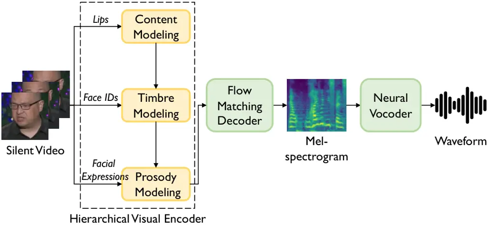
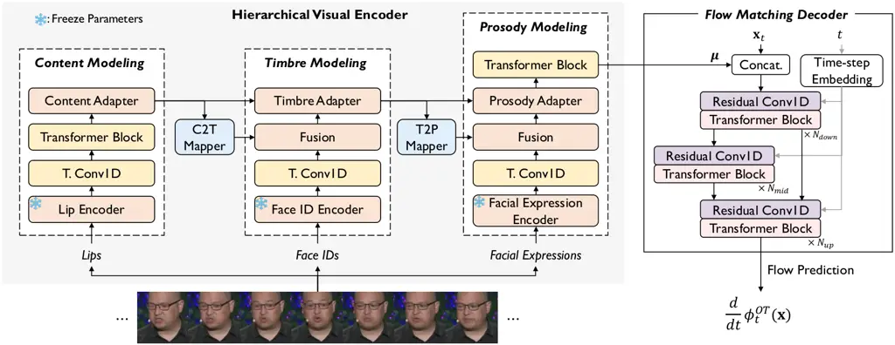
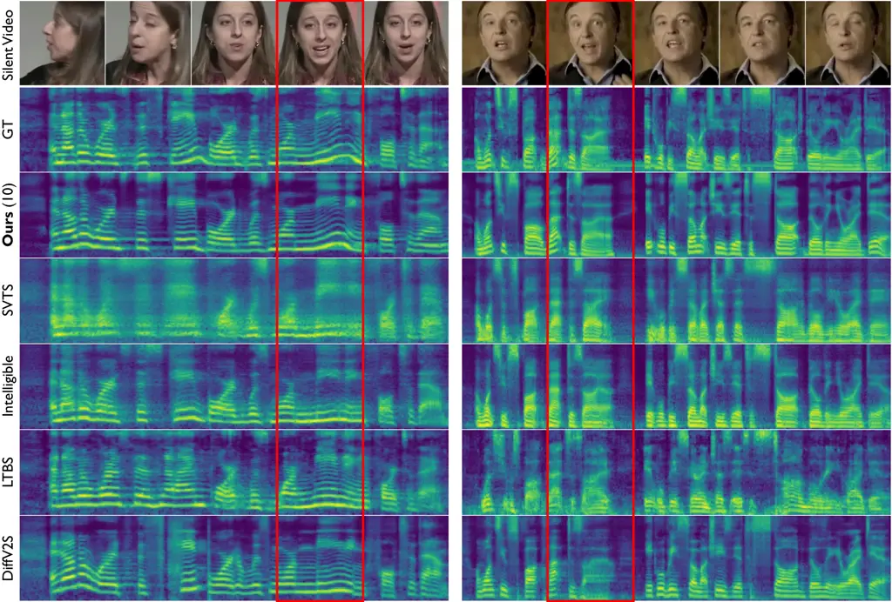

# From Faces to Voices: Learning Hierarchical Representations for High-quality Video-to-Speech

Ji-Hoon Kim    Jeongsoo Choi    Jaehun Kim    Chaeyoung Jung    Joon Son
Chung Affiliation: Korea Advanced Institute of Science and Technology
Affiliation: {jihoon, joon}@mm.kaist.ac.kr

###### Abstract

The objective of this study is to generate high-quality speech from
silent talking face videos, a task also known as video-to-speech
synthesis. A significant challenge in video-to-speech synthesis lies in
the substantial modality gap between silent video and multi-faceted
speech. In this paper, we propose a novel video-to-speech system that
effectively bridges this modality gap, significantly enhancing the
quality of synthesized speech. This is achieved by learning of
hierarchical representations from video to speech. Specifically, we
gradually transform silent video into acoustic feature spaces through
three sequential stages – content, timbre, and prosody modeling. In each
stage, we align visual factors – lip movements, face identity, and
facial expressions – with corresponding acoustic counterparts to ensure
the seamless transformation. Additionally, to generate realistic and
coherent speech from the visual representations, we employ a flow
matching model that estimates direct trajectories from a simple prior
distribution to the target speech distribution. Extensive experiments
demonstrate that our method achieves exceptional generation quality
comparable to real utterances, outperforming existing methods by a
significant margin.

## 1 Introduction

Video-to-Speech (VTS) systems have recently attracted significant
attention for their capability to convert silent videos of talking faces
into human speech. These systems have a broad spectrum of applications,
such as re-dubbing silent archival films, providing assistive
technologies for individuals with speech disabilities, and enabling
natural communications in loud settings \[5, 31, 75\]. Recent
advancements in deep learning have propelled this field forward by
utilizing the natural alignment of video and speech as a mode of
training supervision, eliminating the need of additional annotations
such as text transcriptions.

The ultimate goal of VTS systems is to synthesize realistic human
speech. A key challenge in building high-quality VTS systems lies in the
significant information gap between silent video and spoken audio.
Specifically, silent video primarily contains visual features such as
lip motion and facial expressions, while spoken audio includes acoustic
characteristics such as tone and pronunciation. As a result, the VTS
systems require capturing the complex relations between the two
modalities, making it difficult to establish an accurate mapping from
visual to acoustic spaces.



Figure 1: An overview of the proposed system. Our method learns
hierarchical representations from video to speech, focusing on three key
factors: lips, face IDs, and facial expressions. The visual encoding is
converted into the corresponding speech through an effective flow
matching decoder and neural vocoder.

Numerous works have been made to enhance the quality of VTS system while
addressing the information gap between the two modalities. To mitigate
the complexity posed by the inherent variability of speech, some
approaches incorporate self-supervised speech units \[5, 24\] or a
dedicated lip-reading network \[75\]. Other studies have focused on
clarifying multiple speaker characteristics by utilizing speaker
embeddings extracted from either the reference audio \[52, 59\] or the
input video  \[5, 75\]. Meanwhile, several approaches adopt advanced
modeling techniques, such as diffusion models \[5, 75, 78\], to capture
the intricate relationships between visual and acoustic modalities.
Despite these efforts, current VTS systems still struggle to close the
modality gap, leaving their generation quality significantly behind that
of real human utterances. This underscores the need for a more effective
training pipeline and refined network architecture for high-quality VTS
systems.

In this paper, we propose a novel video-to-speech approach that
effectively bridges the gap between what the eyes see and what the ears
can hear. To achieve this, we design a hierarchical visual encoder that
refines hierarchical representations from video to speech. Specifically,
we divide VTS mapping into three stages–content, timbre, and prosody–and
incrementally transform visual input into acoustic feature spaces. Since
content exhibits less variation and directly influences both timbre and
prosody \[76, 64\], we prioritize content modeling as the first stage.
Timbre modeling is placed before prosody modeling, as timbre tends to be
more stable than prosody \[28\], and distinguishing timbre helps reduce
ambiguity in prosody modeling \[64\].

In addition, to facilitate seamless transformation at each stage, we
align multiple visual cues with their acoustic counterparts (Figure 1).
For content modeling, we leverage lip motions, inspired by the strong
correlation between lip movements and speech content \[21, 67\]. For
timbre modeling, we incorporate face identity as a conditional input,
drawing from the cross-modal biometric correlation between facial
appearance and timbre \[54, 15, 56\]. Lastly, for prosody modeling, we
utilize facial expressions, which convey emotions and subtle nuances,
naturally aligning with pitch and energy variations in speech \[69, 8\].

Based on the encoded visual representations which are adapted to the
acoustic feature space, we aim to generate realistic mel-spectrograms.
To this end, we employ a flow matching generative decoder that offers a
streamlined and accurate generation process, achieving high-fidelity
speech synthesis in fewer sampling steps \[43, 51\]. We conduct
extensive experiments on two datasets collected from in-the-wild
settings \[7, 1\]. The experimental results demonstrate that our method
achieves exceptional audio quality, making a Mean Opinion Score (MOS)
gap of only 0.05 in naturalness, compared to the real human utterances.
The synthesized audio samples can be found on our demo page¹¹ 1
[https://mm.kaist.ac.kr/projects/faces2voices](https://mm.kaist.ac.kr/projects/faces2voices).



Figure 2: The detailed architecture of the our framework. Our approach
gradually closes the substantial modality gap between video and speech,
while aligning key visual cues–lip movements, face identity, and facial
expressions–with their corresponding speech attributes–content, timbre,
and prosody. The flow matching decoder effectively estimates
mel-spectrogram distribution, conditioned on the visual encoding
$`\boldsymbol{\mu}`$. $`{\bf x}_{t}`$ represents an intermediate state
of mel-spectrogram at time-step $`t`$, and $`\phi_{t}^{OT}`$ denotes the
corresponding flow.

## 2 Related Works

### 2.1 Video-to-Speech

VTS systems have experienced significant advancements, transitioning
from rule-based approaches \[37, 38\] to contemporary end-to-end
methods \[74, 72\]. Early deep learning approaches predominantly
employed convolution neural networks, demonstrating its effectiveness in
VTS systems \[12, 36\]. More recent studies have improved generation
quality by incorporating advanced modeling techniques such as generative
adversarial networks \[32, 53\], normalizing flows \[17, 31\], and
diffusion networks \[5, 75, 78\].

Meanwhile, there have been efforts to utilize auxiliary information to
mitigate the difference between video and speech data distributions. To
complement the lack of supervision from speech data itself, Kim et
al. \[33\] utilize text transcriptions as an auxiliary target. More
recent works \[24, 6, 31, 42\] have adopted quantized self-supervised
speech representations, eliminating the need of text transcriptions. In
order to capture multiple speaker characteristics, many works
incorporate speaker embeddings derived from the reference audio \[59,
52, 18, 6\]. However, since obtaining reference audio is not always
feasible during inference process, DiffV2S \[5\] introduces video-driven
speaker embeddings focusing on lip frames, whereas LipVoicer \[75\]
estimates speaker information through a single portrait image. In
contrast to previous works, we focus directly on bridging the modality
gap between video and speech, while associating multiple visual cues
with their corresponding acoustic counterparts.

### 2.2 Hierarchical Speech Generation

Due to the inherent complexity of speech, various studies have explored
hierarchical generative approaches for high-quality speech synthesis. In
the context of text-to-speech synthesis, Hsu et al. \[22\] develop a
system that uses two-tiered latent variable modeling based on a
conditional variational autoencoder. The first level captures coarse
acoustic information, while the second level deals with specific
attribute configurations. Both PVAE-TTS \[39\] and
Grad-StyleSpeech \[30\] employ hierarchical structures in adaptive
text-to-speech systems. To address the challenges of mimicking new
speaking styles, these systems improve their adaptation capabilities
through a progressive variational autoencoder and a hierarchical
encoder, respectively. Similarly, HierVST \[41\] adopts a hierarchical
structure in their voice style transfer system. To effectively handle
speaker styles not encountered during training, HierVST first generates
linguistic information and then integrates it with residual acoustic
information through hierarchical variational inference. In our work, we
explore hierarchical representations from silent video to human speech,
and propose a high-quality VTS system that generates natural speech
through these hierarchical representations.

### 2.3 Flow Matching

Flow matching \[43\] has recently gained increasing attention due to its
capability to generate realistic data samples with straight
trajectories, addressing the inherent slow sampling issues in
diffusion-based models \[20\]. The effectiveness of flow matching has
been demonstrated across various research fields, including vision \[14,
25\] and audio \[45, 60\] domains. In vision domain, Fischer et
al. \[14\] adopt a flow matching model between a frozen diffusion model
and a convolution block, which enables effective image synthesis.
Similarly, Hu et al. \[25\] utilize flow matching in their image editing
pipeline, benefiting from its streamlined and efficient inference
process. In the realm of audio generation, SpeechFlow \[45\] applies
flow matching to build a robust foundation model for speech, showcasing
powerful performance across diverse downstream tasks including speech
separation and enhancement. MusicFlow \[60\] introduces a text-guided
music generation method based on two flow matching networks to capture
the conditional distribution of semantic and acoustic features. Building
on these advancements, our VTS system employs flow matching to bridge
the visual-to-audio modality gap, resulting in the natural and
intelligible generation of speech from silent video.

## 3 Method

### 3.1 Overall Architecture

As illustrated in Figure 2, our framework mainly consists of a
hierarchical visual encoder and a flow matching decoder. The
hierarchical visual encoder gradually refines video representations,
aligning visual cues–lip movements, face identity, and facial
expressions–with their corresponding acoustic counterparts–content,
timbre, and prosody. This ensures a seamless transformation from visual
to acoustic modalities, enhancing the naturalness and clarity of the
synthesized speech. The resulting visual encoding $`\boldsymbol{\mu}`$
are fed into a flow matching decoder, and then flow matching decoder
generates a high-quality mel-spectrogram, which is subsequently
converted into audible waveform by a pre-trained neural vocoder \[35\].

### 3.2 Hierarchical Visual Encoder

To effectively close the large gap between video and speech, we propose
a hierarchical visual encoder that gradually transforms input videos
into acoustic feature spaces, starting from a fundamental attribute and
advancing to complex ones. The visual encoder sequentially models
content, timbre, and prosody, with mappers that enable interaction
across these distinct modeling processes. Each mapper is based on
Transformer layers which facilitate better understanding of underlying
sequences \[16\].

Inspired by the cross-modal correlations between face and speech, our
visual encoder aligns lip motions, facial identity, and expressions with
corresponding acoustic attributes–content, timbre, and prosody. This is
achieved through the dedicated facial encoders and acoustic attribute
adapters. Each facial encoder processes specific facial elements, and
the following transposed convolution layers learn temporal alignment
between visual and acoustic features. The adapters, which include
acoustic attribute predictors, align visual cues with their
corresponding speech features, and adapt these features into latent
sequence. As in previous works \[63, 31\], we adopt teacher-forcing
strategy to train the acoustic attribute adapters. The following
paragraphs detail each modeling stage in our visual encoder.

#### Content.

Building on the strong correlation between lip movements and speech
content \[21, 67\], we begin with content modeling by focusing on the
lip motions in silent video. We extract lip motion features through
AV-HuBERT \[67\], which has been demonstrated to offer a powerful
acoustic representations from lip movements \[24, 6\]. Considering the
fact that hidden features from each layer of the AV-HuBERT capture
distinct aspects of speech \[57\], we integrate all these features
through a learnable weighted summation. This allows the model to learn
the optimal combination of the intermediate AV-HuBERT features,
enhancing the capability of the resulting representation \[26, 70\].

The following content adapter, which includes a content predictor,
strengthens the correlation between lips and contents, while enriching
content information to the hidden sequence. The target content sequence
of the predictor is obtained from the last layer of the HuBERT \[23\]
and subsequently quantized by the K-means algorithm (i.e., speech
units). In addition to convolution blocks ($`CP`$) \[73\], the content
predictor incorporates an auxiliary masked convolution block
($`CP_{m}`$) \[44\], as illustrated in Figure 3. This block estimates
the target value at a certain frame from adjacent frames, allowing the
model to learn temporal dependencies across the sequence. We optimize
the content predictor by using Cross Entropy (CE) loss with label
smoothing, which is defined as:

```math
\begin{split}&\mathcal{L}_{c}=\alpha\{\text{CE}({\bf c},{CP}({\bf h}_{l}))+\text{CE}({\bf c},{CP}_{m}({\bf h}_{l}))\}\\
&+(1\text{-}\alpha)\{\text{CE}({\bf u},{CP}({\bf h}_{l}))+\text{CE}({\bf u},{CP}_{m}({\bf h}_{l}))\},\end{split} \tag{1}
```

where $`{\bf c}`$, $`{\bf h}_{l}`$, and $`{\bf u}`$ denote the target
content sequences, the hidden lip features, and the uniform
distribution, respectively. The label smoothing parameter $`\alpha`$ is
set to $`0.9`$.

The content sequences are embedded via an learnable embedding table and
then added to the hidden sequence. These content-adapted features, which
serve as the basis for the remaining hierarchical speech modeling, are
passed to the subsequent timbre modeling module through the
Content-to-Timbre (C2T) mapper.

#### Timbre.

Timbre, similar to face, is a distinct personal characteristic that
specifies one’s identity \[29, 50\]. Based on the findings that reveal
the biometric relation between facial appearance and timbre \[54, 56\],
we leverage face identity to model timbre. ArcFace \[9\] is utilized to
extract discriminative face identity embeddings, which are used to
predict timbre in combination with the output of C2T mapper
($`{\bf h}_{c2t}`$).

The time-averaged feature from the first layer of HuBERT \[23\] is used
as the target timbre representation, as it is well-known for rich timbre
information \[13, 4\]. Since timbre feature does not contain temporal
information, the timbre predictor relies only on a convolution pipeline
($`TP`$) which is optimized by Mean Absolute Error (MAE) loss:

```math
\mathcal{L}_{t}=\text{MAE}({\bf t},TP({Fusion}({\bf h}_{fid},{\bf h}_{c2t}))), \tag{2}
```

where $`{\bf t}`$ denotes the target timbre and $`{\bf h}_{fid}`$
represents the face identity embeddings. The timbre value is embedded by
a single linear layer and incorporated to the latent feature \[39\],
along with the output from previous level of content adapter. The Timbre
to Prosody (T2P) mapper refines this timbre-adapted feature which are
then fed to the subsequent prosody modeling stage.

#### Prosody.

Provided that prosody exhibits multiple variations even with the same
contents and timbre, we regard prosody as the most complex factor which
needs to be modeled at the last stage. Specifically, we model pitch and
energy sequence based on facial expression features, inspired by \[69,
8\]. To accurately generate prosody variations from expressions, we
leverage a pre-trained facial expression encoder \[77\] that captures
subtle details of expressions.

The prosody adapter comprises both pitch and energy predictors, with
target values obtained from the pYIN algorithm \[49\] for pitch
estimation and the frequency-wise L2 norm of mel-spectrograms for
energy²² 2 For robust training, the pitch value is standardized to have
zero mean and unit variance over an entire sequence.. Similar to the
content predictor, the prosody predictors consist of auxiliary masked
blocks ($`PP_{m}`$) along with convolution blocks ($`PP`$), and are
trained with their respective MAE losses:

```math
\begin{split}\mathcal{L}_{p}=&\text{MAE}({\bf p},PP(Fusion({\bf h}_{fe},{\bf h}_{c2p})))\\
&+\text{MAE}({\bf p},PP_{m}(Fusion({\bf h}_{fe},{\bf h}_{c2p}))),\end{split} \tag{3}
```

where $`{\bf p}`$, $`{\bf h}_{fe}`$, and $`{\bf h}_{c2p}`$ refer to the
target prosody sequences, the hidden features for facial expressions,
and the output of T2P mapper, respectively. Pitch and energy sequences
are embedded through their respective convolution layers, and then added
to hidden sequence with the timbre feature from the previous stage.

Finally, we add Transformer blocks followed by a single projection layer
to yield visual encoding $`\boldsymbol{\mu}`$. This encoding serves as
the conditional input for the subsequent flow matching decoder, which is
explained in the next section.

Figure 3: Speech attribute prediction pipeline. The content and prosody
predictor incorporate an auxiliary masked convolution block to enrich
contextual information.

### 3.3 Flow Matching Decoder

We utilize a flow matching generative model as our decoder to
effectively model the target mel-spectrogram distribution. We first
provide a brief overview of flow matching and then detail the
architecture of our decoder.

#### Flow Matching Overview.

Let $`{\bf x}`$ be a data sample from the target distribution
$`q({\bf x})`$, and let $`p_{0}({\bf x})`$ be the simple prior
distribution. Flow matching is a method for fitting a probability
density path
$`p_{t}:[0,1]\times\mathbb{R}^{d}\rightarrow\mathbb{R}_{>0}`$ between
$`p_{0}({\bf x})`$ and $`p_{1}({\bf x})`$, which approximates
$`q({\bf x})`$. Following Lipman et al. \[43\], we define the flow
$`\phi_{t}`$ as the mapping between the two distributions through the
ordinary differential equation:

```math
\displaystyle\frac{d}{dt}\phi_{t}({\bf x}) \displaystyle={v}_{t}(\phi_{t}({\bf x}))\text{,}\qquad\phi_{0}({\bf x})={\bf x}\text{,} \tag{4}
```

where $`t\in[0,1]`$ and $`{v}_{t}({\bf x})={v}_{t}({\bf x};\theta)`$ is
the vector field parameterized by $`\theta`$ that specifies the
trajectory of the probability flow. This formulation generates the
probability path $`p_{t}`$, allowing us to sample from $`p_{t}`$ by
solving the initial value problem. Assume that there exist a known
vector field $`u_{t}`$ that generates $`p_{t}`$. The flow matching
objective aims to align $`v_{t}({\bf x})`$ with $`u_{t}`$. In practice,
however, this flow matching objective is intractable because we lack
prior knowledge of $`p_{t}`$ or $`v_{t}`$. To address this, Lipman et
al. \[43\] construct $`p_{t}({\bf x})`$ via a mixture of simpler
conditional paths, for which the vector field can be easily computed.

In our case, we utilize simple optimal transport path as our conditional
flow to ensure effective and efficient training \[51\]. Consequently,
our Optimal Transport Conditional Flow Matching (OT-CFM) loss can be
defined:

```math
\begin{split}\mathcal{L}_{OT-CFM}(\theta)=&\mathbb{E}_{t,q({\bf x}_{1}),p_{0}({\bf x}_{0})}\|{u}^{\text{OT}}_{t}(\phi^{\text{OT}}_{t}({\bf x}_{0})|{\bf x}_{1})\\
&-{v}_{t}(\phi^{\text{OT}}_{t}({\bf x}_{0})|\boldsymbol{\mu};\theta)\|^{2},\end{split} \tag{5}
```

where $`{\bf x}_{0}`$ and $`{\bf x}_{1}`$ are data samples from
$`p_{0}({\bf x})`$ and $`p_{1}({\bf x})`$, respectively. The flow is
defined as
$`\phi^{\text{OT}}_{t}({\bf x})=(1-(1-\sigma_{\mathrm{min}})t){\bf x}_{0}+t{\bf x}_{1}`$,
then the conditional target vector field is given by
$`\boldsymbol{u}^{\text{OT}}_{t}(\phi^{\text{OT}}_{t}({\bf x}_{0})|{\bf x}_{1})={\bf x}_{1}-(1-\sigma_{\mathrm{min}}){\bf x}_{0}`$.
Due to the linear trajectory, this achieves superior performance with
fewer sampling steps compare to score-based models \[20\].

#### Decoder Architecture.

Our decoder is based on a U-Net architecture incorporating residual 1D
convolution blocks followed by a Transformer block with snake beta
activation function \[40, 51\]. For better sampling quality, we
incorporate a negative log-likelihood encoder loss \[58, 51\], which can
be defined as follows:

```math
\mathcal{L}_{enc}=-\sum_{i=1}^{T}{\log{\varphi({\bf x}_{i};\boldsymbol{\mu}_{i},I)}}, \tag{6}
```

where $`\varphi(\cdot;\boldsymbol{\mu}_{i},I)`$ is a probability density
function of $`\mathcal{N}(\boldsymbol{\mu}_{i},I)`$, and $`T`$ denotes
the temporal length. To summarize, the total loss function
$`\mathcal{L}_{total}`$ is defined as follows:

```math
\mathcal{L}_{total}=\mathcal{L}_{OT-CFM}+\mathcal{L}_{enc}+\lambda_{c}\mathcal{L}_{c}+\lambda_{t}\mathcal{L}_{t}+\lambda_{p}\mathcal{L}_{p}, \tag{7}
```

where $`\lambda_{c}`$, $`\lambda_{t}`$, and $`\lambda_{p}`$ are set to
0.5 in our experiments.

Moreover, to further enhance conditional probability path, we
incorporate Classifier-Free Guidance (CFG) \[19\] which has demonstrated
its effectiveness in improving generation quality \[55, 34\]. During
training, we randomly drop the conditional input ($`\boldsymbol{\mu}`$)
with a fixed probability of 0.1. In inference, the speech decoder
iteratively refines $`{\bf x}_{t}`$ with a step size of $`\epsilon`$,
directing the trajectory away from the unconditional flow. We employ an
Euler solver with CFG:

```math
\begin{split}{\bf x}_{t+\epsilon}={\bf x}_{t}+\epsilon\{(1&+\beta)\cdot v_{t}(\phi^{\text{OT}}_{t}(\bf x)|\boldsymbol{\mu};\theta)\\
&-\beta\cdot v_{t}(\phi^{\text{OT}}_{t}(\bf x)|\varnothing;\theta)\},\end{split} \tag{8}
```

where $`\beta`$ denotes the guidance scale for CFG.

## 4 Experimental Settings

### 4.1 Datasets

#### LRS3-TED

\[1\] is a well-established dataset for evaluating VTS systems. It
includes approximately 440 hours of video clips sourced from TED and
TEDx talks, featuring thousands of speakers and over 50,000 words. We
split the dataset in accordance with previous works \[52, 6, 5\],
ensuring no speaker overlap between the training and test sets.

#### LRS2-BBC

\[7\] is a large-scale and real-world video dataset, which comprises 224
hours of video from BBC television shows. To assess the generalization
capability across different datasets, we also evaluate our model on the
LRS2 dataset. It is important to note that all models are trained
exclusively on the LRS3 dataset, while the LRS2 dataset is used solely
for test dataset.

### 4.2 Preprocessing

We crop face sequences from 25 fps video using RetinaFace \[10\] and
extract facial landmarks with FAN \[3\]. Lip frames are then extracted
based on these landmarks and converted to grayscale. The corresponding
16 kHz audio is transformed into a log-scale mel-spectrogram with a hop
size of 320, window size of 1280, and 80 mel bins, resulting in a fixed
1:2 length ratio between the video and mel-spectrogram. We use
pre-trained HuBERT (Large)³³ 3
[https://huggingface.co/facebook/hubert-large-ll60k](https://huggingface.co/facebook/hubert-large-ll60k)
to obtain the target content and timbre features. Content features are
then quantized by K-Means algorithm, trained on LJ Speech
dataset \[27\], with 1,000 clusters.

### 4.3 Implementation Details

In our visual encoder, AV-HuBERT (Large)⁴⁴ 4
[https://github.com/facebookresearch/av_hubert](https://github.com/facebookresearch/av_hubert)
is used for lip encoder, and all Transformer blocks consist of 2
Transformer layers with 4 attention heads and a latent dimension of 512.
For the fusion module, we concatenate two distinct latent features along
the channel dimensions and project them using 2 convolution blocks. The
configuration of our flow matching decoder follows that of
Matcha-TTS \[51\] with $`\sigma_{\mathrm{min}}`$ set to 10⁻⁴.
Additionally, we adopt cosine scheduling strategy for the time-step
$`t`$ \[11\].

Our model is trained on four NVIDIA A5000 GPUs with a batch size of 64.
We use AdamW optimizer \[47\] with $`\beta_{1}`$ = 0.8, $`\beta_{2}`$ =
0.99, and $`\epsilon`$ = $`10^{-9}`$. The initial learning rate is set
to $`10^{-4}`$, with a decay rate of $`0.999^{1/8}`$. Random 96
consecutive frames are used during training, and the model is trained
for 350K steps. For robust training, we apply data augmentation to lip
frames, as in previous works \[52, 6, 31\].

### 4.4 Evaluation Metrics

The generation performance is evaluated through both subjective and
objective metrics. For subjective evaluation, we conduct 5-scale Mean
Opinion Score (MOS) tests, where 25 domain-expert subjects rate the
quality of 40 speech samples in terms of naturalness and
intelligibility. In the naturalness test, subjects are asked to focus on
the audio quality, while in the intelligibility test, they assess the
clarity of the speech content. For objective metrics, we measure
UTMOS \[66\] and DNSMOS \[62\], which are widely used networks to
estimate perceptual audio quality \[65, 68\]. We also calculate the root
mean square of F0 (RMSE\_(f0)) to assess pitch accuracy and the Word
Error Rate (WER) to evaluate the intelligibility. WER quantifies the
differences between the ground truth text labels and speech recognition
results obtained from Whisper (Medium) \[61\].

### 4.5 Baseline Methods

Our method is compared to several state-of-the-art methods: SVTS \[52\],
Intelligible \[6\], LTBS \[31\], and DiffV2S \[5\]. We follow the
official implementations for Intelligible \[6\], LTBS \[31\], and
DiffV2S \[5\], as provided by the authors. Regarding SVTS, the LRS3 test
samples are provided by the authors, while the LRS2 test samples are
generated from our own reproduction, based on the official
implementation of Intelligible⁵⁵ 5
[https://github.com/choijeongsoo/lip2speech-unit](https://github.com/choijeongsoo/lip2speech-unit).
Note that both SVTS and Intelligible use speaker embeddings derived from
reference speech, while LTBS, DiffV2S, and our method estimate speaker
characteristics directly from the silent video.

|                                |                         |                             |
| ------------------------------ | ----------------------- | --------------------------- |
| Method                         | Naturalness$`\uparrow`$ | Intelligibility$`\uparrow`$ |
| Ground Truth                   | 4.54 $`\pm`$ 0.12       | 4.84 $`\pm`$ 0.06           |
| Audio-driven speaker embedding |                         |                             |
| SVTS \[52\]                    | 1.10 $`\pm`$ 0.06       | 1.66 $`\pm`$ 0.14           |
| Intelligible \[6\]             | 2.42 $`\pm`$ 0.18       | 3.40 $`\pm`$ 0.20           |
| Video-driven speaker embedding |                         |                             |
| LTBS \[31\]                    | 2.52 $`\pm`$ 0.14       | 2.10 $`\pm`$ 0.15           |
| DiffV2S (1000) \[5\]           | 2.97 $`\pm`$ 0.17       | 3.16 $`\pm`$ 0.19           |
| Ours (10)                      | 4.49 $`\pm`$ 0.11       | 4.01 $`\pm`$ 0.15           |

Table 1: Subjective evaluation results on LRS3 test dataset. The results
are presented with 95% confidence interval. The number in parenthesis
means the number of sampling steps.

|                                |       |                   |                    |                          |                   |                   |                    |                          |                   |
| ------------------------------ | ----- | ----------------- | ------------------ | ------------------------ | ----------------- | ----------------- | ------------------ | ------------------------ | ----------------- |
| Method                         | Steps | LRS3-TED          |                    |                          |                   | LRS2-BBC          |                    |                          |                   |
|                                |       | UTMOS$`\uparrow`$ | DNSMOS$`\uparrow`$ | RMSE\_(f0)$`\downarrow`$ | WER$`\downarrow`$ | UTMOS$`\uparrow`$ | DNSMOS$`\uparrow`$ | RMSE\_(f0)$`\downarrow`$ | WER$`\downarrow`$ |
| Ground Truth                   | –     | 3.545             | 2.582              | –                        |   2.29            | 3.013             | 2.256              | –                        |   8.93            |
| Audio-driven speaker embedding |       |                   |                    |                          |                   |                   |                    |                          |                   |
| SVTS \[52\]                    | –     | 1.283             | 1.860              | 56.929                   | 84.98             | 1.387             | 1.434              | 53.475                   | 83.38             |
| Intelligible \[6\]             | –     | 2.702             | 2.395              | 39.377                   | 29.60             | 2.331             | 2.000              | 41.233                   | 39.53             |
| Video-driven speaker embedding |       |                   |                    |                          |                   |                   |                    |                          |                   |
| LTBS \[31\]                    | –     | 2.417             | 2.361              | 40.006                   | 84.08             | 2.288             | 2.174              | 43.653                   | 94.25             |
| DiffV2S \[5\]                  | 1000  | 3.058             | 2.558              | 40.893                   | 41.07             | 2.945             | 2.363              | 44.414                   | 54.86             |
| Ours                           | 10    | 4.031             | 2.789              | 39.013                   | 30.45             | 3.921             | 2.586              | 43.441                   | 39.37             |
| Ours                           | 1000  | 3.993             | 2.759              | 38.928                   | 30.37             | 3.881             | 2.552              | 43.702                   | 39.05             |

Table 2: Results of objective evaluation on both LRS3 and LRS2 test
datasets. $`\uparrow`$ denotes higher is better, and $`\downarrow`$
means lower is better. Bold and underlined values represent the best and
second-best results, respectively.

## 5 Experimental Results

### 5.1 Subjective Evaluation

To examine the perceptual quality of our method, we perform subject MOS
tests which are regarded as the gold standard for evaluating speech
generation systems \[46, 48\]. MOS tests are conducted on the LRS3 test
set, focusing on two key criteria: naturalness and intelligibility. As
demonstrated in Table 1, our method produces high-quality speech,
significantly outperforming existing methods on both naturalness and
intelligibility. Furthermore, our method closely approximates the
naturalness of the ground truth speech with a minimal gap of only 0.05.
This indicates that the speech generated by our method is almost
indistinguishable from real human recordings in terms of perceptual
audio quality.

### 5.2 Objective Evaluation

In addition to subjective MOS tests, we compute UTMOS, DNSMOS,
RMSE\_(f0), and WER, as objective evaluation metrics. As shown in
Table 2, our method shows clear improvements over standard VTS systems
on both the LRS3 and LRS2 datasets, indicating that our method
successfully reduces the modality gap between video and speech. Notably,
our method achieves the best audio quality across all datasets, as
measured by UTMOS \[66\] and DNSMOS \[62\], even exceeding those of
ground truth audio. This can be attributed to the fact that our approach
generates clean speech solely from face sequences, excluding background
noises. In contrast, real-world ground truth audio often contains
significant background noise, which adversely affects the audio quality.
Furthermore, the small quality difference in our method between using 10
and 1000 sampling steps confirms that the flow matching decoder can
produce high-fidelity results with only a few sampling steps.

### 5.3 Analysis on Speaker Similarity

We evaluate the robustness of video-driven speaker representations to
determine whether the video-driven embeddings capture accurate speaker
characteristics when compared to ground truth audio. To do this, we
compute Speaker Embedding Cosine Similarity (SECS) between the speaker
representations from the target and synthesized audio, using all samples
from the LRS3 test set. For an accurate and comprehensive analysis, we
extract speaker representations using two different methods:
GE2E \[71\], a widely used speaker verification model for evaluating
speaker similarity \[5\], and VoxSim \[2\], designed specifically to
estimate perceptual voice similarity. As shown in Table 3, our method
achieves the best SECS scores in cases of both GE2E and VoxSim
embeddings. This indicates that our video-driven embeddings capture
precise speaker characteristics, making the voice of the generated
speech more closely resemble that of original speaker, compared to
existing methods that utilize video-driven embedding.

### 5.4 Mel-spectrogram Visualization

For an intuitive comparison with baseline methods, we visualize the
generated speech by using mel-spectrograms alongside ground truth
speech. Figure 4 depicts these visualization results, where the
mel-spectrogram from our system closely resembles the ground truth,
capturing fine acoustic details and accurate harmonic structure.
Additionally, we observe that our method enriches prosody by leveraging
facial expressions, as reflected in the dynamic variations of the
fundamental frequency along with abrupt changes in facial expressions.

### 5.5 Ablation Study

To verify the effectiveness of each component in our method, we conduct
ablation studies using various metrics, including MAE\_(E) which refers
to the MAE between the energy sequences of the target and predicted
speech. For the ablation study, we set the number of sampling steps to
10 and use the LRS3 dataset.

#### Hierarchical Modeling.

We first explore the impact of hierarchical video-to-speech encoding,
with the results presented in Table 4. When all mappers are removed and
acoustic attributes are modeled simultaneously (w/o Hier), the
performance shows a noticeable drop across all metrics, underscoring the
benefits of learning hierarchical representations between video and
speech. In our preliminary experiments, the absence of content modeling
results in incomprehensible speech, implying the crucial role of content
modeling in constructing a robust VTS system. Removing the timbre (w/o
Timbre) or prosody modeling stage (w/o Prosody), along with their
respective mappers, also leads to consistent quality degradation,
verifying the importance of these stages in building a high-quality VTS
system.

#### Facial Features.

The benefits of associating facial features with their acoustic
counterparts are also clearly evident. Excluding facial identity (w/o
Face ID) or expression (w/o FE) features results in degraded quality,
including declines in speaker similarity and prosody accuracy. This
result shows the benefits of utilizing face identity and facial
expressions as conditional inputs, confirming the cross-modal
correlation between facial and acoustic features.

#### Training Strategy.

We investigate the effect of weight summation across AV-HuBERT
intermediate features (w/o WS) and the masked convolution block in the
content and prosody predictors (w/o MP). As shown, these modules
collectively contribute to improving model performance. In particular,
integrating AV-HuBERT features through weighted summation strengthens
acoustic capabilities of the representations, leading to noticeable
degradation across all metrics except for a slight difference in UTMOS.

| Method             | LTBS  | DiffV2S | Ours (10) | Ours (1000) |
| ------------------ | ----- | ------- | --------- | ----------- |
| GE2E$`\uparrow`$   | 0.609 | 0.621   | 0.650     | 0.650       |
| VoxSim$`\uparrow`$ | 0.399 | 0.433   | 0.495     | 0.494       |

Table 3: SECS evaluation results on LRS3 test set. All speaker
identities are unseen during training.



Figure 4: Mel-spectrogram visualization compared to Ground Truth (GT)
speech. As highlighted in the red boxes, the proposed method effectively
captures both accurate and dynamic fundamental frequency, along with
synchronized changes in facial expressions.

|                 |                   |                          |                        |                   |                  |
| --------------- | ----------------- | ------------------------ | ---------------------- | ----------------- | ---------------- |
| Method          | UTMOS$`\uparrow`$ | RMSE\_(f0)$`\downarrow`$ | MAE\_(E)$`\downarrow`$ | WER$`\downarrow`$ | GE2E$`\uparrow`$ |
| Ours (10)       | 4.031             | 39.013                   | 0.650                  | 30.45             | 0.650            |
| _  w/o_ Hier    | 3.737             | 40.260                   | 0.763                  | 33.64             | 0.636            |
| _  w/o_ Timbre  | 3.858             | 39.563                   | 0.635                  | 31.15             | 0.632            |
| _  w/o_ Prosody | 3.866             | 39.590                   | 0.677                  | 35.03             | 0.653            |
| _  w/o_ Face ID | 4.001             | 40.751                   | 0.667                  | 31.38             | 0.640            |
| _  w/o_ FE      | 3.965             | 40.115                   | 0.662                  | 31.08             | 0.651            |
| _  w/o_ WS      | 4.038             | 40.286                   | 0.674                  | 30.90             | 0.649            |
| _  w/o_ MP      | 3.986             | 39.145                   | 0.650                  | 30.89             | 0.654            |

Table 4: Ablation study results on the LRS3 test set. For brevity, we
use the following abbreviations: Hier for hierarchical modeling, FE for
facial expressions, WS for weighted summation in AV-HuBERT, and MP for
the masked convolution prediction.

| $`\beta`$ | UTMOS$`\uparrow`$ | RMSE\_(f0)$`\downarrow`$ | MAE\_(E)$`\downarrow`$ | WER$`\downarrow`$ | GE2E$`\uparrow`$ |
| --------- | ----------------- | ------------------------ | ---------------------- | ----------------- | ---------------- |
|   0       | 3.799             | 34.797                   | 0.793                  | 25.71             | 0.798            |
| 0.5       | 3.944             | 35.171                   | 0.734                  | 25.47             | 0.800            |
| 0.7       | 3.946             | 35.290                   | 0.726                  | 25.27             | 0.798            |
| 1.0       | 3.941             | 34.982                   | 0.719                  | 25.38             | 0.794            |
| 2.0       | 3.831             | 35.881                   | 0.707                  | 25.78             | 0.781            |
| 4.0       | 3.297             | 37.300                   | 0.674                  | 28.03             | 0.745            |

Table 5: Analysis of guidance scale on LRS3 validation set. $`\beta=0`$
refers to not using classifier-free guidance.

#### Guidance Scale.

To find the optimal guidance scale $`\beta`$, we assess the model
performance on the LRS3 validation set. In Table 5, the benefits of
applying CFG are evident in the first row ($`\beta=0`$; no CFG applied),
where performance decreases across all metrics except RMSE\_(f0). We
analyze the trade-offs across various guidance scales and select
$`\beta=0.7`$, as it yields the best results for UTMOS and WER.

## 6 Conclusion

In this paper, we propose a novel VTS framework that generates
high-quality speech from silent videos of talking faces. We directly
address the large modality gap between video and speech, and
successfully mitigate the gap by learning hierarchical associations
between the two modalities. Additionally, we incorporate flow matching
into the VTS system to produce realistic speech while preserving fine
details. Both subjective and objective evaluations demonstrate the
superior quality of our method compared to existing approaches. We also
conduct comprehensive ablation study and validate the effectiveness of
each component of our method.

## Acknowledgement

This work was supported by the National Research Foundation of Korea
(NRF) grant funded by the Korea government (MSIT) (No.RS-2023-00212845)

## References

- \[1\] Triantafyllos Afouras, Joon Son Chung, and Andrew Zisserman.
  LRS3-TED: A Large-scale Dataset for Visual Speech Recognition.
  _arXiv:1809.00496_, 2018.
- \[2\] Junseok Ahn, Youkyum Kim, Yeunju Choi, Doyeop Kwak, Ji-Hoon Kim,
  Seongkyu Mun, and Joon Son Chung. VoxSim: A Perceptual Voice
  Similarity Dataset. In _Proc. Interspeech_, 2024.
- \[3\] Adrian Bulat and Georgios Tzimiropoulos. How Far are We from
  Solving the 2D & 3D Face Alignment Problem?(and a Dataset of 230,000
  3D Facial Landmarks). In _Proc. ICCV_, 2017.
- \[4\] Hyeong-Seok Choi, Juheon Lee, Wansoo Kim, Jie Lee, Hoon Heo, and
  Kyogu Lee. Neural Analysis and Synthesis: Reconstructing Speech from
  Self-supervised Representations. In _NeurIPS_, 2021.
- \[5\] Jeongsoo Choi, Joanna Hong, and Yong Man Ro. DiffV2S:
  Diffusion-based Video-to-Speech Synthesis with Vision-guided Speaker
  Embedding. In _Proc. CVPR_, 2023a.
- \[6\] Jeongsoo Choi, Minsu Kim, and Yong Man Ro. Intelligible
  Lip-to-Speech Synthesis with Speech Units. In _Proc. Interspeech_,
  2023b.
- \[7\] Joon Son Chung, Andrew Senior, Oriol Vinyals, and Andrew
  Zisserman. Lip Reading Sentences in the Wild. In _Proc. CVPR_, 2017.
- \[8\] Gaoxiang Cong, Liang Li, Yuankai Qi, Zheng-Jun Zha, Qi Wu, Wenyu
  Wang, Bin Jiang, Ming-Hsuan Yang, and Qingming Huang. Learning to Dub
  Movies via Hierarchical Prosody Models. In _Proc. CVPR_, 2023.
- \[9\] Jiankang Deng, Jia Guo, Niannan Xue, and Stefanos Zafeiriou.
  Arcface: Additive Angular Margin Loss for Deep Face Recognition. In
  _Proc. CVPR_, 2019.
- \[10\] Jiankang Deng, Jia Guo, Evangelos Ververas, Irene Kotsia, and
  Stefanos Zafeiriou. Retinaface: Single-shot Multi-level Face
  Localisation in the Wild. In _Proc. CVPR_, 2020.
- \[11\] Zhihao Du, Qian Chen, Shiliang Zhang, Kai Hu, Heng Lu, Yexin
  Yang, Hangrui Hu, Siqi Zheng, Yue Gu, Ziyang Ma, et al. Cosyvoice: A
  Scalable Multilingual Zero-shot Text-to-Speech Synthesizer based on
  Supervised Semantic Tokens. _arXiv:2407.05407_, 2024.
- \[12\] Ariel Ephrat and Shmuel Peleg. Vid2Speech: Speech
  Reconstruction from Silent Video. In _Proc. ICASSP_, 2017.
- \[13\] Zhiyun Fan, Meng Li, Shiyu Zhou, and Bo Xu. Exploring Wav2Vec
  2.0 on Speaker Verification and Language Identification. In _Proc.
  Interspeech_, 2021.
- \[14\] Johannes S Fischer, Ming Gui, Pingchuan Ma, Nick Stracke,
  Stefan A Baumann, and Björn Ommer. Boosting Latent Diffusion with Flow
  Matching. In _Proc. ECCV_, 2024.
- \[15\] Ruohan Gao and Kristen Grauman. Visualoice: Audio-visual Speech
  Separation with Cross-Modal Consistency. In _Proc. CVPR_, 2021.
- \[16\] Anmol Gulati, James Qin, Chung-Cheng Chiu, Niki Parmar, Yu
  Zhang, Jiahui Yu, Wei Han, Shibo Wang, Zhengdong Zhang, Yonghui Wu,
  and Ruoming Pang. Conformer: Convolution-Augmented Transformer for
  Speech Recognition. In _Proc. Interspeech_, 2020.
- \[17\] Jinzheng He, Zhou Zhao, Yi Ren, Jinglin Liu, Baoxing Huai, and
  Nicholas Yuan. Flow-Based Unconstrained Lip to Speech Generation. In
  _Proc. AAAI_, 2022.
- \[18\] Sindhu B Hegde, KR Prajwal, Rudrabha Mukhopadhyay, Vinay P
  Namboodiri, and CV Jawahar. Lip-to-Speech Synthesis for Arbitrary
  Speakers in the Wild. In _Proc. ACM MM_, 2022.
- \[19\] Jonathan Ho and Tim Salimans. Classifier-Free Diffusion
  Guidance. In _NeurIPS 2021 Workshop_, 2021.
- \[20\] Jonathan Ho, Ajay Jain, and Pieter Abbeel. Denoising Diffusion
  Probabilistic Models. In _NeurIPS_, 2020.
- \[21\] Wei-Ning Hsu and Bowen Shi. u-hubert: Unified mixed-modal
  speech pretraining and zero-shot transfer to unlabeled modality. In
  _NeurIPS_, 2022.
- \[22\] Wei-Ning Hsu, Yu Zhang, Ron J Weiss, Heiga Zen, Yonghui Wu,
  Yuxuan Wang, Yuan Cao, Ye Jia, Zhifeng Chen, Jonathan Shen, et al.
  Hierarchical Generative Modeling for Controllable Speech Synthesis. In
  _Proc. ICLR_, 2018.
- \[23\] Wei-Ning Hsu, Benjamin Bolte, Yao-Hung Hubert Tsai, Kushal
  Lakhotia, Ruslan Salakhutdinov, and Abdelrahman Mohamed. HuBERT:
  Self-supervised Speech Representation Learning by Masked Prediction of
  Hidden Units. _IEEE/ACM Trans. on Audio, Speech, and Language
  Processing_, 29:3451–3460, 2021.
- \[24\] Wei-Ning Hsu, Tal Remez, Bowen Shi, Jacob Donley, and Yossi
  Adi. Revise: Self-supervised Speech Resynthesis with Visual Input for
  Universal and Generalized Speech Regeneration. In _Proc. CVPR_, 2023.
- \[25\] Vincent Tao Hu, Wei Zhang, Meng Tang, Pascal Mettes, Deli Zhao,
  and Cees Snoek. Latent Space Editing in Transformer-based Flow
  Matching. In _Proc. AAAI_, 2024.
- \[26\] Zili Huang, Shinji Watanabe, Shu-wen Yang, Paola García, and
  Sanjeev Khudanpur. Investigating Self-supervised Learning for Speech
  Enhancement and Separation. In _Proc. ICASSP_, 2022.
- \[27\] Keith Ito and Linda Johnson. The LJ Speech Dataset.
  [https://keithito.com/LJ-Speech-Dataset/](https://keithito.com/LJ-Speech-Dataset/), 2017.
- \[28\] Yuepeng Jiang, Tao Li, Fengyu Yang, Lei Xie, Meng Meng, and
  Yujun Wang. Towards expressive zero-shot speech synthesis with
  hierarchical prosody modeling. In _Proc. Interspeech_, 2024.
- \[29\] Frédéric Joassin, Mauro Pesenti, Pierre Maurage, Emilie
  Verreckt, Raymond Bruyer, and Salvatore Campanella. Cross-modal
  Interactions between Human Faces and Voices Involved in Person
  Recognition. _Cortex_, 47(3):367–376, 2011.
- \[30\] Minki Kang, Dongchan Min, and Sung Ju Hwang. Grad-stylespeech:
  Any-speaker Adaptive Text-to-Speech Synthesis with Diffusion Models.
  In _Proc. ICASSP_, 2023.
- \[31\] Ji-Hoon Kim, Jaehun Kim, and Joon Son Chung. Let There Be
  Sound: Reconstructing High Quality Speech from Silent Videos. In
  _Proc. AAAI_, 2024a.
- \[32\] Minsu Kim, Joanna Hong, and Yong Man Ro. Lip to Speech
  Synthesis with Visual Context Attentional GAN. In _NeurIPS_, 2021.
- \[33\] Minsu Kim, Joanna Hong, and Yong Man Ro. Lip-to-Speech
  Synthesis in the Wild with Multi-Task Learning. In _Proc.
  ICASSP_, 2023.
- \[34\] Sungwon Kim, Kevin Shih, Joao Felipe Santos, Evelina
  Bakhturina, Mikyas Desta, Rafael Valle, Sungroh Yoon, Bryan Catanzaro,
  et al. P-Flow: A Fast and Data-efficient Zero-shot TTS through Speech
  Prompting. In _NeurIPS_, 2024b.
- \[35\] Jungil Kong, Jaehyeon Kim, and Jaekyoung Bae. Hifi-GAN:
  Generative Adversarial Networks for Efficient and High Fidelity Speech
  Synthesis. In _NeurIPS_, 2020.
- \[36\] Yaman Kumar, Rohit Jain, Khwaja Mohd Salik, Rajiv Ratn Shah,
  Yifang Yin, and Roger Zimmermann. Lipper: Synthesizing Thy Speech
  Using Multi-View Lipreading. In _Proc. AAAI_, 2019.
- \[37\] Thomas Le Cornu and Ben Milner. Reconstructing Intelligible
  Audio Speech from Visual Speech Features. In _Proc.
  Interspeech_, 2015.
- \[38\] Thomas Le Cornu and Ben Milner. Generating Intelligible Audio
  Speech from Visual Speech. _IEEE/ACM Trans. on Audio, Speech, and
  Language Processing_, 25(9):1751–1761, 2017.
- \[39\] Ji-Hyun Lee, Sang-Hoon Lee, Ji-Hoon Kim, and Seong-Whan Lee.
  PVAE-TTS: Adaptive Text-to-Speech via Progressive Style Adaptation. In
  _Proc. ICASSP_, 2022.
- \[40\] Sang-gil Lee, Wei Ping, Boris Ginsburg, Bryan Catanzaro, and
  Sungroh Yoon. BigVGAN: A Universal Neural Vocoder with Large-scale
  Training. In _Proc. ICLR_, 2023a.
- \[41\] Sang-Hoon Lee, Ha-Yeong Choi, Hyung-Seok Oh, and Seong-Whan
  Lee. HierVST: Hierarchical Adaptive Zero-shot Voice Style Transfer. In
  _Proc. Interspeech_, 2023b.
- \[42\] Songju Lei, Xize Cheng, Mengjiao Lyu, Jianqiao Hu, Jintao Tan,
  Runlin Liu, Lingyu Xiong, Tao Jin, Xiandong Li, and Zhou Zhao.
  Uni-Dubbing: Zero-Shot Speech Synthesis from Visual Articulation. In
  _Proc. ACL_, 2024.
- \[43\] Yaron Lipman, Ricky TQ Chen, Heli Ben-Hamu, Maximilian Nickel,
  and Matt Le. Flow Matching for Generative Modeling. In _Proc.
  ICLR_, 2023.
- \[44\] Alexander H Liu, Yu-An Chung, and James Glass.
  Non-autoregressive Predictive Coding for Learning Speech
  Representations from Local Dependencies. In _Proc. Interspeech_, 2020.
- \[45\] Alexander H Liu, Matt Le, Apoorv Vyas, Bowen Shi, Andros
  Tjandra, and Wei-Ning Hsu. Generative Pre-training for Speech with
  Flow Matching. In _Proc. ICLR_, 2024.
- \[46\] Chen-Chou Lo, Szu-Wei Fu, Wen-Chin Huang, Xin Wang, Junichi
  Yamagishi, Yu Tsao, and Hsin-Min Wang. MOSNET: Deep Learning based
  Objective Assessment for Voice Conversion. In _Proc.
  Interspeech_, 2019.
- \[47\] Ilya Loshchilov and Frank Hutter. Decoupled Weight Decay
  Regularization. In _Proc. ICLR_, 2019.
- \[48\] Soumi Maiti, Yifan Peng, Takaaki Saeki, and Shinji Watanabe.
  SpeechLMScore: Evaluating Speech Generation using Speech Language
  Model. In _Proc. ICASSP_, 2023.
- \[49\] Matthias Mauch and Simon Dixon. pYIN: A Fundamental Frequency
  Estimator Using Probabilistic Threshold Distributions. In _Proc.
  ICASSP_, 2014.
- \[50\] Lauren W Mavica and Elan Barenholtz. Matching Voice and Face
  Identity from Static Images. _Journal of Experimental Psychology:
  Human Perception and Performance_, 39(2):307, 2013.
- \[51\] Shivam Mehta, Ruibo Tu, Jonas Beskow, Éva Székely, and
  Gustav Eje Henter. Matcha-TTS: A Fast TTS Architecture with
  Conditional Flow Matching. In _Proc. ICASSP_, 2024.
- \[52\] Rodrigo Mira, Alexandros Haliassos, Stavros Petridis, Björn W
  Schuller, and Maja Pantic. SVTS: Scalable Video-to-Speech Synthesis.
  In _Proc. Interspeech_, 2022a.
- \[53\] Rodrigo Mira, Konstantinos Vougioukas, Pingchuan Ma, Stavros
  Petridis, Björn W Schuller, and Maja Pantic. End-to-End
  Video-to-Speech Synthesis Using Generative Adversarial Networks. _IEEE
  Transactions on Cybernetics_, 53(6), 2022b.
- \[54\] Arsha Nagrani, Samuel Albanie, and Andrew Zisserman. Seeing
  Voices and Hearing Faces: Cross-modal Biometric Matching. In _Proc.
  CVPR_, 2018.
- \[55\] Alexander Quinn Nichol and Prafulla Dhariwal. Improved
  Denoising Diffusion Probabilistic Models. In _Proc. ICML_, 2021.
- \[56\] Hailong Ning, Xiangtao Zheng, Xiaoqiang Lu, and Yuan Yuan.
  Disentangled Representation Learning for Cross-modal Biometric
  Matching. _IEEE Trans. Multimedia_, 24:1763–1774, 2021.
- \[57\] Ankita Pasad, Bowen Shi, and Karen Livescu. Comparative
  Layer-wise Analysis of Self-supervised Speech Models. In _Proc.
  ICASSP_, 2023.
- \[58\] Vadim Popov, Ivan Vovk, Vladimir Gogoryan, Tasnima Sadekova,
  and Mikhail Kudinov. Grad-TTS: A Diffusion Probabilistic Model for
  Text-to-Speech. In _Proc. ICML_, 2021.
- \[59\] KR Prajwal, Rudrabha Mukhopadhyay, Vinay P Namboodiri, and CV
  Jawahar. Learning Individual Speaking Styles for Accurate Lip to
  Speech Synthesis. In _Proc. CVPR_, 2020.
- \[60\] KR Prajwal, Bowen Shi, Matthew Lee, Apoorv Vyas, Andros
  Tjandra, Mahi Luthra, Baishan Guo, Huiyu Wang, Triantafyllos Afouras,
  David Kant, et al. Musicflow: Cascaded Flow Matching for Text Guided
  Music Generation. In _Proc. ICML_, 2024.
- \[61\] Alec Radford, Jong Wook Kim, Tao Xu, Greg Brockman, Christine
  McLeavey, and Ilya Sutskever. Robust Speech Recognition via
  Large-Scale Weak Supervision. In _Proc. ICML_, 2023.
- \[62\] Chandan KA Reddy, Vishak Gopal, and Ross Cutler. DNSMOS: A
  Non-intrusive Perceptual Objective Speech Quality Metric to Evaluate
  Noise Suppressors. In _Proc. ICASSP_, 2021.
- \[63\] Yi Ren, Chenxu Hu, Xu Tan, Tao Qin, Sheng Zhao, Zhou Zhao, and
  Tie-Yan Liu. FastSpeech 2: Fast and High-Quality End-to-End Text to
  Speech. In _Proc. ICLR_, 2021.
- \[64\] Yi Ren, Ming Lei, Zhiying Huang, Shiliang Zhang, Qian Chen,
  Zhijie Yan, and Zhou Zhao. Prosospeech: Enhancing prosody with
  quantized vector pre-training in text-to-speech. In _Proc.
  ICASSP_, 2022.
- \[65\] Julius Richter, Simon Welker, Jean-Marie Lemercier, Bunlong
  Lay, and Timo Gerkmann. Speech Enhancement and Dereverberation with
  Diffusion-based Generative Models. _IEEE/ACM Trans. on Audio, Speech,
  and Language Processing_, 31:2351–2364, 2023.
- \[66\] Takaaki Saeki, Detai Xin, Wataru Nakata, Tomoki Koriyama,
  Shinnosuke Takamichi, and Hiroshi Saruwatari. UTMOS: Utokyo-sarulab
  System for Voicemos Challenge 2022. In _Proc. Interspeech_, 2022.
- \[67\] Bowen Shi, Wei-Ning Hsu, Kushal Lakhotia, and Abdelrahman
  Mohamed. Learning Audio-visual Speech Representation by Masked
  Multimodal Cluster Prediction. In _Proc. ICLR_, 2022.
- \[68\] Hubert Siuzdak. Vocos: Closing the Gap between Time-domain and
  Fourier-based Neural Vocoders for High-quality Audio Synthesis. In
  _Proc. ICLR_, 2023.
- \[69\] Antoine Toisoul, Jean Kossaifi, Adrian Bulat, Georgios
  Tzimiropoulos, and Maja Pantic. Estimation of Continuous Valence and
  Arousal Levels from Faces in Naturalistic Conditions. _Nat. Mach.
  Intell._, 3(1):42–50, 2021.
- \[70\] Hsiang-Sheng Tsai, Heng-Jui Chang, Wen-Chin Huang, Zili Huang,
  Kushal Lakhotia, Shu-wen Yang, Shuyan Dong, Andy Liu, Cheng-I Lai,
  Jiatong Shi, et al. SUPERB-SG: Enhanced Speech processing Universal
  Performance Benchmark for Semantic and Generative Capabilities. In
  _Proc. ACL_, 2022.
- \[71\] Li Wan, Quan Wang, Alan Papir, and Ignacio Lopez Moreno.
  Generalized End-to-end Loss for Speaker Verification. In _Proc.
  ICASSP_, 2018.
- \[72\] Yongqi Wang and Zhou Zhao. FastLTS: Non-autoregressive
  End-to-End Unconstrained Lip-to-Speech Synthesis. In _Proc. ACM
  MM_, 2022.
- \[73\] Sanghyun Woo, Shoubhik Debnath, Ronghang Hu, Xinlei Chen,
  Zhuang Liu, In So Kweon, and Saining Xie. Convnext v2: Co-designing
  and Scaling Convnets with Masked Autoencoders. In _Proc. CVPR_, 2023.
- \[74\] Ravindra Yadav, Ashish Sardana, Vinay P Namboodiri, and
  Rajesh M Hegde. Speech Prediction in Silent Videos Using Variational
  Autoencoders. In _Proc. ICASSP_, 2021.
- \[75\] Yochai Yemini, Aviv Shamsian, Lior Bracha, Sharon Gannot, and
  Ethan Fetaya. Lipvoicer: Generating Speech from Silent Videos Guided
  by Lip Reading. In _Proc. ICLR_, 2024.
- \[76\] Jianwei Zhang, Suren Jayasuriya, and Visar Berisha. Learning
  repeatable speech embeddings using an intra-class correlation
  regularizer. In _NeurIPS_, 2023.
- \[77\] Yuhang Zhang, Yaqi Li, Xuannan Liu, Weihong Deng, et al. Leave
  No Stone Unturned: Mine Extra Knowledge for Imbalanced Facial
  Expression Recognition. In _NeurIPS_, 2024.
- \[78\] Rui-Chen Zheng, Yang Ai, and Zhen-Hua Ling. Speech
  Reconstruction from Silent Lip and Tongue Articulation by Diffusion
  Models and Text-Guided Pseudo Target Generation. In _Proc. ACM
  MM_, 2024.
