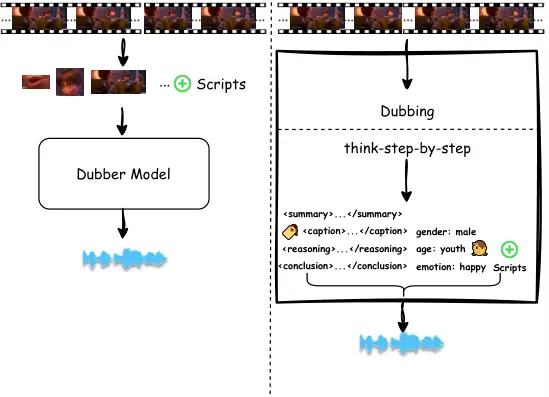
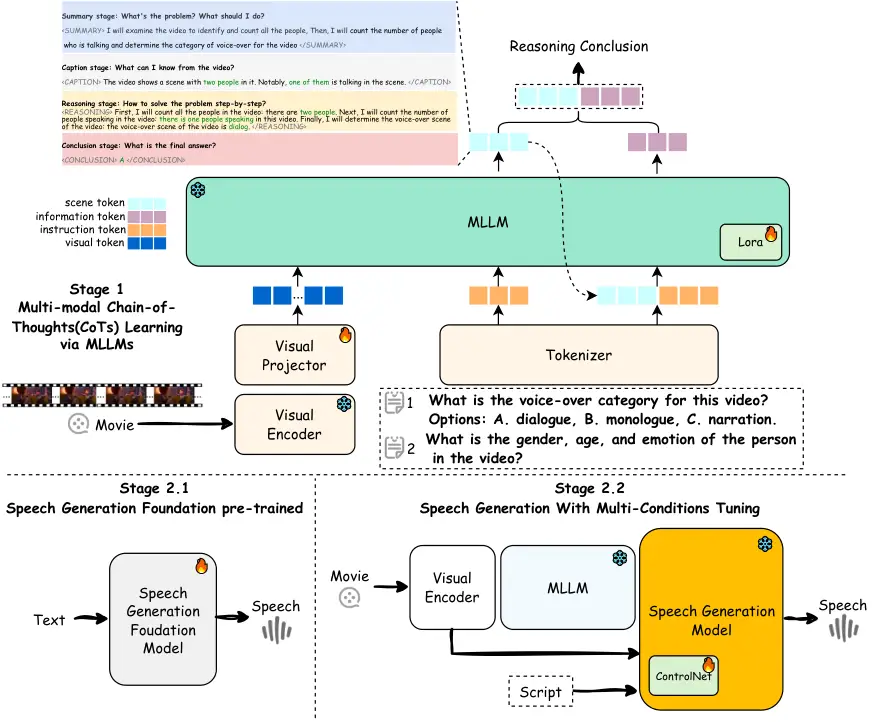
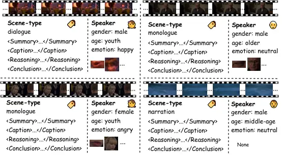
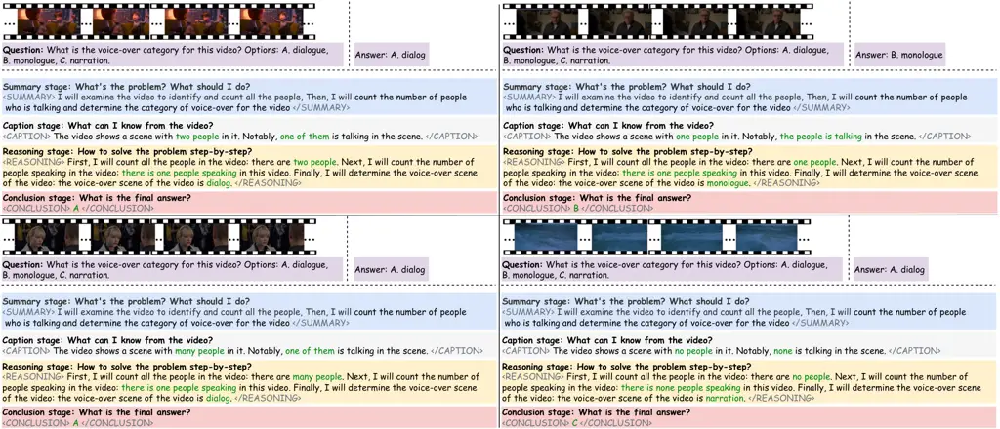
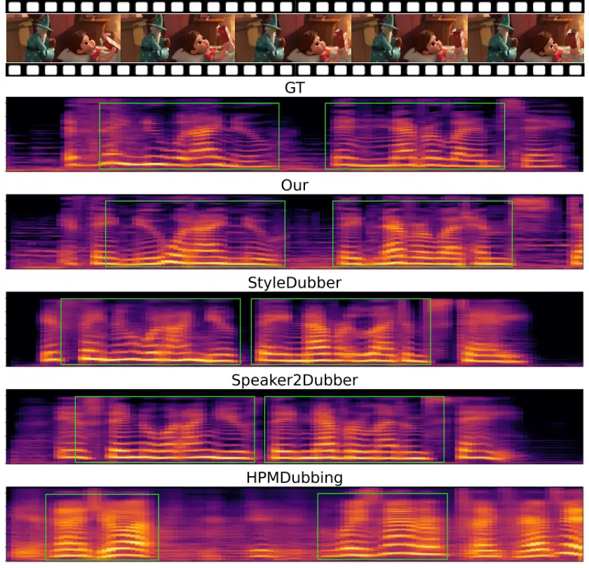

# DeepDubber-V1: Towards High Quality and Dialogue, Narration, Monologue Adaptive Movie Dubbing Via Multi-Modal Chain-of-Thoughts Reasoning Guidance.

Junjie Zheng^(\*) Affiliation: AI Lab, Giant Network.
Email: <zhengjunjie@ztgame.com>    Zihao Chen^(\*) Affiliation: AI Lab,
Giant Network. Email: <chenzihao@ztgame.com>    Chaofan Ding
Affiliation: AI Lab, Giant Network. Email: <dingchaofan@ztgame.com>   
Xinhan Di Affiliation: AI Lab, Giant Network.
Email: <dixinhan@ztgame.com> Affiliation: University of Trento.

###### Abstract

Current movie dubbing technology can generate the desired voice from a
given speech prompt, ensuring good synchronization between speech and
visuals while accurately conveying the intended emotions. However, in
movie dubbing, key aspects such as adapting to different dubbing styles,
handling dialogue, narration, and monologue effectively, and
understanding subtle details like the age and gender of speakers, have
not been well studied. To address this challenge, we propose a framework
of multimodal large language model. First, it utilizes multimodal
Chain-of-Thought (CoT) reasoning methods on visual inputs to understand
dubbing styles and fine-grained attributes. Second, it generates
high-quality dubbing through large speech generation models, guided by
multimodal conditions. Additionally, we have developed a movie dubbing
dataset with CoT annotations. The evaluation results demonstrate a
performance improvement over state-of-the-art methods across multiple
datasets. In particular, for the evaluation metrics, the SPK-SIM and
EMO-SIM increases from $`82.48\%`$ to $`89.74\%`$, $`66.24\%`$ to
$`78.88\%`$ for dubbing setting 2.0 on V2C-Animation dataset, LSE-D and
MCD-SL decreases from 14.79 to 14.63, 5.24 to 4.74 for dubbing setting
2.0 on Grid dataset, SPK-SIM increases from 64.03 to 83.42 and WER
decreases from 52.69% to 23.20% for initial reasoning setting on
proposed CoT-Movie-Dubbing dataset in the comparison with the
state-of-the art models.

## 1 Introduction

Dubbing involves adding the correct human voice to a video’s dialogue,
ensuring synchronization with the character’s lip movements, and
conveying the emotions of the scene. It plays a vital role in film,
television, animation and gaming, enhancing immersion and effectively
conveying emotions and atmosphere. Existing dubbing methods can be
categorized into two groups, both of which focus on learning different
styles of key prior information to generate high-quality voices. The
first group focuses on learning effective speaker style representations
\[7, 23, 60, 15\]. The second group aims to learn appropriate prosody by
utilizing visual information from the given video input \[15, 25, 37,
70\]. However, the accuracy of these priors is insufficient and
inadequate for movie dubbing in real-world scenarios. For example,
adaptive dubbing for different types, such as dialogue, narration, and
monologue, as well as fine-grained attributes such as expected ages and
genders, has not been thoroughly studied \[17, 25\].



Figure 1: Curent Dubbing models \[14, 17, 69\] (Left). Proposed Dubbing
Models (Right) For dubbing types and fine-grained attributes.

With the rapid advancement of large language reasoning models with
step-by-step thinking ability \[48, 47, 49, 64, 2, 19, 52\] and methods
that enhance reasoning capabilities to interpret visual information
through CoT, MLLM have increasingly shown their potential in multimodal
reasoning and understanding tasks \[50, 20, 11, 35, 4, 43, 39, 57, 71\].
These advancements in reasoning capabilities within MLLM hold promise
for accurately providing dubbing types and fine-grained attributes.

Therefore, we propose a multimodal large language model for high-quality
movie dubbing that effectively understands dubbing styles and
fine-grained attributes. First, through multi-modal CoT learning, a
multimodal large language model is trained to improve its reasoning
ability, enabling a better understanding of dubbing types (dialogue,
narration, monologue) and fine-grained attributes from video inputs.
Secondly, a large multimodal speech generation model is trained with
designed control mechanisms using multiple-modal conditions. Thirdly, we
create a CoT multi-modal movie dubbing dataset annotated with
step-by-step reasoning instructions.

## 2 Related Work

### 2.1 Visual Voice Cloning

Current advanced dubbing technologies significantly enhance speech-video
synchronization and emotional expression by integrating visual and
textual information. Some works focus on improving speaker identity to
handle multi-speaker scenes \[16, 14, 69, 17\]. For example, Speaker2Dub
\[69\] introduces speaker embedding extracted by pre-trained GE2E to the
phoneme encoder and the mel spectrogram decoder by a learnable style
affine transform, while StyleDubber \[17\] proposes a multi-scale style
adapter with phoneme and utterance level to strengthen speaker
characteristics. In addition, some works attempt to combine visual
representation to enhance prosody expressive \[14, 25, 37, 70\]. For
example, HPMDubbing \[14\] is a hierarchical dubbing method that bridges
acoustic details with visual information: lip motion, face region, and
scene. To improve contextual prosody, MCDubber \[70\] enlarges the
modeling object from a single sentence to the previous and following
sentences, incorporating more contextual video scenes. Although speaker
identity and prosody modeling have received attention, existing works
still suffer from poor lip-sync and lifeless emotional expression, which
is unacceptable in dubbing.

### 2.2 Flow-Matching Speech Generation

Flow Matching \[41\] is a simulation-free method to train Continuous
Normalizing Flows (CNFs) \[8\] models, which model arbitrary probability
path and capture the probability trajectories represented by diffusion
processes \[59\]. Due to its advantages of high sampling speed and
generation quality, flow matching has attracted significant attention in
speech generation \[21, 45, 36\]. Recently, Matcha-TTS \[45\] and
DiTTo-TTS \[38\] have introduced optimal-transport conditional flow
matching (OT-CFM) for training, which yields an ODE-based decoder to
improve the fidelity of the mel spectrograms. Then, F5TTS \[9\]
leverages the Diffusion Transformer with ConvNeXt V2 \[63\] to better
tackle text-speech alignment during in-context learning. However, these
works are limited in the field of TTS and cannot be applied to the V2C
task. Therefore, we study the integration with MLLM reasoning models and
TTS for the V2C task.

### 2.3 Chain-of-thought Reasoning

Visual reasoning demands the model’s visual perception capability and
high-level cognition ability \[34, 44\]. Several tasks have been applied
to evaluate the visual reasoning ability of Visual-Language Models
(VLMs), including VQA \[32, 40\] requiring models to answer visual
content and textual questions, and Visual Entailment \[58, 1, 12\]
requiring models to determine the consistency of text descriptions and
visual content, etc. With the development of LLMs, vision-language
models leverage the advanced reasoning abilities of LLMs to interpret
visual tasks \[42, 67\]. Some vision-language models enhance visual
reasoning by optimizing the visual encoding strategy \[31, 72, 42, 22,
26, 68\] to produce cognition-focused visual tokens. Then, with the
rapid advancement of large language reasoning models with the
step-by-step thinking ability \[48, 47, 49, 64, 2, 19, 52\],
vision-language task is studied through step-step reasoning for a
variety of multimodal large language models. However, step-step
reasoning mechanism is not well-studied in the movie dubbing, therefore,
we propose DeepDubbber for movie dubbing with internal multimodal
chain-of-thoughts reasoning guidance.



Figure 2: DeepDubber pipeline with multi-stage, multi-modal training.

## 3 Method

### 3.1 Overview

Given a silent video clip $`V_{l}`$, a corresponding subtitle $`T_{v}`$,
and the goal of generating a fully dubbed video, the proposed model
(DeepDubber) aims to produce speech $`\hat{S}`$ that matches the video,
ensures contextual and prosodic relevance, and maintains speech-video
synchronization with the help of MLLM. The model can be formalized as
follows:

```math
\hat{S}=F_{dubber}(V_{l},T_{v}) \tag{1}
```

DeepDubber consists of two modeling stages: i) Multimodal reasoning and
understanding through in-context learning and mixed preference
optimization. ii) Speech Generation Stage: This stage incorporates a
conditional DiT based speech generator.

### 3.2 Multi-modal Chain-of-Thought Learning via MLLM

#### 3.2.1 Stage 1.1: Training Multi-modal Chain-of-Thought via Supervised Learning.

The core functionality of DeepDubber is to extract key semantic features
from the visual stream that are crucial for the dubbing process. These
features include scene type, speaker gender, speaker age, and speaker
emotion, which are inferred step by step, as illustrated in Figure 4.
Inspired by the success of MLLM, such as VLMs \[42, 65, 62\], we
leverage multimodal instruction tuning to enhance CoT reasoning, thereby
improving the quality of movie dubbing. The CoT reasoning process is
formulated as follows:

```math
\displaystyle C_{1}^{CoT} \displaystyle=F_{mcot}^{1}(V,\text{Instruct}_{1}), \tag{2}
```

```math
\displaystyle C_{2}^{QA} \displaystyle=F_{qa}^{2}(V,\text{Instruct}_{2}) \tag{3}
```

where $`V`$ represents the input video clip, $`\text{Instruct}_{i}`$
denotes the $`i`$-th instruction provided to guide the reasoning
process, $`F_{\text{mcot}}^{i}`$ is the function representing the
$`i`$-th step of multimodal CoT reasoning using an MLLM, $`C_{1}^{CoT}`$
and $`C_{2}^{QA}`$ are intermediate outputs from the reasoning process,
where $`C_{1}^{CoT}`$ is the result of the first CoT reasoning step, and
$`C_{2}^{QA}`$ is obtained through a question-answering (QA) step.

To optimize the model’s response generation, we define the multimodal
reasoning process as:

```math
\displaystyle\text{M}_{\text{mllm}}:(\text{Video}_{\text{clip}},\text{CoT}_{\text{instruction}},\text{QA}_{\text{instruction}})\mapsto\text{Response}, \tag{4}
```

```math
\displaystyle\min_{\theta_{\text{response}}}\mathbb{E}_{(\text{Video}_{\text{clip}},\text{CoT}_{\text{instruction}},\text{QA}_{\text{instruction}})\sim\mathcal{D}}\Big[\mathcal{L}_{res}\Big(\text{M}_{\text{mllm}}(\text{Video}_{\text{clip}},
```

```math
\displaystyle\quad\text{CoT}_{\text{instruction}},\text{QA}_{\text{instruction}}),\text{Response}_{\text{gt}}\Big)\Big], \tag{5}
```

where $`\text{M}_{\text{mllm}}`$ represents the multimodal large
language model performing CoT reasoning and QA,
$`\text{Video}_{\text{clip}}`$ is the input video segment,
$`\text{CoT}_{\text{instruction}}`$ and
$`\text{QA}_{\text{instruction}}`$ are instructions guiding the CoT
reasoning and QA process, respectively, Response is the generated output
of the model, $`\mathcal{D}`$ denotes the distribution of the training
dataset, $`\theta_{\text{response}}`$ represents the parameters of the
model to optimize, $`\mathcal{L}_{res}`$ is the loss function measuring
the difference between the predicted response of the model and the
ground truth response $`\text{Response}_{\text{gt}}`$. This approach
ensures that the MLLM effectively reasons over multimodal inputs,
facilitating high-quality dubbing through structured stepwise reasoning.

#### 3.2.2 Stage 1.2: Training Multi-modal Chain-of-Thought via Reinforcement Learning.

The reward is the source of the training signal that decides the
direction of RL optimization. To train CoT-MLLM, we adopt a rule-based
reward system like Deepseek-R1 \[19\] that consists mainly of two types
of rewards: accuracy rewards and format rewards. We employ a format
reward model that enforces the model to put its reasoning process
between \<SUMMARY\> \</SUMMARY\>, \<CAPTION\>\</CAPTION\>,
\<REASONING\>\</REASONING\>, and \<CONCLUSION\> \</CONCLUSION\> tags. We
use the Mixed Preference Optimization (MPO) \[62\] method to learn the
relative preferences between pairs of responses and enhance the
reasoning capability of MLLM across different instructions. The mixed
preference optimization is applied to further enhance the ability of the
multimodal CoT reasoning. The training objective is represented as the
following.

Training Objective. The MPO objective combines three loss components and
F&O rewards: preference loss ($`L_{p}`$), quality loss ($`L_{q}`$),
generation loss ($`L_{g}`$), format loss ($`L_{f}`$), and accuracy loss
($`L_{c}`$). The total loss is formulated as:

```math
L=w_{p}L_{p}+w_{q}L_{q}+w_{g}L_{g}+w_{f}L_{f}+w_{c}L_{c}, \tag{6}
```

where $`w_{*}`$ represents the weight for each loss. We use DPO \[55\]
for preference loss and BCO \[10\] for quality loss. The details of
three terms of the loss are then represented as the following:

Preference Loss. The DPO \[55\] loss models the relative preference
between the chosen and rejected responses without requiring a reward
model. The loss function is:

```math
L_{p}=-\log\sigma\left(\beta\log\frac{\pi_{\theta}(y_{c}\mid x)}{\pi_{0}(y_{c}\mid x)}-\beta\log\frac{\pi_{\theta}(y_{r}\mid x)}{\pi_{0}(y_{r}\mid x)}\right), \tag{7}
```

where $`\beta`$ is the KL penalty coefficient, $`x`$ is the user query,
$`y_{c}`$ is the chosen response, $`y_{r}`$ is the rejected response,
and $`\pi_{\theta}`$ is the policy model initialized from $`\pi_{0}`$.

Quality Loss. The BCO \[10\] loss measures the absolute quality of
individual responses using a binary classifier. The total loss is:

```math
L_{q}=L_{q}^{+}+L_{q}^{-}, \tag{8}
```

where the chosen and rejected loss terms are:

```math
L_{q}^{+}=-\log\sigma\left(\beta\log\frac{\pi_{\theta}(y_{c}\mid x)}{\pi_{0}(y_{c}\mid x)}-\delta\right), \tag{9}
```

```math
L_{q}^{-}=-\log\sigma\left(-\left(\beta\log\frac{\pi_{\theta}(y_{r}\mid x)}{\pi_{0}(y_{r}\mid x)}-\delta\right)\right), \tag{10}
```

and $`\delta`$ is the reward shift for stabilizing training.

Generation Loss. The SFT loss helps the model learn to generate
preferred responses. The loss is defined as:

```math
L_{g}=-\frac{\log\pi_{\theta}(y_{c}\mid x)}{|y_{c}|}. \tag{11}
```

Format Reward. The Format loss helps the model to learn to generate in
preferred format. The loss is defined as:

```math
L_{f}=-\sum\left[f_{\text{true}}\log(p_{f}+(1-f_{\text{true}})\log(1-p_{f})\right] \tag{12}
```

$`f_{\text{true}}\in\{0,1\}`$: format correct or not, $`p_{f}`$: the
probability of the format being correct predicted by the model.

Outcome Reward. The Accuracy loss helps the model learn to generate
preferred answer. The loss is defined as:

```math
L_{o}=-\sum\left[o_{\text{true}}\log(p_{o})+(1-o_{\text{true}})\log(1-p_{o})\right] \tag{13}
```

$`o_{\text{true}}\in\{0,1\}`$: the answer is correct or not, $`p_{o}`$:
the probability of the format being correct predicted by the model.

### 3.3 Mutli-Conditioned Speech Generation

#### 3.3.1 Speech Generation Foundation Pre-Training

In the second stage of DeepDubber, we first train the foundational
speech generation model. To optimize this process, we aim to learn the
parameters $`\theta_{\text{generation}}`$ by minimizing the composite
Conditional Flow Matching (CFM) loss $`\mathcal{L}_{\text{cfm}}`$. The
speech generation process is formulated as:

```math
\begin{aligned} \text{M}_{\text{speech}}:&(\text{Video}_{\text{clip}},\text{Speech}_{\text{prompt}},\text{Caption}_{\text{condition}},\text{Transcript}_{\text{text}})\\
&\mapsto\text{Speech}_{\text{target}}\quad,\end{aligned} \tag{14}
```

```math
\displaystyle\min_{\theta_{\text{generation}}} \displaystyle\mathbb{E}_{(\text{Video}_{\text{clip}},\text{Speech}_{\text{prompt}},\text{Caption}_{\text{condition}},\text{Transcript}_{\text{text}})\sim\mathcal{D}} \tag{15}
```

```math
\displaystyle\Big[\mathcal{L}_{cfm}\Big(\text{M}_{\text{speech}}(\text{Video}_{\text{clip}},\text{Speech}_{\text{prompt}},
```

```math
\displaystyle\text{Caption}_{\text{condition}},\text{Transcript}_{\text{text}})\Big)\Big].
```

We adopt the same architecture as F5-TTS \[9\], which employs a
diffusion transformer (DiT) as the backbone. The model is trained to
output a vector field $`v_{\tau}`$ using the CFM objective
$`\mathcal{L}_{\text{cfm}}`$ \[41\], defined as:

```math
\mathcal{L}_{\text{cfm}}(\theta)=\mathbb{E}_{\tau,q(x_{1}),p(x|x_{1})}\lVert u_{\tau}(x|x_{1})-v_{\tau}(x;\theta)\rVert^{2} \tag{16}
```

where $`p_{\tau}`$ represents the probability path at time $`\tau`$,
$`u_{\tau}`$ is the designated vector field for $`p_{\tau}`$, $`x_{1}`$
is a random variable corresponding to the training data, $`q(x_{1})`$
denotes the distribution of the training data. By optimizing
$`\mathcal{L}_{\text{cfm}}`$, the model learns to generate high-quality
speech synchronized with the visual and textual cues, ensuring natural
and contextually appropriate dubbing.

#### 3.3.2 Speech Generation With Multi-Conditions Tuning

Next, in the ControlNet-transformer tuning stage, the video frames,
along with an instruction are fed as inputs to the MLLM model. The
sequence of video features and the video understanding conclusion are
then combined and passed into the speech generation model. In this
context, the provided conclusion helps guide the V2S generation process,
as shown in stage 2.2 of Figure 2. The proposed speech generation model
takes as input the script, silent video, video understanding conclusion,
and an optional reference speech, and generates video-aligned speech
context sequences, which can be described as:

```math
\hat{S}=F_{generator}(V_{l},C_{v}\{C_{1},\ldots,C_{n}\}_{n=4},T_{v}) \tag{17}
```

where $`C_{v}`$ is the combination of $`\{C_{1},\ldots,C_{n}\},n=4`$,
which represents the scene type condition $`C_{s}`$, speaker gender
condition $`C_{g}`$, speaker age condition $`C_{a}`$, and speaker
emotion condition $`C_{e}`$. These conditions are combined and encoded
by an encoder \[56\]. The $`V_{l}`$ represents the visual features
derived from the input video frames, which are encoded by CLIP \[53\].
We implement a cross-attention mechanism that facilitates the
integration of understanding conclusion features $`C_{v}`$ and visual
features $`V_{l}`$. Furthermore, $`T_{v}`$ represents the embedded
script. Furthermore, we added a duration loss $`\mathcal{L}_{dur}`$ to
constrain the duration consistency, which can be described as:

```math
\mathcal{L}_{\text{dur}}=\ell\big(f(V_{l},C_{l}),\,dur\big), \tag{18}
```

The final loss function is constructed as follows:

```math
\mathcal{L}_{\text{g}}=\mathbb{E}_{\tau,q(x_{1}),p(x|x_{1})}\lVert u_{\tau}(x|x_{1},v_{l},c_{v},t_{v})-v_{\tau}(x;\theta)\rVert^{2}+\mathcal{L}_{\text{dur}} \tag{19}
```

In the training stage, the visual condition $`V_{l}`$, video
understanding conclusion condition $`C_{v}`$, and video script condition
$`T_{v}`$ are each set to $`\phi`$ with a 5 % probability. Extending
classifier-free guidance from the script condition to visual input and
visual understanding enhances both conditional control precision and
speech quality. The guidance scales $`\lambda_{V}`$, $`\lambda_{C}`$,
and $`\lambda_{T}`$, correspond to the video clip, video conclusion, and
video-related script, respectively, and measure the alignment between
the sampling results and conditions. Inspired by \[33\], during
inference, the modified velocity estimate is as follows:

```math
\begin{aligned} g_{\theta}^{\prime}&=g_{\theta}(x_{\tau},\phi,\phi,\phi)\\
&+\lambda_{V}\cdot(v_{0}(x_{\tau},c_{v},c_{c},c_{t})-v_{0}(x_{\tau},\phi,c_{c},c_{t}))\\
&+\lambda_{C}\cdot(v_{0}(x_{\tau},\phi,c_{c},c_{t})-v_{0}(x_{\tau},\phi,\phi,c_{t}))\\
&+\lambda_{T}\cdot(v_{0}(x_{\tau},\phi,\phi,c_{t})-v_{0}(x_{\tau},\phi,\phi,\phi))\\
\end{aligned} \tag{20}
```



Figure 3: Proposed dataset with multi-type annotations, including
annotation for lips, faces, scene-type, speaker gender, speaker age,
voice emotion.



Figure 4: The reasoning stages of movie scene type CoT annotations.



Figure 5: Visualization of speech samples generated by state-of-the-art
models and our. The green rectangles highlight key regions that have
significant differences in overall expressiveness.

|                    |                |                                                      |                            |                          |                          |                          |                         |                       |                    |                       |
| ------------------ | -------------- | ---------------------------------------------------- | -------------------------- | ------------------------ | ------------------------ | ------------------------ | ----------------------- | --------------------- | ------------------ | --------------------- |
| Models Name        |                | Scores on dialogue(A), monologue(B) and narration(c) |                            |                          |                          |                          | Speech Generation       |                       |                    |                       |
|                    |                | Ave.Acc(%) $`\uparrow`$                              | Ave.Recall(%) $`\uparrow`$ | A.Recall(%) $`\uparrow`$ | B.Recall(%) $`\uparrow`$ | C.Recall(%) $`\uparrow`$ | SPK-SIM(%) $`\uparrow`$ | WER(%) $`\downarrow`$ | MCD $`\downarrow`$ | MCD-SL $`\downarrow`$ |
| MLLMs based        |                |                                                      |                            |                          |                          |                          |                         |                       |                    |                       |
| Qwen \[51\]        | MMLM-1B \[27\] | 84.09                                                | 82.97                      | 86.50                    | 68.40                    | 94.00                    | 83.17                   | 23.60                 | 8.59               | 8.60                  |
|                    | MMLM-4B \[29\] | 81.73                                                | 80.98                      | 83.33                    | 75.20                    | 84.40                    | 83.34                   | 23.41                 | 8.53               | 8.53                  |
| InternLM \[5\]     | MMLM-2B \[28\] | 84.18                                                | 81.23                      | 90.50                    | 59.20                    | 94.00                    | 82.97                   | 23.20                 | 8.58               | 8.60                  |
|                    | MMLM-8B \[30\] | 86.00                                                | 85.84                      | 86.33                    | 73.20                    | 98.00                    | 83.42 (+30.28%)         | 23.20 (+55.70%)       | 8.54 (+0.93%)      | 8.54 (+3.94%)         |
| Dubbing Models     |                |                                                      |                            |                          |                          |                          |                         |                       |                    |                       |
| HPMDubbing \[14\]  |                | \-                                                   | \-                         | \-                       | \-                       | \-                       | 61.06                   | 199.40                | 8.82               | 11.88                 |
| Speaker2Dub \[69\] |                | \-                                                   | \-                         | \-                       | \-                       | \-                       | 61.73                   | 84.42                 | 8.75               | 10.78                 |
| StyleDubber \[17\] |                | \-                                                   | \-                         | \-                       | \-                       | \-                       | 64.03                   | 52.69                 | 8.62               | 8.89                  |

Table 1: Objective evaluation of the initial reasoning setting. For
speech generation setting, we use the target speaker’s speech as voice
prompt if the predict scene type is correct and use random speaker’s
speech as voice prompt if the predict scene type is not correct.

|                         |           |                                                      |                            |                          |                          |                          |                         |                       |                    |                       |
| ----------------------- | --------- | ---------------------------------------------------- | -------------------------- | ------------------------ | ------------------------ | ------------------------ | ----------------------- | --------------------- | ------------------ | --------------------- |
|                         |           | Scores on dialogue(A), monologue(B) and narration(c) |                            |                          |                          |                          | Speech Generation       |                       |                    |                       |
| Methods                 | Setting   | Ave.Acc(%) $`\uparrow`$                              | Ave.Recall(%) $`\uparrow`$ | A.Recall(%) $`\uparrow`$ | B.Recall(%) $`\uparrow`$ | C.Recall(%) $`\uparrow`$ | SPK-SIM(%) $`\uparrow`$ | WER(%) $`\downarrow`$ | MCD $`\downarrow`$ | MCD-SL $`\downarrow`$ |
| Base Model              |           |                                                      |                            |                          |                          |                          |                         |                       |                    |                       |
| InternVL2_5-8B \[30\]   | QA        | 39.45%                                               | 44.24%                     | 28.83%                   | 5.20%                    | 99.20%                   | 81.73%                  | 24.82%                | 8.91               | 8.91                  |
| Our Models              |           |                                                      |                            |                          |                          |                          |                         |                       |                    |                       |
| SFT\[30\]               | QA        | 82.27%                                               | 79.13%                     | 89.00%                   | 50.00%                   | 98.40%                   | 82.89%                  | 23.52%                | 8.66               | 8.66                  |
|                         | Reasoning | 85.09%                                               | 82.10%                     | 91.50%                   | 56.80%                   | 98.00%                   | 83.34%                  | 23.41%                | 8.55               | 8.55                  |
| MPO \[61\]              | RL        | 84.00%                                               | 81.36%                     | 89.67%                   | 56.40%                   | 98.00%                   | 83.02%                  | 23.49%                | 8.59               | 8.60                  |
| MPO + F&O Reward \[19\] | RL        | 86.00% (+4.53%)                                      | 85.84% (+8.50%)            | 86.33%                   | 73.20%                   | 98.00%                   | 83.42% (+0.64%)         | 23.20% (+1.36%)       | 8.54 (+1.39%)      | 8.54 (+1.39%)         |

Table 2: Ablation of objective evaluation under the initial reasoning
setting on the proposed dataset. For the speech generation setting, we
use the target speaker’s speech as a voice prompt if the predicted scene
type is correct, and a random speaker’s speech if the predicted scene
type is incorrect. F&O Reward refers to format reward and outcome
reward.

|                |                |                         |                            |                          |                          |                          |                         |                            |                          |                          |                          |
| -------------- | -------------- | ----------------------- | -------------------------- | ------------------------ | ------------------------ | ------------------------ | ----------------------- | -------------------------- | ------------------------ | ------------------------ | ------------------------ |
| Model Name     |                | Setting1                |                            |                          |                          |                          | Setting2                |                            |                          |                          |                          |
|                |                | Ave.Acc(%) $`\uparrow`$ | Ave.Recall(%) $`\uparrow`$ | A.Recall(%) $`\uparrow`$ | B.Recall(%) $`\uparrow`$ | C.Recall(%) $`\uparrow`$ | Ave.Acc(%) $`\uparrow`$ | Ave.Recall(%) $`\uparrow`$ | A.Recall(%) $`\uparrow`$ | B.Recall(%) $`\uparrow`$ | C.Recall(%) $`\uparrow`$ |
| Closed Source  |                |                         |                            |                          |                          |                          |                         |                            |                          |                          |                          |
| GPT-4o\[46\]   |                | \-                      | \-                         | \-                       | \-                       | \-                       | 73.97                   | 64.58                      | 91.11                    | 44.68                    | 57.97                    |
| Open Source    |                |                         |                            |                          |                          |                          |                         |                            |                          |                          |                          |
| Qwen \[51\]    | MMLM-1B \[27\] | 84.09                   | 82.97                      | 86.50                    | 68.40                    | 94.00                    | 61.86                   | 53.78                      | 80.44                    | 12.77                    | 68.12                    |
|                | MMLM-4B \[29\] | 81.73                   | 80.98                      | 83.33                    | 75.20                    | 84.40                    | 62.63                   | 55.51                      | 79.56                    | 15.96                    | 71.01                    |
| InternLM \[5\] | MMLM-2B \[28\] | 84.18                   | 81.23                      | 90.50                    | 59.20                    | 94.00                    | 53.09                   | 51.37                      | 61.33                    | 15.96                    | 76.81                    |
|                | MMLM-8B \[30\] | 86.00                   | 85.84                      | 86.33                    | 73.20                    | 98.00                    | 67.53                   | 59.29                      | 79.56                    | 60.64                    | 37.68                    |

Table 3: Objective evaluation of the Reasoning Stage based on scores in
dialogue (A), monologue (B), and narration (C) under two different
levels, as explained in 4.1.

|           |                    |         |                         |                       |                         |                      |                    |                       |                         |                       |                         |                      |                    |                       |
| --------- | ------------------ | ------- | ----------------------- | --------------------- | ----------------------- | -------------------- | ------------------ | --------------------- | ----------------------- | --------------------- | ----------------------- | -------------------- | ------------------ | --------------------- |
| benchmark | Setting            | Dub 1.0 |                         |                       |                         |                      |                    |                       | Dub2.0                  |                       |                         |                      |                    |                       |
| V2C       | Methods            | Visual  | SPK-SIM(%) $`\uparrow`$ | WER(%) $`\downarrow`$ | EMO-SIM(%) $`\uparrow`$ |                      | MCD $`\downarrow`$ | MCD-SL$`\downarrow`$  | SPK-SIM(%) $`\uparrow`$ | WER(%) $`\downarrow`$ | EMO-SIM(%) $`\uparrow`$ |                      | MCD $`\downarrow`$ | MCD-SL $`\downarrow`$ |
|           | GT                 | \-      | 100.00                  | 17.38                 | 100.00                  |                      | 0.00               | 0.00                  | 100.00                  | 17.38                 | 100.00                  |                      | 0.00               | 0.00                  |
|           | F5-TTS \[9\]       | ✗       | 89.3                    | 24.41                 | 76.78                   |                      | 8.32               | 8.32                  | 83.11                   | 24.83                 | 64.91                   |                      | 10.86              | 10.87                 |
|           | HPMDubbing \[14\]  | ✓       | 73.64                   | 151.02                | 39.85                   |                      | 8.59               | 8.32                  | 73.01                   | 150.83                | 34.69                   |                      | 9.11               | 12.15                 |
|           | Speaker2Dub \[69\] | ✓       | 82.15                   | 31.23                 | 65.92                   |                      | 10.68              | 11.21                 | 79.53                   | 31.28                 | 59.71                   |                      | 11.16              | 11.70                 |
|           | StyleDubber \[17\] | ✓       | 82.48                   | 27.36                 | 66.24                   |                      | 10.06              | 10.52                 | 79.81                   | 26.48                 | 59.08                   |                      | 10.56              | 11.05                 |
|           | Ours               | ✓       | 89.74                   | 22.51                 | 78.88                   |                      | 6.98               | 6.99                  | 83.30                   | 24.71                 | 64.93                   |                      | 8.80               | 8.80                  |
| Grid      | Methods            | Visual  | SPK-SIM(%) $`\uparrow`$ | WER(%) $`\uparrow`$   | LSE-C $`\downarrow`$    | LSE-D $`\downarrow`$ | MCD $`\downarrow`$ | MCD-SL $`\downarrow`$ | SPK-SIM(%) $`\uparrow`$ | WER(%) $`\uparrow`$   | LSE-C $`\downarrow`$    | LSE-D $`\downarrow`$ | MCD $`\downarrow`$ | MCD-SL $`\downarrow`$ |
|           | GT                 | \-      | 100.00                  | 13.67                 | 7.18                    | 13.36                | 0.00               | 0.00                  | 100.00                  | 13.67                 | 7.18                    | 13.36                | 0.00               | 0.00                  |
|           | F5-TTS \[9\]       | ✗       | 96.51                   | 11.94                 | 5.51                    | 14.70                | 4.23               | 4.24                  | 94.45                   | 16.75                 | 5.10                    | 14.71                | 4.89               | 4.90                  |
|           | HPMDubbing \[14\]  | ✓       | 93.64                   | 16.78                 | 6.35                    | 14.78                | 4.57               | 4.85                  | 92.84                   | 17.40                 | 6.34                    | 14.79                | 4.95               | 5.24                  |
|           | Speaker2Dub \[69\] | ✓       | 96.11                   | 12.11                 | 5.64                    | 14.82                | 7.85               | 8.01                  | 94.91                   | 12.89                 | 5.56                    | 14.84                | 7.57               | 7.73                  |
|           | StyleDubber \[17\] | ✓       | 96.40                   | 11.97                 | 6.19                    | 14.81                | 7.71               | 7.81                  | 95.25                   | 11.97                 | 6.16                    | 14.83                | 7.34               | 7.43                  |
|           | Ours               | ✓       | 95.73                   | 14.71                 | 4.87                    | 14.63                | 4.48               | 4.49                  | 94.71                   | 16.08                 | 4.46                    | 14.63                | 4.73               | 4.74                  |

Table 4: Objective results on V2C-Animation and Grid benchmark. For the
Dub 1.0 setting, we use the ground truth speech as reference speech, for
the Dub 2.0 setting, we use the non-ground truth speech from the same
speaker within the dataset as the reference speech which is more aligned
with practical usage in dubbing.

|                       |                   |                   |                   |                   |
| --------------------- | ----------------- | ----------------- | ----------------- | ----------------- |
| Dataset               | V2C-Animation     |                   | GRID              |                   |
| Methods               | NMOS $`\uparrow`$ | SMOS $`\uparrow`$ | NMOS $`\uparrow`$ | SMOS $`\uparrow`$ |
| GT                    | 4.98±0.01         | \-                | 4.99±0.01         | \-                |
| F5-TTS \[9\]          | 4.20±0.68         | 3.83±0.63         | 4.43±0.03         | 3.32±0.05         |
| HPMDubbing \[14\]     | 1.04±0.01         | 1.02±0.01         | 3.50±0.10         | 2.77±0.12         |
| Speaker2Dubber \[69\] | 2.93±0.21         | 2.58±0.19         | 4.04±0.07         | 3.00±0.10         |
| StyleDubber \[17\]    | 2.68±0.21         | 2.39±0.21         | 4.01±0.03         | 3.06±0.07         |
| Ours                  | 4.37±0.35         | 3.91±0.45         | 4.33±0.07         | 3.14±0.08         |

Table 5: Subjective evaluation on V2C-Animation and GRID benchmarks.

| Setting            | Dubbing Setting 3.0 |                      |                          |                       |                  |
| ------------------ | ------------------- | -------------------- | ------------------------ | --------------------- | ---------------- |
| Methods            | LSE-C $`\uparrow`$  | LSE-D $`\downarrow`$ | SPK-SIM $`\uparrow`$ (%) | WER(%) $`\downarrow`$ | MOS $`\uparrow`$ |
| HPMDubbing \[14\]  | 1.72                | 11.74                | 68.14                    | 126.85                | 1.29±0.60        |
| Speaker2Dub \[69\] | 2.21                | 12.67                | 76.10                    | 16.57                 | 3.38±0.14        |
| StyleDubber \[17\] | 2.15                | 12.76                | 78.30                    | 19.07                 | 3.30±0.15        |
| Ours               | 2.21                | 12.59                | 83.55                    | 15.49                 | 4.12±0.16        |

Table 6: Results on zero-shot test, which use unseen speaker as
reference speech.

|                | LSE-C $`\uparrow`$ | LSE-D $`\downarrow`$ | SPK-SIM (%) $`\uparrow`$ | EMO-SIM (%) $`\uparrow`$ | MCD $`\downarrow`$ | MCD-SL $`\downarrow`$ |
| -------------- | ------------------ | -------------------- | ------------------------ | ------------------------ | ------------------ | --------------------- |
| w/o Clip       | 1.99               | 12.73                | 82.63                    | 63.24                    | 8.85               | 8.86                  |
| w/o Dur        | 2.06               | 12.81                | 82.71                    | 64.32                    | 8.82               | 8.83                  |
| w/o Conclusion | 1.89               | 12.66                | 82.59                    | 63.18                    | 8.81               | 8.82                  |
| Proposed       | 2.01               | 12.61                | 82.99                    | 64.74                    | 8.76               | 8.77                  |

Table 7: Results of ablation study on the proposed dataset with 2.0
setting.

## 4 Experiments

### 4.1 Datasets

Emilia \[24\] is a comprehensive multilingual speech generation dataset
containing a total of 101,654 hours of speech data across six languages.
The English portion of this dataset, comprising approximately 46,800
hours, is utilized to train our foundational TTS model.

V2C-Animation \[6\] is a specialized dataset designed for animated movie
dubbing, consisting of 10,217 clips from 26 films with synchronized
text, speech, and video. The dataset is partitioned into 60% for
training, 10% for validation, and 30% for testing.

GRID is a dubbing benchmark for multi-speaker dubbing \[18\]. The whole
dataset has 33 speakers, each with 1000 short English samples. All
participants are recorded in studio with unified background. The number
of train and test data are 32,670 and 3280, respectively.

Chian-of-Thought Movie Dubbing Dataset. We build a $`7.2`$ hour
multimodal CoT movie dubbing dataset for generating high-quality and
accurate movie dubbing. Based on CoT reasoning and CoT-like guidance
\[65\], we utilize a professional annotation team to label the following
dataset. We develop a CoT reasoning framework to guide subsequent movie
dubbing tasks, as illustrated in Figures 3 and 4. Specifically, a
step-by-step instruction process with video input is designed to enable
efficient and accurate movie scene type classification. As shown in
Figure 4, \<SUMMARY\>\</SUMMARY\> provides a high-level overview of the
entire scene, while \<CAPTION\>\</CAPTION\> describes the characters in
the video. During the \<REASONING\>\</REASONING\> stage, the reasoning
process is divided into four steps:

Step 1. Count the numbers of people in the video.

Step 2. Distinguish whether the people in the video are talking or not.

Step 3. Distinguish whether the movie contains dialogue, narration, or
monologue.

Step 4. Conclusion and give the answer.

And then \<CONCLUSION\>\</CONCLUSION\> stage give the final answer. Each
stage is initiated at the model’s discretion, without external prompt
engineering frameworks or additional prompting. Specifically, we provide
the model with four pairs of special tags, these tags correspond to
summarizing the response approach, describing relevant image content,
conducting reasoning, and preparing a final answer, respectively. The
proposed dataset consists of two difficulty levels: (1) Level-1, where
people are talking in the videos, includes 7,276 video clips for
training and 1,100 video clips for testing. (2) Level-2, where animals
are talking in the videos, includes 3,486 video clips for training and
388 video clips for testing. Notably, due to OpenAI’s fine-tuning
policy, all Level-1 video clips have been filtered out, and 328 video
clips remain for Level-2 training.

### 4.2 Evaluation Metrics

We evaluate using both objective and subjective metrics. To assess
pronunciation accuracy, we use Word Error Rate (WER) with Whisper-V3
\[54\] as the ASR model. Timbre consistency is evaluated with speaker
encoder cosine similarity (SPK-SIM) \[17\]. We also calculate mel
cepstral distortion dynamic time warping (MCD) and speech length
variance (MCD-SL) \[3\] for spectral and length differences. Emotion
similarity (EMO-SIM) is assessed using a speech emotion recognition
model \[66\]. For alignment with video, we use Lip Sync Error Distance
(LSE-D) and Lip Sync Error Confidence (LSE-C) metrics on the Grid
benchmark, based on the pre-trained SyncNet model \[13\]. For subjective
evaluation, we conduct human evaluations of the Mean Opinion Score (MOS)
for naturalness (NMOS) and similarity (SMOS), rated on a 1-to-5 scale
with 95% confidence intervals. Following \[69\], participants evaluate
the dubbing quality of 30 randomly selected speech samples from each
test set.

### 4.3 Benchmark Results

We compare our approach with a TTS model \[9\] and three recent video
dubbing models. HPMDubbing \[14\] introduces an emotional prosody
adaptor that enables fine-grained alignment of the speaker’s emotions.
StyleDubber \[17\] , on the other hand, designs a multimodal
phoneme-level style adaptor that generates stylized voice tones based on
facial expressions. Speaker2Dubber \[69\] combines character emotions,
phoneme prosody, and lip movements to ensure consistency in both prosody
and duration throughout the dubbing process.

Results on movie scene type reasoning and speech generation. As shown in
Table 1, the MMLM-8B achieves superior performance across all benchmarks
in the classification of movie scene types. Our method outperforms the
SOTA dubbing methods (StyleDubber and Speaker2Dub) on SPK-SIM, WER and
MCD/MCD-SL. In detail, SPK-SIM improved from 64. 03% to 70. 83%, WER
decreased from 52. 69% to 27. 68%. And, as shown in 3, the MMLM-8B
maintains the competitive performance which slightly lower than GPT-4o
\[46\]. These results demonstrate the effectiveness of our multimodal
reasoning stages in enhancing multimodal movie dubbing performance.

Results on V2C-Animation benchmark. As shown in Table 3, compared to the
state-of-the-art models \[14, 17, 69\], our model achieves improvements
across evaluation metrics in the same setting \[69\]. Our model achieves
the best performance across all metrics. In detail, SPK-SIM increased
from 79.81% to 83.30%, EMO-SIM improved from 59.71% to 64.93%, MCD
decreased from 9.11 to 8.80, and WER decreased from 26. 48% to 24. 71%.
It shows that our framework achieves performance improvement in
pronunciation accuracy and consistency of speech duration.

Results on GRID benchmark. As shown in Table 4, our model achieves the
best lip-sync performance on the GRID benchmark with the same evaluation
of the state-of-the-art models \[69\], which decreased from 14.79 to
14.63. And MCD decreased from 4.95 to 4.73. Unlike V2C-Animation,
samples in GRID are recorded in a studio environment, which does not
involve exaggerated prosody variations or background noise. As a result,
the WER of all comparison methods is generally better on the GRID
compared to V2C-Animation. As shown in Table 4, our model achieves the
best lip-sync performance on the GRID benchmark. In addition, our method
also achieves competitive results in WER, slightly lower than the best
fine-tuned F5-TTS model, Speaker2Dub and StyleDubber. However, these
models have WER results (11.94%, 12.11% and 11.97%) that exceed the
ground-truth WER result (13. 67%), suggesting that the intelligibility
has reached an acceptable range for humans.

Results on Speaker Zero-shot test. As shown in Table 6, this setting
uses the speech of unseen speakers as reference speech to measure the
generalizability of the dubbing model \[69\]. Here, we use the speech
from GRID as reference speech to measure V2C. We compare LSE-C/D,
SPK-SIM, and WER, along with subjective evaluations in the same
evaluation setting with the state-of-the-art models \[69\]. As shown in
Table 6, our method outperforms StyleDubber and Speaker2Dub in both
SPK-SIM and WER. In detail, the SIP-SIM improved from 78.30% to 83.55%,
the WER decreased from 16.57% to 15.49%. Furthermore, the proposed
method still maintains competitive performance in speech-visual
synchronization (see LSE-C and LSE-D), slightly lower than HPMDubbing.

### 4.4 Ablation Studies

Ablation Studies on Reasoning Stages. To compare the impact of SFT, MPO
and MPO with F&O rewards on improving multimodal reasoning ability, we
used constructed CoT and QA pairs as training data to fine-tune
InternVL2-8B. As shown in Table 2, the results indicate that the model
trained with MPO with F&O rewards consistently outperforms that trained
with Zeroshot, SFT and MPO. For example, the MPO (with F&O rewards)
trained model achieves an acc of 86.00% on the movie scene reasoning
benchmark, surpassing its SFT (QA) counterpart by 4.53%. Furthermore,
the MPO (with F&O rewards) trained model also performs better on the
recall rate of each category.

Ablation studies on Speech Generation. The ablation results in Table 7
indicate that each condition contributes to overall performance.
Removing the video clip control causes all metrics to drop
significantly, highlighting its importance for speech-video alignment.
Adding the video understanding conclusion control improves SPK-SIM and
EMO-SIM. Furthermore, removing the duration predictor results in the
largest drop in LSE-D performance, emphasizing that learning
duration-level consistency is crucial for synchronizing speech and
video. Additionally, with the MMLM conclusion conditions, SPK-SIM and
EMO-SIM increase by 0.4% and 1.56%, respectively, demonstrating the
effectiveness of multimodal reasoning stages in enhancing multimodal
movie dubbing performance.

## 5 Conclusion

In this paper, we propose a multi-stage, multimodal large language
framework consisting of two-stage models and an accompanying multi-stage
training strategy to improve the initial reasoning capabilities in movie
dubbing. Additionally, we have created a corresponding movie dubbing
dataset with CoT annotations. In the evaluation, the results show an
improvement in performance compared to state-of-the-art methods across a
variety of datasets.

## References

- \[1\] Saeed Amizadeh, Hamid Palangi, Oleksandr Polozov, Yichen Huang,
  and Kazuhito Koishida. Neuro-symbolic visual reasoning: disentangling
  ”visual” from ”reasoning”. In _Proceedings of the 37th International
  Conference on Machine Learning_. JMLR.org, 2020.
- \[2\] Anthropic. Claude 3.7, 2025.
- \[3\] Eric Battenberg, RJ Skerry-Ryan, Soroosh Mariooryad, Daisy
  Stanton, David Kao, Matt Shannon, and Tom Bagby. Location-relative
  attention mechanisms for robust long-form speech synthesis, 2020.
- \[4\] Mirco Bonomo and Simone Bianco. Visual rag: Expanding mllm
  visual knowledge without fine-tuning, 2025.
- \[5\] Zheng Cai and Maosong Cao et.al. Internlm2 technical
  report, 2024.
- \[6\] Qi Chen, Yuanqing Li, Yuankai Qi, Jiaqiu Zhou, Mingkui Tan, and
  Qi Wu. V2c: Visual voice cloning, 2021.
- \[7\] Qi Chen, Mingkui Tan, Yuankai Qi, Jiaqiu Zhou, Yuanqing Li, and
  Qi Wu. V2c: Visual voice cloning. In _Proceedings of the IEEE/CVF
  Conference on Computer Vision and Pattern Recognition_, pages
  21242–21251, 2022.
- \[8\] Tian Qi Chen, Yulia Rubanova, Jesse Bettencourt, and David
  Duvenaud. Neural ordinary differential equations. In _NeurIPS_, pages
  6572–6583, 2018.
- \[9\] Yushen Chen, Zhikang Niu, Ziyang Ma, Keqi Deng, Chunhui Wang,
  Jian Zhao, Kai Yu, and Xie Chen. F5-tts: A fairytaler that fakes
  fluent and faithful speech with flow matching, 2024a.
- \[10\] Zhipeng Chen, Kun Zhou, Wayne Xin Zhao, Jingyuan Wang, and
  Ji-Rong Wen. Low-redundant optimization for large language model
  alignment. _ArXiv_, abs/2406.12606, 2024b.
- \[11\] Zesen Cheng, Sicong Leng, Hang Zhang, Yifei Xin, Xin Li,
  Guanzheng Chen, Yongxin Zhu, Wenqi Zhang, Ziyang Luo, Deli Zhao, and
  Lidong Bing. Videollama 2: Advancing spatial-temporal modeling and
  audio understanding in video-llms, 2024.
- \[12\] Minkyu Choi, Harsh Goel, Mohammad Omama, Yunhao Yang, Sahil
  Shah, and Sandeep Chinchali. Towards neuro-symbolic video
  understanding. In _Computer Vision – ECCV 2024: 18th European
  Conference, Milan, Italy, September 29–October 4, 2024, Proceedings,
  Part LXXVIII_, page 220–236, Berlin, Heidelberg, 2024.
  Springer-Verlag.
- \[13\] Joon Son Chung and Andrew Zisserman. Out of time: automated lip
  sync in the wild. In _Computer Vision–ACCV 2016 Workshops: ACCV 2016
  International Workshops, Taipei, Taiwan, November 20-24, 2016, Revised
  Selected Papers, Part II 13_, pages 251–263. Springer, 2017.
- \[14\] Gaoxiang Cong, Liang Li, Yuankai Qi, Zhengjun Zha, Qi Wu, Wenyu
  Wang, Bin Jiang, Ming-Hsuan Yang, and Qingming Huang. Learning to dub
  movies via hierarchical prosody models, 2023a.
- \[15\] Gaoxiang Cong, Liang Li, Yuankai Qi, Zheng-Jun Zha, Qi Wu,
  Wenyu Wang, Bin Jiang, Ming-Hsuan Yang, and Qingming Huang. Learning
  to dub movies via hierarchical prosody models. In _Proceedings of the
  IEEE/CVF Conference on Computer Vision and Pattern Recognition_, pages
  14687–14697, 2023b.
- \[16\] Gaoxiang Cong, Jiadong Pan, Liang Li, Yuankai Qi, Yuxin Peng,
  Anton van den Hengel, Jian Yang, and Qingming Huang. Emodubber:
  Towards high quality and emotion controllable movie dubbing, 2024a.
- \[17\] Gaoxiang Cong, Yuankai Qi, Liang Li, Amin Beheshti, Zhedong
  Zhang, Anton van den Hengel, Ming-Hsuan Yang, Chenggang Yan, and
  Qingming Huang. Styledubber: Towards multi-scale style learning for
  movie dubbing, 2024b.
- \[18\] Martin Cooke, Jon Barker, Stuart Cunningham, and Xu Shao. An
  audio-visual corpus for speech perception and automatic speech
  recognition. _The Journal of the Acoustical Society of America_,
  120(5):2421–2424, 2006.
- \[19\] DeepSeek-AI and Daya Guo et.al. Deepseek-r1: Incentivizing
  reasoning capability in llms via reinforcement learning, 2025.
- \[20\] Yuhao Dong, Zuyan Liu, Hai-Long Sun, Jingkang Yang, Winston Hu,
  Yongming Rao, and Ziwei Liu. Insight-v: Exploring long-chain visual
  reasoning with multimodal large language models, 2024.
- \[21\] Yiwei Guo, Chenpeng Du, Ziyang Ma, Xie Chen, and Kai Yu.
  Voiceflow: Efficient text-to-speech with rectified flow matching. In
  _ICASSP 2024 - 2024 IEEE International Conference on Acoustics, Speech
  and Signal Processing (ICASSP)_, pages 11121–11125, 2024.
- \[22\] Tanmay Gupta and Aniruddha Kembhavi. Visual programming:
  Compositional visual reasoning without training. _2023 IEEE/CVF
  Conference on Computer Vision and Pattern Recognition (CVPR)_, pages
  14953–14962, 2022.
- \[23\] Michael Hassid, Michelle Tadmor Ramanovich, Brendan
  Shillingford, Miaosen Wang, Ye Jia, and Tal Remez. More than words:
  In-the-wild visually-driven prosody for text-to-speech. In
  _Proceedings of the IEEE/CVF Conference on Computer Vision and Pattern
  Recognition_, pages 10587–10597, 2022.
- \[24\] Haorui He, Zengqiang Shang, Chaoren Wang, Xuyuan Li, Yicheng
  Gu, Hua Hua, Liwei Liu, Chen Yang, Jiaqi Li, Peiyang Shi, Yuancheng
  Wang, Kai Chen, Pengyuan Zhang, and Zhizheng Wu. Emilia: An extensive,
  multilingual, and diverse speech dataset for large-scale speech
  generation, 2024.
- \[25\] Chenxu Hu, Qiao Tian, Tingle Li, Wang Yuping, Yuxuan Wang, and
  Hang Zhao. Neural dubber: Dubbing for videos according to scripts.
  _Advances in neural information processing systems_,
  34:16582–16595, 2021.
- \[26\] Hanxu Hu, Pinzhen Chen, and E. Ponti. Fine-tuning large
  language models with sequential instructions. _ArXiv_,
  abs/2403.07794, 2024.
- \[27\] InternVL. Internvl2.5-8b, 2024a.
- \[28\] InternVL. Internvl2.5-2b, 2024b.
- \[29\] InternVL. Internvl2.5-4b, 2024c.
- \[30\] InternVL. Internvl2.5-8b, 2024d.
- \[31\] Md. Farhan Ishmam, Md. Sakib Hossain Shovon, M.F. Mridha, and
  Nilanjan Dey. From image to language: A critical analysis of visual
  question answering (vqa) approaches, challenges, and opportunities.
  _Inf. Fusion_, 106(C), 2024a.
- \[32\] Md. Farhan Ishmam, Md. Sakib Hossain Shovon, M.F. Mridha, and
  Nilanjan Dey. From image to language: A critical analysis of visual
  question answering (vqa) approaches, challenges, and opportunities.
  _Inf. Fusion_, 106(C), 2024b.
- \[33\] Junpeng Jiang, Gangyi Hong, Lijun Zhou, Enhui Ma, Hengtong Hu,
  xia zhou, Jie Xiang, Fan Liu, Kaicheng Yu, Haiyang Sun, Kun Zhan, Peng
  Jia, and Miao Zhang. DiVE: Dit-based video generation with enhanced
  control. In _ECCV 2024 Workshop on Multimodal Perception and
  Comprehension of Corner Cases in Autonomous Driving_, 2024.
- \[34\] Justin Johnson, Bharath Hariharan, Laurens van der Maaten, Li
  Fei-Fei, C. Lawrence Zitnick, and Ross B. Girshick. Clevr: A
  diagnostic dataset for compositional language and elementary visual
  reasoning. _2017 IEEE Conference on Computer Vision and Pattern
  Recognition (CVPR)_, pages 1988–1997, 2016.
- \[35\] Kangsan Kim, Geon Park, Youngwan Lee, Woongyeong Yeo, and
  Sung Ju Hwang. Videoicl: Confidence-based iterative in-context
  learning for out-of-distribution video understanding, 2024.
- \[36\] Sungwon Kim, Kevin J. Shih, Rohan Badlani, Joao Felipe Santos,
  Evelina Bakhturina, Mikyas T. Desta, Rafael Valle, Sungroh Yoon, and
  Bryan Catanzaro. P-flow: A fast and data-efficient zero-shot TTS
  through speech prompting. In _Thirty-seventh Conference on Neural
  Information Processing Systems_, 2023.
- \[37\] Jiyoung Lee, Joon Son Chung, and Soo-Whan Chung. Imaginary
  voice: Face-styled diffusion model for text-to-speech. In _ICASSP
  2023-2023 IEEE International Conference on Acoustics, Speech and
  Signal Processing (ICASSP)_, pages 1–5. IEEE, 2023.
- \[38\] Keon Lee, Dong Won Kim, Jaehyeon Kim, Seungjun Chung, and
  Jaewoong Cho. DiTTo-TTS: Diffusion transformers for scalable
  text-to-speech without domain-specific factors. In _The Thirteenth
  International Conference on Learning Representations_, 2025.
- \[39\] Chengzu Li, Wenshan Wu, Huanyu Zhang, Yan Xia, Shaoguang Mao,
  Li Dong, Ivan Vulić, and Furu Wei. Imagine while reasoning in space:
  Multimodal visualization-of-thought, 2025.
- \[40\] Hao Li, Xu Li, Belhal Karimi, Jie Chen, and Mingming Sun. Joint
  learning of object graph and relation graph for visual question
  answering. In _2022 IEEE International Conference on Multimedia and
  Expo (ICME)_, pages 01–06, 2022.
- \[41\] Yaron Lipman, Ricky T. Q. Chen, Heli Ben-Hamu, Maximilian
  Nickel, and Matthew Le. Flow matching for generative modeling. In _The
  Eleventh International Conference on Learning Representations_, 2023.
- \[42\] Haotian Liu, Chunyuan Li, Qingyang Wu, and Yong Jae Lee. Visual
  instruction tuning. In _Thirty-seventh Conference on Neural
  Information Processing Systems_, 2023.
- \[43\] Jingming Liu, Yumeng Li, Boyuan Xiao, Yichang Jian, Ziang Qin,
  Tianjia Shao, Yao-Xiang Ding, and Kun Zhou. Enhancing visual reasoning
  with autonomous imagination in multimodal large language models, 2024.
- \[44\] Mikołaj Małkiński and Jacek Mańdziuk. A review of emerging
  research directions in abstract visual reasoning. _Information
  Fusion_, 91:713–736, 2023.
- \[45\] Shivam Mehta, Ruibo Tu, Jonas Beskow, Éva Székely, and
  Gustav Eje Henter. Matcha-tts: A fast tts architecture with
  conditional flow matching. In _ICASSP 2024 - 2024 IEEE International
  Conference on Acoustics, Speech and Signal Processing (ICASSP)_, pages
  11341–11345, 2024.
- \[46\] OpenAI. Openai gpt-4o, 2024a.
- \[47\] OpenAI. Openai o1, 2024b.
- \[48\] OpenAI. Openai o1-min, 2024c.
- \[49\] OpenAI. Openai o3 mini, 2025.
- \[50\] Abhirama Subramanyam Penamakuri, Kiran Chhatre, and Akshat
  Jain. Audiopedia: Audio qa with knowledge, 2024.
- \[51\] Qwen and An Yang et.al. Qwen2.5 technical report, 2025.
- \[52\] QwenLM. Qwq-32b, 2025.
- \[53\] Alec Radford, Jong Wook Kim, Chris Hallacy, Aditya Ramesh,
  Gabriel Goh, Sandhini Agarwal, Girish Sastry, Amanda Askell, Pamela
  Mishkin, Jack Clark, Gretchen Krueger, and Ilya Sutskever. Learning
  transferable visual models from natural language supervision. In
  _Proceedings of the 38th International Conference on Machine Learning,
  ICML 2021, 18-24 July 2021, Virtual Event_, pages 8748–8763.
  PMLR, 2021.
- \[54\] Alec Radford, Jong Wook Kim, Tao Xu, Greg Brockman, Christine
  McLeavey, and Ilya Sutskever. Robust speech recognition via
  large-scale weak supervision, 2022.
- \[55\] Rafael Rafailov, Archit Sharma, Eric Mitchell, Christopher D
  Manning, Stefano Ermon, and Chelsea Finn. Direct preference
  optimization: Your language model is secretly a reward model. In
  _Thirty-seventh Conference on Neural Information Processing
  Systems_, 2023.
- \[56\] Colin Raffel, Noam Shazeer, Adam Roberts, Katherine Lee, Sharan
  Narang, Michael Matena, Yanqi Zhou, Wei Li, and Peter J. Liu.
  Exploring the limits of transfer learning with a unified text-to-text
  transformer. _J. Mach. Learn. Res._, 21:140:1–140:67, 2020.
- \[57\] Zahraa Al Sahili, Ioannis Patras, and Matthew Purver. Faircot:
  Enhancing fairness in diffusion models via chain of thought reasoning
  of multimodal language models, 2024.
- \[58\] Haoyu Song, Li Dong, Weinan Zhang, Ting Liu, and Furu Wei. Clip
  models are few-shot learners: Empirical studies on vqa and visual
  entailment. In _Annual Meeting of the Association for Computational
  Linguistics_, 2022.
- \[59\] Yang Song, Conor Durkan, Iain Murray, and Stefano Ermon.
  Maximum likelihood training of score-based diffusion models. In
  _Advances in Neural Information Processing Systems_, 2021.
- \[60\] Li Wan, Quan Wang, Alan Papir, and Ignacio Lopez Moreno.
  Generalized end-to-end loss for speaker verification. In _2018 IEEE
  International Conference on Acoustics, Speech and Signal Processing
  (ICASSP)_, pages 4879–4883. IEEE, 2018.
- \[61\] Weiyun Wang and Zhe Chen et.al. Enhancing the reasoning ability
  of multimodal large language models via mixed preference
  optimization, 2024.
- \[62\] Weiyun Wang, Zhe Chen, Wenhai Wang, Yue Cao, Yangzhou Liu,
  Zhangwei Gao, Jinguo Zhu, Xizhou Zhu, Lewei Lu, Yu Qiao, and Jifeng
  Dai. Enhancing the reasoning ability of multimodal large language
  models via mixed preference optimization. _ArXiv_,
  abs/2411.10442, 2024.
- \[63\] Sanghyun Woo, Shoubhik Debnath, Ronghang Hu, Xinlei Chen,
  Zhuang Liu, In So Kweon, and Saining Xie. Convnext v2: Co-designing
  and scaling convnets with masked autoencoders. In _2023 IEEE/CVF
  Conference on Computer Vision and Pattern Recognition (CVPR)_, pages
  16133–16142, 2023.
- \[64\] xAI. grok-3, 2025.
- \[65\] Guowei Xu, Peng Jin, Hao Li, Yibing Song, Lichao Sun, and Li
  Yuan. Llava-cot: Let vision language models reason step-by-step, 2025.
- \[66\] Jiaxin Ye, Xin-Cheng Wen, Yujie Wei, Yong Xu, Kunhong Liu, and
  Hongming Shan. Temporal modeling matters: A novel temporal emotional
  modeling approach for speech emotion recognition. In _ICASSP 2023-2023
  IEEE International Conference on Acoustics, Speech and Signal
  Processing (ICASSP)_, pages 1–5. IEEE, 2023.
- \[67\] Wangbo Yu, Chaoran Feng, Jiye Tang, Xu Jia, Li Yuan, and
  Yonghong Tian. Evagaussians: Event stream assisted gaussian splatting
  from blurry images. _CoRR_, abs/2405.20224, 2024.
- \[68\] J.D. Zamfirescu-Pereira, Richmond Y. Wong, Bjoern Hartmann, and
  Qian Yang. Why johnny can’t prompt: How non-ai experts try (and fail)
  to design llm prompts. In _Proceedings of the 2023 CHI Conference on
  Human Factors in Computing Systems_, New York, NY, USA, 2023.
  Association for Computing Machinery.
- \[69\] Zhedong Zhang, Liang Li, Gaoxiang Cong, Haibing YIN, Yuhan Gao,
  Chenggang Yan, Anton van den Hengel, and Yuankai Qi. From speaker to
  dubber: Movie dubbing with prosody and duration consistency learning.
  In _ACM Multimedia 2024_, 2024.
- \[70\] Yuan Zhao, Zhenqi Jia, Rui Liu, De Hu, Feilong Bao, and
  Guanglai Gao. Mcdubber: Multimodal context-aware expressive video
  dubbing. In _National Conference on Man-Machine Speech Communication_,
  pages 168–182. Springer, 2024.
- \[71\] Haojie Zheng, Tianyang Xu, Hanchi Sun, Shu Pu, Ruoxi Chen, and
  Lichao Sun. Thinking before looking: Improving multimodal llm
  reasoning via mitigating visual hallucination, 2024.
- \[72\] Kunyang Zhou. LVP: Language-guide visual projector for
  efficient multimodal LLM, 2025.
