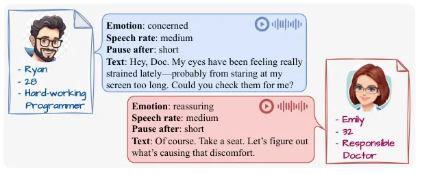
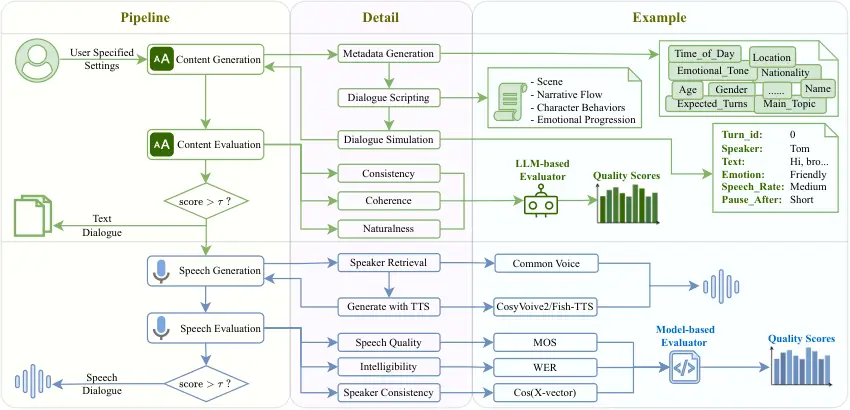
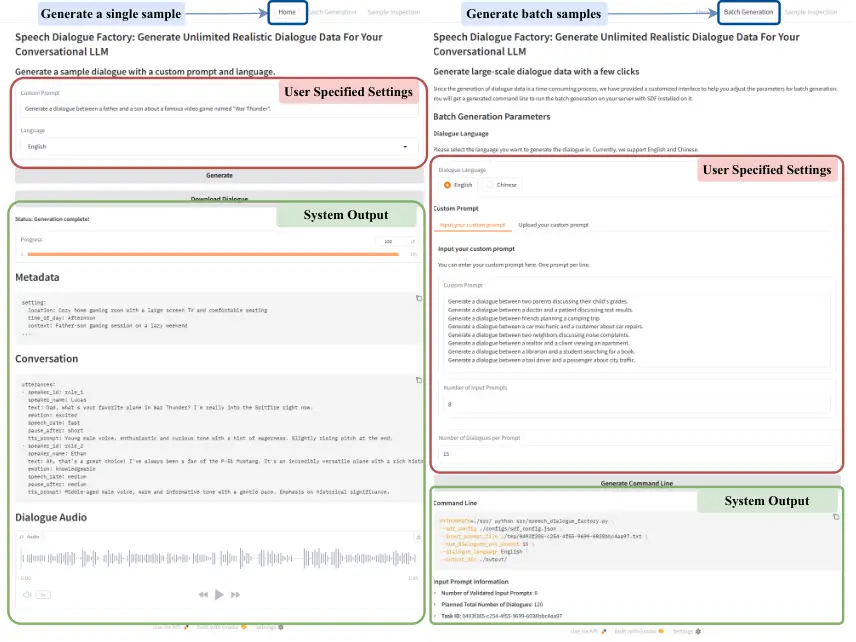

# ![[Uncaptioned image]](arxiv-2503-23848--7e740d9065f2.figures/figure-1.webp) SpeechDialogueFactory: Generating High-Quality Speech Dialogue Data to Accelerate Your Speech-LLM Development

Minghan Wang Affiliation: Department of Data Science & AI, Monash
University Email: <firstname.lastname@monash.edu>    Ye Bai
Affiliation: Department of Data Science & AI, Monash University
Email: <yuxia.wang@mbzuai.ac.ae>    Yuxia Wang Affiliation: MBZUAI   
Thuy-Trang Vu Affiliation: Department of Data Science & AI, Monash
University    Ehsan Shareghi Affiliation: Department of Data Science &
AI, Monash University    Gholamreza Haffari Affiliation: Department of
Data Science & AI, Monash University

###### Abstract

High-quality speech dialogue datasets are crucial for Speech-LLM
development, yet existing acquisition methods face significant
limitations. Human recordings incur high costs and privacy concerns,
while synthetic approaches often lack conversational authenticity. To
address these challenges, we introduce SpeechDialogueFactory, a
production-ready framework for generating natural speech dialogues
efficiently. Our solution employs a comprehensive pipeline including
metadata generation, dialogue scripting, paralinguistic-enriched
utterance simulation, and natural speech synthesis with voice cloning.
Additionally, the system provides an interactive UI for detailed sample
inspection and a high-throughput batch synthesis mode. Evaluations show
that dialogues generated by our system achieve a quality comparable to
human recordings while significantly reducing production costs. We
release our work as an open-source toolkit¹¹ 1
[http://github.com/yuriak/SpeechDialogueFactory](http://github.com/yuriak/SpeechDialogueFactory),
alongside example datasets available in English²² 2
[https://huggingface.co/datasets/minghanw/sdf_dataset_en](https://huggingface.co/datasets/minghanw/sdf_dataset_en)
and Chinese³³ 3
[https://huggingface.co/datasets/minghanw/sdf_dataset_zh](https://huggingface.co/datasets/minghanw/sdf_dataset_zh),
empowering researchers and developers in Speech-LLM research and
development.

[TABLE]

Table 1: Comparison of representative dialogue generation frameworks
from 6 perspectives.

## 1 Introduction

The emergence of voice-based AI interfaces has accelerated with recent
breakthroughs in large language models (LLMs), establishing
Speech-LLMs (Défossez et al., 2024; Chu et al., 2023; OpenAI et al., 2024) as essential components in next-generation human-computer
interaction systems. Developing effective Speech-LLMs involves two
crucial phases: cross-modal alignment through joint pretraining of text
and speech units (Zhang et al., 2024; Xie and Wu, 2024; Zeng et al.,
2024), followed by specialized training on speech dialogue datasets to
develop conversational capabilities (Zeng et al., 2024; Wang et al.,
2024). High-quality speech dialogue datasets are fundamental to this
second phase, requiring both linguistically authentic dialogue content
(Zhan et al., 2023; Zhong et al., 2022) and naturalistic prosodic
features (Chen et al., 2024b; Maiti et al., 2022). However, current
approaches to acquiring such datasets face significant limitations that
hinder progress in the field (Défossez et al., 2024; Wang et al., 2024).
Human-recorded dialogues present substantial practical challenges for
dataset creation. While professional voice actor recordings can achieve
high quality, they involve prohibitive costs that severely limit dataset
size and diversity (Lee et al., 2023; Zandie et al., 2021). Conversely,
spontaneous dialogues often contain elements unsuitable for training,
including excessive disfluencies and unstructured responses that can
negatively impact model performance (Yang et al., 2022; Barker et al.,
2018; Saito et al., 2022; Li et al., 2022; Liu et al., 2024).

Figure 1: Example dialogue created by SpeechDialogueFactorywith
comprehensive character metadata and paralinguistic annotations.

Therefore, to effectively address the aforementioned challenges in data
collection, researchers have increasingly turned to synthetic methods
for generating dialogue data. However, current synthetic data generation
frameworks still face two critical issues: (_i_) Insufficient
naturalness of generated dialogues. There are distinct differences
between conversational and written language styles (Zhang et al., 2024;
Wang et al., 2024). Dialogues generated by LLMs, which typically excel
at producing written text, often lack the natural rhythm, emotional
expressiveness, and turn-taking dynamics characteristic of genuine human
interactions. (_ii_) Lack of a unified, end-to-end generation framework.
As shown in Table 1, existing frameworks typically focus separately on
either text or speech dialogue generation (Mitsui et al., 2023; Han
et al., 2024). These methods often require extensive model
fine-tuning (Li et al., 2024) and usually do not incorporate essential
features such as emotional expressiveness Chen et al. (2023),
multilingual support, or user-friendly interfaces. Consequently, these
limitations make it impractical to build large-scale and comprehensive
dialogue datasets.

To overcome these limitations, we present SpeechDialogueFactory, a
systematic framework to generate high-quality speech dialogues with
flexible customization and control. Our work makes four key
contributions:

- •
  Quality-Assured Generation Pipeline: An integrated end-to-end workflow
  combining structured content creation (metadata, scripting,
  simulation) with expressive speech synthesis, ensuring both linguistic
  authenticity and natural prosody through comprehensive paralinguistic
  annotations.
- •
  Production-Optimized Implementation: An efficient system with
  interactive UI and parallel batch processing capabilities, designed
  for both exploratory development and large-scale dataset creation.
- •
  Multilingual Dataset: Publicly released dialogue datasets in both
  English and Chinese, along with intermediate records and quality
  evaluation results to support further research.

Our experimental evaluation also confirms that SDF generates dialogues
matching the quality of professional recordings, while offering
researchers and developers unprecedented flexibility and usability for
creating custom speech dialogue datasets tailored to their specific
needs.

## 2 Related Work

Currently, numerous frameworks have been proposed in the field of
conversational data generation. Among these, some approaches focus
primarily on utterance-level generation Sahu et al. (2022); Chen et al.
(2022); Rosenbaum et al. (2022); Aher et al. (2023), while others aim to
generate entire conversations. However, there is presently no unified
framework capable of comprehensively generating conversations, from
textual content to corresponding speech, while simultaneously supporting
emotional expressiveness and multilingual capabilities. As summarized in
Table 1, frameworks such as Places, RefGPT, and psydial Chen et al.
(2023); Yang et al. (2023); Han et al. (2024) predominantly concentrate
on text-based conversation generation, whereas CHATS and Style-Talker
Mitsui et al. (2023); Li et al. (2024) specialize in speech-based
conversation generation. Although CSR-data Cornell et al. (2024) is
capable of generating both textual and speech conversations, it lacks
emotional expressiveness and multilingual support. Additionally, none of
the aforementioned frameworks provide user interfaces designed for easy
interaction by general users.

Furthermore, each of these existing frameworks demonstrates unique
strengths. For instance, the Places Chen et al. (2023) framework does
not require external seed data; instead, it utilizes high-quality
expert-written dialogues as prompts, structured according to the desired
conversational output, allowing LLMs to directly generate multi-party
conversations. Style-Talker Li et al. (2024) analyzes the acoustic
features of the user’s input speech to synthesize responses that align
closely with the user’s speaking style. Additionally, the CSR-data
Cornell et al. (2024) framework uniquely integrates both textual and
speech conversation generation, which is relatively rare among current
approaches. Researchers leveraging this framework can produce
high-quality synthetic dialogue data suitable for fine-tuning automatic
speech recognition (ASR) models.

## 3 SpeechDialogueFactory

Figure 2: The SpeechDialogueFactory pipeline with integrated quality
control. The framework processes user-specified settings through three
main stages: content generation (including metadata generation, dialogue
scripting, and simulation), speech generation (speaker retrieval and TTS
synthesis), and quality evaluation at both text and speech levels to
filter low-quality outputs before proceeding to subsequent processing
steps.

### 3.1 Content Generation

Naive approaches to dialogue generation using LLMs (e.g., simple prompts
like "Generate a conversation…") prove inadequate for creating
high-quality speech dialogue datasets. Our experiments (see Table 4
baseline) revealed that such methods typically produce limited turns
with diminishing coherence and completely lack the paralinguistic
features needed for natural speech rendering. To overcome these
limitations, SDF implements a structured three-stage pipeline for
dialogue content creation that provides both greater control over
generation and essential speech synthesis guidance parameters.

#### 3.1.1 Metadata Generation

The first stage of our pipeline generates structured metadata that
defines the dialogue foundation through three key components: dialogue
settings (temporal-spatial context, length parameters), character
profiles (demographic information, personality traits, cultural
backgrounds), and conversation context (topic progression, emotional
arcs). These components are formalized into 26 structured fields within
a JSON schema, with generation guided by constrained decoding
techniquesWillard and Louf (2023) to ensure completeness.

To enhance generation diversity while maintaining control, our system
implements a scenario-seed-based initialization mechanism operating
across five dimensions: dialogue type (e.g., professional discussion,
casual conversation), temporal context, spatial setting, cultural
background, and language (currently supporting English and Chinese). It
also accepts custom prompts for specialized dialogue requirements. Users
can directly specify the custom prompt and let the system to complete
the scenario seed with appropriate values automatically.

#### 3.1.2 Dialogue Scripting

Direct dialogue generation from metadata often produces narrative
inconsistencies due to the limited information in structured metadata
and the inability to make retroactive corrections. Inspired by Chen
et al. (2024a); Song et al. (2024), we implement an intermediate
scripting phase that translates metadata into natural language
directives. The script serves as a comprehensive blueprint with four
components: Scene (environmental context and character relationships),
Narrative Flow (dialogue progression through distinct phases), Character
Behaviors (interaction patterns and communication styles), and Emotional
Progression (affective development with natural transitions). This
intermediate representation significantly improves coherence by
providing LLMs with comprehensive contextual guidance in a more
effective format.

#### 3.1.3 Dialogue Simulation

The final content generation stage transforms the metadata and script
into actionable dialogue by prompting the LLM to simulate the complete
conversation in a single efficient pass. Unlike iterative role-playing
approaches that require multiple inference steps, our single-pass
implementation significantly reduces computational overhead while
maintaining quality.

The system outputs a structured JSON representation of the dialogue,
where each utterance is enriched with critical paralinguistic
annotations such as emotional state indicators (e.g., "excited,"
"concerned"), speech rate parameters (slow, medium, fast), and
turn-taking dynamics (pause duration between speakers) as shown in
Figure 1. These annotations serve as control signals for the subsequent
speech synthesis stage, enabling more naturalistic rendering of the
conversation. The structured format also facilitates systematic quality
assessment and potential refinement before advancing to speech
generation.

#### 3.1.4 Content Evaluation

We implement a comprehensive quality control process that evaluates
generated dialogue content before proceeding to resource-intensive
speech synthesis. This proactive filtering approach significantly
improves overall dataset quality while reducing computational waste. Our
system employs a three-dimensional assessment framework that addresses
fundamental aspects of dialogue quality: consistency, coherence, and
naturalness. Given the inherent subjectivity of dialogue evaluation and
absence of ground-truth references Ito et al. (2025), we leverage the
established LLM-as-a-judge paradigm Zheng et al. (2023) to provide
reliable and reproducible quality assessments at scale. Through human
evaluation, we confirmed the reliability of LLM-based content evaluation
(See Table 6 for more details).

##### Consistency

Our system conducts comprehensive consistency validation across the
entire dialogue generation pipeline. We implement an assessment
framework with 19 questions (scored 0-100) evaluating three critical
dimensions: Scenario-Metadata Alignment (verifying adherence to user
parameters, e.g. prompt), Metadata Internal Consistency (examining
logical integrity within metadata), and Cross-Component Consistency
(ensuring information preservation across pipeline stages). The LLM
evaluator analyzes all generated components holistically to produce all
consistency scores by filling a checklist.

##### Coherence

Our coherence assessment evaluates the dialogue’s logical structure and
flow at the turn level. The system examines topic relevance, contextual
appropriateness of responses, logical flow continuity, absence of
contradictions, and overall conversation coherence. Each field receives
a 0-100 score from an LLM evaluator, and an overall coherence score is
computed by averaging the scores of corresponding aspects for all turns.
SDF leverages the complete generation chain (metadata, script, and
dialogue) as context, providing richer information for more accurate
evaluation.

##### Naturalness

The naturalness evaluation measures how closely the generated dialogue
mirrors authentic human dialogue patterns. Our framework examines oral
style authenticity, appropriate utterance length and rhythm, contextual
appropriateness of emotional expressions, consistency between content
and emotional markers, and naturalness of vocabulary choices. As with
coherence, the LLM evaluator assigns 0-100 scores to each aspect at the
turn level, which are then aggregated to produce an overall dialogue
naturalness rating. The complete generation history provides essential
context for this assessment.

### 3.2 Speech Generation

After generating and validating dialogue content, SDF transforms text
into authentic conversational speech through a sophisticated two-stage
synthesis pipeline designed for voice diversity and paralinguistic
expressiveness.

#### 3.2.1 Speaker Retrieval

Our system implements a profile-driven voice matching system that draws
from the Common Voice dataset Ardila et al. (2020), selected for its
extensive demographic annotations across numerous speakers. The
retrieval algorithm maps character attributes from dialogue metadata
(age, gender, nationality, etc.) to acoustic characteristics, creating a
ranked shortlist of candidate voices for each dialogue participant. This
approach ensures acoustic embodiment aligns with narrative
characterization, enhancing overall dialogue authenticity.

#### 3.2.2 Generate with TTS

We integrate state-of-the-art TTS models, primarily CosyVoice2 Du et al.
(2024) and Fish-TTS Liao et al. (2024), selected for their exceptional
prosodic control and consistent voice cloning capabilities. The
synthesis process leverages two input streams: voice prompts derived
from retrieved speaker samples, and natural language control prompts
(only used by CosyVoice2) constructed from utterance-specific speech
rates and emotional expressions. Our system enhances conversational
realism by implementing variable-length inter-utterance silences based
on the dialogue’s specified pause durations Skantze (2021), creating
natural turn-taking dynamics that avoid the mechanical pacing typical of
synthetic dialogue datasets.

### 3.3 Speech Evaluation

Complementing our content evaluation process, SDF implements
comprehensive speech quality assessment to ensure the acoustic integrity
of synthesized dialogues. While content checking focuses on semantic and
logical properties, speech quality verification addresses the acoustic
manifestation of these dialogues through objective, measurement-based
evaluation.

#### 3.3.1 Speech Quality

Our system evaluates overall speech naturalness and fidelity using Mean
Opinion Score (MOS) metrics implemented through the automated
UTMOSv2 (Baba et al., 2024). This approach provides efficient and
consistent quality ratings without human evaluator variability. The
framework calculates utterance-level scores for each speech segment,
then aggregates these into comprehensive dialogue-level quality metrics
that reflect the overall listening experience.

#### 3.3.2 Intelligibility

SDF quantifies speech clarity through automated speech recognition (ASR)
performance testing. The system transcribes synthesized utterances using
Whisper-large-v3-turbo Radford et al. (2022) and calculates Word Error
Rate (WER) against reference texts for English dialogues, or Character
Error Rate (CER) for Chinese content. To isolate TTS quality factors
from ASR-specific biases, our implementation normalizes case and
excludes punctuation from metric calculations.

#### 3.3.3 Speaker Consistency

Voice stability across multiple turns from the same character is
critical for dialogue immersion. Our framework analyzes voice
consistency by extracting speaker embeddings from each utterance using
SpeechBrain’s Ravanelli et al. (2021) pretrained x-vector model. The
system then computes cosine similarity between consecutive utterances
from the same speaker, flagging potential voice inconsistencies when
similarity falls below a configurable threshold (default 0.9).

### 3.4 Implementation Details

#### 3.4.1 User Interfaces

SDF offers dual interfaces in Python: a Gradio-based web UI for
interactive exploration and a command-line interface for large-scale
production. As shown in Appendix C Figure 3, our web interface enables
real-time visualization of the generation pipeline with configurable
parameters and immediate output inspection with a downloadable packed
dialogue file provided after the generation. A configuration tool is
also provided in the web UI to help the user prepare commands for
batched generation. The command-line interface provides efficient batch
processing through simple configuration files and parameter
specifications.

#### 3.4.2 LLM Integration

The system supports both API-based LLM invocation (connecting to
providers like OpenAI) and local inference through VLLM. This dual
approach balances convenience for exploratory usage with high-throughput
batch acceleration for production-scale generation, allowing seamless
transition between development and deployment workflows.

#### 3.4.3 Parallelization

To optimize throughput, we implement multi-process parallelization
across several generation and evaluation stages, such as TTS,
intelligibility, and speech quality evaluation, significantly reducing
end-to-end production time for large datasets.

### 3.5 Sample Dataset

|                             |         |        |        |
| --------------------------- | ------- | ------ | ------ |
| Feature                     | SDF_en  | SDF_zh | DTalk  |
| \# Turns                    | 32,021  | 11,312 | 23,773 |
| Total Duration (s)          | 437,351 | 86,415 | 78,026 |
| Avg Duration / Turn (s)     | 13.658  | 7.639  | 3.282  |
| \# Dialogues                | 3,168   | 1,005  | 2,541  |
| Avg Duration / Dialogue (s) | 138.053 | 85.985 | 30.706 |
| Avg Turns / Dialogue        | 10.108  | 11.256 | 9.356  |
| \# Speakers                 | 17      | 35     | 2      |
| \# Topics                   | 16      | 16     | 10     |
| \# Emotions                 | 17      | 17     | 7      |

Table 2: Comparative statistics of DailyTalk (DTalk) and
SpeechDialogueFactory (SDF) datasets in English and Chinese.

To make our work more accessible to the community, we generated and
released sample datasets in both English (3000+ samples) and Chinese
(1000+ samples). Using GPT-4o⁴⁴ 4 gpt-4o-2024-11-20 and
Deepseek-V3 (DeepSeek-AI et al., 2025), we created 300 custom prompts
for each language, spanning diverse temporal-spatial settings, cultural
contexts, and speaker demographics (Analysis can be found in Table 5 in
Appendix A). For each prompt, we generated multiple dialogues with
Llama-3.3-70B for English and Qwen-2.5-72B (Qwen et al., 2025) for
Chinese, and filtered them with quality evaluation to obtain the final
datasets. All intermediate outputs and evaluation results are uploaded
to support further research. Detailed statistics can be found in
Table 2.

## 4 System Evaluation

|                             |                    |                       |                    |                   |                   |
| --------------------------- | ------------------ | --------------------- | ------------------ | ----------------- | ----------------- |
| Dimensions                  |                    | SpeechDialogueFactory |                    |                   | DailyTalk         |
| Content Evaluation          |                    |                       |                    |                   |                   |
| LLMs                        |                    | L3.3-70B              | L3.1-8B            | L3.2-1B           |                   |
| Consistency $`\uparrow`$    |                    | 96.9 $`\pm`$ 2.3      | 95.9 $`\pm`$ 3.5   | 56.6 $`\pm`$ 13.1 | \-                |
| Coherence $`\uparrow`$      |                    | 99.7 $`\pm`$ 0.5      | 99.6 $`\pm`$ 0.7   | 99.0 $`\pm`$ 1.3  | 99.2 $`\pm`$ 1.3  |
| Naturalness $`\uparrow`$    |                    | 91.6 $`\pm`$ 1.8      | 92.3 $`\pm`$ 2.6   | 90.3 $`\pm`$ 2.8  | 85.9 $`\pm`$ 5.0  |
| Speech Evaluation           |                    |                       |                    |                   |                   |
| TTS Models                  | CosyVoice2         |                       | Fish-TTS           |                   |                   |
| Speech Quality $`\uparrow`$ | 3.38 $`\pm`$ 0.14  |                       | 2.81 $`\pm`$ 0.18  |                   | 3.28 $`\pm`$ 0.21 |
| Intel. $`\downarrow`$       | 2.36 $`\pm`$ 2.85  |                       | 1.72 $`\pm`$ 1.66  |                   | 7.05 $`\pm`$ 6.28 |
| Spk. Consis. $`\uparrow`$   | 99.90 $`\pm`$ 0.17 |                       | 97.56 $`\pm`$ 3.40 |                   | \-                |

Table 3: Content and speech quality evaluation comparing
SpeechDialogueFactory with DailyTalk. Bold values indicate best
performance. Content evaluation shows results across three Llama3 model
scales, while speech evaluation compares two TTS systems against human
recordings. DailyTalk lacks consistency evaluation due to absence of
metadata, and speaker consistency metrics due to its fixed two-speaker
design. Intel. = Intelligibility (WER), Spk. Consis. = Speaker
Consistency.

We conducted a comprehensive evaluation on SDF output compared to
DailyTalk (Lee et al., 2023), a widely-used dataset of human-annotated
dialogues recorded by professional voice actors. For fair comparison, we
generated 2,541 samples (in English, matching DailyTalk’s size) as an
experimental set using custom prompts sampled via GPT-4o (with identical
topics to DailyTalk). The GPT-4o is also used to evaluate content
quality (3 dimensions). Since DailyTalkhas no metadata and scripts, we
only evaluate its coherence and naturalness solely on the dialogue text.
For the speech evaluation, we leverage the methodology described in §3.3
for both dataset. To analyze model scaling effects, we compared output
from three Llama3 (Grattafiori et al., 2024) variants (3.2-1B, 3.1-8B
and 3.3-70B). For speech synthesis evaluation, we tested CosyVoice2 Du
et al. (2024) and Fish-TTS Liao et al. (2024) using identical
Llama3.3-70B generated content.

### 4.1 Quality Benchmarking

Our evaluation results (Table 3) demonstrate SDF’s effectiveness across
both dimensions. For content, we found that model scale significantly
impacts consistency (dramatic improvement from 1B to 8B models), while
coherence remains consistently high regardless of scale. All of our
models produce more natural dialogues than DailyTalk, with the 8B
variant achieving optimal results. For speech synthesis,
CosyVoice2 outperforms both Fish-TTS and human recordings on quality
metrics, while Fish-TTS excels in intelligibility. Both systems maintain
excellent speaker consistency while offering dramatically greater voice
diversity (30+ speakers vs. DailyTalk’s 2) without sacrificing quality,
confirming our framework’s ability to match or exceed human recordings
while providing substantially greater scalability.

### 4.2 Pipeline Component Analysis

| Settings            | Coherence          | Naturalness        | \# Turns           |
| ------------------- | ------------------ | ------------------ | ------------------ |
| Baseline            | 90.25 $`\pm`$ 9.20 | 84.87 $`\pm`$ 4.67 | 4.06 $`\pm`$ 1.34  |
| + Metadata          | 95.68 $`\pm`$ 4.68 | 87.03 $`\pm`$ 4.46 | 9.38 $`\pm`$ 2.01  |
| + Script            | 93.39 $`\pm`$ 8.43 | 84.06 $`\pm`$ 4.33 | 11.26 $`\pm`$ 7.72 |
| + Metadata & Script | 97.39 $`\pm`$ 3.19 | 89.01 $`\pm`$ 3.84 | 11.82 $`\pm`$ 5.31 |

Table 4: Component contribution analysis comparing four generation
approaches: baseline (direct generation), metadata-only, script-only,
and complete pipeline. Bold values indicate best performance.

We systematically evaluated the contribution of each pipeline stage
through controlled ablation experiments. Using Llama-3.1-8B for
generation and the 70B model for evaluation, we compared four
configurations across 300 samples: baseline (direct generation),
metadata-only, script-only, and the complete pipeline. Results in Table
4 demonstrate that metadata provides the foundation for quality
improvements, increasing coherence by 5.4 points and more than doubling
dialogue length. While script-only generation shows limited independent
benefits, the full pipeline combining metadata and scripting achieves
the highest quality scores across all metrics. These findings confirm
the value of our multi-stage approach, with each component contributing
to different aspects of dialogue quality.

## 5 Conclussion

We present SpeechDialogueFactory, a production-ready system for
generating high-quality speech dialogues that addresses critical
challenges in Speech-LLM training data creation. Our framework combines
a multi-stage content generation pipeline with advanced speech synthesis
and comprehensive quality assessment, all integrated into an efficient
implementation with LLM inference acceleration, parallelization,
flexible deployment options, and user-friendly interfaces. Experimental
evaluation confirms our approach produces dialogues matching or
exceeding human recordings while offering dramatically greater speaker
diversity and cost efficiency. By releasing this as an open-source
toolkit and corresponding dataset, we empower researchers to efficiently
create customized speech dialogue datasets across domains and languages,
with future work focused on multi-party dialogues, enhanced interface
capabilities, and optimization for enterprise-scale deployment.

## Limitations

Our system faces two key limitations: 1) Computational demands for
high-quality output, as larger models produce better dialogues but
require significantly more resources; 2) Cultural representation biases
in the underlying LLM that emerge when prompts lack specific directives,
defaulting to overrepresented contexts.

## Ethics Statement

SpeechDialogueFactory is intended for generating conversational datasets
to support Speech-LLM development. Potential misuse exists through
creation of harmful or misleading content. We encourage additional
safeguards to be applied. Generated content may reflect biases present
in LLM training data, requiring careful evaluation before downstream
use. This system is meant for creating training data, not for presenting
content as authentic human conversations.

## References

- Aher et al. (2023) Gati Aher, Rosa I. Arriaga, and Adam Tauman
  Kalai. 2023. [Using large language models to simulate multiple humans
  and replicate human subject
  studies](https://arxiv.org/abs/2208.10264). _Preprint_,
  arXiv:2208.10264.
- Ardila et al. (2020) Rosana Ardila, Megan Branson, Kelly Davis,
  Michael Henretty, Michael Kohler, Josh Meyer, Reuben Morais, Lindsay
  Saunders, Francis M. Tyers, and Gregor Weber. 2020. [Common voice: A
  massively-multilingual speech
  corpus](https://arxiv.org/abs/1912.06670). _Preprint_,
  arXiv:1912.06670.
- Baba et al. (2024) Kaito Baba, Wataru Nakata, Yuki Saito, and Hiroshi
  Saruwatari. 2024. The t05 system for the VoiceMOS Challenge 2024:
  Transfer learning from deep image classifier to naturalness MOS
  prediction of high-quality synthetic speech. In _IEEE Spoken Language
  Technology Workshop (SLT)_.
- Barker et al. (2018) Jon Barker, Shinji Watanabe, Emmanuel Vincent,
  and Jan Trmal. 2018. [The fifth ’chime’ speech separation and
  recognition challenge: Dataset, task and
  baselines](https://arxiv.org/abs/1803.10609). _Preprint_,
  arXiv:1803.10609.
- Chen et al. (2024a) Jing Chen, Xinyu Zhu, Cheng Yang, Chufan Shi,
  Yadong Xi, Yuxiang Zhang, Junjie Wang, Jiashu Pu, Rongsheng Zhang,
  Yujiu Yang, and Tian Feng. 2024a. [Hollmwood: Unleashing the
  creativity of large language models in screenwriting via role
  playing](https://arxiv.org/abs/2406.11683). _Preprint_,
  arXiv:2406.11683.
- Chen et al. (2023) Maximillian Chen, Alexandros Papangelis, Chenyang
  Tao, Seokhwan Kim, Andy Rosenbaum, Yang Liu, Zhou Yu, and Dilek
  Hakkani-Tur. 2023. [Places: Prompting language models for social
  conversation synthesis](https://arxiv.org/abs/2302.03269). _Preprint_,
  arXiv:2302.03269.
- Chen et al. (2022) Maximillian Chen, Alexandros Papangelis, Chenyang
  Tao, Andy Rosenbaum, Seokhwan Kim, Yang Liu, Zhou Yu, and Dilek
  Hakkani-Tur. 2022. [Weakly supervised data augmentation through
  prompting for dialogue
  understanding](https://arxiv.org/abs/2210.14169). _Preprint_,
  arXiv:2210.14169.
- Chen et al. (2024b) Yiming Chen, Xianghu Yue, Chen Zhang, Xiaoxue Gao,
  Robby T. Tan, and Haizhou Li. 2024b. [Voicebench: Benchmarking
  llm-based voice assistants](https://arxiv.org/abs/2410.17196).
  _Preprint_, arXiv:2410.17196.
- Chu et al. (2023) Yunfei Chu, Jin Xu, Xiaohuan Zhou, Qian Yang,
  Shiliang Zhang, Zhijie Yan, Chang Zhou, and Jingren Zhou. 2023.
  [Qwen-audio: Advancing universal audio understanding via unified
  large-scale audio-language models](https://arxiv.org/abs/2311.07919).
  _Preprint_, arXiv:2311.07919.
- Cornell et al. (2024) Samuele Cornell, Jordan Darefsky, Zhiyao Duan,
  and Shinji Watanabe. 2024. [Generating data with text-to-speech and
  large-language models for conversational speech
  recognition](https://arxiv.org/abs/2408.09215). _Preprint_,
  arXiv:2408.09215.
- DeepSeek-AI et al. (2025) DeepSeek-AI, Aixin Liu, Bei Feng, Bing Xue,
  Bingxuan Wang, Bochao Wu, and Chengda Lu et al. 2025. [Deepseek-v3
  technical report](https://arxiv.org/abs/2412.19437). _Preprint_,
  arXiv:2412.19437.
- Du et al. (2024) Zhihao Du, Yuxuan Wang, Qian Chen, Xian Shi, Xiang
  Lv, Tianyu Zhao, Zhifu Gao, Yexin Yang, Changfeng Gao, Hui Wang, Fan
  Yu, Huadai Liu, Zhengyan Sheng, Yue Gu, Chong Deng, Wen Wang, Shiliang
  Zhang, Zhijie Yan, and Jingren Zhou. 2024. [Cosyvoice 2: Scalable
  streaming speech synthesis with large language
  models](https://arxiv.org/abs/2412.10117). _Preprint_,
  arXiv:2412.10117.
- Défossez et al. (2024) Alexandre Défossez, Laurent Mazaré, Manu
  Orsini, Amélie Royer, Patrick Pérez, Hervé Jégou, Edouard Grave, and
  Neil Zeghidour. 2024. [Moshi: a speech-text foundation model for
  real-time dialogue](https://arxiv.org/abs/2410.00037). _Preprint_,
  arXiv:2410.00037.
- Grattafiori et al. (2024) Aaron Grattafiori, Abhimanyu Dubey, and
  Abhinav Jauhri et al. 2024. [The llama 3 herd of
  models](https://arxiv.org/abs/2407.21783). _Preprint_,
  arXiv:2407.21783.
- Han et al. (2024) Ji-Eun Han, Jun-Seok Koh, Hyeon-Tae Seo, Du-Seong
  Chang, and Kyung-Ah Sohn. 2024. [Psydial: Personality-based synthetic
  dialogue generation using large language
  models](https://arxiv.org/abs/2404.00930). _Preprint_,
  arXiv:2404.00930.
- Ito et al. (2025) Takumi Ito, Kees van Deemter, and Jun Suzuki. 2025.
  [Reference-free evaluation metrics for text generation: A
  survey](https://arxiv.org/abs/2501.12011). _Preprint_,
  arXiv:2501.12011.
- Lee et al. (2023) Keon Lee, Kyumin Park, and Daeyoung Kim. 2023.
  [Dailytalk: Spoken dialogue dataset for conversational
  text-to-speech](https://arxiv.org/abs/2207.01063). _Preprint_,
  arXiv:2207.01063.
- Li et al. (2022) Jingbei Li, Yi Meng, Chenyi Li, Zhiyong Wu, Helen
  Meng, Chao Weng, and Dan Su. 2022. [Enhancing speaking styles in
  conversational text-to-speech synthesis with graph-based multi-modal
  context modeling](https://arxiv.org/abs/2106.06233). _Preprint_,
  arXiv:2106.06233.
- Li et al. (2024) Yinghao Aaron Li, Xilin Jiang, Jordan Darefsky,
  Ge Zhu, and Nima Mesgarani. 2024. [Style-talker: Finetuning audio
  language model and style-based text-to-speech model for fast spoken
  dialogue generation](https://arxiv.org/abs/2408.11849). _Preprint_,
  arXiv:2408.11849.
- Liao et al. (2024) Shijia Liao, Yuxuan Wang, Tianyu Li, Yifan Cheng,
  Ruoyi Zhang, Rongzhi Zhou, and Yijin Xing. 2024. [Fish-speech:
  Leveraging large language models for advanced multilingual
  text-to-speech synthesis](https://arxiv.org/abs/2411.01156).
  _Preprint_, arXiv:2411.01156.
- Liu et al. (2024) Rui Liu, Yifan Hu, Yi Ren, Xiang Yin, and Haizhou
  Li. 2024. [Generative expressive conversational speech
  synthesis](https://arxiv.org/abs/2407.21491). _Preprint_,
  arXiv:2407.21491.
- Maiti et al. (2022) Soumi Maiti, Yifan Peng, Takaaki Saeki, and Shinji
  Watanabe. 2022. [Speechlmscore: Evaluating speech generation using
  speech language model](https://arxiv.org/abs/2212.04559). _Preprint_,
  arXiv:2212.04559.
- Mitsui et al. (2023) Kentaro Mitsui, Yukiya Hono, and Kei
  Sawada. 2023. [Towards human-like spoken dialogue generation between
  ai agents from written dialogue](https://arxiv.org/abs/2310.01088).
  _Preprint_, arXiv:2310.01088.
- OpenAI et al. (2024) OpenAI, :, Aaron Hurst, Adam Lerer, Adam P.
  Goucher, Adam Perelman, Aditya Ramesh, and Aidan Clark et al. 2024.
  [Gpt-4o system card](https://arxiv.org/abs/2410.21276). _Preprint_,
  arXiv:2410.21276.
- Qwen et al. (2025) Qwen, :, An Yang, Baosong Yang, Beichen Zhang,
  Binyuan Hui, Bo Zheng, Bowen Yu, Chengyuan Li, Dayiheng Liu, Fei
  Huang, Haoran Wei, Huan Lin, Jian Yang, Jianhong Tu, Jianwei Zhang,
  Jianxin Yang, Jiaxi Yang, Jingren Zhou, Junyang Lin, Kai Dang, Keming
  Lu, Keqin Bao, Kexin Yang, Le Yu, Mei Li, Mingfeng Xue, Pei Zhang, Qin
  Zhu, Rui Men, Runji Lin, Tianhao Li, Tianyi Tang, Tingyu Xia,
  Xingzhang Ren, Xuancheng Ren, Yang Fan, Yang Su, Yichang Zhang,
  Yu Wan, Yuqiong Liu, Zeyu Cui, Zhenru Zhang, and Zihan Qiu. 2025.
  [Qwen2.5 technical report](https://arxiv.org/abs/2412.15115).
  _Preprint_, arXiv:2412.15115.
- Radford et al. (2022) Alec Radford, Jong Wook Kim, Tao Xu, Greg
  Brockman, Christine McLeavey, and Ilya Sutskever. 2022. [Robust speech
  recognition via large-scale weak
  supervision](https://arxiv.org/abs/2212.04356). _Preprint_,
  arXiv:2212.04356.
- Ravanelli et al. (2021) Mirco Ravanelli, Titouan Parcollet, Peter
  Plantinga, Aku Rouhe, Samuele Cornell, Loren Lugosch, Cem Subakan,
  Nauman Dawalatabad, Abdelwahab Heba, Jianyuan Zhong, Ju-Chieh Chou,
  Sung-Lin Yeh, Szu-Wei Fu, Chien-Feng Liao, Elena Rastorgueva, François
  Grondin, William Aris, Hwidong Na, Yan Gao, Renato De Mori, and Yoshua
  Bengio. 2021. [SpeechBrain: A general-purpose speech
  toolkit](https://arxiv.org/abs/2106.04624). _Preprint_,
  arXiv:2106.04624. ArXiv:2106.04624.
- Rosenbaum et al. (2022) Andy Rosenbaum, Saleh Soltan, Wael Hamza, Amir
  Saffari, Marco Damonte, and Isabel Groves. 2022. [Clasp: Few-shot
  cross-lingual data augmentation for semantic
  parsing](https://arxiv.org/abs/2210.07074). _Preprint_,
  arXiv:2210.07074.
- Sahu et al. (2022) Gaurav Sahu, Pau Rodriguez, Issam H. Laradji,
  Parmida Atighehchian, David Vazquez, and Dzmitry Bahdanau. 2022. [Data
  augmentation for intent classification with off-the-shelf large
  language models](https://arxiv.org/abs/2204.01959). _Preprint_,
  arXiv:2204.01959.
- Saito et al. (2022) Yuki Saito, Yuto Nishimura, Shinnosuke Takamichi,
  Kentaro Tachibana, and Hiroshi Saruwatari. 2022. [Studies: Corpus of
  japanese empathetic dialogue speech towards friendly voice
  agent](https://arxiv.org/abs/2203.14757). _Preprint_,
  arXiv:2203.14757.
- Skantze (2021) Gabriel Skantze. 2021. [Turn-taking in conversational
  systems and human-robot interaction: A
  review](https://doi.org/10.1016/j.csl.2020.101178). _Computer Speech &
  Language_, 67:101178.
- Song et al. (2024) Zhende Song, Chenchen Wang, Jiamu Sheng, Chi Zhang,
  Gang Yu, Jiayuan Fan, and Tao Chen. 2024. [Moviellm: Enhancing long
  video understanding with ai-generated
  movies](https://arxiv.org/abs/2403.01422). _Preprint_,
  arXiv:2403.01422.
- Wang et al. (2024) Xiong Wang, Yangze Li, Chaoyou Fu, Yunhang Shen,
  Lei Xie, Ke Li, Xing Sun, and Long Ma. 2024. [Freeze-omni: A smart and
  low latency speech-to-speech dialogue model with frozen
  llm](https://arxiv.org/abs/2411.00774). _Preprint_, arXiv:2411.00774.
- Willard and Louf (2023) Brandon T. Willard and Rémi Louf. 2023.
  [Efficient guided generation for large language
  models](https://arxiv.org/abs/2307.09702). _Preprint_,
  arXiv:2307.09702.
- Xie and Wu (2024) Zhifei Xie and Changqiao Wu. 2024. [Mini-omni2:
  Towards open-source gpt-4o with vision, speech and duplex
  capabilities](https://arxiv.org/abs/2410.11190). _Preprint_,
  arXiv:2410.11190.
- Yang et al. (2023) Dongjie Yang, Ruifeng Yuan, Yuantao Fan, Yifei
  Yang, Zili Wang, Shusen Wang, and Hai Zhao. 2023. [Refgpt: Dialogue
  generation of gpt, by gpt, and for
  gpt](https://arxiv.org/abs/2305.14994). _Preprint_, arXiv:2305.14994.
- Yang et al. (2022) Zehui Yang, Yifan Chen, Lei Luo, Runyan Yang,
  Lingxuan Ye, Gaofeng Cheng, Ji Xu, Yaohui Jin, Qingqing Zhang,
  Pengyuan Zhang, Lei Xie, and Yonghong Yan. 2022. [Open source
  magicdata-ramc: A rich annotated mandarin conversational(ramc) speech
  dataset](https://arxiv.org/abs/2203.16844). _Preprint_,
  arXiv:2203.16844.
- Zandie et al. (2021) Rohola Zandie, Mohammad H. Mahoor, Julia Madsen,
  and Eshrat S. Emamian. 2021. [Ryanspeech: A corpus for conversational
  text-to-speech synthesis](https://arxiv.org/abs/2106.08468).
  _Preprint_, arXiv:2106.08468.
- Zeng et al. (2024) Aohan Zeng, Zhengxiao Du, Mingdao Liu, Kedong Wang,
  Shengmin Jiang, Lei Zhao, Yuxiao Dong, and Jie Tang. 2024.
  [Glm-4-voice: Towards intelligent and human-like end-to-end spoken
  chatbot](https://arxiv.org/abs/2412.02612). _Preprint_,
  arXiv:2412.02612.
- Zhan et al. (2023) Haolan Zhan, Zhuang Li, Yufei Wang, Linhao Luo, Tao
  Feng, Xiaoxi Kang, Yuncheng Hua, Lizhen Qu, Lay-Ki Soon, Suraj Sharma,
  Ingrid Zukerman, Zhaleh Semnani-Azad, and Gholamreza Haffari. 2023.
  [Socialdial: A benchmark for socially-aware dialogue
  systems](https://arxiv.org/abs/2304.12026). _Preprint_,
  arXiv:2304.12026.
- Zhang et al. (2024) Qinglin Zhang, Luyao Cheng, Chong Deng, Qian Chen,
  Wen Wang, Siqi Zheng, Jiaqing Liu, Hai Yu, and Chaohong Tan. 2024.
  [Omniflatten: An end-to-end gpt model for seamless voice
  conversation](https://arxiv.org/abs/2410.17799). _Preprint_,
  arXiv:2410.17799.
- Zheng et al. (2023) Lianmin Zheng, Wei-Lin Chiang, Ying Sheng, Siyuan
  Zhuang, Zhanghao Wu, Yonghao Zhuang, Zi Lin, Zhuohan Li, Dacheng Li,
  Eric P. Xing, Hao Zhang, Joseph E. Gonzalez, and Ion Stoica. 2023.
  [Judging llm-as-a-judge with mt-bench and chatbot
  arena](https://arxiv.org/abs/2306.05685). _Preprint_,
  arXiv:2306.05685.
- Zhong et al. (2022) Ming Zhong, Yang Liu, Da Yin, Yuning Mao, Yizhu
  Jiao, Pengfei Liu, Chenguang Zhu, Heng Ji, and Jiawei Han. 2022.
  [Towards a unified multi-dimensional evaluator for text
  generation](https://arxiv.org/abs/2210.07197). _Preprint_,
  arXiv:2210.07197.

## Appendix

## Appendix A Dataset Analysis

Our released datasets, SDF_en and SDF_zh, substantially outperform the
baseline DailyTalk dataset in scale, diversity, and richness. Table 2
shows SpeechDialogueFactory’s advantages with more dialogues,
significantly more turns, longer durations, and dramatically greater
speaker diversity. It also offers richer conversational structures with
more turns per dialogue and covers a broader range of topics and
emotions, as shown in Table 5.

| Topic Categories                    | %     | Emotion Categories           | %     |
| ----------------------------------- | ----- | ---------------------------- | ----- |
| Lifestyle & SocialMedia             | 20.5% | Enthusiastic & Passionate    | 15.1% |
| Technology & SocialTransformation   | 15.4% | Grateful & Appreciative      | 14.0% |
| Culture & Traditions                | 12.1% | Curious & Inquisitive        | 13.0% |
| History & Archaeology               | 9.8%  | Positive & Optimistic        | 11.9% |
| Environment & Sustainability        | 6.7%  | Reflective & Philosophical   | 10.7% |
| Health & MedicalCare                | 6.0%  | Confident & Resolute         | 10.2% |
| Psychology & PersonalDevelopment    | 5.9%  | Supportive & Encouraging     | 5.9%  |
| Family & InterpersonalRelationships | 4.6%  | Misc                         | 4.7%  |
| Arts & Literature                   | 4.6%  | Cautious & Conservative      | 4.6%  |
| Sci-Fi & Fantasy                    | 3.6%  | Anxious & Nervous            | 2.6%  |
| Economics & Business                | 3.2%  | Professional & Instructional | 2.1%  |
| Food & CulinaryArts                 | 3.1%  | Somber & Sorrowful           | 1.4%  |
| Politics & SocialMovements          | 2.6%  | Angry & Frustrated           | 1.1%  |
| Misc                                | 1.0%  | Humorous & Amused            | 1.0%  |
| Sports & Entertainment              | 0.5%  | Confused & Uncertain         | 0.6%  |
| Crime & Investigation               | 0.4%  | Emotional & DeeplyMoved      | 0.6%  |
|                                     |       | Creative & Imaginative       | 0.5%  |

Table 5: Distribution of dialogue topics and utterance-level emotions in
our released datasets (§Table 2). The percentages are calculated based
on the combined statistics (Categories are shared and values are summed
up for English and Chinese subsets).

## Appendix B Human Evaluation

| Dataset     | SpeechDialogueFactory |                 |                 | DailyTalk       |
| ----------- | --------------------- | --------------- | --------------- | --------------- |
| Generator   | Llama3.3-70B          | Llama3.1-8B     | Llama3.2-1B     |                 |
| Consistency | (69.02 , 63.98)       | (82.63 , 72.51) | (94.44 , 93.96) | -               |
| Coherence   | (71.15 , 71.22)       | (85.08 , 77.48) | (83.44 , 81.50) | (86.33 , 82.00) |
| Naturalness | (40.23 , 39.79)       | (56.66 , 53.34) | (61.49 , 51.18) | (79.45 , 79.23) |

Table 6: Correlation between human and LLM evaluations across different
models and datasets. Values shown as (Pearson correlation, Spearman
correlation) demonstrate alignment between human and automated quality
assessments. Higher values indicate stronger agreement. DailyTalk lacks
consistency evaluation due to the absence of metadata.

To validate our LLM evaluator, we conducted human evaluation with three
proficient English speakers rating 100 samples from each model setting
and DailyTalk. Table 6 shows strong correlations between human and LLM
judgments across settings, with particularly high agreement on
lower-quality samples (Llama3.2-1B). This confirms LLMs can effectively
differentiate dialogue quality in alignment with human judgment.

## Appendix C User Interface Screenshot

Figure 3: User Interface of SpeechDialogueFactory. The main interface of
SpeechDialogueFactory consists of 3 tabs: Single Sample Generation (\<-
left), Batch Samples Generation (-\> right), and Sample Inspection. In
the Single Sample Generation tab tab (\<- left), the System Output
section (highlighted in green) displays the complete results, including
intermediate outputs such as Metadata, Scripts, Dialogue Audio and
Quality Scores (note: screenshot content is simplified for clarity). In
the Batch Samples Generation tab (-\> right), the System Output
(highlighted in green) provides a pre-generated command line, allowing
users to easily copy and paste it into their terminal to initiate batch
dialogue generation. The purpose of the Sample Inspection tab is to
provide a convenient way to inspect individual dialogue samples
generated using the batch method. The display is similar to the one
described in the Single Sample Generation tab; thus, we will not present
it separately here.

Figure 3 presents the two major web pages of SpeechDialogueFactory,
corresponding to the interactive single dialogue generation mode and
batched generation model.
