# Can Diffusion Models Disentangle? A Theoretical Perspective

Liming Wang Affiliation: Massachusetts Institute of Technology
Email: [limingw@csail.mit.edu](mailto:)    Muhammad Jehanzeb Mirza
Affiliation: Massachusetts Institute of Technology    Yishu Gong
Affiliation: Takeda    Yuan Gong ^(†)^(†)thanks: Work done at MIT, now
with xAI Affiliation: Massachusetts Institute of Technology    Jiaqi
Zhang Affiliation: Massachusetts Institute of Technology    Brian H.
Tracey Affiliation: Takeda    Katerina Placek Affiliation: Takeda   
Marco Vilela Affiliation: Takeda    James R. Glass
Affiliation: Massachusetts Institute of Technology

###### Abstract

This paper presents a novel theoretical framework for understanding how
diffusion models can learn disentangled representations with commonly
used weak supervision such as partial labels and multiple views. Within
this framework, we establish identifiability conditions for diffusion
models to disentangle latent variable models with _stochastic_,
_non-invertible_ mixing processes. We also prove _finite-sample global
convergence_ for diffusion models to disentangle independent subspace
models. To validate our theory, we conduct extensive disentanglement
experiments on subspace recovery in latent subspace Gaussian mixture
models, image colorization, denoising, and voice conversion for speech
classification. Our experiments show that training strategies inspired
by our theory, such as style guidance regularization, consistently
enhance disentanglement performance.

## 1 Introduction

Extracting hidden structure from raw sensory data is fundamental to
progress in multimodal perception \[1, 2, 3, 4, 5\], scientific
discovery \[6, 7, 8, 9, 10, 11, 12, 13, 14, 15\], AI-assisted content
creation \[16, 17, 18, 19, 20\], and many more. Autonomous vehicles must
localize objects and auditory events while suppressing background noise
to navigate safely in open-world conditions, and data-driven
drug-discovery systems need to group and recombine functionally related
chemical components to propose therapies for emerging diseases. Deep
learning-based creative tools likewise hinge on isolating user-specified
factors (e.g., speaker style or lighting) while leaving other aspects
untouched.

Many latent factors are _disentangled_ in the sense that they vary
independently. For example, speech content persists regardless of the
speaker, and object shape remains consistent under different lighting
conditions. This intuition inspires breakthroughs in linear \[21\] and
non-linear \[22\] independent component analysis (ICA), modern deep
learning-based disentanglement \[23, 24\] and causal representation
learning \[25\]. However, an impossibility result shows that fully
_unsupervised_ disentanglement is unattainable in general \[26\]. Recent
work on disentanglement therefore relies on weak labels \[27, 28\] or
multi-view supervision \[29, 30\].

Applications such as video editing and drug discovery often require both
latent factor extraction and controlled synthesis of novel samples from
the latent factors. Diffusion models (DMs) \[31, 32, 33\] based on
learning score functions \[34\] of probability distributions, excel at
generation and power state-of-the-art editors and simulators \[16, 17,
19\]. However, standard DMs learn only the data _marginal_, encoding
latent factors _implicitly_. To control data generation using the latent
structure, _conditional_ DM (CDM) inject side information into the score
function \[35, 36, 37\] and achieve impressive empirical success in
disentanglement tasks such as voice conversion and image editing \[38,
39, 20, 35, 36\]. Yet a principled understanding of _when_ these models
learn identifiably disentangled representations is still missing.

In our work, we broaden the disentanglement theory to diffusion models
and provide the first learning-theoretic framework for DM-based
disentanglement, which poses unique challenges. First, a sample from DM
is generated by integrating a stochastic differential equation (SDE), so
the generated sample becomes a _stochastic, non-invertible_ mapping of
the latent variables. The lack of an analytic inverse precludes the
change-of-variables calculus and ICA-style arguments that underpin
classical disentanglement theory \[26, 40\]. Further, the extra
uncertainty injected by the stochastic drift can make it more difficult
to leverage the commonly used weak supervision. We tackle these
challenges by (i) proposing notions of approximate disentanglement
applicable to stochastic, non-invertible settings, (ii) marrying
information-regularised score matching with recent finite-sample
analyses of score-based models \[41\]. The resulting framework lays the
groundwork for the following contributions:

1.  1.  We show that, under mild Lipschitz assumptions, DMs can recover
        approximately disentangled representations of two latent factors
        (e.g., content and style), when given either partial supervision or
        multi-view inputs. For independent subspace models, we further prove
        global convergence in the finite-sample regime using gradient
        descent.
2.  2.  Building on the theory, we introduce a novel style-guided score
        matching loss that attains a global optimum for the
        independent-subspace case and improves disentanglement in practice.
3.  3.  Extensive experiments on Gaussian mixture models, image editing, and
        voice conversion for speech classification demonstrate that our
        theory-inspired training strategies consistently enhance
        disentanglement quality and downstream classification accuracy.

The rest of this paper is organized as follows: In Section 2, we provide
the background on diffusion models. Section 3 formalizes the problem of
content-style disentanglement, and later in Section 4 we present the
main theoretical results and Section 5 details empirical evaluations on
synthetic, image and speech data, demonstrating and supporting the
theoretical findings. Finally, Section 7 concludes the paper.

## 2 Background: diffusion models

Diffusion models (DMs) \[31, 32, 33\] approximate the pdf
$`p_{X}=:p_{0}`$ of an r.v. $`X\sim p_{0}`$ via a two-stage process:
_noising_ and _denoising_. In the noising stage, data is progressively
corrupted using an SDE:

```math
\displaystyle\mathrm{d}X_{t}=\mu(X_{t},t)\mathrm{d}t+\xi(t)\mathrm{d}B_{t},\quad X_{0}\sim p_{0}, \tag{1}
```

where $`B_{t}`$ is a Brownian motion. We adopt the choices
$`\mu(X_{t},t):=-X_{t}`$ and $`\xi(t)\equiv\sqrt{2}`$, leading to the
Ornstein–Uhlenbeck (OU) process:

```math
\displaystyle\mathrm{d}X_{t}=-X_{t}\mathrm{d}t+\sqrt{2}\mathrm{d}B_{t},\quad X_{0}\sim p_{0}, \tag{2}
```

which converges to a standard Gaussian \[42, 41\]. Let $`p_{t}`$ denote
the marginal of $`X_{t}`$ and $`p_{t|s}`$ the conditional pdf of
$`X_{t}`$ given $`X_{s}`$. In the denoising stage, the goal is to
recover $`X`$ from noisy versions $`X_{t},\,t\geq t_{0}`$ by simulating
the time-reversed process $`X^{\leftarrow}_{t}:=X_{T-t}`$:

```math
\displaystyle\mathrm{d}X_{t}^{\leftarrow}=[X_{t}^{\leftarrow}+2\nabla_{x}\log p_{T-t}(X_{t}^{\leftarrow})]\mathrm{d}t+\sqrt{2}\mathrm{d}B_{t}^{\leftarrow},\quad X_{0}^{\leftarrow}\sim p_{T}, \tag{3}
```

which converges back to $`p_{0}`$ \[43\]. Since the score function
$`\nabla_{x}\log p_{t}(X_{t})`$ is unknown, DM learns a _score
estimator_
$`s_{\theta}:{\mathbb{R}}^{d_{X}}\times[0,T]\mapsto{\mathbb{R}}^{d_{X}}`$
by minimizing the _score matching_ objective:

```math
\displaystyle L(\theta):=\mathbb{E}_{t,p_{t}}\|s_{\theta}(X_{t},t)-\nabla_{x}\log p_{t}(X_{t})\|^{2},
```

This objective is equivalent to a _conditional_ score matching objective
involving $`p_{t|0}`$:

```math
\displaystyle L_{c}(\theta):=\mathbb{E}_{t,p_{0}p_{t|0}}\left\|s_{\theta}(X_{t},t)-\nabla_{x}\log p_{t|0}(X_{t}|X)\right\|^{2}=\mathbb{E}_{t,p_{0}p_{t|0}}\left\|s_{\theta}(X_{t},t)+\frac{N_{t}}{\sigma(t)}\right\|^{2}, \tag{4}
```

where $`N_{t}`$ is standard Gaussian and
$`\sigma(t):=\sqrt{1-\exp(-2t)}`$. During inference, new samples are
generated by simulating an estimated SDE, with
$`{\hat{X}}_{0}^{\leftarrow}\sim p_{T}`$ and discretized time steps
$`t\in[k\eta,(k+1)\eta]`$:

```math
\displaystyle\mathrm{d}{\hat{X}}_{t}^{\leftarrow}=[{\hat{X}}_{t}^{\leftarrow}+2s_{\theta}({\hat{X}}_{k\eta}^{\leftarrow},T-k\eta)]\mathrm{d}t+\sqrt{2}\mathrm{d}B_{t}^{\leftarrow}. \tag{5}
```

## 3 Content-style disentanglement

The task of content-style disentanglement can be formalized through a
_latent variable model_ (LVM). For clarity, we refer to all random
entities – scalars, vectors, or matrices – as random variables (r.v.’s),
and focus on the _continuous_ case. For any r.v. $`X`$, let $`p_{X}`$
denote its probability density function (pdf). We assume two latent
factors: the _content_ $`Z\sim p_{Z}`$ taking values in
$`{\mathbb{R}}^{d_{Z}}`$ and the _style_ $`G\sim p_{G}`$ taking values
in $`{\mathbb{R}}^{d_{G}},`$ which jointly generate an observable
_sample_ $`X\in{\mathbb{R}}^{d_{X}}`$ through the noisy, non-invertible
and nonlinear transformation with an invertible _mixing function_
$`f:{\mathbb{R}}^{d_{Z}}\times{\mathbb{R}}^{d_{G}}\mapsto{\mathbb{R}}^{d_{X}}`$:

```math
\displaystyle X=\sqrt{1-\delta^{2}}f(Z,G)+\delta N, \tag{6}
```

where $`\delta`$ is the noise level and $`N`$ is an independent,
standard Gaussian noise. We assume that $`Z`$ and $`G`$ are
statistically independent, as is common in disentanglement \[24, 44,
26\] and ICA literature \[21, 40\]. Although exact independence between
$`Z`$ and $`G`$ is assumed for clarity, our framework naturally extends
to settings where independence holds only approximately, as will be
discussed subsequently.

This partition of latent factors arises in several settings. In
_controllable generation_, $`Z`$ encodes persistent attributes (e.g.,
object identity) while $`G`$ governs editable factors (e.g., pose or
lighting). In _self-supervised learning_ (SSL), $`Z`$ captures invariant
content across views or modalities, and $`G`$ captures modality- or
augmentation-specific variations. In the low-noise regime
$`\delta\rightarrow 0`$, our goal is to recover the latent variables
$`Z`$ and $`G`$ from observations of $`X`$. A common notion of recovery
is *block identifiability* \[45, 46, 47, 48, 29, 30\], which ensures
that subgroups of scalar latent variables can be recovered up to an
invertible transformation. However, exact block identifiability is not
achievable in the presence of noise $`\delta>0`$ due to the
non-invertibility of the mixing process, motivating a need for
_approximate disentanglement_. To this end, we propose two complementary
criteria: (1) approximate information-theoretic disentanglement and (2)
editability.

#### $`\bm{(\epsilon,\nu)}`$-disentanglement.

To quantify how well the learned content and style representations are
separated and informative, we define an information-theoretic notion of
approximate disentanglement.

###### Definition 3.1 ($`(\epsilon,\nu)`$-disentanglement).

Let $`(\hat{Z},\hat{G})`$ be content and style encodings inferred from
an observed sample $`X`$. They are $`(\epsilon,\nu)`$-disentangled if,
for some $`\epsilon,\nu\geq 0`$, (i) $`I(\hat{Z};\hat{G})\leq\epsilon`$;
(ii) $`I(\hat{Z},\hat{G};X)\geq I(Z,G;X)-\nu,`$ where $`I(A;B)`$ denotes
the mutual information (MI) between r.v.’s $`A`$ and $`B`$.

These conditions ensure that the learned latent factors are (i) nearly
independent (as the true $`Z`$ and $`G`$ are), and (ii) retain most of
the information about the observed data $`X`$. The definition remains
meaningful even as $`\delta\to 0`$ and $`I(Z,G;X)\rightarrow\infty`$,
since it is based on a bounded _difference_ in mutual information.

#### $`\bm{\epsilon}`$-editability.

In many applications, it is desirable to modify style while preserving
content. This motivates the following notion of editability based on
conditional sample generation.

###### Definition 3.2.

($`\epsilon`$-editability) Let $`({\hat{Z}},{\hat{G}})`$ be encodings
inferred from $`X`$, and let $`{\hat{G}}^{\prime}\sim p_{{\hat{G}}}`$ be
an independent style encoding. $`({\hat{Z}},{\hat{G}})`$ are
$`\epsilon`$-editable if there exists a generative model
$`q(\cdot\mid{\hat{Z}},{\hat{G}}^{\prime})`$ such that the generated
sample $`{\hat{X}}\sim q(\cdot\mid\hat{Z},\hat{G}^{\prime})`$ satisfies
$`\mathbb{E}_{Z\sim p_{Z}}d_{\mathrm{TV}}\left(p_{\tilde{X}|Z},p_{{\hat{X}}|Z}\right)\leq\epsilon,`$
where $`\tilde{X}:=\sqrt{1-\epsilon^{2}}X+\epsilon N`$ is a _smoothed_
version of $`X`$, and $`d_{\mathrm{TV}}`$ is the total variation
distance.

This definition captures the ability to recombine content and style
encodings to generate new samples that are consistent with the original
content. For example, in a facial image editing task, the encoding
$`{\hat{Z}}`$ may represent identity while $`{\hat{G}}`$ captures facial
expression. By swapping $`{\hat{G}}`$ with a new expression encoding
$`{\hat{G}}^{\prime}`$, we can generate a new image that preserves
identity but alters the expression. Deterministic decoders are allowed
as a special case with
$`q(\cdot\mid{\hat{Z}},{\hat{G}})=\delta_{\hat{f}({\hat{Z}},{\hat{G}})}`$
for some function $`\hat{f}.`$

The notions of $`(\epsilon,\nu)`$-disentanglement and
$`\epsilon^{\prime}`$-editability are complimentary but not equivalent.
In particular, disentanglement in the mutual information sense does not
guarantee editability. The following example illustrates this by
constructing encodings that are perfectly disentangled (i.e.,
$`(0,0)`$-disentangled) yet fail the editability criterion due to a
hidden ambiguity introduced during recombination. The proof is provided
in Appendix A.


Intuitively, the encoder flips the sign of the content variable
depending on the style. This transformation preserves both independence
and informativeness, but causes ambiguity when recombining $`{\hat{Z}}`$
with a new style $`{\hat{G}}^{\prime}`$, since the decoder cannot
distinguish whether the original sign should be restored. As a result,
samples generated from new combinations do not match the original
content distribution.

#### Weakly supervised disentanglement.

When neither $`Z`$ nor $`G`$ is observed, disentanglement is in general
impossible for nonlinear mixing functions: the observable pdf $`p_{X}`$
alone does not identify whether the data is generated from a
disentangled or entangled LVM \[26\]. We consider two practical settings
where _side information_ is available to help resolve this ambiguity.

###### Definition 3.3 (Content disentanglement).

Assume Eq. 6, and suppose a known _style function_
$`g:{\mathbb{R}}^{d_{X}}\mapsto{\mathbb{R}}^{d_{G}}`$ is given such that
$`g(f(z,G))=G`$ for all $`z`$. The goal of _content disentanglement_ is
to learn encodings $`({\hat{Z}},{\hat{G}})`$ from $`X`$ that are
$`(\epsilon,\nu)`$-disentangled and $`\epsilon^{\prime}`$-editable.

This setting appears in applications such as image editing and voice
conversion \[49, 38, 50\]. For example, in voice conversion, $`g(X)`$ is
a speaker embedding extracted from a pre-trained speaker recognition
model. In image editing, $`g(\cdot)`$ could represent learned text
embeddings of editing instructions.

###### Definition 3.4 (Multi-view disentanglement).

Assume there are multiple views $`X^{1},\cdots,X^{n_{V}}`$, where each
$`X^{i}`$ is generated as
$`X^{i}=\sqrt{1-\delta^{2}_{i}}f_{i}(Z,G^{i})+\delta_{i}N^{i},\,1\leq i\leq n_{V}`$,
with i.i.d view-specific styles $`G^{i}`$’s, i.i.d standard Gaussian
noise $`N^{i}`$’s, view-specific noise levels $`\delta_{i}`$’s and
invertible view-specific mixing functions
$`f_{i}:{\mathbb{R}}^{d_{G_{i}}}\times{\mathbb{R}}^{d_{Z_{i}}}\mapsto{\mathbb{R}}^{d_{X_{i}}}`$.
Then the task of _multi-view disentanglement_ is to learn encodings
$`({\hat{Z}},{\hat{G}}^{i})`$ for all $`i`$ such that
$`({\hat{Z}},{\hat{G}}^{i})`$ are $`(\epsilon,\nu)`$-disentangled and
$`\epsilon^{\prime}`$-editable.

This setting is prevalent in SSL (e.g., \[51, 52, 53, 54, 55, 56, 57\]).
When $`f_{i}\equiv f_{1}`$ (e.g. multiple camera views), each $`X^{i}`$
may correspond to a different augmentation. When $`f_{i}`$ differ (e.g.,
across sensory modalities), the views may represent distinct but
semantically aligned representations. For clarity, we focus on the
unimodal two-view case $`(n_{V}=2)`$, which readily generalizes to
multimodal scenarios with $`n_{V}>2.`$ To facilitate our theoretical
analysis of DM-based disentanglement, we adopt the following mild
assumptions, which are common in the analysis of DMs \[58, 42, 41\].

###### Assumption 3.5.

The sample $`X`$ is sub-gaussian with second moment
$`\sigma_{X}^{2}d_{X}.`$

###### Assumption 3.6.

The score function of the sample pdf $`p_{X}`$ is
$`\lambda_{s}`$-Lipschitz.

Assumption 3.5 ensures that sample values do not exhibit heavy tails,
which could destabilize the diffusion process. Assumption 3.6 ensures
that the score function does not change too abruptly, preventing
discontinuities that could hinder accurate recovery of content and style
during denoising.

(a) Content disentanglement

(b) Multi-view disentanglement ($`n_{V}=2`$)

Figure 1: Graphical model of diffusion-based disentanglement under
different types of weak supervision. Shaded nodes denote latent
variables; clear nodes denote observed variables. Learnable components
are marked in red and orange, while the frozen component is shown in
gray. Left: Content disentanglement. The style encoder $`g(\cdot)`$ is
known and fixed. The model learns a content encoder $`z_{\phi}`$ and a
score estimator $`s_{\theta}`$ to estimate the score of
$`p_{X|{\hat{Z}},{\hat{G}}}`$, thereby disentangle content $`Z`$ from
style. Right: Multi-view disentanglement. Given paired views
$`(X^{1},X^{2})`$ sharing content $`Z`$, the model learns to recover
$`Z`$ and style $`G^{1}`$ of view $`1`$ by estimating the score of
$`p_{X|{\hat{Z}}^{2},{\hat{G}}^{1}}`$ using $`s_{\theta}.`$

## 4 Theory: diffusion model-based disentanglement

In this section, we first present our theoretical results for DM-based
disentanglement, and then discuss multi-view disentanglement, and
finally provide results for disentanglement of independent subspaces.

### 4.1 Content disentanglement with diffusion models

#### Overview.

This section analyzes the ability of DMs to achieve approximate
disentanglement in the content disentanglement task defined in
Definition 3.3. First, we introduce a conditional DM trained with a
regularized score matching objective tailored for this task. Second, we
show that this model can learn content and style encodings
$`({\hat{Z}},{\hat{G}})`$ that are $`(\epsilon,\nu)`$-disentangled with
arbitrarily small $`\epsilon,\nu`$ as the noise level
$`\delta\rightarrow 0`$. Finally, we discuss why such encodings may
still fail to be $`\epsilon^{\prime}`$-editable for some
$`\epsilon^{\prime}>0.`$ Formal proofs are provided in Appendix B.

The model architecture is illustrated in Figure 1(a). Style is
represented by a fixed encoder $`{\hat{G}}:=g(X_{t_{0}})`$, where
$`g(\cdot)`$ is assumed known. Content is learned through a trainable
encoder yielding $`{\hat{Z}}=z_{\phi}(X_{t_{0}})`$. To enable
controllable generation, both $`{\hat{Z}}`$ and $`G`$ are fed as inputs
to a conditional score estimator
$`s_{\theta}:{\mathbb{R}}^{d_{X}}\times{\mathbb{R}}^{d_{Z}}\times{\mathbb{R}}^{d_{G}}\times[0,T]\mapsto{\mathbb{R}}^{d_{X}}`$,
which estimates the score of the _conditional_ pdf
$`p_{X|{\hat{Z}},{\hat{G}}}.`$ We train this model using the following
_regularized_ score matching objective: hyperparameters
$`\gamma,\rho>0`$:

```math
\displaystyle L^{\gamma,\rho}_{c}(\theta,\phi):=\underbrace{\mathbb{E}_{t,p_{0}p_{t_{0}|0}p_{t|t_{0}}}\left\|s_{\theta}(X_{t},{\hat{Z}},{\hat{G}},t)+\frac{N_{t}}{\sigma(t)}\right\|^{2}}_{{\color[rgb]{0.75,0.5,0.25}\text{Conditional score matching loss}}}+\underbrace{\gamma(I(z_{\phi}(X_{t_{0}});X)-\rho)_{+}}_{{\color[rgb]{0,0,1}\text{Content information regularizer}}}, \tag{7}
```

where $`(x)_{+}:=\max\{x,0\}`$. The score matching loss encourages the
model to match the conditional score, while the regularizer limits the
information that the content encoder can extract from the input,
preventing overfitting via direct copying. In practice, mutual
information is often approximated using tractable variational
bounds \[59, 60, 61\], which serve as surrogates for the content
information regularizer. Using the above steup, we prove the following
theorem.

###### Theorem 4.1.

Suppose Assumption 3.5-3.6 hold, and $`(\theta^{*},\phi^{*})`$ be a
minimizer of $`L^{\gamma,\rho}_{c}`$ defined in Eq. 7 with
$`\rho=I(Z;X)+C_{1}\delta,\,\gamma\geq C_{2}/T`$ for some
$`C_{1},C_{2}>0.`$ Set $`t_{0}=-\log(1-\delta^{2})^{1/2}`$ and
$`{\hat{Z}}:=z_{\phi^{*}}(X)`$. Then for any
$`\delta<\min\left\{\frac{1}{2},\frac{1}{\sqrt{d_{X}}}\right\},`$ the
encodings
$`({\hat{Z}},{\hat{G}})=(z_{\phi^{*}}(X_{t_{0}}),g(X_{t_{0}}))`$ are
$`(\epsilon,\nu)`$-disentangled with
$`\epsilon=C_{3}\lambda_{s}\sigma_{X}^{2}d_{X}\delta,\,\nu=C_{4}\sigma_{X}^{2}\delta^{2}`$
for some constants $`C_{3},C_{4}>0`$.


Theorem 4.1 extends to cases where content and style are only
approximately independent, i.e., $`I(Z;G)\leq\epsilon_{1}`$ for some
$`\epsilon_{1}>0,`$ by treating the dependency as a perturbation
(Appendix B.7). Assumption 3.5 can also be relaxed to bounded variances,
as the proof relies on moment control. However, it is important to note
that approximate disentanglement in the MI sense does not imply
editability. As illustrated in Example 1, the model may still leak style
information into the content encoding. This limitation, which we refer
to as _content distortion_, prevents achieving vanishing
$`\epsilon^{\prime}`$-editability even as $`\delta\rightarrow 0`$.

### 4.2 Multi-view disentanglement with diffusion models

#### Overview.

This section analyzes the ability of DMs to achieve editability in the
multi-view disentanglement setting defined in Definition 3.4. We
introduce a DM trained with a modified score matching objective,
analogous to the content disentanglement case. We then show that the
learned encodings $`({\hat{Z}},{\hat{G}})`$ are $`\epsilon`$-editable
with $`\epsilon\rightarrow 0`$ as $`\delta\rightarrow 0`$. Finally, we
discuss how the result generalizes to more than two views and non i.i.d
styles, and what it reveals about the role of different types of weak
supervision. Full proofs are in Appendix C.

The model architecture is illustrated in Figure 1(b). We define the
encoders $`{\hat{Z}}^{i}:=z_{\phi_{Z}}(X^{i}_{t_{0}})`$ and
$`{\hat{G}}^{i}:=g_{\phi_{G}}(X^{i}_{t_{0}})`$ for each view $`i`$. The
score estimator $`s_{\theta}(X_{t},{\hat{Z}}^{2},{\hat{G}}^{1},t)`$ is
trained with the following loss:

```math
\displaystyle L_{m}(\theta,\phi):=\underbrace{\mathbb{E}_{t,p_{0}p_{t_{0}|0}p_{t|0}}\left\|s_{\theta}(X_{t}^{1},{\hat{Z}}^{2},{\hat{G}}^{1},t)+\frac{N_{t}^{1}}{\sigma(t)}\right\|^{2}}_{{\color[rgb]{0.75,0.5,0.25}\text{Conditional score matching loss}}}+\underbrace{I({\hat{G}}^{1};X^{2})}_{{\color[rgb]{0,0.392,0}\text{Style information regularizer}}}, \tag{8}
```

where $`\phi=[\phi_{Z},\phi_{G}].`$ The regularizer encourages
$`{\hat{G}}^{1}`$ to encode only the style of $`X^{1}`$. At inference
time, we sample from the estimated reverse process Eq. 5 but use the
_conditional_ score estimator to guide generation. Under this setup, We
prove the following theorem.

###### Theorem 4.2.

Under Assumption 3.5-3.6 and additional regularity conditions
(Assumption C.1-C.3). Consider the two-view, unimodal setting with
$`\delta_{1}=:\delta`$ and $`\delta_{2}=0.`$ Let
$`(\theta^{*},\phi^{*}_{Z},\phi^{*}_{G})`$ be a minimizer of $`L_{m}`$
and
$`{\hat{Z}}^{i}=z_{\phi_{Z}^{*}}(X^{i}),\,{\hat{G}}^{i}=g_{\phi_{G}^{*}}(X^{i})`$
for each view $`i`$. Set $`t_{0}=-\log(1-\delta^{2})^{1/2}`$ and the
diffusion step size
$`\eta:=C_{5}\frac{\delta^{3}}{\lambda_{\Theta}^{2}T}`$ for some
constant $`C_{5}>0.`$ Then for some constants $`C_{6},C_{7}>0`$: (i)
$`I({\hat{Z}}^{2};{\hat{G}}^{1})\leq C_{6}\lambda_{s}\sigma_{X}d_{x}\delta`$;
(ii) the content encoding $`{\hat{Z}}^{2}`$ and the style encoding
$`{\hat{G}}^{1}`$ are
$`C_{7}\sqrt{\lambda_{s}\sigma_{X}^{2}d_{X}\delta}`$-editable.


While Theorem 4.2 is stated for i.i.d. styles across views, it readily
extends to nearly independent styles, i.e., those satisfying
$`I(G^{1};G^{2}\mid Z)\leq\epsilon_{I}`$ for some small $`\epsilon_{I}`$
(see Appendix C.4). Our framework also handles more than two views and
heterogeneous view-specific mixing functions. A key challenge arises
when content and style are highly correlated or when the sample size is
small. In these settings, noise can break delicate statistical
dependencies, leading to spurious entanglement, especially under limited
data, which can mask the true latent structure further due to
overfitting. These issues are not covered by prior identifiability
results \[48, 29\], which assume noiseless generation and invertible
mixing functions.

### 4.3 Disentanglement of independent subspaces with diffusion models

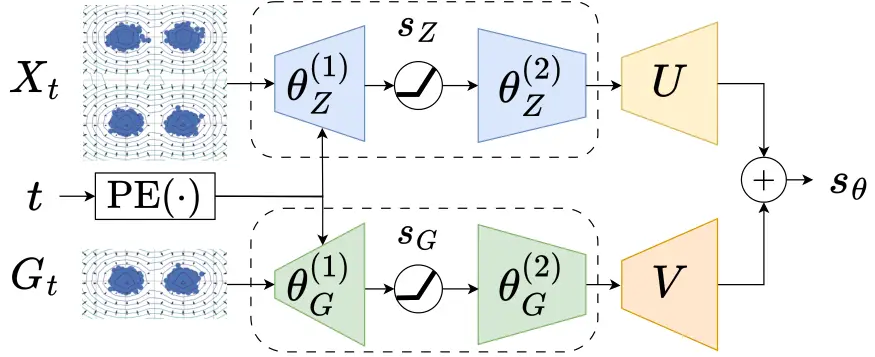

Figure 2: Dual-encoder score network for content-style disentanglement
of ISM.

#### Overview.

This section considers a _special case_ of content disentanglement –
when the underlying distribution follows an _independent subspace model_
(ISM) \[45, 46, 47, 62\]. ISMs have served as a foundation in classical
disentanglement literature and are also supported empirically in recent
self-supervised learning studies \[63\], with applications in both
discriminative and generative disentanglement tasks \[64, 39, 50\].
Under the ISM setting, we prove that a carefully constructed DM trained
with gradient descent can simultaneously achieve
$`(\epsilon,\nu)`$-disentanglement and $`\epsilon^{\prime}`$-editability
even in the finite-sample setting – offering stronger theoretical
guarantees than those in the general content disentanglement case
(Section 4.1). We also outline how these results can be extended to the
multi-view case in the discussion. Full proofs are provided in
Appendix D. To begin, we formally define an ISM below.

###### Definition 4.3.

An _independent subspace model_ (ISM) is an LVM defined by

```math
\displaystyle Z \displaystyle\sim p_{Z},~\,G\sim p_{G},~\,X=A_{Z}Z+A_{G}G, \tag{9}
```

where
$`A_{Z}\in{\mathbb{R}}^{d_{X}\times d_{Z}},\,A_{G}\in{\mathbb{R}}^{d_{X}\times d_{G}}`$
are orthogonal matrices such that their column spaces are orthogonal and
span $`{\mathbb{R}}^{d_{X}}`$. That is, $`R(A_{Z})^{\perp}=R(A_{G})`$
with $`d_{Z}+d_{G}=d_{X}`$, where $`R(A)`$ is the column space of matrix
$`A`$. Let $`X_{t}`$ denote the noisy version of $`X`$ at time $`t`$ in
the diffusion process. Then we define
$`Z_{t}:=A_{Z}^{\top}X_{t}=:z(X_{t}),~G_{t}:=A_{G}^{\top}X_{t}=:g(X_{t})`$.

This model generalizes the setting in \[41\], which assumes Gaussian
noise for $`G_{t}`$. A key property of ISMs is that the score function
of the marginal $`p_{t}(X_{t})`$ is _decomposable_ as shown below.

###### Lemma 4.4.

For any $`t\geq 0,`$ the score of the pdf $`p_{t}(X_{t})`$ under the ISM
satisfies

```math
s^{*}(X_{t},t):=\nabla_{x}\log p_{t}(X_{t})=A_{Z}\nabla_{z}\log p_{Z_{t}}(z(X_{t}))+A_{G}\nabla_{g}\log p_{G_{t}}(g(X_{t})).
```

Lemma 4.4 shows that for ISM, the score function is a linear combination
of the score functions of content and style. Motivated by Lemma 4.4, we
propose a _dual encoder network_ for learning $`s^{*}({x,t})`$, as shown
in Figure 2:

```math
\displaystyle s_{\theta}({x,t}):=Us_{Z}^{\theta_{Z}}({x,t})+Vs_{G}^{\theta_{G}}(g(x),t):=U\texttt{NN}([x,\texttt{PE}(t)])+V\texttt{NN}([g(x),\texttt{PE}(t)]). \tag{10}
```

where $`\texttt{NN}(\cdot)`$ denotes a two-layer ReLU neural net and
$`\texttt{PE}(t)`$ is a time position encoding. The first branch of the
dual network computes the content score $`s_{Z}(X_{t},t)`$ of the noisy
sample $`X_{t}`$, while the second branch computes the style score
$`s_{G}(G_{t},t)`$ from the noisy style $`G_{t}`$. The two scores are
combined to produce the final score function $`s_{\theta}(X_{t},t).`$
Unlike earlier sections, $`s_{\theta}`$ here is _unconditional_. To
train this network, we use a regularized score matching loss:

```math
\displaystyle L^{\lambda_{r}}_{n}(\theta)=2\underbrace{\mathbb{E}_{t,\hat{p}_{t}^{n}(x)}\|s_{\theta}({x,t})-s^{*}({x,t})\|_{2}^{2}}_{{\color[rgb]{0.75,0.5,0.25}L_{0,n}\text{: score matching loss}}}+2\lambda_{r}\underbrace{\mathbb{E}_{t,\hat{p}_{t}^{n}(x)}\|Vs_{G}(g(x),t)-s^{*}({x,t})\|_{2}^{2}}_{{\color[rgb]{0,0.392,0}L_{r,n}\text{: style guidance regularizer}}}+\underbrace{\frac{1}{2}L_{b,n}(\theta)}_{{\color[rgb]{0.75,0,0.25}\text{Balancing loss}}}, \tag{11}
```

where $`\lambda_{r}>0`$ is the style guidance weight and
$`\hat{p}_{t}^{n}`$ is the empirical pdf. The style guidance regularizer
encourages style separation by reducing the mutual information between
the content encoder and $`X`$; the balancing loss, defined in
Appendix D, helps prevent poor local minima. The following theorem
analyzes training dynamics by studying the _gradient flow_:

```math
\displaystyle[\dot{U},\dot{V}] \displaystyle=[-\nabla_{U}L^{\lambda_{r}}_{n}(\theta),-\nabla_{V}L^{\lambda_{r}}_{n}(\theta)],\quad[\dot{\theta}_{Z},\dot{\theta}_{G}]=[-\nabla_{\theta_{Z}}L_{n}^{\lambda_{r}}(\theta),-\nabla_{\theta_{G}}L_{n}^{\lambda_{r}}(\theta)]. \tag{12}
```

###### Theorem 4.5.

Under Assumption 3.5-3.6, for some $`t_{0}`$ dependent on $`n`$ and let
$`\min\{d_{T},d_{H}\}\rightarrow\infty`$, and let the positional
encoding $`\texttt{PE}(\cdot)`$ be bounded and linearly independent over
$`t\in[t_{0},T].`$ Define $`P_{M}`$ to be the projection matrix onto
$`R(M),`$ and $`\sigma_{i}(s)`$ to be the $`i`$-th largest singular
value of the operator $`s`$. Then for some $`\lambda_{r},`$ Eq. 12
converges to a critical point
$`\hat{\theta}:=[\hat{\theta}_{Z},\hat{\theta}_{G},{\hat{U}},{\hat{V}}]`$
such that with probability at least $`1-O\left(\frac{1}{n}\right)`$: 1)
Encodings $`{\hat{Z}}:=P_{{\hat{U}}}X`$ and $`{\hat{G}}:=g(X)`$ are
$`\left(O\left(\frac{d_{X}^{5/4}\log^{3/4}n}{\sigma_{d_{Z}}(s_{Z}^{*})n^{1/4}}\right),0\right)`$-disentangled; 2) Let $`{\hat{Z}}_{t_{0}}:={\hat{Z}}+\sigma(t_{0})N_{t_{0}}`$. Then
$`({\hat{Z}}_{t_{0}},{\hat{G}})`$ are
$`O\left(\frac{d_{X}^{7/4}\log^{9/16}n}{T\min\{\sigma^{1/2}_{d_{Z}}(s_{Z}^{*}),\sigma^{1/2}_{d_{G}}(s_{G}^{*})\}n^{1/16}}\right)`$-editable.


Theorem 4.5 extends to the _multi-view_ setting using the dual encoder
network
$`s_{\theta,\phi}(X_{t}^{1},t)=Us_{Z}(X_{t}^{2},t)+Vs_{G}(X_{t}^{1},t),`$
where $`s_{Z}`$ extracts content from the second view. In this case, we
use a _content guidance loss_ $`L^{\prime}_{r,n}`$ applied to
$`(U,s_{Z})`$ instead of $`(V,s_{G}),`$ to encourage reliance on content
information from the second view and suppress residual content in the
style encoder $`s_{G}`$. Our bound depends on the data dimension
$`d_{X},`$ but extensions to lower-dimensional latent representations
are possible via residual connections in the score network in Figure 2.
While our focus is on unconditional score matching, our results extend
to conditional settings with appropriate corrections for cross terms.
Lastly, although our analysis assumes infinite-width two-layer ReLU
networks, similar convergence behavior may hold for deeper or
finite-width networks \[65\].

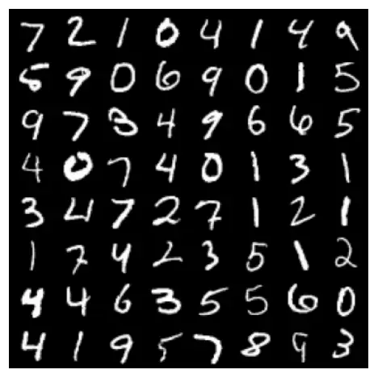

(a) Input

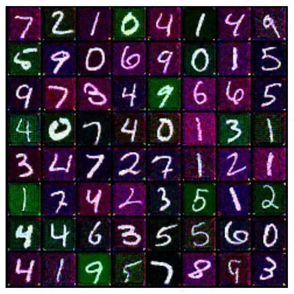

(b) Baseline ($`\lambda_{r}=0`$)

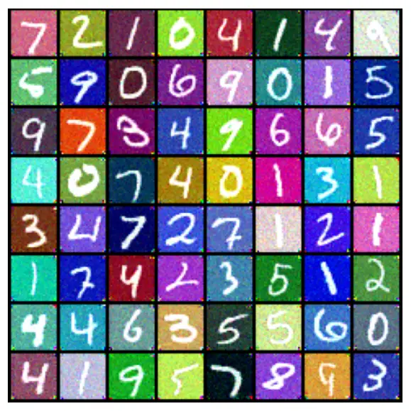

(c) Colorized ($`\lambda_{r}=3`$)

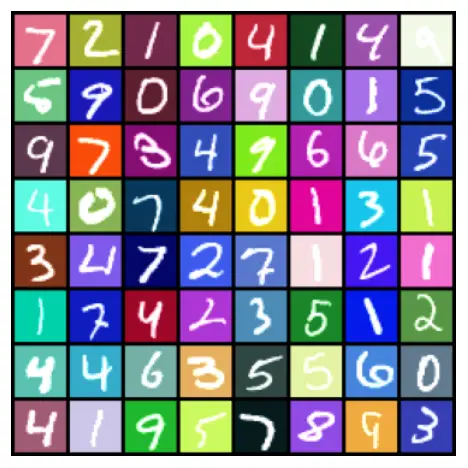

(d) Reference

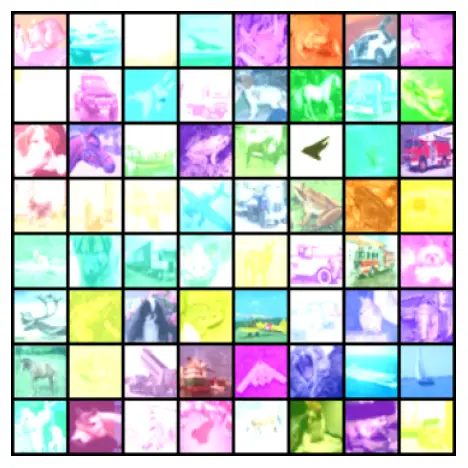

(e) Input

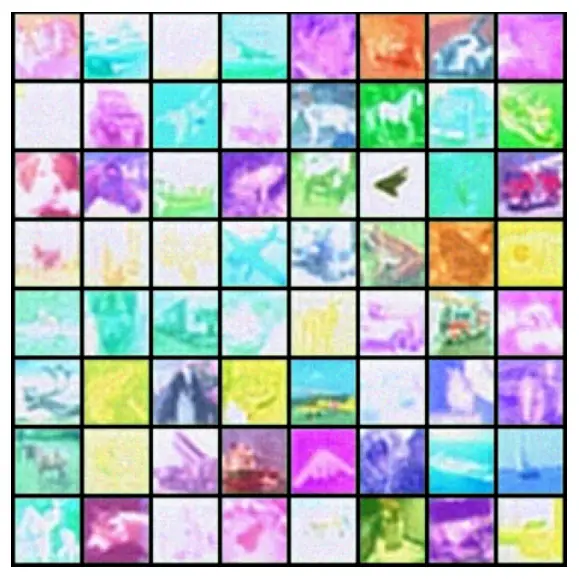

(f) Baseline ($`\lambda_{r}=0`$)

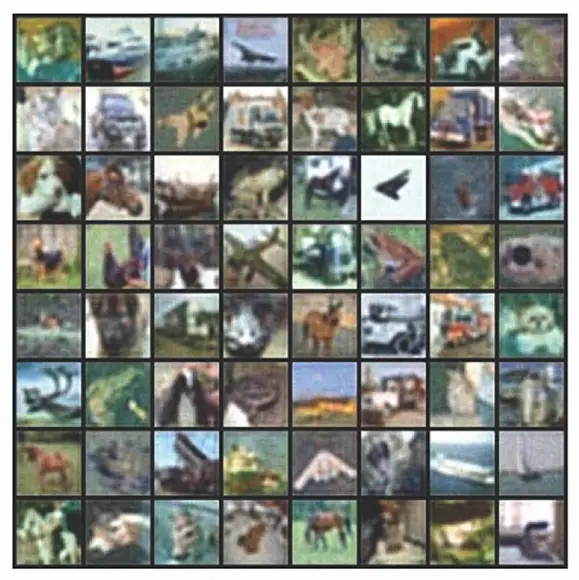

(g) De-noised ($`\lambda_{r}=3`$)

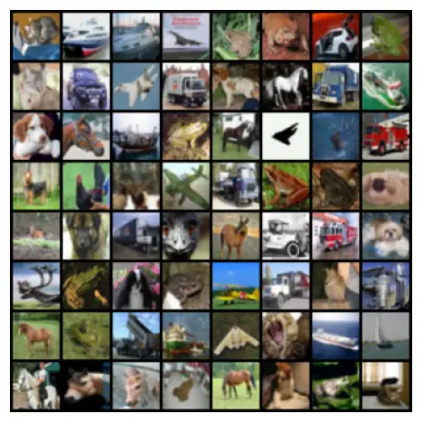

(h) Reference

Figure 3: Disentanglement results on MNIST and CIFAR-10. Top:
Disentanglement results on MNIST. The content is the gray-scale digit
image, and the style is the background color. Bottom: Disentanglement
results on CIFAR10. The content is the clean image and the style is the
corruption on the image. Both 3(b)-3(c) and 3(f)-3(g) suggest
disentanglement is achieved with the style guidance loss.

## 5 Experiments

This section presents empirical evaluation of our theoretical framework
by testing whether DMs can achieve approximate disentanglement under
settings in Section 4.1-4.3. We begin with synthetic datasets generated
from Gaussian mixture models (GMM), which instantiate the ISM framework
from Section 4.3 to validate guarantees in Theorem 4.5. We then move to
more realistic settings using standard image datasets. Specifically, we
apply our DM-based disentanglement method to two tasks: image
colorization on MNIST \[66\] and image denoising on CIFAR10 \[67\].
Finally, we validate Theorem 4.1-4.2 on a real-world speech task, voice
conversion (VC) adaptation, by adopting the DM-based VC framework from
\[38\].

Implementation details. For the GMM dataset, we use a two-layer ReLU
network consistent with Theorem 4.5. For MNIST and CIFAR, we use a
U-Net \[68\] architecture, following common DM design \[69\]. We
optimize a regularized score-matching objective, inspired by Eq. 11:

```math
L_{c}^{\lambda_{r}}(\theta,\phi):=\mathbb{E}_{t,p_{0}p_{t_{0}|0}p_{t|t_{0}}}\left\|s_{\theta}(X_{t},{\hat{Z}},G,t)+\frac{N_{t}}{\sigma(t)}\right\|^{2}+\lambda_{r}\mathbb{E}_{t,p_{t}}\left\|s_{\theta}(X_{t},\textbf{0}_{d_{Z}},G,t)+\frac{N_{t}}{\sigma(t)}\right\|^{2}, \tag{13}
```

where $`\lambda_{r}`$ controls the style guidance weight. The second
term penalizes residual content information in the score estimate when
content is artificially zeroed out. For speech, we treat the pretrained
VC model as a black box. Complete model and training details are
provided in Appendix E.

Figure 4: GMM disentanglement results with the score estimator in
Eq. 10. The subspace recovery error (defined in Appendix E.1) is
normalized between $`[0,1].`$ In four random trials, DM consistently
recovers (error $`<0.1`$) the correct content subspace and achieves
disentanglement with sufficiently large style guidance weight
$`\lambda_{r}`$ and sample size.

GMM disentanglement results. First, we conduct subspace recovery
experiments on *latent subspace GMM*s (LSGMM), a class of LSMs where
each subspace follows a GMM. Figure 4 shows the subspace recovery error
as a function of the style guidance weight $`\lambda_{r}`$ and the
sample size $`n`$. Consistent with the predictions of Theorem 4.5, the
LSGMM achieves the smallest subspace reconstruction error when the style
guidance weight is sufficiently large, and the result is consistent
across different noise schedulers. Moreover, since all score networks
are wide, two-layer MLPs trained using gradient-based methods, these
results provide further support for Theorem 4.5. Figure 4 also reveals a
sublinear decay rate of the subspace recovery error as the sample size
increases, aligning with Theorem 4.5.

Image disentanglement results. Next, we validate our theoretical
findings on image data from MNIST and CIFAR-10. For MNIST, we perform
_colorization_, treating digit shape as content and background color as
style. The results are visualized in Figure 3. Without regularization,
the model fails to disentangle these factors, simply copying the input
(Figure 3(b)). With the proposed regularizer, it successfully
disentangles color from shape (Figure 3(c)). On CIFAR10, we test image
_denoising_ where the content is the clean image and the style is an
independent noise. In this setup, we introduce a random color shift as
the noise, though our approach can, in principle, be extended to other
types of independent noise. The results show similar improvements with
regularization, consistent with Theorem 4.5. Additional examples and
quantitative results using different regularization weights for multiple
metrics are provided in Appendix E.2.

Speech disentanglement results. Lastly, we apply DM-based
disentanglement to a real-world application: _voice conversion
adaptation_ (VCA). In this setup, the style corresponds to speaker
identity, while the content captures attributes like emotional state or
health condition. Our goal is to learn representations that disentangle
these factors, enabling robust classification under speaker shifts.

Figure 5: Emotion recognition results on IEMOCAP as a probing task for
speech disentanglement. DM-based disentanglement between emotion
(content) and speaker (style) outperforms other methods. Data
augmentation using multiple speakers further improves disentanglement.

We use speech emotion recognition on the IEMOCAP dataset \[70\] as a
testbed, where generalization across unseen speakers serves as a proxy
for successful disentanglement. As shown in Figure 5, our DM-based
approach achieves higher classification accuracy than several baselines,
including no conversion, pitch shifting, and recent VCA models \[64,
71\]. Performance improves as more target speakers are used during
training, consistent with our theoretical prediction of Theorem 4.1 that
DMs can indeed achieve approximate disentanglement for speech data. It
also validates Theorem 4.2 by demonstrating that multi-style data
enhances content-style disentanglement. Further, more speech metrics and
additional experiments beyond emotion classification (e.g., Alzheimer
detection \[72\], Amyotrophic Lateral Sclerosis severity \[73\]) are
detailed in Appendix E.3. Further, we also note that our current
experiments focus on controlled settings aligned with the theory.
Extensions to large-scale experimentation are left as an exciting future
avenue of research.

## 6 Related works

Diffusion model theory. Early theoretical works on DMs analyzed their
ability to learn data distributions, under different assumptions like
log-Sobelev inequality \[58\], bounded moments \[74, 42\] and score
approximation in $`L^{\infty}`$ \[75\] and $`L^{2}`$ \[58, 42\] norms.
Later works compared DMs with likelihood-based models \[76\], and
studied their capability to recover Gaussian mixtures \[77, 78, 79,
80\], Ising models \[81\], low-dimensional subspaces \[41, 82, 83, 84\]
and manifold structures \[85\]. Recently, \[86, 87\] analyzed the
convergence of conditional DMs and the role of classifier-free guidance.
Others have analyzed the training \[88, 89, 90\] and sampling \[90, 91,
92\] dynamics of DMs.

Disentangled representation learning. Disentanglement is defined via
factorized representation \[93, 21, 22, 23\], group equivariance \[94\]
or approximate independence \[95\]. It underpins many advances in
self-supervised learning \[51, 53, 96, 55\], multimodal learning \[97,
98, 99\] and controllable generation \[49, 38, 35, 36, 100\].
Theoretically, disentanglement traces back to independent component
analysis (ICA) \[101\], later extended to correlated factors \[48, 29\]
and studied through the lens of modern SSL techniques such as data
augmentation, contrastive loss \[102\] and self-distillation \[103\]. A
key result \[26\] shows that unsupervised disentanglement is impossible
without additional inductive biases, leading to weakly supervised
methods using multiple views \[29, 30\], auxiliary labels \[27, 104,
28\], temporal cues \[105, 106\] and isometric constraints \[107\].
Other works analyze the disentangling capacity of (variational)
auto-encoders \[49, 108, 109, 110, 111, 95, 112, 113\].

## 7 Conclusion

We presented the first learning-theoretic framework for DM-based
disentanglement, addressing unsolved challenges of prior works that
focused primarily on deterministic, invertible mixing processes. Our
framework introduces two notions of approximate disentanglement that
generalize classical formulations to stochastic, non-invertible settings
and shows how DMs can achieve them with partial labels or multi-view
inputs. Moreover, in the special case of ISMs, we derive stronger
guarantees, including finite-sample global convergence for
gradient-based training. Our experiments across several domains,
spanning Gaussian mixture recovery, image colorization, denoising, and
voice conversion, show that theory-guided training methods, such as
style-guidance regularization, lead to improved disentanglement and
better downstream performance. Our framework lays the foundation for
principled disentanglement with DMs and future works on more complex
latent structures and modalities.

## References

- \[1\] Y. A. Farha, A. Richard, and J. Gall, “When will you do what?
  anticipating temporal occurrences of activities,” in CVPR,
  pp. 5343–5352, 2018.
- \[2\] D. Harwath, A. Recasens, D. Surís, G. Chuang, A. Torralba, and
  J. Glass, “Jointly discovering visual objects and spoken words from
  raw sensory input,” in ECCV, pp. 649–665, 2018.
- \[3\] H. Zhao, C. Gan, A. Rouditchenko, C. Vondrick, J. McDermott, and
  A. Torralba, “The sound of pixels,” in ECCV, September 2018.
- \[4\] M. Hamilton, A. Zisserman, J. R. Hershey, and W. T. Freeman,
  “Separating the “chirp” from the “chat”: Self-supervised visual
  grounding of sound and language,” in CVPR, pp. 13117–13127, 2024.
- \[5\] E. Araujo, A. Rouditchenko, Y. Gong, S. Bhati, S. Thomas,
  B. Kingsbury, L. Karlinsky, R. Feris, J. R. Glass, and H. Kuehne,
  “CAV-MAE Sync: Improving Contrastive Audio-Visual Mask Autoencoders
  via Fine-Grained Alignment,” in CVPR, (Nashville, USA), 2025.
- \[6\] C. Wunsch, The Ocean Circulation Inverse Problem. Cambridge
  University Press, 1996.
- \[7\] R. Vigário, V. Jousmäki, M. Hämäläinen, R. Hari, and E. Oja,
  “Independent component analysis for identification of artifacts in
  magnetoencephalographic recordings,” in Neural Information Processing
  System, vol. 10, 1997.
- \[8\] G. D. Brown, S. Yamada, and T. J. Sejnowski, “Independent
  component analysis at the neural cocktail party,” Trends in
  Neurosciences, vol. 24, no. 1, pp. 54–63, 2001.
- \[9\] M. S. Zhdanov, Geophysical Inverse Theory and Regularization
  Problems. Elsevier, 2002.
- \[10\] W. Choi, C. Fang-Yen, K. Badizadegan, S. Oh, N. Lue, R. R.
  Dasari, and M. S. Feld, “Tomographic phase microscopy,” Nature
  Methods, vol. 4, pp. 717–719, Sept. 2007.
- \[11\] M. Lustig, D. Donoho, and J. M. Pauly, “Sparse mri: The
  application of compressed sensing for rapid mr imaging,” Magnetic
  Resonance in Medicine, vol. 58, pp. 1182–1195, Dec. 2007.
- \[12\] J. Virieux and S. Operto, “An overview of full-waveform
  inversion in exploration geophysics,” Geophysics, vol. 74, no. 6,
  pp. WCC1–WCC26, 2009.
- \[13\] K. Chadan and P. C. Sabatier, Inverse Problems in Quantum
  Scattering Theory. Springer Science & Business Media, 1 ed., 2012.
- \[14\] M. A. Iglesias, K. J. Law, and A. M. Stuart, “Ensemble kalman
  methods for inverse problems,” Inverse Problems, vol. 29, no. 4,
  p. 045001, 2013.
- \[15\] A. Chael, K. Bouman, M. Johnson, M. Wielgus, L. Blackburn,
  C.-K. Chan, J. R. Farah, D. Palumbo, and D. Pesce, “eht-imaging:
  v1.1.0: Imaging interferometric data with regularized maximum
  likelihood.”
  [https://doi.org/10.5281/zenodo.2562874](https://doi.org/10.5281/zenodo.2562874), 2019.
  Software.
- \[16\] A. Ramesh, P. Dhariwal, A. Nichol, C. Chu, and M. Chen,
  “Hierarchical text-conditional image generation with clip latents,”
  arXiv preprint arXiv:2204.06125, 2022.
- \[17\] J. Betker, G. Goh, L. Jing, T. Brooks, J. Wang, L. Li,
  L. Ouyang, J. Zhuang, J. Lee, Y. Guo, and W. Manassra, “Improving
  image generation with better captions.”
  [https://cdn.openai.com/papers/dall-e-3.pdf](https://cdn.openai.com/papers/dall-e-3.pdf), 2023.
  Accessed: 2025-05-09.
- \[18\] A. Vyas, B. Shi, M. Le, A. Tjandra, Y.-C. Wu, B. Guo, J. Zhang,
  X. Zhang, R. Adkins, W. Ngan, J. Wang, I. Cruz, B. Akula, A. Akinyemi,
  B. Ellis, R. Moritz, Y. Yungster, A. Rakotoarison, L. Tan, C. Summers,
  C. Wood, J. Lane, M. Williamson, and W.-N. Hsu, “Audiobox: Unified
  audio generation with natural language prompts,” 2023.
- \[19\] OpenAI, “Sora: Creating video from text,” 2024. Accessed:
  2025-05-09.
- \[20\] B. Seed Team, “Seed-TTS: A family of high-quality versatile
  speech generation models,” arXiv preprint arXiv:2406.02430, 2024.
- \[21\] P. Comon, “Independent component analysis, a new concept?,”
  Signal processing, vol. 36, no. 3, pp. 287–314, 1994.
- \[22\] A. Hyvärinen and P. Pajunen, “Nonlinear independent component
  analysis: Existence and uniqueness results,” Neural Networks, vol. 12,
  pp. 429–439, April 1999.
- \[23\] Y. Bengio and Y. LeCun, “Scaling learning algorithms towards
  AI,” in Large Scale Kernel Machines, MIT Press, 2007.
- \[24\] I. Higgins, L. Matthey, A. Pal, C. Burgess, X. Glorot,
  M. Botvinick, S. Mohamed, and A. Lerchner, “beta-VAE: Learning basic
  visual concepts with a constrained variational framework,” in
  International Conference on Learning Representations, 2017.
- \[25\] B. Schölkopf, F. Locatello, S. Bauer, N. R. Ke,
  N. Kalchbrenner, A. Goyal, and Y. Bengio, “Toward causal
  representation learning,” Proceedings of the IEEE, vol. 109, no. 5,
  pp. 612–634, 2021.
- \[26\] F. Locatello, S. Bauer, M. Lucic, G. Raetsch, S. Gelly,
  B. Schölkopf, and O. Bachem, “Challenging common assumptions in the
  unsupervised learning of disentangled representations,” in Proceedings
  of the 36th International Conference on Machine Learning (K. Chaudhuri
  and R. Salakhutdinov, eds.), vol. 97 of Proceedings of Machine
  Learning Research, pp. 4114–4124, PMLR, Jun 2019.
- \[27\] J. Chen and K. Batmanghelich, “Weakly supervised
  disentanglement by pairwise similarities,” in AAAI, vol. 34,
  pp. 3495–3502, 2020.
- \[28\] R. Shu, Y. Chen, A. Kumar, S. Ermon, and B. Poole, “Weakly
  supervised disentanglement with guarantees,” in International
  Conference on Learning Representations, 2020.
- \[29\] I. Daunhawer, A. Bizeul, E. Palumbo, A. Marx, and J. E. Vogt,
  “Identifiability results for multimodal contrastive learning,” in
  International Conference on Learning Representations, 2023.
- \[30\] D. Yao, D. Xu, S. Lachapelle, S. Magliacane, P. Taslakian,
  G. Martius, J. von Kügelgen, and F. Locatello, “Multi-view causal
  representation learning with partial observability,” in International
  Conference on Learning Representations, 2024.
- \[31\] J. Sohl-Dickstein, E. Weiss, N. Maheswaranathan, and
  S. Ganguli, “Deep unsupervised learning using nonequilibrium
  thermodynamics,” in Proceedings of the 32nd International Conference
  on Machine Learning (F. Bach and D. Blei, eds.), vol. 37 of
  Proceedings of Machine Learning Research, (Lille, France),
  pp. 2256–2265, PMLR, 7 2015.
- \[32\] Y. Song and S. Ermon, “Generative modeling by estimating
  gradients of the data distribution,” in Neural Information Processing
  System, 2019.
- \[33\] J. Ho, A. Jain, and P. Abbeel, “Denoising diffusion
  probabilistic models,” in Neural Information Processing System,
  vol. 33, pp. 6840–6851, 2020.
- \[34\] R. A. Fisher, “The detection of linkage with ‘dominant’
  abnormalities,” Annals of Eugenics, vol. 6, no. 2, pp. 187–201, 1935.
- \[35\] Q. Wu, Y. Liu, H. Zhao, A. Kale, T. Bui, T. Yu, Z. Lin,
  Y. Zhang, and S. Chang, “Uncovering the disentanglement capability in
  text-to-image diffusion models,” in CVPR, pp. 1900–1910, 2023.
- \[36\] T. Yang, Y. Wang, Y. Lu, and N. Zheng, “Disdiff: Unsupervised
  disentanglement of diffusion probabilistic models,” in Neural
  Information Processing System, 2023.
- \[37\] D. A. Hudson, D. Zoran, M. Malinowski, A. K. Lampinen,
  A. Jaegle, J. L. McClelland, L. Matthey, F. Hill, and A. Lerchner,
  “Soda: Bottleneck diffusion models for representation learning,” in
  Proceedings of the IEEE/CVF Conference on Computer Vision and Pattern
  Recognition (CVPR), p. to appear, June 2024.
- \[38\] V. Popov, I. Vovk, V. Gogoryan, T. Sadekova, M. S. Kudinov, and
  J. Wei, “Diffusion-based voice conversion with fast maximum likelihood
  sampling scheme,” in International Conference on Learning
  Representations, 2022.
- \[39\] H.-Y. Choi, S.-H. Lee, and S.-W. Lee, “Diff-HierVC:
  Diffusion-based Hierarchical Voice Conversion with Robust Pitch
  Generation and Masked Prior for Zero-shot Speaker Adaptation,” in
  Proc. INTERSPEECH 2023, pp. 2283–2287, 2023.
- \[40\] A. Hyvärinen and P. Pajunen, “Nonlinear independent component
  analysis: Existence and uniqueness results,” Neural Networks, vol. 12,
  pp. 429–439, Apr. 1999.
- \[41\] M. Chen, K. Huang, T. Zhao, and M. Wang, “Score approximation,
  estimation and distribution recovery of diffusion models on
  low-dimensional data,” in International Conference on Machine
  Learning, 2023.
- \[42\] S. Chen, S. Chewi, J. Li, Y. Li, A. Salim, and A. Zhang,
  “Sampling is as easy as learning the score: theory for diffusion
  models with minimal data assumptions,” in International Conference on
  Learning Representations, 2023.
- \[43\] B. D. Anderson, “Reverse-time diffusion equation models,”
  Stochastic Processes and their Applications, vol. 12, no. 3,
  pp. 313–326, 1982.
- \[44\] C. Eastwood and C. K. I. Williams, “A framework for the
  quantitative evaluation of disentangled representations,” in
  International Conference on Learning Representations, 2018.
- \[45\] M. A. Casey and A. Westner, “Separation of mixed audio sources
  by independent subspace analysis,” in Proceedings of the International
  Computer Music Conference (ICMC), pp. 154–161, 2000.
- \[46\] A. Hyvärinen and P. Hoyer, “Emergence of phase- and
  shift-invariant features by decomposition of natural images into
  independent feature subspaces,” Neural Computation, vol. 12, no. 7,
  pp. 1705–1720, 2000.
- \[47\] F. Theis, “Towards a general independent subspace analysis,” in
  Neural Information Processing System, vol. 19, pp. 1361–1368, 2006.
- \[48\] J. V. Kügelgen, Y. Sharma, L. Gresele, W. Brendel,
  B. Schölkopf, M. Besserve, and F. Locatello, “Self-supervised learning
  with data augmentations provably isolates content from style,” in
  Neural Information Processing System (A. Beygelzimer, Y. Dauphin,
  P. Liang, and J. W. Vaughan, eds.), 2021.
- \[49\] K. Qian, Y. Zhang, S. Chang, X. Yang, and M. Hasegawa-Johnson,
  “AutoVC: Zero-shot voice style transfer with only autoencoder loss,”
  in International Conference on Machine Learning, pp. 5210–5219, 2019.
- \[50\] F. Huang, K. Zeng, and W. Zhu, “DiffVC+: Improving
  diffusion-based voice conversion for speaker anonymization,” in
  Interspeech, 2024.
- \[51\] T. Chen, S. Kornblith, M. Norouzi, and G. Hinton, “A simple
  framework for contrastive learning of visual representations,” in
  International Conference on Machine Learning (H. D. III and A. Singh,
  eds.), vol. 119 of Proceedings of Machine Learning Research,
  pp. 1597–1607, PMLR, 13–18 Jul 2020.
- \[52\] J.-B. Grill, F. Strub, F. Altché, C. Tallec, P. H. Richemond,
  E. Buchatskaya, C. Doersch, B. Á. Pires, Z. Guo, M. G. Azar, B. Piot,
  K. Kavukcuoglu, R. Munos, and M. Valko, “Bootstrap your own latent: A
  new approach to self-supervised learning,” in Advances in Neural
  Information Processing Systems (NeurIPS), vol. 33,
  pp. 21271–21284, 2020.
- \[53\] K. He, H. Fan, Y. Wu, S. Xie, and R. B. Girshick, “Momentum
  contrast for unsupervised visual representation learning,” in
  Proceedings of the IEEE/CVF Conference on Computer Vision and Pattern
  Recognition (CVPR), pp. 9726–9735, 2020.
- \[54\] X. Chen and K. He, “Exploring simple siamese representation
  learning,” in CVPR, (Nashville, TN, USA), pp. 15745–15753, 2021.
- \[55\] M. Caron, H. Touvron, I. Misra, H. Jégou, J. Mairal,
  P. Bojanowski, and A. Joulin, “Emerging properties in self-supervised
  vision transformers,” in Proceedings of the International Conference
  on Computer Vision (ICCV), 2021.
- \[56\] L. Logeswaran and H. Lee, “An efficient framework for learning
  sentence representations,” in Proceedings of the 6th International
  Conference on Learning Representations (ICLR), 2018.
- \[57\] S. Schneider, A. Baevski, R. Collobert, and M. Auli, “wav2vec:
  Unsupervised pretraining for speech recognition,” in Proceedings of
  Interspeech 2019, 20th Annual Conference of the International Speech
  Communication Association, pp. 3465–3469, 2019.
- \[58\] H. Lee, J. Lu, and Y. Tan, “Convergence for score-based
  generative modeling with polynomial complexity,” in Neural Information
  Processing System (A. H. Oh, A. Agarwal, D. Belgrave, and K. Cho,
  eds.), 2022.
- \[59\] M. I. Belghazi, A. Baratin, S. Rajeswar, S. Ozair, Y. Bengio,
  A. Courville, and R. D. Hjelm, “Mutual information neural estimation,”
  in Proceedings of the 35th International Conference on Machine
  Learning (ICML), vol. 80 of Proceedings of Machine Learning Research,
  pp. 531–540, PMLR, 2018.
- \[60\] A. van den Oord, Y. Li, and O. Vinyals, “Representation
  learning with contrastive predictive coding,” arXiv preprint
  arXiv:1807.03748, 2018.
- \[61\] P. Cheng, W. Hao, S. Dai, J. Liu, Z. Gan, and L. Carin, “Club:
  A contrastive log-ratio upper bound of mutual information,” in
  International Conference on Machine Learning, pp. 1779–1788,
  PMLR, 2020.
- \[62\] N. Dehak, P. J. Kenny, R. Dehak, P. Dumouchel, and P. Ouellet,
  “Front-end factor analysis for speaker verification,” in IEEE
  Transactions on Audio, Speech, and Language Processing, vol. 19,
  pp. 788–798, IEEE, 2011.
- \[63\] O. D. Liu, H. Tang, and S. Goldwater, “Self-supervised
  predictive coding models encode speaker and phonetic information in
  orthogonal subspaces,” in Interspeech, 2023.
- \[64\] M. Baas, B. van Niekerk, and H. Kamper, “Voice conversion with
  just nearest neighbors,” in Interspeech, 2023.
- \[65\] S. Du, J. Lee, H. Li, L. Wang, and X. Zhai, “Gradient descent
  finds global minima of deep neural networks,” in International
  Conference on Machine Learning (K. Chaudhuri and R. Salakhutdinov,
  eds.), vol. 97 of Proceedings of Machine Learning Research,
  pp. 1675–1685, PMLR, 09–15 Jun 2019.
- \[66\] L. Deng, “The mnist database of handwritten digit images for
  machine learning research,” IEEE Signal Processing Magazine, vol. 29,
  no. 6, pp. 141–142, 2012.
- \[67\] A. Krizhevsky, V. Nair, and G. Hinton, “Learning multiple
  layers of features from tiny images.”
  [http://www.cs.toronto.edu/~kriz/cifar.html](http://www.cs.toronto.edu/~kriz/cifar.html), 2009.
  Accessed: 2025-01-25.
- \[68\] O. Ronneberger, P. Fischer, and T. Brox, “U-net: Convolutional
  networks for biomedical image segmentation,” in Medical Image
  Computing and Computer-Assisted Intervention (MICCAI), 2015.
- \[69\] Y. Song, J. Sohl-Dickstein, D. P. Kingma, A. Kumar, S. Ermon,
  and B. Poole, “Score-based generative modeling through stochastic
  differential equations,” in International Conference on Learning
  Representations, 2021.
- \[70\] C. Busso, M. Bulut, C.-C. Lee, A. Kazemzadeh, E. Mower, S. Kim,
  J.-N. Chang, S. Lee, and S. Narayanan, “Iemocap: Interactive emotional
  dyadic motion capture database,” in Language Resources and Evaluation
  (LREC), pp. 335–339, 2008.
- \[71\] H. J. Park, S. W. Yang, J. S. Kim, W. Shin, and S. W. Han,
  “Triaan-vc: Triple adaptive attention normalization for any-to-any
  voice conversion,” in ICASSP, 2023.
- \[72\] S. Luz, F. Haider, S. de la Fuente, and B. M. Davida Fromm,
  “Alzheimer’s dementia recognition through spontaneous speech: The
  adress challenge,” in Proceedings of Interspeech 2020,
  pp. 2172–2176, 2020.
- \[73\] F. Vieira, S. Venugopalan, A. Premasiri, et al., “A
  machine-learning based objective measure for ALS disease severity,”
  NPJ Digital Medicine, vol. 5, p. 45, 2022.
- \[74\] A. Block, Y. Mroueh, and A. Rakhlin, “Generative modeling with
  denoising auto-encoders and langevin sampling,” arXiv preprint
  arXiv:2002.00107, 2020.
- \[75\] V. D. Bortoli, J. Thornton, J. Heng, and A. Doucet, “Diffusion
  schrödinger bridge with applications to score-based generative
  modeling,” in Neural Information Processing System (M. Ranzato,
  A. Beygelzimer, Y. Dauphin, P. Liang, and J. W. Vaughan, eds.),
  vol. 34, pp. 17695–17709, Curran Associates, Inc., 2021.
- \[76\] C. Pabbaraju, D. Rohatgi, A. Sevekari, H. Lee, A. Moitra, and
  A. Risteski, “Provable benefits of score matching,” in Neural
  Information Processing System, 2023.
- \[77\] K. Shah, S. Chen, and A. Klivans, “Learning mixtures of
  gaussians using the ddpm objective,” in Neural Information Processing
  System, 2023.
- \[78\] Y. Wu, M. Chen, Z. Li, M. Wang, and Y. Wei, “Theoretical
  insights for diffusion guidance: A case study for gaussian mixture
  models,” arXiv preprint arXiv:2403.01639, 2024.
- \[79\] S. Chen, V. Kontonis, and K. Shah, “Learning general gaussian
  mixtures with efficient score matching,” arXiv preprint
  arXiv:2404.18893, 2024.
- \[80\] G. Li, C. Cai, and Y. Wei, “Dimension-free convergence of
  diffusion models for approximate gaussian mixtures,” arXiv preprint
  arXiv:2504.05300, 2025.
- \[81\] S. Mei and Y. Wu, “Deep networks as denoising algorithms:
  Sample-efficient learning of diffusion models in high-dimensional
  graphical models,” arXiv preprint arXiv:2309.11420, 2023.
- \[82\] L. Rout, N. Raoof, G. Daras, C. Caramanis, A. Dimakis, and
  S. Shakkottai, “Solving linear inverse problems provably via posterior
  sampling with latent diffusion models,” in Neural Information
  Processing System, 2023.
- \[83\] J. Y.-C. Hu, W. Wu, Z. Li, S. Pi, Z. Song, and H. Liu, “On
  statistical rates and provably efficient criteria of latent diffusion
  transformers (dits),” in The Thirty-eighth Annual Conference on Neural
  Information Processing Systems, 2024.
- \[84\] P. Wang, H. Zhang, Z. Zhang, S. Chen, Y. Ma, and Q. Qu,
  “Diffusion models learn low-dimensional distributions via subspace
  clustering,” arXiv preprint arXiv:2409.02426, 2024.
- \[85\] V. D. Bortoli, A. Thornton, J. H. Hutchinson, J. A. Mathieu,
  Y. Teh, and A. Doucet, “Convergence of denoising diffusion models
  under the manifold hypothesis,” Transactions on Machine Learning
  Research (TMLR), 2022.
- \[86\] M. Chidambaram, K. Gatmiry, S. Chen, H. Lee, and J. Lu, “What
  does guidance do? a fine-grained analysis in a simple setting,” in
  Neural Information Processing System, 2024.
- \[87\] H. Fu, Z. Yang, M. Wang, and M. Chen, “Unveil conditional
  diffusion models with classifier-free guidance: A sharp statistical
  theory,” ArXiv, vol. abs/2403.11968, 2024.
- \[88\] P. Li, Z. Li, H. Zhang, and J. Bian, “On the generalization
  properties of diffusion models,” in Neural Information Processing
  System, vol. 36, pp. 2097–2127, 2023.
- \[89\] A. Han, W. Huang, Y. Cao, and D. Zou, “On the feature learning
  in diffusion models,” in International Conference on Learning
  Representations, 2025.
- \[90\] Y. Wang, Y. He, and M. Tao, “Evaluating the design space of
  diffusion-based generative models,” arXiv preprint
  arXiv:2406.12839, 2024.
- \[91\] G. Li, Y. Wei, Y. Chi, and Y. Chen, “A sharp convergence theory
  for the probability flow odes of diffusion models,” arXiv preprint
  arXiv:2408.02320, 2024.
- \[92\] M. Li and S. Chen, “Critical windows: Non-asymptotic theory for
  feature emergence in diffusion models,” in International Conference on
  Machine Learning, pp. 27474–27498, 2024.
- \[93\] J. Schmidhuber, “Learning factorial codes by predictability
  minimization,” Neural Computation, vol. 4, no. 6, pp. 863–879, 1992.
- \[94\] I. Higgins, D. Amos, D. Pfau, S. Racaniere, L. Matthey,
  D. Rezende, and A. Lerchner, “Towards a definition of disentangled
  representations,” arXiv preprint arXiv:1812.02230, 2018.
- \[95\] Z. Pan, L. Niu, J. Zhang, and L. Zhang, “Disentangled
  information bottleneck,” in AAAI, 2021.
- \[96\] J. Zbontar, L. Jing, I. Misra, Y. LeCun, and S. Deny, “Barlow
  twins: Self-supervised learning via redundancy reduction,” in
  International Conference on Machine Learning (M. Meila and T. Zhang,
  eds.), vol. 139, pp. 12310–12320, PMLR, 2021.
- \[97\] Y.-H. H. Tsai, S. Bai, P. P. Liang, J. Z. Kolter, L.-P.
  Morency, and R. Salakhutdinov, “Multimodal transformer for unaligned
  multimodal language sequences,” in Proceedings of the 57th Annual
  Meeting of the Association for Computational Linguistics (A. Korhonen,
  D. Traum, and L. Màrquez, eds.), (Florence, Italy), pp. 6558–6569,
  Association for Computational Linguistics, July 2019.
- \[98\] P. Poklukar, M. Vasco, H. Yin, F. S. Melo, A. Paiva, and
  D. Kragic, “Geometric multimodal contrastive representation learning,”
  in Proceedings of the 39th International Conference on Machine
  Learning (K. Chaudhuri, S. Jegelka, L. Song, C. Szepesvari, G. Niu,
  and S. Sabato, eds.), vol. 162 of Proceedings of Machine Learning
  Research, pp. 17782–17800, PMLR, 17–23 Jul 2022.
- \[99\] R. Bachmann, D. Mizrahi, A. Atanov, and A. Zamir, “Multimae:
  Multi-modal multi-task masked autoencoders,” in Computer Vision – ECCV
  2022, pp. 348–367, Springer Nature Switzerland, 2022.
- \[100\] J. Hahm, J. Lee, S. Kim, and J. Lee, “Isometric representation
  learning for disentangled latent space of diffusion models,” in
  International Conference on Machine Learning, vol. 235 of Proceedings
  of Machine Learning Research, pp. 17224–17245, PMLR, 2024.
- \[101\] A. Hyvärinen and E. Oja, “Independent component analysis:
  Algorithms and applications,” Neural Networks, vol. 13, no. 4–5,
  pp. 411–430, 2000.
- \[102\] R. S. Zimmermann, Y. Sharma, S. Schneider, M. Bethge, and
  W. Brendel, “Contrastive learning inverts the data generating
  process,” in Proceedings of the 38th International Conference on
  Machine Learning, vol. 139 of Proceedings of Machine Learning
  Research, pp. 12979–12990, PMLR, 2021.
- \[103\] Y. Tian, X. Chen, and S. Ganguli, “Understanding
  self-supervised learning dynamics without contrastive pairs,” in
  International Conference on Machine Learning (M. Meila and T. Zhang,
  eds.), vol. 139, pp. 10268–10278, PMLR, 2021.
- \[104\] F. Locatello, B. Poole, G. Rätsch, B. Schölkopf, O. Bachem,
  and M. Tschannen, “Weakly-supervised disentanglement without
  compromises,” in International Conference on Machine Learning,
  vol. 119, pp. 6348–6359, PMLR, 2020.
- \[105\] A. Hyvärinen and H. Morioka, “Unsupervised feature extraction
  by time-contrastive learning and nonlinear ICA,” in Neural Information
  Processing System, pp. 3765–3773, 2016.
- \[106\] I. Khemakhem, R. P. Monti, D. P. Kingma, and A. Hyvärinen,
  “ICE-BeeM: Identifiable conditional energy-based deep models based on
  nonlinear ICA,” in Advances in Neural Information Processing Systems
  (NeurIPS), vol. 33, pp. 10235–10246, 2020.
- \[107\] D. Horan, E. Richardson, and Y. Weiss, “When is unsupervised
  disentanglement possible?,” in Advances in Neural Information
  Processing Systems (A. Beygelzimer, Y. Dauphin, P. Liang, and J. W.
  Vaughan, eds.), 2021.
- \[108\] M. Rolinek, D. Zietlow, and G. Martius, “Variational
  autoencoders pursue pca directions (by accident),” in CVPR,
  pp. 12406–12415, 2019.
- \[109\] E. Mathieu, T. Rainforth, N. Siddharth, and Y. W. Teh,
  “Disentangling disentanglement in variational autoencoders,” in
  International Conference on Machine Learning, vol. 97 of Proceedings
  of Machine Learning Research, pp. 4402–4412, PMLR, 2019.
- \[110\] I. Khemakhem, D. P. Kingma, R. P. Monti, and A. Hyvärinen,
  “Variational autoencoders and nonlinear ICA: A unifying framework,” in
  Proceedings of the 23rd International Conference on Artificial
  Intelligence and Statistics (AISTATS), vol. 108, pp. 2207–2217,
  PMLR, 2020.
- \[111\] X. Bao, J. Lucas, S. Sachdeva, and R. Grosse, “Regularized
  linear autoencoders recover the principal components, eventually,” in
  Neural Information Processing System, pp. 6971–6981, 2020.
- \[112\] P. Bhowal, A. Soni, and S. Rambhatla, “Why do variational
  autoencoders really promote disentanglement?,” in Forty-first
  International Conference on Machine Learning, 2024.
- \[113\] T. Uscidda, L. Eyring, K. Roth, F. J. Theis, Z. Akata, and
  marco cuturi, “Disentangled representation learning with the
  gromov-monge gap,” in International Conference on Learning
  Representations, 2025.
- \[114\] T. Miyato, T. Kataoka, M. Koyama, and Y. Yoshida, “Spectral
  normalization for generative adversarial networks,” in International
  Conference on Learning Representations, 2018.
- \[115\] C. Anil, J. Lucas, and R. Grosse, “Sorting out lipschitz
  function approximation,” in International Conference on Machine
  Learning, pp. 291–301, PMLR, 2019.
- \[116\] H. Gouk, E. Frank, B. Pfahringer, and M. Cree, “Regularisation
  of neural networks by enforcing lipschitz continuity,” Machine
  Learning, vol. 110, no. 2, pp. 393–416, 2021.
- \[117\] J.-F. Le Gall, Brownian Motion, Martingales, and Stochastic
  Calculus, vol. 274 of Graduate Texts in Mathematics. Springer, 2016.
- \[118\] A. Jacot, F. Gabriel, and C. Hongler, “Neural tangent kernel:
  Convergence and generalization in neural networks,” in Neural
  Information Processing System, 2018.
- \[119\] A. R. Barron, “Universal approximation bounds for
  superpositions of a sigmoidal function,” IEEE Transactions on
  Information Theory, vol. 39, no. 3, pp. 930–945, 1993.
- \[120\] R. Ge, C. Jin, and Y. Zheng, “No spurious local minima in
  nonconvex low rank problems: A unified geometric analysis,” in
  Proceedings of the 34th International Conference on Machine Learning
  (D. Precup and Y. W. Teh, eds.), vol. 70 of Proceedings of Machine
  Learning Research, pp. 1233–1242, PMLR, 06–11 Aug 2017.
- \[121\] J. D. Lee, M. Simchowitz, M. I. Jordan, and B. Recht,
  “Gradient descent only converges to minimizers,” in Conference on
  Learning Theory, 2016.
- \[122\] B. Hajek and M. Raginsky, “ECE 543: Statistical Learning
  Theory.”
  [http://maxim.ece.illinois.edu/teaching/SLT/](http://maxim.ece.illinois.edu/teaching/SLT/), 2021.
  Accessed: 2025-01-25.
- \[123\] R. Vershynin, High-Dimensional Probability–An Introduction
  with Applications in Data Science. Cambridge University Press,
  Sept. 2018.
- \[124\] R. Zhang, P. Isola, A. A. Efros, E. Shechtman, and O. Wang,
  “The unreasonable effectiveness of deep features as a perceptual
  metric,” in CVPR, 2018.
- \[125\] A. Radford, J. W. Kim, T. Xu, G. Brockman, C. McLeavey, and
  I. Sutskever, “Robust speech recognition via large-scale weak
  supervision,” in International Conference on Machine Learning, 2023.
- \[126\] K. Baba, W. Nakata, Y. Saito, and H. Saruwatari, “The t05
  system for the VoiceMOS Challenge 2024: Transfer learning from deep
  image classifier to naturalness MOS prediction of high-quality
  synthetic speech,” in IEEE Spoken Language Technology Workshop
  (SLT), 2024.
- \[127\] D. P. Kingma and J. Ba, “Adam: A method for stochastic
  optimization,” in International Conference on Learning
  Representations, 2015.
- \[128\] A. Nichol and P. Dhariwal, “Improved denoising diffusion
  probabilistic models,” in International Conference on Machine
  Learning, 2021.
- \[129\] Y. Song and S. Ermon, “Improved techniques for training
  score-based generative models,” in Neural Information Processing
  System, 2020.
- \[130\] A. Paszke, S. Gross, F. Massa, A. Lerer, J. Bradbury,
  T. Gregory, Z. Lin, N. Gimelshein, L. Antiga, A. Desmaison, A. Kopf,
  E. Yang, Z. DeVito, M. Raison, A. Tejani, S. Chilamkurthy, B. Steiner,
  L. Fang, J. Bai, and S. Chintala, “Pytorch: An imperative style,
  high-performance deep learning library,” in Advances in Neural
  Information Processing Systems 32, pp. 8024–8035, Curran Associates,
  Inc., 2019.
- \[131\] M. Ravanelli, T. Parcollet, A. Moumen, S. de Langen,
  C. Subakan, P. Plantinga, Y. Wang, P. Mousavi, L. D. Libera,
  A. Ploujnikov, F. Paissan, D. Borra, S. Zaiem, Z. Zhao, S. Zhang,
  G. Karakasidis, S.-L. Yeh, P. Champion, A. Rouhe, R. Braun, F. Mai,
  J. Zuluaga-Gomez, S. M. Mousavi, A. Nautsch, X. Liu, S. Sagar,
  J. Duret, S. Mdhaffar, G. Laperriere, M. Rouvier, R. D. Mori, and
  Y. Esteve, “Open-source conversational ai with SpeechBrain 1.0,” 2024.
- \[132\] A. Baevski, H. Zhou, A. Mohamed, and M. Auli, “wav2vec 2.0: A
  framework for self-supervised learning of speech representations,” in
  Neural Information Processing System, 2020.
- \[133\] Y. Wang, A. Boumadane, and A. Heba, “A fine-tuned wav2vec
  2.0/hubert benchmark for speech emotion recognition, speaker
  verification and spoken language understanding,” arXiv preprint
  arXiv:2111.02735, 2021.
- \[134\] Z. Ma, M. Chen, H. Zhang, Z. Zheng, W. Chen, X. Li, J. Ye,
  X. Chen, and T. Hain, “Emobox: Multilingual multi-corpus speech
  emotion recognition toolkit and benchmark,” in Interspeech, 2024.
- \[135\] L. Wang, Y. Gong, N. Dawalatabad, M. Vilela, K. Placek,
  B. Tracey, Y. Gong, A. Premasiri, F. Vieira, and J. Glass, “Automatic
  prediction of amyotrophic lateral sclerosis progression using
  longitudinal speech transformer,” in Interspeech, 2024.

## NeurIPS Paper Checklist

1.  1.  Claims
2.  Question: Do the main claims made in the abstract and introduction
    accurately reflect the paper’s contributions and scope?
3.  Answer: \[Yes\]
4.  Justification: Yes, the main claims in the abstract and introduction
    are an accurate reflection of the paper’s contributions and scope.
    The stated goals and innovations are clearly substantiated in the
    theoretical sections (Sec. 4.1-4.3) and experimental sections
    (Sec. 5), and there is no overstatement or misalignment between the
    framing and the actual content. The abstract provides a faithful
    summary, and the introduction sets realistic expectations for what
    the paper achieves.
5.  Guidelines:
    - •
      The answer NA means that the abstract and introduction do not
      include the claims made in the paper.
    - •
      The abstract and/or introduction should clearly state the claims
      made, including the contributions made in the paper and important
      assumptions and limitations. A No or NA answer to this question
      will not be perceived well by the reviewers.
    - •
      The claims made should match theoretical and experimental results,
      and reflect how much the results can be expected to generalize to
      other settings.
    - •
      It is fine to include aspirational goals as motivation as long as
      it is clear that these goals are not attained by the paper.

6.  2.  Limitations
7.  Question: Does the paper discuss the limitations of the work
    performed by the authors?
8.  Answer: \[Yes\]
9.  Justification: We discuss limitations in the discussion of each
    section throughout the paper.
10. Guidelines:
    - •
      The answer NA means that the paper has no limitation while the
      answer No means that the paper has limitations, but those are not
      discussed in the paper.
    - •
      The authors are encouraged to create a separate "Limitations"
      section in their paper.
    - •
      The paper should point out any strong assumptions and how robust
      the results are to violations of these assumptions (e.g.,
      independence assumptions, noiseless settings, model
      well-specification, asymptotic approximations only holding
      locally). The authors should reflect on how these assumptions
      might be violated in practice and what the implications would be.
    - •
      The authors should reflect on the scope of the claims made, e.g.,
      if the approach was only tested on a few datasets or with a few
      runs. In general, empirical results often depend on implicit
      assumptions, which should be articulated.
    - •
      The authors should reflect on the factors that influence the
      performance of the approach. For example, a facial recognition
      algorithm may perform poorly when image resolution is low or
      images are taken in low lighting. Or a speech-to-text system might
      not be used reliably to provide closed captions for online
      lectures because it fails to handle technical jargon.
    - •
      The authors should discuss the computational efficiency of the
      proposed algorithms and how they scale with dataset size.
    - •
      If applicable, the authors should discuss possible limitations of
      their approach to address problems of privacy and fairness.
    - •
      While the authors might fear that complete honesty about
      limitations might be used by reviewers as grounds for rejection, a
      worse outcome might be that reviewers discover limitations that
      aren’t acknowledged in the paper. The authors should use their
      best judgment and recognize that individual actions in favor of
      transparency play an important role in developing norms that
      preserve the integrity of the community. Reviewers will be
      specifically instructed to not penalize honesty concerning
      limitations.

11. 3.  Theory assumptions and proofs
12. Question: For each theoretical result, does the paper provide the
    full set of assumptions and a complete (and correct) proof?
13. Answer: \[Yes\]
14. Justification: Full set of assumptions and a complete and correct
    proof for each theorem are provided in the appendix.
15. Guidelines:
    - •
      The answer NA means that the paper does not include theoretical
      results.
    - •
      All the theorems, formulas, and proofs in the paper should be
      numbered and cross-referenced.
    - •
      All assumptions should be clearly stated or referenced in the
      statement of any theorems.
    - •
      The proofs can either appear in the main paper or the supplemental
      material, but if they appear in the supplemental material, the
      authors are encouraged to provide a short proof sketch to provide
      intuition.
    - •
      Inversely, any informal proof provided in the core of the paper
      should be complemented by formal proofs provided in appendix or
      supplemental material.
    - •
      Theorems and Lemmas that the proof relies upon should be properly
      referenced.

16. 4.  Experimental result reproducibility
17. Question: Does the paper fully disclose all the information needed
    to reproduce the main experimental results of the paper to the
    extent that it affects the main claims and/or conclusions of the
    paper (regardless of whether the code and data are provided or not)?
18. Answer: \[Yes\]
19. Justification: All information needed to produce the main
    experimental results are provided in the paper and the appendix.
20. Guidelines:
    - •
      The answer NA means that the paper does not include experiments.
    - •
      If the paper includes experiments, a No answer to this question
      will not be perceived well by the reviewers: Making the paper
      reproducible is important, regardless of whether the code and data
      are provided or not.
    - •
      If the contribution is a dataset and/or model, the authors should
      describe the steps taken to make their results reproducible or
      verifiable.
    - •
      Depending on the contribution, reproducibility can be accomplished
      in various ways. For example, if the contribution is a novel
      architecture, describing the architecture fully might suffice, or
      if the contribution is a specific model and empirical evaluation,
      it may be necessary to either make it possible for others to
      replicate the model with the same dataset, or provide access to
      the model. In general. releasing code and data is often one good
      way to accomplish this, but reproducibility can also be provided
      via detailed instructions for how to replicate the results, access
      to a hosted model (e.g., in the case of a large language model),
      releasing of a model checkpoint, or other means that are
      appropriate to the research performed.
    - •
      While NeurIPS does not require releasing code, the conference does
      require all submissions to provide some reasonable avenue for
      reproducibility, which may depend on the nature of the
      contribution. For example
      1.  (a)
          If the contribution is primarily a new algorithm, the paper
          should make it clear how to reproduce that algorithm.
      2.  (b)
          If the contribution is primarily a new model architecture, the
          paper should describe the architecture clearly and fully.
      3.  (c)
          If the contribution is a new model (e.g., a large language
          model), then there should either be a way to access this model
          for reproducing the results or a way to reproduce the model
          (e.g., with an open-source dataset or instructions for how to
          construct the dataset).
      4.  (d)
          We recognize that reproducibility may be tricky in some cases,
          in which case authors are welcome to describe the particular
          way they provide for reproducibility. In the case of
          closed-source models, it may be that access to the model is
          limited in some way (e.g., to registered users), but it should
          be possible for other researchers to have some path to
          reproducing or verifying the results.

21. 5.  Open access to data and code
22. Question: Does the paper provide open access to the data and code,
    with sufficient instructions to faithfully reproduce the main
    experimental results, as described in supplemental material?
23. Answer: \[Yes\]
24. Justification: Data and code will be released upon acceptance.
25. Guidelines:
    - •
      The answer NA means that paper does not include experiments
      requiring code.
    - •
      Please see the NeurIPS code and data submission guidelines
      ([https://nips.cc/public/guides/CodeSubmissionPolicy](https://nips.cc/public/guides/CodeSubmissionPolicy))
      for more details.
    - •
      While we encourage the release of code and data, we understand
      that this might not be possible, so “No” is an acceptable answer.
      Papers cannot be rejected simply for not including code, unless
      this is central to the contribution (e.g., for a new open-source
      benchmark).
    - •
      The instructions should contain the exact command and environment
      needed to run to reproduce the results. See the NeurIPS code and
      data submission guidelines
      ([https://nips.cc/public/guides/CodeSubmissionPolicy](https://nips.cc/public/guides/CodeSubmissionPolicy))
      for more details.
    - •
      The authors should provide instructions on data access and
      preparation, including how to access the raw data, preprocessed
      data, intermediate data, and generated data, etc.
    - •
      The authors should provide scripts to reproduce all experimental
      results for the new proposed method and baselines. If only a
      subset of experiments are reproducible, they should state which
      ones are omitted from the script and why.
    - •
      At submission time, to preserve anonymity, the authors should
      release anonymized versions (if applicable).
    - •
      Providing as much information as possible in supplemental material
      (appended to the paper) is recommended, but including URLs to data
      and code is permitted.

26. 6.  Experimental setting/details
27. Question: Does the paper specify all the training and test details
    (e.g., data splits, hyperparameters, how they were chosen, type of
    optimizer, etc.) necessary to understand the results?
28. Answer: \[Yes\]
29. Justification: All the training and test details are provided in the
    appendix.
30. Guidelines:
    - •
      The answer NA means that the paper does not include experiments.
    - •
      The experimental setting should be presented in the core of the
      paper to a level of detail that is necessary to appreciate the
      results and make sense of them.
    - •
      The full details can be provided either with the code, in
      appendix, or as supplemental material.

31. 7.  Experiment statistical significance
32. Question: Does the paper report error bars suitably and correctly
    defined or other appropriate information about the statistical
    significance of the experiments?
33. Answer: \[Yes\]
34. Justification: We average results over multiple runs and report
    error bars or other statistical significance metrics for the
    experiments.
35. Guidelines:
    - •
      The answer NA means that the paper does not include experiments.
    - •
      The authors should answer "Yes" if the results are accompanied by
      error bars, confidence intervals, or statistical significance
      tests, at least for the experiments that support the main claims
      of the paper.
    - •
      The factors of variability that the error bars are capturing
      should be clearly stated (for example, train/test split,
      initialization, random drawing of some parameter, or overall run
      with given experimental conditions).
    - •
      The method for calculating the error bars should be explained
      (closed form formula, call to a library function, bootstrap, etc.)
    - •
      The assumptions made should be given (e.g., Normally distributed
      errors).
    - •
      It should be clear whether the error bar is the standard deviation
      or the standard error of the mean.
    - •
      It is OK to report 1-sigma error bars, but one should state it.
      The authors should preferably report a 2-sigma error bar than
      state that they have a 96% CI, if the hypothesis of Normality of
      errors is not verified.
    - •
      For asymmetric distributions, the authors should be careful not to
      show in tables or figures symmetric error bars that would yield
      results that are out of range (e.g. negative error rates).
    - •
      If error bars are reported in tables or plots, The authors should
      explain in the text how they were calculated and reference the
      corresponding figures or tables in the text.

36. 8.  Experiments compute resources
37. Question: For each experiment, does the paper provide sufficient
    information on the computer resources (type of compute workers,
    memory, time of execution) needed to reproduce the experiments?
38. Answer: \[Yes\]
39. Justification: The details about computation resources are provided
    in the appendix.
40. Guidelines:
    - •
      The answer NA means that the paper does not include experiments.
    - •
      The paper should indicate the type of compute workers CPU or GPU,
      internal cluster, or cloud provider, including relevant memory and
      storage.
    - •
      The paper should provide the amount of compute required for each
      of the individual experimental runs as well as estimate the total
      compute.
    - •
      The paper should disclose whether the full research project
      required more compute than the experiments reported in the paper
      (e.g., preliminary or failed experiments that didn’t make it into
      the paper).

41. 9.  Code of ethics
42. Question: Does the research conducted in the paper conform, in every
    respect, with the NeurIPS Code of Ethics
    [https://neurips.cc/public/EthicsGuidelines](https://neurips.cc/public/EthicsGuidelines)?
43. Answer: \[Yes\]
44. Justification: The research is ethical according to the NeurIPS Code
    of Ethics in every respect.
45. Guidelines:
    - •
      The answer NA means that the authors have not reviewed the NeurIPS
      Code of Ethics.
    - •
      If the authors answer No, they should explain the special
      circumstances that require a deviation from the Code of Ethics.
    - •
      The authors should make sure to preserve anonymity (e.g., if there
      is a special consideration due to laws or regulations in their
      jurisdiction).

46. 10. Broader impacts
47. Question: Does the paper discuss both potential positive societal
    impacts and negative societal impacts of the work performed?
48. Answer: \[N/A\]
49. Justification: The paper presents a foundational research not tied
    to particular applications.
50. Guidelines:
    - •
      The answer NA means that there is no societal impact of the work
      performed.
    - •
      If the authors answer NA or No, they should explain why their work
      has no societal impact or why the paper does not address societal
      impact.
    - •
      Examples of negative societal impacts include potential malicious
      or unintended uses (e.g., disinformation, generating fake
      profiles, surveillance), fairness considerations (e.g., deployment
      of technologies that could make decisions that unfairly impact
      specific groups), privacy considerations, and security
      considerations.
    - •
      The conference expects that many papers will be foundational
      research and not tied to particular applications, let alone
      deployments. However, if there is a direct path to any negative
      applications, the authors should point it out. For example, it is
      legitimate to point out that an improvement in the quality of
      generative models could be used to generate deepfakes for
      disinformation. On the other hand, it is not needed to point out
      that a generic algorithm for optimizing neural networks could
      enable people to train models that generate Deepfakes faster.
    - •
      The authors should consider possible harms that could arise when
      the technology is being used as intended and functioning
      correctly, harms that could arise when the technology is being
      used as intended but gives incorrect results, and harms following
      from (intentional or unintentional) misuse of the technology.
    - •
      If there are negative societal impacts, the authors could also
      discuss possible mitigation strategies (e.g., gated release of
      models, providing defenses in addition to attacks, mechanisms for
      monitoring misuse, mechanisms to monitor how a system learns from
      feedback over time, improving the efficiency and accessibility of
      ML).

51. 11. Safeguards
52. Question: Does the paper describe safeguards that have been put in
    place for responsible release of data or models that have a high
    risk for misuse (e.g., pretrained language models, image generators,
    or scraped datasets)?
53. Answer: \[N/A\]
54. Justification: The paper poses no such risks.
55. Guidelines:
    - •
      The answer NA means that the paper poses no such risks.
    - •
      Released models that have a high risk for misuse or dual-use
      should be released with necessary safeguards to allow for
      controlled use of the model, for example by requiring that users
      adhere to usage guidelines or restrictions to access the model or
      implementing safety filters.
    - •
      Datasets that have been scraped from the Internet could pose
      safety risks. The authors should describe how they avoided
      releasing unsafe images.
    - •
      We recognize that providing effective safeguards is challenging,
      and many papers do not require this, but we encourage authors to
      take this into account and make a best faith effort.

56. 12. Licenses for existing assets
57. Question: Are the creators or original owners of assets (e.g., code,
    data, models), used in the paper, properly credited and are the
    license and terms of use explicitly mentioned and properly
    respected?
58. Answer: \[Yes\]
59. Justification: All assets are fully licensed.
60. Guidelines:
    - •
      The answer NA means that the paper does not use existing assets.
    - •
      The authors should cite the original paper that produced the code
      package or dataset.
    - •
      The authors should state which version of the asset is used and,
      if possible, include a URL.
    - •
      The name of the license (e.g., CC-BY 4.0) should be included for
      each asset.
    - •
      For scraped data from a particular source (e.g., website), the
      copyright and terms of service of that source should be provided.
    - •
      If assets are released, the license, copyright information, and
      terms of use in the package should be provided. For popular
      datasets,
      [paperswithcode.com/datasets](https://paperswithcode.com/datasets)
      has curated licenses for some datasets. Their licensing guide can
      help determine the license of a dataset.
    - •
      For existing datasets that are re-packaged, both the original
      license and the license of the derived asset (if it has changed)
      should be provided.
    - •
      If this information is not available online, the authors are
      encouraged to reach out to the asset’s creators.

61. 13. New assets
62. Question: Are new assets introduced in the paper well documented and
    is the documentation provided alongside the assets?
63. Answer: \[Yes\]
64. Justification: All assets are well-documented.
65. Guidelines:
    - •
      The answer NA means that the paper does not release new assets.
    - •
      Researchers should communicate the details of the
      dataset/code/model as part of their submissions via structured
      templates. This includes details about training, license,
      limitations, etc.
    - •
      The paper should discuss whether and how consent was obtained from
      people whose asset is used.
    - •
      At submission time, remember to anonymize your assets (if
      applicable). You can either create an anonymized URL or include an
      anonymized zip file.

66. 14. Crowdsourcing and research with human subjects
67. Question: For crowdsourcing experiments and research with human
    subjects, does the paper include the full text of instructions given
    to participants and screenshots, if applicable, as well as details
    about compensation (if any)?
68. Answer: \[N/A\]
69. Justification: The paper does not involve crowdsourcing.
70. Guidelines:
    - •
      The answer NA means that the paper does not involve crowdsourcing
      nor research with human subjects.
    - •
      Including this information in the supplemental material is fine,
      but if the main contribution of the paper involves human subjects,
      then as much detail as possible should be included in the main
      paper.
    - •
      According to the NeurIPS Code of Ethics, workers involved in data
      collection, curation, or other labor should be paid at least the
      minimum wage in the country of the data collector.

71. 15. Institutional review board (IRB) approvals or equivalent for
        research with human subjects
72. Question: Does the paper describe potential risks incurred by study
    participants, whether such risks were disclosed to the subjects, and
    whether Institutional Review Board (IRB) approvals (or an equivalent
    approval/review based on the requirements of your country or
    institution) were obtained?
73. Answer: \[N/A\]
74. Justification: The paper has no such risk.
75. Guidelines:
    - •
      The answer NA means that the paper does not involve crowdsourcing
      nor research with human subjects.
    - •
      Depending on the country in which research is conducted, IRB
      approval (or equivalent) may be required for any human subjects
      research. If you obtained IRB approval, you should clearly state
      this in the paper.
    - •
      We recognize that the procedures for this may vary significantly
      between institutions and locations, and we expect authors to
      adhere to the NeurIPS Code of Ethics and the guidelines for their
      institution.
    - •
      For initial submissions, do not include any information that would
      break anonymity (if applicable), such as the institution
      conducting the review.

76. 16. Declaration of LLM usage
77. Question: Does the paper describe the usage of LLMs if it is an
    important, original, or non-standard component of the core methods
    in this research? Note that if the LLM is used only for writing,
    editing, or formatting purposes and does not impact the core
    methodology, scientific rigorousness, or originality of the
    research, declaration is not required.
78. Answer: \[N/A\]
79. Justification: LLMs are not used for non-standard purposes.
80. Guidelines:
    - •
      The answer NA means that the core method development in this
      research does not involve LLMs as any important, original, or
      non-standard components.
    - •
      Please refer to our LLM policy
      ([https://neurips.cc/Conferences/2025/LLM](https://neurips.cc/Conferences/2025/LLM))
      for what should or should not be described.

###### Contents

1.  1 Introduction
2.  2 Background: diffusion models
3.  3 Content-style disentanglement
4.  4 Theory: diffusion model-based disentanglement
    1.  4.1 Content disentanglement with diffusion models
    2.  4.2 Multi-view disentanglement with diffusion models
    3.  4.3 Disentanglement of independent subspaces with diffusion
        models
5.  5 Experiments
6.  6 Related works
7.  7 Conclusion
8.  References
9.  A Proof of example 
10. B Proof of Theorem 
    1.  B.1 Main proof
    2.  B.2 Proof of Lemma 
    3.  B.3 Proof of Lemma 
    4.  B.4 Proof of Lemma 
    5.  B.5 Proof of Lemma 
    6.  B.6 Proof of Lemma 
    7.  B.7 Extension to correlated content and style
11. C Proof of Theorem 
    1.  C.1 Main proof
    2.  C.2 Proof of Lemma 
    3.  C.3 Proof of Lemma 
    4.  C.4 Extension to correlated view-specific styles
12. D Proof of Theorem 
    1.  D.1 Main proof
    2.  D.2 Proof of Lemma 
    3.  D.3 Proof of Theorem 
    4.  D.4 Proof of Theorem 
    5.  D.5 Proof of Lemma 
    6.  D.6 Proof of Lemma 
    7.  D.7 Proof of Lemma 
    8.  D.8 Proof of Lemma 
    9.  D.9 Proof of Lemma 
    10. D.10 Proof of Lemma 
    11. D.11 Proof of Lemma 
13. E Experiment details
    1.  E.1 Latent subspace GMM disentanglement
    2.  E.2 Image disentanglement
    3.  E.3 Speech disentanglement

## Appendix A Proof of example 1

###### Proof.

First of all, notice that $`{\hat{Z}}\sim{\mathcal{N}}(0,1)`$ regardless
of the value of $`{\hat{G}}`$ owing to the even symmetry of the standard
Gaussian distribution, which implies
$`{\hat{Z}}\mathrel{\perp\mkern-9.0mu\perp}{\hat{G}}`$, or equivalently
$`I({\hat{Z}};{\hat{G}})=0`$. Second, by construction,
$`\hat{f}({\hat{Z}},{\hat{G}})=f(Z\text{sgn}^{2}(G),G)=f(Z,G)=X,`$ and
thus $`I({\hat{Z}},{\hat{G}};X)-I(Z,G;X)=0`$. Therefore by definition,
$`({\hat{Z}},{\hat{G}})`$ are $`(0,0)`$-disentangled. However, for an
i.i.d sample $`{\hat{G}}^{\prime}\sim p_{G}`$, the conditional
distribution
$`p_{\hat{f}({\hat{Z}},{\hat{G}}^{\prime})|Z}=\frac{1}{2}p_{f(-Z,{\hat{G}}^{\prime})|Z}+\frac{1}{2}p_{f(Z,{\hat{G}}^{\prime})|Z}\not\equiv p_{f(Z,G)|Z}`$
due to the fact that
$`\text{sgn}({\hat{G}})\text{sgn}({\hat{G}}^{\prime})`$ is a symmetric
Bernoulli variable and $`p_{f(Z,G)|Z}\not\equiv p_{f(-Z,G)|Z}.`$
Therefore, $`({\hat{Z}},{\hat{G}})`$ is not $`\epsilon`$-editable for
$`\epsilon=d_{\mathrm{TV}}(p_{\hat{f}({\hat{Z}},{\hat{G}}^{\prime})|Z},p_{X|Z})>0`$.
∎

## Appendix B Proof of Theorem 4.1

### B.1 Main proof

Our result relies crucially on the following lemma.

###### Lemma B.1.

There exists $`(\theta_{1},\phi_{1})`$ such that for

```math
\displaystyle\delta<\min\left\{\frac{1}{2},\frac{1}{\sqrt{d_{X}}}\right\},\,t_{0}=-\log(1-\delta^{2})^{1/2},\,t_{1}=-\log(1-\delta)^{1/2},
```

the followings hold:

1.  1.  The followings hold for the MIs
        $`I(z_{\phi_{1}}(X_{t_{0}});X),\,I(g(X_{t_{0}});X)`$ and
        $`I(z_{\phi}(X_{t_{0}});g(X_{t_{0}})|X)`$:

    ```math
    \displaystyle I(z_{\phi_{1}}(X_{t_{0}});X) \displaystyle=I(Z;X)+O\left(\lambda_{s}\sigma_{X}d_{X}\delta\right),
    ```

    ```math
    \displaystyle I(g(X_{t_{0}});X) \displaystyle=I(G;X)+O\left(\lambda_{s}\sigma_{X}d_{X}\delta\right),
    ```

    ```math
    \displaystyle I(z_{\phi_{1}}(X_{t_{0}});g(X_{t_{0}})|X) \displaystyle=I(Z;G|X)+O\left(\lambda_{s}\sigma_{X}d_{X}\delta\right);
    ```

2.  2.  The conditional score matching loss satisfies

    ```math
    \displaystyle L_{c}(\theta_{1},\phi_{1}) \displaystyle\leq\frac{(1+\sigma_{X}^{2}\delta^{2})\delta^{2}d_{X}(e^{2T}-e^{2t_{1}})}{2(T-t_{1})(e^{2t_{1}}-1)(e^{2T}-1)}=O\left(\frac{\delta d_{X}}{T}\right).
    ```

First, we assume Lemma B.1 to be true and defer its proof to
Section B.2. Therefore, by the property of $`(\theta_{1},\phi_{1})`$ and
the optimality of $`(\theta^{*},\phi^{*}),`$

```math
\displaystyle L_{c}^{\gamma,\rho}(\theta^{*},\phi^{*}) \displaystyle=L_{c}(\theta^{*},\phi^{*})+\gamma(I(z_{\phi^{*}}(X_{t_{0}});X)-\rho)_{+}
```

```math
\displaystyle\leq L_{c}(\theta_{1},\phi_{1})+\gamma(I(z_{\phi_{1}}(X_{t_{0}});X)-I(Z;X))+\gamma(I(Z;X)-\rho)_{+}
```

```math
\displaystyle\leq\frac{(1+\sigma_{X}^{2}\delta^{2})\delta d_{X}}{2(T-t_{1})}+C_{1}\gamma\delta+\gamma(I(Z;X)-\rho)_{+},
```

for some $`C_{1}=O\left(\lambda_{s}\sigma_{X}d_{X}\right)`$ and
$`C_{2}:=1+\sigma_{X}^{2}\delta^{2}.`$ Since both $`L_{c}`$ and
$`I(Z;X)`$ are nonnegative, this implies

```math
\displaystyle L_{c}(\theta^{*},\phi^{*}) \displaystyle\leq\frac{(1+\sigma_{X}^{2}\delta^{2})\delta d_{X}}{2(T-t_{1})}+C_{1}\gamma\delta+\gamma(I(Z;X)-\rho)_{+},
```

```math
\displaystyle I(z_{\phi^{*}}(X_{t_{0}});X) \displaystyle\leq I(Z;X)+\frac{(1+\sigma_{X}^{2}\delta^{2})\delta d_{X}}{2\gamma(T-t_{1})}+C_{1}\delta.
```

Choose $`\gamma=\frac{1+\sigma_{X}^{2}\delta^{2}}{2(T-t_{1})}`$ and
$`\rho=I(Z;X)+O\left(\delta\right),`$ then we have

```math
\displaystyle I(z_{\phi^{*}}(X_{t_{0}});X) \displaystyle\leq I(Z;X)+C_{1}^{\prime}\delta,
```

where $`C_{1}^{\prime}=O(\lambda_{s}\sigma_{X}d_{X}).`$

Let $`h(X):=-\int_{{\mathcal{X}}}p(x)\log p(x)\mathrm{d}x`$ denote the
differential entropy of continuous random variable $`X.`$ Then by
definition, we have

```math
\displaystyle I(Z,G;X) \displaystyle=h(Z,G)-h(Z,G|X)
```

```math
\displaystyle=h(Z)-h(Z|X)+h(G)-h(G|X)+I(Z;G|X)
```

```math
\displaystyle=I(Z;X)+I(G;X)+I(Z;G|X),
```

```math
\displaystyle I(X_{T},{\hat{Z}},{\hat{G}};X) \displaystyle=I({\hat{Z}},{\hat{G}};X)+I(X_{T};X|{\hat{Z}},{\hat{G}})
```

```math
\displaystyle=h({\hat{Z}},{\hat{G}})-h({\hat{Z}},{\hat{G}}|X)+I(X_{T};X|{\hat{Z}},{\hat{G}})
```

```math
\displaystyle=I({\hat{Z}};X)+I({\hat{G}};X)+I({\hat{Z}};{\hat{G}}|X)-I({\hat{Z}};{\hat{G}})+I(X_{T};X|{\hat{Z}},{\hat{G}}).
```

As a result,

```math
\displaystyle I({\hat{Z}};{\hat{G}})= \displaystyle I({\hat{Z}};X)+I({\hat{G}};X)+I({\hat{Z}},{\hat{G}}|X)+I(X_{T};X|{\hat{Z}},{\hat{G}})-I(X_{T},{\hat{Z}},{\hat{G}};X)
```

```math
\displaystyle= \displaystyle\underbrace{I({\hat{Z}};X)-I(Z;X)}_{(i)}+\underbrace{I({\hat{G}};X)-I(G;X)}_{(ii)}+\underbrace{I({\hat{Z}};{\hat{G}}|X)-I(Z;G|X)}_{(iii)}+
```

```math
\displaystyle\underbrace{I(Z,G;X)-I(X_{T},{\hat{Z}},{\hat{G}};X)}_{(iv)}+\underbrace{I(X_{T};X|{\hat{Z}},{\hat{G}})}_{(v)} \tag{14}
```

where terms $`(i)(ii)(iii)`$ can be upper bounded by item 1 as
$`3C_{1}\delta`$. To bound the term $`(iv)`$, use the definition
$`I(Z,G;X)`$:

```math
\displaystyle I(Z,G;X)=h(X)-h(N)=h(X)-\frac{1}{2}\log(2\pi e\delta^{2}d_{X}),
```

and apply the maximum entropy inequality on
$`I(X_{T},z(X_{t_{0}}),G;X)`$:

```math
\displaystyle I(X_{T},z(X_{t_{0}}),{\hat{G}};X) \displaystyle\geq h(X)-\frac{1}{2}\log 2\pi e\mathbb{E}\left\|(e^{T}-e^{-T})s_{\theta^{*}}(X_{T},{\hat{Z}},{\hat{G}},T)+e^{T}X_{T}-X\right\|^{2}
```

```math
\displaystyle\geq h(X)-\frac{1}{2}\log 2\pi e^{2T+1}(1-e^{-2T})^{2}\lim_{t_{1}\to T}L_{c}(\theta^{*},\phi^{*})
```

```math
\displaystyle\geq h(X)-\frac{1}{2}\log 2\pi eC_{2}\delta^{2}d_{X}=I(Z,G;X)-\frac{1}{2}\log C_{2}.
```

The last inequality uses the optimality of $`(\theta^{*},\phi^{*})`$ and
therefore $`s_{\theta}(x,z,g,t)`$’s needs to achieve minimal loss at any
$`t\in[t_{1},T],`$ which is upper-bounded by item 2 of Lemma B.1 as

```math
\displaystyle\lim_{t_{1}\to T}L_{c}(\theta_{1},\phi_{1}) \displaystyle\leq\lim_{t_{1}\to T}\frac{C_{2}\delta^{2}d_{X}(e^{2T}-e^{2t_{1}})}{2(T-t_{1})(e^{2t_{1}}-1)(e^{2T}-1)}=\frac{C_{2}\delta^{2}d_{X}}{e^{2T}(1-e^{-2T})^{2}}.
```

To bound term $`(v)`$ of the RHS of Eq. 14, notice that
$`({\hat{Z}},{\hat{G}})`$ and $`X_{t_{0}}`$ are invertible, and thus

```math
\displaystyle I(X_{T};X|{\hat{Z}},{\hat{G}}) \displaystyle=I(X_{T};X|X_{t_{0}})=0.
```

Combining the bounds and choose $`T:=\Omega(\log\frac{1}{\delta})`$, we
conclude that

```math
\displaystyle I(z_{\phi}(X_{t_{0}});{\hat{G}}) \displaystyle\leq\frac{1}{2}\log C_{2}+3C_{1}\delta=O\left(\sigma_{X}^{2}\delta^{2}+\lambda_{s}\sigma_{X}d_{X}\delta\right)=O(\lambda_{s}\sigma_{X}^{2}d_{X}\delta).
```

### B.2 Proof of Lemma B.1

To prove the lemma, we need the following technical lemmas, whose proofs
are deferred to B.3, B.4 and B.5 respectively.

###### Lemma B.2.

Suppose random variable $`Y=\alpha X+N\sim p_{Y}`$, for independent
random variables $`X\sim p_{X}`$ and
$`N\sim{\mathcal{N}}(0,\sigma^{2}I_{d})`$, where
$`\alpha:=\sqrt{1-\sigma^{2}}`$. Then, for any distribution $`q(x|z)`$
with an $`L`$-Lipschitz score function in $`x`$ for any
$`z\in{\mathcal{X}}`$, then the following inequality holds:

```math
\displaystyle\mathbb{E}_{p_{XYZ}(x,y,z)}\log\frac{q(y|z)}{q(x|z)}\leq CL[\sigma^{2}(1+\sigma^{2})\mathbb{E}\|X\|^{2}+\sigma^{2}d+\sigma\sqrt{\mathbb{E}\|X\|^{2}d}],
```

for some constant $`C>0`$ independent of $`\sigma`$,
$`\mathbb{E}\|X\|^{2}`$ and $`d`$.

###### Lemma B.3.

For $`\delta<1/2`$ and $`\alpha:=\sqrt{1-\delta^{2}}`$, the KL
divergence between two Gaussian distributions
$`{\mathcal{N}}(\alpha\mu,\delta^{2}I_{d})`$ and
$`{\mathcal{N}}(\frac{1}{\alpha}\mu,\frac{\delta^{2}}{\alpha^{2}}I_{d})`$
is upper-bounded as

```math
\displaystyle D_{\mathrm{KL}}\left({\mathcal{N}}(\alpha\mu,\delta^{2}I_{d})\left|\left|{\mathcal{N}}\left(\frac{1}{\alpha}\mu,\frac{\delta^{2}}{\alpha^{2}}I_{d}\right)\right.\right.\right)\leq\left(\frac{\|\mu\|^{2}}{2}+\frac{d}{6}\right)\delta^{2}.
```

###### Lemma B.4.

Suppose random variable $`Y=\alpha X+N\sim p_{Y}`$, for independent
random variables $`X\sim p_{X}`$ and
$`N\sim{\mathcal{N}}(0,\sigma^{2}I_{d})`$, where
$`\alpha:=\sqrt{1-\sigma^{2}}`$. Further, suppose $`p_{X}(x)>0`$ for any
$`x\in{\mathbb{R}}^{d}`$ and the score function of $`p_{X}`$ is
$`L`$-Lipschitz, then the following holds

```math
\displaystyle\max\{D_{\mathrm{KL}}(p_{X}||p_{Y}),D_{\mathrm{KL}}(p_{Y}||p_{X})\}\leq CL(\mathbb{E}\|X\|^{2})^{1/2}\delta d,
```

for some constant $`C>0.`$

Assuming Lemma B.2-B.4, define $`\bar{X}:=f(Z,G)`$ and choose
$`t_{0}:=\frac{1}{2}\log\frac{1}{1-\delta^{2}}`$. Then by the property
of the OU process,

```math
\displaystyle X_{t_{0}}=\alpha X+\delta N_{t_{0}},
```

where $`\alpha:=\sqrt{1-\delta^{2}}.`$ Next, since the mixing function
$`f`$ is invertible, we can write its inverse
$`f^{-1}:{\mathbb{R}}^{d_{X}}\mapsto{\mathbb{R}}^{d_{Z}}\times{\mathbb{R}}^{d_{G}}`$
as $`f^{-1}(x)=:[z(x),g(x)],`$ where we call
$`z:{\mathbb{R}}^{d_{X}}\mapsto{\mathbb{R}}^{d_{Z}}`$ the _true content
encoder_ and $`g:{\mathbb{R}}^{d_{X}}\mapsto{\mathbb{R}}^{d_{G}}`$ the
_true style encoder_ such that $`z(\bar{X})=Z,\,g(\bar{X})=G`$. By
Definition 3.3, we have access to the true style encoder $`g(\cdot).`$
Set $`\phi_{1}`$ such that $`z_{\phi_{1}}(x)=z(x).`$ Further, define

```math
\displaystyle q(z|x) \displaystyle:=p_{z(X_{t_{0}})|X}(z|x),
```

```math
\displaystyle q(z) \displaystyle:=p_{z(X_{t_{0}})}(z),
```

```math
\displaystyle p(z|x) \displaystyle:=p_{Z|X}(z|x),
```

```math
\displaystyle p(z) \displaystyle:=p_{Z}(z),
```

then by definition,

```math
\displaystyle I(z(X_{t_{0}});X)-I(Z;X)
```

```math
\displaystyle= \displaystyle\mathbb{E}_{p_{X}}\left[D_{\mathrm{KL}}(q(Z|X)||q(Z))-D_{\mathrm{KL}}(p(Z|X)||p(Z))\right]
```

```math
\displaystyle= \displaystyle\mathbb{E}_{q_{X}}\left[D_{\mathrm{KL}}(q(Z|X)||p(Z))-D_{\mathrm{KL}}(q(Z)||p(Z))-D_{\mathrm{KL}}(p(Z|X)||p(Z))\right]
```

```math
\displaystyle\leq \displaystyle\mathbb{E}_{p_{X}}\left[D_{\mathrm{KL}}(q(Z|X)||p(Z))-D_{\mathrm{KL}}(p(Z|X)||p(Z))\right]
```

```math
\displaystyle\leq \displaystyle\mathbb{E}_{p_{X}}D_{\mathrm{KL}}(q(Z|X)||p(Z|X)),
```

where the first inequality uses the non-negativity of
$`D_{\mathrm{KL}}`$ and the second inequality uses the triangle
inequality of $`D_{\mathrm{KL}}`$:
$`D_{\mathrm{KL}}(p||q)\leq D_{\mathrm{KL}}(p||r)+D_{\mathrm{KL}}(r||q)`$
for any pdfs $`p,q,r.`$ Further, by the data processing inequality,

```math
\displaystyle\mathbb{E}_{p_{X}}D_{\mathrm{KL}}(q(Z|X)||p(Z|X))
```

```math
\displaystyle= \displaystyle\mathbb{E}_{p_{X}}D_{\mathrm{KL}}(p_{z(X_{t_{0}})|X}||p_{z(\bar{X})|X})
```

```math
\displaystyle\leq \displaystyle\mathbb{E}_{p_{X}}D_{\mathrm{KL}}(p_{X_{t_{0}}|X}||p_{\bar{X}|X})
```

```math
\displaystyle= \displaystyle\mathbb{E}_{p_{XX_{t_{0}}}(x,y)}\log\frac{{\mathcal{N}}(y|\alpha_{t_{0}}x,\delta^{2}I_{d_{X}})}{p_{\bar{X}}(y){\mathcal{N}}(x|\alpha y,\delta^{2}I_{d_{X}})/p_{X}(x)}
```

```math
\displaystyle= \displaystyle\mathbb{E}_{p_{XX_{t_{0}}}(x,y)}\log\frac{p_{X}(x)}{p_{\bar{X}}(y)}+O((d_{X}+\mathbb{E}\|X\|)\delta^{2})
```

```math
\displaystyle= \displaystyle D_{\mathrm{KL}}(p_{X}||p_{\bar{X}})+\mathbb{E}_{p_{XX_{t_{0}}}(x,y)}\log\frac{p_{\bar{X}}(x)}{p_{\bar{X}}(y)}+O((d_{X}+\mathbb{E}\|X\|)\delta^{2}),
```

where the second-to-last equality uses Lemma B.3:

```math
\displaystyle\mathbb{E}_{p_{XX_{t_{0}}}(x,y)}\log\frac{{\mathcal{N}}(y|\alpha x,\delta^{2}I_{d_{X}})}{{\mathcal{N}}(x|\alpha y,\delta^{2}I_{d_{X}})}
```

```math
\displaystyle= \displaystyle\mathbb{E}_{p_{XX_{t_{0}}}(x,y)}\log\frac{{\mathcal{N}}(y|\alpha_{t_{0}}x,\delta_{t_{0}}^{2}I_{d_{X}})}{{\mathcal{N}}\left(y|\frac{1}{\alpha}x,\frac{\delta^{2}}{\alpha^{2}}I_{d_{X}}\right)}+d_{X}\log(1/\alpha)
```

```math
\displaystyle= \displaystyle O((d_{X}+\mathbb{E}\|X\|)\delta^{2}). \tag{15}
```

To proceed, notice further that

```math
\displaystyle D_{\mathrm{KL}}(p_{X}||p_{\bar{X}})+\mathbb{E}_{p_{XX_{t_{0}}}(x,y)}\log\frac{p_{\bar{X}}(x)}{p_{\bar{X}}(y)}
```

```math
\displaystyle= \displaystyle D_{\mathrm{KL}}(p_{X}||p_{\bar{X}})+O(\lambda_{s}\sigma_{X}d_{X}\delta)
```

```math
\displaystyle= \displaystyle O(\lambda_{s}d_{X}\sigma_{X}\delta), \tag{16}
```

where the first equality uses Lemma B.2 with $`\delta<1/\sqrt{d_{X}}`$,
and the second inequality uses Lemma B.4. Combining this with Eq. 15
yields

```math
\displaystyle I(z(X_{t_{0}});X)-I(Z;X)=O(\lambda_{s}\sigma_{X}d_{X}\delta)=C_{1}\delta,
```

where $`C_{1}:=O(\lambda_{s}\sigma_{X}d_{X}).`$ Using a similar
strategy, we can prove that

```math
\displaystyle I({\hat{G}};X)-I(G;X)=O(\lambda_{s}\sigma_{X}d_{X}\delta)=C_{1}\delta.
```

For the last MI $`I({\hat{Z}};{\hat{G}}|X),`$ define

```math
\displaystyle q(z,g|x) \displaystyle:=p_{{\hat{Z}}{\hat{G}}|X}(z,g|x),\,p(z,g|x):=p_{ZG|X}(z,g|x),
```

and notice that

```math
\displaystyle I({\hat{Z}};{\hat{G}}|X)-I(Z;G|X)
```

```math
\displaystyle= \displaystyle\mathbb{E}_{p_{X}}\left[D_{\mathrm{KL}}(q(Z,G|X)||q(Z|X)q(G|X))-D_{\mathrm{KL}}(p(Z,G|X)||p(Z|X)p(G|X))\right]
```

```math
\displaystyle= \displaystyle\mathbb{E}_{p_{X}}\left[D_{\mathrm{KL}}(q(Z,G|X)||p(Z|X)p(G|X))-D_{\mathrm{KL}}(p(Z,G|X)||p(Z|X)p(G|X))\right]-
```

```math
\displaystyle\mathbb{E}_{p_{X}}\left[D_{\mathrm{KL}}(p(Z|X)||q(Z|X))+D_{\mathrm{KL}}(p(G|X)||q(G|X))\right]
```

```math
\displaystyle\leq \displaystyle\mathbb{E}_{p_{X}}\left[D_{\mathrm{KL}}(q(Z,G|X)||p(Z|X)p(G|X))-D_{\mathrm{KL}}(p(Z,G|X)||p(Z|X)p(G|X))\right]
```

```math
\displaystyle\leq \displaystyle\mathbb{E}_{p_{X}}D_{\mathrm{KL}}(q(Z,G|X)||p(Z,G|X))
```

```math
\displaystyle\leq \displaystyle\mathbb{E}_{p_{X}}D_{\mathrm{KL}}(p_{X_{t_{0}}|X}||p_{\bar{X}|X})=O(\lambda_{s}d_{X}\sigma_{X}\delta)=C_{1}\delta,
```

where we again apply non-negativity of $`D_{\mathrm{KL}}`$ on the first
inequality and triangle inequality of $`D_{\mathrm{KL}}`$ on the second
inequality. For the last equality, we combine Eq. 15 and Eq. 16.

To prove item 2, set $`\theta_{1}`$ so that the score function

```math
s_{\theta_{1}}(X_{t},{\hat{Z}},{\hat{G}},t)=\frac{\exp(-t)f({\hat{Z}},{\hat{G}})-X_{t}}{1-\exp(-2t)}.
```

Then by setting $`t_{1}:=\frac{1}{2}\log\frac{1}{1-\delta}`$, the loss
$`L_{c}`$ becomes

```math
\displaystyle L_{c}(\theta_{1},\phi_{1}) \displaystyle=\frac{1}{T-t_{1}}\int_{t_{1}}^{T}\frac{\exp(-2t)\mathbb{E}\|f({\hat{Z}},{\hat{G}})-X\|^{2}}{(1-\exp(-2t))^{2}}\mathrm{d}t
```

```math
\displaystyle=:\frac{{\tilde{L}}_{c}(\theta_{1},\phi_{1})}{T-t_{1}}\int_{e^{t_{1}}}^{e^{T}}\frac{\mathrm{d}\tau}{2(\tau-1)^{2}}
```

```math
\displaystyle=\frac{{\tilde{L}}_{c}(\theta_{1},\phi_{1})}{2(T-t_{1})}\left(\frac{1}{e^{2t_{1}}-1}-\frac{1}{e^{2T}-1}\right)\leq\frac{{\tilde{L}}_{c}(\theta_{1},\phi_{1})(e^{2T}-e^{2t_{1}})}{2(T-t_{1})(e^{2t_{1}}-1)(e^{2T}-1)},
```

Further, notice that

```math
\displaystyle{\tilde{L}}_{c}(\theta_{1},\phi_{1}):= \displaystyle\mathbb{E}\|f({\hat{Z}},{\hat{G}})-X\|^{2}
```

```math
\displaystyle= \displaystyle\mathbb{E}\|f(z(X_{t_{0}}),g(X_{t_{0}}))-f(z(X),g(X))\|^{2}
```

```math
\displaystyle= \displaystyle\mathbb{E}\|X_{t_{0}}-X\|^{2}
```

```math
\displaystyle\leq \displaystyle C_{2}\delta^{2}d_{X},
```

where $`C_{2}:=1+\delta^{2}\sigma_{X}^{2}`$. The second equality uses
the definition of inverse functions so that
$`f(z(x),g(x))=x,\forall x\in{\mathbb{R}}^{d_{X}}`$. The last inequality
uses the fact that

```math
\displaystyle\mathbb{E}\|X_{t_{0}}-X\|^{2} \displaystyle=\mathbb{E}\|X-\bar{X}\|^{2}
```

```math
\displaystyle=\mathbb{E}\|(\alpha-1)X+N_{t}\|^{2}
```

```math
\displaystyle=(1-\sqrt{1-\delta^{2}})^{2}\mathbb{E}\|X\|^{2}+\mathbb{E}\|N_{t_{0}}\|^{2}
```

```math
\displaystyle\leq\delta^{4}\sigma_{X}^{2}d_{X}+\delta^{2}d_{X}.
```

As a result, item 2 follows from

```math
\displaystyle L_{c}(\theta_{1},\phi_{1})\leq\frac{C_{2}\delta^{2}d_{X}(e^{2T}-e^{2t_{1}})}{2(T-t_{1})(e^{2t_{1}}-1)(e^{2T}-1)}\leq\frac{C_{2}\delta d_{X}}{2(T-\log(1-\delta)^{1/2})}=O\left(\frac{\delta d_{X}}{T}\right)
```

with the choice of $`t_{1}`$ and $`\delta`$ and the fact that
$`0<\delta<\min\{T,1\}.`$

### B.3 Proof of Lemma B.2

To begin, we make use the following lemma proved in Section B.6.

###### Lemma B.5.

Suppose the score function $`s_{q}(x|z):=\nabla_{x}\log q(x|z)`$ of the
probability density $`q(x|z)`$ is $`L`$-Lipschitz as a function of
$`x`$, then the following inequality holds:

```math
\displaystyle\log\frac{q(y|z)}{q(x|z)}\leq(L\|x\|+\|s_{q}(\mathbf{0}_{d}|z)\|)\|y-x\|+\frac{L\|y-x\|^{2}}{2}.
```

Set $`s_{q}(x|z):=\nabla_{x}\log q(x|z)`$, then by Lemma B.5,

```math
\displaystyle\mathbb{E}_{p_{XYZ}(x,y,z)}\log\frac{q(y|z)}{q(x|z)}
```

```math
\displaystyle\leq \displaystyle\mathbb{E}_{p_{XYZ}(x,y,z)}(L\|x\|+\|s_{q}(\mathbf{0}_{d}|z)\|)\|y-x\|+\frac{L}{2}\mathbb{E}_{p_{XY}(x,y)}\|y-x\|^{2}.
```

For the first term of the RHS, notice that

```math
\displaystyle\mathbb{E}_{p_{XYZ}(x,y,z)}(L\|x\|+\|s_{q}(\mathbf{0}_{d}|z)\|)\|y-x\|
```

```math
\displaystyle\leq \displaystyle\sqrt{\mathbb{E}(L\|X\|+\|s_{q}(\mathbf{0}_{d}|Z)\|)^{2}\mathbb{E}\|Y-X\|^{2}}
```

```math
\displaystyle= \displaystyle\sqrt{\mathbb{E}(L\|X\|+\|s_{q}(\mathbf{0}_{d}|Z)\|)^{2}}\sqrt{(1-\alpha)^{2}\mathbb{E}\|X\|^{2}+\sigma^{2}d}
```

```math
\displaystyle\leq \displaystyle\sqrt{2L^{2}\mathbb{E}\|X\|^{2}+C_{1}}\sqrt{(1-\alpha)^{2}\mathbb{E}\|X\|^{2}+\sigma^{2}d}
```

```math
\displaystyle\leq \displaystyle C_{2}L(\sigma^{2}\mathbb{E}\|X\|^{2}+\sigma\sqrt{\mathbb{E}\|X\|^{2}d}),
```

where $`C_{1}:=2\sup_{z}\mathbb{E}\|s_{q}(\mathbf{0}_{d}|z)\|^{2}`$ and
$`C_{2}`$ large enough. To bound the second term of the RHS, notice that

```math
\displaystyle\frac{L}{2}\mathbb{E}_{p_{XY}(x,y)}\|y-x\|^{2} \displaystyle=\frac{L}{2}[(1-\alpha)^{2}\mathbb{E}\|X\|^{2}+\mathbb{E}\|N\|^{2}]
```

```math
\displaystyle\leq\frac{L\sigma^{2}}{2}(\sigma^{2}\mathbb{E}\|X\|^{2}+d).
```

Combining the two terms yields

```math
\displaystyle\mathbb{E}_{p_{XYZ}(x,y,z)}\log\frac{q(y|z)}{q(x|z)}\leq CL[\sigma^{2}(1+\sigma^{2})\mathbb{E}\|X\|^{2}+\sigma^{2}d+\sigma\sqrt{\mathbb{E}\|X\|^{2}d}],
```

for some $`C>0`$ large enough.

### B.4 Proof of Lemma B.3

Use the formula for the KL divergence between Gaussians:

```math
\displaystyle D_{\mathrm{KL}}({\mathcal{N}}(\alpha\mu,\delta^{2}I_{d})||{\mathcal{N}}(\mu/\alpha,(\delta/\alpha)^{2}I_{d}))
```

```math
\displaystyle= \displaystyle\left(\frac{\delta^{2}}{(\delta/\alpha)^{2}}-1\right)d/2+\frac{\|\alpha\mu-\mu/\alpha\|^{2}}{2(\delta/\alpha)^{2}}+d\log\frac{1}{\alpha}
```

```math
\displaystyle= \displaystyle-\frac{d}{2}\delta^{2}+\frac{\delta^{2}\|\mu\|^{2}}{2}+d\log\frac{1}{\alpha}
```

```math
\displaystyle= \displaystyle\frac{(\|\mu\|^{2}-d)\delta^{2}}{2}+\frac{d}{2}\log\left(1+\frac{\delta^{2}}{1-\delta^{2}}\right)
```

```math
\displaystyle\leq \displaystyle\frac{(\|\mu\|^{2}-d)\delta^{2}}{2}+\frac{2d\delta^{2}}{3}=\left(\frac{\|\mu\|^{2}}{2}+\frac{d}{6}\right)\delta^{2}.
```

### B.5 Proof of Lemma B.4

By Jensen’s inequality,

```math
\displaystyle D_{\mathrm{KL}}(p_{Y}||p_{X})
```

```math
\displaystyle= \displaystyle\mathbb{E}_{\int p_{X}(x){\mathcal{N}}(y|\alpha x,\sigma^{2}I_{d})\mathrm{d}x}\log\frac{\int p_{X}(x){\mathcal{N}}(y|\alpha x,\sigma^{2}I_{d})\mathrm{d}x}{p_{X}(y)}
```

```math
\displaystyle\leq \displaystyle\mathbb{E}_{p_{X}(x){\mathcal{N}}(y|\alpha x,\sigma^{2}I_{d})}\log\frac{p_{X}(x){\mathcal{N}}(y|\alpha x,\sigma^{2}I_{d})}{p_{X}(y){\mathcal{N}}(x|y/\alpha,(\sigma/\alpha)^{2}I_{d})}
```

```math
\displaystyle= \displaystyle\mathbb{E}_{p_{X}(x){\mathcal{N}}(y|\alpha x,\sigma^{2}I_{d})}\log\frac{p_{X}(x)}{p_{X}(y)}+d\log\alpha
```

```math
\displaystyle\leq \displaystyle\mathbb{E}_{p_{X}(x){\mathcal{N}}(y|\alpha x,\sigma^{2}I_{d})}\log\frac{p_{X}(x)}{p_{X}(y)}-\frac{\sigma^{2}d}{2}
```

```math
\displaystyle\leq \displaystyle CL(\sigma^{2}\mathbb{E}\|X\|^{2}+\sigma^{2}d+\sigma\sqrt{d}\mathbb{E}\|X\|),
```

for some $`C>0,`$ where the last inequality uses Lemma B.2.

Similarly, apply Jensen’s inequality and Lemma B.2,

```math
\displaystyle D_{\mathrm{KL}}(p_{X}||p_{Y}) \displaystyle=\mathbb{E}_{p_{X}(x)}\log\frac{p_{X}(x)}{\int p_{X}(y){\mathcal{N}}(x|\alpha y,\sigma^{2}I_{d})\mathrm{d}y}
```

```math
\displaystyle\leq\mathbb{E}_{p_{X}(x){\mathcal{N}}(y|x/\alpha,(\sigma/\alpha)^{2}I_{d})}\log\frac{p_{X}(x){\mathcal{N}}(y|x/\alpha,(\sigma/\alpha)^{2}I_{d})}{p_{X}(y){\mathcal{N}}(x|\alpha y,\sigma^{2}I_{d})}
```

```math
\displaystyle=\mathbb{E}_{p_{X}(x){\mathcal{N}}(y|x/\alpha,(\sigma/\alpha)^{2}I_{d})}\log\frac{p_{X}(x)}{p_{X}(y)}+d\log\alpha
```

```math
\displaystyle\leq CL(\sigma^{2}\mathbb{E}\|X\|^{2}+\sigma^{2}d+\sigma\sqrt{d}\mathbb{E}\|X\|).
```

### B.6 Proof of Lemma B.5

by the Lipschitz property of the score function of $`s_{q}`$, for any
$`(x,y)\in{\mathcal{X}}^{2}`$,

```math
\displaystyle\log\frac{q(y|z)}{q(x|z)} \displaystyle\leq|\langle s_{q}(x|z),y-x\rangle|+\frac{L\|y-x\|^{2}}{2}
```

```math
\displaystyle\leq\|s_{q}(x|z)\|\|y-x\|+\frac{L\|y-x\|^{2}}{2}.
```

Apply the Lipschitz property of $`s_{q}`$ again,

```math
\displaystyle\log\frac{q(y|z)}{q(x|z)} \displaystyle\leq(L\|x\|+\|s_{q}(\mathbf{0}_{d}|z)\|)\|y-x\|+\frac{L\|y-x\|^{2}}{2}. \tag{17}
```

### B.7 Extension to correlated content and style

To extend Theorem 4.1 to correlated content and style, we can add an
additional term to the right-hand side of Eq. 14 Theorem 4.2 as

```math
\displaystyle I({\hat{Z}};{\hat{G}})=(i)+(ii)+(iii)+(iv)+(v)+I(Z;G)\leq(i)+(ii)+(iii)+(iv)+(v)+\epsilon_{1}, \tag{18}
```

where (i)-(v) are defined and bounded as in Appendix B.1.

## Appendix C Proof of Theorem 4.2

### C.1 Main proof

Let $`\bar{X}^{i}:=f_{i}(Z,G^{i})=f(Z,G^{i}),`$ where the last equality
assumes the unimodal setting. By the invertibility of the mixing
function, there exist functions
$`z:{\mathbb{R}}^{d_{X}}\mapsto{\mathbb{R}}^{d_{Z}}`$ such that
$`z(\bar{X}^{i})=Z`$ and
$`g:{\mathbb{R}}^{d_{X}}\mapsto{\mathbb{R}}^{d_{G}}`$ such that
$`g(\bar{X}^{i})=G^{i}`$, $`i\in\{1,2\}.`$ To prove this theorem, we
need additional assumptions below.

###### Assumption C.1.

For any $`\theta\in\Theta,\,\phi\in\Phi`$, the estimated score function
$`s_{\theta}(x,z,g,t)`$ is
$`\frac{\lambda_{\Theta}}{\sigma(t)^{2}}`$-Lipschitz in all arguments.

###### Assumption C.2.

The style encoder
$`g_{\phi_{G}}:{\mathbb{R}}^{d_{X}}\mapsto{\mathbb{R}}^{d_{G}}`$ is
$`\lambda_{g}`$-Lipschitz in $`x\in{\mathbb{X}}`$ and the content
encoder $`z_{\phi_{Z}}:{\mathbb{R}}^{d_{X}}\mapsto{\mathbb{R}}^{d_{Z}}`$
is $`\lambda_{z}`$-Lipschitz. Further, there exists
$`\phi_{1,G}\in\Phi_{G}`$ such that $`z_{\phi_{1,Z}}(\cdot)=z(\cdot)`$
and $`g_{\phi_{1,G}}(\cdot)=g(\cdot).`$

###### Assumption C.3.

The mixing function $`f`$ is $`\lambda_{f}`$-Lipschitz.

Assumption C.1 ensures the function class for the bottleneck and the
score function are Lipschitz, analogous to the setting in \[41\].
Assumption C.2 assumes that the content and style encoders are both
Lipschitz and the true content and style functions are realizable by the
function classes $`\Phi_{Z}`$ and $`\Phi_{G}`$ respectively. This is a
mild assumption since the style and content encoders are assumed to be
NNs and common choices of neural architectures are either already
Lipschitz or constrained to be so through regularizations \[114, 115,
116\]. For Assumption C.3, note that the invertibility of $`f_{\theta}`$
is not strictly necessary and can be relaxed to injectivity by
partitioning the domain.

Again, we start by introducing a couple helpful lemmas and postponing
their proofs to Section C.2 and C.3.

###### Lemma C.4.

There exists $`(\theta_{1},\phi_{Z,1},\phi_{G,1})`$ such that for

```math
\displaystyle\delta<\min\left\{\frac{1}{2},\frac{1}{\sqrt{d_{X}}}\right\},\quad t_{0}=-\log(1-\delta^{2})^{1/2},\quad t_{1}=-\log(1-\delta)^{1/2},
```

the followings hold:

1.  1.  The followings hold for MIs $`I({\hat{G}}^{1};X^{2})`$ and
        $`I({\hat{G}}^{1};Z)`$:

    ```math
    \displaystyle I({\hat{G}}^{2};X) \displaystyle=O(\lambda_{s}\sigma_{X}d_{X}\delta),
    ```

    ```math
    \displaystyle I({\hat{G}}^{1};Z) \displaystyle=O(\lambda_{s}\sigma_{X}d_{X}\delta);
    ```

2.  2.  The regularized score matching loss for the multi-view
        disentanglement in Eq. 8 satisfies

    ```math
    \displaystyle L_{m}(\theta_{1},\phi_{1})\leq\frac{\lambda_{f}\lambda_{g}(\sigma_{X}^{2}\delta^{2}+2)\delta^{2}d_{X}(e^{2T}-e^{2t_{1}})}{2(T-t_{1})(e^{2t_{1}}-1)(e^{2T}-1)}=O\left(\frac{\lambda_{f}\lambda_{g}d_{X}\delta}{T}\right),
    ```

    where $`\phi_{1}:=[\phi_{Z,1},\phi_{G,1}].`$

###### Lemma C.5.

(Novikov’s condition) The following bound holds:

```math
\displaystyle\mathbb{E}_{X^{1},(X_{t}^{1,\leftarrow})_{t}}\exp\left(\frac{1}{2}\int_{0}^{T-t}\|s_{\theta}(X^{1,\leftarrow}_{t},{\hat{Z}}^{2},{\hat{G}}^{1},T-t)-\nabla_{x}\log p_{T-t_{0}}(X_{t}^{1,\leftarrow}|X^{1})\|^{2}\mathrm{d}t\right) \displaystyle<\infty
```

Let $`z:{\mathbb{R}}^{d_{X}}\mapsto{\mathbb{R}}^{d_{Z}}`$ and
$`g:{\mathbb{R}}^{d_{X}}\mapsto{\mathbb{R}}^{d_{G}}`$ be the true
content and style encoders defined in Section B.1, and define
$`\bar{X}^{i}:=f(Z^{i},G^{i}),\,i\in\{1,2,3\}.`$ By Definition 3.4, we
have $`X^{2}=\bar{X}^{2}.`$ Further, define
$`{\hat{X}}^{21}:={\hat{X}}_{T-t_{1}}^{21,\leftarrow}`$ to be a sample
from the following estimated backward process:

```math
\displaystyle\mathrm{d}{\hat{X}}^{21,\leftarrow}_{t}=[{\hat{X}}^{21,\leftarrow}_{t}+2s_{\theta^{*}}({\hat{X}}^{21,\leftarrow}_{k\eta},{\hat{Z}}^{2},{\hat{G}}^{1},T-k\eta)]\mathrm{d}t+\sqrt{2}\mathrm{d}B_{t}^{\leftarrow},\,{\hat{X}}_{0}^{21,\leftarrow}\sim p_{T},\,t\in[k\eta,(k+1)\eta]. \tag{19}
```

We begin by proving item (i) of the theorem. To this end, we apply the
first part of Lemma C.4 and data processing inequality:

```math
\displaystyle I({\hat{G}}^{1};{\hat{Z}}^{2})\leq I({\hat{G}}^{1};X^{2})=O(\lambda_{s}\sigma_{X}d_{X}\delta). \tag{20}
```

Next, we prove item (ii). Then apply triangle inequality:

```math
\displaystyle\mathbb{E}_{p_{Z}}d_{\mathrm{TV}}(p_{X^{1}_{t_{1}}|Z},p_{{\hat{X}}^{23}|Z})\leq\underbrace{\mathbb{E}_{p_{Z}}d_{\mathrm{TV}}(p_{X^{1}_{t_{1}}|Z},p_{{\hat{X}}^{21}|Z})}_{(a)}+\underbrace{\mathbb{E}_{p_{Z}}d_{\mathrm{TV}}(p_{{\hat{X}}^{21}|Z},p_{{\hat{X}}^{23}|Z})}_{(b)}. \tag{21}
```

To bound term $`(a),`$ we check that Novikov’s condition holds by
Lemma C.5, and apply Girsanov’s theorem on the estimated backward
process Eq. 19 with $`t_{1}:=-\log(1-\delta)^{1/2}`$ followed by data
processing inequality:

```math
\displaystyle\mathbb{E}_{p_{Z}}d_{\mathrm{TV}}(p_{X^{1}_{t_{1}}|Z},p_{{\hat{X}}^{21}|Z})\leq\mathbb{E}_{p_{Z}}d_{\mathrm{TV}}(p_{X^{1}_{t_{1}}|X^{1}},p_{{\hat{X}}^{21}|X^{1}})
```

```math
\displaystyle= \displaystyle O\left((\sqrt{d_{X}\eta}+\sigma_{X}^{2}\eta)\lambda_{\Theta}\sqrt{T}/\delta+\sqrt{L_{c}(\theta^{*},\phi^{*}_{Z},\phi^{*}_{G})T}\right)
```

```math
\displaystyle= \displaystyle O\left((\sqrt{d_{X}\eta}+\sigma_{X}^{2}\eta)\lambda_{\Theta}\sqrt{T}/\delta+\sqrt{\lambda_{f}\lambda_{g}\delta d_{X}}\right),
```

where the last equality applies Lemma C.4. Set
$`\eta:=\frac{\delta^{3}}{\lambda_{\Theta}^{2}T},`$ we obtain

```math
\displaystyle\mathbb{E}_{p_{Z}}d_{\mathrm{TV}}(p_{X_{t_{1}}^{1}|Z},p_{{\hat{X}}^{21}|Z})=O\left(\sqrt{\lambda_{f}\lambda_{g}\sigma_{X}^{2}d_{X}\delta}\right).
```

To bound the second term $`(b)`$, applying data processing inequality,
Pinsker’s inequality, triangle inequality and data processing inequality
again in that order,

```math
\displaystyle d_{\mathrm{TV}}(p_{{\hat{X}}^{11}|Z},p_{{\hat{X}}^{13}|Z})
```

```math
\displaystyle\leq \displaystyle d_{\mathrm{TV}}(p_{{\hat{Z}}^{2}{\hat{G}}^{1}|Z},p_{{\hat{Z}}^{2}{\hat{G}}^{3}|Z})\leq d_{\mathrm{TV}}(p_{{\hat{Z}}^{2}{\hat{G}}^{1}|Z},p_{{\hat{Z}}^{2}|Z}p_{{\hat{G}}^{1}|Z})+d_{\mathrm{TV}}(p_{{\hat{Z}}^{2}{\hat{G}}^{2}|Z},p_{{\hat{Z}}^{2}{\hat{G}}^{3}|Z})
```

```math
\displaystyle= \displaystyle d_{\mathrm{TV}}(p_{{\hat{Z}}^{2}{\hat{G}}^{1}|Z},p_{{\hat{Z}}^{2}|Z}p_{{\hat{G}}^{1}|Z})+d_{\mathrm{TV}}(p_{{\hat{Z}}^{2}|Z}p_{{\hat{G}}^{1}|Z},p_{{\hat{Z}}^{2}|Z}p_{{\hat{G}}^{3}})
```

```math
\displaystyle\leq \displaystyle\sqrt{\frac{I({\hat{Z}}^{2};{\hat{G}}^{1}|Z)}{2}}+\sqrt{\frac{I({\hat{G}}^{1};Z)}{2}}\leq\sqrt{\frac{I(X^{2};X^{1}|Z)}{2}}+O(\sqrt{\lambda_{s}\sigma_{X}d_{X}\delta})=O(\sqrt{\lambda_{s}\sigma_{X}d_{X}\delta}), \tag{22}
```

where the last inequality uses Lemma C.4 and the last equality using the
conditional independence
$`X^{1}\mathrel{\perp\mkern-9.0mu\perp}X^{2}|Z`$.

Combining the bounds on $`(i)(ii)`$, we obtain

```math
\displaystyle\mathbb{E}_{p_{Z}}d_{\mathrm{TV}}(p_{X_{t_{1}}^{1}|Z},p_{{\hat{X}}^{23}|Z})=O\left(\sqrt{\sigma_{X}^{2}d_{X}\delta}+\sqrt{\lambda_{s}\sigma_{X}d_{X}\delta}\right)=O\left(\sqrt{(\lambda_{s}+\lambda_{f}\lambda_{g})\sigma_{X}^{2}d_{X}\delta}\right).
```

### C.2 Proof of Lemma C.4

We start by proving item 1. By Definition 3.4, the styles of different
views are independent, i.e.
$`G^{1}\mathrel{\perp\mkern-9.0mu\perp}X^{2}`$ and thus
$`I(G^{1};X^{2})=0.`$ Choose parameters
$`(\theta_{1},\phi_{Z,1},\phi_{G,1})`$ such that

```math
\displaystyle\hat{f}_{\theta_{1}}(x)=f(x),\quad z_{\phi_{Z,1}}(x)=z(x),\quad g_{\phi_{G,1}}(x)=g(x).
```

Further, define

```math
\displaystyle q(g|x^{2}) \displaystyle:=p_{{\hat{G}}^{1}|X^{2}}(g|x^{2}),\quad p(g|x^{2}):=p_{G^{1}|X^{2}}(g|x^{2}),
```

```math
\displaystyle q(g|x^{1}) \displaystyle:=p_{{\hat{G}}^{1}|X^{1}}(g|x^{1}),\quad p(g|x^{1}):=p_{G^{1}|X^{1}}(g|x^{1}),
```

```math
\displaystyle p(x^{1}|x^{2}) \displaystyle:=p_{X^{1}|X^{2}}(x^{1}|x^{2}),
```

and by a similar argument as in the proof of Lemma B.1 in Section B.2,

```math
\displaystyle I({\hat{G}}^{1};X^{2})=I({\hat{G}}^{1};X^{2})-I(G^{1};X^{2})\leq\mathbb{E}_{X^{2}}D_{\mathrm{KL}}(q(g|x^{2})||p(g|x^{2})).
```

Further, by data processing inequality,

```math
\displaystyle\mathbb{E}_{p_{X^{2}}}D_{\mathrm{KL}}(q(g|x^{2})||p(g|x^{2})) \displaystyle\leq\mathbb{E}_{p_{X^{2}}}D_{\mathrm{KL}}(p_{{\hat{G}}^{1},X^{1}|X^{2}}||p_{G^{1},X^{1}|X^{2}})
```

```math
\displaystyle=\mathbb{E}_{X^{2}}D_{\mathrm{KL}}(p(x^{1}|x^{2})q(g|x^{1})||p(x^{1}|x^{2})p(g|x^{1}))
```

```math
\displaystyle=\mathbb{E}_{p_{X^{1}}}D_{\mathrm{KL}}(q(g|x^{1})||p(g|x^{1})), \tag{23}
```

where the first equality uses the fact that
$`({\hat{G}}^{1},G^{1})\mathrel{\perp\mkern-9.0mu\perp}X^{2}|X^{1}`$ and
thus

```math
p_{{\hat{G}}^{1}|X^{1},X^{2}}(g|x^{1},x^{2})=q(g|x^{1}),\quad p_{G^{1}|X^{1},X^{2}}(g|x^{1},x^{2})=p(g|x^{1}).
```

Again by a similar argument as in Section B.2,

```math
\displaystyle\mathbb{E}_{p_{X^{1}}}D_{\mathrm{KL}}(q(g|x^{1})||p(g|x^{1}))=O(\lambda_{s}\sigma_{X}d_{X}\delta_{1})
```

```math
\displaystyle\Longrightarrow \displaystyle I({\hat{G}}^{1};X^{2})=O(\lambda_{s}\sigma_{X}d_{X}\delta_{1}).
```

As a result, by the chain rule of MI,

```math
\displaystyle I({\hat{G}}^{1};Z,X^{2}) \displaystyle=I({\hat{G}}^{1};Z)=I({\hat{G}}^{1};X^{2})+I({\hat{G}}^{1};Z|X^{2})
```

```math
\displaystyle=I({\hat{G}}^{1};Z|X^{2})+O(\lambda_{s}\sigma_{X}d_{X}\delta)
```

```math
\displaystyle=O(\lambda_{s}\sigma_{X}d_{X}\delta), \tag{24}
```

where the first inequality uses the conditional independence
$`{\hat{G}}^{1}\mathrel{\perp\mkern-9.0mu\perp}X^{2}|Z`$ and the last
equality uses the conditional independence
$`{\hat{G}}^{1}\mathrel{\perp\mkern-9.0mu\perp}Z|\bar{X}^{2}=X^{2}.`$
This concludes the proof of item 1.

To prove item 2, consider the score function of the form

```math
\displaystyle s_{\theta_{1}}(X_{t}^{1},{\hat{Z}}^{2},{\hat{G}}^{1},t)=\frac{\exp(-t)f({\hat{Z}}^{2},{\hat{G}}^{1})}{1-\exp(-2t)}=\frac{\exp(-t)f(Z,{\hat{G}}^{1})}{1-\exp(-2t)},
```

and set $`t_{1}:=\frac{1}{2}\log\frac{1}{1-\delta},`$ the loss $`L_{c}`$
becomes

```math
\displaystyle L_{m}(\theta_{1},\phi_{1}) \displaystyle=\frac{1}{T-t_{1}}\int_{t_{1}}^{T}\frac{\exp(-2t)\mathbb{E}\|f(Z,{\hat{G}}^{1})-X^{1}\|^{2}}{(1-\exp(-2t))^{2}}\mathrm{d}t
```

```math
\displaystyle=\frac{{\tilde{L}}_{m}(\theta_{1},\phi_{1})}{2(T-t_{1})}\left(\frac{1}{e^{2t_{1}}-1}-\frac{1}{e^{2T}-1}\right)\leq\frac{{\tilde{L}}_{m}(\theta_{1},\phi_{1})(e^{2T}-e^{2t_{1}})}{2(T-t_{1})(e^{2t_{1}}-1)(e^{2T}-1)}.
```

By Assumption C.2,

```math
\displaystyle{\tilde{L}}_{m}(\theta_{1},\phi_{1}) \displaystyle:=\mathbb{E}\|f(Z,{\hat{G}}^{1})-X^{1}\|^{2}=\mathbb{E}\|f(Z,{\hat{G}}^{1})-f(Z,G^{1})\|^{2}
```

```math
\displaystyle\leq\lambda_{f}\lambda_{g}\|X^{1}_{t_{0}}-\bar{X}^{1}\|^{2}\leq\lambda_{f}\lambda_{g}(\sigma_{X}^{2}\delta^{2}+2)\delta^{2}d_{X},
```

where the inequality uses the fact that

```math
\displaystyle\mathbb{E}\left\|X^{1}_{t_{0}}-\bar{X}^{1}\right\|^{2} \displaystyle=\mathbb{E}\left\|\alpha^{2}\bar{X}^{1}+\alpha N^{1}+\delta N_{t_{0}}^{1}-\bar{X}^{1}\right\|^{2}
```

```math
\displaystyle=\delta^{4}\mathbb{E}\|\bar{X}\|^{2}+(1-\delta^{2})\delta^{2}d_{X}+\delta^{2}d_{X}
```

```math
\displaystyle=((\sigma_{X}^{2}-1)\delta^{2}+2)\delta^{2}d_{X}.
```

Plugging this into Eq. 24 yields

```math
\displaystyle L_{m}(\theta_{1},\phi_{1}) \displaystyle\leq\frac{\lambda_{f}\lambda_{g}(\sigma_{X}^{2}\delta^{2}+2)\delta^{2}d_{X}(e^{2T}-e^{2t_{1}})}{2(T-t_{1})(e^{2t_{1}}-1)(e^{2T}-1)}
```

```math
\displaystyle=O\left(\frac{\lambda_{f}\lambda_{g}\delta d_{X}}{T}\right).
```

This proves item 2 of the lemma.

### C.3 Proof of Lemma C.5

First, by the equivalence of the forward and reverse process,

```math
\displaystyle\mathbb{E}_{X^{1},(X_{t}^{1,\leftarrow})_{t}}\exp\left(\frac{1}{2}\int_{0}^{T-t_{1}}\|s_{\theta}(X^{1,\leftarrow}_{t},{\hat{Z}}^{2},{\hat{G}}^{1},T-t)-\nabla_{x}\log p_{T-t}(X_{t}^{1,\leftarrow}|X^{1})\|^{2}\mathrm{d}t\right)
```

```math
\displaystyle= \displaystyle\mathbb{E}_{p_{X^{1}}}\mathbb{E}_{t,p_{t|0}(\cdot|X^{1})}\exp\left(\frac{1}{2}\int_{t_{1}}^{T}\|s_{\theta}(X_{t}^{1},{\hat{Z}}^{2},{\hat{G}}^{1},t)-\nabla_{x}\log p_{t}(X^{1}_{t}|X^{1})\|^{2}\mathrm{d}t\right) \tag{25}
```

```math
\displaystyle= \displaystyle\mathbb{E}_{p_{X^{1}}}\mathbb{E}_{t,p_{t|0}(\cdot|X^{1})}\exp\left(\int_{t_{1}}^{T}\frac{1}{2\sigma(t)^{4}}\left\|\sigma(t)^{2}s_{\theta}(X_{t}^{1},{\hat{Z}}^{2},{\hat{G}}^{1},t)+\sigma(t)N^{1}_{t}\right\|^{2}\mathrm{d}t\right), \tag{26}
```

where the second-to-last equality uses the closed-form formula of the
conditional score function of an OU process and
$`\sigma(t):=\sqrt{1-e^{-2t}}.`$ Define
$`\lambda:=2\lambda_{\Theta}(1+\lambda_{z}+\lambda_{g}),`$ and by
Assumption C.1 again, we have

```math
\displaystyle\mathbb{E}\exp\left(\frac{1}{2\sigma(t)^{4}}\int_{t_{1}}^{T}\left\|\sigma(t)^{2}s_{\theta}(X_{t}^{1},{\hat{Z}}^{2},{\hat{G}}^{1},t)+\sigma(t)N_{t}^{1}\right\|^{2}\mathrm{d}t\right)
```

```math
\displaystyle\lessapprox \displaystyle\mathbb{E}\exp\left(\int_{t_{1}}^{T}\frac{\lambda^{2}(\|X_{t}^{1}\|^{2}+\|X_{t_{0}}^{2}\|^{2}+\|X_{t_{0}}^{1}\|^{2}+t^{2})+\sigma(t)^{2}\|N_{t}^{1}\|^{2}}{\sigma(t)^{4}}\mathrm{d}t\right)
```

```math
\displaystyle\lessapprox \displaystyle\mathbb{E}\exp\left(2\lambda^{2}(2\|\bar{X}^{1}\|^{2}+\|\bar{X}^{2}\|^{2})\int_{t_{1}}^{T}\frac{\mathrm{d}t}{\sigma(t)^{4}}+2\lambda^{2}\int_{t_{1}}^{T}\frac{\|N_{t_{0}}^{1}\|^{2}+\|N_{t_{0}}^{2}\|^{2}+\frac{\lambda^{2}+\sigma(t)^{2}}{\lambda^{2}}\|N_{t}^{1}\|^{2}}{\sigma(t)^{4}}\mathrm{d}t+\int_{t_{1}}^{T}\frac{\lambda^{2}t^{2}\mathrm{d}t}{2\sigma(t)^{4}}\right)
```

```math
\displaystyle\lessapprox \displaystyle\mathbb{E}\exp\left(\frac{2\lambda^{2}T(2\|\bar{X}^{1}\|^{2}+\|\bar{X}^{2}\|^{2}+(3+\delta)d_{X}\|\sup_{t_{1}\leq t\leq T}N^{1}_{t,i}\|^{2})}{\delta^{2}}+\frac{\lambda^{2}T^{3}}{2\delta^{2}}\right)<\infty,
```

where the last inequality uses the fact that $`\bar{X}`$ is sub-gaussian
while $`\sup_{t_{1}\leq t\leq T}N_{t,i},\forall 1\leq i\leq d_{X}`$ is
sub-gaussian \[117, 41\] and independent of $`\bar{X}`$, and the
second-to-last inequality uses the bounds

```math
\displaystyle\int_{t_{1}}^{T}\frac{\mathrm{d}t}{\sigma(t)^{4}}\leq\frac{T}{\sigma(t_{1})^{4}} \displaystyle=\frac{T}{(1-e^{-2t_{1}})^{2}}=\frac{T}{\delta^{2}}
```

```math
\displaystyle\int_{t_{1}}^{T}\frac{\mathrm{d}t}{\sigma(t)^{2}}\leq\frac{T}{\sigma(t_{1})^{2}} \displaystyle=\frac{T}{1-e^{-2t_{1}}}=\frac{T}{\delta}.
```

### C.4 Extension to correlated view-specific styles

To extend Theorem 4.2 to correlated view-specific styles with
$`I(G^{1};G^{2}|Z)\leq\epsilon_{I},`$ we can replace every step in the
proof of Theorem 4.2 that involves the conditional independence
$`X^{1}\mathrel{\perp\mkern-9.0mu\perp}X^{2}|Z`$ and thus
$`I(X^{1};X^{2}|Z)=0`$ (e.g., Eq. 22 and Eq. 24) with

```math
\displaystyle I(X^{1};X^{2}|Z)\leq I(G^{1};G^{2}|Z) \displaystyle\leq\epsilon_{I},
```

by data processing inequality. The rest of the proofs follow as before.

## Appendix D Proof of Theorem 4.5

### D.1 Main proof

To prove the theorem, we need Lemma 4.4 proved in Section D.2 and the
following theorems, whose proofs are postponed to Section D.3-D.4. Note
that in the proofs, we drop the subscript $`n`$ and use the population
versions of the losses when $`n\rightarrow\infty.`$ In subsequent
analysis, we use the following balancing loss:

```math
\displaystyle L_{b,n}:=\mathbb{E}_{t}\|{\tilde{U}}^{\top}{\tilde{U}}-\mathbb{E}_{\hat{p}_{t}^{n}(x)}{\tilde{s}}({x,t})^{\top}{\tilde{s}}({x,t})\|^{2}+\lambda_{r}\mathbb{E}_{t}\|V^{\top}V-\mathbb{E}_{\hat{p}_{t}^{n}(x)}s_{G}(g(x),t)s_{G}(g(x),t)^{\top}\|^{2},
```

where $`{\tilde{U}}:=[U,V]`$ and
$`{\tilde{s}}({x,t}):=[s_{Z}({x,t})^{\top},s_{G}({x,t})^{\top}]^{\top}`$

###### Theorem D.1.

For the linear subspace model in Definition 4.3 and the objective in
Eq. 11 with $`n\rightarrow\infty`$, then any minimizer $`(U^{*},V^{*})`$
of Eq. 11 satsify $`R(U^{*})=R(A_{Z})`$ and $`R(V^{*})=R(A_{G})`$.

###### Theorem D.2.

Suppose $`\min\{n,d_{T},d_{H}\}\rightarrow\infty`$, and the neural
network weights are initialized by standard Gaussians. Further, choose
$`\texttt{PE}(\cdot)`$ such that $`\texttt{PE}(t)`$’s are bounded and
linearly independent for all $`t\in[t_{0},T]`$. Then for
$`\lambda_{r}=3,`$ the system of gradient flow equations in Eq. 12
converges to a critical point $`({\hat{U}},{\hat{V}})`$ such that
$`R({\hat{U}})=R(A_{Z}),\,R({\hat{V}})=R(A_{G})`$.

Recall that the two branches of the dual encoder network
$`s_{Z}^{\theta_{Z}}`$ and $`s_{G}^{\theta_{G}}`$ are defined as

```math
\displaystyle s_{Z}^{\theta_{Z}}({x,t})=:s_{Z}({x,t}) \displaystyle:=\frac{1}{\sqrt{d_{H}}}\sum_{j=1}^{d_{H}}\theta^{(2),j}_{Z}(\theta^{(1),j\top}_{Z}[x^{\top},\texttt{PE}(t)]^{\top})_{+}, \tag{27}
```

```math
\displaystyle s_{G}^{\theta_{G}}(g,t)=:s_{G}(g,t) \displaystyle:=\frac{1}{\sqrt{d_{H}}}\sum_{j=1}^{d_{H}}\theta^{(2),j}_{G}(\theta^{(1),j\top}_{G}[g^{\top},\texttt{PE}(t)]^{\top})_{+}. \tag{28}
```

Further, define the _neural tangent kernels_ (NTKs) \[118\] for the
score functions $`s_{Z}`$ and $`s_{G}`$ as

```math
\displaystyle K_{Z}(x,t,x^{\prime},t^{\prime}) \displaystyle:=J_{\mathrm{vec}(\theta_{Z})}s_{Z}(x,t)^{\top}J_{\mathrm{vec}(\theta_{Z})}s_{Z}(x^{\prime},t^{\prime}),
```

```math
\displaystyle K_{G}(x,t,x^{\prime},t^{\prime}) \displaystyle:=J_{\mathrm{vec}(\theta_{G})}s_{G}(g(x),t)^{\top}J_{\mathrm{vec}(\theta_{G})}s_{G}(g(x^{\prime}),t^{\prime}),\forall(x,t,x^{\prime},t^{\prime})\in{\mathcal{X}}\times[t_{0},T]\times{\mathcal{X}}\times[t_{0},T],
```

where $`\mathrm{vec}(\theta)`$ denotes the flattened version of the
parameter $`\theta`$.

For i.i.d samples $`[x^{1},\cdots,x^{n}]`$, let the Hilbert space
spanned by the NTKs $`K_{Z}(x,t,\cdot,\cdot)`$’s and
$`K_{G}(x,t,\cdot,\cdot)`$’s be $`{\mathcal{H}}_{K_{Z}}`$ and
$`{\mathcal{H}}_{K_{G}}`$ respectively. Further, for any
$`f(x,t):=\int_{t_{0}}^{T}\int_{{\mathcal{X}}}K(x,t,x^{\prime},t^{\prime})c(x^{\prime},t^{\prime})\mathrm{d}x^{\prime}\mathrm{d}t^{\prime}\in{\mathcal{H}}_{K},\,c(x,t)\in{\mathbb{R}}^{d},\forall x,t`$,
define the _NTK norm_ as

```math
\displaystyle\|f\|_{K}:=\langle f,f\rangle_{K}:=\sqrt{\mathbb{E}_{t,t^{\prime},p_{t}(x)p_{t}(x^{\prime})}c(x,t)^{\top}K(x,t,x^{\prime},t^{\prime})c(x^{\prime},t)}. \tag{29}
```

Further, define the _subspace score matching losses_ as

```math
\displaystyle L_{Z}(U,s_{Z}) \displaystyle:=\mathbb{E}_{t,p_{t}(x)}\|Us_{Z}(x,t)-A_{Z}s_{Z}^{*}(x,t)\|^{2}=:\mathbb{E}_{t,p_{t}(x)}\ell_{Z}(x,t;U,s_{Z})
```

```math
\displaystyle L_{G}(V,s_{G}) \displaystyle:=\mathbb{E}_{t,p_{t}(x)}\|Vs_{G}(g(x),t)-A_{G}s_{G}^{*}(x,t)\|^{2}=:\mathbb{E}_{t,p_{t}(x)}\ell_{G}(x,t;V,s_{G}),
```

and their empirical versions as

```math
\displaystyle{\hat{L}}_{Z}(U,s_{Z}) \displaystyle:=\frac{1}{n}\sum_{i=1}^{n}\ell_{Z}({\tilde{x}}^{i};U,s_{Z})
```

```math
\displaystyle{\hat{L}}_{G}(V,s_{G}) \displaystyle:=\frac{1}{n}\sum_{i=1}^{n}\ell_{G}({\tilde{x}}^{i};V,s_{G}).
```

We also need the following lemma proved in Section D.9.

###### Lemma D.3.

(generalization error bound) Let
$`\min\{d_{T},d_{H}\}\rightarrow\infty,`$ and for i.i.d samples
$`[x^{1},\cdots,x^{n}]`$, let the reproducing kernel Hilbert space
(RKHS) spanned by the NTKs $`K_{Z}(x,t,\cdot,\cdot)`$’s and
$`K_{G}(x,t,\cdot,\cdot)`$’s be $`{\mathcal{H}}_{K_{Z}}`$ and
$`{\mathcal{H}}_{K_{G}}`$ respectively, and denote
$`K_{Z,({x,t})}:=K_{Z}(x,t,\cdot,\cdot).`$ Further, define the function
classes
$`{\mathcal{S}}_{Z},{\mathcal{U}},{\mathcal{S}}_{G},{\mathcal{V}}`$ as

```math
\displaystyle{\mathcal{S}}_{Z} \displaystyle:=\left\{f=\sum_{i=1}^{N}c_{i}K_{Z,{\tilde{x}}_{i}}\left|\forall N\in{\mathbb{N}},\,\|f\|_{K}\leq C_{Z}\sqrt{\frac{\sigma_{1}(s^{*}_{Z})d_{Z}^{1/2}}{\lambda_{\min}(K_{Z}^{*})}},\,\forall[{\tilde{x}}_{1},\cdots,{\tilde{x}}_{N}]\in({\mathcal{X}}\times[t_{0},T])^{N}\right.\right\},
```

```math
\displaystyle{\mathcal{U}} \displaystyle:=\left\{U:\|U\|_{F}\leq C_{Z}\sqrt{\sigma_{1}(s^{*}_{Z})d_{Z}^{1/2}}\right\},
```

```math
\displaystyle{\mathcal{S}}_{G} \displaystyle:=\left\{f=\sum_{i=1}^{N}c_{i}K_{G,{\tilde{x}}_{i}}\left|\forall N\in{\mathbb{N}},\,\|f\|_{K}\leq C_{G}\sqrt{\frac{\sigma_{1}(s^{*}_{G})d_{G}^{1/2}}{\lambda_{\min}(K_{G}^{*})}},\,\forall[{\tilde{x}}_{1},\cdots,{\tilde{x}}_{N}]\in({\mathcal{X}}\times[t_{0},T])^{N}\right.\right\},
```

```math
\displaystyle{\mathcal{V}} \displaystyle:=\left\{V:\|V\|_{F}\leq C_{G}\sqrt{\sigma_{1}(s^{*}_{G})d_{G}^{1/2}}\right\},
```

where $`\sigma_{i}(A)`$ is the $`i`$-th largest singular value of the
operator $`A`$. Then with probability at least $`1-O(\frac{1}{n})`$,

```math
\displaystyle L_{Z}({\hat{U}},{\hat{s}}_{Z}) \displaystyle\leq\min_{(U,s_{Z})\in{\mathcal{U}}\times{\mathcal{S}}_{Z}}L_{Z}(U,s_{Z})+O\left(\sqrt{\frac{d_{X}^{5}\log^{3}n}{n}}\right),
```

```math
\displaystyle L_{G}({\hat{V}},{\hat{s}}_{G}) \displaystyle\leq\min_{(V,s_{G})\in{\mathcal{V}}\times{\mathcal{S}}_{G}}L_{G}(V,s_{G})+O\left(\sqrt{\frac{d_{X}^{5}\log^{3}n}{n}}\right).
```

Now we are ready to prove the Theorem 4.5. To this end, we first prove
the following statements:

1.  1.  The population score matching loss satisfies:
        $`L_{0}(\hat{\theta})=O\left(\sqrt{\frac{d_{X}^{5}\log^{3}n}{n}}\right);`$
2.  2.  The subspace recovery errors are bounded by:

    ```math
    \displaystyle\|P_{{\hat{U}}}-A_{Z}A_{Z}^{\top}\|^{2}_{F} \displaystyle=O\left(\sqrt{\frac{d_{X}^{5}\log^{3}n}{\sigma_{d_{Z}}^{4}(s^{*}_{Z})n}}\right),\quad\|P_{{\hat{V}}}-A_{G}A_{G}^{\top}\|^{2}_{F} \displaystyle=O\left(\sqrt{\frac{d_{X}^{5}\log^{3}n}{\sigma_{d_{G}}^{4}(s^{*}_{G})n}}\right).
    ```

First, by the universal approximation theorem of neural networks (e.g.
\[119\]) and the Lipschitzness of the true score functions, for
$`C_{Z},C_{G}`$ large enough, $`s_{Z}^{*}\in{\mathcal{S}}_{Z}`$ and
$`s_{G}^{*}\in{\mathcal{S}}_{G}`$ and therefore

```math
\displaystyle\min_{(U,s_{Z})\in{\mathcal{U}}\times{\mathcal{S}}_{Z}}L_{Z}(U,s_{Z}) \displaystyle=L_{Z}(A_{Z},s_{Z}^{*})=0,
```

```math
\displaystyle\min_{(V,s_{G})\in{\mathcal{V}}\times{\mathcal{S}}_{G}}L_{G}(V,s_{G}) \displaystyle=L_{G}(A_{G},s_{G}^{*})=0.
```

As a result, we have with probability at least
$`1-O\left(\frac{1}{n}\right),`$

```math
\displaystyle L_{Z}({\hat{U}},{\hat{s}}_{Z})\leq\epsilon(n),\quad L_{G}({\hat{V}},{\hat{s}}_{G})\leq\epsilon(n),
```

where $`\epsilon(n)=O\left(\sqrt{\frac{d_{X}^{5}\log^{3}n}{n}}\right)`$.
Therefore, we prove item 1 by noticing

```math
\displaystyle L_{0}({\hat{U}},{\hat{V}},{\hat{s}}_{Z},{\hat{s}}_{G})\leq 2L_{Z}({\hat{U}},{\hat{s}}_{Z})+2L_{G}({\hat{V}},{\hat{s}}_{G})\leq 2\epsilon(n)=O\left(\sqrt{\frac{d_{X}^{5}\log^{3}n}{n}}\right).
```

We proceed to prove item 2. Let
$`Q_{Z}\in{\mathbb{R}}^{d_{X}\times d_{Z}},Q_{G}\in{\mathbb{R}}^{d_{X}\times d_{G}}`$
be orthogonal matrices such that

```math
\displaystyle P_{R({\hat{U}})}=Q_{Z}Q_{Z}^{\top},\,P_{R({\hat{V}})}=Q_{G}Q_{G}^{\top},
```

then we have
$`{\hat{U}}{\hat{s}}_{Z}:=Q_{Z}Q_{Z}^{\top}{\hat{U}}{\hat{s}}_{Z}`$ and
$`{\hat{V}}{\hat{s}}_{G}:=Q_{G}Q_{G}^{\top}{\hat{V}}{\hat{s}}_{G},`$

Then applying Lemma 7 of \[41\] yields with probability at least
$`1-4\delta,`$

```math
\displaystyle\|P_{R({\hat{U}})}-A_{Z}A_{Z}^{\top}\|^{2} \displaystyle\leq\frac{\epsilon(n)}{\sigma_{d_{Z}}(s_{Z}^{*})^{2}}
```

```math
\displaystyle\|P_{R({\hat{V}})}-A_{G}A_{G}^{\top}\|^{2} \displaystyle\leq\frac{\epsilon(n)}{\sigma_{d_{G}}(s_{G}^{*})^{2}}.
```

To prove $`(\epsilon,\nu)`$-disentanglement, define
$`Z_{\parallel}:=f_{1}(Z):=P_{U}A_{Z}Z`$ and
$`Z_{\perp}:=f_{2}(G):=P_{U}A_{G}G.`$ Then by definition,

```math
\displaystyle{\hat{Z}}=Z_{\parallel}+Z_{\perp}=f_{1}(Z)+f_{2}(G).
```

Since $`Z_{\parallel}`$ is a function of $`Z`$ and $`{\hat{G}}=G`$, we
have the independence relations
$`Z_{\parallel}\mathrel{\perp\mkern-9.0mu\perp}{\hat{G}}`$ and
$`{\hat{Z}}\mathrel{\perp\mkern-9.0mu\perp}{\hat{G}}|Z_{\perp}`$, and
therefore by data processing inequality,

```math
\displaystyle I({\hat{Z}};{\hat{G}}) \displaystyle\leq I({\hat{Z}};Z_{\perp})
```

```math
\displaystyle=\mathbb{E}_{p_{{\hat{Z}}Z_{\perp}}(z,y)}\log\frac{p_{{\hat{Z}}Z_{\perp}}(z,y)}{p_{{\hat{Z}}}(z)p_{Z_{\perp}}(y)}
```

```math
\displaystyle=\mathbb{E}_{p_{{\hat{Z}}Z_{\perp}}(z,y)}\log\frac{p_{Z_{\parallel}}(z-y)}{p_{{\hat{Z}}}(z)}
```

```math
\displaystyle=\mathbb{E}_{p_{{\hat{Z}}Z_{\perp}}(z,y)}\log\frac{p_{Z_{\parallel}}(z)}{p_{{\hat{Z}}}(z)}+\mathbb{E}_{p_{{\hat{Z}}Z_{\perp}}(z,y)}\log\frac{p_{Z_{\parallel}}(z-y)}{p_{Z_{\parallel}}(z)}
```

```math
\displaystyle=\mathbb{E}_{p_{{\hat{Z}}}(z)}\log\frac{p_{Z_{\parallel}}(z)}{p_{{\hat{Z}}}(z)}+\mathbb{E}_{p_{{\hat{Z}}Z_{\perp}}(z,y)}\log\frac{p_{Z_{\parallel}}(z-y)}{p_{Z_{\parallel}}(z)}
```

```math
\displaystyle=-D_{\mathrm{KL}}(p_{{\hat{Z}}}||p_{Z_{\parallel}})+\mathbb{E}_{p_{{\hat{Z}}Z_{\parallel}}(z,z-y)}\log\frac{p_{Z_{\parallel}}(z-y)}{p_{Z_{\parallel}}(z)}
```

```math
\displaystyle\leq\mathbb{E}_{p_{{\hat{Z}}Z_{\parallel}}(z,z-y)}\log\frac{p_{Z_{\parallel}}(z-y)}{p_{Z_{\parallel}}(z)}=\mathbb{E}_{p_{Z_{\perp}}(y)p_{Z_{\parallel}}(z-y)}\log\frac{p_{Z_{\parallel}}(z-y)}{p_{Z_{\parallel}}(z)}
```

```math
\displaystyle=O\left(\mathbb{E}_{p_{Z_{\parallel}}(z-y)p_{Z_{\perp}}(y)}\|z-y\|\|y\|+\mathbb{E}_{p_{Z_{\perp}}(y)}\|y\|^{2}\right)=O\left(\|P_{U}A_{G}\|+\|P_{U}A_{G}\|^{2}\right),
```

where the last inequality uses the nonnegativity of KL divergence and
the second-to-last equality combines Lemma B.5 with the fact that
$`Z_{\parallel}=P_{U}A_{Z}Z`$ is a $`1`$-Lipschitz function of $`Z`$ and
therefore its score function along the column space of $`P_{U}A_{Z}`$ is
$`\lambda_{s}`$-Lipschitz. To upper bound $`\|P_{U}A_{G}\|^{2},`$ we
utilize item 2 by noticing that

```math
\displaystyle\|P_{U}A_{G}\|^{2}=\frac{1}{2}\left(\|P_{U}-A_{Z}A_{Z}^{\top}\|^{2}+\mathrm{rank}(U)-d_{Z}\right)\leq\frac{\epsilon(n)}{2\sigma_{d_{Z}}(s_{Z}^{*})^{2}},
```

where the last inequality uses the fact that
$`\mathrm{rank}(U)\leq d_{Z}`$. As a result,

```math
\displaystyle I({\hat{Z}};{\hat{G}})=O\left(\frac{\sqrt{\epsilon(n)}}{\sigma_{d_{Z}}(s_{Z}^{*})}\right)=O\left(\frac{d_{X}^{5/4}\log^{3/4}n}{\sigma_{d_{Z}}(s_{Z}^{*})n^{1/4}}\right).
```

Further, we would like to bound the mutual information gap
$`I({\hat{Z}},{\hat{G}};X)-I(Z,G;X)`$ by finding an estimator of the
sample $`X`$ from $`({\hat{Z}},{\hat{G}}).`$ To this end, we show that
$`[P_{U},P_{V}]`$ is invertible with high probability. This is the case
since by item 2,

```math
\displaystyle\|P_{{\hat{U}}}+P_{{\hat{V}}}-I_{d_{X}}\|\leq\|P_{{\hat{U}}}-A_{Z}A_{Z}^{\top}\|+\|P_{{\hat{V}}}-A_{G}A_{G}^{\top}\|=O\left(\frac{\log^{3/4}n}{n^{1/4}}\right)
```

with high probability. Therefore, by matrix perturbation inequality,

```math
\displaystyle\sigma_{d_{X}}([P_{{\hat{U}}},P_{{\hat{V}}}])\geq 1-O\left(\frac{\log^{3/4}n}{n^{1/4}}\right)>0
```

for sufficiently large $`n.`$ As a result, we conclude there exists an
$`\hat{f}(P_{{\hat{U}}}X,P_{{\hat{V}}}X):=X`$ that can reconstruct $`X`$
and therefore preserve its information perfectly. Therefore,
$`({\hat{Z}},{\hat{G}})`$ are
$`\left(O\left(\frac{d_{X}^{5/4}\log^{3/4}n}{\sigma_{d_{Z}}(s_{Z}^{*})n^{1/4}}\right),0\right)`$-disentangled.

To prove $`\epsilon`$-editability, choose
$`t_{0}:=\frac{1}{2}\log\frac{1}{1-\delta^{2}}`$ and
$`t_{1}:=\frac{1}{2}\log\frac{1}{1-\delta}`$ for some $`\delta>0`$ and
let $`q(\cdot|{\hat{Z}}_{t_{0}},{\hat{G}})`$ be the pdf of the following
estimated reverse diffusion process at time $`T-t_{1}`$:

```math
\displaystyle\mathrm{d}{\hat{X}}_{t}^{\leftarrow}=[{\hat{X}}_{t}^{\leftarrow}+2s_{\hat{\theta}}({\hat{X}}^{\leftarrow}_{k\eta},{\hat{Z}}_{t_{0}},{\hat{G}},T-k\eta)]\mathrm{d}t+\sqrt{2}\mathrm{d}B_{t}^{\leftarrow},{\hat{X}}_{0}^{\leftarrow}\sim p_{T},\,t\in[k\eta,(k+1)\eta],
```

where

```math
\displaystyle s_{\hat{\theta}}(x,z,g,t):=\frac{e^{-t}x-P_{{\hat{U}}}z-P_{{\hat{V}}}g}{\sigma(t)^{2}}. \tag{30}
```

For generated samples
$`{\hat{X}}\sim q(\cdot|{\hat{Z}}_{t_{0}},{\hat{G}})`$ and
$`{\hat{X}}^{\prime}\sim q(\cdot|{\hat{Z}}_{t_{0}},{\hat{G}}^{\prime}),`$
where $`{\hat{G}}^{\prime}\sim p_{G}`$ is an i.i.d sample of
$`{\hat{G}}`$, we have

```math
\displaystyle\mathbb{E}_{p_{Z}}d_{\mathrm{TV}}(p_{X_{t_{1}}|Z},p_{{\hat{X}}^{\prime}|Z})\leq\underbrace{\mathbb{E}_{p_{Z}}d_{\mathrm{TV}}(p_{X_{t_{1}}|Z},p_{{\hat{X}}|Z})}_{(i)}+\underbrace{\mathbb{E}_{p_{Z}}d_{\mathrm{TV}}(p_{{\hat{X}}|Z},p_{{\hat{X}}^{\prime}|Z})}_{(ii)}.
```

To bound $`(i)`$, notice that the score estimation error of
$`s_{\theta^{*}}`$ is

```math
\displaystyle L_{c}:= \displaystyle\mathbb{E}_{t,{\hat{Z}}_{t_{0}},{\hat{G}},X_{t}}\left\|s_{\hat{\theta}}(X_{t},{\hat{Z}}_{t_{0}},{\hat{G}},t)+\frac{N_{t}}{\sigma(t)^{2}}\right\|^{2}
```

```math
\displaystyle= \displaystyle\frac{1}{T-t_{1}}\int_{t_{1}}^{T}\frac{e^{-2t}\mathbb{E}\left\|{\hat{Z}}_{t_{0}}+{\hat{G}}-X\right\|^{2}}{\sigma(t)^{4}}\mathrm{d}t
```

```math
\displaystyle= \displaystyle\frac{(e^{2T}-e^{2t_{1}})}{2(T-t_{1})(e^{2t_{1}}-1)(e^{2T}-1)}\mathbb{E}\left\|P_{U}{\hat{Z}}_{t_{0}}+P_{V}{\hat{G}}-X\right\|^{2}
```

```math
\displaystyle= \displaystyle O\left(\frac{d_{X}}{\delta T}\mathbb{E}\left\|P_{U}{\hat{Z}}_{t_{0}}+P_{V}{\hat{G}}-X\right\|^{2}\right)
```

```math
\displaystyle= \displaystyle O\left(\frac{d_{X}^{7/2}\log^{9/8}n}{T\min\{\sigma_{d_{Z}}^{2}(s_{Z}^{*}),\sigma^{2}_{d_{G}}(s_{G}^{*})\}n^{7/16}}+\frac{d_{X}}{Tn^{1/16}}\right),
```

where the last equality uses $`\delta:=\frac{\log^{3/8}n}{n^{1/16}}`$
and the fact that

```math
\displaystyle\mathbb{E}\left\|P_{U}{\hat{Z}}_{t_{0}}+P_{V}{\hat{G}}-X\right\|^{2}
```

```math
\displaystyle\leq \displaystyle 2\mathbb{E}\left\|(P_{U}A_{Z}A_{Z}^{\top}-A_{Z}A_{Z}^{\top})X\right\|^{2}+2\mathbb{E}\left\|(P_{V}A_{G}A_{G}^{\top}-A_{G}A_{G}^{\top})X\right\|^{2}+2\sigma(t_{0})^{2}
```

```math
\displaystyle= \displaystyle O\left(\frac{d_{X}^{5/2}\log^{3/2}n}{\min\{\sigma^{2}_{d_{Z}}(s_{Z}^{*}),\sigma^{2}_{d_{G}}(s_{G}^{*})\}n^{1/2}}+\frac{\log^{3/8}n}{n^{1/8}}\right).
```

Further, using an argument similar to Section C.3, we can check that the
Novikov’s condition holds for $`s_{\hat{\theta}}`$, and using an
argument similar to Section C.2, we can apply Girsanov’s theorem to show
that

```math
\displaystyle(i)=O\left(\frac{d_{X}^{7/4}\log^{9/16}n}{T\min\{\sigma_{d_{Z}}(s_{Z}^{*}),\sigma_{d_{G}}(s_{G}^{*})\}n^{7/32}}+\frac{d_{X}}{Tn^{1/32}}\right).
```

Further, notice that

```math
\displaystyle I({\hat{Z}}_{t_{0}};{\hat{G}}|Z)
```

```math
\displaystyle= \displaystyle\mathbb{E}_{p_{{\hat{Z}}_{t_{0}}G|Z}}\log\frac{p_{{\hat{Z}}_{t_{0}}|G,Z}({\hat{z}}|g,z)}{p_{{\hat{Z}}_{t_{0}}|Z}({\hat{z}}|z)}
```

```math
\displaystyle= \displaystyle\mathbb{E}_{p_{{\hat{Z}}_{t_{0}}G|Z}}\log\frac{p_{\delta N_{t_{0}}}({\hat{z}}-f_{1}(z)-f_{2}(g))}{p_{f_{2}(g)+\delta N_{t_{0}}}({\hat{z}}-f_{1}(z))}
```

```math
\displaystyle= \displaystyle-D_{\mathrm{KL}}(p_{\delta N_{t_{0}}}||p_{f_{2}(g)+\delta N_{t_{0}}})+\mathbb{E}_{p_{{\hat{Z}}G|Z}}\log\frac{p_{\delta N_{t_{0}}}({\hat{z}}-f_{1}(z)-f_{2}(g))}{p_{\delta N_{t_{0}}}({\hat{z}}-f_{1}(z))}
```

```math
\displaystyle\leq \displaystyle\frac{1}{\delta^{2}}O\left(\mathbb{E}_{p_{{\hat{Z}}G|Z}}\|{\hat{z}}-f_{1}(z)\|\|f_{2}(g)\|+\mathbb{E}_{p_{G}(g)}\|f_{2}(g)\|^{2}\right)
```

```math
\displaystyle= \displaystyle O\left(\frac{1}{\delta^{2}}\|P_{U}A_{G}\|\right)=O\left(\frac{d_{X}^{5/4}\log^{3/4}n}{\delta^{2}\sigma_{d_{Z}}(s_{Z}^{*})n^{1/4}}\right)=O\left(\frac{d_{X}^{5/4}}{\sigma_{d_{Z}}(s_{Z}^{*})n^{1/8}}\right),
```

where the inequality uses Lemma B.5. By Pinsker’s inequality and data
processing inequality similar to the proof of Theorem 4.2, we have

```math
\displaystyle d_{\mathrm{TV}}(p_{X_{t_{1}}|Z},p_{{\hat{X}}^{\prime}|Z})=O\left(\frac{d_{X}^{5/8}}{\sigma_{d_{Z}}(s^{*}_{Z})^{1/2}n^{1/16}}\right).
```

Combining the bounds on $`(i)(ii)`$, we have $`{\hat{Z}}_{t_{0}}`$ and
$`{\hat{G}}`$ are
$`O\left(\frac{d_{X}^{7/4}\log^{9/16}n}{T\min\{\sigma^{1/2}_{d_{Z}}(s_{Z}^{*}),\sigma^{1/2}_{d_{G}}(s_{G}^{*})\}n^{1/16}}\right)`$-editable.

### D.2 Proof of Lemma 4.4

Let $`J_{x}f(x)\in{\mathbb{R}}^{d_{1}\times d_{2}}`$ denote the Jacobian
matrix of vector function
$`f:{\mathbb{R}}^{d_{1}}\mapsto{\mathbb{R}}^{d_{2}}`$ with respect to
vector $`x\in{\mathbb{R}}^{d_{1}}`$. Use the change of variables formula
for pdf on $`X_{t}=A_{Z}Z_{t}+A_{G}G`$, we have

```math
\displaystyle p_{t}(x) \displaystyle=p_{Z_{t}G_{t}}(z(x),g(x))|\det(J_{x}[z(x)^{\top},g(x)^{\top}]^{\top})|
```

```math
\displaystyle=p_{Z_{t}G_{t}}(z(x),g(x))|\det(A)|=p_{Z_{t}G_{t}}(z(x),g(x)),
```

where the last equality uses the fact that the matrix
$`A=[A_{Z},A_{G}]`$ is orthogonal and thus $`|\det(A)|=1.`$ Further, by
Definition 4.3,
$`Z_{t}\mathrel{\perp\mkern-9.0mu\perp}G_{t},\,\forall t\geq 0`$ since
$`Z\mathrel{\perp\mkern-9.0mu\perp}G`$ and
$`A_{Z}^{\top}N_{t}\mathrel{\perp\mkern-9.0mu\perp}A_{G}^{\top}N_{t}`$
due to the orthogonality of $`R(A_{Z})`$ and $`R(A_{G}).`$ Therefore,

```math
\displaystyle p_{t}(x)=p_{Z_{t}G_{t}}(z(x),g(x))=p_{Z_{t}}(z(x))p_{G_{t}}(g(x)).
```

Plugging this into the score of $`p_{t}(X)`$ and applying the chain rule
yields

```math
\displaystyle\nabla_{x}\log p_{t}(x) \displaystyle=J_{x}z(x)\nabla_{z}\log p_{Z}(z(x))+J_{x}g(x)\nabla_{g}\log p_{G}(g(x))
```

```math
\displaystyle=A_{Z}\nabla_{z}\log p_{Z}(z(x))+A_{G}\nabla_{g}\log p_{G}(g(x)).
```

### D.3 Proof of Theorem D.1

Let $`s_{Z}^{*}(x):=\nabla_{z}\log p_{Z_{t}}(z(x))`$ and
$`s_{G}^{*}(g):=\nabla_{g}\log p_{G_{t}}(g)`$ and $`P_{A}`$ be the
projection matrix onto $`R(A)`$, then for any $`(s_{z},s_{G},U,V)`$,

```math
L_{0}(s_{Z},s_{G},U,V)\\
:=\mathbb{E}_{t,p_{t}(x)}\|(P_{A_{Z}}(Us_{Z}(x,t)+Vs_{G}({g(x),t})-A_{Z}s_{Z}^{*}({x,t}))+(P_{A_{G}}(Us_{Z}({x,t})+Vs_{G}(g({x,t})))-A_{G}s^{*}_{G}(g({x,t})))\|^{2}\\
=\mathbb{E}_{t,p_{t}({x,t})}[\|P_{A_{Z}}(Us_{Z}({x,t})+Vs_{G}(g({x,t}))-A_{Z}s_{Z}^{*}({x,t})\|^{2}+\\
\|P_{A_{G}}(Us_{Z}({x,t})+Vs_{G}({g(x),t})-A_{G}s^{*}_{G}({g(x),t})\|^{2}]\geq 0=L_{0}(s^{*}_{Z},s^{*}_{G},A_{Z},A_{G}). \tag{31}
```

To analyze the equality condition, notice by the fact that minimizing
over a larger set leads to smaller loss and the independence between
$`Z_{t}`$ and $`G_{t}`$,

```math
\mathbb{E}_{t,p_{t}(x)}\|P_{A_{Z}}(Us_{Z}({x,t})+Vs_{G}({g(x),t})-A_{Z}s_{Z}^{*}({x,t})\|^{2}\\
\geq\mathbb{E}_{t,p_{t}(x)}\|\mathbb{E}_{p_{t}(x)}[A_{Z}s_{Z}^{*}({x,t})|Us_{Z}({x,t})+Vs_{G}({g(x),t})]-A_{Z}s_{Z}^{*}({x,t})\|^{2}\\
\geq\mathbb{E}_{t,p_{t}(x)}\|\mathbb{E}_{p_{t}(x)}[A_{Z}s_{Z}^{*}({x,t})|Us_{Z}({x,t}),Vs_{G}({g(x),t})]-A_{Z}s_{Z}^{*}({x,t})\|^{2}\\
=\mathbb{E}_{t,p_{t}(x)}\|\mathbb{E}_{p_{t}(x)}[A_{Z}s_{Z}^{*}({x,t})|Us_{Z}({x,t})]-A_{Z}s_{Z}^{*}({x,t})\|^{2}, \tag{32}
```

with equality if and only if

```math
\displaystyle\mathbb{E}_{p_{t}(x)}(s_{Z}^{*}({x,t})-P_{A_{Z}}Vs_{G}({g(x),t}))s_{G}({g(x),t})^{\top}=0,\forall t\in[0,T]
```

```math
\displaystyle\Rightarrow \displaystyle P_{A_{Z}}Vs_{G}({g(x),t})=0,\text{a.s.},\forall x,t.
```

by the orthogonality principle. As a result, the equality of Eq. 32 is
achieved if and only if

```math
\displaystyle P_{A_{Z}}Us_{Z}({x,t}) \displaystyle=A_{Z}s^{*}_{Z}({x,t}), \tag{33}
```

```math
\displaystyle P_{A_{Z}}Vs_{G}({g(x),t}) \displaystyle=0, \tag{34}
```

```math
\displaystyle P_{A_{G}}Us_{Z}({x,t})+Vs_{G}({g(x),t}) \displaystyle=A_{G}s^{*}_{G}(x),\text{a.s.},\forall x,t. \tag{35}
```

Now, we turn our attention to the regularizer $`L_{r}`$ and notice that
for any $`(s_{Z},U)`$ that satisfies Eq. 33-35,

```math
L_{r}(s_{G},V)\geq\mathbb{E}_{t,p_{t}(x)}\|Vs_{G}(g(x),t)-\nabla_{x}\log p_{t}(x)\|^{2}=\mathbb{E}_{t,p_{t}(x)}\|Us_{Z}({x,t})\|^{2}\\
\geq\mathbb{E}_{t,p_{t}(x)}\|P_{A_{Z}}Us_{Z}({x,t})\|^{2}=\mathbb{E}_{t,p_{t}(x)}\|A_{Z}s^{*}_{Z}({x,t})\|^{2},
```

where both equalities are achieved if and only if

```math
\displaystyle V^{\top}V=\mathbb{E}s_{G}(g,t)s_{G}(g,t)^{\top},
```

```math
\displaystyle\|P_{A_{G}}Us_{Z}({x,t})\|=0,\text{a.s.},\forall x,t.
```

Finally, we shall show that for any
$`(A_{Z},A_{G},s^{*}_{Z},s^{*}_{G})`$, there exists some optimal
solution $`(U,V,s_{Z},s_{G})`$ such that

```math
\displaystyle Us_{Z} \displaystyle=A_{Z}s^{*}_{Z},\,Vs_{G}=A_{G}s^{*}_{G}, \tag{36}
```

```math
\displaystyle V^{\top}V \displaystyle=\mathbb{E}s_{G}(g,t)s_{G}(g,t)^{\top},\,L_{b}(s_{Z},s_{G},U,V)=0. \tag{37}
```

To this end, consider the SVD of the operator
$`A_{Z}s_{Z}^{*}(x,t)+A_{G}s_{G}^{*}(g(x),t)`$ as

```math
\displaystyle\forall{x,t},\quad \displaystyle A_{Z}s_{Z}^{*}({x,t})+A_{G}s_{G}^{*}(g(x),t)=[\Phi_{Z},\Phi_{G}]\begin{bmatrix}\Sigma_{Z}&\mathbf{0}_{d_{Z}\times d_{G}}\\
\mathbf{0}_{d_{G}\times d_{Z}}&\Sigma_{G}\end{bmatrix}\begin{bmatrix}f_{Z}({x,t})\\
f_{G}(g(x),t)\end{bmatrix}\quad
```

```math
\displaystyle\Sigma_{Z}=\mathrm{diag}(\sigma_{1}(s_{Z}^{*}),\cdots,\sigma_{d_{Z}}(s_{Z}^{*})),\,\Sigma_{Z}=\mathrm{diag}(\sigma_{1}(s_{G}^{*}),\cdots,\sigma_{d_{G}}(s_{G}^{*})),
```

```math
\displaystyle\begin{bmatrix}\Phi_{Z}^{\top}\\
\Phi_{G}^{\top}\end{bmatrix}[\Phi_{Z},\Phi_{G}]=\mathbb{E}\begin{bmatrix}f_{Z}({x,t})\\
f_{G}(g(x),t)\end{bmatrix}[f_{Z}({x,t})^{\top},f_{G}(g(x),t)^{\top}]=I_{d_{X}}
```

Set
$`U:=\Phi_{Z}\Sigma_{Z}^{1/2},s_{Z}^{*}(x,t)=\Sigma_{Z}^{1/2}f_{Z}(x,t),V:=\Phi_{G}\Sigma_{G}^{1/2},s_{G}^{*}(x,t)=\Sigma_{G}^{1/2}f_{G}(x,t)`$,
we have $`(U,V,s_{Z},s_{G})`$ satisfies Eq. 36. Further, notice that

```math
\displaystyle U^{\top}U \displaystyle=\Sigma_{Z}^{1/2}\Phi_{Z}^{\top}\Phi_{Z}\Sigma_{Z}^{1/2}=\Sigma_{Z}=\Sigma_{Z}^{1/2}\mathbb{E}f_{Z}({x,t})f_{Z}({x,t})^{\top}\Sigma_{Z}^{1/2}=\mathbb{E}s_{Z}({x,t})s_{Z}({x,t})^{\top},
```

```math
\displaystyle U^{\top}V \displaystyle=\Sigma_{Z}^{1/2}\Phi_{Z}^{\top}\Phi_{G}\Sigma_{G}^{1/2}=0=\Sigma_{Z}^{1/2}\mathbb{E}f_{Z}({x,t})f_{G}({x,t})^{\top}\Sigma_{G}^{1/2}=\mathbb{E}s_{Z}({x,t})s_{G}(g(x),t)^{\top},
```

```math
\displaystyle V^{\top}V \displaystyle=\Sigma_{G}^{1/2}\Phi_{G}^{\top}\Phi_{G}\Sigma_{G}^{1/2}=\Sigma_{G}=\Sigma_{G}^{1/2}\mathbb{E}f_{G}(g,t)f_{G}(g,t)^{\top}\Sigma_{G}^{1/2}=\mathbb{E}s_{G}(g,t)s_{G}(g,t)^{\top}.
```

Therefore, $`(U,V,s_{Z},s_{G})`$ also satisfies Eq. 37.

### D.4 Proof of Theorem D.2

Define matrices

```math
\displaystyle W({x,t}) \displaystyle:=\begin{bmatrix}U&V\\
s_{Z}({x,t})^{\top}&s_{G}({g(x),t})^{\top}\\
\end{bmatrix}=:\begin{bmatrix}{\tilde{U}}\\
s({x,t})^{\top}\end{bmatrix},
```

```math
\displaystyle{\tilde{W}}({x,t}) \displaystyle:=\begin{bmatrix}W({x,t})\\
\mathbf{0}_{(d_{X}+1)\times d_{Z}},\sqrt{\frac{\lambda_{r}}{3}}W_{G}({x,t})\end{bmatrix},
```

```math
\displaystyle W^{*}({x,t}) \displaystyle:=\begin{bmatrix}A_{Z}&A_{G}\\
s_{Z}^{*}({x,t})^{\top}&s_{G}^{*}(g(x),t)^{\top}\end{bmatrix}=:\begin{bmatrix}A\\
s^{*}({x,t})^{\top}\end{bmatrix},
```

```math
\displaystyle{\tilde{W}}^{*}({x,t}) \displaystyle:=\begin{bmatrix}W^{*}({x,t})\\
\mathbf{0}_{(d_{X}+1)\times d_{Z}},\sqrt{\frac{\lambda_{r}}{3}}W^{*}_{G}({x,t})\end{bmatrix},
```

```math
\displaystyle N({x,t}) \displaystyle:=W({x,t})W({x,t})^{\top},\,N^{*}({x,t}):=W^{*}({x,t})W^{*}({x,t})^{\top},
```

```math
\displaystyle{\tilde{N}}({x,t}) \displaystyle:={\tilde{W}}({x,t}){\tilde{W}}({x,t})^{\top},\,{\tilde{N}}^{*}({x,t}):={\tilde{W}}^{*}({x,t}){\tilde{W}}^{*}({x,t})^{\top}.
```

Further, define the _direction of improvement_ of $`W({x,t})`$’s and
$`{\tilde{W}}({x,t})`$’s respectively as

```math
\displaystyle\Delta({x,t}) \displaystyle:=W({x,t})-W^{*}({x,t})R,
```

```math
\displaystyle\tilde{\Delta}({x,t}) \displaystyle:={\tilde{W}}({x,t})-{\tilde{W}}^{*}({x,t})R,
```

```math
\displaystyle R \displaystyle:=\argmin_{R:R^{\top}R=RR^{\top}=I_{d_{X}}}\mathbb{E}_{t,p_{t}(x)}[\|{\tilde{W}}({x,t})-{\tilde{W}}^{*}({x,t})R\|^{2}]
```

```math
\displaystyle:=\argmin_{R:R^{\top}R=RR^{\top}=I_{d_{X}}}\mathbb{E}_{t,p_{t}(x)}\left[\|W({x,t})-W^{*}({x,t})R\|^{2}+\frac{\lambda_{r}}{3}\|W_{G}({x,t})-W_{G}^{*}({x,t})R_{G}\|^{2}\right],
```

where for any matrices $`M`$, define $`M_{Z}`$ to be its first $`d_{Z}`$
columns and $`M_{G}`$ to be its $`(d_{Z}+1)`$-th through $`d_{X}`$-th
columns.

For any set of matrices $`\{C(y,t)\}_{y\in{\mathcal{Y}},t\in[0,T]}`$ and
probability measures $`q_{t}(y)`$’s, define random matrix
$`{\mathbf{C}}`$ as

```math
\displaystyle{\mathbf{C}} \displaystyle=C(y,t)\quad\text{w.p.}\quad p(t)q_{t}(y),
```

where $`p(t)`$ is some fixed distribution of the diffusion time $`t`$.
Further, define a blockwise representation of $`{\mathbf{C}}`$ as

```math
\displaystyle{\mathbf{C}}=\begin{bmatrix}{\mathbf{C}}_{0}&{\mathbf{c}}_{2}\\
{\mathbf{c}}_{1}&c_{11}\end{bmatrix},
```

where $`{\mathbf{C}}_{0}`$ is $`{\mathbf{C}}`$ deleting the last row and
column.

For a pair of random matrices $`({\mathbf{C}}_{1},{\mathbf{C}}_{2})`$,
define

```math
\displaystyle{\mathbf{C}}_{1}{\mathbf{C}}_{2} \displaystyle=C_{1}(y,t)C_{2}(y^{\prime},t)\quad\text{w.p. }\quad p(t)q_{t}(y)q_{t}(y^{\prime}).
```

Next, let $`[{\mathbf{A}},{\mathbf{B}}]_{{\mathcal{K}}}`$ denote the
_bilinear form_ between random matrices $`({\mathbf{A}},{\mathbf{B}})`$
weighted by the operator $`{\mathcal{K}}`$, and
$`\langle{\mathbf{A}},{\mathbf{B}}\rangle_{{\mathcal{K}}}=[{\mathbf{A}},{\mathbf{B}}]_{{\mathcal{K}}}`$
be an _inner product_ between random matrices $`{\mathbf{A}}`$ and
$`{\mathbf{B}}`$ if $`{\mathcal{K}}`$ is positive definite. Then we
define the following bilinear forms between random matrices
$`({\mathbf{A}},{\mathbf{B}})`$ with weight operators $`{\mathcal{I}}`$,
$`{\mathcal{G}}`$ and $`{\mathcal{H}}_{0}`$ respectively as

```math
\displaystyle\langle{\mathbf{A}},{\mathbf{B}}\rangle_{{\mathcal{I}}}:= \displaystyle\mathbb{E}_{t,q_{t}(y)}\langle A({y,t}),B({y,t})\rangle
```

```math
\displaystyle[{\mathbf{A}},{\mathbf{B}}]_{{\mathcal{G}}}:= \displaystyle\mathbb{E}_{t,q_{t}(y)}[\langle A_{0}({y,t}),B_{0}({y,t})\rangle+a_{11}({y,t})b_{11}({y,t})-
```

```math
\displaystyle\langle a_{1}({y,t}),b_{1}({y,t})\rangle-\langle a_{2}({y,t}),b_{2}({y,t})\rangle],
```

```math
\displaystyle[{\mathbf{A}},{\mathbf{B}}]_{{\mathcal{H}}_{0}}:= \displaystyle\mathbb{E}_{t,q_{t}(y)}[\langle a_{1}({y,t}),b_{1}({y,t})\rangle+\langle a_{2}({y,t}),b_{2}({y,t})\rangle].
```

It can be verified that $`\langle\cdot,\cdot\rangle_{{\mathcal{I}}}`$ is
indeed an inner product satisfying properties such as conjugate
symmetry, linearity in the first argument and positive definiteness, and
therefore we can define the norm
$`\left\|{\mathbf{A}}\right\|_{{\mathcal{I}}}:=\langle{\mathbf{A}},{\mathbf{A}}\rangle_{{\mathcal{I}}}.`$
In addition, it can be checked that $`[\cdot,\cdot]_{{\mathcal{G}}}`$
and $`[\cdot,\cdot]_{{\mathcal{H}}_{0}}`$ are conjugate symmetric and
linear in the first argument. An important relation we use repeatedly
later is the fact that

```math
\displaystyle 2[{\mathbf{C}},{\mathbf{C}}]_{{\mathcal{H}}_{0}}+[{\mathbf{C}},{\mathbf{C}}]_{{\mathcal{G}}}=[{\mathbf{C}},{\mathbf{C}}]_{2{\mathcal{H}}_{0}+{\mathcal{G}}}=\|{\mathbf{C}}\|^{2}_{{\mathcal{I}}}, \tag{38}
```

since

```math
\displaystyle[{\mathbf{C}},{\mathbf{C}}]_{2{\mathcal{H}}_{0}+{\mathcal{G}}}=2(\|{\mathbf{c}}_{1}\|^{2}_{{\mathcal{I}}}+\|{\mathbf{c}}_{2}\|^{2}_{{\mathcal{I}}})+\|{\mathbf{C}}_{0}\|^{2}_{{\mathcal{I}}}+\|c_{11}\|^{2}_{{\mathcal{I}}}-\|{\mathbf{c}}_{1}\|^{2}_{{\mathcal{I}}}-\|{\mathbf{c}}_{2}\|^{2}_{{\mathcal{I}}}=\|{\mathbf{C}}\|^{2}_{{\mathcal{I}}}.
```

Under these definitions, we prove the following Lemma in Section D.4.

###### Lemma D.4.

Let $`{\tilde{L}}^{\lambda_{r}}({\mathbf{W}}):=L^{\lambda_{r}}(\theta)`$
with $`\lambda_{r}=3`$, and $`{\mathbf{W}}`$ be an approximate critical
point of $`{\tilde{L}}({\mathbf{W}})`$ so that
$`\langle\nabla{\tilde{L}}({\mathbf{W}}),{\mathbf{\Delta}}^{\prime}\rangle_{{\mathcal{I}}}\leq\epsilon\|{\mathbf{\Delta}}^{\prime}\|_{{\mathcal{I}}}`$
for any random matrix $`{\mathbf{\Delta}}^{\prime}.`$ Then the following
holds

```math
\displaystyle[{\mathbf{\Delta}},{\mathbf{\Delta}}]_{\nabla^{2}{\tilde{L}}^{\lambda_{r}}({\mathbf{W}})}\leq\|\tilde{{\mathbf{\Delta}}}\tilde{{\mathbf{\Delta}}}^{\top}\|_{{\mathcal{I}}}^{2}-3\|\tilde{{\mathbf{N}}}-\tilde{{\mathbf{N}}}^{*}\|_{{\mathcal{I}}}^{2}+\epsilon\left\|{\mathbf{\Delta}}\right\|_{{\mathcal{I}}}, \tag{39}
```

where $`\nabla^{2}f({\mathbf{W}})`$ denotes the Hessian operator of the
functional $`f`$ at $`{\mathbf{W}}.`$

To proceed, we use the following lemma for random matrices analogous to
Lemma 40 and 41 in \[120\] and defer its proof to Section D.6.

###### Lemma D.5.

If
$`\mathbb{E}_{p({\mathbf{X}})}[U({\mathbf{X}})^{\top}Y({\mathbf{X}})]`$
is a positive semi-definite (PSD) matrix, then for independent,
identically distributed random variables
$`{\mathbf{X}},{\mathbf{X}}^{\prime}`$,

```math
\mathbb{E}\|U({\mathbf{X}})U({\mathbf{X}}^{\prime})^{\top}-Y({\mathbf{X}})Y({\mathbf{X}}^{\prime})^{\top}\|^{2}\geq\\
\max\left\{\frac{1}{2}\mathbb{E}\|(U({\mathbf{X}})-Y({\mathbf{X}}))(U({\mathbf{X}}^{\prime})-Y({\mathbf{X}}^{\prime}))^{\top}\|^{2},2(\sqrt{2}-1)\mathbb{E}\|(U({\mathbf{X}})-Y({\mathbf{X}}))U({\mathbf{X}}^{\prime})^{\top}\|^{2}\right\}.
```

Further, we prove in Section D.7 the following lemma showing that
gradient descent converges to a local optimum of the objective
$`{\tilde{L}}`$.

###### Lemma D.6.

The gradient flow equation Eq. 12 converges in probability to a solution
$`({\hat{U}},{\hat{V}},\hat{\theta}_{Z},\hat{\theta}_{G})`$ such that
for some $`\epsilon>0`$ and random matrix
$`{\mathbf{\Delta}}^{\prime}(t)`$:

```math
\displaystyle\langle\nabla{\tilde{L}}^{\lambda_{r}}({\mathbf{W}}),{\mathbf{\Delta}}^{\prime}\rangle_{{\mathcal{I}}} \displaystyle\leq\epsilon,
```

```math
\displaystyle[{\mathbf{\Delta}}^{\prime},{\mathbf{\Delta}}^{\prime}]_{\nabla^{2}{\tilde{L}}^{\lambda_{r}}} \displaystyle\geq 0.
```

To prove the theorem, first consider the singular value decomposition
$`\mathbb{E}_{t,p_{t}(x)}{\tilde{W}}^{*}(x,t)^{\top}{\tilde{W}}(x,t)=:\Phi\Sigma f^{\top}`$,
and by the definition of the direction of improvement,

```math
\displaystyle R \displaystyle:=\argmin_{RR^{\top}=R^{\top}R=I_{d_{X}}}\|\tilde{{\mathbf{W}}}-\tilde{{\mathbf{W}}}^{*}R\|^{2}_{{\mathcal{I}}}
```

```math
\displaystyle=\argmax_{RR^{\top}=R^{\top}R=I_{d_{X}}}\langle\tilde{{\mathbf{W}}},\tilde{{\mathbf{W}}}^{*}R\rangle_{{\mathcal{I}}}=\argmax_{RR^{\top}=R^{\top}R=I_{d_{X}}}\langle\mathbb{E}_{t,p_{t}(x)}{\tilde{W}}^{*}(x,t)^{\top}{\tilde{W}}(x,t),R\rangle
```

```math
\displaystyle=\argmax_{RR^{\top}=R^{\top}R=I_{d_{X}}}\langle\Sigma,\Phi^{\top}Rf\rangle=\Phi f^{\top},
```

where the last equality holds since $`R^{\prime}:=\Phi^{\top}Rf`$ is
orthogonal, $`|R^{\prime}_{ii}|\leq 1`$ and

```math
\displaystyle\langle\Sigma,R^{\prime}\rangle\leq\sum_{i=1}^{d_{X}}\Sigma_{ii},
```

with equality iff $`R^{\prime}=I_{d_{X}}`$. As a result,

```math
\displaystyle\mathbb{E}_{t,p_{t}(x)}{\tilde{W}}^{\top}(x,t){\tilde{W}}^{*}(x,t)R=f\Sigma f^{\top}=\mathbb{E}_{p_{t}(x),t}R^{\top}{\tilde{W}}^{*\top}(x,t){\tilde{W}}(x,t)
```

is PSD. Applying Lemma D.5 on
$`U({\mathbf{X}})=\tilde{{\mathbf{W}}}^{*}R`$ and
$`Y({\mathbf{X}})=\tilde{{\mathbf{W}}}`$ yields

```math
\displaystyle\|\tilde{{\mathbf{\Delta}}}\tilde{{\mathbf{\Delta}}}^{\top}\|_{{\mathcal{I}}}^{2}-3\|\tilde{{\mathbf{N}}}-\tilde{{\mathbf{N}}}^{*}\|_{{\mathcal{I}}}^{2}
```

```math
\displaystyle\leq \displaystyle 2\|\tilde{{\mathbf{N}}}-\tilde{{\mathbf{N}}}^{*}\|^{2}_{{\mathcal{I}}}-3\|\tilde{{\mathbf{N}}}-\tilde{{\mathbf{N}}}^{*}\|_{{\mathcal{I}}}^{2}=-\|\tilde{{\mathbf{N}}}-\tilde{{\mathbf{N}}}^{*}\|_{{\mathcal{I}}}^{2}\leq-2(\sqrt{2}-1)\|\tilde{{\mathbf{\Delta}}}\|_{{\mathcal{I}}}^{2}\leq-0.8\|\tilde{{\mathbf{\Delta}}}\|_{{\mathcal{I}}}^{2}.
```

Combining this with Lemma D.4 yields

```math
\displaystyle[{\mathbf{\Delta}},{\mathbf{\Delta}}]_{\nabla^{2}{\tilde{L}}^{\lambda_{r}}}\leq-0.8\|\tilde{{\mathbf{\Delta}}}\|^{2}_{{\mathcal{I}}},
```

Therefore, we have the LHS to be positive only if
$`\|\tilde{{\mathbf{\Delta}}}\|_{{\mathcal{I}}}=0`$. Set $`\epsilon=0`$
and applying Theorem D.1 yields $`R(U)=R(A_{Z}),\,R(V)=R(A_{G})`$.

### D.5 Proof of Lemma D.4

Define
$`{\tilde{L}}_{b}({\mathbf{W}}):=[{\mathbf{N}},{\mathbf{N}}]^{2}_{{\mathcal{G}}},`$
then it can be verified that

```math
\displaystyle L_{0}(\theta) \displaystyle=\frac{1}{2}[{\mathbf{N}}-{\mathbf{N}}^{*},{\mathbf{N}}-{\mathbf{N}}^{*}]_{{\mathcal{H}}_{0}}^{2}=:{\tilde{L}}_{0}({\mathbf{W}}),
```

```math
\displaystyle L_{b}(\theta) \displaystyle=[{\mathbf{N}},{\mathbf{N}}]_{{\mathcal{G}}}^{2}+\lambda_{r}[\tilde{{\mathbf{N}}},\tilde{{\mathbf{N}}}]_{{\mathcal{G}}}^{2}={\tilde{L}}_{b}({\mathbf{W}})+\lambda_{r}{\tilde{L}}_{b}(\tilde{{\mathbf{W}}}).
```

Define
$`{\tilde{L}}_{r}({\mathbf{W}}):=L_{r}(\theta)+\lambda_{r}{\tilde{L}}_{b}(\tilde{{\mathbf{W}}}),`$
then we have

```math
\displaystyle{\tilde{L}}^{\lambda_{r}}({\mathbf{W}})=2{\tilde{L}}_{0}({\mathbf{W}})+\frac{1}{2}{\tilde{L}}_{b}({\mathbf{W}})+\lambda_{r}{\tilde{L}}_{r}({\mathbf{W}})=[{\mathbf{N}}-{\mathbf{N}}^{*},{\mathbf{N}}-{\mathbf{N}}^{*}]_{{\mathcal{H}}_{0}}^{2}+\frac{1}{2}[{\mathbf{N}},{\mathbf{N}}]_{{\mathcal{G}}}^{2}+\lambda_{r}{\tilde{L}}_{r}({\mathbf{W}}).
```

Then, consider the Fréchet derivative of
$`{\tilde{L}}_{t}({\mathbf{W}})`$ along $`{\mathbf{\Delta}}(t)`$, it can
be shown that

```math
\langle\nabla{\tilde{L}}^{\lambda_{r}}({\mathbf{W}}),{\mathbf{\Delta}}\rangle_{{\mathcal{I}}}=[{\mathbf{N}}-{\mathbf{N}}^{*},{\mathbf{\Delta}}{\mathbf{W}}^{\top}+{\mathbf{W}}{\mathbf{\Delta}}^{\top}]_{2{\mathcal{H}}_{0}}+[{\mathbf{N}},{\mathbf{\Delta}}{\mathbf{W}}^{\top}+{\mathbf{W}}{\mathbf{\Delta}}^{\top}]_{{\mathcal{G}}}+\lambda_{r}\langle\nabla{\tilde{L}}_{r}({\mathbf{W}}),{\mathbf{\Delta}}\rangle_{{\mathcal{I}}}\\
=[{\mathbf{N}}-{\mathbf{N}}^{*},{\mathbf{\Delta}}{\mathbf{W}}^{\top}+{\mathbf{W}}{\mathbf{\Delta}}^{\top}]_{2{\mathcal{H}}_{0}+{\mathcal{G}}}+[{\mathbf{N}}^{*},{\mathbf{\Delta}}{\mathbf{W}}^{\top}+{\mathbf{W}}\Delta^{\top}]_{{\mathcal{G}}}+\lambda_{r}\langle\nabla{\tilde{L}}_{r}({\mathbf{W}}),{\mathbf{\Delta}}\rangle_{{\mathcal{I}}}\\
=[{\mathbf{N}}-{\mathbf{N}}^{*},{\mathbf{\Delta}}{\mathbf{W}}^{\top}+{\mathbf{W}}{\mathbf{\Delta}}^{\top}]_{2{\mathcal{H}}_{0}+{\mathcal{G}}}+2[{\mathbf{N}}^{*},{\mathbf{N}}]_{{\mathcal{G}}}+\lambda_{r}\langle\nabla{\tilde{L}}_{r}({\mathbf{W}}),{\mathbf{\Delta}}\rangle_{{\mathcal{I}}}, \tag{40}
```

where the last equality uses the fact that
$`[{\mathbf{N}}^{*},{\mathbf{W}}^{*}{\mathbf{W}}^{\top}]_{{\mathcal{G}}}=[{\mathbf{N}}^{*},{\mathbf{W}}{\mathbf{W}}^{*\top}]_{{\mathcal{G}}}=0`$.
To see this, notice that

```math
[{\mathbf{N}}^{*},{\mathbf{W}}^{*}{\mathbf{W}}^{\top}]_{{\mathcal{G}}}=\langle AA^{\top},{\tilde{U}}A^{\top}\rangle+\mathbb{E}_{t,p_{t}(x)p_{t}(x^{\prime})}s^{*}({x,t})^{\top}s^{*}(x^{\prime},t)s({x,t})^{\top}s^{*}(x^{\prime},t)\\
-\mathbb{E}_{t,p_{t}(x)}s^{*}({x,t})^{\top}A^{\top}{\tilde{U}}s^{*}({x,t})-\mathbb{E}_{t,p_{t}(x)}s^{*}({x,t})^{\top}A^{\top}As({x,t})\\
=\Tr(A(A^{\top}A-\mathbb{E}_{t,p_{t}(x)}[s^{*}({x,t})s^{*}({x,t})]){\tilde{U}})+\\
\mathbb{E}_{t,p_{t}(x)}[s^{*}({x,t})^{\top}(\mathbb{E}_{p_{t}(x^{\prime},t)}[s^{*}(x^{\prime},t)s^{*}(x^{\prime},t)^{\top}]-A^{\top}A)s({x,t})]=0,
```

where the last inequality uses the fact that
$`{\tilde{L}}_{b}({\mathbf{W}}^{*})=0`$ and therefore

```math
\displaystyle U^{*\top}U^{*} \displaystyle=\mathbb{E}_{t,p_{t}(x)}s^{*}_{Z}({x,t})s^{*}_{Z}({x,t})^{\top},
```

```math
\displaystyle V^{*\top}V^{*} \displaystyle=\mathbb{E}_{t,p_{t}(x)}s^{*}_{G}({x,t})s^{*}_{G}({x,t})^{\top}.
```

Similarly, we can show that
$`[{\mathbf{N}}^{*},{\mathbf{W}}{\mathbf{W}}^{*\top}]_{{\mathcal{G}}}=0`$.

Now, consider the Hessian of $`{\tilde{L}}`$ along $`{\mathbf{\Delta}}`$
by taking the Fréchet derivative of Eq. 40,

```math
[{\mathbf{\Delta}},{\mathbf{\Delta}}]_{\nabla^{2}{\tilde{L}}^{\lambda_{r}}}=[{\mathbf{\Delta}}{\mathbf{W}}^{\top}+{\mathbf{W}}{\mathbf{\Delta}}^{\top},{\mathbf{\Delta}}{\mathbf{W}}^{\top}+{\mathbf{W}}{\mathbf{\Delta}}^{\top}]^{2}_{2{\mathcal{H}}_{0}+{\mathcal{G}}}+2[{\mathbf{N}}-{\mathbf{N}}^{*},{\mathbf{\Delta}}{\mathbf{\Delta}}^{\top}]_{2{\mathcal{H}}_{0}+{\mathcal{G}}}+\\
2[{\mathbf{N}}^{*},{\mathbf{W}}{\mathbf{\Delta}}^{\top}+{\mathbf{\Delta}}{\mathbf{W}}^{\top}]_{{\mathcal{G}}}+\lambda_{r}[{\mathbf{\Delta}},{\mathbf{\Delta}}]_{\nabla^{2}{\tilde{L}}_{r}({\mathbf{W}})}\\
=\left\|{\mathbf{\Delta}}{\mathbf{W}}^{\top}+{\mathbf{W}}{\mathbf{\Delta}}^{\top}\right\|^{2}_{{\mathcal{I}}}+2[{\mathbf{N}}-{\mathbf{N}}^{*},{\mathbf{\Delta}}{\mathbf{\Delta}}^{\top}]_{2{\mathcal{H}}_{0}+{\mathcal{G}}}+2[{\mathbf{N}}^{*},{\mathbf{W}}{\mathbf{\Delta}}^{\top}+{\mathbf{\Delta}}{\mathbf{W}}^{\top}]_{{\mathcal{G}}}+\lambda_{r}[{\mathbf{\Delta}},{\mathbf{\Delta}}]_{\nabla^{2}{\tilde{L}}_{r}({\mathbf{W}})},
```

where we use Eq. 38 in the last equality. For the first term of the
right-hand side, by the choice of $`{\mathbf{\Delta}}`$,

```math
\displaystyle\|{\mathbf{\Delta}}{\mathbf{W}}^{\top}+{\mathbf{W}}{\mathbf{\Delta}}^{\top}\|^{2}_{{\mathcal{I}}}=\|{\mathbf{N}}-{\mathbf{N}}^{*}+{\mathbf{\Delta}}{\mathbf{\Delta}}^{\top}\|^{2}_{{\mathcal{I}}}
```

```math
\displaystyle= \displaystyle\|{\mathbf{\Delta}}{\mathbf{\Delta}}^{\top}\|^{2}_{{\mathcal{I}}}+2\langle{\mathbf{N}}-{\mathbf{N}}^{*},{\mathbf{\Delta}}{\mathbf{W}}^{\top}+{\mathbf{W}}{\mathbf{\Delta}}^{\top}\rangle_{{\mathcal{I}}}-\|{\mathbf{N}}-{\mathbf{N}}^{*}\|^{2}_{{\mathcal{I}}}
```

```math
\displaystyle= \displaystyle\|{\mathbf{\Delta}}{\mathbf{\Delta}}^{\top}\|^{2}_{{\mathcal{I}}}+2\langle\nabla{\tilde{L}}^{\lambda_{r}}({\mathbf{W}}),{\mathbf{\Delta}}\rangle_{{\mathcal{I}}}-4\langle{\mathbf{N}}^{*},{\mathbf{N}}\rangle_{{\mathcal{G}}}-2\lambda_{r}\langle\nabla{\tilde{L}}_{r}({\mathbf{W}}),{\mathbf{\Delta}}\rangle_{{\mathcal{I}}}-\|{\mathbf{N}}-{\mathbf{N}}^{*}\|^{2}_{{\mathcal{I}}}.
```

For the second term,

```math
[{\mathbf{N}}-{\mathbf{N}}^{*},{\mathbf{\Delta}}{\mathbf{\Delta}}^{\top}]_{2{\mathcal{H}}_{0}+{\mathcal{G}}}=[{\mathbf{N}}-{\mathbf{N}}^{*},{\mathbf{W}}{\mathbf{\Delta}}^{\top}+{\mathbf{\Delta}}{\mathbf{W}}^{\top}]_{2{\mathcal{H}}_{0}+{\mathcal{G}}}-[{\mathbf{N}}-{\mathbf{N}}^{*},{\mathbf{N}}-{\mathbf{N}}^{*}]_{2{\mathcal{H}}_{0}+{\mathcal{G}}}^{2}\\
=\langle\nabla{\tilde{L}}^{\lambda_{r}}({\mathbf{W}}),{\mathbf{\Delta}}\rangle_{{\mathcal{I}}}-2\langle{\mathbf{N}}^{*},{\mathbf{N}}\rangle_{{\mathcal{G}}}-\lambda_{r}\langle\nabla{\tilde{L}}_{r}({\mathbf{W}}),{\mathbf{\Delta}}\rangle_{{\mathcal{I}}}-\|{\mathbf{N}}-{\mathbf{N}}^{*}\|_{{\mathcal{I}}}^{2}. \tag{41}
```

Combined with the fact that

```math
\displaystyle[{\mathbf{N}}^{*},{\mathbf{W}}{\mathbf{\Delta}}^{\top}+{\mathbf{\Delta}}{\mathbf{W}}^{\top}]_{{\mathcal{G}}}=2[{\mathbf{N}}^{*},{\mathbf{N}}]_{{\mathcal{G}}},
```

we obtain

```math
[{\mathbf{\Delta}},{\mathbf{\Delta}}]_{\nabla^{2}{\tilde{L}}^{\lambda_{r}}}=\|{\mathbf{\Delta}}{\mathbf{\Delta}}^{\top}\|^{2}_{{\mathcal{I}}}+4\langle\nabla{\tilde{L}}^{\lambda_{r}}({\mathbf{W}}),{\mathbf{\Delta}}\rangle_{{\mathcal{I}}}-3\|{\mathbf{N}}-{\mathbf{N}}^{*}\|^{2}_{2{\mathcal{I}}}\\
-4[{\mathbf{N}},{\mathbf{N}}^{*}]_{{\mathcal{G}}}-4\lambda_{r}\langle\nabla{\tilde{L}}_{r}({\mathbf{W}}),{\mathbf{\Delta}}\rangle_{{\mathcal{I}}}+\lambda_{r}[{\mathbf{\Delta}},{\mathbf{\Delta}}]_{\nabla^{2}{\tilde{L}}_{r}({\mathbf{W}})}\\
\leq\|{\mathbf{\Delta}}{\mathbf{\Delta}}^{\top}\|^{2}_{{\mathcal{I}}}-3\|{\mathbf{N}}-{\mathbf{N}}^{*}\|^{2}_{{\mathcal{I}}}+4\langle\nabla{\tilde{L}}^{\lambda_{r}}({\mathbf{W}}),{\mathbf{\Delta}}\rangle_{{\mathcal{I}}}-4\lambda_{r}\langle\nabla{\tilde{L}}_{r}({\mathbf{W}}),{\mathbf{\Delta}}\rangle_{{\mathcal{I}}}+\lambda_{r}[{\mathbf{\Delta}},{\mathbf{\Delta}}]_{\nabla^{2}{\tilde{L}}_{r}({\mathbf{W}})}\\
\leq\|{\mathbf{\Delta}}{\mathbf{\Delta}}^{\top}\|^{2}_{{\mathcal{I}}}-3\|{\mathbf{N}}-{\mathbf{N}}^{*}\|^{2}_{{\mathcal{I}}}+4\epsilon\|{\mathbf{\Delta}}\|_{{\mathcal{I}}}-4\lambda_{r}\langle\nabla{\tilde{L}}_{r}({\mathbf{W}}),{\mathbf{\Delta}}\rangle_{{\mathcal{I}}}+\lambda_{r}[{\mathbf{\Delta}},{\mathbf{\Delta}}]_{\nabla^{2}{\tilde{L}}_{r}({\mathbf{W}})}, \tag{42}
```

where the first inequality uses the fact that

```math
[{\mathbf{N}},{\mathbf{N}}^{*}]_{{\mathcal{G}}}=\langle UU^{\top},AA^{\top}\rangle+\mathbb{E}_{t,p_{t}(x)p_{t}(x^{\prime})}s^{*}({x,t})^{\top}s^{*}({x^{\prime},t})s({x,t})^{\top}x({x^{\prime},t})-2\mathbb{E}_{t,p_{t}(x)}s({x,t})U^{\top}As^{*}({x^{\prime},t})\\
=\|U^{\top}A-\mathbb{E}_{t,p_{t}(x)}s({x,t})s^{*}({x,t})^{\top}\|^{2}\geq 0,
```

and the second inequality uses the condition that $`{\mathbf{W}}`$ is an
approximate critical point of
$`{\tilde{L}}^{\lambda_{r}}({\mathbf{W}}).`$ It remains to bound the
$`{\tilde{L}}_{r}`$ related terms. Define
$`{\mathbf{N}}^{Z}:={\mathbf{W}}_{Z}{\mathbf{W}}_{Z}`$,
$`{\mathbf{N}}^{G}:={\mathbf{W}}_{G}{\mathbf{W}}_{G}^{\top}`$ and
similarly $`{\mathbf{N}}^{Z*}`$ and $`{\mathbf{N}}^{G*}.`$ Notice that

```math
\displaystyle{\tilde{L}}_{r}({\mathbf{W}}) \displaystyle=[{\mathbf{N}}^{G}-{\mathbf{N}}^{*},{\mathbf{N}}^{G}-{\mathbf{N}}^{*}]_{{\mathcal{H}}_{0}}+\frac{1}{2}[{\mathbf{N}}^{G},{\mathbf{N}}^{G}]_{{\mathcal{G}}}^{2}
```

```math
\displaystyle=[{\mathbf{N}}^{G}-{\mathbf{N}}^{G*},{\mathbf{N}}^{G}-{\mathbf{N}}^{G*}]^{2}_{{\mathcal{H}}_{0}}-2[{\mathbf{N}}^{G}-{\mathbf{N}}^{G*},{\mathbf{N}}^{Z*}]_{{\mathcal{H}}_{0}}+[{\mathbf{N}}^{Z*},{\mathbf{N}}^{Z*}]_{{\mathcal{H}}_{0}}+\frac{1}{2}[{\mathbf{N}}^{G},{\mathbf{N}}^{G}]_{{\mathcal{G}}}
```

```math
\displaystyle=[{\mathbf{N}}^{G}-{\mathbf{N}}^{G*},{\mathbf{N}}^{G}-{\mathbf{N}}^{G*}]_{{\mathcal{H}}_{0}}+\frac{1}{2}[{\mathbf{N}}^{G},{\mathbf{N}}^{G}]_{{\mathcal{G}}}=2{\tilde{L}}_{0}({\mathbf{W}}_{G})+\frac{1}{2}{\tilde{L}}_{b}({\mathbf{W}}_{G})={\tilde{L}}^{0}({\mathbf{W}}_{G}),
```

where the second-to-last equality uses the fact that

```math
\displaystyle[{\mathbf{N}}^{G}-{\mathbf{N}}^{G*},{\mathbf{N}}^{Z*}]_{{\mathcal{H}}_{0}} \displaystyle=2\mathbb{E}_{t,p_{t}(x)}\langle Vs_{G}(g(x),t)-A_{G}s^{*}_{G}(g(x),t),A_{Z}s^{*}_{Z}(z(x),t)\rangle
```

```math
\displaystyle=2\mathbb{E}_{t,p_{t}(x)}\langle Vs_{G}(g(x),t),A_{Z}s^{*}_{Z}(z(x),t)\rangle
```

```math
\displaystyle=2\langle V\mathbb{E}_{t,p_{t}(x)}s_{G}(g(x),t),A_{Z}\mathbb{E}_{t,p_{t}(x)}s_{Z}^{*}(z(x),t)\rangle=0,
```

where the second-to-last equality uses the independence of the content
variable $`Z`$ and the style variable $`G`$ and the last equality uses
the property of the score function:

```math
\displaystyle\mathbb{E}_{p_{Z}}s_{Z}^{*}(z)=\mathbb{E}_{p_{Z}}\nabla_{z}\log p_{Z}(z)=\int\nabla_{z}p_{Z}(z)\mathrm{d}z=\nabla_{z}\int p_{Z}(z)\mathrm{d}z=0.
```

Therefore, we can apply Eq. 42 with $`\lambda_{r}=0`$ to obtain

```math
\displaystyle[{\mathbf{\Delta}},{\mathbf{\Delta}}]_{{\tilde{L}}_{r}({\mathbf{W}})} \displaystyle=\langle{\mathbf{\Delta}}_{G},{\mathbf{\Delta}}_{G}\rangle_{{\tilde{L}}^{0}({\mathbf{W}}_{G})} \tag{43}
```

```math
\displaystyle\leq\|{\mathbf{\Delta}}_{G}{\mathbf{\Delta}}^{\top}_{G}\|^{2}_{{\mathcal{I}}}-3\|{\mathbf{N}}^{G}-{\mathbf{N}}^{G*}\|_{{\mathcal{I}}}^{2}+4\langle\nabla{\tilde{L}}_{r}({\mathbf{W}}),{\mathbf{\Delta}}\rangle_{{\mathcal{I}}}. \tag{44}
```

Plugging Eq. 43 into Eq. 42 yields

```math
\displaystyle[{\mathbf{\Delta}},{\mathbf{\Delta}}]_{{\tilde{L}}^{\lambda_{r}}({\mathbf{W}})} \displaystyle\leq\|{\mathbf{\Delta}}{\mathbf{\Delta}}^{\top}\|_{{\mathcal{I}}}^{2}+\lambda_{r}\|{\mathbf{\Delta}}_{G}{\mathbf{\Delta}}_{G}^{\top}\|_{{\mathcal{I}}}-3(\|{\mathbf{N}}-{\mathbf{N}}^{*}\|_{{\mathcal{I}}}^{2}+\lambda_{r}\|{\mathbf{N}}^{G}-{\mathbf{N}}^{G*}\|_{{\mathcal{I}}}^{2})+\epsilon\left\|{\mathbf{\Delta}}\right\|_{{\mathcal{I}}}
```

```math
\displaystyle=\|\tilde{{\mathbf{\Delta}}}\tilde{{\mathbf{\Delta}}}\|^{2}_{{\mathcal{I}}}-3\|\tilde{{\mathbf{N}}}-\tilde{{\mathbf{N}}}^{*}\|_{{\mathcal{I}}}^{2}+\epsilon\left\|{\mathbf{\Delta}}\right\|_{{\mathcal{I}}},
```

where the last equality uses the definition of
$`{\mathbf{N}},{\mathbf{N}}^{*},{\mathbf{\Delta}}`$ and
$`{\mathbf{\Delta}}^{*}`$. For example, for $`{\mathbf{N}}`$, we have

```math
\displaystyle\|\tilde{{\mathbf{N}}}\|^{2}_{{\mathcal{I}}} \displaystyle=\left\|\begin{bmatrix}{\mathbf{W}}{\mathbf{W}}^{\top}&\sqrt{\frac{\lambda_{r}}{3}}{\mathbf{W}}_{G}{\mathbf{W}}_{G}^{\top}\\
\sqrt{\frac{\lambda_{r}}{3}}{\mathbf{W}}_{G}{\mathbf{W}}_{G}^{\top}&\frac{\lambda_{r}}{3}{\mathbf{W}}_{G}{\mathbf{W}}_{G}^{\top}\\
\end{bmatrix}\right\|^{2}_{{\mathcal{I}}}=\|{\mathbf{N}}\|_{{\mathcal{I}}}^{2}+\lambda_{r}\|{\mathbf{N}}^{G}\|_{{\mathcal{I}}}^{2}+\left(\frac{\lambda_{r}^{2}}{9}-\frac{\lambda_{r}}{3}\right)\|{\mathbf{N}}^{G}\|_{{\mathcal{I}}}^{2}
```

```math
\displaystyle=\|{\mathbf{N}}\|_{{\mathcal{I}}}^{2}+3\|{\mathbf{N}}^{G}\|_{{\mathcal{I}}}^{2},
```

where in the last equality we set $`\lambda_{r}=3.`$

### D.6 Proof of Lemma D.5

First, let $`\Delta({\mathbf{X}}):=U({\mathbf{X}})-Y({\mathbf{X}})`$, by
definition,

```math
\displaystyle\mathbb{E}\Delta({\mathbf{X}})^{\top}U({\mathbf{X}})=\mathbb{E}U({\mathbf{X}})^{\top}U({\mathbf{X}})-\mathbb{E}Y({\mathbf{X}})^{\top}U({\mathbf{X}})=\mathbb{E}U({\mathbf{X}})^{\top}\Delta({\mathbf{X}}),
```

and

```math
\displaystyle\mathbb{E}\|U({\mathbf{X}})U({\mathbf{X}}^{\prime})^{\top}-Y({\mathbf{X}})Y({\mathbf{X}}^{\prime})^{\top}\|^{2}=\mathbb{E}\|\Delta({\mathbf{X}})U({\mathbf{X}}^{\prime})^{\top}+U({\mathbf{X}})\Delta({\mathbf{X}}^{\prime})^{\top}-\Delta({\mathbf{X}})\Delta({\mathbf{X}}^{\prime})^{\top}\|^{2}.
```

Expanding the square norm,

```math
\displaystyle\mathbb{E}\|\Delta({\mathbf{X}})U({\mathbf{X}}^{\prime})^{\top}+U({\mathbf{X}})\Delta({\mathbf{X}}^{\prime})^{\top}-\Delta({\mathbf{X}})\Delta({\mathbf{X}}^{\prime})^{\top}\|^{2}
```

```math
\displaystyle= \displaystyle 2\mathbb{E}\|\Delta({\mathbf{X}})U({\mathbf{X}}^{\prime})^{\top}\|^{2}+\|\mathbb{E}\Delta({\mathbf{X}})^{\top}\Delta({\mathbf{X}})\|^{2}+2\langle\mathbb{E}\Delta({\mathbf{X}})^{\top}U({\mathbf{X}}),\mathbb{E}U({\mathbf{X}})^{\top}\Delta({\mathbf{X}})\rangle-
```

```math
\displaystyle 2\mathbb{E}\langle\Delta({\mathbf{X}})U({\mathbf{X}}^{\prime})^{\top}+U({\mathbf{X}})\Delta({\mathbf{X}}^{\prime})^{\top},\Delta({\mathbf{X}})\Delta({\mathbf{X}}^{\prime})^{\top}\rangle
```

```math
\displaystyle= \displaystyle\|\mathbb{E}\Delta({\mathbf{X}})^{\top}\Delta({\mathbf{X}})\|^{2}+2\langle\mathbb{E}\Delta({\mathbf{X}})^{\top}U({\mathbf{X}}),\mathbb{E}\Delta({\mathbf{X}})^{\top}\Delta({\mathbf{X}})\rangle+2\|\mathbb{E}\Delta({\mathbf{X}})^{\top}U({\mathbf{X}})\|^{2}-
```

```math
\displaystyle 4\langle\mathbb{E}\Delta({\mathbf{X}})^{\top}U({\mathbf{X}}),\mathbb{E}\Delta({\mathbf{X}})^{\top}\Delta({\mathbf{X}})\rangle
```

```math
\displaystyle= \displaystyle\frac{1}{2}\|\mathbb{E}\Delta({\mathbf{X}})^{\top}\Delta({\mathbf{X}})\|^{2}+2\langle\mathbb{E}U({\mathbf{X}})^{\top}Y,\mathbb{E}\Delta({\mathbf{X}})^{\top}\Delta({\mathbf{X}})\rangle+
```

```math
\displaystyle\|\sqrt{2}U({\mathbf{X}})^{\top}\Delta({\mathbf{X}})-\frac{1}{\sqrt{2}}\Delta({\mathbf{X}})^{\top}\Delta({\mathbf{X}})\|^{2}
```

```math
\displaystyle\geq \displaystyle\frac{1}{2}\|\mathbb{E}\Delta({\mathbf{X}})^{\top}\Delta({\mathbf{X}})\|^{2}=\frac{1}{2}\mathbb{E}\|(U({\mathbf{X}})-Y({\mathbf{X}}))(U({\mathbf{X}}^{\prime})-Y({\mathbf{X}}^{\prime}))^{\top}\|^{2},
```

where the second equality uses the symmetry of
$`\mathbb{E}U({\mathbf{X}})^{\top}\Delta({\mathbf{X}})`$ the last
inequality uses the PSD of
$`\mathbb{E}U({\mathbf{X}})^{\top}Y({\mathbf{X}})`$.

Similarly,

```math
\displaystyle\mathbb{E}\|U({\mathbf{X}})U({\mathbf{X}}^{\prime})^{\top}-Y({\mathbf{X}})Y({\mathbf{X}}^{\prime})^{\top}\|^{2}
```

```math
\displaystyle= \displaystyle 2\mathbb{E}\|\Delta({\mathbf{X}})U({\mathbf{X}}^{\prime})^{\top}\|^{2}+\|\mathbb{E}\Delta({\mathbf{X}})^{\top}\Delta({\mathbf{X}})\|^{2}+2\|\mathbb{E}\Delta({\mathbf{X}})^{\top}U({\mathbf{X}})\|^{2}-
```

```math
\displaystyle 4\langle\mathbb{E}\Delta({\mathbf{X}})^{\top}U({\mathbf{X}}),\mathbb{E}\Delta({\mathbf{X}})^{\top}\Delta({\mathbf{X}})\rangle
```

```math
\displaystyle= \displaystyle(2\sqrt{2}-2)\mathbb{E}\|U({\mathbf{X}})\Delta({\mathbf{X}}^{\prime})^{\top}\|^{2}+(4-2\sqrt{2})\langle\mathbb{E}U({\mathbf{X}})^{\top}Y({\mathbf{X}}),\mathbb{E}\Delta({\mathbf{X}})^{\top}\Delta({\mathbf{X}})\rangle+
```

```math
\displaystyle\|\sqrt{2}\mathbb{E}U({\mathbf{X}})^{\top}\Delta({\mathbf{X}})-\mathbb{E}\Delta({\mathbf{X}})^{\top}\Delta({\mathbf{X}})\|^{2}
```

```math
\displaystyle\geq \displaystyle(2\sqrt{2}-2)\mathbb{E}\|U({\mathbf{X}})\Delta({\mathbf{X}}^{\prime})^{\top}\|^{2}=2(\sqrt{2}-1)\mathbb{E}\|(U({\mathbf{X}})-Y({\mathbf{X}}))U({\mathbf{X}}^{\prime})^{\top}\|^{2},
```

where the last inequality uses the PSD of
$`\mathbb{E}U({\mathbf{X}})^{\top}Y({\mathbf{X}})`$.

### D.7 Proof of Lemma D.6

The proof relies on the following lemma.

###### Lemma D.7.

Suppose the score network parameters are initialized randomly as
$`\theta_{Z}(0),\theta_{G}(0)\sim{\mathcal{N}}(0,I)`$. Then as
$`d_{H}\rightarrow\infty`$, the NTKs $`K_{Z}`$ and $`K_{G}`$ converge to
some kernels $`K_{Z}^{*}`$ and $`K_{G}^{*}`$ fixed during training.
Further, define the minimal eigenvalues of operator
$`K:{\mathcal{X}}\times[t_{0},T]\times{\mathcal{X}}\times[t_{0},T]\mapsto{\mathbb{R}}^{d}`$
as

```math
\displaystyle\lambda_{\min}(K):=\inf_{v:\mathbb{E}_{t,p(x)}\|v(t,x)\|^{2}=1}\mathbb{E}_{t,t^{\prime},p(x)p(x^{\prime})}v(x,t)^{\top}K(x,t,x^{\prime},t^{\prime})v(x^{\prime},t^{\prime}),
```

then the minimal eigenvalues of $`K_{Z}^{*}`$ and $`K_{G}^{*}`$ satisfy
$`\min\{\lambda_{\min}(K_{Z}^{*}),\lambda_{\min}(K_{G}^{*})\}>0.`$

Define the random gradient of loss $`L`$ with respect to random matrix
$`{\mathbf{Y}}`$ with probability density $`q_{t}`$ as

```math
\displaystyle\nabla_{{\mathbf{Y}}}L({\mathbf{Y}})=\nabla_{Y(x,t)}L({\mathbf{Y}})\quad\text{w.p.}\quad p(t)q_{t}(x).
```

By the definition of the gradient flow equations in Eq. 12, we have

```math
\displaystyle\dot{{\tilde{L}}}({\mathbf{W}}) \displaystyle=\langle\nabla_{{\mathbf{W}}}{\tilde{L}},\dot{{\mathbf{W}}}\rangle_{{\mathcal{I}}}
```

```math
\displaystyle=-\|\nabla_{U}{\tilde{L}}({\mathbf{W}})\|^{2}-\|\nabla_{V}{\tilde{L}}({\mathbf{W}})\|^{2}-\|\mathbb{E}_{t,p_{t}}J_{\theta_{Z}}s_{Z}\nabla_{s_{Z}}{\tilde{L}}({\mathbf{W}})\|^{2}-\|\mathbb{E}_{t,p_{t}}J_{\theta_{G}}s_{G}\nabla_{s_{G}}{\tilde{L}}({\mathbf{W}})\|^{2},
```

where the first two terms of the RHS by the property of the gradient
flow, vanishes if and only if the gradients
$`\nabla_{U}{\tilde{L}}({\mathbf{W}})`$ and
$`\nabla_{V}{\tilde{L}}({\mathbf{W}})`$ become $`0`$. For the third term
of the RHS, notice that

```math
\displaystyle\|\mathbb{E}_{t,p_{t}}J_{\theta_{Z}}s_{Z}\nabla_{s_{Z}}{\tilde{L}}({\mathbf{W}})\|^{2}
```

```math
\displaystyle= \displaystyle\mathbb{E}_{t,t^{\prime},p_{t}(x)p_{t^{\prime}}(x^{\prime})}\nabla_{s_{Z}(x,t)}{\tilde{L}}({\mathbf{W}})^{\top}J_{\theta_{Z}}s_{Z}(x,t)^{\top}J_{\theta_{Z}}s_{Z}(x^{\prime},t^{\prime})\nabla_{s_{Z}(x^{\prime},t^{\prime})}{\tilde{L}}({\mathbf{W}})
```

```math
\displaystyle= \displaystyle\mathbb{E}_{t,t^{\prime},p_{t}(x)p_{t^{\prime}}(x^{\prime})}\nabla_{s_{Z}(x,t)}{\tilde{L}}({\mathbf{W}})^{\top}K_{Z}(x,t,x^{\prime},t^{\prime})\nabla_{s_{Z}(x^{\prime},t^{\prime})}{\tilde{L}}({\mathbf{W}})
```

```math
\displaystyle\geq \displaystyle\lambda_{\min}(K_{Z})\int\|p(t)p_{t}(x)\nabla_{s_{Z}(x,t)}{\tilde{L}}({\mathbf{W}})\|^{2}\mathrm{d}x\mathrm{d}t.
```

By Lemma D.7,
$`\lambda_{\min}(K_{Z})\xrightarrow{d_{H}\rightarrow\infty}\lambda_{\min}(K_{Z}^{*})>0`$
and thus the term vanishes if and only if

```math
\|p(t)p_{t}(x)\mathbb{E}_{t,p_{t}(x)}\nabla_{s_{Z}(x,t)}{\tilde{L}}({\mathbf{W}})\|^{2}=0,\forall x,t.
```

Similarly, we can show that the gradient flow converges only if

```math
\displaystyle\|p(t)p_{t}(x)\mathbb{E}_{t,p_{t}(x)}\nabla_{s_{G}(g(x),t)}{\tilde{L}}({\mathbf{W}})\|^{2}=0,\forall x,t.
```

For the second order condition, we use the well-known result that
gradient descent (with small noise) is able to escape saddle points
almost surely \[121\].

### D.8 Proof of Lemma D.7

Due to the symmetry in their forms, it suffices to prove the statement
for $`s_{Z}`$ and $`K_{Z}`$ and we omit the subscript when the context
is clear. Large of large number and the standard theory on neural
tangent kernel \[118\] yields

```math
\displaystyle K_{Z}\xrightarrow{d_{H}\rightarrow\infty}\mathbb{E}_{\mathrm{vec}(\theta_{Z})\sim{\mathcal{N}}(0,I)}J_{\mathrm{vec}(\theta_{Z})}s_{Z}(x,t)^{\top}J_{\mathrm{vec}(\theta_{Z})}s_{Z}(x^{\prime},t^{\prime}), \tag{45}
```

which stays fixed during training.

Define $`{\tilde{x}}:=[x^{\top},\texttt{PE}(t)]^{\top}`$ and
$`a({\tilde{x}}):=(\theta^{(1)\top}\tilde{x})_{+}`$. Later, we will
slightly abuse the notation to represent $`({x,t})`$ when
$`{\tilde{x}}`$ appears in the true score functions. By definition,

```math
\displaystyle K_{Z}^{(2)}(x,t,x^{\prime},t^{\prime})= \displaystyle\mathbb{E}_{{\mathcal{N}}(0,I)}J_{\mathrm{vec}(\theta_{Z}^{(2)})}s_{Z}({\tilde{x}})^{\top}J_{\mathrm{vec}(\theta_{Z}^{(2)})}s_{Z}({\tilde{x}}^{\prime})
```

```math
\displaystyle= \displaystyle\mathbb{E}_{{\mathcal{N}}(0,I)}J_{\mathrm{vec}(\theta_{Z}^{(2)})}\theta_{Z}^{(2)}a({\tilde{x}})^{\top}J_{\mathrm{vec}(\theta_{Z}^{(2)})}\theta_{Z}^{(2)}a({\tilde{x}}^{\prime})
```

```math
\displaystyle= \displaystyle\mathbb{E}_{{\mathcal{N}}(0,I)}(a({\tilde{x}})^{\top}\otimes I_{d_{Z}})(a({\tilde{x}}^{\prime})\otimes I_{d_{X}})=\mathbb{E}_{{\mathcal{N}}(0,I)}a({\tilde{x}})^{\top}a({\tilde{x}}^{\prime})I_{d_{Z}},
```

where $`\otimes`$ is the Kronecker product. Notice that by definition
$`K_{Z}^{(2)}\succeq 0`$. Similarly,

```math
\displaystyle K_{Z}^{(1)}(x,t,x^{\prime},t^{\prime}):= \displaystyle\mathbb{E}_{{\mathcal{N}}(0,I)}J_{\mathrm{vec}(\theta_{Z}^{(1)})}s_{Z}({\tilde{x}})^{\top}J_{\mathrm{vec}(\theta_{Z}^{(1)})}s_{Z}({\tilde{x}}^{\prime})
```

```math
\displaystyle= \displaystyle\mathbb{E}_{{\mathcal{N}}(0,I)}J_{a({\tilde{x}})}s_{Z}({\tilde{x}})^{\top}J_{\theta_{Z}^{(1)}}a({\tilde{x}})^{\top}J_{\theta_{Z}^{(1)}}a({\tilde{x}}^{\prime})J_{a({\tilde{x}}^{\prime})}s_{Z}({\tilde{x}}^{\prime})
```

```math
\displaystyle=: \displaystyle({\tilde{x}}^{\top}{\tilde{x}}^{\prime})\mathbb{E}_{{\mathcal{N}}(0,I)}\theta_{Z}^{(2)}S^{2}({\tilde{x}},{\tilde{x}}^{\prime})\theta_{Z}^{(2)\top},
```

```math
\displaystyle= \displaystyle({\tilde{x}}^{\top}{\tilde{x}}^{\prime})\mathbb{E}_{{\mathcal{N}}(0,I)}S({\tilde{x}},{\tilde{x}}^{\prime}),
```

where we use the independence between
$`(\theta^{(1)}_{Z},\,\theta^{(2)}_{Z})`$ to cancel out
$`\theta^{(1)}_{Z},`$ and

```math
\displaystyle S_{ij}({\tilde{x}},{\tilde{x}}^{\prime}):=\begin{cases}\mathbbm{1}[\theta^{(1),j\top}{\tilde{x}}\geq 0,\theta^{(1),j\top}{\tilde{x}}^{\prime}\geq 0],\text{ if }i=j,\\
0,\text{ otherwise.}\end{cases}
```

By assumption, we have $`\theta^{(1),j\top}{\tilde{x}}`$’s are zero-mean
Gaussians and thus

```math
\displaystyle\Pr[\theta^{(1),j\top}{\tilde{x}}\geq 0,\theta^{(1),j\top}{\tilde{x}}^{\prime}\geq 0]=\frac{1}{4}+\frac{1}{2\pi}\arcsin\left(\frac{{\tilde{x}}^{\top}{\tilde{x}}^{\prime}}{\|{\tilde{x}}\|\|{\tilde{x}}^{\prime}\|}\right),
```

where we apply the formula for bivariate Gaussian variable
$`(N_{1},N_{2})`$:
$`\Pr[N_{1}\geq 0,N_{2}\geq 0]=\frac{1}{4}+\arcsin\left(\rho\right)`$
where
$`\rho:=\frac{\mathrm{Cov}(N_{1},N_{2})}{\sqrt{\mathrm{Var}(N_{1})\mathrm{Var}(N_{2})}}.`$

As a result,

```math
\displaystyle K_{Z}^{(1)}({\tilde{x}},{\tilde{x}}^{\prime}):=\frac{1}{4}{\tilde{x}}^{\top}{\tilde{x}}^{\prime}\left[1+\frac{2}{\pi}\arcsin\left(\frac{{\tilde{x}}^{\top}{\tilde{x}}^{\prime}}{\|{\tilde{x}}\|\|{\tilde{x}}^{\prime}\|}\right)\right]I_{d_{Z}}.
```

Notice that $`K_{Z}^{(1)}`$ is a positive definite operator since for
any finite set of distinct samples
$`{\tilde{X}}:=[{\tilde{x}}_{1},\cdots,{\tilde{x}}_{n}]`$ with
$`t_{i}\neq t_{j}`$ for all $`i,j,`$ the matrix

```math
K:=\{K_{Z}({\tilde{x}}_{i},{\tilde{x}}_{j})\}_{ij}\succ\frac{1}{4}{\tilde{X}}^{\top}{\tilde{X}}\otimes I_{d_{Z}}\succ 0,
```

where we use $`\|{\tilde{x}}\|>0`$ and $`\texttt{PE}(t_{i})`$’s are
linearly independent from the condition of the lemma, and thus their
Gram matrix $`{\tilde{X}}^{\top}{\tilde{X}}\succ 0`$. Consequently,
$`K_{Z}=K_{Z}^{(1)}+K_{Z}^{(2)}\succ 0`$ and therefore its minimal
eigenvalue is positive.

### D.9 Proof of Lemma D.3

As $`d_{H},d_{T}\rightarrow\infty,`$ we have
$`K_{Z}=K_{Z}^{*},\,K_{G}=K_{G}^{*}.`$ First, we prove the following
lemmas in Section D.10 and  D.11 respectively.

###### Lemma D.8.

Suppose $`n>\max\{d_{Z},d_{G}\},`$ and
$`\min\{d_{T},d_{H}\}\rightarrow\infty,`$ the following holds for the
empirical risk minimizer
$`({\hat{s}}_{Z},{\hat{s}}_{G},{\hat{U}},{\hat{V}})`$ with probability
at least $`1-2\exp(-n)`$:

```math
\displaystyle{\hat{L}}_{Z}({\hat{U}},{\hat{s}}_{U}) \displaystyle={\hat{L}}_{G}({\hat{V}},{\hat{s}}_{V})=0,
```

```math
\displaystyle\|{\hat{s}}_{Z}\|_{K_{Z}} \displaystyle\leq C_{Z}\sqrt{\frac{\sigma_{1}(s_{Z}^{*})d_{Z}^{1/2}}{\lambda_{\min}(K_{Z}^{*})}},
```

```math
\displaystyle\|{\hat{s}}_{G}\|_{K_{G}} \displaystyle\leq C_{G}\sqrt{\frac{\sigma_{1}(s_{G}^{*})d_{G}^{1/2}}{\lambda_{\min}(K_{G}^{*})}},
```

for some constant $`C_{Z},C_{G}>0.`$

###### Lemma D.9.

For the NTK of the estimated content and style score functions $`K_{Z}`$
and $`K_{G}`$ defined in Lemma D.6 and for any
$`(x,t)\in{\mathcal{X}}\times[t_{0},T],`$ the following holds:

```math
\displaystyle\|K_{(}x,t,x,t)\| \displaystyle\leq\frac{3}{2}(\|x\|^{2}+\|\texttt{PE}(t)\|^{2})
```

```math
\displaystyle\|K_{G}(x,t,x,t)\| \displaystyle\leq\frac{3}{2}(\lambda_{g}^{2}\|x\|^{2}+\|\texttt{PE}(t)\|^{2}).
```

Then we make use of the following properties of sub-gaussian random
variables from Lemma 16 of  \[41\].

###### Lemma D.10.

Consider a probability density function
$`p(x)\leq\exp(-C\|x\|_{2}^{2}/2)`$ for $`x\in{\mathbb{R}}^{d}`$ and
constant $`C>0.`$ Let $`R`$ be a fixed radius. Then the following holds

```math
\displaystyle\int_{\|x\|>R}p(x)\mathrm{d}x \displaystyle\leq\frac{2d\pi^{d/2}}{C\Gamma(d/2+1)}R^{d-2}\exp(-CR^{2}/2),
```

```math
\displaystyle\int_{\|x\|>R}\|x\|^{2}p(x)\mathrm{d}x \displaystyle\leq\frac{2d\pi^{d/2}}{C\Gamma(d/2+1)}R^{d}\exp(-CR^{2}/2).
```

Define
$`\rho_{Z}:=C_{Z}\sqrt{\frac{\sigma_{1}(s_{Z}^{*})d_{Z}^{1/2}}{\lambda_{\min}(K_{Z}^{*})}}`$,
and without loss of generality, assume
$`\sup_{t\in[t_{0},T]}\|\texttt{PE}(t)\|\leq T`$. To prove lemma D.3, we
first bound the Rademacher average of $`{\mathcal{S}}_{Z}`$ as

```math
\displaystyle{\displaystyle\mathcal{R}}_{n}({\mathcal{S}}_{Z})=\mathbb{E}_{\epsilon^{n}}\sup_{s_{Z}\in{\mathcal{S}}_{Z}({\tilde{x}}^{1:n})}\frac{1}{n}\sum_{i=1}^{n}\langle\epsilon_{i},s_{Z}({\tilde{x}}^{i})\rangle
```

```math
\displaystyle= \displaystyle\frac{1}{n}\mathbb{E}_{\epsilon^{n}}\sup_{c\in{\mathcal{C}}_{Z}({\tilde{x}}^{1:n})}\sum_{i=1}^{n}\sum_{j=1}^{d_{Z}}\epsilon_{ij}\langle s_{Z,j},K_{Z,{\tilde{x}}^{i},j}\rangle_{K_{Z}}=\frac{1}{n}\mathbb{E}_{\epsilon^{n}}\sup_{c\in{\mathcal{C}}_{Z}({\tilde{x}}^{1:n})}\sum_{j=1}^{d_{Z}}\left\langle s_{Z,j},\sum_{i=1}^{n}\epsilon_{ij}K_{Z,{\tilde{x}}^{i},j}\right\rangle_{K_{Z}}
```

```math
\displaystyle\leq \displaystyle\frac{\rho_{Z}}{n}\mathbb{E}_{\epsilon^{n}}\sqrt{\sum_{j=1}^{d_{Z}}\left\|\sum_{i=1}^{n}\epsilon_{ij}K_{Z,{\tilde{x}}^{i},j}\right\|_{K_{Z}}^{2}}\leq\frac{\rho_{Z}}{n}\sqrt{\mathbb{E}_{\epsilon^{n}}\sum_{j=1}^{d_{Z}}\left\|\sum_{i=1}^{n}\epsilon_{ij}K_{Z,{\tilde{x}}^{i},j}\right\|_{K_{Z}}^{2}}
```

```math
\displaystyle= \displaystyle\frac{\rho_{Z}}{n}\sqrt{\sum_{i=1}^{n}p(t^{i})p_{t^{i}}(x^{i})\mathbb{E}_{\epsilon_{i}}\epsilon_{i}^{\top}K_{Z}({\tilde{x}}^{i},{\tilde{x}}^{i})\epsilon_{i}}\leq\frac{\rho_{Z}}{n}\sqrt{\sum_{i=1}^{n}p(t^{i})p_{t^{i}}(x^{i})\Tr(K_{Z}({\tilde{x}}^{i},{\tilde{x}}^{i}))}.
```

Averaging over $`{\tilde{x}}^{n}`$ and applying Cauchy-Schwarz
inequality, we can bound the Rademacher complexity of the data-dependent
function class $`{\mathcal{S}}_{Z}`$ as

```math
\displaystyle\mathbb{E}_{{\tilde{x}}^{n}}{\mathcal{R}}_{n}({\mathcal{S}}_{Z}) \displaystyle=\mathbb{E}_{{\tilde{x}}^{n}}\frac{\rho_{Z}}{n}\sqrt{\sum_{i=1}^{n}p(t^{i})p_{t^{i}}(x^{i})\Tr(K_{Z}({\tilde{x}}^{i},{\tilde{x}}^{i}))}
```

```math
\displaystyle\leq\frac{\rho_{Z}}{\sqrt{n}}\sqrt{\mathbb{E}_{t,t,p_{t}(x)p_{t}(x)}\Tr(K_{Z}({\tilde{x}},{\tilde{x}}))}=:\frac{\rho_{Z}C_{K_{Z}}}{\sqrt{n}},
```

where
$`C_{K_{Z}}:=\sqrt{\mathbb{E}_{t,t,p_{t}(x)p_{t}(x)}\Tr(K_{Z}({\tilde{x}},{\tilde{x}}))}=O(d_{X})`$.

To proceed, let the content subspace matrix and score function class
learned by solving Eq. 12 given training data
$`[{\tilde{x}}^{1},\cdots,{\tilde{x}}^{n}]`$ be
$`{\mathcal{U}}({\tilde{x}}^{1:n})`$ and
$`{\mathcal{S}}_{Z}({\tilde{x}}^{1:n})`$ respectively, then by
Lemma D.5, with probability at least $`1-2\exp(-\Omega(n)),`$ the event

```math
\displaystyle{\mathcal{E}}:={{\mathcal{S}}_{Z}({\tilde{x}}^{1:n})\subseteq{\mathcal{S}}_{Z}} \tag{46}
```

will occur, which implies with the same probability bound, the empirical
risk minimizer over $`{\mathcal{S}}_{Z}(x^{1:n})`$ satisfies

```math
\displaystyle{\hat{L}}_{Z}({\hat{U}},{\hat{s}}_{Z})=\min_{(U,s_{Z})\in{\mathcal{U}}({\tilde{x}}^{1:n})\times{\mathcal{S}}_{Z}({\tilde{x}}^{1:n})}\frac{1}{n}\sum_{i=1}^{n}\ell_{Z}({\tilde{x}}^{i};U,s_{Z})=\min_{U,s_{Z}\in{\mathcal{S}}_{Z}}\frac{1}{n}\sum_{i=1}^{n}\ell_{Z}({\tilde{x}}^{i};U,s_{Z})=0.
```

Therefore, let an empirical risk minimizer of $`L_{Z}`$ over
$`{\mathcal{S}}_{Z}`$ be $`{\hat{U}}^{\prime},{\hat{s}}_{Z}^{\prime},`$
then for any $`\epsilon>0,`$ we can bound the generalization error
probability as

```math
\displaystyle\Pr\left[L_{Z}({\hat{U}},{\hat{s}}_{Z})\geq\min_{(U,s_{Z})\in{\mathcal{U}}\times{\mathcal{S}}_{Z}}L_{Z}(U,s_{Z})+\epsilon\right] \tag{47}
```

```math
\displaystyle\leq \displaystyle\Pr({\mathcal{E}})+\Pr\left[L_{Z}({\hat{U}}^{\prime},{\hat{s}}_{Z}^{\prime})\geq\min_{(U,s_{Z})\in{\mathcal{U}}\times{\mathcal{S}}_{Z}}L_{Z}(U,s_{Z})+\epsilon\right]
```

```math
\displaystyle\leq \displaystyle\Pr\left[L_{Z}({\hat{U}}^{\prime},{\hat{s}}_{Z}^{\prime})\geq\min_{(U,s_{Z})\in{\mathcal{U}}\times{\mathcal{S}}_{Z}}L_{Z}(U,s_{Z})+\epsilon\right]+2\exp(-\Omega(n)).
```

Next, since the squared loss $`\ell_{Z}`$ is not Lipschitz with respect
to $`x`$, we apply a truncation argument on $`L_{Z}.`$ To this end,
define the truncated version of $`L_{Z}`$ as

```math
\displaystyle L_{Z}^{{\text{trunc}}}(U,s_{Z}):=\mathbb{E}_{t,p_{t}}\ell(x,t;U,s_{Z})\mathbbm{1}_{\|x\|\leq R}
```

for some radius $`R>0.`$ Similarly we can define its empirical version
as $`L_{Z}^{{\text{trunc}}}.`$ Then $`L_{Z}`$ admits the following
decomposition:

```math
\displaystyle L_{Z}({\hat{U}}^{\prime},{\hat{s}}^{\prime}_{Z})-L_{Z}(A_{Z},s^{*}_{Z})
```

```math
\displaystyle= \displaystyle L^{{\text{trunc}}}_{Z}({\hat{U}}^{\prime},{\hat{s}}^{\prime}_{Z})-L^{{\text{trunc}}}_{Z}(A_{Z},s^{*}_{Z})+L_{Z}({\hat{U}},{\hat{s}}_{Z})-L^{{\text{trunc}}}_{Z}({\hat{U}}^{\prime},{\hat{s}}^{\prime}_{Z})+L_{Z}^{{\text{trunc}}}(A_{Z},s^{*}_{Z})-L_{Z}(A_{Z},s^{*}_{Z})
```

```math
\displaystyle\leq \displaystyle\underbrace{L^{{\text{trunc}}}_{Z}({\hat{U}}^{\prime},{\hat{s}}^{\prime}_{Z})-L^{{\text{trunc}}}_{Z}(A_{Z},s^{*}_{Z})}_{(i)}+\underbrace{L_{Z}({\hat{U}},{\hat{s}}_{Z})-L^{{\text{trunc}}}_{Z}({\hat{U}}^{\prime},{\hat{s}}^{\prime}_{Z})}_{(ii)}
```

To bound $`(i),`$ notice that for $`s_{Z}\in{\mathcal{S}}_{Z},`$ with
balanced weight $`U\in{\mathcal{U}}_{Z}`$,

```math
\displaystyle|\ell(x^{\prime},t^{\prime};U,s_{Z})\mathbbm{1}_{\|x^{\prime}\|\leq R}-\ell(x,t;U,s_{Z})\mathbbm{1}_{\|x\|\leq R}|
```

```math
\displaystyle\leq \displaystyle\sup_{x\in{\mathcal{X}},t\in[t_{0},T]}\sup_{(U,s_{Z})\in{\mathcal{U}}\times{\mathcal{S}}_{Z}}|\ell(x,t;U,s_{Z})\mathbbm{1}_{\|x\|\leq R}|
```

```math
\displaystyle\leq \displaystyle\sup_{x\in{\mathcal{X}},t\in[t_{0},T]}\sup_{(U,s_{Z})\in{\mathcal{U}}\times{\mathcal{S}}_{Z}}2(\|Us_{Z}(x,t)\|^{2}+\|s_{Z}^{*}(x,t)\|^{2})\mathbbm{1}_{\|x\|\leq R}
```

```math
\displaystyle= \displaystyle\sup_{x\in{\mathcal{X}},t\in[t_{0},T]}\sup_{(U,s_{Z})\in{\mathcal{U}}\times{\mathcal{S}}_{Z}}2\|Us_{Z}(x,t)\|^{2}\mathbbm{1}_{\|x\|\leq R}+2\lambda_{s}^{2}(R^{2}+T^{2})
```

```math
\displaystyle= \displaystyle(3\rho_{Z}^{4}\lambda_{\min}(K_{Z}^{*})+2\lambda_{s}^{2})(R^{2}+T^{2})=:B,
```

where the second-to-last inequality uses the Lipschitz property of
$`s_{Z}^{*}:`$

```math
\displaystyle\left\|s^{*}_{Z}(x,t)\right\|^{2}\mathbbm{1}_{\|x\|\leq R}\leq\lambda_{s}^{2}\|{\tilde{x}}\|^{2}\mathbbm{1}_{\|x\|\leq R}\leq\lambda_{s}^{2}(R^{2}+T^{2}), \tag{48}
```

where the last inequality uses Lemma D.9 as follows:

```math
\displaystyle\|Us_{Z}(x,t)\| \displaystyle\leq\|U\|\|s_{Z}(x,t)\| \tag{49}
```

```math
\displaystyle\leq\rho_{Z}\sqrt{\lambda_{\min}(K_{Z})}\sqrt{\sum_{j=1}^{d_{Z}}\langle s_{Z,j},K_{Z,{x,t},j}\rangle_{K_{Z}}^{2}}
```

```math
\displaystyle\leq\rho_{Z}\sqrt{\lambda_{\min}(K_{Z})}\|s_{Z}\|_{K_{Z}}\|K_{Z,{x,t}}\|_{K_{Z}}
```

```math
\displaystyle\leq\rho_{Z}^{2}\sqrt{\lambda_{\min}(K_{Z})\|K_{Z}({x,t},{x,t})\|}\leq\rho_{Z}^{2}\sqrt{\frac{3}{2}\lambda_{\min}(K_{Z})}\|{\tilde{x}}\|.
```

Using Eq. 48-49, we can show that

```math
\displaystyle\|Us_{Z}({\tilde{x}}^{i})-A_{Z}s_{Z}^{*}({\tilde{x}}^{i})\|\mathbbm{1}_{\|x^{i}\|\leq R}| \displaystyle\leq\|Us_{Z}({\tilde{x}}^{i})\mathbbm{1}_{\|x^{i}\|\leq R}\|+\|A_{Z}s_{Z}^{*}({\tilde{x}}^{i})\mathbbm{1}_{\|x^{i}\|\leq R}\|
```

```math
\displaystyle\leq(\rho_{Z}^{2}\sqrt{3\lambda_{\min}(K_{Z}^{*})/2}+\lambda_{s})\sqrt{R^{2}+T^{2}}.
```

Let
$`\lambda_{{\text{trunc}}}:=2(\rho_{Z}^{2}\sqrt{3\lambda_{\min}(K_{Z}^{*})/2}+\lambda_{s})\sqrt{R^{2}+T^{2}}`$
and use the inequality for $`\max\{|s|,|t|\}\leq\lambda,`$

```math
\displaystyle|s^{2}-t^{2}|<2\lambda|s-t|,
```

we deduce that

```math
\displaystyle|\ell({\tilde{x}}^{i};U^{\prime},s_{Z}^{\prime})-\ell({\tilde{x}}^{i};U,s_{Z})|\mathbbm{1}_{\|x^{i}\|\leq R}\leq\lambda_{{\text{trunc}}}|\|U^{\prime}s_{Z}^{\prime}({\tilde{x}}^{i})-A_{Z}s_{Z}^{*}({\tilde{x}}^{i})\|-\|Us_{Z}({\tilde{x}}^{i})-A_{Z}s_{Z}^{*}({\tilde{x}}^{i})\||,
```

and thus $`\ell({\tilde{x}}^{i};U,s_{Z})`$ is a
$`\lambda_{{\text{trunc}}}`$-Lipschitz function of
$`\|Us_{Z}({\tilde{x}}^{i})-A_{Z}s_{Z}^{*}({\tilde{x}}^{i})\|.`$ Denote

```math
\displaystyle{\mathcal{U}}{\mathcal{S}}_{Z} \displaystyle:=\{Us_{Z}:U\in{\mathcal{U}},s_{Z}\in{\mathcal{S}}_{Z}\},
```

```math
\displaystyle\ell\circ{\mathcal{U}}{\mathcal{S}}_{Z}({\tilde{x}}^{n}) \displaystyle:=\{(\ell({\tilde{x}}^{1};U,s_{Z}),\cdots,\ell({\tilde{x}}^{n};U,s_{Z})):Us_{Z}\in{\mathcal{U}}{\mathcal{S}}_{Z}\},
```

and apply the standard generalization bound for Lipschitz function on
$`L_{Z}^{{\text{trunc}}}`$ (see, e.g., Theorem 9.1 of \[122\]) to
conclude that with probability at least $`1-\delta,`$

```math
\displaystyle(i) \displaystyle\leq 2\mathbb{E}_{{\tilde{x}}^{n}}{\mathcal{R}}_{n}(\ell\circ{\mathcal{U}}{\mathcal{S}}_{Z}({\tilde{x}}^{n}))+\frac{B}{2}\sqrt{\frac{8\log(1/\delta)}{n}}
```

```math
\displaystyle\leq 2\lambda_{{\text{trunc}}}\left(\mathbb{E}{\mathcal{R}}_{n}({\mathcal{U}}{\mathcal{S}}_{Z})+\frac{\lambda_{s}\sqrt{R^{2}+T^{2}}}{\sqrt{n}}\right)+\frac{B}{2}\sqrt{\frac{8\log(1/\delta)}{n}}
```

```math
\displaystyle\leq 2\lambda_{{\text{trunc}}}\frac{\rho_{Z}^{2}C_{K_{Z}}+\lambda_{s}\sqrt{R^{2}+T^{2}}}{\sqrt{n}}+\frac{B}{2}\sqrt{\frac{8\log(1/\delta)}{n}}
```

```math
\displaystyle=O\left(\frac{\lambda_{s}\rho_{Z}^{4}(R^{2}+T^{2})}{\sqrt{n}}+\lambda_{s}\rho_{Z}^{4}(R^{2}+T^{2})\sqrt{\frac{\log 1/\delta}{n}}\right)=O\left(\frac{\lambda_{s}d_{Z}T^{2}R^{2}}{\sqrt{n}}+\lambda_{s}d_{Z}T^{2}R^{2}\sqrt{\frac{\log 1/\delta}{n}}\right),
```

where the second inequality uses triangle inequality within the
definition of Rademacher complexity followed by the bound in Eq. 48, and
the third inequality uses the contraction principle of Rademacher
complexity \[122\].

To bound $`(ii)`$, notice that

```math
\displaystyle(ii) \displaystyle=\mathbb{E}_{t,p_{t}(x)}\ell_{Z}(x,t;{\hat{U}}^{\prime},{\hat{s}}^{\prime}_{Z})\mathbbm{1}_{\|x\|>R}
```

```math
\displaystyle\leq 2\mathbb{E}_{t,p_{t}(x)}(\|{\hat{U}}^{\prime}{\hat{s}}^{\prime}_{Z}(x,t)\|^{2}+\|s^{*}_{Z}(x,t)\|^{2})\mathbbm{1}_{\|x\|>R}
```

```math
\displaystyle\leq 2\mathbb{E}_{t,p_{t}(x)}\left[\|{\hat{U}}^{\prime}{\hat{s}}^{\prime}_{Z}({x,t})\|^{2}+\lambda_{s}^{2}(\lambda_{z}^{2}\|x\|^{2}+t^{2})\right]\mathbbm{1}_{\|x\|>R}
```

```math
\displaystyle\leq 2\mathbb{E}_{t,p_{t}(x)}\left[\frac{3}{2}\rho_{Z}^{4}\lambda_{\min}(K_{Z})d_{Z}(\|x\|^{2}+\|\texttt{PE}(t)\|^{2})+\lambda_{s}^{2}(\lambda_{z}^{2}\|x\|^{2}+t^{2})\right]\mathbbm{1}_{\|x\|>R}
```

```math
\displaystyle=(3\rho_{Z}^{4}\lambda_{\min}(K_{Z})d_{Z}+2\lambda_{s}^{2}\lambda_{z}^{2})\mathbb{E}_{t,p_{t}(x)}\|x\|^{2}\mathbbm{1}_{\|x\|>R}+\mathbb{E}_{t,p_{t}(x)}\left(\lambda_{s}^{2}t^{2}+\frac{3}{2}\|\texttt{PE}(t)\|^{2}\right)\mathbbm{1}_{\|x\|>R}
```

```math
\displaystyle=(3\rho_{Z}^{4}\lambda_{\min}(K_{Z})d_{Z}+2\lambda_{s}^{2}\lambda_{z}^{2})\frac{\sigma_{X}^{2}d_{X}2^{-d_{X}/2+1}R^{d_{X}}}{\Gamma(d_{X}/2+1)}\exp(-R^{2}/2\sigma_{X}^{2})+
```

```math
\displaystyle\left(\frac{3}{2}\rho_{Z}^{4}\lambda_{\min}(K_{Z})d_{Z}\mathbb{E}_{t}\|\texttt{PE}(t)\|^{2}+\frac{\lambda_{s}^{2}(T^{3}-t_{0}^{3})}{3(T-t_{0})}\right)\frac{\sigma_{X}^{2}d_{X}2^{-d_{X}/2+1}}{\Gamma(d_{X}/2+1)}R^{d_{X}-2}\exp(-R^{2}/2\sigma_{X}^{2})
```

```math
\displaystyle=O\left(\frac{\lambda_{s}^{2}T^{2}\sigma_{X}^{2}d_{X}^{3}2^{-d_{X}/2+1}}{\Gamma(d_{X}/2+1)}R^{d_{X}}\exp(-R^{2}/2\sigma_{X}^{2})\right).
```

where the second-to-last inequality uses Eq. 48 and the last inequality
applies Eq. 49.

Take $`R:=O(\sqrt{d_{X}\log d_{X}+\log n})`$ such that
$`(ii)\leq\frac{\lambda_{s}^{2}d_{X}T^{2}}{n},`$ and then combining
$`(i)`$ and $`(ii)`$ yields with probability at least $`1-\delta,`$

```math
\displaystyle L_{Z}({\hat{U}}^{\prime},{\hat{s}}^{\prime}_{Z})-L_{Z}(A_{Z},s_{Z}^{*}) \displaystyle\leq O\left(\frac{1+\sqrt{\log 1/\delta}}{\sqrt{n}}(d_{X}^{5/2}+\log n)\right). \tag{50}
```

Setting $`\delta:=\frac{1}{n}`$ and combining Eq. 47 and Eq. 50 yields
with probability at least $`1-O\left(\frac{1}{n}\right),`$

```math
\displaystyle L_{Z}({\hat{U}},{\hat{s}}_{Z})-L_{Z}(A_{Z},s_{Z}^{*}) \displaystyle\leq O\left(\frac{1+\sqrt{\log n}}{\sqrt{n}}(d_{X}^{5/2}+\log n)\right)=O\left(\sqrt{\frac{d_{X}^{5}\log^{3}n}{n}}\right).
```

Combining this bound with Eq. 47 yields the desired bound. And
similarly, we can prove the bound for $`{\hat{s}}_{G}.`$

### D.10 Proof of Lemma D.8

As $`d_{H},d_{T}\rightarrow\infty,`$ we have
$`K_{Z}=K_{Z}^{*},\,K_{G}=K_{G}^{*}.`$ By the optimality of
$`{\hat{s}}_{Z}`$ and $`{\hat{s}}_{G}`$ and Theorem D.2, we have

```math
\displaystyle{\displaystyle\hat{U}}{\hat{s}}_{Z}(x^{i},t^{i})=A_{Z}s_{Z}^{*}(x^{i},t^{i}), \tag{51}
```

```math
\displaystyle{\displaystyle\hat{V}}{\hat{s}}_{G}(g(x^{i}),t^{i})=A_{G}s_{G}^{*}(g(x^{i}),t^{i}),
```

```math
\displaystyle\frac{1}{n}\sum_{i=1}^{n}{\hat{s}}_{Z}(x^{i},t^{i}){\hat{s}}_{Z}(x^{i},t^{i})={\hat{U}}^{\top}{\hat{U}},
```

```math
\displaystyle\frac{1}{n}\sum_{i=1}^{n}{\hat{s}}_{G}(g(x^{i}),t^{i}){\hat{s}}_{G}(g(x^{i}),t^{i})={\hat{V}}^{\top}{\hat{V}},\,\forall i=1,\cdots,n.
```

The first two equalities immediately yield

```math
\displaystyle{\hat{L}}_{Z}({\hat{U}},{\hat{s}}_{U})={\hat{L}}_{G}({\hat{V}},{\hat{s}}_{V})=0.
```

To prove the last two inequalities in the lemma, let
$`\mathbb{E}_{{\hat{p}}_{n}}[f(x,t)]:=\frac{1}{n}\sum_{i=1}^{n}f(x^{i},t^{i})`$.
Then Eq. 51 implies that

```math
\displaystyle\mathbb{E}_{{\hat{p}}_{n}}\|A_{Z}s_{Z}^{*}(x,t)\|^{2} \tag{52}
```

```math
\displaystyle= \displaystyle\mathbb{E}_{{\hat{p}}_{n}}\Tr({\hat{s}}_{Z}^{\top}(x,t){\hat{U}}^{\top}{\hat{U}}{\hat{s}}_{Z}(x,t))=\Tr\left(\mathbb{E}_{{\hat{p}}_{n}}{\hat{s}}_{Z}(x,t){\hat{s}}_{Z}^{\top}(x,t){\hat{U}}^{\top}{\hat{U}}\right)
```

```math
\displaystyle= \displaystyle\Tr\left(\mathbb{E}_{{\hat{p}}_{n}}{\hat{s}}_{Z}(x,t){\hat{s}}_{Z}^{\top}(x,t)\mathbb{E}_{{\hat{p}}_{n}}{\hat{s}}_{Z}(x,t){\hat{s}}_{Z}^{\top}(x,t)\right)=\|\mathbb{E}_{{\hat{p}}_{n}}{\hat{s}}_{Z}(x,t){\hat{s}}_{Z}^{\top}(x,t)\|^{2}\geq\left(\mathbb{E}_{{\hat{p}}_{n}}\|{\hat{s}}_{Z}(x,t)\|^{2}\right)^{2},
```

Let $`\Sigma_{n}(s):=\mathbb{E}_{{\hat{p}}_{n}}s(x,t)s(x,t)^{\top}`$ and
$`\lambda_{i}(M)`$ be the $`i`$-th eigenvalue of the matrix $`M`$, then
we have

```math
\displaystyle\mathbb{E}_{{\hat{p}}_{n}}\|{\hat{s}}_{Z}(x,t)\|^{2} \displaystyle\leq\sqrt{\mathbb{E}_{{\hat{p}}_{n}}\|A_{Z}s_{Z}^{*}(x,t)\|^{2}}=\sqrt{\mathbb{E}_{{\hat{p}}_{n}}\|s_{Z}^{*}(x,t)\|^{2}} \tag{53}
```

```math
\displaystyle=\sqrt{\sum_{i=1}^{d_{Z}}\lambda_{i}(\Sigma_{n}(s_{Z}^{*}))}\leq\sqrt{\|\Sigma_{n}(s_{Z}^{*})\|_{\mathrm{op}}d_{Z}}.
```

Further, suppose
$`{\hat{s}}_{Z}({\tilde{x}})=\frac{1}{n}\sum_{i=1}^{n}K_{Z}({\tilde{x}},{\tilde{x}}^{i})c_{Z}({\tilde{x}}^{i})`$
and define

```math
\displaystyle\bar{K}_{Z} \displaystyle:=\begin{bmatrix}K_{Z}({\tilde{x}}^{1},{\tilde{x}}^{1})&\cdots&K_{Z}({\tilde{x}}^{1},{\tilde{x}}^{n})\\
\vdots&\ddots&\vdots\\
K_{Z}({\tilde{x}}^{n},{\tilde{x}}^{1})&\cdots&K_{Z}({\tilde{x}}^{n},{\tilde{x}}^{n})\end{bmatrix},\,\bar{c}_{Z}:=[c_{Z}({\tilde{x}}^{1})^{\top},\cdots,c_{Z}({\tilde{x}}^{n})^{\top}]^{\top},
```

then we have

```math
\displaystyle\|{\hat{s}}_{Z}\|_{K_{Z}}^{2} \displaystyle=\frac{1}{n}\bar{c}_{Z}^{\top}\bar{K}_{Z}\bar{c}_{Z}\leq\frac{\bar{c}_{Z}^{\top}\bar{K}_{Z}^{2}\bar{c}_{Z}}{n\lambda_{n}(\bar{K}_{Z})}=\frac{1}{n\lambda_{n}(\bar{K}_{Z})}\sum_{j=1}^{n}\left\|\sum_{i=1}^{n}\bar{K}_{Z}({\tilde{x}}^{i},{\tilde{x}}^{j})c_{Z}({\tilde{x}}^{j})\right\|^{2}
```

```math
\displaystyle=\frac{1}{\lambda_{n}(\bar{K}_{Z})}\mathbb{E}_{{\hat{p}}_{n}}\|{\hat{s}}_{Z}({\tilde{x}})\|^{2}\leq\frac{1}{\lambda_{\min}(K_{Z}^{*})}\mathbb{E}_{{\hat{p}}_{n}}\|{\hat{s}}_{Z}({\tilde{x}})\|^{2}\leq\frac{\sqrt{\left\|\Sigma_{n}(s_{Z}^{*})\right\|_{\mathrm{op}}d_{Z}}}{\lambda_{\min}(K_{Z}^{*})}.
```

It remains to prove the concentration of the operator norm
$`\left\|\Sigma_{n}(s_{Z}^{*})\right\|_{\mathrm{op}}`$ around
$`\left\|\Sigma_{\infty}(s_{Z}^{*})\right\|_{\mathrm{op}}=:\left\|\Sigma(s_{Z}^{*})\right\|_{\mathrm{op}}.`$
To this end, we use the assumptions that $`s_{Z}^{*}(x,t)`$ is
$`\lambda_{s}`$-Lipschitz and $`({z,t})`$ is sub-gaussian with
sub-gaussian norm at most $`\sigma_{Z}^{2}d_{Z}+T^{2}`$ to conclude that
$`s_{Z}^{*}(x,t)`$ is sub-gaussian with sub-gaussian norm at most
$`\lambda_{s}(\sigma_{Z}^{2}d_{Z}+T^{2})`$. Then Theorem 4.7.1 of
\[123\] yields with probability at least $`1-2\exp(-u)`$,

```math
\displaystyle\left\|\Sigma_{n}(s_{Z}^{*})-\Sigma(s_{Z}^{*})\right\|_{\mathrm{op}}\leq C\left(\sqrt{\frac{r+u}{n}}+\frac{r+u}{n}\right)\left\|\Sigma(s_{Z}^{*})\right\|_{\mathrm{op}}, \tag{54}
```

where
$`r:=\frac{\Tr(\Sigma(s_{Z}^{*}))}{\left\|\Sigma(s_{Z}^{*})\right\|_{\mathrm{op}}}`$
is the stable rank of $`\Sigma(s_{Z}^{*}).`$ As a result, with
probability at least $`1-2\exp(-n)`$,

```math
\displaystyle\|{\hat{s}}_{Z}\|_{K_{Z}}\leq\frac{C_{Z}\left\|\Sigma(s_{Z}^{*})\right\|_{\mathrm{op}}^{1/4}d_{Z}^{1/4}}{\lambda_{\min}(K_{Z}^{*})^{1/2}}=C_{Z}\sqrt{\frac{\sigma_{1}(s_{Z}^{*})d_{Z}^{1/2}}{\lambda_{\min}(K_{Z}^{*})}},
```

where $`C_{Z}:=1+C^{1/2}(\sqrt{r+1}+r+1)^{1/2}`$ suffices.

Finally, using a similar argument we can show that

```math
\displaystyle\|{\hat{s}}_{G}\|_{K_{G}}\leq C_{G}\sqrt{\frac{\sigma_{1}(s_{G}^{*})d_{G}^{1/2}}{\lambda_{\min}(K_{G}^{*})}}
```

with probability at least $`1-2\exp(-n).`$

### D.11 Proof of Lemma D.9

As $`d_{H},d_{T}\rightarrow\infty,`$ we have
$`K_{Z}=K_{Z}^{*},\,K_{G}=K_{G}^{*}.`$ By definition of the NTKs,

```math
\displaystyle\|K_{Z}({x,t},{x,t})\| \displaystyle=\left\|\mathbb{E}_{{\mathcal{N}}(0,I)}\|a({x,t})\|^{2}I_{d_{Z}}+\frac{1}{2}\|{\tilde{x}}\|^{2}I_{d_{Z}}\right\|
```

```math
\displaystyle=\left\|\mathbb{E}_{{\mathcal{N}}(0,I)}\|a({x,t})\|^{2}+\frac{1}{2}\|{\tilde{x}}\|^{2}\right\|d_{Z}
```

```math
\displaystyle=\left\|\lim_{d_{H}\rightarrow\infty}\frac{1}{d_{H}}\sum_{j=1}^{d_{H}}\mathbb{E}_{{\mathcal{N}}(0,I)}({\tilde{x}}^{\top}\Theta_{j}^{(1)})_{+}(\Theta_{j}^{(1)\top}{\tilde{x}})_{+}+\frac{1}{2}\|{\tilde{x}}\|^{2}\right\|d_{Z}
```

```math
\displaystyle\leq\left\|\lim_{d_{H}\rightarrow\infty}\frac{1}{d_{H}}\sum_{j=1}^{d_{H}}\mathbb{E}_{{\mathcal{N}}(0,I)}({\tilde{x}}^{\top}\Theta_{j}^{(1)}\Theta_{j}^{(1)\top}{\tilde{x}})_{+}+\frac{1}{2}\|{\tilde{x}}\|^{2}\right\|d_{Z}=\left\|\|{\tilde{x}}\|^{2}+\frac{1}{2}\|{\tilde{x}}\|^{2}\right\|=\frac{3}{2}\|{\tilde{x}}\|^{2}.
```

Similarly, we can prove the bound for $`K_{G}.`$

|                      | MNIST                        |                             |                              |                             | CIFAR10                      |                            |                              |                              |
| -------------------- | ---------------------------- | --------------------------- | ---------------------------- | --------------------------- | ---------------------------- | -------------------------- | ---------------------------- | ---------------------------- |
|                      | MSE$`(\downarrow)`$          | PSNR$`(\uparrow)`$          | SSIM$`(\uparrow)`$           | LPIPS$`(\downarrow)`$       | MSE$`(\downarrow)`$          | PSNR$`(\uparrow)`$         | SSIM$`(\uparrow)`$           | LPIPS$`(\downarrow)`$        |
| $`\lambda_{r}=0`$    | $`0.19_{\pm 0.01}`$          | $`5.2_{\pm 0.2}`$           | $`0.42_{\pm 0.04}`$          | $`0.30_{\pm 0.02}`$         | $`0.44_{\pm 0.03}`$          | $`3.5_{\pm 0.2}`$          | $`0.05_{\pm 0.00}`$          | $`0.62_{\pm 0.01}`$          |
| $`\lambda_{r}=0.03`$ | $`0.07_{\pm 0.04}`$          | $`9.6_{\pm 2.3}`$           | $`0.53_{\pm 0.06}`$          | $`0.18_{\pm 0.04}`$         | $`0.35_{\pm 0.02}`$          | $`4.4_{\pm 0.1}`$          | $`0.05_{\pm 0.00}`$          | $`0.61_{\pm 0.02}`$          |
| $`\lambda_{r}=0.3`$  | $`0.01_{\pm 0.00}`$          | $`16.0_{\pm 0.3}`$          | $`0.66_{\pm 0.00}`$          | $`0.1_{\pm 0.00}`$          | $`0.18_{\pm 0.06}`$          | $`7.3_{\pm 0.4}`$          | $`0.06_{\pm 0.00}`$          | $`0.53_{\pm 0.02}`$          |
| $`\lambda_{r}=3`$    | $`\mathbf{0.01}_{\pm 0.00}`$ | $`\mathbf{17.3}_{\pm 0.3}`$ | $`\mathbf{0.66}_{\pm 0.01}`$ | $`\mathbf{0.1}_{\pm 0.00}`$ | $`\mathbf{0.11}_{\pm 0.01}`$ | $`\mathbf{9.3}_{\pm 0.2}`$ | $`\mathbf{0.07}_{\pm 0.00}`$ | $`\mathbf{0.49}_{\pm 0.00}`$ |

Table 1: Quantitative results for image disentanglement on MNIST and
CIFAR10 test sets. MSE, PSNR and SSIM stands for mean squared error,
peak signal-to-noise ratio and structural similarity respectively
between the generated and target samples. LPIPS \[124\] is a perceptual
metric based on features from deep image classifiers. The results are
averaged over two random trials.

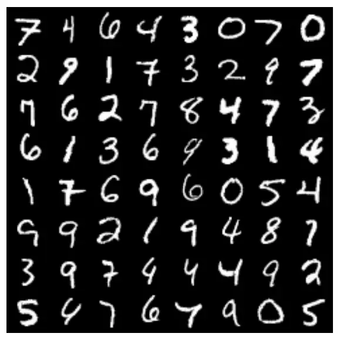

(a) Input

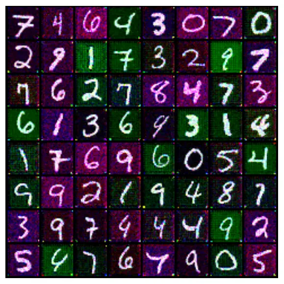

(b) Baseline ($`\lambda_{r}=0`$)

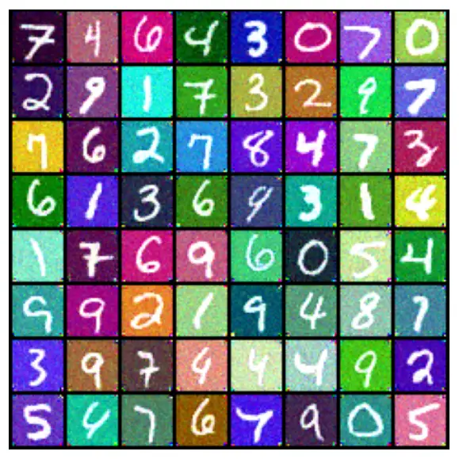

(c) Colorized ($`\lambda_{r}=3`$)

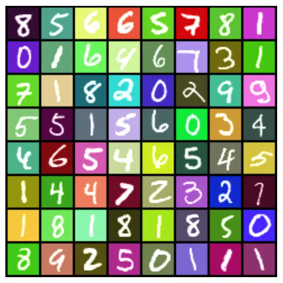

(d) Reference

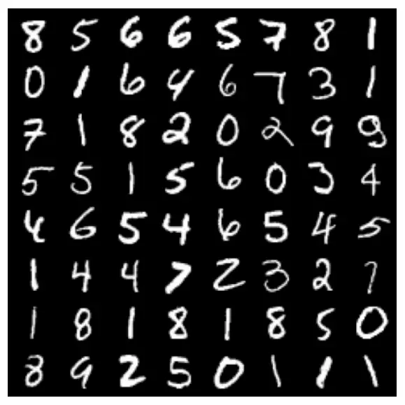

(e) Input

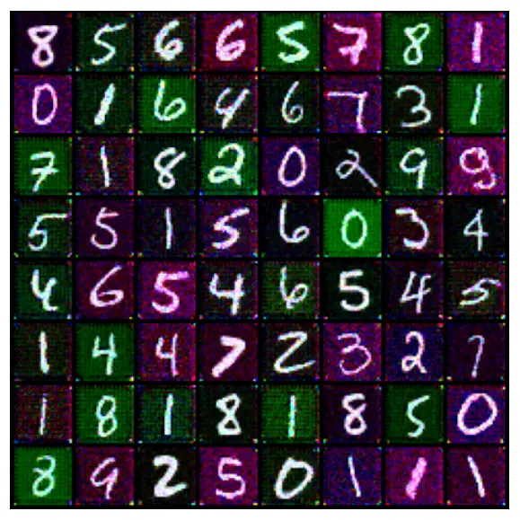

(f) Baseline ($`\lambda_{r}=0`$)

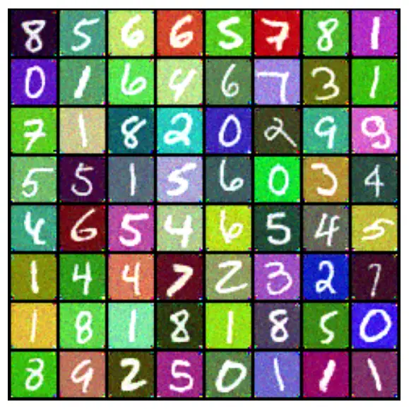

(g) Colorized ($`\lambda_{r}=3`$)


(h) Reference

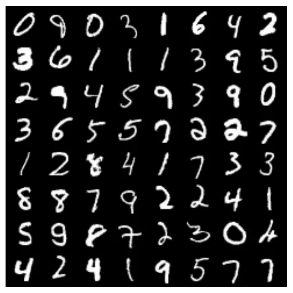

(i) Input

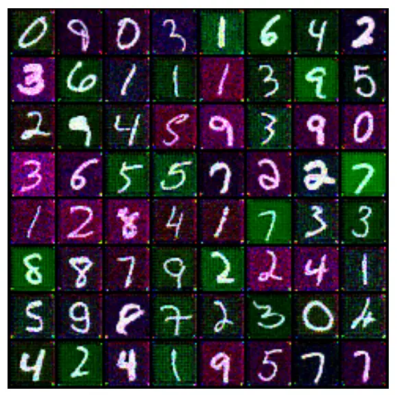

(j) Baseline ($`\lambda_{r}=0`$)

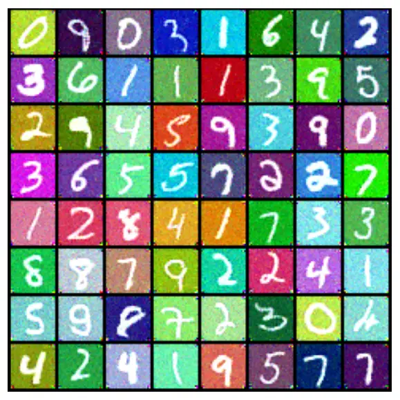

(k) Colorized ($`\lambda_{r}=3`$)

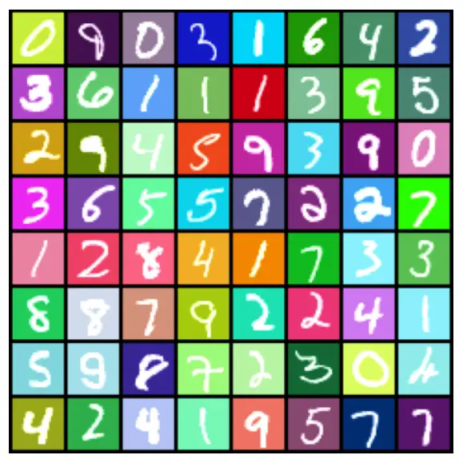

(l) Reference

Figure 6: More image colorization results on MNIST

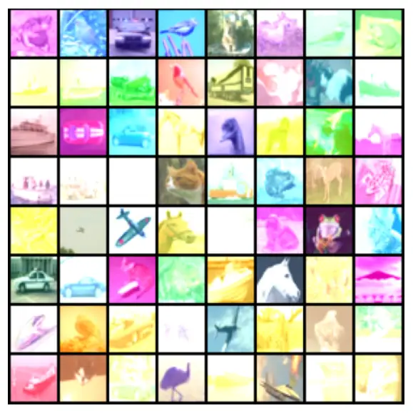

(a) Input

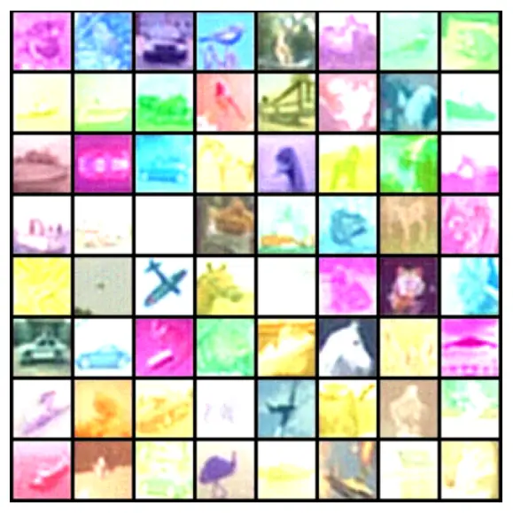

(b) Baseline ($`\lambda_{r}=0`$)

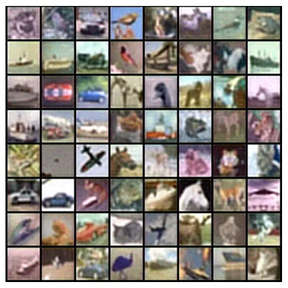

(c) De-noised ($`\lambda_{r}=3`$)

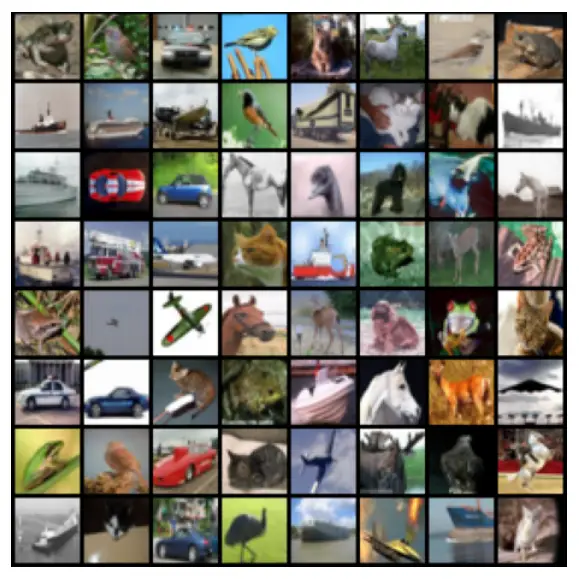

(d) Reference

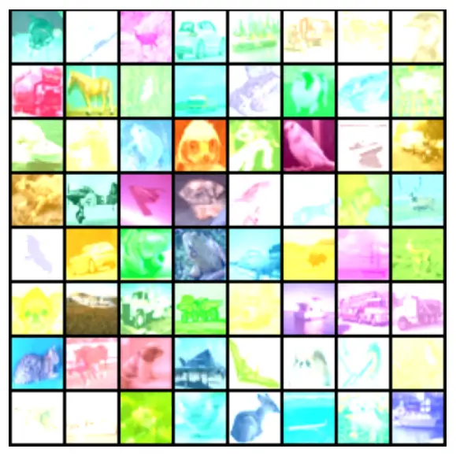

(e) Input

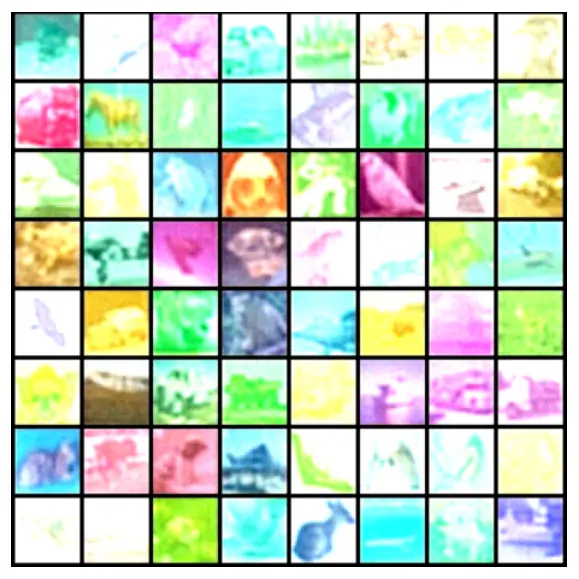

(f) Baseline ($`\lambda_{r}=0`$)

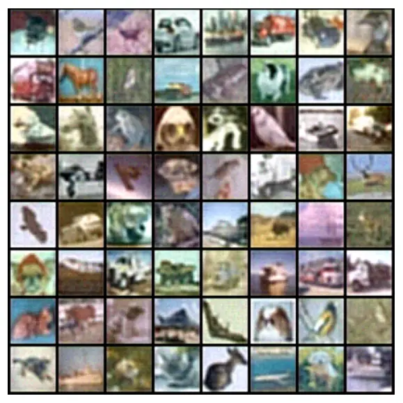

(g) De-noised ($`\lambda_{r}=3`$)

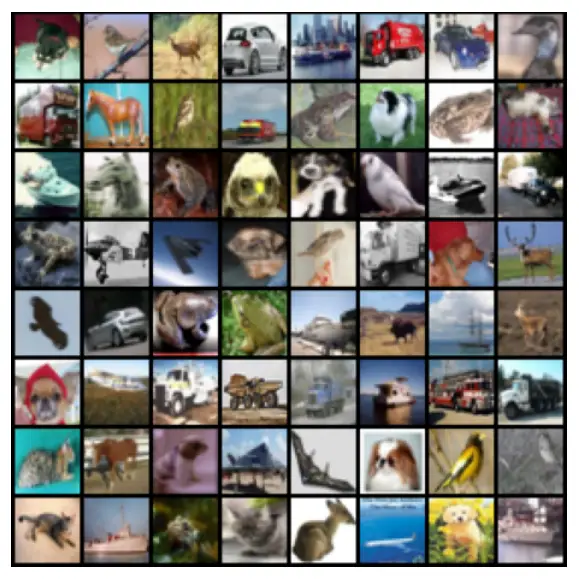

(h) Reference

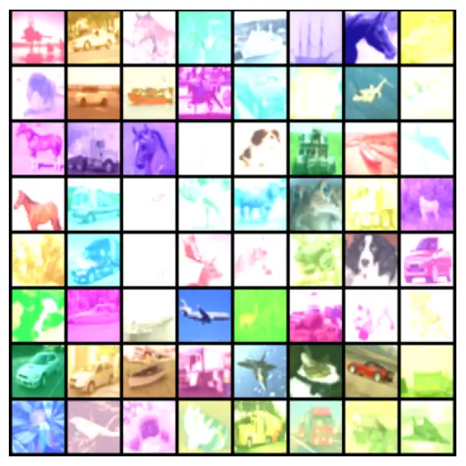

(i) Input

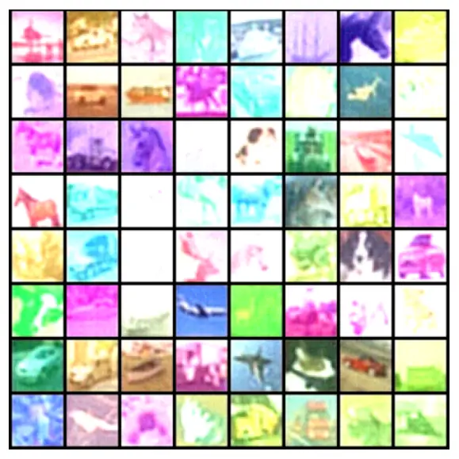

(j) Baseline ($`\lambda_{r}=0`$)

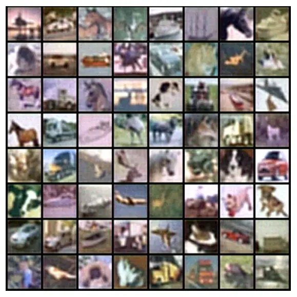

(k) De-noised ($`\lambda_{r}=3`$)

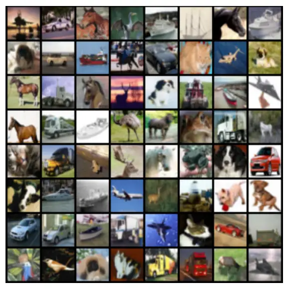

(l) Reference

Figure 7: More image denoising results on CIFAR10

| MNIST U-Net                                                                             |
| --------------------------------------------------------------------------------------- |
| $`384\times 3\times 1\times 1`$ Conv2d with stride 1 (DINO projection layer)            |
| $`9\times 32\times 3\times 3`$ Conv2d with stride 2 + $`1024\times 32`$ Linear          |
| GroupNorm with 4 groups                                                                 |
| Swish activation                                                                        |
| $`32\times 64\times 3\times 3`$ Conv2d with stride 2 + $`1024\times 64`$ Linear         |
| GroupNorm with 32 groups                                                                |
| Swish activation                                                                        |
| $`64\times 128\times 3\times 3`$ Conv2d with stride 2 + $`1024\times 128`$ Linear       |
| GroupNorm with 32 groups                                                                |
| Swish activation                                                                        |
| $`128\times 256\times 3\times 3`$ Conv2d with stride 2 + $`1024\times 256`$ Linear      |
| GroupNorm with 32 groups                                                                |
| Swish activation                                                                        |
| $`256\times 128\times 4\times 4`$ ConvTrans2d with stride 2 + $`1024\times 128`$ Linear |
| GroupNorm with 32 groups                                                                |
| Swish activation                                                                        |
| $`256\times 64\times 4\times 4`$ ConvTrans2d with stride 2 + $`1024\times 64`$ Linear   |
| GroupNorm with 32 groups                                                                |
| Swish activation                                                                        |
| $`128\times 32\times 4\times 4`$ ConvTrans2d with stride 2 + $`1024\times 32`$ Linear   |
| GroupNorm with 32 groups                                                                |
| Swish activation                                                                        |
| $`64\times 3\times 3\times 3`$ ConvTrans2d with stride 1                                |

Table 2: U-Net score network used in the MNIST colorization experiment.
The input is $`9\times 28\times 28`$ created by stacking the image, the
projected and resized DINO feature map to $`3\times 28\times 28`$ and
the background color vector broadcasted to $`3\times 28\times 28`$.
$`a+b`$ denotes that component $`a`$ accepts hidden embedding from the
previous layer and component $`b`$ accepts the time embedding, and the
outputs of $`a`$ and $`b`$ are added with proper broadcasting. “Conv2d”
refers to 2-D convolutional layer, “GroupNorm” stands for group
normalization layer, and “ConvTrans2d” stands for 2-D transposed
convolutional layer.

| CIFAR10 U-Net                                                                                                         |
| --------------------------------------------------------------------------------------------------------------------- |
| $`384\times 6\times 1\times 1`$ Conv2d with stride 1 (DINO projection layer)                                          |
| $`6\times 32\times 3\times 3`$ + $`3\times 32\times 3\times 3`$ Conv2d with stride 2 + $`1024\times 32`$ Linear       |
| GroupNorm with 4 groups                                                                                               |
| Swish activation                                                                                                      |
| $`32\times 64\times 3\times 3`$ + $`32\times 64\times 3\times 3`$ Conv2d with stride 2 + $`1024\times 64`$ Linear     |
| GroupNorm with 32 groups                                                                                              |
| Swish activation                                                                                                      |
| $`64\times 128\times 3\times 3`$ + $`64\times 128\times 3\times 3`$ Conv2d with stride 2 + $`1024\times 128`$ Linear  |
| GroupNorm with 32 groups                                                                                              |
| Swish activation                                                                                                      |
| $`128\times 256\times 3\times 3+128\times 256\times 3\times 3`$ Conv2d with stride 2 + $`1024\times 256`$ Linear      |
| GroupNorm with 32 groups                                                                                              |
| Swish activation                                                                                                      |
| $`256\times 128\times 4\times 4+256\times 128\times 4\times 4`$ ConvTrans2d with stride 2 + $`1024\times 128`$ Linear |
| GroupNorm with 32 groups                                                                                              |
| Swish activation                                                                                                      |
| $`256\times 64\times 4\times 4+256\times 64\times 4\times 4`$ ConvTrans2d with stride 2 + $`1024\times 64`$ Linear    |
| GroupNorm with 32 groups                                                                                              |
| Swish activation                                                                                                      |
| $`128\times 32\times 4\times 4+128\times 32\times 4\times 4`$ ConvTrans2d with stride 2 + $`1024\times 32`$ Linear    |
| GroupNorm with 32 groups                                                                                              |
| Swish activation                                                                                                      |
| $`64\times 3\times 3\times 3+64\times 3\times 3\times 3`$ ConvTrans2d with stride 1                                   |

Table 3: U-Net score network used in the CIFAR10 denoising experiment.
The input is $`12\times 32\times 32`$ created by stacking the image, the
projected and resized DINO feature map to $`3\times 32\times 32`$ and
the noise map broadcasted to $`3\times 32\times 32`$. A dual encoder
with separate U-Nets for the content and the style variables is used and
$`a+b+c`$ denotes that component $`a`$ accepts the content embedding
from the previous layer, component $`b`$ accepts the previous style
embedding and $`c`$ accepts the time embedding. Further, the outputs of
$`a,c`$ and the outputs of $`b,c`$ are added separately with proper
broadcasting. $`a+b`$ here denotes that $`a`$ accepts the previous
content embedding, $`b`$ accepts the previous style embedding and the
two outputs are added.

|         | $`  | {\mathcal{Y}}    | `$  | Feature | Classifier | \#Classifiers | Reference |
| ------- | --- | ---------------- | --- | ------- | ---------- | ------------- | --------- |
| IEMOCAP | 4   | wav2vec 2.0 base | MLP | 8       | \[70\]     |
| ADReSS  | 2   | whisper-medium   | SVM | 15      | \[72\]     |
| ALS-TDI | 5   | whisper-medium   | SVM | 15      | \[73\]     |

| VC        | DM-based | Reference |
| --------- | -------- | --------- |
| TriAAN-VC | No       | \[71\]    |
| KNN-VC    | No       | \[64\]    |
| Diff-VC   | Yes      | \[38\]    |

Table 4: Datasets and VC-adapted classifiers used during realistic data
experiments

| VC type        | Impairment              |      |      |      |                        |      |      |      | Emotion                            |      |      |      |
| -------------- | ----------------------- | ---- | ---- | ---- | ---------------------- | ---- | ---- | ---- | ---------------------------------- | ---- | ---- | ---- |
|                | ALS-TDI, F1$`\uparrow`$ |      |      |      | ADReSS, F1$`\uparrow`$ |      |      |      | IEMOCAP, Acc. (5-fold)$`\uparrow`$ |      |      |      |
|                | A                       | B    | MV   | SMV  | A                      | B    | MV   | SMV  | A                                  | B    | MV   | SMV  |
| No VC          | 54.9                    | 54.9 | 54.9 | 54.9 | 70.6                   | 70.6 | 70.6 | 70.6 | 71.5                               | 71.5 | 71.5 | 71.5 |
| Pitch shifting | 55.8                    | 60.3 | 57.6 | 61.5 | 71.2                   | 77.1 | 77.1 | 68.8 | 60.6                               | 55.1 | 61.1 | 61.1 |
| KNN-VC         | 55.8                    | 61.7 | 64.8 | 49.9 | 71.5                   | 79.2 | 79.2 | 83.3 | 70.4                               | 69.3 | 71.4 | 71.5 |
| TriAAN-VC      | 55.7                    | 60.7 | 61.7 | 53.3 | 72.4                   | 75.0 | 77.1 | 83.3 | 65.1                               | 64.1 | 66.8 | 67.2 |
| Diff-VC        | 47.0                    | 51.2 | 50.3 | 49.2 | 65.6                   | 69.4 | 66.7 | 70.8 | 87.0                               | 94.3 | 96.5 | 97.2 |

Table 5: Overall results on realistic datasets. All metrics are between
0-100. A: single (average); B: single (best); MV: majority vote; SMV:
soft majority vote.

| VC type        | Voting type   | Accuracy |      |      |      |      |      | WER ($`\downarrow`$) | MOS ($`\uparrow`$) |
| -------------- | ------------- | -------- | ---- | ---- | ---- | ---- | ---- | -------------------- | ------------------ |
|                |               | 1        | 2    | 3    | 4    | 5    | Avg. |                      |                    |
| No VC          | \-            | 72.6     | 76.6 | 68.9 | 68.9 | 70.3 | 71.5 | 9.0                  | 2.3                |
| Pitch shifting | single (best) | 64.0     | 65.3 | 57.4 | 57.7 | 58.6 | 60.6 | 36.4                 | 1.3                |
|                | single (avg)  | 61.3     | 62.1 | 50.2 | 48.9 | 53.0 | 55.1 |                      |                    |
|                | majority      | 61.2     | 65.3 | 58.5 | 57.8 | 62.5 | 61.1 |                      |                    |
|                | soft majority | 60.8     | 65.4 | 57.8 | 57.5 | 61.5 | 61.1 |                      |                    |
| KNN-VC         | single (best) | 71.2     | 75.4 | 68.3 | 71.9 | 69.1 | 70.4 | 9.8                  | 1.6                |
|                | single (avg)  | 69.6     | 72.6 | 67.0 | 69.9 | 67.4 | 69.3 |                      |                    |
|                | majority      | 70.3     | 75.6 | 68.5 | 72.8 | 70.0 | 71.4 |                      |                    |
|                | soft majority | 70.3     | 76.1 | 68.5 | 72.8 | 69.9 | 71.5 |                      |                    |
| TriAAN-VC      | single (best) | 65.5     | 66.9 | 63.0 | 67.5 | 62.6 | 65.1 | 16.6                 | 1.9                |
|                | single (avg)  | 64.6     | 66.3 | 61.1 | 65.6 | 63.1 | 64.1 |                      |                    |
|                | majority      | 66.9     | 69.0 | 63.9 | 67.9 | 66.5 | 66.8 |                      |                    |
|                | soft majority | 66.6     | 69.9 | 63.6 | 68.8 | 67.0 | 67.2 |                      |                    |
| Diff-VC        | single (avg)  | 87.0     | 88.3 | 86.2 | 87.6 | 86.1 | 87.0 | 22.9                 | 2.5                |
|                | single (best) | 94.4     | 94.8 | 94.2 | 95.2 | 92.9 | 94.3 |                      |                    |
|                | majority      | 97.5     | 96.7 | 95.2 | 98.1 | 94.9 | 96.5 |                      |                    |
|                | soft majority | 97.7     | 97.6 | 96.3 | 98.7 | 95.6 | 97.2 |                      |                    |

Table 6: Emotion recognition results on IEMOCAP. 8 speakers in the
training set of each fold are used as target speakers. WER stands for
word error rate computed using the whisper-large-v2 model \[125\] and
lower is better. MOS stands for mean opinion score computed using
UTMOS \[126\] and higher is better.

|                |               |           |        |      |          |
| -------------- | ------------- | --------- | ------ | ---- | -------- |
| VC type        | Voting type   | Precision | Recall | F1   | Accuracy |
| No VC          | \-            | 71.4      | 70.8   | 70.6 | 70.8     |
| Pitch shifting | single (avg)  | 71.8      | 71.4   | 71.4 | 71.2     |
|                | single (best) | 77.1      | 77.1   | 77.1 | 77.1     |
|                | majority      | 77.1      | 77.1   | 77.1 | 77.1     |
|                | soft majority | 68.8      | 68.8   | 68.7 | 68.8     |
| KNN-VC         | single (avg)  | 71.8      | 71.5   | 71.4 | 71.5     |
|                | single (best) | 80.0      | 79.2   | 79.1 | 79.2     |
|                | majority      | 79.4      | 79.2   | 79.1 | 79.2     |
|                | soft majority | 83.6      | 83.3   | 83.3 | 83.3     |
| TriAAN-VC      | single (avg)  | 72.5      | 72.4   | 72.4 | 72.4     |
|                | single (best) | 75.2      | 75.0   | 75.0 | 75.0     |
|                | majority      | 77.5      | 77.1   | 77.0 | 77.1     |
|                | soft majority | 83.3      | 83.3   | 83.3 | 83.3     |
| Diff-VC        | single (avg)  | 65.7      | 65.4   | 65.4 | 65.6     |
|                | single (best) | 69.4      | 69.4   | 69.4 | 69.4     |
|                | majority      | 66.7      | 66.7   | 66.7 | 66.7     |
|                | soft majority | 72.2      | 70.8   | 70.4 | 70.8     |

Table 7: Alzheimer detection results on ADReSS

|                |               |                       |                    |                |
| -------------- | ------------- | --------------------- | ------------------ | -------------- |
| VC type        | Voting type   | Precision$`\uparrow`$ | Recall$`\uparrow`$ | F1$`\uparrow`$ |
| No VC          | \-            | 59.8                  | 53.7               | 54.9           |
| Pitch shifting | single (avg.) | 60.5                  | 54.1               | 55.8           |
|                | single (best) | 67.4                  | 57.7               | 60.3           |
|                | majority      | 73.0                  | 54.9               | 57.6           |
|                | soft majority | 68.4                  | 59.0               | 61.5           |
| KNN-VC         | single (avg.) | 58.5                  | 54.6               | 55.8           |
|                | single (best) | 65.7                  | 59.5               | 61.7           |
|                | majority      | 67.9                  | 62.9               | 64.8           |
|                | soft majority | 51.1                  | 49.6               | 49.9           |
| TriAAN-VC      | single (avg.) | 60.2                  | 54.5               | 55.7           |
|                | single (best) | 68.0                  | 58.2               | 60.7           |
|                | majority      | 69.9                  | 59.1               | 61.7           |
|                | soft majority | 54.1                  | 52.8               | 53.3           |
| Diff-VC        | single (avg.) | 48.2                  | 47.0               | 47.0           |
|                | single (best) | 53.0                  | 51.0               | 51.2           |
|                | majority      | 49.8                  | 50.9               | 50.3           |
|                | soft majority | 50.1                  | 48.8               | 49.2           |

Table 8: ALS severity classification results on ALS-TDI with a
whisper-medium+SVM classifier

## Appendix E Experiment details

### E.1 Latent subspace GMM disentanglement

For the synthetic disentanglement experiment, we choose the subspace
dimension to be $`d_{Z}=d_{G}=5`$ and sample the content variable via
$`Z\sim\frac{1}{2}{\mathcal{N}}(\mu_{1}^{Z},\sigma_{0}^{2}\mathbf{I}_{d_{Z}})+\frac{1}{2}{\mathcal{N}}(\mu_{2}^{Z},\sigma_{0}^{2}\mathbf{I}_{d_{Z}})`$
and the style variable via
$`G\sim\frac{1}{2}{\mathcal{N}}(\mu_{1}^{G},\sigma_{0}^{2}\mathbf{I}_{d_{G}})+\frac{1}{2}{\mathcal{N}}(\mu_{2}^{G},\sigma_{0}^{2}\mathbf{I}_{d_{G}})`$,
where $`\sigma_{0}=0.1`$. In this way, we generate i.i.d $`4000`$
samples for training.

| Name        | $`\alpha(t)`$                                       | $`\sigma^{2}(t)`$                           |
| ----------- | --------------------------------------------------- | ------------------------------------------- |
| VE          | 1                                                   | $`\frac{25^{2t}-1}{2\log 25}`$              |
| VP          | $`e^{-0.05t-4.975t^{2}}`$                           | $`1-e^{-0.1t-9.95t^{2}}`$                   |
| sub-VP      | $`e^{-0.05t-4.975t^{2}}`$                           | $`(1-e^{-0.1t-9.95t^{2}})^{2}`$             |
| VP (cosine) | $`e^{-\frac{t}{2}-\frac{1}{\pi}\sin(\frac{t}{2})}`$ | $`1-e^{-t-\frac{2}{\pi}\sin(\frac{t}{2})}`$ |

Table 9: The default noise schedule hyperparameters for the synthetic
data experiments. Continuous time ($`t\in[10^{-5},1]`$) is used in the
expression.

We follow the network architecture shown in Figure 2 with $`d_{H}=512`$.
For the time embedding $`\texttt{PE}(\cdot),`$ we opt for a _Gaussian
Fourier projection layer_ to encode temporal information between
$`(0,1]`$ defined as:

```math
\displaystyle\texttt{PE}(t):=\begin{bmatrix}\sin(2\pi\Omega t)\\
\cos(2\pi\Omega t)\end{bmatrix},
```

where $`\Omega\sim{\mathcal{N}}(\mathbf{0}_{512},9000I_{512}).`$ We
train the models for 10,000 steps with an Adam \[127\] optimizer with
learning rate $`10^{-5}`$ and batch size equal to the entire training
set. To ensure convergence, we pretrained the speaker score network
$`{\hat{s}}^{G}`$ We experiment with various noise schedulers, including
the variance exploding (VE), vanilla variance preserving (VP) \[33\],
sub-VP \[69\] and cosine VP \[128\]. The detailed schedule
hyperparameters are listed in Table 9 and are chosen based on rules of
thumbs in \[129, 69\]. To evaluate the subspace recovery, we use the
subspace recovery error defined as:

```math
\displaystyle d(U,V,A_{Z},A_{G}):=\frac{1}{2d_{X}}\left(\|P_{U}-P_{A_{Z}}\|_{F}^{2}+\|P_{V}-P_{A_{G}}\|_{F}^{2}\right), \tag{55}
```

whose range is $`[0,1].`$

### E.2 Image disentanglement

For all experiments, we use a Gaussian Fourier projection layer to
encode temporal information between $`(0,1]`$. Further, the U-Net
architecture used as the score function for MNIST and CIFAR10 are shown
in Table 2 and Table 3 respectively. To capture the content information
of the image, we use the $`16\times 16`$ feature map from a pretrained
vit-small-patch16-224-dino variant of the DINO model \[55\]. The feature
map is then resampled to the same size as the image.

For both datasets, we train the DM using an Adam optimizer \[127\] with
a batch size of 128 and a learning rate $`10^{-4}`$ for $`50`$ epochs. A
VE schedule is used during conditional score matching. During inference,
we use probability flow \[69\] with 500 steps to perform sampling. For
the CIFAR10 denoising experiment, we feed a all-zero matrix as the noise
map. All models are implemented in Pytorch \[130\] on two A5000 GPUs.
The training time is approximately an hour for both datasets and the
inference is approximately $`10`$ seconds for $`64`$ samples.

Full quantitative results on MNIST and CIFAR10 are shown in Table 1. And
more examples are shown in Figure 6 for MNIST and Figure 7 for CIFAR10.

### E.3 Speech disentanglement

The dataset statistics are shown in Table 4. The overall results for
realistic datasets are shown in Table 5

For the IEMOCAP dataset, we use a system available on
SpeechBrain \[131\] that finetunes on the wav2vec 2.0 backbone \[132\]
with a multi-layer perceptron classifier (MLP) \[133\]. The classifier
is trained using Adam optimizer for 30 epochs with a batch size of $`4`$
and a learning rate of $`10^{-4}`$ for the MLP and the $`10^{-5}`$
learning rate for wav2vec 2.0 weights. The system is then evaluated
using the standard classification accuracy metric and 5-fold cross
validation \[70, 134\]. For each fold, we use all 8 speakers from the
training set as target speakers.

On the ALS and ADReSS, we use whisper-medium \[125\] features, as they
have shown to be the most effective for speech impairment
classification \[135\]. To avoid unfair comparison, We concatenate
hidden representations over _all_ layers of the whisper-medium encoder
rather than selecting a particular layer and perform mean pooling over
the frame-level features. For both datasets, we follow the standard
splits used in previous works \[73\] to have no overlaps between speaker
in the training and test sets. And for both datasets, we use the 15 most
frequent speakers from the training set as target speakers for the VC to
achieve maximize conversion quality via better speaker representation.

We apply the VCs in mostly a zero-shot, plug-and-play fashion, and leave
finetuning to specific datasets for future works. For the Diff-VC, we
use the publicly available score network and vocoder checkpoints trained
on LibriTTS and adopt the original inference hyperparameter settings for
all experiments. Similarly, we use the pretrained models and for other
VC models. Further, we use a maximum of 120 second speech from the
target speaker to compute the target speaker embedding for all models
except KNN-VC, where we use all the target speech as the pool for
nearest neighbor search. We also compare VC adaptation with common data
augmentation technique such as pitch shifting, where we shift the pitch
of all the speech utterances to equally spaced pitch levels over the
$`F0`$ range of the training speech data with levels equal to the number
of target speakers and train separate classifiers for each level as in
the case of using VC adaptation.

For ALS severity classification as shown in Table 5, KNN-VC achieves the
best performance among the VCs, reaching 65% macro-F1 with 15 target
speakers and hard majority voting, compared to 54.9% when training
without VC adaptation and 61.7% with pitch shifting. For cognitive
impairment detection as shown in Table 5, TriAAN-VC performed the best
followed by the KNN-VC method, both achieved 83.3% macro-F1 with soft
majority voting, which is 12.7% better than methods without VC
adaptation and 14.5% and $`6.2\%`$ better than the pitch shifting
adaptation using hard and soft majority voting respectively. On IEMOCAP,
we found that Diff-VC performs the best, reaching an average of 97.2%
accuracy, which is 25.7% better than the no-VC classifier and 36.1% than
the pitch shifting adaptation. Though a phenomenon out of the scope of
predictions by our theory, we hypothesized that such “specialization” of
the VC methods is due to the different level of generalization ability
of different VCs to latent variables _other than_ the speaker identity,
such as recording conditions and health conditions of the speaker. For
instance, Diff-VC does not perform well on ALS compared to KNN-VC,
probably due to the domain mismatch between the health conditions of its
training set, which contains little pathological speech, compared to
KNN-VC which uses the WavLM representation trained on much larger speech
dataset with diverse speech.

As to the advantage of hard vs. soft voting, we observe different trends
across different datasets and VC methods. On ALS-TDI, hard voting works
better than soft voting by 8.4% and 16% for the best two methods Diff-VC
and KNN-VC, though worse by 3.9% and 1.3% for pitch shifting and
Diff-VC. On IEMOCAP, the gap between soft and hard voting is negligible,
with soft majority voting shows a 0.1%-0.7% edge over hard majority
voting across VC methods. On ADReSS, we found soft voting methods to be
better than hard voting for all the VC methods by $`4.1\%-6.2\%`$, while
worse for the pitch shifting method by 8.3% (68.8% vs. 77.1%). Since
soft voting uses a random classifier for voting, it tends to perform
well when the model is “confidently” correct and “hesitantly” wrong, as
it puts more weights on confident classifiers than hesitant ones. This
suggests that the average confidence score estimated in terms of the
classifier posteriors on incorrect examples will be high for classifier
ensembles that perform well with hard voting than soft voting.
Table 6 7 8 show the complete results for the realistic dataset
experiments.
