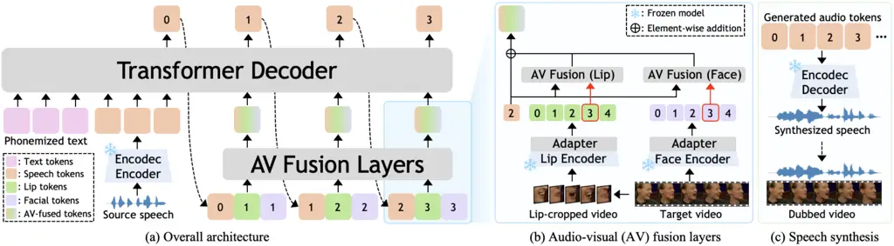
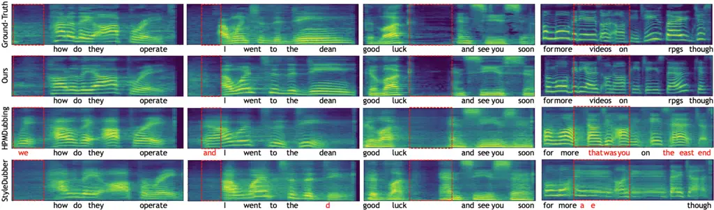
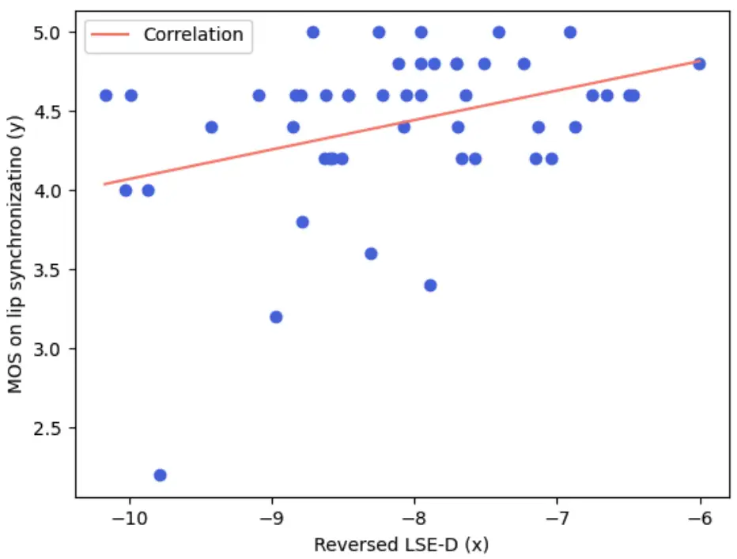
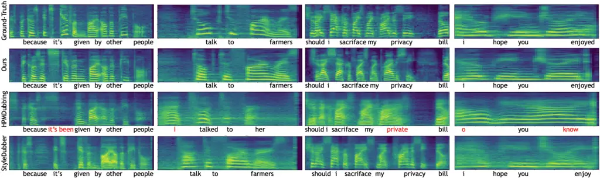
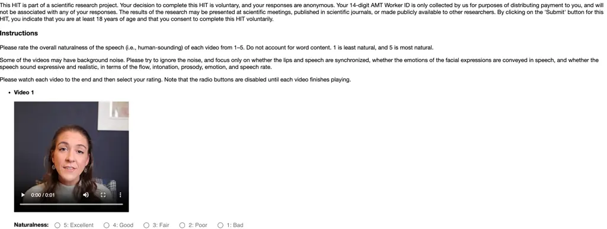
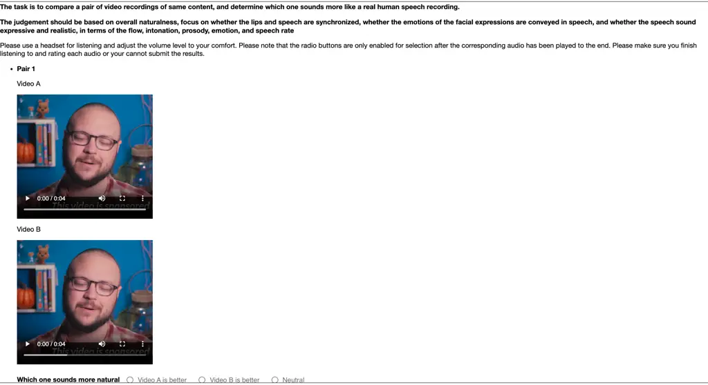

# VoiceCraft-Dub: Automated Video Dubbing with Neural Codec Language Models

Kim Sung-Bin   Jeongsoo Choi   Puyuan Peng   Joon Son Chung   Tae-Hyun
Oh   David Harwath Affiliation: Department of Electrical Engineering,
POSTECH Affiliation: School of Electrical Engineering and School of
Computing, KAIST Affiliation: Department of Computer Science, The
University of Texas at Austin

###### Abstract

We present VoiceCraft-Dub, a novel approach for automated video dubbing
that synthesizes high-quality speech from text and facial cues. This
task has broad applications in filmmaking, multimedia creation, and
assisting voice-impaired individuals. Building on the success of Neural
Codec Language Models (NCLMs) for speech synthesis, our method extends
their capabilities by incorporating video features, ensuring that
synthesized speech is time-synchronized and expressively aligned with
facial movements while preserving natural prosody. To inject visual
cues, we design adapters to align facial features with the NCLM token
space and introduce audio-visual fusion layers to merge audio-visual
information within the NCLM framework. Additionally, we curate
CelebV-Dub, a new dataset of expressive, real-world videos specifically
designed for automated video dubbing. Extensive experiments show that
our model achieves high-quality, intelligible, and natural speech
synthesis with accurate lip synchronization, outperforming existing
methods in human perception and performing favorably in objective
evaluations. We also adapt VoiceCraft-Dub for the video-to-speech task,
demonstrating its versatility for various applications.

![[Uncaptioned
image]](arxiv-2504-02386--b42a837581f1.figures/figure-1.webp)

Figure 1: Automated video dubbing. (a) Unlike text-to-speech, which
generates diverse speech based on target text, automated video dubbing
requires synthesized speech to be temporally and expressively aligned
with the video while maintaining naturalness and intelligibility. (b)
Examples of synthesized speech from VoiceCraft-Dub show that each speech
is aligned with the lip movements of the input video. We strongly
encourage listening to each of the synthesized samples
in [https://voicecraft-dub.github.io/](https://voicecraft-dub.github.io/).

## 1 Introduction

Recent advancements in Text-to-Speech (TTS) have significantly improved
the ability to synthesize human-like speech with remarkable naturalness,
content accuracy, and voice similarity. Specifically, Neural Codec
Language Models (NCLMs) represent a new model for speech generation that
leverages language modeling with discrete codes derived from neural
speech codecs \[52, 16\]. This approach has demonstrated superior
performance across diverse speech generation tasks, such as TTS \[46, 8,
24\], speech editing \[36\], and voice conversion \[3\], due to the
strong in-context learning ability of language models. Here, context
refers to the speaker characteristics in the reference speech, enabling
the generated speech to exhibit higher speaker similarity and
naturalness compared to conventional models.

While TTS traditionally synthesizes speech from input text, combining
text with video input gives rise to a different application: automated
video dubbing \[22\]. Automated video dubbing involves generating target
speech given the source speech, target text, and target video, as shown
in Fig. 1 (a). The source speech provides reference voice
characteristics, while the target text and video determine the content
to be synthesized, its temporal alignment to the speaker’s facial and
lip movements, and even provide prosodic and emotional cues for how the
speech should be delivered. This task has applications in filmmaking,
multimedia content creation, dubbing translations of films into
different languages, redubbing silent movies, and voice generation for
voice-impaired individuals \[35, 23\]. Automated video dubbing is
challenging as it must meet criteria inherited from TTS: (1)
Intelligibility: the speech should convey accurate content, (2)
Naturalness: the speech should exhibit natural prosody and intonation,
and (3) Speaker similarity: the voice should match the source speaker.
Additionally, video-specific criteria must also be considered: (4) Lip
synchronization: the synthesized speech should be precisely time-aligned
with lip movements, and (5) Expressiveness: the speech should reflect
natural expressions corresponding to facial cues.

In this work, we introduce VoiceCraft-Dub, a novel approach for
automated video dubbing using NCLMs. Building on the strengths of NCLMs
in TTS, we extend their capabilities to incorporate video features,
enabling the synthesis of natural and expressive speech that is
time-synchronized with the target video. Specifically, we frame the task
as an autoregressive speech token prediction problem, conditioned on the
source speech, target text, and target video. Since NCLMs typically only
take as input text and speech codec tokens, we introduce an audio-visual
fusion approach to inform the model of the desired alignment between the
output speech and facial features—such as lip movements and facial
expressions—by merging the speech and visual tokens at each timestep.
These merged audio-visual tokens are autoregressively fed into a
Transformer decoder to generate the next speech token, enabling the
model to synthesize time-aligned and expressive speech by referencing
the target video, as shown in Fig. 1 (b).

We evaluate our proposed method using the existing audio-visual dataset
LRS3 \[1\], which is effective for assessing model performance in
real-world scenarios. To further test our model’s ability to generate
expressive speech in diverse, in-the-wild settings, we curate a video
dataset, CelebV-Dub, built upon existing video sources \[54, 51\] that
include emotionally rich scenarios from vlogs, dramas, and movies. To
ensure dataset quality, we design a curation pipeline that filters
content suitable for automated video dubbing. Compared to LRS3,
CelebV-Dub includes a broader range of in-the-wild videos with
expressive speech.

Given the generative nature of this task, subjective evaluation is
essential for assessing the quality of synthesized speech in terms of
naturalness and lip synchronization. We conduct extensive human
evaluations where participants assess synthesized outputs from different
approaches across various aspects, including naturalness,
intelligibility, lip-sync accuracy, speaker similarity, and
expressiveness. Additionally, we use several objective metrics for
quantitative evaluation. Experimental results show that our method
achieves highly accurate lip synchronization while significantly
outperforming state-of-the-art approaches \[12, 13\] in naturalness and
content accuracy across all metrics. Furthermore, we demonstrate the
versatility of our approach by adapting it for the video-to-speech
generation task using an off-the-shelf visual speech recognition
model \[30\]. Although this is not our primary focus, our model performs
favorably, emphasizing its potential for a wide range of applications.
Our main contributions are summarized as follows:

- •
  We introduce VoiceCraft-Dub, the first work to extend Neural Codec
  Language Models (NCLMs) for automated video dubbing by integrating
  visual facial cues.
- •
  We propose a novel audio-visual fusion approach in NCLMs to achieve
  precise lip synchronization while preserving speech quality and
  intelligibility.
- •
  We curate CelebV-Dub, a dataset containing expressive real-world
  videos designed for automated video dubbing.
- •
  We demonstrate superior performance in synthesizing human-like speech
  with high content accuracy, naturalness, and precise synchronization
  with video.

## 2 Related work

#### Neural codec language models (NCLMs)

NCLMs are inspired by advancements in both neural audio codecs and
language modeling techniques. Neural audio codecs \[16, 52\] have
enabled high-fidelity audio compression by efficiently encoding raw
waveforms into discrete tokens while preserving quality using residual
vector quantization (RVQ) method. By applying language modeling
techniques to these discrete audio tokens, NCLMs have been shown to
generate high-quality speech. NCLMs have also demonstrated the ability
to perform in-context learning by copying the vocal characteristics,
emotion, and prosody of a prompt utterance, resulting in highly natural
and expressive speech. In this regard, NCLMs significantly outperform
conventional TTS methods. NCLMs have demonstrated strong performance in
diverse applications, such as speech continuation \[6\], zero-shot
TTS \[24, 46, 8\], speech editing \[36\], and voice conversion \[3\].
Several methods have also explored style-controlled synthesis \[50,
26\]. Furthermore, NCLMs have been successfully applied to other audio
domains, such as music \[2, 17, 15\] and sound effects \[25\]. We
further extend the capabilities of NCLMs by integrating them with visual
information, specifically targeting the automated video dubbing task. By
bridging the audio-visual domain, we significantly expand the potential
and versatility of NCLMs.



Figure 2: Our proposed approach. (a) The Transformer decoder
autoregressively generates audio tokens from phonemized text tokens,
source speech tokens (extracted via the Encodec encoder), and
audio-visual fused tokens, which combine the target speech token with
lip and facial tokens from the target video. The numbers in each token
denote the timestep. (b) An audio-visual fusion layer aligns the
generated target speech tokens with the preceding lip and face tokens,
effectively merging their information for better synchronization. (c)
Finally, the generated target speech tokens are decoded by Encodec to
synthesize high-quality speech that is temporally aligned with the
video.

#### Automated video dubbing

Automated video dubbing is a task that synthesizes speech from both text
and video inputs, with promising applications in multimedia creation.
Since this task extends text-to-speech (TTS) by incorporating video,
research in this field has largely evolved from advancements in TTS.
Early work \[22, 27\] primarily focuses on modifying TTS models to
generate lip-synced speech using lip-cropped videos. Subsequent
work \[18\] proposes reflecting both text and the speaker’s emotional
state by analyzing facial expressions for speech synthesis. Building on
these foundations, HPMDubbing \[12\] introduces a multi-level approach
that aligns visual cues with speech prosody across lip movements, facial
expressions, and scene context, modifying FastSpeech \[39\] to
incorporate visual cues. StyleDubber \[13\] implements a multi-scale
style learning framework to improve pronunciation accuracy while
maintaining consistent speech style. Zhang *et al*. \[53\] propose a
two-stage method: first, learning pronunciation from a large-scale
text-to-speech corpus, then synchronizing prosody with speech and visual
emotions, while ensuring duration consistency between speech timing and
lip movements.

Despite these efforts, existing methods still struggle to synthesize
natural and expressive human-like speech. To overcome these limitations,
we bring NCLMs to bear for automated video dubbing, leveraging the
strong in-context learning ability of these models for natural and
high-fidelity speech synthesis. However, directly applying NCLMs
off-the-shelf to this task is not possible, as existing NCLMs do not
take video inputs as features, nor do they have mechanisms that can be
used to precisely align the generated speech waveform with a target
video of a talker’s face. To address this, we propose a novel method for
effectively injecting video features into NCLMs, enabling the synthesis
of high-fidelity speech that aligns accurately with the video’s timing
and expressions.

## 3 Modeling approach

### 3.1 Overview

Our primary goal is to generate high-quality, human-like speech while
ensuring precise temporal alignment with the target video. Given the
source speech $`\mathbf{Y}_{\text{src}}`$, text input $`\mathbf{Z}`$,
and target video $`\mathbf{V}`$, we design a model that synthesizes the
target speech $`\mathbf{Y}_{\text{tgt}}`$. To achieve this, we formulate
the task as a next-token prediction problem using a Neural Codec
Language Model (NCLM), which has been shown to produce natural and
expressive speech \[6, 24, 46, 8, 36, 3\].

In conventional NCLM-based speech synthesis, the Transformer decoder
processes either text alone or a combination of text and speech tokens
to autoregressively generate speech. A straightforward extension for
video dubbing is to prepend video tokens alongside text and speech
tokens in the Transformer decoder. However, we empirically found that
this increases the sequence length to the point that it becomes
difficult for the model to effectively attend to each modality. This
leads to performance degradation in content accuracy, intelligibility,
and lip synchronization (refer to Sec. 4.4).

To address this issue, we propose VoiceCraft-Dub, a novel approach that
extends the NCLM framework to incorporate visual cues for automated
video dubbing. As shown in Fig. 2 (a), VoiceCraft-Dub takes text and
discrete source speech tokens as inputs and autoregressively generates
target speech tokens, with each token merged with visual features
through audio-visual (AV) fusion layers. Specifically, as described in
Fig. 2 (b), visual features, including lip movements and facial
expressions, are mapped into the NCLM token space using separate
adapters. These mapped tokens are fused with target speech tokens via AV
fusion layers. Unlike simply prepending video tokens, this fusion
mechanism directly aligns visual features with speech generation,
enabling the Transformer decoder to produce speech that is temporally
aligned with the video while maintaining intelligibility. Finally, the
generated target speech tokens are fed into the neural codec decoder to
synthesize high-quality speech, as in Fig. 2 (c). In the following
subsections, we detail the input features, architecture, and techniques
used to achieve high-quality automated video dubbing.

### 3.2 Input feature extraction

We describe the input representations for each modality that are
provided to the Transformer decoder as inputs.

#### Speech input

The source speech $`\mathbf{Y}_{\text{src}}`$ provides the speaker’s
voice and prosodic characteristics. We use discrete neural speech tokens
extracted from the pre-trained Encodec \[16\] as the speech input for
the Transformer decoder. Encodec is a high-fidelity neural audio codec
designed for efficient speech and audio compression. It encodes raw
waveforms into a compact discrete representation using a residual vector
quantization (RVQ) mechanism while preserving audio quality. The model
consists of an encoder that transforms audio into quantized tokens, a
decoder that reconstructs the waveform from these tokens, and codebooks
that store learned representations for efficient compression.

Given the source speech $`\mathbf{Y}_{\text{src}}`$, we apply the
Encodec encoder $`E`$ to extract a sequence of discrete speech tokens:
$`\mathbf{\tilde{h}}_{\text{src}}=E(\mathbf{Y}_{\text{src}})`$, where
$`\mathbf{\tilde{h}}_{\text{src}}\in\mathbb{R}^{T_{\text{src}}\times D\times K}`$,
$`T_{\text{src}}`$ is the number of timesteps, $`D`$ is the dimension of
each token, and $`K`$ is the number of RVQ codebooks. The Encodec model
we use operates at a codec framerate of 50Hz on 16kHz recordings.

#### Text input

The text input $`\mathbf{Z}`$ specifies the content to be synthesized.
To process text effectively, we convert it into phonemes based on the
International Phonetic Alphabet (IPA) using the Phonemizer
toolkit \[5\]. Each phoneme is mapped to a learnable vector
representation,
$`\mathbf{h}_{\text{text}}\in\mathbb{R}^{T_{\text{text}}\times D}`$,
where $`T_{\text{text}}`$ is the length of the phoneme sequence and
$`D`$ matches the dimension of the discrete speech tokens. These
learnable representations are updated during model training.

#### Video input

The target video $`\mathbf{V}`$ provides the necessary facial cues for
speech synthesis. Specifically, the video input serves two primary
roles: the full-face video ($`\mathbf{V}`$) captures facial expression
context to enhance expressiveness, while the lip video
($`\mathbf{V}_{\text{lip}}`$), cropped from $`\mathbf{V}`$, indicates
when to speak or pause, ensuring temporal synchronization.

We leverage off-the-shelf models to extract facial features:
AV-HuBERT \[41\], a powerful audio-visual representation model, serves
as a lip encoder to extract lip features from
$`\mathbf{V}_{\text{lip}}`$, and EmoFAN \[44\], a facial expression
analysis model, serves as a face encoder to extract overall facial
features from $`\mathbf{V}`$. Since these extracted features exist in
different representational spaces compared to speech inputs, we
introduce adapters composed of MLP layers to align them with NCLM’s
token space, as shown in Fig. 2 (b):

```math
\textbf{h}^{\prime}_{\text{lip}}=\text{Adapter}_{\text{lip}}(\text{AV-HuBERT}(\mathbf{V}_{\text{lip}})) \tag{1}
```

```math
\textbf{h}^{\prime}_{\text{face}}=\text{Adapter}_{\text{face}}(\text{EmoFAN}(\mathbf{V})) \tag{2}
```

where
$`\textbf{h}^{\prime}_{\text{lip}},\textbf{h}^{\prime}_{\text{face}}\in\mathbb{R}^{M\times D}`$,
$`M`$ is the number of video frames and $`D`$ matches the token
dimension. We further duplicate the video features to match the temporal
resolution of speech tokens:
$`\mathbf{h}_{\text{lip}},\mathbf{h}_{\text{face}}\in\mathbb{R}^{T\times D}`$
where $`T=2M`$, since video frames are at 25fps while speech tokens are
at 50Hz.

### 3.3 Audio-visual (AV) fusion layers

Since extending NCLMs to maintain temporal synchronization between
synthesized speech and video is non-trivial, our AV fusion layers play a
crucial role by effectively integrating visual and speech information,
enabling accurate speech generation synchronized with video. As shown in
Fig. 2 (a), the AV fusion layers take speech, lip, and facial tokens at
each timestep and merge them into AV-fused tokens, which are then
provided to the Transformer decoder. We design two AV fusion layers,
each combining speech tokens with lip and facial tokens, as described in
Fig. 2 (b). Specifically, given the currently generated target speech
token $`\mathbf{h}^{t}_{\text{tgt}}`$, we fuse it with the lip and
facial tokens as follows:

```math
\mathbf{r}^{t}_{\text{tgt, lip}}=\text{AVFuse}_{\text{lip}}([\mathbf{h}^{t}_{\text{tgt}};\mathbf{h}^{t+1}_{\text{lip}}]) \tag{3}
```

```math
\mathbf{r}^{t}_{\text{tgt, face}}=\text{AVFuse}_{\text{face}}([\mathbf{h}^{t}_{\text{tgt}};\mathbf{h}^{t+1}_{\text{face}}]), \tag{4}
```

where
$`\mathbf{h}^{t}_{\text{tgt}},\mathbf{r}^{t}_{\text{tgt, lip}},\mathbf{r}^{t}_{\text{tgt, face}}\in\mathbb{R}^{D}`$,
$`\text{AVFuse}_{\text{lip/face}}`$ are the AV fusion layers, $`t`$ is
the current timestep, and $`[;]`$ denotes channel-wise concatenation.
Importantly, we fuse the currently generated speech token
$`\mathbf{h}^{t}_{\text{tgt}}`$ with the preceding lip and facial tokens
at timestep $`t+1`$. This allows the model to preview the upcoming
visual changes to help the model synthesize temporally and semantically
aligned next speech token with next frame video. Finally,
$`\mathbf{r}^{t}_{\text{tgt, lip}}`$ and
$`\mathbf{r}^{t}_{\text{tgt, face}}`$ act as residual values, which are
added to the current target token as
$`\mathbf{h}^{t}_{\text{fuse}}=\mathbf{h}^{t}_{\text{tgt}}+\mathbf{r}^{t}_{\text{tgt, lip}}+\mathbf{r}^{t}_{\text{tgt, face}}`$
and then fed into the Transformer decoder for autoregressive speech
generation.

### 3.4 Transformer decoder

The Transformer decoder follows a GPT-style architecture, with the goal
of generating target speech tokens $`\mathbf{\tilde{h}}_{\text{tgt}}`$
up to $`T`$, aligned with the fixed-length video. Specifically, the
decoder synthesizes the current target speech token as
$`\mathbf{h}_{\text{tgt}}^{t}=G([\mathbf{h}_{\text{text}};\mathbf{h}_{\text{src}};\mathbf{h}_{\text{fuse}}^{<t}])`$,
where $`G`$ is the Transformer decoder. As mentioned in Sec. 3.2, the
source speech tokens
$`\mathbf{\tilde{h}}_{\text{src}}\in\mathbb{R}^{T_{\text{src}}\times D\times K}`$
consist of $`K`$ residual codebooks. These tokens are summed along the
codebook dimension, resulting in
$`\mathbf{h}_{\text{src}}\in\mathbb{R}^{T_{\text{src}}\times D}`$ to
serve as inputs for the decoder. The generated target speech token
$`\mathbf{h}_{\text{tgt}}^{t}`$ is passed through $`K`$ MLP heads to
predict logits for each residual codebook, yielding
$`\mathbf{\tilde{h}}_{\text{tgt}}^{t}\in\mathbb{R}^{D\times K}`$. This
is summed along the codebook dimension before being passed into the
audio-visual fusion layer in the next timestep. The text and source
speech tokens are combined with their corresponding sinusoidal
positional encoding \[45\] before being fed into the Transformer
decoder, while the AV-fused tokens share the positional encoding of the
source speech. Following existing approaches \[36, 14\], we adopt a
delayed prediction strategy, effective for autoregressive generation
over stacked RVQ tokens. At each timestep $`t`$, each residual level is
delayed, so the prediction of codebook $`k-1`$ at timestep $`t`$ is
conditioned by the prediction of codebook $`k`$ at the same timestep.

Once the generation is complete, the discrete speech tokens are passed
to the Encodec decoder $`D`$:
$`\mathbf{Y}_{\text{tgt}}=D(\mathbf{\tilde{h}}_{\text{tgt}})`$ to
reconstruct the waveform, as shown in Fig. 2 (c).

#### Learning objective

The model is trained to minimize the negative log-likelihood of
predicting the correct speech tokens, given the text, source speech, and
fused audio-visual tokens. Specifically, following the insights in
\[36\] that weighting the first residual codebook more for updates is
effective, we assign higher weights to the first residual codebook
compared to the later ones, resulting in the final loss:

```math
L(\theta)=-\sum_{k=1}^{K}\alpha_{k}\log P_{\theta}(\mathbf{\tilde{h}}_{\text{tgt},k}|\mathbf{h}_{\text{src}},\mathbf{h}_{\text{text}},\mathbf{h}_{\text{fuse}}), \tag{5}
```

where $`\alpha_{k}`$ denotes the weighting hyperparameters. The
trainable parameters include the adapters, audio-visual fusion layers,
and the Transformer decoder, while AV-HuBERT, EmoFAN, and Encodec remain
frozen.

### 3.5 Implementation details

The Transformer decoder is initialized with pretrained weights from
VoiceCraft \[36\] and fine-tuned, while the audio-visual fusion layers
and adapters are trained from scratch. Encodec has $`K=4`$ RVQ
codebooks, each with a vocabulary size of $`D=2048`$. The Transformer
decoder consists of 16 layers, with hidden and FFN dimensions of 2048
and 8192, and 12 attention heads. The weight hyperparameters for
updating the codebook are set to $`\alpha=[3,1,1,1]`$. The audio-visual
fusion layers each contain a linear layer, and the adapters are designed
as two-layer MLPs with GELU activation \[19\]. For training, we use the
AdamW optimizer with a base learning rate of $`1\text{e-}5`$ for the
Transformer decoder and $`1\text{e-}2`$ for the other modules. We train
using four RTX 8000 GPUs, with a total batch size of 80K frames, and
conduct training for 100K steps with early stopping.

## 4 Experiments

We validate the effectiveness of our proposed model through a series of
subjective and objective assessments. We further provide ablations of
our design choices and demonstrate the extended application of our
approach in video-to-speech generation.

### 4.1 Experimental setup

#### Dataset

We train and test our model on the LRS3 dataset \[1\] and our curated
CelebV-Dub dataset. LRS3 is an in-the-wild video dataset in English,
sourced from TED and TEDx talks. It comprises approximately 439 hours of
video with unconstrained, long utterances from thousands of speakers.
The pretrain split is utilized for training, while 1,174 utterances from
the test split are reserved for testing.

Since LRS3 videos predominantly feature neutral expressions, we
introduce CelebV-Dub to enhance our evaluation. This dataset is built
upon CelebV-HQ \[54\] and CelebV-Text \[51\], collected from diverse
in-the-wild sources such as vlogs, dramas, and movies. CelebV-Dub serves
as a challenging benchmark by featuring unconstrained real-world
settings and expressive variations. Since CelebV-HQ and CelebV-Text
contain considerable noise, we develop a dataset curation algorithm to
extract expressive in-the-wild videos featuring active speakers,
segmented into utterances with minimal background noise, and labeled
with pseudo-transcriptions. More details about the dataset construction
are provided in the Sec. B of the supplementary material.

|                    |                 |                 |                 |                 |                     |                 |                 |                 |                    |                 |
| ------------------ | --------------- | --------------- | --------------- | --------------- | ------------------- | --------------- | --------------- | --------------- | ------------------ | --------------- |
| Model              | Naturalness     |                 | Intelligibility |                 | Lip synchronization |                 | Expressiveness  |                 | Speaker similarity |                 |
|                    | LRS3            | CelebV-Dub      | LRS3            | CelebV-Dub      | LRS3                | CelebV-Dub      | LRS3            | CelebV-Dub      | LRS3               | CelebV-Dub      |
| Ground-Truth       | 4.42$`\pm`$0.07 | 4.42$`\pm`$0.11 | 4.65$`\pm`$0.05 | 4.58$`\pm`$0.08 | 4.45$`\pm`$0.06     | 4.50$`\pm`$0.11 | 4.38$`\pm`$0.07 | 4.52$`\pm`$0.09 | 3.56$`\pm`$0.06    | 3.58$`\pm`$0.09 |
| Ours               | 4.30$`\pm`$0.07 | 4.18$`\pm`$0.11 | 4.52$`\pm`$0.06 | 4.42$`\pm`$0.10 | 4.37$`\pm`$0.06     | 4.42$`\pm`$0.11 | 4.33$`\pm`$0.07 | 4.41$`\pm`$0.09 | 3.36$`\pm`$0.07    | 3.44$`\pm`$0.09 |
| HPMDubbing \[12\]  | 3.12$`\pm`$0.11 | 1.65$`\pm`$0.09 | 3.33$`\pm`$0.09 | 1.74$`\pm`$0.10 | 3.96$`\pm`$0.07     | 3.34$`\pm`$0.15 | 2.93$`\pm`$0.10 | 2.34$`\pm`$0.14 | 1.66$`\pm`$0.09    | 0.72$`\pm`$0.10 |
| StyleDubber \[13\] | 2.85$`\pm`$0.11 | 1.68$`\pm`$0.09 | 3.40$`\pm`$0.09 | 2.24$`\pm`$0.13 | 3.83$`\pm`$0.08     | 3.14$`\pm`$0.15 | 2.78$`\pm`$0.10 | 2.26$`\pm`$0.13 | 1.50$`\pm`$0.10    | 0.92$`\pm`$0.11 |

Table 1: Comparison of Mean Opinion Score (MOS). Our proposed
VoiceCraft-Dub significantly outperforms existing methods and performs
on par with the ground truth in diverse aspects of human perception
metrics.

|                                    |             |         |            |                |         |            |                     |         |            |
| ---------------------------------- | ----------- | ------- | ---------- | -------------- | ------- | ---------- | ------------------- | ------- | ---------- |
| A vs. B                            | Naturalness |         |            | Expressiveness |         |            | Lip synchronization |         |            |
|                                    | A wins (%)  | Neutral | B wins (%) | A wins (%)     | Neutral | B wins (%) | A wins (%)          | Neutral | B wins (%) |
| Ours vs. HPMDubbing \[12\]         | 87.4        | 2.2     | 10.4       | 88.6           | 2.4     | 9.0        | 75.4                | 4.8     | 19.8       |
| Ours vs. StyleDubber \[13\]        | 96.6        | 0.6     | 2.8        | 97.4           | 0.4     | 2.2        | 85.3                | 6.6     | 8.1        |
| Ground-Truth vs. HPMDubbing \[12\] | 95.0        | 1.6     | 3.4        | 95.8           | 1.8     | 2.4        | 83.6                | 7.1     | 9.3        |
| Ground-Truth vs. Ours              | 55.8        | 30.2    | 14.0       | 56.0           | 30.4    | 13.6       | 61.0                | 14.8    | 24.2       |

Table 2: A/B testing results on LRS3. We report the preferences (%)
between A and B across various aspects of synthesized speech. In rows 1
and 2, our model is significantly preferred by humans over existing
methods. Comparing rows 3 and 4, HPMDubbing is significantly less
preferred compared to the ground truth, while our model, highlighted
with a gray background, is preferred more.

#### Subjective metrics

Given the generative nature of the task, subjective evaluation is
essential to assess the quality of synthesized speech. We conduct two
types of evaluations: Mean Opinion Score (MOS) and A/B testing. In the
MOS evaluation, participants assess each synthesized speech for
naturalness, lip-sync accuracy, intelligibility, expressiveness, and
speaker similarity. Each sample is presented alongside the target video,
and participants rate it on a 5-point Likert scale, where 1 indicates
poor quality and 5 indicates excellent quality. In the A/B testing, we
compare the output of VoiceCraft-Dub with existing methods, asking
participants to choose which utterance sounds preferable in terms of
naturalness, expressiveness, and lip-sync. These evaluations are
conducted on 150 utterance samples (100 from LRS3 and 50 from
CelebV-Dub) using Amazon Mechanical Turk.

#### Objective metrics

We employ several metrics to evaluate various aspects of synthesized
speech. Following prior work \[36, 46\], Word Error Rate (WER) assesses
content accuracy, while speaker similarity (spkSIM) measures voice
consistency, computed using the Whisper \[37\] medium.en model and
WavLM-TDNN \[7\], respectively. Lip-sync accuracy (LSE-D and LSE-C) is
evaluated using SyncNet \[10\], which takes both speech and video as
inputs. Emotion similarity (emoSIM) is assessed by measuring cosine
similarity between synthesized and ground truth speech embeddings using
Emotion2Vec \[31\]. We utilize automatic Mean Opinion Scores (MOS),
DNSMOS \[38\] and UTMOS \[40\], to evaluate overall speech quality.
Low-level metrics, including Mel-Cepstral Distortion (MCD), fundamental
frequency distance (F0), and energy distance (Energy), are also
employed.

|                        |                      |                        |                      |                       |                      |                       |                      |                     |                         |                       |
| ---------------------- | -------------------- | ---------------------- | -------------------- | --------------------- | -------------------- | --------------------- | -------------------- | ------------------- | ----------------------- | --------------------- |
| Method                 | WER ($`\downarrow`$) | LSE-D ($`\downarrow`$) | LSE-C ($`\uparrow`$) | spkSIM ($`\uparrow`$) | UTMOS ($`\uparrow`$) | DNSMOS ($`\uparrow`$) | MCD ($`\downarrow`$) | F0 ($`\downarrow`$) | Energy ($`\downarrow`$) | emoSIM ($`\uparrow`$) |
| Ground-Truth           | 1.79                 | 6.88                   | 7.63                 | \-                    | 3.59                 | 3.18                  | \-                   | \-                  | \-                      | \-                    |
| Zero-shot TTS \[36\]   | 0.68                 | 10.41                  | 4.04                 | 0.333                 | 3.48                 | 3.30                  | \-                   | \-                  | \-                      | 0.682                 |
| HPMDubbing \[12\]      | 7.19                 | 6.58                   | 7.99                 | 0.219                 | 3.08                 | 2.98                  | 8.70                 | 61.54               | 3.01                    | 0.743                 |
| StyleDubber \[13\]     | 3.25                 | 9.33                   | 5.21                 | 0.295                 | 2.71                 | 2.95                  | 8.29                 | 112.80              | 2.31                    | 0.779                 |
| Ours (lip-only)        | 1.38                 | 6.59                   | 7.97                 | 0.361                 | 3.66                 | 3.20                  | 7.84                 | 57.87               | 1.96                    | 0.789                 |
| Ours (lip $`\&`$ face) | 1.68                 | 6.87                   | 7.74                 | 0.373                 | 3.86                 | 3.21                  | 7.58                 | 54.01               | 1.92                    | 0.789                 |

Table 3: Comparison on the LRS3 dataset. We highlight the best results
in Bold and underline the second best.

|                        |                      |                        |                      |                       |                      |                       |                      |                     |                         |                       |
| ---------------------- | -------------------- | ---------------------- | -------------------- | --------------------- | -------------------- | --------------------- | -------------------- | ------------------- | ----------------------- | --------------------- |
| Method                 | WER ($`\downarrow`$) | LSE-D ($`\downarrow`$) | LSE-C ($`\uparrow`$) | spkSIM ($`\uparrow`$) | UTMOS ($`\uparrow`$) | DNSMOS ($`\uparrow`$) | MCD ($`\downarrow`$) | F0 ($`\downarrow`$) | Energy ($`\downarrow`$) | emoSIM ($`\uparrow`$) |
| Ground-Truth           | 4.15                 | 7.44                   | 6.73                 | \-                    | 2.90                 | 3.38                  | \-                   | \-                  | \-                      | \-                    |
| Zero-shot TTS \[36\]   | 3.83                 | 11.68                  | 2.78                 | 0.316                 | 2.92                 | 3.40                  | \-                   | \-                  | \-                      | 0.704                 |
| HPMDubbing \[12\]      | 24.06                | 7.80                   | 6.36                 | 0.146                 | 2.10                 | 2.87                  | 9.80                 | 107.04              | 4.38                    | 0.721                 |
| StyleDubber \[13\]     | 9.48                 | 10.40                  | 3.78                 | 0.264                 | 1.86                 | 2.94                  | 8.18                 | 180.68              | 3.11                    | 0.784                 |
| Ours (lip-only)        | 7.26                 | 8.27                   | 5.93                 | 0.340                 | 3.39                 | 3.40                  | 7.97                 | 75.88               | 3.21                    | 0.778                 |
| Ours (lip $`\&`$ face) | 7.01                 | 8.13                   | 6.05                 | 0.333                 | 3.37                 | 3.40                  | 7.91                 | 72.71               | 3.03                    | 0.782                 |

Table 4: Comparison on our curated CelebV-Dub dataset. We highlight the
best results in Bold and underline the second best.

|       |      |         |      |                      |                        |                      |                    |                      |                       |                      |                     |                         |                        |
| ----- | ---- | ------- | ---- | -------------------- | ---------------------- | -------------------- | ------------------ | -------------------- | --------------------- | -------------------- | ------------------- | ----------------------- | ---------------------- |
|       | P.E. | AV fuse | Face | WER ($`\downarrow`$) | LSE-D ($`\downarrow`$) | LSE-C ($`\uparrow`$) | SIM ($`\uparrow`$) | UTMOS ($`\uparrow`$) | DNSMOS ($`\uparrow`$) | MCD ($`\downarrow`$) | F0 ($`\downarrow`$) | Energy ($`\downarrow`$) | Emotion ($`\uparrow`$) |
| \(a\) |      |         |      | 2.85                 | 7.61                   | 6.95                 | 0.361              | 3.68                 | 3.18                  | 7.98                 | 53.02               | 2.11                    | 0.770                  |
| \(b\) | ✓    |         |      | 2.81                 | 7.58                   | 6.96                 | 0.360              | 3.66                 | 3.15                  | 7.91                 | 56.82               | 2.08                    | 0.768                  |
| \(c\) | ✓    | ✓       |      | 1.38                 | 6.59                   | 7.97                 | 0.361              | 3.66                 | 3.20                  | 7.84                 | 57.87               | 1.96                    | 0.789                  |
| \(d\) | ✓    | ✓       | ✓    | 1.68                 | 6.87                   | 7.74                 | 0.373              | 3.86                 | 3.21                  | 7.58                 | 54.01               | 1.92                    | 0.789                  |

Table 5: Abaltion results on the LRS3 dataset \[1\]. We evaluate the
effectiveness of various design choices by comparing different
configurations of our method. “P.E.” denotes shared positional encoding
between speech and video tokens, “AV fuse” indicates using audio-visual
fusion layers for merging speech and video tokens, and “Face” refers to
using both facial and lip features as inputs. (c) and (d) are the final
models used in all other experiments.

#### Competing methods

We compare our method with two open-source approaches: HPMDubbing \[12\]
and StyleDubber \[13\], which are non-NCLM-based models. Both models use
a FastSpeech-like decoder \[39\] that relies on mel-spectrogram
representations for speech synthesis and requires explicit speech-text
alignment through a forced aligner during training. To ensure a fair
comparison with our model and improve their generalization, we train
HPMDubbing and StyleDubber using both LRS3 and our proposed CelebV-Dub,
as the original models were trained on relatively small datasets. Both
models are trained with a batch size of 16 for over 500k steps until
convergence, with the rest of the settings following the original
configurations \[12, 13\].

#### Inference

For each test sample, we form {source speech, target text, target video}
triplets as input for model inference, where the source speech is from a
different utterance of the target speaker. For inference, we employ
Nucleus sampling \[21\] with p=0.8 and a temperature of 1 for all
experiments. Although the model produces natural and accurately
lip-synced speech, the stochastic nature of autoregressive generation
can sometimes result in inaccurate sounds. Thus, similar to the sorting
method described in \[8\], we generate 10 samples, sort them by WER and
LSE-D, and select the optimal speech from the sorted examples. We apply
this same sorting method to other methods during testing.

### 4.2 Human evaluation

As mentioned in Sec. 4.1, validating our model through human perception
is the most crucial metric for genuinely evaluating performance. Table 1
shows the Mean Opinion Score (MOS) of our model, along with existing
work \[12, 13\] and the ground truth, on the LRS3 and our collected
CelebV-Dub dataset. As shown, our model outperforms existing methods
across a wide range of evaluated criteria. Surprisingly, our model
performs very closely to the ground truth in many cases. While the
existing methods demonstrate favorable results in lip synchronization
accuracy, our model significantly excels in naturalness, expressiveness,
and speaker similarity.

Furthermore, Table 2 reports the A/B testing results on LRS3,
summarizing preferences between samples from two different methods. In
the top two rows, our model is significantly preferred over existing
methods, achieving over 88% preference in naturalness and
expressiveness, and 75.4% in lip synchronization. Comparing rows 3 and
4, we observe that HPMDubbing is significantly less preferred than our
model when compared to the ground truth. Interestingly, in row 4, over
40% of the time, humans perceive our output as comparable to or better
than the ground truth. After the human evaluation, several comments
noted that _the synthesized speech from VoiceCraft-Dub is natural and
time-synced with the video, making it hard to distinguish from real
recordings._ These results highlight that the synthesized speech from
our model is human-like, natural, and expressive enough to outperform
existing methods while competing in quality with the ground truth,
emphasizing the effectiveness of our approach. The A/B testing results
on CelebV-Dub are available in the Sec. D.1 of the supplementary
materials.



Figure 3: Qualitative results. We compare mel-spectrogram visualizations
from ground truth recordings, our model, and prior methods \[12, 13\] on
LRS3 (columns 1–2) and CelebV-Dub (columns 3–4). The texts below each
mel-spectrogram represent time-aligned speech extracted using
Whisper \[37\], with red text indicating incorrectly synthesized speech.

### 4.3 Quantitative results

We provide quantitative comparisons on each dataset to assess various
aspects of the synthesized speech. Specifically, we present results from
two variants of our model: one that uses both lip and face input and
another that uses only lip video input. In addition to the results from
our models and existing methods, we also include the performance of the
ground truth and an NCLM-based zero-shot TTS model \[36\] for reference.
Note that the following results are intended to supplement the human
evaluation; therefore, we recommend watching the demos for a more
accurate assessment.

Table 3 summarizes the comparison on LRS3. In terms of content accuracy
(WER), speaker similarity (spkSIM), and overall speech quality (UTMOS,
DNSMOS), our models outperform existing methods by a significant margin.
Although HPMDubbing achieves the best lip-sync accuracy (LSE-D/C), our
models perform on par with the ground truth. The zero-shot TTS model
shows the best WER; however, this approach alone is unsuitable for video
dubbing, as it lacks visual cues, leading to poor lip-sync accuracy and
emotion similarity. Our results show that our approach effectively
extends NCLM-based models to synthesize accurate lip-synced speech while
maintaining intelligibility and naturalness. When comparing our two
models, we observe a slight degradation in WER and LSE-D/C with both lip
and face input. Nevertheless, performance remains comparable to the
ground truth and generally improves across other metrics. Since the LRS3
dataset mostly contains neutral expressions, no significant difference
in emotion similarity (emoSIM) is observed between the two variants.

Similar trends are observed in comparisons conducted on our curated
CelebV-Dub dataset, as summarized in Table 4. Again, the zero-shot TTS
model achieves the best WER but exhibits poor lip-sync accuracy,
highlighting the need of properly integrating visual cues. Both of our
models successfully incorporate these cues and generally perform
favorably against existing methods. One observation is that our models
show lower LSE-D/C compared to HPMDubbing, which we attribute to the
instability of SyncNet, a limitation noted in related works \[49, 29,
48\]. We further provide an analysis in Sec. C of the supplementary
materials showing that LSE-D has a low correlation with human
evaluation, suggesting it should be used as a reference rather than a
definitive metric. Consequently, we argue that the human evaluation
described in Sec. 4.2 should be given greater weight as a more accurate
measure. Since CelebV-Dub is a more expressive dataset compared to LRS3,
we observe an improvement in emoSIM when using both lip and face input
over the lip-only variant.

### 4.4 Ablation study

We conduct a series of experiments to verify our design choices, as
detailed in Table 5. (a) extends the NCLM-based method by prepending
video inputs, with video and speech inputs having separate positional
encodings, while (b) is the same as (a) but with video tokens sharing
the positional encoding of the speech. Comparing (a) and (b), we observe
that using shared positional encoding does not significantly affect
performance. Therefore, we introduce audio-visual fusion layers as in
(c), which significantly improves WER and LSE-D/C compared to both (a)
and (b). Using face input alongside lip input (d) shows comparable
performance in WER and LSE-D/C to (c) and generally yields better
performance. The impact of adding face input is further demonstrated in
Table 4, and the generalization results in Sec. D.2 of the supplementary
materials, particularly enhancing the emotion similarity (emoSIM). These
insights led us to select (c) and (d) as the final model configurations.

### 4.5 Qualitative results

In Fig. 3, we visually compare the mel-spectrogram samples converted
from the synthesized speech of existing work \[12, 13\] and our
VoiceCraft-Dub, along with those from ground truth recordings. Focusing
on the red boxes in columns 1 and 2, we observe that HPMDubbing produces
incorrect speech. Although StyleDubber synthesizes accurate content, its
mel-spectrograms lack detail and appear blurry. These observations align
with the results in Sec. 4.2 and Sec. 4.3, where StyleDubber received
the lowest human and automatic MOS scores. In column 3, all models
synthesize correct speech, but HPMDubbing and StyleDubber generate
noticeable noise during brief pauses, as indicated by the red boxes. In
column 4, existing methods produce incorrect content and blurry speech
with considerable noise. In contrast, samples from our model across all
experiments exhibit fine details in mel frequency and closely match the
ground truth. These results demonstrate that our model synthesizes
speech with accurate content and high quality.

|                         |                      |                      |                       |                      |                       |
| ----------------------- | -------------------- | -------------------- | --------------------- | -------------------- | --------------------- |
| Method                  | WER ($`\downarrow`$) | LSE-C ($`\uparrow`$) | spkSIM ($`\uparrow`$) | UTMOS ($`\uparrow`$) | DNSMOS ($`\uparrow`$) |
| VSR \[30\]              | 26.75                | \-                   | \-                    | \-                   | \-                    |
| VSR \[30\] & TTS \[36\] | 29.72                | 3.66                 | 0.321                 | 3.48                 | 3.30                  |
| SVTS \[34\]             | 82.38                | 6.02                 | 0.077                 | 1.28                 | 2.38                  |
| Intelligible \[9\]      | 30.00                | 8.02                 | 0.310                 | 2.70                 | 2.86                  |
| Ours (lip-only)         | 28.83                | 6.31                 | 0.334                 | 3.52                 | 3.16                  |

Table 6: Results on video-to-speech generation on LRS3 \[1\]. Although
not specifically designed for this task, our model performs favorably,
particularly in content accuracy (WER) and overall quality (UTMOS and
DNSMOS) compared to existing methods.

### 4.6 Application: Video-to-speech generation

We demonstrate the extensibility of our model by adapting it to the
video-to-speech synthesis task. Unlike automated video dubbing,
video-to-speech generation requires only source speech and video inputs
(without text) to synthesize speech. We use an expert Visual Speech
Recognition (VSR) model \[30\] to extract text from the silent video.
The extracted text, along with the provided video and source speech, is
then fed into our model for video-to-speech generation.

Table 6 compares the performance of our approach with several other
methods, including standalone VSR, a combination of VSR and zero-shot
TTS \[36\], and the existing methods \[30, 34\]. Although
video-to-speech synthesis is not our primary focus, the results show
that our model performs favorably against the existing methods across
various metrics. While the combination of VSR and TTS models achieves
similar performance, as expected, it fails to synchronize with the
video. This highlights that our approach effectively extends the
capabilities of current TTS models to handle video inputs robustly.
These results confirm that extending the NCLM-based model to accommodate
visual inputs is both versatile and effective for speech synthesis.

## 5 Discussion and conclusion

#### Discussion

While our method shows high-quality speech synthesis, it also has
limitations. Despite the effectiveness of full-face input, the model
sometimes follows the characteristics of the source speech over the face
input. Additionally, the autoregressive approach can produce incorrect
samples if the next token prediction fails. Nonetheless, the results
show that our approach is effective in synthesizing expressive and
accurately time-aligned speech. Explicitly infusing emotional state or
specifying speech length could address these limitations, which we plan
to explore in future work.

#### Conclusion

In this work, we propose VoiceCraft-Dub, a novel NCLM-based approach for
automatic video dubbing. We extend the high-quality, human-like speech
synthesis capabilities of NCLMs to incorporate visual cues as inputs.
Specifically, we perform audio-visual fusion to provide direct alignment
signals to NCLM for visually aligned speech synthesis. Additionally, we
curate the expressive CelebV-Dub dataset, specifically designed for
dubbing tasks. Our extensive human evaluations and quantitative results
show that VoiceCraft-Dub outperforms existing methods and performs on
par with the original recordings in terms of naturalness,
intelligibility, and lip synchronization. We also demonstrate the
versatility of our approach by adapting it to the video-to-speech
generation task. We believe our approach will lead to a new paradigm in
human-like video dubbing synthesis, enabling more immersive content
creation.

## References

- \[1\] Triantafyllos Afouras, Joon Son Chung, and Andrew Zisserman.
  Lrs3-ted: a large-scale dataset for visual speech recognition. _arXiv
  preprint arXiv:1809.00496_, 2018.
- \[2\] Andrea Agostinelli, Timo I Denk, Zalán Borsos, Jesse Engel,
  Mauro Verzetti, Antoine Caillon, Qingqing Huang, Aren Jansen, Adam
  Roberts, Marco Tagliasacchi, et al. Musiclm: Generating music from
  text. _arXiv preprint arXiv:2301.11325_, 2023.
- \[3\] Alan Baade, Puyuan Peng, and David Harwath. Neural codec
  language models for disentangled and textless voice conversion. In
  _Conference of the International Speech Communication Association
  (INTERSPEECH)_, 2024.
- \[4\] Max Bain, Jaesung Huh, Tengda Han, and Andrew Zisserman.
  Whisperx: Time-accurate speech transcription of long-form audio. In
  _Conference of the International Speech Communication Association
  (INTERSPEECH)_, 2023.
- \[5\] Mathieu Bernard and Hadrien Titeux. Phonemizer: Text to phones
  transcription for multiple languages in python. _Journal of Open
  Source Software_, 2021.
- \[6\] Zalán Borsos, Raphaël Marinier, Damien Vincent, Eugene
  Kharitonov, Olivier Pietquin, Matt Sharifi, Dominik Roblek, Olivier
  Teboul, David Grangier, Marco Tagliasacchi, et al. Audiolm: a language
  modeling approach to audio generation. _IEEE/ACM transactions on
  audio, speech, and language processing_, 2023.
- \[7\] Sanyuan Chen, Chengyi Wang, Zhengyang Chen, Yu Wu, Shujie Liu,
  Zhuo Chen, Jinyu Li, Naoyuki Kanda, Takuya Yoshioka, Xiong Xiao,
  et al. Wavlm: Large-scale self-supervised pre-training for full stack
  speech processing. _IEEE Journal of Selected Topics in Signal
  Processing_, 2022.
- \[8\] Sanyuan Chen, Shujie Liu, Long Zhou, Yanqing Liu, Xu Tan, Jinyu
  Li, Sheng Zhao, Yao Qian, and Furu Wei. Vall-e 2: Neural codec
  language models are human parity zero-shot text to speech
  synthesizers. _arXiv preprint arXiv:2406.05370_, 2024.
- \[9\] Jeongsoo Choi, Minsu Kim, and Yong Man Ro. Intelligible
  lip-to-speech synthesis with speech units. In _Conference of the
  International Speech Communication Association (INTERSPEECH)_, 2023.
- \[10\] Joon Son Chung and Andrew Zisserman. Out of time: automated lip
  sync in the wild. In _Computer Vision–ACCV 2016 Workshops: ACCV 2016
  International Workshops, Taipei, Taiwan, November 20-24, 2016, Revised
  Selected Papers, Part II 13_, 2017.
- \[11\] Joon Son Chung, Arsha Nagrani, and Andrew Zisserman. Voxceleb2:
  Deep speaker recognition. In _Conference of the International Speech
  Communication Association (INTERSPEECH)_, 2018.
- \[12\] Gaoxiang Cong, Liang Li, Yuankai Qi, Zheng-Jun Zha, Qi Wu,
  Wenyu Wang, Bin Jiang, Ming-Hsuan Yang, and Qingming Huang. Learning
  to dub movies via hierarchical prosody models. In _IEEE Conference on
  Computer Vision and Pattern Recognition (CVPR)_, 2023.
- \[13\] Gaoxiang Cong, Yuankai Qi, Liang Li, Amin Beheshti, Zhedong
  Zhang, Anton Hengel, Ming-Hsuan Yang, Chenggang Yan, and Qingming
  Huang. Styledubber: Towards multi-scale style learning for movie
  dubbing. In _Findings of the Association for Computational
  Linguistics: ACL 2024_, 2024.
- \[14\] Jade Copet, Felix Kreuk, Itai Gat, Tal Remez, David Kant,
  Gabriel Synnaeve, Yossi Adi, and Alexandre Défossez. Simple and
  controllable music generation. In _Advances in Neural Information
  Processing Systems (NeurIPS)_, 2023a.
- \[15\] Jade Copet, Felix Kreuk, Itai Gat, Tal Remez, David Kant,
  Gabriel Synnaeve, Yossi Adi, and Alexandre Défossez. Simple and
  controllable music generation. In _Advances in Neural Information
  Processing Systems (NeurIPS)_, 2023b.
- \[16\] Alexandre Défossez, Jade Copet, Gabriel Synnaeve, and Yossi
  Adi. High fidelity neural audio compression. _arXiv preprint
  arXiv:2210.13438_, 2022.
- \[17\] Hugo Flores Garcia, Prem Seetharaman, Rithesh Kumar, and Bryan
  Pardo. Vampnet: Music generation via masked acoustic token modeling.
  _arXiv preprint arXiv:2307.04686_, 2023.
- \[18\] Michael Hassid, Michelle Tadmor Ramanovich, Brendan
  Shillingford, Miaosen Wang, Ye Jia, and Tal Remez. More than words:
  In-the-wild visually-driven prosody for text-to-speech. 2022 ieee. In
  _IEEE Conference on Computer Vision and Pattern Recognition
  (CVPR)_, 2022.
- \[19\] Dan Hendrycks and Kevin Gimpel. Gaussian error linear units
  (gelus). _arXiv preprint arXiv:1606.08415_, 2016.
- \[20\] Romain Hennequin, Anis Khlif, Felix Voituret, and Manuel
  Moussallam. Spleeter: a fast and efficient music source separation
  tool with pre-trained models. _Journal of Open Source Software_, 2020.
- \[21\] Ari Holtzman, Jan Buys, Li Du, Maxwell Forbes, and Yejin Choi.
  The curious case of neural text degeneration. _arXiv preprint
  arXiv:1904.09751_, 2019.
- \[22\] Chenxu Hu, Qiao Tian, Tingle Li, Wang Yuping, Yuxuan Wang, and
  Hang Zhao. Neural dubber: Dubbing for videos according to scripts. In
  _Advances in Neural Information Processing Systems (NeurIPS)_, 2021.
- \[23\] Alexander B Kain, John-Paul Hosom, Xiaochuan Niu, Jan PH
  Van Santen, Melanie Fried-Oken, and Janice Staehely. Improving the
  intelligibility of dysarthric speech. _Speech communication_, 2007.
- \[24\] Eugene Kharitonov, Damien Vincent, Zalán Borsos, Raphaël
  Marinier, Sertan Girgin, Olivier Pietquin, Matt Sharifi, Marco
  Tagliasacchi, and Neil Zeghidour. Speak, read and prompt:
  High-fidelity text-to-speech with minimal supervision. _Transactions
  of the Association for Computational Linguistics_, 2023.
- \[25\] Felix Kreuk, Gabriel Synnaeve, Adam Polyak, Uriel Singer,
  Alexandre Défossez, Jade Copet, Devi Parikh, Yaniv Taigman, and Yossi
  Adi. Audiogen: Textually guided audio generation. _arXiv preprint
  arXiv:2209.15352_, 2022.
- \[26\] Guanghou Liu, Yongmao Zhang, Yi Lei, Yunlin Chen, Rui Wang,
  Zhifei Li, and Lei Xie. Promptstyle: Controllable style transfer for
  text-to-speech with natural language descriptions. _arXiv preprint
  arXiv:2305.19522_, 2023.
- \[27\] Junchen Lu, Berrak Sisman, Rui Liu, Mingyang Zhang, and Haizhou
  Li. Visualtts: Tts with accurate lip-speech synchronization for
  automatic voice over. In _IEEE International Conference on Acoustics,
  Speech, and Signal Processing (ICASSP)_, 2022.
- \[28\] Camillo Lugaresi, Jiuqiang Tang, Hadon Nash, Chris McClanahan,
  Esha Uboweja, Michael Hays, Fan Zhang, Chuo-Ling Chang, Ming Guang
  Yong, Juhyun Lee, et al. Mediapipe: A framework for building
  perception pipelines. _arXiv preprint arXiv:1906.08172_, 2019.
- \[29\] Junxian Ma, Shiwen Wang, Jian Yang, Junyi Hu, Jian Liang,
  Guosheng Lin, Kai Li, Yu Meng, et al. Sayanything: Audio-driven lip
  synchronization with conditional video diffusion. _arXiv preprint
  arXiv:2502.11515_, 2025.
- \[30\] Pingchuan Ma, Alexandros Haliassos, Adriana Fernandez-Lopez,
  Honglie Chen, Stavros Petridis, and Maja Pantic. Auto-avsr:
  Audio-visual speech recognition with automatic labels. In _IEEE
  International Conference on Acoustics, Speech, and Signal Processing
  (ICASSP)_, 2023a.
- \[31\] Ziyang Ma, Zhisheng Zheng, Jiaxin Ye, Jinchao Li, Zhifu Gao,
  Shiliang Zhang, and Xie Chen. emotion2vec: Self-supervised
  pre-training for speech emotion representation. _arXiv preprint
  arXiv:2312.15185_, 2023b.
- \[32\] Matthias Mauch and Simon Dixon. pyin: A fundamental frequency
  estimator using probabilistic threshold distributions. In _IEEE
  International Conference on Acoustics, Speech, and Signal Processing
  (ICASSP)_, 2014.
- \[33\] Brian McFee, Colin Raffel, Dawen Liang, Daniel PW Ellis, Matt
  McVicar, Eric Battenberg, and Oriol Nieto. librosa: Audio and music
  signal analysis in python. _SciPy_, 2015.
- \[34\] Rodrigo Mira, Alexandros Haliassos, Stavros Petridis, Björn W
  Schuller, and Maja Pantic. Svts: scalable video-to-speech synthesis.
  In _Conference of the International Speech Communication Association
  (INTERSPEECH)_, 2022.
- \[35\] Keigo Nakamura, Tomoki Toda, Hiroshi Saruwatari, and Kiyohiro
  Shikano. Speaking-aid systems using gmm-based voice conversion for
  electrolaryngeal speech. _Speech communication_, 2012.
- \[36\] Puyuan Peng, Po-Yao Huang, Shang-Wen Li, Abdelrahman Mohamed,
  and David Harwath. Voicecraft: Zero-shot speech editing and
  text-to-speech in the wild. _arXiv preprint arXiv:2403.16973_, 2024.
- \[37\] Alec Radford, Jong Wook Kim, Tao Xu, Greg Brockman, Christine
  McLeavey, and Ilya Sutskever. Robust speech recognition via
  large-scale weak supervision. In _International Conference on Machine
  Learning (ICML)_, 2023.
- \[38\] Chandan KA Reddy, Vishak Gopal, and Ross Cutler. Dnsmos p. 835:
  A non-intrusive perceptual objective speech quality metric to evaluate
  noise suppressors. In _IEEE International Conference on Acoustics,
  Speech, and Signal Processing (ICASSP)_, 2022.
- \[39\] Yi Ren, Yangjun Ruan, Xu Tan, Tao Qin, Sheng Zhao, Zhou Zhao,
  and Tie-Yan Liu. Fastspeech: Fast, robust and controllable text to
  speech. In _Advances in Neural Information Processing Systems
  (NeurIPS)_, 2019.
- \[40\] Takaaki Saeki, Detai Xin, Wataru Nakata, Tomoki Koriyama,
  Shinnosuke Takamichi, and Hiroshi Saruwatari. Utmos: Utokyo-sarulab
  system for voicemos challenge 2022. _arXiv preprint
  arXiv:2204.02152_, 2022.
- \[41\] Bowen Shi, Wei-Ning Hsu, Kushal Lakhotia, and Abdelrahman
  Mohamed. Learning audio-visual speech representation by masked
  multimodal cluster prediction. In _International Conference on
  Learning Representations (ICLR)_, 2022.
- \[42\] Kim Sung-Bin, Lee Chae-Yeon, Gihun Son, Oh Hyun-Bin, Janghoon
  Ju, Suekyeong Nam, and Tae-Hyun Oh. Multitalk: Enhancing 3d talking
  head generation across languages with multilingual video dataset. In
  _Conference of the International Speech Communication Association
  (INTERSPEECH)_, 2024.
- \[43\] Ruijie Tao, Zexu Pan, Rohan Kumar Das, Xinyuan Qian, Mike Zheng
  Shou, and Haizhou Li. Is someone speaking? exploring long-term
  temporal features for audio-visual active speaker detection. In _ACM
  International Conference on Multimedia (MM)_, 2021.
- \[44\] Antoine Toisoul, Jean Kossaifi, Adrian Bulat, Georgios
  Tzimiropoulos, and Maja Pantic. Estimation of continuous valence and
  arousal levels from faces in naturalistic conditions. _Nature Machine
  Intelligence_, 2021.
- \[45\] Ashish Vaswani, Noam Shazeer, Niki Parmar, Jakob Uszkoreit,
  Llion Jones, Aidan N Gomez, Łukasz Kaiser, and Illia Polosukhin.
  Attention is all you need. In _Advances in Neural Information
  Processing Systems (NeurIPS)_, 2017.
- \[46\] Chengyi Wang, Sanyuan Chen, Yu Wu, Ziqiang Zhang, Long Zhou,
  Shujie Liu, Zhuo Chen, Yanqing Liu, Huaming Wang, Jinyu Li, et al.
  Neural codec language models are zero-shot text to speech
  synthesizers. _arXiv preprint arXiv:2301.02111_, 2023.
- \[47\] Kaisiyuan Wang, Qianyi Wu, Linsen Song, Zhuoqian Yang, Wayne
  Wu, Chen Qian, Ran He, Yu Qiao, and Chen Change Loy. Mead: A
  large-scale audio-visual dataset for emotional talking-face
  generation. In _European Conference on Computer Vision (ECCV)_, 2020.
- \[48\] Dogucan Yaman, Fevziye Irem Eyiokur, Leonard Bärmann, Seymanur
  Akti, Hazım Kemal Ekenel, and Alexander Waibel. Audio-visual speech
  representation expert for enhanced talking face video generation and
  evaluation. In _IEEE Conference on Computer Vision and Pattern
  Recognition (CVPR)_, 2024a.
- \[49\] Dogucan Yaman, Fevziye Irem Eyiokur, Leonard Bärmann,
  Hazım Kemal Ekenel, and Alexander Waibel. Audio-driven talking face
  generation with stabilized synchronization loss. In _European
  Conference on Computer Vision (ECCV)_, 2024b.
- \[50\] Dongchao Yang, Songxiang Liu, Rongjie Huang, Chao Weng, and
  Helen Meng. Instructtts: Modelling expressive tts in discrete latent
  space with natural language style prompt. _IEEE/ACM Transactions on
  Audio, Speech, and Language Processing_, 2024.
- \[51\] Jianhui Yu, Hao Zhu, Liming Jiang, Chen Change Loy, Weidong
  Cai, and Wayne Wu. Celebv-text: A large-scale facial text-video
  dataset. In _IEEE Conference on Computer Vision and Pattern
  Recognition (CVPR)_, 2023.
- \[52\] Neil Zeghidour, Alejandro Luebs, Ahmed Omran, Jan Skoglund, and
  Marco Tagliasacchi. Soundstream: An end-to-end neural audio codec.
  _IEEE/ACM Transactions on Audio, Speech, and Language
  Processing_, 2021.
- \[53\] Zhedong Zhang, Liang Li, Gaoxiang Cong, Haibing Yin, Yuhan Gao,
  Chenggang Yan, Anton van den Hengel, and Yuankai Qi. From speaker to
  dubber: movie dubbing with prosody and duration consistency learning.
  In _ACM International Conference on Multimedia (MM)_, 2024.
- \[54\] Hao Zhu, Wayne Wu, Wentao Zhu, Liming Jiang, Siwei Tang, Li
  Zhang, Ziwei Liu, and Chen Change Loy. Celebv-hq: A large-scale video
  facial attributes dataset. In _European Conference on Computer Vision
  (ECCV)_, 2022.

## Appendix

In this supplementary material, we provide details on the dataset
construction pipeline, additional results and analysis, implementation
details, metrics, and human evaluations that were not included in the
main paper.

## Appendix A Dataset and code

For reproducibility, we plan to open-source our training and inference
code, along with the curated dataset and its annotations, upon
acceptance.

## Appendix B Data curation pipeline for CelebV-Dub

We introduce the CelebV-Dub dataset, consisting of expressive video
clips specifically suitable for automated video dubbing tasks. Despite
the abundance of existing talking-video datasets \[1, 11, 47, 42\], our
goal is to curate in-the-wild videos that capture natural yet expressive
speech. Such videos are effective for training and testing automated
video dubbing models, which require synthesizing not only neutral but
also expressive speech synchronized with facial cues. Our curated
dataset comprises multiple speakers and utterances, each accompanied by
a corresponding transcript. The dataset statistics are summarized in
Table S1.

#### Video collection

We initially collect videos from existing sources, including
CelebV-HQ \[54\] and CelebV-Text \[51\]. These datasets originate from
diverse sources, such as vlogs, dramas, and influencer videos, providing
expressive, in-the-wild content across various scenarios. However, the
provided metadata from these datasets varies in length—from single
utterances to longer sequences—and contains substantial noise, such as
non-active speakers and occluded faces. Therefore, we design a data
curation pipeline to collect suitable videos specifically for automated
video dubbing.

#### Detecting English and labeling pseudo-transcripts

For each video in the existing sources, we use WhisperX \[4\] to detect
the language and generate pseudo-transcripts automatically. In
constructing this dataset, we retain only videos identified as
containing English speech, discarding all others.

#### Trimming videos into utterances

WhisperX provides timestamps at the word and sentence levels, enabling
precise video segmentation. Given the variability in utterance lengths
of the original videos, we unify the dataset by trimming each video clip
to contain a single utterance, utilizing the timestamps provided by
WhisperX.

#### Frontal face verification

The trimmed videos occasionally contain faces that are not oriented
toward the front, preventing the models from learning distinct facial
movements corresponding to speech. To address this, we measure yaw and
pitch angles using Mediapipe \[28\] and remove clips with abrupt head
movements or large yaw and pitch angles, which indicate side-facing
poses.

#### Active speaker detection

Training videos for automated video dubbing require facial movements
synchronized with speech. To ensure this synchronization, we apply
TalkNet \[43\], a model that employs audio-visual cross-attention to
identify active speakers. We set conservative thresholds to minimize
false positives, ensuring that only videos clearly containing active
speakers are retained. Clips that do not meet these thresholds are
discarded.

#### Background music suppression

Background music in audio tracks can disturb clear speech signals
necessary for effective model training. We employ Spleeter \[20\] to
detect and suppress background music where present, thereby preserving
the clarity of speech signals.

|                                |        |      |        |
| ------------------------------ | ------ | ---- | ------ |
|                                | Train  | Test | Total  |
| Number of total video clips    | 67,549 | 216  | 67,765 |
| Number of speakers             | 6,530  | 33   | 6,563  |
| Average utterances per speaker | 10.34  | 6.55 | 10.33  |
| Average duration (seconds)     | 4.58   | 3.39 | 4.57   |

Table S1: Statistics of our curated CelebV-Dub dataset.

#### Speaker classification

Finally, we classify utterances by speaker identity. Initially, videos
extracted from the same original source video are grouped together.
However, since we cannot guarantee that all clips from a single video
contain the same speaker, we apply an off-the-shelf speaker recognition
model \[7\] to measure pairwise speaker similarity. Clips within the
same original video are re-clustered according to these similarity
scores, with a defined threshold determining speaker identity clusters.



Figure S1: Correlation between human evaluation and lip-sync objective
metric. We visualize the scatter plot showing the relationship between
the objective lip-sync metric (LSE-D) and the subjective Mean Opinion
Score (MOS) on lip-sync from human evaluation. We observe a weak
correlation between the two, with a correlation coefficient of 0.36,
indicating that LSE-D should be used as a reference rather than a
definitive metric.

|                                    |             |         |            |                |         |            |                     |         |            |
| ---------------------------------- | ----------- | ------- | ---------- | -------------- | ------- | ---------- | ------------------- | ------- | ---------- |
| A vs. B                            | Naturalness |         |            | Expressiveness |         |            | Lip synchronization |         |            |
|                                    | A wins (%)  | Neutral | B wins (%) | A wins (%)     | Neutral | B wins (%) | A wins (%)          | Neutral | B wins (%) |
| Ours vs. HPMDubbing \[12\]         | 99.2        | 0.4     | 0.4        | 96.4           | 0.4     | 3.2        | 88.8                | 3.2     | 8.0        |
| Ours vs. StyleDubber \[13\]        | 98.0        | 0.4     | 1.6        | 99.2           | 0.4     | 0.4        | 91.6                | 6.0     | 2.4        |
| Ground-Truth vs. HPMDubbing \[12\] | 99.6        | 0.0     | 0.4        | 98.8           | 0.4     | 0.8        | 89.8                | 7.1     | 3.1        |
| Ground-Truth vs. Ours              | 58.4        | 24.4    | 17.2       | 57.2           | 26.4    | 16.4       | 44.0                | 40.0    | 16.0       |

Table S2: A/B testing results on CelebV-Dub. We report the preferences
(%) between A and B across various aspects of synthesized speech. In
rows 1 and 2, our model is significantly preferred by humans over
existing methods. Comparing rows 3 and 4, HPMDubbing is significantly
less preferred compared to the ground truth, while our model,
highlighted with a gray background, is preferred more. Surprisingly,
over 41.6% of the time, our model is perceived as equally good as or
better than the ground truth.

|                        |                      |                        |                      |                       |                      |                       |                      |                     |                         |                       |
| ---------------------- | -------------------- | ---------------------- | -------------------- | --------------------- | -------------------- | --------------------- | -------------------- | ------------------- | ----------------------- | --------------------- |
| Method                 | WER ($`\downarrow`$) | LSE-D ($`\downarrow`$) | LSE-C ($`\uparrow`$) | spkSIM ($`\uparrow`$) | UTMOS ($`\uparrow`$) | DNSMOS ($`\uparrow`$) | MCD ($`\downarrow`$) | F0 ($`\downarrow`$) | Energy ($`\downarrow`$) | emoSIM ($`\uparrow`$) |
| Ground-Truth           | 5.96                 | 7.28                   | 7.35                 | \-                    | 3.10                 | 3.44                  |                      | \-                  | \-                      | \-                    |
| Zero-shot TTS \[36\]   | 2.97                 | 12.52                  | 2.08                 | 0.279                 | 3.02                 | 3.54                  | \-                   | \-                  | \-                      | 0.733                 |
| HPMDubbing \[12\]      | 17.36                | 6.98                   | 7.65                 | 0.176                 | 2.62                 | 3.10                  | 9.11                 | 129.30              | 4.87                    | 0.759                 |
| StyleDubber \[13\]     | 16.06                | 11.38                  | 3.18                 | 0.248                 | 2.38                 | 3.00                  | 8.48                 | 136.16              | 3.75                    | 0.790                 |
| Ours (lip-only)        | 8.91                 | 7.62                   | 6.97                 | 0.321                 | 3.55                 | 3.51                  | 7.17                 | 88.12               | 2.91                    | 0.769                 |
| Ours (lip $`\&`$ face) | 8.11                 | 7.71                   | 6.88                 | 0.312                 | 3.55                 | 3.52                  | 7.34                 | 86.01               | 2.94                    | 0.791                 |

Table S3: Generalization results on Voxceleb2. We highlight the best
results in Bold and underline the second best among all the methods.

## Appendix C Analysis on lip-synchronzation metric

As lip synchronization accuracy (LSE-D) measured by SyncNet \[10\] has
been shown to be unstable in several studies \[49, 29, 48\], we
investigate whether these findings align within our dataset and cases.
Specifically, we analyze the correlation between LSE-D and human
evaluation of lip synchronization on the same samples. For this
analysis, we use SyncNet to measure the LSE-D for a synthesized speech
sample and its corresponding video, while five human evaluators assess
the lip synchronization of the same sample using the Mean Opinion Score
(MOS). LSE-D is a distance metric, where lower values indicate better
lip synchronization, while MOS uses a 1-5 rating scale, with higher
values indicating better quality. To facilitate comparison, we reverse
the LSE-D score (by taking the negative) to align it with the MOS scale.
The MOS for each sample is averaged from the ratings of five human
evaluators. A total of 50 samples are used in this analysis.

Figure S1 shows a scatter plot with reversed LSE-D on the x-axis and MOS
of lip synchronization on the y-axis. Interestingly, we observe a weak
correlation between the objective and subjective metrics, with a
correlation coefficient of 0.36. Furthermore, even when the LSE-D scores
are relatively high (indicating poor lip-sync according to the objective
metric), ranging from 7 to 10, human ratings mostly remain above 4,
which is considered a relatively high score on the MOS scale. The
average LSE-D for the 50 samples in this analysis is 8.11, while the
average MOS is 4.42. This suggests that, despite relatively poor LSE-D
scores, humans perceive the lip synchronization as sufficiently
accurate.

Given the weak correlation between LSE-D and human evaluation, we
conclude that human evaluation is the most accurate metric for
validating lip synchronization performance. While LSE-D remains a useful
objective metric for evaluating lip synchronization, as this analysis
shows, it should not be considered definitive; rather, it serves better
as a reference metric when human evaluation is limited.

## Appendix D Additional results and analysis



Figure S2: Qualitative results. We compare mel-spectrogram
visualizations from ground-truth recordings, our model, and existing
methods \[12, 13\] on the LRS3 (columns 1–2) and our CelebV-Dub (columns
3–4) datasets. The texts below each mel-spectrogram represent
time-aligned speech extracted using Whisper \[37\], with red text
indicating incorrectly synthesized speech.

### D.1 Human evaluation

We present the A/B testing results on our curated CelebV-Dub dataset in
Table S2. Similar to the main paper, our model is significantly
preferred by humans over existing methods, with over 98% preference for
naturalness, 96% for expressiveness, and 88% for lip synchronization.
Comparing rows 3 and 4, we observe that, in most cases, the ground truth
is preferred over HPMDubbing, while our model is rated as good as or
better than the ground truth over 41.6% of the time across all metrics.
These results indicate that, on the CelebV-Dub dataset, which contains
expressive content, our model synthesizes speech that is both temporally
and semantically aligned with the target video while being sufficiently
expressive, leading to high human preference.

It is worth noting that our model performs favorably against the ground
truth and outperforms existing methods in lip synchronization during A/B
testing, even though our lip synchronization metrics in Sec. 4.3 of the
main paper show lower performance than HPMDubbing \[12\]. These results
in Sec. 4.3 may be due to the instability of SyncNet, a limitation
discussed in Sec. C of the supplementary material and related
works \[49, 29, 48\]. Therefore, human evaluation should be given more
weight to validate the lip-sync accuracy of the synthesized speech.

### D.2 Generalization results

We incorporate a subset of the VoxCeleb2 \[11\] dataset to evaluate the
generalization performance of our approach. Both our proposed models and
the comparison models are trained on the LRS3 dataset \[1\] and tested
on the VoxCeleb2 subset. For this experiment, we select 200 samples from
the VoxCeleb2 test split and use the Whisper \[37\] large model to
extract pseudo ground-truth text for each sample. As summarized in
Table S3, our methods outperform the other approaches across most of the
metrics, particularly demonstrating a substantial improvement in WER and
automatic MOS evaluations. Both our models perform lower than HPMDubbing
on LSE-D/C. However, this can still be considered satisfactory, as the
LSE-D scores are better than those in Sec. C (average LSE-D of 8.11),
which achieved an average MOS of 4.42, indicating sufficiently good lip
synchronization. Interestingly, our model variant using both lip and
face input shows a significant improvement in emotional similarity
(emoSIM) compared to the lip-only variant, highlighting the advantage of
combining both inputs for expressive speech synthesis.

### D.3 Qualitative results

We visually compare the mel-spectrogram samples synthesized by prior
methods \[12, 13\] and our proposed approach, along with those from the
ground-truth recordings in Fig. S2. As shown in the results, HPMDubbing
often produces incorrect speech, failing to convey accurate content.
While StyleDubber performs better than HPMDubbing in terms of content
accuracy, its synthesized signal is often blurry, indicating
considerable noise, and it frequently exhibits time misalignment (see
columns 2 and 3). In contrast, the samples generated by our model
accurately convey content with clear and distinct mel frequencies,
closely matching the ground-truth mel-spectrograms. These results
demonstrate the superiority of our model over existing methods in
producing accurate, time-aligned, and high-quality speech.

## Appendix E Details on the objective metrics

#### WER

Word Error Rate (WER) is a widely used metric in the speech-to-text
domain. Since the output of automated video dubbing is speech, we rely
on an off-the-shelf ASR model to extract text from the synthesized
speech and measure the WER. Specifically, we use the Whisper \[37\]
medium.en model to extract text from the synthesized speech and measure
WER.

#### LSE-D and LSE-C

To measure lip synchronization accuracy, we assess the audio-visual
synchronization between lip movements and speech. We use SyncNet \[10\],
which has learned representations for aligning lip movements with
corresponding speech snippets. Two metrics are measured using SyncNet:
Lip Sync Error - Distance (LSE-D) and Lip Sync Error - Confidence
(LSE-C). LSE-D measures the Euclidean distance between the audio and
visual embeddings extracted by SyncNet, where lower values indicate
better audio-visual synchronization. LSE-C is a probability-based
confidence metric derived from the embeddings’ distances, with higher
values indicating higher confidence in synchronization.



Figure S3: Instruction and sample for AMT human listening test on
overall naturalness of speech.



Figure S4: Instruction and sample for AMT Human listening test for A/B
testing on overall naturalness of speech.

#### Speaker similarity (spkSIM)

We use WavLM-TDNN \[7\] to measure speaker similarity. As we prompt the
source speech from the same speaker as the target speech but a different
utterance, we assume the model synthesizes the speech in the target
speaker’s voice. After synthesizing the speech, we measure the cosine
similarity between the synthesized speech features and the ground-truth
target speech using the WavLM-TDNN embedding space.

#### Emotion similarity (emoSIM)

We measure the expressiveness of the synthesized speech by evaluating
the emotion similarity between the synthesized speech and the ground
truth. We use the Emotion2Vec \[44\] model to compute the cosine
similarity between the synthesized speech and the ground truth in its
embedding space.

#### DNSMOS and UTMOS

Deep Noise Suppression MOS (DNSMOS) \[38\] and Universal TTS MOS
(UTMOS) \[40\] are used to objectively evaluate speech quality by
approximating subjective human ratings (Mean Opinion Score, MOS). DNSMOS
is designed to assess the quality of speech processed by noise
suppression algorithms, measuring clarity, naturalness, background noise
quality, and overall quality. Similarly, UTMOS focuses on evaluating the
quality of synthesized speech, particularly by assessing naturalness,
intelligibility, prosody, and expressiveness.

#### MCD, energy, and F0

We measure several low-level metrics: Mel-Cepstral Distortion (MCD), F0
distance (F0), and energy distance (Energy). MCD is used to measure the
intelligibility of speech, while F0 and Energy are more closely
correlated with prosody similarity between the synthesized speech and
the ground truth. We follow the implementation of these metrics in
\[36\]. MCD measures the difference in Mel Frequency Cepstrum
Coefficients (MFCC) between the generated and ground-truth speech, using
a 13-order MFCC and the pymcd package for measurement. For F0
measurement, we use the pYIN algorithm \[32\], implemented in
librosa \[33\], with minimal and maximal frequencies set to 80Hz and
600Hz, respectively. The energy distance is computed using the root mean
square of the magnitude of the spectrogram, extracted via the short-time
Fourier transform with a window length of 640 and a hop size of 160.

## Appendix F Additional implementation details

#### Training setup

We introduce two variants of our model in the main paper: one with
lip-only input and the other with both lip and face input. We observe
that the lip-only variant yields favorable results compared to existing
work and ground truth. For training the latter model, we find that
starting with the lip-only model and zero-initializing the AV fusion
layer for full face input leads to stable training. Furthermore, when
training on the CelebV-Dub dataset, we initialize the model with a
version pretrained on the LRS3 dataset. We apply the same training setup
to existing methods’ \[12, 13\] training to ensure a fair comparison.

#### Inference setup

Although our model synthesizes high quality, natural, and lip-synced
speech, autoregressive generation may sometimes result in inaccurate
output. Therefore, as mentioned in Sec.4.1 of the paper, we design a
sorting strategy similar to VALL-E 2 \[8\]. Given ten synthesized speech
samples, $`{\mathbf{Y}_{\text{tgt, i}}}^{10}_{i=1}`$, we sort them using
content accuracy (WER) and lip synchronization accuracy (LSE-D) to
select the optimal sample. We denote the WER and LSE-D values for each
sample as $`\mathbf{Y}_{\text{tgt, i}}^{\text{WER}}`$ and
$`\mathbf{Y}_{\text{tgt, i}}^{\text{LSE-D}}`$, respectively.
Specifically, we first sort the samples according to LSE-D if the WER is
below 5%, and otherwise, we sort them based on WER, where lower values
are preferred. This sorting method is defined as:

```math
\mathbf{Y}_{\text{tgt, best}}=\operatornamewithlimits{\arg\min}_{\mathbf{Y}_{\text{tgt, i}}}([\min(\mathbf{Y}_{\text{tgt, i}}^{\text{WER}},0.05),\mathbf{Y}_{\text{tgt, i}}^{\text{LSE-D}}]). \tag{6}
```

This sorting strategy is also applied to existing methods across all
evaluations to ensure a fair comparison.

## Appendix G Details on the human evaluation

Amazon Mechanical Turk (AMT) is used to conduct human listening tests.
We select 100 audio samples from the LRS3 test set and 50 audio samples
from the CelebV-Dub test set, totaling 400 samples for LRS3 and 200
samples for CelebV-Dub, with samples from the three models and the
ground truth. For the mean opinion score (MOS), we design an extensive
evaluation based on various criteria: naturalness, intelligibility,
expressiveness, lip synchronization, and speaker similarity. We use a
5-point Likert scale, where 1 represents “poor” and 5 represents
“excellent.” In the A/B testing, we present two samples to a Turker and
ask them to judge which one sounds better in terms of naturalness,
expressiveness, or lip synchronization, allowing them to choose either
sample as better or neutral. For each sample or comparison, 5 ratings
are obtained from different Turkers. We also compute the 95% confidence
interval for MOS. In the MOS test, 43 Turkers participated in the LRS3
listening test, and 25 Turkers participated in the CelebV-Dub listening
test. For A/B testing, 34 Turkers participated in the LRS3 test, and 23
Turkers participated in the CelebV-Dub test. Please refer to Fig. S3 and
Fig. S4 for sample instructions.
