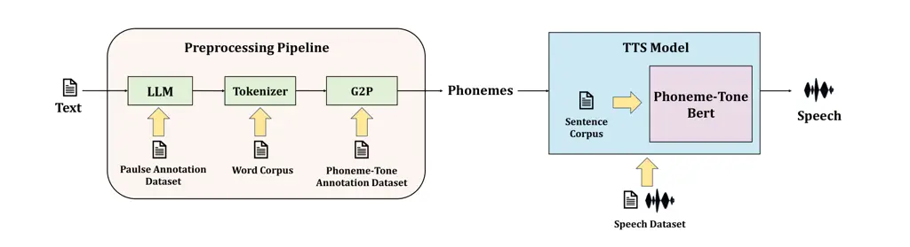
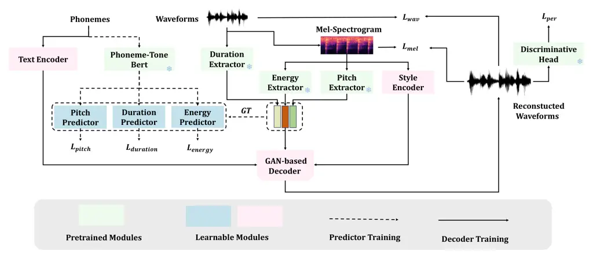
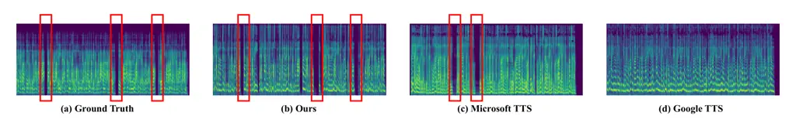
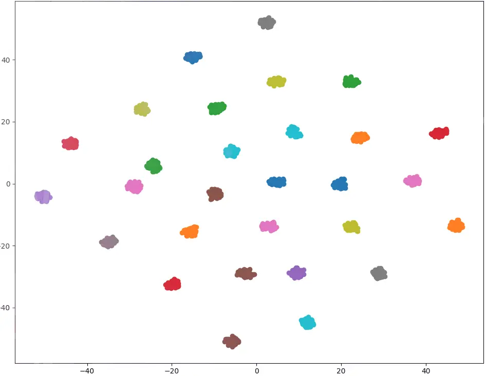

# Empowering Global Voices: A Data-Efficient, Phoneme-Tone Adaptive Approach to High-Fidelity Speech Synthesis

Yizhong Geng Jizhuo Xu Zeyu Liang Jinghan Yang Xiaoyi Shi Xiaoyu Shen
^(†)^(†)thanks: Corresponding can be sent to xyshen@eitech.edu.cn
Affiliation: Logic Intelligence Technology Affiliation:  Tsinghua
University Affiliation: Beijing University of Posts and
Telecommunications Affiliation: Peking University Affiliation: Ningbo
Key Laboratory of Spatial Intelligence and Digital Derivative, Institute
of Digital Twin, EIT

###### Abstract

Text-to-speech (TTS) technology has achieved impressive results for
widely spoken languages, yet many under-resourced languages remain
challenged by limited data and linguistic complexities. In this paper,
we present a novel methodology that integrates a data-optimized
framework with an advanced acoustic model to build high-quality TTS
systems for low-resource scenarios. We demonstrate the effectiveness of
our approach using Thai as an illustrative case, where intricate
phonetic rules and sparse resources are effectively addressed. Our
method enables zero-shot voice cloning and improved performance across
diverse client applications, ranging from finance to healthcare,
education, and law. Extensive evaluations—both subjective and
objective—confirm that our model meets state-of-the-art standards,
offering a scalable solution for TTS production in data-limited
settings, with significant implications for broader industry adoption
and multilingual accessibility. All demos are available in
[https://luoji.cn/static/thai/demo.html](https://luoji.cn/static/thai/demo.html).

## 1 Introduction

Recent advancements in text-to-speech (TTS) synthesis have achieved
near-human quality for widely spoken languages like English and
Mandarin, enabling industrial adoption in customer service, audiobooks,
and virtual assistants Anastassiou et al. (2024). Yet this progress
remains inaccessible to over 7,000 global languages, particularly those
with limited labeled speech data Shen et al. (2023); Adelani et al.
(2024). For linguistically complex languages such as Thai—characterized
by tonal distinctions and ambiguous orthography—the scarcity of
high-quality training corpora exacerbates the digital divide, stifling
equitable access to speech technologies Lux et al. (2024).

While LLM-driven TTS systems leverage massive datasets to dynamically
adjust pronunciation and prosody Łajszczak et al. (2024), their
data-intensive nature renders them impractical for under-resourced
languages Xu et al. (2020b). To address this gap, we propose a
data-efficient framework that combines text-centric training with
phoneme-tone adaptive modeling, emulating LLM-level contextual awareness
without requiring extensive datasets Li et al. (2023). Our approach
explicitly targets the dual challenges of low-resource TTS: (1) modeling
intricate linguistic features (e.g., tone, phoneme ambiguity) and (2)
achieving industrial-grade scalability with minimal data.



Figure 1: Overview of the Data-Optimized Framework Combined with
Advanced Acoustic Model The architecture comprises two components: (1)
the Preprocessing Pipeline (LLM → Tokenizer → grapheme-to-phoneme
(G2P)), which converts raw text to phoneme-tone sequences; and (2) the
TTS Model, where the Phoneme-Tone Bert module refines contextual
pronunciation using text corpus inputs, integrated with acoustic
modeling for speech synthesis.

Thai, despite being under-resourced, is a language of substantial
industrial and demographic importance. It features an intricate
five-tone system that requires precise fundamental frequency
control—where even minor shifts can alter lexical meaning (e.g., “ Suea
” as “ mat” \[tone 3\] versus “ clothes” \[tone 5\] Wutiwiwatchai et al.
(2017))—and grapheme-to-phoneme ambiguities compounded by the absence of
clear spoken-word boundaries Christophe et al. (2016). Moreover, Thai is
spoken by millions and serves as the official language of a rapidly
developing economy with significant regional influence. Its limited
speech corpus, orders of magnitude smaller than that of English
Thangthai et al. (2020), underscores the urgency of developing efficient
TTS frameworks that can unlock considerable industrial value and enhance
communication across sectors.

To address this challenge, we have built a comprehensive,
multi-dimensional Thai TTS dataset, which forms the foundation for
training and validating our TTS system under realistic, industrial-scale
conditions. As illustrated in fig:arc, our system consists of two
synergistic components: (1) Preprocessing Pipeline: A robust pipeline
that transforms raw Thai text into structured phoneme-tone sequences.
This pipeline resolves Thai’s linguistic complexities—including
ambiguous word boundaries and intricate tonal patterns—through modules
for pause prediction, word segmentation, and grapheme-to-phoneme
conversion; (2) TTS Model: An advanced speech synthesis model that
integrates pre-trained audio feature extractors, a GAN-based decoder,
and a predictive module for duration, pitch, and energy. The model
leverages contextual prosody and style embeddings to dynamically adjust
pronunciation and prosody, ensuring high-fidelity synthesis even with
limited training data.

Our primary contributions encompass:

- •
  Comprehensive Dataset Construction: We developed a large-scale,
  multi-dimensional dataset tailored for Thai TTS, encompassing 500
  hours of multi-domain speech, a million-sentence Thai text, and
  detailed annotations.
- •
  Industry-Usable TTS System: We deliver the first zero-shot Thai TTS
  system that achieves state-of-the-art performance, validated through
  rigorous objective and subjective evaluations across diverse client
  scenarios (e.g., finance, healthcare, education, law).
- •
  Innovative Technical Strategies: Our framework leverages a novel
  data-optimized approach combined with advanced acoustic modeling,
  including phoneme-tone adaptive modeling. This allows the system to
  precisely capture Thai’s five-tone system and handle
  grapheme-to-phoneme ambiguities, all while significantly reducing data
  demands.

## 2 Related Work

##### TTS: Text to Speech

Modern TTS technologies, such as FastSpeech2 Ren et al. (2020) and VITS
Kim et al. (2021), have significantly improved speech synthesis in
well-resourced languages using sequence-to-sequence architectures and
neural vocoders. However, these models struggle with languages like
Thai, which have complex tonal systems and preprocessing challenges
Thubthong et al. (2002); Shen et al. (2017); Su et al. (2018). Their
inability to handle tonal variations and limited datasets make them less
effective for complex language synthesis Yang et al. (2024). In
contrast, LLM-based models like SeedTTS and CosyVoice Du et al. (2024)
offer superior performance but are highly dependent on large-scale
datasets for training, making them difficult and costly to deploy for
low-resource languages Su et al. (2024). The significant data
requirements of LLM-driven approaches pose challenges for languages with
limited speech data, such as Thai Xu et al. (2020a); Zhang et al.
(2022); Zhu et al. (2023).

##### Thai TTS Challenges

Thai TTS development faces substantial linguistic and technical hurdles.
Unlike English, Thai is a tonal language with five distinct tones,
necessitating precise modeling to ensure intelligibility and naturalness
Thubthong et al. (2002); Triyason and Kanthamanon (2012). Moreover, Thai
text lacks explicit word boundaries, complicating word segmentation and
pause prediction, which directly impact prosody and fluency Chay-intr
et al. (2023). Existing Thai TTS systems often exhibit incorrect pauses
and unnatural intonation due to these ambiguities Wutiwiwatchai et al.
(2017); Pipatanakul et al. (2024), and the limited availability of
large, high-quality speech datasets further hinders model training Shen
et al. (2022). While some Thai TTS approaches rely on rule-based or
statistical methods, they fail to fully capture the complexity of Thai
phonology and syntax.

## 3 Dataset

This study constructs a comprehensive, multi-dimensional Thai TTS
dataset designed to support industrial-scale speech synthesis under
low-resource conditions. The dataset is organized into three key
categories: Speech Data, Thai Text Data, and Annotation Data. An
overview of the datasets is provided in Table 1.

##### Speech Dataset

The Speech Dataset comprises two parts: a multi-domain dataset and a
vertical domain dataset. The multi-domain dataset consists of 500 hours
of speech from diverse sources. This dataset is designed to enhance the
overall TTS capability and zero-shot performance of the model. In
addition, the vertical domain dataset includes 40 hours of speech
covering specialized fields including finance, healthcare, education,
and law, ensuring that the TTS model produces precise pronunciations for
domain-specific vocabulary. Detailed production processes and data
proportions are provided in Appendix C.1.

##### Thai Text Dataset

The Thai Text Dataset is divided into a sentence corpus and a word
corpus. The sentence corpus, containing 1,000,000 sentences, is utilized
for training the Phoneme-Tone Bert module to improve contextual prosody
modeling. The word corpus, derived from existing lexicons and expanded
with manually curated vocabulary, supports the training of the
tokenizer, thereby addressing the challenges posed by Thai’s unspaced
orthography. Detailed information on the curation and processing of the
Thai Text Dataset is provided in Appendix C.2.

##### Annotation Dataset

The Annotation Dataset provides critical linguistic supervision to
resolve Thai-specific synthesis challenges. It includes (1) Pause
Annotation, where 15,000 sentences are manually annotated with prosodic
boundaries by professional announcers, ensuring accurate pause
prediction, and (2) Phoneme-Tone Annotation, comprising 40,000 words,
offers detailed IPA phoneme and tone markings to enhance
grapheme-to-phoneme conversion and tone modeling. Further details on the
annotation procedures and quality control measures are in Appendix C.3.

| Dataset                         | Size                |
| ------------------------------- | ------------------- |
| Multi-domain Speech Dataset     | 500 hours           |
| Vertical Domain Speech Dataset  | 40 hours            |
| Thai Sentence Corpus            | 1,000,000 sentences |
| Thai Word Corpus                | 100,000 words       |
| Pause Annotation Dataset        | 15,000 sentences    |
| Phoneme-Tone Annotation Dataset | 40,000 words        |

Table 1: Overview of the datasets used in this study.

## 4 Preprocessing Pipeline

The preprocessing stage transforms raw Thai text into annotated phoneme
sequences through three sequential modules: 1) a pretrained LLM trained
on the Pulse Annotation Dataset to predict prosodic pauses in
unpunctuated text, 2) a Tokenizer guided by the Word Corpus to segment
unspaced Thai orthography into words, and 3) a G2P converter leveraging
the Phoneme-Tone Annotation Dataset to map graphemes to IPA phonemes
with tone markers. This pipeline resolves Thai’s linguistic complexities
and outputs structured phoneme-tone sequences, enabling robust
low-resource TTS.

##### Pretrained LLM for Pause Prediction

To address the absence of explicit punctuation and context-dependent
pauses in Thai text, we implemented a supervised fine-tuning (SFT)
approach using the Pulse Annotation Dataset, a curated corpus of 15,000
Thai sentences annotated with single-type pause positions. The
Typhoon2-3B-Instruct Pipatanakul et al. (2024) model was adapted to
predict linguistically appropriate pauses by training on
instruction-formatted QA pairs. Each training instance included a system
prompt (”You are a Thai pause predictor; insert tags ¡SPACE¿ based on
Thai speech habits”).

##### Tokenizer

To address Thai’s unspaced orthography and improve segmentation accuracy
for domain-specific vocabulary, we extended the pythainlp tokenizer
Phatthiyaphaibun et al. (2023) by augmenting its lexicon from 60,000 to
100,000 words using a word corpus. The expanded vocabulary integrates
modern terms through a hybrid approach combining statistical frequency
analysis and rule-based morphological patterns.



Figure 2: Overview of the proposed TTS model, comprising audio feature
extractors, a GAN-based decoder, and a prediction module. The diagram
illustrates the different training stages.

##### Grapheme-Phoneme Conversion

To address Thai’s intricate tonal and script complexities, we built a
G2P system based on the International Phonetic Alphabet (IPA) Brown
(2012), incorporating Thai’s five-tone markers (mid, low, falling, high,
rising). Leveraging the Phoneme-Tone Annotation Dataset—a curated corpus
of word-phoneme pairs—we established pronunciation rules covering
tone-consonant interactions and contextual exceptions. After
tokenization, segmented words are mapped to phonemes via a hybrid
approach: rule-based alignment for regular patterns and a transformer
model for ambiguous cases.

## 5 TTS Model

Our TTS model (Fig. 2) consists of three main components: audio feature
extractors, a GAN-based decoder, and a prediction module. The feature
extractors, pre-trained on multilingual datasets (e.g., AiShell Fu
et al. (2021), LibriSpeech Panayotov et al. (2015), JVS corpus Takamichi
et al. (2019), and KsponSpeech Bang et al. (2020)), extract forced
alignment, pitch, and energy features from audio/mel-spectrograms. A
style encoder embeds audio style into latent vectors. The GAN-based
decoder generates waveforms directly from phoneme sequences and the
corresponding duration, pitch, energy features, and style vectors,
optimizing losses in both time and frequency domains. The prediction
module forecasts duration, pitch, and energy from the phoneme sequence.
To enhance semantic and prosodic encoding, we label phonemes with tone
information per syllable and train a Prosody BERT Devlin et al. (2019)
to encode the phoneme-tone sequence; this representation, combined with
the style vector, informs the predictions. After initial separate
training, the prediction module is co-trained with the decoder to
further improve synthesis quality.

##### Pretrained Feature Extractor

We employ three pre-trained models to extract duration, pitch, and
energy from waveforms or mel-spectrograms. Given the shared phoneme
inventory across languages and the weak correlation between pitch/energy
and specific languages, these extraction models are first pre-trained on
a multilingual corpus, then fine-tuned on Thai data to address the
scarcity of speech resources. Their outputs serve as ground truth to
guide predictor training in subsequent stages.

|                 |             |                        |                   |                   |                    |                   |
| --------------- | ----------- | ---------------------- | ----------------- | ----------------- | ------------------ | ----------------- |
| System          | Type        | WER (%) $`\downarrow`$ | STOI $`\uparrow`$ | PESQ $`\uparrow`$ | UTMOS $`\uparrow`$ | NMOS $`\uparrow`$ |
| Ours            | Open        | 6.3   (6.5)            | 0.92   (0.94)     | 4.3   (4.5)       | 4.2   (4.1)        | 4.4   (4.6)       |
| Typhoon2-Audio  | Open        | 7.8   (12.5)           | 0.90   (0.88)     | 4.0   (4.0)       | 3.5   (3.4)        | 4.1   (4.1)       |
| Seamless-M4T-v2 | Open        | 12.3   (24.3)          | 0.80   (0.75)     | 3.0   (2.8)       | 3.0   (2.9)        | 3.1   (3.0)       |
| MMS-TTS         | Open        | 28.9   (35.5)          | 0.65   (0.60)     | 2.5   (2.3)       | 2.5   (2.4)        | 2.6   (2.5)       |
| PyThaiTTS       | Open        | 40.3   (65.2)          | 0.60   (0.55)     | 2.0   (1.8)       | 2.0   (1.9)        | 2.1   (2.0)       |
| Google TTS      | Proprietary | 6.5   (14.5)           | 0.91   (0.85)     | 4.1   (3.8)       | 4.1   (3.8)        | 4.2   (4.0)       |
| Microsoft TTS   | Proprietary | 7.1   (13.4)           | 0.90   (0.84)     | 4.0   (3.7)       | 4.0   (3.7)        | 4.1   (3.9)       |

Table 2: TTS performance under both general (outside parentheses) and
domain-specific (inside parentheses) scenarios. The domain-specific set
comprises authentic samples from finance, healthcare, education, and
law, reflecting real-world industrial use. Systems labeled as “Open” are
open-source, while those labeled as “Proprietary” are commercial
industry standards.

##### Decoder Training

To enable cloning capabilities, we introduce a style embedding module
that extracts a style vector $`s`$ from the input waveform. During
decoder training, for each audio $`w`$ and its corresponding text $`t`$,
pre-trained models extract duration $`d`$, pitch $`p`$, energy $`e`$,
and obtain phoneme embeddings ($`phoneme\_{embed}`$) via the text
encoder. The waveform decoder $`\mathcal{D}`$ then reconstructs the
waveform as follows:

```math
\hat{w}=\mathcal{D}(phoneme\_{embed},d,p,e,s)
```

The reconstruction loss is defined as:

```math
\mathcal{L}_{\text{recon}}=\lambda_{1}\mathcal{L}_{\text{time}}+\lambda_{2}\mathcal{L}_{\text{freq}}+\lambda_{3}\mathcal{L}_{\text{perceptual}}
```

where $`\mathcal{L}_{\text{time}}`$ is the L1 loss between the output
and target waveforms, $`\mathcal{L}_{\text{freq}}`$ measures the
difference between mel-spectrograms, and
$`\mathcal{L}_{\text{perceptual}}`$ is the GAN-based perceptual loss.
These combined losses guide the model towards superior reconstruction
performance.

##### Phoneme-Tone Bert For Predictor Training

To forecast duration, pitch, and energy from the input phoneme sequence,
we first expand the Thai phoneme inventory by integrating tone
information via many-to-one tokens. In our revised g2p strategy, tone
data is appended to the last phoneme of each syllable, preserving the
original token sequence length. We then process a substantial Thai
sentence corpus with this g2p method and train a Phoneme-Tone BERT to
generate contextual representations ($`p\_bert`$). Three
predictors—duration, pitch, and energy—utilize $`p\_bert`$ along with a
style vector $`s`$ for their forecasts. Initially, each predictor is
trained independently, subsequently, the predictors and decoder are
co-trained using a joint loss:

```math
\mathcal{L}_{\text{joint}}=\mathcal{L}_{\text{duration}}+\mathcal{L}_{\text{pitch}}+\mathcal{L}_{\text{energy}}+\mathcal{L}_{\text{decoder}}
```



Figure 3: Spectrogram comparison illustrating pause alignment across
different TTS systems. The red bounding boxes highlight detected pause
regions.

## 6 Experiments

##### Implementation Details

The pretrained LLM for pause prediction was trained on the Pulse
Annotation Dataset, which comprises 15,000 Thai sentences annotated with
single-type pause positions. The input sequences were tokenized with a
maximum length of 512 tokens. For optimization, we used the AdamW
optimizer with coefficients β₁ = 0.9 and β₂ = 0.98, a learning rate of
1e-5, and a weight decay of 0.01. The model converged within
approximately 200k training steps using a batch size equivalent to
processing 16 sentences per step.

The Phoneme-Tone Bert module was trained on a sentence corpus of 1
million sentences using a 12-layer BERT architecture with 768 hidden
units and 12 self-attention heads. We used a masked language modeling
objective, AdamW optimizer (learning rate 2e-5, weight decay 0.01),
batch size 32, maximum sequence length 256, dropout rate 0.1, and
trained for 500k steps.

The TTS Model is trained using the entire speech dataset, which includes
500 hours of multi-domain data and 40 hours of vertical domain data. The
training employs the AdamW optimizer with β₁ = 0.9 and β₂ = 0.96. The
model undergoes training for 8 days on 8 A800 GPUs, using a batch size
of 768 samples.

##### Effect of Preprocessing Pipeline Modules

To evaluate each module’s contribution, we performed an ablation study
by removing them one at a time. Table 3 compares our full model with
three variants: (i) no pause optimization, (ii) no tokenization
optimization, and (iii) no G2P optimization. We used Word Error Rate
(WER) and Naturalness Mean Opinion Score (NMOS) as metrics.

Table 3 shows that pause optimization is crucial for natural prosody, as
removing it raises WER from 6.3% to 6.5% and lowers NMOS from 4.4 to
3.8. Without tokenization optimization, WER jumps to 10.2% and NMOS
drops to 3.9, highlighting its role in text segmentation. G2P
optimization has the greatest impact, with WER at 22.5% and NMOS at 3.0,
indicating poor performance overall. Figure 3 provides a spectrogram
comparison of different TTS outputs. It illustrates how accurate pause
prediction yields better alignment with ground-truth prosody, resulting
in clearer and more natural synthesized speech.

| System                        | WER (%) $`\downarrow`$ | NMOS $`\uparrow`$ |
| ----------------------------- | ---------------------- | ----------------- |
| Ours                          | 6.3                    | 4.4               |
| w/o Pause Optimization        | 6.5                    | 3.8               |
| w/o Tokenization Optimization | 10.2                   | 3.9               |
| w/o G2P Optimization          | 22.5                   | 3.0               |

Table 3: Ablation study on the preprocessing pipeline. Removing each
module reveals its contribution.

##### TTS Performance

Table 2 summarizes TTS performance on both a general-domain test set and
domain-specific samples. The general-domain set is drawn from TSync2, an
open-source Thai corpus widely used for benchmarking. For the
domain-specific evaluation, we deployed our TTS system in four
real-world business scenarios: automated transaction summaries in
finance, telehealth voice guidance in healthcare, online course
narration in education, and legal document reading in law. End users in
each domain rated the synthesized sentences on intelligibility and term
accuracy, with their feedback contributing to the NMOS scores reported.
This practical assessment highlights our system’s ability to deliver
clear, domain-appropriate speech in genuine industry contexts.

Our model achieves the highest overall accuracy and speech quality among
open-source systems, showing notable robustness in real-world industrial
settings. In contrast, proprietary solutions like Google TTS and
Microsoft TTS, while performing competitively on the TSync2 set (WER of
6.5% and 7.1%, respectively), exhibit larger performance drops in
specialized domains (WER of 14.5% and 13.4%). Field professionals also
reported higher mispronunciation rates in these proprietary systems,
especially for domain-specific jargon. This suggests our approach excels
in broad usage scenarios and maintains reliability in high-stakes,
industry-specific environments.



Figure 4: t-SNE visualization of speaker embeddings extracted from the
synthesized speech. Each point represents a speaker embedding, and
distinct clusters show that our zero-shot TTS preserves speaker
identity.

##### Zero-shot TTS Performance

Zero-shot TTS extends conventional TTS by synthesizing speech for
previously unseen speakers without additional speaker-specific data or
fine-tuning. In other words, it can clone a speaker’s timbre from
reference audio, enabling rapid deployment for new voices. Since all
baseline models lack this capability, we compare our system with
OpenVoice—a widely used voice conversion model Qin et al. (2023). As
shown in Table 4, our system attains a SIM of 0.91 and SMOS of 4.5,
surpassing OpenVoice’s 0.85 and 4.0. Figure 4 further illustrates this
advantage: distinct clusters in the speaker embedding space confirm
robust identity preservation without speaker-specific training.

| System          | SIM $`\uparrow`$ | SMOS $`\uparrow`$ |
| --------------- | ---------------- | ----------------- |
| Ours            | 0.91             | 4.5               |
| OpenVoice (10s) | 0.85             | 4.0               |

Table 4: Zero-shot TTS performance comparison. SIM (machine acoustic
similarity) and SMOS (human-judged speaker identity) highlight our
advantage.

## 7 Conclusion

We present a data-optimized framework with an advanced acoustic model
for TTS in under-resourced languages, using Thai as a representative
case. Our pipeline integrates sophisticated preprocessing with a robust
TTS model, achieving state-of-the-art results in both general and
domain-specific tasks, validated in commercial scenarios across finance,
healthcare, education, and law. Experiments confirm notable quality
gains and successful zero-shot voice cloning, demonstrating efficacy and
business viability. Beyond bridging performance gaps in low-resource
contexts, our approach offers a scalable solution adaptable to other
under-resourced languages. Future work will extend this framework to
other languages with similar constraints.

## References

- Adelani et al. (2024) David Adelani, Hannah Liu, Xiaoyu Shen, Nikita
  Vassilyev, Jesujoba Alabi, Yanke Mao, Haonan Gao, and En-Shiun
  Lee. 2024. Sib-200: A simple, inclusive, and big evaluation dataset
  for topic classification in 200+ languages and dialects. In
  _Proceedings of the 18th Conference of the European Chapter of the
  Association for Computational Linguistics (Volume 1: Long Papers)_,
  pages 226–245.
- Anastassiou et al. (2024) Philip Anastassiou, Jiawei Chen, Jitong
  Chen, Yuanzhe Chen, Zhuo Chen, Ziyi Chen, Jian Cong, Lelai Deng,
  Chuang Ding, Lu Gao, et al. 2024. Seed-tts: A family of high-quality
  versatile speech generation models. _arXiv preprint arXiv:2406.02430_.
- Bang et al. (2020) Jeong-Uk Bang, Seung Yun, Seung-Hi Kim, Mu-Yeol
  Choi, Min-Kyu Lee, Yeo-Jeong Kim, Dong-Hyun Kim, Jun Park, Young-Jik
  Lee, and Sang-Hun Kim. 2020. Ksponspeech: Korean spontaneous speech
  corpus for automatic speech recognition. _Applied Sciences_,
  10(19):6936.
- Barrault et al. (2023) Loïc Barrault, Yu-An Chung, Mariano Cora
  Meglioli, David Dale, Ning Dong, Paul-Ambroise Duquenne, Hady Elsahar,
  Hongyu Gong, Kevin Heffernan, John Hoffman, et al. 2023. Seamlessm4t:
  Massively multilingual & multimodal machine translation. _arXiv
  preprint arXiv:2308.11596_.
- Brown (2012) Adam Brown. 2012. International phonetic alphabet. _The
  encyclopedia of applied linguistics_.
- Chay-intr et al. (2023) Thodsaporn Chay-intr, Hidetaka Kamigaito, and
  Manabu Okumura. 2023. Character-based thai word segmentation with
  multiple attentions. _Journal of Natural Language Processing_,
  30(2):372–400.
- Christophe et al. (2016) YJMK Veaux Christophe, Yamagishi Junichi,
  MacDonald Kirsten, et al. 2016. Superseded-cstr vctk corpus: English
  multi-speaker corpus for cstr voice cloning toolkit.
- Défossez (2021) Alexandre Défossez. 2021. Hybrid spectrogram and
  waveform source separation. _arXiv preprint arXiv:2111.03600_.
- Devlin et al. (2019) Jacob Devlin, Ming-Wei Chang, Kenton Lee, and
  Kristina Toutanova. 2019. Bert: Pre-training of deep bidirectional
  transformers for language understanding. In _Proceedings of the 2019
  conference of the North American chapter of the association for
  computational linguistics: human language technologies, volume 1 (long
  and short papers)_, pages 4171–4186.
- Doumanidis et al. (2021) Constantine C Doumanidis, Christina
  Anagnostou, Evangelia-Sofia Arvaniti, and Anthi Papadopoulou. 2021.
  Rnnoise-ex: Hybrid speech enhancement system based on rnn and spectral
  features. _arXiv preprint arXiv:2105.11813_.
- Du et al. (2024) Zhihao Du, Yuxuan Wang, Qian Chen, Xian Shi, Xiang
  Lv, Tianyu Zhao, Zhifu Gao, Yexin Yang, Changfeng Gao, Hui Wang,
  et al. 2024. Cosyvoice 2: Scalable streaming speech synthesis with
  large language models. _arXiv preprint arXiv:2412.10117_.
- Fu et al. (2021) Yihui Fu, Luyao Cheng, Shubo Lv, Yukai Jv, Yuxiang
  Kong, Zhuo Chen, Yanxin Hu, Lei Xie, Jian Wu, Hui Bu, et al. 2021.
  Aishell-4: An open source dataset for speech enhancement, separation,
  recognition and speaker diarization in conference scenario. _arXiv
  preprint arXiv:2104.03603_.
- Kim et al. (2021) Jaehyeon Kim, Jungil Kong, and Juhee Son. 2021.
  Conditional variational autoencoder with adversarial learning for
  end-to-end text-to-speech. In _International Conference on Machine
  Learning_, pages 5530–5540. PMLR.
- Łajszczak et al. (2024) Mateusz Łajszczak, Guillermo Cámbara, Yang Li,
  Fatih Beyhan, Arent Van Korlaar, Fan Yang, Arnaud Joly, Álvaro
  Martín-Cortinas, Ammar Abbas, Adam Michalski, et al. 2024. Base tts:
  Lessons from building a billion-parameter text-to-speech model on 100k
  hours of data. _arXiv preprint arXiv:2402.08093_.
- Li et al. (2023) Yinghao Aaron Li, Cong Han, Xilin Jiang, and Nima
  Mesgarani. 2023. Phoneme-level bert for enhanced prosody of
  text-to-speech with grapheme predictions. In _ICASSP 2023-2023 IEEE
  International Conference on Acoustics, Speech and Signal Processing
  (ICASSP)_, pages 1–5. IEEE.
- Lowphansirikul et al. (2021) Lalita Lowphansirikul, Charin Polpanumas,
  Nawat Jantrakulchai, and Sarana Nutanong. 2021. Wangchanberta:
  Pretraining transformer-based thai language models. _arXiv preprint
  arXiv:2101.09635_.
- Lux et al. (2024) Florian Lux, Sarina Meyer, Lyonel Behringer, Frank
  Zalkow, Phat Do, Matt Coler, Emanuël AP Habets, and Ngoc Thang
  Vu. 2024. Meta learning text-to-speech synthesis in over 7000
  languages. _arXiv preprint arXiv:2406.06403_.
- Panayotov et al. (2015) Vassil Panayotov, Guoguo Chen, Daniel Povey,
  and Sanjeev Khudanpur. 2015. Librispeech: an asr corpus based on
  public domain audio books. In _2015 IEEE international conference on
  acoustics, speech and signal processing (ICASSP)_, pages 5206–5210.
  IEEE.
- Phatthiyaphaibun et al. (2023) Wannaphong Phatthiyaphaibun, Korakot
  Chaovavanich, Charin Polpanumas, Arthit Suriyawongkul, Lalita
  Lowphansirikul, Pattarawat Chormai, Peerat Limkonchotiwat, Thanathip
  Suntorntip, and Can Udomcharoenchaikit. 2023. Pythainlp: Thai natural
  language processing in python. _arXiv preprint arXiv:2312.04649_.
- Pipatanakul et al. (2024) Kunat Pipatanakul, Potsawee Manakul,
  Natapong Nitarach, Warit Sirichotedumrong, Surapon Nonesung, Teetouch
  Jaknamon, Parinthapat Pengpun, Pittawat Taveekitworachai, Adisai
  Na-Thalang, Sittipong Sripaisarnmongkol, et al. 2024. Typhoon 2: A
  family of open text and multimodal thai large language models. _arXiv
  preprint arXiv:2412.13702_.
- Pratap et al. (2024) Vineel Pratap, Andros Tjandra, Bowen Shi, Paden
  Tomasello, Arun Babu, Sayani Kundu, Ali Elkahky, Zhaoheng Ni, Apoorv
  Vyas, Maryam Fazel-Zarandi, et al. 2024. Scaling speech technology to
  1,000+ languages. _Journal of Machine Learning Research_, 25(97):1–52.
- Qin et al. (2023) Zengyi Qin, Wenliang Zhao, Xumin Yu, and Xin
  Sun. 2023. Openvoice: Versatile instant voice cloning. _arXiv preprint
  arXiv:2312.01479_.
- Radford et al. (2023) Alec Radford, Jong Wook Kim, Tao Xu, Greg
  Brockman, Christine McLeavey, and Ilya Sutskever. 2023. Robust speech
  recognition via large-scale weak supervision. In _International
  conference on machine learning_, pages 28492–28518. PMLR.
- Ren et al. (2020) Yi Ren, Chenxu Hu, Xu Tan, Tao Qin, Sheng Zhao, Zhou
  Zhao, and Tie-Yan Liu. 2020. Fastspeech 2: Fast and high-quality
  end-to-end text to speech. _arXiv preprint arXiv:2006.04558_.
- Shen et al. (2023) Xiaoyu Shen, Akari Asai, Bill Byrne, and Adria
  De Gispert. 2023. xpqa: Cross-lingual product question answering in 12
  languages. In _Proceedings of the 61st Annual Meeting of the
  Association for Computational Linguistics (Volume 5: Industry Track)_,
  pages 103–115.
- Shen et al. (2017) Xiaoyu Shen, Youssef Oualil, Clayton Greenberg,
  Mittul Singh, and Dietrich Klakow. 2017. Estimation of gap between
  current language models and human performance.
- Shen et al. (2022) Xiaoyu Shen, Svitlana Vakulenko, Marco Del Tredici,
  Gianni Barlacchi, Bill Byrne, and Adrià de Gispert. 2022. Low-resource
  dense retrieval for open-domain question answering: A comprehensive
  survey. _arXiv preprint arXiv:2208.03197_.
- Smith (2007) Ray Smith. 2007. An overview of the tesseract ocr engine.
  In _Ninth international conference on document analysis and
  recognition (ICDAR 2007)_, volume 2, pages 629–633. IEEE.
- Su et al. (2018) Hui Su, Xiaoyu Shen, Pengwei Hu, Wenjie Li, and Yun
  Chen. 2018. Dialogue generation with gan. In _Proceedings of the AAAI
  Conference on Artificial Intelligence_, volume 32.
- Su et al. (2024) Hui Su, Zhi Tian, Xiaoyu Shen, and Xunliang
  Cai. 2024. Unraveling the mystery of scaling laws: Part i. _arXiv
  preprint arXiv:2403.06563_.
- Takamichi et al. (2019) Shinnosuke Takamichi, Kentaro Mitsui, Yuki
  Saito, Tomoki Koriyama, Naoko Tanji, and Hiroshi Saruwatari. 2019. Jvs
  corpus: free japanese multi-speaker voice corpus. _arXiv preprint
  arXiv:1908.06248_.
- Thangthai et al. (2020) Ausdang Thangthai, Sumonmas Thatphithakkul,
  Kwanchiva Thangthai, and Arnon Namsanit. 2020. Tsync-3miti:
  Audiovisual speech synthesis database from found data. In _2020 23rd
  Conference of the Oriental COCOSDA International Committee for the
  Co-ordination and Standardisation of Speech Databases and Assessment
  Techniques (O-COCOSDA)_, pages 77–82. IEEE.
- Thubthong et al. (2002) Nuttakorn Thubthong, Boonserm Kijsirikul, and
  Sudaporn Luksaneeyanawin. 2002. Tone recognition in thai continuous
  speech based on coarticulaion, intonation and stress effects. In
  _INTERSPEECH_, pages 1169–1172.
- Triyason and Kanthamanon (2012) Tuul Triyason and Prasert
  Kanthamanon. 2012. Perceptual evaluation of speech quality measurement
  on speex codec voip with tonal language thai. In _International
  Conference on Advances in Information Technology_, pages 181–190.
  Springer.
- Wutiwiwatchai et al. (2017) Chai Wutiwiwatchai, Chatchawarn
  Hansakunbuntheung, Anocha Rugchatjaroen, Sittipong Saychum, Sawit
  Kasuriya, and Patcharika Chootrakool. 2017. Thai text-to-speech
  synthesis: a review. _Journal of Intelligent Informatics and Smart
  Technology_.
- Xu et al. (2020a) Binxia Xu, Siyuan Qiu, Jie Zhang, Yafang Wang,
  Xiaoyu Shen, and Gerard De Melo. 2020a. Data augmentation for
  multiclass utterance classification–a systematic study. In
  _Proceedings of the 28th international conference on computational
  linguistics_, pages 5494–5506.
- Xu et al. (2020b) Jin Xu, Xu Tan, Yi Ren, Tao Qin, Jian Li, Sheng
  Zhao, and Tie-Yan Liu. 2020b. Lrspeech: Extremely low-resource speech
  synthesis and recognition. In _Proceedings of the 26th ACM SIGKDD
  International Conference on Knowledge Discovery & Data Mining_, pages
  2802–2812.
- Yang et al. (2024) Yifan Yang, Zheshu Song, Jianheng Zhuo, Mingyu Cui,
  Jinpeng Li, Bo Yang, Yexing Du, Ziyang Ma, Xunying Liu, Ziyuan Wang,
  et al. 2024. Gigaspeech 2: An evolving, large-scale and multi-domain
  asr corpus for low-resource languages with automated crawling,
  transcription and refinement. _arXiv preprint arXiv:2406.11546_.
- Zhang et al. (2022) Qingyu Zhang, Xiaoyu Shen, Ernie Chang, Jidong Ge,
  and Pengke Chen. 2022. Mdia: A benchmark for multilingual dialogue
  generation in 46 languages. _arXiv preprint arXiv:2208.13078_.
- Zhu et al. (2023) Dawei Zhu, Xiaoyu Shen, Marius Mosbach, Andreas
  Stephan, and Dietrich Klakow. 2023. Weaker than you think: A critical
  look at weakly supervised learning. In _Proceedings of the 61st Annual
  Meeting of the Association for Computational Linguistics (Volume 1:
  Long Papers)_, pages 14229–14253.

## Appendix A Evaluation Metrics

This study uses seven principal metrics across four dimensions—accuracy,
voice cloning, naturalness, and speech quality/intelligibility—to
evaluate system performance.

Accuracy is measured by Word Error Rate (WER), which quantifies
transcription fidelity by comparing discrepancies between synthesized
speech and reference texts, with lower WER indicating better accuracy.

Voice Cloning is assessed using the Similarity Score (SIM) and
Subjective Similarity Mean Opinion Score (SMOS). SIM calculates acoustic
similarity using cosine analysis of phonetic-tonal features, while SMOS
is based on ratings from fifty native Thai speakers evaluating thirty
samples on a 5-point scale.

Naturalness is evaluated with three metrics: the UTokyo-SaruLab Mean
Opinion Score (UTMOS), Perceptual Evaluation of Speech Quality (PESQ),
and Naturalness Mean Opinion Score (NMOS). UTMOS predicts naturalness by
analyzing prosody, spectral stability, and artifacts. PESQ quantifies
quality degradation and spectral distortions, while NMOS is based on
subjective ratings assessing fluency and prosody from fifty listeners.

Speech Intelligibility is measured by the Short-Time Objective
Intelligibility (STOI), which correlates with word recognition rates by
analyzing temporal-spectral envelope similarities between synthesized
and reference speech, critical for evaluating tone preservation.

## Appendix B Baseline Systems

To benchmark the performance of our model, we compare it against
multiple baseline systems spanning open-source and proprietary
paradigms. The baselines are described below:

- •
  PyThaiTTS Phatthiyaphaibun et al. (2023): A Thai-optimized Tacotron2
  model trained on TSync datasets.
- •
  Seamless-M4T-v2 Barrault et al. (2023): A multilingual system
  supporting Thai among 100+ languages.
- •
  MMS-TTS Pratap et al. (2024): A model covering Thai within its 1,100+
  language inventory.
- •
  Typhoon2-Audio Pipatanakul et al. (2024): An end-to-end multimodal
  model that enables parallel speech-text generation through integrated
  speech encoders and non-autoregressive decoders.
- •
  Google Cloud TTS (th-TH-Standard-A)¹¹ 1
  [https://cloud.google.com/text-to-speech](https://cloud.google.com/text-to-speech):
  A proprietary, industry-standard commercial solution optimized for
  Thai TTS.
- •
  Microsoft Azure TTS (Premwadee)²² 2
  [https://azure.microsoft.com/en-us/services/cognitive-services/text-to-speech/](https://azure.microsoft.com/en-us/services/cognitive-services/text-to-speech/):
  A proprietary system offering state-of-the-art Thai TTS performance.

## Appendix C Dataset

### C.1 Speech Dataset

This section details the construction of our Speech Dataset, outlining
both the data composition and the processing workflow. The dataset is
meticulously curated to ensure industrial-grade quality and linguistic
diversity, which are crucial for training robust TTS models.

#### C.1.1 Data Composition and Distribution

Multi-domain Corpus: The multi-domain speech data is systematically
collected from multiple public resources, ensuring a balanced mix of
content and speaker diversity. The dataset comprises four primary data
sources:

- •
  News Broadcasts (30%): Sourced from the Thai Broadcasting Radio ³³ 3
  Source:[https://www.radio-thai.com/](https://www.radio-thai.com/).
- •
  Audiobooks (10%): Obtained from open-source speech libraries ⁴⁴ 4
  Source:[https://www.storytel.com/th/audiobooks](https://www.storytel.com/th/audiobooks)⁵⁵
  5
  Source:[https://www.ookbee.com/shop/audios](https://www.ookbee.com/shop/audios).
- •
  Social Media Short Videos (25%): Scraped from TikTok’s public content
  via compliant APIs.
- •
  Daily Conversation Podcasts (35%): Crawled from public YouTube
  channels.

The audio adheres to an industrial-grade recording standard with a 24kHz
sampling rate and a signal-to-noise ratio (SNR) of at least 35dB. The
data includes over 600 speakers, maintains a near-balanced gender ratio
of 1.2:1. Table 5 provides an overview of the multi-domain data
composition (totaling 500 hours).

|                             |            |                                  |
| --------------------------- | ---------- | -------------------------------- |
| Data Source                 | Percentage | Description                      |
| News Broadcasts             | 30%        | Thai National Broadcasting Radio |
| Audiobooks                  | 10%        | Open-source speech libraries     |
| Social Media Short Videos   | 25%        | TikTok public content            |
| Daily Conversation Podcasts | 35%        | Public YouTube channels          |
| Total: 100% (500 hours)     |            |                                  |

Table 5: Data composition of the multi-domain Speech Dataset.

Vertical Domain Corpus: In addition to the multi-domain corpus, the
Speech Dataset includes a vertical domain corpus consisting of 40 hours
of speech data from YouTube open-source content. This subset is
specifically collected to capture the nuances of specialized fields and
ensure the TTS model produces precise pronunciations for domain-specific
vocabulary. The vertical domain data is evenly distributed across four
specialized sectors:

- •
  Finance (25%): Recorded from corporate earnings calls, investor
  presentations, and financial news.
- •
  Healthcare (25%): Sourced from medical lectures, healthcare
  communications, and hospital announcements.
- •
  Education (25%): Collected from university lectures, academic
  seminars, and educational podcasts.
- •
  Law (25%): Derived from court proceedings, legal seminars, and formal
  legal communications.

All vertical domain recordings meet the same industrial-grade standards
as the multi-domain data, with a 24kHz sampling rate and a minimum SNR
of 35dB.

#### C.1.2 Data Processing Workflow

The raw audio data undergoes a multi-stage processing pipeline to ensure
high-quality, clean speech suitable for TTS training:

1.  1.  Noise Separation and Reduction: Background noise, including music
        and environmental sounds, is first separated using Demucs v4
        Défossez (2021), followed by residual noise reduction via RNNoise
        Doumanidis et al. (2021).
2.  2.  Speech Activity Detection (VAD): WebRTC-based VAD ⁶⁶ 6
        Source:[https://webrtc.org/](https://webrtc.org/) is employed to
        segment the audio into clean clips ranging from 5 to 15 seconds.
3.  3.  Text Extraction and Verification: For audio segments lacking
        corresponding text, hardcoded subtitles are extracted using
        Tesseract OCR Smith (2007) and then cross-checked with outputs from
        Whisper-large-v3 ASR Radford et al. (2023). Segments with a
        character error rate (CER) above 5% are manually verified.

This comprehensive processing workflow ensures that both the
multi-domain and vertical domain corpora are of high quality,
facilitating robust and accurate TTS model training.

### C.2 Thai Text Dataset

This section describes the data composition of our pure Thai Text
Dataset, which includes a word corpus and a sentence corpus.
Meticulously designed to ensure comprehensiveness and balance, the
corpus serves as an optimal resource for a wide range of Thai language
processing tasks while establishing a robust foundation for advanced
linguistic research and computational applications in the field.

|          |                                   |            |                                               |
| -------- | --------------------------------- | ---------- | --------------------------------------------- |
| Corpus   | Data Source                       | Percentage | Description                                   |
| Word     | PyThaiNlp                         | 60%        | Lexicon from the PyThaiNlp tokenizer          |
|          | Social Media and Online forums    | 20%        | Twitter and Reddit public content             |
|          | Official Corpora                  | 20%        | Open-source corpora from universities         |
|          | Total: 100% (100,000 words)       |            |                                               |
| Sentence | News                              | 20%        | Curated news transcripts                      |
|          | Social Media                      | 10%        | Public posts from Thai social media platforms |
|          | E-books                           | 35%        | Text extracted from open-source e-books       |
|          | Government Documents              | 5%         | Official documents from government sources    |
|          | Dictionaries                      | 30%        | Example sentences from dictionaries           |
|          | Total: 100% (1,000,000 sentences) |            |                                               |

Table 6: Data composition of the Text Corpus.

Word Corpus. The word corpus consists of the lexicon from the PyThaiNlp
Phatthiyaphaibun et al. (2023) tokenizer (60,000 words) and the expanded
vocabulary (40,000 words). The expanded vocabulary was manually selected
by 20 native Thai speakers from social media, online forums and official
corpora⁷⁷ 7
Source:[https://www.arts.chula.ac.th/ling/tnc3/](https://www.arts.chula.ac.th/ling/tnc3/)⁸⁸
8
Source:[https://aiforthai.in.th/corpus.php](https://aiforthai.in.th/corpus.php)⁹⁹
9
Source:[https://belisan-volubilis.blogspot.com/](https://belisan-volubilis.blogspot.com/),
including technical terms, slang terms, neologisms and loanwords.

Sentence Corpus. The sentence corpus consists of data from news (20%)
¹⁰¹⁰ 10
Source:[https://www.thairath.co.th](https://www.thairath.co.th)¹¹¹¹ 11
Source:[https://www.dailynews.co.th](https://www.dailynews.co.th)¹²¹² 12
Source:[https://news.sanook.com](https://news.sanook.com)¹³¹³ 13
Source:[https://www.thaipbs.or.th](https://www.thaipbs.or.th)¹⁴¹⁴ 14
Source:[https://www.manager.co.th](https://www.manager.co.th)¹⁵¹⁵ 15
Source:[https://www.matichon.co.th](https://www.matichon.co.th), social
media (10%), e-books (35%), government documents (5%) ¹⁶¹⁶ 16
Source:[https://www.thaigov.go.th/main/contents](https://www.thaigov.go.th/main/contents),
and dictionary example sentences (30%)¹⁷¹⁷ 17
Source:[http://www.thai-language.com/dict/](http://www.thai-language.com/dict/)¹⁸¹⁸
18 Source:[https://dict.longdo.com/](https://dict.longdo.com/). The
dictionary data is based on Thai high-frequency word statistics,
covering the top 50,000 most commonly used words. For each entry, 3–5
context sentences are crawled from multiple sources to match the word
usage in different tenses and registers, ensuring semantic and syntactic
diversity. During the preprocessing stage, a BERT-based cleaning model
(based on WangchanBERTa Lowphansirikul et al. (2021) pretraining) is
employed to filter out duplicate, vulgar, or sensitive content.
Sentences with high perplexity (PPL) are removed for semantic anomalies.
Subsequently, the SentencePiece tokenization model ¹⁹¹⁹ 19
[https://github.com/google/sentencepiece](https://github.com/google/sentencepiece)
is used to standardize sentence lengths to 10–25 words (long sentences
are split, and short sentences are discarded). This process results in
the construction of a high-quality corpus of one million sentences.

### C.3 Annotation Dataset

Pause Annotation: Of these, 2,000 sentences were manually annotated by
10 professional announcers according to Thai reading conventions,
marking prosodic boundaries (short/long pauses, breathing points).
Annotation consistency was verified using Kappa statistics
($`\kappa=0.82`$). The remaining 3,000 sentences were segmented at the
millisecond level using a high-precision voice activity detection (VAD)
tool (WebRTC optimized version) on clean speech, supplemented by expert
linguistic review to ensure alignment between automatic labeling and
manual rules.

Phoneme-Tone Annotation: This task was completed by eight native Thai
speakers trained in our annotation rules.

After independent annotation of the full dataset, discrepancies (5.7%)
were submitted for arbitration by linguistic experts. The final
annotation standards included: IPA Phonemes and Tone Symbols²⁰²⁰ 20
Source:[https://thai-alphabet.com/](https://thai-alphabet.com/)²¹²¹ 21
Source:[https://en.wikipedia.org/wiki/Help:IPA/Thai](https://en.wikipedia.org/wiki/Help:IPA/Thai).
