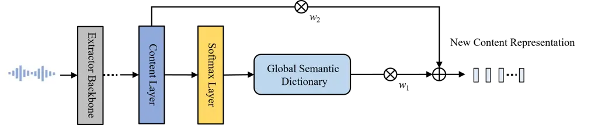
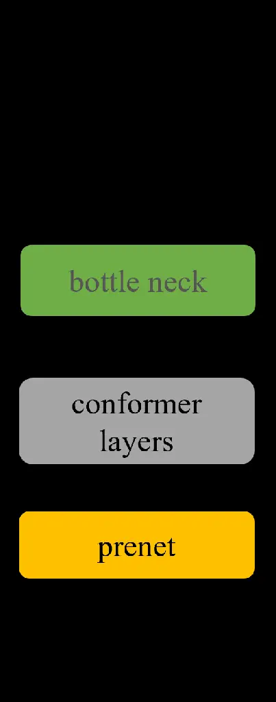
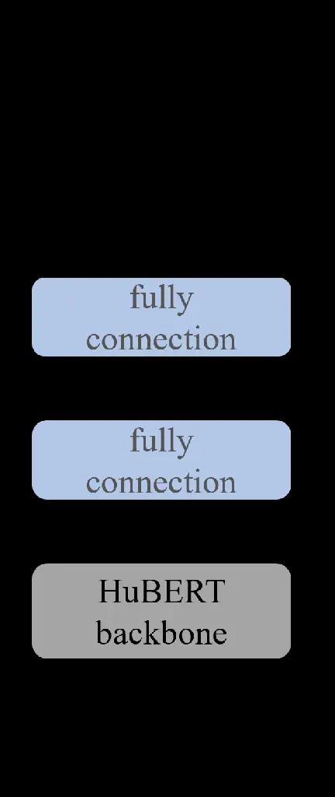
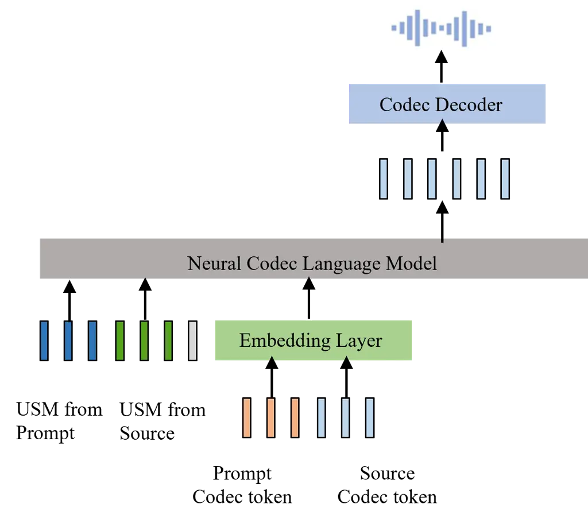
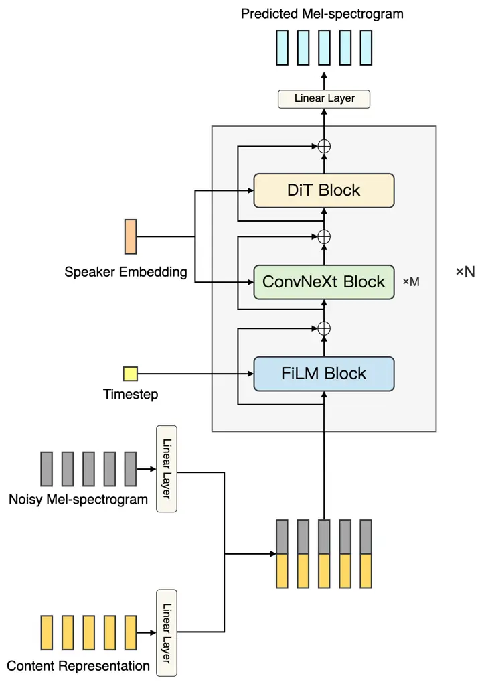

# USM-VC: Mitigating Timbre Leakage with Universal Semantic Mapping Residual Block for Voice Conversion

Na Li ^(†)^(†)thanks: Equal contribution. Affiliation: Tencent AI LAB
Email: [nenali@tencent.com](mailto:)    Chuke Wang¹¹footnotemark: 1
Affiliation: Peking University Email: [chuke@stu.pku.edu.cn](mailto:)   
Yu Gu Affiliation: Tencent AI LAB Email: [colinygu@tencent.com](mailto:)
   Zhifeng Li Email: [zhifeng0.li@gmail.com](mailto:)

###### Abstract

Voice conversion (VC) transforms source speech into a target voice by
preserving the content. However, timbre information from the source
speaker is inherently embedded in the content representations, causing
significant timbre leakage and reducing similarity to the target
speaker. To address this, we introduce a Universal Semantic Matching
(USM) residual block to a content extractor. The residual block consists
of two weighted branches: 1) universal semantic dictionary based Content
Feature Re-expression (CFR) module, supplying timbre-free content
representation. 2) skip connection to the original content layer,
providing complementary fine-grained information. In the CFR module,
each dictionary entry in the universal semantic dictionary represents a
phoneme class, computed statistically using speech from multiple
speakers, creating a stable, speaker-independent semantic set. We
introduce a CFR method to obtain timbre-free content representations by
expressing each content frame as a weighted linear combination of
dictionary entries using corresponding phoneme posteriors as weights.
Extensive experiments across various VC frameworks demonstrate that our
approach effectively mitigates timbre leakage and significantly improves
similarity to the target speaker. The code and pretrained models are
available at
[https://github.com/DisplayVoiceDemo/USM-voice-conversion](https://github.com/DisplayVoiceDemo/USM-voice-conversion)
¹¹ 1 The demo is available at
[https://displayvoicedemo.github.io/USM/](https://displayvoicedemo.github.io/USM/).

## 1 Introduction

Content representations play a role of determining the linguistic
content of the generated audio in speech generation tasks such as
text-to-speech (TTS), song generation, and singing voice conversion.
However, content representations often also contain timbre, prosody, and
other information, which can pose significant challenges for tasks that
aim to generate audio with specific timbre characteristics. A typical
example is voice conversion which directly uses content representation
as condition to generate speech in a target speaker’s voice, the timbre
information inherited in source content representations dramatically
decrease the similarity between the generated speech and the target
speaker. This paper focuses on the Voice Conversion (VC) task and
investigates how to develop timbre-independent content representations.

Most research efforts in the field of voice conversion focus on
disentangling timbre from content representations. These approaches aim
to achieve information disentanglement by employing complex feature
engineering (Li et al., 2023; Qian et al., 2019; Chen et al., 2023; Choi
et al., 2024), specialized network architectures and training strategies
(Wang et al., 2021; Wang et al., 2023b; Ju et al., 2024; Lajszczak
et al., 2024), normalization techniques (Chou and Lee, 2019), or data
augmentation strategies (Li et al., 2023; Anastassiou et al., 2024).
However, these methods still suffer from timbre leakage and struggle to
maintain timbre similarity with the target speaker.

In this paper, we address the issue of timbre leakage from a novel
perspective. The fundamental cause of timbre leakage is that the timbre
information of the source speaker is inherently embedded in the
representations of the source speech. This leads us to the following
question: What type of content representation can exclude timbre
information? Previous studies (Polyak et al., 2021; Van Niekerk et al.,
2020; Huang et al., 2021) have demonstrated that discrete speech units,
derived from clustering self-supervised representations, can function as
timbre-free content units. This is because the discretization process
introduces an information bottleneck that effectively separates content
from timbre information. Inspired by this, we introduce a Universal
Semantic Matching (USM) residual block to the content extractor. The
residual block consists of a universal semantic dictionary based Content
Feature Re-expression (CFR) module and a weighted skip connection to the
content layer. The USM block needs an offline construction of a
universal semantic dictionary composed of discrete entries. Each entry
in the Universal Semantic Dictionary is calculated as a weighted
combination of content representations from multiple speakers,
distinguishing it from discrete speech units obtained through
clustering. The CFR module re-expresses each content feature from the
source speaker as a weighted combination of the entries in the Universal
Semantic Dictionary. The weighted skip connection to the content layer
provides complementary contextual information for the timbre-free
content representations extracted from the CFR module.

We apply the new content representations derived from the USM residual
block to various voice conversion (VC) frameworks, including language
model-based zero-shot VC, diffusion model-based one-shot VC, and
Variational Inference with adversarial learning for end-to-end
Text-to-Speech (VITS)-based any-to-many VC. This application results in
substantial improvements in similarity and speech naturalness compared
to the original representation.



Figure 1: Illustration of the proposed USM residual block.

In conclusion, our contributions are as follows:

1\. We propose a novel Universal Semantic Matching (USM) residual block
to extract new content representation for voice conversion. In USM block
which consists of a universal semantic dictionary based Content Feature
Re-expression (CFR) module and a weighted skip connection to the content
layer, an offline universal semantic dictionary is first constructed by
utilizing content representations from various speakers. Each entry in
the dictionary provides a stable, timbre-independent representation of a
specific phoneme class or speech unit. Based on this dictionary, the
Content Feature Re-expression (CFR) module aims to express each frame of
the original content features as a linear weighted combination of the
dictionary entries, yielding novel timbre-independent representations
that are highly beneficial for voice conversion. The weighted skip
connection to the content layer further provides complementary
contextual information for the timbre-free content representations.

2\. Compared to widely used information decoupling methods that rely on
complex network architectures and intricate training strategies to
mitigate timbre leakage, our approach is inherently free of timbre
information. Furthermore, it is easier to implement and significantly
reduces computational complexity, time complexity, and model size.

3\. We conduct extensive experiments across various VC frameworks. The
results show that our method not only outperforms existing
state-of-the-art approaches but also demonstrates strong generalization
capabilities, making it potentially applicable to other speech
generation tasks.

4\. This work establishes a new paradigm for tackling the complex timbre
leakage problem, achieving highly expressive results across various
settings while significantly reducing computational complexity, time
complexity, and model size. We believe it offers valuable insights for
future research and makes a substantial contribution to the ongoing
development of this field.

## 2 Related Works

Content representations are typically extracted from the bottleneck
layer of supervised pre-trained phoneme-posteriorgram (PPG) models (Chen
et al., 2023; Liu et al., 2021b; Kovela et al., 2023) or an intermediate
layer of self-supervised models like HuBERT (Hsu et al., 2021) and WavLM
(Chen et al., 2022). However, since the training audio inherently
contains content and timbre information, these representations
inevitably include undesirable timbre, reducing the similarity between
the converted speech and the target speaker.

To address the above issue, discrete speech units (Van Niekerk et al.,
2020; Huang et al., 2021) are introduced into voice conversion. However,
discrete speech units may lack some linguistic content, and
distance-based discretization may cause ambiguous or noisy
representations to be assigned to incorrect nearby units, resulting in
mispronunciation. (Van Niekerk et al., 2022) proposes to replace
discrete speech units with soft speech units. Though intelligibility and
naturalness improvements are achieved, such representations lose the
discriminability between adjacent frames and rich contextual
information, the converted speech exhibits issues such as unclear
pronunciation or unnatural prosody.

Most recent voice conversion (VC) methods focus on decoupling timbre and
content information. These methods can be divided into several
categories: 1) information bottlenecks. FreeVC (Li et al., 2023)
disentangles content information by imposing an information bottleneck
on WavLM features to reduce the timbre information contained in the
content representation. In VQMIVC (Wang et al., 2021), vector
quantization (VQ) is employed as a discretization strategy to impose an
information bottleneck for content encoding. 2) specialized network
designs and training strategies. Decoupled denoising diffusion models
(DDDMs) (Choi et al., 2024) utilize multiple attribute denoisers to
address the challenges of disentangling and controlling speech
attributes for VC tasks. Mutual information (MI) minimization is
introduced in (Wang et al., 2021) to achieve information
disentanglement. 3) data augmentation. Spectrogram-resize-based data
augmentation is proposed in (Li et al., 2023) to enhance content
representation. Although these decoupling methods have achieved some
success in separating timbre and content information, timbre is
inherently embedded in speech, making decoupling challenging.
Consequently, timbre leakage is often unavoidable. Additionally,
decoupling networks tend to be quite complex, significantly increasing
the burden on the system.

Unlike decoupling methods, KNN-VC (Baas et al., 2023) uses the K-Nearest
Neighbors algorithm to replace each frame of the source speech’s content
representation with the nearest neighbor from the target speaker’s
representations for voice conversion. However, it struggles with
identifying accurate neighbors for noisy content, causing pronunciation
issues, and its zero-shot performance is limited by the amount of
available target speech.



(a) PPG Extractor



(b) HuBERT Extractor

Figure 2: Illustration of supervised PPG extractor and self-supevised
HuBERT extractor.

## 3 Method

In this Section, we introduce the proposed Universal Semantic Matching
(USM) residual block. Fig.1 shows the process of obtaining the new
content representation with USM. In USM, we first construct a universal
semantic dictionary that can be applied to both self-supervised and
supervised representations. Each entry in the semantic dictionary is
computed as a weighted combination of content representations from
different speakers. The posterior distribution of phoneme units,
extracted from the softmax layer of a content extractor, is used as the
combination weights. Based on the universal semantic dictionary, the
Content Feature Re-expression (CFR) module represents each frame of the
original content features as a linear weighted combination of the
dictionary entries. The weighted skip connection further provides
complementary contextual information for the timbre-free content
representations extracted from the CFR module.

### 3.1 Content Extractor

Supervised PPG or self-supervised model such as HuBERT can be used to
extract content representations or soft speech units, as shown in Fig.2.
The PPG model is trained with phonetic alignments with acoustic features
extracted from the HMM-DNN (Povey et al., 2018) model using Kaldi
Tookit²² 2 https://github.com/kaldi-asr/kaldi. The architecture of PPG
model is shown as in Fig.2(a). We employ cross entropy objective to
train the model, and introduce the center loss (Wen et al., 2016) as an
auxiliary optimization to improve the robustness of the content
representation extracted from the bottle neck layer.

For the HuBERT model, we frozen the backbone and used the seventh
transformer layer to extract content features. To learn discrete speech
units, we apply k-means clustering to the content features extracted
from speech of different speakers. For the learning of soft speech
units, two fully connection layers are added after the seventh
transformer layer. We fine-tune the whole model shown in Fig.2(b) to
predict the corresponding discrete speech units.

### 3.2 Construction of Universal Semantic Dictionary

The universal semantic dictionary is computed using a development audio
set with $`S`$ speakers. Firstly, we define the calculation methods for
zero-order and first-order statistics, respectively. Specifically, the
zero-order statistics are calculated using the weights of the
classification layer of a content extractor. The first-order statistics
are computed by a linear weighted combination of the content
representations. Denote $`\mathbf{x}_{i,j,t}\in\mathbb{R}^{d\times 1}`$,
where $`i=1,..S,j=1,...N_{i},t=1,..T_{ij}`$, is the $`t`$-th frame
content representation from $`i`$-th speaker’s $`j`$-th utterance. Let
$`\gamma_{i,j,t}^{k}`$ denote the posterior probability that the current
frame belongs to the $`k`$-th phoneme class or discrete speech unit. The
speaker-independent zero-order statistics are computed according to
Eq.1. Then the speaker-independent first-order statistics
$`\mathbf{m}_{k}\in\mathbb{R}^{d\times 1}`$ are obtained using Eq.2.
Finally, the universal semantic dictionary
$`\mathbf{M}_{g}\in\mathbb{R}^{d\times K}`$ of size $`K`$ can be
represented as Eq.3, where $`K`$ is the total number of phoneme classes
or discrete speech units.

```math
n_{k}=\sum_{i,j,t}\gamma_{i,j,t}^{k} \tag{1}
```

```math
\mathbf{m}_{k}=\dfrac{1}{n_{k}}\sum_{i,j,t}\gamma_{i,j,t}^{k}\mathbf{x}_{i,j,t} \tag{2}
```

```math
\mathbf{M}_{g}=[\mathbf{m}_{1},\mathbf{m}_{2},...\mathbf{m}_{K}] \tag{3}
```

### 3.3 Content Feature Re-expression (CFR) Using Universal Semantic Dictionary

Given the $`t`$-th frame original content representation
$`\mathbf{x}_{i,j,t}`$ and the corresponding posterior probability
$`\mathbf{p}_{i,j,t}\in\mathbb{R}^{K\times 1}`$ associated to each
phoneme class or discrete speech unit. A new timbre-independent content
representation $`\bar{\mathbf{x}}_{i,j,t}`$ can be obtained according to
Eq.4.

```math
\bar{\mathbf{x}}_{i,j,t}=\mathbf{M}_{g}\mathbf{p}_{i,j,t} \tag{4}
```

### 3.4 Content Representation From USM Residual Block

The USM representation $`\hat{\mathbf{x}}_{i,j,t}`$ extracted from USM
residual block is a weighted linear combination of the original content
representation $`\mathbf{x}_{i,j,t}`$ and the timbre-independent content
representation $`\bar{\mathbf{x}}_{i,j,t}`$, as shown in Eq.5

```math
\hat{\mathbf{x}}_{i,j,t}=w_{1}\bar{\mathbf{x}}_{i,j,t}+w_{2}{\mathbf{x}}_{i,j,t} \tag{5}
```

where $`w_{1}+w_{2}=1`$. $`w_{1}`$ controls the contribution of the
timbre-free content representation, $`w_{2}`$ regulates the contribution
degree of fine-grained contextual information within the original
representation.

## 4 Applying USM Across Different Voice Conversion Frameworks

### 4.1 VITS based Any-to-Many Voice Conversion

Previous VC systems utilize a two-stage reconstruction pipeline (Qian
et al., 2019; Liu et al., 2021b). Initially, a conversion model
transforms source acoustic features into the target speaker’s domain,
followed by a vocoder converting these features into waveform in the
second stage. VITS, a one-stage model capable of both TTS and VC,
connects the two stages via latent variables of a conditional
variational autoencoder (CVAE), thereby reducing feature mismatch.
Furthermore, adversarial training improves the quality of the
reconstructed waveform.

Given an input utterance, speech unit/phoneme posterior probability
$`\mathbf{p}_{i,j,t}`$ is extracted from a content extractor. Then
timbre-independent content representations are calculated according to
Eq.4. The weighted skip connection further introduces complementary
contextual information for the timbre-free content representations. A
look-up table (LUT) is employed as the speaker identity indicator. Given
the content feature and target speaker indicator, VITS model can
generate speech with target timbre. For any-to-many voice conversion
task, it is feasible to construct a speaker-dependent semantic
dictionaries for individual target speaker within the training set, the
resulting new content representation via CFR will contain target timbre
information which is beneficial for the conversion task.

### 4.2 Language Model based Zero-Shot Voice Conversion

Large language models (LLMs) have demonstrated great progress in natural
language generation. With a sufficient model size LLMs emerge powerful
in-context learning abilities that can handle unseen tasks with a prompt
in a zero-shot or few-shot manner (Wei et al., 2022). Moreover, the
simple yet effective next-token prediction task of LLMs makes it easy to
apply LLMs on voice conversion (Wang et al., 2023b), as long as the data
can be converted to discrete speech tokens. An intuitive approach is to
follow AudioLM (Borsos et al., 2023) where speech was tokenized into
semantic and acoustic tokens by HuBERT and a neural codec, respectively.
Subsequently, generate the target acoustic tokens by autoregressive
prediction of the next token, conditioned on the semantic tokens and the
acoustic tokens of the prompt audio. While, semantic tokens lose much
rich linguistic information, resulting in hard contextual learning and
poor audio quality.

In this paper, we also investigate the effects of the proposed USM block
on zero-shot voice conversion using a decoder-only language model with a
neural codec. Similar to VALL-E (Wang et al., 2023a), the model predicts
target codec tokens hierarchically based on a sequence of codec tokens
from the prompt speech segment and content features extracted from the
source speech through USM block. In this process, the codec tokens of
the first layer of RVQ are predicted by an AR transformer, while the
tokens of the remaining layers are predicted by a NAR transformer.

### 4.3 Diffusion Model based One-Shot Voice Conversion

The diffusion models have achieved remarkable performance on VC tasks
(Liu et al., 2021a; Lu et al., 2024; Chen et al., 2024), producing
natural speech with high similarity to the target timbre. To verify the
universality of the USM block, we also verified the effectiveness of the
USM block on the diffusion model. Diffusion model is adopted as the
probabilistic model which fits the distribution of mel-spectrogram. We
use the EDM method (Karras et al., 2022) to train the diffusion model.
In the training stage, the content representations and the corresponding
speaker embedding are encoded into hidden embeddings. These embeddings
are concatenated and served as the conditional input for the network. In
the inference process, conditioned on the source speaker’s content
representation and target speaker embedding, we iteratively sample the
target mel-spectrogram from a Gaussian noise. The generated
mel-spectrogram can be further rendered to audio by using a pre-trained
vocoder.

## 5 Experiment

In order to verify the effectiveness of the USM block, we compared the
effects of different content representations on different VC tasks,
including the original content representations, softmax speech units,
and the proposed USM representation obtained from different extractors.

### 5.1 Evaluation Metrics

We assess the quality of the converted audios utilizing three objective
metrics: the F0 Pearson Correlation (FPC), the Speaker Similarity
(SSIM), and word error rate (WER). For FPC, we calculated the L1
distance between the log-scale ground-truth and the predicted F0 in the
HAG. To obtain the ground-truth F0, we compute the mean of F0 values of
the target speaker and source speech, denoted as $`\bar{f}_{0}^{tar}`$
and $`\bar{f}_{0}^{src}`$ respectively. The ground truth F0 is obtained
according to $`f_{0}^{src}\times\bar{f}_{0}^{tar}/\bar{f}_{0}^{src}`$.
SSIM is computed through cosine similarity using speaker embeddings
derived from an Automatic Speaker Verification model. WER is calculated
using a pre-trained automatic speech recognition (ASR) model. For
subjective evaluations, we conduct a 5-point Mean Opinion Score (MOS)
test, ranging from 1 (bad) to 5 (excellent). A total of 10 volunteers
are recruited for the listening test, where they provide ratings for
both the Naturalness Mean Opinion Score (NMOS) and the Similarity Mean
Opinion Score (SMOS). A confidence interval 0f $`95\%`$ is reported for
MOS. For simplicity, in some experiments, we adopt UTMOS (Saeki et al., 2022) instead of NMOS as an objective metric for naturalness.

| Content Representation |                      | NMOS$`\uparrow`$            | SMOS$`\uparrow`$            | SSIM$`\uparrow`$ | FPC$`\uparrow`$ | WER$`\downarrow`$ |
| ---------------------- | -------------------- | --------------------------- | --------------------------- | ---------------- | --------------- | ----------------- |
| PPG                    | BNF                  | $`4.012\pm 0.092`$          | $`3.051\pm 0.091`$          | 0.601            | 0.585           | 2.285             |
|                        | S-Unit               | $`3.791\pm 0.093`$          | $`3.523\pm 0.107`$          | 0.765            | 0.601           | 4.596             |
|                        | USM                  | $`\textbf{4.153}\pm 0.096`$ | $`3.832\pm 0.093`$          | 0.748            | 0.781           | 2.102             |
|                        | $`\textbf{USM}^{*}`$ | $`4.013\pm 0.101`$          | $`\textbf{4.112}\pm 0.102`$ | 0.796            | 0.785           | 2.262             |
| HuBERT                 | MLF                  | $`3.959\pm 0.094`$          | $`2.879\pm 0.102`$          | 0.403            | 0.561           | 2.345             |
|                        | S-Unit               | $`3.653\pm 0.101`$          | $`3.654\pm 0.095`$          | 0.773            | 0.639           | 4.895             |
|                        | USM                  | $`3.932\pm 0.096`$          | $`3.701\pm 0.093`$          | 0.732            | 0.767           | 2.193             |
|                        | $`\textbf{USM}^{*}`$ | $`\textbf{4.005}\pm 0.091`$ | $`\textbf{4.166}\pm 0.101`$ | 0.808            | 0.793           | 2.234             |

Table 1: Performance of different content representations on subjective
metrics (NMOS, SMOS) and objective metrics (SSIM, FPC, WER) for VITS
based any-to-many VC task. $`\text{USM}^{*}`$ denotes the representation
that incorporates speaker-dependent content representation by CFR using
speaker-dependent semantic dictionary for each target speaker.

| Content Representation |        | NMOS$`\uparrow`$            | SMOS$`\uparrow`$            | SSIM$`\uparrow`$ | FPC$`\uparrow`$ | WER$`\downarrow`$ |
| ---------------------- | ------ | --------------------------- | --------------------------- | ---------------- | --------------- | ----------------- |
| PPG                    | BNF    | $`4.215\pm 0.091`$          | $`3.268\pm 0.081`$          | 0.641            | 0.653           | 2.153             |
|                        | S-Unit | $`3.618\pm 0.091`$          | $`3.421\pm 0.089`$          | 0.711            | 0.632           | 4.446             |
|                        | USM    | $`\textbf{4.246}\pm 0.088`$ | $`\textbf{3.845}\pm 0.094`$ | 0.751            | 0.765           | 2.133             |
| HuBERT                 | MLF    | $`4.306\pm 0.087`$          | $`3.254\pm 0.088`$          | 0.624            | 0.612           | 1.991             |
|                        | S-Unit | $`3.421\pm 0.096`$          | $`3.312\pm 0.097`$          | 0.683            | 0.603           | 5.526             |
|                        | USM    | $`\textbf{4.314}\pm 0.093`$ | $`\textbf{3.823}\pm 0.097`$ | 0.741            | 0.756           | 2.115             |

Table 2: Performance of different content representations on subjective
metrics (NMOS, SMOS) and objective metrics (SSIM, FPC, WER) for language
model based zero-shot VC task.

### 5.2 Datasets

WenetSpeech (Zhang et al., 2022) and Gigaspeech (Chen et al., 2021) are
used to train PPG model introduced in Sec.3.1. We choose the open source
vocabulary, BigCiDian³³ 3 https://github.com/speechio/BigCiDian, as our
lexicon.

Our experiments were carried out on VCTK (Yamagishi Junichi, 2019) and
LibriTTS (Zen et al., 2019). Only VCTK is used for training VITS based
systems. All recordings are resampled to 24 kHz. The whole train set of
LibriTTS is used to train the diffusion and language models. For
subjective evaluation tests, the test audio samples are selected from
the test set of LibriTTS corpus. We randomly choose 20 target speakers
and 10 test audio samples for each target speaker for VITS and diffusion
model based frameworks. For language model based zero-shot VC, we
randomly select 100 prompt audio clips with less than 10s duration from
50 unseen speakers in the VCTK corpus and 5 test audio samples from the
rest speakers for each prompt. For calculating objective metrics, 100
test audios are randomly selected for each target speaker and 20 test
audios are selected for each prompt.

### 5.3 Experimental Setup

PPG Extractor: In the training stage, the input audio was augmented with
noise, music, and reverberation. The input spectral features are
80-dimensional log mel-spectrograms with 10ms hop size and 25 ms window
size. The stem of the model is built from a pre-net (two linear layers
with dropout), followed by a stack of seven conformer blocks with 4
attention heads, a kernel size of 15, a hidden size of 256, and a filter
size of 2048. The output size of the bottle neck layer is 256. The
semantic dictionary with $`600`$ entries of 256-dimensional is
calculated using 100,000 randomly selected audio samples from 2,311
speakers in the train set of LibriTTS.

| Content Representation | NMOS$`\uparrow`$            | SMOS$`\uparrow`$            | SSIM$`\uparrow`$ | FPC$`\uparrow`$ | WER$`\downarrow`$ |
| ---------------------- | --------------------------- | --------------------------- | ---------------- | --------------- | ----------------- |
| BNF                    | $`4.002\pm 0.088`$          | $`3.241\pm 0.086`$          | 0.652            | 0.627           | 1.338             |
| S-Unit                 | $`3.986\pm 0.097`$          | $`3.835\pm 0.092`$          | 0.766            | 0.632           | 3.084             |
| USM                    | $`\textbf{4.146}\pm 0.086`$ | $`\textbf{3.962}\pm 0.093`$ | 0.759            | 0.701           | 1.575             |

Table 3: Performance of different content representations extracted from
PPG model on subjective metrics (NMOS, SMOS) and objective metrics
(SSIM, FPC) for diffusion model based VC task.

HuBERT Extractor: The output of the seventh transformer layer in
HuBERT-Base (Hsu et al., 2021) is used as the original self-supervised
content representation. For discrete speech units, we apply k-means
clustering to content representations. we adopt $`K`$ clusters and
estimate their means on a set of 200,000 audio samples randomly selected
from 2,311 speakers from the train set of LibriTTS. To obtain soft
speech units, we froze the HuBERT backbone and add two linear projection
layers with 256 hidden states after the seventh layer, followed by a
classification layer, whose target is the label of the corresponding
k-means clustering center. The semantic dictionary with $`K`$ entries of
768-dimensional is constructed using the same set used for estimating
the PPG extractor-related semantic dictionary.

VITS System: The model architecture is similar to the open-source RVC
project⁴⁴ 4
https://github.com/RVC-Project/Retrieval-based-Voice-Conversion-WebUI.
Specifically, the posterior encoder utilizes non-causal WaveNet residual
blocks Prenger et al. (2019). The prior encoder consists of a 6-layer
transformer with 2 attention heads. Normalizing flows, which conditions
on speaker embedding is adopted to improve the complexity of prior
distribution. The decoder follows the original configuration of the
HIFI-GAN (Kong et al., 2020) in VITS. We adjust the model’s
hyperparameters to suit the generation of 24kHz audio, resulting in 36M
parameters in total. More experimental details can be found in Appendix
A.

Language Model based VC System: The architecture of the codec language
model is similar to VALL-E (Wang et al., 2023a) where both the AR and
NAR models are a 12-layer transformer with 12 attention heads and
768-dimensional token embeddings, sinusoidal positional embeddings,
3072-dimensional feed-forward layers, and a dropout rate of 0.1. The
model size is 227M. The encoder and decoder of the pre-trained codec
model follows Hifi-codec (Yang et al., 2023), except that the number of
quantization layer of RVQ is set to 4 with the group number set to 1.
More experimental details can be found in Appendix B.

Diffusion Model based VC System: The training pipeline is a variant
version of the CoMoSVC project⁵⁵ 5 https://github.com/Grace9994/CoMoSVC.
We only trained the teacher model for our experiments. The
256-dimensional speaker embedding extracted from a pre-trained speaker
verification model was used as the condition to control the generated
timbre. Unlike the CoMoSVC project, We did not incorporate pitch and
loudness as conditional inputs into the network. For the model
architecture, we replaced the original WaveNet with the flow matching
decoder from the StableTTS project⁶⁶ 6
https://github.com/KdaiP/StableTTS. The decoder consists of 12
Convolution Transformer blocks modified from Hierspeech++ (Lee et al.,
2023). Each Convolution Transformer block contains a FiLM layer (Perez
et al., 2018), three ConvNeXt blocks with a hidden size of 768, a filter
size of 2048 and a kernel size of 7, and a DiT block with 8 attention
heads, a kernel size of 3, a hidden size of 768, and a filter size of 768. The output of the decoder is the predicted 80-dimensional log
mel-spectrogram. The total size of the model is 287M. More experimental
details can be found in Appendix C.

### 5.4 Results and Analysis

In the following experiments, MLF denotes the features extracted from
the 7-th layer of the HuBERT model. BNF is the bottle neck feature
extracted from the PPG model. S-Unit is the soft speech units. The
number of clusters $`K`$ for k-means clustering is set to 4096 for USM.

#### 5.4.1 Results of USM for Different VC Frameworks

Results of VITS based VC Systems: Comparison of different content
representations in any-to-many voice conversion based on VITS
architecture is shown in Table 1. For USM, the values of $`w_{1}`$ and
$`w_{2}`$ are 0.8 and 0.2, respectively. $`\text{USM}^{*}`$ incorporates
speaker-dependent content representation with weight $`w_{3}`$. For
$`\text{USM}^{*}`$, the values of $`w_{1}`$, $`w_{2}`$ and $`w_{3}`$ are
0.2, 0.6 and 0.2, respectively. The impact of different weight
combinations on the conversion effect is shown in Appendix D.

Regarding the quality of the generated speech, we can observe that the
original content representation BNF ang MLF can achieve higher NMOS and
lower WER commpared to S-Unit. The reason is that the content
representations directly extracted from the extractors contain more rich
contextual information. However, S-Units can be considered as an
approximation of discrete speech units, losing much contextual
information. The USM and $`\text{USM}^{*}`$ demonstrate significant
improvements in NMOS and WER compared to S-Unit and comparable NMOS and
WER to the original content representation.

In terms of the similarity metrics (SMOS, SSIM, FPC) between the
generated speech and the target speaker, the USM outperforms the
original content representations. This shows that the USM effectively
discarded the timbre information of the source speaker from the content
representation. S-Unit has much lower SMOS compared to USM, the reason
is that S-Unit has poor generation quality, which affects the subjective
perception of similarity. The $`\text{USM}^{*}`$ achieves the highest
value in all similarity metrics, demonstrating the effectiveness in
incorporating speaker-dependent information in any-to-many VC task.

| System                    | UTMOS$`\uparrow`$ | SSIM$`\uparrow`$ | WER$`\downarrow`$ |
| ------------------------- | ----------------- | ---------------- | ----------------- |
| VQMIVC                    | 2.372             | 0.358            | 58.332            |
| (Wang et al., 2021)       |                   |                  |                   |
| YourTTS                   | 3.112             | 0.517            | 8.354             |
| (Casanova et al., 2022)   |                   |                  |                   |
| KNN-VC                    | 3.633             | 0.721            | 5.217             |
| (Baas et al., 2023)       |                   |                  |                   |
| FreeVC                    | 3.973             | 0.617            | 2.613             |
| (Li et al., 2023)         |                   |                  |                   |
| DDDM-VC                   | 3.284             | 0.632            | 5.551             |
| (Choi et al., 2024)       |                   |                  |                   |
| LM-VC                     | 3.982             | 0.641            | 2.153             |
| LM-VC-USM                 | 4.011             | 0.751            | 2.133             |
| $`\textbf{VITS-USM}^{*}`$ | 3.902             | 0.796            | 2.262             |
| Diffusion-S-USM           | 3.701             | 0.756            | 2.764             |
| Diffusion-USM             | 3.791             | 0.759            | 1.575             |

Table 4: Performance comparison between our optimal system (bold black
font) for each framework and other methods. The USM representation based
on the PPG model is employed.

Results of Language Model based VC Systems: The comparison of different
content representations is shown in Table 2. For USM, the value of
$`w_{2}`$ is set to 0.05. We observe similar phenomena across different
extractors. In terms of the generated speech quality metrics NMOS and
WER, the original content representations BNF and MLF exhibit better
performance compared to S-Unit. Regarding similarity metrics,
$`\text{USM}^{*}`$ shows the best performance. S-Unit is inferior to USM
in both similarity and naturalness, as S-Unit contains less contextual
information and requires a larger network and more data to learn
effective information from the representations for better prediction of
the codec token sequence.

Comparing different extractors, we observe that MLF achieves a higher
NMOS and a lower WER compared to BNF. In terms of similarity metrics,
MLF has lower SMOS and SSIM values compared to BNF. This indicates that
the intermediate layer representations from the network, such as MLF,
contain richer contextual information and more timbre information
compared to the upper layer representations.

Results of Diffusion Model based VC Systems: In this section, we only
compare the performance of different content representations extracted
from the PPG model, due to the fact that different speech extractors
exhibited similar performance patterns in the above. The value of
$`w_{2}`$ in USM is set to 0.05. The results are shown in Table 3. We
can see that the original representation has the lowest similarity
compared to other types of content representation. The S-Unit
representation achieves good naturalness, which differs from the
conclusions of the above experiments. The reason may be that the
ConvNeXt blocks in the model architecture can effectively enhance sound
quality and have better robustness for S-Unit representations. Similarly
to the above experiments, the USM achieves better similarity and
comparable naturalness compared to the BNF.

#### 5.4.2 Comparison with Other Systems

The comparison between our optimal system for each framework and other
popular decoupling methods is shown in Table 4. LM-VC is the LM based VC
system trained using BNF. Diffusion-S-USM denotes a small diffusion
model with 58M parameters, which is comparable to that of DDDM-VC. Among
the comparative systems, only LM-VC was implemented by ourselves, while
for the other systems, publicly available pre-trained models were
utilized for testing. Considering the system based on the VITS
architecture, a comparison between $`\text{VITS-USM}^{*}`$ and FreeVC,
which employs decoupling strategies, reveals that the former can achieve
higher similarity while maintaining comparable naturalness to the
latter. Comparing the diffusion model based systems, our Diffusion-S-USM
and Diffusion-USM significantly surpasses DDDM-VC which employs
disentangled representations across all three metrics. Compared with
VQMIVC, YourTTS, and KNN-VC, our USM based systems demonstrate superior
performance.

## 6 Conclusions

This paper proposes a novel USM residual block to mitigate timbre
leakage in voice conversion. The effectiveness of the proposed method is
evaluated on various architectures, including VITS, language model, and
diffusion model-based voice conversion frameworks. These architectures
are widely applied in recent speech generation tasks. Especially,
compared to the widely used information decoupling methods, our approach
offers significant advantages in terms of output quality, computational
efficiency, universality, and ease of use, making it promising for
extension to other speech generation tasks.

## 7 Impact Statement

This study develops a novel method for extracting timbre-independent
content representations, which are crucial for voice conversion tasks
that aim to produce speech with specific timbre characteristics.
Therefore, it is important to prevent the potential misuse of this
technology for fraudulent purposes. For example, through telephonic
impersonation, fraudsters can engage in financial swindles, inflicting
both pecuniary losses and psychological distress on social members. To
counteract the risks of misuse, techniques for detecting converted
speech are essential. In the future, we will pay more attention to the
research on detecting techniques and the practical applications of such
technology.

## References

- Anastassiou et al. (2024) Philip Anastassiou, Jiawei Chen, Jitong
  Chen, Yuanzhe Chen, Zhuo Chen, Ziyi Chen, Jian Cong, Lelai Deng,
  Chuang Ding, Lu Gao, et al. 2024. Seed-tts: A family of high-quality
  versatile speech generation models. _arXiv preprint arXiv:2406.02430_.
- Baas et al. (2023) Matthew Baas, Benjamin van Niekerk, and Herman
  Kamper. 2023. Voice conversion with just nearest neighbors. _arXiv
  preprint arXiv:2305.18975_.
- Borsos et al. (2023) Zalán Borsos, Raphaël Marinier, Damien Vincent,
  Eugene Kharitonov, Olivier Pietquin, Matt Sharifi, Dominik Roblek,
  Olivier Teboul, David Grangier, Marco Tagliasacchi, et al. 2023.
  Audiolm: a language modeling approach to audio generation. _IEEE/ACM
  transactions on audio, speech, and language processing_, 31:2523–2533.
- Casanova et al. (2022) Edresson Casanova, Julian Weber, Christopher D
  Shulby, Arnaldo Candido Junior, Eren Gölge, and Moacir A Ponti. 2022.
  Yourtts: Towards zero-shot multi-speaker tts and zero-shot voice
  conversion for everyone. In _International Conference on Machine
  Learning_, pages 2709–2720. PMLR.
- Chen et al. (2021) Guoguo Chen, Shuzhou Chai, Guanbo Wang, Jiayu Du,
  Wei-Qiang Zhang, Chao Weng, Dan Su, Daniel Povey, Jan Trmal, Junbo
  Zhang, et al. 2021. Gigaspeech: An evolving, multi-domain asr corpus
  with 10,000 hours of transcribed audio. _arXiv preprint
  arXiv:2106.06909_.
- Chen et al. (2022) Sanyuan Chen, Chengyi Wang, Zhengyang Chen, Yu Wu,
  Shujie Liu, Zhuo Chen, Jinyu Li, Naoyuki Kanda, Takuya Yoshioka, Xiong
  Xiao, et al. 2022. Wavlm: Large-scale self-supervised pre-training for
  full stack speech processing. _IEEE Journal of Selected Topics in
  Signal Processing_, 16(6):1505–1518.
- Chen et al. (2024) Shihao Chen, Yu Gu, Jie Zhang, Na Li, Rilin Chen,
  Liping Chen, and Lirong Dai. 2024. Ldm-svc: Latent diffusion model
  based zero-shot any-to-any singing voice conversion with singer
  guidance. _arXiv preprint arXiv:2406.05325_.
- Chen et al. (2023) Yuanzhe Chen, Ming Tu, Tang Li, Xin Li, Qiuqiang
  Kong, Jiaxin Li, Zhichao Wang, Qiao Tian, Yuping Wang, and Yuxuan
  Wang. 2023. Streaming voice conversion via intermediate bottleneck
  features and non-streaming teacher guidance. In _ICASSP 2023-2023 IEEE
  International Conference on Acoustics, Speech and Signal Processing
  (ICASSP)_, pages 1–5. IEEE.
- Choi et al. (2024) Ha-Yeong Choi, Sang-Hoon Lee, and Seong-Whan
  Lee. 2024. Dddm-vc: Decoupled denoising diffusion models with
  disentangled representation and prior mixup for verified robust voice
  conversion. In _Proceedings of the AAAI Conference on Artificial
  Intelligence_, pages 17862–17870.
- Chou and Lee (2019) Ju-chieh Chou and Hung-Yi Lee. 2019. One-shot
  voice conversion by separating speaker and content representations
  with instance normalization. In _Interspeech_. IEEE.
- Hsu et al. (2021) Wei-Ning Hsu, Benjamin Bolte, Yao-Hung Hubert Tsai,
  Kushal Lakhotia, Ruslan Salakhutdinov, and Abdelrahman Mohamed. 2021.
  Hubert: Self-supervised speech representation learning by masked
  prediction of hidden units. _IEEE/ACM transactions on audio, speech,
  and language processing_, 29:3451–3460.
- Huang et al. (2021) Wen-Chin Huang, Yi-Chiao Wu, and Tomoki
  Hayashi. 2021. Any-to-one sequence-to-sequence voice conversion using
  self-supervised discrete speech representations. In _ICASSP 2021-2021
  IEEE International Conference on Acoustics, Speech and Signal
  Processing (ICASSP)_, pages 5944–5948. IEEE.
- Ju et al. (2024) Zeqian Ju, Yuancheng Wang, Kai Shen, Xu Tan, Detai
  Xin, Dongchao Yang, Yanqing Liu, Yichong Leng, Kaitao Song, Siliang
  Tang, et al. 2024. Naturalspeech 3: Zero-shot speech synthesis with
  factorized codec and diffusion models. _arXiv preprint
  arXiv:2403.03100_.
- Karras et al. (2022) Tero Karras, Miika Aittala, Timo Aila, and Samuli
  Laine. 2022. Elucidating the design space of diffusion-based
  generative models. _Advances in neural information processing
  systems_, 35:26565–26577.
- Kong et al. (2020) Jungil Kong, Jaehyeon Kim, and Jaekyoung Bae. 2020.
  Hifi-gan: Generative adversarial networks for efficient and high
  fidelity speech synthesis. _Advances in neural information processing
  systems_, 33:17022–17033.
- Kovela et al. (2023) Sudheer Kovela, Rafael Valle, Ambrish Dantrey,
  and Bryan Catanzaro. 2023. Any-to-any voice conversion with f0 and
  timbre disentanglement and novel timbre conditioning. In _ICASSP
  2023-2023 IEEE International Conference on Acoustics, Speech and
  Signal Processing (ICASSP)_, pages 1–5. IEEE.
- Lajszczak et al. (2024) Mateusz Lajszczak, Guillermo Cámbara, Yang Li,
  Fatih Beyhan, Arent van Korlaar, Fan Yang, Arnaud Joly, Álvaro
  Martín-Cortinas, Ammar Abbas, Adam Michalski, et al. 2024. Base tts:
  Lessons from building a billion-parameter text-to-speech model on 100k
  hours of data. _arXiv preprint arXiv:2402.08093_.
- Lee et al. (2023) Sang-Hoon Lee, Ha-Yeong Choi, Seung-Bin Kim, and
  Seong-Whan Lee. 2023. Hierspeech++: Bridging the gap between semantic
  and acoustic representation of speech by hierarchical variational
  inference for zero-shot speech synthesis. _arXiv preprint
  arXiv:2311.12454_.
- Li et al. (2023) Jingyi Li, Weiping Tu, and Li Xiao. 2023. Freevc:
  Towards high-quality text-free one-shot voice conversion. In _IEEE
  International Conference on Acoustics, Speech and Signal Processing
  (ICASSP)_, pages 1–5. IEEE.
- Li et al. (2024) Yinghao Aaron Li, Cong Han, Vinay Raghavan, Gavin
  Mischler, and Nima Mesgarani. 2024. Styletts 2: Towards human-level
  text-to-speech through style diffusion and adversarial training with
  large speech language models. _Advances in Neural Information
  Processing Systems_, 36.
- Liu et al. (2021a) Songxiang Liu, Yuewen Cao, Dan Su, and Helen Meng.
  2021a. Diffsvc: A diffusion probabilistic model for singing voice
  conversion. In _2021 IEEE Automatic Speech Recognition and
  Understanding Workshop (ASRU)_, pages 741–748. IEEE.
- Liu et al. (2021b) Songxiang Liu, Yuewen Cao, Disong Wang, Xixin Wu,
  Xunying Liu, and Helen Meng. 2021b. Any-to-many voice conversion with
  location-relative sequence-to-sequence modeling. _IEEE/ACM
  Transactions on Audio, Speech, and Language Processing_, 29:1717–1728.
- Loshchilov and Hutter (2017) Ilya Loshchilov and Frank Hutter. 2017.
  Decoupled weight decay regularization. _Learning,Learning_.
- Lu et al. (2024) Yiwen Lu, Zhen Ye, Wei Xue, Xu Tan, Qifeng Liu, and
  Yike Guo. 2024. Comosvc: Consistency model-based singing voice
  conversion. _arXiv preprint arXiv:2401.01792_.
- Perez et al. (2018) Ethan Perez, Florian Strub, Harm De Vries, Vincent
  Dumoulin, and Aaron Courville. 2018. Film: Visual reasoning with a
  general conditioning layer. In _Proceedings of the AAAI conference on
  artificial intelligence_.
- Polyak et al. (2021) Adam Polyak, Yossi Adi, Jade Copet, Eugene
  Kharitonov, Kushal Lakhotia, Wei-Ning Hsu, Abdelrahman Mohamed, and
  Emmanuel Dupoux. 2021. Speech resynthesis from discrete disentangled
  self-supervised representations. In _Interspeech_. IEEE.
- Povey et al. (2018) Daniel Povey, Gaofeng Cheng, Yiming Wang, Ke Li,
  Hainan Xu, Mahsa Yarmohammadi, and Sanjeev Khudanpur. 2018.
  Semi-orthogonal low-rank matrix factorization for deep neural
  networks. In _Interspeech_, pages 3743–3747.
- Prenger et al. (2019) Ryan Prenger, Rafael Valle, and Bryan
  Catanzaro. 2019. Waveglow: A flow-based generative network for speech
  synthesis. In _ICASSP 2019-2019 IEEE International Conference on
  Acoustics, Speech and Signal Processing (ICASSP)_, pages 3617–3621.
  IEEE.
- Qian et al. (2019) Kaizhi Qian, Yang Zhang, Shiyu Chang, Xuesong Yang,
  and Mark Hasegawa-Johnson. 2019. Autovc: Zero-shot voice style
  transfer with only autoencoder loss. In _International Conference on
  Machine Learning_, pages 5210–5219. PMLR.
- Saeki et al. (2022) Takaaki Saeki, Detai Xin, Wataru Nakata, Tomoki
  Koriyama, Shinnosuke Takamichi, and Hiroshi Saruwatari. 2022. Utmos:
  Utokyo-sarulab system for voicemos challenge 2022. _arXiv preprint
  arXiv:2204.02152_.
- Van Niekerk et al. (2022) Benjamin Van Niekerk, Marc-André Carbonneau,
  Julian Zaïdi, Matthew Baas, Hugo Seuté, and Herman Kamper. 2022. A
  comparison of discrete and soft speech units for improved voice
  conversion. In _IEEE International Conference on Acoustics, Speech and
  Signal Processing (ICASSP)_, pages 6562–6566. IEEE.
- Van Niekerk et al. (2020) Benjamin Van Niekerk, Leanne Nortje, and
  Herman Kamper. 2020. Vector-quantized neural networks for acoustic
  unit discovery in the zerospeech 2020 challenge. _arXiv preprint
  arXiv:2005.09409_.
- Wang et al. (2023a) Chengyi Wang, Sanyuan Chen, Yu Wu, Ziqiang Zhang,
  Long Zhou, Shujie Liu, Zhuo Chen, Yanqing Liu, Huaming Wang, Jinyu Li,
  et al. 2023a. Neural codec language models are zero-shot text to
  speech synthesizers. _arXiv preprint arXiv:2301.02111_.
- Wang et al. (2021) Disong Wang, Liqun Deng, Yu Ting Yeung, Xiao Chen,
  Xunying Liu, and Helen Meng. 2021. VQMIVC: Vector quantization and
  mutual information-based unsupervised speech representation
  disentanglement for one-shot voice conversion. In _Interspeech_. IEEE.
- Wang et al. (2023b) Zhichao Wang, Yuanzhe Chen, Lei Xie, Qiao Tian,
  and Yuping Wang. 2023b. Lm-vc: Zero-shot voice conversion via speech
  generation based on language models. _IEEE Signal Processing Letters_.
- Wei et al. (2022) Jason Wei, Yi Tay, Rishi Bommasani, Colin Raffel,
  Barret Zoph, Sebastian Borgeaud, Dani Yogatama, Maarten Bosma, Denny
  Zhou, Donald Metzler, et al. 2022. Emergent abilities of large
  language models. _arXiv preprint arXiv:2206.07682_.
- Wen et al. (2016) Yandong Wen, Kaipeng Zhang, Zhifeng Li, and
  Yu Qiao. 2016. A discriminative feature learning approach for deep
  face recognition. In _Computer vision–ECCV 2016: 14th European
  conference, amsterdam, the netherlands, October 11–14, 2016,
  proceedings, part VII 14_, pages 499–515. Springer.
- Yamagishi Junichi (2019) MacDonald Kirsten Yamagishi Junichi,
  Veaux Christophe. 2019. CSTR VCTK corpus: English multi-speaker corpus
  for CSTR voice cloning toolkit (version 0.92).
- Yang et al. (2023) Dongchao Yang, Songxiang Liu, Rongjie Huang,
  Jinchuan Tian, Chao Weng, and Yuexian Zou. 2023. Hifi-codec:
  Group-residual vector quantization for high fidelity audio codec.
  _arXiv preprint arXiv:2305.02765_.
- Zen et al. (2019) Heiga Zen, Viet Dang, Rob Clark, Yu Zhang, Ron J
  Weiss, Ye Jia, Zhifeng Chen, and Yonghui Wu. 2019. Libritts: A corpus
  derived from librispeech for text-to-speech. _arXiv preprint
  arXiv:1904.02882_.
- Zhang et al. (2022) Binbin Zhang, Hang Lv, Pengcheng Guo, Qijie Shao,
  Chao Yang, Lei Xie, Xin Xu, Hui Bu, Xiaoyu Chen, Chenchen Zeng,
  et al. 2022. Wenetspeech: A 10000+ hours multi-domain mandarin corpus
  for speech recognition. In _ICASSP 2022-2022 IEEE International
  Conference on Acoustics, Speech and Signal Processing (ICASSP)_, pages
  6182–6186. IEEE.

## Appendix A Training Details of VITS System

The VITS systems were trained using the AdamW optimizer (Loshchilov and
Hutter, 2017) with $`\beta_{1}=0.8`$, $`\beta_{2}=0.99`$. We set the
initial learning rate to $`2\times 10^{-4}`$. The learning rate decay
was scheduled by a 0.999 factor in every epoch. The models were trained
up to 900k steps on 4 NVIDIA V100 GPUs. The batch size was set to 6 per
GPU with a maximum segment length of 200 frames.

## Appendix B Training Details of Language Model

Fig.3 shows the training process of the language model. Conditioned on
the sequence of USM content representations from prompt and source
speech, together with the codec tokens from prompt speech segment, the
model predicts the target codec tokens hierarchically. The AR and NAR
transformers were trained simultaneously using 16 NVIDIA A100 GPUs with
a batch size of $`2.5`$k acoustic tokens per GPU for 150 epochs. We
optimize the models with the AdamW optimizer, warm up the learning rate
for the first 5k updates to a peak of $`2\times 10^{-4}`$.



Figure 3: Illustration of the training for language model based
zero-shot voice conversion.

## Appendix C The Experimental Details of Diffusion Model

### C.1 The Details of Convolution Transformer in Diffusion Model

This Convolution Transformer we use consists of 12 Diffusion Convolution
Transformer blocks. The detailed configuration of the block is
illustrated in Table 6. Each block comprises one Film layer, three
ConvNeXt blocks, and one DiT block. The Film layer integrates temporal
information into the model, while the ConvNeXt blocks and DiT block
utilize Adaptive Layer Norm to incorporate speaker embedding information
into the model.

As shown in Fig.4. We map both the noisy mel spectrogram and content
representation to 384 dimensions and concatenate them together to obtain
a 768-dimensional input. We also input both timestep and speaker
embedding into the model. Ultimately, we derive an 80-dimensional output
aimed at minimizing the loss associated with the diffusion model.

| Hyperparameter    | Value    |
| ----------------- | -------- |
| $`\rho`$          | 7        |
| $`\sigma_{\min}`$ | 0.002    |
| $`\sigma_{\max}`$ | 80       |
| $`\sigma_{data}`$ | 0.5      |
| $`P_{mean}`$      | -1.2     |
| $`P_{std}`$       | 1.2      |
| $`S_{min}`$       | 0        |
| $`S_{max}`$       | infinity |
| $`S_{noise}`$     | 1        |
| $`S_{churn}`$     | 0        |

Table 5: Diffusion Model Hyperparameters



Figure 4: Overview of the diffusion model.

0:  $`D_{\theta}(x;\sigma,c)`$, $`t_{i\in\{0,\ldots,N\}}`$,
$`\gamma_{i\in\{0,\ldots,N-1\}}`$, $`S_{\text{noise}}`$, cond

0:  $`x_{N}`$

1:  sample $`x_{0}\sim\mathcal{N}(0,t_{0}^{2}I)`$

2:  for $`i\in\{0,\ldots,N-1\}`$ do

3:
  $`\gamma_{i}\leftarrow\min\left({S_{\text{churn}}}/{N},\sqrt{2}-1\right)`$
if $`t_{i}\in[S_{\text{tmin}},S_{\text{tmax}}]`$ else 0

4:   sample $`\epsilon_{i}\sim\mathcal{N}(0,S_{\text{noise}}^{2}I)`$

5:   $`\hat{t}_{i}\leftarrow t_{i}+\gamma_{i}t_{i}`$ {Select temporarily
increased noise level $`\hat{t}_{I}`$}

6:
  $`\hat{x}_{i}\leftarrow x_{i}+\sqrt{\hat{t}_{i}^{2}-t_{i}^{2}}\,\epsilon_{i}`$
{Add new noise to move from $`t_{i}`$ to $`\hat{t}_{i}`$}

7:
  $`d_{i}\leftarrow\left(\hat{x}_{i}-D_{\theta}(\hat{x}_{i};\hat{t}_{i},\textit{cond})\right)/\hat{t}_{i}`$
{Evaluate d$`\boldsymbol{x}`$/dt at $`\hat{t}_{i}`$}

8:   $`x_{i+1}\leftarrow\hat{x}_{i}+(t_{i+1}-\hat{t}_{i})d_{i}`$ {Take
Euler step from $`\hat{t}_{i}`$ to $`t_{i+1}`$}

9:  end for

Algorithm 1 The sampling process of the diffusion model. Based on
Algorithm 2 in (Karras et al., 2022).

### C.2 Training and Inference Details of Diffusion Model

Following CoMoSVC (Lu et al., 2024), we use EDM sampler (Karras et al., 2022) as the sampler of diffusion model. We use $`D_{\phi}`$ to
represent the diffusion denoiser. The ground truth mel-spectrogram are
denoted as $`x_{0}\sim p_{data}(x)`$ , while the conditional input is
denoted by $`cond`$. The ODE solved by EDM solver can be expressed as
follows:

```math
\frac{dx_{t}}{dt}=\frac{x_{t}-D_{\phi}\left(x_{t},t,\text{cond}\right)}{t}, \tag{6}
```

where $`x_{t}=x_{0}+t\cdot N(0,I)`$, represents the ground truth
mel-spectrogram corrupted by noise. To make the estimation more
flexible, the diffusion decoder $`F_{\theta}`$, which we use a Diffusion
Convolution Transformer, is not applied as the denoiser directly.
Instead, A skip connection has been added:

```math
\displaystyle D\phi(\mathbf{x}_{t},t,\text{cond})= \displaystyle c_{\text{skip}}(t)\mathbf{x}_{t}+c_{\text{out}}(t) \tag{7}
```

```math
\displaystyle F\phi(c_{\text{in}}(t)\mathbf{x}_{r},t,c_{\text{noise}}(t)).
```

The scaling factors are listed as follows:

```math
c_{\text{skip}}(t)=\frac{\sigma^{2}_{\text{data}}}{(t-{\sigma_{\text{min}}})^{2}+\sigma^{2}_{\text{data}}}, \tag{8}
```

```math
c_{\text{out}}(t)=\frac{\sigma_{\text{data}}(t-{\sigma_{\text{min}}})}{\sqrt{\sigma^{2}_{\text{data}}+t^{2}}}, \tag{9}
```

```math
c_{\text{int}}(t)=\frac{1}{\sqrt{\sigma^{2}_{\text{data}}+t^{2}}}, \tag{10}
```

```math
c_{\text{noise}}(t)=\frac{1}{4}ln(t). \tag{11}
```

The loss function $`L_{\phi}`$ is:

```math
\mathcal{L}_{\phi}=E\left[\lambda(t)\left\|D_{\phi}\left(x_{t},t,\text{cond}\right)-x_{0}\right\|^{2}\right], \tag{12}
```

where
$`\lambda(t)={(t^{2}+\sigma^{2}_{data})}/{(t\cdot\sigma_{data})^{2}}`$,
denotes the weight corresponding to different noise levels $`t`$.

During training, we sample t from $`e^{N(P_{min},{P_{{std}}^{2}})}`$. We
trained the diffusion model with the AdamW optimizer (Loshchilov and
Hutter, 2017), setting $`\beta_{1}=0.9`$, $`\beta_{2}=0.999`$. We use a
initial learning rate of $`1\times 10^{-4}`$, which will decay to 90% of
its original value every 100000 steps. We trained the diffusion model on
8 NVIDIA A100 40G GPUs for 185 epochs, each GPU having a batch scale of
40 seconds for 24k waveform.

When performing inference, the timestep sequence
$`t_{0},t_{1},...,t_{n-1}`$ is defined as:

```math
t_{i<N}:=\left({\sigma_{\mathrm{max}}}^{\frac{1}{\rho}}+\frac{i}{N-1}\left({\sigma_{\mathrm{min}}}^{\frac{1}{\rho}}-{\sigma_{\mathrm{max}}}^{\frac{1}{\rho}}\right)\right)^{\rho}. \tag{13}
```

where N is the total sample steps and $`\rho`$ is the factor that
shortens the step lengths near $`\sigma_{\min}`$ at the expense of
longer steps near $`\sigma_{\max}`$ (Li et al., 2024). In order to
obtain high quality results, we set $`N`$ to 30. The rest of the
hyperparameter settings are displayed in Table 5. Algorithm 1
demonstrates the sampling process of the diffusion model.

|                |                     |       |     |
| -------------- | ------------------- | ----- | --- |
| Module         | Configuration       | Value | Num |
| FiLM Layer     | Hidden Size         | 768   | 1   |
|                | Conv1D Kernel Size  | 1     |     |
|                | Conv1D Filter Size  | 1536  |     |
| ConvNeXt Block | Hidden Size         | 768   | 3   |
|                | Conv1D Kernel Size  | 7     |     |
|                | Conv1D Padding Size | 3     |     |
|                | Filter Size         | 2048  |     |
| DiT Block      | Hidden Size         | 768   | 1   |
|                | Attention Heads     | 8     |     |
|                | Dropout             | 0.1   |     |
|                | Filter Size         | 768   |     |

Table 6: The detailed model configurations of a Convolution Transformer
Block.

## Appendix D Different Weight Combinations on Conversion Effect

In this section, we investigated the impact of different weight
combinations of $`w_{1}`$ and $`w_{2}`$ on the conversion performance of
different models. As can be observed from the results presented in the
Table 7, for the VITS-based VC system, when $`w_{2}`$ is set to 0.2, the
system achieves a relatively balanced performance in terms of
naturalness and similarity. For larger language model and diffusion
model, setting $`w_{2}`$ at 0.05 yields a balanced performance in both
naturalness and similarity. This suggests that larger models are capable
of better capturing fine-grained information in representations, such as
pronunciation and prosody.

|                        |                   |                   |                  |                   |
| ---------------------- | ----------------- | ----------------- | ---------------- | ----------------- |
| System Type            | $`(w_{1},w_{2})`$ | UTMOS$`\uparrow`$ | SSIM$`\uparrow`$ | WER$`\downarrow`$ |
| VITS (36M)             | $`(1.0,0.0)`$     | 3.817             | 0.806            | 3.918             |
|                        | $`(0.95,0.05)`$   | 3.876             | 0.779            | 3.646             |
|                        | $`(0.9,0.1)`$     | 3.904             | 0.754            | 2.403             |
|                        | $`(0.8,0.2)`$     | 3.937             | 0.748            | 2.102             |
|                        | $`(0.7,0.3)`$     | 3.968             | 0.641            | 1.997             |
|                        | $`(0.0,1.0)`$     | 3.947             | 0.601            | 2.285             |
| Language Model (227M)  | $`(1.0,0.0)`$     | 3.906             | 0.772            | 2.315             |
|                        | $`(0.95,0.05)`$   | 4.011             | 0.751            | 2.133             |
|                        | $`(0.9,0.1)`$     | 4.065             | 0.723            | 1.989             |
|                        | $`(0.8,0.2)`$     | 4.054             | 0.679            | 2.012             |
|                        | $`(0.0,1.0)`$     | 4.058             | 0.641            | 2.153             |
| Diffusion Model (287M) | $`(1.0,0.0)`$     | 3.678             | 0.793            | 3.185             |
|                        | $`(0.95,0.05)`$   | 3.791             | 0.759            | 1.575             |
|                        | $`(0.0,1.0)`$     | 3.773             | 0.652            | 1.338             |

Table 7: The impact of different weight combinations on the metrics
(UTMOS, SSIM, WER) for different models.
