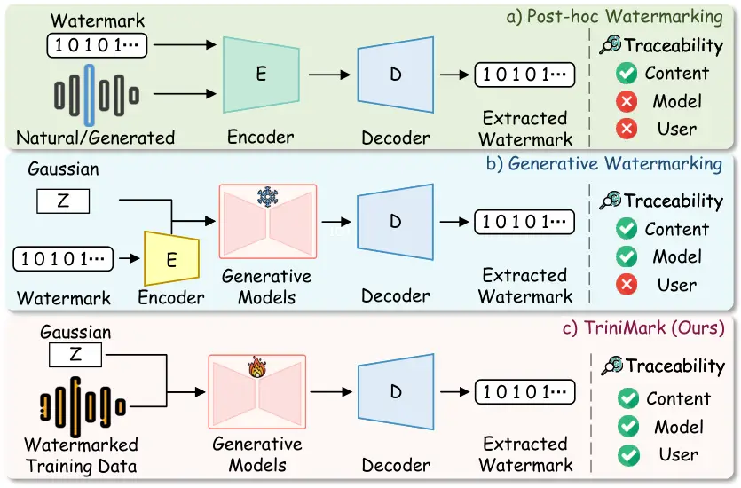
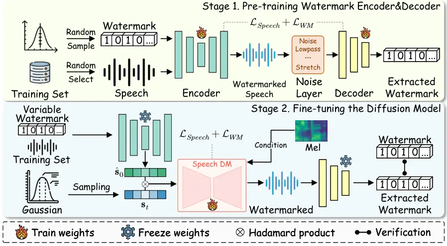
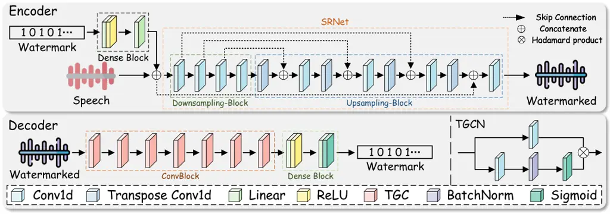

# TriniMark: A Robust Generative Speech Watermarking Method for Trinity-Level Traceability

Conference: Make sure to enter the correct conference title from your
rights confirmation email; June 03–05, 2018; Woodstock, NY

Yue Li Affiliation: Huaqiao University , Weizhi Liu Affiliation: East
China Normal University , Kaiqing Lin Affiliation: Shenzhen University ,
Dongdong Lin Affiliation: Huaqiao University and Kassem Kallas
Affiliation: French National Institute of Health and Medical Research

###### Abstract.

Diffusion-based speech generation has achieved remarkable fidelity,
increasing the risk of misuse and unauthorized redistribution. However,
most existing generative speech watermarking methods are developed for
GAN-based pipelines, and watermarking for diffusion-based speech
generation remains comparatively underexplored. In addition, prior work
often focuses on content-level provenance, while support for model-level
and user-level attribution is less mature. We propose TriniMark, a
diffusion-based generative speech watermarking framework that targets
trinity-level traceability, i.e., the ability to associate a generated
speech sample with (i) the embedded watermark message (content-level
provenance), (ii) the source generative model (model-level attribution),
and (iii) the end user who requested generation (user-level
traceability). TriniMark uses a lightweight encoder to embed watermark
bits into time-domain speech features and reconstruct the waveform, and
a temporal-aware gated convolutional decoder for reliable bit recovery.
We further introduce a waveform-guided fine-tuning strategy to transfer
watermarking capability into a diffusion model. Finally, we incorporate
variable-watermark training so that a single trained model can embed
different watermark messages at inference time, enabling scalable
user-level traceability. Experiments on speech datasets indicate that
TriniMark maintains speech quality while improving robustness to common
single and compound signal-processing attacks, and it supports
high-capacity watermarking for large-scale traceability.

###### Keywords: 

Generative Watermarking, Speech Watermarking, Trinity-level
Traceability, Diffusion Models

## 1. Introduction

Generative speech models have rapidly advanced in recent years, enabling
high-fidelity and natural-sounding synthetic speech that is increasingly
indistinguishable from real recordings. In particular, speech generation
has been driven by two dominant paradigms —vocoder architectures based
on Generative Adversarial Networks (GANs)  (goodfellow2014gan;
kong2020hifigan) and diffusion models (DMs)  (ho2020ddpm;
kong2020diffwave; lee2021priorgrad; chen2020wavegrad;
chen2021wavegrad2)—which make large-scale, low-cost synthesis and
customization practical. While these advances benefit content creation
and human–computer interaction, they also amplify security and societal
risks in the speech domain, including voice impersonation and malicious
forgery, unauthorized redistribution of synthetic speech, and disputes
over the ownership and responsible use of deployed speech generators.
Consequently, there is an urgent need for proactive and verifiable
protection mechanisms that enable reliable traceability for generated
speech and the underlying generative models. Even in large-scale
deployment, suspicious speech should be traceable to the user who
generated it.



Figure 1. The traceability scope of two speech watermarking paradigms
and the proposed method. (a) Post-hoc watermarking embeds watermarks
into speech after generation, focusing on content-level traceability.
(b) Majority of generative watermarking guides the generator to
synthesize watermarked speech, enabling traceability of both the content
and the source model. (c) TriniMark further enables unified three-stage
traceability across the generated speech, the source model, and the end
user.

In response, watermarking is increasingly used as a proactive mechanism
to provide verifiable provenance and traceability across modalities,
with the image domain being the most mature. Broadly, prior image
watermarking methods pursue traceability from two perspectives: (i)
content watermarking, which embeds a verifiable identifier into the
content to support authenticity checks and traceability after
distribution  (zhu2018hidden; tancik2020stegastamp; fernandez2022ssl-wm;
bui2023rosteals; wen2023treeing; yang2024gaussianshading); and (ii)
model watermarking, which embeds an identifiable signature into the
generative model so that its outputs can serve as evidence of model
ownership (yu2021artificial; fernandez2023stable; lin2024cycleganwm;
asnani2024promark; li2021survey; kallas2023mixer; lin2025exploiting).
However, speech watermarking faces unique challenges due to its temporal
structure and diverse channel distortions, making these image-oriented
techniques non-trivial to directly transfer.

Against this backdrop, recent efforts have started to develop
speech-specific watermarking methods tailored to generative speech
systems. These deep-learning-based (DL-based) methods can be broadly
categorized into the paradigms illustrated in Fig. 1. Post-hoc speech
watermarking embeds a watermark into the generated speech after
synthesis, treating the generator as a black box and operating directly
on the output content (chen2023wavmark; roman2024audioseal;
liu2024timebre; tong2024tfsw; li2024draw). In contrast, generative
speech watermarking integrates watermarking into the speech generation
process by injecting the watermark into the generative pipeline, such
that the model synthesizes watermarked speech end-to-end during
inference (cho2022attributable; juvela2024collaborative;
zhou2024traceablespeech; san2024latentwm; cheng2024hifi; feng2025riwf;
liu2024groot).

Despite these advances, both paradigms provide only partial
traceability. Post-hoc speech watermarking operates on the final
waveform and is therefore inherently limited to content-level
traceability: it can indicate whether a speech clip carries a watermark,
but it is generally unable to reliably link the clip back to the source
model or the responsible user under practical deployment. However, even
generative speech watermarking has not yet achieved unified traceability
across the content, model, and user levels. First, several
representative works (cho2022attributable; juvela2024collaborative;
san2024latentwm) follow zero-watermark designs and thus mainly support
model-level identification rather than embedding an explicit message for
different content and scalable multi-user tracing. Second, training-free
schemes have been explored (liu2024groot), yet the watermark is often
fixed after training due to constraints imposed by the training protocol
and the encoder–decoder design, making it difficult to distinguish
speech generated by different users of the same deployed model. Third,
recent attempts to extend traceability to users (cheng2024hifi;
feng2025riwf; zhou2024traceablespeech) are limited by very small
payloads (typically only tens of bits), which restricts scalability to a
large user population. Moreover, these methods are frequently tailored
to specific generators, such as  (cheng2024hifi) targets HifiGAN
model (kong2020hifigan) and (zhou2024traceablespeech) is designed for
VALL-E architecture (wang2023valle), leaving mainstream diffusion-based
speech generation insufficiently covered.

To address these challenges, we propose TriniMark, a diffusion-based
generative speech watermarking method built upon fine-grained feature
transfer, enabling trinity-level traceability across the content, model,
and user levels (Fig. 1). TriniMark adopts a two-stage training
pipeline. In Stage I, we design and pretrain a time-domain-aware
watermark encoder–decoder that supports reliable, high-capacity message
embedding and extraction on speech waveforms, forming a stable
watermarking backbone for subsequent transfer. In Stage II, we fine-tune
the diffusion speech generator with a waveform-guided strategy that
injects watermark capability into the generation process via
fine-grained feature alignment. Specifically, the pretrained encoder is
used to produce watermarked training samples, and the diffusion model is
jointly optimized with the pretrained decoder to balance speech quality
and extraction accuracy. Crucially, variable watermark messages are used
throughout both stages, enabling the deployed generator to assign
distinct watermark sequences to different users during inference and
thus supporting scalable user-level traceability.

In a nutshell, our contribution can be summarized as:

- •
  Trinity-level traceability for generative speech watermarking. We
  propose TriniMark, a diffusion-based generative speech watermarking
  framework that enables unified traceability across the content, model,
  and user levels.
- •
  Temporal-feature-guided two-stage training. We design a two-stage
  training pipeline that transfers a time-domain watermark
  encoder–decoder into a diffusion generator via waveform-guided
  fine-tuning, achieving a favorable quality–robustness–capacity
  trade-off.
- •
  Scalable user-level traceability via variable-watermark training. By
  incorporating variable watermark messages in both training stages,
  TriniMark supports per-user watermark assignment at inference time,
  making user-level accountability feasible at scale.
- •
  Extensive evaluation of quality–robustness–capacity trade-offs.
  Experiments across multiple speech datasets and diffusion backbones
  show that TriniMark preserves perceptual speech quality while
  achieving high bit-recovery accuracy under both individual and
  compound distortions, and delivers high-capacity payloads (500 bps)
  that scale to large user populations.

## 2. Related Work

### 2.1. Post-hoc Speech Watermarking

Post-hoc speech watermarking refers to embedding and extracting an
imperceptible message directly from speech content after it is generated
or obtained, without modifying the upstream generative model. A common
paradigm is to first transform speech into a stable representation
(e.g., frequency spectra or waveform coefficients). and then employ a
learnable embedding–extraction framework (typically an encoder-decoder
architecture) to imprint a watermark that is recoverable under practical
distortions.

Frequency domain methods are among the most widely studied. Leveraging
the fine-grained feature of the short-time Fourier transform (STFT),
Pavlović et al. (pavlovic2022rsw-dnn) pioneered an encoder-decoder
framework for speech watermarking. Building upon this line, O’Reilly et
al. (or2024maskmark) incorporated
Transformer (vaswani2017transformer)-based modeling with a
multiplicative spectrogram mask to embed watermarks more effectively,
while Chen et al. (chen2023wavmark) further improved the performance of
watermarking via invertible neural networks. To counteract voice
cloning, Liu et al. (liu2024timebre) embedded repeated watermarks into
STFT magnitude features. Beyond STFT-based designs, wavelet-domain
watermarking has been explored for stronger robustness against
re-recording. Notably, Liu et al. (liu2023dear) employ the detail
coefficients of Discrete Wavelet Transform (DWT) as the embedding space.
Although frequency domain watermarking is prevalent, there are also
time-domain approaches that directly operate on speech waveforms. Li et
al. (li2025protecting) explored time-domain watermarking to protect
singing voice content, while Roman et al. (roman2024audioseal) focus on
detecting AI-generated speech and localizing watermarks.

Overall, post-hoc methods primarily aim at content-level authentication
of speech, which motivates complementary designs that integrate
watermarking into the generation process for broader traceability.

### 2.2. Generative Speech Watermarking

Generative speech watermarking integrates watermarking into the speech
generation pipeline to synthesize watermarked speech end-to-end,
enabling verifiable traceability for deployed speech generators. This
paradigm is particularly relevant to modern speech generators that are
deployed as shared services. Existing studies can be broadly grouped
into (i) model-level identification, where generated speech carries a
detectable model-specific signature, and (ii) content-level message
embedding, where an explicit payload can be recovered from the generated
speech under practical distortions.

Early efforts mainly target model-level identification rather than
embedding an explicit payload for content-specific or multi-user
tracing. Cho et al. (cho2022attributable) perform attribution by
detecting model-specific signatures in generated speech. Juvela et
al. (juvela2024collaborative) collaboratively train a neural vocoder
with spoofing countermeasure models to improve detectability. San Roman
et al. (san2024latentwm) watermark latent generative models via
watermarking the training data to obtain decoder-robust detectability.
These approaches are effective for model identification, yet they
generally do not focus on embedding a content-dependent message or
supporting scalable multi-user tracing, which limits their applicability
to three-stage traceability.

More recent studies attempt to synthesize watermarked speech directly,
but often face flexibility and scalability constraints. For instance,
GROOT (liu2024groot) generates watermarked speech with a fixed diffusion
backbone and auxiliary encoder/decoder, showing strong robustness
against compound distortions. However, such training-free and
parameter-fixed designs typically rely on a fixed watermark
configuration after deployment, making it difficult to assign distinct
watermark sequences to different users of the same model in practice. In
contrast, HiFi-GANw (cheng2024hifi) fine-tunes a GAN vocoder with an
extraction objective, and Feng et al. (feng2025riwf) incorporate
watermark-related constraints into generator components. Nevertheless,
existing attempts to extend traceability to the user side are frequently
limited by small payloads (often only tens of bits), which fundamentally
restricts scalability to large user populations.

Another practical limitation is that many generative speech watermarking
methods remain architecture-specific, leaving the rapidly growing of
diffusion-based speech generation insufficiently covered. For example,
HiFi-GANw (cheng2024hifi) targets the HiFi-GAN vocoder, whereas
TraceableSpeech (zhou2024traceablespeech) is designed for
VALL-E (wang2023valle) style TTS architectures with frame-wise
imprinting. This leaves a practical open problem: enabling scalable
user-level traceability with sufficiently high payloads while
maintaining robustness and speech quality. Our work is motivated by this
gap and investigates diffusion-based generative speech watermarking
toward this goal.



Figure 2. Overview of TriniMark. TriniMark is trained in two stages: (1)
pretraining a time-domain watermark encoder–decoder (trainable) with a
robustness noise layer for reliable message embedding and extraction;
and (2) waveform-guided fine-tuning of the diffusion vocoder
(trainable), where the pretrained encoder and decoder are frozen to
provide watermark priors and extraction supervision, enabling end-to-end
synthesis of watermarked speech conditioned on mel-spectrograms.
Variable watermark messages are used in both stages to enable per-user
assignment at inference.

## 3. Threat Model

We consider a prompt-driven speech generation service in which a user
prompt is first converted by an upstream front-end (such as an acoustic
model or a large-model-based TTS component) into conditioning features,
and a downstream vocoder synthesizes the time-domain waveform from these
features. In this work, our diffusion-based watermarking method focuses
on the vocoder stage, since it directly produces the distributable
waveform and largely determines perceptual speech quality.

Capabilities and Goals of Users: The user is a legitimate client of the
deployed system. The user can submit prompts and obtain synthesized
speech waveforms, but does not possess privileged access to the model
internals. The user is primarily concerned with speech quality and
utility (e.g., naturalness, fidelity), and may redistribute the
generated waveform, exposing it to downstream processing. In a
shared-service setting, many users access the same vocoder, so
user-level accountability requires assigning distinguishable watermark
messages per user at inference.

Capabilities and Goals of Defenders: The defender represents the model
owner or service provider who deploys the speech generator and aims to
ensure verifiable traceability for generated speech in real-world
distribution. The defender has full control over the watermarking design
and deployment, including the embedding procedure integrated into the
vocoder’s generation process, as well as the extraction and verification
procedures used during audits. Importantly, while the overall system may
include an upstream front-end, our threat model and protection objective
are centered on the vocoder stage, since it produces the final waveform
that is distributed and attacked.

In our deployment, watermark messages are also assigned by the defender
rather than chosen by users. The defender maintains a server-side secret
key $`K`$ and derives a per-user $`l`$-bit message $`\mathbf{w}`$ using
a pseudorandom function, e.g., $`\mathbf{w}=PRF_{K}(u||\tau)`$, where
$`u`$ is the user identifier and $`\tau`$ denotes a key index. The key
$`K`$ is never revealed to users, and verification is performed on the
defender side by extracting $`\hat{\mathbf{w}}`$ from a suspect clip and
matching it against the expected messages (or their hashes) recorded by
the service. Key rotation can be supported by updating $`\tau`$ while
retaining prior versions for auditing within a bounded window.

Knowledge, Access and Goals of Adversaries: The adversary is an external
party who obtains watermarked speech and attempts to undermine
traceability. We focus on a black-box adversary: it has access only to
the final watermarked waveform and may collect multiple examples, but
has no access to the vocoder’s architecture, parameters, intermediate
latents, watermark messages, or the defender’s verification system. The
adversary cannot query gradients or manipulate model weights; its only
capability is to apply post-processing to the waveform. The adversary’s
goal is to weaken or desynchronize the watermark such that verification
fails, while keeping the resulting speech perceptually acceptable. Under
this black-box setting, we consider practical waveform-level
manipulations that may arise in distribution channels or be applied
intentionally: additive noise (e.g., Gaussian noise and pink noise),
filtering (low-/high-pass), suppression, echo, and temporal
modifications (e.g., time stretching and timing dither). We additionally
consider compound attacks that sequentially combine multiple operations,
capturing stronger but realistic watermark removal attempts.

An attack succeeds if it causes the defender’s verifier to reject a
watermarked sample or reduces watermark recovery below a verification
threshold, while maintaining acceptable perceptual quality. Finally, we
clarify that we do not evaluate model-based re-synthesis attacks (e.g.,
passing the watermarked speech through another strong TTS model), which
can substantially re-render the waveform and potentially eliminate
embedded traces. Robust traceability under such re-generation settings
is left for our future work.

## 4. Proposed Method

TriniMark targets generative speech watermarking in a black-box setting
by injecting an explicit, variable watermark message into
diffusion-based waveform synthesis, rather than post-hoc editing the
output speech or watermarking model parameters. Specifically, given a
training speech $`s`$ and an $`l`$-bit message $`\mathbf{w}`$, our goal
is to synthesize a watermarked waveform whose message can still be
reliably recovered after post-processing. As depicted in Fig. 2,
TriniMark adopts a two-stage transfer-learning pipeline: we first
pretrain a lightweight time-domain watermark encoder–decoder to learn
robust, high-capacity watermark priors, and then transfer these priors
into the diffusion vocoder via waveform-guided fine-tuning. Crucially,
variable-watermark training is used in both stages, enabling per-user
message assignment at inference time and thus supporting scalable
user-level traceability. Details of the two stages are provided in the
following sections.

### 4.1. Preliminaries

TriniMark employs DDPM-based vocoders to synthesize watermarked speech.
We briefly review the DDPM formulation for speech generation below.

In the diffusion process of DDPM, given natural speech
$`\mathbf{s}_{0}\sim q_{data}(\mathbf{s}_{0})`$, the latent variable
$`\mathbf{s}_{t}`$ is obtained by adding noise to it step by step, which
follows the standard Gaussian distribution. This process follows a
Markov chain:

```math
q(\mathbf{s}_{t}|\mathbf{s}_{t-1})=\mathcal{N}(\mathbf{s}_{t};\sqrt{1-\beta_{t}}\mathbf{s}_{t-1},\beta_{t}\mathbf{I}), \tag{1}
```

```math
q(\mathbf{s}_{1:T}|\mathbf{s}_{0})=\prod_{t=1}^{T}q(\mathbf{s}_{t}|\mathbf{s}_{t-1}), \tag{2}
```

where $`\beta_{t}\in(0,1)`$ is the variance scheduled at time step
$`t`$, and $`\mathbf{I}`$ is an identity matrix. Let
$`\alpha_{t}=1-\beta_{t}`$,
$`\overline{\alpha}_{t}=\prod_{i=1}^{t}\alpha_{i}`$, and
$`\mathbf{\epsilon}\sim\mathcal{N}(\mathbf{0},\mathbf{I})`$. For any
time step of $`t`$, by re-parameterization, the latent variable
$`\mathbf{s}_{t}`$ can only be calculated from $`\mathbf{s}_{0}`$ and
$`\alpha_{t}`$:

```math
\mathbf{s}_{t}=\sqrt{\overline{\alpha}_{t}}\mathbf{s}_{0}+\sqrt{1-\overline{\alpha}_{t}}\mathbf{\epsilon}. \tag{3}
```

Therefore, the final diffusion process can be simplified to a single
step. It can be represented as:

```math
q(\mathbf{s}_{t}|\mathbf{s}_{0})=\mathcal{N}(\mathbf{s}_{t};\sqrt{\overline{\alpha}_{t}}\mathbf{s}_{0},(1-\overline{\alpha}_{t})\mathbf{I}). \tag{4}
```

The denoising process involves removing the noise from latent variable
$`\mathbf{s}_{t}`$ by employing the prediction network
$`\mathbf{\epsilon}_{\theta}`$ to estimate the noise added during the
diffusion process step by step. This process
$`q(\mathbf{s}_{t-1}|\mathbf{s}_{t},\mathbf{s}_{0})`$ also belongs to
Gaussian distributed so that it can be computed as:

```math
q(\mathbf{s}_{t-1}|\mathbf{s}_{t},\mathbf{s}_{0})=\frac{q(\mathbf{s}_{t}|\mathbf{s}_{t-1})q(\mathbf{s}_{t-1}|\mathbf{s}_{0})}{q(\mathbf{s}_{t}|\mathbf{s}_{0})} \tag{5}
```

According to Bayes’ theorem. Unfolding this equation with Eq. (1) and
combining like terms, we get

```math
q(\mathbf{s}_{t-1}\!|\mathbf{s}_{t}\!)=\!\mathcal{N}\!\big(\mathbf{s}_{t-1}\!;\frac{1\!}{\sqrt{\alpha_{t}}\!}(\mathbf{s}_{t}\!-\!\frac{1-\alpha_{t}\!}{\sqrt{1-\overline{\alpha}_{t}}}\mathbf{\epsilon}),(\frac{1-\overline{\alpha}_{t-1}\!}{1-\overline{\alpha}_{t}\!}\beta_{t}\!)\mathbf{I}). \tag{6}
```

Once the prediction network $`\mathbf{\epsilon}_{\theta}`$ has been well
trained to predict noise $`\epsilon`$, the estimated speech can be
obtained by $`\mathbf{\epsilon}_{\theta}`$:

```math
\mathbf{s}_{t-1}=\frac{1}{\sqrt{\alpha_{t}}}\bigg(\mathbf{s}_{t}-\frac{1-\alpha_{t}}{\sqrt{1-\overline{\alpha}_{t}}}\mathbf{\epsilon}_{\theta}(\mathbf{s}_{t},t,c)\bigg)+\mathbf{\delta}_{t}\mathbf{z}, \tag{7}
```

where $`\delta_{t}\mathbf{z}`$ denotes the random noise,
$`\mathbf{z}\sim\mathcal{N}(\mathbf{0},\mathbf{I})`$, and $`c`$ is the
mel-spectrogram.

The training of the prediction network aims to fit the noise
$`\epsilon`$. Thus, the parameters $`\theta`$ need to be continuously
learned and updated by maximizing the variational lower bound.
Therefore, the final objective function can be simplified as:

```math
\mathcal{L}_{simple}=\mathbb{E}_{t,\mathbf{s}_{0},\epsilon}\big[||\epsilon-\epsilon_{\theta}(\sqrt{{\overline{\alpha}}_{t}}\mathbf{s}_{0}+\sqrt{1-{\overline{\alpha}}_{t}}\epsilon,t)||^{2}\big]. \tag{8}
```



Figure 3. The Detailed Architecture of Watermark Encoder and Decoder.

### 4.2. Pre-training Watermark Encoder and Decoder

#### 4.2.1. Architecture of Watermark Encoder and Decoder

We design a structure-lightweight watermark encoder
$`\mathcal{E}(\cdot)`$ and a decoder $`\mathcal{D}(\cdot)`$ to learn
transferable watermark priors for subsequent diffusion-model
fine-tuning, as illustrated in Fig. 3. The watermark encoder
$`\mathcal{E}(\cdot)`$ consists of a DenseBlock followed by a Speech
Reconstruction Network (SRNet). The DenseBlock maps the binary watermark
into a compact embedding using two fully connected layers with ReLU, and
SRNet injects this embedding into time-domain speech features and
reconstructs the waveform. SRNet adopts a lightweight U-shaped design
with a downsampling block and an upsampling block: the downsampling
block contains four 1D convolutional layers, while the upsampling block
comprises four 1D convolutional layers plus four 1D transposed
convolutional layers. Different from frequency-domain reconstruction
that typically relies on high-dimensional representations, our encoder
operates on time-domain features and thus removes unnecessary activation
and normalization layers to avoid losing low-dimensional information and
to reduce computational overhead, improving both training efficiency and
inference latency, following the lightweight design philosophy in
MobileNetV2 (sandler2018mobilenetv2).

The watermark decoder $`\mathcal{D}(\cdot)`$ comprises a ConvBlock and a
DenseBlock. The ConvBlock stacks seven deliberately designed
Temporal-aware Gated Convolutional Networks (TGCNs), which adapt gated
convolution to temporal patterns by redesigning Gated Convolutional
Networks (dauphin2017gated_cnn). Each TGCN has two branches: a linear 1D
convolutional branch and a gated branch that applies 1D convolution
followed by batch normalization and the Sigmoid function. The outputs of
the two branches are fused via a Hadamard product to selectively pass
watermark-related temporal cues. The resulting features are then
aggregated by the DenseBlock for bit-wise watermark recovery. For
robustness, we introduce a noise layer $`\mathbf{N}(\cdot)`$ that
simulates common post-processing distortions during training.

#### 4.2.2. Pipeline of Pre-training

This stage pretrains the watermark encoder–decoder to learn transferable
watermark priors with both high-fidelity reconstruction and robust bit
recovery. Given a cover speech $`\mathbf{s}\in\mathbb{R}^{\mathbf{n}}`$
($`\mathbf{n}=C\times L`$) and an $`l`$-bit watermark
$`\mathbf{w}\in\{0,1\}^{l}`$ (where $`C`$ represents channels and $`L`$
denotes the length of the speech), the encoder $`\mathcal{E}(\cdot)`$
first maps $`\mathbf{w}`$ into a compact embedding through the
DenseBlock, and then injects it into time-domain speech features via
SRNet to reconstruct the watermarked waveform $`\hat{\mathbf{s}}`$
($`\hat{\mathbf{s}}=\mathcal{E}(\mathbf{s},\mathbf{w})`$). To improve
robustness under real-world distribution, we insert a noise layer
$`\mathbf{N}(\cdot)`$ between the encoder and decoder, so the decoder
$`\mathcal{D}(\cdot)`$ learns to recover the watermark from the attacked
waveform $`\mathbf{N}(\hat{\mathbf{s}})`$ rather than from
$`\hat{\mathbf{s}}`$ itself.

```math
\hat{\mathbf{w}}=\mathcal{D}(\mathbf{N}(\mathcal{E}(\mathbf{s},\mathbf{w}))). \tag{9}
```

A key design in our pre-training is variable-watermark training, which
prevents the encoder–decoder from overfitting to a fixed message and
enables generalization to arbitrary watermarks. Concretely, we assign
one pseudorandom $`l`$-bit watermark sequence per mini-batch and use
that same sequence for all samples within the batch. Across mini-batches
in the same epoch, different batches receive different watermark
sequences. Moreover, at the beginning of each epoch, we regenerate a
fresh pool of watermark sequences and reassign them to mini-batches, so
the training procedure continuously exposes the model to new messages
throughout optimization.

The pre-training objective jointly optimizes watermark recovery accuracy
and speech fidelity. For watermark extraction, we employ binary
cross-entropy (BCE) as a constraint:

```math
\mathcal{L}_{W}=-\sum_{i=1}^{l}w_{i}\log{\hat{w}_{i}}+(1-w_{i})\log(1-\hat{w}_{i}). \tag{10}
```

Regarding the quality of watermarked speech, we first utilize the
mel-spectrogram loss $`\mathcal{L}_{Mel}`$ to constrain the distance
between the cover speech $`\mathbf{s}`$ and the watermarked speech
$`\hat{\mathbf{s}}`$.

```math
\mathcal{L}_{Mel}=\mathbb{E}_{\mathbf{s},\hat{\mathbf{s}}}\big[||\phi(\mathbf{s})-\phi(\hat{\mathbf{s}})||_{1}\big], \tag{11}
```

where $`\phi(\cdot)`$ represents the transformation of mel-spectrograms
and $`||\cdot||`$ denotes the $`L_{1}`$ norm. Furthermore, we employ the
logarithmic STFT magnitude loss $`\mathcal{L}_{Mag}`$ for optimization.

```math
\mathcal{L}_{Mag}=||\log(\mathbf{STFT}(\mathbf{s}))-\log(\mathbf{STFT}(\hat{\mathbf{s}}))||_{1}, \tag{12}
```

where $`\mathbf{STFT}(\cdot)`$ denotes the transformation of STFT
magnitude. The entire loss of pre-training can be defined as:

```math
\mathcal{L}_{Pre}=\gamma_{mel}\mathcal{L}_{Mel}+\gamma_{mag}\mathcal{L}_{Mag}+\gamma_{w}\mathcal{L}_{W}, \tag{13}
```

where $`\gamma_{mel}`$, $`\gamma_{mag}`$, $`\gamma_{w}`$ are trade-off
hyper-parameters for the speech fidelity terms and the watermark
extraction term.

### 4.3. Fine-tuning the Diffusion Models

#### 4.3.1. Fine-tuning Strategy

The standard training objective of diffusion vocoders constrains the
predicted noise $`\epsilon_{\theta}(\cdot)`$ to match the injected noise
$`\epsilon`$ (see Eq. (8)). Directly fine-tuning a diffusion model under
this noise-matching objective, however, is not well aligned with
watermark transfer: the watermark-related constraint tends to converge
slowly, and overly emphasizing noise prediction may also degrade the
vocoder’s generative capability, resulting in reduced speech quality.

To address this issue, we propose a novel waveform-guided fine-tuning
strategy (WGFT). Instead of constraining $`\epsilon_{\theta}(\cdot)`$
and $`\epsilon`$, WGFT constrains the training speech $`\mathbf{s}_{0}`$
and the watermarked speech $`\hat{\mathbf{s}}_{0}^{wm}`$ obtained
through the complete sampling process. This waveform-level guidance
provides a more direct supervision signal for watermark transfer than
noise-level matching, which empirically stabilizes optimization.
Concretely, we guide fine-tuning by minimizing the discrepancy between
the ground-truth speech waveform $`\mathbf{s}_{0}`$ and its
corresponding synthesized watermarked waveform
$`\hat{\mathbf{s}}_{0}^{wm}`$. The rationale is that the pretrained
diffusion vocoder already captures strong priors for noise prediction,
and fine-tuning should focus on transferring watermark-ability while
preserving synthesis fidelity.

Following Section 4.2.2, we define a speech-quality constraint using the
mel-spectrogram loss $`\mathcal{L}_{Mel}`$ and the log STFT magnitude
loss $`\mathcal{L}_{Mag}`$:

```math
\mathcal{L}_{Speech}=\psi_{mel}\mathcal{L}_{Mel}+\psi_{mag}\mathcal{L}_{Mag}, \tag{14}
```

where $`\psi_{mel}`$ and $`\psi_{mag}`$ balance the two terms. For
watermark recovery, we continue to employ the BCE loss in Eq. (10). The
final loss for fine-tuning is defined as:

```math
\mathcal{L}_{FT}=\lambda_{speech}\mathcal{L}_{Speech}+\lambda_{w}\mathcal{L}_{W}, \tag{15}
```

where $`\lambda_{speech}`$ and $`\lambda_{w}`$ are hyper-parameters to
balance the two terms. In this way, WGFT encourages the diffusion
vocoder to generate watermarked speech end-to-end while maintaining a
favorable balance between speech quality and watermark extractability.

Input : Training speech $`\mathcal{D}_{train}`$, mel-spectrogram $`c`$,
pretrained watermark encoder $`\mathcal{E}(\cdot)`$ and decoder
$`\mathcal{D}(\cdot)`$, variable watermark $`\mathbf{w}`$, noise
schedule
$`\{\alpha_{t}\}_{t=1}^{T}\text{and}\{\bar{\alpha}_{t}\}_{t=1}^{T}`$,
and diffusion steps $`T`$.

1 repeat

    2 $`\mathbf{s}_{0}\sim\mathcal{D}_{train}`$;

    3 $`\hat{\mathbf{s}}_{T}^{wm}\sim\mathcal{N}(0,\mathbf{I})`$;

    4 for _$`t\leftarrow T,\dots,1`$_ do

       5 if _$`t>1`$_ then $`\mathbf{z}\sim\mathcal{N}(0,\mathbf{I})`$
else $`\mathbf{z}\leftarrow 0`$;

       6
$`\hat{\mathbf{s}}_{t-1}^{wm}\leftarrow\frac{1}{\sqrt{\alpha_{t}}}\big(\hat{\mathbf{s}}_{t}^{wm}-\frac{1-\alpha_{t}}{\sqrt{1-\overline{\alpha}_{t}}}\mathbf{\epsilon}_{\theta}(\hat{\mathbf{s}}_{t}^{wm},t,c)\big)+\delta_{t}\mathbf{z}`$;

       7 if _$`t=3`$_ then

         // Watermark Embedding

          8
$`\hat{\mathbf{s}}_{0}\leftarrow\mathcal{E}(\mathbf{s}_{0},\mathbf{w})`$
; $`\mathbf{w}\in\{0,1\}^{l}`$

          9
$`\hat{\mathbf{s}}_{t}^{wm}\leftarrow\hat{\mathbf{s}}_{t}^{wm}\odot\hat{\mathbf{s}}_{0}`$
; // $`\odot`$ Hadamard Product

         

       10 end if

    11 end for

    12 return $`\hat{\mathbf{s}}_{0}^{wm}`$;

   // Watermark Extraction

    13
$`\hat{\mathbf{w}}\leftarrow\mathcal{D}(\hat{\mathbf{s}}_{0}^{wm})`$;

    14 Take gradient descent step on:

    15
$`\nabla_{\theta}\bigg(||\phi(\mathbf{s}_{0})-\phi(\hat{\mathbf{s}}_{0}^{wm})||_{1}+||\log(\mathbf{STFT}(\mathbf{s}_{0}))-\log(\mathbf{STFT}(\hat{\mathbf{s}}_{0}^{wm}))||_{1}-\sum_{i=1}^{l}\big(w_{i}\log{\hat{w}_{i}}+(1-w_{i})\log(1-\hat{w}_{i})\big)\bigg)`$;

16 until _converged_;

Algorithm 1 Waveform-Guided Fine-tuning Pipeline.

#### 4.3.2. Pipeline of Waveform-Guided Fine-tuning

We fine-tune a DDPM-based vocoder with WGFT under the standard
conditional diffusion setting, where the model is conditioned on the
mel-spectrogram $`c`$ and trained using speech waveform
$`\mathbf{s}_{0}`$. Given the training speech $`\mathbf{s}_{0}`$ and the
watermark $`\mathbf{w}`$, the pretrained encoder $`\mathcal{E}(\cdot)`$
embeds $`\mathbf{w}`$ into $`\mathbf{s}_{0}`$ to produce a watermarked
target $`\hat{\mathbf{s}}_{0}`$, which is then diffused to obtain the
Gaussian latent $`\mathbf{s}_{t}`$ and is used to train the diffusion
vocoder. The vocoder output $`\hat{\mathbf{s}}_{0}^{wm}`$ is fed into
the pretrained decoder $`\mathcal{D}(\cdot)`$ to recover the watermark
$`\hat{\mathbf{w}}`$, thereby providing waveform-level supervision for
watermark transfer. In addition, we follow the variable-watermark
training in Section 4.2.2 by assigning one pseudorandom message per
mini-batch and refreshing the message pool every epoch. The entire
process of fine-tuning is defined as:

```math
\hat{\mathbf{s}}_{0}^{wm}=\mathcal{G}_{D}(\mathcal{E}(\mathbf{s}_{0},\mathbf{w})), \tag{16}
```

```math
\hat{\mathbf{w}}=\mathcal{D}(\hat{\mathbf{s}}_{0}^{wm})\in\mathbb{R}^{l}, \tag{17}
```

where $`\mathcal{G}_{D}`$ denotes the diffusion vocoder. The overall
procedure of fine-tuning is detailed in Algorithm 1.

### 4.4. Watermark Verification

The detection of the watermark $`\mathbf{w}`$ can be treated as a
rigorous hypothesis test problem (lin2024cycleganwm). On this side, a
verifier makes the decision $`d`$ regarding whether the watermark exists
or not according to a given threshold. In this process, the verifier may
make two types of errors under two hypotheses: the null hypothesis
$`\mathcal{H}_{0}`$ represents the sample/model does not contain the
watermark $`\mathbf{w}`$, and the alternative hypothesis
$`\mathcal{H}_{1}`$ represents the sample/model contains $`\mathbf{w}`$.

The error of FPR can be constrained with a given threshold. The
recovered watermark $`\hat{\mathbf{w}}`$ and the predefined watermark
$`\mathbf{w}`$ are compared bitwise, and the number of matching bits
$`k`$ follows the binomial distribution

```math
\mathbb{P}(K=k)=\binom{l}{k}p^{k}(1-p)^{l-k}, \tag{18}
```

where $`p`$ is the probability. (for example, $`p=0.5`$ under the
hypothesis $`\mathcal{H}_{0}`$). With a given FPR and the length of the
watermark $`l`$, one has a threshold $`th=k`$ by solving the equation
$`\text{FPR}=\mathbb{P}(K)`$. After obtaining the threshold $`th`$, the
verifier can make the decision whether that sample/model contains the
watermark or not, based on bitwise accuracy $`k/l`$, e.g., the
sample/model is watermarked if $`k\geq th`$, or otherwise. Then, given
an FPR, choose the smallest $`th`$ such that
$`\mathbb{P}(K\geq th\mid\mathcal{H}_{0})\leq\mathrm{FPR}`$.

In the hypothesis test, one should also consider the confidence of the
decision made by the verifier. As given in (lin2024cycleganwm), if the
verifier targets a $`\text{FPR}=0.5\%`$ with confidence 95%, 768 test
cases are needed for verification.

## 5. Experimental Analysis

In this section, we validate the proposed TriniMark through
comprehensive experiments on fidelity, capacity, robustness, and compare
it with state-of-the-art (SOTA) methods. All results are reported across
multiple datasets and diffusion vocoders.

### 5.1. Experimental Setup

#### 5.1.1. Datasets and Baseline

We conducted experiments using the LJSpeech (Ito2017ljspeech),
LibriTTS (zen2019libritts), and LibriSpeech (panayotov2015librispeech)
datasets. Concretely, LJSpeech is a single-speaker dataset containing
nearly 24 hours of speech. LibriTTS and LibriSpeech are multi-speaker
datasets containing approximately 585 hours and 1000 hours of data,
respectively. We downsampled the speech in LibriTTS and LibriSpeech to
22.05 kHz. Since LJSpeech is already sampled at 22.05 kHz, no resampling
was performed. To better assess the performance of the proposed method,
we segmented all speech to a length of one second. Furthermore, we
utilize WavMark (chen2023wavmark), AudioSeal (roman2024audioseal),
TimbreWM (liu2024timebre), and Hifi-GANw (cheng2024hifi) as baselines
for comparison.

#### 5.1.2. Evaluation Metrics

We evaluated the performance of our method with different objective
evaluation metrics. Short-Time Objective Intelligibility (STOI)
(taal2010stoi) predicts the intelligibility of speech. The mean opinion
score of listening quality objective assesses speech quality based on
the Perceptual Evaluation of Speech Quality
(PESQ) (recommendation2001mosl). We also conducted evaluation metrics
using Structural Similarity Index Measure (SSIM) (wang2004ssim) and Mel
Cepstral Distortion (MCD) (kubichek1993mcd). SSIM is a metric typically
used for image quality assessment, which has also been adapted to the
mel-spectrogram of speech for evaluation. MCD measures the
reconstruction distortion of speech signals in terms of mel-frequency
cepstral coefficients. Bit-wise accuracy (ACC) is employed to evaluate
the accuracy of watermark extraction.

### 5.2. Implementation Details

#### 5.2.1. Model Settings

1\) Watermark encoder and decoder. In the Encoder, the first Fully
Connected (FC) layer of the DenseBlock receives the watermark length as
input and produces an output dimension of 512. The second FC layer
generates an output dimension corresponding to the length of the speech
signal. The SRNet employs 1D convolutional layers in its downsampling
block, with a kernel size of 3, stride of 2, and padding of 2 for all
layers except the final layer, which utilizes a padding of 1. In the
upsampling block, all 1D convolutional layers maintain a kernel size of
3, stride of 1, and padding of 1. Furthermore, all 1D transposed
convolutional layers have a kernel size of 3, stride of 2, padding of 2,
and output padding of 1, except the first layer, which employs a padding
of 1. Regarding the Decoder, each 1D convolutional layer in the TGCN is
characterized by a kernel size of 3, stride of 2, and padding of 1. The
first FC layer of the DenseBlock receives the feature length extracted
by the ConvBlock as the input dimension, with an output dimension of 512. Meanwhile, the second FC layer produces an output dimension
corresponding to the watermark length. 2) Diffusion model. We evaluate
TriniMark on three representative diffusion vocoders:
DiffWave (kong2020diffwave), PriorGrad (lee2021priorgrad), and
WaveGrad (chen2020wavegrad). DiffWave and WaveGrad are widely used
accelerated-sampling vocoders; in particular, WaveGrad employs a
gradient-based sampler inspired by Langevin dynamics for waveform
synthesis. PriorGrad further improves efficiency by adopting an
adaptive, data-driven prior conditioned on the input features.

#### 5.2.2. Training Settings

1\) Pre-training watermark encoder and decoder. We jointly train the
encoder and decoder using Adam (kingma2014adam) with a learning rate of
2e-4 for 80 epochs and a batch size of 16. We adopt a staged weighting
strategy that first emphasizes watermark extraction by setting
$`\gamma_{w}=1`$, $`\gamma_{mel}=0`$, and $`\gamma_{mag}=0`$. After
$`\mathcal{L}_{W}`$ reaches a preset threshold, we switch on the
speech-fidelity constraints by updating $`\gamma_{mel}=0.9`$ and
$`\gamma_{mag}=0.1`$. 2) Fine-tuning the diffusion models. We fine-tune
the diffusion vocoders using AdamW (loshchilov2018adamw) with a learning
rate of 2e-4 for 20 epochs and a batch size of 2. Similarly, we first
prioritize watermark extraction with $`\lambda_{w}=1`$ and
$`\lambda_{speech}=0`$. And we set $`\lambda_{speech}=1`$ once
$`\mathcal{L}_{W}`$ falls below the threshold. For speech loss
$`\mathcal{L}_{Speech}`$, we use $`\psi_{mel}=0.2`$ and
$`\psi_{mag}=0.8`$ after the threshold is reached. All experiments are
performed on the platform with Intel(R) Xeon Gold 5218R CPU and NVIDIA
GeForce RTX 3090 GPU.

### 5.3. Fidelity and Capacity

#### 5.3.1. Analysis of Fidelity

Fidelity measures how much the speech quality is affected when
watermarking is integrated into the diffusion-based generation pipeline.
Table 1 reports fidelity results under a fixed payload of 100 bps
(watermark length $`l=100`$ for each 1-second clip) using four
speech-fidelity metrics (STOI, PESQ, SSIM, and MCD) across three
diffusion vocoders (DiffWave, PriorGrad, WaveGrad) and three datasets
(LJSpeech, LibriTTS, LibriSpeech). To disentangle where fidelity
degradation comes from, we conduct three pairwise comparisons: i)
Generated$`\leftrightarrow`$Natural, comparing unwatermarked generated
speech with the corresponding clean speech to measure the
generation-induced fidelity gap; ii) Watermarked
$`\leftrightarrow`$Generated, comparing watermarked and unwatermarked
outputs from the same vocoder to quantify the incremental impact of
watermarking; iii) Watermarked$`\leftrightarrow`$Natural, comparing the
final watermarked output with clean speech to reflect the overall gap.

A key observation is that diffusion synthesis itself can introduce a
substantial fidelity gap, especially on multi-speaker data. For example,
with DiffWave on LibriSpeech, the MCD values of
Generated$`\leftrightarrow`$Natural (15.2482) and
Watermarked$`\leftrightarrow`$Natural (15.3361) are highly consistent,
suggesting that most of the overall fidelity gap is attributable to the
diffusion generation process. Meanwhile, the corresponding
Watermarked$`\leftrightarrow`$Generated MCD is only 1.1176, indicating
that enabling watermarking causes only a limited additional change
relative to the unwatermarked generated baseline. A similar pattern is
observed on WaveGrad with LibriSpeech: the MCD for
Generated$`\leftrightarrow`$Natural is 16.2426, and the MCD for
Watermarked$`\leftrightarrow`$Natural is 16.8436, whereas the
Watermarked$`\leftrightarrow`$ Generated comparison yields a much
smaller MCD of 3.0281. Taken together, these results imply that the
observed fidelity degradation is largely attributable to the vocoder
synthesis, while TriniMark introduces a comparatively small incremental
impact.

Accordingly, in the remainder of our experiments, we primarily report
Watermarked$`\leftrightarrow`$Generated as the fidelity indicator, since
it isolates the incremental distortion introduced by watermarking from
the intrinsic synthesis gap of the diffusion vocoder.

|           |                                       |          |             |                                           |          |             |                                         |          |             |
| --------- | ------------------------------------- | -------- | ----------- | ----------------------------------------- | -------- | ----------- | --------------------------------------- | -------- | ----------- |
| DiffWave  | Generated $`\leftrightarrow`$ Natural |          |             | Watermarked $`\leftrightarrow`$ Generated |          |             | Watermarked $`\leftrightarrow`$ Natural |          |             |
|           | LJSpeech                              | LibriTTS | LibriSpeech | LJSpeech                                  | LibriTTS | LibriSpeech | LJSpeech                                | LibriTTS | LibriSpeech |
| STOI↑     | 0.9655                                | 0.9337   | 0.9176      | 0.9621                                    | 0.9386   | 0.9290      | 0.9622                                  | 0.9542   | 0.9416      |
| PESQ↑     | 3.5120                                | 2.8156   | 2.7788      | 3.1335                                    | 2.7773   | 2.6225      | 3.1265                                  | 2.7860   | 2.6265      |
| SSIM↑     | 0.8453                                | 0.8025   | 0.6699      | 0.9174                                    | 0.8945   | 0.8392      | 0.8567                                  | 0.8324   | 0.7205      |
| MCD↓      | 6.2794                                | 6.0407   | 15.2482     | 1.2644                                    | 1.2127   | 1.1176      | 6.0290                                  | 6.0031   | 15.3361     |
| ACC↑      | N/A                                   | N/A      | N/A         | 0.9843                                    | 0.9588   | 0.9806      | 0.9840                                  | 0.9588   | 0.9809      |
| PriorGrad | Generated $`\leftrightarrow`$ Natural |          |             | Watermarked $`\leftrightarrow`$ Generated |          |             | Watermarked $`\leftrightarrow`$ Natural |          |             |
|           | LJSpeech                              | LibriTTS | LibriSpeech | LJSpeech                                  | LibriTTS | LibriSpeech | LJSpeech                                | LibriTTS | LibriSpeech |
| STOI↑     | 0.9722                                | 0.9463   | 0.8970      | 0.9424                                    | 0.9186   | 0.9201      | 0.9585                                  | 0.9421   | 0.9480      |
| PESQ↑     | 3.8875                                | 2.0509   | 1.9728      | 2.1856                                    | 1.7864   | 2.3841      | 2.1928                                  | 1.7870   | 2.3910      |
| SSIM↑     | 0.9032                                | 0.7130   | 0.5642      | 0.9177                                    | 0.8876   | 0.8497      | 0.8943                                  | 0.8652   | 0.7885      |
| MCD↓      | 5.5146                                | 16.4618  | 34.8790     | 2.0892                                    | 2.2353   | 1.9604      | 5.6031                                  | 7.2721   | 12.0343     |
| ACC↑      | N/A                                   | N/A      | N/A         | 0.9811                                    | 0.9981   | 0.9986      | 0.9799                                  | 0.9981   | 0.9987      |
| WaveGrad  | Generated $`\leftrightarrow`$ Natural |          |             | Watermarked $`\leftrightarrow`$ Generated |          |             | Watermarked $`\leftrightarrow`$ Natural |          |             |
|           | LJSpeech                              | LibriTTS | LibriSpeech | LJSpeech                                  | LibriTTS | LibriSpeech | LJSpeech                                | LibriTTS | LibriSpeech |
| STOI↑     | 0.9363                                | 0.8996   | 0.8792      | 0.8978                                    | 0.8677   | 0.8349      | 0.9169                                  | 0.8816   | 0.8598      |
| PESQ↑     | 2.2339                                | 1.7483   | 1.9555      | 2.0913                                    | 1.7754   | 1.8016      | 2.0926                                  | 1.7796   | 1.8021      |
| SSIM↑     | 0.7448                                | 0.7533   | 0.6434      | 0.8426                                    | 0.8058   | 0.7168      | 0.7786                                  | 0.7503   | 0.6287      |
| MCD↓      | 8.6023                                | 5.9581   | 16.2426     | 1.9275                                    | 2.2932   | 3.0281      | 6.4706                                  | 4.7066   | 16.8436     |
| ACC↑      | N/A                                   | N/A      | N/A         | 0.9821                                    | 0.9702   | 0.9316      | 0.9813                                  | 0.9693   | 0.9300      |

Table 1. Fidelity of TriniMark With Various Datasets in Different DMs.
↑/↓ indicates a higher/lower value is more desirable.

Figure 4. Capacity–quality–accuracy Trade-off of TriniMark across Three
Diffusion Vocoders on LJSpeech.

|                                |                |        |        |        |        |        |
| ------------------------------ | -------------- | ------ | ------ | ------ | ------ | ------ |
| Methods                        | Capacity (bps) | STOI↑  | PESQ↑  | SSIM↑  | MCD↓   | ACC↑   |
| AudioSeal (roman2024audioseal) | 16             | 0.9972 | 4.3890 | 0.9866 | 0.0090 | 1.0000 |
| HiFi-GANw (cheng2024hifi)      | 20             | 0.9414 | 2.5862 | 0.9447 | 4.8472 | 0.9893 |
| WavMark (chen2023wavmark)      | 32             | 0.9997 | 4.4625 | 0.9690 | 2.0504 | 1.0000 |
| TimbreWM (liu2024timebre)      | 100            | 0.9853 | 4.0371 | 0.9388 | 3.1715 | 0.9998 |
| TriniMark(DW)                  | 100            | 0.9621 | 3.1335 | 0.9174 | 1.2644 | 0.9843 |
| TriniMark(PG)                  | 100            | 0.9424 | 2.1856 | 0.9177 | 2.0892 | 0.9811 |
| TriniMark(WG)                  | 100            | 0.8978 | 2.0913 | 0.8426 | 1.9275 | 0.9821 |
| TimbreWM (liu2024timebre)      | 500            | 0.9987 | 4.6322 | 0.9990 | 0.9811 | 0.4999 |
| TriniMark(DW)                  | 500            | 0.9412 | 2.1151 | 0.8615 | 1.4438 | 0.8031 |
| TriniMark(PG)                  | 500            | 0.9607 | 2.5963 | 0.8985 | 2.0893 | 0.8863 |
| TriniMark(WG)                  | 500            | 0.9407 | 1.9365 | 0.8270 | 2.1455 | 0.8232 |

Table 2. Fidelity-Capacity Comparison With SOTA Methods. ↑/↓ indicates a
higher/lower value is more desirable.

|           |             |       |                |        |        |        |        |        |        |             |        |         |             |         |
| --------- | ----------- | ----- | -------------- | ------ | ------ | ------ | ------ | ------ | ------ | ----------- | ------ | ------- | ----------- | ------- |
| DMs       | Dataset     |       | Gaussian Noise |        |        |        | PN     | LP     | BP     | Suppression |        | Echo    | Stretch     | Dither  |
|           |             |       | 5 dB           | 10 dB  | 15 dB  | 20 dB  | 0.5    | 3k     | 0.5-8k | front       | behind | default | 2$`\times`$ | default |
|           | LJSpeech    | STOI↑ | 0.8351         | 0.9028 | 0.9491 | 0.9762 | 0.8498 | 0.9997 | 0.8619 | 0.4136      | 0.5442 | 0.7777  | 0.9999      | 1.0000  |
|           |             | PESQ↑ | 3.1257         | 3.1320 | 3.1245 | 3.1270 | 3.1282 | 3.1356 | 3.1326 | 3.1227      | 3.1230 | 3.1347  | 3.1341      | 3.1299  |
|           |             | ACC↑  | 0.6777         | 0.7761 | 0.8777 | 0.9458 | 0.8487 | 0.9335 | 0.9838 | 0.8649      | 0.9527 | 0.9483  | 0.9809      | 0.9829  |
|           | LibriTTS    | STOI↑ | 0.8372         | 0.8943 | 0.9362 | 0.9639 | 0.8205 | 0.9998 | 0.8843 | 0.4146      | 0.5387 | 0.7728  | 0.9999      | 1.0000  |
| DiffWave  |             | PESQ↑ | 2.7822         | 2.7831 | 2.7772 | 2.7837 | 2.7786 | 2.7834 | 2.7757 | 2.7815      | 2.7837 | 2.7792  | 2.7722      | 2.7798  |
|           |             | ACC↑  | 0.6868         | 0.7769 | 0.8637 | 0.9207 | 0.7872 | 0.8954 | 0.9582 | 0.8371      | 0.9027 | 0.9056  | 0.9524      | 0.9589  |
|           | LibriSpeech | STOI↑ | 0.8137         | 0.8635 | 0.9019 | 0.9290 | 0.7864 | 0.9997 | 0.8969 | 0.5336      | 0.4559 | 0.7034  | 0.9999      | 0.9999  |
|           |             | PESQ↑ | 2.6197         | 2.6195 | 2.6139 | 2.6229 | 2.6141 | 2.6221 | 2.6205 | 2.6171      | 2.6191 | 2.6182  | 2.6203      | 2.6206  |
|           |             | ACC↑  | 0.6880         | 0.7769 | 0.8697 | 0.9324 | 0.8201 | 0.8812 | 0.9807 | 0.9655      | 0.8223 | 0.8646  | 0.9747      | 0.9810  |
|           | LJSpeech    | STOI↑ | 0.8638         | 0.9249 | 0.9625 | 0.9832 | 0.9061 | 0.9997 | 0.8615 | 0.4219      | 0.5298 | 0.7525  | 0.9999      | 1.0000  |
|           |             | PESQ↑ | 2.1875         | 2.1861 | 2.1815 | 2.1853 | 2.1884 | 2.1853 | 2.1907 | 2.1912      | 2.1880 | 2.1875  | 2.1902      | 2.1874  |
|           |             | ACC↑  | 0.9142         | 0.9585 | 0.9738 | 0.9788 | 0.8797 | 0.9769 | 0.9694 | 0.9127      | 0.9503 | 0.9347  | 0.9807      | 0.9797  |
|           | LibriTTS    | STOI↑ | 0.8588         | 0.9159 | 0.9540 | 0.9766 | 0.9108 | 0.9987 | 0.8800 | 0.4252      | 0.5247 | 0.7646  | 0.9991      | 0.9998  |
| PriorGrad |             | PESQ↑ | 2.1766         | 2.1756 | 2.1731 | 2.1758 | 1.7879 | 2.1741 | 2.1747 | 2.1773      | 2.1735 | 2.1750  | 2.1757      | 1.7872  |
|           |             | ACC↑  | 0.8738         | 0.9388 | 0.9663 | 0.9753 | 0.9792 | 0.9756 | 0.9783 | 0.8859      | 0.9531 | 0.9487  | 0.9788      | 0.9982  |
|           | LibriSpeech | STOI↑ | 0.8236         | 0.8801 | 0.9224 | 0.9525 | 0.8745 | 0.9998 | 0.8931 | 0.6946      | 0.2175 | 0.5843  | 0.9999      | 1.0000  |
|           |             | PESQ↑ | 2.3829         | 2.3905 | 2.3918 | 2.3903 | 2.3880 | 2.3898 | 2.3891 | 2.3915      | 2.3887 | 2.3916  | 2.3855      | 2.3901  |
|           |             | ACC↑  | 0.7498         | 0.8609 | 0.9453 | 0.9846 | 0.9175 | 0.9966 | 0.9988 | 0.9540      | 0.9972 | 0.9703  | 0.9985      | 0.9987  |
|           | LJSpeech    | STOI↑ | 0.7911         | 0.8722 | 0.9300 | 0.9647 | 0.7995 | 0.8553 | 0.7993 | 0.4059      | 0.5326 | 0.7449  | 0.9967      | 0.9968  |
|           |             | PESQ↑ | 2.0943         | 2.0966 | 2.1026 | 2.0992 | 2.1002 | 2.1003 | 2.0893 | 2.0967      | 2.0970 | 2.0976  | 2.0988      | 2.0969  |
|           |             | ACC↑  | 0.7562         | 0.8593 | 0.9316 | 0.9644 | 0.9163 | 0.8995 | 0.9818 | 0.8718      | 0.9623 | 0.9594  | 0.9805      | 0.9818  |
|           | LibriTTS    | STOI↑ | 0.8174         | 0.8842 | 0.9327 | 0.9629 | 0.7746 | 0.9666 | 0.8328 | 0.4083      | 0.5350 | 0.7684  | 0.9985      | 0.9985  |
| WaveGrad  |             | PESQ↑ | 1.7787         | 1.7724 | 1.7728 | 1.7788 | 1.7733 | 1.7750 | 1.7739 | 1.7749      | 1.7732 | 1.7776  | 1.7810      | 1.7774  |
|           |             | ACC↑  | 0.7889         | 0.8795 | 0.9350 | 0.9587 | 0.8968 | 0.9073 | 0.9698 | 0.8626      | 0.9409 | 0.9375  | 0.9706      | 0.9705  |
|           | LibriSpeech | STOI↑ | 0.7454         | 0.7921 | 0.8330 | 0.8692 | 0.7093 | 0.9847 | 0.8673 | 0.5893      | 0.3262 | 0.5893  | 0.9986      | 0.9986  |
|           |             | PESQ↑ | 1.8076         | 1.8064 | 1.8111 | 1.8064 | 1.8043 | 1.7985 | 1.8034 | 1.8008      | 1.8017 | 1.8057  | 1.8028      | 1.8056  |
|           |             | ACC↑  | 0.7290         | 0.8161 | 0.8771 | 0.9124 | 0.8179 | 0.8523 | 0.9312 | 0.8655      | 0.8292 | 0.8515  | 0.9302      | 0.9326  |

Table 3. Robustness of TriniMark Against Individual Attacks across
Datasets and Diffusion Vocoders.

#### 5.3.2. Capacity for Scalable Traceability

Capacity directly determines the scalability of traceability, especially
for user-level tracing where each user should be assigned a distinct
watermark message. Figure 4 summarizes the capacity–performance
trade-off on three diffusion vocoders by varying the payload from 100 to
500 bps, and reporting speech fidelity (STOI/SSIM) and decoding accuracy
(ACC), all computed between the watermarked speech and its unwatermarked
generated counterpart. As capacity increases, ACC decreases
monotonically, while STOI and SSIM vary more mildly and remain
relatively stable until the highest-capacity regime. In particular, ACC
stays high at 100-300 bps but drops more noticeably at 500 bps; the
degradation is most pronounced on DiffWave (down to 80.31%) and less
severe on PriorGrad (down to 88.63%), with WaveGrad exhibiting a similar
downward trend and becoming more sensitive as capacity approaches 500
bps. Overall, these results suggest that increasing capacity mainly
stresses decodability, whereas the impact on perceived speech quality is
comparatively limited, supporting TriniMark’s scalability for user-level
traceability under practical payload budgets.

However, why high capacity matters for traceability? Our design supports
variable-watermark assignment, enabling different users to receive
different messages during inference. In principle, if each user is
assigned a unique $`l`$-bit binary watermark, the maximum number of
distinct user identities that can be represented is $`2^{l}`$.
Therefore, at $`l=500`$, the raw identifier space is $`2^{500}`$, which
is astronomically large. However, this number should be interpreted as a
theoretical upper bound: in practice, the effective user capacity is
determined by error rates, decision thresholds, and whether
error-correction is applied. High payload also provides two practical
benefits beyond sheer ID space: ❶ Error tolerance via error correcting
code. With a 500-bit budget, even when decoding incurs bit errors, we
can allocate part of the payload to error correcting redundancy to make
user identification robust under distortions. In other words, higher
$`l`$ offers a larger “coding margin” to trade bits for reliability
without collapsing the available user space. ❷ Room for
collusion-resistant fingerprinting. If we further consider user
collusion attacks, a large payload enables embedding anti-collusion
fingerprinting codes (tardos2008optimal) rather than plain random IDs.
Such codes require non-trivial code lengths to support many users under
a given collusion size; thus, the 500-bit regime provides meaningful
headroom to incorporate collusion resistance while still retaining a
large user population.

#### 5.3.3. Comparison of Fidelity and Capacity With SOTA Methods

Table 2 compares TriniMark with representative SOTA speech watermarking
baselines in terms of capacity and fidelity.
AudioSeal (roman2024audioseal), WavMark (chen2023wavmark), and
TimbreWM (liu2024timebre) are post-hoc methods that operate on the final
waveform and therefore mainly support content-level provenance, while
HiFi-GANw (cheng2024hifi) is a generative baseline with variable
watermarking. The key limitation shared by these baselines is that their
payloads (typically 16-32 bps) are too small to support scalable
multi-user or multi-content traceability. To stress-test capacity, we
further evaluate the largest capacity baseline, TimbreWM, at 500 bps. As
shown in Table 2, the ACC of Timbre drops to 0.4999, indicating that it
can no longer provide reliable extraction at this payload. In contrast,
TriniMark remains decodable at 500 bps, with ACC above 80% across all
three diffusion vocoders. This confirms that TriniMark supports
substantially higher payloads.

Regarding fidelity, TriniMark does not always achieve the best PESQ, but
it preserves competitive STOI and SSIM. At 100 bps, TriniMark yields
notably better MCD than most methods except AudioSeal. AudioSeal reports
an extremely low MCD (0.0090), but its payload is only 16 bps. At 500
bps, TriniMark exhibits a predictable fidelity–capacity trade-off. At
the subjective level, we further listen to the generated speech to
assess perceptual quality. At 100 bps, the watermarked speech is
perceptually indistinguishable from its unwatermarked counterpart in
casual listening. When increasing the payload to 500 bps, slight
background noise can be noticed in some samples. Nevertheless, when the
listener is not provided with the original reference and only hears the
generated watermarked speech, such artifacts are generally not perceived
as abrupt or overly distracting.

Datasets DiffWave GN+BP GN+Echo GN+Dither GN+PN PN+BP PN+Echo PN+Dither
LJSpeech STOI↑ 0.8453 0.7555 0.9762 0.8445 0.7853 0.6764 0.8495 PESQ↑
3.1356 3.1254 3.1269 3.1340 3.1264 3.1323 3.1261 ACC↑ 0.9449 0.9071
0.9442 0.8285 0.8524 0.8117 0.8482 LibriTTS STOI↑ 0.8522 0.7477 0.9640
0.8162 0.7612 0.6533 0.8204 PESQ↑ 2.7796 2.7777 2.7846 2.7779 2.7800
2.7804 2.7779 ACC↑ 0.9197 0.8694 0.9207 0.7757 0.7957 0.7542 0.7885
LibriSpeech STOI↑ 0.8354 0.6858 0.9292 0.7826 0.7375 0.6009 0.7867 PESQ↑
2.6161 2.6210 2.6153 2.6218 2.6168 2.6204 2.6173 ACC↑ 0.9324 0.8132
0.9327 0.8023 0.8226 0.7168 0.8197 Datasets PriorGrad GN+BP GN+Echo
GN+Dither GN+PN PN+BP PN+Echo PN+Dither LJSpeech STOI↑ 0.8497 0.7452
0.9830 0.9012 0.8194 0.6968 0.9052 PESQ↑ 2.1873 2.1925 2.1856 2.1896
2.1862 2.1907 2.1892 ACC↑ 0.9670 0.9334 0.9787 0.8796 0.9355 0.8313
0.8820 LibriTTS STOI↑ 0.8616 0.7387 0.9804 0.9030 0.8246 0.8244 0.9099
PESQ↑ 1.7876 1.7858 1.7881 1.7866 1.7866 1.7889 1.7870 ACC↑ 0.9972
0.9856 0.9973 0.9772 0.9806 0.9802 0.9788 LibriSpeech STOI↑ 0.8515
0.5618 0.9525 0.8671 0.8039 0.5372 0.8737 PESQ↑ 2.3959 2.3924 2.3923
2.3881 2.3912 2.3920 2.3907 ACC↑ 0.9850 0.9342 0.9846 0.9011 0.9192
0.8423 0.9171 Datasets WaveGrad GN+BP GN+Echo GN+Dither GN+PN PN+BP
PN+Echo PN+Dither LJSpeech STOI↑ 0.7811 0.7226 0.9646 0.7933 0.7878
0.7207 0.9478 PESQ↑ 2.0871 2.0982 2.0992 2.0995 2.1081 2.1066 2.0970
ACC↑ 0.9665 0.9380 0.9643 0.9035 0.9785 0.9536 0.9786 LibriTTS STOI↑
0.8074 0.7453 0.9631 0.7713 0.6165 0.7728 0.6145 PESQ↑ 1.7768 1.7735
1.7753 1.7776 1.7744 1.7763 1.7747 ACC↑ 0.9586 0.9259 0.9586 0.8886
0.8615 0.8968 0.8599 LibriSpeech STOI↑ 0.7591 0.5579 0.8685 0.7078
0.6527 0.4833 0.7103 PESQ↑ 1.8066 1.8034 1.8038 1.8086 1.7987 1.8081
1.8018 ACC↑ 0.9119 0.8271 0.9104 0.8085 0.8212 0.7430 0.8168

Table 4. Robustness of TriniMark Against Compound Attacks across
Datasets and Diffusion Vocoders

### 5.4. Robustness

#### 5.4.1. Analysis of Robustness Against Individual Attacks

To evaluate robustness under realistic distribution and post-processing,
we consider a suite of individual attacks that can be applied to
released waveforms. These attacks fall into four categories: (i)
additive noise: Gaussian noise (GN) with SNR of 5, 10, 15, and 20 dB,
and pink noise (PN) with a factor of 0.5; (ii) filtering operations:
low-pass filtering (LP) with a threshold of 3 kHz, and band-pass
filtering (BP) with a 0.5-8 kHz threshold; (iii) channel effects:
suppression of front and behind, and echo with default setting in
(roman2024audioseal); (iv) desynchronization: time stretching with an
intensity of 2, and dither with default setting in Torchaudio. Table 3
reports the robustness of TriniMark under the individual attacks
described above, measured by speech fidelity (STOI/PESQ) and watermark
extracting accuracy (ACC), across three datasets and three diffusion
vocoders.

TriniMark exhibits strong robustness under a wide range of individual
attacks, particularly under band-pass filtering, time stretching, and
dithering. In these cases, the watermark extracting accuracy exceeds 95%
in almost all settings. The most challenging cases are strong Gaussian
noise and spectral suppression, because they directly corrupt or remove
watermark-carrying cues and effectively reduce the usable SNR for
reliable bit recovery. Nevertheless, TriniMark remains robust even under
these harsher conditions. For instance, under 5 dB Gaussian noise,
PriorGrad on LJSpeech still achieves an ACC of 91.42%; under spectral
suppression on LJSpeech, WaveGrad attains ACC values of 87.18% (front)
and 96.23% (behind).

Among the three diffusion vocoders presented in Table 3, PriorGrad is
consistently the most robust under strong distortions, particularly
under Gaussian noise. We attribute this advantage to its use of
data-driven statistical priors during denoising, which provides a
stronger inductive bias for recovering clean speech features and thus
more effectively suppresses noise perturbations along the diffusion
trajectory.

|                                |                |        |        |        |        |        |            |        |        |             |        |        |        |        |        |         |        |        |
| ------------------------------ | -------------- | ------ | ------ | ------ | ------ | ------ | ---------- | ------ | ------ | ----------- | ------ | ------ | ------ | ------ | ------ | ------- | ------ | ------ |
|                                | Gaussian Noise |        |        |        |        |        | Pink Noise |        |        | Suppression |        |        |        |        |        | Echo    |        |        |
|                                | 10 dB          |        |        | 20 dB  |        |        | 0.5        |        |        | Front       |        |        | Behind |        |        | Default |        |        |
|                                | STOI↑          | PESQ↑  | ACC↑   | STOI↑  | PESQ↑  | ACC↑   | STOI↑      | PESQ↑  | ACC↑   | STOI↑       | PESQ↑  | ACC↑   | STOI↑  | PESQ↑  | ACC↑   | STOI↑   | PESQ↑  | ACC↑   |
| WavMark (chen2023wavmark)      | 0.8898         | 1.2217 | 0.5214 | 0.9733 | 2.1236 | 0.6523 | 0.8673     | 1.3019 | 0.6924 | 0.4185      | 1.7090 | 0.9797 | 0.5135 | 1.7466 | 0.9713 | 0.6122  | 1.3716 | 0.8668 |
| AudioSeal (roman2024audioseal) | 0.9110         | 1.0995 | 0.6086 | 0.9789 | 1.5987 | 0.6600 | 0.9185     | 1.3537 | 0.6571 | 0.4150      | 1.0916 | 0.7226 | 0.5348 | 1.1661 | 0.8925 | 0.7563  | 1.1845 | 0.7277 |
| TimbreWM (liu2024timebre)      | 0.9136         | 1.3347 | 0.6335 | 0.9812 | 2.7424 | 0.8154 | 0.8473     | 1.3773 | 0.7282 | 0.4135      | 1.8149 | 0.9888 | 0.5331 | 1.8155 | 0.9814 | 0.7559  | 1.4720 | 0.5818 |
| HiFi-GANw (cheng2024hifi)      | 0.9254         | 1.1030 | 0.7957 | 0.9853 | 1.6113 | 0.8208 | 0.8473     | 1.0793 | 0.9588 | 0.4148      | 1.0941 | 0.9508 | 0.5377 | 1.1706 | 0.9717 | 0.9873  | 4.5597 | 0.9829 |
| TriniMark(DW)                  | 0.9028         | 3.1320 | 0.7761 | 0.9762 | 3.1270 | 0.9458 | 0.8498     | 3.1282 | 0.8487 | 0.4136      | 3.1227 | 0.8649 | 0.5442 | 3.1230 | 0.9527 | 0.7777  | 3.1347 | 0.9483 |
| TriniMark(PG)                  | 0.9249         | 2.1861 | 0.9585 | 0.9832 | 2.1853 | 0.9788 | 0.9061     | 2.1884 | 0.8797 | 0.4219      | 2.1912 | 0.9127 | 0.5298 | 2.1880 | 0.9503 | 0.7525  | 2.1875 | 0.9347 |
| TriniMark(WG)                  | 0.8722         | 2.0966 | 0.8593 | 0.9647 | 2.0992 | 0.9644 | 0.7995     | 2.1002 | 0.9163 | 0.4059      | 2.0967 | 0.8718 | 0.5326 | 2.0970 | 0.9623 | 0.7449  | 2.0976 | 0.9594 |

Table 5. Comparison of Robustness Against Individual Attacks with SOTA
Methods. ↑ indicates a higher value is more desirable.  
The best results are marked in bold and the second best results are
underline.

|                                |        |        |        |         |        |        |        |        |        |        |        |        |         |        |        |
| ------------------------------ | ------ | ------ | ------ | ------- | ------ | ------ | ------ | ------ | ------ | ------ | ------ | ------ | ------- | ------ | ------ |
|                                | GN+BP  |        |        | GN+Echo |        |        | GN+PN  |        |        | PN+BP  |        |        | PN+Echo |        |        |
|                                | STOI↑  | PESQ↑  | ACC↑   | STOI↑   | PESQ↑  | ACC↑   | STOI↑  | PESQ↑  | ACC↑   | STOI↑  | PESQ↑  | ACC↑   | STOI↑   | PESQ↑  | ACC↑   |
| WavMark (chen2023wavmark)      | 0.8886 | 1.1139 | 0.6494 | 0.5922  | 1.2798 | 0.5547 | 0.8601 | 1.2292 | 0.5957 | 0.8102 | 1.0785 | 0.6608 | 0.5221  | 1.1868 | 0.5617 |
| AudioSeal (roman2024audioseal) | 0.8447 | 1.5308 | 0.6409 | 0.7400  | 1.1177 | 0.6305 | 0.9118 | 1.2292 | 0.6394 | 0.8292 | 1.7364 | 0.6480 | 0.7099  | 1.0912 | 0.6280 |
| TimbreWM (liu2024timebre)      | 0.7915 | 1.0868 | 0.5961 | 0.6905  | 1.2031 | 0.5935 | 0.8090 | 1.1672 | 0.5907 | 0.7813 | 1.1786 | 0.7049 | 0.6470  | 1.2072 | 0.7675 |
| HiFi-GANw (cheng2024hifi)      | 0.8004 | 1.1068 | 0.7894 | 0.7040  | 1.0539 | 0.8115 | 0.7949 | 1.0387 | 0.7879 | 0.7607 | 1.2386 | 0.9340 | 0.6359  | 1.0438 | 0.9602 |
| TriniMark(DW)                  | 0.8453 | 3.1356 | 0.9449 | 0.7555  | 3.1254 | 0.9071 | 0.8445 | 3.1340 | 0.8285 | 0.7853 | 3.1264 | 0.8524 | 0.6764  | 3.1323 | 0.8117 |
| TriniMark(PG)                  | 0.8497 | 2.1873 | 0.9670 | 0.7452  | 2.1925 | 0.9334 | 0.9012 | 2.1896 | 0.8796 | 0.8194 | 2.1862 | 0.9355 | 0.6968  | 2.1907 | 0.8313 |
| TriniMark(WG)                  | 0.7811 | 2.0871 | 0.9665 | 0.7226  | 2.0982 | 0.9380 | 0.7933 | 2.0995 | 0.9035 | 0.7878 | 2.1081 | 0.9785 | 0.7207  | 2.1066 | 0.9536 |

Table 6. Comparison of Robustness against Compound Attacks with SOTA
Methods.↑ indicates a higher value is more desirable.  
The best results are marked in bold and the second best results are
underline.

Figure 5. Comparison of Robustness under Noise-level Attacks. For
Gaussian and PN+GN, Gaussian noise levels are 5, 10, 15, and 20 dB. As
the noise level decreases, the attack strength increases. For Pink and
GN+PN, noise standard deviations (STD) of pink noise are 0.1, 0.2, 0.3,
and 0.4. As the STD increases, the attack strength increases.

#### 5.4.2. Analysis of Robustness Against Compound Attacks

In real-world distribution, a released waveform may undergo more than
one post-processing operation. Building on the individual attacks in
Section 5.4.1, we therefore evaluate TriniMark under seven compound
attacks formed by combining two distortions from the same attack suite,
including Gaussian-noise-based and pink-noise-based combinations.
Table 4 shows stable robustness of TriniMark across datasets and
diffusion vocoders. The method performs particularly well when noise is
paired with band-pass filtering or dithering. For example, under
Diffwave, the ACC exceeds 93% for GN+BP and GN+Dither on both LJSpeech
and LibriSpeech; under WaveGrad on LJSpeech, GN+BP and PN+Dither attain
ACC values above 96%. This indicates that TriniMark is highly resilient
to such "noise+filtering/dithering" combinations.

The most challenging compound cases typically involve echo or
mixed-noise perturbations (GN+PN). Echo effectively mixes the waveform
with delayed replicas, thereby introducing temporal overlap and
comb-like spectral distortion, while pink noise concentrates
interference in low frequencies, so their combination more strongly
distorts the speech structure and reduces the effective SNR for reliable
watermark extraction. This is most evident on harder multi-speaker data,
for example, on LibriSpeech, DiffWave drops to 0.8132 (GN+Echo) and
0.7168 (PN+Echo), while WaveGrad reaches its lowest ACC at 0.7430
(PN+Echo). Despite these severe conditions, TriniMark still maintains
usable extraction accuracy rather than collapsing. Among the three
vocoders, PriorGrad is the most robust under compound distortions. Its
ACC remains high across most compound settings (e.g., 0.9850 for GN+BP
and 0.9846 for GN+Dither on LibriSpeech), and it is notably more stable
than DiffWave and WaveGrad on the most challenging echo- and
pink-noise-related cases.

#### 5.4.3. Comparison of Robustness With SOTA Methods Against Individual Attacks

We further compare TriniMark with representative SOTA baselines under
individual attacks. Table 5 reports robustness results under Gaussian
noise, pink noise, spectral suppression, and echo. TriniMark achieves
the best robustness under Gaussian noise across the compared methods. In
particular, TriniMark on PriorGrad attains ACC of 0.9585 at 10 dB and
0.9788 at 20 dB, surpassing all baselines at the same settings.
TriniMark also ranks second under both pink noise and echo: while
HiFi-GANw yields the highest ACC, whereas TriniMark follows closely with
91.63% (pink noise) and 95.94% (echo). For spectral suppression,
although TimbreWM remains the strongest, TriniMark stays competitive;
notably, under front suppression, TriniMark achieves 0.8718, about 15%
absolute higher than AudioSeal. These gains stem from TriniMark’s
time-domain watermarking design and training strategy: watermark priors
are embedded into time-domain features and decoded via temporal-gated
convolutions, which supports robust evidence aggregation under waveform
perturbations, while variable-watermark training in both stages together
with WGFT mitigates pattern memorization and aligns diffusion generation
with decodability, improving robustness under distortions.

#### 5.4.4. Comparison of Robustness With SOTA Methods Against Compound Attacks

We also compare TriniMark with SOTA baselines under compound attacks. We
intentionally include harder pairs involving echo and pink noise, which
were already identified as challenging in Section 5.4.2. As summarized
in Table 6, TriniMark consistently remains among the top performers
across the evaluated combinations. It achieves the best (or near-best)
robustness on several representative pairs. For more challenging cases
involving echo or mixed-noise, TriniMark still maintains strong
robustness: under GN+Echo, it achieves an ACC of 93.80%, and under
GN+PN, it achieves 90.35%. In contrast, most baselines under these
settings remain around 60%–70% ACC; given their much smaller payload
capacities, such degraded decoding reliability makes it difficult to
support dependable watermark extraction and, consequently, to
distinguish different contents or scale to user-level tracing in
practice. Fig. 5 further reveals a clear monotonic trend: robustness
improves as Gaussian noise becomes weaker (higher SNR) and degrades as
pink-noise STD increases. Across all noise levels, TriniMark variants
consistently stay above most baselines, indicating stronger resilience
under progressively harsher noise conditions.

## 6. Conclusion

In this paper, we propose a generative speech watermarking based on
fine-grained feature transfer, which establishes a trinity traceability
mechanism that simultaneously authenticates three essential dimensions:
the generative model, the synthesized speech, and the end-user. The
proposed TriniMark consists of two stages of training. In the first
stage, to achieve efficient transfer of watermark generation to the
generative model, a watermark encoder-decoder is designed. Specifically,
to achieve high-precision watermark extraction, we design a
temporal-aware gated convolutional network as the backbone of the
watermark decoder. In the second stage, we further propose a
waveform-guided fine-tuning strategy. This strategy embeds watermarks
into the training data employing the pretrained encoder and jointly
optimizes gradients with the pretrained decoder. At the same time, this
fine-tuning strategy enables TriniMark to adapt to arbitrary watermarks
with only a single round of training. Fidelity and capacity experiments
demonstrate that TriniMark can generate high-quality watermarked speech
even under a high capacity of 500 bps. Robustness experiments further
verify the superior performance of our method compared to existing
approaches when facing both individual and compound attacks.

## References
