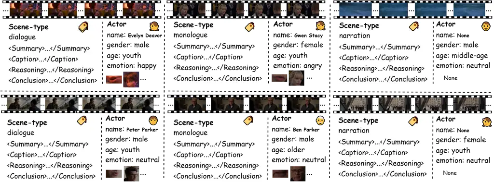
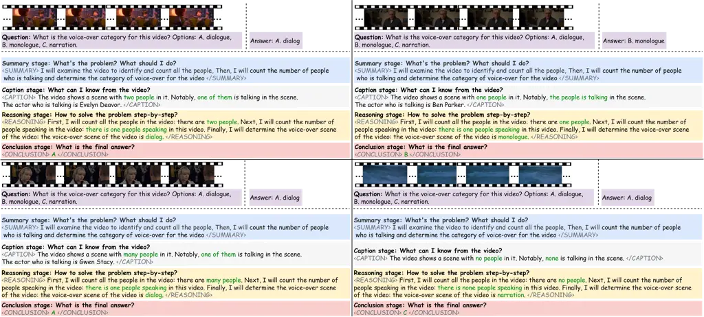
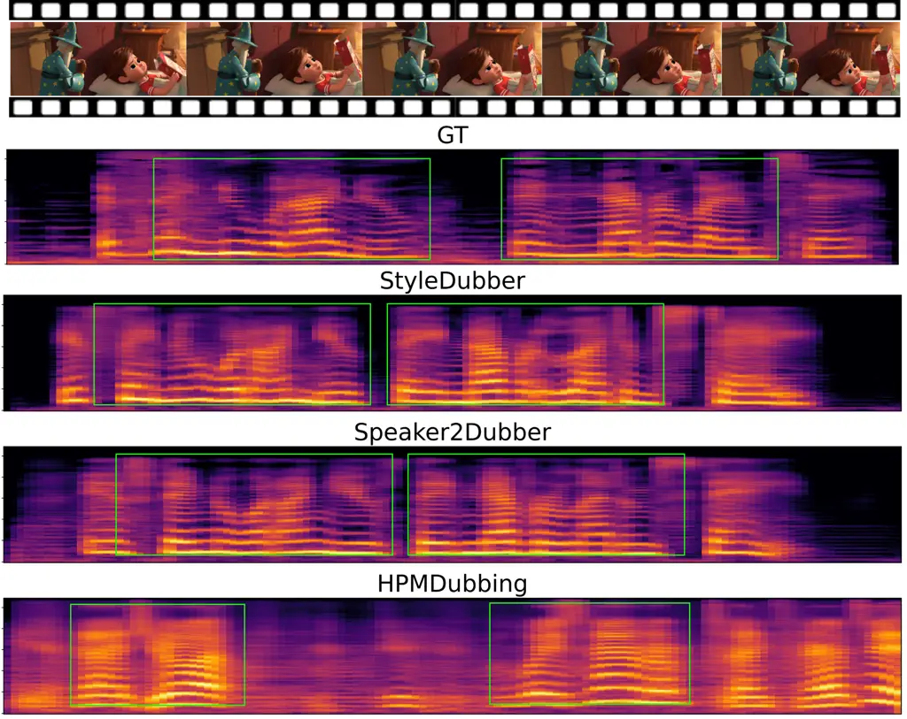

# Towards Film-Making Production Dialogue, Narration, Monologue Adaptive Moving Dubbing Benchmarks

Chaoyi Wang ^(†)^(†)thanks: Equal contribution Affiliation: Shanghai
Institute of Microsystem and Information Technology, CAS, China
Email: <v-taoxi@ztgame.com>    Junjie Zheng¹¹footnotemark: 1
Affiliation: AI Lab, Giant Network, China
Email: <22210700113@m.fudan.edu.cn>    Zihao Chen¹¹footnotemark: 1
Affiliation: AI Lab, Giant Network, China Email: <dixinhan@ztgame.com>
   Shiyu Xia Affiliation: AI Lab, Giant Network, China    Chaofan Ding
Affiliation: AI Lab, Giant Network, China    Xiaohao Zhang
Affiliation: AI Lab, Giant Network, China    Xi Tao Affiliation: AI Lab,
Giant Network, China    Xiaoming He Affiliation: Fudan University,
Chinachaoyiwang@mail.sim.ac.cn, zhengjunjie,chenzihao,xiashiyu,
dingchaofan, zhangxiaohao@ztgame.com,    Xinhan Di ^(†)^(†)thanks:
Corresponding author

###### Abstract

Movie dubbing has advanced significantly, yet assessing the real-world
effectiveness of these models remains challenging. A comprehensive
evaluation benchmark is crucial for two key reasons: 1) Existing metrics
fail to fully capture the complexities of dialogue, narration,
monologue, and actor adaptability in movie dubbing. 2) A practical
evaluation system should offer valuable insights to improve movie
dubbing quality and advancement in film production. To this end, we
introduce Talking Adaptive Dubbing Benchmarks (TA-Dubbing), designed to
improve film production by adapting to dialogue, narration, monologue,
and actors in movie dubbing. TA-Dubbing offers several key
advantages: 1) Comprehensive Dimensions: TA-Dubbing covers a variety of
dimensions of movie dubbing, incorporating metric evaluations for both
movie understanding and speech generation. 2) Versatile Benchmarking:
TA-Dubbing is designed to evaluate state-of-the-art movie dubbing models
and advanced multi-modal large language models. 3) Full Open-Sourcing:
We fully open-source TA-Dubbing at
[https://github.com/woka-0a/DeepDubber-V1](https://github.com/woka-0a/DeepDubber-V1)
including all video suits, evaluation methods, annotations. We also
continuously integrate new movie dubbing models into the TA-Dubbing
leaderboard at
[https://github.com/woka-0a/DeepDubber-V1](https://github.com/woka-0a/DeepDubber-V1)
to drive forward the field of movie dubbing.

## 1 Introduction

Dubbing involves adding the correct human voice to a video’s dialogue,
ensuring synchronization with the character’s lip movements, and
conveying the emotions of the scene. It plays a vital role in film,
television, animation and gaming, enhancing immersion and effectively
conveying emotions and atmosphere. Existing dubbing methods can be
categorized into two groups, both of which focus on learning different
styles of key prior information to generate high-quality voices. The
first group focuses on learning effective speaker style representations
\[4, 13, 32, 7\]. The second group aims to learn appropriate prosody by
utilizing visual information from the given video input \[7, 14, 18,
38\]. the accuracy of these priors is insufficient and inadequate for
movie dubbing in real-world scenarios. For example, adaptive dubbing for
different types, such as dialogue, narration, and monologue, as well as
fine-grained attributes such as expected ages and genders, has not been
thoroughly studied \[10, 14\]. With the rapid advancement of large
language reasoning models with step-by-step thinking ability \[24, 23,
25, 33, 1, 11, 27\] and methods that enhance reasoning capabilities to
interpret visual information through CoT, MLLM have increasingly shown
their potential in multi-modal reasoning and understanding tasks \[26,
12, 5, 17, 3, 21, 19, 29, 39\]. However, Both groups fail to meet the
practical demands of real-world scenes. With the growth of movie dubbing
models, there is an increasing need for effective evaluation frameworks
to support moving dubbing in the film making.

However, existing metrics for movie dubbing such as SPK-SIM, WER, MCD
and MCD-SL \[18, 38\] are insufficient for film production needs.
Because they focus solely on non-adaptive evaluation of speech
generation based on several dubbing settings \[35, 16\]. As in
real-world scenarios, industrial-level movie dubbing, both in film
production and post-production stages, is expected to adapt to various
factors. Two key factors are the adaptability of actors and the
dialogue, narration, and monologue. Therefore, we propose TA-Dubbing, a
comprehensive benchmark suite for evaluating video clip comprehension
and the quality of dubbing adaptable to dialogue, narration, and
monologue, with the goal of producing high-quality speech towards film
production.

Figure 1: Proposed dataset with multi-type annotations, including
annotation for lips, faces, scene-type, actor name, actor gender, actor
age, voice emotion and chain-of-thoughts annotations for dialogue,
narration and monologue.

## 2 Related Work

### 2.1 Visual Voice Cloning

Recent dubbing approaches integrate visual and textual cues to enhance
speech-video alignment and emotional richness \[6, 14, 18\]. Some
methods center on robust speaker identity for multi-speaker scenarios
\[10, 37\], such as injecting pretrained speaker embeddings into phoneme
encoders and mel-spectrogram decoders \[37\]. Others focus on visual
representations to boost prosody, for example, HPMDubbing \[6\] fuses
lip motion, facial expressions, and scene content, while MCDubber \[38\]
extends modeling to adjacent video contexts for smoother transitions.
Despite these advancements, challenges such as the adaptability of
actors and the dialogue, narration, and monologue—two of the most
important factors in film production—are not sufficiently evaluated.

### 2.2 Evaluation of Movie Dubbing Models

Existing movie dubbing models typically use metrics like SPK-SIM, WER,
MCD and MCD-SL \[10, 37, 30\] for the evaluation of the speech
generation. Despite the typical evaluation of generated speech, which
focuses solely on non-adaptive movie dubbing with fixed settings \[36,
9, 8\]. The current evaluation system falls short of meeting the
requirements for assessing movie dubbing in film production. One of the
key challenges in evaluation is the adaptivity of movie dubbing to
actors, dialogue, narration, and monologue. Encouraged via rapid
development of reasoning ability of visual reasoning combines perception
and cognition, evaluated in tasks like VQA \[15\] and visual entailment
\[31\]. Besides, with large language models offering step-by-step
reasoning \[25\], vision-language systems can better interpret visual
scenes \[20\]. We propose TA-Dubbing to evaluate both the comprehension
of movie clips (particularly the recognition of dialogue, narration,
monologue, and actors) and the corresponding assessment of adaptive
movie dubbing. Additionally, we provide corresponding step-by-step
annotations to support adaptive movie dubbing for film production.

Figure 2: The reasoning stages of movie scene type(dialogue, narration,
monologue) CoT annotations.

|                    |           |                                                      |                            |                            |                            |                         |                       |                    |                       |
| ------------------ | --------- | ---------------------------------------------------- | -------------------------- | -------------------------- | -------------------------- | ----------------------- | --------------------- | ------------------ | --------------------- |
| Models Name        |           | Scores on dialogue(A), monologue(B) and narration(c) |                            |                            |                            | Speech Generation       |                       |                    |                       |
|                    |           | Ave.Pre(%) $`\uparrow`$                              | A.Pre(%) $`\uparrow`$      | B.Pre(%) $`\uparrow`$      | C.Pre(%) $`\uparrow`$      |                         |                       |                    |                       |
|                    |           | Ave.Recall(%) $`\uparrow`$                           | A.Recall(%) $`\uparrow`$   | B.Recall(%) $`\uparrow`$   | C.Recall(%) $`\uparrow`$   | SPK-SIM(%) $`\uparrow`$ | WER(%) $`\downarrow`$ | MCD $`\downarrow`$ | MCD-SL $`\downarrow`$ |
|                    |           | Ave.F1-Score(%) $`\uparrow`$                         | A.F1-Score(%) $`\uparrow`$ | B.F1-Score(%) $`\uparrow`$ | C.F1-Score(%) $`\uparrow`$ |                         |                       |                    |                       |
|                    |           | 100.00                                               | 100.00                     | 100.00                     | 100.00                     |                         |                       |                    |                       |
| GT                 |           | 100.00                                               | 100.00                     | 100.00                     | 100.00                     | 100.00                  | 17.38                 | 0.00               | 0.00                  |
|                    |           | 100.00                                               | 100.00                     | 100.00                     | 100.00                     |                         |                       |                    |                       |
| MLLMs based        |           |                                                      |                            |                            |                            |                         |                       |                    |                       |
|                    |           | 59.66                                                | 88.06                      | 54.55                      | 36.36                      |                         |                       |                    |                       |
|                    | Zero-shot | 12.8                                                 | 26.22                      | 6.38                       | 5.80                       | \-                      | \-                    | \-                 | \-                    |
| GPT-4o \[22\]      |           | 20.61                                                | 40.41                      | 11.43                      | 10.00                      |                         |                       |                    |                       |
|                    |           | 68.66                                                | 84.71                      | 77.78                      | 43.48                      |                         |                       |                    |                       |
| Finetune           | 64.59     | 91.11                                                | 44.68                      | 57.97                      | \-                         | \-                      | \-                    | \-                 |                       |
|                    |           | 64.74                                                | 87.79                      | 56.76                      | 49.69                      |                         |                       |                    |                       |
| Dubbing Models     |           |                                                      |                            |                            |                            |                         |                       |                    |                       |
| HPMDubbing \[6\]   |           | \-                                                   | \-                         | \-                         | \-                         | 61.06                   | 199.40                | 8.82               | 11.88                 |
| Speaker2Dub \[37\] |           | \-                                                   | \-                         | \-                         | \-                         | 61.73                   | 84.42                 | 8.75               | 10.78                 |
| StyleDubber \[10\] |           | \-                                                   | \-                         | \-                         | \-                         | 64.03                   | 52.69                 | 8.62               | 8.89                  |

Table 1: Towards Adaptive(Dialogue, Narration, Monologue) Moving Dubbing
Evaluation Results Per Dimension For speech generation setting, we use
the target speaker’s speech as voice prompt if the predict scene type is
correct and use random speaker’s speech as voice prompt if the predict
scene type is not correct.

## 3 Benchmark Suite

### 3.1 Movie Dubbing Dataset Suite

We have created a $`200`$ multimodal CoT movie dubbing dataset to
generate adaptive and high-quality movie dubbing. This dataset contains
$`140k`$ video clips. Based on CoT reasoning and CoT-like guidance
\[34\], we utilize a professional annotation team to label the following
dataset. We develop a CoT reasoning framework to guide subsequent movie
dubbing tasks, as illustrated in Figures 1 and 2. Specifically, a
step-by-step instruction process with video input is designed to enable
efficient and accurate movie scene type recognition(dialogue, narration,
monologue). As shown in Figure 2, \<SUMMARY\>\</SUMMARY\> provides a
high-level overview of the entire scene, while \<CAPTION\>\</CAPTION\>
describes the characters in the video. During the
\<REASONING\>\</REASONING\> stage, the reasoning process is divided into
five steps:

- •
  Step 1. Count the numbers of people in the video.
- •
  Step 2. Distinguish whether the people in the video are talking or
  not.
- •
  Step 3. Recognize the faces of the actors.
- •
  Step 4. Distinguish whether the movie contains dialogue, narration, or
  monologue.
- •
  Step 5. Conclusion and give the answer.

And then \<CONCLUSION\>\</CONCLUSION\> stage give the final answer. Each
stage is initiated at the model’s discretion, without external prompt
engineering frameworks or additional prompting. Specifically, we provide
the model with four pairs of special tags, these tags correspond to
summarizing the response approach, describing relevant image content,
conducting reasoning, and preparing a final answer, respectively. The
proposed dataset consists of $`130k`$ video clips for training and
$`10k`$ video clips for testing.

### 3.2 Evaluation Metrics Suite

To comprehensively assess the performance of our system, we report a set
of recognition and speech quality metrics. The recognition performance
is measured through Precision, Recall, and F1 Score, both as overall
averages and on a per-class basis. In addition, the generated speech
quality is evaluated by assessing speaker similarity and acoustic
fidelity.

#### 1. Dialogue, Narration, Monologue Recognition Evaluation Metrics

For evaluating the classification performance, we compute the following
metrics:

- •
  Precision:In our evaluation, we report overall Precision (Ave.Pre) as
  well as the accuracy for each individual category(Dialogue, Narration,
  Monologue) (A.Pre, B.Pre, C.Pre) to better understand both the general
  performance and the class-specific behavior of the model.
- •
  Recall: We report both an overall recall (Ave.Recall) and the recall
  for each class (A.Recall, B.Recall, C.Recall), which helps assess the
  performance across different categories.
- •
  F1 Score:We present the overall F1 Score (Ave.F1-Score) along with the
  F1 Score for each class (A.F1-Score, B.F1-Score, C.F1-Score) to offer
  a comprehensive view of the classifier’s performance.

#### 2. Speech Quality Evaluation Metrics

To evaluate the quality of the generated speech, we utilize the
following metrics:

- •
  Speaker Similarity (SPK-SIM): Uses a pre-trained speaker encoder to
  compute the cosine similarity between the generated speech and a
  reference speech sample. Higher percentages indicate greater timbre
  consistency \[10\].
- •
  Word Error Rate (WER): Computed by transcribing the generated speech
  using Whisper-V3 and comparing it to the reference text. A lower WER
  signifies higher pronunciation accuracy \[28\].
- •
  Mel Cepstral Distortion (MCD) and MCD-SL: MCD measures the spectral
  differences between the generated and reference speech using Dynamic
  Time Warping (DTW), while MCD-SL further incorporates differences in
  speech duration. Lower values indicate a closer match in spectral
  characteristics and temporal alignment \[2\].

#### 3. Actor Recognition Evaluation Metrics

To evaluate the quality of the actor recognition, similarly, we utilize
evaluation metrics: precision, recall and f1 score.

- •
  Precision: The accuracy for the attribute(the name, the gender, the
  age, the emotion) of the actor are calculated and the average
  precision is calculated.
- •
  Recall: The recall for the attribute(the name, the gender, the age,
  the emotion) of the actor are calculated and the average recall is
  calculated.
- •
  F1 Score: The f1 score for the attribute(the name, the gender, the
  age, the emotion) of the actor are calculated and the average fa score
  is calculated.

The expected performance direction is indicated: higher percentages for
Precision, Recall, F1-Score and SPK-SIM denote better performance,
whereas lower percentages for WER, MCD, and MCD-SL denote improved
results.

## 4 Experiments

We initially evaluate both the state-of-the-art movie dubbing models for
the evaluation of speech generation and the understanding of movie on
the recognition of dialogue, narration, monologue, actor which both
driving forward film-making production towards adaptive actors and
dialogue, narration and monologue.

Dialogue, Narration, Monologue Evaluation. We initially conduct
evaluation on the recognition of dialogue, narration and monologue for
GPT4o\[22\]. The average Precision is $`68.66\%`$, the precision of
dialogue, narration and monologue is $`84.71\%`$, $`77.78\%`$ and
$`43.48\%`$. Similar evaluation is demonstrated in Table 1.

Speech Generation Evaluation. We initially conduct evaluation on the
quality of speech. Particularly, the $`SPK-SIM`$ is from $`61.06`$ to
$`64.03`$, the $`WER`$ is from $`52.69`$ to $`199.40`$, the $`MCD`$ is
from $`8.62`$ to $`8.82`$, the MCD-SL is from $`8.89`$ to $`11.88`$ for
a variety of state-of-the-art movie dubbing models \[6, 37, 10\].

Actor Attribute Evaluation. To be noted, according to our initial
experiments, the performance of GPT4o\[22\] for the recognition
(precision, recall and f1 score) is low. We will conduct experiments on
other state-of-the-art multi-modal large language models.

Figure 3: Visualization of generated movie dubbing samples via
state-of-the-art models. The green rectangles highlight key regions that
have significant differences in overall expressiveness.

## 5 Discussion

With the ongoing development of movie dubbing, a comprehensive
evaluation of these models is essential to assess current advancements
and support movie dubbing in film production. In this work, We take the
first step forward by proposing TA-Dubbing, a comprehensive benchmark
suite for evaluating movie dubbing models, focusing on two adaptive
factors: dialogue, narration, monologue, and actors.

## References

- \[1\] Anthropic. Claude 3.7, 2025.
- \[2\] Eric Battenberg, RJ Skerry-Ryan, Soroosh Mariooryad, Daisy
  Stanton, David Kao, Matt Shannon, and Tom Bagby. Location-relative
  attention mechanisms for robust long-form speech synthesis, 2020.
- \[3\] Mirco Bonomo and Simone Bianco. Visual rag: Expanding mllm
  visual knowledge without fine-tuning, 2025.
- \[4\] Qi Chen, Mingkui Tan, Yuankai Qi, Jiaqiu Zhou, Yuanqing Li, and
  Qi Wu. V2c: Visual voice cloning. In _Proceedings of the IEEE/CVF
  Conference on Computer Vision and Pattern Recognition_, pages
  21242–21251, 2022.
- \[5\] Zesen Cheng, Sicong Leng, Hang Zhang, Yifei Xin, Xin Li,
  Guanzheng Chen, Yongxin Zhu, Wenqi Zhang, Ziyang Luo, Deli Zhao, and
  Lidong Bing. Videollama 2: Advancing spatial-temporal modeling and
  audio understanding in video-llms, 2024.
- \[6\] Gaoxiang Cong, Liang Li, Yuankai Qi, Zhengjun Zha, Qi Wu, Wenyu
  Wang, Bin Jiang, Ming-Hsuan Yang, and Qingming Huang. Learning to dub
  movies via hierarchical prosody models, 2023a.
- \[7\] Gaoxiang Cong, Liang Li, Yuankai Qi, Zheng-Jun Zha, Qi Wu, Wenyu
  Wang, Bin Jiang, Ming-Hsuan Yang, and Qingming Huang. Learning to dub
  movies via hierarchical prosody models. In _Proceedings of the
  IEEE/CVF Conference on Computer Vision and Pattern Recognition_, pages
  14687–14697, 2023b.
- \[8\] Gaoxiang Cong, Jiadong Pan, Liang Li, Yuankai Qi, Yuxin Peng,
  Anton van den Hengel, Jian Yang, and Qingming Huang. Emodubber:
  Towards high quality and emotion controllable movie dubbing, 2024a.
- \[9\] Gaoxiang Cong, Yuankai Qi, Liang Li, Amin Beheshti, Zhedong
  Zhang, Anton Hengel, Ming-Hsuan Yang, Chenggang Yan, and Qingming
  Huang. Styledubber: Towards multi-scale style learning for movie
  dubbing. In _Findings of the Association for Computational
  Linguistics: ACL 2024_, pages 6767–6779, Bangkok, Thailand, 2024b.
  Association for Computational Linguistics.
- \[10\] Gaoxiang Cong, Yuankai Qi, Liang Li, Amin Beheshti, Zhedong
  Zhang, Anton van den Hengel, Ming-Hsuan Yang, Chenggang Yan, and
  Qingming Huang. Styledubber: Towards multi-scale style learning for
  movie dubbing, 2024c.
- \[11\] DeepSeek-AI and Daya Guo et.al. Deepseek-r1: Incentivizing
  reasoning capability in llms via reinforcement learning, 2025.
- \[12\] Yuhao Dong, Zuyan Liu, Hai-Long Sun, Jingkang Yang, Winston Hu,
  Yongming Rao, and Ziwei Liu. Insight-v: Exploring long-chain visual
  reasoning with multimodal large language models, 2024.
- \[13\] Michael Hassid, Michelle Tadmor Ramanovich, Brendan
  Shillingford, Miaosen Wang, Ye Jia, and Tal Remez. More than words:
  In-the-wild visually-driven prosody for text-to-speech. In
  _Proceedings of the IEEE/CVF Conference on Computer Vision and Pattern
  Recognition_, pages 10587–10597, 2022.
- \[14\] Chenxu Hu, Qiao Tian, Tingle Li, Wang Yuping, Yuxuan Wang, and
  Hang Zhao. Neural dubber: Dubbing for videos according to scripts.
  _Advances in neural information processing systems_,
  34:16582–16595, 2021.
- \[15\] Md. Farhan Ishmam, Md. Sakib Hossain Shovon, M.F. Mridha, and
  Nilanjan Dey. From image to language: A critical analysis of visual
  question answering (vqa) approaches, challenges, and opportunities.
  _Inf. Fusion_, 106(C), 2024.
- \[16\] Youngjoon Jang, Ji-Hoon Kim, Junseok Ahn, Doyeop Kwak, Hong-Sun
  Yang, Yoon-Cheol Ju, Il-Hwan Kim, Byeong-Yeol Kim, and Joon Son Chung.
  Faces that speak: Jointly synthesising talking face and speech from
  text, 2024.
- \[17\] Kangsan Kim, Geon Park, Youngwan Lee, Woongyeong Yeo, and
  Sung Ju Hwang. Videoicl: Confidence-based iterative in-context
  learning for out-of-distribution video understanding, 2024.
- \[18\] Jiyoung Lee, Joon Son Chung, and Soo-Whan Chung. Imaginary
  voice: Face-styled diffusion model for text-to-speech. In _ICASSP
  2023-2023 IEEE International Conference on Acoustics, Speech and
  Signal Processing (ICASSP)_, pages 1–5. IEEE, 2023.
- \[19\] Chengzu Li, Wenshan Wu, Huanyu Zhang, Yan Xia, Shaoguang Mao,
  Li Dong, Ivan Vulić, and Furu Wei. Imagine while reasoning in space:
  Multimodal visualization-of-thought, 2025.
- \[20\] Haotian Liu, Chunyuan Li, Qingyang Wu, and Yong Jae Lee. Visual
  instruction tuning. In _Thirty-seventh Conference on Neural
  Information Processing Systems_, 2023.
- \[21\] Jingming Liu, Yumeng Li, Boyuan Xiao, Yichang Jian, Ziang Qin,
  Tianjia Shao, Yao-Xiang Ding, and Kun Zhou. Enhancing visual reasoning
  with autonomous imagination in multimodal large language models, 2024.
- \[22\] OpenAI. Openai gpt-4o, 2024a.
- \[23\] OpenAI. Openai o1, 2024b.
- \[24\] OpenAI. Openai o1-min, 2024c.
- \[25\] OpenAI. Openai o3 mini, 2025.
- \[26\] Abhirama Subramanyam Penamakuri, Kiran Chhatre, and Akshat
  Jain. Audiopedia: Audio qa with knowledge, 2024.
- \[27\] QwenLM. Qwq-32b, 2025.
- \[28\] Alec Radford, Jong Wook Kim, Tao Xu, Greg Brockman, Christine
  McLeavey, and Ilya Sutskever. Robust speech recognition via
  large-scale weak supervision, 2022.
- \[29\] Zahraa Al Sahili, Ioannis Patras, and Matthew Purver. Faircot:
  Enhancing fairness in diffusion models via chain of thought reasoning
  of multimodal language models, 2024.
- \[30\] Neha Sahipjohn, Ashishkumar Gudmalwar, Nirmesh Shah, Pankaj
  Wasnik, and Rajiv Ratn Shah. Dubwise: Video-guided speech duration
  control in multimodal llm-based text-to-speech for dubbing, 2024.
- \[31\] Haoyu Song, Li Dong, Weinan Zhang, Ting Liu, and Furu Wei. Clip
  models are few-shot learners: Empirical studies on vqa and visual
  entailment. In _Annual Meeting of the Association for Computational
  Linguistics_, 2022.
- \[32\] Li Wan, Quan Wang, Alan Papir, and Ignacio Lopez Moreno.
  Generalized end-to-end loss for speaker verification. In _2018 IEEE
  International Conference on Acoustics, Speech and Signal Processing
  (ICASSP)_, pages 4879–4883. IEEE, 2018.
- \[33\] xAI. grok-3, 2025.
- \[34\] Guowei Xu, Peng Jin, Hao Li, Yibing Song, Lichao Sun, and Li
  Yuan. Llava-cot: Let vision language models reason step-by-step, 2025.
- \[35\] Yochai Yemini, Aviv Shamsian, Lior Bracha, Sharon Gannot, and
  Ethan Fetaya. Lipvoicer: Generating speech from silent videos guided
  by lip reading, 2024.
- \[36\] Zhedong Zhang, Liang Li, Gaoxiang Cong, Haibing Yin, Yuhan Gao,
  Chenggang Yan, Anton Van Den Hengel, and Yuankai Qi. From speaker to
  dubber: Movie dubbing with prosody and duration consistency learning.
  In _Proceedings of the 32nd ACM International Conference on
  Multimedia_, pages 7523–7532, Melbourne VIC Australia, 2024a. ACM.
- \[37\] Zhedong Zhang, Liang Li, Gaoxiang Cong, Haibing YIN, Yuhan Gao,
  Chenggang Yan, Anton van den Hengel, and Yuankai Qi. From speaker to
  dubber: Movie dubbing with prosody and duration consistency learning.
  In _ACM Multimedia 2024_, 2024b.
- \[38\] Yuan Zhao, Zhenqi Jia, Rui Liu, De Hu, Feilong Bao, and
  Guanglai Gao. Mcdubber: Multimodal context-aware expressive video
  dubbing. In _National Conference on Man-Machine Speech Communication_,
  pages 168–182. Springer, 2024.
- \[39\] Haojie Zheng, Tianyang Xu, Hanchi Sun, Shu Pu, Ruoxi Chen, and
  Lichao Sun. Thinking before looking: Improving multimodal llm
  reasoning via mitigating visual hallucination, 2024.
