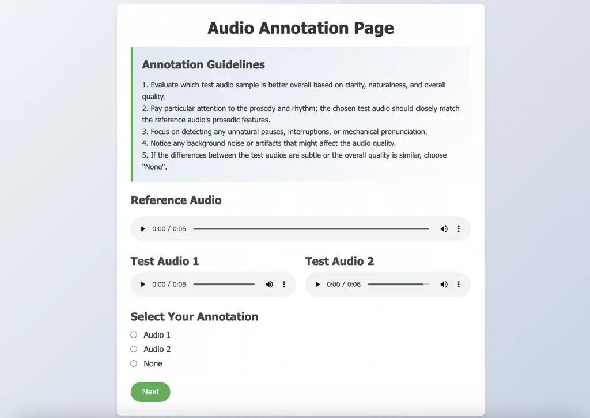

# FlexSpeech: Towards Stable, Controllable and Expressive Text-to-Speech

DOI: [XXXXXXX.XXXXXXX](https://doi.org/XXXXXXX.XXXXXXX)Conference: Make
sure to enter the correct conference title from your rights confirmation
email; June 27–31, 2025; Dublin, IrelandISBN: 978-1-4503-XXXX-X/2018/06

Linhan Ma Note: Both authors contributed equally to this research.
email: <mlh2023@mail.nwpu.edu.cn> Affiliation: Northwestern
Polytechnical University , Dake Guo email: <guodake@mail.nwpu.edu.cn>
Affiliation: Northwestern Polytechnical University , He Wang email:
<hwang2001@mail.nwpu.edu.cn> Affiliation: Northwestern Polytechnical
University , Jin Xu Note: Corresponding Authors.
Affiliation: Independent Researcher and Lei Xie email:
<lxie@nwpu.edu.cn> Affiliation: Northwestern Polytechnical University

2025

###### Abstract.

Current speech generation research can be categorized into two primary
classes: non-autoregressive (NAR) and autoregressive (AR). The
fundamental distinction between these approaches lies in the duration
prediction strategy employed for predictable-length sequences. The NAR
methods ensure stability in speech generation by explicitly and
independently modeling the duration of each phonetic unit. Conversely,
AR methods employ an autoregressive paradigm to predict the compressed
speech token by implicitly modeling duration with Markov properties.
Although this approach improves prosody, it does not provide the
structural guarantees necessary for stability. To simultaneously address
the issues of stability and naturalness in speech generation, we propose
FlexSpeech ¹¹ 1 FlexSpeech means our TTS system is flexible and
controllable in speech geeneration and can effortlessly transfer
specific style to unseen speakers using a very small amount of data., a
stable, controllable, and expressive TTS model. The motivation behind
FlexSpeech is to incorporate Markov dependencies and preference
optimization directly on the duration predictor to boost its naturalness
while maintaining explicit modeling of the phonetic units to ensure
stability. Specifically, we decompose the speech generation task into
two components: an AR duration predictor and a NAR acoustic model. The
acoustic model is trained on a substantial amount of data to learn to
render audio more stably, given reference audio prosody and phone
durations. The duration predictor is optimized in a lightweight manner
for different stylistic variations, thereby enabling rapid style
transfer while maintaining a decoupled relationship with the specified
speaker timbre. Experimental results demonstrate that our approach
achieves SOTA stability and naturalness in zero-shot TTS. More
importantly, when transferring to a specific stylistic domain, we can
accomplish lightweight optimization of the duration module solely with
about 100 data samples, without the need to adjust the acoustic model,
thereby enabling rapid and stable style transfer. Audio samples can be
found in our demo page ²² 2
[https://flexspeech.github.io/DEMO/](https://flexspeech.github.io/DEMO/).

###### Keywords: 

Style transfer, zero-shot text-to-speech, flow-matching, direct
preference optimization

## 1. Introduction

The progression of neural text-to-speech (TTS) systems has been
propelled by alternating advancements in autoregressive and
non-autoregressive speech generation methodologies, resulting in a
spiral evolution within the field. Early works, such as Tacotron (Wang
et al., 2017; Shen et al., 2018) and FastSpeech (Ren et al., 2019; Ren
et al., 2021), have achieved state-of-the-art (SOTA) performance,
alternating between naturalness and stability. As general artificial
intelligence (AGI) technologies continue to advance rapidly, the
standards for speech generation models increasingly target the
attainment of human-level naturalness. Recently, discrete speech
representation codecs (Zeghidour et al., 2022; Défossez et al., 2023;
Yang et al., 2023a; Zhang et al., 2024b; Kumar et al., 2023; Mentzer
et al., 2024) have gained prominence in the field. This line of research
involves training a codec to identify appropriate discrete speech
compression units, which are then modeled in an end-to-end
autoregressive manner. By implicitly modeling the Markov dependencies
among various phonetic units, the naturalness of the generated speech
has significantly improved, achieving a level that is comparable to
human performance.

Despite the impressive results achieved with end-to-end codec modeling
based on autoregressive (AR) models (Lajszczak et al., 2024; Wang
et al., 2023; Chen et al., 2024b; Anastassiou et al., 2024; Betker,
2023), these approaches continue to suffer from instability due to a
lack of architectural guarantees. For instance, when generating audio
from complex, long sentences, existing AR models are prone to issues
such as repetition and word omission. Additionally, AR models are
inherently susceptible to cascading generation failures when confronted
with unknown tokens and their combinations. In contrast, some
non-autoregressive (NAR) models (Shen et al., 2024; Ju et al., 2024; Ye
et al., 2024; Jiang et al., 2024), ensure system stability by explicitly
modeling the duration of phonetic units. However, most approaches do not
account for the dependencies between duration units, leading to audio
output that lacks richness in prosody and rhythm.

The motivation for this work is to enhance the naturalness and stylistic
transfer capabilities of speech generation while ensuring stability by
integrating Markov dependencies and preference optimization
relationships into duration modeling. To tackle these challenges
simultaneously, we propose FlexSpeech, a text-to-speech (TTS) model
characterized by its stability, controllability, and expressiveness. In
our approach, we decompose the speech generation task into two distinct
components: the autoregressive duration predictor and the
non-autoregressive acoustic model. The acoustic model, founded on flow
matching (Lipman et al., 2023), is trained on a comprehensive dataset to
enhance audio rendering based on the prosody of reference audio and
phoneme durations, directly predicting mel-spectrograms from reference
speaker features and phoneme sequences with integrated duration
information. Meanwhile, the duration model employs an encoder-decoder
architecture that incorporates reference acoustic representations and
phoneme-duration prompts to predict target phoneme durations in an
autoregressive manner. For each phoneme, a discrete label is defined as
the corresponding frame number of the mel-spectrogram and optimized
using cross-entropy loss, with the prediction for subsequent phoneme
durations performed via next-token prediction. This modular design
preserves the advantages of AR models in capturing sequential
dependencies and expressive prosody while ensuring synthesis stability
through accurate duration modeling. Moreover, by incorporating Direct
Preference Optimization (DPO) (Rafailov et al., 2023) with a modest set
of win-lose duration pairs, the system aligns predicted durations with
human auditory preferences, enabling efficient stylistic adaptation
without the need to retrain the full acoustic model.

Our work is closely related to MegaTTS (Jiang et al., 2023; Jiang
et al., 2024; Jiang et al., 2025). The primary differences lie in two
aspects. First, from a motivational perspective, we recognize that the
existence of diverse data is justifiable. We train the duration
predictor to learn various phonetic distributions and then employ DPO to
conduct lightweight preference optimization, selecting generation paths
that align with human preference. In contrast, MegaTTS does not
implement a DPO mechanism. Second, in terms of performance, FlexSpeech
not only ensures stability and achieves superior naturalness but also
demonstrates rapid and stable style transfer capabilities. Our work is
also related to DPO-based autoregressive TTS models (Zhang et al.,
2024a; Chen et al., 2024a; Hu et al., 2024; Tian et al., 2024), which
enhance model stability by optimizing the Word Error Rate (WER) through
DPO. In contrast, FlexSpeech guarantees stability through its design
mechanisms, where DPO is primarily utilized to refine the rhythm and
naturalness of the phonetic outputs in the duration predictor.

Comprehensive experiments demonstrate that our approach achieves
state-of-the-art stability with word error rate of 1.20% in Seed-TTS
test-zh and 1.81% in Seed-TTS test-en and naturalness with best
subjective evaluation scores. Impressively, we can realize rapid and
stable speaking style transfer by lightweight optimization of the
duration module solely with about 100 data samples without the need to
adjust the acoustic model.


Figure 1. The overview of our FlexSpeech. (a). The architecture of
FlexSpeech acoustic model. The phoneme embeddings, repeated speaker
embeddings, and random noise are concatenated along the channel
dimension to form the input to the model, which then predicts a
mel-spectrogram of the same length. (b). Duration model and preference
alignment. The decoder predicts current phoneme duration in an
autoregressive manner, based on the hidden state and previous phoneme
durations.The left sub-image shows the architecture of our
flow-matching-based text-to-speech model. The right sub-image shows the
architecture of our autoregressive duration model and the preference
alignment process.

## 2. Preliminaries

### 2.1. Flow Matching

Flow Matching (FM) aims to learn a probability path that transforms a
complex data distribution $`p_{t}`$ into a simpler one $`p_{0}`$,
typically modeled as $`p_{0}\sim\mathcal{N}(0,1)`$. It shares
similarities with Continuous Normalizing Flows (CNFs) (Chen et al., 2018) but achieves significantly higher training efficiency through a
simulation-free approach, reminiscent of the training paradigms used in
diffusion probabilistic models (DPMs).

We can define the flow $`\phi:\mathbb{R}^{d}\to\mathbb{R}^{d}`$ as the
transformation that maps one density function to another, subject to the
following ordinary differential equation:

```math
\displaystyle d\phi_{t}(x)=v_{t}(\phi_{t}(x))dt,t\in[0,1];\phi_{0}(x)=x, \tag{1}
```

where $`v_{t}(\cdot)`$ denotes the time-dependent vector field that
defines the generation path $`p_{t}`$ as the marginal probability
distribution of the data points $`x`$. Sampling from the approximate
data distribution $`p_{1}`$ is achieved by solving the initial value
problem specified in the equation.

We assume a vector field $`u_{t}`$ which generates a probability path
$`p_{t}`$ transitioning from $`p_{0}`$ to $`p_{1}`$. The FM loss is
defined as:

```math
\displaystyle\mathcal{L}_{\text{FM}}(\theta)=\mathbb{E}_{t,p_{t}(x)}||u_{t}(x)-v_{t}(x;\theta)||^{2}, \tag{2}
```

where $`v_{t}(x;\theta)`$ is a neural network parameterized by
$`\theta`$. However, implementing this approach is challenging in
practice because obtaining the vector field $`u_{t}`$ and the target
probability distribution $`p_{t}`$ is nontrivial. Consequently, the
Conditional Flow Matching (CFM) loss can be defined as:

```math
\displaystyle\mathcal{L}_{\text{CFM}}(\theta)=\mathbb{E}_{t,q(x_{1}),p_{t}(x|x_{1})}||u_{t}(x|x_{1})-v_{t}(x;\theta)||^{2}. \tag{3}
```

CFM replaces the intractable marginal probability density and vector
field with their conditional counterparts. A key advantage is that these
conditional densities and vector fields are readily available and have
closed-form solutions. Moreover, it can be shown that the gradients of
$`\mathcal{L}_{\text{CFM}}(\theta)`$ and
$`\mathcal{L}_{\text{FM}}(\theta)`$ with respect to $`\theta`$ are
identical (Lipman et al., 2023).

Building on optimal transport principles, the optimal-transport
conditional flow matching (OT-CFM) method refines CFM by facilitating
particularly simple gradient computations, thereby enhancing its
practical efficiency. The OT-CFM loss function is defined as:

```math
\displaystyle\mathcal{L}_{\text{OT-CFM}}(\theta)=\mathbb{E}_{t,q(x_{1}),p_{0}(x_{0})}\left\|u_{t}(\phi_{t}(x)\mid x_{1})-v_{t}(\phi_{t}(x);\theta)\right\|^{2}, \tag{4}
```

where the OT-flow is given by

```math
\phi_{t}=(1-t)x_{0}+tx_{1},
```

which represents the linear interpolation from $`x_{0}`$ to $`x_{1}`$;
here, each data point $`x_{1}`$ is paired with a random sample
$`x_{0}\sim\mathcal{N}(0,I)`$. Furthermore, the gradient vector field,
whose expectation corresponds to the target function we aim to learn, is
defined as

```math
u_{t}(\phi_{t}(x_{0})\mid x_{1})=x_{1}-x_{0}.
```

This vector field is linear, time-dependent, and depends solely on
$`x_{0}`$ and $`x_{1}`$. These properties simplify the training process,
enhance efficiency, and improve both generation speed and performance
compared to diffusion probabilistic models (DPMs).

In our proposed approach, we transform a random sample $`x_{0}`$ from
the standard Gaussian noise to $`x_{1}`$, the target mel-spectrogram,
under the condition of corresponding aligned phoneme tokens and the
speaker embedding from a reference mel-spectrogram. Hence, the final
loss can be described as:

```math
\displaystyle\mathcal{L}_{\text{FM}}(\theta)=\mathbb{E}_{t,q(x_{1}),p_{0}(x_{0})}||(x_{1}-x_{0})-v_{t}((1-t)x_{0}+tx_{1},c;\theta)||^{2} \tag{5}
```

where $`c`$ represents an additional condition, which is the
concatenation of aligned phoneme tokens and the speaker embeddings.

Classifier-Free Guidance (CFG) (Ho and Salimans, 2022) has been
demonstrated to improve the generation quality of diffusion
probabilistic models. It replaces an explicit classifier with an
implicit one, eliminating the need to compute both the classifier and
its gradient. The final generation result can be guided by randomly
dropping the conditioning signal during training and performing linear
extrapolation between inference outputs with and without the condition
$`c`$. During generation, the vector field is modified as follows:

```math
\displaystyle v_{t,\text{CFG}}=(1+\alpha)\cdot v_{t}(\phi_{t}(x),c;\theta)-\alpha\cdot v_{t}(\phi_{t}(x);\theta) \tag{6}
```

where $`\alpha`$ is the extrapolation coefficient of CFG.

### 2.2. Preference Alignment

Preference alignment is often formulated as a reinforcement learning
problem. Let $`x`$ denote the input prompts and $`y`$ the corresponding
response from the language model. Given a reward function $`r(x,y)`$ and
a reference policy $`\pi_{\text{ref}}`$, the goal of alignment is to
optimize the aligned policy $`\pi_{\theta}`$ to maximize the expected
reward while remaining close to the reference policy. This objective is
expressed as:

```math
\displaystyle\max_{\pi_{\theta}}\ \mathbb{E}_{y\sim\pi_{\theta}(y|p)}\left[r(p,y)\right]-\beta\,D_{\text{KL}}\left(\pi_{\theta}(y|p)\,\|\,\pi_{\text{ref}}(y|p)\right), \tag{7}
```

where $`\beta`$ is a hyperparameter that mediates the balance between
maximizing the expected reward and penalizing deviations from the
reference policy via the KL divergence term.

The KL-divergence term, regulated by the hyperparameter $`\beta`$,
prevents the aligned policy from deviating too far from the reference
policy. A higher $`\beta`$ imposes a stronger constraint. In practice,
the reward function $`r`$ is usually unknown and is inferred from human
preference data in the form of tuples $`(x,y_{w},y_{l})`$, where
$`y_{w}`$ denotes the ’winner’ (i.e., the preferred response) and
$`y_{l}`$ denotes the ’loser’ (i.e., the disfavored response). Given
such preference data, the reward function $`r`$ can be estimated via
maximum likelihood estimation:

```math
\displaystyle\hat{r}\in\arg\min_{r}\mathbb{E}_{(x,y_{w},y_{l})}\left[-\log\sigma\Bigl(r(x,y_{w})-r(x,y_{l})\Bigr)\right], \tag{8}
```

where $`\sigma`$ is the sigmoid function. With the estimated reward
$`\hat{r}`$, the policy $`\pi_{\theta}`$ in Eq. 7 can subsequently be
optimized.

Notably, the optimization in Eq. 7 can be solved in closed form without
explicitly constructing a reward model. The direct preference
optimization leverages the optimal solution to the KL-constrained
objective to reparameterize the true reward function (Rafailov et al.,
2023). Specifically, the reward function is expressed as:

```math
\displaystyle r(x,y)=\beta\log\left(\frac{\pi_{\theta}(y|x)}{\pi_{\text{ref}}(y|x)}\right)+\beta\log Z(x), \tag{9}
```

where $`Z(x)`$ is a normalization constant.

Under the Bradley-Terry model (Bradley and Terry, 1952), the probability
that $`y_{w}`$ is preferred over $`y_{l}`$ given input $`x`$ is given
by:

```math
\displaystyle P(y_{w}\succ y_{l}\mid x)=\sigma\left(\beta\log\left(\frac{\pi_{\theta}(y_{w}|x)\,\pi_{\text{ref}}(y_{l}|x)}{\pi_{\theta}(y_{l}|x)\,\pi_{\text{ref}}(y_{w}|x)}\right)\right). \tag{10}
```

Thus, the policy $`\pi_{\hat{\theta}}`$ can be directly estimated from
the preference data without an intermediate reward model. The DPO
objective function is defined as:

```math
\displaystyle\mathcal{L}_{\text{dpo}}=\mathbb{E}_{(y_{w},y_{l},x)}\left[-\log\sigma\left(\beta\log\left(\frac{\pi_{\theta}(y_{w}|x)\,\pi_{\text{ref}}(y_{l}|x)}{\pi_{\theta}(y_{l}|x)\,\pi_{\text{ref}}(y_{w}|x)}\right)\right)\right]. \tag{11}
```

The estimated policy is then obtained as:

```math
\pi_{\hat{\theta}}(y|x)\in\arg\min_{\pi_{\theta}}\mathcal{L}_{\text{dpo}},
```

which implicitly maximizes the probability
$`P(y_{w}\succ y_{l}\mid x)`$.

## 3. FlexSpeech

In this section, we introduce our FlexSpeech, which is designed for
speech synthesize with high expressiveness and naturalness that is in
line with human preference. The overall architecture of our systems is
shown in Figure 1. Our acoustic model takes a phoneme sequences with
durations as input and directly predicts the corresponding
mel-spectrogram. Then a vocoder, BigVGAN (Lee et al., 2023), is employed
to transform mel-spectrograms into waveforms. Phoneme durations are
predicted by a separate duration model. We separately pretrain and
conduct supervised fine-tuning on these models via a large scale of
data. At the last stage, to align the naturalness with human preference
and style with target domain such as storytelling, we perform DPO on a
few samples to efficient adjust the sampling pattern of duration models.

### 3.1. Acoustic Model

To begin with, the backbone of our acoustic model based on flow matching
consists of Diffusion Transformer (DiT) (Peebles and Xie, 2023) blocks.
We also adopt zero-initialized adaptive LayerNorm (adaLN-zero) to
enhance stability and controllability during training. As shown in
Figure 1 (a), we repeat each phoneme $`d_{n}`$ times to obtain the
length-expanded phoneme sequence, where $`d_{n}`$ represents the
duration of the $`n`$-th phoneme—specifically, the corresponding number
of frames in the mel-spectrogram. Consequently, the total length of the
phoneme sequence exactly matches that of the mel-spectrogram, and we use
this sequence directly as textual input for mel-spectrogram prediction.
This approach eliminates the need for any padding or cropping
operations, thereby significantly simplifying the modeling complexity of
the acoustic system. To achieve better decoupling and controllability,
we employ reference speaker embedding for timbre modeling rather than an
in-context learning approach like F5-TTS (Chen et al., 2024c). The
latter tends to incorporate the speaker’s duration characteristics,
which may conflict with the duration inherent in the expanded phoneme
sequence. specifically, we utilize an ECAPA-TDNN-based (Desplanques
et al., \[n. d.\]) speaker encoder module to extract an utterance-level
speaker embedding vector from a reference mel-spectrogram random clip of
several seconds. Then, this vector is repeated to match the length of
the expanded phoneme sequence and concatenates along the channel
dimension with the phoneme embeddings and random noise, serving as the
input to the DiT blocks. We adopt logit-normal sampling instead of
uniform sampling for timestep $`t`$ to improve generation quality (Esser
et al., 2024) and the timestep $`t`$ is provided as the condition of
adaLN-zero.

### 3.2. Duration Model

Given a finite-length phoneme sequence, duration modeling predicts each
phoneme’s duration in a fixed-length autoregressive manner. As depicted
in Figure 1(b), our model utilizes an encoder-decoder architecture where
each duration token is generated via next-token prediction. This
methodology effectively captures the Markov dependencies inherent in
natural speech, each prediction is conditioned on its immediate
predecessor while simplifying the learning process through the
decomposition of the joint probability distribution into a series of
conditional probabilities. The encoder consists of several transformer
blocks with multi-head bidirectional attention. It takes phoneme
embedding sequences as input and produces high-level hidden
representations. To better encoder semantic information of the entire
text, we add a mask learning loss to constrain the encoder.
Specifically, we randomly select sentences during training and apply
random masking to some of the phonemes within selected sentences. An
additional linear project predicts the masked phonemes from the
high-level hidden representations, and the cross-entropy loss function
is employed as the constraint $`\mathcal{L}_{ml}`$.

At each step $`n(n=1,2,...,N)`$ where $`N`$ is the length of the phoneme
sequence, the hidden vector $`h_{n}`$ is added with the previous
phoneme’s duration embedding $`e_{n-1}`$, which is then fed into the
decoder. At $`n=1`$, we use a zero vector in place of duration
embedding. The decoder consists of several transformer blocks with
multi-head causal attention to predict the duration label $`d_{n}`$ and
we also use the cross-entropy loss function. Furthermore, to make better
modeling, a reference mel-spectrogram clip is used as both the key and
value in an attention mechanism, while a learnable embedding sequence is
employed as the query. This operation yields an acoustically relevant
feature $`feature_{ref}`$ that is then fused into the hidden
representation of both the encoder and decoder via cross-attention
mechanisms. The optimization objective of our duration model can be
summarized as

```math
\displaystyle\mathcal{L}_{ml}= \displaystyle-\sum_{\hat{p}\in m(p)}\log p\left(\hat{p}|p_{\setminus m(p)};\theta_{enc}\right) \tag{12}
```

```math
\displaystyle\mathcal{L}_{dur}= \displaystyle-\sum_{n=0}^{N}\left(\log P\left(\overline{d}_{n}\mid\overline{d}_{<n},\overline{{h}}_{\leq n},{feature}_{ref};\theta_{dec}\right)\right) \tag{13}
```

```math
\displaystyle\mathcal{L}=\lambda_{ml}\mathcal{L}_{ml}+\lambda_{dur}\mathcal{L}_{dur} \tag{14}
```

where $`m(p)`$ and $`p_{\setminus m(p)}`$ denote the masked phonemes and
the rest phonemes, $`\theta_{enc}`$ and $`\theta_{dec}`$ is the
parameter of encoder and decoder, $`\lambda_{ml}`$ and $`\lambda_{dur}`$
are constant coefficients respectively.

### 3.3. Inference Pipeline

The in-context learning capability of our autoregressive duration model
$`\theta_{d}`$ enables it to predict phoneme-level durations that adhere
to the same underlying patterns when provided with phoneme-duration
prompts. In particular, the duration model employs the prompt durations
$`d_{\text{prompt}}`$, prompt phonemes $`p_{\text{prompt}}`$, and a
reference mel-spectrogram clip $`m_{ref}`$ derived from the prompt, in
addition to leveraging the historical context provided by all preceding
durations $`d_{<n}`$ and phonemes $`p_{\leq n}`$ to predict target
duration $`d_{n}`$. Then we use these to expand the target phoneme
sequence and feed into the acoustic model with reference speaker
embedding to generate a mel-spectrogram of equal length. To sample from
the learned distribution, the expanded phoneme sequence $`x_{d}`$ and
the reference speaker embedding $`se_{ref}`$ serve as the condition in
Eq. 6 We have

```math
\displaystyle v_{t}(\phi_{t}(x_{0}),c,\theta)=v_{t}((1-t)x_{0}+tx_{1}|x_{d},se_{ref}) \tag{15}
```

And the ODE solver is employed to integrate from
$`\phi_{0}(x_{0})=x_{0}`$ to $`\phi_{1}(x_{0})=x_{1}`$ given
$`d\phi_{t}(x_{0})/dt=v_{t}(\phi_{t}(x_{0}),x_{d},se_{ref};\theta)`$.
After that, we use a BigVGAN vocoder to convert the predicted
mel-spectrogram to 48kHz high-fidelity waveforms.

### 3.4. Preference Alignment

Within the autoregressive discrete duration prediction framework, we
employ in-context learning to learn the prosody information in the
prompt, which enables fine-grained control over phoneme durations. Even
after SFT, the duration prediction model demonstrates robust generative
capabilities and can statistically capture duration distributions
effectively; however, our experiments reveal that the model tends to
produce prosodic patterns that do not align with human preferences: for
example, it may generate unnatural pauses or overly mechanical duration
patterns, thereby compromising the naturalness of the synthesized
speech. To mitigate this issue, we introduced a limited amount of
manually annotated preference duration pairs and applied Direct
Preference Optimization (DPO) to align the generated durations with
human preferences. To differentiate between positive and negative audio
samples, we provide annotators with detailed guidelines that emphasize
critical aspects such as naturalness, abnormal pausing, and prosodic
similarity. The annotation interface, as shown in Figure 3, is designed
so that annotators only need to listen to each audio sample once to make
their preference judgments. Since annotators only need to listen to each
audio sample once to make a preference judgment, the overall annotation
process is highly efficient, achieving an average rate of 60 pairs per
hour. In our case, Eq. (11) can be modified to incorporate the
duration-dependent components as follows:

```math
\displaystyle\mathcal{L}_{\text{dpo-dur}}=\mathbb{E}_{(d_{w},d_{l},c)}\Biggl[-\log\sigma\Biggl(\beta\log\Bigl(\frac{\pi_{\theta}(d_{w}\mid c)\,\pi_{\text{ref}}(d_{l}\mid c)}{\pi_{\theta}(d_{l}\mid c)\,\pi_{\text{ref}}(d_{w}\mid c)}\Bigr)\Biggr)\Biggr], \tag{16}
```

where $`d_{w}`$ and $`d_{l}`$ denote the “winner” and “loser” durations,
respectively, and the conditioning variable

```math
c=\Bigl(d_{\text{prompt}},\,p_{\text{prompt}},\,m_{ref}\Bigr)
```

This strategy preserves the benefits of autoregressive generation while
ensuring that the predicted duration outputs more closely reflect the
natural prosody patterns favored by humans, ultimately enhancing the
overall naturalness and perceptual quality of the speech synthesis.

## 4. Experiments and Results

### 4.1. Datasets

We use the Emilia dataset, which is a multilingual and diverse
in-the-wild speech dataset designed for large-scale speech synthesis, to
pretrain our acoustic and duration model. Only the English and Chinese
data approximately 90K hours with valid transcriptions are retained for
pre-training. The Emilia dataset, due to being collected from the
internet and auto-processed, contains background noise and transcription
errors. This can lead to lower performance in sound quality and
naturalness for the pretrained model. To address this, we applied
supervised fine-tuning (SFT) using 1K hours of accurately annotated
high-quality internal data to enhance the sound quality and naturalness.
We evaluate our zero-shot TTS system on three benchmarks: (1)
LibriSpeech-PC test-clean subset with 1127 samples in English released
by F5TTS, (2) Seed-TTS (Anastassiou et al., 2024) test-en with 1088
samples in English from Common Voice (Ardila et al., 2020), (3) Seed-TTS
test-zh with 2020 samples in Chinese from DiDiSpeech (Guo et al., 2021).
During inference, we use the target speaker’s phonemes and durations as
prompts, with their mel-spectrogram providing a reference for timbre.

### 4.2. Model Configuration

We use 80-dimensional mel-spectrogram with a hop size of 160 and frame
size of 1024 extracted from 16kHz downsampled speech for the acoustic
and duration model training. External alignment tool³³ 3
https://github.com/MontrealCorpusTools/Montreal-Forced-Aligner is used
to extract the ground truth phoneme-level alignments. A 22-layer DiT
model is used as the backbone of our acoustic model with a hidden
dimension of 1024, 16 attention heads, and a dropout rate of 0.1, with
approximately 330M parameters. The speaker encoder utilizes ECAPA-TDNN
architecture to extract 192-dimensional utterance-level speaker
embeddings. As suggested in (Esser et al., 2024), logit-normal sampling
is adopted instead of uniform sampling for timestep $`t`$ to enhance
generation quality. During CFG training, conditions are dropped at a
rate of 0.3. The acoustic model is pretrained on 8 GPUs with a batch
size of 30000 frames per GPU for 800K steps and then fine-tuned for 50k
steps, and the AdamW optimizer with a peak learning rate of 9e-5 and 20K
warm-up steps is used. For our duration model, the encoder and decoder
each comprise 8 transformer layers that are interspersed with
cross-attention layers. There are 512 hidden dimensions, 8 attention
heads, and 0.1 dropout rate. All data samples that contain phoneme
duration exceeding 99 are skipped. It is pretrained on 8 GPUs with a
batch size of 24 per GPU for 1M steps and then fine-tuned for 100K
steps. Each sample has a probability of 0.5 to be selected, and within
the selected samples, each phoneme has a probability of 0.15 to be
masked. $`\lambda_{ml}`$ and $`\lambda_{dur}`$ are 1.0 and 10.0
respectively. The AdamW optimizer with a peak learning rate of 1e-4 and
20K warm-up steps is used. For the vocoder, the original 1k-hour 48k
audios are used to train the BigGAN from 16 kHz mel-spectrogram to 48kHz
waveform. We follow the original configuration from BiGVGAN V2 ⁴⁴ 4
https://github.com/NVIDIA/BigVGAN except for the upsample rates and
upsample kernel sizes. In order to reconstruct a 48kHz waveform, the
upsample rates are set to \[5, 4, 3, 2, 2, 2\] while the upsample kernel
sizes are set to \[11, 8, 7, 4, 4, 4\]. BigVGAN is trained on 8 GPUs
with a batch size of 64 and a segment length of 48,000 for a total of 2M
steps. For inference, exponential moving average (EMA) weights are used
for our acoustic model. Euler solver is employed to compute the
mel-spectrogram with 32-time steps and a CFG strength of 2. We use a
top-k of 6, top-p of 0.5, temperature of 0.9, and repetition penalty of
1.0 for duration model sampling.

### 4.3. Evaluation Metrics

For the objective metrics, we evaluate speaker similarity and
intelligibility to demonstrate the stability of our system.
Specifically, we compute the cosine similarity between speaker
embeddings of generated samples and original references, which are
extracted by a WavLM-large-based speaker verification model, for speaker
similarity (SIM-O). We utilize the Whisper-large-v3 (Radford et al.,
2023) ⁵⁵ 5 https://huggingface.co/openai/whisper-large-v3 and the
Paraformer-zh (Gao et al., 2022) ⁶⁶ 6
https://huggingface.co/funasr/paraformer-zh to transcribe English and
Chinese samples respectively and then compute Word Error Rate (WER) for
intelligibility. For the subjective metrics, comparative mean opinion
score (CMOS) is used to evaluate naturalness and expressiveness, and
similarity mean opinion score (SMOS) is used to evaluate speaker
similarity of timbre reconstruction and prosodic pattern. CMOS and SMOS
are on a scale of -3 to 3 and 1 to 5, respectively. We randomly select
15 samples from each test set for evaluation, ensuring that each sample
is listened to by at least 10 individuals.

|                           |              |               |                          |             |             |                             |
| ------------------------- | ------------ | ------------- | ------------------------ | ----------- | ----------- | --------------------------- |
| Model                     | \#Parameters | Training Data | CMOS↑                    | WER(%)↓     | SIM-O↑      | SMOS↑                       |
| LibriSpeech test-clean    |              |               |                          |             |             |                             |
| GT                        | -            | -             | -                        | $`2.2`$     | $`0.754`$   | -                           |
| MaskGCT                   | 1048M        | 100kh Multi.  | $`-0.25^{\dagger}`$      | $`2.643`$\* | $`0.687`$\* | $`3.91^{\dagger}`$          |
| NaturalSpeech 3           | 500M         | 60kh EN       | $`-0.03^{\diamondsuit}`$ | $`1.94`$\*  | $`0.67`$\*  | -                           |
| MegaTTS 2                 | 300M+1.2B    | 60kh EN       | $`-0.08^{\diamondsuit}`$ | $`2.73`$\*  | -           | -                           |
| LibriSpeech-PC test-clean |              |               |                          |             |             |                             |
| GT                        | -            | -             | $`-0.19`$                | $`2.23`$    | $`0.69`$    | $`3.93`$                    |
| CosyVoice                 | $`\sim`$300M | 170kh Multi.  | $`-0.49^{\dagger}`$      | $`3.59`$\*  | $`0.66`$\*  | $`3.82^{\dagger}`$          |
| FireRedTTS                | $`\sim`$580M | 248kh Multi.  | $`-0.90^{\dagger}`$      | $`2.69`$\*  | $`0.47`$\*  | $`3.60^{\dagger}`$          |
| MegaTTS 3                 | 339M         | 60kh EN       | $`-0.02^{\diamondsuit}`$ | 2.31\*      | 0.70\*      | -                           |
| F5-TTS                    | 336M         | 100kh Multi.  | $`-0.19^{\dagger}`$      | $`2.42`$\*  | $`0.66`$\*  | $`3.96^{\dagger}`$          |
| FlexSpeech#50             | 88M+330M     | 100kh Multi.  | $`-0.03`$                | $`2.64`$    | $`0.60`$    | 3.98                        |
| FlexSpeech#1k             | 88M+330M     | 100kh Multi.  | 0.00                     | $`2.64`$    | $`0.59`$    | 3.98                        |
| Seed-TTS test-en          |              |               |                          |             |             |                             |
| GT                        | -            | -             | $`-0.20`$                | $`2.06`$    | $`0.73`$    | $`3.94`$                    |
| CosyVoice                 | $`\sim`$300M | 170kh Multi.  | $`-0.16^{\dagger}`$      | $`3.39`$\*  | $`0.64`$\*  | $`3.59^{\dagger}`$          |
| FireRedTTS                | $`\sim`$580M | 248kh Multi.  | $`-1.12^{\dagger}`$      | $`3.82`$\*  | $`0.46`$\*  | $`3.36^{\dagger}`$          |
| MaskGCT                   | 1048M        | 100kh Multi.  | $`-0.14^{\dagger}`$      | $`2.623`$\* | 0.717\*     | $`3.81^{\dagger}`$          |
| F5-TTS                    | 336M         | 100kh Multi.  | $`-0.11^{\dagger}`$      | $`1.83`$\*  | $`0.67`$\*  | $`\textbf{3.93}^{\dagger}`$ |
| FlexSpeech#50             | 88M+330M     | 100kh Multi.  | $`-0.02`$                | $`1.86`$    | $`0.61`$    | $`3.91`$                    |
| FlexSpeech#1k             | 88M+330M     | 100kh Multi.  | 0.00                     | 1.81        | $`0.62`$    | $`3.92`$                    |
| Seed-TTS test-zh          |              |               |                          |             |             |                             |
| GT                        | -            | -             | $`-0.21`$                | $`1.26`$    | $`0.76`$    | $`3.78`$                    |
| CosyVoice                 | $`\sim`$300M | 170kh Multi.  | $`-0.29^{\dagger}`$      | $`3.10`$\*  | $`0.75`$\*  | $`3.63^{\dagger}`$          |
| FireRedTTS                | $`\sim`$580M | 248kh Multi.  | $`-0.77^{\dagger}`$      | $`1.51`$\*  | $`0.63`$\*  | $`3.44^{\dagger}`$          |
| MaskGCT                   | 1048M        | 100kh Multi.  | $`-0.15^{\dagger}`$      | $`2.273`$\* | 0.774\*     | $`3.80^{\dagger}`$          |
| F5-TTS                    | 336M         | 100kh Multi.  | $`-0.10^{\dagger}`$      | $`1.56`$\*  | $`0.76`$\*  | $`3.85^{\dagger}`$          |
| FlexSpeech#50             | 88M+330M     | 100kh Multi.  | $`-0.03`$                | $`1.29`$    | $`0.68`$    | $`3.91`$                    |
| FlexSpeech#1k             | 88M+330M     | 100kh Multi.  | 0.00                     | 1.20        | $`0.68`$    | 3.93                        |

Table 1. Evaluation results on LibriSpeech test-clean, LibriSpeech-PC
test-clean, Seed-TTS test-en and test-zh. The boldface and underline
denote the best and second best result respectively. \* means the
results reported in original papers, $`{\dagger}`$ means we obtain the
evaluation result using the official code and the pre-trained
checkpoint, and $`\diamondsuit`$ means we download the samples from the
demo page and inference our system with the same utterances to generate
parallel samples. \#50 means the DPO utilizes 50 winner-loser data
pairs.

### 4.4. Evaluation Results

We compared our models with previous state-of-the-art (SOTA) zero-shot
TTS systems including MaskGCT, NaturalSpeech 3, Mega-TTS 2, Mega-TTS 3,
CosyVoice, FireRedTTS, and F5-TTS. As shown in Table 1, our FlexSpeech
achieves superior zero-shot TTS naturalness and expressiveness while
maintaining strong stability. For intelligibility, FlexSpeech achieves
the lowest WER score of $`1.20`$ in Seed-TTS test-zh and outperformed
all previous SOTA models of $`1.81`$ in Seed-TTS test-en. This indicates
that the stability performance of FlexSpeech has achieved SOTA.
Regarding speaker similarity of timbre and prosody pattern (SMOS), we
achieved superior SMOS scores compared to all baselines of $`3.93`$ in
Seed-TTS test-zh and $`3.98`$ in LibriSpeech-PC test-clean. In Seed-TTS
test-en, we obtained the second-highest score $`3.92`$, comparable to
that of F5-TTS. In terms of naturalness and expressiveness (CMOS), for
non-open-source systems (NaturalSpeech 3, MegaTTS 2, MegaTTS 3), we
download samples corresponding to the test set from demo pages, then
infer FlexSpeech to obtain parallel samples for subjective evaluation.
FlexSpeech performs slightly better than or comparable to theirs in
these samples. However, compared to all other baselines, FlexSpeech
demonstrates superiority in naturalness evaluations. These results
demonstrate that FlexSpeech has achieved state-of-the-art stability
performance while also attaining top-tier naturalness and
expressiveness, further validating the effectiveness of our decoupled
framework. Additionally, we observed that using 50 data pairs during the
DPO phase yields roughly the comparable level of model enhancement to
that of using 1000 data pairs. This suggests that DPO can achieve
significant improvements for our duration model with just a few dozen
preference data pairs, and further increases in data scale lead to
minimal additional benefit.

### 4.5. Ablation Study

We explore the impact of supervised fine-tuning and DPO optimization on
our model performance. Specifically, We conduct three ablation systems
which ablating the preference optimization and SFT phase for the
duration model, and the SFT phase for the duration model, respectively.
Results are reported in Table 2. When DPO is not applied, both the WER
and subjective speaker similarity SMOS have performance degradation.
This indicates that DPO contributes to enhancements in naturalness and
stability for our duration model. We speculate that the reason might be
that the duration model tends to produce prosodic patterns that do not
align with human preference. For instance, it will generate unnatural
pauses or overly mechanical duration patterns, thereby compromising the
intelligibility and naturalness of speech. If the SFT phase for the
duration model is also ablated, we observe a significant decrease in WER
and SMOS scores on both Chinese and English test sets. We speculate that
this is due to the fact that the pre-training data, Emilia, was sourced
from the internet and processed through an auto-process pipeline, which
may introduce discrepancies between audios and transcriptions. This
results in alignment errors in extracted durations, thereby impacting
the capacity of the duration model. When the duration model predicts
inappropriate or unstable duration patterns, it becomes challenging for
the acoustic model to generate clear and natural speech. Furthermore, if
we do not perform SFT on the acoustic model, there is also a decline in
all four scores. We attribute this to similar reasons. Due to our
completely decoupled framework, the acoustic model’s input is the
phoneme sequence that has been fully expanded with durations. If there
is a bias between the phoneme sequence and the audio, it can confuse the
acoustic model and consequently limit its capabilities.

## 5. Rapid Style Transfer

Despite utilizing only a few dozen win-lose data pairs for direct
preference optimization, it has been proven to significantly enhance the
stability and naturalness of FlexSpeech. Additionally, thanks to the
high controllability of our framework, we can rapidly transfer any
specific style with just a few hundred data pairs onto speakers. We
conduct experiments on the open-source StoryTTS (Liu et al., 2024) ⁷⁷ 7
https://github.com/X-LANCE/StoryTTS dataset, which is a highly
expressive storytelling TTS dataset from the recording of a Mandarin
storytelling show that contains rich expressiveness both in acoustic and
textual perspective, and accurate text transcriptions. Our goal is to
effortlessly transfer this style to unseen speakers using a very small
amount of data. So we randomly selected 100 sentences from it as the
test set, and several sets of a certain number of samples that do not
overlap with the test set were used as train set to construct data
pairs.

Specifically, We randomly select samples from the dataset as prompts for
the duration model and predict the phoneme-level durations of the train
set samples. These predicted durations served as negative examples,
while the ground truth durations are considered positive examples,
forming winner-loser data pairs for DPO. We apply DPO on the duration
model after SFT, using 10, 50, 100, 200, 500, and 1000 data pairs
respectively, and evaluated it on the same test set. The predicted
durations of test set are fed into the acoustic model to synthesize
speech, with target speakers randomly selected from the Seed-TTS
test-zh. The results for WER and SMOS are illustrated in Figure 2. The
results of the analysis indicate that WER scores exhibit a decreasing
trend with the increase in the number of preference data pairs,
stabilizing at a value of 50, beyond which further increases in data
quantity do not yield significant benefits. SMOS scores demonstrate an
upward trend as the number of DPO data pairs increases, reaching a
plateau at a count of 100. The results demonstrate that only a minimal
amount of approximately 100 data pairs is sufficient for rapidly
transferring a specific style to other speakers through performing
direct preference optimization on the duration model of FlexSpeech,
without necessitating any adjustments to the acoustic model.

|                |                  |          |                  |          |
| -------------- | ---------------- | -------- | ---------------- | -------- |
| Method         | Seed-TTS test-en |          | Seed-TTS test-zh |          |
|                | WER(%)↓          | SMOS     | WER(%)↓          | SMOS     |
| FlexSpeech     | 1.86             | 3.91     | 1.20             | 3.89     |
| w/o DM-DPO     | $`2.94`$         | $`3.71`$ | $`2.54`$         | $`3.72`$ |
| w/o DM-DPO,SFT | $`6.65`$         | $`3.31`$ | $`5.93`$         | $`3.42`$ |
| w/o AM-SFT     | $`3.44`$         | $`3.88`$ | $`3.17`$         | $`3.80`$ |

Table 2. Results of ablation study. ‘w/o DM-DPO,SFT’ means without
applying supervised fine-tuning and direct preference optimization to
the duration model. ‘w/o AM-SFT’ means without applying supervised
fine-tuning to the acoustic model.

## 6. Related Work

### 6.1. Autoregressive TTS

In recent years, autoregressive generation techniques have made
significant progress in the field of speech synthesis. Research in this
area is generally categorized into two main approaches based on the
prediction target: discrete representations and continuous
representations. Discrete representation methods model continuous speech
signals by quantizing them into discrete tokens. Some studies adopt
multi-layer codebooks as prediction targets, leveraging multiple
codebooks to capture both the diversity and fine-grained features of
speech signals. For example, the Valle series (Wang et al., 2023; Chen
et al., 2024b) and SPEAR TTS (Kharitonov et al., 2023) utilize
multi-level cascade models to sequentially predict different layers of
codebooks, while Fish-Speech (Liao et al., 2024) and UniAudio (Yang
et al., 2023b) employ carefully designed prediction strategies to
predict all layers simultaneously. Other works focus on using a single
codebook as the target in order to simplify the model structure while
preserving as much speech information as possible. In these cases,
Tortoise TTS (Betker, 2023), SeedTTS (Anastassiou et al., 2024), and
BaseTTS (Lajszczak et al., 2024) use the token with constraining audio
reconstruction by discretizing acoustic features as targets, whereas the
CosyVoice (Du et al., 2024a; Du et al., 2024b) directly employs
ASR-supervised discrete speech as the prediction target and subsequently
reconstructs audio through flow matching. In contrast, continuous
representation methods directly describe speech signals using continuous
features. Early approaches, such as Tacotron (Wang et al., 2017; Shen
et al., 2018), achieved speech synthesis by using an RNN to predict
Mel-spectrograms on a frame-by-frame basis. Melle (Meng et al., 2024)
also treats Mel-spectrograms as the prediction target, using latent
sampling to generate the next frame. Another method (Li et al., 2024)
extracts low-dimensional representations via an autoencoder (AE), and
Kalle (Zhu et al., 2024) employs a variational autoencoder (VAE) to
predict the next probability distribution. Compared with discrete
representations, continuous representations are better at capturing the
fine details of speech and enhancing the diversity of the generated
output.


Figure 2. The WER and SMOS results of rapid style transfer. ‘0’ on the
horizontal axis means not applying DPO. ‘GT’ means ground truth. The
results of rapid style transfer. The red line shows the change of WER
scores with the number of DPO data pairs. The blue line shows the change
of SMOS scores with the number of DPO data pairs.

### 6.2. Non-Autoregressive TTS

Non-autoregressive text-to-speech accelerates synthesis speed through
parallel generation mechanisms. Early approaches, such as FastSpeech
 (Ren et al., 2021) and DelightfulTTS (Liu et al., 2021), relied on
external alignment tools to obtain phoneme durations and achieved speech
synthesis through the joint training of a duration predictor. Later,
models like VITS (Kim et al., 2021) and GradTTS (Popov et al., 2021)
employed MAS to realize unsupervised duration alignment, thereby
streamlining the training process. More recent efforts have sought to
extend zero-shot voice cloning within the non-autoregressive framework;
for example, NaturalSpeech 2 (Shen et al., 2024) incorporates latent
diffusion model during decoding to further model speaker timbre, while
Mega TTS2 (Jiang et al., 2024) utilizes prosody latent language model to
effectively capture the prosody of the reference audio. These methods
explicitly model the duration information of speech to enhance the
stability of the generation process, although their overall
expressiveness remains relatively modest. In contrast, another category
of methods does not depend on alignment information—examples include
diffusion model-based approaches such as E2 TTS (Eskimez et al., 2024)
and F5 TTS (Chen et al., 2024c), as well as MaskGCT (Wang et al., 2024),
which employs a MaskGit (Chang et al., 2022) strategy to directly
generate speech sequences without requiring additional alignment
information. Although this alignment-free approach offers advantages in
improving speech expressiveness, it simultaneously introduces challenges
related to generation stability.

### 6.3. Preference alignment in Speech Synthesis

In the field of speech synthesis, numerous studies have explored
incorporating human evaluations into language model-based TTS
optimization to enhance the naturalness and expressiveness of generated
speech. For instance, SpeechAlign (Zhang et al., 2024a) introduced the
first DPO-based method, with the core idea of treating basic facts as
preferred samples and generated outputs as non-preferred ones, thereby
steering the model toward producing speech that aligns better with human
expectations. Meanwhile, UNO (Chen et al., 2024a) leverages unpaired
preference data by accounting for the uncertainty inherent in subjective
evaluation annotations, and RIO (Hu et al., 2024) adopts a
Bayesian-inspired inverse preference data selection strategy to more
precisely screen and utilize preference data. Additionally, further
research (Tian et al., 2024) has focused on filtering preference data
across multiple evaluation dimensions, aiming to improve TTS generation
quality in various aspects.

## 7. Conclusions

In this paper, we present FlexSpeech, a stable, controllable, and
expressive zero-shot TTS system that leverages two decoupling model
components to align text-speech and generate speech. The duration model
predicts phoneme durations that are consistent with the prompt patterns
through in-context learning. The flow-matching-based TTS model then
takes the phoneme sequence expanded by the predicted durations as input
and predicts mel-spectrogram of the same length. A BigVGAN vocoder is
employed to convert mel-spectrograms back into 48kHz high-fidelity
waveforms. By integrating autoregressive duration modeling with
non-autoregressive speech generation paradigms, FlexSpeech achieves rich
prosody and expressive effects while maintaining strong stability. Our
experiments demonstrate that FlexSpeech outperforms several strong
zero-shot TTS systems on intelligibility, speaker similarity, and
naturalness. Ablation studies demonstrate that supervised fine-tuning
phase and direct preference optimization contribute to enhanced
stability and naturalness for FlexSpeech. Moreover, when transferring to
a specific stylistic domain, we can accomplish light-weight optimization
of the duration model solely with about 100 data samples, without the
need to adjust the acoustic model, thereby enabling rapid and stable
style transfer.

## References

- Anastassiou et al. (2024) Philip Anastassiou, Jiawei Chen, Jitong
  Chen, Yuanzhe Chen, Zhuo Chen, Ziyi Chen, Jian Cong, Lelai Deng,
  Chuang Ding, and et al. 2024. Seed-TTS: A Family of High-Quality
  Versatile Speech Generation Models. _CoRR_ abs/2406.02430 (2024).
  arXiv:2406.02430
- Ardila et al. (2020) Rosana Ardila, Megan Branson, Kelly Davis,
  Michael Kohler, Josh Meyer, Michael Henretty, Reuben Morais, Lindsay
  Saunders, Francis M. Tyers, and Gregor Weber. 2020. Common Voice: A
  Massively-Multilingual Speech Corpus. In _Proceedings of The 12th
  Language Resources and Evaluation Conference, LREC 2020, Marseille,
  France, May 11-16, 2020_. European Language Resources Association,
  4218–4222.
- Betker (2023) James Betker. 2023. Better speech synthesis through
  scaling. _CoRR_ abs/2305.07243 (2023). arXiv:2305.07243
- Bradley and Terry (1952) Ralph Allan Bradley and Milton E Terry. 1952.
  Rank analysis of incomplete block designs: I. The method of paired
  comparisons. _Biometrika_ 39, 3/4 (1952), 324–345.
- Chang et al. (2022) Huiwen Chang, Han Zhang, Lu Jiang, Ce Liu, and
  William T. Freeman. 2022. MaskGIT: Masked Generative Image
  Transformer. In _IEEE/CVF Conference on Computer Vision and Pattern
  Recognition, CVPR 2022, New Orleans, LA, USA, June 18-24, 2022_. IEEE,
  11305–11315.
- Chen et al. (2024a) Chen Chen, Yuchen Hu, Wen Wu, Helin Wang,
  Eng Siong Chng, and Chao Zhang. 2024a. Enhancing Zero-shot
  Text-to-Speech Synthesis with Human Feedback. _CoRR_ abs/2406.00654
  (2024). arXiv:2406.00654
- Chen et al. (2024b) Sanyuan Chen, Shujie Liu, Long Zhou, Yanqing Liu,
  Xu Tan, Jinyu Li, Sheng Zhao, Yao Qian, and Furu Wei. 2024b. VALL-E 2:
  Neural Codec Language Models are Human Parity Zero-Shot Text to Speech
  Synthesizers. _CoRR_ abs/2406.05370 (2024). arXiv:2406.05370
- Chen et al. (2018) Tian Qi Chen, Yulia Rubanova, Jesse Bettencourt,
  and David Duvenaud. 2018. Neural Ordinary Differential Equations. In
  _Advances in Neural Information Processing Systems 31: Annual
  Conference on Neural Information Processing Systems 2018, NeurIPS
  2018, December 3-8, 2018, Montréal, Canada_. 6572–6583.
- Chen et al. (2024c) Yushen Chen, Zhikang Niu, Ziyang Ma, Keqi Deng,
  Chunhui Wang, Jian Zhao, Kai Yu, and Xie Chen. 2024c. F5-TTS: A
  Fairytaler that Fakes Fluent and Faithful Speech with Flow Matching.
  _CoRR_ abs/2410.06885 (2024). arXiv:2410.06885
- Défossez et al. (2023) Alexandre Défossez, Jade Copet, Gabriel
  Synnaeve, and Yossi Adi. 2023. High Fidelity Neural Audio Compression.
  _Trans. Mach. Learn. Res._ 2023 (2023).
- Desplanques et al. (\[n. d.\]) Brecht Desplanques, Jenthe Thienpondt,
  and Kris Demuynck. \[n. d.\]. ECAPA-TDNN: Emphasized Channel
  Attention, Propagation and Aggregation in TDNN Based Speaker
  Verification. In _21st Annual Conference of the International Speech
  Communication Association, Interspeech 2020, Virtual Event, Shanghai,
  China, October 25-29, 2020_. ISCA, 3830–3834.
- Du et al. (2024a) Zhihao Du, Qian Chen, Shiliang Zhang, Kai Hu, Heng
  Lu, Yexin Yang, Hangrui Hu, Siqi Zheng, Yue Gu, Ziyang Ma, Zhifu Gao,
  and Zhijie Yan. 2024a. CosyVoice: A Scalable Multilingual Zero-shot
  Text-to-speech Synthesizer based on Supervised Semantic Tokens. _CoRR_
  abs/2407.05407 (2024). arXiv:2407.05407
- Du et al. (2024b) Zhihao Du, Yuxuan Wang, Qian Chen, Xian Shi, Xiang
  Lv, Tianyu Zhao, Zhifu Gao, Yexin Yang, Changfeng Gao, Hui Wang, Fan
  Yu, Huadai Liu, Zhengyan Sheng, Yue Gu, Chong Deng, Wen Wang, Shiliang
  Zhang, Zhijie Yan, and Jingren Zhou. 2024b. CosyVoice 2: Scalable
  Streaming Speech Synthesis with Large Language Models. _CoRR_
  abs/2412.10117 (2024). arXiv:2412.10117
- Eskimez et al. (2024) Sefik Emre Eskimez, Xiaofei Wang, Manthan
  Thakker, Canrun Li, Chung-Hsien Tsai, Zhen Xiao, Hemin Yang, Zirun
  Zhu, Min Tang, Xu Tan, Yanqing Liu, Sheng Zhao, and Naoyuki
  Kanda. 2024. E2 TTS: Embarrassingly Easy Fully Non-Autoregressive
  Zero-Shot TTS. In _IEEE Spoken Language Technology Workshop, SLT 2024,
  Macao, December 2-5, 2024_. IEEE, 682–689.
- Esser et al. (2024) Patrick Esser, Sumith Kulal, Andreas Blattmann,
  Rahim Entezari, Jonas Müller, Harry Saini, Yam Levi, Dominik Lorenz,
  Axel Sauer, Frederic Boesel, Dustin Podell, Tim Dockhorn, Zion
  English, and Robin Rombach. 2024. Scaling Rectified Flow Transformers
  for High-Resolution Image Synthesis. In _Forty-first International
  Conference on Machine Learning, ICML 2024, Vienna, Austria, July
  21-27, 2024_. OpenReview.net.
- Gao et al. (2022) Zhifu Gao, Shiliang Zhang, Ian McLoughlin, and
  Zhijie Yan. 2022. Paraformer: Fast and Accurate Parallel Transformer
  for Non-autoregressive End-to-End Speech Recognition. In _23rd Annual
  Conference of the International Speech Communication Association,
  Interspeech 2022, Incheon, Korea, September 18-22, 2022_. ISCA,
  2063–2067.
- Guo et al. (2021) Tingwei Guo, Cheng Wen, Dongwei Jiang, Ne Luo,
  Ruixiong Zhang, Shuaijiang Zhao, Wubo Li, Cheng Gong, Wei Zou, Kun
  Han, and Xiangang Li. 2021. Didispeech: A Large Scale Mandarin Speech
  Corpus. In _IEEE International Conference on Acoustics, Speech and
  Signal Processing, ICASSP 2021, Toronto, ON, Canada, June 6-11, 2021_.
  IEEE, 6968–6972.
- Ho and Salimans (2022) Jonathan Ho and Tim Salimans. 2022.
  Classifier-Free Diffusion Guidance. _CoRR_ abs/2207.12598 (2022).
  arXiv:2207.12598
- Hu et al. (2024) Yuchen Hu, Chen Chen, Siyin Wang, Eng Siong Chng, and
  Chao Zhang. 2024. Robust Zero-Shot Text-to-Speech Synthesis with
  Reverse Inference Optimization. _CoRR_ abs/2407.02243 (2024).
  arXiv:2407.02243
- Jiang et al. (2024) Ziyue Jiang, Jinglin Liu, Yi Ren, Jinzheng He,
  Zhenhui Ye, Shengpeng Ji, Qian Yang, Chen Zhang, Pengfei Wei, Chunfeng
  Wang, Xiang Yin, Zejun Ma, and Zhou Zhao. 2024. Mega-TTS 2: Boosting
  Prompting Mechanisms for Zero-Shot Speech Synthesis. In _The Twelfth
  International Conference on Learning Representations, ICLR 2024,
  Vienna, Austria, May 7-11, 2024_. OpenReview.net.
- Jiang et al. (2025) Ziyue Jiang, Yi Ren, Ruiqi Li, Shengpeng Ji,
  Zhenhui Ye, Chen Zhang, Jionghao Bai, Xiaoda Yang, Jialong Zuo, Yu
  Zhang, Rui Liu, Xiang Yin, and Zhou Zhao. 2025. Sparse Alignment
  Enhanced Latent Diffusion Transformer for Zero-Shot Speech Synthesis.
  _CoRR_ abs/2502.18924 (2025). arXiv:2502.18924
- Jiang et al. (2023) Ziyue Jiang, Yi Ren, Zhenhui Ye, Jinglin Liu, Chen
  Zhang, Qian Yang, Shengpeng Ji, Rongjie Huang, Chunfeng Wang, Xiang
  Yin, Zejun Ma, and Zhou Zhao. 2023. Mega-TTS: Zero-Shot Text-to-Speech
  at Scale with Intrinsic Inductive Bias. _CoRR_ abs/2306.03509 (2023).
  arXiv:2306.03509
- Ju et al. (2024) Zeqian Ju, Yuancheng Wang, Kai Shen, Xu Tan, Detai
  Xin, Dongchao Yang, Eric Liu, Yichong Leng, Kaitao Song, Siliang Tang,
  Zhizheng Wu, Tao Qin, Xiangyang Li, Wei Ye, Shikun Zhang, Jiang Bian,
  Lei He, Jinyu Li, and Sheng Zhao. 2024. NaturalSpeech 3: Zero-Shot
  Speech Synthesis with Factorized Codec and Diffusion Models. In
  _Forty-first International Conference on Machine Learning, ICML 2024,
  Vienna, Austria, July 21-27, 2024_. OpenReview.net.
- Kharitonov et al. (2023) Eugene Kharitonov, Damien Vincent, Zalán
  Borsos, Raphaël Marinier, Sertan Girgin, Olivier Pietquin, Matt
  Sharifi, Marco Tagliasacchi, and Neil Zeghidour. 2023. Speak, Read and
  Prompt: High-Fidelity Text-to-Speech with Minimal Supervision. _Trans.
  Assoc. Comput. Linguistics_ 11 (2023), 1703–1718.
- Kim et al. (2021) Jaehyeon Kim, Jungil Kong, and Juhee Son. 2021.
  Conditional Variational Autoencoder with Adversarial Learning for
  End-to-End Text-to-Speech. In _Proceedings of the 38th International
  Conference on Machine Learning, ICML 2021, 18-24 July 2021, Virtual
  Event_ _(Proceedings of Machine Learning Research, Vol. 139)_.
  5530–5540.
- Kumar et al. (2023) Rithesh Kumar, Prem Seetharaman, Alejandro Luebs,
  Ishaan Kumar, and Kundan Kumar. 2023. High-Fidelity Audio Compression
  with Improved RVQGAN. In _Advances in Neural Information Processing
  Systems 36: Annual Conference on Neural Information Processing Systems
  2023, NeurIPS 2023, New Orleans, LA, USA, December 10 - 16, 2023_,
  Alice Oh, Tristan Naumann, Amir Globerson, Kate Saenko, Moritz Hardt,
  and Sergey Levine (Eds.).
- Lajszczak et al. (2024) Mateusz Lajszczak, Guillermo Cámbara, Yang Li,
  Fatih Beyhan, Arent van Korlaar, Fan Yang, Arnaud Joly, Álvaro
  Martín-Cortinas, Ammar Abbas, Adam Michalski, Alexis Moinet, Sri
  Karlapati, Ewa Muszynska, Haohan Guo, Bartosz Putrycz, Soledad López
  Gambino, Kayeon Yoo, Elena Sokolova, and Thomas Drugman. 2024. BASE
  TTS: Lessons from building a billion-parameter Text-to-Speech model on
  100K hours of data. _CoRR_ abs/2402.08093 (2024). arXiv:2402.08093
- Lee et al. (2023) Sang-gil Lee, Wei Ping, Boris Ginsburg, Bryan
  Catanzaro, and Sungroh Yoon. 2023. BigVGAN: A Universal Neural Vocoder
  with Large-Scale Training. In _The Eleventh International Conference
  on Learning Representations, ICLR 2023, Kigali, Rwanda, May 1-5,
  2023_. OpenReview.net.
- Li et al. (2024) Yixing Li, Ruobing Xie, Xingwu Sun, Yu Cheng, and
  Zhanhui Kang. 2024. Continuous Speech Tokenizer in Text To Speech.
  _CoRR_ abs/2410.17081 (2024). arXiv:2410.17081
- Liao et al. (2024) Shijia Liao, Yuxuan Wang, Tianyu Li, Yifan Cheng,
  Ruoyi Zhang, Rongzhi Zhou, and Yijin Xing. 2024. Fish-Speech:
  Leveraging Large Language Models for Advanced Multilingual
  Text-to-Speech Synthesis. _CoRR_ abs/2411.01156 (2024).
  arXiv:2411.01156
- Lipman et al. (2023) Yaron Lipman, Ricky T. Q. Chen, Heli Ben-Hamu,
  Maximilian Nickel, and Matthew Le. 2023. Flow Matching for Generative
  Modeling. In _The Eleventh International Conference on Learning
  Representations, ICLR 2023, Kigali, Rwanda, May 1-5, 2023_.
  OpenReview.net.
- Liu et al. (2024) Sen Liu, Yiwei Guo, Xie Chen, and Kai Yu. 2024.
  StoryTTS: A Highly Expressive Text-to-Speech Dataset with Rich Textual
  Expressiveness Annotations. In _IEEE International Conference on
  Acoustics, Speech and Signal Processing, ICASSP 2024, Seoul, Republic
  of Korea, April 14-19, 2024_. IEEE, 11521–11525.
  [doi:10.1109/ICASSP48485.2024.10446023](https://doi.org/10.1109/ICASSP48485.2024.10446023)
- Liu et al. (2021) Yanqing Liu, Zhihang Xu, Gang Wang, Kuan Chen, Bohan
  Li, Xu Tan, Jinzhu Li, Lei He, and Sheng Zhao. 2021. DelightfulTTS:
  The Microsoft Speech Synthesis System for Blizzard Challenge 2021. In
  _The Blizzard Challenge 2021, virtual, October 23, 2021_. ISCA.
- Meng et al. (2024) Lingwei Meng, Long Zhou, Shujie Liu, Sanyuan Chen,
  Bing Han, Shujie Hu, Yanqing Liu, Jinyu Li, Sheng Zhao, Xixin Wu,
  Helen Meng, and Furu Wei. 2024. Autoregressive Speech Synthesis
  without Vector Quantization. _CoRR_ abs/2407.08551 (2024).
  arXiv:2407.08551
- Mentzer et al. (2024) Fabian Mentzer, David Minnen, Eirikur Agustsson,
  and Michael Tschannen. 2024. Finite Scalar Quantization: VQ-VAE Made
  Simple. In _The Twelfth International Conference on Learning
  Representations, ICLR 2024, Vienna, Austria, May 7-11, 2024_.
  OpenReview.net.
- Peebles and Xie (2023) William Peebles and Saining Xie. 2023. Scalable
  Diffusion Models with Transformers. In _IEEE/CVF International
  Conference on Computer Vision, ICCV 2023, Paris, France, October 1-6,
  2023_. IEEE, 4172–4182.
- Popov et al. (2021) Vadim Popov, Ivan Vovk, Vladimir Gogoryan, Tasnima
  Sadekova, and Mikhail A. Kudinov. 2021. Grad-TTS: A Diffusion
  Probabilistic Model for Text-to-Speech. In _Proceedings of the 38th
  International Conference on Machine Learning, ICML 2021, 18-24 July
  2021, Virtual Event_ _(Proceedings of Machine Learning Research,
  Vol. 139)_, Marina Meila and Tong Zhang (Eds.). PMLR, 8599–8608.
- Radford et al. (2023) Alec Radford, Jong Wook Kim, Tao Xu, Greg
  Brockman, Christine McLeavey, and Ilya Sutskever. 2023. Robust Speech
  Recognition via Large-Scale Weak Supervision. In _International
  Conference on Machine Learning, ICML 2023, 23-29 July 2023, Honolulu,
  Hawaii, USA_ _(Proceedings of Machine Learning Research, Vol. 202)_.
  PMLR, 28492–28518.
- Rafailov et al. (2023) Rafael Rafailov, Archit Sharma, Eric Mitchell,
  Christopher D. Manning, Stefano Ermon, and Chelsea Finn. 2023. Direct
  Preference Optimization: Your Language Model is Secretly a Reward
  Model. In _Advances in Neural Information Processing Systems 36:
  Annual Conference on Neural Information Processing Systems 2023,
  NeurIPS 2023, New Orleans, LA, USA, December 10 - 16, 2023_.
- Ren et al. (2021) Yi Ren, Chenxu Hu, Xu Tan, Tao Qin, Sheng Zhao, Zhou
  Zhao, and Tie-Yan Liu. 2021. FastSpeech 2: Fast and High-Quality
  End-to-End Text to Speech. In _9th International Conference on
  Learning Representations, ICLR 2021, Virtual Event, Austria, May 3-7,
  2021_.
- Ren et al. (2019) Yi Ren, Yangjun Ruan, Xu Tan, Tao Qin, Sheng Zhao,
  Zhou Zhao, and Tie-Yan Liu. 2019. FastSpeech: Fast, Robust and
  Controllable Text to Speech. In _Advances in Neural Information
  Processing Systems 32: Annual Conference on Neural Information
  Processing Systems 2019, NeurIPS 2019, December 8-14, 2019, Vancouver,
  BC, Canada_. 3165–3174.
- Shen et al. (2018) Jonathan Shen, Ruoming Pang, Ron J. Weiss, Mike
  Schuster, Navdeep Jaitly, Zongheng Yang, Zhifeng Chen, Yu Zhang,
  Yuxuan Wang, R. J. Skerry-Ryan, Rif A. Saurous, Yannis
  Agiomyrgiannakis, and Yonghui Wu. 2018. Natural TTS Synthesis by
  Conditioning Wavenet on MEL Spectrogram Predictions. In _2018 IEEE
  International Conference on Acoustics, Speech and Signal Processing,
  ICASSP 2018, Calgary, AB, Canada, April 15-20, 2018_. IEEE, 4779–4783.
  [doi:10.1109/ICASSP.2018.8461368](https://doi.org/10.1109/ICASSP.2018.8461368)
- Shen et al. (2024) Kai Shen, Zeqian Ju, Xu Tan, Eric Liu, Yichong
  Leng, Lei He, Tao Qin, Sheng Zhao, and Jiang Bian. 2024. NaturalSpeech
  2: Latent Diffusion Models are Natural and Zero-Shot Speech and
  Singing Synthesizers. In _The Twelfth International Conference on
  Learning Representations, ICLR 2024, Vienna, Austria, May 7-11, 2024_.
  OpenReview.net.
- Tian et al. (2024) Jinchuan Tian, Chunlei Zhang, Jiatong Shi, Hao
  Zhang, Jianwei Yu, Shinji Watanabe, and Dong Yu. 2024. Preference
  Alignment Improves Language Model-Based TTS. _CoRR_ abs/2409.12403
  (2024). arXiv:2409.12403
- Wang et al. (2023) Chengyi Wang, Sanyuan Chen, Yu Wu, Ziqiang Zhang,
  Long Zhou, Shujie Liu, Zhuo Chen, Yanqing Liu, Huaming Wang, Jinyu Li,
  Lei He, Sheng Zhao, and Furu Wei. 2023. Neural Codec Language Models
  are Zero-Shot Text to Speech Synthesizers. _CoRR_ abs/2301.02111
  (2023). arXiv:2301.02111
- Wang et al. (2017) Yuxuan Wang, R. J. Skerry-Ryan, Daisy Stanton,
  Yonghui Wu, Ron J. Weiss, Navdeep Jaitly, Zongheng Yang, Ying Xiao,
  Zhifeng Chen, Samy Bengio, Quoc V. Le, Yannis Agiomyrgiannakis, Rob
  Clark, and Rif A. Saurous. 2017. Tacotron: Towards End-to-End Speech
  Synthesis. In _18th Annual Conference of the International Speech
  Communication Association, Interspeech 2017, Stockholm, Sweden, August
  20-24, 2017_. ISCA, 4006–4010.
- Wang et al. (2024) Yuancheng Wang, Haoyue Zhan, Liwei Liu, Ruihong
  Zeng, Haotian Guo, Jiachen Zheng, Qiang Zhang, Shunsi Zhang, and
  Zhizheng Wu. 2024. MaskGCT: Zero-Shot Text-to-Speech with Masked
  Generative Codec Transformer. _CoRR_ abs/2409.00750 (2024).
  arXiv:2409.00750
- Yang et al. (2023a) Dongchao Yang, Songxiang Liu, Rongjie Huang,
  Jinchuan Tian, Chao Weng, and Yuexian Zou. 2023a. HiFi-Codec:
  Group-residual Vector quantization for High Fidelity Audio Codec.
  _CoRR_ abs/2305.02765 (2023). arXiv:2305.02765
- Yang et al. (2023b) Dongchao Yang, Jinchuan Tian, Xu Tan, Rongjie
  Huang, Songxiang Liu, Xuankai Chang, Jiatong Shi, Sheng Zhao, Jiang
  Bian, Xixin Wu, Zhou Zhao, Shinji Watanabe, and Helen Meng. 2023b.
  UniAudio: An Audio Foundation Model Toward Universal Audio Generation.
  _CoRR_ abs/2310.00704 (2023). arXiv:2310.00704
- Ye et al. (2024) Zhen Ye, Zeqian Ju, Haohe Liu, Xu Tan, Jianyi Chen,
  Yiwen Lu, Peiwen Sun, Jiahao Pan, Weizhen Bian, Shulin He, Wei Xue,
  Qifeng Liu, and Yike Guo. 2024. FlashSpeech: Efficient Zero-Shot
  Speech Synthesis. In _Proceedings of the 32nd ACM International
  Conference on Multimedia, MM 2024, Melbourne, VIC, Australia, 28
  October 2024 - 1 November 2024_. ACM, 6998–7007.
- Zeghidour et al. (2022) Neil Zeghidour, Alejandro Luebs, Ahmed Omran,
  Jan Skoglund, and Marco Tagliasacchi. 2022. SoundStream: An End-to-End
  Neural Audio Codec. _IEEE ACM Trans. Audio Speech Lang. Process._ 30
  (2022), 495–507.
- Zhang et al. (2024a) Dong Zhang, Zhaowei Li, Shimin Li, Xin Zhang,
  Pengyu Wang, Yaqian Zhou, and Xipeng Qiu. 2024a. SpeechAlign: Aligning
  Speech Generation to Human Preferences. In _Advances in Neural
  Information Processing Systems 38: Annual Conference on Neural
  Information Processing Systems 2024, NeurIPS 2024, Vancouver, BC,
  Canada, December 10 - 15, 2024_.
- Zhang et al. (2024b) Xin Zhang, Dong Zhang, Shimin Li, Yaqian Zhou,
  and Xipeng Qiu. 2024b. SpeechTokenizer: Unified Speech Tokenizer for
  Speech Language Models. In _The Twelfth International Conference on
  Learning Representations, ICLR 2024, Vienna, Austria, May 7-11, 2024_.
  OpenReview.net.
- Zhu et al. (2024) Xinfa Zhu, Wenjie Tian, and Lei Xie. 2024.
  Autoregressive Speech Synthesis with Next-Distribution Prediction.
  _CoRR_ abs/2412.16846 (2024). arXiv:2412.16846

## Appendix A Details For Preference Annotation

Initially, we utilize automated techniques to pre-select the data. In
this stage, samples are filtered by calculating the Word Error Rate
(WER) and detecting abnormal pauses, which allows us to eliminate
entries with excessive errors or irregular pausing. Following this
automated pre-filtering, the remaining samples are then forwarded to
listeners for manual annotation.



Figure 3. The interface of the annotation system.

## Appendix B Duration Control

We use a case study to demonstrate FlexSpeech’s fine-grained duration
control capability. We randomly selected a sample from the test set as a
duration prompt, predicting the phoneme-level duration of the text ‘This
year’s snowstorm will be more fierce’. As shown in Figure 4, we perturb
one of the phonemes by multiplying its duration by a coefficient of 1.5,
resulting in audio output with doubled duration for that specific
phoneme which is highlighted by the red box. Then we apply the 1.5
multiplication factor to the durations of all phonemes in the sentence,
slowing down the speech rate to 1.5 times its original pace, as shown in
Figure 5.


Figure 4. Phoneme-level duration controlThe phoneme-level duration
control example.


Figure 5. Sentence-level duration controlThe sentence-level duration
control example.
