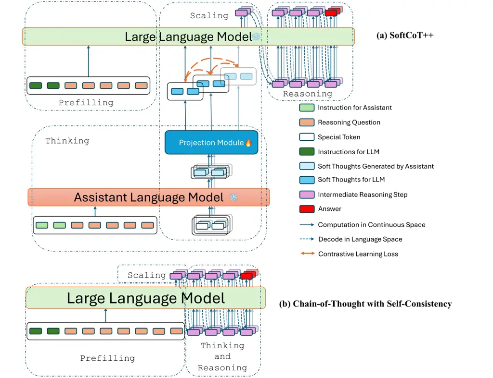
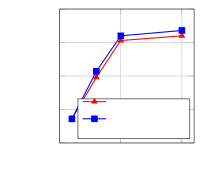
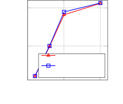

# SoftCoT++: Test-Time Scaling with Soft Chain-of-Thought Reasoning

Yige Xu ^(†)^(†)thanks: The first two authors contributed equally.
Affiliation: Joint NTU-UBC Research Centre of Excellence in Active
Living for the Elderly Affiliation: College of Computing and Data
Science, Nanyang Technological University, Singapore    Xu
Guo¹¹footnotemark: 1 ^(†)^(†)thanks: Corresponding author.
Affiliation: Alibaba-NTU Global e-Sustainability CorpLab (ANGEL)
Affiliation: KTH Royal Institute of Technology,
Sweden{yige002,xu008}@e.ntu.edu.sg, {zhiwei.zeng,ascymiao}@ntu.edu.sg   
Zhiwei Zeng Affiliation: Alibaba-NTU Global e-Sustainability CorpLab
(ANGEL)    Chunyan Miao Affiliation: Joint NTU-UBC Research Centre of
Excellence in Active Living for the Elderly Affiliation: Alibaba-NTU
Global e-Sustainability CorpLab (ANGEL) Affiliation: College of
Computing and Data Science, Nanyang Technological University, Singapore

###### Abstract

Test-Time Scaling (TTS) refers to approaches that improve reasoning
performance by allocating extra computation during inference, without
altering the model’s parameters. While existing TTS methods operate in a
discrete token space by generating more intermediate steps, recent
studies in Coconut and SoftCoT have demonstrated that thinking in the
continuous latent space can further enhance the reasoning performance.
Such latent thoughts encode informative thinking without the information
loss associated with autoregressive token generation, sparking increased
interest in continuous-space reasoning. Unlike discrete decoding, where
repeated sampling enables exploring diverse reasoning paths, latent
representations in continuous space are fixed for a given input, which
limits diverse exploration, as all decoded paths originate from the same
latent thought. To overcome this limitation, we introduce SoftCoT++ to
extend SoftCoT to the Test-Time Scaling paradigm by enabling diverse
exploration of thinking paths. Specifically, we perturb latent thoughts
via multiple specialized initial tokens and apply contrastive learning
to promote diversity among soft thought representations. Experiments
across five reasoning benchmarks and two distinct LLM architectures
demonstrate that SoftCoT++ significantly boosts SoftCoT and also
outperforms SoftCoT with self-consistency scaling. Moreover, it shows
strong compatibility with conventional scaling techniques such as
self-consistency. Source code is available at
[https://github.com/xuyige/SoftCoT](https://github.com/xuyige/SoftCoT).

## 1 Introduction

In recent years, performance improvements in Large Language Models
(LLMs) Brown et al. (2020); Chowdhery et al. (2023); OpenAI (2023);
Dubey et al. (2024); Yang et al. (2024); DeepSeek-AI (2025); Qwen Team
(2025) have largely stemmed from scaling up training-time compute. These
large-scale models exhibit emergent reasoning abilities, notably through
Chain-of-Thought (CoT) prompting Wei et al. (2022), which generates
explicit intermediate steps to enhance answer accuracy. Building on this
foundation, a new scaling paradigm known as Test-Time Scaling (TTS) Wang
et al. (2023); Snell et al. (2024); Brown et al. (2024); Muennighoff
et al. (2025) has emerged, aiming to further enhance reasoning
performance by allocating additional computation at inference time,
without modifying the model parameters.

Existing TTS methods can be broadly classified into two regimes:
parallel scaling Wang et al. (2023); Renze (2024); Brown et al. (2024),
and sequential scaling Madaan et al. (2023); Snell et al. (2024); Chen
et al. (2025). Parallel scaling, such as Best-of-N (BoN) Lightman et al.
(2024) and Self-Consistency (SC) Wang et al. (2023), generates multiple
reasoning chains via independent sampling and aggregates the final
answer through a fusion mechanism. In contrast, sequential scaling
directs later computations based explicitly on earlier intermediate
steps Zhou et al. (2023). In this work, we primarily focus on parallel
scaling by encouraging the generation of diverse reasoning chains.
Notably, both paradigms operate within the discrete token space for
generating intermediate steps, potentially limiting their ability to
capture nuanced or continuous reasoning dynamics.

Recently, the idea of reasoning in a continuous latent space has
garnered increasing attention in the community Hao et al. (2024); Cheng
and Durme (2024); Shen et al. (2025). Studies in Coconut Hao et al.
(2024) and SoftCoT Xu et al. (2025) demonstrate that leveraging latent
thoughts can enhance subsequent reasoning quality. Notably, SoftCoT
freezes the LLM and utilizes a fixed small assistant model to generate
soft thoughts. It outperforms Coconut on recent LLMs from LLaMA and Qwen
families, while Coconut even underperforms zero-shot CoT prompting,
which already yields strong results with modern LLMs. Nevertheless,
scaling in the continuous space remains challenging, as it does not
naturally support multi-path sampling as in classical TTS methods.

Unlike discrete-space reasoning, which naturally allows sampling
multiple reasoning paths from a probability distribution
$`P(x_{i}\mid x_{<i})`$ over tokens $`x_{i}\in\mathcal{V}`$,
continuous-space reasoning outputs a deterministic latent thought for a
given question. There is no explicit distribution for sampling diverse
latent thoughts. To simulate stochastic sampling in continuous space, we
conducted pilot experiments with SoftCoT by adding small perturbations
to a single latent soft thought to approximate the stochasticity. We
compare using diverse soft thoughts (SoftCoT-P) for parallel scaling
with conventional discrete-space scaling via token sampling (SoftCoT-SC)
and find that these two scaling strategies can achieve comparable
performance. This confirms the feasibility of continuous-space scaling.
Additionally, theoretical analysis (in Appendix A.1) indicates that
parallel scaling with majority voting helps only when the base LLM
already reasons well. We therefore adopt SoftCoT as the foundation for
parallel scaling in continuous space, given its strong performance on
recent state-of-the-art LLMs.

This paper introduces SoftCoT++, the first framework for scaling
continuous-space CoT to enhance LLM reasoning performance. Building on
SoftCoT, we split the generation process into a thinking stage (latent
soft thoughts) and a reasoning stage (token generation). SoftCoT++
scales the latent thinking stage while remaining fully compatible with
conventional token-level scaling during reasoning. Specifically, we
introduce multiple specialized initial tokens that serve as distinct
prompts to the assistant model, prompting it to generate multiple soft
thought representations for a given input. This design simulates
parallel scaling in discrete space by generating multiple latent
reasoning paths simultaneously. To further promote exploring distinct
reasoning paths, we employ a contrastive learning objective to
explicitly push the soft thoughts apart in the latent space. Theoretical
analysis (in Appendix A.2) shows that SoftCoT++ can provide a better
approximation to the true latent-thought distribution than random
perturbation. Together, distinct initialization paired with contrastive
learning enables SoftCoT++ to scale reasoning at test time while
preserving the efficiency and stability benefits of continuous latent
thinking.

Following SoftCoT Xu et al. (2025), we evaluate SoftCoT++ on five
reasoning benchmarks and two state-of-the-art LLM architectures. The
five benchmarks include mathematical reasoning, commonsense reasoning,
and symbolic reasoning. The two LLM architectures include LLaMA-3.1
series Dubey et al. (2024) and Qwen3 series Qwen Team (2025).
Experimental results show that SoftCoT++ consistently outperforms all
baselines, which apply test-time scaling in discrete token space, across
architectures and tasks. This highlights the effectiveness of applying
test-time scaling for continuous-space reasoning. Since SoftCoT++ scales
latent thoughts on the thinking stage, while existing discrete-space
scaling methods like SC scale on the reasoning stage, the two mechanisms
can be complementary. We demonstrate through experiments that SoftCoT++
combined with SC (Table 2) can amplify the overall scaling effect.

## 2 Related Works

### 2.1 Test-Time Scaling

Test-time scaling (TTS) has emerged as a pivotal strategy in enhancing
the performance of LLMs by allocating additional computational resources
during inference. This approach shifts the traditional emphasis from
extensive pretraining to optimizing inference-time computation, enabling
models to tackle complex tasks more effectively. Following Muennighoff
et al. (2025) and Zhang et al. (2025), we classify test-time scaling
methods into: (1) Parallel Scaling Wang et al. (2023); Brown et al.
(2024); Snell et al. (2024); Liu et al. (2025), where parallel computes
multiple reasoning chains independently, (2) Sequential Scaling Madaan
et al. (2023); Chen et al. (2024); Muennighoff et al. (2025), where
computes a longer reasoning chain and generates the chain sequentially,
and (3) Hybrid Scaling Yao et al. (2023); Gandhi et al. (2024); Wang
et al. (2025), where combines the parallel scaling and sequential
scaling methods. In this paper, we mainly focus on parallel test-time
scaling, which can be adopt on large-scale LLMs efficiently.

As conclued by Zhang et al. (2025), parallel scaling improves test-time
performance by generating multiple reasoning chains in parallel, and
then aggregating them together to the final answer. Early evidence that
sampling multiple reasoning chains and voting improves robustness came
from Self-Consistency (SC) Wang et al. (2023), inspiring subsequent
studies on how many chains to sample for a fixed compute envelope Snell
et al. (2024). Li et al. (2025) suggest that the chance of finding the
correct answer improves while increasing the number of generated
responses, which is empirically summarized by a log-linear scaling
law Brown et al. (2024). Despite the effectiveness of these approaches,
the majority of existing parallel test-time scaling methods rely on
discrete token-by-token generation, which imposes inherent constraints
and limits their expressiveness.

### 2.2 Chain-of-Thought Reasoning in Continuous Space

To overcome the inherent limitations of discrete language space in
reasoning tasks, recent research has increasingly explored the use of
continuous representation spaces for more effective and efficient
inference. One pioneering effort in this direction is Coconut Hao et al.
(2024), which introduces the Chain-of-Continuous-Thought paradigm. This
approach encodes intermediate reasoning steps as continuous latent
vectors, allowing for smooth and information-preserving reasoning
trajectories. Building upon this idea, CCoT Cheng and Durme (2024)
proposes a Compressed Chain-of-Thought framework, which generates dense,
content-rich continuous representations which is referred to as
“contemplation tokens”. Extending these innovations to multi-modal
tasks, Heima Shen et al. (2025) further refines the paradigm by encoding
the entire reasoning process into a single continuous vector for
multi-modal reasoning. Most recently, SoftCoT Xu et al. (2025) advances
this line of work by adapting continuous-space chain-of-thought
reasoning to state-of-the-art LLM architectures and mitigates the
catastrophic forgetting problem for LLMs with good zero-shot CoT
performance.

Despite the promising advances in continuous-space-based
chain-of-thought (CoT) reasoning, two major limitations persist in
existing approaches. First, none of the current methods incorporate
test-time scaling, a widely adopted technique in discrete CoT reasoning
for enhancing performance through computational budget expansion during
inference. The absence of such scaling mechanisms constrains the
effectiveness of continuous-space reasoning on complex downstream tasks.
Second, these methods face inherent scalability challenges due to the
nature of continuous representations. In discrete token space, multiple
diverse reasoning trajectories can be easily obtained via sampling
(e.g., temperature sampling), enabling test-time ensembles such as
self-consistency. However, in continuous latent space, the
representation is deterministic and fixed for a given input, making it
non-trivial to generate diverse reasoning paths or multiple hypotheses.
This fundamental limitation hinders the scalability of continuous
reasoning techniques, especially under settings where diversity and
robustness are critical.

These two core limitations motivate the central research question of
this work: How can we enable scalable test-time reasoning in continuous
latent space?



Figure 1: A comparison of SoftCoT++ and Chain-of-Thought with
Self-Consistency.

## 3 Methodology

### 3.1 Problem Definition and Notations

Given a task-specific instruction
$`\mathcal{I}=[i_{1},i_{2},\cdots,i_{|\mathcal{I}|}]`$ and an input
query $`\mathcal{Q}=[q_{1},q_{2},\cdots,q_{|\mathcal{Q}|}]`$, we
formalize the problem-solving process of an LLM in three auto-regressive
stages: (1) Thinking. Generate a sequence of thinking steps
$`\mathcal{T}=[t_{1},t_{2},\cdots,t_{|\mathcal{T}|}]`$ based on the
input query; (2) Reasoning. Produce explicit rationales
$`\mathcal{R}=[r_{1},r_{2},\cdots,r_{|\mathcal{R}|}]`$ based on the
query and thinking steps, providing an interpretable reasoning path; (3)
Answer Generation. Output the final answer
$`\mathcal{A}=[a_{1},a_{2},\cdots,a_{|\mathcal{A}|}]`$ conditioned on
$`\mathcal{Q},\mathcal{T}`$ and $`\mathcal{R}`$. The generation process
can be described as:

```math
\displaystyle t_{i+1} \displaystyle=\mathrm{LLM}\Big([\mathcal{I};\mathcal{Q};\mathcal{T}_{\leq i}]\Big), \displaystyle\;\;\;\;//\text{Thinking Process} \tag{1}
```

```math
\displaystyle r_{j+1} \displaystyle=\mathrm{LLM}\Big([\mathcal{I};\mathcal{Q};\mathcal{T};\mathcal{R}_{\leq j}]\Big), \displaystyle\;\;\;\;//\text{Reasoning Process}
```

```math
\displaystyle a_{k+1} \displaystyle=\mathrm{LLM}\Big([\mathcal{I};\mathcal{Q};\mathcal{T};\mathcal{R};\mathcal{A}_{\leq k}]\Big), \displaystyle\;\;\;\;//\text{Answer Generation}
```

where $`\mathrm{LLM}(\cdot)`$ indicates a large language model, and
$`[\cdot;\cdot]`$ indicates the concatenation of input sequence.
Notably, classical CoT methods Zhang et al. (2023); Zhou et al. (2023);
Yao et al. (2023) generate the entire thinking and reasoning steps
altogether $`\mathcal{P}=\mathcal{T}\cup\mathcal{R}`$ using discrete
tokens, constraining every step in $`\mathcal{P}`$ to lie within the
model’s vocabulary space $`\mathcal{V}`$.

### 3.2 SoftCoT

Soft Chain-of-Thought (SoftCoT) Xu et al. (2025) introduces a new
reasoning paradigm that enhances LLM performance by incorporating
continuous latent thoughts. Unlike traditional CoT methods that
explicitly generate discrete thinking steps, SoftCoT employs an
assistant model to produce latent soft thought tokens. These continuous
representations serve as implicit cues, steering the subsequent
reasoning chain and boosting the answer accuracy:

```math
\displaystyle\mathbf{h}^{\mathrm{assist}} \displaystyle=\mathrm{Assistant}\Big([\mathcal{I}_{\mathrm{assist}};\mathcal{Q};\mathcal{S}_{1:L}]\Big), \tag{2}
```

```math
\displaystyle\mathcal{T}_{\mathrm{soft}} \displaystyle=f_{\theta}\Big(\mathbf{h}^{\mathrm{assist}}_{|\mathcal{I}|+|\mathcal{Q}|+1:|\mathcal{I}|+|\mathcal{Q}|+L}\Big), \displaystyle\;\;\;\;//\text{Thinking Process}
```

```math
\displaystyle\mathcal{R}_{\mathrm{SoftCoT}} \displaystyle=\mathrm{LLM}\Big([\mathcal{I}_{\mathrm{LLM}};\mathcal{Q};\mathcal{T}_{\mathrm{soft}}]\Big), \displaystyle\;\;\;\;//\text{Reasoning Process}
```

where the assistant model $`\mathrm{Assistant}(\cdot)`$ receives a
task-specific instruction $`\mathcal{I}_{\mathrm{assist}}`$, the query
$`\mathcal{Q}`$, and a placeholder string $`\mathcal{S}_{1:L}`$
consisting of special tokens like \[UNK\] for aggragating $`L`$ soft
thought tokens. It returns hidden states where the last $`L`$ vectors
are taken as the input to the projection module $`f_{\theta}(\cdot)`$
that maps the representation from assistant model to reasoning model.
$`\mathcal{T}_{\mathrm{soft}}=\{h_{1},h_{2},\dots,h_{L}|h_{i}\in\mathbb{R}^{d}\}`$
is the soft thought that replace $`\mathcal{T}`$ in Eq (1), where $`d`$
is the dimension of the latent space. In SoftCoT, both assistant model
as well as the large reasoning model are fixed, and only trains the
parameters in the projection module.

### 3.3 Chain-of-Thought Scaling

Definition 1. We define the composite function $`f=a\circ b\circ c`$ as
a general scaling framework for CoT, where $`a`$ prefills the input,
$`b`$ is a scaling function that launches $`N`$ independent reasoning
paths, and $`c`$ is a generation function that completes every path and
returns its answer.

Take chain-of-thought with self-consistency (CoT-SC) as an example,
$`a`$ refers to the initial stage when an LLM encodes
$`(\mathcal{I},\mathcal{Q})`$ and computes the next-token distribution
$`P_{\text{LLM}}(x\mid\mathcal{I},\mathcal{Q})`$. $`b`$ samples $`N`$
independent reasoning paths
$`\mathcal{P}=\{\mathcal{P}_{1},\ldots,\mathcal{P}_{N}\}\stackrel{{\scriptstyle\text{i.i.d.}}}{{\sim}}P_{\text{LLM}}(x\mid\mathcal{I},\mathcal{Q})`$,
which are completed by $`c`$ (the LLM itself), yielding answers
$`\hat{\mathcal{A}}_{1},\ldots,\hat{\mathcal{A}}_{N}`$, and output the
majority vote. An additional theoretical analysis of when CoT-SC
improves CoT is presented in Appendix A.1. Notably,
$`P_{\text{LLM}}(x\mid\mathcal{I},\mathcal{Q})`$ is the distribution
from which the $`N`$ discrete CoT paths are sampled.

#### Scaling Strategies for SoftCoT.

SoftCoT follows the same framework but changes what the prefilling step
$`a`$ produces: a latent _soft-thought_
$`\mathcal{T}_{\text{soft}}\in\mathbb{R}^{L\times d}`$. There are two
reasoning stages in SoftCoT, each of which can support test-time scaling
independently:

- •
  Scaling the reasoning stage: The soft thoughts
  $`\mathcal{T}_{\text{soft}}`$ remain deterministic and are followed by
  the reasoning stage in discrete space. Since reasoning occurs in a
  discrete token space, existing scaling methods can be applied directly
  to this stage. In the baseline model SoftCoT-SC, we adopt the widely
  used self-consistency approach. Thus,
  $`P_{\text{LLM}}(x\mid\mathcal{I},\mathcal{Q},\mathcal{T}_{\text{soft}})`$
  is the distribution for sampling the $`N`$ discrete reasoning paths
  under SoftCoT-SC.
- •
  Scaling the thinking stage: Attempting to diversify soft-thought
  construction. However, because the latent representation
  $`\mathcal{T}_{\text{soft}}`$ is deterministic for a given input
  $`(\mathcal{I},\mathcal{Q})`$, standard sampling is not feasible.
  Thus, ensuring diverse exploration in latent-space reasoning remains a
  primary challenge. The focus of this paper is to enable scaling in the
  thinking stage by simulating the multi-path sampling process in
  continuous space.



(a) Qwen3-8B



(b) LLaMA-3.1-8B-Instruct

Figure 2: Comparison of SoftCoT-P and SoftCoT-SC on GSM8K.

### 3.4 Pilot Experiments for Scaling SoftCoT in Thinking Stage

Let $`G_{\phi}=\text{Assistant}\circ f_{\theta}`$ represent the
soft-thought generator:
$`\mathcal{T}_{\mathrm{soft}}=G(\mathcal{I},\mathcal{Q},\mathcal{S})\in\mathbb{R}^{d}`$.
The primary challenge in scaling SoftCoT is the lack of an explicit,
sampleable distribution of soft thoughts. To enable this, we make the
following assumption.

Assumption 1. There exists a _smooth, differentiable_ density
$`P_{G}(t\mid\mathcal{I},\mathcal{Q})`$, such that the deterministic
output $`\mathcal{T}_{\text{soft}}`$ may be regarded as a single sample
from this density:
$`\mathcal{T}_{\text{soft}}\sim P_{G}(t\mid\mathcal{I},\mathcal{Q})`$.

Lemma 1. If $`\delta`$ is sufficiently small, then
$`\mathcal{T}_{\text{soft}}+\delta`$ remains in a high-probability
region of $`P_{G}`$.

The proof of Lemma 1 is presented in A.2. In other words, according to
Lemma 1, the perturbed sample remains approximately in the same
distribution if the perturbation is small enough. Inspired by this
conclusion, it is feasible to add a small perturbation term to the
sampled $`\mathcal{T}_{\mathrm{soft}}`$, which approximately follows the
distribution of soft thoughts:

```math
\displaystyle\mathcal{T}^{i}_{\mathrm{soft}}=\mathcal{T}_{\mathrm{soft}}+\delta_{i}, \tag{3}
```

where $`i`$ indicates the $`i`$-th reasoning chain, and all
$`\delta_{i}\to 0`$. For convenience, we use “SoftCoT-P”
(SoftCoT-Perturbed) to mark this scaling method. Compared with
SoftCoT-SC, where diversity is injected in explicit token-level
sampling, SoftCoT-P injects diversity in the latent space.

Figure 2 shows their performance comparison. We notice that SoftCoT-P
has a similar performance compared with SoftCoT-SC, which empirically
demonstrates the feasibility of sampling from the estimated latent space
distribution. Nevertheless, it does not outperform SoftCoT-SC, which we
hypothesize that the small perturbations explore only a narrow
neighbourhood of the true density, limiting the diversity of the
generated reasoning paths.

### 3.5 SoftCoT++

Let $`P=P_{G}(t|\mathcal{I},\mathcal{Q})`$ be the true distribution we
need to approximate. As discussed in § 3.4, a more precise estimation of
the soft thought distribution will lead to a better scaling performance.
Thus, our goal is to obtain a better representation distribution
estimation than SoftCoT-P.

Definition 2. Let $`\{\delta_{i}\}_{i=1}^{n}`$ be a set of small
perturbations. For each $`i`$, we define the perturbed soft thought
representation as
$`\mathcal{T}_{\mathrm{p}}^{i}=\mathcal{T}_{\mathrm{soft}}+\delta_{i}`$.
The distribution $`Q_{1}`$ is the empirical distribution estimated from
the set of perturbed samples
$`\{\mathcal{T}_{\mathrm{p}}^{i}\}_{i=1}^{n}`$.

Definition 3. Let
$`\mathcal{T}^{\mathrm{scale}}_{\mathrm{soft}}=\{\mathcal{T}^{i}_{\mathrm{soft}}\}_{i=1}^{n}`$
be a set of representations sampled from
$`P_{G}(t|\mathcal{I},\mathcal{Q})`$. The distribution $`Q_{2}`$ is then
estimated from the $`\mathcal{T}^{\mathrm{scale}}_{\mathrm{soft}}`$.

Based on the definitions, our goal is to find a distribution $`Q_{2}`$
where $`\mathrm{KL}(P||Q_{2})<\mathrm{KL}(P||Q_{1})`$, meaning that
$`Q_{2}`$ provides a closer approximation to the true distribution $`P`$
than $`Q_{1}`$. Under a mild assumption that $`\mathrm{Var}[P]>0`$ and
that $`\delta_{i}<\mathrm{Var}[P]`$, we have

Lemma 2. The candidate distribution $`Q_{2}`$ is better than $`Q_{1}`$
to describe $`P`$, if
$`\mathrm{Var}[Q_{1}]<\mathrm{Var}[Q_{2}]\leq\mathrm{Var}[P]`$, subjects
to $`\forall\;\mathcal{T}^{i}_{\mathrm{soft}}\sim P`$.

The proof of Lemma 2 is shown in A.2. Lemma 2 suggests two ways to
obtain a better estimation: (1) generate multiple distinct soft thought
representations instead of one; (2) encourage higher variance among
these soft thought representations.

#### Diverse Input Sequence.

Notably, the input of assistant model in Eq (2) includes $`L`$ special
\[UNK\] tokens: $`\mathcal{S}_{1:L}=\texttt{[UNK]}_{1:L}`$. Inspiring by
the multi-head attention Vaswani et al. (2017) that the structure as
well as the computation graph among different head keeps the same but
only the initial parameter differs, we replace the special \[UNK\] token
with multiple special \[INI\] tokens:

```math
\displaystyle\hat{\mathcal{S}}^{i}_{1:L} \displaystyle=\texttt{[INI]}^{i}_{1:L}, \tag{4}
```

```math
\displaystyle\mathrm{s.t.}\quad\texttt{[INI]}^{i} \displaystyle\neq\texttt{[INI]}^{j},\;\;\forall i\neq j,
```

where $`i`$ indicates the $`i`$-th thinking path, and
$`\texttt{[INI]}^{i}\in\mathcal{V}`$ indicates the $`i`$-th special
initial token for assistant model. The multiple \[INI\] tokens enables
the assistant model to generate multiple soft thoughts:

```math
\displaystyle\mathbf{h}^{\mathrm{assist-}i} \displaystyle=\mathrm{Assistant}\Big([\mathcal{I}_{\mathrm{assist}};\mathcal{Q};\hat{\mathcal{S}}^{i}_{1:L}]\Big), \tag{5}
```

```math
\displaystyle\mathcal{T}^{i}_{\mathrm{soft}} \displaystyle=f_{\theta}\Big(\mathbf{h}^{\mathrm{assist-}i}_{|\mathcal{I}|+|\mathcal{Q}|+1:|\mathcal{I}|+|\mathcal{Q}|+L}\Big).
```

#### Contrastive Learning Loss.

As aforementioned, a larger variance is required for a better estimation
to the target distribution. Thus, we apply the contrastive learning loss
as a regulation term to maximize the distance between different thinking
representations, which brings a larger variance:

```math
\displaystyle\mathcal{L}_{\mathrm{cl}}=-\sum_{k=1}^{M}\mathbb{E}\Big[\log\frac{\exp(\mathcal{T}^{k}_{\mathrm{soft}}\cdot\mathcal{T}^{k}_{\mathrm{soft}})}{\sum_{j}\exp(\mathcal{T}^{k}_{\mathrm{soft}}\cdot\mathcal{T}^{j}_{\mathrm{soft}})}\Big]. \tag{6}
```

#### Overall Pipeline.

In summary, SoftCoT++ enables test-time scaling in the thinking stage by
introducing different special placeholder tokens that provide diverse
input embeddings for the assistant model, which can generate multiple
soft thinking thoughts. In the training stage, SoftCoT++ also introduces
a contrastive loss as the regulation term to enhance the diversity of
different soft thinking thoughts, which facilitates to a better
estimation of the latent representation distribution.

## 4 Experiments

### 4.1 Datasets

Following Xu et al. (2025), we conduct experiments on five benchmark
datasets spanning three categories of reasoning: mathematical reasoning,
commonsense reasoning, and symbolic reasoning. For mathematical
reasoning, we utilize GSM8K Cobbe et al. (2021), ASDiv-Aug Xu et al.
(2025), and AQuA Ling et al. (2017). For commonsense reasoning, we use
StrategyQA Geva et al. (2021), and for symbolic reasoning, we adopt Date
Understanding BIG.Bench.authors (2023) from the BIG-bench suite. More
details can be found in Appendix B.

### 4.2 Implementation Details

We follow the official implementations of SoftCoT Xu et al. (2025). All
models are trained on a single NVIDIA A100-80G GPU. Only the parameters
in the projection is trained for 10 epochs. The learning rate is set as
2e-5, and the number of soft thought tokens $`L`$ is set as 4. To fully
utilize the GPU memory, we set the batch size as 8 or 16, which depends
on the GPU memory usage.

### 4.3 Baselines

As noted by Xu et al. (2025), state-of-the-art LLMs with approximately
8B parameters have strong zero-shot performance on reasoning tasks.
However, fine-tuning these models using standard language modeling
objectives on reasoning datasets often leads to performance degradation.
Consequently, it is crucial to evaluate models under zero-shot settings.
We consider the following baselines:

Zero-Shot CoT (SC): To assess potential degradation caused by supervised
fine-tuning, we employ zero-shot chain-of-thought (CoT) prompting using
templates from Sprague et al. (2024). Self-consistency is enabled,
beginning from the initial thinking step, to enhance performance
stability.

Zero-Shot Assist-CoT (SC): In this baseline, an assistant model is
prompted to generate hard reasoning tokens, which are then used for
chain-of-thought prompting. Different to the above, we apply
self-consistency starting from the reasoning process.

Coconut-SC Hao et al. (2024): Coconut introduces reasoning in a
continuous latent space by recursively feeding intermediate hidden
states as input embeddings. This approach facilitates efficient and
flexible reasoning compared to traditional discrete CoT methods. We
enable self-consistency beginning from the reasoning process.

SoftCoT-SC Xu et al. (2025): SoftCoT employs an assistant model to
generate fixed soft thoughts, which are then passed to a larger
reasoning model to produce the reasoning chain. This setup serves as a
baseline where scaling is applied to the reasoning stage of SoftCoT
using Self-Consistency, while there is no scaling in the thinking stage.

## 5 Results and Discussions

|                              |                              |                              |                              |             |                              |                              |            |
| ---------------------------- | ---------------------------- | ---------------------------- | ---------------------------- | ----------- | ---------------------------- | ---------------------------- | ---------- |
| Model                        | GSM8K                        | ASDiv-Aug                    | AQuA                         | Avg. (Math) | StrategyQA                   | DU                           | Avg. (All) |
|                              | Mathematical                 |                              |                              |             | Commonsense                  | Symbolic                     |            |
| LLaMA-3.1-8B-Instruct        |                              |                              |                              |             |                              |                              |            |
| Zero-Shot CoT (SC)           | 90.36$`{}_{\pm\text{0.40}}`$ | 89.23$`{}_{\pm\text{0.17}}`$ | 63.23$`{}_{\pm\text{0.86}}`$ | 80.94       | 70.13$`{}_{\pm\text{0.47}}`$ | 65.76$`{}_{\pm\text{1.54}}`$ | 75.74      |
| Zero-Shot Assist-CoT (SC)    | 90.43$`{}_{\pm\text{0.69}}`$ | 89.48$`{}_{\pm\text{0.36}}`$ | 63.62$`{}_{\pm\text{0.99}}`$ | 81.18       | 70.48$`{}_{\pm\text{0.68}}`$ | 65.84$`{}_{\pm\text{1.93}}`$ | 75.97      |
| Coconut-SC Hao et al. (2024) | 87.03$`{}_{\pm\text{0.00}}`$ | 88.44$`{}_{\pm\text{0.00}}`$ | 61.81$`{}_{\pm\text{0.00}}`$ | 79.09       | -                            | -                            | -          |
| SoftCoT-SC Xu et al. (2025)  | 90.63$`{}_{\pm\text{0.39}}`$ | 89.75$`{}_{\pm\text{0.29}}`$ | 65.51$`{}_{\pm\text{0.72}}`$ | 81.96       | 71.14$`{}_{\pm\text{0.10}}`$ | 67.36$`{}_{\pm\text{1.12}}`$ | 76.88      |
| SoftCoT++ (Ours)             | 90.99$`{}_{\pm\text{0.25}}`$ | 90.09$`{}_{\pm\text{0.27}}`$ | 66.85$`{}_{\pm\text{0.58}}`$ | 82.64       | 71.18$`{}_{\pm\text{0.15}}`$ | 68.72$`{}_{\pm\text{0.91}}`$ | 77.57      |
| Qwen3-8B                     |                              |                              |                              |             |                              |                              |            |
| Zero-Shot CoT (SC)           | 92.22$`{}_{\pm\text{0.47}}`$ | 91.97$`{}_{\pm\text{0.13}}`$ | 76.77$`{}_{\pm\text{0.62}}`$ | 86.99       | 70.96$`{}_{\pm\text{0.15}}`$ | 84.56$`{}_{\pm\text{0.61}}`$ | 83.30      |
| Zero-Shot Assist-CoT (SC)    | 92.68$`{}_{\pm\text{0.17}}`$ | 91.91$`{}_{\pm\text{0.28}}`$ | 76.77$`{}_{\pm\text{0.79}}`$ | 87.12       | 70.92$`{}_{\pm\text{0.28}}`$ | 84.80$`{}_{\pm\text{1.17}}`$ | 83.42      |
| Coconut-SC Hao et al. (2024) | 90.37$`{}_{\pm\text{0.00}}`$ | 90.37$`{}_{\pm\text{0.00}}`$ | 76.38$`{}_{\pm\text{0.00}}`$ | 85.71       | -                            | -                            | -          |
| SoftCoT-SC Xu et al. (2025)  | 93.19$`{}_{\pm\text{0.32}}`$ | 92.14$`{}_{\pm\text{0.15}}`$ | 80.63$`{}_{\pm\text{1.90}}`$ | 88.65       | 71.18$`{}_{\pm\text{0.15}}`$ | 87.20$`{}_{\pm\text{0.75}}`$ | 84.87      |
| SoftCoT++ (Ours)             | 93.65$`{}_{\pm\text{0.24}}`$ | 92.41$`{}_{\pm\text{0.13}}`$ | 84.09$`{}_{\pm\text{0.72}}`$ | 90.05       | 71.22$`{}_{\pm\text{0.18}}`$ | 88.16$`{}_{\pm\text{0.54}}`$ | 85.91      |

Table 1: Model comparison with baselines for test-time scaling. “SC”
indicates self-consistency, “DU” indicates the Date
Understanding BIG.Bench.authors (2023) dataset. We report results with
10 chains ($`N=10`$). For all baseline methods, we scale 10 reasoning
chains; for SoftCoT++, we scale 10 thinking chains, respectively. We run
for 5 random seeds and report the average accuracy as well as the
standard deviation.

### 5.1 Comparison with Baselines

To evaluate SoftCoT++, we compare its performance against the baselines
introduced in § 4.3. The results are summarized in Table 1:

\(1\) SoftCoT++ successfully extend SoftCoT with test-time scaling:
SoftCoT++ extends SoftCoT by preserving its continuous-thought
formulation and introducing two new mechanisms for test-time scaling in
its thinking stage: (i) multiple special input tokens that spawn diverse
soft-thought trajectories, and (ii) a contrastive regularizer that
maintains diversity while preserving informativeness. As shown in Table
1, SoftCoT++ outperforms all baselines, including SoftCoT-SC, across
architectures and tasks, demonstrating the effectiveness of applying
test-time scaling in continuous latent-space reasoning. Notably, the
reduced standard deviations indicate that scaling soft thoughts does not
destabilize predictions—a crucial property for reliable test-time
scaling. We hypothesize that the improved performance stems from the
increased likelihood of discovering correct answers due to the greater
diversity of sampled representations.

\(2\) SoftCoT++ exhibits consistent performance across architectures and
tasks: Operating entirely at the representation level, SoftCoT++
requires no architecture-specific modifications or tuning. Despite this,
it consistently improves performance across both the LLaMA-3 and Qwen-3
model families, demonstrating its backbone-agnostic design. This
generality holds regardless of differences in pretraining corpora,
tokenization schemes, or positional encoding strategies. Furthermore,
SoftCoT++ achieves robust performance across diverse reasoning
tasks—including mathematical, commonsense, and symbolic
reasoning—highlighting its stability and broad applicability. These
results confirm that SoftCoT++ enhances reasoning without requiring
model-specific adaptation.

\(3\) SoftCoT++ unlocks the latent potential of LLMs via test-time
scaling: Empirical results on mathematical reasoning tasks show that
under flexible inference budgets, the main bottleneck is inference
diversity rather than model capacity. SoftCoT++ addresses this by
enabling diverse sampling at the representation level, allowing
qualitatively distinct inference paths through the same model. This
approach better explores the model’s internal reasoning capabilities,
leading to higher-quality inferences. However, on StrategyQA, we
observed diminishing returns when the number of reasoning chains
increases to 100, suggesting the model’s capacity for that task is
already maximised. This contrast underscores SoftCoT++’s ability to
fully exploit LLMs’ representational potential, especially in tasks
where reasoning diversity remains untapped.

### 5.2 Ablation Study

As discussed in § 3.5, we theoretically analyzed the importance of
diversity in soft thoughts for effectively scaling SoftCoT. Here, we
empirically validate this via an ablation study. For clarity, we refer
to the variant of our model trained without the contrastive learning
objective as “SoftCoT+”. As shown in Table 2, our findings are
summarized as follows:

\(1\) SoftCoT+ benefits from scaling: Even without contrastive learning,
SoftCoT+ shows improved performance across both LLM architectures when
scaled using multiple soft thought representations. This confirms the
effectiveness of sampling diverse latent representations via different
special initial tokens. More detailed discusssion is shown in
Appendix C.1.

\(2\) SoftCoT+ underperforms compared to SoftCoT++: Despite these
improvements, SoftCoT+ performs only marginally better than SoftCoT-SC
and significantly worse than SoftCoT++. This result highlights the
critical role of contrastive learning in promoting diversity among soft
thoughts. Without it, the potential of test-time scaling remains
limited, underscoring that the contrastive objective is indispensable
for maximizing the benefits of SoftCoT++.

### 5.3 The Synergistic Effect of Scaling in the Thinking and Reasoning Stage

Notably, scaling in the thinking stage is orthogonal to scaling in the
reasoning stage. To empirically investigate this distinction, we design
an experiment that scales SoftCoT++ along both axes. Specifically, we
first generate 10 diverse soft thought representations via SoftCoT++,
and then, for each soft thought, apply self-consistency with 10
reasoning chains. This results in a total of 100 reasoning chains per
input. As shown in the column $`N=100`$ of Table 2, we compare this
scaled version of SoftCoT++ against baseline methods.

The results clearly demonstrate that SoftCoT++ is orthogonal to
self-consistency. On one hand, the performance of SoftCoT++ is further
improved when combined with self-consistency, highlighting that
thinking-stage and reasoning-stage scaling could be used simultaneously
to amplify the overall scaling effect. On the other hand, we observe
that the performance gain of SoftCoT+ (which lacks contrastive training)
from self-consistency is even greater than that of SoftCoT-SC. This
indicates that scaling in the thinking stage introduces external
benefits beyond what can be achieved by reasoning-stage scaling alone. A
more detailed discussion can be found at C.2.

|                              |                              |                              |                              |                              |                              |                              |
| ---------------------------- | ---------------------------- | ---------------------------- | ---------------------------- | ---------------------------- | ---------------------------- | ---------------------------- |
| Model                        | LLaMA-3.1-8B-Instruct        |                              |                              | Qwen3-8B                     |                              |                              |
|                              | $`N=1`$                      | $`N=10`$                     | $`N=100`$                    | $`N=1`$                      | $`N=10`$                     | $`N=100`$                    |
| Zero-Shot CoT (SC)           | 79.61$`{}_{\pm\text{0.81}}`$ | 90.36$`{}_{\pm\text{0.40}}`$ | 92.42$`{}_{\pm\text{0.21}}`$ | 91.86$`{}_{\pm\text{0.41}}`$ | 92.22$`{}_{\pm\text{0.47}}`$ | 92.98$`{}_{\pm\text{0.11}}`$ |
| Zero-Shot Assist-CoT (SC)    | 80.76$`{}_{\pm\text{1.53}}`$ | 90.43$`{}_{\pm\text{0.69}}`$ | 92.43$`{}_{\pm\text{0.25}}`$ | 91.90$`{}_{\pm\text{0.50}}`$ | 92.68$`{}_{\pm\text{0.17}}`$ | 93.01$`{}_{\pm\text{0.32}}`$ |
| Coconut-SC Hao et al. (2024) | 76.12$`{}_{\pm\text{0.00}}`$ | 87.03$`{}_{\pm\text{0.00}}`$ | 91.66$`{}_{\pm\text{0.00}}`$ | 87.95$`{}_{\pm\text{0.00}}`$ | 90.37$`{}_{\pm\text{0.00}}`$ | 91.13$`{}_{\pm\text{0.00}}`$ |
| SoftCoT-SC Xu et al. (2025)  | 81.03$`{}_{\pm\text{0.42}}`$ | 90.63$`{}_{\pm\text{0.39}}`$ | 92.52$`{}_{\pm\text{0.17}}`$ | 92.48$`{}_{\pm\text{0.29}}`$ | 93.19$`{}_{\pm\text{0.32}}`$ | 93.40$`{}_{\pm\text{0.15}}`$ |
| SoftCoT+ (Ours)              | -                            | 90.67$`{}_{\pm\text{0.24}}`$ | 92.63$`{}_{\pm\text{0.20}}`$ | -                            | 93.28$`{}_{\pm\text{0.19}}`$ | 93.97$`{}_{\pm\text{0.11}}`$ |
| SoftCoT++ (Ours)             | -                            | 90.99$`{}_{\pm\text{0.27}}`$ | 92.71$`{}_{\pm\text{0.14}}`$ | -                            | 93.65$`{}_{\pm\text{0.24}}`$ | 94.12$`{}_{\pm\text{0.20}}`$ |

Table 2: Ablation study results on GSM8K. “$`N`$” indicates the number
of reasoning chains. “-” indicates that when $`N=1`$, SoftCoT+ and
SoftCoT++ reduce to the original SoftCoT. In column $`N=10`$, we scale
10 reasoning chains for the baseline methods; 10 thinking chains for
SoftCoT+ and SoftCoT++. In column $`N=100`$, we scale 100 reasoning
chains for baseline methods. For SoftCoT+ and SoftCoT++, we evaluate the
synergistic effect of scaling both the thinking and reasoning stages: we
first scale 10 thinking chains and then scale 10 reasoning chains for
each thinking chain by self-consistency, resulting in 100 chains in
total.

### 5.4 Limitations and Future Work

Despite the promising results of SoftCoT++, the exploration of the
latent thought distribution remains preliminary. In this work, we focus
solely on inference with a fixed 8B-scale model. Extending SoftCoT++ to
larger, trainable LLMs opens up several promising research directions.
In particular, investigating and understanding how the distribution of
soft thoughts evolves during training, and how it interacts with model
scale and architecture, is a compelling avenue for future work.

## 6 Conclusion

In this paper, we propose SoftCoT++, an extension of SoftCoT that
enables test-time scaling in the continuous latent space of the thinking
process. SoftCoT++ generates multiple soft thought representations by
introducing diverse special tokens as inputs. To encourage
representation diversity, we incorporate a contrastive learning
objective, which allows the model to more effectively explore the latent
solution space. We support our approach with both theoretical analysis
and comprehensive empirical evaluation. Experiments across five
reasoning benchmarks and two distinct LLM architectures demonstrate that
SoftCoT++ consistently improves performance and exhibits strong
robustness across settings.

## References

- BIG.Bench.authors \[2023\] BIG.Bench.authors. Beyond the imitation
  game: Quantifying and extrapolating the capabilities of language
  models. _Trans. Mach. Learn. Res._, 2023, 2023. URL
  [https://openreview.net/forum?id=uyTL5Bvosj](https://openreview.net/forum?id=uyTL5Bvosj).
- Brown et al. \[2024\] Bradley Brown, Jordan Juravsky, Ryan Ehrlich,
  Ronald Clark, Quoc V Le, Christopher Ré, and Azalia Mirhoseini. Large
  language monkeys: Scaling inference compute with repeated sampling.
  _arXiv preprint arXiv:2407.21787_, 2024. URL
  [https://arxiv.org/abs/2407.21787](https://arxiv.org/abs/2407.21787).
- Brown et al. \[2020\] Tom B. Brown, Benjamin Mann, Nick Ryder, Melanie
  Subbiah, Jared Kaplan, Prafulla Dhariwal, Arvind Neelakantan, Pranav
  Shyam, Girish Sastry, Amanda Askell, Sandhini Agarwal, Ariel
  Herbert-Voss, Gretchen Krueger, Tom Henighan, Rewon Child, Aditya
  Ramesh, Daniel M. Ziegler, Jeffrey Wu, Clemens Winter, Christopher
  Hesse, Mark Chen, Eric Sigler, Mateusz Litwin, Scott Gray, Benjamin
  Chess, Jack Clark, Christopher Berner, Sam McCandlish, Alec Radford,
  Ilya Sutskever, and Dario Amodei. Language models are few-shot
  learners. In _Advances in Neural Information Processing Systems 33:
  Annual Conference on Neural Information Processing Systems 2020,
  NeurIPS 2020, December 6-12, 2020, virtual_, 2020. URL
  [https://proceedings.neurips.cc/paper/2020/hash/1457c0d6bfcb4967418bfb8ac142f64a-Abstract.html](https://proceedings.neurips.cc/paper/2020/hash/1457c0d6bfcb4967418bfb8ac142f64a-Abstract.html).
- Chen et al. \[2025\] Weizhe Chen, Sven Koenig, and Bistra Dilkina.
  Iterative deepening sampling for large language models. _arXiv
  preprint arXiv:2502.05449_, 2025. URL
  [https://arxiv.org/abs/2502.05449](https://arxiv.org/abs/2502.05449).
- Chen et al. \[2024\] Xinyun Chen, Maxwell Lin, Nathanael Schärli, and
  Denny Zhou. Teaching large language models to self-debug. In _The
  Twelfth International Conference on Learning Representations, ICLR
  2024, Vienna, Austria, May 7-11, 2024_. OpenReview.net, 2024. URL
  [https://openreview.net/forum?id=KuPixIqPiq](https://openreview.net/forum?id=KuPixIqPiq).
- Cheng and Durme \[2024\] Jeffrey Cheng and Benjamin Van Durme.
  Compressed chain of thought: Efficient reasoning through dense
  representations. _arXiv preprint arXiv:2412.13171_, 2024. URL
  [http://arxiv.org/abs/2412.13171](http://arxiv.org/abs/2412.13171).
- Chowdhery et al. \[2023\] Aakanksha Chowdhery, Sharan Narang, Jacob
  Devlin, Maarten Bosma, Gaurav Mishra, Adam Roberts, Paul Barham,
  Hyung Won Chung, Charles Sutton, Sebastian Gehrmann, et al. PaLM:
  Scaling language modeling with pathways. _Journal of Machine Learning
  Research_, 24(240):1–113, 2023. URL
  [https://dl.acm.org/doi/pdf/10.5555/3648699.3648939](https://dl.acm.org/doi/pdf/10.5555/3648699.3648939).
- Cobbe et al. \[2021\] Karl Cobbe, Vineet Kosaraju, Mohammad Bavarian,
  Mark Chen, Heewoo Jun, Lukasz Kaiser, Matthias Plappert, Jerry Tworek,
  Jacob Hilton, Reiichiro Nakano, Christopher Hesse, and John Schulman.
  Training verifiers to solve math word problems. _arXiv preprint
  arXiv:2110.14168_, 2021. URL
  [http://arxiv.org/abs/2110.14168](http://arxiv.org/abs/2110.14168).
- DeepSeek-AI \[2025\] DeepSeek-AI. Deepseek-R1: Incentivizing reasoning
  capability in llms via reinforcement learning. _arXiv preprint
  arXiv:2501.12948_, 2025. URL
  [https://arxiv.org/abs/2501.12948](https://arxiv.org/abs/2501.12948).
- Dubey et al. \[2024\] Abhimanyu Dubey, Abhinav Jauhri, Abhinav Pandey,
  Abhishek Kadian, Ahmad Al-Dahle, Aiesha Letman, Akhil Mathur, Alan
  Schelten, Amy Yang, Angela Fan, et al. The llama 3 herd of models.
  _arXiv preprint arXiv:2407.21783_, 2024. URL
  [http://arxiv.org/abs/2407.21783](http://arxiv.org/abs/2407.21783).
- Gandhi et al. \[2024\] Kanishk Gandhi, Denise Lee, Gabriel Grand,
  Muxin Liu, Winson Cheng, Archit Sharma, and Noah D Goodman. Stream of
  search (sos): Learning to search in language. _arXiv preprint
  arXiv:2404.03683_, 2024. URL
  [http://arxiv.org/abs/2404.03683](http://arxiv.org/abs/2404.03683).
- Geva et al. \[2021\] Mor Geva, Daniel Khashabi, Elad Segal, Tushar
  Khot, Dan Roth, and Jonathan Berant. Did aristotle use a laptop? A
  question answering benchmark with implicit reasoning strategies.
  _Trans. Assoc. Comput. Linguistics_, 9:346–361, 2021. doi:
  10.1162/TACL\\A\\00370. URL
  [https://doi.org/10.1162/tacl_a_00370](https://doi.org/10.1162/tacl_a_00370).
- Hao et al. \[2024\] Shibo Hao, Sainbayar Sukhbaatar, DiJia Su, Xian
  Li, Zhiting Hu, Jason Weston, and Yuandong Tian. Training large
  language models to reason in a continuous latent space. _arXiv
  preprint arXiv:2412.06769_, 2024. URL
  [http://arxiv.org/abs/2412.06769](http://arxiv.org/abs/2412.06769).
- Li et al. \[2025\] Dacheng Li, Shiyi Cao, Chengkun Cao, Xiuyu Li,
  Shangyin Tan, Kurt Keutzer, Jiarong Xing, Joseph E Gonzalez, and Ion
  Stoica. S\*: Test time scaling for code generation. _arXiv preprint
  arXiv:2502.14382_, 2025. URL
  [https://arxiv.org/abs/2502.14382](https://arxiv.org/abs/2502.14382).
- Lightman et al. \[2024\] Hunter Lightman, Vineet Kosaraju, Yuri Burda,
  Harrison Edwards, Bowen Baker, Teddy Lee, Jan Leike, John Schulman,
  Ilya Sutskever, and Karl Cobbe. Let’s verify step by step. In _The
  Twelfth International Conference on Learning Representations_, 2024.
  URL
  [https://openreview.net/forum?id=v8L0pN6EOi](https://openreview.net/forum?id=v8L0pN6EOi).
- Ling et al. \[2017\] Wang Ling, Dani Yogatama, Chris Dyer, and Phil
  Blunsom. Program induction by rationale generation: Learning to solve
  and explain algebraic word problems. In _Proceedings of the 55th
  Annual Meeting of the Association for Computational Linguistics, ACL
  2017, Vancouver, Canada, July 30 - August 4, Volume 1: Long Papers_,
  pages 158–167. Association for Computational Linguistics, 2017. doi:
  10.18653/V1/P17-1015. URL
  [https://doi.org/10.18653/v1/P17-1015](https://doi.org/10.18653/v1/P17-1015).
- Liu et al. \[2025\] Tianyu Liu, Yun Li, Qitan Lv, Kai Liu, Jianchen
  Zhu, Winston Hu, and Xiao Sun. PEARL: Parallel speculative decoding
  with adaptive draft length. In _The Thirteenth International
  Conference on Learning Representations_, 2025. URL
  [https://openreview.net/forum?id=QOXrVMiHGK](https://openreview.net/forum?id=QOXrVMiHGK).
- Madaan et al. \[2023\] Aman Madaan, Niket Tandon, Prakhar Gupta,
  Skyler Hallinan, Luyu Gao, Sarah Wiegreffe, Uri Alon, Nouha Dziri,
  Shrimai Prabhumoye, Yiming Yang, Shashank Gupta, Bodhisattwa Prasad
  Majumder, Katherine Hermann, Sean Welleck, Amir Yazdanbakhsh, and
  Peter Clark. Self-refine: Iterative refinement with self-feedback. In
  _Advances in Neural Information Processing Systems 36: Annual
  Conference on Neural Information Processing Systems 2023, NeurIPS
  2023, New Orleans, LA, USA, December 10 - 16, 2023_, 2023. URL
  [http://papers.nips.cc/paper_files/paper/2023/hash/91edff07232fb1b55a505a9e9f6c0ff3-Abstract-Conference.html](http://papers.nips.cc/paper_files/paper/2023/hash/91edff07232fb1b55a505a9e9f6c0ff3-Abstract-Conference.html).
- Muennighoff et al. \[2025\] Niklas Muennighoff, Zitong Yang, Weijia
  Shi, Xiang Lisa Li, Li Fei-Fei, Hannaneh Hajishirzi, Luke Zettlemoyer,
  Percy Liang, Emmanuel Candès, and Tatsunori Hashimoto. s1: Simple
  test-time scaling. _arXiv preprint arXiv:2501.19393_, 2025. URL
  [https://arxiv.org/abs/2501.19393](https://arxiv.org/abs/2501.19393).
- OpenAI \[2023\] OpenAI. GPT-4 technical report. _arXiv preprint
  arXiv:2303.08774_, 2023. URL
  [http://arxiv.org/abs/2303.08774](http://arxiv.org/abs/2303.08774).
- Qwen Team \[2025\] Qwen Team. Qwen3, April 2025. URL
  [https://qwenlm.github.io/blog/qwen3/](https://qwenlm.github.io/blog/qwen3/).
- Renze \[2024\] Matthew Renze. The effect of sampling temperature on
  problem solving in large language models. In _Findings of the
  Association for Computational Linguistics: EMNLP 2024_, pages
  7346–7356, Miami, Florida, USA, November 2024. Association for
  Computational Linguistics. doi: 10.18653/v1/2024.findings-emnlp.432.
  URL
  [https://aclanthology.org/2024.findings-emnlp.432/](https://aclanthology.org/2024.findings-emnlp.432/).
- Shen et al. \[2025\] Xuan Shen, Yizhou Wang, Xiangxi Shi, Yanzhi Wang,
  Pu Zhao, and Jiuxiang Gu. Efficient reasoning with hidden thinking.
  _arXiv preprint arXiv:2501.19201_, 2025. URL
  [http://arxiv.org/abs/2501.19201](http://arxiv.org/abs/2501.19201).
- Snell et al. \[2024\] Charlie Snell, Jaehoon Lee, Kelvin Xu, and
  Aviral Kumar. Scaling llm test-time compute optimally can be more
  effective than scaling model parameters. _arXiv preprint
  arXiv:2408.03314_, 2024. URL
  [https://arxiv.org/abs/2408.03314](https://arxiv.org/abs/2408.03314).
- Sprague et al. \[2024\] Zayne Sprague, Fangcong Yin, Juan Diego
  Rodriguez, Dongwei Jiang, Manya Wadhwa, Prasann Singhal, Xinyu Zhao,
  Xi Ye, Kyle Mahowald, and Greg Durrett. To cot or not to cot?
  chain-of-thought helps mainly on math and symbolic reasoning. _arXiv
  preprint arXiv:2409.12183_, 2024. URL
  [http://arxiv.org/abs/2409.12183](http://arxiv.org/abs/2409.12183).
- Vaswani et al. \[2017\] Ashish Vaswani, Noam Shazeer, Niki Parmar,
  Jakob Uszkoreit, Llion Jones, Aidan N. Gomez, Lukasz Kaiser, and Illia
  Polosukhin. Attention is all you need. In _Advances in Neural
  Information Processing Systems 30: Annual Conference on Neural
  Information Processing Systems 2017, December 4-9, 2017, Long Beach,
  CA, USA_, pages 5998–6008, 2017. URL
  [https://proceedings.neurips.cc/paper/2017/hash/3f5ee243547dee91fbd053c1c4a845aa-Abstract.html](https://proceedings.neurips.cc/paper/2017/hash/3f5ee243547dee91fbd053c1c4a845aa-Abstract.html).
- Wang et al. \[2025\] Junlin Wang, Jue Wang, Ben Athiwaratkun,
  Ce Zhang, and James Zou. Mixture-of-agents enhances large language
  model capabilities. In _The Thirteenth International Conference on
  Learning Representations, ICLR 2025, Singapore, April 24-28, 2025_.
  OpenReview.net, 2025. URL
  [https://openreview.net/forum?id=h0ZfDIrj7T](https://openreview.net/forum?id=h0ZfDIrj7T).
- Wang et al. \[2023\] Xuezhi Wang, Jason Wei, Dale Schuurmans, Quoc V.
  Le, Ed H. Chi, Sharan Narang, Aakanksha Chowdhery, and Denny Zhou.
  Self-consistency improves chain of thought reasoning in language
  models. In _The Eleventh International Conference on Learning
  Representations, ICLR 2023, Kigali, Rwanda, May 1-5, 2023_.
  OpenReview.net, 2023. URL
  [https://openreview.net/forum?id=1PL1NIMMrw](https://openreview.net/forum?id=1PL1NIMMrw).
- Wei et al. \[2022\] Jason Wei, Xuezhi Wang, Dale Schuurmans, Maarten
  Bosma, Brian Ichter, Fei Xia, Ed H. Chi, Quoc V. Le, and Denny Zhou.
  Chain-of-thought prompting elicits reasoning in large language models.
  In _Advances in Neural Information Processing Systems 35: Annual
  Conference on Neural Information Processing Systems 2022, NeurIPS
  2022, New Orleans, LA, USA, November 28 - December 9, 2022_, 2022. URL
  [http://papers.nips.cc/paper_files/paper/2022/hash/9d5609613524ecf4f15af0f7b31abca4-Abstract-Conference.html](http://papers.nips.cc/paper_files/paper/2022/hash/9d5609613524ecf4f15af0f7b31abca4-Abstract-Conference.html).
- Xu et al. \[2025\] Yige Xu, Xu Guo, Zhiwei Zeng, and Chunyan Miao.
  SoftCoT: Soft chain-of-thought for efficient reasoning with llms.
  _arXiv preprint arXiv:2502.12134_, 2025. URL
  [https://arxiv.org/abs/2502.12134](https://arxiv.org/abs/2502.12134).
- Yang et al. \[2024\] An Yang, Baosong Yang, Beichen Zhang, Binyuan
  Hui, Bo Zheng, Bowen Yu, Chengyuan Li, Dayiheng Liu, Fei Huang, Haoran
  Wei, Huan Lin, Jian Yang, Jianhong Tu, Jianwei Zhang, Jianxin Yang,
  Jiaxi Yang, Jingren Zhou, Junyang Lin, Kai Dang, Keming Lu, Keqin Bao,
  Kexin Yang, Le Yu, Mei Li, Mingfeng Xue, Pei Zhang, Qin Zhu, Rui Men,
  Runji Lin, Tianhao Li, Tingyu Xia, Xingzhang Ren, Xuancheng Ren, Yang
  Fan, Yang Su, Yichang Zhang, Yu Wan, Yuqiong Liu, Zeyu Cui, Zhenru
  Zhang, and Zihan Qiu. Qwen2.5 technical report. _arXiv preprint
  arXiv:2412.15115_, 2024. URL
  [http://arxiv.org/abs/2412.15115](http://arxiv.org/abs/2412.15115).
- Yao et al. \[2023\] Shunyu Yao, Dian Yu, Jeffrey Zhao, Izhak Shafran,
  Tom Griffiths, Yuan Cao, and Karthik Narasimhan. Tree of thoughts:
  Deliberate problem solving with large language models. In _Advances in
  Neural Information Processing Systems 36: Annual Conference on Neural
  Information Processing Systems 2023, NeurIPS 2023, New Orleans, LA,
  USA, December 10 - 16, 2023_, 2023. URL
  [http://papers.nips.cc/paper_files/paper/2023/hash/271db9922b8d1f4dd7aaef84ed5ac703-Abstract-Conference.html](http://papers.nips.cc/paper_files/paper/2023/hash/271db9922b8d1f4dd7aaef84ed5ac703-Abstract-Conference.html).
- Zhang et al. \[2025\] Qiyuan Zhang, Fuyuan Lyu, Zexu Sun, Lei Wang,
  Weixu Zhang, Zhihan Guo, Yufei Wang, Irwin King, Xue Liu, and Chen Ma.
  What, how, where, and how well? a survey on test-time scaling in large
  language models. _arXiv preprint arXiv:2503.24235_, 2025. URL
  [https://arxiv.org/abs/2503.24235](https://arxiv.org/abs/2503.24235).
- Zhang et al. \[2023\] Zhuosheng Zhang, Aston Zhang, Mu Li, and Alex
  Smola. Automatic chain of thought prompting in large language models.
  In _The Eleventh International Conference on Learning Representations,
  ICLR 2023, Kigali, Rwanda, May 1-5, 2023_. OpenReview.net, 2023. URL
  [https://openreview.net/forum?id=5NTt8GFjUHkr](https://openreview.net/forum?id=5NTt8GFjUHkr).
- Zhou et al. \[2023\] Denny Zhou, Nathanael Schärli, Le Hou, Jason Wei,
  Nathan Scales, Xuezhi Wang, Dale Schuurmans, Claire Cui, Olivier
  Bousquet, Quoc V. Le, and Ed H. Chi. Least-to-most prompting enables
  complex reasoning in large language models. In _The Eleventh
  International Conference on Learning Representations, ICLR 2023,
  Kigali, Rwanda, May 1-5, 2023_. OpenReview.net, 2023. URL
  [https://openreview.net/forum?id=WZH7099tgfM](https://openreview.net/forum?id=WZH7099tgfM).

## Appendix A Theoretical Analysis

### A.1 Self-Consistency

Given an input $`x`$ with groundtruth $`y`$, an LLM $`\theta`$ generates
a reasoning chain $`r`$ conditioned on $`x`$. SC enables scaling by
sampling a set of $`N`$ independent reasoning paths
$`\mathcal{R}_{N}=\{r_{i}\}_{i=1}^{N}\stackrel{{\scriptstyle\text{i.i.d.}}}{{\sim}}P_{\theta}(r\mid x)`$
and maps each path to an answer $`\hat{y}_{i}=g(r_{i})`$. The final
prediction $`\tilde{y}`$ is obtained by majority vote

```math
\tilde{y}\;=\;\operatorname*{arg\,max}_{y}\sum_{i=1}^{N}\mathbf{1}\!\bigl[\hat{y}_{i}=y\bigr].
```

Let $`Z_{i}=\mathbf{1}[\hat{y}_{i}=y]`$ denote the single-path accuracy,
where $`Z_{i}\in\{0,1\}`$ follows the Bernoulli distribution. $`p`$
denotes the probability that a reasoning chain leads to the correct
answer. We have

```math
\Pr\bigl(\tilde{y}=y\mid x\bigr)\;=\;\sum_{k=\lceil N/2\rceil}^{N}\binom{N}{k}p^{\,k}(1-p)^{N-k},
```

where $`k`$ is the number of successes. Here, self-consistency can
improve CoT accuracy only when each individual reasoning sample is
better than random guessing ($`p>0.5`$), so that correct answers are
more likely to dominate the sampled set. Increasing $`N`$ further
amplifies the effect of $`p>0.5`$ through majority voting. However,
raising $`p`$, e.g., through better prompting or model training, is as
important as, and often cheaper than, simply increasing $`N`$.

### A.2 Proof of Lemmas

Lemma 1. If $`\delta`$ is sufficiently small, then
$`\mathcal{T}_{\text{soft}}+\delta`$ remains in a high-probability
region of $`P_{G}`$.

Proof of Lemma 1. Using Taylor expansion of the probability density
function around $`x`$:

```math
\displaystyle p(x+\delta)=p(x)+\nabla p(x)^{\top}\delta+\frac{1}{2}\delta^{\top}\nabla^{2}p(x)\delta+\cdots \tag{7}
```

When $`||\delta||\to 0`$, the higher-order terms vanish faster than the
linear term, and:

```math
\displaystyle p(x+\delta)\approx p(x)+\mathcal{O}(||\delta||). \tag{8}
```

So:

```math
\displaystyle\frac{p(x+\delta)}{p(x)}\to 1\;\;\;\;\mathrm{as}\;||\delta||\to 0. \tag{9}
```

Hence, $`x+\delta\sim P_{\theta}(t|c)`$ approximately holds for small
$`\delta`$. $`\square`$

Lemma 2. The candidate distribution $`Q_{2}`$ is better than $`Q_{1}`$
to describe $`P`$, if
$`\mathrm{Var}[Q_{1}]<\mathrm{Var}[Q_{2}]\leq\mathrm{Var}[P]`$, subjects
to $`\forall\;\mathcal{T}^{i}_{\mathrm{soft}}\sim P`$.

Proof of Lemma 2. For convenience, we let $`P=\mathcal{N}(\mu,\Sigma)`$,
$`Q_{1}=\mathcal{N}(\hat{\mu_{1}},\hat{\Sigma_{1}})`$, and
$`Q_{2}=\mathcal{N}(\hat{\mu_{2}},\hat{\Sigma_{2}})`$. Thus we have
$`\hat{\Sigma}_{1}<\hat{\Sigma}_{2}<\Sigma`$.

Let $`P=\mathcal{N}(\mu,\Sigma)`$, and
$`Q=\mathcal{N}(\hat{\mu},\hat{\Sigma})`$ be two $`d`$-dimensional
Gussians. Then:

```math
\displaystyle\mathrm{KL}(P||Q)=\frac{1}{2}\Big[\underbrace{\mathrm{tr}(\hat{\Sigma}^{-1}\Sigma)}_{\mathrm{first\;term}}+\underbrace{{(\hat{\mu}-\mu)}^{T}\hat{\Sigma}^{-1}(\hat{\mu}-\mu)}_{\mathrm{second\;term}}-d+\underbrace{\log(\frac{\mathrm{det}\hat{\Sigma}}{\mathrm{det}\Sigma})}_{\mathrm{third\;term}}\Big]. \tag{10}
```

Since
$`\mathbb{E}[\hat{\mu}_{1}]=\mathbb{E}[\hat{\mu}_{2}]\approx\mathbb{E}[\mu]`$,
the second term on both $`\mathrm{KL}(P||Q_{1})`$ and
$`\mathrm{KL}(P||Q_{2})`$ is approximated to 0, which can be ignored.
Let
$`A=\frac{\hat{\Sigma}}{\sigma^{2}}\Rightarrow\hat{\Sigma}=\sigma^{2}A`$,
then Eq (10) can be simplified as:

```math
\displaystyle\mathrm{KL}(P||Q) \displaystyle\approx\frac{1}{2}[\mathrm{tr}(A^{-1})-d+\log\mathrm{det}A], \tag{11}
```

```math
\displaystyle=\frac{1}{2}(f(A)-d),
```

where $`f(A)=\mathrm{tr}(A^{-1})+\log\mathrm{det}A`$. Notably, $`f(A)`$
is minimized when $`A=I_{d}`$, then:

```math
\displaystyle\mathrm{tr}(A)=d,\log\mathrm{det}A=0\Rightarrow f(A)=d\Rightarrow\mathrm{KL}(P||Q)\approx 0. \tag{12}
```

So the closer $`\hat{\Sigma}`$ is to $`\sigma^{2}I_{d}`$, the smaller
the KL divergence, and hence the better the approximation. Considering
$`\hat{\Sigma}_{1}<\hat{\Sigma}_{2}<\Sigma`$, we can conclue that
$`Q_{2}`$ is better than $`Q_{1}`$ to describe $`P`$. $`\square`$

## Appendix B Statistical Details for Datasets

In this section, we present the statistics for datasets we used in
Table 3.

| Dataset                         | Task Type    | Answer Type | \# Train samples | \# Evaluation samples |
| ------------------------------- | ------------ | ----------- | ---------------- | --------------------- |
| GSM8K Cobbe et al. \[2021\]     | Mathematical | Number      | 7,473            | 1,319                 |
| ASDiv-Aug Xu et al. \[2025\]    |              | Number      | 4,183            | 1,038                 |
| AQuA Ling et al. \[2017\]       |              | Option      | 97,467           | 254                   |
| StrategyQA Geva et al. \[2021\] | Commonsense  | Yes/No      | 1,832            | 458                   |
| DU BIG.Bench.authors \[2023\]   | Symbolic     | Option      | \-               | 250                   |

Table 3: Summary statistics of five datasets we used. “-” indicates that
there is no training samples available.

## Appendix C Discussion

### C.1 Discussion of the Comparison for Thinking-Scaling and Reasoning-Scaling

As marked in the caption of Table 2, SoftCoT+ and SoftCoT++ is the same
as SoftCoT when $`N=1`$. When we scaling to 10 chains (results present
in column $`N=10`$), we notice that SoftCoT+ and SoftCoT++ that scaling
10 thinking chains obtain a larger performance gain than SoftCoT-SC that
scaling 10 reasoning chains. The result suggests that scaling in the
thinking process in continuous latent space has more potential than
scaling in the reasoning process in discrete token space if we have the
same computation budget.

Based on this observation, we further try to adopt scaling to the
reasoning chain to explore whether scaling in the thinking chain is
orthogonal to scaling in the reasoning chain or not. For fairly
comparison, we compare the results under 100 chains, which means, for
SoftCoT+ and SoftCoT++, there are 10 thinking chains and 10 reasoning
chains for each thinking chain, for other baselines, there are only 1
thinking chain and 100 reasoning chains. The experimental results
demonstrate that scaling in the thinking process in continuous latent
space is orthogonal to scaling in the reasoning process in discrete
token space.

### C.2 Discussion of Scaling SoftCoT++ with More Reasoning Chains

On one hand, the performance of SoftCoT++ is further enhanced when
combined with self-consistency, highlighting the complementary strengths
of thinking-chain diversity and reasoning-chain aggregation. This
improvement suggests that diverse soft thought representations provide a
richer set of initial conditions for downstream reasoning, which, when
subjected to self-consistency, lead to more robust and accurate final
predictions. The combination of diverse thinking paths and multiple
reasoning chains allows the model to better explore the solution space,
increasing the likelihood of arriving at correct answers through
consensus.

On the other hand, the performance gain observed for SoftCoT+ when
combined with self-consistency is even more pronounced than that for
SoftCoT-SC. This result further emphasizes that enhancing diversity at
the thinking level introduces benefits that are not captured by scaling
reasoning chains alone. Specifically, even without contrastive
regularization, the injection of multiple soft thoughts through distinct
initializations enables SoftCoT+ to explore a broader spectrum of latent
representations. When self-consistency is applied on top of this
diversity, it amplifies the signal from effective reasoning paths while
suppressing noise from suboptimal ones.
