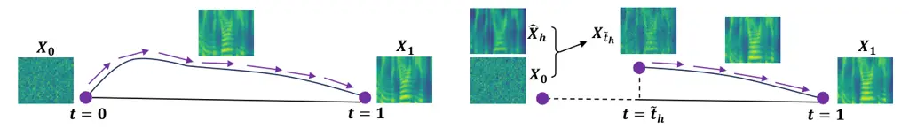

# Shallow Flow Matching for Coarse-to-Fine Text-to-Speech Synthesis

Dong Yang Email: <*ydqmkkx@gmail.com>    Yiyi Cai
Affiliation: Independent Researcher    Yuki Saito Affiliation: The
University of Tokyo    Lixu Wang Affiliation: Nanyang Technological
University    Hiroshi Saruwatari Affiliation: The University of Tokyo

###### Abstract

We propose Shallow Flow Matching (SFM), a novel mechanism that enhances
flow matching (FM)-based text-to-speech (TTS) models within a
coarse-to-fine generation paradigm. Unlike conventional FM modules,
which use the coarse representations from the weak generator as
conditions, SFM constructs intermediate states along the FM paths from
these representations. During training, we introduce an orthogonal
projection method to adaptively determine the temporal position of these
states, and apply a principled construction strategy based on a
single-segment piecewise flow. The SFM inference starts from the
intermediate state rather than pure noise, thereby focusing computation
on the latter stages of the FM paths. We integrate SFM into multiple TTS
models with a lightweight SFM head. Experiments demonstrate that SFM
yields consistent gains in speech naturalness across both objective and
subjective evaluations, and significantly accelerates inference when
using adaptive-step ODE solvers. Demo and codes are available at
[https://ydqmkkx.github.io/SFMDemo/](https://ydqmkkx.github.io/SFMDemo/).

## 1 Introduction

Text-to-speech (TTS) synthesis has advanced with generative algorithms
in recent years, particularly autoregressive (AR) \[45, 25, 22, 49, 38,
46\], diffusion \[33, 12, 48, 2, 24\], and flow matching (FM) \[23, 13,
15, 10, 30, 7, 42\] methods. TTS models typically contain a front-end
for processing contextual information and a back-end for speech
synthesis. Due to the strong temporal alignment between texts and
speech, many diffusion- or FM-based TTS models adopt a coarse-to-fine
generation paradigm: a weak generator first produces coarse
representations conditioned on the input context, which are then refined
by the diffusion or FM module into high-quality mel-spectrograms, and
finally converted into audio waveforms by a vocoder. There are two main
approaches to the weak generator. One \[33, 13, 15, 30\] follows
traditional TTS designs, where a non-autoregressive encoder and an
alignment module \[35, 19\] jointly generate coarse mel-spectrograms
when aligning encoder outputs with target mel-spectrograms. The
other \[2, 8, 9, 31, 51\] employs an AR large language model (LLM) as a
context processor and weak generator to generate discrete speech tokens,
which are transformed into continuous mel-spectrograms by a diffusion or
FM module.

FM has gained increasing attention due to its efficiency and
high-quality generation in TTS. In conventional coarse-to-fine FM-based
TTS models, coarse representations are used as conditions for the flow
module. However, the generation still starts from pure noise, resulting
in a suboptimal allocation of modeling capacity. Since the coarse
representations already encode a significant portion of the overall
semantic and acoustic structure, modeling the early stage from noise
becomes redundant and contributes little to the quality of the final
output. To deal with this issue, DiffSinger \[27\] has introduced a
shallow diffusion mechanism on singing voice synthesis (SVS) and TTS. It
uses a simple mel-spectrogram decoder, with the diffusion module
starting generation at a shallow step based on the output of the
decoder. Therefore, we extend the idea of shallow diffusion mechanism
(with the name) on FM and propose shallow flow matching (SFM) for
coarse-to-fine TTS models. During training, we construct intermediate
states along the FM paths based on the coarse representations. To
achieve this, we employ an orthogonal projection method to adaptively
determine the corresponding time, define a principled construction
approach, and formulate a single-segment piecewise flow. During
inference, the generation starts from the intermediate state, skipping
the early stages and focusing computation on the latter part of the
flow. This leads to more stable generation and enhanced synthesis
quality, and accelerates inference when using adaptive-step ordinary
differential equation (ODE) solvers.

We validate the proposed SFM method on multiple coarse-to-fine TTS
models, covering two mainstream FM architectures, U-Net \[36\] and
DiT \[32\]. Experimental results show that SFM consistently improves the
naturalness of synthesized speech, as measured by both pseudo-MOS
metrics and subjective evaluations. We also observe significant
inference acceleration across various adaptive-step ODE solvers.

## 2 Preliminaries

### 2.1 Flow matching

A time-dependent diffeomorphic map
$`\boldsymbol{\phi}_{t}:[0,1]\times\mathbb{R}^{d}\rightarrow\mathbb{R}^{d}`$
describes the smooth and invertible transformation of data points
$`\boldsymbol{x}\in\mathbb{R}^{d}`$ over time $`t\in[0,1]`$, then a flow
is defined via the ODE with a time-dependent vector field (VF)
$`\boldsymbol{u}_{t}:[0,1]\times\mathbb{R}^{d}\rightarrow\mathbb{R}^{d}`$:

```math
\boldsymbol{x}_{t}=\boldsymbol{\phi}_{t}(\boldsymbol{x}_{0}),\quad\frac{d}{dt}\boldsymbol{\phi}_{t}(\boldsymbol{x}_{0})=\boldsymbol{u}_{t}(\boldsymbol{\phi}_{t}(\boldsymbol{x}_{0})). \tag{1}
```

VF $`\boldsymbol{u}_{t}`$ induces a probability density path
$`p_{t}:[0,1]\times\mathbb{R}^{d}\rightarrow\mathbb{R}_{>0}`$, which is
a time-dependent probability density function (PDF). From time $`0`$ to
time $`t`$, the PDF of $`\boldsymbol{x}`$ is transported from
$`p_{0}(\boldsymbol{x}_{0})`$ to $`p_{t}(\boldsymbol{x}_{t})`$ along
$`\boldsymbol{u}_{t}`$. Chen et al. \[6\] proposed continuous
normalizing flow (CNF) that models the $`\boldsymbol{u}_{t}`$ by a
neural network $`\boldsymbol{v_{\theta}}(\boldsymbol{x}_{t},t)`$, where
$`\boldsymbol{\theta}`$ are learnable parameters. A CNF reshapes a
simple prior distribution $`p_{0}`$ into a complicated distribution
$`p_{1}`$. Lipman et al. \[26\] further proposed flow matching (FM),
whose objective is
$`\mathcal{L}_{\mathrm{FM}}=\mathbb{E}_{t,p_{t}(\boldsymbol{x}_{t})}||\boldsymbol{v_{\theta}}(\boldsymbol{x}_{t},t)-\boldsymbol{u}_{t}(\boldsymbol{x}_{t})||^{2}`$.
Since appropriate $`p_{t}`$ and $`\boldsymbol{u}_{t}`$ are unknown,
\[26\] constructed probability paths conditioned on data sample
$`\boldsymbol{x}_{1}\sim q(\boldsymbol{x}_{1})`$. Specifically, let
$`p_{0}(\boldsymbol{x}_{0})=\mathcal{N}(\boldsymbol{x}_{0}|\boldsymbol{0},\boldsymbol{I})`$,
$`p_{1}(\boldsymbol{x}_{1})\approx q(\boldsymbol{x}_{1})`$, the
conditional probability path is
$`p_{t}(\boldsymbol{x}_{t}|\boldsymbol{x}_{1})=\mathcal{N}(\boldsymbol{x}_{t}|\boldsymbol{\mu}_{t}(\boldsymbol{x}_{1}),\sigma_{t}(\boldsymbol{x}_{1})^{2}\boldsymbol{I})`$.
The flow and VF are considered with the forms:

```math
\displaystyle\boldsymbol{\phi}_{t}(\boldsymbol{x}_{t})=\boldsymbol{\sigma}_{t}(\boldsymbol{x}_{1})\boldsymbol{x}_{t}+\boldsymbol{\mu}_{t}(\boldsymbol{x}_{1}),\quad\boldsymbol{u}_{t}(\boldsymbol{x}_{t}|\boldsymbol{x}_{1})=\frac{\boldsymbol{\sigma}_{t}^{\prime}(\boldsymbol{x}_{1})}{\boldsymbol{\sigma}_{t}(\boldsymbol{x}_{1})}(\boldsymbol{x}_{t}-\boldsymbol{\mu}_{t}(\boldsymbol{x}_{1}))+\boldsymbol{\mu}_{t}^{\prime}(\boldsymbol{x}_{1}), \tag{2}
```

where
$`\boldsymbol{\mu}_{t}:[0,1]\times\mathbb{R}^{d}\rightarrow\mathbb{R}^{d}`$
is the time-dependent mean and
$`\boldsymbol{\sigma}_{t}:[0,1]\times\mathbb{R}^{d}\rightarrow\mathbb{R}_{>0}`$
is the time-dependent scalar standard deviation (std). $`f^{\prime}`$
denotes the derivative with respect to time,
$`f^{\prime}=\frac{d}{dt}f`$. Corresponding to the optimal transport
(OT) displacement interpolant \[29\], the mean and std are:

```math
\boldsymbol{\mu}_{t}(\boldsymbol{x}_{1})=t\boldsymbol{x}_{1},\quad\sigma_{t}(\boldsymbol{x}_{1})=1-(1-\sigma_{\mathrm{min}})t, \tag{3}
```

where $`\sigma_{\mathrm{min}}`$ is a sufficiently small value.
Substituting Eq. (3) into Eq. (2), the conditional flow and VF take the
form:

```math
\boldsymbol{\phi}_{t}(\boldsymbol{x}_{0})=(1-t)\boldsymbol{x}_{0}+t(\boldsymbol{x}_{1}+\sigma_{\mathrm{min}}\boldsymbol{x}_{0}),\quad\boldsymbol{u}_{t}(\boldsymbol{x}_{t}|\boldsymbol{x}_{1})=(\boldsymbol{x}_{1}+\sigma_{\mathrm{min}}\boldsymbol{x}_{0})-\boldsymbol{x}_{0}. \tag{4}
```

Then, we can minimize the conditional flow matching (CFM) loss during
training, which is proven by \[26\] to be equivalent to minimizing the
FM loss
$`\mathcal{L}_{\mathrm{CFM}}=\mathbb{E}_{t,p_{t}(\boldsymbol{x}_{t})}\|\boldsymbol{v_{\theta}}(\boldsymbol{x}_{t},t)-\boldsymbol{u}_{t}(\boldsymbol{x}_{t}|\boldsymbol{x}_{1})\|^{2}`$.  
During inference, we use an ODE solver to solve the integral
$`\boldsymbol{x}_{\mathrm{pred}}=\boldsymbol{x}_{0}+\int_{0}^{1}\boldsymbol{v_{\theta}}(\boldsymbol{x}_{t},t)\,dt`$.

### 2.2 Classifier-free guidance

In FM-based generative models, a typical approach for controlling the
generation process is to incorporate the input condition
$`\boldsymbol{c}`$ during training and inference. To improve diversity
and fidelity, classifier-free guidance (CFG) \[16\] can be employed.
During training, the condition $`\boldsymbol{c}`$ is randomly dropped,
enabling the model to learn from both conditional and unconditional
contexts. During inference, a hyperparameter called the CFG strength
$`\beta>0`$ is introduced to control the trade-off:

```math
\boldsymbol{v}_{\boldsymbol{\theta},\mathrm{CFG}}(\boldsymbol{x}_{t},t,\boldsymbol{c})=\boldsymbol{v_{\theta}}(\boldsymbol{x}_{t},t,\boldsymbol{c})+\beta(\boldsymbol{v_{\theta}}(\boldsymbol{x}_{t},t,\boldsymbol{c})-(\boldsymbol{v_{\theta}}(\boldsymbol{x}_{t},t)). \tag{5}
```

Specifically, the FM module runs two forward passes at each time step,
once with $`\boldsymbol{c}`$ and once without.

### 2.3 Flow matching-based TTS models

Our backbone configurations involve three fully open-source TTS models.

Matcha-TTS: Matcha-TTS \[30\] is a non-AR FM-based TTS model that
employs a conventional encoder-decoder architecture. The
Transformer-based \[43\] encoder takes phonemes and speaker IDs (for
multi-speaker training) as input, producing hidden states and predicted
phoneme-level durations. The U-Net-based FM decoder receives the
encoder’s outputs and speaker embeddings as FM conditions and generates
mel-spectrograms.

Because the encoder adopts the monotonic alignment search (MAS)-based
alignment \[18, 19, 33\] for phoneme-spectrogram alignment, the encoder
outputs are optimized towards the ground-truth mel-spectrograms (via the
prior loss in the paper), resulting in coarse mel-spectrograms.

CosyVoice: CosyVoice \[8\] is a large zero-shot TTS model that consists
of four components: the text encoder, the speech tokenizer, the LLM, and
the FM module. The speech tokenizer extracts discrete speech tokens from
mel-spectrograms of waveforms, while the text encoder processes textual
inputs and aligns text encodings with speech tokens. The LLM, a
Transformer decoder-based model, takes speaker embeddings, text
encodings, and prompt speech tokens as input and generates target speech
tokens in an AR way. Subsequently, the FM module, conditioned on speaker
embeddings, target speech tokens, and masked mel-spectrograms, generates
the target mel-spectrograms.

The FM module adopts an encoder-decoder structure. The
Conformer-based \[14\] encoder encodes the speech tokens generated by
the LLM into hidden states and linearly projects them to the same
dimension as mel-spectrograms. These hidden states are then upsampled by
a length regulator for token-spectrogram alignment and fed into the
U-Net-based decoder, along with other conditions, for FM training and
inference. Therefore, the upsampled hidden states can be explicitly
supervised to coarse mel-spectrograms.

In CosyVoice, the speech tokenizer, LLM, and flow modules are trained
independently. Therefore, in our experiments, we only train the flow
module using speech tokens generated by the officially pre-trained
speech tokenizer, while employing the officially pre-trained LLM during
inference.

StableTTS: StableTTS \[1\] is an open-source TTS model in which both the
encoder and FM decoder leverage DiT blocks. Its encoder employs
MAS-based alignment and outputs coarse mel-spectrograms.

To assess the effectiveness of our method under different input types
(text sequences and speech tokens) within the DiT architecture, we
further adapt StableTTS as the FM module of CosyVoice. The resulting
backbone TTS model is referred to as CosyVoice-DiT throughout our work.

## 3 Method

### 3.1 Theorems

Proofs of our theorems are provided in Appendix A. Theorem 2 can be
derived from PeRFlow \[47\] that divides CondOT paths into several
windows and conducts piecewise reflow \[28\] in each window.

###### Theorem 1.

For any random variable
$`\boldsymbol{x}_{m}\sim\mathcal{N}(t_{m}\boldsymbol{x}_{1},\sigma^{2}_{m}\boldsymbol{I})`$,
where $`t_{m}\in[0,\infty)`$ and $`\sigma_{m}\in(0,\infty)`$, we define
a transformation that maps $`\boldsymbol{x}_{m}`$ onto the conditional
OT (CondOT) paths. The output distribution varies continuously with
respect to $`t_{m}`$ and $`\sigma_{m}`$ under the Wasserstein-2 metric.

```math
\Delta=(1-\sigma_{\mathrm{min}})t_{m}+\sigma_{m}, \tag{6}
```

```math
\displaystyle\boldsymbol{x}_{\tau} \displaystyle=\begin{cases}\sqrt{(1-(1-\sigma_{\mathrm{min}})t_{m})^{2}-\sigma^{2}_{m}}\boldsymbol{x}_{0}+\boldsymbol{x}_{m},&\text{if }\Delta<1,\\
\frac{1}{\Delta}\boldsymbol{x}_{m},&\text{if }\Delta\geq 1,\end{cases} \tag{7}
```

where
$`\boldsymbol{x}_{0}\sim\mathcal{N}(\boldsymbol{0},\boldsymbol{I})`$,
with corresponding $`\tau=\min(t_{m},\frac{t_{m}}{\Delta})`$ on the
path.

###### Theorem 2.

For arbitrary intermediate states on the CondOT paths:

```math
\boldsymbol{x}_{t_{m}}=(1-t_{m})\boldsymbol{x}_{0}+t_{m}(\boldsymbol{x}_{1}+\sigma_{\mathrm{min}}\boldsymbol{x}_{0}),\quad t_{m}\in(0,1),\boldsymbol{x}_{0}\sim\mathcal{N}(\boldsymbol{0},\boldsymbol{I}), \tag{8}
```

we can divide the paths into two segments at $`t_{m}`$ and represent the
flow and VF using piecewise functions:

```math
\displaystyle\boldsymbol{x}_{t} \displaystyle=\begin{cases}(1-\frac{t}{t_{m}})\boldsymbol{x}_{0}+\frac{t}{t_{m}}\boldsymbol{x}_{t_{m}},&\text{if }t<t_{m},\\
(1-\frac{t-t_{m}}{1-t_{m}})\boldsymbol{x}_{t_{m}}+\frac{t-t_{m}}{1-t_{m}}(\boldsymbol{x}_{1}+\sigma_{\mathrm{min}}\boldsymbol{x}_{0}),&\text{if }t\geq t_{m},\end{cases} \tag{9}
```

```math
\displaystyle\boldsymbol{u}_{t} \displaystyle=\begin{cases}\frac{1}{t_{m}}(\boldsymbol{x}_{t_{m}}-\boldsymbol{x}_{0}),&\text{if }t<t_{m},\\
\frac{1}{1-t_{m}}(\boldsymbol{x}_{1}+\sigma_{\mathrm{min}}\boldsymbol{x}_{0}-\boldsymbol{x}_{t_{m}}),&\text{if }t\geq t_{m}.\end{cases} \tag{10}
```

### 3.2 Proposed methods on coarse-to-fine FM-based TTS



Figure 1: Inference process. Left: standard FM; Right: proposed SFM.

We define the mel-spectrogram of an audio waveform as
$`\boldsymbol{X}\in\mathbb{R}^{N\times F}`$, where $`N`$ is the number
of time frames and $`F`$ is the number of frequency bins (channels).
Specifically, $`\boldsymbol{X}^{n}\in\mathbb{R}^{F}`$ denotes the
$`n`$-th mel-spectrogram frame. We refer to the weak generator as
$`\boldsymbol{g_{\omega}}`$ (with learnable parameters
$`\boldsymbol{\omega}`$), which receives text, speaker features, and
other contextual information as the input condition $`\boldsymbol{C}`$
and outputs a coarse mel-spectrogram
$`\hat{\boldsymbol{X}}_{\boldsymbol{g}}`$.
$`\hat{\boldsymbol{X}}_{\boldsymbol{g}}`$ is supervised to match the
target sample $`\boldsymbol{X}_{1}`$, typically using an L2 loss, though
other loss functions may also be applied depending on the task:

```math
\mathcal{L}_{\mathrm{coarse}}=\mathbb{E}||\hat{\boldsymbol{X}}_{\boldsymbol{g}}-\boldsymbol{X}_{1}||^{2}. \tag{11}
```

We introduce a lightweight SFM head $`\boldsymbol{h_{\psi}}`$ with
learnable parameters $`\boldsymbol{\psi}`$ (see details in Appendix B),
which takes the final hidden states
$`\hat{\boldsymbol{H}}_{\boldsymbol{g}}`$ from
$`\boldsymbol{g_{\omega}}`$ as input and outputs a scaled
mel-spectrogram $`\hat{\boldsymbol{X}}_{\boldsymbol{h}}`$. Note that
$`\hat{\boldsymbol{X}}_{\boldsymbol{g}}`$ is obtained by applying a
linear projection to $`\hat{\boldsymbol{H}}_{\boldsymbol{g}}`$. In
addition, $`\boldsymbol{h_{\psi}}`$ needs to predict a time
$`\hat{t}_{\boldsymbol{h}}\in(0,1)`$ and an estimated variance
$`\hat{\sigma}^{2}_{\boldsymbol{h}}`$ for
$`\hat{\boldsymbol{X}}_{\boldsymbol{h}}`$:

```math
\hat{\boldsymbol{H}}_{\boldsymbol{g}},\hat{\boldsymbol{X}}_{\boldsymbol{g}}=\boldsymbol{g_{\omega}}(\boldsymbol{C}),\quad\hat{\boldsymbol{X}}_{\boldsymbol{h}},\hat{t}_{\boldsymbol{h}},\hat{\sigma}^{2}_{\boldsymbol{h}}=\boldsymbol{h_{\psi}}(\hat{\boldsymbol{H}}_{\boldsymbol{g}}). \tag{12}
```

#### 3.2.1 Orthogonal projection onto CondOT paths

Since the exact location of $`\hat{\boldsymbol{X}}_{\boldsymbol{h}}`$ on
the CondOT paths and the corresponding time $`t_{\boldsymbol{h}}`$ are
unknown, we let the model adaptively determine $`t_{\boldsymbol{h}}`$
during training. To direct $`\hat{\boldsymbol{X}}_{\boldsymbol{h}}`$ to
the CondOT paths, we find the orthogonal projection of
$`\hat{\boldsymbol{X}}_{\boldsymbol{h}}`$ onto $`\boldsymbol{X}_{1}`$.
According to Eq. (3), the projection coefficient is
$`t_{\boldsymbol{h}}`$, which corresponds to an intermediate state on
the mean path $`\boldsymbol{\mu}_{t}(\boldsymbol{X}_{1})`$. Then we
estimate the time $`t_{\boldsymbol{h}}`$ and the variance
$`\sigma_{\boldsymbol{h}}^{2}`$, and minimize the distance between
$`\hat{\boldsymbol{X}}_{\boldsymbol{h}}`$ and
$`t_{\boldsymbol{h}}\boldsymbol{X}_{1}`$ via the loss
$`\mathcal{L}_{\mu}`$:

```math
t_{\boldsymbol{h}}=\mathrm{max}(0,\mathbb{E}[\frac{\mathrm{sg}[\hat{\boldsymbol{X}}_{\boldsymbol{h}}]\cdot\boldsymbol{X}_{1}}{\boldsymbol{X}_{1}\cdot\boldsymbol{X}_{1}}]),\quad\sigma_{\boldsymbol{h}}^{2}=\mathbb{E}||\mathrm{sg}[\hat{\boldsymbol{X}}_{\boldsymbol{h}}]-t_{\boldsymbol{h}}\boldsymbol{X}_{1}||^{2},\quad\mathcal{L}_{\mu}=\mathbb{E}||\hat{\boldsymbol{X}}_{\boldsymbol{h}}-t_{\boldsymbol{h}}\boldsymbol{X}_{1}||^{2}, \tag{13}
```

where $`\mathrm{sg}[\cdot]`$ (stop gradient) is used to simplify
gradient propagation. $`\sigma_{\boldsymbol{h}}^{2}`$ represents the
noise scale of $`\hat{\boldsymbol{X}}_{\boldsymbol{h}}`$ and can be
interpreted as intrinsic noise. Given the large number of
mel-spectrogram frames, we omit the unbiased correction term in the
estimation.

When
$`\hat{\boldsymbol{X}}_{\boldsymbol{h}}\approx t_{\boldsymbol{h}}\boldsymbol{X}_{1}`$,
we can assume that
$`\hat{\boldsymbol{X}}_{\boldsymbol{h}}\sim\mathcal{N}(t_{\boldsymbol{h}}\boldsymbol{X}_{1},\sigma^{2}_{\boldsymbol{h}}\boldsymbol{I})`$
and utilize Theorem 1 to construct intermediate states on the CondOT
paths:

```math
\Delta=\max((1-\sigma_{\mathrm{min}})t_{\boldsymbol{h}}+\sigma_{\boldsymbol{h}},1),\quad\tilde{\boldsymbol{X}}_{\boldsymbol{h}}=\frac{1}{\Delta}{\hat{\boldsymbol{X}}_{\boldsymbol{h}}},\quad\tilde{t}_{\boldsymbol{h}}=\frac{1}{\Delta}{t_{\boldsymbol{h}}},\quad\tilde{\sigma}^{2}_{\boldsymbol{h}}=\frac{1}{\Delta^{2}}{\sigma^{2}_{\boldsymbol{h}}}, \tag{14}
```

```math
\boldsymbol{X}_{\tilde{t}_{\boldsymbol{h}}}=\sqrt{\max((1-(1-\sigma_{\mathrm{min}})\tilde{t}_{\boldsymbol{h}})^{2}-\tilde{\sigma}_{\boldsymbol{h}}^{2},0)}\boldsymbol{X}_{0}+\tilde{\boldsymbol{X}}_{\boldsymbol{h}}, \tag{15}
```

where
$`\boldsymbol{X}_{0}\sim\mathcal{N}(\boldsymbol{0},\boldsymbol{I})`$.
During the early stages of training, it is possible that
$`\Delta\geq 1`$. In such cases,
$`\hat{\boldsymbol{X}}_{\boldsymbol{h}}`$ is unable to lie on the CondOT
path with the external noise $`\boldsymbol{X}_{0}`$, resulting in
deterministic model behavior. The scaling factor $`\frac{1}{\Delta}`$
introduced in Theorem 1 rescales and guides
$`\hat{\boldsymbol{X}}_{\boldsymbol{h}}`$ back onto the CondOT paths
until $`\boldsymbol{X}_{0}`$ can be incorporated. Then we calculate the
losses for the two predicted scalars:

```math
\mathcal{L}_{t}=(\hat{t}_{\boldsymbol{h}}-\tilde{t}_{\boldsymbol{h}})^{2},\quad\mathcal{L}_{\sigma}=(\hat{\sigma}^{2}_{\boldsymbol{h}}-\tilde{\sigma}^{2}_{\boldsymbol{h}})^{2}. \tag{16}
```

#### 3.2.2 Single-segment piecewise flow

During training and inference, the flow starts from
$`\tilde{t}_{\boldsymbol{h}}`$. Therefore, we employ Theorem 2 and focus
only on the second segment of the paths
($`t\geq\tilde{t}_{\boldsymbol{h}}`$):

```math
t_{\mathcal{U}}\sim\mathcal{U}[0,1],\quad t_{\mathcal{S}}=\mathcal{S}(t_{\mathcal{U}}),\quad t=(1-\tilde{t}_{\boldsymbol{h}})t_{\mathcal{S}}+\tilde{t}_{\boldsymbol{h}}, \tag{17}
```

```math
\displaystyle\boldsymbol{X}_{t} \displaystyle=\left(1-\frac{t-\tilde{t}_{\boldsymbol{h}}}{1-\tilde{t}_{\boldsymbol{h}}}\right)\boldsymbol{X}_{\tilde{t}_{\boldsymbol{h}}}+\frac{t-\tilde{t}_{\boldsymbol{h}}}{1-\tilde{t}_{\boldsymbol{h}}}(\boldsymbol{X}_{1}+\sigma_{\mathrm{min}}\boldsymbol{X}_{0}) \tag{18}
```

```math
\displaystyle=(1-t_{\mathcal{S}})\boldsymbol{X}_{\tilde{t}_{\boldsymbol{h}}}+t_{\mathcal{S}}(\boldsymbol{X}_{1}+\sigma_{\mathrm{min}}\boldsymbol{X}_{0}), \tag{19}
```

```math
\displaystyle\boldsymbol{U}_{t} \displaystyle=\frac{1}{1-\tilde{t}_{\boldsymbol{h}}}(\boldsymbol{X}_{1}+\sigma_{\mathrm{min}}\boldsymbol{X}_{0}-\boldsymbol{X}_{\tilde{t}_{\boldsymbol{h}}}), \tag{20}
```

where $`\mathcal{S}`$ is an arbitrary time scheduler for the randomly
sampled $`t`$.

Finally, combined with the CFM loss, the overall loss for the SFM
framework is given by:

```math
\mathcal{L}_{\mathrm{CFM}}=\mathbb{E}_{t,p_{t}(\boldsymbol{X}_{t})}||\boldsymbol{v_{\theta}}(\boldsymbol{X}_{t},t)-\boldsymbol{U}_{t}||^{2},\quad\mathcal{L}_{\mathrm{SFM}}=\mathcal{L}_{\mathrm{coarse}}+\mathcal{L}_{t}+\mathcal{L}_{\sigma}+\mathcal{L}_{\mu}+\mathcal{L}_{\mathrm{CFM}}. \tag{21}
```

#### 3.2.3 Inference with SFM strength

During inference, we observe that the adaptively determined
$`t_{\boldsymbol{h}}`$ tends to be small, which limits the amount of
prior information. To address this issue, we introduce a hyperparameter
called SFM strength $`\alpha\geq 1`$, which scales up the
$`\hat{t}_{\boldsymbol{h}}`$ to encourage stronger guidance from
$`\hat{\boldsymbol{X}}_{\boldsymbol{h}}`$

```math
\Delta=\max(\alpha((1-\sigma_{\mathrm{min}})\hat{t}_{\boldsymbol{h}}+\hat{\sigma}_{\boldsymbol{h}}),1),\quad\tilde{\boldsymbol{X}}_{\boldsymbol{h}}=\frac{\alpha}{\Delta}{\hat{\boldsymbol{X}}_{\boldsymbol{h}}},\quad\tilde{t}_{\boldsymbol{h}}=\frac{\alpha}{\Delta}{\hat{t}_{\boldsymbol{h}}},\quad\tilde{\sigma}^{2}_{\boldsymbol{h}}=\frac{\alpha^{2}}{\Delta^{2}}\hat{\sigma}^{2}_{\boldsymbol{h}}, \tag{22}
```

Substituting $`\tilde{\boldsymbol{X}}_{\boldsymbol{h}}`$,
$`\tilde{t}_{\boldsymbol{h}}`$, and
$`\tilde{\sigma}^{2}_{\boldsymbol{h}}`$ into Eq. (15) yields
$`\boldsymbol{X}_{\tilde{t}_{\boldsymbol{h}}}`$. We can obtain the
predicted results $`\boldsymbol{X}_{\mathrm{pred}}`$ by solving the
integral
$`\boldsymbol{X}_{\mathrm{pred}}=\boldsymbol{X}_{\tilde{t}_{\boldsymbol{h}}}+\int_{\tilde{t}_{\boldsymbol{h}}}^{1}\boldsymbol{v_{\theta}}(\boldsymbol{X}_{t},t)\,dt`$
with an ODE solver. For each model employing the SFM method, we
determine the optimal $`\alpha`$ on the validation set. In most cases,
the optimal $`\alpha`$ is relatively small, resulting in $`\Delta=1`$.
The scaling factor $`\frac{\alpha}{\Delta}`$ has a theoretical upper
bound of
$`\frac{1}{(1-\sigma_{\mathrm{min}})\hat{t}_{\boldsymbol{h}}+\hat{\sigma}_{\boldsymbol{h}}}`$.

We provide concise algorithm boxes in Appendix C, using minimal notation
for clarity and including implementation details. An example of SFM
inference is illustrated in Fig. 1.

## 4 Experimental setup

### 4.1 Datasets

We use LJ Speech \[17\], VCTK \[44\], and LibriTTS \[50\] in our
experiments, where LJ Speech is a single-speaker dataset and the others
are multi-speaker datasets. For LJ Speech and VCTK, the training,
validation, and test sets are divided following the setting of
Matcha-TTS, which follows VITS’s settings.¹¹ 1
[https://github.com/jaywalnut310/vits/tree/main/filelists](https://github.com/jaywalnut310/vits/tree/main/filelists)
Each validation set contains 100 utterances, and each test set contains
500 utterances.

For LibriTTS, the train subsets are used as the training set. We
construct the validation and test sets with the dev-clean and test-clean
subsets, respectively. We adopt the cross-sentence evaluation approach
in CosyVoice and F5-TTS: utterances from each subset are paired to form
\<prompt, target\> pairs, where the prompt utterance is used as the
reference to TTS models and the transcript of the target utterance
serves as the text input. The prompt utterances are selected such that
their durations are rounded to between 3 and 4 seconds, while the
duration of target utterances is between 4 and 10 seconds. We set the
validation and test sets to contain 200 and 1000 utterances,
respectively.

### 4.2 Model implementations

Since the SFM head (the architecture is shown in Appendix B) receives
hidden states as input for richer contextual information, all length
regulators in each model upsample the hidden states. Several neural
network layers smooth the upsampled hidden states, which are then used
to generate coarse mel-spectrograms and input to the SFM head as in
Eq. (12). The coarse mel-spectrograms are supervised using the target
mel-spectrograms via Eq. (11).

Matcha-TTS: We utilize Matcha-TTS with the officially pre-trained
Vocos \[39\] as the vocoder. Since the official implementation does not
include smoothing layers for the encoder outputs, we designate the final
block of the six-block encoder to serve as smoothing layers.

StableTTS: Although StableTTS incorporates a reference encoder to
extract speaker embeddings and enables zero-shot TTS, we observe that
the extracted speaker embeddings are unstable and lead to unstable
encoder outputs. This instability causes the simple SFM head to struggle
with converging and predicting accurate $`\hat{t}_{\boldsymbol{h}}`$ and
$`\hat{\sigma}^{2}_{\boldsymbol{h}}`$. Therefore, we use ID-based
speaker embeddings with random initialization instead of the reference
encoder. Both the encoder and decoder are configured with six DiT
blocks. The Vocos pre-trained in StableTTS is used as the vocoder.

CosyVoice: As discussed in Section 2.3, we only train the flow module of
CosyVoice. We use the officially pre-trained speech tokenizer and LLM to
generate speech tokens for training and inference, respectively. The
pre-trained HiFi-GAN \[20\] in CosyVoice is used as the vocoder. In the
original FM module, the encoder takes only speech tokens as input, while
speaker embeddings and masked mel-spectrograms are used as conditions
for the FM decoder. However, under this configuration, we find that the
encoder fails to produce coarse mel-spectrograms with sufficient speaker
features. To address this, we concatenate the speech tokens, speaker
embeddings, and masked mel-spectrograms, and feed them jointly into the
encoder. For ablation studies, we evaluate a variant (denoted as SFM-t)
with the SFM method in which the encoder takes only speech tokens as
input.

CosyVoice-DiT: As discussed in Section 2.3, we construct CosyVoice-DiT
using the encoder and decoder of StableTTS, each of which contains six
DiT blocks. The speech tokens are fed into the encoder, while the
speaker embeddings are incorporated into every DiT block via
adaLN-Zero \[32\]. The Vocos pre-trained in StableTTS is used as the
vocoder.

Baseline models: We adopt and train the original models as baseline
models. Due to necessary architectural modifications, no direct baseline
is available for StableTTS and CosyVoice-DiT.

Ablated models: For each model, we construct an ablated version to
enable a more direct comparison with the SFM model, mainly including the
addition of coarse loss and the SFM head. In the ablated models, the SFM
head only outputs the $`\hat{\boldsymbol{X}}_{\boldsymbol{h}}`$ as the
condition for the FM module. Therefore, the only difference between the
ablated and SFM models is whether the SFM method is applied. This design
allows us to isolate and assess the effect of the proposed SFM method.

SFM-c: In our SFM method, the coarse mel-spectrograms are not used as FM
conditions. For ablation studies, we also evaluate a variant (denoted as
SFM-c) that not only applies the SFM method but also uses coarse
mel-spectrograms as FM conditions.

### 4.3 Training and inference configurations

| Model         | Vocoder  | Dataset   | Epochs | Batch Size           | Learning Rate   | Warmup | GPUs | $`\boldsymbol{\beta}`$ | Solver   |
| ------------- | -------- | --------- | ------ | -------------------- | --------------- | ------ | ---- | ---------------------- | -------- |
| Matcha-TTS    | Vocos    | LJ Speech | 800    | 128                  | 4$`\times`$10⁻⁴ | –      | 1    | –                      | Euler    |
| Matcha-TTS    | Vocos    | VCTK      | 800    | 128                  | 2$`\times`$10⁻⁴ | –      | 2    | –                      | Euler    |
| StableTTS     | Vocos    | VCTK      | 800    | 128                  | 2$`\times`$10⁻⁴ | 10%    | 2    | 3                      | Dopri(5) |
| CosyVoice     | HiFi-GAN | LibriTTS  | 200    | dynamic$`{\dagger}`$ | 1$`\times`$10⁻⁴ | 10%    | 8    | 0.7                    | Euler    |
| CosyVoice-DiT | Vocos    | LibriTTS  | 200    | 256                  | 1$`\times`$10⁻⁴ | 10%    | 4    | 3                      | Dopri(5) |

Table 1: Training and inference configurations of TTS models. $`\beta`$:
CFG strength. $`{\dagger}`$: 24,000 maximum frames.

All training, inference, and objective evaluations are conducted on
96 GB Nvidia H100 GPUs with half precision (FP16). We follow the
official configurations of each baseline as closely as possible, and
some key settings are summarized in Table 1. Specifically, a warmup
parameter indicates that a learning rate scheduler is used. Because of
our large batch sizes, we increase the constant or peak learning rates
based on the linear scaling rule, and then reduce them if gradient
explosions are observed. The presence of a CFG strength indicates the
application of CFG.

### 4.4 Evaluations

#### 4.4.1 Objective evaluation

We evaluate model performance using three pseudo-MOS prediction models:
UTMOS \[37\], UTMOSv2 \[3\], and Distill-MOS \[41\]. Their average is
defined as $`\overline{\text{PMOS}}`$ and is used for selecting the
optimal $`\alpha`$ in SFM methods. In addition, we report word error
rate (WER) and speaker similarity (SIM). For WER, we use
Whisper-large-v3 \[34\] as the speech recognition model to transcribe
speech. For SIM, we use WavLM-base-plus-sv \[5, 40\]²² 2
[https://huggingface.co/microsoft/wavlm-base-plus-sv](https://huggingface.co/microsoft/wavlm-base-plus-sv)
to extract speaker embeddings and compute the cosine similarity between
synthesized and ground-truth speech.

#### 4.4.2 Subjective evaluation

We conducted comparative MOS (CMOS) and similarity MOS (SMOS) tests to
evaluate naturalness and similarity, respectively. In each single test,
we recruited 20 native English listeners on Prolific³³ 3
[https://www.prolific.com](https://www.prolific.com) with £9 per hour.

CMOS: We use our proposed model with SFM as the reference system, and
all other systems are compared against it. For each system, five
utterances are selected and paired with corresponding utterances from
the SFM model. Listeners are presented with utterance pairs and asked to
rate the naturalness difference on a 7-point scale ranging from $`-3`$
to $`+3`$. A score of $`+3`$ indicates that the first utterance sounds
much better than the second, while $`-3`$ indicates the opposite.

SMOS: SMOS tests are only conducted for cross-sentence evaluations to
evaluate the similarity between the ground-truth prompt utterance and
the target utterance from different systems. Each system provides five
utterances with corresponding prompts. Listeners are presented with
\<prompt, target\> utterance pairs and asked to rate how similar the
target sounds to the prompt on a 5-point scale ranging from 1 to 5,
where 1 indicates "not similar at all" and 5 indicates "extremely
similar".

### 4.5 SFM strength selection

We determine the optimal SFM strength $`\alpha`$ on the corresponding
validation sets. Starting from 1.0, we increment $`\alpha`$ by 1.0 and
objectively evaluate the generated speech to identify the value that
yields the highest $`\overline{\text{PMOS}}`$. We then examine its
neighbors at $`\alpha\pm 0.5`$ for potential improvements. Finer-grained
search is avoided to prevent overfitting and ensure the robustness of
the SFM method.

### 4.6 ODE solvers and speed analysis

| Abbreviation | Full Name                   | Order |
| ------------ | --------------------------- | ----- |
| Heun(2)      | Adaptive Heun’s Method      | 2     |
| Fehlberg(2)  | Runge–Kutta–Fehlberg Method | 2     |
| Bosh(3)      | Bogacki–Shampine Method     | 3     |
| Dopri(5)     | Dormand–Prince Method       | 5     |

Table 2: Adaptive-step ODE solvers used in our experiments. All of them
are variants of the explicit Runge–Kutta family.

For evaluations, we follow the official ODE solver settings of each
model. For speed analysis with adaptive-step ODE solvers, we use the
odeint from torchdiffeq \[4\] with various solvers. The default relative
and absolute tolerances (1$`\times`$10⁻⁷ and 1$`\times`$10⁻⁹) are too
strict, resulting in significantly longer inference time. Therefore, we
adopt the settings used in StableTTS: 1$`\times`$10⁻⁵ for both
tolerances. As shown in Table 2, we employ Huen(2), Fehlberg(2),
Bosh(3), and Dopri(5) as adaptive-step solvers, where the number in ()
denotes the order.

We adopt real-time factor (RTF) and number of function evaluations (NFE)
as metrics for speed evaluation, where RTF measures the ratio between
the ODE solver inference time and the corresponding audio duration, and
NFE indicates how many times the solver queries the model. To reduce the
influence of runtime variance, we choose 100 utterances from each
model’s validation set and run each solver five times, reporting the
average RTF. Note that the NFE is constant across runs.

## 5 Experimental results and analysis

|                                       |                                |                                     |                                                 |                   |                     |                         |                      |                 |
| ------------------------------------- | ------------------------------ | ----------------------------------- | ----------------------------------------------- | ----------------- | ------------------- | ----------------------- | -------------------- | --------------- |
| $`\alpha`$                            | $`\tilde{t}_{\boldsymbol{g}}`$ | $`\tilde{\sigma}_{\boldsymbol{g}}`$ | $`\overline{\textbf{\text{PMOS}}}`$$`\uparrow`$ | UTMOS$`\uparrow`$ | UTMOSv2$`\uparrow`$ | Distill-MOS$`\uparrow`$ | WER(%)$`\downarrow`$ | SIM$`\uparrow`$ |
| Matcha-TTS (SFM) trained on LJ Speech |                                |                                     |                                                 |                   |                     |                         |                      |                 |
| 1.0                                   | 0.099                          | 0.092                               | 4.036                                           | 4.194             | 3.721               | 4.192                   | 4.641                | 0.972           |
| 2.0                                   | 0.198                          | 0.183                               | 4.158                                           | 4.305             | 3.834               | 4.337                   | 3.496                | 0.973           |
| 2.5                                   | 0.248                          | 0.229                               | 4.176                                           | 4.276             | 3.872               | 4.381                   | 3.556                | 0.972           |
| 3.0                                   | 0.297                          | 0.275                               | 4.168                                           | 4.260             | 3.842               | 4.402                   | 3.496                | 0.970           |
| 3.5                                   | 0.347                          | 0.320                               | 4.132                                           | 4.190             | 3.802               | 4.403                   | 3.496                | 0.969           |
| 4.0                                   | 0.397                          | 0.366                               | 4.107                                           | 4.137             | 3.763               | 4.421                   | 3.556                | 0.966           |
| 5.0                                   | 0.496                          | 0.458                               | 4.025                                           | 3.977             | 3.694               | 4.403                   | 3.376                | 0.960           |
| 6.0                                   | 0.520                          | 0.480                               | 3.997                                           | 3.958             | 3.648               | 4.386                   | 3.315                | 0.958           |
| 7.0                                   | 0.520                          | 0.480                               | 3.990                                           | 3.960             | 3.625               | 4.386                   | 3.315                | 0.958           |
| 8.0                                   | 0.520                          | 0.480                               | 3.990                                           | 3.959             | 3.625               | 4.386                   | 3.315                | 0.958           |
| 9.0                                   | 0.520                          | 0.480                               | 3.993                                           | 3.956             | 3.638               | 4.386                   | 3.315                | 0.958           |
| 10.0                                  | 0.520                          | 0.480                               | 3.987                                           | 3.955             | 3.620               | 4.386                   | 3.315                | 0.958           |

Table 3: Partial objective evaluation results on validation sets for
$`\boldsymbol{\alpha}`$ selection. Complete results are provided in
Appendix D. The highest value for each metric is highlighted in bold.

### 5.1 Evaluation results

Due to page limitations, Table 3 and Table 5 only provide partial
results, and complete results are provided in Appendix D and F,
respectively. Other minor analysis is provided in Appendix E.

SFM strength selection: In Table 3 and the tables in Appendix D,
$`\tilde{t}_{\boldsymbol{g}}`$ and $`\tilde{\sigma}_{\boldsymbol{g}}`$
are computed according to Eq. 22, and the reported values represent
their means over all utterances in the validation sets. From these
tables, it is evident that using values of $`\alpha>1.0`$ significantly
improves both pseudo-MOS scores and WER. The $`\overline{\text{PMOS}}`$,
which serves as the selection criterion, tends to increase initially and
then decrease as $`\alpha`$ grows. This observation suggests that the
adaptively determined $`t_{\boldsymbol{h}}`$ during training is
generally small. As a result, the intermediate state constructed at
inference with $`\alpha=1.0`$ corresponds to an early position on the
CondOT paths. When Gaussian noise $`\boldsymbol{X}_{0}`$ is added at
this stage, the resulting signal-to-noise ratio is low, making it
difficult for the flow decoder to extract sufficient information and
weakening the guidance during early sampling steps.

According to Eq. (13), $`\hat{\boldsymbol{X}}_{\boldsymbol{h}}`$ is
supervised by the linearly down-scaled
$`t_{\boldsymbol{h}}\boldsymbol{X}_{1}`$. This allows us to apply the
$`\alpha`$ during inference to linearly scale up
$`\tilde{\boldsymbol{X}}_{\boldsymbol{h}}`$ in Eq. 22, thereby enhancing
its guidance effect. However, due to estimation errors, increasing
$`\alpha`$ also leads to a growing distance between
$`\tilde{\boldsymbol{X}}_{\boldsymbol{h}}`$ and
$`\tilde{t}_{\boldsymbol{h}}\boldsymbol{X}_{1}`$. Meanwhile, the
incorporated $`\boldsymbol{X}_{0}`$ decreases and results in a more
deterministic sampling process. These factors ultimately reduce
generation quality.

|                                   |                   |                     |                         |                   |                 |                  |                  |
| --------------------------------- | ----------------- | ------------------- | ----------------------- | ----------------- | --------------- | ---------------- | ---------------- |
| System                            | UTMOS$`\uparrow`$ | UTMOSv2$`\uparrow`$ | Distill-MOS$`\uparrow`$ | WER$`\downarrow`$ | SIM$`\uparrow`$ | CMOS$`\uparrow`$ | SMOS$`\uparrow`$ |
| Matcha-TTS trained on LJ Speech   |                   |                     |                         |                   |                 |                  |                  |
| Ground truth                      | 4.380             | 3.964               | 4.241                   | 3.566             | 1.000           | $`+0.22`$        | –                |
| Reconstructed                     | 4.085             | 3.739               | 4.208                   | 3.472             | 0.993           | $`+0.12`$        | –                |
| Baseline                          | 4.186             | 3.692               | 4.282                   | 3.308             | 0.971           | $`-0.48`$        | –                |
| Ablated                           | 4.217             | 3.763               | 4.311                   | 3.355             | 0.972           | $`-0.27`$        | –                |
| SFM ($`\alpha`$=2.5)              | 4.257             | 3.848               | 4.386                   | 3.413             | 0.972           | 0.00             | –                |
| Matcha-TTS trained on VCTK        |                   |                     |                         |                   |                 |                  |                  |
| Ground truth                      | 3.999             | 3.562               | 3.986                   | 1.534             | 1.000           | $`+0.16`$        | –                |
| Reconstructed                     | 3.819             | 3.246               | 3.977                   | 1.666             | 0.985           | $`+0.08`$        | –                |
| Baseline                          | 4.008             | 2.978               | 3.870                   | 1.534             | 0.939           | $`-0.31`$\*      | –                |
| Ablated                           | 4.026             | 2.997               | 3.872                   | 1.613             | 0.941           | $`-0.39`$\*      | –                |
| SFM ($`\alpha`$=3.5)              | 4.106             | 3.105               | 3.898                   | 0.952             | 0.937           | 0.00             | –                |
| StableTTS trained on VCTK         |                   |                     |                         |                   |                 |                  |                  |
| Ground truth                      | 3.999             | 3.562               | 3.986                   | 1.534             | 1.000           | $`+0.48`$\*      | –                |
| Reconstructed                     | 3.360             | 2.908               | 3.855                   | 1.719             | 0.972           | $`+0.04`$        | –                |
| Ablated                           | 3.328             | 2.958               | 3.929                   | 1.798             | 0.932           | $`-0.34`$\*      | –                |
| SFM ($`\alpha`$=3.0)              | 3.516             | 3.020               | 3.953                   | 1.745             | 0.933           | 0.00             | –                |
| SFM-c ($`\alpha`$=4.5)            | 3.507             | 2.899               | 3.934                   | 1.877             | 0.931           | $`-0.37`$\*      | –                |
| CosyVoice trained on LibriTTS     |                   |                     |                         |                   |                 |                  |                  |
| Ground truth                      | 4.136             | 3.262               | 4.345                   | 3.180             | 1.000           | $`+0.19`$        | 3.40             |
| Reconstructed                     | 3.942             | 3.126               | 4.336                   | 3.146             | 0.993           | $`-0.24`$        | 2.82\*           |
| Baseline                          | 4.191             | 3.303               | 4.481                   | 3.513             | 0.932           | $`-0.21`$\*      | 3.47             |
| Ablated                           | 4.183             | 3.369               | 4.487                   | 3.578             | 0.932           | $`-0.14`$        | 3.58             |
| SFM ($`\alpha`$=2.0)              | 4.194             | 3.480               | 4.541                   | 3.810             | 0.931           | 0.00             | 3.67             |
| SFM-t ($`\alpha`$=2.5)            | 4.132             | 3.336               | 4.547                   | 3.987             | 0.914           | $`-0.09`$        | 2.66\*           |
| CosyVoice-DiT trained on LibriTTS |                   |                     |                         |                   |                 |                  |                  |
| Ground truth                      | 4.136             | 3.262               | 4.345                   | 3.180             | 1.000           | $`+0.23`$        | 3.31             |
| Reconstructed                     | 3.322             | 2.855               | 4.211                   | 3.144             | 0.989           | $`-0.12`$        | 2.86\*           |
| Ablated                           | 3.499             | 3.086               | 4.316                   | 3.614             | 0.936           | $`-0.31`$\*      | 3.15             |
| SFM ($`\alpha`$=2.5)              | 3.751             | 3.171               | 4.502                   | 3.598             | 0.932           | 0.00             | 3.21             |
| SFM-c ($`\alpha`$=4.0)            | 3.752             | 3.156               | 4.496                   | 3.634             | 0.929           | $`-0.06`$        | 3.10             |

Table 4: Evaluation results on test sets. \* indicates statistically
significant differences ($`p<0.05`$) compared with SFM models in
subjective evaluations. The highest value for each metric is bolded.

Objective evaluations: As shown in Table 4, all SFM models outperform
their corresponding baseline and ablated models regarding pseudo-MOS
scores. However, the results for WER and SIM are more variable, with
improvements observed in some cases but not in all. This suggests that
there is still room to improve the alignment quality of the SFM method.

Subjective evaluations: As shown in Table 4, SFM models achieve better
performance in both CMOS and SMOS tests compared to their corresponding
baseline, ablated, and SFM variants. This demonstrates that the SFM
method efficiently improves the naturalness of synthesized speech.

CosyVoice (SFM-t): When only speech tokens are input into the encoder of
the flow module, CosyVoice (SFM-t) exhibits lower SIM and significantly
worse SMOS performance. This is because the CosyVoice tokenizer is
pre-trained with an ASR objective to extract semantic tokens, which
contain limited speaker-specific information. Although speaker-related
features are employed as flow conditions, they fail to guide the
generated speech with sufficient speaker characteristics. This further
highlights the importance of early-stage flow inference, as errors
introduced at the beginning are difficult to correct in later sampling
steps.

SFM-c: When using coarse mel-spectrograms as flow conditions, the
adaptively determined $`t_{\boldsymbol{h}}`$ tends to converge to 0 in
models with U-Net-based architectures, rendering the SFM-c variant
inapplicable to these models. Models using DiT blocks, such as StableTTS
(SFM-c) and CosyVoice-DiT (SFM-c), perform worse in subjective
evaluations than their corresponding SFM models. These results suggest
that, for our SFM method, using coarse mel-spectrograms as flow
conditions not only fails to improve performance but can also degrade
synthesis quality or invalidate the method.

### 5.2 Acceleration of adaptive-step ODE solvers

| System                          | Heun(2)                                 |                  |                   | Fehlberg(2)                             |                  |                   | Bosh(3)                                 |                  |                   | Dopri(5)                                |                  |                   |
| ------------------------------- | --------------------------------------- | ---------------- | ----------------- | --------------------------------------- | ---------------- | ----------------- | --------------------------------------- | ---------------- | ----------------- | --------------------------------------- | ---------------- | ----------------- |
|                                 | $`\overline{\text{RTF}}`$$`\downarrow`$ | Rate$`\uparrow`$ | NFE$`\downarrow`$ | $`\overline{\text{RTF}}`$$`\downarrow`$ | Rate$`\uparrow`$ | NFE$`\downarrow`$ | $`\overline{\text{RTF}}`$$`\downarrow`$ | Rate$`\uparrow`$ | NFE$`\downarrow`$ | $`\overline{\text{RTF}}`$$`\downarrow`$ | Rate$`\uparrow`$ | NFE$`\downarrow`$ |
| Matcha-TTS trained on LJ Speech |                                         |                  |                   |                                         |                  |                   |                                         |                  |                   |                                         |                  |                   |
| Baseline                        | 0.407                                   | -1.496           | 312.36            | 0.054                                   | 3.571            | 44.82             | 0.271                                   | -0.370           | 223.95            | 0.142                                   | 2.069            | 120.10            |
| Ablated                         | 0.401                                   | 0.000            | 306.72            | 0.056                                   | 0.000            | 45.28             | 0.270                                   | 0.000            | 221.81            | 0.145                                   | 0.000            | 121.46            |
| SFM ($`\alpha`$=1.0)            | 0.361                                   | 9.858            | 277.56            | 0.053                                   | 4.171            | 44.08             | 0.225                                   | 16.924           | 186.23            | 0.132                                   | 9.100            | 111.14            |
| SFM ($`\alpha`$=2.0)            | 0.299                                   | 25.541           | 229.43            | 0.048                                   | 13.306           | 39.16             | 0.187                                   | 30.931           | 153.08            | 0.115                                   | 20.484           | 96.02             |
| SFM ($`\alpha`$=3.0)            | 0.249                                   | 37.931           | 191.49            | 0.043                                   | 22.749           | 34.88             | 0.157                                   | 41.895           | 129.02            | 0.100                                   | 30.753           | 84.20             |
| SFM ($`\alpha`$=4.0)            | 0.207                                   | 48.486           | 156.78            | 0.037                                   | 34.246           | 29.74             | 0.131                                   | 51.576           | 107.90            | 0.086                                   | 40.559           | 72.56             |
| SFM ($`\alpha`$=5.0)            | 0.157                                   | 60.825           | 120.07            | 0.027                                   | 50.968           | 22.14             | 0.110                                   | 59.266           | 90.74             | 0.076                                   | 47.605           | 63.74             |

Table 5: Partial RTF and NFE results for adaptive-step ODE solvers.
Complete results are provided in Appendix F. $`\overline{\text{RTF}}`$
denotes the mean RTF. Rate (%) denotes the relative speedup in terms of
$`\overline{\text{RTF}}`$ compared to the ablated model.

Table 5 and the tables in Appendix F report only the mean RTF for
clarity, as the standard deviations across the five runs are all below
0.013. We also present the speedup rate in terms of RTF, measured
relative to the ablated model. From these tables, we observe that
increasing $`\alpha`$ improves the signal-to-noise ratio of the initial
state during flow inference, which stabilizes the ODE solving process.
As a result, fewer forward steps are required, and the overall inference
time is significantly reduced. Notably, this acceleration effect is
limited to adaptive-step solvers, as fixed-step solvers perform a
predefined number of steps, and thus cannot leverage the improved
stability of the initial stages to reduce inference cost.

## 6 Related works

Our proposed SFM method extends the idea of the shallow diffusion
mechanism. To the best of our knowledge, while no prior work exactly
matches our approach, several studies adopt similar strategies or pursue
similar objectives. As discussed in Section 3.1, ReRFlow \[47\] applies
piecewise reflow to divided flow trajectories. PixelFlow also adopts
piecewise flow for multi-scale resolution generation. In our case, we
utilize piecewise flow to divide the CondOT paths into two segments and
use only the last segment. In addition, shortcut models \[11\] employ a
self-consistency mechanism to construct shortcuts along the CondOT
paths. Modifying flow matching \[21\] samples from a Gaussian
distribution centered at a coarse output instead of the standard normal
distribution, and further adopts deterministic inference.

## 7 Limitations

This work applies only minimal modifications to the backbone TTS models
and uses a simple SFM head to demonstrate the effectiveness of our
proposed SFM method. Therefore, there is considerable room for improving
the SFM framework and corresponding implementation. For example:

1\. A more powerful SFM head could be used when the weak generator is
unstable.

2\. The flow conditions could be enhanced by incorporating text or
speech token embeddings to better align the final outputs with the input
semantic features.

3\. When applying SFM on CosyVoice, we directly concatenate the speech
tokens, speaker embeddings, and masked mel-spectrograms as the encoder
input. This naive fusion strategy may negatively affect cross-modal
alignment and calls for a more elaborate integration approach.

## 8 Conclusion

We introduce a novel Shallow Flow Matching (SFM) method for
coarse-to-fine TTS models. SFM leverages coarse representations to
construct intermediate states on the CondOT path, enabling flow-based
inference to produce more stable generation, more natural synthetic
speech, and faster inference when using adaptive-step ODE solvers.

SFM focuses on cases where the FM module serves as a refiner. Although
it is validated on TTS tasks, the underlying framework and theoretical
foundation are general. It also holds potential for other domains, such
as speech denoising and enhancement, as well as image generation tasks
like denoising and super-resolution. Further exploration of its
applications to these tasks remains a promising direction for future
work.

## 9 Acknowledgements

This research was supported by JST Moonshot Grant Number JPMJMS2237 and
JST SPRING Grant Number JPMJSP2108.

## References

- \[1\] StableTTS.
  [https://github.com/KdaiP/StableTTS](https://github.com/KdaiP/StableTTS), 2024.
- \[2\] P. Anastassiou, J. Chen, J. Chen, Y. Chen, Z. Chen, Z. Chen,
  J. Cong, L. Deng, C. Ding, L. Gao, M. Gong, P. Huang, Q. Huang,
  Z. Huang, Y. Huo, D. Jia, C. Li, F. Li, H. Li, J. Li, X. Li, X. Li,
  L. Liu, S. Liu, S. Liu, X. Liu, Y. Liu, Z. Liu, L. Lu, J. Pan,
  X. Wang, Y. Wang, Y. Wang, Z. Wei, J. Wu, C. Yao, Y. Yang, Y. Yi,
  J. Zhang, Q. Zhang, S. Zhang, W. Zhang, Y. Zhang, Z. Zhao, D. Zhong,
  and X. Zhuang. Seed-tts: A family of high-quality versatile speech
  generation models. arXiv preprint arXiv:2406.02430, 2024.
- \[3\] K. Baba, W. Nakata, Y. Saito, and H. Saruwatari. The t05 system
  for the VoiceMOS Challenge 2024: Transfer learning from deep image
  classifier to naturalness MOS prediction of high-quality synthetic
  speech. In IEEE Spoken Language Technology Workshop (SLT), 2024.
- \[4\] R. T. Q. Chen. torchdiffeq.
  https://github.com/rtqichen/torchdiffeq, 2018.
- \[5\] S. Chen, C. Wang, Z. Chen, Y. Wu, S. Liu, Z. Chen, J. Li,
  N. Kanda, T. Yoshioka, X. Xiao, J. Wu, L. Zhou, S. Ren, Y. Qian,
  Y. Qian, J. Wu, M. Zeng, X. Yu, and F. Wei. WavLM: Large-scale
  self-supervised pre-training for full stack speech processing. IEEE
  Journal of Selected Topics in Signal Processing,
  16(6):1505–1518, 2022.
- \[6\] T. Q. Chen, Y. Rubanova, J. Bettencourt, and D. Duvenaud. Neural
  ordinary differential equations. In Annual Conference on Neural
  Information Processing Systems (NeurIPS), pages 6572–6583, 2018.
- \[7\] Y. Chen, Z. Niu, Z. Ma, K. Deng, C. Wang, J. Zhao, K. Yu, and
  X. Chen. F5-TTS: A fairytaler that fakes fluent and faithful speech
  with flow matching. arXiv preprint arXiv:2410.06885, 2024.
- \[8\] Z. Du, Q. Chen, S. Zhang, K. Hu, H. Lu, Y. Yang, H. Hu,
  S. Zheng, Y. Gu, Z. Ma, Z. Gao, and Z. Yan. CosyVoice: A scalable
  multilingual zero-shot text-to-speech synthesizer based on supervised
  semantic tokens. arXiv preprint arXiv:2407.05407, 2024.
- \[9\] Z. Du, Y. Wang, Q. Chen, X. Shi, X. Lv, T. Zhao, Z. Gao,
  Y. Yang, C. Gao, H. Wang, F. Yu, H. Liu, Z. Sheng, Y. Gu, C. Deng,
  W. Wang, S. Zhang, Z. Yan, and J. Zhou. CosyVoice 2: Scalable
  streaming speech synthesis with large language models. arXiv preprint
  arXiv:2412.10117, 2024.
- \[10\] S. E. Eskimez, X. Wang, M. Thakker, C. Li, C. Tsai, Z. Xiao,
  H. Yang, Z. Zhu, M. Tang, X. Tan, Y. Liu, S. Zhao, and N. Kanda. E2
  TTS: embarrassingly easy fully non-autoregressive zero-shot TTS. In
  IEEE Spoken Language Technology Workshop (SLT), 2024.
- \[11\] K. Frans, D. Hafner, S. Levine, and P. Abbeel. One step
  diffusion via shortcut models. In International Conference on Learning
  Representations (ICLR), 2025.
- \[12\] Y. Gao, N. Morioka, Y. Zhang, and N. Chen. E3 TTS: easy
  end-to-end diffusion-based text to speech. In IEEE Automatic Speech
  Recognition and Understanding Workshop (ASRU), pages 1–8, 2023.
- \[13\] W. Guan, Q. Su, H. Zhou, S. Miao, X. Xie, L. Li, and Q. Hong.
  Reflow-tts: A rectified flow model for high-fidelity text-to-speech.
  In IEEE International Conference on Acoustics, Speech and Signal
  Processing, ICASSP, pages 10501–10505, 2024.
- \[14\] A. Gulati, J. Qin, C. Chiu, N. Parmar, Y. Zhang, J. Yu, W. Han,
  S. Wang, Z. Zhang, Y. Wu, and R. Pang. Conformer:
  Convolution-augmented transformer for speech recognition. In
  Interspeech, pages 5036–5040, 2020.
- \[15\] Y. Guo, C. Du, Z. Ma, X. Chen, and K. Yu. VoiceFlow: Efficient
  text-to-speech with rectified flow matching. In IEEE International
  Conference on Acoustics, Speech and Signal Processing (ICASSP), pages
  11121–11125, 2024.
- \[16\] J. Ho and T. Salimans. Classifier-free diffusion guidance.
  arXiv preprint arXiv:2207.12598, 2022.
- \[17\] K. Ito and L. Johnson. The LJ Speech dataset.
  [https://keithito.com/LJ-Speech-Dataset/](https://keithito.com/LJ-Speech-Dataset/), 2017.
- \[18\] J. Kim, S. Kim, J. Kong, and S. Yoon. Glow-tts: A generative
  flow for text-to-speech via monotonic alignment search. In
  NeurIPS, 2020.
- \[19\] J. Kim, J. Kong, and J. Son. Conditional variational
  autoencoder with adversarial learning for end-to-end text-to-speech.
  In International Conference on Machine Learning (ICML), volume 139,
  pages 5530–5540, 2021.
- \[20\] J. Kong, J. Kim, and J. Bae. HiFi-GAN: Generative adversarial
  networks for efficient and high fidelity speech synthesis. In Annual
  Conference on Neural Information Processing Systems (NeurIPS), 2020.
- \[21\] R. Korostik, R. Nasretdinov, and A. Jukić. Modifying flow
  matching for generative speech enhancement. In IEEE International
  Conference on Acoustics, Speech and Signal Processing (ICASSP), 2025.
- \[22\] M. Lajszczak, G. Cámbara, Y. Li, F. Beyhan, A. van Korlaar,
  F. Yang, A. Joly, Á. Martín-Cortinas, A. Abbas, A. Michalski,
  A. Moinet, S. Karlapati, E. Muszynska, H. Guo, B. Putrycz, S. L.
  Gambino, K. Yoo, E. Sokolova, and T. Drugman. BASE TTS: lessons from
  building a billion-parameter text-to-speech model on 100k hours of
  data. arXiv preprint arXiv:2402.08093, 2024.
- \[23\] M. Le, A. Vyas, B. Shi, B. Karrer, L. Sari, R. Moritz,
  M. Williamson, V. Manohar, Y. Adi, J. Mahadeokar, and W. Hsu.
  Voicebox: Text-guided multilingual universal speech generation at
  scale. In NeurIPS, 2023.
- \[24\] K. Lee, D. W. Kim, J. Kim, and J. Cho. DiTTo-TTS: Efficient and
  scalable zero-shot text-to-speech with diffusion transformer. In
  International Conference on Learning Representations (ICLR), 2025.
- \[25\] S. Liao, Y. Wang, T. Li, Y. Cheng, R. Zhang, R. Zhou, and
  Y. Xing. Fish-speech: Leveraging large language models for advanced
  multilingual text-to-speech synthesis. arXiv preprint
  arXiv:2411.01156, 2024.
- \[26\] Y. Lipman, R. T. Q. Chen, H. Ben-Hamu, M. Nickel, and M. Le.
  Flow matching for generative modeling. In International Conference on
  Learning Representations (ICLR), 2023.
- \[27\] J. Liu, C. Li, Y. Ren, F. Chen, and Z. Zhao. Diffsinger:
  Singing voice synthesis via shallow diffusion mechanism. In
  Proceedings of the AAAI Conference on Artificial Intelligence, pages
  11020–11028, 2022.
- \[28\] X. Liu, C. Gong, and Q. Liu. Flow straight and fast: Learning
  to generate and transfer data with rectified flow. In International
  Conference on Learning Representations (ICLR), 2023.
- \[29\] R. J. McCann. A convexity principle for interacting gases.
  Advances in Mathematics, 128(1):153–179, 1997.
- \[30\] S. Mehta, R. Tu, J. Beskow, É. Székely, and G. E. Henter.
  Matcha-TTS: A fast TTS architecture with conditional flow matching. In
  IEEE International Conference on Acoustics, Speech and Signal
  Processing (ICASSP), pages 11341–11345, 2024.
- \[31\] L. Meng, L. Zhou, S. Liu, S. Chen, B. Han, S. Hu, Y. Liu,
  J. Li, S. Zhao, X. Wu, H. Meng, and F. Wei. Autoregressive speech
  synthesis without vector quantization. arXiv preprint
  arXiv:2407.08551, 2024.
- \[32\] W. Peebles and S. Xie. Scalable diffusion models with
  transformers. In IEEE/CVF International Conference on Computer Vision
  (ICCV), 2023.
- \[33\] V. Popov, I. Vovk, V. Gogoryan, T. Sadekova, and M. A. Kudinov.
  Grad-tts: A diffusion probabilistic model for text-to-speech. In
  International Conference on Machine Learning (ICML), volume 139, pages
  8599–8608, 2021.
- \[34\] A. Radford, J. W. Kim, T. Xu, G. Brockman, C. McLeavey, and
  I. Sutskever. Robust speech recognition via large-scale weak
  supervision. In International Conference on Machine Learning (ICML),
  pages 28492–28518, 2023.
- \[35\] Y. Ren, C. Hu, X. Tan, T. Qin, S. Zhao, Z. Zhao, and T. Liu.
  FastSpeech 2: Fast and high-quality end-to-end text to speech. In
  International Conference on Learning Representations (ICLR), 2021.
- \[36\] O. Ronneberger, P. Fischer, and T. Brox. U-Net: Convolutional
  networks for biomedical image segmentation. In Medical Image Computing
  and Computer-Assisted Intervention (MICCAI), 2015.
- \[37\] T. Saeki, D. Xin, W. Nakata, T. Koriyama, S. Takamichi, and
  H. Saruwatari. UTMOS: utokyo-sarulab system for voicemos
  challenge 2022. In Interspeech, pages 4521–4525, 2022.
- \[38\] S. Shikhar, M. I. Kurpath, S. S. Mullappilly, J. Lahoud,
  F. Khan, R. M. Anwer, S. Khan, and H. Cholakkal. LLMVoX:
  Autoregressive streaming text-to-speech model for any LLM. arXiv
  preprint arXiv:2503.04724, 2025.
- \[39\] H. Siuzdak. Vocos: Closing the gap between time-domain and
  fourier-based neural vocoders for high-quality audio synthesis. In
  International Conference on Learning Representations (ICLR), 2024.
- \[40\] D. Snyder, D. Garcia-Romero, G. Sell, D. Povey, and
  S. Khudanpur. X-Vectors: Robust DNN embeddings for speaker
  recognition. In IEEE International Conference on Acoustics, Speech and
  Signal Processing (ICASSP), pages 5329–5333, 2018.
- \[41\] B. Stahl and H. Gamper. Distillation and pruning for scalable
  self-supervised representation-based speech quality assessment. arXiv
  preprint arXiv:2502.05356, 2025.
- \[42\] X. Sun, R. Xiao, J. Mo, B. Wu, Q. Yu, and B. Wang. F5R-TTS:
  Improving flow-matching based text-to-speech with group relative
  policy optimization. arXiv preprint arXiv:2504.02407, 2025.
- \[43\] A. Vaswani, N. Shazeer, N. Parmar, J. Uszkoreit, L. Jones,
  A. N. Gomez, L. Kaiser, and I. Polosukhin. Attention is all you need.
  In Annual Conference on Neural Information Processing Systems
  (NeurIPS), pages 5998–6008, 2017.
- \[44\] C. Veaux, J. Yamagishi, and K. MacDonald. CSTR VCTK corpus:
  English multi-speaker corpus for CSTR voice cloning toolkit.
  University of Edinburgh. The Centre for Speech Technology Research
  (CSTR), 2017.
- \[45\] C. Wang, S. Chen, Y. Wu, Z. Zhang, L. Zhou, S. Liu, Z. Chen,
  Y. Liu, H. Wang, J. Li, L. He, S. Zhao, and F. Wei. Neural codec
  language models are zero-shot text to speech synthesizers. arXiv
  preprint arXiv:2301.02111v1, 2023.
- \[46\] X. Wang, M. Jiang, Z. Ma, Z. Zhang, S. Liu, L. Li, Z. Liang,
  Q. Zheng, R. Wang, X. Feng, W. Bian, Z. Ye, S. Cheng, R. Yuan,
  Z. Zhao, X. Zhu, J. Pan, L. Xue, P. Zhu, Y. Chen, Z. Li, X. Chen,
  L. Xie, Y. Guo, and W. Xue. Spark-TTS: An efficient llm-based
  text-to-speech model with single-stream decoupled speech tokens. arXiv
  preprint arXiv:2503.01710, 2025.
- \[47\] H. Yan, X. Liu, J. Pan, J. H. Liew, Q. Liu, and J. Feng.
  Perflow: Piecewise rectified flow as universal plug-and-play
  accelerator. In Annual Conference on Neural Information Processing
  Systems (NeurIPS), 2024.
- \[48\] D. Yang, S. Liu, R. Huang, C. Weng, and H. Meng. Instructtts:
  Modelling expressive TTS in discrete latent space with natural
  language style prompt. IEEE/ACM Transactions on Audio, Speech, and
  Language Processing, 32:2913–2925, 2024.
- \[49\] Z. Ye, X. Zhu, C. Chan, X. Wang, X. Tan, J. Lei, Y. Peng,
  H. Liu, Y. Jin, Z. Dai, H. Lin, J. Chen, X. Du, L. Xue, Y. Chen,
  Z. Li, L. Xie, Q. Kong, Y. Guo, and W. Xue. Llasa: Scaling train-time
  and inference-time compute for llama-based speech synthesis. arXiv
  preprint arXiv:2502.04128, 2024.
- \[50\] H. Zen, V. Dang, R. Clark, Y. Zhang, R. J. Weiss, Y. Jia,
  Z. Chen, and Y. Wu. LibriTTS: A corpus derived from LibriSpeech for
  text-to-speech. In Proc. Interspeech, pages 1526–1530, 2019.
- \[51\] B. Zhang, C. Guo, G. Yang, H. Yu, H. Zhang, H. Lei, J. Mai,
  J. Yan, K. Yang, M. Yang, P. Huang, R. Jin, S. Jiang, W. Cheng, Y. Li,
  Y. Xiao, Y. Zhou, Y. Zhang, Y. Lu, and Y. He. Minimax-speech:
  Intrinsic zero-shot text-to-speech with a learnable speaker encoder.
  arXiv preprint arXiv:2505.07916, 2025.

## Appendix A Theorem Proofs

###### Theorem 1.

For any random variable
$`\boldsymbol{x}_{m}\sim\mathcal{N}(t_{m}\boldsymbol{x}_{1},\sigma^{2}_{m}\boldsymbol{I})`$,
where $`t_{m}\in[0,\infty)`$ and $`\sigma_{m}\in(0,\infty)`$, we define
a transformation that maps $`\boldsymbol{x}_{m}`$ onto the CondOT paths.
The output distribution varies continuously with respect to $`t_{m}`$
and $`\sigma_{m}`$ under the Wasserstein-2 metric.

```math
\Delta=(1-\sigma_{\mathrm{min}})t_{m}+\sigma_{m}, \tag{23}
```

```math
\displaystyle\boldsymbol{x}_{\tau} \displaystyle=\begin{cases}\sqrt{(1-(1-\sigma_{\mathrm{min}})t_{m})^{2}-\sigma^{2}_{m}}\boldsymbol{x}_{0}+\boldsymbol{x}_{m},&\text{if }\Delta<1,\\
\frac{1}{\Delta}\boldsymbol{x}_{m},&\text{if }\Delta\geq 1,\end{cases} \tag{24}
```

where
$`\boldsymbol{x}_{0}\sim\mathcal{N}(\boldsymbol{0},\boldsymbol{I})`$,
with corresponding $`\tau=\min(t_{m},\frac{t_{m}}{\Delta})`$ on the
path.

Proof. Since
$`\boldsymbol{x}_{m}\sim\mathcal{N}(t_{m}\boldsymbol{x}_{1},\sigma^{2}_{m}\boldsymbol{I})`$
and $`\boldsymbol{x}_{0}\sim\mathcal{N}(\boldsymbol{0},\boldsymbol{I})`$
are independent, as a linear combination of them,
$`\boldsymbol{x}_{\tau}`$ also follows a Gaussian distribution with:

```math
\displaystyle\tau \displaystyle=\begin{cases}t_{m},&\text{if }\Delta<1,\\
\frac{1}{\Delta}t_{m},&\text{if }\Delta\geq 1.\end{cases} \tag{25}
```

```math
\displaystyle\boldsymbol{\mu}(\boldsymbol{x}_{\tau}) \displaystyle=\begin{cases}t_{m}\boldsymbol{x}_{1}=\tau\boldsymbol{x}_{1},&\text{if }\Delta<1,\\
\frac{1}{\Delta}t_{m}\boldsymbol{x}_{1}=\tau\boldsymbol{x}_{1},&\text{if }\Delta\geq 1,\end{cases} \tag{26}
```

```math
\displaystyle\sigma(\boldsymbol{x}_{\tau}) \displaystyle=\begin{cases}\sqrt{(1-(1-\sigma_{\mathrm{min}})t_{m})^{2}-\sigma^{2}_{m}+\sigma^{2}_{m}}=1-(1-\sigma_{\mathrm{min}})\tau,&\text{if }\Delta<1,\\
\frac{\sigma_{m}}{\Delta}=1-(1-\sigma_{\mathrm{min}})\frac{t_{m}}{\Delta}=1-(1-\sigma_{\mathrm{min}})\tau,&\text{if }\Delta\geq 1,\end{cases} \tag{27}
```

where $`\boldsymbol{\mu}(\cdot)`$ denotes the mean and $`\sigma(\cdot)`$
denotes the std.

Since $`\boldsymbol{\mu}(\boldsymbol{x}_{\tau})`$ and
$`\sigma(\boldsymbol{x}_{\tau})`$ satisfy Eq. (3),
$`\boldsymbol{x}_{\tau}`$ lies on the CondOT paths.

We denote the transformation as
$`T:[0,1]\times(0,\infty)\times\mathbb{R}^{d}\times\mathbb{R}^{d}\rightarrow\mathbb{R}^{d}`$.
Since
$`\boldsymbol{x}_{0}\sim\mathcal{N}(\boldsymbol{0},\boldsymbol{I})`$ and
$`\boldsymbol{x}_{1}`$ is a sample from the dataset, the distribution of
$`\boldsymbol{x}_{\tau}`$ depends only on $`t_{m}`$ and $`\sigma_{m}`$,
conditioned on $`\boldsymbol{x}_{1}`$. Therefore, we denote the
distribution of $`\boldsymbol{x}_{\tau}`$ as:

```math
\boldsymbol{x}_{\tau}\sim\mathcal{N}(\boldsymbol{\mu}(\boldsymbol{x}_{\tau}),\sigma(\boldsymbol{x}_{\tau})^{2}\boldsymbol{I})=T_{\boldsymbol{x}_{1}}(t_{m},\sigma_{m}). \tag{28}
```

To verify that $`T_{\boldsymbol{x}_{1}}(t_{m},\sigma_{m})`$ is
continuous in the Wasserstein-2 metric with respect to $`t_{m}`$ and
$`\sigma_{m}`$, we use formula:

```math
W_{2}(\mathcal{N}_{1}(\boldsymbol{\mu}_{1},\boldsymbol{\Sigma}_{1}),\mathcal{N}_{2}(\boldsymbol{\mu}_{2},\boldsymbol{\Sigma}_{2}))=\sqrt{\|\boldsymbol{\mu}_{1}-\boldsymbol{\mu}_{2}\|^{2}+\mathrm{Tr}\left(\boldsymbol{\Sigma}_{1}+\boldsymbol{\Sigma}_{2}-2(\boldsymbol{\Sigma}_{1}^{1/2}\boldsymbol{\Sigma}_{2}\boldsymbol{\Sigma}_{1}^{1/2})^{1/2}\right)}. \tag{29}
```

If our distributions are isotropic, we have:

```math
W_{2}(\mathcal{N}_{1}(\boldsymbol{\mu}_{1},\sigma_{1}^{2}\boldsymbol{I}),\mathcal{N}_{2}(\boldsymbol{\mu}_{2},\sigma_{2}^{2}\boldsymbol{I})=\sqrt{\|\boldsymbol{\mu}_{1}-\boldsymbol{\mu}_{2}\|^{2}+n(\sigma_{1}-\sigma_{2})^{2}}, \tag{30}
```

where $`n`$ is the dimension of the variables. We define $`\delta>0`$
for proof.

For $`t_{m}`$:

I. When $`t_{m}<\frac{1-\sigma_{m}}{1-\sigma_{\mathrm{min}}}`$, then
$`\Delta<1`$:

```math
\displaystyle\lim_{\delta\to 0}W_{2}(T_{\boldsymbol{x}_{1}}(t_{m}-\delta,\sigma_{m}),T_{\boldsymbol{x}_{1}}(t_{m},\sigma_{m})) \displaystyle=\lim_{\delta\to 0}\sqrt{\|\delta\boldsymbol{x}_{1}\|^{2}+n(\delta(1-\sigma_{\mathrm{min}}))^{2}} \tag{31}
```

```math
\displaystyle=0, \tag{32}
```

```math
\displaystyle\lim_{\delta\to 0}W_{2}(T_{\boldsymbol{x}_{1}}(t_{m},\sigma_{m}),T_{\boldsymbol{x}_{1}}(t_{m}+\delta,\sigma_{m})) \displaystyle=\lim_{\delta\to 0}\sqrt{\|\delta\boldsymbol{x}_{1}\|^{2}+n(\delta(1-\sigma_{\mathrm{min}}))^{2}} \tag{33}
```

```math
\displaystyle=0. \tag{34}
```

II\. When $`t_{m}=\frac{1-\sigma_{m}}{1-\sigma_{\mathrm{min}}}`$, then
$`\Delta=1`$:

```math
\displaystyle\lim_{\delta\to 0}W_{2}(T_{\boldsymbol{x}_{1}}(t_{m}-\delta,\sigma_{m}),T_{\boldsymbol{x}_{1}}(t_{m},\sigma_{m})) \displaystyle=\lim_{\delta\to 0}\sqrt{\|\delta\boldsymbol{x}_{1}\|^{2}+n(\delta(1-\sigma_{\mathrm{min}}))^{2}} \tag{35}
```

```math
\displaystyle=0, \tag{36}
```

```math
\displaystyle\lim_{\delta\to 0}W_{2} \displaystyle(T_{\boldsymbol{x}_{1}}(t_{m},\sigma_{m}),T_{\boldsymbol{x}_{1}}(t_{m}+\delta,\sigma_{m})) \tag{37}
```

```math
\displaystyle=\lim_{\delta\to 0}\sqrt{\|[t_{m}-\frac{t_{m}+\delta}{1+\delta(1-\sigma_{\mathrm{min}})}]\boldsymbol{x}_{1}\|^{2}+n(\sigma_{m}-\frac{\sigma_{m}}{1+\delta(1-\sigma_{\mathrm{min}})})^{2}} \tag{38}
```

```math
\displaystyle=0. \tag{39}
```

III\. When $`t_{m}>\frac{1-\sigma_{m}}{1-\sigma_{\mathrm{min}}}`$, then
$`\Delta>1`$:

```math
\displaystyle\lim_{\delta\to 0}W_{2} \displaystyle(T_{\boldsymbol{x}_{1}}(t_{m}-\delta,\sigma_{m}),T_{\boldsymbol{x}_{1}}(t_{m},\sigma_{m})) \tag{40}
```

```math
\displaystyle=\lim_{\delta\to 0}\sqrt{\|[\frac{t_{m}-\delta}{\Delta-\delta(1-\sigma_{\mathrm{min}})}-\frac{t_{m}}{\Delta}]\boldsymbol{x}_{1}\|^{2}+n(\frac{\sigma_{m}}{\Delta-\delta(1-\sigma_{\mathrm{min}})}-\frac{\sigma_{m}}{\Delta})^{2}} \tag{41}
```

```math
\displaystyle=0, \tag{42}
```

```math
\displaystyle\lim_{\delta\to 0}W_{2} \displaystyle(T_{\boldsymbol{x}_{1}}(t_{m},\sigma_{m}),T_{\boldsymbol{x}_{1}}(t_{m}+\delta,\sigma_{m})) \tag{43}
```

```math
\displaystyle=\lim_{\delta\to 0}\sqrt{\|[\frac{t_{m}}{\Delta}-\frac{t_{m}+\delta}{\Delta+\delta(1-\sigma_{\mathrm{min}})}]\boldsymbol{x}_{1}\|^{2}+n(\frac{\sigma_{m}}{\Delta}-\frac{\sigma_{m}}{\Delta+\delta(1-\sigma_{\mathrm{min}})})^{2}} \tag{44}
```

```math
\displaystyle=0. \tag{45}
```

For $`\sigma_{m}`$:

I. When $`\sigma_{m}<1-(1-\sigma_{\mathrm{min}})t_{m}`$, then
$`\Delta<1`$:

```math
\displaystyle\lim_{\delta\to 0}W_{2}(T_{\boldsymbol{x}_{1}}(t_{m},\sigma_{m}-\delta),T_{\boldsymbol{x}_{1}}(t_{m},\sigma_{m})) \displaystyle=\lim_{\delta\to 0}\sqrt{\|0\boldsymbol{x}_{1}\|^{2}+n(0))^{2}} \tag{46}
```

```math
\displaystyle=0, \tag{47}
```

```math
\displaystyle\lim_{\delta\to 0}W_{2}(T_{\boldsymbol{x}_{1}}(t_{m},\sigma_{m}),T_{\boldsymbol{x}_{1}}(t_{m},\sigma_{m}+\delta)) \displaystyle=\lim_{\delta\to 0}\sqrt{\|0\boldsymbol{x}_{1}\|^{2}+n(0))^{2}} \tag{48}
```

```math
\displaystyle=0. \tag{49}
```

II\. When $`\sigma_{m}=1-(1-\sigma_{\mathrm{min}})t_{m}`$, then
$`\Delta=1`$:

```math
\displaystyle\lim_{\delta\to 0}W_{2}(T_{\boldsymbol{x}_{1}}(t_{m},\sigma_{m}-\delta),T_{\boldsymbol{x}_{1}}(t_{m},\sigma_{m})) \displaystyle=\lim_{\delta\to 0}\sqrt{\|0\boldsymbol{x}_{1}\|^{2}+n(0))^{2}} \tag{50}
```

```math
\displaystyle=0, \tag{51}
```

```math
\displaystyle\lim_{\delta\to 0}W_{2} \displaystyle(T_{\boldsymbol{x}_{1}}(t_{m},\sigma_{m}),T_{\boldsymbol{x}_{1}}(t_{m},\sigma_{m}+\delta)) \tag{52}
```

```math
\displaystyle=\lim_{\delta\to 0}\sqrt{\|[t_{m}-\frac{t_{m}}{1+\delta}]\boldsymbol{x}_{1}\|^{2}+n(\sigma_{m}-\frac{\sigma_{m}+\delta}{1+\delta})^{2}} \tag{53}
```

```math
\displaystyle=0. \tag{54}
```

III\. When $`\sigma_{m}>1-(1-\sigma_{\mathrm{min}})t_{m}`$, then
$`\Delta>1`$:

```math
\displaystyle\lim_{\delta\to 0}W_{2} \displaystyle(T_{\boldsymbol{x}_{1}}(t_{m},\sigma_{m}-\delta),T_{\boldsymbol{x}_{1}}(t_{m},\sigma_{m})) \tag{55}
```

```math
\displaystyle=\lim_{\delta\to 0}\sqrt{\|[\frac{t_{m}}{\Delta-\delta}-\frac{t_{m}}{\Delta}]\boldsymbol{x}_{1}\|^{2}+n(\frac{\sigma_{m}-\delta}{\Delta-\delta}-\frac{\sigma_{m}}{\Delta})^{2}} \tag{56}
```

```math
\displaystyle=0, \tag{57}
```

```math
\displaystyle\lim_{\delta\to 0}W_{2} \displaystyle(T_{\boldsymbol{x}_{1}}(t_{m},\sigma_{m}),T_{\boldsymbol{x}_{1}}(t_{m},\sigma_{m}+\delta)) \tag{58}
```

```math
\displaystyle=\lim_{\delta\to 0}\sqrt{\|[\frac{t_{m}}{\Delta}-\frac{t_{m}}{\Delta+\delta}]\boldsymbol{x}_{1}\|^{2}+n(\frac{\sigma_{m}}{\Delta}-\frac{\sigma_{m}+\delta}{\Delta+\delta})^{2}} \tag{59}
```

```math
\displaystyle=0. \tag{60}
```

Thus, $`T_{\boldsymbol{x}_{1}}(t_{m},\sigma_{m})`$ is continuous with
respect to $`t_{m}`$ and $`\sigma_{m}`$ in the Wasserstein-2 metric. ∎

###### Theorem 2.

For arbitrary intermediate states on the conditional OT (CondOT) paths:

```math
\boldsymbol{x}_{t_{m}}=(1-t_{m})\boldsymbol{x}_{0}+t_{m}(\boldsymbol{x}_{1}+\sigma_{\mathrm{min}}\boldsymbol{x}_{0}),\quad t_{m}\in(0,1),\boldsymbol{x}_{0}\sim\mathcal{N}(\boldsymbol{0},\boldsymbol{I}), \tag{61}
```

we can divide the paths into two segments at $`t_{m}`$ and represent the
flow and VF using piecewise functions:

```math
\displaystyle\boldsymbol{x}_{t} \displaystyle=\begin{cases}(1-\frac{t}{t_{m}})\boldsymbol{x}_{0}+\frac{t}{t_{m}}\boldsymbol{x}_{t_{m}},&\text{if }t<t_{m},\\
(1-\frac{t-t_{m}}{1-t_{m}})\boldsymbol{x}_{t_{m}}+\frac{t-t_{m}}{1-t_{m}}(\boldsymbol{x}_{1}+\sigma_{\mathrm{min}}\boldsymbol{x}_{0}),&\text{if }t\geq t_{m},\end{cases} \tag{62}
```

```math
\displaystyle\boldsymbol{u}_{t} \displaystyle=\begin{cases}\frac{1}{t_{m}}(\boldsymbol{x}_{t_{m}}-\boldsymbol{x}_{0}),&\text{if }t<t_{m},\\
\frac{1}{1-t_{m}}(\boldsymbol{x}_{1}+\sigma_{\mathrm{min}}\boldsymbol{x}_{0}-\boldsymbol{x}_{t_{m}}),&\text{if }t\geq t_{m}.\end{cases} \tag{63}
```

In the first segment ($`t<t_{m}`$) of the two-segment piecewise flow,
the paths start from $`\boldsymbol{x}_{0}`$ with
$`\boldsymbol{x}_{t_{m}}`$ as the target. In the second segment
($`t\geq t_{m}`$), the paths start from $`\boldsymbol{x}_{t_{m}}`$ and
move towards the target
$`(\boldsymbol{x}_{1}+\sigma_{\mathrm{min}}\boldsymbol{x}_{0})`$.

Proof. Substituting Eq. (61) into Eq. (62) and Eq. (63), we derive the
following:

I. When $`{t<t_{m}}`$:

```math
\displaystyle\boldsymbol{x}_{t} \displaystyle=(1-\frac{t}{t_{m}})\boldsymbol{x}_{0}+\frac{t}{t_{m}}\boldsymbol{x}_{t_{m}} \tag{64}
```

```math
\displaystyle=(1-\frac{t}{t_{m}})\boldsymbol{x}_{0}+\frac{t}{t_{m}}(1-t_{m})\boldsymbol{x}_{0}+t(\boldsymbol{x}_{1}+\sigma_{\mathrm{min}}\boldsymbol{x}_{0}) \tag{65}
```

```math
\displaystyle=(1-t)\boldsymbol{x}_{0}+t(\boldsymbol{x}_{1}+\sigma_{\mathrm{min}}\boldsymbol{x}_{0}), \tag{66}
```

```math
\displaystyle\boldsymbol{u}_{t} \displaystyle=\frac{1}{t_{m}}(\boldsymbol{x}_{t_{m}}-\boldsymbol{x}_{0}) \tag{67}
```

```math
\displaystyle=\frac{1}{t_{m}}(t_{m}\boldsymbol{x}_{0}+t_{m}(\boldsymbol{x}_{1}+\sigma_{\mathrm{min}}\boldsymbol{x}_{0})) \tag{68}
```

```math
\displaystyle=(\boldsymbol{x}_{1}+\sigma_{\mathrm{min}}\boldsymbol{x}_{0})-\boldsymbol{x}_{0}. \tag{69}
```

II\. When $`{t\geq t_{m}}`$:

```math
\displaystyle\boldsymbol{x}_{t} \displaystyle=(1-\frac{t-t_{m}}{1-t_{m}})\boldsymbol{x}_{t_{m}}+\frac{t-t_{m}}{1-t_{m}}(\boldsymbol{x}_{1}+\sigma_{\mathrm{min}}\boldsymbol{x}_{0}) \tag{70}
```

```math
\displaystyle=(1-t)\boldsymbol{x}_{0}+\frac{1-t}{1-t_{m}}t_{m}(\boldsymbol{x}_{1}+\sigma_{\mathrm{min}}\boldsymbol{x}_{0})+\frac{t-t_{m}}{1-t_{m}}(\boldsymbol{x}_{1}+\sigma_{\mathrm{min}}\boldsymbol{x}_{0}) \tag{71}
```

```math
\displaystyle=(1-t)\boldsymbol{x}_{0}+t(\boldsymbol{x}_{1}+\sigma_{\mathrm{min}}\boldsymbol{x}_{0}), \tag{72}
```

```math
\displaystyle\boldsymbol{u}_{t} \displaystyle=\frac{1}{1-t_{m}}(\boldsymbol{x}_{1}+\sigma_{\mathrm{min}}\boldsymbol{x}_{0}-\boldsymbol{x}_{t_{m}}) \tag{73}
```

```math
\displaystyle=\frac{1}{1-t_{m}}(\boldsymbol{x}_{1}+\sigma_{\mathrm{min}}\boldsymbol{x}_{0})-\boldsymbol{x}_{0}-\frac{t_{m}}{1-t_{m}}(\boldsymbol{x}_{1}+\sigma_{\mathrm{min}}\boldsymbol{x}_{0}) \tag{74}
```

```math
\displaystyle=(\boldsymbol{x}_{1}+\sigma_{\mathrm{min}}\boldsymbol{x}_{0})-\boldsymbol{x}_{0}. \tag{75}
```

Therefore, the piecewise flow and VF above satisfy Eq. (4). ∎

## Appendix B SFM head

Figure 2: SFM head architecture.

As shown in Fig. 2, we use a simple and lightweight SFM head, whose
architecture is derived from the duration predictor of VITS⁴⁴ 4
[https://github.com/jaywalnut310/vits/blob/2e561ba58618d021b5b8323d3765880f7e0ecfdb/models.py#L98](https://github.com/jaywalnut310/vits/blob/2e561ba58618d021b5b8323d3765880f7e0ecfdb/models.py#L98)
and Matcha-TTS.⁵⁵ 5
[https://github.com/shivammehta25/Matcha-TTS/blob/108906c603fad5055f2649b3fd71d2bbdf222eac/matcha/models/components/text_encoder.py#L70](https://github.com/shivammehta25/Matcha-TTS/blob/108906c603fad5055f2649b3fd71d2bbdf222eac/matcha/models/components/text_encoder.py#L70)
The kernel size and padding of the two Conv1d layers are set to 3 and 1,
respectively.

The output of the SFM head can be split into
$`\hat{\boldsymbol{X}}_{\boldsymbol{h}}`$, $`\hat{t}_{\boldsymbol{h}}`$,
and $`\log\hat{\sigma}^{2}_{\boldsymbol{h}}`$, with shapes \[batch, mel,
sequence\], \[batch, 1, sequence\], and \[batch, 1, sequence\],
respectively. Since $`\hat{t}_{\boldsymbol{h}}>0`$, we apply a Sigmoid
activation to it and compute the mean over the frames axis, resulting in
an output of shape \[batch, 1\]. As described in Appendix C, the SFM
head predicts $`\log\hat{\sigma}^{2}_{\boldsymbol{h}}`$ instead of
$`\hat{\sigma}^{2}_{\boldsymbol{h}}`$.
$`\log\hat{\sigma}^{2}_{\boldsymbol{h}}`$ is also averaged across frames
to produce an output of shape \[batch, 1\].

## Appendix C Algorithms

In the practical implementation, we apply several detailed modifications
and tricks:

1\. The SFM-head $`\boldsymbol{h_{\psi}}`$ predicts
$`\log\hat{\sigma}^{2}_{\boldsymbol{h}}`$ instead of
$`\hat{\sigma}^{2}_{\boldsymbol{h}}`$ directly to ensure numerical
stability and positive outputs.

2\. Due to the $`\mathcal{L}_{\mathrm{coarse}}`$, the
$`t_{\boldsymbol{h}}`$ obtained from $`\boldsymbol{X}_{\boldsymbol{h}}`$
are generally larger than 0 during training. Therefore, we remove the
constraint $`t_{\boldsymbol{h}}\geq 0`$ in Equation 13.

3\. We also modify the placement of the $`\mathcal{L}_{\mu}`$ for
implementation convenience. Compared to the formulation in Equation 13,
this modification results in a scaled version of the original loss by a
constant factor of $`\frac{1}{\Delta^{2}}`$.

Input: the training set $`(\mathcal{X},\mathcal{C})`$.

1: repeat

2:   Sample $`(\boldsymbol{X}_{1},\boldsymbol{C})`$ from
$`(\mathcal{X},\mathcal{C})`$;

3:   Generate coarse representations

```math
\boldsymbol{H_{g}},\boldsymbol{X_{g}}\leftarrow\boldsymbol{g_{\omega}}(\boldsymbol{C})
```

```math
\boldsymbol{X}_{\boldsymbol{h}},\hat{t}_{\boldsymbol{h}},\log\hat{\sigma}^{2}_{\boldsymbol{h}}\leftarrow\boldsymbol{h_{\psi}}(\boldsymbol{H}_{\boldsymbol{g}})
```

4:   Compute coarse loss

```math
\mathcal{L}_{\mathrm{coarse}}=\mathbb{E}||\boldsymbol{X}_{\boldsymbol{g}}-\boldsymbol{X}_{1}||^{2}
```

5:   Project onto CondOT paths

```math
t_{\boldsymbol{h}}\leftarrow\mathbb{E}\left[\frac{sg[\boldsymbol{X}_{\boldsymbol{h}}]\cdot\boldsymbol{X}_{1}}{\boldsymbol{X}_{1}\cdot\boldsymbol{X}_{1}}\right],\quad\sigma_{\boldsymbol{h}}^{2}\leftarrow\mathbb{E}||sg[{\boldsymbol{X}}_{\boldsymbol{h}}]-t_{\boldsymbol{h}}\boldsymbol{X}_{1}||^{2}
```

6:   Construct the intermediate state

```math
\Delta\leftarrow\max((1-\sigma_{\mathrm{min}})t_{\boldsymbol{h}}+\sigma_{\boldsymbol{h}},1)
```

```math
\boldsymbol{X}_{\boldsymbol{h}}\leftarrow\frac{1}{\Delta}{\boldsymbol{X}_{\boldsymbol{h}}},\quad t_{\boldsymbol{h}}\leftarrow\frac{1}{\Delta}{t_{\boldsymbol{h}}},\quad\sigma^{2}_{\boldsymbol{h}}\leftarrow\frac{1}{\Delta^{2}}{\sigma^{2}_{\boldsymbol{h}}}
```

```math
\boldsymbol{X}_{0}\sim\mathcal{N}(\boldsymbol{0},\boldsymbol{I})
```

```math
\boldsymbol{X}_{\boldsymbol{h}}\leftarrow\sqrt{\max((1-(1-\sigma_{\mathrm{min}})t_{\boldsymbol{h}})^{2}-\sigma_{\boldsymbol{h}}^{2},0)}\boldsymbol{X}_{0}+\boldsymbol{X}_{\boldsymbol{h}}
```

```math
\mathcal{L}_{t}=(\hat{t}_{\boldsymbol{h}}-t_{\boldsymbol{h}})^{2},\quad\mathcal{L}_{\sigma}=(\log\hat{\sigma}^{2}_{\boldsymbol{h}}-\log\sigma^{2}_{\boldsymbol{h}})^{2},\quad\mathcal{L}_{\mu}\ =\mathbb{E}||\boldsymbol{X}_{\boldsymbol{h}}-t_{\boldsymbol{h}}\boldsymbol{X}_{1}||^{2}
```

7:   Apply FM

```math
t\sim\mathcal{U}[0,1],\quad t\leftarrow\mathcal{S}(t)
```

```math
\boldsymbol{X}_{t}\leftarrow(1-t)\boldsymbol{X}_{\boldsymbol{h}}+t(\boldsymbol{X}_{1}+\sigma_{\mathrm{min}}\boldsymbol{X}_{0})
```

```math
\boldsymbol{U}_{t}\leftarrow\frac{1}{1-t_{\boldsymbol{h}}}(\boldsymbol{X}_{1}+\sigma_{\mathrm{min}}\boldsymbol{X}_{0}-\boldsymbol{X}_{\boldsymbol{h}})
```

```math
t\leftarrow(1-t_{\boldsymbol{h}})t+t_{\boldsymbol{h}}
```

```math
\mathcal{L}_{\mathrm{CFM}}=\mathbb{E}||\boldsymbol{v_{\theta}}(\boldsymbol{X}_{t},t)-\boldsymbol{U}_{t}||^{2}
```

8:   Apply gradient descent to minimize $`\mathcal{L}_{\mathrm{SFM}}`$

```math
\mathcal{L}_{\mathrm{SFM}}=\mathcal{L}_{\mathrm{coarse}}+\mathcal{L}_{t}+\mathcal{L}_{\sigma}+\mathcal{L}_{\mu}+\mathcal{L}_{\mathrm{CFM}}
```

9: until convergence

Algorithm 1 Training procedure of SFM

Input: Condition $`\boldsymbol{C}`$.

1: Generate coarse representations

```math
\boldsymbol{H_{g}},\boldsymbol{X_{g}}\leftarrow\boldsymbol{g_{\omega}}(\boldsymbol{C})
```

```math
\boldsymbol{X}_{\boldsymbol{h}},t_{\boldsymbol{h}},\log\sigma^{2}_{\boldsymbol{h}}\leftarrow\boldsymbol{h_{\psi}}(\boldsymbol{H}_{\boldsymbol{g}})
```

```math
\sigma^{2}_{\boldsymbol{h}}\leftarrow\exp(\log\sigma^{2}_{\boldsymbol{h}})
```

2: Construct the intermediate state with SFM strength

```math
\Delta\leftarrow\max(\alpha((1-\sigma_{\mathrm{min}})t_{\boldsymbol{h}}+\sigma_{\boldsymbol{h}}),1)
```

```math
\boldsymbol{X}_{\boldsymbol{h}}\leftarrow\frac{\alpha}{\Delta}{\boldsymbol{X}_{\boldsymbol{h}}},\quad t_{\boldsymbol{h}}\leftarrow\frac{\alpha}{\Delta}{t_{\boldsymbol{h}}},\quad\sigma^{2}_{\boldsymbol{h}}\leftarrow\frac{\alpha^{2}}{\Delta^{2}}{\sigma^{2}_{\boldsymbol{h}}}
```

```math
\boldsymbol{X}_{0}\sim\mathcal{N}(\boldsymbol{0},\boldsymbol{I})
```

```math
\boldsymbol{X}_{\boldsymbol{h}}\leftarrow\sqrt{\max((1-(1-\sigma_{\mathrm{min}})t_{\boldsymbol{h}})^{2}-\sigma_{\boldsymbol{h}}^{2},0)}\boldsymbol{X}_{0}+\boldsymbol{X}_{\boldsymbol{h}},\quad
```

3: Use an ODE solver to solve the integral

```math
\boldsymbol{X}_{\mathrm{pred}}=\boldsymbol{X}_{\boldsymbol{h}}+\int_{t_{\boldsymbol{h}}}^{1}\boldsymbol{v_{\theta}}(\boldsymbol{X}_{t},t)\,dt
```

Algorithm 2 Inference procedure of SFM

## Appendix D Complete results of $`\boldsymbol{\alpha}`$ selection

We provide complete results in optimal $`\alpha`$ selection for all
models in this section, including Table 6, Table 7, Table 8, and
Table 9.

|                                       |                                |                                     |                                                 |                   |                     |                         |                      |                 |
| ------------------------------------- | ------------------------------ | ----------------------------------- | ----------------------------------------------- | ----------------- | ------------------- | ----------------------- | -------------------- | --------------- |
| $`\alpha`$                            | $`\tilde{t}_{\boldsymbol{g}}`$ | $`\tilde{\sigma}_{\boldsymbol{g}}`$ | $`\overline{\textbf{\text{PMOS}}}`$$`\uparrow`$ | UTMOS$`\uparrow`$ | UTMOSv2$`\uparrow`$ | Distill-MOS$`\uparrow`$ | WER(%)$`\downarrow`$ | SIM$`\uparrow`$ |
| Matcha-TTS (SFM) trained on LJ Speech |                                |                                     |                                                 |                   |                     |                         |                      |                 |
| 1.0                                   | 0.099                          | 0.092                               | 4.036                                           | 4.194             | 3.721               | 4.192                   | 4.641                | 0.972           |
| 2.0                                   | 0.198                          | 0.183                               | 4.158                                           | 4.305             | 3.834               | 4.337                   | 3.496                | 0.973           |
| 2.5                                   | 0.248                          | 0.229                               | 4.176                                           | 4.276             | 3.872               | 4.381                   | 3.556                | 0.972           |
| 3.0                                   | 0.297                          | 0.275                               | 4.168                                           | 4.260             | 3.842               | 4.402                   | 3.496                | 0.970           |
| 3.5                                   | 0.347                          | 0.320                               | 4.132                                           | 4.190             | 3.802               | 4.403                   | 3.496                | 0.969           |
| 4.0                                   | 0.397                          | 0.366                               | 4.107                                           | 4.137             | 3.763               | 4.421                   | 3.556                | 0.966           |
| 5.0                                   | 0.496                          | 0.458                               | 4.025                                           | 3.977             | 3.694               | 4.403                   | 3.376                | 0.960           |
| 6.0                                   | 0.520                          | 0.480                               | 3.997                                           | 3.958             | 3.648               | 4.386                   | 3.315                | 0.958           |
| 7.0                                   | 0.520                          | 0.480                               | 3.990                                           | 3.960             | 3.625               | 4.386                   | 3.315                | 0.958           |
| 8.0                                   | 0.520                          | 0.480                               | 3.990                                           | 3.959             | 3.625               | 4.386                   | 3.315                | 0.958           |
| 9.0                                   | 0.520                          | 0.480                               | 3.993                                           | 3.956             | 3.638               | 4.386                   | 3.315                | 0.958           |
| 10.0                                  | 0.520                          | 0.480                               | 3.987                                           | 3.955             | 3.620               | 4.386                   | 3.315                | 0.958           |
| Matcha-TTS (SFM) trained on VCTK      |                                |                                     |                                                 |                   |                     |                         |                      |                 |
| 1.0                                   | 0.100                          | 0.078                               | 3.462                                           | 3.876             | 2.723               | 3.787                   | 4.898                | 0.923           |
| 2.0                                   | 0.201                          | 0.155                               | 3.647                                           | 4.061             | 2.988               | 3.891                   | 2.177                | 0.940           |
| 2.5                                   | 0.251                          | 0.194                               | 3.652                                           | 4.045             | 3.007               | 3.904                   | 2.041                | 0.940           |
| 3.0                                   | 0.301                          | 0.233                               | 3.678                                           | 4.079             | 3.041               | 3.914                   | 1.497                | 0.939           |
| 3.5                                   | 0.351                          | 0.272                               | 3.679                                           | 4.074             | 3.053               | 3.910                   | 1.224                | 0.936           |
| 4.0                                   | 0.401                          | 0.311                               | 3.660                                           | 4.079             | 3.001               | 3.900                   | 1.088                | 0.934           |
| 5.0                                   | 0.502                          | 0.389                               | 3.615                                           | 4.059             | 2.916               | 3.869                   | 1.088                | 0.929           |
| 6.0                                   | 0.564                          | 0.436                               | 3.555                                           | 4.084             | 2.757               | 3.824                   | 1.224                | 0.923           |
| 7.0                                   | 0.564                          | 0.436                               | 3.554                                           | 4.084             | 2.752               | 3.824                   | 1.224                | 0.923           |
| 8.0                                   | 0.564                          | 0.436                               | 3.563                                           | 4.084             | 2.782               | 3.824                   | 1.224                | 0.923           |
| 9.0                                   | 0.564                          | 0.436                               | 3.559                                           | 4.082             | 2.770               | 3.825                   | 1.224                | 0.923           |
| 10.0                                  | 0.564                          | 0.436                               | 3.546                                           | 4.083             | 2.730               | 3.824                   | 1.224                | 0.923           |

Table 6: Objective evaluation results on validation sets for $`\alpha`$
selection (Matcha-TTS).

|                                   |                                |                                     |                                                 |                   |                     |                         |                      |                 |
| --------------------------------- | ------------------------------ | ----------------------------------- | ----------------------------------------------- | ----------------- | ------------------- | ----------------------- | -------------------- | --------------- |
| $`\alpha`$                        | $`\tilde{t}_{\boldsymbol{g}}`$ | $`\tilde{\sigma}_{\boldsymbol{g}}`$ | $`\overline{\textbf{\text{PMOS}}}`$$`\uparrow`$ | UTMOS$`\uparrow`$ | UTMOSv2$`\uparrow`$ | Distill-MOS$`\uparrow`$ | WER(%)$`\downarrow`$ | SIM$`\uparrow`$ |
| StableTTS (SFM) trained on VCTK   |                                |                                     |                                                 |                   |                     |                         |                      |                 |
| 1.0                               | 0.153                          | 0.098                               | 3.281                                           | 3.184             | 2.782               | 3.877                   | 8.707                | 0.910           |
| 2.0                               | 0.306                          | 0.197                               | 3.441                                           | 3.403             | 2.981               | 3.938                   | 2.041                | 0.931           |
| 2.5                               | 0.382                          | 0.246                               | 3.476                                           | 3.469             | 3.013               | 3.945                   | 1.361                | 0.933           |
| 3.0                               | 0.459                          | 0.295                               | 3.486                                           | 3.522             | 3.001               | 3.936                   | 1.224                | 0.933           |
| 3.5                               | 0.535                          | 0.345                               | 3.475                                           | 3.543             | 2.959               | 3.923                   | 1.224                | 0.933           |
| 4.0                               | 0.603                          | 0.388                               | 3.437                                           | 3.547             | 2.857               | 3.906                   | 1.361                | 0.933           |
| 5.0                               | 0.609                          | 0.391                               | 3.435                                           | 3.560             | 2.829               | 3.914                   | 1.361                | 0.933           |
| 6.0                               | 0.609                          | 0.391                               | 3.434                                           | 3.561             | 2.825               | 3.915                   | 1.361                | 0.933           |
| 7.0                               | 0.609                          | 0.391                               | 3.431                                           | 3.558             | 2.819               | 3.915                   | 1.361                | 0.933           |
| 8.0                               | 0.609                          | 0.391                               | 3.434                                           | 3.559             | 2.828               | 3.915                   | 1.361                | 0.933           |
| 9.0                               | 0.609                          | 0.391                               | 3.435                                           | 3.560             | 2.832               | 3.914                   | 1.361                | 0.933           |
| 10.0                              | 0.609                          | 0.391                               | 3.433                                           | 3.560             | 2.824               | 3.914                   | 1.361                | 0.933           |
| StableTTS (SFM-c) trained on VCTK |                                |                                     |                                                 |                   |                     |                         |                      |                 |
| 1.0                               | 0.111                          | 0.067                               | 3.261                                           | 3.165             | 2.759               | 3.859                   | 1.224                | 0.918           |
| 2.0                               | 0.222                          | 0.134                               | 3.313                                           | 3.260             | 2.787               | 3.893                   | 1.633                | 0.922           |
| 3.0                               | 0.333                          | 0.201                               | 3.403                                           | 3.375             | 2.913               | 3.923                   | 1.497                | 0.927           |
| 3.5                               | 0.388                          | 0.235                               | 3.424                                           | 3.419             | 2.916               | 3.936                   | 1.361                | 0.928           |
| 4.0                               | 0.444                          | 0.268                               | 3.427                                           | 3.462             | 2.889               | 3.931                   | 1.088                | 0.930           |
| 4.5                               | 0.499                          | 0.302                               | 3.449                                           | 3.495             | 2.924               | 3.929                   | 1.088                | 0.931           |
| 5.0                               | 0.555                          | 0.335                               | 3.408                                           | 3.510             | 2.799               | 3.913                   | 1.361                | 0.931           |
| 6.0                               | 0.624                          | 0.376                               | 3.377                                           | 3.553             | 2.672               | 3.906                   | 1.224                | 0.934           |
| 7.0                               | 0.624                          | 0.376                               | 3.389                                           | 3.554             | 2.707               | 3.906                   | 1.224                | 0.934           |
| 8.0                               | 0.624                          | 0.376                               | 3.398                                           | 3.554             | 2.734               | 3.907                   | 1.224                | 0.934           |
| 9.0                               | 0.624                          | 0.376                               | 3.387                                           | 3.553             | 2.702               | 3.907                   | 1.224                | 0.934           |
| 10.0                              | 0.624                          | 0.376                               | 3.378                                           | 3.554             | 2.674               | 3.906                   | 1.224                | 0.934           |

Table 7: Objective evaluation results on validation sets for $`\alpha`$
selection (StableTTS).

|                                       |                                |                                     |                                                 |                   |                     |                         |                      |                 |
| ------------------------------------- | ------------------------------ | ----------------------------------- | ----------------------------------------------- | ----------------- | ------------------- | ----------------------- | -------------------- | --------------- |
| $`\alpha`$                            | $`\tilde{t}_{\boldsymbol{g}}`$ | $`\tilde{\sigma}_{\boldsymbol{g}}`$ | $`\overline{\textbf{\text{PMOS}}}`$$`\uparrow`$ | UTMOS$`\uparrow`$ | UTMOSv2$`\uparrow`$ | Distill-MOS$`\uparrow`$ | WER(%)$`\downarrow`$ | SIM$`\uparrow`$ |
| CosyVoice (SFM) trained on LibriTTS   |                                |                                     |                                                 |                   |                     |                         |                      |                 |
| 1.0                                   | 0.152                          | 0.126                               | 3.721                                           | 3.729             | 3.102               | 4.333                   | 8.902                | 0.923           |
| 1.5                                   | 0.228                          | 0.189                               | 4.019                                           | 4.113             | 3.449               | 4.494                   | 4.810                | 0.932           |
| 2.0                                   | 0.303                          | 0.253                               | 4.087                                           | 4.180             | 3.530               | 4.553                   | 4.499                | 0.931           |
| 2.5                                   | 0.379                          | 0.316                               | 4.080                                           | 4.165             | 3.516               | 4.558                   | 4.475                | 0.928           |
| 3.0                                   | 0.455                          | 0.379                               | 4.019                                           | 4.119             | 3.409               | 4.527                   | 4.523                | 0.922           |
| 4.0                                   | 0.546                          | 0.454                               | 3.917                                           | 4.075             | 3.235               | 4.440                   | 4.427                | 0.916           |
| 5.0                                   | 0.546                          | 0.454                               | 3.911                                           | 4.081             | 3.209               | 4.444                   | 4.475                | 0.916           |
| 6.0                                   | 0.546                          | 0.454                               | 3.904                                           | 4.070             | 3.199               | 4.443                   | 4.523                | 0.916           |
| 7.0                                   | 0.546                          | 0.454                               | 3.905                                           | 4.070             | 3.201               | 4.442                   | 4.475                | 0.916           |
| 8.0                                   | 0.546                          | 0.454                               | 3.912                                           | 4.075             | 3.220               | 4.440                   | 4.427                | 0.916           |
| 9.0                                   | 0.546                          | 0.454                               | 3.919                                           | 4.077             | 3.239               | 4.441                   | 4.475                | 0.916           |
| 10.0                                  | 0.546                          | 0.454                               | 3.911                                           | 4.081             | 3.207               | 4.444                   | 4.475                | 0.916           |
| CosyVoice (SFM-t) trained on LibriTTS |                                |                                     |                                                 |                   |                     |                         |                      |                 |
| 1.0                                   | 0.088                          | 0.152                               | 3.567                                           | 3.501             | 2.957               | 4.242                   | 14.932               | 0.917           |
| 1.5                                   | 0.132                          | 0.228                               | 3.872                                           | 3.932             | 3.267               | 4.417                   | 6.102                | 0.928           |
| 2.0                                   | 0.176                          | 0.304                               | 4.000                                           | 4.089             | 3.392               | 4.520                   | 4.882                | 0.924           |
| 2.5                                   | 0.219                          | 0.380                               | 4.005                                           | 4.078             | 3.395               | 4.543                   | 4.834                | 0.911           |
| 3.0                                   | 0.263                          | 0.456                               | 3.877                                           | 3.940             | 3.213               | 4.477                   | 4.355                | 0.896           |
| 4.0                                   | 0.349                          | 0.605                               | 3.395                                           | 3.498             | 2.599               | 4.087                   | 4.355                | 0.868           |
| 5.0                                   | 0.364                          | 0.635                               | 3.251                                           | 3.375             | 2.421               | 3.955                   | 4.379                | 0.865           |
| 6.0                                   | 0.364                          | 0.636                               | 3.260                                           | 3.376             | 2.441               | 3.963                   | 4.331                | 0.865           |
| 7.0                                   | 0.364                          | 0.636                               | 3.261                                           | 3.380             | 2.450               | 3.953                   | 4.355                | 0.864           |
| 8.0                                   | 0.364                          | 0.636                               | 3.271                                           | 3.379             | 2.470               | 3.963                   | 4.403                | 0.865           |
| 9.0                                   | 0.364                          | 0.636                               | 3.271                                           | 3.377             | 2.478               | 3.958                   | 4.427                | 0.865           |
| 10.0                                  | 0.364                          | 0.636                               | 3.255                                           | 3.375             | 2.433               | 3.955                   | 4.379                | 0.865           |

Table 8: Objective evaluation results on validation sets for $`\alpha`$
selection (CosyVoice).

|                                           |                                |                                     |                                                 |                   |                     |                         |                      |                 |
| ----------------------------------------- | ------------------------------ | ----------------------------------- | ----------------------------------------------- | ----------------- | ------------------- | ----------------------- | -------------------- | --------------- |
| $`\alpha`$                                | $`\tilde{t}_{\boldsymbol{g}}`$ | $`\tilde{\sigma}_{\boldsymbol{g}}`$ | $`\overline{\textbf{\text{PMOS}}}`$$`\uparrow`$ | UTMOS$`\uparrow`$ | UTMOSv2$`\uparrow`$ | Distill-MOS$`\uparrow`$ | WER(%)$`\downarrow`$ | SIM$`\uparrow`$ |
| CosyVoice-DiT (SFM) trained on LibriTTS   |                                |                                     |                                                 |                   |                     |                         |                      |                 |
| 1.0                                       | 0.143                          | 0.120                               | 3.405                                           | 3.077             | 2.880               | 4.257                   | 8.423                | 0.924           |
| 2.0                                       | 0.286                          | 0.239                               | 3.750                                           | 3.569             | 3.189               | 4.493                   | 4.499                | 0.934           |
| 2.5                                       | 0.358                          | 0.299                               | 3.823                                           | 3.694             | 3.247               | 4.529                   | 4.331                | 0.933           |
| 3.0                                       | 0.429                          | 0.359                               | 3.810                                           | 3.720             | 3.184               | 4.528                   | 4.212                | 0.929           |
| 3.5                                       | 0.501                          | 0.419                               | 3.780                                           | 3.758             | 3.089               | 4.493                   | 4.068                | 0.925           |
| 4.0                                       | 0.545                          | 0.455                               | 3.721                                           | 3.750             | 2.968               | 4.444                   | 4.092                | 0.922           |
| 5.0                                       | 0.545                          | 0.455                               | 3.722                                           | 3.750             | 2.972               | 4.444                   | 4.092                | 0.922           |
| 6.0                                       | 0.545                          | 0.455                               | 3.720                                           | 3.749             | 2.967               | 4.444                   | 4.092                | 0.922           |
| 7.0                                       | 0.545                          | 0.455                               | 3.723                                           | 3.751             | 2.973               | 4.445                   | 4.092                | 0.922           |
| 8.0                                       | 0.545                          | 0.455                               | 3.718                                           | 3.750             | 2.959               | 4.444                   | 4.092                | 0.922           |
| 9.0                                       | 0.545                          | 0.455                               | 3.724                                           | 3.750             | 2.979               | 4.444                   | 4.092                | 0.922           |
| 10.0                                      | 0.545                          | 0.455                               | 3.719                                           | 3.750             | 2.964               | 4.444                   | 4.092                | 0.922           |
| CosyVoice-DiT (SFM-c) trained on LibriTTS |                                |                                     |                                                 |                   |                     |                         |                      |                 |
| 1.0                                       | 0.106                          | 0.082                               | 3.419                                           | 3.154             | 2.943               | 4.161                   | 4.666                | 0.933           |
| 2.0                                       | 0.212                          | 0.164                               | 3.655                                           | 3.408             | 3.146               | 4.409                   | 4.379                | 0.937           |
| 3.0                                       | 0.317                          | 0.246                               | 3.766                                           | 3.573             | 3.217               | 4.509                   | 4.307                | 0.936           |
| 3.5                                       | 0.370                          | 0.287                               | 3.799                                           | 3.640             | 3.230               | 4.526                   | 4.283                | 0.934           |
| 4.0                                       | 0.423                          | 0.329                               | 3.815                                           | 3.696             | 3.227               | 4.522                   | 4.283                | 0.933           |
| 4.5                                       | 0.476                          | 0.370                               | 3.814                                           | 3.739             | 3.180               | 4.521                   | 4.331                | 0.931           |
| 5.0                                       | 0.529                          | 0.411                               | 3.794                                           | 3.789             | 3.080               | 4.513                   | 4.164                | 0.929           |
| 6.0                                       | 0.563                          | 0.437                               | 3.780                                           | 3.795             | 3.056               | 4.488                   | 4.116                | 0.927           |
| 7.0                                       | 0.563                          | 0.437                               | 3.767                                           | 3.794             | 3.021               | 4.488                   | 4.140                | 0.927           |
| 8.0                                       | 0.563                          | 0.437                               | 3.770                                           | 3.795             | 3.029               | 4.488                   | 4.140                | 0.927           |
| 9.0                                       | 0.563                          | 0.437                               | 3.767                                           | 3.792             | 3.019               | 4.488                   | 4.116                | 0.927           |
| 10.0                                      | 0.563                          | 0.437                               | 3.776                                           | 3.794             | 3.047               | 4.488                   | 4.164                | 0.927           |

Table 9: Objective evaluation results on validation sets for $`\alpha`$
selection (CosyVoice-DiT).

## Appendix E Minor analysis of evaluation results

Interestingly, the Matcha-TTS (SFM) model trained on VCTK achieves a
much lower WER than the ground-truth and vocoder-reconstructed speech.
Since VCTK is a reading-style corpus, we observe that speakers
occasionally exhibit disfluencies such as stammering or slurring. The
synthesized speech, being generated from clean transcripts, avoids such
inconsistencies.

For models trained on LibriTTS, vocoder-reconstructed speech performs
significantly worse in SMOS tests. Since we adopt cross-sentence
evaluations \[8, 7\], the prompt and target utterances are from the same
speaker but are not necessarily adjacent, often resulting in prosodic
mismatches. In contrast, CosyVoice LLM can imitate the prompt’s prosody,
and the generated speech tokens align well with the prompt. Ground truth
still performs competitively, likely due to its superior speech quality.

Reconstructed speech also performs poorly in CMOS tests. As LibriTTS is
from audiobooks, which often feature expressive and emotional delivery.
We observe that listeners tend to perceive such utterances as unnatural
when heard in isolation. While flow matching-based models are capable of
generating high-quality speech, prosody becomes the dominant factor in
listener ratings. Ground-truth speech can outperform synthesized speech
in CMOS due to its better sound quality.

## Appendix F RTF and NFE with using adaptive-step ODE solvers

In this section, we provide not only the RTFs for ODE solver inference
in Table 10, but also the RTFs for the full model inference in Table 11.
These comparisons reveal that the ODE solver inference dominates the
overall inference time. When using adaptive-step ODE solvers, the
inference acceleration of our SFM methods is significant.

|                                   |                                         |                  |                   |                                         |                  |                   |                                         |                  |                   |                                         |                  |                   |
| --------------------------------- | --------------------------------------- | ---------------- | ----------------- | --------------------------------------- | ---------------- | ----------------- | --------------------------------------- | ---------------- | ----------------- | --------------------------------------- | ---------------- | ----------------- |
| System                            | Heun(2)                                 |                  |                   | Fehlberg(2)                             |                  |                   | Bosh(3)                                 |                  |                   | Dopri(5)                                |                  |                   |
|                                   | $`\overline{\text{RTF}}`$$`\downarrow`$ | Rate$`\uparrow`$ | NFE$`\downarrow`$ | $`\overline{\text{RTF}}`$$`\downarrow`$ | Rate$`\uparrow`$ | NFE$`\downarrow`$ | $`\overline{\text{RTF}}`$$`\downarrow`$ | Rate$`\uparrow`$ | NFE$`\downarrow`$ | $`\overline{\text{RTF}}`$$`\downarrow`$ | Rate$`\uparrow`$ | NFE$`\downarrow`$ |
| Matcha-TTS trained on LJ Speech   |                                         |                  |                   |                                         |                  |                   |                                         |                  |                   |                                         |                  |                   |
| Baseline                          | 0.407                                   | -1.496           | 312.36            | 0.054                                   | 3.571            | 44.82             | 0.271                                   | -0.370           | 223.95            | 0.142                                   | 2.069            | 120.10            |
| Ablated                           | 0.401                                   | 0.000            | 306.72            | 0.056                                   | 0.000            | 45.28             | 0.270                                   | 0.000            | 221.81            | 0.145                                   | 0.000            | 121.46            |
| SFM ($`\alpha`$=1.0)              | 0.361                                   | 9.858            | 277.56            | 0.053                                   | 4.171            | 44.08             | 0.225                                   | 16.924           | 186.23            | 0.132                                   | 9.100            | 111.14            |
| SFM ($`\alpha`$=2.0)              | 0.299                                   | 25.541           | 229.43            | 0.048                                   | 13.306           | 39.16             | 0.187                                   | 30.931           | 153.08            | 0.115                                   | 20.484           | 96.02             |
| SFM ($`\alpha`$=3.0)              | 0.249                                   | 37.931           | 191.49            | 0.043                                   | 22.749           | 34.88             | 0.157                                   | 41.895           | 129.02            | 0.100                                   | 30.753           | 84.20             |
| SFM ($`\alpha`$=4.0)              | 0.207                                   | 48.486           | 156.78            | 0.037                                   | 34.246           | 29.74             | 0.131                                   | 51.576           | 107.90            | 0.086                                   | 40.559           | 72.56             |
| SFM ($`\alpha`$=5.0)              | 0.157                                   | 60.825           | 120.07            | 0.027                                   | 50.968           | 22.14             | 0.110                                   | 59.266           | 90.74             | 0.076                                   | 47.605           | 63.74             |
| Matcha-TTS trained on VCTK        |                                         |                  |                   |                                         |                  |                   |                                         |                  |                   |                                         |                  |                   |
| Baseline                          | 0.972                                   | -2.101           | 318.42            | 0.139                                   | -6.107           | 49.00             | 0.681                                   | 1.304            | 243.40            | 0.365                                   | 1.617            | 133.92            |
| Ablated                           | 0.952                                   | 0.000            | 313.18            | 0.131                                   | 0.000            | 45.52             | 0.690                                   | 0.000            | 245.69            | 0.371                                   | 0.000            | 134.76            |
| SFM ($`\alpha`$=1.0)              | 0.950                                   | 0.210            | 312.26            | 0.123                                   | 6.269            | 42.60             | 0.690                                   | 0.030            | 244.43            | 0.371                                   | 0.111            | 134.00            |
| SFM ($`\alpha`$=2.0)              | 0.771                                   | 18.998           | 253.66            | 0.111                                   | 15.463           | 38.28             | 0.558                                   | 19.071           | 196.58            | 0.318                                   | 14.356           | 114.08            |
| SFM ($`\alpha`$=3.0)              | 0.626                                   | 34.271           | 205.49            | 0.100                                   | 23.635           | 34.50             | 0.436                                   | 36.844           | 153.86            | 0.265                                   | 28.626           | 95.48             |
| SFM ($`\alpha`$=4.0)              | 0.519                                   | 45.449           | 170.63            | 0.093                                   | 29.503           | 31.96             | 0.350                                   | 49.257           | 123.80            | 0.231                                   | 37.846           | 83.48             |
| SFM ($`\alpha`$=5.0)              | 0.407                                   | 57.242           | 133.78            | 0.073                                   | 44.413           | 25.10             | 0.279                                   | 59.547           | 99.05             | 0.195                                   | 47.454           | 70.28             |
| StableTTS trained on VCTK         |                                         |                  |                   |                                         |                  |                   |                                         |                  |                   |                                         |                  |                   |
| Ablated                           | 2.153                                   | 0.000            | 712.06            | 0.394                                   | 0.000            | 133.96            | 1.270                                   | 0.000            | 434.74            | 0.998                                   | 0.000            | 346.12            |
| SFM ($`\alpha`$=1.0)              | 1.212                                   | 43.694           | 397.26            | 0.261                                   | 33.707           | 88.36             | 0.790                                   | 37.823           | 269.32            | 0.690                                   | 30.849           | 232.60            |
| SFM ($`\alpha`$=2.0)              | 0.982                                   | 54.386           | 316.00            | 0.232                                   | 41.301           | 76.48             | 0.697                                   | 45.123           | 231.82            | 0.613                                   | 38.593           | 208.72            |
| SFM ($`\alpha`$=3.0)              | 0.789                                   | 63.346           | 254.74            | 0.205                                   | 48.081           | 67.44             | 0.611                                   | 51.930           | 204.64            | 0.564                                   | 43.473           | 190.60            |
| SFM ($`\alpha`$=4.0)              | 0.592                                   | 72.497           | 192.34            | 0.169                                   | 57.149           | 53.84             | 0.542                                   | 57.305           | 181.72            | 0.489                                   | 51.003           | 166.12            |
| SFM ($`\alpha`$=5.0)              | 0.586                                   | 72.792           | 189.30            | 0.173                                   | 56.096           | 53.64             | 0.538                                   | 57.674           | 178.90            | 0.505                                   | 49.377           | 169.48            |
| CosyVoice trained on LibriTTS     |                                         |                  |                   |                                         |                  |                   |                                         |                  |                   |                                         |                  |                   |
| Baseline                          | 2.416                                   | 4.581            | 390.06            | 0.358                                   | 2.981            | 58.62             | 1.894                                   | 12.920           | 327.25            | 1.294                                   | 7.373            | 215.06            |
| Ablated                           | 2.532                                   | 0.000            | 395.25            | 0.369                                   | 0.000            | 58.91             | 2.175                                   | 0.000            | 346.90            | 1.397                                   | 0.000            | 223.37            |
| SFM ($`\alpha`$=1.0)              | 1.745                                   | 31.093           | 275.92            | 0.283                                   | 23.449           | 45.68             | 1.454                                   | 33.143           | 232.67            | 1.061                                   | 24.069           | 170.57            |
| SFM ($`\alpha`$=2.0)              | 1.426                                   | 43.667           | 218.17            | 0.250                                   | 32.196           | 39.63             | 1.211                                   | 44.326           | 192.97            | 0.917                                   | 34.395           | 146.30            |
| SFM ($`\alpha`$=3.0)              | 1.110                                   | 56.182           | 173.28            | 0.219                                   | 40.682           | 34.85             | 1.001                                   | 53.952           | 158.57            | 0.787                                   | 43.679           | 126.53            |
| SFM ($`\alpha`$=4.0)              | 0.963                                   | 61.967           | 149.95            | 0.186                                   | 49.642           | 29.98             | 0.887                                   | 59.217           | 142.15            | 0.720                                   | 48.469           | 116.09            |
| SFM ($`\alpha`$=5.0)              | 0.960                                   | 62.096           | 149.90            | 0.185                                   | 49.875           | 29.96             | 0.888                                   | 59.190           | 141.79            | 0.727                                   | 47.990           | 116.15            |
| CosyVoice-DiT trained on LibriTTS |                                         |                  |                   |                                         |                  |                   |                                         |                  |                   |                                         |                  |                   |
| Ablated                           | 1.170                                   | 0.000            | 834.46            | 0.188                                   | 0.000            | 137.56            | 0.699                                   | 0.000            | 514.30            | 0.539                                   | 0.000            | 403.36            |
| SFM ($`\alpha`$=1.0)              | 0.621                                   | 46.934           | 421.90            | 0.125                                   | 33.704           | 86.84             | 0.396                                   | 43.324           | 277.72            | 0.337                                   | 37.591           | 234.70            |
| SFM ($`\alpha`$=2.0)              | 0.503                                   | 56.980           | 335.96            | 0.108                                   | 42.475           | 75.28             | 0.336                                   | 51.894           | 237.88            | 0.286                                   | 46.910           | 207.94            |
| SFM ($`\alpha`$=3.0)              | 0.391                                   | 66.558           | 267.38            | 0.092                                   | 51.292           | 63.82             | 0.295                                   | 57.811           | 207.58            | 0.257                                   | 52.252           | 184.24            |
| SFM ($`\alpha`$=4.0)              | 0.300                                   | 74.320           | 205.89            | 0.073                                   | 61.121           | 51.72             | 0.259                                   | 62.958           | 182.17            | 0.229                                   | 57.595           | 163.48            |
| SFM ($`\alpha`$=5.0)              | 0.302                                   | 74.212           | 205.67            | 0.074                                   | 60.825           | 51.74             | 0.258                                   | 63.061           | 182.23            | 0.229                                   | 57.523           | 163.06            |

Table 10: RTF and NFE results for adaptive-step ODE solvers (solver
inference). $`\overline{\text{RTF}}`$ denotes the mean of RTF. Rate (%)
denotes the relative speedup in terms of $`\overline{\text{RTF}}`$
compared to the ablated model.

|                                   |                                         |                  |                                         |                  |                                         |                  |                                         |                  |
| --------------------------------- | --------------------------------------- | ---------------- | --------------------------------------- | ---------------- | --------------------------------------- | ---------------- | --------------------------------------- | ---------------- |
| System                            | Heun(2)                                 |                  | Fehlberg(2)                             |                  | Bosh(3)                                 |                  | Dopri(5)                                |                  |
|                                   | $`\overline{\text{RTF}}`$$`\downarrow`$ | Rate$`\uparrow`$ | $`\overline{\text{RTF}}`$$`\downarrow`$ | Rate$`\uparrow`$ | $`\overline{\text{RTF}}`$$`\downarrow`$ | Rate$`\uparrow`$ | $`\overline{\text{RTF}}`$$`\downarrow`$ | Rate$`\uparrow`$ |
| Matcha-TTS trained on LJ Speech   |                                         |                  |                                         |                  |                                         |                  |                                         |                  |
| Baseline                          | 0.409                                   | -1.489           | 0.055                                   | 3.509            | 0.273                                   | -0.368           | 0.143                                   | 2.055            |
| Ablated                           | 0.403                                   | 0.000            | 0.057                                   | 0.000            | 0.272                                   | 0.000            | 0.146                                   | 0.000            |
| SFM ($`\alpha`$=1.0)              | 0.363                                   | 9.809            | 0.055                                   | 4.017            | 0.226                                   | 16.814           | 0.133                                   | 8.976            |
| SFM ($`\alpha`$=2.0)              | 0.300                                   | 25.430           | 0.050                                   | 12.866           | 0.188                                   | 30.735           | 0.117                                   | 20.230           |
| SFM ($`\alpha`$=3.0)              | 0.251                                   | 37.773           | 0.045                                   | 22.063           | 0.159                                   | 41.639           | 0.102                                   | 30.399           |
| SFM ($`\alpha`$=4.0)              | 0.208                                   | 48.282           | 0.038                                   | 33.261           | 0.133                                   | 51.268           | 0.088                                   | 40.104           |
| SFM ($`\alpha`$=5.0)              | 0.159                                   | 60.578           | 0.029                                   | 49.541           | 0.112                                   | 58.914           | 0.077                                   | 47.076           |
| Matcha-TTS trained on VCTK        |                                         |                  |                                         |                  |                                         |                  |                                         |                  |
| Baseline                          | 0.975                                   | -2.094           | 0.142                                   | -5.185           | 0.684                                   | 1.441            | 0.369                                   | 1.600            |
| Ablated                           | 0.955                                   | 0.000            | 0.135                                   | 0.000            | 0.694                                   | 0.000            | 0.375                                   | 0.000            |
| SFM ($`\alpha`$=1.0)              | 0.953                                   | 0.211            | 0.127                                   | 6.111            | 0.693                                   | 0.036            | 0.374                                   | 0.116            |
| SFM ($`\alpha`$=2.0)              | 0.775                                   | 18.925           | 0.115                                   | 15.046           | 0.562                                   | 18.971           | 0.321                                   | 14.213           |
| SFM ($`\alpha`$=3.0)              | 0.629                                   | 34.141           | 0.104                                   | 23.000           | 0.439                                   | 36.651           | 0.268                                   | 28.349           |
| SFM ($`\alpha`$=4.0)              | 0.523                                   | 45.274           | 0.096                                   | 28.711           | 0.354                                   | 48.998           | 0.234                                   | 37.481           |
| SFM ($`\alpha`$=5.0)              | 0.411                                   | 57.021           | 0.077                                   | 43.209           | 0.283                                   | 59.235           | 0.199                                   | 46.993           |
| StableTTS trained on VCTK         |                                         |                  |                                         |                  |                                         |                  |                                         |                  |
| Ablated                           | 2.157                                   | 0.000            | 0.398                                   | 0.000            | 1.274                                   | 0.000            | 1.001                                   | 0.000            |
| SFM ($`\alpha`$=1.0)              | 1.216                                   | 43.622           | 0.265                                   | 33.396           | 0.793                                   | 37.716           | 0.694                                   | 30.730           |
| SFM ($`\alpha`$=2.0)              | 0.986                                   | 54.294           | 0.235                                   | 40.912           | 0.701                                   | 44.992           | 0.616                                   | 38.447           |
| SFM ($`\alpha`$=3.0)              | 0.793                                   | 63.242           | 0.208                                   | 47.643           | 0.614                                   | 51.781           | 0.568                                   | 43.315           |
| SFM ($`\alpha`$=4.0)              | 0.596                                   | 72.380           | 0.172                                   | 56.640           | 0.546                                   | 57.146           | 0.492                                   | 50.821           |
| SFM ($`\alpha`$=5.0)              | 0.589                                   | 72.674           | 0.177                                   | 55.598           | 0.541                                   | 57.513           | 0.509                                   | 49.200           |
| CosyVoice trained on LibriTTS     |                                         |                  |                                         |                  |                                         |                  |                                         |                  |
| Baseline                          | 2.417                                   | 4.580            | 0.359                                   | 2.973            | 1.895                                   | 12.914           | 1.295                                   | 7.368            |
| Ablated                           | 2.533                                   | 0.000            | 0.370                                   | 0.000            | 2.176                                   | 0.000            | 1.398                                   | 0.000            |
| SFM ($`\alpha`$=1.0)              | 1.746                                   | 31.076           | 0.284                                   | 23.353           | 1.455                                   | 33.124           | 1.062                                   | 24.035           |
| SFM ($`\alpha`$=2.0)              | 1.428                                   | 43.644           | 0.252                                   | 32.070           | 1.212                                   | 44.301           | 0.918                                   | 34.360           |
| SFM ($`\alpha`$=3.0)              | 1.111                                   | 56.155           | 0.220                                   | 40.536           | 1.003                                   | 53.922           | 0.788                                   | 43.638           |
| SFM ($`\alpha`$=4.0)              | 0.964                                   | 61.937           | 0.187                                   | 49.471           | 0.888                                   | 59.184           | 0.721                                   | 48.424           |
| SFM ($`\alpha`$=5.0)              | 0.961                                   | 62.066           | 0.186                                   | 49.705           | 0.889                                   | 59.157           | 0.728                                   | 47.946           |
| CosyVoice-DiT trained on LibriTTS |                                         |                  |                                         |                  |                                         |                  |                                         |                  |
| Ablated                           | 1.171                                   | 0.000            | 0.190                                   | 0.000            | 0.700                                   | 0.000            | 0.541                                   | 0.000            |
| SFM ($`\alpha`$=1.0)              | 0.622                                   | 46.870           | 0.126                                   | 33.406           | 0.397                                   | 43.221           | 0.338                                   | 37.472           |
| SFM ($`\alpha`$=2.0)              | 0.505                                   | 56.903           | 0.110                                   | 42.113           | 0.338                                   | 51.779           | 0.288                                   | 46.775           |
| SFM ($`\alpha`$=3.0)              | 0.393                                   | 66.472           | 0.093                                   | 50.872           | 0.296                                   | 57.683           | 0.259                                   | 52.102           |
| SFM ($`\alpha`$=4.0)              | 0.302                                   | 74.225           | 0.075                                   | 60.633           | 0.260                                   | 62.820           | 0.230                                   | 57.432           |
| SFM ($`\alpha`$=5.0)              | 0.303                                   | 74.116           | 0.075                                   | 60.336           | 0.260                                   | 62.924           | 0.230                                   | 57.360           |

Table 11: RTF results when using adaptive-step ODE solvers (model
inference). $`\overline{\text{RTF}}`$ denotes the mean of RTF. Rate (%)
denotes the relative speedup compared to the ablated model.
