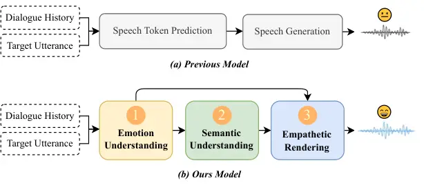
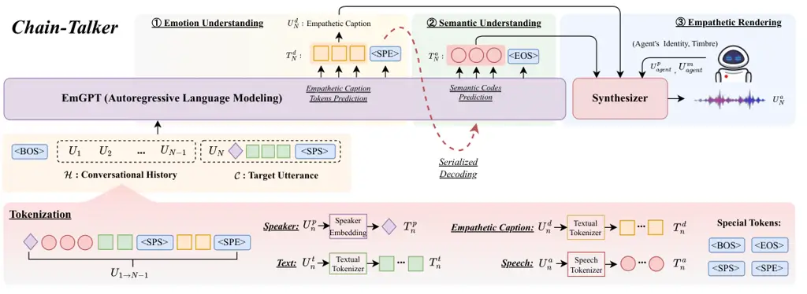
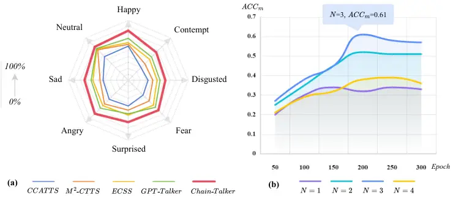
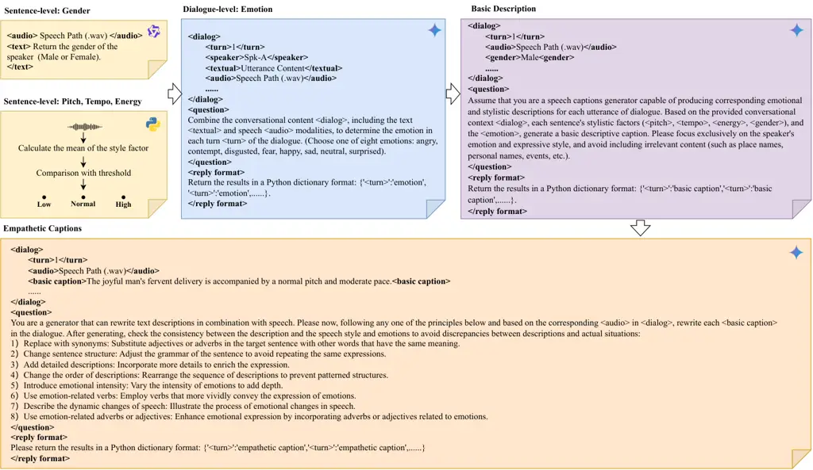
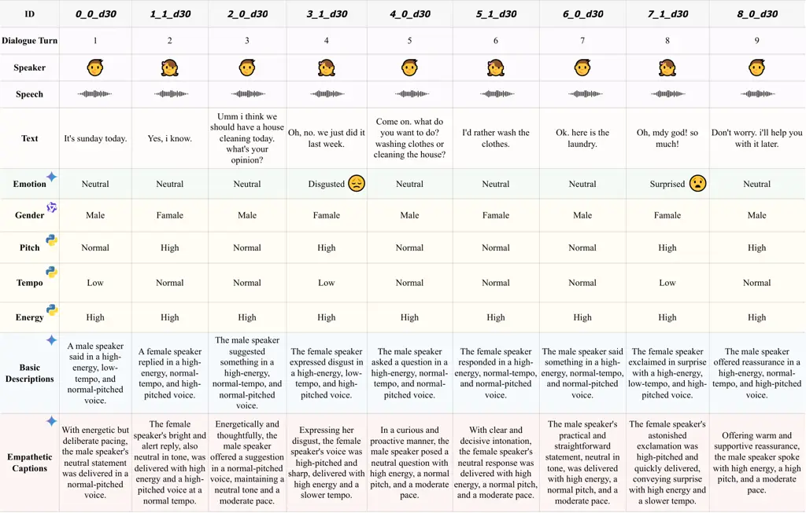

# Chain-Talker: Chain Understanding and Rendering for Empathetic Conversational Speech Synthesis

Yifan Hu Affiliation:  Inner Mongolia University, Hohhot, China    Rui
Liu ^(†)^(†)thanks: Corresponding author. Affiliation:  Inner Mongolia
University, Hohhot, China    Yi Ren Affiliation:  ByteDance, Singapore
   Xiang Yin Affiliation:  ByteDance, Singapore    Haizhou Li
Email: [22309013@mail.imu.edu.cn, imucslr@imu.edu.cn,{ren.yi,
yinxiang.stephen} @bytedance.com, haizhouli@cuhk.edu.cn](mailto:,)
Affiliation:  SRIBD, School of Data Science, The Chinese University of
Hong Kong, Shenzhen, China

###### Abstract

Conversational Speech Synthesis (CSS) aims to align synthesized speech
with the emotional and stylistic context of user-agent interactions to
achieve empathy. Current generative CSS models face interpretability
limitations due to insufficient emotional perception and redundant
discrete speech coding. To address the above issues, we present
Chain-Talker, a three-stage framework mimicking human cognition: Emotion
Understanding derives context-aware emotion descriptors from dialogue
history; Semantic Understanding generates compact semantic codes via
serialized prediction; and Empathetic Rendering synthesizes expressive
speech by integrating both components. To support emotion modeling, we
develop CSS-EmCap, an LLM-driven automated pipeline for generating
precise conversational speech emotion captions. Experiments on three
benchmark datasets demonstrate that Chain-Talker produces more
expressive and empathetic speech than existing methods, with CSS-EmCap
contributing to reliable emotion modeling. The code and demos are
available at:
[https://github.com/AI-S2-Lab/Chain-Talker](https://github.com/AI-S2-Lab/Chain-Talker).

## 1 Introduction

Conversational speech synthesis (CSS) aims to express a target utterance
with the proper linguistic and affective prosody in a user-agent
conversational context Guo et al. (2021). This task not only requires
the agent to accurately perceive the user’s emotion but also to ensure
that the generated speech’s emotion and style align with the
conversational situation. In recent years, with the development of
human-computer interaction (HCI), CSS has become an integral part of
intelligent interactive systems and plays an important role in areas
such as virtual assistants Jain et al. (2024) and voice agents Jaber
et al. (2024).



Figure 1: (a) Previous methods predict speech tokens directly based on
context. (b) Our approach progressively realizes empathetic CSS through
three stages: Emotion Understanding, Semantic Understanding, and
Empathetic Rendering.

Traditional CSS attempts mainly focus on taking the multi-modal dialogue
history, including the text and speech modalities, to predict the speech
representations of the speech to be synthesized. Afterward, these
representations are fed to the speech synthesizer to decode the target
conversational speech. In this process, elaborate encoding modules were
introduced to enhance speech quality by incorporating style embeddings
Guo et al. (2021); Nishimura et al. (2022); Xue et al. (2023) or
emotional category information Liu et al. (2023b); Deng et al. (2023);
Liu et al. (2024a) into the representations. Recently, advanced CSS
models like GPT-Talker Liu et al. (2024b), based on Generative
Pre-trained Transformer (GPT) Radford (2018), have significantly
enhanced the naturalness and expressiveness of synthesized speech by
directly predicting speech token sequences (such as HuBERT encoding Hsu
et al. (2021)) from dialogue contexts, as shown in Fig. 1 (a). Such a
process lacks interpretability in two ways: 1) Speech generation does
not fully understand the emotion of the conversation, making it
difficult to achieve true empathy. However, using natural language
descriptions allows easier control and representation of style and
emotion in speech Guo et al. (2023); Ji et al. (2024). This approach
directly establishes a strong correlation between the semantic content
and the acoustic expressiveness Yang et al. (2024). Therefore,
understanding captions enables the comprehension of emotional changes in
the dialogue. 2) General discrete speech codes contain too much
redundant information. They are often obtained by quantizing
intermediate representations from pre-trained models Hsu et al. (2021)
or using Neural Audio Codec models Zeghidour et al. (2022), which mix
semantic and acoustic information and have limited expressive capacity.

To address the above issues, we propose a Chain Understanding and
Rendering scheme for Empathetic CSS, termed Chain-Talker. Drawing on the
chain-like human thinking process Zheng et al. (2023); Imani et al.
(2023); Huang et al. (2024), Chain-Talker decomposes CSS into a
three-link thinking chain including Emotion Understanding, Semantic
Understanding, and Empathetic Rendering. As shown in the Fig. 1 (b), the
emotion understanding module perceives the emotion description of the
current utterance based on the conversation history with the
conversation-related speech emotion description. The semantic
understanding module continues to generate purely semantic codes of the
speech by means of serialization prediction, and then the emotion
description and semantic codes are used for the final empathetic CSS.
This cognitive chain architecture ensures precise comprehension of
contextual emotional states, enabling accurate affective responses in
human-machine dialogues. By decoupling emotion and semantics into
modularized processes (emotion understanding and semantic
understanding), the system achieves independent yet synergistic
modeling, forming an interpretable empathetic CSS framework with
transparent decision-making mechanisms.

To ensure that Chain-Talker learns a robust understanding of
expressiveness such as emotion and style during training, we propose an
LLM-driven automatic dialog-aware empathetic captioning pipeline,
CSS-EmCap, for conversational speech. We employ the CSS-EmCap pipeline
to generate emotional descriptions for three benchmarking CSS datasets,
including NCSSD Liu et al. (2024b), MultiDialog Park et al. (2024) and
DailyTalk Lee et al. (2023). Three datasets with emotional descriptive
information are consolidated as the final training data for
Chain-Talker. Subjective and objective experiments are conducted to
verify the reliability of the proposed pipeline and the effectiveness of
Chain-Talker. The results indicate that Chain-Talker outperforms other
CSS baseline models by synthesizing more appropriate and empathetic
conversational speech, highlighting the necessity of the proposed
pipeline. In summary, the main contributions of this paper are:

- •
  We introduce Chain-Talker, which employs a three-stage chain modeling
  process. After perceiving the emotions in the dialogue and serially
  generating semantic codes, it collaboratively produces empathetic
  response speech.
- •
  We propose CSS-EmCap, an LLM-driven automatic dialog-aware empathetic
  captions annotation pipeline for dialogue speech. A total of
  approximately 384 hours across three benchmarking CSS datasets were
  annotated.
- •
  Comprehensive experiments prove the reliability of CSS-EmCap and the
  effectiveness of Chain-Talker.



Figure 2: The overall architecture of Chain-Talker. Chain-Talker
comprises two main components: EmGPT and Synthesizer. EmGPT is
responsible for emotion and semantic understanding, while the
Synthesizer handles the generation of empathetic speech rendering.

## 2 Related Works

### 2.1 Chain Modeling in Conversation

Recently, using chain modeling to solve complex problems step-by-step
has been very successful in dialogue-related tasks. For instance, in
generating text responses, Chen et al. (2021) and Lin et al. (2024)
incorporate reading comprehension and sentiment analysis, enabling
models to focus on key information and emotional cues, thereby improving
response accuracy and relevance. In speech response tasks, systems like
USDM Kim et al. (2024) and Spectron Nachmani et al. (2024) perform
speech recognition before generating responses. This sequential approach
within a unified LLM reduces errors from multi-module setups and
enhances semantic coherence. Drawing inspiration from these successes,
we pioneer the application of chain modeling to CSS tasks. This approach
enables more empathetic conversations by step-by-step understanding
context and rendering.

### 2.2 Speech Emotion Description

Accurately describing emotion and style in speech using natural language
becomes a key research area. Traditionally, this task relies heavily on
manual annotation, where annotators write adjectives or sentences based
on the speech. This method is inefficient, costly, and the quality of
annotations declines with prolonged manual labeling Yang et al. (2024);
Liu et al. (2023a); Kawamura et al. (2024). To address these issues,
some studies rely on limited manual annotations and expand the data
using pre-trained models such as SimBERT or GPT-3.5 Turbo Guo et al.
(2023); Ji et al. (2024). However, these models lack genuine speech
understanding and merely rewrite sentences based on keywords, often
resulting in inaccurate descriptions of emotion or speaking style. Other
approaches Chu et al. (2024); Xu et al. (2024); Lian et al. (2024)
attempt to train models capable of labeling speech style, but they
typically overlook the need for emotional understanding in
conversational contexts. To overcome these issues, we develop an
automated, dialog-aware empathetic description process using LLMs.
Specifically, the proposed method first extracts stylistic attributes at
the sentence-level and emotions at the dialog-level. It then prompts the
LLM to generate basic descriptions, which are subsequently optimized
into empathetic captions. Throughout the process, it continually prompts
the LLM to reference diverse contextual information to ensure
consistency between descriptions and speech.

### 2.3 Speech Discrete Encoding

Speech tokens extracted through unsupervised learning Hsu et al. (2021);
Zeghidour et al. (2022) enable the synthesis of relatively
natural-sounding speech GPT-SoVITS (2024); Wang et al. (2023). However,
training language models with these tokens often results in slow
convergence and poor stability. To address this, research has shown that
semantic tokens derived from supervised learning—by capturing clear
semantic information in speech and aligning it with text—can improve
model stability Du et al. (2024). In CSS tasks, the input sequence
includes various modalities, making the modeling process challenging
unless it is performed within the same semantic space. Therefore,
following CosyVoice, we employ a supervised automatic speech recognition
(ASR) model to create a supervised semantic speech tokenizer.

## 3 Task Definition

In user-agent spoken dialogue interactions, the user initiates the
conversation, followed by the agent responding within the context of the
dialogue. As the conversation progresses with alternating turns, the
accumulated spoken content forms the dialogue history. The current
dialogue turn is denoted by $`N`$, the utterance to be synthesized is
represented as $`\mathcal{C}=(U_{N}^{p},U_{N}^{t})`$, and the dialogue
history can be defined as $`\mathcal{H}`$ =
$`\{U_{1}^{p,a,t,d},U_{2}^{p,a,t,d},\ldots,U_{N-1}^{p,a,t,d}\}`$. Here,
$`U_{n}^{p}`$, $`U_{n}^{a}`$, $`U_{n}^{t}`$, and $`U_{n}^{d}`$ represent
the speaker, speech, text, and emotional description of the utterance at
the $`n`$-th turn, respectively. To generate empathetic speech, the
Chain-Talker first determines the empathetic caption $`U_{N}^{d}`$ based
on the dialogue history $`\mathcal{H}`$ and the current utterance
$`\mathcal{C}`$. Next, it serially generates the semantic codes
$`T_{N}^{a}`$, and finally synthesizes the corresponding expressive
speech $`U_{N}^{a}`$ that aligns with the inferred empathetic caption.

## 4 Methodlogy: Chain-Talker

This section offers a detailed description of our proposed Chain-Talker.
We begin by outlining the data input format for the model, referred to
as the Unified Context Tokenization method. Building on the chain
modeling, our approach has three main processes: 1) Emotion
Understanding, which focuses on predicting empathetic captions, 2)
Semantic Understanding, which aims at inferring speech codes that
include semantic information, and 3) Empathetic Rendering, which
synthesizes the empathetic response speech. Finally, we conclude by
discussing the model’s training strategy: Multi-Stage Training.

### 4.1 Unified Context Tokenization

To better model the context of dialogues, we follow the method of
GPT-Talker, which involves the alternating concatenation of user and
agent utterances to simulate a real dialogue flow. In particular, each
utterance is concatenated in the order of speaker information, speech,
textual content, and empathetic captions. This allows the model to first
understand the context and predict the emotion before generating the
corresponding speech. Therefore, the input to Chain-Talker can be
represented as $`\mathcal{Q}`$:

```math
\mathcal{Q}=(\langle\text{BOS}\rangle,\mathcal{H},\mathcal{C},\langle\text{EOS}\rangle) \tag{1}
```

where $`\mathcal{H}`$ denotes the dialogue history, consisting of
$`N-1`$ sextuples
$`(U_{n}^{p},U_{n}^{a},U_{n}^{t},\langle\text{SPS}\rangle,U_{n}^{d},\langle\text{SPE}\rangle)`$.
$`\mathcal{C}`$ represents the target utterance to be synthesized,
comprising a triple $`(U_{n}^{p},U_{n}^{t},\langle\text{SPS}\rangle)`$.
The special tokens Zhang et al. (2023) $`\langle\text{BOS}\rangle`$ and
$`\langle\text{EOS}\rangle`$ indicate the start and end of the entire
input sequence $`\mathcal{Q}`$, respectively, while
$`\langle\text{SPS}\rangle`$ and $`\langle\text{SPE}\rangle`$ mark the
beginning and end of the empathetic captions $`U_{n}^{d}`$.

To better represent the different modal information in the input
sequence, we encode the textual content as $`T_{n}^{t}`$ and the
empathetic caption as $`T_{n}^{d}`$ using Byte Pair Encoding (BPE) Gage
(1994). Following CosyVoice, we extract the speaker vectors as
$`T_{n}^{p}`$ using a pre-trained voice-print model ¹¹ 1
https://github.com/alibaba-damo-academy/3D-Speaker/tree/main/egs/3dspeaker/sv-cam++.
Additionally, we employ a supervised automatic speech recognition model
with an inserted vector quantizer (VQ) Gao et al. (2023) to encode the
speech as $`T_{n}^{a}`$.

### 4.2 Emotion Understanding

In the “\scriptsize{1}⃝” part of Fig. 2, we utilize the dialogue context
$`\mathcal{Q}`$ ($`\mathcal{H}`$ and $`\mathcal{C}`$) as a prompt and
apply the autoregressive EmGPT to comprehend the interactions between
the user and the agent, as well as the changes in emotional states
within the context. Simultaneously, EmGPT predicts the empathetic
caption tokens $`T_{N}^{d}`$ of the target utterance until the
$`\langle SPE\rangle`$ token is predicted:

```math
\begin{array}[]{c}p(T_{N,:}^{d}|\Re_{1\rightarrow N-1},T_{N,:}^{p},T_{N,:}^{t};\Theta)\\
=\displaystyle\prod_{j=0}^{D}p(T_{N,j}^{d}|T_{N,<j}^{d},\Re_{1\rightarrow N-1},T_{N,:}^{p},T_{N,:}^{t};\Theta)\end{array} \tag{2}
```

where, $`\Theta`$ represents EmGPT, $`\Re_{1\rightarrow N-1}`$ is the
set
$`\{\,(T_{n}^{p},T_{n}^{a},T_{n}^{t},T_{n}^{d})\,\}_{1\rightarrow N-1}`$,
$`j`$ denotes the value of the $`j`$-th token of $`T_{N}^{d}`$, and
$`D`$ is the length of $`T_{N}^{d}`$.

### 4.3 Semantic Understanding

In the “\scriptsize{2}⃝” part of Fig. 2, once EmGPT comprehends the
context and predicts an appropriate empathetic caption $`U_{N}^{d}`$, it
utilizes this information in conjunction with the contextual content
$`\mathcal{Q}`$ to further predict the speech codes $`T_{N}^{a}`$ that
contain the semantic information of the target utterance:

```math
\begin{array}[]{c}p(T_{N,:}^{a}|\Re_{1\rightarrow N-1},T_{N}^{p},T_{N}^{t},T_{N}^{d};\Theta)\\
=p(T_{N,:}^{d}|\Re_{1\rightarrow N-1},T_{N}^{p},T_{N}^{t};\Theta)\\
\cdot\displaystyle\prod_{i=0}^{A}p(T_{N,i}^{a}|T_{N,<i}^{a},\Re_{1\rightarrow N-1},T_{N}^{p},T_{N}^{t};\Theta)\end{array} \tag{3}
```

where $`i`$ denotes the value of the $`i`$-th token of $`T_{N}^{a}`$,
and $`A`$ is the length of $`T_{N}^{a}`$.

During the training EmGPT phase, we use a teacher forcing approach where
the left-shifted sequence serves as the input pattern and the original
sequence acts as the target output. We divide the loss function into two
components: $`\mathcal{L}_{\text{caption}}`$ and
$`\mathcal{L}_{\text{speech}}`$. They compute the cross-entropy loss
between the true and predicted values for empathetic caption tokens and
semantic codes, respectively.

### 4.4 Empathetic Rendering

In the “\scriptsize{3}⃝” part of Fig. 2, unlike traditional models that
directly decode speech tokens into speech responses, our approach uses
previously predicted empathetic captions to guide emotion and style
rendering during decoding. Specifically, the Synthesizer employs an
optimal-transport conditional flow matching model (OT-CFM) Du et al.
(2024) as its backbone to predict Mel spectrograms and uses HIFI-GAN
vocoder Kong et al. (2020) to synthesize the waveform.

To enhance the quality and consistency of the generated speech, OT-CFM
relies not only on the Mel spectrogram $`X`$ and time step $`t`$, but
also incorporates empathetic captions $`U_{N}^{d}`$, agent’s speaker
information $`U_{agent}^{p}`$, semantic codes $`T_{N}^{a}`$, and agent’s
masked Mel spectrograms $`U_{agent}^{m}`$ into the prediction of the
vector field. This process is specifically represented by the following
differential equation:

```math
\begin{aligned} \frac{d\phi_{t}(X)}{dt}=\nu_{t}(\phi_{t}(X),t\mid U_{agent}^{p},U_{N}^{d},T_{N}^{a},U_{agent}^{m})\end{aligned} \tag{4}
```

where $`t\in[0,1]`$, empathetic captions are encoded using a pre-trained
sentence-level BERT model ²² 2
https://huggingface.co/sentence-transformers/distiluse-base-multilingual-cased-v1
and integrated with each semantic code. Other settings follow CosyVoice.

To ensure that the model learns the correct vector field $`v_{t}(X)`$,
OT-CFM introduces Optimal Transport (OT) flows and trains the model by
minimizing the difference between the predicted vector field and the
theoretical OT vector field. The loss function is defined as:

```math
\begin{aligned} \mathcal{L}_{\text{OT-CFM}}&=\mathbb{E}_{t,X_{0},X_{1}}\left[\left\|\omega_{t}\left(\phi_{t}^{\text{OT}}(X_{0},X_{1})\mid X_{1}\right)\right.\right.\\
&\quad\left.\left.-\nu_{t}\left(\phi_{t}^{\text{OT}}(X_{0},X_{1})\mid\theta\right)\right\|\right]\end{aligned} \tag{5}
```

where $`\phi_{t}^{\text{OT}}(X_{0},X_{1})`$ represents the optimal
transport flow, i.e., the path from $`X_{0}`$ to $`X_{1}`$.
$`\omega_{t}(\phi_{t}^{\text{OT}}(X_{0},X_{1})|X_{1})=X_{1}-(1-\sigma)X_{0}`$.
$`\theta`$ is the parameter of the neural network, used to predict the
vector field $`\nu_{t}`$.

### 4.5 Multi-Stage Training

In the Chain-Talker framework, the training of EmGPT is divided into two
stages: 1) First-Stage: The model is trained using single-sentence
text-to-speech pair data, which equips the model with the basic
capability to generate speech from text. In this work, we use
‘‘CosyVoice-300M-25Hz’’ ³³ 3
https://www.modelscope.cn/models/iic/CosyVoice-300M-25Hz as the base
model for fine-tuning, which is trained on about 170,000 hours of
single-sentence speech data. 2) Second-Stage: The model is trained with
dialogue data to infer appropriate empathetic captions based on the
dialogue context and to continue predicting the corresponding semantic
codes. Additionally, the Synthesizer can be trained separately in a
single-sentence mode using empathetic captions and semantic codes,
thereby enhancing the naturalness and robustness of the synthetic
speech.

## 5 CSS-EmCap Pipeline

In this section, we provide a detailed description of CSS-EmCap, which
includes two components: 1) Multi-level Attribute Extraction. 2)
Empathetic Captions Generation. Through this LLM-driven automatic
dialog-aware pipeline, empathetic captions can be annotated for any CSS
datasets.

### 5.1 Multi-level Attribute Extraction

To improve the stability of LLMs in generating emotion- and
style-related descriptions, we pre-extract two types of key expressive
attributes (style factors and emotion) from conversational speech before
generation. First, we use speech analysis tools to extract
sentence-level style factors (including gender, pitch, energy, and
tempo). Then we categorize the speech into different classes based on
factor values and unified thresholds. Next, we use multimodal
information such as speech, text, and speaker data to prompt LLM ⁴⁴ 4
https://deepmind.google/technologies/gemini/pro/ to accurately
distinguish the emotional category of each sentence within the dialogue
context.

### 5.2 Empathetic Captions Generation

After extracting style factors at the sentence level and emotions at the
dialog level, we employ Gemini 4 to generate diverse natural language
descriptions for each speech. Unlike previous methods that rely solely
on large language models to combine expressive attributes, we leverage
Gemini’s speech understanding capabilities to create empathetic captions
by integrating the original speech. The prompting process is divided
into two main steps as follows: 1) Step-1: we generate basic
descriptions based on the dialogue context and the two levels of
extracted expressive attributes. 2) Step-2: we apply rules such as
synonym replacement and varying emotional intensity descriptions to
prompt Gemini to expand and enrich the captions. Additionally, we add a
verification process to ensure that the descriptions accurately reflect
the speech’s expressiveness. Consequently, CSS-EmCap produces empathetic
captions that more accurately convey the emotions and expressive styles
present in the dialogue.

## 6 Experiments and Results

In this section, we introduce the NCSSD-EmCap dataset used in this work,
followed by a discussion of Baselines and Metrics. We then provide a
comprehensive experimental analysis, including CSS-EmCap Evaluation,
Chain-Talker Evaluation, Ablation Results, Visualization Results, and
Hyperparameter Selection. Further details on the Experimental Setup and
Case Study are available in the Appendix.

### 6.1 Datasets

We employ the open-source DailyTalk Lee et al. (2023), MultiDialog Park
et al. (2024) and NCSSD Liu et al. (2024b) datasets to develop the
NCSSD-EmCap dataset via the CSS-EmCap pipeline. For detailed statistical
information on these datasets, please refer to the Appendix.

### 6.2 Baselines

To validate the effectiveness of the CSS-EmCap and the capabilities of
Chain-Talker, we compare two categories of baseline models:

To validate the LLM-driven automatic dialog-aware empathetic captioning
pipeline, we compare the following caption generation schemes: 1) w/o
SF: Direct use of the LLM 4 to extract speech expressive attributes. 2)
w/o SL-SF: Removal of sentence-level style factors, followed by caption
generation using the LLM. 3) w/o DL-SF: Removal of dialog-level emotion,
then using the LLM for caption generation. 4) Qwen2-Audio: LLM with
speech style capture capabilities Chu et al. (2024). 5) SECap: LLM with
speech emotion captions capture capabilities Xu et al. (2024).

We evaluate the effectiveness of Chain-Talker, trained based on
NCSSD-EmCap, within dialogue scenarios by comparing it against
state-of-the-art CSS systems: 1) CCATTS Guo et al. (2021), 2) M²-CTTS
Xue et al. (2023), 3) ECSS Liu et al. (2024a), 4) GPT-Talker Liu et al.
(2024b), 5) GPT-Talker*(c) (GPT-Talker adds Emotion Understanding), 6)
Chain-Talker*(e) (Using emotion labels to replace empathetic captions), 7) Chain-Talker\_(s) (Using style labels to replace empathetic captions).
Additionally, we also assess the importance of various modules and loss
functions in Chain-Talker: 8) w/o context: A Chain-Talker variant
without dialog history $`\mathcal{H}`$. 9) w/o captions: A Chain-Talker
variant without emotion understanding, only semantic understanding. 10)
w/o $`\mathcal{L}^{caption}`$: Removing the loss function about emotion
understanding. 11) w/o First-Stage: Training Chain-Talker directly on
the NCSSD-EmCap dataset.

For details of the baseline models, please refer to the Appendix.

### 6.3 Metrics

Objective Evaluation Metrics: 1) Semantic Similarity (SIM*(∗)): We
utilize RoBERTa Liu et al. (2019) and mGTE Zhang et al. (2024) to encode
captions generated with different methods and descriptions composed of
all Ground Truth style factors (e.g., “gender is female, pitch is
high…"). The semantic similarity is then calculated using cosine
similarity. Higher values mean that the captions more accurately reflect
the real style. 2) Caption Diversity (DIS-1/DIS-2): We use distinct-1/-2
Li et al. (2015) to evaluate the diversity of generated captions. 3)
Emotion Accuracy (ACC*(m)): We calculate the emotion accuracy of
synthesized speech using Gemini. 4) Speaker Similarity (SSIM): Following
Jiang et al. (2023), we use embeddings extracted from a fine-tuned WavLM
⁵⁵ 5 https://huggingface.co/microsoft/wavlm-base-plus-sv model to assess
speaker similarity of synthesized speech. 5) Dynamic Time Warping
Distance (DDTW): We use the method from Müller (2007) to measure
expressiveness in speech by calculating the average Dynamic Time Warping
distance of pitch distributions between real and synthesized speech,
where lower values suggest higher similarity to Ground Truth.

Subjective Evaluation Metrics: 1) Dialog-level Mean Opinion Score for
Naturalness (DMOS-N): Participants are asked to judge the naturalness
and quality of synthesized speech based on the dialogue context. 2)
Dialog-level Mean Opinion Score for Expressiveness (DMOS-E):
Participants are asked to evaluate whether the emotion and style of the
synthesized speech match the current dialogue context. 3) Dialog-level
Mean Opinion Score for Captions (DMOS-C): Participants are asked to
evaluate whether the generated empathetic captions match the given
speech and dialogue context.

| Methods          | DMOS-C $`(\uparrow)`$ | SIM\_(R) $`(\uparrow)`$ | SIM\_(G) $`(\uparrow)`$ | DIS-1 $`(\uparrow)`$ | DIS-2 $`(\uparrow)`$ |
| ---------------- | --------------------- | ----------------------- | ----------------------- | -------------------- | -------------------- |
| Ground Truth     | 4.327 $`\pm`$ 0.013   | -                       | -                       | -                    | -                    |
| Qwen2-Audio      | 4.212 $`\pm`$ 0.018   | 0.431                   | 0.534                   | 0.086                | 0.174                |
| SECap            | 4.268 $`\pm`$ 0.022   | 0.475                   | 0.617                   | 0.081                | 0.186                |
| CSS-EmCap        | 4.462 $`\pm`$ 0.019   | 0.568                   | 0.694                   | 0.106                | 0.296                |
|       -w/o SF    | 3.819 $`\pm`$ 0.023   | 0.425                   | 0.584                   | 0.078                | 0.157                |
|       -w/o SL-SF | 4.021 $`\pm`$ 0.017   | 0.335                   | 0.384                   | 0.024                | 0.049                |
|       -w/o DL-SF | 4.113 $`\pm`$ 0.031   | 0.394                   | 0.541                   | 0.051                | 0.135                |

Table 1: Subjective (with 95% confidence interval) and objective
experimental results on the quality and diversity of empathetic
captions. “-w/o” indicates the removal of sub-steps within CSS-EmCap,
where: “SF” represents multi-level attribute extraction, “SL-SF” denotes
sentence-level style attribute extraction, and “DL-SF” signifies
dialogue-level emotion extraction.

### 6.4 CSS-EmCap Evaluation

We conduct a comprehensive analysis and evaluation of the annotated
NCSSD-EmCap dataset, including the quality of the captions and the
diversity of the generated descriptive styles.

|                                     |                       |                       |                         |                       |                     |
| ----------------------------------- | --------------------- | --------------------- | ----------------------- | --------------------- | ------------------- |
| Methods                             | DMOS-N $`(\uparrow)`$ | DMOS-E $`(\uparrow)`$ | ACC\_(m) $`(\uparrow)`$ | DDTW $`(\downarrow)`$ | SSIM $`(\uparrow)`$ |
| Ground Truth                        | 4.467 $`\pm`$ 0.020   | 4.571 $`\pm`$ 0.015   | \-                      | \-                    | \-                  |
| CCATTS                              | 3.423 $`\pm`$ 0.033   | 3.469 $`\pm`$ 0.024   | 0.462                   | 67.851                | 0.765               |
| M²-CTTS                             | 3.461 $`\pm`$ 0.018   | 3.479 $`\pm`$ 0.021   | 0.471                   | 66.184                | 0.769               |
| ECSS                                | 3.655 $`\pm`$ 0.035   | 3.672 $`\pm`$ 0.029   | 0.495                   | 59.749                | 0.785               |
| GPT-Talker                          | 3.962 $`\pm`$ 0.011   | 3.913 $`\pm`$ 0.028   | 0.562                   | 44.625                | 0.814               |
| GPT-Talker\_(c)                     | 4.045 $`\pm`$ 0.021   | 4.102 $`\pm`$ 0.013   | 0.589                   | 40.374                | 0.829               |
| Chain-Talker\_(s)                   | 4.036 $`\pm`$ 0.027   | 4.015 $`\pm`$ 0.026   | 0.578                   | 42.876                | 0.851               |
| Chain-Talker\_(e)                   | 4.022 $`\pm`$ 0.019   | 4.127 $`\pm`$ 0.021   | 0.601                   | 40.763                | 0.849               |
| Chain-Talker                        | 4.147 $`\pm`$ 0.024   | 4.239 $`\pm`$ 0.011   | 0.612                   | 38.784                | 0.862               |
|      -w/o context                   | 3.982 $`\pm`$ 0.038   | 3.984 $`\pm`$ 0.014   | 0.564                   | 43.589                | 0.847               |
|      -w/o captions                  | 4.037 $`\pm`$ 0.021   | 4.084 $`\pm`$ 0.032   | 0.571                   | 43.479                | 0.836               |
|      -w/o $`\mathcal{L}^{caption}`$ | 3.947 $`\pm`$ 0.015   | 3.956 $`\pm`$ 0.025   | 0.568                   | 45.764                | 0.829               |
|      -w/o First-Stage               | 3.756 $`\pm`$ 0.024   | 3.789 $`\pm`$ 0.018   | 0.517                   | 52.640                | 0.793               |

Table 2: Subjective (with 95% confidence interval) and objective results
using different dialogue speech synthesis models. “-w/o” indicates the
removal of sub-modules within Chain-Talker, where: “context” refers to
dialogue context, “captions” denotes empathetic captions,
“$`\mathcal{L}^{caption}`$” signifies the loss for the captions, and
“First-Stage” refers to the pre-training process using large-scale
single-sentence data.

Quality Evaluation: To evaluate whether captions generated by different
methods accurately capture the emotions and styles of conversational
speech, we randomly select 40 dialogue sets (comprising a total of 240
utterances) from the NCSSD-EmCap dataset. Subsequently, we employ the
Category I baseline models described earlier to generate captions for
the 240 utterances. Finally, we compare these captions with the Ground
Truth to compute SIM*(∗) and conduct DMOS-C evaluations. Particularly,
this DMOS-C evaluation involves 30 university students who are
proficient in English as a second language and have strong dialogue and
reading skills. As shown in the second to fourth columns of Table 1, by
comparing DMOS-C and SIM*(∗), it is evident that our data annotation
scheme exhibits clear advantages over other methods. Furthermore, the
observation that DMOS-C values surpass those of the Ground Truth
demonstrates that empathetic captions described in natural language are
superior to style and emotion labels.

Diversity Evaluation: To evaluate the diversity of annotated empathetic
captions, within the NCSSD-EmCap dataset, we identify 10 different style
combinations based on various style factors and emotions. For each
combination, we select 50 corresponding captions. We compute the
distinct-1 and distinct-2 values for the 50 captions of each style, and
the average values across all 10 styles are calculated as the
experimental results. As shown in the fifth and sixth columns of Table
1, our scheme outperforms others with scores of 0.106 and 0.296,
respectively. This demonstrates that our designed pipeline, leveraging
LLMs, can generate diverse and appropriate natural language
descriptions.



Figure 3: (a) The ability of Chain-Talker and various baseline models to
synthesize target speech with different emotional categories based on
dialogue context. (b) Experimental results on the selection of the
hyperparameter $`N`$ for dialogue turns.

### 6.5 Chain-Talker Evaluation

We compare Chain-Talker with seven advanced CSS models using the
NCSSD-EmCap dataset. For subjective evaluation, 30 university students
rate 50 randomly selected synthesized sentences from the test set. The
ratings are given in a quiet environment based on the context and using
the criteria DMOS-N and DMOS-E. For objective evaluation, we measure the
ACC*(m), DDTW, and SSIM for each model’s synthesized speech. The results
are presented in rows two through ten of Table 2. The results show that
Chain-Talker achieves significantly lower DDTW scores compared to other
CSS models, indicating that its combination of GPT-based context
modeling and CFM-based acoustic modeling excels in capturing
pitch-related expressiveness. Additionally, the SSIM scores suggest that
Chain-Talker’s synthesized speech closely resembles the Ground Truth,
effectively preserving the agent’s timbre. The ACC*(m) metric
demonstrates that Chain-Talker is able to empathize by understanding and
rendering generated speech emotions that are more appropriate for the
entire conversation. In subjective evaluations, Chain-Talker ranks
higher than its closest competitor by 0.102 in naturalness MOS and leads
by at least 0.112 in expressiveness MOS. Overall, these results confirm
Chain-Talker’s ability to both understand dialogue context and produce
empathetic, context-aligned speech.

Furthermore, GPT-Talker\_(c)’s results show that adding emotional
understanding and expression effectively enhances the model’s empathy.
However, its speech encoding, derived from HuBERT, includes some
acoustic information alongside semantics, which impacts emotional and
semantic comprehension. This further highlights the importance of using
speech encoding with purely semantic information in our work.

### 6.6 Ablation Results

To verify the effectiveness of our model components, we conduct ablation
experiments by removing specific modules and training methods, with
results shown in rows eleven to fourteen of Table 2. The “w/o context”
condition, which excludes the dialogue history, shows significant
difficulty in context-aware speech synthesis compared to Chain-Talker,
indicating the importance of context modeling. “w/o captions” further
shows that our Emotion Understanding and Empathetic Rendering are more
effective than merely predicting and decoding speech token sequences.
Under the “w/o $`\mathcal{L}^{caption}`$” condition, omitting the
caption loss leads to a performance drop (DMOS-N decreases by 0.2 and
DMOS-E by 0.283), highlighting its impact on inference stability and
empathetic captions’ accuracy. Comparing Chain-Talker with the results
of “w/o First-Stage” indicates that pretraining the model on large-scale
single-sentence data and then fine-tuning it on small-scale dialogue
data can achieve better performance.

### 6.7 Visualization Results

To clearly demonstrate Chain-Talker’s ability to comprehend and convey
emotions in dialogue-based speech synthesis, we select 240 target
sentences from various emotional categories. Based on the dialogue
context, we identify and calculate the emotional categories of the
synthesized speech for different models and present their accuracy rates
in Fig. 3. In this figure, the arrows indicate each model’s strength in
understanding and rendering the corresponding emotion. The results show
that Chain-Talker generally outperforms other baseline models in
emotional expression, further confirming the superiority of chain
modeling.

### 6.8 Hyperparameter Selection

To clearly demonstrate the impact of dialogue context length $`N`$ on
the model’s empathy, we randomly select 100 dialogue pairs from the
NCSSD-EmCap dataset. We assess the emotion accuracy of the synthesized
speech produced by the model across different training epochs, setting
$`N`$ to $`1\rightarrow 3`$ during training and $`1\rightarrow 4`$
during inference. Fig. 3 illustrates that Chain-Talker’s ability to
understand and express emotions improves significantly with more
training epochs, achieving peak performance around 200 epochs. The best
results occur when $`N`$=3 at approximately 200 epochs. Although
performance slightly declines at $`N`$=4, comparisons with $`N`$=1
demonstrate that the model can still manage dialogue lengths not
encountered during training. Consequently, it is reasonable to
hypothesize that increasing the number of dialogue turns during training
could potentially enhance the Chain-Talker’s performance.

## 7 Conclusion

In this work, we introduce a novel chain modeling-based CSS model named
Chain-Talker, designed for spoken interaction in user-agent
communications. This model comprises three primary processes: “Emotion
Understanding”, “Semantic Understanding”, and “Empathetic Rendering”.
This step-by-step modeling of the conversational process significantly
reduces the difficulty of responding to empathetic speech. Additionally,
we also develop an LLM-driven automated dialog-aware empathetic caption
generation pipeline called CSS-EmCap. This pipeline has been utilized to
annotate three open-source CSS datasets, DailyTalk, NCSSD, and
MultiDialog. These datasets provide strong support for the training of
Chain-Talker. The annotation pipeline will be made openly available,
fostering community development.

## Limitations

Inference Latency: We conduct inference tests using an NVIDIA GeForce
RTX 4080 GPU with 32 GB of VRAM and a 12th Gen Intel® Core™ i7-12700K
CPU with 32 GB of system RAM. The average duration of empathetic speech
responses generated by Chain-Talker is 2.5 seconds, which we consider
acceptable. However, there remains a gap compared to real-time
interactions. In future work, we continue to explore faster dialogue
modeling methods that incorporate empathetic capabilities, such as the
integration of streaming inference.

Robustness: We employ “CosyVoice-300M-25Hz” as the foundational model,
which is pretrained on approximately 170,000 hours of speech data and
demonstrates exceptionally high naturalness in synthesized speech.
However, the conversational data used for fine-tuning comprises only 384
hours, predominantly featuring young speakers. As a result, Chain-Talker
may not accurately capture the conversational styles of children and the
elderly. In the future, we plan to construct larger-scale speech
dialogue datasets to further enhance the model’s robustness.

## Ethics Statement

Safety Risks: Chain-Talker possesses zero-shot speech synthesis
capabilities, facilitating the creation of personalized conversational
speech. In most cases, individuals are likely to utilize this technology
to enhance movie dubbing, podcasts, and other services. However, it may
also present potential risks for model misuse, such as spoofing voice.
To address this, we plan to incorporate restrictions into the
open-source license of the Chain-Talker project to prevent the misuse of
the model.

## Acknowledgment

The research by Rui Liu was funded by the Young Scientists Fund
(No. 62206136), the General Program (No. 62476146) of the National
Natural Science Foundation of China, and the Young Elite Scientists
Sponsorship Program by CAST (2024QNRC001). The research by Yifan Hu was
funded by the Research and Innovation Projects for Graduate Students in
Inner Mongolia Autonomous Region. The work by Haizhou Li was supported
by the Shenzhen Science and Technology Program (Shenzhen Key Laboratory,
Grant No. ZDSYS20230626091302006), the Shenzhen Science and Technology
Research Fund (Fundamental Research Key Project, Grant
No. JCYJ20220818103001002), and the Program for Guangdong Introducing
Innovative and Enterpreneurial Teams, Grant No. 2023ZT10X044.

## References

- Chen et al. (2021) Xiuying Chen, Zhi Cui, Jiayi Zhang, Chen Wei,
  Jianwei Cui, Bin Wang, Dongyan Zhao, and Rui Yan. 2021. Reasoning in
  dialog: Improving response generation by context reading
  comprehension. In _Proceedings of the AAAI Conference on Artificial
  Intelligence_, volume 35, pages 12683–12691.
- Chu et al. (2024) Yunfei Chu, Jin Xu, Qian Yang, Haojie Wei, Xipin
  Wei, Zhifang Guo, Yichong Leng, Yuanjun Lv, Jinzheng He, Junyang Lin,
  Chang Zhou, and Jingren Zhou. 2024. [Qwen2-audio technical
  report](https://doi.org/10.48550/ARXIV.2407.10759). _CoRR_,
  abs/2407.10759.
- Deng et al. (2023) Yayue Deng, Jinlong Xue, Fengping Wang, Yingming
  Gao, and Ya Li. 2023. CMCU-CSS: enhancing naturalness via
  commonsense-based multi-modal context understanding in conversational
  speech synthesis. In _Proceedings of the 31st ACM International
  Conference on Multimedia_, pages 6081–6089.
- Du et al. (2024) Zhihao Du, Qian Chen, Shiliang Zhang, Kai Hu, Heng
  Lu, Yexin Yang, Hangrui Hu, Siqi Zheng, Yue Gu, Ziyang Ma,
  et al. 2024. Cosyvoice: A scalable multilingual zero-shot
  text-to-speech synthesizer based on supervised semantic tokens. _arXiv
  preprint arXiv:2407.05407_.
- Gage (1994) Philip Gage. 1994. A new algorithm for data compression.
  _The C Users Journal_, 12(2):23–38.
- Gao et al. (2023) Zhifu Gao, Zerui Li, Jiaming Wang, Haoneng Luo, Xian
  Shi, Mengzhe Chen, Yabin Li, Lingyun Zuo, Zhihao Du, and Shiliang
  Zhang. 2023. [Funasr: A fundamental end-to-end speech recognition
  toolkit](https://doi.org/10.21437/INTERSPEECH.2023-1428). In _24th
  Annual Conference of the International Speech Communication
  Association, Interspeech 2023, Dublin, Ireland, August 20-24, 2023_,
  pages 1593–1597. ISCA.
- GPT-SoVITS (2024) GPT-SoVITS. 2024.
  [https://github.com/RVC-Boss/GPT-SoVITS](https://github.com/RVC-Boss/GPT-SoVITS).
- Guo et al. (2021) Haohan Guo, Shaofei Zhang, Frank K Soong, Lei He,
  and Lei Xie. 2021. Conversational end-to-end tts for voice agents. In
  _2021 IEEE Spoken Language Technology Workshop (SLT)_, pages 403–409.
  IEEE.
- Guo et al. (2023) Zhifang Guo, Yichong Leng, Yihan Wu, Sheng Zhao, and
  Xu Tan. 2023. Prompttts: Controllable text-to-speech with text
  descriptions. In _2023 IEEE International Conference on Acoustics,
  Speech and Signal Processing_, pages 1–5.
- Hsu et al. (2021) Wei-Ning Hsu, Benjamin Bolte, Yao-Hung Hubert Tsai,
  Kushal Lakhotia, Ruslan Salakhutdinov, and Abdelrahman Mohamed. 2021.
  Hubert: Self-supervised speech representation learning by masked
  prediction of hidden units. _IEEE ACM Trans. Audio Speech Lang.
  Process._, 29:3451–3460.
- Huang et al. (2024) Zhaopei Huang, Jinming Zhao, and Qin Jin. 2024.
  Ecr-chain: Advancing generative language models to better
  emotion-cause reasoners through reasoning chains. In _Proceedings of
  the Thirty-Third International Joint Conference on Artificial
  Intelligence, IJCAI-24_, pages 6288–6296. International Joint
  Conferences on Artificial Intelligence Organization.
- Imani et al. (2023) Shima Imani, Liang Du, and Harsh
  Shrivastava. 2023. Mathprompter: Mathematical reasoning using large
  language models. In _Proceedings of the The 61st Annual Meeting of the
  Association for Computational Linguistics_, pages 37–42.
- Jaber et al. (2024) Razan Jaber, Sabrina Zhong, Sanna Kuoppamäki, Aida
  Hosseini, Iona Gessinger, Duncan P Brumby, Benjamin R Cowan, and
  Donald McMillan. 2024. Cooking with agents: Designing context-aware
  voice interaction. In _Proceedings of the CHI Conference on Human
  Factors in Computing Systems_, pages 1–13.
- Jain et al. (2024) Garima Jain, Amita Shukla, Nitesh Kumar Bairwa,
  Anamika Chaudhary, Ashish Patel, and Ankush Jain. 2024. Spear: Design
  and implementation of an advanced virtual assistant. In _2024 4th
  International Conference on Sustainable Expert Systems (ICSES)_, pages
  1715–1720. IEEE.
- Ji et al. (2024) Shengpeng Ji, Jialong Zuo, Minghui Fang, Ziyue Jiang,
  Feiyang Chen, Xinyu Duan, Baoxing Huai, and Zhou Zhao. 2024.
  Textrolspeech: A text style control speech corpus with codec language
  text-to-speech models. In _2024 IEEE International Conference on
  Acoustics, Speech and Signal Processing_, pages 10301–10305.
- Jiang et al. (2023) Ziyue Jiang, Jinglin Liu, Yi Ren, Jinzheng He,
  Chen Zhang, Zhenhui Ye, Pengfei Wei, Chunfeng Wang, Xiang Yin, Zejun
  Ma, et al. 2023. Mega-tts 2: Zero-shot text-to-speech with arbitrary
  length speech prompts. _arXiv preprint arXiv:2307.07218_.
- Kawamura et al. (2024) Masaya Kawamura, Ryuichi Yamamoto, Yuma
  Shirahata, Takuya Hasumi, and Kentaro Tachibana. 2024. Libritts-p: A
  corpus with speaking style and speaker identity prompts for
  text-to-speech and style captioning. _CoRR_, abs/2406.07969.
- Kim et al. (2024) Heeseung Kim, Soonshin Seo, Kyeongseok Jeong, Ohsung
  Kwon, Jungwhan Kim, Jaehong Lee, Eunwoo Song, Myungwoo Oh, Sungroh
  Yoon, and Kang Min Yoo. 2024. Unified speech-text pretraining for
  spoken dialog modeling. _arXiv preprint arXiv:2402.05706_.
- Kim et al. (2021) Jaehyeon Kim, Jungil Kong, and Juhee Son. 2021.
  Conditional variational autoencoder with adversarial learning for
  end-to-end text-to-speech. In _International Conference on Machine
  Learning_, pages 5530–5540. PMLR.
- Kong et al. (2020) Jungil Kong, Jaehyeon Kim, and Jaekyoung Bae. 2020.
  [Hifi-gan: Generative adversarial networks for efficient and high
  fidelity speech
  synthesis](https://proceedings.neurips.cc/paper/2020/hash/c5d736809766d46260d816d8dbc9eb44-Abstract.html).
  In _Advances in Neural Information Processing Systems 33: Annual
  Conference on Neural Information Processing Systems 2020, NeurIPS
  2020, December 6-12, 2020, virtual_.
- Lee et al. (2023) Keon Lee, Kyumin Park, and Daeyoung Kim. 2023.
  Dailytalk: Spoken dialogue dataset for conversational text-to-speech.
  In _2023 IEEE International Conference on Acoustics, Speech and Signal
  Processing_, pages 1–5.
- Li et al. (2015) Jiwei Li, Michel Galley, Chris Brockett, Jianfeng
  Gao, and Bill Dolan. 2015. A diversity-promoting objective function
  for neural conversation models. _arXiv preprint arXiv:1510.03055_.
- Lian et al. (2024) Zheng Lian, Haiyang Sun, Licai Sun, Lan Chen, Haoyu
  Chen, Hao Gu, Zhuofan Wen, Shun Chen, Siyuan Zhang, Hailiang Yao,
  et al. 2024. Open-vocabulary multimodal emotion recognition: Dataset,
  metric, and benchmark. _arXiv preprint arXiv:2410.01495_.
- Lin et al. (2024) Guan-Ting Lin, Prashanth Gurunath Shivakumar, Ankur
  Gandhe, Chao-Han Huck Yang, Yile Gu, Shalini Ghosh, Andreas Stolcke,
  Hung-yi Lee, and Ivan Bulyko. 2024. Paralinguistics-enhanced large
  language modeling of spoken dialogue. In _2024 IEEE International
  Conference on Acoustics, Speech and Signal Processing_, pages
  10316–10320.
- Liu et al. (2023a) Guanghou Liu, Yongmao Zhang, Yi Lei, Yunlin Chen,
  Rui Wang, Lei Xie, and Zhifei Li. 2023a. Promptstyle: Controllable
  style transfer for text-to-speech with natural language descriptions.
  In _INTERSPEECH_, pages 4888–4892.
- Liu et al. (2024a) Rui Liu, Yifan Hu, Yi Ren, Xiang Yin, and Haizhou
  Li. 2024a. Emotion rendering for conversational speech synthesis with
  heterogeneous graph-based context modeling. _Proceedings of the AAAI
  Conference on Artificial Intelligence_, 38(17):18698–18706.
- Liu et al. (2024b) Rui Liu, Yifan Hu, Yi Ren, Xiang Yin, and Haizhou
  Li. 2024b. Generative expressive conversational speech synthesis. In
  _ACM Multimedia 2024_.
- Liu et al. (2019) Yinhan Liu, Myle Ott, Naman Goyal, Jingfei Du,
  Mandar Joshi, Danqi Chen, Omer Levy, Mike Lewis, Luke Zettlemoyer, and
  Veselin Stoyanov. 2019. Roberta: A robustly optimized bert pretraining
  approach. _arXiv preprint arXiv:1907.11692_.
- Liu et al. (2023b) Yuchen Liu, Haoyu Zhang, Shichao Liu, Xiang Yin,
  Zejun Ma, and Qin Jin. 2023b. [Emotionally situated text-to-speech
  synthesis in user-agent
  conversation](https://doi.org/10.1145/3581783.3613823). In
  _Proceedings of the 31st ACM International Conference on Multimedia_,
  pages 5966–5974.
- Morise et al. (2016) Masanori Morise, Fumiya Yokomori, and Kenji
  Ozawa. 2016. World: a vocoder-based high-quality speech synthesis
  system for real-time applications. _IEICE TRANSACTIONS on Information
  and Systems_, pages 1877–1884.
- Müller (2007) Meinard Müller. 2007. _Information retrieval for music
  and motion_, volume 2. Springer.
- Nachmani et al. (2024) Eliya Nachmani, Alon Levkovitch, Roy Hirsch,
  Julian Salazar, Chulayuth Asawaroengchai, Soroosh Mariooryad, Ehud
  Rivlin, RJ Skerry-Ryan, and Michelle Tadmor Ramanovich. 2024. Spoken
  question answering and speech continuation using spectrogram-powered
  LLM. In _The Twelfth International Conference on Learning
  Representations_.
- Nishimura et al. (2022) Yuto Nishimura, Yuki Saito, Shinnosuke
  Takamichi, Kentaro Tachibana, and Hiroshi Saruwatari. 2022. Acoustic
  Modeling for End-to-End Empathetic Dialogue Speech Synthesis Using
  Linguistic and Prosodic Contexts of Dialogue History. In _Interspeech
  2022_, pages 3373–3377.
- Park et al. (2024) Se Jin Park, Chae Won Kim, Hyeongseop Rha, Minsu
  Kim, Joanna Hong, Jeong Hun Yeo, and Yong Man Ro. 2024. [Let’s go real
  talk: Spoken dialogue model for face-to-face
  conversation](https://doi.org/10.18653/V1/2024.ACL-LONG.860). In
  _Proceedings of the 62nd Annual Meeting of the Association for
  Computational Linguistics (Volume 1: Long Papers), ACL 2024, Bangkok,
  Thailand, August 11-16, 2024_, pages 16334–16348. Association for
  Computational Linguistics.
- Radford (2018) Alec Radford. 2018. Improving language understanding by
  generative pre-training.
- Wang et al. (2023) Chengyi Wang, Sanyuan Chen, Yu Wu, Ziqiang Zhang,
  Long Zhou, Shujie Liu, Zhuo Chen, Yanqing Liu, Huaming Wang, Jinyu Li,
  Lei He, Sheng Zhao, and Furu Wei. 2023. Neural codec language models
  are zero-shot text to speech synthesizers. _CoRR_.
- Xu et al. (2024) Yaoxun Xu, Hangting Chen, Jianwei Yu, Qiaochu Huang,
  Zhiyong Wu, Shi-Xiong Zhang, Guangzhi Li, Yi Luo, and Rongzhi
  Gu. 2024. [Secap: Speech emotion captioning with large language
  model](https://doi.org/10.1609/AAAI.V38I17.29902). In _Thirty-Eighth
  AAAI Conference on Artificial Intelligence, AAAI 2024, Thirty-Sixth
  Conference on Innovative Applications of Artificial Intelligence, IAAI
  2024, Fourteenth Symposium on Educational Advances in Artificial
  Intelligence, EAAI 2014, February 20-27, 2024, Vancouver, Canada_,
  pages 19323–19331. AAAI Press.
- Xue et al. (2023) Jinlong Xue, Yayue Deng, Fengping Wang, Ya Li,
  Yingming Gao, Jianhua Tao, Jianqing Sun, and Jiaen Liang. 2023. M
  2-ctts: End-to-end multi-scale multi-modal conversational
  text-to-speech synthesis. In _2023 IEEE International Conference on
  Acoustics, Speech and Signal Processing_, pages 1–5.
- Yang et al. (2024) Dongchao Yang, Songxiang Liu, Rongjie Huang, Chao
  Weng, and Helen Meng. 2024. Instructtts: Modelling expressive tts in
  discrete latent space with natural language style prompt. _IEEE/ACM
  Transactions on Audio, Speech, and Language Processing_, pages
  2913–2925.
- Zeghidour et al. (2022) Neil Zeghidour, Alejandro Luebs, Ahmed Omran,
  Jan Skoglund, and Marco Tagliasacchi. 2022. [Soundstream: An
  end-to-end neural audio
  codec](https://doi.org/10.1109/TASLP.2021.3129994). _IEEE ACM Trans.
  Audio Speech Lang. Process._, 30:495–507.
- Zhang et al. (2023) Dong Zhang, Shimin Li, Xin Zhang, Jun Zhan, Pengyu
  Wang, Yaqian Zhou, and Xipeng Qiu. 2023. [Speechgpt: Empowering large
  language models with intrinsic cross-modal conversational
  abilities](https://doi.org/10.18653/V1/2023.FINDINGS-EMNLP.1055). In
  _Findings of the Association for Computational Linguistics: EMNLP
  2023, Singapore, December 6-10, 2023_, pages 15757–15773. Association
  for Computational Linguistics.
- Zhang et al. (2024) Xin Zhang, Yanzhao Zhang, Dingkun Long, Wen Xie,
  Ziqi Dai, Jialong Tang, Huan Lin, Baosong Yang, Pengjun Xie, Fei
  Huang, et al. 2024. mgte: Generalized long-context text representation
  and reranking models for multilingual text retrieval. _arXiv preprint
  arXiv:2407.19669_.
- Zheng et al. (2023) Ge Zheng, Bin Yang, Jiajin Tang, Hong-Yu Zhou, and
  Sibei Yang. 2023. Ddcot: Duty-distinct chain-of-thought prompting for
  multimodal reasoning in language models. _Advances in Neural
  Information Processing Systems_, 36:5168–5191.

## Technical Appendix

In this technical appendix, we will supplement the description of the
proposed CSS model: Chain-Talker, the implementation details of the
LLM-driven automatic dialog-aware empathetic caption generation
pipeline: CSS-EmCap, and additional experimental results.

## Appendix A More Details of CSS-EmCap

### A.1 Data Flow Diagram of CSS-EmCap

As shown in Fig. 4, the empathetic caption annotation process in
CSS-EmCap comprises several steps. First, we extract sentence-level
style factors—such as gender, pitch, energy, and tempo—along with
dialog-level emotions:

- •
  Sentence-level Style Factors Extraction,we employ the Qwen2-Audio
  large-scale model ⁶⁶ 6 https://huggingface.co/Qwen/Qwen2-Audio-7B for
  speaker gender recognition, which achieves superior accuracy by
  providing the speech path in the prompt and having the model return
  the corresponding result (male or female). Additionally, Librosa ⁷⁷ 7
  https://librosa.org/ is used to analyze energy levels, and the World
  Vocoder Morise et al. (2016) extracts pitch information. Furthermore,
  MFA ⁸⁸ 8 https://montreal-forced-aligner.readthedocs.io/en/latest/
  aligns text and speech data to obtain duration information, which is
  then averaged. To ensure that datasets annotated using this pipeline
  adhere to the same hierarchical classification standards, a set of
  uniform thresholds ⁹⁹ 9 The three sets of thresholds are: pitch
  \[136.577, 196.098\], tempo \[0.252, 0.386\], and energy \[0.033,
  0.0505\]. Within each set, the first value distinguishes between low
  and normal, and the second between normal and high. is established
  after calculating the factor values for all speech data. Pitch,
  energy, and tempo are categorized into three levels: low, normal, and
  high.
- •
  Dialog-level Emotion Extraction, in order to identify the emotional
  category of each speech in the dialogue, we carefully design prompts
  to enable the state-of-the-art Gemini 1.5 pro model 4, which
  understands and analyzes both text and speech modalities, to return
  results accurately. The model receives the complete dialogue content,
  encapsulated within $`\langle dialog\rangle...\langle/dialog\rangle`$,
  including dialogue turns, speaker, textual content, and corresponding
  speech paths. It then identifies the emotional category of each
  speech, leveraging the context provided by the entire dialogue.
  Compared to pure single-sentence emotion recognition models, this
  context-based approach improves the accuracy of emotion recognition.

Next, we employ a LLM 4 to generate basic descriptions by integrating
these extracted expressive attributes with the dialogue’s speech.
Subsequently, we utilize the same LLM to expand these descriptions using
one of eight predefined rules. Simultaneously, it performs consistency
checks to ensure that the descriptions accurately reflect the original
speech, resulting in the final empathetic captions.

### A.2 Statistical Information of NCSSD-EmCap

As shown in Table 3, the overall statistics for the NCSSD-EmCap dataset
are presented. It consists of 384 hours of natural spoken dialogue,
comprising 18,580 dialogs and 245,984 dialogue utterances. Each
utterance includes speaker information, text, empathetic captions, and
corresponding speech. DailyTalk, NCSSD, and MultiDialog offer a wide
range of emotional categories along with varying levels of pitch,
energy, and tempo, providing strong support for training highly
expressive CSS models.

| NCSSD-EmCap |           |              |        |             |         |
| ----------- | --------- | ------------ | ------ | ----------- | ------- |
| Factors     | Items     | Sub-datasets |        |             | Total   |
|             |           | DailyTalk    | NCSSD  | MultiDialog |         |
| Gender      | Male      | 11,866       | 33,672 | 79,061      | 124,599 |
|             | Female    | 11,906       | 38,964 | 70,515      | 121,385 |
| Pitch       | Low       | 4,594        | 18,444 | 35,787      | 58,825  |
|             | Normal    | 8,143        | 22,495 | 41,973      | 72,611  |
|             | High      | 11,035       | 31,697 | 71,816      | 114,548 |
| Energy      | Low       | 2            | 72,636 | 18,546      | 91,184  |
|             | Normal    | 52           | 0      | 33,650      | 33,702  |
|             | High      | 23,718       | 0      | 97,380      | 121,098 |
| Tempo       | Low       | 4,048        | 12,491 | 2,780       | 19,319  |
|             | Normal    | 15,980       | 25,262 | 76,282      | 117,524 |
|             | High      | 3,744        | 34,883 | 70,514      | 109,141 |
| Emotion     | Angry     | 378          | 8,048  | 716         | 9,142   |
|             | Contempt  | 24           | 390    | 0           | 414     |
|             | Disgusted | 57           | 277    | 1,152       | 1,486   |
|             | Fear      | 86           | 781    | 760         | 1,627   |
|             | Happy     | 2,613        | 6,026  | 23,393      | 32,032  |
|             | Sad       | 848          | 7,007  | 1,975       | 9,830   |
|             | Neutral   | 19,240       | 47,281 | 97,708      | 164,229 |
|             | Surprised | 526          | 2,826  | 23,872      | 27,224  |
| Hours       |           | 20           | 92     | 272         | 384     |
| Dialogs     |           | 2,541        | 8,229  | 7,810       | 18,580  |
| Utterances  |           | 23,772       | 72,636 | 149,576     | 245,984 |

Table 3: Statistical results for the NCSSD-EmCap dataset, includes
DailyTalk, NCSSD, and MultiDialog subsets.



Figure 4: The overall process of CSS-EmCap, It includes extracting
Sentence-level style factors and Dialog-level emoton, as well as
prompting LLM to generate Basic Descriptions and final Empathetic
Captions.

## Appendix B More Details of Experiments and Results

### B.1 Baseline Models

In this part, we will detail the baseline models compared in this work,
still organized into two categories:

Category I: Evaluation of the LLM-driven Automatic Dialog-aware
Empathetic Captioning Pipeline CSS-EmCap.

- •
  w/o SF: We directly use the LLM 4 to generate captions from given
  speech without extracting style factors and emotion.
- •
  w/o SL-SF: We remove the sentence-related style factors, and then
  generate captions using only emotional labels with the LLM.
- •
  w/o DL-SF: We remove the extraction process of Dialog-level emotion,
  and simply use gender, pitch, tempo, and energy as prompts for the LLM
  to generate style captions for speech.
- •
  Qwen2-Audio: A versatile multi-task LLM that accepts both audio
  (including human speech, natural sounds, and music) and text inputs,
  and outputs text. This model has the ability to understand speech
  content and style Chu et al. (2024).
- •
  SECap: A LLM trained on a 41-hour emotional dataset, capable of
  returning speech emotions described in natural language Xu et al.
  (2024).

Category II: Effectiveness of Chain-Talker in Dialogue Scenarios.

- •
  CCATTS: A context-aware CSS model, which employs a GRU-based network
  to model the sentence-level dependency among the dialogue context Guo
  et al. (2021).
- •
  M²-CTTS: It extracts context-dependent information at multiple
  granularities—both word-level and sentence-level—from the speech and
  text within the dialogue context Xue et al. (2023).
- •
  ECSS: It considers different utterances in the dialogue context and
  modal information as individual graph nodes and uses a heterogeneous
  graph neural network to model the dialogue context Liu et al. (2024a).
- •
  GPT-Talker: It takes the text and speech of the dialogue context as
  prompts and then utilizes a GPT-style autoregressive model to predict
  the discrete token sequence of the response speech, followed by
  synthesizing the final speech waveform using VITS Liu et al. (2024b);
  Kim et al. (2021).
- •
  GPT-Talker\_(c): A variant of GPT-Talker adds empathetic captions
  during context modeling to help understand emotional changes in
  conversations.
- •
  Chain-Talker*(s) and Chain-Talker*(e): They are two variants of
  Chain-Talker, the former replacing the empathetic captions with style
  factor labels and the latter with emotion labels.
- •
  w/o context: A Chain-Talker variant without dialog history
  $`\mathcal{H}`$, it predicts caption and renders speech directly from
  the given target utterance.
- •
  w/o captions: A CosyVoice variant, similar to GPT-Talker, where the
  input part includes various modal information from the dialogue
  history in addition to the target sentence, but without empathetic
  captions.

|             |                       |            |
| ----------- | --------------------- | ---------- |
| EmGPT       | speech sample_rate    | 22050      |
|             | spk_embed_dim         | 192        |
|             | text_token_size       | 60515      |
|             | speech_token_size     | 4096       |
|             | LLM                   |            |
|             | llm_input_size        | 1024       |
|             | llm_output_size       | 1024       |
|             | num_blocks            | 14         |
|             | dropout_rate          | 0.1        |
|             | Sampling              |            |
|             | top_k                 | 25         |
|             | win_size              | 10         |
|             | tau_r                 | 0.1        |
| Synthesizer | OT-CFM                |            |
|             | input_size            | 512        |
|             | output_size           | 80         |
|             | output_type           | mel        |
|             | vocab_size            | 4096       |
|             | input_frame_rate      | 25         |
|             | HiFiGAN               |            |
|             | in_channels           | 80         |
|             | base_channels         | 512        |
|             | upsample_rates        | \[8, 8\]   |
|             | upsample_kernel_sizes | \[16, 16\] |

Table 4: Statistics of some model parameters.

### B.2 Experimental Setup

For some parameter settings of the two modules EmGPT and Synthesizer in
the model Chain-Talker, please refer to Table 4. For additional details
on the model configuration, please refer to our open-source repository
on GitHub. Moreover, the Chain-Talker model was trained on four NVIDIA
A800s. All datasets used are divided into training, validation, and test
sets with a ratio of 8:1:1. During training, Chain-Talker’s dialog turns
are set to one to three. To ensure fairness in experimental results,
during inference, the dialogue is also set to three turns for
Chain-Talker and other CSS baseline models. For decoding strategy, EmGPT
uses an auto-regressive decoding method, specifically employing the
Top-K sampling strategy.

| Dataset: NCSSD-EmCap   |                         |                         |                         |                         |                         |
| ---------------------- | ----------------------- | ----------------------- | ----------------------- | ----------------------- | ----------------------- |
| Methods                | ACC\_(g) $`(\uparrow)`$ | ACC\_(e) $`(\uparrow)`$ | ACC\_(p) $`(\uparrow)`$ | ACC\_(t) $`(\uparrow)`$ | ACC\_(m) $`(\uparrow)`$ |
| PromptTTS              | 0.825                   | 0.728                   | 0.826                   | 0.739                   | 0.487                   |
| Salle                  | 0.841                   | 0.766                   | 0.852                   | 0.742                   | 0.516                   |
| Chain-Talker           | 0.854                   | 0.759                   | 0.861                   | 0.747                   | 0.623                   |
| Dataset: TextrolSpeech |                         |                         |                         |                         |                         |
| Methods                | ACC\_(g) $`(\uparrow)`$ | ACC\_(e) $`(\uparrow)`$ | ACC\_(p) $`(\uparrow)`$ | ACC\_(t) $`(\uparrow)`$ | ACC\_(m) $`(\uparrow)`$ |
| PromptTTS              | 0.834                   | 0.746                   | 0.835                   | 0.744                   | 0.494                   |
| Salle                  | 0.856                   | 0.761                   | 0.836                   | 0.751                   | 0.506                   |
| Chain-Talker           | 0.864                   | 0.765                   | 0.857                   | 0.743                   | 0.598                   |

Table 5: Comparative results on emotion and style controllability.

[TABLE]

Table 6: A sample set of empathetic captions generated by Chain-Talker
at different epochs.



Figure 5: A sample set of conversational data annotated using the
CSS-EmCap pipeline.

### B.3 Verifying Emotion and Style Controllability

In Chain-Talker, the consistency between empathetic captions and
dialogue speech in terms of emotion and style is crucial, as it directly
affects the context modeling and rendering processes. Therefore, in this
part, we aim to evaluate whether Chain-Talker can synthesize speech with
the corresponding style and emotion directly from a given caption in a
single-sentence mode. We conduct comparative experiments with the two
most advanced natural language-controlled style TTS models, PromptTTS
Guo et al. (2023) and Salle Ji et al. (2024). The evaluation metrics are
consistent with the previously used $`ACC_{m}`$ (Emotion) and include
$`ACC_{p}`$ (Pitch), $`ACC_{e}`$ (Energy), $`ACC_{t}`$ (Tempo), and
$`ACC_{g}`$ (Gender). These metrics are used to determine the accuracy
of the synthesized speech in conveying different expressive attributes.
We evaluate three models using the constructed NCSSD-EmCap dataset,
please refer to Table 5. Chain-Talker outperforms the other models in
all metrics except energy. Additionally, we also evaluate them on the
open-source style-controlled dataset TextrolSpeech Ji et al. (2024). The
results demonstrate that Chain-Talker consistently achieves outstanding
performance, particularly excelling in emotional expression by 0.092%
compared to the second-best model. All experimental results demonstrate
that Chain-Talker has effective style control capabilities. In other
words, as long as an appropriate empathetic caption is predicted, it can
generate speech with the corresponding emotion and style in
conversational settings. This also provides additional evidence
supporting our previous experiments that evaluated Chain-Talker’s
performance in CSS scenarios.

### B.4 Details in Subjective Evaluation

In this study, we recruited 30 university students to participate in
subjective evaluations, compensating them at a rate of \$15 per
experiment. This remuneration is fair and reasonable locally. For
DMOS-N, DMOS-E, and DMOS-C, each participant rated on a scale from 1 to
5, where 1 is Bad, 2 is Poor, 3 is Fair, 4 is Good, and 5 is Excellent.
In each subjective experiment, the results from different methods in
each evaluation group were randomly ordered. This randomization ensured
that participants did not know which model or method produced each
result, enabling a fairer assessment.

### B.5 Case Study

#### B.5.1 Examples of Understanding Empathetic Captions Using Chain-Talker

To clearly demonstrate Chain-Taker’s ability to understand and generate
empathetic captions, Table 6 shows the captions produced by the model at
different training epochs (50, 160, and 200), with the number of
dialogue turns $`N`$ set to 3. Various stylistic attributes and their
values are highlighted with colored rectangles for comparison. In the
early stages of training, the model’s understanding is inaccurate. For
instance, at 50 epochs, the pitch is predicted incorrectly. As training
epochs increase, the model gradually improves its ability to generate
appropriate empathetic captions. By 200 epochs, the results are
satisfactory. Compared to the Ground Truth, the model accurately
predicts stylistic attributes such as pitch, speech rate, gender, and
the emotion of anger. While it does not directly indicate the energy
level, the phrase “is filled with a palpable sense of fury” also
reflects the speaker’s degree of anger.

#### B.5.2 Examples of Generating Empathetic Captions Using CSS-EmCap

In Fig. 5, we show a set of dialogue data annotated with CSS-EmCap,
which includes nine utterances. First, we identify the emotional
categories and style attributes of each utterance. Then, we use the
designed prompts to guide the LLM to generate basic descriptions and
later to generate more suitable empathetic captions. The example
demonstrates that the pipeline successfully detected the female
speaker’s negative emotion towards household chores (in dialogue turns 4
and 8). Additionally, we can see that the empathetic captions are more
accurate and natural compared to the basic descriptions.
