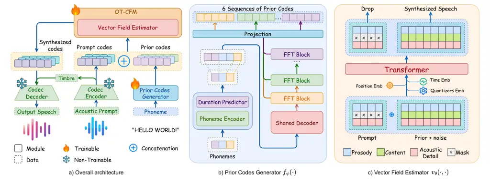

# OZSpeech: One-step Zero-shot Speech Synthesis with Learned-Prior-Conditioned Flow Matching

Hieu-Nghia Huynh-Nguyen Affiliation: FPT Software AI Center, Vietnam
Email: [nghiahnh@fpt.com](mailto:)    Ngoc Son Nguyen Affiliation: FPT
Software AI Center, Vietnam Email: [sonnn45@fpt.com](mailto:)    Huynh
Nguyen Dang Affiliation: FPT Software AI Center, Vietnam
Email: [huynhnd11@fpt.com](mailto:)    Thieu Vo Affiliation: FPT
Software AI Center, Vietnam Email: [thieuvn2@fpt.com](mailto:)   
Truong-Son Hy Email: [vannth19@fpt.com](mailto:) Affiliation: University
of Alabama at Birmingham, USA    Van Nguyen Affiliation: FPT Software AI
Center, Vietnam Email: [thy@uab.edu](mailto:)

###### Abstract

Text-to-speech (TTS) systems have seen significant advancements in
recent years, driven by improvements in deep learning and network
architectures. Viewing the output speech as a data distribution,
previous approaches often employ traditional speech representations,
such as waveforms or spectrograms, within the Flow Matching framework.
However, these methods have limitations, including overlooking various
speech attributes and incurring high computational costs due to
additional constraints introduced during training. To address these
challenges, we introduce OZSpeech, the first TTS method to explore
optimal transport conditional flow matching with one-step sampling and a
learned prior as the condition, effectively disregarding preceding
states and reducing the number of sampling steps. Our approach operates
on disentangled, factorized components of speech in token format,
enabling accurate modeling of each speech attribute, which enhances the
TTS system’s ability to precisely clone the prompt speech. Experimental
results show that our method achieves promising performance over
existing methods in content accuracy, naturalness, prosody generation,
and speaker style preservation. Code and audio samples are available at
our demo page ¹¹ 1
[https://ozspeech.github.io/OZSpeech_Web/](https://ozspeech.github.io/OZSpeech_Web/).

## 1 Introduction

Text-to-speech (TTS) has numerous real-world applications, such as
voice-based virtual assistants, assistive screen readers for the
visually impaired, and reading aids for people with dyslexia, to name a
few. Most TTS systems focus on synthesizing speech that matches a
speaker in a set of speakers seen during training. Recent studies tackle
a more challenging problem of converting text into speech that follows
the acoustic characteristics of a prompt spoken by a speaker not seen
during training. This problem is called zero-shot TTS.

In recent years, remarkable progress has been achieved in the research
of Zero-shot TTS models. These advancements have demonstrated the
impressive capabilities of such models, with their synthesized outputs
often approaching a quality level that is virtually indistinguishable
from human speech. The body of research on Zero-Shot TTS can be broadly
divided into two primary categories, each aligned with a dominant
methodological paradigm in the field: autoregressive models and
diffusion-based models.

Prominent examples of the autoregressive approach are VALL-E Chen et al.
(2025) and its variants Chen et al. (2024a); Zhang et al. (2023); Han
et al. (2024); Meng et al. (2024); Song et al. (2024); Peng et al.
(2024); Ji et al. (2024a), which have significantly advanced Zero-Shot
TTS by integrating language modeling techniques and employing
disentangled speech units as input and output tokens. This innovative
framework has paved the way for the potential convergence of Zero-Shot
TTS with large language models (LLMs), enabling the creation of
efficient, multimodal systems which are capable of generating text,
speech, and other modalities in a flexible and scalable manner. However,
as with other LLM-based systems, autoregressive models are susceptible
to the issue of the non-deterministic sampling process, potentially
leading to infinite repetition, which remains a critical challenge in
applications requiring high levels of precision and reliability.

In contrast, diffusion-based models, as demonstrated by state-of-the-art
(SOTA) TTS systems such as E2 TTS Eskimez et al. (2024) and other
related approaches Le et al. (2023); Vyas et al. (2023); Shen et al.
(2024); Ju et al. (2024b), have emerged as powerful generative
frameworks capable of producing high-quality, natural-sounding audio.
This approach has proven particularly effective in specialized tasks
such as in-filling and speech editing. Nevertheless, diffusion-based
models face limitations in real-time applications due to the
computational inefficiency of their multi-step sampling processes. These
constraints underscore the trade-offs inherent in the diffusion-based
paradigm, particularly in scenarios that demand low-latency performance.

Distillation methods for diffusion-based models have been explored to
address the multi-step sampling challenge, with Consistency Models Song
et al. (2023) introducing one-to-one mapping functions that transform
intermediate states along the Ordinary Differential Equation (ODE)
trajectory directly to their origin. This approach reduces sampling
steps to one while maintaining output quality but requires access to a
full range of $`t\in[0,1]`$ to approximate trajectories, demanding
extensive training steps. As an alternative, Shortcut Models Frans
et al. (2024) condition the network on noise level and step size,
enabling faster generation with fewer training steps by using only a
subset of $`t`$ values. However, this method is computationally
intensive due to additional constraints introduced during training,
making it more resource-demanding than Consistency Models.

To capitalize on the strengths and mitigate the limitations of the
aforementioned approaches, we propose OZSpeech (One-step Zero-shot
Speech Synthesis with Learned-Prior-Conditioned Flow Matching), a novel
Zero-Shot TTS system. Our model leverages optimal transport conditional
flow matching Lipman et al. (2023) (OT-CFM), a class of diffusion-based
models. We reformulate the original OT-CFM to enable single-step
sampling, where the vector field estimator regresses the trajectories of
all pairs of initial points from the learned prior distribution, rather
than conventional Gaussian noise, to their respective target
distributions. By minimizing the distance between the initial points and
their origins while implicitly learning the optimal $`t`$ for each
prior, this approach eliminates the need to access a comprehensive range
of $`t`$ values or compute additional constraints, thereby ensuring
high-fidelity synthesized speech.

The key contributions of this paper are as follows:

- •
  We propose a reformulated OT-CFM framework that effectively
  initializes the starting points of the flow matching process using
  samples from a learned prior distribution. This prior is optimized to
  closely approximate the target distribution, enabling one-step
  sampling with minimal errors. Our framework requires only a single
  training run without the need for an extensive distillation stage.
- •
  We propose a simple yet effective network architecture to learn
  prior-distributed codes.
- •
  Compared to previous methods, our model yields multi-fold improvement
  in WER and latency, achieving significant reduction in model size
  while striking a balance with acoustical quality. In addition, while
  previous models suffer from increasing noise level in the audio
  prompts, OZSpeech’s WER remains stable, highlighting the excellent
  noise-tolerant intelligibility of our method. Our model requires
  significantly less computation, with inference speed being $`2.7-6.5`$
  times faster than the other methods. Our model is only 29%-71% the
  size of the other models.

## 2 Related Work

Zero-Shot TTS enables the generation of speech in an unseen speaker’s
voice using only a few seconds of audio as a prompt; this process is
often termed voice mimicking. Advances in large-scale generative models
have driven significant progress in this field. One prominent
development is the adoption of diffusion models Ho et al. (2020); Song
et al. (2021), which have demonstrated remarkable performance Kang
et al. (2023); Tran et al. (2023); Shen et al. (2024); Ju et al.
(2024b). Another approach, flow matching Lipman et al. (2023); Liu
et al. (2023), has further advanced the state-of-the-art by delivering
strong results with reduced inference times Kim et al. (2023); Mehta
et al. (2024); Eskimez et al. (2024); Chen et al. (2024c). Additionally,
a key innovation in Zero-Shot TTS is the use of discrete tokens, often
derived from neural codecs Wang et al. (2023); Kharitonov et al. (2023);
Chen et al. (2024b); Ju et al. (2024a); Du et al. (2024a).

Neural codecs are designed to learn discrete speech and audio tokens,
often referred to as acoustic tokens, while preserving reconstruction
quality and maintaining a low bitrate. SoundStream Zeghidour et al.
(2022) is a well-known example that employs a vector-quantized
variational autoencoder (VQ-VAE), which was first introduced by van den
Oord et al. (2017) in the field of computer vision, and later adapted to
TTS, to disentangle continuous data into discrete tokens. It comprises
multiple residual vector quantizers to compress speech into multiple
tokens, which serve as intermediate representations for speech
generation. A significant breakthrough in this area, inspired by the
success of LLMs in natural language processing, is VALL-E Chen et al.
(2025), a pioneering work in this domain. VALL-E represents speech as
discrete codec codes using an off-the-shelf neural codec and redefines
TTS as a conditional codec language modeling task. This approach has
sparked further research and development in the field Kharitonov et al.
(2023); Zhang et al. (2023); Chen et al. (2024a); Han et al. (2024); Du
et al. (2024b).

## 3 Method



Figure 1: Overview of OZSpeech: (a) The overall architecture: The text
prompt is converted to phonemes and then into prior codes via the Prior
Codes Generator. Simultaneously, the audio prompt is encoded into codes
using the FACodec Encoder. These codes are concatenated along the
sequence dimension and fed into the OT-CFM Vector Field Estimator, which
generates codes preserving the text content and acoustic attributes.
Finally, the FACodec Decoder converts them into output speech. (b) The
Prior Codes Generator $`f_{\psi}(\cdot)`$ produces sequences of
phoneme-aligned codes. (c) The Vector Field Estimator refines these
codes with the prosody and acoustic details from the acoustic prompt.
Before being fed through $`v_{\theta}(\cdot,\cdot)`$, six sequences of
codes are first enhanced via Quantizer Embedding, which serves as an
identifier for each sequence within the hidden space. These embeddings
are then folded along the hidden dimension and processed by the network
to estimate the velocity of the prior codes.

### 3.1 Problem Statement

In this paper, we consider the problem of generating speech from given
text and acoustic prompt such that conditions for the outputs are met.
Viewing the synthesized speech as a data distribution, denoted as
$`\text{x}_{1}\sim p_{1}(x)`$, previous methods often construct the
output data distribution from a noise distribution
$`\text{x}_{0}\sim p_{0}(x)`$. However, we propose constructing the
output data distribution from a feasible intermediate state candidate
$`\text{x}_{\text{pr}}\sim p_{\text{prior}}(x)`$ instead of
$`\text{x}_{0}`$, thereby disregarding preceding states and reducing the
number of sampling steps. To achieve this, we undertake the following
steps:

- •
  Prior Code Generation: We design an effective method for generating
  prior codes to produce $`\textbf{x}_{\text{pr}}`$ (see Section 3.2).
- •
  Vector Field Estimation: We develop a vector field estimator to
  approximate $`v_{\theta}`$ , facilitating the transition from
  $`\text{x}_{\text{pr}}`$ to $`\text{x}_{1}`$ (see Section 3.3).
- •
  Waveform Decomposition via FACodec: We employ FACodec Ju et al.
  (2024b), a neural codec disentangler framework, to decompose the
  waveform into distinct components, including speaker identity and
  sequences of codes encoding prosody, content, and acoustic details.
  This decomposition enables precise control over the aspects of speech
  to be preserved or modified.

### 3.2 Prior Codes Generation Modeling

Our key contribution to prior code generation is that the process
follows a hierarchical structure: each code sequence generation depends
on the preceding code sequences, while the condition for the first code
sequence is initialized based on phoneme embeddings. To achieve this, we
implement a cascaded neural network where specific decoder layers
generate the respective code sequences in the hierarchy (shown in
Fig. 1b). Formally, the Prior Codes Generator
$`\mathbf{f}_{\psi}(\cdot)`$ is modeled as:

```math
p(\mathbf{q}_{1:6}\mid\mathbf{p};\psi)=p(\mathbf{q}_{1}\mid\mathbf{p};f_{\psi}^{1})\prod_{j=2}^{6}p(\mathbf{q}_{j}\mid\mathbf{q}_{j-1};f_{\psi}^{j}), \tag{1}
```

where $`\mathbf{q}_{j}`$ is the $`j`$-th code sequence from the
Feed-Forward Transformer (FFT) decoder layer $`f_{\psi}^{j}`$ and
$`\mathbf{p}`$ represents phoneme embeddings as the initial condition.
The Prior Loss $`\mathcal{L}_{\text{prior}}`$ minimizes the negative
logarithm of the joint probability in Eq.  (1), ensuring content code
sequences are learned effectively by conditioning on phonemes, while the
others, including prosody and acoustic details, converge towards the
mean representations. The Prior Codes Generator produces semantically
meaningful codes, reducing the distance between
$`\mathbf{x}_{\text{pr}}`$ and $`\mathbf{x}_{1}`$, allowing the Vector
Field Estimator $`\mathbf{v}_{\theta}(\cdot,\cdot)`$ to approximate
vectors from a mean distribution rather than generating them from pure
noise.

To align the input phonemes with their corresponding output code
sequences, we employ a neural network functioning as a Duration
Predictor, as introduced in Ren et al. (2019a). Briefly, the Duration
Predictor estimates the duration (i.e., the number of acoustic tokens)
for each input phoneme. The phoneme embeddings are duplicated
accordingly before being passed through the decoder of the Prior Codes
Generator. We define the loss function used to train the Duration
Predictor as $`\mathcal{L}_{dur}`$, which aims to minimize the mean
squared error between the predicted and ground truth durations on a
logarithmic scale.

### 3.3 One-Step Optimal Transport Flow Matching for Zero-Shot TTS

One-Step Optimal Transport Flow Matching Formulation. We rectify the
OT-CFM paradigm, simultaneously introduced by Lipman et al. (2023) and
Liu et al. (2023) and first adapted to text generation by Hu et al.
(2024). Our approach involves constructing a vector field that regresses
the velocity of non-Gaussian distribution and data distribution pairs,
where the initial distribution closely approximates the target
distribution. To this end, we reformulate the original flow matching
loss equation (details provided in A.2) to explicitly account for the
discrepancies between the non-Gaussian initial distribution and the
target distribution. Let $`\mathbf{x}_{t}`$ denote a linear probability
path, starting from a purely noisy initial point
$`\mathbf{x}_{0}\sim\mathcal{N}(0,I)`$ and progressing towards a data
point $`\mathbf{x}_{1}\sim\mathcal{D}`$. It is defined as
$`\mathbf{x}_{t}=t\mathbf{x}_{1}+(1-t)\mathbf{x}_{0}`$, where
$`t\sim\mathcal{U}(0,1)`$ denotes the interpolation parameter. Based on
this, the initial point $`\mathbf{x}_{0}`$ can be derived as
$`\mathbf{x}_{0}=\frac{t\mathbf{x}_{1}-\mathbf{x}_{t}}{1-t}`$. Thus, the
OT-CFM objective, as presented in Eq. (12), can be reformulated as
follows:

```math
\mathcal{L}_{CFM}(\theta)=\mathbb{E}_{t,\mathbf{x}_{0},\mathbf{x}_{1}}\left\lVert\mathbf{v}_{\theta}(\mathbf{x}_{t},t)-\frac{\mathbf{x}_{1}-\mathbf{x}_{t}}{1-t}\right\rVert^{2}. \tag{2}
```

We assume that $`\mathbf{x}_{t}`$ can be estimated via
$`\mathbf{f}_{\psi}(\cdot)`$. Under this assumption, $`\mathbf{x}_{t}`$
is treated as a learnable state, which we denote as
$`\mathbf{x}_{\text{pr}}`$, while $`t`$ is regarded as an unknown
interpolation parameter, represented as a prior-dependent time variable
$`\tau`$. Consequently, Eq. (2) can be reformulated as follows:

```math
\begin{split}\mathcal{L}_{\text{CFM}}(\theta)=\mathbb{E}_{\mathbf{x}_{\text{pr}},\mathbf{x}_{1}}\left\lVert\mathbf{v}_{\theta}(\mathbf{x}_{\text{pr}},\tau)-\frac{\mathbf{x}_{1}-\mathbf{x}_{\text{pr}}}{1-\tau}\right\rVert^{2}.\end{split} \tag{3}
```

This paradigm is similar to the original OT-CFM in its objective of
regressing the velocity between the initial prior $`\mathbf{x}_{0}`$ and
data $`\mathbf{x}_{1}`$ pairs. However, unlike the original approach, it
does not access the distribution of $`\mathbf{x}_{0}`$ during training.
Therefore, it also does not enforce $`\mathbf{x}_{0}`$ to follow a
normal distribution. Furthermore, as the prior distribution
$`\mathbf{x}_{\text{pr}}`$ approaches the target distribution
$`\mathbf{x}_{1}`$, both the number of sampling steps and the magnitude
of each step are substantially reduced. This convergence enables the
sampling process to be efficiently performed in as few as a single
step.  
Vector Field Estimator Modeling. To model
$`\mathbf{v}_{\theta}(\cdot,\cdot)`$, we define the latent
representations of the prior, target, and estimated target distributions
as $`\mathbf{x}_{\text{pr}}`$, $`\mathbf{x}_{1}`$, and
$`\mathbf{\tilde{x}}_{1}`$, respectively, where
$`\mathbf{x}_{\text{pr}},\mathbf{x}_{1},\mathbf{\tilde{x}}_{1}\in\mathbb{R}^{6\times N\times D}`$.
These terms represent six quantizer categories with sequence length
$`N`$ and feature dimensionality $`D`$. Inspired by diffusion-based text
generation models like Diffuseq Gong et al. (2023), Difformer Gao et al.
(2024), and FlowSeq Hu et al. (2024), we condition
$`\mathbf{x}_{\text{pr}}`$ on an acoustic prompt to guide
$`\mathbf{v}_{\theta}(\cdot,\cdot)`$ in transferring speech attributes
other than content. Specifically, only prosody and acoustic detail codes
serve as prompts, while the content codes are masked to prevent
undesired content transfer. The input to
$`\mathbf{v}_{\theta}(\cdot,\cdot)`$ is then formulated as the
concatenated representation:

```math
\mathbf{z_{\text{pr}}}=\textbf{Concat}(\mathbf{y}_{\text{mask}},\mathbf{x}_{\text{pr}}+\epsilon),\quad\epsilon\sim\mathcal{N}(0,I),
```

where $`\mathbf{z}_{\text{pr}}\in\mathbb{R}^{6\times L\times D}`$, with
$`L=M+N`$ representing the total sequence length of the concatenated
input. $`\mathbf{y}_{\text{mask}}`$ denotes the content-masking
representation of the acoustic prompt. Random Gaussian noise
$`\epsilon`$ is added to the latent representation of
$`\mathbf{x}_{\text{pr}}`$ to ensure the robustness and diversity of the
model. The diagram of the Vector Field Estimator is shown in Fig. 1c.  
Folding Mechanism and Quantizer Encoding. Our data representation
consists of six sequences of quantizer embeddings, making direct
sequence modeling with Transformers challenging. Previous works using
Neural Codec for audio discretization, such as VALL-E Chen et al.
(2025), VALL-E 2 Chen et al. (2024a), and NaturalSpeech3 Ju et al.
(2024b), model each quantizer sequence independently. While effective,
this approach incurs high computational costs and long generation times
due to sequential processing. To mitigate these inefficiencies, we
propose modeling all six quantizers simultaneously by folding them along
the hidden dimension. Let $`\mathcal{F}(\cdot)`$ be the folding
function, defined as a composition of two transformations:
$`\mathcal{G}:\mathbb{R}^{6\times L\times D}\to\mathbb{R}^{L\times 6D}`$
and
$`\mathcal{H}:\mathbb{R}^{L\times 6D}\to\mathbb{R}^{L\times D^{\prime}}`$.
Thus, $`\mathcal{F}`$ is expressed as:
$`\mathcal{F}\triangleq\mathcal{H}\circ\mathcal{G}:\mathbb{R}^{6\times L\times D}\to\mathbb{R}^{L\times D^{\prime}}.`$
Within this framework, the function $`\mathcal{F}(\cdot)`$ permutes and
reshapes the input tensor to sequentially align the component quantizers
in the hidden space, following the prescribed order of prosody, content,
and acoustic details. Subsequently, it adjusts the tensor’s
dimensionality accordingly. In addition, we propose a quantizer encoding
mechanism designed to identify specific quantizers within the hidden
space. This mechanism operates in conjunction with the
$`\mathcal{F}(\cdot)`$ function. The quantizer encoding is formally
defined as follows:

```math
\mathcal{Q}(x)=x+\textbf{Dup}(\omega,L),\quad x\in\mathbb{R}^{6\times L\times D}.
```

Here, the quantizer encoding function $`\mathcal{Q}(\cdot)`$ integrates
the input tensor $`\mathbb{R}^{6\times L\times D}`$ with the embedding
$`\textbf{Dup}(\omega,L)`$. In this context,
$`\omega\in\mathbb{R}^{6\times 1\times D}`$ plays a role as the
identifier for the latent representation of the quantizers, while the
function $`\textbf{Dup}(\cdot,\cdot)`$ duplicates the identifier along
the sequence length $`L`$. With $`\mathcal{Q}(\cdot)`$, we aim to
prevent the model from confusing the quantizers with each other, even
when they are simultaneously modeled within a single sequence.
Consequently, the latent representation $`\mathbf{z}_{\text{pr}}`$ is
transformed into $`\breve{\mathbf{z}}_{\text{pr}}`$, which subsequently
serves as the direct input to the function
$`\mathbf{v}_{\theta}(\cdot,\cdot)`$. The transformation is defined as
$`\breve{\mathbf{z}}_{\text{pr}}=(\mathcal{F}\circ\mathcal{Q})(\mathbf{z}_{\text{pr}})`$.  
Anchor Loss. To optimize generative model performance on discrete token
data and stabilize training, we use Anchor Loss $`\mathcal{L}_{anchor}`$
as a regularization term for embeddings. Initially introduced in
diffusion models for discrete data Gao et al. (2024) and later adapted
for flow matching models Hu et al. (2024), $`\mathcal{L}_{anchor}`$
measures the difference between an intermediate state $`\mathbf{x}_{t}`$
and the ground truth $`\mathbf{x}_{1}`$. It prevents embedding collapse,
reduces distances between states, and enables efficient sampling. In
this study, $`\mathcal{L}_{\text{anchor}}`$ minimizes the negative
log-likelihood of the joint probability (Eq. (4)).

Let
$`\mathbf{e}_{\phi}(\cdot)=[e_{1},e_{2},\dots,e_{V}]\in\mathbb{R}^{V\times D}`$
denotes the embedding lookup function with the vocabulary size of $`V`$.
Given
$`\mathcal{A}^{6\times L}=\{\alpha_{i,j}\mid i=1\dots 6;j=1\dots L\}`$,
where $`\alpha_{i,j}\in\{1\dots V\}`$, represents a quantizer element of
an $`\mathbf{x}_{1}`$ with the sequence length of $`L`$, the embedding
of $`\mathcal{A}^{6\times L}`$ can be expressed as
$`\mathbf{e}_{\phi}(\mathcal{A}^{6\times L})=\{\varepsilon_{i,j}\mid i=1\dots 6;j=1\dots L\}`$,
where $`\varepsilon_{i,j}\in\mathbb{R}^{D}`$. Thus, the joint
probability approximating the target distribution $`\mathbf{z}_{1}`$,
conditioned on the estimated sequences $`\tilde{\mathbf{z}}_{1}`$, can
be expressed as follows:

```math
p(\mathbf{z}_{1}\mid\tilde{\mathbf{z}}_{1};\phi)=\prod_{i=1}^{6}\prod_{j=1}^{L}p(\varepsilon_{i,j}\mid\tilde{\varepsilon}_{i,j};\mathbf{e}_{\phi}), \tag{4}
```

where $`\tilde{\mathbf{z}}_{1}`$ is the approximation of
$`\mathbf{z}_{1}`$, deduced using the triplet consisting of the
estimated vector
$`\mathbf{v}_{\theta}(\breve{\mathbf{z}}_{\text{pr}},\tau)`$, the prior
state $`\mathbf{z}_{\text{pr}}`$, and the corresponding interpolate
parameter $`\tau`$. The function $`\mathcal{F}^{-1}`$ denotes the
reverse function of $`\mathcal{F}`$. This relationship is expressed as
$`\tilde{\mathbf{z}}_{1}=\mathbf{z}_{\text{pr}}+(1-\tau)\mathcal{F}^{-1}(\mathbf{v}_{\theta}(\breve{\mathbf{z}}_{\text{pr}},\tau))`$.  
Total loss. We define the total loss function used in our joint training
method as
$`\mathcal{L}_{total}=\mathcal{L}_{prior}+\mathcal{L}_{dur}+\mathcal{L}_{CFM}+\mathcal{L}_{anchor}`$.
The loss functions $`\mathcal{L}_{prior}`$ and $`\mathcal{L}_{dur}`$ set
the training objective for the Prior Codes Generator, whereas
$`\mathcal{L}_{CFM}`$ and $`\mathcal{L}_{anchor}`$ are designed to
construct the vector field and distill the sampling steps, respectively.

## 4 Experiments

|                                                    |              |                      |                      |                      |                      |                         |                       |                         |                       |
| -------------------------------------------------- | ------------ | -------------------- | -------------------- | -------------------- | -------------------- | ----------------------- | --------------------- | ----------------------- | --------------------- |
|                                                    |              |                      |                      | SPK-SIM              |                      | F0                      |                       | Energy                  |                       |
| Model                                              | Data (hours) | UTMOS ($`\uparrow`$) | WER ($`\downarrow`$) | SIM-O ($`\uparrow`$) | SIM-R ($`\uparrow`$) | Accuracy ($`\uparrow`$) | RMSE ($`\downarrow`$) | Accuracy ($`\uparrow`$) | RMSE ($`\downarrow`$) |
| Ground Truth                                       |              | 4.09                 | 0.02                 | \-                   | \-                   | \-                      | \-                    | \-                      | \-                    |
| 1s Prompt                                          |              |                      |                      |                      |                      |                         |                       |                         |                       |
| F5-TTS $`[\bigstar]`$ Chen et al. (2024c)          | E (95,000)   | 3.73                 | 0.19                 | 0.32                 | \-                   | 0.61                    | 29.93                 | 0.50                    | 0.02                  |
| VoiceCraft $`[\bigstar]`$ Peng et al. (2024)       | GS (9,000)   | 3.45                 | 0.16                 | 0.31                 | 0.24                 | 0.61                    | 31.57                 | 0.52                    | 0.01                  |
| NaturalSpeech 2 $`[\clubsuit]`$ Shen et al. (2024) | LT (585)     | 2.12                 | 0.12                 | 0.20                 | 0.21                 | 0.69                    | 26.48                 | 0.39                    | 0.02                  |
| VALL-E $`[\spadesuit]`$ Chen et al. (2025)         | LT (500)     | 3.61                 | 0.21                 | 0.24                 | 0.28                 | 0.55                    | 37.87                 | 0.40                    | 0.02                  |
| OZSpeech                                           | LT (500)     | 3.17                 | 0.05                 | 0.30                 | 0.33                 | 0.62                    | 27.7                  | 0.49                    | 0.02                  |
| 3s Prompt                                          |              |                      |                      |                      |                      |                         |                       |                         |                       |
| F5-TTS $`[\bigstar]`$ Chen et al. (2024c)          | E (95,000)   | 3.76                 | 0.24                 | 0.53                 | \-                   | 0.80                    | 13.78                 | 0.67                    | 0.01                  |
| VoiceCraft $`[\bigstar]`$ Peng et al. (2024)       | GS (9,000)   | 3.55                 | 0.18                 | 0.51                 | 0.45                 | 0.78                    | 17.22                 | 0.44                    | 0.01                  |
| NaturalSpeech 2 $`[\clubsuit]`$ Shen et al. (2024) | LT (585)     | 2.38                 | 0.09                 | 0.31                 | 0.38                 | 0.80                    | 15.62                 | 0.25                    | 0.02                  |
| VALL-E $`[\spadesuit]`$ Chen et al. (2025)         | LT (500)     | 3.68                 | 0.19                 | 0.40                 | 0.48                 | 0.75                    | 21.66                 | 0.36                    | 0.02                  |
| OZSpeech                                           | LT (500)     | 3.15                 | 0.05                 | 0.40                 | 0.47                 | 0.81                    | 11.96                 | 0.67                    | 0.01                  |
| 5s Prompt                                          |              |                      |                      |                      |                      |                         |                       |                         |                       |
| F5-TTS $`[\bigstar]`$ Chen et al. (2024c)          | E (95,000)   | 3.72                 | 0.32                 | 0.58                 | \-                   | 0.83                    | 11.20                 | 0.68                    | 0.01                  |
| VoiceCraft $`[\bigstar]`$ Peng et al. (2024)       | GS (9,000)   | 3.58                 | 0.19                 | 0.56                 | 0.51                 | 0.81                    | 14.48                 | 0.46                    | 0.01                  |
| NaturalSpeech 2 $`[\clubsuit]`$ Shen et al. (2024) | LT (585)     | 2.33                 | 0.09                 | 0.35                 | 0.44                 | 0.84                    | 13.13                 | 0.28                    | 0.02                  |
| VALL-E $`[\spadesuit]`$ Chen et al. (2025)         | LT (500)     | 3.72                 | 0.19                 | 0.46                 | 0.55                 | 0.79                    | 18.20                 | 0.41                    | 0.01                  |
| OZSpeech                                           | LT (500)     | 3.15                 | 0.05                 | 0.39                 | 0.48                 | 0.83                    | 12.05                 | 0.67                    | 0.01                  |

Table 1: Performance evaluation on the LibriSpeech test-clean across
different audio prompt lengths. Bold indicates the best result, and
underline indicates the second-best result. ($`\uparrow`$) indicates
that higher values are better, while ($`\downarrow`$) indicates that
lower values are better. $`[\spadesuit]`$ means reproduced results.
$`[\bigstar]`$ and $`[\clubsuit]`$ mean results inferred from official
and ufficial checkpoints, respectively. Abbreviation: LT (LibriTTS), E
(Emilia), GS (GigaSpeech).

### 4.1 Experiment Setup

Dataset. We employ the LibriTTS dataset Zen et al. (2019), which
comprises multi-speaker English audio recordings of training data. For
benchmarking purposes, we use the LibriSpeech test-clean Panayotov
et al. (2015) dataset. More detailed information is provided in Appendix
D.1.  
Evaluation Metrics. To assess model performance, we employ the following
objective evaluation metrics for each criterion: speech quality,
quantified by UTMOS; speaker similarity, measured using SIM-O and SIM-R;
robustness, indicated by WER; and prosody accuracy and error, analyzed
through pitch and energy. Additionally, we employ NFE and RTF metrics to
measure the latency of the sampling process. More details on the
evaluation metrics can be found in Appendix D.2.  
Baselines. We compare our model with previous zero-shot TTS baselines.
Further details regarding baselines are available in Appendix D.3.

### 4.2 Main Results

| Model                              | \#Params                                         | NFE ($`\downarrow`$) | RTF ($`\downarrow`$) | WER ($`\downarrow`$) | SIM-O ($`\uparrow`$) |
| ---------------------------------- | ------------------------------------------------ | -------------------- | -------------------- | -------------------- | -------------------- |
| F5-TTS Eskimez et al. (2024)       | 336M + 13.5M Vovos Siuzdak (2024)                | 32                   | 0.70                 | 0.24                 | 0.53                 |
| VoiceCraft Peng et al. (2024)      | 830M + 14M EnCodec Défossez et al. (2023)        | \-                   | 1.70                 | 0.18                 | 0.51                 |
| NaturalSpeech 2 Shen et al. (2024) | 378M + 14M EnCodec Défossez et al. (2023)        | 200                  | 1.66                 | 0.09                 | 0.31                 |
| VALL-E Chen et al. (2025)          | 594M + 104M SpeechTokenizer Zhang et al. (2024a) | \-                   | 0.86                 | 0.19                 | 0.40                 |
| OZSpeech                           | 145M + 102M FACodec Ju et al. (2024b)            | 1                    | 0.26                 | 0.05                 | 0.40                 |

Table 2: Comparison of model size and latency for 3s audio prompt
length. Column \#Params indicates the total number of parameters
required for end-to-end synthesis, with the first value representing the
parameters of the zero-shot model (trainable) and the second value
corresponding to those of the neural codec or vocoder component
(frozen).

Table 1 shows the performance of OZSpeech and representative baseline
methods for 1s, 3s, and 5s audio prompt lengths. OZSpeech establishes a
new SOTA on WER across all audio prompt lengths, demonstrating superior
content preserving capability through a multi-fold reduction in WER. For
example, OZSpeech reduces WER by a factor of $`1.8-6.8`$ over the other
methods for 5s prompt length. Some of these models, such as F5-TTS, are
trained on substantially more training data (F5-TTS is trained on 95,000
hours of speech whereas OZSpeech is trained on 500 hours). Compared to
the next-best method, OZSpeech yields a relative reduction in WER by
58%, 44%, and 44% for 1s, 3s, and 5s audio prompt lengths, respectively.
Additionally, while the WER scores of all baseline methods are sensitive
to prompt length, OZSpeech maintains a consistent WER regardless of
prompt length.

For pitch and energy accuracies and errors, which indicate the prosody
reconstruction ability of TTS systems, OZSpeech consistently ranks as
the best or second-best performer across different prompt lengths. For
the remaining metrics (UTMOS, SIM-O, and SIM-R), our method in overall
does not exhibit an obvious performance advantage over the baseline
models. (We note that these models also experience trade-offs between
different metrics.) However, our goal is to enhance the balance between
intelligibility (i.e. content accuracy) and acoustical/perceptual
quality while maintaining low latency and small model size.

Our UTMOS scores show a rather small degradation compared to some of the
baselines, particularly VALL-E and VoiceCraft. This is largely due to
differences in the neural codecs’ trade-offs between acoustic and
semantic representations. EnCodec (VoiceCraft’s codec) primarily relies
on acoustic codes, while SpeechTokenizer (VALL-E’s codec in this
experiment) incorporates one semantic sequence alongside acoustic codes.
In contrast, FaCodec (OZSpeech’s codec) strives to balance both
representations. However, our focus is on optimizing the trade-off
between sampling speed and speech synthesis quality.

We also retrain F5-TTS with 500 hours of the LibriTTS dataset using the
official code for 1 million steps following its guideline, however the
resulting WER exceeds 0.95 across all settings, so we exclude this
retrained checkpoint from Table 1 and instead use the officially
released checkpoint, which is trained on 95,000 hours of data. The poor
retraining results suggest that this method, which is based on
traditional OT-CFM, requires a much larger, more diverse dataset for
robustness. In contrast, neural codec-based models remain effective with
limited data, likely due to extensive pre-training of the neural codec
module on massive datasets. Thus, traditional OT-CFM methods like F5-TTS
are unsuitable for low-resource languages.

Table 2 compares the model sizes and latency of OZSpeech and baseline
models. OZSpeech is the smallest model of all, being only 29%-71% the
size of the other models. When considering only the trainable part of
the models, the number of trainable parameters of OZSpeech is only
17%-43% that of the other models. For the NFE metric, our model uses
only a single sampling step, significantly reducing computation compared
to NaturalSpeech 2 and F5-TTS, which require 200 and 32 steps,
respectively, to achieve optimal performance. As a result, in terms of
inference speed represented by the RTF metric, OZSpeech is almost 3
times faster than the next fastest model, F5-TTS.

### 4.3 Ablation Study

|                   |                      |                      | SPK-SIM              |                      |
| ----------------- | -------------------- | -------------------- | -------------------- | -------------------- |
| Prompt Setting    | UTMOS ($`\uparrow`$) | WER ($`\downarrow`$) | SIM-O ($`\uparrow`$) | SIM-R ($`\uparrow`$) |
| 1s Prompt         |                      |                      |                      |                      |
| First segment     | 3.01                 | 0.08                 | 0.25                 | 0.29                 |
| Arbitrary segment | 3.17                 | 0.05                 | 0.30                 | 0.33                 |
| 3s Prompt         |                      |                      |                      |                      |
| First segment     | 3.04                 | 0.08                 | 0.35                 | 0.42                 |
| Arbitrary segment | 3.15                 | 0.05                 | 0.40                 | 0.47                 |
| 5s Prompt         |                      |                      |                      |                      |
| First segment     | 3.02                 | 0.06                 | 0.37                 | 0.45                 |
| Arbitrary segment | 3.15                 | 0.05                 | 0.39                 | 0.48                 |

Table 3: Comparison of two prompting strategies during training: First
Segment and Arbitrary Segment.

Table 3 compares the performance of two prompting strategies: First
Segment and Arbitrary Segment. The former generates prompts using the
initial portion of the ground truth, whereas the latter selects random
audio segments from the ground truth to form the prompts. The results
clearly show that the Arbitrary Segment strategy outperforms the First
Segment strategy across all metrics. In the First Segment setting, the
model seems to overfit in that it is forced to transfer the prompt to
the beginning of the target. In contrast, the Arbitrary Segment setting
hides the position of the prompt, allowing it to smoothly transfer
attributes from the prompt to the target. Consequently, we adopt the
Arbitrary Segment approach for our training. This experiment also shows
that the Arbitrary Segment approach improves robustness by exposing the
model to a more diverse range of speech contexts, leading to better
generalization in zero-shot speech synthesis.

### 4.4 Noise Tolerance Analysis

|            |                                    |                      |                      | SPK-SIM              |                      | F0                      |                       | Energy                  |                       |
| ---------- | ---------------------------------- | -------------------- | -------------------- | -------------------- | -------------------- | ----------------------- | --------------------- | ----------------------- | --------------------- |
| SNR (dB)   | Model                              | UTMOS ($`\uparrow`$) | WER ($`\downarrow`$) | SIM-O ($`\uparrow`$) | SIM-R ($`\uparrow`$) | Accuracy ($`\uparrow`$) | RMSE ($`\downarrow`$) | Accuracy ($`\uparrow`$) | RMSE ($`\downarrow`$) |
| $`\infty`$ | F5-TTS Chen et al. (2024c)         | 3.76                 | 0.24                 | 0.53                 | \-                   | 0.80                    | 13.78                 | 0.67                    | 0.01                  |
|            | VoiceCraft Peng et al. (2024)      | 3.55                 | 0.18                 | 0.51                 | 0.45                 | 0.78                    | 17.22                 | 0.44                    | 0.01                  |
|            | NaturalSpeech 2 Shen et al. (2024) | 2.38                 | 0.09                 | 0.31                 | 0.38                 | 0.80                    | 15.62                 | 0.25                    | 0.02                  |
|            | VALL-E Chen et al. (2025)          | 3.68                 | 0.19                 | 0.40                 | 0.48                 | 0.75                    | 21.66                 | 0.36                    | 0.02                  |
|            | OZSpeech                           | 3.15                 | 0.05                 | 0.39                 | 0.47                 | 0.81                    | 11.96                 | 0.67                    | 0.01                  |
|            | OZSpeech $`[\blacklozenge]`$       | 3.19                 | 0.06                 | 0.39                 | 0.46                 | 0.78                    | 13.67                 | 0.65                    | 0.01                  |
| 12         | F5-TTS Chen et al. (2024c)         | 3.09                 | 0.25                 | 0.29                 | \-                   | 0.50                    | 42.20                 | 0.46                    | 0.03                  |
|            | VoiceCraft Peng et al. (2024)      | 2.42                 | 0.20                 | 0.40                 | 0.40                 | 0.59                    | 32.48                 | 0.60                    | 0.01                  |
|            | NaturalSpeech 2 Shen et al. (2024) | 1.66                 | 0.12                 | 0.22                 | 0.34                 | 0.71                    | 20.0                  | 0.45                    | 0.01                  |
|            | VALL-E Chen et al. (2025)          | 2.43                 | 0.51                 | 0.25                 | 0.31                 | 0.54                    | 59.25                 | 0.40                    | 0.02                  |
|            | OZSpeech                           | 2.65                 | 0.05                 | 0.28                 | 0.35                 | 0.70                    | 21.70                 | 0.53                    | 0.03                  |
|            | OZSpeech $`[\blacklozenge]`$       | 3.04                 | 0.05                 | 0.33                 | 0.39                 | 0.76                    | 15.0                  | 0.73                    | 0.01                  |
| 6          | F5-TTS Chen et al. (2024c)         | 2.41                 | 0.27                 | 0.29                 | \-                   | 0.55                    | 40.95                 | 0.50                    | 0.11                  |
|            | VoiceCraft Peng et al. (2024)      | 1.80                 | 0.27                 | 0.33                 | 0.36                 | 0.50                    | 45.31                 | 0.68                    | 0.01                  |
|            | NaturalSpeech 2 Shen et al. (2024) | 1.42                 | 0.16                 | 0.17                 | 0.30                 | 0.61                    | 27.41                 | 0.58                    | 0.01                  |
|            | VALL-E Chen et al. (2025)          | 1.66                 | 0.77                 | 0.14                 | 0.18                 | 0.40                    | 96.93                 | 0.44                    | 0.02                  |
|            | OZSpeech                           | 2.21                 | 0.06                 | 0.23                 | 0.29                 | 0.61                    | 32.80                 | 0.46                    | 0.05                  |
|            | OZSpeech $`[\blacklozenge]`$       | 2.90                 | 0.06                 | 0.29                 | 0.34                 | 0.72                    | 17.41                 | 0.74                    | 0.01                  |
| 0          | F5-TTS Chen et al. (2024c)         | 1.88                 | 0.32                 | 0.17                 | \-                   | 0.41                    | 51.80                 | 0.44                    | 0.29                  |
|            | VoiceCraft Peng et al. (2024)      | 1.58                 | 0.44                 | 0.22                 | 0.29                 | 0.40                    | 57.40                 | 0.55                    | 0.02                  |
|            | NaturalSpeech 2 Shen et al. (2024) | 1.33                 | 0.23                 | 0.12                 | 0.26                 | 0.48                    | 38.27                 | 0.56                    | 0.01                  |
|            | VALL-E Chen et al. (2025)          | 1.44                 | 0.93                 | 0.07                 | 0.11                 | 0.36                    | 102,68                | 0.52                    | 0.07                  |
|            | OZSpeech                           | 1.72                 | 0.06                 | 0.17                 | 0.22                 | 0.45                    | 46.60                 | 0.44                    | 0.08                  |
|            | OZSpeech $`[\blacklozenge]`$       | 2.58                 | 0.06                 | 0.23                 | 0.28                 | 0.67                    | 21.37                 | 0.54                    | 0.02                  |

Table 4: Performance evaluation on noisy audio prompts. The noisy
prompts are derived from the LibriSpeech test-clean dataset with
additive noise augmentation. The prompts are 3-second long. The
checkpoints of each model trained on LibriTTS—except for VoiceCraft,
which was trained on GigaSpeech—are used without re-training the models
to include noisy samples. $`[\blacklozenge]`$ means fine-tuned results
on noisy prompts. This table highlights a vulnerable use case where
speech prompts contain noise, assessing the tolerance of these models.
SNR$`=\infty`$ indicates the prompts are directly obtained from
LibriSpeech test-clean dataset and these results are simply copied from
Table 1.

Unlike previous studies, we propose to investigate the effects of noisy
prompts in TTS. Table 4 evaluates the tolerance of each model on noisy
prompts. We conduct zero-shot testing of all models in this scenario,
where zero-shot in this context means that the models trained on their
original training dataset, typically with clean prompts, are directly
tested on noisy prompts. For this, we generate three sets of noisy
prompts at SNRs of 0dB, 6dB, and 12dB, respectively.
$`\text{SNR}=\infty`$ refers to prompts directly sourced from
LibriSpeech test-clean dataset, with metric values directly replicated
from Table 1.

Overall, all baseline methods are highly sensitive to noise in the audio
prompts, experiencing significant degradation in all metrics as prompt
SNR decreases. OZSpeech also shows similar sensitivity except for WER,
which experiences either no or negligible degradation across all prompt
SNR levels. VALL-E seems to be the most vulnerable to noise, where the
WER increases by almost 2.7 times at the least noisy setting, SNR =
12dB. At SNR = 0dB, VALL-E becomes almost unintelligible with a 93% WER.
The WER results highlight the robust intelligibility of OZSpeech, even
in noisy prompt conditions.

Although OZSpeech performs sub-optimally in non-WER metrics with the
original clean prompts, it surpasses all baseline models in UTMOS. This
improvement is largely attributed to the significant performance drop
observed in the baseline models. Mixed results are observed when
comparing all models on the remaining metrics.

Next, we further fine-tune OZSpeech with both original and noisy
prompts, where noisy prompts occur with a probability of 0.8. The noisy
prompts are constructed by mixing the original prompts with random noise
at different SNRs, drawn from a uniform distribution over the \[0dB,
15dB\] range. We leveraged the QUT-NOISE database Dean et al. (2010) as
our noise dataset. When tested with clean prompts (SNR = $`\infty`$),
there is either no change or minimal changes in OZSpeech’s performance
across all metrics before and after fine-tuning. In noisy prompt
conditions, WER remains unaffected by fine-tuning while the other
metrics are significantly improved across all SNR levels. With
decreasing SNR, fine-tuning generally yields increasingly larger
improvements in all non-WER metrics.

We have empirically demonstrated the feasibility of the noise-aware
training approach, which aims to synthesize noise-free speech
conditioned by noisy prompts. This approach enables Zero-Shot TTS models
to implicitly remove noise from given codec codes while preserving key
attributes of speech. Consequently, neural codec-based Zero-shot TTS
systems, which have traditionally been vulnerable and sensitive to noisy
prompts, exhibit enhanced robustness, particularly against adversarial
attacks.

## 5 Conclusion

We propose OZSpeech, an effective and efficient zero-shot TTS model that
employs flow matching with a single sampling step from a learned prior
instead of random noise. The model strikes a balance between synthesized
speech intelligibility and acoustical quality. In particular, OZSpeech
yields a multi-fold improvement in WER compared to existing baseline
methods with some trade-off in the acoustical quality. Furthermore,
unlike other methods, OZSpeech achieves a consistent WER across
different audio prompt’s lengths and noise levels. With a single-step
sampling approach and a novel prior learning module that learns an
effective starting point for the sampling process, our model requires
significantly less computation, with inference speed being $`2.7-6.5`$
times faster than the other methods. In addition, our model size is only
29%-71% that of the other models. OZSpeech achieves competitive results
even over models that are trained on much larger training sets.

In future work, we plan to enhance OZSpeech by integrating adaptive
noise filtering techniques and expanding its capability to support
multilingual and multimodal zero-shot speech synthesis, enabling more
versatile applications in real-world scenarios.

## Limitations

Despite achieving remarkable results, our Zero-shot TTS model still
encounters challenges in naturalness. We have observed that the
synthesized speech often exhibits slight distortions, which appear to
contribute to a degradation in overall quality. In this study, we
employed the Duration Predictor, originally proposed in FastSpeech Ren
et al. (2019b), to align input phonemes with codec codes. This module
requires ground-truth phoneme durations for training; however, since
phoneme durations are inherently real numbers rather than integers,
inaccuracies arise in the ground-truth data. To align with codec codes,
these durations must be rounded to integer values, which subsequently
degrades the quality of the synthesized speech in the temporal domain.
To address this issue in future work, we plan to explore alternative
alignment methods, such as Monotonic Alignment Search Kim et al. (2020)
or Encoder-Decoder architectures. Nevertheless, the approach employed in
this study remains the de facto approach in many real-world TTS systems,
where latency is a critical factor. Thus, this presents a trade-off
between synthesis quality and computational efficiency.

## Potential Risks

Zero-shot Text-to-Speech (TTS) models offer several advantages, such as
the ability to rapidly and effortlessly synthesize speech without
requiring repeated recordings, making them particularly beneficial for
content creators and for restoring damaged audio. However, despite these
benefits, they also pose significant risks. Zero-shot TTS models, which
can generate speech in novel voices with little to no training data,
present several potential threats, including:

- •
  Deepfake Fraud: Malicious entities may exploit these models to
  impersonate individuals, facilitating scams, misinformation, or
  fraudulent activities.
- •
  Fabricated Media: Synthesized audio can be used to create misleading
  or defamatory content, influencing public perception and spreading
  misinformation.
- •
  Privacy Violations: The unauthorized replication of voices without
  explicit consent raises ethical and legal concerns regarding
  individual privacy.
- •
  Legal and Copyright Challenges: Certain voices may be subject to
  copyright, trademark, or publicity rights protections, potentially
  leading to legal disputes over their unauthorized use.

## References

- Chen et al. (2021) Guoguo Chen, Shuzhou Chai, Guan-Bo Wang, Jiayu Du,
  Wei-Qiang Zhang, Chao Weng, Dan Su, Daniel Povey, Jan Trmal, Junbo
  Zhang, Mingjie Jin, Sanjeev Khudanpur, Shinji Watanabe, Shuaijiang
  Zhao, Wei Zou, Xiangang Li, Xuchen Yao, Yongqing Wang, Zhao You, and
  Zhiyong Yan. 2021. [Gigaspeech: An evolving, multi-domain asr corpus
  with 10,000 hours of transcribed
  audio](https://doi.org/10.21437/Interspeech.2021-1965). In
  _Interspeech 2021_, pages 3670–3674.
- Chen et al. (2024a) Sanyuan Chen, Shujie Liu, Long Zhou, Yanqing Liu,
  Xu Tan, Jinyu Li, Sheng Zhao, Yao Qian, and Furu Wei. 2024a. [Vall-e
  2: Neural codec language models are human parity zero-shot text to
  speech synthesizers](https://arxiv.org/abs/2406.05370). _Preprint_,
  arXiv:2406.05370.
- Chen et al. (2024b) Sanyuan Chen, Shujie Liu, Long Zhou, Yanqing Liu,
  Xu Tan, Jinyu Li, Sheng Zhao, Yao Qian, and Furu Wei. 2024b. Vall-e 2:
  Neural codec language models are human parity zero-shot text to speech
  synthesizers. _arXiv preprint arXiv:2406.05370_.
- Chen et al. (2025) Sanyuan Chen, Chengyi Wang, Yu Wu, Ziqiang Zhang,
  Long Zhou, Shujie Liu, Zhuo Chen, Yanqing Liu, Huaming Wang, Jinyu Li,
  Lei He, Sheng Zhao, and Furu Wei. 2025. [Neural codec language models
  are zero-shot text to speech
  synthesizers](https://doi.org/10.1109/TASLPRO.2025.3530270). _IEEE
  Transactions on Audio, Speech and Language Processing_, pages 1–15.
- Chen et al. (2024c) Yushen Chen, Zhikang Niu, Ziyang Ma, Keqi Deng,
  Chunhui Wang, Jian Zhao, Kai Yu, and Xie Chen. 2024c. [F5-tts: A
  fairytaler that fakes fluent and faithful speech with flow
  matching](https://arxiv.org/abs/2410.06885). _Preprint_,
  arXiv:2410.06885.
- Dean et al. (2010) David Dean, Sridha Sridharan, Robert Vogt, and
  Michael Mason. 2010. The qut-noise-timit corpus for evaluation of
  voice activity detection algorithms. In _Proceedings of the 11th
  annual conference of the international speech communication
  association_, pages 3110–3113. International Speech Communication
  Association.
- Défossez et al. (2023) Alexandre Défossez, Jade Copet, Gabriel
  Synnaeve, and Yossi Adi. 2023. [High fidelity neural audio
  compression](https://openreview.net/forum?id=ivCd8z8zR2).
  _Transactions on Machine Learning Research_. Featured Certification,
  Reproducibility Certification.
- Du et al. (2024a) Chenpeng Du, Yiwei Guo, Feiyu Shen, Zhijun Liu,
  Zheng Liang, Xie Chen, Shuai Wang, Hui Zhang, and Kai Yu. 2024a.
  [Unicats: A unified context-aware text-to-speech framework with
  contextual vq-diffusion and
  vocoding](https://doi.org/10.1609/aaai.v38i16.29747). _Proceedings of
  the AAAI Conference on Artificial Intelligence_, 38(16):17924–17932.
- Du et al. (2024b) Zhihao Du, Qian Chen, Shiliang Zhang, Kai Hu, Heng
  Lu, Yexin Yang, Hangrui Hu, Siqi Zheng, Yue Gu, Ziyang Ma, et al.
  2024b. Cosyvoice: A scalable multilingual zero-shot text-to-speech
  synthesizer based on supervised semantic tokens. _arXiv preprint
  arXiv:2407.05407_.
- Eskimez et al. (2024) Sefik Emre Eskimez, Xiaofei Wang, Manthan
  Thakker, Canrun Li, Chung-Hsien Tsai, Zhen Xiao, Hemin Yang, Zirun
  Zhu, Min Tang, Xu Tan, Yanqing Liu, Sheng Zhao, and Naoyuki
  Kanda. 2024. [E2 TTS: Embarrassingly easy fully non-autoregressive
  zero-shot TTS](https://arxiv.org/abs/2406.18009). _Preprint_,
  arXiv:2406.18009.
- Frans et al. (2024) Kevin Frans, Danijar Hafner, Sergey Levine, and
  Pieter Abbeel. 2024. [One step diffusion via shortcut
  models](https://arxiv.org/abs/2410.12557). _Preprint_,
  arXiv:2410.12557.
- Gao et al. (2024) Zhujin Gao, Junliang Guo, Xu Tan, Yongxin Zhu, Fang
  Zhang, Jiang Bian, and Linli Xu. 2024. [Empowering diffusion models on
  the embedding space for text
  generation](https://doi.org/10.18653/v1/2024.naacl-long.261). In
  _Proceedings of the 2024 Conference of the North American Chapter of
  the Association for Computational Linguistics: Human Language
  Technologies (Volume 1: Long Papers)_, pages 4664–4683, Mexico City,
  Mexico. Association for Computational Linguistics.
- Gong et al. (2023) Shansan Gong, Mukai Li, Jiangtao Feng, Zhiyong Wu,
  and Lingpeng Kong. 2023. [Diffuseq: Sequence to sequence text
  generation with diffusion
  models](https://openreview.net/forum?id=jQj-_rLVXsj). In _The Eleventh
  International Conference on Learning Representations_.
- Gulati et al. (2020) Anmol Gulati, James Qin, Chung-Cheng Chiu, Niki
  Parmar, Yu Zhang, Jiahui Yu, Wei Han, Shibo Wang, Zhengdong Zhang,
  Yonghui Wu, and Ruoming Pang. 2020. [Conformer: Convolution-augmented
  transformer for speech
  recognition](https://doi.org/10.21437/Interspeech.2020-3015). In
  _Interspeech 2020_, pages 5036–5040.
- Guo et al. (2022) Zhifang Guo, Yichong Leng, Yihan Wu, Sheng Zhao, and
  Xu Tan. 2022. [Prompttts: Controllable text-to-speech with text
  descriptions](https://arxiv.org/abs/2211.12171). _Preprint_,
  arXiv:2211.12171.
- Han et al. (2024) Bing Han, Long Zhou, Shujie Liu, Sanyuan Chen,
  Lingwei Meng, Yanming Qian, Yanqing Liu, Sheng Zhao, Jinyu Li, and
  Furu Wei. 2024. Vall-e r: Robust and efficient zero-shot
  text-to-speech synthesis via monotonic alignment. _arXiv preprint
  arXiv:2406.07855_.
- He et al. (2024) Haorui He, Zengqiang Shang, Chaoren Wang, Xuyuan Li,
  Yicheng Gu, Hua Hua, Liwei Liu, Chen Yang, Jiaqi Li, Peiyang Shi,
  Yuancheng Wang, Kai Chen, Pengyuan Zhang, and Zhizheng Wu. 2024.
  Emilia: An extensive, multilingual, and diverse speech dataset for
  large-scale speech generation. In _Proc. of SLT_.
- Ho et al. (2020) Jonathan Ho, Ajay Jain, and Pieter Abbeel. 2020.
  [Denoising diffusion probabilistic
  models](https://proceedings.neurips.cc/paper_files/paper/2020/file/4c5bcfec8584af0d967f1ab10179ca4b-Paper.pdf).
  In _Advances in Neural Information Processing Systems_, volume 33,
  pages 6840–6851. Curran Associates, Inc.
- Hu et al. (2024) Vincent Hu, Di Wu, Yuki Asano, Pascal Mettes, Basura
  Fernando, Björn Ommer, and Cees Snoek. 2024. [Flow matching for
  conditional text generation in a few sampling
  steps](https://aclanthology.org/2024.eacl-short.33). In _Proceedings
  of the 18th Conference of the European Chapter of the Association for
  Computational Linguistics (Volume 2: Short Papers)_, pages 380–392,
  St. Julian’s, Malta. Association for Computational Linguistics.
- Ji et al. (2024a) Shengpeng Ji, Ziyue Jiang, Hanting Wang, Jialong
  Zuo, and Zhou Zhao. 2024a. [MobileSpeech: A fast and high-fidelity
  framework for mobile zero-shot
  text-to-speech](https://doi.org/10.18653/v1/2024.acl-long.733). In
  _Proceedings of the 62nd Annual Meeting of the Association for
  Computational Linguistics (Volume 1: Long Papers)_, pages 13588–13600,
  Bangkok, Thailand. Association for Computational Linguistics.
- Ji et al. (2024b) Shengpeng Ji, Jialong Zuo, Minghui Fang, Ziyue
  Jiang, Feiyang Chen, Xinyu Duan, Baoxing Huai, and Zhou Zhao. 2024b.
  [Textrolspeech: A text style control speech corpus with codec language
  text-to-speech
  models](https://doi.org/10.1109/ICASSP48485.2024.10445879). In _ICASSP
  2024 - 2024 IEEE International Conference on Acoustics, Speech and
  Signal Processing (ICASSP)_, pages 10301–10305.
- Ju et al. (2024a) Zeqian Ju, Yuancheng Wang, Kai Shen, Xu Tan, Detai
  Xin, Dongchao Yang, Eric Liu, Yichong Leng, Kaitao Song, Siliang Tang,
  Zhizheng Wu, Tao Qin, Xiangyang Li, Wei Ye, Shikun Zhang, Jiang Bian,
  Lei He, Jinyu Li, and sheng zhao. 2024a. [Naturalspeech 3: Zero-shot
  speech synthesis with factorized codec and diffusion
  models](https://openreview.net/forum?id=dVhrnjZJad). In _Forty-first
  International Conference on Machine Learning_.
- Ju et al. (2024b) Zeqian Ju, Yuancheng Wang, Kai Shen, Xu Tan, Detai
  Xin, Dongchao Yang, Eric Liu, Yichong Leng, Kaitao Song, Siliang Tang,
  Zhizheng Wu, Tao Qin, Xiangyang Li, Wei Ye, Shikun Zhang, Jiang Bian,
  Lei He, Jinyu Li, and Sheng Zhao. 2024b. [NaturalSpeech 3: Zero-shot
  speech synthesis with factorized codec and diffusion
  models](https://proceedings.mlr.press/v235/ju24b.html). In
  _Proceedings of the 41st International Conference on Machine
  Learning_, volume 235 of _Proceedings of Machine Learning Research_,
  pages 22605–22623. PMLR.
- Kang et al. (2023) Minki Kang, Wooseok Han, Sung Ju Hwang, and Eunho
  Yang. 2023. [Zet-speech: Zero-shot adaptive emotion-controllable
  text-to-speech synthesis with diffusion and style-based
  models](https://doi.org/10.21437/Interspeech.2023-754). In
  _Interspeech 2023_, pages 4339–4343.
- Kharitonov et al. (2023) Eugene Kharitonov, Damien Vincent, Zalán
  Borsos, Raphaël Marinier, Sertan Girgin, Olivier Pietquin, Matt
  Sharifi, Marco Tagliasacchi, and Neil Zeghidour. 2023. [Speak, read
  and prompt: High-fidelity text-to-speech with minimal
  supervision](https://doi.org/10.1162/tacl_a_00618). _Transactions of
  the Association for Computational Linguistics_, 11:1703–1718.
- Kim et al. (2020) Jaehyeon Kim, Sungwon Kim, Jungil Kong, and Sungroh
  Yoon. 2020. [Glow-tts: A generative flow for text-to-speech via
  monotonic alignment
  search](https://api.semanticscholar.org/CorpusID:218862956). _ArXiv_,
  abs/2005.11129.
- Kim et al. (2023) Sungwon Kim, Kevin J. Shih, Rohan Badlani,
  Joao Felipe Santos, Evelina Bakhturina, Mikyas T. Desta, Rafael Valle,
  Sungroh Yoon, and Bryan Catanzaro. 2023. [P-flow: A fast and
  data-efficient zero-shot TTS through speech
  prompting](https://openreview.net/forum?id=zNA7u7wtIN). In
  _Thirty-seventh Conference on Neural Information Processing Systems_.
- Le et al. (2023) Matthew Le, Apoorv Vyas, Bowen Shi, Brian Karrer,
  Leda Sari, Rashel Moritz, Mary Williamson, Vimal Manohar, Yossi Adi,
  Jay Mahadeokar, and Wei-Ning Hsu. 2023. [Voicebox: Text-guided
  multilingual universal speech generation at
  scale](https://openreview.net/forum?id=gzCS252hCO). In _Thirty-seventh
  Conference on Neural Information Processing Systems_.
- Lipman et al. (2023) Yaron Lipman, Ricky T. Q. Chen, Heli Ben-Hamu,
  Maximilian Nickel, and Matthew Le. 2023. [Flow matching for generative
  modeling](https://openreview.net/forum?id=PqvMRDCJT9t). In _The
  Eleventh International Conference on Learning Representations_.
- Liu et al. (2023) Xingchao Liu, Chengyue Gong, and qiang liu. 2023.
  [Flow straight and fast: Learning to generate and transfer data with
  rectified flow](https://openreview.net/forum?id=XVjTT1nw5z). In _The
  Eleventh International Conference on Learning Representations_.
- McAuliffe et al. (2017) Michael McAuliffe, Michaela Socolof, Sarah
  Mihuc, Michael Wagner, and Morgan Sonderegger. 2017. [Montreal forced
  aligner: Trainable text-speech alignment using
  kaldi](https://doi.org/10.21437/Interspeech.2017-1386). In
  _Interspeech 2017_, pages 498–502.
- Mehta et al. (2024) Shivam Mehta, Ruibo Tu, Jonas Beskow, Éva Székely,
  and Gustav Eje Henter. 2024. [Matcha-tts: A fast tts architecture with
  conditional flow
  matching](https://doi.org/10.1109/ICASSP48485.2024.10448291). In
  _ICASSP 2024 - 2024 IEEE International Conference on Acoustics, Speech
  and Signal Processing (ICASSP)_, pages 11341–11345.
- Meng et al. (2024) Lingwei Meng, Long Zhou, Shujie Liu, Sanyuan Chen,
  Bing Han, Shujie Hu, Yanqing Liu, Jinyu Li, Sheng Zhao, Xixin Wu,
  Helen Meng, and Furu Wei. 2024. [Autoregressive speech synthesis
  without vector
  quantization](https://doi.org/10.48550/arXiv.2407.08551). _CoRR_,
  abs/2407.08551.
- Panayotov et al. (2015) Vassil Panayotov, Guoguo Chen, Daniel Povey,
  and Sanjeev Khudanpur. 2015. [Librispeech: An asr corpus based on
  public domain audio
  books](https://doi.org/10.1109/ICASSP.2015.7178964). In _2015 IEEE
  International Conference on Acoustics, Speech and Signal Processing
  (ICASSP)_, pages 5206–5210.
- Peng et al. (2024) Puyuan Peng, Po-Yao Huang, Shang-Wen Li,
  Abdelrahman Mohamed, and David Harwath. 2024. [VoiceCraft: Zero-shot
  speech editing and text-to-speech in the
  wild](https://doi.org/10.18653/v1/2024.acl-long.673). In _Proceedings
  of the 62nd Annual Meeting of the Association for Computational
  Linguistics (Volume 1: Long Papers)_, pages 12442–12462, Bangkok,
  Thailand. Association for Computational Linguistics.
- Ren et al. (2019a) Yi Ren, Yangjun Ruan, Xu Tan, Tao Qin, Sheng Zhao,
  Zhou Zhao, and Tie-Yan Liu. 2019a. [Fastspeech: Fast, robust and
  controllable text to
  speech](https://proceedings.neurips.cc/paper_files/paper/2019/file/f63f65b503e22cb970527f23c9ad7db1-Paper.pdf).
  In _Advances in Neural Information Processing Systems_, volume 32.
  Curran Associates, Inc.
- Ren et al. (2019b) Yi Ren, Yangjun Ruan, Xu Tan, Tao Qin, Sheng Zhao,
  Zhou Zhao, and Tie-Yan Liu. 2019b. _FastSpeech: fast, robust and
  controllable text to speech_. Curran Associates Inc., Red Hook, NY,
  USA.
- Saeki et al. (2022) Takaaki Saeki, Detai Xin, Wataru Nakata, Tomoki
  Koriyama, Shinnosuke Takamichi, and Hiroshi Saruwatari. 2022. [Utmos:
  Utokyo-sarulab system for voicemos challenge
  2022](https://arxiv.org/abs/2204.02152). _Preprint_, arXiv:2204.02152.
- Shen et al. (2024) Kai Shen, Zeqian Ju, Xu Tan, Eric Liu, Yichong
  Leng, Lei He, Tao Qin, sheng zhao, and Jiang Bian. 2024.
  [Naturalspeech 2: Latent diffusion models are natural and zero-shot
  speech and singing
  synthesizers](https://openreview.net/forum?id=Rc7dAwVL3v). In _The
  Twelfth International Conference on Learning Representations_.
- Siuzdak (2024) Hubert Siuzdak. 2024. [Vocos: Closing the gap between
  time-domain and fourier-based neural vocoders for high-quality audio
  synthesis](https://arxiv.org/abs/2306.00814). _Preprint_,
  arXiv:2306.00814.
- Song et al. (2024) Yakun Song, Zhuo Chen, Xiaofei Wang, Ziyang Ma, and
  Xie Chen. 2024. [Ella-v: Stable neural codec language modeling with
  alignment-guided sequence
  reordering](https://arxiv.org/abs/2401.07333). _Preprint_,
  arXiv:2401.07333.
- Song et al. (2023) Yang Song, Prafulla Dhariwal, Mark Chen, and Ilya
  Sutskever. 2023. [Consistency
  models](https://proceedings.mlr.press/v202/song23a.html). In
  _Proceedings of the 40th International Conference on Machine
  Learning_, volume 202 of _Proceedings of Machine Learning Research_,
  pages 32211–32252. PMLR.
- Song et al. (2021) Yang Song, Jascha Sohl-Dickstein, Diederik P
  Kingma, Abhishek Kumar, Stefano Ermon, and Ben Poole. 2021.
  [Score-based generative modeling through stochastic differential
  equations](https://openreview.net/forum?id=PxTIG12RRHS). In
  _International Conference on Learning Representations_.
- Tran et al. (2023) Chung Tran, Chi Mai Luong, and Sakriani
  Sakti. 2023. [Sten-tts: Improving zero-shot cross-lingual transfer for
  multi-lingual tts with style-enhanced normalization diffusion
  framework](https://doi.org/10.21437/Interspeech.2023-2243). In
  _Interspeech 2023_, pages 4464–4468.
- van den Oord et al. (2017) Aaron van den Oord, Oriol Vinyals, and
  Koray Kavukcuoglu. 2017. Neural discrete representation learning. In
  _Proceedings of the 31st International Conference on Neural
  Information Processing Systems_, NIPS’17, page 6309–6318, Red Hook,
  NY, USA. Curran Associates Inc.
- Vyas et al. (2023) Apoorv Vyas, Bowen Shi, Matthew Le, Andros Tjandra,
  Yi-Chiao Wu, Baishan Guo, Jiemin Zhang, Xinyue Zhang, Robert Adkins,
  William Ngan, Jeff Wang, Ivan Cruz, Bapi Akula, Akinniyi Akinyemi,
  Brian Ellis, Rashel Moritz, Yael Yungster, Alice Rakotoarison, Liang
  Tan, Chris Summers, Carleigh Wood, Joshua Lane, Mary Williamson, and
  Wei-Ning Hsu. 2023. [Audiobox: Unified audio generation with natural
  language prompts](https://arxiv.org/abs/2312.15821). _Preprint_,
  arXiv:2312.15821.
- Wang et al. (2023) Chengyi Wang, Sanyuan Chen, Yu Wu, Ziqiang Zhang,
  Long Zhou, Shujie Liu, Zhuo Chen, Yanqing Liu, Huaming Wang, Jinyu Li,
  et al. 2023. Neural codec language models are zero-shot text to speech
  synthesizers. _arXiv preprint arXiv:2301.02111_.
- Zeghidour et al. (2022) Neil Zeghidour, Alejandro Luebs, Ahmed Omran,
  Jan Skoglund, and Marco Tagliasacchi. 2022. [Soundstream: An
  end-to-end neural audio
  codec](https://doi.org/10.1109/TASLP.2021.3129994). _IEEE/ACM
  Transactions on Audio, Speech, and Language Processing_, 30:495–507.
- Zen et al. (2019) Heiga Zen, Viet Dang, Rob Clark, Yu Zhang, Ron J.
  Weiss, Ye Jia, Zhifeng Chen, and Yonghui Wu. 2019. [Libritts: A corpus
  derived from librispeech for
  text-to-speech](https://doi.org/10.21437/Interspeech.2019-2441). In
  _Interspeech 2019_, pages 1526–1530.
- Zhang et al. (2024a) Xin Zhang, Dong Zhang, Shimin Li, Yaqian Zhou,
  and Xipeng Qiu. 2024a. [Speechtokenizer: Unified speech tokenizer for
  speech language models](https://openreview.net/forum?id=AF9Q8Vip84).
  In _The Twelfth International Conference on Learning Representations_.
- Zhang et al. (2024b) Xueyao Zhang, Liumeng Xue, Yicheng Gu, Yuancheng
  Wang, Jiaqi Li, Haorui He, Chaoren Wang, Ting Song, Xi Chen, Zihao
  Fang, Haopeng Chen, Junan Zhang, Tze Ying Tang, Lexiao Zou, Mingxuan
  Wang, Jun Han, Kai Chen, Haizhou Li, and Zhizheng Wu. 2024b. Amphion:
  An open-source audio, music and speech generation toolkit. In _IEEE
  Spoken Language Technology Workshop, SLT 2024_.
- Zhang et al. (2023) Ziqiang Zhang, Long Zhou, Chengyi Wang, Sanyuan
  Chen, Yu Wu, Shujie Liu, Zhuo Chen, Yanqing Liu, Huaming Wang, Jinyu
  Li, et al. 2023. Speak foreign languages with your own voice:
  Cross-lingual neural codec language modeling. _arXiv preprint
  arXiv:2303.03926_.

## Appendix A Background

### A.1 FACodec

Factorized neural speech codec, named FACodec, Ju et al. (2024b) was
proposed as a codec disentangler and timbre extractor. It separates the
original speech waveform into distinct aspects: content, prosody,
acoustic details, and timbre. Specifically, the speech input
$`x\in\mathbb{R}^{C}`$ is processed through a speech encoder,
$`f_{enc}`$, comprising several convolutional blocks to produce a
pre-quantization latent representation:

```math
h=f_{enc}(x)\in\mathbb{R}^{T\times D}, \tag{5}
```

where $`T`$ and $`D`$ denote the downsampled timeframes and the latent
dimension, respectively. Subsequently, three factorized vector
quantizers (FVQs) are employed to tokenize $`h`$ into distinct discrete
sequences, capturing detailed representations of speech attributes such
as content, prosody, and acoustic details. Let $`\mathcal{Q}_{p}`$,
$`\mathcal{Q}_{c}`$, and $`\mathcal{Q}_{a}`$ denote the FVQs for
prosody, content, and acoustic details, respectively. Each FVQ comprises
a certain number of quantizers, defined
$`\mathcal{Q}_{i}=\{q_{i}^{j}\}^{N_{i}}_{j=1}`$ where $`i\in\{p,c,a\}`$,
$`q_{i}^{j}\in\mathbb{R}^{d}`$ represents the $`j`$-th quantizer
corresponding to the $`i`$-th attribute, with a hidden dimension $`d`$,
and its codebook size of 1024. The number of quantizers for each
attribute is $`N_{p}=1,N_{c}=2,N_{a}=3`$. Thus, the output consists of a
total of six sequences of discrete codes:

```math
z=\textbf{Concat}(f_{p}(h),f_{c}(h),f_{a}(h))\in\mathbb{R}^{T\times 6}, \tag{6}
```

where $`f_{p}(h)\in\mathbb{R}^{T\times 1}`$,
$`f_{c}(h)\in\mathbb{R}^{T\times 2}`$, and
$`f_{a}(h)\in\mathbb{R}^{T\times 3}`$ are functions that map the latent
representation $`h`$ into discrete codes representing the speech
attributes, which are then concatenated into a unified representation
$`z`$.

The timbre attribute is extracted by passing $`h`$ through several
Conformer blocks Gulati et al. (2020) combined with a temporal pooling
layer, which converts $`h`$ into a timbre-specific representation:

```math
z_{t}=\textbf{TemporalPooling}(\textbf{Conformer}(h))\in\mathbb{R}^{D}. \tag{7}
```

After obtaining $`z`$ and $`z_{t}`$, the neural codec decoder
$`f_{dec}`$ combines them to reconstruct the waveform:

```math
y=f_{dec}(z,z_{t}). \tag{8}
```

Inspired by Eq. (8), which takes $`z`$ and $`z_{t}`$ as inputs and is
pre-trained on a large-scale, multi-speaker dataset, ensuring robust
zero-shot TTS capabilities, our approach aims to build a system that
generates a six-sequence representation
$`\tilde{z}\in\mathbb{R}^{T\times 6}`$, which is forced to lie within
the subspaces of the pre-trained FACodec. This representation captures
prosody, content, and acoustic details in a manner consistent with
$`z`$. Subsequently, $`\tilde{z}`$ is fed into $`f_{dec}`$, alongside
$`z_{t}`$, obtained using Eq. (7), to synthesize the speech output
$`\tilde{y}`$.

### A.2 Flow Matching

We present the fundamental principles of Flow Matching (FM) upon which
our model is built. FM aims to construct a probability path
$`x_{t}\sim p_{t}(x)`$, from a known source distribution
$`x_{0}\sim p_{0}(x)`$ (typically a Gaussian distribution) to a target
distribution $`x_{1}\sim p_{1}(x)`$. Specifically, FM is formulated as a
regression objective for training a velocity field (also called a vector
field), which models the instantaneous velocities of samples at time
$`t`$ (also known as the flow). This velocity field is then used to
transform the source distribution $`p_{0}`$ into the target distribution
$`p_{1}`$ along the probability path $`p_{t}`$. Formally, the flow of
$`x`$ along the trajectory is defined by an ordinary differential
equation (ODE):

```math
\frac{d}{dt}d\psi_{t}(x)=\mathbf{v}_{t}(\psi_{t}(x);\theta),\quad\psi_{0}(x)=x, \tag{9}
```

where $`t\sim\mathcal{U}[0,1]`$,
$`\psi_{t}:[0,1]\times\mathbb{R}^{d}\to\mathbb{R}^{d}`$ represents a
time-dependent flow describing the position of the point $`x`$ at time
$`t`$, and $`\mathbf{v}_{t}:[0,1]\times\mathbb{R}^{d}\to\mathbb{R}^{d}`$
is the time-dependent velocity field modeled by a neural network with
parameters $`\theta`$. Given $`x_{t}:=\psi_{t}(x_{0})`$, the velocity
field $`\mathbf{v}_{t}`$ creates a probability path $`p_{t}`$ such that
$`x_{t}\sim p_{t}`$ for $`x_{0}\sim p_{0}`$. Under this formulation, the
objective is to regress velocity field $`\mathbf{v}_{t}`$ predicted by
the neural network parameterized by $`\theta`$ to a target velocity
field $`\mathbf{u}_{t}`$ in order to generate the desired probability
path $`p_{t}`$. This is achieved by minimizing the Flow Matching (FM)
loss:

```math
\begin{split}\mathcal{L}_{FM}(\theta)=\mathbb{E}_{t,x_{t}}\Big\|\mathbf{v}_{t}(x_{t};\theta)-\mathbf{u}_{t}(x_{t})\Big\|^{2},\end{split} \tag{10}
```

where $`t\sim\mathcal{U}[0,1],~x_{t}\sim p_{t}`$.

In practice, $`\mathcal{L}_{FM}(\theta)`$ is rarely implemented due to
the complexity of $`\mathbf{u}_{t}`$ and the lack of prior knowledge of
$`p_{t}`$, $`\mathbf{u}_{t}`$, and the target distribution $`p_{1}`$,
which makes it an obstacle to directly calculate
$`\mathbf{u}_{t}(x_{t})`$. A feasible approach to address this issue is
to simplify the loss by constructing the probability path $`p_{t}`$
conditioned on real data $`x_{1}`$ from the training dataset. This path
is also known as conditional optimal transport path. Following Lipman
et al. (2023), a random variable $`x_{t}\sim p_{t}`$ can be expressed as
a linear combination of $`x_{0}\sim\mathcal{N}(x|0,I)`$ and
$`x_{1}\sim p_{1}`$:

```math
x_{t}=tx_{1}+(1-t)x_{0}\sim p_{t}, \tag{11}
```

Thus, the probability path
$`p_{t}(x|x_{1})=\mathcal{N}(x|tx_{1},(1-t)^{2}I)`$. Given $`x_{t}`$
represents conditional random variables, the conditional velocity field
can be derived from $`\frac{d}{dt}x_{t}=\mathbf{u}_{t}(x_{t}|x_{1})`$ as
$`\mathbf{u}_{t}(x_{t}|x_{1})=x_{1}-x_{0}`$. Using this, we can
formulate a tractable and simplified version of the Flow Matching loss
(10), referred to as the Conditional Flow Matching (CFM) loss. This
formulation encourages straighter trajectories between the source and
target distributions and is expressed as follows:

```math
\begin{split}\mathcal{L}_{CFM}(\theta)&=\mathbb{E}_{t,x_{0},x_{1}}\Big\|\mathbf{v}_{t}(x_{t};\theta)-\mathbf{u}_{t}(x_{t}|x_{1})\Big\|^{2}\\
&=\mathbb{E}_{t,x_{0},x_{1}}\Big\|\mathbf{v}_{t}(x_{t};\theta)-(x_{1}-x_{0})\Big\|^{2},\end{split} \tag{12}
```

where
$`t\sim\mathcal{U}[0,1],~x_{0}\sim\mathcal{N}(x|0,I),~x_{1}\sim p_{1}`$.
Once the training of the vector field $`\mathbf{v}_{t}`$ is complete,
solving the ODE (9) at discretized time steps until $`t=1`$ allows us to
generate novel samples $`x_{1}`$ that approximate the target
distribution $`p_{1}`$.

## Appendix B Method Details

Prompting Trick during Training. As outlined in Section 3.3,
incorporating an acoustic prompt is essential for generating
$`\textbf{x}_{1}`$. This process involves transferring prosody and
acoustic detail attributes from the prompt to the output quantizers. A
significant challenge arises in preparing prompt-target pairs that
exhibit similar attributes, as mismatches can lead to degraded
performance. To address this issue, we leverage ground truth quantizers,
utilizing them as both the prompt and the target during training.
Specifically, we randomly select and clone a segment of 1 $`\sim`$ 3
seconds from the ground truth data to serve as the prompt at each
training step. This approach ensures a high degree of similarity between
the prompt and target, facilitating more effective attribute transfer
and enhancing the quality of the generated output.  
Losses Computing Strategy. Let the velocity of
$`\breve{\mathbf{z}}_{\text{pr}}`$ along the path progressing toward the
corresponding $`\mathbf{z}_{1}`$ be represented as
$`\mathbf{v}_{\theta}^{1:L}(\breve{\mathbf{z}}_{\text{pr}},\tau)`$,
where $`L`$ denotes the length of the entire output sequence of
$`\mathbf{v}_{\theta}(\cdot,\cdot)`$. Our goal is to compute the drift
of $`\mathbf{x}_{\text{pr}}`$ for generating $`\mathbf{x}_{1}`$ only; it
is unnecessary to backpropagate gradients over the entire output
sequence, which includes the concatenation of acoustic prompt y and
$`\textbf{x}_{\text{prior}}`$ velocities. To address this,
$`\mathbf{v}_{\theta}^{1:L}(\breve{\mathbf{z}}_{\text{pr}},\tau)`$ is
truncated by excluding the velocity components associated with the
acoustic prompt $`\mathbf{y}`$, where $`M`$ denotes its length. The
resulting truncated velocity,
$`\mathbf{v}_{\theta}^{M:L}(\breve{\mathbf{z}}_{\text{pr}},\tau)`$, is
then used in subsequent operations, including loss computation, to
ensure computational efficiency while maintaining the focus on the
target velocity for $`\mathbf{x}_{\text{pr}}`$. As a result, Eq. ((3))
is rewritten as:

```math
\mathcal{L}_{CFM}(\theta)=\mathbb{E}_{\mathbf{x}_{1},\mathbf{x}_{\text{pr}}}\left\lVert\mathbf{v}_{\theta}^{M:L}(\breve{\mathbf{z}}_{\text{pr}},\tau)-\frac{\mathbf{x}_{1}-\mathbf{x}_{\text{pr}}}{1-\tau}\right\rVert^{2}. \tag{13}
```

Consequently, the Anchor Loss $`\mathcal{L}_{anchor}`$ approximating the
target distribution $`\mathbf{x}_{1}`$, conditioned on the
$`\tilde{\mathbf{x}}_{1}`$ is formulated:

```math
\mathcal{L}_{anchor}(\phi)=\mathbb{E}_{\mathbf{x}_{1},\tilde{\mathbf{x}}_{1}}\left[-\mathbf{log}p(\mathbf{x}_{1}\mid\tilde{\mathbf{x}}_{1};\phi)\right], \tag{14}
```

where, $`\tilde{\mathbf{x}}_{1}`$ is computed as follows:

```math
\tilde{\mathbf{x}}_{1}=\mathbf{x}_{\text{pr}}+(1-\tau)\mathcal{F}^{-1}(\mathbf{v}_{\theta,M:L}(\breve{\mathbf{z}}_{\text{pr}},\tau)).
```

## Appendix C Training Details

We integrate the Prior Codes Generator and the Vector Field Estimator,
exploring various configurations to optimize overall system performance.
For the Prior Codes Generator, we employ a compact neural network
architecture with the following specifications: a hidden dimension of
$`d_{\text{model}}=256`$, a multi-head attention mechanism with
$`n_{\text{heads}}=4`$, and a feed forward network filter size of
$`d_{\text{ffn}}=1024`$. These parameters are consistently applied
across both the encoder and decoder layers. The architecture includes 2
FFT blocks in both the encoder and the shared decoder, while an
additional 6 blocks are utilized as specific layers to estimate the
corresponding quantizers. The output dimensionality of the Prior Codes
Generator is set to $`\mathbf{x}_{\text{pr}}=1024`$, ensuring alignment
with subsequent processing stages. For the Vector Field Estimator, we
adopt a Transformer architecture comprising four layers, each
characterized by a hidden dimension of $`d_{\text{modlel}}=1024`$, a
number of attention heads $`n_{\text{heads}}=32`$, and a feedforward
network inner dimension of $`d_{\text{ffn}}=4096`$ for the base-size
model.

The Prior Codes Generator and the Vector Field Estimator are jointly
trained on a cluster of four 80GB A100 GPUs, using a batch size of
$`16`$. The training process employs the AdamW optimizer with a learning
rate of $`10^{-4}`$, $`\beta_{1}=0.9`$, $`\beta_{2}=0.98`$, and a weight
decay parameter of $`10^{-4}`$.

## Appendix D Evaluation Details

### D.1 Dataset Details

Training dataset. We use a subset of 500 hours from the LibriTTS
dataset, where the duration of individual audio ranges from 1.0 to 16.6
seconds. From this dataset, we construct metadata for each training
sample, which includes the following elements: input phonemes, target
durations, and target code sequences. To derive the input phonemes and
their corresponding target durations, we use the Montreal Forced
Alignment (MFA) McAuliffe et al. (2017) tool. This tool aligns each
audio sample with its transcription and extracts the duration of each
phoneme. Furthermore, we produce target codes using FACodec, which
processes input waveforms sampled at 16 kHz. The FACodec applies a
folding operation at a compression factor of 200. As a result, each
second of audio is decomposed into a set of six quantizers, with each
quantizer comprising 80 discrete speech units. These units have a value
range spanning from 0 to 1023.  
Evaluation dataset. We follow the VALL-E evaluation protocol Chen et al.
(2025). Particularly, the LibriSpeech test-clean dataset is filtered to
include samples between 4 and 10 seconds in length, totaling 2.2 hours
of audio. For each sample, the prompt speech is randomly selected from
another sample by extracting a 1-second, 3-second, or 5-second clip,
depending on the prompt setting used in our experiment, from the same
speaker.

|            |                      |                      | SPK-SIM              |                      | F0                      |                       | Energy                  |                       |
| ---------- | -------------------- | -------------------- | -------------------- | -------------------- | ----------------------- | --------------------- | ----------------------- | --------------------- |
| Model Size | UTMOS ($`\uparrow`$) | WER ($`\downarrow`$) | SIM-O ($`\uparrow`$) | SIM-R ($`\uparrow`$) | Accuracy ($`\uparrow`$) | RMSE ($`\downarrow`$) | Accuracy ($`\uparrow`$) | RMSE ($`\downarrow`$) |
| 1s Prompt  |                      |                      |                      |                      |                         |                       |                         |                       |
| Base       | 3.17                 | 0.05                 | 0.30                 | 0.33                 | 0.62                    | 27.70                 | 0.49                    | 0.02                  |
| Small      | 3.15                 | 0.05                 | 0.29                 | 0.33                 | 0.69                    | 23.94                 | 0.51                    | 0.02                  |
| 3s Prompt  |                      |                      |                      |                      |                         |                       |                         |                       |
| Base       | 3.15                 | 0.05                 | 0.40                 | 0.47                 | 0.81                    | 11.96                 | 0.67                    | 0.01                  |
| Small      | 3.14                 | 0.06                 | 0.37                 | 0.44                 | 0.78                    | 13.54                 | 0.65                    | 0.01                  |
| 5s Prompt  |                      |                      |                      |                      |                         |                       |                         |                       |
| Base       | 3.15                 | 0.05                 | 0.39                 | 0.48                 | 0.83                    | 12.05                 | 0.67                    | 0.01                  |
| Small      | 3.17                 | 0.05                 | 0.38                 | 0.46                 | 0.79                    | 12.58                 | 0.66                    | 0.01                  |

Table 5: Comparison of two OZSpeech model sizes: Base (145M parameters)
and Small (100M parameters), evaluated on the LibriSpeech test-clean
dataset. Both models were trained on the 500-hour LibriTTS training
dataset.

### D.2 Metrics Details

We evaluate each system using the following objective evaluation
metrics:

- •
  RTF (Real-Time Factor) is an essential metric for assessing a system’s
  efficiency, particularly in scenarios demanding real-time processing.
  It represents the time required to produce one second of speech. We
  assess the RTF of all models in a fully end-to-end setup using an
  NVIDIA 80GB A100 GPU.
- •
  NFE (Number of Function Evaluations) denotes the total number of times
  the model’s guiding function—often a score or drift function—is
  computed during the sampling process. This metric is especially
  important in settings where the generative process is formulated as
  solving an ordinary differential equation (ODE), such as in the
  probability flow ODE method used in score-based generative models.
- •
  UTMOS Saeki et al. (2022) is a deep learning-based system used to
  evaluate speech quality by predicting the mean opinion scores (MOS).
  It eliminates the need for costly, time-consuming subjective
  evaluations by using advanced deep learning techniques to provide
  predictions that closely align with human judgments.
- •
  SIM-O and SIM-R are metrics used to evaluate speaker similarity. SIM-O
  measures the similarity between the synthesized speech and the
  original prompt, while SIM-R evaluates the similarity between the
  synthesized speech and the reconstructed prompt generated by FACodec
  Ju et al. (2024b). These metrics are computed by calculating the
  cosine similarity of speaker embeddings extracted by applying
  WavLM-TDCNN ²² 2
  [https://github.com/microsoft/UniSpeech/tree/main/downstreams/speaker_verification](https://github.com/microsoft/UniSpeech/tree/main/downstreams/speaker_verification)
  on the audio waveforms. Both SIM-O and SIM-R range from -1 to 1, with
  higher values indicating greater speaker similarity.
- •
  WER (Word Error Rate) is used to evaluate the robustness of speech
  synthesis systems, specifically how accurately they pronounce each
  word. We employ an ASR model ³³ 3
  [https://huggingface.co/facebook/hubert-large-ls960-ft](https://huggingface.co/facebook/hubert-large-ls960-ft)
  to transcribe the generated speech and compare the transcription with
  the text prompt. The ASR model used is a CTC-based HuBERT, pre-trained
  on LibriLight and fine-tuned on the 960-hour training set of
  LibriSpeech.
- •
  Prosody Accuracy & Error are used to assess the alignment between the
  synthesized speech and audio prompt, with a specific focus on pitch
  (F0) and energy. For accuracy assessment, we adopt the methodology
  proposed in PromptTTS Guo et al. (2022) and TextrolSpeech Ji et al.
  (2024b), categorizing the F0 and energy levels of speech into three
  categories—high, normal, and low—based on their mean values ⁴⁴ 4
  [https://github.com/jishengpeng/TextrolSpeech](https://github.com/jishengpeng/TextrolSpeech).
  Additionally, we employ the Root Mean Square Error (RMSE) to quantify
  the differences in F0 and energy between the synthesized speech and
  the corresponding prompts.

### D.3 Baselines Details

We compare our model with previous zero-shot TTS baselines, including:

- •
  VoiceCraft Peng et al. (2024). We use the official code and
  pre-trained checkpoint ⁵⁵ 5
  [https://huggingface.co/pyp1/VoiceCraft/blob/main/830M_TTSEnhanced.pth](https://huggingface.co/pyp1/VoiceCraft/blob/main/830M_TTSEnhanced.pth),
  which is trained on the GigaSpeech dataset Chen et al. (2021).
- •
  NaturalSpeech 2 Shen et al. (2024). We use the Amphion toolkit Zhang
  et al. (2024b) and pre-trained checkpoint ⁶⁶ 6
  [https://huggingface.co/amphion/naturalspeech2_libritts/tree/main/checkpoint](https://huggingface.co/amphion/naturalspeech2_libritts/tree/main/checkpoint),
  which is trained on the LibriTTS dataset Zen et al. (2019).
- •
  F5-TTS Chen et al. (2024c). We use the official code and pre-trained
  checkpoint ⁷⁷ 7
  [https://huggingface.co/SWivid/F5-TTS/blob/main/F5TTS_Base_bigvgan/model_1250000.pt](https://huggingface.co/SWivid/F5-TTS/blob/main/F5TTS_Base_bigvgan/model_1250000.pt),
  which is trained on the Emilia dataset He et al. (2024).
- •
  VALL-E Chen et al. (2025). We reproduce VALL-E using the Amphion
  toolkit Zhang et al. (2024b) and train it under identical settings to
  our training dataset configuration.

## Appendix E Extra Experiments

Table 5 shows the performance of OZSpeech-Base (145M parameters) and
OZSpeech-Small (100M parameters). Although at over 31% reduction in
size, the Small model shows comparable performance with the Base model
across all metrics, except for pitch (F0). Interestingly, the Small
model outperforms the Base model by 13.6% in F0 RMSE for 1s prompt
length (23.94 for Small vs. 27.70 for Base). However, for 3s prompt
length, it experiences a 13.2% relative decline in the same metric
(13.54 for Small vs. 11.96 for Base).

## Appendix F Analysis

As shown in Figure 2, the distributions of performance metrics across
different prompt lengths are as follows:

- •
  WER: For the 1s prompt, OZSpeech exhibits a distribution that is very
  close to zero with a narrow box, indicating superior performance. The
  second best is NaturalSpeech 2, which shows a slightly right-shifted
  box compared to OZSpeech, followed by VoiceCraft. This pattern is
  consistent across the 3s and 5s prompts. In contrast, VALL-E and
  F5-TTS display higher distributions. Notably, F5-TTS shows slightly
  better performance than VALL-E for the 1s prompt. However, as the
  prompt length increases, F5-TTS significantly lags behind the other
  baselines, with its distribution approaching 0.5.
- •
  UTMOS: The best performance for this metric is achieved by VALL-E for
  the 1s prompt. Its distribution shifts slightly to the right for the
  3s prompt and stabilizes for the 5s prompt. VoiceCraft and OZSpeech
  show the next best performances, maintaining stable distributions
  across different prompt lengths, with VoiceCraft consistently
  outperforming OZSpeech. NaturalSpeech 2 scores mostly below 3.0 for
  the 1s prompt and shows improvement as the prompt length increases.
  Notably, F5-TTS consistently scores below 1.5, significantly lagging
  behind the other baselines.
- •
  SIM-O: For the 1s prompt, the distributions of VoiceCraft and OZSpeech
  are almost equivalent, followed by VALL-E, F5-TTS, and NaturalSpeech
  2, respectively. As the prompt length increases, the differences among
  the models become more noticeable. Specifically, VoiceCraft shows the
  best performance in retaining the speaker’s identity in the
  synthesized output. VALL-E follows with the second-best performance,
  followed by OZSpeech and NaturalSpeech 2, respectively. In contrast,
  F5-TTS consistently demonstrates poor performance regardless of the
  prompt length.

All in all, OZSpeech achieved competitive performance compared to other
baselines. Although our method does not show a clear performance
advantage over baseline models, our primary objective is to balance
sampling speed and speech synthesis capability. This trade-off enables
our method to maintain a small model size with low WER while preserving
the naturalness of the speech and the speaker’s identity style from the
prompt in the synthesized output. In contrast to the baselines, which
have larger models and require longer inference times (see Table 2), our
method demonstrates a significant advantage. With just one sampling
step, we can achieve promising performance.

(a) 1s Prompt

(b) 3s Prompt

(c) 5s Prompt

Figure 2: Boxplots showing the distributions of performance metrics
(WER, UTMOS, and SIM-O) on the LibriSpeech test-clean dataset for each
model, evaluated across different audio prompt lengths.
