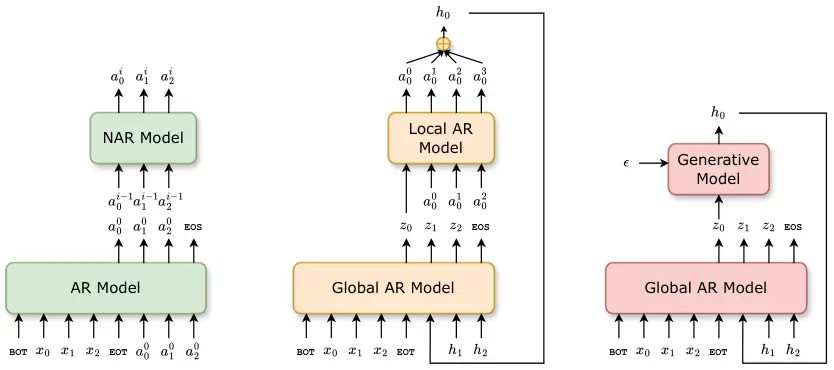
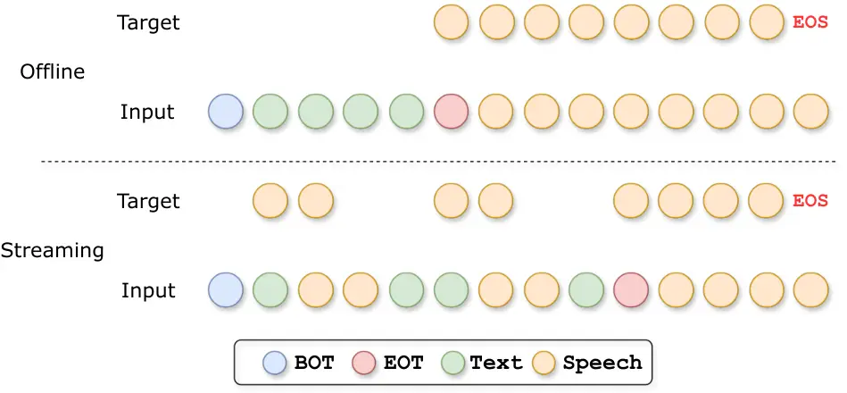

# Efficient Speech Language Modeling via Energy Distance in Continuous Latent Space

Zhengrui Ma Affiliation:  Key Laboratory of Intelligent Information
Processing  Institute of Computing Technology, Chinese Academy of
Sciences Affiliation:  University of Chinese Academy of Sciences
Affiliation:  Pattern Recognition Center, WeChat AI, Tencent Inc    Yang
Feng Affiliation:  Key Laboratory of Intelligent Information
Processing  Institute of Computing Technology, Chinese Academy of
Sciences    Chenze Shao Affiliation:  Pattern Recognition Center, WeChat
AI, Tencent Inc    Fandong Meng Affiliation:  Pattern Recognition
Center, WeChat AI, Tencent Inc    Jie Zhou Affiliation:  Pattern
Recognition Center, WeChat AI, Tencent Inc    Min Zhang Affiliation: 
School of Future Science and Engineering, Soochow University\*:
Corresponding author   
{[mazhengrui21b](mailto:%20mazhengrui21b@ict.ac.cn),[fengyang](mailto:%20fengyang@ict.ac.cn)}@ict.ac.cn

###### Abstract

We introduce _SLED_, an alternative approach to speech language modeling
by encoding speech waveforms into sequences of continuous latent
representations and modeling them autoregressively using an energy
distance objective. The energy distance offers an analytical measure of
the distributional gap by contrasting simulated and target samples,
enabling efficient training to capture the underlying continuous
autoregressive distribution. By bypassing reliance on residual vector
quantization, SLED avoids discretization errors and eliminates the need
for the complicated hierarchical architectures common in existing speech
language models. It simplifies the overall modeling pipeline while
preserving the richness of speech information and maintaining inference
efficiency. Empirical results demonstrate that SLED achieves strong
performance in both zero-shot and streaming speech synthesis, showing
its potential for broader applications in general-purpose speech
language models. Demos and code are available at
[https://github.com/ictnlp/SLED-TTS](https://github.com/ictnlp/SLED-TTS).

## 1 Introduction

Text language modeling has achieved tremendous success in recent years.
Works such as the GPT series \[2, 50\] have demonstrated that by
modeling text sequences in an autoregressive manner and pretraining on
large corpora, language models acquire impressive in-context learning
abilities and can perform nearly any downstream natural language
processing task. This remarkable potential of autoregressive language
modeling has inspired researchers to explore whether speech audio, which
also possesses a linear structure, can be modeled in a similar fashion.

Unlike text sequences composed of discrete tokens from a finite
vocabulary, speech audio is often represented as a lengthy sequence of
sampling points usually stored as integers or floating-point values
within a range. This fundamental difference poses significant challenges
for autoregressive speech modeling in a manner analogous to text. Text
language models typically rely on a finite vocabulary to acquire a
categorical distribution at each step, which is essential for stable
training via cross-entropy loss and efficient ancestral sampling during
inference. To adapt autoregressive modeling to speech, researchers have
explored discretizing speech into sequences of discrete tokens using
external quantization modules. Examples include discretization on
SSL-learned features \[24\] in \[33, 85, 49\], discretization on
ASR-supervised features in \[7, 8, 83, 31\] and reconstruction-oriented
codec \[82, 9, 32, 86, 80, 51, 25\] in \[1, 72, 88, 10, 81, 38\].
However, discretization inevitably creates an information bottleneck,
potentially losing the rich details in the raw waveform and thus
degrading the reconstruction quality derived from the discretized
tokens. One popular approach to mitigating this information loss is
residual vector quantization \[70, 82, RVQ;\], which converts raw
waveforms into multi-stream sequences of discrete tokens. However, RVQ
introduces additional complexity, requiring hierarchical autoregressive
architectures to effectively model multi-stream sequences \[72, 77\].

As an alternative to discretizing speech, researchers are starting to
explore whether speech language modeling can be performed in a
continuous latent space \[46, 69, 39\]. This approach offers several
clear advantages. Firstly, it eliminates the need for discretization,
enabling speech modeling in a latent space with minimal information
loss. Secondly, it removes the reliance on hierarchical architecture
required for modeling multi-stream sequences in RVQ, significantly
reducing modeling complexity. Similar to discrete autoregressive
modeling, continuous autoregressive modeling requires capturing a
per-step distribution, but within a continuous space. Unlike the
discrete case, where a categorical distribution can be constructed using
the softmax function, continuous space modeling relies on a conditional
probabilistic generative module to fulfill this role \[68\]. This module
should be conditioned on features extracted by an autoregressive
network, which captures the dependencies between the current step and
the preceding ones. This raises an important question: How should we
construct such a generative module for speech language modeling in
continuous latent space? Ideally, we want the conditional generative
module to function like the softmax in the discrete case—it should be
lightweight, expressive, training-stable and inference-efficient. In
speech language modeling, sampling efficiency becomes particularly
important as the latent sequences of speech are typically lengthy, and
each step in autoregressive generation involves a sampling process.

In this research, we introduce an approach to speech language modeling
in continuous latent space using energy distance (SLED). We model the
per-step continuous distribution with a lightweight implicit conditional
generative module that takes features encoded with autoregressive
dependencies and random noise as inputs \[37, 60\]. To measure the
discrepancy between the underlying data distribution and the model’s
distribution, we employ a specialized form of maximum mean discrepancy
\[17, MMD;\], known as generalized energy distance \[42, GED;\]. By
selecting an appropriate distance function, the resulting metric becomes
a strictly proper scoring rule \[15, 59\], enabling efficient training
of the model to capture the autoregressive continuous distribution. Our
approach eliminates the need for iterative sampling at each
autoregressive step \[37, 69\] or post-AR refinement \[46\],
significantly improving efficiency in modeling lengthy speech sequences
while maintaining sufficient capacity. We demonstrate the effectiveness
of our method in zero-shot and streaming speech synthesis, showing its
strong potential for application in general-purpose speech language
models.



Figure 1: Different speech language modeling approaches. _Left_:
VALL-E-style hierarchical architecture for RVQ token sequences.
_Middle_: RQ-Transformer-style hierarchical architecture for RVQ token
sequences. _Right_: Architecture for continuous token sequences.

## 2 Maximum Mean Discrepancy and Generalized Energy Distance

Integral probability metrics \[47\] are types of distance functions
between probability distributions over $`\mathbb{R}^{n}`$. Let
$`\mathcal{F}`$ be a class of real-valued functions on
$`\mathbb{R}^{n}`$, integral probability metric is defined as:

```math
D_{\mathcal{F}}(p,q)=\sup_{f\in\mathcal{F}}[\mathbb{E}_{\bm{x}\sim p(\bm{x})}[f(\bm{x})]-\mathbb{E}_{\bm{y}\sim q(\bm{y})}[f(\bm{y})]], \tag{1}
```

where $`p`$ and $`q`$ can be model and data distributions. Due to the
richness of function class $`\mathcal{F}`$, it is often not practical to
estimate $`D_{\mathcal{F}}(p,q)`$ with finite samples. _Maximum mean
discrepancy_ \[17, MMD;\] solves this problem by restricting the
function class $`\mathcal{F}`$ to be the unit ball in a reproducing
kernel Hilbert space $`\mathcal{H}`$:

```math
\mathrm{MMD}(p,q)=\sup_{\|f\|_{\mathcal{H}}\leq 1}[\mathbb{E}_{\bm{x}\sim p(\bm{x})}[f(\bm{x})]-\mathbb{E}_{\bm{y}\sim q(\bm{y})}[f(\bm{y})]]. \tag{2}
```

Assuming real-valued function $`k(\bm{x},\bm{y})`$ is symmetric and
positive definite, the kernel $`k`$ defines a reproducing kernel Hilbert
space $`\mathcal{H}`$ such that every critic function
$`f\in\mathcal{H}`$ can be expressed as
$`f(\bm{x})=\langle f,k(\bm{x},\cdot)\rangle_{\mathcal{H}}`$. This
notion can be extended to the embedding of a probability distribution by
defining $`\mu_{p}\in\mathcal{H}`$ such that
$`\mathbb{E}_{\bm{x}\sim p(\bm{x})}[f(\bm{x})]=\langle f,\mu_{p}\rangle_{\mathcal{H}}`$
for all $`f\in\mathcal{H}`$. Gretton et al. \[17\] shows that, if the
condition for the existence of $`\mu_{p}`$ is satisfied,
$`\mu_{p}=\mathbb{E}_{\bm{x}\sim p(\bm{x})}[k(\bm{x},\cdot)]`$ and MMD
can be expressed as the distance between mean embeddings:

```math
\displaystyle{\mathrm{MMD}}^{2}_{k}(p,q) \displaystyle=\|\mu_{p}-\mu_{q}\|^{2}_{\mathcal{H}}=\mathbb{E}_{\bm{x},\bm{x}^{\prime}\sim p\atop\bm{y},\bm{y}^{\prime}\sim q}[k(\bm{x},\bm{x}^{\prime})+k(\bm{y},\bm{y}^{\prime})-2k(\bm{x},\bm{y})], \tag{3}
```

where $`\bm{x},\bm{x}^{\prime}`$ and $`\bm{y},\bm{y}^{\prime}`$ are
independent samples from $`p`$ and $`q`$.

Müller \[47\] has shown that $`D_{\mathcal{F}}`$ is a _pseudometric_ for
any choice of $`\mathcal{F}`$, which satisfies all the properties of a
*metric*¹¹ 1 A metric satisfies the following four properties:
non-negativity, symmetry, triangle inequality and identity of
indiscernibles. except that there can be $`D_{\mathcal{F}}(p,q)=0`$ when
$`p`$ is not identical to $`q`$. However, $`\mathrm{MMD}(p,q)`$ is a
metric when the mean embedding $`\mu_{p}`$ is injective \[17\]. Kernels
that satisfy this condition are referred to as _characteristic kernels_
\[14\]. By selecting a characteristic kernel function
$`k(\bm{x},\bm{y})`$, $`\mathrm{MMD}(p,q)`$ becomes a strictly proper
scoring rule \[15\] and can be effectively used to train implicit
probabilistic generative models.

In an alternative view, Lyons \[42\] defines _generalized energy
distance_ (GED) between two probability distributions on metric spaces
$`(\mathbb{R}^{n},d)`$ as:

```math
{\mathrm{GED}}_{d}^{2}(p,q)=\mathbb{E}_{\bm{x},\bm{x}^{\prime}\sim p\atop\bm{y},\bm{y}^{\prime}\sim q}[2d(\bm{x},\bm{y})-d(\bm{x},\bm{x}^{\prime})-d(\bm{y},\bm{y}^{\prime})]. \tag{4}
```

Several works \[15, 42\] have pointed out that if the distance function
$`d`$ is of _negative type_ or _conditionally negative definite_, then
$`{\mathrm{GED}}^{2}(p,q)\geq 0`$, and it forms a pseudometric between
distributions. Actually, GED is a special case of MMD. Sejdinovic et al.
\[57\] shows that any _nondegenerate_ kernel $`k`$ on $`\mathbb{R}^{n}`$
defines a valid _semimetric_ $`d`$ of negative type by:²² 2 The
definitions of nondegenerate kernels and semimetrics can be found in
Sejdinovic et al. \[57\].

```math
d(\bm{x},\bm{y})=k(\bm{x},\bm{x})+k(\bm{y},\bm{y})-2k(\bm{x},\bm{y}), \tag{5}
```

and any semimetric $`d`$ of negative type can be generated by at least
one of its induced kernels:

```math
k(\bm{x},\bm{y})=d(\bm{x},\bm{z})+d(\bm{y},\bm{z})-2d(\bm{x},\bm{y}), \tag{6}
```

where $`\bm{z}`$ can be any point on $`\mathbb{R}^{n}`$.
$`{\mathrm{GED}}_{d}^{2}`$ is equivalent to the
$`{\mathrm{MMD}}^{2}_{k}`$ associated to a kernel $`k`$ that generates
$`d`$ \[57\]. Therefore, one can alternatively use GED as a criterion
for training implicit generative models, as long as the distance
function $`d`$ is chosen appropriately.

## 3 Approach

### 3.1 Language Modeling in Continuous Latent Space

Prior approaches to speech language modeling have commonly depended on
an external quantization module, which discretizes speech waveform into
a sequence of tokens from a finite vocabulary for autoregressive
modeling in a manner analogous to text. The generated speech token
sequence can be resynthesized into a waveform using either the decoder
of the quantization model or an externally trained vocoder \[53, 63\].
In this research, we explore encoding speech waveforms into sequences of
continuous representation and performing autoregressive modeling within
this continuous latent space. Given an audio sample
$`\bm{x}\in\mathbb{R}^{Tf}`$, we encode it into a sequence of continuous
representation:
$`\bm{h}=\mathrm{Enc}(\bm{x})\ \ \bm{h}\in\mathbb{R}^{Tf_{\bm{h}}\times n}`$,
where $`T`$ is the duration of the audio, and $`f`$ and $`f_{\bm{h}}`$
denote the sample rates of the audio waveform and the latent sequence.
Typically, $`f`$ ranges from hundreds of thousands to several hundred
thousand, while $`f_{\bm{h}}`$ ranges from a few to tens. The model aims
to capture the distribution of the continuous vector $`\bm{h}_{t}`$,
conditioned on all previously generated vectors $`\bm{h}_{<t}`$:

```math
{p}(\bm{h})=\prod_{t=0}^{Tf_{\bm{h}}-1}{p}(\bm{h}_{t}|\bm{h}_{<t}). \tag{7}
```

In the discrete domain, autoregressive models can use _softmax_ function
to model the distribution of each step over the vocabulary space.
However, autoregressive modeling in the continuous domain is more
complex. It requires modeling the distribution in the $`\mathbb{R}^{n}`$
space for each step, conditioned on the outputs from previous steps:

```math
\displaystyle\bm{z}_{t}=\psi(\bm{h}_{<t};\theta),\ \hat{\bm{h}}_{t}\sim p_{g}(\bm{h}_{t}|\bm{z}_{t};\phi) \tag{8}
```

where $`\psi`$ can be any autoregressive network (e.g., decoder-only
Transformer \[71\]) and $`g`$ can be any conditional generative module
on $`\mathbb{R}^{n}`$.

### 3.2 Per-token Generative Modeling via Energy Distance

As discussed earlier, we perform autoregressive modeling in the
continuous latent space using a conditional generative module $`g`$ per
step. The model $`g`$ is responsible for modeling the distribution of
the current step $`\bm{h}_{t}`$ based on the condition representation
$`\bm{z}_{t}`$, which incorporates autoregressive dependencies. Ideally,
any conditional generative model can serve as $`g`$. However, in the
context of speech language modeling, $`g`$ needs to meet certain
requirements. _Modeling Capability_: Considering the diversity of speech
audio, $`g`$ requires a strong capacity to capture the distribution at
each step. Analytically tractable distributions, such as Gaussian
distributions, may not have sufficient capability. _Sampling
Efficiency_: Speech audio has a high sampling rate. Even though this
rate is significantly reduced after encoding into the continuous latent
space, the sequences remain lengthy. Given that each step of
autoregressive decoding requires a sampling operation from $`g`$, we aim
for $`g`$ to have high sampling efficiency, akin to categorical sampling
over vocabulary. If we model $`g`$ using methods such as diffusion
\[23\], which require multiple iterations during sampling, it could
significantly increase the latency of autoregressive decoding. _Training
Stability_: Similar to training discrete autoregressive models using
cross-entropy loss, we aim to train both the conditional generative
module $`g`$ and the main autoregressive network $`\psi`$ simultaneously
using a simple and stable training algorithm. Under such constraints,
the GAN-style training paradigm \[16\] may not be appropriate.

Based on the above analysis, we construct $`g`$ as a lightweight
multi-layer perceptron that takes the condition vector $`\bm{z}_{t}`$
and noise vector $`\epsilon`$ as inputs, mapping them to the continuous
latent space of speech, $`\mathbb{R}^{n}`$:

```math
\bm{h}_{t}=g(\bm{z}_{t},\epsilon;\phi). \tag{9}
```

This implicitly defines a per-step distribution
$`p_{g}(\bm{h}_{t}|\bm{z}_{t})`$ over $`\mathbb{R}^{n}`$. The sampling
process involves simply sampling a noise vector $`\bm{\epsilon}_{t}`$
and passing it through $`g`$ along with the condition $`\bm{z}_{t}`$. In
the network $`g`$, we use the AdaLN module \[52\] to integrate noise
into the hidden state of the condition vector $`\bm{z}_{t}`$ to
introduce randomness. Rather than directly learning dimension-wise scale
and shift parameters in the layer normalization module for
$`\bm{z}_{t}`$, we treat them as random perturbations for sampling
\[60\]. The scale and shift values are predicted by applying a linear
transformation to the input noise $`\bm{\epsilon}_{t}`$.

To train the implicit conditional generative module $`g`$ and the
autoregressive network $`\psi`$ simultaneously, we use a specialized
form of maximum mean discrepancy, namely _energy distance_, as the
metric between the distributions of the data and model. The training is
performed by minimizing the energy distance between the simulated and
the ground truth latent representation per step, with respect to the
parameters of both $`g`$ and $`\psi`$. Since the data distribution
remains fixed during optimization, terms in Eq. 4 that do not depend on
the model parameters can be discarded, reducing the training loss to:

```math
{\mathcal{L}_{\mathrm{GED}}}={\textstyle\sum_{t}}\mathbb{E}_{\bm{h}_{t},\bm{h}^{\prime}_{t}}[2d(\bm{h}_{t},\bm{h}^{*}_{t})-d(\bm{h}_{t},\bm{h}^{\prime}_{t})], \tag{10}
```

where $`\bm{h}^{*}`$ is the target latent waveform representation, and
$`\bm{h}_{t}`$, $`\bm{h}^{\prime}_{t}`$ are independent samples from
$`p_{g}(\bm{h}_{t}|\bm{z}_{t})`$. As discussed in Sec. 2,
$`\mathcal{L}_{\mathrm{GED}}`$ is a strictly proper scoring rule,
provided that the kernel function corresponding to the distance function
$`d`$ is characteristic. \[15, 66\] suggests that
$`d(\bm{x},\bm{y})=\|\bm{x}-\bm{y}\|^{\beta}_{2}`$ satisfies the
condition when $`\beta\in(0,2)`$. In our experiments, we set
$`\beta=1`$:

```math
{\mathcal{L}_{\mathrm{GED}}}={\textstyle\sum_{t}}\mathbb{E}_{\bm{h}_{t},\bm{h}^{\prime}_{t}}[2\|\bm{h}_{t}-\bm{h}^{*}_{t}\|^{1}_{2}-\|\bm{h}_{t}-\bm{h}^{\prime}_{t}\|^{1}_{2}], \tag{11}
```

It is worth noting that Eq. 11 is very similar to the root mean squared
error, with the addition of the repulsive term
$`\mathbb{E}[\|\bm{h}_{t}-\bm{h}^{\prime}_{t}\|^{1}_{2}]`$. This
repulsive term is crucial for making the loss a proper learning
objective. In contrast, RMSE is only a regression loss, which does not
well capture the differences between the distributions. Using RMSE loss
as the objective can cause the model to fail to fit the data
distribution \[18\]. We demonstrate this in Sec. 6.1.

SLED performs autoregressive modeling in the continuous latent space,
thus it cannot determine when to stop by predicting the EOS token. To
address this issue, we adopt the approach from \[46\] and introduce a
binary classification head to decide whether the output should
terminate. We directly project the output of the autoregressive network
$`\bm{z}_{t}`$ to a scalar, followed by a sigmoid function, and
interpret the result as the probability of whether the output should
stop at this step.

### 3.3 Classifier-free Guidance

Continuous latent generation exhibits higher noise levels than its
discrete counterpart. To improve the generation quality and the
alignment with prompts, we adopt the classifier-free guidance technique
\[22, 60, CFG;\] during inference. At each step of autoregressive
generation, we perform an additional forward pass through $`\psi`$,
during which the prompt text is masked out, to obtain
$`\bm{z}^{\prime}_{t}`$. We then linearly interpolate $`\bm{z}_{t}`$
with $`\bm{z}^{\prime}_{t}`$ and use the result as input to the
per-token generative module $`g`$:

```math
\bm{z}^{\mathrm{cfg}}_{t}=\bm{z}^{\prime}_{t}+\lambda(\bm{z}_{t}-\bm{z}^{\prime}_{t}),\ \bm{h}^{\mathrm{cfg}}_{t}=g(\bm{z}^{\mathrm{cfg}}_{t},\epsilon;\phi), \tag{12}
```

where $`\lambda`$ is the hyperparameter to control the strength of the
guidance and it reverts to naïve conditional generation when
$`\lambda=1.0`$. During training, we randomly mask out the text prompt
with a probability of 0.1. The EOT token is preserved during masking, as
it also serves as the token indicating the beginning of the speech.

### 3.4 Streaming Inference

One appealing feature of our approach is that it is a _purely_
autoregressive model and does not require any post-processing module to
refine the outputs at earlier positions after the entire autoregressive
generation is complete. This desirable property allows our
autoregressive modeling approach to support _streaming generation_ \[43,
8, 78, 44\]. Here, streaming generation has two levels of meaning: 1)
After each autoregressive step generates a latent vector, it can
immediately be used for waveform synthesis. This capability relies on
the model’s autoregressive generation not requiring any post-processing
steps, and the decoder that converts latent vectors to waveforms
supporting streaming. 2) Building on this, we aim for the model to begin
generating even before the full prompt text is provided. This
incremental generation feature is particularly useful to reduce the
response latency of a GPT-4o-like speech interaction system \[12, 74, 3,
76, 13\], where the model serves as a TTS module following a text LLM.



Figure 2: Illustration of our streaming inference mechanism. Text and
speech tokens are interleaved based on a predefined ratio, and the loss
is computed only at positions where targets are shown.

Modern audio codecs typically have a streaming decoder \[9\], so the
first level of streaming generation is naturally supported. To achieve
incremental speech synthesis, we alter the order of the text and speech
positions within the sequence during autoregressive modeling \[8\]. As
illustrated in Figure 2, we interleave text and speech positions in an
$`n:m`$ ratio. This design allows the generation of $`m`$ speech vectors
for every $`n`$ text tokens received, enabling incremental
text-to-speech synthesis. An EOT token is used to indicate the end of
the input text stream. Afterwards, the speech vectors are generated in
the standard autoregressive way until a stop decision is made by the
binary classification head. We train the model to generate target
vectors and predict whether to stop only at the input positions that
require generation during inference. We do not require the model to
predict any filling tokens when the next step is a text token according
to the interleaving ratio. We also adopt the classifier-free guidance
outlined in Sec. 3.3 in streaming inference. The model performs
unconditional speech generation when the text stream requires masking,
with EOT serving as the beginning.

## 4 Related Work

Given great success of autoregressive language modeling approach in text
generation, researchers have started exploring whether speech sequences
can be modeled in a similar way. These studies begin with speech
synthesis as a foundational task \[33, 1, 72\], eventually extending to
the development of general-purpose speech language models \[48, 85, 10,
83, 38, 31\]. \[33\] was the first to propose discretizing
self-supervised representations of speech as semantic tokens and to
perform autoregressive speech generation. The method of learning
semantic tokens has since evolved to quantize ASR-supervised
representations \[7, 8\]. Due to information loss, waveforms
reconstructed from coarse semantic tokens are often unsatisfactory,
necessitating modeling with acoustic tokens produced by
reconstruction-oriented audio codecs \[82, 9, 32, 86, 80, 51, 25\].
Since the acoustic tokens generated by codecs often consist of multiple
sequences from residual quantization, a hierarchical architecture is
required for autoregressive speech modeling. \[72\] utilize an
autoregressive model to generate the sequence of tokens from the first
codebook, followed by a non-autoregressive model to generate tokens from
the residual codebooks. To mitigate the latency introduced by post-AR
refinement, \[77, 88\] apply the RQ-Transformer \[35\], which uses a
smaller nested Transformer to model tokens from multiple codebooks
within a single autoregressive step. Nonetheless, modeling multi-stream
acoustic tokens introduces additional complexity. Inspired by
advancements in image generation \[68, 37\], researchers have begun
exploring performing speech language modeling in the continuous latent
space. \[46\] use mel-spectrograms as the latent representation and
model the per-step distribution with a regression loss. However, using a
regression loss fails to capture the underlying distribution, requiring
a post-AR refinement network and handcrafted repetition loss. \[69\]
adopt a per-token diffusion loss \[37\], which requires iterative
sampling for each autoregressive step, leading to significant inference
latency. \[73\] models each step via flow matching \[40\], which also
encounters similar problems. To this end, \[26\] proposes a patch-based
continuous autoregressive framework that couples a language model for
inter-patch prediction with a DiT \[52\] for intra-patch generation,
thereby reducing the number of sampling steps. \[87, 39\] model the data
at each autoregressive step with a Gaussian distribution or GMM and
employ a VAE to obtain the target distribution parameters for each step.
These approaches impose overly strong constraints on the latent space,
limiting the model’s expressive capacity.

## 5 Experiments

### 5.1 Training Datasets

We train SLED on the large-scale Libriheavy \[29\] dataset. LibriHeavy
contains approximately 50,000 hours of speech from 6,736 speakers,
deriving from audiobooks from the LibriVox project. A BPE tokenizer
\[58\] with a vocabulary size of 16,384 is applied for text.

### 5.2 Experimental Settings

Continuous Representation We employ Encodec \[9\] to extract continuous
latent representations. For each frame, we sum the multi-stream token
embeddings—drawn from eight codebooks—to form its continuous vector,
ensuring minimal information loss. Although a plain autoencoder can
produce continuous latents, we find that enforcing a
quantization-regularized or KL-regularized latent space substantially
benefits downstream language modeling. This finding is in line with the
standard practice in latent diffusion models \[56\]. Considering the
representative discrete modeling approach VALL-E \[72\] also employs
Encodec as its tokenizer, this setup also enables a fair comparison
between continuous and discrete autoregressive modeling while keeping
the latent encoder consistent. The resulting continuous vector sequences
have a sampling rate of 75Hz and a latent dimensionality of 128.

Model Configurations The autoregressive network incorporates 12
Transformer layers \[71\]. Instead of using standard Transformer layers,
we employ LLaMA \[67\] layers, which apply pre-normalization using
RMSNorm \[84\], SwiGLU activation function \[62\], and rotary positional
embeddings \[65\]. Each layer has 16 attention heads and an embedding
dimension of 1,024. We set the FFN hidden dimension to 2,752 to match
the number of parameters of a standard Transformer with an FFN hidden
dimension of 4,096. The dropout rate is set at 0.1. The input latent
continuous vectors are projected to the embedding dimensionality using a
linear layer, followed by a layer normalization to ensure stability. The
lightweight conditional generative module consists of six residual
blocks, each featuring an AdaLN module \[52\] to modulate the hidden
states with noise, followed by a two-layer MLP and residual connections.
The hidden dimensionality of this generative module is set to 1024, and
a linear layer is used at the top to project the output back to the
target dimensionality. The default value of $`\lambda`$ in
classifier-free guidance is set to 2.0.

Training Details We train the model with a batch size of 512 for 300,000
steps using BF16. We optimize the model with AdamW \[41\], configured
with a learning rate of 5e-4, weight decay of 0.01, $`\beta_{1}=0.9`$,
$`\beta_{2}=0.999`$ and $`\epsilon=1\times 10^{-8}`$. The learning rate
follows a linear decay, warming up to its peak value during the first
32,000 steps. A maximum gradient norm clip of 1.0 is applied.

|                                  |          |                     |       |       |                               |        |       |
| -------------------------------- | -------- | ------------------- | ----- | ----- | ----------------------------- | ------ | ----- |
| System                           | \#Params | 3s Prefix as Prompt |       |       | Reference Utterance as Prompt |        |       |
|                                  |          | WER-C               | WER-H | SIM   | WER-C                         | WER-H  | SIM   |
| Ground Truth                     | -        | 1.78                | 2.15  | 0.668 | 1.78                          | 2.15   | 0.778 |
| Ground Truth (Encodec)           | -        | 1.79                | 2.30  | 0.606 | 1.79                          | 2.30   | 0.738 |
| _Traditional TTS_                |          |                     |       |       |                               |        |       |
| MaskGCT \[75\]                   | 1.0B     | -                   | -     | -     | -                             | 2.63   | 0.687 |
| F5-TTS \[6\]                     | 0.3B     | -                   | -     | -     | -                             | 2.42\* | 0.66  |
| MegaTTS 3 \[27\]                 | 0.3B     | -                   | -     | -     | -                             | 1.82   | 0.78  |
| _Discrete-LM-based Approaches_   |          |                     |       |       |                               |        |       |
| VALL-E \[72\]                    | 0.4B     | -                   | 3.8   | 0.508 | -                             | 5.9    | 0.580 |
| VALL-E 2 \[5\]                   | 0.4B     | 1.6                 | 2.32  | 0.529 | 1.5                           | 2.44   | 0.678 |
| ELLA-V \[64\]                    | 0.4B     | 2.10                | 2.91  | 0.340 | 7.15                          | 8.90   | 0.331 |
| VALL-E R \[20\]                  | 0.4B     | 1.58                | 2.32  | 0.397 | 3.18                          | 3.97   | 0.395 |
| Llasa \[81\]                     | 8B       | -                   | 1.49  | 0.740 | -                             | -      | -     |
| _Continuous-LM-based Approaches_ |          |                     |       |       |                               |        |       |
| CLaM-TTS \[30\]                  | -        | -                   | 2.36  | 0.513 | -                             | 5.11   | 0.538 |
| MELLE \[46\]                     | 0.2B     | 1.47                | 1.98  | 0.539 | 1.47                          | 2.10   | 0.664 |
| FELLE \[73\]                     | 0.2B     | 1.53                | 2.27  | 0.539 | 2.20                          | 2.89   | 0.654 |
| SLED                             | 0.2B     | 1.59                | 1.99  | 0.515 | 1.51                          | 1.97   | 0.664 |

Table 1: Performance comparison on _3s Prefix as Prompt_ and _Reference
Utterance as Prompt_ zero-shot speech synthesis tasks. WER-C (%)
represents the results using the Conformer-Transducer, whereas WER-H (%)
indicates the results with the HuBERT-Large. \*: WER obtained by
Whisper.

| Mode        | $`n:m`$ | WER-C | DNSMOS |
| ----------- | ------- | ----- | ------ |
| GT          | –       | 1.79  | 3.89   |
| Offline     | –       | 1.67  | 3.58   |
| with Prompt | –       | 1.51  | 3.61   |
| Streaming   | 5:20    | 2.18  | 3.59   |
| Streaming   | 5:45    | 2.20  | 3.54   |

Table 2: Performance comparison of _Offline_ and _Streaming Inference_.

| Objective               | WER-C |
| ----------------------- | ----- |
| Root Mean Squared Error | 40.60 |
| Energy Distance         | 1.59  |

Table 3: Performance comparison using Energy Distance vs. Mean Squared
Error as the objective in _3s Prefix as Prompt_ experiments.

### 5.3 Evaluation Settings

We evaluate zero-shot speech synthesis performance using LibriSpeech
_test-clean_ set, ensuring that none of the test speakers are included
in the training data. Following \[72, 46\], we use samples with
durations between 4 and 10 seconds, resulting in a 2.2-hour subset
comprising 1,234 samples and 40 unique speakers. Since the LibriSpeech
consists of case-insensitive text without punctuation, while the
expected input for models trained on LibriHeavy is unnormalized, we use
the _test-clean_ set of LibriSpeech-PC \[45\] to evaluate SLED. The
LibriSpeech-PC is nearly identical to LibriSpeech, but its text has been
restored to include capitalization and punctuation.³³ 3 The _test-clean_
set of Librispeech-PC excludes a small number of low-quality samples
(203 out of 2,620) from the original Librispeech _test-clean_ set, thus
the test subset after applying the same protocol contains only 1,154
samples. The evaluation is conducted under two settings: 1) _3s Prefix
as Prompt_: The model is provided with the text transcription and the
first 3 seconds of the utterance as the prompt, and it is expected to
perform speech continuation. 2) _Reference Utterance as Prompt_: The
model is given a reference utterance from the same speaker along with
its transcription as the prompt. Using the text of the target utterance,
the model is expected to synthesize speech that retains the
characteristics of the reference speaker. For this experiment, we follow
the configuration outlined in \[5\]. We first filter the samples in
LibriSpeech test-clean set based on length and order them by sample ID.
For each speaker, the $`i`$-th speech sample is synthesized using the
$`(i-1)`$-th sample as the prompt, while the first sample is synthesized
using the last sample from the same speaker as the prompt. For _Offline_
and _Streaming Inference_ experiments, we follow previous data settings
and no prompt speech is provided. We primarily use the following metrics
to assess the intelligibility and in-context learning capability.

Word Error Rate (WER) To evaluate the intelligibility of the synthesized
speech, we perform speech recognition on the generated audio and
calculate the WER against the target text. We utilize two ASR models:
Conformer-Transducer \[19\] and CTC-ASR-tuned HuBERT-Large \[24\].

Speaker Similarity (SIM) We evaluate the in-context learning capability
by measuring speaker similarity between the reference and the generated
speech. We extract speaker embeddings using WavLM-TDNN \[4\] and compute
their cosine similarity.

Predicted Mean Opinion Score (DNSMOS) We evaluate the overall quality of
the generated speech using the DNSMOS score \[54, 55\], which ranges
from 1 to 5, with higher values indicating better quality. We use a
model trained with ground truth human ratings obtained using ITU-T
P.808.

(a) WER-C and SIM against CFG in _3s Prefix as Prompt_.

(b) WER-C and SIM against CFG in _Ref Utterance as Prompt_.

(c) WER-C and DNSMOS against CFG in _Streaming Inference_.

Figure 3: Evaluation of classifier-free guidance effects across
generation settings.

### 5.4 Main Results

Zero-shot TTS Table 1 presents the results of zero-shot TTS. In both the
speech continuation and reference utterance prompting tasks, SLED
achieves a word accuracy surpassing the ground truth (1.59/1.51 vs. 1.78
in WER-C), demonstrating its modeling ability. Interestingly, we found
that using a reference utterance as a prompt results in more accurate
synthesis compared to using the prefix, showing the ability of
in-context learning. Comparisons of SLED performance across different
data scales are provided in App. A. We found that 1000 hours of speech
is sufficient to achieve most of the generation and in-context learning
capabilities. Further scaling the training data to 50,000 hours enhances
these abilities even more. Notably, a comparison between SLED and VALL-E
highlights key differences in autoregressive modeling approaches. Both
models use Encodec as the latent encoder, but SLED performs modeling in
the continuous domain, whereas VALL-E operates in the discrete domain.
VALL-E-like hierarchical models require an extra non-autoregressive
local model ($`\approx`$159M) to predict residual tokens. In contrast,
SLED relies on a lightweight generative module ($`\approx`$35M) for
continuous vector generation, achieving better parameter efficiency.
Despite this, SLED outperforms VALL-E on all metrics. These results show
the superiority of our continuous speech language modeling approach.
Compared with other continuous approaches, SLED achieves better or
similar quality while enjoys the advantage in generation efficiency.
MELLE incorporates an NAR refinement, whereas SLED is purely
autoregressive and can generate in a streaming manner. FELLE must
perform multi-step integration iterations along a predefined ODE path at
each decoding step, while SLED only requires a single forward pass
through its generative module. Moreover, at roughly the same parameter
scale, current speech language modeling approaches still exhibit a
significant gap in voice cloning compared with traditional TTS models.
However, Llasa \[81\] shows that scaling up can dramatically strengthen
discrete autoregressive speech models, which inspires us to further
explore the scaling capabilities of continuous autoregressive modeling
approaches.

Streaming Inference

Table 2 presents a comparison of accuracy (WER-C) and perceived quality
(DNSMOS) between speech produced via streaming inference and that
generated offline. We vary the interleaving ratio between text and
speech positions to analyze the impact of streaming policies. In our
experiments, we compare two configurations: one generates 20 speech
vectors (0.27 seconds of speech) for every 5 subwords received, while
the other generates 45 speech vectors (0.6 seconds of speech) per 5
subwords. The latter configuration aligns with \[8\], which guarantees
seamless streaming generation when serving as the speech synthesis
module of a cascaded speech-LLM system. We find that the two
interleaving ratio configurations yield comparable results in both word
accuracy and perceived quality. Moreover, the synthesized quality in
streaming mode closely matches that of offline synthesis (3.59/3.54 vs.
3.58 in DNSMOS), despite a slight drop in word accuracy (2.18/2.20 vs.
1.67 in WER-C), demonstrating the effectiveness of SLED for streaming
tasks.

## 6 Analysis

### 6.1 Importance of Energy Distance

As discussed in Section 3.2, the learning objective of SLED (Eq. 11)
closely resembles root mean squared error. By removing the repulsive
term $`\mathbb{E}[\|\bm{h}_{t}-\bm{h}^{\prime}_{t}\|^{1}_{2}]`$, the
energy distance becomes equivalent to the RMSE, with random noise acting
as a perturbation (which is the L2 part of the regression loss in
\[46\]). Despite their apparent similarity, these two objectives exhibit
distinct statistical properties. Energy distance measures the
_distributional difference_, guiding the model to capture the underlying
data distribution. In contrast, RMSE is only a _regression loss_. The
importance of the repulsive term is demonstrated in Table 3. Removing
this term results in a model failure, leading to a significantly worse
word error rate. Listening to the generated samples, we observed that
the model trained without the repulsive term failed to generate speech
in most cases.

This makes us curious why MELLE \[46\] achieves strong performance using
a regression loss. We note that \[46\] introduces a flux loss to
suppress repetition, which measures the variation of the generated
spectral sequence over time by taking the norm of the Mel-spectrogram
differences between adjacent frames. \[46\] reports that generation
quality degrades severely without it. Although \[46\] frames the flux
loss as a heuristic designed to curb repetition, we argue that its real
efficacy stems from approximating the repulsive term in the energy
distance. Because consecutive frames in speech differ only slightly,
they can be approximately regarded as two samples from the same time
step. Under this view, MELLE’s flux loss causes its training objective
to approximate the energy distance, thereby enabling it to capture
distributional differences to some extent.

### 6.2 Effects of Classifier-free Guidance

We investigate the impact of classifier-free guidance (CFG) across
generation settings. As shown in Figure 3, without CFG ($`\lambda=1.0`$
in Eq. 12), the synthesized speech exhibits poor word accuracy, with a
particularly high WER-C of 6.01 in streaming inference. However, upon
applying CFG, the WER-C values decrease dramatically. A $`\lambda`$
value of 1.5 quickly results in a substantial improvement, bringing the
WER-C down to approximately 2.0 across all settings. Further tuning of
$`\lambda`$ leads to even better word accuracy. However, in terms of
timbre cloning and perceived speech quality, a moderate CFG setting
($`\lambda=1.5`$) yields the most improvements. Further increasing
$`\lambda`$ leads to performance degradation. Notably, speech quality in
streaming inference declines to a level worse than that generated
without CFG at $`\lambda=2.5`$. This experiment demonstrates that
classifier-free guidance significantly improves alignment between the
text and synthesized speech while enhancing speech quality only with a
moderate $`\lambda`$ value. We recommend setting $`\lambda=2.0`$ by
default to achieve a balance between word accuracy and speech quality
across all generation settings.

### 6.3 Efficiency Analysis

We view SLED and DiTAR \[26\] as complementary approaches to more
efficient continuous autoregressive speech modeling. DiTAR reduces the
number of sequential steps via a semi-autoregressive framework, yielding
time complexity between fully autoregressive and fully
non-autoregressive, whereas SLED accelerates sampling in the continuous
latent space at each autoregressive step. We compare the computational
efficiency of the two methods in Table 4. All the metrics are evaluated
by inferring 10 seconds of audio.

| Model                | \#Params | \#Transformer Layer | RTF (bs=1) | FLOPs |
| -------------------- | -------- | ------------------- | ---------- | ----- |
| SLED                 | 0.2B     | 12                  | 0.8        | 280G  |
| DiTAR (patch size 4) | 0.6B     | 6+36+6              | 0.66       | 2750G |

Table 4: Comparison of decoding efficiency between SLED and DiTAR
\[26\].

Although DiTAR’s patching scheme reduces the number of sequential steps,
the approach is hierarchical. Each step in DiTAR bears a heavy
generation workload and therefore relies on a relatively large local
decoder (DiT), in contrast to SLED’s lightweight MLPs for per-step
generation. This burden can erode the nominal benefits of patching and,
by iterating within a local DiT, may also compromise global consistency;
DiTAR paper reports that the local-DiT module must incorporate
historical-patch dependencies to generate correctly, increasing
complexity and narrowing the method’s computational advantage.
Empirically, SLED achieves a comparable RTF to DiTAR while using nearly
10× fewer FLOPs and roughly one-third the parameters.

## 7 Conclusion and Limitation

In this work, we propose a method for speech language modeling in
continuous latent space using energy distance. This approach avoids the
complex hierarchical architecture of traditional discrete models, while
also preserving rich information in speech. This work has validated the
effectiveness of this modeling approach in the speech synthesis task. In
the future, we plan to extend it to general-purpose speech language
models. Moreover, the latent encoder employed in the current work was
originally designed solely for the audio codec; additionally training a
continuous latent encoder specifically for this method should further
enhance its performance.

## Acknowledgement

We gratefully acknowledge all the reviewers for their valuable comments
and suggestions. This work was supported by the Natural Science
Foundation of Beijing, China (Grant No. L257006).

## References

- \[1\] Z. Borsos, R. Marinier, D. Vincent, E. Kharitonov, O. Pietquin,
  M. Sharifi, D. Roblek, O. Teboul, D. Grangier, M. Tagliasacchi, and
  N. Zeghidour. Audiolm: a language modeling approach to audio
  generation, 2023. URL
  [https://arxiv.org/abs/2209.03143](https://arxiv.org/abs/2209.03143).
- \[2\] T. B. Brown, B. Mann, N. Ryder, M. Subbiah, J. Kaplan,
  P. Dhariwal, A. Neelakantan, P. Shyam, G. Sastry, A. Askell,
  S. Agarwal, A. Herbert-Voss, G. Krueger, T. Henighan, R. Child,
  A. Ramesh, D. M. Ziegler, J. Wu, C. Winter, C. Hesse, M. Chen,
  E. Sigler, M. Litwin, S. Gray, B. Chess, J. Clark, C. Berner,
  S. McCandlish, A. Radford, I. Sutskever, and D. Amodei. Language
  models are few-shot learners, 2020. URL
  [https://arxiv.org/abs/2005.14165](https://arxiv.org/abs/2005.14165).
- \[3\] Q. Chen, Y. Chen, Y. Chen, M. Chen, Y. Chen, C. Deng, Z. Du,
  R. Gao, C. Gao, Z. Gao, Y. Li, X. Lv, J. Liu, H. Luo, B. Ma, C. Ni,
  X. Shi, J. Tang, H. Wang, H. Wang, W. Wang, Y. Wang, Y. Xu, F. Yu,
  Z. Yan, Y. Yang, B. Yang, X. Yang, G. Yang, T. Zhao, Q. Zhang,
  S. Zhang, N. Zhao, P. Zhang, C. Zhang, and J. Zhou. Minmo: A
  multimodal large language model for seamless voice interaction, 2025.
  URL
  [https://arxiv.org/abs/2501.06282](https://arxiv.org/abs/2501.06282).
- \[4\] S. Chen, C. Wang, Z. Chen, Y. Wu, S. Liu, Z. Chen, J. Li,
  N. Kanda, T. Yoshioka, X. Xiao, J. Wu, L. Zhou, S. Ren, Y. Qian,
  Y. Qian, J. Wu, M. Zeng, X. Yu, and F. Wei. Wavlm: Large-scale
  self-supervised pre-training for full stack speech processing. _IEEE
  Journal of Selected Topics in Signal Processing_, 16(6):1505–1518,
  Oct. 2022. ISSN 1941-0484. doi: 10.1109/jstsp.2022.3188113. URL
  [http://dx.doi.org/10.1109/JSTSP.2022.3188113](http://dx.doi.org/10.1109/JSTSP.2022.3188113).
- \[5\] S. Chen, S. Liu, L. Zhou, Y. Liu, X. Tan, J. Li, S. Zhao,
  Y. Qian, and F. Wei. Vall-e 2: Neural codec language models are human
  parity zero-shot text to speech synthesizers, 2024a. URL
  [https://arxiv.org/abs/2406.05370](https://arxiv.org/abs/2406.05370).
- \[6\] Y. Chen, Z. Niu, Z. Ma, K. Deng, C. Wang, J. Zhao, K. Yu, and
  X. Chen. F5-tts: A fairytaler that fakes fluent and faithful speech
  with flow matching, 2024b. URL
  [https://arxiv.org/abs/2410.06885](https://arxiv.org/abs/2410.06885).
- \[7\] Z. Du, Q. Chen, S. Zhang, K. Hu, H. Lu, Y. Yang, H. Hu,
  S. Zheng, Y. Gu, Z. Ma, Z. Gao, and Z. Yan. Cosyvoice: A scalable
  multilingual zero-shot text-to-speech synthesizer based on supervised
  semantic tokens, 2024a. URL
  [https://arxiv.org/abs/2407.05407](https://arxiv.org/abs/2407.05407).
- \[8\] Z. Du, Y. Wang, Q. Chen, X. Shi, X. Lv, T. Zhao, Z. Gao,
  Y. Yang, C. Gao, H. Wang, F. Yu, H. Liu, Z. Sheng, Y. Gu, C. Deng,
  W. Wang, S. Zhang, Z. Yan, and J. Zhou. Cosyvoice 2: Scalable
  streaming speech synthesis with large language models, 2024b. URL
  [https://arxiv.org/abs/2412.10117](https://arxiv.org/abs/2412.10117).
- \[9\] A. Défossez, J. Copet, G. Synnaeve, and Y. Adi. High fidelity
  neural audio compression, 2022. URL
  [https://arxiv.org/abs/2210.13438](https://arxiv.org/abs/2210.13438).
- \[10\] A. Défossez, L. Mazaré, M. Orsini, A. Royer, P. Pérez,
  H. Jégou, E. Grave, and N. Zeghidour. Moshi: a speech-text foundation
  model for real-time dialogue, 2024. URL
  [https://arxiv.org/abs/2410.00037](https://arxiv.org/abs/2410.00037).
- \[11\] S. E. Eskimez, X. Wang, M. Thakker, C. Li, C.-H. Tsai, Z. Xiao,
  H. Yang, Z. Zhu, M. Tang, X. Tan, Y. Liu, S. Zhao, and N. Kanda. E2
  tts: Embarrassingly easy fully non-autoregressive zero-shot tts, 2024.
  URL
  [https://arxiv.org/abs/2406.18009](https://arxiv.org/abs/2406.18009).
- \[12\] Q. Fang, S. Guo, Y. Zhou, Z. Ma, S. Zhang, and Y. Feng.
  Llama-omni: Seamless speech interaction with large language models,
  2025a. URL
  [https://arxiv.org/abs/2409.06666](https://arxiv.org/abs/2409.06666).
- \[13\] Q. Fang, Y. Zhou, S. Guo, S. Zhang, and Y. Feng. Llama-omni2:
  Llm-based real-time spoken chatbot with autoregressive streaming
  speech synthesis, 2025b. URL
  [https://arxiv.org/abs/2505.02625](https://arxiv.org/abs/2505.02625).
- \[14\] K. Fukumizu, A. Gretton, X. Sun, and B. Schölkopf. Kernel
  measures of conditional dependence. In J. Platt, D. Koller, Y. Singer,
  and S. Roweis, editors, _Advances in Neural Information Processing
  Systems_, volume 20. Curran Associates, Inc., 2007. URL
  [https://proceedings.neurips.cc/paper_files/paper/2007/file/3a0772443a0739141292a5429b952fe6-Paper.pdf](https://proceedings.neurips.cc/paper_files/paper/2007/file/3a0772443a0739141292a5429b952fe6-Paper.pdf).
- \[15\] T. Gneiting and A. E. Raftery. Strictly proper scoring rules,
  prediction, and estimation. _Journal of the American Statistical
  Association_, 102(477):359–378, 2007. doi: 10.1198/016214506000001437.
- \[16\] I. J. Goodfellow, J. Pouget-Abadie, M. Mirza, B. Xu,
  D. Warde-Farley, S. Ozair, A. Courville, and Y. Bengio. Generative
  adversarial networks, 2014. URL
  [https://arxiv.org/abs/1406.2661](https://arxiv.org/abs/1406.2661).
- \[17\] A. Gretton, K. M. Borgwardt, M. J. Rasch, B. Schölkopf, and
  A. Smola. A kernel two-sample test. _Journal of Machine Learning
  Research_, 13(25):723–773, 2012. URL
  [http://jmlr.org/papers/v13/gretton12a.html](http://jmlr.org/papers/v13/gretton12a.html).
- \[18\] A. A. Gritsenko, T. Salimans, R. van den Berg, J. Snoek, and
  N. Kalchbrenner. A spectral energy distance for parallel speech
  synthesis, 2020. URL
  [https://arxiv.org/abs/2008.01160](https://arxiv.org/abs/2008.01160).
- \[19\] A. Gulati, J. Qin, C.-C. Chiu, N. Parmar, Y. Zhang, J. Yu,
  W. Han, S. Wang, Z. Zhang, Y. Wu, and R. Pang. Conformer:
  Convolution-augmented transformer for speech recognition, 2020. URL
  [https://arxiv.org/abs/2005.08100](https://arxiv.org/abs/2005.08100).
- \[20\] B. Han, L. Zhou, S. Liu, S. Chen, L. Meng, Y. Qian, Y. Liu,
  S. Zhao, J. Li, and F. Wei. Vall-e r: Robust and efficient zero-shot
  text-to-speech synthesis via monotonic alignment, 2024. URL
  [https://arxiv.org/abs/2406.07855](https://arxiv.org/abs/2406.07855).
- \[21\] J. Helcl, B. Haddow, and A. Birch. Non-autoregressive machine
  translation: It’s not as fast as it seems, 2022. URL
  [https://arxiv.org/abs/2205.01966](https://arxiv.org/abs/2205.01966).
- \[22\] J. Ho and T. Salimans. Classifier-free diffusion
  guidance, 2022. URL
  [https://arxiv.org/abs/2207.12598](https://arxiv.org/abs/2207.12598).
- \[23\] J. Ho, A. Jain, and P. Abbeel. Denoising diffusion
  probabilistic models, 2020. URL
  [https://arxiv.org/abs/2006.11239](https://arxiv.org/abs/2006.11239).
- \[24\] W.-N. Hsu, B. Bolte, Y.-H. H. Tsai, K. Lakhotia,
  R. Salakhutdinov, and A. Mohamed. Hubert: Self-supervised speech
  representation learning by masked prediction of hidden units, 2021.
  URL
  [https://arxiv.org/abs/2106.07447](https://arxiv.org/abs/2106.07447).
- \[25\] S. Ji, Z. Jiang, W. Wang, Y. Chen, M. Fang, J. Zuo, Q. Yang,
  X. Cheng, Z. Wang, R. Li, Z. Zhang, X. Yang, R. Huang, Y. Jiang,
  Q. Chen, S. Zheng, and Z. Zhao. Wavtokenizer: an efficient acoustic
  discrete codec tokenizer for audio language modeling, 2025. URL
  [https://arxiv.org/abs/2408.16532](https://arxiv.org/abs/2408.16532).
- \[26\] D. Jia, Z. Chen, J. Chen, C. Du, J. Wu, J. Cong, X. Zhuang,
  C. Li, Z. Wei, Y. Wang, and Y. Wang. Ditar: Diffusion transformer
  autoregressive modeling for speech generation, 2025. URL
  [https://arxiv.org/abs/2502.03930](https://arxiv.org/abs/2502.03930).
- \[27\] Z. Jiang, Y. Ren, R. Li, S. Ji, B. Zhang, Z. Ye, C. Zhang,
  B. Jionghao, X. Yang, J. Zuo, Y. Zhang, R. Liu, X. Yin, and Z. Zhao.
  Megatts 3: Sparse alignment enhanced latent diffusion transformer for
  zero-shot speech synthesis, 2025. URL
  [https://arxiv.org/abs/2502.18924](https://arxiv.org/abs/2502.18924).
- \[28\] Z. Ju, Y. Wang, K. Shen, X. Tan, D. Xin, D. Yang, Y. Liu,
  Y. Leng, K. Song, S. Tang, Z. Wu, T. Qin, X.-Y. Li, W. Ye, S. Zhang,
  J. Bian, L. He, J. Li, and S. Zhao. Naturalspeech 3: Zero-shot speech
  synthesis with factorized codec and diffusion models, 2024. URL
  [https://arxiv.org/abs/2403.03100](https://arxiv.org/abs/2403.03100).
- \[29\] W. Kang, X. Yang, Z. Yao, F. Kuang, Y. Yang, L. Guo, L. Lin,
  and D. Povey. Libriheavy: a 50,000 hours asr corpus with punctuation
  casing and context. In _ICASSP 2024-2024 IEEE International Conference
  on Acoustics, Speech and Signal Processing (ICASSP)_, pages
  10991–10995. IEEE, 2024.
- \[30\] J. Kim, K. Lee, S. Chung, and J. Cho. Clam-tts: Improving
  neural codec language model for zero-shot text-to-speech, 2024. URL
  [https://arxiv.org/abs/2404.02781](https://arxiv.org/abs/2404.02781).
- \[31\] KimiTeam, D. Ding, Z. Ju, Y. Leng, S. Liu, T. Liu, Z. Shang,
  K. Shen, W. Song, X. Tan, H. Tang, Z. Wang, C. Wei, Y. Xin, X. Xu,
  J. Yu, Y. Zhang, X. Zhou, Y. Charles, J. Chen, Y. Chen, Y. Du, W. He,
  Z. Hu, G. Lai, Q. Li, Y. Liu, W. Sun, J. Wang, Y. Wang, Y. Wu, Y. Wu,
  D. Yang, H. Yang, Y. Yang, Z. Yang, A. Yin, R. Yuan, Y. Zhang, and
  Z. Zhou. Kimi-audio technical report, 2025. URL
  [https://arxiv.org/abs/2504.18425](https://arxiv.org/abs/2504.18425).
- \[32\] R. Kumar, P. Seetharaman, A. Luebs, I. Kumar, and K. Kumar.
  High-fidelity audio compression with improved rvqgan, 2023. URL
  [https://arxiv.org/abs/2306.06546](https://arxiv.org/abs/2306.06546).
- \[33\] K. Lakhotia, E. Kharitonov, W.-N. Hsu, Y. Adi, A. Polyak,
  B. Bolte, T.-A. Nguyen, J. Copet, A. Baevski, A. Mohamed, and
  E. Dupoux. Generative spoken language modeling from raw audio, 2021.
  URL
  [https://arxiv.org/abs/2102.01192](https://arxiv.org/abs/2102.01192).
- \[34\] M. Le, A. Vyas, B. Shi, B. Karrer, L. Sari, R. Moritz,
  M. Williamson, V. Manohar, Y. Adi, J. Mahadeokar, and W.-N. Hsu.
  Voicebox: Text-guided multilingual universal speech generation at
  scale, 2023. URL
  [https://arxiv.org/abs/2306.15687](https://arxiv.org/abs/2306.15687).
- \[35\] D. Lee, C. Kim, S. Kim, M. Cho, and W.-S. Han. Autoregressive
  image generation using residual quantization, 2022. URL
  [https://arxiv.org/abs/2203.01941](https://arxiv.org/abs/2203.01941).
- \[36\] K. Lee, D. W. Kim, J. Kim, S. Chung, and J. Cho. Ditto-tts:
  Diffusion transformers for scalable text-to-speech without
  domain-specific factors, 2025. URL
  [https://arxiv.org/abs/2406.11427](https://arxiv.org/abs/2406.11427).
- \[37\] T. Li, Y. Tian, H. Li, M. Deng, and K. He. Autoregressive image
  generation without vector quantization, 2024. URL
  [https://arxiv.org/abs/2406.11838](https://arxiv.org/abs/2406.11838).
- \[38\] T. Li, J. Liu, T. Zhang, Y. Fang, D. Pan, M. Wang, Z. Liang,
  Z. Li, M. Lin, G. Dong, J. Xu, H. Sun, Z. Zhou, and W. Chen.
  Baichuan-audio: A unified framework for end-to-end speech
  interaction, 2025. URL
  [https://arxiv.org/abs/2502.17239](https://arxiv.org/abs/2502.17239).
- \[39\] W. Lin and C. He. Continuous autoregressive modeling with
  stochastic monotonic alignment for speech synthesis, 2025. URL
  [https://arxiv.org/abs/2502.01084](https://arxiv.org/abs/2502.01084).
- \[40\] Y. Lipman, R. T. Q. Chen, H. Ben-Hamu, M. Nickel, and M. Le.
  Flow matching for generative modeling, 2023. URL
  [https://arxiv.org/abs/2210.02747](https://arxiv.org/abs/2210.02747).
- \[41\] I. Loshchilov and F. Hutter. Decoupled weight decay
  regularization, 2019. URL
  [https://arxiv.org/abs/1711.05101](https://arxiv.org/abs/1711.05101).
- \[42\] R. Lyons. Distance covariance in metric spaces. _The Annals of
  Probability_, 41(5), Sept. 2013. ISSN 0091-1798. doi:
  10.1214/12-aop803. URL
  [http://dx.doi.org/10.1214/12-AOP803](http://dx.doi.org/10.1214/12-AOP803).
- \[43\] Z. Ma, S. Zhang, S. Guo, C. Shao, M. Zhang, and Y. Feng.
  Non-autoregressive streaming transformer for simultaneous translation.
  In _Proceedings of the 2023 Conference on Empirical Methods in Natural
  Language Processing_, pages 5177–5190. Association for Computational
  Linguistics, 2023. URL
  [https://aclanthology.org/2023.emnlp-main.314/](https://aclanthology.org/2023.emnlp-main.314/).
- \[44\] Z. Ma, Y. Feng, and M. Zhang. Overcoming non-monotonicity in
  transducer-based streaming generation. In _Proceedings of the 42nd
  International Conference on Machine Learning_, 2025. URL
  [https://arxiv.org/abs/2411.17170](https://arxiv.org/abs/2411.17170).
- \[45\] A. Meister, M. Novikov, N. Karpov, E. Bakhturina, V. Lavrukhin,
  and B. Ginsburg. Librispeech-pc: Benchmark for evaluation of
  punctuation and capitalization capabilities of end-to-end asr models.
  _arXiv preprint arXiv:2310.02943_, 2023.
- \[46\] L. Meng, L. Zhou, S. Liu, S. Chen, B. Han, S. Hu, Y. Liu,
  J. Li, S. Zhao, X. Wu, H. Meng, and F. Wei. Autoregressive speech
  synthesis without vector quantization, 2024. URL
  [https://arxiv.org/abs/2407.08551](https://arxiv.org/abs/2407.08551).
- \[47\] A. Müller. Integral probability metrics and their generating
  classes of functions. _Advances in Applied Probability_,
  29(2):429–443, 1997. doi: 10.2307/1428011.
- \[48\] T. A. Nguyen, E. Kharitonov, J. Copet, Y. Adi, W.-N. Hsu,
  A. Elkahky, P. Tomasello, R. Algayres, B. Sagot, A. Mohamed, and
  E. Dupoux. Generative spoken dialogue language modeling, 2022. URL
  [https://arxiv.org/abs/2203.16502](https://arxiv.org/abs/2203.16502).
- \[49\] T. A. Nguyen, B. Muller, B. Yu, M. R. Costa-jussa, M. Elbayad,
  S. Popuri, C. Ropers, P.-A. Duquenne, R. Algayres, R. Mavlyutov,
  I. Gat, M. Williamson, G. Synnaeve, J. Pino, B. Sagot, and E. Dupoux.
  Spirit lm: Interleaved spoken and written language model, 2024. URL
  [https://arxiv.org/abs/2402.05755](https://arxiv.org/abs/2402.05755).
- \[50\] OpenAI. Gpt-4 technical report, 2024. URL
  [https://arxiv.org/abs/2303.08774](https://arxiv.org/abs/2303.08774).
- \[51\] J. D. Parker, A. Smirnov, J. Pons, C. Carr, Z. Zukowski,
  Z. Evans, and X. Liu. Scaling transformers for low-bitrate
  high-quality speech coding, 2024. URL
  [https://arxiv.org/abs/2411.19842](https://arxiv.org/abs/2411.19842).
- \[52\] W. Peebles and S. Xie. Scalable diffusion models with
  transformers, 2023. URL
  [https://arxiv.org/abs/2212.09748](https://arxiv.org/abs/2212.09748).
- \[53\] A. Polyak, Y. Adi, J. Copet, E. Kharitonov, K. Lakhotia, W.-N.
  Hsu, A. Mohamed, and E. Dupoux. Speech resynthesis from discrete
  disentangled self-supervised representations, 2021. URL
  [https://arxiv.org/abs/2104.00355](https://arxiv.org/abs/2104.00355).
- \[54\] C. K. Reddy, V. Gopal, and R. Cutler. Dnsmos: A non-intrusive
  perceptual objective speech quality metric to evaluate noise
  suppressors. In _ICASSP 2021 IEEE International Conference on
  Acoustics, Speech and Signal Processing (ICASSP)_, pages 6493–6497.
  IEEE, 2021.
- \[55\] C. K. Reddy, V. Gopal, and R. Cutler. Dnsmos p.835: A
  non-intrusive perceptual objective speech quality metric to evaluate
  noise suppressors. In _ICASSP 2022 IEEE International Conference on
  Acoustics, Speech and Signal Processing (ICASSP)_. IEEE, 2022.
- \[56\] R. Rombach, A. Blattmann, D. Lorenz, P. Esser, and B. Ommer.
  High-resolution image synthesis with latent diffusion models, 2022.
  URL
  [https://arxiv.org/abs/2112.10752](https://arxiv.org/abs/2112.10752).
- \[57\] D. Sejdinovic, B. Sriperumbudur, A. Gretton, and K. Fukumizu.
  Equivalence of distance-based and rkhs-based statistics in hypothesis
  testing. _The Annals of Statistics_, 41(5), Oct. 2013. ISSN 0090-5364.
  doi: 10.1214/13-aos1140. URL
  [http://dx.doi.org/10.1214/13-AOS1140](http://dx.doi.org/10.1214/13-AOS1140).
- \[58\] R. Sennrich, B. Haddow, and A. Birch. Neural machine
  translation of rare words with subword units, 2016. URL
  [https://arxiv.org/abs/1508.07909](https://arxiv.org/abs/1508.07909).
- \[59\] C. Shao, F. Meng, Y. Liu, and J. Zhou. Language generation with
  strictly proper scoring rules. In _Proceedings of the 41st
  International Conference on Machine Learning_, volume 235 of
  _Proceedings of Machine Learning Research_, pages 44474–44488. PMLR,
  21–27 Jul 2024. URL
  [https://proceedings.mlr.press/v235/shao24c.html](https://proceedings.mlr.press/v235/shao24c.html).
- \[60\] C. Shao, F. Meng, and J. Zhou. Continuous visual autoregressive
  generation via score maximization, 2025. URL
  [https://arxiv.org/abs/2505.07812](https://arxiv.org/abs/2505.07812).
- \[61\] S. S. Shapiro and M. B. Wilk. An analysis of variance test for
  normality (complete samples). _Biometrika_, 52(3-4):591–611, 1965.
- \[62\] N. Shazeer. Glu variants improve transformer, 2020. URL
  [https://arxiv.org/abs/2002.05202](https://arxiv.org/abs/2002.05202).
- \[63\] H. Siuzdak. Vocos: Closing the gap between time-domain and
  fourier-based neural vocoders for high-quality audio synthesis, 2024.
  URL
  [https://arxiv.org/abs/2306.00814](https://arxiv.org/abs/2306.00814).
- \[64\] Y. Song, Z. Chen, X. Wang, Z. Ma, and X. Chen. Ella-v: Stable
  neural codec language modeling with alignment-guided sequence
  reordering, 2024. URL
  [https://arxiv.org/abs/2401.07333](https://arxiv.org/abs/2401.07333).
- \[65\] J. Su, Y. Lu, S. Pan, A. Murtadha, B. Wen, and Y. Liu.
  Roformer: Enhanced transformer with rotary position embedding, 2023.
  URL
  [https://arxiv.org/abs/2104.09864](https://arxiv.org/abs/2104.09864).
- \[66\] G. J. Székely and M. L. Rizzo. Energy statistics: A class of
  statistics based on distances. _Journal of statistical planning and
  inference_, 143(8):1249–1272, 2013.
- \[67\] H. Touvron, T. Lavril, G. Izacard, X. Martinet, M.-A. Lachaux,
  T. Lacroix, B. Rozière, N. Goyal, E. Hambro, F. Azhar, A. Rodriguez,
  A. Joulin, E. Grave, and G. Lample. Llama: Open and efficient
  foundation language models, 2023. URL
  [https://arxiv.org/abs/2302.13971](https://arxiv.org/abs/2302.13971).
- \[68\] M. Tschannen, C. Eastwood, and F. Mentzer. Givt: Generative
  infinite-vocabulary transformers, 2024. URL
  [https://arxiv.org/abs/2312.02116](https://arxiv.org/abs/2312.02116).
- \[69\] A. Turetzky, N. Shabtay, S. Shechtman, H. Aronowitz, D. Haws,
  R. Hoory, and A. Dekel. Continuous speech synthesis using per-token
  latent diffusion, 2024. URL
  [https://arxiv.org/abs/2410.16048](https://arxiv.org/abs/2410.16048).
- \[70\] A. van den Oord, O. Vinyals, and K. Kavukcuoglu. Neural
  discrete representation learning, 2017. URL
  [https://arxiv.org/abs/1711.00937](https://arxiv.org/abs/1711.00937).
- \[71\] A. Vaswani, N. Shazeer, N. Parmar, J. Uszkoreit, L. Jones,
  A. N. Gomez, L. Kaiser, and I. Polosukhin. Attention is all you
  need, 2023. URL
  [https://arxiv.org/abs/1706.03762](https://arxiv.org/abs/1706.03762).
- \[72\] C. Wang, S. Chen, Y. Wu, Z. Zhang, L. Zhou, S. Liu, Z. Chen,
  Y. Liu, H. Wang, J. Li, L. He, S. Zhao, and F. Wei. Neural codec
  language models are zero-shot text to speech synthesizers, 2023. URL
  [https://arxiv.org/abs/2301.02111](https://arxiv.org/abs/2301.02111).
- \[73\] H. Wang, S. Liu, L. Meng, J. Li, Y. Yang, S. Zhao, H. Sun,
  Y. Liu, H. Sun, J. Zhou, Y. Lu, and Y. Qin. Felle: Autoregressive
  speech synthesis with token-wise coarse-to-fine flow matching, 2025.
  URL
  [https://arxiv.org/abs/2502.11128](https://arxiv.org/abs/2502.11128).
- \[74\] X. Wang, Y. Li, C. Fu, Y. Shen, L. Xie, K. Li, X. Sun, and
  L. Ma. Freeze-omni: A smart and low latency speech-to-speech dialogue
  model with frozen llm, 2024a. URL
  [https://arxiv.org/abs/2411.00774](https://arxiv.org/abs/2411.00774).
- \[75\] Y. Wang, H. Zhan, L. Liu, R. Zeng, H. Guo, J. Zheng, Q. Zhang,
  X. Zhang, S. Zhang, and Z. Wu. Maskgct: Zero-shot text-to-speech with
  masked generative codec transformer, 2024b. URL
  [https://arxiv.org/abs/2409.00750](https://arxiv.org/abs/2409.00750).
- \[76\] J. Xu, Z. Guo, J. He, H. Hu, T. He, S. Bai, K. Chen, J. Wang,
  Y. Fan, K. Dang, B. Zhang, X. Wang, Y. Chu, and J. Lin. Qwen2.5-omni
  technical report, 2025. URL
  [https://arxiv.org/abs/2503.20215](https://arxiv.org/abs/2503.20215).
- \[77\] D. Yang, J. Tian, X. Tan, R. Huang, S. Liu, X. Chang, J. Shi,
  S. Zhao, J. Bian, Z. Zhao, X. Wu, and H. Meng. Uniaudio: An audio
  foundation model toward universal audio generation, 2024a. URL
  [https://arxiv.org/abs/2310.00704](https://arxiv.org/abs/2310.00704).
- \[78\] Y. Yang, Z. Ma, S. Liu, J. Li, H. Wang, L. Meng, H. Sun,
  Y. Liang, R. Xu, Y. Hu, Y. Lu, R. Zhao, and X. Chen. Interleaved
  speech-text language models are simple streaming text to speech
  synthesizers, 2024b. URL
  [https://arxiv.org/abs/2412.16102](https://arxiv.org/abs/2412.16102).
- \[79\] Y. Yang, S. Liu, J. Li, Y. Hu, H. Wu, H. Wang, J. Yu, L. Meng,
  H. Sun, Y. Liu, Y. Lu, K. Yu, and X. Chen. Pseudo-autoregressive
  neural codec language models for efficient zero-shot text-to-speech
  synthesis, 2025. URL
  [https://arxiv.org/abs/2504.10352](https://arxiv.org/abs/2504.10352).
- \[80\] Z. Ye, P. Sun, J. Lei, H. Lin, X. Tan, Z. Dai, Q. Kong,
  J. Chen, J. Pan, Q. Liu, Y. Guo, and W. Xue. Codec does matter:
  Exploring the semantic shortcoming of codec for audio language
  model, 2024. URL
  [https://arxiv.org/abs/2408.17175](https://arxiv.org/abs/2408.17175).
- \[81\] Z. Ye, X. Zhu, C.-M. Chan, X. Wang, X. Tan, J. Lei, Y. Peng,
  H. Liu, Y. Jin, Z. Dai, H. Lin, J. Chen, X. Du, L. Xue, Y. Chen,
  Z. Li, L. Xie, Q. Kong, Y. Guo, and W. Xue. Llasa: Scaling train-time
  and inference-time compute for llama-based speech synthesis, 2025. URL
  [https://arxiv.org/abs/2502.04128](https://arxiv.org/abs/2502.04128).
- \[82\] N. Zeghidour, A. Luebs, A. Omran, J. Skoglund, and
  M. Tagliasacchi. Soundstream: An end-to-end neural audio codec, 2021.
  URL
  [https://arxiv.org/abs/2107.03312](https://arxiv.org/abs/2107.03312).
- \[83\] A. Zeng, Z. Du, M. Liu, L. Zhang, shengmin jiang, Y. Dong, and
  J. Tang. Scaling speech-text pre-training with synthetic interleaved
  data. In _The Thirteenth International Conference on Learning
  Representations_, 2025. URL
  [https://openreview.net/forum?id=3tukjsVyrE](https://openreview.net/forum?id=3tukjsVyrE).
- \[84\] B. Zhang and R. Sennrich. Root mean square layer
  normalization, 2019. URL
  [https://arxiv.org/abs/1910.07467](https://arxiv.org/abs/1910.07467).
- \[85\] D. Zhang, S. Li, X. Zhang, J. Zhan, P. Wang, Y. Zhou, and
  X. Qiu. Speechgpt: Empowering large language models with intrinsic
  cross-modal conversational abilities, 2023. URL
  [https://arxiv.org/abs/2305.11000](https://arxiv.org/abs/2305.11000).
- \[86\] X. Zhang, D. Zhang, S. Li, Y. Zhou, and X. Qiu.
  Speechtokenizer: Unified speech tokenizer for speech large language
  models, 2024. URL
  [https://arxiv.org/abs/2308.16692](https://arxiv.org/abs/2308.16692).
- \[87\] X. Zhu, W. Tian, and L. Xie. Autoregressive speech synthesis
  with next-distribution prediction, 2024a. URL
  [https://arxiv.org/abs/2412.16846](https://arxiv.org/abs/2412.16846).
- \[88\] Y. Zhu, D. Su, L. He, L. Xu, and D. Yu. Generative pre-trained
  speech language model with efficient hierarchical transformer, 2024b.
  URL
  [https://arxiv.org/abs/2406.00976](https://arxiv.org/abs/2406.00976).

## Appendix A Results at Different Data Scales

|                                                |                     |       |       |                               |       |       |
| ---------------------------------------------- | ------------------- | ----- | ----- | ----------------------------- | ----- | ----- |
| System                                         | 3s Prefix as Prompt |       |       | Reference Utterance as Prompt |       |       |
|                                                | WER-C               | WER-H | SIM   | WER-C                         | WER-H | SIM   |
| Ground Truth                                   | 1.78                | 2.15  | 0.668 | 1.78                          | 2.15  | 0.778 |
| Ground Truth (Encodec)                         | 1.79                | 2.30  | 0.606 | 1.79                          | 2.30  | 0.738 |
| _Models trained on the 1,000-hour LibriSpeech_ |                     |       |       |                               |       |       |
| SLED                                           | 1.68                | 2.28  | 0.490 | 2.27                          | 2.88  | 0.616 |
| _Models trained on the 50,000-hour LibriHeavy_ |                     |       |       |                               |       |       |
| SLED                                           | 1.59                | 1.99  | 0.515 | 1.51                          | 1.97  | 0.664 |

Table 5: Comparison of model performance when trained on LibriSpeech
versus LibriHeavy.

## Appendix B Why not Gaussian?

In Sec. 3.2, we claim Gaussian distribution does not have enough
capacity to model the per-token continuous distribution in latent space.
We have designed experiments to demonstrate this. Specifically, using a
trained SLED (which we assume has successfully captured the underlying
data distribution), we sampled 100 latent vectors from the first speech
position and conducted a Shapiro-Wilk test \[61\] to examine whether
each dimension follows a Gaussian distribution. The result showed that 0
out of 128 dimensions passed the normality test (p \> 0.05), indicating
that none of the dimensions individually follow a normal distribution.

## Appendix C More Analysis of Inference Efficiency

| Model  | AR Latency | Gen. Module Latency | NAR Latency | RTF | FLOPs\*             |
| ------ | ---------- | ------------------- | ----------- | --- | ------------------- |
| VALL-E | 6.91 s     | 0.16 s (Softmax)    | 0.94 s      | 0.8 | 8 $`\times`$ 222.7G |
| SLED   | 6.82 s     | 1.23 s (MLP)        | –           | 0.8 | 280.05 G            |

Table 6: Inference latency and RTF of generating a 10s speech. \*: We
use teacher-forcing-style AR forward pass to estimate FLOPs in AR
module.

| Batch Size | SLED’s RTF |
| ---------- | ---------- |
| 1          | 0.8        |
| 16         | 0.055      |
| 64         | 0.027      |

Table 7: RTF of SLED for different batch sizes.

As shown, SLED and discrete hierarchical models like VALL-E exhibit no
significant difference in RTF. However, SLED largely reduces FLOPs
compared with hierarchical models and supports streaming generation. The
additional time spent by the MLP heads in continuous generation is
offset by the efficiency gains from avoiding the decoding process
required by local NAR models. Combined with its RTF being less than 1,
SLED is well-suited for supporting real-time applications.

Moreover, while SLED’s RTF may appear higher than NAR TTS models such as
\[6\], we argue that comparing RTF between AR and iterative NAR with the
batch size fixed to 1 is somewhat misleading. In fact, prior studies on
NAR generation \[21\] have long advocated for evaluating AR and NAR
models under larger batch sizes—up to the capacity supported by the
GPU—or equivalently, under the same computational budget (FLOPs). In
fact, we observe that increasing the batch size significantly reduces
SLED’s RTF.

## Appendix D Broader Impact

The speech language modeling method presented in this paper enables
voice cloning, and the experimental results demonstrate that voice
cloning is feasible to some extent. However, as the findings indicate,
there remains a noticeable gap between the cloned voice and the original
speaker’s voice. As such, a speaker verification model can be used to
detect potential voice forgeries.

3628341179
