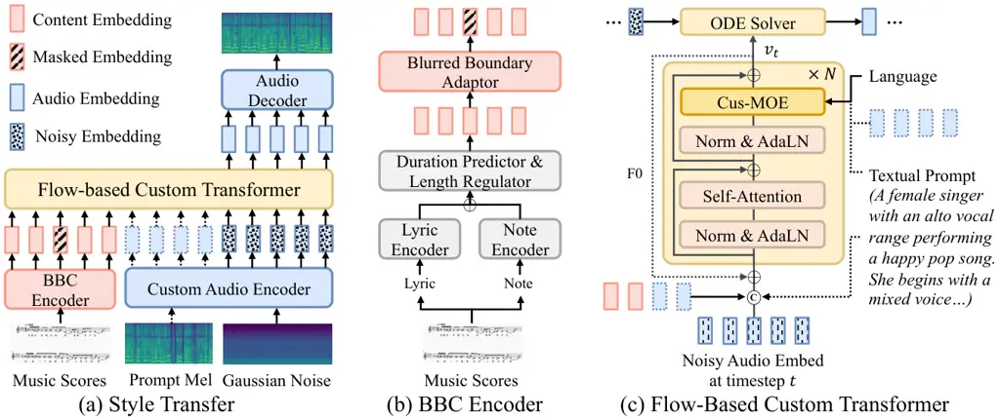
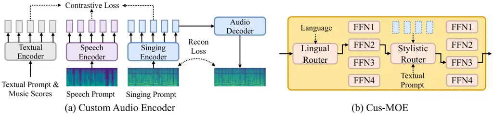
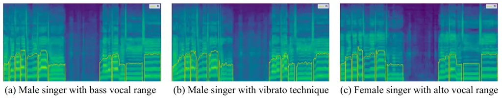
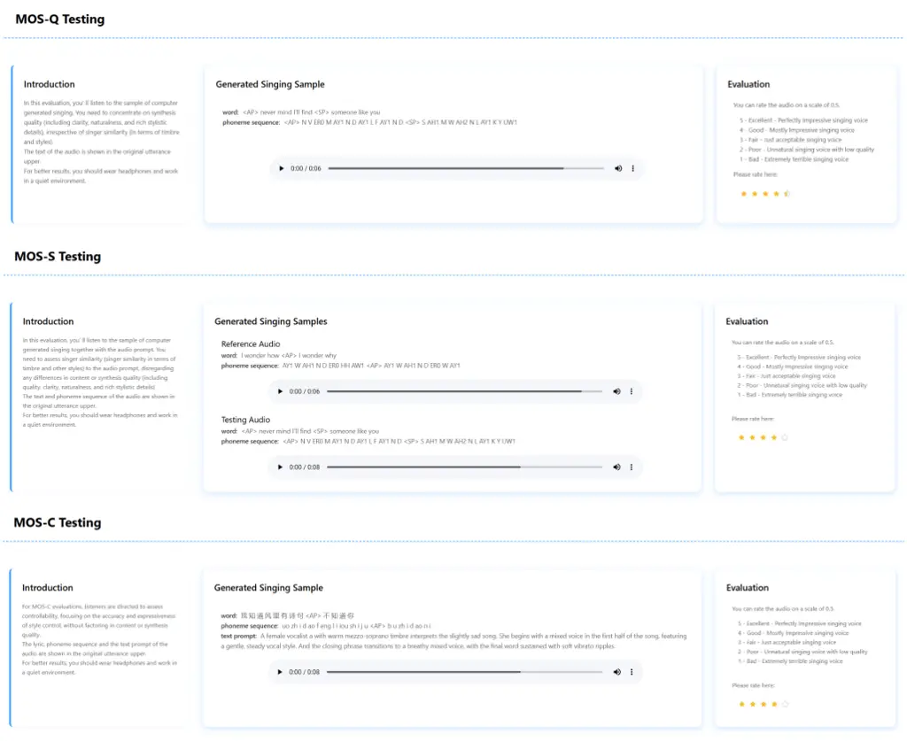

# TCSinger 2: Customizable Multilingual Zero-shot Singing Voice Synthesis

Yu Zhang ^(†)^(†)thanks: Equal contribution    Wenxiang
Guo¹¹footnotemark: 1    Changhao Pan¹¹footnotemark: 1    Dongyu Yao   
Zhiyuan Zhu    Ziyue Jiang    Yuhan Wang    Tao Jin    Zhou Zhao
^(†)^(†)thanks: Corresponding Author    Zhejiang University
Email: [{yuzhang34,zhaozhou}@zju.edu.cn](mailto:)

###### Abstract

Customizable multilingual zero-shot singing voice synthesis (SVS) has
various potential applications in music composition and short video
dubbing. However, existing SVS models overly depend on phoneme and note
boundary annotations, limiting their robustness in zero-shot scenarios
and producing poor transitions between phonemes and notes. Moreover,
they also lack effective multi-level style control via diverse prompts.
To overcome these challenges, we introduce TCSinger 2, a multi-task
multilingual zero-shot SVS model with style transfer and style control
based on various prompts. TCSinger 2 mainly includes three key
modules: 1) Blurred Boundary Content (BBC) Encoder, predicts duration,
extends content embedding, and applies masking to the boundaries to
enable smooth transitions. 2) Custom Audio Encoder, uses contrastive
learning to extract aligned representations from singing, speech, and
textual prompts. 3) Flow-based Custom Transformer, leverages Cus-MOE,
with F0 supervision, enhancing both the synthesis quality and style
modeling of the generated singing voice. Experimental results show that
TCSinger 2 outperforms baseline models in both subjective and objective
metrics across multiple related tasks. Singing voice samples are
available at
[https://aaronz345.github.io/TCSinger2Demo/](https://aaronz345.github.io/TCSinger2Demo/).
Code can be found at
[https://github.com/AaronZ345/TCSinger2](https://github.com/AaronZ345/TCSinger2).

## 1 Introduction

Zero-shot singing voice synthesis (SVS) aims to generate high-quality
singing voices with unseen multi-level styles based on audio or textual
prompts (Zhang et al., 2024b; Zhang et al., 2024c; Guo et al., 2025).
This field has found widespread potential applications in professional
music composition and short video dubbing. Zero-shot SVS involves using
an acoustic model to leverage lyrics and musical notations for content
modeling, while audio or textual prompts can control singing styles.
Finally, a vocoder is employed to synthesize the target singing voice.

Although traditional SVS tasks (Zhang et al., 2022b; Kim et al., 2022;
Cho et al., 2022) have made significant strides, there is an increasing
demand for more customizable experiences. This includes not only
zero-shot style transfer by audio prompts (Du et al., 2024), but also
the need to leverage natural language textual prompts for multi-level
style control. Textual prompts can influence global timbre by specifying
the singer’s gender and vocal range. Additionally, they can control
broader aspects of singing style, such as vocal techniques (e.g., bel
canto) and emotional expression (e.g., happy or sad), as well as
segment- or word-level techniques (e.g., mixed voice or falsetto). Audio
prompts, in addition, enable the target to learn these consistent
multi-level styles while incorporating accent, pronunciation, and
transitions. However, current models still struggle to effectively
implement style transfer and style control based on various prompts in
zero-shot scenarios. Consequently, achieving a natural, stable, and
highly controllable generation remains a significant challenge.

Currently, customizable multilingual zero-shot SVS faces two major
challenges: 1) Existing SVS models heavily rely on phoneme and note
boundary annotations, which limits their robustness. Datasets like
OpenCpop (Wang et al., 2022) depend on MFA and human-ear alignment,
which introduces significant errors at the boundaries. Additionally,
these SVS models often produce poor transitions between phonemes and
notes, especially in zero-shot scenarios, where this issue becomes even
more pronounced. Choi and Nam (2022) introduces a melody-unsupervised
model to reduce reliance on boundary annotations. However, the
unsupervised approach results in lower synthesis quality and cannot
ensure smooth transitions at the boundaries. 2) Existing SVS models with
style transfer and style control lack effective multi-level style
control through diverse prompts. TCSinger (Zhang et al., 2024c) achieves
style control using specified labels or audio prompts. However, it still
cannot cover a wider range of applications with more flexible prompts,
including natural language textual, speech, or singing prompts.
Moreover, its capability in style control is still quite limited.

To address these challenges, we introduce TCSinger 2, a multi-task
multilingual zero-shot SVS model with style transfer and style control
based on various prompts. TCSinger 2 enables effective style control
using natural language textual, speech, or singing prompts. To achieve
smooth and robust phoneme/note boundary modeling, we design the Blurred
Boundary Content (BBC) Encoder. This encoder predicts duration, extends
content embedding, and applies masking to phoneme and note boundaries to
facilitate smooth transitions and ensure robustness. Furthermore, to
extract aligned representations from singing, speech, and textual
prompts, we propose the Custom Audio Encoder based on contrastive
learning, extending the model’s applicability to a broader range of
related tasks. In addition, to generate high-quality and highly
controllable singing voices, we introduce the Flow-based Custom
Transformer. Within this framework, we utilize Cus-MOE, which, depending
on the language and textual or audio prompt, selects different experts
to achieve better synthesis quality and style modeling. Moreover, we
incorporate additional supervision using F0 information to enhance the
expressiveness of the synthesized output. Our experimental results show
that TCSinger 2 outperforms other baseline models in synthesis quality,
singer similarity, and style controllability across various tasks,
including zero-shot style transfer, cross-lingual style transfer,
multi-level style control, and speech-to-singing (STS) style transfer.
Our main contributions can be summarized as:

- •
  We present TCSinger 2, a multi-task multilingual zero-shot SVS model
  with style transfer and style control based on various prompts.
- •
  We introduce the Blurred Boundary Content Encoder for robust modeling
  and smooth transitions of phoneme and note boundaries.
- •
  We design the Custom Audio Encoder using contrastive learning to
  extract styles from various prompts, while the Flow-based Custom
  Transformer with Cus-MOE and F0, enhances synthesis quality and style
  modeling.
- •
  Experimental results show that TCSinger 2 outperforms baseline models
  in subjective and objective metrics across multiple tasks.

## 2 Related Works

#### Singing Voice Synthesis.

Singing Voice Synthesis (SVS) focuses on generating high-quality singing
voices from lyrics and musical notes. VISinger 2 (Zhang et al., 2022b)
enhances synthesis quality by employing digital signal processing
techniques. SiFiSinger (Cui et al., 2024) extends VISinger by improving
pitch control with a source module that generates F0-controlled
excitation signals. Additionally, MuSE-SVS (Kim et al., 2023) introduces
a multi-singer emotional singing voice synthesizer, enhancing
expressiveness. For singing datasets, Opencpop (Wang et al., 2022) and
GTSinger (Zhang et al., 2024d) have made significant contributions by
releasing annotated datasets. More recently, TCSinger (Zhang et al.,
2024c) introduces an adaptive normalization method that enhances the
details in synthesized voices. Despite the strong performance of these
models in generation quality, they typically require precise alignment
of audio, lyrics, and notes, which is limited by the quality of the
dataset itself and leads to unnatural transitions at phoneme and pitch
boundaries, particularly evident in zero-shot scenarios. To address
this, we employ blurred boundaries.



Figure 1: The architecture of TCSinger 2. BBC Encoder denotes Blurred
Boundary Content Encoder. Figure (a) shows the style transfer process.
Either mel from audio prompt or textual prompt can control multi-level
styles.

#### Style Modeling.

Style modeling is crucial for generating expressive singing voices in a
controlled manner, typically involving the transfer of styles from
reference audio (Wagner and Watson, 2010). Skerry-Ryan et al. (2018) is
the first to integrate a style reference encoder into a Tacotron-based
TTS system, enabling the transfer of style for similar-text speech.
Attentron (Choi et al., 2020) introduces an attention mechanism to
extract styles from reference samples. ZSM-SS (Kumar et al., 2021)
proposes a Transformer-based architecture with an external speaker
encoder using wav2vec 2.0 (Baevski et al., 2020). Daft-Exprt (Zaıdi
et al., 2021) employs a gradient reversal layer to improve target
speaker fidelity in style transfer. StyleTTS 2 (Li et al., 2024b)
predicts pitch and energy based on a prosody predictor (Li et al.,
2022), while CosyVoice (Du et al., 2024) incorporates x-vectors into an
LLM to model and disentangle styles. PromptSinger (Wang et al., 2024)
attempts to control speaker identity based on text descriptions.
Although these methods can model certain aspects of styles, they are
unable to model multi-level singing styles using natural language
textual prompts, as well as achieve greater customizability by
multilingual speech and singing prompts.

## 3 Method

In this section, we first provide an overview of the proposed TCSinger 2. Next, we describe several key components, including the Blurred
Boundary Content (BBC) Encoder, Custom Audio Encoder, and Flow-based
Custom Transformer. Finally, we detail the training and inference
processes.

### 3.1 Overview

The architecture of TCSinger 2 is shown in Figure 1(a). Let $`y_{gt}`$
represent the ground truth singing voice, and
$`m_{gt}\in\mathbb{R}^{80\times T}`$ represent the mel spectrogram,
where $`T`$ denotes the target length. The Custom Audio Encoder
compresses $`m_{gt}`$ into $`\hat{m_{gt}}`$, and the generation process
is given by
$`G(\epsilon\mid C,P)\xrightarrow{}\hat{m_{pr}}\xrightarrow{}m_{gt}`$,
where $`\epsilon`$ is Gaussian noise and $`C`$ represents the
conditions. $`C`$ includes the lyrics $`l`$ and music notation $`n`$
extracted from the music scores. $`P`$ can be one of singing prompt
$`p_{si}`$, speech prompt $`p_{sp}`$, and textual prompt $`p_{te}`$. The
lyrics $`l`$ and notation $`n`$ are inputted to the BBC Encoder, which
predicts the duration, and extends the content embedding. It also
applies masking at the boundaries to facilitate smooth transitions and
ensure robustness, producing $`z_{c}`$. The Custom Audio Encoder
utilizes contrastive learning to extract consistent representations from
singing, speech, and textual prompts. When transferring styles from
audio prompt $`p_{a}`$ ($`p_{si}`$ or $`p_{sp}`$), it extracts a
style-rich representation $`z_{pa}`$. When using textual prompt
$`p_{te}`$ for style control, it is encoded into multi-style controlling
representation $`z_{pt}`$. Finally, the Flow-Based Custom Transformer
leverages $`z_{c}`$, $`z_{t}`$, as well as $`z_{pt}`$ or $`z_{pa}`$ to
generate the predicted singing voice $`y_{pr}`$.



Figure 2: The architecture of Custom Audio Encoder and Cus-MOE. In
Figure (a), different encoders extract aligned representations based on
the input. In Figure (b), each router selects one FFN based on
conditions during inference.

### 3.2 BBC Encoder

Current SVS models rely heavily on precise phoneme and note boundary
annotations, which are often automated using tools like MFA. However,
manual post-editing datasets are rare, and even those based on human
auditory annotations contain many errors (Wang et al., 2022; Zhang
et al., 2024d). This is particularly problematic in multilingual singing
datasets, where annotation errors and data scarcity lead to mislearning
of phonemes and pitch. For example, when the latter half of a phoneme’s
duration actually belongs to the next phoneme, the model struggles to
learn the pronunciation of both phonemes correctly. Additionally,
current SVS models produce poor transitions between phonemes and notes,
particularly in zero-shot scenarios, where this issue is more
pronounced.

To address this issue and simultaneously expand the dataset while
enhancing the naturalness and musicality of transitions in zero-shot
settings, we introduce the Blurred Boundary Content (BBC) Encoder. As
shown in Figure 1 (b), after separately encoding the lyrics $`l`$ and
notes $`n`$, we predict the duration and extend the content embedding,
resulting in a frame-level sequence
$`[z_{c1},z_{c1},z_{c2},z_{c2},\dots,z_{cn}]`$ with precise boundaries.
Next, we randomly mask $`m`$ tokens at each phoneme and note boundaries
to produce
$`[z_{c1},\varnothing,z_{c2},z_{c2},\varnothing,\dots,z_{cn}]`$. By
adjusting $`m`$, we can strike a balance between providing more
supervision and achieving better robustness. Considering our compression
rate and sample rate, we set $`m=8`$. Note that $`m`$ will not cover too
short contents. With the BBC Encoder, we obtain blurred boundaries, then
refined in the Flow-based Custom Transformer, where self-attention
mechanisms establish fine-grained implicit alignment paths. The BBC
Encoder expands the roughly aligned dataset, improves the naturalness of
transitions, and enhances the quality of zero-shot generation.

### 3.3 Custom Audio Encoder

The style of singing is very complex, encompassing factors such as
timbre, singing method, emotion, technique, accent, and more. This makes
it challenging to compress the singing voice mel while extracting a
representation that is rich in multi-level style. Such a representation
is crucial for both style transfer and style control. Additionally, to
expand the customizable application scenarios, it is important to
extract an aligned style representation from speech as well. This allows
users to produce singing voices that match their speech style.

As shown in Figure 2 (a), based on the singing prompt $`p_{si}`$, speech
prompt $`p_{sp}`$, and textual prompt $`p_{te}`$ with content $`C`$, we
extract a triplet pair $`(z_{psi},z_{psp},z_{ptc})`$. We also conduct
reconstruction to ensure $`z_{psi}`$ does not compromise the integrity
of singing voices. The singing and speech encoders, and the audio
decoder, are based on the VAE model (Kingma and Welling, 2013). For the
textual encoder, we use cross-attention to combine music scores and
textual prompts, obtaining a representation with content and multi-level
styles. We use contrastive learning to align the triplet pairs, ensuring
they all contain unified styles. We design three types of contrasts: (1)
same content, different styles; (2) similar styles, different content;
and (3) different styles and contents. We use the contrastive objective
(Radford et al., 2021) for training:

```math
\displaystyle \displaystyle\mathcal{L}_{p_{si}^{i},p_{sp}^{i}}=\log\frac{\exp({sim}({z_{si}}^{i},{z_{sp}}^{i})/\tau)}{\sum_{j=1}^{N}\exp({sim}({z_{si}}^{i},{z_{sp}}^{j})/\tau)} \tag{1}
```

```math
\displaystyle+\log\frac{\exp({sim}({z_{sp}}^{i},{z_{si}}^{i})/\tau)}{\sum_{j=1}^{N}\exp({sim}({z_{sp}}^{i},{z_{si}}^{j})/\tau)},
```

where $`\text{sim}(\cdot)`$ denotes cosine similarity. The total loss
$`\mathcal{L}_{\text{contras}}=-\frac{1}{6N}\sum_{i=1}^{N}(\mathcal{L}_{p_{si},p_{sp}}+\mathcal{L}_{p_{sp}^{i},p_{te}^{i}}+\mathcal{L}_{p_{si}^{i},p_{te}^{i}})`$.
Therefore, three embeddings are aligned in the same space. To train the
Audio Decoder, we use L2 loss $`\mathcal{L}_{\text{recon}}`$ and
LSGAN-style adversarial loss $`\mathcal{L}_{\text{adv}}`$ (Mao et al., 2017) with a GAN discriminator for better reconstruction. The textual
encoder supervises styles and contents, enriching the audio embedding
with styles without losing content. For more details, please refer to
Appendix A.2.

### 3.4 Flow-based Custom Transformer

#### Flow-based Transformer.

Singing voices are highly complex and stylistically diverse, making
modeling particularly challenging. To address this, we propose the
Flow-based Custom Transformer. As shown in Figure 1 (c), we combine the
flow-matching technique, which can generate stable and smooth paths, to
achieve robust and fast inference. Additionally, we leverage the
sequence learning ability of the transformer’s attention mechanism to
improve the quality and style modeling of SVS.

During training, we add Gaussian noise $`\epsilon`$ to the audio
encoder’s output $`\hat{m_{gt}}`$ to obtain $`x_{t}`$ at timestep $`t`$,
which is achieved via linear interpolation. We then concatenate
$`x_{t}`$ with the content embedding $`z_{c}`$ from the BBC Encoder, and
an optional audio prompt embedding $`z_{pa}`$ (either $`z_{psi}`$ or
$`z_{psp}`$) from the Custom Audio Encoder. This allows the model to use
self-attention to learn content and style transfer. When using natural
language textual prompts to control styles, we also encode it as
$`z_{pt}`$ and concatenate instead of $`z_{pa}`$ to achieve multi-level
style control. Furthermore, we employ RMSNorm (Zhang and Sennrich, 2019)
and AdaLN (Peebles and Xie, 2023) to ensure training stability and
global modulation with styles and timestep. RoPE (Su et al., 2024) is
also used to enhance the model’s ability to capture dependencies across
sequential frames. The output vector field of our model in each $`t`$ is
trained with the flow-matching objective:

```math
\displaystyle\mathcal{L}_{flow}=\mathbb{E}_{t,p_{t}(x_{t})}\left\|v_{t}(x_{t},t|C;\theta)-(\hat{m_{gt}}-\epsilon)\right\|^{2}, \tag{2}
```

where $`p_{t}(x_{t})`$ represent the distribution of $`x_{t}`$ at
timestep $`t`$. Additionally, given the importance of pitch in singing
styles (Zhang et al., 2024b), we use the first block’s output to predict
F0, providing supervision and input for subsequent blocks. During
inference, $`\epsilon`$ is combined with the condition to generate the
target $`\hat{m_{pr}}`$ with fewer timesteps than in training, resulting
in a smoother generation. For more details, please refer to Appendix
A.3.

#### Cus-MOE.

To achieve higher-quality multilingual generation and better style
modeling, we propose Cus-MOE (Mixture of Experts), selecting suitable
experts based on various conditions. As shown in Figure 2 (b), our
Cus-MOE consists of two expert groups, each focusing on linguistic and
stylistic conditions. The Lingual-MOE selects experts based on lyric
languages, with each expert specializing in a particular language family
(such as Latin), using domain-specific experts to improve generation
quality for each language family. The Stylistic-MOE conditions on audio
or natural language textual prompts, adjusting inputs to match
fine-grained styles, such as an expert specializing in alto range female
and happy pop falsetto singing.

Our routing strategies use a dense-to-sparse Gumbel-Softmax (Nie et al.,
2021), which reparameterizes categorical variables to make sampling
differentiable, enabling dynamic routing. Let $`h`$ be the hidden
representation, and $`g(h)_{i}`$ denote the routing score for expert
$`i`$. To prevent overloading, we apply a load-balancing loss (Fedus
et al., 2022):

```math
\displaystyle\mathcal{L}_{balance}=\alpha N\sum_{i=1}^{N}\left(\frac{1}{B}\sum_{h\in B}g(h)_{i}\right), \tag{3}
```

where $`B`$ is the batch size, $`N`$ is the number of experts, and
$`\alpha`$ controls regularization strength. For more details, please
refer to Appendix A.4.

### 3.5 Training and Inference Procedures

#### Training Procedures

For the pre-trained custom audio encoder and decoder, the final loss
includes: 1) $`\mathcal{L}_{contras}`$: the contrastive objective for
contrastive learning; 2) $`\mathcal{L}_{rec}`$: the L2 reconstruction
loss; 3) $`\mathcal{L}_{adv}`$: the LSGAN-styled adversarial loss in GAN
discriminator. For TCSinger 2, the final loss terms during training
consist of the following aspects: 1) $`\mathcal{L}_{dur}`$: the mean
squared error (MSE) phoneme-level duration loss on a logarithmic scale
in the BBC Encoder; 2) $`\mathcal{L}_{pitch}`$: the MSE pitch loss in
the log scale. 3) $`\mathcal{L}_{balance}`$: the load-balancing loss for
each expert group in Cus-MOE; 4) $`\mathcal{L}_{flow}`$: the flow
matching loss of Flow-based Custom Transformer.

#### Inference Procedures

TCSinger 2 supports multiple inference tasks based on the input prompt.
For unseen singing prompts, it performs zero-shot style transfer,
whether the content and prompt are in the same language or across
languages. If the input includes lyrics and a singing prompt in
different languages, the model can perform cross-lingual style transfer.
Given a natural language textual prompt, TCSinger 2 enables multi-level
style control. When provided with a speech prompt, it can carry out
speech-to-singing (STS) style transfer.

To enhance generation quality and style controllability, we incorporate
the classifier-free guidance (CFG) strategy. During training, we
randomly drop input prompts with a probability of 0.2. During inference,
we modify the output vector field as:

```math
\displaystyle v_{cfg}(x,t|C,P;\theta)=\gamma v_{t}(x,t|C,P;\theta)+ \tag{4}
```

```math
\displaystyle(1-\gamma)v_{t}(x,|C,\varnothing;\theta),
```

where $`\gamma`$ is the CFG scale that balances creativity and
controllability. We set $`\gamma=3`$ to improve generation quality and
enhance style control. Finally, by leveraging the accelerated inference
capabilities of the flow-matching method, our model can efficiently and
robustly generate singing voices.

## 4 Experiments

### 4.1 Experimental Setup

|                   |                    |                    |                    |                  |                    |                    |
| ----------------- | ------------------ | ------------------ | ------------------ | ---------------- | ------------------ | ------------------ |
| Method            | Parallel           |                    |                    |                  | Cross-Lingual      |                    |
|                   | MOS-Q $`\uparrow`$ | MOS-S $`\uparrow`$ | FFE $`\downarrow`$ | Cos $`\uparrow`$ | MOS-Q $`\uparrow`$ | MOS-S $`\uparrow`$ |
| GT                | 4.58 $`\pm`$ 0.11  | /                  | /                  | /                | /                  | /                  |
| GT (vocoder)      | 4.36 $`\pm`$ 0.08  | 4.41 $`\pm`$ 0.13  | 0.04               | 0.95             | /                  | /                  |
| StyleTTS 2        | 3.71 $`\pm`$ 0.14  | 3.79 $`\pm`$ 0.09  | 0.42               | 0.71             | 3.58 $`\pm`$ 0.16  | 3.63 $`\pm`$ 0.12  |
| CosyVoice         | 3.74 $`\pm`$ 0.10  | 3.93 $`\pm`$ 0.15  | 0.33               | 0.87             | 3.63 $`\pm`$ 0.08  | 3.77 $`\pm`$ 0.17  |
| VISinger 2        | 3.79 $`\pm`$ 0.17  | 3.88 $`\pm`$ 0.11  | 0.31               | 0.83             | 3.69 $`\pm`$ 0.19  | 3.72 $`\pm`$ 0.06  |
| TCSinger          | 3.94 $`\pm`$ 0.06  | 4.01 $`\pm`$ 0.18  | 0.26               | 0.91             | 3.77 $`\pm`$ 0.13  | 3.87 $`\pm`$ 0.14  |
| TCSinger 2 (ours) | 4.13 $`\pm`$ 0.12  | 4.27 $`\pm`$ 0.09  | 0.21               | 0.93             | 3.96 $`\pm`$ 0.10  | 4.09 $`\pm`$ 0.07  |

Table 1: Synthesis quality and singer similarity of zero-shot parallel
and cross-lingual style transfer.

#### Dataset.

The dataset for singing voices is quite limited. However, using the
blurred boundary strategy, we expand our dataset by collecting 50 hours
of clean singing voices and annotating them. Then, we use several
open-source singing datasets, including Opencpop (Wang et al., 2022)
(Chinese, 1 singer, 5 hours of singing voices), M4Singer (Zhang et al.,
2022a) (Chinese, 20 singers, 30 hours of singing voices), OpenSinger
(Huang et al., 2021) (Chinese, 93 singers, 85 hours of singing voices),
PopBuTFy (Liu et al., 2022a) (English, 20 singers, 18 hours of speech
and singing voices), and GTSinger (Zhang et al., 2024d) (9 languages, 20
singers, 80 hours of singing and speech). All languages include Chinese,
English, French, Spanish, German, Italian, Japanese, Korean, and
Russian. We manually annotate part of these data with multi-level style
labels (like emotions). Then, we randomly select 30 singers as the
unseen test set to evaluate zero-shot performance for all tasks. Our
dataset partitioning carefully ensures that training and test sets for
all tasks contain multilingual speech and singing data. For more
details, please refer to Appendix B.

#### Implementation Details.

We set the sample rate to 48,000 Hz, the window size to 1024, the hop
size to 256, and the number of mel bins to 80 to derive mel-spectrograms
from raw waveforms. The output mel-spectrograms are transformed into
singing voices by a pre-trained HiFi-GAN vocoder (Kong et al., 2020). We
utilize four Transformer blocks as the vector field estimator. Each
Transformer layer employs a hidden size of 768 and eight attention
heads. The Cus-MoE includes four experts per expert group. During
training, flow-matching uses 1,000 timesteps, while inference uses 25
timesteps with the Euler ODE solver. We train all our models with eight
NVIDIA RTX-4090 GPUs. For more model details, please refer to Appendix
A.1.

#### Evaluation Details.

We use both objective and subjective evaluation metrics to validate the
performance of TCSinger 2. For subjective metrics, we conduct the MOS
(mean opinion score) evaluation. We employ the MOS-Q to judge synthesis
quality (including fidelity, clarity, and naturalness), MOS-S to assess
singer similarity (in timbre and other styles) between the result and
prompt, and MOS-C to evaluate controllability (accuracy and
expressiveness of style control). Both these metrics are rated from 1 to
5 and reported with 95% confidence intervals. For objective metrics, we
use Singer Cosine Similarity (Cos) to judge singer similarity, and F0
Frame Error (FFE) to quantify synthesis quality. For more details,
please refer to Appendix C.

#### Baseline Models.

We conduct a comprehensive comparative analysis of synthesis quality,
style controllability, and singer similarity for TCSinger 2 against
several baseline models. Initially, we evaluate our model against the
ground truth (GT) and the audio generated by the pre-trained HiFi-GAN
(GT (vocoder)). We first compare it with two strong zero-shot
multilingual speech synthesis baseline models, including StyleTTS 2 (Li
et al., 2024b) and CosyVoice (Du et al., 2024). To ensure a fair
comparison for singing tasks, we enhance these models with a note
encoder to process musical notations and train them on our multilingual
speech and singing data. Next, we select a traditional high-fidelity SVS
model, VISinger 2 (Zhang et al., 2022b), and the first zero-shot SVS
model with style transfer and style control, TCSinger (Zhang et al.,
2024c). We employ their open-source codes. For more details, please
refer to Appendix D.

### 4.2 Main Results

|                   |                    |                    |                    |                    |                    |
| ----------------- | ------------------ | ------------------ | ------------------ | ------------------ | ------------------ |
| Method            | Parallel           |                    |                    | Non-Parallel       |                    |
|                   | MOS-Q $`\uparrow`$ | MOS-C $`\uparrow`$ | FFE $`\downarrow`$ | MOS-Q $`\uparrow`$ | MOS-C $`\uparrow`$ |
| GT                | 4.56 $`\pm`$ 0.13  | /                  | /                  | /                  | /                  |
| GT (vocoder)      | 4.26 $`\pm`$ 0.09  | 4.32 $`\pm`$ 0.11  | 0.06               | /                  | /                  |
| StyleTTS 2        | 3.61 $`\pm`$ 0.18  | 3.67 $`\pm`$ 0.14  | 0.43               | 3.51 $`\pm`$ 0.16  | 3.59 $`\pm`$ 0.07  |
| CosyVoice         | 3.72 $`\pm`$ 0.07  | 3.73 $`\pm`$ 0.10  | 0.37               | 3.60 $`\pm`$ 0.19  | 3.67 $`\pm`$ 0.13  |
| VISinger 2        | 3.81 $`\pm`$ 0.15  | 3.81 $`\pm`$ 0.06  | 0.30               | 3.69 $`\pm`$ 0.08  | 3.75 $`\pm`$ 0.12  |
| TCSinger          | 3.99 $`\pm`$ 0.12  | 3.97 $`\pm`$ 0.08  | 0.27               | 3.90 $`\pm`$ 0.14  | 3.93 $`\pm`$ 0.10  |
| TCSinger 2 (ours) | 4.07 $`\pm`$ 0.10  | 4.19 $`\pm`$ 0.16  | 0.22               | 3.98 $`\pm`$ 0.11  | 4.11 $`\pm`$ 0.09  |

Table 2: Multi-level style control performance in parallel and
non-parallel experiments based on textual prompts.



Figure 3: visualizations of style control. Figure (b) shows more F0
fluctuation than (a), highlighting vibrato. Figure (c) exhibits higher
formants and richer high-frequency details than (a), reflecting
different singers’ identities.

#### Style Transfer.

Table 1 presents the performance of TCSinger 2 compared to baseline
models in the zero-shot style transfer task. For the parallel
experiments, we randomly select samples with unseen singers from the
test set as target voices and use different utterances from the same
singers to form prompts. Additionally, we utilize unseen test data with
different lyric languages (such as English and Chinese) as prompts and
targets for inference. As shown in the results, TCSinger 2 demonstrates
exceptional synthesis quality in both parallel and cross-lingual
experiments, evidenced by the highest MOS-Q and the lowest FFE. This can
be attributed to the naturalness introduced by the BBC Encoder, as well
as the quality improvements from the linguistic-MOE and F0 supervision
within the Flow-based Custom Transformer. Moreover, TCSinger 2 also
excels in singer similarity, as reflected by the highest MOS-S and Cos
values. This highlights the effectiveness of the Custom Audio Encoder in
capturing rich style information in the audio representation, as well as
the improved style modeling enabled by the Stylistic-MOE. Upon listening
to the demos, it is evident that our model effectively transfers various
aspects of singing style, including timbre, singing method, emotion,
accent, and other nuanced elements from audio prompts.

#### Style Control.

Table 2 presents the experimental results for style control using
natural language textual prompts. We add a cross-attention model to the
baseline models to handle the textual prompt. In the parallel
experiments, we randomly select unseen audio from the test set, using
the ground truth (GT) textual prompts as the target. For the
non-parallel experiments, multi-level styles are randomly assigned in a
manner that is appropriate for the context. These styles include global
timbre (such as the singer’s gender and vocal range), singing method
(e.g., bel canto and pop), emotion (e.g., happy and sad), and
segment-level or word-level techniques (such as mixed voice, falsetto,
breathy, vibrato, glissando, and pharyngeal). As shown in the results,
TCSinger 2 outperforms the baseline models in both the highest synthesis
quality (MOS-Q and FFE) and style controllability (MOS-C) in both
parallel and non-parallel experiments. This reflects the quality
improvements brought by the BBC Encoder, Lingual-MOE, and F0
supervision, as well as the enhanced style control achieved through
self-attention and the Stylistic-MOE. These results demonstrate that, in
addition to style transfer, TCSinger 2 also performs well in style
control.

Figure 3 shows that we can effectively control diverse styles. Figure
(b) demonstrates the vibrato technique, appearing as regular
oscillations in F0. Figure (c), representing a female alto singer,
exhibits higher formant frequencies, resulting in a generally
upward-shifted energy distribution and richer high-frequency harmonic
content compared to the male bass singer. Our demos show that TCSinger 2
can control multi-level styles effectively.

|                   |                    |                  |                    |                    |
| ----------------- | ------------------ | ---------------- | ------------------ | ------------------ |
| Method            | FFE $`\downarrow`$ | Cos $`\uparrow`$ | MOS-Q $`\uparrow`$ | MOS-S $`\uparrow`$ |
| GT                | \-                 | \-               | 4.53 $`\pm`$ 0.11  | \-                 |
| GT (vocoder)      | 0.06               | 0.93             | 4.21 $`\pm`$ 0.08  | 4.20 $`\pm`$ 0.13  |
| StyleTTS 2        | 0.41               | 0.71             | 3.60 $`\pm`$ 0.15  | 3.52 $`\pm`$ 0.10  |
| CosyVoice         | 0.39               | 0.79             | 3.66 $`\pm`$ 0.09  | 3.65 $`\pm`$ 0.14  |
| VISinger 2        | 0.32               | 0.75             | 3.72 $`\pm`$ 0.18  | 3.59 $`\pm`$ 0.07  |
| TCSinger          | 0.28               | 0.82             | 3.89 $`\pm`$ 0.06  | 3.84 $`\pm`$ 0.16  |
| TCSinger 2 (ours) | 0.24               | 0.89             | 3.97 $`\pm`$ 0.12  | 3.96 $`\pm`$ 0.09  |

Table 3: Zero-shot speech-to-singing style transfer performance.

|                    |                |        |               |        |
| ------------------ | -------------- | ------ | ------------- | ------ |
| Setting            | Style Transfer |        | Style Control |        |
|                    | CMOS-Q         | CMOS-S | CMOS-Q        | CMOS-C |
| TCSinger 2         | 0.00           | 0.00   | 0.00          | 0.00   |
| w/o BBC Encoder    | -0.36          | -0.23  | -0.39         | -0.26  |
| w/o CAE            | -0.21          | -0.37  | -0.19         | -0.41  |
| w/o F0 Supervision | -0.33          | -0.24  | -0.31         | -0.27  |
| w/o CFG            | -0.26          | -0.22  | -0.25         | -0.31  |
| w/o Cus-MOE        | -0.31          | -0.32  | -0.38         | -0.35  |
| w/o Lingual-MOE    | -0.29          | -0.17  | -0.32         | -0.21  |
| w/o Stylistic-MOE  | -0.21          | -0.26  | -0.23         | -0.33  |

Table 4: Style transfer and style control comparisons for the ablation
study. CAE denotes Custom Audio Encoder.

#### Speech-to-Singing.

We also conduct experiments on speech-to-singing style transfer. We
randomly select unseen singers from the test set as target samples and
different speech samples from the same singers to form the prompts. As
shown in Table 3, both the synthesis quality (MOS-Q and FFE) and singer
similarity (MOS-S and Cos) of TCSinger 2 outperform those of the
baseline models. This demonstrates the ability of our Custom Audio
Encoder to extend to a broader range of applications, enabling users who
cannot sing to customize their singing voice using only speech prompts.

### 4.3 Ablation Study

As depicted in Table 4, we conduct ablation studies on style transfer
and style control to demonstrate the efficacy of various designs within
TCSinger 2. We use CMOS-Q to test variations in synthesis quality,
CMOS-S to measure changes in singer similarity, and CMOS-C to evaluate
differences in style controllability. We first test the effect of
removing the masking process from the BBC Encoder, and observe that
CMOS-Q drops significantly, indicating a substantial impact on the
naturalness of the generated results. Then, we also test replacing the
Custom Audio Encoder with a standard VAE encoder for both speech and
singing prompts, which leads to a decline in CMOS-S and CMOS-C, showing
that it negatively affects style modeling.

Next, we test several designs in the Flow-Based Transformer. When we do
not use F0 supervision, we observe a decline in all metrics—CMOS-Q,
CMOS-S, and CMOS-C, consistent with our understanding of the important
role pitch modeling plays in SVS. We also test the scenario without
using the CFG strategy and find that CMOS-Q, CMOS-C, and CMOS-S decrease
significantly, while CMOS-Q only shows a slight decline. This
demonstrates the contribution of the CFG strategy to improving style
transfer, style control, and synthesis quality.

Finally, we test the performance of Cus-MOE and the scenario where each
expert group is replaced with a standard FFN. We observe that Cus-MOE
impacts all aspects, while Lingual-MOE primarily affects the quality of
multilingual SVS (CMOS-Q), and Stylistic-MOE mainly influences style
transfer and style control (CMOS-S and CMOS-C). These experiments
collectively demonstrate the effectiveness of the various designs in
TCSinger 2 for multi-task multilingual zero-shot SVS with style transfer
and style control. For more extensive experiments, please refer to
Appendix E.

## 5 Conclusion

In this paper, we present TCSinger 2, a multilingual, multi-task,
zero-shot singing voice synthesis model with advanced style transfer and
style control capabilities based on various prompts. To ensure smooth
and robust phoneme/note transitions, we introduce the Blurred Boundary
Content Encoder, which applies flexible boundary masking on phoneme and
note boundaries for seamless transitions. For aligned representations
across singing, speech, and textual prompts, we propose the Custom Audio
Encoder using contrastive learning, broadening the model’s applicability
to a wide range of tasks. Moreover, we also introduce the Flow-based
Custom Transformer to stably and fastly generate high-quality, highly
controllable singing voices. The model employs Cus-MOE and F0
supervision to optimize synthesis quality and style modeling. Our
experimental results show that TCSinger 2 outperforms other baseline
models in synthesis quality, singer similarity, and style
controllability across various related tasks, including zero-shot style
transfer, cross-lingual style transfer, multi-level style control, and
STS style transfer.

## 6 Limitations

Our method has two main limitations. First, it still relies on manually
labeled styles, which introduces errors in style annotations and is
constrained by the high cost of dataset labeling. Future work will
explore the use of automatic labeling tools to expand datasets at a
lower cost, thereby improving the SVS model’s generalization ability.
Second, although our model accelerates inference speed through the
flow-matching structure, the generation speed still does not meet higher
industrial demands. In future work, we will investigate streaming
generation methods to reduce latency.

## 7 Ethics Statement

TCSinger 2, with its ability to adapt and manipulate various singing
styles, carries the potential for misuse in the dubbing of entertainment
content, which could lead to violations of singers’ intellectual
property rights. Moreover, the model’s capability to control styles
using diverse prompts introduces the risk of unfair competition and the
possible displacement of professionals in the singing industry. To
address these concerns, we plan to impose strict regulations on the
model’s usage to prevent unethical and unauthorized applications.
Additionally, we will investigate methods like vocal watermarking to
ensure the protection of individual privacy.

## Acknowledgements

This work was supported by National Natural Science Foundation of China
under Grant No. 62222211 and National Natural Science Foundation of
China under Grant No.U24A20326.

## References

- Baevski et al. (2020) Alexei Baevski, Yuhao Zhou, Abdelrahman Mohamed,
  and Michael Auli. 2020. wav2vec 2.0: A framework for self-supervised
  learning of speech representations. _Advances in neural information
  processing systems_, 33:12449–12460.
- Chen et al. (2022) Sanyuan Chen, Chengyi Wang, Zhengyang Chen, Yu Wu,
  Shujie Liu, Zhuo Chen, Jinyu Li, Naoyuki Kanda, Takuya Yoshioka, Xiong
  Xiao, et al. 2022. Wavlm: Large-scale self-supervised pre-training for
  full stack speech processing. _IEEE Journal of Selected Topics in
  Signal Processing_, 16(6):1505–1518.
- Cho et al. (2022) Yin-Ping Cho, Yu Tsao, Hsin-Min Wang, and Yi-Wen
  Liu. 2022. Mandarin singing voice synthesis with denoising diffusion
  probabilistic wasserstein gan. In _2022 Asia-Pacific Signal and
  Information Processing Association Annual Summit and Conference
  (APSIPA ASC)_, pages 1956–1963. IEEE.
- Choi et al. (2020) Seungwoo Choi, Seungju Han, Dongyoung Kim, and
  Sungjoo Ha. 2020. Attentron: Few-shot text-to-speech utilizing
  attention-based variable-length embedding. _arXiv preprint
  arXiv:2005.08484_.
- Choi and Nam (2022) Soonbeom Choi and Juhan Nam. 2022. A
  melody-unsupervision model for singing voice synthesis. In _ICASSP
  2022-2022 IEEE International Conference on Acoustics, Speech and
  Signal Processing (ICASSP)_, pages 7242–7246. IEEE.
- Chung et al. (2024) Hyung Won Chung, Le Hou, Shayne Longpre, Barret
  Zoph, Yi Tay, William Fedus, Yunxuan Li, Xuezhi Wang, Mostafa
  Dehghani, Siddhartha Brahma, et al. 2024. Scaling
  instruction-finetuned language models. _Journal of Machine Learning
  Research_, 25(70):1–53.
- Cui et al. (2024) Jianwei Cui, Yu Gu, Chao Weng, Jie Zhang, Liping
  Chen, and Lirong Dai. 2024. Sifisinger: A high-fidelity end-to-end
  singing voice synthesizer based on source-filter model. In _ICASSP
  2024-2024 IEEE International Conference on Acoustics, Speech and
  Signal Processing (ICASSP)_, pages 11126–11130. IEEE.
- Du et al. (2024) Zhihao Du, Qian Chen, Shiliang Zhang, Kai Hu, Heng
  Lu, Yexin Yang, Hangrui Hu, Siqi Zheng, Yue Gu, Ziyang Ma,
  et al. 2024. Cosyvoice: A scalable multilingual zero-shot
  text-to-speech synthesizer based on supervised semantic tokens. _arXiv
  preprint arXiv:2407.05407_.
- Fedus et al. (2022) William Fedus, Barret Zoph, and Noam
  Shazeer. 2022. Switch transformers: Scaling to trillion parameter
  models with simple and efficient sparsity. _Journal of Machine
  Learning Research_, 23(120):1–39.
- Guo et al. (2025) Wenxiang Guo, Yu Zhang, Changhao Pan, Rongjie Huang,
  Li Tang, Ruiqi Li, Zhiqing Hong, Yongqi Wang, and Zhou Zhao. 2025.
  Techsinger: Technique controllable multilingual singing voice
  synthesis via flow matching. _arXiv preprint arXiv:2502.12572_.
- Huang et al. (2021) Rongjie Huang, Feiyang Chen, Yi Ren, Jinglin Liu,
  Chenye Cui, and Zhou Zhao. 2021. Multi-singer: Fast multi-singer
  singing voice vocoder with a large-scale corpus. In _Proceedings of
  the 29th ACM International Conference on Multimedia_, pages 3945–3954.
- Jiang et al. (2025) Ziyue Jiang, Yi Ren, Ruiqi Li, Shengpeng Ji,
  Boyang Zhang, Zhenhui Ye, Chen Zhang, Bai Jionghao, Xiaoda Yang,
  Jialong Zuo, et al. 2025. Megatts 3: Sparse alignment enhanced latent
  diffusion transformer for zero-shot speech synthesis. _arXiv preprint
  arXiv:2502.18924_.
- Kim et al. (2023) Sungjae Kim, Yewon Kim, Jewoo Jun, and Injung
  Kim. 2023. Muse-svs: Multi-singer emotional singing voice synthesizer
  that controls emotional intensity. _IEEE/ACM Transactions on Audio,
  Speech, and Language Processing_.
- Kim et al. (2022) Tae-Woo Kim, Min-Su Kang, and Gyeong-Hoon Lee. 2022.
  Adversarial multi-task learning for disentangling timbre and pitch in
  singing voice synthesis. _arXiv preprint arXiv:2206.11558_.
- Kingma and Welling (2013) Diederik P Kingma and Max Welling. 2013.
  Auto-encoding variational bayes. _arXiv preprint arXiv:1312.6114_.
- Kong et al. (2020) Jungil Kong, Jaehyeon Kim, and Jaekyoung Bae. 2020.
  Hifi-gan: Generative adversarial networks for efficient and high
  fidelity speech synthesis. _Advances in neural information processing
  systems_, 33:17022–17033.
- Kumar et al. (2021) Neeraj Kumar, Srishti Goel, Ankur Narang, and
  Brejesh Lall. 2021. Normalization driven zero-shot multi-speaker
  speech synthesis. In _Interspeech_, pages 1354–1358.
- Li et al. (2024a) Ruiqi Li, Yu Zhang, Yongqi Wang, Zhiqing Hong,
  Rongjie Huang, and Zhou Zhao. 2024a. Robust singing voice
  transcription serves synthesis. _arXiv preprint arXiv:2405.09940_.
- Li et al. (2022) Yinghao Aaron Li, Cong Han, and Nima Mesgarani. 2022.
  Styletts: A style-based generative model for natural and diverse
  text-to-speech synthesis. _arXiv preprint arXiv:2205.15439_.
- Li et al. (2024b) Yinghao Aaron Li, Cong Han, Vinay Raghavan, Gavin
  Mischler, and Nima Mesgarani. 2024b. Styletts 2: Towards human-level
  text-to-speech through style diffusion and adversarial training with
  large speech language models. _Advances in Neural Information
  Processing Systems_, 36.
- Liu et al. (2022a) Jinglin Liu, Chengxi Li, Yi Ren, Zhiying Zhu, and
  Zhou Zhao. 2022a. Learning the beauty in songs: Neural singing voice
  beautifier. _arXiv preprint arXiv:2202.13277_.
- Liu et al. (2022b) Xingchao Liu, Chengyue Gong, et al. 2022b. Flow
  straight and fast: Learning to generate and transfer data with
  rectified flow. In _The Eleventh International Conference on Learning
  Representations_.
- Mao et al. (2017) Xudong Mao, Qing Li, Haoran Xie, Raymond YK Lau,
  Zhen Wang, and Stephen Paul Smolley. 2017. Least squares generative
  adversarial networks. In _Proceedings of the IEEE international
  conference on computer vision_, pages 2794–2802.
- McAuliffe et al. (2017) Michael McAuliffe, Michaela Socolof, Sarah
  Mihuc, Michael Wagner, and Morgan Sonderegger. 2017. Montreal forced
  aligner: Trainable text-speech alignment using kaldi. In
  _Interspeech_, volume 2017, pages 498–502.
- Nie et al. (2021) Xiaonan Nie, Xupeng Miao, Shijie Cao, Lingxiao Ma,
  Qibin Liu, Jilong Xue, Youshan Miao, Yi Liu, Zhi Yang, and Bin
  Cui. 2021. Evomoe: An evolutional mixture-of-experts training
  framework via dense-to-sparse gate. _arXiv preprint arXiv:2112.14397_.
- Peebles and Xie (2023) William Peebles and Saining Xie. 2023. Scalable
  diffusion models with transformers. In _Proceedings of the IEEE/CVF
  International Conference on Computer Vision_, pages 4195–4205.
- Radford et al. (2021) Alec Radford, Jong Wook Kim, Chris Hallacy,
  Aditya Ramesh, Gabriel Goh, Sandhini Agarwal, Girish Sastry, Amanda
  Askell, Pamela Mishkin, Jack Clark, et al. 2021. Learning transferable
  visual models from natural language supervision. In _International
  conference on machine learning_, pages 8748–8763. PMLR.
- Skerry-Ryan et al. (2018) RJ Skerry-Ryan, Eric Battenberg, Ying Xiao,
  Yuxuan Wang, Daisy Stanton, Joel Shor, Ron Weiss, Rob Clark, and Rif A
  Saurous. 2018. Towards end-to-end prosody transfer for expressive
  speech synthesis with tacotron. In _international conference on
  machine learning_, pages 4693–4702. PMLR.
- Su et al. (2024) Jianlin Su, Murtadha Ahmed, Yu Lu, Shengfeng Pan, Wen
  Bo, and Yunfeng Liu. 2024. Roformer: Enhanced transformer with rotary
  position embedding. _Neurocomputing_, 568:127063.
- Wagner and Watson (2010) Michael Wagner and Duane G Watson. 2010.
  Experimental and theoretical advances in prosody: A review. _Language
  and cognitive processes_, 25(7-9):905–945.
- Wang et al. (2024) Yongqi Wang, Ruofan Hu, Rongjie Huang, Zhiqing
  Hong, Ruiqi Li, Wenrui Liu, Fuming You, Tao Jin, and Zhou Zhao. 2024.
  Prompt-singer: Controllable singing-voice-synthesis with natural
  language prompt. _arXiv preprint arXiv:2403.11780_.
- Wang et al. (2022) Yu Wang, Xinsheng Wang, Pengcheng Zhu, Jie Wu,
  Hanzhao Li, Heyang Xue, Yongmao Zhang, Lei Xie, and Mengxiao Bi. 2022.
  Opencpop: A high-quality open source chinese popular song corpus for
  singing voice synthesis. _arXiv preprint arXiv:2201.07429_.
- Zaıdi et al. (2021) Julian Zaıdi, Hugo Seuté, BV Niekerk, and
  M Carbonneau. 2021. Daft-exprt: Robust prosody transfer across
  speakers for expressive speech synthesis. _arXiv preprint
  arXiv:2108.02271_.
- Zhang and Sennrich (2019) Biao Zhang and Rico Sennrich. 2019. Root
  mean square layer normalization. _Advances in Neural Information
  Processing Systems_, 32.
- Zhang et al. (2022a) Lichao Zhang, Ruiqi Li, Shoutong Wang, Liqun
  Deng, Jinglin Liu, Yi Ren, Jinzheng He, Rongjie Huang, Jieming Zhu,
  Xiao Chen, et al. 2022a. M4singer: A multi-style, multi-singer and
  musical score provided mandarin singing corpus. _Advances in Neural
  Information Processing Systems_, 35:6914–6926.
- Zhang et al. (2025a) Ruiyuan Zhang, Yuyao Chen, Jiaxiang Liu, Dianbing
  Xi, Yuchi Huo, Jie Liu, and Chao Wu. 2025a. Sgw-based multi-task
  learning in vision tasks. In _Asian Conference on Computer Vision_,
  pages 124–141. Springer.
- Zhang et al. (2024a) Ruiyuan Zhang, Jiaxiang Liu, Zexi Li, Hao Dong,
  Jie Fu, and Chao Wu. 2024a. Scalable geometric fracture assembly via
  co-creation space among assemblers. In _Proceedings of the AAAI
  Conference on Artificial Intelligence_, volume 38, pages 7269–7277.
- Zhang et al. (2025b) Ruiyuan Zhang, Qi Wang, Jiaxiang Liu, Yu Zhang,
  Yuchi Huo, and Chao Wu. 2025b. Leveraging pretrained diffusion models
  for zero-shot part assembly. _arXiv preprint arXiv:2505.00426_.
- Zhang et al. (2022b) Yongmao Zhang, Jian Cong, Heyang Xue, Lei Xie,
  Pengcheng Zhu, and Mengxiao Bi. 2022b. Visinger: Variational inference
  with adversarial learning for end-to-end singing voice synthesis. In
  _ICASSP 2022-2022 IEEE International Conference on Acoustics, Speech
  and Signal Processing (ICASSP)_, pages 7237–7241. IEEE.
- Zhang et al. (2025c) Yu Zhang, Wenxiang Guo, Changhao Pan, Zhiyuan
  Zhu, Tao Jin, and Zhou Zhao. 2025c. Isdrama: Immersive spatial drama
  generation through multimodal prompting. _arXiv preprint
  arXiv:2504.20630_.
- Zhang et al. (2025d) Yu Zhang, Wenxiang Guo, Changhao Pan, Zhiyuan
  Zhu, Ruiqi Li, Jingyu Lu, Rongjie Huang, Ruiyuan Zhang, Zhiqing Hong,
  Ziyue Jiang, et al. 2025d. Versatile framework for song generation
  with prompt-based control. _arXiv preprint arXiv:2504.19062_.
- Zhang et al. (2024b) Yu Zhang, Rongjie Huang, Ruiqi Li, JinZheng He,
  Yan Xia, Feiyang Chen, Xinyu Duan, Baoxing Huai, and Zhou Zhao. 2024b.
  Stylesinger: Style transfer for out-of-domain singing voice synthesis.
  In _Proceedings of the AAAI Conference on Artificial Intelligence_,
  volume 38, pages 19597–19605.
- Zhang et al. (2024c) Yu Zhang, Ziyue Jiang, Ruiqi Li, Changhao Pan,
  Jinzheng He, Rongjie Huang, Chuxin Wang, and Zhou Zhao. 2024c.
  Tcsinger: Zero-shot singing voice synthesis with style transfer and
  multi-level style control. In _Proceedings of the 2024 Conference on
  Empirical Methods in Natural Language Processing_, pages 1960–1975.
- Zhang et al. (2024d) Yu Zhang, Changhao Pan, Wenxiang Guo, Ruiqi Li,
  Zhiyuan Zhu, Jialei Wang, Wenhao Xu, Jingyu Lu, Zhiqing Hong, Chuxin
  Wang, et al. 2024d. Gtsinger: A global multi-technique singing corpus
  with realistic music scores for all singing tasks. _arXiv preprint
  arXiv:2409.13832_.

## Appendix A Details of Models

### A.1 Architecture Details

For the custom audio encoder and decoder, we adopt a Variational
Autoencoder (VAE) architecture (Kingma and Welling, 2013). The
Mel-spectrograms are derived from waveforms sampled at 48 kHz, with a
1024 window size, a 256 hop size, and 80 Mel bins. HiFi-GAN (Kong
et al., 2020) is utilized as the vocoder to synthesize waveforms from
the Mel-spectrograms. The model architecture consists of three layers
for both the encoder and decoder, with a hidden size of 384 and a Conv1D
kernel size of five. The mel-spectrogram, with dimensions $`B,80,T`$, is
compressed to $`B,20,T/8`$, facilitating further processing by the
Transformer. Textual prompts are encoded with FLAN-T5-large (Chung
et al., 2024). During training, fixed-length batches containing 2000
mel-spectrogram frames are used. The Adam optimizer is employed with a
learning rate of $`1\times 10^{-4}`$, $`\beta_{1}=0.9`$,
$`\beta_{2}=0.999`$, and a warm-up period of 10K steps.

For the Flow-based Custom Transformer, we utilize four Transformer
blocks as the vector field estimator. Each transformer layer uses a
hidden size of 768 and eight attention heads. The Cus-MoE architecture
includes four experts per expert group. The total number of parameters
is 105 million. Flow-matching during training uses 1,000 timesteps,
while inference uses 25 timesteps with the Euler ODE solver. During
training, we use eight NVIDIA RTX-4090 GPUs, with a batch size of 12K
frames per GPU, for 100K steps. The Adam optimizer is applied with a
learning rate of $`5\times 10^{-5}`$, $`\beta_{1}=0.9`$,
$`\beta_{2}=0.999`$, and 10K warm-up steps.

### A.2 Custom Audio Encoder

Multi-level styles encompass global-level singing methods (such as bel
canto) and emotional elements (such as happy or sad). The system
incorporates segment-level or word-level techniques (such as mixed voice
and falsetto). It also accounts for natural elements influenced by
personal habits, such as accent, pronunciation, and transitions. Audio
prompts (either singing or speech) enable the target singing voice to
learn and mimic all of these styles, while textual prompts offer the
flexibility to control both global and word-level styles. We design
three types of contrasts: (1) same content, different styles; (2)
similar styles, different content; and (3) different styles and
different content. For the first type of contrast, we use different
multi-level styles for the same song. For the second type, we apply
similar labels but different song contents (e.g., different phrases from
the same song). For speech and singing contrasts in the first type, we
use different singers (speakers) performing the same lyrics, which
introduces various natural elements. For the second type, we use the
same singer for different parts of the song (e.g., different phrases of
the same song). In the comparison between textual prompts and speech, we
contrast the global styles of the lyrics in the speech to those in the
textual prompts.

### A.3 Flow-based Custom Transformer

In generative models, the true data distribution is denoted by
$`q(x_{1})`$, which can be sampled but lacks an explicit probability
density function. A probabilistic path $`p_{t}(x_{t})`$ links the
standard Gaussian distribution $`x_{0}\sim p_{0}(x)`$ to the actual data
distribution $`x_{1}\sim p_{1}(x)`$. The flow-matching technique (Liu
et al., 2022b) models this transformation by solving the ordinary
differential equation (ODE):

```math
\displaystyle\mathrm{d}x=u(x,t)\,\mathrm{d}t,\quad t\in[0,1], \tag{5}
```

where $`u(x,t)`$ represents the target vector field and $`t`$ is the
time parameter. With access to $`u(x,t)`$, realistic data can be
generated by reversing the flow. To estimate $`u(x,t)`$, a vector field
estimator $`v(x,t;\theta)`$ is employed, and the flow-matching objective
is:

```math
\displaystyle\mathcal{L}_{\mathrm{FM}}(\theta) \displaystyle=\mathbb{E}_{t,p_{t}(x)}\left\|v(x,t;\theta)-u(x,t)\right\|^{2}. \tag{6}
```

For conditional data, the objective is modified as:

```math
\displaystyle\mathcal{L}_{\mathrm{CFM}}(\theta)=\mathbb{E}_{t,p_{1}(x_{1}),p_{t}(x|x_{1})} \tag{7}
```

```math
\displaystyle\left\|v(x,t|C;\theta)-u(x,t|x_{1},C)\right\|^{2}.
```

Flow-matching directly transforms Gaussian noise into real data by
linearly interpolating between $`x_{0}`$ and $`x_{1}`$ to generate
samples at a given time $`t`$:

```math
\displaystyle x_{t}=(1-t)x_{0}+tx_{1}. \tag{8}
```

Thus, the conditional vector field becomes
$`u(x,t|x_{1},C)=x_{1}-x_{0}`$, and the rectified flow-matching (RFM)
loss is:

```math
\displaystyle\left\|v(x,t|C;\theta)-(x_{1}-x_{0})\right\|^{2}. \tag{9}
```

Once the vector field is accurately estimated, realistic data can be
generated by solving the ODE using an Euler solver:

```math
\displaystyle x_{t+\epsilon} \displaystyle=x+\epsilon v(x,t|C;\theta), \tag{10}
```

where $`\epsilon`$ represents the step size. Flow-matching models
typically require hundreds or even thousands of training iterations.
However, by utilizing linear interpolation, this number can be reduced
to 25 steps or fewer during inference, resulting in significant
computational efficiency improvements. This interpolation guarantees
smooth transitions from noise to data, generating high-quality outputs
without artifacts and ensuring consistency across different conditions.
Compared to simple transformer or diffusion methods (Zhang et al.,
2025b; Zhang et al., 2024a; Zhang et al., 2025a), the flow-based
transformer is more effective.

To enhance training stability and prevent numerical instability, we
apply RMSNorm (Zhang and Sennrich, 2019). The global embedding $`z_{g}`$
is computed by averaging the audio prompt $`z_{pa}`$ or textual prompt
embedding $`z_{pt}`$ over the temporal dimension, with the time step
embedding $`z_{t}`$ added. This global embedding is processed through a
global adaptor using adaptive layer normalization (AdaLN) (Peebles and
Xie, 2023) to ensure consistent style. The AdaLN operation is defined
as:

```math
\displaystyle AdaLN(h,c) \displaystyle=\gamma_{c}\times\text{LayerNorm}(h)+\beta_{c}, \tag{11}
```

where $`h`$ represents the hidden representation, and the batch
normalization scale $`\gamma`$ is initialized to zero (Peebles and Xie,
2023). Rotary positional embeddings (RoPE) (Su et al., 2024) are
employed to encode temporal positional information, improving the
model’s capacity to capture dependencies across sequential frames.

### A.4 Cus-MOE

Our routing mechanism leverages the dense-to-sparse Gumbel-Softmax
technique (Nie et al., 2021) for efficient and adaptive expert
selection. This method employs the Gumbel-Softmax trick to
reparameterize categorical variables, making sampling differentiable and
enabling dynamic routing. For a given hidden state $`h`$, the routing
score assigned to expert $`i`$, denoted as $`g(h)_{i}`$, is :

```math
\displaystyle g(h)_{i}=\frac{\exp((h\cdot W_{g}+\zeta_{i})/\tau)}{\sum_{j=1}^{N}\exp((h\cdot W_{g}+\zeta_{j})/\tau)}, \tag{12}
```

where $`W_{g}`$ is the trainable gating weight, $`\zeta`$ is noise
sampled from a Gumbel(0, 1) distribution, and $`\tau`$ represents the
softmax temperature. At the start of training, $`\tau`$ is set to a high
value to encourage denser routing, allowing multiple experts to
contribute to the processing of the same input. As training progresses,
$`\tau`$ is gradually reduced, resulting in more selective routing with
fewer experts involved. When $`\tau`$ approaches zero, the output
distribution becomes nearly one-hot, with each token being assigned to
the most relevant expert. Following the approach outlined by (Nie
et al., 2021), we reduce $`\tau`$ from 2.0 to 0.3 during training,
transitioning from dense to sparse routing. During inference,
deterministic routing is employed, ensuring that only one expert is
chosen for each token.

In our implementation, the regularization strength for the load balance
loss is set to 0.1. The load-balancing mechanism promotes a more
balanced distribution of tokens across experts, improving training
efficiency by preventing underutilization or overload of specific
experts. This routing strategy not only facilitates dynamic expert
selection but also ensures an even distribution of computational
resources.

## Appendix B Details of Dataset

| Dataset    | Languages | Singing/h | Speech/h |
| ---------- | --------- | --------- | -------- |
| Opencpop   | 1         | 5         | 0        |
| M4Singer   | 1         | 30        | 0        |
| OpenSinger | 1         | 85        | 0        |
| BuTFy      | 1         | 8         | 10       |
| GTSinger   | 9         | 80        | 16       |
| Extended   | 5         | 50        | 5        |
| Total/h    | 9         | 258       | 31       |

Table 5: Time distribution of our datasets.

The dataset for singing voices is quite limited. However, using the
blurred boundary strategy, we expand our dataset by collecting 50 hours
of clean singing voices and annotating them. We also use several
open-source singing datasets, including Opencpop (Wang et al., 2022)
(Chinese, 1 singer, 5 hours of singing voices), M4Singer (Zhang et al.,
2022a) (Chinese, 20 singers, 30 hours of singing voices), OpenSinger
(Huang et al., 2021) (Chinese, 93 singers, 85 hours of singing voices),
PopBuTFy (Liu et al., 2022a) (English, 20 singers, 18 hours of speech
and singing voices), and GTSinger (Zhang et al., 2024d) (9 languages, 20
singers, 80 hours of singing and speech). We use all these datasets
under the CC BY-NC-SA 4.0 license. All languages include Chinese,
English, French, Spanish, German, Italian, Japanese, Korean, and
Russian. The time distribution of our datasets is listed in Table 5.

For datasets without music scores and alignments, we use ROSVOT (Li
et al., 2024a) for coarse music score annotations and the Montreal
Forced Aligner (MFA) (McAuliffe et al., 2017) for coarse alignment
between lyrics and audio. Moreover, with the assistance of music
experts, we manually annotate part of the singing data with multi-level
style labels. We label the timbre of these data, including gender and
vocal range. We categorize songs as happy or sad based on emotion. For
singing methods, we classify songs as bel canto or pop. These
classifications are then combined into the final style class labels,
which will serve as the global text prompts. We also annotate
segment-level and word-level techniques for these singing data. These
techniques include mixed voice, falsetto, breathy, vibrato, glissando,
and pharyngeal. These technique labels form the segment-level and
word-level text prompts. All music experts and annotators we hire have
musical backgrounds, and they are compensated at a rate of \$300 per
hour. They have agreed to make their contributions available for
research purposes. Finally, we use GPT-4o to convert these labels into
natural language textual prompts, like A female singer with an alto
vocal range performing a happy pop song. She begins with a mixed voice
in the first half of the song, showcasing a smooth and bright tone,
before transitioning into falsetto for the second half, bringing an
uplifting and energetic feel to the performance.

## Appendix C Details of Evaluation

### C.1 Subjective Evaluation



Figure 4: The instructions for our subjective evaluation on MOS.

For each evaluation task, we randomly select 40 pairs of sentences from
our test set for subjective assessment. Each pair consists of an audio
prompt or a textual prompt that defines styles, along with a synthesized
singing voice. These pairs are presented to at least 10 professional
listeners for review. We utilize MOS (Mean Opinion Score) and CMOS
(Comparative Mean Opinion Score) as the subjective evaluation metrics.
In the MOS-Q and CMOS-Q evaluations, listeners are instructed to focus
on the synthesis quality, including clarity, naturalness, and stylistic
richness, without considering singer similarity (in terms of timbre and
other styles). In contrast, for MOS-S and CMOS-S evaluations, listeners
are asked to evaluate singer similarity, specifically the resemblance to
the timbre and other styles of the audio prompt, while disregarding any
differences in content or synthesis quality. For MOS-C evaluations,
listeners are directed to assess controllability, focusing on the
accuracy and expressiveness of style control, without factoring in
content or synthesis quality. In all MOS-Q, MOS-S, and MOS-C
evaluations, listeners rate the various singing voice samples on a
Likert scale from 1 to 5. In the CMOS-Q and CMOS-S evaluations,
listeners are tasked with comparing pairs of singing voices produced by
different systems and expressing their preferences. The preference scale
is as follows: 0 for no difference, 1 for a slight difference, and 2 for
a significant difference. It is important to note that all participants
are fairly compensated for their time and effort. Each participant is
paid \$10 per hour, resulting in a total expenditure of approximately
\$300 for participant compensation. Participants are also informed that
the results will be used for scientific research purposes. The
instruction screenshots are shown in Figure 4.

### C.2 Objective Evaluation

To objectively assess the timbre similarity and synthesis quality of the
test set, we utilize two primary metrics: Cosine Similarity (Cos) and F0
Frame Error (FFE). Cosine Similarity is employed to evaluate the
resemblance in singer identity between the synthesized singing voice and
the audio prompt. This is achieved by calculating the average cosine
similarity between the embeddings of the synthesized singing voices and
the GT singing voices, offering an objective measure of the singer
similarity. Specifically, we extract singer embeddings using the WavLM
model Chen et al. (2022), which has been fine-tuned for speaker
verification ¹¹ 1 https://huggingface.co/microsoft/wavlm-base-plus-sv.
In addition, we use F0 Frame Error (FFE), which combines two key
aspects: voicing decision errors and F0 errors. FFE serves as a
comprehensive metric, effectively capturing crucial information related
to the synthesis quality.

## Appendix D Details of Baselines

StyleTTS 2 (Li et al., 2024b) integrates style diffusion and adversarial
training with large speech language models (SLMs) for high-quality
text-to-speech synthesis. It represents style as a latent variable using
diffusion models. We use and revise their official code ²² 2
https://github.com/yl4579/StyleTTS2.

CosyVoice (Du et al., 2024) encodes speech with supervised semantic
tokens derived from a multilingual speech recognition model and employs
vector quantization in the encoder. It uses a large language model (LLM)
for text-to-token generation and a conditional flow matching model for
speech synthesis. We use and revise their official code ³³ 3
https://github.com/FunAudioLLM/CosyVoice.

VISinger 2 (Zhang et al., 2022b) combines digital signal processing
(DSP) with VISinger to improve synthesis quality. By incorporating a DSP
synthesizer with harmonic and noise components, it generates both
periodic and aperiodic signals from the latent representation. The
modified HiFi-GAN produces high-quality singing voices. We use their
official code ⁴⁴ 4 https://github.com/zhangyongmao/VISinger2.

TCSinger (Zhang et al., 2024c) introduces three key components: 1) a
clustering style encoder to condense style information, 2) a Style and
Duration Language Model (S&D-LM) to predict style and phoneme duration,
and 3) a style-adaptive decoder for enhanced detail in the singing
voice. We use their official code ⁵⁵ 5
https://github.com/AaronZ345/TCSinger.

## Appendix E Details of Results

### E.1 CFG

Following previous CFG works(Jiang et al., 2025), we experiment with
various parameter settings to verify the $`\gamma`$ value in the CFG, as
shown in Table 6. For style transfer and style control evaluation, we
conduct CMOS assessments. When $`\gamma=1`$, $`v_{cfg}`$ becomes
equivalent to the original formulation $`v_{t}(x,t|C,P;\theta)`$. When
$`\gamma`$ ranges from 1 to 3, the generated singing voices are more
consistent with the styles of the audio or textual prompts. However,
when $`\gamma`$ exceeds 5, the styles become exaggerated and unnatural,
introducing artifacts and degrading the overall audio quality. This
negatively impacts CMOS-Q. By setting $`\gamma=3`$, we achieve improved
generation quality and ensure better style control.

| $`\gamma`$ | Style Transfer |        | Style Control |        |
| ---------- | -------------- | ------ | ------------- | ------ |
|            | CMOS-Q         | CMOS-S | CMOS-Q        | CMOS-C |
| 1          | -0.26          | -0.22  | -0.25         | -0.31  |
| 2          | -0.21          | -0.14  | -0.19         | -0.25  |
| 3          | 0.00           | 0.00   | 0.00          | 0.00   |
| 5          | -0.25          | -0.02  | -0.27         | -0.02  |

Table 6: Ablation study on CFG.

### E.2 Cus-MOE

| $`\bf Expert`$ | CMOS-Q |
| -------------- | ------ |
| 1              | -0.53  |
| 2              | -0.41  |
| 3              | -0.20  |
| 4              | 0.00   |
| 5              | 0.03   |

Table 7: Ablation study for Cus-MOE.

Following previous audio generation works with MOE (Zhang et al., 2025d;
Zhang et al., 2025c), to examine the impact of the expert count within
the Cus-MOE architecture, we conduct a series of style control
experiments, varying the number of experts and assessing the results.
These findings are summarized in Table 7. We employ CMOS evaluation to
quantify perceptual differences in the generated singing voices. Our
analysis indicates a trend where the quality of generation improves with
an increase in the number of experts. Specifically, increasing the
expert count from the baseline configuration leads to noticeable
improvements. However, this improvement plateaus after four experts. The
diminishing returns observed beyond this point can be attributed to
several factors: 1) Model complexity: A larger number of experts may
introduce redundant parameters, increasing model complexity and
potentially hindering effective training convergence, thus making the
learning process less efficient. 2) Computational overhead: Employing
more experts significantly raises computational demands during both
training and inference. However, the performance benefits do not scale
proportionally with this increased resource consumption. Considering the
trade-off between performance and computational efficiency, we opt for a
configuration of four experts per group. This choice strikes a balance
between synthesis quality and resource utilization.
