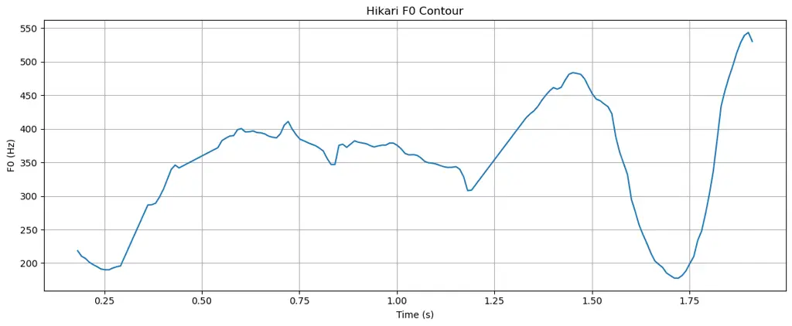
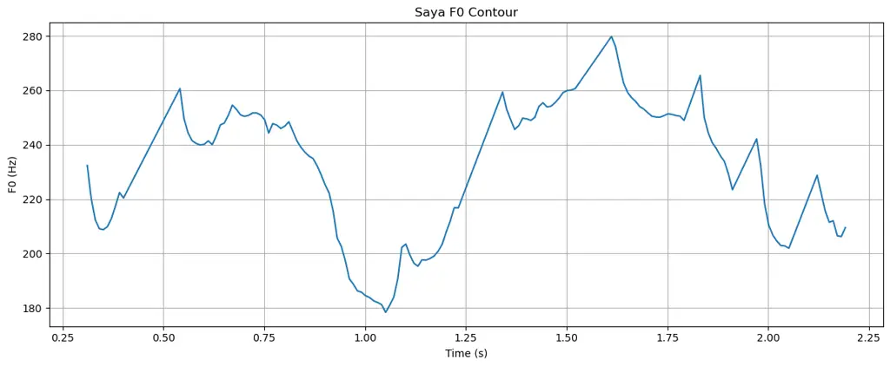
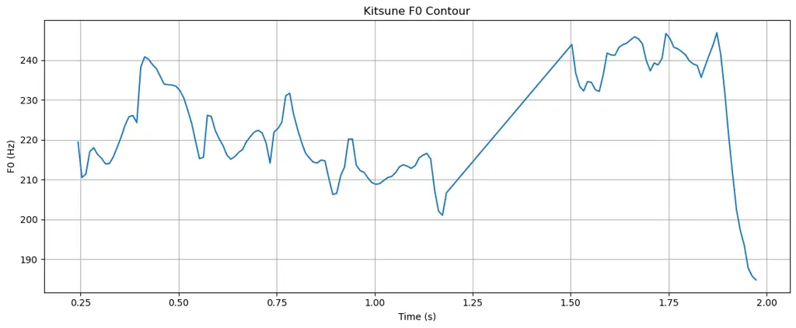

# Comparative Evaluation of Expressive Japanese Character Text-to-Speech with VITS and Style-BERT-VITS2

Zackary Rackauckas Affiliation: Columbia University, RoleGaku  
New York, USA  
zcr2105@columbia.edu    Julia Hirschberg Affiliation: Columbia
University  
New York, USA  
julia@cs.columbia.edu

###### Abstract

Synthesizing expressive Japanese character speech poses unique
challenges due to pitch-accent sensitivity and stylistic variability.
This paper empirically evaluates two open-source text-to-speech
models—VITS and Style-BERT-VITS2 JP Extra (SBV2JE)—on in-domain,
character-driven Japanese speech. Using three character-specific
datasets, we evaluate models across naturalness (mean opinion and
comparative mean opinion score), intelligibility (word error rate), and
speaker consistency. SBV2JE matches human ground truth in naturalness
(MOS 4.37 vs. 4.38), achieves lower WER, and shows slight preference in
CMOS. Enhanced by pitch-accent controls and a WavLM-based discriminator,
SBV2JE proves effective for applications like language learning and
character dialogue generation, despite higher computational demands.

###### Index Terms: 

Expressive Text-to-Speech, Japanese Pitch-Accent Synthesis, Applied
Machine Learning in Education

## I Introduction

Character language represents Japanese speech patterns unique to a
fictional character or an archetype of fictional characters \[1\].
Synthesizing speech from character language presents a special set of
issues. Distinct character language subsets have varying pitch-accent
patterns (see Figure 1), speaking rates, pause rates, grammar, and
vocabulary. Synthesizing speech from in-domain language creates
complications in systems producing natural speech with correct phoneme
duration, intelligibility, and pitch-accent.

Japanese itself is considered to be the most difficult language for
text-to-speech (TTS) models. Pitch-accents are highly context-sensitive,
influenced by surrounding words and phrases, and require accurate
modeling of prosodic variation, phoneme duration, and character-specific
rhythm.

Despite widespread adoption of open-source models like VITS and
Style-BERT-VITS2 for character and anime voice synthesis, no formal
evaluation exists comparing their performance on expressive Japanese
character speech. This work provides the first structured comparative
evaluation of these models on in-domain, character-specific datasets.
Each model was fine-tuned per character using that character’s voice
data, reflecting real-world deployment where consistency and expressive
fidelity are critical. While our study does not propose novel
architectures, it fills an important empirical gap by evaluating and
contrasting model behavior under carefully controlled conditions.

We apply Japanese text-to-speech systems in chatbots for anime-themed
language learning applications \[2\]. Thus, the naturalness and
correctness of TTS models is critical. In this paper, we will focus on
two systems: Variational Inference with adversarial learning for
end-to-end Text-to-Speech (VITS) \[3\] and Style-enhanced Bidirectional
Encoder Representations from Transformers VITS2 (Style-BERT-VITS2)
\[4\]. Specifically, we will investigate these systems to answer these
questions: (1) Does Style-BERT-VITS2 produce highly accurate audio on
in-domain character language? (2) How does VITS compare to
Style-BERT-VITS2 in the same production?

We evaluate Style-BERT-VITS2 using a Mean Opinion Score (MOS) compared
to a human ground truth benchmark, and compare VITS and Style-BERT-VITS2
models using Comparative Mean Opinion Score (CMOS), intra-speaker
consistency, and Word Error Rate (WER). These metrics subjectively
measure speech naturalness and objectively measure consistency and
intelligibility.

## II Related Work

Japanese is a pitch-accent language, and synthesizing correct
pitch-accents proves to be a challenge even in modern TTS models \[5,
6\]. Pitch-accents are highly context-sensitive, influenced by
surrounding words and phrases through phenomena such as sandhi effects
\[7\]. Recent work has explored contextual approaches to improve
pitch-accent prediction. For instance, Hida et al. (2022) demonstrated
that combining explicit morphological features with pretrained language
models like BERT significantly enhances pitch-accent prediction \[8\].
Similarly, pretrained models such as PnG BERT have shown promise in
integrating grapheme and phoneme information for better pitch-accent
rendering \[9\]. Yasuda and Toda (2022) found that fine-tuning PnG BERT
with tone prediction tasks led to notable improvements over baseline
Tacotron models \[10\] in accent correctness \[5\]. However, end-to-end
models like Tacotron often struggle with pitch-accent consistency,
particularly due to phenomena like accent sandhi. Park et al. (2022)
highlighted these challenges and proposed a unified accent estimation
framework based on multi-task learning to address limitations in
end-to-end systems \[11\]. These findings emphasize the importance of
sophisticated linguistic and contextual modeling.

Accurate phoneme duration prediction is critical for achieving natural
speech rhythm and intelligibility, especially in Japanese, where
speaking styles and character archetypes introduce variability.
Traditional duration models, such as Hidden Markov Models (HMMs), have
been widely used in parametric synthesis systems such as OpenJTalk \[12,
13\]. Modern approaches like FastSpeech2 improve upon this by
incorporating variance predictors for explicit control of pitch, energy,
and duration \[14\]. Furthermore, latent duration modeling techniques
using vector-quantized variational autoencoder (VAE) to allow for joint
optimization of duration and acoustic features, enabling more natural
rhythm and timing in synthesized speech \[15\]. This ability to
adaptively predict phoneme duration is particularly important for
synthesizing character speech, where exaggerated prosody or unique
speech patterns are often required.

Intra-speaker consistency is an important challenge in character
language synthesis, as it ensures that a TTS model reliably maintains a
speaker’s identity across multiple audio samples. This consistency
allows speech to remain distinctly recognizable as belonging to the same
character. Previous efforts have addressed this through methods like
speaker consistency loss, which enforces consistent speaker identity
across utterances \[16\], and adversarial training approaches, which
align speaker embeddings using untranscribed data to improve speaker
similarity in multi-speaker and zero-shot scenarios \[17\].
Additionally, self-supervised speaker embedding networks have been
integrated with TTS models to improve speaker verification and maintain
consistent speaker identity in synthesized speech \[18\]. More recently,
Stable-TTS \[19\] introduced a speaker-adaptive framework that uses
prior prosody prompting and prior-preservation loss to ensure prosody
and timbre consistency, even with limited or noisy target samples. By
leveraging high-quality prior samples from pretraining datasets,
Stable-TTS addresses issues of variability and overfitting, making it
especially valuable for character language synthesis, where a strong and
consistent auditory association with a specific persona is essential.

Despite widespread adoption of open-source models like VITS and
Style-BERT-VITS2 for character and anime voice synthesis, no formal
evaluation exists comparing their performance on expressive Japanese
character speech. This work provides the first structured comparative
evaluation of these models on in-domain, character-specific datasets.
Each model was fine-tuned per character using that character’s voice
data, reflecting real-world deployment where consistency and expressive
fidelity are critical.

## III Models

### III-A VITS

VITS is a single-stage text-to-speech framework that employs a
variational autoencoder with normalizing flows to model the complex
distribution of speech signals. A posterior encoder extracts acoustic
features from ground-truth audio, while a prior encoder converts text
inputs, typically phonemes, into a latent space refined through
normalizing flows. This refined latent representation is then passed on
to a HiFi-GAN-style decoder to reconstruct waveforms end-to-end. It uses
a flow-based stochastic duration predictor, which models phoneme
duration via a learned probability distribution, enabling robust
alignment. Additionally, adversarial training is used to enhance the
realism of generated waveforms through discriminator networks \[3\].

Building on VITS, subsequent advancements have aimed to address
limitations in naturalness, efficiency, and expressiveness. VITS2
retained the foundational components of VITS while introducing a
transformer block in the normalizing flows to capture long-term
dependencies, enhancing the synthesis of coherent and expressive speech.
The stochastic duration predictor was refined with adversarial learning,
improving efficiency and naturalness \[20\]. Furthermore, VITS2 reduced
reliance on phoneme conversion by enabling the use of normalized text
inputs, marking a significant step toward fully end-to-end TTS systems.
BERT-VITS2 by fishaudio extended VITS2 by integrating a multilingual
BERT encoder for text processing, enabling richer contextual
understanding and improved text-to-semantic mapping \[21\]. This
addition allowed the model to handle diverse linguistic contexts
effectively, resulting in more expressive and natural speech synthesis.
Unlike BERT-VITS2, Style-BERT-VITS2 incorporates style embeddings, which
enable fine-grained emotional and stylistic control \[22\].

### III-B Style-BERT-VITS2 JP Extra

(a) Hikari F0 Contour

(b) Saya F0 Contour

(c) Kitsune F0 Contour

Fig. 1: Pitch (F0) contours of self-introduction utterances (“X wa Y
desu”) for the three characters. Hikari exhibits a rising contour
followed by a sharp fall, Saya shows a mid-level onset with a steep drop
and subsequent rise–fall, and Kitsune presents a gradual decline ending
in a sharp final drop. These differences highlight the distinct prosodic
patterns captured by each character’s voice.

Style-BERT-VITS2 JP Extra (SBV2JE) \[22\], created by litagin02,
enhances the naturalness, expressiveness, and linguistic precision of
Japanese TTS synthesis. Building on Style-BERT-VITS2, it addressed
challenges in generating native-like Japanese speech, particularly in
pitch-accents and phoneme timing. To achieve this, an 800-hour
Japanese-only pretraining dataset was utilized alongside architectural
modifications, including the addition of a WavLM-based discriminator for
enhanced naturalness and the removal of the duration discriminator to
stabilize phoneme spacing. Increasing the $`gin\_channels`$ parameter
from 256 to 512 further boosted the model’s expressive capacity \[22\].
Fully connected layers were employed to generate style vectors, ensuring
precise emotional modulation. Manual pitch-accent adjustment was also
introduced, granting users greater control over naturalness in generated
speech \[23\]. These enhancements make SBV2JE particularly effective for
applications such as character-driven speech and emotionally engaging
storytelling.

The development of SBV2JE demonstrates a systematic approach to
overcoming the challenges of Japanese TTS synthesis. By emphasizing
Japanese-specific preprocessing methods, such as g2p
(grapheme-to-phoneme) conversions via PyOpenJTalk \[12\], and removing
ineffective components like Contrastive Language-Audio Pretraining
(CLAP) embeddings \[24\], the model prioritizes linguistic accuracy.
This progression establishes SBV2JE as a reference standard for
high-quality, expressive, and natural Japanese speech synthesis,
catering to applications requiring cultural and emotional adaptability.

Additionally, Figure 1 demonstrates SBV2JE’s ability to capture pitch
nuances in character language. Figure 1(a) shows the F0 contour of a
natural introduction by Hikari, Figure 1(b) of Saya, and Figure 1(c) of
Kitsune. Hikari, Kitsune, and Saya are unique characters introduced in
Section IV. See that Hikari’s pitch starts low, rising throughout the
sentence, and peaking before showing a large dip, ending at nearly 550
Hz. However, Saya’s pitch starts at a middling rate (roughly 230 Hz),
exhibits a large drop in the middle of the sentence, then a large rise
and a subsequent fall to roughly 200 Hz. Finally, Kitsune’s pitch also
starts at a middling rate, slowly declining until 1.2 seconds, then
peaking and drastically falling off at the end. These patterns visually
represent the different pitches capture by different character language
sets and different voices in generated audio.

## IV Method

As outlined in \[2\], audio data was collected from two professional
Japanese voice actors using scripts generated by GPT-4 and proofread by
a native Japanese speaker to ensure linguistic accuracy and naturalness.
Recordings were conducted under conditions to produce high-quality audio
without background noise, distortions, or artifacts. The character
Hikari was voiced by Voice Actor 1, while Kitsune and Saya were
performed by Voice Actor 2. Distinct intonation patterns and phoneme
durations were employed to differentiate the characters Kitsune and
Saya, despite sharing the same voice actor. The datasets consisted of
approximately 10 minutes and 17 seconds of audio for Hikari, 15 minutes
and three seconds for Kitsune, and 15 minutes and four seconds for Saya.

Three VITS models were fine-tuned using the vits-fast-finetuning
repository \[25\]. Each was initialized from the pretrained
vits-uma-genshin-honkai model, which supports multilingual synthesis for
Chinese, Japanese, and English. Fine-tuning was performed individually
for Hikari, Kitsune, and Saya, using their respective audio datasets.
For preprocessing: Audio files were first denoised using Demucs to
isolate vocal components and remove background noise. Stereo audio was
converted to mono, and all audio files were resampled to a uniform
sampling rate using the torchaudio library, with the target rate
specified in the configuration. Long audios were sliced into smaller
segments by silence detection with vilero-sad. Transcriptions were
generated using the Whisper-large ASR model, producing highly accurate
multilingual text alignments. These transcripts were normalized,
cleaned, and formatted into the required structure for the VITS training
pipeline, where metadata consisted of the audio file path, speaker ID,
language ID, and phoneme sequence. Transcripts exceeding 150 characters
were excluded to maintain alignment quality. Each dataset was assigned a
unique speaker ID.

This per-character fine-tuning approach was essential for evaluating
model performance on expressive, character-specific language. Since each
voice exhibits unique prosody, pitch-accent patterns, and phoneme
timing, a single model trained across characters would not capture
character-specific expressiveness or speaker consistency reliably.

The fine-tuning process was configured with 200 epochs, a batch size of
16, and an initial learning rate of 0.0002, decaying at a rate of
0.999875 per step. The Adam optimizer was used with $`\beta_{1}=0.8`$,
$`\beta_{2}=0.99`$, and $`\epsilon=1\times 10^{-9}`$, alongside mixed
precision (fp16) for faster training. The model architecture consisted
of six Transformer layers with 192 hidden channels, a dropout rate of
0.1, and an upsampling network with kernel sizes $`[16,16,4,4]`$ and 512
initial channels. This ensured robust learning and enabled high-quality,
expressive speech synthesis tailored to the vocal and linguistic styles
of Hikari, Kitsune, and Saya. Models were trained on a 40 GB A100 GPU.

In addition, three SBV2JE models were fine-tuned using the official
repository. Similar transcription and alignment processes were applied,
with audio data sliced and then transcribed using Whisper-large. Two
separate preprocessing pipelines were employed to generate BERT-based
features and a neutral style vector for conditioning the SBV2JE models.
The first pipeline processed text and audio data to generate
phoneme-aligned BERT embeddings. Training and validation datasets were
formatted with metadata including the audio path, speaker ID, language,
text, phoneme sequence, tone, and word-to-phoneme alignment. Phoneme
sequences and tone contours were converted into numerical
representations and normalized, with optional blank tokens inserted to
improve alignment with the acoustic model. BERT embeddings were
extracted for each transcription and saved as .bert.pt files. These
embeddings were checked to ensure that they matched the phoneme sequence
length, with files regenerated if mismatches occurred.

The second pipeline extracted style vectors from audio files using the
pretrained Pyannote wespeaker-voxceleb-resnet34-LM model \[26, 27\].
Style vectors were saved as .npy files, and their integrity was
validated to ensure that no Not a Number (NaN) values were present.
Files with NaN values were excluded from the training data to maintain
quality. The final training dataset consisted of audio files with valid
style vectors, ensuring robust conditioning inputs for the SBV2JE
models. These pipelines enabled the synthesis of expressive and
stylistically accurate speech outputs for Hikari, Kitsune, and Saya.
Because the training datasets only consisted of 10-15 minutes of audio,
all audio was used for training, with no audio used for evaluation.

Hikari’s model was trained for 200 epochs with a learning rate of
0.0001, while Kitsune’s and Saya’s were each trained for 400 epochs with
a learning rate of 0.00005. The training used a batch size of 4, with
the learning rate decaying at a rate of 0.99996 per step. The model
architecture consisted of six Transformer layers with 192 hidden
channels, a dropout rate of 0.1, and an upsampling network with kernel
sizes \[16,16,8,2,2\] and 512 initial channels. Mel-spectrogram features
were extracted with 128 mel channels, a filter length of 2048, a hop
length of 512, and a sampling rate of 44,100 Hz. Speaker conditioning
used 512 global information (GIN) channels, and the model integrated a
WavLM-based discriminator. Models were trained on an A4000 GPU.

## V Experiments

### V-A Mean Opinion Score

We evaluated the closeness of the SBV2JE models to the ground truth. 11
crowd-sourced native Japanese speakers listened to 60 audios each and
provided ratings on a one through five Likert scale. Participants were
instructed to rate based on naturalness of speech, appropriate phoneme
duration, and correctness of intonation and pitch-accent. Audios were
chosen through random stratified sampling to ensure an equal number of
audios for each model and ground truth and a sufficient variation of
vocabulary and sentence structures.

| Speaker-Type     | MOS $`\pm`$ SD |      |
| ---------------- | -------------- | ---- |
| Hikari (SBV2JE)  | 4.47 $`\pm`$   | 0.68 |
| Hikari (GT)      | 4.76 $`\pm`$   | 0.48 |
| Kitsune (SBV2JE) | 4.40 $`\pm`$   | 0.78 |
| Kitsune (GT)     | 4.14 $`\pm`$   | 0.89 |
| Saya (SBV2JE)    | 4.24 $`\pm`$   | 0.76 |
| Saya (GT)        | 4.24 $`\pm`$   | 0.75 |
| Overall TTS      | 4.37 $`\pm`$   | 0.74 |
| Overall GT       | 4.38 $`\pm`$   | 0.77 |

TABLE I: MOS Results for TTS and Ground Truth Audio

All models performed comparably to the ground truth in terms of
naturalness. Hikari TTS achieved a score of $`4.47\pm 0.68`$, slightly
underperforming relative to its ground truth counterpart
($`4.76\pm 0.48`$). This indicated that raters generally perceived the
ground truth audio as more natural than the TTS-generated audio for
Hikari. Conversely, Kitsune TTS slightly outperformed its ground truth,
with scores of $`4.40\pm 0.78`$ and $`4.14\pm 0.89`$, respectively. This
suggested that raters found the TTS-generated audio to be more natural
than the ground truth for Kitsune, indicating that certain aspects of
the synthesized audio surpassed the quality of the ground truth
recordings. Finally, Saya TTS and Saya ground truth were nearly
identical, receiving scores of $`4.24\pm 0.76`$ and $`4.24\pm 0.75`$,
respectively, suggesting parity in perceived naturalness. Kitsune ground
truth exhibited the highest variability ($`\pm 0.89`$), despite being
recorded by a professional voice actor. This highlighted subjective
differences in rater perceptions. Moreover, the overall score for TTS
($`4.37\pm 0.74`$) was nearly identical to the overall ground truth
score ($`4.38\pm 0.77`$). A two-tailed, paired t-test on aggregate
rating data yielded an insignificant result with $`p\approx 0.91`$,
indicating that native speakers did not perceive a statistically
significant difference in naturalness between the SBV2JE audio and the
ground truth recordings.

### V-B Comparative Mean Opinion Score

To evaluate the difference in human preference between VITS and SBV2JE,
we used Comparative Mean Opinion Score with 5 native Japanese speakers
as raters. Raters were presented two audios generated using the same
text, one from VITS and one from SBV2JE, and were asked to rate their
preference on a scale of -3 (greatly prefer the second model) to 3
(greatly prefer the first model). The position of models presented was
randomized in addition to the speakers. Ten audios were used from each
speaker, resulting in a total of 150 ratings.

| Speaker | CMOS  |
| ------- | ----- |
| Hikari  | -0.12 |
| Saya    | -0.06 |
| Kitsune | -0.03 |
| Overall | -0.06 |

TABLE II: CMOS Results for TTS Models

The comparative mean opinion score analysis indicated that SBV2JE was
slightly preferred over VITS, with an overall CMOS of -0.06. When
evaluating individual characters, Hikari showed a CMOS of -0.12, Saya
had a CMOS of -0.06, and Kitsune presented a CMOS of -0.03, all favoring
SBV2JE. These results suggested that, while both models performed
comparably, SBV2JE had a slight advantage in perceived quality across
the evaluated characters.

### V-C Intra-Speaker Consistency

We calculated intra-speaker similarity by leveraging speaker embeddings
generated by the pretrained Resemblyzer model \[28\]. Audio files were
grouped by speaker and model, and each file was processed to extract
embeddings representing the speaker’s identity. For each speaker-model
pair, we computed cosine similarity between all pairs of embeddings,
which quantified how consistently the model maintained the same
speaker’s identity across multiple audio samples. The average similarity
score for each speaker-model pair was calculated, and these scores were
further grouped by speaker and model to evaluate trends. This approach
provided a robust measure of how well each TTS model preserved speaker
consistency.

| Speaker-Model      | Similarity Score   |
| ------------------ | ------------------ |
| Hikari (VITS)      | 0.96               |
| Saya (VITS)        | 0.96               |
| Hikari (SBV2JE)    | 0.96               |
| Kitsune (VITS)     | 0.97               |
| Kitsune (SBV2JE)   | 0.97               |
| Saya (SBV2JE)      | 0.96               |
| Grouped by Speaker | Average Similarity |
| Hikari             | 0.96               |
| Saya               | 0.96               |
| Kitsune            | 0.97               |
| Grouped by Model   | Average Similarity |
| VITS               | 0.96               |
| SBV2JE             | 0.96               |

TABLE III: Intra-Speaker Similarity Scores for TTS Models

Both the VITS and SBV2JE models achieved high intra-speaker consistency
across all speakers, with similarity scores exceeding 95% in all cases.
Among the speakers, Kitsune exhibited the highest average similarity
score (97.05%), indicating that the models handled this speaker’s
identity particularly well. In contrast, Saya showed slightly lower
consistency (95.78%), suggesting that maintaining this speaker’s
identity was more challenging for the models. When grouped by model,
VITS slightly outperformed SBV2JE (96.43% vs. 96.24%), although the
difference was minimal. These results highlighted the robustness of both
models in preserving speaker identity, with only minor variations across
speakers and models. This strong performance is encouraging for
real-world applications where consistent speaker representation is
essential, such as in character-driven TTS systems for language
learning. Further analysis could explore how differences in speaker
characteristics can contribute to variability.

### V-D Word Error Rate

We calculated Word Error Rate to assess intelligibility by comparing
generated speech against corresponding ground truth text. First, we
transcribed the audio files using the Faster-Whisper ASR model \[29\],
initialized with a seed prompt for better context. To ensure linguistic
accuracy, we tokenized both the transcriptions and ground truth text
using Sudachi, a Japanese morphological analyzer \[30\]. For each
transcription, we identified the most relevant ground truth line using
Levenshtein similarity matching, ensuring a fair comparison even if
minor differences existed between the audio content and ground truth.
Finally, WER was calculated by measuring the proportion of word-level
errors (insertions, deletions, and substitutions) between the tokenized
transcription and the matched ground truth. This methodology provided a
robust evaluation of how intelligible and accurate the TTS outputs were
when processed through a real-world ASR system.

| Speaker-Model    | WER (Mean $`\pm`$ SD) |
| ---------------- | --------------------- |
| Hikari (VITS)    | 0.03 $`\pm`$ 0.03     |
| Hikari (SBV2JE)  | 0.03 $`\pm`$ 0.02     |
| Saya (VITS)      | 0.08 $`\pm`$ 0.05     |
| Saya (SBV2JE)    | 0.08 $`\pm`$ 0.07     |
| Kitsune (VITS)   | 0.03 $`\pm`$ 0.04     |
| Kitsune (SBV2JE) | 0.02 $`\pm`$ 0.02     |
| Grouped by Model | Average WER           |
| VITS             | 0.05 $`\pm`$ 0.04     |
| SBV2JE           | 0.04 $`\pm`$ 0.04     |

TABLE IV: Word Error Rate Comparison

Both the VITS and SBV2JE models achieved high intelligibility across all
speakers, with consistently low WER values. Kitsune showed the best
performance, with SBV2JE achieving the lowest WER (0.02), while Saya had
the highest WER (0.08) for both models. When grouped by model, SBV2JE
slightly outperformed VITS in overall WER (0.04 vs. 0.05) with
comparable variability. These results highlighted both models’
reliability, with SBV2JE offering slightly greater consistency, making
them well-suited for character-driven TTS applications in language
learning.

## VI Discussion

Our experiments confirm SBV2JE as a highly natural and intelligible
Japanese TTS model, achieving slight but meaningful improvements over
VITS in WER and CMOS. These gains stem from key architectural
modifications, including the removal of the duration discriminator,
which stabilizes phoneme spacing for smoother speech, and the
integration of a WavLM-based discriminator, enhancing prosodic nuance
and expressiveness. Tailored for Japanese-specific challenges, SBV2JE
incorporates pitch-accent adjustments and g2p conversions while
streamlining the architecture by removing ineffective components like
CLAP embeddings, emphasizing the value of domain-specific optimization
in advancing TTS quality.

While these improvements make SBV2JE well-suited for character-driven
conversational agents and language learning applications, the model can
be applied to storytelling, anime voiceover, personalized voice
assistants, and other applications where naturalness and expressiveness
are critical.

In addition to their use in anime-focused language learning tools,
expressive TTS models like VITS and Style-BERT-VITS2 are well-suited for
live storytelling, where emotional nuance plays a key role in delivering
a compelling narrative. Although our work focuses on Japanese, both
models support English and Chinese as well, opening the door to
cross-lingual applications such as voice translation and code-switching
across these languages. These models can also be deployed as backend
APIs for mobile or edge devices, broadening their practical utility
across platforms. Finally, speech synthesis connects users through the
Internet of Things (IoT) \[31\] and personalized voice assistance.

However, there are limitations to consider. For example, SBV2JE presents
trade-offs between model complexity and computational efficiency. While
the model’s enhancements yield measurable gains, the increased
computational cost associated with its architecture, such as higher gin
channel values and WavLM-based discriminators, could pose challenges for
deployment on resource-constrained devices.

While untested in this study, the model’s control over stylistic
elements could open up opportunities for more adaptive and engaging user
experiences in interactive platforms. These stylistic elements open
future work in fine-grained emotion control, real-time conversational
adaptation, cross-lingual expressive synthesis, personalized voice
tutoring for language learners, and low-resource style transfer for
underrepresented character voices.

Our study is constrained by the small per-character datasets, the
limited number of characters and raters, and the SBV2JE repository’s use
of all available audio for training, and while these factors restrict
generalization and efficiency analysis, our evaluations focus on
perceptual judgments of generated speech, leaving broader validation to
future work.

These results highlight SBV2JE’s practical advantages for real-world
expressive Japanese TTS systems, particularly where character identity
and pitch correctness are essential.

## VII Conclusion

SBV2JE represents a significnt advancement in Japanese TTS character
language synthesis, balancing naturalness, intelligibility, and
expressiveness. By addressing linguistic nuances and leveraging
innovative architectural modifications, it sets a reference standard for
character-driven speech synthesis and language learning. Future research
should aim to refine its generalization, explore new use cases, and
optimize its deployment to maximize its impact across diverse
applications.

## Acknowledgments

This research was initiated independently of the primary author’s
academic responsibilities at Columbia University and was conducted
without the use of university resources.

## References

- \[1\] S. Kinsui and H. Yamakido (2015) Role language and character
  language. Acta Linguistica Asiatica 5, pp. 29. External Links:
  [Document](https://dx.doi.org/10.4312/ala.5.2.29-42) Cited by: §I.
- \[2\] Z. Rackauckas (2024) Voiced character language chatbots for
  japanese learning. In JALTCALL 2024 Conference, Meijo University
  Nagoya Dome Campus, Nagoya, Japan. Note: Practice-based Presentation,
  May 18, 2024, 2:20 PM (Asia/Tokyo timezone), DN 413 (North Building)
  External Links:
  [Link](https://events.jalt.org/event/1/contributions/164/contribution.pdf)
  Cited by: §I, §IV.
- \[3\] J. Kim, J. Kong, and J. Son (2021) Conditional variational
  autoencoder with adversarial learning for end-to-end text-to-speech.
  In Proceedings of the 38th International Conference on Machine
  Learning, M. Meila and T. Zhang (Eds.), Proceedings of Machine
  Learning Research, Vol. 139, pp. 5530–5540. External Links:
  [Link](https://proceedings.mlr.press/v139/kim21f.html) Cited by: §I,
  §III-A.
- \[4\] litagin02 (2024) Style-bert-vits2. Note:
  https://github.com/litagin02/Style-Bert-VITS2Accessed: 2025-01-22
  Cited by: §I.
- \[5\] Y. Yasuda and T. Toda (2022) Investigation of japanese png bert
  language model in text-to-speech synthesis for pitch accent language.
  IEEE Journal of Selected Topics in Signal Processing 16 (6),
  pp. 1319–1328. External Links: ISSN 1941-0484,
  [Link](http://dx.doi.org/10.1109/JSTSP.2022.3190672),
  [Document](https://dx.doi.org/10.1109/jstsp.2022.3190672) Cited by:
  §II.
- \[6\] D. Xin, S. Adavanne, F. Ang, A. Kulkarni, S. Takamichi, and H.
  Saruwatari (2022) Improving speech prosody of audiobook text-to-speech
  synthesis with acoustic and textual contexts. External Links:
  2211.02336, [Link](https://arxiv.org/abs/2211.02336) Cited by: §II.
- \[7\] A. Ito and Y. Hirose (2025) Sandhi-based predictability of pitch
  accent facilitates word recognition in kansai japanese speakers.
  Quarterly Journal of Experimental Psychology 78 (1), pp. 203–216.
  External Links:
  [Document](https://dx.doi.org/10.1177/17470218241237219),
  [Link](https://doi.org/10.1177/17470218241237219) Cited by: §II.
- \[8\] R. Hida, M. Hamada, C. Kamada, E. Tsunoo, T. Sekiya, and T.
  Kumakura (2022) Polyphone disambiguation and accent prediction using
  pre-trained language models in japanese tts front-end. In ICASSP
  2022 - 2022 IEEE International Conference on Acoustics, Speech and
  Signal Processing (ICASSP), Vol. , pp. 7132–7136. External Links:
  [Document](https://dx.doi.org/10.1109/ICASSP43922.2022.9746212) Cited
  by: §II.
- \[9\] Y. Jia, H. Zen, J. Shen, Y. Zhang, and Y. Wu (2021) PnG bert:
  augmented bert on phonemes and graphemes for neural tts. In
  Proceedings of Interspeech 2021, pp. 151–155. External Links:
  [Document](https://dx.doi.org/10.21437/Interspeech.2021-1757) Cited
  by: §II.
- \[10\] Y. Wang, R.J. Skerry-Ryan, D. Stanton, Y. Wu, R.J. Weiss, N.
  Jaitly, Z. Yang, Y. Xiao, Z. Chen, S. Bengio, Q. Le, Y.
  Agiomyrgiannakis, R. Clark, and R.A. Saurous (2017) Tacotron: towards
  end-to-end speech synthesis. In Proceedings of Interspeech 2017,
  pp. 4006–4010. External Links:
  [Document](https://dx.doi.org/10.21437/Interspeech.2017-1452) Cited
  by: §II.
- \[11\] B. Park, R. Yamamoto, and K. Tachibana (2022) A unified accent
  estimation method based on multi-task learning for japanese
  text-to-speech. In Interspeech 2022, pp. 1931–1935. External Links:
  [Document](https://dx.doi.org/10.21437/Interspeech.2022-334), ISSN
  2958-1796 Cited by: §II.
- \[12\] r9y9 (2018) Pyopenjtalk: a python wrapper for open jtalk. Note:
  https://github.com/r9y9/pyopenjtalkAccessed: 2025-01-22 Cited by: §II,
  §III-B.
- \[13\] H. Zen, T. Nose, J. Yamagishi, S. Sako, T. Masuko, A.W. Black,
  and K. Tokuda (2007) The hmm-based speech synthesis system (hts)
  version 2.0. In Proceedings of the 6th ISCA Workshop on Speech
  Synthesis (SSW 6), pp. 294–299. Cited by: §II.
- \[14\] Y. Ren, C. Hu, X. Tan, T. Qin, S. Zhao, Z. Zhao, and T.
  Liu (2022) FastSpeech 2: fast and high-quality end-to-end text to
  speech. External Links: 2006.04558,
  [Link](https://arxiv.org/abs/2006.04558) Cited by: §II.
- \[15\] Y. Yasuda, X. Wang, and J. Yamagishd (2021) End-to-end
  text-to-speech using latent duration based on vq-vae. In ICASSP 2021 -
  2021 IEEE International Conference on Acoustics, Speech and Signal
  Processing (ICASSP), Vol. , pp. 5694–5698. External Links:
  [Document](https://dx.doi.org/10.1109/ICASSP39728.2021.9414499) Cited
  by: §II.
- \[16\] N. Makishima, S. Suzuki, A. Ando, and R. Masumura (2022)
  Speaker consistency loss and step-wise optimization for
  semi-supervised joint training of tts and asr using unpaired text
  data. In Proceedings of Interspeech 2022, pp. 526–530. External Links:
  [Document](https://dx.doi.org/10.21437/Interspeech.2022-304) Cited by:
  §II.
- \[17\] B. J. Choi, M. Jeong, M. Kim, S. H. Mun, and N. S. Kim (2022)
  Adversarial speaker-consistency learning using untranscribed speech
  data for zero-shot multi-speaker text-to-speech. In Proceedings of the
  2022 APSIPA Annual Summit and Conference, Chiang Mai, Thailand,
  pp. 7–10 November. External Links: ISBN 978-616-590-477-3 Cited by:
  §II.
- \[18\] J. Cho, P. Żelasko, J. Villalba, S. Watanabe, and N.
  Dehak (2020) Learning speaker embedding from text-to-speech. In
  Proceedings of Interspeech 2020, pp. 3256–3260. External Links:
  [Document](https://dx.doi.org/10.21437/Interspeech.2020-2970) Cited
  by: §II.
- \[19\] W. Han, M. Kang, C. Kim, and E. Yang (2024) Stable-tts: stable
  speaker-adaptive text-to-speech synthesis via prosody prompting.
  External Links: 2412.20155, [Link](https://arxiv.org/abs/2412.20155)
  Cited by: §II.
- \[20\] J. Kong, J. Park, B. Kim, J. Kim, D. Kong, and S. Kim (2023)
  VITS2: improving quality and efficiency of single-stage text-to-speech
  with adversarial learning and architecture design. In Proceedings of
  Interspeech 2023, pp. 4374–4378. External Links:
  [Document](https://dx.doi.org/10.21437/Interspeech.2023-534) Cited by:
  §III-A.
- \[21\] fishaudio (2024) Bert-vits2. Note:
  https://github.com/fishaudio/Bert-VITS2accessed 2025-01-22 Cited by:
  §III-A.
- \[22\] litagin (2024) (Style-)bert-vits2 jp-extra
  (日本語特化版)について. Note:
  https://zenn.dev/articles/style-bert-vits2-jp-extraPublished on
  2024/02/05, accessed 2024/02/14 Cited by: §III-A, §III-B.
- \[23\] litagin (2023)
  (Style-)bert-vits2の仕組み・構造と、バージョンによる違いについて.
  Note: https://zenn.dev/articles/style-bert-vits2Published on
  2023/12/30, accessed 2025-02-14 Cited by: §III-B.
- \[24\] B. Elizalde, S. Deshmukh, M. A. Ismail, and H. Wang (2022)
  CLAP: learning audio concepts from natural language supervision.
  External Links: 2206.04769, [Link](https://arxiv.org/abs/2206.04769)
  Cited by: §III-B.
- \[25\] Plachtaa (2024) VITS fast fine-tuning. Note:
  https://github.com/Plachtaa/VITS-fast-fine-tuning/tree/mainAccessed:
  2025-01-22 Cited by: §IV.
- \[26\] H. Wang, C. Liang, S. Wang, Z. Chen, B. Zhang, X. Xiang, Y.
  Deng, and Y. Qian (2023) Wespeaker: a research and production oriented
  speaker embedding learning toolkit. In ICASSP 2023, IEEE International
  Conference on Acoustics, Speech and Signal Processing (ICASSP),
  pp. 1–5. Cited by: §IV.
- \[27\] H. Bredin (2023) pyannote.audio 2.1 speaker diarization
  pipeline: principle, benchmark, and recipe. In Proc. INTERSPEECH 2023,
  pp. 1983–1987. External Links:
  [Document](https://dx.doi.org/10.21437/Interspeech.2023-105) Cited by:
  §IV.
- \[28\] C. Jemine and contributors (2019) Resemblyzer: open-source
  voice encoder. GitHub. Note:
  https://github.com/resemble-ai/ResemblyzerAccessed: 2025-09-04 Cited
  by: §V-C.
- \[29\] G. Klein, M. Ashraf, and contributors (2023) Faster-whisper:
  efficient whisper implementation with ctranslate2. GitHub. Note:
  https://github.com/SYSTRAN/faster-whisperAccessed: 2025-09-04 Cited
  by: §V-D.
- \[30\] K. Takaoka, S. Hisamoto, N. Kawahara, M. Sakamoto, Y. Uchida,
  and Y. Matsumoto (7-12) Sudachi: a japanese tokenizer for business. In
  Proceedings of the Eleventh International Conference on Language
  Resources and Evaluation (LREC 2018), N. C. (. chair), K. Choukri, C.
  Cieri, T. Declerck, S. Goggi, K. Hasida, H. Isahara, B. Maegaard, J.
  Mariani, H. Mazo, A. Moreno, J. Odijk, S. Piperidis, and T. Tokunaga
  (Eds.), Paris, France (english). External Links: ISBN
  979-10-95546-00-9 Cited by: §V-D.
- \[31\] W. Zhao and Z. Yang (2023) An emotion speech synthesis method
  based on vits. Applied Sciences 13 (4), pp. 2225. External Links:
  [Document](https://dx.doi.org/10.3390/app13042225),
  [Link](https://doi.org/10.3390/app13042225) Cited by: §VI.
