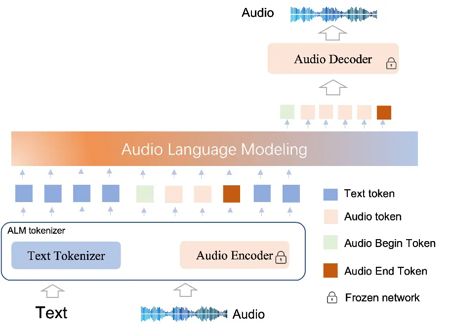
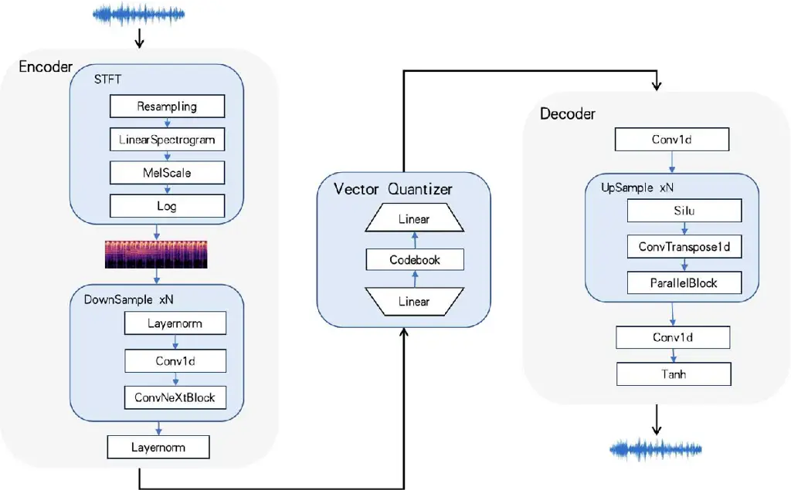
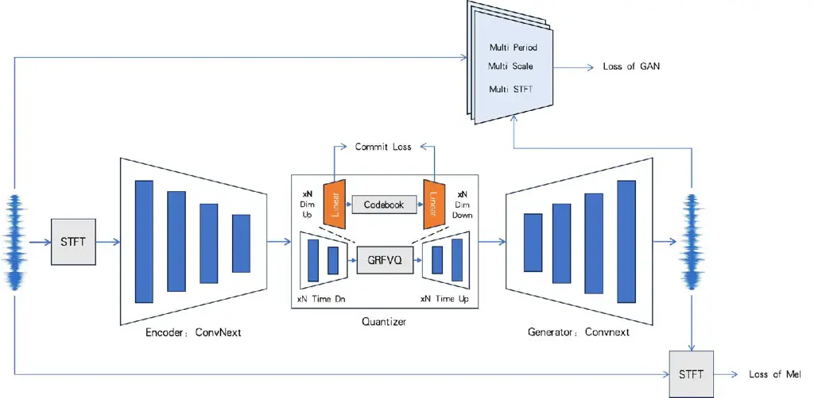
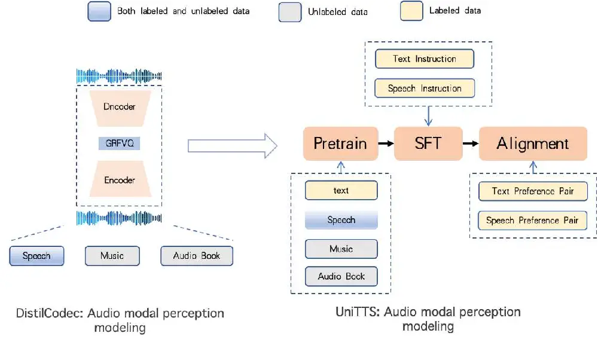
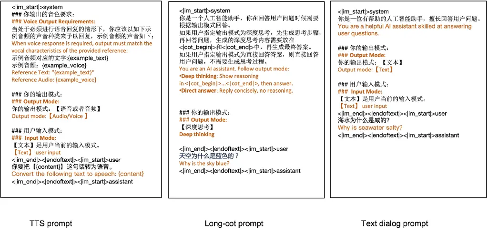
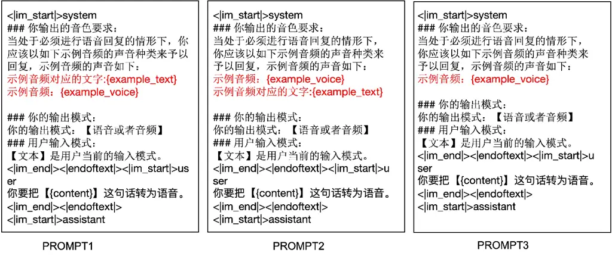
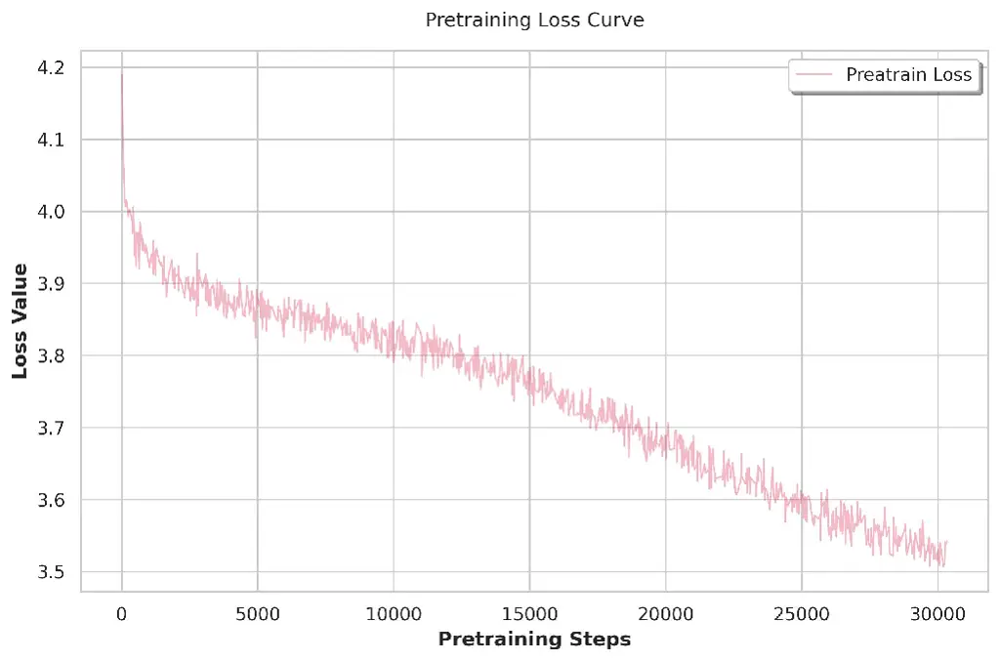

# UniTTS: An end-to-end TTS system without decoupling of acoustic and semantic information

Rui Wang ^(†)^(†)thanks: These authors contributed equally to this work.
Affiliation: International Digital Economy Academy, IDEA&Emdoor
Collaborative Laboratory Affiliation: Shenzhen Yijiayiban Information
Technology Co., Ltd Email: [wangrui@idea.edu.cn](mailto:)    Qianguo
Sun¹¹footnotemark: 1 Affiliation: International Digital Economy Academy,
IDEA&Emdoor Collaborative Laboratory
Email: [sunqianguo@idea.edu.cn](mailto:)    Tianrong Chen, Zhiyun Zeng,
Junlong Wu, Jiaxing Zhang ^(†)^(†)thanks: Corresponding author.
Affiliation: Emdoor Information Co., Ltd Affiliation: Shenzhen
Yijiayiban Information Technology Co., Ltd
Email: [wangrui@aiipal.com.cn](mailto:)
Email: [zhangjiaxing@aiipal.com.cn](mailto:)
Email: [tianrong.chen@emdoor.com](mailto:)
Email: [zhiyun.zeng@emdoor.com](mailto:)
Email: [junlong.wu@emdoor.com](mailto:)

###### Abstract

The emergence of multi-codebook neutral audio codecs such as Residual
Vector Quantization (RVQ) and Group Vector Quantization (GVQ) has
significantly advanced Large-Language-Model (LLM) based Text-to-Speech
(TTS) systems. These codecs are crucial in separating semantic and
acoustic information while efficiently harnessing semantic priors.
However, since semantic and acoustic information cannot be fully
aligned, a significant drawback of these methods when applied to
LLM-based TTS is that large language models may have limited access to
comprehensive audio information. To address this limitation, we propose
DistilCodec and UniTTS, which collectively offer the following
advantages: 1) This method can distill a multi-codebook audio codec into
a single-codebook audio codec with 32,768 codes while achieving a near
100% utilization. 2) As DistilCodec does not employ a semantic alignment
scheme, a large amount of high-quality unlabeled audio (such as
audiobooks with sound effects, songs, etc.) can be incorporated during
training, further expanding data diversity and broadening its
applicability. 3) Leveraging the comprehensive audio information
modeling of DistilCodec, we integrated three key tasks into UniTTS’s
pre-training framework: audio modality autoregression, text modality
autoregression, and speech-text cross-modal autoregression. This allows
UniTTS to accept interleaved text and speech/audio prompts while
substantially preserving LLM’s text capabilities. 4) UniTTS employs a
three-stage training process: Pre-Training, Supervised Fine-Tuning
(SFT), and Alignment. Source code and model checkpoints are publicly
available at
[https://github.com/IDEA-Emdoor-Lab/UniTTS](https://github.com/IDEA-Emdoor-Lab/UniTTS)
and
[https://github.com/IDEA-Emdoor-Lab/DistilCodec](https://github.com/IDEA-Emdoor-Lab/DistilCodec).

## 1 Introduction

Recent years have witnessed remarkable advancements in Large Language
Models (LLMs)\[26, 15, 10, 35\]. Their exceptional capability in
discrete token modeling has garnered significant attention in the speech
processing community. With the development of multimodal discretization
techniques such as Vector Quantization (VQ)\[30\], Finite Scalar
Quantization (FSQ)\[22\], and Grouped-Residual-Factorized Vector
Quantization (GRFVQ, including Grouped-VQ, Residual-VQ, and
Factorized-VQ)\[40, 36, 39\], the performance of Neural Audio Codecs
(NAC) has been substantially improved. Consequently, an increasing
number of Text-To-Speech (TTS) systems are adopting LLM-based approaches
\[8, 7, 32, 38, 18, 6, 3, 1\], which demonstrate superior performance in
both speech naturalness and emotional expressiveness.

The performance of LLM-based text-to-speech (TTS) systems is heavily
influenced by the discrete audio tokens from by NACs. Recent research
has shown that integrating semantic distillation\[41, 5, 37, 38, 32\]
into NAC can significantly enhance TTS system’s performance by
leveraging rich semantic information from audio encoders \[2, 25\].
While semantic distillation has significantly improved semantic
representation capabilities for LLM-based TTS systems, not all speech
can be decomposed into discrete semantic and acoustic features. This
limitation is particularly evident in prosodically salient
non-linguistic vocalizations (e.g., laughter or crying) and
high-fidelity universal audio containing acoustically complex
backgrounds or layered sound effects. While some NAC implementations
employ GRFVQ-based multi-codebook architectures to enhance performance,
such approaches result in substantially increased bitrates in the
discretized speech sequences. These elongated sequences introduce
substantial modeling challenges for language models (LLMs) in capturing
speech relationships, thereby motivating the development of efficient
low-bitrate NAC variants\[17, 34, 23, 32\]. These observations lead to
three critical research questions: (i) How to develop low-bitrate,
high-performance NACs for universal audio without relying on semantic or
additional prior information? (ii) How to optimally utilize universal
audio data in NAC and LLM-based TTS training? (iii) Whether LLMs coupled
with universal audio NACs can effectively achieve text-audio alignment?

Based on the motivation outlined previously, we introduce DistilCodec
and UniTTS. DistilCodec is a single-codebook audio codec, which has
32768 codes, and the utilization of the codebook achieves nearly 100%.
UniTTS leverages DistilCodec for audio discretization, while its
backbone network adopts Qwen2.5-7B\[35\] to model relationships between
audio tokens. The architecture of UniTTS is illustrated in Figure 1.



Figure 1: The UniTTS architecture consists of an ALM tokenizer and an
ALM backbone network, supporting both text and audio inputs and outputs.
Within the architecture, DistilCodec is responsible for audio signal
transformation: its encode module discretizes audio into latent
representations, while the decode module reconstructs the waveform for
acoustic output.

Our main contributions are summarized as follows:

- •
  DistilCodec: We propose a training methodology that enables the
  distillation of multi-codebook NAC into single-codebook NAC. Through
  this approach, we have developed DistilCodec - a single-codebook NAC
  containing 32,768 codes that achieves 100% utilization with balanced
  code distribution. Notably, DistilCodec employs universal audio data
  for training rather than being restricted to speech-specific datasets.
- •
  UniTTS: We present UniTTS, a novel TTS system trained on QWen2.5-7B
  and DistilCodec. Leveraging DistilCodec’s comprehensive audio modeling
  capabilities, UniTTS achieves end-to-end speech synthesis with
  full-spectrum audio input/output. The system demonstrates enhanced
  naturalness in emotional expressiveness compared to conventional TTS
  systems, particularly in capturing subtle prosodic variations and
  affective nuances during audio generation.
- •
  Novel Audio Language Model Paradigm: We establish a dual-phase Audio
  Language Model (ALM) training framework, which comprises (i) Audio
  Perceptual Modeling (DistilCodec) focusing purely on acoustic
  discretization, and (ii) Audio Cognitive Modeling (UniTTS) implemented
  via pretraining (incorporating universal audio autoregressive tasks),
  supervised fine-tuning (evaluating text-audio interleaved prompts’
  impact), and alignment (employing direct preference optimization for
  speech refinement) - enabled by UniTTS’s complete end-to-end
  integration within the LLM.

## 2 Related Work

### 2.1 NAC (Neural Audio Codec)

Recently, a major research focus in NAC lies in effectively integrating
prior information, such as semantic features. SpeechTokenizer\[41\],
building upon RVQ\[40\], pioneered semantic alignment between
HuBERT\[12\] representations and the first RVQ layer through model
distillation. Following this paradigm, subsequent works including
Mimi\[5\], X-codec\[37\], X-codec2\[38\], and BiCodec\[32\]. Another
critical research direction involves achieving low bitrate while
maintaining high performance, with representative works encompassing
Single-Codec\[17\], StableCodec\[23\], BiCodec\[32\], X-codec /
X-codec2\[34, 38\], and WavTokenizer\[13\]. While WavTokenizer and our
DistilCodec both employ low-bitrate single-codebook NAC with full audio
modeling, WavTokenizer uses a small 4k codebook. Prior works\[19, 42\]
suggest that codebook size significantly affects NAC’s performance. In
the field of NAC, StableCodec with a codebook size of 15,625 and
X-codec2 featuring a codebook size of 65,536 have both demonstrated the
significant performance improvements achieved by large codebooks in
speech discretization tasks.

### 2.2 LLM-based TTS

VALL-E\[31\] pioneered the first LLM-based text-to-speech (TTS)
framework, utilizing Encodec\[4\] as its audio tokenizer and adopting a
multi-stage decoding strategy that combines non-autoregressive (NAR) and
autoregressive (AR) generation. However, this approach results in
incomplete audio information being processed by the LLM and introduces
significant decoding complexity. In contrast, MELL-E\[21\] and
KALL-E\[43\] directly employ continuous acoustic features as input,
demonstrating the viability of non-semantically aligned TTS frameworks.
Nonetheless, these methods face scalability limitations in large-scale
training scenarios.

To address the high computational overhead of multi-stage decoding,
recent work has shifted toward single-stage paradigms. For example,
Llasa\[38\] exploits the unified semantic-acoustic codebook of X-codec2,
empirically validating the scaling laws for both data and model size in
TTS tasks. Similarly, Spark-TTS\[32\] integrates speaker characteristics
and speech tokens for synthesis, while CosyVoice1.0\[7\] and
CosyVoice2.0\[8\] decompose speech into speaker embeddings and semantic
tokens, subsequently generating waveforms via flow matching.

## 3 Methods

### 3.1 Overview

UniTTS distinguishes itself from existing LLM-based TTS systems by
introducing DistilCodec, an audio tokenizer capable of holistically
modeling universal audio signals. This design eliminates information
loss inherent in semantic alignment while substantially reducing
decoding complexity through a streamlined single-stage architecture.

The overall architecture of UniTTS consists of three key components: (1)
The Encoder and Quantizer of DistilCodec serving as the Audio Tokenizer;
(2) A Large Language Model (LLM) utilizing QWen2.5-7B\[35\]; (3) The
Decoder of DistilCodec functioning as the speech synthesizer. The
training process of UniTTS is divided into two stages(detailed training
schema illustrated in Appendix B):

- •
  Audio Perceptual Modeling: We have developed a novel distillation
  approach termed DMS (Distilling Multi-Codebook NAC to Single-Codebook
  NAC) by enabling the Student NAC to inherit encoder and decoder
  parameters from the Teacher NAC. Based on DMS, we trained DistilCodec
  using universal audio datasets as training data, achieving a single
  codebook with a codebook size of 32,768 while maintaining codebook
  utilization approaching 100%. Simultaneously, the DMS algorithm
  enables the dimension of the distilled Student NAC Codebook to be
  scaled beyond 2048. Leveraging this capability, we configured the
  codebook dimension to 3584, aligning with the word embedding dimension
  of QWen2.5-7B (3584), so we subsequently leveraged DistilCodec’s
  codebook to initialize the audio embedding layer in UniTTS.
- •
  Audio Cognitive Modeling: The Codebook of DistilCodec is concatenated
  with the Word Embedding of QWen2.5, resulting in a vocabulary size of
  approximately 180,000 for UniTTS. Given UniTTS’s capability to process
  complete audio information, its training paradigm mirrors that of
  Large Language Models (LLMs), divided into three stages: Pretrain,
  Supervised Fine-Tuning (SFT), and Alignment. During the pretraining
  phase, we incorporated an additional audio autoregressive task
  leveraging the universal audio modeling capability of DistilCodec. To
  preserve the textual capabilities of QWen2.5-7B, we simultaneously
  retained a portion of text data for training continuation. The SFT
  phase involved empirical validation of various audio-text interleaved
  prompt formats to optimize performance. Finally, the Alignment stage
  employed Direct Preference Optimization (DPO) to further enhance the
  quality of speech generation outputs.

### 3.2 Audio Perception Modeling: DistilCodec

The foundational network architecture of DistilCodec adopts an
Encoder-VQ-Decoder framework similar to that proposed in
Soundstream\[40\]. The encoder employs a ConvNeXt-V2\[33\] structure,
while the vector quantization module implements the GRFVQ scheme \[36,
39, 40\]. The decoder employs a ConvTranspose1d based architectural
configuration similar to HiFiGAN\[16\]. Detailed network specifications
and layer configurations are provided in Appendix A.1 The training
methodology of DistilCodec follows a similar approach to HiFiGAN \[16,
24\], incorporating three types of discriminators: Multi-Period
Discriminator (MPD), Multi-Scale Discriminator (MSD), and Multi-STFT
Discriminator (MSFTFD). The detailed parameter configurations for these
discriminators can be found in Appendix A.2, and the comprehensive
training diagram of DisitilCodec is provided in Appendix A.3. The
training objectives are formulated as follows:

```math
\centering L_{\text{total}}=\lambda_{\text{mel}}L_{\text{mel}}(G)+L_{\text{adv}}(G,D)+\lambda_{\text{fm}}L_{\text{FM}}(G,D)\@add@centering \tag{1}
```

The Mel-spectrogram loss function is denoted as
$`\lambda_{\text{mel}}L_{\text{mel}}(G)`$, the loss functions for the
three discriminators are represented by $`L_{\text{adv}}(G,D)`$, while
their corresponding feature map loss functions are designated as
$`\lambda_{\text{fm}}L_{\text{FM}}(G,D)`$. The operational workflow of
the DisilCodec-LSGAN-Training (DLF) is presented in AppendixA.3. The
training process of DistilCodec consists of two distinct phases:
teacher-training and student-training. We abbreviate the NAC in each
phase as:

```math
\centering Codec_{sx}=M(N_{r},N_{g},N_{c},N_{dim},E_{param}^{from},G_{param}^{from},VQ_{param}^{from})\@add@centering \tag{2}
```

$`N_{r}`$ denotes the number of NAC residual layers, $`N_{g}`$
represents the quantity of NAC Groups, and $`N_{\text{dim}}`$ indicates
the dimension of the NAC Codebook. The parameters $`E_{param}^{from}`$
are initialized from the encoder of a specific codec,
$`G_{param}^{from}`$ initialized from the Generator/Decoder of a codec,
and $`VQ_{param}^{from}`$ correspond to the Vector Quantization (VQ)
parameters from a codec. The detailed NAC architecture settings used in
our training are presented in Table 1. Under the framework of the DMS
(Distilling Multi-Codebook NAC to Single-Codebook NAC), we first trained
the $`\textbf{Teacher}_{\text{Codec}}`$ using DLF, then trained the
$`\textbf{Student}_{\text{Codec}}`$ (namely DisilCodec) through
parameter inheritance from both Encoder and Decoder of
$`\textbf{Teacher}_{\text{Codec}}`$. The pseudo-code of DMS is presented
in Algorithm 1.

|               |            |         |                  |           |
| ------------- | ---------- | ------- | ---------------- | --------- |
| Codec         | N-Residual | N-Group | N-Codes/Codebook | Dimension |
| Teacher-Codec | 8          | 4       | 1024             | 512       |
| Student-Codec | 1          | 1       | 32768            | 3584      |

Table 1: Settings of Two Stage NAC

1: Step 1: Initializing $`\text{Teacher}_{\text{codec}}`$:

2:   
$`\text{Teacher}_{\text{codec}}=\text{Codec}_{s1}(8,4,1024,512,E^{\text{scratch}}_{\text{param}},G^{\text{scratch}}_{\text{param}},VQ^{\text{scratch}}_{\text{param}})`$

3: Step 2: $`\text{Teacher}_{\text{codec}}`$ training with DLF

4: Step 3: Initializing $`\text{Student}_{\text{codec}}`$:

5:   
$`\text{Student}_{\text{codec}}=\text{Codec}_{s2}(1,1,35768,3584,E^{\text{teacher}}_{\text{param}},G^{\text{teacher}}_{\text{param}},VQ^{\text{scratch}}_{\text{param}})`$

6: Step 4: $`\text{Student}_{\text{codec}}`$ training with DLF

7: Output: $`\text{DistilCodec}=\text{Student}_{\text{codec}}`$

Algorithm 1 DMS: Distilling Multi-Codebook NAC to Single-Codebook NAC
via parameter inheritance)

### 3.3 Audio Cognitive Modeling

#### 3.3.1 Pretrain

In the pre-training stage, integrating the audio modality into the
language model can be equivalently formulated as modeling
$`\text{P}(A,T)`$, where $`A`$ denotes audio and $`T`$ denotes text.
Consequently, the joint modeling of audio and text can be decomposed
using Bayes’ theorem, as shown in the following equation:

```math
p(A\cdot T)=p(A|T)\cdot p(T)=p(T|A)\cdot p(A) \tag{3}
```

From this decomposition, three distinct pretrain tasks of UniTTS can be
derived:

- •
  p(A): Audio Modality Auto-regression with universal audio data
- •
  p(T): Text Modality Auto-regression
- •
  $`\textbf{p(A|T)}\&\textbf{p(T|A)}`$: Text-Audio Modality Conditional
  Modeling

Consequently, our audio modality pre-training extends the text modality
by incorporating audio modality auto-regression and text audio alignment
tasks. Additionally, as demonstrated in Appendix B.10, our experiments
reveal that audio modeling presents greater spatial complexity and
implementation challenges compared to text modeling. The scarcity of
high-quality text-audio paired data further necessitates the integration
of a universal audio autoregressive task, which proves beneficial for
enhancing final model performance. Within this pre-training phase, we
designed a multi-stage training approach.

- •
  Stage 1: The model was trained on text data, universal audio data, and
  a limited amount of paired text-audio data to learn relationships for
  audio modeling. However, when audio training data was introduced into
  a model initialized from a pre-trained text model, modal competition
  occurred, leading to observable degradation in the model’s text
  generation capability. This outcome directly motivated the subsequent
  training in Stage 2.
- •
  Stage 2: We augmented the training data by incorporating text-based
  instruction datasets alongside the existing universal audio and
  text-audio pair datasets, further enhancing the model’s text
  generation capabilities (see Appendix B.9 for details). Additionally,
  to accommodate longer contextual sequences, we expanded the model’s
  context window size from 8,192 to 16,384 during this stage.

#### 3.3.2 SFT

The quality of instruction tuning data significantly impacts the final
model performance. However, existing open-source text-speech aligned
datasets exhibit two primary limitations: 1) The corresponding text is
often derived from ASR model outputs, inherently containing noise. 2)
Many audio samples are extracted from sources such as podcasts and
audiobooks, frequently featuring excessively long silent segments, which
are suboptimal for TTS model training. To address these issues and
enhance semantic alignment quality, we implemented a data filtering
algorithm based on a composite quality score. This score is derived from
metrics assessing both text accuracy and audio quality. Text accuracy is
evaluated by generating reference text using the Paraformer\[9\] and
Whisper\[25\] models and computing the Character Error Rate (CER). Audio
quality is assessed using the DNSMOS P.835 OVRL metric\[28\]. Based on
these combined indicators, we compute a novel composite score for each
data sample

```math
\text{quality}(i)=\text{dnsmos}(i)-\text{cer}(i) \tag{4}
```

Where i denotes the index of the sample, quality(i) represents the
DNSMOS score for sample i, and cer(i) represents the CER score for
sample i. Samples are subsequently ranked in descending order based on
their quality scores, and a predetermined number of the highest-ranked
samples are selected for inclusion in the training set. The pseudocode
is presented in Appendix B.2.

Our experiments demonstrated that incorporating text instruction data
and the long-cot instruction dataset not only enhanced the model’s text
understanding capability but also led to further improvements in audio
generation quality. The templates for text-to-speech (TTS) conversion,
text dialogue, and long-CoT instructions are provided in Appendix B.1.

#### 3.3.3 Alignment

Following instruction fine-tuning, the model often exhibits issues such
as prosodic lengthening and repetition. These phenomena are analogous to
the text repetition problems observed in Large Language Models (LLMs)
that have undergone insufficient pre-training. We therefore hypothesize
that these issues stem from insufficient pre-training data in the speech
modality. As evidenced by the pre-training loss curve in Fig. 7, the
audio generation loss persists at elevated levels while maintaining a
consistent downward trajectory.

To further enhance the stability of the model’s audio generation, we
employed Direct Preference Optimization (DPO)\[27\]. However, when
applied to ultra-long sequence tasks such as UniTTS, the vanilla DPO
algorithm is susceptible to mode collapse. Consequently, to address
these challenges, we employ linear preference optimization (LPO) as an
alternative to DPO. The training objective of LPO is:

```math
L_{\text{lpo}}=\gamma\cdot(x_{1}^{\text{ste}}+x_{2}^{\text{ste}})+\lambda\max(0,-\log x_{1}^{\text{ste}}) \tag{5}
```

In formula 5, $`x_{1}^{\text{ste}}`$, $`x_{2}^{\text{ste}}`$,
$`\gamma`$, $`x_{1}`$, $`x_{2}`$ are detailed in Appendix B.5.

### 3.4 Evaluation

Since DistilCodec is trained on universal audio, to verify whether the
model can generate more natural and emotionally expressive outputs based
on the understanding of semantics, we referenced Llasa\[38\] to
construct a diversity evaluation dataset. This includes six main
emotions, rare characters, tongue twisters, interjections, audiobooks,
and special casual conversation scenarios, such as stuttering. To
comprehensively assess vocal timbre replication capabilities across
demographic variations, we specifically curated voice samples covering
four critical age-gender categories: children, male adults, female
adults, and elderly speakers.

## 4 Experiments

This section first evaluates the performance of the proposed
DistilCodec, followed by an assessment of UniTTS.

### 4.1 Experimental Setup for DistilCodec

For the training of DistilCodec, we employed a diverse corpus of 100,000
hours of audio data spanning multiple domains, including Chinese
audiobooks, Chinese speech, English audiobooks, English speech, musical
compositions, and sound effects. Detailed data distributions are
presented in Table 15.

The training of DisitilCodec utilized the computational resources of 5×8
A100 GPUs. Specifically, the Teacher Codec was trained for 5 epochs,
while the Student Codec was trained for 3 epochs in the second training
stage. Both the Teacher Codec and the Student Codec were trained using
AdamW as the optimizer. Parameters for AdamW are detailed in Appendix
A.3.

### 4.2 DistilCodec Evaluation

First, we evaluate the codebook utilization rate of DistilCodec,
measured using Codebook Perplexity (PPL). The formula for calculating
PPL is as follows:

```math
\centering\text{Perplexity}=e^{-\sum_{i=1}^{K}p_{i}\log p_{i}}\@add@centering \tag{6}
```

Let $`p_{i}=\frac{N_{i}}{N_{total}}`$, denote the probability of
selecting the i-th codebook entry during quantization, where K is the
size of the codebook.

We employed the LibriSpeech-Clean dataset and a self-constructed
Universal Audio dataset to evaluate the perplexity and codebook
utilization rate of DistilCodec, with the corresponding experimental
results presented in Table 2. From the Table 2, it can be observed that
DistilCodec achieves near-optimal codebook utilization (approaching
100%) across both speech and universal audio datasets. However, due to
the increased complexity of universal audio, the perplexity (PPL) of the
codebook demonstrates higher values for universal audio compared to
speech. Additionally, we conducted a comprehensive comparative analysis
of DistilCodec’s speech reconstruction capabilities using the
LibriSpeech-Clean-Test benchmark, and the results are shown in Table 3.

|                        |                    |               |
| ---------------------- | ------------------ | ------------- |
| Dataset                | Codebook Usage(%)↑ | Codebook PPL↑ |
| LibriSpeech-Clean-Test | 98.2               | 21660.5       |
| Universal-Audio-Test   | 99.9               | 26999.0       |

Table 2: Comparison of model performance metrics

|                 |               |     |                  |                 |        |        |         |
| --------------- | ------------- | --- | ---------------- | --------------- | ------ | ------ | ------- |
| Model           | Codebook Size | Nq  | Token Rate (TPS) | Bandwidth (bps) | STOI ↑ | PESQ ↑ | UTMOS ↑ |
| Encodec         | 1024          | 8   | 600              | 6000            | 0.94   | 2.75   | 3.07    |
| DAC             | 1024          | 12  | 600              | 6000            | 0.95   | 4.01   | 4.00    |
| Encodec         | 1024          | 2   | 150              | 1500            | 0.84   | 1.56   | 1.58    |
| Mimi            | 2048          | 8   | 100              | 1100            | 0.91   | 2.25   | 3.56    |
| BigCodec        | 8192          | 1   | 80               | 1040            | 0.94   | 2.68   | 4.11    |
| DAC             | 1024          | 2   | 100              | 1000            | 0.73   | 1.14   | 1.29    |
| SpeechTokenizer | 1024          | 2   | 100              | 1000            | 0.77   | 1.25   | 2.28    |
| X-codec         | 1024          | 2   | 100              | 1000            | 0.86   | 2.33   | 4.21    |
| WavTokenizer    | 4096          | 1   | 75               | 900             | 0.89   | 2.14   | 3.94    |
| X-codec2        | 65536         | 1   | 50               | 800             | 0.92   | 2.43   | 4.13    |
| StableCodec     | 15625         | 2   | 50               | 697             | 0.91   | 2.24   | 4.23    |
| Single-Codec    | 8192          | 1   | 23.4             | 304             | 0.86   | 1.88   | 3.72    |
| BiCodec         | 8192          | 1   | 50               | 650             | 0.92   | 2.51   | 4.18    |
| DistilCodec     | 32768         | 1   | 93               | 1300            | 0.93   | 2.02   | 3.75    |

Table 3: Comparison of various models based on codebook size, token
rate, bandwidth, and quality metrics

Since DistilCodec was trained on universal audio, we first employed
UTMOS\[29\] for automatic quality assessment. However, the universal
audio test set received an unreliable low score (1.89), indicating
UTMOS’s inadequacy for universal audio evaluation. We therefore
conducted a Mean Opinion Score (MOS) evaluation, which consists of:

Evaluation Dataset: We selected 98 universal audio clips, comprising
Chinese and English audiobooks, streaming media audio content, and sound
effects.

Evaluation Protocol:

- •
  Speech Clarity: Subjective rating (0-5 scale) of vocal articulation
  quality.
- •
  Background Clarity: Subjective rating (0-5 scale) of environmental
  sound.

Table 4 presents the MOS results for universal audio under this
evaluation framework. Evaluation results demonstrate that DistilCodec
achieves superior scores in both speech clarity and background clarity,
indicating its capability for universal audio reconstruction.

|                          |                  |         |
| ------------------------ | ---------------- | ------- |
| Assessment Items         | Synthetic Speech | GT      |
| Speech Clarity           | 4.689            | 4.945   |
| Background Audio Clarity | 4.768            | 4.927   |
| Average Score            | 4.728            | 4.4.936 |

Table 4: Comparison of MOS Scores

### 4.3 TTS experiments

#### 4.3.1 EXPERIMENTAL DETAILS

Pretraining: Our pretraining corpus comprises three data modalities: (1)
universal audio data, (2) text data, and (3) text-audio aligned data.
During the pre-training phase, our model was trained on a total of 322B
tokens, incorporating partial data from Libriheavy\[14\],
WenetSpeech4TTS\[20\], Emilia\[11\], as well as our proprietary
datasets. The text data consists of our self-collected datasets,
Infinity-Instruct, and SkyPile-150B. The complete data distribution is
detailed in Appendix B.3.

The pretraining process consists of two stages: the first stage employs
a cosine-annealed learning rate schedule decaying from 1e-4 to 2e-5 with
10% warmup proportion, employing 8,192 windows and a batch size of 256
for training efficiency; the second stage continues with a finer
learning rate decay from 2e-5 to 9e-6 while extending the window length
to 16,384 and maintaining the same batch size.

Supervised Fine-Tuning: For fine-tuning, we employ a multi-task learning
approach incorporating text instruction data, long-cot reasoning data,
and TTS datasets to enhance the model’s conversational understanding and
audio generation capabilities, with the total audio data comprising
approximately 948 hours (significantly lower than LLaSA’s 250K hours and
Spark-TTS’s 100K hours) as detailed in Appendix B.4.

During the SFT phase, we adopt a cosine learning rate schedule that
decays from 9e-6 to 5e-6, with a context window length of 8,192 and a
batch size of 128.

Alignment: To further stabilize the model’s performance, we employed LPO
training. The distribution of the original alignment data used for LPO
is provided in Appendix B.5:

Next, following the preference pair generation method described in LPO,
we used each sample’s prompt as input to generate three candidate
responses. These candidates were then paired with the sample’s reference
answer to form three preference pairs, which constitute the training
data for LPO. The training parameters for LPO are listed in Table 19.

#### 4.3.2 Text-to-Speech System Evaluation

Our proposed UniTTS utilizes DistilCodec to extract comprehensive audio
information, jointly modeling both acoustic features and semantic
representations, unlike existing approaches that treat these aspects
separately. We evaluate the audio generation performance under this
unified framework, employing a three-stage training pipeline comprising
pretraining, SFT, and alignment. We denote the model after SFT as
UniTTS-SFT and the post-LPO-trained model as UniTTS-LPO. For a rigorous
evaluation, we compared UniTTS against state-of-the-art methods,
including:CosyVoice2, Spark-TTS, LLaSA, F5-TTS\[18\], Fish-Speech\[3\],
IndexTTS\[6\].

The evaluation methodology is detailed in the Appendix B.6, and the
experimental results are presented in Table 5.

|             |          |           |             |                          |
| ----------- | -------- | --------- | ----------- | ------------------------ |
| Model       | Fidelity | Stability | Naturalness | Emotional expressiveness |
| Cosyvoice2  | 4.80     | 5         | 4.89        | 4.11                     |
| SparkTTS    | 4.89     | 5         | 4.89        | 4.26                     |
| Llasa       | 4.74     | 4.91      | 4.91        | 4.11                     |
| F5-TTS      | 4.94     | 5         | 4.89        | 3.97                     |
| Fish Speech | 4.89     | 5         | 4.83        | 4.29                     |
| IndexTTS    | 4.69     | 4.83      | 4.89        | 4.31                     |
| UniTTS-SFT  | 4.43     | 5         | 4.77        | 4.23                     |
| UniTTS-LPO  | 4.80     | 4.97      | 4.94        | 4.60                     |

Table 5: Comparison of Mean Opinion Score between different TTS models.

The results presented in Table 5 demonstrate that UniTTS-LPO achieves
comprehensive improvements over UniTTS-SFT in emotional expressiveness,
fidelity, and naturalness, thereby validating the effectiveness of the
LPO training methodology. UniTTS-LPO’s performance superiority stems
from its DistilCodec-powered holistic modeling of
prosodic-timbral-emotional features and diverse unsupervised training,
enabling state-of-the-art emotion-aware speech synthesis.

#### 4.3.3 Ablation Analysis

To investigate the factors influencing the performance of UniTTS, we
conducted comprehensive ablation experiments. We employed the CER
(Character Error Rate) metric from seed-tts-eval as our evaluation
criterion for the ablation study.

|                 |         |
| --------------- | ------- |
| Ablation TestID | CER     |
| AB-1            | 3.466%  |
| AB-2            | 5.5045% |
| AB-3            | 3.582%  |
| AB-4            | 3.7025% |
| AB-5            | 3.7395% |

Table 6: Comparison of CER for different ablation tests

Impact of Text Instructions on Model Performance: In Experiment AB-1,
the TTS instruction dataset was augmented with text dialogue and
long-CoT text instruction datasets, while AB-4 solely used the
single-task TTS training dataset. A comparison between AB-1 and AB-4
demonstrates that incorporating text instructions improves audio
generation quality.

Influence of Instruction Templates on Model Performance: Compared to
AB-1, AB-2’s prompt template only provided example audio without the
corresponding reference text. As shown in Table 6, including both the
example audio and its associated text in the prompt template yields a
performance improvement of approximately 2.1%. Furthermore, a comparison
between AB-5 and AB-1 reveals that the ordering of the example audio and
its corresponding text in the prompt template also has a measurable
impact on performance.

Compatibility Between TTS and ASR Tasks: In contrast to AB-1, AB-3
incorporated an ASR instruction dataset during training. During
inference, we observed that some generated audio sequences contained
non-audio tokens. We attribute this phenomenon to insufficient
pretraining due to computational resource constraints, leading to
partial task confusion between ASR and TTS during instruction
fine-tuning. After filtering out non-audio tokens from AB-3’s generated
sequences, we computed the CER metric and found that AB-3 still
underperformed slightly compared to AB-1.

## 5 Conclusion

We present DistilCodec, an innovative audio codec distillation framework
that consolidates multi-codebook architectures (RVQ/GVQ) into a singular
high-capacity codebook (32,768 codes) while achieving near-perfect code
utilization and mitigating mode collapse. Leveraging DistilCodec as our
audio encoder, we develop UniTTS – a Qwen2.5-7B-based model trained
through a tri-task pretraining regimen encompassing speech
autoregression, text autoregression, and cross-modal speech-text
generation, empirically demonstrating reduced dependence on precisely
aligned text-speech data. Our experiments reveal UniTTS’s capability to
generate semantically coherent, emotionally expressive speech, with
quantitative evidence showing that text instruction data enhances audio
quality. Preliminary observations of text-audio modality competition
suggest future exploration of MoE architectures and inter-modal
optimization strategies.

## References

- \[1\] Philip Anastassiou, Jiawei Chen, Jitong Chen, Yuanzhe Chen, Zhuo
  Chen, Ziyi Chen, Jian Cong, Lelai Deng, Chuang Ding, Lu Gao, et al.
  Seed-tts: A family of high-quality versatile speech generation models.
  arXiv preprint arXiv:2406.02430, 2024.
- \[2\] Alexei Baevski, Yuhao Zhou, Abdelrahman Mohamed, and Michael
  Auli. wav2vec 2.0: A framework for self-supervised learning of speech
  representations. Advances in neural information processing systems,
  33:12449–12460, 2020.
- \[3\] Yushen Chen, Zhikang Niu, Ziyang Ma, Keqi Deng, Chunhui Wang,
  Jian Zhao, Kai Yu, and Xie Chen. F5-tts: A fairytaler that fakes
  fluent and faithful speech with flow matching. arXiv preprint
  arXiv:2410.06885, 2024.
- \[4\] Alexandre Défossez, Jade Copet, Gabriel Synnaeve, and Yossi Adi.
  High fidelity neural audio compression. arXiv preprint
  arXiv:2210.13438, 2022.
- \[5\] Alexandre Défossez, Laurent Mazaré, Manu Orsini, Amélie Royer,
  Patrick Pérez, Hervé Jégou, Edouard Grave, and Neil Zeghidour. Moshi:
  a speech-text foundation model for real-time dialogue. arXiv preprint
  arXiv:2410.00037, 2024.
- \[6\] Wei Deng, Siyi Zhou, Jingchen Shu, Jinchao Wang, and Lu Wang.
  Indextts: An industrial-level controllable and efficient zero-shot
  text-to-speech system. arXiv preprint arXiv:2502.05512, 2025.
- \[7\] Zhihao Du, Qian Chen, Shiliang Zhang, Kai Hu, Heng Lu, Yexin
  Yang, Hangrui Hu, Siqi Zheng, Yue Gu, Ziyang Ma, et al. Cosyvoice: A
  scalable multilingual zero-shot text-to-speech synthesizer based on
  supervised semantic tokens. arXiv preprint arXiv:2407.05407, 2024.
- \[8\] Zhihao Du, Yuxuan Wang, Qian Chen, Xian Shi, Xiang Lv, Tianyu
  Zhao, Zhifu Gao, Yexin Yang, Changfeng Gao, Hui Wang, et al. Cosyvoice
  2: Scalable streaming speech synthesis with large language models.
  arXiv preprint arXiv:2412.10117, 2024.
- \[9\] Zhifu Gao, Shiliang Zhang, Ian McLoughlin, and Zhijie Yan.
  Paraformer: Fast and accurate parallel transformer for
  non-autoregressive end-to-end speech recognition. arXiv preprint
  arXiv:2206.08317, 2022.
- \[10\] Aaron Grattafiori, Abhimanyu Dubey, Abhinav Jauhri, Abhinav
  Pandey, Abhishek Kadian, Ahmad Al-Dahle, Aiesha Letman, Akhil Mathur,
  Alan Schelten, Alex Vaughan, et al. The llama 3 herd of models. arXiv
  preprint arXiv:2407.21783, 2024.
- \[11\] Haorui He, Zengqiang Shang, Chaoren Wang, Xuyuan Li, Yicheng
  Gu, Hua Hua, Liwei Liu, Chen Yang, Jiaqi Li, Peiyang Shi, et al.
  Emilia: An extensive, multilingual, and diverse speech dataset for
  large-scale speech generation. In 2024 IEEE Spoken Language Technology
  Workshop (SLT), pages 885–890. IEEE, 2024.
- \[12\] Wei-Ning Hsu, Benjamin Bolte, Yao-Hung Hubert Tsai, Kushal
  Lakhotia, Ruslan Salakhutdinov, and Abdelrahman Mohamed. Hubert:
  Self-supervised speech representation learning by masked prediction of
  hidden units, 2021.
- \[13\] Shengpeng Ji, Ziyue Jiang, Wen Wang, Yifu Chen, Minghui Fang,
  Jialong Zuo, Qian Yang, Xize Cheng, Zehan Wang, Ruiqi Li, et al.
  Wavtokenizer: an efficient acoustic discrete codec tokenizer for audio
  language modeling. arXiv preprint arXiv:2408.16532, 2024.
- \[14\] Wei Kang, Xiaoyu Yang, Zengwei Yao, Fangjun Kuang, Yifan Yang,
  Liyong Guo, Long Lin, and Daniel Povey. Libriheavy: A 50,000 hours asr
  corpus with punctuation casing and context. In ICASSP 2024-2024 IEEE
  International Conference on Acoustics, Speech and Signal Processing
  (ICASSP), pages 10991–10995. IEEE, 2024.
- \[15\] Jared Kaplan, Sam McCandlish, Tom Henighan, Tom B Brown,
  Benjamin Chess, Rewon Child, Scott Gray, Alec Radford, Jeffrey Wu, and
  Dario Amodei. Scaling laws for neural language models. arXiv preprint
  arXiv:2001.08361, 2020.
- \[16\] Jungil Kong, Jaehyeon Kim, and Jaekyoung Bae. Hifi-gan:
  Generative adversarial networks for efficient and high fidelity speech
  synthesis. Advances in neural information processing systems,
  33:17022–17033, 2020.
- \[17\] Hanzhao Li, Liumeng Xue, Haohan Guo, Xinfa Zhu, Yuanjun Lv, Lei
  Xie, Yunlin Chen, Hao Yin, and Zhifei Li. Single-codec:
  Single-codebook speech codec towards high-performance speech
  generation. arXiv preprint arXiv:2406.07422, 2024.
- \[18\] Shijia Liao, Yuxuan Wang, Tianyu Li, Yifan Cheng, Ruoyi Zhang,
  Rongzhi Zhou, and Yijin Xing. Fish-speech: Leveraging large language
  models for advanced multilingual text-to-speech synthesis. arXiv
  preprint arXiv:2411.01156, 2024.
- \[19\] Chuofan Ma, Yi Jiang, Junfeng Wu, Jihan Yang, Xin Yu, Zehuan
  Yuan, Bingyue Peng, and Xiaojuan Qi. Unitok: A unified tokenizer for
  visual generation and understanding. arXiv preprint
  arXiv:2502.20321, 2025.
- \[20\] Linhan Ma, Dake Guo, Kun Song, Yuepeng Jiang, Shuai Wang,
  Liumeng Xue, Weiming Xu, Huan Zhao, Binbin Zhang, and Lei Xie.
  Wenetspeech4tts: A 12,800-hour mandarin tts corpus for large speech
  generation model benchmark. arXiv preprint arXiv:2406.05763, 2024.
- \[21\] Lingwei Meng, Long Zhou, Shujie Liu, Sanyuan Chen, Bing Han,
  Shujie Hu, Yanqing Liu, Jinyu Li, Sheng Zhao, Xixin Wu, et al.
  Autoregressive speech synthesis without vector quantization. arXiv
  preprint arXiv:2407.08551, 2024.
- \[22\] Fabian Mentzer, David Minnen, Eirikur Agustsson, and Michael
  Tschannen. Finite scalar quantization: Vq-vae made simple. arXiv
  preprint arXiv:2309.15505, 2023.
- \[23\] Julian D Parker, Anton Smirnov, Jordi Pons, CJ Carr, Zack
  Zukowski, Zach Evans, and Xubo Liu. Scaling transformers for
  low-bitrate high-quality speech coding. arXiv preprint
  arXiv:2411.19842, 2024.
- \[24\] Guo-Jun Qi. Loss-sensitive generative adversarial networks on
  lipschitz densities, 2018.
- \[25\] Alec Radford, Jong Wook Kim, Tao Xu, Greg Brockman, Christine
  McLeavey, and Ilya Sutskever. Robust speech recognition via
  large-scale weak supervision. In International conference on machine
  learning, pages 28492–28518. PMLR, 2023.
- \[26\] Alec Radford, Jeffrey Wu, Rewon Child, David Luan, Dario
  Amodei, Ilya Sutskever, et al. Language models are unsupervised
  multitask learners. OpenAI blog, 1(8):9, 2019.
- \[27\] Rafael Rafailov, Archit Sharma, Eric Mitchell, Christopher D
  Manning, Stefano Ermon, and Chelsea Finn. Direct preference
  optimization: Your language model is secretly a reward model. Advances
  in Neural Information Processing Systems, 36:53728–53741, 2023.
- \[28\] Chandan KA Reddy, Vishak Gopal, and Ross Cutler. Dnsmos p. 835:
  A non-intrusive perceptual objective speech quality metric to evaluate
  noise suppressors. In ICASSP 2022-2022 IEEE international conference
  on acoustics, speech and signal processing (ICASSP), pages 886–890.
  IEEE, 2022.
- \[29\] Takaaki Saeki, Detai Xin, Wataru Nakata, Tomoki Koriyama,
  Shinnosuke Takamichi, and Hiroshi Saruwatari. Utmos: Utokyo-sarulab
  system for voicemos challenge 2022, 2022.
- \[30\] Aaron Van Den Oord, Oriol Vinyals, et al. Neural discrete
  representation learning. Advances in neural information processing
  systems, 30, 2017.
- \[31\] Chengyi Wang, Sanyuan Chen, Yu Wu, Ziqiang Zhang, Long Zhou,
  Shujie Liu, Zhuo Chen, Yanqing Liu, Huaming Wang, Jinyu Li, et al.
  Neural codec language models are zero-shot text to speech
  synthesizers. arXiv preprint arXiv:2301.02111, 2023.
- \[32\] Xinsheng Wang, Mingqi Jiang, Ziyang Ma, Ziyu Zhang, Songxiang
  Liu, Linqin Li, Zheng Liang, Qixi Zheng, Rui Wang, Xiaoqin Feng,
  et al. Spark-tts: An efficient llm-based text-to-speech model with
  single-stream decoupled speech tokens. arXiv preprint
  arXiv:2503.01710, 2025.
- \[33\] Sanghyun Woo, Shoubhik Debnath, Ronghang Hu, Xinlei Chen,
  Zhuang Liu, In So Kweon, and Saining Xie. Convnext v2: Co-designing
  and scaling convnets with masked autoencoders, 2023.
- \[34\] Detai Xin, Xu Tan, Shinnosuke Takamichi, and Hiroshi
  Saruwatari. Bigcodec: Pushing the limits of low-bitrate neural speech
  codec. arXiv preprint arXiv:2409.05377, 2024.
- \[35\] An Yang, Baosong Yang, Beichen Zhang, Binyuan Hui, Bo Zheng,
  Bowen Yu, Chengyuan Li, Dayiheng Liu, Fei Huang, Haoran Wei, et al.
  Qwen2. 5 technical report. arXiv preprint arXiv:2412.15115, 2024.
- \[36\] Dongchao Yang, Songxiang Liu, Rongjie Huang, Jinchuan Tian,
  Chao Weng, and Yuexian Zou. Hifi-codec: Group-residual vector
  quantization for high fidelity audio codec. arXiv preprint
  arXiv:2305.02765, 2023.
- \[37\] Zhen Ye, Peiwen Sun, Jiahe Lei, Hongzhan Lin, Xu Tan, Zheqi
  Dai, Qiuqiang Kong, Jianyi Chen, Jiahao Pan, Qifeng Liu, et al. Codec
  does matter: Exploring the semantic shortcoming of codec for audio
  language model. In Proceedings of the AAAI Conference on Artificial
  Intelligence, volume 39, pages 25697–25705, 2025.
- \[38\] Zhen Ye, Xinfa Zhu, Chi-Min Chan, Xinsheng Wang, Xu Tan, Jiahe
  Lei, Yi Peng, Haohe Liu, Yizhu Jin, Zheqi DAI, et al. Llasa: Scaling
  train-time and inference-time compute for llama-based speech
  synthesis. arXiv preprint arXiv:2502.04128, 2025.
- \[39\] Jiahui Yu, Xin Li, Jing Yu Koh, Han Zhang, Ruoming Pang, James
  Qin, Alexander Ku, Yuanzhong Xu, Jason Baldridge, and Yonghui Wu.
  Vector-quantized image modeling with improved vqgan. arXiv preprint
  arXiv:2110.04627, 2021.
- \[40\] Neil Zeghidour, Alejandro Luebs, Ahmed Omran, Jan Skoglund, and
  Marco Tagliasacchi. Soundstream: An end-to-end neural audio codec.
  IEEE/ACM Transactions on Audio, Speech, and Language Processing,
  30:495–507, 2021.
- \[41\] Xin Zhang, Dong Zhang, Shimin Li, Yaqian Zhou, and Xipeng Qiu.
  Speechtokenizer: Unified speech tokenizer for speech large language
  models. arXiv preprint arXiv:2308.16692, 2023.
- \[42\] Lei Zhu, Fangyun Wei, Yanye Lu, and Dong Chen. Scaling the
  codebook size of vqgan to 100,000 with a utilization rate of 99%.
  arXiv preprint arXiv:2406.11837, 2024.
- \[43\] Xinfa Zhu, Wenjie Tian, and Lei Xie. Autoregressive speech
  synthesis with next-distribution prediction. arXiv preprint
  arXiv:2412.16846, 2024.

## Appendix A DistilCodec

### A.1 Model Structure of DistilCodec



Figure 2: The detailed network architecture of DistilCodec.

The detailed network architecture of DistilCodec is illustrated in
Figure 2. DistilCodec consists of three key components:

Audio Encoder: The Mel-spectrogram parameters are specified in Table 7,
while the encoder configurations are detailed in Table 8.

Vector Quantizer: The quantizer and factor settings are provided in
Table 9.

Audio Decoder: The specific parameters are listed in Table 10.

|                    |       |
| ------------------ | ----- |
| Configuration Item | Value |
| Sampling Rate      | 24000 |
| Segment Size       | 72000 |
| Mel Channels       | 128   |
| Hop Size           | 256   |
| Window Size        | 1024  |
| FMin               | 0     |
| FMax               | 12000 |

Table 7: Mel-spectrogram STFT settings.

|                         |                         |
| ----------------------- | ----------------------- |
| Configuration Item      | Value                   |
| Input Channels          | 128                     |
| Number of Downsampler   | 4                       |
| Downsampler Depth       | \[3, 3, 9, 3\]          |
| Downsampler Output Dims | \[256, 512, 768, 1024\] |
| ConvNeXt Drop Rate      | 0.2                     |
| Conv Kernel Size        | 7                       |

Table 8: Encoder settings of DistilCodec.

|                       |                |
| --------------------- | -------------- |
| Configuration Item    | Value          |
| Number of Residual    | 1              |
| Number of Group       | 1              |
| Number of Codebook    | 1              |
| Dimension of Code     | 3584           |
| Number of Codes       | 32768          |
| EMA Decay Rate        | 0.8            |
| Conv Kernel Size      | 7              |
| Pre Factorized Dense  | \[1024, 3584\] |
| Post Factorized Dense | \[3584, 1024\] |

Table 9: Settings for DistilCodec’s Vector Quantizer.

|                         |                                           |
| ----------------------- | ----------------------------------------- |
| Configuration Item      | Value                                     |
| Number of Upsampler     | 5                                         |
| Upsampler rates         | \[8, 4, 2, 2, 2\]                         |
| Resblock Kernel Sizes   | \[3, 7, 11\]                              |
| Resblock Dilation Sizes | \[\[1, 3, 5\], \[1, 3, 5\], \[1, 3, 5\]\] |
| ConvNeXt Drop Rate      | 0.2                                       |
| Conv Kernel Size        | 7                                         |
| Pre Conv1d Kernel Size  | 13                                        |
| Post Conv1d Kernel Size | 13                                        |

Table 10: Decoder settings of DistilCodec.

### A.2 Discriminators of DisilCodec

During the training phase, the GAN-based framework employs three
discriminators:

Multi-period discriminator: Detailed parameters are provided in Table 11.

Multi-scale discriminator: Detailed parameters are listed in Table 12.

Multi-STFT discriminator: Specific configurations can be found in Table 13.

|                                |                      |
| ------------------------------ | -------------------- |
| Configuration Item             | Value                |
| Number of Period Discriminator | 5                    |
| Periods                        | \[5, 8, 13, 19, 30\] |
| Kernel Size                    | 5                    |
| Stride                         | 3                    |

Table 11: Multi Period Discriminator parameter settings of DistilCodec.

|                                |                      |
| ------------------------------ | -------------------- |
| Configuration Item             | Value                |
| Number of Period Discriminator | 5                    |
| Periods                        | \[5, 8, 13, 19, 30\] |
| Kernel Size                    | 5                    |
| Stride                         | 3                    |

Table 12: Multi Scale Discriminator parameter settings of DistilCodec.

|                              |                               |
| ---------------------------- | ----------------------------- |
| Configuration Item           | Value                         |
| Number of STFT Discriminator | 5                             |
| Number of FFTs               | \[1024, 2048, 512, 256, 128\] |
| Hop Lengths                  | \[256, 512, 128, 64, 32\]     |
| Window Lengths               | \[1024, 2048, 512, 256, 128\] |
| Number of Filter             | 32                            |

Table 13: Multi STFT Discriminator parameter settings of DistilCodec.

### A.3 DistilCodec Training Framework



Figure 3: Training Diagram of DisitilCodec.

Fig.3 illustrates the comprehensive training diagram of DisitilCodec.
The configuration of optimizer parameters during the training of
DistilCodec can be found in Table 14, while the LSGAN training
pseudocode for DistilCodec (DLT) is outlined in Algorithm 2. The
training data of DistilCodec is illustrated in Table 15.

|               |       |
| ------------- | ----- |
| Parameter     | Value |
| $`\beta_{1}`$ | 0.5   |
| $`\beta_{2}`$ | 0.9   |
| LR Decay      | 0.98  |
| Weight Decay  | 0.001 |

Table 14: AdamW Experiment Parameter Settings

$`\text{Audio}_{\text{universal}}`$

for epoch $`=0,1,2,\ldots`$ do

  for step $`=0,1,2,\ldots`$ do

   $`e_{f}=\text{encoder}(x)`$

   $`(\text{quantized\_f},l_{\text{commit}})=\text{quantizer}(e_{f})`$

   $`y_{g}=\text{generator}(\text{quantized\_f})`$

   $`l_{\text{mel}}=\text{multi\_scale\_mel\_loss}(y,y_{g}.\text{detach}())`$

   $`l_{\text{gan}}=\text{gan\_loss}(y,y_{g})`$

   $`l_{\text{total}}=l_{\text{mel}}+l_{\text{commitment}}+l_{\text{gan}}`$

   backward($`l_{\text{total}}`$)

  end for

end for

Trained Audio Codec

Algorithm 2 DistilCodec’s LSGAN Training Pseudo Code

|                      |                      |
| -------------------- | -------------------- |
| Data Category        | Data Size (in hours) |
| Chinese Audiobook    | 38000                |
| Chinese Common Audio | 20000                |
| English Audiobook    | 10000                |
| English Speech       | 30000                |
| Music                | 2000                 |
| Total                | 100000               |

Table 15: Distribution of DistilCodec training data

## Appendix B UniTTS



Figure 4: Training schema of UniTTS and DistilCodec. DistilCodec
consists of three core components: an Encoder, GRFVQ, and a Decoder,
trained on universal audio data. The training process of UniTTS follows
a methodology analogous to that of Large Language Models (LLMs),
comprising three stages: Pretraining, Supervised Fine-Tuning (SFT), and
Alignment. Notably, the pretraining phase utilizes universal audio as
part of its training data.

Fig.4 illustrates the training schema of UniTTS and DistilCodec.

### B.1 UniTTS Prompt

The TTS prompt template, long-CoT prompt template, and text dialogue
template are detailed in Fig.5



Figure 5: Inference Prompt Template

### B.2 UniTTS Data Filtering Algorithm

The sft data filtering algorithm of UniTTS is illustrated in Algorithm 3.

1: Text-Audio Alignment Dataset $`D(x,y)`$ with $`N`$ samples

2: scores

3: Initialize empty list scores = \[\]

4: for $`i\leftarrow 1`$ to $`N`$ do

5:   $`x_{i},y_{i}=D(i)`$

6:   $`dnsmos(i)=DNSMOS~P.835~OVRL(x_{i},y_{i})`$

7:   $`transcribed\_text1=paraformer(y_{i})`$

8:   $`transcribed\_text2=whisper(y_{i})`$

9:   $`cer(i)=cal\_cer(transcribed\_text1,transcribed\_text2)`$

10:   $`quality(i)=dnsmos(i)-cer(i)`$

11:   $`vad\_proportion=cal\_vad(y_{i})`$

12:   if $`vad\_proportion>0.14`$ then

13:    continue

14:   end if

15:   scores.append($`(x_{i},y_{i},quality(i))`$)

16: end for

17: Sort scores by $`q`$ in descending order $`\triangleright`$ In-place
sort (high to low)

18: return scores

Algorithm 3 The data filtering algorithm based on quality scores

### B.3 Distribution of Pretraining Data

Distribution of pretraining data is illustrated in Table 16

|                           |               |
| ------------------------- | ------------- |
| Data Type                 | Data Size (B) |
| Text Data                 | 140           |
| Text-Audio Alignment Data | 82            |
| Audio Data                | 100           |
| Total                     | 322           |

Table 16: Distribution of pretraining data

### B.4 Distribution of Sft Data

|                           |                   |
| ------------------------- | ----------------- |
| Data Type                 | Number of Samples |
| Text Data                 | 181K              |
| Long-cot Dataset          | 55K               |
| Text-Audio Alignment Data | 401K              |
| Total                     | 637K              |

Table 17: Distribution of sft data

Distribution of sft data is illustrated in Table 18

|                           |                   |
| ------------------------- | ----------------- |
| Data Type                 | Number of Samples |
| General SFT Data          | 100K              |
| Long-cot Dataset          | 45K               |
| Text-Audio Alignment Data | 300K              |
| Total                     | 445K              |

Table 18: Distribution of lpo data

|                  |       |
| ---------------- | ----- |
| item             | value |
| $`\beta`$        | 0.2   |
| $`\delta`$       | 10.0  |
| $`r_{1}`$        | 1.0   |
| $`r_{2}`$        | 0.4   |
| Max LR           | 8e-7  |
| Min LR           | 5e-7  |
| Global Batchsize | 120   |

Table 19: LPO Parameter values

### B.5 Linear Preference Optimization

In formula 5, $`x_{1}^{\text{ste}}`$, $`x_{2}^{\text{ste}}`$,
$`\gamma`$, $`x_{1}`$, $`x_{2}`$ are shown in the following:

```math
x_{1}^{\text{ste}}=r_{1}\cdot\max(0,x_{1}-x_{2}.\text{detach}()-\frac{1}{2\beta}) \tag{7}
```

```math
x_{2}^{\text{ste}}=r_{2}\cdot\max\left(0,x_{1\text{.detach}()}-x_{2}-\frac{1}{2\beta}\right) \tag{8}
```

```math
\gamma=2\beta\cdot\frac{2}{r_{1}+r_{2}} \tag{9}
```

```math
x_{1}=\frac{\Pi_{\theta}(y_{w}|x)}{\Pi_{\text{ref}}(y_{w}|x)} \tag{10}
```

```math
x_{2}=\frac{\Pi_{\theta}(y_{l}|x)}{\Pi_{\text{ref}}(y_{l}|x)} \tag{11}
```

Here, $`\Pi_{\theta}`$ denotes the policy to be optimized, and
$`\Pi_{\text{ref}}`$ represents the reference model, which is equivalent
to the UniTTS model after Supervised Fine-Tuning (SFT). The variables
$`y_{w}`$ and $`y_{l}`$ correspond to a pair of samples where, given the
input prompt $`x`$, $`y_{w}`$ demonstrates superior performance compared
to $`y_{l}`$. LPO’s hyperparameter is illustrated in Table 19.

### B.6 Evaluation Criteria

To assess model performance, we conducted a Mean Opinion Score (MOS)
evaluation on the test set constructed in Section 3.4 using the
following criteria (rated on a 0-5 scale).

1\) Fidelity: The audio accurately reproduces the original sound
characteristics, including timbre and pitch alignment with ground truth
recordings.

2\) Stability: The audio playback exhibits no artifacts such as
stuttering, frame skipping, or abrupt termination.

3\) Naturalness: The output demonstrates human-like speech/instrument
production without robotic artifacts or unnatural prosody.

4\) Emotional expressiveness: The audio effectively conveys intended
emotional states (e.g., joy, sadness, anger) with appropriate
vocal/instrumental cues.

### B.7 Configuration of TTS Ablation Experiments



Figure 6: Prompt configurations

|                 |                                                                                 |
| --------------- | ------------------------------------------------------------------------------- |
| Ablation TestID | Experimental Setting                                                            |
| AB-1            | TTS dataset 1.2M, text dataset 181K, long-cot dataset 55K; prompt uses PROMPT1  |
| AB-2            | TTS dataset 1.2M, text dataset 181K, long-cot dataset 55K; prompt uses PROMPT3  |
| AB-3            | TTS dataset 1.2M, text dataset 181K, long-cot dataset 55K; prompt uses PROMPT2  |
| AB-4            | TTS dataset 1.2M; prompt uses PROMPT1                                           |
| AB-5            | TTS dataset 1.2M, text dataset 18.1w, long-cot dataset 55K; prompt uses PROMPT2 |

Table 20: Experimental settings for tts ablation tests

We define three prompt configurations: PROMPT1 presents both the
exemplar audio and its corresponding text, with text displayed before
audio; PROMPT2 reverses this order by placing audio before text; PROMPT3
omits the textual content while retaining the audio example from
PROMPT1.

### B.8 Pre-training Loss of Stage 1



Figure 7: Stage 1 Pre-training Loss

We present the loss curve from the first phase of pre-training. As shown
in Fig.7, the model’s loss remains relatively high but exhibits a clear
downward trend, indicating that the computational resources and training
data during the pre-training stage were still insufficient.

### B.9 Text Capability Testing of UniTTS

|            |                             |                 |                 |
| ---------- | --------------------------- | --------------- | --------------- |
| datasets   | qwen2.5-7b-base-opencompass | pretrain-stage1 | pretrain-stage2 |
| MMLU       | 74.26                       | 47.12           | 52.44           |
| ARC-C      | 59.66                       | 32.0            | 37.97           |
| Winogrande | 68.98                       | 59.12           | 58.96           |
| Hellaswag  | 86.63                       | 63.24           | 62.18           |
| GPQA       | 39.39                       | 23.23           | 25.76           |
| MATH       | 51.2                        | 2.86            | 7.78            |
| GSM8K      | 79.45                       | 19.18           | 64.97           |
| HumanEval  | 77.44                       | 10.98           | 14.63           |

Table 21: Performance comparison across different datasets and stages

The pretraining process consists of two stages. In Stage 1, we observed
that incorporating the audio modality impaired text generation
performance, resulting in overall task degradation due to model capacity
constraints and modal competition. We hypothesize that enhancing the
model’s textual instruction-following capability could potentially
improve both contextual comprehension and audio generation quality. This
hypothesis was empirically validated in SFT e xperiment 4.3.3, where
improved audio generation outcomes were observed following the
enhancement of text instruction capabilities.

For Stage 2 pretraining, we implemented a strategic data augmentation
approach by integrating text-based instruction datasets. This
intervention successfully restored textual generation performance to a
significant degree, as evidenced by the comparative analysis presented
in Table 21. Nevertheless, it is important to note that code instruction
and mathematics-related datasets were not included from the Stage 2
pretraining phase, which may account for the observed suboptimal
performance in human evaluation metrics and mathematical reasoning
tasks.

### B.10 Experimental Validation of the Text-to-Instruction Data Alignment Framework

|            |        |
| ---------- | ------ |
| TestID     | CER    |
| AB_SFT     | 18.18% |
| UniTTS-SFT | 3.43%  |

Table 22: Comparison of CER for different TestIDs

Existing TTS models predominantly employ text-audio instruction
fine-tuning approaches. In our study, we utilized 6.2 million text-audio
pairs to evaluate the model’s audio generation performance under full
acoustic information modeling based on DistilCodec. The CER results of
diffenrent TTS experiment setups are shown in Table 22, which reveals a
Character Error Rate (CER) of 18.18% with suboptimal audio quality, and
further analysis demonstrated that when processing identical text
inputs, the model generated audio tokens with a mere 5% repetition rate
across two synthesis attempts. The result indicates that the model needs
to handle a substantially larger audio sequence space (requiring
comprehensive modeling of prosody, timbre, semantic information, etc.)
compared to text sequence modeling, presenting significantly greater
challenges.

Given the scarcity of high-quality text-audio alignment data, we drew
inspiration from the training methodologies of unlabeled audio data in
codec systems. During the cognitive modeling pre-training phase, we
incorporated 100 billion unlabeled audio samples for training.
Subsequently, in the Supervised Fine-Tuning (SFT) stage, using only 401k
text-audio aligned samples, we achieved a significantly improved CER of
3.43%.
