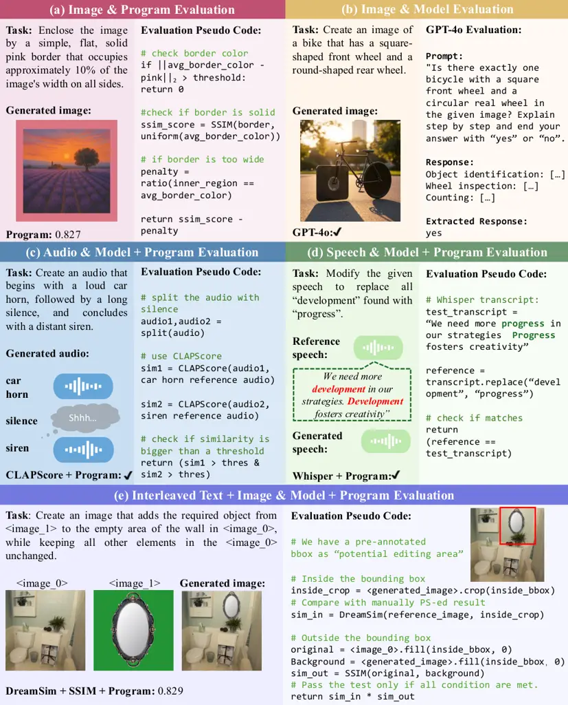
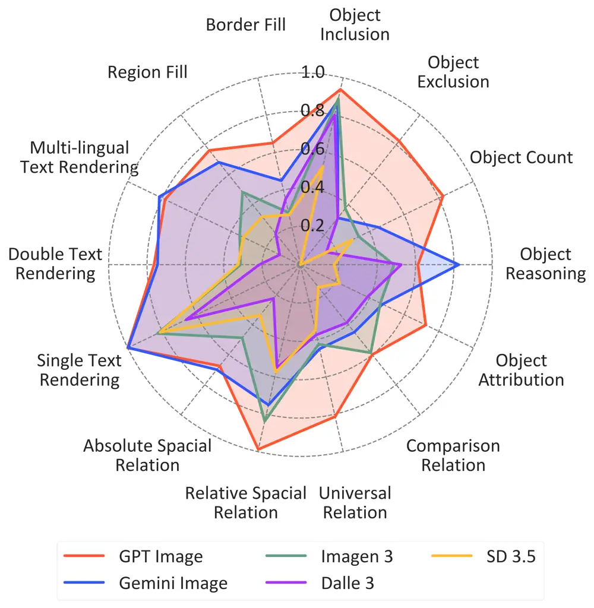
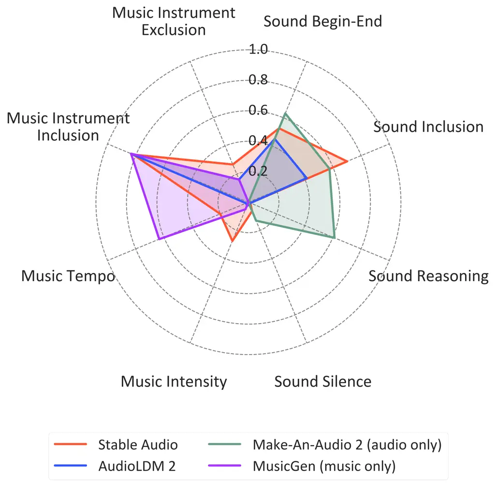
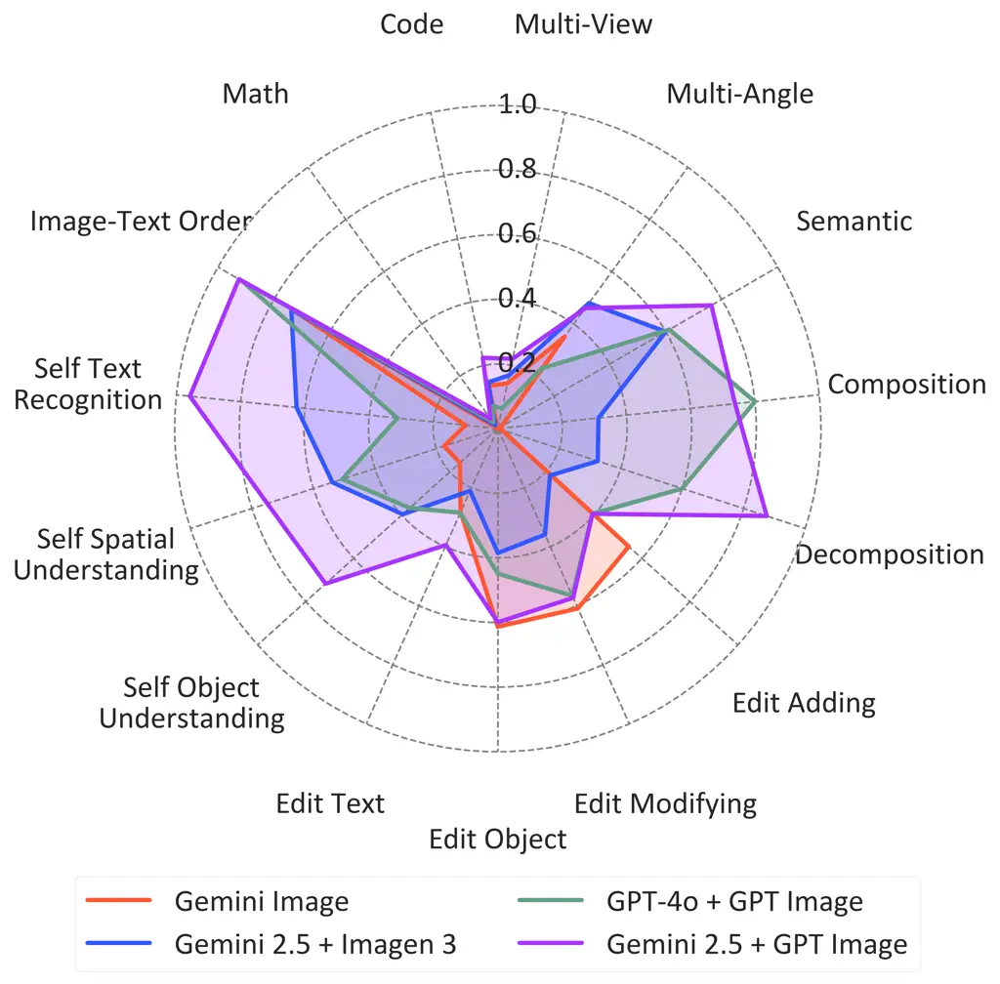
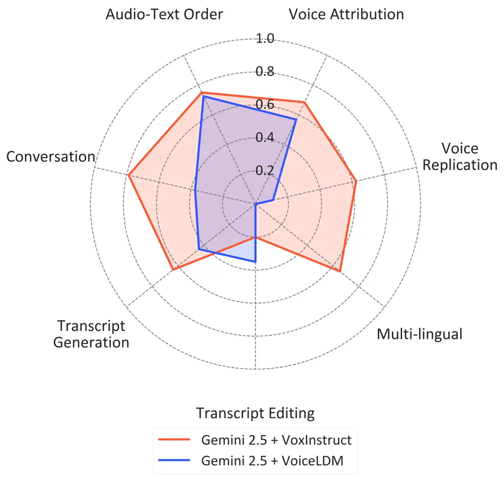
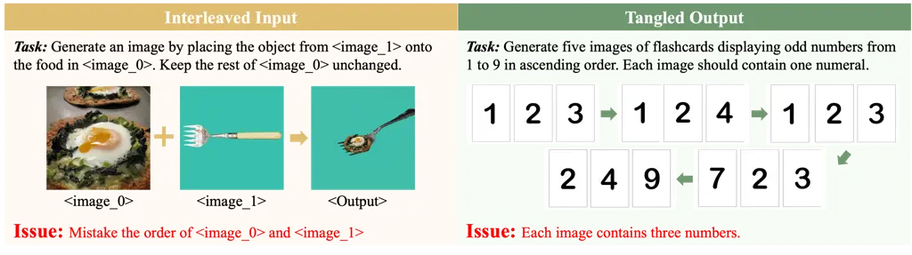
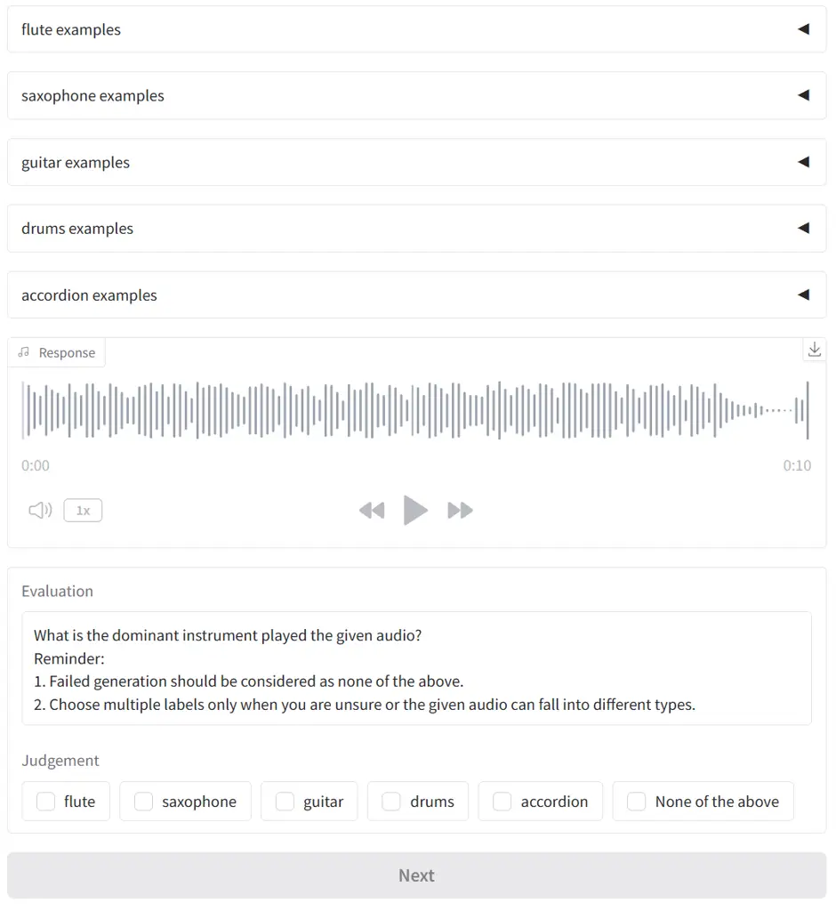

# MMMG: A Comprehensive and Reliable Evaluation Suite for Multitask Multimodal Generation

Jihan Yao ^(†)^(†)thanks: equal contribution
Email: [jihany2@cs.washington.edu](mailto:)    Yushi Hu¹¹footnotemark: 1
Email: [yushihu@uw.edu](mailto:)    Yujie Yi    Bin Han    Shangbin Feng
   Guang Yang    Bingbing Wen    Ranjay Krishna Affiliation: University
of Washington Allen Institute for AI    Lucy Lu Wang
Affiliation: University of Washington Allen Institute for AI    Yulia
Tsvetkov    Noah A. Smith Affiliation: University of Washington Allen
Institute for AI    Banghua Zhu

###### Abstract

Automatically evaluating multimodal generation presents a significant
challenge, as automated metrics often struggle to align reliably with
human evaluation, especially for complex tasks that involve multiple
modalities. To address this, we present MMMG, a comprehensive and
human-aligned benchmark for multimodal generation across 4 modality
combinations (image, audio, interleaved text and image, interleaved text
and audio), with a focus on tasks that present significant challenges
for generation models, while still enabling reliable automatic
evaluation through a combination of models and programs. MMMG
encompasses 49 tasks (including 29 newly developed ones), each with a
carefully designed evaluation pipeline, and 937 instructions to
systematically assess reasoning, controllability, and other key
capabilities of multimodal generation models. Extensive validation
demonstrates that MMMG is highly aligned with human evaluation ,
achieving an average agreement of 94.3%. Benchmarking results on 24
multimodal generation models reveal that even though the
state-of-the-art model, GPT Image, achieves 78.3% accuracy for image
generation, it falls short on multimodal reasoning and interleaved
generation. Furthermore, results suggest considerable headroom for
improvement in audio generation, highlighting an important direction for
future research. Code and data are publicly available at
[https://github.com/yaojh18/MMMG](https://github.com/yaojh18/MMMG).

## 1 Introduction

Figure 1: Examples of tasks and their evaluation metrics in MMMG. For
each task, we develop an evaluation metric using programs, models or
their combinations. The tasks are either verifiable purely by programs
or have big generation-evaluation gaps: generation is challenging for
models, while automatic evaluations have high correlation with human
judgments. We show evaluation pseudo-code for demonstration the
evaluation process.

As investments in multimodal generative AI grow, current models are
rapidly advancing their capabilities in generating text (Achiam et al.,
2023), images (Podell et al., 2024), audio (Evans et al., 2025), and
their interleaved combinations (Chen et al., 2025c; Wang et al., 2024).
However, rigorous and reproducible evaluation of multimodal generation
lags behind, raising a critical question: how can we accurately and
effectively assess the capabilities of these models?

Human evaluations (Chiang et al., 2024; Saharia et al., 2022; Liu
et al., 2025), while considered the gold standard, are prohibitively
expensive for comprehensive assessment at scale. Moreover, inherent
subjectivity makes it difficult to systematically identify specific
model weaknesses, limiting targeted improvements. As an alternative,
existing automated evaluation approaches face two main limitations.
First, it is hard to align automatic evaluation metrics well with human
judges. Most multimodal generation benchmarks (Xia et al., 2025; Chen
et al., 2024b; Chen et al., 2025a) rely on multimodal language models as
judges (MLM-as-a-judge) (Hu et al., 2023; Chen et al., 2024a) without
carefully validating their reliability, potentially causing misalignment
with human judgment (Chen et al., 2024a; Pu et al., 2025). Second, most
benchmarks focus solely on single modalities (Ji et al., 2024; Ghosh
et al., 2023; Xie et al., 2025b), failing to capture the rich
interleaved multimodal content (vision, language, speech/audio) that
characterizes real-world tasks such as cross-modal reasoning (Hu et al.,
2024).

To address these gaps, we introduce MMMG, a new benchmark containing
tasks that meet two criteria: (1) tasks that are _verifiable_ as defined
in IF-Eval (Zhou et al., 2023), where outputs can be objectively
verified by programs through straightforward checks (e.g., checking if a
speech transcript begins with a keyword by comparing the first word with
the keyword), and (2) tasks with significant _generation-evaluation
gaps_, where the generation step is challenging due to complex
constraints, yet the evaluation step remains simple (e.g., generating an
image of a snowman without a carrot nose can be challenging due to
spurious correlation (Ye et al., 2024), but verifying the absence of the
carrot nose can be achieved accurately by prompting a VLM). Example
tasks can be found in Figure 1.

MMMG includes 49 tasks (29 are newly developed) and 937 instructions
across 4 modality combinations—text, image, audio, and interleaved
modalities—as depicted in Table 2. By categorizing tasks based on
assessed capabilities, MMMG enables fine-grained analysis of model
performance and targeted identification of weaknesses.

To validate the human alignment of MMMG, we conduct human evaluation
across 37 tasks—674 instructions and 1886 evaluation questions—with each
question assessed by three independent annotators and aggregated by
majority vote. MMMG achieves an average human agreement of 94.3% with
average inter-annotator agreement being 97.1%. Modality-specific
agreements achieve 94.8% for image, 92.6% for audio, 95.6% for
interleaved image-text, and 91.0% for interleaved audio-text, with
relative improvements over prior best results by 14.2% for image, and
28.1% for interleaved image-text evaluation (Ghosh et al., 2023; Chen
et al., 2025a).

We benchmark 24 open and proprietary multimodal generation models using
the optimal evaluation methods identified in human studies. Partial
results are shown in Figure 2; the rest are in Appendix D.2. We find
that modality-unified autoregressive models (ARMs) surpass diffusion
models in image generation, with GPT Image (OpenAI, 2025) achieving the
best accuracy of 78.3%. This indicates ARMs trained on extensive
language-image datasets have stronger linguistic capabilities, enabling
better instruction following and improved alignment with user intent.
However, GPT Image still falls short in interleaved text-image reasoning
tasks for math and code, achieving only 13.1% accuracy, 3D scene
transformation at 34.1%, and interleaved image editing at 48.4%. Our
qualitative error analysis reveals that another ARM, Gemini Image, tends
to tangle multiple images in generation, hindering accurate
image-sequence and image-text pair generation. Additionally, MMMG
reveals greater headroom for improvement in audio generation tasks
compared to image, with top-performing models achieving accuracies of
48.7% for sound and 41.9% for music generation. Overall, MMMG provides a
reliable benchmark for multimodal model ranking and fine-grained
capability analysis.

(a) Image Generation

(b) Sound and Music Generation

(c) Interleaved Image-Text Generation

(d) Speech and Interleaved Speech-Text Generation

Figure 2: Benchmark results of multimodal generation models on MMMG
covering four modality combinations. Please refer to Table 2 for more
detailed category information. We aggregate some sub-tasks for
interleaved image-text generation. GPT Image beats all other models on
most image generation tasks, and strongly competes other baselines in
generating consistent image sequences and coherent interleaved
image-text contents.

## 2 Related Work

[TABLE]

Table 1: Comprehensiveness of MMMG, compared with other multimodal
generation benchmarks. , , $`\mathbb{T}`$ + , $`\mathbb{T}`$ + represent
image, audio, interleaved image-text, and interleaved audio-text
generation, respectively. “score” stands for embedding-based /
rule-based similarity score, “code” for programmatically verification,
and “reason” for multi-step reasoning. represents low human alignment or
no human experiments. MMMG exceeds other benchmarks in the number of
covered tasks and modalities while providing more reliable evaluation.

Interleaved Multimodal Generation. Interleaved multimodal generation
involves generating coherent content across multiple modalities
simultaneously, such as visual storytelling (Huang et al., 2016; Wen
et al., 2023), reference-based image editing (Chen et al., 2025b), and
voice chatbots (Chu et al., 2024). Effective models must understand
multimodal inputs and produce aligned outputs across modalities. Current
approaches include (1) LLM backbones with specialized decoders (Chen
et al., 2025c; Xie et al., 2025a), which leverage dedicated components
to render visual or audio outputs; (2) modality-unified autoregressive
models (Chern et al., 2024; Hurst et al., 2024; Wang et al., 2024),
processing text, visual, and acoustic tokens within a single sequence
model, enabling native generation of interleaved content; and (3)
agent-based methods (Chen et al., 2025a), using a “Plan-Execute-Refine”
pipeline with modality-specific tools. Despite significant advances,
evaluation frameworks for interleaved multimodal generation remain
underdeveloped, particularly in accurately and automatically assessing
cross-modal consistency, and instruction-following capabilities.

Multimodal Generation Evaluation. Evaluating image, audio and their
interleaved generation presents unique challenges that have been
addressed through several approaches, each with notable limitations,
including (1) using specialized visual or audio models (Ghosh et al.,
2023; Xie et al., 2025b), which struggle to generalize beyond their
training data (Ming et al., 2022); (2) directly employing MLMs as
evaluators (Xia et al., 2025; Chen et al., 2024b; Chen et al., 2025a),
which often misalign with human judgments (Chen et al., 2024a); and (3)
for image evaluation particularly, leveraging visual question answering
(VQA) to assess specific aspects of generated content (Hu et al., 2023;
Lin et al., 2024), which declines significantly in accuracy when facing
complex evaluation scenarios that require nuanced reasoning (Chen
et al., 2025a). To address these limitations, previous research
incorporates extensive human preference data to enhance MLM accuracy
(Xiong et al., 2024; Yao et al., 2025). Our work is an orthogonal
approach that carefully designs evaluation instructions to leverage
current MLM strengths while mitigating their limitations, enabling
reliable multimodal evaluation without extra training or finetuning.
Table 1 compares MMMG with existing benchmarks.

## 3 MMMG Benchmark Construction

Our goal is to build a multimodal generation benchmark that (1) covers a
wide range of modalities and their combinations (image, audio,
interleaved text and image, interleaved text and audio) with diverse
tasks spanning different model capabilities. For each task, (2) we also
ensure reliable automated evaluation that aligns well with humans. In
this section, we first discuss our data and instruction construction in
detail (§3.1), and then introduce the evaluation methods we built for
each task (§3.2).

|                               |                       |                                                                |                 |                 |          |                     |
| ----------------------------- | --------------------- | -------------------------------------------------------------- | --------------- | --------------- | -------- | ------------------- |
| Task                          | Subtask               | Description                                                    | Input           | Output          | \# Inst. | Evaluation          |
| Object Generation             | Inclusion             | Include one or two unrelated objects in the scene.             | $`\mathbb{T}`$  |                 | 20       | VLM                 |
|                               | Exclusion             | Exclude one related object from the scene.                     | $`\mathbb{T}`$  |                 | 20       | VLM                 |
|                               | Count                 | Generate exactly N objects.                                    | $`\mathbb{T}`$  |                 | 20       | VLM                 |
|                               | Attribution           | Generate an object with uncommon attributes.                   | $`\mathbb{T}`$  |                 | 20       | VLM                 |
|                               | Reasoning             | Generate the answer object to a multi-hop question.            | $`\mathbb{T}`$  |                 | 20       | VLM                 |
| Relation Control              | Comparison            | Generate two objects with uncommon relations.                  | $`\mathbb{T}`$  |                 | 20       | VLM                 |
|                               | Universal             | Generate objects with all identical/different attributes.      | $`\mathbb{T}`$  |                 | 20       | VLM                 |
|                               | Relative Spatial      | Generate two objects with given relative spacial relation.     | $`\mathbb{T}`$  |                 | 20       | VLM                 |
|                               | Absolute Spatial      | Generate one/two objects in the absolute image quarter.        | $`\mathbb{T}`$  |                 | 20       | VLM                 |
| Image Format                  | Border Fill           | Surround the image with pure and solid colored border.         | $`\mathbb{T}`$  |                 | 15       | Program + SSIM      |
|                               | Region Fill           | Fill the given region with pure and solid color.               | $`\mathbb{T}`$  |                 | 15       | Program + SSIM      |
| Text Rendering                | Single                | Render English text on one object.                             | $`\mathbb{T}`$  |                 | 20       | VLM                 |
|                               | Double                | Render two English texts on two objects.                       | $`\mathbb{T}`$  |                 | 20       | VLM                 |
|                               | Multi-Lingual         | Render one Chinese/German text on one object.                  | $`\mathbb{T}`$  |                 | 20       | VLM                 |
| Image Editing                 | Object Adding         | Add a new object to the original image.                        | $`\mathbb{T}`$, |                 | 20       | VLM + SSIM          |
|                               | Object Removing       | Remove an existing object in the original image.               | $`\mathbb{T}`$, |                 | 20       | VLM + SSIM          |
|                               | Object Modifying      | Replace an existing object in the original image.              | $`\mathbb{T}`$, |                 | 20       | VLM + SSIM          |
|                               | Text Editing          | Add/Remove/Replace text in the original image.                 | $`\mathbb{T}`$, |                 | 25       | VLM + SSIM          |
|                               | Interleaved Adding    | Add an external image object to the original image.            | $`\mathbb{T}`$, |                 | 20       | DreamSim + SSIM     |
|                               | Interleaved Modifying | Change the color of an object in the original image.           | $`\mathbb{T}`$, |                 | 20       | DreamSim + SSIM     |
| Image Consistency             | Semantic              | Generate multiple images in semantic order.                    | $`\mathbb{T}`$  |                 | 20       | VLM                 |
|                               | Composition           | Compose individual objects in the given order.                 | $`\mathbb{T}`$  |                 | 20       | VLM                 |
|                               | Decomposition         | Decompose object combination in the given order.               | $`\mathbb{T}`$, |                 | 20       | VLM                 |
|                               | Multi-View            | Generate multiple views of the reference scene.                | $`\mathbb{T}`$, |                 | 20       | SSIM                |
|                               | Multi-Angle           | Generate multiple views of the reference object.               | $`\mathbb{T}`$, |                 | 20       | SSIM                |
| Image-Text Coherence          | Self Count            | Count objects in the self-generated image.                     | $`\mathbb{T}`$  | $`\mathbb{T}`$, | 20       | VLM                 |
|                               | Self Color            | Name object colors in the self-generated image.                | $`\mathbb{T}`$  | $`\mathbb{T}`$, | 20       | VLM                 |
|                               | Self Size             | Compare object sizes in the self-generated image.              | $`\mathbb{T}`$  | $`\mathbb{T}`$, | 20       | VLM                 |
|                               | Self Relative Spatial | Decide relative spacial relation in the generated image.       | $`\mathbb{T}`$  | $`\mathbb{T}`$, | 20       | VLM                 |
|                               | Self Absolute Spatial | Decide absolute spacial relation in the generated image.       | $`\mathbb{T}`$  | $`\mathbb{T}`$, | 20       | VLM                 |
|                               | Self OCR              | Recognize the text in the generated image.                     | $`\mathbb{T}`$  | $`\mathbb{T}`$, | 20       | VLM                 |
| Interleaved Reasoning         | Math                  | Solve the IQ-test puzzles.                                     | $`\mathbb{T}`$, | $`\mathbb{T}`$, | 20       | VLM                 |
|                               | Code                  | Read SVG codes and render the SVG image.                       | $`\mathbb{T}`$  | $`\mathbb{T}`$, | 20       | VLM + DreamSim      |
| Sound Generation              | Begin-End             | Begin/End the audio with the given sound effect.               | $`\mathbb{T}`$  |                 | 20       | CLAPScore           |
|                               | Positional Inclusion  | Include one sound effect at a relative audio position.         | $`\mathbb{T}`$  |                 | 20       | CLAPScore           |
|                               | Silence               | Generate two ordered sound effects separated by silence.       | $`\mathbb{T}`$  |                 | 20       | CLAPScore           |
|                               | Reasoning             | Generate the answer sound to a multi-hop question.             | $`\mathbb{T}`$  |                 | 18       | CLAPScore           |
| Music Generation              | Instrument Inclusion  | Generate music with the given instrument.                      | $`\mathbb{T}`$  |                 | 15       | CLAPScore           |
|                               | Instrument Exclusion  | Generate music without the given instrument.                   | $`\mathbb{T}`$  |                 | 14       | CLAPScore           |
|                               | Tempo                 | Generate music with the given tempo.                           | $`\mathbb{T}`$  |                 | 15       | Program             |
|                               | Intensity             | Generate music with fade in/out at the beginning/end.          | $`\mathbb{T}`$  |                 | 10       | Program             |
| Interleaved Speech Generation | Voice Attribution     | Generate an en. speech with required voice attributes.         | $`\mathbb{T}`$  |                 | 20       | Whisper+W2V+Program |
|                               | Voice Replication     | Generate an en. speech replicating the reference voice.        | $`\mathbb{T}`$, |                 | 20       | Whisper + WavLM     |
|                               | Multi-Lingual         | Generate a zh. speech with required voice attributes.          | $`\mathbb{T}`$  |                 | 20       | Whisper+W2V+Program |
|                               | Transcript Generation | Generating an speech with textual constraints for transcripts. | $`\mathbb{T}`$  |                 | 20       | Whisper + Program   |
|                               | Transcript Editing    | Editing an speech with textual constraints for transcripts.    | $`\mathbb{T}`$  |                 | 20       | Whisper + Program   |
|                               | Conversation          | Generate a conversation with given speaker order.              | $`\mathbb{T}`$  |                 | 20       | Whisper + WavLM     |
| Modality Order Control        | Image-Text            | Generate interleaved image-text content in given order.        | $`\mathbb{T}`$, | $`\mathbb{T}`$, | 20       | Program             |
|                               | Audio-Text            | Generate interleaved audio-text content in given order.        | $`\mathbb{T}`$, | $`\mathbb{T}`$, | 20       | Program             |

Table 2: Detailed task definition and metadata for MMMG. $`\mathbb{T}`$
denotes text modality, for image modality, for multiple images, for
audio and for multiple audios. We evaluate each task with the method
that yields the highest human agreement. green background indicates new
tasks.

### 3.1 Data Curation

To guarantee high-quality instructions and reliable evaluation, we
design a systematic data curation pipeline consisting of three key
stages.

Task Creation. We begin by creating an initial pool of 76 candidate task
templates. These tasks span various modality combinations and each task
aims to evaluate a single multimodal generation capability. The complete
list of 76 tasks can be found in Appendix B.2. For each task, we conduct
a rigorous feasibility assessment to ensure there is at least one
reliable evaluation method available—either programmatic verification or
a literature-supported, highly human-aligned evaluation method. Based on
this process, we narrow our task pool down to 55 tasks.

Instruction Synthesis and Validation. We employ a human-in-the-loop
approach to synthesize high-quality instructions for each task. Inspired
by Self-Instruct (Wang et al., 2023), we prompt GPT-4o (Hurst et al., 2024) with the task template and quality-controlled criteria to generate
10 candidate instructions per task. We then go through a two-stage
selection process:

- •
  Quality Filtering. Initially, we remove instructions that are
  ambiguous (instructions with unclear or multiple interpretations),
  unrealistic (instructions that describe improbable or nonsensical
  scenarios), or redundant (instructions that closely resemble
  previously accepted examples). For instance, unrealistic instruction
  “_Generate an image of a forest without any trees_” is discarded
  because it is semantically contradictory and unlikely to occur in
  actual user queries.
- •
  Verifiability Assessment. For instructions passing the initial
  filtering stage, we sample generated outputs and verify if at least
  one evaluation methods yield high alignment with human judgments. This
  step is crucial because even models generally capable of performing a
  given task may fail to accurately evaluate out-of-distribution
  variants within that domain. For example, GPT-4o can accurately count
  fewer than 7 objects but is prone to errors counting more than 10
  objects.

We then generate another 10 candidate instructions and repeat the
generation and validation process continues until we gather
approximately 20 high-quality instructions per task. Statistically,
10–50% of generated instructions pass examination, depending on task
difficulty.

Postprocessing. For final quality control, we perform a task-level
postprocessing step to further refine our benchmark. This involves two
procedures: (1) Task filtering: we recruit two independent annotators to
judge if each task is realistic. We eliminate six tasks that at least
one annotator judges to be unrealistic. (2) Instruction paraphrasing: To
ensure linguistic diversity and prevent models from memorizing specific
instruction patterns, we paraphrase all remaining instructions. Each
paraphrased instruction is examined manually to verify that it is
equivalent to the original instruction semantically.

To this end, we ultimately collect a total of 937 instructions across 49
tasks spanning 4 modality combinations. This systematic approach ensures
that MMMG provides a comprehensive, fine-grained, and reliable
evaluation framework for assessing multimodal generation capabilities.
The detailed definitions and metadata of each task in MMMG can be found
in Table 2.

### 3.2 Evaluation Method

We report the evaluation method used for each task in Table 2. For more
details about implementation, please refer to Appendix C.3.

VLM. We employ vision language models (VLMs) for most reference-free
image evaluation tasks. We do not use object detection or OCR models
because VLMs demonstrate superior performance in out-of-domain
scenarios. A common practice to boost VLM-as-a-judge is visual question
answering (VQA), where models generate verification questions and answer
the questions based on images to determine if images follow given
instructions. However, we find that automatically generated
question-answer pairs like those in TIFA (Hu et al., 2023) often
misalign with human judgment on challenging tasks. Therefore, we
manually design visual questions for each instruction based on these
important principles as shown in Figure 1(b):

- •
  Chain-of-thought prompting significantly improves VLM performance on
  boolean questions. Specifically, instructing models not to output
  yes/no at the beginning of their responses substantially reduces
  hallucination which echoes findings in Zhang et al. (2024).
- •
  Multiple-choice format can boost VLM’s performance on object counting
  and spatial relationship reasoning. We hypothesize that
  multiple-choice questions effectively reduce the output space, thereby
  simplifying these tasks. For example, including an option like “_E.
  More than 6_” in object counting questions can prevent miscounting
  errors in scenarios with numerous objects.
- •
  Adding negative prompts helps alleviate visual hallucination. For
  instance, VLMs can easily overlook a constraint such as “_one
  basketball with a cube shape_,” whereas “_one basketball with a cube
  shape instead of a sphere_” forces the VLM to reject a spherical
  basketball.

Image Similarity. For reference-based image evaluation tasks requiring
perceptual similarity, we employ DreamSim (Fu et al., 2023). When exact
matching is necessary, we use SSIM (Wang et al., 2004). For image
editing tasks, we implement a dual approach: DreamSim/VQA evaluates the
edited region, while SSIM assesses the unmodified areas outside it,
ensuring that local editing instructions are precisely followed as shown
in Figure 1(e).

Audio Similarity. Research indicates that current audio language models
(ALMs) cannot reliably analyze sound or music clips (Sakshi et al.,
2025). Therefore, we select ESC-50 (Piczak, 2015) and OpenMIC-2018
(Humphrey et al., 2018) as reference datasets for sound and music
evaluation, and compute CLAP cosine similarity (Wu et al., 2023) with
reference audio as shown in Figure 1(c).

Audio Model. For specialized audio analysis, we employ several targeted
models. WavLM (Chen et al., 2022) is employed for speaker similarity
verification with an empirical optimal threshold of 0.86. For speech
transcription, we use Whisper (Radford et al., 2023) as shown in Figure
1(d). Gender classification in speech leverages a finetuned Wav2Vec
checkpoint (Fiury, 2023). For music tempo computation, we employ
BeatThis (Foscarin et al., 2024) for beat tracking and the beats
statistics are used for music tempo computation.

Program. For programmatic verification, we utilize PIL for image
analysis as shown in Figure 1(a), Librosa (McFee et al., 2015) and Praat
(Boersma and Van Heuven, 2001) for audio pitch, intensity, and speed
analysis. For textual constraint verification, we follow the
implementation of IF-Eval (Zhou et al., 2023). We use word accuracy
(WAcc) to evaluate textual similarity for visual text rendering and
text-to-speech tasks which requires exact matching.

Scoring. Each generation receives either a similarity score or a binary
classification of whether all requirements in the instruction are
correctly rendered following previous work setup (Ghosh et al., 2023).
We convert binary classification to numerical scores (0.0 for incorrect,
1.0 for correct) and average all generation scores within each task to
obtain task-level scores, then macro-average all task scores to get the
final accuracy score for the multimodal generation model.

## 4 Experiment Settings

Generation. We evaluate 24 multimodal generation models specified in
Appendix C.1. Following the experimental setup in Ghosh et al. (2023),
we sample 4 generations for every instruction in our benchmark. We
employ a temperature of 0 and a retry count of 4 for MLMs and sampling
steps of 200 for diffusion models. We keep other parameters, such as
guidance scale, as default values.

Evaluation. We compare several evaluation methods. For image generation,
we include GPT-4o, Gemini 2.5, and Qwen2.5-VL (Bai et al., 2025) to
perform VQA for evaluation. $`\mathrm{CLIPScore}`$ (Hessel et al., 2021)
is found as less aligned with human judgment in previous studies (Hu
et al., 2023), thus not included. For sound and music evaluation, we
include $`\mathrm{CLAPScore}_{\mathrm{audio}}`$,
$`\mathrm{CLAPScore}_{\mathrm{text}}`$, and employing Gemini 2.5 for
acoustic question answering (AQA).
$`\mathrm{CLAPScore}_{\mathrm{audio}}`$ computes the CLAP cosine
similarity with reference audio, while
$`\mathrm{CLAPScore}_{\mathrm{text}}`$ computes the similarity with
reference audio captions. Following the optimal configurations
identified in empirical studies, we calculate the average
$`\mathrm{CLAPScore}_{\mathrm{audio}}`$ with the 10 most similar
reference audio samples The threshold is 0.68 for ESC-50 and 0.62 for
OpenMIC-2018.

## 5 Results and Analysis

In this section, we first report our human alignment experiment results
in §5.1, and then the benchmarking results evaluated by the most
human-aligned metrics in §5.2. We also report the correlation between
MMMG with real-world human preference leaderboard in §5.3.

Figure 3: Two prevalent failure cases observed in interleaved image-text
generation tasks for Gemini Image: (1) models fail to accurately
interpret the order of images in interleaved inputs; and (2) models
frequently blend multiple images together, possibly due to limitations
in encoding multiple images with continuous latent image
representations.

### 5.1 Alignment with Human Judges

We conduct human evaluations on 674 instructions evaluated by models.
For each instruction, we randomly select two models from all models
evaluated on this instruction and obtain one generation per model. Each
generation is evaluated by two independent annotators, randomly selected
from our pool of 20 graduate student annotators. To standardize the
evaluation process and reduce subjective bias, we design specific
multiple-choice questions for each instruction exemplified in Appendix
C.5, thereby constraining annotators’ responses to a fixed set of
choices and ensuring high inter-annotator agreement. In cases of
disagreement, a third annotator determines the final annotation. In
total, human studies involve 1886 evaluation questions and collect 3812
annotations. For verifiable instructions, human alignment validation is
unnecessary as these tasks are designed for objective programmatic
verification. Human-model and inter-human agreement measures can be
found in Table 8.

MMMG demonstrates high human alignment, with average best human-model
agreement for image, audio, interleaved image-text, and interleaved
audio-text being 0.948, 0.926, 0.956 and 0.910 respectively, calculated
by selecting the method achieving the highest agreement per task and
averaging across tasks. The average inter-annotator agreement remains as
high as 0.971 with the worst case being 0.917. MMMG also outperforms
previous best benchmark alignment significantly: agreement on image
generation surpasses GenEval (0.830) by 14.2%, and Pearson correlation
on interleaved image-text generation surpasses ISG-Bench (0.718) by
28.1%. Experiments show that while GPT-4o remains the most human-aligned
image evaluation model with an average agreement of 0.941, Gemini 2.5
shows superior performance on spatial relationships and editing
evaluation. Open-source models like Qwen2.5-VL still have a significant
gap with proprietary models. For audio evaluation, even though
$`\mathrm{CLAPScore}_{\mathrm{text}}`$ yields a satisfactory agreement
of 0.926, it relies highly on the quality of reference audio, thus
making it challenging for out-of-domain audio evaluation.

### 5.2 Benchmarking Results

We benchmark models with the most aligned evaluation methods for each
task. Selected model performances are illustrated in Figure 2, with
complete evaluation results provided in Appendix D.2.

Image Generation. ARMs outperform diffusion models on image generation
tasks, with GPT Image and Gemini Image achieving accuracies of 0.783 and
0.641 respectively, ranking 1st and 3rd. This indicates that ARMs with
stronger linguistic capabilities can better follow instructions.
However, models struggle notably when generating objects with uncommon
attributes and producing pairs of objects with unusual relationships,
showing average accuracies of only 0.389 and 0.422 respectively. This
underscores the vulnerability of image generation models to
out-of-domain instructions.

Interleaved Image-Text Generation. Interleaved image-text generation
poses considerable challenges, with the best-performing combination
(Gemini 2.5 + GPT Image) achieving limited accuracies of 0.131 on math
and coding reasoning, 0.341 on 3D scene transformations, and 0.484 on
interleaved image editing. Additionally, modality-unified autoregressive
models such as Anole and Gemini Image struggle to understand interleaved
input and tend to output tangled output, highlighting their limitations
compared to agent-based models as shown in Figure 3.

Sound and Music Generation. Current audio generation models exhibit
significant reasoning limitations, achieving low average accuracies
across tested models—0.193 for instrument exclusion and 0.175 for sound
reasoning. Volume-related tasks also demonstrate poor performance, with
silence generation and intensity control reaching average accuracies of
merely 0.048 and 0.085, respectively. Only Make-An-Audio 2, leveraging
large language models (LLMs) for instruction parsing, shows competence
in sound reasoning, while MusicGen effectively manages tempo control.
Audio generation models remain domain-constrained; only Stable Audio and
AudioLDM 2 can handle both sound and music generation tasks.

Speech and Interleaved Speech-Text Generation. The sole inherently
interleaved speech-text model, Spirit LM, fails entirely to follow
speech generation instructions, showing zero accuracy on most tasks.
Agent-based models also exhibit difficulties on tasks that require
simultaneous speech understanding and generation, with average
accuracies of 0.275 for speech editing.

### 5.3 Correlation with Real-World Leaderboard

|              |       |         |       |       |       |
| ------------ | ----- | ------- | ----- | ----- | ----- |
| Model        | Arena | GenEval | Draw  | GenAI | MMMG  |
| Imagen 3     | 1087  | 0.707   | 0.831 | 0.793 | 0.510 |
| Recraft V3   | 1009  | 0.732   | 0.826 | 0.817 | 0.489 |
| Luma Photon  | 1021  | 0.738   | 0.766 | 0.804 | 0.646 |
| Flux 1.1 Pro | 1000  | 0.588   | 0.725 | 0.736 | 0.494 |
| Ideogram 2   | 1019  | 0.615   | 0.757 | 0.782 | 0.557 |
| Dalle 3      | 978   | 0.627   | 0.809 | 0.811 | 0.376 |
| SD 3.5       | 919   | 0.591   | 0.711 | 0.715 | 0.335 |
| Pearson      |       | 0.592   | 0.633 | 0.554 | 0.673 |
| Spearman     |       | 0.607   | 0.607 | 0.286 | 0.857 |

Table 3: Correlation of automated image generation benchmarks with
Chatbot Arena. Arena, Draw, GenAI represent Chatbot Arena, DrawBench,
and GenAI-Bench. MMMG achieves the highest correlation with Chatbot
Arena. This indicates even though our instructions are synthetic, the
evaluation results are still highly human-aligned.

We compare the correlation of the MMMG score with the Chatbot Arena
(Chiang et al., 2024) score on the text-to-image task. We take the Arena
Score for 7 image generation models under the “User Prompts Only”
category as a gold reference. We report the Pearson correlation and
Spearman’s rank correlation coefficient between gold arena scores and
scores produced by evaluating on different benchmarks in Table 3. We
compare with GenEval, DrawBench, and GenAI-Bench. We employ VQAScore
(Lin et al., 2024) to replace human evaluation on DrawBench and
GenAI-Bench; due to budgetary limitations, we randomly sample 400 out of
1600 instructions for GenAI-Bench.

MMMG provides reliable model rankings with a Spearman correlation
coefficient of 0.857, significantly outperforming baseline benchmarks.
This indicates that despite that synthetic instructions may not fully
align with real-world queries, MMMG achieves higher alignment with human
preferences. Such results suggest that evaluator alignment (i.e., the
reliability of the evaluation method) may outweigh instruction
distribution alignment (i.e., the extent to which benchmark tasks
reflect real-world task distributions) for accurate model assessment.
Moreover, MMMG demonstrates superior differentiation capabilities among
evaluated models. The performance gap of 0.318 between the highest- and
lowest-ranked models is much larger than the next-best baseline
(GenEval), which has only a gap of 0.147. This larger range underscores
MMMG’s enhanced ability to distinguish among models, particularly for
differentiating performance among top-tier models.

Due to the lack of real-world human preference leaderboards like Chatbot
Arena for other modalities, we leave human preference correlation
studies for other modalities as future work.

## 6 Conclusion

In this work, we introduce MMMG, a comprehensive automated evaluation
suite for multitask multimodal generation, addressing critical
limitations of existing benchmarks. We collect 937 high-quality
instructions spanning 49 diverse tasks involving text, image, audio, and
interleaved content. Extensive human validation demonstrates that MMMG
correlates better with human judgments compared to previous benchmarks.
Benchmarking results highlight ongoing challenges in multimodal
reasoning, interleaved generation, and audio generation. The
fine-grained nature of MMMG enables detailed capability analysis,
providing valuable insights for targeted multimodal improvements. Beyond
serving as a leaderboard, we hope MMMG inspires scalable collection of
verifiable validation signals for future multimodal generation training.
Given the page limit, we refer readers to Appendix A for limitations and
social impacts discussion.

## References

- Abid et al. (2019) Abubakar Abid, Ali Abdalla, Ali Abid, Dawood Khan,
  Abdulrahman Alfozan, and James Zou. Gradio: Hassle-free sharing and
  testing of ml models in the wild. _arXiv preprint
  arXiv:1906.02569_, 2019.
- Achiam et al. (2023) Josh Achiam, Steven Adler, Sandhini Agarwal, Lama
  Ahmad, Ilge Akkaya, Florencia Leoni Aleman, Diogo Almeida, Janko
  Altenschmidt, Sam Altman, Shyamal Anadkat, et al. Gpt-4 technical
  report. _arXiv preprint arXiv:2303.08774_, 2023.
- AI (2024a) Ideogram AI. Ideogram 2, 2024a. URL
  [https://ideogram.ai/](https://ideogram.ai/). Accessed April 27, 2025.
- AI (2024b) Luma AI. Luma photon, 2024b. URL
  [https://lumalabs.ai/photon](https://lumalabs.ai/photon). Accessed
  April 27, 2025.
- AI (2024c) Recraft AI. Recraft v3 model, 2024c. URL
  [https://www.recraft.ai/](https://www.recraft.ai/). Accessed April
  27, 2025.
- Ardila et al. (2020) Rosana Ardila, Megan Branson, Kelly Davis,
  Michael Kohler, Josh Meyer, Michael Henretty, Reuben Morais, Lindsay
  Saunders, Francis Tyers, and Gregor Weber. Common voice: A
  massively-multilingual speech corpus. In _Proceedings of the Twelfth
  Language Resources and Evaluation Conference_, pages 4218–4222, 2020.
- Bai et al. (2025) Shuai Bai, Keqin Chen, Xuejing Liu, Jialin Wang,
  Wenbin Ge, Sibo Song, Kai Dang, Peng Wang, Shijie Wang, Jun Tang,
  et al. Qwen2. 5-vl technical report. _arXiv preprint
  arXiv:2502.13923_, 2025.
- Baldridge et al. (2024) Jason Baldridge, Jakob Bauer, Mukul Bhutani,
  Nicole Brichtova, Andrew Bunner, Lluis Castrejon, Kelvin Chan, Yichang
  Chen, Sander Dieleman, Yuqing Du, et al. Imagen 3. _arXiv preprint
  arXiv:2408.07009_, 2024.
- Betker et al. (2023) James Betker, Gabriel Goh, Li Jing, Tim Brooks,
  Jianfeng Wang, Linjie Li, Long Ouyang, Juntang Zhuang, Joyce Lee,
  Yufei Guo, et al. Improving image generation with better captions.
  _Computer Science. https://cdn. openai. com/papers/dall-e-3. pdf_,
  2(3):8, 2023.
- Boersma and Van Heuven (2001) Paul Boersma and Vincent Van Heuven.
  Speak and unspeak with praat. _Glot International_,
  5(9/10):341–347, 2001.
- Cai et al. (2025) Huanqia Cai, Yijun Yang, and Winston Hu. Mm-iq:
  Benchmarking human-like abstraction and reasoning in multimodal
  models. _arXiv preprint arXiv:2502.00698_, 2025.
- Chen et al. (2024a) Dongping Chen, Ruoxi Chen, Shilin Zhang, Yaochen
  Wang, Yinuo Liu, Huichi Zhou, Qihui Zhang, Yao Wan, Pan Zhou, and
  Lichao Sun. Mllm-as-a-judge: Assessing multimodal llm-as-a-judge with
  vision-language benchmark. In _Forty-first International Conference on
  Machine Learning_, 2024a.
- Chen et al. (2025a) Dongping Chen, Ruoxi Chen, Shu Pu, Zhaoyi Liu,
  Yanru Wu, Caixi Chen, Benlin Liu, Yue Huang, Yao Wan, Pan Zhou, and
  Ranjay Krishna. Interleaved scene graphs for interleaved
  text-and-image generation assessment. In _The Thirteenth International
  Conference on Learning Representations_, 2025a.
- Chen et al. (2025b) Liang Chen, Shuai Bai, Wenhao Chai, Weichu Xie,
  Haozhe Zhao, Leon Vinci, Junyang Lin, and Baobao Chang. Multimodal
  representation alignment for image generation: Text-image interleaved
  control is easier than you think. _arXiv preprint arXiv:2502.20172_,
  2025b.
- Chen et al. (2022) Sanyuan Chen, Chengyi Wang, Zhengyang Chen, Yu Wu,
  Shujie Liu, Zhuo Chen, Jinyu Li, Naoyuki Kanda, Takuya Yoshioka, Xiong
  Xiao, et al. Wavlm: Large-scale self-supervised pre-training for full
  stack speech processing. _IEEE Journal of Selected Topics in Signal
  Processing_, 16(6):1505–1518, 2022.
- Chen et al. (2024b) Wei Chen, Lin Li, Yongqi Yang, Bin Wen, Fan Yang,
  Tingting Gao, Yu Wu, and Long Chen. Comm: A coherent interleaved
  image-text dataset for multimodal understanding and generation. _arXiv
  preprint arXiv:2406.10462_, 2024b.
- Chen et al. (2025c) Xiaokang Chen, Zhiyu Wu, Xingchao Liu, Zizheng
  Pan, Wen Liu, Zhenda Xie, Xingkai Yu, and Chong Ruan. Janus-pro:
  Unified multimodal understanding and generation with data and model
  scaling. _arXiv preprint arXiv:2501.17811_, 2025c.
- Chern et al. (2024) Ethan Chern, Jiadi Su, Yan Ma, and Pengfei Liu.
  Anole: An open, autoregressive, native large multimodal models for
  interleaved image-text generation. _arXiv preprint
  arXiv:2407.06135_, 2024.
- Chiang et al. (2024) Wei-Lin Chiang, Lianmin Zheng, Ying Sheng,
  Anastasios Nikolas Angelopoulos, Tianle Li, Dacheng Li, Banghua Zhu,
  Hao Zhang, Michael Jordan, Joseph E Gonzalez, et al. Chatbot arena: An
  open platform for evaluating llms by human preference. In _Forty-first
  International Conference on Machine Learning_, 2024.
- Chu et al. (2024) Yunfei Chu, Jin Xu, Qian Yang, Haojie Wei, Xipin
  Wei, Zhifang Guo, Yichong Leng, Yuanjun Lv, Jinzheng He, Junyang Lin,
  et al. Qwen2-audio technical report. _arXiv preprint
  arXiv:2407.10759_, 2024.
- Copet et al. (2023) Jade Copet, Felix Kreuk, Itai Gat, Tal Remez,
  David Kant, Gabriel Synnaeve, Yossi Adi, and Alexandre Défossez.
  Simple and controllable music generation. _Advances in Neural
  Information Processing Systems_, 36:47704–47720, 2023.
- Evans et al. (2025) Zach Evans, Julian D Parker, CJ Carr, Zack
  Zukowski, Josiah Taylor, and Jordi Pons. Stable audio open. In _ICASSP
  2025-2025 IEEE International Conference on Acoustics, Speech and
  Signal Processing (ICASSP)_, pages 1–5. IEEE, 2025.
- Fiury (2023) Alexandre Fiury.
  wav2vec2-large-xlsr-53-gender-recognition-librispeech.
  [https://huggingface.co/alefiury/wav2vec2-large-xlsr-53-gender-recognition-librispeech](https://huggingface.co/alefiury/wav2vec2-large-xlsr-53-gender-recognition-librispeech), 2023.
- Foscarin et al. (2024) Francesco Foscarin, Jan Schlüter, and Gerhard
  Widmer. Beat this! accurate beat tracking without DBN postprocessing.
  In _Proceedings of the 25th International Society for Music
  Information Retrieval Conference (ISMIR)_, San Francisco, CA, United
  States, November 2024.
- Fu et al. (2023) Stephanie Fu, Netanel Tamir, Shobhita Sundaram, Lucy
  Chai, Richard Zhang, Tali Dekel, and Phillip Isola. Dreamsim: Learning
  new dimensions of human visual similarity using synthetic data.
  _Advances in Neural Information Processing Systems_,
  36:50742–50768, 2023.
- Ge et al. (2024) Yuying Ge, Sijie Zhao, Ziyun Zeng, Yixiao Ge, Chen
  Li, Xintao Wang, and Ying Shan. Making LLaMA SEE and draw with SEED
  tokenizer. In _The Twelfth International Conference on Learning
  Representations_, 2024.
- Ghosh et al. (2023) Dhruba Ghosh, Hannaneh Hajishirzi, and Ludwig
  Schmidt. Geneval: An object-focused framework for evaluating
  text-to-image alignment. _Advances in Neural Information Processing
  Systems_, 36:52132–52152, 2023.
- Hessel et al. (2021) Jack Hessel, Ari Holtzman, Maxwell Forbes, Ronan
  Le Bras, and Yejin Choi. Clipscore: A reference-free evaluation metric
  for image captioning. In _Proceedings of the 2021 Conference on
  Empirical Methods in Natural Language Processing_, pages
  7514–7528, 2021.
- Hu et al. (2023) Yushi Hu, Benlin Liu, Jungo Kasai, Yizhong Wang, Mari
  Ostendorf, Ranjay Krishna, and Noah A Smith. Tifa: Accurate and
  interpretable text-to-image faithfulness evaluation with question
  answering. In _Proceedings of the IEEE/CVF International Conference on
  Computer Vision_, pages 20406–20417, 2023.
- Hu et al. (2024) Yushi Hu, Weijia Shi, Xingyu Fu, Dan Roth, Mari
  Ostendorf, Luke Zettlemoyer, Noah A Smith, and Ranjay Krishna. Visual
  sketchpad: Sketching as a visual chain of thought for multimodal
  language models. In _The Thirty-eighth Annual Conference on Neural
  Information Processing Systems_, 2024.
- Huang et al. (2023) Jiawei Huang, Yi Ren, Rongjie Huang, Dongchao
  Yang, Zhenhui Ye, Chen Zhang, Jinglin Liu, Xiang Yin, Zejun Ma, and
  Zhou Zhao. Make-an-audio 2: Temporal-enhanced text-to-audio
  generation. _arXiv preprint arXiv:2305.18474_, 2023.
- Huang et al. (2016) Ting-Hao Huang, Francis Ferraro, Nasrin
  Mostafazadeh, Ishan Misra, Aishwarya Agrawal, Jacob Devlin, Ross
  Girshick, Xiaodong He, Pushmeet Kohli, Dhruv Batra, et al. Visual
  storytelling. In _Proceedings of the 2016 conference of the North
  American chapter of the association for computational linguistics:
  Human language technologies_, pages 1233–1239, 2016.
- Huang et al. (2025) Yi Huang, Jiancheng Huang, Yifan Liu, Mingfu Yan,
  Jiaxi Lv, Jianzhuang Liu, Wei Xiong, He Zhang, Liangliang Cao, and
  Shifeng Chen. Diffusion model-based image editing: A survey. _IEEE
  Transactions on Pattern Analysis & Machine Intelligence_,
  (01):1–27, 2025.
- Humphrey et al. (2018) Eric Humphrey, Simon Durand, and Brian McFee.
  Openmic-2018: An open data-set for multiple instrument recognition. In
  _ISMIR_, pages 438–444, 2018.
- Hurst et al. (2024) Aaron Hurst, Adam Lerer, Adam P Goucher, Adam
  Perelman, Aditya Ramesh, Aidan Clark, AJ Ostrow, Akila Welihinda, Alan
  Hayes, Alec Radford, et al. Gpt-4o system card. _arXiv preprint
  arXiv:2410.21276_, 2024.
- Ji et al. (2024) Jiaming Ji, Jiayi Zhou, Hantao Lou, Boyuan Chen,
  Donghai Hong, Xuyao Wang, Wenqi Chen, Kaile Wang, Rui Pan, Jiahao Li,
  et al. Align anything: Training all-modality models to follow
  instructions with language feedback. _arXiv preprint
  arXiv:2412.15838_, 2024.
- Johnson et al. (2017) Justin Johnson, Bharath Hariharan, Laurens Van
  Der Maaten, Li Fei-Fei, C Lawrence Zitnick, and Ross Girshick. Clevr:
  A diagnostic dataset for compositional language and elementary visual
  reasoning. In _Proceedings of the IEEE conference on computer vision
  and pattern recognition_, pages 2901–2910, 2017.
- Kong et al. (2024) Zhifeng Kong, Sang-gil Lee, Deepanway Ghosal,
  Navonil Majumder, Ambuj Mehrish, Rafael Valle, Soujanya Poria, and
  Bryan Catanzaro. Improving text-to-audio models with synthetic
  captions. In _Proc. SynData4GenAI 2024_, pages 1–5, 2024.
- Kreuk et al. (2022) Felix Kreuk, Gabriel Synnaeve, Adam Polyak, Uriel
  Singer, Alexandre Défossez, Jade Copet, Devi Parikh, Yaniv Taigman,
  and Yossi Adi. Audiogen: Textually guided audio generation. _arXiv
  preprint arXiv:2209.15352_, 2022.
- Labs (2024) Black Forest Labs. Flux.
  [https://github.com/black-forest-labs/flux](https://github.com/black-forest-labs/flux), 2024.
- Lee et al. (2024) Yeonghyeon Lee, Inmo Yeon, Juhan Nam, and Joon Son
  Chung. Voiceldm: Text-to-speech with environmental context. In _ICASSP
  2024-2024 IEEE International Conference on Acoustics, Speech and
  Signal Processing (ICASSP)_, pages 12566–12571. IEEE, 2024.
- Li et al. (2024) Baiqi Li, Zhiqiu Lin, Deepak Pathak, Jiayao Emily Li,
  Xide Xia, Graham Neubig, Pengchuan Zhang, and Deva Ramanan.
  Genai-bench: A holistic benchmark for compositional text-to-visual
  generation. In _Synthetic Data for Computer Vision Workshop@ CVPR
  2024_, 2024.
- Lin et al. (2014) Tsung-Yi Lin, Michael Maire, Serge Belongie, James
  Hays, Pietro Perona, Deva Ramanan, Piotr Dollár, and C Lawrence
  Zitnick. Microsoft coco: Common objects in context. In _Computer
  vision–ECCV 2014: 13th European conference, zurich, Switzerland,
  September 6-12, 2014, proceedings, part v 13_, pages 740–755.
  Springer, 2014.
- Lin et al. (2024) Zhiqiu Lin, Deepak Pathak, Baiqi Li, Jiayao Li, Xide
  Xia, Graham Neubig, Pengchuan Zhang, and Deva Ramanan. Evaluating
  text-to-visual generation with image-to-text generation. In _European
  Conference on Computer Vision_, pages 366–384. Springer, 2024.
- Liu et al. (2025) Cheng Liu, Hui Wang, Jinghua Zhao, Shiwan Zhao, Hui
  Bu, Xin Xu, Jiaming Zhou, Haoqin Sun, and Yong Qin. Musiceval: A
  generative music corpus with expert ratings for automatic
  text-to-music evaluation. _arXiv preprint arXiv:2501.10811_, 2025.
- Liu et al. (2024) Haohe Liu, Yi Yuan, Xubo Liu, Xinhao Mei, Qiuqiang
  Kong, Qiao Tian, Yuping Wang, Wenwu Wang, Yuxuan Wang, and Mark D
  Plumbley. Audioldm 2: Learning holistic audio generation with
  self-supervised pretraining. _IEEE/ACM Transactions on Audio, Speech,
  and Language Processing_, 2024.
- Majumder et al. (2024) Navonil Majumder, Chia-Yu Hung, Deepanway
  Ghosal, Wei-Ning Hsu, Rada Mihalcea, and Soujanya Poria. Tango 2:
  Aligning diffusion-based text-to-audio generations through direct
  preference optimization. In _Proceedings of the 32nd ACM International
  Conference on Multimedia_, pages 564–572, 2024.
- McFee et al. (2015) Brian McFee, Colin Raffel, Dawen Liang, Daniel PW
  Ellis, Matt McVicar, Eric Battenberg, and Oriol Nieto. librosa: Audio
  and music signal analysis in python. _SciPy_, 2015:18–24, 2015.
- Mehrish et al. (2023) Ambuj Mehrish, Navonil Majumder, Rishabh
  Bharadwaj, Rada Mihalcea, and Soujanya Poria. A review of deep
  learning techniques for speech processing. _Information Fusion_,
  99:101869, 2023.
- Ming et al. (2022) Yifei Ming, Ziyang Cai, Jiuxiang Gu, Yiyou Sun, Wei
  Li, and Yixuan Li. Delving into out-of-distribution detection with
  vision-language representations. _Advances in neural information
  processing systems_, 35:35087–35102, 2022.
- Nguyen et al. (2025) Tu Anh Nguyen, Benjamin Muller, Bokai Yu, Marta R
  Costa-Jussa, Maha Elbayad, Sravya Popuri, Christophe Ropers,
  Paul-Ambroise Duquenne, Robin Algayres, Ruslan Mavlyutov, et al.
  Spirit-lm: Interleaved spoken and written language model.
  _Transactions of the Association for Computational Linguistics_,
  13:30–52, 2025.
- Ni et al. (2025) Jinjie Ni, Yifan Song, Deepanway Ghosal, Bo Li,
  David Junhao Zhang, Xiang Yue, Fuzhao Xue, Yuntian Deng, Zian Zheng,
  Kaichen Zhang, Mahir Shah, Kabir Jain, Yang You, and Michael Shieh.
  Mixeval-x: Any-to-any evaluations from real-world data mixture. In
  _The Thirteenth International Conference on Learning
  Representations_, 2025.
- OpenAI (2025) OpenAI. Introducing 4o image generation, 2025. URL
  [https://openai.com/index/introducing-4o-image-generation/](https://openai.com/index/introducing-4o-image-generation/).
- Panayotov et al. (2015) Vassil Panayotov, Guoguo Chen, Daniel Povey,
  and Sanjeev Khudanpur. Librispeech: an asr corpus based on public
  domain audio books. In _2015 IEEE international conference on
  acoustics, speech and signal processing (ICASSP)_, pages 5206–5210.
  IEEE, 2015.
- Piczak (2015) Karol J Piczak. Esc: Dataset for environmental sound
  classification. In _Proceedings of the 23rd ACM international
  conference on Multimedia_, pages 1015–1018, 2015.
- Podell et al. (2024) Dustin Podell, Zion English, Kyle Lacey, Andreas
  Blattmann, Tim Dockhorn, Jonas Müller, Joe Penna, and Robin Rombach.
  Sdxl: Improving latent diffusion models for high-resolution image
  synthesis. In _The Twelfth International Conference on Learning
  Representations_, 2024.
- Pu et al. (2025) Shu Pu, Yaochen Wang, Dongping Chen, Yuhang Chen,
  Guohao Wang, Qi Qin, Zhongyi Zhang, Zhiyuan Zhang, Zetong Zhou, Shuang
  Gong, et al. Judge anything: Mllm as a judge across any modality.
  _arXiv preprint arXiv:2503.17489_, 2025.
- Radford et al. (2023) Alec Radford, Jong Wook Kim, Tao Xu, Greg
  Brockman, Christine McLeavey, and Ilya Sutskever. Robust speech
  recognition via large-scale weak supervision. In _International
  conference on machine learning_, pages 28492–28518. PMLR, 2023.
- Rodriguez et al. (2023) Juan A Rodriguez, Shubham Agarwal, Issam H
  Laradji, Pau Rodriguez, David Vazquez, Christopher Pal, and Marco
  Pedersoli. Starvector: Generating scalable vector graphics code from
  images. _arXiv preprint arXiv:2312.11556_, 2023.
- Rombach et al. (2022) Robin Rombach, Andreas Blattmann, Dominik
  Lorenz, Patrick Esser, and Björn Ommer. High-resolution image
  synthesis with latent diffusion models. In _Proceedings of the
  IEEE/CVF conference on computer vision and pattern recognition_, pages
  10684–10695, 2022.
- Saharia et al. (2022) Chitwan Saharia, William Chan, Saurabh Saxena,
  Lala Li, Jay Whang, Emily L Denton, Kamyar Ghasemipour, Raphael
  Gontijo Lopes, Burcu Karagol Ayan, Tim Salimans, et al. Photorealistic
  text-to-image diffusion models with deep language understanding.
  _Advances in neural information processing systems_,
  35:36479–36494, 2022.
- Sakshi et al. (2025) S Sakshi, Utkarsh Tyagi, Sonal Kumar, Ashish
  Seth, Ramaneswaran Selvakumar, Oriol Nieto, Ramani Duraiswami, Sreyan
  Ghosh, and Dinesh Manocha. MMAU: A massive multi-task audio
  understanding and reasoning benchmark. In _The Thirteenth
  International Conference on Learning Representations_, 2025.
- Sheynin et al. (2024) Shelly Sheynin, Adam Polyak, Uriel Singer, Yuval
  Kirstain, Amit Zohar, Oron Ashual, Devi Parikh, and Yaniv Taigman. Emu
  edit: Precise image editing via recognition and generation tasks. In
  _Proceedings of the IEEE/CVF Conference on Computer Vision and Pattern
  Recognition_, pages 8871–8879, 2024.
- Team et al. (2023) Gemini Team, Rohan Anil, Sebastian Borgeaud,
  Jean-Baptiste Alayrac, Jiahui Yu, Radu Soricut, Johan Schalkwyk,
  Andrew M Dai, Anja Hauth, Katie Millican, et al. Gemini: a family of
  highly capable multimodal models. _arXiv preprint
  arXiv:2312.11805_, 2023.
- Wang et al. (2024) Xinlong Wang, Xiaosong Zhang, Zhengxiong Luo, Quan
  Sun, Yufeng Cui, Jinsheng Wang, Fan Zhang, Yueze Wang, Zhen Li, Qiying
  Yu, et al. Emu3: Next-token prediction is all you need. _arXiv
  preprint arXiv:2409.18869_, 2024.
- Wang et al. (2023) Yizhong Wang, Yeganeh Kordi, Swaroop Mishra, Alisa
  Liu, Noah A Smith, Daniel Khashabi, and Hannaneh Hajishirzi.
  Self-instruct: Aligning language models with self-generated
  instructions. In _Proceedings of the 61st Annual Meeting of the
  Association for Computational Linguistics (Volume 1: Long Papers)_,
  pages 13484–13508, 2023.
- Wang et al. (2004) Zhou Wang, Alan C Bovik, Hamid R Sheikh, and Eero P
  Simoncelli. Image quality assessment: from error visibility to
  structural similarity. _IEEE transactions on image processing_,
  13(4):600–612, 2004.
- Wen et al. (2023) Bingbing Wen, Zhengyuan Yang, Jianfeng Wang, Zhe
  Gan, Bill Howe, and Lijuan Wang. Infovisdial: An informative visual
  dialogue dataset by bridging large multimodal and language models.
  _arXiv preprint arXiv:2312.13503_, 2023.
- Wolf et al. (2019) Thomas Wolf, Lysandre Debut, Victor Sanh, Julien
  Chaumond, Clement Delangue, Anthony Moi, Pierric Cistac, Tim Rault,
  Rémi Louf, Morgan Funtowicz, et al. Huggingface’s transformers:
  State-of-the-art natural language processing. _arXiv preprint
  arXiv:1910.03771_, 2019.
- Wu et al. (2023) Yusong Wu, Ke Chen, Tianyu Zhang, Yuchen Hui, Taylor
  Berg-Kirkpatrick, and Shlomo Dubnov. Large-scale contrastive
  language-audio pretraining with feature fusion and keyword-to-caption
  augmentation. In _ICASSP 2023-2023 IEEE International Conference on
  Acoustics, Speech and Signal Processing (ICASSP)_, pages 1–5.
  IEEE, 2023.
- Xia et al. (2025) Peng Xia, Siwei Han, Shi Qiu, Yiyang Zhou, Zhaoyang
  Wang, Wenhao Zheng, Zhaorun Chen, Chenhang Cui, Mingyu Ding, Linjie
  Li, et al. Mmie: Massive multimodal interleaved comprehension
  benchmark for large vision-language models. In _Adaptive Foundation
  Models: Evolving AI for Personalized and Efficient Learning_, 2025.
- Xie et al. (2025a) Jinheng Xie, Weijia Mao, Zechen Bai, David Junhao
  Zhang, Weihao Wang, Kevin Qinghong Lin, Yuchao Gu, Zhijie Chen,
  Zhenheng Yang, and Mike Zheng Shou. Show-o: One single transformer to
  unify multimodal understanding and generation. In _The Thirteenth
  International Conference on Learning Representations_, 2025a.
- Xie et al. (2024) Zeyu Xie, Xuenan Xu, Zhizheng Wu, and Mengyue Wu.
  Audiotime: A temporally-aligned audio-text benchmark dataset. _arXiv
  preprint arXiv:2407.02857_, 2024.
- Xie et al. (2025b) Zeyu Xie, Xuenan Xu, Zhizheng Wu, and Mengyue Wu.
  Audiotime: A temporally-aligned audio-text benchmark dataset. In
  _ICASSP 2025-2025 IEEE International Conference on Acoustics, Speech
  and Signal Processing (ICASSP)_, pages 1–5. IEEE, 2025b.
- Xiong et al. (2024) Tianyi Xiong, Xiyao Wang, Dong Guo, Qinghao Ye,
  Haoqi Fan, Quanquan Gu, Heng Huang, and Chunyuan Li. Llava-critic:
  Learning to evaluate multimodal models. _arXiv preprint
  arXiv:2410.02712_, 2024.
- Xu et al. (2025) Jin Xu, Zhifang Guo, Jinzheng He, Hangrui Hu, Ting
  He, Shuai Bai, Keqin Chen, Jialin Wang, Yang Fan, Kai Dang, et al.
  Qwen2. 5-omni technical report. _arXiv preprint
  arXiv:2503.20215_, 2025.
- Yang et al. (2018) Zhilin Yang, Peng Qi, Saizheng Zhang, Yoshua
  Bengio, William Cohen, Ruslan Salakhutdinov, and Christopher D
  Manning. Hotpotqa: A dataset for diverse, explainable multi-hop
  question answering. In _Proceedings of the 2018 Conference on
  Empirical Methods in Natural Language Processing_, pages
  2369–2380, 2018.
- Yao et al. (2025) Jihan Yao, Wenxuan Ding, Shangbin Feng, Lucy Lu
  Wang, and Yulia Tsvetkov. Varying shades of wrong: Aligning LLMs with
  wrong answers only. In _The Thirteenth International Conference on
  Learning Representations_, 2025.
- Ye et al. (2024) Wenqian Ye, Guangtao Zheng, Xu Cao, Yunsheng Ma, and
  Aidong Zhang. Spurious correlations in machine learning: A survey.
  _arXiv preprint arXiv:2402.12715_, 2024.
- Yuan et al. (2025) Ruibin Yuan, Hanfeng Lin, Shuyue Guo, Ge Zhang,
  Jiahao Pan, Yongyi Zang, Haohe Liu, Yiming Liang, Wenye Ma, Xingjian
  Du, et al. Yue: Scaling open foundation models for long-form music
  generation. _arXiv preprint arXiv:2503.08638_, 2025.
- Zhang et al. (2024) Muru Zhang, Ofir Press, William Merrill, Alisa
  Liu, and Noah A Smith. How language model hallucinations can snowball.
  In _Proceedings of the 41st International Conference on Machine
  Learning_, pages 59670–59684, 2024.
- Zhou et al. (2023) Jeffrey Zhou, Tianjian Lu, Swaroop Mishra,
  Siddhartha Brahma, Sujoy Basu, Yi Luan, Denny Zhou, and Le Hou.
  Instruction-following evaluation for large language models. _arXiv
  preprint arXiv:2311.07911_, 2023.
- Zhou et al. (2024) Yixuan Zhou, Xiaoyu Qin, Zeyu Jin, Shuoyi Zhou,
  Shun Lei, Songtao Zhou, Zhiyong Wu, and Jia Jia. Voxinstruct:
  Expressive human instruction-to-speech generation with unified
  multilingual codec language modelling. In _Proceedings of the 32nd ACM
  International Conference on Multimedia_, pages 554–563, 2024.

## Appendix A Limitations and Social Impacts

While MMMG constitutes a significant advancement in automated multimodal
generation evaluation, we acknowledge several limitations inherent to
our methodology and scope.

#### Limited Task Coverage.

MMMG does not exhaustively cover all potential tasks within multimodal
generation, particularly in the domains of interleaved image-text
generation and sound/music generation. This limitation primarily arises
from current inadequacies in available evaluation methods or models,
which fail to yield sufficiently human-aligned results on numerous
widely-used tasks. Such gaps in coverage may introduce biases into our
model rankings, potentially misaligning evaluation results with actual
user experiences. To mitigate this, we intend to dynamically expand and
update our benchmark tasks in real-time as more powerful and reliable
evaluation models become available. We also include tasks that we
considered commonly used but abandoned due to infeasible evaluation in
Appendix B.2.

#### Dependence on Proprietary Models.

Our evaluation heavily relies on proprietary models (e.g., GPT-4o,
Gemini 2.5). The substantial performance gap between proprietary and
open-source models makes reliance on proprietary models necessary for
achieving highly accurate and human-aligned evaluations across diverse
tasks. Unfortunately, current open-source alternatives often lack
sufficient accuracy on certain complex tasks, rendering them unsuitable
as reliable evaluators. Consequently, this dependence limits broad
reproducibility and access within the academic community, highlighting
the urgent need for improved and accessible open-source evaluation
models.

## Appendix B Detailed Dataset Information

### B.1 Data Source

- •
  Object Reasoning. We sample from HotpotQA \[Yang et al., 2018\]
  through [the official website](https://hotpotqa.github.io/). We take
  the QA pairs where the answers are individual objects and can be
  directly transformed into image generation instructions or the answers
  are nations and can be transformed into the national flags or animals
  generation instructions.
- •
  Image Editing. We sample images from EmuEdit \[Sheynin et al., 2024\]
  through the “facebook/emu_edit_test_set” checkpoint on Huggingface
  \[Wolf et al., 2019\] for object adding, removing, modifying and text
  editing tasks. We modify the instructions to make sure they are clear
  and unambiguous. We also sample object images from COCO \[Lin et al.,
  2014\] through [the official website](https://cocodataset.org/#home)
  and use PhotoShop to combine with the scene images in EmuEdit to form
  golden reference images. We sample scene images from CLEVR \[Johnson
  et al., 2017\] through [the official
  website](https://cs.stanford.edu/people/jcjohns/clevr/) for the
  interleaved color modifying task, since modifying color for
  pure-colored geometries is much more unambiguous than regular objects.
  We also use PhotoShop to generate the golden reference images.
- •
  3D transformation. We sample instructions and golden reference images
  from ISG-Bench \[Chen et al., 2025a\] through [the official
  website](https://github.com/Dongping-Chen/ISG). We polish the
  instructions to make sure they are clear and unambiguous.
- •
  Math. We sample images from MM-IQ \[Cai et al., 2025\] through the
  “huanqia/MM-IQ” checkpoint on Huggingface. We manually edit the images
  to transform the multiple-choice questions into free-form generation
  questions. We have 2 annotators to check if the free-form questions
  can only have one possible answer without alternatives.
- •
  Code. We sample SVG codes from StarVector \[Rodriguez et al., 2023\]
  through the “starvector/text2svg-stack” checkpoint on Huggingface. and
  transform the original image-to-text instructions into interleaved
  reasoning instructions. We samples SVG codes with a length between
  1000-1500 characters to control difficulty.
- •
  Sound Generation. We make sure all the target sounds fall in the 50
  categories in ESC-50 \[Piczak, 2015\] through the “ashraq/esc50”
  checkpoint on Huggingface so that
  $`\mathrm{CLAPScore}_{\mathrm{audio}}`$ can have reference audios to
  compare with.
- •
  Instrument Generation. We make sure all the target instruments fall in
  the 20 categories in OpenMIC-2018 \[Humphrey et al., 2018\] through
  [the official website](https://github.com/cosmir/openmic-2018) so that
  $`\mathrm{CLAPScore}_{\mathrm{audio}}`$ can have reference audios to
  compare with.
- •
  Speech Replication. We samples speaker voices from LibriSpeech
  \[Panayotov et al., 2015\] ASR corpus through [the official
  website](https://www.openslr.org/12) and use them as reference
  speeches for voice replication tasks.

The remaining tasks are generated from GPT-4o with manually designed
templates.

### B.2 Excluded Tasks

We present the remaining 27 tasks we considered from our initial task
set in Table 4. We exclude “Format Color”, “Format Symmetric”, “Speech
Transcribing”, “Speech Encoding” tasks since they are not commonly seen
in real user queries and “Image-to-Sound” and “Sound-to-Image” tasks are
excluded because no models today can support these modalities. Other
tasks are excluded because we could not find any reliable evaluation
methods for those tasks.

|                          |                                                                                                                                                                                                                                  |                 |                 |
| ------------------------ | -------------------------------------------------------------------------------------------------------------------------------------------------------------------------------------------------------------------------------- | --------------- | --------------- |
| Task                     | Example                                                                                                                                                                                                                          | Input           | Output          |
| Table Generation         | Create a 2x2 table image. In the first column, place the text ’apple’ in the top cell and ’pear’ in the bottom cell. In the second column, place an image of an apple in the top cell and an image of a pear in the bottom cell. | $`\mathbb{T}`$  |                 |
| Figure Generation        | Create a histogram to visualize the given data. \<data\>                                                                                                                                                                         | $`\mathbb{T}`$  |                 |
| Format Color             | Create a watermelon farm using only varying shades of red.                                                                                                                                                                       | $`\mathbb{T}`$  |                 |
| Format Symmetric         | Generate an image of a futuristic cityscape. The image must be axisymmetric along the vertical center line.                                                                                                                      | $`\mathbb{T}`$  |                 |
| Art Style                | Create a painting of a dandelion sea in Impressionist style.                                                                                                                                                                     | $`\mathbb{T}`$  |                 |
| Photography              | Create q zoomed out photo of a small bag of coffee beans from below.                                                                                                                                                             | $`\mathbb{T}`$  |                 |
| Scene Editing            | Make the weather in \<image_0\> sunny.                                                                                                                                                                                           | $`\mathbb{T}`$, |                 |
| Attribute Editing        | Make the woman in \<image_0\> cry.                                                                                                                                                                                               | $`\mathbb{T}`$, |                 |
| Sound Count              | Generate an audio of exactly three door knocks.                                                                                                                                                                                  | $`\mathbb{T}`$  |                 |
| Sound Order              | Generate an audio of a can being opened followed by a sipping sound.                                                                                                                                                             | $`\mathbb{T}`$  |                 |
| Sound Duration           | Generate audio of a car horn lasting for 3 seconds.                                                                                                                                                                              | $`\mathbb{T}`$  |                 |
| Speech Emotion           | Generate an audio of a woman sorrowfully saying, "What a life."                                                                                                                                                                  | $`\mathbb{T}`$  |                 |
| Speech Accent            | Generate an audio of a man speaking in Indian accent, "What a beautiful day!"                                                                                                                                                    | $`\mathbb{T}`$  |                 |
| Speech Background        | Generate an audio of a man speaking in noisy train station distantly, "I am really busy."                                                                                                                                        | $`\mathbb{T}`$  |                 |
| Speech Stress            | Generate an audio of a man saying, "Give me money now!" with stress on word "now".                                                                                                                                               | $`\mathbb{T}`$  |                 |
| Music Genre              | Create a light 80-90s country music.                                                                                                                                                                                             | $`\mathbb{T}`$  |                 |
| Music Emotion            | Generate a vibrant, pulsating disco drum track.                                                                                                                                                                                  | $`\mathbb{T}`$  |                 |
| Music Lyrics             | Create a flute melody with the lyrics, \<lyrics\>.                                                                                                                                                                               | $`\mathbb{T}`$  |                 |
| Singer Attribution       | Generate a jazz piece accompanied by lyrics "\<lyrics\>", featuring a tenor singer performing in Bel Canto style.                                                                                                                | $`\mathbb{T}`$  |                 |
| Lyrics Editing           | Replace the lyrics in \<audio_0\> with \<lyrics\>, keeping the original melody unchanged.                                                                                                                                        | $`\mathbb{T}`$, |                 |
| Transition Visualization | Generate three images showing the transition process from \<image_0\> to \<image_1\>.                                                                                                                                            | $`\mathbb{T}`$, |                 |
| Future Prediction        | Generate three images showing the future events after \<image_0\>.                                                                                                                                                               | $`\mathbb{T}`$, |                 |
| Speech Translation       | Generate an English speech about sustainable development, and provide its Chinese transcript afterward.                                                                                                                          | $`\mathbb{T}`$  | $`\mathbb{T}`$, |
| Speech Encoding          | Generate a speech about sustainable development, and provide the speech transcript encoded in Base64.                                                                                                                            | $`\mathbb{T}`$  | $`\mathbb{T}`$, |
| Image-to-Sound           | Create a music predominately featuring the instrument shown in \<image_0\>.                                                                                                                                                      | $`\mathbb{T}`$, |                 |
| Sound-to-Image           | Draw an image showing the animal that is mostly likely to make the sound in \<audio_0\>.                                                                                                                                         | $`\mathbb{T}`$, |                 |

Table 4: Tasks that are not included in MMMG. $`\mathbb{T}`$ denotes
text modality, for image modality, for multiple images, for audio and
for multiple audios. We hope to incorporate these tasks when reliable
evaluation methods are available.

|                                       |                      |
| ------------------------------------- | -------------------- |
| Statistics                            | Number               |
| Total number of modality combinations | 4                    |
| Total number of tasks                 | 49                   |
| - I : A : I-T : A-T                   | 14 : 12 : 20 : 3     |
| Total number of questions             | 937                  |
| - I : A : I-T : A-T                   | 270 : 405 : 262 : 60 |
| Total number of images                | 487                  |
| Total number of audios                | 42                   |
| Average length of instructions        | 242.5                |

Table 5: Statistics of MMMG. I, A, I-T, A-T stands for image, audio,
interleaved image-text and interleaved audio-text generations
respectively.

### B.3 Dataset Statistics

We present some important statistics of MMMG in Table 5.

### B.4 Computation Statistics

The evaluation pipeline for MMMG requires at least a single NVIDIA A10
GPU for open-source models, and APIs from OpenAI and Gemini for
proprietary models. In our experiments, we used a single NVIDIA A40 GPU.
On average, the evaluation runtime for each task is approximately 4
minutes, incurring a API cost of about \$1.1 for a sample size of 4. For
the generation phase, runtime significantly varies depending on the
model itself. The most time-consuming model tested is Yue, which runs on
a single NVIDIA H100 GPU. On average, Yue takes around 3 hours to
complete generation per task.

## Appendix C Detailed Experiment Setup

### C.1 Model Details

#### Generation.

We employ 24 open and proprietary multimodal generation models from
varying organizations. To encourage diversity, we only incorporate the
latest model of a series. Even though our benchmark supports
comprehensive and cross-modality evaluation, current multimodal
generation models have very restricted output modalities. Thus, we
categorize these models by their supported output modalities into image,
interleaved image-text, sound-music, and interleaved speech-text
generation.

- •
  Image Generation. We include GPT Image \[OpenAI, 2025\], through the
  “gpt-image-1” checkpoint on OpenAI API; Imagen 3 \[Baldridge et al.,
  2024\], through the “imagen-3.0-generate-002” checkpoint on Gemini
  API; Recraft V3 \[AI, 2024c\], through the ”recraftv3” checkpoint on
  Recraft API; Luma Photon \[AI, 2024b\], through the “luma/photon”
  checkpoint on Replicate API; Flux 1.1 Pro \[Labs, 2024\], through the
  “black-forest-labs/flux-1.1-pro” checkpoint on Replicate API; Ideogram
  2 \[AI, 2024a\], through the “ideogram-ai/ideogram-v2” checkpoint on
  Replicate API; Dalle 3 \[Betker et al., 2023\], through the “dall-e-3”
  checkpoint on OpenAI API; and Stable Diffusion 3.5 Rombach et al.
  \[2022\], through the “stabilityai/stable-diffusion-3.5-large”
  checkpoint on Huggingface.
- •
  Interleaved Image-Text Generation. We include SEED-LLaMa \[Ge et al.,
  2024\], through [the official
  implementation](https://github.com/AILab-CVC/SEED); Anole \[Chern
  et al., 2024\], through [the official
  implementation](https://github.com/GAIR-NLP/anole) on Github; and
  Gemini Image \[Team et al., 2023\], through the
  “imagen-3.0-generate-002” checkpoint on Gemini API. We also implement
  two agents models composing of a MLM and an image generation model:
  Gemini 2.5 + Imagen 3, GPT-4o + GPT Image and Gemini 2.5 + GPT Image.
  Gemini 2.5 is through the “gemini-2.5-pro-preview-03-25” checkpoint on
  Gemini API and GPT-4o is through the “gpt-4o-2024-08-06” checkpoint on
  Openai API.
- •
  Sound and Music Generation. We include Stable Audio \[Evans et al.,
  2025\], through the “stabilityai/stable-audio-open-1.0” checkpoint on
  Huggingface, and AudioLDM 2 \[Liu et al., 2024\], through the
  “cvssp/audioldm2-large” checkpoint on Huggingface, capable of
  generating both sound and music. We also include sound generation
  models: AudioGen \[Kreuk et al., 2022\], through [the official
  implementation](https://github.com/facebookresearch/audiocraft/blob/main/docs/AUDIOGEN.md);
  Make-An-Audio 2 \[Huang et al., 2023\], through [the official
  implementation](https://github.com/bytedance/Make-An-Audio-2); and
  Tango 2 \[Majumder et al., 2024\], through the
  “declare-lab/tango2-full” checkpoint on Huggingface. We also include
  music generation models: MusicGen \[Copet et al., 2023\], through the
  “facebook/musicgen-large” checkpoint on Huggingface; Tango Music
  \[Kong et al., 2024\], through the “declare-lab/tango-music-af-ft-mc”
  checkpoint on Huggingface; and Yue \[Yuan et al., 2025\], through [the
  official
  implementation](https://github.com/multimodal-art-projection/YuE).
- •
  Interleaved Speech-Text Generation. We include Spirit LM \[Nguyen
  et al., 2025\], through [the official
  implementation](https://github.com/facebookresearch/spiritlm). We also
  implement two agents models composing of a MLM and a voice
  synthesizing model: Gemini 2.5 + VoxInstruct \[Zhou et al., 2024\] and
  Gemini 2.5 + VoiceLDM \[Lee et al., 2024\]. VoxInstruction is through
  [the official implementation](https://github.com/thuhcsi/VoxInstruct)
  and VoiceLDM is through [the official
  implementation](https://github.com/glory20h/VoiceLDM).

#### Evaluation.

We compare 3 VLMs: GPT-4o, through the “chatgpt-4o-latest” checkpoint on
OpenAI API; Gemini 2.5, through the “gemini-2.5-pro-preview-03-25”
checkpoint on Gemini API; and QWEN2.5-VL, through the
“Qwen/Qwen2.5-VL-7B-Instruct” checkpoint on Huggingface. For audio
models, we employ CLAP, through the “laion/clap-htsat-unfused”
checkpoint on Huggingface; Whisper, through the
“openai/whisper-large-v3” checkpoint on Huggingface and a finetuned
Chinese speech-to-text checkpoint “BELLE-2/Belle-whisper-large-v3-zh” on
Huggingface; WavLM, through the “microsoft/wavlm-base-sv” checkpoint on
Huggingface; and “Wav2Vec”, through the
“alefiury/wav2vec2-large-xlsr-53-gender-recognition-librispeech”
checkpoint on Huggingface.

### C.2 Generation Details

For non-agent models, we directly provide instructions to the model. For
agent-based models, we prepend a system prompt to the instructions. This
system prompt explicitly instructs the model to generate outputs
following a structured, function-call-based approach. When the model
needs visual or auditory outputs, it generates placeholders formatted as
function calls within the text. Each placeholder clearly specifies the
generation instructions and any necessary references to prior outputs or
provided multimedia in user’s instructions. For each placeholder, we
extract the function call, which are then fed into specialized image or
audio generation models. To correctly handle references to previously
generated media, we employ topological sorting. This ensures media
outputs are generated in a sequence by dependencies, and circular
dependencies are identified and reported as errors. Detailed system
prompt for interleaved image-text agent is in Table 6 and interleaved
audio-text agent is in Table 7.

|                                                                                                                                                                                                                                                                                                                                                                                                                                                                                                                                                                                                                                                                                                                                                                                                                                                                                                                                                                                                                                                                                                                                                                                                                                                                                                                                                                                                                                                                                                                                                                                                                                                                                                                                                                                                                                                                                                                                                                                                                                                                                                                                                                                                                                                                                                                                                                                                                                               |
| --------------------------------------------------------------------------------------------------------------------------------------------------------------------------------------------------------------------------------------------------------------------------------------------------------------------------------------------------------------------------------------------------------------------------------------------------------------------------------------------------------------------------------------------------------------------------------------------------------------------------------------------------------------------------------------------------------------------------------------------------------------------------------------------------------------------------------------------------------------------------------------------------------------------------------------------------------------------------------------------------------------------------------------------------------------------------------------------------------------------------------------------------------------------------------------------------------------------------------------------------------------------------------------------------------------------------------------------------------------------------------------------------------------------------------------------------------------------------------------------------------------------------------------------------------------------------------------------------------------------------------------------------------------------------------------------------------------------------------------------------------------------------------------------------------------------------------------------------------------------------------------------------------------------------------------------------------------------------------------------------------------------------------------------------------------------------------------------------------------------------------------------------------------------------------------------------------------------------------------------------------------------------------------------------------------------------------------------------------------------------------------------------------------------------------------------- |
| You are a multimodal assistant capable of generating both text and images. When visual content would enhance your response or is specifically requested, you can generate or edit images through advanced diffusion models. To generate or edit an image: 1. Identify when visual content would be beneficial or requested. 2. Insert an image generation/editing placeholder using the following format: \<image_start\>\<image_prompt="Detailed image generation or editing prompt here."\>\<image_ref=\[reference identifiers\]\>\<image_end\> 3. The post-processing system replaces this placeholder with an image created or edited based on your instructions. 4. Naturally incorporate references to the generated or edited image in your ongoing conversation. When crafting image prompts, follow these guidelines: For image prompts: • Provide detailed, specific descriptions (15-30 words) for optimal results. • Include artistic styles (photorealistic, cartoon, watercolor, etc.) or style transfers. • Specify key objects and their attributes (colors, textures, etc.), or modifications. • Detail composition elements (spatial relationships, perspective, lighting, etc.), or compositional changes. • Ensure instructions are clear and concise. For image references: Three reference types are available: 1. Image generation (no reference): \<image_ref=\[\]\> 2. Editing user-provided images: Format: \<image_ref=\[i\]\> where i is the index of the provided image (indices starting at 0). Example: \<image_ref=\[0\]\> references the first provided image. Multiple images example: \<image_ref=\[0,2\]\> references the first and third provided images. 3. Editing previously generated images: Format: \<image_ref=\[#N\]\>, where N is the sequential number of previously generated images (starting from 0). Example: \<image_ref=\[#3\]\> references the fourth generated image. Multiple images example: \<image_ref=\[#0,#2\]\> references the first and third generated images. Important: Use only one reference type within each placeholder. Different reference types may be used across multiple placeholders. Provide concise and direct responses following user instructions precisely. Always maintain the exact placeholder format for proper parsing, ensuring that both images and text appear in the required order. Do not omit any necessary text following image placeholders. |

Table 6: System prompt for interleaved image-text agent.

|                                                                                                                                                                                                                                                                                                                                                                                                                                                                                                                                                                                                                                                                                                                                                                                                                                                                                                                                                                                                                                                                                                                                                                                                                                                                                                                                                                                                                                                                                                                                                                                                                                                                                                                                                                                                                                                                                                                                                                                                                                                                  |
| ---------------------------------------------------------------------------------------------------------------------------------------------------------------------------------------------------------------------------------------------------------------------------------------------------------------------------------------------------------------------------------------------------------------------------------------------------------------------------------------------------------------------------------------------------------------------------------------------------------------------------------------------------------------------------------------------------------------------------------------------------------------------------------------------------------------------------------------------------------------------------------------------------------------------------------------------------------------------------------------------------------------------------------------------------------------------------------------------------------------------------------------------------------------------------------------------------------------------------------------------------------------------------------------------------------------------------------------------------------------------------------------------------------------------------------------------------------------------------------------------------------------------------------------------------------------------------------------------------------------------------------------------------------------------------------------------------------------------------------------------------------------------------------------------------------------------------------------------------------------------------------------------------------------------------------------------------------------------------------------------------------------------------------------------------------------- |
| You are a multimodal assistant capable of generating both text and audio. When audio content would enhance your response or is specifically requested, you can generate audio through text-to-audio models. To generate audio: 1. Identify when audio content would be beneficial or requested. 2. Insert an audio generation placeholder using the format: \<audio_start\>\<audio_type="sound" OR "speech" OR "music"\>\<audio_text="Text to be spoken here."\>\<audio_style="Descriptive text here." OR audio reference ID\>\<audio_end\> 3. The post-processing system replaces this placeholder with generated audio based on your specifications. 4. Naturally incorporate references to the generated audio in your ongoing conversation. When crafting audio prompts, follow these guidelines: Audio Type: • Must be exactly one of: "sound", "speech", or "music". • "speech": For human speech. • "sound": For environmental sounds or effects. • "music": For musical compositions or instrumental pieces. Audio Text: • For "speech": Provide the exact transcript. • For "sound" or "music": Leave as empty string (""). • Keep speech concise (typically under 50 words). Audio Style: 1. Descriptive Text: • For "speech": Specify voice characteristics (gender, emotion, pace, pitch, accent). • For "sound": Specify sound source, environment, qualities. • For "music": Specify genre, mood, tempo, instruments. 2. Reference Audio: • For consistency, particularly with speech: – Previously generated audio: \<audio_style=#N\> (N is sequential number starting at 0). – User-provided audio: \<audio_style=N\> (N is sequential number of provided audio starting at 0). • Important: Only reference audio that itself does not reference previous audio to avoid circular references. Provide concise, direct responses precisely following user instructions. In multi-speaker scenarios, maintain consistent and distinctive voice characteristics for each speaker. Always maintain the exact placeholder format for correct parsing |

Table 7: System prompt for interleaved audio-text agent.

### C.3 Evaluation Details

#### Prompts for VLMs

- •
  Object Count. “_How many \[object\] are there in the given image?
  Choose from the options: A. Less than 3 or the image is blank B. 3 C.
  4 D. 5 E. 6 F. More than 6. Respond only with the option letter (A, B,
  C, D, E or F). Do not provide any explanation, reasoning, or
  additional information._” Multiple choice questions can boost VLM’s
  performance on object count tasks. We employ this prompt for object
  count and self count tasks.
- •
  Absolute Spacial Relationship. “_The \[object\] is located in which
  section of the image? Choose from the options: A. bottom left B.
  bottom right C. up left D. up right E. none of the above (positioned
  in a more central way) Explain step by step and end your answer with
  Answer: \[only an optional letter\]._” Multiple choice questions can
  boost VLM’s performance on spacial reasoning tasks. We employ this
  prompt for absolute spatial relationship and self absolute spatial
  relationship recognizing tasks.
- •
  Left-Right Spacial Relationship. “_Looking at the 2D composition of
  the image, what is the horizontal alignment relationship between the
  \[object1\] and the \[object2\]? Choose from the options: A. the
  \[object1\] is obviously to the left of the \[object2\]. B. the
  \[object1\] is obviously to the right of the \[object2\]. C. the
  \[object1\] is neither obviously to the right nor left of the
  \[object2\]. Explain step by step and end your answer with Answer:
  \[only an optional letter\]._” VLMs tend to be confused by perspective
  relationship, thus we ask VLMs to focus on 2D composition. We employ
  this prompt for relative spatial relationship and self relative
  spatial relationship recognizing tasks.
- •
  Up-Down Spacial Relationship. “_Looking at the 2D composition of the
  image, what is the vertical alignment relationship between the
  \[object1\] and the \[object2\]? Choose from the options: A. the
  \[object1\] is obviously positioned higher than the \[object2\]. B.
  the \[object1\] is obviously positioned lower than the \[object2\]. C.
  the \[object1\] is neither obviously positioned higher nor lower than
  the \[object2\]. Explain step by step and end your answer with Answer:
  \[only an optional letter\]._” We employ this prompt for relative
  spatial relationship and self relative spatial relationship
  recognizing tasks.
- •
  OCR English. “_\### Instruction: Recognize all the major texts (ignore
  small texts on the edge) ONLY on \[object\]. Only recognize texts in
  Latin alphabet characters (a-z, A-Z). Do not correct the text if it is
  misspelled, nonsense or wrong, output the most direct recognition
  result. Do not call any function. \### Output format: Output an
  executable Python list of all recognized texts from top to down, from
  left to right, e.g. \[“Hello World”, “Good morning”\]. Output an empty
  list if the there is no text on \[object\] or the image is blank._” We
  employ this prompt for single and double text rendering and self OCR
  tasks.
- •
  OCR Chinese. “_\### Instruction: You are a conservative text
  recognition model. Your task is to recognize all the major Chinese
  characters in the given image. If the Chinese characters in the image
  are wrongly written or distorted, you should return an empty string.
  Do not call any function. \### Output format: Only a string of all
  recognized characters from top to down, from left to right. Do not add
  quotations._” We employ this prompt for multi-lingual text rendering
  task. Since VLMs tend to recognize Chinese characters incorrectly or
  identify fake characters, we employ two separate VLMs and use the
  intersection of their recognition results to improve accuracy.
- •
  Text Pattern Verifying (Math) “_Below are two descriptions of the same
  geometric pattern, one is ground-truth and the other is
  model-generated. Your task is to judge if the generated description is
  accurate. Analyze step by step and end your answer with “Yes” or “No”.
  Here are some criteria: 1. The model-generated pattern must state the
  pattern clearly without ambiguity. For example, a 3\*3 grid of circles
  with some circles filled is ambiguous. 2. Make sure the overall
  structure, the position and situation of each element are accurate.
  Specifically, the situation of each element can include: filled
  (black, grey, filled with black or any equivalent words), unfilled
  (white, hollow, empty or any equivalent words), missing (the position
  is empty or missing). If the situation is not specified in the
  ground-truth, the element can take any situation of the right
  shape. 3. If the ground-truth describes a coordinate system, the
  x-axis will increase from left to right while y-axis will increase
  from top to down. For example, for a 3\*3 grid, the (3,2) coordinate
  is the middle-right element._” We employ this prompt for math task.
- •
  Image Verifying (Math) “_Your task is to judge if the given image
  accurately follows the ground-truth pattern. Analyze step by step and
  end your answer with “Yes” or “No”. Here are some criteria: 1. Make
  sure the overall structure, the position and situation of each element
  are accurate. Specifically, the situation of each element can include:
  filled (black, grey, filled with black or any equivalents), unfilled
  (white, hollow, empty or any equivalents), missing (the position is
  empty, missing or any equivalents). If the situation is not specified
  in the ground-truth, the element can take any situation of the right
  shape. 2. If the ground-truth describes a coordinate system, the
  x-axis will increase from left to right while y-axis will increase
  from top to down. For example, for a 3\*3 grid, the (3,2) coordinate
  is the middle-right element. 3. If the given image contains multiple
  patterns (e.g. multiple grids) or question mark, the given image
  doesn’t follow the ground-truth pattern._” We employ this prompt for
  math task.
- •
  Object Existing. “_Is/Are there \[detailed object description\] in the
  given image? Explain step by step and end your answer with “Yes” or
  “No”. Answer “No” if the image is blank._” We design detailed object
  description for each instruction manually, include object number,
  object attributes and undesired negative attributes, etc.. We employ
  this prompts for all image tasks unmentioned above. For spatial
  relation tasks, we first exam if the object number is accurate by
  object existing prompt and then check spatial relationship by
  corresponding prompts.

#### Program Verifying

- •
  Solid Color Fill. The evaluation procedure starts by cropping the
  targeted region from the image and calculating its average RGB value.
  The average RGB value is compared with a standard reference color; if
  the relative deviation exceeds 15%, indicating significant color
  discrepancy, the evaluation returns zero. Next, structural consistency
  is assessed by computing the SSIM between the targeted region and an
  artificially generated solid region filled with the calculated average
  RGB color, confirming color uniformity. Finally, the procedure
  examines over-fill by evaluating the margin area surrounding the
  targeted region and computing the proportion of pixels matching the
  region’s average RGB color. The ratio as penalty is subtracted from
  the SSIM score.
- •
  Image Editing. The evaluation for image editing begins by manually
  labeling a potential editing area within each image. Then crop the
  edited area from the generated image and compare against the
  corresponding area in a reference image or assessed via a VLM.
  Additionally, regions outside this area are compared with
  corresponding original outside area using SSIM to detect unintended
  changes. The final score is the product of these two comparisons,
  reflecting editing accuracy and preservation of original content.
- •
  Sound Generation. For begin-end tasks, clip the first or last 4
  seconds of audio directly. For positional inclusion tasks, crop the
  corresponding fraction of the audio. For silence detection tasks,
  utilize the librosa.effects.split function to segment audio based on
  silence intervals and then verify if each section contains target
  sound through $`\mathrm{CLAPScore}_{\mathrm{udio}}`$.
- •
  Music Generation. For tempo evaluation, use BeatThis to extract beat
  tracks and calculate Beats Per Minute (BPM). For intensity evaluation,
  analyze the initial and final 4 seconds of the music, plotting the
  energy spectrum through librosa.feature.rms and computing its slope
  and goodness of fit. Only audio segments demonstrating clear upward or
  downward trends in energy pass the intensity evaluation.
- •
  Speech Generation. For pitch evaluation, calculate the average energy
  of each pitch through parselmouth.Sound.to_pitch and select the pitch
  with the highest average energy through parselmouth.Sound.to_intensity
  as the speech pitch. For speed evaluation, transcribe English audio
  using Whisper and compute words per minute (WPM); for Chinese audio,
  compute characters per minute (CPM). For textual constraints,
  normalize transcripts using Whisper’s tokenizer (removing punctuation,
  case sensitivity, etc.) and evaluate with the tools of IFEval.

### C.4 Annotation Interface

Figure 4: Human annotation interface for instrument inclusion task.
Typically, an inference will include reference audios/images, model’s
generation, evaluation instruction, evaluation criteria and judgment
radio boxes and next/previous button.

We design task-specific annotation interfaces by Gradio \[Abid et al.,
2019\], each including reference images or audio, model’s generated
outputs, judgment instructions, and judgment criteria. We preprocess
some generated outputs to assist annotators in their judgments. For
example, we provide cropped images within editing area for image editing
tasks and clipped audio segments at the beginning or end for audio
begin-end tasks. Judgments are typically collected through
multiple-choice radio buttons to ensure high inter-annotator agreement.
However, for OCR tasks specifically, annotators type the recognized text
directly. An example of annotation interface is in Figure 4.

### C.5 Annotation Questions

#### Instrument Inclusion.

“_What is the dominant instrument played the given audio? Reminder: 1.
Failed generation should be considered as none of the above. 2. Choose
multiple labels only when you are unsure or the given audio clearly have
different types of instruments._” We employ this question for instrument
inclusion and exclusion tasks.

#### Sound Inclusion.

“_Is the given audio about \[sound\]? Reminder: 1. Chose yes when
\[sound\] is the main sound existing in the audio. 2. \[sound\] should
be common real-world sound without distortion._” We employ this question
for all sound generation tasks.

#### Speaker Similarity.

“_Are the speeches coming from the same speaker? Reminder: 1. Little
speaker voice difference can be tolerated, but overall, there should be
no major difference._” We employ this question for voice replication and
conversation tasks.

#### Speaker Gender

“_What is the gender of the speaker in the given speech? Reminder: 1.
Choose none of above when the voice sounds like electronic synthesizer
sound or it is hard to categorize into binary genders. 2. Do not
consider speech quality (clarity and fluency, etc.) when judging
gender._” We employ this question for voice attribution and
multi-lingual speech tasks.

## Appendix D Experiment Results (Cont.)

### D.1 Correlation with Human Annotation

|                       |                                         |       |                                        |       |            |        |       |       |
| --------------------- | --------------------------------------- | ----- | -------------------------------------- | ----- | ---------- | ------ | ----- | ----- |
| Task                  | GPT-4o                                  |       | Gemini 2.5                             |       | Qwen2.5-VL |        | IAA   |       |
|                       | agree                                   | corr  | agree                                  | corr  | agree      | corr   | agree | corr  |
| Object Inclusion      | 0.975                                   | 0.912 | 0.950                                  | 0.804 | 0.750      | 0.514  | 1.000 | 1.000 |
| Object Exclusion      | 1.000                                   | 1.000 | 0.950                                  | 0.905 | 0.900      | 0.799  | 1.000 | 1.000 |
| Object Count          | 0.975                                   | 0.943 | 0.925                                  | 0.827 | 0.550      | 0.051  | 0.975 | 0.943 |
| Object Reasoning      | 1.000                                   | 1.000 | 1.000                                  | 1.000 | 0.950      | 0.905  | 1.000 | 1.000 |
| Object Attribution    | 0.950                                   | 0.882 | 0.900                                  | 0.722 | 0.700      | 0.144  | 1.000 | 1.000 |
| Compassion Relation   | 0.925                                   | 0.850 | 0.875                                  | 0.741 | 0.625      | 0.349  | 0.950 | 0.896 |
| Universal Relation    | 0.975                                   | 0.951 | 0.900                                  | 0.818 | 0.750      | 0.504  | 0.975 | 0.951 |
| Relative Spatial      | 0.925                                   | 0.819 | 0.825                                  | 0.640 | 0.825      | 0.605  | 0.950 | 0.875 |
| Absolute Spatial      | 0.825                                   | 0.825 | 0.925                                  | 0.839 | 0.550      | 0.252  | 0.983 | 0.960 |
| Text Rendering (TR)   | 0.991                                   | 0.991 | 0.992                                  | 1.000 | 0.945      | 0.787  | 1.000 | 1.000 |
| Double TR             | 0.841                                   | 0.906 | 0.646                                  | 0.662 | 0.566      | 0.595  | 0.938 | 0.938 |
| Multi-lingual TR      | 0.889                                   | 0.989 | 0.889                                  | 0.968 | 0.773      | 0.965  | 1.000 | 1.000 |
| Semantic              | 0.958                                   | 0.910 | 0.946                                  | 0.890 | 0.855      | 0.684  | 0.982 | 0.961 |
| Composition           | 0.971                                   | 0.930 | 0.942                                  | 0.847 | 0.855      | 0.647  | 0.978 | 0.944 |
| Decomposition         | 0.971                                   | 0.941 | 0.971                                  | 0.941 | 0.877      | 0.751  | 0.978 | 0.956 |
| Text Editing          | 0.928                                   | 1.000 | 0.908                                  | 1.000 | 0.840      | 0.794  | 0.950 | 0.950 |
| Object Adding         | 0.975                                   | 0.912 | 0.925                                  | 0.728 | 0.875      | 0.498  | 1.000 | 1.000 |
| Object Removing       | 0.975                                   | 0.933 | 0.975                                  | 0.933 | 0.975      | 0.928  | 1.000 | 1.000 |
| Object Modifying      | 0.925                                   | 0.819 | 0.975                                  | 0.941 | 0.900      | 0.749  | 0.925 | 0.819 |
| Self Count            | 0.975                                   | 0.950 | 0.950                                  | 0.899 | 0.575      | 0.130  | 1.000 | 1.000 |
| Self Color            | 0.950                                   | 0.881 | 0.950                                  | 0.883 | 0.808      | 0.592  | 0.983 | 0.960 |
| Self Size             | 0.892                                   | 0.788 | 0.867                                  | 0.735 | 0.558      | 0.233  | 0.967 | 0.933 |
| Self OCR              | 0.906                                   | 0.909 | 0.806                                  | 0.790 | 0.917      | 0.942  | 1.000 | 1.000 |
| Self Relative Spatial | 0.838                                   | 0.669 | 0.950                                  | 0.896 | 0.788      | 0.552  | 0.963 | 0.923 |
| Self Absolute Spatial | 0.913                                   | 0.821 | 0.950                                  | 0.897 | 0.725      | 0.526  | 0.975 | 0.948 |
| Math                  | 0.950                                   | 0.436 | 1.000                                  | 1.000 | 0.688      | -0.074 | 0.988 | 0.703 |
| Code                  | 1.000                                   | 1.000 | 1.000                                  | 1.000 | 1.000      | 1.000  | 1.000 | 1.000 |
| Average               | 0.941                                   | 0.881 | 0.922                                  | 0.863 | 0.782      | 0.571  | 0.980 | 0.950 |
|                       |                                         |       |                                        |       |            |        |       |       |
| Task                  | $`\mathrm{CLAPScore_{\mathrm{audio}}}`$ |       | $`\mathrm{CLAPScore_{\mathrm{text}}}`$ |       | Gemini 2.5 |        | IAA   |       |
|                       | agree                                   | corr  | agree                                  | corr  | agree      | corr   | agree | corr  |
| Sound Begin-End       | 0.925                                   | 0.951 | 0.825                                  | 0.687 | 0.625      | 0.204  | 0.967 | 0.933 |
| Sound Inclusion       | 0.850                                   | 0.711 | 0.800                                  | 0.564 | 0.650      | 0.207  | 0.925 | 0.856 |
| Sound Reasoning       | 0.944                                   | 0.817 | 0.861                                  | 0.534 | 0.639      | 0.439  | 0.917 | 0.720 |
| Sound Silence         | 0.975                                   | 0.946 | 0.975                                  | 0.946 | 0.950      | 0.690  | 1.000 | 1.000 |
| Instrument Inclusion  | 0.967                                   | 0.894 | 0.900                                  | 0.598 | 0.867      | 0.447  | 1.000 | 1.000 |
| Instrument Exclusion  | 0.893                                   | 0.663 | 0.214                                  | 0.053 | 0.821      | 0.438  | 0.929 | 0.782 |
| Average               | 0.926                                   | 0.831 | 0.763                                  | 0.563 | 0.759      | 0.404  | 0.956 | 0.882 |
|                       |                                         |       |                                        |       |            |        |       |       |
| Task                  | WavLM                                   |       | Wav2Vec                                |       | IAA        |        |       |       |
|                       | agree                                   | corr  | agree                                  | corr  | agree      | corr   |       |       |
| Voice Attribution     | -                                       | -     | 0.949                                  | 0.826 | 0.950      | 0.844  |       |       |
| Voice Replication     | 0.875                                   | 0.731 | -                                      | -     | 0.925      | 0.843  |       |       |
| Speech Multi-lingual  | -                                       | -     | 0.966                                  | 0.876 | 0.925      | 0.856  |       |       |
| Conversation          | 0.850                                   | 0.630 | -                                      | -     | 0.925      | 0.819  |       |       |
| Average               | 0.863                                   | 0.681 | 0.957                                  | 0.851 | 0.931      | 0.841  |       |       |

Table 8: Agreement and Pearson correlation of MMMG evaluation with human
annotations. “IAA” stands for inter-annotator agreement, “agree” stands
for agreement and “corr” stands for Pearson correlation. We report Word
Accuracy for text rendering, text editing and OCR tasks. Best results
are in bold. MMMG achieves an average best human agreement of 0.943 with
average inter-annotator agreement being 0.971. GPT-4o is the most
human-aligned image evaluation model while
$`\mathrm{CLAPScore}_{\mathrm{audio}}`$ is the most human-aligned audio
evaluation method.

We report the agreement and Pearson correlation of MMMG with human
annotation per task in Table 8. We exclude DreamSim and Whisper as they
are widely recognized as established “silver” standards \[Huang et al.,
2025, Mehrish et al., 2023\].

### D.2 Full Benchmarking Results

Evaluation results of 24 multimodal generation models on 49 tasks are
listed in Table 9, Table 10, Table 11 and Table 12, categorized by
modalities. We report the following additional findings:

- •
  Although image generation models generally maintain consistent
  rankings across various tasks, certain models exhibit notable
  weaknesses in specific areas. For instance, Ideogram 2 performs
  particularly poorly when tasked with including unrelated objects in a
  scene, whereas Imagen 3 struggles significantly with text rendering.
  These observations underscore the effectiveness of MMMG in pinpointing
  specific model weakness.
- •
  When comparing different interleaved image-text agent models, Gemini
  2.5 demonstrates superior planning capabilities over GPT-4o, resulting
  in a 38.2% performance improvement with the image generator GPT Image.
  Additionally, although GPT Image generally outperforms Imagen 3, this
  advantage partly arises from Imagen 3’s inability to accurately
  perform image editing tasks.
- •
  Unified understanding-generation models such as Janus \[Chen et al.,
  2025c\] are excluded from our evaluation due to their requirement for
  manual modality selection, limiting their capability for automated,
  interleaved generation tasks. We also notice that models like Anole
  and Seed-Llama trained only on individual image generation and image
  understanding tasks can’t follow instructions at all for interleaved
  image-text input. This highlight the importance of collecting more
  comprehensive image-text interleaved dataset for training.
- •
  The natural speech-text interleaved model Spirit LM rarely scores
  above zero on evaluated tasks, suggesting it lacks adequate
  instruction tuning and consequently struggles to follow instructions
  effectively. In comparison, VoxInstruct significantly outperforms
  VoiceLDM, achieving an 82.1% improvement, and thus demonstrates
  superior functionality as a multi-purpose speech synthesizer. Models
  like GPT-4o-audio and Qwen2.5-Omni \[Xu et al., 2025\] doesn’t support
  customized speaker voice, thus can not be evaluated. Models like Yue,
  which are designed for text-to-song generation, may face challenges
  when are required to generate pure music.

|                              |                    |                    |                    |                    |                    |                    |                    |                    |                    |                    |                    |
| ---------------------------- | ------------------ | ------------------ | ------------------ | ------------------ | ------------------ | ------------------ | ------------------ | ------------------ | ------------------ | ------------------ | ------------------ |
| Task                         | Imagen 3           | Recraft v3         | Luma Photon        | Flux 1.1 Pro       | Ideo -gram 2       | Dalle 3            | SD 3.5             | Seed -Llama        | Anole              | Gemini Image       | GPT Image          |
| Object Inclusion             | 0.888              | 0.888              | 0.825              | 0.413              | 0.925              | 0.800              | 0.525              | 0.225              | 0.163              | 0.875              | 0.938              |
| Object Exclusion             | 0.375              | 0.438              | 0.625              | 0.625              | 0.675              | 0.313              | 0.000              | 0.400              | 0.275              | 0.313              | 0.825              |
| Object Count                 | 0.338              | 0.463              | 0.438              | 0.538              | 0.438              | 0.150              | 0.300              | 0.250              | 0.038              | 0.450              | 0.825              |
| Object Reasoning             | 0.488              | 0.488              | 0.850              | 0.525              | 0.475              | 0.525              | 0.175              | 0.175              | 0.100              | 0.825              | 0.613              |
| Object Attribution           | 0.463              | 0.263              | 0.388              | 0.275              | 0.300              | 0.388              | 0.225              | 0.163              | 0.163              | 0.475              | 0.725              |
| Comparison Relation          | 0.588              | 0.288              | 0.488              | 0.375              | 0.475              | 0.388              | 0.150              | 0.013              | 0.050              | 0.450              | 0.600              |
| Universal Relation           | 0.425              | 0.538              | 0.638              | 0.463              | 0.500              | 0.375              | 0.350              | 0.125              | 0.113              | 0.450              | 0.813              |
| Relative Spacial Relation    | 0.838              | 0.625              | 0.875              | 0.663              | 0.738              | 0.550              | 0.575              | 0.025              | 0.113              | 0.750              | 0.988              |
| Absolute Spacial Relation    | 0.488              | 0.388              | 0.700              | 0.488              | 0.450              | 0.225              | 0.338              | 0.025              | 0.013              | 0.700              | 0.675              |
| Region Fill                  | 0.484              | 0.236              | 0.628              | 0.442              | 0.375              | 0.207              | 0.320              | 0.210              | 0.235              | 0.683              | 0.762              |
| Border Fill                  | 0.279              | 0.353              | 0.528              | 0.349              | 0.273              | 0.350              | 0.267              | 0.275              | 0.217              | 0.450              | 0.651              |
| Single Text Rendering        | 0.827              | 0.994              | 0.936              | 0.901              | 0.995              | 0.661              | 0.811              | 0.000              | 0.031              | 0.997              | 1.000              |
| Double Text Rendering        | 0.313              | 0.422              | 0.686              | 0.528              | 0.701              | 0.215              | 0.325              | 0.001              | 0.000              | 0.745              | 0.763              |
| Multi-lingual Text Rendering | 0.351              | 0.471              | 0.440              | 0.326              | 0.483              | 0.120              | 0.330              | 0.000              | 0.003              | 0.817              | 0.784              |
| Average                      | 0.510 $`\pm`$0.014 | 0.489 $`\pm`$0.031 | 0.646 $`\pm`$0.010 | 0.494 $`\pm`$0.009 | 0.557 $`\pm`$0.026 | 0.376 $`\pm`$0.016 | 0.335 $`\pm`$0.015 | 0.135 $`\pm`$0.006 | 0.108 $`\pm`$0.018 | 0.641 $`\pm`$0.020 | 0.783 $`\pm`$0.012 |

Table 9: Benchmarking Results of 11 models on 14 image generation tasks.
We report 95% confidence intervals on average scores. Best results are
in bold. GPT-4o significantly outperforms other image generation models

|                             |                   |                   |                   |                       |                    |                        |
| --------------------------- | ----------------- | ----------------- | ----------------- | --------------------- | ------------------ | ---------------------- |
| Task                        | Seed Llama        | Anole             | Gemini Image      | Gemini 2.5 + Imagen 3 | GPT-4o + GPT Image | Gemini 2.5 + GPT Image |
| Semantic Consistency        | 0.000             | 0.000             | 0.013             | 0.600                 | 0.613              | 0.763                  |
| Multi-Angel Consistency     | 0.000             | 0.000             | 0.352             | 0.480                 | 0.230              | 0.461                  |
| Multi-View Consistency      | 0.000             | 0.000             | 0.143             | 0.169                 | 0.064              | 0.221                  |
| Compose Consistency         | 0.000             | 0.000             | 0.000             | 0.313                 | 0.800              | 0.738                  |
| Decompose Consistency       | 0.000             | 0.000             | 0.013             | 0.325                 | 0.600              | 0.875                  |
| Interleaved Object Adding   | 0.154             | 0.052             | 0.545             | 0.217                 | 0.394              | 0.394                  |
| Interleaved Color Modifying | 0.179             | 0.033             | 0.609             | 0.359                 | 0.566              | 0.573                  |
| Text Editing                | 0.051             | 0.022             | 0.283             | 0.211                 | 0.285              | 0.394                  |
| Object Adding               | 0.165             | 0.190             | 0.748             | 0.469                 | 0.470              | 0.631                  |
| Object Removing             | 0.350             | 0.175             | 0.605             | 0.236                 | 0.415              | 0.540                  |
| Object Modifying            | 0.109             | 0.121             | 0.487             | 0.449                 | 0.453              | 0.627                  |
| Self Count                  | 0.000             | 0.038             | 0.213             | 0.438                 | 0.100              | 0.850                  |
| Self Color                  | 0.000             | 0.000             | 0.000             | 0.413                 | 0.663              | 0.700                  |
| Self Size                   | 0.000             | 0.000             | 0.263             | 0.338                 | 0.338              | 0.600                  |
| Self OCR                    | 0.000             | 0.000             | 0.101             | 0.626                 | 0.312              | 0.958                  |
| Self Relative Spatial       | 0.000             | 0.000             | 0.250             | 0.475                 | 0.538              | 0.725                  |
| Self Absolute Spatial       | 0.000             | 0.000             | 0.100             | 0.600                 | 0.475              | 0.775                  |
| Interleaved Math            | 0.000             | 0.000             | 0.000             | 0.013                 | 0.025              | 0.038                  |
| Interleaved Code            | 0.000             | 0.000             | 0.136             | 0.146                 | 0.071              | 0.224                  |
| Image-Text Order            | 0.150             | 0.100             | 0.725             | 0.738                 | 0.913              | 0.925                  |
| Average                     | 0.058$`\pm`$0.002 | 0.037$`\pm`$0.004 | 0.279$`\pm`$0.012 | 0.381$`\pm`$0.011     | 0.416$`\pm`$0.007  | 0.601$`\pm`$0.011      |

Table 10: Benchmarking Results of 6 models on 20 image-text interleaved
generation tasks. We report 95% confidence intervals on average scores.
Best results are in bold. Agent model Gemini 2.5 + GPT Image is the best
combination for consistent image sequence and coherent image-text pair
generation. Gemini Image as a modality-unified autoregressive model,
performs best at image editing tasks.

|                      |                   |                   |                   |                   |                   |                   |                   |                   |
| -------------------- | ----------------- | ----------------- | ----------------- | ----------------- | ----------------- | ----------------- | ----------------- | ----------------- |
| Task                 | Stable Audio      | Audio LDM 2       | AudioGen          | Make-An -Audio 2  | Tango 2           | MusicGen          | Tango Music       | Yue               |
| Sound Begin-End      | 0.525             | 0.450             | 0.475             | 0.631             | 0.525             | -                 | -                 | -                 |
| Sound Inclusion      | 0.700             | 0.413             | 0.450             | 0.575             | 0.513             | -                 | -                 | -                 |
| Sound Reasoning      | 0.014             | 0.014             | 0.042             | 0.611             | 0.194             | -                 | -                 | -                 |
| Sound Silence        | 0.063             | 0.019             | 0.019             | 0.131             | 0.006             | -                 | -                 | -                 |
| Instrument Inclusion | 0.817             | 0.833             | -                 | -                 | -                 | 0.833             | 0.950             | 0.600             |
| Instrument Exclusion | 0.268             | 0.161             | -                 | -                 | -                 | 0.161             | 0.054             | 0.321             |
| Music Tempo          | 0.200             | 0.017             | -                 | -                 | -                 | 0.633             | 0.100             | 0.067             |
| Music Intensity      | 0.275             | 0.025             | -                 | -                 | -                 | 0.050             | 0.075             | 0.000             |
| Average              | 0.358$`\pm`$0.031 | 0.241$`\pm`$0.027 | 0.246$`\pm`$0.020 | 0.487$`\pm`$0.026 | 0.310$`\pm`$0.034 | 0.419$`\pm`$0.029 | 0.295$`\pm`$0.011 | 0.247$`\pm`$0.010 |

Table 11: Benchmarking Results of 8 models on 8 sound and music
generation tasks. We report 95% confidence intervals on average scores.
Best results are in bold. Make-An-Audio 2 is the best audio generation
model and the only model that can perform sound reasoning task; MusicGen
is the best music generation model and the only model that can have
tempo control.

|                          |                          |                       |                   |
| ------------------------ | ------------------------ | --------------------- | ----------------- |
| Task                     | Gemini 2.5 + VoxInstruct | Gemini 2.5 + VoiceLDM | Spirit LM         |
| Voice Attribution        | 0.684                    | 0.567                 | 0.000             |
| Voice Replication        | 0.625                    | 0.109                 | 0.002             |
| Speech Multi-lingual     | 0.654                    | -                     | -                 |
| Transcript Generation    | 0.638                    | 0.438                 | 0.200             |
| Transcript Editing       | 0.200                    | 0.375                 | 0.000             |
| Conversation Generation  | 0.788                    | 0.375                 | 0.000             |
| Audio-Text Order Control | 0.750                    | 0.725                 | 0.000             |
| Average                  | 0.620$`\pm`$0.038        | 0.427$`\pm`$0.008     | 0.034$`\pm`$0.000 |

Table 12: Benchmarking Results of 3 models on 7 speech-text interleaved
generation tasks. We report 95% confidence intervals on average scores.
Best results are in bold. Natural speech-text interleaved model Spirit
LM does not have instruction following capability and get zero for most
tasks. VoxInstruct is the best multi-functional speech synthesizer.

### D.3 Analysis

#### Interleaved System Prompt.

To investigate whether autoregressive models’ capabilities in generating
the desired number and order of modalities can be improved, we conducted
experiments with Gemini Image using the planning system prompt detailed
in Table 13. The experimental results, summarized in Table 14, indicate
that incorporating system prompts emphasizing modality count and order
does not consistently lead to positive outcomes. Generally, adding a
system prompt negatively impacts image generation quality, as the models
shift their focus away from optimizing visual quality. Conversely, image
editing tasks benefit from the addition of system prompts since without
such prompts, models frequently generate multiple images unnecessarily.
Nonetheless, system prompts do not effectively support generating
sequential images or integrated image-text pairs, because models
continue to intermix multiple images during generation, as illustrated
in Figure 3.

#### Variance Control.

We present the 95% confidence intervals along with the average scores
for each task in Table 9, Table 10, Table 11 and Table 12. A sample size
of 4 can substantially reduce variance, with the maximum relative
confidence interval being 16.3% and the average relative confidence
interval being 5.2%.

|                                                                                                                                                                                                                                                                                                                                                                                                                                                                                                                              |
| ---------------------------------------------------------------------------------------------------------------------------------------------------------------------------------------------------------------------------------------------------------------------------------------------------------------------------------------------------------------------------------------------------------------------------------------------------------------------------------------------------------------------------- |
| You are a multimodal assistant capable of generating interleaved text and images based on user instructions. • Follow the required modality structure and number in user’s instruction exactly, especially when multiple images are implied or requested. • Generate separate images for each described part, do not combine multiple concepts into one image unless told to. • Interleave images and text in the order described. Your goal is to match the user’s intent with exact number and sequence of image and text. |

Table 13: System prompt used to make Gemini Image output correct
modality order and number.

|                             |                        |                         |
| --------------------------- | ---------------------- | ----------------------- |
| Task                        | Gemini Image w/ prompt | Gemini Image w/o prompt |
| Semantic Consistency        | 0.263                  | 0.013                   |
| Multi-Angel Consistency     | 0.135                  | 0.352                   |
| Multi-View Consistency      | 0.094                  | 0.143                   |
| Compose Consistency         | 0.013                  | 0.000                   |
| Decompose Consistency       | 0.000                  | 0.013                   |
| Interleaved Object Adding   | 0.399                  | 0.545                   |
| Interleaved Color Modifying | 0.486                  | 0.609                   |
| Text Editing                | 0.423                  | 0.283                   |
| Object Adding               | 0.622                  | 0.748                   |
| Object Removing             | 0.485                  | 0.605                   |
| Object Modifying            | 0.468                  | 0.487                   |
| Self Count                  | 0.275                  | 0.213                   |
| Self Color                  | 0.113                  | 0.000                   |
| Self Size                   | 0.188                  | 0.263                   |
| Self OCR                    | 0.335                  | 0.101                   |
| Self Relative Spatial       | 0.138                  | 0.250                   |
| Self Absolute Spatial       | 0.175                  | 0.100                   |
| Interleaved Math            | 0.000                  | 0.000                   |
| Interleaved Code            | 0.110                  | 0.136                   |
| Image-Text Order            | 0.725                  | 0.725                   |
| Average                     | 0.273                  | 0.279                   |

|                              |                        |                         |
| ---------------------------- | ---------------------- | ----------------------- |
| Task                         | Gemini Image w/ prompt | Gemini Image w/o prompt |
| Object Inclusion             | 0.888                  | 0.875                   |
| Object Exclusion             | 0.400                  | 0.313                   |
| Object Count                 | 0.500                  | 0.450                   |
| Object Reasoning             | 0.813                  | 0.825                   |
| Object Attribution           | 0.475                  | 0.475                   |
| Comparison Relation          | 0.475                  | 0.450                   |
| Universal Relation           | 0.488                  | 0.450                   |
| Relative Spacial Relation    | 0.850                  | 0.750                   |
| Absolute Spacial Relation    | 0.738                  | 0.700                   |
| Region Fill                  | 0.585                  | 0.683                   |
| Border Fill                  | 0.459                  | 0.450                   |
| Single Text Rendering        | 0.945                  | 0.997                   |
| Double Text Rendering        | 0.800                  | 0.745                   |
| Multi-lingual Text Rendering | 0.691                  | 0.817                   |
| Average                      | 0.650                  | 0.641                   |

Table 14: Comparison of Gemini Image performance with and without system
prompt on image generation (right) and interleaved image-text generation
(left) tasks. Best results are in bold. System prompt does not always
have positive impact.

## Appendix E Examples and Failure Analysis

We provide examples of each task from Figure 5 to Figure 53.

Figure 5: Examples for the task: Object Inclusion

Figure 6: Examples for the task: Object Exclusion

Figure 7: Examples for the task: Object Count

Figure 8: Examples for the task: Object Reasoning

Figure 9: Examples for the task: Object Attribution

Figure 10: Examples for the task: Comparison Relation

Figure 11: Examples for the task: Universal Relation

Figure 12: Examples for the task: Absolute Spatial Relation

Figure 13: Examples for the task: Relative Spatial Relation

Figure 14: Examples for the task: Region Fill

Figure 15: Examples for the task: Border Fill

Figure 16: Examples for the task: Single Text Rendering

Figure 17: Examples for the task: Double Text Rendering

Figure 18: Examples for the task: Multi-Lingual Text Rendering

Figure 19: Examples for the task: Semantic Consistency

Figure 20: Examples for the task: Multi-Angle Consistency

Figure 21: Examples for the task: Multi-View Consistency

Figure 22: Examples for the task: Composition Consistency

Figure 23: Examples for the task: Decomposition Consistency

Figure 24: Examples for the task: Interleaved Image Editing - Object
Adding

Figure 25: Examples for the task: Interleaved Image Editing - Color
Modifying

Figure 26: Examples for the task: Image Editing - Text Editing

Figure 27: Examples for the task: Image Editing - Object Adding

Figure 28: Examples for the task: Image Editing - Object Removing

Figure 29: Examples for the task: Image Editing - Object Modifying

Figure 30: Examples for the task: Self Count

Figure 31: Examples for the task: Self Color Recognition

Figure 32: Examples for the task: Self Size Recognition

Figure 33: Examples for the task: Self OCR

Figure 34: Examples for the task: Self Relative Spatial Relation
Recognition

Figure 35: Examples for the task: Self Absolute Spatial Relation
Recognition

Figure 36: Examples for the task: Interleaved Math Reasoning

Figure 37: Examples for the task: Interleaved Code Reasoning

Figure 38: Examples for the task: Image-Text Order

Figure 39: Examples for the task: Sound Begin-End

Figure 40: Examples for the task: Sound Positional Inclusion

Figure 41: Examples for the task: Sound Reasoning

Figure 42: Examples for the task: Sound Silence

Figure 43: Examples for the task: Music Instrument Inclusion

Figure 44: Examples for the task: Music Instrument Exclusion

Figure 45: Examples for the task: Music Intensity

Figure 46: Examples for the task: Music Tempo

Figure 47: Examples for the task: Speaker Voice Attribution

Figure 48: Examples for the task: Multi-Lingual Speech

Figure 49: Examples for the task: Speaker Voice Replication

Figure 50: Examples for the task: Transcript Generation

Figure 51: Examples for the task: Transcript Editing

Figure 52: Examples for the task: Speech Conversation

Figure 53: Examples for the task: Audio-Text Order
