# ![[Uncaptioned image]](arxiv-2505-17618--86f686d0d7c8.figures/figure-1.webp) Scaling Image and Video Generation via Test-Time Evolutionary Search

Haoran He   Jiajun Liang   Xintao Wang   Pengfei Wan   Di Zhang   Kun
Gai   Ling Pan Affiliation:  Hong Kong University of Science and
Technology Affiliation:  Kuaishou Technology
Email: [haoran.he@connect.ust.hk](mailto:)

###### Abstract

As the marginal cost of scaling computation (data and parameters) during
model pre-training continues to increase substantially, test-time
scaling (TTS) has emerged as a promising direction for improving
generative model performance by allocating additional computation at
inference time. While TTS has demonstrated significant success across
multiple language tasks, there remains a notable gap in understanding
the test-time scaling behaviors of image and video generative models
(diffusion-based or flow-based models). Although recent works have
initiated exploration into inference-time strategies for vision tasks,
these approaches face critical limitations: being constrained to
task-specific domains, exhibiting poor scalability, or falling into
reward over-optimization that sacrifices sample diversity. In this
paper, we propose Evolutionary Search (EvoSearch), a novel, generalist,
and efficient TTS method that effectively enhances the scalability of
both image and video generation across diffusion and flow models,
without requiring additional training or model expansion. EvoSearch
reformulates test-time scaling for diffusion and flow models as an
evolutionary search problem, leveraging principles from biological
evolution to efficiently explore and refine the denoising trajectory. By
incorporating carefully designed selection and mutation mechanisms
tailored to the stochastic differential equation denoising process,
EvoSearch iteratively generates higher-quality offspring while
preserving population diversity. Through extensive evaluation across
both diffusion and flow architectures for image and video generation
tasks, we demonstrate that our method consistently outperforms existing
approaches, achieves higher diversity, and shows strong generalizability
to unseen evaluation metrics. Our project is available at the website
[tinnerhrhe.github.io/evosearch](https://tinnerhrhe.github.io/evosearch).

|     |
| --- |
|     |

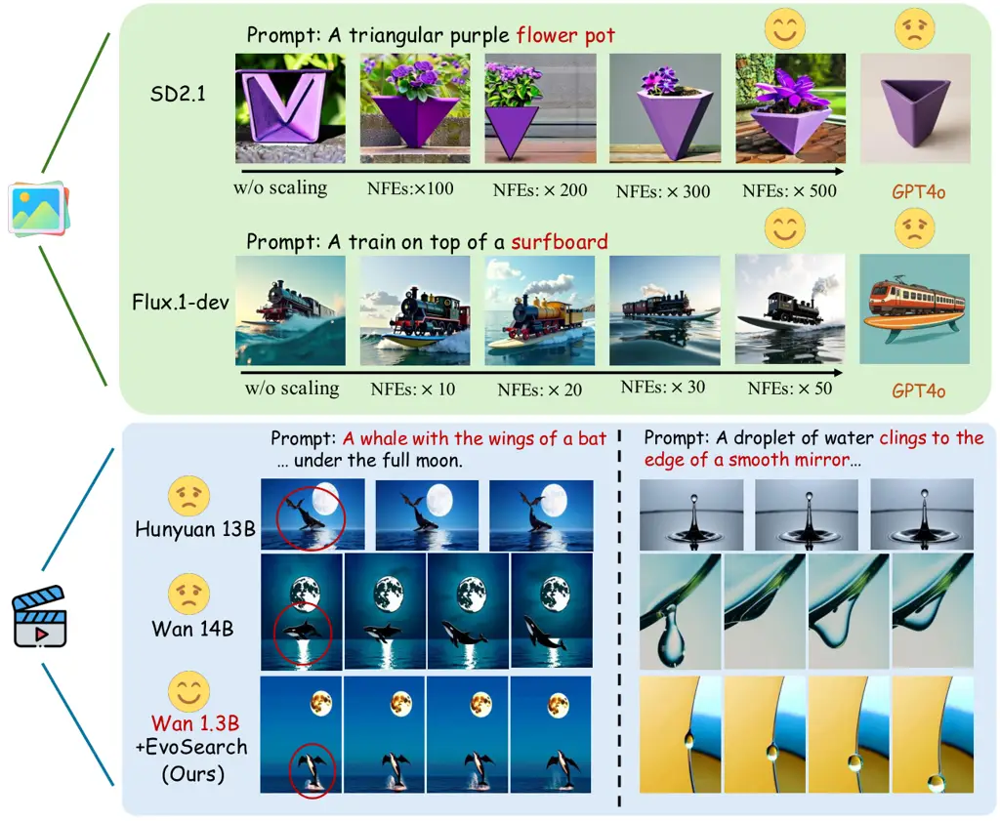

Figure 1: We propose Evolutionary Search (EvoSearch), a novel and
generalist test-time scaling framework applicable to both image and
video generation tasks. EvoSearch significantly enhances sample quality
through strategic computation allocation during inference, enabling
Stable Diffusion 2.1 to exceed GPT4o, and Wan 1.3B to outperform Wan 14B
model and Hunyuan 13B model with $`10\times`$ fewer parameters.

## 1 Introduction

Generative models have witnessed remarkable progress across various
fields, including language \[1, 32, 24\], image \[16, 38\], and video
generation \[7, 36, 78\], demonstrating powerful capabilities to capture
complex data distributions. The central driver of this success is their
ability to scale up during training by increasing data volumes,
computational resources, and model sizes. This scaling behavior during
the training process is commonly described as Scaling Laws \[30, 33\].
Despite these advancements, further scaling at training time is
increasingly reaching its limits due to the rapid depletion of available
internet data and increasing computational costs. Post-training
alignment \[71\] has been proven to be effective in addressing this
challenge. For diffusion and flow models, these approaches typically
include parameter tuning via reinforcement learning \[6, 19\] or direct
reward gradient backpropagation \[11, 52\]. However, they suffer from
reward over-optimization due to their mode-seeking behavior, high
computational costs, and requirement of direct model weight access.
Alternative methods \[2, 94\] propose directly optimizing initial noise,
as some lead to better generations than others, but demand specialized
training and struggle with cross-model generalization.

Recent advances in large language models (LLMs) have expanded to
test-time scaling (TTS) \[8, 83\], showing promising results to
complement traditional training-time scaling law. TTS \[92\] allocates
additional computation budget during inference, offering a novel
paradigm for improving generation quality without additional training.
However, diffusion and flow models present unique challenges for
test-time scaling, since they must navigate the complex,
high-dimensional state space along the denoising trajectory, where
existing methods in LLMs struggle to transfer effectively. Current
approaches of test-time scaling for diffusion and flow models include
(i) best-of-N sampling \[48, 44\], which, despite its simplicity,
suffers from severe search inefficiency in high-dimensional noise
spaces; and (ii) particle sampling \[35, 61\], which, while enabling
search across the entire denoising trajectory, compromises both
exploration capability and generation diversity due to its reliance on
initial candidate pools. These simple heuristic designs lack fundamental
adaptability to the complex generation pathways, leading to sample
diversity collapse and inefficient computation.

In this paper, we aim to address the above critical challenges and
develop a general and efficient test-time scaling method that is
versatile for both image and video generation across diffusion and flow
models without parameter tuning or gradient backpropagation. To enable
test-time scaling of flow models, we transform their deterministic
sampling process (ODE) into a stochastic process (SDE), thereby
broadening the generation space, which paves the way for a unified
framework for inference-time optimization. Through systematic analysis
of latent spaces along the denoising trajectory, including both starting
Gaussian noises and intermediate states, we find that neighboring states
in the latent space exhibit similar generation qualities, suggesting
that high-quality samples are not solely isolated. Based on this
insight, we propose Evolutionary Search (EvoSearch), a novel test-time
scaling method inspired by biological evolution. EvoSearch reframes
test-time scaling of image and video generation as an evolutionary
search problem, incorporating selection and mutation mechanisms
specifically designed for the denoising process in both diffusion and
flow models. At each generation, EvoSearch first selects high-reward
parents while preserving population diversity, and then generates new
offspring through our designed denoising-aware mutation mechanisms to
explore new states, enabling iterative improvement in sample quality.
The key insight of EvoSearch is to actively explore high-reward
particles through evolutionary mechanisms, overcoming the limitations of
previous search methods that are confined to a fixed candidate space. To
optimize computational efficiency, we dynamically search along the
denoising trajectory, progressing from Gaussian noises to states at
larger denoising steps, thereby continuously reducing computational
costs as we approach the terminal states. Through extensive experiments
on both text-conditioned image generation and video generation tasks, we
find that EvoSearch achieves substantial improvements in sample quality
and human-preference alignment as test-time compute increases.

We summarize our key contributions as follows: (i) We propose EvoSearch,
a novel, generalist, and efficient TTS framework which enhances
generation quality by allocating more compute during inference, unifying
optimization for both diffusion and flow generative models. (ii) Based
on our observations of latent space structure, we design specialized
selection and mutation mechanisms tailored to the denoising process,
effectively enhancing exploration while maintaining diversity. (iii)
Extensive experiments show that Evosearch effectively improves
generative model performance by scaling up inference-time compute,
outperforming competitive baselines across both image and video
generation tasks. Notably, EvoSearch enables SD2.1 \[13\] to surpass
GPT4o, and allows the Wan 1.3B model \[78\] to achieve competitive
performance with the $`10\times`$ larger Wan 14B model.

## 2 Preliminary

### 2.1 Diffusion Models and ODE-to-SDE Transformation of Flow Models.

Both diffusion models and flow models map the source distribution, often
a standard Gaussian distribution, to a true data distribution $`p_{0}`$.
A forward diffusion process progressively perturbing data to noise,
defined as $`\bm{x}_{t}=\alpha_{t}\bm{x}_{0}+\sigma_{t}\epsilon`$, where
$`\epsilon\in\mathcal{N}(0,I)`$ is the added noise at timestep
$`t\in[0,T]`$, and ($`\alpha_{t}`$,$`\sigma_{t}`$) denote the noise
schedule. To restore from diffused data, diffusion models naturally
utilize an SDE-based sampler during inference \[69, 66\], which
introduces stochasticity at each denoising step as follows:

```math
\bm{x}_{t-1}=\sqrt{\alpha_{t-1}}\left(\frac{\bm{x}_{t}-\sqrt{1-\alpha_{t}}\epsilon_{\theta}(\bm{x}_{t},t)}{\sqrt{\alpha_{t}}}\right)+\sqrt{1-\alpha_{t-1}-\sigma_{t}^{2}}\epsilon_{\theta}(\bm{x}_{t},t)+\sigma_{t}\epsilon_{t}. \tag{1}
```

In contrast, flow models learn the velocity $`u_{t}\in\mathbb{R}^{d}`$,
which enables sampling of $`\bm{x}_{0}`$ by solving the flow ODE \[69\]
backward from $`t=T`$ to $`t=0`$:

```math
\bm{x}_{t-1}=\bm{x}_{t}+u_{t}(\bm{x}_{t})dt, \tag{2}
```

leading all $`\bm{x}_{t-1}`$ drawn from $`\bm{x}_{t}`$ identical. This
restricts the applicability of test-time scaling search methods like
particle sampling and our proposed EvoSearch in flow models \[34\],
since the sampling process lacks stochasticity beyond initial noise. To
address this limitation, we transform the deterministic Flow-ODE into an
equivalent SDE process. Following previous works \[3, 47, 51, 34, 60\],
we rewrite the ODE sampling in Eq. (2) as follows:

```math
d\bm{x}_{t}=\left(u_{t}(\bm{x}_{t})-\frac{\sigma_{t}^{2}}{2}\nabla\log p_{t}(\bm{x}_{t})\right)dt+\sigma_{t}d\bm{w}, \tag{3}
```

where the score $`\log p_{t}(\bm{x}_{t})`$ can be computed by velocity
$`u_{t}`$ (see Eq. (13) in \[60\]), and $`d\bm{w}`$ injects
stochasticity at each sampling step.

### 2.2 Evolutionary Algorithms.

Evolutionary algorithms (EAs) \[37, 9\] are biologically inspired,
gradient-free methods that found effective in optimization \[21, 23,
75\], algorithm search \[12, 55\], and neural architecture search \[54,
88, 65\]. The key idea of EAs is mimicking the process of natural
evolution \[4\], by maintaining a population of solutions that evolve
over generations. EAs begin with the initialization of a population of
candidate solutions, often generated randomly within the defined search
space. Subsequently, EAs employ a fitness function to evaluate and
select parents, prioritizing those with higher scores. Once parents are
selected, genetic operators such as crossover (recombination) and
mutation (random changes) are applied to create offspring that
constitute the next generation. Through iterative generations, the
population evolves toward optimal or near-optimal solutions. Due to the
diversity within populations and the mutation operations, EAs have
strong exploration ability. As a result, compared to conventional local
search algorithms like gradient descent, EAs exhibit better global
optimization capabilities within the solution space and are adept at
solving multimodal problems \[40, 75\].

## 3 Related Work

Alignment for Diffusion and Flow Models. Aligning pre-trained diffusion
and flow generative models can be achieved by guidance \[13, 69\] or
fine-tuning \[39, 18\], which aim to enhance sample quality by steering
outputs towards a desired target distribution. Guidance methods \[29,
67, 10, 5, 68, 26\] rely on predicting clean samples from noisy data and
differentiable reward functions to calculate guidance. Typical
fine-tuning methods involve supervised fine-tuning \[39, 18, 82\], RL
fine-tuning \[6, 19, 20\], DPO-based policy optimization \[77, 87, 43,
46, 91\], direct reward backpropagation \[11, 85, 52\],stochastic
optimization \[14, 89\], and noise optimization \[2, 94, 70, 25, 17\].
These methods require additional dataset curation and parameter tuning,
and can distort alignment or reduce sample diversity due to their
mode-seeking behavior and reward over-optimization. In contrast, our
proposed EvoSearch method offers significant advantages through its
universal applicability across any reward function and model
architecture (including flow-based, diffusion-based, image and video
models) without requiring additional training. Moreover, EvoSearch
complements existing fine-tuning methods, as it can be applied to any
fine-tuned model to further enhance reward alignment.

Test-Time Scaling in Vision. Several test-time scaling (TTS) methods
have been proposed to extend the performance boundaries of image and
video generative models. These methods fundamentally operate as search,
with reward models providing judgments and algorithms selecting better
candidates. Best-of-N generates N batches of samples and selects the one
with the highest reward, which has been validated effective for both
image and video generation \[48, 44\]. More advanced search method for
diffusion models is particle sampling \[61, 42, 41, 59, 35\], which
resamples particles over the full denoising trajectory based on their
importance weights, demonstrating superior results than naive BoN.
Video-T1 \[44\] and other recent works \[86, 84, 49, 44\] propose
leveraging beam search \[64\] for scaling video generation. However, in
the context of diffusion and flow models, we remark that beam search
represents a specialized case of particle sampling with a predetermined
beam size, as both methodologies iteratively propagate high-reward
samples while discarding lower-reward ones in practice. Furthermore,
Video-T1 is constrained to autoregressive video models, limiting its
applicability to more advanced diffusion and flow generative models. All
existing search methods rely heavily on the quality of the initial
candidates, failing to explore new particles actively, while our
proposed method, EvoSearch, leverages the idea of natural selection and
evolution, enabling the generation of new, higher-quality offspring
iteratively. EvoSearch is also a generalist framework with superior
scalability and extensive applicability across both diffusion and flow
models for image and video generation, contrary to previous methods that
are constrained to specific models or tasks.

## 4 Proposed Method

### 4.1 Problem Formulation

In this work, we investigate how to efficiently harness additional
test-time compute to enhance the sample quality of image and video
generative models. Given a pre-trained flow-based or diffusion-based
model and a reward function, our objective is to generate samples from
the following target distribution \[72, 42, 80, 73\]:

```math
p^{\rm tar}:={\arg\max}_{p^{\prime}}\mathbb{E}_{\bm{x}_{0}\sim p^{\prime}}[r(\bm{x}_{0})]-\alpha\mathcal{D}_{\rm KL}[p^{\prime}|p^{\rm pre}_{0}], \tag{4}
```

which optimizes the reward function $`r`$ while preventing
$`p^{\rm tar}`$ from deviating too far from pre-trained distribution
$`p^{\rm pre}_{0}`$, with $`\alpha`$ controlling this balance. The
target distribution $`p^{\rm tar}`$ can be re-written as:

```math
\ p^{\rm tar}=\frac{1}{\mathcal{Z}}p^{\rm pre}_{0}(\bm{x}_{0})\exp\left(\frac{r(\bm{x}_{0})}{\alpha}\right), \tag{5}
```

where $`\mathcal{Z}`$ denotes a normalization constant \[53, 72\].
Notably, directly sampling from the target distribution is infeasible:
the normalization factor $`\mathcal{Z}`$ requires integrating over the
entire sample space, making it computationally intractable for
high-dimensional spaces in diffusion and flow models.

### 4.2 Limitations of Existing Approaches

Test-time approaches to sampling from the target distribution
$`p^{\rm tar}`$ in Eq. (5) employ importance sampling \[50\], which
generates $`k`$ particles
$`{\bm{x}^{i}_{0}}\sim p^{\rm pre}_{0}(\bm{x}_{0})`$ and then resamples
the particles based on the scores $`\exp({r(\bm{x}_{0})}/\alpha)`$. A
straightforward implementation of this concept is best-of-N sampling,
which simply generates multiple samples and selects the one with the
highest reward. A more sophisticated approach, called particle sampling
\[62, 35\], searches across the entire denoising path
$`\tau=\{\bm{x}_{T},\cdots,\bm{x}_{k},\cdots,\bm{x}_{0}\}`$, guiding
samples toward trajectories that yield higher rewards. However, both of
these methods suffer from fundamental limitations in their efficiency
and exploration capabilities. Best-of-N only resamples at the final step
($`t=0`$), taking the entire distribution
$`p^{\rm pre}_{0}(\bm{x}_{0})=\int\prod_{t}\{p^{\rm pre}_{t}(\bm{x}_{t-1}|\bm{x}_{t})\}d\bm{x}_{1:T}`$
as its proposal distribution. This passive filtering approach is
computationally wasteful, as it expends a large amount of computation
generating complete trajectories for samples that ultimately yield low
rewards. In contrast, particle sampling can search and resample at each
intermediate step along the denoising path, using
$`p^{\rm pre}_{t}(\bm{x}_{t-1}|\bm{x}_{t})`$ as its proposal
distribution at each step $`t`$. However, it is still constrained by the
fixed initial candidate pool, struggling to actively explore and
generate novel states beyond those proposed by $`p^{\rm pre}_{0}`$
during the search process. This limitation becomes increasingly
restrictive as the search progresses, which leads to restricted
performance due to limited exploration and reduced diversity.

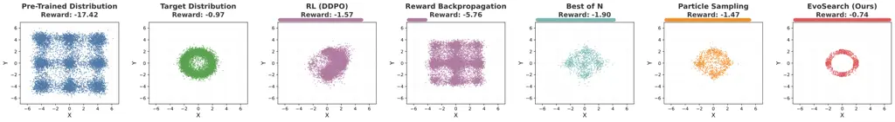

Figure 2: Visualization of a test-time alignment experiment. We train a
diffusion model with $`3`$-layer MLP on Gaussian mixtures (pre-trained
distribution), with the goal to capture multimodal unseen target
distribution, where reward $`r(X,Y)=-|X^{2}+Y^{2}-4|`$. EvoSearch
achieves superior performance, capturing all the modes with the highest
reward (-0.74).

To better understand these inherent limitations more concretely, we
visualize the behavior of different approaches in Fig. 2. As shown,
re-training methods, including RL (DDPO \[6\]) and reward
backpropagation \[11\], struggle to generalize to the unseen target
distribution, largely due to their heavy reliance on pre-trained models
and mode-seeking behavior. While test-time search methods (best-of-N and
particle sampling) achieve higher rewards than re-training methods, they
still fail to capture all modes of the multimodal target distribution,
converging to limited regions of the solution space. These findings
highlight the need for a novel test-time scaling framework capable of
effectively balancing between exploitation and exploration while
maintaining computational efficiency for scaling up. In the following
sections, we introduce how our EvoSearch method overcomes these
fundamental limitations, which achieves the highest reward with
comprehensive mode coverage as shown in Fig. 2.

### 4.3 Evolutionary Search

We propose Evolutionary Search (EvoSearch), a novel evolutionary
framework that reformulates the sampling from the target distribution
$`p^{\rm tar}`$ in Eq. (5) at test time as an active evolutionary
optimization problem rather than passive filtering. EvoSearch introduces
a unified way for achieving efficient and effective test-time scaling
across both diffusion and flow models for image and video generation
tasks. The overview of our method is provided in Fig. 3. EvoSearch
introduces a novel perspective that reinterprets the denoising
trajectory as an evolutionary path, where both the initial noise
$`\bm{x}_{T}`$ and the intermediate state $`\bm{x}_{t}`$ can be evolved
towards higher-quality generation, actively expanding the exploration
space beyond the constraints of the pre-trained model’s distribution.
Different from classic evolutionary algorithms that optimize a
population set in a fixed space \[9\], EvoSearch considers dynamically
moving forward the evolutionary population along the denoising
trajectory starting from $`\bm{x}_{T}`$ (i.e., Gaussian noises). Below,
we introduce the core components of our EvoSearch framework.

### 4.4 Evolution Schedule

For a typical sampling process in diffusion and flow models, the change
between $`\bm{x}_{t-1}`$ and $`\bm{x}_{t}`$ is not substantial.
Therefore, performing EvoSearch at every sampling step would be
computationally wasteful. To address this efficiency problem, EvoSearch
defines an evolution schedule
$`\mathcal{T}=\{T,\cdots,t_{j},\cdots,t_{n}\}`$ that specifies the
timesteps at which EvoSearch should be conducted. Concretely, EvoSearch
first thoroughly optimizes the starting noise $`\bm{x}_{T}`$ to identify
high-reward regions in the Gaussian noise space, establishing a strong
initialization for the subsequent denoising process. After a
high-quality $`\bm{x}_{T}`$ is obtained, EvoSearch progressively applies
our proposed evolutionary operations to intermediate states
$`\bm{x}_{t_{i}}`$ at predetermined timesteps $`t_{i}\in\mathcal{T}`$.
This cascading way enables each subsequent generation beginning directly
from the cached intermediate state $`\bm{x}_{t_{i}}`$ obtained from the
previous generation, instead of repeatedly denoising from
$`\bm{x}_{T}`$, eliminating the redundant denoising computations from
$`\bm{x}_{T}\to\bm{x}_{t_{i}}`$. In practice, we implement this
evolution schedule using uniform intervals between timesteps, which
significantly reduces computational overhead.

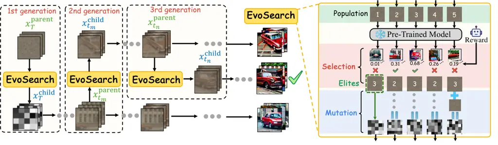

Figure 3: Overview of our method. EvoSearch progressively moves forward
along the denoising trajectory to refine and explore new states.

### 4.5 Population Initialization.

Following the evolution schedule $`\mathcal{T}`$, we introduce a
corresponding population size schedule
$`\mathcal{K}=\{k_{\rm start},k_{T},\cdots,k_{t_{j}},\cdots,k_{t_{n}}\}`$,
where $`k_{\rm start}`$ denotes the initial size of sampled Gaussian
noises, and each $`k_{t_{i}}`$ specifies the children population size
for the generation at timestep $`t_{i}`$. This adaptive approach enables
flexible trade-offs between computational cost and exploration of the
state space (please find Appendix B.1 for further analysis on ablation
of $`\mathcal{K}`$). The initial generation of EvoSearch begins with
$`k_{\rm start}`$ randomly sampled Gaussian noises
$`\{x_{T}^{i}\}_{i=1}^{k_{\rm start}}`$ at timestep $`t=T`$, which serve
as the first-generation parents for the subsequent evolutionary process.

### 4.6 Fitness Evaluation.

To guide the evolutionary process, EvoSearch evaluates the quality of
each parent using an off-the-shelf reward model at each evolution
timestep $`t_{i}`$:

```math
R(\bm{x}_{t_{i}})=\mathbb{E}_{\bm{x}_{0}\sim p_{0}(\bm{x}_{0}|\bm{x}_{t_{i}})}\left[r(x_{0})|\bm{x}_{t_{i}}\right], \tag{6}
```

where the reward model $`r`$ can correspond to various objectives,
including human preference scores \[85, 81, 28\] and vision-language
models \[44, 27\]. Note that previous methods typically rely on either
lookahead estimators \[49, 41\] or Tweedie’s formula \[15, 10\] to
predict $`\bm{x}_{0}`$ from noisy data for reward calculation in
Eq. (6), which can induce significant prediction inaccuracies and
approximation errors. In contrast, we evaluate the reward directly on
fully denoised $`\bm{x}_{0}`$ (e.g., clean image or video), thereby
obtaining high-fidelity reward signals.

### 4.7 Selection.

To propagate high-quality candidates across generations while
maintaining population diversity, EvoSearch employs tournament
selection \[22\] to sample parents from the population of size
$`k_{t_{i}}`$ through cycles. Specifically, each cycle picks a
tournament of $`b<k_{t_{i}}`$ candidates at random and selects the best
candidate in the tournament as a parent.

### 4.8 Mutation.

Recent works \[94, 2\] have shown that different initial noises yield
varying generation quality. Intuitively, this property extends naturally
to intermediate denoising states. While this phenomenon serves as a
basis for making best-of-N and particle sampling useful, it raises a
more fundamental question: _do these noises and intermediate states
possess other exploitable patterns or structural regularities that can
be leveraged to enhance inference-time generation quality?_

To investigate this critical question, we visualize the latent states at
different denoising steps using t-SNE \[74\]. Our findings, as shown in
Fig. 4, reveal that neighboring states in the latent space exhibit
similar generation qualities, suggesting that high-quality samples are
not solely isolated. Building upon this discovery, we develop a
specialized mutation strategy that leverages this exploitable structure
in the reward landscape of diffusion and flow models. Specifically, we
preserve $`m`$ elite parents (those with top fitness scores) at each
generation to ensure convergence, where $`m\ll k_{t_{i}}`$. For the
remaining $`k_{t_{i}}`$$`-`$$`m`$ parents, we mutate them to explore the
neighborhoods around selected parents to discover higher-quality
samples. This approach avoids premature convergence to a narrow region
of the denoising state space, facilitating effective exploration of
novel regions while maintaining population diversity. To align with the
characteristics of the underlying SDE sampling process, we develop
different mutation operations for initial noises and intermediate
denoising states.

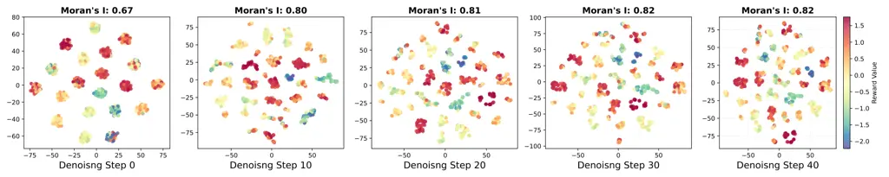

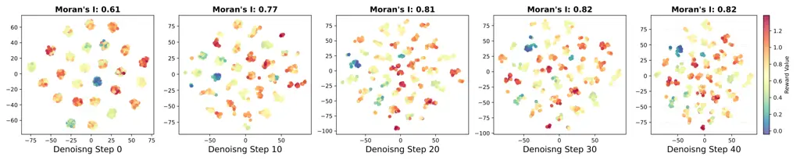

Figure 4: t-SNE Visualization of latent $`\bm{x}_{t}`$ from SD2.1 model
at different steps, colored by their corresponding ImageReward scores.
At denoising step 0, $`\bm{x}_{t}`$ is Gaussian noises. Top row: Results
from Stable Diffusion 2.1 model. Bottom row: Results from Flux.1-dev.

$`\bullet`$ Initial noise mutation. For the initial noise
$`\bm{x}_{T}`$, which is sampled from a Gaussian distribution, the
corresponding mutation operation is designed to preserve the Gaussian
nature of the noise based on

```math
\bm{x}^{\rm child}_{T}=\sqrt{1-\beta^{2}}\bm{x}_{T}^{\rm parent}+\beta\epsilon_{T},\quad\epsilon_{T}\sim\mathcal{N}(0,I), \tag{7}
```

where $`\beta`$ is a hyperparameter that controls the strength of added
stochasticity to the parents. The first term ensures that the mutated
children preserve the high-reward region density, while the second term
encourages exploration.

$`\bullet`$ Intermediate denoising state mutation. For intermediate
states $`\bm{x}_{t}`$, the mutation operation defined in Eq. (7) is not
applicable since $`\bm{x}_{t}`$ is no longer Gaussian due to the
denoising process. To synthesize meaningful variations while preserving
the intrinsic structure of the latent state $`\bm{x}_{t}`$, we propose
an alternative mutation operator inspired by the reverse-time SDE:

```math
\bm{x}_{t}^{\rm child}=\bm{x}^{\rm parent}_{t}+\sigma_{t}\epsilon_{t},\quad\epsilon_{t}\sim\mathcal{N}(0,I), \tag{8}
```

where $`\sigma_{t}`$ is the diffusion coefficient defined in
reverse-time SDE, controlling the level of injected stochasticity. This
mutation operation effectively generates novel $`\bm{x}_{t}`$, enabling
exploration of an expanded state space while preserving the inherent
distribution established during the denoising process. In the next
generation of EvoSearch, we sample
$`\bm{x}_{0}~\sim p_{0}(\bm{x}_{0}|\bm{x}_{t}^{\rm child})`$ based on
the new offspring $`\bm{x}_{t}^{\rm child}`$, and repeat the above
evolutionary search process, including evaluation, selection, and
mutation. We highlight that EvoSearch provides a unified framework that
encompasses both best-of-N and particle sampling as special cases. Our
method degenerates to best-of-N when setting
$`\mathcal{T}=\{\bm{x}_{T}\}`$, and reduces to particle sampling upon
elimination of both initial noise search and mutation operations. We
refer to the pseudocode of EvoSearch in Alg. 1 and Alg. 2.

1:  Input: Pre-trained model $`p_{\theta}`$, population size schedule
$`\mathcal{K}=\{k_{\rm start},k_{T},\cdots,k_{t_{j}},\cdots,k_{t_{n}}\}`$,
evolution schedule $`\mathcal{T}=\{T,\cdots,t_{j},\cdots,t_{n}\}`$

2:  Initialize population list
$`\mathcal{P}=[\phi\ {\rm for}\ \_\ {\rm in}\ \mathcal{T}]`$.

3:  Initialize reward list
$`\mathcal{R}=[\phi\ {\rm for}\ \_\ {\rm in}\ \mathcal{T}]`$

4:  Sample initial Gaussian noises $`\bm{x}_{T}`$ with population size
$`k_{\rm start}`$

5:  Initialize generation $`g=0`$

6:  for $`t=T,T-1,\cdots,1`$ do

7:   if $`t`$ in $`\mathcal{T}`$ then

8:    $`\bm{x}_{t},\mathcal{P},\mathcal{R}=`$
_evosearch_at_denoising_states_$`(p_{\theta},\bm{x}_{t},\mathcal{P},\mathcal{R},\mathcal{T},\mathcal{K},g)`$
// Alg 2

9:    $`g\leftarrow g+1`$

10:   end if

11:   $`\bm{x}_{t-1}={\rm denoise}(p_{\theta},\bm{x}_{t},t)`$

12:  end for

Algorithm 1 Overview of EvoSearch

1:  Input: Pre-trained model $`p_{\theta}`$, starting states
$`\bm{x}_{t^{\prime}}`$, population list $`\mathcal{P}`$, reward list
$`\mathcal{R}`$, evolution schedule
$`\mathcal{T}=\{T,\cdots,t_{j},\cdots,t_{n}\}`$, population size
schedule $`\mathcal{K}=\{k_{T},\cdots,k_{t_{j}},\cdots,k_{t_{n}}\}`$,
generation $`g`$, elites size $`m`$.

2:  Set $`\rm idx=g`$

3:  Set population size $`k=\mathcal{K}[g+1]`$

4:  for $`t=t^{\prime},t^{\prime}-1,\cdots,1`$ do

5:   if $`t`$ in $`\mathcal{T}`$ then

6:
   $`\mathcal{P}[{\rm idx}]={\rm cat}(\mathcal{P}[{\rm idx}],\bm{x}_{t})`$

7:    $`{\rm idx}\leftarrow{\rm idx}+1`$

8:   end if

9:   $`\bm{x}_{t-1}={\rm denoise}(\bm{x}_{t},t)`$

10:  end for

11:  Calculate rewards $`r`$ via fully denoised $`\bm{x}_{0}`$ in
Eq. (6)

12:  for $`i=g,\cdots,{\rm len}(\mathcal{R})-1`$ do

13:   $`\mathcal{R}[i]={\rm cat}(\mathcal{R}[i],r)`$

14:  end for

15:  Select elites
$`e=\mathcal{P}[g]\left[{\rm topk}(\mathcal{R}[g],m)\right]`$

16:  Select $`k-m`$ parents $`p`$ from $`\mathcal{P}[g]`$ via tournament
selection \[22\]

17:  if g=0 then

18:   Mutate parents
$`p=\sqrt{1-\beta^{2}}\times p+\epsilon\times\beta,\ \ \epsilon\sim\mathcal{N}(0,I)`$

19:  else

20:   Mutate parents
$`p=p+\sigma_{t}\times\epsilon,\ \ \epsilon\sim\mathcal{N}(0,I)`$ //
$`\sigma_{t}`$ is the diffusion coefficient in the SDE denoising process

21:  end if

22:  Get children $`c\leftarrow{\rm cat}(e,p)`$

23:  Output: Children $`c`$, $`\mathcal{P}`$, $`\mathcal{R}`$

Algorithm 2 EvoSearch at Denoising States

## 5 Experiments

In this section, we evaluate the efficacy of EvoSearch through extensive
experiments on large-scale text-conditioned generation tasks,
encompassing both image and video domains.

### 5.1 Experiment Setup

#### 5.1.1 Image Generation.

##### Tasks and Metrics.

We adopt DrawBench \[57\] for evaluation, which consists of 200 prompts
spanning 11 different categories. We utilize multiple metrics to
evaluate generation quality, including ImageReward \[85\], HPSv2 \[81\],
Aesthetic score \[58\], and ClipScore \[28\]. ImageReward and ClipScore
are employed as guidance rewards during search. Please refer to
evaluation details in Appendix A.2.

##### Models.

We employ two different text-to-image models to evaluate EvoSearch and
baselines, which are Stable Diffusion 2.1 \[56\] and Flux.1-dev \[38\],
respectively. SD2.1 is a diffusion-based text-to-image model with 865M
parameters, while Flux-dev is a rectified flow-based model with 12B
parameters. For both models, we use 50 denoising steps with a guidance
scale of 5.5, with other hyperparameters remaining as the default.

#### 5.1.2 Video Generation.

##### Tasks and Metrics.

We take the recently released VideoReward \[45\] as the guidance reward
to provide feedback during search. VideoReward, built on
Qwen2-VL-2B \[79\], evaluates generated videos on multiple dimensions:
visual quality, motion quality, and text alignment. To measure the
generalization performance to unseen rewards, we utilize both automatic
metrics and human assessment for comprehensive evaluation. For automatic
evaluation, we employ multiple metrics from VBench \[31\] and
VBench2 \[93\], which encompass 625 distinct prompts distributed across
six fundamental dimensions, including _dynamic_, _semantic_, _human
fidelity_, _composition_, _physics_, and _aesthetic_. For human
evaluation, we hire annotators to evaluate videos on 200 prompts sampled
from VideoGen-Eval  \[90\]. Evaluation details are in Appendix A.2.

##### Models.

To evaluate the scalability and performance of baselines, we utilize two
widely adopted video generative models: HunyuanVideo \[36\] and
Wan \[78\]. Given the computational intensity of video generation
compared to image generation, we specifically use the 1.3B parameter
variant of Wan for practical evaluation. Each video comprises 33 frames,
with other hyperparameters following default configurations.

#### 5.1.3 Baselines.

As we evaluate the scalability of both diffusion and flow models across
image and video generation tasks, we benchmark EvoSearch against two
widely-used search methods that are applicable to our experimental
settings: (i) Best of N samples multiple random noises at beginning,
assign reward values to them via denoising and evaluation, and choose
the candidate yielding the highest reward. (ii) Particle Sampling
maintains a set of candidates along the denoising process, called
particles, and iteratively propagates high-reward samples while
discarding lower-reward ones. Implementation details of EvoSearch and
baselines are provided in Appendix A.1. To ensure fair comparison, we
employ the same random seeds to generate videos for each method.

### 5.2 Results Analysis

Figure 5: Scaling behavior of EvoSearch and baselines as inference-time
computation increases on DrawBench. _Top_: SD2.1. _Bottom_: Flux.1-dev.
(a) and (b) use ImageReward and ClipScore as guidance rewards,
respectively.

To evaluate EvoSearch’s versatility and practical performance, we
include image generation on diffusion model (SD2.1) and flow model
(Flux.1-dev), video generation on flow models (HunyuanVideo and Wan) for
comprehensive empirical analysis.

Question 1. Can EvoSearch consistently yield performance improvement
with scaled inference-time computation?

We measure the inference time computation by the number of function
evaluations (NFEs). As shown in Fig. 5, where we evaluate performance
using both ImageReward and ClipScore, EvoSearch exhibits monotonic
performance improvements with increasing inference-time computation.
Notably, for the Flux.1-dev model (12B parameters), EvoSearch continues
to demonstrate performance gains as NFEs increase, whereas baseline
methods plateau after approximately $`1e4`$ NFEs. Qualitative results in
Fig. 1 show that both SD2.1 and Flux.1-dev generate images with
progressively improved prompt alignment as inference computation (i.e.,
NFEs) increases.

Question 2. How does EvoSearch compare to baselines for scaling image
and video generation at inference time?

For image generation tasks, as evidenced in Fig. 5 and Fig. 7, EvoSearch
demonstrates consistent superior performance over all baseline methods
across varying computational budgets, for both diffusion-based SD2.1 and
flow-based Flux.1-dev models. For video generation tasks where
VideoReward serves as the guidance reward, EvoSearch continues to obtain
the highest score across different generative models compared to the
baselines. Quantitative results in Fig. 7 (top row) show that for the
Wan 1.3B model, EvoSearch outperforms bets-of-N and particle sampling by
32.8% and 14.1%, respectively. When applied to the larger HunyuanVideo
13B model, EvoSearch demonstrates improvements of 23.6% and 20.6% over
best-of-N and particle sampling, respectively. Results on the prompts
sample from Videogen-Eval \[90\], as illustrated in Fig. 7 (bottom row),
further corroborate these findings, with EvoSearch showing improvements
of 22.8% and 18.1% compared to best-of-N and particle sampling,
respectively. Qualitative assessment in Fig. 8 reveals that only
EvoSearch successfully generates images with both background consistency
and accurate text prompt alignment. In contrast, particle sampling fails
to comprehend the complex text prompt, while best-of-N produces results
of inferior visual quality. More qualitative results are provided in
Appendix B.2. The superior performance of EvoSearch can be attributed to
its active exploration and refinement within the denoising state space,
whereas best-of-N and particle sampling are limited to a local candidate
pool.

Figure 6: VideoRewards on VBench & VBench2.0 (_top_) and
VideoGen-Eval \[90\] (_bottom_).

Figure 7: EvoSearch can generalize to unseen metrics. _Top row_:
DrawBench results on SD2.1. _Bottom row_: DrawBench results on
Flux.1-dev.

|                    |                              |                                |                          |                                 |                                |                                |                                |
| ------------------ | ---------------------------- | ------------------------------ | ------------------------ | ------------------------------- | ------------------------------ | ------------------------------ | ------------------------------ |
| Methods            | Dynamic                      | Semantic                       |     FidelityHuman        | Composition                     | Physics                        | Aesthetic                      | Average                        |
| Wan 1.3B           | 13.18                        | 16.83                          | 82.98                    | 38.08                           | 64.44                          | 64.01                          | 46.59                          |
| +Best of N         | 15.38 $`\uparrow`$ +2.2      | 13.67 $`\downarrow`$ $`-`$3.16 | 87.58 $`\uparrow`$ +4.6  | 44.71 $`\uparrow`$ +6.63        | 56.10 $`\downarrow`$ $`-`$8.34 | 64.84 $`\uparrow`$ +0.83       | 47.04 $`\uparrow`$ +0.45       |
| +Particle Sampling | 13.18 $`\uparrow`$ +0.0      | 12.67 $`\downarrow`$ $`-`$4.16 | 86.13 $`\uparrow`$ +3.15 | 39.43 $`\uparrow`$ +1.35        | 56.41 $`\downarrow`$ $`-`$8.03 | 64.54 $`\uparrow`$ +0.53       | 45.39 $`\downarrow`$ $`-`$1.2  |
| +EvoSearch (Ours)  | 16.48$`\uparrow`$ +3.3       | 15.51 $`\downarrow`$ $`-`$1.32 | 86.84 $`\uparrow`$ +3.86 | 51.57 $`\uparrow`$ +13.49       | 57.5 $`\downarrow`$ $`-`$6.9   | 64.35 $`\uparrow`$ +0.34       | 48.71 $`\uparrow`$ +2.12       |
| HunyuanVideo 13B   | 8.79                         | 16.11                          | 90.28                    | 47.89                           | 56.10                          | 66.31                          | 47.58                          |
| +Best of N         | 6.59 $`\downarrow`$ $`-`$2.2 | 12.84 $`\downarrow`$ $`-`$3.27 | 91.31 $`\uparrow`$ +1.03 | 50.53 $`\uparrow`$ +2.64        | 47.62 $`\downarrow`$ $`-`$8.48 | 66.28 $`\downarrow`$ $`-`$0.03 | 45.86 $`\downarrow`$ $`-`$1.72 |
| +Particle Sampling | 6.59 $`\downarrow`$ $`-`$2.2 | 11.00 $`\downarrow`$ $`-`$5.11 | 93.17 $`\uparrow`$ +2.89 | 36.67 $`\downarrow`$ $`-`$11.22 | 54.29 $`\downarrow`$ $`-`$1.81 | 65.55 $`\downarrow`$ $`-`$0.76 | 44.55 $`\downarrow`$ $`-`$3.03 |
| +EvoSearch (Ours)  | 7.69 $`\downarrow`$ $`-`$1.1 | 14.92 $`\downarrow`$ $`-`$1.19 | 94.63 $`\uparrow`$ +4.35 | 51.37 $`\uparrow`$ 3.48         | 61.54 $`\uparrow`$ +5.44       | 66.75 $`\uparrow`$ +0.44       | 49.48 $`\uparrow`$ +1.90       |

Table 1: Evaluation results across multiple metrics from both Vbench and
VBench2.0.

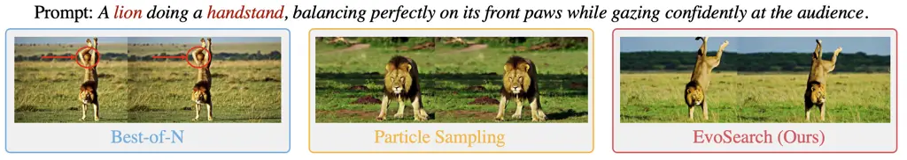

Figure 8: A qualitative example showing that EvoSearch generates videos
with superior visual quality, enhanced background consistency, and
improved semantic alignment with the input text prompts.

Question 3. How does EvoSearch generalize to unseen reward functions
(metrics)?

As demonstrated in a recent work \[48\], reward hacking \[63\] can
significantly impair test-time scaling performance, where the model
exploits flaws or ambiguities in the reward function to obtain high
rewards. Such mode-seeking behavior results in reduced population
diversity and ultimately leads to mode collapse as the computation
increases. However, our method, EvoSearch, can mitigate the reward
hacking problem to some extent since it maintains higher diversity
through the search process, effectively capturing multimodal modes from
target distributions. We evaluate the generation performance on unseen
(out-of-distribution) metrics in Fig. 7, where ClipScore is used as the
guidance reward. EvoSearch still showcases superior scalability and
performance across different models and metrics. For o.o.d. metric
Aesthetic, which is not aligned with ClipScore (as demonstrated in
Fig. 8 of \[48\]), EvoSearch shows less performance degradation compared
to particle sampling.

For video generation tasks, we include 9 different unseen metrics
spanning 6 main categories to evaluate EvoSearch’s generalizability to
unseen rewards. From the results shown in Table 1, we observe that
EvoSearch consistently gains more stable performance improvements
compared with baselines. Notably, even for metrics that are not aligned
with VideoReward (e.g., Semantic), EvoSearch maintains robust
performance with minimal degradation. For the physics metric on
HunyuanVideo, EvoSearch even achieves distinctive performance
improvements while both best-of-N and particle sampling exhibit
significant degradation.

Figure 9: Human evaluation results.

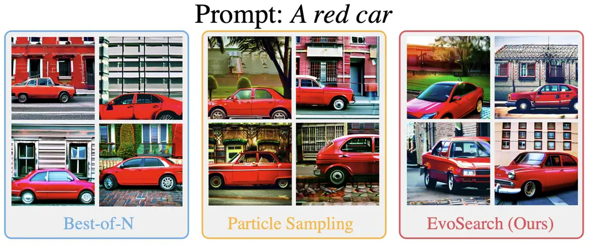

Figure 10: For the same prompt, EvoSearch generates more visually
diverse images.

Question 4. How does EvoSearch perform under human evaluation?

To validate EvoSearch’s alignment with human preferences, we conduct a
comprehensive human evaluation study employing professional annotators.
The assessment focused on four key dimensions: Visual Quality, Motion
Quality, Text Alignment, and Overall Quality. As illustrated in Fig. 10,
EvoSearch achieves higher win rates compared to baseline methods across
all evaluation dimensions.

Question 5. Can EvoSearch remains high diversity when maximizing
guidance rewards?

|                   |        |           |
| ----------------- | ------ | --------- |
| Method            | Reward | Diversity |
| Best of N         | 0.16   | 0.62      |
| Particle Sampling | 0.13   | 0.94      |
| EvoSearch (Ours)  | 0.18   | 1.34      |

Table 2: Results of reward and diversity.

EvoSearch demonstrates superior capability in sampling diverse solutions
through its continuous exploration of novel states during the search
process. We randomly select 10 prompts from DrawBench, and generate 10
images per prompt using EvoSearch and baselines under $`100\times`$
scaled inference-time compute. After generation, we evaluate the quality
of the generated images by ImageReward, and evaluate the diversity of
these images by the $`L_{2}`$ distance between their corresponding
hidden features extracted from the CLIP encoder. We observe in Table 2
that EvoSearch obtains the highest reward while achieving the highest
diversity. Qualitative results in Fig. 10 further support this finding,
revealing that EvoSearch generates text-aligned images with notably
greater diversity in

|                             |             |
| --------------------------- | ----------- |
| Methods                     | VideoReward |
| Wan 14B                     | -1.24       |
| Wan 1.3B + EvoSearch (ours) | -0.15       |

Table 3: EvoSearch scales Wan 1.3B to have the same inference time as
Wan 14B. Results are evaluated on 625 prompts from VBench and VBench2.0.

backgrounds and poses compared to baseline methods.

Question 6. Can EvoSearch enable smaller-scale model outperform
larger-scale model?

In image generation tasks, as illustrated in Fig. 5, SD2.1 achieves
superior performance compared to GPT4o with fewer than $`5e3`$ NFEs,
requiring only 30 seconds of inference time on a single A800 GPU.
Qualitative results presented in Fig. 1 further demonstrate how
EvoSearch enables smaller models to exceed GPT4o’s capabilities through
strategic inference-time scaling. For video generation tasks, we
allocate $`5\times`$ inference computation to Wan 1.3B, ensuring
equivalent inference time with Wan 14B on identical GPUs. Results
documented in Table 3 show that the Wan 1.3B model with EvoSearch
achieves competitive performance to its $`10\times`$ larger counterpart,
the Wan 14B model. These findings highlight the significant potential of
test-time scaling as a complement to traditional training-time scaling
laws for visual generative models, opening new avenues for future
research.

## 6 Conclusion

In this work, we propose Evolutionary Search (EvoSearch), a novel,
generalist and efficient test-time scaling framework for diffusion and
flow models across image and video generation tasks. Through our
proposed specialized evolutionary mechanisms, EvoSearch enables the
generation of higher-quality samples iteratively by actively exploring
new states along the denoising trajectory.

##### Limitations and Future Work.

EvoSearch has demonstrated significant effectiveness in exploring
high-reward regions of novel states, which opens promising directions
for future research. The exploration ability of EvoSearch relies on the
strength of the mutation rate $`\beta`$ and $`\sigma_{t}`$. A higher
mutation rate will effectively expand the search space to find
high-quality candidates, while a low mutation rate can restrict the
exploration space, which represents a trade-off. In addition, we rely on
Gaussian noise to mutate the selected parents. While this approach
provides robust exploration across diverse image and video generation
tasks, developing more informative mutation strategies with prior
knowledge can further improve the search efficiency. The inherent
complexity of interpreting denoising states makes it an interesting open
research question. Our findings also suggest promising future directions
in understanding the shared structure between golden noises and
intermediate denoising states, which may provide valuable insights for
future test-time scaling research in the context of visual generation.

## References

- \[1\] Josh Achiam, Steven Adler, Sandhini Agarwal, Lama Ahmad, Ilge
  Akkaya, Florencia Leoni Aleman, Diogo Almeida, Janko Altenschmidt, Sam
  Altman, Shyamal Anadkat, et al. Gpt-4 technical report. arXiv preprint
  arXiv:2303.08774, 2023.
- \[2\] Donghoon Ahn, Jiwon Kang, Sanghyun Lee, Jaewon Min, Minjae Kim,
  Wooseok Jang, Hyoungwon Cho, Sayak Paul, SeonHwa Kim, Eunju Cha,
  et al. A noise is worth diffusion guidance. arXiv preprint
  arXiv:2412.03895, 2024.
- \[3\] Michael S Albergo, Nicholas M Boffi, and Eric Vanden-Eijnden.
  Stochastic interpolants: A unifying framework for flows and
  diffusions. arXiv preprint arXiv:2303.08797, 2023.
- \[4\] Ping Ao. Laws in darwinian evolutionary theory. Physics of life
  Reviews, 2(2):117–156, 2005.
- \[5\] Arpit Bansal, Hong-Min Chu, Avi Schwarzschild, Soumyadip
  Sengupta, Micah Goldblum, Jonas Geiping, and Tom Goldstein. Universal
  guidance for diffusion models. In Proceedings of the IEEE/CVF
  Conference on Computer Vision and Pattern Recognition, pages
  843–852, 2023.
- \[6\] Kevin Black, Michael Janner, Yilun Du, Ilya Kostrikov, and
  Sergey Levine. Training diffusion models with reinforcement learning.
  arXiv preprint arXiv:2305.13301, 2023.
- \[7\] Tim Brooks, Bill Peebles, Connor Holmes, Will DePue, Yufei Guo,
  Li Jing, David Schnurr, Joe Taylor, Troy Luhman, Eric Luhman, Clarence
  Ng, Ricky Wang, and Aditya Ramesh. Video generation models as world
  simulators. 2024.
- \[8\] Bradley Brown, Jordan Juravsky, Ryan Ehrlich, Ronald Clark,
  Quoc V Le, Christopher Ré, and Azalia Mirhoseini. Large language
  monkeys: Scaling inference compute with repeated sampling. arXiv
  preprint arXiv:2407.21787, 2024.
- \[9\] Thomas Bäck. Evolutionary Algorithms in Theory and Practice:
  Evolution Strategies, Evolutionary Programming, Genetic Algorithms.
  Oxford University Press, 02 1996.
- \[10\] Hyungjin Chung, Jeongsol Kim, Michael Thompson Mccann,
  Marc Louis Klasky, and Jong Chul Ye. Diffusion posterior sampling for
  general noisy inverse problems. In The Eleventh International
  Conference on Learning Representations, 2023.
- \[11\] Kevin Clark, Paul Vicol, Kevin Swersky, and David J. Fleet.
  Directly fine-tuning diffusion models on differentiable rewards. In
  The Twelfth International Conference on Learning
  Representations, 2024.
- \[12\] John D Co-Reyes, Yingjie Miao, Daiyi Peng, Esteban Real, Quoc V
  Le, Sergey Levine, Honglak Lee, and Aleksandra Faust. Evolving
  reinforcement learning algorithms. In International Conference on
  Learning Representations, 2021.
- \[13\] Prafulla Dhariwal and Alexander Nichol. Diffusion models beat
  gans on image synthesis. Advances in neural information processing
  systems, 34:8780–8794, 2021.
- \[14\] Carles Domingo-Enrich, Michal Drozdzal, Brian Karrer, and
  Ricky TQ Chen. Adjoint matching: Fine-tuning flow and diffusion
  generative models with memoryless stochastic optimal control. arXiv
  preprint arXiv:2409.08861, 2024.
- \[15\] Bradley Efron. Tweedie’s formula and selection bias. Journal of
  the American Statistical Association, 106(496):1602–1614, 2011.
- \[16\] Patrick Esser, Sumith Kulal, Andreas Blattmann, Rahim Entezari,
  Jonas Müller, Harry Saini, Yam Levi, Dominik Lorenz, Axel Sauer,
  Frederic Boesel, et al. Scaling rectified flow transformers for
  high-resolution image synthesis. In Forty-first international
  conference on machine learning, 2024.
- \[17\] Luca Eyring, Shyamgopal Karthik, Karsten Roth, Alexey
  Dosovitskiy, and Zeynep Akata. ReNO: Enhancing one-step text-to-image
  models through reward-based noise optimization. In The Thirty-eighth
  Annual Conference on Neural Information Processing Systems, 2024.
- \[18\] Ying Fan and Kangwook Lee. Optimizing ddpm sampling with
  shortcut fine-tuning. In International Conference on Machine
  Learning, 2023.
- \[19\] Ying Fan, Olivia Watkins, Yuqing Du, Hao Liu, Moonkyung Ryu,
  Craig Boutilier, Pieter Abbeel, Mohammad Ghavamzadeh, Kangwook Lee,
  and Kimin Lee. Dpok: Reinforcement learning for fine-tuning
  text-to-image diffusion models. Advances in Neural Information
  Processing Systems, 36:79858–79885, 2023.
- \[20\] Hiroki Furuta, Heiga Zen, Dale Schuurmans, Aleksandra Faust,
  Yutaka Matsuo, Percy Liang, and Sherry Yang. Improving dynamic object
  interactions in text-to-video generation with ai feedback. arXiv
  preprint arXiv:2412.02617, 2024.
- \[21\] David E. Goldberg. Genetic Algorithms in Search, Optimization
  and Machine Learning. Addison-Wesley Longman Publishing Co., Inc.,
  USA, 1st edition, 1989.
- \[22\] David E. Goldberg and Kalyanmoy Deb. A comparative analysis of
  selection schemes used in genetic algorithms. volume 1 of Foundations
  of Genetic Algorithms, pages 69–93. Elsevier, 1991.
- \[23\] John J Grefenstette. Genetic algorithms and machine learning.
  In Proceedings of the sixth annual conference on Computational
  learning theory, pages 3–4, 1993.
- \[24\] Daya Guo, Dejian Yang, Haowei Zhang, Junxiao Song, Ruoyu Zhang,
  Runxin Xu, Qihao Zhu, Shirong Ma, Peiyi Wang, Xiao Bi, et al.
  Deepseek-r1: Incentivizing reasoning capability in llms via
  reinforcement learning. arXiv preprint arXiv:2501.12948, 2025.
- \[25\] Xiefan Guo, Jinlin Liu, Miaomiao Cui, Jiankai Li, Hongyu Yang,
  and Di Huang. Initno: Boosting text-to-image diffusion models via
  initial noise optimization. 2024 IEEE/CVF Conference on Computer
  Vision and Pattern Recognition (CVPR), pages 9380–9389, 2024.
- \[26\] Yingqing Guo, Hui Yuan, Yukang Yang, Minshuo Chen, and Mengdi
  Wang. Gradient guidance for diffusion models: An optimization
  perspective. arXiv preprint arXiv:2404.14743, 2024.
- \[27\] Xuan He, Dongfu Jiang, Ge Zhang, Max Ku, Achint Soni, Sherman
  Siu, Haonan Chen, Abhranil Chandra, Ziyan Jiang, Aaran Arulraj, et al.
  Videoscore: Building automatic metrics to simulate fine-grained human
  feedback for video generation. arXiv preprint arXiv:2406.15252, 2024.
- \[28\] Jack Hessel, Ari Holtzman, Maxwell Forbes, Ronan Le Bras, and
  Yejin Choi. Clipscore: A reference-free evaluation metric for image
  captioning. arXiv preprint arXiv:2104.08718, 2021.
- \[29\] Jonathan Ho, Tim Salimans, Alexey Gritsenko, William Chan,
  Mohammad Norouzi, and David J Fleet. Video diffusion models. Advances
  in Neural Information Processing Systems, 35:8633–8646, 2022.
- \[30\] Jordan Hoffmann, Sebastian Borgeaud, Arthur Mensch, Elena
  Buchatskaya, Trevor Cai, Eliza Rutherford, Diego de Las Casas,
  Lisa Anne Hendricks, Johannes Welbl, Aidan Clark, et al. Training
  compute-optimal large language models. arXiv preprint
  arXiv:2203.15556, 2022.
- \[31\] Ziqi Huang, Yinan He, Jiashuo Yu, Fan Zhang, Chenyang Si,
  Yuming Jiang, Yuanhan Zhang, Tianxing Wu, Qingyang Jin, Nattapol
  Chanpaisit, Yaohui Wang, Xinyuan Chen, Limin Wang, Dahua Lin, Yu Qiao,
  and Ziwei Liu. VBench: Comprehensive benchmark suite for video
  generative models. In Proceedings of the IEEE/CVF Conference on
  Computer Vision and Pattern Recognition, 2024.
- \[32\] Aaron Jaech, Adam Kalai, Adam Lerer, Adam Richardson, Ahmed
  El-Kishky, Aiden Low, Alec Helyar, Aleksander Madry, Alex Beutel, Alex
  Carney, et al. Openai o1 system card. arXiv preprint
  arXiv:2412.16720, 2024.
- \[33\] Jared Kaplan, Sam McCandlish, Tom Henighan, Tom B Brown,
  Benjamin Chess, Rewon Child, Scott Gray, Alec Radford, Jeffrey Wu, and
  Dario Amodei. Scaling laws for neural language models. arXiv preprint
  arXiv:2001.08361, 2020.
- \[34\] Jaihoon Kim, Taehoon Yoon, Jisung Hwang, and Minhyuk Sung.
  Inference-time scaling for flow models via stochastic generation and
  rollover budget forcing. arXiv preprint arXiv:2503.19385, 2025.
- \[35\] Sunwoo Kim, Minkyu Kim, and Dongmin Park. Test-time alignment
  of diffusion models without reward over-optimization. In The
  Thirteenth International Conference on Learning Representations, 2025.
- \[36\] Weijie Kong, Qi Tian, Zijian Zhang, Rox Min, Zuozhuo Dai, Jin
  Zhou, Jiangfeng Xiong, Xin Li, Bo Wu, Jianwei Zhang, et al.
  Hunyuanvideo: A systematic framework for large video generative
  models. arXiv preprint arXiv:2412.03603, 2024.
- \[37\] John R. Koza. Genetic programming: on the programming of
  computers by means of natural selection. MIT Press, Cambridge, MA,
  USA, 1992.
- \[38\] Black Forest Labs. Flux.
  [https://github.com/black-forest-labs/flux](https://github.com/black-forest-labs/flux), 2024.
- \[39\] Kimin Lee, Hao Liu, Moonkyung Ryu, Olivia Watkins, Yuqing Du,
  Craig Boutilier, Pieter Abbeel, Mohammad Ghavamzadeh, and
  Shixiang Shane Gu. Aligning text-to-image models using human feedback.
  arXiv preprint arXiv:2302.12192, 2023.
- \[40\] Jian-Ping Li, Xiao-Dong Li, and Alastair Wood. Species based
  evolutionary algorithms for multimodal optimization: A brief review.
  In IEEE Congress on Evolutionary Computation, pages 1–8, 2010.
- \[41\] Xiner Li, Masatoshi Uehara, Xingyu Su, Gabriele Scalia, Tommaso
  Biancalani, Aviv Regev, Sergey Levine, and Shuiwang Ji. Dynamic search
  for inference-time alignment in diffusion models. ArXiv,
  abs/2503.02039, 2025.
- \[42\] Xiner Li, Yulai Zhao, Chenyu Wang, Gabriele Scalia, Gokcen
  Eraslan, Surag Nair, Tommaso Biancalani, Shuiwang Ji, Aviv Regev,
  Sergey Levine, et al. Derivative-free guidance in continuous and
  discrete diffusion models with soft value-based decoding. arXiv
  preprint arXiv:2408.08252, 2024.
- \[43\] Zhanhao Liang, Yuhui Yuan, Shuyang Gu, Bohan Chen, Tiankai
  Hang, Ji Li, and Liang Zheng. Step-aware preference optimization:
  Aligning preference with denoising performance at each step. arXiv
  preprint arXiv:2406.04314, 2(3), 2024.
- \[44\] Fangfu Liu, Hanyang Wang, Yimo Cai, Kaiyan Zhang, Xiaohang
  Zhan, and Yueqi Duan. Video-t1: Test-time scaling for video
  generation. arXiv preprint arXiv:2503.18942, 2025.
- \[45\] Jie Liu, Gongye Liu, Jiajun Liang, Ziyang Yuan, Xiaokun Liu,
  Mingwu Zheng, Xiele Wu, Qiulin Wang, Wenyu Qin, Menghan Xia, Xintao
  Wang, Xiaohong Liu, Fei Yang, Pengfei Wan, Di Zhang, Kun Gai, Yujiu
  Yang, and Wanli Ouyang. Improving video generation with human
  feedback. arXiv preprint arXiv:2501.13918, 2025.
- \[46\] Runtao Liu, Haoyu Wu, Zheng Ziqiang, Chen Wei, Yingqing He,
  Renjie Pi, and Qifeng Chen. Videodpo: Omni-preference alignment for
  video diffusion generation. arXiv preprint arXiv:2412.14167, 2024.
- \[47\] Nanye Ma, Mark Goldstein, Michael S Albergo, Nicholas M Boffi,
  Eric Vanden-Eijnden, and Saining Xie. Sit: Exploring flow and
  diffusion-based generative models with scalable interpolant
  transformers. In European Conference on Computer Vision, pages 23–40.
  Springer, 2024.
- \[48\] Nanye Ma, Shangyuan Tong, Haolin Jia, Hexiang Hu, Yu-Chuan Su,
  Mingda Zhang, Xuan Yang, Yandong Li, Tommi Jaakkola, Xuhui Jia, et al.
  Inference-time scaling for diffusion models beyond scaling denoising
  steps. arXiv preprint arXiv:2501.09732, 2025.
- \[49\] Yuta Oshima, Masahiro Suzuki, Yutaka Matsuo, and Hiroki Furuta.
  Inference-time text-to-video alignment with diffusion latent beam
  search. arXiv preprint arXiv:2501.19252, 2025.
- \[50\] Art Owen and Yi Zhou Associate and. Safe and effective
  importance sampling. Journal of the American Statistical Association,
  95(449):135–143, 2000.
- \[51\] Zeeshan Patel, James DeLoye, and Lance Mathias. Exploring
  diffusion and flow matching under generator matching. arXiv preprint
  arXiv:2412.11024, 2024.
- \[52\] Mihir Prabhudesai, Russell Mendonca, Zheyang Qin, Katerina
  Fragkiadaki, and Deepak Pathak. Video diffusion alignment via reward
  gradients, 2024.
- \[53\] Rafael Rafailov, Archit Sharma, Eric Mitchell, Christopher D
  Manning, Stefano Ermon, and Chelsea Finn. Direct preference
  optimization: Your language model is secretly a reward model. Advances
  in Neural Information Processing Systems, 36:53728–53741, 2023.
- \[54\] Esteban Real, Alok Aggarwal, Yanping Huang, and Quoc V Le.
  Regularized evolution for image classifier architecture search. In
  Proceedings of the aaai conference on artificial intelligence,
  volume 33, pages 4780–4789, 2019.
- \[55\] Esteban Real, Chen Liang, David So, and Quoc Le. Automl-zero:
  Evolving machine learning algorithms from scratch. In International
  conference on machine learning, pages 8007–8019. PMLR, 2020.
- \[56\] Robin Rombach, Andreas Blattmann, Dominik Lorenz, Patrick
  Esser, and Björn Ommer. High-resolution image synthesis with latent
  diffusion models. In Proceedings of the IEEE/CVF conference on
  computer vision and pattern recognition, pages 10684–10695, 2022.
- \[57\] Chitwan Saharia, William Chan, Saurabh Saxena, Lala Li, Jay
  Whang, Emily L Denton, Kamyar Ghasemipour, Raphael Gontijo Lopes,
  Burcu Karagol Ayan, Tim Salimans, et al. Photorealistic text-to-image
  diffusion models with deep language understanding. Advances in neural
  information processing systems, 35:36479–36494, 2022.
- \[58\] Christoph Schuhmann, Romain Beaumont, Richard Vencu, Cade
  Gordon, Ross Wightman, Mehdi Cherti, Theo Coombes, Aarush Katta,
  Clayton Mullis, Mitchell Wortsman, et al. Laion-5b: An open
  large-scale dataset for training next generation image-text models.
  Advances in neural information processing systems,
  35:25278–25294, 2022.
- \[59\] Anuj Singh, Sayak Mukherjee, Ahmad Beirami, and Hadi Jamali
  Rad. Code: Blockwise control for denoising diffusion models. ArXiv,
  abs/2502.00968, 2025.
- \[60\] Saurabh Singh and Ian Fischer. Stochastic sampling from
  deterministic flow models. arXiv preprint arXiv:2410.02217, 2024.
- \[61\] Raghav Singhal, Zachary Horvitz, Ryan Teehan, Mengye Ren, Zhou
  Yu, Kathleen McKeown, and Rajesh Ranganath. A general framework for
  inference-time scaling and steering of diffusion models, 2025.
- \[62\] Raghav Singhal, Zachary Horvitz, Ryan Teehan, Mengye Ren, Zhou
  Yu, Kathleen McKeown, and Rajesh Ranganath. A general framework for
  inference-time scaling and steering of diffusion models. arXiv
  preprint arXiv:2501.06848, 2025.
- \[63\] Joar Skalse, Nikolaus Howe, Dmitrii Krasheninnikov, and David
  Krueger. Defining and characterizing reward gaming. Advances in Neural
  Information Processing Systems, 35:9460–9471, 2022.
- \[64\] Charlie Snell, Jaehoon Lee, Kelvin Xu, and Aviral Kumar.
  Scaling llm test-time compute optimally can be more effective than
  scaling model parameters. arXiv preprint arXiv:2408.03314, 2024.
- \[65\] David So, Quoc Le, and Chen Liang. The evolved transformer. In
  International conference on machine learning, pages 5877–5886.
  PMLR, 2019.
- \[66\] Jiaming Song, Chenlin Meng, and Stefano Ermon. Denoising
  diffusion implicit models. arXiv preprint arXiv:2010.02502, 2020.
- \[67\] Jiaming Song, Arash Vahdat, Morteza Mardani, and Jan Kautz.
  Pseudoinverse-guided diffusion models for inverse problems. In
  International Conference on Learning Representations, 2023.
- \[68\] Jiaming Song, Qinsheng Zhang, Hongxu Yin, Morteza Mardani,
  Ming-Yu Liu, Jan Kautz, Yongxin Chen, and Arash Vahdat. Loss-guided
  diffusion models for plug-and-play controllable generation. In
  International Conference on Machine Learning, pages 32483–32498.
  PMLR, 2023.
- \[69\] Yang Song, Jascha Sohl-Dickstein, Diederik P Kingma, Abhishek
  Kumar, Stefano Ermon, and Ben Poole. Score-based generative modeling
  through stochastic differential equations. arXiv preprint
  arXiv:2011.13456, 2020.
- \[70\] Zhiwei Tang, Jiangweizhi Peng, Jiasheng Tang, Mingyi Hong, Fan
  Wang, and Tsung-Hui Chang. Inference-time alignment of diffusion
  models with direct noise optimization. arXiv preprint
  arXiv:2405.18881, 2024.
- \[71\] Guiyao Tie, Zeli Zhao, Dingjie Song, Fuyang Wei, Rong Zhou,
  Yurou Dai, Wen Yin, Zhejian Yang, Jiangyue Yan, Yao Su, et al. A
  survey on post-training of large language models. arXiv preprint
  arXiv:2503.06072, 2025.
- \[72\] Masatoshi Uehara, Yulai Zhao, Tommaso Biancalani, and Sergey
  Levine. Understanding reinforcement learning-based fine-tuning of
  diffusion models: A tutorial and review. arXiv preprint
  arXiv:2407.13734, 2024.
- \[73\] Masatoshi Uehara, Yulai Zhao, Kevin Black, Ehsan
  Hajiramezanali, Gabriele Scalia, Nathaniel Lee Diamant, Alex M Tseng,
  Tommaso Biancalani, and Sergey Levine. Fine-tuning of continuous-time
  diffusion models as entropy-regularized control. arXiv preprint
  arXiv:2402.15194, 2024.
- \[74\] Laurens Van der Maaten and Geoffrey Hinton. Visualizing data
  using t-sne. Journal of machine learning research, 9(11), 2008.
- \[75\] Pradnya A. Vikhar. Evolutionary algorithms: A critical review
  and its future prospects. In 2016 International Conference on Global
  Trends in Signal Processing, Information Computing and Communication
  (ICGTSPICC), pages 261–265, 2016.
- \[76\] Patrick von Platen, Suraj Patil, Anton Lozhkov, Pedro Cuenca,
  Nathan Lambert, Kashif Rasul, Mishig Davaadorj, Dhruv Nair, Sayak
  Paul, William Berman, Yiyi Xu, Steven Liu, and Thomas Wolf. Diffusers:
  State-of-the-art diffusion models.
  [https://github.com/huggingface/diffusers](https://github.com/huggingface/diffusers), 2022.
- \[77\] Bram Wallace, Meihua Dang, Rafael Rafailov, Linqi Zhou, Aaron
  Lou, Senthil Purushwalkam, Stefano Ermon, Caiming Xiong, Shafiq Joty,
  and Nikhil Naik. Diffusion model alignment using direct preference
  optimization. In Proceedings of the IEEE/CVF Conference on Computer
  Vision and Pattern Recognition, pages 8228–8238, 2024.
- \[78\] Ang Wang, Baole Ai, Bin Wen, Chaojie Mao, Chen-Wei Xie,
  Di Chen, Feiwu Yu, Haiming Zhao, Jianxiao Yang, Jianyuan Zeng, Jiayu
  Wang, Jingfeng Zhang, Jingren Zhou, Jinkai Wang, Jixuan Chen, Kai Zhu,
  Kang Zhao, Keyu Yan, Lianghua Huang, Mengyang Feng, Ningyi Zhang,
  Pandeng Li, Pingyu Wu, Ruihang Chu, Ruili Feng, Shiwei Zhang, Siyang
  Sun, Tao Fang, Tianxing Wang, Tianyi Gui, Tingyu Weng, Tong Shen, Wei
  Lin, Wei Wang, Wei Wang, Wenmeng Zhou, Wente Wang, Wenting Shen,
  Wenyuan Yu, Xianzhong Shi, Xiaoming Huang, Xin Xu, Yan Kou, Yangyu Lv,
  Yifei Li, Yijing Liu, Yiming Wang, Yingya Zhang, Yitong Huang, Yong
  Li, You Wu, Yu Liu, Yulin Pan, Yun Zheng, Yuntao Hong, Yupeng Shi,
  Yutong Feng, Zeyinzi Jiang, Zhen Han, Zhi-Fan Wu, and Ziyu Liu. Wan:
  Open and advanced large-scale video generative models. arXiv preprint
  arXiv:2503.20314, 2025.
- \[79\] Peng Wang, Shuai Bai, Sinan Tan, Shijie Wang, Zhihao Fan, Jinze
  Bai, Keqin Chen, Xuejing Liu, Jialin Wang, Wenbin Ge, et al. Qwen2-vl:
  Enhancing vision-language model’s perception of the world at any
  resolution. arXiv preprint arXiv:2409.12191, 2024.
- \[80\] Luhuan Wu, Brian Trippe, Christian Naesseth, David Blei, and
  John P Cunningham. Practical and asymptotically exact conditional
  sampling in diffusion models. Advances in Neural Information
  Processing Systems, 36:31372–31403, 2023.
- \[81\] Xiaoshi Wu, Yiming Hao, Keqiang Sun, Yixiong Chen, Feng Zhu,
  Rui Zhao, and Hongsheng Li. Human preference score v2: A solid
  benchmark for evaluating human preferences of text-to-image synthesis.
  arXiv preprint arXiv:2306.09341, 2023.
- \[82\] Xiaoshi Wu, Keqiang Sun, Feng Zhu, Rui Zhao, and Hongsheng Li.
  Human preference score: Better aligning text-to-image models with
  human preference. In Proceedings of the IEEE/CVF International
  Conference on Computer Vision, pages 2096–2105, 2023.
- \[83\] Yangzhen Wu, Zhiqing Sun, Shanda Li, Sean Welleck, and Yiming
  Yang. Inference scaling laws: An empirical analysis of compute-optimal
  inference for LLM problem-solving. In The Thirteenth International
  Conference on Learning Representations, 2025.
- \[84\] Enze Xie, Junsong Chen, Yuyang Zhao, Jincheng Yu, Ligeng Zhu,
  Chengyue Wu, Yujun Lin, Zhekai Zhang, Muyang Li, Junyu Chen, et al.
  Sana 1.5: Efficient scaling of training-time and inference-time
  compute in linear diffusion transformer. arXiv preprint
  arXiv:2501.18427, 2025.
- \[85\] Jiazheng Xu, Xiao Liu, Yuchen Wu, Yuxuan Tong, Qinkai Li, Ming
  Ding, Jie Tang, and Yuxiao Dong. Imagereward: Learning and evaluating
  human preferences for text-to-image generation. Advances in Neural
  Information Processing Systems, 36:15903–15935, 2023.
- \[86\] Haolin Yang, Feilong Tang, Ming Hu, Yulong Li, Yexin Liu, Zelin
  Peng, Junjun He, Zongyuan Ge, and Imran Razzak. Scalingnoise: Scaling
  inference-time search for generating infinite videos. arXiv preprint
  arXiv:2503.16400, 2025.
- \[87\] Kai Yang, Jian Tao, Jiafei Lyu, Chunjiang Ge, Jiaxin Chen,
  Weihan Shen, Xiaolong Zhu, and Xiu Li. Using human feedback to
  fine-tune diffusion models without any reward model. In Proceedings of
  the IEEE/CVF Conference on Computer Vision and Pattern Recognition,
  pages 8941–8951, 2024.
- \[88\] Zhaohui Yang, Yunhe Wang, Xinghao Chen, Boxin Shi, Chao Xu,
  Chunjing Xu, Qi Tian, and Chang Xu. Cars: Continuous evolution for
  efficient neural architecture search. In Proceedings of the IEEE/CVF
  conference on computer vision and pattern recognition, pages
  1829–1838, 2020.
- \[89\] Po-Hung Yeh, Kuang-Huei Lee, and Jun-Cheng Chen. Training-free
  diffusion model alignment with sampling demons. arXiv preprint
  arXiv:2410.05760, 2024.
- \[90\] Ailing Zeng, Yuhang Yang, Weidong Chen, and Wei Liu. The dawn
  of video generation: Preliminary explorations with sora-like models.
  arXiv preprint arXiv:2410.05227, 2024.
- \[91\] Jiacheng Zhang, Jie Wu, Weifeng Chen, Yatai Ji, Xuefeng Xiao,
  Weilin Huang, and Kai Han. Onlinevpo: Align video diffusion model with
  online video-centric preference optimization. arXiv preprint
  arXiv:2412.15159, 2024.
- \[92\] Qiyuan Zhang, Fuyuan Lyu, Zexu Sun, Lei Wang, Weixu Zhang,
  Zhihan Guo, Yufei Wang, Irwin King, Xue Liu, and Chen Ma. What, how,
  where, and how well? a survey on test-time scaling in large language
  models. arXiv preprint arXiv:2503.24235, 2025.
- \[93\] Dian Zheng, Ziqi Huang, Hongbo Liu, Kai Zou, Yinan He, Fan
  Zhang, Yuanhan Zhang, Jingwen He, Wei-Shi Zheng, Yu Qiao, and Ziwei
  Liu. VBench-2.0: Advancing video generation benchmark suite for
  intrinsic faithfulness. arXiv preprint arXiv:2503.21755, 2025.
- \[94\] Zikai Zhou, Shitong Shao, Lichen Bai, Zhiqiang Xu, Bo Han, and
  Zeke Xie. Golden noise for diffusion models: A learning framework.
  arXiv preprint arXiv:2411.09502, 2024.

## Appendix A Experimental Details

### A.1 Implementation Details

#### A.1.1 Implementation Details of EvoSearch

##### Evolution schedule $`\mathcal{T}`$.

Evolution schedule $`\mathcal{T}`$ can be flexibly defined based on the
available amount of inference-time compute. If the inference-time
computation budget is sufficient, we can perform EvoSearch at more
timesteps; otherwise, we can deploy EvoSearch at several timesteps. In
our implementation, we set $`\mathcal{T}`$ to have uniform intervals.

##### Population size schedule $`\mathcal{K}`$.

Population size schedule is defined as
$`\mathcal{K}=\{k_{\rm start},k_{T},\cdots,k_{t_{j}},\cdots,k_{t_{n}}\}`$.
$`\mathcal{K}`$ can be flexibly defined based on the available amount of
inference-time compute. We can increase population size as
inference-time computation increases. In our implementation, we assign
$`2\times`$ larger population size at the first generation of EvoSearch,
while keeping the population size at the remaining generations the same.
This means that $`k_{\rm start}`$ is twice as large as the other
population sizes.

##### Stable Diffusion 2.1.

We set the guidance scale as 5.5, and set the resolution size as
$`512\times 512`$. We employ the DDIM scheduler from the diffusers
library \[76\] for inference. We set the mutation rate $`\beta=0.3`$,
with $`\sigma_{t}`$ following the default DDIM configurations.

##### Flux.1-dev.

We set guidance scale as 5.5, and set the resolution size as
$`512\times 512`$. We employ the sde-dpmsolver++ sampler in
*FlowDPMSolverMultistepScheduler* \[76\] for inference in SDE process.
We set the mutation rate $`\beta=0.3`$, with $`\sigma_{t}`$ following
the default sde-dpmsolver configurations.

##### Wan.

Following the official codes \[78\], we set the resolution size as
$`832\times 480`$, with a video consists of 33 frames. We set the
guidance scale as 5.0. For transforming the ODE denoising process in Wan
to SDE process, we leverage the sde-dpmsolver++ sampler in
*FlowDPMSolverMultistepScheduler* \[76\] for inference.

##### Hunyuan.

Following the official implementation \[36\], we set the resolution size
as $`544\times 960`$ to ensure the generation quality, with a video
consisting of 33 frames. The guidance scale is set at $`1.0`$ as
suggested, and the embedded guidance scale is $`6.0`$. For transforming
the ODE denoising process in Wan to SDE process, we leverage the
sde-dpmsolver++ sampler in *FlowDPMSolverMultistepScheduler* \[76\] for
inference. To save computation for a large number of experiments
conducted in this paper, we set the inference steps to $`30`$.

We refer to the pseudocodes of EvoSearch in Alg. 1 and Alg. 2. At the
beginning of EvoSearch, we denote the size of randomly sampled Gaussian
noises as $`k_{\rm start}`$. The implementation of EvoSearch is provided
in the supplementary material, ensuring reproducibility.

#### A.1.2 Implementation Details of Baselines

##### Best of N.

Best of N generates a batch of N candidate samples (images or videos),
from which the highest-quality sample is selected according to a
predefined guidance reward function. In practice, we use the same
guidance reward for EvoSearch and all baselines to ensure fair
comparison.

##### Particle Sampling.

Particle-based sampling methods have demonstrated significant
effectiveness in enhancing the generative performance of diffusion
models during inference. For our implementation, we leverage the
generalist particle-based sampling framework proposed by  \[61\],
utilizing their publicly available codebase. Their approach introduces a
flexible methodology that accommodates diverse potential functions,
sampling algorithms, and reward models, leading to improved performance
across a broad spectrum of text-to-image generation tasks. We adopt the
Max potential schedule for resampling at intermediate states, which
empirically demonstrated superior performance in the original study.
Other hyperparameters, such as the resampling interval, are carefully
tuned to establish a robust baseline performance.

### A.2 Evaluation Metrics

##### Image Evaluation Metrics.

\(i\) ImageReward is a text-to-image human preference reward
model \[85\], which takes an image and its corresponding prompt as
inputs and outputs a preference score. (ii) CLIPScore is a
reference-free evaluation metric derived from the CLIP model \[28\],
which aligns visual and textual embeddings in a shared latent space. By
computing the cosine similarity between an image embedding and its
associated text prompt embedding, CLIPScore quantifies semantic
coherence without requiring ground-truth images. (iii) HPSv2 is a
preference prediction model that reflects human perceptual preferences
for text-to-image generation \[81\]. (iv) Aesthetic quantifies the
visual appeal of images, often independent of text prompts \[58\].

##### Video Evaluation Metrics.

\(i\) Dynamic evaluates a model’s ability to follow complex prompts and
simulate dynamic changes (i.e., color, size, lightness, and material).
This evaluation metric includes prompts of Dynamic Attribute form
VBench2.0. Scores are calculated following the original codes \[93\].
(ii) Semantic evaluates the model’s ability to follow long prompts,
which involve at least 150 words. This evaluation metric includes the
prompts of Complex Plot and Complex Landscape from VBench2.0. (iii)
Human Fidelity evaluates both the structural correctness and temporal
consistency of human figures in generated videos. This evaluation metric
includes the prompts of Human Anatomy, Human Clothes, and Human
Identities from VBench2.0. (iv) Composition evaluates the model’s
ability to generate complex, impossible compositions beyond real-world
constraints. This evaluation metric includes the prompts of Composition
from VBench 2.0. (v) Physics evaluates whether models follow basic
real-world physical principles (e.g., gravity). This evaluation metric
includes the prompts of Mechanics from VBench2.0. (vi) Aesthetic
evaluates the aesthetic values perceived by humans towards each video
frame using the LAION aesthetic predictor \[58\]. This evaluation metric
includes the prompts of Aesthetic Quality from VBench.

## Appendix B Additional Experimental Results

### B.1 Ablation on Population Size Schedule

To ablate the effect of population size schedules under the same
inference-time computation budget, we set different population size
schedules for the Stable Diffusion 2.1 model with approximately
$`140\times 50`$ inference-time NFEs. Here, $`50`$ is the length of the
denoising steps for each generation. We report the DrawBench results in
Fig. 11. We observe that different population size schedules perform
similarly with little reward difference. The most significant factor is
the value of $`k_{\rm start}`$, which represents the population size of
the initial Gaussian noises. A larger value of $`k_{\rm start}`$
benefits a strong initialization for the subsequent search process,
while a small value of $`k_{\rm start}`$ would affect the performance a
lot.

Figure 11: Ablation study on the population size schedule
$`\mathcal{K}`$. We denote the population size schedule
$`\mathcal{K}=\{k_{\rm start},k_{T},\cdots,k_{t_{j}},\cdots,k_{t_{n}}\}`$,
where $`k_{\rm start}`$ is the size of the initial sampled Gaussian
noises. We use Stable Diffusion 2.1 to conduct EvoSearch on DrawBench,
employing ImageReward as the guidance reward function during search, and
the denoising step is $`50`$. From left to right of the x-axis, the
population size schedule $`\mathcal{K}`$ is configured as: 0)
$`\{60,40,50\}`$; 1) $`\{70,30,50\}`$; 2) $`\{80,20,50\}`$; 3)
$`\{62,62,20\}`$; 4)$`\{58,58,30\}`$; 5) $`\{54,54,40\}`$; 6)
$`\{46,46,60\}`$;7) $`\{40,60,50\}`$; 8) $`\{30,70,50\}`$; 9)
$`\{20,80,50\}`$, where we maintain the evolution schedule as
$`\{50,40\}`$.

#### B.1.1 Ablation on Evolution Schedule

We further ablate the effect of the evolution schedule. From the results
shown in Fig. 12, we find that the evolution schedule $`\mathcal{T}`$
exhibits less significant influence compared to the population size
schedule $`\mathcal{K}`$. Our analysis demonstrates that an evolution
schedule with uniform intervals yields superior performance.
Additionally, larger initial population sizes $`k_{\rm start}`$ help
increase the performance.

Figure 12: Ablation study on the evolution schedule $`\mathcal{T}`$. We
use Stable Diffusion 2.1 to conduct EvoSearch on the DrawBench,
employing ImageReward as the guidance reward function during search. We
denote the evolution schedule
$`\mathcal{T}=\{T,\cdots,t_{j},\cdots,t_{n}\}`$. From left to right of
the x-axis, the evolution schedule is 0) $`\{50,30\}`$; 1)
$`\{50,20\}`$; 2) $`\{50,10\}`$; 3) $`\{50,30\}`$; 4) $`\{50,20\}`$; 5)
$`\{50,10\}`$. To keep the same test-time scaling computation budget
across different evolution schedules, each population size schedule is
adjusted as 0) $`\{60,50,50\}`$; 1) $`\{70,50,50\}`$; 2)
$`\{80,50,50\}`$; 3) $`\{55,55,50\}`$; 4) $`\{60,60,50\}`$; 5)
$`\{75,75,50\}`$.

Figure 13: EvoSearch can generalize to unseen metrics, where ImageReward
is set as the guidance reward function during search. _Top row_:
DrawBench results on SD2.1. _Bottom row_: DrawBench results on
Flux.1-dev.

### B.2 Qualitative Results

We present extensive qualitative results for both image and video
generation as follows.

#### B.2.1 Results for Image Generation

Please refer to Fig. 14, Fig. 15, and Fig. 16 for comparison between
EvoSearch and baselines. These examples clearly demonstrate that
EvoSearch significantly enhances image generation performance while
requiring lower computational resources.

#### B.2.2 Results for Video Generation

Please refer to Fig. 17, Fig. 18, Fig. 19, and Fig. 20 for comparison
between EvoSearch and baselines in the context of video generation. We
find that EvoSearch outperforms all the baseline with higher efficacy
and efficiency. Please refer to Fig. 21, Fig. 22, Fig. 23, Fig. 24,
Fig. 25, Fig. 26, and Fig. 27 for comparison between Wan14B and Wan1.3B
enhanced with EvoSearch. The results demonstrate that by increasing the
test-time computation budget of Wan1.3B to match the inference latency
of Wan14B, the smaller model outperforms its $`10\times`$ larger
counterpart across a diverse range of input prompts.

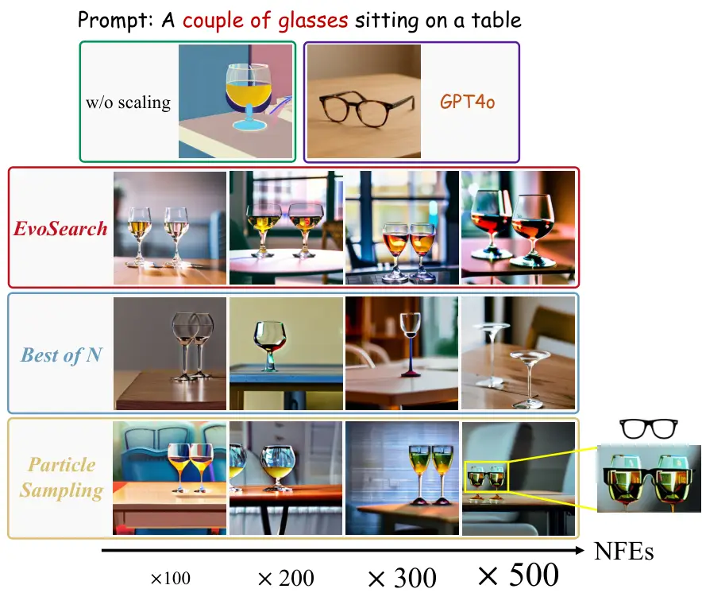

Figure 14: Comparative analysis of test-time scaling methods for Stable
Diffusion 2.1. EvoSearch demonstrates consistent improvements in image
quality and text-prompt alignment as NFEs increase, achieving accurate
interpretations of the challenging prompt with high computational
efficiency. In contrast, Best-of-N fails to produce semantically correct
results even with increased NFEs, while Particle Sampling introduces
semantic ambiguity at higher NFEs (e.g., confusing wine glasses and
eyeglasses). Notably, EvoSearch further enables SD2.1 to outperform
GPT4o.

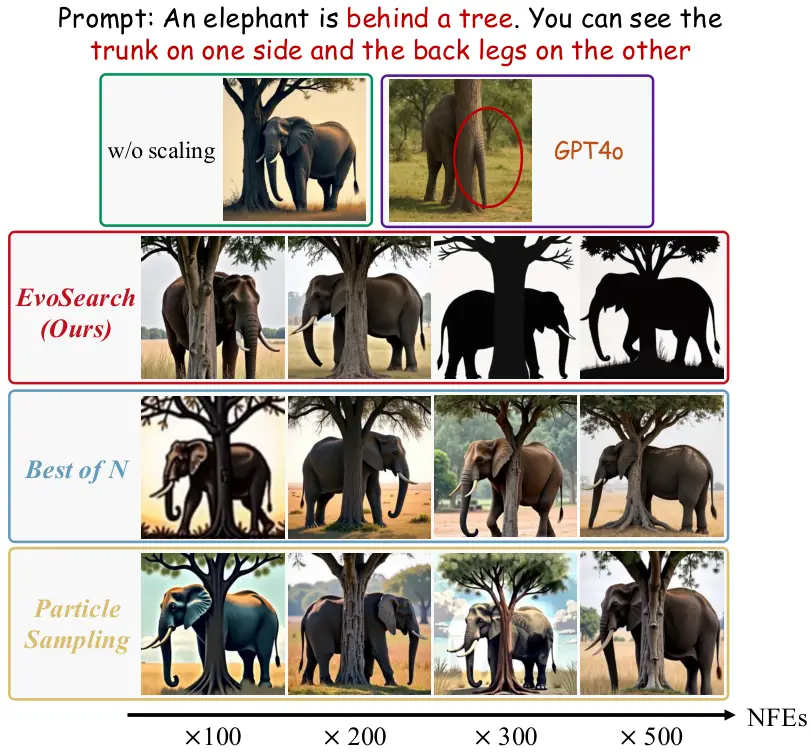

Figure 15: Results of test-time scaling for Flux.1-dev. EvoSearch
demonstrates significant exploration ability, enabling the generation of
images with diverse styles, while both Best-of-N and Particle Sampling
generate images with reduced diversity.

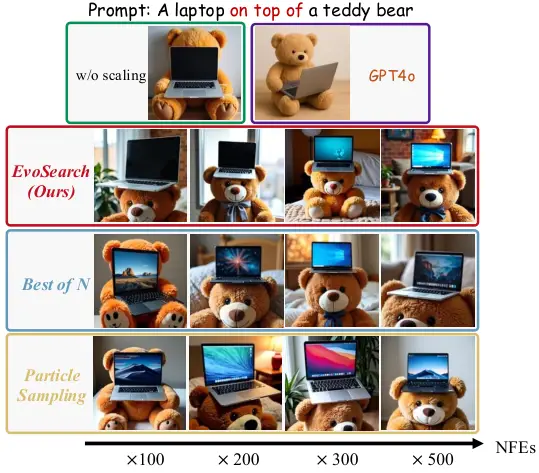

Figure 16: Results of test-time scaling for Flux.1-dev. EvoSearch can
even achieve accurate spatial relationship interpretation with only
$`10\times`$ scaled computation budget, while consistently improving
image quality through higher NFEs.

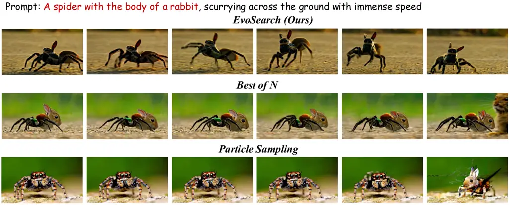

Figure 17: Results of test-time scaling for Hunyuan 13B. The denoising
step is $`30`$, and we scale up the test-time computation by
$`20\times`$. Only EvoSearch generates high-quality video aligned
closely with the text prompt.

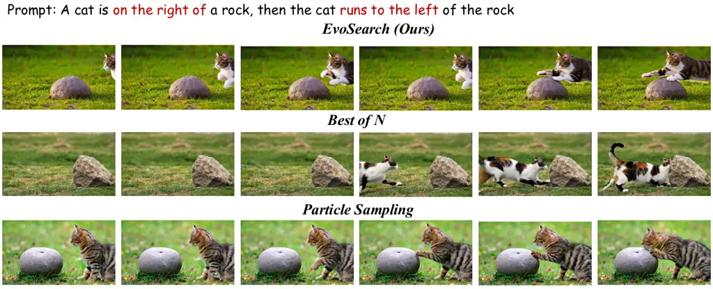

Figure 18: Results of test-time scaling for Hunyuan 13B. The denoising
step is $`30`$, and we scale up the test-time computation by
$`20\times`$. EvoSearch successfully follows the text prompt while the
baselines fail.

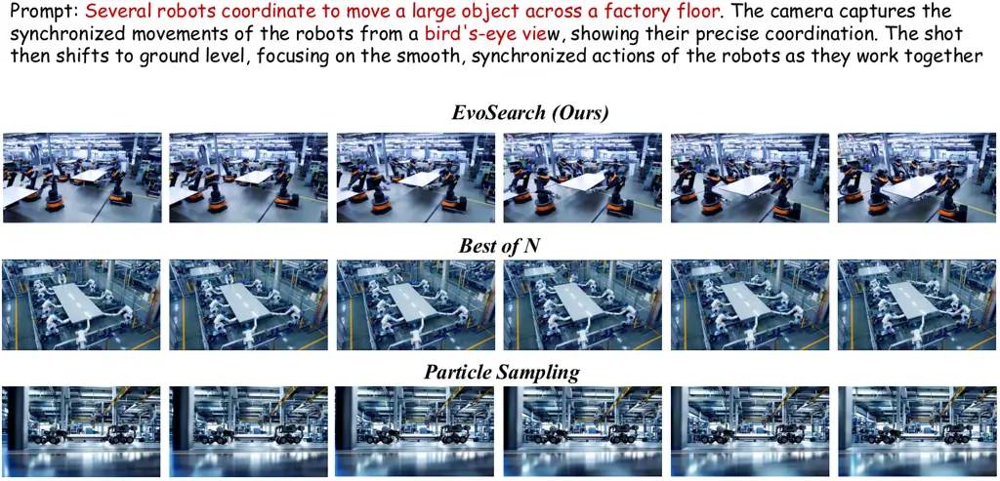

Figure 19: Results of test-time scaling for Hunyuan 13B. The denoising
step is $`30`$, and we scale up the test-time computation by
$`20\times`$. EvoSearch demonstrates superior text alignment and
higher-quality generation compared to baselines.

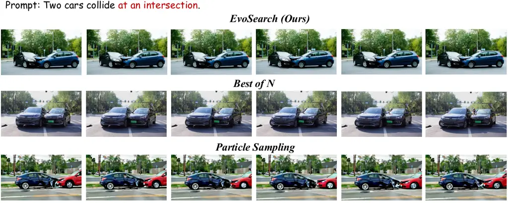

Figure 20: Results of test-time scaling for Hunyuan 13B. The denoising
step is $`30`$, and we scale up the test-time computation by
$`20\times`$. The video generated by EvoSearch demonstrates better
temporal consistency and text alignment.

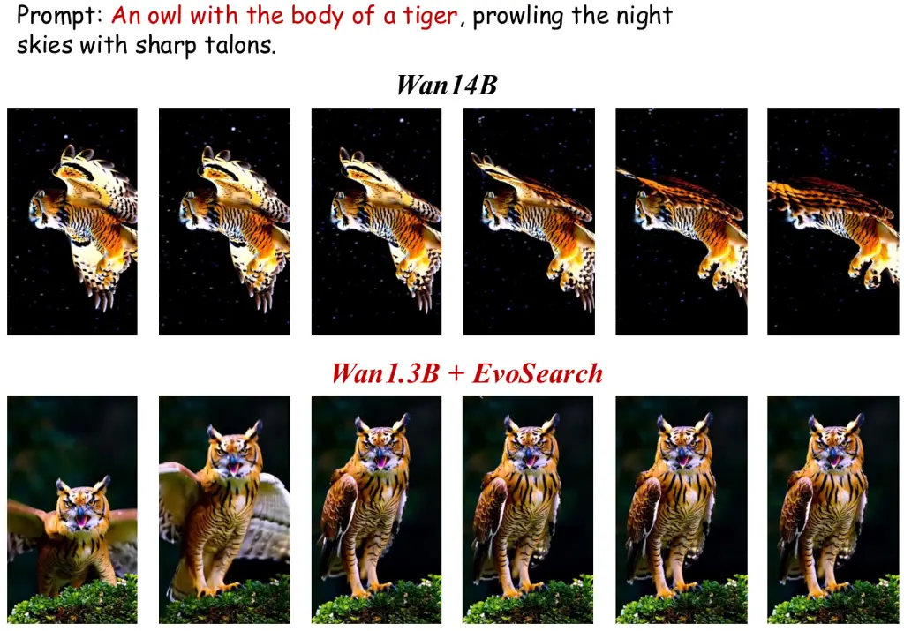

Figure 21: We scale up the test-time computation of Wan1.3B by
$`5\times`$, ensuring equivalent inference times between Wan14B and
Wan1.3B+EvoSearch. Qualitative results demonstrate that EvoSearch
enables Wan1.3B to outperform Wan14B, its $`10\times`$ larger
counterpart.

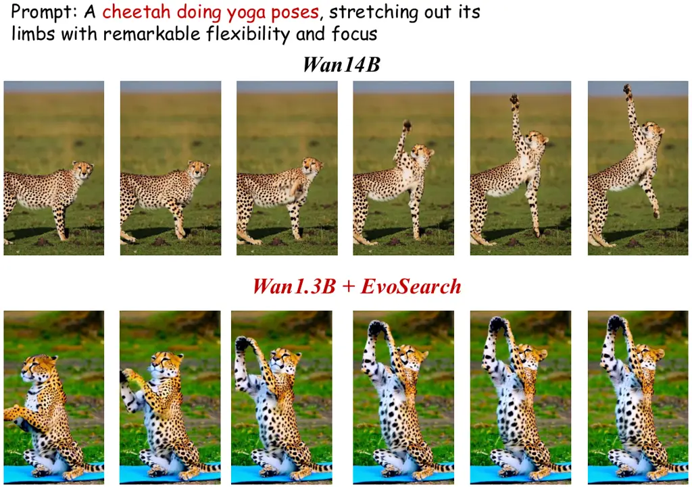

Figure 22: We scale up the test-time computation of Wan1.3B by
$`5\times`$, ensuring equivalent inference times between Wan14B and
Wan1.3B+EvoSearch. EvoSearch enables smaller models to achieve not only
competitive but superior performance compared to their larger
counterparts.

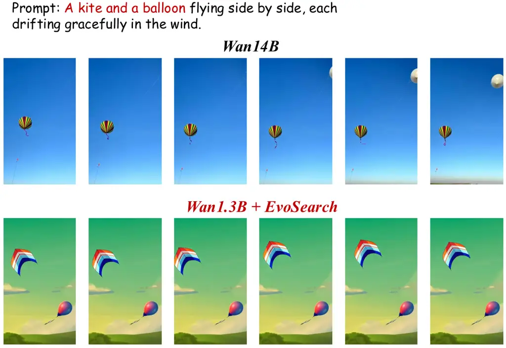

Figure 23: We scale up the test-time computation of Wan1.3B by
$`5\times`$, ensuring equivalent inference times between Wan14B and
Wan1.3B+EvoSearch. EvoSearch demonstrate superior text-alignment
performance.

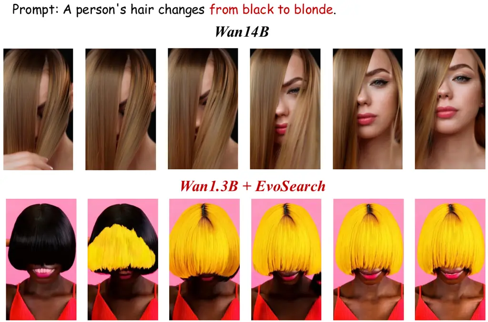

Figure 24: We scale up the test-time computation of Wan1.3B by
$`5\times`$, ensuring equivalent inference times between Wan14B and
Wan1.3B+EvoSearch. EvoSearch enhances Wan1.3B’s capability in
dynamic-attribute video generation.

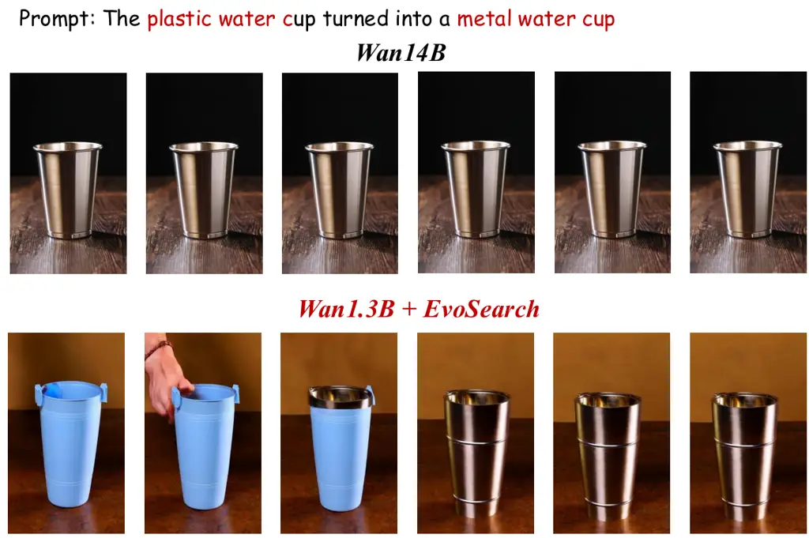

Figure 25: We scale up the test-time computation of Wan1.3B by
$`5\times`$, ensuring equivalent inference times between Wan14B and
Wan1.3B+EvoSearch. EvoSearch enhances Wan1.3B’s capability in handling
challenging prompts, outperforming Wan14B given the same inference time.

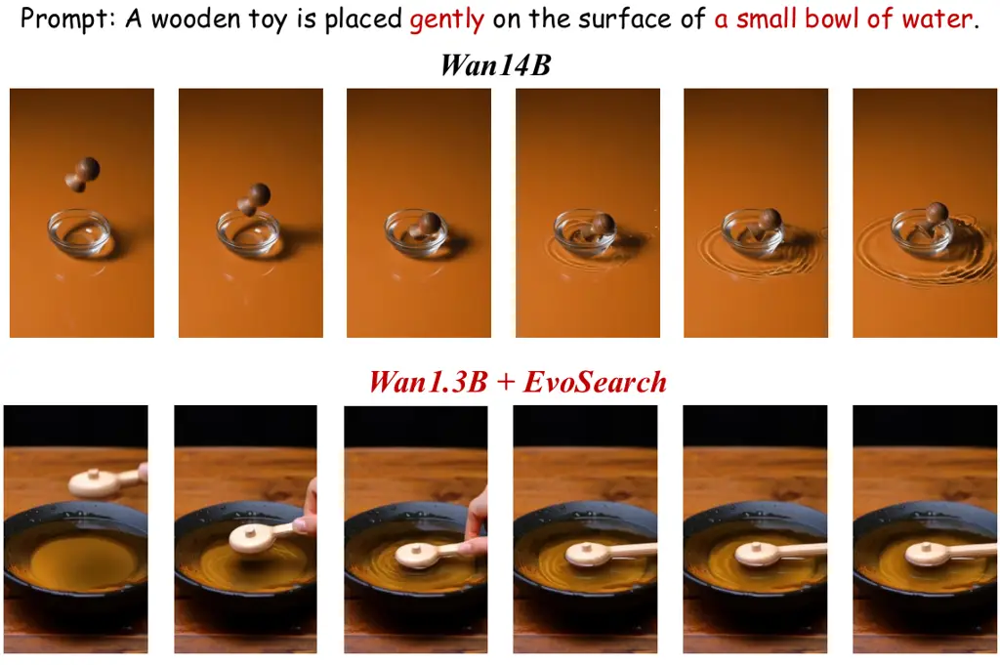

Figure 26: We scale up the test-time computation of Wan1.3B by
$`5\times`$, ensuring equivalent inference times between Wan14B and
Wan1.3B+EvoSearch. The video generated by EvoSearch follows the text
instruction more closely, exhibiting improved logical consistency.

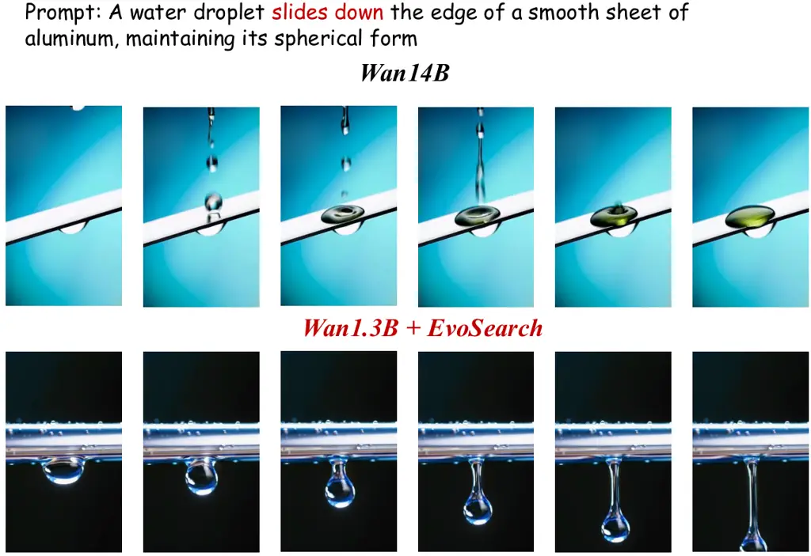

Figure 27: We scale up the test-time computation of Wan1.3B by
$`5\times`$, ensuring equivalent inference times between Wan14B and
Wan1.3B+EvoSearch. EvoSearchsignificantly improves the generation
quality with superior semantic alignment.
