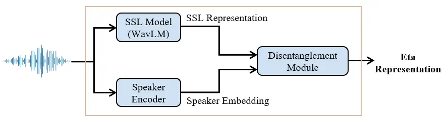
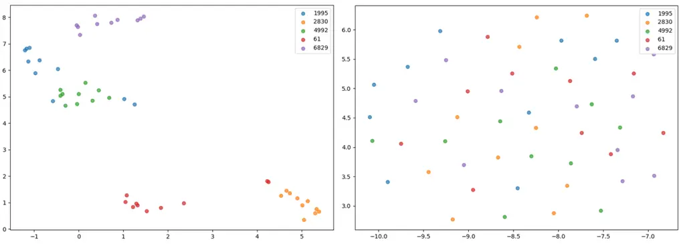
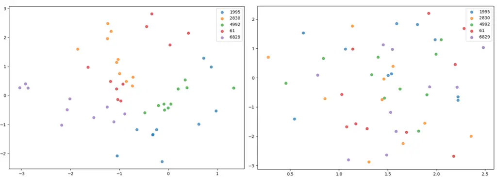

# Eta-WavLM: Efficient Speaker Identity Removal in Self-Supervised Speech Representations Using a Simple Linear Equation

Giuseppe Ruggiero Affiliation: Università degli studi di Torino, Turin,
Italy Affiliation: Cerence Inc, Turin Italy
Email: <giuseppe.ruggiero@unito.it>    Matteo Testa Affiliation: Cerence
Inc, Turin Italy Email: <luigi.dicaro@unito.it>    Jurgen Van de Walle
Affiliation: Cerence Inc, Turin Italy Email: <matteo.testa@cerence.com>
   Luigi Di Caro Affiliation: Università degli studi di Torino, Turin,
Italy Email: <jurgen.vandewalle@cerence.com>

###### Abstract

Self-supervised learning (SSL) has reduced the reliance on expensive
labeling in speech technologies by learning meaningful representations
from unannotated data. Since most SSL-based downstream tasks prioritize
content information in speech, ideal representations should disentangle
content from unwanted variations like speaker characteristics in the SSL
representations. However, removing speaker information often degrades
other speech components, and existing methods either fail to fully
disentangle speaker identity or require resource-intensive models. In
this paper, we propose a novel disentanglement method that linearly
decomposes SSL representations into speaker-specific and
speaker-independent components, effectively generating speaker
disentangled representations. Comprehensive experiments show that our
approach achieves speaker independence and as such, when applied to
content-driven tasks such as voice conversion, our representations yield
significant improvements over state-of-the-art methods.¹¹ 1 Audio
samples for the voice conversion system are available at:
[https://giuseppe-ruggiero.github.io/eta-wavlm-vc-demo/](https://giuseppe-ruggiero.github.io/eta-wavlm-vc-demo/)

## 1 Introduction

In recent years, speech-related tasks such as automatic speech
recognition (ASR), text-to-speech (TTS), voice conversion (VC), and
speech-to-speech translation (S2S) have made significant advancements,
achieving near-human performance in several domains. However, these
high-performing systems often rely on large quantities of high-quality
labeled data, which is both resource-intensive and time-consuming to
obtain, limiting speech technologies scalability across languages,
domains, and applications.

To address this challenge, researchers have increasingly focused on
techniques that leverage vast amounts of unlabeled data for model
training. Among these, self-supervised learning (SSL) has emerged as a
transformative paradigm, enabling models to learn latent representations
from raw input data without the need for explicit labels. In the speech
domain, the core concept of SSL is to pretrain a speech representation
network on large-scale unannotated corpora, with the objective of
capturing and encoding meaningful speech structures and
information (Qian et al., 2022). SSL models such as Wav2Vec2 (Baevski
et al., 2020), HuBERT (Hsu et al., 2021a), and WavLM (Chen et al., 2021)
have shown great success in extracting robust and versatile features
directly from speech waveforms. These SSL representations can then be
exploited for downstream tasks using only a limited amount of labeled
data (Choi et al., 2021).

SSL representations encode diverse speech attributes, including
linguistic content, speaker identity, emotions, and background
conditions, making them versatile but often task-agnostic. For example,
a good representation for tasks like VC or TTS should be rich in content
but contain minimal to no speaker identity (Huang et al., 2022; Qian
et al., 2022), while speaker classification or verification prioritizes
speaker information. Consequently, disentangling speaker and non-speaker
information in SSL representations is a critical aspect to improve
task-specific performance (van Niekerk et al., 2022; Hussain et al.,
2023; Huang et al., 2024; Lajszczak et al., 2024; Ruggiero et al.,
2024), though it remains highly challenging (Qian et al., 2022;
Martín-Cortinas et al., 2024). To this end, SSL representations are
often quantized to derive pseudo-text from speech utterances, with
k-means clustering being a widely used technique due to its simplicity
and unsupervised nature (Hsu et al., 2021a; Polyak et al., 2021; van
Niekerk et al., 2021). However, this often also compromises linguistic
content and prosody (Martín-Cortinas et al., 2024; Ruggiero et al.,
2024).

To address this issue, alternative disentanglement strategies have been
proposed. These include strategies based on simple perturbation
techniques applied to the input waveform (Choi et al., 2021; Hussain
et al., 2023), utterance-level standardization of representations (van
Niekerk et al., 2021; Zhu et al., 2023), neural models and training
conditions designed to extract content-related-only features from SSL
representations (Qian et al., 2022; van Niekerk et al., 2022; Huang
et al., 2024), and the incorporation of specific model components,
training strategies, or loss functions to achieve disentanglement online
during the training phase in tasks like VC or TTS (Martín-Cortinas
et al., 2024; Lajszczak et al., 2024). Although these methods preserve
content better than k-means, many still struggle to achieve a high level
of disentanglement (Ruggiero et al., 2024) or require the implementation
of complex and resource-intensive strategies.

In this paper, we propose a novel and general approach for disentangling
the speaker identity from SSL representations without requiring complex
training strategies, loss functions, fine-tuning, or even quantization.
We show that SSL representations can be linearly decomposed into
speaker-dependent $`\mathbf{d}`$ and speaker-independent $`\bm{\eta}`$
components, which we will refer to as eta representations. This means
that, if $`\mathbf{d}`$ is known, the speaker-independent eta
representation can be easily obtained by solving a linear inverse
problem.

Our main contributions are as follows: 1) We introduce an efficient
disentanglement strategy for generating speaker-independent SSL
representations by solving a simple linear equation; 2) We demonstrate
that our method actually generates speaker-independent representations,
reducing speaker accuracy in a speaker-related classification task by
nearly 30% compared to standard SSL representations; 3) We show that the
features derived from our approach enhance the performance of a
task-specific VC model. Specifically, our approach improves target
speaker identity, linguistic content preservation, and overall system
quality. These findings align with the hypotheses of prior work (Qian
et al., 2022; Martín-Cortinas et al., 2024), indicating that effectively
addressing speaker disentanglement can yield significant performance
improvements in content-related speech tasks.

## 2 Method

The proposed approach can be considered an extension of an SSL model,
implemented as an offline module designed to extract disentangled eta
representations. As illustrated in Figure 1, our method consists of
three key components: an SSL model that extracts an SSL representation
from a raw waveform, a speaker encoder that generates a speaker
embedding from the same waveform, and a disentanglement module which
derives a speaker-independent eta representation from the input SSL
representation, conditioned on the speaker embedding. In this work, both
the SSL and the speaker encoder modules are off-the-shelf pre-trained
models that are not further trained or fine-tuned. Our main contribution
lies in the implementation of the disentanglement module.



Figure 1: High-level overview of the proposed approach.

### 2.1 Problem Definition

The primary concept underlying the disentanglement module is to
decompose an SSL representation $`\mathbf{s}`$, into speaker-dependent
$`\mathbf{d}`$ and speaker-independent $`\bm{\eta}`$ components. For a
given data point, $`\mathbf{s}`$ and $`\mathbf{d}`$ can be easily
obtained using a pre-trained SSL model and a pre-trained speaker
encoder, respectively. Thus, $`\mathbf{s}`$ can be expressed as a
function of the known $`\mathbf{d}`$ along with an additional unknown
term $`\bm{\eta}`$, which encapsulates all the information not inferable
from $`\mathbf{d}`$. For simplicity, we assume an additive relationship
which can be described as:

```math
\mathbf{s}=f(\mathbf{d})+\bm{\eta} \tag{1}
```

Ideally, $`\bm{\eta}`$ should include linguistic, prosodic, and
information from the environment (e.g. recording conditions), provided
that $`\mathbf{d}`$ effectively represents speaker characteristics. The
importance of selecting an appropriate speaker encoder for extracting
$`\mathbf{d}`$ in this context will be discussed in Section 3.3.
Consequently, the speaker-independent component $`\bm{\eta}`$ can be
computed as:

```math
\bm{\eta}=\mathbf{s}-f(\mathbf{d}) \tag{2}
```

In the next section, we will discuss how to model the function $`f()`$.

### 2.2 Computation of Latent Basis and Bias

Based on the hypothesis that large embedding spaces tend to linearize
complex non-linear relationships (Ethayarajh et al., 2018; Mohamed
et al., 2024), we approximate $`f()`$ using a linear model. Consider a
multi-speaker dataset composed of $`U`$ utterances of raw speech. Let us
denote a generic utterance as $`\mathbf{u}_{i}`$, its speaker embedding
extracted by a pre-trained speaker encoder $`\mathcal{E}`$ as
$`\mathbf{e}_{i}\in\mathbb{R}^{V}`$ with $`i\in[1,U]`$, and its SSL
representation extracted by a pre-trained SSL model $`\mathcal{S}`$ as
$`\mathbf{S}_{i}=[\mathbf{s}_{1},\cdots,\mathbf{s}_{M}]^{T}`$, where
$`\mathbf{s}_{m}\in\mathbb{R}^{Q}`$ represents the $`m`$-th frame, and
$`M`$ is the sequence length. Since $`M`$ can be large, we randomly
subsample $`L`$ frames from each utterance, creating a fixed-length
representation $`\mathbf{S}_{i}\in\mathbb{R}^{L\times Q}`$.
Consequently, the entire dataset’s SSL representation, obtained by
stacking all the $`\mathbf{S}_{i}`$, is given by
$`\mathbf{S}\in\mathbb{R}^{N\times Q}`$, where $`N=U\times L`$ for
simplicity.

To align $`\mathbf{e}`$ with the sequence length of $`\mathbf{S}`$, we
leverage the fact that the speaker embedding captures speaker-level
information, which is assumed to remain constant across all frames of an
utterance. Based on this, we expand $`\mathbf{e}`$ by replicating it
$`L`$ times along the frame axis, resulting in
$`\mathbf{E}_{i}\in\mathbb{R}^{V\times L}`$. Consequently, the entire
dataset’s embedding representation, obtained by stacking all the
$`\mathbf{E}_{i}`$, is given by $`\mathbf{E}\in\mathbb{R}^{V\times N}`$.
In addition, since $`V`$ can be large, we apply Principal Component
Analysis (PCA) to reduce its dimension to $`P<V`$, thus obtaining
$`\mathbf{D}\in\mathbb{R}^{P\times N}`$. This reduction helps remove
redundancy and retains only the most informative components. We will
show the importance of this step in Section 3.3.

Given $`\mathbf{S}\in\mathbb{R}^{N\times Q}`$ and
$`\mathbf{D}\in\mathbb{R}^{P\times N}`$, we can model their relationship
as:

```math
\displaystyle\mathbf{S}=\mathbf{D}^{T}\mathbf{A}+\mathbf{1}_{N}\mathbf{b}^{T} \tag{3}
```

where $`\mathbf{A}\in\mathbb{R}^{P\times Q}`$ and
$`\mathbf{b}\in\mathbb{R}^{Q\times 1}`$ are learnable parameters. For
simplicity, we can rewrite it as:

```math
\displaystyle\mathbf{S}=\mathbf{\tilde{D}}^{T}\mathbf{\tilde{A}} \tag{4}
```

where
$`\mathbf{\tilde{D}}^{T}=\begin{bmatrix}\mathbf{D}^{T}&\mathbf{1}\end{bmatrix}`$
and
$`\mathbf{\tilde{A}}^{T}=\begin{bmatrix}\mathbf{A}^{T}&\mathbf{b}\end{bmatrix}`$.
Then, the optimization problem we want to solve is given by:

```math
\displaystyle\mathbf{\tilde{A}}^{*}=\arg\min_{\mathbf{\tilde{A}}}||\mathbf{S}-\mathbf{\tilde{D}}^{T}\mathbf{\tilde{A}}||_{F} \tag{5}
```

which can be solved through the pseudo-inverse as:

```math
\displaystyle\mathbf{\tilde{A}}^{*}=(\mathbf{\tilde{D}}^{T}\mathbf{\tilde{D}})^{-1}\mathbf{\tilde{D}}^{T}\mathbf{S} \tag{6}
```

where
$`\mathbf{\tilde{A}}^{*}{{}^{T}}=\begin{bmatrix}\mathbf{A}^{*}{{}^{T}}&\mathbf{b}^{*}\end{bmatrix}`$.
From now on, $`\mathbf{A}^{*}`$ and $`\mathbf{b}^{*}`$ will be referred
to as latent basis and bias.

At this stage, the function $`f()`$ has been learned, marking the
completion of the first step. With $`\mathbf{A}^{*}`$ and
$`\mathbf{b}^{*}`$ known, the disentanglement module is now able to
generate eta representations.

### 2.3 Creation of Eta Representations

During the inference phase, the proposed system (Figure 1) generates
speaker-independent eta representations directly from raw waveforms.
Given an utterance $`\mathbf{u}^{\prime}`$, first the pre-trained SSL
model $`\mathcal{S}`$ extracts an SSL representation
$`\mathbf{S}\in\mathbb{R}^{K\times Q}`$:

```math
\displaystyle\mathbf{S}=\mathcal{S}(\mathbf{u}^{\prime};\mathbf{W_{\mathcal{S}}}) \tag{7}
```

where $`\mathbf{W_{\mathcal{S}}}`$ represents the frozen parameters of
the SSL model, and $`K`$ is the sequence length. Next, the pre-trained
speaker encoder $`\mathcal{E}`$ generates a speaker embedding
$`\mathbf{e}\in\mathbb{R}^{V\times 1}`$:

```math
\displaystyle\mathbf{e}=\mathcal{E}(\mathbf{u}^{\prime};\mathbf{W_{\mathcal{E}}}) \tag{8}
```

where $`\mathbf{W_{\mathcal{E}}}`$ represents the frozen parameters of
the speaker encoder. To reduce the dimensionality of $`\mathbf{e}`$, PCA
is applied, producing $`\mathbf{d}\in\mathbb{R}^{P\times 1}`$:

```math
\displaystyle\mathbf{d}=\mathcal{PCA}(\mathbf{e};\mathbf{C_{\mathcal{PCA}}}) \tag{9}
```

where $`\mathbf{C_{\mathcal{PCA}}}`$ denotes the matrix of principal
components obtained during the PCA process executed in the first step
(Section 2.2). Finally, the disentanglement module $`\mathcal{H}`$
extracts a speaker-independent eta representation
$`\bm{\eta}\in\mathbb{R}^{K\times Q}`$:

```math
\displaystyle\bm{\eta}=\mathcal{H}(\mathbf{S};\mathbf{d},\mathbf{A}^{*},\mathbf{b}^{*}) \tag{10}
```

where $`\mathbf{A}^{*}`$ and $`\mathbf{b}^{*}`$ are the latent basis and
bias obtained at the end of the first step (Section 2.2), and
$`\mathcal{H}()`$ is implemented as:

```math
\displaystyle\mathcal{H}(\mathbf{S})=\mathbf{S}-\mathbf{1}_{K}(\mathbf{d}^{T}\mathbf{A}^{*}+\mathbf{b}^{*}) \tag{11}
```

In this work, we specifically chose WavLM as the SSL model
$`\mathcal{S}`$ for our experiments. Therefore, we will refer to the SSL
representations $`\mathbf{S}`$ as WavLM representations and the output
of our system $`\bm{\eta}`$ as Eta-WavLM representations.

## 3 Experiments

To evaluate the effectiveness of our proposed approach, we selected a
speaker-related and a content-related task. The primary objective of the
first experiment is to determine whether the eta representations
extracted by our method exhibit minimal or no speaker-specific
characteristics, thereby confirming the achievement of the desired
disentanglement. The goal of the second experiment is to assess whether
the disentangled representations provides benefits in real-world tasks
such as VC, where maintaining linguistic content and achieving high
similarity to the target speaker’s voice are essential. For all of our
experiments, we employed the following setup: 1) Framework and hardware:
We ran all experiments on a Linux machine with a single NVIDIA GeForce
RTX 3090 GPU with 24 GB of RAM; 2) Dataset: We used the full training
set of the multi-speaker LibriSpeech (Panayotov et al., 2015) dataset
for computing $`\mathbf{A}^{*}`$ and $`\mathbf{b}^{*}`$, as described in
Section 2.2. LibriSpeech consists of nearly 1,000 hours of English
speech and is openly available under the CC BY 4.0 license; 3) SSL
model: As mentioned in Section 2.3, we adopted the state-of-the-art
WavLM (Chen et al., 2021) as the pre-trained SSL model $`\mathcal{S}`$.
We used the official WavLM-Large²² 2
[https://huggingface.co/microsoft/wavlm-large](https://huggingface.co/microsoft/wavlm-large)
model released under the CC BY-SA 3.0 license and, following (Hsu
et al., 2021b; Baevski et al., 2021; Ruggiero et al., 2024), we employed
the output of the 15th transformer layer as the representation
$`\mathbf{S}`$. Accordingly, we set $`Q=1024`$ in Sections 2.2 and 2.3,
corresponding to the dimensionality of the WavLM-Large output vectors.
In addition, we set $`L=100`$ in Section 2.2; 4) Speaker encoder: We
chose the state-of-the-art ECAPA-TDNN (Desplanques et al., 2020) as the
pre-trained speaker encoder model $`\mathcal{E}`$. ECAPA-TDNN extracts
speaker embeddings from input speech by leveraging channel attention,
propagation, and aggregation mechanisms to produce robust and
discriminative speaker representations $`\mathbf{d}`$. We used a
publicly available ECAPA-TDNN model³³ 3
[https://huggingface.co/speechbrain/spkrec-ecapa-voxceleb](https://huggingface.co/speechbrain/spkrec-ecapa-voxceleb)
pre-trained by SpeechBrain (Ravanelli et al., 2021) and released under
the Apache-2.0 license. Accordingly, we set $`V=192`$ in Sections 2.2
and 2.3, corresponding to the dimensionality of the embeddings extracted
by the model. The choice of ECAPA-TDNN as the speaker encoder is
justified in Section 3.3; 5) Dimensionality reduction: We used PCA⁴⁴ 4
[https://scikit-learn.org/1.6/modules/generated/sklearn.decomposition.PCA.html](https://scikit-learn.org/1.6/modules/generated/sklearn.decomposition.PCA.html)
to reduce $`V`$ to $`P`$, as described in Sections 2.2 and 2.3. We set
$`P=128`$, and the motivation is discussed in Section 3.3.

### 3.1 Speaker-Related Classification Task



Figure 2: UMAP projections of the WavLM (a) and Eta-WavLM (b)
representations extracted from 10 utterances of 5 speakers (with ids
1995, 2830, 4992, 61, 6829) from the LibriSpeech test-clean set.

To evaluate whether the proposed approach effectively reduces speaker
information in the WavLM representations, thereby creating
speaker-independent Eta-WavLMs, we designed a speaker classification
task. Intuitively, since this is a speaker-related task, a model can
only perform well if the input representations retain a significant
amount of speaker-specific information. Conversely, if the input
representations are speaker-independent, the model will struggle to
achieve high classification accuracy. Thus, our hypothesis is that our
representations will perform worse on the speaker classification task
than the original WavLMs, which are known to encode speaker-specific
characteristics. To test this hypothesis, we randomly selected 10
speakers from the LibriSpeech test-clean set, resulting in a total of
1285 utterances. Then, for each utterance, we computed the corresponding
WavLM representation $`\mathbf{S}`$ as described in Equation 7 and the
Eta-WavLM representation $`\bm{\eta}`$ as described in Equation 11. We
trained and evaluated a multi-class support vector machine (SVM)
classifier on both representation sets using a 5-fold cross-validation
setup, recording the classification accuracy for each fold. In addition,
we reported the mean and the standard deviation across the 5 folds. We
chose SVM for its simplicity and well-known robustness in handling
high-dimensional feature spaces and small datasets. The results are
shown in Table 1.

FOLD1 FOLD2 FOLD3 FOLD4 FOLD5 MEAN ± STD WavLM 83.46 82.33 80.85 83.30
81.55 82.30 ± 0.01 Eta-WavLM 53.82 55.14 58.77 53.94 56.96 55.73 ± 0.01

Table 1: Classification accuracy results (%) for WavLM and Eta-WavLM
across the 5 folds of cross-validation (ACC $`\downarrow`$). Lower
accuracy indicates better performance, as it reflects reduced
speaker-related information.

As expected, the Eta-WavLM representations achieve significantly lower
classification accuracy compared to the original WavLM ones (paired
t-test yielded a T-Statistic of 18.41 and a p-value of
$`5.12\times 10^{-5}`$, rejecting the null hypothesis $`p<0.05`$). This
accuracy reduction provides clear evidence that our approach is
effective in reducing speaker-specific information from the standard
WavLM representations.

To further validate our approach, we visualized the WavLM and Eta-WavLM
representations. We randomly selected 5 speakers from the LibriSpeech
test-clean set and extracted 10 utterances per speaker. For each
utterance, we computed the WavLM and Eta-WavLM representations and
projected them onto a two-dimensional space using UMAP (McInnes et al., 2018) (see Appendix A for a complementary visualization using PaCMAP).
As shown in Figure 2 (a), the UMAP projection of the WavLM
representations cluster to regions corresponding to the individual
speakers, suggesting the presence of strong speaker-specific
information. In contrast, the projection of the Eta-WavLM
representations in Figure 2 (b) does not show a discernible cluster of
speakers, indicating that our transformation effectively minimizes
speaker-specific information. These visualizations reinforce the
quantitative results from the speaker classification task by providing
an intuitive and qualitative demonstration of the speaker-independence
of the Eta-WavLM representations. The absence of speaker-specific
clusters in the Eta-WavLM projection aligns with the significantly lower
speaker classification accuracy observed in Table 1, further reinforcing
the conclusion that our approach successfully disentangles
speaker-related information.

### 3.2 Voice Conversion Task

Despite providing good insights into the reduction of speaker-related
information in our representations, the speaker classification task does
not assess whether this reduction affects other critical components,
such as linguistic content. To evaluate this, we designed a
content-related VC task, where the preservation of linguistic content
and the accurate representation of the target speaker’s identity are
both essential for creating a high-quality conversion system. This dual
requirement makes VC an ideal framework for evaluating whether our
approach removes speaker-specific components while preserving other
essential features. Our hypothesis is that the proposed Eta-WavLM
representations will improve VC performance compared to both the
original WavLM representations and other state-of-the-art
disentanglement methods.

#### 3.2.1 Model Architecture

For this experiment, we selected the state-of-the-art Any-to-One VC
system proposed in (van Niekerk et al., 2022; Ruggiero et al., 2024), as
it achieves impressive levels of linguistic content preservation, target
speaker identity similarity, and high-quality speech generation. The
architecture consists of a content encoder, an acoustic model, and a
vocoder. The content encoder extracts speech representations from a raw
waveform of any speaker, the acoustic model converts these
representations into a mel spectrogram of the target speaker, and the
vocoder synthesizes the resulting mel spectrogram into a speech waveform
of the target speaker.

In this system, we focus on the content encoder, as its role is to
extract SSL representations from speech. This makes it the ideal
component for incorporating our Eta-WavLM representations and comparing
them with other baseline approaches. In contrast, we left the acoustic
model unchanged from the implementation in (van Niekerk et al., 2022;
Ruggiero et al., 2024) and we trained it from scratch following the
original configurations. Further details on its architecture can be
found in Appendix B. For the vocoder, we opted for the multi-speaker
Vocos (Siuzdak, 2024), known for its ability to produce high-quality
speech outputs. We used the official pre-trained model⁵⁵ 5
[https://huggingface.co/charactr/vocos-mel-24khz](https://huggingface.co/charactr/vocos-mel-24khz)
released under the MIT license.

#### 3.2.2 Baseline Approaches

We evaluated our Eta-WavLM approach against several baselines, including
the direct use of the WavLM model as in (Ruggiero et al., 2024), as well
as four prominent disentanglement strategies from the literature:
perturbation, per-utterance standardization, soft unit creation, and
Vector Quantization (VQ). Specifically, for perturbation, we implemented
the disentanglement strategy outlined in (Choi et al., 2021), which is
based on information perturbation applied to the input speech before the
WavLM model. For per-utterance standardization, we employed the
utterance-level standardization method described in (van Niekerk et al., 2021) on the WavLM representations. For soft unit creation, we followed
the training procedure outlined in (van Niekerk et al., 2022) to derive
soft speech units from the WavLM representations. For the VQ strategy,
we trained the RepCodec model (Huang et al., 2024) following the
official instructions⁶⁶ 6
[https://github.com/mct10/RepCodec](https://github.com/mct10/RepCodec),
substituting HuBERT with WavLM. This comparison yielded 6 distinct
content encoders: one based on the unmodified WavLM representations and
five derived from the application of the different disentanglement
strategies (including our approach). Each content encoder produces
either continuous or discrete representations, depending on the specific
disentanglement method applied or whether the output of the WavLM model
is used directly without further refinement.

|                                          |          |      |        |        |             |               |      |        |        |             |
| ---------------------------------------- | -------- | ---- | ------ | ------ | ----------- | ------------- | ---- | ------ | ------ | ----------- |
|                                          | LJSpeech |      |        |        |             | Elliot Miller |      |        |        |             |
|                                          | WER      | PER  | T-SSIM | S-SSIM | MOS         | WER           | PER  | T-SSIM | S-SSIM | MOS         |
| Ground truth                             | 3.22     | 5.47 | \-     | \-     | 3.85 ± 0.04 | 3.22          | 5.47 | \-     | \-     | 3.85 ± 0.04 |
| Perturbation (Choi et al., 2021)         | 6.29     | 7.32 | 91.69  | 50.64  | 3.45 ± 0.06 | 10.76         | 8.43 | 87.41  | 52.67  | 3.13 ± 0.07 |
| Utterance std (van Niekerk et al., 2021) | 4.13     | 7.32 | 90.34  | 51.58  | 3.80 ± 0.04 | 5.16          | 6.68 | 85.91  | 55.87  | 3.41 ± 0.06 |
| Soft (van Niekerk et al., 2022)          | 4.82     | 5.94 | 91.81  | 50.11  | 3.84 ± 0.05 | 5.50          | 6.75 | 86.69  | 53.36  | 3.32 ± 0.06 |
| Vector quantization (Huang et al., 2024) | 4.79     | 6.08 | 90.05  | 51.98  | 3.90 ± 0.05 | 7.72          | 7.56 | 86.30  | 53.81  | 3.50 ± 0.06 |
| WavLM (Ruggiero et al., 2024)            | 4.56     | 5.84 | 89.52  | 52.77  | 3.84 ± 0.05 | 5.14          | 6.38 | 86.18  | 54.30  | 3.66 ± 0.06 |
| Proposed (Eta-WavLM)                     | 3.81     | 5.63 | 92.46  | 47.60  | 4.00 ± 0.05 | 4.64          | 6.09 | 89.32  | 48.25  | 3.79 ± 0.05 |

Table 2: Objective and subjective evaluation of the VC task. Results (%)
in terms of intelligibility (W/PER $`\downarrow`$), target speaker
similarity (T-SSIM $`\uparrow`$), source speaker similarity (S-SSIM
$`\downarrow`$), and overall quality (MOS $`\uparrow`$) with 95%
confidence intervals for the proposed Eta-WavLM and the baseline
methods. WavLM was used as the SSL model across all approaches.

#### 3.2.3 Experimental Setup

To ensure a robust evaluation of the VC system, we selected two English
target speakers with distinct background characteristics, genders, and
noise levels to train the acoustic model: LJSpeech (Ito and Johnson, 2017) (F): A single-speaker dataset containing approximately 24 hours of
read English speech by a female speaker; Elliot Miller (M): A
single-speaker dataset consisting of 38 hours of read English speech by
a male speaker. We extracted this speaker from the multi-speaker and
multi-lingual M-AILABS Speech Dataset⁷⁷ 7
[https://github.com/imdatceleste/m-ailabs-dataset](https://github.com/imdatceleste/m-ailabs-dataset).
In addition, to ensure a fair comparison with LJSpeech, we randomly
selected 24 hours from the dataset. Both target speakers are in the
public domain. While LJSpeech is a clean and high-quality dataset,
Elliot Miller presents more challenging conditions. This diversity in
target speaker profiles was intentionally selected to evaluate the
effectiveness of the VC under varied conditions.

For each audio sample of each target speaker, we first downsample it to
16 kHz and separately extract the corresponding SSL representations
using all 6 distinct content encoders. Then, we create the mel-scaled
spectrogram of the audio sample following (Siuzdak, 2024), by resampling
it to 24 kHz and using the following parameters: $`n_{fft}=1024`$,
$`hop\_length=256`$ and number of Mel bins ($`n`$-MELs) 100. Finally,
for each pair (representation, mel spectrogram), we trained a
target-specific acoustic model, using the selected representation as
input and the corresponding mel spectrogram as the target. In total, we
trained 12 distinct acoustic models (6 types of representations
$`\times`$ 2 speakers).

#### 3.2.4 Evaluation Metrics

We conducted both objective and subjective evaluations to measure
intelligibility, speaker similarity, and overall quality of the
converted speech. Intelligibility assesses the system’s ability to
preserve the linguistic and semantic integrity of the input speech,
ensuring that the content is comprehensible after conversion. Speaker
similarity evaluates how well the converted speech captures the target
speaker’s voice characteristics, ensuring the output convincingly mimics
the desired speaker. Lastly, overall speech quality examines the
naturalness and quality of the converted speech.

To perform these evaluations, we created a test set of 60 utterances
obtained by randomly selecting 3 utterances from 20 speakers (10 male
and 10 female) extracted from the test-clean set of LibriSpeech. We
converted all these utterances into LJSpeech and Elliot Miller using our
proposed method and the five baselines, resulting in a total of 420
samples per speaker (60 ground truth + 360 generated). We evaluated
intelligibility by measuring the word error rate (WER) and phoneme error
rate (PER) between the source and converted speech. Orthographic
transcriptions were obtained using the Whisper Medium ASR model⁸⁸ 8
[https://huggingface.co/openai/whisper-medium](https://huggingface.co/openai/whisper-medium)
(Radford et al., 2023), while phonetic transcriptions were generated
using phonemizer⁹⁹ 9
[https://github.com/bootphon/phonemizer](https://github.com/bootphon/phonemizer)
(Bernard and Titeux, 2021). Speaker similarity (SSIM) was measured using
a trained speaker verification model¹⁰¹⁰ 10
[https://github.com/resemble-ai/Resemblyzer](https://github.com/resemble-ai/Resemblyzer).
Specifically, we computed the cosine similarity between the d-vectors
(Ruggiero et al., 2021) of each converted sample and those of the source
(S-SSIM) and the target (T-SSIM) speakers. Finally, for overall speech
quality, we conducted a subjective evaluation based on mean opinion
scores (MOS). Twenty native-language participants were asked to listen
to the randomly mixed samples and rate them on a 5-point scale, where 1
corresponds to “very poor” and 5 to “excellent”.

#### 3.2.5 Results

We report the objective and subjective results for the VC experiment.
Table 2 shows WER/PER, SSIM, and MOS for the two target speakers:
LJSpeech (first column) and Elliot Miller (second column). Compared to
other methods, Eta-WavLM significantly enhances conversion
intelligibility, achieving the lowest error rates for both target
speakers. For LJSpeech, it closely approaches the ground truth WER and
PER values, demonstrating a high level of linguistic content
preservation compared to all baselines. A similar pattern is observed
for Elliot Miller, where Eta-WavLM outperforms the baselines, confirming
its robustness even under more challenging acoustic conditions. Notably,
the perturbation approach exhibits the highest error rates, particularly
for Elliot Miller, suggesting that this approach excessively distorts
linguistic and semantic information in the input speech. In terms of
speaker similarity, the proposed method achieves the best SSIM scores
for both target speakers, outperforming both the original WavLM
representations and all other disentanglement strategies. While the soft
approach yields comparable results for LJSpeech, it struggles with the
noisier Elliot Miller speaker, highlighting that some disentanglement
methods are more sensitive to challenging acoustic conditions. In
contrast, using WavLM directly results in lower speaker similarity,
reinforcing the notion that speaker-dependent information remains
embedded in the original representations and thus affects the overall
performance of the VC system. Finally, regarding overall speech quality,
Eta-WavLM achieves the highest MOS scores, surpassing all baselines.
Interestingly, the vector quantization approach demonstrates relatively
strong MOS ratings but fails to maintain the same level of linguistic
and semantic integrity, as evidenced by its higher WER and PER values,
especially for Elliot Miller. Conversely, as with intelligibility, the
perturbation yields the lowest MOS values, further indicating that
speech modification negatively impacts also naturalness.

These results confirm our hypothesis that Eta-WavLM effectively
disentangles speaker information while preserving linguistic content,
achieving the best balance between intelligibility, speaker similarity,
and speech quality. Moreover, the consistent improvements across both
target speakers underline its robustness, demonstrating that the
proposed approach not only reduces speaker-related information more
effectively than existing methods but also avoids degradation of other
features.

### 3.3 Ablation: Speaker Encoder and PCA

WER PER T-SSIM SPK ACC Resemblyzer w/o PCA 4.94 6.01 89.02 74.01 ± 0.01
Resemblyzer w PCA-64 4.86 5.92 89.86 73.54 ± 0.02 Resemblyzer w PCA-128
4.48 5.84 90.59 65.87 ± 0.01 WavLM-SV w/o PCA 4.27 5.81 89.29 69.74 ±
0.02 WavLM-SV w PCA-64 4.15 5.75 89.35 68.31 ± 0.02 WavLM-SV w PCA-128
3.91 5.70 89.76 65.83 ± 0.01 ECAPA-TDNN w/o PCA 4.18 5.80 89.90 60.87 ±
0.01 ECAPA-TDNN w PCA-64 3.95 5.63 90.91 58.14 ± 0.02 ECAPA-TDNN w
PCA-128 3.81 5.63 92.46 55.73 ± 0.01

Table 3: Results (%) measuring VC intelligibility (W/PER
$`\downarrow`$), target speaker similarity (T-SSIM $`\uparrow`$), and
the speaker classification accuracy (SPK ACC $`\downarrow`$) using
different speaker encoders and PCA reductions. The VC target speaker is
LJSpeech.

In this section, we analyze the impact of the speaker encoder for the
creation of effective speaker embeddings $`\mathbf{d}`$. Since our
approach aims to decompose SSL representations into speaker-dependent
and speaker-independent components, it is crucial that $`\mathbf{d}`$
captures speaker-specific characteristics without encoding other
critical components such as linguistic content, prosody, or phonetic
details. If the extracted embeddings contain too much
non-speaker-related information, the decomposition process of our method
risks degrading essential speech content in the SSL representations,
resulting in a non optimal eta representation $`\bm{\eta}`$.
Furthermore, since embeddings can generally be large and contain
redundant information, we also want to investigate whether a technique
like PCA to reduce and make more compact $`\mathbf{d}`$ can further
improve the overall performance of our approach. To this end, we
evaluated three different speaker encoders: Resemblyzer¹¹¹¹ 11
[https://github.com/CorentinJ/Real-Time-Voice-Cloning](https://github.com/CorentinJ/Real-Time-Voice-Cloning),
a publicly available implementation of (Wan et al., 2017), released
under the MIT license; WavLM-SV¹²¹² 12
[https://github.com/microsoft/UniSpeech/tree/main/downstreams/speaker_verification](https://github.com/microsoft/UniSpeech/tree/main/downstreams/speaker_verification),
a WavLM-Large version designed for speaker verification (SV) and
released under the Attribution-ShareAlike 3.0 Unported license; and
ECAPA-TDNN (Desplanques et al., 2020), which we briefly introduced in
Section 3. For each speaker encoder, we considered the raw output and
two levels of dimensionality reduction: PCA-64 and PCA-128. Following
the same configurations as in Section 3.1 and Section 3.2, we setup a
Speaker Classification task and a Voice Conversion task (considering
only LJSpeech as target speaker), evaluating the eta representations
created using the different $`\mathbf{d}`$ generated by each speaker
encoder. Table 3 reports WER/PER and T-SSIM of VC and the mean and
standard deviation across the 5 folds of the cross-validation of the
speaker accuracy for each model. ECAPA-TDNN consistently achieves the
best performance across all metrics, demonstrating its superiority in
preserving linguistic content, achieving a high level of target speaker
similarity in the VC task, and reaching the lowest speaker
classification accuracy. While WavLM-SV also shows strong
intelligibility performance, its VC speaker similarity remains lower
than that of ECAPA-TDNN. This highlights the fact that the eta
representations created with $`\mathbf{d}`$ extracted using WavLM-SV are
less speaker-independent than those of ECAPA-TDNN. This is further
confirmed by the higher speaker accuracy in the classification task. On
the other hand, the performance obtained with Resemblyzer is not
comparable to that of the other two approaches, suggesting that the eta
representations created with its $`\mathbf{d}`$ are too entangled.
Interestingly, reducing the dimensionality of the speaker embeddings
using PCA actually enhances overall performance in both the VC and
speaker classification tasks for all methods. In this case as well,
ECAPA-TDNN achieves the best values across all metrics, particularly
with the PCA-128 configuration. This aligns with our hypothesis that
reducing redundant information from $`\mathbf{d}`$ further improves
performance. However, excessively reducing the dimensionality of
$`\mathbf{d}`$ does not appear to provide additional benefits. This is
evident from the performance obtained using PCA-64, which is lower than
that of PCA-128. This suggests that while PCA can enhance performance,
its effectiveness depends on the extent of the dimensionality reduction
applied. In conclusion, our results demonstrate that ECAPA-TDNN is the
most effective speaker encoder for our approach, and applying PCA to
$`\mathbf{d}`$ further enhances the decomposition process, improving
intelligibility and preserving essential speech content.

## 4 Conclusion

In this work, we introduced Eta-WavLM, a novel approach for
disentangling speaker-related and speaker-independent components in
WavLM representations. By leveraging an innovative decomposition
strategy based on a simple linear equation, our method effectively
minimizes speaker information while preserving other critical
components, such as linguistic content, making it highly suitable for
speaker-independent speech processing tasks. We validated its
effectiveness through a speaker-related task, confirming its ability to
significantly reduce speaker information, and further assessed it on a
content-related VC task, demonstrating that Eta-WavLM achieves a
superior balance between intelligibility, speaker similarity, and speech
quality compared to other existing disentanglement methods. Future work
will focus on extending our approach to multilingual settings (including
low-resource languages) and integrating our representations into other
downstream tasks such as ASR and expressive speech synthesis.
Additionally, we plan to explore more sophisticated strategies for
disentanglement, including non-linear modeling approaches, to further
investigate the potential benefits over our current linear formulation.

## Limitations

To obtain effective speaker-independent speech representations, we
focused on the explicit decomposition of speaker and content components
using speaker embeddings. This approach significantly reduces speaker
identity leakage, as evidenced by our results showing that eta
representations created using ECAPA-TDNN yield strong performance.
However, our method does not fully eliminate speaker-specific
information. In particular, performance in the 10-way speaker
classification task remains above chance, suggesting that traces of
speaker identity still persist in the resulting features. This residual
information may be a consequence of the method’s reliance on the quality
of the speaker encoder. Future work could explore alternative speaker
representations that further improve the trade-off between content
preservation and the removal of speaker-related cues.

Our experiments were conducted using the WavLM model, which has
demonstrated state-of-the-art performance in various speech tasks.
However, our evaluation primarily focused on English datasets, and the
ability to generalize to multilingual speech scenarios remains an open
question. We leave to future research the investigation on how well our
approach disentangles speaker information while preserving speech
content across multiple languages.

We used the LibriSpeech dataset for creating the latent basis
$`\mathbf{A}^{*}`$ and bias $`\mathbf{b}^{*}`$. While LibriSpeech is a
large and diverse dataset, we believe that incorporating larger, more
diverse datasets, or even multilingual data, could further strengthen
the model’s ability to generalize across different linguistic and
acoustic environments, ultimately enhancing the robustness and
flexibility of our method. This is a direction we plan to pursue in
future research.

## References

- Baevski et al. (2021) Alexei Baevski, Wei-Ning Hsu, Alexis Conneau,
  and Michael Auli. 2021. Unsupervised speech recognition. _Advances in
  Neural Information Processing Systems_, 34:27826–27839.
- Baevski et al. (2020) Alexei Baevski, Henry Zhou, Abdelrahman Mohamed,
  and Michael Auli. 2020. wav2vec 2.0: a framework for self-supervised
  learning of speech representations. In _Proceedings of the 34th
  International Conference on Neural Information Processing Systems_,
  NIPS ’20, Red Hook, NY, USA. Curran Associates Inc.
- Bernard and Titeux (2021) Mathieu Bernard and Hadrien Titeux. 2021.
  [Phonemizer: Text to phones transcription for multiple languages in
  python](https://doi.org/10.21105/joss.03958). _Journal of Open Source
  Software_, 6(68):3958.
- Chen et al. (2021) Sanyuan Chen, Chengyi Wang, Zhengyang Chen, Yu Wu,
  Shujie Liu, Zhuo Chen, Jinyu Li, Naoyuki Kanda, Takuya Yoshioka, Xiong
  Xiao, Jian Wu, Long Zhou, Shuo Ren, Yanmin Qian, Yao Qian, Micheal
  Zeng, and Furu Wei. 2021. [Wavlm: Large-scale self-supervised
  pre-training for full stack speech
  processing](https://api.semanticscholar.org/CorpusID:239885872). _IEEE
  Journal of Selected Topics in Signal Processing_, 16:1505–1518.
- Choi et al. (2021) Hyeong-Seok Choi, Juheon Lee, Wansoo Kim, Jie Hwan
  Lee, Hoon Heo, and Kyogu Lee. 2021. [Neural analysis and synthesis:
  Reconstructing speech from self-supervised
  representations](https://openreview.net/forum?id=Aw96fN64soV). In
  _Advances in Neural Information Processing Systems_.
- Desplanques et al. (2020) Brecht Desplanques, Jenthe Thienpondt, and
  Kris Demuynck. 2020. [Ecapa-tdnn: Emphasized channel attention,
  propagation and aggregation in tdnn based speaker
  verification](https://api.semanticscholar.org/CorpusID:218630075). In
  _Interspeech_.
- Ethayarajh et al. (2018) Kawin Ethayarajh, David Kristjanson Duvenaud,
  and Graeme Hirst. 2018. [Towards understanding linear word
  analogies](https://api.semanticscholar.org/CorpusID:52966647). In
  _Annual Meeting of the Association for Computational Linguistics_.
- Hsu et al. (2021a) Wei-Ning Hsu, Benjamin Bolte, Yao-Hung Hubert Tsai,
  Kushal Lakhotia, Ruslan Salakhutdinov, and Abdel rahman Mohamed.
  2021a. [Hubert: Self-supervised speech representation learning by
  masked prediction of hidden
  units](https://api.semanticscholar.org/CorpusID:235421619). _IEEE/ACM
  Transactions on Audio, Speech, and Language Processing_, 29:3451–3460.
- Hsu et al. (2021b) Wei-Ning Hsu, Yao-Hung Hubert Tsai, Benjamin Bolte,
  Ruslan Salakhutdinov, and Abdel rahman Mohamed. 2021b. [Hubert: How
  much can a bad teacher benefit asr
  pre-training?](https://api.semanticscholar.org/CorpusID:235780085)
  _ICASSP 2021 - 2021 IEEE International Conference on Acoustics, Speech
  and Signal Processing (ICASSP)_, pages 6533–6537.
- Huang et al. (2022) Wen-Chin Huang, Shu-Wen Yang, Tomoki Hayashi, and
  Tomoki Toda. 2022. [A comparative study of self-supervised speech
  representation based voice
  conversion](https://api.semanticscholar.org/CorpusID:250426003). _IEEE
  Journal of Selected Topics in Signal Processing_, 16:1308–1318.
- Huang et al. (2024) Zhichao Huang, Chutong Meng, and Tom Ko. 2024.
  [RepCodec: A speech representation codec for speech
  tokenization](https://doi.org/10.18653/v1/2024.acl-long.314). In
  _Proceedings of the 62nd Annual Meeting of the Association for
  Computational Linguistics (Volume 1: Long Papers)_, pages 5777–5790,
  Bangkok, Thailand. Association for Computational Linguistics.
- Hussain et al. (2023) Shehzeen Samarah Hussain, Paarth Neekhara,
  Jocelyn Huang, Jason Li, and Boris Ginsburg. 2023. [Ace-vc: Adaptive
  and controllable voice conversion using explicitly disentangled
  self-supervised speech
  representations](https://api.semanticscholar.org/CorpusID:256900878).
  _ICASSP 2023 - 2023 IEEE International Conference on Acoustics, Speech
  and Signal Processing (ICASSP)_, pages 1–5.
- Ito and Johnson (2017) Keith Ito and Linda Johnson. 2017. The lj
  speech dataset.
  [https://keithito.com/LJ-Speech-Dataset/](https://keithito.com/LJ-Speech-Dataset/).
- Lajszczak et al. (2024) Mateusz Lajszczak, Guillermo Cámbara, Yang Li,
  Fatih Beyhan, Arent van Korlaar, Fan Yang, Arnaud Joly, Álvaro
  Martín-Cortinas, Ammar Abbas, Adam Michalski, Alexis Moinet, Sri
  Karlapati, Ewa Muszy’nska, Haohan Guo, Bartosz Putrycz, Soledad López
  Gambino, Kayeon Yoo, Elena Sokolova, and Thomas Drugman. 2024. [Base
  tts: Lessons from building a billion-parameter text-to-speech model on
  100k hours of
  data](https://api.semanticscholar.org/CorpusID:267637147). _ArXiv_,
  abs/2402.08093.
- Martín-Cortinas et al. (2024) Álvaro Martín-Cortinas, Daniel
  Sáez-Trigueros, Iv’an Vall’es-P’erez, Biel Tura Vecino, Piotr
  Bilinski, Mateusz Lajszczak, Grzegorz Beringer, Roberto Barra-Chicote,
  and Jaime Lorenzo-Trueba. 2024. [Enhancing the stability of llm-based
  speech generation systems through self-supervised
  representations](https://api.semanticscholar.org/CorpusID:267500193).
  _ArXiv_, abs/2402.03407.
- McInnes et al. (2018) Leland McInnes, John Healy, Nathaniel Saul, and
  Lukas Grossberger. 2018. Umap: Uniform manifold approximation and
  projection. _The Journal of Open Source Software_, 3(29):861.
- Mohamed et al. (2024) Mukhtar Mohamed, Oli Danyi Liu, Hao Tang, and
  Sharon Goldwater. 2024. [Orthogonality and isotropy of speaker and
  phonetic information in self-supervised speech
  representations](https://interspeech2024.org/). In _INTERSPEECH 2024_.
  ISCA.
- Panayotov et al. (2015) Vassil Panayotov, Guoguo Chen, Daniel Povey,
  and Sanjeev Khudanpur. 2015. [Librispeech: An asr corpus based on
  public domain audio
  books](https://api.semanticscholar.org/CorpusID:2191379). _2015 IEEE
  International Conference on Acoustics, Speech and Signal Processing
  (ICASSP)_, pages 5206–5210.
- Polyak et al. (2021) Adam Polyak, Yossi Adi, Jade Copet, Eugene
  Kharitonov, Kushal Lakhotia, Wei-Ning Hsu, Abdel rahman Mohamed, and
  Emmanuel Dupoux. 2021. [Speech resynthesis from discrete disentangled
  self-supervised
  representations](https://api.semanticscholar.org/CorpusID:262491522).
  In _Interspeech_.
- Qian et al. (2022) Kaizhi Qian, Yang Zhang, Heting Gao, Junrui Ni,
  Cheng-I Lai, David Cox, Mark A. Hasegawa-Johnson, and Shiyu
  Chang. 2022. [Contentvec: An improved self-supervised speech
  representation by disentangling
  speakers](https://api.semanticscholar.org/CorpusID:250048472). In
  _International Conference on Machine Learning_.
- Radford et al. (2023) Alec Radford, Jong Wook Kim, Tao Xu, Greg
  Brockman, Christine McLeavey, and Ilya Sutskever. 2023. Robust speech
  recognition via large-scale weak supervision. In _International
  Conference on Machine Learning_, pages 28492–28518. PMLR.
- Ravanelli et al. (2021) Mirco Ravanelli, Titouan Parcollet, Peter
  Plantinga, Aku Rouhe, Samuele Cornell, Loren Lugosch, Cem Subakan,
  Nauman Dawalatabad, Abdelwahab Heba, Jianyuan Zhong, Ju-Chieh Chou,
  Sung-Lin Yeh, Szu-Wei Fu, Chien-Feng Liao, Elena Rastorgueva, François
  Grondin, William Aris, Hwidong Na, Yan Gao, Renato De Mori, and Yoshua
  Bengio. 2021. [SpeechBrain: A general-purpose speech
  toolkit](https://arxiv.org/abs/2106.04624). _Preprint_,
  arXiv:2106.04624. ArXiv:2106.04624.
- Ruggiero et al. (2024) Giuseppe Ruggiero, Matteo Testa, Jürgen Van
  de Walle, and Luigi Di Caro. 2024. [Enhancing polyglot voices by
  leveraging cross-lingual fine-tuning in any-to-one voice
  conversion](https://api.semanticscholar.org/CorpusID:272910954). In
  _Conference on Empirical Methods in Natural Language Processing_.
- Ruggiero et al. (2021) Giuseppe Ruggiero, Enrico Zovato, Luigi Di
  Caro, and Vincent Pollet. 2021. [Voice cloning: a multi-speaker
  text-to-speech synthesis approach based on transfer
  learning](https://api.semanticscholar.org/CorpusID:231861662).
  _ArXiv_, abs/2102.05630.
- Siuzdak (2024) Hubert Siuzdak. 2024. [Vocos: Closing the gap between
  time-domain and fourier-based neural vocoders for high-quality audio
  synthesis](https://openreview.net/forum?id=vY9nzQmQBw). In _The
  Twelfth International Conference on Learning Representations_.
- van Niekerk et al. (2022) Benjamin van Niekerk, Marc-André Carbonneau,
  Julian Zaïdi, Matthew Baas, Hugo Seuté, and Herman Kamper. 2022. [A
  comparison of discrete and soft speech units for improved voice
  conversion](https://api.semanticscholar.org/CorpusID:241033084).
  _ICASSP 2022 - 2022 IEEE International Conference on Acoustics, Speech
  and Signal Processing (ICASSP)_, pages 6562–6566.
- van Niekerk et al. (2021) Benjamin van Niekerk, Leanne Nortje, Matthew
  Baas, and Herman Kamper. 2021. [Analyzing speaker information in
  self-supervised models to improve zero-resource speech
  processing](https://doi.org/10.21437/Interspeech.2021-1182). In
  _Interspeech_, pages 1554–1558.
- Wan et al. (2017) Li Wan, Quan Wang, Alan Papir, and Ignacio
  López-Moreno. 2017. [Generalized end-to-end loss for speaker
  verification](https://api.semanticscholar.org/CorpusID:22987563).
  _2018 IEEE International Conference on Acoustics, Speech and Signal
  Processing (ICASSP)_, pages 4879–4883.
- Wang et al. (2021) Yingfan Wang, Haiyang Huang, Cynthia Rudin, and
  Yaron Shaposhnik. 2021. [Understanding how dimension reduction tools
  work: An empirical approach to deciphering t-sne, umap, trimap, and
  pacmap for data
  visualization](http://jmlr.org/papers/v22/20-1061.html). _Journal of
  Machine Learning Research_, 22(201):1–73.
- Zhu et al. (2023) Xinfa Zhu, Yuanjun Lv, Yinjiao Lei, Tao Li, Wendi
  He, Hongbin Zhou, Heng Lu, and Lei Xie. 2023. [Vec-tok speech: speech
  vectorization and tokenization for neural speech
  generation](https://api.semanticscholar.org/CorpusID:263835073).
  _ArXiv_, abs/2310.07246.

## Appendix A PaCMAP Visualization



Figure 3: PaCMAP projections of the WavLM (a) and Eta-WavLM (b)
representations extracted from 10 utterances of 5 speakers (with ids
1995, 2830, 4992, 61, 6829) from the LibriSpeech test-clean set.

In this section, we replicate the analysis from Section 3.1 using PaCMAP
(Wang et al., 2021), an alternative dimensionality reduction technique
to UMAP that is known for preserving both global and local data
structures. Figure 3 shows a two-dimensional PaCMAP projection of the
same 50 WavLM and Eta-WavLM representations previously visualized using
UMAP. In Figure 3 (a), the WavLM representations exhibit clustering
patterns corresponding to individual speakers, once again indicating the
presence of speaker-specific information. In contrast, the Eta-WavLM
representations in Figure 3 (b) display no discernible speaker clusters,
with utterances more evenly distributed across the space. This
additional visualization further supports our findings from the UMAP
analysis and provides additional evidence that our transformation
significantly reduces speaker-specific information.

## Appendix B Architecture of the Voice Conversion Acoustic Model

In this section, we provide details about the architecture of the
acoustic model used for the VC task described in Section 3.2, based on
(van Niekerk et al., 2022) and (Ruggiero et al., 2024). The acoustic
model takes SSL representations as input rather than graphemes or
phonemes as in a typical TTS task and outputs mel spectrograms of the
target speaker. The model is composed by an encoder and an
autoregressive decoder. Both the encoder and decoder are preceded by a
feed-forward pre-net, and a final linear layer with $`n`$-MELs units
follows the decoder. The encoder pre-net is a feed-forward neural
network consisting of a stack of two linear layers with 256 units each,
ReLU activations, and dropout. The encoder includes a stack of three 1D
convolutional layers, each with 512 units, a kernel size of 5, a stride
of 1, padding of 2, and ReLU activations. The decoder predicts each
spectrogram frame based on the output of the encoder and the previously
generated frames. It starts with a decoder pre-net, which is similar in
structure to the encoder pre-net, followed by three LSTM layers with 768
units each. Finally, a linear layer with $`n`$-MELs units generates the
output. Furthermore, since there is no attention mechanism between the
encoder and decoder, a length regulator module is employed. This module
optionally implements a duration adjustment strategy to address
potential mismatches between the lengths of the SSL input features and
the target spectrogram sequence.
