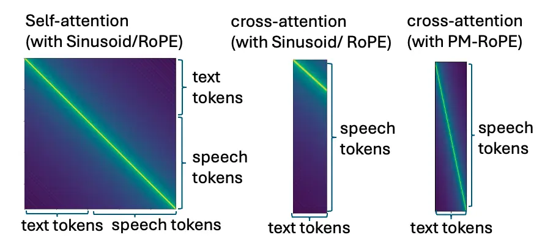
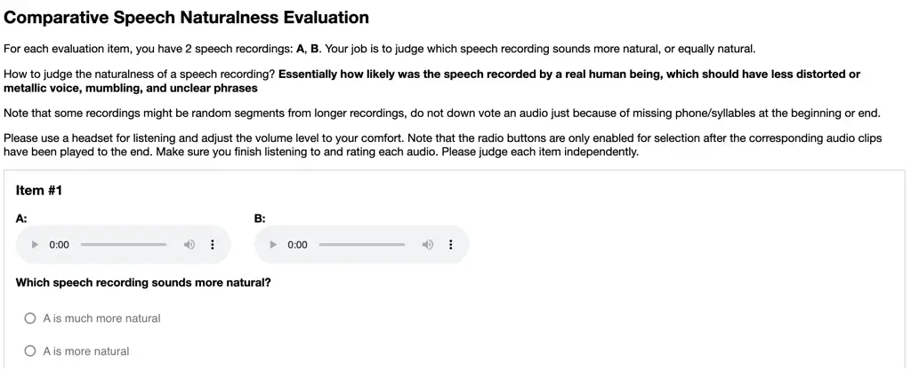
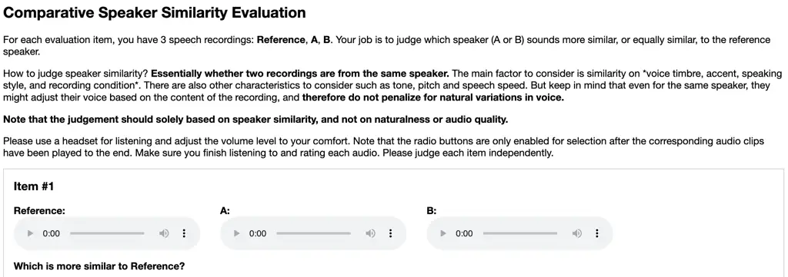
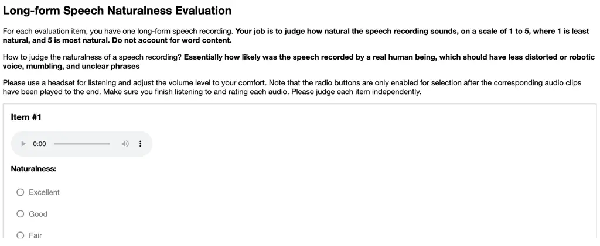
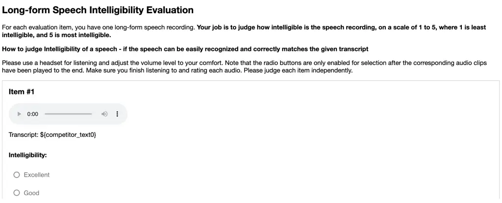
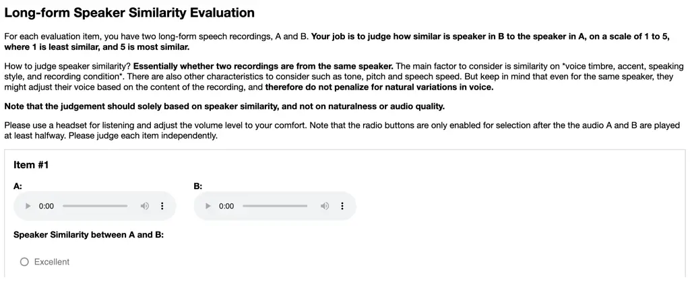

# VoiceStar: Robust Zero-Shot Autoregressive TTS with Duration Control and Extrapolation

Puyuan PengShang-Wen Li Affiliation: The University of Texas at Austin
Email: [pyp@utexas.edu](mailto:)    Abdelrahman Mohamed    David Harwath
Affiliation: The University of Texas at Austin    Rembrand

###### Abstract

We present VoiceStar, the first zero-shot TTS model that achieves both
output duration control and extrapolation. VoiceStar is an
autoregressive encoder-decoder neural codec language model, that
leverages a novel Progress-Monitoring Rotary Position Embedding
(PM-RoPE) and is trained with Continuation-Prompt Mixed (CPM) training.
PM-RoPE enables the model to better align text and speech tokens,
indicates the target duration for the generated speech, and also allows
the model to generate speech waveforms much longer in duration than
those seen during. CPM training also helps to mitigate the
training/inference mismatch, and significantly improves the quality of
the generated speech in terms of speaker similarity and intelligibility.
VoiceStar outperforms or is on par with current state-of-the-art models
on short-form benchmarks such as Librispeech and Seed-TTS, and
significantly outperforms these models on long-form/extrapolation
benchmarks (20-50s) in terms of intelligibility and naturalness. Code
and model weights will be open-sourced. Code and model:
[github.com/jasonppy/VoiceStar](https://github.com/jasonppy/VoiceStar).
Audio samples:
[jasonppy.github.io/VoiceStar_web/](https://jasonppy.github.io/VoiceStar_web/)

## 1 Introduction

Neural codec language models (NCLMs) have rapidly become a
state-of-the-art method for text-to-speech (TTS) generation. These
models use neural network audio codecs \[1, 2\] to tokenize speech
waveforms into sequences of discrete symbols representing temporal
frames.

Figure 1: WER comparison between our VoiceStar and F5-TTS \[3\] under
different context lengths. Both models are trained with maximal context
length of 30 seconds.

Next, a Transformer \[4\] language model is used to autoregressively
model these token sequences. The success of this approach is due to
combination of the modeling power of Transformer language models and the
ease of reconstructing high-fidelity waveforms from the generated token
sequences. However, current NCLM-based TTS models fall short in several
important ways, specifically their lack of fine-grained controllability
(especially for duration control) and their inability to extrapolate to
sequence lengths much longer than those seen during training.

In this paper, we propose solutions for these problems, and also propose
several other novel techniques for improving the quality of speech
generated by NCLM TTS models.

Specifically, we note that current NCLM-based TTS models \[5, 6, 7\] do
not explicitly model the alignment between their input text and speech
sequences, and instead simply concatenate these sequences and put the
onus on the model to learn the alignment via standard positional
encodings. Furthermore, standard positional encodings do not easily
enable a user to specify the desired sequence length of a generation at
inference time.

To fix these flaws, we propose to use a Transformer encoder-decoder
architecture coupled a novel Progress-Monitoring Rotary Position
Embedding (PM-RoPE). This provides the model with a form of flat-start
alignment between text and speech tokens from the very beginning of
training. The PM-RoPEembeddings also encode the desired sequence length
for the generated speech, which implicitly informs the model at each
timestep how far along the generation has progressed relative to this
target length. Furthermore, we also note that existing NCLM-based TTS
models treat voice cloning TTS as speech continuation, which at test
time can entangle the reference speaker’s voice characteristics with the
prosody present in the reference utterance. At inference time, we may
only wish to clone the speaker’s vocal characteristics and let the model
infer what the prosody or emotional delivery should be conditioned on
the text that should be synthesized. To encourage this disentanglement,
during training we perform random prompt mixing: sometimes the model is
trained to perform continuation of an utterance, but other times we
sample a random (different) utterance from the same speaker to serve as
the reference prompt. We call this method continuation-prompt mixed
training (CPM training). The use of CPM training additionally allows us
to apply data augmentation techniques, such as speed perturbation, which
we show improves intelligibility.

To summarize, our contributions are as follows:

1.  1.  We propose Progress-Monitoring Rotary Position Embeddings, or
        PM-RoPE, that leads to robust and duration controllable NCLM-based
        TTS, which further unlocks the capability to generate utterances
        much longer than those seen during training;
2.  2.  We propose continuation-prompt mixed training, or CPM training,
        which improves the intelligibility and naturalness of NCLM-based TTS
        models;
3.  3.  We propose two additional techniques that positively impact the
        performance of NCLM-based TTS models: 1) prompt speed perturbation
        during training; 2) prompt repetition during inference.

Combining the proposed techniques, our model, VoiceStar, is the first
zero-shot TTS model with duration control and length extrapolation
capabilities. VoiceStar achieves performance better than or on par with
other state-of-the-art models on existing short-form benchmarks
including Seed-TTS-eval and Librispeech, and significantly outperforms
current SotA models on long-form/extrapolation benchmarks.

## 2 Related Work

Neural Codec Language Models Pioneered by \[8, 9, 10, 5, 11, 12\], NCLMs
have become one of two state-of-the-art approaches for audio generation,
the other being flow-matching/diffusion models.

|                      |          |             |               |                  |            |
| -------------------- | -------- | ----------- | ------------- | ---------------- | ---------- |
| Model                | Paradigm | Open Source | Voice Cloning | Duration Control | Extrapola. |
| VALL-E \[5\]         | AR+NAR   |             | ✓             |                  |            |
| Voicebox \[13\]      | NAR      |             | ✓             | ✓                |            |
| MaskGCT \[14\]       | NAR      | ✓           | ✓             | ✓                |            |
| F5-TTS \[3\]         | NAR      | ✓           | ✓             | ✓                |            |
| VAT \[15\]           | AR       |             |               |                  | ✓          |
| VoiceCraft \[7\]     | AR       | ✓           | ✓             |                  |            |
| CosyVoice \[16, 17\] | AR       | ✓           | ✓             |                  |            |
| Llasa \[18\]         | AR       | ✓           | ✓             |                  |            |
| VoiceStar (Ours)     | AR       | ✓           | ✓             | ✓                | ✓          |

Table 1: Conceptual comparison of VoiceStar with other models. AR stands
for autoregressive and NAR stands for non-autoregressive. Extrapola.
stands for extrapolation.

Due to the strong in-context learning ability of Transformer LMs, NCLMs
are a particularly effective approach for zero-shot voice-cloning
TTS \[5\]. In this setting, a model must clone the vocal characteristics
of a reference speaker that was unseen during training, using several
seconds of reference speech provided as a prompt at inference time.

Enhancing the Robustness of NCLM. Despite their typically strong
performance, NCLMs are known to have robustness issues, such as skipping
words, inserting extra words, repeating words, and inserting unnaturally
long silences \[5, 7\]. Several papers have proposed to address these
issues from the angle of text-speech alignment. Specifically, \[19, 20\]
use an external forced alignment model to tightly couple the text prompt
and generated speech, while \[21\] makes use of a transducer
architecture to implicitly learn text-speech alignment.  \[22\] uses a
constrained attention mechanism to enforce monotonic text-speech
alignment. T5-TTS \[23\] loads weights from a textual encoder-decoder T5
model and introduces an auxiliary loss to encourage monotonic alignment
in the text-speech cross-attention weights. Also, unlike
speech-continuation training, T5-TTS uses a separate utterance drawn
from the same speaker as the prompt during training. This differs from
our proposed CPM training in two ways: 1) in addition to the reference
speech, we also append the transcript to the text that is to be
generated; 2) we stochastically mix these
same-speaker-different-utterance prompts with utterance
continuation-based prompting, which we show in our ablation experiments
to be better than either style of prompting on its own. VAT \[15\] also
uses an encoder-decoder architecture, and proposes a T5-like relative
position embedding to enhance the text-speech alignment. Notably, VAT
also achieves extrapolation similarly to our model, however it cannot
simultaneously control the duration of the output as our model can.
Another crucial difference between VoiceStar and VAT is that VAT is a
conventional multi-talker TTS system that can only generate speech in
the voices of speakers seen during training, and is not capable of
zero-shot voice-cloning TTS.

Note that in addition to improving the text-speech alignment in NCLMs,
there are other works that have tried other methods to improve
robustness, such as using multi-scale generation to address recency
bias \[24\], enforcing disentanglement of speech attributes \[25\],
incorporating classifier-free guidance \[26\], using chain-of-thought
prompting \[27\], and reinforcement learning from human/AI
feedback \[28, 29, 30\].

Adding new capabilities to NCLMs. \[31, 32\] extended NCLM-based TTS to
the multilingual case. \[33, 34, 35, 36, 37\] propose multi-task
learning for generation and recognition tasks. \[38, 39, 40, 41, 42, 43,
44\] adapt NCLMs to style-controlled speech synthesis. \[45, 46, 47, 48,
49, 50, 51\] propose NCLM-based models for real-time interactive voice
assistants. \[52, 14, 18\] investigate scaling up NCLM-based models.
 \[53\] also focuses on long-form generation, but our work differs from
theirs in that \[53\] specifically trains on long-form speech, while our
model is trained on short-form speech only, yet we show that it can
generalize to long-form speech.

Diffusion/flow-based TTS and Scaling TTS models. Diffusion/flow-based
models represent another popular approach to zero-shot TTS . With masked
reconstruction training, \[54, 13, 55\] show that duffision/flow-based
models can achieve SotA performance in zero-shot TTS. \[56\] employs the
DiT \[57\] architecture with a global duration predictor to improve the
performance of diffusion-based TTS. \[58\] distills efficient diffusion
models via direct metric optimization. E2-TTS \[59\] simplifies the
model pipeline by removing phoneme duration prediction and
grapheme-to-phoneme modules. F5-TTS \[3\] scales E2-TTS to 100k hours of
bilingual (English and Mandarin) speech. \[60\] also scales a flow-based
model to allow for a variety of capabilities such as style control and
general audio generation. Finally, \[16, 61, 17\] proposed hybrid models
that combine NCLM and flow-matching.

## 3 Method

The architecture of VoiceStar along with a typical decoder-only,
zero-shot TTS architecture are shown in Fig. 2. VoiceStar adopts an
encoder-decoder architecture, where the encoder takes as input IPA
phonemes derived from the text transcript, and the decoder
autoregressively predicts speech tokens produced by an Encodec model\[2,
7\]. Text and speech inputs are separated with special tokens to
indicate reference and target, and are positioned using PM-ROPE,
enabling controllable, zero-shot TTS with duration extrapolation
capability. The following two sections describe the key differences
between our model and prior works in detail.

Figure 2: Left: The architecture of VoiceStar. Right: the common general
architecture for zero-shot TTS models, such as VALL-E (AR part),
VoiceCraft, CosyVoice, FireRedTTS, Llasa etc. VoiceStar differs from
them in three aspects: 1) it uses an encoder-decoder architecture with
PM-RoPE to provide text-speech alignment, duration control, and
extrapolation capability; 2) it uses prompt-continuation mixed training
to mitigate the training/inference mismatch and enhance robustness. Our
speech tokenizer based on Encodec \[2\] uses multiple codebooks and we
apply the delay pattern \[62\] to them, which is not depicted in this
figure for simplicity.

### 3.1 Progress-Monitoring RoPE

We first briefly describe the vanilla dot-product attention
mechanism \[63\], then describe the Rotary Position Embedding
(RoPE) \[64\]. Next, we describe our proposed extension of RoPE to
Progress-Monitoring RoPE (PM-RoPE) which provides better text-speech
alignment, informs the model of the target output duration, and enables
inference-time duration extrapolation.

Dot-product attention. We use the commonly used “source-target”
terminology throughout to describe different attention mechanisms. Note
that target and source can reference to the same sequence, in which case
attention refers to self-attention. Denote the source token embedding at
position $`s`$ as $`X_{s}\in\mathbb{R}^{D},1\leq s\leq S`$ and the
embedding of target token at position $`t`$ as
$`Y_{t}\in\mathbb{R}^{D},1\leq t\leq T`$. The embeddings first get
projected into key, query, and value vectors as

```math
K_{s}=f_{k}(X_{s},s):=W_{k}X_{s},\quad Q_{t}=f_{q}(Y_{t},t):=W_{q}Y_{t},\quad V_{s}=f_{v}(X_{s},s):=W_{v}X_{s}
```

Where $`W_{k}`$, $`W_{q}`$, and $`W_{v}`$ are learnable matrices.

We denote the inner product operator as $`\langle\cdot,\cdot\rangle`$.
Also let the attention weight from target token at position $`t`$ to
source token at position $`s`$ be $`W_{t,s}`$, and the output of the
attention layer at position $`t`$ be $`O_{t}`$, which are calculated
according to:
$`W_{t,s}=\exp\left(\frac{\langle f_{q}(Y_{t},t),f_{k}(X_{s},s)\rangle}{\sqrt{D}}\right)/\sum_{s^{\prime}}\exp\left(\frac{\langle f_{q}(Y_{t},t),f_{k}(X_{s^{\prime}},s^{\prime})\rangle}{\sqrt{D}}\right)`$
and $`O_{t}=\sum_{s^{\prime}}W_{t,s^{\prime}}V_{s^{\prime}}`$.

The attention machenism is a powerful way to provide contextualization,
but it does not explicitly include token position information.
Therefore, various position embedding methods have been proposed to
address this issue \[65, 66, 64, 67\].

RoPE \[64\]. Rotary Position Embedding (RoPE) redefines the projection
functions $`f_{q}(Y_{t},t)`$ and $`f_{k}(X_{s},s)`$ such that their
inner product is a function $`g()`$ of the corresponding target and
source token embeddings, and their relative position, which can be
formally written as:

```math
\langle f^{\textsc{RoPE}}_{q}(Y_{t},t),f^{\textsc{RoPE}}_{k}(X_{s},s)\rangle=g(Y_{t},X_{s},t-s)
```

For simplicity, we first explain RoPE in the 2-dimensional case. The 2-D
rotation matrix $`R(\gamma)`$ is defined as:

```math
R(\gamma)=\left(\begin{array}[]{cc}\cos{\gamma}&-\sin{\gamma}\\
\sin{\gamma}&\cos{\gamma}\end{array}\right)
```

RoPE applies this rotation matrix to key and query calculation according
to:

```math
f^{\textsc{RoPE}}_{k}(X_{s},s)=R(s\theta)W_{k}X_{s},\quad f^{\textsc{RoPE}}_{q}(Y_{t},t)=R(t\theta)W_{q}Y_{t}
```

Where $`\theta`$ is a hyperparameter that specifies the per position
rotation angle. The inner product between the key and the query becomes:

```math
\langle f^{\textsc{RoPE}}_{q}(Y_{t},t),f^{\textsc{RoPE}}_{k}(X_{s},s)\rangle=Y_{t}^{\top}W_{q}^{\top}R((t-s)\theta)W_{k}X_{s}
```

Observe that due to the application of the rotation matrix, the inner
product is a function of $`Y_{t}`$, $`X_{s}`$, and their relative
position within the input sequence $`t-s`$.

The value vector is calculated the same as in vanilla attention, i.e.
$`f^{\textsc{RoPE}}_{v}(X_{s},s):=f_{v}(X_{s},s)`$. Also the attention
weights $`W_{t,s}`$ and overall attention output $`O_{t}`$ are
calculated similarly to vanilla attention. An important property of RoPE
is recency bias, i.e. the inner product between two tokens decreases as
the distance between them increases, and therefore for any given
position, nearby tokens will have a larger contribution to the attention
output for that position. For higher dimensional spaces, RoPE divides
the space into D/2 2-dimensional spaces, and applies 2-dimensional
rotation matrices with different $`\theta`$s to each 2-dimensional
space; more details can be found in Appendix A.

Progress-Monitoring RoPE (PM-RoPE). While RoPE has been widely used in
textual decoder-only LLMs, speech-text LMs utilize two distinct input
sequences which often are implicitly aligned. We therefore propose a
novel extension to RoPE, namely Progress-Monitoring RoPE (PM-RoPE). When
combined with an encoder-decoder NCLM, PM-RoPE brings three benefits: 1)
improved text-speech alignment, 2) duration control during generation,
and 3) test-time extrapolation. Mathematically, PM-RoPE introduces a
simple change to $`f_{k}`$ and $`f_{q}`$:

```math
f^{\textsc{PM-RoPE}}_{k}(X_{s},s)=R\left(\frac{s}{S}N\theta\right)W_{k}X_{s},\quad f^{\textsc{PM-RoPE}}_{q}(Y_{t},t)=R\left(\frac{t}{T}N\theta\right)W_{q}Y_{t}
```

where instead of using positions $`s`$ and $`t`$, we measure the
fractional progress of $`s`$ towards some maximum value $`S`$, and the
progress of $`t`$ towards some maximum value $`T`$, i.e. $`\frac{s}{S}`$
and $`\frac{t}{T}`$. Specifically, $`S`$ is the total sequence length of
the source tokens, and $`T`$ is the (desired) total sequence length of
the target tokens. $`N`$ is a hyperparameter that rescales the rotation
angle, which can also be interpreted as the pseudo total sequence
length. The inner product between a key vector and a value vector
becomes:

```math
\langle f^{\textsc{PM-RoPE}}_{q}(Y_{t},t),f^{\textsc{PM-RoPE}}_{k}(X_{s},s)\rangle=Y_{t}^{\top}W_{q}^{\top}R\left(\left(\frac{t}{T}-\frac{s}{S}\right)N\theta\right)W_{k}X_{s}
```

Note that the inner product is a function of $`Y_{t}`$, $`X_{s}`$ and
their relative progress $`\frac{t}{T}-\frac{s}{S}`$. Similar to RoPE,
PM-RoPE also enjoys the long-term decay property, i.e. the inner product
between two tokens decreases as the difference between their progresses
increases.

In our encoder-decoder NCLM (the left hand side in Fig. 2), the encoder
takes as input a phonemized text transcript, and the decoder predicts
acoustic tokens in an autoregressive fashion. We treat the phonetic
tokens as the source tokens $`X`$, and the acoustic tokens as the target
tokens $`Y`$. When PM-RoPE is applied to the decoder’s self-attention
mechanism, it provides information about the location of the current
acoustic token within the overall target sequence length, which enables
output duration control - during autoregressive generation, when the
progress of the target token sequence reaches 100% (i.e.
$`\frac{t}{T}=1`$, where the value of $`T`$ is specified in advance by
the user), the model should learn to emit an end-of-generation token.
When PM-RoPE is applied to the cross-attention connecting the encoder to
the decoder (acoustic tokens attending to phonetic tokens), it provides
information about the temporal alignment between the two modalities.
This is helpful during training because it provides a flat-start initial
alignment to the untrained model, since an acoustic token’s
cross-attention will be concentrated at the phonetic tokens occupying
the same relative position within the phonetic sequence, i.e. where the
difference $`\frac{t}{T}-\frac{s}{S}`$ is small. See Appendix A.2 for
more details.

Figure 3: An example on how PM-RoPE turns extrapolation into
interpolation: during training, the maximal training sequence length is
4, and during inference the target length is 7. The positional encodings
for both can be expressed as sampling points inside the same interval
$`[0,N]`$.

We found it to be necessary to apply PM-RoPE to the encoder’s phonetic
input sequence to achieve extrapolation, which we believe is due to the
fact that it allows both the encoder and decoder sequences to have a
fixed pseudo sequence length $`N`$. Therefore, we can extrapolate to
longer phonetic or acoustic token sequences by sampling a larger number
of points in the interval $`[0,N]`$ and interpolating between them. See
Fig.3 for an illustrative example.

### 3.2 Continuation-Prompt Mixed Training

Although framing zero-shot TTS as speech continuation effectively
leverages the strong in-context learning capabilities of LLM and thus
achieves high speaker similarity, it also introduces a degree of
training/inference mismatch. During training, the emotion, semantics,
prosody, and speaking style are usually consistent within an utterance,
and therefore will be consistent between the reference speech and the
generation target. However, during inference the semantics or emotion
expressed by the reference utterance may be very different than those
implicitly expressed in the target transcript input by a user. In this
case, the model must be able to adjust the prosody and emotional
delivery to match the target transcript, even if they do not match those
found in the reference utterance. We propose a simple method to mitigate
this mismatch: continuation-prompt mixed (CPM) training (left hand side
of Fig. 2). During each training iteration, with some probability $`p`$
we randomly sample two different utterances from the same speaker and
use one as the reference utterance and one as the target. With
probability $`1-p`$ we use standard speech continuation based-training,
i.e. we only sample one utterance and mask it, using the unmasked
portion of the utterance as the reference and the masked portion of the
utterance as the target. When using two different utterances we also
have the opportunity to perform data augmentation to one but not the
other. Specifically, we apply speed perturbation to the reference
utterance with probability $`p^{\prime}`$ and speed factor
$`\delta=0.25`$. This randomly speeds up or slows down the reference
speech, keeping its total duration within $`1\pm\delta`$ of its original
duration. When a prompt is selected, we use learnable sep_tokens to
separate the prompt and target, and only calculate the loss on target
tokens.

Prompt repetition for improving speaker similarity. Another benefit of
CPM training is that it allows us to improve speaker similarity between
the generated speech and the reference speech by simply repeating the
reference utterance and its transcript multiple times, without harming
intelligibility. Counterintuitive as it might be, since no additional
information is provided by repeating the prompt, we hypothesize that
repeating the reference utterance increases the influence of the
ground-truth speech tokens when performing the weighted sum over tokens
within attention layers, biasing the model to attend more to the
reference speech tokens than its previous generations, resulting in
generated speech that is more similar to the reference prompt. As we
quantitatively show in our experiments (Fig. 7(b)), when a model is
trained solely on speech continuation, reference prompt repetition
degrades the intelligibility (WER) of the generated speech because it
biases the model to exhibit a repetitive style. On the other hand, when
using CPM training this issue is mitigated because 1) the model has been
trained on examples where the reference speech and target speech express
different styles and 2) sep_tokens explicitly separates the reference
and target utterances, makes it easier to align the text and the
corresponding speech.

## 4 Experiments

### 4.1 Setup

Training data. Our training set consists of the English portion of
Emilia \[68\] and a subset of the training splits of Libriheavy and
Libriheavy-long \[69\], totaling 65K hours. Emilia is a recently
proposed multilingual dataset comprised of in-the-wild speech of diverse
styles. Its English portion contains 46K hours of speech, and after
filtering out low quality data following \[3\], approximately 40K hours
remain with a maximum utterance duration of 30 seconds. Libriheavy is an
automatically transcribed version of the LibriLight audiobook corpus.
The original release of Libriheavy contains 50k hours of speech, and we
also make use of the recently released Libriheavy-long dataset, which is
a re-segmented version that has longer segments ranging from 20 seconds
to 100 seconds, totaling 42K hours. Note that in order to fairly compare
with other models on extrapolation, we only train our models on
utterances with duration less than or equal to 30 seconds. We randomly
sampled 25K hours of speech from Libriheavy. Crucially, both Emilia and
Libriheavy contain speaker information (although speaker information in
Emilia is provided using automatic speaker diarization, we found it to
be very reliable), and therefore we are able to sample multiple
utterances from the same speaker for CPM training. We phonemize all text
transcripts into the IPA phoneme set using espeak-ng \[70\].

Evaluation tasks and data. We evaluate our models on two
English-language, zero-shot TTS tasks: short-form TTS and long-form TTS.
For short-form TTS ($`\leq`$20s): we use Seed-TTS eval set \[71\] and
Librispeech-PC \[3\], each containing around 1000 prompt-target pairs,
where both the prompt and target speech are expected to be less than 10
seconds. For Long-form TTS, we consider three duration ranges (20-30s,
30-40s, and 40s-50s) and source the evaluation data from the libriheavy
test and validation sets (we use validation set due to the scarcity of
long-form speech samples in the test set. We thus avoid using the
validation set to do any hyperparameter tuning or early stopping of
model training). We sample 1000 prompt target pairs for the 20-30s
range, 500 pairs for the 30-40s range, and 100 pairs for the 40-50s
duration range. For our ablation studies, we sample a 1000 utterance
evaluation set from the Libriheavy validation set with lengths shorter
than 20 seconds for short-form ablations (Tab. 2), and lengths between
20 and 30 seconds for extrapolation (Tab. 4.2, no overlap with the
testsets). For duration specification with the $`\leq`$20s test sets, we
use follow \[3\] and estimate the duration of the target sequence by
calculating the speaking rate of the reference prompt (in terms of
seconds-per-character) and multiplying this by the character length of
the target text; for ablations and long-form TTS, we use the ground
truth duration because the estimated duration sometimes falls outside of
the target range (for example, when testing model performance on 40-50s
speech, the estimated duration could be only 35 seconds), and we only
compare against models that can also control the duration of their
generations. We also show in Appendix C.3 our model’s performance on
long-form TTS when using the automatically estimated durations.

Model, training, inference, and baselines. Our main model has 840
million parameters, composed of 12 standard Transformer encoder layers
and 40 Transformer decoder layers, where the dot-product attention
mechanism is replaced by our proposed PM-RoPE. The hidden dimensions for
both the encoder and decoder are 1024, and the model has 16 attention
heads. For our ablation studies, we train 230 million parameter models
with a hidden states dimension of 768, composed of 10 encoder layers and
16 decoder layers. The decoder-only model used in our ablation studies
has 16 layers with a hidden dimension of 1024. We use the 4-codebook
50Hz Encodec model released by VoiceCraft \[7\] as our speech tokenizer.
The pseudo sequence length $`N`$ is set to 2000 for all models where
PM-RoPEis used. Models are trained with ScaledAdam \[72\] with a maximum
batch size of 0.3(ablation)/1.78(main) hours of audio. The base learning
rate is $`0.03`$ and scheduled by the Eden scheduler \[72\]. All models
are trained for 50k steps with codebook loss weights of {5, 1, 0.5,
0.1}, similarly to \[7\]. Our main model is further trained for an
additional 18k steps with codebook weights {2.5, 2, 1.5, 0.6}, as we
found it to improve both intelligibility and speaker similarity metrics.
Our main model is trained for 8 days on 8 L40 and 16 GH200 GPUs. The
main model is trained on the entire 65k hour training set with maximal
context length of 30 seconds, and the ablation models are trained on a
16k hour subset with maximal context length of 20 seconds. We use top-k
sampling during inference with $`k=10`$. For our baselines, we compare
against VoiceCraft \[7\], FireRedTTS \[61\], CosyVoice \[16\],
MaskGCT \[3\], F5-TTS \[3\], CosyVoice2 \[17\], and Llasa \[18\]. We
additionally report in Appendix C.2 the performance of closed source
models: Seed-TTS \[71\], and concurrent work Metis \[37\] and
SparkTTS \[73\].

Evaluation Metrics. We use word error rate (WER) and speaker similarity
(SpkSim) as automatic evaluation metrics following prior works. For our
ablation studies, we additionally use UTMOS\[74\] to measure naturalness
and DurDiff defined as the absolute difference between target generation
duration and actual duration, to measure duration controllability. For
comparison with other SoTA models on short-form TTS, we follow Seed-TTS
eval setup and use Whisper-v3 \[75\] for ASR and the WavLM speaker
verification model \[76\] for SpkSim. For long-form TTS, we used Whisper
Large-v3-turbo for ASR as we found it to be both more accurate and
faster. We additionally conduct subjective human evaluation using Amazon
Mechanical Turk, focusing on three aspects: intelligibility,
naturalness, and speaker similarity. For $`\leq`$20s testsets, since
most models performance similarly, we adapt the Comparative MOS protocal
from \[77\], where we compare each generated sample with ground truth
target sample on a 7-point Likert scale (-3 to 3). For 20-50s testsets,
we use the regular MOS protocol, where we ask humans to rate each
generated sample on a 5-point Likert scale (1 to 5). For each sample, we
collect 10 human ratings for CMOS and 5 for MOS. To facilitate a fairer
comparison, we also resample all speech waveforms to 16 kHz.

### 4.2 Ablations

|              |          |              |                    |                    |                     |                        |
| ------------ | -------- | ------------ | ------------------ | ------------------ | ------------------- | ---------------------- |
| Architecture | PE       | Training     | WER $`\downarrow`$ | UTMOS $`\uparrow`$ | SpkSim $`\uparrow`$ | DurDiff $`\downarrow`$ |
| Dec          | Sinusoid | Continuation | 11.04              | 2.767              | 0.537               | 1.245                  |
| Enc-Dec      | RoPE     | Continuation | 8.82               | 3.301              | 0.592               | 1.812                  |
| Enc-Dec      | PM-RoPE  | Continuation | 8.49               | 3.337              | 0.601               | 0.009                  |
| Enc-Dec      | PM-RoPE  | CPM          | 6.42               | 3.365              | 0.587               | 0.009                  |
| Enc-Dec      | PM-RoPE  | CPM+SA       | 5.66               | 3.345              | 0.583               | 0.009                  |

Table 2: Ablation studies on enc-dec architecutre, PM-RoPE, and CPM
training. CPM stands for contiuation-prompt mixed training. SA stands
for speech augmentation on prompt during training.

Tab. 2 shows how each component of our model contributes to its overall
performance. We first compare the performance of the decoder-only model
with sinusoidal position embedding (PE) and the encoder-decoder model
with RoPE. The encoder-decoder model outperforms the decoder-only in all
metrics except for DurDiff. But when RoPE is replaced by PM-RoPE(line 3
v.s. line 4), we see DurDiff drops from 1.812 to 0.009, which is a lower
bound for this metric under our setup, because the codec token
resolution is 0.02s per token. This illustrates the dramatic
effectiveness of PM-RoPE in enabling precise duration control. We also
see a slight improvement on all other metrics, indicating the benefit of
the improved text-speech alignment introduced by PM-RoPE. Lastly, we see
further improvement when CPM and speed augmentation is applied. Fig. 4
further shows the impact of different probability of using prompt as
prefix and speed augmentation on prompt during training. Tab. 4.2 shows
the benefit of PM-RoPE on test time extrapolation, where the models
trained on a maximal 20 seconds context length (prompt + target speech
duration) are tested on 20 to 30 seconds context length. We see that to
ensure extrapolation, it is necessary to apply PM-RoPE on both the
encoder and the decoder, additionally we see that PM-RoPE improves the
extrapolation WER from 11.46 to 6.75 compared to RoPE.

Figure 4: Effects of prompt-prob and speed augmentation for CPM
training.

|         |         |                   |                     |
| ------- | ------- | ----------------- | ------------------- |
| Enc PE  | Dec PE  | WER$`\downarrow`$ | SpkSim $`\uparrow`$ |
| RoPE    | RoPE    | 11.46             | 0.630               |
| RoPE    | PM-RoPE | 28.67             | 0.605               |
| PM-RoPE | PM-RoPE | 6.75              | 0.640               |

Table 3: Extrapolation capabilities of RoPE and PM-RoPE. max training
context length: 20s, test: 20s to 30s.

Fig. 5 shows the impact of prompt repetition on generation quality,
measured by WER (left in red) and SpkSim (right in blue). The red and
blue dotted horizontal lines indicate the performance when we repeat
prompt for each sample so that the context length (i.e. prompt +
generation length) reaches the maximum seen during training, i.e. 20
seconds.

Figure 5: Ablation on the impact prompt repetition on generation quality
measured by WER and SpkSim. The red and blue horizontal dotted lines are
the performance when we repeat prompt so that the context length reach
the maximal training duration.

We see that as the number of repetitions increases from 0 to 3, WER sees
very little degradation, while SpkSim improves from around 0.63 to 0.66.
But as we further increase the number of repetitions, both WER and
SpkSim start to degrade. In our main experiments on short-form TTS, we
choose to repeat each sample until the context length reaches the
maximal training duration (i.e. the approach that produces the dotted
lines in Figure5). On long-form TTS, we repeat the prompt once for the
20-30s range and do not apply prompt repetition to longer ranges. To
test whether prompt repetition can also improve the performance of
models trained with speech continuation, we tested F5-TTS on the same
dataset using the same prompt repetition technique. We found that for
F5-TTS, prompt repetition has a significantly negative impact on
intelligibility: repeating prompt to reach the maximum duration seen
during training duration degrades WER from 3.1 to 75.4. Further
experiments on the impact of prompt repetition on F5-TTS can be found in
Appendix C.1.

### 4.3 Short-form TTS

|                   |      |        |                  |                  |
| ----------------- | ---- | ------ | ---------------- | ---------------- |
| Model             | WER  | SpkSim | S-CMOS           | N-CMOS           |
| LibriSpeech-PC    |      |        |                  |                  |
| Ground Truth      | 2.23 | 0.69   | 0.00             | 0.00             |
| FireRedTTS \[61\] | 7.73 | 0.45   | -0.48$`\pm`$0.22 | -0.89$`\pm`$0.21 |
| Llasa 1B \[18\]   | 4.28 | 0.47   | 0.27$`\pm`$0.19  | 0.13$`\pm`$0.20  |
| CosyVoice \[16\]  | 3.40 | 0.66   | 0.37$`\pm`$0.19  | 0.07$`\pm`$0.21  |
| VoiceCraft \[7\]  | 3.09 | 0.52   | 0.15$`\pm`$0.20  | -0.37$`\pm`$0.20 |
| CosyVoice2 \[17\] | 2.66 | 0.66   | 0.40$`\pm`$0.19  | 0.06$`\pm`$0.21  |
| MaskGCT \[14\]    | 2.66 | 0.66   | 0.21$`\pm`$0.20  | -0.25$`\pm`$0.21 |
| F5-TTS \[3\]      | 2.57 | 0.65   | 0.12$`\pm`$0.20  | -0.43$`\pm`$0.21 |
| VoiceStar         | 2.64 | 0.63   | 0.60$`\pm`$0.19  | 0.18$`\pm`$0.21  |
| Seed-TTS (en)     |      |        |                  |                  |
| Ground Truth      | 2.15 | 0.73   | 0.00             | 0.00             |
| FireRedTTS \[61\] | 9.09 | 0.45   | -1.24$`\pm`$0.16 | -0.92$`\pm`$0.18 |
| Llasa 1B \[18\]   | 5.13 | 0.58   | -0.23$`\pm`$0.14 | 0.05$`\pm`$0.16  |
| CosyVoice \[16\]  | 4.20 | 0.64   | -0.42$`\pm`$0.16 | -0.36$`\pm`$0.18 |
| VoiceCraft \[7\]  | 3.45 | 0.52   | -0.84$`\pm`$0.19 | -0.73$`\pm`$0.18 |
| CosyVoice2 \[17\] | 2.69 | 0.66   | -0.11$`\pm`$0.16 | -0.19$`\pm`$0.15 |
| MaskGCT \[14\]    | 2.52 | 0.71   | -0.13$`\pm`$0.15 | -0.14$`\pm`$0.15 |
| F5-TTS \[3\]      | 1.78 | 0.66   | -0.18$`\pm`$0.14 | -0.21$`\pm`$0.16 |
| VoiceStar         | 2.15 | 0.63   | -0.32$`\pm`$0.15 | -0.18$`\pm`$0.14 |

Table 4: Short context evaluation sets ($`\leq 20`$ seconds):
LibriSpeech-PC and Seed-TTS. N-CMOS stands for naturalness comparative
MOS, and S-CMOS stands for Speaker Similarity Comparative MOS, where
model generated samples are compared to ground truth. Except for ground
truth which are taken from \[71\] and \[3\], numbers for other models
are reproduced by us using the corresponding official codebases, and a
comparison between the reported numbers in other papers and our
reproduced numbers can be found in App. C.2.

As shown in Tab. 4, on Librispeech-PC \[3\], VoiceStar outperforms other
models during human evaluation on both naturalness (N-CMOS) and speaker
similarity (S-CMOS). Notably, VoiceStar (along with several other
models) even outperforms the ground truth speech. Anecdotally, we
hypothesize that this is due to the fact that audiobook speech is highly
regular and sometimes monotonic, but since our model is also trained on
in-the-wild conversational data, it tends to generate speech with a more
natural flow. On Seed-TTS (en) \[71\], VoiceStar is slightly worse than
the best performing models Llasa 1B and MaskGCT. However, we find that
the automatic WER and SpkSim metrics are not perfectly correlated with
human judgements: for example, Llasa 1B achieves a SpkSim of 0.58, which
is lower than VoiceStar, but humans rate it to have a higher speaker
similarity than VoiceStar. Overall, most models perform similarly on the
two test sets and are often rated as equal or even better than ground
truth.

### 4.4 Long-form TTS

|                                   |       |        |                 |                 |                 |
| --------------------------------- | ----- | ------ | --------------- | --------------- | --------------- |
| Model                             | WER   | SpkSim | S-MOS           | I-MOS           | N-MOS           |
| 20s-30s, within training duration |       |        |                 |                 |                 |
| Ground Truth                      | 3.78  | 0.86   | 3.95$`\pm`$0.16 | 4.01$`\pm`$0.13 | 3.63$`\pm`$0.14 |
| F5-TTS \[3\]                      | 5.31  | 0.70   | 4.03$`\pm`$0.15 | 3.47$`\pm`$0.15 | 2.97$`\pm`$0.17 |
| MaskGCT \[14\]                    | 3.91  | 0.76   | 4.29$`\pm`$0.13 | 3.55$`\pm`$0.16 | 3.07$`\pm`$0.18 |
| VoiceStar                         | 3.53  | 0.72   | 4.13$`\pm`$0.14 | 3.75$`\pm`$0.14 | 3.45$`\pm`$0.15 |
| 30s-40s, extrapolation            |       |        |                 |                 |                 |
| Ground Truth                      | 3.13  | 0.86   | 4.12$`\pm`$0.19 | 4.21$`\pm`$0.15 | 4.05$`\pm`$0.16 |
| F5-TTS \[3\]                      | 34.15 | 0.70   | 3.97$`\pm`$0.15 | 2.21$`\pm`$0.15 | 2.15$`\pm`$0.16 |
| MaskGCT \[14\]                    | 13.81 | 0.75   | 4.27$`\pm`$0.14 | 3.06$`\pm`$0.18 | 2.79$`\pm`$0.18 |
| VoiceStar                         | 7.27  | 0.70   | 4.11$`\pm`$0.17 | 4.16$`\pm`$0.14 | 3.69$`\pm`$0.16 |
| 40s-50s, extrapolation            |       |        |                 |                 |                 |
| Ground Truth                      | 2.52  | 0.87   | 4.33$`\pm`$0.16 | 4.52$`\pm`$0.11 | 3.99$`\pm`$0.16 |
| F5-TTS \[3\]                      | 52.44 | 0.70   | 4.04$`\pm`$0.17 | 1.94$`\pm`$0.15 | 2.35$`\pm`$0.14 |
| MaskGCT \[14\]                    | 82.29 | 0.65   | 3.95$`\pm`$0.20 | 1.42$`\pm`$0.10 | 1.61$`\pm`$0.13 |
| VoiceStar                         | 11.91 | 0.70   | 3.94$`\pm`$0.18 | 3.23$`\pm`$0.19 | 3.23$`\pm`$0.19 |

Table 5: Long context evaluation results. All models are trained with a
maximal training length of 30 seconds. I in I-MOS stands for
intelligibility, N stands for naturalness, and S stands for speaker
similarity.

Long-form TTS is much more challenging than short-form. To force a model
to generate speech of a predefined duration, we only compare models that
support duration control. We see in Tab. 5 that across different context
length ranges, VoiceStar significantly outperforms other models on WER,
intelligibility MOS (I-MOS), and naturalness MOS (N-MOS), and the gap is
especially large as the context length increases. As for speaker
similarity, VoiceStar is a close second on every range, and is on par
with or better than ground truth target speech in the 20-40s range. By
listening to bad samples, we found that different models have different
failure modes - for F5-TTS and MaskGCT, the models tend to clone the
prompt voice well but devolve into unintelligible speech or random
words. In contrast, VoiceStar sometimes generates speech in a voice that
that slightly deviates from that of the prompt, but the generated words
follow the target transcript closely and with a high naturalness.

## 5 Conclusion

We introduce VoiceStar, a novel autoregressive NCLM-based, zero-shot TTS
model that achieves robust and duration-controllable speech synthesis,
as well as the ability to generate speech longer than what was seen
during training. The key novel contributions of our approach include the
Progress-Monitoring Rotary Position Embedding (PM-RoPE) for effective
text-speech alignment, duration control, and extrapolation; and
continuation-prompt mixed training (CPM) to address the
training/inference mismatch. By scaling up the training data and model
size, VoiceStar sets new state-of-the-art results on both short-form and
long-form TTS benchmarks.

## References

- \[1\] Neil Zeghidour, Alejandro Luebs, Ahmed Omran, Jan Skoglund, and
  Marco Tagliasacchi. Soundstream: An end-to-end neural audio codec.
  IEEE/ACM Transactions on Audio, Speech, and Language Processing,
  30:495–507, 2021.
- \[2\] Alexandre Defossez, Jade Copet, Gabriel Synnaeve, and Yossi Adi.
  High fidelity neural audio compression. ArXiv, abs/2210.13438, 2022.
- \[3\] Yushen Chen, Zhikang Niu, Ziyang Ma, Keqi Deng, Chunhui Wang,
  Jian Zhao, Kai Yu, and Xie Chen. F5-tts: A fairytaler that fakes
  fluent and faithful speech with flow matching. ArXiv,
  abs/2410.06885, 2024.
- \[4\] Ashish Vaswani, Noam M. Shazeer, Niki Parmar, Jakob Uszkoreit,
  Llion Jones, Aidan N. Gomez, Lukasz Kaiser, and Illia Polosukhin.
  Attention is all you need. In Neural Information Processing
  Systems, 2017.
- \[5\] Chengyi Wang, Sanyuan Chen, Yu Wu, Zi-Hua Zhang, Long Zhou,
  Shujie Liu, Zhuo Chen, Yanqing Liu, Huaming Wang, Jinyu Li, Lei He,
  Sheng Zhao, and Furu Wei. Neural codec language models are zero-shot
  text to speech synthesizers. ArXiv, abs/2301.02111, 2023.
- \[6\] Sanyuan Chen, Shujie Liu, Long Zhou, Yanqing Liu, Xu Tan, Jinyu
  Li, Sheng Zhao, Yao Qian, and Furu Wei. Vall-e 2: Neural codec
  language models are human parity zero-shot text to speech
  synthesizers, 2024.
- \[7\] Puyuan Peng, Po-Yao Huang, Shang-Wen Li, Abdelrahman Mohamed,
  and David Harwath. Voicecraft: Zero-shot speech editing and
  text-to-speech in the wild. In Annual Meeting of the Association for
  Computational Linguistics, 2024.
- \[8\] Kushal Lakhotia, Evgeny Kharitonov, Wei-Ning Hsu, Yossi Adi,
  Adam Polyak, Benjamin Bolte, Tu Nguyen, Jade Copet, Alexei Baevski,
  Adel Ben Mohamed, and Emmanuel Dupoux. On generative spoken language
  modeling from raw audio. Transactions of the Association for
  Computational Linguistics, 9:1336–1354, 2021.
- \[9\] Zalán Borsos, Raphaël Marinier, Damien Vincent, Eugene
  Kharitonov, Olivier Pietquin, Matthew Sharifi, Dominik Roblek, Olivier
  Teboul, David Grangier, Marco Tagliasacchi, and Neil Zeghidour.
  Audiolm: A language modeling approach to audio generation. IEEE/ACM
  Transactions on Audio, Speech, and Language Processing,
  31:2523–2533, 2022.
- \[10\] Felix Kreuk, Gabriel Synnaeve, Adam Polyak, Uriel Singer,
  Alexandre Defossez, Jade Copet, Devi Parikh, Yaniv Taigman, and Yossi
  Adi. Audiogen: Textually guided audio generation. ArXiv,
  abs/2209.15352, 2022.
- \[11\] Eugene Kharitonov, Damien Vincent, Zalán Borsos, Raphaël
  Marinier, Sertan Girgin, Olivier Pietquin, Matthew Sharifi, Marco
  Tagliasacchi, and Neil Zeghidour. Speak, read and prompt:
  High-fidelity text-to-speech with minimal supervision. Transactions of
  the Association for Computational Linguistics, 11:1703–1718, 2023.
- \[12\] Zalán Borsos, Matthew Sharifi, Damien Vincent, Eugene
  Kharitonov, Neil Zeghidour, and Marco Tagliasacchi. Soundstorm:
  Efficient parallel audio generation. ArXiv, abs/2305.09636, 2023.
- \[13\] Matt Le, Apoorv Vyas, Bowen Shi, Brian Karrer, Leda Sari,
  Rashel Moritz, Mary Williamson, Vimal Manohar, Yossi Adi, Jay
  Mahadeokar, and Wei-Ning Hsu. Voicebox: Text-guided multilingual
  universal speech generation at scale. ArXiv, abs/2306.15687, 2023.
- \[14\] Yuancheng Wang, Haoyue Zhan, Liwei Liu, Ruihong Zeng, Haotian
  Guo, Jiachen Zheng, Qiang Zhang, Xueyao Zhang, Shunsi Zhang, and
  Zhizheng Wu. Maskgct: Zero-shot text-to-speech with masked generative
  codec transformer. ArXiv, abs/2409.00750, 2024.
- \[15\] Eric Battenberg, R. J. Skerry-Ryan, Daisy Stanton, Soroosh
  Mariooryad, Matt Shannon, Julian Salazar, and David Kao. Very
  attentive tacotron: Robust and unbounded length generalization in
  autoregressive transformer-based text-to-speech. ArXiv,
  abs/2410.22179, 2024.
- \[16\] Zhihao Du, Qian Chen, Shiliang Zhang, Kai Hu, Heng Lu, Yexin
  Yang, Hangrui Hu, Siqi Zheng, Yue Gu, Ziyang Ma, Zhifu Gao, and Zhijie
  Yan. Cosyvoice: A scalable multilingual zero-shot text-to-speech
  synthesizer based on supervised semantic tokens. ArXiv,
  abs/2407.05407, 2024.
- \[17\] Zhihao Du, Yuxuan Wang, Qian Chen, Xian Shi, Xiang Lv, Tianyu
  Zhao, Zhifu Gao, Yexin Yang, Changfeng Gao, Hui Wang, Fan Yu, Huadai
  Liu, Zhengyan Sheng, Yue Gu, Chong Deng, Wen Wang, Shiliang Zhang,
  Zhijie Yan, and Jing-Ru Zhou. Cosyvoice 2: Scalable streaming speech
  synthesis with large language models. ArXiv, abs/2412.10117, 2024.
- \[18\] Zhen Ye, Xinfa Zhu, Chi min Chan, Xinsheng Wang, Xu Tan, Jiahe
  Lei, Yi Peng, Haohe Liu, Yizhu Jin, Zheqi Dai, Hongzhan Lin, Jianyi
  Chen, Xingjian Du, Liumeng Xue, Yunlin Chen, Zhifei Li, Lei Xie,
  Qiuqiang Kong, Yi-Ting Guo, and Wei Xue. Llasa: Scaling train-time and
  inference-time compute for llama-based speech synthesis. 2025.
- \[19\] Yakun Song, Zhuo Chen, Xiaofei Wang, Ziyang Ma, and Xie Chen.
  Ella-v: Stable neural codec language modeling with alignment-guided
  sequence reordering. 2024.
- \[20\] Bing Han, Long Zhou, Shujie Liu, Sanyuan Chen, Lingwei Meng,
  Yanmin Qian, Yanqing Liu, Sheng Zhao, Jinyu Li, and Furu Wei. Vall-e
  r: Robust and efficient zero-shot text-to-speech synthesis via
  monotonic alignment. ArXiv, abs/2406.07855, 2024.
- \[21\] Chenpeng Du, Yiwei Guo, Hankun Wang, Yifan Yang, Zhikang Niu,
  Shuai Wang, Hui Zhang, Xie Chen, and Kai Yu. Vall-t: Decoder-only
  generative transducer for robust and decoding-controllable
  text-to-speech. 2024.
- \[22\] Hankun Wang, Chenpeng Du, Yiwei Guo, Shuai Wang, Xie Chen, and
  Kai Yu. Attention-constrained inference for robust decoder-only
  text-to-speech. 2024 IEEE Spoken Language Technology Workshop (SLT),
  pages 630–637, 2024.
- \[23\] Paarth Neekhara, Shehzeen Samarah Hussain, Subhankar Ghosh,
  Jason Li, Rafael Valle, Rohan Badlani, and Boris Ginsburg. Improving
  robustness of llm-based speech synthesis by learning monotonic
  alignment. ArXiv, abs/2406.17957, 2024.
- \[24\] Haohan Guo, Fenglong Xie, Dongchao Yang, Xixin Wu, and Helen M.
  Meng. Speaking from coarse to fine: Improving neural codec language
  model via multi-scale speech coding and generation. ArXiv,
  abs/2409.11630, 2024.
- \[25\] Ziyue Jiang, Jinglin Liu, Yi Ren, Jinzheng He, Zhenhui Ye,
  Shengpeng Ji, Qian Yang, Chen Zhang, Pengfei Wei, Chunfeng Wang, Xiang
  Yin, Zejun MA, and Zhou Zhao. Mega-TTS 2: Boosting prompting
  mechanisms for zero-shot speech synthesis. In The Twelfth
  International Conference on Learning Representations, 2024.
- \[26\] Helin Wang, Meng Yu, Jiarui Hai, Chen Chen, Yuchen Hu, Rilin
  Chen, Najim Dehak, and Dong Yu. Ssr-speech: Towards stable, safe and
  robust zero-shot text-based speech editing and synthesis. ArXiv,
  abs/2409.07556, 2024.
- \[27\] Detai Xin, Xu Tan, Kai Shen, Zeqian Ju, Dongchao Yang,
  Yuancheng Wang, Shinnosuke Takamichi, Hiroshi Saruwatari, Shujie Liu,
  Jinyu Li, and Sheng Zhao. Rall-e: Robust codec language modeling with
  chain-of-thought prompting for text-to-speech synthesis. ArXiv,
  abs/2404.03204, 2024.
- \[28\] Chen Chen, Yuchen Hu, Wen Wu, Helin Wang, Chng Eng Siong, and
  Chao Zhang. Enhancing zero-shot text-to-speech synthesis with human
  feedback. ArXiv, abs/2406.00654, 2024.
- \[29\] Yuchen Hu, Chen Chen, Siyin Wang, Chng Eng Siong, and Chao
  Zhang. Robust zero-shot text-to-speech synthesis with reverse
  inference optimization. ArXiv, abs/2407.02243, 2024.
- \[30\] Shehzeen Samarah Hussain, Paarth Neekhara, Xuesong Yang,
  Edresson Casanova, Subhankar Ghosh, Mikyas T. Desta, Roy Fejgin,
  Rafael Valle, and Jason Li. Koel-tts: Enhancing llm based speech
  generation with preference alignment and classifier free guidance. 2025.
- \[31\] Zi-Hua Zhang, Long Zhou, Chengyi Wang, Sanyuan Chen, Yu Wu,
  Shujie Liu, Zhuo Chen, Yanqing Liu, Huaming Wang, Jinyu Li, Lei He,
  Sheng Zhao, and Furu Wei. Speak foreign languages with your own voice:
  Cross-lingual neural codec language modeling. ArXiv,
  abs/2303.03926, 2023.
- \[32\] Yongxin Zhu, Dan Su, Liqiang He, Linli Xu, and Dong Yu.
  Generative pre-trained speech language model with efficient
  hierarchical transformer. ArXiv, abs/2406.00976, 2024.
- \[33\] Tianrui Wang, Long Zhou, Zi-Hua Zhang, Yu Wu, Shujie Liu,
  Yashesh Gaur, Zhuo Chen, Jinyu Li, and Furu Wei. Viola: Unified codec
  language models for speech recognition, synthesis, and translation.
  ArXiv, abs/2305.16107, 2023.
- \[34\] Jiaming Wang, Zhihao Du, Qian Chen, Yunfei Chu, Zhifu Gao,
  Zerui Li, Kai Hu, Xiaohuan Zhou, Jin Xu, Ziyang Ma, Wen Wang, Siqi
  Zheng, Chang Zhou, Zhijie Yan, and Shiliang Zhang. Lauragpt: Listen,
  attend, understand, and regenerate audio with gpt. ArXiv,
  abs/2310.04673, 2023.
- \[35\] Soumi Maiti, Yifan Peng, Shukjae Choi, Jee weon Jung, Xuankai
  Chang, and Shinji Watanabe. Voxtlm: Unified decoder-only models for
  consolidating speech recognition, synthesis and speech, text
  continuation tasks. ICASSP 2024 - 2024 IEEE International Conference
  on Acoustics, Speech and Signal Processing (ICASSP), pages
  13326–13330, 2023.
- \[36\] Yihan Wu, Soumi Maiti, Yifan Peng, Wangyou Zhang, Chenda Li,
  Yuyue Wang, Xihua Wang, Shinji Watanabe, and Ruihua Song.
  Speechcomposer: Unifying multiple speech tasks with prompt
  composition. ArXiv, abs/2401.18045, 2024.
- \[37\] Yuancheng Wang, Jiachen Zheng, Junan Zhang, Xueyao Zhang, Huan
  Liao, and Zhizheng Wu. Metis: A foundation speech generation model
  with masked generative pre-training. 2025.
- \[38\] Zhifang Guo, Yichong Leng, Yihan Wu, Sheng Zhao, and Xuejiao
  Tan. Prompttts: Controllable text-to-speech with text descriptions.
  ICASSP 2023 - 2023 IEEE International Conference on Acoustics, Speech
  and Signal Processing (ICASSP), pages 1–5, 2022.
- \[39\] Dongchao Yang, Songxiang Liu, Rongjie Huang, Guangzhi Lei, Chao
  Weng, Helen M. Meng, and Dong Yu. Instructtts: Modelling expressive
  tts in discrete latent space with natural language style prompt.
  ArXiv, abs/2301.13662, 2023.
- \[40\] Guanghou Liu, Yongmao Zhang, Yinjiao Lei, Yunlin Chen, Rui
  Wang, Zhifei Li, and Linfu Xie. Promptstyle: Controllable style
  transfer for text-to-speech with natural language descriptions. ArXiv,
  abs/2305.19522, 2023.
- \[41\] Shengpeng Ji, Jia li Zuo, Minghui Fang, Ziyue Jiang, Feiyang
  Chen, Xinyu Duan, Baoxing Huai, and Zhou Zhao. Textrolspeech: A text
  style control speech corpus with codec language text-to-speech models.
  ArXiv, abs/2308.14430, 2023.
- \[42\] Yichong Leng, Zhifang Guo, Kai Shen, Xu Tan, Zeqian Ju, Yanqing
  Liu, Yufei Liu, Dongchao Yang, Leying Zhang, Kaitao Song, Lei He,
  Xiang-Yang Li, Sheng Zhao, Tao Qin, and Jiang Bian. Prompttts 2:
  Describing and generating voices with text prompt. ArXiv,
  abs/2309.02285, 2023.
- \[43\] Daniel Lyth and Simon King. Natural language guidance of
  high-fidelity text-to-speech with synthetic annotations. ArXiv,
  abs/2402.01912, 2024.
- \[44\] Anuj Diwan, Zhisheng Zheng, David Harwath, and Eunsol Choi.
  Scaling rich style-prompted text-to-speech datasets. 2025.
- \[45\] Alexandre D’efossez, Laurent Mazar’e, Manu Orsini, Am’elie
  Royer, Patrick P’erez, Herv’e J’egou, Edouard Grave, and Neil
  Zeghidour. Moshi: a speech-text foundation model for real-time
  dialogue. ArXiv, abs/2410.00037, 2024.
- \[46\] Ziyang Ma, Ya-Zhen Song, Chenpeng Du, Jian Cong, Zhuo Chen,
  Yuping Wang, Yuxuan Wang, and Xie Chen. Language model can listen
  while speaking. ArXiv, abs/2408.02622, 2024.
- \[47\] Qingkai Fang, Shoutao Guo, Yan Zhou, Zhengrui Ma, Shaolei
  Zhang, and Yang Feng. Llama-omni: Seamless speech interaction with
  large language models. ArXiv, abs/2409.06666, 2024.
- \[48\] Wenyi Yu, Siyin Wang, Xiaoyu Yang, Xianzhao Chen, Xiaohai Tian,
  Jun Zhang, Guangzhi Sun, Lu Lu, Yuxuan Wang, and Chao Zhang.
  Salmonn-omni: A codec-free llm for full-duplex speech understanding
  and generation. ArXiv, abs/2411.18138, 2024.
- \[49\] Wang Xu, Shuo Wang, Weilin Zhao, Xu Han, Yukun Yan, Yudi Zhang,
  Zhe Tao, Zhiyuan Liu, and Wanxiang Che. Enabling real-time
  conversations with minimal training costs. ArXiv,
  abs/2409.11727, 2024.
- \[50\] Xin Zhang, Xiang Lyu, Zhihao Du, Qian Chen, Dong Zhang, Hangrui
  Hu, Chaohong Tan, Tianyu Zhao, Yuxuan Wang, Bin Zhang, Heng Lu, Yaqian
  Zhou, and Xipeng Qiu. Intrinsicvoice: Empowering llms with intrinsic
  real-time voice interaction abilities. ArXiv, abs/2410.08035, 2024.
- \[51\] Hao Zhang, Weiwei Li, Rilin Chen, Vinay Kothapally, Meng Yu,
  and Dong Yu. Llm-enhanced dialogue management for full-duplex spoken
  dialogue systems. 2025.
- \[52\] Mateusz Lajszczak, Guillermo Cámbara, Yang Li, Fatih Beyhan,
  Arent van Korlaar, Fan Yang, Arnaud Joly, Álvaro Martín-Cortinas,
  Ammar Abbas, Adam Michalski, Alexis Moinet, Sri Karlapati, Ewa
  Muszy’nska, Haohan Guo, Bartosz Putrycz, Soledad López Gambino, Kayeon
  Yoo, Elena Sokolova, and Thomas Drugman. Base tts: Lessons from
  building a billion-parameter text-to-speech model on 100k hours of
  data. ArXiv, abs/2402.08093, 2024.
- \[53\] Yuto Nishimura, Takumi Hirose, Masanari Ohi, Hideki Nakayama,
  and Nakamasa Inoue. Hall-e: Hierarchical neural codec language model
  for minute-long zero-shot text-to-speech synthesis. ArXiv,
  abs/2410.04380, 2024.
- \[54\] Kai Shen, Zeqian Ju, Xu Tan, Yanqing Liu, Yichong Leng, Lei He,
  Tao Qin, Sheng Zhao, and Jiang Bian. Naturalspeech 2: Latent diffusion
  models are natural and zero-shot speech and singing synthesizers.
  ArXiv, abs/2304.09116, 2023.
- \[55\] Sungwon Kim, Kevin J. Shih, Rohan Badlani, João Felipe Santos,
  Evelina Bakhturina, Mikyas T. Desta, Rafael Valle, Sungroh Yoon, and
  Bryan Catanzaro. P-flow: A fast and data-efficient zero-shot tts
  through speech prompting. In Neural Information Processing
  Systems, 2023.
- \[56\] Keon Lee, Dong Won Kim, Jaehyeon Kim, Seungjun Chung, and
  Jaewoong Cho. Ditto-tts: Diffusion transformers for scalable
  text-to-speech without domain-specific factors. 2024.
- \[57\] William S. Peebles and Saining Xie. Scalable diffusion models
  with transformers. 2023 IEEE/CVF International Conference on Computer
  Vision (ICCV), pages 4172–4182, 2022.
- \[58\] Yingahao Aaron Li, Rithesh Kumar, and Zeyu Jin. Dmospeech:
  Direct metric optimization via distilled diffusion model in zero-shot
  speech synthesis. 2024.
- \[59\] Sefik Emre Eskimez, Xiaofei Wang, Manthan Thakker, Canrun Li,
  Chung-Hsien Tsai, Zhen Xiao, Hemin Yang, Zirun Zhu, Min Tang, Xu Tan,
  Yanqing Liu, Sheng Zhao, and Naoyuki Kanda. E2 tts: Embarrassingly
  easy fully non-autoregressive zero-shot tts. 2024 IEEE Spoken Language
  Technology Workshop (SLT), pages 682–689, 2024.
- \[60\] Apoorv Vyas, Bowen Shi, Matt Le, Andros Tjandra, Yi-Chiao Wu,
  Baishan Guo, Jiemin Zhang, Xinyue Zhang, Robert Adkins, W.K.F. Ngan,
  Jeff Wang, Ivan Cruz, Bapi Akula, Akinniyi Tunde Akinyemi, Brian
  Ellis, Rashel Moritz, Yael Yungster, Alice Rakotoarison, Liang Tan,
  Chris Summers, Carleigh Wood, Joshua Lane, Mary Williamson, and
  Wei-Ning Hsu. Audiobox: Unified audio generation with natural language
  prompts. ArXiv, abs/2312.15821, 2023.
- \[61\] Hao-Han Guo, Kun Liu, Fei-Yu Shen, Yi-Chen Wu, Fenglong Xie,
  Kun Xie, and Kai-Tuo Xu. Fireredtts: A foundation text-to-speech
  framework for industry-level generative speech applications. ArXiv,
  abs/2409.03283, 2024.
- \[62\] Jade Copet, Felix Kreuk, Itai Gat, Tal Remez, David Kant,
  Gabriel Synnaeve, Yossi Adi, and Alexandre Defossez. Simple and
  controllable music generation. ArXiv, abs/2306.05284, 2023.
- \[63\] Dzmitry Bahdanau, Kyunghyun Cho, and Yoshua Bengio. Neural
  machine translation by jointly learning to align and translate, 2016.
- \[64\] Jianlin Su, Yu Lu, Shengfeng Pan, Ahmed Murtadha, Bo Wen, and
  Yunfeng Liu. Roformer: Enhanced transformer with rotary position
  embedding, 2023.
- \[65\] Ashish Vaswani, Noam Shazeer, Niki Parmar, Jakob Uszkoreit,
  Llion Jones, Aidan N. Gomez, Lukasz Kaiser, and Illia Polosukhin.
  Attention is all you need, 2023.
- \[66\] Colin Raffel, Noam Shazeer, Adam Roberts, Katherine Lee, Sharan
  Narang, Michael Matena, Yanqi Zhou, Wei Li, and Peter J. Liu.
  Exploring the limits of transfer learning with a unified text-to-text
  transformer, 2023.
- \[67\] Ofir Press, Noah A. Smith, and Mike Lewis. Train short, test
  long: Attention with linear biases enables input length
  extrapolation, 2022.
- \[68\] Haorui He, Zengqiang Shang, Chaoren Wang, Xuyuan Li, Yicheng
  Gu, Hua Hua, Liwei Liu, Chen Yang, Jiaqi Li, Peiyang Shi, Yuancheng
  Wang, Kai Chen, Pengyuan Zhang, and Zhizheng Wu. Emilia: An extensive,
  multilingual, and diverse speech dataset for large-scale speech
  generation. 2024 IEEE Spoken Language Technology Workshop (SLT), pages
  885–890, 2024.
- \[69\] Wei Kang, Xiaoyu Yang, Zengwei Yao, Fangjun Kuang, Yifan Yang,
  Liyong Guo, Long Lin, and Daniel Povey. Libriheavy: A 50,000 hours asr
  corpus with punctuation casing and context. ICASSP 2024 - 2024 IEEE
  International Conference on Acoustics, Speech and Signal Processing
  (ICASSP), pages 10991–10995, 2023.
- \[70\] Jonathan Duddington, Reece Dunn, and the eSpeak NG Community.
  eSpeak NG: Speech synthesiser.
  [https://github.com/espeak-ng/espeak-ng](https://github.com/espeak-ng/espeak-ng).
  Accessed: March 15, 2025.
- \[71\] Philip Anastassiou, Jiawei Chen, Jitong Chen, Yuanzhe Chen,
  Zhuo Chen, Ziyi Chen, Jian Cong, Lelai Deng, Chuang Ding, Lu Gao,
  Mingqing Gong, Peisong Huang, Qingqing Huang, Zhiying Huang, Yuanyuan
  Huo, Dongya Jia, Chumin Li, Feiya Li, Hui Li, Jiaxin Li, Xiaoyang Li,
  Xingxing Li, Lin Liu, Shouda Liu, Sichao Liu, Xudong Liu, Yuchen Liu,
  Zhengxi Liu, Lu Lu, Junjie Pan, Xin Wang, Yuping Wang, Yuxuan Wang,
  Zhengnan Wei, Jian Wu, Chao Yao, Yifeng Yang, Yuan-Qiu-Qiang Yi,
  Junteng Zhang, Qidi Zhang, Shuo Zhang, Wenjie Zhang, Yang Zhang, Zilin
  Zhao, Dejian Zhong, and Xiaobin Zhuang. Seed-tts: A family of
  high-quality versatile speech generation models. ArXiv,
  abs/2406.02430, 2024.
- \[72\] Zengwei Yao, Liyong Guo, Xiaoyu Yang, Wei Kang, Fangjun Kuang,
  Yifan Yang, Zengrui Jin, Long Lin, and Daniel Povey. Zipformer: A
  faster and better encoder for automatic speech recognition. In
  ICLR, 2024.
- \[73\] Xinsheng Wang, Mingqi Jiang, Ziyang Ma, Ziyu Zhang, Songxiang
  Liu, Linqin Li, Zheng Liang, Qixi Zheng, Rui Wang, Xiaoqin Feng,
  Weizhen Bian, Zhen Ye, Sitong Cheng, Ruibin Yuan, Zhixian Zhao, Xinfa
  Zhu, Jiahao Pan, Liumeng Xue, Pengcheng Zhu, Yunlin Chen, Zhifei Li,
  Xie Chen, Lei Xie, Yi-Min Guo, and Wei feng Xue. Spark-tts: An
  efficient llm-based text-to-speech model with single-stream decoupled
  speech tokens. 2025.
- \[74\] Takaaki Saeki, Detai Xin, Wataru Nakata, Tomoki Koriyama,
  Shinnosuke Takamichi, and Hiroshi Saruwatari. Utmos: Utokyo-sarulab
  system for voicemos challenge 2022, 2022.
- \[75\] Alec Radford, Jong Wook Kim, Tao Xu, Greg Brockman, Christine
  McLeavey, and Ilya Sutskever. Robust speech recognition via
  large-scale weak supervision. ArXiv, abs/2212.04356, 2022.
- \[76\] Sanyuan Chen, Chengyi Wang, Zhengyang Chen, Yu Wu, Shujie Liu,
  Zhuo Chen, Jinyu Li, Naoyuki Kanda, Takuya Yoshioka, Xiong Xiao, Jian
  Wu, Long Zhou, Shuo Ren, Yanmin Qian, Yao Qian, Micheal Zeng, and Furu
  Wei. Wavlm: Large-scale self-supervised pre-training for full stack
  speech processing. IEEE Journal of Selected Topics in Signal
  Processing, 16:1505–1518, 2021.
- \[77\] Philipos C Loizou. Speech quality assessment. In Multimedia
  analysis, processing and communications, pages 623–654.
  Springer, 2011.
- \[78\] Tim Dettmers, Mike Lewis, Younes Belkada, and Luke Zettlemoyer.
  Llm.int8(): 8-bit matrix multiplication for transformers at
  scale, 2022.
- \[79\] Bohan Li, Hankun Wang, Situo Zhang, Yiwei Guo, and Kai Yu. Fast
  and high-quality auto-regressive speech synthesis via speculative
  decoding. In ICASSP 2025-2025 IEEE International Conference on
  Acoustics, Speech and Signal Processing (ICASSP), pages 1–5.
  IEEE, 2025.
- \[80\] Tan Dat Nguyen, Ji-Hoon Kim, Jeongsoo Choi, Shukjae Choi,
  Jinseok Park, Younglo Lee, and Joon Son Chung. Accelerating
  codec-based speech synthesis with multi-token prediction and
  speculative decoding. In ICASSP 2025-2025 IEEE International
  Conference on Acoustics, Speech and Signal Processing (ICASSP), pages
  1–5. IEEE, 2025.

## Appendix A Model Details

### A.1 RoPE and PM-RoPE for higher dimensions

For higher dimensions, rotation matrix is defined by dividing the space
into D/2 2-dimensional spaces, and applying a 2-dimensional rotation
matrix (with different $`\theta`$s) to each space. Mathematically, see
Eq. 1. Similarly, the rotation matrix for PM-RoPE in higher dimension is
show in Eq. 2, where $`T`$ is the total length of the sequence.

```math
R^{D}_{\Theta,t}=\begin{pmatrix}\cos{t\theta_{1}}&-\sin{t\theta_{1}}&0&0&\cdots&0&0\\
\sin{t\theta_{1}}&\cos{t\theta_{1}}&0&0&\cdots&0&0\\
0&0&\cos{t\theta_{2}}&-\sin{t\theta_{2}}&\cdots&0&0\\
0&0&\sin{t\theta_{2}}&\cos{t\theta_{2}}&\cdots&0&0\\
\vdots&\vdots&\vdots&\vdots&\ddots&\vdots&\vdots\\
0&0&0&0&\cdots&\cos{t\theta_{D/2}}&-\sin{t\theta_{D/2}}\\
0&0&0&0&\cdots&\sin{t\theta_{D/2}}&\cos{t\theta_{D/2}}\end{pmatrix} \tag{1}
```

```math
R^{D}_{\Theta,t,T}=\begin{pmatrix}\cos{\frac{t}{T}N\theta_{1}}&-\sin{\frac{t}{T}N\theta_{1}}&0&0&\cdots&0&0\\
\sin{\frac{t}{T}N\theta_{1}}&\cos{\frac{t}{T}N\theta_{1}}&0&0&\cdots&0&0\\
0&0&\cos{\frac{t}{T}N\theta_{2}}&-\sin{\frac{t}{T}N\theta_{2}}&\cdots&0&0\\
0&0&\sin{\frac{t}{T}N\theta_{2}}&\cos{\frac{t}{T}N\theta_{2}}&\cdots&0&0\\
\vdots&\vdots&\vdots&\vdots&\ddots&\vdots&\vdots\\
0&0&0&0&\cdots&\cos{\frac{t}{T}N\theta_{D/2}}&-\sin{\frac{t}{T}N\theta_{D/2}}\\
0&0&0&0&\cdots&\sin{\frac{t}{T}N\theta_{D/2}}&\cos{\frac{t}{T}N\theta_{D/2}}\end{pmatrix} \tag{2}
```

where $`\Theta=\{\theta_{i}=10000^{-2(i-1)/D},i\in[1,2,...,D/2]\}`$.
RoPE requires D is even.

### A.2 text-speech alignment in different models

for decoder only model, text tokens usually preceed speech tokens; for
encoder-decoder model, text tokens are the input to the encoder and
speech tokens are the input to decoder, and speech token attends to text
tokens via cross-attention. Here we visualize self-attention in encoder
only model and cross-attention in encoder-decoder model. We set text and
speech token embeddings to unit vectors, so that visualized attention
maps solely reveal the inductive bias introduce by model architecture
and position embeddings.



Figure 6: attention maps

## Appendix B Limitations

Speaker similarity. On short-form TTS benchmarks, thanks to the prompt
repetition trick, our model is either SotA or on par with SotA on
speaker similarity. However, on long-form TTS, since the context length
is already at or exceeds maximal training duration, excessive prompt
repetition can significantly degrade intelligibility and therefore our
model exhibits a gap with SotA speaker similarity. We argue that speaker
similarity is not a weakness of the main ideas proposed in this paper,
and can be separately addressed by e.g. using more advanced neural codec
model \[18\], or adapting multistage modeling approaches \[14, 17\].

Generation speed. Our 840M model has a real-time factor (RTF) larger
than 1 and therefore cannot perform faster-than-real-time generation.
Although this could be mitigated by techniques such as
quantization \[78\], grouped prediction \[6\], speculative
decoding \[79, 80\], etc.

## Appendix C More Results

### C.1 Comparing impact of prompt repetition on VoiceStar v.s. F5-TTS

Fig. 7(a) and Fig. 7(b) shows the effect of prompt repetition technique
on VoiceStar and F5-TTS. We see that prompt repetition is not suitable
for F5-TTS, because although it improves speaker similarity slightly
when the number of repetitions is small, it quickly degrade WER
significantly as the number of repetition increases.

(a) VoiceStar(same figure shown in main text).

(b) F5-TTS.

Figure 7: Comparison of the impact of prompt repetition on
VoiceStar (left) and F5-TTS (right). In the VoiceStar figure, the red
and blue horizontal dotted lines indicate performance when we repeat the
prompt so the context length (prompt + generation) reaches the maximal
training duration. We do not show the dotted lines for F5-TTS because
the model does not produce intelligible speech (WER is 75.4). We see
that VoiceStar’s WER stays stably low while SpkSim benefits from
repeating the prompt until repeating for more than 6 times, while for
F5-TTS, repeating the prompt for more than 2 times degrades WER
significantly. Note that the WER y-axis ticks for VoiceStar and F5-TTS
are at very different scale.

### C.2 reported and reproduced results

Tab. 6 and Tab. 7 show the reported and reproduced results of different
models on Librisspeech-PC and Seed-TTS (en). We see that most reported
numbers are closely reproduced, except for FireRedTTS and VoiceCraft.
For VoiceCraft, we found that instead of using the recommended top p
sampling with 0.9 probability, using top k sampling with top k of 40
significantly improves results.

|              |      |        |
| ------------ | ---- | ------ |
| Model        | WER  | SpkSim |
| Reported     |      |        |
| Ground Truth | 2.23 | 0.69   |
| FireRedTTS   | 3.82 | 0.46   |
| CosyVoice    | 3.39 | 0.64   |
| F5-TTS       | 2.42 | 0.66   |
| Reproduced   |      |        |
| FireRedTTS   | 7.73 | 0.45   |
| Llasa 1B     | 4.28 | 0.47   |
| CosyVoice    | 3.40 | 0.66   |
| VoiceCraft   | 3.09 | 0.52   |
| MaskGCT      | 2.66 | 0.66   |
| CosyVoice2   | 2.66 | 0.66   |
| F5-TTS       | 2.57 | 0.65   |
| VoiceStar    | 2.64 | 0.63   |

Table 6: LibriSpeech-PC \[3\]. Reported numbers are taken from \[3\].

|              |      |        |
| ------------ | ---- | ------ |
| Model        | WER  | SpkSim |
| Reported     |      |        |
| Ground Truth | 2.15 | 0.73   |
| VoiceCraft   | 7.56 | 0.47   |
| FireRedTTS   | 3.82 | 0.46   |
| CosyVoice    | 3.39 | 0.64   |
| Llasa 1B     | 3.22 | 0.57   |
| MaskGCT      | 2.47 | 0.72   |
| CosyVoice2   | 2.38 | 0.65   |
| Metis        | 2.28 | 0.72   |
| Seed-TTS     | 2.14 | 0.76   |
| SparkTTS     | 1.98 | 0.58   |
| F5-TTS       | 1.83 | 0.67   |
| Reproduced   |      |        |
| FireRedTTS   | 9.09 | 0.45   |
| Llasa 1B     | 5.13 | 0.58   |
| CosyVoice    | 4.20 | 0.64   |
| VoiceCraft   | 3.45 | 0.52   |
| CosyVoice2   | 2.69 | 0.66   |
| MaskGCT      | 2.52 | 0.71   |
| F5-TTS       | 1.78 | 0.66   |
| VoiceStar    | 2.15 | 0.63   |

Table 7: Seed-TTS English. Reported numbers are taken from the
corresponding cited papers: Ground truth \[71\], Seed-TTS \[71\],
VoiceCraft \[14\], FireRedTTS \[3\], CosyVoice \[14\], MaskGCT \[14\],
F5-TTS \[3\], CosyVoice2 \[17\], Llasa 1B \[18\], Metis \[37\],
SparkTTS \[73\]. For VoiceCraft, our reproduced version uses topk of 40
for sampling which leads to better performance. Models are ordered by
arxiv submission time.

### C.3 Using Character duration-based estimation v.s. ground truth duration

Tab. 8 shows objective metrics comparing model performance using ground
truth duration versus using estimated duration \[3\]. We see that in
most cases, using estimated duration will degrade the performance. We
argue that ground truth duration is not necessary for good performance
in that we could train duration predictor \[13, 56\] that can
potentially achieve much better duration estimation than the current
naive approach.

|                                   |       |       |        |      |
| --------------------------------- | ----- | ----- | ------ | ---- |
| Model                             | WER   |       | SpkSim |      |
| Duration                          | GT    | Est.  | GT     | Est. |
| 20s-30s, within training duration |       |       |        |      |
| Ground Truth                      | 3.78  | -     | 0.86   | -    |
| F5-TTS \[3\]                      | 5.31  | 7.94  | 0.70   | 0.70 |
| MaskGCT \[14\]                    | 3.91  | 4.74  | 0.76   | 0.76 |
| VoiceStar                         | 3.53  | 4.60  | 0.72   | 0.71 |
| 30s-40s, extrapolation            |       |       |        |      |
| Ground Truth                      | 3.13  | -     | 0.86   | -    |
| F5-TTS \[3\]                      | 34.15 | 33.34 | 0.70   | 0.70 |
| MaskGCT \[14\]                    | 13.81 | 26.39 | 0.75   | 0.73 |
| VoiceStar                         | 7.27  | 8.29  | 0.70   | 0.69 |
| 40s-50s, extrapolation            |       |       |        |      |
| Ground Truth                      | 2.52  | -     | 0.87   | -    |
| F5-TTS \[3\]                      | 52.44 | 50.28 | 0.70   | 0.70 |
| MaskGCT \[14\]                    | 82.29 | 77.24 | 0.65   | 0.64 |
| VoiceStar                         | 11.91 | 17.33 | 0.70   | 0.66 |

Table 8: Long context evaluation results listed as given duration
estimated by character duration of prompt versus ground truth duration.
All models are trained with a maximal training length of 30 seconds. I
in I-MOS stands for intelligibility, N stands for naturalness, and S
stands for speaker similarity.

## Appendix D Instructions for human listening test

Screenshots of instructions for all human listening test we used on
Amazon Mechanical Turk is shown in figure 9 to figure 12 We used 13
dollar per hour to reward the workers. We only allow Turkers who are
resident of the US, Australia, Canada, and UK to participate, in hope
that the workers are native English speakers. We acknowledge that this
is not a perfect approach and might need to bias in judgment, but since
Amazon Mechanical Turk doesn’t allow selection on native language, this
is the best approach we could think of as a proxy to constraining the
native language.



Figure 8: screenshots for comparative speech naturalness human
evaluation. There are seven options: A is much more natural, A is more
natural, A is slightly more natural, equally natural, B is much more
natural, B is more natural, B is slightly more natural.



Figure 9: screenshots for comparative speaker similarity human
evaluation. There are also seven options, replacing the word “natural”
in comparative naturalness task with “similar”



Figure 10: screenshots for speech naturalness human evaluation. There
are five options, Excellent, Good, Fair, Poor, Bad



Figure 11: screenshots for speech intelligibility human evaluation.
There are five options, Excellent, Good, Fair, Poor, Bad



Figure 12: screenshots for speech intelligibility human evaluation.
There are five options, Excellent, Good, Fair, Poor, Bad
