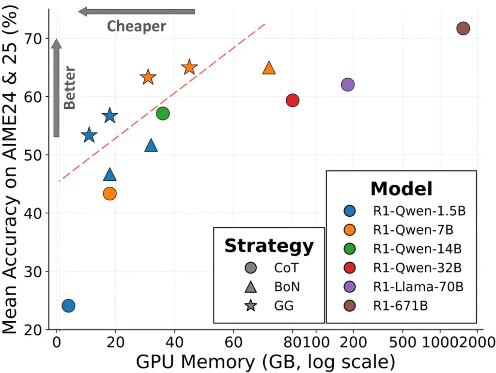
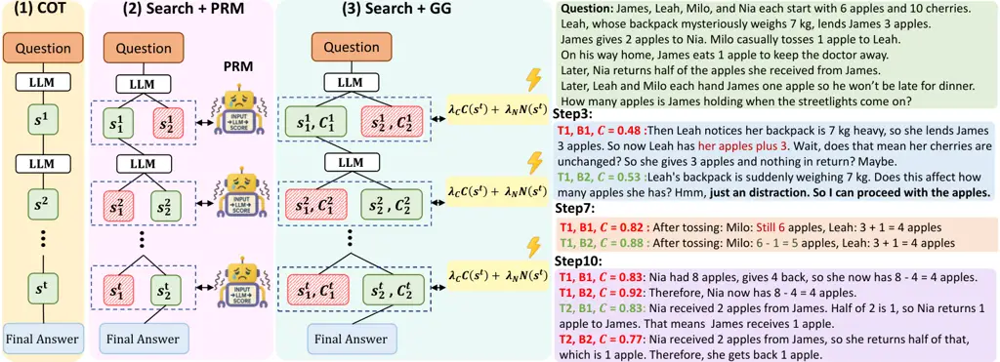
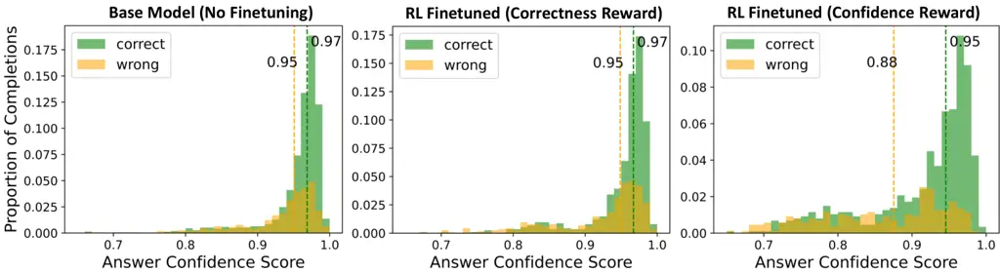

# Guided by Gut: Efficient Test-Time Scaling with Reinforced Intrinsic Confidence

Amirhosein Ghasemabadi Affiliation: ECE Department, University of
Alberta Email: [ghasemab@ualberta.ca](mailto:)    Keith G. Mills
Affiliation: ECE Department, University of Alberta
Email: [kgmills@ualberta.ca](mailto:)    Baochun Li Affiliation: ECE
Department, University of Toronto Email: [bli@eecg.toronto.edu](mailto:)
   Di Niu Affiliation: ECE Department, University of Alberta
Email: [dniu@ualberta.ca](mailto:)

###### Abstract

Test-Time Scaling (TTS) methods for enhancing Large Language Model (LLM)
reasoning often incur substantial computational costs, primarily due to
extensive reliance on external Process Reward Models (PRMs) or sampling
methods like Best-of-N (BoN). This paper introduces Guided by Gut (GG),
an efficient self-guided TTS framework that achieves PRM-level
performance without costly external verifier models. Our method employs
a lightweight tree search guided solely by intrinsic LLM
signals—token-level confidence and step novelty. One critical innovation
is improving the reliability of internal confidence estimates via a
targeted reinforcement learning fine-tuning phase. Empirical evaluations
on challenging mathematical reasoning benchmarks demonstrate that GG
enables smaller models (e.g., 1.5B parameters) to achieve accuracy
matching or surpassing significantly larger models (e.g., 32B–70B
parameters), while reducing GPU memory usage by up to 10×. Compared to
PRM-based methods, GG achieves comparable accuracy with 8× faster
inference speeds and 4–5× lower memory usage. Additionally, GG reduces
KV cache memory usage by approximately 50% compared to the BoN strategy,
facilitating more efficient and practical deployment of TTS techniques.

The code is available at
[https://github.com/Amirhosein-gh98/Guided-by-Gut](https://github.com/Amirhosein-gh98/Guided-by-Gut).

## 1 Introduction



Figure 1: We compare the performance and GPU VRAM usage of Guided by Gut
(GG; stars) to Best-of-N (BoN; triangles) and Chain-of-Thought (CoT;
circles) on several LLMs. GG achieves better accuracy at much lower
memory cost (log-scaled).

Enhancing the performance of Large Language Models (LLMs) often requires
significant computational resources through model scaling \[1, 23, 31\]
or complex inference strategies \[13, 50\]. Test-Time Scaling (TTS)
techniques like Chain-of-Thought (CoT) \[36\] allocate additional
computation during inference. This re-allocation of compute resources
provides a powerful alternative for boosting LLM reasoning capabilities,
as evidenced by models like OpenAI’s o series \[22\], DeepSeek R1 \[9\],
and others  \[41, 30, 4, 20\].

Contemporary TTS methods \[14, 35, 28\] are capable of enhancing LLMs
containing 1.5B parameters such that they outperform 70B, 405B parameter
or even large closed-source LLMs on difficult reasoning and mathematical
benchmarks \[15\]. However, TTS is an expensive search process where the
total compute cost to generate an answer matches or may even exceed that
of a larger LLM \[47, 18\]. For example, Sampling-based methods \[35\]
like Best-of-N (BoN) \[6\] operate by generating a large number of
candidate solutions (e.g., potentially hundreds) and then choosing the
optimal one from this pool, which requires prohibitively large amounts
of LLM inference for complex tasks. In addition, Process Reward Models
are auxiliary verification models which guide the TTS process by
providing step-by-step correctness feedback \[40, 48, 47, 35\]. Such
verifier-guided techniques can be computationally expensive to train and
deploy and suffer from generalizability issues \[15, 49, 48\]. Thus,
regardless of strategy, TTS for small-scale LLMs relies on expensive
inference, which severely limits practical application and motivates the
need for more cost-effective TTS frameworks.

To bridge this gap, we propose Guided by Gut (GG), a computationally
efficient and scalable TTS framework to enhance LLM reasoning. GG
leverages intrinsic signals derived from the LLM’s generation process,
fine-tuned by reinforcement learning (RL), to enable smaller models to
achieve substantially stronger reasoning performance which matches or
exceeds results achieved by much larger models (e.g., 70B) and expensive
TTS strategies at much lower GPU memory costs, as Figure 1 illustrates.
Our detailed contributions are as follows.

- •
  Token Confidence and Novelty: Instead of relying on costly external
  verifier models, we utilize intrinsic cues from the LLM output, e.g.,
  token probabilities, which we interpret as confidence scores and
  measure the novelty of a potential reasoning step. This provides a
  lightweight avenue for guiding inference-time search and can be
  integrated into existing models and algorithms.
- •
  Reinforced Confidence via RL Fine-tuning: We incorporate RL via Group
  Relative Policy Optimization (GRPO) into model fine-tuning
  specifically to improve the reliability of LLM internal confidence
  estimation, leading to more reliable guidance for our test-time search
  strategy.
- •
  Efficient Test-Time Search with Self-Guidance: We introduce a tree
  search algorithm based on Diverse Verifier Tree Search (DVTS) \[5\]
  guided by the LLM’s intrinsic signals (token probability/confidence,
  novelty). To achieve efficient TTS, our algorithm is specifically
  optimized for minimal computational cost during inference.

We apply GG to reasoning LLMs from DeepSeek R1 family \[9\] and
Qwen2.5-Math \[42\] as a non-reasoning model and evaluate it on
benchmark tasks like AIME24/25 \[2\], MATH500 \[10\], and AMC \[3\].
Experimental results not only demonstrate that GG achieves significant
performance improvements over relevant baselines such as BoN and CoT,
but also highlight its superior computational efficiency. Specifically,
GG enables smaller models (e.g., 1.5B-7B parameters) to outperform much
larger counterparts (e.g., 32B and 70B), achieving similar or superior
accuracy while using up to 4×–10× less GPU memory. Furthermore, compared
to computationally expensive PRM-based approaches, GG achieves
comparable accuracy at a fraction of the computational cost, leading to
4×–5× lower GPU memory usage and up to 8× faster inference speeds.
Furthermore, GG achieves an approximately 50% reduction in KV cache
memory usage compared to the BoN strategy, facilitating significantly
more efficient and cost-effective deployment of reasoning LLMs.



Figure 2: Comparison of reasoning generation strategies. (1) Standard
Chain-of-Thought (CoT) generates a single reasoning path
autoregressively. (2) Search guided by an external Process Reward Model
(PRM) explores multiple candidate steps ($`s_{1}^{t},s_{2}^{t},\dots`$),
using PRM scores to select promising paths. (3) Our proposed Self-Guided
Search similarly explores multiple steps but uses intrinsic signals,
Confidence ($`\mathcal{C}`$) and Novelty ($`N`$), derived from the LLM
to guide the search at each step without relying on an external PRM. In
the example, $`\mathbf{T}`$ stands for an independent tree and
$`\mathbf{B}`$ stands for a branch within that tree. Example text best
read zoomed-in.

## 2 Related Work

Test-Time Scaling (TTS). OpenAI’s o1 \[22\] highlighted the critical
role of enhanced reasoning for complex tasks like code generation and
mathematical problem solving. The subsequent open release of models like
DeepSeek-R1 \[9\] further spurred research into reasoning mechanisms
like Chain-of-Thought (CoT) \[36\]. CoT falls under the umbrella of
Test-Time Scaling  \[5, 8\], which enhances model performance by
strategically allocating additional computational effort during
inference, through methods like extended reasoning or search, rather
than relying solely on increased model size or longer training.

As we illustrate in Figure 2, CoT primarily consists of letting the LLM
generate reasoning steps and reach an answer/conclusion in a purely
autoregressive manner. Sampling methods like Best-of-N (BoN) \[6\]
involve generating multiple independent solutions, from which the
optimal one is selected, often with the aid of a verifier or through
voting mechanisms. Tree-based methods like Beam Search \[38\], Diverse
Verifier Tree Search (DVTS) \[5\], and Monte Carlo Tree Search
(MCTS) \[39\] provide different algorithmic avenues towards selecting
optimal multi-step reasoning paths. While these models enable $`<`$10B
parameter reasoning LLMs to perform at a level similar to much larger
models, e.g., 70B and above \[15\], they necessitate multiple rounds of
inference to generate large quantities of potential reasoning steps or
chains.

External Verification. To guide exploration towards the most promising
step or reasoning path, many Test-Time Scaling methods require a
mechanism to quantify the effectiveness of different choices. This role
is typically filled by an external verifier \[28, 5\], such as a Process
Reward Model (PRM) \[15\] or an Outcome Reward Model (ORM) \[14\]. These
verifiers are often substantial models themselves, significantly
contributing to the overall computational burden of TTS. While various
strategies like confidence-weighted voting \[29, 24\], dynamic early
stopping \[33\], and sample pruning \[12\] aim to mitigate this
overhead, many sophisticated search-based TTS approaches still
fundamentally rely on a powerful (and thus costly) PRM or similar
verifier to effectively guide the search. For instance, even approaches
combining model confidence with PRM supervision still ultimately rely on
the costly PRM \[38\]. To address this, GG avoids costly external
verifiers for simple, near-zero overhead internal signals, proving this
minimalist approach surprisingly effective.

Reinforcement Learning for LLM Reasoning. Recent literature highlights
Reinforcement Learning’s crucial role in advancing Large Language Model
reasoning without human intervention \[8\]. ReFT\[19\] employs Proximal
Policy Optimization (PPO) to enhance the generalizability of LLMs for
reasoning. A key algorithm, Group Relative Policy Optimization
(GRPO) \[27\], notably eliminates the need for a separate value function
in PPO. Further research explores various RL training aspects to improve
reasoning capabilities \[45, 46, 16\]. DeepScaleR \[18\] aims to boost
existing reasoning models’ through additional GRPO fine-tuning with
iterative context lengthening.

## 3 Methodology

This section outlines our proposed method, Guided by Gut (GG). We begin
by providing essential background on the Test-Time Scaling process.
Following this, we elaborate on the self-guided search mechanism and
overall strategy.

### 3.1 Preliminaries

#### Problem Formulation.

Given an input prompt or question $`Q`$, our objective is to generate a
logical reasoning chain $`R=[s^{1},s^{2},\dots,s^{T}]`$ leading to a
correct final answer $`A`$, where each step $`s^{t}`$ typically
constitutes a sentence or short paragraph incrementally building upon
previous steps. The overall reasoning process thus follows the pipeline:

```math
\displaystyle Q\rightarrow R\rightarrow A,
```

with the reasoning chain $`R`$ explicitly bridging the input question
and the final answer through intermediate logical steps.

#### Chain-of-Thought (CoT) Reasoning.

Standard Chain-of-Thought (CoT) \[36\] approaches jointly generate the
reasoning chain and final answer via autoregressive language modeling.
Formally, given $`Q`$, the model sequentially generates each reasoning
step conditioned on previously generated steps:

```math
\displaystyle P(R=s^{1:T}\mid Q)=\prod_{t=1}^{T}P(s^{t}\mid Q,s^{1:t-1}). \tag{1}
```

Each step $`s^{t}`$ thus depends on the input $`Q`$ and preceding
reasoning steps $`s^{1:t-1}`$, mirroring standard autoregressive token
generation in language modeling.

#### Guiding Search with Reward Models.

Single-path autoregressive generation methods can suffer from error
accumulation \[37, 21\]. To mitigate this, tree search methods explore
multiple reasoning trajectories simultaneously. These methods typically
use an external Process Reward Model (PRM) or Outcome-supervised Reward
Model (ORM) for step-wise correctness evaluations. A PRM is a model
that, given an input $`Q`$ and previous steps $`s^{1:t-1}`$, assigns a
correctness score or reward $`r_{t}`$ to candidate next steps $`s^{t}`$:

```math
\displaystyle r_{t}=\operatorname{PRM}(s^{t}\mid Q,s^{1:t-1})\quad\text{or}\quad r_{t}=\operatorname{PRM}(s^{t}\mid Q). \tag{2}
```

Likewise, an ORM is a sparse reward model where only the final step
receives a non-zero reward; $`r_{t<T}=0`$. Thus, these reward models
improve logical coherence and accuracy by guiding search algorithms like
Beam Search, BoN and DVTS.

### 3.2 Proposed Method: Self-Guided Search

The usage of verifier models like PRMs and ORMs, while effective,
introduces computational overhead and generalizability issues \[15\]. To
address these limitations, we propose Guided by Gut (GG), which
leverages the intrinsic signals directly obtained from the LLM internal
token generation process. This removes the dependency on external
evaluation, ensuring minimal computational overhead. Specifically, our
approach uses two intrinsic signals to guide reasoning:

- •
  Confidence $`C(s^{t})`$ reflects the internal assurance a model has
  with respect to a given reasoning step $`s^{t}`$. We compute
  confidence directly from token-level probabilities:

  ```math
  \centering C(s^{t})=\frac{1}{m_{t}}\sum_{l=1}^{m_{t}}\log p(s^{t}_{l}\mid\text{context}),\@add@centering \tag{3}
  ```

  where $`m_{t}`$ is the number of tokens in reasoning step $`s^{t}`$
  and ‘context’ represents previous tokens in $`s^{t}`$ and all prior
  reasoning steps.

- •
  Novelty $`N(s^{t})`$ encourages exploration by measuring the
  dissimilarity of candidate reasoning steps to previously explored
  paths. Specifically, we calculate novelty as the proportion of new
  tokens introduced by the candidate step $`s^{t}`$ relative to tokens
  already explored within the current reasoning context.

We formulate a reward $`r_{t}`$ to guide the search process by combining
these intrinsic signals as follows:

```math
\centering r_{t}=\lambda_{C}C(s^{t})+\lambda_{N}N(s^{t}),\@add@centering \tag{4}
```

where $`\lambda_{N}`$ and $`\lambda_{C}`$ balance exploration and
exploitation, respectively. Unlike verifier-guided approaches, our
reward is intrinsically computed from LLM prediction statistics,
eliminating external dependency.

### 3.3 Enhancing Confidence via Reinforcement Learning Fine-Tuning

A significant challenge in using intrinsic statistics is ensuring
reliability, as raw model confidence and answer novelty may not
accurately reflect correctness. To refine this process, we incorporate a
Reinforcement Learning fine-tuning phase.

Specifically, we utilize Group Relative Policy Optimization
(GRPO) \[27\], a memory-efficient variant of Proximal Policy
Optimization (PPO) \[26\] tailored for LLM applications. Let $`\pi`$
represent the LLM we want to fine-tune, parameterized either current
fine-tuned weights $`\theta`$, fine-tuned weights from the previous
iteration $`\theta_{old}`$ or the original reference weights
$`\theta_{ref}`$. At each iteration GRPO samples a group of $`G`$
outputs $`\{o_{i}\}_{i=1}^{G}`$ from $`\pi_{\theta_{\text{old}}}`$,
where each output $`o_{i}`$ represents a chain of reasoning steps and an
answer $`o_{i}=[R_{i},A_{i}]`$. Each output receives a reward $`r_{i}`$,
which we describe below:



Figure 3: Answer Confidence Distribution Across Training Settings. Each
subplot shows the normalized distribution of confdence scores for
correct (green) and incorrect (orange) completions across different
fine-tuning strategies. The vertical dashed lines mark the mean
confidence for correct and wrong completions, respectively. The base
model (left) is generally overconfident, with incorrect completions
receiving high confidence scores. Fine-tuning with correctness reward
(middle) improves accuracy but leaves the confidence distribution
largely unchanged. Confidence-based fine-tuning (right) better separates
correct from incorrect completions, showing improved calibration.

#### Confidence-Based Reward.

Our RL training enhances confidence accuracy with a novel reward
function, moving beyond typical correctness-only rewards. Many
literature methods use such rewards for the final answer, yielding
sparse, binary signals which provide no learning signal when no
completion is correct. In contrast, our fine-tuning reward is more
comprehensive: it specifically integrates the model’s internal
confidence throughout reasoning steps with final answer correctness.
This richer, multifaceted signal is crucial for calibrating model
certainty, enabling more reliable self-guided search.

To compute it, we first calculate a weighted summation of the confidence
scores for the last $`k`$ reasoning steps in the reasoning chain
$`R_{i}`$, $`\mathcal{C}(R_{i})`$:

```math
\centering\mathcal{C}(R_{i})=\frac{1}{\sum_{l=1}^{k}l}\sum_{l=1}^{k}l\cdot c(s^{T-k+l}_{i})\@add@centering \tag{5}
```

Then the RL fine-tuning reward $`r_{i}`$ is computed based on
$`A_{i}`$’s correctness and the reasoning chain confidence
$`\mathcal{C}(R_{i})`$, as follows:

```math
\centering r_{i}=\begin{cases}1+\mathcal{C}(R_{i})^{4}&\text{if }\operatorname{IsCorrect}(A_{i}),\\
1-10\mathcal{C}(R_{i})^{4}&\text{otherwise},\end{cases}\@add@centering \tag{6}
```

where $`\operatorname{IsCorrect}(A_{i})`$ returns a boolean validating
the final answer as correct or not. Equation 6 ensures that correct,
highly confident answers are rewarded more strongly, whereas incorrect,
overconfident answers receive greater penalties, thus promoting precise
confidence calibration.

The calibration effect is demonstrated in Figure 3.

#### Advantage and Fine-tuning Update.

After computing the fine-tuning reward $`r_{i}`$ for each sampled output
$`o_{i}`$, we compute the normalized advantage $`\hat{A}_{i}`$ as
follows:

```math
\centering\hat{A}_{i}=\frac{r_{i}-\operatorname{mean}(\{r_{j}\}_{j=1}^{G})}{\operatorname{std}(\{r_{j}\}_{j=1}^{G})}.\@add@centering \tag{7}
```

We can then compute the clipped surrogate policy update
$`\delta_{i}`$ \[26\] for a given output as

```math
\centering\delta_{i}=\dfrac{1}{|o_{i}|}\sum_{l=1}^{|o_{i}|}[\text{min}(r_{i}\hat{A}_{i},\text{clip}(r_{i},1-\epsilon,1+\epsilon)\hat{A}_{i})-\beta\mathbb{D}_{KL}(\pi_{\theta}|\pi_{ref})],\@add@centering \tag{8}
```

where $`\epsilon`$ controls the magnitude of the update and the
Kullback-Leibler divergence term $`\mathbb{D}_{KL}`$, controlled by
$`\beta`$, prevents the fine-tuning weights from moving too far away
from the original weights. We then update the LLM by using all clipped
surrogates to maximize the GRPO objective.

```math
\centering\mathcal{J}_{\text{GRPO}}(\theta)=\mathbb{E}_{\{o_{i}\}_{i=1}^{G}\sim\pi_{\theta_{\text{old}}}}[\dfrac{1}{G}\sum_{i=1}^{G}\delta_{i}].\@add@centering \tag{9}
```

### 3.4 Search Strategy

We employ Diverse Verifier Tree Search (DVTS) \[5\], an extension of
beam search that splits initial beams into independent subtrees that are
expanded greedily using a reward model or our proposed intrinsic
rewards. DVTS enhances solution diversity and performance. We apply DVTS
within the CoT framework by operating at the reasoning step ($`s^{t}`$)
level, identifying step completions via model-specific delimiters. This
structure allows the search to evaluate and expand complete logical
increments during the reasoning process.

Our modified DVTS algorithm runs recursively until it encounters one of
the termination conditions we specify: a maximum reasoning depth or a
maximum token length limit is exceeded, the reasoning exhibits signs of
text degeneration, e.g., excessive repetition, or in the best case, the
LLM arrives at a final answer $`A`$. To avoid incomplete outputs due to
overthinking near the limits, we inject a model-specific signal
prompting a conclusion. For example, with DeepSeek models, appending
“\*\*Final Answer\*\*” effectively elicits the final answer, ensuring
usable completions even in complex cases. For further details on DVTS,
we provide a formal explanation in the supplementary materials due to
space constraints.

## 4 Experimental Results

In this section, we validate our Guided by Gut Test-Time Scaling (GG)
approach. We first describe our experimental setup, then present our
findings. Finally, we ablate the components of our method.

### 4.1 Confidence Calibration via Reinforcement Learning

We perform a reinforcement learning fine-tuning phase. Our primary goal
during RL fine-tuning is not to maximize raw task accuracy but to
enhance the reliability of the intrinsic confidence signals utilized by
GG through GRPO, as described in Section 3.3 and in our reward function
(Equation 6).

For this calibration step, we utilize the LIMO dataset \[43\]. This
dataset contains 817 high-quality examples curated specifically for
complex mathematical reasoning, featuring detailed, structured
solutions. We fine-tune the DeepSeek-R1-Distill-Qwen-1.5B & 7B models
with Low-Rank Adapters (LoRA) \[11\]. The implementation leverages the
TRL \[32\] library and an adaptation of the open-r1 codebase \[8\]. Key
aspects of the setup include a low learning rate of
$`2.0\times 10^{-6}`$ with a cosine scheduler \[17\], LoRA rank
$`r=128`$ and $`\alpha=128`$, and GRPO training with $`G=8`$ generations
per prompt at a temperature of $`0.6`$. We perform fine-tuning on two
NVIDIA A100 80 GPUs using bfloat16 precision with FlashAttention-2 \[7\]
optimization, using prompt/completion length limits of 768/8096 tokens
and a batch size of 8 per device with 8 gradient accumulation steps for
3 epochs. The fine-tuning process completes in approximately one day.

### 4.2 Results

[TABLE]

Table 1: Performance metrics for various models and TTS strategies on
the AIME24 and AIME25 benchmarks. Inference Speed and GPU Memory
measured using NVIDIA A100 80GB cards.

To demonstrate the efficacy and efficiency of Guided by Gut (GG), we
first benchmark our approach using \<10B parameter LLMs against several
larger Chain-of-Thought (CoT) LLMs, some of which are closed-source like
OpenAI o1 mini. We also compare to competitive tree-based TTS methods
such as Best-of-N (BoN), a robust TTS baseline that outperforms
PRM-guided search with R1 models \[15\], using standardized evaluation
settings.

As for the evaluation settings, we allocate token budgets based on
method requirements: 16k tokens for tree-based TTS methods, i.e., GG and
BoN, and 32k tokens for standard CoT models (consistent with original
papers) to balance comprehensive comparisons with computational
feasibility. We set the maximum reasoning steps to 200 for R1 models. We
configure BoN to use $`N=32`$ or $`N=64`$ samples using majority voting.
Likewise, we evaluate our Confidence-Guided DVTS with equivalent compute
budgets: using $`N=32`$ total paths (from 16 subtrees with $`M=2`$ beam
width/verifiers) and $`N=64`$ total paths (from 32 subtrees with
$`M=2`$), distinctively employing weighted majority voting based on
final answer confidence scores.

We evaluate GG on the AIME 2024 & 2025 (AIME24, AIME25) \[2, 44\]
benchmarks, which each consist of 30 problems from the respective
American Invitational Mathematics Examinations that emphasize advanced
high-school-level reasoning. Table 1 presents our findings.

First, we observe that GG delivers competitive performance compared to
much larger LLMs employing CoT strategies. Specifically, a 1.5B
parameter LLM with GG achieves accuracy comparable to a 32B CoT model,
while a 7B GG LLM reaches accuracy levels closer to those of a 70B CoT
model—and even beats OpenAI’s o1 mini on AIME24. Moreover, the results
on DeepSeek-R1-Distill-Qwen-7B are equally impressive. Even with a
moderate sampling budget ($`N=32`$), GG outperforms all CoT-based LLMs
with fewer than 100B parameters. Notably, it achieves this while
requiring at most one sixth of the VRAM memory and delivering faster
inference compared to Distill-Llama-70B, despite producing similar
accuracy. Only the DeepSeek-R1-671B model, which has nearly 10× the
parameters, achieves higher accuracy on both benchmarks—but at a
prohibitively high memory cost, requiring nearly 30× more VRAM memory.

On the DeepSeek-R1-Distill-Qwen-1.5B model, GG consistently outperforms
BoN (at $`N=32`$ and $`N=64`$) while using almost 50% less GPU memory.
For instance, with a computational budget of $`N=32`$, GG attains 10%
and 3.3% performance on AIME24 and AIME25, respectively. Further, for
$`N=64`$, GG outperforms BoN by 10% on AIME25 (46.7% vs. 36.7%). In
summary, Table 1 demonstrates that GG is a competitive, self-guided TTS
method that allows smaller models to achieve accuracy comparable to
larger counterparts while using significantly less memory.

#### Comparison with Process Reward Models.

We further compare the self-directed search mechanism of GG to TTS
guided by an external verifier, i.e., a Process Reward Model (PRM). We
conduct this experiment using Qwen2.5-Math-1.5B-Instruct \[4\] as the
base model. This is a non-reasoning LLM commonly employed for evaluating
PRM-guided TTS in the literature \[34, 5, 15\]. Specifically, we set a
limit of 4k tokens and 50 reasoning steps per trial for this experiment,
which reflects the shorter non-CoT answers and the overhead of
PRM-guided search.

We evaluate on two datasets: AMC2023 (AMC23) \[51\], comprising 40
problems from the American Mathematics Competition testing foundational
high-school math skills; and MATH500, a diverse set of 500 problems
randomly sampled from the full MATH benchmark \[14\].

Table 2 summarizes our findings from comparing GG, which utilizes simple
intrinsic search signals, against external PRM-guided approaches. Our
aim is to evaluate whether a lightweight, cost-effective signal could
achieve competitive reasoning performance. On AMC23, GG consistently
outperforms both the math-shepherd-mistral-7B-PRM (by 5.0%) and the
RLHFlow/Llama3.1-8B-PRM (by 3%) across both $`N`$ settings. On MATH500,
GG’s performance is also highly competitive, trailing the PRM accuracies
by a narrow margin of only 0.1 to 1.1 percentage points. Crucially, GG
achieves this strong standing with its significantly more lightweight
methodology: it is  8x faster and uses \<5GB of VRAM, as it avoids
loading an additional large reward model. These results underscore GG’s
robust performance and efficiency, especially for local deployment
scenarios.

[TABLE]

Table 2: Performance comparison of PRM-based and non-PRM (GG) scoring
strategies using Qwen2.5-Math-1.5B-Instruct as the base LLM with DVTS as
the search algorithm. Horizontal line demarcates $`N=16`$ from $`N=32`$
total path hyperparameter. We denote the external verifier utilized in
PRM trials. We vary the total paths $`N`$ for both methods and the
external verifier utilized in PRM trials. Maximum token limit of 4048.
Higher accuracy and lower inference speed/memory are preferred. Best and
second best results in bold and italics, respectively.

[TABLE]

Table 3: Accuracy and KV Cache memory usage for various models and TTS
strategies across mathematical reasoning datasets. Horizontal lines
demarcate base model and search budget. Accuracy reported as mean (max)
for AIME24/25 and mean performance for MATH500/AMC. Higher is better for
accuracy; lower is better for KV Cache memory.

#### Additional TTS Results: Accuracy and Efficiency.

We further evaluate GG against Best-of-N (BoN) and Chain-of-Thought
(CoT) on AIME24, AIME25, MATH500, and AMC using DeepSeek-R1 1.5B and 7B
models (Table 3). To ensure fair and reliable comparison, particularly
for AIME benchmarks known for high variance, all configurations were run
four times with different seeds, reporting average and maximum
accuracies across different runs. Experimental settings match those in
Table 1.

Table 3 demonstrates that GG consistently matches or surpasses BoN
across most benchmarks and model sizes, particularly in mean accuracy,
while BoN occasionally equals GG only in maximum scores. For example, on
AIME24 with the 7B model, BoN shows some advantage in specific
scenarios, but otherwise, GG maintains a strong comparative performance.
Crucially, GG achieves these competitive or superior results against BoN
while using approximately 50% less KV cache memory, a major efficiency
gain.

## 5 Ablation Studies

We conduct several ablation studies to verify the efficacy of the
different components that constitute GG. Due to space constraints, we
focus here on the importance of RL fine-tuning with confidence,
providing additional hyperparameter ablations (novelty weight and
search) in the appendix.

|                          |                    |
| ------------------------ | ------------------ |
| Fine-tuning Setting      | Score $`\uparrow`$ |
| No RL Fine-tuning        | 54.5%              |
| Correctness Reward Only  | 54.9%              |
| Confidence (No Penalty)  | 54.0%              |
| Confidence Reward (Ours) | 58.9%              |

Table 4: Effectiveness of RL fine-tuning onr AIME24: Performance scores
with various reward strategies versus a no-RL baseline. Best result in
bold.

#### Impact of Confidence-Based RL Fine-tuning.

To isolate the effectiveness of our proposed confidence-based reward
mechanism within the RL fine-tuning phase (Equation 6), we conduct an
ablation study comparing four settings: (1) without RL fine-tuning, (2)
with RL fine-tuning using an accuracy reward, (3) with RL fine-tuning
using a confidence reward (ours), and (4) RL fine-tuning using a
confidence reward without penalty for incorrect answers. Table 4
summarizes our results which clearly demonstrate the importance of our
confidence-based RL fine-tuning. Specifically, the full Confidence
Reward method (58.9) substantially outperforms both the no RL
fine-tuning baseline (54.5) and the fine-tuning strategy using only a
Correctness Reward (54.9). Furthermore, removing the negative penalty
for incorrect, highly confident answers results in the lowest score
(54.0). This underscores the critical role of the penalty term for
effective confidence calibration and confirms that the improvements stem
directly from the specific reward design aimed at enhancing confidence
calibration.

## 6 Conclusion

We introduce Guided by Gut (GG), a Test-Time Scaling framework enabling
smaller Large Language Models (e.g., 1.5B parameters) to surpass
significantly larger models (e.g., 32B) in performance while offering
faster inference and substantially reduced GPU memory and KV cache
usage. GG leverages intrinsic model signals—confidence and
novelty—extracted directly from LLM outputs, further calibrated through
reinforcement learning, providing a lightweight and effective
alternative to costly external verifier-based methods such as Process
Reward Models (PRMs). Compared to Best-of-N (BoN) strategies, GG
achieves comparable or superior results with approximately 50% less KV
cache memory and competitive inference speeds, while delivering
performance on par with PRM-guided approaches.

#### Limitations.

The intrinsic signals employed in GG, such as confidence scores, do not
inherently verify the actual correctness of each reasoning step. There
exist cases where the model assigns high confidence to incorrect
reasoning steps, hence the importance of our RL fine-tuning phase.
Overall, the goal of our method is to provide a simple, efficient, and
without relying on external verifier signals to guide the search
process, rather than guaranteeing the absolute correctness of each step
that may occur when using a strong PRM. We analyze and discuss
representative failure cases in the Appendix to provide deeper insight
into these limitations.

#### Broader Impacts.

This work proposes an efficient test-time reasoning framework for
language models. Our contributions reduce the computational requirement
needed to use reasoning models. Experimental results demonstrate that we
can combine GG with a locally smaller LLM and achieve comparable
performance to open-source models that require GPU rack servers or
closed-source models behind an API. Therefore, one potential future
impact of our work we hope to see is increased usage of locally-deployed
reasoning LLMs.

## References

- \[1\] J. Achiam, S. Adler, S. Agarwal, L. Ahmad, I. Akkaya, F. L.
  Aleman, D. Almeida, J. Altenschmidt, S. Altman, S. Anadkat, et al.
  Gpt-4 technical report. _arXiv preprint arXiv:2303.08774_, 2023.
- \[2\] AI-MO. Aime 2024, 2024a. URL
  [https://huggingface.co/datasets/AI-MO/aimo-validation-aime](https://huggingface.co/datasets/AI-MO/aimo-validation-aime).
- \[3\] AI-MO. Amc 2023, 2024b. URL
  [https://huggingface.co/datasets/AI-MO/aimo-validation-amc](https://huggingface.co/datasets/AI-MO/aimo-validation-amc).
- \[4\] S. Bai, K. Chen, X. Liu, J. Wang, W. Ge, S. Song, K. Dang,
  P. Wang, S. Wang, J. Tang, et al. Qwen2. 5-vl technical report. _arXiv
  preprint arXiv:2502.13923_, 2025.
- \[5\] E. Beeching, L. Tunstall, and S. Rush. Scaling test-time compute
  with open models. URL
  [https://huggingface.co/spaces/HuggingFaceH4/blogpost-scaling-test-time-compute](https://huggingface.co/spaces/HuggingFaceH4/blogpost-scaling-test-time-compute).
- \[6\] B. Brown, J. Juravsky, R. Ehrlich, R. Clark, Q. V. Le, C. Ré,
  and A. Mirhoseini. Large language monkeys: Scaling inference compute
  with repeated sampling. _arXiv preprint arXiv:2407.21787_, 2024.
- \[7\] T. Dao. Flashattention-2: Faster attention with better
  parallelism and work partitioning. _arXiv preprint
  arXiv:2307.08691_, 2023.
- \[8\] H. Face. Open r1: A fully open reproduction of
  deepseek-r1, 2025.
- \[9\] D. Guo, D. Yang, H. Zhang, J. Song, R. Zhang, R. Xu, Q. Zhu,
  S. Ma, P. Wang, X. Bi, et al. Deepseek-r1: Incentivizing reasoning
  capability in llms via reinforcement learning. _arXiv preprint
  arXiv:2501.12948_, 2025.
- \[10\] D. Hendrycks, C. Burns, S. Kadavath, A. Arora, S. Basart,
  E. Tang, D. Song, and J. Steinhardt. Measuring mathematical problem
  solving with the MATH dataset. In _Advances in Neural Information
  Processing Systems Datasets and Benchmarks Track (Round 2)_, 2021. URL
  [https://openreview.net/forum?id=7Bywt2mQsCe](https://openreview.net/forum?id=7Bywt2mQsCe).
- \[11\] E. J. Hu, Y. Shen, P. Wallis, Z. Allen-Zhu, Y. Li, S. Wang,
  L. Wang, W. Chen, et al. Lora: Low-rank adaptation of large language
  models. _ICLR_, 1(2):3, 2022.
- \[12\] X. Huang, L. L. Zhang, K.-T. Cheng, F. Yang, and M. Yang. Fewer
  is more: Boosting llm reasoning with reinforced context pruning.
  _arXiv preprint arXiv:2312.08901_, 2023.
- \[13\] Y. Ji, J. Li, H. Ye, K. Wu, J. Xu, L. Mo, and M. Zhang.
  Test-time computing: from system-1 thinking to system-2 thinking.
  _arXiv preprint arXiv:2501.02497_, 2025.
- \[14\] H. Lightman, V. Kosaraju, Y. Burda, H. Edwards, B. Baker,
  T. Lee, J. Leike, J. Schulman, I. Sutskever, and K. Cobbe. Let’s
  verify step by step. In _The Twelfth International Conference on
  Learning Representations_, 2023.
- \[15\] R. Liu, J. Gao, J. Zhao, K. Zhang, X. Li, B. Qi, W. Ouyang, and
  B. Zhou. Can 1b llm surpass 405b llm? rethinking compute-optimal
  test-time scaling. _arXiv preprint arXiv:2502.06703_, 2025a.
- \[16\] Z. Liu, C. Chen, W. Li, P. Qi, T. Pang, C. Du, W. S. Lee, and
  M. Lin. Understanding r1-zero-like training: A critical perspective.
  _arXiv preprint arXiv:2503.20783_, 2025b.
- \[17\] I. Loshchilov and F. Hutter. SGDR: stochastic gradient descent
  with warm restarts. In _5th International Conference on Learning
  Representations, ICLR 2017, Toulon, France, April 24-26, 2017,
  Conference Track Proceedings_, 2017. URL
  [https://openreview.net/forum?id=Skq89Scxx](https://openreview.net/forum?id=Skq89Scxx).
- \[18\] M. Luo, S. Tan, J. Wong, X. Shi, W. Y. Tang, M. Roongta,
  C. Cai, J. Luo, L. E. Li, R. A. Popa, and I. Stoica. DeepScaleR:
  Surpassing O1-preview with a 1.5B model by scaling RL, 2025. URL
  [https://pretty-radio-b75.notion.site/DeepScaleR-Surpassing-O1-Preview-with-a-1-5B-Model-by-Scaling-RL-19681902c1468005bed8ca303013a4e2](https://pretty-radio-b75.notion.site/DeepScaleR-Surpassing-O1-Preview-with-a-1-5B-Model-by-Scaling-RL-19681902c1468005bed8ca303013a4e2).
  Notion Blog Post.
- \[19\] T. Q. Luong, X. Zhang, Z. Jie, P. Sun, X. Jin, and H. Li. Reft:
  Reasoning with reinforced fine-tuning. _arXiv preprint
  arXiv:2401.08967_, 3, 2024.
- \[20\] N. Muennighoff, Z. Yang, W. Shi, X. L. Li, L. Fei-Fei,
  H. Hajishirzi, L. Zettlemoyer, P. Liang, E. Candès, and T. Hashimoto.
  s1: Simple test-time scaling. _arXiv preprint arXiv:2501.19393_, 2025.
- \[21\] S. Mukherjee, A. Chinta, T. Kim, T. A. Sharma, and
  D. Hakkani-Tür. Premise-augmented reasoning chains improve error
  identification in math reasoning with llms. _arXiv preprint
  arXiv:2502.02362_, 2025.
- \[22\] OpenAI. Learning to reason with llms, 2024. URL
  [https://openai.com/index/learning-to-reason-with-llms/](https://openai.com/index/learning-to-reason-with-llms/).
- \[23\] L. Ouyang, J. Wu, X. Jiang, D. Almeida, C. Wainwright,
  P. Mishkin, C. Zhang, S. Agarwal, K. Slama, A. Ray, et al. Training
  language models to follow instructions with human feedback. _Advances
  in neural information processing systems_, 35:27730–27744, 2022.
- \[24\] A. Razghandi, S. M. H. Hosseini, and M. S. Baghshah. Cer:
  Confidence enhanced reasoning in llms. _arXiv preprint
  arXiv:2502.14634_, 2025.
- \[25\] N. Reimers and I. Gurevych. Sentence-bert: Sentence embeddings
  using siamese bert-networks. In _Proceedings of the 2019 Conference on
  Empirical Methods in Natural Language Processing_. Association for
  Computational Linguistics, 11 2019. URL
  [https://arxiv.org/abs/1908.10084](https://arxiv.org/abs/1908.10084).
- \[26\] J. Schulman, F. Wolski, P. Dhariwal, A. Radford, and O. Klimov.
  Proximal policy optimization algorithms. _arXiv preprint
  arXiv:1707.06347_, 2017.
- \[27\] Z. Shao, P. Wang, Q. Zhu, R. Xu, J. Song, X. Bi, H. Zhang,
  M. Zhang, Y. Li, Y. Wu, et al. Deepseekmath: Pushing the limits of
  mathematical reasoning in open language models. _arXiv preprint
  arXiv:2402.03300_, 2024.
- \[28\] C. Snell, J. Lee, K. Xu, and A. Kumar. Scaling llm test-time
  compute optimally can be more effective than scaling model parameters.
  _arXiv preprint arXiv:2408.03314_, 2024.
- \[29\] A. Taubenfeld, T. Sheffer, E. Ofek, A. Feder, A. Goldstein,
  Z. Gekhman, and G. Yona. Confidence improves self-consistency in llms.
  _arXiv preprint arXiv:2502.06233_, 2025.
- \[30\] K. Team, A. Du, B. Gao, B. Xing, C. Jiang, C. Chen, C. Li,
  C. Xiao, C. Du, C. Liao, et al. Kimi k1. 5: Scaling reinforcement
  learning with llms. _arXiv preprint arXiv:2501.12599_, 2025.
- \[31\] P. Villalobos, A. Ho, J. Sevilla, T. Besiroglu, L. Heim, and
  M. Hobbhahn. Will we run out of data? limits of llm scaling based on
  human-generated data. _arXiv preprint arXiv:2211.04325_, 2022.
- \[32\] L. von Werra, Y. Belkada, L. Tunstall, E. Beeching, T. Thrush,
  N. Lambert, S. Huang, K. Rasul, and Q. Gallouédec. Trl: Transformer
  reinforcement learning.
  [https://github.com/huggingface/trl](https://github.com/huggingface/trl), 2020.
- \[33\] G. Wan, Y. Wu, J. Chen, and S. Li. Dynamic self-consistency:
  Leveraging reasoning paths for efficient llm sampling. _arXiv preprint
  arXiv:2408.17017_, 2024.
- \[34\] J. Wang, M. Fang, Z. Wan, M. Wen, J. Zhu, A. Liu, Z. Gong,
  Y. Song, L. Chen, L. M. Ni, et al. Openr: An open source framework for
  advanced reasoning with large language models. _arXiv preprint
  arXiv:2410.09671_, 2024.
- \[35\] P. Wang, L. Li, Z. Shao, R. Xu, D. Dai, Y. Li, D. Chen, Y. Wu,
  and Z. Sui. Math-shepherd: Verify and reinforce llms step-by-step
  without human annotations. _arXiv preprint arXiv:2312.08935_, 2023.
- \[36\] J. Wei, X. Wang, D. Schuurmans, M. Bosma, F. Xia, E. Chi, Q. V.
  Le, D. Zhou, et al. Chain-of-thought prompting elicits reasoning in
  large language models. _Advances in neural information processing
  systems_, 35:24824–24837, 2022.
- \[37\] Y. Wu, Y. Wang, T. Du, S. Jegelka, and Y. Wang. When more is
  less: Understanding chain-of-thought length in llms. _arXiv preprint
  arXiv:2502.07266_, 2025.
- \[38\] Y. Xie, K. Kawaguchi, Y. Zhao, J. X. Zhao, M.-Y. Kan, J. He,
  and M. Xie. Self-evaluation guided beam search for reasoning.
  _Advances in Neural Information Processing Systems_,
  36:41618–41650, 2023.
- \[39\] Y. Xie, A. Goyal, W. Zheng, M.-Y. Kan, T. P. Lillicrap,
  K. Kawaguchi, and M. Shieh. Monte carlo tree search boosts reasoning
  via iterative preference learning. _arXiv preprint
  arXiv:2405.00451_, 2024.
- \[40\] W. Xiong, H. Zhang, N. Jiang, and T. Zhang. An implementation
  of generative prm, 2024.
- \[41\] A. Yang, B. Yang, B. Zhang, B. Hui, B. Zheng, B. Yu, C. Li,
  D. Liu, F. Huang, H. Wei, H. Lin, J. Yang, J. Tu, J. Zhang, J. Yang,
  J. Yang, J. Zhou, J. Lin, K. Dang, K. Lu, K. Bao, K. Yang, L. Yu,
  M. Li, M. Xue, P. Zhang, Q. Zhu, R. Men, R. Lin, T. Li, T. Xia,
  X. Ren, X. Ren, Y. Fan, Y. Su, Y. Zhang, Y. Wan, Y. Liu, Z. Cui,
  Z. Zhang, and Z. Qiu. Qwen2.5 technical report. _arXiv preprint
  arXiv:2412.15115_, 2024a.
- \[42\] A. Yang, B. Zhang, B. Hui, B. Gao, B. Yu, C. Li, D. Liu, J. Tu,
  J. Zhou, J. Lin, et al. Qwen2. 5-math technical report: Toward
  mathematical expert model via self-improvement. _arXiv preprint
  arXiv:2409.12122_, 2024b.
- \[43\] Y. Ye, Z. Huang, Y. Xiao, E. Chern, S. Xia, and P. Liu. Limo:
  Less is more for reasoning, 2025. URL
  [https://arxiv.org/abs/2502.03387](https://arxiv.org/abs/2502.03387).
- \[44\] yentinglin. Aime 2025, 2025. URL
  [https://huggingface.co/datasets/yentinglin/aime_2025](https://huggingface.co/datasets/yentinglin/aime_2025).
- \[45\] Q. Yu, Z. Zhang, R. Zhu, Y. Yuan, X. Zuo, Y. Yue, T. Fan,
  G. Liu, L. Liu, X. Liu, et al. Dapo: An open-source llm reinforcement
  learning system at scale. _arXiv preprint arXiv:2503.14476_, 2025.
- \[46\] W. Zeng, Y. Huang, Q. Liu, W. Liu, K. He, Z. Ma, and J. He.
  Simplerl-zoo: Investigating and taming zero reinforcement learning for
  open base models in the wild. _arXiv preprint arXiv:2503.18892_, 2025.
- \[47\] Z. Zhang, C. Zheng, Y. Wu, B. Zhang, R. Lin, B. Yu, D. Liu,
  J. Zhou, and J. Lin. The lessons of developing process reward models
  in mathematical reasoning. _arXiv preprint arXiv:2501.07301_, 2025.
- \[48\] C. Zheng, Z. Zhang, B. Zhang, R. Lin, K. Lu, B. Yu, D. Liu,
  J. Zhou, and J. Lin. Processbench: Identifying process errors in
  mathematical reasoning. _arXiv preprint arXiv:2412.06559_, 2024.
- \[49\] J. Zhong, W. Shen, Y. Li, S. Gao, H. Lu, Y. Chen, Y. Zhang,
  W. Zhou, J. Gu, and L. Zou. A comprehensive survey of reward models:
  Taxonomy, applications, challenges, and future. _arXiv preprint
  arXiv:2504.12328_, 2025.
- \[50\] Z. Zhou, X. Ning, K. Hong, T. Fu, J. Xu, S. Li, Y. Lou,
  L. Wang, Z. Yuan, X. Li, et al. A survey on efficient inference for
  large language models. _arXiv preprint arXiv:2404.14294_, 2024.
- \[51\] zwhe99. amc23 dataset.
  [https://huggingface.co/datasets/zwhe99/amc23](https://huggingface.co/datasets/zwhe99/amc23), 2023.
  Accessed: 2025-05-12.

## Appendix A Supplementary Materials

We provide additional details and analyses to complement the main paper.
Section A.1 includes further ablation studies to dissect the
contributions of individual components of our Guided by Gut (GG)
framework. Section A.2 provides a detailed walkthrough of our
Self-Guided Search algorithm. Finally, Section A.3 provides an
illustrative example showcasing the step-by-step reasoning process of
GG.

### A.1 Ablation Studies

In addition to the confidence-based RL fine-tuning ablation presented in
the main paper (Section 5), we ablate the key components of GG. We
specifically analyze the impact of the novelty weight ($`\lambda_{N}`$)
in our reward formulation and the beam width ($`M`$) within the DVTS
search algorithm.

#### Novelty: Method Selection and Weight ($`\lambda_{N}`$) Impact.

For the novelty component $`N(s^{t})`$, we consider two methods: The
first is cosine similarity using embeddings from a sentence transformer.
Sentence transformers are models that generate dense vector
representations (embeddings) capturing sentence semantics; we
specifically employed all-MiniLM-L6-v2 \[25\]. The second method is to
count new words. As shown in Table 7, counting new words performs
comparably to cosine similarity but is simpler and computationally
lighter. Thus, we selected word counting for $`N(s^{t})`$.

Using word counting for novelty, we then investigate the impact of the
corresponding weight, $`\lambda_{N}`$. Table 7 summarizes this ablation.
Setting $`\lambda_{N}=0`$ (no novelty signal) yields a score of 57.5. A
balanced $`\lambda_{N}=0.5`$ achieves the best score of 58.9.
Conversely, setting $`\lambda_{N}=1`$ (relying predominantly on novelty)
significantly degrades performance to 51.9. This confirms that balancing
novelty (for exploration) with confidence is crucial, with confidence
being the primary guiding signal.

#### Impact of Beam Width ($`M`$).

We examine the effect of the beam width ($`M`$) parameter within our
DVTS search strategy, keeping the total path budget fixed at $`N=32`$.
In DVTS, increasing $`M`$ reduces the number of independent subtrees
($`N/M`$) explored. We compare performance for $`M=2`$ (16 subtrees),
$`M=4`$ (8 subtrees), and $`M=8`$ (4 subtrees), with results in Table 7.
Increasing $`M`$ while keeping $`N`$ constant entails significantly
worse performance: $`M=2`$ achieved 58.9, while $`M=4`$ dropped to 47.0,
and $`M=8`$ further decreased to 44.0. This confirms that increasing
$`M`$ under a fixed budget $`N`$ limits exploration diversity crucial
for DVTS, making a smaller beam width ($`M=2`$) more effective for the
$`N=32`$ budget.

| Novelty Method     | Score $`\uparrow`$ |
| ------------------ | ------------------ |
| New Token Counting | 58.9               |
| Cosine Similarity  | 58.4               |

Table 5: Novelty method ablation on AIME24. Best Score bold.

| Novelty Weight ($`\lambda_{N}`$) | Score $`\uparrow`$ |
| -------------------------------- | ------------------ |
| 0.0                              | 57.5               |
| 0.5                              | 58.9               |
| 1.0                              | 51.9               |

Table 6: Novelty weight ($`\lambda_{N}`$) ablation on AIME24 (New Token
Counting). Best score bold.

| $`M`$ | Trees ($`N/M`$) | Score $`\uparrow`$ |
| ----- | --------------- | ------------------ |
| 2     | 16              | 58.9               |
| 4     | 8               | 47.0               |
| 8     | 4               | 44.0               |

Table 7: Beam width ($`M`$) ablation on AIME24. Total paths $`N=32`$.
Best score bold.

### A.2 Implementation Details of Self-Guided Search

Input: Prompt $`Q`$, Model $`\pi_{\theta}`$, Beam width $`M`$, Total
paths $`N`$, Max depth $`T`$, Token limit $`\tau`$

Output: Final Answer $`A^{*}`$

1 Initialize empty answer set $`\mathcal{A}=\emptyset`$;

2 Initialize $`\frac{N}{M}`$ diverse subtrees from $`Q`$;

3 foreach _subtree $`j=1`$ to $`N/M`$ ; $`\triangleright`$ Traverse each
subtree_

4 do

    5 Initialize path $`R^{(j)}\leftarrow[\,]`$;

\*   * 6 for *$`t=1`$ to $`T`$ ; $`\triangleright`$ Roll out reasoning
steps\*

    7 do

       8 Generate $`M`$ candidate steps $`\{s^{t}_{i}\}_{i=1}^{M}`$
using model $`\pi_{\theta}(R^{(j)})`$;

\*      * 9 foreach *candidate $`s^{t}_{i}`$ ; $`\triangleright`$ Score
each candidate\*

       10 do

          11 Compute $`r_{i}=\lambda_{C}C(s^{t})+\lambda_{N}N(s^{t})`$;

       12 Select top-1 step $`s^{t}_{*}\leftarrow\arg\max_{i}r_{i}`$;

       13 Append $`s^{t}_{*}`$ to $`R^{(j)}`$;

\*      * 14 if *$`s^{t}_{*}`$ contains final answer token (e.g.,
“boxed{}”) ; $`\triangleright`$ Answer is complete\*

       15 then

          16 Extract $`A^{(j)}`$ and add to set $`\mathcal{A}`$;

          17 break and prune subtree $`j`$;

\*      * 18 if *TokenCount($`R^{(j)}`$) $`>\tau`$ or $`t=T{-}1`$ ;
$`\triangleright`$ Force answer near limit\*

       19 then

          20 Append “Final Answer” to $`R^{(j)}`$;

21 Select final answer $`A^{*}\leftarrow`$ confidence-weighted vote over
$`\mathcal{A}`$;

22 return _$`A^{_}`$\*

Algorithm 1 Self-Guided Test-Time Scaling with Confidence-Calibrated
DVTS

To clarify how the search operates, we walk through Algorithm 1 step by
step. Our approach builds on Diverse Verifier Tree Search, a variant of
beam search that partitions the total number of candidate paths $`N`$
into $`\frac{N}{M}`$ diverse subtrees. Each subtree is then greedily
expanded based on confidence-calibrated intrinsic rewards.

The algorithm begins with a prompt $`Q`$, a language model
$`\pi_{\theta}`$, and user-defined hyperparameters such as the total
number of paths $`N`$. In line 2, the LLM is queried with $`Q`$ to
generate initial reasoning branches, forming the roots of several
subtrees. For each subtree, we define a maximum search depth $`T`$ and
consider $`M`$ candidate next steps at each level. These candidates are
scored using the reward in Eq. 4 (line 11), and the highest-scoring step
is appended to the current reasoning chain (lines 12–13).

The procedure continues recursively until one of the termination
criteria (lines 14–20) is met: (1) the reasoning chain exceeds depth
$`T`$, (2) the total token budget $`\tau`$ is surpassed, (3) the model
exhibits signs of degeneration such as repetitive output, or (4) a
complete reasoning chain $`R`$ with a conclusive final answer $`A`$ is
generated. To mitigate premature truncation near token or depth limits,
we incorporate model-specific prompts that encourage finalization. For
instance, appending "Final Answer" is particularly effective with
DeepSeek models for reliably triggering a conclusive output. Finally,
Algorithm 1 aggregates the candidate completions and selects the final
answer $`A^{*}`$ using a confidence-weighted voting scheme defined in
Eq. 5.

### A.3 Search and Self-Guidance Example

We analyze a particular reasoning trace, distinct from the illustrative
example shown in Fig. 2, to demonstrate a scenario where an error
initially occurred and to highlight the step-by-step operation of the
Guided by Gut (GG) framework.

Even though intrinsic confidence often serves as a reliable guiding
signal, the model can still make mistakes, as it lacks a mechanism to
definitively verify correctness. In the provided example trace,
initially, the high-confidence Branch 2 mistakenly computes the sum as
459 pounds, despite a confidence score of 0.89 at Step 2 and 0.79 at
Step 5. However, the intrinsic confidence eventually leads to a
self-correction: at Step 7, Branch 2 corrects its previous error,
accurately computing the sum as 449 pounds with a confidence of 0.82.
From this point forward, the correct answer is consistently maintained.

This behavior highlights the GG framework’s key strength: it effectively
leverages intrinsic signals from the model to guide reasoning decisions
with negligible computational overhead, achieving performance comparable
to other Test-Time Scaling (TTS) methods like Process Reward Models
(PRMs), but crucially without the heavy computational demands typically
associated with them.


