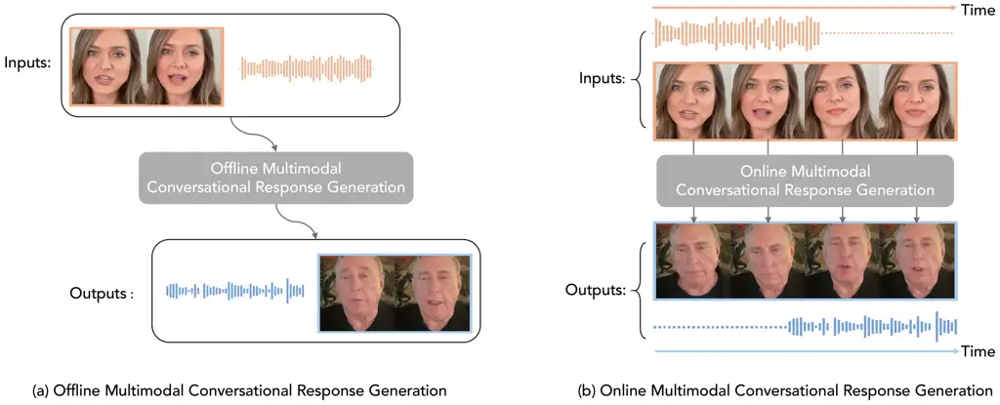
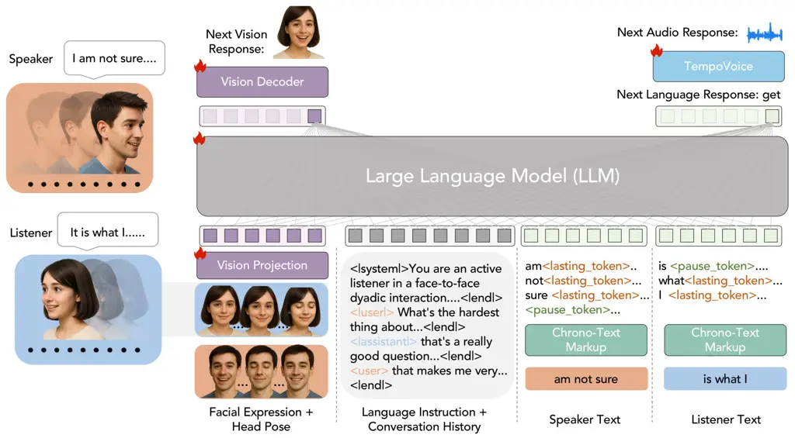
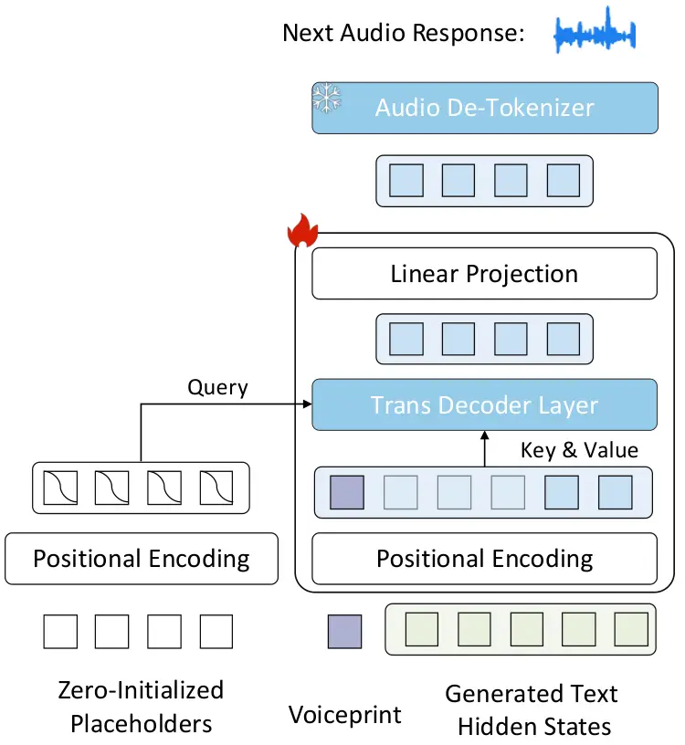
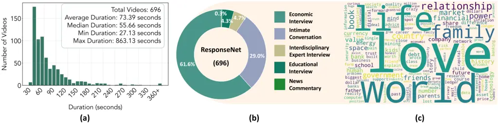
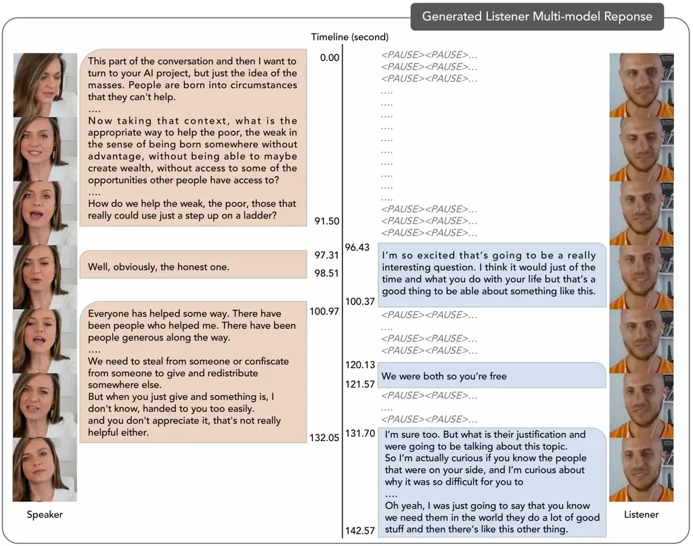
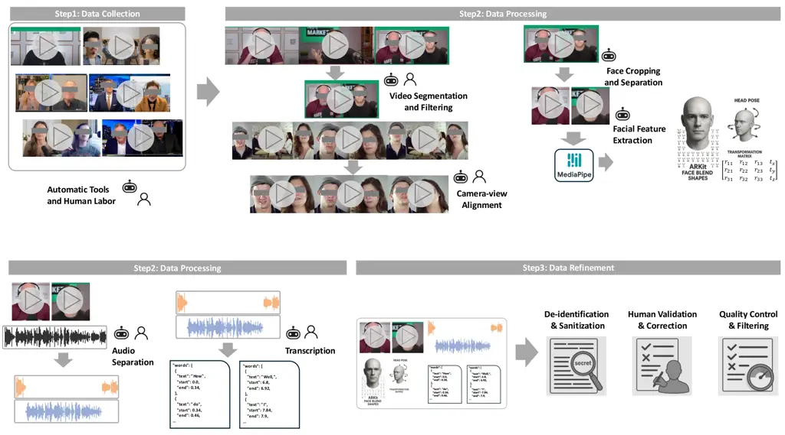

# OmniResponse: Online Multimodal Conversational Response Generation in Dyadic Interactions

Cheng Luo Affiliation: King Abdullah University of Science and
Technology    Jianghui Wang Affiliation: King Abdullah University of
Science and Technology    Bing Li ^(†)^(†)thanks: Corresponding author.
Affiliation: King Abdullah University of Science and Technology   
Siyang Song Affiliation: University of ExeterProject
Page: [https://omniresponse.github.io/](https://omniresponse.github.io/)
   Bernard Ghanem Affiliation: King Abdullah University of Science and
Technology

###### Abstract

In this paper, we introduce Online Multimodal Conversational Response
Generation (OMCRG), a novel task designed to produce synchronized verbal
and non-verbal listener feedback online, based on the speaker’s
multimodal inputs. OMCRG captures natural dyadic interactions and
introduces new challenges in aligning generated audio with listeners’
facial responses. To tackle these challenges, we incorporate text as an
intermediate modality to connect audio and facial responses. We propose
OmniResponse, a Multimodal Large Language Model (MLLM) that
autoregressively generates accurate multimodal listener responses.
OmniResponse leverages a pretrained LLM enhanced with two core
components: Chrono-Text Markup, which precisely timestamps generated
text tokens, and TempoVoice, a controllable online text-to-speech (TTS)
module that outputs speech synchronized with facial responses. To
advance OMCRG research, we offer ResponseNet, a dataset of 696 detailed
dyadic interactions featuring synchronized split-screen videos,
multichannel audio, transcripts, and annotated facial behaviors.
Comprehensive evaluations on ResponseNet demonstrate that OmniResponse
outperforms baseline models in terms of semantic speech content,
audio-visual synchronization, and generation quality. Our dataset, code,
and models are publicly available.

## 1 Introduction

Generating realistic human conversational responses has substantial
potential across numerous applications, spanning from human-computer
interactions \[40\], immersive metaverse experiences \[31\], to mental
health interventions \[32\]. However, human communication is inherently
multimodal and complex. In face-to-face interactions, speakers convey
their messages not only through spoken language but also through
non-verbal cues, such as lip movements and facial expressions.
Correspondingly, listeners provide multimodal responses consisting of
verbal (e.g., audible affirmations or disapprovals) and non-verbal
responses (e.g., subtle head nods). While considerable efforts \[10,
70\] have been dedicated to modeling text dialogue, particularly in
language-based interfaces \[36\], modeling multimodal conversational
interactions has been much underexplored.

In this paper, we explore a new task: learning to simultaneously
generate verbal and non-verbal listener ¹¹ 1 Previous studies \[8, 24\]
defined a speaker–listener framework for dyadic interactions, in which
the listener both attends to the speaker’s utterances and provides
verbal and nonverbal feedback. responses in an online dyadic
conversation setting, conditioned on the speaker’s verbal and non-verbal
inputs (see Figure  1). We refer to this task as Online Multimodal
Conversational Response Generation. Although various audio-to-video
generation methods (e.g. talking head generation \[85, 87, 82\]) have
shown impressive performance, these methods focus on synthesizing visual
content aligned with input audio signals, which ignores explicitly
modeling multimodal conversational interactions. Recent studies \[44,
50, 64\] propose to generate facial reactions for a listener; however,
these methods overlook verbal responses, which are essential to engage
in dialogue fully.

The OMCRG task is complex and poses major challenges in three aspects.
First, it is non-trivial to directly achieve synchronization between the
generated audio and facial reactions of the listener for OMCRG task. As
revealed in existing talking-head works \[85, 69\], achieving precise
alignment between facial motion and audio is already challenging, even
when the entire audio signal is given. In contrast, OMCRG is to generate
both audio and facial reactions simultaneously and incrementally. Such
online and multimodal generation settings make face-audio
synchronization much more difficult, due to the high variability and
semantic ambiguity of audio modality. Second, due to the online setting,
the model has to reason over partial speaker input and generate
audio-visual responses on the fly, which requires both powerful
audio-visual understanding and generation abilities. While powerful
pre-trained models have been developed for language and vision, audio
modeling remains comparatively underdeveloped, making it more
challenging to generate expressive and appropriate audio and facial
reactions. Third, the lack of high-quality datasets for dyadic
multimodal interaction significantly hinders the development of OMCRG.



Figure 1: Illustration of the new OMCRG task. (a) In offline tasks, the
generation model generates the listener’s full response only after
receiving the entire input sequence from the speaker. (b) Differently,
OMCRG task requires sequentially processing the speaker’s incoming input
and generating multi-modal responses for the listener on the fly.

We address the above challenges by proposing a unified framework,
OmniResponse, which autoregressively generates high-quality multimodal
listener responses. Rather than directly synchronizing generated audio
and facial reactions, our key insight is to introduce text as an
intermediate modality for the OMCRG task. Compared with audio, text
offers clearer semantics and reduces uncertainty, making it more
tractable for learning multimodal reaction generation. However, text is
a static modality without inherent temporal information, posing
challenges for synchronizing spoken words with visual frames in an
autoregressive generation setting. To overcome this, we introduce a
Multimodal Large Language Model (MLLM) augmented with two innovative
modules: Chrono-Text and TempoVoice. The Chrono-Text module temporally
anchors generated textual tokens by incorporating additional tokens
(markers) that explicitly encode time, ensuring alignment between words
and visual frames. TempoVoice is a controllable, online text-to-speech
module designed to produce synchronized audio from these temporally
annotated textual embeddings, ensuring accurate synchronization between
audio and facial reactions.

In addition, we construct a high-quality dataset named ResponseNet,
comprising 696 dyadic conversation pairs. Each pair includes
synchronized split-screen video streams of both speaker and listener,
multichannel audio recordings, verbatim text transcriptions, and
detailed facial-behavior annotations (i.e., facial expressions and head
movements). Through extensive retrieval for scarce dyadic video data,
rigorous content filtering, meticulous camera-shift alignment, and
manual annotation, ResponseNet delivers a unique and valuable resource
for benchmarking OMCRG.

Our contributions are summarized as follows: (1) we present
OmniResponse, the first online model to jointly process and generate
synchronized streams of conversational human behavior, establishing a
foundation for future work in human–agent interaction; (2) we introduce
ResponseNet, an annotated dyadic conversation dataset and benchmark,
enabling standardized evaluation of OMCRG models.

## 2 Related Work

Facial Reaction Generation. Facial reaction generation (FRG) \[66, 86,
63\] is a particularly challenging new task as it requires to predict
the non-deterministic human facial reactions under different contexts.
Early FRG approaches \[28, 29\] relied on Generative Adversarial
Networks (GANs) \[46, 22\]

typically conditioned the generation process on the speaker
visual-speech behaviors. Since FRG is a non-deterministic process (i.e.,
different facial reactions can be triggered by the same speaker behavior
\[66\]), recent advances have shifted towards more sophisticated
generative frameworks. For example, Ng et al. \[50\] introduces a
non-deterministic approach based on Variational Autoencoders
(VAEs) \[33\], which enabled sampling diverse human facial motions. This
work was complemented by a novel dataset containing paired recordings of
active speakers and silent listeners, providing essential training data
for modeling natural reactions. Zhou et al. \[86\] developed a
specialized speaker-listener video dataset for head motion generation,
which is somewhat limited by its relatively short clip durations (median
length of 9.0 sec) and modest dataset scale (1.58 hours total), and thus
constraining their model’s ability to learn long-term temporal
dependencies. More recent works have attempted to address these
limitations through innovative architectural choices or larger-scale
datasets \[64, 65\]. Luo et al. \[44, 15\] and Zhu et al. \[88\]
proposed transformer-based \[73\] VAE and diffusion models \[67, 25\],
respectively, training them on a hybrid collection of videos from three
different human-human dyadic interaction datasets \[12, 60, 53\].

Spoken Dialogue Models. Spoken dialogue models generate natural speech
responses in real-time, requiring systems to process both verbal content
and paralinguistic elements of communication. Early approaches including
AudioPALM \[61\], Spectron \[49\], and SpeechGPT \[80\] adopted
pipelines combining automatic speech recognition (ASR), text generation,
and text-to-speech (TTS) synthesis. However, their requirement to
complete the entire response before the speech generation makes them
unsuitable for live human-computer interactions. Recent
developments \[47, 19, 52\] have shifted towards end-to-end approaches
that directly model speech-to-speech generation. Representative examples
include Moshi et al. \[19\] and dGSLM \[52\], which operate as
full-duplex speech dialogue systems capable of processing continuous
speaker input while generating appropriate vocal responses. While these
advances are significant, they focus exclusively on speech and text
modalities, overlooking the crucial visual aspects of human
communication. Even recent work by Park et al. \[54\] that includes
visual-speech data is limited to intermittent speaker-listener
interactions.

Autoregressive Generative Model. Transformer-based autoregressive
models \[73\] have revolutionized numerous domains in AI, demonstrating
remarkable success in language modeling \[10, 70\], multi-modal
processing \[41, 3, 35, 48\], and generative tasks \[59, 84, 77, 76, 75,
68\]. Their success can be attributed to their inherent scalability and
ability to unify multi-modal training under a single autoregressive
objective, enabling seamless integration of different data modalities.
The adaptation of transformers to visual tasks was pioneered by
approaches such as VQVAE \[72\] and VQGAN \[20\], which introduced
effective methods for quantizing visual information into discrete
tokens. They align visual generation with the successful paradigm of
language modeling by employing decoder-only transformers to predict
sequences of image tokens. Subsequent research \[13\] has focused on
enhancing both the efficiency of tokenization processes \[45, 38\] and
sampling procedures \[79\], while simultaneously scaling up model
architectures to handle increasingly complex tasks.

## 3 Methodology

Problem Definition. Let $`\mathbf{F}_{t}^{s}`$ and
$`\mathbf{A}_{t}^{s}`$ be the speaker’s facial and audio cues at time
$`t`$, respectively. Given the speaker’s streaming facial sequence
$`\mathbf{F}_{1:t}^{s}`$ and audio sequence $`\mathbf{A}_{1:t}^{s}`$
from time 1 to $`t`$, the goal of OMCRG is to online generate facial
reactions $`\mathbf{F}_{t}^{l}`$ and audio feedback
$`\mathbf{A}_{t}^{l}`$ at time step $`t`$. Such multi-modal generation
has been much less underexplored, different from recent works \[86, 44,
19, 80\] mainly focusing on single-modal response generation. To provide
natural responses, it is crucial to ensure that the generated facial
reactions and audio are temporally synchronized and react appropriately
to the speaker. However, this is significantly challenging due to the
inherent difficulty of online audio-visual understanding and generation.

Instead of generating audio and visuals directly, we treat text as an
intermediate modality and decompose OMCRG into two subproblems: (i)
joint text–and–face response generation—producing temporally aligned
facial reactions $`\mathbf{F}^{l}_{t}`$ and textual responses
$`\mathbf{W}^{l}_{t}`$; and (ii) synchronous text-to-speech
synthesis—converting $`\mathbf{W}^{l}_{t}`$ into audio waveform segments
$`\mathbf{A}^{l}_{t}`$ that are aligned with the facial reactions.
However, because text lacks explicit temporal information, achieving
tight alignment with facial and audio streams is challenging for both
subproblems. We address this issue with two novel modules.

Overview. We present OmniResponse, a novel framework for the OMCRG task
(see Figure 2), where OmniResponse is a new MLLM enhanced by two
proposed key components: _Chrono-Text Markup_ and _TempoVoice_. In
particular, our OmniResponse leverages the capability of a pretrained
LLM to understand and interpret the speaker’s multimodal inputs and
autoregressively generate meaningful responses in terms of textual and
facial responses. To address the lack of temporal information in text,
the proposed _Chrono-Text Markup_ embeds explicit temporal marks between
text tokens, endowing the input and output text with time-aware
embeddings and ensuring precise alignment with the generated facial
reactions. Furthermore, the proposed _TempoVoice_ generates audio
responses temporally synchronized with both the generated textual
response and the listener’s facial movements.



Figure 2: Overview of the proposed OmniResponse. The model takes textual
conversational history and newly coming multimodal information (e.g.,
facial cues) from the speaker and listener as input, and generates
temporally synchronized facial and textual responses for the listener by
leveraging a pre-trained LLM enhanced with our proposed Chrono-Text
Markup. The generated text embeddings are converted into audio
synchronized with the facial response by the proposed TempoVoice module.

### 3.1 OmniResponse

Model Architecture. As shown in Figure 2, OmniResponse processes
multiple modalities from the speaker and the listener, temporally aligns
different modalities, and outputs synchronous multimodal responses to
the speaker. In particular, at each time step $`t`$, OmniResponse
consumes: (1) _Static text inputs_: a task-specific instruction prompt
$`W_{\mathrm{instruct}}`$ and the conversation history prior to time
$`\tau`$ ($`\tau<t`$), denoted $`W_{\mathrm{history},<\tau}`$; and (2)
_Temporal inputs_: the previously generated facial features of the
listener $`\hat{\mathbf{F}}_{\tau:t-1}^{l}`$, the facial features of the
speaker $`\mathbf{F}_{\tau:t-1}^{s}`$ and the accumulated text sequences
from both participants ($`\mathbf{W}_{\tau:t-1}^{s}`$,
$`\hat{\mathbf{W}}_{\tau:t-1}^{l}`$) over the interval $`[\tau,t-1]`$.
Using these inputs, OmniResponse predicts the next facial features
$`\hat{\mathbf{F}}_{t}^{l}`$, the verbal response
$`\hat{\mathbf{W}}^{l}_{t}`$, and the corresponding speech segment
$`\hat{\mathbf{A}}^{l}_{\mu}`$ in the current frame, ensuring precise
temporal alignment in all modalities. Formally, we defined this process
as:

```math
\displaystyle\{\hat{\mathbf{F}}^{l}_{t},\hat{\mathbf{A}}^{l}_{\mu},\hat{\mathbf{W}}^{l}_{t}\}=\mathcal{M}\big( \displaystyle W_{\mathrm{instruct}},W_{\mathrm{history},<\tau},\mathbf{F}^{s}_{\tau:t-1},\,\hat{\mathbf{F}}^{l}_{\tau:t-1},\,\mathbf{W}^{s}_{\tau:t-1},\hat{\mathbf{W}}^{l}_{\tau:t-1}\big).
```

Vision Projection. We introduce the vision projection layer to enable
the pretrained LLM (Phi-3.5 mini-instruct with 3.8B parameters \[1\]) to
process visual facial features. The layer is implemented as a multilayer
perceptron (MLP) that maps the the listener’s and speaker’s past facial
features $`\mathbf{\hat{F}}^{l}_{1:t-1}`$ and $`\mathbf{F}^{s}_{1:t-1}`$
into embedding features $`\mathbf{V}_{1:t-1}`$ aligned with the LLM
token space. During autoregressive generation, the MLLM employs causal
self-attention \[73\] to model temporal dependencies between the next
token and previous one, and outputs the next listener vision embedding
$`\mathbf{\hat{V}}^{l}_{t}`$.

Vision Decoder. A learnable vision decoder, comprising transformer
layers, converts $`\mathbf{\hat{V}}^{l}_{t}`$ back into the original
coefficient space to produce the predicted listener facial coefficients
$`\hat{\mathbf{F}}^{l}_{t}`$. Subsequently, a pre-trained visual
renderer maps these visual coefficients to 2D frames, using a given
portrait image. Please refer to the appendix for additional details.

Chrono-Text Markup. Visual frames inherently encode temporal
information, whereas text tokens are static and lack any temporal
dimension. Additionally, visual frames and textual tokens typically
differ in length due to their fundamentally different modalities, making
unified autoregressive prediction challenging. To resolve this mismatch,
we propose Chrono-Text Markup, a novel yet straightforward approach that
explicitly embeds temporal information into textual data, aligning the
textual sequence precisely with the visual frame sequence. Unlike prior
approaches such as TimeMarker \[14\], which inserts timestamps only
between visual frames or the method by Ng et al. \[51\], which
integrates timestamp embeddings into textual tokens, our method employs
only two special markers, ensuring that the textual and visual sequences
have identical lengths. Specifically, we insert two special tokens into
the transcript: \[PAUSE\] to denote silent intervals between utterances,
and \[LASTING\] to indicate that the previous textual word continues
speaking to the current time. Each text token is placed between pause
and lasting tokens.

Multimodal Context Modeling. Our synchronous Multimodal LLM integrates
both static and dynamic inputs: _Static inputs_: the instruction prompt
and the accumulated conversation history. _Dynamic inputs_:
frame-aligned visual embeddings and timestamped textual tokens for both
speaker and listener. All tokens are jointly processed by an
_omni-attention_ mechanism that enforces causal, cross-modal
interactions. Under this operation, each visual token attends to
preceding visual tokens and to text tokens marked by chrono-text markers
at earlier timestamps; similarly, each dynamic text token attends to
past visual and textual tokens. However, this omni-attention prevents
dynamic tokens from looking at future tokens. This ensures the
generation adheres to temporal dynamics and cross-modal interactions.
Meanwhile, static tokens remain globally accessible, ensuring that every
dynamic update remains guided by the overarching instructions.

TempoVoice. Generating natural speech that is precisely synchronized
with text and facial frames poses a significant challenge. To address
this, we introduce a dedicated synthesis pipeline, _TempoVoice_.



Figure 3: Architecture of TempoVoice. TempoVoice transforms textual
hidden-state embeddings into audio segments.

Our framework begins by combining the listener’s voiceprint, extracted
via the Spark-TTS global tokenizer \[74\] to capture speaker identity,
with the hidden states of the generated text (see Figure 3). We then
apply sinusoidal positional encodings to the merged embeddings. Since
audio-token sequences typically differ in length from visual frames and
textual tokens, we prepend a series of zero-initialized placeholder
tokens, each endowed with positional information. These placeholders
serve as queries in a cross-attention module within a Transformer
decoder, attending over the fused text–voice representations. This
mechanism enables fully synchronous, autoregressive generation of audio
tokens in lockstep with visual frames and text tokens. Finally, a linear
projection layer maps the decoder outputs to logits over the discrete
audio-codec vocabulary.

The decoder logits are then quantized into discrete audio semantic
tokens $`\hat{\mathbf{A}}_{\mu}`$, as defined by the Spark-TTS audio
tokenizer \[74\]. Conditioned on these semantics and the global
speaker-identity embeddings, the tokenizer reconstructs the continuous
waveform segment.

### 3.2 Training Objectives

To train OmniResponse, the training objective is a weighted combination
of text generation loss $`\mathcal{L}_{\text{text}}`$, vision
reconstruction $`\mathcal{L}_{\text{vision}}`$, and audio generation
loss $`\mathcal{L}_{\text{audio}}`$:

```math
\vskip-5.0pt\mathcal{L}=\mathcal{L}_{\text{text}}+\lambda_{\text{vision}}\mathcal{L}_{\text{vision}}+\,\lambda_{\text{audio}}\mathcal{L}_{\text{audio}}, \tag{1}
```

where $`\lambda_{\text{vision}}`$ and $`\lambda_{\text{audio}}`$ are the
scaling factors balancing text, vision, and audio loss terms.

Text Generation Loss. The text loss encourages accurate next-token
prediction conditioned on both speaker context and past listener states:

```math
\mathcal{L}_{\text{text}}=-\sum_{t}\log p_{\theta}\bigl(W^{l}_{t}\,\bigm|\,W_{\mathrm{instruct}},\,W_{\mathrm{history},<\tau},\,\mathbf{F}^{s}_{\tau:t-1},\,\hat{\mathbf{F}}^{l}_{\tau:t-1},\,\mathbf{W}^{s}_{\tau:t-1},\,\hat{\mathbf{W}}^{l}_{\tau:t-1}\bigr). \tag{2}
```

Vision Reconstruction Loss. To align predicted and ground-truth facial
dynamics, we apply an $`\ell_{2}`$ reconstruction loss on the listener’s
feature embeddings:

```math
\vskip-2.0pt\mathcal{L}_{\text{vision}}=\sum_{t}\bigl\lVert\hat{\mathbf{F}}^{l}_{t}-\mathbf{F}^{l}_{t}\bigr\rVert_{2}^{2}. \tag{3}
```

Audio Generation Loss. The audio loss operates over discrete semantic
tokens $`\mathbf{A}^{l}_{\mu}`$, indexed by $`\mu`$, which correspond to
frame indices $`t=\mu k`$ ($`k`$ is the downsampling factor). We
maximize the likelihood of each token conditioned on previous audio
semantics and the listener’s hidden states:

```math
\mathcal{L}_{\text{audio}}=-\sum_{\mu}\log p_{\theta}\bigl(\mathbf{A}^{l}_{\mu}\,\bigm|\,\mathbf{A}^{l}_{<\mu},\,\mathbf{H}_{t-k+1:t}\bigr), \tag{4}
```

where $`\mathbf{H}_{t-k+1:t}`$ denotes the model’s hidden
representations for the corresponding listener text tokens
$`\hat{\mathbf{W}}^{l}_{t-k+1:t}`$. This formulation ensures coherent
alignment across modalities throughout generation.

## 4 Dataset Construction

Existing publicly available dyadic video datasets do not satisfy the
requirements of the OMCRG task (Figure 1). For example, mono-view
talking-head datasets and offline dialogue corpora (e.g.,
MultiDialog \[54\]) do not offer split-screen recordings that capture
speaker and listener simultaneously. Others, such as IEMOCAP \[11\],
feature predominantly side profile views recorded in noisy environments
and provide only mixed audio channels, thus preventing separate analysis
of each participant’s speech. Furthermore, datasets such as ViCo \[85\],
ICD \[50\], and REACT2024 \[64\] lack comprehensive textual annotations,
suffer from low video resolution \[85, 11, 64\], or exhibit inconsistent
spoken languages \[64\]. To fill the dataset gap, we introduce
ResponseNet that comprises 696 temporally synchronized dyadic video
pairs, totaling over 14 hours of natural conversational exchanges. Each
pair provides high-resolution ($`1024\times 1024`$) frontal-face streams
for both speaker and listener, along with separated audio channels to
support fine-grained analysis of verbal and nonverbal behavior. Table 1
shows ResponseNet is the only dataset that satisfies the key
requirements: (1) online video streaming, (2) separate audio channels,
and (3) textual word-level annotations for both participants.

The construction of ResponseNet follows a rigorous workflow that
integrates automated tools with extensive human-in-the-loop curation.
(1) Initially, split-screen videos featuring simultaneous appearances of
speaker and listener are sourced from YouTube according to predefined
topic and quality criteria. These clips are then filtered to remove
low-resolution, noisy, or frequently camera transitions. (2) Human
annotators perform a thorough review to correct camera-view
mis-alignments and ensure precise temporal synchronization between
streams. (3) Next, mixed-channel audio tracks are automatically
separated into discrete speaker and listener channels using speaker
separation tools such as MossFormer2 \[83\] and subsequently verified
and refined by experts. Finally, word-level transcripts are generated
via automatic speech recognition \[58\] and meticulously proofread to
guarantee accuracy. By combining automation with meticulous manual
oversight across data sourcing, preprocessing, alignment, audio
separation, and annotation, this pipeline yields a high-quality, richly
annotated dyadic video corpus ideally suited for multimodal
conversational response generation.

The statistics of ResponseNet are shown in Figure 4. The durations of
speaker-listener video clips range from 27.13 seconds (short
conversations) to 863.13 seconds (long conversations) in ResponseNet.
Figure 4.(a) shows that the average clip duration in ResponseNet is
73.39 seconds, significantly longer than that of other dyadic datasets
such as REACT2024 (30 seconds), and Vico (9 seconds). This extended
duration ensures that each clip captures sufficient conversational
exchanges. Figure 4.(b) illustrates that the conversations span a
diverse range of topics, including professional discussions (e.g.,
economic interviews, news commentaries), emotionally driven interactions
(e.g., intimate conversations), educational settings (e.g., teaching
interviews), and interdisciplinary expert discussions. Figure 4.(c)
presents a word cloud highlighting the most frequent words in the
conversations. Such diversity shows that ResponseNet captures rich and
varied human-human interactions rather than being restricted to narrow
or monotonic conversation patterns.

|                    |       |       |      |        |                  |              |                |
| ------------------ | ----- | ----- | ---- | ------ | ---------------- | ------------ | -------------- |
|                    |       |       |      |        |                  |              |                |
| Dataset            | Video | Audio | Text | Online | Separated Audios | \# Dialogues | Total Duration |
| MultiDialog \[54\] | +     | +     | +    | ✗      | ✓                | 8,733        | 339.7h         |
| ICD \[50\]         | +     | +     | ✗    | ✓      | ✓                | 182,132      | 72h            |
| ViCo \[86\]        | +     |       | ✗    | ✓      | ✗                | 483          | 1.6h           |
| REACT2024 \[65\]   | +     | +     | ✗    | ✓      | ✓                | 5,919        | 71.8h          |
| IEMOCAP \[11\]     | +     | +     | +    | ✓      | ✗                | 151          | 11.5h          |
| ResponseNet        | +     | +     | +    | ✓      | ✓                | 696          | 14.2h          |
|                    |       |       |      |        |                  |              |                |

Table 1: Comparison of conversation datasets. and denote speaker and
listener data respectively. ResponseNet provides complete multimodal
data (speaker+listener) with their separated audios.



Figure 4: Statistics of ResponseNet. (a) Distribution of video clip
durations. (b) Distribution of dyadic conversation topics. (c) Word
cloud of spoken words in dyadic conversations.

## 5 Experiments

Implementation Details. Our framework was implemented using
PyTorch \[55\] and trained on four NVIDIA Tesla A100 GPUs. The model
optimization was performed using the AdamW optimizer \[34\] with a
learning rate of $`2\times 10^{-5}`$, $`\beta_{1}=0.9`$,
$`\beta_{2}=0.999`$, and a weight decay of $`10^{-4}`$, accompanied by a
cosine learning rate scheduler. Training was executed with a batch size
of one for 2,000 epochs. Additionally, we fine-tuned the LLM using the
LoRA \[27\] technique with a LoRA rank of 64 and a LoRA alpha value of 16. More implementation details are provided in the Appendix.

Evaluation Metrics. Quantitatively evaluating the quality of multimodal
response generation remains non-trivial. We thereby employ comprehensive
metrics to evaluate generation results across text, audio, and visual
modalities. For text response, we use METEOR \[9\],
BERTScore\_(F1) \[81\], and ROUGE-L \[39\] to measure how appropriate and
natural the generated responses are, based on reference responses from
the ResponseNet test set. We also adopt Distinct-2 \[37\] to evaluate
diversity through the ratio of unique bi-grams. For audio response, we
adopt UTMOSv2 \[6\], a neural MOS predictor that estimates the
perceptual naturalness, and employ LSE-D \[57, 16\] (Lip–Speech Error
Distance) to evaluate synchronization between generated speech and lip
movements. For facial response, we compute Fréchet Distance (FD) \[4\]
between real and generated facial-feature distributions, and Fréchet
Video Distance (FVD) \[71\] to assess the spatial–temporal visual
quality of generated video sequences.

|                                                                 |                     |                              |                      |                         |                      |                      |                   |                    |
| --------------------------------------------------------------- | ------------------- | ---------------------------- | -------------------- | ----------------------- | -------------------- | -------------------- | ----------------- | ------------------ |
| Model                                                           | Text                |                              |                      |                         | Audio                |                      | Video             |                    |
|                                                                 | METEOR $`\uparrow`$ | BERTScore\_(F1) $`\uparrow`$ | ROUGE-L $`\uparrow`$ | Distinct-2 $`\uparrow`$ | LSE-D $`\downarrow`$ | UTMOSv2 $`\uparrow`$ | FD $`\downarrow`$ | FVD $`\downarrow`$ |
| Ground-Truth                                                    | –                   | –                            | –                    | 0.835                   | 8.96                 | 1.56                 | –                 | –                  |
| _Offline Text Dialogue Generation System_                       |                     |                              |                      |                         |                      |                      |                   |                    |
| GPT-4o \[2\]                                                    | 0.167               | 0.805                        | 0.079                | 0.928                   | –                    | –                    | –                 | –                  |
| GPT-4 \[2\]                                                     | 0.163               | 0.822                        | 0.082                | 0.960                   | –                    | –                    | –                 | –                  |
| GPT-o1 \[2\]                                                    | 0.189               | 0.822                        | 0.113                | 0.948                   | –                    | –                    | –                 | –                  |
| Qwen-7B-Chat \[7\]                                              | 0.167               | 0.807                        | 0.090                | 0.920                   | –                    | –                    | –                 | –                  |
| Claude-Sonnet-4 \[5\]                                           | 0.183               | 0.807                        | 0.101                | 0.966                   | –                    | –                    | –                 | –                  |
| Gemini-2.5-Flash \[17\]                                         | 0.175               | 0.824                        | 0.085                | 0.932                   | –                    | –                    | –                 | –                  |
| DeepSeek-R1 \[23\]                                              | 0.173               | 0.815                        | 0.078                | 0.981                   | –                    | –                    | –                 | –                  |
| _Online Auditory Dialogue Generation System_                    |                     |                              |                      |                         |                      |                      |                   |                    |
| Moshi \[19\]                                                    | 0.120               | 0.818                        | 0.078                | 0.499                   | –                    | 2.21                 | –                 | –                  |
| _Facial Reaction Generation System_                             |                     |                              |                      |                         |                      |                      |                   |                    |
| ReactFace \[44\]                                                | –                   | –                            | –                    | –                       | –                    | –                    | 32.72             | 340.28             |
| ViCo \[86\]                                                     | –                   | –                            | –                    | –                       | –                    | –                    | 57.13             | 325.65             |
| _Online Multimodal Conversational Response Generation Baseline_ |                     |                              |                      |                         |                      |                      |                   |                    |
| LSTM \[26\]                                                     | 0.042               | 0.716                        | 0.000                | 0.000                   | 9.72                 | 1.21                 | 6.51              | 320.92             |
| Audio-visual LLM                                                | 0.030               | 0.662                        | 0.020                | 0.155                   | 10.03                | 1.32                 | 580.86            | 681.55             |
| OmniResponse (Ours)                                             | 0.141               | 0.806                        | 0.081                | 0.882                   | 9.56                 | 1.41                 | 15.46             | 314.94             |

Table 2: Quantitative Results on ResponseNet test set.

### 5.1 Quantitative Results

To the best of our knowledge, few works have explored the OMCRG task
before. We build two baselines and compare them in Table 2: (1)
LSTM-based method employing a recurrent neural network  \[26\] for
temporal sequence modeling; (2) Audio-visual LLM taking speaker–listener
audio and visual inputs and leveraging pre-trained LLM to generate
audio–visual frames autoregressively. Table 2 further reports the
generation performance of representative single-modality baselines,
including offline, text-only dialogue models (e.g., GPT variants \[2\],
Qwen-7B-Chat \[7\], Claude-Sonnet-4 \[5\] (version 2025-05-14),
Gemini-2.5-Flash \[17\], and DeepSeek-R1 \[23\] (version 2025-05-28)),
online audio-only generation models (e.g., Moshi \[19\]), and facial
reaction generation approaches \[44, 86\]. Different from these methods
focusing on generating a single modality, our method enables online,
synchronized generation across audio, visual, and textual modalities for
modeling human conversation.

Table 2 shows that our OmniResponse achieves the best performance in
dialogue speech content (METEOR, BERTScore*(F1), ROUGE-L, Distinct-2),
audio quality (UTMOSv2), audio–visual synchronization (LSE-D), as well
as temporal consistency and visual quality (FVD). Although the LSTM
baseline achieves a lower FD owing to its tendency to produce repetitive
static visual output, it fails to generate rich, synchronized multimodal
responses. Audio-Visual LLM does not incorporate the text modality,
compared to our method. Consequently, Audio-Visual LLM achieves much
lower speech content quality (METEOR and $`\text{BertScore}*{F1}`$) and
struggles with audio–visual synchronization (LSE-D) than our method.
Although Audio-Visual LLM leverages a powerful LLM, it is still
challenging to directly synchronize generated audio with facial
reactions, especially in the absence of a strong audio foundation model.

Our OmniResponse model significantly outperforms Audio-visual LLM across
all evaluated metrics, including non-verbal ones. These results
demonstrate that introducing text as an intermediate modality greatly
enhances the naturalness and realism of non-verbal responses, as
reflected by the FD and FVD scores. Moreover, we introduce a novel
framework that effectively adapts pre-trained LLMs for audio–visual
generation with the proposed Chrono-Text Markup and Tempo Voice.



Figure 5: Qualitative Results. Given the speaker’s audio and video
streams and corresponding utterances (left), OmniResponse
autoregressively generates synchronized visual, audio, and textual
response streams (right). For clarity, \[LASTING\] tokens are removed
from the generated dialogue.

### 5.2 Qualitative Results

Figure 5 presents a qualitative result. The synthesized listener remains
silent while the speaker is speaking, but then produces an immediate or
delayed response at the end of each speaker turn. This behavior
demonstrates that OmniResponse effectively captures the temporal
dynamics of online dyadic conversation and generates responses at
appropriate timestamps. For example, between 100.97 and 132.05 s, the
listener interjects briefly between 120.13 and 121.57 s in response to
the speaker’s ongoing content, reflecting natural human conversational
interaction. In contrast, a conventional pipeline that integrates
Automatic Speech Recognition (ASR), dialogue generation, TTS, and
talking-head components waits for a predefined silence threshold before
producing an offline multimodal response, thus diminishing
conversational behaviors such as interruptions, backchannels, questions,
and immediate feedback. In contrast, OmniResponse maintains the
continuous flow of dyadic conversation by continuously modeling and
generating synchronized time series streams of textual, visual, and
audio outputs.

### 5.3 Ablation Studies

Effectiveness of Chrono-Text Markup. We construct baselines removing the
proposed Chrono-Text Markup from our OmniResponse. In the baselines,
each predicted word is assigned a timestamp indicating when it emerges;
if this timestamp falls within a temporal window around the current
time, the word is retained and appended to the spoken output; otherwise,
it is discarded. As shown in the last rows of Table 3, incorporating
Chrono-Text Markup significantly improves audio-visual synchronization,
reducing the LSE-D score from 11.51 to 9.56. In addition, it enhances
the semantic alignment of speech with conversational context, increasing
METEOR from 0.122 to 0.141 and BERTScore\_(F1) from 0.766 to 0.806.
Improvements in FD and UTMOSv2 further indicate that Chrono-Text Markup
boosts the quality of the generated audio and facial responses. These
results demonstrate the effectiveness of Chrono-Text Markup in
generating high-quality multimodal responses.

|                    |             |        |                           |       |         |        |
| ------------------ | ----------- | ------ | ------------------------- | ----- | ------- | ------ |
| Chrono-Text Markup | Tempo Voice | METEOR | $`\text{BERTScore}_{F1}`$ | LSE-D | UTMOSv2 | FD     |
| ✗                  | ✗           | 0.090  | 0.755                     | 13.64 | 1.21    | 596.27 |
| ✓                  | ✗           | 0.128  | 0.778                     | 11.91 | 1.23    | 19.58  |
| ✗                  | ✓           | 0.122  | 0.766                     | 11.51 | 1.39    | 23.42  |
| ✓                  | ✓           | 0.141  | 0.806                     | 9.56  | 1.41    | 15.46  |

Table 3: Ablation study on the effects of the proposed Chrono-Text
Markup and TempoVoice.

Effectiveness of TempoVoice. To study the effect of our TempoVoice, we
remove it from our framework and instead directly feed the hidden
states, which are trimmed or padded to match the target audio length,
into a multi-layer perceptron to predict audio token logits. As shown in
Table 3, removing TempoVoice degrades audio–visual synchronization and
reduces the quality of generated audio responses, where UTMOSv2 drops
from 1.41 to 1.23, and LSE-D increases from 9.56 to 11.91. These results
highlight the importance of TempoVoice in temporally aligning audio with
the other modalities and enhancing the quality of the generated audio.

### 5.4 User Study

|                                |               |                           |
| ------------------------------ | ------------- | ------------------------- |
| Criteria                       | Ours vs. LSTM | Ours vs. Audio–Visual LLM |
| Speech Content Appropriateness | 75.5%         | 81.6%                     |
| Audio Speech Quality           | 77.6%         | 85.7%                     |
| Visual Quality                 | 67.3%         | 93.4%                     |
| Audio–Visual Synchronization   | 91.8%         | 95.9%                     |

Table 4: User study (A/B preference; higher is better). Each cell shows
the percentage of participants preferring _Ours_.

We conducted a user study with 49 participants (28 male, 21 female).
Each subject viewed 16 randomly ordered clips and rated speech content
appropriateness, audio speech quality, visual quality, and audiovisual
synchronization. All participants were proficient in English (53.1%
reported advanced proficiency or daily-communication ability).
Educational attainment was high: 95.9% held at least an undergraduate
degree, 44.9% held a master’s degree, and 18.4% held a Ph.D. Ages were
distributed as follows: 14.3% under 25, 34.7% aged 26–35, 24.5% aged
36–45, and 26.5% aged 46–55. In direct A/B preferences, “Ours” achieved
a minimum preference of 67.3% (speech content appropriateness vs. LSTM)
and a maximum of 95.9% (audiovisual synchronization vs. Audio–Visual
LLM).

## 6 Conclusion and Discussion

We have presented OmniResponse, an online multimodal generation model
that produces verbal and nonverbal listener responses to a speaker’s
multimodal behaviors. OmniResponse integrates techniques for processing
multimodal inputs, synchronizing across modalities, and aligning
responses with the speaker’s content. To enable evaluation of this task,
Online Multimodal Conversational Response Generation in Dyadic
Interactions, we introduce ResponseNet, a dataset containing parallel
recordings of speaker and listener streams. Our model and dataset lay
the foundation for future research in this emerging field. Experimental
results demonstrate that OmniResponse significantly increases speech
semantic content, audio-visual synchronisation, audio and visual
quality.

Limitations. While our approach performed well on the evaluated
datasets, the remaining challenges include the proposed approach (e.g.,
its results) may largely depend on the quality and diversity of training
data, replying on accurate speaker–listener segmentation and can be
negatively affected in noisy or overlapping conversations. Additionally,
generating well-aligned multi-modal responses remains difficult in
fast-changing or emotionally rich interactions, while our paper lacks
fairness analysis. Future work will focus on improving these aspects.

Risks and Potential Misuse. This system is developed for multi-modal
conversational AI, but certain risks should be acknowledged. For
instance, realistic synthetic contents could be misused \[62\] for
impersonation or misleading information. During real-time human-user
interactions, users may also develop misunderstandings or excessive
reliance on the system without proper contents control. To avoid these
risks, we recommend clear labeling of the generated contents,
appropriate usage monitoring, and the inclusion of protective
measures \[21, 78\] (e.g., Deepfake Detection \[56, 30\]) against
potential misuse.

Acknowledgments. This work is supported by the KAUST Center of
Excellence for Generative AI under award number 5940. The computational
resources are provided by IBEX, which is managed by the KAUST
Supercomputing Core Laboratory.

## Appendix A Implementation Details and Hyperparameters

|                                         |                                                               |
| --------------------------------------- | ------------------------------------------------------------- |
|   Setup                                 |                                                               |
|   Batch Size                            |   1                                                           |
|   Training Epoch for the Unified Stage  |   1500                                                        |
|   Training Epoch for A/V finetuning     |   500                                                         |
|   Warmup Epoch                          |   100                                                         |
|   Large Language Model                  |   Phi-3.5 Mini-Instruct \[1\] (3.8B)                          |
|   Text Tokenizer                        |   Phi-3.5 Mini-Instruct \[1\] Tokenizer                       |
|   Audio Tokenizer                       |   Spark-tts \[74\] BiCodec                                    |
|   Facial Coefficients                   |   MediaPipe \[43\] facial blendshapes + transformation matrix |
|   Lora Rank                             |   64                                                          |
|   Lora Alpha                            |   16                                                          |
|   Optimizer                             |   AdamW                                                       |
|   Learning Rate                         |   $`2.0\times 10^{-5}`$                                       |
|   Model Parameters $`N_{\text{param}}`$ |   4.5B                                                        |
|   $`\beta_{1}`$                         |   0.9                                                         |
|   $`\beta_{2}`$                         |   0.999                                                       |
|   $`\lambda_{\text{vision}}`$           |   1.0                                                         |
|   $`\lambda_{\text{audio}}`$            |   100                                                         |

Table 5: Implementation details and hyperparameters.

Tab.  5 summarizes the key hyperparameters used in our experiments. For
the core architecture, we employ the Phi-3.5 Mini-Instruct large
language model \[1\] for multimodal fusion and dialogue reasoning. Input
modalities are processed as follows: the audio waveform is tokenized
into discrete representations using the BiCodec component of
Spark-tts \[74\], while text is tokenized using the Phi-3.5
Mini-Instruct tokenizer, augmented with special tokens such as \[PAUSE\]
and \[LASTING\]. Visual features are extracted using the widely adopted
MediaPipe toolkit \[43\], yielding 52-dimensional facial blendshape
coefficients to capture local facial movements and a 12-dimensional
transformation matrix representing head pose dynamics.

Model optimization is performed using the AdamW optimizer \[34\], with
an initial learning rate of $`2.0\times 10^{-5}`$, $`\beta_{1}=0.9`$,
$`\beta_{2}=0.999`$, and a weight decay of $`1.0\times 10^{-4}`$. The
batch size is set to 1, and a cosine learning rate scheduler is applied
throughout training. The model is first trained end-to-end—including all
components (i.e., , LLM, vision projection, decoder, and TempoVoice) for
1,500 epochs, with a 100-epoch warmup phase. To enable efficient
adaptation of the large language model, we employ the LoRA fine-tuning
strategy \[27\] (rank 64, alpha 16), while all other parameters of
OmniResponse are jointly optimized. Subsequently, a dedicated
fine-tuning stage is performed for the audio and visual components
(i.e., , vision projection, decoder, and TempoVoice) over an additional
500 epochs.

## Appendix B Methodological Details

In this section, we provide a comprehensive overview of OmniResponse,
highlighting its architectural design and the key technical innovations,
namely, Chrono-Text Markup and TempoVoice.

Figure 6: Illustration of Prompt Construction. The final prompt
(messgae) is composed of a system prompt, the conversation history from
the speaker (user) and listener (assistant), and dynamic
speaker/listener text processed by our Chrono-Text Markup module.

### B.1 Network Architecture

OmniResponse is composed of several interconnected modules: a vision
projection layer for encoding the visual frames of both the speaker and
listener, a large language model \[1\] for fusing visual features,
textual instructions, and conversational history, and a Chrono-Text
Markup module for temporal alignment of text tokens. The model jointly
predicts the next visual token, text token, and audio response token. A
vision decoder layer reconstructs the listener’s visual frame from the
predicted visual token, while the TempoVoice module converts textual
embeddings into audio waveforms.

Vision Projection Layer. The Vision Projection Layer, denoted as
$`M_{\text{vis-proj}}(\cdot)`$, encodes the previously predicted visual
frames of the listener $`\hat{\mathbf{F}}^{l}_{\tau:t-1}`$ together with
the speaker’s visual frames $`\mathbf{F}^{s}_{\tau:t-1}`$, and projects
them into a sequence of embedding features $`\mathbf{V}_{\tau:t-1}`$
over the temporal interval $`[\tau,t-1]`$. Here, $`\tau`$ is the
starting index of the considered time window, which limits the number of
temporal visual tokens and reduces computational overhead.

The process is formulated as follows:

```math
\mathbf{V}_{\tau:t-1}=M_{\text{vis-proj}}\big(\hat{\mathbf{F}}^{l}_{\tau:t-1},\mathbf{F}^{s}_{\tau:t-1}\big) \tag{5}
```

The projection module $`M_{\text{vis-proj}}`$ can be instantiated either
as a multilayer perceptron that processes the concatenated visual
features of the speaker and listener:
$`\big[\hat{\mathbf{F}}^{l}_{\tau:t-1},\ \mathbf{F}^{s}_{\tau:t-1}\big]`$
(where $`[\cdot]`$ denotes concatenation), or as a transformer-based
layer, where the listener’s visual features serve as queries, and the
speaker’s visual features act as keys and values within a
cross-attention mechanism.

This architecture enables effective temporal fusion of visual
information from both conversational participants, providing context for
subsequent response generation.

Vision Decoder. The vision decoder consists of a two-layer Transformer
Decoder that processes the predicted embeddings
$`\mathbf{\hat{V}}^{l}_{\tau+1:t}`$ generated by the large language
model for the first $`t-\tau`$ positions, and maps them to the facial
coefficient space $`\hat{\mathbf{F}}^{l}_{\tau+1:t}`$.

Subsequently, a pre-trained visual renderer converts these facial
coefficients into 2D facial frames, conditioned on a given portrait
image. The renderer is trained on a large-scale web video dataset and is
utilized as a tool to synthesize photorealistic images by mapping the
predicted facial expression and head pose coefficients to high-quality
2D visuals.

Static Text. The large language model accepts both visual and textual
inputs. The textual inputs include static text. Specifically, static
text contains the instruction prompt $`W_{\mathrm{instruct}}`$ and the
conversation history $`W_{\mathrm{history},<\tau}`$. The construction
process for the instruction prompt is illustrated in Figure 6. The final
prompt comprises the static system message (serving as the assistant’s
instruction) and the conversation history between the speaker (user) and
the listener (assistant) up to time $`\tau`$. This static text is
provided to the LLM following the visual coefficients.

Figure 7: Example of Dynamic Text.

### B.2 Chrono-Text Markup

In addition to the static instruction and conversation history, we also
supply the model with dynamic text annotated with precise timing
information. Figure 6 illustrates how we interleave static and dynamic
text when constructing each prompt: the static text preserves long-term
context, while the dynamic text encodes exactly when each word occurs
and how long silences last.

To achieve this, Chrono-Text Markup introduces two special tokens,
\[PAUSE\] and \[LASTING\], into the token stream according to the
timestamps in our dataset. At each frame timestamp: If neither the
speaker nor listener is uttering a word, we insert a \[PAUSE\] token;
When speech is present, we emit the actual word tokens (e.g., “I”, “am”)
and then append one or more \[LASTING\] tokens to occupy the remainder
of that word’s duration in the timeline. Here is an example show in
Figure 7.

The large language model also generates dynamic text predictions. By
encoding precise timing information into these text embeddings, the
subsequent audio synthesis produces segments that are more tightly
synchronized with the spoken content.

Figure 8: Illustration of Multimodal Context Modeling. Each visual token
attends to all preceding visual tokens and static and dynamic text
tokens annotated by Chrono-Text markers at earlier timestamps.
Similarly, each dynamic text token attends to all past visual and
textual tokens, enabling rich cross-modal context integration.

### B.3 Multimodal Context Modeling.

Our synchronous Multimodal LLM splits its inputs into static and dynamic
streams and fuses them via a causally-aware omni-attention mechanism
(See Figure 8):

- •
  Static inputs: the instruction prompt and full conversation history,
  encoded as global tokens that remain unmasked and accessible at every
  time step.
- •
  Dynamic inputs:
  - –
    Frame-aligned visual embeddings.
  - –
    Temporal text tokens for both speaker and listener, processed with
    Chrono-Markup.

All tokens enter a single omni-attention block enforcing strict
causality _across_ and _within_ modalities:

- •
  Visual tokens attend only to earlier visual tokens , to text tokens
  that precede the current frame and to all the static text tokens.
- •
  Dynamic text tokens attend only to past visual tokens and past text
  tokens, and to all the static text tokens.
- •
  Future dynamic tokens are masked out to preserve temporal integrity.
- •
  Static tokens remain unmasked, ensuring that each update stays guided
  by the overarching instruction and dialogue context.

This design yields tightly synchronized, temporally coherent cross-modal
interactions while maintaining global guidance.

### B.4 TempoVoice

TempoVoice is designed to transform generated textual tokens into
temporally synchronized audio waveforms. Given the hidden
representations corresponding to the listener’s text tokens,
$`\mathbf{H}_{\tau:t}`$, TempoVoice generates audio tokens
$`\mathbf{A}_{\left\lfloor\frac{\tau}{k}\right\rfloor:\mu}`$, which are
then converted into continuous audio waveforms using an audio tokenizer.

The process is defined as follows:

```math
\mathbf{A}_{\left\lfloor\frac{\tau}{k}\right\rfloor:\mu}=\text{TempoVoice}\big(P_{\left\lfloor\frac{\tau}{k}\right\rfloor:\mu},\ [\mathbf{A}_{\text{voiceprint}},\ \mathbf{H}_{\tau:t}]\big) \tag{6}
```

where $`P_{\left\lfloor\frac{\tau}{k}\right\rfloor:\mu}`$ denotes the
positional encodings for positions
$`\left\lfloor\frac{\tau}{k}\right\rfloor`$ to $`\mu`$,
$`\mathbf{A}_{\text{voiceprint}}`$ represents the voiceprint embeddings,
and $`\mathbf{H}_{\tau:t}`$ are the generated textual embeddings over
the interval $`[\tau,t]`$. Here, $`[\cdot]`$ indicates concatenation
along the temporal axis.

The resulting audio tokens
$`\mathbf{A}_{\left\lfloor\frac{\tau}{k}\right\rfloor:\mu}`$ are
subsequently transformed into audio waveforms using the BiCodec module
from Spark-TTS.

### B.5 Inference Speed

We benchmark our model at 15.6 FPS (64 ms latency) on a single NVIDIA
A100 80GB, without deployment optimizations (e.g., flash-attention,
multi-GPU parallelism, distillation, or quantization), indicating
headroom for real-time deployment.

|                  |                  |                                  |                          |                                                 |
| ---------------- | ---------------- | -------------------------------- | ------------------------ | ----------------------------------------------- |
| Method           | FPS $`\uparrow`$ | Generation Paradigm              | Audio Support            | Input Conditions                                |
| Real Video       | –                | –                                | –                        | –                                               |
| SadTalker \[82\] | 1.81             | Offline full-sequence generation | Pre-recorded audio input | Video only; pre-recorded audio of same identity |
| Hallo \[18\]     | 0.13             | Offline full-sequence generation | Pre-recorded audio input | Video only; pre-recorded audio of same identity |
| Ours             | 15.62            | Online, frame-by-frame           | Dynamically generated    | Video + Audio + Text; live partner audio/video  |

Table 6: Runtime and modality comparison.

## Appendix C ResponseNet Dataset



Figure 9: Illustration of Dataset Construction Pipeline.

### C.1 Construction Pipeline

To build the ResponseNet dataset, we design a three-stage pipeline
encompassing data collection, data processing, and data refinement, as
illustrated in Figure 9. This structured process ensures high-quality,
temporally aligned multimodal data suitable for online conversational
response generation tasks.

Step 1: Data Collection. We begin by sourcing dyadic conversational
videos from diverse public domains, including interviews, podcasts, and
online discussions. Candidate videos are selected through a combination
of automatic filtering tools and human curation to ensure conversational
structure and speaker clarity. These videos include one speaker and one
listener. The data is manually labeled for speaker turns, and
high-resolution videos are retained for downstream visual analysis.

Step 2: Data Processing. This step extracts synchronized multimodal data
from the raw videos. First, Video Segmentation and Filtering isolates
segments with clear speaker-listener interaction using face detection
and quality heuristics. We apply Camera-view Alignment to standardize
the perspective, especially in multi-camera recordings. Next, we conduct
Face Cropping and Separation to isolate individual speaker and listener
views. In parallel, the audio track is separated and segmented using
speaker diarization and voice activity detection. However, automatic
tools could lead to bad cases, we correct these separated audio tracks
manually. We then apply an ASR system (whisper \[58\]) for Transcription
to obtain timestamped word-level alignments. Subsequently, we extract
facial behavior features using MediaPipe \[43\], yielding per-frame
ARKit blendshape coefficients and 3D head pose transformation matrices
for both speaker and listener tracks.

Step 3: Data Refinement. To ensure privacy and label accuracy, we
conduct multi-level cleaning. First, in the De-identification and
Sanitization stage, we mask personally identifiable information (PII)
and redact sensitive content from transcripts and audio. Then, Human
Validation and Correction is performed to manually inspect and correct
transcription errors, alignment mismatches, and feature inconsistencies.
Finally, a Quality Control and Filtering phase discards corrupted or
ambiguous segments, yielding a clean, high-quality dataset with tightly
aligned audio, visual, and textual modalities.

Overall, the pipeline enables reliable construction of multimodal
dialogue samples with rich facial dynamics and accurate verbal content,
supporting the development of real-time response generation models.

### C.2 Dataset Statistics

The dataset is partitioned into training, validation, and test splits
following the standard ratio of 6:2:2. Specifically, we ensure that the
distributions of conversation topics, speaker identities, and recording
conditions are balanced across each subset to avoid potential biases and
to facilitate robust evaluation. The detailed statistics of the video
stream pairs in each split are summarized in Table 7.

|            |                              |                |
| ---------- | ---------------------------- | -------------- |
| Split      | Number of Video Stream Pairs | Proportion (%) |
| Train      | 417                          | 59.9           |
| Validation | 139                          | 20.0           |
| Test       | 140                          | 20.1           |
| Total      | 696                          | 100.0          |

Table 7: Data split of video stream pairs in our dataset.

Each data sample consists of a synchronized pair of video streams
representing a dyadic conversational interaction. The train, validation,
and test splits are disjoint with respect to participant pairs to ensure
fair evaluation and to prevent data leakage. This stratified
partitioning enables comprehensive benchmarking of model performance
across diverse conversational scenarios.

We additionally analyze the dataset’s demographic diversity. The Table 8
summarizes identities, gender balance, ethnic distribution, and age
bands.

|            |                                                                      |
| ---------- | -------------------------------------------------------------------- |
| Category   | Count / Share                                                        |
| Identities | 161 unique identities                                                |
| Gender     | Female: 93 (57.8%), Male: 68 (42.2%)                                 |
| Ethnicity  | White: 122 (75.8%), Black: 24 (14.9%), Asian: 15 (9.3%)              |
| Age bands  | 10–19: 10 (6.2%), 20–29: 63 (39.1%), 30–39: 51 (31.7%),              |
|            | 40–49: 17 (10.6%), 50–59: 17 (10.6%), 60–69: 2 (1.2%), 70+: 1 (0.6%) |

Table 8: Demographic statistics of our dataset.

### C.3 Privacy Considerations

The YouTube platform enforces strict content moderation policies to
prevent the dissemination of violent or harmful material. In addition,
according to YouTube’s copyright guidelines²² 2
[https://www.youtube.com/howyoutubeworks/policies/copyright/#fair-use](https://www.youtube.com/howyoutubeworks/policies/copyright/#fair-use),
the use of copyrighted material for research purposes typically
qualifies as fair use, permitting reuse without the need for explicit
permission from the copyright holder. Together, these factors ensure
that our dataset collection and usage align with established privacy and
ethical standards.

## Appendix D Evaluation Protocol

### D.1 Evaluation Metrics

Quantitative evaluation of multimodal response generation is inherently
challenging due to the need to assess multiple aspects of quality across
different modalities. To provide a comprehensive assessment, we employ a
suite of metrics spanning text, audio, and visual outputs.

#### Text Metrics.

- •
  METEOR \[9\]: Measures the alignment between generated and reference
  responses by considering synonymy, stemming, and word order, providing
  a nuanced evaluation of semantic adequacy.
- •
  BERTScore\_(F1) \[81\]: Computes the similarity between generated and
  reference texts based on contextual embeddings from a pretrained
  RoBERTa model \[42\], offering a robust measure of semantic
  similarity.
- •
  ROUGE-L \[39\]: Evaluates the longest common subsequence between
  generated and reference responses, reflecting fluency and content
  overlap.
- •
  Distinct-2 \[37\]: Calculates the proportion of unique bi-grams in the
  generated responses, serving as an indicator of output diversity and
  lexical richness.

#### Audio Metrics.

- •
  UTMOSv2 \[6\]: A neural mean opinion score (MOS) predictor that
  estimates the perceptual naturalness and intelligibility of the
  generated speech.
- •
  LSE-D (Lip–Speech Error Distance) \[57, 16\]: Measures the temporal
  alignment and synchronization between generated audio and
  corresponding lip movements, reflecting audio-visual coherence.

#### Visual Metrics.

- •
  Fréchet Distance (FD) \[4\]: Computes the distributional distance
  between real and generated facial feature embeddings, assessing the
  realism of static visual features.
- •
  Fréchet Video Distance (FVD) \[71\]: Quantifies the spatial-temporal
  quality of generated video sequences by comparing their feature
  distributions to those of real videos, thus evaluating overall video
  realism and consistency.

By leveraging these complementary metrics, we are able to rigorously
assess the appropriateness, naturalness, diversity, and synchronization
of generated responses across modalities, enabling a thorough
benchmarking of model performance on the ResponseNet test set.

### D.2 Baseline Methods

As this is the first work addressing online multimodal conversational
response generation (OMCRG), we compare OmniResponse with a diverse set
of prior methods that target single-modality generation, as well as
several strong multimodal baselines.

Specifically, we include the following baselines:

- •
  Offline Text Dialogue Generation Systems: State-of-the-art large
  language models, including GPT-4o, GPT-4, and GPT-o1 \[2\], are
  evaluated for their ability to generate text responses in offline
  settings. These models only produce text outputs, without audio or
  visual generation.
- •
  Online Auditory Dialogue Generation System: Moshi \[19\] is adopted as
  a representative model for generating spoken responses in real time,
  focusing exclusively on audio outputs.
- •
  Facial Reaction Generation Systems: ReactFace \[44\] and ViCo \[86\]
  serve as facial reaction generation baselines, producing only visual
  (facial) responses based on the conversational context.
- •
  Online Multimodal Conversational Baselines: To provide a direct
  comparison for OMCRG, we construct two multimodal baselines:
  1.  1.  A LSTM-based model \[26\] employing a recurrent neural network for
          temporal sequence modeling across modalities. The LSTM takes
          visual-audio-text modalities of speaker as inputs, and outputs
          listener’s visual and audio modalities.
  2.  2.  An Audio-visual LLM baseline that takes both speaker and listener
          audio–visual inputs and autoregressively generates audio-visual
          responses of the listener via a pre-trained large language
          model \[1\].

While previous approaches focus primarily on generating a single
modality, OmniResponse is designed to produce synchronized and coherent
responses across text, audio, and visual channels in an online setting.

## Appendix E Additional Experiments

### E.1 On SyncNet Metrics (LSE-D and LSE-C)

|                  |                      |                    |
| ---------------- | -------------------- | ------------------ |
| Method           | LSE-D $`\downarrow`$ | LSE-C $`\uparrow`$ |
| LSTM             | 9.72                 | 0.157              |
| Audio–Visual LLM | 10.03                | 0.269              |
| Ours             | 9.56                 | 0.371              |

Table 9: SyncNet metrics. $`\downarrow`$ denotes lower is better;
$`\uparrow`$ denotes higher is better.

Our evaluation follows SyncNet and its two metrics: LSE-D (lip-sync
error distance; lower is better) and LSE-C (lip-sync confidence; higher
is better). We adopt LSE-D in Table 9 using the official SyncNet
evaluation script. We did not use LSE-C as a primary metric because it
is not well suited to our setting: in multimodal conversation, the
listener is often silent while the speaker talks. These silent spans are
appropriate reactions but cause SyncNet’s confidence to drop, making the
averaged LSE-C noisy for our task.

## Appendix F Broader Impacts

Our work contributes to the development of more intuitive and responsive
multi-modal dialogue systems, with potential applications in education,
healthcare, assistive communication, and companion. These technologies
may improve access to information, support inclusive interaction, and
enhance user experience across diverse contexts and scenerios. We
encourage responsible research practices that prioritize transparency,
user safety, and alignment with social values to ensure that such
systems serve the public good.

## Appendix G Responsibility and License

We acknowledge full responsibility in the event of any rights
infringement. The dataset is distributed under the Creative Commons CC
BY-NC-SA license, permitting use with attribution for non-commercial
purposes and requiring derivative works to be shared alike.

## References

- \[1\] Marah Abdin, Jyoti Aneja, Hany Awadalla, Ahmed Awadallah,
  Ammar Ahmad Awan, Nguyen Bach, Amit Bahree, Arash Bakhtiari, Jianmin
  Bao, Harkirat Behl, et al. Phi-3 technical report: A highly capable
  language model locally on your phone. arXiv preprint
  arXiv:2404.14219, 2024.
- \[2\] Josh Achiam, Steven Adler, Sandhini Agarwal, Lama Ahmad, Ilge
  Akkaya, Florencia Leoni Aleman, Diogo Almeida, Janko Altenschmidt, Sam
  Altman, Shyamal Anadkat, et al. Gpt-4 technical report. arXiv preprint
  arXiv:2303.08774, 2023.
- \[3\] Jean-Baptiste Alayrac, Jeff Donahue, Pauline Luc, Antoine Miech,
  Iain Barr, Yana Hasson, Karel Lenc, Arthur Mensch, Katherine Millican,
  Malcolm Reynolds, et al. Flamingo: a visual language model for
  few-shot learning. Advances in neural information processing systems,
  35:23716–23736, 2022.
- \[4\] Helmut Alt and Michael Godau. Computing the fréchet distance
  between two polygonal curves. International Journal of Computational
  Geometry & Applications, 5(01n02):75–91, 1995.
- \[5\] Anthropic. Introducing claude 4 (opus 4 and sonnet 4).
  [https://www.anthropic.com/news/claude-4](https://www.anthropic.com/news/claude-4), 2025.
  Model announcement and overview.
- \[6\] Kaito Baba, Wataru Nakata, Yuki Saito, and Hiroshi Saruwatari.
  The t05 system for the voicemos challenge 2024: Transfer learning from
  deep image classifier to naturalness mos prediction of high-quality
  synthetic speech. In 2024 IEEE Spoken Language Technology Workshop
  (SLT), pages 818–824. IEEE, 2024.
- \[7\] Jinze Bai, Shuai Bai, Yunfei Chu, Zeyu Cui, Kai Dang, Xiaodong
  Deng, Yang Fan, Wenbin Ge, Yu Han, Fei Huang, et al. Qwen technical
  report. arXiv preprint arXiv:2309.16609, 2023.
- \[8\] MM Bakhtin. The problem of speech genres. 1987.
- \[9\] Satanjeev Banerjee and Alon Lavie. Meteor: An automatic metric
  for mt evaluation with improved correlation with human judgments. In
  Proceedings of the acl workshop on intrinsic and extrinsic evaluation
  measures for machine translation and/or summarization, pages
  65–72, 2005.
- \[10\] Tom B Brown. Language models are few-shot learners. arXiv
  preprint arXiv:2005.14165, 2020.
- \[11\] Carlos Busso, Murtaza Bulut, Chi-Chun Lee, Abe Kazemzadeh,
  Emily Mower, Samuel Kim, Jeannette N Chang, Sungbok Lee, and
  Shrikanth S Narayanan. Iemocap: Interactive emotional dyadic motion
  capture database. Language resources and evaluation, 42:335–359, 2008.
- \[12\] Angelo Cafaro, Johannes Wagner, Tobias Baur, Soumia Dermouche,
  Mercedes Torres Torres, Catherine Pelachaud, Elisabeth André, and
  Michel Valstar. The noxi database: multimodal recordings of mediated
  novice-expert interactions. In Proceedings of the 19th ACM
  International Conference on Multimodal Interaction, pages
  350–359, 2017.
- \[13\] Huiwen Chang, Han Zhang, Lu Jiang, Ce Liu, and William T
  Freeman. Maskgit: Masked generative image transformer. In Proceedings
  of the IEEE/CVF Conference on Computer Vision and Pattern Recognition,
  pages 11315–11325, 2022.
- \[14\] Shimin Chen, Xiaohan Lan, Yitian Yuan, Zequn Jie, and Lin Ma.
  Timemarker: A versatile video-llm for long and short video
  understanding with superior temporal localization ability. arXiv
  preprint arXiv:2411.18211, 2024.
- \[15\] Luo Cheng, Song Siyang, Yan Siyuan, Yu Zhen, and Ge Zongyuan.
  Reactdiff: Fundamental multiple appropriate facial reaction diffusion
  model. arXiv preprint arXiv:2510.04712, 2025.
- \[16\] Joon Son Chung and Andrew Zisserman. Out of time: automated lip
  sync in the wild. In Computer Vision–ACCV 2016 Workshops: ACCV 2016
  International Workshops, Taipei, Taiwan, November 20-24, 2016, Revised
  Selected Papers, Part II 13, pages 251–263. Springer, 2017.
- \[17\] Gheorghe Comanici, Eric Bieber, Mike Schaekermann, Ice Pasupat,
  Noveen Sachdeva, Inderjit Dhillon, Marcel Blistein, Ori Ram, Dan
  Zhang, Evan Rosen, et al. Gemini 2.5: Pushing the frontier with
  advanced reasoning, multimodality, long context, and next generation
  agentic capabilities. arXiv preprint arXiv:2507.06261, 2025.
- \[18\] Jiahao Cui, Hui Li, Yun Zhan, Hanlin Shang, Kaihui Cheng, Yuqi
  Ma, Shan Mu, Hang Zhou, Jingdong Wang, and Siyu Zhu. Hallo3: Highly
  dynamic and realistic portrait image animation with video diffusion
  transformer. In Proceedings of the Computer Vision and Pattern
  Recognition Conference, pages 21086–21095, 2025.
- \[19\] Alexandre Défossez, Laurent Mazaré, Manu Orsini, Amélie Royer,
  Patrick Pérez, Hervé Jégou, Edouard Grave, and Neil Zeghidour. Moshi:
  a speech-text foundation model for real-time dialogue. arXiv preprint
  arXiv:2410.00037, 2024.
- \[20\] Patrick Esser, Robin Rombach, and Bjorn Ommer. Taming
  transformers for high-resolution image synthesis. In Proceedings of
  the IEEE/CVF conference on computer vision and pattern recognition,
  pages 12873–12883, 2021.
- \[21\] Yuan Gan, Jiaxu Miao, Yunze Wang, and Yi Yang. Silence is
  golden: Leveraging adversarial examples to nullify audio control in
  ldm-based talking-head generation. In Proceedings of the Computer
  Vision and Pattern Recognition Conference, pages 13434–13444, 2025.
- \[22\] Ian Goodfellow, Jean Pouget-Abadie, Mehdi Mirza, Bing Xu, David
  Warde-Farley, Sherjil Ozair, Aaron Courville, and Yoshua Bengio.
  Generative adversarial networks. Communications of the ACM,
  63(11):139–144, 2020.
- \[23\] Daya Guo, Dejian Yang, Haowei Zhang, Junxiao Song, Ruoyu Zhang,
  Runxin Xu, Qihao Zhu, Shirong Ma, Peiyi Wang, Xiao Bi, et al.
  Deepseek-r1: Incentivizing reasoning capability in llms via
  reinforcement learning. arXiv preprint arXiv:2501.12948, 2025.
- \[24\] Dirk KJ Heylen. Understanding speaker-listener interaction. In
  10th Annual Conference of the International Speech Communication
  Association, INTERSPEECH 2009, pages 2151–2154. International Speech
  Communication Association (ISCA), 2009.
- \[25\] Jonathan Ho, Ajay Jain, and Pieter Abbeel. Denoising diffusion
  probabilistic models. Advances in Neural Information Processing
  Systems, 33:6840–6851, 2020.
- \[26\] Sepp Hochreiter and Jürgen Schmidhuber. Long short-term memory.
  Neural computation, 9(8):1735–1780, 1997.
- \[27\] Edward J Hu, Yelong Shen, Phillip Wallis, Zeyuan Allen-Zhu,
  Yuanzhi Li, Shean Wang, Lu Wang, Weizhu Chen, et al. Lora: Low-rank
  adaptation of large language models. ICLR, 1(2):3, 2022.
- \[28\] Yuchi Huang and Saad M Khan. Dyadgan: Generating facial
  expressions in dyadic interactions. In Proceedings of the IEEE
  Conference on Computer Vision and Pattern Recognition Workshops, pages
  11–18, 2017.
- \[29\] Yuchi Huang and Saad M Khan. Generating photorealistic facial
  expressions in dyadic interactions. In BMVC, page 201, 2018.
- \[30\] Naseem Khan, Tuan Nguyen, Amine Bermak, and Issa Khalil.
  Unmasking synthetic realities in generative ai: A comprehensive review
  of adversarially robust deepfake detection systems. arXiv preprint
  arXiv:2507.21157, 2025.
- \[31\] Do Yuon Kim, Ha Kyung Lee, and Kyunghwa Chung. Avatar-mediated
  experience in the metaverse: The impact of avatar realism on
  user-avatar relationship. Journal of Retailing and Consumer Services,
  73:103382, 2023.
- \[32\] Everlyne Kimani, Timothy Bickmore, Ha Trinh, and Paola
  Pedrelli. You’ll be great: virtual agent-based cognitive restructuring
  to reduce public speaking anxiety. In 2019 8th international
  conference on affective computing and intelligent interaction (ACII),
  pages 641–647. IEEE, 2019.
- \[33\] Diederik P Kingma. Auto-encoding variational bayes. arXiv
  preprint arXiv:1312.6114, 2013.
- \[34\] Diederik P Kingma and Jimmy Ba. Adam: A method for stochastic
  optimization. arXiv preprint arXiv:1412.6980, 2014.
- \[35\] Bo Li, Kaichen Zhang, Hao Zhang, Dong Guo, Renrui Zhang, Feng
  Li, Yuanhan Zhang, Ziwei Liu, and Chunyuan Li. Llava-next: Stronger
  llms supercharge multimodal capabilities in the wild, 2024.
- \[36\] Guohao Li, Hasan Hammoud, Hani Itani, Dmitrii Khizbullin, and
  Bernard Ghanem. Camel: Communicative agents for" mind" exploration of
  large language model society. Advances in Neural Information
  Processing Systems, 36:51991–52008, 2023.
- \[37\] Jiwei Li, Michel Galley, Chris Brockett, Jianfeng Gao, and Bill
  Dolan. A diversity-promoting objective function for neural
  conversation models. arXiv preprint arXiv:1510.03055, 2015.
- \[38\] Xiang Li, Hao Chen, Kai Qiu, Jason Kuen, Jiuxiang Gu, Bhiksha
  Raj, and Zhe Lin. Imagefolder: Autoregressive image generation with
  folded tokens. arXiv preprint arXiv:2410.01756, 2024.
- \[39\] Chin-Yew Lin. Rouge: A package for automatic evaluation of
  summaries. In Text summarization branches out, pages 74–81, 2004.
- \[40\] Christine Lisetti, Reza Amini, Ugan Yasavur, and Naphtali
  Rishe. I can help you change! an empathic virtual agent delivers
  behavior change health interventions. ACM Transactions on Management
  Information Systems (TMIS), 4(4):1–28, 2013.
- \[41\] Haotian Liu, Chunyuan Li, Qingyang Wu, and Yong Jae Lee. Visual
  instruction tuning. Advances in neural information processing systems,
  36, 2024.
- \[42\] Yinhan Liu, Myle Ott, Naman Goyal, Jingfei Du, Mandar Joshi,
  Danqi Chen, Omer Levy, Mike Lewis, Luke Zettlemoyer, and Veselin
  Stoyanov. Roberta: A robustly optimized bert pretraining approach.
  arXiv preprint arXiv:1907.11692, 2019.
- \[43\] Camillo Lugaresi, Jiuqiang Tang, Hadon Nash, Chris McClanahan,
  Esha Uboweja, Michael Hays, Fan Zhang, Chuo-Ling Chang, Ming Guang
  Yong, Juhyun Lee, et al. Mediapipe: A framework for building
  perception pipelines. arXiv preprint arXiv:1906.08172, 2019.
- \[44\] Cheng Luo, Siyang Song, Weicheng Xie, Micol Spitale, Linlin
  Shen, and Hatice Gunes. Reactface: Multiple appropriate facial
  reaction generation in dyadic interactions. arXiv preprint
  arXiv:2305.15748, 2023.
- \[45\] Fabian Mentzer, David Minnen, Eirikur Agustsson, and Michael
  Tschannen. Finite scalar quantization: Vq-vae made simple. arXiv
  preprint arXiv:2309.15505, 2023.
- \[46\] Mehdi Mirza and Simon Osindero. Conditional generative
  adversarial nets. arXiv preprint arXiv:1411.1784, 2014.
- \[47\] Kentaro Mitsui, Koh Mitsuda, Toshiaki Wakatsuki, Yukiya Hono,
  and Kei Sawada. Pslm: Parallel generation of text and speech with llms
  for low-latency spoken dialogue systems. arXiv preprint
  arXiv:2406.12428, 2024.
- \[48\] David Mizrahi, Roman Bachmann, Oguzhan Kar, Teresa Yeo, Mingfei
  Gao, Afshin Dehghan, and Amir Zamir. 4m: Massively multimodal masked
  modeling. Advances in Neural Information Processing Systems, 36, 2024.
- \[49\] Eliya Nachmani, Alon Levkovitch, Roy Hirsch, Julian Salazar,
  Chulayuth Asawaroengchai, Soroosh Mariooryad, Ehud Rivlin,
  RJ Skerry-Ryan, and Michelle Tadmor Ramanovich. Spoken question
  answering and speech continuation using spectrogram-powered llm. arXiv
  preprint arXiv:2305.15255, 2023.
- \[50\] Evonne Ng, Hanbyul Joo, Liwen Hu, Hao Li, Trevor Darrell,
  Angjoo Kanazawa, and Shiry Ginosar. Learning to listen: Modeling
  non-deterministic dyadic facial motion. In Proceedings of the IEEE/CVF
  Conference on Computer Vision and Pattern Recognition, pages
  20395–20405, 2022.
- \[51\] Evonne Ng, Sanjay Subramanian, Dan Klein, Angjoo Kanazawa,
  Trevor Darrell, and Shiry Ginosar. Can language models learn to
  listen? In Proceedings of the IEEE/CVF International Conference on
  Computer Vision, pages 10083–10093, 2023.
- \[52\] Tu Anh Nguyen, Benjamin Muller, Bokai Yu, Marta R Costa-Jussa,
  Maha Elbayad, Sravya Popuri, Paul-Ambroise Duquenne, Robin Algayres,
  Ruslan Mavlyutov, Itai Gat, et al. Spirit-lm: Interleaved spoken and
  written language model. arXiv preprint arXiv:2402.05755, 2024.
- \[53\] Cristina Palmero, Javier Selva, Sorina Smeureanu, Julio Junior,
  CS Jacques, Albert Clapés, Alexa Moseguí, Zejian Zhang, David
  Gallardo, Georgina Guilera, et al. Context-aware personality inference
  in dyadic scenarios: Introducing the udiva dataset. In Proceedings of
  the IEEE/CVF Winter Conference on Applications of Computer Vision,
  pages 1–12, 2021.
- \[54\] Se Jin Park, Chae Won Kim, Hyeongseop Rha, Minsu Kim, Joanna
  Hong, Jeong Hun Yeo, and Yong Man Ro. Let’s go real talk: Spoken
  dialogue model for face-to-face conversation. arXiv preprint
  arXiv:2406.07867, 2024.
- \[55\] Adam Paszke, Sam Gross, Francisco Massa, Adam Lerer, James
  Bradbury, Gregory Chanan, Trevor Killeen, Zeming Lin, Natalia
  Gimelshein, Luca Antiga, et al. Pytorch: An imperative style,
  high-performance deep learning library. Advances in Neural Information
  Processing Systems, 32, 2019.
- \[56\] Gan Pei, Jiangning Zhang, Menghan Hu, Zhenyu Zhang, Chengjie
  Wang, Yunsheng Wu, Guangtao Zhai, Jian Yang, Chunhua Shen, and Dacheng
  Tao. Deepfake generation and detection: A benchmark and survey. arXiv
  preprint arXiv:2403.17881, 2024.
- \[57\] KR Prajwal, Rudrabha Mukhopadhyay, Vinay P Namboodiri, and
  CV Jawahar. A lip sync expert is all you need for speech to lip
  generation in the wild. In Proceedings of the 28th ACM international
  conference on multimedia, pages 484–492, 2020.
- \[58\] Alec Radford, Jong Wook Kim, Tao Xu, Greg Brockman, Christine
  McLeavey, and Ilya Sutskever. Robust speech recognition via
  large-scale weak supervision. In International conference on machine
  learning, pages 28492–28518. PMLR, 2023.
- \[59\] Aditya Ramesh, Prafulla Dhariwal, Alex Nichol, Casey Chu, and
  Mark Chen. Hierarchical text-conditional image generation with clip
  latents. arXiv preprint arXiv:2204.06125, 1(2):3, 2022.
- \[60\] Fabien Ringeval, Andreas Sonderegger, Juergen Sauer, and Denis
  Lalanne. Introducing the recola multimodal corpus of remote
  collaborative and affective interactions. In 2013 10th IEEE
  international conference and workshops on automatic face and gesture
  recognition (FG), pages 1–8. IEEE, 2013.
- \[61\] Paul K Rubenstein, Chulayuth Asawaroengchai, Duc Dung Nguyen,
  Ankur Bapna, Zalán Borsos, Félix de Chaumont Quitry, Peter Chen,
  Dalia El Badawy, Wei Han, Eugene Kharitonov, et al. Audiopalm: A large
  language model that can speak and listen. arXiv preprint
  arXiv:2306.12925, 2023.
- \[62\] Hadi Salman, Alaa Khaddaj, Guillaume Leclerc, Andrew Ilyas, and
  Aleksander Madry. Raising the cost of malicious ai-powered image
  editing. arXiv preprint arXiv:2302.06588, 2023.
- \[63\] Siyang Song, Micol Spitale, Xiangyu Kong, Hengde Zhu, Cheng
  Luo, Cristina Palmero, German Barquero, Sergio Escalera, Michel
  Valstar, Mohamed Daoudi, et al. React 2025: the third multiple
  appropriate facial reaction generation challenge. arXiv preprint
  arXiv:2505.17223, 2025.
- \[64\] Siyang Song, Micol Spitale, Cheng Luo, German Barquero,
  Cristina Palmero, Sergio Escalera, Michel Valstar, Tobias Baur, Fabien
  Ringeval, Elisabeth Andre, et al. React2023: The first multiple
  appropriate facial reaction generation challenge. In Proceedings of
  the 31st ACM International Conference on Multimedia, pages
  9620–9624, 2023.
- \[65\] Siyang Song, Micol Spitale, Cheng Luo, Cristina Palmero, German
  Barquero, Hengde Zhu, Sergio Escalera, Michel Valstar, Tobias Baur,
  Fabien Ringeval, Elisabeth André, and Hatice Gunes. React 2024: the
  second multiple appropriate facial reaction generation challenge. In
  2024 IEEE 18th International Conference on Automatic Face and Gesture
  Recognition (FG), 2024.
- \[66\] Siyang Song, Micol Spitale, Yiming Luo, Batuhan Bal, and Hatice
  Gunes. Multiple appropriate facial reaction generation in dyadic
  interaction settings: What, why and how? arXiv preprint
  arXiv:2302.06514, 2023.
- \[67\] Yang Song, Jascha Sohl-Dickstein, Diederik P Kingma, Abhishek
  Kumar, Stefano Ermon, and Ben Poole. Score-based generative modeling
  through stochastic differential equations. In International Conference
  on Learning Representations, 2020.
- \[68\] Chameleon Team. Chameleon: Mixed-modal early-fusion foundation
  models. arXiv preprint arXiv:2405.09818, 2024.
- \[69\] Linrui Tian, Qi Wang, Bang Zhang, and Liefeng Bo. Emo: Emote
  portrait alive generating expressive portrait videos with audio2video
  diffusion model under weak conditions. In European Conference on
  Computer Vision, pages 244–260. Springer, 2024.
- \[70\] Hugo Touvron, Thibaut Lavril, Gautier Izacard, Xavier Martinet,
  Marie-Anne Lachaux, Timothée Lacroix, Baptiste Rozière, Naman Goyal,
  Eric Hambro, Faisal Azhar, et al. Llama: Open and efficient foundation
  language models. arXiv preprint arXiv:2302.13971, 2023.
- \[71\] Thomas Unterthiner, Sjoerd Van Steenkiste, Karol Kurach,
  Raphael Marinier, Marcin Michalski, and Sylvain Gelly. Towards
  accurate generative models of video: A new metric & challenges. arXiv
  preprint arXiv:1812.01717, 2018.
- \[72\] Aaron Van Den Oord, Oriol Vinyals, et al. Neural discrete
  representation learning. Advances in neural information processing
  systems, 30, 2017.
- \[73\] A Vaswani. Attention is all you need. Advances in Neural
  Information Processing Systems, 2017.
- \[74\] Xinsheng Wang, Mingqi Jiang, Ziyang Ma, Ziyu Zhang, Songxiang
  Liu, Linqin Li, Zheng Liang, Qixi Zheng, Rui Wang, Xiaoqin Feng,
  et al. Spark-tts: An efficient llm-based text-to-speech model with
  single-stream decoupled speech tokens. arXiv preprint
  arXiv:2503.01710, 2025.
- \[75\] Chengyue Wu, Xiaokang Chen, Zhiyu Wu, Yiyang Ma, Xingchao Liu,
  Zizheng Pan, Wen Liu, Zhenda Xie, Xingkai Yu, Chong Ruan, et al.
  Janus: Decoupling visual encoding for unified multimodal understanding
  and generation. arXiv preprint arXiv:2410.13848, 2024.
- \[76\] Shitao Xiao, Yueze Wang, Junjie Zhou, Huaying Yuan, Xingrun
  Xing, Ruiran Yan, Shuting Wang, Tiejun Huang, and Zheng Liu. Omnigen:
  Unified image generation. arXiv preprint arXiv:2409.11340, 2024.
- \[77\] Jinheng Xie, Weijia Mao, Zechen Bai, David Junhao Zhang, Weihao
  Wang, Kevin Qinghong Lin, Yuchao Gu, Zhijie Chen, Zhenheng Yang, and
  Mike Zheng Shou. Show-o: One single transformer to unify multimodal
  understanding and generation. arXiv preprint arXiv:2408.12528, 2024.
- \[78\] Haotian Xue, Chumeng Liang, Xiaoyu Wu, and Yongxin Chen. Toward
  effective protection against diffusion-based mimicry through score
  distillation. In The Twelfth International Conference on Learning
  Representations, 2023.
- \[79\] Jiahui Yu, Yuanzhong Xu, Jing Yu Koh, Thang Luong, Gunjan Baid,
  Zirui Wang, Vijay Vasudevan, Alexander Ku, Yinfei Yang, Burcu Karagol
  Ayan, et al. Scaling autoregressive models for content-rich
  text-to-image generation. arXiv preprint arXiv:2206.10789,
  2(3):5, 2022.
- \[80\] Dong Zhang, Shimin Li, Xin Zhang, Jun Zhan, Pengyu Wang, Yaqian
  Zhou, and Xipeng Qiu. Speechgpt: Empowering large language models with
  intrinsic cross-modal conversational abilities. arXiv preprint
  arXiv:2305.11000, 2023.
- \[81\] Tianyi Zhang, Varsha Kishore, Felix Wu, Kilian Q Weinberger,
  and Yoav Artzi. Bertscore: Evaluating text generation with bert. arXiv
  preprint arXiv:1904.09675, 2019.
- \[82\] Wenxuan Zhang, Xiaodong Cun, Xuan Wang, Yong Zhang, Xi Shen,
  Yu Guo, Ying Shan, and Fei Wang. Sadtalker: Learning realistic 3d
  motion coefficients for stylized audio-driven single image talking
  face animation. In Proceedings of the IEEE/CVF conference on computer
  vision and pattern recognition, pages 8652–8661, 2023.
- \[83\] Shengkui Zhao, Yukun Ma, Chongjia Ni, Chong Zhang, Hao Wang,
  Trung Hieu Nguyen, Kun Zhou, Jia Qi Yip, Dianwen Ng, and Bin Ma.
  Mossformer2: Combining transformer and rnn-free recurrent network for
  enhanced time-domain monaural speech separation. In ICASSP 2024-2024
  IEEE International Conference on Acoustics, Speech and Signal
  Processing (ICASSP), pages 10356–10360. IEEE, 2024.
- \[84\] Chunting Zhou, Lili Yu, Arun Babu, Kushal Tirumala, Michihiro
  Yasunaga, Leonid Shamis, Jacob Kahn, Xuezhe Ma, Luke Zettlemoyer, and
  Omer Levy. Transfusion: Predict the next token and diffuse images with
  one multi-modal model. arXiv preprint arXiv:2408.11039, 2024.
- \[85\] Hang Zhou, Yu Liu, Ziwei Liu, Ping Luo, and Xiaogang Wang.
  Talking face generation by adversarially disentangled audio-visual
  representation. In Proceedings of the AAAI conference on artificial
  intelligence, pages 9299–9306, 2019.
- \[86\] Mohan Zhou, Yalong Bai, Wei Zhang, Ting Yao, Tiejun Zhao, and
  Tao Mei. Responsive listening head generation: a benchmark dataset and
  baseline. In European Conference on Computer Vision, pages
  124–142, 2022.
- \[87\] Yang Zhou, Xintong Han, Eli Shechtman, Jose Echevarria,
  Evangelos Kalogerakis, and Dingzeyu Li. Makelttalk: speaker-aware
  talking-head animation. ACM Transactions On Graphics (TOG),
  39(6):1–15, 2020.
- \[88\] Hengde Zhu, Xiangyu Kong, Weicheng Xie, Xin Huang, Linlin Shen,
  Lu Liu, Hatice Gunes, and Siyang Song. Perfrdiff: Personalised weight
  editing for multiple appropriate facial reaction generation. In ACM
  Multimedia 2024, 2024.
