# BinauralFlow: A Causal and Streamable Approach for High-Quality Binaural Speech Synthesis with Flow Matching Models

Susan Liang Affiliation: University of Rochester, NY, USA
Affiliation: Codec Avatars Lab, Meta, PA, USA Correspondence to:
<sliang22@ur.rochester.edu>    Dejan Markovic Affiliation: Codec Avatars
Lab, Meta, PA, USA    Israel D. Gebru Affiliation: Codec Avatars Lab,
Meta, PA, USA    Steven Krenn Affiliation: Codec Avatars Lab, Meta, PA,
USA    Todd Keebler Affiliation: Codec Avatars Lab, Meta, PA, USA   
Jacob Sandakly Affiliation: Codec Avatars Lab, Meta, PA, USA    Frank Yu
Affiliation: Codec Avatars Lab, Meta, PA, USA    Samuel Hassel
Affiliation: Codec Avatars Lab, Meta, PA, USA    Chenliang Xu
Affiliation: University of Rochester, NY, USA    Alexander Richard
Affiliation: Codec Avatars Lab, Meta, PA, USA Correspondence to:
<richardalex@meta.com>

###### Abstract

Binaural rendering aims to synthesize binaural audio that mimics natural
hearing based on a mono audio and the locations of the speaker and
listener. Although many methods have been proposed to solve this
problem, they struggle with rendering quality and streamable inference.
Synthesizing high-quality binaural audio that is indistinguishable from
real-world recordings requires precise modeling of binaural cues, room
reverb, and ambient sounds. Additionally, real-world applications demand
streaming inference. To address these challenges, we propose a flow
matching based streaming binaural speech synthesis framework called
BinauralFlow. We consider binaural rendering to be a generation problem
rather than a regression problem and design a conditional flow matching
model to render high-quality audio. Moreover, we design a causal U-Net
architecture that estimates the current audio frame solely based on past
information to tailor generative models for streaming inference.
Finally, we introduce a continuous inference pipeline incorporating
streaming STFT/ISTFT operations, a buffer bank, a midpoint solver, and
an early skip schedule to improve rendering continuity and speed.
Quantitative and qualitative evaluations demonstrate the superiority of
our method over SOTA approaches. A perceptual study further reveals that
our model is nearly indistinguishable from real-world recordings, with a
$`42\%`$ confusion rate. We recommend that readers visit our project
page for demo videos:
[https://liangsusan-git.github.io/project/binauralflow/](https://liangsusan-git.github.io/project/binauralflow/).

###### Keywords: 

Machine Learning, ICML

^(†)^(†)affiliationnotice: \* Work done during an internship at Meta.

## 1 Introduction

Unlike monaural audio, which conveys content in a single channel with no
spatial context, spatial audio presents the audience with a
multi-dimensional listening experience by rendering sounds from various
directions and distances. When rendered using two audio channels and
played back to the user’s ears through headphones, spatial audio is also
referred to as binaural audio. Its ability to enhance realism and user
engagement makes spatial audio a key component of a wide range of
immersive applications, from cinematic experiences and gaming
(Raghuvanshi & Snyder, 2018; Chaitanya et al., 2020; Broderick et al.,
2018; Yadegari et al., 2024) to rapidly evolving fields such as virtual
(VR), augmented (AR) and mixed realities (MR) (Zotkin et al., 2004; Kim
et al., 2019; Gupta et al., 2022; Schütze & Irwin-Schütze, 2018; Cohen
et al., 2015; Yang et al., 2020; Kailas & Tiwari, 2021; Liang et al.,
2024; Huang et al., 2024).

Although a lot of work has been done in both signal processing and
machine learning communities (Savioja et al., 1999; Zotkin et al., 2004;
Jianjun et al., 2015; Zhang et al., 2017; Gao & Grauman, 2019; Richard
et al., 2021; Leng et al., 2022; Liang et al., 2023b), the current
state-of-the-art methods still struggle with achieving both (1)
high-quality rendering and (2) causal and streamable inference. In
particular, generating high-fidelity binaural audio that is truly
indistinguishable from real-world recordings, has remained an open
problem. Given a (virtual) acoustic source and its audio signal,
rendering binaural audio that is of such quality to deceive the listener
into believing it is truly present in the space requires careful
consideration and modeling of binaural cues, room reverb, and ambient
noise. The poses of the sound source and receiver are key to perception.
The distance between them primarily affects the overall audio level,
while their relative orientation influences the perceived direction of
the sound source (e.g., interaural level and time differences).
Meanwhile, the inclusion of reverberation effects and background noise
that match the environment is crucial for improving the realism and
immersion of the acoustic scene. Existing approaches might not fully
consider all of these factors, leading to suboptimal rendering
performance, with noticeable differences between recorded (real) and
generated (virtual) sounds.

Furthermore, real-world audio rendering applications require not only
high-fidelity audio generation but also continuous, streaming inference
capability that maintains low latency, which is essential for
applications where audio must be generated or processed in real time,
such as live voice synthesis, interactive gaming, or augmented reality
systems. However, most advanced neural rendering approaches (Gao &
Grauman, 2019; Leng et al., 2022; Van Den Oord et al., 2016; Richter
et al., 2023) do not support continuous synthesis, due to the non-causal
model architectures and inefficient multi-step inference procedures.

To achieve high-fidelity rendering and continuous inference, we propose
a flow matching-based streaming binaural speech generation framework
which we will refer to as BinauralFlow. Predicting reverberation effects
and background noise using a regression approach is challenging because
these features are absent from the input audio signal and they exhibit
stochastic behavior. Instead, we consider the binaural rendering problem
to be a generative task. We design a conditional flow matching model to
enhance perceptual realism by rendering realistic acoustic effects and
dynamic ambient noise. To augment rendered binaural speech with precise
binaural cues, we condition the model on the poses of the sound source
and receiver to guide speech rendering.

Existing flow matching models typically do not support continuous
inference due to non-causal model architectures and multi-step inference
requirements. Popular generative frameworks (Ho et al., 2020; Song
et al., 2020b; Rombach et al., 2022; Richter et al., 2023) commonly use
a non-causal U-Net (Ronneberger et al., 2015) composed of convolution
and attention blocks as backbones. Non-causal convolution kernels and
the globally aware attention calculation mechanism break the time
causality during rendering. Therefore, we introduce a causal U-Net
architecture by meticulously designing causal 2d convolution blocks so
that the prediction of the next audio chunk solely relies on the past
chunks.

Moreover, a causal backbone alone is not sufficient for streaming
inference because of the multi-step generation process required by
generative models. Starting from an initial noise, generative diffusion
and flow matching models rely on an iterative denoising process which
takes a few steps to complete the generation process. To enable
continuous generation, we need to ensure time causality for all
inference steps. To this end, we construct a continuous inference
pipeline consisting of streaming STFT/ISTFT operations, a buffer bank, a
midpoint solver, and an early skip schedule. In this way, we enable
seamless streaming inference for U-Net-based generative models.

In summary, our contributions are:

- •
  We design a flow matching-based streaming binaural audio synthesis
  framework to render high-fidelity and continuous audio based on the
  mono input.
- •
  We introduce a conditional flow matching approach to the binaural
  speech rendering problem by considering the problem from a generative
  perspective.
- •
  We propose a causal U-Net architecture that estimates vector fields
  solely based on history information. We present a continuous inference
  pipeline supporting the streaming inference of generative models.
- •
  We demonstrate the effectiveness of our approach, showing that our
  model outperforms existing SOTA approaches with a high margin. A
  perceptual study shows that our model is nearly indistinguishable from
  real-world recordings with a $`42\%`$ confusion rate.

## 2 Related Work

Our work is closely related to digital audio rendering, neural audio
rendering, and generative models.

### 2.1 Digital Audio Rendering

Digital audio rendering approaches utilize Digital Signal Processing
(DSP) techniques to render audio. These approaches (Savioja et al.,
1999; Zotkin et al., 2004; Jianjun et al., 2015; Zhang et al., 2017;
Chen et al., 2020; Chen et al., 2022) estimate binaural audio with a
series of linear time-invariant systems, including room impulse response
(RIR) (Lin & Lee, 2006; Szöke et al., 2019; Antonello et al., 2017),
head-related transfer function (HRTF) (Begault & Trejo, 2000; Cheng &
Wakefield, 1999), and additive ambient noise. Due to the simplified
geometrical simulation (Valimaki et al., 2012; Savioja & Svensson,
2015), non-personalized HRTFs, and the assumed stationary noise, there
is a noticeable quality gap between real recordings and generated
sounds.

### 2.2 Neural Audio Rendering

Recently, researchers have resorted to deep neural networks to render
spatial audio given the powerful fitting capabilities of neural
networks. Gao & Grauman (2019) introduce a vision-guided binauralization
network to generate binaural audio conditioned on a video frame. Richard
et al. (2021) design a neural warp network to warp the mono audio
according to the time delay and the listener position. Chen et al.
(2023) and Liang et al. (2023a) utilize vision information to guide
binaural audio prediction at novel poses. Although these methods achieve
plausible speech results, their regression mechanism limits their
generation capability, i.e., they cannot generate precise room acoustics
and ambient noise that are absent from the input data.

### 2.3 Generative Models

Generative models, especially diffusion models (Ho et al., 2020; Song
et al., 2020a; Song et al., 2020b), exhibit strong generative
capabilities in the audio domain (Yang et al., 2023; Liu et al., 2023;
Huang et al., 2023; Kong et al., 2021; Leng et al., 2022). Based on
DiffWave (Kong et al., 2021), Leng et al. (2022) propose a two-stage
diffusion model (BinauralGrad) to synthesize binaural audio. Richter
et al. (2023) design a diffusion model for speech enhancement in the
complex STFT domain (SGMSE). However, diffusion models require many
sampling steps during inference, e.g., $`30`$ steps. To reduce inference
steps while maintaining performance, Lipman et al. (2022) introduce flow
matching models that simulate the generation process with the optimal
transport transformation. Inspired by this, we propose a flow
matching-based generative framework that outperforms SGMSE with more
efficient inference. We compare our work and other flow matching-based
audio models (Lee et al., 2024b; Liu et al., 2024; Welker et al., 2025;
Mehta et al., 2024; Du et al., 2024; Lee et al., 2024a) in detail in the
appendix.

## 3 Method

In this paper, we propose BinauralFlow, a flow matching-based streaming
model for binaural speech rendering. We first formulate the task in
Section 3.1. To synthesize high-quality binaural audio, we introduce a
conditional flow matching model that is conditioned on both pose
information and mono input (Section 3.2). Then, we design a causal U-Net
architecture that estimates the current chunk solely relying on the
history information (Section 3.3). Finally, we present our continuous
inference pipeline that improves rendering continuity and speed in
Section 3.4.

### 3.1 Task Definition

The goal of the binaural rendering task is to synthesize binaural audio
(two channels — one for each listener’s ear)
$`y\in\mathbb{R}^{2\times N}`$, based on the monaural audio (one channel
containing speaker’s signal) $`x\in\mathbb{R}^{N}`$, and the poses of
the speaker $`p_{\mathrm{tx}}\in\mathbb{R}^{7\times N^{\prime}}`$ and
the listener $`p_{\mathrm{rx}}\in\mathbb{R}^{7\times N^{\prime}}`$,
where $`N`$ is the length of an audio clip and $`N^{\prime}`$ is the
length of a pose sequence. We represent a pose as a combination of
position $`(\bar{x},\bar{y},\bar{z})\in\mathbb{R}^{3}`$ and quaternion
rotation $`(\tilde{w},\tilde{x},\tilde{y},\tilde{z})\in\mathbb{R}^{4}`$.
To solve this problem, we need to learn a function $`f`$ that maps the
monaural audio to the binaural audio:

```math
y=f(x|p_{\mathrm{tx}},p_{\mathrm{rx}}). \tag{1}
```

As mentioned in the introduction, learning of this mapping function
$`f`$ is non-trivial because it is required to consider the binaural
cues, and include the room reverb and the ambient noise, which usually
are not present in the input mono signal and exhibit stochastic
behavior. Moreover, $`f`$ should support continuous rendering in the
streaming inference setting.

### 3.2 Conditional Flow Matching Models

To address the quality challenge raised by the binaural audio rendering,
we design a conditional flow matching model as an instance of the
function $`f`$. We consider the binaural speech rendering problem to be
a generative task and use flow matching models to generate binaural
sound effects.

Specifically, given an audio pair of the mono audio $`x`$ and the
binaural audio $`y`$, we first convert them from the time space to the
time-frequency space using Short-Time Fourier Transformation (STFT):
$`\mathbf{x}=\mathrm{STFT}(x)\in\mathbb{C}^{2\times(\frac{F}{2}+1)\times T}`$
and
$`\mathbf{y}=\mathrm{STFT}(y)\in\mathbb{C}^{2\times(\frac{F}{2}+1)\times T}`$,
where $`F`$ is Discrete Fourier Transform (DFT) length, $`T`$ is the
number of time frames, and $`\mathbb{C}`$ represents the complex space.
We repeat the mono input along the channel dimension to be two-channel
so that $`\mathbf{x}`$ and $`\mathbf{y}`$ are of the same shape. Then we
sample a random noise
$`\mathbf{z}\sim\mathcal{N}(\mathbf{x},\sigma^{2}I)`$ which centers
around $`\mathbf{x}`$ with the radius of $`\sigma`$. To generate the
binaural audio $`\mathbf{y}`$ based on the mono input $`\mathbf{x}`$, we
aim to design a flow that moves from the source data $`\mathbf{z}`$ to
the target data $`\mathbf{y}`$.

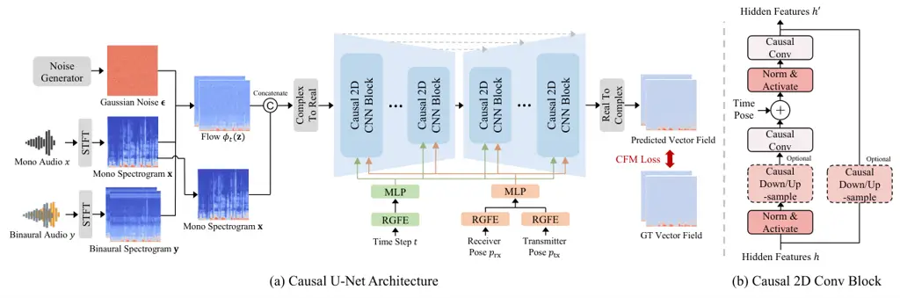

Figure 1: Overview of our BinauralFlow framework. (a) shows the causal
U-Net architecture. Our causal U-Net takes as input the flow
$`\phi_{t}(\mathbf{z})`$ as well as four conditions $`t`$,
$`p_{\mathrm{rx}}`$, $`p_{\mathrm{tx}}`$, and $`\mathbf{x}`$, and
outputs a predicted vector field. The U-Net consists of several Causal
2D Conv Blocks in the contracting and expanding parts. (b) displays the
Causal 2D Conv Block. We design fully causal convolution,
down/up-sampling, and normalization layers to ensure temporal causality.

We formulate the flow matching problem using the optimal transport
formulation inspired by Lipman et al. (2022):

```math
\phi_{t}(\mathbf{z})=t\mathbf{y}+(1-t)\mathbf{z}, \tag{2}
```

where
$`\phi_{t}:[0,1]\times\mathbb{C}^{2\times(\frac{F}{2}+1)\times T}\rightarrow\mathbb{C}^{2\times(\frac{F}{2}+1)\times T}`$
is a time-dependent flow function and the flow at time step
$`t\in[0,1]`$ is a linear interpolation between $`\mathbf{y}`$ and
$`\mathbf{z}`$.

If we use the re-parameterization technique to represent $`\mathbf{z}`$
as $`\mathbf{x}+\sigma\mathbf{\epsilon}`$, where $`\mathbf{\epsilon}`$
is a normal Gaussian noise, $`\phi_{t}`$ is updated with

```math
\displaystyle\phi_{t}(\mathbf{z}) \displaystyle=t\mathbf{y}+(1-t)(\mathbf{x}+\sigma\mathbf{\epsilon}) \tag{3}
```

```math
\displaystyle=t\mathbf{y}+(1-t)\mathbf{x}+(1-t)\sigma\mathbf{\epsilon}.
```

The corresponding probability path
$`p_{t}:[0,1]\times\mathbb{C}^{2\times(\frac{F}{2}+1)\times T}\rightarrow\mathbb{R}_{>0}`$
can be calculated as

```math
p_{t}(\mathbf{z})=\mathcal{N}(\mathbf{z}|t\mathbf{y}+(1-t)\mathbf{x},(1-t)^{2}\sigma^{2}I). \tag{4}
```

When $`t=0`$, $`p_{0}(\mathbf{z})`$ is
$`\mathcal{N}(\mathbf{z}|\mathbf{x},\sigma^{2}I)`$, which is a Gaussian
distribution around the mono audio $`\mathbf{x}`$ with the radius of
$`\sigma`$. When $`t`$ gradually increases, the mean of
$`p_{t}(\mathbf{z})`$ moves linearly from $`\mathbf{x}`$ to
$`\mathbf{y}`$ and the standard deviation of $`p_{t}(\mathbf{z})`$
decreases. If $`t=1`$, $`p_{1}(\mathbf{z})`$ is
$`\mathcal{N}(\mathbf{z}|\mathbf{y},0)`$, which collapses to the
binaural audio $`\mathbf{y}`$. Therefore, the flow defined in Equation 2
moves samples centered around the input audio $`\mathbf{x}`$ to the
binaural audio $`\mathbf{y}`$ with gradually reduced variance.

Based on the definition of a flow, we can derive a time-dependent vector
field
$`v_{t}:[0,1]\times\mathbb{C}^{2\times(\frac{F}{2}+1)\times T}\rightarrow\mathbb{C}^{2\times(\frac{F}{2}+1)\times T}`$
using the following ordinary differential equation (ODE):

```math
\displaystyle\frac{d}{dt}\phi_{t}(\mathbf{z})=v_{t}(\phi_{t}(\mathbf{z})). \tag{5}
```

By replacing $`\phi_{t}(\mathbf{z})`$ in Equation 5 with Equation 2, we
calculate the vector field $`v_{t}`$ as

```math
v_{t}(\phi_{t}(\mathbf{z}))=\mathbf{y}-\mathbf{z}. \tag{6}
```

Then we design a deep neural network $`u_{t}`$ to match the vector field
$`v_{t}`$ with the conditional flow matching (CFM) L1 loss:

```math
\mathcal{L}_{\mathrm{CFM}}(\theta)=\mathbb{E}_{t,\mathbf{x},\mathbf{y},\mathbf{z}}\big|u_{t}(\phi_{t}(\mathbf{z}),p_{\mathrm{rx}},p_{\mathrm{tx}},\mathbf{x};\theta)-(\mathbf{y}-\mathbf{z})\big|, \tag{7}
```

where $`\theta`$ is the learnable parameters of the deep neural network
$`u_{t}`$. We condition the model prediction on the poses of speaker
$`p_{\mathrm{tx}}`$ and listener $`p_{\mathrm{rx}}`$ to accurately model
the binaural clues. We also include the mono audio $`\mathbf{x}`$ to
provide rich sound information.

 Input: Dataset $`D`$, mono audio $`\mathbf{x}`$, binaural audio
$`\mathbf{y}`$, transmitter pose $`p_{\mathbf{tx}}`$, receiver pose
$`p_{\mathbf{rx}}`$, standard deviation $`\sigma`$, initial network
$`u_{t}`$

 while not converged do

  $`\{\mathbf{x},\mathbf{y},p_{\mathbf{tx}},p_{\mathbf{rx}}\}\sim D`$ //
Sample data from the dataset

  $`\mathbf{z}\sim\mathcal{N}(\mathbf{x},\sigma^{2}I)`$ // Sample random
variable

  $`t\sim\mathcal{U}(0,1)`$ // Sample time step

  $`\phi_{t}(\mathbf{z})\leftarrow t\mathbf{y}+(1-t)\mathbf{z}`$

  $`\mathcal{L}_{\mathrm{CFM}}(\theta)\leftarrow|u_{t}(\phi_{t}(\mathbf{z}),p_{\mathrm{rx}},p_{\mathrm{tx}},\mathbf{x};\theta)-(\mathbf{y}-\mathbf{z})|`$

  $`\theta\leftarrow\mathrm{Update}(\theta,\nabla_{\theta}\mathcal{L}_{\mathrm{CFM}}(\theta))`$

 end while

 Output: trained network $`u_{t}`$

Algorithm 1 Training Procedure of Flow Matching Model

We present pseudo code for training a conditional flow matching model in
Algorithm 1. We first select one sample from the dataset. Then we sample
a random noise $`\mathbf{z}`$ following the Gaussian distribution and a
time step $`t`$ following the uniform distribution. We calculate the
flow $`\phi_{t}(\mathbf{z})`$ at the time step $`t`$ and pass it along
with other conditions into the model $`u_{t}`$ to predict the vector
field. Finally, we calculate the CFM loss and update the model weights.

Discussion. Our conditional flow matching method shares some similarity
with the simplified flow matching formulation (Tong et al., 2023; Jung
et al., 2024). However, we argue that our method is distinct from the
simplified flow matching approach. (1) The simplified flow matching
approach injects minute perturbation (commonly $`1e{-}4`$) to the flow,
which almost degrades the problem to a deterministic task. Our method
uses Gaussian noise of normal magnitude, maintaining the generation
randomness. (2) Our method uses mono audio as an important generation
condition to improve generation robustness. However, the simplified flow
matching model cannot use this condition because it causes model
collapse. We provide an experiment in Section 4.5 to validate the
superiority of our approach.

### 3.3 Causal U-Net Architecture

In this section, we describe the proposed network architecture. To
tailor the flow matching models for streaming rendering, we design a
causal U-Net architecture that predicts the current vector field solely
based on past information.

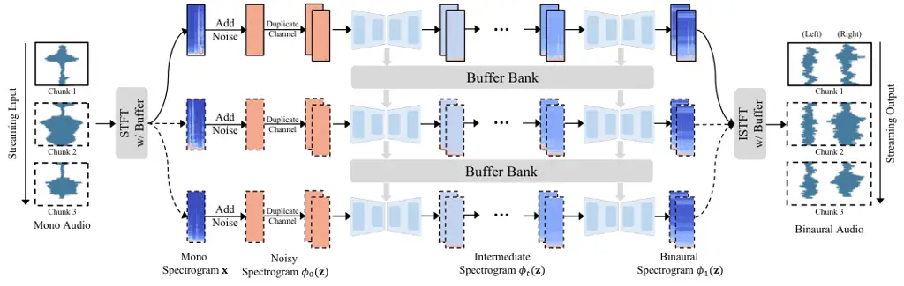

Figure 2: Continuous inference pipeline. Starting with a mono audio
chunk (top left, black solid-line box), we compute its spectrogram via
streaming STFT, add noise, and duplicate the channel to form the noisy
spectrogram $`\phi_{0}(\mathbf{z})`$. The trained model progressively
removes the noise with a buffer bank. Finally, streaming ISTFT converts
the predicted binaural spectrogram $`\phi_{1}(\mathbf{z})`$ into
binaural audio. When the next audio chunk appears (black dashed-line
box), we repeat the process and synthesize seamlessly continuous
binaural speech.

The complete network architecture is shown in Figure 1 (a). The input to
our network is the flow $`\phi_{t}(\mathbf{z})`$ as well as four
conditions $`t`$, $`p_{\mathrm{rx}}`$, $`p_{\mathrm{tx}}`$, and
$`\mathbf{x}`$, and the output is the predicted vector field. Given a
pair of mono and binaural audio signals, $`x`$ and $`y`$, we use STFT to
calculate their spectrograms $`\mathbf{x}`$ and $`\mathbf{y}`$. We
sample a normal Gaussian noise $`\mathbf{\epsilon}`$ of the same shape
as $`\mathbf{y}`$. We compute the flow $`\phi_{t}`$ at the time step
$`t`$ using Equation 3. Then we concatenate $`\phi_{t}`$ and the mono
spectrogram $`\mathbf{x}`$ as input to the causal U-Net. Because
$`\mathbf{x}`$ and $`\phi_{t}`$ are complex spectrograms, we convert
them to real numbers by considering real and imaginary parts as
individual channels and concatenating them along the channel dimension.
Since both time step $`t`$ and pose vectors $`p_{\mathrm{tx}}`$ and
$`p_{\mathrm{rx}}`$ are low-dimensional, we employ the positional
encoding technique (Vaswani, 2017; Mildenhall et al., 2021) to project
them into a high-frequency space. We use Random Gaussian Fourier
Embedding (RGFE) (Tancik et al., 2020) followed by Multi-Layer
Perceptrons (MLPs) to encode these conditions. The transmitter and
receiver pose features are concatenated before feeding into the MLP. We
inject the encoded time step and poses into the causal U-Net to guide
the vector field prediction. Finally, the causal U-Net estimates the
vector field. We convert it back to a complex space using real and
imaginary channels.

Causal U-Net has a contracting part and an expanding part with skip
connections between them. Each part consists of several Causal 2D CNN
blocks, with architecture shown in Figure 1 (b). Each block contains
Norm and Activate layers, Causal Convolution layers, and optional Causal
Down/Up-sampling layers. In the Norm and Activate layer, we utilize
GroupNorm (Wu & He, 2018) to stabilize training but we limit the
computation to each individual frame rather than all frames to ensure
causality. We apply the Sigmoid Linear Unit (SiLU) (Hendrycks & Gimpel, 2016) as an activation function. The Causal Convolution layer is a 3x3
convolution layer with a stride of size 1 and a one-side padding of size 2. One-side padding restricts the receptive field of the convolution
kernel to the historical information. Because U-Net requires reducing or
increasing the feature dimension in each block, we design a Causal
Down/Up-sampling layer. The Causal Downsample layer contains a 4x4
convolution function with a stride of size 2, which reduces the feature
dimension by half. The Causal Upsample layer contains a 4x4 transposed
convolution function, which doubles the feature dimension. We also add
the time step and pose features with the hidden features to guide the
vector field prediction. A residual path with an optional Causal
Down/Up-sample Layer is included to facilitate learning.

### 3.4 Continuous Inference Pipeline

After training BinauralFlow model, we design a continuous inference
pipeline to render binaural speech in a streaming manner, as shown in
Figure 2. Given a chunk of mono audio, we apply streaming STFT operation
to compute mono spectrogram. We add random noise to it and duplicate its
channel to obtain the noisy spectrogram $`\phi_{0}(\mathbf{z})`$. Then
we use the trained model to gradually remove the injected noise. The
denoising process involves several steps and we design a buffer bank to
store the buffer of each step. When the next chunk is fed, we retrieve
the buffer according to the time step from the buffer bank and reload it
to the model. We leverage a midpoint solver and an early skip schedule
to improve the denoising speed. Finally, we apply streaming ISTFT to
convert the predicted binaural spectrogram $`\phi_{1}(\mathbf{z})`$ to
binaural audio. When the next audio chunk appears, we repeat the process
and generate continuous binaural speech. Below we describe the
individual components that enable continuous inference and improve
rendering speed.

Streaming STFT / ISTFT. We adapt STFT and ISTFT for streaming processing
by adding buffers and adjusting the padding manner. We prepend the
buffer content to each chunk and update the buffer with the end of the
chunk.

Buffer Bank. In the causal U-Net, we introduce buffers to each causal
convolution layer to store the hidden features of the current audio
chunk. These buffers are then used to pad the next audio chunk. Since
the denoising process involves multiple inference steps, reusing the
same buffer across all steps would overwrite historical information. To
address this, we construct a dictionary-based buffer bank
$`B=\{B_{t}\}_{t=0}^{1}`$ to store network buffers of all time steps
$`t`$. During inference, at time step $`t`$, we retrieve corresponding
buffers $`B_{t}`$ from the buffer bank. The network buffers $`B_{t}`$
are loaded into the U-Net to complete the vector field prediction.
Afterword, we store the updated buffers back to the buffer bank to
replace $`B_{t}`$. We repeat this process until $`t`$ reaches $`1`$.

Midpoint Solver. The inference process requires solving the following
ODE to obtain $`\phi_{1}(\mathbf{z})`$:

```math
\displaystyle\frac{d}{dt}\phi_{t}(\mathbf{z}) \displaystyle=u_{t}(\phi_{t}(\mathbf{z});\theta), \tag{8}
```

```math
\displaystyle\phi_{0}(\mathbf{z}) \displaystyle=\mathbf{z},
```

where we omit other model inputs for simplicity. Among different numeric
solvers, we choose the Midpoint solver because it effectively reduces
the number of function evaluations while maintaining the performance
(Lipman et al., 2022). We present pseudo code of utilizing the Midpoint
solver to solve the ODE in the appendix.

Early Skip Schedule. To further reduce the number of function
evaluations, we propose an early skip schedule. A standard time schedule
divides the interval from 0 to 1 into equal segments and moves
sequentially from 0 to 1. As shown in Figure 3 (a), we design two new
schedules: an early skip schedule that skips the first half segments and
a late skip schedule that avoids the second half segments. We
empirically observe that the use of the early skip schedule does not
compromise rendering quality while the late skip degrades the
performance, with worse modeling of the background noise (see Figure 3
(b)). We speculate that flow matching may be able to correct the errors
from the first half during the second half of inference, so even if we
conduct early skipping, it does not noticeably affect performance.
Therefore, we utilize the early skip strategy to reduce the inference
steps to $`6`$. In comparison, SGMSE model (Richter et al., 2023)
generates comparable results with $`30`$ steps.

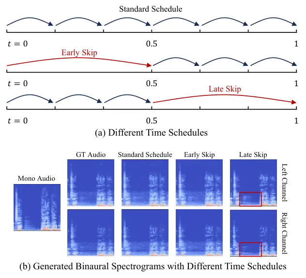

Figure 3: The early skip time schedule. The use of an early skip
strategy effectively reduces the inference steps and retains the
generation performance.

## 4 Experiments

|                                         |      |     |            |                 |                   |                     |                      |
| --------------------------------------- | ---- | --- | ---------- | --------------- | ----------------- | ------------------- | -------------------- |
| Methods                                 | Type | NFE | Speed (ms) | Model Size (MB) | L2 $`\downarrow`$ | Mag $`\downarrow`$  | Phase $`\downarrow`$ |
| SoundSpaces 2.0 (Chen et al., 2022)     | \-   | 1   | \-         | \-              | 4.91              | 0.0129              | 1.58                 |
| 2.5D Visual Sound (Gao & Grauman, 2019) | R    | 1   | 1.1        | 82.0            | 2.78              | 0.0174              | 1.56                 |
| WaveNet (Van Den Oord et al., 2016)     | R    | 1   | 21.0       | 32.7            | 2.79              | 0.0175              | 1.57                 |
| WarpNet (Richard et al., 2021)          | R    | 1   | 21.9       | 32.8            | 2.79              | 0.0176              | 1.57                 |
| BinauralGrad (Leng et al., 2022)        | G    | 6   | 221.1      | 52.9            | 2.93              | 0.0143              | 1.33                 |
| SGMSE (Richter et al., 2023)            | G    | 30  | 770.2      | 273.6           | 1.55              | 0.0076              | 1.43                 |
| BinauralFlow (Ours)                     | G    | 6   | 163.0      | 314.5           | $`\mathbf{1.00}`$ | $`\mathbf{0.0071}`$ | $`\mathbf{1.33}`$    |

Table 1: Quantitative comparison with existing baselines. We show the
model type (R: Regression and G: Generation), the number of function
evaluations (NFE), the inference speed, and the model size of each
approach. The L2 error is on the scale of $`1e{-}5`$.

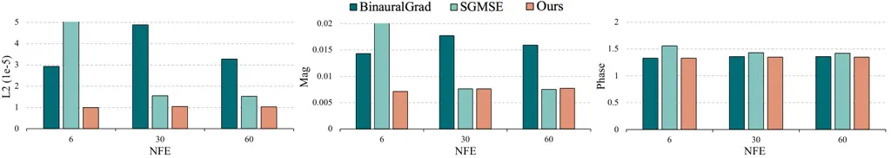

Figure 4: Performance with respect to the NFE. We evaluate all
generative models using the same NFE for a fair comparison.

### 4.1 Experiment Details

Dataset. To evaluate BinauralFlow, we collect a new high-quality
binaural dataset. We record 10 hours of paired mono and binaural data at
$`48`$ kHz along with the head poses of the speaker and the listener. To
match real-world scenarios, we collect data in a standard room without
significant soundproofing or sound-absorbing materials. The background
noise from multiple AC vents and electronic equipment is recorded.
Furthermore, instead of using binaural mannequins and loudspeakers, both
the speaker and the listener are real participants. During recording,
the speaker is free to move anywhere in the room, and the listener is
free to move the head while sitting on a chair. We split the dataset
into training/validation/test subsets with 8.47/0.86/1.33 hours of each
subset. The test subset contains two additional speakers, male and
female, not seen during training. See the appendix for details on the
data collection setup.

Baselines. We compare our approach with digital audio rendering
approaches and more advanced neural audio rendering approaches. We
choose SoundSpaces 2.0 (Chen et al., 2022) as a DSP baseline given its
powerful spatial audio rendering capability. For neural audio rendering
models, we utilize 2.5D Visual Sound (Gao & Grauman, 2019), WaveNet (Van
Den Oord et al., 2016), and WarpNet (Richard et al., 2021) as
regression-based baselines, and use BinauralGrad (Leng et al., 2022) and
SGMSE (Richter et al., 2023) as generative baselines. BinauralGrad is
the state-of-the-art approach for the binaural speech synthesis task,
which is a two-stage diffusion model.

Metrics. For quantitative evaluation, we leverage three metrics
following WarpNet (Richard et al., 2021) and BinauralGrad (Leng et al.,
2022): waveform L2 error (L2), magnitude L2 error (Mag), and phase
angular error (Phase).

### 4.2 Quantitative Comparison

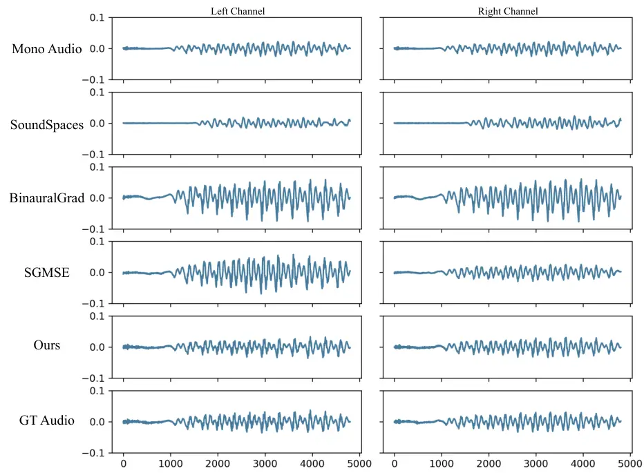

Figure 5: Qualitative comparison between different baselines. We display
waveforms of rendered spatial audio.

We compare our method with existing baselines including the
state-of-the-art approach BinauralGrad (Leng et al., 2022). We present
the metric results in Table 1, where lower values mean better
performance. We show the number of function evaluations (NFE), i.e., how
many times the model is called during binaural speech synthesis, and the
model type for each method. As shown in the table, DSP and
regression-based models underperform the generation-based models.
Compared with BinauralGrad, SGMSE exhibits better generation quality in
terms of L2 error and Mag error, but falls short in the Phase error. Our
BinauralFlow model consistently outperforms all baselines with
considerable margins. We also include the inference speed and the model
size of each approach. We test the inference speed on a single 4090 GPU.
The audio sampling rate is 48 kHz, and the audio length is 683 ms. Our
model achieves the fastest inference speed among generative models.
These results demonstrate that our model achieves a more favorable
trade-off between performance and inference speed compared to the
baseline approaches.

In Table 1, we use the default NFE of different generative models as
recommended by the authors. We further evaluate these generative models
using the same NFE for a more fair comparison. We test all models with
$`6,30,60`$ NFEs and report the results in Figure 4, where each
subfigure displays results for one metric. As shown in the figure, our
approach consistently outperforms other generative models across
different NFEs, especially in the L2 and Mag metrics.

|                                     |     |                                                   |                     |                                                                        |                                   |
| ----------------------------------- | --- | ------------------------------------------------- | ------------------- | ---------------------------------------------------------------------- | --------------------------------- |
| Methods                             | NFE | ABX CR $`\uparrow`$                               | A-B CR $`\uparrow`$ | Environment Score $`\uparrow`$                                         | Spatialization Score $`\uparrow`$ |
|                                     |     | 0% (clear difference wrt GT) – 50% (random guess) |                     | 0 (very different from reference/GT) – 100 (identical to reference/GT) |                                   |
| SoundSpaces 2.0 (Chen et al., 2022) | 1   | 5%                                                | 12%                 | \-                                                                     | \-                                |
| BinauralGrad (Leng et al., 2022)    | 6   | 4%                                                | 3%                  | \-                                                                     | \-                                |
| SGMSE (Richter et al., 2023)        | 30  | 11%                                               | 21%                 | 41.1 $`\pm`$ 23.0                                                      | 57.5$`\pm`$ 29.5                  |
| BinauralFlow (Ours)                 | 6   | $`\mathbf{30\%}`$                                 | $`\mathbf{42\%}`$   | $`\mathbf{68.4\pm 23.4}`$                                              | $`\mathbf{83.1\pm 18.9}`$         |
| Ground Truth                        | \-  | \-                                                | \-                  | 87.4 $`\pm`$ 13.5                                                      | 89.9 $`\pm`$ 11.1                 |

Table 2: Perceptual study. We report results of ABX, AB, and MUSHRA
evaluation tasks, where higher values indicate better realism.

### 4.3 Qualitative Comparison

To provide an intuitive comparison between different models, we display
the waveforms of rendered binaural speech of various methods in
Figure 5. The first row is the mono audio, the last row is the recorded
audio, and the audios predicted by different methods are between them.
The SoundSpaces approach estimates an inaccurate time delay between the
transmitted mono audio and the received binaural audio. BinauralGrad and
SGMSE predict accurate time delay but their amplitudes are mismatched.
In comparison, our BinauralFlow model correctly predicts the time delay
and audio amplitude. We show more results in the appendix.

### 4.4 Perceptual Study

We conduct a comprehensive perceptual evaluation to assess the quality
and realism of rendered outputs. When dealing with questions of the
realism of generated samples, perceptual study is a more important
indicator than numerical analysis because humans can perceive the
authenticity of speech, and are sensitive to subtle but unnatural
variations in sound, which is difficult to capture using purely
numerical metrics. We perform the study in a quiet, acoustically treated
room, with carefully calibrated playback levels and equalized
headphones. See appendix for more details.

We recruit a total of $`23`$ participants and request them to complete
the following tasks:

- •
  ABX test: subjects are presented with 3 tracks, A, B, and X, and asked
  if X is A or if X is B (X is always one of them, and either A or B is
  the ground truth). This task measures if there is a perceivable
  difference between generated and recorded (ground truth) sounds.
- •
  A-B test: subjects are presented with A and B and asked which they
  think is a real recording (one is always the ground truth). The task
  measures if users can reliably identify generated versus real sounds.
- •
  MUSHRA evaluation: subjects are presented with a reference (ground
  truth) and generated samples, and asked to rate their similarity in
  terms of environment (ambient noise and reverberation) and
  spatialization (sound source position). Scores range from 0 to 100,
  with higher scores indicating greater similarity.

For the ABX and A-B tests, we define a confusion rate metric (CR) that
calculates how often users confuse the rendered sound with the recorded
one and make a wrong choice. The maximum value of a confusion rate is
$`50\%`$, i.e. users cannot distinguish sounds and make random
decisions.

We show the perceptual evaluation results in Table 2. For all tasks, our
approach outperforms other approaches with noticeable margins, showing
remarkable rendering realism. In particular, in the A-B test we achieve
a CR of $`42\%`$ (the upper bound is $`50\%`$), showing that users can
barely distinguish our generated sounds from the recorded samples.

### 4.5 Performance Analysis

We analyze the impacts of different design choices on our binaural
speech synthesis framework.

| Methods                                      | L2$`\downarrow`$  | Mag$`\downarrow`$   | Phase$`\downarrow`$ |
| -------------------------------------------- | ----------------- | ------------------- | ------------------- |
| Simplified Flow Matching (Tong et al., 2023) | 1.86              | 0.0101              | 1.35                |
| BinauralFlow (Ours)                          | $`\mathbf{1.00}`$ | $`\mathbf{0.0071}`$ | 1.33                |

Table 3: Performance comparison between different flow matching
approaches. The L2 error is on the scale of $`1e{-}5`$.

Flow Matching Methods. In Section 3.2, we discuss the difference between
proposed flow matching model and the simplified flow matching framework
in (Tong et al., 2023). Comparison results are shown in Table 3. Our
method achieves lower L2, Mag, and Phase errors, showing the
effectiveness of our conditional flow matching approach.

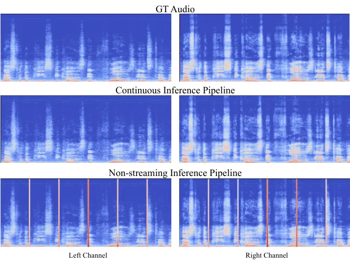

Figure 6: Output spectrograms using different inference pipelines.

Continuous Inference Pipeline. We compare our continuous inference
pipeline and the non-streaming inference pipeline and show the generated
spectrograms in Figure 6. Given a sequence of audio chunks, the
non-streaming pipeline binauralizes each chunk individually, causing
noticeable artifacts between adjacent chunks. In contrast, our pipeline
synthesizes seamlessly smooth spectrograms.

Real-Time Factor. We calculate the real-time factor of our model for
different numbers of function evaluations on a single 4090 GPU. The
audio sampling rate is 48 kHz, and the audio length is 0.683 seconds. As
shown in Table 4, when NFE is set to 6, the real-time factor is 0.239.
If we sacrifice some performance for faster inference, setting NFE to 1
results in an RTF of 0.04. Our model demonstrates potential for
real-time streaming generation.

| NFE | Inference Time (sec) | Real-Time Factor |
| --- | -------------------- | ---------------- |
| 1   | 0.027                | 0.040            |
| 2   | 0.055                | 0.081            |
| 4   | 0.109                | 0.160            |
| 6   | 0.163                | 0.239            |
| 8   | 0.217                | 0.318            |
| 10  | 0.271                | 0.397            |

Table 4: Real-time factor of our BinauralFlow model. We test the
inference speed with different NFEs on a single 4090 GPU.

Data Scale. Recording 10 hours of data in real-world scenarios is costly
and labor-intensive. To understand how data quantity affects our model’s
performance, we evaluate it using different amounts of training data
($`1\%,5\%,10\%,25\%,50\%,75\%`$). The results, shown in Figure 7
(orange line), reveal a significant performance decline when using less
than 25% of the data.

Figure 7: Large-scale pretraining strategy. We propose pretraining our
model using massive data to improve data efficiency and enhance
generalization in downstream tasks.

To address this limitation, we develop a large-scale pre-training
strategy using loudspeakers and artificial binaural heads instead of
real individuals. While the use of artificial heads and loudspeakers
reduces the quality and authenticity of the binaural data, it allows us
to capture a large-scale dataset with over $`7,700`$ hours of binaural
audio data, encompassing $`97`$ speaker identities from the English
multi-speaker VCTK corpus (Yamagishi et al., 2019) played by the
loudspeaker. See the appendix for more details about the sytem and
capture setup.

We pretrain our BinauralFlow model on this dataset before fine-tuning it
with limited real human data. As shown in Figure 7 (blue lines), this
pretraining strategy significantly improves performance. The pretrained
model’s zero-shot performance (red stars) matches or exceeds that of a
model trained from scratch using only 1% or 5% real data. This
demonstrates our model’s robust generalization capabilities and its
potential for various applications.

## 5 Conclusion

In this paper, we propose BinauralFlow, a streaming flow matching
framework, that achieves high-quality continuous binaural speech
rendering. Our framework consists of a conditional flow matching model,
a causal U-Net architecture, and a continuous inference pipeline. Our
framework surpasses existing baselines with significant improvement both
quantitatively and qualitatively. A comprehensive perceptual study
demonstrates that our model synthesizes binaural speech that is nearly
indistinguishable from real recordings.

## Impact Statement

Our work is designed to improve the rendering quality of binaural speech
synthesis. It is not designed to modify the content of the input mono
signal, but only to spatialize it, i.e., place the source within an
acoustic environment. However, we acknowledge that the enhanced realism
may raise concerns about potential misuse, such as the creation of
highly realistic deepfake audio. To address these risks, we emphasize
the importance of adhering to ethical guidelines, fostering transparency
in applications, and promoting responsible use of the proposed methods.
Additionally, future research should focus on developing robust
mechanisms for detecting and preventing misuse.

## References

- Antonello et al. (2017) Antonello, N., De Sena, E., Moonen, M.,
  Naylor, P. A., and Van Waterschoot, T. Room impulse response
  interpolation using a sparse spatio-temporal representation of the
  sound field. _IEEE/ACM Transactions on Audio, Speech, and Language
  Processing_, 25(10):1929–1941, 2017.
- Begault & Trejo (2000) Begault, D. R. and Trejo, L. J. 3-d sound for
  virtual reality and multimedia. Technical report, 2000.
- Broderick et al. (2018) Broderick, J., Duggan, J., and Redfern, S. The
  importance of spatial audio in modern games and virtual environments.
  In _2018 IEEE Games, Entertainment, Media Conference (GEM)_, pp. 1–9.
  IEEE, 2018.
- Chaitanya et al. (2020) Chaitanya, C. R. A., Raghuvanshi, N., Godin,
  K. W., Zhang, Z., Nowrouzezahrai, D., and Snyder, J. M. Directional
  sources and listeners in interactive sound propagation using
  reciprocal wave field coding. _ACM TOG_, 39(4):44–1, 2020.
- Chen et al. (2020) Chen, C., Jain, U., Schissler, C., Gari, S. V. A.,
  Al-Halah, Z., Ithapu, V. K., Robinson, P., and Grauman, K.
  Soundspaces: Audio-visual navigation in 3d environments. In _ECCV_,
  pp. 17–36, 2020.
- Chen et al. (2022) Chen, C., Schissler, C., Garg, S., Kobernik, P.,
  Clegg, A., Calamia, P., Batra, D., Robinson, P., and Grauman, K.
  Soundspaces 2.0: A simulation platform for visual-acoustic learning.
  _Advances in Neural Information Processing Systems_,
  35:8896–8911, 2022.
- Chen et al. (2023) Chen, C., Richard, A., Shapovalov, R., Ithapu,
  V. K., Neverova, N., Grauman, K., and Vedaldi, A. Novel-view acoustic
  synthesis. In _Proceedings of the IEEE/CVF Conference on Computer
  Vision and Pattern Recognition_, pp. 6409–6419, 2023.
- Chen et al. (2024) Chen, Y., Niu, Z., Ma, Z., Deng, K., Wang, C.,
  Zhao, J., Yu, K., and Chen, X. F5-tts: A fairytaler that fakes fluent
  and faithful speech with flow matching. _arXiv preprint
  arXiv:2410.06885_, 2024.
- Cheng & Wakefield (1999) Cheng, C. I. and Wakefield, G. H.
  Introduction to head-related transfer functions (hrtfs):
  Representations of hrtfs in time, frequency, and space. In _Audio
  Engineering Society Convention 107_. Audio Engineering Society, 1999.
- Cohen et al. (2015) Cohen, M., Villegas, J., and Barfield, W. Special
  issue on spatial sound in virtual, augmented, and mixed-reality
  environments. _Virtual Reality_, 19:147–148, 2015.
- Du et al. (2024) Du, Z., Wang, Y., Chen, Q., Shi, X., Lv, X., Zhao,
  T., Gao, Z., Yang, Y., Gao, C., Wang, H., et al. Cosyvoice 2: Scalable
  streaming speech synthesis with large language models. _arXiv preprint
  arXiv:2412.10117_, 2024.
- Gao & Grauman (2019) Gao, R. and Grauman, K. 2.5 d visual sound. In
  _Proceedings of the IEEE/CVF Conference on Computer Vision and Pattern
  Recognition_, pp. 324–333, 2019.
- Gupta et al. (2022) Gupta, R., He, J., Ranjan, R., Gan, W.-S., Klein,
  F., Schneiderwind, C., Neidhardt, A., Brandenburg, K., and
  Välimäki, V. Augmented/mixed reality audio for hearables: Sensing,
  control, and rendering. _IEEE Signal Processing Magazine_,
  39(3):63–89, 2022.
- Hendrycks & Gimpel (2016) Hendrycks, D. and Gimpel, K. Gaussian error
  linear units (gelus). _arXiv preprint arXiv:1606.08415_, 2016.
- Ho et al. (2020) Ho, J., Jain, A., and Abbeel, P. Denoising diffusion
  probabilistic models. _Advances in neural information processing
  systems_, 33:6840–6851, 2020.
- Huang et al. (2024) Huang, C., Marković, D., Xu, C., and Richard, A.
  Modeling and driving human body soundfields through acoustic
  primitives. In _European Conference on Computer Vision_, pp. 1–17.
  Springer, 2024.
- Huang et al. (2023) Huang, R., Huang, J., Yang, D., Ren, Y., Liu, L.,
  Li, M., Ye, Z., Liu, J., Yin, X., and Zhao, Z. Make-an-audio:
  Text-to-audio generation with prompt-enhanced diffusion models. In
  _ICML_, pp. 13916–13932, 2023.
- Jianjun et al. (2015) Jianjun, H., Tan, E. L., Gan, W.-S., et al.
  Natural sound rendering for headphones: integration of signal
  processing techniques. _IEEE Signal Processing Magazine_,
  32(2):100–113, 2015.
- Jung et al. (2024) Jung, C., Lee, S., Kim, J.-H., and Chung, J. S.
  Flowavse: Efficient audio-visual speech enhancement with conditional
  flow matching. _arXiv preprint arXiv:2406.09286_, 2024.
- Kailas & Tiwari (2021) Kailas, G. and Tiwari, N. Design for immersive
  experience: Role of spatial audio in extended reality applications. In
  _Design for Tomorrow—Volume 2: Proceedings of ICoRD 2021_, pp.
  853–863. Springer, 2021.
- Kim et al. (2019) Kim, H., Remaggi, L., Jackson, P. J., and Hilton, A.
  Immersive spatial audio reproduction for vr/ar using room acoustic
  modelling from 360 images. In _2019 IEEE Conference on Virtual Reality
  and 3D User Interfaces (VR)_, pp. 120–126. IEEE, 2019.
- Kingma (2014) Kingma, D. P. Adam: A method for stochastic
  optimization. _arXiv preprint arXiv:1412.6980_, 2014.
- Kong et al. (2021) Kong, Z., Ping, W., Huang, J., Zhao, K., and
  Catanzaro, B. Diffwave: A versatile diffusion model for audio
  synthesis. In _International Conference on Learning
  Representations_, 2021.
- Lee et al. (2024a) Lee, S.-H., Choi, H.-Y., and Lee, S.-W.
  Accelerating high-fidelity waveform generation via adversarial flow
  matching optimization. _arXiv preprint arXiv:2408.08019_, 2024a.
- Lee et al. (2024b) Lee, S.-H., Choi, H.-Y., and Lee, S.-W. Periodwave:
  Multi-period flow matching for high-fidelity waveform generation.
  _arXiv preprint arXiv:2408.07547_, 2024b.
- Leng et al. (2022) Leng, Y., Chen, Z., Guo, J., Liu, H., Chen, J.,
  Tan, X., Mandic, D., He, L., Li, X., Qin, T., et al. Binauralgrad: A
  two-stage conditional diffusion probabilistic model for binaural audio
  synthesis. _Advances in Neural Information Processing Systems_,
  35:23689–23700, 2022.
- Liang et al. (2023a) Liang, S., Huang, C., Tian, Y., Kumar, A., and
  Xu, C. Av-nerf: Learning neural fields for real-world audio-visual
  scene synthesis. _Advances in Neural Information Processing Systems_,
  36:37472–37490, 2023a.
- Liang et al. (2023b) Liang, S., Huang, C., Tian, Y., Kumar, A., and
  Xu, C. Neural acoustic context field: Rendering realistic room impulse
  response with neural fields. _arXiv preprint arXiv:2309.15977_, 2023b.
- Liang et al. (2024) Liang, S., Huang, C., Tian, Y., Kumar, A., and
  Xu, C. Language-guided joint audio-visual editing via one-shot
  adaptation. In _Proceedings of the Asian Conference on Computer
  Vision_, pp. 1011–1027, 2024.
- Lin & Lee (2006) Lin, Y. and Lee, D. D. Bayesian regularization and
  nonnegative deconvolution for room impulse response estimation. _IEEE
  Transactions on Signal Processing_, 54(3):839–847, 2006.
- Lipman et al. (2022) Lipman, Y., Chen, R. T., Ben-Hamu, H., Nickel,
  M., and Le, M. Flow matching for generative modeling. _arXiv preprint
  arXiv:2210.02747_, 2022.
- Liu et al. (2023) Liu, H., Chen, Z., Yuan, Y., Mei, X., Liu, X.,
  Mandic, D. P., Wang, W., and Plumbley, M. D. Audioldm: Text-to-audio
  generation with latent diffusion models. In _ICML_, pp.
  21450–21474, 2023.
- Liu et al. (2024) Liu, P., Dai, D., and Wu, Z. Rfwave: Multi-band
  rectified flow for audio waveform reconstruction. _arXiv preprint
  arXiv:2403.05010_, 2024.
- Mehta et al. (2024) Mehta, S., Tu, R., Beskow, J., Székely, É., and
  Henter, G. E. Matcha-tts: A fast tts architecture with conditional
  flow matching. In _ICASSP 2024-2024 IEEE International Conference on
  Acoustics, Speech and Signal Processing (ICASSP)_, pp. 11341–11345.
  IEEE, 2024.
- Mildenhall et al. (2021) Mildenhall, B., Srinivasan, P. P., Tancik,
  M., Barron, J. T., Ramamoorthi, R., and Ng, R. Nerf: Representing
  scenes as neural radiance fields for view synthesis. _Communications
  of the ACM_, 65(1):99–106, 2021.
- Paszke et al. (2019) Paszke, A., Gross, S., Massa, F., Lerer, A.,
  Bradbury, J., Chanan, G., Killeen, T., Lin, Z., Gimelshein, N.,
  Antiga, L., et al. Pytorch: An imperative style, high-performance deep
  learning library. _Advances in neural information processing systems_,
  32, 2019.
- Raghuvanshi & Snyder (2018) Raghuvanshi, N. and Snyder, J. Parametric
  directional coding for precomputed sound propagation. _ACM TOG_,
  37(4):1–14, 2018.
- Richard et al. (2021) Richard, A., Markovic, D., Gebru, I. D., Krenn,
  S., Butler, G. A., Torre, F., and Sheikh, Y. Neural synthesis of
  binaural speech from mono audio. In _International Conference on
  Learning Representations_, 2021.
- Richter et al. (2023) Richter, J., Welker, S., Lemercier, J.-M., Lay,
  B., and Gerkmann, T. Speech enhancement and dereverberation with
  diffusion-based generative models. _IEEE/ACM Transactions on Audio,
  Speech, and Language Processing_, 31:2351–2364, 2023.
- Rombach et al. (2022) Rombach, R., Blattmann, A., Lorenz, D., Esser,
  P., and Ommer, B. High-resolution image synthesis with latent
  diffusion models. In _Proceedings of the IEEE/CVF conference on
  computer vision and pattern recognition_, pp. 10684–10695, 2022.
- Ronneberger et al. (2015) Ronneberger, O., Fischer, P., and Brox, T.
  U-net: Convolutional networks for biomedical image segmentation. In
  _Medical image computing and computer-assisted intervention–MICCAI
  2015: 18th international conference, Munich, Germany, October 5-9,
  2015, proceedings, part III 18_, pp. 234–241. Springer, 2015.
- Savioja & Svensson (2015) Savioja, L. and Svensson, U. P. Overview of
  geometrical room acoustic modeling techniques. _The Journal of the
  Acoustical Society of America_, 138(2):708–730, 2015.
- Savioja et al. (1999) Savioja, L., Huopaniemi, J., Lokki, T., and
  Väänänen, R. Creating interactive virtual acoustic environments.
  _Journal of the Audio Engineering Society_, 47(9):675–705, 1999.
- Schütze & Irwin-Schütze (2018) Schütze, S. and Irwin-Schütze, A. _New
  Realities in Audio: A Practical Guide for VR, AR, MR and 360 Video._
  CRC Press, 2018.
- Song et al. (2020a) Song, J., Meng, C., and Ermon, S. Denoising
  diffusion implicit models. _arXiv preprint arXiv:2010.02502_, 2020a.
- Song et al. (2020b) Song, Y., Sohl-Dickstein, J., Kingma, D. P.,
  Kumar, A., Ermon, S., and Poole, B. Score-based generative modeling
  through stochastic differential equations. _arXiv preprint
  arXiv:2011.13456_, 2020b.
- Szöke et al. (2019) Szöke, I., Skácel, M., Mošner, L., Paliesek, J.,
  and Černockỳ, J. Building and evaluation of a real room impulse
  response dataset. _IEEE Journal of Selected Topics in Signal
  Processing_, 13(4):863–876, 2019.
- Tancik et al. (2020) Tancik, M., Srinivasan, P., Mildenhall, B.,
  Fridovich-Keil, S., Raghavan, N., Singhal, U., Ramamoorthi, R.,
  Barron, J., and Ng, R. Fourier features let networks learn high
  frequency functions in low dimensional domains. _Advances in neural
  information processing systems_, 33:7537–7547, 2020.
- Tong et al. (2023) Tong, A., Malkin, N., Huguet, G., Zhang, Y.,
  Rector-Brooks, J., Fatras, K., Wolf, G., and Bengio, Y. Improving and
  generalizing flow-based generative models with minibatch optimal
  transport. _arXiv preprint arXiv:2302.00482_, 2023.
- Valimaki et al. (2012) Valimaki, V., Parker, J. D., Savioja, L.,
  Smith, J. O., and Abel, J. S. Fifty years of artificial reverberation.
  _IEEE Transactions on Audio, Speech, and Language Processing_,
  20(5):1421–1448, 2012.
- Van Den Oord et al. (2016) Van Den Oord, A., Dieleman, S., Zen, H.,
  Simonyan, K., Vinyals, O., Graves, A., Kalchbrenner, N., Senior, A.,
  Kavukcuoglu, K., et al. Wavenet: A generative model for raw audio.
  _arXiv preprint arXiv:1609.03499_, 12, 2016.
- Vaswani (2017) Vaswani, A. Attention is all you need. _Advances in
  Neural Information Processing Systems_, 2017.
- Welker et al. (2025) Welker, S., Le, M., Chen, R. T., Hsu, W.-N.,
  Gerkmann, T., Richard, A., and Wu, Y.-C. Flowdec: A flow-based
  full-band general audio codec with high perceptual quality. _arXiv
  preprint arXiv:2503.01485_, 2025.
- Wu & He (2018) Wu, Y. and He, K. Group normalization. In _Proceedings
  of the European conference on computer vision (ECCV)_, pp. 3–19, 2018.
- Yadegari et al. (2024) Yadegari, S., Burnett, J., Kestler, G., and
  Pisha, L. Spatial audio and sound design in the context of games and
  multimedia. In _Encyclopedia of Computer Graphics and Games_, pp.
  1714–1721. Springer, 2024.
- Yamagishi et al. (2019) Yamagishi, J., Veaux, C., and MacDonald, K.
  CSTR VCTK Corpus: English Multi-speaker Corpus for CSTR Voice Cloning
  Toolkit (version 0.92), 2019. URL
  [https://doi.org/10.7488/ds/2645](https://doi.org/10.7488/ds/2645).
- Yang et al. (2023) Yang, D., Yu, J., Wang, H., Wang, W., Weng, C.,
  Zou, Y., and Yu, D. Diffsound: Discrete diffusion model for
  text-to-sound generation. _IEEE/ACM Transactions on Audio, Speech, and
  Language Processing_, 2023.
- Yang et al. (2020) Yang, J., Sasikumar, P., Bai, H., Barde, A., Sörös,
  G., and Billinghurst, M. The effects of spatial auditory and visual
  cues on mixed reality remote collaboration. _Journal on Multimodal
  User Interfaces_, 14(4):337–352, 2020.
- Zhang et al. (2017) Zhang, W., Samarasinghe, P. N., Chen, H., and
  Abhayapala, T. D. Surround by sound: A review of spatial audio
  recording and reproduction. _Applied Sciences_, 7(5):532, 2017.
- Zhang et al. (2021) Zhang, Y., Liang, S., Yang, S., Liu, X., Wu, Z.,
  Shan, S., and Chen, X. Unicon: Unified context network for robust
  active speaker detection. In _Proceedings of the 29th ACM
  international conference on multimedia_, pp. 3964–3972, 2021.
- Zotkin et al. (2004) Zotkin, D. N., Duraiswami, R., and Davis, L. S.
  Rendering localized spatial audio in a virtual auditory space. _IEEE
  Transactions on multimedia_, 6(4):553–564, 2004.

## Appendix A Demo Videos

To help understand our work, we have created several demo videos
showcasing BinauralFlow’s binaural speech rendering capability. We
include these demo videos on our webpage. We highly recommend that
readers watch these videos to gain a deeper understanding of our
research. In each video, we show a top-down view of the room along with
the poses of the speaker and the listener. The speaker is denoted as
“Tx” and the speaker’s trajectory is shown in blue. The listener is
denoted as “Rx” and the listener’s trajectory is shown in red.

In the directory of each sample, we include two subdirectories:
“Comparison” and “Flip_Test”. In the “Comparison” subdirectory, we
display the results of SoundSpaces (“dsp”), BinauralGrad (“bgrad”),
SGMSE (“sgmse”), and our BinauralFlow (“ours”). We also include the mono
input (“mono”) and the recorded binaural audio (“gnd”). In the
“Flip_Test” subdirectory, we compare the synthesized sound and the
ground-truth sound by using a flip-test technique. We periodically flip
the sound between the synthesized sound and the ground-truth speech
every $`5`$ seconds.

## Appendix B Implementation Details

We implement our streaming flow matching model with the PyTorch
framework (Paszke et al., 2019). Our U-Net consists of seven Causal 2D
Conv Blocks for the contracting and expanding parts. We only conduct the
downsampling and upsampling operations four times. We set the window
length as $`512`$, the hop length as $`128`$, and use a Hann window when
applying STFT. The input audio length is $`32768`$ and the spectrogram
is of shape $`256\times 257`$. We use the Adam optimizer (Kingma, 2014)
with a learning rate of $`1e{-}4`$ and a weight decay rate of
$`1e{-}5`$. We set the standard deviation $`\sigma`$ of $`\mathbf{z}`$
as $`0.5`$. We use $`6`$ steps to solve the ODE with the midpoint solver
and an early skip schedule.

## Appendix C Midpoint Solver

We present pseudo code of the inference process using the midpoint
solver in Algorithm 2.

 Input: Trained network $`u_{t}`$, mono spectrogram $`\mathbf{x}`$,
inference steps $`n`$

 $`\mathbf{z}\sim\mathcal{N}(\mathbf{x},\sigma^{2}I)`$ // Sample random
variable

 $`t\leftarrow 0`$

 $`\phi_{t}(\mathbf{z})\leftarrow\mathbf{z}`$

 $`\delta\leftarrow 2/n`$

 while $`t<1`$ do

  $`v^{\prime}\leftarrow u_{t}(\phi_{t}(\mathbf{z}),p_{\mathrm{rx}},p_{\mathrm{tx}},\mathbf{x};\theta)`$
// Calculate vector field at $`t`$

  $`\phi_{t^{\prime}}(\mathbf{z})\leftarrow\phi_{t}(\mathbf{z})+v^{\prime}\delta`$
// Calculate flow at $`t+\delta`$

  $`v^{\prime\prime}\leftarrow u_{t^{\prime}}(\phi_{t^{\prime}}(\mathbf{z}),p_{\mathrm{rx}},p_{\mathrm{tx}},\mathbf{x};\theta)`$
// Calculate vector field at $`t+\delta`$

  $`v=(v^{\prime}+v^{\prime\prime})/2`$ // Average the vector field

  $`\phi_{t}(\mathbf{z})\leftarrow\phi_{t}(\mathbf{z})+v\delta`$ //
Update the flow

  $`t\leftarrow t+\delta`$ // Update the time step

 end while

 $`\mathbf{y}\leftarrow\phi_{t}(\mathbf{z})`$

 Output: binaural spectrogram $`\mathbf{y}`$

Algorithm 2 Inference Procedure with Midpoint Solver

Given a trained network $`u_{t}`$, a mono spectrogram $`\mathbf{x}`$,
and a predefined inference step $`n`$, we sample a random noise
$`\mathbf{z}`$ following the Gaussian distribution
$`\mathcal{N}(\mathbf{x},\sigma^{2}I)`$. We initialize some variables,
including $`t`$, $`\phi_{t}(\mathbf{z})`$, and $`\delta`$. For each time
step $`t`$, we calculate the vector field at two places, $`t`$ and
$`t+\delta`$. Then we average these two vector fields and update the
flow using the average vector field. In the end, we output updated
$`\phi_{t}(\mathbf{z})`$ as the rendered binaural spectrogram
$`\mathbf{y}`$.

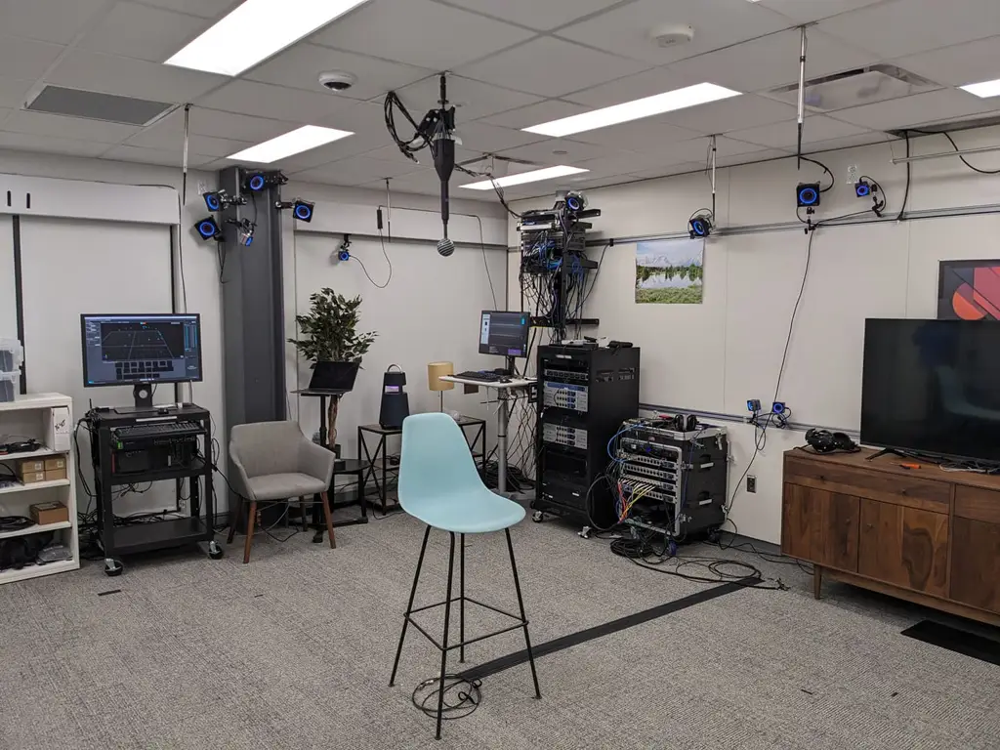

(a) We collect data in a standard room without significant soundproofing
or sound-absorbing materials. The background noise from multiple air
conditioning vents and electronic equipment is recorded.

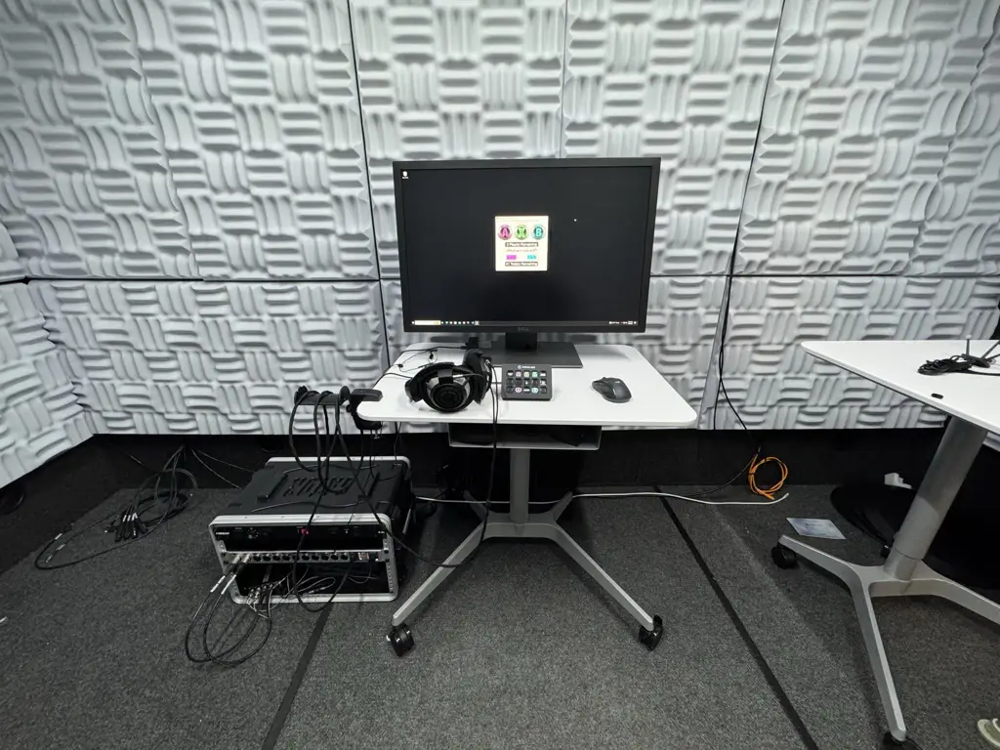

(b) We perform the perceptual study in a quiet, acoustically treated
room, with carefully calibrated playback levels and equalized
headphones.

Figure 8: Capture and evaluation setups.

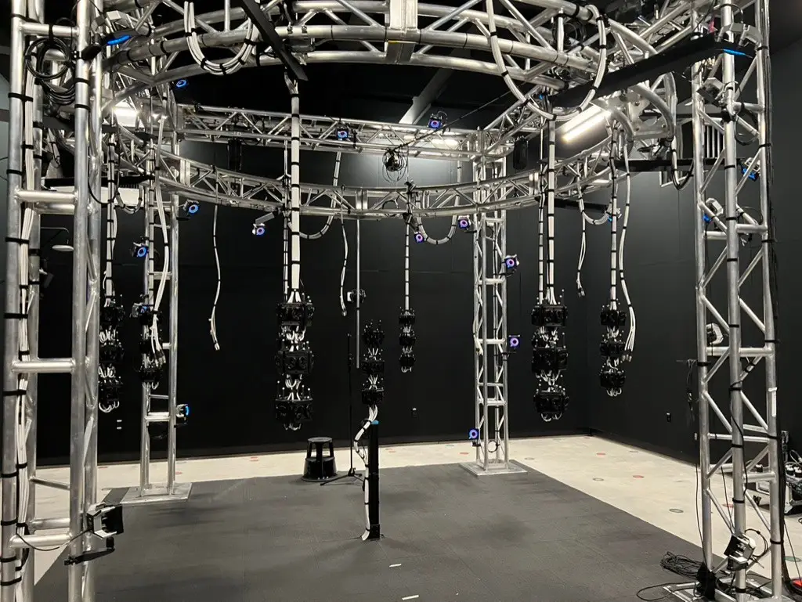

Figure 9: The large-scale binaural data capture system with artificial
binaural heads.

## Appendix D Data Collection Setup

The data collection featured a seated listener (they were free to move
their head), and a speaker talking within approximately 1 m radius from
the listener. A single participant acted as the listener, while three
participants were captured as speakers, with one participant used as a
part of the training set. The captures were performed in a non-anechoic
room. The audio system featured a calibrated B+K 4101-B Binaural
Microphone pair worn by the listener, as well as several DPA 4060s
microphones mounted to a VR headset worn by the speaker, with guaranteed
phase synchronization. Poses of both the speaker and listener were
recorded via an OptiTrack tracking system. The speaker was tracked with
IR-reflective markers mounted on the headset, and the listener was
tracked via small facial IR-reflective markers. The setup is shown in
Figure 8(a).

## Appendix E Perceptual Study Setup

The perceptual study’s hardware setup included a PC workstation, RME
12mic + RME Digiface AVB, B&K Type 4101 in-ear microphones, Sennheiser
HD 800S headphones, and a Stream Deck. The study was conducted inside an
8’ $`\times`$ 12’ Whisper Room, with the monitor inside and the computer
placed outside to ensure a controlled, noise-free environment. Custom
Matlab and Max MSP patches were developed for use with in-ear mics to
create a headphone equalization profile and recreate the recorded signal
as accurately as possible. Participants were presented with a number of
randomly chosen 4-second-long clips and had 10/10/5 minutes to complete
the ABX/MUSHRA/AB sections of the evaluation using a Stream Deck and
mouse for response input/selection. The setup is shown in Figure 8(b).

## Appendix F Pre-training Dataset

We set up 3Dio Omni binaural heads with human-shaped ears in a
non-anechoic recording room. For data collection, operators walked
around the room with a handheld loudspeaker, playing speech signals from
the English multi-speaker VCTK corpus (Yamagishi et al., 2019). Our
setup used 135 binaural heads and involved 33 loudspeaker operators. We
used the OptiTrack system to track the 3D position and orientation of
both the loudspeakers and the stationary binaural heads. We collected
over $`7,700`$ hours of binaural audio data, encompassing $`97`$ speaker
identities from the VCTK dataset across an area of $`4.6`$m horizontally
and $`2.4`$m vertically. The audio was sampled at $`48`$ kHz, with
tracking data recorded at $`240`$ frames per second. The setup is shown
in Figure 9.

## Appendix G Comparison with Other Flow Matching-Based Audio Models

PeriodWave (Lee et al., 2024b) designs a multi-period flow matching
model for high-fidelity waveform generation. FlowDec (Liu et al., 2024)
introduces a conditional flow matching-based audio codec to noticeably
reduce the postfiler DNN evaluations from 60 to 6. RFWave (Welker
et al., 2025) proposes a multi-band rectified flow approach to
reconstruct high-fidelity audio waveforms. These works are all related
to flow matching models and show the effectiveness in generating
high-quality waveform signals. To reduce the number of sampling steps,
PeriodWave-Turbo (Lee et al., 2024a) finetunes the CFM models with
adversarial feedback. Matcha-TTS (Mehta et al., 2024) employs a 1D U-Net
model with 1D ResNet layers and Transformer Encoder layers. Neither the
ResNet layers nor the Transformer Encoder layers are causal, which means
that Matcha-TTS does not achieve time causality or support streaming
inference. In contrast, our model is fully causal and supports streaming
inference. CosyVoice 2 (Du et al., 2024) introduces a chunk-aware causal
flow matching model that uses causal convolution layers and attention
masks to enable causality. However, the CosyVoice 2 model does not
include feature buffers for each causal convolution layer, which may
result in audio interruptions and discontinuities during streaming
inference in real-world scenarios.

## Appendix H Impact of Different Numerical Solvers

Besides the Midpoint solver, we test the Euler and Heun solvers. The
Euler solver is a first-order solver and Midpoint and Heun solvers are
second-order. We set the number of function evaluations (NFE) to 6 and
present the results in Table 5. Although the Euler solver yields lower
error values than the Midpoint solver, it fails to generate realistic
background noise. Setting NFE to 6 is insufficient for the Heun solver,
which requires 30 steps to achieve comparable error values. In
conclusion, the Midpoint solver provides the best trade-off between
error values, qualitative results, and inference efficiency.

| Solver Type | NFE | Audio Quality | L2 $`\downarrow`$ | Mag $`\downarrow`$ | Phase $`\downarrow`$ |
| ----------- | --- | ------------- | ----------------- | ------------------ | -------------------- |
| Euler       | 6   | Medium        | 0.90              | 0.0066             | 1.24                 |
| Midpoint    | 6   | High          | 1.00              | 0.0071             | 1.33                 |
| Heun        | 6   | Low           | 16.86             | 0.0499             | 1.44                 |
| Heun        | 30  | Medium        | 1.27              | 0.0087             | 1.36                 |

Table 5: Impact of different numerical solvers. We evaluate our model
with various solvers, include both first-order and second-order solvers
to analyze their influence on the generation quality.

## Appendix I Sway Sampling Schedule

Chen et al. (2024) introduce a new timestep scheduler called Sway
Sampling to improve inference quality and efficiency. We use Sway
Sampling with different coefficients ranging from -1 to 1 to
systematically evaluate its impact on our model. The results are shown
in Table 6. Changing the coefficients does not lead to significant
changes in the quantitative results. However, we observe that setting
coefficients greater than 0, which shifts the time steps to the second
half, results in better qualitative outcomes. Specifically, background
noise becomes more realistic when the coefficient is increased. These
results support the rationale behind our early skip strategy.

| Coefficient | L2 $`\downarrow`$ | Mag $`\downarrow`$ | Phase $`\downarrow`$ |
| ----------- | ----------------- | ------------------ | -------------------- |
| -1.0        | 1.06              | 0.0070             | 1.29                 |
| -0.8        | 1.10              | 0.0070             | 1.29                 |
| -0.4        | 1.00              | 0.0069             | 1.29                 |
| 0           | 1.02              | 0.0069             | 1.29                 |
| 0.4         | 1.03              | 0.0070             | 1.31                 |
| 0.8         | 1.04              | 0.0071             | 1.32                 |
| 1.0         | 1.02              | 0.0072             | 1.33                 |

Table 6: Impact of Sway Sampling with different coefficients.

## Appendix J Results on a Public Dataset

In the main paper, we compare our BinauralFlow model with existing
baselines on our own dataset. To further verify the effectiveness of our
approach, we test our model on a public dataset released by Richard
et al. (2021). We report the results in Table 7. As shown in the table,
our model surpasses the state-of-the-art BinauralGrad in most of the
metrics and performs on par with it in the Wave and Phase metrics.

|                                     |                    |                       |                        |                             |                         |
| ----------------------------------- | ------------------ | --------------------- | ---------------------- | --------------------------- | ----------------------- |
| Methods                             | PESQ $`\uparrow`$  | MRSTFT $`\downarrow`$ | Wave L2 $`\downarrow`$ | Amplitude L2 $`\downarrow`$ | Phase L2 $`\downarrow`$ |
| DSP                                 | 1.610              | 2.750                 | 1.543                  | 0.097                       | 1.596                   |
| WaveNet (Van Den Oord et al., 2016) | 2.305              | 1.915                 | 0.179                  | 0.037                       | 0.968                   |
| WarpNet (Richard et al., 2021)      | 2.360              | 1.774                 | 0.157                  | 0.038                       | 0.838                   |
| BinauralGrad (Leng et al., 2022)    | 2.759              | 1.278                 | $`\mathbf{0.128}`$     | 0.030                       | $`\mathbf{0.837}`$      |
| SGMSE (Richter et al., 2023)        | 2.256              | 1.352                 | 0.230                  | 0.033                       | 0.983                   |
| BinauralFlow (Ours)                 | $`\mathbf{2.806}`$ | $`\mathbf{1.252}`$    | 0.192                  | $`\mathbf{0.030}`$          | 0.918                   |

Table 7: Quantitative comparison with existing baselines on the public
dataset. Wave L2 is on the scale of $`\times 10^{-3}`$.

## Appendix K More Qualitative Results

We display more rendered waveforms in Figures 10, 11 and 12. The first
row is the mono audio, the last row is the recorded audio, and the
audios predicted by different methods are between them. Our BinauralFlow
model correctly predicts the time delay and audio amplitude.

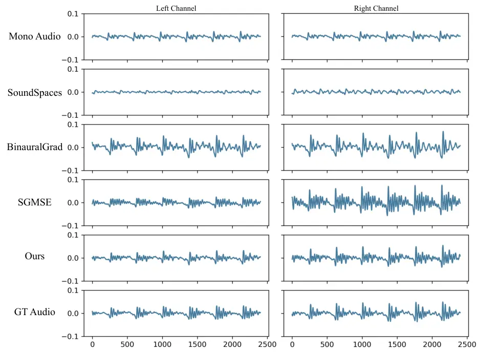

Figure 10: Qualitative comparison between different baselines. We
display waveforms of rendered spatial audio.

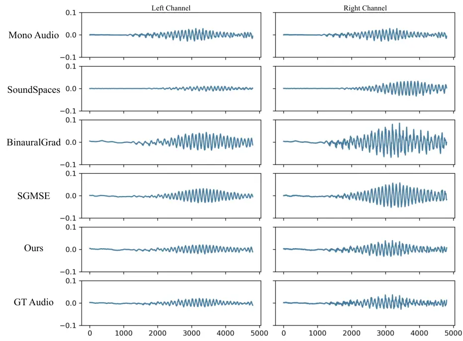

Figure 11: Qualitative comparison between different baselines. We
display waveforms of rendered spatial audio.

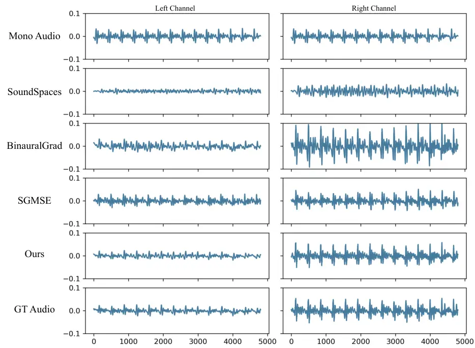

Figure 12: Qualitative comparison between different baselines. We
display waveforms of rendered spatial audio.

60
