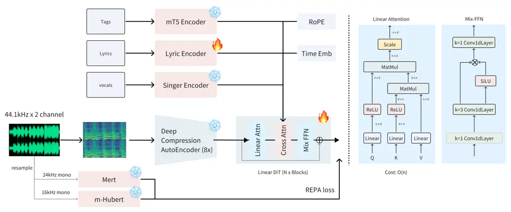
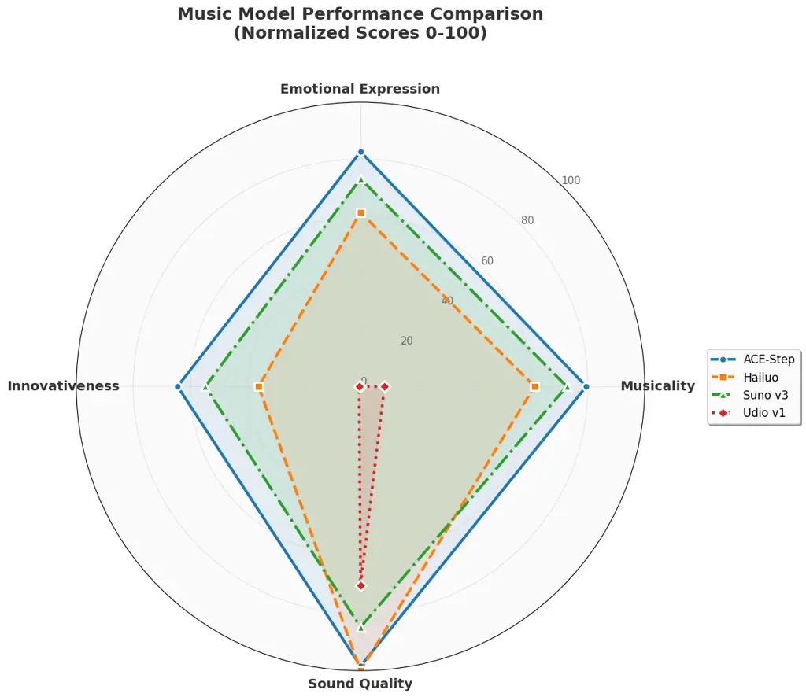
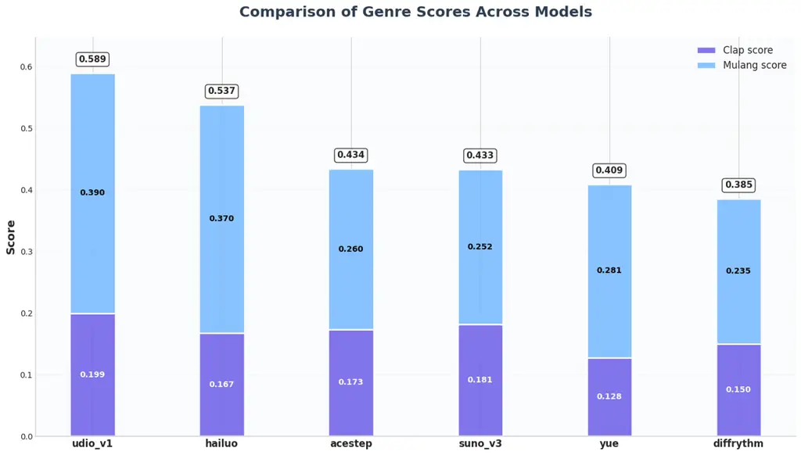
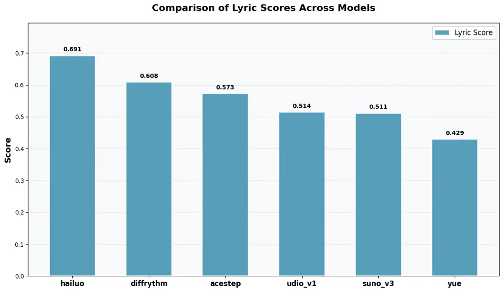
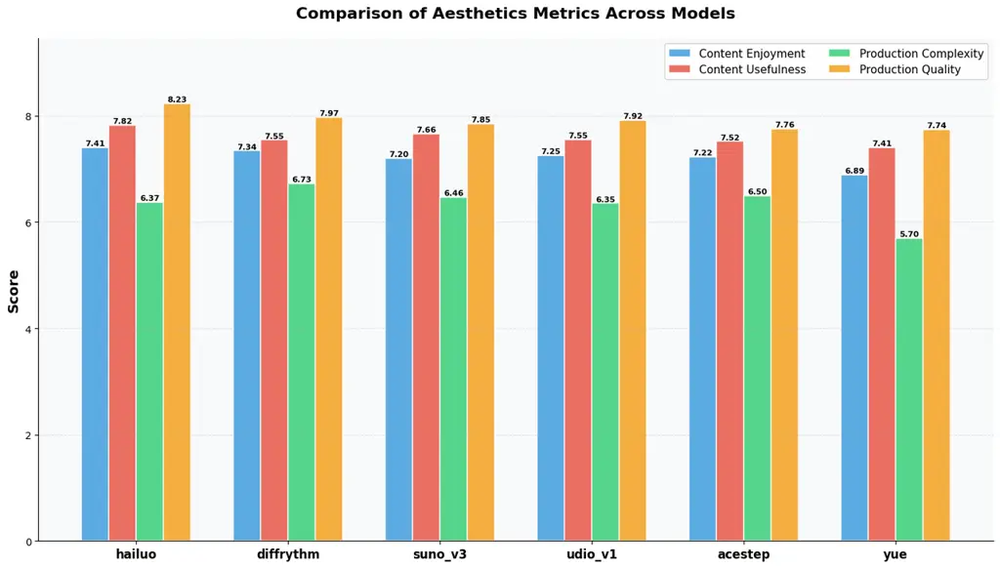
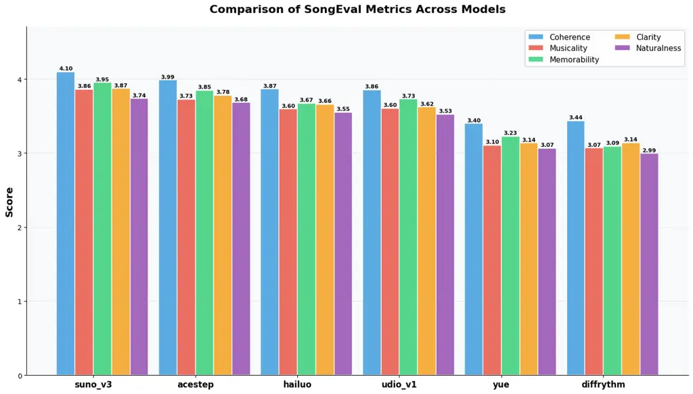
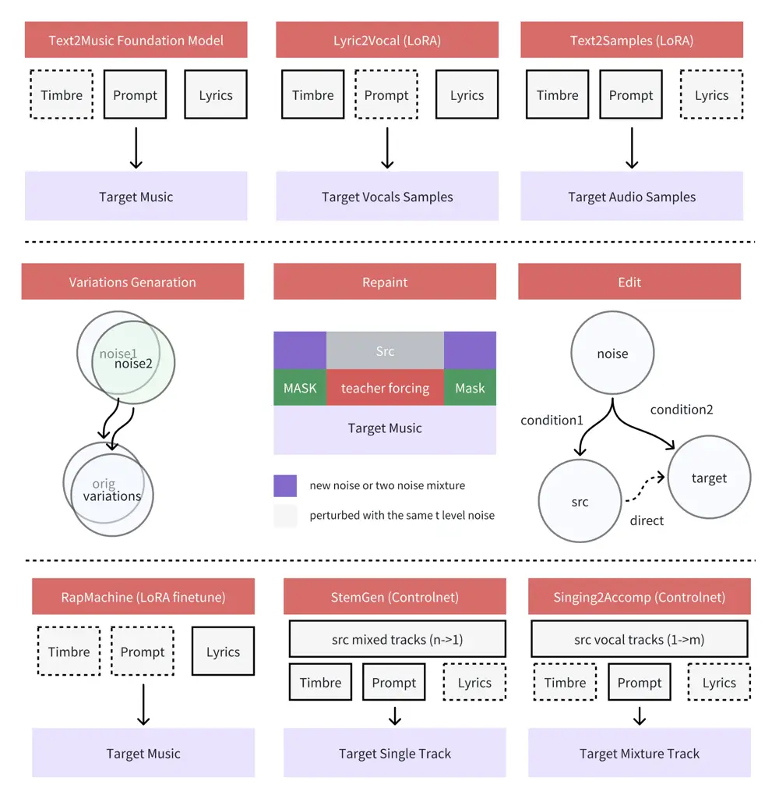

# ACE-Step: A Step Towards Music Generation Foundation Model

Junmin Gong Email: [junmin@acestudio.aiACE Studio](mailto:ACE%20Studio)
   Sean Zhao $`\dagger`$ Email: [sean@acestudio.aiACE
Studio](mailto:ACE%20Studio)    Sen Wang $`\dagger`$
Email: [sayo@acestudio.aiACE Studio](mailto:ACE%20Studio)    Shengyuan
Xu $`\dagger`$ Email: [shengyuan@acestudio.aiACE
Studio](mailto:ACE%20Studio)    Jing Guo$`\dagger`$
Email: [joe@acestudio.aiACE Studio](mailto:ACE%20Studio)

###### Abstract

We introduce ACE-Step, a novel open-source foundation model for music
generation that overcomes key limitations of existing approaches and
achieves state-of-the-art performance through a holistic architectural
design. Current methods face inherent trade-offs between generation
speed, musical coherence, and controllability. For example, LLM-based
models (e.g. Yue \[1\], SongGen \[2\]) excel at lyric alignment but
suffer from slow inference and structural artifacts. Diffusion models
(e.g.DiffRhythm \[3\]), on the other hand, enable faster synthesis but
often lack long-range structural coherence. ACE-Step bridges this gap by
integrating diffusion-based generation with Sana’s \[4\] Deep
Compression AutoEncoder (DCAE \[5\]) and a lightweight linear
transformer. It also leverages MERT \[6\] and m-hubert \[7\] to align
semantic representations (REPA \[8\]) during training, allowing rapid
convergence. As a result, our model synthesizes up to 4 minutes of music
in just 20 seconds on an A100 GPU—15× faster than LLM-based
baselines—while achieving superior musical coherence and lyric alignment
across melody, harmony, and rhythm metrics. Moreover, ACE-Step preserves
fine-grained acoustic details, enabling advanced control mechanisms such
as voice cloning, lyric editing, remixing, and track generation (e.g.,
lyric2vocal, singing2accompaniment). Rather than building yet another
end-to-end text-to-music pipeline, our vision is to establish a
foundation model for music AI: a fast, general-purpose, efficient yet
flexible architecture that makes it easy to train subtasks on top of it.
This paves the way for the development of powerful tools that seamlessly
integrate into the creative workflows of music artists, producers, and
content creators. In short, our goal is to build a stable
diffusion \[9\] moment for music. The code, the model weights and the
demo are available at:
[https://ace-step.github.io/](https://ace-step.github.io/).

   

|     |
| --- |
|     |

![[Uncaptioned
image]](arxiv-2506-00045--a16434d5d3ad.figures/figure-1.webp)

## 1 Introduction

Artificial Intelligence Generated Content (AIGC) has achieved remarkable
progress across various modalities, with models producing highly
realistic text \[10, 11, 12, 13\], images \[14, 15, 16\], and
videos \[17, 18, 19\]. Text-to-music generation, however, presents
unique challenges due to the complex interplay of melody, harmony,
rhythm, timbre, long-range structure, and linguistic content in the form
of lyrics.

Early work like OpenAI’s Jukebox \[20\] demonstrated the feasibility of
generating raw audio music with vocals, albeit with significant
computational cost and coherence limitations. Subsequent research
explored various architectures, including Transformer-based models like
MusicGen \[21\] using quantized audio representations, and diffusion
models like AudioLDM \[22, 23\] operating in latent spaces for
high-fidelity synthesis.

Recently, commercial systems like Suno \[24\], Udio \[25\], and
Riffusion \[26\] have significantly advanced the state-of-the-art. Suno,
in particular, has garnered attention for generating full songs with
strong coherence, style alignment, musicality, and lyric adherence,
effectively reshaping music creation by integrating composition and
production into streamlined platforms. While this democratizes music
creation, it also raises concerns about traditional industry workflows
and artists’ livelihoods.

In response, the open-source community has produced models such as
Yue \[1\], SongGen \[2\], and DiffRhythm \[3\]. However, these often
fall short of commercial counterparts, suffering from limitations in
musical quality, poor style generalization, weak lyric-audio alignment,
slow inference speeds, or reliance on specific input formats that hinder
practical usability. Unlike text, image, and video domains where
open-source models achieve competitive performance, the text-to-music
landscape lags considerably behind.

This disparity stems from several factors: scarcity of large-scale,
high-quality annotated music datasets with precise lyric alignment, the
inherent difficulty of simultaneously modeling musical structure and
vocal characteristics, and lack of comprehensive evaluation benchmarks.
Current approaches follow two main paradigms: (1) two-stage
methods \[20\] that generate discrete codes before audio synthesis,
suffering from error propagation and slow sequential generation; and (2)
diffusion models \[27, 28, 3\] operating on compressed latent
representations, offering higher fidelity but requiring specific
techniques for structural coherence and controllability.

To bridge this critical gap, we introduce ACE-Step, a novel foundation
model for text-to-music synthesis. Our work aims to provide a powerful,
efficient, and versatile open-source alternative that empowers creators
rather than replacing them. We believe continuous open-source iteration
is crucial for creating accessible tools that augment human creativity
and democratize musical creation. Drawing inspiration from recent
advancements in diffusion models, particularly in text-to-image domain,
ACE-Step introduces several key innovations:

1.  1.  Novel Architectural Integration: We leverage Deep Compression
        AutoEncoder (DCAE \[5\]) to achieve highly compact mel-spectrogram
        latent representation, synergistically integrated with flow
        matching \[29\] generative process driven by a linear transformer
        backbone \[30\]. This combination significantly accelerates both
        training and inference for generating coherent, multi-minute musical
        pieces.
2.  2.  Enhanced Semantic Alignment: We incorporate Representation Alignment
        (REPA \[8\]) technique by applying pre-trained MERT \[6\] (for music
        representation) and mHuBERT \[7\] (for multilingual speech
        representation) as semantic guides during flow matching training,
        promoting faster convergence and improved semantic fidelity,
        especially in stylistic accuracy and lyric adherence.
3.  3.  Advanced Control via Flow Manipulation: Inspired by controllable
        image synthesis, ACE-Step implements fine-grained creative control
        including musical variations, audio repainting (temporal
        inpainting), and precise lyric editing through flow-based
        manipulation principles.
4.  4.  Foundation Model Extensibility: We demonstrate ACE-Step’s
        versatility through successful downstream applications, including
        LoRA \[31\] and ControlNet-inspired \[32\] conditioning for tasks
        such as direct lyric-to-vocal synthesis and targeted text-to-sample
        generation.
5.  5.  Practical Robustness: ACE-Step is engineered for real-world
        application with user-specifiable output duration and robustness to
        diverse input formats for both descriptive tags and lyrics.

## 2 Related Work

This section reviews prior work in audio and music generation,
highlighting key open-source and closed-source models, and detailing the
foundational generative techniques and components leveraged by ACE-Step.

### 2.1 Generative Modeling for Audio and Music

Generative audio modeling, encompassing speech and environmental sounds,
is a well-established field. Text-to-Speech (TTS) synthesis, for
example, has evolved from concatenative/parametric methods \[33\] to
neural network-based systems, often employing two-stage pipelines
(acoustic model to intermediate representation, then vocoder to
waveform) or, more recently, diffusion models \[34, 22, 23\] for
high-fidelity output.

Music generation introduces distinct challenges: complex harmony,
rhythm, long-range structure, timbre, and lyric alignment. Two dominant
paradigms have emerged:

1.  1.  Two-Stage Discrete Tokenization: Pioneered by Jukebox \[20\], this
        involves an autoencoder (e.g., VQ-VAE \[35\]) compressing audio into
        discrete tokens, which an auto-regressive model (often a
        Transformer) then predicts sequentially. This can model long
        dependencies but may suffer from tokenization information loss and
        slow sequential inference.
2.  2.  Latent Diffusion Models: Inspired by image generation, these models
        apply diffusion processes to a compressed latent audio
        representation (typically mel-spectrograms) learned by an
        autoencoder \[36, 21\]. Examples like Stable Audio \[27\] and
        Riffusion \[26\] often yield high-fidelity audio and faster
        synthesis, though ensuring long-range coherence and controllability
        can require specific designs.

### 2.2 Open-Source Works

Several open-source models have advanced text-to-music generation:
Jukebox \[20\], a pioneering model, generates raw audio with vocals
using hierarchical VQ-VAEs and autoregressive Transformers, offering
diversity but suffering from slow inference. MusicGen \[21\] employs a
single-stage autoregressive Transformer on EnCodec \[37\] tokens,
improving speed and enabling melody conditioning and lyric integration.
AudioLDM \[22, 23\] pioneered latent diffusion for general audio,
including music, using CLAP \[38\] for text conditioning, with AudioLDM
2 enhancing musical structure and lyric coherence. Stable Audio
Open \[27\] utilizes a diffusion model over autoencoded latent codes,
conditioned by T5 \[39\], to generate longer, high-quality audio,
emphasizing practical usability. Yue \[1\] is an open-source foundation
model aiming for full-length song generation with coherent lyrics and
melody. SongGen \[2\] uses a single-stage autoregressive Transformer for
text-to-song generation, focusing on vocal-instrumental harmony.
DiffRhythm \[3\] introduces a latent diffusion framework for efficient
full-song synthesis, with a focus on rhythm-aware modeling to ensure
temporal coherence and nuanced expressive control.

### 2.3 Closed-Source Works and Our Motivation

Closed-source text-to-music generation has also advanced rapidly. Early
efforts like Riffusion \[26\] adapted image diffusion models (e.g.,
Stable Diffusion \[9\]) to mel-spectrograms, showing potential but
facing fidelity challenges. More recent systems often employ
sophisticated multi-stage architectures. Google’s MusicLM \[36\] uses
hierarchical sequence modeling for high-fidelity, long-form audio.
Models like Suno \[24\] and Udio \[25\] are understood to use LLM-based
hierarchical processes, first generating semantic tokens then refining
them into audio, offering strong coherence and control, though their
proprietary nature limits detailed comparison and community
experimentation.

This review highlights a dynamic landscape: foundational autoregressive
models (Jukebox), faster variants (MusicGen, SongGen), and the rise of
diffusion models (AudioLDM, Stable Audio) for fidelity. While
closed-source systems like Suno produce impressive "one-shot" complete
songs, this may limit creative intervention. ACE-Step, conversely,
adopts a diffusion-based architecture, inspired by successes in image
synthesis. This choice aims to foster a collaborative creation
ecosystem, enabling fine-grained control (cf. ControlNet \[32\]),
customization (cf. LoRA \[31\]), and iterative refinement. Our goal is
to develop a "Stable Diffusion for Music"—a powerful, flexible, and open
foundation that empowers creators.

### 2.4 Core Generative Techniques and Components

Our work builds upon several advanced generative modeling paradigms and
representation learning techniques. Understanding their principles is
key to appreciating their application within ACE-Step.

1.  1.  Flow Matching (FM): Flow matching \[29\] offers a simulation-free
        approach to training continuous normalizing flows (CNFs). Unlike
        score-based diffusion models that learn the gradient of the
        log-density (score function) $`\nabla\log p_{t}(x)`$, FM directly
        regresses a time-dependent vector field $`v_{t}(x)`$ that transports
        samples from a simple prior distribution $`p_{0}`$ to a complex
        target data distribution $`p_{1}`$ (or vice-versa) along probability
        paths $`p_{t}`$. This is typically achieved by minimizing a loss
        between the model’s predicted vector field and a target vector field
        defined by samples from $`p_{0}`$ and $`p_{1}`$. This direct
        regression can lead to simpler training objectives, potentially
        faster convergence, and more stable training dynamics compared to
        score matching. Conditional Flow Matching (CFM) \[40\] extends this
        by allowing the vector field to depend on conditioning information,
        enabling guided generation. Sampling involves numerically solving an
        ordinary differential equation (ODE) defined by the learned vector
        field.
2.  2.  Diffusion Transformers (DiT): The Diffusion Transformer (DiT) \[41\]
        architecture adapts the Transformer \[42\] to serve as the backbone
        for diffusion models, primarily replacing U-Net \[43\] structures
        common in image generation. DiTs treat latent representations (e.g.,
        image patches or, in our domain, segments of audio features) as
        sequences of tokens. These tokens, along with embeddings for the
        diffusion timestep and any conditioning information, are processed
        by a series of Transformer blocks. The Transformer’s inherent
        strengths in modeling long-range dependencies, its attention
        mechanism’s ability to capture global context, and its proven
        scalability make it a powerful choice for diffusion backbones,
        especially as model and dataset sizes increase. Linear attention
        variants \[30\] can further enhance efficiency for very long
        sequences.
3.  3.  Representation Alignment (REPA): Representation Alignment \[8\]
        encompasses techniques designed to bridge semantic gaps between
        representations learned by different models or derived from
        different modalities. The core idea is to transform or guide one
        representation space to be more semantically consistent with
        another, often a powerful pre-trained "teacher" model’s embedding
        space. This alignment is typically enforced during training by
        adding a loss term that encourages similarity (e.g., via cosine
        similarity or MSE) between the student model’s intermediate or
        output representations and the target representations from the
        teacher model for corresponding inputs. REPA can facilitate
        knowledge transfer, improve conditional generation by enforcing
        better adherence to semantic guidance, and potentially accelerate
        training by providing richer supervisory signals.
4.  4.  Deep Compression AutoEncoders (DCAE) for Audio: Efficiently modeling
        complex, high-dimensional data like audio often necessitates an
        initial dimensionality reduction step. Autoencoders, particularly
        those designed for significant compression like the Deep Compression
        AutoEncoder (DCAE) \[5\], are crucial for this. A DCAE learns an
        encoder to map high-dimensional input (e.g., mel-spectrograms) to a
        much lower-dimensional latent representation, and a decoder to
        reconstruct the original input from this latent code. The "deep
        compression" aspect implies a focus on achieving a highly compact
        latent space while minimizing reconstruction error. For audio, this
        means capturing salient acoustic features essential for perception
        and quality within a small number of latent variables. This not only
        reduces the computational burden for subsequent generative models
        operating in this latent space but also encourages the generative
        model to focus on higher-level structural and semantic aspects
        rather than low-level waveform details. The specific architecture of
        DCAE (e.g., convolutional layers, quantization if used) is optimized
        for this trade-off.

## 3 Method

ACE-Step is designed as a fast, general-purpose, and flexible foundation
model for music generation. We adopt a diffusion-based generation
paradigm, integrating efficient architectural choices and advanced
semantic alignment techniques. This section details the data foundation,
model architecture, and training methodology.

### 3.1 Data Foundation

The performance of ACE-Step is built upon a large-scale, diverse audio
dataset, meticulously curated, processed, and annotated to provide rich
conditioning signals.

#### 3.1.1 Dataset Curation and Quality Control

Our primary training corpus comprises approximately 1.8 million unique
musical pieces (roughly 100,000 hours), spanning 19 languages, with a
majority in English. To ensure data quality, we employed the Audiobox
aesthetics toolkit \[44\], a suite of audio processing tools, for
quality assessment and filtering. This process identified and removed
low-fidelity recordings and live performances, which often contain
undesirable artifacts.

#### 3.1.2 Annotation and Conditioning Signals

Comprehensive annotations were generated to provide rich conditioning
signals for the model:

- •
  Descriptive Captions: The Qwen-omini model \[45\] generated textual
  descriptions detailing musical content and mood.
- •
  Lyrics Transcription and Alignment: Vocals were transcribed using
  Whisper 3.0 \[46\]. A locality-sensitive hashing (LSH) \[47\] based
  approach was then used to map the International Phonetic Alphabet
  (IPA) \[48\] representations of these transcriptions to canonical
  lyric databases for improved alignment.
- •
  Structural Segmentation: High-level song structures (e.g., intro,
  verse, chorus) were identified using an "all-in-one" music
  understanding model \[49\].
- •
  Musical Attributes: Beats Per Minute (BPM) were extracted using
  ‘Beatthis‘ \[50\], while ‘Essentia‘ \[51\] provided key and initial
  stylistic tags. These tags were subsequently refined and "recaptioned"
  into natural language phrases by Qwen-omini for consistency.

#### 3.1.3 Input Strategies and Robustness

To enhance model robustness and adaptability to diverse inputs, we
implemented several key strategies:

- •
  Conditional Lyric Handling: For tracks with vocals but missing lyrics,
  empty strings were used as input. Purely instrumental tracks were
  explicitly marked with special tokens like ‘\[inst\]‘ or
  ‘\[instrumental\]‘. Lyric tokenization follows the methodology of
  SongGen \[2\], utilizing the XTTS VoiceBPE tokenizer \[52\] for its
  broad multilingual support. While Romanized languages undergo minimal
  preprocessing, non-Romanized scripts (e.g., Chinese, Japanese, Korean)
  are converted to phonemic representations using grapheme-to-phoneme
  (G2P) tools prior to tokenization. This approach facilitates
  fine-grained editing (e.g., specifying Pinyin for Chinese polyphonic
  characters) while maintaining tokenization consistency.
- •
  Variable-Length Training: To support user-specified output durations,
  ACE-Step was trained on variable-length audio segments. A custom
  dataset sampler grouped segments of similar lengths into batches,
  mitigating training inefficiencies arising from length variability.
- •
  Diverse Textual Prompting: The model was trained with diverse textual
  annotations, including comma-separated tags, descriptive captions, and
  usage scenarios, which were dynamically generated by an audio language
  model to match context. To further prevent overfitting to specific
  prompt formats, lyrics were augmented by an LLM into multiple
  stylistic variations (e.g., with or without structured tags),
  enhancing adaptability to real-world input inconsistencies.

#### 3.1.4 Addressing Lyric-Audio Alignment Challenges

Achieving accurate full-song lyric alignment presented significant
challenges due to musical rhythms, pauses, and annotation inaccuracies
(e.g., uncredited backing vocals, transcription errors). Our approach
evolved iteratively:

- •
  Initial Attempts and Limitations: Early experiments using the
  International Phonetic Alphabet (IPA) for direct lyric representation
  proved impractical for user editing and cross-lingual phoneme
  management. Furthermore, attempting to directly link lyric semantics
  to low-level pronunciation characteristics introduced noise and
  hindered learning efficiency, suggesting an insufficient correlation
  for robust alignment without stronger guidance.
- •
  The Role of Semantic Guidance (REPA): The Representation Alignment
  (REPA) framework (detailed in Section 2.4 became crucial. Diffusion
  models tend to prioritize learning low-frequency structures (e.g.,
  melody, song form) before high-frequency details (e.g., precise vocal
  nuances). Without strong semantic guidance from pre-trained
  Self-Supervised Learning (SSL) models (mHuBERT \[7\] for speech,
  MERT \[6\] for music), the model could prematurely focus on vocal
  details leading to misaligned or omitted lyrics. REPA enforces
  sustained semantic constraints from these SSL models, ensuring lyric
  adherence is treated as a fundamental, low-frequency priority
  throughout the generation process.
- •
  Validation: Ablation studies confirmed REPA’s necessity: models
  trained without REPA exhibited severe alignment degradation. Even when
  alignment showed some improvement with extended training, removing
  REPA during fine-tuning caused a notable decay in performance,
  underscoring its critical role in maintaining robust lyric delivery.

### 3.2 Model Architecture

As shown in Figure 1, ACE-Step adapts a text-to-image diffusion
framework, drawing inspiration from architectures like Sana \[4\], for
music generation. The core generative model is a diffusion model
operating on a compressed mel-spectrogram latent representation. This
process is guided by conditioning information from three specialized
encoders: a text prompt encoder, a lyric encoder, and a speaker encoder.
Embeddings from these encoders are concatenated and integrated into the
diffusion model via cross-attention mechanisms.

#### 3.2.1 Audio Autoencoder: Music-DCAE

For efficient latent space modeling, we employ a Deep Compression
AutoEncoder (DCAE). The architecture largely follows previous work
 \[5\], but with a critical modification for mel-spectrogram
compression. An initial configuration using 32x compression in both time
and frequency dimensions (f32c32, channel=32) resulted in unacceptable
audio quality degradation. We subsequently adopted an 8x compression
setting (f8c8, channel=8, yielding approximately 10.77Hz temporal
resolution in the latent space), which provided a superior balance
between compression ratio and fidelity. For converting the generated
mel-spectrograms back to waveform (vocoding), we utilize a pre-trained
universal music vocoder from Fish Audio \[53\].

We also conducted preliminary explorations with 1D VAE architectures,
including variants similar to those in Stable Audio \[27\] and
DiffRhythm \[3\]. However, these approaches, possibly due to suboptimal
integration with our diffusion model’s training recipe, exhibited
persistent high-frequency artifacts in the generated vocals,
particularly in later training stages. Given project timelines, these
alternatives would be pursued further in the next version.



Figure 1: ACE-Step Framework

#### 3.2.2 Core Diffusion Model: Linear DiT

The denoising network at the heart of ACE-Step is a Linear Diffusion
Transformer (DiT). We adapt the Linear DiT structure from Sana \[4\]
with two key modifications:

- •
  Simplified Adaptive Layer Normalization: We replace the standard AdaLN
  with AdaLN-single \[54\], where a single AdaLN layer’s parameters are
  shared across all DiT blocks. This significantly reduces model size
  and memory consumption.
- •
  1D Convolutional FeedForward Layers: The FeedForward Network (FFN)
  layers within the DiT blocks are modified from using 2D convolutions
  to 1D convolutions. This change better aligns the architecture with
  the sequential, 1D nature of the temporal information in the audio
  latent space after patchification.

#### 3.2.3 Conditioning Encoders

To guide the generation process, the Linear DiT is conditioned on
embeddings from the following encoders:

- •
  Text Encoder: We employ a frozen Google mT5-base model \[55\] to
  generate 768-dimensional embeddings from textual prompts. This model
  was chosen for its robust multilingual capabilities in processing both
  descriptive tags and natural language captions.
- •
  Lyric Encoder: The lyric encoder architecture and hyperparameters are
  adopted from SongGen \[2\]. This encoder is trainable during
  ACE-Step’s training process.
- •
  Speaker Encoder: The speaker encoder processes a 10 - second
  unaccompanied vocal segment, which is separated by demucs, into a
  512 - dimensional embedding. For full songs with vocals, embeddings
  from multiple such segments are averaged. A zero vector is used as the
  speaker embedding for instrumental tracks. The encoder, pre-trained on
  a large and diverse singing voice corpus, draws architectural
  inspiration from PLR-OSNet \[56\], originally designed for face
  recognition. During the main training phase of ACE-Step, a 50% dropout
  rate is applied to these speaker embeddings. This prevents the model
  from over-relying on timbre information for stylistic interpretation,
  thereby enabling reasonable timbre generation even without explicit
  speaker input. In a subsequent fine-tuning stage, speaker embeddings
  are omitted entirely. While this degrades precise voice cloning
  capabilities, it transfers greater stylistic control to the text
  prompts, enhancing overall flexibility.

### 3.3 Training Objectives

ACE-Step is trained by optimizing a composite objective function that
balances generative fidelity with semantic coherence. This involves a
primary flow matching loss for learning the data distribution in the
latent space, and an auxiliary semantic alignment loss leveraging
pre-trained Self-Supervised Learning (SSL) models. Our overall training
strategy, including learning rate schedules and optimizers, draws from
established practices in training large-scale generative models, such as
those for Stable Diffusion 3 \[57\].

#### 3.3.1 Flow Matching Loss

The core generative capability of ACE-Step is learned through a
continuous-time flow matching (FM) objective \[40\]. Given a clean audio
segment, it is first converted to a mel-spectrogram and then encoded by
the pre-trained Music-DCAE (Section 3.2) into a latent representation
$`x_{0}`$. We define a linear probability path that transports samples
from a simple Gaussian noise distribution $`z\sim\mathcal{N}(0,I)`$ to
the target data distribution $`x_{0}`$. During training, a time
$`t\sim U[0,1]`$ is sampled. A coefficient $`\sigma_{t}`$ is derived
from this $`t`$. A noisy latent $`x_{\text{noisy}}`$ is constructed via
interpolation: $`x_{\text{noisy}}=(1-\sigma_{t})x_{0}+\sigma_{t}z`$. The
model $`\epsilon_{\theta}`$, conditioned on $`x_{\text{noisy}}`$, the
sampled time $`t`$, and various embeddings (text, speaker, lyric,
denoted collectively as condition), is trained to predict a vector
$`v_{\text{out}}=\epsilon_{\theta}(x_{\text{noisy}},t,\text{condition})`$.
The target for this predicted vector $`v_{\text{out}}`$ is
$`-(x_{0}-z)`$. This target can be interpreted as the negative of the
constant velocity field $`v=x_{0}-z`$ associated with the linear path
from $`z`$ to $`x_{0}`$. The clean latent $`x_{0}`$ is then estimated
from $`x_{\text{noisy}}`$ and $`v_{\text{out}}`$ using the
preconditioning formula:
$`x_{0}^{\text{pred}}=v_{\text{out}}\cdot(-\sigma_{t})+x_{\text{noisy}}`$.
The flow matching loss $`\mathcal{L}_{\text{FM}}`$ is then the Mean
Squared Error (MSE) between this reconstructed prediction
$`x_{0}^{\text{pred}}`$ and the ground truth $`x_{0}`$:

```math
\mathcal{L}_{\text{FM}}=\mathbb{E}_{x_{0},z,t}[\|(\epsilon_{\theta}(x_{\text{noisy}},t,\text{condition})\cdot(-\sigma_{t})+x_{\text{noisy}})-x_{0}\|_{2}^{2}]
```

where $`x_{\text{noisy}}=(1-\sigma_{t})x_{0}+\sigma_{t}z`$.

#### 3.3.2 Semantic Alignment Loss

To enhance musical coherence, particularly the alignment and
intelligibility of sung lyrics, we incorporate an auxiliary semantic
alignment loss, inspired by the Representation Alignment (REPA)
framework \[8\]. This loss constrains intermediate representations from
our model’s Linear DiT backbone to align with those from powerful
pre-trained audio SSL models.

Specifically, we extract features $`h_{\text{DiT}}`$ from an
intermediate layer of ACE-Step’s Linear DiT (the 8th layer out of 24).
These features are then aligned with target representations obtained
from:

- •
  MERT (Music Encoder Representations from Transformers) \[6\]: This
  model provides general musical feature embeddings. We process the
  original audio (resampled to 24kHz, mono) in 5-second chunks. MERT
  outputs embeddings $`h_{\text{MERT}}`$ of dimension
  $`1024\times T_{M}`$, where $`T_{M}`$ is the number of temporal frames
  at a rate of 75Hz.
- •
  mHuBERT (multilingual HuBERT) \[7\]: This model yields representations
  beneficial for lyric intelligibility and speech-like characteristics.
  The original audio (resampled to 16kHz, mono) is processed in
  30-second chunks. mHuBERT outputs embeddings $`h_{\text{mHuBERT}}`$ of
  dimension $`768\times T_{H}`$, where $`T_{H}`$ is the number of
  temporal frames at a rate of 50Hz.

Before computing the alignment loss, the temporal dimensions of
$`h_{\text{DiT}}`$, $`h_{\text{MERT}}`$, and $`h_{\text{mHuBERT}}`$ are
matched, typically through interpolation or pooling, to a common length
$`T^{\prime}`$. The SSL loss is the average of the 1 - cosine distance
between the DiT’s representations and the SSL models’ representations:

```math
\mathcal{L}_{\text{SSL}}=\frac{1}{2}\left(\text{cosineSim}(h^{\prime}_{\text{DiT}},h^{\prime}_{\text{MERT}})+\text{cosineSim}(h^{\prime}_{\text{DiT}},h^{\prime}_{\text{mHuBERT}})\right)
```

where $`h^{\prime}`$ denotes the temporally aligned representations. For
instance, $`h^{\prime}_{\text{DiT}}`$ represents the DiT features after
temporal alignment.

The final training objective is a weighted sum of the flow matching and
semantic alignment losses:

```math
\mathcal{L}_{\text{Total}}=\mathcal{L}_{\text{FM}}+\lambda_{\text{SSL}}\cdot\mathcal{L}_{\text{SSL}}
```

where $`\lambda_{\text{SSL}}`$ is a hyperparameter controlling the
influence of the SSL guidance, empirically set to 1.0 in our
experiments.

## 4 Experiments

We trained the Music-DCAE and ACE-Step models using DeepSpeed ZeRO Stage 2. During pre-training, we set the SSL loss weight
$`\lambda_{\text{SSL}}`$ to 1.0, but reduced the mHuBERT SSL loss
component to 0.01 for the final 100,000 fine-tuning steps to prevent
suppression of instrumental sounds and preserve musicality. Due to the
lack of an automated evaluation pipeline, we relied on manual listening
assessments every 2,000 steps to monitor performance, which limited our
ability to precisely track training progress or detect overfitting.
Detailed training configurations are provided in Tables 3 and 4 in
Appendix A.

## 5 Evaluation

### 5.1 Human Evaluation



Figure 2: Human evaluation results comparing ACE-Step against three
baseline models (Hailuo, Suno v3, and Udio v1) across four dimensions.
Scores are normalized to 0-100.

We conducted a blind human evaluation with 32 participants to assess
ACE-Step’s performance. The cohort comprised 7 music professionals, 7
enthusiasts, and 18 general listeners (15 female, 17 male), aged 19-42
years. Participants evaluated generated music samples using a 5-point
Likert scale across four dimensions:

- •
  Musicality: Melody/harmony logic, rhythmic complexity, and structural
  integrity
- •
  Emotional Expression: Clarity of emotion, resonance, and dynamic
  contrast
- •
  Innovativeness: Originality in style, timbre, and structural elements
- •
  Sound Quality: Audio fidelity, spatial characteristics, and absence of
  artifacts

ACE-Step was compared against three closed-source baselines: Suno v3,
Udio v1, and Hailuo. All evaluations used randomized sample presentation
to mitigate order effects. As shown in Figure 2, ACE-Step achieves
strong performance with scores of approximately 85 in Emotional
Expression, 82 in Innovativeness, 80 in Sound Quality, and 78 in
Musicality. Suno v3 follows with balanced scores around 70-75 across all
dimensions, while Hailuo shows slightly lower but comparable performance
(65-72). Udio v1 significantly underperforms with scores below 15 in all
categories.

While this evaluation excluded newer models (Suno v3.5/v4, Tiangong,
Mureka), community feedback suggests ACE-Step’s performance falls
between Suno v3 and v3.5, remaining competitive among open-source
alternatives despite being surpassed by the latest commercial offerings.

| Model               | FAD$`\downarrow`$ |               |           | Audiobox-aesthetics$`\uparrow`$ |        |        |        |
| ------------------- | ----------------- | ------------- | --------- | ------------------------------- | ------ | ------ | ------ |
|                     | cdpam-acoustic    | cdpam-content | dac-44kHz | CE                              | CU     | PC     | PQ     |
| Music DCAE (mel 2d) | 0.0224            | 0.0202        | 49.3879   | 6.5511                          | 7.2299 | 6.0457 | 7.4611 |
| DiffRhythm VAE (1d) | 0.0059            | 0.0048        | 22.3142   | 6.7164                          | 7.3759 | 5.9301 | 7.6305 |

Table 1: Waveform Reconstruction Performance. FAD scores are lower is
better. Audiobox-aesthetics scores are higher is better.



(a) Genre Scores (CLAP + Mulan). Higher is better.



(b) Lyric Scores (Whisper Forced Alignment). Higher is better.

Figure 3: Comparison of (a) Genre Scores and (b) Lyric Scores Across
Models.

### 5.2 Automatic Evaluation

Automatic evaluations were conducted across five main aspects: waveform
reconstruction, style alignment, lyric alignment, aesthetic quality
(Audiobox), and musicality (SongEval), as well as generation speed. For
song generation tasks, we utilized a set of 20 prompts  B (10 in
English, 10 in Chinese) covering diverse musical styles, generated by an
LLM, which included style tags and lyrics.

#### 5.2.1 Waveform Reconstruction

To evaluate waveform reconstruction, we randomly selected 20 ground
truth songs. These songs were then reconstructed using both the Music
DCAE and DiffRhythm’s VAE. We subsequently calculated the Fréchet Audio
Distance (FAD) and aesthetic scores between the reconstructions and
their respective ground truth originals. For FAD, we utilized the fadtk
package \[58\]. Aesthetic quality was assessed using Meta’s
Audiobox-aesthetics framework \[44\]. The resulting scores are presented
in Table 1. This indicates that our DCAE does not surpass the
reconstruction quality upper bound of 1D VAE.

#### 5.2.2 Song Generation Metrics

For evaluating complete song generation, we assessed models including
ACE-Step, Hailuo, Suno v3, Udio v1, Yue, and DiffRhythm.¹¹ 1 For
DiffRhythm, we utilized version 1.2 (1m35s), which was its latest
version updated on May 9, 2025.

##### Style and Lyric Alignment.

Style alignment measures how well generated music matches the specified
style. It is quantified using CLAP and Mulan scores. For the CLAP score,
we calculate the similarity between the text vector of the input tags
and the audio vector using the implementation from
stable-audio-metrics \[59\]. To complement this, and address potential
limitations of using a non-music-specific CLAP model, we also employed
Mulan \[60\]. Mulan is a similar contrastive language-audio pretraining
model but features an audio encoder with enhanced music understanding
capabilities, thus providing a more reliable reference for style
alignment. As shown in Figure 3(a), Udio v1 achieved the highest
combined style alignment, followed by Hailuo and then ACE-Step. Suno v3,
Yue, and DiffRhythm ranked subsequently.

Lyric alignment was assessed by the average confidence of Whisper forced
alignment. Specifically, we first process the lyrics by removing
structural tags and non-phonetic punctuation. The cleaned lyrics are
then tokenized using Whisper’s tokenizer. We then obtain the hidden
states for these text tokens. By computing the cross-attention scores
between these text hidden states and the audio’s hidden states, a
dynamic programming algorithm derives a confidence score for each
force-aligned text token. A higher average confidence across tokens
signifies that, from Whisper’s perspective, the sung lyrics are clearer
and more accurately aligned. The specific implementation for forced
alignment was based on \[61\]. Figure 3(b) indicates that Hailuo
demonstrated the best lyric alignment. DiffRhythm and ACE-Step also
performed well in this regard, while Udio v1, Suno v3, and Yue achieved
lower scores. It is noted that this metric might favor genres with
sparse instrumentation.



(a) Aesthetics Metrics



(b) SongEval Metrics.

Figure 4: Comparison of (a) Audiobox Aesthetics Metrics and (b) SongEval
Musicality Metrics Across Models.

| Method     | RTF    | Relative Speed |
| ---------- | ------ | -------------- |
| Yue        | 0.083x | 1.00x          |
| DiffRhythm | 10.03x | 120.84x        |
| ACE-Step   | 15.63x | 188.31x        |

Table 2: Generation Speed Comparison on RTX 4090. RTF (Real-Time
Factor) - higher is faster.

##### Aesthetic Quality and Musicality.

Aesthetic quality was evaluated using Meta’s Audiobox framework across
four dimensions. As detailed in Figure 4(a), Hailuo showed strong
performance across all dimensions, with DiffRhythm also performing well.
Suno v3 and Udio v1 yielded competitive scores, while ACE-Step
positioned in the mid-to-upper range. Yue generally scored lowest. These
scores can be style-dependent.

For musicality, we employed SongEval \[62\], which is based on the first
large-scale, open-source dataset for human-perceived song aesthetics.
The SongEval toolkit enables automatic scoring of generated songs across
five perceptual aesthetic dimensions designed to align with professional
musician judgments. Extensive evaluations have demonstrated that
SongEval’s metrics exhibit high consistency with human subjective
preferences, achieving over 90% agreement at both utterance-level and
system-level, significantly higher than the 60-70% reported for
AudioBox-aesthetics in similar comparisons. This indicates a greater
reliability of SongEval in reflecting human perception of musicality.
Assessed by SongEval across these five dimensions (see Figure 4(b)),
Suno v3 achieved the highest Coherence and strong overall performance.
ACE-Step demonstrated competitive results, particularly in Memorability
and Clarity. Hailuo and Udio v1 also exhibited robust musicality, while
Yue and DiffRhythm scored comparatively lower.

##### Generation Speed.

Generation speed was benchmarked on consumer-grade hardware (NVIDIA RTX
4090 GPU) for Yue, DiffRhythm, and ACE-Step. Performance was measured
using the Real-Time Factor (RTF), where a higher RTF indicates faster
generation (e.g., RTF of 2x means twice as fast as real-time). As
detailed in Table 2, ACE-Step achieves the fastest generation with an
RTF of 15.63x, followed by DiffRhythm at 10.03x. Yue is the slowest
among the three methods with an RTF of 0.083x, meaning it generates
audio at only 8.3% of real-time speed. ACE-Step is approximately 188
times faster than Yue, while DiffRhythm is approximately 121 times
faster than Yue.

### 5.3 Metrics Interpretation

Our evaluation reveals several critical observations regarding
ACE-Step’s performance in comparison to contemporary music generation
systems.

First, we identify a substantial divergence between subjective human
evaluations and objective automatic metrics. This discrepancy arises
from two primary factors: (1) the inherently subjective nature of
musical perception, where individual preferences introduce variability
in human assessments, and (2) persistent limitations in existing
objective metrics to comprehensively capture perceptual qualities. While
certain technical indicators demonstrate correlation with human
judgment, others exhibit inconsistencies or fail to account for nuanced
musical attributes. Notably, ACE-Step achieves state-of-the-art
performance among open-source models on SongEval, the most reliable
objective metric demonstrating closest alignment with human evaluations.

Second, comparative analysis with open-source alternatives reveals
ACE-Step’s superior capabilities across key musical dimensions. As shown
in Figure 3(a), our model demonstrates significantly higher genre
fidelity scores compared to competing approaches. Similarly, Figure 4(b)
illustrates ACE-Step’s advantages in overall musicality according to
SongEval metrics. While Audiobox’s aesthetic scores (Figure 4(a))
suggest comparable performance, these metrics appear less sensitive to
perceptual quality differences in cross-model comparisons. Notably,
DiffRhythm’s exceptional lyric alignment scores (Figure 3(b)) likely
stem from its pre-aligned lyric integration strategy, which bypasses
cross-attention mechanisms by directly embedding lyrical content based
on LLM-generated timestamps. However, this architectural choice
correlates with compromised musical integration, as evidenced by
DiffRhythm’s comparatively lower SongEval scores - potentially resulting
from rigid vocal placement that lacks contextual adaptability.
Additionally, ACE-Step’s multilingual support (19 languages) introduces
training complexity trade-offs compared to monolingual systems, as fixed
computational budgets necessitate distributed language-specific
optimization.

Third, generation speed comparisons presented in Table 2 reveal
unexpected efficiency advantages for ACE-Step (3.5B parameters) over the
smaller DiffRhythm (1B parameters). This efficiency likely originates
from linear transformer architecture benefits combined with
implementation-specific optimizations. In contrast, Yue’s generation
speed proves impractical for interactive applications, exhibiting both
excessive latency and strict input formatting requirements that limit
usability.

Finally, we observe systematically lower performance metrics for
DiffRhythm and Yue compared to their original publications. We attribute
this difference to methodological variations: while these works employ
audio prompts during evaluation, our protocol exclusively utilizes
textual conditioning without audio references. We argue this approach
establishes a more rigorous and realistic evaluation framework that
better reflects typical usage scenarios requiring text-to-music
generation without audio priors.

Collectively, these findings position ACE-Step as a leading open-source
solution for multilingual music generation, while highlighting critical
research directions for advancing both model architectures and
evaluation methodologies in music AI research.

## 6 Application

Our proposed model offers a suite of controllable features and
downstream applications, demonstrating its versatility and practical
utility in music generation and manipulation. These capabilities empower
users with fine-grained control over the generation process and enable
targeted modifications to existing audio, as well as specialized
generation tasks through fine-tuning. An overview of these
functionalities is presented in Figure 5.



Figure 5: An overview of the controllable features and specialized
downstream applications of our model.

### 6.1 Core Controllability and Editing Features

The model incorporates several advanced techniques for controllable
audio synthesis and direct editing of musical content.

##### Variations Generation

is supported through training-free, inference-time optimization. This
process initiates with noise from a flow-matching model, to which
additional Gaussian noise is introduced based on trigFlow’s noise
formulation  \[63\]. The degree of variation is controlled by adjusting
the mixing ratio between the original and new noise, allowing for a
spectrum of modifications.

##### Audio Repainting

enables targeted modifications by introducing noise to specific regions
of an audio input and applying mask constraints during the ODE solving
process. This allows for altering specific aspects (e.g., instrumental
lines) while preserving the rest of the audio. Repainting can also be
combined with variations generation for localized changes in style,
lyrics, or vocals.

##### Lyric Editing

\[64\] leverages flow-edit technology for localized lyrical
modifications while preserving melody, vocal characteristics, and
accompaniment. This feature operates on both generated and uploaded
audio, significantly enhancing creative possibilities. While currently
optimized for small segment edits to prevent distortion, multiple
sequential edits can achieve substantial lyrical revisions.

### 6.2 Specialized Generation Tasks via Fine-tuning

To further demonstrate the model’s adaptability, we explored fine-tuning
using Low-Rank Adaptation (LoRA) and ControlNet-LoRA architectures for
specialized generation tasks.

##### Lyric-to-Vocal

is achieved using a LoRA module fine-tuned on pure vocal recordings.
This model directly synthesizes vocal samples from textual lyrics,
proving useful for creating vocal demos, guide tracks, and aiding in
songwriting and vocal arrangement experimentation by quickly auditioning
lyrical ideas.

##### Text-to-Sample

employs a LoRA fine-tuned on pure instrumental and audio sample data. It
can generate conceptual music production samples, such as instrument
loops and sound effects, from descriptive text prompts, thereby
streamlining the workflow for producers and sound designers.

##### StemGen

utilizes a ControlNet architecture \[32\] fine-tuned on multi-track
audio data for the conditional generation of individual instrument
stems. It accepts a reference audio track and a specification for the
desired instrument (either as a textual label or a reference audio
snippet) as input. The model then outputs an instrumental stem that is
harmonically and rhythmically coherent with the reference track, such as
generating a piano accompaniment for a given flute melody or
synthesizing a jazz drum pattern for a lead guitar.

##### Rap Machine

is a LoRA module fine-tuned on a curated dataset of rap and hip-hop
music, with a particular emphasis on Chinese content after rigorous data
processing. This specialization significantly improves Chinese lyrical
pronunciation, enhances adherence to hip-hop and electronic music
conventions, and promotes diverse vocal performances. Beyond its primary
focus, it enables the creation of varied hip-hop tracks and can be
blended with other genres to introduce distinct vocal details or
cultural flavors. Control over vocal timbre and performance techniques
allows for further output refinement. This LoRA serves as a
proof-of-concept, showcasing the foundation model’s capability to
generate novel styles and enhance linguistic performance via targeted
fine-tuning.

##### Singing-to-Accompaniment

conceptually an inverse operation to StemGen, focuses on producing a
complete instrumental accompaniment from an isolated vocal track,
resulting in a mixed master track. It takes a monophonic vocal input and
a user-specified musical style (e.g., "pop ballad," "acoustic folk") to
generate a full instrumental backing. This capability allows for the
creation of rich instrumental arrangements that musically support the
input vocals, offering a streamlined approach for artists to produce
professional-sounding accompaniments.

## 7 Discussion

We introduced ACE-Step, an open-source foundation model for music
generation. Our work successfully demonstrates the viability of our
proposed architecture, which integrates a diffusion-based generator with
Sana’s Deep Compression AutoEncoder (DCAE) and a lightweight linear
transformer. This represents a significant step towards realizing a
versatile music generation foundation model, akin to what Stable
Diffusion \[9\] has achieved for image generation. We believe the
current model serves as a robust proof-of-concept and a crucial stepping
stone. Through continuous iteration and development, we are confident
that the gap between open-source and closed-source models in music
generation can be progressively narrowed.

Despite its achievements, ACE-Step has several limitations that we plan
to address in future work:

- •
  Upper Bound on Audio Quality: The current audio quality is inherently
  limited due to two primary factors.
  - –
    Firstly, our approach relies on a mel-spectrogram-based DCAE and a
    32kHz monophonic vocoder, rather than a direct end-to-end
    audio-to-audio generation pipeline. This choice, while efficient,
    can restrict the fidelity of the output.
  - –
    Secondly, during training, all audio data was uniformly resampled to
    44.1kHz. A more optimal approach would involve using a detection
    script to filter and utilize genuinely high-resolution music for
    training. Alternatively, a multi-stage training paradigm could be
    adopted: initially training on lower-resolution data to learn
    structural aspects, followed by fine-tuning on high-resolution data
    to capture finer acoustic details.

- •
  Style and Lyric Adherence: While ACE-Step demonstrates commendable
  performance, there is room for improvement in its adherence to
  specified musical styles and lyrical content. Our initial
  implementation of style tagging, for instance, could be refined for
  better accuracy and granularity, leading to more precise stylistic
  control.
- •
  Variability in Generation Quality: The generation process sometimes
  exhibits a "gacha-like" (lottery-style) experience, where obtaining
  optimal results may require multiple attempts. This indicates a degree
  of variability in output quality that we aim to reduce.

To address these limitations and further advance the capabilities of
ACE-Step, we outline the following directions for future work:

- •
  Data Augmentation and Extended Training: We plan to significantly
  increase the volume of training data and extend the training duration
  to enhance the model’s generalization capabilities and overall
  performance.
- •
  Improved Multilingual and Multi-Style Support: Future iterations will
  focus on better support for diverse musical styles and languages, with
  an emphasis on improving the alignment between textual prompts
  (lyrics, style descriptions) and the generated audio.
- •
  Advanced 1D VAE Integration: We intend to explore and integrate more
  sophisticated 1D Variational Autoencoders (VAEs) for audio
  representation. A better VAE could lead to improved compression and
  reconstruction quality, directly benefiting the final audio output.
- •
  Reinforcement Learning for Musicality: We aim to incorporate
  reinforcement learning (RL) techniques to reward the model for
  generating music that exhibits higher musicality and aligns more
  closely with human preferences. This could involve training reward
  models based on human feedback.
- •
  Native Support for Mask-Aware Training: The current "extend"
  functionality (for music continuation or inpainting) is not natively
  integrated into the training process. We plan to implement mask-aware
  training, which would allow the model to learn these tasks end-to-end.
  This is expected to significantly improve the quality of music
  continuation (outpainting) and inpainting (in-filling).

By pursuing these avenues, we aim to further refine ACE-Step, pushing
the boundaries of open-source music generation and solidifying its role
as a foundational tool for artists, producers, and researchers.

## Acknowledgements

This project is co-led by ACE Studio and StepFun.

We extend our profound gratitude to StepFun for their generous provision
of computing power and storage infrastructure. Without such critical
support, the development of ACE-Step would not have been possible. We
are also deeply thankful to their team for organizing and conducting the
subjective evaluations of our model.

We are immensely grateful to Jing Guo and Sean Zhao for their intensive
involvement in decision-making and discussions concerning the training
and application aspects of ACE-Step. Their meticulous weighing of
trade-offs was instrumental in shaping ACE-Step into the versatile
foundation model it has become.

Our sincere thanks go to Sen Wang and Shengyuan Xu for their invaluable
support in data engineering. Effective data management was foundational
to our efforts, and ACE-Step could not have been successfully trained
without their expertise.

Finally, we wish to express our deepest appreciation to Junmin Gong for
his extensive contributions, which encompassed algorithm development,
framework design, conducting experiments, model training, and
evaluation. Furthermore, we thank him for authoring the report,
preparing the open-source code release, and creating the project
webpage.

## References

- \[1\] Ruibin Yuan, Hanfeng Lin, Shuyue Guo, Ge Zhang, Jiahao Pan,
  Yongyi Zang, Haohe Liu, Yiming Liang, Wenye Ma, Xingjian Du, Xinrun
  Du, Zhen Ye, Tianyu Zheng, Zhengxuan Jiang, Yinghao Ma, Minghao Liu,
  Zeyue Tian, Ziya Zhou, Liumeng Xue, Xingwei Qu, Yizhi Li, Shangda Wu,
  Tianhao Shen, Ziyang Ma, Jun Zhan, Chunhui Wang, Yatian Wang, Xiaowei
  Chi, Xinyue Zhang, Zhenzhu Yang, Xiangzhou Wang, Shansong Liu, Lingrui
  Mei, Peng Li, Junjie Wang, Jianwei Yu, Guojian Pang, Xu Li, Zihao
  Wang, Xiaohuan Zhou, Lijun Yu, Emmanouil Benetos, Yong Chen, Chenghua
  Lin, Xie Chen, Gus Xia, Zhaoxiang Zhang, Chao Zhang, Wenhu Chen, Xinyu
  Zhou, Xipeng Qiu, Roger Dannenberg, Jiaheng Liu, Jian Yang, Wenhao
  Huang, Wei Xue, Xu Tan, and Yike Guo. Yue: Scaling open foundation
  models for long-form music generation, 2025.
- \[2\] Zihan Liu, Shuangrui Ding, Zhixiong Zhang, Xiaoyi Dong, Pan
  Zhang, Yuhang Zang, Yuhang Cao, Dahua Lin, and Jiaqi Wang. Songgen: A
  single stage auto-regressive transformer for text-to-song
  generation, 2025.
- \[3\] Ning Ziqian, Chen Huakang, Jiang Yuepeng, Hao Chunbo, Ma Guobin,
  Wang Shuai, Yao Jixun, and Xie Lei. DiffRhythm: Blazingly fast and
  embarrassingly simple end-to-end full-length song generation with
  latent diffusion. arXiv preprint arXiv:2503.01183, 2025.
- \[4\] Enze Xie, Junsong Chen, Junyu Chen, Han Cai, Haotian Tang, Yujun
  Lin, Zhekai Zhang, Muyang Li, Ligeng Zhu, Yao Lu, and Song Han. Sana:
  Efficient high-resolution image synthesis with linear diffusion
  transformer, 2024.
- \[5\] Junyu Chen, Han Cai, Junsong Chen, Enze Xie, Shang Yang, Haotian
  Tang, Muyang Li, Yao Lu, and Song Han. Deep compression autoencoder
  for efficient high-resolution diffusion models. arXiv preprint
  arXiv:2410.10733, 2024.
- \[6\] Yizhi Li, Ruibin Yuan, Ge Zhang, Yinghao Ma, Xingran Chen,
  Hanzhi Yin, Chenghua Lin, Anton Ragni, Emmanouil Benetos, Norbert
  Gyenge, Roger Dannenberg, Ruibo Liu, Wenhu Chen, Gus Xia, Yemin Shi,
  Wenhao Huang, Yike Guo, and Jie Fu. Mert: Acoustic music understanding
  model with large-scale self-supervised training, 2023.
- \[7\] Marcely Zanon Boito, Vivek Iyer, Nikolaos Lagos, Laurent
  Besacier, and Ioan Calapodescu. mhubert-147: A compact multilingual
  hubert model. In Interspeech 2024, 2024.
- \[8\] Sihyun Yu, Sangkyung Kwak, Huiwon Jang, Jongheon Jeong, Jonathan
  Huang, Jinwoo Shin, and Saining Xie. Representation alignment for
  generation: Training diffusion transformers is easier than you think.
  In International Conference on Learning Representations, 2025.
- \[9\] Robin Rombach, Andreas Blattmann, Dominik Lorenz, Patrick Esser,
  and Björn Ommer. High-resolution image synthesis with latent diffusion
  models, 2021.
- \[10\] Tom B. Brown, Benjamin Mann, Nick Ryder, Melanie Subbiah, Jared
  Kaplan, Prafulla Dhariwal, Arvind Neelakantan, Pranav Shyam, Girish
  Sastry, Amanda Askell, Sandhini Agarwal, Ariel Herbert-Voss, Gretchen
  Krueger, Tom Henighan, Rewon Child, Aditya Ramesh, Daniel M. Ziegler,
  Jeffrey Wu, Clemens Winter, Christopher Hesse, Mark Chen, Eric Sigler,
  Mateusz Litwin, Scott Gray, Benjamin Chess, Jack Clark, Christopher
  Berner, Sam McCandlish, Alec Radford, Ilya Sutskever, and Dario
  Amodei. Language models are few-shot learners, 2020.
- \[11\] Hugo Touvron, Thibaut Lavril, Gautier Izacard, Xavier Martinet,
  Marie-Anne Lachaux, Timothée Lacroix, Baptiste Rozière, Naman Goyal,
  Eric Hambro, Faisal Azhar, Aurelien Rodriguez, Armand Joulin, Edouard
  Grave, and Guillaume Lample. Llama: Open and efficient foundation
  language models. arXiv preprint arXiv:2302.13971, 2023.
- \[12\] Jinze Bai, Shuai Bai, Yunfei Chu, Zeyu Cui, Kai Dang, Xiaodong
  Deng, Yang Fan, Wenbin Ge, Yu Han, Fei Huang, Binyuan Hui, Luo Ji, Mei
  Li, Junyang Lin, Runji Lin, Dayiheng Liu, Gao Liu, Chengqiang Lu,
  Keming Lu, Jianxin Ma, Rui Men, Xingzhang Ren, Xuancheng Ren, Chuanqi
  Tan, Sinan Tan, Jianhong Tu, Peng Wang, Shijie Wang, Wei Wang,
  Shengguang Wu, Benfeng Xu, Jin Xu, An Yang, Hao Yang, Jian Yang,
  Shusheng Yang, Yang Yao, Bowen Yu, Hongyi Yuan, Zheng Yuan, Jianwei
  Zhang, Xingxuan Zhang, Yichang Zhang, Zhenru Zhang, Chang Zhou,
  Jingren Zhou, Xiaohuan Zhou, and Tianhang Zhu. Qwen technical report.
  arXiv preprint arXiv:2309.16609, 2023.
- \[13\] DeepSeek-AI. Deepseek-v3 technical report, 2024.
- \[14\] James Betker, Gabriel Goh, Li Jing, Tim Brooks, Jianfeng Wang,
  Linjie Li, Long Ouyang, Juntang Zhuang, Joyce Lee, Yufei Guo, et al.
  Improving Image Generation with Better Captions. OpenAI, oct 2023.
- \[15\] Black Forest Labs. Flux.
  [https://github.com/black-forest-labs/flux](https://github.com/black-forest-labs/flux), 2024.
- \[16\] Google DeepMind. Imagen 3. Google DeepMind Website, may 2024.
- \[17\] Tim Brooks, Bill Peebles, Connor Holmes, Will DePue, Yufei Guo,
  Li Jing, David Schnurr, Joe Taylor, Troy Luhman, Eric Luhman, Clarence
  Wing Yin Ng, Ricky Wang, and Aditya Ramesh. Video generation models as
  world simulators. OpenAI Research, feb 2024.
- \[18\] Kuaishou Technology. Kling AI Video Generation Large Model.
  Kuaishou AI Website, jun 2024.
- \[19\] Team Wan, Ang Wang, Baole Ai, Bin Wen, Chaojie Mao, Chen-Wei
  Xie, Di Chen, Feiwu Yu, Haiming Zhao, Jianxiao Yang, Jianyuan Zeng,
  Jiayu Wang, Jingfeng Zhang, Jingren Zhou, Jinkai Wang, Jixuan Chen,
  Kai Zhu, Kang Zhao, Keyu Yan, Lianghua Huang, Mengyang Feng, Ningyi
  Zhang, Pandeng Li, Pingyu Wu, Ruihang Chu, Ruili Feng, Shiwei Zhang,
  Siyang Sun, Tao Fang, Tianxing Wang, Tianyi Gui, Tingyu Weng, Tong
  Shen, Wei Lin, Wei Wang, Wei Wang, Wenmeng Zhou, Wente Wang, Wenting
  Shen, Wenyuan Yu, Xianzhong Shi, Xiaoming Huang, Xin Xu, Yan Kou,
  Yangyu Lv, Yifei Li, Yijing Liu, Yiming Wang, Yingya Zhang, Yitong
  Huang, Yong Li, You Wu, Yu Liu, Yulin Pan, Yun Zheng, Yuntao Hong,
  Yupeng Shi, Yutong Feng, Zeyinzi Jiang, Zhen Han, Zhi-Fan Wu, and Ziyu
  Liu. Wan: Open and advanced large-scale video generative models. arXiv
  preprint arXiv:2503.20314, 2025.
- \[20\] Prafulla Dhariwal, Heewoo Jun, Christine Payne, Jong Wook Kim,
  Alec Radford, and Ilya Sutskever. Jukebox: A generative model for
  music. arXiv preprint arXiv:2005.00341, 2020.
- \[21\] Jade Copet, Felix Kreuk, Itai Gat, Tal Remez, David Kant,
  Gabriel Synnaeve, Yossi Adi, and Alexandre Défossez. Simple and
  controllable music generation, 2024.
- \[22\] Haohe Liu, Zehua Chen, Yi Yuan, Xinhao Mei, Xubo Liu, Danilo
  Mandic, Wenwu Wang, and Mark D Plumbley. AudioLDM: Text-to-audio
  generation with latent diffusion models. Proceedings of the
  International Conference on Machine Learning, pages 21450–21474, 2023.
- \[23\] Haohe Liu, Yi Yuan, Xubo Liu, Xinhao Mei, Qiuqiang Kong, Qiao
  Tian, Yuping Wang, Wenwu Wang, Yuxuan Wang, and Mark D. Plumbley.
  Audioldm 2: Learning holistic audio generation with self-supervised
  pretraining. IEEE/ACM Transactions on Audio, Speech, and Language
  Processing, 32:2871–2883, 2024.
- \[24\] Suno AI. Suno: Ai music generation platform.
  [https://suno.com](https://suno.com), 2024.
- \[25\] Udio AI. Udio: Ai music creation platform.
  [https://udio.com](https://udio.com), 2024.
- \[26\] Seth Forsgren and Hayk Martiros. Riffusion: Stable diffusion
  for real-time music generation.
  [https://github.com/riffusion/riffusion](https://github.com/riffusion/riffusion), 2022.
- \[27\] Zach Evans, Julian D. Parker, CJ Carr, Zack Zukowski, Josiah
  Taylor, and Jordi Pons. Stable audio open, 2024.
- \[28\] Zachary Novack, Zach Evans, Zack Zukowski, Josiah Taylor,
  CJ Carr, Julian Parker, Adnan Al-Sinan, Gian Marco Iodice, Julian
  McAuley, Taylor Berg-Kirkpatrick, and Jordi Pons. Fast text-to-audio
  generation with adversarial post-training, 2025.
- \[29\] Xingchao Liu, Chengyue Gong, and Qiang Liu. Flow straight and
  fast: Learning to generate and transfer data with rectified flow.
  arXiv preprint arXiv:2209.03003, 2022.
- \[30\] Han Cai, Junyan Li, Muyan Hu, Chuang Gan, and Song Han.
  Efficientvit: Multi-scale linear attention for high-resolution dense
  prediction, 2024.
- \[31\] Edward J. Hu, Yelong Shen, Phillip Wallis, Zeyuan Allen-Zhu,
  Yuanzhi Li, Shean Wang, Lu Wang, and Weizhu Chen. Lora: Low-rank
  adaptation of large language models, 2021.
- \[32\] Lvmin Zhang, Anyi Rao, and Maneesh Agrawala. Adding conditional
  control to text-to-image diffusion models, 2023.
- \[33\] Alan W Black, Heiga Zen, and Keiichi Tokuda. Statistical
  parametric speech synthesis, 2007.
- \[34\] Ziyue Jiang, Yi Ren, Ruiqi Li, Shengpeng Ji, Zhenhui Ye, Chen
  Zhang, Bai Jionghao, Xiaoda Yang, Jialong Zuo, Yu Zhang, et al. Sparse
  alignment enhanced latent diffusion transformer for zero-shot speech
  synthesis. arXiv preprint arXiv:2502.18924, 2025.
- \[35\] Aaron van den Oord, Oriol Vinyals, and Koray Kavukcuoglu.
  Neural discrete representation learning, 2018.
- \[36\] Andrea Agostinelli, Timo I. Denk, Zalán Borsos, Jesse Engel,
  Mauro Verzetti, Antoine Caillon, Qingqing Huang, Aren Jansen, Adam
  Roberts, Marco Tagliasacchi, Matt Sharifi, Neil Zeghidour, and
  Christian Frank. Musiclm: Generating music from text, 2023.
- \[37\] Alexandre Défossez, Jade Copet, Gabriel Synnaeve, and Yossi
  Adi. High fidelity neural audio compression, 2022.
- \[38\] Yusong Wu\*, Ke Chen\*, Tianyu Zhang\*, Yuchen Hui\*, Taylor
  Berg-Kirkpatrick, and Shlomo Dubnov. Large-scale contrastive
  language-audio pretraining with feature fusion and keyword-to-caption
  augmentation. In IEEE International Conference on Acoustics, Speech
  and Signal Processing, ICASSP, 2023.
- \[39\] Colin Raffel, Noam Shazeer, Adam Roberts, Katherine Lee, Sharan
  Narang, Michael Matena, Yanqi Zhou, Wei Li, and Peter J. Liu.
  Exploring the limits of transfer learning with a unified text-to-text
  transformer. Journal of Machine Learning Research, 21(140):1–67, 2020.
- \[40\] Yaron Lipman, Marton Havasi, Peter Holderrieth, Neta Shaul,
  Matt Le, Brian Karrer, Ricky T. Q. Chen, David Lopez-Paz, Heli
  Ben-Hamu, and Itai Gat. Flow matching guide and code, 2024.
- \[41\] William Peebles and Saining Xie. Scalable diffusion models with
  transformers, 2023.
- \[42\] Ashish Vaswani, Noam Shazeer, Niki Parmar, Jakob Uszkoreit,
  Llion Jones, Aidan N. Gomez, Lukasz Kaiser, and Illia Polosukhin.
  Attention is all you need, 2023.
- \[43\] Olaf Ronneberger, Philipp Fischer, and Thomas Brox. U-net:
  Convolutional networks for biomedical image segmentation, 2015.
- \[44\] Andros Tjandra, Yi-Chiao Wu, Baishan Guo, John Hoffman, Brian
  Ellis, Apoorv Vyas, Bowen Shi, Sanyuan Chen, Matt Le, Nick Zacharov,
  Carleigh Wood, Ann Lee, and Wei-Ning Hsu. Meta audiobox aesthetics:
  Unified automatic quality assessment for speech, music, and sound. 2025.
- \[45\] Jin Xu, Zhifang Guo, Jinzheng He, Hangrui Hu, Ting He, Shuai
  Bai, Keqin Chen, Jialin Wang, Yang Fan, Kai Dang, Bin Zhang, Xiong
  Wang, Yunfei Chu, and Junyang Lin. Qwen2.5-omni technical report.
  arXiv preprint arXiv:2503.20215, 2025.
- \[46\] Alec Radford, Jong Wook Kim, Tao Xu, Greg Brockman, Christine
  McLeavey, and Ilya Sutskever. Robust speech recognition via
  large-scale weak supervision, 2022.
- \[47\] Eric Zhu, Vadim Markovtsev, Aleksey Astafiev, Arham Khan, Chris
  Ha, Wojciech Łukasiewicz, Adam Foster, Sinusoidal36, Spandan Thakur,
  Stefano Ortolani, Titusz, Vojtech Letal, Zac Bentley, fpug, hguhlich,
  long2ice, oisincar, Ron Assa, Senad Ibraimoski, and Andrii Oriekhov.
  ekzhu/datasketch: v1.6.5, May 2024.
- \[48\] Jian Zhu, Cong Zhang, and David Jurgens. Byt5 model for
  massively multilingual grapheme-to-phoneme conversion. 2022.
- \[49\] Taejun Kim and Juhan Nam. All-in-one metrical and functional
  structure analysis with neighborhood attentions on demixed audio. In
  IEEE Workshop on Applications of Signal Processing to Audio and
  Acoustics (WASPAA), 2023.
- \[50\] Francesco Foscarin, Jan Schlüter, and Gerhard Widmer. Beat
  this! accurate beat tracking without DBN postprocessing. In
  Proceedings of the 25th International Society for Music Information
  Retrieval Conference (ISMIR), San Francisco, CA, United States,
  November 2024.
- \[51\] Dmitry Bogdanov, Nicolas Wack, Emilia Gómez, Sankalp Gulati,
  Perfecto Herrera, Oscar Mayor, Gerard Roma, Justin Salamon, José
  Zapata, and Xavier Serra. Essentia: An audio analysis library for
  music information retrieval. International Society for Music
  Information Retrieval Conference (ISMIR), pages 493–498, 2013.
- \[52\] Edresson Casanova, Kelly Davis, Eren Gölge, Görkem Göknar,
  Iulian Gulea, Logan Hart, Aya Aljafari, Joshua Meyer, Reuben Morais,
  Samuel Olayemi, and Julian Weber. Xtts: a massively multilingual
  zero-shot text-to-speech model, 2024.
- \[53\] Shijia Liao, Yuxuan Wang, Tianyu Li, Yifan Cheng, Ruoyi Zhang,
  Rongzhi Zhou, and Yijin Xing. Fish-speech: Leveraging large language
  models for advanced multilingual text-to-speech synthesis, 2024.
- \[54\] Junsong Chen, Jincheng Yu, Chongjian Ge, Lewei Yao, Enze Xie,
  Yue Wu, Zhongdao Wang, James Kwok, Ping Luo, Huchuan Lu, and Zhenguo
  Li. Pixart-$`\alpha`$: Fast training of diffusion transformer for
  photorealistic text-to-image synthesis, 2023.
- \[55\] Hyung Won Chung, Noah Constant, Xavier Garcia, Adam Roberts,
  Yi Tay, Sharan Narang, and Orhan Firat. Unimax: Fairer and more
  effective language sampling for large-scale multilingual
  pretraining, 2023.
- \[56\] Ben Xie, Xiaofu Wu, Suofei Zhang, Shiliang Zhao, and Ming Li.
  Learning diverse features with part-level resolution for person
  re-identification, 2020.
- \[57\] Patrick Esser, Sumith Kulal, Andreas Blattmann, Rahim Entezari,
  Jonas Müller, Harry Saini, Yam Levi, Dominik Lorenz, Axel Sauer,
  Frederic Boesel, Dustin Podell, Tim Dockhorn, Zion English, Kyle
  Lacey, Alex Goodwin, Yannik Marek, and Robin Rombach. Scaling
  rectified flow transformers for high-resolution image synthesis, 2024.
- \[58\] Hannes Gamper Azalea Gui, Sebastian Braun, and Dimitra
  Emmanouilidou. Adapting frechet audio distance for generative music
  evaluation. In Proc. IEEE ICASSP 2024, 2024.
- \[59\] Stability AI. Stable Audio Metrics, 2024.
- \[60\] Haina Zhu, Yizhi Zhou, Hangting Chen, Jianwei Yu, Ziyang Ma,
  Rongzhi Gu, Yi Luo, Wei Tan, and Xie Chen. Muq: Self-supervised music
  representation learning with mel residual vector quantization. arXiv
  preprint arXiv:2501.01108, 2025.
- \[61\] Jian. stable-ts: Stabilizing Timestamps for Whisper, 2024.
- \[62\] Jixun Yao, Guobin Ma, Huixin Xue, Huakang Chen, Chunbo Hao,
  Yuepeng Jiang, Haohe Liu, Ruibin Yuan, Jin Xu, Wei Xue, et al.
  Songeval: A benchmark dataset for song aesthetics evaluation. arXiv
  preprint arXiv:2505.10793, 2025.
- \[63\] Cheng Lu and Yang Song. Simplifying, stabilizing and scaling
  continuous-time consistency models, 2025.
- \[64\] Vladimir Kulikov, Matan Kleiner, Inbar Huberman-Spiegelglas,
  and Tomer Michaeli. Flowedit: Inversion-free text-based editing using
  pre-trained flow models. arXiv preprint arXiv:2412.08629, 2024.

## Appendix A Training Details

| Parameter           | Specification                                                                                                                                                                            |
| ------------------- | ---------------------------------------------------------------------------------------------------------------------------------------------------------------------------------------- |
| Dataset             | Entirety of our 100,000-hour curated music dataset.                                                                                                                                      |
| Latent Space        | Encoder produces a latent representation with a temporal dimension of 128 frames for input segments of approx. 11.88 seconds.                                                            |
| Hardware            | 120 NVIDIA A100 GPUs.                                                                                                                                                                    |
| Training Steps      | 140,000 steps.                                                                                                                                                                           |
| Batch Size (Global) | 480 (4 per GPU).                                                                                                                                                                         |
| Total Duration      | Approx. 5 days.                                                                                                                                                                          |
| Discriminators      | Multi-discriminator GAN setup for high-quality reconstruction: • Standard patch-based discriminator with spectral normalization. • StyleGAN’s Discriminator2DRes. • SwinDiscriminator2D. |
| Training Stages     | • Phase 1 (1 day): Initial training focused solely on reconstruction (MSE loss). • Phase 2 (4 days): Encoder weights frozen; decoder trained with combined MSE and adversarial losses.   |

Table 3: Music DCAE Training Details.

| Parameter                      | Specification                                                                                                                                                    |
| ------------------------------ | ---------------------------------------------------------------------------------------------------------------------------------------------------------------- |
| Computational Resources        | 15 nodes, each with 8 NVIDIA A100 GPUs (120 GPUs total).                                                                                                         |
| Batch Size                     | Per-GPU: 1, Global: 120.                                                                                                                                         |
| Steps                          | 460,000 steps for pretrain; 240,000 steps for finetune.                                                                                                          |
| Dataset                        | Full 100,000-hour music dataset for pretrain; Curated high-quality subset of approx. 20,000 hours for fintune                                                    |
| Total Training Time            | Approx. 264 hours.                                                                                                                                               |
| Optimizer Type                 | AdamW with 1e-2 weight decay and (0.8, 0.9) betas.                                                                                                               |
| Gradient Clipping              | Max norm of 0.5.                                                                                                                                                 |
| Learning Rate                  | 1e-4, with linear warm-up over the first 4,000 steps.                                                                                                            |
| Timestep Sampling              | Logit-normal scheme: $`u\sim\mathcal{N}(\text{mean}=0.0,\text{std}=1.0)`$; shift=3.0.                                                                            |
| Sequence Lengths (Max Context) | 4096 tokens for lyrics, 256 tokens for text prompts, 2584 tokens for mel-spectropgram latents                                                                    |
| Conditional Dropout            | • Global conditioning: 15% dropout rate. • Lyrics & Prompt embeddings: 15% dropout rate each (independent). • Speaker embedding: 50% dropout rate (independent). |

Table 4: ACE-Step Model Training Details.

## Appendix B Evaluation Prompts

The following 20 prompts were used for the song generation tasks
described in Section 5.2. These prompts cover diverse musical styles and
include both English and Chinese lyrics, generated by an LLM. Each
prompt consists of style tags and lyrics.

### Prompt 1 (test001.txt)

```ltx_verbatim
## Prompt
hiphop, rap, trap, boom bap, old school, gangsta rap, east coast, west
coast

## Lyrics
[verse]
街头的风拂过深夜的心
脚步嗒嗒像打鼓的音
霓虹灯下闪烁我的身影
城市喧嚣里找自由的魂灵


[verse]
旧城墙上乱画的图腾
解析梦想燃烧的过程
脚下的路像谜题的分层
解不开却又不敢不狂奔


[chorus]
唱出我的人生旋律
每个音符都是真实的轨迹
前路再崎岖 腰板也要挺直
就算跌倒也要笑笑继续


[verse]
地铁车厢里人潮的涌动
耳机里的B-box是我的放纵
用音符写下每一场感动
让故事流淌像心绪般翻涌


[bridge]
现实像风把我吹得凌厉
但内心深处还有火种延续
用歌词点燃每一个深夜
把希望种在破碎的心灵


[chorus]
唱出我的人生旋律
每个音符都是真实的轨迹
前路再崎岖 腰板也要挺直
就算跌倒也要笑笑继续
```

### Prompt 2 (test002.txt)

```ltx_verbatim
## Prompt
pop, dance pop, synthpop, bubblegum pop, k-pop, j-pop, electropop

## Lyrics
[verse]
夜晚的星空在诉说
藏在心底的梦和火
想要追逐不愿停泊
让光芒照亮沉默的我


[verse]
流星划过像个谜题
带着秘密闯入梦里
许下心愿毫不犹豫
哪怕前路荆棘密密


[chorus]
让我飞越云层去寻找
用双手拥抱世界的微笑
不管天多高梦多渺小
我会让希望在黑暗燃烧


[bridge]
回忆像风轻轻掠过
吹动心跳不能退缩
未来的路就算寂寞
也要高歌不停放纵洒脱

[verse]
星星闪烁似在低语
命运从不轻易放弃
越是挣扎越是美丽
就算跌倒也会铭记

[chorus]
让我飞越云层去寻找
用双手拥抱世界的微笑
不管天多高梦多渺小
我会让光辉在黑暗燃烧
```

### Prompt 3 (test003.txt)

```ltx_verbatim
## Prompt
rock, classic rock, hard rock, alternative rock, indie rock, punk rock,
garage rock

## Lyrics
[verse]
天空压下来
沉重的黑
风声呼啸
像是愤怒的泪
谁在挣扎
谁在咆哮
看不清的脸
在深夜燃烧


[verse]
脚下的路
崩裂成灰
心中的火
灼烧着肺
想要逃离
却被困住
嘶吼的声音
没人能藏住


[chorus]
黑夜的呐喊
不会停息
撕裂这世界
唤醒自己
孤独的灵魂
在废墟游荡
不再沉默
不再隐藏


[verse]
影子追逐着
破碎的梦
眼神迷离
仿佛无尽痛
欲望吞噬
破坏重生
在深渊中重建一座城


[bridge]
挣脱枷锁
放下虚伪
烈火焚尽
那些虚妄的美
心跳加速
电流流窜
点燃这一切
直到那尽头


[chorus]
黑夜的呐喊
不会停息
撕裂这世界
唤醒自己
孤独的灵魂
在废墟游荡
不再沉默
不再隐藏
```

### Prompt 4 (test004.txt)

```ltx_verbatim
## Prompt
folk, acoustic folk, indie folk, traditional folk, americana, singer-
songwriter

## Lyrics
[verse]
山间小路弯又长
晨雾低垂掩山岗
脚步轻踏叶儿响
风吹草木诉过往


[verse]
鸟儿啼声穿林去
溪水叮咚流不停
微光透过松树影
映出岁月的倒影


[chorus]
山高水长路悠远
心中故乡梦绵长
背起行囊走四方
歌声伴我过流年


[verse]
村头炊烟轻轻扬
小孩追逐笑声长
老树根旁旧时光
回忆满怀酒一觞


[verse]
星光点点夜未央
月亮挂在那树上
倦鸟归巢影成双
故土情深伴梦乡


[chorus]
山高水长路悠远
心中故乡梦绵长
背起行囊走四方
歌声伴我过流年
```

### Prompt 5 (test005.txt)

```ltx_verbatim
## Prompt
rnb, rhythm and blues, soul, neo soul, contemporary rnb, funk

## Lyrics
[verse]
灯火在街角晃动的影子
心跳和人群节奏很一致
车水马龙像流动的诗句
这一刻我只想见到你


[verse]
钢铁森林藏着许多秘密
风吹过耳边带着回忆
我的脚步追逐你的气息
整座城市却默契藏起你踪迹


[chorus]
我的城市太大装不下孤单
人潮汹涌却像空荡的展览
我想问问你会不会也感叹
在这迷宫里找不到答案


[bridge]
路灯的光亮像星星闪烁
它在指引却又迷惑
是不是我们注定错过
还是会在转角遇见你我


[verse]
时间在流逝偷走了勇气
手心的温度慢慢冷去
人群中每个背影的痕迹
却偏偏不是你熟悉的气息


[chorus]
我的城市太大装不下孤单
人潮汹涌却像空荡的展览
我想问问你会不会也感叹
在这迷宫里找不到答案
```

### Prompt 6 (test006.txt)

```ltx_verbatim
## Prompt
punk, punk rock, hardcore punk, pop punk, post-punk, skate punk

## Lyrics
[verse]
月光像刀划破夜的天
城市在嘶吼没人入眠
黑白的规则我全都厌倦
我要自由不受限


[chorus]
燃烧吧青春像火焰在飞
别让世界把你心再锁一回
我们是流星划破的轨
燃尽所有偏不后退


[verse]
墙上的涂鸦没人去擦
脚下的街道在自由发芽
每个怒吼都藏着希望的花
让平庸被分崩瓦解


[chorus]
燃烧吧青春像火焰在飞
别让世界把你心再锁一回
我们是流星划破的轨
燃尽所有偏不后退


[bridge]
听那节奏像心跳在吵
嘶哑的呐喊击碎沉默的牢
这一刻世界只属于咆哮
规则在燃烧碎片在飘


[chorus]
燃烧吧青春像火焰在飞
别让世界把你心再锁一回
我们是流星划破的轨
燃尽所有偏不后退
```

### Prompt 7 (test007.txt)

```ltx_verbatim
## Prompt
electronic, edm, house, techno, trance, synthwave, ambient

## Lyrics
[verse]
霓虹灯光撕扯这夜空
城市脉搏跳动像梦中
每一步都像心跳的节拍
灵魂跟着节律不再徘徊


[verse]
街道在闪耀像银河的碎片
人群如波浪翻涌着瞬间
手指轻触那温暖的光线
所有烦恼被丢在了昨天


[chorus]
这是闪耀的夜晚别停下来
让音乐带着我们去腾空
跳跃在这梦幻的舞场
让音符把孤单全埋葬


[verse]
眼前世界像一场旋转梦
星光洒满心底的每个空
无数可能在指尖中放纵
在这夜里未来都被填充


[bridge]
听 那声响刺破了时间
看 那光芒点亮了明天
一切都在这一刻交叠
自由的心灵没有界限


[chorus]
这是闪耀的夜晚别停下来
让音乐带着我们去腾空
跳跃在这梦幻的舞场
让音符把孤单全埋葬
```

### Prompt 8 (test008.txt)

```ltx_verbatim
## Prompt
jazz, smooth jazz, bebop, cool jazz, fusion, latin jazz

## Lyrics
[verse]
月光洒在窗前
月影婆娑
风儿低语细声
似诉衷情
街灯摇曳朦胧
映出你轮廓
心中泛起涟漪
如梦似幻真情


[verse]
你的笑容如星
闪烁在夜空
听那轻声细语
像一首老歌
时间仿佛停驻
片刻也无痕
这一刻的温存
让人心醉沉沦


[chorus]
哦
夜晚的呢喃
诉说着爱恋
在每个音符间
轻拨心弦
你的眼眸如诗
写满了缠绵
让我在这旋律里
与你共缠绵


[bridge]
夜色深沉如墨
思绪随风飘
你的影子渐远
心却停不了
在这温柔世界
所有都轻描
只愿与你相伴
把时光忘掉


[verse]
每一声叹息
都藏着期盼
像微风掠过树叶
轻轻作伴
你的名字回荡
夜空多灿烂
在这静谧时分
爱意如浪漫


[chorus]
哦
夜晚的呢喃
诉说着爱恋
在每个音符间
轻拨心弦
你的眼眸如诗
写满了缠绵
让我在这旋律里
与你共缠绵
```

### Prompt 9 (test009.txt)

```ltx_verbatim
## Prompt
reggae, roots reggae, dancehall, dub, ska, reggae fusion

## Lyrics
[verse]
清风掠过发梢的温柔
白沙铺向海天的尽头
棕榈叶跳起华尔兹舞
节拍应和心跳的频率

[chorus]
跃入粼粼波光的怀里
自由是浪花轻吻脚底
咸涩的风哼蓝色小调
此刻星辰坠入你眼底

[verse]
七色桥横跨碧海银堤
热带果香漫过潮汐
赤足踏过滚烫的砂砾
脉搏随烈日沸腾跃起

[chorus]
跃入粼粼波光的怀里
自由是浪花轻吻脚底
咸涩的风哼蓝色小调
此刻星辰坠入你眼底


[bridge]
将烦恼藏进贝壳缝隙
脚印踩着爵士鼓点游移
晚霞泼洒油画般绮丽
灵魂绽放出翡翠枝桠


[chorus]
跃入粼粼波光的怀里
自由是浪花轻吻脚底
咸涩的风哼蓝色小调
此刻星辰坠入你眼底
```

### Prompt 10 (test010.txt)

```ltx_verbatim
## Prompt
dj, turntablism, club mix, remix, electronic dance, beat juggling

## Lyrics
[verse]
地铁播报惊碎了街影
穿铆钉靴的姑娘踏破寂静
霓虹刺破八月潮湿的雾气
耳机线牵动心跳的涟漪


[verse 2]
地下通道萨克斯在呜咽
追光灯扫过潮湿的砖墙
石膏像突然眨动眼睛
铁皮箱震落二十年的锈迹


[chorus]
跳起来跳起来别停歇
这一刻只属于狂野
放开手放开脚一起飞
夜色中舞动最无畏


[bridge]
旋转的裙摆盛放成火焰
贝斯撕开黎明的裂缝
流浪猫跃上配电箱指挥
昨夜雨珠在电缆上颤栗


[verse]
人潮在暗河里沸腾漫溢
陌生人撞出银河的剖面
汗珠折射七种语言的叹息
警戒线缠住天鹅的脖颈


[chorus]
跳起来跳起来别停歇
这一刻只属于狂野
放开手放开脚一起飞
夜色中舞动最无畏
```

### Prompt 11 (test011.txt)

```ltx_verbatim
## Prompt
blues, delta blues, chicago blues, electric blues, acoustic blues, blues
rock, soul blues, texas blues, boogie-woogie, gospel blues, british blues,
jump blues, harmonica blues

## Lyrics
[verse]
Train howls like my baby’s gone
Steel tracks drown in her perfume
Moon stains rails with whiskey tears
Her ghost haunts the gathering gloom


[chorus]
Wheels scream, heart cracks slow
Laugh echoes in engine’s glow
Gone, gone
Shadow clings to me
Midnight steel stole my baby


[verse]
Smoke climbs like my pain
Whistle shrieks her name
Miles bleed, blades in sound
Took love where tracks pound


[bridge]
Steel sings lonesome tune
Cold jealous moon
Scarred land’s cruel brand
Ghost slips through my hand


[chorus]
Wheels scream, heart cracks slow
Laugh echoes in engine’s glow
Gone, gone
Shadow clings to me
Midnight steel stole my baby


[verse]
Wild winds whip the tracks
Earth shakes like it knows
Train howls through the black
Leaves me ’neath stars’ cracks
```

### Prompt 12 (test012.txt)

```ltx_verbatim
## Prompt
classical, baroque, classical period, romantic era, symphony, chamber
music, opera, concerto, neoclassical, choral

## Lyrics
[chorus]
The river of time
It pulls us fast
No moment stays
They never last
Through fleeting days
Through moonlit skies
We chase the tide
We say goodbyes

[verse]
The stones below
They mark the way
Of stories told
Of yesterday
The water whispers
Soft and low
A melody only the river knows

[chorus]
The river of time
It pulls us fast
No moment stays
They never last
Through fleeting days
Through moonlit skies
We chase the tide
We say goodbyes

[bridge]
The current laughs
It doesn’t pause
It knows no fear
It breaks no laws
It carves the earth
It steals the years
It leaves us with our joys and tears

[chorus]
The river of time
It pulls us fast
No moment stays
They never last
Through fleeting days
Through moonlit skies
We chase the tide
We say goodbyes
```

### Prompt 13 (test013.txt)

```ltx_verbatim
## Prompt
country, acoustic-guitar, storytelling, rural, heartland, twang, banjo,
fiddle, dobro, honky-tonk, western, cowboy, ballad, bluegrass, country-
rock, traditional-country, modern-country

## Lyrics
[verse]
Road’s long but I’m not alone
Sky above I’m flesh and bone
Miles sing memories
Calling me home


[verse]
Through hills and deep valleys
Past willows’ whispers
Wind carries tales
Back to the dust


[chorus]
Back to dust where wild grass grows
Earth speaks soft and river flows
Stars are my map moon my guide
Back to dust where heart won’t hide


[verse]
Wore the city like a coat
Threads came loose seams just broke
Freedom here I can’t deny
In the soil and open sky


[bridge]
Dirt on my hands feels like a hug
Each grain a story each mark a trace
Of a life that’s raw a heart that’s true
Back to the dust where I start anew


[chorus]
Back to dust where wild grass grows
Earth speaks soft and river flows
Stars are my map moon my guide
Back to dust where heart won’t hide
```

### Prompt 14 (test014.txt)

```ltx_verbatim
## Prompt
disco, transitional disco, electronic, rhythm, beat, bass, groove, funk,
70s, club, nightlife, party, upbeat, energetic, repetitive, catchy, synth,
drum-machine

## Lyrics
[verse]
Streetlights flicker on the rooftops
The jukebox coughs up vinyl aches
Patent shoes crack linoleum scars
Mirrorball sheds ’79 silver


[chorus]
Moonlight bleeds through spinning gears
Hips unlock rusted frontier
Leather soles spark on concrete veins
We sweat this city alive again


[verse]
Polyester blooms salt constellations
Stranger’s cologne burns Adam’s apple
Smoke traces tango on sticky tiles
AC wheezes disco defibrillator


[bridge]
Rhine stones strand on collarbones
Talcum powder orbits slow
Needle skips a memory gun
Resurrects 3AM’s neon sun


[chorus]
Moonlight bleeds through spinning gears
Hips unlock rusted frontier
Leather soles spark on concrete veins
We sweat this city alive again
```

### Prompt 15 (test015.txt)

```ltx_verbatim
## Prompt
hiphop, rap, trap, boom bap, old school, gangsta rap, east coast, west
coast

## Lyrics
[verse]
Truth cuts clean
Steps carve unseen
Ash fuels rise
Eyes hold skies
[Chorus]
Raw truth flows
Soul volcanic
Tides meet wick
Unbreakable


[verse]
Severed puppet strings
Shallow tides recede
Phoenix bones take wing
Atmosphere I breathe


[bridge]
Shadowless stride
Dawn claws night
Veritas blade
Incandescent


[verse]
Doused flames burn brighter
Steel forged in thunder
Ventricles pump fire
Lightning sans plunder


[chorus]
Raw truth flows
Soul volcanic
Tides meet wick
Unbreakable
```

### Prompt 16 (test016.txt)

```ltx_verbatim
## Prompt
jazz, smooth jazz, bebop, cool jazz, fusion, latin jazz

## Lyrics
[verse]
The moon’s silver smile gleams
Whippoorwills sing in the twilight
Velvet whispers your name
Phantoms wear your scent


[chorus]
Moon, show the nightingales how to sing
June’s passion burns bright but fades fast
Shadows gnaw at the dawn’s leash
Heartbeats scatter like autumn leaves


[verse]
Stars flicker like Morse code
The saxophone exhales a mist of smoke
Your silhouette melts away
In the midnight groove of vinyl


[bridge]
Midnight’s needle spins a tale
Dreams unravel into threads
Lovers’ maps fade to moth-wing parchment
Memories drift like fallen leaves


[chorus]
Moon, teach the nightingales to sing
June’s fever burns bright but fades fast
Shadows gnaw at the dawn’s leash
Heartbeats scatter like autumn leaves


[verse]
The clock’s face bleeds mercury
Night slips off its velvet glove
Moths carve hieroglyphs of light
The moon’s grin sharpens
```

### Prompt 17 (test017.txt)

```ltx_verbatim
## Prompt
metal, heavy-metal, electric-guitar, distortion, power-chords, drums,
double-bass, high-energy, aggressive, theatrical, anthemic, headbanging

## Lyrics
[verse]
Dark skies above
Endless torment
Shattered worlds
Souls are dormant
Blood-soaked ground
Cries of despair
The abyss calls
None are spared

[verse]
Chains of fire
Bind the weak
Silent screams
No words to speak
Chaos reigns
Death takes hold
Life extinguished
Hearts grow cold

[chorus]
Rise from ash
Feed the flame
Drown in darkness
Curse your name
Torn asunder
Shattered pride
In the abyss
No one hides

[verse]
Winds of sorrow
Endless pain
Drenched in blood
A crimson rain
No escape
No way to flee
Bound forever
Misery

[bridge]
Rage consumes
No light remains
Shattered bones
Eternal chains
Break the silence
Let it roar
Unleash the beast
Crave for more

[chorus]
Rise from ash
Feed the flame
Drown in darkness
Curse your name
Torn asunder
Shattered pride
In the abyss
No one hides
```

### Prompt 18 (test018.txt)

```ltx_verbatim
## Prompt
pop, dance pop, synthpop, bubblegum pop, k-pop, j-pop, electropop

## Lyrics
[verse]
I found my shoes by the riverside
They lay there, silent, like forgotten dreams
The city sleeps but I stay awake
Chasing dreams with every step I take

[verse]
Neon signs hum a lullaby
But I’m flying high
No need to try
The ground is lava
I’m on a roll
Dancing on the moonlight
I’ve lost control

[chorus]
Oh oh
Feel the night in my veins
Oh oh
Breaking free from the chains
Oh oh
Let’s rewrite the tune
We’re dancing on the moon

[verse]
The air is thick with electric heat
I’m skipping beats with my reckless feet
The echoes sing in a rhythm raw
A song of chaos breaking every law

[bridge]
We’ve got no rules
We’ve got no time
The world spins fast but we climb
With every spark
With every sway
We steal the stars and light our way

[chorus]
Oh oh
Feel the night in my veins
Oh oh
Breaking free from the chains
Oh oh
Let’s rewrite the tune
We’re dancing on the moon
```

### Prompt 19 (test019.txt)

```ltx_verbatim
## Prompt
reggae, roots reggae, dancehall, dub, ska, reggae fusion

## Lyrics
[verse]
The ocean whispers secrets to the shore
Sun-kissed vibes
Who could ask for more
Feet in the sand
Heart starts to sway
Feel the rhythm carry us away

[verse]
Palm trees dance beneath the golden light
Stars above glow
Guiding through the night
Life’s a wave
Let it take us high
Catch the breeze
No need to question why

[chorus]
We’re chasing the echoes
The island calls
Breaking the silence
As the rhythm falls
Every heartbeat sings a brand-new tune
Under the sun and the silver moon

[bridge]
Feel the warmth as it kisses your face
Every moment here is a sweet embrace
Time slows down
Worries fade from view
It’s a paradise made for me and you

[verse]
Hear the laughter
Voices on the wind
Every soul here feels like kin
Colors burst
Painting skies of gold
In this magic
Let your heart be bold

[chorus]
We’re chasing the echoes
The island calls
Breaking the silence
As the rhythm falls
Every heartbeat sings a brand-new tune
Under the sun and the silver moon
```

### Prompt 20 (test020.txt)

```ltx_verbatim
## Prompt
rock, classic rock, hard rock, alternative rock, indie rock, punk rock,
garage rock

## Lyrics
[verse]
Woke up screaming in a shadowed haze
Broken truth tearing at the edges of my days
Crawling through the wreckage of another lie
Hands clenched fists raised asking the sky why

[verse]
City lights flicker like a dying flame
Every face I see starts to look the same
Echoes of a promise shattered in the air
The weight of nothingness pulling me nowhere

[chorus]
Shattered glass dreams cut through my skin
Feel the fire burning deep within
Rise from the wreckage crawl through the ash
I’m not staying silent while my soul turns to trash

[verse]
Every heartbeat pounding like a battle drum
Fighting for a future that will never come
Tearing at the chains that try to hold me down
Searching for salvation in this lost and broken town

[bridge]
Oh the fire’s coming it’s melting the chains
Can’t drown the fury or silence the pain
The harder they push the louder I scream
Won’t let them steal my shattered glass dream

[chorus]
Shattered glass dreams cut through my skin
Feel the fire burning deep within
Rise from the wreckage crawl through the ash
I’m not staying silent while my soul turns to trash
```
