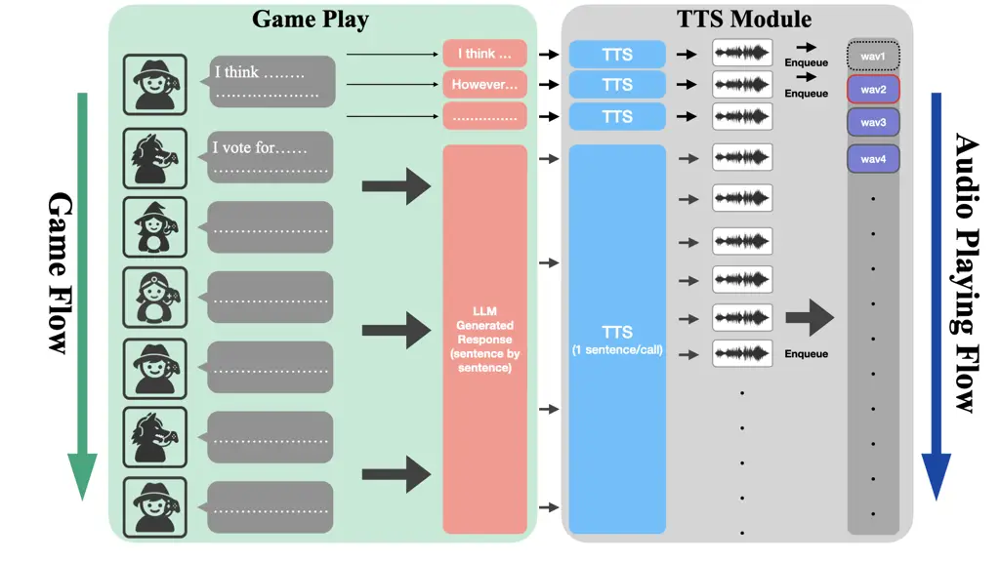

# Verbal Werewolf: Engage Users with Verbalized Agentic Werewolf Game Framework

Qihui Fan    Wenbo Li    Enfu Nan    Yixiao Chen    Lei Lu    Pu Zhao   
Yanzhi Wang Affiliation: Northeastern University Affiliation: Boston, MA
Affiliation: {fan.qih, li.wenbo6, nan.e, chen.yixia, lu.lei1, p.zhao,
yanz.wang}@northeastern.edu

###### Abstract

The growing popularity of social deduction games has created an
increasing need for intelligent frameworks where humans can collaborate
with AI agents, particularly in post-pandemic contexts with heightened
psychological and social pressures. Social deduction games like
Werewolf, traditionally played through verbal communication, present an
ideal application for Large Language Models (LLMs) given their advanced
reasoning and conversational capabilities. Prior studies have shown that
LLMs can outperform humans in Werewolf games, but their reliance on
external modules introduces latency that left their contribution in
academic domain only, and omit such game should be user-facing. We
propose Verbal Werewolf, a novel LLM-based Werewolf game system that
optimizes two parallel pipelines: gameplay powered by state-of-the-art
LLMs and a fine-tuned Text-to-Speech (TTS) module that brings text
output to life. Our system operates in near real-time without external
decision-making modules, leveraging the enhanced reasoning capabilities
of modern LLMs like DeepSeek V3 to create a more engaging and
anthropomorphic gaming experience that significantly improves user
engagement compared to existing text-only frameworks.

   

|     |
| --- |
|     |

*K*eywords Social Deduction Game $`\cdot`$ AI for Games $`\cdot`$
Human-AI Interaction $`\cdot`$ Human-Computer Interaction

## 1 Introduction

There is an increasing need for intelligent social deduction game
frameworks which one or few people can play with collaboration with AI
due to the post-pandemic psychological pressure and heavier social
burden. Social deduction games, Werewolf as one of the most typical
ones, are often played in forms of verbal communication, which we argue
the large language models(LLMs) should be excelled at\[1\]. Previous
works have already confirmed that LLMs have certain probability to
defeat human players in the werewolf games \[2\] with additional model
for estimating the probability of winning the game. Other further works
similarly have also been shown that high-performance LLMs with external
modules for strategy optimizations can play the werewolf games
strategically without fine-tuning the language models \[3, 4\]. However,
these related works are heavily dependent on external modules for
decision-makings and often demonstrate the game in simple language only.
In addition, external modules often bring excessive latency, and disable
the anthropopathic type-writing flush response that only constrains
their framework at an academic level, overlooked the low-delay and
anthropopathic nature as an engaging social deduction game.

In light of this, we propose Verbal Werewolf to further explore a more
engaging werewolf game framework by optimizing two pipelines, one for
the gameplay powered by the most state-of-the-art LLMs, and the other
one for our fine-tuned Text to Speech(TTS) module that brings plain text
output to live. We demonstrate the Verbal Werewolf progresses both
pipeline in parallel and in nearly real-time, improving the user
experience drastically.

## 2 Implementation

We demonstrate the Verbal Werewolf framework in mainly two pipelines:
Game Play that manages the game flow, such roles assignments, LLM
queries, and TTS Module that transforms sentence-by-sentence text output
to designated audio outputs and manage the aduio play flow.

Figure 1: An overview of parallel processing design of LLM and TTS audio
generations.

### 2.1 Game Play

Game Flow We present the werewolf game in the simplest setting\[5\]
involving only werewolf, villager, seer, and witch roles. The Game Play
mainly manages the whole game flow by initially assign different roles
randomly, and we mainly divide one round of play into daytime, when they
should reason then vote who are more suspicious being werewolves, and
nighttime, when different players executes their assigned actions per
their roles in the sequence of {werewolves-seer-witch} We formally
define their action space as follows:

|          |                 |                   |                |
| -------- | --------------- | ----------------- | -------------- |
| Role     | Daytime Actions | Nighttime Actions | Props          |
| Villager | reason, vote    |                   |                |
| Werewolf |                 | kill              |                |
| Seer     |                 | reveal            |                |
| Witch    |                 | night             | cures, poisons |

In more detail, werewolves each round can kill a specific active player
when this action is called, with the system selecting a player from
their available choices if they differ. The Seer is able to reveal the
assigned role of a particular player each round. The Witch can
additionally cure the player that werewolves attempt to eliminate each
round if the witch still possesses cures, or poison a particular player
of their choice if the witch still has poisons available — all within
one concatenated night action.

AI Players LLM-powered agent systems excel at various aspects, from
dynamically following and executing instructions to interacting with
environments that require solid reasoning capabilities. Their
performance relies on the capabilities of the integrated LLMs. We assume
that nowadays LLMs are capable of playing the Werewolf or a similar form
of game without additional complex design such as Chain-of-Thoughts
(CoT) and ReAct prompting, or external experience pool\[6\].

We integrated DeepSeek V3, one of the most state-of-the-art LLMs, as it
offers a practical balance that provides strong reasoning capabilities,
one is distilled from the reasoning-focused DeepSeek R1, while avoiding
the longer response times of DeepSeek R1 and the higher costs of OpenAI
models. We have also integrated portals for other LLMs available from
HuggingFace, llama.cpp, and OpenAI to facilitate future experiments and
development.

Our approach is straightforward: we prompt the LLM by providing
information about the players to be role-played, a description of the
action space, guidance on reply format, and minimal guidance about the
game rules.

### 2.2 Text-to-Speech(TTS) Module

We fine-tuned GPT-SoVITS \[7\], a state-of-the-art TTS model that
already excels at fast one-shot voice cloning from brief audio samples
(5-10 seconds) with universal weights, by creating specialized model
weights for each of 8 celebrities. While the original model provides
excellent general-purpose voice synthesis, our fine-tuned versions
achieve superior fidelity in reproducing each celebrity’s unique vocal
characteristics, bringing their familiar voices into the game with
enhanced quality and improving the overall player experience.

Combining Game Flow and TTS modules, our agentic system employs parallel
processing threads to achieve real-time voice interaction. As the Game
Play generates AI player responses token by token, the TTS thread
concurrently processes every half sentence, synthesizing audio and
queuing playback. This streaming architecture eliminates traditional
wait-for-completion bottlenecks brought by both LLMs and TTS models,
allowing AI players to begin speaking while still formulating their
complete responses, creating natural conversational flow that mirrors
human gameplay dynamics.

## 3 Qualitative Analysis

#### Overall Latency

During qualitative testing, we observed minor latency only at the
beginning of the discussion phase, typically in the first few sentences
spoken by the first player to respond. This slight delay stems from the
initial overhead of triggering TTS generation and starting audio
playback. However, once initialized, the system runs smoothly, as the
audio playback duration generally exceeds the time required for both LLM
generation and TTS synthesis. This allows subsequent outputs to be
processed in parallel and queued efficiently, resulting in consistently
low-latency, natural interactions for the remainder of the game flow.

#### AI Players’ Strategies and Performance

Across qualitative evaluations, our Werewolf game framework reveals that
advanced LLM role-play exhibit strong autonomous reasoning and strategic
gameplay, even without reliance on external tools. These agents
demonstrate role-consistent behaviors, such as cautious information
disclosure by Seers, resource-aware decision-making by Witches, and
persuasive deception by Werewolves, indicating an emergent understanding
of social deduction dynamics.

Notably, these models often take initiative in guiding discussions,
shift suspicion based on evolving context, and modulate their language
style to influence or evade others. Such behaviors suggest not only role
awareness but also a degree of leadership and social alignment typically
associated with experienced human players.

In contrast, when running less capable LLMs (e.g., smaller-scale or
quantized versions), we observe a significant drop in coherence and
strategic consistency. These models tend to produce repetitive, generic
statements, fail to adapt to game state changes, and often overlook
their special abilities entirely. Their discussions lack depth, and they
rarely sustain deception or form persuasive arguments.

These findings reinforce that high-capacity LLMs can serve as
autonomous, strategic agents in multi-role, socially interactive
environments, demonstrating emergent leadership, coordination, and
deception purely through language modeling.

#### API Caching

During our qualitative benchmarks, we observed that interrupting the
game flow, specifically during the first night phase and immediately
starting a new game could result in the API returning text generated for
the previous session. This caused inconsistencies with the current
game’s context. Initially, we suspected the cause is from improper
handling of game logs or prompt construction. However, targeted testing
with smaller local LLMs (e.g., QWen 1.5B Quant 8) failed to reproduce
the issue, suggesting the problem was not on the framework side. We
ultimately attributed this behavior to the API server, which, although
not documented, appears to compare newly queried prompts with prior ones
and return cached generations if the similarity is deemed sufficiently
high.

#### AI Hallucination

We also observed hallucinations in the more recent version of
DeepSeek-V3-0324, where the model role-played game characters by
associating them with real-world public figures and made assumptions
based on those identities. For instance, the model might consider Jack
Ma suspicious solely because he is a prominent businessman, or deem
Donald Trump untrustworthy due to his political background, while
portraying Jay Chou as less suspicious because of his reputation in the
music industry. This behavior persisted even after we carefully tuned
the prompts to mitigate such biases. However, the issue occurred less
frequently when using an earlier version of the model (DeepSeek-V3-1224)
and other LLMs such as ChatGPT 4o even when without the specific prompt
tuning.

## 4 Limitations

While our system demonstrates promising autonomous behavior in
LLM-driven Werewolf gameplay, several limitations remain. First, it is
not a fully agentic architecture, since our design does not incorporate
external tools such as retrieval-augmented generation (RAG), persistent
memory, or structured knowledge bases. All reasoning is conducted via
in-context learning, which makes the system inherently constrained by
the context length limitations of different LLMs. As the game
progresses, earlier dialogue and decisions may be truncated, potentially
impacting consistency, recall, and long-term strategic reasoning.

Second, the current implementation supports only a subset of standard
Werewolf roles (e.g., Seer, Witch, Werewolf, Villager). Expanding the
system to include more complex roles (e.g., Hunter, Cupid, Guard) would
introduce deeper inter-dependencies and increase the difficulty of role
alignment, offering a stronger test of agent adaptability.

Third, if our quantitative evaluations primarily rely on win/loss
outcomes, such metric can introduce bias. A team victory may reflect the
opposing side’s failure rather than superior strategic behavior. Future
evaluations should incorporate finer-grained behavioral metrics such as
reasoning depth, influence in discussion, and success in deception or
alignment as a valid and comprehensive quantitative evaluations.

## 5 Conclusion

Our framework demonstrates that large language models with strong
reasoning capabilities can autonomously and effectively participate in
the Werewolf game, exhibiting strategic thinking, role-based adaptation,
and socially coherent dialogue without the need for external modules or
structured planning systems. By integrating a fine-tuned text-to-speech
(TTS) module and leveraging a parallel processing design, the system
delivers low-latency, natural audio output that enhances immersion and
real-time interaction. These components together create a compelling and
engaging game experience, highlighting the potential of modern LLMs not
only as conversational agents but as active participants in complex,
multi-agent social environments.

## References

- \[1\] Wenlong Huang, Pieter Abbeel, Deepak Pathak, and Igor Mordatch.
  Language models as zero-shot planners: Extracting actionable knowledge
  for embodied agents. In International conference on machine learning,
  pages 9118–9147. PMLR, 2022.
- \[2\] Hisaichi Shibata, Soichiro Miki, and Yuta Nakamura. Playing the
  werewolf game with artificial intelligence for language
  understanding, 2023.
- \[3\] Yuzhuang Xu, Shuo Wang, Peng Li, Fuwen Luo, Xiaolong Wang,
  Weidong Liu, and Yang Liu. Exploring large language models for
  communication games: An empirical study on werewolf. arXiv preprint
  arXiv:2309.04658, 2023.
- \[4\] Shuang Wu, Liwen Zhu, Tao Yang, Shiwei Xu, Qiang Fu, Yang Wei,
  and Haobo Fu. Enhance reasoning for large language models in the game
  werewolf, 2024.
- \[5\] Zelai Xu, Chao Yu, Fei Fang, Yu Wang, and Yi Wu. Language agents
  with reinforcement learning for strategic play in the werewolf game.
  arXiv preprint arXiv:2310.18940, 2023.
- \[6\] Shenzhi Wang, Chang Liu, Zilong Zheng, Siyuan Qi, Shuo Chen,
  Qisen Yang, Andrew Zhao, Chaofei Wang, Shiji Song, and Gao Huang.
  Avalon’s game of thoughts: Battle against deception through recursive
  contemplation. arXiv preprint arXiv:2310.01320, 2023.
- \[7\] RVC-Boss. Gpt-sovits: Few-shot voice cloning and text-to-speech
  synthesis.
  [https://github.com/RVC-Boss/GPT-SoVITS](https://github.com/RVC-Boss/GPT-SoVITS), 2024.
  Accessed: 2025-05-10.
- \[8\] DeepSeek-AI, Aixin Liu, Bei Feng, Bing Xue, Bingxuan Wang,
  Bochao Wu, Chengda Lu, Chenggang Zhao, Chengqi Deng, Chenyu Zhang,
  Chong Ruan, Damai Dai, Daya Guo, Dejian Yang, Deli Chen, Dongjie Ji,
  Erhang Li, Fangyun Lin, Fucong Dai, Fuli Luo, Guangbo Hao, Guanting
  Chen, Guowei Li, H. Zhang, Han Bao, Hanwei Xu, Haocheng Wang, Haowei
  Zhang, Honghui Ding, Huajian Xin, Huazuo Gao, Hui Li, Hui Qu, J. L.
  Cai, Jian Liang, Jianzhong Guo, Jiaqi Ni, Jiashi Li, Jiawei Wang, Jin
  Chen, Jingchang Chen, Jingyang Yuan, Junjie Qiu, Junlong Li, Junxiao
  Song, Kai Dong, Kai Hu, Kaige Gao, Kang Guan, Kexin Huang, Kuai Yu,
  Lean Wang, Lecong Zhang, Lei Xu, Leyi Xia, Liang Zhao, Litong Wang,
  Liyue Zhang, Meng Li, Miaojun Wang, Mingchuan Zhang, Minghua Zhang,
  Minghui Tang, Mingming Li, Ning Tian, Panpan Huang, Peiyi Wang, Peng
  Zhang, Qiancheng Wang, Qihao Zhu, Qinyu Chen, Qiushi Du, R. J. Chen,
  R. L. Jin, Ruiqi Ge, Ruisong Zhang, Ruizhe Pan, Runji Wang, Runxin Xu,
  Ruoyu Zhang, Ruyi Chen, S. S. Li, Shanghao Lu, Shangyan Zhou,
  Shanhuang Chen, Shaoqing Wu, Shengfeng Ye, Shengfeng Ye, Shirong Ma,
  Shiyu Wang, Shuang Zhou, Shuiping Yu, Shunfeng Zhou, Shuting Pan,
  T. Wang, Tao Yun, Tian Pei, Tianyu Sun, W. L. Xiao, Wangding Zeng,
  Wanjia Zhao, Wei An, Wen Liu, Wenfeng Liang, Wenjun Gao, Wenqin Yu,
  Wentao Zhang, X. Q. Li, Xiangyue Jin, Xianzu Wang, Xiao Bi, Xiaodong
  Liu, Xiaohan Wang, Xiaojin Shen, Xiaokang Chen, Xiaokang Zhang,
  Xiaosha Chen, Xiaotao Nie, Xiaowen Sun, Xiaoxiang Wang, Xin Cheng, Xin
  Liu, Xin Xie, Xingchao Liu, Xingkai Yu, Xinnan Song, Xinxia Shan,
  Xinyi Zhou, Xinyu Yang, Xinyuan Li, Xuecheng Su, Xuheng Lin, Y. K. Li,
  Y. Q. Wang, Y. X. Wei, Y. X. Zhu, Yang Zhang, Yanhong Xu, Yanhong Xu,
  Yanping Huang, Yao Li, Yao Zhao, Yaofeng Sun, Yaohui Li, Yaohui Wang,
  Yi Yu, Yi Zheng, Yichao Zhang, Yifan Shi, Yiliang Xiong, Ying He, Ying
  Tang, Yishi Piao, Yisong Wang, Yixuan Tan, Yiyang Ma, Yiyuan Liu,
  Yongqiang Guo, Yu Wu, Yuan Ou, Yuchen Zhu, Yuduan Wang, Yue Gong,
  Yuheng Zou, Yujia He, Yukun Zha, Yunfan Xiong, Yunxian Ma, Yuting Yan,
  Yuxiang Luo, Yuxiang You, Yuxuan Liu, Yuyang Zhou, Z. F. Wu, Z. Z.
  Ren, Zehui Ren, Zhangli Sha, Zhe Fu, Zhean Xu, Zhen Huang, Zhen Zhang,
  Zhenda Xie, Zhengyan Zhang, Zhewen Hao, Zhibin Gou, Zhicheng Ma,
  Zhigang Yan, Zhihong Shao, Zhipeng Xu, Zhiyu Wu, Zhongyu Zhang,
  Zhuoshu Li, Zihui Gu, Zijia Zhu, Zijun Liu, Zilin Li, Ziwei Xie,
  Ziyang Song, Ziyi Gao, and Zizheng Pan. Deepseek-v3 technical
  report, 2025.

## Supplementary Materials

This section provides additional implementation details of the Verbal
Werewolf, the variables provided to large language model (LLM) agents
for role-play, and the prompt design used in different game phases.

### Game Flow Implementation

Below algorithm describes the procedural logic of the Werewolf game,
including initialization, role-specific actions during the night phase,
and decision-making during the day phase. This step-by-step
representation ensures that all players’ actions, role constraints, and
phase transitions are systematically handled.

1: Class Game

2:  Method init(self, num_AI, num_Human)

3:   Set $`self.\text{game\_status}\leftarrow\text{True}`$

4:   Initialize
$`self.\text{players}\leftarrow\texttt{self.initialize\_players()}`$

5:   Initialize $`self.\text{seer\_dict}\leftarrow\{\}`$
$`\triangleright`$ Seer revealed roles

6:   Set $`self.\text{num\_cure}\leftarrow 1`$,
$`self.\text{num\_poison}\leftarrow 1`$ $`\triangleright`$ Default
number of cures/poisons

7:   Initialize logs: $`self.\text{log}\leftarrow\{\}`$,
$`self.\text{werewolf\_log}\leftarrow\{\}`$

8:   …$`\triangleright`$ Other game setup steps

9:  Method judge(self) $`\triangleright`$ Check win/lose conditions

10: Initialize $`game\leftarrow\texttt{Game}(num\_AI,num\_Human)`$

11: Initialize $`round\leftarrow 1`$

12: while $`game.\text{game\_status}=\texttt{True}`$ do

13:   \# Night Phase: Werewolves, Seer, and Witch take actions

14:   for each werewolf in game.get_role(’Werewolf’) do

15:    if werewolf.status = ’Active’ then

16:      Call $`\texttt{werewolf.kill}(game)`$

17:    end if

18:   end for

19:   if seer.status = ’Active’ then

20:    Call $`\texttt{seer.reveal}(game)`$

21:   end if

22:   if witch.status = ’Active’ then

23:    Call $`\texttt{witch.night}(game)`$

24:   end if

25:   Execute night actions:
$`\texttt{game.execute}(werewolf\_target,witch\_action)`$

26:   \# Day Phase: Judge, Discussion, and Voting

27:   Call $`game.\texttt{judge()}`$

28:   if $`game.\text{status}=\texttt{False}`$ then return

29:   end if

30:   for each player in game.get_active_players() do

31:    Call $`\texttt{player.reason}(game)`$

32:   end for

33:   for each player in game.get_active_players() do

34:    Call $`\texttt{player.vote}(game)`$

35:   end for

36:   Call $`game.\texttt{process\_voting(votes)}`$

37:   Call $`game.\texttt{judge()}`$

38:   if $`game.\text{status}=\texttt{False}`$ then return

39:   end if

40:   $`round\leftarrow round+1`$ $`\triangleright`$ Proceed to next
round

41: end while

Werewolf Game Flow

### Variables for LLM Role-play

Table 1 summarizes the key in-game variables accessible to LLM agents.
Access to each variable is restricted based on the player’s role that
enables role-specific reasoning and alignment with real-world game
constraints.

| Variable       | Description                                                         | Visibility    |
| -------------- | ------------------------------------------------------------------- | ------------- |
| active_players | List of all currently active players in the game.                   | All roles     |
| werewolves     | Identities of all players assigned the Werewolf role.               | Werewolf only |
| seer_dict      | Seer’s private revelations of other players’ roles.                 | Seer only     |
| werewolf_log   | History of Werewolf kill actions from previous nights.              | Werewolf only |
| witch_log      | History of the Witch’s actions during the night phase.              | Witch only    |
| log            | Public game history including eliminations, votes, and discussions. | All roles     |

Table 1: Key in-game variables accessible to LLM agents, with
role-specific visibility constraints.

### Prompt Design for LLM Agents

Below illustrates an example prompt used in the discussion phase. This
minimalistic design avoids complex prompting strategies such as CoT or
ReAct, relying on the base reasoning capabilities of DeepSeek V3 \[8\].
The prompt provides role-specific information, available actions, and
conversational history.

1: prompt = \[

2:  {"role": "system", "content": "You are a \*\*Werewolf\*\* in a
Werewolf Game."},

3:  {"role": "user", "content": (}

4:   f"You are \*\*{self.name}\*\*. Your role is to hide your identity
as the Werewolf while reasoning about events and dialogues. "

5:   f"You know the following players are also Werewolves: {’,
’.join(werewolves)}. Work with them without revealing identities. "

6:   f"You are in round {round}. "

7:   + conversation_info

8:   f"Previous Werewolf kills: {werewolf_log}. "

9:   "Provide concise reasoning to mislead others while ensuring the
Werewolves win, without revealing your identity."

10:  )

11: \]

Example Prompt for Discussion Phase
