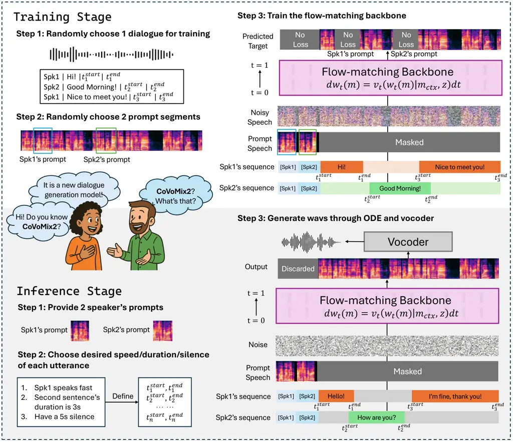
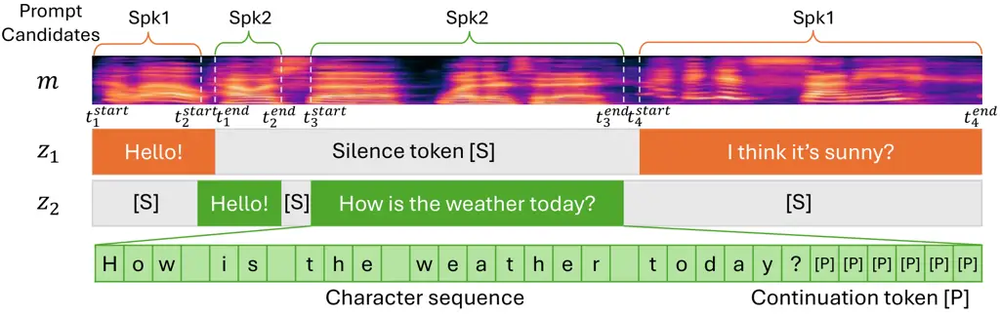
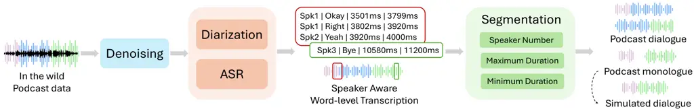
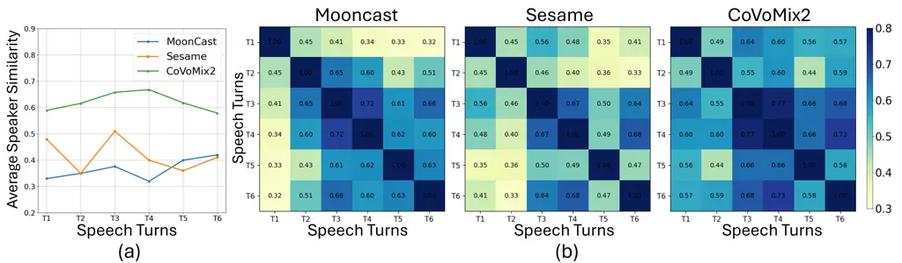
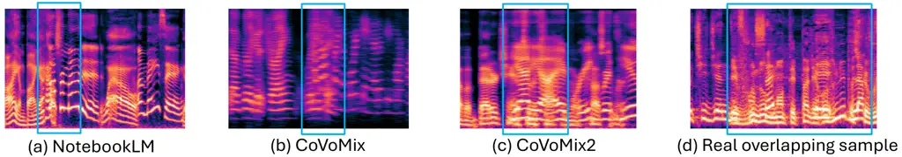
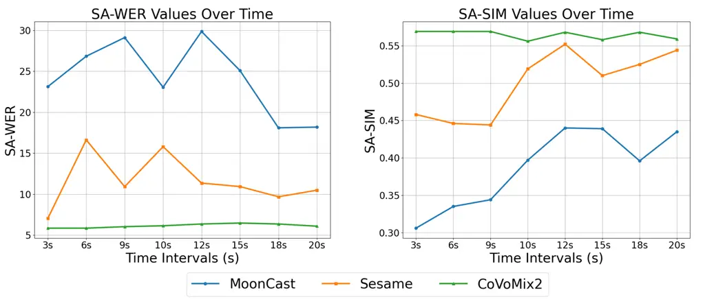

# CoVoMix2: Advancing Zero-Shot Dialogue Generation with Fully Non-Autoregressive Flow Matching

Leying Zhang ^(†)^(†)thanks: Work done during an internship at Microsoft
Azure AI. zhangleying@sjtu.edu.cn Affiliation: Shanghai Jiao Tong
University, China Affiliation: Microsoft, USA    Yao Qian
^(†)^(†)thanks: Correspondence: yaoqian@microsoft.com
Affiliation: Microsoft, USA    Xiaofei Wang Affiliation: Microsoft, USA
   Manthan Thakker Affiliation: Microsoft, USA    Dongmei Wang
Affiliation: Microsoft, USA    Jianwei Yu Affiliation: Microsoft, USA   
Haibin Wu Affiliation: Microsoft, USA    Yuxuan Hu
Affiliation: Microsoft, USA    Jinyu Li Affiliation: Microsoft, USA   
Yanmin Qian Affiliation: Shanghai Jiao Tong University, China    Sheng
Zhao Affiliation: Microsoft, USA

###### Abstract

Generating natural-sounding, multi-speaker dialogue is crucial for
applications such as podcast creation, virtual agents, and multimedia
content generation. However, existing systems struggle to maintain
speaker consistency, model overlapping speech, and synthesize coherent
conversations efficiently. In this paper, we introduce CoVoMix2, a fully
non-autoregressive framework for zero-shot multi-talker dialogue
generation. CoVoMix2 directly predicts mel-spectrograms from
multi-stream transcriptions using a flow-matching-based generative
model, eliminating the reliance on intermediate token representations.
To better capture realistic conversational dynamics, we propose
transcription-level speaker disentanglement, sentence-level alignment,
and prompt-level random masking strategies. Our approach achieves
state-of-the-art performance, outperforming strong baselines like
MoonCast and Sesame in speech quality, speaker consistency, and
inference speed. Notably, CoVoMix2 operates without requiring
transcriptions for the prompt and supports controllable dialogue
generation, including overlapping speech and precise timing control,
demonstrating strong generalizability to real-world speech generation
scenarios. Audio samples are available ¹¹ 1
[https://www.microsoft.com/en-us/research/project/covomix/covomix2/](https://www.microsoft.com/en-us/research/project/covomix/covomix2/).



Figure 1: The overview of the proposed CoVoMix2 framework

## 1 Introduction

The field of speech synthesis has witnessed remarkable progress in
recent years, particularly in zero-shot text-to-speech (TTS) systems
that can generate high-quality, natural-sounding speech in voices not
seen during training \[1, 2, 3, 4, 5, 6, 7, 8\]. These advancements have
enabled applications such as personalized virtual assistants, audiobook
narration, and interactive voice response systems. However, extending
these capabilities to multi-talker dialogue generation, where multiple
speakers engage in natural, dynamic, multi-turn conversations, remains a
significant challenge.

Conventional approach to synthesize a dialogue is by generating multiple
monologues sequentially and concatenating them, which often results in
unnatural interactions and poor speaker coordinations \[9, 10, 11, 12\].
Recent efforts have shifted towards generating the entire dialogues in a
more integrated manner. CoVoMix \[11\] was the first attempt to employ a
multi-stream autoregressive (AR) text-to-semantic model and a
non-autoregressive (NAR) acoustic model to synthesize mixed
mel-spectrograms for zero-shot dialogue generation. NotebookLM \[13,
14\] leverages hierarchical transformer to produce a stream of audio
tokens autoregressively, which are decoded back to a dialogue waveform.
MoonCast \[12\] utilizes long-context text-to-semantic model to support
coherent dialogue generation. These systems typically adopt a two-stage
AR+NAR pipeline involving intermediate representations, such as semantic
or audio tokens.

Despite these advances, current systems face several key limitations.
Firstly, dependence on AR components and intermediate representations
introduces considerable complexity and slow inference speed. Secondly,
the lack of fine-grained control over prosodic features, such as
speaking rate, utterance duration, overlap, and pauses, often results in
unnatural and less coherent dialogue flow. Thirdly, speaker identity
inconsistencies, where the wrong voice is occasionally assigned to an
utterance, undermine perceived authenticity. Lastly, current
methods \[9, 11, 15, 16\] are hindered by their reliance on stereo audio
for training and paired audio-text prompts for inference, often
necessitating external ASR models and limiting scalability.

To address these challenges, we propose CoVoMix2 (Conversational Voice
Mixture Generation), a novel framework for zero-shot multi-talker
dialogue generation based on a fully NAR flow-matching approach. Our
main contributions are summarized as follows:

1.  1.  We exploit a fully non-autoregressive framework for zero-shot
        multi-talker dialogue generation. It is an end-to-end modeling from
        the interleaved character sequence of two speakers to their mixed
        mel-spectrograms, with intrinsic alignment between characters and
        mel-spectrogram frames.
2.  2.  We propose a transcription-level disentanglement strategy in which
        each speaker’s transcriptions are provided as separate streams,
        enabling potential control over the timing of generated overlapping
        speech.
3.  3.  Additionally, we introduce sentence-level alignment and prompt-level
        masking strategies that facilitate accurate speaker identity
        assignment and eliminate the need for intermediate representations
        or transcriptions of speaker prompts during inference.
4.  4.  Extensive experiments show that CoVoMix2 outperforms strong
        baselines, achieving state-of-the-art (SOTA) performance among
        open-source checkpoints, while requiring significantly less training
        data and delivering faster inference speed.

## 2 Related Work

### 2.1 Flow-matching based Speech Synthesis

Flow-matching-based speech synthesis has emerged as a promising approach
in the field of text-to-speech (TTS) systems \[17, 18\]. It models
speech generation as a continuous transformation from simple
distributions to complex speech representations, enabling fast, parallel
inference and improved controllability compared to traditional AR
models \[6, 19\].

Several recent models \[20, 21, 22, 23, 24, 25\] have demonstrated the
effectiveness of flow matching across tasks such as zero-shot TTS,
speech inpainting, and voice conversion. Notably, E2-TTS \[26\] and
F5-TTS \[27\] remove the need for phoneme alignment or explicit duration
modeling, resulting in simpler pipelines with high-quality output. These
advancements establish flow-matching as a promising direction for
building scalable and efficient TTS systems.

### 2.2 Multi-talker Dialogue Generation

Multi-talker dialogue generation aims to synthesize entire multi-turn
conversations between multiple speakers, where each utterance must be
coherent, contextually relevant, and speaker-specific. This task is
significantly more complex than single-speaker synthesis due to the need
for speaker turn-taking, identity preservation, and interaction
dynamics.

Early approaches, such as CoVoMix \[11\], introduced a multi-stream AR
text-to-semantic model combined with a NAR acoustic decoder to generate
dialogues in a zero-shot manner. Other systems like Soundstorm \[14\]
and NotebookLM \[13\] incorporate both AR and NAR components to model
hierarchical audio tokens or contextual embeddings. Further, works such
as Chats\[16\] and SLIDE\[15\], built upon the dGSLM framework \[9\],
leverage dual-tower transformer architectures to capture interleaved
speaker information. Encoder-decoder models like Dia 1.6B\[28\] and
Parakeet\[29\] directly predict audio codec tokens, which are then
decoded into waveforms. MoonCast \[12\] addresses long-context dialogue
generation using a transformer-based language model, concatenating
acoustic prompts at each turn to manage speaker changes.

While these methods have advanced the field by improving naturalness and
speaker consistency, most rely on AR decoding or hybrid AR/NAR
architectures. These designs introduce several drawbacks: slow inference
due to step-by-step generation, reliance on complex intermediate
representations, limited controllability over conversational dynamics
such as overlap, pauses, or timing, and dependence on the paired
text-audio speaker prompts.

### 2.3 Conversational Speech Synthesis

Conversational Speech Synthesis (CSS) focuses on generating individual
utterances that are contextually appropriate within a dialogue,
typically from a single speaker. Unlike full dialogue generation, CSS
produces each utterance one-by-one, conditioned on previous dialogue
history, rather than synthesizing an entire conversation
simultaneously \[30, 31, 32, 33\].

For instance, GPTTalker \[34\] models multimodal dialogue context by
converting history into discrete tokens processed by a language model to
generate expressive, context-aware responses. Sesame \[10\] adopts two
AR transformers \[35\]: a multimodal transformer backbone processes text
and audio tokens, followed by a audio decoder transformer that
reconstructs high-quality speech. Although Sesame supports
dialogue-style synthesis, it fundamentally generates each speaker’s
utterance sequentially given the previous dialogue context, rather than
modeling simultaneous multi-speaker interaction.

While CSS methods achieve high expressiveness and coherence for
individual utterances, they fall short in handling the broader structure
and dynamics of real-time, overlapping multi-speaker dialogue.

Our proposed CoVoMix2 differs fundamentally from both traditional
multi-talker dialogue generation systems and CSS approaches. Unlike
prior work that relies on AR or hybrid pipelines, or CSS systems that
synthesize one speaker’s utterance at a time, CoVoMix2 enables fully
NAR, simultaneous generation of multi-speaker dialogues. It directly
predicts mel-spectrograms from disentangled multi-stream transcriptions,
allowing efficient, accurate, and controllable synthesis with better
support for real conversational dynamics such as overlapping speech and
natural pauses.

## 3 CoVoMix2

Zero-shot dialogue generation aims to synthesize multi-speaker
conversations in voices not encountered during training. We propose
CoVoMix2, a fully NAR zero-shot dialogue generation model that directly
generates mel-spectrograms from raw dialogue transcriptions. As shown in
Figure 1, CoVoMix2 operates without intermediate representations such as
phonemes or audio tokens, enabling efficient and scalable zero-shot
dialogue generation.

Let the training dataset be denoted as $`D=\{x,y\}`$, where $`x`$ is a
dialogue waveform containing utterances from two speakers, and
$`y=[y_{1},...,y_{n}]`$ is the corresponding transcription. Each
transcription segment $`y_{i}`$ is annotated with the content $`T_{i}`$,
speaker label $`s_{i}`$, the start and end time
$`t_{i}^{start},t_{i}^{end}`$. The corresponding mel-spectrogram of
$`x`$ is noted as $`m`$. To support simultaneous, zero-shot,
multi-speaker dialogue generation, we introduce three key design
strategies in the following sections, yielding a pair of input text
sequences $`z=[z_{1},z_{2}]`$, each representing a separate speaker
stream, and the acoustic prompts $`m_{ctx}`$ of the target speakers.

### 3.1 Transcription-Level Speaker Disentanglement

Natural speaker switching and overlapping speech are essential features
in realistic dialogue generation. Prior work often inserts
speaker-change tokens (e.g., \[spkchange\]) to indicate a switch between
speakers \[11, 12, 13, 14\]. However, single-stream representations
entangle multiple speakers’ utterances into a flat sequence, making it
difficult for the model to explicitly capture speaker-specific timing,
and overlap. Moreover, this design creates ambiguity in conditioning,
particularly when aligning acoustic prompts to textual content. In a
shared text stream, the model must disentangle which portions belong to
which speaker and match them to the correct prompt, increasing the risk
of identity confusion.

Instead, as shown in Figure 2, we propose a more structured approach by
disentangling the transcript into multiple parallel streams, one per
speaker. Each text stream $`z_{i}`$ contains two types of content:
Active speech segments, defined by their respective time intervals
$`[t_{i}^{start},t_{i}^{end}]`$. and Silence intervals, denoted using a
special token $`[S]`$. These streams enable precise temporal control
over individual speaker utterances, including overlapping and silence.
This design grants fine-grained control over the interaction structure,
improving naturalness and flexibility.



Figure 2: Example of the input data organization

### 3.2 Sentence-Level Alignment

High-quality alignment at the phoneme level is often unavailable in
real-world data \[11\]. Likewise, modeling intermediate representations
(e.g., codec tokens) is resource-intensive and requires large-scale
training data. As an alternative, inspired by recent models \[26, 27\],
we design the sentence-level alignment that is suitable for both
monologue and dialogue scenarios.

As indicated in Figure 2, each active speech segment in the speaker
stream is converted into a sequence of characters (including upper and
lower cases letters and punctuation). For the rest of the active speech
segment, we add a special continuation token $`[P]`$ for padding. These
sequences, temporally anchored by the corresponding start and end times,
serve as the text input for the mel-spectrogram prediction. The model
learns the intrinsic alignment between characters and mel-spectrogram
frames and synthesizes each utterance within its designated time range
without explicit duration prediction.

### 3.3 Prompt-Level Random Masking

Accurate voice conditioning is critical to avoid speaker confusion.
Previous approaches either maintained parallel conditioning
streams \[11, 15\], used concatenated speaker prompt for
continuation \[14\] or appended speaker prompts at each dialogue turn to
guide speech synthesis \[12\]. We introduce a prompt-level random
masking strategy to ensure robust and diverse speaker conditioning.

As shown in Figure 1 and 2, for each training sample, we first find all
the available monologue segments for each speaker as the prompt
candidates. We then randomly select a prompt segment from the
candidates. The chosen prompts are concatenated at the very beginning
with the masked training sample using a separator token to construct the
prompt sequence $`m_{ctx}`$. Moreover, in the text stream $`z`$, we use
special tokens $`[Spk1]`$ and $`[Spk2]`$ as indicators (not text tokens)
to replace the transcription of the prompt, distinguishing which
segments belong to each speaker.

Furthermore, to prevent prompt leakage, where the model copies the
prompt directly into the output, we exclude the prompt region from the
loss computation. This encourages the model to generalize voice
characteristics rather than memorize the prompt audio.

### 3.4 Flow-Matching-Based Mel Spectrogram Generation

Our model employs Flow Matching (FM), a simulation-free training method
for Continuous Normalizing Flows (CNFs) \[18, 36\]. It is a class of
generative models that learn to transform a simple distribution (e.g.,
Gaussian noise) into a complex data distribution (e.g.,
mel-spectrograms) through a continuous mapping. This mapping is defined
by solving an Ordinary Differential Equation (ODE).

Specifically, the model learns the distribution $`q(m|z,m_{ctx})`$ where
$`m`$ is the target mel-spectrogram, $`z`$ is the speaker-aware text
streams and $`m_{ctx}`$ is the acousic prompts. At training time, a
noise sample $`m_{0}`$ is drawn from a standard Gaussian distribution.
The training objective is to minimize the L2 distance between the
predicted and true flow, given by Eq.1, where $`v_{t}(\cdot)`$ is the
model’s predicted vector field at time $`t\in[0,1]`$,
$`w=(1-(1-\sigma_{min})t)m_{0}+tm`$, and $`\sigma_{min}`$ is a
hyper-parameter to control the deviation of flow-matching. Notably, the
loss is not computed on segments that originate from the prompt region,
which is excluded using a masking function $`M(\cdot)`$.

```math
\mathcal{L}=\mathbb{E}\|M((m-(1-\sigma_{min})m_{0})-v_{t}(w,m_{ctx},z;\theta))\|^{2} \tag{1}
```

We also apply Classifier-Free Guidance (CFG) \[37, 21\] to improve
sample quality by interpolating between conditioned and unconditioned
flows. During training, the acoustic prompt $`m_{ctx}`$ and text
sequences $`z`$ are dropped with $`p_{uncond}`$.

During inference, the CFG vector field becomes Eq.2, with $`\alpha`$
controlling the strength of guidance. Durations for each utterance are
computed based on syllable counts and a predefined speaking rate,
allowing the construction of the input text streams $`z`$. A
mel-spectrogram is then generated by sampling noise $`m_{0}`$ and
solving the ODE defined by the flow field.

```math
\tilde{v}_{t}(w,m_{ctx},z;\theta)=(1+\alpha)v_{t}(w,m_{ctx},z;\theta)-\alpha\tilde{v}_{t}(w;\theta) \tag{2}
```

### 3.5 Training Strategy: Curriculum Learning and Data Mixing

To enable the model with dialogue generation capability efficiently, we
adopt a two-stage curriculum learning strategy during training. First,
the model is pretrained on high-quality monologue datasets, which helps
it learn accurate pronunciation and acoustic modeling. In contrast,
directly training on multi-speaker data causes degraded output quality,
including mispronunciations and unintelligible speech. Then, in the
second stage, we train the model on multi-speaker dialogue datasets to
enhance the dialogue generation capability.

To improve robustness and generalization, built on the large scale of
monologue dataset, we design the data mixing strategy, using various
sources of data during the second stage training. Specifically, we mix
data from several sources, including ASR-transcribed podcast dialogues,
audiobook-style single-speaker datasets and simulated overlapped
dialogues to support overlapping capability. Benefited from this data
diversity, CoVoMix2 does not require any human-annotated dialogues to
get satisfied and natural results. For further enhancement, we
demonstrate in Appendix D.2 that fine-tuning the model with just 20
minutes of clean, human-annotated dialogue can significantly boost
performance.

## 4 Experimental Setup

### 4.1 Training and Inference Data Preparation



Figure 3: Data processing pipeline

To train CoVoMix2, we curated a diverse internal dataset comprising both
dialogues and clean monologue data. The core training corpus consists of
3,000 hours of internal English podcast data, which we processed with 4
steps, as shown in Figure 3.

First, we applied Microsoft speech enhancement API ²² 2
[https://learn.microsoft.com/en-us/azure/ai-services/speech-service/audio-processing-overview](https://learn.microsoft.com/en-us/azure/ai-services/speech-service/audio-processing-overview)
to remove background noise and music. Second, we implemented automatic
speech recognition and speaker diarization. The diarization results were
used to assign speaker identities to each utterance with timestamps.
Specifically, we used the Deepgram API \[38\]³³ 3
[https://deepgram.com/](https://deepgram.com/) to obtain word-level
transcriptions and speaker labels. Third, following \[11\]⁴⁴ 4
[https://github.com/vivian556123/NeurIPS2024-CoVoMix/tree/main](https://github.com/vivian556123/NeurIPS2024-CoVoMix/tree/main),
long dialogues were segmented into shorter clips, each involving two or
one speakers, to improve data quality and training efficiency. Finally,
we simulate dialogue segments using the monologue datasets. By pairing
utterances from different speakers and introducing controlled overlap or
silence ratios, we generate synthetic two-speaker dialogues. Detailed
data-processing pipeline is open-sourced ⁵⁵ 5
[https://github.com/vivian556123/covomix2-dataprep.git](https://github.com/vivian556123/covomix2-dataprep.git).

For the first training stage, we used the LibriHeavy dataset \[39\],
comprising 60k hours of high-quality single-speaker audiobook-style
recordings. In the second stage, in addition to the podcast dataset, we
simulated dialogue-style data by concatenating utterances from different
speakers using both LibriHeavy and LibriTTS \[40\]. To further enhance
the model’s ability to handle overlapping speech, we generated highly
overlapped data from LibriHeavy, varying the overlap ratio from 0% to
100%.

In order to evaluate the model performance, we design a dialogue test
set ⁶⁶ 6
[https://github.com/vivian556123/covomix2-dialogue-testset.git](https://github.com/vivian556123/covomix2-dialogue-testset.git),
containing 1000 dialogue transcriptions from Dailydialog \[41\] and the
acoustic prompts are from Librispeech-test-clean \[42\]. We also use
samples from this dialogue dataset for subjective evaluation.

### 4.2 Model Configuration

In our experiments, the backbone architecture closely followed the
configurations in \[26\]. Specifically, we used Transformer with 24
layers, 16 attention heads, and an embedding dimension of 1024 with
U-Net \[43\] style skip connections. The $`\sigma_{min}`$ is set to
$`0.1`$. We modeled the 100-dimensional log mel-filter bank features,
extracted every 10.7 milliseconds from audio samples with a 24kHz
sampling rate. A BigVGAN-based \[44\] vocoder was employed to convert
the log mel-filter bank features into waveforms. In addition, we
implemented Classifier-Free Guidance (CFG) \[37\] with a dropout
probability $`p_{uncond}=20\%`$, randomly removing conditioning during
training.

In the first training stage, we train the model on 60k hours
LibriHeavy \[39\] dataset for 200k steps with peak learning rate(lr) of
7.5e-5. In the second training stage, we train it for another 200k steps
on the combined podcast, audiobook, and simulated dialogue datasets with
a peak lr of 5e-5. The model was optimized using the Adam optimizer. A
linear-decay learning rate schedule was used in both stages. Each
training batch contained two samples, each less than 30 seconds in
duration.

Training was conducted on 32 NVIDIA Tesla V100 GPUs (32GB) with gradient
accumulation set to 4. During inference, we used a guidance strength
$`\alpha`$ of 1.0 and performed sampling with 32 function evaluations
(NFE) using an ODE solver.

### 4.3 Baseline and Evaluation Metrics

We adopt MoonCast \[12\], a latest state-of-the-art dialogue generation
model employing a hybrid AR+NAR architecture, as a representative
baseline. While simple audio concatenation based on single-speaker
models has been proved to be ineffective in capturing speaker
interactions \[11, 12\], we additionally include Sesame \[10\] as a
strong baseline. As a representative model for the CSS task, Sesame
generates each utterance sequentially, leveraging previously generated
audio as contextual input to maintain coherence across dialogue turns.
Detailed baseline configuration comparison is provided in Appendix A.

Although other models are capable of dialogue generation, we exclude
Dia\[28\], CoVoMix\[11\], and NotebookLM \[13\] from our comparisons.
Dia tends to produce unnaturally rapid and truncated dialogues, and
CoVoMix is trained exclusively on 8kHz audio, leading to low-fidelity
outputs that are not directly comparable to our high-quality generation
setting. NotebookLM is not open-sourced, preventing us from making a
reasonable comparison.

To comprehensively assess the recognition accuracy and speaker
consistency, we adopt the following objective evaluation metrics:
Real-Time Factor (RTF), Word Error Rate (WER), Speaker-Aware Word Error
Rate (SA-WER) \[45\], Speaker-Aware Speaker Similarity (SA-SIM) and
UTMOS \[46\]. Specifically, We measure the RTF on a single NVIDIA A100
machine. We utilize Microsoft Fast Transcription API ⁷⁷ 7
[https://learn.microsoft.com/en-us/azure/ai-services/speech-service/speech-to-text#fast-transcription](https://learn.microsoft.com/en-us/azure/ai-services/speech-service/speech-to-text#fast-transcription)
as automatic speech recognition and diarization tool to transcribe the
generated speech, and we calculate the SA-WER for each word and their
corresponding speaker identity. The SA-SIM enhances SIM by ensuring that
the similarity is computed between embeddings attributed to the speaker
identity detected by the diarization model. We utilize WavLM-TDNN \[47\]
to extract the speaker embeddings.

We perform a human evaluation on the generated dialogue examples. We
conducted a Comparable Mean Opinion Score (CMOS) experiment to assess
user preference in terms of speaker turn handling, interactivity,
fluency, and coherence. 15 professional linguistic experts provide
judges for all subjective evaluations. They provide a rating to the
second audio, which is randomly selected from a pair of audios, in the
(-3 to +3) range. Detailed instructions are in Appendix E.

## 5 Result and Analysis

### 5.1 Objective and Subjective Evaluation Results

|          |                    |                    |                       |                     |                    |                  |
| -------- | ------------------ | ------------------ | --------------------- | ------------------- | ------------------ | ---------------- |
| Model    | RTF $`\downarrow`$ | WER $`\downarrow`$ | SA-WER $`\downarrow`$ | SA-SIM $`\uparrow`$ | UTMOS $`\uparrow`$ | CMOS$`\uparrow`$ |
| MoonCast | 1.37               | 7.08$`\pm`$46.23   | 20.40$`\pm`$51.09     | 0.40$`\pm`$0.20     | 2.65$`\pm`$0.42    | -0.25$`\pm`$0.63 |
| Sesame   | 2.08               | 5.62$`\pm`$5.61    | 9.65$`\pm`$13.20      | 0.49$`\pm`$0.17     | 2.70$`\pm`$0.44    | -0.39$`\pm`$0.40 |
| CoVoMix2 | 0.30               | 5.73$`\pm`$6.68    | 6.31$`\pm`$9.24       | 0.56$`\pm`$0.14     | 3.10$`\pm`$0.35    | 0.00$`\pm`$0.00  |

Table 1: Model performance comparison on dialogue data

Table 1 presents evaluation results comparing CoVoMix2 against the
baseline models MoonCast and Sesame on dialogue test sets. Standard
deviations (1-sigma) are reported assuming approximate normality. While
WER is positive, some large standard deviations result in negative lower
bounds, which are not meaningful in practice but reflect high sample
variability.

Across nearly all metrics, CoVoMix2 demonstrates clear superiority in
speech quality, speaker consistency, and inference speed. CoVoMix2
achieves a RTF of 0.30, significantly faster than both MoonCast and
Sesame, demonstrating its efficiency as a fully NAR model.

In terms of content accuracy and speaker consistency, CoVoMix2 attains
the best SA-WER and SA-SIM, highlighting its ability to maintain
linguistic accuracy and consistent speaker identity across multi-turn
interactions.

In contrast, MoonCast, being language-model-based, often suffers from
issues such as speaker confusion, hallucinated content, repetitive
outputs, and improper termination. These artifacts lead to unstable
generation, reflected in its relatively high WER and SA-WER scores.

Sesame, despite its strong performance in standard WER, occasionally
exhibits speaker confusion. We observe cases where monologue-style
outputs include voice characteristics from the other speaker, even
though speaker identities are clearly specified. This suggests that the
shared contextual input, containing prompts and prior audio from both
speakers, may introduce ambiguity, making it difficult for the model to
consistently distinguish between speakers in extended dialogue
scenarios.

Furthermore, the lower standard deviations observed across all metrics
for CoVoMix2 indicate more stable and reliable output quality, further
validating the effectiveness of our flow-matching-based architecture for
multi-speaker dialogue synthesis.

Finally, the subjective CMOS comparison between CoVoMix2 and other
models demonstrates that our model performs better in terms of speaker
turn handling, interactivity, fluency, and coherence with the
transcription. We also ask judges to give detailed comments, where
better pitch and intonation, better rhythm and less distortion are three
main advantages of our proposed CoVoMix2.

### 5.2 Speaker Consistency



Figure 4: Speaker consistency analysis across dialogue turns. (a)
Average speaker similarity between each generated turn and its
corresponding prompt. (b) Pairwise speaker similarity between turns from
the same speaker within a dialogue. Consistent color indicates stable
speaker timbre across turns.

To evaluate speaker consistency across turns, we selected three long
dialogue sequence containing 12 speech turns, with each speaker
contributing 6 utterances.

Figure 4(a) shows the average speaker similarity between each generated
turn and its corresponding prompt. While Sesame achieves relatively high
similarity in some turns, its performance is inconsistent. This may be
due to its design, which generates each utterance independently, relying
on a prompt placed only at the beginning. As the dialogue progresses,
the prompt information may be forgotten or get confused, especially in
longer contexts. MoonCast, by contrast, demonstrates consistently low
similarity. Although it incorporates prompts at the beginning of each
turn, this additional conditioning does not improve speaker accuracy,
indicating limited benefit despite the increased computational overhead.

In comparison, CoVoMix2 achieves the highest average similarity with the
lowest variance, even though the prompt is provided only once at the
beginning of the dialogue. This result demonstrates the robustness in
maintaining speaker identity over long conversations.

Figure 4(b) further investigates intra-dialogue speaker consistency by
measuring pairwise speaker similarity across all turns from the same
speaker in a long dialogue. A more uniform and consistent color
distribution along the rows and columns reflects stronger identity
preservation. Both MoonCast and Sesame display noticeable variability,
indicating timbre drift or identity shift during generation. In
contrast, our model demonstrates consistently high pairwise speaker
similarity across all turns, highlighting its effectiveness in
preserving speaker timbre throughout multi-turn dialogues.

### 5.3 Overlapping Analysis

Achieving overlap in dialogue generation is a challenge for current
models. Most models rely on data to achieve overlaps \[11\] and are
constrained by the overlap reconstruction capabilities of codecs \[13\].
Figure 5 shows a visual comparison of mel-spectrograms, extracted from
overlapping segments generated by NotebookLM, CoVoMix, CoVoMix2, and a
real overlapping sample, where the first two samples are extracted from
the official demo page.

Overlapping speech is characterized by the simultaneous presence of
multiple harmonic structures in the mel-spectrogram, resulting in
smooth, continuous spectral patterns. These patterns blend naturally
over time, leading to dense, interwoven energy distributions without
abrupt boundaries or artificial transitions \[48, 49, 50\]. We observe
that CoVoMix2 generates overlapping speech with higher spectral
fidelity, smoother harmonic structure, and more natural timing
alignment, closely matching real overlapping dialogue. In contrast,
NotebookLM’s output resembles a concatenation of sound segments rather
than a genuine learned overlapping process, and CoVoMix’s speech has low
fidelity because of the lower data quality.



Figure 5: Mel-spectrogram comparison between overlapping samples
generated by NotebookLM, CoVoMix, CoVoMix2 and the real sample.

## 6 Ablation Studies and Extension

We conducted extensive ablation studies in Appendix D to validate our
design choices across data composition, training stages, and special
token representation. Results show that pretraining on monologue data is
essential for learning stable pronunciation, while data mixing strategy
improves generalization to diverse dialogue patterns. Simulated dialogue
data may introduce noise.

Our experiments further demonstrate the robustness of CoVoMix2 to
monologue generation, generation with very short prompts, and long
dialogue generation. Specifically, it maintains stability even when
other baselines fail with prompts under 10 seconds. Despite being
trained on data under 30 seconds, CoVoMix2 is capable of generating
stable conversations up to three times longer (approximately 90
seconds). Moreover, we demonstrate that a brief fine-tuning stage using
just 20 minutes of human-annotated data can significantly boost
transcription accuracy and speaker consistency.

Our framework enables a wide range of practical applications beyond
standard dialogue synthesis. Since CoVoMix2 does not require
transcriptions for speaker prompts, it supports cross-lingual voice
cloning, allowing voices to be transferred across languages. Its
temporal control features—including fine-grained manipulation of speech
overlap, pauses, and duration—make it especially suited for applications
like podcast creation and video dubbing, where precise alignment with
visual content or conversational pacing is essential. The ability to
generate overlapping speech also enhances realism in multi-speaker
scenes, such as dramatic dialogues or animated character interactions.

## 7 Conclusion, Limitation, Future Work and Broader Impacts

In this work, we introduced CoVoMix2, a fully NAR framework for
zero-shot multi-talker dialogue generation. By directly predicting
mel-spectrograms from disentangled multi-stream transcriptions and
leveraging a flow-matching-based method, CoVoMix2 enables efficient,
high-quality synthesis of natural, speaker-consistent dialogues,
including controlled overlapping speech and fine-grained timing control.
Through extensive experiments, we demonstrated that CoVoMix2 outperforms
existing models in both speech quality and speaker accuracy while
achieving significantly faster inference.

Future work In future work, we plan to extend our framework to support
conversations involving more than two speakers, with improved modeling
of naturalistic speech overlap and richer conversational dynamics. We
also aim to scale up the training to even larger and more diverse
datasets, enabling broader generalization across domains and languages.

Limitation While our training data covers a wide range of conversational
scenarios, it is primarily automatically transcribed, which may
introduce minor inaccuracies, particularly in handling disfluencies such
as repetitions or backchannel words. Additionally, since ASR tools lack
support for word-level timestamps in overlapping speech, we rely on
simulated dialogue data to train overlap scenarios, which can introduce
slight deviations in naturalness and degraded audio quality.

Broader Impacts CoVoMix2 offers a versatile and scalable solution for
high-quality, human-like speech generation, with potential applications
in assistive technology, media production, language learning, and
virtual agents. However, since CoVoMix2 could synthesize speech that
maintains speaker identity, it may carry potential risks in misuse of
the model, such as spoofing voice identification or impersonating a
specific speaker. To mitigate such risks, it is possible to build a
detection model to discriminate whether an audio clip was synthesized by
CoVoMix2.

## References

- \[1\] Z. Ju, Y. Wang, K. Shen, X. Tan, D. Xin, D. Yang, Y. Liu,
  Y. Leng, K. Song, S. Tang _et al._, “Naturalspeech 3: Zero-shot speech
  synthesis with factorized codec and diffusion models,” _arXiv preprint
  arXiv:2403.03100_, 2024.
- \[2\] Y. Leng, Z. Guo, K. Shen, Z. Ju, X. Tan, E. Liu, Y. Liu,
  D. Yang, leying zhang, K. Song, L. He, X. Li, sheng zhao, T. Qin, and
  J. Bian, “PromptTTS 2: Describing and generating voices with text
  prompt,” in _The Twelfth International Conference on Learning
  Representations_, 2024.
- \[3\] M. Łajszczak, G. Cámbara, Y. Li, F. Beyhan, A. Van Korlaar,
  F. Yang, A. Joly, Á. Martín-Cortinas, A. Abbas, A. Michalski _et al._,
  “Base tts: Lessons from building a billion-parameter text-to-speech
  model on 100k hours of data,” _arXiv preprint arXiv:2402.08093_, 2024.
- \[4\] Z. Du, Y. Wang, Q. Chen, X. Shi, X. Lv, T. Zhao, Z. Gao,
  Y. Yang, C. Gao, H. Wang _et al._, “Cosyvoice 2: Scalable streaming
  speech synthesis with large language models,” _arXiv preprint
  arXiv:2412.10117_, 2024.
- \[5\] P. Anastassiou, J. Chen, J. Chen, Y. Chen, Z. Chen, Z. Chen,
  J. Cong, L. Deng, C. Ding, L. Gao _et al._, “Seed-tts: A family of
  high-quality versatile speech generation models,” _arXiv preprint
  arXiv:2406.02430_, 2024.
- \[6\] S. Chen, C. Wang, Y. Wu, Z. Zhang, L. Zhou, S. Liu, Z. Chen,
  Y. Liu, H. Wang, J. Li, L. He, S. Zhao, and F. Wei, “Neural codec
  language models are zero-shot text to speech synthesizers,” _IEEE
  Transactions on Audio, Speech and Language Processing_, vol. 33, pp.
  705–718, 2025.
- \[7\] Y. Lee, I. Yeon, J. Nam, and J. S. Chung, “Voiceldm:
  Text-to-speech with environmental context,” in _ICASSP 2024-2024 IEEE
  International Conference on Acoustics, Speech and Signal Processing
  (ICASSP)_. IEEE, 2024, pp. 12 566–12 571.
- \[8\] K. Lee, D. W. Kim, J. Kim, S. Chung, and J. Cho, “Ditto-tts:
  Diffusion transformers for scalable text-to-speech without
  domain-specific factors,” _arXiv preprint arXiv:2406.11427_, 2024.
- \[9\] T. A. Nguyen, E. Kharitonov, J. Copet, Y. Adi, W.-N. Hsu,
  A. Elkahky, P. Tomasello, R. Algayres, B. Sagot, A. Mohamed _et al._,
  “Generative spoken dialogue language modeling,” _Transactions of the
  Association for Computational Linguistics_, vol. 11, pp.
  250–266, 2023.
- \[10\] J. Schalkwyk, A. Kumar, D. Lyth, S. Eskimez, Z. Hodari,
  C. Resnick, R. Sanabria, and R. Jiang, “Crossing the uncanny valley of
  conversational voice — sesame.com,”
  [https://www.sesame.com/research/crossing_the_uncanny_valley_of_voice](https://www.sesame.com/research/crossing_the_uncanny_valley_of_voice),
  \[Accessed 17-04-2025\].
- \[11\] L. Zhang, Y. Qian, L. Zhou, S. Liu, D. Wang, X. Wang,
  M. Yousefi, Y. Qian, J. Li, L. He _et al._, “CoVoMix: Advancing
  zero-shot speech generation for human-like multi-talker
  conversations,” _Advances in Neural Information Processing Systems_,
  vol. 37, pp. 100 291–100 317, 2024.
- \[12\] Z. Ju, D. Yang, J. Yu, K. Shen, Y. Leng, Z. Wang, X. Tan,
  X. Zhou, T. Qin, and X. Li, “MoonCast: High-quality zero-shot podcast
  generation,” _arXiv preprint arXiv:2503.14345_, 2025.
- \[13\] “Pushing the frontiers of audio generation — deepmind.google,”
  [https://deepmind.google/discover/blog/pushing-the-frontiers-of-audio-generation/](https://deepmind.google/discover/blog/pushing-the-frontiers-of-audio-generation/),
  \[Accessed 27-04-2025\].
- \[14\] Z. Borsos, M. Sharifi, D. Vincent, E. Kharitonov, N. Zeghidour,
  and M. Tagliasacchi, “Soundstorm: Efficient parallel audio
  generation,” _arXiv preprint arXiv:2305.09636_, 2023.
- \[15\] H. Lu, G. Cheng, L. Luo, L. Zhang, Y. Qian, and P. Zhang,
  “SLIDE: Integrating speech language model with llm for spontaneous
  spoken dialogue generation,” in _ICASSP 2025 - 2025 IEEE International
  Conference on Acoustics, Speech and Signal Processing (ICASSP)_, 2025,
  pp. 1–5.
- \[16\] K. Mitsui, Y. Hono, and K. Sawada, “Towards human-like spoken
  dialogue generation between ai agents from written dialogue,” _arXiv
  preprint arXiv:2310.01088_, 2023.
- \[17\] R. T. Chen, Y. Rubanova, J. Bettencourt, and D. K. Duvenaud,
  “Neural ordinary differential equations,” _Advances in neural
  information processing systems_, vol. 31, 2018.
- \[18\] Y. Lipman, R. T. Q. Chen, H. Ben-Hamu, M. Nickel, and M. Le,
  “Flow matching for generative modeling,” in _The Eleventh
  International Conference on Learning Representations_, 2023.
- \[19\] B. Han, L. Zhou, S. Liu, S. Chen, L. Meng, Y. Qian, Y. Liu,
  S. Zhao, J. Li, and F. Wei, “Vall-e r: Robust and efficient zero-shot
  text-to-speech synthesis via monotonic alignment,” _arXiv preprint
  arXiv:2406.07855_, 2024.
- \[20\] S. Mehta, R. Tu, J. Beskow, É. Székely, and G. E. Henter,
  “Matcha-tts: A fast tts architecture with conditional flow matching,”
  in _ICASSP 2024-2024 IEEE International Conference on Acoustics,
  Speech and Signal Processing (ICASSP)_. IEEE, 2024, pp. 11 341–11 345.
- \[21\] M. Le, A. Vyas, B. Shi, B. Karrer, L. Sari, R. Moritz,
  M. Williamson, V. Manohar, Y. Adi, J. Mahadeokar _et al._, “Voicebox:
  Text-guided multilingual universal speech generation at scale,”
  _Advances in neural information processing systems_, vol. 36, pp.
  14 005–14 034, 2023.
- \[22\] A. Vyas, B. Shi, M. Le, A. Tjandra, Y.-C. Wu, B. Guo, J. Zhang,
  X. Zhang, R. Adkins, W. Ngan _et al._, “Audiobox: Unified audio
  generation with natural language prompts,” _arXiv preprint
  arXiv:2312.15821_, 2023.
- \[23\] L. Zhang, W. Zhang, Z. Chen, and Y. Qian, “Advanced zero-shot
  text-to-speech for background removal and preservation with
  controllable masked speech prediction,” in _ICASSP 2025 - 2025 IEEE
  International Conference on Acoustics, Speech and Signal Processing
  (ICASSP)_, 2025.
- \[24\] Y. Guo, C. Du, Z. Ma, X. Chen, and K. Yu, “Voiceflow: Efficient
  text-to-speech with rectified flow matching,” in _ICASSP 2024-2024
  IEEE International Conference on Acoustics, Speech and Signal
  Processing (ICASSP)_. IEEE, 2024, pp. 11 121–11 125.
- \[25\] Z. Chen, S. Wang, M. Zhang, X. Liu, J. Yamagishi, and Y. Qian,
  “Disentangling the prosody and semantic information with pre-trained
  model for in-context learning based zero-shot voice conversion,” in
  _2024 IEEE Spoken Language Technology Workshop (SLT)_, 2024.
- \[26\] S. E. Eskimez, X. Wang, M. Thakker, C. Li, C.-H. Tsai, Z. Xiao,
  H. Yang, Z. Zhu, M. Tang, X. Tan _et al._, “E2 tts: Embarrassingly
  easy fully non-autoregressive zero-shot tts,” in _2024 IEEE Spoken
  Language Technology Workshop (SLT)_. IEEE, 2024, pp. 682–689.
- \[27\] Y. Chen, Z. Niu, Z. Ma, K. Deng, C. Wang, J. Zhao, K. Yu, and
  X. Chen, “F5-tts: A fairytaler that fakes fluent and faithful speech
  with flow matching,” _arXiv preprint arXiv:2410.06885_, 2024.
- \[28\] “GitHub - nari-labs/dia: A TTS model capable of generating
  ultra-realistic dialogue in one pass. — github.com,”
  [https://github.com/nari-labs/dia](https://github.com/nari-labs/dia),
  \[Accessed 27-04-2025\].
- \[29\] J. Darefsky, G. Zhu, and Z. Duan, “Parakeet,” 2024. \[Online\].
  Available:
  [https://jordandarefsky.com/blog/2024/parakeet/](https://jordandarefsky.com/blog/2024/parakeet/)
- \[30\] Y. Hu, R. Liu, G. Gao, and H. Li, “Fctalker: Fine and coarse
  grained context modeling for expressive conversational speech
  synthesis,” in _2024 IEEE 14th International Symposium on Chinese
  Spoken Language Processing (ISCSLP)_. IEEE, 2024, pp. 299–303.
- \[31\] J. Xue, Y. Deng, F. Wang, Y. Li, Y. Gao, J. Tao, J. Sun, and
  J. Liang, “M2-ctts: End-to-end multi-scale multi-modal conversational
  text-to-speech synthesis,” in _ICASSP 2023-2023 IEEE International
  Conference on Acoustics, Speech and Signal Processing (ICASSP)_. IEEE,
  2023, pp. 1–5.
- \[32\] H. Guo, S. Zhang, F. K. Soong, L. He, and L. Xie,
  “Conversational end-to-end tts for voice agents,” in _2021 IEEE Spoken
  Language Technology Workshop (SLT)_. IEEE, 2021, pp. 403–409.
- \[33\] K. Lee, K. Park, and D. Kim, “Dailytalk: Spoken dialogue
  dataset for conversational text-to-speech,” in _ICASSP 2023-2023 IEEE
  International Conference on Acoustics, Speech and Signal Processing
  (ICASSP)_. IEEE, 2023, pp. 1–5.
- \[34\] R. Liu, Y. Hu, Y. Ren, X. Yin, and H. Li, “Generative
  expressive conversational speech synthesis,” in _Proceedings of the
  32nd ACM International Conference on Multimedia_, 2024, pp. 4187–4196.
- \[35\] A. Défossez, L. Mazaré, M. Orsini, A. Royer, P. Pérez,
  H. Jégou, E. Grave, and N. Zeghidour, “Moshi: a speech-text foundation
  model for real-time dialogue,” _arXiv preprint
  arXiv:2410.00037_, 2024.
- \[36\] R. T. Chen, Y. Rubanova, J. Bettencourt, and D. K. Duvenaud,
  “Neural ordinary differential equations,” _Advances in Neural
  Information Processing Systems_, vol. 31, 2018.
- \[37\] J. Ho and T. Salimans, “Classifier-free diffusion guidance,”
  _arXiv preprint arXiv:2207.12598_, 2022.
- \[38\] “Enterprise Voice AI: STT, TTS & Agent APIs \| Deepgram —
  deepgram.com,” [https://deepgram.com/](https://deepgram.com/),
  \[Accessed 17-04-2025\].
- \[39\] W. Kang, X. Yang, Z. Yao, F. Kuang, Y. Yang, L. Guo, L. Lin,
  and D. Povey, “Libriheavy: A 50,000 hours asr corpus with punctuation
  casing and context,” in _ICASSP 2024-2024 IEEE International
  Conference on Acoustics, Speech and Signal Processing (ICASSP)_. IEEE,
  2024, pp. 10 991–10 995.
- \[40\] H. Zen, V. Dang, R. Clark, Y. Zhang, R. J. Weiss, Y. Jia,
  Z. Chen, and Y. Wu, “LibriTTS: A corpus derived from librispeech for
  text-to-speech,” in _Interspeech 2019_, 2019, pp. 1526–1530.
- \[41\] Y. Li, H. Su, X. Shen, W. Li, Z. Cao, and S. Niu, “Dailydialog:
  A manually labelled multi-turn dialogue dataset,” _arXiv preprint
  arXiv:1710.03957_, 2017.
- \[42\] V. Panayotov, G. Chen, D. Povey, and S. Khudanpur,
  “Librispeech: an asr corpus based on public domain audio books,” in
  _2015 IEEE international conference on acoustics, speech and signal
  processing (ICASSP)_. IEEE, 2015, pp. 5206–5210.
- \[43\] O. Ronneberger, P. Fischer, and T. Brox, “U-net: Convolutional
  networks for biomedical image segmentation,” in _Medical image
  computing and computer-assisted intervention–MICCAI 2015: 18th
  international conference, Munich, Germany, October 5-9, 2015,
  proceedings, part III 18_. Springer, 2015, pp. 234–241.
- \[44\] S.-g. Lee, W. Ping, B. Ginsburg, B. Catanzaro, and S. Yoon,
  “BigVGAN: A universal neural vocoder with large-scale training,” in
  _The Eleventh International Conference on Learning Representations_.
- \[45\] N. Kanda, Y. Gaur, X. Wang, Z. Meng, Z. Chen, T. Zhou, and
  T. Yoshioka, “Joint speaker counting, speech recognition, and speaker
  identification for overlapped speech of any number of speakers,”
  _arXiv preprint arXiv:2006.10930_, 2020.
- \[46\] K. Baba, W. Nakata, Y. Saito, and H. Saruwatari, “The t05
  system for the VoiceMOS Challenge 2024: Transfer learning from deep
  image classifier to naturalness MOS prediction of high-quality
  synthetic speech,” in _IEEE Spoken Language Technology Workshop
  (SLT)_, 2024.
- \[47\] S. Chen, C. Wang, Z. Chen, Y. Wu, S. Liu, Z. Chen, J. Li,
  N. Kanda, T. Yoshioka, X. Xiao _et al._, “Wavlm: Large-scale
  self-supervised pre-training for full stack speech processing,” _IEEE
  Journal of Selected Topics in Signal Processing_, vol. 16, no. 6, pp.
  1505–1518, 2022.
- \[48\] D. Wang and J. Chen, “Supervised speech separation based on
  deep learning: An overview,” _IEEE/ACM Transactions on Audio, Speech,
  and Language Processing_, vol. 26, no. 10, pp. 1702–1726, 2018.
- \[49\] W. Chen, E. S. C. Van Tung Pham, E. S. Chng, and X. Zhong,
  “Overlapped speech detection based on spectral and spatial feature
  fusion.” in _Interspeech_, 2021, pp. 4189–4193.
- \[50\] T. Kristjansson and J. Hershey, “High resolution signal
  reconstruction,” in _2003 IEEE Workshop on Automatic Speech
  Recognition and Understanding (IEEE Cat. No. 03EX721)_. IEEE, 2003,
  pp. 291–296.
- \[51\] A. Radford, J. W. Kim, T. Xu, G. Brockman, C. McLeavey, and
  I. Sutskever, “Robust speech recognition via large-scale weak
  supervision,” in _International conference on machine learning_. PMLR,
  2023, pp. 28 492–28 518.

## Appendix A Model Comparison

We compare our proposed CoVoMix2 with two baseline models:
MoonCast \[12\]⁸⁸ 8
[https://github.com/jzq2000/MoonCast](https://github.com/jzq2000/MoonCast)
and Sesame \[10\] ⁹⁹ 9
[https://huggingface.co/spaces/sesame/csm-1b](https://huggingface.co/spaces/sesame/csm-1b).
The detailed model comparisons are shown in Table 2, where N/A means not
available.

|          |        |              |         |         |                      |           |                   |
| -------- | ------ | ------------ | ------- | ------- | -------------------- | --------- | ----------------- |
|          |        | Model Params |         |         | Training Data (hour) |           | Training Resource |
| Model    | Type   | Backbone     | Decoder | Vocoder | Dialogue             | Monologue | GPU               |
| MoonCast | AR+NAR | 2.5B         | 0.8B    | 0.25B   | 215k                 | 300k      | 64 A100 80GB      |
| Sesame   | AR     | 1B           | 0.1B    | /       | 1000k                |           | N/A               |
| CoVoMix2 | NAR    | 0.3B         | /       | 0.01B   | 3k                   | 65k       | 32 V100 32GB      |

Table 2: Model detail comparison

## Appendix B Monologue Performance Comparison

To ensure that the dialogue generation models retain strong performance
in monologue settings, we evaluate all systems on an audiobook-style
monologue test set. The transcription of the audio prompts is obtained
using Whisper-large-v3 \[51\]¹⁰¹⁰ 10
[https://huggingface.co/openai/whisper-large-v3](https://huggingface.co/openai/whisper-large-v3).
As shown in Table 3, our CoVoMix2 trained solely on monologue data,
outperforms all baseline models. Notably, after the second-stage
training on dialogue data, CoVoMix2 maintains its monologue generation
capabilities without much degradation. In contrast, Sesame and MoonCast
exhibit degraded performance due to hallucination issues, frequently
producing repetitive or semantically irrelevant content.

In extreme cases, MoonCast fails to terminate the speech generation,
resulting in infinite loops. Note that the transcription recognized by
Whisper may contain errors, which might be one of the reasons why these
language model’s hallucination worsens. Our CoVoMix2, however, does not
require the transcription corresponding to the prompt, thus effectively
avoiding such issues.

|                     |                    |                 |                    |
| ------------------- | ------------------ | --------------- | ------------------ |
| Model               | WER $`\downarrow`$ | SIM$`\uparrow`$ | UTMOS $`\uparrow`$ |
| MoonCast            | 15.92$`\pm`$28.50  | 0.63$`\pm`$0.16 | 2.82$`\pm`$0.48    |
| Sesame              | 7.58$`\pm`$12.39   | 0.72$`\pm`$0.17 | 2.81$`\pm`$0.52    |
| CoVoMix2$`\dagger`$ | 4.30$`\pm`$4.75    | 0.78$`\pm`$0.09 | 2.97$`\pm`$0.35    |
| CoVoMix2            | 4.45$`\pm`$4.19    | 0.66$`\pm`$0.17 | 3.19$`\pm`$0.37    |

- $`\dagger`$
  CoVoMix2$`\dagger`$ is only pre-trained on the monologue data.

Table 3: Model performance comparison on monologue data.

## Appendix C Extended Dialogue Performance Comparison

### C.1 Dialogue Performance Comparison with Prompts of different length

To demonstrate that our model maintains a stable advantage even with
very long or very short prompts, we conducted an additional experiment.
We selected 20 speech clips, each longer than 20 seconds, from 20
different speakers in the LibriSpeech dataset \[42\]. We then trimmed
these clips to lengths of 3 to 18 seconds. For transcription, we used
Whisper-large-v3, and for the text component, we used 100 dialogues from
the Dailydialog dataset. As shown in Figure 6, our model’s SA-WER and
SA-SIM performance remains consistently strong across all prompt
lengths. This further confirms that our model performs reliably well,
regardless of how long the input prompt is.



Figure 6: SA-WER and SA-SIM comparison with prompt of different lengths

### C.2 Dialogue Performance Comparison with Different Synthesized Length

Due to resource constraints, our training data currently consists of
segments less than 30 seconds in duration. Nevertheless, our model
demonstrates the ability to infer dialogues longer than 30 seconds, and
our test set includes numerous dialogues exceeding one minute.

To further investigate long dialogue generation, we manually designed
four dialogues with varying durations. As shown in Table 4, we observed
that both CoVoMix2 and Mooncast exhibit degraded performance after 90
seconds, while Sesame fails to generate dialogues longer than 120
seconds. Additionally, Sesame showed unstable results even for dialogues
under 30 seconds, primarily due to speaker confusion issues.

|          |             |            |             |             |
| -------- | ----------- | ---------- | ----------- | ----------- |
| System   | 30s         | 60s        | 90s         | 120s        |
| Mooncast | 5.81/0.647  | 4.57/0.576 | 13.95/0.487 | 19.75/0.516 |
| Sesame   | 24.41/0.677 | 5.22/0.585 | 3.98/0.263  | Failed      |
| CoVoMix2 | 6.97/0.686  | 5.88/0.648 | 14.74/0.618 | 14.64/0.627 |

Table 4: Comparison of SA-WER/SA-SIM with Different Synthesized Length

### C.3 Dialogue Performance Comparison under Real-world Scenarios

We designed an additional test set to use more realistic conversation
style speeches as prompts. The speaker prompts for this new set are
derived from 10 distinct real-life dialogues from the NCSSD
dataset-CEN \[34\]. This dataset is collected from the internet and
features prompts with natural conversational prosody, including various
acoustic scenarios such as background noise. The corresponding text
content for this test set is sourced from the DailyDialog
dataset \[41\].

As presented in Table 5, our model, CoVoMix2, consistently demonstrates
superior performance compared to baseline models even under these
challenging real-world conditions.

|          |        |        |       |
| -------- | ------ | ------ | ----- |
| System   | SA-WER | SA-SIM | UTMOS |
| Mooncast | 26.26  | 0.276  | 2.09  |
| Sesame   | 25.19  | 0.250  | 1.80  |
| CoVoMix2 | 9.32   | 0.322  | 2.89  |

Table 5: Performance Comparison under Real-world Scenarios

## Appendix D Ablation Studies

To better understand the design choices and training strategies that
contribute to the performance of CoVoMix2, we conducted a series of
ablation studies covering data mixing, training stages, and the handling
of silence tokens.

### D.1 Data Mixing Strategy

We examine how various combinations of training data affect performance.
Table 6 presents results on both monologue and dialogue test sets,
comparing models trained on different subsets of the data. We observe
that in addition to dialogue podcast data, incorporating monologue
podcast data significantly improves performance. Adding LibriTTS and
LibriHeavy audiobook datasets provides further gains, with LibriTTS
showing slightly better results due to its cleaner and more accurately
aligned transcriptions. Interestingly, simulated dialogue data (created
by combining monologues with a certail ratio of overlap or silence) does
not consistently improve performance and may even slightly degrade it.
This is likely due to distribution mismatch or artifacts introduced by
the simulation process. However, simulated dialogues are still necessary
to enable overlapping speech generation capability, as ASR-transcribed
real-world data rarely provides accurate overlapping timestamps.

|     |               |      |      |     |     |                   |                 |                   |                   |                      |                    |                   |
| --- | ------------- | ---- | ---- | --- | --- | ----------------- | --------------- | ----------------- | ----------------- | -------------------- | ------------------ | ----------------- |
|     | Training Data |      |      |     |     | Monologue         |                 |                   | Dialogue          |                      |                    |                   |
| ID  | Dia           | Mono | Simu | LH  | LT  | WER$`\downarrow`$ | SIM$`\uparrow`$ | UTMOS$`\uparrow`$ | WER$`\downarrow`$ | SA-WER$`\downarrow`$ | SA-SIM$`\uparrow`$ | UTMOS$`\uparrow`$ |
| 1   | ✓             | ✗    | ✗    | ✗   | ✗   | 8.58              | 0.65            | 3.12              | 8.11              | 8.63                 | 0.50               | 2.97              |
| 2   | ✓             | ✓    | ✗    | ✗   | ✗   | 6.30              | 0.61            | 3.18              | 7.89              | 8.51                 | 0.50               | 3.00              |
| 3   | ✓             | ✓    | ✓    | ✗   | ✗   | 7.69              | 0.64            | 3.10              | 8.72              | 9.31                 | 0.51               | 2.99              |
| 4   | ✓             | ✓    | ✓    | ✓   | ✗   | 6.18              | 0.66            | 3.24              | 7.08              | 7.43                 | 0.55               | 3.06              |
| 5   | ✓             | ✓    | ✓    | ✗   | ✓   | 5.37              | 0.65            | 3.21              | 6.00              | 6.58                 | 0.57               | 3.10              |
| 6   | ✓             | ✓    | ✗    | ✗   | ✓   | 5.42              | 0.65            | 3.27              | 5.81              | 6.27                 | 0.56               | 3.13              |

Table 6: Ablation Study of data

### D.2 Training Stages

CoVoMix2 is trained using a two-stage training pipeline, with an
optional third fine-tuning stage that can further improve performance.
To assess the benefit of the first and the third stage, we conduct an
ablation study by eliminating the first stage and fine-tuning the model
for 2,000 steps on just 20 minutes of human-annotated dialogue data.
Although this fine-tuning data is small in scale, it is highly accurate
and clean, in contrast to the ASR-transcribed training data.

Table 7 shows results on a test set featuring the same two speakers as
in the fine-tuning data. Models trained without the pretraining perform
very poorly, with WER and SA-WER exceeding 80%, highlighting the
critical importance of the first stage. Fine-tuning with just 2,000
steps on a small amount of human-annotated dialogue data significantly
improves accuracy, especially in WER and SA-WER. This suggests that even
limited high-quality data can help correct transcription noise learned
from ASR-transcribed training sets.

|           |           |                   |                      |                    |                   |
| --------- | --------- | ----------------- | -------------------- | ------------------ | ----------------- |
| Pre-train | Fine-tune | WER$`\downarrow`$ | SA-WER$`\downarrow`$ | SA-SIM$`\uparrow`$ | UTMOS$`\uparrow`$ |
| ✗         | ✗         | 82.66             | 92.40                | 0.29               | 3.00              |
| ✓         | ✗         | 5.67              | 6.21                 | 0.53               | 3.48              |
| ✓         | ✓         | 3.66              | 3.81                 | 0.56               | 3.35              |

Table 7: Impact of training stages on a two-speaker test set

### D.3 Silence Token Representation

Our input text streams include not only characters but also two types of
special tokens: a continuation token $`[P]`$ and a silence token
$`[S]`$. We explore three options. 1) using $`[P]`$ for both
continuation and silence. 2) using a generic $`[S]`$ for silence. 3)
using speaker-aware silence tokens $`[S1]`$ and $`[S2]`$. Table 8
summarizes the results. We find that using a separate silence token
$`[S]`$ improves dialogue accuracy and controllability over using
$`[P]`$ alone. However, using speaker-aware silence tokens does not
provide significant benefits, and in some cases slightly degrades
dialogue performance, possibly due to over-specification.

|               |                   |                 |                   |                   |                      |                    |                   |
| ------------- | ----------------- | --------------- | ----------------- | ----------------- | -------------------- | ------------------ | ----------------- |
|               | Monologue         |                 |                   | Dialogue          |                      |                    |                   |
| Silence Token | WER$`\downarrow`$ | SIM$`\uparrow`$ | UTMOS$`\uparrow`$ | WER$`\downarrow`$ | SA-WER$`\downarrow`$ | SA-SIM$`\uparrow`$ | UTMOS$`\uparrow`$ |
| $`[P]`$       | 5.26              | 0.64            | 3.15              | 6.45              | 7.09                 | 0.55               | 3.08              |
| $`[S]`$       | 6.83              | 0.65            | 3.14              | 5.22              | 5.59                 | 0.56               | 3.02              |
| $`[S1,S2]`$   | 5.37              | 0.65            | 3.21              | 6.00              | 6.58                 | 0.57               | 3.10              |

Table 8: Impact of different silence token representation

## Appendix E Subjective Evaluation

Table 9 shows the Comparative Mean Opinion Score (CMOS) Evaluation
instruction. 15 professional linguistic experts provide judges for this
CMOS evaluation. They provide a rating of preference in the (-3 to +3)
range, given two audios with the same transcription and the speaker
prompts.

|                                                                                                                                                                         |                               |
| ----------------------------------------------------------------------------------------------------------------------------------------------------------------------- | ----------------------------- |
| Instruction                                                                                                                                                             |                               |
| This is to compare two AI podcast audio. Listen to both audios as you are listening to a real human podcast and give your preference considering the following aspects. |                               |
| 1. Speaker Attribution Accuracy : Is each utterance spoken by the correct speaker as indicated in the transcription? Does the voice match the intended identity?        |                               |
| 2. Speaker Turn Handling: Are speaker changes handled correctly and clearly? Does the transition between speakers align with the dialogue flow?                         |                               |
| 3. Speaker Consistency: Does each speaker maintain a consistent voice, tone, and speaking style throughout the clip?                                                    |                               |
| 4. Interactivity and Fluency: Does the conversation sound natural and interactive? Are the responses well-timed and appropriate, without awkward pauses or overlaps?    |                               |
| 5. Coherence with the Transcription: Does the spoken content accurately follow the given transcription, including emotion, prosody, and speaking style?                 |                               |
| Which one is better?                                                                                                                                                    |                               |
| -3:                                                                                                                                                                     | Dialogue 1 is much better     |
| -2:                                                                                                                                                                     | Dialogue 1 is better          |
| -1:                                                                                                                                                                     | Dialogue 1 is slightly better |
| 0:                                                                                                                                                                      | Can’t tell which is better    |
| 1:                                                                                                                                                                      | Dialogue 2 is slightly better |
| 2:                                                                                                                                                                      | Dialogue 2 is better          |
| 3:                                                                                                                                                                      | Dialogue 2 is much better     |

Table 9: Comparative Subjective Mean Opinion Score (CMOS) Evaluation
Instructions
