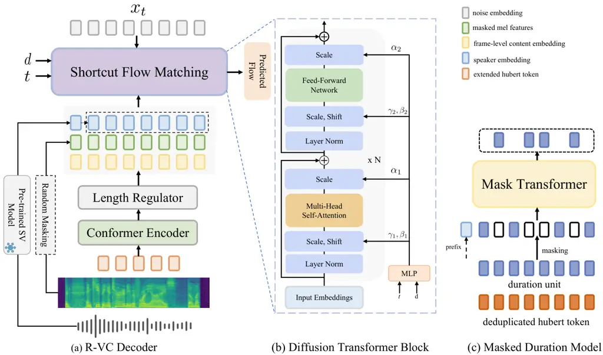
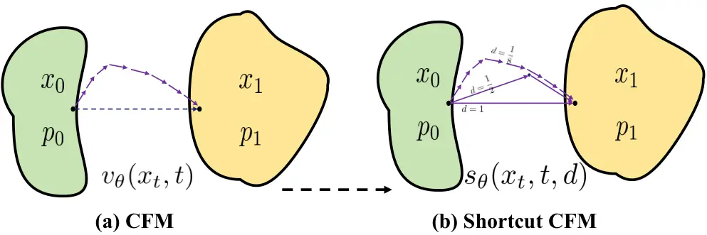
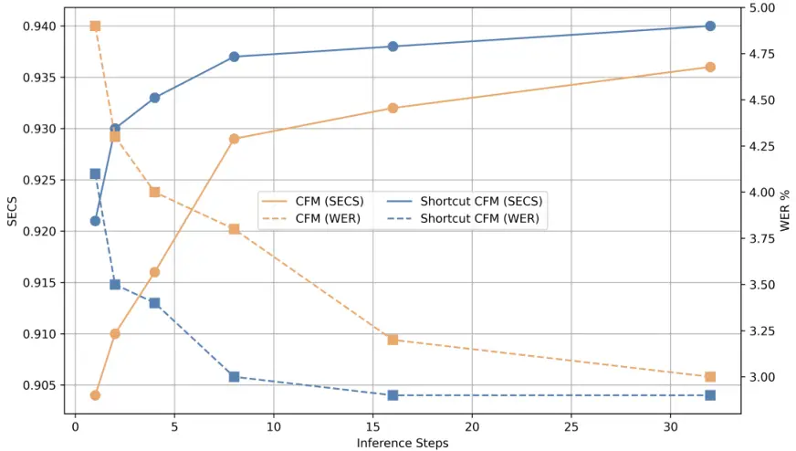
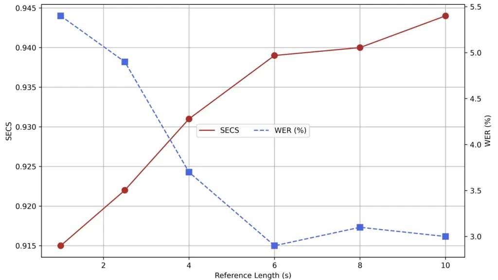
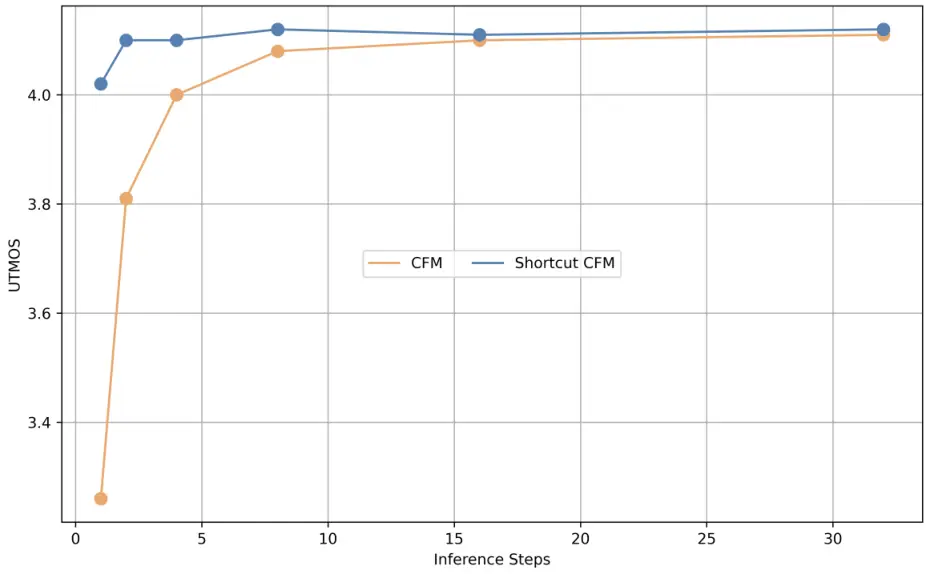

# Rhythm Controllable and Efficient Zero-Shot Voice Conversion via Shortcut Flow Matching

Jialong Zuo ^(†)^(†)thanks: Equal contribution. Affiliation: Zhejiang
University Email: <mailto:jialongzuo@zju.edu.cnjialongzuo@zju.edu.cn>   
Shengpeng Ji¹¹footnotemark: 1 Affiliation: Zhejiang University
Email: <mailto:zhaozhou@zju.edu.cnzhaozhou@zju.edu.cn>    Minghui
Fang¹¹footnotemark: 1 Affiliation: Zhejiang University    Mingze Li
Affiliation: Zhejiang University    Ziyue Jiang Affiliation: Zhejiang
University    Xize Cheng Affiliation: Zhejiang University    Xiaoda Yang
Affiliation: Zhejiang University    Chen Feiyang Affiliation: Huawei
Cloud    Xinyu Duan Affiliation: Huawei Cloud    Zhou Zhao
^(†)^(†)thanks: Corresponding author. Affiliation: Zhejiang University

###### Abstract

Zero-Shot Voice Conversion (VC) aims to transform the source speaker’s
timbre into an arbitrary unseen one while retaining speech content. Most
prior work focuses on preserving the source’s prosody, while
fine-grained timbre information may leak through prosody, and
transferring target prosody to synthesized speech is rarely studied. In
light of this, we propose R-VC, a rhythm-controllable and efficient
zero-shot voice conversion model. R-VC employs data perturbation
techniques and discretize source speech into Hubert content tokens,
eliminating much content-irrelevant information. By leveraging a Mask
Generative Transformer for in-context duration modeling, our model
adapts the linguistic content duration to the desired target speaking
style, facilitating the transfer of the target speaker’s rhythm.
Furthermore, R-VC introduces a powerful Diffusion Transformer (DiT) with
shortcut flow matching during training, conditioning the network not
only on the current noise level but also on the desired step size,
enabling high timbre similarity and quality speech generation in fewer
sampling steps, even in just two, thus minimizing latency. Experimental
results show that R-VC achieves comparable speaker similarity to
state-of-the-art VC methods with a smaller dataset, and surpasses them
in terms of speech naturalness, intelligibility and style transfer
performance. Audio samples are available at
[https://r-vc929.github.io/r-vc/](https://r-vc929.github.io/r-vc/).

## 1 Introduction

Voice conversion (VC) aims to transform the speaker’s timbre in speech
to match that of a target speaker while preserving the original speech
content. The core approach involves disentangling speech into several
individual components, such as linguistic content, timbre, and prosody
or style. The speaker conversion is achieved by integrating the
linguistic content of the source speech with the target speaker
characteristics. Some previous methods focus on disentangling speech
content and speaker characteristics. Information bottleneck-based
methods Hsu et al. (2016); Qian et al. (2019); Qian et al. (2020) are
developed to disentangle speakers and content. Some studies Choi et al.
(2021); Qian et al. (2022); Ning et al. (2023) also use signal
perturbation techniques to alter speech utterances to make it speaker
irrelevant before content extraction. Vector quantization methods like
K-means Hsu et al. (2021) or VQ-VAE Van Den Oord et al. (2017); Wu
et al. (2020) have been employed to discretize content features,
effectively removing speaker variability. Recently, advanced methods
Van Niekerk et al. (2022a); Yao et al. (2024); Choi et al. (2023) have
directly utilized features extracted from pre-trained self-supervised
speech representation networks Hsu et al. (2021); Baevski et al. (2020);
Babu et al. (2021) as linguistic content. However, although these
features provide rich semantic information, the retained residual timbre
information may lead to timbre leakage.

Inspired by the powerful zero-shot capabilities of generative models Ho
et al. (2020); Peebles and Xie (2023); Tong et al. (2023b); Lee et al.
(2023); Jiang et al. (2023) and speech language models (SLMs) Borsos
et al. (2023a); Wang et al. (2023a), recent studies are proposed to
enhance the naturalness and speaker similarity of the converted speech.
LM-VC Wang et al. (2023b) and Uniaudio Yang et al. (2023) explore the
feasibility of LMs for zero-shot voice conversion. Some diffusion-based
VC Popov et al. (2021); Choi et al. (2024) are proposed to generate
natural and high-quality speech. Recent advancements in conditional flow
matching methods Chen et al. (2024b); Du et al. (2024); Zuo et al.
(2025) leverage in-context learning (ICL) capability through target
speech prompting, resulting in improved speaker similarity.
Nevertheless, these methods have predominantly focused on maintaining
the source speech’s prosody which often leads to two issues: the
coupling between timbre and prosody may result in timbre leakage, and
these models struggle to transfer prosody or rhythm to align with the
target speech. Moreover, although diffusion or flow matching offers
advantages in generating high-quality speech, the multi-step sampling
paradigm (typically $`\geq`$ 10 steps) results in relatively high
latency, which, compared to non-diffusion methods, limits its practical
application in real-world scenarios.

To address these challenges, we propose R-VC, a rhythm controllable
voice conversion system that enables efficient zero-shot speaker
conversion while replicating the target speech’s rhythm to produce
natural, high-quality speech with minimal generation steps.
Specifically, to obtain speaker-irrelevant linguistic content and
mitigate timbre leakage, we apply data perturbation techniques to the
input waveform and utilize pretrained HuBERT and K-Means models to
extract discrete content tokens. To further eliminate prosodic
information, we deduplicate the content tokens and introduce a mask
transformer based duration model that iteratively predicts masked
durations based on contextual information, effectively learning the
target speaker’s rhythm. Additionally, we capture both time-invariant
and time-varying speaker characteristics through a diffusion transformer
which employs a target speech prompting strategy to enhance timbre
similarity. More importantly, a shortcut flow matching technique is
introduced in the DiT decoder during the training phase, enabling the
model to accurately skip ahead in the denoising process by conditioning
on the assigned step size. The main contributions are summarized as
follows:

- •
  We present R-VC, a robust and fast zero-shot voice conversion system
  that enables flexible control over rhythm and speaker identity.
- •
  We introduce a masked generative transformer model for in-context
  duration modeling, capable of adapting the duration of the same
  linguistic content to different styles. Additionally, we explore the
  effects of different duration granularities on the performance of VC
  models, like token-level and sentence-level.
- •
  We propose a shortcut DiT-based conditional flow matching model that
  enables efficient few-step and even one-step generation, significantly
  improving generation efficiency.
- •
  R-VC achieves comparable timbre similarity to SOTA models with less
  training data while surpassing baseline models in terms of speech
  naturalness, intelligibility and emotion style transfer performance.
  The method accelerates speech generation by 2.83 times compared to the
  10-step sampling Conditional Flow Matching (CFM) methods while
  maintaining similar speech quality.

## 2 Related Work

### 2.1 Speaker Representation in VC

Modeling speaker identity is crucial for voice conversion, posing
challenges in learning robust speaker representations and designing
efficient conditioning strategies. Traditional approaches typically rely
on global speaker embeddings extracted from pre-trained speaker
verification (SV) models Snyder et al. (2018); Casanova et al. (2022);
Gu et al. (2021); Qian et al. (2020), speaker encoders Kim et al.
(2023); Qian et al. (2019); Yang et al. (2024), or advanced speaker
representation models Tan et al. (2021); Cooper et al. (2020), casting
them as time-invariant representations. FACodec Ju et al. (2024)
introduces a decoupled speech codec that also facilitate VC, utilizing a
timbre extractor and gradient reversal layer (GRL) to derive speaker
representations. Diff-HierVC Choi et al. (2023) introduces a diffusion
based pitch generator for F0 modeling and a style encoder for global
speaker representation. However, these methods often struggle in
zero-shot voice conversion scenarios due to the inherent generalization
limitations of global embeddings.



Figure 1: Figure (a) illustrates the shortcut DiT-based flow matching
decoder, which regresses the conditional transport vector field from
noise to spectrogram while conditioning on the desired step size. Figure
(b) presents the detailed structure of the diffusion transformer block.
In Figure (c), the non-autoregressive Masked Duration Model is trained
to predict masked duration units based on content, contextual duration,
and the prefix speaker embedding.

Recently, more efficient speaker modeling techniques are also proposed.
SEF-VC Li et al. (2024) proposes a position-agnostic cross-attention
mechanism to learn and incorporate speaker timbre from reference speech
while RefXVC Zhang et al. (2024) combines global and local embeddings to
capture timbre variations. Despite these impressive results, there is
still room for improvement in terms of speech naturalness and timbre
similarity. Motivated by the recent success of generative models with
in-context learning capabilities in speech synthesis Ju et al. (2024);
Chen et al. (2024a); Jiang et al. (2024) and audio generation Yang
et al. (2023); Borsos et al. (2023a), some studies have explored their
potential in voice conversion. CosyVoice Du et al. (2024) and ICL-VC
Chen et al. (2024b) employ a flow-matching generative model training
strategy with masking and reconstruction, utilizing the entire reference
speech context to capture fine-grained speaker characteristics,
significantly improving the speaker similarity. Nevertheless, these
methods retain source prosody, with CosyVoice utilizing semantic tokens
that contain partial style information, and ICL-VC leveraging embeddings
from a pre-trained emotion model, potentially causing timbre leakage.
Moreover, they fail to replicate the target speaker’s rhythm.

### 2.2 Flow Matching for Speech Generation

Flow matching (FM) models Lipman et al. (2022) the vector field of
transport probability path from noise to data samples. Unlike
diffusion-based methods like DDPM Ho et al. (2020), flow matching offers
more stable training and superior performance. Crucially, by leveraging
ideas from optimal transport Tong et al. (2023a), FM can be set up to
yield ODEs that have simple vector fields that change little during the
process of mapping samples from the source distribution onto the data
distribution, since it essentially just transports probability mass
along straight lines, which greatly reduces the required number of
sampling steps. Recent advancements in flow matching-based generative
models have demonstrated significant success not only image generation
Esser et al. (2024) but also text-to-speech Mehta et al. (2024); Du
et al. (2024); Le et al. (2024); Jiang et al. (2025). Although FM-based
methods generate high-quality speech with fewer sampling steps than
traditional diffusion models, but still require multiple forward passes
(e.g., 10, 25, 32), making generation slow and expensive. Inspired by
shortcut models in the image generation domain Frans et al. (2024), R-VC
combines the optimal-transport flow matching loss with a
self-consistency loss, which enforces the model’s prediction to align
with the actual data distribution at larger step sizes, boosting
generation efficiency significantly.

## 3 R-VC

### 3.1 Overall Architecture

The overall architecture of R-VC is shown in Figure 1. R-VC is a fully
non-autoregressive encoder-decoder voice conversion system that employs
a shortcut flow matching DiT decoder to model in-context speaker
characteristics, achieving speech generation with fewer inference steps
and incorporates a masked generative transformer duration model for
controllable rhythm. The whole procedure can be divided into three
modules. (1) Robust Content Representation Extraction: discrete content
tokens are first extracted using a pretrained Hubert model and K-Means
clustering from perturbed waveforms and then deduplicated to remove some
prosodic patterns. (2) Mask Transformer Duration Model: unit-level
durations are obtained through a mask-predict iterative decoding
conditioned on the deduplicated content, unmasked target units, and
speaker embedding. (3) Shortcut Flow Matching Estimator: a shortcut flow
matching diffusion scheme is employed to estimate the target training
objectives (not only the FM objectives but also self-consistency
objectives), guided by content, randomly masked context acoustic
features, noise embeddings, a global speaker embedding, as well as a
desired step size, propagating the model’s generation capability from
multi-step to few-step to one-step. During inference, the source
deduplicated content tokens are extended according to the predicted
durations and input into the shortcut DiT decoder to generate
mel-spectrograms. Finally, a pretrained HifiGAN Kong et al. (2020)
vocoder synthesizes the perceptible waveform from the generated
mel-spectrograms.

### 3.2 Linguistic Content Representation

In R-VC, we leverage a self-supervised learning-based pre-trained HuBERT
model to extract SSL features, which are then discretized by a K-means
model. The discrete tokens contain rich phonetic content information and
exhibit minimal speaker variance, as demonstrated in Li et al. (2024);
Van Niekerk et al. (2022b). Additionally, data perturbation is applied
to the input waveform to eliminate content-irrelevant information. More
details of the perturbation methods are in Appendix A.

The Hubert content tokens are extracted at a rate of 50 tokens per
second (50Hz) ¹¹ 1
[https://github.com/facebookresearch/fairseq/blob/main/examples/hubert](https://github.com/facebookresearch/fairseq/blob/main/examples/hubert),
encompassing the full duration information of the speech, similar to the
SSL features from wav2vec Baevski et al. (2020) and XLS-R Babu et al.
(2021). This means that the converted speech retains the same rhythm as
the source speech, which limits the model’s style transfer capability.
Duration or rhythm is a key component of prosody, particularly in
emotional voice conversion, where rhythm influences emotional expression
²² 2 Joy is conveyed through brisk speech, while sadness is marked by a
slower, more measured pace.. Consequently, we propose to deduplicate
discrete tokens to obtain unit-level durations. For example, given a
speech input $`S`$, the content tokens from the Hubert model are
represented as $`C(S)=[u_{1},u_{1},u_{1},u_{2},u_{3},u_{3}]`$, which are
condensed to $`C^{\prime}(S)=[u_{1},u_{2},u_{3}]`$ with corresponding
durations $`D(S)=[d_{1},d_{2},d_{3}]`$, where
$`d_{1}=3,d_{2}=1,\cdots`$. This approach brings two advantages: 1) It
allows for rhythm-controlled voice conversion rather than merely
preserving the source speech’s rhythm; 2) It may remove style-related
information, such as accent and residual variations, as discussed in Lee
et al. (2021).

### 3.3 Mask Transformer Duration Model

Inspired by the successful application of parallel decoding in text
Ghazvininejad et al. (2019), image Chang et al. (2022), audio Borsos
et al. (2023b); Ji et al. (2024a) generation tasks. R-VC employs a
non-autoregressive, mask-based generative transformer model for duration
modeling. The non-autoregressive (NAR) duration model utilizes the
mask-predict algorithm to iteratively refine unit choices, achieving
high-accuracy output in just a few cycles. We sample the mask
$`M\in\left\{0,1\right\}^{N}`$ according to a sine schedule for a target
duration unit sequence, specifically sampling the masking ratio
$`p=\sin(u)`$ where $`u\sim\mathcal{U}\left[0,\frac{\pi}{2}\right]`$,
the mask $`M_{i}\sim Bernoulli(p)`$ and
$`i\sim\mathcal{U}\left[0,N-1\right]`$. Therefore, the masked duration
sequence can be represented as $`\bar{D}(S)=D(S)\odot M`$, where the
duration unit is preserved when $`M_{i}=0`$, and replaced with a Mask
token otherwise.

As shown in Figure 1 (c). The prediction of masked target duration units
is conditioned on the reduced content tokens, the unmasked portion of
durations, and a global speaker embedding, where the content tokens and
unmasked durations are concatenated at the dimension level, and the
speaker embedding is concatenated with them at the sequence level. This
prediction is modeled as:

```math
P(D(S)\mid\bar{D}(S),C;\theta) \tag{1}
```

where $`C`$ denotes the conditions mentioned above. Rhythm in speech is
not only content-dependent but also speaker-specific. Therefore, we
introduce a deterministic speaker representation extracted from a
pre-trained speaker verification model ³³ 3
[https://github.com/modelscope/3D-Speaker](https://github.com/modelscope/3D-Speaker)
as an additional condition to achieve more accurate and efficient
duration modeling. The learning objective is the cross-entropy (CE) loss
between the generated and target units at masked positions:

```math
L_{\text{CE}}=\mathbb{E}\Big(-\sum_{i=1}^{N}M_{i}\cdot\log(p(d_{i}\mid\bar{D}(S),C;\theta))\Big) \tag{2}
```

We use the standard transformer block from LLAMA Dubey et al. (2024) as
the backbone for the duration model and adopt the Rotary Position
Embedding (RoPE) Su et al. (2024) as the positional embedding,
configured with fewer layers and a smaller hidden dimension. During
inference, we decode the duration units in parallel through iterative
decoding with a pre-defined $`T`$ iterations. We perform a mask
operation at each iteration, followed by predict. At the initial
iteration $`t=0`$, all the units in the sequence
$`D=[d_{1},\ldots,d_{N}]`$ are masked. In subsequent iterations, $`n`$
units with the lowest probability scores $`p`$ are masked:

```math
\bar{D}_{t}=\arg\min_{i}(p_{i},n),\quad D_{t}^{{}^{\prime}}=D\setminus\bar{D}_{t}, \tag{3}
```

where $`n`$ is a function of the iteration $`t`$. In this work, we apply
a linear decay, defined as $`n=N\cdot\frac{T-t}{T}`$. After masking, the
duration model predicts the target units $`D_{t}^{{}^{\prime}}`$ based
on conditions $`C`$ and the masked context duration units
$`\bar{D}_{t}`$. For each $`d_{i}\in D_{t}^{{}^{\prime}}`$, the
prediction with the highest probability $`p`$ is selected, and the
probability score is updated as follows:

```math
\displaystyle d_{i}^{t} \displaystyle=\arg\max_{w}P(d_{i}=w\mid\bar{D}_{t},C;\theta), \tag{4}
```

```math
\displaystyle p_{i}^{t} \displaystyle=\max_{w}P(d_{i}=w\mid\bar{D}_{t},C;\theta). \tag{5}
```

This iterative approach ensures progressive refinement of the target
duration sequence.

### 3.4 Shortcut Flow Matching Estimator

Drawing inspiration from previous works Le et al. (2024); Du et al.
(2024), which leveraged masking strategies for in-context learning, we
explore a method that utilizes a target speech prompting strategy for
zero-shot voice conversion tasks. In R-VC, an optimal-transport
conditional flow matching model (OT-CFM) Tong et al. (2023b) is employed
to learn a conditional mapping from a noise distribution
$`x_{0}\sim p_{0}(x)`$ to a data distribution $`x_{1}\sim p_{1}(x)`$.
For $`x`$ and $`t\sim U[0,1]`$, the OT-CFM loss function can be
formulated as:

```math
\begin{split}L(\theta)=\mathbb{E}_{t,p_{1}(x_{1}),p_{0}(x_{0})}\|u_{t}(x_{t}|x_{1})-v_{t}(x_{t},c;\theta)\|^{2}\end{split}
```

where $`\theta`$ represents the neural network and $`c`$ is the
condition, composed of masked context features, content embeddings, and
speaker embeddings concatenated along the channel dimension. Although
the CFM model is non-autoregressive in terms of the time dimension, it
requires multiple iterations to solve the Flow ODE. The number of
iterations (i.e., number of function evaluations, NFE) has a great
impact on inference efficiency, especially when the model scales up
further. Additionally, naively taking large sampling steps leads to
large discretization error and in the single-step case, to catastrophic
failure.



Figure 2: The comparison of vanilla conditional flow matching and our
shortcut flow matching methods.

Therefore, we introduce a shortcut flow matching strategy in R-VC as
mentioned in Frans et al. (2024), where an additional conditioning on
the step size allows the model to account for future curvature and jump
to the correct next point rather than going off track at large step
sizes. Specifically, the normalized direction from $`x_{t}`$ towards the
correct next point $`x^{\prime}_{t+d}`$ is represented as the shortcut
$`s(x_{t},t,d)`$:

```math
x^{{}^{\prime}}_{t+d}=x_{t}+s(x_{t},t,d)\cdot d \tag{6}
```

As shown in Figure 2, the shortcut CFM model can be seen as a
generalization of flow-matching models for larger step sizes: as
$`d\to 0`$, the shortcut becomes equivalent to the flow, while shortcut
models additionally learn to make larger jumps when $`d>0`$. Due to the
high computational cost, it is not feasible to compute targets for
training $`s_{\theta}(x_{t},t,d)`$ by fully simulating the ODE forward
with a small enough step size. Thanks to the consistency property of
shortcut models, a self-consistency training target is proposed:

```math
s(x_{t},t,2d)=\frac{1}{2}\left(s(x_{t},t,d)+s(x^{\prime}_{t+d},t,d)\right) \tag{7}
```

where one shortcut step equals two consecutive shortcut steps of half
the size. Therefore, our shortcut flow matching estimator is trained
with an OT-CFM loss and a self-consistency loss as follows:

```math
\begin{split}L_{\text{S-CFM}}(\theta)=\mathbb{E}_{p_{0}(x_{0}),p_{1}(x_{1}),(t,d)}[\|s_{\theta}(x_{t},t,0)-\\
(x_{1}-x_{0})\|^{2}\,+\|s_{\theta}(x_{t},t,2d)-s_{\text{target}}\|^{2}]\end{split}
```

Such training objective learns a mapping from noise to data which is
consistent when queried under any sequence of step sizes. The more
detailed information about the CFM and Shortcut CFM algorithms are in
Appendix B.

Regarding the backbone network for Shortcut CFM, we discarded the
U-Net-style skip connection structure and opted for a Diffusion
Transformer (DiT) with AdaLN-zero, unlike previous U-Net-based
transformer methods Mehta et al. (2024); Du et al. (2024). The diffusion
transformer is used to predict speech that matches the style of the
target speaker and the content of the source discrete token. As shown in
Figure 1 (a), the original HuBERT token is first encoded by a Conformer
Encoder into content embeddings, which are then passed through a Length
Regulator module to align with the mel-spectrogram sequence length. To
enhance in-context timbre modeling, we employ a masked speech modeling
approach. This includes using a random span-masked mel-spectrogram as a
speaker prompt for capturing fine-grained speaker traits, along with a
global speaker embedding from a pre-trained speaker verification model
as a timbre conditioning. Experiments show that this method accelerates
training and produces a more robust timbre representation, improving
speaker similarity. During inference, we employ the classifier-free
guidance approach to steer the model $`f_{\theta}`$’s output towards the
conditional generation $`f_{\theta}(x_{t},c)`$ and away from the
unconditional generation $`f_{\theta}(x_{t},\emptyset)`$:

```math
\hat{f}_{\theta}(x_{t},c)=f_{\theta}(x_{t},c)+\alpha\cdot[f_{\theta}(x_{t},c)-f_{\theta}(x_{t},\emptyset)]
```

where $`c`$ denotes the conditional state, $`\emptyset`$ denotes the
unconditional state, and $`\alpha`$ is the guidance scale selected based
on experimental results.

### 3.5 Training and Inference

The Mask Transformer Duration Model and the Shortcut DiT Decoder are
trained independently with distinct objectives: the cross-entropy loss
$`L_{\text{CE}}`$ and the shourtcut flow matching loss
$`L_{\text{S-CFM}}`$, computed only at masked positions. We set
$`N=128`$ as the smallest time unit for approximating the ODE, resulting
in 8 possible shortcut lengths based on $`d\in(1/128,1/64,\dots,1)`$.
Since 128 is an empirically chosen value large enough to fit the vector
field of the transport probability path for $`t\in[0,1]`$, smaller
values lead to performance degradation, while larger values incur
computational overhead. We did not explore other configurations. During
each training step, we sample $`x_{t}`$, $`t`$, and a random $`d<1`$,
then perform two sequential steps with the shortcut model. The
concatenation of these steps is used as the target for training at
$`2d`$. For each training batch, a proportion $`k`$ of the items are
used for the flow matching objective, and the remaining $`(1-k)`$ items
for self-consistency targets.

## 4 Experiments

### 4.1 Experiment Setup

Datasets We utilize a subset of the English portion of the Multilingual
LibriSpeech (MLS) dataset Pratap et al. (2020), encompassing nearly
20,000 hours and 4.8 million audio samples, to train the R-VC model and
to reproduce several baseline models. For zero-shot voice conversion, we
use the test-clean subset Panayotov et al. (2015) across 40 speakers,
while emotional voice conversion is evaluated on the ESD dataset Zhou
et al. (2021). Additionally, rhythm control is assessed with a test set
of varied speaking rates from the test-clean dataset.

Baselines We compare the performance of R-VC with the current
state-of-the-art zero-shot VC systems, including 1) FACodec-VC Ju et al.
(2024); 2) CosyVoice-VC Du et al. (2024); 3) Diff-HierVC Choi et al.
(2023); 4) HierSpeech++ Lee et al. (2023); 5) SEF-VC Li et al. (2024).
We use the official open-source checkpoints pre-trained on large-scale
datasets to generate samples for FACodec-VC, CosyVoice-VC, and
HierSpeech++. For Diff-HierVC and SEF-VC, we reproduce the models using
the same dataset as R-VC.  
Training and Inference Setup We train the R-VC model on 8 NVIDIA A100
GPUs, with 600k steps for the Diffusion Transformer Decoder using a
batch size of 20k Mel frames per GPU, and 100k steps for the Mask
Transformer Duration Model with a batch size of 8k tokens. The Adam
optimizer is employed with a learning rate of $`5\times 10^{-5}`$,
$`\beta_{1}=0.9`$, $`\beta_{2}=0.999`$, and 2k warmup steps. Further
details are provided in Appendix C.  
Evaluation Metrics We evaluate the model with objective metrics
including cosine distance (SECS), character error rate (CER), word error
rate (WER) for zero-shot voice conversion, and emotion score from a
pre-trained emotion representation model for style transfer. Inference
latency is measured by the real-time factor (RTF) on a single NVIDIA
V100 GPU. For subjective evaluation, MOS assessments are conducted via
Amazon Mechanical Turk, focusing on QMOS (quality, clarity, naturalness)
and SMOS (speaker similarity), with automatic MOS prediction using UTMOS
Saeki et al. (2022). Experimental details are in Appendix D.

|                    |                   |                   |                  |                    |                   |                   |                    |
| ------------------ | ----------------- | ----------------- | ---------------- | ------------------ | ----------------- | ----------------- | ------------------ |
| Method             | WER$`\downarrow`$ | CER$`\downarrow`$ | SECS$`\uparrow`$ | UTMOS $`\uparrow`$ | QMOS $`\uparrow`$ | SMOS $`\uparrow`$ | RTF $`\downarrow`$ |
| GT (Vocoder)       | 2.87              | 1.36              | \-               | 4.14               | 4.19$`\pm`$ 0.10  | \-                | \-                 |
| FACodec-VC         | 4.68              | 1.96              | 0.902            | 2.88               | 3.21 $`\pm`$ 0.05 | 3.91 $`\pm`$ 0.14 | 0.10               |
| Diff-HierVC        | 4.34              | 2.14              | 0.894            | 3.75               | 3.64 $`\pm`$ 0.16 | 3.80 $`\pm`$ 0.06 | 0.47               |
| HierSpeech++       | 3.64              | 1.46              | 0.907            | 4.09               | 3.98 $`\pm`$ 0.12 | 3.93 $`\pm`$ 0.08 | 0.25               |
| CosyVoice-VC       | 5.95              | 2.70              | 0.933            | 4.09               | 3.95 $`\pm`$ 0.15 | 4.11 $`\pm`$ 0.16 | 1.74               |
| SEF-VC             | 4.82              | 2.04              | 0.897            | 3.96               | 3.80 $`\pm`$ 0.07 | 3.85 $`\pm`$ 0.11 | 0.18               |
| R-VC (CFM, NFE=10) | 3.47              | 1.39              | 0.931            | 4.10               | 4.05 $`\pm`$ 0.11 | 4.12 $`\pm`$ 0.09 | 0.34               |
| R-VC (ours, NFE=2) | 3.51              | 1.40              | 0.930            | 4.10               | 4.03 $`\pm`$ 0.13 | 4.11 $`\pm`$ 0.07 | 0.12               |

Table 1: The objective and subjective experimental results for zero-shot
VC. GT (Vocoder) refers to synthesizing speech from ground truth mel
features using a vocoder. R-VC (CFM) refers to the vanilla CFM diffusion
scheme.

| Method       | WER   | SECS  | UTMOS | EMO   |
| ------------ | ----- | ----- | ----- | ----- |
| Target       | \-    | \-    | 3.93  | 0.692 |
| FACodec-VC   | 8.91  | 0.854 | 2.64  | 0.438 |
| Diff-HierVC  | 10.62 | 0.833 | 3.41  | 0.440 |
| HierSpeech++ | 7.94  | 0.850 | 3.78  | 0.489 |
| CosyVoice-VC | 9.93  | 0.878 | 3.73  | 0.395 |
| SEF-VC       | 9.25  | 0.841 | 3.59  | 0.461 |
| R-VC (ours)  | 6.95  | 0.880 | 3.85  | 0.590 |

Table 2: The experimental results of emotion style transfer on an unseen
ESD dataset. EMO refers to the average emotion score on the test set.

### 4.2 Zero-shot VC Results

In this section, we evaluate the zero-shot voice conversion performance
of our model on an unseen test-clean dataset comprising 2620 samples.
The analysis covers multiple dimensions, including speech quality,
naturalness, intelligibility, timbre similarity, and inference speed. As
summarized in Table 1, our R-VC model achieves competitive timbre
similarity compared to state-of-the-art methods and surpasses the
baseline across all other metrics except inference latency,
demonstrating its exceptional capability in zero-shot VC tasks.

Specifically, we observe the following: 1) R-VC achieves a WER of 3.51
and a CER of 1.40, outperforming other VC systems, with the CER of the
generated speech approaching GT levels, highlighting its clarity and
intelligibility. 2) In terms of timbre similarity, R-VC achieves
comparable performance to the CosyVoice-VC baseline, outperforming other
models by a margin of 3%. Considering the disparity in training data,
where CosyVoice-VC leverages a large-scale in-the-wild dataset of 171k
hours, while our model is trained on only 20k hours of MLS English data,
this result highlights the effectiveness of our approach. We attribute
this primarily to the powerful shortcut DiT decoder, which captures
speaker characteristics by leveraging the global speaker condition and
target prompt, along with the combined impact of data perturbation
techniques and K-means discretization, which efficiently filters
content-irrelevant information. Additionally, the superior SMOS scores
confirm that our model generates speech with the highest perceived
speaker similarity. 3) R-VC notably exceeds other systems in QMOS
evaluations, particularly in UTMOS scores, approaching ground truth
audio quality, which demonstrates its excellence in generating
high-quality, clear speech. 4) Considering inference speed, by
incorporating shortcut flow matching, our model achieves performance
comparable to vanilla CFM while reducing sampling steps to 1/5,
resulting in a 2.83× faster inference, approaching the SOTA speed of
non-diffusion methods like FACodec-VC. This demonstrates the model’s
superior generation efficiency, making it feasible for practical
applications.

### 4.3 Emotion Style Transfer Ability Evaluation

We randomly select 200 emotional speech samples from the ESD dataset to
evaluate emotion style transfer. We utilize a pre-trained Emotion2Vec Ma
et al. (2023) model to calculate the emotion score for each synthesized
sample, and average these scores to obtain the overall score.

As shown in Table 2, almost all metrics for both the baseline and R-VC
models show significant reductions compared to zero-shot VC results,
primarily due to the lower quality of the ESD dataset and the inherent
challenges of emotion style transfer. R-VC outperforms the baseline
across all metrics, particularly in WER and emotion scores,
demonstrating its exceptional robustness and style transfer capability.
These improvements stem from two main factors: First, we have achieved
cleaner linguistic content extraction, where K-means discretization and
data perturbation techniques effectively eliminate irrelevant content
such as timbre and style. In contrast, baseline models such as
FACodec-VC rely on prosody codes from source speech, retaining source
style rather than transferring it. Additionally, CosyVoice-VC’s speech
tokens may retain stylistic information like timbre due to the absence
of supervision during tokenizer training. Second, R-VC’s mask
transformer duration model excels at modeling duration, enabling
accurate rhythm replication and facilitating emotion transfer, providing
more flexible control over rhythm than baseline models which maintain
the source speech’s rhythm.

### 4.4 Rhythm Control Ability Evaluation

While the improvement in emotion style transfer demonstrates the
effectiveness of our model in rhythm modeling, it remains an indirect
measure. Therefore, we introduce an intuitive evaluation metric,
_speaking rate_, to quantify rhythm control. Following Ji et al.
(2024b), we compute speaking rate as phonemes per second (PPS) after
applying voice activity detection (VAD) to remove silence. We categorize
the speech into three rhythm levels: slow ($`<7.98`$ PPS), fast
($`>14.47`$ PPS), and normal ($`7.98\leq x\leq 14.47`$ PPS).

We divide all 2,620 test-clean samples from the English subset of the
Multilingual LibriSpeech (MLS) dataset into these three categories and
construct non-parallel source-target pairs across rhythm levels. For
each synthesized utterance, we calculate the PPS, assign it a rhythm
label, and evaluate the alignment with the target rhythm.

| Target Category | Avg. Speaking Rate (PPS) | Accuracy |
| --------------- | ------------------------ | -------- |
| Slow (151)      | 7.561                    | 86.0%    |
| Normal (2071)   | 11.903                   | 92.3%    |
| Fast (398)      | 14.257                   | 80.7%    |
| Overall         | \-                       | 90.2%    |

Table 3: Speaking rate statistics of generated speech for different
target rhythm categories. Numbers in parentheses indicate sample sizes.

As shown in Table 3, the average speaking rate of the generated speech
closely matches the target category, with a rhythm classification
accuracy of 90.2%. This result demonstrates the strong rhythm control
ability of our proposed masked duration model. It is worth noting that
baseline models retain the source speech’s duration and thus cannot
adapt to the target rhythm. Therefore, we exclude baseline results from
this analysis. Audio examples are provided in the “Rhythm Control Demo
(Rebuttal)” section on our demo page for qualitative reference.

| Method          | WER  | SECS  | UTMOS | EMO   |
| --------------- | ---- | ----- | ----- | ----- |
| R-VC            | 6.95 | 0.880 | 3.85  | 0.590 |
| w/o $`dur`$     | 7.03 | 0.878 | 3.86  | 0.425 |
| w/o $`spk\_v1`$ | 6.99 | 0.860 | 3.75  | 0.571 |
| w/o $`spk\_v2`$ | 8.24 | 0.873 | 3.69  | 0.477 |
| w/o $`perturb`$ | 7.28 | 0.869 | 3.78  | 0.580 |
| w/i $`sdur`$    | 9.86 | 0.872 | 3.58  | 0.528 |

Table 4: Ablation Studies on rhythm modeling, timbre condition and data
perturbation methods.

### 4.5 Ablation Studies

We conducted ablation experiments on the ESD to validate the
effectiveness of our system’s design and each module, including:
removing the duration module ($`w/o,dur`$), separately excluding global
speaker conditioning from the DiT decoder and the duration model
($`w/o\,spk\_v1`$ and $`w/o\,spk\_v2`$), omitting pitch perturbation
before content token extraction ($`w/o\,perturb`$). Additionally,
following Chen et al. (2024a), we summed the unit-level duration to
obtain sentence-level duration and trained the DiT decoder with a
padding filter token for deduplicated content tokens ($`w/i,sdur`$).

The results are shown in Table 4. The ablation study reveals that: 1)
Removing the duration module significantly impairs emotion transfer
(emotion score -0.165), as the DiT decoder preserves source rather than
target speech rhythm, which is crucial for emotional expression.
Notably, some inaccurate duration predictions may also reduce the
model’s naturalness compared to those without the duration module. 2)
Using sentence-level duration as a global constraint makes the DiT
decoder struggle with learning alignment between text and speech,
leading to unstable performance and increased WER. 3) The absence of
global speaker conditioning degrades overall performance, particularly
affecting timbre similarity in R-VC, leveraging speaker verification
system’s timbre representation with the target prompt proves beneficial,
effectively capturing both time-invariant and time-varying speaker
characteristics while strengthening timbre modeling. 4) Removing speaker
conditioning from the duration model impacts WER, UTMOS, and emotion
scores, since rhythm or duration patterns are inherently tied to both
content and speaker characteristics. 5) Data perturbation before token
extraction effectively mitigates timbre leakage by filtering
content-irrelevant information.

Varying generation steps We compared the proposed shortcut flow matching
with naive flow matching at different sampling step counts. As shown in
Figure 3, although the original CFM performs well with sufficient steps
($`\geq`$ 10), its performance drops sharply at lower step counts (in
terms of WER and SECS). In contrast, our shortcut CFM achieves matching
performance with just two steps, maintaining minimal performance loss as
step count decreases. This highlights the method’s superior efficiency
in generating high-quality speech with fewer steps.

| Decoder(NFE=2) | LibriTTS |       |       | MLS EN |       |       |
| -------------- | -------- | ----- | ----- | ------ | ----- | ----- |
|                | WER      | SECS  | UTMOS | WER    | SECS  | UTMOS |
| U-Net          | 4.58     | 0.892 | 3.99  | 3.60   | 0.925 | 4.08  |
| DiT            | 4.61     | 0.897 | 3.97  | 3.51   | 0.930 | 4.10  |

Table 5: Ablation Studies on different architectures.

Ablation of Model Architecture We evaluated U-Net and Diffusion
Transformer decoders with 100MB and 300MB parameters on the LibriTTS and
MLS datasets (Table 5). While both architectures showed similar
performance, the U-Net generated clearer audio with slight improvements
in WER and UTMOS at smaller parameter sizes. As the parameter size and
dataset scale increased, the DiT outperformed the U-Net across all
metrics, particularly in speaker similarity. The analysis of the
duration model’s performance, ablation of the self-consistency loss
hyperparameter $`k`$, the effect of speech prompt lengths, and UTMOS
performance across inference steps are in Appendix E.



Figure 3: Results with different inference steps.

## 5 Conclusion

In this paper, we propose R-VC, an efficient zero-shot voice conversion
system that enables flexible control over rhythm and speaker identity.
By leveraging a Diffusion Transformer with a shortcut flow matching
strategy, and a Mask Generative Transformer for in-context duration
modeling, R-VC not only adapts the duration of linguistic content to
various speaking styles but also captures both time-invariant and
time-varying speaker characteristics. This approach enables high-quality
speech generation with minimal sampling steps, significantly enhancing
both efficiency and performance.

## 6 Acknowledgement

This work was supported by computational resources and technical
assistance provided by Huawei Cloud. We sincerely thank them for their
valuable support.

## 7 Limitations and Future Work

In this section, we discuss the limitations and challenges of our R-VC
model. In R-VC, we use a mask transformer model for rhythm modeling.
However, our experiments revealed that there is a certain probability of
inaccurate duration predictions, which leads to unnatural phenomena in
the generated speech, such as overextended pronunciations. We believe
that this fine-grained duration model poses challenges to the stability
of our system. Therefore, we also explored a sentence-level duration
strategy in this work, where the model implicitly learns the duration
alignment of tokens with the mel-spectrogram. However, this approach
yielded suboptimal results and exhibited even worse stability. Moving
forward, we aim to explore more robust duration modeling strategies to
enhance the style transfer capability of the zero-shot voice conversion
model.

## References

- Babu et al. (2021) Arun Babu, Changhan Wang, Andros Tjandra, Kushal
  Lakhotia, Qiantong Xu, Naman Goyal, Kritika Singh, Patrick Von Platen,
  Yatharth Saraf, Juan Pino, et al. 2021. Xls-r: Self-supervised
  cross-lingual speech representation learning at scale. _arXiv preprint
  arXiv:2111.09296_.
- Baevski et al. (2020) Alexei Baevski, Yuhao Zhou, Abdelrahman Mohamed,
  and Michael Auli. 2020. wav2vec 2.0: A framework for self-supervised
  learning of speech representations. _Advances in neural information
  processing systems_, 33:12449–12460.
- Borsos et al. (2023a) Zalán Borsos, Raphaël Marinier, Damien Vincent,
  Eugene Kharitonov, Olivier Pietquin, Matt Sharifi, Dominik Roblek,
  Olivier Teboul, David Grangier, Marco Tagliasacchi, et al. 2023a.
  Audiolm: a language modeling approach to audio generation. _IEEE/ACM
  transactions on audio, speech, and language processing_, 31:2523–2533.
- Borsos et al. (2023b) Zalán Borsos, Matt Sharifi, Damien Vincent,
  Eugene Kharitonov, Neil Zeghidour, and Marco Tagliasacchi. 2023b.
  Soundstorm: Efficient parallel audio generation. _arXiv preprint
  arXiv:2305.09636_.
- Casanova et al. (2022) Edresson Casanova, Julian Weber, Christopher D
  Shulby, Arnaldo Candido Junior, Eren Gölge, and Moacir A Ponti. 2022.
  Yourtts: Towards zero-shot multi-speaker tts and zero-shot voice
  conversion for everyone. In _International Conference on Machine
  Learning_, pages 2709–2720. PMLR.
- Chang et al. (2022) Huiwen Chang, Han Zhang, Lu Jiang, Ce Liu, and
  William T Freeman. 2022. Maskgit: Masked generative image transformer.
  In _Proceedings of the IEEE/CVF Conference on Computer Vision and
  Pattern Recognition_, pages 11315–11325.
- Chen et al. (2018) Ricky TQ Chen, Yulia Rubanova, Jesse Bettencourt,
  and David K Duvenaud. 2018. Neural ordinary differential equations.
  _Advances in neural information processing systems_, 31.
- Chen et al. (2022) Sanyuan Chen, Chengyi Wang, Zhengyang Chen, Yu Wu,
  Shujie Liu, Zhuo Chen, Jinyu Li, Naoyuki Kanda, Takuya Yoshioka, Xiong
  Xiao, et al. 2022. Wavlm: Large-scale self-supervised pre-training for
  full stack speech processing. _IEEE Journal of Selected Topics in
  Signal Processing_, 16(6):1505–1518.
- Chen et al. (2024a) Yushen Chen, Zhikang Niu, Ziyang Ma, Keqi Deng,
  Chunhui Wang, Jian Zhao, Kai Yu, and Xie Chen. 2024a. F5-tts: A
  fairytaler that fakes fluent and faithful speech with flow matching.
  _arXiv preprint arXiv:2410.06885_.
- Chen et al. (2024b) Zhengyang Chen, Shuai Wang, Mingyang Zhang,
  Xuechen Liu, Junichi Yamagishi, and Yanmin Qian. 2024b. Disentangling
  the prosody and semantic information with pre-trained model for
  in-context learning based zero-shot voice conversion. _arXiv preprint
  arXiv:2409.05004_.
- Choi et al. (2023) Ha-Yeong Choi, Sang-Hoon Lee, and Seong-Whan
  Lee. 2023. Diff-hiervc: Diffusion-based hierarchical voice conversion
  with robust pitch generation and masked prior for zero-shot speaker
  adaptation. _International Speech Communication Association_, pages
  2283–2287.
- Choi et al. (2024) Ha-Yeong Choi, Sang-Hoon Lee, and Seong-Whan
  Lee. 2024. Dddm-vc: Decoupled denoising diffusion models with
  disentangled representation and prior mixup for verified robust voice
  conversion. In _Proceedings of the AAAI Conference on Artificial
  Intelligence_, volume 38, pages 17862–17870.
- Choi et al. (2021) Hyeong-Seok Choi, Juheon Lee, Wansoo Kim, Jie Lee,
  Hoon Heo, and Kyogu Lee. 2021. Neural analysis and synthesis:
  Reconstructing speech from self-supervised representations. _Advances
  in Neural Information Processing Systems_, 34:16251–16265.
- Cooper et al. (2020) Erica Cooper, Cheng-I Lai, Yusuke Yasuda, Fuming
  Fang, Xin Wang, Nanxin Chen, and Junichi Yamagishi. 2020. Zero-shot
  multi-speaker text-to-speech with state-of-the-art neural speaker
  embeddings. In _ICASSP 2020-2020 IEEE International Conference on
  Acoustics, Speech and Signal Processing (ICASSP)_, pages 6184–6188.
  IEEE.
- Du et al. (2024) Zhihao Du, Qian Chen, Shiliang Zhang, Kai Hu, Heng
  Lu, Yexin Yang, Hangrui Hu, Siqi Zheng, Yue Gu, Ziyang Ma,
  et al. 2024. Cosyvoice: A scalable multilingual zero-shot
  text-to-speech synthesizer based on supervised semantic tokens. _arXiv
  preprint arXiv:2407.05407_.
- Dubey et al. (2024) Abhimanyu Dubey, Abhinav Jauhri, Abhinav Pandey,
  Abhishek Kadian, Ahmad Al-Dahle, Aiesha Letman, Akhil Mathur, Alan
  Schelten, Amy Yang, Angela Fan, et al. 2024. The llama 3 herd of
  models. _arXiv preprint arXiv:2407.21783_.
- Esser et al. (2024) Patrick Esser, Sumith Kulal, Andreas Blattmann,
  Rahim Entezari, Jonas Müller, Harry Saini, Yam Levi, Dominik Lorenz,
  Axel Sauer, Frederic Boesel, et al. 2024. Scaling rectified flow
  transformers for high-resolution image synthesis. In _Forty-first
  International Conference on Machine Learning_.
- Frans et al. (2024) Kevin Frans, Danijar Hafner, Sergey Levine, and
  Pieter Abbeel. 2024. One step diffusion via shortcut models. _arXiv
  preprint arXiv:2410.12557_.
- Ghazvininejad et al. (2019) Marjan Ghazvininejad, Omer Levy, Yinhan
  Liu, and Luke Zettlemoyer. 2019. Mask-predict: Parallel decoding of
  conditional masked language models. _arXiv preprint arXiv:1904.09324_.
- Gu et al. (2021) Yewei Gu, Zhenyu Zhang, Xiaowei Yi, and Xianfeng
  Zhao. 2021. Mediumvc: Any-to-any voice conversion using synthetic
  specific-speaker speeches as intermedium features. _arXiv preprint
  arXiv:2110.02500_.
- Ho et al. (2020) Jonathan Ho, Ajay Jain, and Pieter Abbeel. 2020.
  Denoising diffusion probabilistic models. _Advances in neural
  information processing systems_, 33:6840–6851.
- Hsu et al. (2016) Chin-Cheng Hsu, Hsin-Te Hwang, Yi-Chiao Wu, Yu Tsao,
  and Hsin-Min Wang. 2016. Voice conversion from non-parallel corpora
  using variational auto-encoder. In _2016 Asia-Pacific Signal and
  Information Processing Association Annual Summit and Conference
  (APSIPA)_, pages 1–6. IEEE.
- Hsu et al. (2021) Wei-Ning Hsu, Benjamin Bolte, Yao-Hung Hubert Tsai,
  Kushal Lakhotia, Ruslan Salakhutdinov, and Abdelrahman Mohamed. 2021.
  Hubert: Self-supervised speech representation learning by masked
  prediction of hidden units. _IEEE/ACM transactions on audio, speech,
  and language processing_, 29:3451–3460.
- Ji et al. (2024a) Shengpeng Ji, Ziyue Jiang, Hanting Wang, Jialong
  Zuo, and Zhou Zhao. 2024a. Mobilespeech: A fast and high-fidelity
  framework for mobile zero-shot text-to-speech. _arXiv preprint
  arXiv:2402.09378_.
- Ji et al. (2024b) Shengpeng Ji, Jialong Zuo, Minghui Fang, Ziyue
  Jiang, Feiyang Chen, Xinyu Duan, Baoxing Huai, and Zhou Zhao. 2024b.
  Textrolspeech: A text style control speech corpus with codec language
  text-to-speech models. In _ICASSP 2024-2024 IEEE International
  Conference on Acoustics, Speech and Signal Processing (ICASSP)_, pages
  10301–10305. IEEE.
- Jiang et al. (2024) Ziyue Jiang, Jinglin Liu, Yi Ren, Jinzheng He,
  Zhenhui Ye, Shengpeng Ji, Qian Yang, Chen Zhang, Pengfei Wei, Chunfeng
  Wang, et al. 2024. Mega-tts 2: Boosting prompting mechanisms for
  zero-shot speech synthesis. In _The Twelfth International Conference
  on Learning Representations_.
- Jiang et al. (2025) Ziyue Jiang, Yi Ren, Ruiqi Li, Shengpeng Ji,
  Boyang Zhang, Zhenhui Ye, Chen Zhang, Bai Jionghao, Xiaoda Yang,
  Jialong Zuo, et al. 2025. Megatts 3: Sparse alignment enhanced latent
  diffusion transformer for zero-shot speech synthesis. _arXiv preprint
  arXiv:2502.18924_.
- Jiang et al. (2023) Ziyue Jiang, Qian Yang, Jialong Zuo, Zhenhui Ye,
  Rongjie Huang, Yi Ren, and Zhou Zhao. 2023. Fluentspeech:
  Stutter-oriented automatic speech editing with context-aware diffusion
  models. _arXiv preprint arXiv:2305.13612_.
- Ju et al. (2024) Zeqian Ju, Yuancheng Wang, Kai Shen, Xu Tan, Detai
  Xin, Dongchao Yang, Yanqing Liu, Yichong Leng, Kaitao Song, Siliang
  Tang, et al. 2024. Naturalspeech 3: Zero-shot speech synthesis with
  factorized codec and diffusion models. _arXiv preprint
  arXiv:2403.03100_.
- Kim et al. (2023) Heeseung Kim, Sungwon Kim, Jiheum Yeom, and Sungroh
  Yoon. 2023. Unitspeech: Speaker-adaptive speech synthesis with
  untranscribed data. _arXiv preprint arXiv:2306.16083_.
- Kong et al. (2020) Jungil Kong, Jaehyeon Kim, and Jaekyoung Bae. 2020.
  Hifi-gan: Generative adversarial networks for efficient and high
  fidelity speech synthesis. _Advances in neural information processing
  systems_, 33:17022–17033.
- Le et al. (2024) Matthew Le, Apoorv Vyas, Bowen Shi, Brian Karrer,
  Leda Sari, Rashel Moritz, Mary Williamson, Vimal Manohar, Yossi Adi,
  Jay Mahadeokar, et al. 2024. Voicebox: Text-guided multilingual
  universal speech generation at scale. _Advances in neural information
  processing systems_, 36.
- Lee et al. (2021) Ann Lee, Hongyu Gong, Paul-Ambroise Duquenne, Holger
  Schwenk, Peng-Jen Chen, Changhan Wang, Sravya Popuri, Yossi Adi, Juan
  Pino, Jiatao Gu, et al. 2021. Textless speech-to-speech translation on
  real data. _arXiv preprint arXiv:2112.08352_.
- Lee et al. (2023) Sang-Hoon Lee, Ha-Yeong Choi, Seung-Bin Kim, and
  Seong-Whan Lee. 2023. Hierspeech++: Bridging the gap between semantic
  and acoustic representation of speech by hierarchical variational
  inference for zero-shot speech synthesis. _arXiv preprint
  arXiv:2311.12454_.
- Li et al. (2024) Junjie Li, Yiwei Guo, Xie Chen, and Kai Yu. 2024.
  Sef-vc: Speaker embedding free zero-shot voice conversion with cross
  attention. In _ICASSP 2024-2024 IEEE International Conference on
  Acoustics, Speech and Signal Processing (ICASSP)_, pages 12296–12300.
  IEEE.
- Lipman et al. (2022) Yaron Lipman, Ricky TQ Chen, Heli Ben-Hamu,
  Maximilian Nickel, and Matt Le. 2022. Flow matching for generative
  modeling. _arXiv preprint arXiv:2210.02747_.
- Luhman and Luhman (2021) Eric Luhman and Troy Luhman. 2021. Knowledge
  distillation in iterative generative models for improved sampling
  speed. _arXiv preprint arXiv:2101.02388_.
- Ma et al. (2023) Ziyang Ma, Zhisheng Zheng, Jiaxin Ye, Jinchao Li,
  Zhifu Gao, Shiliang Zhang, and Xie Chen. 2023. emotion2vec:
  Self-supervised pre-training for speech emotion representation. _arXiv
  preprint arXiv:2312.15185_.
- Mehta et al. (2024) Shivam Mehta, Ruibo Tu, Jonas Beskow, Éva Székely,
  and Gustav Eje Henter. 2024. Matcha-tts: A fast tts architecture with
  conditional flow matching. In _ICASSP 2024-2024 IEEE International
  Conference on Acoustics, Speech and Signal Processing (ICASSP)_, pages
  11341–11345. IEEE.
- Ning et al. (2023) Ziqian Ning, Qicong Xie, Pengcheng Zhu, Zhichao
  Wang, Liumeng Xue, Jixun Yao, Lei Xie, and Mengxiao Bi. 2023.
  Expressive-vc: Highly expressive voice conversion with attention
  fusion of bottleneck and perturbation features. In _ICASSP 2023-2023
  IEEE International Conference on Acoustics, Speech and Signal
  Processing (ICASSP)_, pages 1–5. IEEE.
- Panayotov et al. (2015) Vassil Panayotov, Guoguo Chen, Daniel Povey,
  and Sanjeev Khudanpur. 2015. Librispeech: an asr corpus based on
  public domain audio books. In _2015 IEEE international conference on
  acoustics, speech and signal processing (ICASSP)_, pages 5206–5210.
  IEEE.
- Peebles and Xie (2023) William Peebles and Saining Xie. 2023. Scalable
  diffusion models with transformers. In _Proceedings of the IEEE/CVF
  International Conference on Computer Vision_, pages 4195–4205.
- Popov et al. (2021) Vadim Popov, Ivan Vovk, Vladimir Gogoryan, Tasnima
  Sadekova, Mikhail Kudinov, and Jiansheng Wei. 2021. Diffusion-based
  voice conversion with fast maximum likelihood sampling scheme. _arXiv
  preprint arXiv:2109.13821_.
- Pratap et al. (2020) Vineel Pratap, Qiantong Xu, Anuroop Sriram,
  Gabriel Synnaeve, and Ronan Collobert. 2020. Mls: A large-scale
  multilingual dataset for speech research. _arXiv preprint
  arXiv:2012.03411_.
- Qian et al. (2020) Kaizhi Qian, Yang Zhang, Shiyu Chang, Mark
  Hasegawa-Johnson, and David Cox. 2020. Unsupervised speech
  decomposition via triple information bottleneck. In _International
  Conference on Machine Learning_, pages 7836–7846. PMLR.
- Qian et al. (2019) Kaizhi Qian, Yang Zhang, Shiyu Chang, Xuesong Yang,
  and Mark Hasegawa-Johnson. 2019. Autovc: Zero-shot voice style
  transfer with only autoencoder loss. In _International Conference on
  Machine Learning_, pages 5210–5219. PMLR.
- Qian et al. (2022) Kaizhi Qian, Yang Zhang, Heting Gao, Junrui Ni,
  Cheng-I Lai, David Cox, Mark Hasegawa-Johnson, and Shiyu Chang. 2022.
  Contentvec: An improved self-supervised speech representation by
  disentangling speakers. In _International Conference on Machine
  Learning_, pages 18003–18017. PMLR.
- Saeki et al. (2022) Takaaki Saeki, Detai Xin, Wataru Nakata, Tomoki
  Koriyama, Shinnosuke Takamichi, and Hiroshi Saruwatari. 2022. Utmos:
  Utokyo-sarulab system for voicemos challenge 2022. _arXiv preprint
  arXiv:2204.02152_.
- Snyder et al. (2018) David Snyder, Daniel Garcia-Romero, Gregory Sell,
  Daniel Povey, and Sanjeev Khudanpur. 2018. X-vectors: Robust dnn
  embeddings for speaker recognition. In _2018 IEEE international
  conference on acoustics, speech and signal processing (ICASSP)_, pages
  5329–5333. IEEE.
- Su et al. (2024) Jianlin Su, Murtadha Ahmed, Yu Lu, Shengfeng Pan, Wen
  Bo, and Yunfeng Liu. 2024. Roformer: Enhanced transformer with rotary
  position embedding. _Neurocomputing_, 568:127063.
- Tan et al. (2021) Zhiyuan Tan, Jianguo Wei, Junhai Xu, Yuqing He, and
  Wenhuan Lu. 2021. Zero-shot voice conversion with adjusted speaker
  embeddings and simple acoustic features. In _ICASSP 2021-2021 IEEE
  International Conference on Acoustics, Speech and Signal Processing
  (ICASSP)_, pages 5964–5968. IEEE.
- Tong et al. (2023a) Alexander Tong, Kilian Fatras, Nikolay Malkin,
  Guillaume Huguet, Yanlei Zhang, Jarrid Rector-Brooks, Guy Wolf, and
  Yoshua Bengio. 2023a. Improving and generalizing flow-based generative
  models with minibatch optimal transport. _arXiv preprint
  arXiv:2302.00482_.
- Tong et al. (2023b) Alexander Tong, Nikolay Malkin, Guillaume Huguet,
  Yanlei Zhang, Jarrid Rector-Brooks, Kilian Fatras, Guy Wolf, and
  Yoshua Bengio. 2023b. Conditional flow matching: Simulation-free
  dynamic optimal transport. _arXiv preprint arXiv:2302.00482_, 2(3).
- Van Den Oord et al. (2017) Aaron Van Den Oord, Oriol Vinyals,
  et al. 2017. Neural discrete representation learning. _Advances in
  neural information processing systems_, 30.
- Van Niekerk et al. (2022a) Benjamin Van Niekerk, Marc-André
  Carbonneau, Julian Zaïdi, Matthew Baas, Hugo Seuté, and Herman Kamper.
  2022a. A comparison of discrete and soft speech units for improved
  voice conversion. In _ICASSP 2022-2022 IEEE International Conference
  on Acoustics, Speech and Signal Processing (ICASSP)_, pages 6562–6566.
  IEEE.
- Van Niekerk et al. (2022b) Benjamin Van Niekerk, Marc-André
  Carbonneau, Julian Zaïdi, Matthew Baas, Hugo Seuté, and Herman Kamper.
  2022b. A comparison of discrete and soft speech units for improved
  voice conversion. In _ICASSP 2022-2022 IEEE International Conference
  on Acoustics, Speech and Signal Processing (ICASSP)_, pages 6562–6566.
  IEEE.
- Wang et al. (2023a) Chengyi Wang, Sanyuan Chen, Yu Wu, Ziqiang Zhang,
  Long Zhou, Shujie Liu, Zhuo Chen, Yanqing Liu, Huaming Wang, Jinyu Li,
  et al. 2023a. Neural codec language models are zero-shot text to
  speech synthesizers. _arXiv preprint arXiv:2301.02111_.
- Wang et al. (2023b) Zhichao Wang, Yuanzhe Chen, Lei Xie, Qiao Tian,
  and Yuping Wang. 2023b. Lm-vc: Zero-shot voice conversion via speech
  generation based on language models. _IEEE Signal Processing Letters_.
- Wu et al. (2020) Da-Yi Wu, Yen-Hao Chen, and Hung-Yi Lee. 2020. Vqvc+:
  One-shot voice conversion by vector quantization and u-net
  architecture. _arXiv preprint arXiv:2006.04154_.
- Yang et al. (2023) Dongchao Yang, Jinchuan Tian, Xu Tan, Rongjie
  Huang, Songxiang Liu, Xuankai Chang, Jiatong Shi, Sheng Zhao, Jiang
  Bian, Xixin Wu, et al. 2023. Uniaudio: An audio foundation model
  toward universal audio generation. _arXiv preprint arXiv:2310.00704_.
- Yang et al. (2024) Qian Yang, Jialong Zuo, Zhe Su, Ziyue Jiang, Mingze
  Li, Zhou Zhao, Feiyang Chen, Zhefeng Wang, and Baoxing Huai. 2024.
  Mscenespeech: A multi-scene speech dataset for expressive speech
  synthesis. _arXiv preprint arXiv:2407.14006_.
- Yao et al. (2024) Jixun Yao, Yuguang Yang, Yi Lei, Ziqian Ning, Yanni
  Hu, Yu Pan, Jingjing Yin, Hongbin Zhou, Heng Lu, and Lei Xie. 2024.
  Promptvc: Flexible stylistic voice conversion in latent space driven
  by natural language prompts. In _ICASSP 2024-2024 IEEE International
  Conference on Acoustics, Speech and Signal Processing (ICASSP)_, pages
  10571–10575. IEEE.
- Zhang et al. (2024) Mingyang Zhang, Yi Zhou, Yi Ren, Chen Zhang, Xiang
  Yin, and Haizhou Li. 2024. Refxvc: Cross-lingual voice conversion with
  enhanced reference leveraging. _IEEE/ACM Transactions on Audio,
  Speech, and Language Processing_.
- Zhou et al. (2021) Kun Zhou, Berrak Sisman, Rui Liu, and Haizhou
  Li. 2021. Seen and unseen emotional style transfer for voice
  conversion with a new emotional speech dataset. In _ICASSP 2021-2021
  IEEE International Conference on Acoustics, Speech and Signal
  Processing (ICASSP)_, pages 920–924. IEEE.
- Zuo et al. (2025) Jialong Zuo, Shengpeng Ji, Minghui Fang, Ziyue
  Jiang, Xize Cheng, Qian Yang, Wenrui Liu, Guangyan Zhang, Zehai Tu,
  Yiwen Guo, et al. 2025. Enhancing expressive voice conversion with
  discrete pitch-conditioned flow matching model. _arXiv preprint
  arXiv:2502.05471_.

## Appendix A Data Perturbation

We propose to perturb the pitch information in the input waveform $`x`$
using three functions: 1) formant shifting $`fs`$, 2) pitch
randomization $`pr`$, and 3) random frequency shaping using a parametric
equalizer $`peq`$. The chain function is employed to randomly shift the
pitch value of the original speech $`S`$ denoted as:
$`F=\text{fs}(\text{pr}(\text{peq}(S)))`$. The specific methods are as
follows:

- •
  For $`fs`$, a formant shifting ratio is sampled uniformly from
  $`\text{Unif}(1,1.4)`$. After sampling the ratio, we again randomly
  decide whether to take the reciprocal of the sampled ratio or not.
- •
  For $`pr`$, a pitch shift ratio and pitch range ratio are sampled
  uniformly from $`\text{Unif}(1,2)`$ and $`\text{Unif}(1,1.5)`$,
  respectively. Again, we randomly decide whether to take the reciprocal
  of the sampled ratios or not. For more details on formant shifting and
  pitch randomization, please refer to Parselmouth ⁴⁴ 4
  [https://github.com/YannickJadoul/Parselmouth](https://github.com/YannickJadoul/Parselmouth).
- •
  $`peq`$ represents a serial composition of low-shelving, peaking, and
  high-shelving filters. We use one low-shelving (HLS), one
  high-shelving (HHS), and eight peaking filters (HPeak).

## Appendix B Flow Matching

### B.1 Conditional Flow Matching

Continuous Normalizing Flows (CNFs) Chen et al. (2018) aims to estimate
the unknown distribution $`q(x)`$ of data $`x\in\mathbb{R}^{d}`$ by
learning the probability path from a simple prior distribution $`p_{0}`$
to a data distribution $`p_{1}\approx q`$. This mapping can be further
taken as a time-dependent changing process of probability density
(a.k.a. flow), determined by the ODE:

```math
\frac{d}{dt}{\phi_{t}(x)}=v_{t}(\phi_{t}(x));\quad\phi_{0}(x)=x. \tag{8}
```

where $`v_{t}:[0,1]\times\mathbb{R}^{d}\rightarrow\mathbb{R}^{d}`$ is a
vector field that generates the flow
$`\phi_{t}:[0,1]\times\mathbb{R}^{d}\rightarrow\mathbb{R}^{d}`$. We can
sample from the approximated data distribution $`p_{1}`$ by solving the
initial value problem in Eq. (1). Suppose there exists a known vector
field $`u_{t}`$ that generates a probability path $`p_{t}`$ from
$`p_{0}`$ to $`p_{1}`$. The flow matching loss is defined as:

```math
L_{FM}(\theta)=E_{t,p_{t}(x)}\|u_{t}(x)-v_{t}(x;\theta)\|^{2}. \tag{9}
```

where $`t\sim U[0,1]`$ and $`v_{t}(x;\theta)`$ is a neural network with
parameters $`\theta`$. However, $`L_{FM}`$ is uncomputable for lack of
prior knowledge of $`p_{t}`$ or $`v_{t}`$. Luckily, Lipman et al. (2022)
proposed Conditional Flow Matching (CFM) objective presented as:

```math
L_{CFM}(\theta)=E_{t,q(x_{1}),p_{t}(x|x_{1})}\|u_{t}(x|x_{1})-v_{t}(x;\theta)\|^{2} \tag{10}
```

By conditioning $`p_{t}`$ and $`v_{t}`$ on real data $`x_{1}`$, they
proved that FM and CFM have identical gradients with respect to
$`\theta`$ for training generative model.

In R-VC, an optimal-transport conditional flow matching model (OT-CFM)
Lipman et al. (2022) is employed to learn the distribution of Mel
spectrogram and generate samples from gaussian noise. The OT-CFM loss
function can be written as:

```math
\begin{split}L(\theta)&=E_{t,q(x_{1}),p_{0}(x_{0})}\|u^{OT}_{t}(\phi^{OT}_{t}(x)|x_{1})\\
&-v_{t}(\phi^{OT}_{t}(x)|\theta)\|^{2}\end{split} \tag{11}
```

by defining
$`\phi^{OT}_{t}(x)=(1-(1-\sigma_{\text{min}})t)x_{0}+tx_{1}`$ as the
flow from $`x_{0}`$ to $`x_{1}`$ where each datum $`x_{1}`$ is matched
to a random sample $`x_{0}\sim N(0,I)`$.

### B.2 Shortcut Flow Matching

Flow-matching trains an ODE to map noise to data along curved
trajectories. However, taking large sampling steps naively results in
significant discretization errors and, in single-step scenarios, can
lead to catastrophic failures. By conditioning on $`d`$, shortcut flow
matching models can anticipate future curvature and accurately jump to
the correct next point, avoiding divergence. We define the normalized
direction from $`x_{t}`$ to the next target point $`x^{\prime}_{t+d}`$
as the shortcut $`s(x_{t},t,d)`$:

```math
x^{{}^{\prime}}_{t+d}=x_{t}+s(x_{t},t,d)\cdot d \tag{12}
```

The objective is to train a shortcut model $`s_{\theta}(x_{t},t,d)`$ to
learn shortcuts for all combinations of $`x_{t}`$, $`t`$, and $`d`$.
Shortcut models generalize flow-matching models to larger steps by
learning to handle transitions beyond instantaneous velocity. As
$`d\to 0`$, the shortcut aligns with the flow.

A direct approach to compute training targets involves simulating the
ODE with small step sizes Luhman and Luhman (2021), but this is
computationally expensive. An alternative exploits the self-consistency
of shortcut models: a single shortcut step is equivalent to two
consecutive steps of half the size.

```math
s(x_{t},t,2d)=\frac{1}{2}\left(s(x_{t},t,d)+s(x^{\prime}_{t+d},t,d)\right) \tag{13}
```

Shortcut models can be trained using self-consistency targets for
$`d>0`$ and the flow-matching loss for $`d=0`$. The model can, in
principle, be trained on any distribution $`d\sim p(d)`$. In practice,
the batch is split: one fraction uses $`d=0`$, while the other uses
randomly sampled $`d>0`$. This leads to the combined shortcut model loss
function.

```math
\begin{split}L_{\text{S-CFM}}(\theta)=\mathbb{E}_{p_{0}(x_{0}),p_{1}(x_{1}),(t,d)}[\|s_{\theta}(x_{t},t,0)-\\
(x_{1}-x_{0})\|^{2}\,+\|s_{\theta}(x_{t},t,2d)-s_{\text{target}}\|^{2}]\end{split}
```

where
$`s_{\text{target}}=\frac{1}{2}s_{\theta}(x_{t},t,d)+\frac{1}{2}s_{\theta}(x^{\prime}_{t+d},t,d)`$,
where $`x^{\prime}_{t+d}=x_{t}+s_{\theta}(x_{t},t,d)d`$. This objective
intuitively trains the model to map noise to data in a way that remains
consistent across any sequence of step sizes, including a single large
step. This training objective combines a flow-matching objective and a
self-consistency objective, which are jointly optimized during training.
To enhance training efficiency, we construct a batch by mixing $`k`$
flow-matching targets with $`(1-k)`$ self-consistency targets.

## Appendix C Details of Models

The ground truth mel-spectrograms are generated from the raw waveform
with a frame size of 1024, a hop size of 256, and 80 channels at a
sampling rate of 22.05 kHz. An open-source HiFiGAN vocoder ⁵⁵ 5
[https://www.modelscope.cn/models/iic/CosyVoice-300M](https://www.modelscope.cn/models/iic/CosyVoice-300M)
is used to synthesize speech from the mel-spectrograms. The Diffusion
Transformer Decoder consists of a 22-layer Transformer architecture with
16 attention heads and 1,024 embedding dimensions, totaling 300M
parameters. The Mask Transformer Duration Model follows a similar
parameter configuration, but features a hidden dimension of 512 and
comprises a total of 62M parameters. A random 70% to 100% of mel frames
is masked for infilling task training. The classifier-free guidance
scale $`\alpha`$ is set to 0.2 during training and 0.7 during inference,
as referred to in Du et al. (2024). The shortcut flow matching decoder
consists of two training objectives. In each training batch, 30% of the
elements are used to construct self-consistency targets, while the
remaining 70% are used for flow matching targets, ensuring an efficient
trade-off between training efficiency and model performance. We use 128
discrete time steps to approximate the ODE, corresponding to 8 potential
shortcut paths at each training step.

## Appendix D Detailed Experiment Settings

### D.1 Details in Subjective Evaluation

We randomly select 50 sentences from the test set and perform the
subjective evaluation on Amazon Mechanical Turk (MTurk). Each generated
audio has been listened to by at least 10 native listeners. For QMOS
evaluations, the listeners are instructed to focus on assessing the
audio quality and naturalness while disregarding any differences in
styles (such as timbre, emotion, and pronunciation). Conversely, for
SMOS evaluations, the listeners are instructed to concentrate on
evaluating the speaker similarity to the audio prompt, while
disregarding differences in content or audio quality. For the QMOS, SMOS
evaluations, each listener is asked to rate different speech samples
using a Likert scale ranging from 1 to 5.

### D.2 Details in Objective Evaluation

To measure the speaker similarity (SECS), we use the WavLM Chen et al.
(2022) model fine-tuned for speaker verification from ⁶⁶ 6
[https://huggingface.co/microsoft/wavlm-base-plus-sv](https://huggingface.co/microsoft/wavlm-base-plus-sv)
to extract the speaker embedding. Then the cosine similarity between the
synthesized speech’s speaker embedding and the prompt speech’s speaker
embedding is calculated as the speaker similarity score. For word error
rate (WER) and character error rate (CER) metrics, we use the Whisper
model ⁷⁷ 7
[https://huggingface.co/openai/whisper-large-v3](https://huggingface.co/openai/whisper-large-v3).

| Method                                | ACC_Absolute | ACC_1 | ACC_5 |
| ------------------------------------- | ------------ | ----- | ----- |
| masked druation model (w/i prompt)    | 0.744        | 0.986 | 1.0   |
| masked druation model (w/o prompt)    | 0.723        | 0.978 | 1.0   |
| conformer duration model (w/i prompt) | 0.679        | 0.952 | 0.996 |
| conformer duration model (w/o prompt) | 0.665        | 0.939 | 0.993 |

Table 6: The performance of the masked duration model.

## Appendix E Additional Experiments

Masked Duration Model Performance In fact, the evaluation of the
duration model is closely tied to the Diffusion Transformer, as the
rhythm control exhibited by the generated speech directly reflects the
effectiveness of the masked duration model. Here, we further evaluate
the duration model’s prediction accuracy to provide a more comprehensive
view of its performance. The experimental results are shown in Table 6.
The Conformer duration model refers to a non-autoregressive Conformer
for duration modeling. $`ACC\_Absolute`$ measures the prediction
accuracy of each de-duplicated HuBERT token’s duration, while $`ACC\_1`$
and $`ACC\_5`$ allow prediction errors within one token (0.02s) and five
tokens (0.1s), respectively. $`W/i\ prompt`$ and $`w/o\ prompt`$
indicate whether prompt conditions (duration and speaker) are used
during prediction. As shown in the table, on the test-clean dataset with
2,620 unseen samples, our duration model outperforms the baseline in all
three metrics. Specifically, it achieves 98.6% accuracy within a 0.02s
margin and 100% accuracy within a 0.1s margin, demonstrating the
effectiveness of the masked generative duration model.

Evaluation on Seed-TTS We further evaluate zero-shot voice conversion on
the English subset of the Seed-TTS test set ⁸⁸ 8
[https://github.com/BytedanceSpeech/seed-tts-eval](https://github.com/BytedanceSpeech/seed-tts-eval)
(samples from the Common Voice dataset, containing more complex audio
types). The results are summarized in Table 7. The proposed model
achieves comparable timbre similarity to Vanilla CFM and CosyVoice-VC
with fewer sampling steps, and attains lower WER while significantly
reducing latency.

| Model                | SECS   | WER    |
| -------------------- | ------ | ------ |
| DiffHier             | 0.8531 | 0.0589 |
| CosyVoice-VC         | 0.9129 | 0.0610 |
| FAcodec              | 0.8890 | 0.0569 |
| HierSpeech++         | 0.8670 | 0.0451 |
| SEF-VC               | 0.8661 | 0.0494 |
| CFM (NFE=10)         | 0.9110 | 0.0407 |
| Shortcut CFM (NFE=2) | 0.9102 | 0.0418 |

Table 7: Zero-shot voice conversion performance on the Seed-TTS English
subset.

| 1-k | WER  | SECS  | UTMOS |
| --- | ---- | ----- | ----- |
| 10% | 3.88 | 0.915 | 3.92  |
| 20% | 3.62 | 0.923 | 4.05  |
| 30% | 3.51 | 0.930 | 4.10  |
| 40% | 3.54 | 0.933 | 4.09  |

Table 8: Results of different hyperparameter $`k`$.

Additional Ablations We conducted an ablation analysis on the
hyperparameter $`k`$ under the NFE=2 setting. During each training step,
we selected $`(1-k)`$ proportion of samples to construct the
self-consistency training objective and compute the loss. As
demonstrated in Table 8, a smaller proportion of self-consistency
training objective leads to insufficient training of shortcut flow
matching, manifesting in suboptimal generation results with fewer
sampling steps similar to vanilla CFM. While increasing this proportion
effectively enhances the model’s performance with fewer steps, it
simultaneously introduces additional computational overhead, as the
construction of self-consistency training objective necessitates two
forward passes. Balancing training efficiency and performance
considerations, we ultimately determined that setting 30% represents an
optimal parameter choice.



Figure 4: The influence of references of different lengths on zero-shot
VC.



Figure 5: The UTMOS performance under different inference steps.

We also present the VC performance of our model on the test-clean
dataset using speaker prompts of varying lengths. As shown in Figure 4
and Table 1, even with prompts shorter than 2 seconds, our model
achieves higher speaker similarity compared to most baseline models.
Speaker similarity improves significantly with longer reference speaker
prompts before leveling off. A similar trend is observed for WER,
indicating that longer prompts enhance the intelligibility of the
generated speech. Moreover, we demonstrate the performance of our
proposed method and the vanilla CFM method in terms of UTMOS across
varying sampling steps. As shown in Figure 5, our method significantly
outperforms the baseline flow matching methods in terms of audio
perceptual quality with fewer sampling steps, indicating the model’s
ability to generate high-quality speech with minimal sampling steps.
