# UniCUE: Unified Recognition and Generation Framework for Chinese Cued Speech Video-to-Speech Generation

Jinting Wang    Shan Yang    Chenxing Li    Yu Dong    Li Liu
Note: Corresponds to Li Liu (avrillliu@hkust-gz.edu.cn)

###### Abstract

Cued Speech (CS) enhances lipreading via hand coding, offering visual
phonemic cues that support precise speech perception for the
hearing-impaired. The task of CS Video-to-Speech generation (CSV2S) aims
to convert CS videos into intelligible speech signals. Most existing
research focuses on CS Recognition (CSR), which transcribes video
content into text. Consequently, a common solution for CSV2S is to
integrate CSR with a text-to-speech (TTS) system. However, this pipeline
relies on text as an intermediate medium, which may lead to error
propagation and temporal misalignment between speech and CS video
dynamics. In contrast, directly generating audio speech from CS video
(direct CSV2S) often suffer from the inherent multimodal complexity and
the limited availability of CS data. To address these challenges, we
propose UniCUE, the first unified framework for CSV2S that directly
generates speech from CS videos without relying on intermediate text.
The core innovation of UniCUE lies in integrating a understanding task
(CSR) that provides fine-grained CS visual-semantic cues to to guide the
speech generation. Specifically, UniCUE incorporates a pose-aware visual
processor, a semantic alignment pool that enables precise
visual–semantic mapping, and a VisioPhonetic adapter to bridge the
understanding and generation tasks within a unified architecture. To
support this framework, we construct UniCUE-HI, a large-scale Mandarin
CS dataset containing 11,282 videos from 14 cuers, including both
hearing-impaired and normal-hearing individuals. Extensive experiments
conducted on this dataset demonstrate that UniCUE achieves
state-of-the-art (SOTA) performance across multiple evaluation metrics.
Project website can be found at https://beria-moon.github.io/UniCUE/

¹The Hong Kong University of Science and Technology (Guangzhou)

²Tencent AI Lab

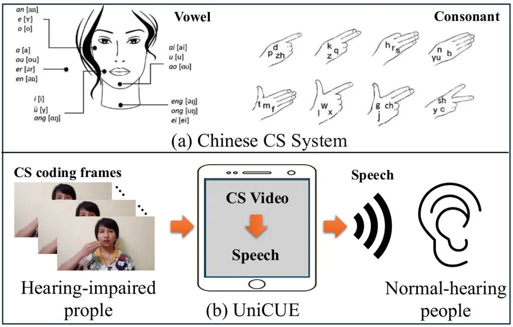

Figure 1: Illustration of the rules of the Chinese CS system and the
proposed framework (UniCUE). (a) The chart for Mandarin Chinese CS
(figure from (Liu and Feng 2019)), where five distinct hand positions
are used to encode vowels, and eight finger shapes are employed to
represent consonants in Mandarin Chinese. (b) Our framework enables the
direct generation of synchronized natural speech from video.

## Introduction

Cued Speech (CS) is an visual phonetic encoding system that utilizes
specific hand shapes and positions to enhance lip reading, providing an
accurate visual representation of all phonemes in spoken language
(Cornett 1967; Liu and Feng 2019; Leybaert and LaSasso 2010). CS
maintains a high level of consistency with spoken language in terms of
phonemes and speech patterns, enabling hearing-impaired individuals to
better integrate into speech-dominant social and educational
environments (Cornett 1967; Leybaert and LaSasso 2010; Leybaert et al.
2010). In Mandarin Chinese, CS employs 8 hand shapes and 5 positions to
encode consonants and vowels (as illustrated in Figure 1(a)), addressing
challenges such as the phonemes with similar lip shapes (Liu and Feng
2019).

CS Video-to-Speech generation (CSV2S) task aims to convert CS videos of
into comprehensible speech signals. However, directly constructing an
end-to-end CSV2S model faces several challenges. Firstly, this task
involves complex multimodal semantic correlations, requiring precise
mapping from visual cues (lip movements and hand coding) to acoustic
speech, while the limited scale of existing CS datasets further
constrains model capacity. Secondly, fine-grained spatiotemporal
modeling of visual information is essential to resolve the intrinsic
asynchrony, i.e., the hand-preceding phenomenon, where hand cues precede
corresponding lip movements (Liu et al. 2020a). To the best of our
knowledge, the CSV2S task has not been explicitly studied in prior
literature.

Existing research primarily focuses on CS Recognition (CSR) that
converts CS videos into phoneme-level text (Liu et al. 2020a; Liu et al.
2024; Liu et al. 2018; Liu et al. 2019), neglecting the critical need
for natural speech generation. This limitation significantly impairs
real-time communication between hearing-impaired and normal-hearing
individuals, especially in educational and social scenarios. For
instance, in group conversations, normal-hearing participants must
quickly comprehend and respond to questions posed by their
hearing-impaired peers. Textual output from CSR systems is often
insufficient for such natural and smooth interactions. Additionally,
recent lipreading-based video-to-speech models such as LipVoicer (Yemini
et al. 2024) rely solely on lip movements, failing to capture the
complementary hand-coded information in CS that conveys critical
phonemic distinctions. These shortcomings underscore the need for a more
comprehensive approach. Motivated by this, we aim to develop the first
Chinese CSV2S system that directly decodes CS videos into intelligible
speech, as illustrated in Figure 1(b).

A straightforward solution, shown in Figure 2(a), is to combine a CSR
model with a Text-to-Speech (TTS) system. However, this combined
pipeline suffers from two key drawbacks. Firstly, the intermediate
textual representation introduces error propagation, as misrecognitions
in the CSR stage lead to incorrect speech output. Secondly, the textual
intermediate discards fine-grained spatiotemporal cues in the CS video,
resulting in synthesized speech that lacks temporal alignment with the
visual input.

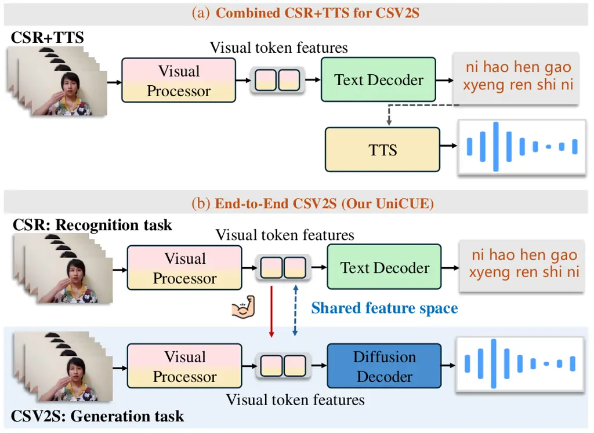

Figure 2: (a) The combined CSV2S architecture combines separately
trained CSR and TTS models. (b) Our unified framework (UniCUE) that
transfers understanding capabilities of CSR into speech generation
training by integrating the visual processor of CSR into CSV2S.

To overcome these challenges, we draw inspiration from recent advances
in multimodal learning, where semantic reasoning from vision-language
models (VLMs) has shown strong promise in tasks like text-guided image
synthesis with interleaved control (Mi et al. 2025; Chen et al. 2025a).
We hypothesize that the multimodal visual understanding inherent in CSR
can serve as a semantic bridge to support more accurate and controllable
speech generation in CSV2S. As depicted in Figure 2(b), we introduce a
unified framework that leverages a shared visual processor to bridge CSR
(understanding task) and CSV2S (generation task). This processor serves
as a two-way translator: during CSR, it extracts linguistic semantics
from fine-grained lip-hand motion patterns; in CSV2S, it utilizes these
semantics to guide speech generation. The core innovation of our
framework lies in modeling a semantic compensation flow, where
phoneme-level supervision from CSR reduces ambiguity in speech
synthesis, enabling more faithful and coherent voice generation under
complex multimodal conditions.

Building upon this semantic compensation paradigm, in this work, we
propose UniCUE, the first unified framework that bridges CSR and CSV2S
tasks through three specific components: Firstly, unlike prior CSR
methods (Liu et al. 2024; Liu and Liu 2023) that process lip and hand
modalities independently and rely on raw video embeddings, UniCUE
employs a pose-aware processor that fuses video and pose streams into a
mixed representation. This enables fine-grained spatiotemporal modeling
of the hand-preceding phenomenon and improves generalization to
cuer-specific expressive styles. Secondly, to enhance the alignment
between visual and linguistic semantics, we introduce a semantic
alignment pool to map the video and pose latent spaces into a shared
textual space using contrastive learning. This facilitates cross-modal
correlation modeling and improves semantic consistency in the generated
speech. Thirdly, to unify the understanding and generation tasks, we
reuse the CSR visual encoder within our diffusion-based CSV2S decoder
and introduce a VisioPhonetic Adapter (VPA) that transforms the visual
representations into diffusion-compatible codes. This design enables the
decoder to effectively incorporate fine-grained semantic information
derived from multimodal visual inputs

To evaluate UniCUE on hearing-impaired individuals, we extend the MCCS
dataset (Lei et al. 2024b) by adding data from 8 hearing-impaired and 2
normal-hearing cuers¹¹ 1 Cuer means the people who perform CS., forming
the Unified-HI Corpus with 14 cuers.

Experimental results on this dataset demonstrate that UniCUE not only
produces accurate and intelligible speech, but also maintains temporal
synchronization with the CS video.

The main contributions of this work can be summarized as:

- •
  We propose the first CSV2S framework by constructing a unified
  multimodal system that integrates CSR capabilities to enhance speech
  generation.
- •
  We propose a pose-aware visual processor and a semantic alignment pool
  to enhance fine-grained, semantically aligned visual representations,
  and introduce an VPA module to convert fine-grained semantic
  information into understandable coding for the speech synthesis model.
- •
  We construct a new Mandarin Chinese CS dataset comprising both
  hearing-impaired and normal-hearing cuers. Experimental results
  demonstrate that our UniCUE outperforms the state-of-the-art (SOTA)
  methods in terms of speech accuracy, consistency, and quality.

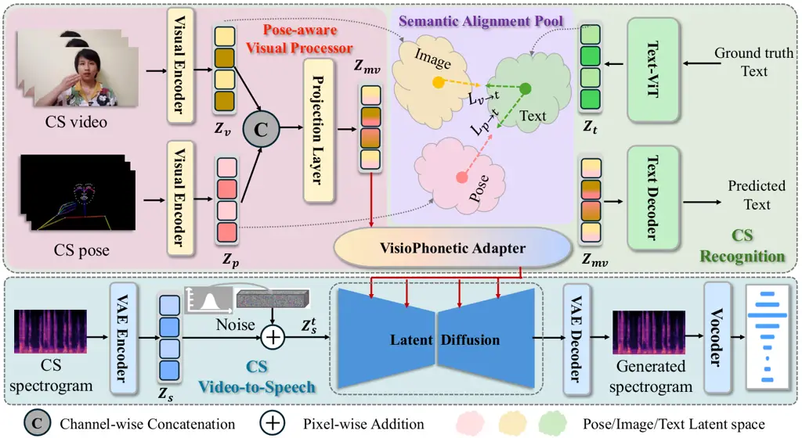

Figure 3: Overview of our unified framework (UniCUE). It achieves direct
Chinese CSV2S generation with semantic consistency, temporal alignment,
and characteristics coherence by aligning the fine-grained
spatiotemporal visual representations of CSR with the diffusion-based
speech generator. The framework consists of three core modules: (1)
Pose-Aware Visual Processor: Integrates video and pose embeddings to
perform fine-grained spatiotemporal modeling of lip and hand movements.
(2) Semantic Alignment Pool: Enhances the semantic mapping between
visual features and speech content through video-text and pose-text
contrastive learning. (3) VisioPhonetic Adapter (VPA): Converts
fine-grained visual representation of CSR into condition encodings
compatible with the diffusion-based generator.

## Related Work

### Video-to-Speech Generation

V2S aims to synthesize natural speech aligned with silent talking
videos, but is challenged by limited data. Uni-Dubbing (Lei et al.
2024a) addresses this via modality-aligned pre-training on multimodal
data and fine-tuning with both multimodal and audio-only inputs.
Similarly, Kefalas et al. (Kefalas et al. 2024) pre-train on large
audio-only corpora before tuning on paired data. Some studies (Kim et
al. 2023; Yemini et al. 2024; Gupta et al. 2024) incorporate transcripts
to enhance generation. Kim et al. (Kim et al. 2023) use text-speech
supervision to improve word-level representation via multi-task
learning. Existing V2S methods primarily focus on lip reading. However,
CS conveys phonemic information through both lip and hand movements.
Ignoring hand cues results in incomplete visual representations and
degraded speech synthesis quality, limiting the applicability of these
methods to CS. Notably, no prior work has addressed the CSV2S task.

### Cued Speech Recognition

CS augments lip reading with hand coding to support the
hearing-impaired. The CSR task aims to transcribe CS videos into text by
leveraging lips and hands as complementary modalities (Liu and Feng
2019; Papadimitriou and Potamianos 2021). Most CSR methods extract lip
and hand features separately and fuse them for recognition (Liu et al.
2020a; Liu et al. 2024; Liu and Liu 2023; Zhang et al. 2023). Due to the
asynchronous nature of these modalities, effective fusion remains
challenging. Liu et al. (Liu et al. 2020a) proposed re-synchronization
to align hand with lip features, while transformer-based mutual
learning (Liu and Liu 2023; Liu et al. 2024) improves multimodal
interaction. Zhang et al. (Zhang et al. 2023) addressed privacy concerns
via federated learning. In contrast, we directly model lip and hand cues
from whole frames, avoiding explicit fusion. A pose-aware visual
processor is introduced further to enhance cross-modal representation
and improve performance.

### Unified Understanding and Generation

Recent advances in unifying understanding and generation tasks fall into
two main paradigms. The first integrates visual-language understanding
with external generative models (e.g., diffusion models) for multimodal
generation (Wu et al. 2024a; Dong et al. 2024; Jin et al. 2024; Li et
al. 2024; Sun et al. 2024; Ge et al. 2024; Ge et al. 2025). For example,
(Jin et al. 2024; Li et al. 2024) utilize large language models (LLMs)
for semantic understanding and diffusion models (Rombach et al. 2022;
Podell et al. 2023) for high-fidelity image synthesis. The second
paradigm trains LLM-based foundation models via next-token prediction
for both vision understanding and generation (Yu et al. 2023; Sun et al.
2023; Zhou et al. 2024; Wu et al. 2024b; Fang et al. 2024; Wu et al.
2025; Chen et al. 2025b). Transfusion (Zhou et al. 2024), for instance,
unifies image understanding and generation within a single transformer,
enabling controllable text-to-image synthesis by preserving visual
details. However, existing approaches mainly focus on visual-text
settings, leaving visual-to-speech generation underexplored. In this
work, we introduce the first unified framework that bridges visual
understanding and speech generation.

## Method

### Overview of UniCUE

To achieve accurate CSV2S generation, the proposed method needs to
simultaneously address two critical challenges: (1) semantic
understanding of the linguistic correlations between visual cues and
speech content, and (2) speech synthesis that preserves cuer-specific
characteristics and temporal alignment. Inspired by the auxiliary
benefits of unified understanding and generation for multi-modal
controllable image synthesis (Wu et al. 2024a; Dong et al. 2024), we
design a unified architecture that integrates CSR and CSV2S, enabling
CSV2S with understanding capability improvement through shared visual
feature representations. As illustrated in Figure 3, the framework
operates via two pathways.

CSR: Fine-grained Visual Cues Understanding. As the recognition pathway,
CSR models fine-grained spatiotemporal visual semantics to transcribe CS
videos into linguistic sequences. Given a CS video $`I_{v}`$ and its
corresponding pose maps $`I_{p}`$ (extracted via OpenPose (Cao et al.
2019)), we first utilize a pose-aware visual processor to extract
multi-modal embeddings $`Z_{mv}`$, which capture lip and hand motion
cues. And then $`Z_{mv}`$ is fed into a auto-regressive
Transformer-based text decoder $`D_{T}`$, which models long-range
dependencies and contextual interactions across the sequence to generate
the predicted token sequence: $`T_{p}=D_{T}(Z_{mv})`$, where $`T_{p}`$
denotes the predicted token sequence.

Unlike prior approaches relying on Connectionist Temporal Classification
(CTC) loss (Graves et al. 2006), which predict each token independently
and thus limit the model’s ability to capture cross-token dependencies
and coarticulatory effects, our method employs an auto-regressive
decoder $`D_{T}`$ supervised by cross-entropy loss. This design allows
$`D_{T}`$ to generate tokens conditioned on previously generated outputs
and spatialtemporal visual cues, which is more suited to modeling the
asynchronous and dynamic nature of CS.

To further enhance both token-level precision and sequence-level
linguistic consistency, we employ a hybrid training objective: a masked
language modeling loss $`\mathcal{L}_{\text{CE}}^{\text{masked}}`$
supervises selectively masked ground-truth tokens to enhance contextual
understanding; a sequence-level cross-entropy loss
$`\mathcal{L}_{\text{CE}}^{\text{seq}}`$enforces supervision over the
full sequence to promote accurate transcription. The final training
objective for CSR is:

```math
\mathcal{L}_{R}=\mathcal{L}_{\text{CE}}^{\text{masked}}(T_{p},T_{g})+\mathcal{L}_{\text{CE}}^{\text{seq}}(T_{p},T_{g}), \tag{1}
```

where $`T_{g}`$ denotes the ground-truth token sequence. This dual-loss
strategy enhances token-level accuracy while preserving global sequence
semantics, enabling the model to capture subtle visual-linguistic cues
and temporal dynamics inherent in CS videos, thus improving recognition
performance and supporting speech synthesis.

CSV2S: Cuer-specific Speech Synthesis. To directly synthesize
intelligible and personalized speech from CS videos, we formulate speech
generation as a conditional denoising process within a latent diffusion
model (LDM) (Rombach et al. 2022). Since both lip shapes and hand cues
in CS convey phonemic content, the speech generation is conditioned a
refined visual embedding $`Z_{mv}^{\prime}`$, which is derived by
transforming the CSR multimodal feature $`Z_{mv}`$ via a VisioPhonetic
adapter (VPA). Specifically, a pretrained VAE encoder compresses
ground-truth mel-spectrograms into latent codes $`Z_{s}`$, which are
progressively corrupted with Gaussian noise $`\epsilon`$ over $`t`$
steps: $`Z_{s}^{t}:=\alpha_{t}\cdot Z_{s}+(1-\alpha_{t})\cdot\epsilon,`$
where $`\alpha_{t}`$ denotes the noise level at timestep $`t`$. The
noisy latent $`Z_{s}^{t}`$ then denoised by the LDM conditioned on
$`Z_{mv}^{\prime}`$. The generation objective is defined as:

```math
\mathcal{L}_{G}:=\mathbb{E}_{Z_{s}^{t},\,Z_{mv},\,\epsilon,\,t}\left[\left\|\epsilon-\mathcal{M}(Z_{s}^{t},Z_{mv},t)\right\|^{2}_{2}\right], \tag{2}
```

where $`\mathcal{M}`$ represents the denoising network. By learning this
conditional distribution, our model generates temporally aligned speech
that reflects the visual expressions of cuers.

UniCUE: Unified Understanding and Generation. The CSR pathway learns
fine-grained multi-modal visual embeddings $`Z_{mv}`$ through detailed
linguistic recognition. To bridge the architectural gap between the CSR
and the diffusion-based speech generator, we introduce a VPA that
transforms $`Z_{mv}`$ into a refined representation $`Z_{mv}^{\prime}`$.
These embeddings are subsequently utilized as conditional inputs to the
CSV2S pathway, enabling the speech synthesis model to leverage enriched
visual understanding for improved generation accuracy. By sharing visual
feature representations within this unified framework, our approach
effectively reduces information loss and mitigates error propagation
that often arises from intermediate text conversions. As a result, CSV2S
is capable of generating cue-specific speech that faithfully preserves
linguistic fidelity and temporal alignment, producing personalized and
intelligible speech outputs tailored to individual cuers.

### Pose-aware Visual Processor

Considering the strong spatiotemporal correlation between hand coding,
lip movement, and their underlying semantic content, both CSV2S and CSR
require accurate modeling of lip and hand motion patterns. This
necessitates a visual encoder capable of capturing fine-grained and
temporally coherent features. While video frames offer rich appearance
information, they often suffer from redundancy and visual ambiguity. In
contrast, pose maps provide a compact, structured, and noise-resilient
representation of motion dynamics. To leverage the complementary
strengths of both modalities, we design a pose-aware visual processor
that constructs fused visual representations, as shown in Figure 3.

Specifically, the input to the processor consists of video frames
$`I_{v}`$ and pose maps $`I_{p}`$, both formatted as tensors of shape
$`T\times 3\times H\times W`$, where $`T`$ indicates the frame lengths,
and $`H\times W`$ denotes the spatial resolution. The processor
comprises two main components. First, a shared visual encoder $`E_{V}`$
extracts spatiotemporal features from both modalities via a sequential
architecture: a 2D ResNet backbone extracts frame-wise spatial features,
which are stacked along the temporal axis and passed through a 1D
temporal convolution to model short-term motion patterns. The resulting
sequence is then fed into a Transformer encoder to capture long-range
temporal dependencies across frames. This process yields the video
features $`Z_{v}=E_{V}(I_{v})`$ and pose features
$`Z_{p}=E_{V}(I_{p})`$, where $`Z_{v}\in\mathbb{R}^{L\times D}`$,
$`Z_{p}\in\mathbb{R}^{L\times D}`$ with $`D`$ denoting the embedding
dimension and $`L=T\times N`$ being the total number of tokens, where
$`N`$ is the number of spatial patches per frame. Second, the projection
layer integrates the two feature streams. The video and pose features
are concatenated along the channel dimension and passed through a
multi-layer perceptron (MLP), consisting of two linear layers with ReLU
activation and LayerNorm, to produce the final mixed visual
representation:

```math
Z_{mv}=\text{MLP}(\text{Concat}(Z_{v},Z_{p})). \tag{3}
```

The fused representation $`Z_{mv}`$ serves as a unified visual embedding
that drives both recognition and generation pathways. In the subsequent
modules, this representation is semantically aligned with linguistic
content and refined for diffusion-based speech synthesis.

### Semantic Alignment Pool

To further enhance semantic consistency between visual representation
and linguistic content, we introduce a semantic alignment mechanism that
aligns video, pose, and textual modalities through contrastive learning.
Specifically, a ViT-based text encoder encodes the ground-truth
transcript tokens $`T_{g}`$ into text embeddings $`Z_{t}`$. The visual
features $`Z_{v}`$ and pose features $`Z_{p}`$, extracted by the
pose-aware visual processor, are projected into a shared latent space
via learnable linear layers. The text embedding $`Z_{t}`$ is similarly
projected. We adopt a contrastive loss across the batch, treating each
video-text and pose-text pair from the same sample as a positive pair,
and all others as negatives. The loss is denoted as:

```math
\mathcal{L}_{v\leftrightarrow t}=1-\cos(Z_{v},Z_{t}),\quad\mathcal{L}_{p\leftrightarrow t}=1-\cos(Z_{p},Z_{t}), \tag{4}
```

where $`\cos(\cdot,\cdot)`$ denotes the cosine similarity between
normalized embeddings. The total semantic alignment loss is calculated
as:

```math
\mathcal{L}_{S}=\mathcal{L}_{v\leftrightarrow t}+\mathcal{L}_{p\leftrightarrow t}. \tag{5}
```

By enforcing this high-level alignment, the model is encouraged to
extract complementary and discriminative semantics from visual
modalities.These aligned features not only enhance linguistic
recognition in CSR, but also offer semantically grounded condition for
accurate speech synthesis.

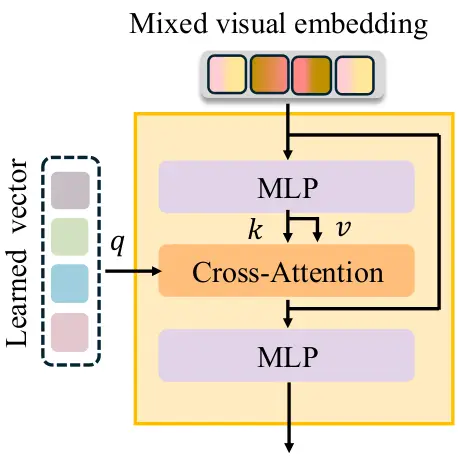

Figure 4: The details of the VisioPhonetic Adapter, which transforms
semantic visual embeddings into phonetic-aware features to enable
seamless conditioning for diffusion-based speech synthesis.

### VisioPhonetic Adapter

While the CSR-derived embeddings capture rich visual-linguistic
semantics, they remain mismatched in format and granularity for direct
use in diffusion-based speech generation. To bridge this modality gap,
we propose the VisioPhonetic Adapter (VPA), which transforms
semantically aligned visual features into a phonetic-aware conditioning
signal suitable for the LDM. As illustrated in Figure 4, this
lightweight module employs a sequential architecture to progressively
refine visual-semantic representations into a diffusion-compatible
conditioning signal:

```math
\mathbf{Z}_{mv}^{\prime}=\text{MLP}\Big(\text{CrossAttn}\big(\text{MLP}(\mathbf{Z}_{mv})\big)\Big), \tag{6}
```

which includes two MLPs and a Q-Former-style (Li et al. 2023)
cross-attention layer. We use $`N_{q}`$ learnable semantic queries
$`\mathbf{f}\in\mathbb{R}^{N_{q}\times D}`$, which is initialized by
computing the average latent representation from ground-truth
mel-spectrograms encoded by the pretrained VAE. This provides a
phonetic-aware initialization aligned with the diffusion model’s target
space. These queries act as phonetic slots to extract and reorganize
relevant patterns from $`\mathbf{Z}_{mv}`$. The cross-attention
mechanism operates as:
$`\mathbf{q}=\mathbf{W}^{q}\mathbf{f},\mathbf{k}=\mathbf{W}^{k}\mathbf{Z_{mv}},\mathbf{v}=\mathbf{W}^{v}\mathbf{Z_{mv}},\mathbf{a}=\text{Softmax}\left(\frac{\mathbf{q}\mathbf{k}^{T}}{\sqrt{d}}\right)\mathbf{v},\mathbf{{Z_{mv}}^{\prime}}=\text{MLP}(\mathbf{Z_{mv}}+a).`$
The adapted features $`\mathbf{Z}_{mv}^{\prime}`$ serve as the final
interface between visual understanding and speech synthesis, ensuring
that the generated audio is not only temporally coherent but also
linguistically faithful to the video input.

|                              |              |           |           |        |                    |     |
| ---------------------------- | ------------ | --------- | --------- | ------ | ------------------ | --- |
| Dataset                      | Cuers        | Sentences | Character | Word   | Resolution         | FPS |
| French CS (Liu et al. 2018)  | 1-H          | 238       | 12872     | \-     | $`720\times 576`$  | 50  |
| British CS (Liu et al. 2019) | 1-H          | 97        | 2741      | \-     | $`720\times 1280`$ | 25  |
| MCCS (Lei et al. 2024b)      | 4-H          | 4000      | 131608    | 42256  | $`720\times 1280`$ | 30  |
| Unified-HI (Ours)            | 6-H and 8-HI | 11282     | 350333    | 112664 | $`720\times 1280`$ | 30  |

Table 1: Comparison between our Chinese Mandarin CS dataset and existing
CS dataset. H denotes the cuers with normal hearing, while HI indicates
hearing-impaired cuer. Our newly proposed Unified-HI Corpus is the first
large-scale Chinese CS dataset with both hearing-impaired and
normal-hearing cuers.

|               |                      |                    |                     |                     |                   |                        |                   |                     |                     |
| ------------- | -------------------- | ------------------ | ------------------- | ------------------- | ----------------- | ---------------------- | ----------------- | ------------------- | ------------------- |
| Method        | Normal-hearing cuers |                    |                     |                     |                   | Hearing-impaired cuers |                   |                     |                     |
|               | WER $`\downarrow`$   | LSE-C $`\uparrow`$ | LSE-D$`\downarrow`$ | DNSMOS $`\uparrow`$ | STOI $`\uparrow`$ | WER$`\downarrow`$      | LSE-C$`\uparrow`$ | LSE-D$`\downarrow`$ | DNSMOS $`\uparrow`$ |
| GT            | \-                   | 7.274              | 7.314               | 2.79                | \-                | \-                     | \-                | \-                  | \-                  |
| CMML          | 0.663                | 4.135              | 9.241               | 1.24                | 0.11              | 0.924                  | 2.141             | 10.132              | 1.03                |
| EcoCued       | 0.657                | 4.327              | 9.146               | 1.28                | 0.12              | 0.917                  | 2.165             | 10.079              | 1.07                |
| CSR (Ours)    | 0.186                | 4.874              | 9.125               | 2.53                | 0.57              | 0.224                  | 3.342             | 9.315               | 2.29                |
| Lip2Speech    | 0.803                | 4.215              | 9.367               | 1.03                | 0.05              | 0.989                  | 2.424             | 10.816              | 0.02                |
| LipVoicer     | 0.754                | 4.361              | 9.226               | 1.12                | 0.08              | 0.971                  | 2.623             | 10.517              | 0.04                |
| CSV2S (Ours)  | 0.374                | 6.245              | 7.962               | 2.27                | 0.42              | 0.422                  | 5.938             | 8.347               | 2.04                |
| UniCUE (Ours) | 0.205                | 6.729              | 7.632               | 2.46                | 0.53              | 0.248                  | 6.491             | 8.076               | 2.17                |

Table 2: Comparison with SOTA methods on test data of normal-hearing
cuers and hearing-impaired cuers. Bold and underlined results are the
best and second-best results. $`\uparrow`$ indicates that larger values
are better, while $`\downarrow`$ indicates that smaller values are
preferable.

## Experiment

### Experimental Setting

Dataset. Existing CS datasets are limited to normal-hearing cuers and
lack data from hearing-impaired individuals, hindering model
generalization to the primary users of assistive communication systems.
To bridge this gap, we construct a new dataset, the Unified-HI Corpus,
which includes CS videos from 8 hearing-impaired and 6 normal-hearing
cuers. This diverse composition significantly enriches variations in
gesture styles, lip movements, and speech patterns. The expanded
coverage introduces more realistic challenges and better reflects
practical use cases, enabling models to capture cue-specific nuances
essential for hearing-impaired users. A comparison with existing CS
datasets is shown in Table 1, and further details on sentence coverage
and phoneme distribution are included in Appendix Section 2.

Due to the noisy speech data from hearing-impaired cuers, we use CS data
from 6 normal-hearing cuers for training. The data from normal-hearing
cuers is split by sentence into training and test sets with a 95:5 ratio
to ensure effective training and validation. Importantly, all CS data
from the 8 hearing-impaired cuers are used in the test set, enabling a
robust evaluation of model generalization to this group.

Architecture Details. The CSV2S pathway is entirely built upon the
AudioLDM  (Liu et al. 2023), including its VAE encoder-decoder, latent
diffusion model, and vocoder components. For CSR, the Transformer in
visual process, tokenizer, text-ViT, and text decoder are initialized
from MBart (Liu et al. 2020b). Detailed training and inference
configurations are provided in Appendix Section 1.

Evaluation Metrics. We evaluate the synthesized speech from three
perspectives: linguistic accuracy, temporal synchronization, and speech
quality. Linguistic accuracy is quantified by the Word Error Rate (WER)
between the recognized text and ground truth. Temporal synchronization
is assessed using SyncNet (Chung and Zisserman 2016), reporting LSE-D
(temporal distance) and LSE-C (confidence score). Speech quality is
evaluated via STOI (Taal et al. 2010) for intelligibility and
DNSMOS (Reddy et al. 2021) for naturalness.

Comparison Methods. We evaluate our UniCUE against: (1) CSV2S (Ours):
direct speech synthesis without CSR assistance; (2) CSR (Ours):
including pose-aware visual processor, text encoder and decoder, and
semantic alignment pool; (3) CSR methods: CMML (Liu and Liu 2023) and
EcoCued (Liu et al. 2024); (4) V2S methods: Lip2Speech (Choi et al. 2023) and LipVoicer (Yemini et al. 2024).

### Comparison with SOTA Methods

Quantitative Comparison. We compare our framework against SOTA methods,
as summarized in Table 2. Our CSR model, empowered by the pose-aware
visual processor and semantic alignment pool, achieves significantly
lower WERs (0.186 for normal-hearing and 0.224 for hearing-impaired
cuers), surpassing previous CSR methods. Building on this strong
semantic understanding, UniCUE outperforms V2S methods across LSE-D,
LSE-C, DNSMOS, and STOI metrics, demonstrating superior linguistic
accuracy, temporal alignment, and speech quality.

Qualitative Comparison. Mel-spectrogram visualizations (Figure 4 in
Appendix) further highlight the advantages of our method, showcasing
improved temporal synchronization and clearer acoustic structures
compared to others.

|             |                      |                    |                     |                     |                   |                        |                   |                     |                     |
| ----------- | -------------------- | ------------------ | ------------------- | ------------------- | ----------------- | ---------------------- | ----------------- | ------------------- | ------------------- |
| Method      | Normal-hearing cuers |                    |                     |                     |                   | Hearing-impaired cuers |                   |                     |                     |
|             | WER $`\downarrow`$   | LSE-C $`\uparrow`$ | LSE-D$`\downarrow`$ | DNSMOS $`\uparrow`$ | STOI $`\uparrow`$ | WER$`\downarrow`$      | LSE-C$`\uparrow`$ | LSE-D$`\downarrow`$ | DNSMOS $`\uparrow`$ |
| GT          | \-                   | 7.274              | 7.314               | 2.79                | \-                | \-                     | \-                | \-                  | \-                  |
| CSR^(††)    | 0.210                | 4.746              | 9.129               | 2.42                | 0.49              | 0.250                  | 3.218             | 9.402               | 2.19                |
| CSR^(‡)     | 0.204                | 4.783              | 9.224               | 2.46                | 0.53              | 0.247                  | 3.234             | 9.397               | 2.21                |
| CSR         | 0.186                | 4.874              | 9.125               | 2.53                | 0.57              | 0.224                  | 3.342             | 9.315               | 2.29                |
| CSV2S^(†)   | 0.398                | 6.158              | 8.122               | 2.21                | 0.40              | 0.398                  | 5.821             | 8.582               | 1.96                |
| CSV2S       | 0.374                | 6.245              | 7.962               | 2.27                | 0.42              | 0.422                  | 5.938             | 8.347               | 2.04                |
| UniCUE^(††) | 0.239                | 6.637              | 7.724               | 2.30                | 0.44              | 0.267                  | 6.419             | 8.163               | 2.08                |
| UniCUE^(‡)  | 0.231                | 6.641              | 7.716               | 2.33                | 0.46              | 0.276                  | 6.421             | 8.159               | 2.10                |
| UniCUE^(\*) | 0.226                | 6.613              | 7.731               | 2.37                | 0.48              | 0.271                  | 6.410             | 8.167               | 2.12                |
| UniCUE      | 0.205                | 6.729              | 7.632               | 2.46                | 0.53              | 0.248                  | 6.491             | 8.076               | 2.17                |

Table 3: Ablation Studies of model components on test data of norma
hearing cuers and hearing-impaired cuers. The notations X^(††), X^(‡),
and X^(\*) indicate ablated versions of the architecture X, where the
pose maps, semantic alignment pool, and VPA module are removed,
respectively.

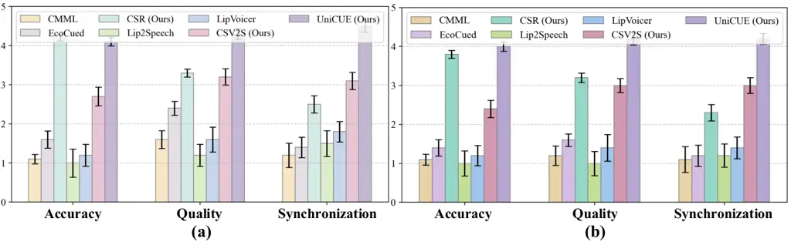

Figure 5: User study results for accuracy, quality, and synchronization
metrics on normal-hearing (a) and hearing-impaired (b) test samples.

### Ablation Studies

To verify the contribution of each component, we conduct ablation
studies on both normal-hearing and hearing-impaired test data. Results
are summarized in Table 3.

Unified Training Paradigm. Compared to direct CSV2S, UniCUE reduces WER
by 45% (0.205 vs. 0.374) on normal-hearing cuers and 41% (0.248 vs.
0.422) on hearing-impaired cuers. These results highlight the benefit of
leveraging fine-grained visual semantics from CSR to enhance CSV2S,
alleviating the challenge of modeling complex multimodal correlations.

Visual Processor Design. Models that rely solely on raw video features
struggle to capture fine-grained motion due to redundant and noisy
visual information, resulting in suboptimal performance. By
incorporating pose cues, our visual processor effectively captures
cuer-specific dynamics, leading to significantly improved accuracy and
robustness across diverse cuers. Semantic Alignment Mechanism. Disabling
the Semantic Alignment Pool (SAP) degrades visual-semantic consistency,
resulting in higher WERs for both CSR and UniCUE. This underscores the
importance of the alignment in enforcing spatiotemporal coherence
between visual cues and phonemic representations for accurate semantic
modeling. The effectiveness of SAP is further validated by the t-SNE
visualizations (Figure 5 in Appendix).

VisioPhonetic Adapter. Removing the VPA results in noticeable
degradation in temporal alignment, demonstrating its crucial role in
bridging the representation gap between CSR and CSV2S. By adaptively
selecting and refining fine-grained spatialtemporal visual cues through
learnable queries, the VPA enables more accurate and temporally coherent
speech synthesis.

Impact of Hand Cues. Removing hand cues leads to substantial performance
degradation, particularly for hearing-impaired users who often exhibit
limited oral articulation and atypical lip shapes (see Appendix Table
1). The results highlight the complementary role of hand gestures in
enhancing visual phonemic representations for CS.

Computational Efficiency. UniCUE achieves faster training convergence
and 40% lower inference time than the combined pipeline (see details in
Appendix Section 5).

### User Study

To comprehensively assess the perceptual quality of synthesized speech,
we conduct a user study involving 20 randomly selected test samples per
cuer. Twenty volunteers rate the generated speech on three perceptual
dimensions using 5-point Likert scales: Accuracy (1: unintelligible, 5:
perfectly intelligible), Quality (1: artificial, 5: human-like), and
Synchronization (1: desynchronized, 5: perfectly aligned). As shown in
Figure 5, UniCUE consistently achieves significantly higher scores
across all metrics, demonstrating statistically meaningful improvements.
These findings validate that our unified framework effectively bridges
visual understanding and speech generation, delivering superior
performance in human perception compared to both modular pipelines and
task-specific baselines.

## Conclusion

This work introduces UniCUE, the first unified framework for directly
generating speech from CS videos. By integrating fine-grained visual
understanding with diffusion-based speech synthesis, UniCUE produces
intelligible speech with precise temporal alignment. Key components
including the pose-aware visual processor, semantic alignment pool, and
VisioPhonetic Adapter, enable effective knowledge transfer from CS
recognition (CSR) to CS video-to-speech generation (CSV2S), enhancing
both linguistic accuracy and temporal synchronization. Additionally, we
introduce the UniCUE-HI corpus, a new CS dataset featuring both
normal-hearing and hearing-impaired cuers. Extensive experiments on this
dataset demonstrate that UniCUE outperforms SOTA methods across multiple
evaluation metrics.

## Acknowledgments

This work was supported by the National Natural Science Foundation of
China (No. 62471420), GuangDong Basic and Applied Basic Research
Foundation (2025A1515012296), and 2025 Tencent AI Lab Rhino-Bird
Program.

## References

- Bai et al. (2023) J. Bai, S. Bai, Y. Chu, Z. Cui, K. Dang, X. Deng, Y.
  Fan, W. Ge, Y. Han, F. Huang, B. Hui, L. Ji, M. Li, J. Lin, R. Lin, D.
  Liu, G. Liu, C. Lu, K. Lu, J. Ma, R. Men, X. Ren, X. Ren, C. Tan, S.
  Tan, J. Tu, P. Wang, S. Wang, W. Wang, S. Wu, B. Xu, J. Xu, A.
  Yang, H. Yang, J. Yang, S. Yang, Y. Yao, B. Yu, H. Yuan, Z. Yuan, J.
  Zhang, X. Zhang, Y. Zhang, Z. Zhang, C. Zhou, J. Zhou, X. Zhou, and T.
  Zhu Qwen technical report. arXiv preprint arXiv:2309.16609. Cited
  by: 3. Details of Comparison with CSR.
- Cao et al. (2019) Z. Cao, G. Hidalgo Martinez, T. Simon, S. Wei,
  and Y. A. Sheikh OpenPose: realtime multi-person 2d pose estimation
  using part affinity fields. IEEE Transactions on Pattern Analysis and
  Machine Intelligence. Cited by: Overview of UniCUE.
- Chen et al. (2025a) L. Chen, S. Bai, W. Chai, W. Xie, H. Zhao, L.
  Vinci, J. Lin, and B. Chang Multimodal representation alignment for
  image generation: text-image interleaved control is easier than you
  think. CoRR. Cited by: Introduction.
- Chen et al. (2025b) X. Chen, Z. Wu, X. Liu, Z. Pan, W. Liu, Z. Xie, X.
  Yu, and C. Ruan Janus-pro: unified multimodal understanding and
  generation with data and model scaling. CoRR. Cited by: Unified
  Understanding and Generation.
- Chen et al. (2024) Y. Chen, Z. Niu, Z. Ma, K. Deng, C. Wang, J.
  Zhao, K. Yu, and X. Chen F5-tts: a fairytaler that fakes fluent and
  faithful speech with flow matching. CoRR. Cited by: 3. Details of
  Comparison with CSR.
- Choi et al. (2023) J. Choi, M. Kim, and Y. M. Ro Intelligible
  lip-to-speech synthesis with speech units. In Proceedings of the
  Annual Conference of the International Speech Communication
  Association, INTERSPEECH, Vol. 2023, pp. 4349–4353. Cited by:
  Experimental Setting.
- Chung and Zisserman (2016) J. S. Chung and A. Zisserman Out of time:
  automated lip sync in the wild. In Workshop on Multi-view Lip-reading,
  ACCV, Cited by: Experimental Setting.
- Cornett (1967) R. O. Cornett Cued speech. American annals of the deaf,
  pp. 3–13. Cited by: Introduction.
- Dong et al. (2024) R. Dong, C. Han, Y. Peng, Z. Qi, Z. Ge, J. Yang, L.
  Zhao, J. Sun, H. Zhou, H. Wei, et al. DreamLLM: synergistic multimodal
  comprehension and creation. In ICLR, Cited by: Unified Understanding
  and Generation, Overview of UniCUE.
- Fang et al. (2024) R. Fang, C. Duan, K. Wang, H. Li, H. Tian, X.
  Zeng, R. Zhao, J. Dai, H. Li, and X. Liu PUMA: empowering unified mllm
  with multi-granular visual generation. CoRR. Cited by: Unified
  Understanding and Generation.
- Ge et al. (2025) Y. Ge, Y. Li, Y. Ge, and Y. Shan Divot: diffusion
  powers video tokenizer for comprehension and generation. In
  Proceedings of the Computer Vision and Pattern Recognition Conference,
  pp. 13606–13617. Cited by: Unified Understanding and Generation.
- Ge et al. (2024) Y. Ge, S. Zhao, J. Zhu, Y. Ge, K. Yi, L. Song, C.
  Li, X. Ding, and Y. Shan SEED-x: multimodal models with unified
  multi-granularity comprehension and generation. CoRR. Cited by:
  Unified Understanding and Generation.
- Graves et al. (2006) A. Graves, S. Fernández, F. Gomez, and J.
  Schmidhuber Connectionist temporal classification: labelling
  unsegmented sequence data with recurrent neural networks. In
  Proceedings of the 23rd international conference on Machine learning,
  pp. 369–376. Cited by: Overview of UniCUE.
- Gupta et al. (2024) A. Gupta, T. Likhomanenko, K. D. Yang, R. H.
  Bai, Z. Aldeneh, and N. Jaitly Visatronic: a multimodal decoder-only
  model for speech synthesis. arXiv:2411.17690. Cited by:
  Video-to-Speech Generation.
- Jin et al. (2024) Y. Jin, K. Xu, L. Chen, C. Liao, J. Tan, Q.
  Huang, B. Chen, C. Song, D. Meng, D. Zhang, et al. Unified
  language-vision pretraining in llm with dynamic discrete visual
  tokenization. In ICLR, Cited by: Unified Understanding and Generation.
- Kefalas et al. (2024) T. Kefalas, Y. Panagakis, and M. Pantic
  Large-scale unsupervised audio pre-training for video-to-speech
  synthesis. IEEE/ACM Transactions on Audio, Speech, and Language
  Processing. Cited by: Video-to-Speech Generation.
- Kim et al. (2023) M. Kim, J. Hong, and Y. M. Ro Lip-to-speech
  synthesis in the wild with multi-task learning. In ICASSP 2023-2023
  IEEE International Conference on Acoustics, Speech and Signal
  Processing (ICASSP), pp. 1–5. Cited by: Video-to-Speech Generation.
- Lei et al. (2024a) S. Lei, X. Cheng, M. Lyu, J. Hu, J. Tan, R. Liu, L.
  Xiong, T. Jin, X. Li, and Z. Zhao Uni-dubbing: zero-shot speech
  synthesis from visual articulation. In Proceedings of the 62nd Annual
  Meeting of the Association for Computational Linguistics (Volume 1:
  Long Papers), pp. 10082–10099. Cited by: Video-to-Speech Generation.
- Lei et al. (2024b) W. Lei, L. Liu, and J. Wang Bridge to non-barrier
  communication: gloss-prompted fine-grained cued speech gesture
  generation with diffusion model. In Proceedings of the Thirty-Third
  International Joint Conference on Artificial Intelligence,
  pp. 6333–6341. Cited by: Introduction, Table 1, 2. Details of the
  UniCUE-HI Corpus.
- Leybaert et al. (2010) J. Leybaert, M. Aparicio, and J. Alegria 19 the
  role of cued speech in language development of deaf children. The
  Oxford Handbook of Deaf Studies, Language, and Education, Volume 1,
  pp. 276. Cited by: Introduction.
- Leybaert and LaSasso (2010) J. Leybaert and C. J. LaSasso Cued speech
  for enhancing speech perception and first language development of
  children with cochlear implants. Trends in amplification 14 (2),
  pp. 96–112. Cited by: Introduction.
- Li et al. (2023) J. Li, D. Li, S. Savarese, and S. Hoi Blip-2:
  bootstrapping language-image pre-training with frozen image encoders
  and large language models. In International conference on machine
  learning, pp. 19730–19742. Cited by: VisioPhonetic Adapter.
- Li et al. (2024) Y. Li, Y. Zhang, C. Wang, Z. Zhong, Y. Chen, R.
  Chu, S. Liu, and J. Jia Mini-gemini: mining the potential of
  multi-modality vision language models. CoRR. Cited by: Unified
  Understanding and Generation.
- Liu et al. (2023) H. Liu, Z. Chen, Y. Yuan, X. Mei, X. Liu, D.
  Mandic, W. Wang, and M. D. Plumbley AudioLDM: text-to-audio generation
  with latent diffusion models. In International Conference on Machine
  Learning, pp. 21450–21474. Cited by: Experimental Setting, 1. Details
  of Training and Inference.
- Liu et al. (2024) L. Liu, L. Liu, and H. Li Computation and parameter
  efficient multi-modal fusion transformer for cued speech recognition.
  IEEE/ACM Transactions on Audio, Speech, and Language Processing. Cited
  by: Introduction, Introduction, Cued Speech Recognition, Experimental
  Setting.
- Liu and Liu (2023) L. Liu and L. Liu Cross-modal mutual learning for
  cued speech recognition. In ICASSP 2023-2023 IEEE International
  Conference on Acoustics, Speech and Signal Processing (ICASSP),
  pp. 1–5. Cited by: Introduction, Cued Speech Recognition, Experimental
  Setting.
- Liu et al. (2020a) L. Liu, G. Feng, D. Beautemps, and X. Zhang
  Re-synchronization using the hand preceding model for multi-modal
  fusion in automatic continuous cued speech recognition. IEEE
  Transactions on Multimedia 23, pp. 292–305. Cited by: Introduction,
  Introduction, Cued Speech Recognition.
- Liu and Feng (2019) L. Liu and G. Feng A pilot study on mandarin
  chinese cued speech. American Annals of the Deaf 164 (4), pp. 496–518.
  Cited by: Figure 1, Introduction, Cued Speech Recognition.
- Liu et al. (2018) L. Liu, T. Hueber, G. Feng, and D. Beautemps Visual
  recognition of continuous cued speech using a tandem cnn-hmm
  approach.. In Interspeech, pp. 2643–2647. Cited by: Introduction,
  Table 1.
- Liu et al. (2019) L. Liu, J. Li, G. Feng, and X. S. Zhang Automatic
  detection of the temporal segmentation of hand movements in british
  english cued speech.. In Interspeech, pp. 2285–2289. Cited by:
  Introduction, Table 1.
- Liu et al. (2020b) Y. Liu, J. Gu, N. Goyal, X. Li, S. Edunov, M.
  Ghazvininejad, M. Lewis, and L. Zettlemoyer Multilingual denoising
  pre-training for neural machine translation. Transactions of the
  Association for Computational Linguistics 8, pp. 726–742. Cited by:
  Experimental Setting.
- Maaten and Hinton (2008) L. v. d. Maaten and G. Hinton Visualizing
  data using t-sne. Journal of Machine Learning Research (JMLR) 9 (86),
  pp. 2579–2605. External Links:
  [Link](http://www.jmlr.org/papers/v9/vandermaaten08a.html) Cited
  by: 5. Discussion and Analysis.
- Mi et al. (2025) Z. Mi, K. Wang, G. Qian, H. Ye, R. Liu, S.
  Tulyakov, K. Aberman, and D. Xu I think, therefore i diffuse: enabling
  multimodal in-context reasoning in diffusion models. arXiv:2502.10458.
  Cited by: Introduction.
- Papadimitriou and Potamianos (2021) K. Papadimitriou and G. Potamianos
  A fully convolutional sequence learning approach for cued speech
  recognition from videos. In 2020 28th European Signal Processing
  Conference (EUSIPCO), pp. 326–330. Cited by: Cued Speech Recognition.
- Podell et al. (2023) D. Podell, Z. English, K. Lacey, A. Blattmann, T.
  Dockhorn, J. Müller, J. Penna, and R. Rombach Sdxl: improving latent
  diffusion models for high-resolution image synthesis.
  arXiv:2307.01952. Cited by: Unified Understanding and Generation.
- Reddy et al. (2021) C. K. Reddy, V. Gopal, and R. Cutler DNSMOS: a
  non-intrusive perceptual objective speech quality metric to evaluate
  noise suppressors. In ICASSP 2021-2021 IEEE International Conference
  on Acoustics, Speech and Signal Processing (ICASSP), pp. 6493–6497.
  Cited by: Experimental Setting.
- Resemble-AI (2020) Resemble-AI Resemblyzer: a python package to
  analyze and compare voices with deep learning. Note: Online.
  Available: https://github.com/resemble-ai/Resemblyzer Cited by: 5.
  Discussion and Analysis.
- Rombach et al. (2022) R. Rombach, A. Blattmann, D. Lorenz, P. Esser,
  and B. Ommer High-resolution image synthesis with latent diffusion
  models. In Proceedings of the IEEE/CVF conference on computer vision
  and pattern recognition, pp. 10684–10695. Cited by: Unified
  Understanding and Generation, Overview of UniCUE.
- Sun et al. (2024) Q. Sun, Y. Cui, X. Zhang, F. Zhang, Q. Yu, Y.
  Wang, Y. Rao, J. Liu, T. Huang, and X. Wang Generative multimodal
  models are in-context learners. In Proceedings of the IEEE/CVF
  Conference on Computer Vision and Pattern Recognition,
  pp. 14398–14409. Cited by: Unified Understanding and Generation.
- Sun et al. (2023) Q. Sun, Q. Yu, Y. Cui, F. Zhang, X. Zhang, Y.
  Wang, H. Gao, J. Liu, T. Huang, and X. Wang Emu: generative
  pretraining in multimodality. In The Twelfth International Conference
  on Learning Representations, Cited by: Unified Understanding and
  Generation.
- Taal et al. (2010) C. H. Taal, R. C. Hendriks, R. Heusdens, and J.
  Jensen A short-time objective intelligibility measure for
  time-frequency weighted noisy speech. In 2010 IEEE international
  conference on acoustics, speech and signal processing, pp. 4214–4217.
  Cited by: Experimental Setting.
- Wu et al. (2025) C. Wu, X. Chen, Z. Wu, Y. Ma, X. Liu, Z. Pan, W.
  Liu, Z. Xie, X. Yu, C. Ruan, et al. Janus: decoupling visual encoding
  for unified multimodal understanding and generation. In Proceedings of
  the Computer Vision and Pattern Recognition Conference,
  pp. 12966–12977. Cited by: Unified Understanding and Generation.
- Wu et al. (2024a) S. Wu, H. Fei, L. Qu, W. Ji, and T. Chua NExT-gpt:
  any-to-any multimodal llm. In International Conference on Machine
  Learning, pp. 53366–53397. Cited by: Unified Understanding and
  Generation, Overview of UniCUE.
- Wu et al. (2024b) Y. Wu, Z. Zhang, J. Chen, H. Tang, D. Li, Y.
  Fang, L. Zhu, E. Xie, H. Yin, L. Yi, et al. Vila-u: a unified
  foundation model integrating visual understanding and generation.
  arXiv:2409.04429. Cited by: Unified Understanding and Generation.
- Yemini et al. (2024) Y. Yemini, A. Shamsian, L. Bracha, S. Gannot,
  and E. Fetaya LipVoicer: generating speech from silent videos guided
  by lip reading. In The Twelfth International Conference on Learning
  Representations, Cited by: Introduction, Video-to-Speech Generation,
  Experimental Setting.
- Yu et al. (2023) L. Yu, B. Shi, R. Pasunuru, B. Muller, O.
  Golovneva, T. Wang, A. Babu, B. Tang, B. Karrer, S. Sheynin, et al.
  Scaling autoregressive multi-modal models: pretraining and instruction
  tuning. arXiv:2309.02591 2 (3). Cited by: Unified Understanding and
  Generation.
- Zhang et al. (2023) Y. Zhang, L. Liu, and L. Liu Cuing without
  sharing: a federated cued speech recognition framework via mutual
  knowledge distillation. In Proceedings of the 31st ACM International
  Conference on Multimedia, pp. 8781–8789. Cited by: Cued Speech
  Recognition.
- Zhou et al. (2024) C. Zhou, L. YU, A. Babu, K. Tirumala, M.
  Yasunaga, L. Shamis, J. Kahn, X. Ma, L. Zettlemoyer, and O. Levy
  Transfusion: predict the next token and diffuse images with one
  multi-modal model. In The Thirteenth International Conference on
  Learning Representations, Cited by: Unified Understanding and
  Generation.

## Appendix

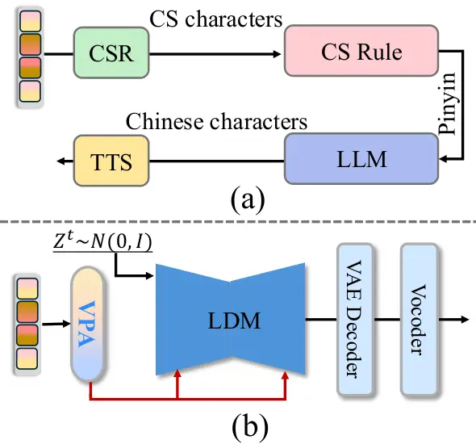

Figure 6: Comparison of CSV2S generation at inference stage. (a) The
combined CS speech generation pipeline of CSR and TTS. (b) Our UniCUE.
During inference, the extracted visual mixture embedding serves as a
condition to guide direct speech generation.

### 1. Details of Training and Inference

Training Details. The training process is divided into two sequential
phases to ensure effective knowledge transfer from visual understanding
to speech synthesis. Stage 1: CSR focuses on learning fine-grained
spatiotemporal representations by jointly optimizing the pose-aware
visual processor, the semantic alignment pool, text encoder and decoder.
This stage trains the model using the hybrid cross-entropy loss
$`\mathcal{L}_{R}`$ (denoted in main text Equation (1)) and the
contrastive alignment loss $`\mathcal{L}_{S}`$ (denoted in main text
Equation (5)), formulated as:
$`\mathcal{L}=\mathcal{L}_{R}+\mathcal{L}_{S}.`$ Stage 2: CSV2S
leverages the learned visual representations from Stage 1 to train the
VPA network and diffusion model with the objective $`\mathcal{L}_{G}`$
(denoted in main text Equation (2)).

Inference Details. During inference, the framework operates in a
streamlined single-path mode to synthesize speech directly from cued CS
videos. As illustrated in Figure 6 (b), given an CS video and its
corresponding pose, the trained pose-aware visual processor extracts the
visual mixture representation $`Z_{mv}`$, which encodes both semantic
content and cuer characteristics. A noise sample $`Z^{t}`$, sampled from
a standard Gaussian distribution $`N(0,I)`$, is fed into the trained LDM
to predict the speech latent code $`\hat{Z_{s}}`$ conditioned on the
visual mixture representation over $`t`$ timesteps:

```math
\hat{Z_{s}}:=\frac{1}{\alpha_{t}}\left(Z_{t}-\left(1-\alpha_{t}\right)\cdot\mathcal{M}(Z^{t},Z_{mv},t)\right), \tag{7}
```

where $`\mathcal{M}`$ denotes the noise prediction network of the LDM,
and $`\alpha_{t}`$ represents the scheduled variance coefficient at
timestep $`t`$. Subsequently, the predicted speech latent code
$`\hat{Z_{s}}`$ is decoded into a speech mel-spectrogram via VAE
decoder, and a pre-trained Vocoder (Liu et al. 2023) is used to convert
the mel-spectrogram into a speech waveform. Through this series of
steps, the CSV2S system is able to generate natural speech that is
consistent with the cuer’s characteristics based on the input CS video
and its corresponding pose information.

Implementation Details. Raw video frames and pose images are resized to
$`256\times 256`$, while the audio is resampled to 16 kHz and converted
into mel-spectrograms. The entire learning framework is implemented in
PyTorch, and all experiments are conducted on an NVIDIA RTX A6000. We
use the Adam optimizer with a learning rate of $`5\times 10^{-4}`$ for
training, setting the mini-batch size to 2.

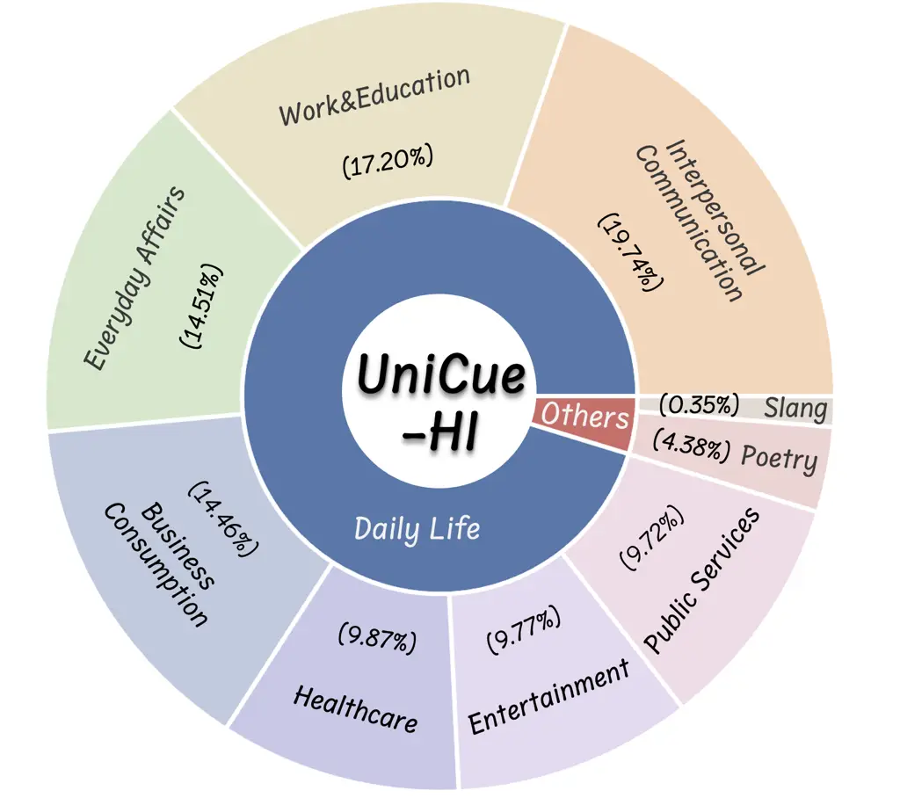

Figure 7: Statistics of sentence categories within our UniCue-HI Corpus.

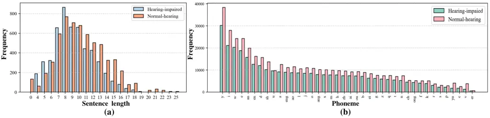

Figure 8: Statistical distributions of samples in the UniCUE-HI
corpus.(a) Character-level sentence lengths; (b) Phoneme distribution.
Normal-hearing and hearing-impaired groups are distinguished by color.
Please zoom in for better view.

### 2. Details of the UniCUE-HI Corpus

To evaluate model effectiveness on hearing-impaired individuals, we
construct the first large-scale Chinese Cued Speech (CS) dataset,
UniCUE-HI Corpus, that includes both hearing-impaired and normal-hearing
cuers. The proposed UniCUE-HI Corpus is designed to ensure linguistic
and contextual diversity, covering a broad range of sentence categories,
including daily communication scenarios, as illustrated in Figure 7.

To better understand linguistic variations across user groups, we
analyze sentence structure statistics in our dataset. Figure 8 presents
the distributions of sentence lengths and phoneme occurrences for
normal-hearing and hearing-impaired cuers. While the overall
distributions are similar, hearing-impaired users tend to produce
slightly shorter sentences on average, indicating potential articulatory
constraints and reduced fluency. These characteristics introduce
additional modeling challenges and emphasize the importance of including
hearing-impaired data for more realistic evaluation.

The dataset was constructed by recruiting 10 cuers (2 normal-hearing and
8 hearing-impaired), each instructed to simultaneously vocalize and
encode text sentences sourced from (Lei et al. 2024b). All participants
underwent systematic training to ensure accurate and fluent Mandarin
Chinese CS production. In addition, we incorporate CS video data from 4
normal-hearing cuers in the MCCS dataset (Lei et al. 2024b), resulting
in the UniCUE-HI Corpus with 14 cuers.

All data were collected with informed consent and are publicly released
for open-source research purposes.

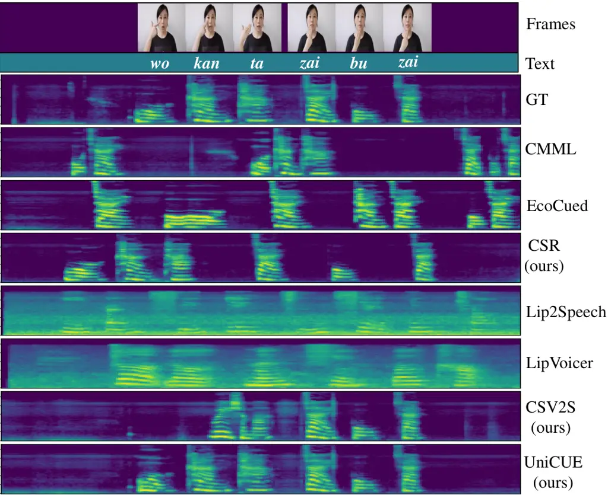

Figure 9: Visualization of the Mel-spectrograms of the generated speech.
Our UniCUE model exhibits superior linguistic accuracy and temporal
synchronization compared to baseline methods.

### 3. Details of Comparison with CSR

Since CSR methods output phoneme-level transcriptions, we design a
two-stage pipeline for speech generation, as shown in Figure 6(b).
First, phoneme sequences are converted into Chinese characters using a
rule-based CS mapping system, which follows a curated
phoneme-to-character dictionary and handles tone-based disambiguation.
To improve robustness and address homophonic ambiguities, the mapped
text is further refined by the QWen language model(Bai et al. 2023).
Then, the resulting character sequence is passed into F5-TTS (Chen et
al. 2024), a controllable speech synthesizer that generates waveforms
conditioned on reference speech from the same speaker. This design
ensures a fair comparison with our direct CSV2S model in terms of
speaker consistency and prosodic naturalness.

|              |                      |                    |                     |                     |                   |                        |                   |                     |                     |
| ------------ | -------------------- | ------------------ | ------------------- | ------------------- | ----------------- | ---------------------- | ----------------- | ------------------- | ------------------- |
| Method       | Normal-hearing cuers |                    |                     |                     |                   | Hearing-impaired cuers |                   |                     |                     |
|              | WER $`\downarrow`$   | LSE-C $`\uparrow`$ | LSE-D$`\downarrow`$ | DNSMOS $`\uparrow`$ | STOI $`\uparrow`$ | WER$`\downarrow`$      | LSE-C$`\uparrow`$ | LSE-D$`\downarrow`$ | DNSMOS $`\uparrow`$ |
| GT           | \-                   | 7.274              | 7.314               | 2.79                | \-                | \-                     | \-                | \-                  | \-                  |
| CSR(w/o)     | 0.547                | 4.692              | 10.064              | 1.93                | 0.29              | 0.713                  | 3.215             | 10.032              | 1.01                |
| CSR          | 0.186                | 4.874              | 9.125               | 2.53                | 0.57              | 0.224                  | 3.342             | 9.315               | 2.29                |
| CSV2S (w/o)  | 0.729                | 4.614              | 9.174               | 1.16                | 0.09              | 0.925                  | 3.701             | 10.124              | 0.05                |
| CSV2S        | 0.374                | 6.245              | 7.962               | 2.27                | 0.42              | 0.422                  | 5.938             | 8.347               | 2.04                |
| UniCUE (w/o) | 0.592                | 4.934              | 8.927               | 1.88                | 0.26              | 0.793                  | 4.412             | 9.742               | 0.09                |
| UniCUE       | 0.205                | 6.729              | 7.632               | 2.46                | 0.53              | 0.248                  | 6.491             | 8.076               | 2.17                |

Table 4: Ablation analysis the impact of hand cues in cued speech. (w/o)
denotes using lip cues only, without hand gestures. Bold and underlined
results are the best and second-best results. $`\uparrow`$ indicates
that larger values are better, while $`\downarrow`$ indicates that
smaller values are preferable.

### 4. Qualitative Comparison with SOTA Methods

To qualitatively assess the effectiveness of our proposed framework, we
visualize the Mel-spectrograms of the generated speech and compare them
against those produced by several state-of-the-art (SOTA) methods. As
shown in Figure 9, UniCUE generates spectrograms that are more
consistent with the ground truth in both temporal structure and phonetic
detail. In particular, the generated patterns exhibit clearer formant
trajectories and better alignment with visual speech cues, indicating
superior temporal synchronization and articulation precision. These
visual differences further support the quantitative gains observed in
WER and LSE metrics, highlighting UniCUE’s ability to generate
intelligible and temporally coherent speech from cued videos.

More generation results are provided in the supplementary demo file.

### 5. Discussion and Analysis

Visualization Analysis of Semantic Alignment Pool. To assess the
effectiveness of the proposed Semantic Alignment Pool (SAP), we present
t-SNE visualizations of the learned embeddings across video, pose, and
text modalities in Figure 10. Without SAP (Figure 10a), the embeddings
are loosely distributed with poor cross-modal alignment. In contrast,
enabling SAP (Figure 10b) results in compact and well-aligned clusters
across modalities, indicating enhanced semantic coherence. These results
demonstrate that SAP effectively bridges the visual-textual modality
gap, facilitating grounded multimodal representation learning.

Impact of Hand Cues. Table 4 presents an ablation study assessing the
effect of hand cues in CS speech synthesis. Removing hand gestures leads
to substantial performance degradation across all metrics, particularly
for hearing-impaired cuers. For instance, the WER of CSR increases
drastically from 0.224 to 0.713 without hand cues, highlighting their
crucial role in compensating for atypical articulatory patterns.
Moreover, UniCUE achieves the best results in both LSE-C (6.729 for
normal-hearing, 6.491 for hearing-impaired) and STOI (0.53),
demonstrating its strong capability in generating expressive and
intelligible speech by leveraging multi-modal visual information.

Analysis of Cuer Representation. To quantitatively evaluate the model’s
ability to preserve cuer-specific acoustic characteristics, we extract
latent cuer embeddings from the generated speech using Resemblyzer
(Resemble-AI 2020). These embeddings are projected into a 2D space via
t-SNE (Maaten and Hinton 2008) for visualization. As illustrated in
Figure 11, speech samples from the same cuer (e.g., cuers 1 through 6)
form compact clusters, while the distances between clusters
corresponding to different cuers are notably larger. This demonstrates
that the model effectively captures and differentiates personalized
acoustic features unique to each cuer.

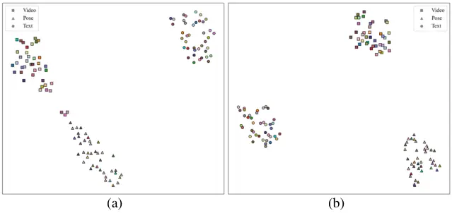

Figure 10: t-SNE visualization of video, pose, and text embeddings. (a):
without Semantic Alignment Pool (SAP). (b): with SAP. Each color
represents a different class, and different shapes denote different
modalities. The results show that SAP enhances cross-modal alignment by
bringing embeddings of the same class closer together in the semantic
space.

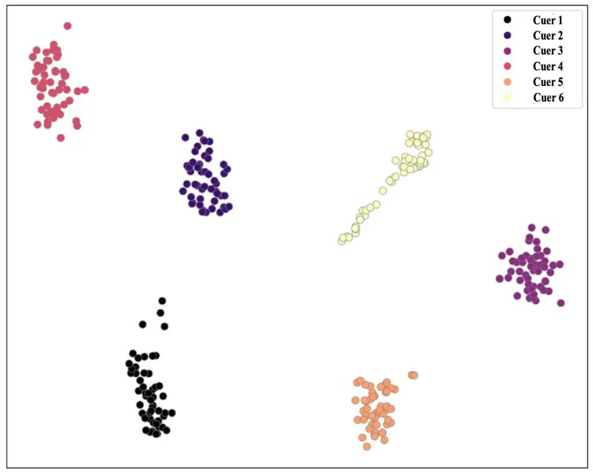

Figure 11: The t-SNE visualization of 6 normal-hearing cuers embeddings
from generated speech. Each point represents a speech sample. Better
view by zooming in.

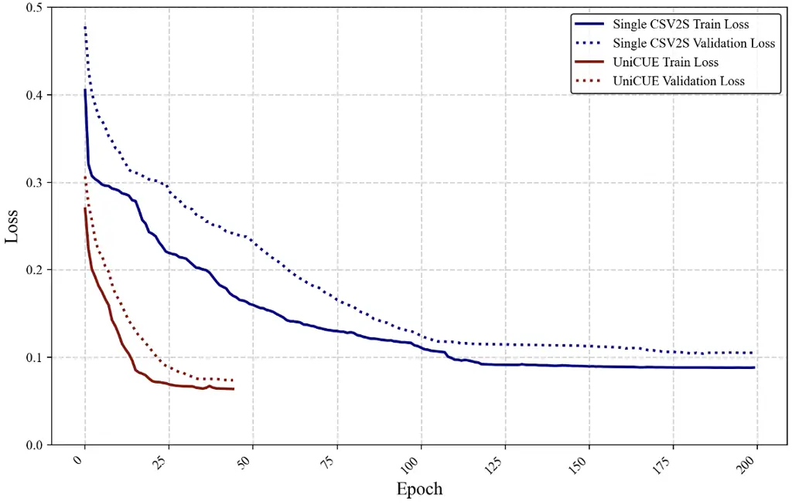

Figure 12: The learning curves for the training and validation stages of
our UniCUE model and the single CSV2S model. It can be seen that the
efficiency and effectiveness of the unified approach. Better view by
zooming in.

Analysis of Computational Efficiency. To quantify the efficiency gains
of our unified framework, we evaluate the time costs during both
training and inference stages.

(a) Training Efficiency. We compare the training performance of CSV2S
and UniCUE. As shown in Figure 12, UniCUE’s training loss converges
faster to a stable value within fewer epochs, indicating that the
incorporation of fine-grained visual understanding accelerates the
learning process. Concurrently, the validation loss exhibits reduced
fluctuation, reflecting enhanced model robustness.

(b) Real-time Inference. To assess real-time capability, we compare the
inference efficiency of the traditional pipeline (CSR + TTS) with our
unified CSV2S framework. UniCUE achieves a significant reduction in
inference time (4.15s), representing a 40% speedup over the sequential
CSR + TTS approach (6.93s), thereby demonstrating the efficiency
benefits of the unified architecture.

|                                                       |                       |                        |
| ----------------------------------------------------- | --------------------- | ---------------------- |
| Methods                                               | WER$`\downarrow`$ (H) | WER$`\downarrow`$ (HI) |
| CSR (w/o $`\mathcal{L}_{\text{CE}}^{\text{masked}}`$) | 0.214                 | 0.263                  |
| CSR                                                   | 0.186                 | 0.224                  |

Table 5: Ablation results of loss design for CSR.
$`\mathcal{L}_{\text{CE}}^{\text{masked}}`$ denotes masked language
modeling loss in CSR objective function. H and HI denote the
normal-hearing data and hearing-impaired data, respectively.

### 6. Ablation Study of CSR Loss

Table 5 presents an ablation analysis of the hybrid loss design in our
CSR module. Removing the masked language modeling loss
$`\mathcal{L}_{\text{CE}}^{\text{masked}}`$ leads to noticeable
performance degradation, with WER increasing from 0.186 to 0.214 on
normal-hearing data and from 0.224 to 0.263 on hearing-impaired data.
This highlights the effectiveness of combining token-level masked
supervision with sequence-level training, which enhances contextual
understanding and improves transcription accuracy.
