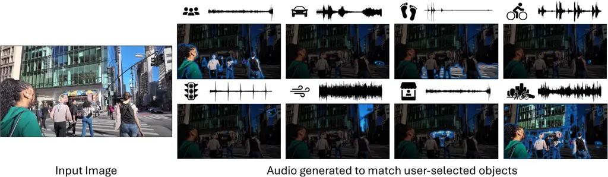
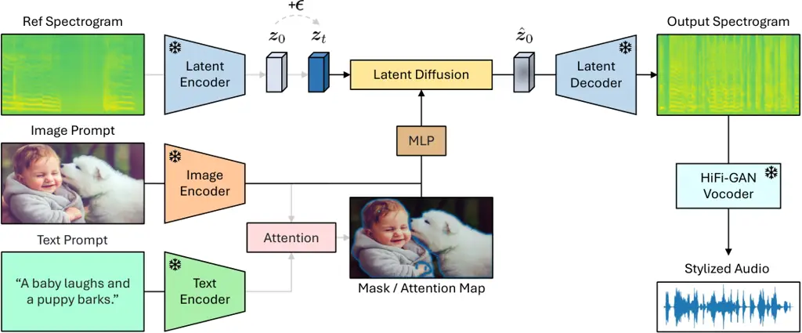
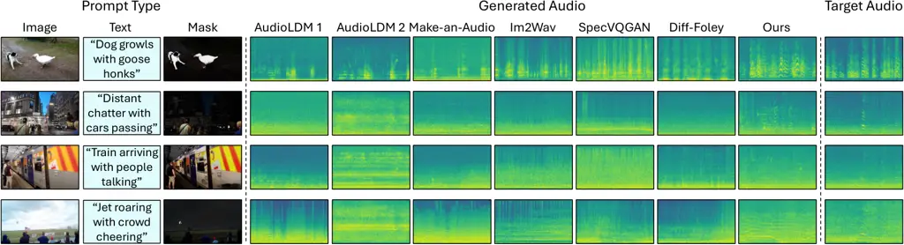
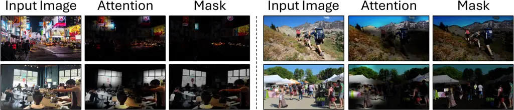
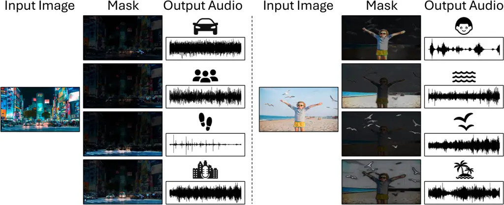
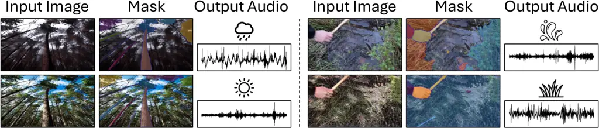
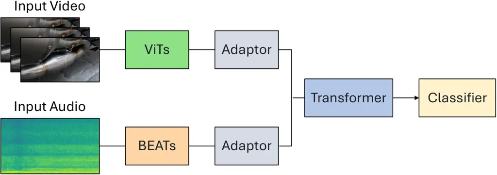
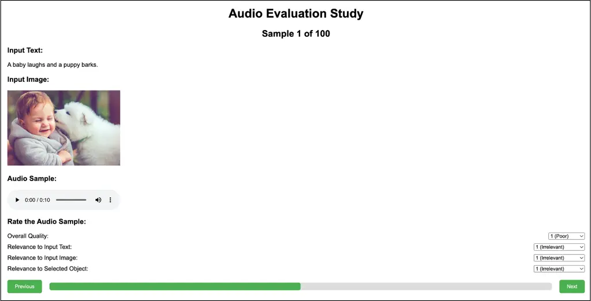

# Sounding that Object: Interactive Object-Aware Image to Audio Generation

Tingle Li Affiliation: University of California, Berkeley Correspondence
to: <tingle@eecs.berkeley.edu>    Baihe Huang Affiliation: University of
California, Berkeley    Xiaobin Zhuang Affiliation: ByteDance Inc   
Dongya Jia Affiliation: ByteDance Inc    Jiawei Chen
Affiliation: ByteDance Inc    Yuping Wang Affiliation: ByteDance Inc   
Zhuo Chen Affiliation: ByteDance Inc    Gopala Anumanchipalli
Affiliation: University of California, Berkeley    Yuxuan Wang
Affiliation: ByteDance Inc

###### Abstract

Generating accurate sounds for complex audio-visual scenes is
challenging, especially in the presence of multiple objects and sound
sources. In this paper, we propose an interactive object-aware audio
generation model that grounds sound generation in user-selected visual
objects within images. Our method integrates object-centric learning
into a conditional latent diffusion model, which learns to associate
image regions with their corresponding sounds through multi-modal
attention. At test time, our model employs image segmentation to allow
users to interactively generate sounds at the object level. We
theoretically validate that our attention mechanism functionally
approximates test-time segmentation masks, ensuring the generated audio
aligns with selected objects. Quantitative and qualitative evaluations
show that our model outperforms baselines, achieving better alignment
between objects and their associated sounds. Project site:
[https://tinglok.netlify.app/files/avobject/](https://tinglok.netlify.app/files/avobject/).

###### Keywords: 

Sound Generation, Audio-Visual Learning, ICML



Figure 1: Interactive object-aware audio generation. We generate sound
aligned with specific visual objects in complex scenes. Users can select
one or more objects in the scene using segmentation masks, and our model
generates audio corresponding to the selected objects. Here, we show a
busy street with multiple sound sources (left). After training, our
model generates object-specific audio (right), such as crowd noise for
people, engine sounds for cars, and blended audio for multiple objects.

## 1 Introduction

Humans naturally perceive the world as ensembles of distinct objects and
their associated sounds (Bregman, 1994). For example, in a busy city
street (Figure 1), we can identify sounds from multiple objects, such as
honks, footsteps, and chatters. However, replicating such object-level
specificity remains challenging for computational models. Despite
notable advances in audio generation (Van Den Doel et al., 2001; Kong
et al., 2019; Yang et al., 2023), existing methods often generate
holistic soundscapes that fail to accurately reproduce the distinct
sounds of specific objects (Pijanowski et al., 2011). In complex scenes,
models may either _forget_ subtle sounds (e.g., footsteps) or _bind_
co-occurring events (e.g., crowd noise and wind) even when only one is
intended, leading to inaccurate sound textures (McDermott & Simoncelli,
2011).

Recent progress in vision-based models (Sheffer & Adi, 2023) relies on
analyzing the entire visual scene to produce a single soundtrack, but
this broad perspective may overlook subtle yet important sound sources.
Text-based models (Liu et al., 2023), on the other hand, face
difficulties when a prompt represents multiple events, either omitting
certain sounds or conflating them with others due to entangled feature
correlations (Wu et al., 2023). While manually reweighting individual
sound events in the diffusion latent (Xue et al., 2024) can mitigate
these issues, it remains labor-intensive and impractical for large-scale
applications. Fundamentally, these challenges arise because real-world
sounds are often _imbalanced_ and _confounding_ in complex scenes,
making it difficult to disentangle distinct sound sources.

To overcome these limitations, we propose an interactive object-aware
audio generation model that grounds each generated sound in a specific
visual object. Inspired by how humans parse complex soundscapes (Gaver,
1993), our model not only processes the overall scene context (e.g., a
city street) but also decouples separate events (e.g., honks,
footsteps). Drawing on object-centric learning (Greff et al., 2019), we
build our model upon a conditional audio generation framework (Liu
et al., 2023) and introduce multi-modal dot-product attention (Vaswani
et al., 2017) to learn sound-object associations through
self-supervision (Zhao et al., 2018; Afouras et al., 2020), which
fundamentally overcomes the problem of forgetting or binding sound
events.

To provide finer control and interactivity, we leverage segmentation
masks (Kirillov et al., 2023) to convert user queries into attention
maps at test time, allowing users to select specific objects in an image
(e.g., car shapes) to generate the corresponding sounds (e.g., engine
sounds) with simple mouse clicks. Since these masks guide the model to
focus on objects of interest, even subtle sound events can be captured
more accurately than with scene-wide analysis alone. Moreover, because
the entire image still informs the generation process, selecting
multiple objects naturally blends their sounds into a consistent
environment, rather than merely layering independent audio clips.

Through quantitative evaluations and human perceptual studies, we show
that our model generates more complete and contextually relevant
soundscapes than existing baselines. Additionally, we provide
qualitative results and theoretical analysis to demonstrate that our
object-grounding mechanism is functionally equivalent to segmentation
masks. In summary, our contributions include:

- •
  An interactive object-aware audio generation model that links sounds
  to user-selected visual objects via masks.
- •
  A mechanism that replaces attention with segmentation masks at test
  time, allowing fine-grained control over which objects, and thus which
  sounds, are present in the generated audio.
- •
  Empirical and theoretical validation demonstrating our model
  outperforms baselines in sound-object alignment and user
  controllability while maintaining audio quality.

## 2 Related Work

#### Object discovery.

Object-centric learning aims to represent visual scenes as compositions
of discrete objects, enabling models to understand and manipulate
individual entities within a scene. Unsupervised object discovery
methods have been developed to decompose visual scenes into object
representations without explicit annotations (Greff et al., 2019;
Burgess et al., 2019; Locatello et al., 2020). In the audio-visual
realm, prior studies have explored audio localization (Arandjelovic &
Zisserman, 2018; Rouditchenko et al., 2019; Chen et al., 2021b; Mo &
Morgado, 2022; Hamilton et al., 2024), separation (Zhao et al., 2018;
Afouras et al., 2020), and spatialization (Li et al., 2024b) by using
the correspondence between visual objects and their corresponding audio.
In concurrent work, SSV2A (Guo et al., 2024) introduces bounding boxes
from external object detectors to generate audio from multiple sound
sources. In contrast, our model interactively generates object-specific
sound, without requiring explicit object segmentations and
representations during training.

#### Predicting sound from images and text.

Generating sounds from visual and textual inputs has gained notable
attention recently. Image-based methods focus on synthesizing sounds
from visual cues such as physical interactions (Van Den Doel et al.,
2001; Owens et al., 2016), human movements (Gan et al., 2020; Su et al.,
2021; Ephrat & Peleg, 2017; Prajwal et al., 2020; Hu et al., 2021),
musical instrument performances (Koepke et al., 2020), and content from
open-domain images and videos (Zhou et al., 2018; Iashin & Rahtu, 2021;
Sheffer & Adi, 2023; Luo et al., 2023; Tang et al., 2023; Wang et al.,
2024; Tang et al., 2024; Xing et al., 2024; Zhang et al., 2024; Cheng
et al., 2024a; Chen et al., 2024). These approaches typically generate
audio that corresponds to the entire visual scene without isolating
individual sound sources, resulting in holistic sound generation.
Text-based methods aim to produce sounds from textual descriptions using
generative models like GANs and diffusion models (Yang et al., 2023;
Kreuk et al., 2023; Liu et al., 2023; Huang et al., 2023b; Saito et al.,
2025; Evans et al., 2025). However, when prompts contain multiple sound
events, these methods often struggle to capture all the desired audio
elements (Wu et al., 2023). Unlike these models, our method generates
sounds for user-selected one or more objects within images. This offers
enhanced control and precision in audio generation.

#### Audio-visual learning.

Many works have focused on audio-visual associations due to their
inherent correspondence in videos. A line of works explores the semantic
correspondence, identifying which sounds and visuals are commonly
associated with one another (Arandjelovic & Zisserman, 2017). This
includes representation learning (Morgado et al., 2021; Huang et al.,
2023a), source localization (Chen et al., 2021b; Harwath et al., 2018;
Chen et al., 2023b), audio stylization (Chen et al., 2022a; Li et al.,
2024a), as well as scene classification (Chen et al., 2020; Gemmeke
et al., 2017; Du et al., 2023a) and generation (Li et al., 2022b;
Sung-Bin et al., 2023). Other studies leverage spatial correspondence
between audio and visual streams (Owens & Efros, 2018; Korbar et al.,
2018; Patrick et al., 2021) to tackle tasks like source separation (Zhao
et al., 2018; Zhao et al., 2019; Ephrat et al., 2016; Gao et al., 2018;
Li et al., 2020; Chen et al., 2023a; Dong et al., 2022; Cheng et al.,
2024b), Foley sound synthesis (Owens et al., 2016; Du et al., 2023b),
and audio spatialization (Gao & Grauman, 2019; Morgado et al., 2018;
Yang et al., 2020). Inspired by these works, we aim to generate sound
from user-selected objects within images.

## 3 Interactive Object-Aware Audio Generation

Our goal is to generate sound from user-selected objects within an image
in an interactive way. We cast this problem by learning the correlation
between audio and its corresponding visual scene and then using this
correlation to predict the sound from the activated region. To achieve
this, we: (i) fine-tune an off-the-shelf conditional audio generation
model for sound synthesis; (ii) train an audio-guided visual object
grounding model to isolate the desired object; (iii) theoretically
demonstrate the equivalence between the segmentation mask and our
grounding model.



Figure 2: Model architecture. We encode the reference spectrogram via a
pre-trained latent encoder. An image and text prompt are processed by
separate encoders, and their embeddings are fused using an attention
mechanism to highlight relevant objects. We then feed these conditioned
features and noisy latent into a latent diffusion model to generate the
object-specific audio. Finally, the latent decoder reconstructs the
spectrogram, and a pre-trained HiFi-GAN vocoder generates the final
audio waveform. At test time, we replace the attention with a
user-provided segmentation mask, and the latent encoder for the
reference spectrogram is not used.

### 3.1 Conditional Audio Generation Model

#### Conditional latent diffusion model.

We adopt a pre-trained conditional latent diffusion model (Liu et al., 2023) to generate audio conditioned on textual inputs. Building upon
latent diffusion models (Ho et al., 2020; Rombach et al., 2022), our
model operates in the latent space to improve computational efficiency.
Specifically, given a text prompt $`\bm{t}_{q}`$ describing the desired
sound and a noise vector
$`\bm{\epsilon}\sim\mathcal{N}(\mathbf{0},\mathbf{I})`$, the model
iteratively denoises the latent variables over $`N`$ steps to generate
the corresponding audio.

Our model is trained to predict the added noise at each denoising step
$`n`$, conditioned on the textual input $`\bm{t}_{q}`$. The training
objective minimizes the difference between the predicted noise and the
true noise:

```math
\mathcal{L}_{\theta}=\mathbb{E}_{\bm{z}_{0},\bm{t}_{q},\bm{\epsilon}\sim\mathcal{N}(\mathbf{0},\mathbf{I}),n}\|\bm{\epsilon}-\bm{\epsilon}_{\theta}(\bm{z}_{n},n,\bm{t}_{q})\|^{2}_{2}\text{ ,} \tag{1}
```

where $`\bm{z}_{0}`$ is the latent representation of the ground truth
audio, $`\bm{z}_{n}`$ is the noisy latent at step $`n`$, and
$`\bm{\epsilon}_{\theta}`$ is the denoising model parameterized by
$`\theta`$.

#### Mel-spectrograms compression.

We compress mel-spectrograms into a lower-dimensional latent space using
a variational autoencoder (VAE) (Kingma & Welling, 2013). The VAE
encodes the mel-spectrogram $`\bm{a}\in\mathbb{R}^{T\times F}`$ into a
latent representation
$`\bm{z}\in\mathbb{R}^{T^{\prime}\times F^{\prime}\times d}`$, where
$`T^{\prime}`$ and $`F^{\prime}`$ are reduced temporal and frequency
dimensions, and $`d`$ is the dimensionality of the latent embeddings.

#### Textual representation.

We represent the textual input $`\bm{t}_{q}`$ using a pre-trained text
encoder from CLAP (Elizalde et al., 2023), which maps the text into an
embedding space $`\mathcal{E}_{t}(\bm{t}_{q})\in\mathbb{R}^{L}`$, where
$`L`$ denotes the embedding dimension. These text embeddings capture
semantic information about the desired sound and are used to condition
the diffusion model through cross-attention mechanisms (Vaswani et al.,
2017).

#### Classifier-free guidance.

We employ classifier-free guidance (CFG) (Ho & Salimans, 2022) to
encourage the model to learn both conditional and unconditional
denoising. During training, we randomly omit the conditioning input
$`\bm{t}_{q}`$ with a 10% probability. At test time, we use a guidance
scale $`\lambda\geq 1`$ to interpolate between the conditional and
unconditional predictions:

```math
\tilde{\bm{\epsilon}}_{\theta}(\bm{z}_{n},n,\bm{t}_{q})=\lambda\cdot\bm{\epsilon}_{\theta}(\bm{z}_{n},n,\bm{t}_{q})+(1-\lambda)\cdot\bm{\epsilon}_{\theta}(\bm{z}_{n},n,\emptyset), \tag{2}
```

where $`\bm{\epsilon}_{\theta}(\bm{z}_{n},n,\emptyset)`$ is the
unconditional prediction.

#### Waveform reconstruction.

After generating the latent representation of the audio, we reconstruct
the corresponding waveform. The decoder part of the VAE transforms the
latent representation $`\bm{z}_{0}`$ back into a mel-spectrogram.
Subsequently, a pre-trained HiFi-GAN neural vocoder (Kong et al., 2020a)
is used to synthesize the time-domain audio waveform from the
mel-spectrogram, producing the final audio output.

### 3.2 Text-Guided Visual Object Grounding Model

#### Visual representation.

To ground the visual objects corresponding to the desired sound, we
extract features from the input image using a pre-trained visual
encoder. Specifically, we utilize CLIP (Radford et al., 2021) to encode
the image into a set of visual patches embeddings
$`\mathcal{E}_{v}(\bm{i}_{q})\in\mathbb{R}^{P\times L}`$, where
$`\bm{i}_{q}`$ is the input image, $`P`$ is the number of patches, and
$`L`$ denotes the embedding dimension (matching that of the text
embeddings). These embeddings capture both semantic and spatial
information of the visual scene.

#### Scaled dot-product attention.

We employ scaled dot-product attention (Vaswani et al., 2017) to fuse
the textual and visual inputs, allowing the model to focus on specific
objects within the scene. Before computing the attention, the text
embeddings $`\mathcal{E}_{t}(\bm{t}_{q})`$ and patch embeddings
$`\mathcal{E}_{v}(\bm{i}_{q})`$ are linearly projected to obtain the
query, key, and value matrices. Specifically, we compute:

```math
\bm{Q}=\mathcal{E}_{t}(\bm{t}_{q})\bm{W}^{Q},~\bm{K}=\mathcal{E}_{v}(\bm{i}_{q})\bm{W}^{K},~\bm{V}=\mathcal{E}_{v}(\bm{i}_{q})\bm{W}^{V}\text{,} \tag{3}
```

where $`\bm{W}^{Q}`$, $`\bm{W}^{K}`$, and $`\bm{W}^{V}`$ are learnable
projectors.

We then compute the attention weights between the projected text and
each projected image patch, grounding the text in the visual domain:

```math
\text{Attention}(\bm{Q},\bm{K},\bm{V})=\text{softmax}\left(\frac{\bm{Q}\bm{K}^{\top}}{\sqrt{d_{k}}}\right)\bm{V}\text{ ,} \tag{4}
```

where $`d_{k}`$ is the dimensionality of the key embedding.

After obtaining the attention output, we apply an MLP layer (Murtagh, 1991) to further refine the fused representations, which enables the
model to attend to image regions corresponding to the text input. In
this way, we integrate the images $`\bm{i}_{q}`$ with the diffusion
process, allowing the model to learn to focus on the relevant regions in
the image through self-supervision.

#### Learnable positional encoding.

To enhance the model’s ability to localize objects within the image, we
incorporate learnable positional encodings (Devlin, 2018) into the
attention mechanism. These encodings are added to the key and value
embeddings, providing spatial information about the image patches. By
learning positional information, the model can better distinguish
between objects in different locations, improving grounding precision.

#### Segmentation mask at test time.

After training, we substitute the attention weights derived from the
scaled dot-product attention with segmentation masks generated by the
segment anything model (SAM) (Kirillov et al., 2023). We rescale the raw
outputs of SAM into a normalized mask $`\bm{m}_{q}\in\mathbb{R}^{P}`$,
matching the mean and variance of the attention weights. This allows us
to generate the desired object’s sound by focusing on the regions
specified by the segmentation mask. Since SAM’s masks can be obtained
using either text prompts or point clicks, our model supports
interactive image-to-audio generation, allowing users to intuitively
select objects of interest and generate their associated sounds.

### 3.3 Theoretical Analysis

One may notice that our training pipeline uses both text and image
encoders, but the test-time computation involves only the image encoder,
where the softmax attention weights are replaced by the segmentation
masks. This indicates an _out-of-distribution_ generalization ability
(Lin et al., 2023), where our model trained on the softmax attention
weights computed by CLAP & CLIP embeddings (Equation 4) is able to
generalize well on the segmentation masks computed by SAM. We
hypothesize that this ability is rooted in the alignment of contrastive
losses and the dot-product attention mechanism. Recall that the InfoNCE
loss (Gutmann & Hyvärinen, 2010; Oord et al., 2018) for the text encoder
in contrastive learning is given by
$`\mathcal{L}_{t}\left(\mathcal{E}_{t},\mathcal{E}_{v}\right)=:`$

```math
\displaystyle\mathbb{E}_{x^{T},x^{I}_{1:N}}\left[-\log\frac{\exp\left(\langle\mathcal{E}_{v}(x^{T}),\mathcal{E}_{t}(x^{I}_{1})\rangle/\tau\right)}{\sum_{j=1}^{N}\exp\left(\langle\mathcal{E}_{v}(x^{T}),\mathcal{E}_{t}(x^{I}_{j})\rangle/\tau\right)}\right] \tag{5}
```

where $`(x^{T},x^{I}_{1})`$ is the matching text-image pair, and
$`x^{I}_{2},\dots,x^{I}_{N}`$ are the negative image samples associated
with $`x^{T}`$. Notice that if we substitute $`x^{T}`$ with the text
input $`\bm{t}_{q}`$, $`x^{I}_{1:N}`$ with the image patches
$`\bm{i}_{q}`$, and $`x^{I}_{1}`$ with the matching image patch (with
the text input), then the loss in Equation 5 becomes the Maximum
Likelihood Estimation (MLE) loss of the softmax attention weights in
Equation 4 (under proper scaling in the exponents). Therefore, the
encoders $`\mathcal{E}_{v},\mathcal{E}_{t}`$ are able to assign high
attention weights to image patches that match with textual inputs, and
low attention weights to irrelevant image patches, _working effectively
as the segmentation mask at test time_. As such, the audio generation
model is trained with the ability to focus only on the selected objects
by segmentation masks.

In the following theorem, we formalize the above argument into a
test-time error guarantee. We let $`f`$ denote the composition of the
trained MLP layers and the trained audio generation model, such that
$`f`$ maps an attention output $`a_{q}`$ to an audio output $`s_{q}`$
(on query $`q`$), and let $`v`$ denote the value metric that maps a
sound-image-mask tuple $`(s,i,m)`$ to a real number
$`v(s,i,m)\in\mathbb{R}`$. Our goal is to bound the following test error

```math
\displaystyle\mathrm{err}_{\mathrm{test}}:=\mathbb{E}_{q}[v(f^{*}(p_{q}\bm{V}^{*}),\bm{i}_{q},p_{q})-v(f(\bm{m}_{q}\bm{V}),\bm{i}_{q},\bm{m}_{q})]
```

i.e. the expected (over the randomness of test query $`q`$) gap between
(i) the value $`v(f^{*}(p_{q}\bm{V}^{*}),\bm{i}_{q},p_{q})`$ achieved by
the optimal model $`(f^{*},\bm{V}^{*})`$ and ground-truth mask
$`p_{q}`$, and (ii) the value
$`v(f(\bm{m}_{q}\bm{V}),\bm{i}_{q},\bm{m}_{q})`$ of the trained model
$`(f,\bm{V})`$ using SAM segmentation $`\bm{m}_{q}`$ at test time. Here,
$`f^{*}`$ and $`\bm{V}^{*}`$ are the ground-truth counterpart of $`f`$
and value matrix, $`p_{q}\in\Delta^{P}`$ is the (normalized)
ground-truth mask of query $`q`$ such that
$`p_{q,k}=\frac{\mathbb{P}(\bm{t}_{q}|\bm{i}_{q,k})}{\sum_{l=1}^{P}\mathbb{P}(\bm{t}_{q}|\bm{i}_{q,l})}`$
for patch index $`k\in\{1,\dots,P\}`$, $`a_{q}`$ represents the
attention output computed by Equation 4. Note that
$`f(\bm{m}_{q}\bm{V})`$, the audio output of the trained model, depends
on the segmentation mask $`\bm{m}_{q}`$ instead of the ground-truth mask
$`p_{q}`$ or text input $`\bm{t}_{q}`$.

###### Theorem 3.1.

Let
$`\epsilon_{\mathrm{sam}}:=\mathbb{E}_{q}[\|\bm{m}_{q}-p_{q}\|_{\ell_{1}}]`$
denote the expected $`\ell_{1}`$ error of the segmentation model. Let
$`\epsilon_{f},\epsilon_{\bm{V}}`$ denote the expected error of $`f`$
and $`\bm{V}`$ under the pre-trained CLAP & CLIP embeddings
respectively, and $`\epsilon_{\mathrm{contrast}}`$ denote the expected
contrastive loss of the encoders, more precisely,

```math
\displaystyle\epsilon_{f}= \displaystyle~\mathbb{E}_{q}[v(f^{*}(a_{q}),\bm{i}_{q},p_{q})]-\mathbb{E}[v(f(a_{q}),\bm{i}_{q},p_{q})],
```

```math
\displaystyle~~\epsilon_{\bm{V}}= \displaystyle~\|\bm{V}-\bm{V}^{*}\|_{\infty}
```

```math
\displaystyle\epsilon_{\mathrm{contrast}}= \displaystyle~\mathbb{E}_{q,d\sim p_{q}}\left[-\log\frac{\exp\left(\langle\mathcal{E}_{v}(\bm{t}_{q}),\mathcal{E}_{t}(i_{q,d})\rangle_{\Sigma}\right)}{\sum_{k=1}^{P}\exp\left(\langle\mathcal{E}_{v}(\bm{t}_{q}),\mathcal{E}_{t}(i_{q,k})\rangle_{\Sigma}\right)}\right]
```

```math
\displaystyle~-\mathbb{E}_{q,d\sim p_{q}}\left[-\log p_{q,d}\right].
```

where $`\langle\cdot,\cdot\rangle_{\Sigma}`$ is the local inner product
under $`\Sigma:=\bm{W}^{K}(\bm{W}^{Q})^{\top}/\sqrt{d_{k}}`$ (note that
$`\epsilon_{\mathrm{contrast}}`$ is simply the difference between the
model’s InfoNCE loss and the optimal InfoNCE loss, under the similarity
metric $`\langle\cdot,\cdot\rangle_{\Sigma}`$). Suppose
$`\|\bm{V}^{*}\|_{\infty},\|\bm{V}\|_{\infty}\leq B_{v}`$, $`v`$ is
$`L_{v}`$-Lipschitz, and $`f,f^{*}`$ are $`L_{f}`$-Lipschitz, then we
have

```math
\displaystyle\mathrm{err}_{\mathrm{test}}\leq \displaystyle~L_{v}\cdot L_{f}\cdot\left(\epsilon_{\bm{V}}+B_{v}\cdot\left(\epsilon_{\mathrm{sam}}+2\sqrt{2\epsilon_{\mathrm{contrast}}}\right)\right)
```

```math
\displaystyle~+L_{v}\cdot\epsilon_{\mathrm{sam}}+\epsilon_{f}. \tag{6}
```

Due to space constraints, the proof is deferred to the Appendix F. On
the right hand side of Equation 6, the error terms
$`\epsilon_{\bm{V}},\epsilon_{\mathrm{sam}},\epsilon_{\mathrm{contrast}},\epsilon_{f}`$
have been minimized by massive training (Radford et al., 2021; Elizalde
et al., 2023; Kirillov et al., 2023); furthermore, the regularity
parameters $`L_{v},L_{f},B_{v}`$ are standard in learning theory
literature (Anthony & Bartlett, 1999; Neyshabur et al., 2015; Bartlett
et al., 2017) and can be bounded with guarantees (Tsuzuku et al., 2018;
Combettes & Pesquet, 2020; Fazlyab et al., 2019). Consequently,
Theorem 3.1 implies that the test-time error can be effectively upper
bounded, hence supporting the substitution of attention weights derived
from scaled dot-product attention with segmentation masks generated by
the segmentation model during testing. Our theory is further
corroborated by empirical findings in Section 4.3, where we observe that
using dot-product attention weights achieves performance on par with
using segmentation masks, while additive attention fails completely.

## 4 Experiments

### 4.1 Experiment Setup

#### Dataset.

We use AudioSet (Gemmeke et al., 2017) as our primary data source, which
consists of 4,616 hours of video clips, each paired with corresponding
labels and captions. To ensure audio-visual correspondence, we perform
several preprocessing steps similar to Sound-VECaps (Yuan et al., 2024).
This reduces the dataset to 748 hours of video for training. We then
evaluate models on the AudioCaps (also a subset of AudioSet) (Kim
et al., 2019), a widely used benchmark dataset for audio generation.
Please see Appendix B for more details on the dataset.

|                                         |                    |                      |                     |                   |                    |                    |                    |                    |                    |
| --------------------------------------- | ------------------ | -------------------- | ------------------- | ----------------- | ------------------ | ------------------ | ------------------ | ------------------ | ------------------ |
| Method                                  | ACC ($`\uparrow`$) | FAD ($`\downarrow`$) | KL ($`\downarrow`$) | IS ($`\uparrow`$) | AVC ($`\uparrow`$) | OVL ($`\uparrow`$) | RET ($`\uparrow`$) | REI ($`\uparrow`$) | REO ($`\uparrow`$) |
| Ground Truth                            | /                  | /                    | /                   | /                 | 0.962              | 4.12 $`\pm`$ 0.06  | 4.02 $`\pm`$ 0.05  | 4.06 $`\pm`$ 0.07  | /                  |
| Retrieve & Separate (Zhao et al., 2018) | 0.276              | 4.051                | 1.572               | 1.550             | 0.764              | 2.73 $`\pm`$ 0.02  | 2.54 $`\pm`$ 0.05  | 2.76 $`\pm`$ 0.04  | 2.49 $`\pm`$ 0.04  |
| AudioLDM 1 (Liu et al., 2023)           | 0.336              | 3.576                | 1.537               | 1.545             | 0.724              | 2.83 $`\pm`$ 0.07  | 3.09 $`\pm`$ 0.03  | 2.92 $`\pm`$ 0.02  | 2.18 $`\pm`$ 0.04  |
| AudioLDM 2 (Liu et al., 2024)           | 0.513              | 2.976                | 1.162               | 1.779             | 0.743              | 2.98 $`\pm`$ 0.04  | 3.19 $`\pm`$ 0.02  | 3.09 $`\pm`$ 0.03  | 2.47 $`\pm`$ 0.01  |
| Captioning (Li et al., 2022a)           | 0.587              | 2.778                | 1.364               | 1.901             | 0.773              | 2.84 $`\pm`$ 0.03  | 3.15 $`\pm`$ 0.04  | 3.05 $`\pm`$ 0.06  | 2.63 $`\pm`$ 0.05  |
| Make-an-Audio (Huang et al., 2023b)     | 0.309              | 3.555                | 1.443               | 1.673             | 0.712              | 2.74 $`\pm`$ 0.08  | 3.06 $`\pm`$ 0.05  | 2.89 $`\pm`$ 0.05  | 2.08 $`\pm`$ 0.04  |
| Im2Wav (Sheffer & Adi, 2023)            | 0.499              | 3.602                | 1.526               | 1.872             | 0.798              | 2.88 $`\pm`$ 0.05  | 3.12 $`\pm`$ 0.04  | 3.01 $`\pm`$ 0.05  | 2.48 $`\pm`$ 0.06  |
| SpecVQGAN (Iashin & Rahtu, 2021)        | 0.611              | 2.515                | 1.142               | 1.965             | 0.825              | 2.94 $`\pm`$ 0.04  | 3.26 $`\pm`$ 0.03  | 3.11 $`\pm`$ 0.06  | 2.51 $`\pm`$ 0.04  |
| Diff-Foley (Luo et al., 2023)           | 0.683              | 1.908                | 0.783               | 2.010             | 0.842              | 3.09 $`\pm`$ 0.06  | 3.43 $`\pm`$ 0.05  | 3.32 $`\pm`$ 0.03  | 2.52 $`\pm`$ 0.06  |
| CoDi (Tang et al., 2023)                | 0.672              | 1.954                | 0.856               | 1.936             | 0.833              | 3.00 $`\pm`$ 0.04  | 3.32 $`\pm`$ 0.03  | 3.31 $`\pm`$ 0.05  | 2.34 $`\pm`$ 0.02  |
| Seeing & Hearing (Xing et al., 2024)    | 0.668              | 1.923                | 0.794               | 1.954             | 0.722              | 3.08 $`\pm`$ 0.05  | 3.38 $`\pm`$ 0.04  | 3.28 $`\pm`$ 0.06  | 2.49 $`\pm`$ 0.04  |
| FoleyCrafter (Zhang et al., 2024)       | 0.732              | 1.760                | 0.665               | 2.007             | 0.811              | 3.19 $`\pm`$ 0.02  | 3.48 $`\pm`$ 0.03  | 3.32 $`\pm`$ 0.04  | 2.60 $`\pm`$ 0.04  |
| SSV2A (Guo et al., 2024)                | 0.806              | 1.265                | 0.525               | 2.100             | 0.893              | 3.22 $`\pm`$ 0.02  | 3.50 $`\pm`$ 0.03  | 3.35 $`\pm`$ 0.02  | 3.48 $`\pm`$ 0.06  |
| Ours                                    | 0.859              | 1.271                | 0.517               | 2.102             | 0.891              | 3.31 $`\pm`$ 0.04  | 3.62 $`\pm`$ 0.05  | 3.48 $`\pm`$ 0.04  | 3.74 $`\pm`$ 0.07  |

Table 1: Quantitative comparison of our method and baselines across
different objective and subjective metrics. The subjective OVL, RET,
REI, and REO scores are presented with 95% confidence intervals.

#### Model architecture.

We employ the pre-trained VAE and HiFi-GAN vocoder in AudioLDM (Liu
et al., 2023). The VAE is configured with a latent dimensionality $`d`$
of 8 channels. For embedding extraction, we utilize the “ViT-B/32" CLAP
audio encoder (Elizalde et al., 2023) and the CLIP image encoder
(Radford et al., 2021). These embeddings are then incorporated into the
U-Net-based diffusion model through cross-attention. We implement a
linear noise schedule consisting of $`N=1000`$ diffusion steps, from
$`\beta_{1}=0.0015`$ to $`\beta_{N}=0.0195`$. The DDIM sampling method
(Song et al., 2020) is used with 200 steps to facilitate efficient
generation. At test time, we apply CFG with a guidance scale $`\lambda`$
set to 2.0.

#### Training configuration.

To facilitate parallel training, each video’s soundtrack is either
truncated or zero-padded to achieve a fixed duration of 10 seconds and
then converted to a 16 kHz sample rate. We apply a 512-point discrete
Fourier transform with a frame length of 64 ms and a frame shift of 10
ms. For each video, a single visual frame is randomly chosen to serve as
the input image. The model is then trained using the AdamW optimizer
(Loshchilov & Hutter, 2017) with a batch size of 64, a learning rate of
$`10^{-4}`$, $`\beta_{1}=0.95`$, $`\beta_{2}=0.999`$,
$`\epsilon=10^{-6}`$, and a weight decay of $`10^{-3}`$ over 300 epochs.

#### Evaluation metrics.

We use both objective and subjective metrics (see Appendix C for more
evaluation details) to evaluate the performance of our model. For the
objective evaluation, we employ several metrics, including Sound Event
Accuracy (ACC), which leverages the PANNs model (Kong et al., 2020b) to
predict and sample sound event logits based on the annotated labels and
then compute the mean accuracy across the dataset. We also measure the
semantic alignment between the output and target using four established
metrics: (i) Fréchet Audio Distance (FAD) (Kilgour et al., 2019), which
quantifies how close the generated audio is to the real audio in latent
space; (ii) Kullback-Leibler Divergence (KL), which assesses the
alignment of distributions between the generated and target audio; (iii)
Inception Score (IS) (Salimans et al., 2016), which evaluates the
diversity of the generated audio; (iv) Audio-Visual Correspondence (AVC)
(Arandjelovic & Zisserman, 2017), which measures how well the resulting
audio match the visual context.

For subjective evaluation, we conduct a human study to assess the
quality and relevance of the generated audio. We present both the
holistic samples and the object-selected samples. Each participant is
provided with an input image, along with the corresponding generated
audio, and is asked to rate each sample on a scale from 1 to 5 based on
several criteria: (i) Overall Quality (OVL), which evaluates the general
quality of the audio; (ii) Relevance to the Text Prompt (RET), which
assesses how well the audio matches any associated text description;
(iii) Relevance to the Input Image (REI), which judges the alignment
between the audio and the visual content; (iv) Relevance to the Selected
Object (REO), which focuses on how well the generated audio aligns with
a specific object in the visual scene.

#### Baselines.

We compare our method with several baseline models, each of which is
adapted for our task: (i) Retrieve & Separate (Zhao et al., 2018), a
two-stage object-aware model that first retrieves audio based on a text
prompt (Elizalde et al., 2023), then separates the object-specific audio
from the specified visual object (Zhao et al., 2018); (ii) AudioLDM 1 &
2 (Liu et al., 2023; Liu et al., 2024), which we fine-tune on our
dataset for a fair comparison; (iii) Captioning (Li et al., 2022a), a
cascade model that takes input image, generates captions and feeds them
to a pre-trained AudioLDM 2; (iv) Make-an-Audio (Huang et al., 2023b),
which supports either text or image prompts for audio generation. We
extract its image branch and fine-tune it on our dataset; (v) Im2Wav
(Sheffer & Adi, 2023), an image-guided open-domain audio generation
model that operates auto-regressively. Since the original model
generates only 4 seconds of audio, we retrain it on our dataset to
better suit our task; (vi) SSV2A and (vii) CoDi, which are
sound-source-aware and any-to-any generative models respectively. We use
their image-to-audio branch for comparison; (viii) SpecVQGAN (Iashin &
Rahtu, 2021), (ix) Diff-Foley (Luo et al., 2023), (x) Seeing & Hearing
(Xing et al., 2024), (xi) FoleyCrafter (Zhang et al., 2024), which are
video-to-audio generative models. We modify them by using static images
(randomly sampling a single frame from each video clip) as input and
fine-tuning them on our dataset.



Figure 3: Qualitative model comparison. We show audio generation results
for our method and the baselines, each of which is conditioned on an
image, text, or segmentation mask.

### 4.2 Comparison to Baselines

#### Quantitative results.

Table 1 compares our approach to baselines on the AudioCaps dataset (see
Appendix E for evaluations on another dataset), showing that our model
outperforms across metrics and generates high-quality audio. In
particular, our method achieves the highest ACC scores, demonstrating
its ability to generate sounds closely linked to visual objects in the
scene. Among baselines, SSV2A performs competitively, likely due to its
object-level specificity from the external object detector. Diff-Foley,
Seeing & Hearing, and FoleyCrafter perform competitively, likely due to
their contrastive representations enhancing audio-visual consistency.
Make-an-Audio, Im2Wav, and SpecVQGAN achieve reasonable AVC scores but
underperform on FAD and KL, suggesting limitations in audio quality.
AudioLDM, Captioning, and CoDi show lower ACC and FAD metrics, likely
reflecting that CLAP text embeddings fail to represent complex audio
events. Retrieve & Separate struggles with retrieval in multi-source
scenes, limiting its performance in complex scenarios. These results
demonstrate our model’s strength in leveraging object-level cues to
generate contextually relevant sounds.

For subjective evaluation, we randomly select 100 generated samples from
the test set, including 50 with manually created segmentation masks for
specific objects (see Appendix C). These samples are then rated by 50
participants. Our model achieves the highest average ratings across all
measures, with a significant lead in REO, indicating better alignment
between generated sounds and objects in the image. Interestingly,
baselines achieve similar REO scores, suggesting limited ability to link
audio to object-level visual cues. Moreover, our model consistently
outperforms in OVL, RET, and REI, further validating the objective
metrics and demonstrating improved contextual alignment.

#### Qualitative results.

|                                   |                       |                           |                             |
| --------------------------------- | --------------------- | ------------------------- | --------------------------- |
| Method                            | Time ($`\downarrow`$) | Attempts ($`\downarrow`$) | Satisfaction ($`\uparrow`$) |
| AudioLDM 1 (Liu et al., 2023)     | 7.34                  | 3.20                      | 2.00 $`\pm`$ 0.88           |
| AudioLDM 2 (Liu et al., 2024)     | 5.10                  | 2.40                      | 2.80 $`\pm`$ 1.04           |
| FoleyCrafter (Zhang et al., 2024) | 3.00                  | 2.80                      | 3.00 $`\pm`$ 1.96           |
| SSV2A (Guo et al., 2024)          | 2.95                  | 1.80                      | 3.40 $`\pm`$ 1.42           |
| Ours                              | 2.67                  | 1.60                      | 3.60 $`\pm`$ 0.68           |

Table 2: Interaction satisfaction evaluation of user-driven audio
generation methods. We report average time (minutes), number of
attempts, and satisfaction score (with 95% confidence intervals).

Figure 3 compares our method with generative baselines on the AudioCaps
dataset. In the first example, where a dog and a goose are present,
baselines generate only dog growls, missing the goose honks, while our
method captures both sounds, demonstrating its object-aware capability.
Similarly, in the second and third examples, baselines produce only
partial sound events, whereas our model generates the complete
soundscape. In the final example, featuring a small jet in the
background with a cheering crowd, vision-based models fail to detect the
jet due to its small size, generating only crowd and wind noises, while
text-based models struggle to combine multiple sounds. Our approach
captures all relevant sounds, highlighting its ability to generate
accurate audio aligned with complex visual scenes. For a more direct
experience, please view the results video on the [project
webpage](https://tinglok.netlify.app/files/avobject/).

#### Interaction satisfaction.

We conduct another human study focusing on user-driven audio generation,
comparing our method to text-based baselines (we exclude those that do
not allow user prompting). We ask 5 experienced participants to generate
“baby laughs and puppy barks” from a single image (the one in Figure 2),
and we measure the average time taken, the number of attempts required,
and a 5-point subjective satisfaction score. As shown in Table 2,
text-based baselines often miss one of the sounds and require multiple
prompt adjustments, leading to higher time and lower satisfaction. Our
method, by contrast, consistently requires fewer attempts, takes less
time, and achieves higher satisfaction, even for participants already
familiar with prompting.

### 4.3 Ablation Study and Analysis

|                       |                    |                      |                     |                   |                    |
| --------------------- | ------------------ | -------------------- | ------------------- | ----------------- | ------------------ |
| Method                | ACC ($`\uparrow`$) | FAD ($`\downarrow`$) | KL ($`\downarrow`$) | IS ($`\uparrow`$) | AVC ($`\uparrow`$) |
| (i) Frozen Diffusion  | 0.692              | 1.543                | 1.047               | 1.943             | 0.733              |
| (ii) Muiti-Head Attn. | 0.415              | 2.238                | 1.903               | 2.115             | 0.887              |
| (iii) Additive Attn.  | 0.103              | 15.747               | 7.425               | 1.343             | 0.137              |
| (iv) Txt-Img Attn.    | 0.856              | 1.270                | 0.520               | 2.097             | 0.890              |
| (v) Aud-Img Attn.     | 0.634              | 1.761                | 1.232               | 1.731             | 0.692              |
| (vi) Mask Training    | 0.763              | 1.446                | 0.742               | 1.947             | 0.797              |
| Ours                  | 0.859              | 1.271                | 0.517               | 2.102             | 0.891              |

Table 3: Quantitative ablation studies on the AudioCaps dataset.

Table 3 summarizes the ablation experiments. We explore the following
model variations: (i) freezing the latent diffusion weights rather than
fine-tuning them; (ii) replacing single-head attention with multi-head
attention; (iii) altering the attention mechanism from dot-product to
additive attention; (iv) using text-image attention instead of
segmentation masks during inference; (v) substituting text-image
attention with audio-image attention; (vi) using segmentation masks
instead of attention during training. We also show additional results in
Appendix D.

#### Effect of freezing diffusion weights.

We test the impact of freezing the latent diffusion model weights
instead of fine-tuning them during training. We observe that freezing
the weights degrades the performance, which suggests that fine-tuning is
required to achieve more coherent audio.

#### Impact of attention head.

We compare our single-head attention mechanism with the multi-head
counterpart (Vaswani et al., 2017). The multi-head approach enhances the
alignment between textual inputs and the generated audio, leading to a
stronger correspondence between text descriptions and sound outputs.
However, this improvement reduces controllability when specifying
specific audio characteristics based on the segmentation mask. We
conjecture that this limitation arises because each head in the
multi-head attention focuses on different regions of the input (Voita
et al., 2019; Hamilton et al., 2024). While this strategy increases
text-audio alignment, the lack of a clear definition for each head’s
specific scope reduces the interpretability of the final results. This
likely contributes to the masking results deviating from expectations.

#### Evaluation of attention scoring mechanism.

We assess the role of the attention scoring function by replacing
dot-product attention with the additive one (Bahdanau, 2014). The
additive variant collapses significantly, indicating that segmentation
masks are not a suitable replacement for this attention. As explained by
the theory in Section 3.3, this could be because addition operations are
not compatible with the contrastive losses used by CLAP & CLIP and
segmentation masks generated by SAM, which disrupts our grounding model.

#### Choice of attention modality.

We investigate the effectiveness of text-image attention compared to an
adapted audio-image attention model (Li et al., 2024b). Results show a
decline in performance, which could be attributed to the inherent
limitations of the CLAP model in representing overlapping audio. This
limitation probably introduces noise, thereby weakening the model’s
ability to form audio-visual associations essential for audio
generation.

#### Role of masking during training and inference.

We compare the text-image attention to segmentation masks at test time.
Results show that this attention achieves comparable performance to
segmentation masks, suggesting both methods provide similar guidance
(Section 3.3). Notably, using segmentation masks in both training and
testing degrades performance. We hypothesize that masking entire object
regions imposes an overly rigid prior, as sound is typically emitted
from specific parts (e.g., a dog’s head rather than its tail). From a
probabilistic viewpoint, hard masks sampled from the ground-truth
distribution exhibit high variance, whereas soft attention, empowered by
CLIP & CLAP, directly approximates the ground-truth distribution. This
allows the model to focus on sound-relevant regions while maintaining
audio accuracy at test time.

### 4.4 Cross-dataset Evaluation

#### Visualization between grounding and masking.



Figure 4: Visualization results. We visualize the difference between
attention maps and segmentation masks using images from Places (Zhou
et al., 2017) and text prompts from BLIP (Li et al., 2022a).

In Figure 4, we visualize the comparison between the attention maps
generated by our model and the segmentation masks produced by SAM. For
this, we use images from Places (Zhou et al., 2017) and text prompts
derived from BLIP (Li et al., 2022a). To visualize the attention maps,
we apply bilinear interpolation to match the resolution of the
segmentation masks. Our results show a strong alignment between our
model’s attention maps and the segmentation masks, providing empirical
evidence for the theory in Section 3.3 and the findings of the ablation
study in Section 4.3. While the segmentation masks represent a form of
hard attention, directly highlighting entire selected objects, our model
generates soft attention maps that probabilistically focus on the
sound-relevant areas within each object. This similarity indicates that,
through training, our model learns to capture object-specific regions
similar to those identified by segmentation, achieving the desired
grounding in a flexible manner. Furthermore, this observation suggests
that attention maps can be replaced with segmentation masks at test
time.



Figure 5: Interactive audio generation. Our model generates
object-specific sounds in the city (left) and beach (right) scenes, and
composes a complete soundscape when one or more objects are selected.



Figure 6: Generating soundscapes from visual texture changes.. We
generate different soundscapes by manipulating the visual textures of
the same scene, such as changing weather (left) or materials (right).

#### Interactive audio generation.

We ask whether our model will generate object-specific sounds by
isolating individual objects within a scene. As shown in Figure 5, we
use the same image for each scene, separating different objects (cars,
people, seagulls, etc.) to generate corresponding audio outputs. The
results illustrate that our model successfully learns to generate
distinct sounds for each object, such as car engines or footsteps,
reflecting their unique sound textures. Furthermore, when multiple
objects are selected together, our model is able to generate the entire
soundscape that represents the scene property. This capability
highlights our model’s strength in interactively synthesizing audio.

#### Sound adaptation to visual texture changes.

We explore whether our method can generate soundscapes that adapt to
changes in visual textures, inspired by audio-visual video editing (Lee
et al., 2023). Starting with images from the Places (Zhou et al., 2017)
and Greatest Hits (Owens et al., 2016) datasets, we apply an
off-the-shelf image translation model (Park et al., 2020; Li et al.,
2022b) to create paired scenes (e.g., sunny-rainy, water-grass), and
then overlay full-image segmentation masks on top. As illustrated in
Figure 6, our model generates context-appropriate soundscapes. For
instance, it generates rain sounds for dark skies, wind sounds for clear
skies, water splashing for watery surfaces, and grass crunching for
grassy areas. This demonstrates that our model successfully captures
variations in visual textures to generate corresponding audio.

#### Balancing the volume of different objects.

We find in Figure 5 that specifying each object separately tends to
assign a similar volume to all sources. However, when multiple objects
are selected, our method dynamically accounts for context. For example,
if a large car dominates the scene, its siren may overwhelm subtle
ambient sounds, creating a more realistic blend instead of flattening
everything to equal volume. Moreover, we quantitatively confirm this
context-driven behavior in Table 1, 7, and 10, where our object-aware
method better reflects how certain sources can overpower others or
combine to create natural audio events.

#### Interactions among multiple objects.

We show in Figure 6 that our method captures interactions, like a stick
splashing water, instead of generating only generic water flowing
sounds. These results indicate our model’s ability to handle basic
multi-object interactions from static images.

## 5 Conclusion

In this paper, we proposed an interactive object-aware audio generation
model, focusing on aligning generated sounds with specific visual
objects in complex scenes. To achieve this, we developed a diffusion
model grounded in object-centric representations, enhancing the
association between objects and their corresponding sounds via
multi-modal attention. Theoretical analysis demonstrates that our
object-grounding mechanism is functionally equivalent to segmentation
masks. Quantitative and qualitative evaluations show that our model
surpasses baselines in sound-object alignment, enabling cross-dataset
generalization and user-controllable synthesis. We hope our work not
only advances controllable audio generation but also inspires further
exploration into the relationships between objects and sounds. We will
release code and models upon acceptance.

#### Limitations and broader impacts.

Our model shows promising results in generating object-specific sounds
from images but has certain limitations. First, relying on static images
makes it challenging to produce non-stationary audio synchronized with
dynamic events, such as impact sounds (Figure 6). Second, it may lack
precise control over the type of sound generated for similar objects,
leading to ambiguity (e.g., a car might produce a siren or engine noise
in Figure 3). Lastly, while useful for content creation like filmmaking,
our model could be misused to generate misleading videos.

## Acknowledgment

We thank Ziyang Chen, Hao-Wen Dong, Yisi Liu, and Zhikang Dong for their
helpful discussions, and the anonymous reviewers for their valuable
feedback.

## Impact Statement

This paper introduces an interactive object-aware audio generation
model. It is trained on a publicly available dataset, i.e., AudioSet,
which does not contain personally identifiable information. We have
taken steps to ensure compliance with data usage policies, and our model
does not involve human subjects or raise privacy concerns. We believe
our work poses minimal negative ethical impacts and societal
implications, as it focuses on enhancing sound-object alignment in a
controlled research environment. However, we encourage responsible use
of our model, particularly when applied to real-world scenarios.

## References

- Afouras et al. (2020) Afouras, T., Owens, A., Chung, J. S., and
  Zisserman, A. Self-supervised learning of audio-visual objects from
  video. In _Computer Vision–ECCV 2020: 16th European Conference,
  Glasgow, UK, August 23–28, 2020, Proceedings, Part XVIII 16_, pp.
  208–224. Springer, 2020.
- Anthony & Bartlett (1999) Anthony, M. and Bartlett, P. L. _Neural
  Network Learning: Theoretical Foundations_. Cambridge University
  Press, 1999.
- Arandjelovic & Zisserman (2017) Arandjelovic, R. and Zisserman, A.
  Look, listen and learn. In _Proceedings of the IEEE international
  conference on computer vision_, pp. 609–617, 2017.
- Arandjelovic & Zisserman (2018) Arandjelovic, R. and Zisserman, A.
  Objects that sound. In _Proceedings of the European conference on
  computer vision (ECCV)_, pp. 435–451, 2018.
- Bahdanau (2014) Bahdanau, D. Neural machine translation by jointly
  learning to align and translate. _arXiv preprint
  arXiv:1409.0473_, 2014.
- Bartlett et al. (2017) Bartlett, P. L., Foster, D. J., and Telgarsky,
  M. J. Spectrally-normalized margin bounds for neural networks.
  _Advances in neural information processing systems_, 30, 2017.
- Bregman (1994) Bregman, A. S. _Auditory scene analysis: The perceptual
  organization of sound_. MIT press, 1994.
- Burgess et al. (2019) Burgess, C. P., Matthey, L., Watters, N., Kabra,
  R., Higgins, I., Botvinick, M., and Lerchner, A. Monet: Unsupervised
  scene decomposition and representation. _arXiv preprint
  arXiv:1901.11390_, 2019.
- Chen et al. (2022a) Chen, C., Gao, R., Calamia, P., and Grauman, K.
  Visual acoustic matching. In _Proceedings of the IEEE/CVF Conference
  on Computer Vision and Pattern Recognition_, pp. 18858–18868, 2022a.
- Chen et al. (2020) Chen, H., Xie, W., Vedaldi, A., and Zisserman, A.
  Vggsound: A large-scale audio-visual dataset. In _ICASSP 2020-2020
  IEEE International Conference on Acoustics, Speech and Signal
  Processing (ICASSP)_, pp. 721–725. IEEE, 2020.
- Chen et al. (2021a) Chen, H., Xie, W., Afouras, T., Nagrani, A.,
  Vedaldi, A., and Zisserman, A. Audio-visual synchronisation in the
  wild. _arXiv preprint arXiv:2112.04432_, 2021a.
- Chen et al. (2021b) Chen, H., Xie, W., Afouras, T., Nagrani, A.,
  Vedaldi, A., and Zisserman, A. Localizing visual sounds the hard way.
  In _Proceedings of the Conference on Computer Vision and Pattern
  Recognition (CVPR)_, 2021b.
- Chen et al. (2023a) Chen, J., Zhang, R., Lian, D., Yang, J., Zeng, Z.,
  and Shi, J. iquery: Instruments as queries for audio-visual sound
  separation. In _Proceedings of the IEEE/CVF Conference on Computer
  Vision and Pattern Recognition_, pp. 14675–14686, 2023a.
- Chen et al. (2022b) Chen, S., Wu, Y., Wang, C., Liu, S., Tompkins, D.,
  Chen, Z., and Wei, F. Beats: Audio pre-training with acoustic
  tokenizers. _arXiv preprint arXiv:2212.09058_, 2022b.
- Chen et al. (2023b) Chen, Z., Qian, S., and Owens, A. Sound
  localization from motion: Jointly learning sound direction and camera
  rotation. _arXiv preprint arXiv:2303.11329_, 2023b.
- Chen et al. (2024) Chen, Z., Seetharaman, P., Russell, B., Nieto, O.,
  Bourgin, D., Owens, A., and Salamon, J. Video-guided foley sound
  generation with multimodal controls. _arXiv preprint
  arXiv:2411.17698_, 2024.
- Cheng et al. (2024a) Cheng, H. K., Ishii, M., Hayakawa, A., Shibuya,
  T., Schwing, A., and Mitsufuji, Y. Taming multimodal joint training
  for high-quality video-to-audio synthesis. _arXiv preprint
  arXiv:2412.15322_, 2024a.
- Cheng et al. (2024b) Cheng, X., Zheng, S., Wang, Z., Fang, M., Zhang,
  Z., Huang, R., Ma, Z., Ji, S., Zuo, J., Jin, T., et al. Omnisep:
  Unified omni-modality sound separation with query-mixup. _arXiv
  preprint arXiv:2410.21269_, 2024b.
- Combettes & Pesquet (2020) Combettes, P. L. and Pesquet, J.-C.
  Lipschitz certificates for layered network structures driven by
  averaged activation operators. _SIAM Journal on Mathematics of Data
  Science_, 2(2):529–557, 2020.
- Cramer et al. (2019) Cramer, A. L., Wu, H.-H., Salamon, J., and Bello,
  J. P. Look, listen, and learn more: Design choices for deep audio
  embeddings. In _ICASSP 2019-2019 IEEE International Conference on
  Acoustics, Speech and Signal Processing (ICASSP)_, pp. 3852–3856.
  IEEE, 2019.
- Devlin (2018) Devlin, J. Bert: Pre-training of deep bidirectional
  transformers for language understanding. _arXiv preprint
  arXiv:1810.04805_, 2018.
- Dong et al. (2022) Dong, H.-W., Takahashi, N., Mitsufuji, Y., McAuley,
  J., and Berg-Kirkpatrick, T. Clipsep: Learning text-queried sound
  separation with noisy unlabeled videos. _arXiv preprint
  arXiv:2212.07065_, 2022.
- Du et al. (2023a) Du, C., Teng, J., Li, T., Liu, Y., Yuan, T., Wang,
  Y., Yuan, Y., and Zhao, H. On uni-modal feature learning in supervised
  multi-modal learning. In _International Conference on Machine
  Learning_, pp. 8632–8656. PMLR, 2023a.
- Du et al. (2023b) Du, Y., Chen, Z., Salamon, J., Russell, B., and
  Owens, A. Conditional generation of audio from video via foley
  analogies. In _Proceedings of the IEEE/CVF Conference on Computer
  Vision and Pattern Recognition_, pp. 2426–2436, 2023b.
- Elizalde et al. (2023) Elizalde, B., Deshmukh, S., Al Ismail, M., and
  Wang, H. Clap learning audio concepts from natural language
  supervision. In _ICASSP 2023-2023 IEEE International Conference on
  Acoustics, Speech and Signal Processing (ICASSP)_, pp. 1–5.
  IEEE, 2023.
- Ephrat & Peleg (2017) Ephrat, A. and Peleg, S. Vid2speech: speech
  reconstruction from silent video. In _2017 IEEE International
  Conference on Acoustics, Speech and Signal Processing (ICASSP)_, pp.
  5095–5099. IEEE, 2017.
- Ephrat et al. (2016) Ephrat, A., Mosseri, I., Lang, O., Dekel, T.,
  Wilson, K., Hassidim, A., Freeman, W. T., and Rubinstein, M. Looking
  to listen at the cocktail party: A speaker-independent audio-visual
  model for speech separation. _ACM Transactions on Graphics (TOG)_,
  37(4), 2016.
- Evans et al. (2025) Evans, Z., Parker, J. D., Carr, C., Zukowski, Z.,
  Taylor, J., and Pons, J. Stable audio open. In _ICASSP 2025-2025 IEEE
  International Conference on Acoustics, Speech and Signal Processing
  (ICASSP)_, pp. 1–5. IEEE, 2025.
- Fazlyab et al. (2019) Fazlyab, M., Robey, A., Hassani, H., Morari, M.,
  and Pappas, G. Efficient and accurate estimation of lipschitz
  constants for deep neural networks. _Advances in neural information
  processing systems_, 32, 2019.
- Gan et al. (2020) Gan, C., Huang, D., Chen, P., Tenenbaum, J. B., and
  Torralba, A. Foley music: Learning to generate music from videos. In
  _Computer Vision–ECCV 2020: 16th European Conference, Glasgow, UK,
  August 23–28, 2020, Proceedings, Part XI 16_, pp. 758–775.
  Springer, 2020.
- Gao & Grauman (2019) Gao, R. and Grauman, K. 2.5 d visual sound. In
  _Proceedings of the IEEE/CVF Conference on Computer Vision and Pattern
  Recognition_, pp. 324–333, 2019.
- Gao et al. (2018) Gao, R., Feris, R., and Grauman, K. Learning to
  separate object sounds by watching unlabeled video. In _Proceedings of
  the European Conference on Computer Vision (ECCV)_, pp. 35–53, 2018.
- Gaver (1993) Gaver, W. W. What in the world do we hear?: An ecological
  approach to auditory event perception. _Ecological psychology_,
  5(1):1–29, 1993.
- Gemmeke et al. (2017) Gemmeke, J. F., Ellis, D. P., Freedman, D.,
  Jansen, A., Lawrence, W., Moore, R. C., Plakal, M., and Ritter, M.
  Audio set: An ontology and human-labeled dataset for audio events. In
  _2017 IEEE International Conference on Acoustics, Speech and Signal
  Processing (ICASSP)_, pp. 776–780. IEEE, 2017.
- Girdhar et al. (2023) Girdhar, R., El-Nouby, A., Liu, Z., Singh, M.,
  Alwala, K. V., Joulin, A., and Misra, I. Imagebind: One embedding
  space to bind them all. In _Proceedings of the IEEE/CVF conference on
  computer vision and pattern recognition_, pp. 15180–15190, 2023.
- Greff et al. (2019) Greff, K., Kaufman, R. L., Kabra, R., Watters, N.,
  Burgess, C., Zoran, D., Matthey, L., Botvinick, M., and Lerchner, A.
  Multi-object representation learning with iterative variational
  inference. In _International conference on machine learning_, pp.
  2424–2433. PMLR, 2019.
- Guo et al. (2024) Guo, W., Wang, H., Ma, J., and Cai, W. Gotta hear
  them all: Sound source aware vision to audio generation. _arXiv
  preprint arXiv:2411.15447_, 2024.
- Gutmann & Hyvärinen (2010) Gutmann, M. and Hyvärinen, A.
  Noise-contrastive estimation: A new estimation principle for
  unnormalized statistical models. In _Proceedings of the thirteenth
  international conference on artificial intelligence and statistics_,
  pp. 297–304. JMLR Workshop and Conference Proceedings, 2010.
- Hamilton et al. (2024) Hamilton, M., Zisserman, A., Hershey, J. R.,
  and Freeman, W. T. Separating the" chirp" from the" chat":
  Self-supervised visual grounding of sound and language. In
  _Proceedings of the IEEE/CVF Conference on Computer Vision and Pattern
  Recognition_, pp. 13117–13127, 2024.
- Harwath et al. (2018) Harwath, D., Recasens, A., Surís, D., Chuang,
  G., Torralba, A., and Glass, J. Jointly discovering visual objects and
  spoken words from raw sensory input. In _Proceedings of the European
  conference on computer vision (ECCV)_, pp. 649–665, 2018.
- Ho & Salimans (2022) Ho, J. and Salimans, T. Classifier-free diffusion
  guidance. _arXiv preprint arXiv:2207.12598_, 2022.
- Ho et al. (2020) Ho, J., Jain, A., and Abbeel, P. Denoising diffusion
  probabilistic models. _Advances in neural information processing
  systems_, 33:6840–6851, 2020.
- Hu et al. (2021) Hu, C., Tian, Q., Li, T., Yuping, W., Wang, Y., and
  Zhao, H. Neural dubber: Dubbing for videos according to scripts.
  _Advances in neural information processing systems_,
  34:16582–16595, 2021.
- Huang et al. (2023a) Huang, P.-Y., Sharma, V., Xu, H., Ryali, C., Fan,
  H., Li, Y., Li, S.-W., Ghosh, G., Malik, J., and Feichtenhofer, C.
  Mavil: Masked audio-video learners, 2023a.
- Huang et al. (2023b) Huang, R., Huang, J., Yang, D., Ren, Y., Liu, L.,
  Li, M., Ye, Z., Liu, J., Yin, X., and Zhao, Z. Make-an-audio:
  Text-to-audio generation with prompt-enhanced diffusion models. In
  _International Conference on Machine Learning (ICML)_, 2023b.
- Iashin & Rahtu (2021) Iashin, V. and Rahtu, E. Taming visually guided
  sound generation. In _The British Machine Vision Conference
  (BMVC)_, 2021.
- Iashin et al. (2024) Iashin, V., Xie, W., Rahtu, E., and Zisserman, A.
  Synchformer: Efficient synchronization from sparse cues. In _ICASSP
  2024-2024 IEEE International Conference on Acoustics, Speech and
  Signal Processing (ICASSP)_, pp. 5325–5329. IEEE, 2024.
- Kilgour et al. (2019) Kilgour, K., Zuluaga, M., Roblek, D., and
  Sharifi, M. Fréchet audio distance: A reference-free metric for
  evaluating music enhancement algorithms. In _INTERSPEECH_, pp.
  2350–2354, 2019.
- Kim et al. (2019) Kim, C. D., Kim, B., Lee, H., and Kim, G. Audiocaps:
  Generating captions for audios in the wild. In _Proceedings of the
  2019 Conference of the North American Chapter of the Association for
  Computational Linguistics: Human Language Technologies, Volume 1 (Long
  and Short Papers)_, pp. 119–132, 2019.
- Kim (2015) Kim, T. K. T test as a parametric statistic. _Korean
  journal of anesthesiology_, 68(6):540–546, 2015.
- Kingma & Welling (2013) Kingma, D. P. and Welling, M. Auto-encoding
  variational bayes. _arXiv preprint arXiv:1312.6114_, 2013.
- Kirillov et al. (2023) Kirillov, A., Mintun, E., Ravi, N., Mao, H.,
  Rolland, C., Gustafson, L., Xiao, T., Whitehead, S., Berg, A. C., Lo,
  W.-Y., et al. Segment anything. In _Proceedings of the IEEE/CVF
  International Conference on Computer Vision_, pp. 4015–4026, 2023.
- Koepke et al. (2020) Koepke, A. S., Wiles, O., Moses, Y., and
  Zisserman, A. Sight to sound: An end-to-end approach for visual piano
  transcription. In _ICASSP 2020-2020 IEEE International Conference on
  Acoustics, Speech and Signal Processing (ICASSP)_, pp. 1838–1842.
  IEEE, 2020.
- Kong et al. (2020a) Kong, J., Kim, J., and Bae, J. Hifi-gan:
  Generative adversarial networks for efficient and high fidelity speech
  synthesis. _Advances in Neural Information Processing Systems_,
  33:17022–17033, 2020a.
- Kong et al. (2019) Kong, Q., Xu, Y., Iqbal, T., Cao, Y., Wang, W., and
  Plumbley, M. D. Acoustic scene generation with conditional samplernn.
  In _ICASSP 2019-2019 IEEE International Conference on Acoustics,
  Speech and Signal Processing (ICASSP)_, pp. 925–929. IEEE, 2019.
- Kong et al. (2020b) Kong, Q., Cao, Y., Iqbal, T., Wang, Y., Wang, W.,
  and Plumbley, M. D. Panns: Large-scale pretrained audio neural
  networks for audio pattern recognition. _IEEE/ACM Transactions on
  Audio, Speech, and Language Processing_, 28:2880–2894, 2020b.
- Korbar et al. (2018) Korbar, B., Tran, D., and Torresani, L.
  Cooperative learning of audio and video models from self-supervised
  synchronization. In _Proceedings of the Advances in Neural Information
  Processing Systems_, 2018.
- Kreuk et al. (2023) Kreuk, F., Synnaeve, G., Polyak, A., Singer, U.,
  Défossez, A., Copet, J., Parikh, D., Taigman, Y., and Adi, Y.
  Audiogen: Textually guided audio generation. In _International
  Conference on Learning Representations (ICLR)_, 2023.
- Lee et al. (2023) Lee, S. H., Kim, S., Yoo, I., Yang, F., Cho, D.,
  Kim, Y., Chang, H., Kim, J., and Kim, S. Soundini: Sound-guided
  diffusion for natural video editing. _arXiv preprint
  arXiv:2304.06818_, 2023.
- Li et al. (2022a) Li, J., Li, D., Xiong, C., and Hoi, S. Blip:
  Bootstrapping language-image pre-training for unified vision-language
  understanding and generation. In _International conference on machine
  learning_, pp. 12888–12900. PMLR, 2022a.
- Li et al. (2020) Li, T., Lin, Q., Bao, Y., and Li, M. Atss-net: Target
  speaker separation via attention-based neural network. In
  _Interspeech_, pp. 1411–1415, 2020.
- Li et al. (2022b) Li, T., Liu, Y., Owens, A., and Zhao, H. Learning
  visual styles from audio-visual associations. In _European Conference
  on Computer Vision_, pp. 235–252. Springer, 2022b.
- Li et al. (2024a) Li, T., Wang, R., Huang, P.-Y., Owens, A., and
  Anumanchipalli, G. Self-supervised audio-visual soundscape
  stylization. In _Proceedings of the European Conference on Computer
  Vision_, 2024a.
- Li et al. (2024b) Li, Z., Zhao, B., and Yuan, Y. Cyclic learning for
  binaural audio generation and localization. In _Proceedings of the
  IEEE/CVF Conference on Computer Vision and Pattern Recognition_, pp.
  26669–26678, 2024b.
- Lin et al. (2023) Lin, Y., Chen, M., Wang, W., Wu, B., Li, K., Lin,
  B., Liu, H., and He, X. Clip is also an efficient segmenter: A
  text-driven approach for weakly supervised semantic segmentation. In
  _Proceedings of the IEEE/CVF Conference on Computer Vision and Pattern
  Recognition_, pp. 15305–15314, 2023.
- Liu et al. (2023) Liu, H., Chen, Z., Yuan, Y., Mei, X., Liu, X.,
  Mandic, D., Wang, W., and Plumbley, M. D. Audioldm: Text-to-audio
  generation with latent diffusion models. In _International Conference
  on Machine Learning (ICML)_, 2023.
- Liu et al. (2024) Liu, H., Yuan, Y., Liu, X., Mei, X., Kong, Q., Tian,
  Q., Wang, Y., Wang, W., Wang, Y., and Plumbley, M. D. Audioldm 2:
  Learning holistic audio generation with self-supervised pretraining.
  _IEEE/ACM Transactions on Audio, Speech, and Language
  Processing_, 2024.
- Locatello et al. (2020) Locatello, F., Weissenborn, D., Unterthiner,
  T., Mahendran, A., Heigold, G., Uszkoreit, J., Dosovitskiy, A., and
  Kipf, T. Object-centric learning with slot attention. _Advances in
  neural information processing systems_, 33:11525–11538, 2020.
- Loshchilov & Hutter (2017) Loshchilov, I. and Hutter, F. Decoupled
  weight decay regularization. _arXiv preprint arXiv:1711.05101_, 2017.
- Luo et al. (2023) Luo, S., Yan, C., Hu, C., and Zhao, H. Diff-foley:
  Synchronized video-to-audio synthesis with latent diffusion models.
  _arXiv preprint arXiv:2306.17203_, 2023.
- McDermott & Simoncelli (2011) McDermott, J. H. and Simoncelli, E. P.
  Sound texture perception via statistics of the auditory periphery:
  evidence from sound synthesis. _Neuron_, 71(5):926–940, 2011.
- McHugh (2012) McHugh, M. L. Interrater reliability: the kappa
  statistic. _Biochemia medica_, 22(3):276–282, 2012.
- Mo & Morgado (2022) Mo, S. and Morgado, P. Localizing visual sounds
  the easy way. In _European Conference on Computer Vision_, pp.
  218–234. Springer, 2022.
- Morgado et al. (2018) Morgado, P., Vasconcelos, N., Langlois, T., and
  Wang, O. Self-supervised generation of spatial audio for 360 video. In
  _Advances in Neural Information Processing Systems_, 2018.
- Morgado et al. (2021) Morgado, P., Vasconcelos, N., and Misra, I.
  Audio-visual instance discrimination with cross-modal agreement. In
  _Proceedings of the IEEE/CVF Conference on Computer Vision and Pattern
  Recognition_, pp. 12475–12486, 2021.
- Murtagh (1991) Murtagh, F. Multilayer perceptrons for classification
  and regression. _Neurocomputing_, 2(5-6):183–197, 1991.
- Neyshabur et al. (2015) Neyshabur, B., Tomioka, R., and Srebro, N.
  Norm-based capacity control in neural networks. In _Conference on
  learning theory_, pp. 1376–1401. PMLR, 2015.
- Oord et al. (2018) Oord, A. v. d., Li, Y., and Vinyals, O.
  Representation learning with contrastive predictive coding. _arXiv
  preprint arXiv:1807.03748_, 2018.
- Owens & Efros (2018) Owens, A. and Efros, A. A. Audio-visual scene
  analysis with self-supervised multisensory features. In _Proceedings
  of the European conference on computer vision (ECCV)_, pp.
  631–648, 2018.
- Owens et al. (2016) Owens, A., Isola, P., McDermott, J., Torralba, A.,
  Adelson, E. H., and Freeman, W. T. Visually indicated sounds. In
  _Proceedings of the IEEE conference on computer vision and pattern
  recognition_, pp. 2405–2413, 2016.
- Park et al. (2020) Park, T., Efros, A. A., Zhang, R., and Zhu, J.-Y.
  Contrastive learning for unpaired image-to-image translation. In
  _Computer Vision–ECCV 2020: 16th European Conference, Glasgow, UK,
  August 23–28, 2020, Proceedings, Part IX 16_, pp. 319–345.
  Springer, 2020.
- Patrick et al. (2021) Patrick, M., Huang, P.-Y., Misra, I., Metze, F.,
  Vedaldi, A., Asano, Y. M., and Henriques, J. F. Space-time crop &
  attend: Improving cross-modal video representation learning. In
  _Proceedings of the IEEE/CVF International Conference on Computer
  Vision_, pp. 10560–10572, 2021.
- Pijanowski et al. (2011) Pijanowski, B. C., Villanueva-Rivera, L. J.,
  Dumyahn, S. L., Farina, A., Krause, B. L., Napoletano, B. M., Gage,
  S. H., and Pieretti, N. Soundscape ecology: the science of sound in
  the landscape. _BioScience_, 61(3):203–216, 2011.
- Prajwal et al. (2020) Prajwal, K., Mukhopadhyay, R., Namboodiri,
  V. P., and Jawahar, C. Learning individual speaking styles for
  accurate lip to speech synthesis. In _Proceedings of the IEEE/CVF
  Conference on Computer Vision and Pattern Recognition_, pp.
  13796–13805, 2020.
- Radford et al. (2021) Radford, A., Kim, J. W., Hallacy, C., Ramesh,
  A., Goh, G., Agarwal, S., Sastry, G., Askell, A., Mishkin, P., Clark,
  J., et al. Learning transferable visual models from natural language
  supervision. In _International conference on machine learning_, pp.
  8748–8763. PMLR, 2021.
- Ravi et al. (2024) Ravi, N., Gabeur, V., Hu, Y.-T., Hu, R., Ryali, C.,
  Ma, T., Khedr, H., Rädle, R., Rolland, C., Gustafson, L., et al. Sam
  2: Segment anything in images and videos. _arXiv preprint
  arXiv:2408.00714_, 2024.
- Rombach et al. (2022) Rombach, R., Blattmann, A., Lorenz, D., Esser,
  P., and Ommer, B. High-resolution image synthesis with latent
  diffusion models. In _Proceedings of the IEEE/CVF conference on
  computer vision and pattern recognition_, pp. 10684–10695, 2022.
- Rouditchenko et al. (2019) Rouditchenko, A., Zhao, H., Gan, C.,
  McDermott, J., and Torralba, A. Self-supervised audio-visual
  co-segmentation. In _ICASSP 2019-2019 IEEE International Conference on
  Acoustics, Speech and Signal Processing (ICASSP)_, pp. 2357–2361.
  IEEE, 2019.
- Saito et al. (2025) Saito, K., Kim, D., Shibuya, T., Lai, C.-H.,
  Zhong, Z., Takida, Y., and Mitsufuji, Y. Soundctm: Unifying
  score-based and consistency models for full-band text-to-sound
  generation. In _The Thirteenth International Conference on Learning
  Representations_, 2025.
- Salimans et al. (2016) Salimans, T., Goodfellow, I., Zaremba, W.,
  Cheung, V., Radford, A., and Chen, X. Improved techniques for training
  gans. _Advances in neural information processing systems_, 29, 2016.
- Sheffer & Adi (2023) Sheffer, R. and Adi, Y. I hear your true colors:
  Image guided audio generation. In _ICASSP 2023-2023 IEEE International
  Conference on Acoustics, Speech and Signal Processing (ICASSP)_, pp.
  1–5. IEEE, 2023.
- Song et al. (2020) Song, J., Meng, C., and Ermon, S. Denoising
  diffusion implicit models. _arXiv preprint arXiv:2010.02502_, 2020.
- Su et al. (2024) Su, J., Ahmed, M., Lu, Y., Pan, S., Bo, W., and
  Liu, Y. Roformer: Enhanced transformer with rotary position embedding.
  _Neurocomputing_, 568:127063, 2024.
- Su et al. (2021) Su, K., Liu, X., and Shlizerman, E. How does it
  sound? _Advances in Neural Information Processing Systems_,
  34:29258–29273, 2021.
- Sung-Bin et al. (2023) Sung-Bin, K., Senocak, A., Ha, H., Owens, A.,
  and Oh, T.-H. Sound to visual scene generation by audio-to-visual
  latent alignment. In _Proceedings of the IEEE/CVF Conference on
  Computer Vision and Pattern Recognition_, pp. 6430–6440, 2023.
- Tang et al. (2023) Tang, Z., Yang, Z., Zhu, C., Zeng, M., and
  Bansal, M. Any-to-any generation via composable diffusion. _Advances
  in Neural Information Processing Systems_, 36:16083–16099, 2023.
- Tang et al. (2024) Tang, Z., Yang, Z., Khademi, M., Liu, Y., Zhu, C.,
  and Bansal, M. Codi-2: In-context interleaved and interactive
  any-to-any generation. In _Proceedings of the IEEE/CVF Conference on
  Computer Vision and Pattern Recognition_, pp. 27425–27434, 2024.
- Touvron et al. (2023) Touvron, H., Martin, L., Stone, K., Albert, P.,
  Almahairi, A., Babaei, Y., Bashlykov, N., Batra, S., Bhargava, P.,
  Bhosale, S., et al. Llama 2: Open foundation and fine-tuned chat
  models. _arXiv preprint arXiv:2307.09288_, 2023.
- Tsuzuku et al. (2018) Tsuzuku, Y., Sato, I., and Sugiyama, M.
  Lipschitz-margin training: Scalable certification of perturbation
  invariance for deep neural networks. _Advances in neural information
  processing systems_, 31, 2018.
- Van Den Doel et al. (2001) Van Den Doel, K., Kry, P. G., and Pai,
  D. K. Foleyautomatic: physically-based sound effects for interactive
  simulation and animation. In _Proceedings of the 28th annual
  conference on Computer graphics and interactive techniques_, pp.
  537–544, 2001.
- Vaswani et al. (2017) Vaswani, A., Shazeer, N., Parmar, N., Uszkoreit,
  J., Jones, L., Gomez, A. N., Kaiser, Ł., and Polosukhin, I. Attention
  is all you need. _Advances in neural information processing systems_,
  30, 2017.
- Voita et al. (2019) Voita, E., Talbot, D., Moiseev, F., Sennrich, R.,
  and Titov, I. Analyzing multi-head self-attention: Specialized heads
  do the heavy lifting, the rest can be pruned. _arXiv preprint
  arXiv:1905.09418_, 2019.
- Wang et al. (2024) Wang, H., Ma, J., Pascual, S., Cartwright, R., and
  Cai, W. V2a-mapper: A lightweight solution for vision-to-audio
  generation by connecting foundation models. In _Proceedings of the
  AAAI Conference on Artificial Intelligence_, pp. 15492–15501, 2024.
- Wu et al. (2023) Wu, H.-H., Nieto, O., Bello, J. P., and Salamon, J.
  Audio-text models do not yet leverage natural language. In _ICASSP
  2023-2023 IEEE International Conference on Acoustics, Speech and
  Signal Processing (ICASSP)_, pp. 1–5. IEEE, 2023.
- Xing et al. (2024) Xing, Y., He, Y., Tian, Z., Wang, X., and Chen, Q.
  Seeing and hearing: Open-domain visual-audio generation with diffusion
  latent aligners. In _Proceedings of the IEEE/CVF Conference on
  Computer Vision and Pattern Recognition_, pp. 7151–7161, 2024.
- Xue et al. (2024) Xue, J., Deng, Y., Gao, Y., and Li, Y. Auffusion:
  Leveraging the power of diffusion and large language models for
  text-to-audio generation. _arXiv preprint arXiv:2401.01044_, 2024.
- Yang et al. (2023) Yang, D., Yu, J., Wang, H., Wang, W., Weng, C.,
  Zou, Y., and Yu, D. Diffsound: Discrete diffusion model for
  text-to-sound generation. _IEEE/ACM Transactions on Audio, Speech, and
  Language Processing_, 2023.
- Yang et al. (2020) Yang, K., Russell, B., and Salamon, J. Telling left
  from right: Learning spatial correspondence of sight and sound. In
  _Proceedings of the IEEE/CVF Conference on Computer Vision and Pattern
  Recognition_, pp. 9932–9941, 2020.
- Yuan et al. (2024) Yuan, Y., Jia, D., Zhuang, X., Chen, Y., Liu, Z.,
  Chen, Z., Wang, Y., Wang, Y., Liu, X., Plumbley, M. D., et al.
  Improving audio generation with visual enhanced caption. _arXiv
  preprint arXiv:2407.04416_, 2024.
- Zhang et al. (2024) Zhang, Y., Gu, Y., Zeng, Y., Xing, Z., Wang, Y.,
  Wu, Z., and Chen, K. Foleycrafter: Bring silent videos to life with
  lifelike and synchronized sounds. _arXiv preprint
  arXiv:2407.01494_, 2024.
- Zhao et al. (2018) Zhao, H., Gan, C., Rouditchenko, A., Vondrick, C.,
  McDermott, J., and Torralba, A. The sound of pixels. In _Proceedings
  of the European conference on computer vision (ECCV)_, pp.
  570–586, 2018.
- Zhao et al. (2019) Zhao, H., Gan, C., Ma, W.-C., and Torralba, A. The
  sound of motions. In _Proceedings of the IEEE/CVF International
  Conference on Computer Vision_, pp. 1735–1744, 2019.
- Zhou et al. (2017) Zhou, B., Lapedriza, A., Khosla, A., Oliva, A., and
  Torralba, A. Places: A 10 million image database for scene
  recognition. _IEEE transactions on pattern analysis and machine
  intelligence_, 40(6):1452–1464, 2017.
- Zhou et al. (2018) Zhou, Y., Wang, Z., Fang, C., Bui, T., and Berg,
  T. L. Visual to sound: Generating natural sound for videos in the
  wild. In _Proceedings of the IEEE conference on computer vision and
  pattern recognition_, pp. 3550–3558, 2018.

## Appendix A Results Video

We provide a results video on the [project
webpage](https://tinglok.netlify.app/files/avobject/), which showcases
our model’s ability to generate sounds based on the masked object
prompts. Specifically, this video demonstrates the following:

- •
  Our model can interactively generate object-specific sounds within
  complex scenes.
- •
  Despite being trained on the AudioSet (Gemmeke et al., 2017), our
  model can be successfully applied to out-of-domain visual scenes,
  including those from the Places dataset (Zhou et al., 2017), the
  Greatest Hits dataset (Owens et al., 2016), and even random web
  images.
- •
  Our model can capture variations in visual textures to generate
  corresponding audio.
- •
  Our model can capture diverse objects within an image and generate
  sounds more accurately than the baselines.

## Appendix B Dataset Preprocessing Details

### B.1 Dataset Refinement

We use the AudioSet (Gemmeke et al., 2017) as the primary source for
this task. The original dataset comprises 4,616 hours of video clips,
each paired with corresponding labels and captions. Inspired by
Sound-VECaps (Yuan et al., 2024), we apply the following refinement
steps to adapt the dataset for our use.

#### Audio-visual matching.

To ensure strong correspondence between audio and visual inputs, we
train an audio-visual matching model (Figure 8), which consists of a
6-layer non-causal transformer with a rotary positional embedding
mechanism (Su et al., 2024). Visual embeddings are extracted using the
ViT-B/16 Transformer module from CLIP (Radford et al., 2021), while
audio embeddings are generated using the BEATs model (Chen et al.,
2022b). Both embeddings are then passed through a 3-layer MLP to match a
768-dimensional space. The model is trained in a self-supervised manner
(Owens & Efros, 2018; Korbar et al., 2018), treating audio-visual pairs
from the same temporal instance as matches and those from different
videos as mismatches, which allows the model to learn audio-visual
correspondences without human annotations.

Figure 7: Distribution of matching scores. We present the scores for
audio-visual pairs in the AudioSet.



Figure 8: Model architecture of audio-visual matching. We train a model
to quantify the correspondence between a video and its corresponding
soundtrack.

For training efficiency, the videos are standardized to 8 frames per
second, with each frame resized to 224x224 pixels. During the
evaluation, our model achieves an accuracy of 91% for matching scenarios
and 85% for non-matching scenarios on a set of 100 matched and 100
mismatched samples, indicating its effectiveness in capturing
audio-visual alignment. We use this model to score each clip in the
AudioSet, with results shown in Figure 7. A threshold of 0.6 is then
applied to filter the dataset.

#### Caption rephrasing.

To ensure captions to focus exclusively on visible sounding objects, we
utilize Llama (Touvron et al., 2023) with a tailored prompt (Figure 9).
Given the video and audio captions, our prompt instructs the model to
generate a single sentence highlighting the common features between the
audio and visual content. The prompt emphasizes including only events
present in both modalities, while excluding modality-specific details
such as overly specific visual features. The model is guided to capture
the order and parallel occurrence of events using temporal markers like
“and then”, “followed by”, and “while”. This process enhances the
consistency between audio and visual descriptions.

Figure 9: Prompt for Llama. We extract common features between the audio
and visual caption using Llama, ensuring the resulting caption focuses
on events present in both modalities while avoiding overly specific
details.

#### Audio filtering.

We filter out clips containing human vocalizations (e.g., singing,
talking), voiceovers, and music using a sound event detection model
(Kong et al., 2020b) and the metadata from AudioSet. This step ensures
that the remaining audio data largely consists of ambient and
context-specific sounds that are more likely to align with the visual
content.

After applying these refinement steps, the dataset is reduced to 748
hours of video clips that most likely contain continuous sounds
throughout each clip and exhibit high audio-visual correspondence.

Figure 10: Categorical distribution of the filtered AudioSet. We show
top 8 categories derived from AudioSet annotations.

### B.2 Dataset Configuration

Figure 10 shows the top-8 categorical distributions, derived from
AudioSet (Gemmeke et al., 2017) annotations. We uniformly sample 48
hours across these categories for the test set, with the remaining used
for training. Notably, there is no overlap between training and testing
videos. As most clips contain multiple sound sources, we randomly select
100 examples from the test set to assess our model’s ability to generate
object-specific sounds through human evaluation. For 50 of these
samples, we manually create object masks by splitting each caption into
object snippets and then randomly selecting one to guide SAM in
generating the mask.

## Appendix C Additional Evaluation Details

#### ACC.

We use the PANNs model^(\*)^(\*) \*
[https://github.com/qiuqiangkong/audioset_tagging_cnn](https://github.com/qiuqiangkong/audioset_tagging_cnn)
(Kong et al., 2020b) to compute ACC for each audio clip, leveraging
annotations from AudioSet. Each audio clip is first processed through
the pre-trained PANNs model to obtain logit values for all sound event
classes, excluding classes like “Speech" and “Music." We then sample the
logits for each clip based on its annotated labels in AudioSet. Since
these logits are softmax outputs, they represent the model’s confidence
in each sound event, allowing us to interpret them as accuracy scores.
Finally, we compute the mean of these sampled logits across all clips to
determine the overall ACC score.

#### FAD, KL, and IS.

We measure FAD, KL, and IS using the AudioLDM-Eval toolbox^(†)^(†) †
[https://github.com/haoheliu/audioldm_eval](https://github.com/haoheliu/audioldm_eval).
The reference and generated audio files are organized into separate
folders, and the toolbox is run in paired mode.

#### AVC.

We measure AVC using a two-stream network (Arandjelovic & Zisserman,
2017). One stream extracts audio features, while the other extracts
visual features. We use OpenL3^(‡)^(‡) ‡
[https://github.com/marl/openl3](https://github.com/marl/openl3) (Cramer
et al., 2019) to obtain these features and compute the cosine similarity
for each image-audio pair. Specifically, we employ the “env” content
type model with a 512-dimensional linear spectrogram representation.



Figure 11: Human evaluation interface. We show the interface used for
the subjective evaluation of generated audio samples. Participants are
presented with input text, an image, and a corresponding audio sample,
and are instructed to rate the audio on four criteria. All ratings must
be completed before advancing to the next sample.

#### Human evaluation.

We conducted a human evaluation to assess the quality and relevance of
the generated audio using Amazon Mechanical Turk^(§)^(§) §
[https://www.mturk.com/](https://www.mturk.com/). The interface for this
study is shown in Figure 11. Each participant was presented with an
input image and the corresponding generated audio, then rated each
sample on a scale from 1 to 5 based on the following criteria: (i)
Overall Quality (OVL), assessing the general audio quality; (ii)
Relevance to Input Text (RET), measuring the alignment of the audio with
the associated text description; (iii) Relevance to Input Image (REI),
evaluating how well the audio corresponds to the visual content; and
(iv) Relevance to Selected Object (REO), focusing on the alignment of
the audio with a specific object in the image.

We randomly selected 100 samples for evaluation, each rated by 50 unique
participants to ensure reliability. These samples included both (50%)
holistic and (50%) object-specific cases. To control for random
responses, we incorporated a set of noise-only samples. Consistently low
scores for these control samples confirmed the reliability of
participants. Additionally, we ensured that each participant spent at
least 90 seconds evaluating each sample to guarantee thoughtful
assessment.

To further validate our results, we computed the inter-rater reliability
using Cohen’s kappa (McHugh, 2012), which indicated a substantial
agreement among raters ($`\kappa=0.78`$). Furthermore, we conducted a
statistical significance test (paired t-test) (Kim, 2015) between our
model and baselines for each criterion, confirming that the improvements
reported are statistically significant ($`p<0.01`$). The final scores
presented in the main paper are the mean ratings across all
participants.

## Appendix D Additional Results

#### Different CFG scales.

|                 |                     |                       |                      |                    |                     |
| --------------- | ------------------- | --------------------- | -------------------- | ------------------ | ------------------- |
| Scale           |  ACC ($`\uparrow`$) |  FAD ($`\downarrow`$) |  KL ($`\downarrow`$) |  IS ($`\uparrow`$) |  AVC ($`\uparrow`$) |
| $`\lambda=1.0`$ | 0.413               | 2.021                 | 0.914                | 1.336              | 0.674               |
| $`\lambda=1.5`$ | 0.657               | 1.558                 | 0.762                | 1.617              | 0.751               |
| $`\lambda=2.0`$ | 0.859               | 1.271                 | 0.517                | 2.102              | 0.891               |
| $`\lambda=2.5`$ | 0.807               | 1.440                 | 0.589                | 2.012              | 0.853               |
| $`\lambda=3.0`$ | 0.796               | 1.482                 | 0.576                | 2.023              | 0.841               |

Table 4: Quantitative results under different CFG scales.

We evaluate our model’s performance across CFG scales ranging from 1.0
to 3.0. As shown in Table 4, there is a consistent improvement in
metrics as $`\lambda`$ increases from 1.0 to 2.0, reaching peak
performance at $`\lambda=2.0`$. However, further increasing $`\lambda`$
beyond 2.0 results in a gradual decline across most metrics.

|           |                     |                       |                      |                    |                     |
| --------- | ------------------- | --------------------- | -------------------- | ------------------ | ------------------- |
| Threshold |  ACC ($`\uparrow`$) |  FAD ($`\downarrow`$) |  KL ($`\downarrow`$) |  IS ($`\uparrow`$) |  AVC ($`\uparrow`$) |
| 0.4       | 0.521               | 1.874                 | 0.888                | 1.432              | 0.696               |
| 0.5       | 0.743               | 1.536                 | 0.691                | 1.625              | 0.774               |
| 0.6       | 0.859               | 1.271                 | 0.517                | 2.102              | 0.891               |
| 0.7       | 0.845               | 1.387                 | 0.612                | 1.987              | 0.882               |
| 0.8       | 0.812               | 1.501                 | 0.664                | 2.005              | 0.879               |

Table 5: Quantitative results under different audio-visual matching
scores.

|              |                     |                       |                      |                    |                     |
| ------------ | ------------------- | --------------------- | -------------------- | ------------------ | ------------------- |
| Method       |  ACC ($`\uparrow`$) |  FAD ($`\downarrow`$) |  KL ($`\downarrow`$) |  IS ($`\uparrow`$) |  AVC ($`\uparrow`$) |
| w/o PE       | 0.787               | 1.493                 | 0.674                | 1.913              | 0.779               |
| w/ PE (Ours) | 0.859               | 1.271                 | 0.517                | 2.102              | 0.891               |

Table 6: Model performance comparison with and without positional
encoding.

#### Different thresholds of audio-visual matching.

We test our model’s performance across different audio-visual matching
thresholds, varying from 0.4 to 0.8 (Figure 7). The same held-out test
set is used to assess the metrics, with results presented in Table 5. We
empirically find that the model achieves optimal performance at a
threshold of 0.6.

#### Effect of positional encoding.

We assess the impact of positional encoding (PE) on our model’s
performance. As shown in Table 6, removing positional encoding leads to
a significant degradation across all metrics, highlighting its
importance in the model’s overall performance.

#### Impact of overall scene context.

We examine whether capturing the overall scene context benefits audio
generation. To this end, we compare the Captioning & Mix baseline, where
each detected object in the image is captioned separately, passed to
AudioLDM to generate individual audio clips, and subsequently mixed,
against the Captioning baseline (as described in Section 4.1) that
leverages the full scene. As shown in Table 7, although Captioning & Mix
yields more accurate audio events (ACC), the perceptual metrics (FAD,
KL, IS, and AVC) consistently favor the full-scene Captioning method.
These results suggest that context awareness is crucial for generating
high-quality audio.

|                  |                     |                       |                      |                    |                     |
| ---------------- | ------------------- | --------------------- | -------------------- | ------------------ | ------------------- |
| Method           |  ACC ($`\uparrow`$) |  FAD ($`\downarrow`$) |  KL ($`\downarrow`$) |  IS ($`\uparrow`$) |  AVC ($`\uparrow`$) |
| Captioning & Mix | 0.643               | 7.634                 | 2.511                | 1.443              | 0.645               |
| Captioning       | 0.587               | 2.778                 | 1.364                | 1.901              | 0.773               |

Table 7: Model performance comparison with and without mixing strategy.

#### Choice of segmentation module.

We replace SAM with SAM 2 (Ravi et al., 2024), a more sophisticated
segmentation method, and evaluate it on the test set. We show in Table 8
that this substitution leads to further gains in generation accuracy and
quality, which confirms that more precise segmentation masks benefit our
method and aligns well with Theorem 3.1.

|          |         |         |        |        |         |
| -------- | ------- | ------- | ------ | ------ | ------- |
| Method   | ACC (↑) | FAD (↓) | KL (↓) | IS (↑) | AVC (↑) |
| w/ SAM   | 0.859   | 1.271   | 0.517  | 2.102  | 0.891   |
| w/ SAM 2 | 0.881   | 1.153   | 0.472  | 2.295  | 0.936   |

Table 8: Evaluation comparison between SAM and SAM 2 modules.

#### Synchformer-based metric.

Inspired by Synchformer’s contrastive pre-training (Iashin et al.,
2024), we employ ImageBind (Girdhar et al., 2023) to measure
audio-visual matching on static images. By extracting features from both
modalities and computing cosine similarity, we show in Table 9 that our
method consistently outperforms baselines on this metric.

|                                         |                   |
| --------------------------------------- | ----------------- |
| Method                                  | IB ($`\uparrow`$) |
| Ground Truth                            | 0.66              |
| Retrieve & Separate (Zhao et al., 2018) | 0.29              |
| AudioLDM 1 (Liu et al., 2023)           | 0.24              |
| AudioLDM 2 (Liu et al., 2024)           | 0.27              |
| Captioning (Li et al., 2022a)           | 0.31              |
| Make-an-Audio (Huang et al., 2023b)     | 0.19              |
| Im2Wav (Sheffer & Adi, 2023)            | 0.33              |
| SpecVQGAN (Iashin & Rahtu, 2021)        | 0.37              |
| Diff-Foley (Luo et al., 2023)           | 0.39              |
| Ours                                    | 0.45              |

Table 9: Comparison of ImageBind (IB) scores across different methods.

## Appendix E Additional Dataset Evaluations

#### VGG-Sound dataset.

To further evaluate our method, we evaluate it on the VGG-Sound dataset
(Chen et al., 2020), which contains in-the-wild audio-visual data
collected from YouTube. Following (Chen et al., 2021a), we use VGG-Sound
Sync, a 14-hour subset that contains about 5,000 video clips with better
audio-visual synchronization, for testing. To obtain captions aligned
with this dataset, we apply the same refinement procedure described in
Appendix B.1. We assess our model and all baselines (trained on
AudioSet) using the VGG-Sound Sync dataset. As presented in Table 10,
our method outperforms all baselines across multiple metrics,
particularly in ACC. These results indicate that our model generates
more accurate audio that captures the complexity of each scene, while
preserving audio quality.

|                                         |                    |                      |                     |                   |                    |
| --------------------------------------- | ------------------ | -------------------- | ------------------- | ----------------- | ------------------ |
| Method                                  | ACC ($`\uparrow`$) | FAD ($`\downarrow`$) | KL ($`\downarrow`$) | IS ($`\uparrow`$) | AVC ($`\uparrow`$) |
| Ground Truth                            | /                  | /                    | /                   | /                 | 0.986              |
| Retrieve & Separate (Zhao et al., 2018) | 0.143              | 4.731                | 1.726               | 1.782             | 0.713              |
| AudioLDM 1 (Liu et al., 2023)           | 0.256              | 3.876                | 1.634               | 1.901             | 0.634              |
| AudioLDM 2 (Liu et al., 2024)           | 0.401              | 3.114                | 1.137               | 1.915             | 0.687              |
| Captioning (Li et al., 2022a)           | 0.491              | 2.378                | 1.089               | 2.001             | 0.763              |
| Make-an-Audio (Huang et al., 2023b)     | 0.395              | 3.436                | 1.571               | 1.876             | 0.721              |
| Im2Wav (Sheffer & Adi, 2023)            | 0.412              | 3.005                | 1.474               | 1.894             | 0.747              |
| SpecVQGAN (Iashin & Rahtu, 2021)        | 0.544              | 2.722                | 1.015               | 1.916             | 0.796              |
| Diff-Foley (Luo et al., 2023)           | 0.607              | 1.834                | 0.941               | 2.161             | 0.851              |
| Ours                                    | 0.761              | 1.112                | 0.675               | 2.342             | 0.898              |

Table 10: Additional quantitative comparison of our method and baselines
on the VGG-Sound Sync dataset.

#### ImageHear dataset.

We also evaluate our method on the ImageHear dataset (Sheffer & Adi,
2023), an image-to-audio benchmark comprising 100 web-sourced images
spanning 30 visual categories (2–8 images per class). Although each
image contains only a single object, which does not align well with our
object-aware setting, our method continues to outperform all baselines
in both clip-score (CS) and ACC, as reported in Table 11.

|                                     |        |         |
| ----------------------------------- | ------ | ------- |
| Method                              | CS (↑) | ACC (↑) |
| Make-an-Audio (Huang et al., 2023b) | 27.44  | 0.77    |
| Im2Wav (Sheffer & Adi, 2023)        | 9.53   | 0.49    |
| SpecVQGAN (Iashin & Rahtu, 2021)    | 18.98  | 0.49    |
| Diff-Foley (Luo et al., 2023)       | 35.12  | 0.86    |
| Ours                                | 47.37  | 0.88    |

Table 11: Additional comparison of our method and baselines on the
ImageHear dataset.

## Appendix F Proof of Theorem 3.1

###### Proof.

For notation simplicity, let $`u_{q}\in\Delta^{P}`$ denote the softmax
attention weight computed on query $`q`$ such that
$`u_{q,l}=\frac{\exp\left(\langle\mathcal{E}_{v}(\bm{t}_{q}),\mathcal{E}_{t}(\bm{i}_{q,l})\rangle_{\Sigma}\right)}{\sum_{k=1}^{P}\exp\left(\langle\mathcal{E}_{v}(\bm{t}_{q}),\mathcal{E}_{t}(\bm{i}_{q,k})\rangle_{\Sigma}\right)}`$.
We first state the following lemma.

###### Lemma F.1.

Under the same conditions in Theorem 3.1 of the main paper, we have

```math
\displaystyle\mathbb{E}_{q}[\|u_{q}-p_{q}\|_{\ell_{1}}]\leq\sqrt{2\epsilon_{\mathrm{contrast}}}
```

###### Proof.

Notice that

```math
\displaystyle~\epsilon_{\mathrm{contrast}}
```

```math
\displaystyle= \displaystyle~\mathbb{E}_{q,d\sim p_{q}}\left[-\log\frac{\exp\left(\langle\mathcal{E}_{v}(\bm{t}_{q}),\mathcal{E}_{t}(\bm{i}_{q,d})\rangle_{\Sigma}\right)}{\sum_{k=1}^{P}\exp\left(\langle\mathcal{E}_{v}(\bm{t}_{q}),\mathcal{E}_{t}(\bm{i}_{q,k})\rangle_{\Sigma}\right)}\right]
```

```math
\displaystyle~-\mathbb{E}_{q,d\sim p_{q}}\left[-\log p_{q,d}\right]
```

```math
\displaystyle= \displaystyle~\mathbb{E}_{q,d\sim p_{q}}\left[\log\frac{p_{q,d}}{u_{q,d}}\right]
```

```math
\displaystyle= \displaystyle~\mathbb{E}_{q}\left[D_{\mathrm{KL}}({p_{q,d}}\|{u_{q,d}})\right]
```

where $`D_{\mathrm{KL}}`$ denotes the KL distance. By Pinsker’s
inequality and Cauchy-Schwarz inequality,

```math
\displaystyle\epsilon_{\mathrm{contrast}}= \displaystyle~\mathbb{E}_{q}\left[D_{\mathrm{KL}}({p_{q,d}}\|{u_{q,d}})\right]
```

```math
\displaystyle\geq \displaystyle~\frac{1}{2}\cdot\mathbb{E}_{q}\left[\|p_{q,d}-u_{q,d}\|_{\ell_{1}}^{2}\right]
```

```math
\displaystyle\geq \displaystyle~\frac{1}{2}\cdot\left(\mathbb{E}_{q}\left[\|p_{q,d}-u_{q,d}\|_{\ell_{1}}\right]\right)^{2}.
```

It follows that

```math
\displaystyle\mathbb{E}_{q}[\|u_{q}-p_{q}\|_{\ell_{1}}]\leq\sqrt{2\epsilon_{\mathrm{contrast}}}.
```

∎

Returning to the proof of Theorem 3.1 in the main paper, let
$`s_{q}:=f(a_{q})=f(u_{q}\bm{V})`$ denote the audio output on query
$`q`$ by the trained model. We decompose
$`\mathrm{err}_{\mathrm{test}}`$ by

```math
\displaystyle~\mathrm{err}_{\mathrm{test}}
```

```math
\displaystyle= \displaystyle~\underbrace{\mathbb{E}_{q}[v(f^{*}(p_{q}\bm{V}^{*}),\bm{i}_{q},p_{q})]-\mathbb{E}_{q}[v(f^{*}(u_{q}\bm{V}^{*}),\bm{i}_{q},p_{q})]}_{A}
```

```math
\displaystyle~+\underbrace{\mathbb{E}_{q}[v(f^{*}(u_{q}\bm{V}^{*}),\bm{i}_{q},p_{q})]-\mathbb{E}_{q}[v(f^{*}(a_{q}),\bm{i}_{q},p_{q})]}_{B}
```

```math
\displaystyle~+\underbrace{\mathbb{E}_{q}[v(f^{*}(a_{q}),\bm{i}_{q},p_{q})]-\mathbb{E}_{q}[v(f(a_{q}),\bm{i}_{q},p_{q})]}_{C}
```

```math
\displaystyle~+\underbrace{\mathbb{E}_{q}[v(f(a_{q}),\bm{i}_{q},p_{q})]-\mathbb{E}_{q}[v(f(a_{q}),\bm{i}_{q},\bm{m}_{q})]}_{D}
```

```math
\displaystyle~+\underbrace{\mathbb{E}_{q}[v(f(a_{q}),\bm{i}_{q},\bm{m}_{q})]-\mathbb{E}_{q}[v(f(\bm{m}_{q}\bm{V}),\bm{i}_{q},\bm{m}_{q})]}_{E}.
```

By Lemma F.1 and $`\|\bm{V}^{*}\|_{\infty}\leq B_{v}`$, we have

```math
\displaystyle A\leq \displaystyle~\mathbb{E}_{q}[L_{v}\cdot L_{f}\cdot B_{v}\cdot\|u_{q}-p_{q}\|_{\ell_{1}}]
```

```math
\displaystyle\leq \displaystyle~L_{v}\cdot L_{f}\cdot B_{v}\cdot\sqrt{2\epsilon_{\mathrm{contrast}}}.
```

Since $`\|\bm{V}^{*}-\bm{V}\|_{\infty}\leq\epsilon_{\bm{V}}`$ and
$`\|u_{q}\|_{1}=1`$, we have

```math
\displaystyle B= \displaystyle~\mathbb{E}_{q}[v(f^{*}(u_{q}\bm{V}^{*}),\bm{i}_{q},p_{q})]-\mathbb{E}_{q}[v(f^{*}(u_{q}\bm{V}),\bm{i}_{q},p_{q})]
```

```math
\displaystyle\leq \displaystyle~L_{v}\cdot L_{f}\cdot\epsilon_{\bm{V}}.
```

By definition, $`C\leq\epsilon_{f}`$. Using the definition
$`\epsilon_{\mathrm{sam}}=\mathbb{E}_{q}[\|\bm{m}_{q}-p_{q}\|_{\ell_{1}}]`$,
we have

```math
\displaystyle D\leq \displaystyle~\mathbb{E}_{q}[L_{v}\cdot\|\bm{m}_{q}-p_{q}\|_{\ell_{1}}]
```

```math
\displaystyle\leq \displaystyle~L_{v}\cdot\epsilon_{\mathrm{sam}}.
```

and using $`\|\bm{V}\|_{\infty}\leq B_{v}`$ with Lemma F.1,

```math
\displaystyle E\leq \displaystyle~\mathbb{E}_{q}[L_{v}\cdot L_{f}\cdot B_{v}\cdot\|\bm{m}_{q}-u_{q}\|_{\ell_{1}}]
```

```math
\displaystyle\leq \displaystyle~L_{v}\cdot L_{f}\cdot B_{v}\cdot(\epsilon_{\mathrm{sam}}+\sqrt{2\epsilon_{\mathrm{contrast}}}).
```

Combining, we have

```math
\displaystyle\mathrm{err}_{\mathrm{test}}\leq \displaystyle~L_{v}\cdot L_{f}\cdot\Bigl(\epsilon_{\bm{V}}+B_{v}\cdot\bigl(\epsilon_{\mathrm{sam}}+2\sqrt{2\epsilon_{\mathrm{contrast}}}\bigr)\Bigr)
```

```math
\displaystyle~+L_{v}\cdot\epsilon_{\mathrm{sam}}+\epsilon_{f}.
```

This completes the proof. ∎
