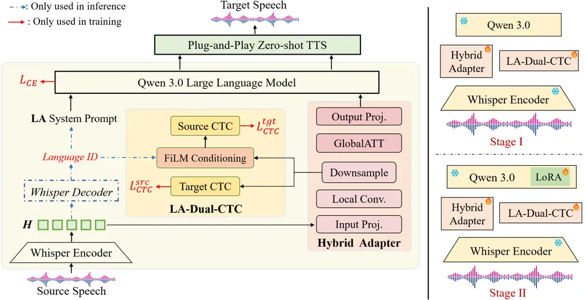

# S2ST-Omni: Hierarchical Language-Aware SpeechLLM Adaptation for Multilingual Speech-to-Speech Translation

Yu Pan Affiliation: Kyushu University, Japan  ²University of Luxembourg,
Luxembourg  ³The University of Tokyo, Japan Affiliation: ⁴Tencent, China
 ⁵ByteDance Ltd., China    Xiongfei Wu    Yuguang Yang    Jixun Yao   
Lei Ma    Jianjun Zhao

###### Abstract

Despite recent advances in speech-to-speech translation (S2ST), it
remains difficult to achieve both high translation accuracy and
practical flexibility. In this paper, we present S2ST-Omni, a
compositional S2ST framework that integrates a high-accuracy
speech-to-text translation (S2TT) frontend with a modular, plug-and-play
text-to-speech (TTS) backend, enabling independent optimization of
translation and synthesis. On the S2TT side, we introduce a hybrid
adapter that follows a "local-then-global" strategy to bridge a
pretrained Whisper encoder and a Qwen3 LLM, yielding a hierarchical
acoustic-to-semantic abstraction. Building on this bridge, we further
propose a hierarchical language-aware architecture that injects
source-language information at two complementary levels. At the acoustic
level, _Language-Aware Dual-CTC_ operates on intermediate adapter
features and employs FiLM-style feature modulation with a learnable
gate, encouraging the model to learn language-specific but
content-faithful acoustic representations. At the linguistic level,
_Language-Aware Prompting_ dynamically constructs
source-language-conditioned prompts that activate language-specific
translation knowledge in the LLM. To enable efficient optimization, we
design a task-specific progressive fine-tuning strategy that first
stabilizes speech-text alignment and then improves translation via LoRA
on top of this converged foundation. The TTS backend remains fully
modular and can be instantiated with any state-of-the-art synthesizer
without retraining the S2TT frontend. Experiments on CVSS-C show that
S2ST-Omni consistently achieves the best BLEU and ASR-BLEU across
French, German, and Spanish to English directions, outperforming strong
recent S2ST baselines.

###### Index Terms: 

Speech-to-speech translation, SpeechLLM, hybrid adapter, hierarchical
language-aware architecture, progressive fine-tuning

^(†)^(†)email: panyu.ztj@gmail.com, ma.lei@acm.org,
zhao@ait.kyushu-u.ac.jp^(†)^(†) $`\dagger`$ denotes the corresponding
author.

## 1 Introduction

Multilingual speech-to-speech translation (S2ST) aims to directly
convert utterances from multiple source languages into target language
speech, which plays a pivotal role in cross-language communication,
healthcare and education \[15, 19\].

Recent years have witnessed rapid progress in S2ST, with methods broadly
falling into two families: end-to-end (E2E) and compositional. E2E
approaches, exemplified by Translatotron series \[14, 12\] and
SeamlessM4T \[1\], map source speech to target speech within a single
unified network. While conceptually attractive, E2E systems must jointly
handle speech understanding, cross-lingual translation, and speech
generation, which often leads to trade-offs that limit optimization of
any individual sub-task. Moreover, the lack of an intermediate textual
representation complicates error analysis and correction, and the
scarcity of large-scale speech-speech parallel data further constrains
scalability \[6\].

To mitigate these issues, compositional S2ST architectures decompose the
problem into an S2TT frontend and a TTS backend. For example, TranSpeech
\[10\] operates in a discrete unit space and introduces bilateral
perturbation for acoustic-style normalization, enabling
non-autoregressive direct S2ST. DASpeech \[7\] adopts a two-pass design
in which a linguistic decoder first predicts target-side representations
and an acoustic decoder (FastSpeech 2 \[24\]) then generates speech
conditioned on them. These models improve controllability and latency,
but are still trained as direct S2ST systems and heavily rely on costly
source speech to target speech pairs. In contrast, ComSpeech \[6\]
proposes a genuinely compositional architecture that explicitly
integrates pretrained S2TT and TTS models via CTC-based vocabulary
adaptors, thereby leveraging abundant S2TT/TTS corpora and exposing an
interpretable intermediate text. However, its vocabulary adaptors and
phoneme-level embeddings yield relatively shallow, weakly contextualized
interfaces, limiting robustness on semantically complex or ambiguous
utterances. More critically, existing S2ST systems offer little explicit
modeling of source language information at either the acoustic or
linguistic level, despite its central role in accurate multilingual
translation.

In this paper, we propose S2ST-Omni, a compositional S2ST framework that
couples a SpeechLLM-based S2TT frontend with a plug-and-play pretrained
TTS backend. Our key idea is to bridge the representation gap between a
pretrained Whisper-based speech encoder \[23\] and a Qwen3 LLM \[29\]
through structured adaptation and hierarchical language-aware
augmentation, thereby better exploiting their cross-modal and
multilingual capabilities. First, we introduce a hybrid speech adapter
that follows a "local-then-global" strategy: depthwise separable
convolutions first aggregate local acoustic patterns, learnable
downsampling then shortens the sequence while preserving salient
information, and global self-attention finally models long-range
semantic dependencies on the compressed features. Unlike Conformer-style
adapters that interleave convolution and attention at every layer \[5,
28\], this hierarchical design adheres to a "denoise-then-relate"
principle, allowing global attention to operate on cleaner and more
abstract representations with reduced computational cost. Second, to
explicitly exploit source language information, we propose a
hierarchical language-aware (HLA) architecture that operates jointly at
acoustic and linguistic levels. On the acoustic side, Language-Aware
Dual-CTC (LA-Dual-CTC) comprises a source-CTC and a target-CTC branch.
The target-CTC is a standard CTC head supervising target-language
alignment, whereas the source-CTC applies FiLM-based language
conditioning \[22\] on intermediate adapter features, using feature-wise
affine modulation and a learnable gate to inject language-specific
acoustic biases while preserving source-content fidelity. On the
linguistic side, Language-Aware Prompting (LAP) dynamically constructs
prompts based on the detected source language, explicitly marking the
language at the LLM input and triggering language-specific translation
behavior to resolve cross-lingual ambiguities. Importantly, language
identity is obtained without introducing a dedicated classifier: during
training we use ground-truth labels, and at inference we reuse Whisper
encoder features and its decoder for language prediction. Third, to
enable efficient optimization of the S2TT frontend, we present a
task-specific progressive fine-tuning (PFT) strategy. In Stage I, we
freeze the Whisper encoder and Qwen3, and train only the hybrid adapter
with LA-Dual-CTC to first establish reliable speech-text alignment. In
Stage II, we insert LoRA \[9\] adapters into the LLM and continue to
update the LA-Dual-CTC-augmented adapter with reduced learning rates,
injecting translation capability on top of a converged alignment while
mitigating gradient interference between newly initialized and
pretrained components. On the synthesis side, S2ST-Omni can seamlessly
integrate any state-of-the-art (SOTA) TTS model \[2, 21, 33, 34\],
without retraining the S2TT frontend.

In summary, we introduce S2ST-Omni, a compositional S2ST framework that
integrates a SpeechLLM-based S2TT frontend with a plug-and-play TTS
backend. Our approach bridges Whisper and Qwen3 via a local-then-global
hybrid adapter, and injects source-language information through
hierarchical language-aware augmentation (LA-Dual-CTC and LAP). To
ensure stable optimization, we propose a task-specific progressive
fine-tuning strategy that establishes a robust speech–text alignment
foundation before refining translation capabilities via LoRA.
Experiments on CVSS-C \[13\] show that S2ST-Omni achieves the best BLEU
and ASR-BLEU scores among strong E2E and compositional baselines on
French, German, and Spanish $`\rightarrow`$ English translation.

## 2 BACKGROUND

### 2.1 Speech-to-Speech Translation

Existing S2ST systems broadly fall into two paradigms: E2E and
compositional. E2E models such as Translatotron series  \[14, 12\] and
SeamlessM4T \[1\] map source speech directly to target speech within a
single network, but must jointly learn speech understanding,
translation, and generation, which complicates optimization and
typically demands large amounts of speech–speech parallel data.
Compositional approaches instead factorize S2ST into an S2TT frontend
plus a TTS backend. ComSpeech \[6\] links pretrained S2TT and TTS models
via CTC-based vocabulary adapters, while StreamSpeech \[32\] builds a
streaming cascaded system with online S2TT and expressive TTS. Despite
their advantages in interpretability and modularity, these systems still
rely on relatively shallow adapters and task-specific S2TT training, and
they do not explicitly model source-language information at the acoustic
or linguistic level, leaving room for more language-aware and
SpeechLLM-centric designs.

### 2.2 Speech Large Language Models

Recent speech–LLM frameworks extend text LLMs to audio either via
discrete tokens (e.g., SpeechGPT \[31\], AudioPaLM \[25\]) or continuous
adapters that connect speech encoders such as Whisper \[23\] to LLM
backbones (e.g., SALMONN \[26\], Qwen-Audio \[3\], Qwen2-Audio \[4\]).
These models achieve strong results on ASR and spoken understanding and
can perform speech-to-text translation as part of a multitask setup.
However, they are not tailored for high-accuracy multilingual S2TT and
lack explicit mechanisms to inject source-language information into
either the acoustic representations or the prompting interface, which is
precisely the gap our HLA-based SpeechLLM framework designed to address.

### 2.3 CTC for Speech Processing

Connectionist Temporal Classification (CTC) \[8\] provides a principled
framework for sequence-to-sequence learning without explicit alignment
supervision, which has been widely adopted as an auxiliary objective to
improve speech-text alignment in encoder-decoder models \[16, 27, 30\].
Given an input sequence $`\mathbf{x}=(x_{1},\ldots,x_{T})`$ and target
sequence $`\mathbf{y}=(y_{1},\ldots,y_{U})`$ where $`U\leq T`$, CTC
marginalizes over all valid alignments $`\pi`$ that collapse to
$`\mathbf{y}`$:

```math
P(\mathbf{y}|\mathbf{x})=\sum_{\pi\in\mathcal{B}^{-1}(\mathbf{y})}P(\pi|\mathbf{x}) \tag{1}
```

where $`\mathcal{B}`$ denotes the collapsing function that removes
blanks and repeated tokens.

## 3 METHODOLOGY



Figure 1: Overall architecture of the proposed S2ST-Omni framework. LA
denotes language-aware.

### 3.1 System Overview

As illustrated in Fig. 1, S2ST-Omni adopts a compositional architecture
that decomposes S2ST into two largely independently optimizable modules:
a high-accuracy S2TT frontend and a flexible TTS backend. The S2TT
frontend comprises four core components: (i) a Whisper Large-v3 encoder
that provides robust multilingual speech representations; (ii) a
Qwen3-4B LLM that serves as the translation backbone; (iii) a hybrid
speech adapter that bridges Whisper and Qwen3 via a hierarchical
"local-then-global" strategy; and (iv) a HLA augmentation architecture
consisting of an acoustic-level LA-Dual-CTC and a linguistic-level LAP.
The TTS backend is kept fully modular and can be instantiated with any
SOTA synthesizer, without retraining the S2TT frontend.

### 3.2 Hybrid Speech Adapter

Adapting continuous speech representations to an LLM requires modeling
information across multiple scales, from phonetic-level acoustic
patterns to sentence-level semantics. Conformer-style adapters that
interleave convolution and attention in every layer offer a general
solution; however, early global mixing can dilute fine-grained local
cues, and computing self-attention on long speech sequences is
computationally expensive. At the other extreme, MLP-style adapters that
apply only per-frame linear projections are parameter-efficient but lack
explicit temporal modeling, thereby shifting the burden of capturing
short-term phonetic patterns onto the LLM, which is primarily designed
for higher-level semantic reasoning.

We therefore propose a _Hybrid Adapter_ that follows a
“local-then-global” hierarchy. Given Whisper encoder outputs
$`\mathbf{H}\in\mathbb{R}^{T\times d_{s}}`$ with frame length $`T`$ and
hidden size $`d_{s}=1280`$, we first project them into an adapter hidden
space $`d_{h}=1024`$ via a linear layer with LayerNorm and GELU,
yielding $`\mathbf{H}^{(0)}\in\mathbb{R}^{T\times d_{h}}`$. On top of
$`\mathbf{H}^{(0)}`$, we stack two depthwise separable convolution
blocks. Each block applies LayerNorm, a depthwise-separable 1D
convolution with kernel size $`k=7`$ to capture local acoustic patterns,
followed by a position-wise feed-forward network (FFN) with expansion
ratio 4 and a residual connection.

To shorten the sequence before global attention, we apply a strided 1D
convolution with kernel size of 5 and stride of 2 to the final output
$`\mathbf{H}^{(N)}`$, followed by LayerNorm and GELU, obtaining a
downsampled representation
$`\mathbf{H}^{\text{down}}\in\mathbb{R}^{T^{\prime}\times d_{h}}`$ with
$`T^{\prime}=\lceil T/2\rceil`$. The learnable downsampling adaptively
preserves translation-relevant information while discarding redundant
frames. We then feed $`\mathbf{H}^{\text{down}}`$ into two standard
Transformer blocks, each composed of multi-head self-attention with 4
heads and a FFN (expansion ratio 4), both wrapped with LayerNorm and
residual connections, to model long-range semantic dependencies and
produce a global representation
$`\mathbf{H}^{\text{glob}}\in\mathbb{R}^{T^{\prime}\times d_{h}}`$.
Finally, we apply LayerNorm and a linear projection
$`\mathbf{W}_{\text{out}}\in\mathbb{R}^{d_{h}\times d_{l}}`$ with
$`d_{l}=3584`$ to map $`\mathbf{H}^{\text{glob}}`$ into the LLM hidden
space, yielding $`\mathbf{Z}\in\mathbb{R}^{T^{\prime}\times d_{l}}`$.
This sequence $`\mathbf{Z}`$ is fed to the LLM, while the intermediate
features $`\mathbf{H}^{\text{down}}`$ are reused by LA-Dual-CTC for
language-aware auxiliary supervision.

### 3.3 HLA Augmentation Architecture

In multilingual S2ST, we suppose that explicit source-language awareness
is crucial for accurate translation, as different languages exhibit
distinct syntactic structures (e.g., verb-final German clauses,
post-nominal French adjectives), word-order patterns, and phonological
systems. To capture these differences, we propose a _HLA augmentation_
architecture that injects source-language information at two
complementary levels: (i) LAP operates at the LLM input to guide
high-level translation behavior; and (ii) LA-Dual-CTC operates on
adapter features to modulate low-level acoustic representations.
Together, they provide bottom-up and top-down language awareness.

#### 3.3.1 LAP

Pretrained LLMs acquire rich cross-lingual knowledge from large-scale
multilingual corpora, but effectively leveraging this knowledge requires
explicit cues about the input language and task. LAP provides such cues
by dynamically constructing language-aware prompts.

Given a source-language identifier $`\ell`$ (obtained from Whisper’s
built-in language ID during inference, and from dataset labels during
training), we instantiate a prompt $`\mathcal{P}(\ell)`$ using a simple
template: “_The following is \[LANG\] speech. Translate it accurately
into English._”, where \[LANG\] is the full language name corresponding
to $`\ell`$ (e.g., fr $`\rightarrow`$ French). We encode
$`\mathcal{P}(\ell)`$ with the LLM tokenizer to obtain prompt embeddings
$`\mathbf{E}(\mathcal{P}(\ell))`$, which are concatenated with the
speech representation $`\mathbf{Z}`$ and the target text embeddings
$`\mathbf{E}(\mathbf{y})`$ to form the LLM input sequence

```math
\begin{split}\mathbf{X}=\big[\mathbf{E}(\mathcal{P}(\ell));\,\mathbf{Z};\,\mathbf{E}(\mathbf{y})\big].\end{split} \tag{2}
```

By this means, LAP is able to explicitly declare the source language and
steer the LLM towards the appropriate language-pair translation mode,
without introducing additional cost.

#### 3.3.2 LA-Dual-CTC

Although LAP operates at the linguistic level, we also aim to encode
language-specific inductive biases directly into the speech
representation. To this end, we design _LA-Dual-CTC_, which injects
source-language information into the CTC heads via FiLM-style
conditioning.

Detailed, we apply LA-Dual-CTC to the downsampled intermediate features
$`\mathbf{H}^{\text{down}}`$ from the Hybrid Adapter (Section 3.2)
rather than to its final output. The intuition behind is that this
design ensures that $`\mathbf{H}^{\text{down}}`$ both preserves the
monotonic alignment structure required by CTC and retains sufficient
acoustic detail, while decoupling the CTC objective from the subsequent
global-attention layers that are primarily responsible for high-level
semantic modeling. Then, we obtain a language embedding
$`\mathbf{e}_{\ell}=\mathrm{Embed}(\ell)`$ and feed it into a small MLP
to generate FiLM parameters
$`(\bm{\gamma}_{\ell},\bm{\beta}_{\ell})\in\mathbb{R}^{d_{h}}\times\mathbb{R}^{d_{h}}`$,
where $`\ell`$ denotes the source language. To control the overall
strength of language conditioning, we introduce a learnable scalar gate
$`g`$. Empirically, we initialize $`g=0.5`$, which provides a moderate
degree of modulation at the start of training and allows the model to
adaptively increase or decrease its reliance on language-specific
conditioning as learning progresses. The gated FiLM transformation
produces language-conditioned features

```math
\begin{split}\mathbf{Z}^{\text{src}}=(1+g\,\bm{\gamma}_{\ell})\odot\mathbf{H}^{\text{down}}+g\,\bm{\beta}_{\ell},\end{split} \tag{3}
```

on which the _source_ CTC head is applied to produce logits
$`\mathbf{O}^{\text{src}}`$. Because the target language is fixed to
English, the _target_ CTC head operates directly on
$`\mathbf{H}^{\text{down}}`$ without language conditioning to produce
logits $`\mathbf{O}^{\text{tgt}}`$.

### 3.4 Task-Specific PFT

Optimizing the S2TT frontend jointly over a frozen Whisper encoder, a
large pretrained LLM, a newly initialized adapter, and auxiliary CTC
heads is challenging due to heterogeneous initialization and
optimization dynamics. We therefore adopt a task-specific _PFT_
strategy, summarized in Algorithm 1, which proceeds in two stages:
Stage I emphasizes building a reliable speech–text alignment under
relatively strong CTC supervision, while Stage II refines translation
quality via parameter-efficient LLM adaptation with weaker CTC
regularization.

0:  Dataset $`\mathcal{D}=\{(x,y,\ell)\}`$, encoder parameters
$`\theta_{\text{enc}}`$, LLM parameters $`\theta_{\text{llm}}`$

1:  Initialize Hybrid Adapter $`\theta_{\text{adpt}}`$, LA-Dual-CTC
heads $`\theta_{\text{ctc}}`$, LoRA parameters $`\theta_{\text{lora}}`$

2:  Freeze $`\theta_{\text{enc}}`$ and base $`\theta_{\text{llm}}`$ in
all stages

3:  Stage I (alignment): optimize
$`\theta_{\text{adpt}},\theta_{\text{ctc}}`$

4:  for $`(x,y,\ell)\sim\mathcal{D}`$ do

5:   Compute losses
$`\mathcal{L}_{\text{CE}},\mathcal{L}_{\text{CTC}}^{\text{src}},\mathcal{L}_{\text{CTC}}^{\text{tgt}}`$

6:   Update $`\theta_{\text{adpt}},\theta_{\text{ctc}}`$ w.r.t.
$`\mathcal{L}^{(1)}`$

7:  end for

8:  Stage II (translation): enable $`\theta_{\text{lora}}`$, reduce lr
for $`\theta_{\text{adpt}},\theta_{\text{ctc}}`$

9:  for $`(x,y,\ell)\sim\mathcal{D}`$ do

10:   Compute losses
$`\mathcal{L}_{\text{CE}},\mathcal{L}_{\text{CTC}}^{\text{src}},\mathcal{L}_{\text{CTC}}^{\text{tgt}}`$

11:   Update
$`\theta_{\text{adpt}},\theta_{\text{ctc}},\theta_{\text{lora}}`$ w.r.t.
$`\mathcal{L}^{(2)}`$

12:  end for

12:  Trained S2TT frontend

Algorithm 1 Task-Specific PFT

#### 3.4.1 Stage I: Alignment Foundation

In Stage I, we freeze both the Whisper encoder and the base Qwen3
parameters, and train only the Hybrid Adapter and LA-Dual-CTC. The LLM
therefore acts as a fixed conditional language model, providing stable
gradients while the adapter learns to produce features that are jointly
aligned with source and target text under dual CTC supervision.

Let $`\mathcal{L}_{\text{CE}}`$ denote the autoregressive cross-entropy
loss of the LLM decoder, and let
$`\mathcal{L}_{\text{CTC}}^{\text{src}}`$ and
$`\mathcal{L}_{\text{CTC}}^{\text{tgt}}`$ denote the CTC losses on the
source and target branches of LA-Dual-CTC, respectively. The Stage I
objective is

```math
\mathcal{L}^{(1)}=\mathcal{L}_{\text{CE}}+\alpha_{1}\,\mathcal{L}_{\text{CTC}}^{\text{src}}+\beta_{1}\,\mathcal{L}_{\text{CTC}}^{\text{tgt}}, \tag{4}
```

where we assign relatively strong CTC weights, empirically setting
$`\alpha_{1}=0.1`$ and $`\beta_{1}=0.2`$ to prioritize robust
speech–text alignment.

#### 3.4.2 Stage II: Translation Enhancement

In Stage II, we introduce parameter-efficient adaptation on the LLM
while continuing to refine the Hybrid Adapter and LA-Dual-CTC with
reduced learning rates. Specifically, we apply LoRA to the key
projection matrices of Qwen3, i.e., the query and value projections in
the self-attention modules, with rank $`r=8`$, scaling factor
$`\alpha=32`$, and dropout rate $`0.1`$. LoRA parameters are trained
with a higher learning rate than the adapter and CTC heads, allowing
translation-specific knowledge to be injected into the LLM on top of the
converged alignment from Stage I.

To shift the optimization focus towards E2E translation quality while
still maintaining useful alignment signals, we down-weight the CTC
losses in this stage and adopt

```math
\mathcal{L}^{(2)}=\mathcal{L}_{\text{CE}}+\alpha_{2}\,\mathcal{L}_{\text{CTC}}^{\text{src}}+\beta_{2}\,\mathcal{L}_{\text{CTC}}^{\text{tgt}}, \tag{5}
```

with $`\alpha_{2}=0.01`$ and $`\beta_{2}=0.05`$.

### 3.5 TTS Backend

S2ST-Omni supports plug-and-play integration with any SOTA speech
synthesizer as the TTS backend. The intermediate English text produced
by the S2TT frontend is passed directly to an external TTS model,
without any task-specific coupling. In our experiments, we instantiate
the backend with IndexTTS 2 \[33\], a zero-shot TTS system that can
generate natural and fluent speech. This modular design allows
practitioners to select or swap TTS systems according to application
requirements without any retraining or modifying the S2TT frontend,
reducing development and deployment overhead.

## 4 EXPERIMENTS

| Models         | FR $`\rightarrow`$ EN |                      | ES $`\rightarrow`$ EN |                      | DE $`\rightarrow`$ EN |                      | Avg.             |                      |
| -------------- | --------------------- | -------------------- | --------------------- | -------------------- | --------------------- | -------------------- | ---------------- | -------------------- |
|                | BLEU$`\uparrow`$      | ASR-BLEU$`\uparrow`$ | BLEU$`\uparrow`$      | ASR-BLEU$`\uparrow`$ | BLEU$`\uparrow`$      | ASR-BLEU$`\uparrow`$ | BLEU$`\uparrow`$ | ASR-BLEU$`\uparrow`$ |
| Ground Truth   | \-                    | 84.52                | \-                    | 88.54                | \-                    | 75.53                | \-               | \-                   |
| Translatotron  | \-                    | 16.96                | \-                    | 8.72                 | \-                    | 1.97                 | \-               | 9.22                 |
| Translatotron2 | 28.82                 | 26.07                | 25.82                 | 22.93                | 18.66                 | 16.91                | 24.43            | 21.97                |
| S2UT           | \-                    | 22.23                | \-                    | 18.53                | \-                    | 2.99                 | \-               | 14.58                |
| UnitY          | \-                    | 27.77                | \-                    | 24.95                | \-                    | 18.74                | \-               | 23.82                |
| DASpeech       | \-                    | 25.03                | \-                    | 21.37                | \-                    | 16.14                | \-               | 20.85                |
| ComSpeech      | 30.72                 | 28.15                | 26.51                 | 24.80                | 19.41                 | 18.16                | 25.55            | 23.70                |
| StreamSpeech   | 32.60                 | 28.45                | 30.35                 | 27.25                | 23.36                 | 20.93                | 28.77            | 25.54                |
| Hibiki         | \-                    | 30.50                | \-                    | \-                   | \-                    | \-                   | \-               | \-                   |
| Ours           | 35.83                 | 33.20                | 37.85                 | 35.90                | 33.34                 | 31.25                | 35.67            | 33.45                |

Table 1: Overall performance comparison among evaluated S2ST methods on
CVSS-C.

| Model        | Fr $`\rightarrow`$ En |                      | Es $`\rightarrow`$ En |                      | De $`\rightarrow`$ En |                      | Avg.             |                      |
| ------------ | --------------------- | -------------------- | --------------------- | -------------------- | --------------------- | -------------------- | ---------------- | -------------------- |
|              | BLEU$`\uparrow`$      | ASR-BLEU$`\uparrow`$ | BLEU$`\uparrow`$      | ASR-BLEU$`\uparrow`$ | BLEU$`\uparrow`$      | ASR-BLEU$`\uparrow`$ | BLEU$`\uparrow`$ | ASR-BLEU$`\uparrow`$ |
| Ours         | 35.83                 | 33.20                | 37.85                 | 35.90                | 33.34                 | 31.25                | 35.67            | 33.45                |
| w/ Conformer | 34.60                 | 31.49                | 36.78                 | 34.64                | 32.69                 | 30.34                | 34.69            | 32.16                |
| w/ MLP       | 32.30                 | 28.96                | 34.70                 | 32.47                | 30.09                 | 27.54                | 32.37            | 29.66                |

Table 2: Effect of the proposed hybrid speech adapter against
Conformer-based and MLP-based adapters.

### 4.1 Experimental Settings

#### 4.1.1 Dataset

We evaluate S2ST-Omni on the CVSS-C benchmark \[13\], which provides
parallel triplets $`\langle`$source speech, target text, target
speech$`\rangle`$ for 21 source languages translated into English.
Following the protocol of \[6, 32\] for fair comparison, we evaluate
S2ST-Omni on three representative directions:
French$`\rightarrow`$English (Fr$`\rightarrow`$En),
Spanish$`\rightarrow`$English (Es$`\rightarrow`$En), and
German$`\rightarrow`$English (De$`\rightarrow`$En). Source speech is
resampled to 16 kHz, and target speech to 22.05 kHz.

#### 4.1.2 Implementation Details

We use Whisper Large-v3 \[23\] as a frozen speech encoder and
Qwen3-4B \[29\] as the LLM backbone. For LA-Dual-CTC, we employ 8k and
4k SentencePiece vocabularies for the multilingual source and English
target branches, respectively, both trained on the source and target
text of our training set.

Training is implemented in PyTorch on two NVIDIA A6000 GPUs. In Stage I,
we train only the Hybrid Adapter and LA-Dual-CTC for 150k steps using
AdamW with a cosine schedule, learning rates of $`1\times 10^{-5}`$
(adapter) and $`5\times 10^{-5}`$ (LA-Dual-CTC), and 1k warmup steps. In
Stage II, we attach LoRA modules and continue training for another 150k
steps with learning rates $`5\times 10^{-6}`$ (adapter),
$`1\times 10^{-6}`$ (LA-Dual-CTC), and $`5\times 10^{-5}`$ (LoRA). We
use a batch size of 4 per GPU with gradient accumulation of 4.

#### 4.1.3 Evaluation

We compare S2ST-Omni against eight strong S2ST systems: Translatotron /
Translatotron 2 \[14, 12\], S2UT \[18\], DASpeech \[7\], UnitY \[11\],
ComSpeech \[6\], StreamSpeech \[32\], and Hibiki \[17\].

Translation quality is assessed using BLEU and ASR-BLEU. For ASR-BLEU,
generated speech is first transcribed by a pretrained wav2vec 2.0 ASR
model,²² 2
https://dl.fbaipublicfiles.com/fairseq/wav2vec/wav2vec_vox_960h_pl.pt
and BLEU \[20\] is then computed with SacreBLEU.³³ 3
https://github.com/mjpost/sacrebleu

### 4.2 Main Results

As shown in Table 1, S2ST-Omni consistently outperforms all evaluated
S2ST systems on CVSS-C across the three translation directions. Compared
with the strongest compositional baseline StreamSpeech, our model
improves the average BLEU score from 28.77 to 35.67 and the average
ASR-BLEU from 25.54 to 33.45, corresponding to relative gains of roughly
$`+24\%`$ BLEU and $`+31\%`$ ASR-BLEU. These results confirm that the
SpeechLLM-based S2TT frontend, together with our LA-Dual-CTC augmented
hybrid adapter, HLA architecture, and task-specific PFT, yields a
substantially stronger and more robust S2ST system while preserving a
fully modular TTS backend.

Breaking down the results by language pair, S2ST-Omni achieves
consistent improvements. On the relatively challenging
De$`\rightarrow`$En track, our system attains 33.34 BLEU and 31.25
ASR-BLEU, compared with 23.36 and 20.93 for StreamSpeech, yielding large
relative gains of about $`+43\%`$ BLEU and $`+49\%`$ ASR-BLEU. For
Es$`\rightarrow`$En, S2ST-Omni reaches 37.85 BLEU and 35.90 ASR-BLEU,
improving over StreamSpeech (30.35 / 27.25) by approximately $`+25\%`$
and $`+32\%`$, respectively. On Fr$`\rightarrow`$En, our model obtains
35.83 BLEU and 33.20 ASR-BLEU, which corresponds to relative gains of
about $`+10\%`$ BLEU and $`+17\%`$ ASR-BLEU over StreamSpeech, and it
also surpasses the recently proposed Hibiki that is specifically
optimized for ASR-BLEU on this language pair.

Overall, we attribute these consistent gains to the combination of the
LA-Dual-CTC–augmented hybrid adapter and the hierarchical language-aware
architecture. The hybrid adapter provides a stronger speech-to-LLM
interface by first consolidating local acoustic structure and then
modeling long-range dependencies on a downsampled sequence, while
LA-Dual-CTC and LAP inject complementary acoustic- and linguistic-level
language cues. Together with the progressive fine-tuning schedule, these
components enable S2ST-Omni to more effectively exploit Whisper and
Qwen3 for multilingual S2TT and S2ST, yielding state-of-the-art
performance on CVSS-C.

| Model           | Fr $`\rightarrow`$ En |                      | Es $`\rightarrow`$ En |                      | De $`\rightarrow`$ En |                      | Avg.             |                      |
| --------------- | --------------------- | -------------------- | --------------------- | -------------------- | --------------------- | -------------------- | ---------------- | -------------------- |
|                 | BLEU$`\uparrow`$      | ASR-BLEU$`\uparrow`$ | BLEU$`\uparrow`$      | ASR-BLEU$`\uparrow`$ | BLEU$`\uparrow`$      | ASR-BLEU$`\uparrow`$ | BLEU$`\uparrow`$ | ASR-BLEU$`\uparrow`$ |
| Ours            | 35.83                 | 33.20                | 37.85                 | 35.90                | 33.34                 | 31.25                | 35.67            | 33.45                |
| w/o LAP         | 35.25                 | 32.36                | 37.37                 | 35.30                | 33.13                 | 31.01                | 35.25            | 32.89                |
| w/o LA-Dual-CTC | 35.16                 | 32.11                | 37.22                 | 35.09                | 33.10                 | 30.97                | 35.16            | 32.72                |
| w/o HLA         | 33.49                 | 30.26                | 35.96                 | 33.77                | 31.57                 | 28.82                | 33.68            | 30.95                |

Table 3: Effect of the proposed HLA architecture.

| Model      | Fr $`\rightarrow`$ En |                      | Es $`\rightarrow`$ En |                      | De $`\rightarrow`$ En |                      | Avg.             |                      |
| ---------- | --------------------- | -------------------- | --------------------- | -------------------- | --------------------- | -------------------- | ---------------- | -------------------- |
|            | BLEU$`\uparrow`$      | ASR-BLEU$`\uparrow`$ | BLEU$`\uparrow`$      | ASR-BLEU$`\uparrow`$ | BLEU$`\uparrow`$      | ASR-BLEU$`\uparrow`$ | BLEU$`\uparrow`$ | ASR-BLEU$`\uparrow`$ |
| Ours       | 35.83                 | 33.20                | 37.85                 | 35.90                | 33.34                 | 31.25                | 35.67            | 33.45                |
| w/o PFT-II | 33.17                 | 29.78                | 35.58                 | 33.36                | 31.23                 | 28.74                | 33.33            | 30.63                |
| w/o PFT    | 34.24                 | 31.12                | 36.41                 | 34.24                | 32.46                 | 30.08                | 34.37            | 31.81                |

Table 4: Effect of the task-specific PFT strategy. “w/o PFT-II” denotes
removing Stage II LoRA-based LLM adaptation; “w/o PFT” represents
training in a single stage without the proposed two-stage schedule.

### 4.3 Ablation Study

#### 4.3.1 Effect of Hybrid Speech Adapter.

Table 2 compares our hybrid adapter with Conformer- and MLP-based
variants. Replacing the hybrid adapter with the Conformer design leads
to a consistent performance drop across all directions: the average BLEU
score decreases from 35.67 to 34.69 (about $`2.8\%`$ relative), and the
average ASR-BLEU from 33.45 to 32.16 (about $`3.9\%`$), with similar
trends on each language pair. In contrast, the MLP adapter causes
substantially larger degradation, reducing the average BLEU/ASR-BLEU to
32.37/29.66, which corresponds to roughly $`9\%`$ and $`11\%`$ relative
drops, respectively. These trends indicate that MLP-style adaptation is
insufficient to bridge Whisper and Qwen3 for S2ST, and that densely
interleaving convolution and attention (Conformer-style) is also
suboptimal, showcasing the effectiveness of the proposed hybrid adapter.

#### 4.3.2 Effect of HLA Architecture.

Table 3 investigates the contribution of our HLA architecture. Removing
either LAP or LA-Dual-CTC alone leads to small but consistent
performance drops: w/o LAP reduces the average BLEU/ASR-BLEU from
35.67/33.45 to 35.25/32.89, while w/o LA-Dual-CTC yields 35.16/32.72. In
contrast, removing both components (w/o HLA) causes a much larger
degradation, bringing the averages down to 33.68 BLEU and 30.95
ASR-BLEU, which corresponds to roughly $`5.6\%`$ and $`7.5\%`$ relative
drops. These trends indicate that linguistic-level prompting (LAP) and
acoustic-level FiLM conditioning (LA-Dual-CTC) are complementary: each
provides modest gains on its own, but jointly encoding source-language
information at both the acoustic and linguistic levels yields a markedly
stronger inductive bias for multilingual S2ST.

| Models      | Fr$`\rightarrow`$En | Es$`\rightarrow`$En | De$`\rightarrow`$En | Avg.  |
| ----------- | ------------------- | ------------------- | ------------------- | ----- |
| IndexTTS2   | 33.20               | 35.90               | 31.25               | 33.45 |
| FireRedTTS2 | 31.55               | 35.18               | 30.94               | 32.56 |
| CosyVoice3  | 31.56               | 35.15               | 30.36               | 32.36 |
| ZipVoice    | 31.48               | 35.08               | 30.46               | 32.34 |
| VoxCPM1.5   | 31.35               | 34.82               | 30.20               | 32.09 |

Table 5: Effect of different TTS backends on the ASR-BLEU metric.

#### 4.3.3 Effect of Task-Specific PFT.

Table 4 evaluates the effect of the proposed two-stage PFT strategy. The
Stage-I-only variant (w/o PFT-II), which omits LoRA-based LLM
adaptation, exhibits the largest degradation: the average BLEU/ASR-BLEU
drops from 35.67/33.45 to 33.33/30.63, with particularly pronounced
degradation on De$`\rightarrow`$En (33.34/31.25 $`\rightarrow`$
31.23/28.74). Collapsing the two phases into a single-stage training
(w/o PFT) mitigates this effect but still lags behind the full schedule,
reducing the average BLEU/ASR-BLEU to 34.37/31.81 (about $`3.6\%`$ and
$`4.9\%`$ relative drops). These results suggest that learning alignment
and translation simultaneously introduces detrimental gradient
interference, whereas the proposed two-stage schedule—first emphasizing
dual-CTC alignment, then refining translation with LoRA-based LLM
adaptation—provides a more stable and effective optimization pathway for
the S2TT frontend.

#### 4.3.4 Effect of Various TTS Backends.

Table 5 examines how the choice of TTS backend influences end-to-end
performance when the S2TT frontend of S2ST-Omni is kept fixed and only
the TTS module is swapped. Overall, the ASR-BLEU scores are relatively
stable across five heterogeneous TTS systems: the average gap between
the best (IndexTTS2, 33.45) and the weakest configuration (VoxCPM1.5,
32.09) is within roughly $`1.4`$ points (about $`4\%`$ relative), and
all backends fall into a narrow band on each language pair.

These results suggest that once a strong SpeechLLM-based S2TT frontend
is in place, end-to-end performance is primarily governed by the S2TT
component, while different modern TTS backends mainly induce
second-order variations related to intelligibility and pronunciation. In
practice, this means that S2ST-Omni can be paired with a wide range of
off-the-shelf TTS systems—selected according to latency, speaker style,
or deployment constraints—without requiring any redesign or retraining
of the translation module.

## 5 Conclusion

We presented S2ST-Omni, a hierarchical language-aware framework for
accurate and flexible multilingual speech-to-speech translation. By
coupling a SpeechLLM-based S2TT frontend with a plug-and-play TTS
backend, S2ST-Omni cleanly decouples translation from synthesis,
enabling independent optimization of each module while preserving an
interpretable text intermediate. At the core of the frontend, a hybrid
"local-then-global” speech adapter, augmented with LA-Dual-CTC and LAP,
provides a strong speechLLM interface that jointly models local acoustic
patterns, long-range semantics, and explicit source-language cues. A
task-specific two-stage PFT strategy further stabilizes training by
first establishing robust dual-CTC alignment and then injecting
translation capability via LoRA-based LLM adaptation. Experiments on
CVSS-C demonstrate that S2ST-Omni consistently outperforms strong E2E
and compositional S2ST baselines on Fr$`\rightarrow`$En,
Es$`\rightarrow`$En, and De$`\rightarrow`$En, achieving new
state-of-the-art BLEU and ASR-BLEU scores. Ablation studies confirm the
effectiveness of each proposed component. We believe these results
highlight the promise of HLA-enhanced SpeechLLMs as a principled
foundation for future multilingual S2ST systems.

## References

- \[1\] L. Barrault, Y. Chung, M. C. Meglioli, D. Dale, N. Dong, P.
  Duquenne, H. Elsahar, H. Gong, K. Heffernan, J. Hoffman, et al. (2023)
  SeamlessM4T: massively multilingual & multimodal machine translation.
  arXiv preprint arXiv:2308.11596. Cited by: §1, §2.1.
- \[2\] S. Chen, Y. Feng, L. He, T. He, W. He, Y. Hu, B. Lin, Y. Lin, Y.
  Pan, P. Tan, et al. (2024) Takin: a cohort of superior quality
  zero-shot speech generation models. arXiv preprint arXiv:2409.12139.
  Cited by: §1.
- \[3\] Y. Chu et al. (2023) Qwen-audio: advancing universal audio
  understanding via unified large-scale audio-language models. arXiv
  preprint arXiv:2311.07919. Cited by: §2.2.
- \[4\] Y. Chu et al. (2024) Qwen2-audio technical report. arXiv
  preprint arXiv:2407.10759. Cited by: §2.2.
- \[5\] A. Dubey, A. Jauhri, A. Pandey, A. Kadian, A. Al-Dahle, A.
  Letman, A. Mathur, A. Schelten, A. Yang, A. Fan, et al. (2024) The
  llama 3 herd of models. arXiv preprint arXiv:2407.21783. Cited by: §1.
- \[6\] Q. Fang, S. Zhang, Z. Ma, M. Zhang, and Y. Feng (2024) Can we
  achieve high-quality direct speech-to-speech translation without
  parallel speech data?. In Proceedings of the 62nd Annual Meeting of
  the Association for Computational Linguistics (Volume 1: Long
  Papers), L. Ku, A. Martins, and V. Srikumar (Eds.), Bangkok, Thailand,
  pp. 7264–7277. External Links:
  [Link](https://aclanthology.org/2024.acl-long.392/),
  [Document](https://dx.doi.org/10.18653/v1/2024.acl-long.392) Cited by:
  §1, §1, §2.1, §4.1.1, §4.1.3.
- \[7\] Q. Fang, Y. Zhou, and Y. Feng (2023) Daspeech: directed acyclic
  transformer for fast and high-quality speech-to-speech translation.
  Advances in Neural Information Processing Systems 36, pp. 72604–72623.
  Cited by: §1, §4.1.3.
- \[8\] A. Graves, S. Fernández, F. Gomez, and J. Schmidhuber (2006)
  Connectionist temporal classification: labelling unsegmented sequence
  data with recurrent neural networks. In ICML, Cited by: §2.3.
- \[9\] E. J. Hu, Y. Shen, P. Wallis, Z. Allen-Zhu, Y. Li, S. Wang, L.
  Wang, W. Chen, et al. (2022) Lora: low-rank adaptation of large
  language models.. ICLR 1 (2), pp. 3. Cited by: §1.
- \[10\] R. Huang, J. Liu, H. Liu, Y. Ren, L. Zhang, J. He, and Z.
  Zhao (2023) TranSpeech: speech-to-speech translation with bilateral
  perturbation. In The Eleventh International Conference on Learning
  Representations, External Links:
  [Link](https://openreview.net/forum?id=UVAmFAtC5ye) Cited by: §1.
- \[11\] H. Inaguma, S. Popuri, I. Kulikov, P. Chen, C. Wang, Y.
  Chung, Y. Tang, A. Lee, S. Watanabe, and J. Pino (2023) UnitY:
  two-pass direct speech-to-speech translation with discrete units. In
  Proceedings of the 61st Annual Meeting of the Association for
  Computational Linguistics (Volume 1: Long Papers), A. Rogers, J.
  Boyd-Graber, and N. Okazaki (Eds.), Toronto, Canada, pp. 15655–15680.
  External Links: [Link](https://aclanthology.org/2023.acl-long.872/),
  [Document](https://dx.doi.org/10.18653/v1/2023.acl-long.872) Cited by:
  §4.1.3.
- \[12\] Y. Jia, M. T. Ramanovich, T. Remez, and R. Pomerantz (2022)
  Translatotron 2: high-quality direct speech-to-speech translation with
  voice preservation. In International Conference on Machine Learning,
  pp. 10120–10134. Cited by: §1, §2.1, §4.1.3.
- \[13\] Y. Jia, M. Tadmor Ramanovich, Q. Wang, and H. Zen (2022) CVSS
  corpus and massively multilingual speech-to-speech translation. In
  Proceedings of the Thirteenth Language Resources and Evaluation
  Conference, N. Calzolari, F. Béchet, P. Blache, K. Choukri, C.
  Cieri, T. Declerck, S. Goggi, H. Isahara, B. Maegaard, J. Mariani, H.
  Mazo, J. Odijk, and S. Piperidis (Eds.), Marseille, France,
  pp. 6691–6703. External Links:
  [Link](https://aclanthology.org/2022.lrec-1.720/) Cited by: §1,
  §4.1.1.
- \[14\] Y. Jia, R. J. Weiss, F. Biadsy, W. Macherey, M. Johnson, Z.
  Chen, and Y. Wu (2019) Direct speech-to-speech translation with a
  sequence-to-sequence model. arXiv preprint arXiv:1904.06037. Cited by:
  §1, §2.1, §4.1.3.
- \[15\] G. Kikui, E. Sumita, T. Takezawa, and S. Yamamoto (2003)
  Creating corpora for speech-to-speech translation.. In INTERSPEECH,
  pp. 381–384. Cited by: §1.
- \[16\] S. Kim, T. Hori, and S. Watanabe (2017) Joint ctc-attention
  based end-to-end speech recognition using multi-task learning. In
  ICASSP, Cited by: §2.3.
- \[17\] T. Labiausse, L. Mazaré, E. Grave, A. Défossez, and N.
  Zeghidour (2025) High-fidelity simultaneous speech-to-speech
  translation. In Proceedings of the 42nd International Conference on
  Machine Learning, A. Singh, M. Fazel, D. Hsu, S. Lacoste-Julien, F.
  Berkenkamp, T. Maharaj, K. Wagstaff, and J. Zhu (Eds.), Proceedings of
  Machine Learning Research, Vol. 267, pp. 32116–32129. External Links:
  [Link](https://proceedings.mlr.press/v267/labiausse25a.html) Cited by:
  §4.1.3.
- \[18\] A. Lee, P. Chen, C. Wang, J. Gu, S. Popuri, X. Ma, A.
  Polyak, Y. Adi, Q. He, Y. Tang, J. Pino, and W. Hsu (2022) Direct
  speech-to-speech translation with discrete units. In Proceedings of
  the 60th Annual Meeting of the Association for Computational
  Linguistics (Volume 1: Long Papers), S. Muresan, P. Nakov, and A.
  Villavicencio (Eds.), Dublin, Ireland, pp. 3327–3339. External Links:
  [Link](https://aclanthology.org/2022.acl-long.235/),
  [Document](https://dx.doi.org/10.18653/v1/2022.acl-long.235) Cited by:
  §4.1.3.
- \[19\] A. Lee, H. Gong, P. Duquenne, H. Schwenk, P. Chen, C. Wang, S.
  Popuri, Y. Adi, J. Pino, J. Gu, and W. Hsu (2022) Textless
  speech-to-speech translation on real data. In Proceedings of the 2022
  Conference of the North American Chapter of the Association for
  Computational Linguistics: Human Language Technologies, M. Carpuat, M.
  de Marneffe, and I. V. Meza Ruiz (Eds.), Seattle, United States,
  pp. 860–872. External Links:
  [Link](https://aclanthology.org/2022.naacl-main.63/),
  [Document](https://dx.doi.org/10.18653/v1/2022.naacl-main.63) Cited
  by: §1.
- \[20\] K. Papineni, S. Roukos, T. Ward, and W. Zhu (2002) Bleu: a
  method for automatic evaluation of machine translation. In Proceedings
  of the 40th annual meeting of the Association for Computational
  Linguistics, pp. 311–318. Cited by: §4.1.3.
- \[21\] Z. Peng, J. Yu, W. Wang, Y. Chang, Y. Sun, L. Dong, Y. Zhu, W.
  Xu, H. Bao, Z. Wang, et al. (2025) Vibevoice technical report. arXiv
  preprint arXiv:2508.19205. Cited by: §1.
- \[22\] E. Perez, F. Strub, H. De Vries, V. Dumoulin, and A.
  Courville (2018) FiLM: visual reasoning with a general conditioning
  layer. In AAAI, Cited by: §1.
- \[23\] A. Radford, J. W. Kim, T. Xu, G. Brockman, C. McLeavey, and I.
  Sutskever (2023) Robust speech recognition via large-scale weak
  supervision. In International conference on machine learning,
  pp. 28492–28518. Cited by: §1, §2.2, §4.1.2.
- \[24\] Y. Ren, C. Hu, X. Tan, T. Qin, S. Zhao, Z. Zhao, and T.
  Liu (2020) Fastspeech 2: fast and high-quality end-to-end text to
  speech. arXiv preprint arXiv:2006.04558. Cited by: §1.
- \[25\] P. K. Rubenstein, C. Asawaroengchai, D. D. Nguyen, A. Bapna, Z.
  Borsos, F. d. C. Quitry, P. Chen, D. E. Badawy, W. Han, E. Kharitonov,
  et al. (2023) Audiopalm: a large language model that can speak and
  listen. arXiv preprint arXiv:2306.12925. Cited by: §2.2.
- \[26\] C. Tang, W. Yu, G. Sun, X. Chen, T. Tan, W. Li, L. Lu, Z. MA,
  and C. Zhang (2024) SALMONN: towards generic hearing abilities for
  large language models. In The Twelfth International Conference on
  Learning Representations, External Links:
  [Link](https://openreview.net/forum?id=14rn7HpKVk) Cited by: §2.2.
- \[27\] S. Watanabe, T. Hori, S. Kim, J. R. Hershey, and T.
  Hayashi (2017) Hybrid ctc/attention architecture for end-to-end speech
  recognition. IEEE Journal of Selected Topics in Signal Processing.
  Cited by: §2.3.
- \[28\] K. Xu, F. Xie, X. Tang, and Y. Hu (2025) Fireredasr:
  open-source industrial-grade mandarin speech recognition models from
  encoder-decoder to llm integration. arXiv preprint arXiv:2501.14350.
  Cited by: §1.
- \[29\] A. Yang, A. Li, B. Yang, B. Zhang, B. Hui, B. Zheng, B. Yu, C.
  Gao, C. Huang, C. Lv, et al. (2025) Qwen3 technical report. arXiv
  preprint arXiv:2505.09388. Cited by: §1, §4.1.2.
- \[30\] Y. Yang, Y. Pan, J. Yin, J. Han, L. Ma, and H. Lu (2023)
  Hybridformer: improving squeezeformer with hybrid attention and nsr
  mechanism. In ICASSP 2023-2023 IEEE International Conference on
  Acoustics, Speech and Signal Processing (ICASSP), pp. 1–5. Cited by:
  §2.3.
- \[31\] D. Zhang et al. (2023) SpeechGPT: empowering large language
  models with intrinsic cross-modal conversational abilities. arXiv
  preprint arXiv:2305.11000. Cited by: §2.2.
- \[32\] S. Zhang, Q. Fang, S. Guo, Z. Ma, M. Zhang, and Y. Feng (2024)
  StreamSpeech: simultaneous speech-to-speech translation with
  multi-task learning. In Proceedings of the 62nd Annual Meeting of the
  Association for Computational Linguistics (Volume 1: Long Papers), L.
  Ku, A. Martins, and V. Srikumar (Eds.), Bangkok, Thailand,
  pp. 8964–8986. External Links:
  [Link](https://aclanthology.org/2024.acl-long.485/),
  [Document](https://dx.doi.org/10.18653/v1/2024.acl-long.485) Cited by:
  §2.1, §4.1.1, §4.1.3.
- \[33\] S. Zhou, Y. Zhou, Y. He, X. Zhou, J. Wang, W. Deng, and J.
  Shu (2025) IndexTTS2: a breakthrough in emotionally expressive and
  duration-controlled auto-regressive zero-shot text-to-speech. arXiv
  preprint arXiv:2506.21619. Cited by: §1, §3.5.
- \[34\] Y. Zhou, G. Zeng, X. Liu, X. Li, R. Yu, Z. Wang, R. Ye, W.
  Sun, J. Gui, K. Li, et al. (2025) VoxCPM: tokenizer-free tts for
  context-aware speech generation and true-to-life voice cloning. arXiv
  preprint arXiv:2509.24650. Cited by: §1.
