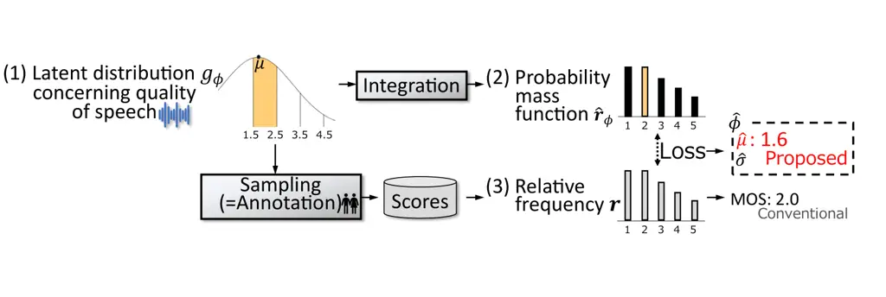
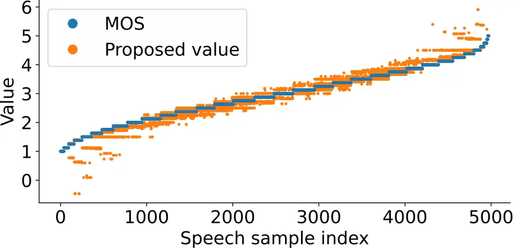

# Rethinking Mean Opinion Scores in Speech Quality Assessment: Aggregation through Quantized Distribution Fitting

Yuto Kondo    Hirokazu Kameoka    Kou Tanaka    Takuhiro Kaneko
^(†)^(†)thanks: This work was supported by JST CREST Grant Number
JP-MJCR19A3, Japan.

###### Abstract

Speech quality assessment (SQA) aims to evaluate the quality of speech
samples without relying on time-consuming listener questionnaires.
Recent efforts have focused on training neural-based SQA models to
predict the mean opinion score (MOS) of speech samples produced by
text-to-speech or voice conversion systems. This paper targets the
enhancement of MOS prediction models’ performance. We propose a novel
score aggregation method to address the limitations of conventional
annotations for MOS, which typically involve ratings on a scale from 1
to 5. Our method is based on the hypothesis that annotators internally
consider continuous scores and then choose the nearest discrete rating.
By modeling this process, we approximate the generative distribution of
ratings by quantizing the latent continuous distribution. We then use
the peak of this latent distribution, estimated through the loss between
the quantized distribution and annotated ratings, as a new
representative value instead of MOS. Experimental results demonstrate
that substituting MOSNet’s predicted target with this proposed value
improves prediction performance.

###### Index Terms: 

speech quality assessment, mean opinion score, subjective evaluation
dataset, score aggregation method, MOSNet

^(†)^(†)address: NTT Corporation, Japan

## 1 Introduction

This study addresses the task of speech quality assessment (SQA), which
aims to automatically predict the subjective quality of a given speech
sample. Many SQA methods have been proposed to compare qualities of
speech processing systems, mainly a conventional system and an improved
version of it, without resorting to time-consuming questionnaires to
listeners. For example, the perceptual evaluation of speech quality
(PESQ) \[1\] is a well-known method that quantifies the relative
degradation to reference speech in subjective quality of telephone
speech. Recently, with the growing interest in text-to-speech (TTS) \[2,
3\] and voice conversion (VC) \[4, 5, 6\] research, numerous SQA models
have been proposed for the speech samples after TTS and VC, for which
reference speech may not be available in principle. For instance,
MOSNet \[7\] predicts the mean opinion score (MOS) \[8\] regarding
speech quality. MOS is a widely used representative value of speech
quality, which is calculated as the mean of ratings obtained by absolute
category rating (ACR) method \[8\]. The common rating choices for
obtaining ACR data include the five options: ‘1: bad’, ‘2: poor’, ‘3:
fair’, ‘4: good’, and ‘5: excellent’. The ACR is one of the most common
and familiar annotation formats in daily life, alongside pairwise
comparison.

The target of this paper is to enhance the performance of MOS prediction
models. As an approach for the target, we previously explored a new
score aggregation method instead of MOS. We focused on the drawback that
the reliability of MOS can be limited due to incorrect annotation, and
proposed a new representative value of speech quality, the $`N`$-lowest
MOS ($`N_{\rm low}`$-MOS) \[9\]. $`N_{\rm low}`$-MOS is calculated as
the average of not all ratings but the lowest $`N`$ ratings.
$`N_{\rm low}`$-MOS was proposed based on the hypothesis that when
humans subjectively rate speech, they tend to assign more weight to
low-quality speech segments, and the variance in ratings for each speech
sample is primarily attributed to accidental inclusion of higher scores
due to overlooking or neglecting the poor quality speech segments.



Figure 1: Overview of the proposed method. Continuous scores are
assigned in annotators’ mind, which form (1) an latent normal
distribution. The proposed method estimates parameters of the latent
distribution based on the loss between (2) the quantized distribution
and (3) annotated rating distribution. We use the estimated peak
$`\hat{\mu}`$ of the latent distribution as the new representative value
instead of MOS.

While the superiority of $`N_{\rm low}`$-MOS over MOS has been
experimentally confirmed, $`N_{\rm low}`$-MOS has three limitations:
First, the appropriate use of $`N_{\rm low}`$-MOS is limited to the case
where the number of ratings per audio sample is equal. Second, the
appropriate value of $`N`$ for $`N_{\rm low}`$-MOS needs to be
determined based on the number of ratings for each audio sample.
Finally, since $`N_{\rm low}`$-MOS is based on the aforementioned
hypothesis regarding speech quality, it may not be applicable to other
subjective voice descriptors (SVDs) \[10\] such as cuteness and
resonance. In this paper, we propose a new score aggregation method that
does not suffer from these limitations. An overview of the proposed
method is shown in Figure 1. The proposed method is based on an
assumption different from that of $`N_{\rm low}`$-MOS, namely, that each
annotator assigns a continuous score in their mind and selects the
rating closest to the score from 1 to 5. By modeling this process, we
model the generative distribution of ratings by quantizing the latent
normal distribution. The proposed method estimates parameters of the
latent distribution based on the loss between the quantized distribution
and the annotated rating distribution, and uses the peak of the latent
distribution as the new representative value instead of MOS. The
proposed value is thought to be more appropriate than MOS through the
above modeling since it tackles challenges (a) and (b) regarding ACR
written in Sec.3.1.

The contributions of this study are as follows:

- •
  We propose a new score aggregation method based on the modeling of the
  annotation process. This method is characterized by the fact that the
  representative value is calculated based on optimization.
- •
  We experimentally verify that replacing MOS with the new
  representative value improves comparison performance of MOSNet.

The structure of this paper is as follows: Section 2 reviews related
work, Section 3 presents the proposed score aggregation method, Section
4 describes the experiments, and Section 5 provides the conclusion.

## 2 Related work

### 2.1 SQA model

Since MOS tests for evaluation of TTS and VC systems require
time-consuming questionnaires, neural-based MOS prediction models, such
as MOSNet \[7\], have been developed. The input-output relationship of
MOSNet can be expressed as $`\hat{y}=f_{\theta}(\mathbf{X})`$, where
$`\theta`$ is the set of all network parameters to be trained, and
$`\mathbf{X}`$ is the short-time Fourier transform (STFT) magnitude
spectrogram of a speech sample. First, $`\mathbf{X}`$ is fed into the 2D
convolutional layers to obtain the intermediate representation that
captures the local time-frequency information. It is then input into
bidirectional long short-term memories (BLSTMs) and two fully connected
(FC) layers to obtain the frame-level scores
$`\hat{\bm{q}}=(\hat{q}_{1},\ldots,\hat{q}_{T})`$, where $`T`$
represents the number of frames. Finally, the utterance-level score
$`\hat{y}`$ is obtained by applying the average pooling to
$`\hat{\bm{q}}`$.

The learning of $`\theta`$ is performed using the pair
$`(\mathbf{X}_{i},y_{i})`$, where $`\mathbf{X}_{i}`$ is the magnitude
spectrogram of speech $`i`$, and $`y_{i}`$ is the MOS calculated as
$`y_{i}=1/N_{i}\sum_{n=1}^{N_{i}}s_{i,n}`$, where $`N_{i}`$ is the
number of socres annotated to speech $`i`$, and
$`\bm{s}_{i}=(s_{i,1},\ldots,s_{i,N_{i}})`$ represents the $`N_{i}`$
ACRs annotated to speech $`i`$. The parameters are updated based on the
backpropagation with the loss

```math
\displaystyle\mathcal{L}_{\theta}=\left(\hat{y}_{i}-y_{i}\right)^{2}+\frac{\alpha}{T_{i}}\sum_{t}^{T_{i}}\left(\hat{q}_{i,t}-y_{i}\right)^{2}, \tag{1}
```

where $`\hat{y}_{i}=f_{\theta}(\mathbf{X}_{i})`$, $`T_{i}`$ is the
number of frames of $`\mathbf{X}_{i}`$,
$`\hat{\bm{q}}_{i}=(\hat{q}_{i,1},\ldots,\hat{q}_{i,T_{i}})`$ is the
predicted frame-level MOS, and $`\alpha`$ is the weighting factor. The
first term of $`\mathcal{L}_{\theta}`$ is the main term to make the
output of $`f_{\theta}`$ closer to the actual MOS, while the second term
is the auxiliary term to stabilize the predicted frame-level MOS.

Some approaches to enhance the performance of MOS prediction models have
been proposed such as modification in model architecture \[11\], the use
of self-supervised learning (SSL) models \[12\], and the use of
auxiliary information including listener IDs \[13, 14\]. UTMOS \[15\], a
prediction model that combines these approaches, achieved high
performance in the VoiceMOS Challenge 2022 \[16\], a competition for the
SQA task after VC and TTS. Additionally, exploring annotation question
formats different from ACR and question schemes can also be considered
as one approach \[17\].

### 2.2 Conventional score aggregation method \[9\]

As an approach to improve the performance of MOS prediction, we have
proposed a score aggregation method different from MOS,
$`N_{\rm low}`$-MOS \[9\]. This method addresses the drawback that the
reliability of MOS may be degraded by incorrect labeling, which can
potentially restrict the performance of MOS prediction models. The
attempt at a new score aggregation method is particularly relevant for
training SQA models, as the number of ratings annotated for each audio
sample is often limited due to the large number of audio samples
required for training MOS prediction models. This is the opposite of
typical MOS tests, where the impact of inappropriate annotations can be
mitigated by averaging a large number of ratings. Unlike exploring
annotation question formats as described in Sec.2.1, exploring score
aggregation methods can be applied to prediction model training by
recycling ratings, including SVD ratings, that were originally collected
for purposes other than training prediction models.

For an audio sample $`i`$, let
$`s_{i,1},s_{i,2},...,s_{i,N_{i}^{\rm(all)}}`$ the $`N_{i}^{\rm(all)}`$
ACRs sorted in ascending order. The $`N_{\rm low}`$-MOS of speech sample
$`i`$ is defined as $`1/N\sum_{n=1}^{N}s_{i,n}`$. Based on the
hypothesis that the variance in ratings for each speech sample is
primarily attributed to accidental inclusion of higher scores due to
overlooking or neglecting the poor quality speech segments,
$`N_{\rm low}`$-MOS is condisered to be more appropriate than regular
MOS. We experimentally confirmed that by replacing the target of MOSNet
from MOS to $`N_{\rm low}`$-MOS, the accuracy of quality comparison
between speech samples improves \[9\]. While the superiority of
$`N_{\rm low}`$-MOS over MOS has been experimentally confirmed,
$`N_{\rm low}`$-MOS has three limitations: First, the appropriate use of
$`N_{\rm low}`$-MOS is limited to the case where the number of ratings
per audio sample is equal. Second, the appropriate value of $`N`$ for
$`N_{\rm low}`$-MOS needs to be determined based on the number of
ratings for each audio sample. Finally, it may not be applicable to
other subjective voice descriptors \[10\] since $`N_{\rm low}`$-MOS is
based on the aforementioned hypothesis regarding speech quality.

Some SQA models have been proposed to predict not the representative
value but the score distribution itself \[18\]. The idea of score
aggregation has the potential to be applied to the post-processing of
methods that predict the distribution.

## 3 Proposed method

### 3.1 Motivation

In this paper, we propose a new score aggregation method that can be
applied even when the number of ratings varies for each audio sample,
and does not require setting of $`N`$ in $`N_{\rm low}`$-MOS. For
proposal, we focus on the following two limitations of ACR:

- (a)
  Regardless of how good or bad the audio quality is perceived,
  annotators are constrained to select from a given range of options,
  which can lead to the overestimation of low-quality speech or the
  underestimation of high-quality speech.
- (b)
  Even when speech quality is perceived as intermediate between two
  consecutive choices, listeners are forced to either overestimate or
  underestimate the score they mentally assign.

### 3.2 Proposed score aggregation method

The proposed method is based on the assumption that annotators assign
continuous scores in their minds, and each annotator selects the rating
closest to the score from 1 to 5. By modeling this annotation process,
we model the generative distribution of ratings by quantizing the latent
normal distribution as:

```math
\displaystyle g_{\phi}(u) \displaystyle=\mathcal{N}(u;\mu,\sigma), \tag{2}
```

```math
\displaystyle\hat{\bm{r}}_{\phi}[1] \displaystyle=\int_{-\infty}^{1.5}g_{\phi}(u)\,du, \tag{3}
```

```math
\displaystyle\hat{\bm{r}}_{\phi}[k] \displaystyle=\int_{k-0.5}^{k+0.5}g_{\phi}(u)\,du\quad(k=2,3,4), \tag{4}
```

```math
\displaystyle\hat{\bm{r}}_{\phi}[5] \displaystyle=\int_{4.5}^{\infty}g_{\phi}(u)\,du, \tag{5}
```

where $`\mathcal{N}(u;\mu,\sigma)`$ represents a latent normal
distribution with mean $`\mu`$ and standard deviation $`\sigma`$,
$`\phi=\{\mu,\sigma\}`$, and $`\hat{\bm{r}}_{\phi}`$ is the probability
mass function of annotated ratings.

In the proposed aggregation method, the parameter $`\phi`$ of the above
model is estimated, and the optimized $`\mu`$ is treated as the new
representative value instead of MOS. The parameter $`\phi`$ is optimized
by minimizing the following function:

```math
\displaystyle\mathcal{L}_{\phi}=\mathcal{D}(\hat{\bm{r}}_{\phi},\bm{r})+\beta(\sigma-\sigma_{\rm 0})^{2}, \tag{6}
```

where $`\bm{r}`$ is the relative frequency distribution of the actual
ratings, and $`\mathcal{D}`$ is an arbitrary divergence. The second term
is a regularization term to prevent $`\sigma`$ from becoming too large
when $`\bm{r}`$ is nearly uniform. $`\beta`$ is the weight coefficient,
and $`\sigma_{\rm 0}`$ is the standard deviation directly calculated
using the actual ratings. Although analytical minimization of
$`\mathcal{L}_{\phi}`$ is difficult, we can obtain $`\phi`$ such that
$`\mathcal{L}_{\phi}<\mathcal{L}_{\phi_{\rm 0}}`$ by applying an
iterative minimization algorithm from the initial parameters
$`\phi_{\rm 0}=(\mu_{\rm 0},\sigma_{\rm 0})`$, which consists of the
mean $`\mu_{\rm 0}`$ (i.e., MOS) and $`\sigma_{\rm 0}`$ calculated using
actual ratings. The proposed method tackles challenge (a) in Sec. 3.1
due to the formulations of (3) and (5), and challenge (b) in Sec. 3.1 by
relaxed modeling using a latent continuous distribution and its
integration.

Although a score aggregation technique that assumes a latent normal
distribution has been previously applied to MOS research \[19\], the
research relies on an overly simplistic assumption that the variance of
the score distribution is equal across all speech samples. This
assumption contradicts the statistical report in \[7\]. In contrast, our
approach achieves sophisticated aggregation by optimizing for each
speech without imposing such strong assumption.

## 4 Experiment

In this chapter, we address the optimization problem for the proposed
aggregation and experimentally verify that replacing MOS with the new
representative value improves comparison performance of MOSNet.

### 4.1 Experimental setting

For representative values which are predicted by prediction models, we
compared regular MOS \[8\], $`N_{\rm low}`$-MOS \[9\], and the proposed
value. The structure of the prediction models was the same as that of
MOSNet \[7\], with only the predicted target being replaced by each
representative value. The regularization weight $`\alpha`$ of model
training was set to $`\alpha=1`$. For proposed method, L1 distance
between cumulative distributions was used as $`\mathcal{D}`$:

```math
\displaystyle\mathcal{D}(\hat{\bm{r}}_{\phi},\bm{r}) \displaystyle=\sum_{k=1}^{5}\left|\hat{\bm{h}}_{\phi}[k]-\bm{h}[k]\right|, \tag{7}
```

```math
\displaystyle\hat{\bm{h}}_{\phi}[k] \displaystyle=\sum_{j=1}^{k}\hat{\bm{r}}_{\phi}[j], \tag{8}
```

```math
\displaystyle\bm{h}[k] \displaystyle=\sum_{j=1}^{k}\bm{r}[j]. \tag{9}
```

This is a special case of the earth mover’s distance \[20\], the metric
considering the distance between labels. For the regularization term, we
set $`\beta=0.03`$. For optimization of $`\mathcal{L}_{\phi}`$, we used
the iterative method SLSQP \[21\] with a constraint $`\sigma>10^{-5}`$.
The upper limit of the iteration number was set to 100. We used $`\mu`$
at the iteration where $`\mathcal{L}_{\phi}`$ was minimized as the
representative value in the proposed method. For speech samples in which
the proposed optimization did not yield $`{\phi}`$ such that
$`\mathcal{L}_{\phi}<\mathcal{L}_{\phi_{\rm 0}}`$, then the regular MOS
$`\mu_{\rm 0}`$ was used as the representative value of the proposed
method.

For subjective speech quality dataset, we used the BVCC dataset \[22\],
which is composed of speech samples from various TTS and VC systems
along with eight ACR scores for each sample. The numbers of speech
samples in the training, validation, and test sets were 4974, 1066, and
1066, respectively. For $`N_{\rm low}`$-MOS, we used $`N=6`$, which
showed the best performance in \[9\].

For performance evaluation of prediction models, we used the
utterance-level linear correlation coefficient (LCC) \[23\] and
Spearman’s rank correlation coefficient (SRCC) \[24\] between correct
representative values, which are calculated using actual ratings, and
predicted scores. LCC and SRCC are commonly used in conventional MOS
prediction studies. While SRCC reflects the relative ranking among many
speech samples, the reliability of the test ACRs used to calculate SRCC
is limited by the difficulty of ACR annotation. Therefore, we also used
ppref \[25\], the precision of the predicted scores to binary preference
labels ($`A\succ B`$ and $`A\prec B`$):
$`{\rm ppref}=N_{\rm correct}/N_{\rm all}`$, where $`N_{\rm all}`$ is
the total number of binary labels, and $`N_{\rm correct}`$ is the number
of the binary labels correctly classified by a prediction model. Since
binary ranking labels are easier to annotate than ACR, ppref is expected
to be a more accurate metric than SRCC. Additionally, while the results
of ACR annotation are influenced by the overall sound quality of the
given speech dataset \[26\], relative labels are thought to be less
affected. We prepared 150 questions for ppref; Each question consists of
two sequentially played speech samples (Speech A and Speech B) with 1.5
second gap from BVCC test dataset. Annotators selected one of four
options ‘A (sure)’, ‘A (not sure)’, ‘B (not sure)’ and ‘B (sure)’,
focusing speech quality. The pairs were limited to those with a MOS
difference between 0.5 and 1. Additionally, among the 150 pairs, 50
included at least one speech sample with $`{\rm MOS}\leq 2`$, another 50
included at least one sample with $`{\rm MOS}\geq 4`$, and the remaining
pairs consisted solely of samples with $`2<{\rm MOS}<4`$. We screened a
subset using the following procedure: Four annotators answered all
questions. For calculating ppref, we retained only questions where at
least three annotators agreed on ’A (sure)’ or ’A (not sure)’ with none
selecting ’B (sure)’ as $`A\succ B`$, and vice versa for $`A\prec B`$.
Finally, the total number of binary rankings used for ppref was
$`N_{\rm all}=106`$. Even with this limited number, the test dataset
still holds significant value for measuring comparison ability, as it
consists of speech sample pairs with varying sound quality, each
constructed from samples with similar MOS.

For speech data, the sampling frequency was set to 16 kHz. For
short-time Fourier transform, a Hamming window was used with a window
length and shift width of 32 ms and 16 ms, respectively. Adam optimizer
was used for training with a learning rate of $`10^{-4}`$. The batch
size was set to 32. Early stopping based on SRCC calculated on the
validation set was employed with a patience of 15. The dropout rate was
set to 0.3. Each initial parameter was initialized with a standard
normal distribution, and the number of initialization trials was set to 8.

### 4.2 Optimization result

Figure 2: Examples of rating histograms, MOS, $`N_{\rm low}`$-MOS, and
the optimization process of the proposed method for a single speech
sample. (A) shows an example for a speech sample with a low MOS, and (B)
shows an example for a speech sample with a high MOS.



Figure 3: MOS and proposed representative value of speech quality for
each speech sample.

[TABLE]

Table 1: The average of 8 trials for prediction performance.

[TABLE]

Table 2: Prediction performance in the trial where SRCC is maximized on
the validation dataset.

Among all 7106 speech samples, 6972 yielded a $`{\phi}`$ such that
$`\mathcal{L}{\phi}<\mathcal{L}{\phi_{\rm 0}}`$ through optimization.
For the 85 samples where all the ratings were the same, a $`\phi`$ such
that $`\mathcal{L}{\phi}<\mathcal{L}{\phi_{\rm 0}}`$ could not be
obtained, and as a result, the representative value was the rating
itself. Figure 2 shows the frequency distribution of annotated ratings,
MOS, $`N_{\rm low}`$-MOS, and the optimization process of the proposed
method for two speech examples (one with a low MOS and another with a
high MOS). It also illustrates the latent normal distributions before
and after optimization. It can be confirmed that the optimized latent
distribution more accurately captures the shape of the frequency
distribution in both examples, resulting in the proposed value close to
$`N_{\rm low}`$-MOS for the low MOS example but far from
$`N_{\rm low}`$-MOS for the high MOS example. During the optimization
process, several iterations where the loss significantly increased were
observed. This corresponds to the rise in the representative value
between the 60th and 80th iterations shown in Fig.  (A). This is
attributed to the complexity of the function being optimized by SLSQP.
Exploring more suitable optimization methods is a future work.

Figure 3 displays MOS and proposed values of each training sample sorted
in ascending order corresponding to MOS. The proposed values can take on
values outside the range from 1 to 5, as also seen in Fig. 2 (B). This
is because the proposed value is influenced by the detailed information
of the frequency distribution shape, including variance and skewness.
Additionally, the proposed representative values tend to deviate further
from the central score of 3 compared to the MOS. This indicates that the
proposed representative values suppress the overestimation of low MOS
samples and the underestimation of high MOS samples.

### 4.3 Prediction result

Table 1 presents prediction performance averaged across all trials.
Additionally, since the best-performing model can be selected from
several trials for actual use cases, we show the prediction performance
of the trial that yielded the highest SRCC on the validation data in
Tab. 2. In both tables, the proposed method achieves higher LCC, SRCC,
and ppref than MOS. This performance improvement is attributed to the
proposed method addressing challenges (a) and (b) written in Sec.3.1
through more appropriate formulations.

Although the proposed method underperforms $`N_{\rm low}`$-MOS in all
metrics except for the average ppref, the proposed method can be applied
even when the number of ratings varies for each audio sample, and does
not require setting of $`N`$ in $`N_{\rm low}`$-MOS.

While the SRCC in Tab. 2 significantly exceeds the averaged SRCC shown
in Tab. 1, the ppref in Tab. 2 is lower than the averaged ppref in
Tab. 1. This is because the number of pairs used to calculate ppref was
very limited in this study, resulting in ppref not being representative
of the entire set of BVCC speech samples. This is contrast to SRCC,
which is calculated using a very large number of speech samples.
However, considering the difficulty of ACR annotation, we recommend that
colleagues use not only ACR-based metrics but also ppref for performance
evaluation.

## 5 Conclusion

We introduced a novel score aggregation method to address the
limitations of conventional annotations for MOS. This method is grounded
in the hypothesis that annotators mentally assign continuous scores and
subsequently select the closest discrete rating. By quantizing the
latent continuous distribution, we approximated the generative
distribution of ratings and used the peak of this latent distribution as
a new representative value in place of MOS. Experimental results
demonstrated that replacing MOSNet’s predicted target with this proposed
value enhances LCC, SRCC, and ppref. This performance improvement is
attributed to the proposed method’s effective handling of several
challenges inherent in ACR annotation. Future work will explore the
development of more suitable optimization algorithms for the proposed
formulation. This work can motivate researchers interested in SQA to
further explore aggregation methods to develop models that more
accurately quantify subjective assessments of speech.

## References

- \[1\] A. Rix, J. G Beerends, M. P Hollier, and A. P Hekstra,
  “Perceptual evaluation of speech quality (PESQ)-a new method for
  speech quality assessment of telephone networks and codecs,” in Proc.
  IEEE ICASSP, 2001.
- \[2\] Y. Ren, C. Hu, X. Tan, T. Qin, S. Zhao, Z. Zhao, and T.-Y. Liu,
  “Fastspeech 2: Fast and high-quality end-to-end text to speech,” in
  Proc. ICLR, 2020.
- \[3\] V. Popov, I. Vovk, V. Gogoryan, T. Sadekova, and M. Kudinov,
  “Grad-TTS: A diffusion probabilistic model for text-to-speech,” in
  Proc. ICML, 2021.
- \[4\] K. Qian, Y. Zhang, S. Chang, X. Yang, and M. Hasegawa-Johnson,
  “AutoVC: Zero-shot voice style transfer with only autoencoder loss,”
  in Proc. ICML, 2019.
- \[5\] T. Kaneko, H. Kameoka, K. Tanaka, and N. Hojo, “StarGAN-VC2:
  Rethinking conditional methods for StarGAN-based voice conversion,” in
  Proc. Interspeech, 2019.
- \[6\] V. Popov, I. Vovk, V. Gogoryan, T. Sadekova, M. Kudinov, and
  J. Wei, “Diffusion-based voice conversion with fast maximum likelihood
  sampling scheme,” in Proc. ICLR, 2022.
- \[7\] C. Lo, S.-W. Fu, W.-C. Huang, X. Wang, J. Yamagishi, Y. Tsao,
  and H. M. Wang, “MOSNet: Deep learning based objective assessment for
  voice conversion,” in Proc. Interspeech, 2019.
- \[8\] ITU-T Rec. P. 800, “Methods for subjective determination of
  transmission quality,” 1996.
- \[9\] Y. Kondo, H. Kameoka, K. Tanaka, and T. Kaneko, “Selecting
  N-Lowest Scores for Training MOS Prediction Models,” in Proc. IEEE
  ICASSP, 2024.
- \[10\] Y. Kondo, H. Kameoka, K. Tanaka, T. Kaneko, and N. Harada,
  “LEARNING TO ASSESS SUBJECTIVE IMPRESSIONS FROM SPEECH,” in Proc.
  EURASIP EUSIPCO, 2024.
- \[11\] K. Shen, D. Yan, Z. Ye, X. Xu, J. Gao, L. Dong, C. Peng, and
  K. Yang, “Non-intrusive speech quality assessment with attention-based
  ResNet-BiLSTM,” Signal, Image and Video Processing, 2023.
- \[12\] E. Cooper, W.-C. Huang, T. Toda, and J. Yamagishi,
  “Generalization ability of MOS prediction networks,” in Proc. IEEE
  ICASSP, 2022.
- \[13\] Y. Leng, X. Tan, S. Zhao, F. Soong, X.-Y. Li, and T. Qin,
  “MBNet: MOS prediction for synthesized speech with mean-bias network,”
  in Proc. IEEE ICASSP, 2021.
- \[14\] W.-C. Huang, E. Cooper, J. Yamagishi, and T. Toda, “LDNet:
  Unified listener dependent modeling in MOS prediction for synthetic
  speech,” in Proc. IEEE ICASSP, 2022.
- \[15\] T. Saeki, D. Xin, W. Nakata, T. Koriyama, S. Takamichi, and
  H. Saruwatari, “UTMOS: Utokyo-Sarulab System for VoiceMOS Challenge
  2022,” in Proc. Interspeech, 2022.
- \[16\] W.-C. Huang, E. Cooper, Y. Tsao, H.-M. Wang, T. Toda, and
  J. Yamagishi, “The voicemos challenge 2022,” in Proc.
  Interspeech, 2022.
- \[17\] Y. Yasuda and T. Toda, “Analysis of mean opinion scores in
  subjective evaluation of synthetic speech based on tail
  probabilities,” in Proc. INTERSPEECH, 2023.
- \[18\] B. Patton, Y. Agiomyrgiannakis, M. Terry, K. Wilson, R. A.
  Saurous, and D. Sculley, “AutoMOS: Learning a non-intrusive assessor
  of naturalness-of-speech,” in Proc. NIPS End-to-end Learning for
  Speech and Audio Processing Workshop, 2016.
- \[19\] T. Kishida, “Validity of mos from the perspective of
  psychological measurement theory and the future direction of
  subjective evaluation for synthetic speech,” J. ASJ, 2024.
- \[20\] Y. Rubner, C. Tomasi, and L. J Guibas, “A metric for
  distributions with applications to image databases,” in Proc. IEEE
  ICCV, 1998.
- \[21\] D. Kraft, “A software package for sequential quadratic
  programming,” Forschungsbericht- Deutsche Forschungs- und
  Versuchsanstalt fur Luft- und Raumfahrt, 1988.
- \[22\] E. Cooper and J. Yamagishi, “How do voices from past speech
  synthesis challenges compare today?,” in Proc. SSW, 2021.
- \[23\] K. Pearson, “Notes on the history of correlation,”
  Biometrika, 1920.
- \[24\] C. Spearman, “The proof and measurement of association between
  two things.,” 1961.
- \[25\] B. Carterette, P. N Bennett, D. M. Chickering, and S. T Dumais,
  “Here or There: Preference Judgments for Relevance,” in Proc.
  ECIR, 2008.
- \[26\] E. Cooper and J. Yamagishi, “Investigating range-equalizing
  bias in mean opinion score ratings of synthesized speech,” in Proc.
  Interspeech, 2023.
