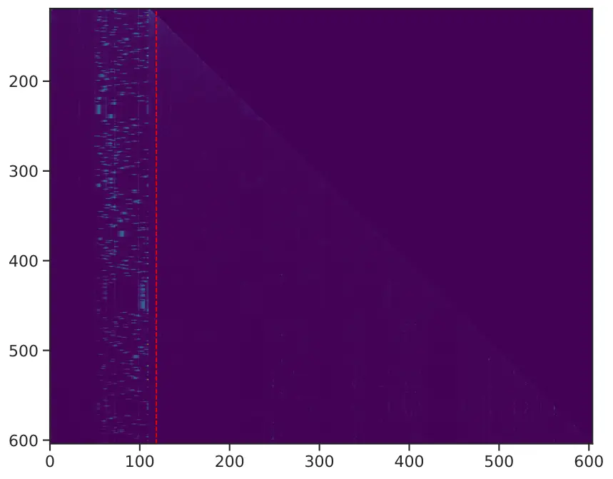
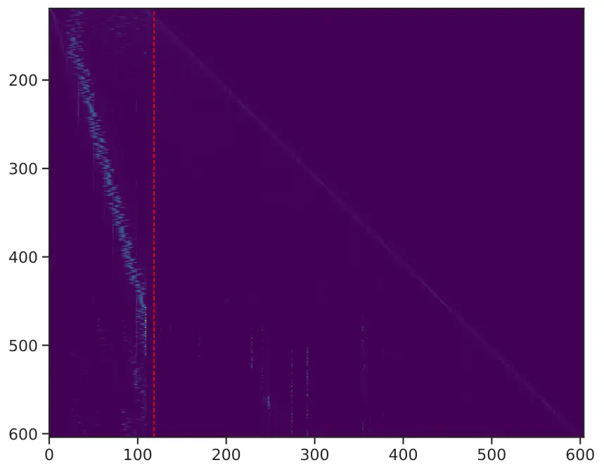
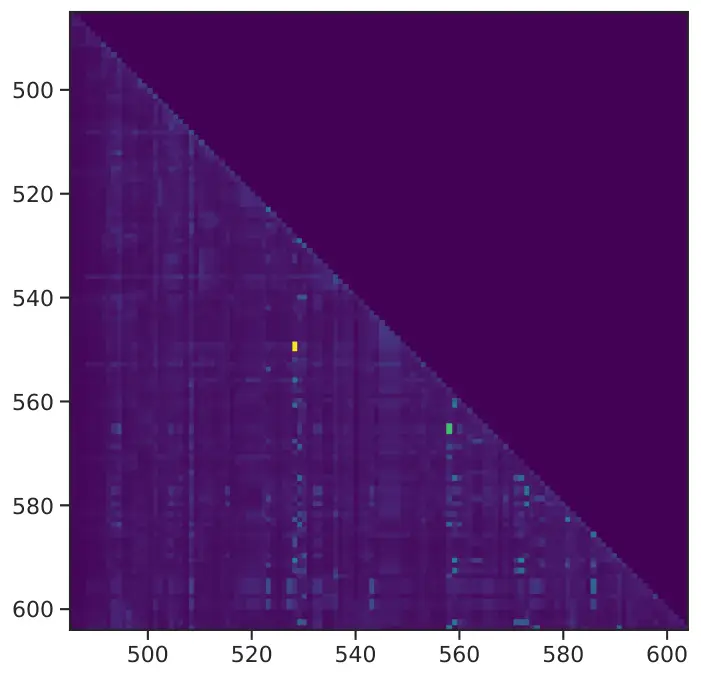
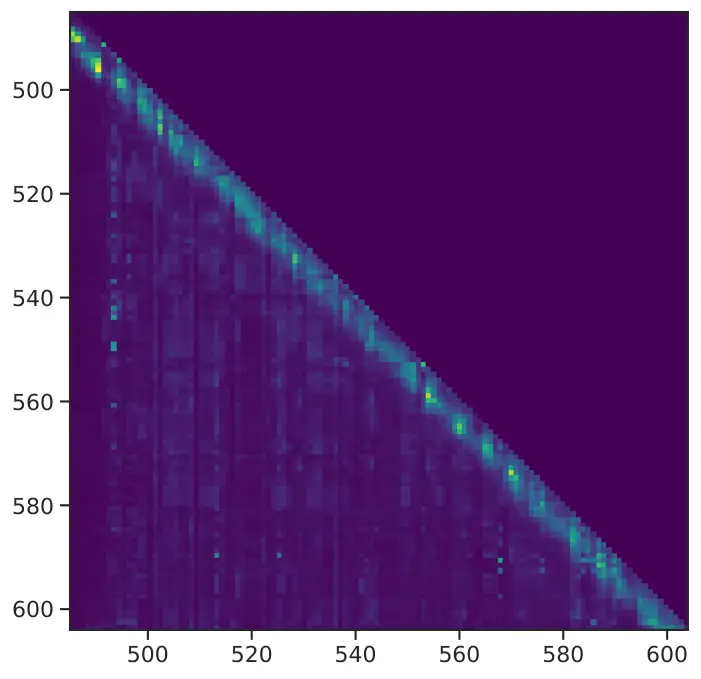
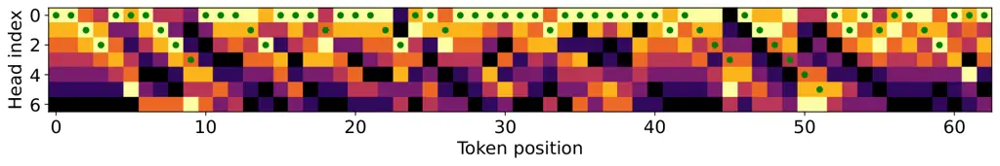
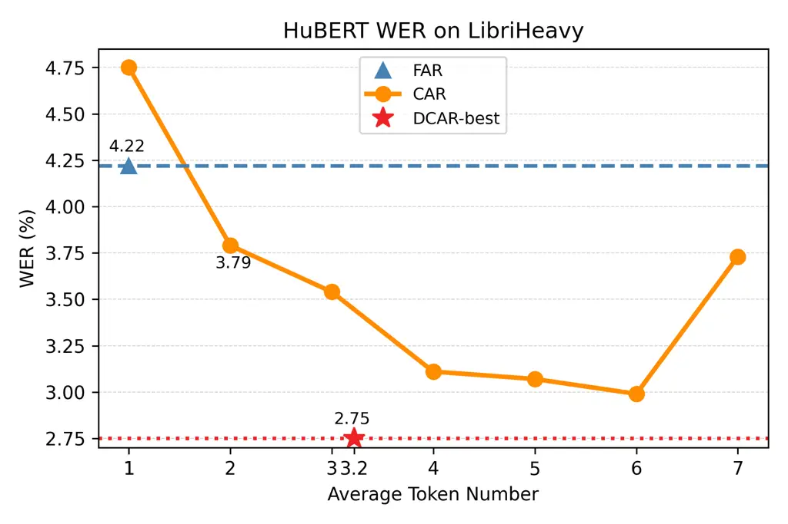

# Robust and Efficient Autoregressive Speech Synthesis with Dynamic Chunk-wise Prediction Policy

Bohan Li^(∗)    Zhihan Li^(∗)    Haoran Wang    Hanglei Zhang    Yiwei
Guo    Hankun Wang Affiliation: Xie Chen    Kai Yu^(†)
Affiliation: X-LANCE Lab, School of Computer Science; Affiliation: MoE
Key Lab of Artificial Intelligence, AI Institute, Affiliation: Shanghai
Jiao Tong University, Shanghai, China; Affiliation: MoE Key Lab of
Artificial Intelligence, Jiangsu Key Lab of Language Computing
Affiliation: {everlastingnight, kai.yu}@sjtu.edu.cn

###### Abstract

Recently, autoregressive (AR) language models have emerged as a dominant
approach in speech synthesis, offering expressive generation and
scalable training. However, conventional AR speech synthesis models
relying on the next-token prediction paradigm often encounter
significant challenges when handling long speech sequences. These models
often struggle to construct stable frame-to-frame attention, leading to
increased latency and degraded synthesis quality, thereby limiting their
feasibility for real-time applications. To address these limitations, we
introduce a novel dynamic chunk-wise autoregressive synthesis framework,
termed DCAR, designed to enhance both efficiency and intelligibility
robustness in AR speech generation. DCAR introduces a chunk-to-frame
attention mechanism through training with multi-token prediction,
enabling dynamic chunk prediction in variable speech contexts using a
lightweight module trained on-policy. DCAR dynamically adjusts the token
prediction span, significantly reducing the sequence length dependency
while obtaining high synthesis quality. Comprehensive empirical
evaluations demonstrate that DCAR substantially outperforms traditional
next-token prediction models, achieving up to 72.27% intelligibility
improvement and 2.61$`\times`$ inference speedup simultaneously on test
set. Furthermore, we conduct comprehensive analysis to support it as a
versatile foundation for next-generation speech synthesis systems.

^(†)^(†)footnotetext: ^(∗)Equal contribution.^(†)^(†)footnotetext:
^(†)The corresponding author.

## 1 Introduction

Autoregressive (AR) architectures are widely employed in natural
language processing (NLP) for both understanding and generation tasks.
These models typically operate under the next-token prediction paradigm,
wherein each subsequent token is predicted based on the sequence of
preceding tokens. This approach has underpinned many of the recent
advances in text generation, particularly with the rise of large
language models (LLMs) \[1\].

In the speech domain, adopting similar AR modeling strategies naturally
requires the use of quantization techniques to convert continuous
acoustic signals into discrete representations, which effectively serve
as a speech tokenizer. To this end, researchers have actively explored
various discretization methods of speech \[2, 3, 4\]. Prominent
approaches include applying vector quantization (VQ) on existing speech
neural representation and training speech codecs using VQ-Variational
Autoencoder (VQ-VAE) \[5\] architectures. Unlike textual or visual
tokens, speech tokens typically correspond to short frames or
time-windowed segments of audio, capturing low-level acoustic patterns
but do not directly encode semantic information. These properties pose
challenges for Transformer architectures, as lengthy speech sequences
demand autoregressive modeling of long-range dependencies across frames
using the next-token prediction paradigm.

In this work, we investigate whether the frame-level autoregressive(FAR)
prediction paradigm is essential for autoregressive speech synthesis
models. Inspired by recent developments in LLMs, muti-token prediction,
which appears as a method for LLM fast decoding and rapid convergence in
training, offers speech synthesis a promising direction to reduce the
computational burden associated with lengthy speech sequences in AR
models. We conduct an experimental study on autoregressive TTS using
various configurations of speech tokens, revealing that tokens predicted
by the first head do not consistently outperform those predicted by
subsequent heads at the same sequence position. This phenomenon appears
as a reasonable explanation for the robust synthesis by directly
predicting without any speculative strategies a chunk of speech tokens
at each decoding step. We refer to this method as chunk-wise
autoregressive synthesis, termed CAR. While prior efforts \[6, 7, 8\]
have applied CAR in autoregressive TTS using decoding techniques to
achieve fast or high-quality synthesis, they still rely on parallel
speculative verification based on the first head or simply accepting a
fixed-size chunk of tokens. This leaves room for improvement in token
selection strategies, as current approaches may retain redundant or
suboptimal predictions.

To this end, we propose DCAR, a dynamic chunk-wise synthesis strategy
that uses two-stage training, allowing to schedule a proper chunk size
at each CAR decoding step. In the first stage, we let the TTS base model
learn a chunk-to-frame attention pattern through muti-token prediction,
where the model predicts next $`n`$ tokens through one base head and
$`n-1`$ additional heads. With the base head for the next token
prediction, additional heads are responsible for predicting the second
to $`n`$-th next succeeding tokens. The losses for each head are summed
with coefficients to form the final CAR training criterion.

Sequentially, DCAR trains a lightweight policy based on the pre-trained
TTS model to dynamically determine the length of next chunk through an
on-policy strategy adapted from Group Relative Preference Optimization
\[9\]. Recent researches \[10, 11\] reveal that preference optimization
policies prefer to let the model learn output preference rather than
brand new knowledge, which means it is essential to give a guidance to
the chunk-schedule policy, reducing the preference learning space.
Consequently, we propose a chase-then-exceed strategy, where we profile
a range of chunk size that perform well in fixed-size CAR and set them
as half of the sampling policy in a group as guidance for the other
sampling from the lightweight module trained on policy. Meanwhile, we
give a negative process reward as a trace penalty for each outrange
chunk size to further encourage the policy taking actions in our desired
range. DCAR policy for chunk size schedule shows effectiveness through
only two-epoch training on a tiny set with 980 samples from the
LibriTTS \[12\] training set, conducting TTS with both stability and
competitive speed.

The evaluation of DCAR is basically divided into four aspects:
intelligibility robustness, naturalness of synthesis, speaker similarity
of zero-shot TTS and autoregressive decoding acceleration. DCAR
simultaneously achieves up to 72.27% (WER 9.99% to 2.77%) and 20.34%
(WER 2.31% to 1.84%) synthesis intelligibility improvement,
2.61$`\times`$ and 2.89$`\times`$ synthesis speedup TTS utilizing
HuBERT \[13\] and $`\mathcal{S}^{3}`$-Tokenizer \[14\] tokens.

Our main contributions can be summarized as follows:

- •
  We propose DCAR, a novel autoregressive method for speech synthesis,
  which predict dynamic chunk-wise speech tokens autoregressively,
  benefiting synthesis speed and robustness.
- •
  We conduct lightweight policy training with DCPO algorithm, which
  utilizes a chase-then-exceed strategy. It effectively accelerates the
  convergence process and leverages well-performed interim results in a
  sufficient way.
- •
  We analyze the chunk-to-frame attention pattern and predicting
  behavior in the CAR models, providing valuable insights in the nature
  of speech sequences self-attention.

## 2 Related works

### 2.1 Autoregressive speech synthesis

Despite the expressive potential of AR TTS models \[15, 16, 17, 18,
14\], they have long been plagued by lengthy speech sequences. Compared
to text modality, speaking five words often takes one second, where
contains fifty speech tokens quantized in 50Hz. Predicting long
sequences accumulates the loss from inaccurate decoded tokens, causing
instability issues during inference. Generated speech often suffers from
bad cases such as unnatural silence, repeated words, and word omissions.
Hence, robustness is a major concern for current AR TTS models. A
variety of strategies have been proposed in prior work to enhance the
robustnes of generation, including alignment-guided sequence reordering
or training \[19, 20\], applying Transducer loss \[21\],
chain-of-thought prompting \[22\], etc.

High latency and the substantial semantic gap to the text modality
remain major challenges in autoregressive decoding when using
fine-grained speech representations. Existing methods to address these
issues can be broadly categorized into three approaches: (1)
Downsampling the representation or utilizing its coarse-grained
counterpart; (2) Hierarchical generation from coarse to fine
representations; (3) Employing multi-token prediction for chunk-wise AR
modeling with carefully designed decoding strategies:

##### Representation downsampling

In recent years, a growing body of work has focused on compressing
discrete speech representations to extremely low frame rates \[3\]. One
viable approach is to integrate downsampling modules either directly
into the quantization stage \[23, 24, 25\] of self-supervised
representations or within neural speech codec models \[26, 27\].
However, such strategies often lead to substantial loss of intra-speech
information, coarse-grained speech tokens still struggle to match the
performance of fine-grained tokens in capturing acoustic details and
other nuanced features.

##### Coarse-to-fine generation

Since fine-grained representations excel in modeling acoustic details,
recent studies have explored generating coarse-grained tokens
autoregressively, followed by conditioning on these tokens to predict
fine-grained representations using either AR or non-AR strategies \[28,
29, 30\].

##### Speech synthesis via chunk-wise multi-token Prediction

Multi-token prediction has been proposed in recent years to accelerate
decoding in large language models (LLMs) \[31, 32\] and to enable faster
convergence during training \[33\]. Recent studies \[6, 7, 8\] in the
speech domain have begun to adopt this approach for efficient
autoregressive speech recognition and for fast, high-quality speech
synthesis.

### 2.2 Preference policy via reinforcement learning

Since ChatGPT \[34\], preference optimization policies have attracted
significant attention and exploration. The Proximal Policy
Optimization(PPO) \[35\] algorithm pioneers in treating human evaluation
as supervision of the critic model, which provides environmental rewards
when training the fundamental LLM as the actor model. Subsequently,
Direct Preference Optimization (DPO) \[36\] simplified this process by
enabling the LLM itself to serve as the reward model. With the recent
shift toward the reasoning era, DeepSeek-R1 \[37\] brought the Group
Relative Policy Optimization (GRPO) \[9\] algorithm to the forefront of
this trend. GRPO leverages inter-group advantages derived from multiple
rounds of reasoning by the LLM as the reward signal, effectively
stimulating and enhancing the model’s reasoning capabilities. Several
studies \[38, 39, 40, 41, 42\] in the speech domain have adapted these
preference alignment strategies to advance robust and high-fidelity
speech synthesis.

Our method leverages multi-token prediction and reinforcement learning
to further optimize the chunk scheduling policy, offering a novel
approach to robust, high-quality, and efficient speech synthesis.

Figure 1: Overview of FAR, CAR, and proposed DCAR.

Figure 2: Prediction of the same frame varies in different chunks.

## 3 Revisiting autoregressive TTS with chunk-wise prediction

In this section, we address a central question: At what scale should
each prediction be made in speech synthesis? To explore this, we
implement a basic TTS framework based on multi-token prediction, where
each prediction head is trained with either a declining or uniform
objective weighting scheme. Then we conduct extensive analyses to
investigate the reasons behind the superiority of chunk-wise prediction
over frame-wise prediction, as well as the limitations that remain in
fixed-length chunk-wise prediction.

### 3.1 Implementation of chunk-wise autoregressive Text-to-Speech

##### Tokenizers

Two types of speech token are used in building AR TTS models, tokens
with a single codebook are considered as a For semantic tokens, we
select the k-means clusters on the last layer of HuBERT-Large \[13\] and
$`\mathcal{S}^{3}`$-Tokenizer \[14\], as unsupervised and supervised
semantic tokens respectively. Specifically, for HuBERT tokens, the
k-means model is trained with 2048 centroids on a randomly sampled
73-hour subset of LibriTTS training set. Previous works \[43\] prove
that phoneme and subword perform close as the text type, hence we choose
phonemes as input text units for convenience.

##### Training CAR decoder with multiple heads

We design additional lightweight heads on the original decoder-only
architecture according to  \[31, 6\], training them from scratch jointly
with bidirectional attention on text tokens and causal attention on
speech tokens. Each head is responsible for the prediction of a position
in the next chunk sequentially.

The training objective can be described as:

```math
\mathcal{L}_{\text{CAR}}=-\frac{1}{T}\sum_{t=0}^{T}\sum_{i=0}^{N^{\prime}}\gamma^{i}\log p_{\theta}(s_{t+i}|s_{<t},x) \tag{1}
```

where $`s`$ refers to the speech token sequence of length $`T`$, $`x`$,
$`\theta`$ refer to the text condition and the model parameters, and
$`\gamma`$ is a hyperparameter in the range of $`(0,1]`$. Assuming $`N`$
is the number of the predicting heads, we have
$`N^{\prime}=\min\{N,T-t\}`$ in the process. Among a series settings of
$`\gamma`$ values, the equal objective pattern, where $`\gamma=1`$,
performs the best in synthesis robustness.

##### Speaker-controllable speech token vocoder

Semantic tokens like HuBERT clusters and $`\mathcal{S}^{3}`$ Tokenizer
tokens do not have a built-in decoder to reconstruct waveforms, hence
training an additional vocoder is necessary. In this work, we use
CTX-vec2wav \[44\] to reconstruct semantic tokens into waveforms, due to
its speaker controllability and simple end-to-end procedure. Following
\[45\], we use WavLM-Large \[46\] to extract speaker representations to
best control the speaker identity in inference. For
$`\mathcal{S}^{3}`$-Tokenizer, this structure is faster than the
conditional flow matching decoder proposed in \[14\], which is crucial
in the RL training process in later sections.

### 3.2 Advantages and limitations of chunk-wise prediction

We conduct analysis of the foundation of our approach from three key
aspects: (1) We revisit the motivation and role of multi-token
prediction, and discuss its distinct behavior when applied to the speech
modality; (2) Through an analysis of attention weights, we demonstrate
how the CAR speech model diverges from the FAR one; (3) We identify the
limitations of fixed-length CAR and point out the necessity of adopting
a dynamic chunk size. In particular, we argue that the mismatch between
training and inference in autoregressive speech generation hinders the
learning of a reliable dynamic scheduling policy, thereby motivating our
use of reinforcement learning.

#### 3.2.1 Revisiting chunk-wise token prediction

In \[33\] and \[32\], chunk-wise multi-token prediction is primarily
used as an auxiliary task to better exploit training data and accelerate
model convergence, while still adopting single-step prediction for best
inference. When applied to speed up inference, however, the inherently
more challenging nature of cross-token prediction often leads to a
degradation in generation quality. MEDUSA \[31\] attempts to balance
inference efficiency and generation quality by promptly verifying
additional outputs. A common agreement in the aforementioned studies is
that additional prediction tasks are challenging and often yield
unreliable results. Nevertheless, due to the stronger local continuity
in speech signals (even in form of discrete tokens), we argue that the
predicting difficulty of additional tokens is reduced. This diminishes
the dominance of the base head in prediction, allowing additional heads
to predict comparably well or even better.

#### 3.2.2 Chunk-to-frame attention pattern

Chunk-wise prediction models are designed to capture the relationship
between an upcoming chunk and the preceding frames. Compared to
individual frames, chunks often carry more coherent and semantically
informative content, which significantly alters the model’s attention
patterns. By visualizing the attention weights of our CAR model for a
given utterance, we gain insights into how attention is distributed
across different positions during chunk prediction.

Figure 3 illustrates the distribution of attention weights in the first
layer of both FAR and CAR models. In contrast to pure text models,
text-guided speech models exhibit two prominent branches of attention:
(1) corresponding text frames, and (2) short-range speech context.
Occasionally, the model attends to frames more than several dozen steps
away, which we hypothesize is due to either speaker-specific
characteristics or genuinely similar acoustic patterns.



(a) First-layer attention weights from FAR model.



(b) First-layer attention weights from CAR model.



(c) A zoomed-in view of FAR attention.



(d) A zoomed-in view of CAR attention.

Figure 3: Attention visualization. The first 119 tokens are for text,
followed by 535 audio tokens.

Comparison results in Figure 3 reveals a notable distinction between the
two models. The CAR model demonstrates a clearer alignment between
speech and text in earliest layers, as well as a more stable focus on
short-range speech context. In contrast, the FAR model shows signs of
confusion in these aspects. This discrepancy can be reasonably
attributed to the chunk-level representation being inherently more
informative and easier to interpret than individual frames.

It is also worth noting that the attention distribution over short-range
speech context is highly uneven across positions. Figure 3(c)(d) zoom in
on the local attention structure near the diagonal, showing that
attention within a chunk is often diffusely allocated to the preceding
few frames. This pattern is consistent with the nature of speech, where
certain key frames in the sequence largely determine the trajectory of
speech content.

#### 3.2.3 Frame-to-frame attention preference

For a certain frame, the predictions from different chunks can be
different. In Figure 2, as an example with a chunk size of 2, if the
prediction of $`s_{t}`$ from $`p_{\theta}(s_{t},s_{t+1}|s_{<t})`$ is
weaker than that from $`p_{\theta}(s_{t-1},s_{t}|s_{<t-1})`$, we should
not simply attribute this to the presence of the additional $`s_{t-1}`$
in the condition or the inclusion of an extra prediction target
$`s_{t+1}`$. Instead, we consider it as evidence that, given the model’s
limited capacity, the information fused for chunk $`(s_{t},s_{t+1})`$ is
more suitable for predicting $`s_{t}`$ than that for chunk
$`(s_{t-1},s_{t})`$. In other words, each frame inherently has a
preference over different chunk-to-frame attention patterns.

Figure 4 illustrates the inference behavior of a CAR model with 6
additional heads on a GT sequence. We slide the 7 prediction heads of
CAR with a stride of one frame, so predictions within each chunk are
aligned diagonally. In teacher forcing mode, we compute cross-entropy
loss at each position and sort them within each column, which correspond
to the predictions for the same position made when the base head is at
different positions ahead. A lower loss (represented by brighter colors
in the figure) indicates that the model is more confident in predicting
the GT token.



Figure 4: Prediction loss ranking across different heads (teacher
forcing mode). Brighter colors indicate better prediction performance
for each position. The green dots illustrate a dynamic prediction route
that selects prediction as well as possible.

We observe that the most confident prediction for a given position often
does not come from the base head. Experiments on the dev-all subset of
LibriTTS show that the base head makes the best prediction in only
60.07% of the cases while producing 9.27% worst predictions.

When considering minimizing the total prediction loss under teacher
forcing, the problem becomes one of dynamic programming. A heuristic
principle is to follow the path through brighter cells as many as
possible, as shown in Figure 4, with each diagonal representing a single
prediction step.

However, such principle is merely heuristic and is difficult to leverage
for training an effective scheduling policy. This is partly because it
fail to account for the varying importance of different positions. More
critically, the model’s behavior during actual inference differs from
that under teacher forcing: In AR generation, divergences from the
ground-truth sequence may lead to accumulated errors, but can also
result in alternative, satisfactory outputs. Despite this, single-step
FAR or fixed-length CAR evidently leaves more room for optimization.

This particular nature in AR poses challenges to learning the policy
under teacher forcing. We argue that a reasonable scheduling policy need
to consider the overall trajectory across multiple future frames, and
thus differs from speculative sampling. Therefore, we aim to obtain
feedback on the scheduling policy directly from the generation results,
which motivates our use of reinforcement learning. We believe that
reinforcement learning can address such difficulties, and that feedback
derived directly from audio metrics is unconstrained by the ground-truth
data and brings potential for further improving speech synthesis
performance.

## 4 Dynamic chunk-wise prediction via lightweight policy

### 4.1 Preliminaries

GRPO is a varient of PPO, which foregoes the critic model and use
group-related advantage values to instead. It can directly utilize
rule-based rewards, performing as an efficient and effective RL
algorithm. In the training process, the updating policy is
$`\pi_{\theta}`$, reference policy is $`\pi_{\theta_{\text{ref}}}`$ and
the old policy is $`\pi_{\theta_{\text{old}}}`$. Given a question $`q`$
from set $`Q`$, a group of $`G`$ candidate outputs
$`\{o_{1},o_{2},\cdots,o_{G}\}`$ is generated using the
$`\pi_{\theta_{\text{old}}}`$. The advantage $`\hat{A}_{i,t}`$ will be
constructed utilizing rewards, and the training objective is:

```math
\displaystyle\mathcal{J}_{\text{GRPO}}(\theta)=\mathbb{E}_{q\sim P(Q),\,\{o_{i}\}_{i=1}^{G}\sim\pi_{\theta_{\text{old}}}(\mathcal{O}|q)}\Bigg[\frac{1}{G}\sum_{i=1}^{G}\frac{1}{|o_{i}|}\sum_{t=1}^{|o_{i}|}\min\Bigg(\frac{\pi_{\theta}(o_{i,t}|q,o_{i,<t})}{\pi_{\theta_{\text{old}}}(o_{i,t}|q,o_{i,<t})}\,\hat{A}_{i,t},
```

```math
\displaystyle\quad\text{clip}\left(\frac{\pi_{\theta}(o_{i,t}|q,o_{i,<t})}{\pi_{\theta_{\text{old}}}(o_{i,t}|q,o_{i,<t})},1-\varepsilon,1+\varepsilon\right)\hat{A}_{i,t}\Bigg)\Bigg]-\beta\,\mathbb{D}_{\mathrm{KL}}[\pi_{\theta}\|\pi_{\text{ref}}] \tag{2}
```

where $`\varepsilon`$ and $`\beta`$ are hyperparameters, and
$`\mathbb{D}_{\mathrm{KL}}[\pi_{\theta}\|\pi_{\text{ref}}]`$ can be
described as:

```math
\mathbb{D}_{\mathrm{KL}}\left[\pi_{\theta}\|\pi_{\text{ref}}\right]=\frac{\pi_{\text{ref}}(o_{i,t}|q,o_{i,<t})}{\pi_{\theta}(o_{i,t}|q,o_{i,<t})}-\log\frac{\pi_{\text{ref}}(o_{i,t}|q,o_{i,<t})}{\pi_{\theta}(o_{i,t}|q,o_{i,<t})}-1 \tag{3}
```

### 4.2 Dynamic chunk-wise policy optimization

We design our task-specific RL algorithm, Dynamic Chunk-wise Policy
Optimization (DCPO), for training a lightweight dynamic chunk-wise
schedule policy as an adaptive modification of GRPO with some specific
training strategies. We select a tiny subset of samples from LibriTTS
train set, which contains 980 utterances from 20 speakers with durations
at least 6 seconds. The first 3 seconds will be utilized as an audio
prompt.

##### Training objective

The architecture of the schedule module is a linear predicting head
followed by a causal transformer layer, which serves the sequence of the
historical hidden states of predicting speech sequences as the input.
Hence, our training objective should take the parameters $`\phi`$ of the
base model into consideration:

```math
\displaystyle\mathcal{J}_{\text{DCPO}}(\theta)=\mathbb{E}_{q\sim P(Q),\,\{a_{i}\}_{i=1}^{G}\sim\pi_{\theta_{\text{old}}}(\mathcal{A}|q)}\Bigg[\frac{1}{G}\sum_{i=1}^{G}\frac{1}{|a_{i}|}\sum_{t=1}^{|a_{i}|}\min\Bigg(\frac{\pi_{\theta}(a_{i,t}|q,s(a_{i,<t},\phi))}{\pi_{\theta_{\text{old}}}(a_{i,t}|q,s(a_{i,<t},\phi))}\,\hat{A}_{i,t},
```

```math
\displaystyle\quad\text{clip}\left(\frac{\pi_{\theta}(a_{i,t}|q,s(a_{i,<t},\phi))}{\pi_{\theta_{\text{old}}}(a_{i,t}|q,s(a_{i,<t},\phi))},1-\varepsilon,1+\varepsilon\right)\hat{A}_{i,t}\Bigg)\Bigg]-\beta\,\mathbb{D}_{\mathrm{KL}}[\pi_{\theta}\|\pi_{\text{ref}}] \tag{4}
```

Here, the output set $`\mathcal{A}`$ comprises lightweight policy action
sequences, and the function $`s`$ computes the base model’s hidden
states. Specifically, $`s`$ leverages previously determined policy
actions to schedule chunk-wise decoding steps and subsequently samples
tokens as base model input, then get hidden states accordingly. In the
forward pass, we introduce a mask on inner-chunk positions, ensuring the
policy only learns from positions that really schedule chunk size in the
sampling. In practice, we use a warm-up strategy for $`\beta`$,
initializing it at 0 and incrementally increasing it over training
epochs. Additionally, the advantage $`\hat{A}_{i,t}`$ is defined as
$`\frac{r_{i}-\text{mean}(\mathbf{r})}{\text{std}(\mathbf{r})}`$
following GRPO’s outcome-supervision methodology, with the reward vector
$`\mathbf{r}`$ detailed below.

##### Chase-then-exceed strategy

To motivate the random-initialized policy capability for robust
synthesis, we profile a range $`\mathcal{C}`$ of chunk-wise schedule
actions which outperforms in CAR speech synthesis and set half of the
sample group CAR-scheduled using fixed chunk length as the values in the
range. This softly constrains the action searching space, enabling the
policy first learning from CAR experience and then outperform CAR.

##### Reward function via action guidance

During training, we sample batches from the tiny dataset, decoding each
of them $`G`$ times as groups. After utilizing an efficient automatic
speech recognition model to transcribe the generated samples and the
ground truth speech and then compute their WER metrics for outcome
rewards. We give a value-relative negative process rewards for the
out-range actions as an additional constrain. The calculation function
for the total rewards $`r`$ is formulated as:

```math
r=\max\{1-\ln(\text{WER}_{\text{gen}}-\text{WER}_{\text{gt}}+1),\epsilon\}-\lambda\sum_{i\notin{\mathcal{C}}}\frac{i}{T} \tag{5}
```

where $`\text{WER}_{\text{gen}}`$ and $`\text{WER}_{\text{gt}}`$ refer
to the WER metrics for generated and ground truth speech and $`T`$
refers to the generated speech sequences length. The value of
$`\epsilon`$ is $`-10`$ for avoiding reward explosion and $`\lambda`$ is
usually set as 0.1, enabling the absolute value of total negative
rewards an order of magnitude less than the WER supervision reward.

|                                    |            |                   |                  |                   |                   |                     |
| ---------------------------------- | ---------- | ----------------- | ---------------- | ----------------- | ----------------- | ------------------- |
| Method                             | Avg. Token | Quality           |                  |                   | Efficiency        |                     |
|                                    |            | WER$`\downarrow`$ | SECS$`\uparrow`$ | UTMOS$`\uparrow`$ | RTF$`\downarrow`$ | Speedup$`\uparrow`$ |
| HuBERT-kmeans2048-50Hz             |            |                   |                  |                   |                   |                     |
| FAR                                | 1          | 9.99              | 0.885            | 4.12\_(±0.030)    | 0.320             | 1$`\times`$         |
| CAR – WER top3                     | 2          | 3.04              | 0.886            | 4.14\_(±0.028)    | 0.171             | 1.89$`\times`$      |
|                                    | 3          | 2.99              | 0.885            | 4.14\_(±0.028)    | 0.121             | 2.83$`\times`$      |
|                                    | 4          | 3.09              | 0.885            | 4.13\_(±0.027)    | 0.094             | 3.60$`\times`$      |
| DCAR – \[2,3\]                     | 2.78       | 2.82              | 0.885            | 4.14\_(±0.027)    | 0.137             | 2.39$`\times`$      |
| DCAR – \[2,3,4\]                   | 3.08       | 2.77              | 0.885            | 4.14\_(±0.028)    | 0.128             | 2.61$`\times`$      |
| $`\mathcal{S}^{3}`$-Tokenizer-50Hz |            |                   |                  |                   |                   |                     |
| FAR                                | 1          | 2.31              | 0.884            | 4.26\_(±0.022)    | 0.335             | 1$`\times`$         |
| CAR – WER top3                     | 2          | 2.02              | 0.885            | 4.27\_(±0.019)    | 0.171             | 2.04$`\times`$      |
|                                    | 3          | 2.09              | 0.884            | 4.27\_(±0.017)    | 0.121             | 2.94$`\times`$      |
|                                    | 4          | 2.06              | 0.883            | 4.27\_(±0.018)    | 0.096             | 3.76$`\times`$      |
| DCAR – \[2,3\]                     | 2.41       | 1.84              | 0.885            | 4.29\_(±0.017)    | 0.158             | 2.18$`\times`$      |
| DCAR – \[2,3,4\]                   | 3.27       | 1.92              | 0.884            | 4.26\_(±0.018)    | 0.122             | 2.89$`\times`$      |

Table 1: Performance of FAR, CAR, DCAR on speech synthesis robustness,
quality, and speed. “Avg. Token” refers to the average number of speech
token simultaneously generated in each step.

## 5 Experiments

### 5.1 Experimental settings

##### Datasets

We conduct our main experiments on LibriTTS \[12\] training set with 585
hours, and LibriHeavy with 50k hours is utilized for data scaling
experiments(Appendix E.2). For evaluation, we test TTS performance on
UniCATS testset-B \[44\]. This set contains 500 utterances from 37
unseen speakers in the LibriTTS test-clean subset. Each speaker is
associated with a speech prompt of approximately 3 seconds. The policy
training set is described in section  4.2.

##### Architecture configurations

The fundamental decoder-only TTS architecture is constructed with 12
Transformer layers, each layer with 8 attention heads, 1024 hidden
dimensions, and 4096 feedforward dimensions. The base predicting head is
a linear layer, and the additional heads consist of 4 residual blocks (a
linear layer plus a SiLU \[47\] activation function) and a linear
prediction layer. For fair comparison, we conduct our main experiments
on the setting of 6 addition heads. In training, we compute WER using
NeMo ASR¹¹ 1
https://huggingface.co/nvidia/stt_en_fastconformer_transducer_large.

##### Baselines

We select three methods as baselines of DCAR: (1) Frame-level AR TTS
with next-token prediction; (2) Chunk-wise AR TTS selecting fixed-number
tokens as the next chunk; (3) VADUSA \[6\], a speculative decoding
strategy selecting draft tokens through the verification based on the
predicting head, which also performs dynamic effect in decoding steps.
Except for whether having additional heads, all the baselines are in the
same architecture.

##### Evaluation metrics

To evaluate speech synthesis performance comprehensively, we utilize
metrics for various aspects: Word-error-rate (WER) and UTMOS \[48\] for
synthesis intelligibility and quality; speaker encoder cosine similarity
(SECS) for zero-shot TTS speaker similarity; and real time factor (RTF)
for synthesis speed. We measure WER by Whisper-Large-V3²² 2 Note that
this is different with the ASR tool NeMo in guidance range profiling and
on-policy training, to avoid potential overfitting. \[49\], and SECS by
Resemblyzer³³ 3 https://github.com/resemble-ai/Resemblyzer. We also
measure the DCAR speedup effect compared to the baselines.

##### Devices

Our main experiments are conducted on NVIDIA RTX 4090 24GB GPUs, and
data-scaled training is conducted on NVIDIA A800 80GB GPUs.

### 5.2 Performance of different AR generation paradigms

In Table 1, we observe that the FAR-based generation method
underperforms in terms of robustness across both token types. It also
fails to achieve optimal results in zero-shot speaker similarity (SECS)
and in naturalness as measured by UTMOS. Furthermore, this method incurs
significant inference latency. The table also reports the top-three most
robust results for the CAR-based synthe method. We find that simply
training the speech synthesis model using the CAR architecture leads to
substantial robustness improvements. Additionally, its inference speed
increases proportionally with the number of predetermined decoding
tokens. DCAR achieves the lowest WER in robustness assessments.
Importantly, it maintains acoustic quality and zero-shot performance
while also providing considerable acceleration. Notably, when the
average sampling steps are comparable, DCAR’s speedup is slightly
diminished due to the overhead introduced by the policy model.

### 5.3 Comparison between DCAR and speculative decoding

While speculative decoding methods like VADUSA aim to accelerate
inference, DCAR leverages WER as the primary supervision signal to
enhance the robustness of speech synthesis. Despite differing in both
objectives and underlying mechanisms, the two approaches converge on a
similarly dynamic decoding strategy, ultimately achieving high-quality
and efficient speech generation. We ensure architectural consistency in
the CAR TTS models and demonstrate the generation quality and speed
achieved by both methods using the shared HuBERT tokens in Table 3.
VADUSA proposes tolerant verification on multiple sampling results of
the base head, here we set the tolerance value as 2, 3.

### 5.4 Discussion on the frame-rate factor

We compare and integrate the CAR framework with low-frame-rate
tokenization approaches, specifically utilizing both 50Hz and 25Hz
variants of the $`\mathcal{S}^{3}`$-Tokenizer. Given that 25Hz tokens
cover a temporal receptive field twice as large as that of 50Hz tokens,
we adapt the CAR model by reducing the number of prediction heads to
three—half the number used in the 50Hz configuration. To assess the
effectiveness of CAR, we provide a visualization in Figure 5, with the
x-axis representing the temporal dimension. As shown, the generation
performance of CAR degrades with increasing chunk sizes in the 25Hz
setting. Nevertheless, over half of these configurations still
outperform the FAR baseline, while offering up to 2 times theoretical
acceleration in synthesis. On the other hand, CAR synthesis using 50Hz
tokens consistently outperforms the 25Hz CAR counterparts when
controlling for the temporal field of view. Furthermore, we report the
performance of the 50Hz DCAR model, which achieves the highest
robustness across all evaluated settings.

### 5.5 Ablation study

##### Variation of policy action guidance range

Table 4 demonstrates the impact of changing the action guidance range of
DCPO algorithm. Wider range of the profiled CAR chunk size indicates to
faster decoding ability of the policy, with declining of robust
synthesis capability.

##### Method Decomposition

We decompose the DCPO strategies, chase-then-exceed strategy and
outrange negative rewards, as demonstrated in Table 2, to reflect the
effectiveness of designed strategies. “Random” policy in the table
directly means select the chunk size at each decoding step randomly from
the followed range.

| Policy                          | WER(%)$`\downarrow`$ |
| ------------------------------- | -------------------- |
| DCAR – \[2, 3\]                 | 2.82                 |
|    – w/o. chase-then-exceed     | 3.17                 |
|    – w/o. outrange neg. rewards | 3.09                 |

Table 2: Strategy decomposition results in WER.

![[Uncaptioned
image]](arxiv-2506-22023--e5fe8a083319.figures/figure-6.webp)

Figure 5: WER performance with different frame-rate and strategies.

| Method            | WER(%)$`\downarrow`$ | Speedup$`\uparrow`$ |
| ----------------- | -------------------- | ------------------- |
| VADUSA–$`\tau`$=2 | 3.86                 | 3.03$`\times`$      |
| VADUSA–$`\tau`$=3 | 4.17                 | 3.12$`\times`$      |
| DCAR–\[2,3\]      | 2.82                 | 2.39$`\times`$      |
| DCAR–\[2,3,4\]    | 2.77                 | 2.61$`\times`$      |

Table 3: Comparison with VADUSA, $`\tau`$ refers to the value of
tolerance.

|                |                      |                   |
| -------------- | -------------------- | ----------------- |
| DCPO range     | WER(%)$`\downarrow`$ | RTF$`\downarrow`$ |
| FAR-baseline   | 9.99                 | 0.320             |
| \[2, 3\]       | 2.82                 | 0.137             |
| \[3, 4\]       | 2.84                 | 0.126             |
| \[2, 3, 4\]    | 2.77                 | 0.128             |
| \[2, 3, 4, 5\] | 3.04                 | 0.115             |
| Totally free   | 3.30                 | 0.118             |
|                |                      |                   |

Table 4: DCPO action guidance range effects on DCAR synthesis robustness
and inference speed.

## 6 Conclusion

In conclusion, this work addresses a critical challenge in speech
synthesis: the limitations of frame-level autoregressive (FAR) models,
which often suffer from instability and high inference latency when
operating on fine-grained speech tokens. To overcome these issues, we
analyze the effectiveness of chunk-wise autoregressive (CAR) synthesis
as an alternative framework. By leveraging its architectural properties,
CAR exhibits significant advantages over FAR in both robustness and
efficiency. Building on this foundation, we introduce DCAR, a
dynamically scheduled variant of CAR that employs reinforcement learning
to train a lightweight policy network. This policy adaptively determines
optimal chunk sizes at each decoding step, further enhancing synthesis
quality and efficiency. Limitations and broader impacts are further
discussed in the appendix provided in the supplementary materials.

## References

- \[1\] W. X. Zhao, K. Zhou, J. Li, T. Tang, X. Wang, Y. Hou, Y. Min,
  B. Zhang, J. Zhang, Z. Dong _et al._, “A survey of large language
  models,” _arXiv preprint arXiv:2303.18223_, vol. 1, no. 2, 2023.
- \[2\] H. Wu, H.-L. Chung, Y.-C. Lin _et al._, “Codec-SUPERB: An
  In-Depth Analysis of Sound Codec Models,” _arXiv preprint
  arXiv:2402.13071_, 2024.
- \[3\] Y. Guo, Z. Li, H. Wang, B. Li, C. Shao, H. Zhang, C. Du,
  X. Chen, S. Liu, and K. Yu, “Recent advances in discrete speech
  tokens: A review,” _arXiv preprint arXiv:2502.06490_, 2025.
- \[4\] S. Arora, K.-W. Chang, C.-M. Chien, Y. Peng, H. Wu, Y. Adi,
  E. Dupoux, H.-Y. Lee, K. Livescu, and S. Watanabe, “On the landscape
  of spoken language models: A comprehensive survey,” _arXiv preprint
  arXiv:2504.08528_, 2025.
- \[5\] A. Van Den Oord, O. Vinyals _et al._, “Neural Discrete
  Representation Learning,” _Proc. NeurIPS_, vol. 30, 2017.
- \[6\] B. Li, H. Wang, S. Zhang, Y. Guo, and K. Yu, “Fast and
  high-quality auto-regressive speech synthesis via speculative
  decoding,” in _ICASSP 2025 - 2025 IEEE International Conference on
  Acoustics, Speech and Signal Processing (ICASSP)_, 2025, pp. 1–5.
- \[7\] T. D. Nguyen, J.-H. Kim, J. Choi, S. Choi, J. Park, Y. Lee, and
  J. S. Chung, “Accelerating codec-based speech synthesis with
  multi-token prediction and speculative decoding,” 2024. \[Online\].
  Available:
  [https://arxiv.org/abs/2410.13839](https://arxiv.org/abs/2410.13839)
- \[8\] Y. Wang, H. Liu, Z. Cheng, R. Wu, Q. Gu, Y. Wang, and Y. Wang,
  “Vocalnet: Speech llm with multi-token prediction for faster and
  high-quality generation,” 2025. \[Online\]. Available:
  [https://arxiv.org/abs/2504.04060](https://arxiv.org/abs/2504.04060)
- \[9\] Z. Shao, P. Wang, Q. Zhu, R. Xu, J. Song, X. Bi, H. Zhang,
  M. Zhang, Y. Li, Y. Wu _et al._, “Deepseekmath: Pushing the limits of
  mathematical reasoning in open language models,” _arXiv preprint
  arXiv:2402.03300_, 2024.
- \[10\] T. Chu, Y. Zhai, J. Yang, S. Tong, S. Xie, D. Schuurmans, Q. V.
  Le, S. Levine, and Y. Ma, “Sft memorizes, rl generalizes: A
  comparative study of foundation model post-training,” 2025.
  \[Online\]. Available:
  [https://arxiv.org/abs/2501.17161](https://arxiv.org/abs/2501.17161)
- \[11\] Y. Yue, Z. Chen, R. Lu, A. Zhao, Z. Wang, Y. Yue, S. Song, and
  G. Huang, “Does reinforcement learning really incentivize reasoning
  capacity in llms beyond the base model?” 2025. \[Online\]. Available:
  [https://arxiv.org/abs/2504.13837](https://arxiv.org/abs/2504.13837)
- \[12\] H. Zen, V. Dang, R. Clark _et al._, “LibriTTS: A Corpus Derived
  from LibriSpeech for Text-to-Speech,” in _Proc. ISCA Interspeech_,
  2019, pp. 1526–1530.
- \[13\] W.-N. Hsu, B. Bolte, Y.-H. H. Tsai _et al._, “HuBERT:
  Self-Supervised Speech Representation Learning by Masked Prediction of
  Hidden Units,” _IEEE/ACM Trans. ASLP._, vol. 29, pp. 3451–3460, 2021.
- \[14\] Z. Du, Q. Chen, S. Zhang _et al._, “CosyVoice: A Scalable
  Multilingual Zero-Shot Text-to-Speech Synthesizer Based on Supervised
  Semantic Tokens,” _arXiv preprint arXiv:2407.05407_, 2024.
- \[15\] S. Chen, C. Wang, Y. Wu _et al._, “Neural Codec Language Models
  are Zero-Shot Text to Speech Synthesizers,” _IEEE/ACM Trans. ASLP._,
  pp. 1–15, 2025.
- \[16\] P. Peng, P.-Y. Huang, S.-W. Li _et al._, “VoiceCraft: Zero-Shot
  Speech Editing and Text-to-Speech in the Wild,” in _Proc. ACL_, Aug.
  2024, pp. 12 442–12 462.
- \[17\] P. Anastassiou, J. Chen, J. Chen _et al._, “Seed-TTS: A Family
  of High-Quality Versatile Speech Generation Models,” _arXiv preprint
  arXiv:2406.02430_, 2024.
- \[18\] M. Łajszczak, G. Cámbara, Y. Li _et al._, “BASE TTS: Lessons
  from Building a Billion-Parameter Text-to-Speech Model on 100K Hours
  of Data,” _arXiv preprint arXiv:2402.08093_, 2024.
- \[19\] Y. Song, Z. Chen, X. Wang _et al._, “ELLA-V: Stable Neural
  Codec Language Modelling with Alignment-Guided Sequence Reordering,”
  _Proc. AAAI_, 2025.
- \[20\] B. Han, L. Zhou, S. Liu _et al._, “VALL-E R: Robust and
  Efficient Zero-Shot Text-to-Speech Synthesis via Monotonic Alignment,”
  _arXiv preprint arXiv:2406.07855_, 2024.
- \[21\] C. Du, Y. Guo, H. Wang, Y. Yang, Z. Niu, S. Wang, H. Zhang,
  X. Chen, and K. Yu, “VALL-T: Decoder-only generative transducer for
  robust and decoding-controllable text-to-speech,” in _Proc. IEEE
  ICASSP_, 2025, pp. 1–5.
- \[22\] D. Xin, X. Tan, K. Shen _et al._, “RALL-E: Robust Codec
  Language Modelling with Chain-of-Thought Prompting for Text-to-Speech
  Synthesis,” _arXiv preprint arXiv:2404.03204_, 2024.
- \[23\] H. Siuzdak, F. Grötschla, and L. A. Lanzendörfer, “SNAC:
  Multi-Scale Neural Audio Codec,” _arXiv preprint
  arXiv:2410.14411_, 2024.
- \[24\] H. Guo, F. Xie, D. Yang _et al._, “Speaking from Coarse to
  Fine: Improving Neural Codec Language Model via Multi-Scale Speech
  Coding and Generation,” _arXiv preprint arXiv:2409.11630_, 2024.
- \[25\] D. Yang, H. Guo, Y. Wang _et al._, “UniAudio 1.5: Large
  Language Model-Driven Audio Codec is A Few-Shot Audio Task Learner,”
  in _Proc. NeurIPS_, 2024.
- \[26\] X. Zhang, D. Zhang, S. Li _et al._, “SpeechTokenizer: Unified
  Speech Tokenizer for Speech Language Models,” in _Proc. ICLR_, 2024.
- \[27\] A. Défossez, L. Mazaré, M. Orsini _et al._, “Moshi: A
  Speech-Text Foundation Model for Real-Time Dialogue,” _arXiv preprint
  arXiv:2410.00037_, 2024.
- \[28\] Z. Borsos, R. Marinier, D. Vincent _et al._, “AudioLM: A
  Language Modeling Approach to Audio Generation,” _IEEE/ACM Trans.
  ASLP._, vol. 31, pp. 2523–2533, 2023.
- \[29\] E. Kharitonov, D. Vincent, Z. Borsos _et al._, “Speak, Read and
  Prompt: High-Fidelity Text-to-Speech with Minimal Supervision,”
  _TACL_, vol. 11, pp. 1703–1718, 2023.
- \[30\] Y. Wang, H. Zhan, L. Liu _et al._, “MaskGCT: Zero-Shot
  Text-to-Speech with Masked Generative Codec Transformer,” in _Proc.
  ICLR_, 2025.
- \[31\] T. Cai, Y. Li, Z. Geng, H. Peng, J. D. Lee, D. Chen, and
  T. Dao, “Medusa: Simple llm inference acceleration framework with
  multiple decoding heads,” _arXiv preprint arXiv:2401.10774_, 2024.
- \[32\] F. Gloeckle, B. Y. Idrissi, B. Rozière, D. Lopez-Paz, and
  G. Synnaeve, “Better & faster large language models via multi-token
  prediction,” _arXiv preprint arXiv:2404.19737_, 2024.
- \[33\] A. Liu, B. Feng, B. Xue, B. Wang, B. Wu, C. Lu, C. Zhao,
  C. Deng, C. Zhang, C. Ruan _et al._, “Deepseek-v3 technical report,”
  _arXiv preprint arXiv:2412.19437_, 2024.
- \[34\] L. Ouyang, J. Wu, X. Jiang, D. Almeida, C. Wainwright,
  P. Mishkin, C. Zhang, S. Agarwal, K. Slama, A. Ray _et al._, “Training
  language models to follow instructions with human feedback,” _Advances
  in neural information processing systems_, vol. 35, pp.
  27 730–27 744, 2022.
- \[35\] J. Schulman, F. Wolski, P. Dhariwal, A. Radford, and O. Klimov,
  “Proximal policy optimization algorithms,” _arXiv preprint
  arXiv:1707.06347_, 2017.
- \[36\] R. Rafailov, A. Sharma, E. Mitchell, C. D. Manning, S. Ermon,
  and C. Finn, “Direct preference optimization: Your language model is
  secretly a reward model,” _Advances in Neural Information Processing
  Systems_, vol. 36, pp. 53 728–53 741, 2023.
- \[37\] D. Guo, D. Yang, H. Zhang, J. Song, R. Zhang, R. Xu, Q. Zhu,
  S. Ma, P. Wang, X. Bi _et al._, “Deepseek-r1: Incentivizing reasoning
  capability in llms via reinforcement learning,” _arXiv preprint
  arXiv:2501.12948_, 2025.
- \[38\] G.-T. Lin, P. G. Shivakumar, A. Gourav _et al._, “Align-SLM:
  Textless Spoken Language Models with Reinforcement Learning from AI
  Feedback,” _arXiv preprint arXiv:2411.01834_, 2024.
- \[39\] Y. Hu, C. Chen, S. Wang, E. S. Chng, and C. Zhang, “Robust
  zero-shot text-to-speech synthesis with reverse inference
  optimization,” _arXiv preprint arXiv:2407.02243_, 2024.
- \[40\] C. Chen, Y. Hu, W. Wu, H. Wang, E. S. Chng, and C. Zhang,
  “Enhancing zero-shot text-to-speech synthesis with human feedback,”
  _arXiv preprint arXiv:2406.00654_, 2024.
- \[41\] D. Zhang, Z. Li, S. Li, X. Zhang, P. Wang, Y. Zhou, and X. Qiu,
  “SpeechAlign: Aligning speech generation to human preferences,” in
  _The Thirty-eighth Annual Conference on Neural Information Processing
  Systems_, 2024. \[Online\]. Available:
  [https://openreview.net/forum?id=SKCbZR8Pyd](https://openreview.net/forum?id=SKCbZR8Pyd)
- \[42\] J. Yao, Y. Yang, Y. Pan, Y. Feng, Z. Ning, J. Ye, H. Zhou, and
  L. Xie, “Fine-grained preference optimization improves zero-shot
  text-to-speech,” _arXiv preprint arXiv:2502.02950_, 2025.
- \[43\] S. Chen, S. Liu, L. Zhou _et al._, “VALL-E 2: Neural Codec
  Language Models are Human Parity Zero-Shot Text to Speech
  Synthesizers,” _arXiv preprint arXiv:2406.05370_, 2024.
- \[44\] C. Du, Y. Guo, F. Shen _et al._, “UniCATS: A Unified
  Context-Aware Text-to-Speech Framework with Contextual VQ-Diffusion
  and Vocoding,” in _Proc. AAAI_, vol. 38, no. 16, 2024, pp.
  17 924–17 932.
- \[45\] Y. Guo, Z. Li, C. Du _et al._, “LSCodec: Low-Bitrate and
  Speaker-Decoupled Discrete Speech Codec,” _arXiv preprint
  arXiv:2410.15764_, 2024.
- \[46\] S. Chen, C. Wang, Z. Chen _et al._, “WavLM: Large-Scale
  Self-Supervised Pre-Training for Full Stack Speech Processing,” _IEEE
  JSTSP_, vol. 16, no. 6, pp. 1505–1518, 2022.
- \[47\] S. Elfwing, E. Uchibe, and K. Doya, “Sigmoid-weighted linear
  units for neural network function approximation in reinforcement
  learning,” _Neural networks_, vol. 107, pp. 3–11, 2018.
- \[48\] T. Saeki, D. Xin, W. Nakata, T. Koriyama, S. Takamichi, and
  H. Saruwatari, “UTMOS: UTokyo-SaruLab System for VoiceMOS Challenge
  2022,” in _Interspeech 2022_, 2022, pp. 4521–4525.
- \[49\] A. Radford, J. W. Kim, T. Xu _et al._, “Robust Speech
  Recognition via Large-Scale Weak Supervision,” in _Proc. ICML_. PMLR,
  2023, pp. 28 492–28 518.
- \[50\] Z. Yao, L. Guo, X. Yang, W. Kang, F. Kuang, Y. Yang, Z. Jin,
  L. Lin, and D. Povey, “Zipformer: A faster and better encoder for
  automatic speech recognition,” _arXiv preprint
  arXiv:2310.11230_, 2023.

## Appendix

## Appendix A Limitations and broader impacts

##### Limitations

Beyond demonstrating the potential of our method for speech synthesis,
this paper acknowledges its limitations.

First, DCAR introduces a new paradigm for speech synthesis that
substantially reduces the instability seen in FAR and CAR. However, it
does not eliminate all failure modes—every method for AR speech
synthesis robustness, to some degree, shares this limitation. Combining
DCAR with complementary techniques from prior work may offer a promising
path toward fully addressing these residual “bad-case” scenarios.

Another limitation of DCAR is its focus on synthesis robustness at the
expense of flexible decoding-speed control. In practice, one must
re-tune the DCPO guidance range to bias the policy toward taking more
actions—trading off speed against stability—which entails a lightweight
retraining step. By contrast, truly training-free acceleration methods
let users adjust decoding configurations on the fly to achieve faster
inference without any additional model updates. However, owing to the
lightweight property of DCPO policy, its additional training overhead is
minimal.

##### Broader impacts

DCAR is a versatile speech-synthesis approach that can be integrated
into any autoregressive architecture. Beyond the Text-to-Speech
experiments presented in this work, it is equally applicable to
end-to-end spoken-dialogue systems. Such systems typically employ
discrete speech tokens within an AR framework and demand both real-time
responsiveness and synthesis robustness—capabilities that align
naturally with the strengths of DCAR. Moreover, our analysis of the
chunk-wise AR synthesis (CAR) paradigm offers a fresh perspective on
autoregressive speech synthesis, highlighting its potential not only for
discrete speech representation generation but also for continuous-space
AR synthesis—and inviting deeper exploration in this direction.

## Appendix B Details of DCPO algorithm

### B.1 Action guidance profile

We leverage the NeMo ASR model for rapid profiling, selecting an action
guidance set $`\mathcal{C}`$ from CAR chunk sizes that achieve top-$`k`$
performance on the WER metric (where $`k`$ is a hyperparameter denoting
the size of the set, i.e., $`|\mathcal{C}|`$).

### B.2 Description

To provide a detailed description of the DCPO algorithm, we present the
procedure in Algorithm 1.

1: the policy model $`\pi_{\theta}`$; prompts $`Q`$; action guidance
range $`\mathcal{C}`$; CAR TTS model $`\mathcal{S}_{\phi}`$; ASR model
$`\mathcal{T}`$; Vocoder $`\mathcal{V}`$; hyperparameters
$`\varepsilon`$, $`\lambda`$.

2: Initialize $`\pi_{\theta}\leftarrow\pi_{\theta_{\text{init}}}`$.

3: for $`n`$ = $`1,...,N`$ do

4:   Update reference model $`\pi_{\text{ref}}\leftarrow\pi_{\theta}`$.

5:   Set hyperparameter: $`\beta\leftarrow 0.1\times(n-1)`$.

6:   for $`b`$ = $`1,...,B`$ do

7:    Sample a batch $`Q_{b}`$ from $`Q`$.

8:    Update the old policy model $`\pi_{\theta_{\text{old}}}`$.

9:    Set $`|\mathcal{C}|`$ actions by traveling the guidance range
$`\mathcal{C}`$.

10:    Set another $`|\mathcal{C}|`$ actions by
$`\pi_{\theta_{\text{old}}}(\cdot|\mathcal{S}_{\phi}(q))`$ for each
prompts $`q\in Q_{b}`$.

11:    Merge the questions to get the action group
$`\{a_{i}\}_{i=1}^{G}`$, where $`G=2|\mathcal{C}|`$.

12:    Compute the rewards $`\{r_{i}\}_{i}^{G}`$ for $`a_{i}`$ by
scheduling $`\mathcal{S}_{\phi}(q)`$ and then running $`\mathcal{V}`$,
$`\mathcal{T}`$ (Equation 5).

13:    Compute $`\hat{A}_{i,t}`$ for the $`t`$-th action of $`a_{i}`$
through
$`\hat{A}_{i,t}=\frac{r_{i}-\text{mean}(\mathbf{r})}{\text{std}(\mathbf{r})}`$.

14:    for $`i`$ = $`1,...,I`$ do

15:      Update the policy model $`\pi_{\theta}`$ by maximizing the DCPO
objective (Equation 4).

16:    end for

17:   end for

18: end for

Algorithm 1 Dynamic Chunk-wise Policy Optimization

## Appendix C Training details

### C.1 CAR TTS configurations

We utilize 12 layers of causal transformer layer for TTS decoder, each
of which consists of 1024 hidden dimensions and 4096 feedforward
dimensions. The model has 512 text token embeddings and 2049 speech
token embeddings for HuBERT tokens or 4097 speech token embeddings for
$`\mathcal{S}^{3}`$-Tokenizer tokens(codebook + \[EOS\] token). We train
our model on 8 NVIDIA RTX4090 GPUs for 20 epochs. LibriTTS training
subset utterances are filtered to durations between 3s and 20s. We use a
per-GPU batch size of 2 and accumulate gradients over 2 steps (effective
batch size = 32). Training is performed with ScaledAdam \[50\]
optimizer(initial leaning rates = 0.01, $`\beta`$=(0.9, 0.95) and
gradient clipping scale = 2.0) and Eden scheduler \[50\] (200 warm-up
steps)⁴⁴ 4 The implementation follows:
https://github.com/lifeiteng/vall-e.

We augment the decoder with additional heads for parallel CAR prediction
branches, each comprising 4 stacked residual blocks followed by a
bias-free linear projection into the output space with dimension of
speech token number. Each residual block applies a $`1024\times 1024`$
linear transform and SiLU activation. The critiron for all the heads is
the cross entropy loss. The vocoder is trained for 1 million steps,
whose hyper-parameters follow CTX-vec2wav \[44\].

### C.2 DCPO training configurations

The DCPO lightweight policy is a causal transformer layer with 1024
hidden size followed by a $`1024\times C`$ linear layer predicting $`C`$
actions. We utilize Adam optimizer with $`2e-6`$ learning rates and the
clip epsilon $`\varepsilon`$ is set as 0.2. For $`\beta`$, the weight of
KL loss, we schedule it as:
$`0.1\times(\text{current\_epoch\_number}-1)`$, and for the total number
of training epochs, we set it as 3. The on-policy training approximately
take 8 hours on one NVIDIA RTX4090 GPU.

## Appendix D Evaluation Metrics

##### WER

Word Error Rate (WER) is the a standard metric for evaluating
intelligibility of generated speech. It is defined as

```math
\mathrm{WER}=\frac{S+D+I}{N},
```

where $`S`$, $`D`$, and $`I`$ denote the numbers of substitutions,
deletions, and insertions, respectively, and $`N`$ is the total number
of words in the reference transcript. A lower WER indicates better
intelligibility.

##### SECS

The SCES (Speaker Embedding Cosine Similarity) metric quantifies how
closely the synthesized voice matches the target speaker’s voice. It is
computed by encoding both the generated and reference utterances with a
fixed speaker-embedding model and taking the cosine similarity between
their embeddings—values closer to 1 indicate stronger speaker
resemblance.

##### UTMOS

UTMOS (UTokyo-SaruLab MOS) \[48\] is an objective mean-opinion-score
predictor that uses an ensemble of trained neural models to estimate
human listening ratings on a 1–5 scale. It provides a reliable,
reproducible proxy for subjective audio quality assessment without
requiring labor-intensive listening tests. We also report UTMOS’s
standard error alongside its mean score to ensure robustness of our
evaluations.

##### RTF

Real-Time Factor (RTF) measures synthesis speed by dividing the total
inference time by the duration of the generated audio.

## Appendix E Expansion experiments

### E.1 Overview TTS performance

![[Uncaptioned
image]](arxiv-2506-22023--e5fe8a083319.figures/figure-7.webp)

Figure 6:

![[Uncaptioned
image]](arxiv-2506-22023--e5fe8a083319.figures/figure-8.webp)

Figure 7:

This section presents an overview of the key evaluation results. As
shown in Figures 6 and 7, DCAR exhibits both robustness and inference
acceleration.

### E.2 Scalability

Experimental results demonstrate the scalability of our method.
Specifically, we train the CAR TTS model using HuBERT tokens on the
large-scale LibriHeavy dataset (50k hours) for 2 epochs. The results,
presented in Figure 8, highlight the robustness and speed of the
synthesis process. For this experiment, the DCPO action guidance range
is set to \[3,4,5,6\].



Figure 8: Synthesis performance of HuBERT token on LibriHeavy.

### E.3 Implementation on CosyVoice

To validate the generality of our approach, we implement DCAR on the
open-source TTS framework CosyVoice. Specifically, we augment the base
CosyVoice model with 6 additional heads, train it on LibriTTS for 20
epochs, and train DCPO using the 980-sample tiny set for 5 epochs. The
zero-shot TTS results on our test set, shown in Table 5, demonstrate the
effectiveness of our method.

|                                              |            |                   |                  |                   |                   |
| -------------------------------------------- | ---------- | ----------------- | ---------------- | ----------------- | ----------------- |
| Method                                       | Avg. Token | Quality           |                  |                   | Efficiency        |
|                                              |            | WER$`\downarrow`$ | SECS$`\uparrow`$ | UTMOS$`\uparrow`$ | RTF$`\downarrow`$ |
| CosyVoice-$`\mathcal{S}^{3}`$-Tokenizer-50Hz |            |                   |                  |                   |                   |
| FAR                                          | 1          | 4.74              | 0.819            | 4.25\_(±0.017)    | 0.250             |
| CAR – WER top3                               | 2          | 3.16              | 0.818            | 4.24\_(±0.018)    | 0.184             |
|                                              | 3          | 3.73              | 0.819            | 4.21\_(±0.020)    | 0.162             |
|                                              | 4          | 3.79              | 0.819            | 4.13\_(±0.023)    | 0.149             |
| DCAR – \[2,3\]                               | 2.12       | 2.84              | 0.820            | 4.19\_(±0.022)    | 0.215             |
| DCAR – \[2,3,4\]                             | 2.01       | 2.93              | 0.818            | 4.19\_(±0.021)    | 0.218             |

Table 5: Performance of FAR, CAR, DCAR implemented on CosyVoice. “Avg.
Token” refers to the average number of speech token simultaneously
generated in each step.
