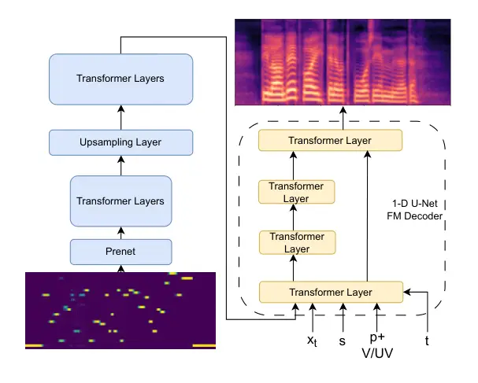

Li Juvela Kurimo nocounter\]Department of Information and Communication
EngineeringAalto UniversityFinland

# Pronunciation Editing for Finnish Speech using Phonetic Posteriorgrams

Zirui    Lauri    Mikko Affiliation: \[

###### Abstract

Synthesizing second-language (L2) speech is potentially highly valued
for L2 language learning experience and feedback. However, due to the
lack of L2 speech synthesis datasets, it is difficult to synthesize L2
speech for low-resourced languages. In this paper, we provide a
practical solution for editing native speech to approximate L2 speech
and present PPG2Speech, a diffusion-based multispeaker
Phonetic-Posteriorgrams-to-Speech model that is capable of editing a
single phoneme without text alignment. We use Matcha-TTS’s flow-matching
decoder as the backbone, transforming Phonetic Posteriorgrams (PPGs) to
mel-spectrograms conditioned on external speaker embeddings and pitch.
PPG2Speech strengthens the Matcha-TTS’s flow-matching decoder with
Classifier-free Guidance (CFG) and Sway Sampling. We also propose a new
task-specific objective evaluation metric, the Phonetic Aligned
Consistency (PAC), between the edited PPGs and the PPGs extracted from
the synthetic speech for editing effects. We validate the effectiveness
of our method on Finnish, a low-resourced, nearly phonetic language,
using approximately 60 hours of data. We conduct objective and
subjective evaluations of our approach to compare its naturalness,
speaker similarity, and editing effectiveness with TTS-based editing.
Our source code is published at
[https://github.com/aalto-speech/PPG2Speech](https://github.com/aalto-speech/PPG2Speech).

###### keywords

Speech Synthesis, Speech Editing, L2 Language Learning, Phonetic
Posteriorgram, PPG

^(†)^(†)email: zirui.li@aalto.fi, lauri.juvela@aalto.fi,
mikko.kurimo@aalto.fi

## 1 Introduction

Proficiency in second languages (L2) enhances personal communication
skills and cultural understanding, and it is also an essential criterion
for evaluating immigrants’ integration into the local society.
Pronunciation, as a challenging yet essential part of language learning,
benefits from pronunciation feedback from a teacher \[1\]. Recent
studies demonstrate that speech synthesis technology effectively
supports L2 pronunciation training by providing individual pronunciation
feedback \[2\], and providing synthesized L2 pronunciation to the
learner improves learning experience and results \[3\].

L2 speech synthesis can be treated as a subdomain of accented speech
synthesis. Although current research in accented speech synthesis \[4\]
works well with limited data, it still requires the recording of
accented speech. Therefore, synthesizing L2 speech is challenging for
low-resourced languages, like Finnish, due to the scarcity of suitable
L2 speech synthesis data. This scarcity necessitates exploring methods
such as phoneme-level speech editing, where native speech is
systematically modified to approximate specific L2 pronunciations.

Speech editing is a technique that allows insertion, deletion, and
replacement of certain speech content. Current speech editing
models \[5, 6, 7, 8\] adopt a mask-and-infill approach, which consists
of masking the edited region, filling this region with new content, and
ensuring prosody consistency by imposing auxiliary loss on the edge of
the edited region. These methods are text-based, operate at the
word-level, and depend on external aligners to provide alignment
information to determine the edited region. Early speech editing
methods \[5, 6\] are trained with reconstruction loss on the
mel-spectrogram, making it less ideal in synthesis quality. Recent
editing methods \[7, 8\] are diffusion-based, improving the synthesized
sample quality.

Diffusion-based Speech Synthesis using Flow Matching \[9\] has become a
popular research topic in recent years \[10, 11, 12\]. As a class of
Non-Autoregressive (NAR) models, flow-matching-based Speech Synthesis
models benefit from parallel computation of all temporal steps and can
effectively balance the synthesis quality and the inference speed by
adjusting the number of diffusion sampling steps. However, NAR models
require modeling the alignment between input text and output speech.
Voicebox \[10\] and NaturalSpeech 3 \[11\] rely on an external
phoneme-level aligner that expands the input phoneme sequence to the
length of the synthesized speech based on the duration of each phoneme,
before inputting the phoneme sequence to the model. Matcha-TTS \[12\]
uses monotonic alignment search to find the alignment between phoneme
representations and synthesized speech, and trains a duration predictor
to predict the duration of each phoneme. All these methods \[10, 11,
12\] impose hard alignments between input text and synthesized speech,
which might hurt the naturalness of the synthesized speech \[13\].

To gain more control over the pronunciation information, we use Phonetic
Posteriorgrams (PPGs) as the input, instead of the phoneme sequence.
PPGs are time-varying categorical distributions over phonemes \[14\].
They have been widely used for different speech processing tasks \[15,
16, 17, 18, 19, 20\] in the past years. As a time-varying distribution
over phoneme categories, they contain rich pronunciation information
that makes them ideal for pronunciation assessment and mispronunciation
detection \[15\], and spoken term detection \[16\]. PPGs also
disentangle well with the timbre and excitation of speech, making them
ideal as content representations for speech and singing voice
conversion \[17, 18, 19\]. Furthermore, they are interpretable
representations for humans and can be potentially used for neural speech
editing \[20\].

In this paper, we present PPG2Speech, a diffusion-based multispeaker
PPG-to-speech model using Matcha-TTS’s flow-matching decoder \[12\],
enhanced with classifier-free guidance (CFG) \[21\] and sway
sampling \[22\]. Our proposed approach operates without textual input,
providing a practical solution for editing native speech to approximate
common mispronunciations made by L2 learners. Unlike the previous
approaches in Speech Editing and TTS, which require explicit hard
alignment for model training and determining the edited region, our
model uses PPGs, which provide soft, explicit alignment information that
retains the naturalness of synthetic speech. We validate our method with
both objective and subjective evaluations to assess naturalness, speaker
similarity, and editing effectiveness in comparison with TTS-based
editing techniques. Objective metrics include a novel Phonetic Aligned
Consistency (PAC) to assess editing effectiveness.

## 2 Background

### 2.1 Flow matching for generative models

Flow Matching (FM) is a recent generative modeling technique designed to
transform a simple prior distribution, such as a standard Gaussian, into
a complex data distribution through deterministic flows defined by
ordinary differential equations (ODEs) \[9\]. Given an unknown data
distribution $`q(x)`$, FM constructs a probability density path
$`p_{t}(x)`$, with $`t\in[0,1]`$, smoothly transitioning from a known
prior distribution $`p_{1}(x)=\mathcal{N}(x;0,I)`$, a standard Gaussion
distribution, to a final distribution $`p_{0}(x)`$ approximating the
data $`q(x)`$.

Specifically, FM defines a neural-parameterized vector field
$`v_{t}(x;\theta)`$ that generates a flow $`\phi_{t}(x)`$ through the
ODE:

```math
\frac{d}{dt}\phi_{t}(x)=v_{t}(\phi_{t}(x);\theta),\quad\phi_{0}(x)=x. \tag{1}
```

The FM objective minimizes the difference between this parameterized
vector field $`v_{t}(x;\theta)`$ and a known conditional vector field
$`u_{t}(x|x_{1})`$ that generates a conditional probability path
$`p_{t}(x|x_{1})`$ via a regression loss:

```math
L_{\text{CFM}}(\theta)=\mathbb{E}_{t,q(x_{1}),p_{t}(x|x_{1})}\left[\\
||v_{t}(x;\theta)-u_{t}(x|x_{1})\\
||^{2}\right]. \tag{2}
```

Optimal Transport Conditional Flow Matching (OT-CFM) simplifies this
further by defining the flow explicitly as linear interpolation between
noise samples $`x_{1}\sim p_{1}(x)`$ and data samples
$`x_{0}\sim q(x)`$, such that:

```math
\phi_{t}^{\text{OT}}(x)=tx_{1}+(1-t)x_{0}, \tag{3}
```

leading to the simple and computationally efficient OT-CFM loss:

```math
L_{\text{OT-CFM}}(\theta)=\mathbb{E}_{t,q(x_{1}),p_{0}(x_{0})}\left[\\
||v_{t}(\phi_{t}^{\text{OT}}(x);\theta)-(x_{0}-x_{1})\\
||^{2}\right]. \tag{4}
```

where the gradient vector field $`u_{t}(x|x_{1})=(x_{0}-x_{1})`$ is
linear, time-invariant, and only depends on $`x_{0}`$ and $`x_{1}`$.
This leads to faster training, sampling, and better generalization
compared to traditional Diffusion Probabilistic Models (DPMs).

#### 2.1.1 Classifier-free guidance

Classifier-free guidance is a technique developed to enhance sample
fidelity in conditional diffusion models without relying on an external
classifier \[21\]. The key idea is to jointly train a conditional and an
unconditional diffusion model using a shared neural network. During
training, the model is conditioned on the input conditions $`c`$ with
some probability $`P_{\text{con}}`$, and with a complementary
probability $`P_{\text{uncon}}=1-P_{\text{con}}`$, it is trained
unconditionally by providing a null condition. This allows the network
to learn both conditional and unconditional score estimates
$`v_{t}(\phi_{t}(x_{t}),c)`$ and $`v_{t}(\phi_{t}(x_{t}))`$,
respectively.

At inference time, the two score estimates are linearly combined to form
a modified guided score:

```math
v_{t,\text{CFG}}=v_{t}(\phi_{t}(x_{t}),c)+w\left[v_{t}(\phi_{t}(x_{t}),c)-v_{t}(\phi_{t}(x_{t}))\right]. \tag{5}
```

where $`w\geq 0`$ is a guidance strength hyperparameter that controls
the trade-off between sample quality and diversity. A higher $`w`$
increases fidelity at the cost of diversity.

#### 2.1.2 Sway Sampling

Typically, $`n`$ timesteps are sampled uniformly for $`t\in[0,1]`$
during the diffusion sampling process, where $`n`$ is the total number
of iterations in the process. Recent research \[22\] demonstrates the
use of Sway Sampling improves the quality of the sample. The Sway
Sampling is formulated as:

```math
f_{\text{sway }}(u;s)=u+s\left(\cos\left(\frac{\pi}{2}u\right)-1+u\right), \tag{6}
```

where the sway coefficient $`s\in\left[-1,\frac{2}{\pi-2}\right]`$ and
$`u\sim\mathcal{U}[0,1]`$. When $`s<0`$, it takes smaller sampling steps
for the early stage sampling and larger steps for the later stages. When
$`s>0`$, it takes larger sampling steps for the early stages and smaller
steps for the later stages. It becomes uniform sampling when $`s=0`$.

## 3 Method

### 3.1 PPG2Speech

We show our PPG2Speech model’s architecture in Figure 1. Our model
generates mel-spectrograms from PPGs with conditional pitch sequences
and speaker embeddings. The model consists of a PPG encoder and a
flow-matching decoder. The PPG encoder consists of a prenet, a stack of
Transformer/Conformer \[23\] layers, with an upsampling layer in
between. The prenet maps the PPG channels to the Transformer’s channel
dimensions. The upsampling layer upsamples the latent PPG
representations to the time resolution of the target mel-spectrogram
based on the nearest neighbor method. The encoder uses Relative
Positional Encoding \[24\] to provide positional information to the
self-attention.



Figure 1: The diagram of our model. $`x_{t}`$ is the noisy
mel-spectrogram. $`s`$ is the speaker embedding, $`p+V/UV`$ is the pitch
embedding sequence concatenated with the voiced/unvoiced flag, and
$`t\in[0,1]`$ is the diffusion time step.

For the flow-matching decoder, we extend the 1-D U-Net based decoder in
Matcha-TTS \[12\] with Classifier-free Guidance (CFG). Furthermore, the
decoder is conditioned on external speaker embeddings and pitch
embedding sequences to generalize to unseen speakers and synthesize more
natural speech. The original speaker embedding table in Matcha-TTS is
discarded. During training, we uniformly sample the timestep
$`t\in[0,1]`$ to predict the gradient vector field. During inference, we
use Sway Sampling with $`s=-1`$ to transform the speech from the noise
using smaller steps in the initial steps to improve the quality of the
synthesized speech. The synthesized mel-spectrogram is converted to
waveform using a pretrained HiFi-GAN vocoder \[25\].

### 3.2 Phonetic Aligned Consistency

Given the synthetic speech from the edited PPG or edited text, we first
extract the PPG from it and then find the region that corresponds to the
phoneme-level editing. Then we calculate the Phonetic Aligned
Consistency (PAC) as:

```math
\text{PAC}_{1:m,1:n}=\frac{1}{m}\text{DTW}_{\text{JSD}}(\text{PPG}^{m}_{\text{edited}},\text{PPG}^{n}_{\text{syn}}), \tag{7}
```

where $`\text{PPG}^{m}_{\text{edited}}`$ is the edited region of the
edited PPG with length $`m`$, $`\text{PPG}^{n}_{\text{syn}}`$ is the
edited region in the PPG of the synthetic speech with length $`n`$, and
JSD is the Jensen-Shannon Distance. We normalize the score by the length
of the edited region in the edited PPG.

Our motivation for Equation 7 are:

1.  1.  PPG is a time-varying distribution over phoneme categories.
        Therefore, it is natural to use the JSD to measure the discrepancy
        between the corresponding frames in two PPGs. Other probability
        distance metrics are also viable in Equation 7.
2.  2.  We use DTW to tackle the length differences between the
        $`\text{PPG}^{m}_{\text{edited}}`$ and the
        $`\text{PPG}^{n}_{\text{syn}}`$.
3.  3.  DTW will naturally cause a larger cost for longer edited timespan,
        hence we normalize the cost by the length of
        $`\text{PPG}^{m}_{\text{edited}}`$ to compensate for the larger
        costs from longer edits, so that the scores are comparable for
        different edits on different utterances.

## 4 Experiments

### 4.1 Data

We conduct our experiments on the combination of two Finnish datasets,
Perso Synteesi \[26\] and Finsyn \[27\]. We show the details of these
two datasets in Table 1. Perso Synteesi \[26\] is a read-speech dataset
collected from 33 male native speakers and 33 female native speakers by
recording speakers’ voices when reading prompts. Prompts are the same
for all speakers. We only have the data of 20 male speakers and 30
female speakers. Finsyn \[27\] is another Finnish speech synthesis
dataset with two female speakers and various speaking styles. We follow
the suggestion from \[27\] and filter out those utterances with a
spontaneous speaker style to ensure stable synthesis results.

|                            |        |                |       |
| -------------------------- | ------ | -------------- | ----- |
| Dataset                    | Gender | \# of speakers | Hours |
| \multirow3\*Perso Synteesi | Male   | 20             | 6.8   |
|                            | Female | 30             | 10.7  |
|                            | Total  | 50             | 17.6  |
| \multirow3\*Finsyn         | Male   | 0              | 0     |
|                            | Female | 2              | 44.3  |
|                            | Total  | 2              | 44.3  |
| Total                      | \-     | 52             | 61.8  |

Table 1: Dataset details for Perso Synteesi and Finsyn.

We split our data into Train, Validation, Test, and Test_unseen sets.
For the Perso Synteesi \[26\], we use the original partition of the
dataset, and exclude speakers $`19`$, $`20`$, $`19m`$, $`20m`$ from the
training and validation set and use their original validation and test
set as Test_unseen for testing the model’s generalization on unseen
speakers. For the Finsyn \[27\] dataset, we split the data into
training, validation, and testing sets with ratio $`0.9:0.05:0.05`$. No
utterance from Finsyn is split to Test_unseen because Finsyn only has 2
speakers. The resulting splits are shown in Table 2.

We extract the PPGs from the Kaldi HMM-TDNN-medium model reported
in \[28\], which contains 29 Finnish phonemes, and 3 special symbols,
SPN, SIL, and eps. We use the pretrained SimAMResNet34¹¹ 1
[https://github.com/wenet-e2e/wespeaker/blob/master/docs/pretrained.md](https://github.com/wenet-e2e/wespeaker/blob/master/docs/pretrained.md)
model from WeSpeaker toolkit \[29\] to extract the speaker embeddings,
and use the pretrained Pitch Estimation Neural Network (PENN) \[30\] to
extract pitch and periodicity from the audio. We standardize the log
pitch per utterance by subtracting its mean and dividing its variance to
mitigate timbre leakage, and then quantize pitch into 256 bins. The
mel-spectrograms are extracted from the audio using HiFi-GAN \[25\]
configurations.

| Splits      | \# of speakers | Hours |
| ----------- | -------------- | ----- |
| Train       | 48             | 53.6  |
| Validation  | 48             | 3.9   |
| Test        | 48             | 2.7   |
| Test_unseen | 4              | 0.15  |

Table 2: Hours and the number of speakers in different splits of the
dataset.

[TABLE]

Table 3: The objective results. SECS is the Speaker Encoder Cosine
Similarity, the Character Error Rate (CER) is used to evaluate
intelligibility. Furthermore, Mel-Cepstral Distortion (MCD) and pitch
mean absolute error (Pitch MAE) are used to evaluate the model’s
capability on unseen speakers. The Phonetic Aligned Consistency (PAC) is
the objective evaluation for editing effects.

### 4.2 Model details

We first use a 3-layer convolutional prenet with each layer having a
kernel size 3 to map the 32-dim PPGs to 128-dim latent. We use the
2-layer Conformer \[23\] before the upsampling layer with $`4`$
attention heads, 512 feed-forward dimension, and a convolution kernel
size of 9. After the upsampling, we use a 2-layer Transformer with 4
attention heads and 512 feed-forward dimensions. We find this
configuration yields the best outcome.

Our flow-matching decoder follows the same configuration as in \[12\].
The external speaker embedding is of 256 dimensions. We use an embedding
table of dimension 16 to represent the quantized pitch and concatenate
the log periodicity with the pitch embedding as the soft voiced/unvoiced
(V/UV) flag. External speaker embedding and pitch embedding with the
V/UV flag are concatenated together as the conditional input to the
decoder. During training, there is a $`10\%`$ probability for each batch
that the PPG latent and the conditional input will be dropped to train
the unconditioned model. During inference, we set the guidance strength
$`w=3`$, and the sway coefficient is set to $`-1`$.

We train both the Matcha-TTS and our PPG2Speech model from scratch using
the training set and evaluate on the test set and the unseen test set.
Both models are trained with a vanilla flow-matching decoder in
Matcha-TTS and a flow-matching decoder strengthened by CFG, to show the
CFG’s effect on the model’s performance. All models are trained with a
batch size of 32 for 500k updates on 1 Nvidia A100 GPU. The maximum
learning rate is 1e-4, and we use a cosine annealing learning rate
scheduler with 150k steps linear warmup to adjust the learning rate
during training.

### 4.3 Evaluation & Results

#### 4.3.1 Objective Evaluation

The results of the objective evaluation are shown in Table 3. We use
Speaker Encoder Cosine Similarity (SECS) to measure the similarity
between the groundtruth speaker embedding and the speaker embedding
extracted from the synthesized speech using the same SimAMResNet34 model
in Section 4.1. We use a Wav2Vec2-large model²² 2
[https://huggingface.co/GetmanY1/wav2vec2-large-fi-150k-finetuned](https://huggingface.co/GetmanY1/wav2vec2-large-fi-150k-finetuned)
that is pretrained on 158k hours of unlabeled Finnish speech and
fine-tuned on 4600 hours of Finnish speech to evaluate the
intelligibility of the synthesized speech and use Character Error Rate
(CER) as the objective metric. Furthermore, we use Mel-Cepstral
Distortion (MCD) \[31\] and pitch mean absolute error (Pitch MAE) to
evaluate the model’s capability of handling unseen speakers and how well
the model follows the given pitch, respectively.

In Table 3, on the seen testset, the Groundtruth has an SECS of 0.89 and
a CER of 4.19, while on the unseen testset it shows an SECS of 0.89 and
a CER of 3.36. The vanilla Matcha-TTS achieves an SECS of 0.87 on seen
data, and when enhanced with CFG, it improves to an SECS of 0.89,
matching Groundtruth similarity. In comparison, the PPG2Speech method
records an SECS of 0.83 and a CER of 5.37 on seen data; however, on
unseen data, its performance drops to an SECS of 0.76, with an MCD of
3.71 and a Pitch MAE of 9.49 ¢. When CFG is applied to PPG2Speech, the
unseen SECS increases to 0.86, the MCD decreases to 3.69, and the Pitch
MAE decreases to 7.17 ¢. The comparison between models without CFG and
models with CFG demonstrates the effectiveness of CFG on improving the
quality of the synthesized speech. Furthermore, when comparing the
baseline Matcha-TTS model and the PPG2Speech model, we see that
Matcha-TTS outperforms the PPG2Speech model on the seen testset, yet
PPG2Speech models perform better on unseen speaker similarity.
Strengthening the PPG2Speech model with CFG achieves a comparable
performance with the best CER (3.82 vs 3.80) results in the unseen
testset. Our findings for objective evaluation can be summarised as
follows:

1.  1.  CFG improves the model’s generalization to unseen speakers.
2.  2.  Although we normalized and quantized pitch, timbre leak still exists
        and negatively affects the speaker similarity, as our PPG2Speech
        models have a lower SECS compared to their Matcha-TTS counterparts.
3.  3.  PPG leads to higher CER, possibly due to its probability density
        nature and error propagation from the Kaldi TDNN model.

|        |      |     |      |      |     |     |
| ------ | ---- | --- | ---- | ---- | --- | --- |
| Source | ä    | ö   | y    | r    | a   | o   |
| Target | a, e | o   | u, e | l, w | ä   | ö   |

Table 4: Finnish phoneme editing table in our experiments. Source is the
phoneme we selected from the PPGs/text, and target are the phonemes we
edited to.

To evaluate the editing effect objectively, we conduct the editing
experiments on the Matcha-TTS with CFG model and the PPG2Speech model
with CFG. We chose Matcha-TTS with CFG for this experiment because it is
better than vanilla Matcha-TTS in terms of SECS with a small cost on
CER, yet its CER on the seen testset is still better than the
groundtruth. Suggested by Finnish phoneticians, we edit the PPGs and
their corresponding texts based on common pronunciation mistakes from L2
Finnish speakers, shown in Table 4. The source phonemes in Table 4 are
the correct phonemes in a word, and the target phonemes are mistakes
that L2 speakers commonly make. We then calculate PAC between the edited
PPGs and the PPGs estimated from the synthesized speech. The editing and
evaluation steps are:

1.  1.  Randomly select a source phoneme from original PPGs and replace it
        with the target phoneme by moving the probability density on the
        source phoneme to the target phoneme. If multiple target phonemes
        exist, we randomly select one for replacement.
2.  2.  If the selected source phoneme is a part of a long vowel (has
        identical adjacent phonemes), edit the adjacent phonemes to the
        target phoneme as well.
3.  3.  Edit the text by using the alignment information in the PPG to find
        the corresponding source phoneme. Then replace the source phoneme
        with the same target phoneme as in the PPG editing, and use the
        edited text as input for Matcha-TTS.
4.  4.  Synthesize speech from edited PPG/edited text.
5.  5.  Estimate the PPG using the same HMM-TDNN-medium model as Section 4.1
        and use Montreal-Forced-Aligner \[32\] to find the corresponding
        edited region. Calculate the PAC in Section 3.2 between the edited
        PPG and the estimated PPG in the edited region.

| Model            |                           | Groundtruth       | Matcha-TTS        | Matcha-TTS-CFG    | PPG2Speech        | PPG2Speech-CFG    |
| ---------------- | ------------------------- | ----------------- | ----------------- | ----------------- | ----------------- | ----------------- |
| NMOS$`\uparrow`$ |                           | 4.27 $`\pm`$ 0.05 | 2.99 $`\pm`$ 0.08 | 2.96 $`\pm`$ 0.08 | 3.22 $`\pm`$ 0.08 | 3.51 $`\pm`$ 0.07 |
| SMOS$`\uparrow`$ |                           | \-                | 3.63 $`\pm`$ 0.09 | 3.39 $`\pm`$ 0.09 | 3.57 $`\pm`$ 0.09 | 3.54 $`\pm`$ 0.09 |
| \multirow2\*EMOS | Positive Rate$`\uparrow`$ | \-                | \-                | 0.87$`\pm`$ 0.02  | \-                | 0.81 $`\pm`$ 0.02 |
|                  | NMOS$`\uparrow`$          | \-                | \-                | 2.89 $`\pm`$ 0.05 | \-                | 3.66 $`\pm`$ 0.06 |

Table 5: Table for subjective evaluation, besides Naturalness MOS (NMOS)
and Speaker MOS (SMOS), we also measure Editing MOS (EMOS), which
comprises a Positive Rate that is between 0 and 1 and measures whether
or not the edited speech agrees with the editing, and the NMOS of the
edited speech.

In this editing experiment, we focus on single-phoneme replacement. We
only edit single phoneme to simplify the evaluation process, and we omit
deletions and insertions because Finnish is a phonetic language without
silent phonemes, so it is unlikely for L2 speakers have phoneme
deletions and insertions.

The results for editing experiments are shown in the PAC column in
Table 3. The Matcha-TTS with CFG has a PAC of 0.804, while PPG2Speech
with CFG has a PAC of 0.709. PPG2Speech achieves a relative $`11.3\%`$
reduction on the PAC.

#### 4.3.2 Subjective Evaluation

The results for subjective evaluation are shown in Table 5. Our Mean
Opinion Score (MOS) tests have 16 native Finnish participants for each
test and 75 utterances for each system in each test. We use language
proficiency questions that instruct the participants to rate certain
questions with specific scores in Finnish text and audio prompts to
filter out invalid submissions. Our MOS tests include naturalness MOS
(NMOS row), speaker similarity MOS (SMOS), and a pronunciation editing
MOS test (EMOS rows). For NMOS, the participants are asked to evaluate
whether the speech is natural. For SMOS, the participants are presented
with the natural reference utterances and synthetic speech with
different content, and they are asked to rate how similar the speakers
of these two speech samples are. The synthetic speech is synthesized
using the same speaker embedding from the reference groundtruth. For
both NMOS and SMOS, the scores are between 1-5 with an increment of 1.
For EMOS, we provide the corresponding transcripts after the PPG
editing, and the edited speech to the participants, while they are
required to answer a yes-or-no question on whether the edited speech
agrees with the edited transcripts, and rate the naturalness of the
edited speech the same as NMOS. Positive Rate (the ratio of the yes
answer) is calculated as the subjective metric to the editing effect,
which should be between 0 and 1. We use Student’s t-test to obtain the
$`95\%`$ confidence interval of each MOS, and use the Wilcoxon
signed-rank test to determine whether the differences in MOS of any pair
of systems are significant.

In Table 5, the Groundtruth has an NMOS of $`4.27\pm 0.05`$, indicating
the moderate dataset quality we have for this study. Among speech
synthesis models, PPG2Speech-CFG achieves the highest NMOS
($`3.51\pm 0.07`$). Moreover, comparing Matcha-TTS with Matcha-TTS-CFG
using the Wilcoxon signed-rank test yields a p-value of $`0.76`$,
meaning the difference on NMOS between Matcha-TTS and Matcha-TTS-CFG is
insignificant, while the difference on NMOS between PPG2Speech and
PPG2Speech-CFG is significant. This demonstrates that CFG can improve
the naturalness in our experiments, and PPG2Speech-CFG can synthesize
natural speech, and the slightly high CER shown in Table 3 doesn’t
affect the listening experience. Matcha-TTS scores highest in SMOS
($`3.63\pm 0.09`$), closely followed by PPG2Speech ($`3.57\pm 0.09`$)
and PPG2Speech-CFG ($`3.54\pm 0.09`$). The Wilcoxon signed-rank test
between the SMOS on PPG2Speech and the SMOS on PPG2Speech-CFG results in
a p-value of $`0.61`$, suggesting the marginal advantage achieved by
PPG2Speech over PPG2Speech-CFG is insignificant, while the Wilcoxon
signed-rank test results between other pairs of SMOS suggest a
significant difference. The SMOS is consistent with the SECS in Table 3,
suggesting that pitch sequences can improve naturalness yet bring timbre
leak to the model. To our surprise, Matcha-TTS-CFG shows the best
Positive Rate ($`0.87\pm 0.02`$) in the EMOS evaluation. We think this
is caused by the undetermined nature of the PPG, which baffles the model
from following the editing strictly. Meanwhile, PPG2Speech-CFG attains
the highest NMOS within EMOS ($`3.66\pm 0.06`$).

## 5 Conclusions

In this paper, we present PPG2Speech, a diffusion-based multispeaker
PPG-to-Speech model, capable of phoneme-level pronunciation editing to
approximate L2 language learners. We strengthen the original Matcha-TTS
flow-matching decoder with CFG. We also proposed a task-specific
objective evaluation metric, Phonetic Aligned Consistency (PAC), to
measure the effectiveness of phoneme-level editing. The objective and
subjective evaluations indicate that our PPG2Speech model can synthesize
natural speech in both synthesis and editing tasks. It also follows the
speaker identity in the speaker embedding, although timbre leaks caused
slight degradation in the SECS and SMOS. For the editing task, both
methods achieve more than $`80\%`$ positive rate in the test samples.
Our PPG2Speech model performs better than the text-based editing in PAC,
yet is inferior to the text-based editing in subjective evaluation,
indicating that PAC might not be able to reflect the actual editing
effect in some cases. Our future work includes introducing foreign
phonemes to the system and editing speech to mimic L2 speakers’
pronunciation errors on phoneme duration and misplacement of open and
closed vowels.

## 6 Acknowledgements

This work was a part of the Ministry of Education and Culture’s Doctoral
Education Pilot in Finland, under Decision No. VN/3137/2024-OKM-6 (The
Finnish Doctoral Program Network in Artificial Intelligence, AI-DOC). We
acknowledge the computational resources provided by the Aalto Science-IT
project.

We are grateful to Heini Kallio from Tampere University for her valuable
discussion on the Finnish phonetics and common L2 mispronunciation, and
to Antti Suni from University of Helsinki for sharing un the Finsyn
dataset.

## References

- \[1\] T. M. Derwing and M. J. Munro (2015) Pronunciation fundamentals:
  evidence-based perspectives for L2 teaching and research. Language
  Learning & Language Teaching, Vol. 42, John Benjamins Publishing
  Company. External Links: ISBN 9789027219800,
  [Document](https://dx.doi.org/10.1075/lllt.42) Cited by: §1.
- \[2\] D. Liakin, W. Cardoso, and N. Liakina (2017) The pedagogical use
  of mobile speech synthesis (TTS): focus on French liaison. Computer
  Assisted Language Learning 30 (3-4), pp. 325–342. External Links:
  [Document](https://dx.doi.org/10.1080/09588221.2017.1312463) Cited by:
  §1.
- \[3\] W. Cardoso (2018) Learning L2 pronunciation with a
  text-to-speech synthesizer. Future-proof CALL: language learning as
  exploration and encounters, pp. 16. Cited by: §1.
- \[4\] X. Zhou, M. Zhang, Y. Zhou, Z. Wu, and H. Li (2024) Accented
  text-to-speech synthesis with limited data. IEEE/ACM Transactions on
  Audio, Speech, and Language Processing 32 (), pp. 1699–1711. External
  Links: [Document](https://dx.doi.org/10.1109/TASLP.2024.3363414) Cited
  by: §1.
- \[5\] D. Tan, L. Deng, Y. T. Yeung, X. Jiang, X. Chen, and T.
  Lee (2021) EditSpeech: a text based speech editing system using
  partial inference and bidirectional fusion. In IEEE Automatic Speech
  Recognition and Understanding Workshop (ASRU), pp. 626–633. Cited by:
  §1.
- \[6\] T. Wang, J. Yi, R. Fu, J. Tao, and Z. Wen (2022) CampNet:
  context-aware mask prediction for end-to-end text-based speech
  editing. IEEE/ACM Transactions on Audio, Speech, and Language
  Processing 30, pp. 2241–2254. Cited by: §1.
- \[7\] Z. Jiang, Q. Yang, J. Zuo, Z. Ye, R. Huang, Y. Ren, and Z.
  Zhao (2023) FluentSpeech: stutter-oriented automatic speech editing
  with context-aware diffusion models. In Findings of the Association
  for Computational Linguistics: ACL, pp. 11655–11671. Cited by: §1.
- \[8\] R. Liu, J. Xi, Z. Jiang, and H. Li (2024) FluentEditor:
  text-based speech editing by considering acoustic and prosody
  consistency. In Proc. Interspeech, pp. 3435–3439. Cited by: §1.
- \[9\] Y. Lipman, R. T. Q. Chen, H. Ben-Hamu, M. Nickel, and M.
  Le (2023) Flow matching for generative modeling. In The Eleventh
  International Conference on Learning Representations, Cited by: §1,
  §2.1.
- \[10\] M. Le, A. Vyas, B. Shi, B. Karrer, L. Sari, R. Moritz, M.
  Williamson, V. Manohar, Y. Adi, J. Mahadeokar, et al. (2023) Voicebox:
  text-guided multilingual universal speech generation at scale.
  Advances in neural information processing systems 36, pp. 14005–14034.
  Cited by: §1.
- \[11\] Z. Ju, Y. Wang, K. Shen, X. Tan, D. Xin, D. Yang, Y. Liu, Y.
  Leng, K. Song, S. Tang, et al. (2024) NaturalSpeech 3: zero-shot
  speech synthesis with factorized codec and diffusion models. In
  Proceedings of the 41st International Conference on Machine Learning,
  pp. 22605–22623. Cited by: §1.
- \[12\] S. Mehta, R. Tu, J. Beskow, Székely, Éva, and G. E.
  Henter (2024) Matcha-TTS: a fast TTS architecture with conditional
  flow matching. In IEEE International Conference on Acoustics, Speech
  and Signal Processing (ICASSP), Vol. , pp. 11341–11345. External
  Links:
  [Document](https://dx.doi.org/10.1109/ICASSP48485.2024.10448291) Cited
  by: §1, §1, §3.1, §4.2.
- \[13\] S. E. Eskimez, X. Wang, M. Thakker, C. Li, C. Tsai, Z. Xiao, H.
  Yang, Z. Zhu, M. Tang, X. Tan, et al. (2024) E2 TTS: embarrassingly
  easy fully non-autoregressive zero-shot TTS. In IEEE Spoken Language
  Technology Workshop (SLT), pp. 682–689. Cited by: §1.
- \[14\] C. Churchwell, M. Morrison, and B. Pardo (2024) High-fidelity
  neural phonetic posteriorgrams. In IEEE International Conference on
  Acoustics, Speech, and Signal Processing Workshops (ICASSPW), Vol. ,
  pp. 823–827. External Links:
  [Document](https://dx.doi.org/10.1109/ICASSPW62465.2024.10669905)
  Cited by: §1.
- \[15\] A. Lee, Y. Zhang, and J. Glass (2013) Mispronunciation
  detection via dynamic time warping on deep belief network-based
  posteriorgrams. In IEEE International Conference on Acoustics, Speech
  and Signal Processing (ICASSP), Vol. , pp. 8227–8231. External Links:
  [Document](https://dx.doi.org/10.1109/ICASSP.2013.6639269) Cited by:
  §1.
- \[16\] T. J. Hazen, W. Shen, and C. White (2009) Query-by-example
  spoken term detection using phonetic posteriorgram templates. In 2009
  IEEE Workshop on Automatic Speech Recognition & Understanding, Vol. ,
  pp. 421–426. External Links:
  [Document](https://dx.doi.org/10.1109/ASRU.2009.5372889) Cited by: §1.
- \[17\] L. Sun, K. Li, H. Wang, S. Kang, and H. Meng (2016) Phonetic
  posteriorgrams for many-to-one voice conversion without parallel data
  training. In IEEE International Conference on Multimedia and Expo
  (ICME), Vol. , pp. 1–6. External Links:
  [Document](https://dx.doi.org/10.1109/ICME.2016.7552917) Cited by: §1.
- \[18\] H. Miyoshi, Y. Saito, S. Takamichi, and H. Saruwatari (2017)
  Voice conversion using sequence-to-sequence learning of context
  posterior probabilities. In Proc. Interspeech, pp. 1268–1272. Cited
  by: §1.
- \[19\] Z. Li, B. Tang, X. Yin, Y. Wan, L. Xu, C. Shen, and Z.
  Ma (2021) PPG-based singing voice conversion with adversarial
  representation learning. In ICASSP 2021 - 2021 IEEE International
  Conference on Acoustics, Speech and Signal Processing (ICASSP), Vol. ,
  pp. 7073–7077. External Links:
  [Document](https://dx.doi.org/10.1109/ICASSP39728.2021.9414137) Cited
  by: §1.
- \[20\] M. Morrison, C. Churchwell, N. Pruyne, and B. Pardo (2024)
  Fine-grained and interpretable neural speech editing. In Proc.
  Interspeech, pp. 187–191. Cited by: §1.
- \[21\] J. Ho and T. Salimans (2021) Classifier-free diffusion
  guidance. In NeurIPS 2021 Workshop on Deep Generative Models and
  Downstream Applications, Cited by: §1, §2.1.1.
- \[22\] Y. Chen, Z. Niu, Z. Ma, K. Deng, C. Wang, J. Zhao, K. Yu,
  and X. Chen (2024) F5-TTS: a fairytaler that fakes fluent and faithful
  speech with flow matching. arXiv preprint arXiv:2410.06885. Cited by:
  §1, §2.1.2.
- \[23\] A. Gulati, J. Qin, C. Chiu, N. Parmar, Y. Zhang, J. Yu, W.
  Han, S. Wang, Z. Zhang, Y. Wu, et al. (2020) Conformer:
  convolution-augmented Transformer for speech recognition. In Proc.
  Interspeech, pp. 5036–5040. Cited by: §3.1, §4.2.
- \[24\] Z. Dai, Z. Yang, Y. Yang, J. G. Carbonell, Q. Le, and R.
  Salakhutdinov (2019) Transformer-XL: attentive language models beyond
  a fixed-length context. In Proceedings of the 57th Annual Meeting of
  the Association for Computational Linguistics, pp. 2978–2988. Cited
  by: §3.1.
- \[25\] J. Kong, J. Kim, and J. Bae (2020) HiFi-GAN: generative
  adversarial networks for efficient and high fidelity speech synthesis.
  Advances in neural information processing systems 33, pp. 17022–17033.
  Cited by: §3.1, §4.1.
- \[26\] H. Kallio and M. Vainio (2012) PERSO databases for Finnish
  speech synthesis. Note:
  [https://clarino.uib.no/comedi/editor/lb-2014073053](https://clarino.uib.no/comedi/editor/lb-2014073053)\[Accessed
  31-03-2025\] Cited by: §4.1, §4.1.
- \[27\] A. Suni (2022) FinSyn: a New Speech Synthesis Corpus for
  Finnish Speech Synthesis. Note:
  [https://blogs.helsinki.fi/speech-synthesis/2022/05/13/finsyn-a-new-speech-synthesis-corpus-for-finnish/](https://blogs.helsinki.fi/speech-synthesis/2022/05/13/finsyn-a-new-speech-synthesis-corpus-for-finnish/)\[Accessed
  31-03-2025\] Cited by: §4.1, §4.1.
- \[28\] A. Virkkunen, A. Rouhe, N. Phan, and M. Kurimo (2023) Finnish
  parliament ASR corpus: analysis, benchmarks and statistics. Language
  Resources and Evaluation 57 (4), pp. 1645–1670 (English). External
  Links: [Document](https://dx.doi.org/10.1007/s10579-023-09650-7), ISSN
  1574-020X Cited by: §4.1.
- \[29\] H. Wang, C. Liang, S. Wang, Z. Chen, B. Zhang, X. Xiang, Y.
  Deng, and Y. Qian (2023) Wespeaker: a research and production oriented
  speaker embedding learning toolkit. In IEEE International Conference
  on Acoustics, Speech and Signal Processing (ICASSP), pp. 1–5. Cited
  by: §4.1.
- \[30\] M. Morrison, C. Hsieh, N. Pruyne, and B. Pardo (2023)
  Cross-domain neural pitch and periodicity estimation. In arXiv
  preprint arXiv:2301.12258, Cited by: §4.1.
- \[31\] Q. Chen, M. Tan, Y. Qi, J. Zhou, Y. Li, and Q. Wu (2022) V2C:
  visual voice cloning. In Proceedings of the IEEE/CVF Conference on
  Computer Vision and Pattern Recognition, pp. 21242–21251. Cited by:
  §4.3.1.
- \[32\] M. McAuliffe, M. Socolof, S. Mihuc, M. Wagner, and M.
  Sonderegger (2017) Montreal Forced Aligner: Trainable Text-Speech
  Alignment Using Kaldi. In Proc. Interspeech, pp. 498–502. External
  Links: [Document](https://dx.doi.org/10.21437/Interspeech.2017-1386)
  Cited by: item 5.
