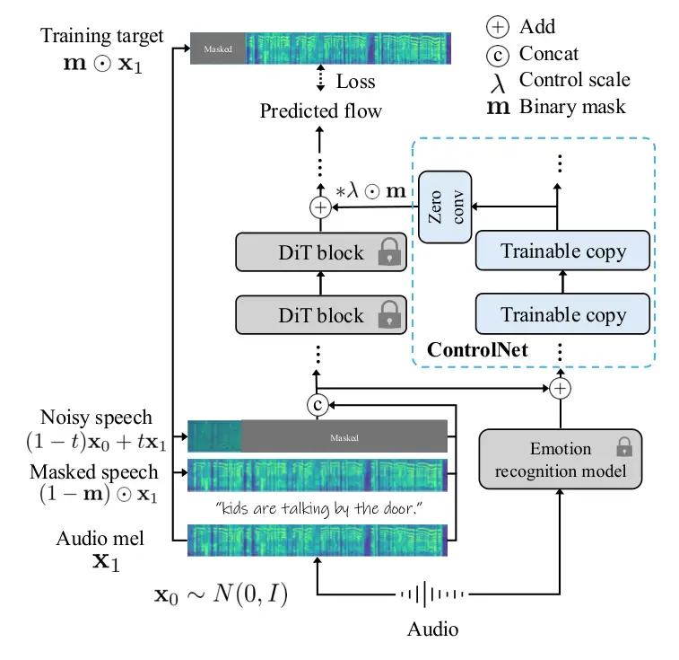
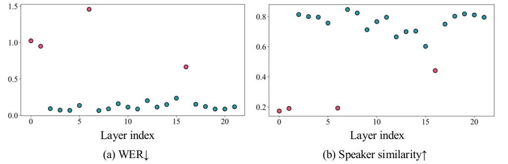
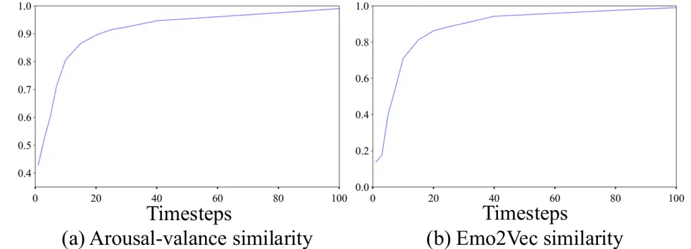
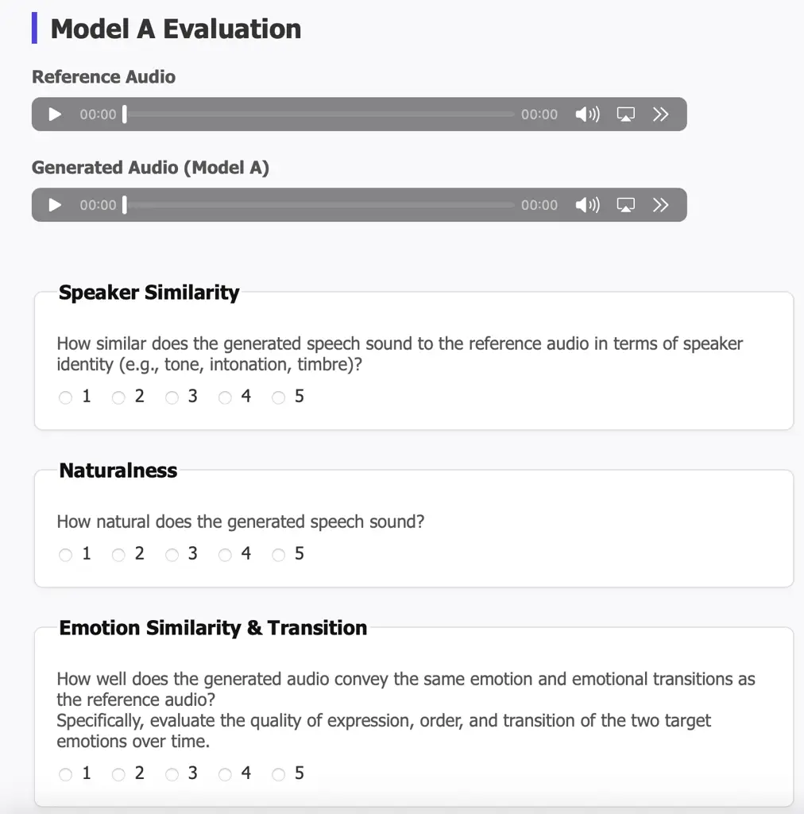
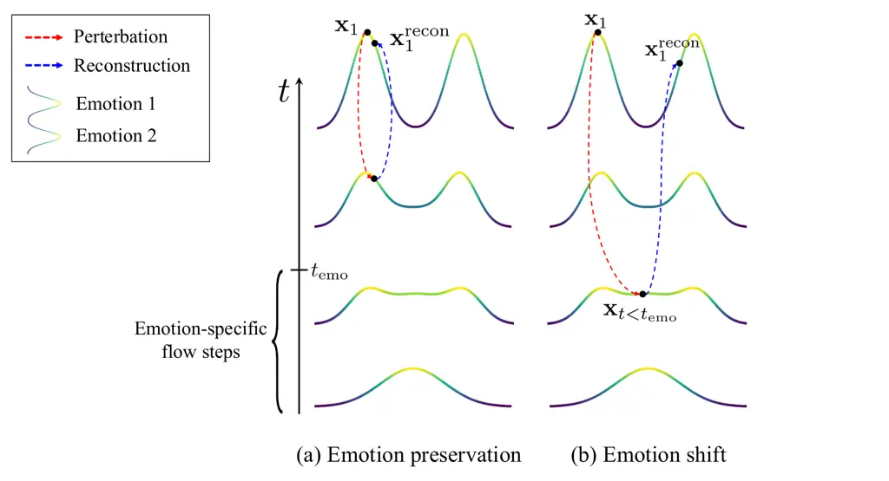

# TTS-CtrlNet: Time varying emotion aligned text-to-speech generation with ControlNet

###### Abstract

Recent advances in text-to-speech (TTS) have enabled natural speech
synthesis, but fine-grained, time-varying emotion control remains
challenging. Existing methods often allow only utterance-level control,
require full model fine-tuning with a large emotion speech dataset,
which can degrade performance. Inspired by \[1\], we propose the first
ControlNet-based approach for controlling flow-matching TTS
(TTS-CtrlNet), which freezes the original model and makes a trainable
copy of it to process additional condition. We show that TTS-CtrlNet can
boost the pretrained large TTS model by adding intuitive, scalable, and
time-varying emotion control while inheriting the ability of the
original model (e.g., zero-shot voice cloning & naturalness).
Furthermore, we provide practical recipes for adding emotion control: 1)
optimal architecture design choice with block analysis, 2)
emotion-specific flow step, and 3) flexible control scale. Experiments
show that ours can effectively adds an emotion controller to existing
TTS, and achieves state-of-the-art performance with emotion similarity
scores: Emo-SIM and Aro-Val SIM. Project page is available at:
[https://curryjung.github.io/ttsctrlnet_project_page](https://curryjung.github.io/ttsctrlnet_project_page)

## 1 Introduction

Recent advances in text-to-speech (TTS) technology have enabled highly
natural and expressive speech synthesis, allowing users to generate
lifelike utterances from arbitrary text \[2, 3, 4, 5, 6, 7, 8, 9\]. As
these systems mature, user demand for greater controllability,
especially over emotional expression, has grown rapidly. While various
approaches have been proposed to condition TTS on emotion, most existing
methods \[2, 10, 11, 12, 13, 14, 15, 16, 17, 18, 19, 20\] support only
utterance-level control and lack the ability to finely modulate
time-varying emotional cues within an utterance. This limitation is
particularly critical in applications such as speech-to-speech
translation, where accurate emotional transfer aligned over time is
essential. In addition, most of them are trained on a limited number of
speakers and samples (in an extreme case, only 1 speaker) due to the
high cost of collecting a labeled emotion speech dataset, resulting in a
lack of control over emotions with arbitrary speakers. This
significantly hinders their practical applicability.

Wu et al. \[21\] shows remarkable success in time-varying emotion
conditioning by fine-tuning pre-trained large-scale TTS. However, it 1)
requires a huge training cost while fine-tuning the entire pre-trained
model with an 87k hours of large-scale speech dataset, which includes
27k hours of in-house emotion dataset, 2) compromises the performance of
the pre-trained model, and 3) cannot intuitively adjust emotion
intensity.

To address the problem, we first adapt the ControlNet paradigm to
flow-matching-based TTS in order to synthesize time-varying emotions of
any zero-shot speaker. Inspired by Zhang et al. \[1\], we freeze the
original large-scale pre-trained model and utilize it as an encoder to
leverage its deep prior knowledge in speech synthesis. The original
model and its trainable copy are connected with zero-convolution. It
minimizes damage during fine-tuning by progressively increasing the
controlling features from a zero tensor. By training the control network
while freezing the backbone TTS model, our approach preserves the
ability of the original model and enables emotion control with a
relatively small amount of unlabeled speech data ($`\sim`$ 400 hours)
compared to the data used for the original model. In addition, we
provide practical recipes for effective emotion control: 1) analyzing
layer-wise impact on WER, 2) identifying optimal flow step interval for
emotion-specific condition, and 3) using the proper temporal window
required to capture emotion and 3) flexible interpolation between
behaviors of the original model and ControlNet-applied version using a
control scale.

In conclusion, we show that it is possible to efficiently and
effectively incorporate desired control capabilities into a large
pre-trained system without modifying its original parameters, and
without requiring extensive computational resources or costly labeled
data.

Our contributions are as follows.

- •
  We first introduce a ControlNet-based conditioning method for
  large-scale & flow-matching TTS, enabling fine-grained, time-varying
  emotion control with zero-shot TTS.
- •
  Our approach preserves the quality, zero-shot capability and
  naturalness of the original TTS model by freezing its parameters
  during the control network training with careful design choices.
- •
  We propose effective training and inference strategies to maximize
  emotional expressiveness with 1) minimal computational cost and 2) a
  balance between word error and emotion control.

## 2 Related work

### 2.1 Emotion-controllable text-to-speech

There have been a number of zero-shot TTS models \[22, 5, 3\] that
enable voice cloning using a short reference audio clip. During the
voice cloning stage, these models can transfer the emotion expressed in
the reference audio, allowing for natural emotion control. \[20\]
achieves emotion control by incorporating an additional emotion
condition into the model. While previous studies have demonstrated the
ability to control emotion at the utterance level, achieving
fine-grained, time-varying emotion control remains a significant
challenge. \[21\] supports time-varying emotional control, it requires
full model finetuning, which incurs a substantial computational cost.

### 2.2 Controlling large-scale generative model

Both flow-matching & diffusion models are a family of score-based
generative models which synthesize the target distribution by
iteratively denoising random Gaussian noise. Accompanied by diffusion
transformer \[23, 24, 25\], they achieve huge success in scaling the
generative model in both image \[23, 26, 27, 28, 29\] and audio
modalities, enabling product-level models. Based on the success, \[1,
30\] propose to add controllability to the pre-traineded model while
leveraging the prior of the model with fine-tuning. \[1\] chooses a
carefully designed conditional network (ControlNet), by making a
trainable copy only at downblocks of the original UNet and connecting it
with the original branch through zero-convolution. It leads to huge
success in spatial control. On the other hand, \[31\] analyzes the
influence of each layer in a DiT trained via flow matching, identifies
the vital layers, and demonstrates the possibility of training-free
editing during inference.

### 2.3 Flow matching

Flow matching \[32\] learns a vector field
$`\mathbf{v}_{t}(\mathbf{x};\theta)`$ which transfer the known
distribution (e.g., Gaussian noise) to the target distribution
$`p_{1}`$, approximating the data distribution $`q`$ with a neural
network $`\theta{}`$. In conditional flow matching (CFM), we have flow
map
$`\boldsymbol{\psi}_{t}(\mathbf{x})=\sigma_{t}(\mathbf{x}_{1})x+\mu_{t}(\mathbf{x}_{1})`$
conditioned on $`\mathbf{x}_{1}`$. With $`\mu_{0}(\mathbf{x}_{1})=0`$
and $`\sigma_{0}(\mathbf{x}_{1})=1`$,
$`\mu_{1}(\mathbf{x}_{1})=\mathbf{x}_{1}`$ and
$`\sigma_{1}(\mathbf{x}_{1})=0`$, a vector field of the flow is
$`d\boldsymbol{\psi}_{t}(\mathbf{x}_{0})/dt=\mathbf{u}_{t}\left(\boldsymbol{\psi}_{t}(\mathbf{x}_{0})\mid\mathbf{x}_{1}\right)`$.
Then, CFM loss becomes :

```math
\mathcal{L}_{\text{CFM}}(\theta)=\mathbb{E}_{t,\,q(\mathbf{x}_{1}),\,p(\mathbf{x}_{0})}\left\|\mathbf{v}_{t}(\boldsymbol{\psi}_{t}(\mathbf{x}_{0}))-\frac{d}{dt}\boldsymbol{\psi}_{t}(\mathbf{x}_{0})\right\|^{2}. \tag{1}
```

Optimal transport further provides the OT-CFM loss:

```math
\mathcal{L}_{\text{CFM}}(\theta)=\mathbb{E}_{t,\,q(\mathbf{x}_{1}),\,p(\mathbf{x}_{0})}\left\|\mathbf{v}_{t}\left((1-t)\mathbf{x}_{0}+t\,\mathbf{x}_{1}\right)-(\mathbf{x}_{1}-\mathbf{x}_{0})\right\|^{2}, \tag{2}
```

where the flow $`\boldsymbol{\psi}_{t}(\mathbf{x}_{0})`$ is
interpolation between $`\mathbf{x}_{0}`$ and $`\mathbf{x}_{1}`$ with
flow step $`t\in[0,1]`$. With the learned $`\mathbf{v}t(\cdot;\theta)`$,
we synthesize $`x_{1}`$ from randomly sampled
$`\mathbf{x}_{0}\sim N(0,I)`$ by solving the ordinary differential
equation (ODE) with the predicted flow
$`d\boldsymbol{\psi}_{t}(\mathbf{x}_{0})/dt`$. $`\mathbf{x}_{0}`$ is
progressively transferred into $`\mathbf{x}_{1}`$ with the number of
function evaluations (NFE) from 0 to 1.

### 2.4 Speech emotion recognition

Speech Emotion Recognition (SER) has received increasing attention in
recent years, with diverse modeling approaches proposed to better
capture emotional cues from speech \[33, 34, 35\]. One prominent line of
work \[36\] leverages self-supervised learning to pretrain models on
large-scale, unlabeled speech corpora. Models like wav2vec 2.0 \[24\]
are trained to learn contextualized audio representations without the
need for emotion labels. These pretrained models are then adapted to
downstream SER tasks by attaching a regression head or classifier and
fine-tuning on emotion-labeled datasets. This strategy is particularly
effective when labeled emotion data is scarce.

Since emotion labels are typically provided at the utterance level, the
entire speech segment is passed through the pretrained encoder, and the
resulting feature sequence is mean-pooled to obtain a single
fixed-length representation. A regression head is trained on top of this
representation to predict the corresponding emotion label for the
utterance.



Figure 1: Overview of TTS-CtrlNet Controlling signal is processed
through ControlNet and fed into the subset of blocks in original model.

## 3 Method

### 3.1 Pipeline

In Figure 1, we show an overview of TTS-CtrlNet. Ours consists of two
branch: 1) Original TTS branch and 2) emotion conditioning branch
(ControlNet).

#### 3.1.1 Architecture

Inspired by Zhang et al. \[1\], TTS-CtrlNet builds upon a trainable copy
of the pre-trained text-to-speech model and connecting the copied and
the original model with zero-convolution. The zero-convolution is
initialized to output a zero tensor, thereby preserving the behavior of
the original model while allowing the model to gradually incorporate
additional conditioning. Given a masked audio and a paired transcript,
the original text-to-speech model \[22\] learns an infilling task by
predicting the masked part. Specifically, it requires a pair
$`(\mathbf{x},y)`$ where $`\mathbf{x}\in\mathbb{R}^{F\times T}`$ denotes
an melspectrogram of an audio sample $`s`$ and $`y`$ is the
corresponding transcript. $`F`$ is dimension of melspectrogram and $`T`$
is the sequence length. Given an input $`\mathbf{x}`$, we construct a
noisy speech sample as $`(1-t)\mathbf{x}_{0}+t\mathbf{x}_{1}`$, and a
masked speech sample as $`(1-\mathbf{m})\odot\mathbf{x}_{1}`$, where
$`t`$ denotes the flow step, and $`\mathbf{m}\in\{0,1\}^{F\times T}`$ is
a random binary temporal mask. The noisy speech, masked speech, and
transcript are concatenated before entering the model. Simultaneously,
ControlNet also takes the concatenation as input after being added to
emotion $`\mathbf{e}\in\mathbb{R}^{\ D_{\text{emo}}\times T}`$, which is
extracted using the speech emotion recognition model (SER) \[36\] to
represent arousal, dominance and valance with three channels. It takes
an audio sample $`s`$ as input and outputs the emotion. Following
\[21\], we reject dominance. We match the channel of emotion embedding
with the channel of original DiT input embedding ($`F`$) by passing
through a $`1\times 1`$ convolution layer.

The ControlNet consists of multiple DiT blocks. Since the ControlNet is
copied from the original network, each block corresponds to its original
block. The output from each ControlNet block is added to the output of
the corresponding original output block after passing zero-convolution.
Let $`\mathcal{F}_{k}(\cdot\,;\,\theta)`$ and
$`\mathcal{F}_{k}(\cdot\,;\,\phi)`$ be a $`k`$-th original DiT block and
the corresponding ControlNet block, respectively. Then, the final output
$`Z_{\text{new}}`$ of the $`k`$-th block in the original network becomes

```math
\mathbf{Z}_{\text{new}}=\mathcal{F}_{k}(\cdot\,;\,\theta)+\mathbf{m}\ \odot\mathcal{F}_{k}(\cdot\,;\,\phi). \tag{3}
```

#### 3.1.2 Training

For training, we prepare $`(x,y)`$ training pairs and the corresponding
audio $`a`$, and update only the ControlNet block parameters $`\phi`$
with the following flow-matching loss, conditioned by emotion $`e`$:

```math
\mathcal{L}_{\text{CFM}}(\phi)=\mathbb{E}_{t,q(\mathbf{x}_{1}),p(\mathbf{x}_{0})}\left\|\mathbf{v}_{t}\left((1-t)\mathbf{x}_{0}+t\mathbf{x}_{1},\mathbf{e};\theta,\phi\right)-(\mathbf{x}_{1}-\mathbf{x}_{0})\right\|^{2}, \tag{4}
```

where $`\mathbf{v}_{t}(\cdot{};\theta,\phi)`$ is now the combined model
with the original model $`\theta`$ and ControlNet $`\phi`$. The whole
model is trained to predict the flow-derived target distribution
$`P\left(\mathbf{m}\odot\hat{\mathbf{x}}\,\middle|\,(1-\mathbf{m})\odot\hat{\mathbf{x}},y,\mathbf{e}\right)`$.

##### Emotion-specific flow step

The original model is trained with the random flow step $`t\sim[0,1]`$.
Meanwhile, we opt to use only a subset of the interval while training
with additional emotion embedding: $`t\sim[0,t_{\text{emo}}]`$, where
$`t_{emo}\in{0,1}`$ designate the range of employing ControlNet. It
achieves lower word error rate (WER) and higher emotion similarity. We
provide the supporting experiments and ablation study in  Section 4.3.2.

##### Selective block

Rather than connecting all DiT blocks, we select only a subset of
ControlNet blocks based on their contribution to performance.
Specifically, to find the most critical blocks, we conduct a layer-wise
ablation study in  Section 4.3.1. Each DiT block is bypassed via its
residual connection, and we evaluate the resulting impact on both WER
and speaker similarity. This analysis allows us to identify the most
influential layers for stable control.

#### 3.1.3 Inference

For inference, we prepare reference melspectrogram $`x_{\text{ref}}`$
from the audio sample $`s_{\text{ref}}`$, the transcript
$`y_{\text{ref}}`$ of the audio, target text $`y_{\text{gen}}`$, initial
noise $`\mathbf{x}_{0}\sim N(0,I)`$, and emotion
$`\mathbf{e}_{\text{ref}}=\text{SER}(s_{\text{ref}})`$. The original
network takes three inputs
$`(\mathbf{x}_{0},\mathbf{x}_{\text{ref}},y_{\text{text}})`$ where
$`y_{\text{text}}=y_{\text{ref}}+y_{\text{gen}}`$ and ControlNet takes
fours inputs
$`(\mathbf{x}_{0},\mathbf{x}_{\text{ref}},y_{\text{text}},\mathbf{e})`$.
At the output of each DiT block, we get $`\mathbf{Z}_{\text{new}}`$ as
follows:

```math
\mathbf{Z}_{\text{new}}=\mathcal{F}_{k}(\cdot\,;\,\theta)+\lambda\cdot\mathbf{m}\odot\mathcal{F}_{k}(\cdot\,;\,\phi), \tag{5}
```

where $`\lambda`$ represents the control scale. The control scale
enables balancing between WER and emotion similarity. We provide the
experiment according to various control scale in  Section 4.3.4. The
original network outputs a predicted flow field, which is used to solve
an ODE. By integrating this flow starting from $`\mathbf{x}_{0}`$, we
can synthesize speech $`\hat{\mathbf{x}}_{1}`$.

Since ControlNet is trained only within the interval
$`[0,t_{\text{emo}}]`$, we apply it exclusively during this time range
for inference. For the remaining steps, we set $`\lambda=0`$.

### 3.2 Implementation detail

We use a wav2vec-based emotion recognition model \[36\], which predicts
arousal-valence-dominance. Following \[21\], we exclude dominance and
use only arousal-valence. Emotion recognition model consists of two
subsequent network, wav2vec \[24\] and a regression head. First, we get
the token length corresponding to the length of the given audio. The
token is interpolated with the emotion window size $`W_{\text{emo}}`$
and returns $`e\in\mathbb{R}^{D_{\text{emo}}\times T}`$. After that,
$`\mathbf{e}`$ goes through $`1\times 1`$ convolution layer, resulting
in $`\mathbf{e}\in\mathbb{R}^{F\times T}`$. We use set 1e-5 as a
learning rate and train with two A5000 GPUs with 8000 batch frames (the
length of melspectrogram) up to 24000 steps for each configuration.

## 4 Experiment

### 4.1 Dataset

#### 4.1.1 Training

Publicly available high-quality emotional TTS datasets are extremely
scarce. In contrast to large-scale speech corpora, which typically range
from 10K to 100K hours \[37, 38\], existing emotional speech datasets
are significantly smaller, often limited to just a few hundred hours
\[39, 40, 41\]. To overcome this limitation, we constructed a training
dataset by combining six datasets \[41, 40, 42, 39, 43\]. Since we
utilized all datasets with different characteristics, certain criteria
were required to curate the training dataset. For the EARS dataset
\[40\], we removed audio files exceeding 3 minutes because the baseline
could not handle the audio length. Files consisting solely of non-verbal
sounds, such as throat clearing, or lacking corresponding
transcriptions, were excluded. Similarly, in the case of the Expresso
dataset \[43\], multiple speakers’ audio found in conversational
datasets were omitted. Approximately 400 hours of data remained
available for training. All files are upsampled or downsampled to 24kHz
to meet the input file specifications of the baseline model.

#### 4.1.2 Evaluation

##### EMO-Change

We follows \[21\] to implement the EMO-Change dataset using the RAVDESS
dataset \[44\] to evaluate the model’s ability to synthesize speech with
nuanced emotional transitions, which features English speech samples
labeled with emotions such as calm, happy, sad, angry, fearful,
surprised, and disgusted. RAVDESS provides two transcripts -“kids are
talking by the door” and “dogs are sitting by the door”- each spoken
with various emotional intensities. For the EMO-Change dataset, we
randomly choose two “kids are talking by the door” utterances, each
expressing a different emotion, remove any silent segments, and
concatenate them to form a single audio prompt. During evaluation, this
concatenated audio is used as the emotional reference, while the
repeated sentence “dogs are sitting by the door dogs are sitting by the
door” serves as the text prompt for the zero-shot TTS model. This design
tests the model’s capability to reproduce the emotional shifts from the
audio prompt in its generated speech, while maintaining the target text
and speaker identity.

##### JVNV S2ST

For speech-to-speech translation, we follow the Japanese-to-English
speech-to-speech translation (S2ST) experimental protocol of \[21\] to
evaluate the emotion transferability of zero-shot TTS models in a
cross-lingual setting. Specifically, we use the JVNV dataset, which
contains emotionally expressive Japanese speech from four speakers (two
male and two female) covering six emotions: anger, disgust, fear,
happiness, sadness, and surprise, as well as diverse nonverbal
vocalizations. For S2ST translation, we first perform speech-to-text
translation on the Japanese utterances to obtain English transcripts.
These transcripts served as text prompts, while the original Japanese
audio was used as the audio prompt for the zero-shot TTS model, from
which we extracted both nonverbal and emotion embeddings. Since our base
model \[22\] is not trained on Japanese and English within a model, we
transform the Japanese transcript into its phonetic representation using
Romaji¹¹ 1 https://en.wikipedia.org/wiki/Romanization_of_Japanese. Given
a transcript and the corresponding source audio, the model generates
English speech that preserves the speaker’s identity and emotional
characteristics from the source. We evaluate the similarity of speaker
and emotion between the original Japanese speech and the synthesized
English output using objective and subjective metrics, as described in
the following section.

### 4.2 Evaluation metric

##### Objective metric

Following the evaluation protocol of \[21\], we utilize the same set of
metrics to assess both the intelligibility and emotional controllability
of the generated speech. We applied Whisper-Large \[45\] for automatic
transcription and computing the corresponding ground truth texts. We
express word error rate (WER) in percentage. To assess prosodic
similarity, we utilized AutoPCP \[46\], a sentence-level metric that
estimates the prosodic alignment between speech signals. We computed the
AutoPCP score between the generated audio and the reference audio using
AutoPCP multilingual v2.²² 2
[https://github.com/facebookresearch/seamless_communication](https://github.com/facebookresearch/seamless_communication)
We adopt Emo-SIM and Aro-Val SIM to evaluate the emotional content of
the reference audio is well reflected in the synthesized speech. Emo-SIM
measures similarity based on discrete emotional states using frame-level
embeddings extracted by the Emotion2Vec model \[47\]. Aro-Val SIM
evaluates alignment in continuous emotion space—arousal and
valence—estimated using a sliding window approach following \[36\].
Together, these metrics provide a comprehensive assessment of emotional
expressiveness in the synthesized speech.

##### Subjective metric

We employed the following subjective evaluation metrics to assess the
perceptual quality of the synthesized speech. SMOS (Speaker Similarity
Mean Opinion Score) measures the perceived similarity between the
speaker prompt and the generated speech on a 5-point Likert scale,
ranging from 1 (not at all similar) to 5 (extremely similar). NMOS
(Naturalness Mean Opinion Score) evaluates the naturalness of the
synthesized speech, where 1 indicates “bad” and 5 indicates “excellent.”
EMOS (Emotion Mean Opinion Score) assesses the emotional similarity
between the reference audio prompt and the generated speech, rated from
1 (not at all similar) to 5 (extremely similar).



Figure 2: Layer ablation with quantitative results We measure WER and
speaker similarity after skipping each block during inference and find
that some blocks greatly increase WER and decrease speaker similarity
when skipped.

### 4.3 Ablation study

For the ablation study, we used the RAVDESS dataset as the evaluation
data \[44\].

#### 4.3.1 Selective block

In this section, we propose a block-level analysis with
transformer-based TTS models. Leveraging the structural property of DiT,
Stable Flow \[31\] analyzes the contribution of each block in a
flow-matching-based text-to-image model, ultimately enhancing
controllability through a training-free approach. In a similar vein, but
with a new perspective, we investigate the transformer blocks in F5-TTS,
which consist of 22 sequentially connected residual blocks. In Figure 2
(a), we evaluate the impact of each block by skipping it during
inference and measuring the resulting word error rate (WER). We observe
that skipping certain blocks significantly increases WER. Moreover, as
shown in Figure 2 (b), the same blocks whose removal increases WER also
lead to a notable drop in speaker similarity. This indicates that these
blocks are critical for preserving both speaker identity and textual
fidelity.

Based on this insight, we exclude such crucial blocks from being
connected to ControlNet. As shown in Table 3, our strategy yields lower
WER while achieving high speaker & emotion similarities, demonstrating
the effectiveness of block-wise selection.



Figure 3: Flow step experiments

| timesteps | WER (%) $`\downarrow`$ | Emo-SIM $`\uparrow`$ | Aro-Val SIM $`\uparrow`$ |
| --------- | ---------------------- | -------------------- | ------------------------ |
| \[0,1\]   | 0                      | 0.389                | 0.674                    |
| \[0,0.1\] | 1.9                    | 0.565                | 0.876                    |

Table 1: Training flow step interval ablation study

| Emotion window size | WER (%) $`\downarrow`$ | Emo-SIM $`\uparrow`$ | Aro-Val SIM $`\uparrow`$ |
| ------------------- | ---------------------- | -------------------- | ------------------------ |
| 1                   | 4.7                    | 0.500                | 0.836                    |
| 30                  | 1.9                    | 0.565                | 0.876                    |

Table 2: Emotion window size ablation study

#### 4.3.2 Emotion-specific flow step

We identify the emotion-specific flow step interval, which is the range
of flow steps where the emotion of the generated speech is determined.
In a flow-matching-based model, each flow step incrementally evolves a
sample from a known prior distribution (Gaussian noise) toward the
target distribution (e.g., natural speech). At early flow steps, the
sample remains close to Gaussian noise, so even minor perturbations can
significantly affect the output. Conversely, as the flow step approaches
1-meaning the sample is near the target distribution, perturbations have
minimal impact on the final output.

In this section, we present experiments designed to pinpoint the flow
step interval where emotion is established. We prepare multiple (audio
sample, transcript) pairs and, following the conditional flow matching
training objective, interpolate between random Gaussian noise and audio
at various flow steps to obtain intermediate flow maps. For each
intermediate flow map, we resample and measure the emotional difference
from the original audio. Emotion is quantified using arousal-valence
(aro-val) and emotion similarity (emo-sim) metrics.

As illustrated in Figure 3, when the flow step $`t`$ is close to 1,
there is little change in emotion. However, if we select a flow step
$`t`$ near the Gaussian noise, the model fails to reconstruct the
original audio, producing outputs with low emotion similarity. Through
this process, we identify the emotion-specific flow step interval-where
emotion similarity changes rapidly, $`t\in\{0,t_{\text{emo}}\}`$.
Utilizing this interval during training and inference allows us to
reduce word error rate (WER) and improve efficiency by excluding regions
where emotion does not change from training. In Table 1, using the whole
time step struggles to transfer emotion.

#### 4.3.3 Emotion window size

Leveraging Wav2vec \[24\] pretrained with a large corpus of unlabelled
audio dataset by training only a regression head presents a promising
approach for emotion recognition, especially in scenarios where labeled
emotion data is scarce. Wav2vec produces a sequence of output tokens
whose length is proportional to the input audio sequence. By averaging
these token representations and passing the result through a regression
head, we can predict the emotion of an entire audio clip. A naive
approach to obtain time-varying emotion is to feed each Wav2vec output
token directly into the regression head, thereby producing an emotion
label for each token. However, this method leads to a loss of emotional
information and results in increased word error rate (WER). To address
this, we adopt a window sliding interpolation strategy on the Wav2vec
features. By applying this technique, we generate smoother and more
context-aware features, which are then used as input to ControlNet. This
approach preserves emotional information and decrease WER in Table 2.

#### 4.3.4 Control scale

During training, the control scale is fixed at 1.0, but during
inference, it can be freely adjusted. This flexibility allows the model
to interpolate between the behaviors of the original model and the
ControlNet-enhanced model. In this experiment, we investigate the impact
of the control scale hyperparameter $`\lambda`$ on the performance of
our TTS system. To ensure that the observed effects were solely
attributable to the control scale, we apply different values of
$`\lambda`$ to a vanilla F5-TTS model without performing any additional
fine-tuning. Specifically, setting $`\lambda=0`$ activates only the base
F5-TTS model, while $`\lambda=1.0`$ fully integrates the ControlNet
\[1\] output. This design enables a controlled analysis of how varying
degrees of ControlNet influence affect the model’s performance while
preserving the original model’s capabilities. We employ several
metrics—including WER, AutoPCP, SIM-O, Emo-SIM, and Arousal-Valence
SIM—to evaluate the overall performance of the TTS model, with a
particular focus on its ability to convey emotions and synthesize
expressive speaking styles. As shown in the table 4, we observe that
increasing the control scale $`\lambda`$ leads to consistent
improvements in the AutoPCP, Emo-SIM, and Arousal-Valence SIM metrics.
Since these metrics quantify the similarity and consistency of emotional
expression between the reference and synthesized speech, this trend
suggests that the control scale effectively enhances the emotional
expressiveness of the generated audio. However, we also observe a
substantial increase in WER as $`\lambda`$ increases. We attribute this
to a trade-off between emotional expressiveness and linguistic
clarity—stronger emotional modulation may introduce acoustic variations
that degrade phoneme-level precision, thereby impacting word recognition
accuracy.

| Blocks           | SIM-o $`\uparrow`$ | WER (%) $`\downarrow`$ | Emo-SIM $`\uparrow`$ | Aro-Val SIM $`\uparrow`$ |
| ---------------- | ------------------ | ---------------------- | -------------------- | ------------------------ |
| Full             | 0.630              | 8.9                    | 0.450                | 0.746                    |
| Selective blocks | 0.684              | 0                      | 0.565                | 0.872                    |

Table 3: Selective blocks ablation study

| Control scale | SIM-o $`\uparrow`$ | WER (%) $`\downarrow`$ | Emo-SIM $`\uparrow`$ | Aro-Val SIM $`\uparrow`$ | AutoPCP $`\uparrow`$ |
| ------------- | ------------------ | ---------------------- | -------------------- | ------------------------ | -------------------- |
| 0.0           | 0.579              | 2.9                    | 0.692                | 0.845                    | 3.62                 |
| 0.1           | 0.589              | 0.63                   | 0.724                | 0.864                    | 3.68                 |
| 0.3           | 0.590              | 6.56                   | 0.735                | 0.887                    | 3.69                 |
| 0.5           | 0.595              | 7.92                   | 0.734                | 0.892                    | 3.69                 |
| 1.0           | 0.593              | 9.58                   | 0.742                | 0.892                    | 3.67                 |

Table 4: Results with control scale

### 4.4 Comparisons

We compare TTS-CtrlNet with flow-matching based zero-shot TTS models:
VoiceBox \[3\], ELaTE \[4\], EmoCtrl-TTS \[21\], F5-TTS \[6\]. We also
include SeamlessExpressive \[46\]. Since the most of the model is not
publicly available, we use the values reported by Emoctrl-TTS \[21\]
except for F5-TTS. For a fair comparison, we faithfully follow the
evaluation protocol to implement JVNV S2ST and EMO-Change dataset.

##### Objective evaluation

In Table 5, we show the quantitative comparison with JVNV S2ST and
EMO-Change datset In both JVNV S2ST & Emo-Change dataset, we achieve the
best emotion similarity, including Emo-SIM and Aro-Val SIM, which
supports that TTS-CtrlNet effectively conveys the emotion in a reference
audio. We also achieve competitive text fidelity performance in
EMO-Change dataset. Since F5-TTS is only trained with english and
chinese in Emilia101K \[37\], it is supposed to take input from the same
languages shown during training, but not from japanese. The discrepancy
may cause a lower WER compared to the reported value in the official
repo of F5-TTS. Please note that we build TTS-CtrlNet up on F5-TTS. We
can find that TTS-CtrlNet do not harm the text fidelity of the original
model in EMO-change, which is enligsh dataset. We also preserve the
speaker similarity of our base model in both datasets. Despite being
trained on a relatively small dataset (400 hours), our model achieves
strong performance across multiple metrics, demonstrating the efficiency
and effectiveness of our approach.

##### Subjective evaluation

We conducted a comparative evaluation of F5-TTS and TTS-CtrlNet across
SMOS, NMOS, and EMOS with the JVNV S2ST and EMO-Change datasets. For
each dataset, we collect 20 audio samples per model. Each MOS category
is rated by a panel of 10 participants.

The MOS results are well aligned with our quantitative results in
Table 5. Specifically, both SMOS and NMOS indicate that TTS-CtrlNet
effectively preserves the speaker similarity and naturalness of the base
model. Furthermore, the observed improvement in EMOS demonstrates that
our approach enables seamless and robust emotion control. We exclude
other competitors due to the lack of a sufficient number of speech
samples for comparison.

| Model                        | Init | Training data (hours)                 | SIM-o $`\uparrow`$ | WER (%) $`\downarrow`$ | AutoPCP $`\uparrow`$ | Emo-SIM $`\uparrow`$ | Aro-Val SIM $`\uparrow`$ |
| ---------------------------- | ---- | ------------------------------------- | ------------------ | ---------------------- | -------------------- | -------------------- | ------------------------ |
| JVNV S2ST                    |      |                                       |                    |                        |                      |                      |                          |
| (B1) SeamlessExpressive      | \-   | \-                                    | 0.268              | 1.2                    | 2.91                 | 0.653                | 0.494                    |
| (B2) VoiceBox (reproduction) | \-   | LL (60k)                              | 0.347              | 2.1                    | 2.96                 | 0.655                | 0.443                    |
| (B3) ELaTE                   | B2   | LL (60k) + LAUGH (460)                | 0.441              | 3.8                    | 3.36                 | 0.671                | 0.548                    |
| (B4) VoiceBox (fine-tuned)   | B2   | LL (60k) + IH-EMO (27k) + LAUGH (460) | 0.455              | 3.0                    | 3.17                 | 0.659                | 0.470                    |
| (B5) EmoCtrl-TTS             | B2   | LL (60k) + IH-EMO (27k) + LAUGH (460) | 0.448              | 4.4                    | 3.38                 | 0.693                | 0.647                    |
| (B6) EmoCtrl-TTS(+)          | B2   | LL (60k) + IH-EMO (27k) + LAUGH (460) | 0.497              | 3.2                    | 3.50                 | 0.697                | 0.643                    |
| (B7) F5-TTS                  | \-   | Emilia (95k)                          | 0.459              | 4.5                    | 2.87                 | 0.684                | 0.627                    |
| TTS-CtrlNet (Ours)           | B7   | Public emotion speech (400)           | 0.464              | 5.4                    | 2.36                 | 0.751                | 0.742                    |
| EMO-change                   |      |                                       |                    |                        |                      |                      |                          |
| (B2) VoiceBox (reproduction) | \-   | LL (60k)                              | 0.600              | 1.2                    | 3.31                 | 0.685                | 0.663                    |
| (B3) ELaTE                   | B2   | LL (60k) + LAUGH (460)                | 0.643              | 0.2                    | 3.52                 | 0.700                | 0.761                    |
| (B4) VoiceBox (fine-tuned)   | B2   | LL (60k) + IH-EMO (27k) + LAUGH (460) | 0.622              | 1.1                    | 3.31                 | 0.678                | 0.655                    |
| (B5) EmoCtrl-TTS             | B2   | LL (60k) + IH-EMO (27k) + LAUGH (460) | 0.671              | 0.0                    | 3.45                 | 0.685                | 0.822                    |
| (B6) EmoCtrl-TTS(+)          | B2   | LL (60k) + IH-EMO (27k) + LAUGH (460) | 0.684              | 0.9                    | 3.44                 | 0.679                | 0.811                    |
| (B7) F5-TTS                  | \-   | Emilia (95k)                          | 0.579              | 2.9                    | 3.62                 | 0.692                | 0.845                    |
| TTS-CtrlNet (Ours)           | B7   | Public emotion speech (400)           | 0.589              | 0.6                    | 3.68                 | 0.724                | 0.864                    |

Table 5: Quantitative comparison with JVNV S2ST and EMO-change dataset.

|             |           |      |      |            |      |     |
| ----------- | --------- | ---- | ---- | ---------- | ---- | --- |
| Model       | JVNV S2ST |      |      | Emo-Change |      |     |
| SMOS        | NMOS      | EMOS | SMOS | NMOS       | EMOS |     |
| F5-TTS      | 2.0       | 2.3  | 2.6  | 3.7        | 3.8  | 2.0 |
| TTS-CtrlNet | 2.7       | 3.2  | 3.4  | 3.6        | 3.8  | 3.3 |

Table 6: MOS Comparison under JVNV S2ST and Emo-Change Conditions

## 5 Conclusion

In this paper, we propose a ControlNet-based method for adding
time-varying emotion control to pretrained TTS models. Our approach
enables the addition of desired conditions with relatively small public
data and low training cost, without the need for full fine-tuning of the
base model. We identify an emotion-specific interval within the multiple
flow steps of a flow-matching-based model and leverage it during both
training and inference to enhance performance. Furthermore, by analyzing
the impact of each block within the DiT architecture, we selectively
connect ControlNet and the original model, achieving superior results.
We also propose an appropriate window size for extracting time-varying
emotions from the emotion recognition model, which contributes to more
natural and expressive speech synthesis. As a result, our method
preserves the naturalness and zero-shot TTS capabilities of the original
large-scale model, while significantly improving emotion control.
Lastly, our work suggests the possibility of alleviating the burden of
increasingly large AI systems by efficiently introducing fine-grained
controllability, without relying on extensive computation or costly
data.

##### Limitations

Despite the effectiveness of our proposed approach, it is inherently
limited by the capabilities of the underlying speech emotion recognition
model (SER). Specifically, our SER cannot accurately recognize
non-verbal cues (e.g., laughing, crying), as these are not reliably
captured by current emotion recognition methods. For future work, we
suggest exploring the integration of alternative condition encoders to
support multiple and non-verbal conditions, thereby expanding the
expressive range of controllable TTS systems.

##### Societal Impact

Emotion-controllable TTS systems have the potential to greatly enhance
human-computer interaction by enabling more expressive and empathetic
voice-based applications, such as assistive technologies, virtual
agents, and language learning tools. However, this technology also
raises ethical concerns. Emotion manipulation through synthetic speech
could be misused for deceptive purposes, including impersonation,
emotional manipulation, or misinformation. As the technology advances,
it is important to establish safeguards, such as watermarking, consent
mechanisms, and responsible usage guidelines, to ensure it is deployed
transparently and ethically that prioritizing user trust and well-being.

## References

- \[1\] Lvmin Zhang, Anyi Rao, and Maneesh Agrawala. Adding conditional
  control to text-to-image diffusion models, 2023. URL
  [https://arxiv.org/abs/2302.05543](https://arxiv.org/abs/2302.05543).
- \[2\] Wei Zhao and Zheng Yang. An emotion speech synthesis method
  based on VITS. _Applied Sciences_, 13(4):2225, 2023.
- \[3\] Matthew Le, Apoorv Vyas, Bowen Shi, Brian Karrer, Leda Sari,
  Rashel Moritz, Mary Williamson, Vimal Manohar, Yossi Adi, Jay
  Mahadeokar, et al. VoiceBox: Text-guided multilingual universal speech
  generation at scale. _Advances in neural information processing
  systems_, 36, 2024.
- \[4\] Naoyuki Kanda, Xiaofei Wang, Sefik Emre Eskimez, Manthan
  Thakker, Hemin Yang, Zirun Zhu, Min Tang, Canrun Li, Steven Tsai, Zhen
  Xiao, et al. Making flow-matching-based zero-shot text-to-speech laugh
  as you like. _arXiv preprint arXiv:2402.07383_, 2024.
- \[5\] Sefik Emre Eskimez, Xiaofei Wang, Manthan Thakker, Canrun Li,
  Chung-Hsien Tsai, Zhen Xiao, Hemin Yang, Zirun Zhu, Min Tang, Xu Tan,
  Yanqing Liu, Sheng Zhao, and Naoyuki Kanda. E2 tts: Embarrassingly
  easy fully non-autoregressive zero-shot tts. 2024. URL
  [https://api.semanticscholar.org/CorpusID:270738197](https://api.semanticscholar.org/CorpusID:270738197).
- \[6\] Yushen Chen, Zhikang Niu, Ziyang Ma, Keqi Deng, Chunhui Wang,
  Jian Zhao, Kai Yu, and Xie Chen. F5-tts: A fairytaler that fakes
  fluent and faithful speech with flow matching, 2024a. URL
  [https://arxiv.org/abs/2410.06885](https://arxiv.org/abs/2410.06885).
- \[7\] Zhihao Du, Qian Chen, Shiliang Zhang, Kai Hu, Heng Lu, Yexin
  Yang, Hangrui Hu, Siqi Zheng, Yue Gu, Ziyang Ma, et al. Cosyvoice: A
  scalable multilingual zero-shot text-to-speech synthesizer based on
  supervised semantic tokens. _arXiv preprint arXiv:2407.05407_, 2024.
- \[8\] Yuxuan Wang, RJ Skerry-Ryan, Daisy Stanton, Yonghui Wu, Ron J
  Weiss, Navdeep Jaitly, Zongheng Yang, Ying Xiao, Zhifeng Chen, Samy
  Bengio, et al. Tacotron: Towards end-to-end speech synthesis. _arXiv
  preprint arXiv:1703.10135_, 2017.
- \[9\] Yi Ren, Yangjun Ruan, Xu Tan, Tao Qin, Sheng Zhao, Zhou Zhao,
  and Tie-Yan Liu. Fastspeech: Fast, robust and controllable text to
  speech. _Advances in neural information processing systems_, 32, 2019.
- \[10\] Haobin Tang, Xulong Zhang, Ning Cheng, Jing Xiao, and Jianzong
  Wang. ED-TTS: Multi-scale emotion modeling using cross-domain emotion
  diarization for emotional speech synthesis. _arXiv preprint
  arXiv:2401.08166_, 2024.
- \[11\] Yiwei Guo, Chenpeng Du, Xie Chen, and Kai Yu. EmoDiff:
  Intensity controllable emotional text-to-speech with soft-label
  guidance. In _ICASSP 2023_, pages 1–5. IEEE, 2023.
- \[12\] Haobin Tang, Xulong Zhang, Jianzong Wang, Ning Cheng, and Jing
  Xiao. EmoMix: Emotion mixing via diffusion models for emotional speech
  synthesis. _arXiv preprint arXiv:2306.00648_, 2023a.
- \[13\] Kun Zhou, Berrak Sisman, Rajib Rana, Björn W Schuller, and
  Haizhou Li. Speech synthesis with mixed emotions. _IEEE Transactions
  on Affective Computing_, 2022.
- \[14\] Haobin Tang, Xulong Zhang, Jianzong Wang, Ning Cheng, and Jing
  Xiao. QI-TTS: Questioning intonation control for emotional speech
  synthesis. In _ICASSP 2023_, pages 1–5. IEEE, 2023b.
- \[15\] Yi Lei, Shan Yang, Xinsheng Wang, and Lei Xie. MsEmoTTS:
  Multi-scale emotion transfer, prediction, and control for emotional
  speech synthesis. _IEEE/ACM Transactions on Audio, Speech, and
  Language Processing_, 30:853–864, 2022.
- \[16\] Yookyung Shin, Younggun Lee, Suhee Jo, Yeongtae Hwang, and
  Taesu Kim. Text-driven emotional style control and cross-speaker style
  transfer in neural tts. _arXiv preprint arXiv:2207.06000_, 2022.
- \[17\] Younggun Lee, Azam Rabiee, and Soo-Young Lee. Emotional
  end-to-end neural speech synthesizer. _arXiv preprint
  arXiv:1711.05447_, 2017.
- \[18\] Tao Li, Shan Yang, Liumeng Xue, and Lei Xie. Controllable
  emotion transfer for end-to-end speech synthesis. In _ISCSLP 2021_,
  pages 1–5. IEEE, 2021.
- \[19\] Xiong Cai, Dongyang Dai, Zhiyong Wu, Xiang Li, Jingbei Li, and
  Helen Meng. Emotion controllable speech synthesis using
  emotion-unlabeled dataset with the assistance of cross-domain speech
  emotion recognition. In _ICASSP 2021_, pages 5734–5738. IEEE, 2021.
- \[20\] Deok-Hyeon Cho, Hyung-Seok Oh, Seung-Bin Kim, Sang-Hoon Lee,
  and Seong-Whan Lee. Emosphere-tts: Emotional style and intensity
  modeling via spherical emotion vector for controllable emotional
  text-to-speech. In _Interspeech 2024_, pages 1810–1814, 2024. doi:
  10.21437/Interspeech.2024-398.
- \[21\] Haibin Wu, Xiaofei Wang, Sefik Emre Eskimez, Manthan Thakker,
  Daniel Tompkins, Chung-Hsien Tsai, Canrun Li, Zhen Xiao, Sheng Zhao,
  Jinyu Li, et al. Laugh now cry later: Controlling time-varying
  emotional states of flow-matching-based zero-shot text-to-speech.
  _arXiv preprint arXiv:2407.12229_, 2024.
- \[22\] Yushen Chen, Zhikang Niu, Ziyang Ma, Keqi Deng, Chunhui Wang,
  Jian Zhao, Kai Yu, and Xie Chen. F5-tts: A fairytaler that fakes
  fluent and faithful speech with flow matching. _arXiv preprint
  arXiv:2410.06885_, 2024b.
- \[23\] Robin Rombach, Andreas Blattmann, Dominik Lorenz, Patrick
  Esser, and Björn Ommer. High-resolution image synthesis with latent
  diffusion models, 2021.
- \[24\] Alexei Baevski, Henry Zhou, Abdelrahman Mohamed, and Michael
  Auli. wav2vec 2.0: A framework for self-supervised learning of speech
  representations, 2020. URL
  [https://arxiv.org/abs/2006.11477](https://arxiv.org/abs/2006.11477).
- \[25\] William Peebles and Saining Xie. Scalable diffusion models with
  transformers, 2023. URL
  [https://arxiv.org/abs/2212.09748](https://arxiv.org/abs/2212.09748).
- \[26\] Robin Rombach, Andreas Blattmann, Dominik Lorenz, Patrick
  Esser, and Björn Ommer. High-resolution image synthesis with latent
  diffusion models. In _Proceedings of the IEEE/CVF Conference on
  Computer Vision and Pattern Recognition (CVPR)_, pages 10684–10695,
  June 2022.
- \[27\] William Peebles and Saining Xie. Scalable diffusion models with
  transformers. _arXiv preprint arXiv:2212.09748_, 2022.
- \[28\] Black Forest Labs. Flux.
  [https://github.com/black-forest-labs/flux](https://github.com/black-forest-labs/flux), 2024.
- \[29\] Patrick Esser, Sumith Kulal, Andreas Blattmann, Rahim Entezari,
  Jonas Müller, Harry Saini, Yam Levi, Dominik Lorenz, Axel Sauer,
  Frederic Boesel, et al. Scaling rectified flow transformers for
  high-resolution image synthesis, 2024. _URL https://arxiv.
  org/abs/2403.03206_, 2.
- \[30\] Hu Ye, Jun Zhang, Sibo Liu, Xiao Han, and Wei Yang. Ip-adapter:
  Text compatible image prompt adapter for text-to-image diffusion
  models. 2023.
- \[31\] Omri Avrahami, Or Patashnik, Ohad Fried, Egor Nemchinov, Kfir
  Aberman, Dani Lischinski, and Daniel Cohen-Or. Stable flow: Vital
  layers for training-free image editing. _arXiv preprint
  arXiv:2411.14430_, 2024.
- \[32\] Yaron Lipman, Ricky T. Q. Chen, Heli Ben-Hamu, Maximilian
  Nickel, and Matthew Le. Flow matching for generative modeling. In
  _ICLR 2023_, 2023. URL
  [https://openreview.net/forum?id=PqvMRDCJT9t](https://openreview.net/forum?id=PqvMRDCJT9t).
- \[33\] Srinivas Parthasarathy and Carlos Busso. Jointly predicting
  arousal, valence and dominance with multi-task learning. In
  _Interspeech 2017_, pages 1103–1107, 2017. doi:
  10.21437/Interspeech.2017-1494.
- \[34\] Seyedmahdad Mirsamadi, Emad Barsoum, and Cha Zhang. Automatic
  speech emotion recognition using recurrent neural networks with local
  attention. 03 2017. doi: 10.1109/ICASSP.2017.7952552.
- \[35\] Deepanway Ghosal, Navonil Majumder, Soujanya Poria, Niyati
  Chhaya, and Alexander Gelbukh. Dialoguegcn: A graph convolutional
  neural network for emotion recognition in conversation, 2019. URL
  [https://arxiv.org/abs/1908.11540](https://arxiv.org/abs/1908.11540).
- \[36\] Johannes Wagner, Andreas Triantafyllopoulos, Hagen Wierstorf,
  Maximilian Schmitt, Felix Burkhardt, Florian Eyben, and Björn W
  Schuller. Dawn of the transformer era in speech emotion recognition:
  Closing the valence gap. _IEEE Transactions on Pattern Analysis and
  Machine Intelligence_, pages 1–13, 2023.
- \[37\] Haorui He, Zengqiang Shang, Chaoren Wang, Xuyuan Li, Yicheng
  Gu, Hua Hua, Liwei Liu, Chen Yang, Jiaqi Li, Peiyang Shi, et al.
  Emilia: An extensive, multilingual, and diverse speech dataset for
  large-scale speech generation. In _2024 IEEE Spoken Language
  Technology Workshop (SLT)_, pages 885–890. IEEE, 2024.
- \[38\] Heiga Zen, Viet Dang, Rob Clark, Yu Zhang, Ron J Weiss, Ye Jia,
  Zhifeng Chen, and Yonghui Wu. Libritts: A corpus derived from
  librispeech for text-to-speech. _arXiv preprint
  arXiv:1904.02882_, 2019.
- \[39\] Reza Lotfian and Carlos Busso. Building naturalistic
  emotionally balanced speech corpus by retrieving emotional speech from
  existing podcast recordings. _IEEE Transactions on Affective
  Computing_, 10(4):471–483, 2017.
- \[40\] Julius Richter, Yi-Chiao Wu, Steven Krenn, Simon Welker,
  Bunlong Lay, Shinjii Watanabe, Alexander Richard, and Timo Gerkmann.
  EARS: An anechoic fullband speech dataset benchmarked for speech
  enhancement and dereverberation. In _ISCA Interspeech_, pages
  4873–4877, 2024.
- \[41\] Carlos Busso, Murtaza Bulut, Chi-Chun Lee, Abe Kazemzadeh,
  Emily Mower, Samuel Kim, Jeannette N Chang, Sungbok Lee, and
  Shrikanth S Narayanan. Iemocap: Interactive emotional dyadic motion
  capture database. _Language resources and evaluation_,
  42:335–359, 2008.
- \[42\] Kun Zhou, Berrak Sisman, Rui Liu, and Haizhou Li. Seen and
  unseen emotional style transfer for voice conversion with a new
  emotional speech dataset. In _ICASSP 2021-2021 IEEE International
  Conference on Acoustics, Speech and Signal Processing (ICASSP)_, pages
  920–924. IEEE, 2021.
- \[43\] Tu Anh Nguyen, Wei-Ning Hsu, Antony D’Avirro, Bowen Shi, Itai
  Gat, Maryam Fazel-Zarani, Tal Remez, Jade Copet, Gabriel Synnaeve,
  Michael Hassid, Felix Kreuk, Yossi Adi, and Emmanuel Dupoux. Expresso:
  A benchmark and analysis of discrete expressive speech resynthesis. In
  _Interspeech 2023_, pages 4823–4827, 2023. doi:
  10.21437/Interspeech.2023-1905.
- \[44\] Steven R Livingstone and Frank A Russo. The ryerson
  audio-visual database of emotional speech and song (RAVDESS): A
  dynamic, multimodal set of facial and vocal expressions in north
  american english. _PloS one_, 13(5):e0196391, 2018.
- \[45\] Alec Radford, Jong Wook Kim, Tao Xu, Greg Brockman, Christine
  McLeavey, and Ilya Sutskever. Robust speech recognition via
  large-scale weak supervision. In _Proceedings of the 40th
  International Conference on Machine Learning_, ICML’23.
  JMLR.org, 2023.
- \[46\] Loïc Barrault, Yu-An Chung, Mariano Coria Meglioli, David Dale,
  Ning Dong, Mark Duppenthaler, Paul-Ambroise Duquenne, Brian Ellis,
  Hady Elsahar, Justin Haaheim, et al. Seamless: Multilingual expressive
  and streaming speech translation. _arXiv preprint
  arXiv:2312.05187_, 2023.
- \[47\] Ziyang Ma, Zhisheng Zheng, Jiaxin Ye, Jinchao Li, Zhifu Gao,
  ShiLiang Zhang, and Xie Chen. emotion2vec: Self-supervised
  pre-training for speech emotion representation. In Lun-Wei Ku, Andre
  Martins, and Vivek Srikumar, editors, _Findings of the Association for
  Computational Linguistics: ACL 2024_, pages 15747–15760, Bangkok,
  Thailand, August 2024. Association for Computational Linguistics. doi:
  10.18653/v1/2024.findings-acl.931. URL
  [https://aclanthology.org/2024.findings-acl.931/](https://aclanthology.org/2024.findings-acl.931/).

TTS-CtrlNet: Time varying emotion aligned text-to-speech generation with
ControlNet

Supplementary Material

## Table of Contents

- •
  Appendix A Qualitative results
- •
  Appendix B Additional user study
- •
  Appendix C More explanation of emotion-specific flow step
- •
  Appendix D More explanation of emotion window size

## Appendix A Qualitative results

We provide qualitative results in “supple_demo/index.html”, which can be
accessed after extracting the attached “supplementary.zip” file. Since
ELaTe \[6\], Voicebox \[3\], and EmoCtrl-TTS \[21\] are not publicly
available, all the qualitative results of competitors are from the
official project page of EmoCtrl-TTS, excluding F5-TTS.

With EMO-Change, the reference audio is a concatenation of two
utterances with different emotions, so we expect the generated audio to
reflect both emotions in sequence. However, Seamless, ELaTE, Voicebox,
and F5-TTS tend to generate speech with a single dominant emotion rather
than a sequential transition. In contrast, our method captures both
emotions well, aligning them sequentially with natural prosody and
speaker similarity comparable to or better than the backbone.
EmoCtrl-TTS also performs similarly well. We note that F5-TTS suffers
from artifacts while synthesizing high-pitch speeches (e.g., an overly
excited female voice). Since TTS-CtrlNetuses F5-TTs as a backbone, both
F5-TTS and ours suffer from the results of "Happy-\>Disgusted" (a) with
the EMO-Change dataset.

With JVNV-S2ST, our method effectively reflects time-varying emotional
changes. For example, in “angry” (b), the emotion intensifies toward the
end of the utterance. The generated speech remains natural, with no
degradation in speaker similarity, and often even yields better results.
Some outputs show atypical English pronunciation, which is expected
since the baseline model, F5-TTS, is trained only on Chinese and
English, not Japanese. As a result, when the input audio is in Japanese,
traces of Japanese prosody can appear. Our model occasionally shows
similar tendencies.

Notably, EmoCtrl-TTS utilizes both the emotion encoder and NV encoder,
while ours only uses the emotion encoder. Therefore, please do not
account for the transfer of non-verbal cues such as laughter or sobbing.



Figure 4: Survey page

## Appendix B Additional user study

We provide the actual survey page used in our study in Figure 4.

In the main paper, we only included a comparison with F5-TTS and
excluded other competitors due to the limited availability of their
models and speech samples. Since most competitors are not publicly
accessible, we could not collect a sufficient number of audio samples
for a comprehensive comparison. To address this, we present a
qualitative evaluation in this section based on a limited set of
samples, using three perceptual metrics: SMOS (Speaker similarity Mean
Opinion Score), NMOS (Naturalness Mean Opinion Score), and EMOS (Emotion
Mean Opinion Score).

The evaluation is conducted in two independent parts, corresponding to
the two datasets described earlier. Part 1 compares 11 Japanese
reference audio samples with English audio generated by our model and
five baseline models. Part 2 compares English reference samples (8
utterances) against outputs from our model and four baselines. All
ratings were collected on a 5-point Likert scale (1–5), and consistent
with the main paper, each MOS category was evaluated by 10 participants.

##### Subjective evaluation

We provide the quantitative results within 6 models in Table 7. The
values in parentheses next to each score represent the 95% confidence
intervals. In terms of EMOS, ours ranks 1st on JVNV-S2ST and 2nd on
EMO-Change, showing comparable performance to EmoCtrl-TTS. Considering
the confidence intervals, the difference between 1st and 2nd place is
not statistically significant. Compared to its baseline model F5-TTS,
our method achieves substantial improvements in emotional similarity,
with EMOS increasing from 2.91 to 3.55 on JVNV-S2ST and from 2.69 to
4.02 on EMO-Change. Furthermore, ours maintains or improves upon F5-TTS
in both SMOS and NMOS, and also outperforms or matches other baselines
within the margin of error, indicating strong overall performance across
all metrics.

|       |                    |                  |                   |                |                   |                   |                   |               |     |
| ----- | ------------------ | ---------------- | ----------------- | -------------- | ----------------- | ----------------- | ----------------- | ------------- | --- |
| ID    | JVNV S2ST          |                  |                   |                | EMO-Change        |                   |                   |               |     |
| Model | SMOS$`\uparrow`$   | NMOS$`\uparrow`$ | EMOS $`\uparrow`$ | Model          | SMOS $`\uparrow`$ | NMOS $`\uparrow`$ | EMOS $`\uparrow`$ |               |     |
| B1    | SeamlessExpressive | 2.19\_(±0.40)    | 3.18\_(±0.40)     | 3.05\_(±0.37)  |                   |                   |                   |               |     |
| B2    | VoiceBox           | 2.81\_(±0.36)    | 3.06\_(±0.46)     | 3.35\_(±0.35)  | VoiceBox          | 4.05\_(±0.25)     | 3.96\_(±0.27)     | 2.57\_(±0.43) |     |
| B3    | Elate              | 3.27\_(±0.30)    | 2.89\_(±0.44)     | 3.51\_(±0.32)  | Elate             | 4.26\_(±0.28)     | 4.26\_(±0.23)     | 3.52\_(±0.27) |     |
| B4    | EmoCtrl-TTS        | 2.87\_(±0.34)    | 3.03\_(±0.48)     | 3.26\_(±0.39)  | EmoCtrl-TTS       | 4.24\_(±0.24)     | 4.14\_(±0.22)     | 4.18\_(±0.21) |     |
| B5    | F5-TTS             | 2.26\_(±0.38)    | 2.91 \_(±0.47)    | 2.91 \_(±0.40) | F5-TTS            | 3.93\_(±0.25)     | 3.93\_(±0.25)     | 2.69\_(±0.40) |     |
| –     | TTS-CtrlNet(Ours)  | 2.90\_(±0.36)    | 3.68\_(±0.34)     | 3.55\_(±0.40)  | TTS-CtrlNet(Ours) | 3.96\_(±0.23)     | 4.10\_(±0.25)     | 4.02\_(±0.29) |     |

Table 7: More quantitative comparison with JVNV S2ST and EMO-change
dataset.

## Appendix C More explanation of emotion-specific flow step

Section 4.3.2 finds the flow steps controlled to reflect the reference
emotion. We name these steps “the emotion-specific flow step".
Specifically, we investigate reconstruction fidelity where a real audio
sample is given. First, we apply interpolation with random noise to the
original audio $`\mathbf{x}_{0}`$ to compute intermediate latent flows
at various flow steps. We then evaluate how well the emotional content
can be reconstructed from these flows using two metrics: Arousal-Valence
similarity (Aro-Val sim) and Emo2Vec similarity.We define flow steps
that result in low emotion similarity as emotion-specific flow steps,
since they show poor emotion reconstruction. Our key finding is that
emotion control is most effective when applied at these step.



Figure 5: Illustration of emotion-specific flow steps. (a) Slight
perturbation of $`\mathbf{x}_{0}`$ preserves emotion similarity. (b)
Perturbation beyond the emotion-specific flow step leads to failed
emotion reconstruction and emotion shift.

Figure 5 (a) shows a scenario where emotion reconstruction succeeds.
When perturbing $`\mathbf{x}_{0}`$ along a flow path closer to the
target emotion distribution (as opposed to pure noise), the
reconstructed audio $`\mathbf{x}{\text{recon}}`$ remains emotionally
aligned with $`\mathbf{x}_{0}`$, resulting in high similarity. Figure 5
(b) shows a failure case. Perturbing $`\mathbf{x}_{0}`$ in a noise-like
direction moves the intermediate representation away from the correct
emotion, leading $`\mathbf{x}_{\text{recon}}`$ to align with a different
emotional distribution.

##### Evaluation samples

To evaluate this, we sample 120 speech audio clips from the RAVDESS
dataset, ensuring a diverse range of emotional expressions. We use
F5-TTS as the TTS model and, for each audio sample, performed
interpolation with six different random noise vectors to generate
intermediate flows.

##### Computational cost

The use of emotion-specific flow steps reduces computational overhead
during inference, thereby improving the overall generation speed. On an
NVIDIA RTX A5000, we measured the inference time required to generate a
single audio sample of fixed length, using the same reference audio and
text input across settings. As shown in Table 8, applying CtrlNet only
to the early flow steps $`[0,\ 0.1]`$ introduces a small overhead
compared to the baseline, while applying it to the full range
$`[0,\ 1]`$ increases inference time more noticeably. This demonstrates
that partial control offers a good trade-off between performance and
efficiency.

These values were averaged over 20 runs to ensure consistency. The
results demonstrate that partial application of CtrlNet in early flow
steps is more efficient than full-step control, effectively balancing
inference speed and emotional expressiveness.

| CtrlNet application range | Inference time (s) |
| ------------------------- | ------------------ |
| No CtrlNet (baseline)     | 3.708              |
| CtrlNet on $`[0,\ 0.1]`$  | 4.212              |
| CtrlNet on $`[0,\ 1]`$    | 5.416              |

Table 8: Inference time (seconds) with different CtrlNet application
ranges.

## Appendix D More explanation of emotion window size

In  Section 4.3.3, we propose not to use emotion window size = 1 in the
speech emotion recognition (SER) model \[36\]. For better clarity, we
also include a corresponding Figure 6 to illustrate this setup. During
training, the SER model is trained on full utterances paired with a
single emotion label, since it is challenging to annotate time-varying
emotions. For a given audio input, the model uses wav2vec to produce a
sequence of token-level features, averages them, and then passes the
result through a regression head to predict a single emotion.

Figure 6: Emotion window step Using window size = 1 fails to convey
emotion properly, while setting a proper window size improves prediction
consistency

At inference time, we mirror this training setup by applying
interpolation over wav2vec outputs using an emotion window size greater
than 1, effectively approximating the averaging process. This leads to
improved word error rate (WER) and emotion similarity compared to using
no interpolation (i.e., window size = 1), as shown in Table 2.
